[TOC]

# DP

1. DP定义

2. Base case

3. Induction rule

4. Fill in Order

5. Return what

6. Time && Space

  

## 最大(小)的(删除)子数组(矩阵)和(乘积) 问题

### 剑指 Offer 42. 连续子数组的最大和

[剑指 Offer 42. 连续子数组的最大和](https://leetcode-cn.com/problems/lian-xu-zi-shu-zu-de-zui-da-he-lcof/)

```java
/**剑指 Offer 42. 连续子数组的最大和
     输入一个整型数组，数组中的一个或连续多个整数组成一个子数组。求所有子数组的和的最大值。
     要求时间复杂度为O(n)。
     示例1:
     输入: nums = [-2,1,-3,4,-1,2,1,-5,4]
     输出: 6
     解释: 连续子数组 [4,-1,2,1] 的和最大，为 6。
     提示：
     1 <= arr.length <= 10^5
     -100 <= arr[i] <= 100

     * Step 1 DP定义
     *      dp[i] = 到i为止的最大子数组的和 Include i
     * Step 2 Base case
     *      dp[0] = nums[0]     子数组不允许为空至少含有一个元素
     * Step 3 Induction rule
     *      取决于以i-1结尾的最大子数组的和大小---> depends on dp[i-1]
     *          dp[i-1]>0
     *              dp[i] = dp[i-1]+nums[i]
     *          dp[i-1]<=0
     *              dp[i] = nums[i]
     *      跟新global max
     *          globalMax = Math.max(globalMax, dp[i])
     * Step 4 Fill in Order
     *      左-->右
     *          因为每一个都depends on 左边的元素 dp[i-1]
     * Step 5 Return what
     *      globalMax
     * Step 6 Time && Space
     *      Time: 遍历数组O(n) 每个元素的操作 O(1)
     *      Space:  dp[n] 数组 O(n) 可以优化为 O(1) 因为只depends on 前面一个元素
     */
// 连续子数组的最大和
public int maxSubArr(int[] nums){

    if(nums==null || nums.length==0){
        return Integer.MIN_VALUE;
    }
    int len = nums.length;
    int dp = nums[0];
    int globalMax = nums[0];
    for(int i=1; i<len; i++){
        dp = Math.max(dp+nums[i], nums[i]);
        globalMax = Math.max(globalMax, dp);
    }
    return globalMax;
}
```

### 删除一次得到子数组最大和

[1186. 删除一次得到子数组最大和](https://leetcode-cn.com/problems/maximum-subarray-sum-with-one-deletion/)

```java
/**1186. 删除一次得到子数组最大和
     给你一个整数数组，返回它的某个 非空 子数组（连续元素）在执行一次可选的删除操作后，所能得到的最大元素总和。
     换句话说，你可以从原数组中选出一个子数组，并可以决定要不要从中删除一个元素（只能删一次哦），（删除后）子数组中至少应当有一个元素，然后该子数组（剩下）的元素总和是所有子数组之中最大的。
     注意，删除一个元素后，子数组 不能为空。
     请看示例：
     示例 1：
     输入：arr = [1,-2,0,3]
     输出：4
     解释：我们可以选出 [1, -2, 0, 3]，然后删掉 -2，这样得到 [1, 0, 3]，和最大。
     示例 2：
     输入：arr = [1,-2,-2,3]
     输出：3
     解释：我们直接选出 [3]，这就是最大和。
     示例 3：
     输入：arr = [-1,-1,-1,-1]
     输出：-1
     解释：最后得到的子数组不能为空，所以我们不能选择 [-1] 并从中删去 -1 来得到 0。
     我们应该直接选择 [-1]，或者选择 [-1, -1] 再从中删去一个 -1。
     提示：
     1 <= arr.length <= 10^5
     -10^4 <= arr[i] <= 10^4

     * Step 1 DP定义
     *      需要两个dp数组
     *          keep[i] = 代表到i位置 include i 的最大子数组和
     *          dp[i] = 代表到i位置为止, include i, 考虑 删 || 不删除 nums[i] 的最大子数组和
     * Step 2 Base case
     *      keep[0] = nums[0]
     *      dp[0] = nums[0]
     *      必须保证至少有一个元素, 所以base case 都是第一个元素
     * Step 3 Induction rule
     *      dp[i] = 考虑是否删除当前元素nums[i]
     *                  删除nums[i]: 必须保证前面的元素都不能删除即=keep[i-1]
     *                  不删除nums[i]: 无论如何dp[i]中都只会删除一个元素, 所以无论dp[i-1]中删除了哪个, 都不会影响连续性 =dp[i-1]+nums[i]
     *                      这里包含了删除前面一个元素和前面都不删的两种情况
     *              考虑 keep[i-1]<=0的情况
     *                  舍弃keep[i-1]直接重新开始 只有nums[i]
     *       最后考虑着三种情况中的最大值
     *       需要先跟新dp 在优化到O(1)空间的情况下, dp depends on keep
     *      keep[i] = keep[i-1]>0?keep[i-1]+nums[i] : nums[i]
     *      更新完两个dp 更新最大值
     *          不更新, 保留所有的nums[0:i]=keep[i], 中间可能删除了一个dp[i]
     *          globalMax = Math.max(globalMax, dp[i], keep[i])
     * Step 4 Fill in Order
     *      左--> 右 因为 dp[i] depends on dp[i-1] keep[i-1]
     *                  keep[i] depends on keep[i-1]
     * Step 5 Return what
     *       globalMax
     * Step 6 Time && Space
     *      Time: O(n)
     *      Space: O(2*n) dp[n] keep[n] 优化--> O(2) dp num
     */
// 允许删除一个元素的最大子数组和
public int maxSubArrWithOneDelete(int[] nums){
    if(nums==null || nums.length==0){
        return Integer.MIN_VALUE;
    }
    int len = nums.length;
    int dp = nums[0];
    int keep = nums[0];
    int globalMax = nums[0];
    for(int i=1; i<len; i++){
        dp = Math.max(keep, Math.max(nums[i], dp+nums[i]));
        keep = Math.max(nums[i], keep+nums[i]);
        globalMax = Math.max(Math.max(dp, keep), globalMax);
    }
    return globalMax;
}
```


### 环形数组最大的子数组和

[918. 环形子数组的最大和](https://leetcode-cn.com/problems/maximum-sum-circular-subarray/)

```
918. 环形子数组的最大和
给定一个由整数数组 A 表示的环形数组 C，求 C 的非空子数组的最大可能和。
在此处，环形数组意味着数组的末端将会与开头相连呈环状。（形式上，当0 <= i < A.length 时 C[i] = A[i]，且当 i >= 0 时 C[i+A.length] = C[i]）
此外，子数组最多只能包含固定缓冲区 A 中的每个元素一次。（形式上，对于子数组 C[i], C[i+1], ..., C[j]，不存在 i <= k1, k2 <= j 其中 k1 % A.length = k2 % A.length）

示例 1：

输入：[1,-2,3,-2]
输出：3
解释：从子数组 [3] 得到最大和 3
示例 2：

输入：[5,-3,5]
输出：10
解释：从子数组 [5,5] 得到最大和 5 + 5 = 10
示例 3：

输入：[3,-1,2,-1]
输出：4
解释：从子数组 [2,-1,3] 得到最大和 2 + (-1) + 3 = 4
示例 4：

输入：[3,-2,2,-3]
输出：3
解释：从子数组 [3] 和 [3,-2,2] 都可以得到最大和 3
示例 5：

输入：[-2,-3,-1]
输出：-1
解释：从子数组 [-1] 得到最大和 -1
 

提示：

-30000 <= A[i] <= 30000
1 <= A.length <= 30000
```

1. DP定义
   1. 需要求解两个dp
      1. dpMax[i] 
         - 正常的最大子数组和, 不考虑环形数组的情况
         - 表示到i为止, include i 的最大子数组和
      2. dpMin[i]
         - 考虑环形数组的情况, 我们希望求得数组中最小的子数组和, 这样去除掉中间连续的最小子数组和, 首尾的部分连在一起就是最大子数组和
         - 表示到i位置 include i的最小子数组和
2. Base case
   1. dpMax[0] = arr[0];
   2. dpMin[0] = arr[0]
   3. globalMax = Integer.MIN_VALUE
   4. globalMin = Integer.MAX_VALUE
3. Induction rule
   1. dpMax[i] = dpMax[i-1]>0?dpMax[i-1]+nums[i]:nums[i];
   2. dpMin[i] = dpMin[i-1]<0?dpMin[i-1]+nums[i]:nums[i];
   3. globalMax = Math.max(globalMax, dpMax[i])
   4. globalMin = Math.min(globalMin, dpMin[i])
4. Fill in Order
   1. 左--> 右
5. Return what
   1. Math.max(globalMax, sum-globalMin);
6. Time && Space
   1. O(n) O(1)

```java
class LargestSubArrayCircular{
    public int LargestSubArrayCircular(int[] nums){
        int curMin = Integer.MAX_VALUE;
        int curMax = Integer.MIN_VALUE;
        int globalMin = Integer.MAX_VALUE;
        int globalMax = Integer.MIN_VALUE;
        int sum = 0;
        for(int i=0; i<nums.length; i++){
            sum += nums[i];
            curMin = curMin<0?curMin+nums[i]:nums[i];
            curMax = curMax>0?curMax+nums[i]:nums[i];
            globalMin = Math.min(curMin, globalMin);
            globalMax = Math.max(curMax, globalMax);
        }
        //全负数 sum-globalMin = 0 但是不能全不选
        if(globalMax<0){
            return globalMax;
        }
        return Math.max(globalMax, sum-globalMin);
    }
}
```


### 乘积最大子数组

[152. 乘积最大子数组](https://leetcode-cn.com/problems/maximum-product-subarray/)

-  思路:  两个dp , 分别维护到i为止包括i乘积最大和最小的子数组
  - 如果i为整数, 希望以i-1结尾的子数组积尽可能大且为正数
    - dpMax[i] = Math.max(dpMax[i-1] * num[i], dpMin[i-1] * num[i], num[i])
  - 如果i为负数, 希望以i-1结尾的子数组积尽可能小且为负数
    - dpMin[i] = Math.min(dpMax[i-1] * num[i], dpMin[i-1] * num[i], num[i])
  - 更新globalMax

```java
public int maxProduct(int[] nums) {
    if(nums==null || nums.length==0){
        return 0;
    }
    int dpMax = nums[0];
    int dpMin = nums[0];
    int globalMax = nums[0];
    for(int i=1; i<nums.length; i++){
        int preMax = dpMax;
        dpMax = Math.max(dpMax*nums[i], Math.max(dpMin*nums[i], nums[i]));
        dpMin = Math.min(preMax*nums[i], Math.min(dpMin*nums[i], nums[i]));
        globalMax = Math.max(globalMax, dpMax);
    }
    return globalMax;
}
```


### 最大子矩阵

[面试题 17.24. 最大子矩阵](https://leetcode-cn.com/problems/max-submatrix-lcci/)

思路 将二维矩阵压缩到一维, 并求出压缩后一维数组的最大子数组和

- 枚举每一行开始
- 将这行开始的每一行压缩进一维数组(按列求和)
- 每压缩完一行, 求一维数组的最大子数组和
- 更新 globalMax globalStart globalEnd currentStart currentEnd
  - currentStart currentEnd每一轮压缩后都要更新为0, 因为一维数组已经改变, globalStart globalEnd记录了全局最优, currentStart currentEnd记录当前最优
  - currentEnd: 当前的index (无需更新)
  - currentStart: 
    - 如果加上index-1结尾的和, 等于之前的
    - 不加 更新为 index
  - globalStart: dp>globalMax
    - globalStart =currentStart
    - globalEnd = currentEnd

```
面试题 17.24. 最大子矩阵
给定一个正整数、负整数和 0 组成的 N × M 矩阵，编写代码找出元素总和最大的子矩阵。

返回一个数组 [r1, c1, r2, c2]，其中 r1, c1 分别代表子矩阵左上角的行号和列号，r2, c2 分别代表右下角的行号和列号。若有多个满足条件的子矩阵，返回任意一个均可。

注意：本题相对书上原题稍作改动

示例：

输入：
[
   [-1,0],
   [0,-1]
]
输出：[0,1,0,1]
解释：输入中标粗的元素即为输出所表示的矩阵
 

说明：

1 <= matrix.length, matrix[0].length <= 200
```


```java
int globalMax, currentStart, currentEnd, globalStart, globalEnd;
int rowHigh, rowLow;
public int[] getMaxMatrix(int[][] matrix) {
    if(matrix==null || matrix[0].length==0 || matrix.length==0){
        return new int[]{0,0,0,0};
    }
    int m = matrix.length;
    int n = matrix[0].length;
    rowHigh = 0;
    rowLow = 0;
    globalMax = matrix[0][0];
    currentStart = 0;
    currentEnd = 0;
    globalStart = 0;
    globalEnd = 0;
    for(int i=0; i<m; i++){
        int[] cur = new int[n];
        for(int j=i; j<m; j++){
            for(int k=0; k<n; k++){
                cur[k] += matrix[j][k];
            }
            findMax(cur, i, j);
        }
    }
    return new int[]{rowHigh, globalStart, rowLow, globalEnd};
}
private void findMax(int[] num, int m, int n){
    currentStart = 0;
    currentEnd = 0;

    int dp = num[0];
    for(int i=1; i<num.length; i++){
        if(dp>0){
            currentEnd = i;
            dp += num[i];
        }else{
            currentStart = i;
            currentEnd = i;
            dp = num[i];
        }
        if(dp>globalMax){
            globalStart = currentStart;
            globalEnd = currentEnd;
            globalMax = dp;
            rowHigh = m;
            rowLow = n;
        }
    }
}
```


### 统计矩阵中全是1的子矩阵

[1504. 统计全 1 子矩形](https://leetcode-cn.com/problems/count-submatrices-with-all-ones/)

- 思路: 将矩阵压缩到一行, 统计压缩的一位数组中连续的1的数量
  - 枚举从每一行开始, 依次将这行开始的每一行依次压缩到一位数组里(对应列的和)
  - 当出现的连续的压缩的行数(j-i+1)的时候就是一个全是1的矩阵
  - 对压缩后的一维数组, 枚举每个(j-i+1)起始的连续的1,2,3,4...列, 依次加一

```java
public int numSubmat(int[][] mat) {
    if(mat==null || mat.length==0){
        return 0;
    }
    int m = mat.length;
    int n = mat[0].length;
    int res = 0;
    //枚举每一行的开始
    for(int i=0; i<m; i++){
        int[] cur = new int[n];
        //枚举每一行压缩到一维数组cur
        for(int j=i; j<m; j++){
            // 当前行压缩进入cur后高度为j-i+1
            int target = j-i+1;
            //将第j行的每一个元素压缩进cur
            for(int k=0; k<n; k++){
                cur[k]+=mat[j][k];
            }
            // 计算压缩数组中又多少个连续的=target的组合
            res += find(cur, target);
        }
    }
    return res;
}
private int find(int[] num, int target){
    int res = 0;
    for(int i=0; i<num.length; i++){
        if(num[i]==target){
            int j=i;
            while(j<num.length && num[j]==target){
                res++;
                j++;
            }
        }
    }
    return res;
}
```

### 最大子矩阵乘积

- 思路: 将二维矩阵按行压缩到一维数组, 求出一维数组的最大子数组乘积
  - 枚举每一行开始压缩
  - 依次将这一行下面所有的行压缩进一个一维数组(按列乘积)
  - 得到的一维数组求最大乘积子数组


```java
@Test
public void testProdMaxMatrix(){
    double[][] matrix ={{1,5,-1},
                        {0,-1.5,1},
                        {1,1,1}};
    double res = maxMatrixProd(matrix);
    System.out.println(res);
}
//最大乘积子矩阵
public double maxMatrixProd(double[][] matrix){
    if(matrix==null || matrix.length==0 || matrix[0].length==0){
        return 0.0;
    }
    double globalMax = 0.0;
    int m=matrix.length, n=matrix[0].length;
    for(int i=0; i<m; i++){
        double[] cur = new double[n];
        Arrays.fill(cur, 1.0);
        for(int j=i; j<m; j++){
            for(int k=0; k<n; k++){
                cur[k] *= matrix[j][k];
            }
            globalMax = Math.max(globalMax, maxProd(cur));
        }
    }
    return globalMax;
}
private double maxProd(double[] num){
    double dpMax = num[0];
    double dpMin = num[0];
    double max = num[0];
    for(int i=1; i<num.length; i++){
        double preMax = dpMax;
        dpMax = Math.max(dpMax*num[i], Math.max(dpMin*num[i], num[i]));
        dpMin = Math.min(preMax*num[i], Math.min(dpMin*num[i], num[i]));
        max = Math.max(max, dpMax);
    }
    return max;
}


```

### 剑指 Offer II 040. 矩阵中最大的矩形

[剑指 Offer II 040. 矩阵中最大的矩形](https://leetcode-cn.com/problems/PLYXKQ/)

- 思路: 二维数组压缩到一维数组, 求一维数组最大子数组和


```java
public int maximalRectangle(String[] matrix) {
    if(matrix==null || matrix.length==0){
        return 0;
    }
    int globalMax = matrix[0].charAt(0)-'0';
    int m = matrix.length;
    int n = 0;
    for(String cur : matrix){
        n = Math.max(n, cur.length());
    }
    for(int k=0; k<m; k++){
        int[] cur = new int[n];
        for(int i=k; i<m; i++){
            String str = matrix[i];
            for(int j=0; j<str.length(); j++){
                cur[j] += str.charAt(j)-'0';
            }
            int target = i-k+1;
            globalMax = Math.max(findMax(cur,target )*target, globalMax);
        }
    }
    return globalMax;
}

private int findMax(int[] num, int target){
    int dp = num[0];
    int max = 0;
    int i = 0, j=0;
    while(i<num.length){
        if(num[i]==target){
            j = i;
            while(j<num.length && num[j]==target){
                j++;
            }
            max = Math.max(max, j-i);
            i = j;
        }else{
            i++;
        }
    }
    return max;
}
```


## 矩阵路径问题

### 64. 最小路径和

[64. 最小路径和](https://leetcode-cn.com/problems/minimum-path-sum/)

- 思路, 
  - dp 每个格子都只能有上面或者左边过来, 取两者最小
  - 需要先初始化第一行第一列, 因为第一行只能由左边过来, 第一列只能由上面过来
  - 从[1 ,1]开始,依次更新到这个位置的最小路径 上 左的较小值+本来的值
  - 更新完 右下角的值就是最短路径和

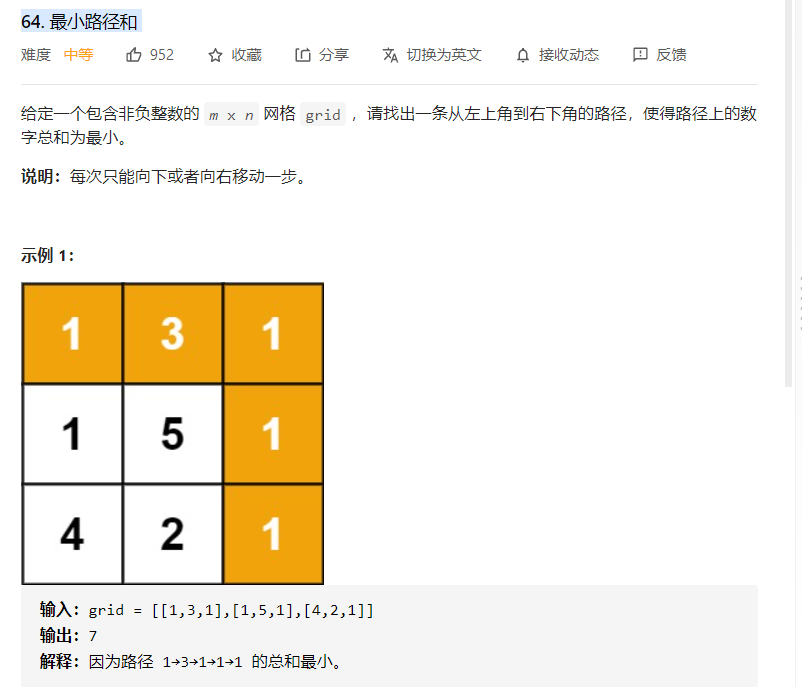

```java
public int minPathSum(int[][] grid) {
    if(grid==null || grid.length==0 || grid[0].length==0){
        return 0;
    }
    int m = grid.length;
    int n = grid[0].length;
    for(int j=1; j<n; j++){
        grid[0][j] += grid[0][j-1];
    }
    for(int i=1; i<m; i++){
        grid[i][0] += grid[i-1][0];
    }
    for(int i=1; i<m; i++){
        for(int j=1; j<n; j++){
            grid[i][j] += Math.min(grid[i-1][j], grid[i][j-1]);
        }
    }
    return grid[m-1][n-1];
}
```


## 正则表达式

### 10. 正则表达式匹配

- 思路:
  - dp\[ i ][ j ] 表示s的前i个字符和p的前j个字符是否匹配
    - p[j] = '*'
      - p[j-1:j]删除用 p[j-2]和s[i]匹配
      - 如果s[i]和p[j-1]匹配, 
        - 可以用'*'匹配s[i] 
        - 删除掉s[i] 在用p[j]和s[i-1]继续匹配 因为'*'可以表示多个p[j-1]
    - s[i] 和 p[j]必须匹配
      - 字符相等
      - p[j] = '.'

 [10. 正则表达式匹配](https://leetcode-cn.com/problems/regular-expression-matching/)

```
10. 正则表达式匹配
给你一个字符串 s 和一个字符规律 p，请你来实现一个支持 '.' 和 '*' 的正则表达式匹配。

'.' 匹配任意单个字符
'*' 匹配零个或多个前面的那一个元素
所谓匹配，是要涵盖 整个 字符串 s的，而不是部分字符串。

 
示例 1：

输入：s = "aa" p = "a"
输出：false
解释："a" 无法匹配 "aa" 整个字符串。
示例 2:

输入：s = "aa" p = "a*"
输出：true
解释：因为 '*' 代表可以匹配零个或多个前面的那一个元素, 在这里前面的元素就是 'a'。因此，字符串 "aa" 可被视为 'a' 重复了一次。
示例 3：

输入：s = "ab" p = ".*"
输出：true
解释：".*" 表示可匹配零个或多个（'*'）任意字符（'.'）。
示例 4：

输入：s = "aab" p = "c*a*b"
输出：true
解释：因为 '*' 表示零个或多个，这里 'c' 为 0 个, 'a' 被重复一次。因此可以匹配字符串 "aab"。
示例 5：

输入：s = "mississippi" p = "mis*is*p*."
输出：false
 

提示：

0 <= s.length <= 20
0 <= p.length <= 30
s 可能为空，且只包含从 a-z 的小写字母。
p 可能为空，且只包含从 a-z 的小写字母，以及字符 . 和 *。
保证每次出现字符 * 时，前面都匹配到有效的字符
```


```java
public boolean isMatch(String s, String p) {
    int m = s.length();
    int n = p.length();
	// f[i][j] s的第i个和p的第j个字符是否匹配
    boolean[][] f = new boolean[m + 1][n + 1];
    f[0][0] = true;
    for (int i = 0; i <= m; ++i) {
        for (int j = 1; j <= n; ++j) {
            //p第j个字符为*
            if (p.charAt(j - 1) == '*') {
                //删除p[j-1,j]这两个字符再去跟s[:i]匹配
                f[i][j] = f[i][j - 2];
                //如果s[i]==p[j-1] 
                if (matches(s, p, i, j - 1)) {
                    //*可以匹配s[i], 删掉s[i]保留*再跟前面匹配
                    f[i][j] = f[i][j] || f[i - 1][j];
                }
            } else {
                //p第j个字符不是* s[i]必须和p[j]
                if (matches(s, p, i, j)) {
                    f[i][j] = f[i - 1][j - 1];
                }
            }
        }
    }
    return f[m][n];
}

public boolean matches(String s, String p, int i, int j) {
    if (i == 0) {
        return false;
    }
    //是'.'一定匹配
    if (p.charAt(j - 1) == '.') {
        return true;
    }
    //字符是否相等
    return s.charAt(i - 1) == p.charAt(j - 1);
}

```


# 单调栈

## 删除元素达到最大或者最小(单调栈+贪心)

[ 42. 接雨水（困难）](https://leetcode-cn.com/problems/trapping-rain-water/)

[ 739. 每日温度（中等）](https://leetcode-cn.com/problems/daily-temperatures/)

[ 496. 下一个更大元素 I（简单）](https://leetcode-cn.com/problems/next-greater-element-i/)

[ 901. 股票价格跨度（中等）](https://leetcode-cn.com/problems/online-stock-span/)

[ 581. 最短无序连续子数组](https://leetcode-cn.com/problems/shortest-unsorted-continuous-subarray/)


### 84. 柱状图中最大的矩形

[84. 柱状图中最大的矩形](https://leetcode-cn.com/problems/largest-rectangle-in-histogram/)

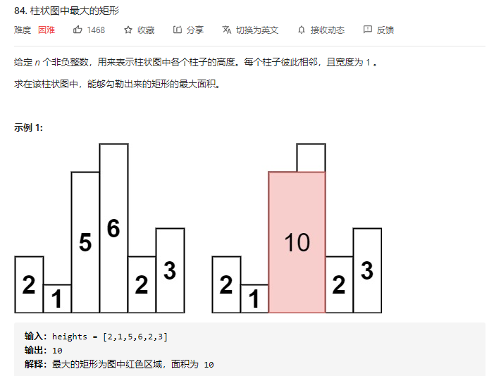

```java
public int largestRectangleArea(int[] heights){
    int len = heights.length;
    if(len==0){
        return 0;
    }
    if(len==1){
        return heights[0];
    }
    int res = 0;
    Deque<Integer> stack = new ArrayDeque<>();
    for(int i=0; i<len; i++){
        while(!stack.isEmpty() && heights[stack.peekLast()]>heights[i]){
            int curHeight = heights[stack.pollLast()];
            //找出之前连续的高度都是curHeight的数量
            while(!stack.isEmpty() && heights[stack.peekLast()]==curHeight){
                stack.pollLast();
            }
            int curWidth = 1;
            if(stack.isEmpty()){
                //i-(-1)+1-2 = i;
				curWidth = i;
            }else{
                //i-stack.peekLast()+1-2 区间长度减去两边端点
                curWidth = i-stack.peekLast()-1;
            }
            res = Math.max(res, curWidth*curHeight);
        }
        stack.addLast(i);
    }
    //处理剩余的柱子, 右端点都是确定的为len, 需要找到左端点
    while(!stack.isEmpty()){
        int curHeight = heights[stack.pollLast()];
        while(!stack.isEmpty() && heights[stack.peekLast()]==curHeight){
            stack.pollLast();
        }
        int curWidth = 0;
        if(stack.isEmpty()){
            //右端点 len 左端点 -1 ==> len-(-1)+1-2
            curWidth = len;
        }else{
            curWidth = len-stack.peekLast()-1;
        }
        res = Math.max(res, curWidth*curHeight);
    }
    return res;
    
}
```


### 42. 接雨水

[42. 接雨水](https://leetcode-cn.com/problems/trapping-rain-water/)

- 思路
  - 维护双指针, 左右最大值
  - 双指针位置更新左到左指针位置的最大值, 右到右指针位置的最大值
  - 最大值小的那个, 对应边位置可以接的雨水可以确定, 即两边较小的高度-指针指向的高度
  - 较小的指针向中间移动, 较大的不动

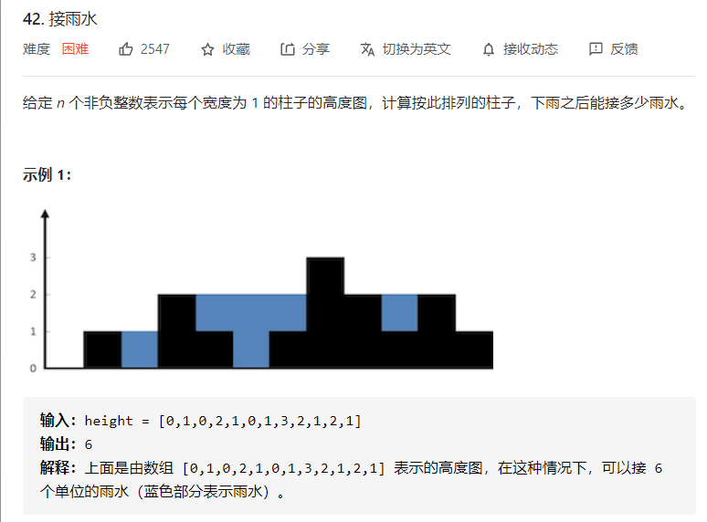

```java
//双指针
public int trap(int[] height){
    int n = height.length;
    int l = 0, r = n-1, lmax = 0, rmax = 0;
    int res = 0;
    while(l<r){
        lmax = Math.max(lmax, height[l]);
        rmax = Math.max(rmax, height[r]);
        if(lmax<rmax){
            res += lmax-height[l];
            l++;
        }else{
            res += rmax-height[r];
            r--;
        }
    }
    return res;
}

//单调栈 递减的栈
public int trap(int[] height){
    int n = height.length;
    int res = 0;
    Deque<Integer> stack = new ArrayDeque<>();
    for(int i=0; i<n; i++){
        //右边界高度
        int cur = height[i];
        //遇到逆序的元素
        while(!stack.isEmpty() && height[stack.peek()]<cur){
            //需要计算能接受雨水量的柱形
			int curTop = stack.pop();
            //栈空 说明左边界为0 没办法接雨水,
            if(stack.isEmpty()){
                break;
            }
            //左边界索引
            int leftBound = stack.peek();
            //左右边界中间的长度(不包括左右边界)
            int curWidth = i-leftBound-1;
            //木桶原理, 可以装的水量是左右边界较小的
            int volume = Math.min(height[i], height[leftBound])-height[curTop];
            //长度*高度
            res += curWidth*volume;
        }
        //当前索引入栈
        stack.push(i);
    }
    return res;
}
```


### 316. 去除重复字母

[316. 去除重复字母](https://leetcode-cn.com/problems/remove-duplicate-letters/) (困难)

[1081. 不同字符的最小子序列](https://leetcode-cn.com/problems/smallest-subsequence-of-distinct-characters/) （中等）

- 思路:
  - 维护一个栈, 保证栈中的元素(字符)都是从小到大排列的
  - 从左到右扫描字符串, 
    - 如果栈空直接入栈
    - 如果当前元素<栈顶元素, 栈顶元素出栈直到当前元素>栈顶元素 或者栈空
    - 如果大于栈顶元素 直接入栈
  - 还需要保证每个字符都出现在栈中
    - 在弹出栈顶字符时，如果字符串在后面的位置上再也没有这一字符，则不能弹出栈顶字符。为此，需要记录每个字符的剩余数量，当这个值为 00 时，就不能弹出栈顶字符了。
  - 还需要保证每个字符只出现一次
    - 在考虑字符 s[i]*s*[*i*] 时，如果它已经存在于栈中，则不能加入字符 s[i]*s*[*i*]。为此，需要记录每个字符是否出现在栈中。

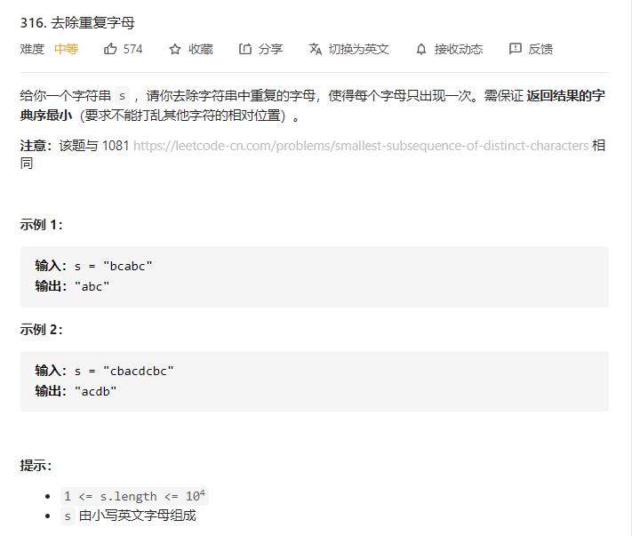

```java
public String removeDuplicateLetters(String s) {
    boolean[] visited = new boolean[26];
    int[] cnt = new int[26];
    Deque<Character> stack = new LinkedList<>();
    StringBuffer sb = new StringBuffer();
    for(char c : s.toCharArray()){
        cnt[c-'a']++;
    }
    for(char c : s.toCharArray()){
        //当前元素不在栈中
        if(!visited[c-'a']){
            //栈顶元素>当前元素
            while(!stack.isEmpty() && stack.peekLast()>c){
                char curTop = stack.peekLast();
                //栈顶元素后面还有剩余
                if(cnt[curTop-'a']>0){
                    stack.pollLast();
                    visited[curTop-'a'] = false;
                }else{
                    //没有剩余不能出栈
                    break;
                }
            }
            //当前元素入栈
            stack.addLast(c);
            //标记访问
            visited[c-'a'] = true;
        }
        //当前元素剩余个数-1
        cnt[c-'a']--;
    }
    while(!stack.isEmpty()){
        sb.append(stack.pollFirst());
    }
    return sb.toString();
}
```


### 321. 拼接最大数

[321. 拼接最大数](https://leetcode-cn.com/problems/create-maximum-number/) (困难)

- 思路: 从两个数组中选出k个数拼在一起,(从两个数组中选出的是自序列, 保持相对顺序) 使得这个数最大
  - 从m中选长度为x的子序列, n中选长度为y的子序列 使得 x+y=k
  - 从两个数组中选出的子序列都是对应序列中最大的
  - 需要枚举x=0,1,2,...k 对应 y = k-x
  - 将选出的两个子序列合并类似于合并两个有序列表, 但是保证递减

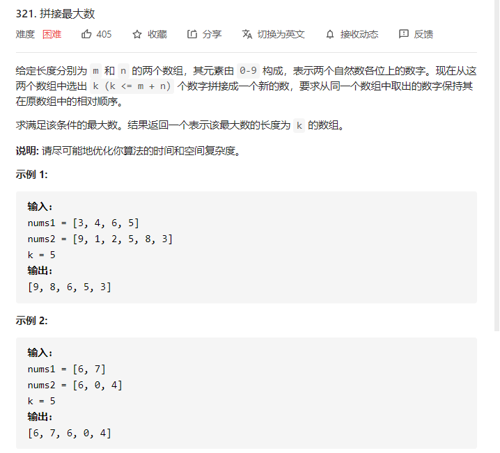

```java
public int[] maxNumber(int[] num1, int[] num2, int k) {

    int m = num1.length, n=num2.length;
    if(num1==null || num1.length==0) return findMaxSubSequence(num2,k);
    if(num2==null || num2.length==0) return findMaxSubSequence(num1,k);
    /**
        0<=i<=m && i<=k
        0<=k-i<=n ==> 0<=k-n<=i
        Math.max(0,k-n) <= i <= Math.min(m, k)
        */
    int start = Math.max(0,k-n);
    int end = Math.min(m,k);
    int[] res = null;
    //枚举从num1中选择i个数, num2中选择k-i个数, 合并后留下较大的
    for(int i=start; i<=end; i++){
        int[] max1 = findMaxSubSequence(num1,i);
        int[] max2 = findMaxSubSequence(num2,k-i);
        int[] merged = mergeTwoSortedArray(max1,max2);
        if(res==null){
            res = merged;
        }else{
            res = compare(merged,0,res,0)>0?merged:res;
        }
    }
    return res;
}

//找到数组中长度为 n 的最大子序列
private int[] findMaxSubSequence(int[] nums, int n){
    //栈
    int[] stack = new int[n];
    //栈顶指针
    int top = -1;
    int len = nums.length;
    //可以被删除的元素个数, 因为要留下k个 最多删除len-k
    int canBeDeleted = len-n;
    if(canBeDeleted==0){
        return nums.clone();
    }
    if(canBedeleted==len){
        return new int[0];
    }
    for(int i=0; i<len; i++){
        int cur = nums[i];
        while(top>=0 && stack[top]<cur && canBeDeleted>0){
            top--;
            canBeDeleted--;
        }
        if(top<n-1){
            stack[++top] = cur;
        }else{
            canBeDeleted--;
        }
    }
    return stack;
}

//合并两个数组从大到小
private int[] mergeTwoSortedArray(int[] num1, int[] num2){
    if(num1==null || num1.length==0){
        return num2;
    }
    if(num2==null || num2.length==0){
        return num1;
    }
    int len1 = num1.length;
    int len2 = num2.length;
    int mergeLen = len1+len2;
    int[] mergedArr = new int[mergeLen];
    int i = 0, j=0, index = 0;
    while(i<len1 && j<len2){
        mergedArr[index++] = compare(num1,i,num2,j)>0?num1[i++]:num2[j++];
    }
    while(i<len1){
        mergedArr[index++] = num1[i++];
    }
    while(j<len2){
        mergedArr[index++] = num2[j++];
    }
    return mergedArr;
}

//从num1的i num2的j 开始比较两个数组的大小
private int compare(int[] num1, int i, int[] num2, int j){
    int len1 = num1.length;
    int len2 = num2.length;
    //比较的长度为元素较少的那个长度
    int compareLen = Math.min(len1-i, len2-j);
    for(int k=0; k<compareLen; k++){
        if(num1[i+k]!=num2[j+k]){
            return Integer.compare(num1[i+k],num2[j+k]);
        }
    }
    //比较范围内都相等, 返回长度的比较
    return Integer.compare(len1-i, len2-j);
}
```


### 1081. 不同字符的最小子序列

### 402. 移掉 K 位数字

- 思路: 单调栈, 从第一位字符开始依次入栈, 
  - 如果当前元素>栈顶元素 删除当前元素
  - 一直删除栈顶元素直到栈顶>当前元素 || 栈空 || 可删除元素为0
  - 如果所有元素都入栈但是k>0, 从栈顶持续出栈直到k=0
  - 删除栈底连续的0
  - 如果此时栈空 返回 "0" 
  - 将栈中元素从栈底到栈顶append到StringBuffer 返回sb

[402. 移掉 K 位数字](https://leetcode-cn.com/problems/remove-k-digits/)

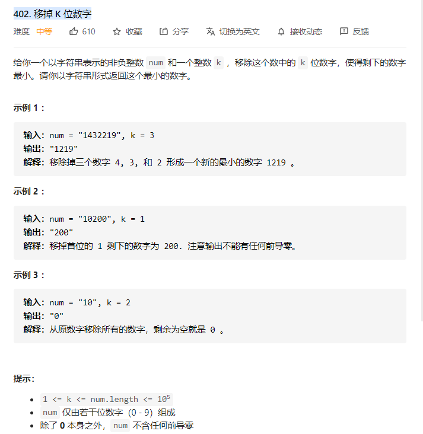

```java
public String removeKdigits(String num, int k) {
    Deque<Character> stack = new LinkedList<>();
    int index = 0;
    for(char cur : num.toCharArray()){
        while(k>0 && !stack.isEmpty() && stack.peekLast()>cur){
            stack.pollLast();
            k--;
        }
        stack.offerLast(cur);
    }

    while(!stack.isEmpty() && k>0){
        stack.pollLast();
        k--;
    }
    while(!stack.isEmpty() && stack.peekFirst()=='0'){
        stack.pollFirst();
    }
    StringBuffer sb = new StringBuffer();
    while(!stack.isEmpty()){
        sb.append(stack.pollFirst());
    }
    return sb.length()==0? "0":sb.toString();
}
```


# 链表

## 翻转链表

### 23. 合并K个升序链表

- 思路
  - 将list[]两个一组进行合并, 然后合并后继续两个一组合并剩下的链表

[23. 合并K个升序链表](https://leetcode-cn.com/problems/merge-k-sorted-lists/)

```
给你一个链表数组，每个链表都已经按升序排列。

请你将所有链表合并到一个升序链表中，返回合并后的链表。

 

示例 1：

输入：lists = [[1,4,5],[1,3,4],[2,6]]
输出：[1,1,2,3,4,4,5,6]
解释：链表数组如下：
[
  1->4->5,
  1->3->4,
  2->6
]
将它们合并到一个有序链表中得到。
1->1->2->3->4->4->5->6
示例 2：

输入：lists = []
输出：[]
示例 3：

输入：lists = [[]]
输出：[]
 

提示：

k == lists.length
0 <= k <= 10^4
0 <= lists[i].length <= 500
-10^4 <= lists[i][j] <= 10^4
lists[i] 按 升序 排列
lists[i].length 的总和不超过 10^4

来源：力扣（LeetCode）
链接：https://leetcode-cn.com/problems/merge-k-sorted-lists
著作权归领扣网络所有。商业转载请联系官方授权，非商业转载请注明出处。
```

```java
public ListNode mergeKLists(ListNode[] lists) {
    return merge(lists, 0, lists.length-1);
}

private ListNode merge(ListNode[] lists, int l, int r){
    //区间空返回null
    if(l>r){
        return null;
    }
    //区间只有一个元素 返回这个元素
    if(l==r){
        return lists[l];
    }
    int index = l;
    for(int i=l; i<=r; ){
        if(i+1<=r){
            lists[index++] = mergeTwoSortedList(lists[i],lists[i+1]);
            i+=2;
        }else{
            lists[index++] = lists[i];
            break;
        }
    }
    return merge(lists, l, index-1);
}


private ListNode mergeTwoSortedList(ListNode l1, ListNode l2){
    if(l1==null){
        return l2;
    }
    if(l2==null){
        return l1;
    }
    ListNode dummy = new ListNode(0);
    ListNode cur = dummy;
    while(l1!=null && l2!=null){
        if(l1.val<=l2.val){
            cur.next = l1;
            l1 = l1.next;
        }else{
            cur.next = l2;
            l2 = l2.next;
        }
        cur = cur.next;
    }
    cur.next = l1==null?l2:l1;
    return dummy.next;
}
```


### 24. 两两交换链表中的节点

- 思路: 新的头结点为head.next,  剩下的递归反转后接在head.next 新的头结点.next = head

[24. 两两交换链表中的节点](https://leetcode-cn.com/problems/swap-nodes-in-pairs/)

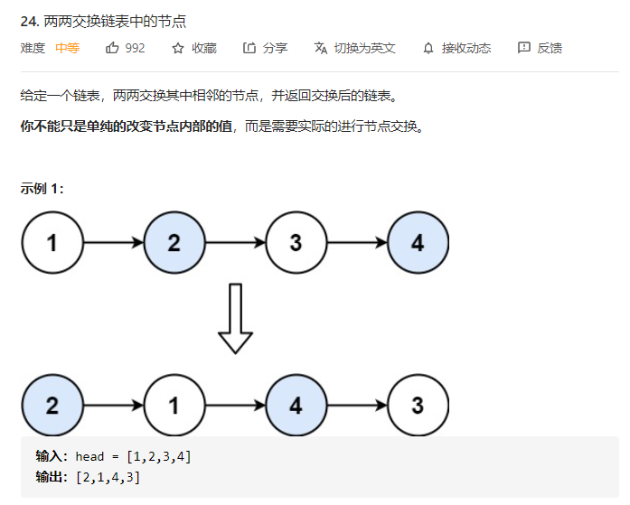


```java
//递归
public ListNode swapPairs(ListNode head) {
    if(head==null || head.next==null){
        return head;
    }        
    ListNode newHead = head.next;
    head.next = swapPairs(newHead.next);
    newHead.next = head;
    return newHead;
}
//迭代
public ListNode swapPairs(ListNode head) {
    ListNode dummy = new ListNode(0);
    dummy.next = head;
    ListNode cur = dummy;
    while(cur.next!=null && cur.next.next!=null){
		ListNode node1 = cur.next;
        ListNode node2 = cur.next.next;
        cur.next = node2;
        node1.next = node2.next;
        node2.next = node1;
        cur = node1;
    }
    return dummy.next;
}
```


### 25. K 个一组翻转链表

- 思路
  - 计算链表结点数量n
  - 需要翻转 n/k次
  - 将k个结点翻转后, 返回链表的 head tail tail.next

[25. K 个一组翻转链表](https://leetcode-cn.com/problems/reverse-nodes-in-k-group/)

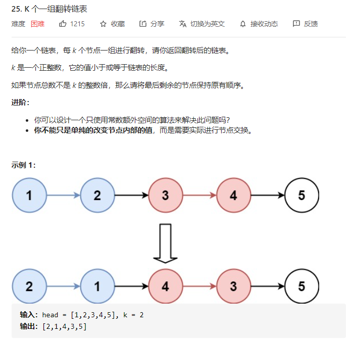

```java
public ListNode reverseKGroup(ListNode head, int k) {
    int num = 0;
    ListNode cur = head;
    while(cur!=null){
        num++;
        cur = cur.next;
    }
    int numRever = num/k;
    cur = head;
    ListNode dummy = new ListNode(0);
    dummy.next = head;
    cur = head;
    ListNode temp = dummy;
    while(numRever>0){
        ListNode[] curRev = reverseK(cur,k);
        temp.next = curRev[1];
        temp = curRev[0];
        cur = curRev[2];
        numRever--;
    }
    temp.next = cur;
    return dummy.next;
}

private ListNode[] reverseK(ListNode node, int k){
    ListNode prev=null, cur=node, next=null;
    while(k>0){
        next = cur.next;
        cur.next = prev;
        prev = cur;
        cur = next;
        k--;
    }
    return new ListNode[]{node, prev, cur};
}
```


### 92. 反转链表 II

- 思路
  - 先遍历得到left位置的结点
  - 从这个位置开始翻转, 返回翻转完的head tail tai.next
  - 连接起来

[92. 反转链表 II](https://leetcode-cn.com/problems/reverse-linked-list-ii/)

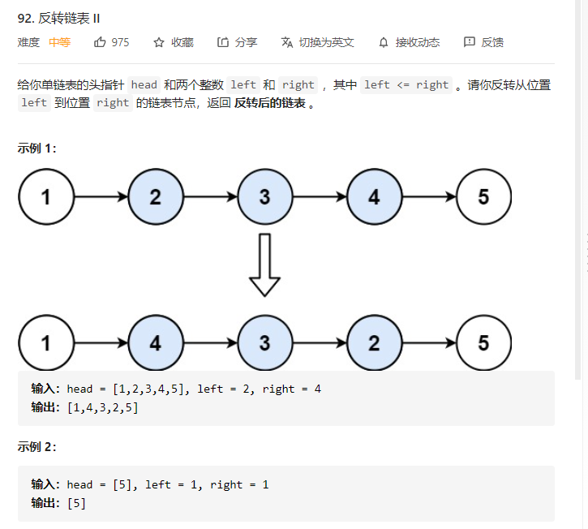


```java
public ListNode reverseBetween(ListNode head, int left, int right) {
    ListNode dummy = new ListNode(0);
    dummy.next = head;
    ListNode cur = dummy;
    int index = 1;
    while(index<left){
        cur = cur.next;
        index++;
    }
    ListNode curRev = reverse(cur.next, right-left+1);
    cur.next = curRev;
    return dummy.next;

}

private ListNode reverse(ListNode node, int n){
    ListNode prev = null, cur = node, next = null;
    while(n>0){
        next = cur.next;
        cur.next = prev;
        prev = cur;
        cur = next;
        n--;
    }
    node.next = cur;
    return prev;

}
```


# Tree

## 99. 恢复二叉搜索树

[99. 恢复二叉搜索树](https://leetcode-cn.com/problems/recover-binary-search-tree/)

- 思路
  - 对二叉搜索树进行中序遍历, 
  - 正确的二叉搜索树应该是递增序列
  - 交换了两个元素造成了 整个数组可能出现一个或两个逆序的地方 a[i]<a[i-1] 
  - 如果只有一个, 记录这两个结点, 交换即可
  - 如果有两个, 需要记录第一个逆序的前一个元素和第二逆序位置的后一个元素 交换这个两个元素

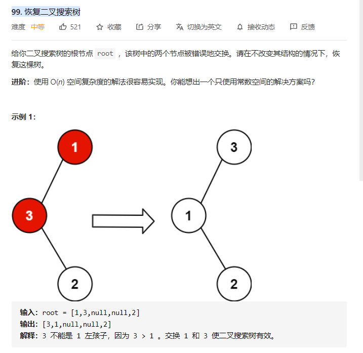

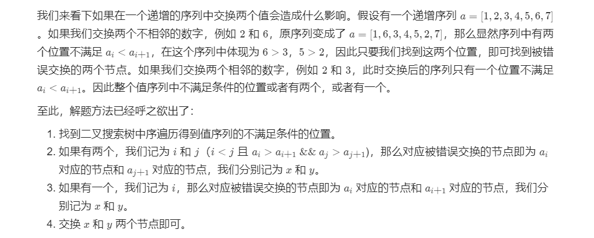

```java
//迭代
public void recoverTree(TreeNode root) {
    if(root==null) return;
    Deque<TreeNode> stack = new ArrayDeque<>();
    TreeNode prev = null, x=null, y=null;
    while(root!=null || !stack.isEmpty()){
        while(root!=null){
            stack.push(root);
            root = root.left;
        }
        root = stack.pop();
        //当前元素<中序遍历的前一个元素
        if(prev!=null && prev.val>root.val){
            //当前逆序对[prev.root]的后一个元素root
            y = root;
            
            if(x==null){
                //当前逆序对[prev.root]的前一个元素root, 说明这是第一个遇到的逆序对
                x = prev;
            }else{
                //之前已经有一个逆序对了, 需要交换的是当前逆序对的后一个元素root, 和之前逆序对的前一个元素
                break;
            }
        }
        //记录前一个元素
        prev = root;
        root = root.right;
    }
    //交换逆序的第一个和第二个
    swap(x,y);

}

private void swap(TreeNode x, TreeNode y){
    int tmp = x.val;
    x.val = y.val;
    y.val = tmp;
}

//递归
public void recoverTree(TreeNode root) {
    if(root==null) return;
    List<TreeNode> lists = new ArrayList<>();
    inOrder(root, lists);
    //记录可能存在的两个逆序对的前后元素
    TreeNode prev1=null, next1=null, prev2=null, next2=null;
    for(int i=1; i<lists.size(); i++){
        if(lists.get(i).val<lists.get(i-1).val){
            if(prev1==null){
                next1 = lists.get(i);
                prev1 = lists.get(i-1);
            }else{
                next2 = lists.get(i);
                prev2 = lists.get(i-1);
            }
        }
    }
    //只有一个逆序对
    if(prev2==null){
        swap(prev1, next1);
    }else{
        //有两个逆序对
        swap(prev1, next2);
    }
}

private void inOrder(TreeNode node, List<TreeNode> lists){
    if(node==null) return;
    inOrder(node.left, lists);
    lists.add(node);
    inOrder(node.right, lists);
}

private void swap(TreeNode x, TreeNode y){
    int tmp = x.val;
    x.val = y.val;
    y.val = tmp;
}
```

## 129. 求根节点到叶节点数字之和

[129. 求根节点到叶节点数字之和](https://leetcode-cn.com/problems/sum-root-to-leaf-numbers/)


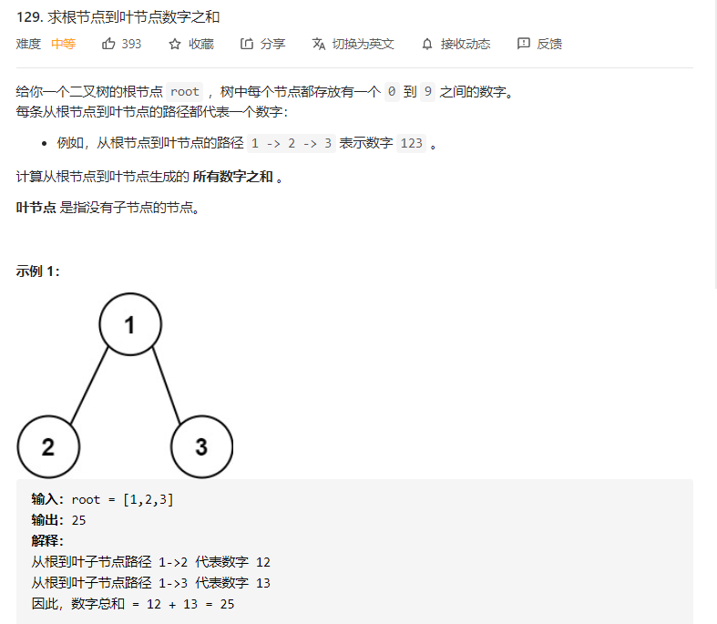


```java
public int sumNumbers(TreeNode root) {
    return dfs(root,0);
}

private int dfs(TreeNode node, int path){
    if(node==null){
        return 0;
    }
    path = path*10+node.val;
    if(node.left==null && node.right==null){
        return path;
    }
    return dfs(node.left, path) + dfs(node.right, path);
}
```


## 1740. 找到二叉树中的距离

- 思路: 找到两个结点的最深公共祖先,
  - left  right 表示p q 到父节点中间的结点数量(包括p q, 不包括祖先结点
  - find表示是否已经找到了祖先结点
  - p q分在祖先的两边, return left+right
  - p q 分在祖先的一边 那么一定有一个结点为另一个结点的祖先 return 下面那个结点返回的值
  - 如果当前还没到祖先结点, find=false 从下往上返回的时候, 如果返回了其中一个结点的值, 需要将这个值+1表示经过的结点数量+1
  - 如果已经找到了祖先结点, 直接返回left+right 并且标记 find=true 后续直接返回传上来的值即可

[1740. 找到二叉树中的距离](https://leetcode-cn.com/problems/find-distance-in-a-binary-tree/)

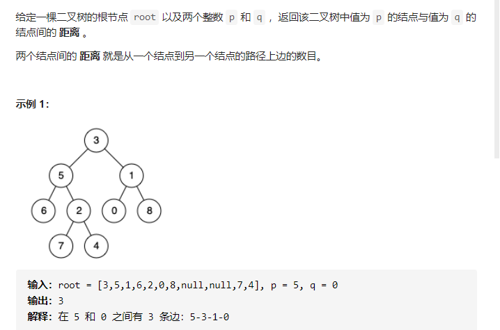


# 滑动窗口

```java
		# Step 1: 定义需要维护的变量们 (对于滑动窗口类题目，这些变量通常是最小长度，最大长度，或者哈希表)
        x, y = ..., ...

        # Step 2: 定义窗口的首尾端 (start, end)， 然后滑动窗口
        start = 0
        for end in range(len(s)):
            # Step 3: 更新需要维护的变量, 有的变量需要一个if语句来维护 (比如最大最小长度)
            x = new_x
            if condition:
                y = new_y

            '''
            ------------- 下面是两种情况，读者请根据题意二选1 -------------
            '''
            # Step 4 - 情况1
            # 如果题目的窗口长度固定：用一个if语句判断一下当前窗口长度是否超过限定长度 
            # 如果超过了，窗口左指针前移一个单位保证窗口长度固定, 在那之前, 先更新Step 1定义的(部分或所有)维护变量 
            if 窗口长度大于限定值:
                # 更新 (部分或所有) 维护变量 
                # 窗口左指针前移一个单位保证窗口长度固定

            # Step 4 - 情况2
            # 如果题目的窗口长度可变: 这个时候一般涉及到窗口是否合法的问题
            # 如果当前窗口不合法时, 用一个while去不断移动窗口左指针, 从而剔除非法元素直到窗口再次合法
            # 在左指针移动之前更新Step 1定义的(部分或所有)维护变量 
            while 不合法:
                # 更新 (部分或所有) 维护变量 
                # 不断移动窗口左指针直到窗口再次合法

        # Step 5: 返回答案

```


## 76. 最小覆盖子串

[76. 最小覆盖子串](https://leetcode-cn.com/problems/minimum-window-substring/)

- 思路
  - 滑动窗口, 检查s字符串中最小的窗口可以覆盖t中所有的字符
  - map记录t中所有字符出现的次数
  - map记录s中当前窗口所有的字符出现的次数
  - 当窗口内的子串不满足覆盖字符串t的时候, 
    - 右指针右移, 如果新的字符出现在t中, 更新窗口的map
  - 当窗口内的子串满足覆盖t, 左指针不断右移, 如果删除的是t中的字符需要更新窗口map
  - 每一个覆盖的窗口都需要与当前最小的覆盖窗口比较, 如果更小需要跟新

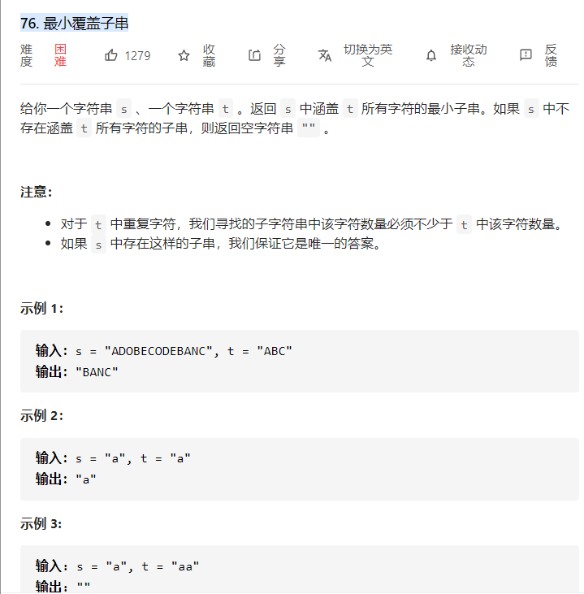


```java
Map<Character, Integer> tMap;
Map<Character, Integer> sMap;
public String minWindow(String s, String t) {
    tMap = new HashMap<>();
    sMap = new HashMap<>();
    for(char c : t.toCharArray()){
        tMap.put(c, tMap.getOrDefault(c,0)+1);
    }
    int len = s.length();
    int l = 0, r = -1;
    int resl = -1, resr = -1, reslen = Integer.MAX_VALUE;
    while(r<len){
        //右指针右移
        r++;
        //更新窗口map
        if(r<len && tMap.containsKey(s.charAt(r))){
            sMap.put(s.charAt(r), sMap.getOrDefault(s.charAt(r), 0)+1);
        }
        //左移左指针直到不能不该
        while(valid() && l<=r){
            //更新的结果窗口
            if(r-l+1<reslen){
                resl = l;
                resr = r;
                reslen = r-l+1;
            }
            //当前从窗口中删除的是s.charAt(l)
            if(tMap.containsKey(s.charAt(l))){
                sMap.put(s.charAt(l), sMap.get(s.charAt(l))-1);
            }
            //左指针右移
            l++;
        }
    }
    return resl==-1?"":s.substring(resl, resr+1);
}

private boolean valid(){
    //遍历tMap
    Iterator ite = tMap.entrySet().iterator();
    while(ite.hasNext()){
        Map.Entry entry = (Map.Entry) ite.next();
        Character key = (Character) entry.getKey();
        Integer val = (Integer) entry.getValue();
        //sMap.对应的key的次数如果小于tMap肯定不行
        if(!sMap.containsKey(key) || sMap.get(key)<val){
            return false;
        }
    }
    return true;
}

```


## 3.无重复字符的最长子串

[3. 无重复字符的最长子串](https://leetcode-cn.com/problems/longest-substring-without-repeating-characters/)

- 思路
  - 维护窗口的map记录每个字符出现的次数
  - map.size()代表无重复子串的长度
  - 当前右指针新增的字符出现过, 就需要左指针右移, 直到删除了当前的字符
  - 更新最长子串的长度


```java
public int lengthOfLongestSubstring(String s){
    if(s==null || s.length()==0){
        return 0;
    }
    //当前窗口中的字符
    Set<Character> set = new HashSet<>();
    int l = 0, r = -1, maxlen = 0, len = s.length();
    char[] arr = s.toCharArray();
    while(r<len-1){
        //需要在窗口加入arr[r]
        r++;
        //加入前判断是否出现过这个字符 出现就一直从左指针的位置一直删除, 直到删除之前出现的这个字符
        while(set.contains(arr[r])){
            set.remove(arr[l]);
            l++;
        }
        //当前右指针的字符加入
        set.add(arr[r]);
        //更新无重复字符窗口最大长度
        maxlen = Math.max(maxlen, r-l+1);
    }
    return maxlen;
}

```


## 159. 至多包含两个不同字符的最长子串

[159. 至多包含两个不同字符的最长子串](https://leetcode-cn.com/problems/longest-substring-with-at-most-two-distinct-characters/)

- 思路
  - 滑动窗口
  - 维护map表示窗口里的字符出现次数
  - 维护窗口里不同字符的数量 map.size()
  - 右指针右移
  - 当窗口不符合的时候, 左指针右移, 并更新map, 直到map.size()<=2
  - 每次符合的条件窗口需要更新对应的窗口长度, 如果更大就更新

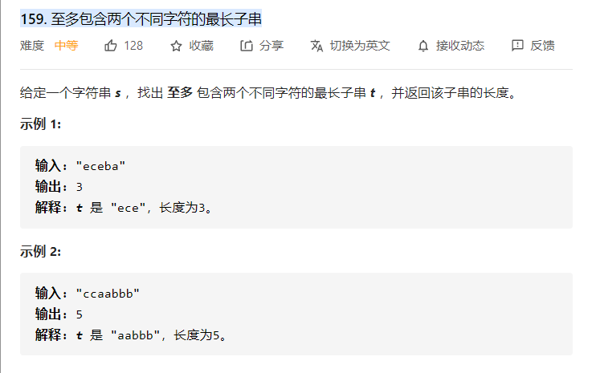


```java
public int lengthOfLongestSubstringTwoDistinct(String s) {
    Map<Character, Integer> map = new HashMap<>();
    int l = 0, r = -1;
    int maxlen = 0, len = s.length();
    while(r<len-1){
        r++;
        //更新窗口字符数量
        map.put(s.charAt(r), map.getOrDefault(s.charAt(r),0)+1);
        //不同元素超过2 右移左指针
        while(map.size()>2 ){
            map.put(s.charAt(l), map.get(s.charAt(l))-1);
            //数量为0 删除对应的key
            if(map.get(s.charAt(l))==0){
                map.remove(s.charAt(l));
            }
            //左指针右移
            l++;
        }
        //更新最大长度
        maxlen = Math.max(maxlen, r-l+1);
    }   
    return maxlen;
}
```


## 340. 至多包含 K 个不同字符的最长子串

[340. 至多包含 K 个不同字符的最长子串](https://leetcode-cn.com/problems/longest-substring-with-at-most-k-distinct-characters/)

- 思路
  - 滑动窗口
  - 维护map表示窗口里的字符出现次数
  - 维护窗口里不同字符的数量 map.size()
  - 右指针右移
  - 当窗口不符合的时候, 左指针右移, 并更新map, 直到map.size()<=k
  - 每次符合的条件窗口需要更新对应的窗口长度, 如果更大就更新

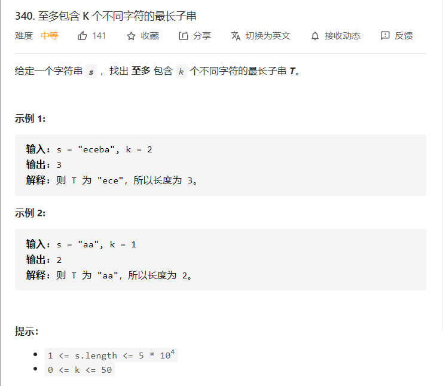


```java
public int lengthOfLongestSubstringKDistinct(String s, int k) {
    Map<Character, Integer> map = new HashMap<>();
    int l = 0, r = -1;
    int maxlen = 0, len = s.length();
    while(r<len-1){
        r++;
        map.put(s.charAt(r), map.getOrDefault(s.charAt(r),0)+1);
        while(map.size()>k){
            map.put(s.charAt(l), map.get(s.charAt(l))-1);
            if(map.get(s.charAt(l))==0){
                map.remove(s.charAt(l));
            }
            l++;
        }
        maxlen = Math.max(maxlen, r-l+1);
    }
    return maxlen;
}
```


## 643. 子数组最大平均数 I


## 209. 长度最小的子数组

[209. 长度最小的子数组](https://leetcode-cn.com/problems/minimum-size-subarray-sum/)

- 思路
  - 滑动窗口
  - 维护窗口内元素的和
  - 窗口总和<target 右指针一直右移
  - 窗口总和>=target 左指针右移直到窗口总和<target 
  - 更新符合条件窗口的最小长度

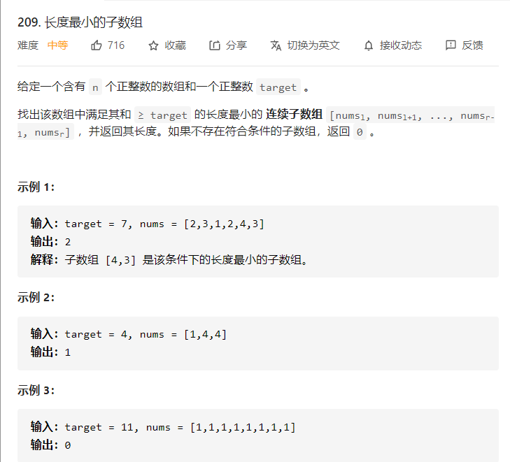

```java
public int minSubArrayLen(int target, int[] nums) {
    if(nums==null || nums.length==0){
        return 0;
    }
    int l = 0, r = -1, minlen = Integer.MAX_VALUE, windowSum = 0;
    int len = nums.length;
    while(r<len-1){
        //右指针右移
        r++;
        //新加入nums[r] 更新窗口sum
        windowSum += nums[r];
        //只要窗口sum>=target 左指针右移
        while(windowSum>=target){
            //当前是符合条件的窗口, 更新最小值
            minlen = Math.min(minlen, r-l+1);
            //减去移出窗口的元素
            windowSum -= nums[l];
            //左指针右移
            l++;
        }

    }
    return minlen==Integer.MAX_VALUE?0:minlen;
}
```


## 239. 滑动窗口最大值

[239. 滑动窗口最大值](https://leetcode-cn.com/problems/sliding-window-maximum/)

- 思路
  - 维护窗口内元素的单调递减队列
  - 先形成k长度的窗口, 同时维护单点递减元素队列
  - 形成后, 左右指针同时移动一个位置, 右边加入一个, 左边删除一个
  - 左边删除的元素如果是队列头的值, 队列头元素出队
  - 右边加入的元素 和队列尾的元素比较,如果>队列尾的元素, 队列尾一直出队, 直到队列空或者队列尾>当前右边加入的元素

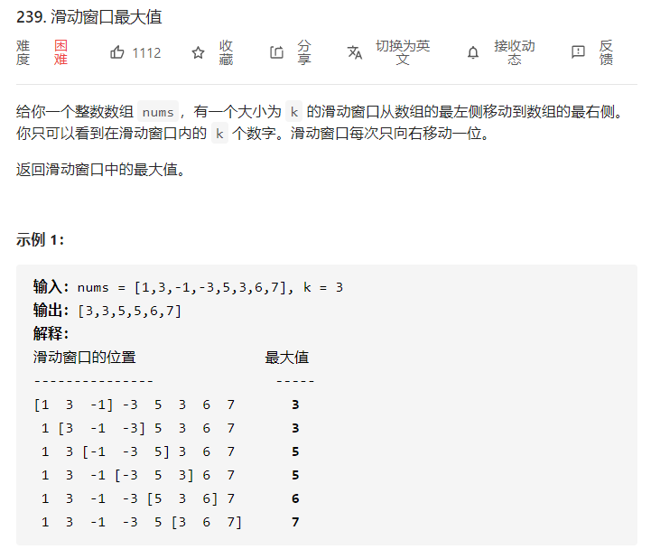

```java
public int[] maxSlidingWindow(int[] nums, int k) {
    if(nums==null || nums.length==0){
        return new int[0];
    }
    /**
        第一个窗口右端点下标 k-1
        最后一个窗口右端点下标 len-1
        窗口个数 len-1-(k-1)+1 = len-k+1
        最后一个窗口的左端下标x len-1-x+1 = k ==> x = len-k
        */
    int len = nums.length;
    int l = 0, r = -1, index = 0;
    int[] winMax = new int[len-k+1];
    //保存的是元素的下标
    Deque<Integer> dq = new ArrayDeque<>();
    //形成窗口
    while(r<k-1){
        r++;
        while(!dq.isEmpty() && nums[dq.peekLast()]<nums[r]){
            dq.pollLast();
        }
        dq.offerLast(r);
    }
    winMax[index++] = nums[dq.peekFirst()];
    while(l<len-k){
        //删除左边
        if(nums[l]==nums[dq.peekFirst()]){
            dq.pollFirst();
        }
        l++;
        //添加右边
        r++;
        //删除队列尾<当前元素
        while(!dq.isEmpty() && nums[dq.peekLast()]<nums[r]){
            dq.pollLast();
        }
        dq.offerLast(r);
        //获取当前最大值
        winMax[index++] = nums[dq.peekFirst()];
    }
    return winMax;


}
```


## 424. 替换后的最长重复字符

[424. 替换后的最长重复字符](https://leetcode-cn.com/problems/longest-repeating-character-replacement/)

- 思路
  - 维护滑动窗口内出现次数最多字符的数量 maxn
  - 如果 maxn + k < window 说明当前滑动窗口能形成的最长子串长度<窗口长度, 需要整体移动窗口 l++ r++
  - 如果 maxn+k>=window 说明当前形参的最长子串长度还有可能增加 r++


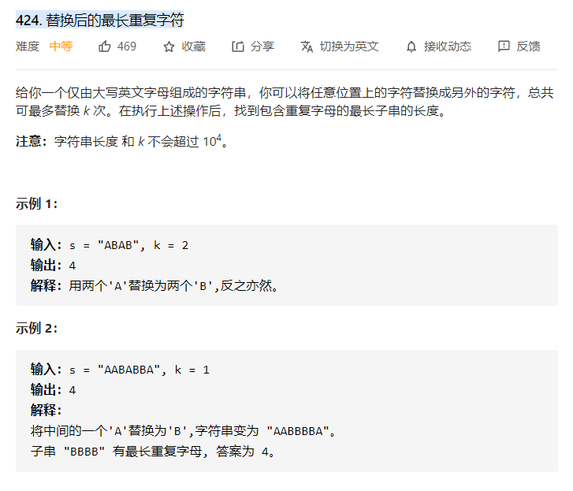

```java
public int characterReplacement(String s, int k) {
    if(s==null || s.length()==0 || s.length()<k){
        return s.length();
    }
    int l = 0, r = -1, len = s.length(), maxn = 0;
    int[] cnt = new int[26];
    while(r<len-1){
        r++;
        cnt[s.charAt(r)-'A']++;
        //当前窗口中出现次数最多的字符出现的次数
        maxn = Math.max(maxn, cnt[s.charAt(r)-'A']);
        //最长子串长度已经<窗口长度, 需要左指针左移
        if(maxn+k<r-l+1){
            //左指针左移
            //如果这里移除的是出现最多的那个字符, 那么maxn不会更新, 直到 加入了这个字符, 或者其他的字符数量超过了maxn
           
            cnt[s.charAt(l)-'A']--;
            l++;
        }
    }
    //最后的长度不能超过字符串长度
    return Math.min(maxn+k, len);
}
```


## 438. 找到字符串中所有字母异位词

[438. 找到字符串中所有字母异位词](https://leetcode-cn.com/problems/find-all-anagrams-in-a-string/)

- 思路
  - 枚举每个长度为p.length()的窗口, 比较窗口的字符串数量是否根p中一样, 相同就加入窗口左端点
  - 数组代替map更快

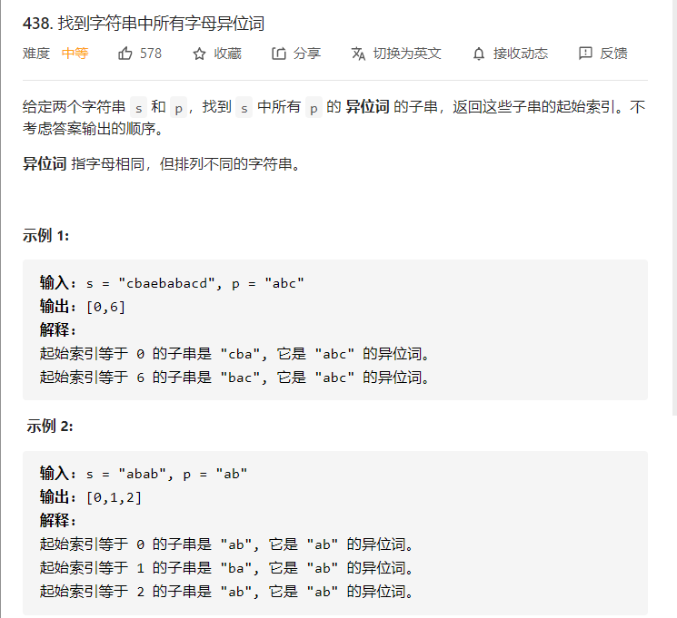

```java
int[] cnt1 = new int[26];
int[] cnt2 = new int[26];
List<Integer> list;
public List<Integer> findAnagrams(String s, String p) {
    list = new ArrayList<>();
    if(s.length()<p.length()){
        return list;
    }
    for(char c : p.toCharArray()){
        cnt2[c-'a']++;
    }
    /**
        int slen = s.length(), plen = p.length();
        slen-1-l+1 = plen ==> l = slen-plen;
        r = plen-1
        */
    int slen = s.length(), plen = p.length();
    int l = 0, r = -1;
    //形成窗口
    while(r<plen-1){
        r++;
        cnt1[s.charAt(r)-'a']++;
    }
    //每次左右指针都向右移动一个位置 
    while(r<slen-1){
        //先检查当前窗口是否符合
        check(l);
        //移动窗口
        cnt1[s.charAt(l)-'a']--;
        l++;
        r++;
        cnt1[s.charAt(r)-'a']++;
    }
    //最后一个窗口
    check(l);
    return list;
}
//检查两个数组是否相等
private void check(int l){
    for(int i=0; i<26; i++){
        if(cnt1[i]!=cnt2[i]){
            return;
        }
    }
    list.add(l);
}
```


## [ ]480. 滑动窗口中位数


[480. 滑动窗口中位数](https://leetcode-cn.com/problems/sliding-window-median/)

- 思路
  - 滑动窗口, 维护两个堆 最大堆存储前 n-n/2  最小堆存储后n/2个数
  - 奇数情况 最大堆堆顶就是中位数
  - 偶数情况, 最大堆堆顶和最小堆堆顶的平均数

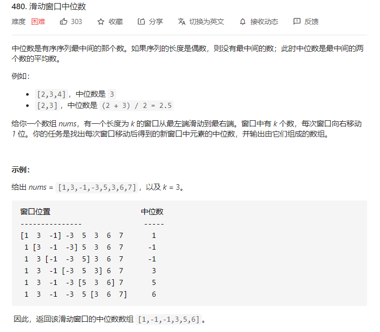


## 487. 最大连续1的个数 II

[487. 最大连续1的个数 II](https://leetcode-cn.com/problems/max-consecutive-ones-ii/)

- 思路
  - 

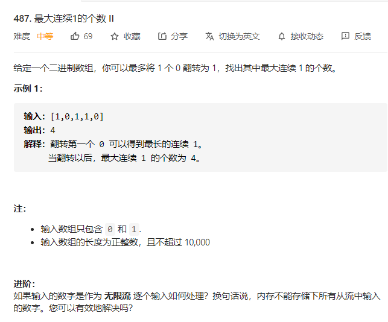

```java
public int findMaxConsecutiveOnes(int[] nums) {
    if(nums==null || nums.length==0){
        return 0;
    }
    //                                   之前0的下标
    int l = 0, r = 0, len = nums.length, zero = -1, maxlen = 0;
    while(r<len){
        //遇到0, 左指针变成之前0的下标+1
        //0的下标变成当前r
        if(nums[r]==0){
            l = zero+1;
            zero = r;
        }
        //当前窗口[l r] 长度为r-l+1
        maxlen = Math.max(r-l+1,maxlen);
        r++;
    }
    return maxlen;
}
```


## 1004. 最大连续1的个数 III

[1004. 最大连续1的个数 III](https://leetcode-cn.com/problems/max-consecutive-ones-iii/)

- 思路
  - 维护长度为k的队列, 保存当前窗口中最多k个0的下标
  - 当k=0 每次遇到0 左端点变成当前位置+1
  - k!=0 遇到0
    - 队列长度<k 当前右端点入队
    - 队列长度=k 需要删除最左边的0的下标,即队列头, 左端点变成删除的最左边的0的下标+1,当前右端点入队
    - 队列长度<k 当前右端点入队
  - 遇到1不需要更新队列, 
  - 更新最大长度, 当前的窗口大小为r-l+1


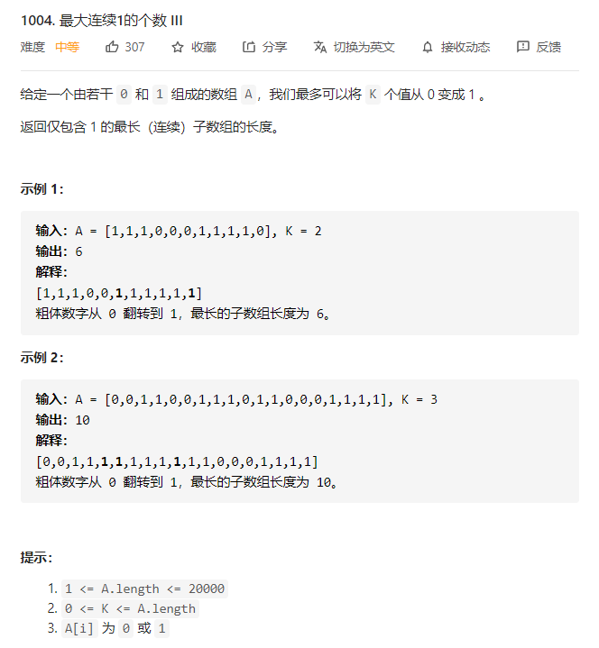


```java
public int longestOnes(int[] nums, int k) {
    if(nums==null || nums.length==0){
        return 0;
    }
    Deque<Integer> queue = new ArrayDeque<>();
    int l = 0, r = 0, len = nums.length,  maxlen = 0;
    int lastZero = 0;
    while(r<len){
        //遇到0, 左指针变成之前0的下标+1
        //0的下标变成当前r
        if(nums[r]==0){
            //一个0都不能删除, 所以当前窗口大小为0
            if(k==0){
                l = r+1;
                lastZero = r;
            }
            else if(queue.size()==k){//需要删除最左边的0
                //最前面的0出队
                int firstZero = queue.pollFirst();
                //左指针变成最前面的0+1
                l = firstZero+1;
                //当前0入队尾
                queue.offerLast(r);
            }else if(queue.size()<k){
                //当前0入队
                queue.offerLast(r);
            }
        }
        //当前窗口[l r] 长度为r-l+1
        maxlen = Math.max(r-l+1,maxlen);
        r++;
    }
    return maxlen;
}
```


## 567. 字符串的排列

[567. 字符串的排列](https://leetcode-cn.com/problems/permutation-in-string/)

- 思路
  - 利用数组统计s1所有字符的个数
  - 遍历s2所有s1.length()长度的窗口
    - 统计每个窗口中字符的个数, 
    - 与s1对应的数组比较如果完全一样说明当前窗口是一个s1的排列

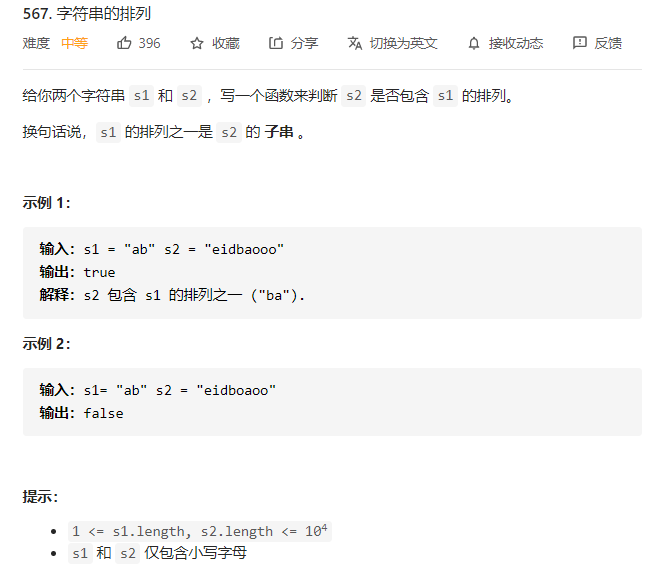

```java
int[] cnt1;
int[] cnt2;
public boolean checkInclusion(String s1, String s2) {
    if(s2.length()<s1.length()){
        return false;
    }
    cnt1 = new int[26];
    cnt2 = new int[26];
    for(char c : s1.toCharArray()){
        cnt1[c-'a']++;
    }
    int l=0, r=-1, len1 = s1.length(), len2 = s2.length();
    /**
        最后一个窗口
            左端点x  len2-1-x+1 = len1 ==> x = len2-len1
        */
    //形成窗口
    while(r<len1-1){
        r++;
        cnt2[s2.charAt(r)-'a']++;

    }
    while(r<len2-1){
        if(valid()){
            return true;
        }
        cnt2[s2.charAt(l)-'a']--;
        l++;
        r++;
        cnt2[s2.charAt(r)-'a']++;
    }
    return valid();
}

private boolean valid(){
    for(int i=0; i<26; i++){
        if(cnt1[i]!=cnt2[i]){
            return false;
        }
    }
    return true;


}
```


## 1695.删除子数组的最大得分

## 1151. 最少交换次数来组合所有的 1

## 1208. 尽可能使字符串相等

## 1052. 爱生气的书店老板

## 1423. 可获得的最大点数


# String Manipulation

## 字符串比较

### 30. 串联所有单词的子串

[30. 串联所有单词的子串](https://leetcode-cn.com/problems/substring-with-concatenation-of-all-words/)

```java
Map<String ,Integer> allWords;
public List<Integer> findSubstring(String s, String[] words) {
    List<Integer> res = new ArrayList<>();
    allWords = new HashMap<>();
    for(String str : words){
        allWords.put(str, allWords.getOrDefault(str,0)+1);
    }
    int wordNum = words.length;
    int wordLen = words[0].length();
    int len = s.length();
    // len-i >= wordNum*wordLen
    for(int i=0; i<=len-wordNum*wordLen; i++){
        if(match(s,i,wordLen, wordNum)){
            res.add(i);
        }
    }
    return res;
}

private boolean match(String s, int i, int wordLen, int wordNum){
    Map<String ,Integer> curWords = new HashMap<>();
    while(wordNum>0){
        String cur = s.substring(i, i+wordLen);
        curWords.put(cur, curWords.getOrDefault(cur,0)+1);
        i = i+wordLen;
        wordNum--;
    }
    if(curWords.size()!=allWords.size()){
        return false;
    }
    for(Map.Entry<String,Integer> entry:curWords.entrySet()){
        String cur = entry.getKey();
        int cnt = entry.getValue();
        if(!allWords.containsKey(cur)||allWords.get(cur)!=cnt){
            return false;
        }
    }
    return true;

}
```


# Binary Search

## 69. x 的平方根

[69. x 的平方根](https://leetcode-cn.com/problems/sqrtx/)


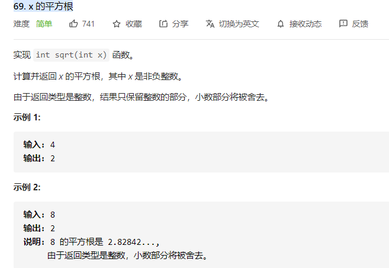

```java
public int mySqrt(int n){
    if(n==0 || n==1){
        return n;
    }
    int l = 0, r=n/2;
    while(l<r){
        int mid = (l+r+1)>>>1;
        if(mid>x/mid){
            r = mid-1;
        }else{
            l = mid;
        }
    }
    return l;
}
```


# Rand转换

1. 题目给你一个等概率函数，你可以把他转换为一个等概率返回0和1的函数rand01();
2. 因为f()可以构造任何等概率的函数，以题目举例;
3. 已知等概率返回1-7,我们可以在rand01()循环中等于4重新计算，小于4返回0，大于4返回1。这是等概率的
4. 构造1-10等概率，可以先构造0-9等概率再加1。估算至少需要4个二进制位，相加即可。

```java
class Solution extends SolBase {
    public int rand10() {
        int res;
        do {
            res = (rand01() << 3) + (rand01() << 2) + (rand01() << 1) + rand01();
        } while (res > 9);
        return res + 1;
    }

    public int rand01() {
        int res;
        do {
            res = rand7();
        } while (res == 4);
        return res < 4 ? 0 : 1;
    }
}

```


## 470. 用 Rand7() 实现 Rand10()

[470. 用 Rand7() 实现 Rand10()](https://leetcode-cn.com/problems/implement-rand10-using-rand7/)

```java
/**
 * 思路：
 *  
 * （1）由大的随机数 生成小的随机数是方便的，如 rand10 -> rand7
 *      只需要用 rand10 生成等概率的 1 ~ 10 ，然后判断生成的随机数 num ，如果 num <= 7 ，则返回即可
 *      
 * （2）如何由小的随机数生成大的随机数呢？
 *      考虑这样一个事实：
 *      randX() 生成的随机数范围是 [1...X]
 *      (randX - 1) * Y + randY() 可以等概率的生成的随机数范围是 [1, X*Y]
 *     因此， 可以通过 (rand7 - 1) * 7 + rand7() 等概率的生成 [1...49]的随机数
 *     我们可以选择在 [1...10] 范围内的随机数返回。
 *  
 * （3）上面生成 [1...49] 而 我们需要 [1...10]，[11...49]都要被过滤掉，效率有些低
 *      可以通过减小过滤掉数的范围来提高效率。
 *      比如我们保留 [1...40]， 剩下 [41...49]
 *      为什么保留 [1...40] 呢？ 因为对于要生成 [1...10]的随机数，那么 
 *      可以等概率的转换为 1 + num % 10 , suject to num <= 40
 *      因为 1 ... 40 可以等概率的映射到 [1...10]
 *      那么如果生成的数在 41...49 怎么办呢？，这些数因为也是等概率的。
 *      我们可以重新把 41 ... 49 通过 num - 40 映射到 1 ... 9，可以把 1...9 重新看成一个
 *      通过 rand9 生成 rand10 的过程。
 *      (num - 40 - 1) * 7 + rand7() -> [1 ... 63]
 *      if(num <= 60) return num % 10 + 1;
 *      
 *      类似的，[1...63] 可以 划分为 [1....60] and [61...63]
 *      [1...60] 可以通过 1 + num % 10 等概率映射到 [1...10]
 *      而 [61...63] 又可以重新重复上述过程，先映射到 [1...3]
 *      然后看作 rand3 生成 rand10
 *      
 *      (num - 60 - 1) * 7 + rand7() -> [1 ... 21]
 *      if( num <= 20) return num % 10 + 1;
 *      
 *      注意：这个映射的范围需要根据 待生成随机数的大小而定的。
 *      比如我要用 rand7 生成 rand9
 *      (rand7() - 1) * 7 + rand7() -> [1...49]
 *      则等概率映射范围调整为 [1...45]， 1 + num % 9
 *      if(num <= 45) return num % 9 + 1;
 */

public int rand10() {
    while (true){
        // 1~(7-1)*7+7 => 1~49
        int num = (rand7() - 1) * 7 + rand7();
        // 如果在40以内，那就直接返回
        if(num <= 40) return 1 + num % 10;
        // 说明刚才生成的在41-49之间，利用随机数再操作一遍
        // 1 ~ 8*7+7 => 1~63
        num = (num - 40 - 1) * 7 + rand7();
        if(num <= 60) return 1 + num % 10;
        // 说明刚才生成的在61-63之间，利用随机数再操作一遍
        // 1~2*7+7 =>1~21
        num = (num - 60 - 1) * 7 + rand7();
        if(num <= 20) return 1 + num % 10;

    }
}


```


# 数组

## 数组中缺失, 重复(原地哈希)

### 41. 缺失的第一个正数

[41. 缺失的第一个正数](https://leetcode-cn.com/problems/first-missing-positive/)

- 思路
  - 不处理<0或者>n的数, 因为n个数的数组, 缺失的最小整数一定在[1,n+1]的范围内
  - 如果[1,n]都没缺失,就返回n+1
  - 希望将nums[i] 交换到nums[i]-1的位置 
    - nums[nums[i]-1]!=nums[i]
    - 表示nums[i]这个数在nums[i]-1这个位置上,所以达成了目标我们就不需要再交换了
  - 再遍历一遍数组, 如果发现了nums[i]!=i+1返回i+1
  - 都满足 返回n+1

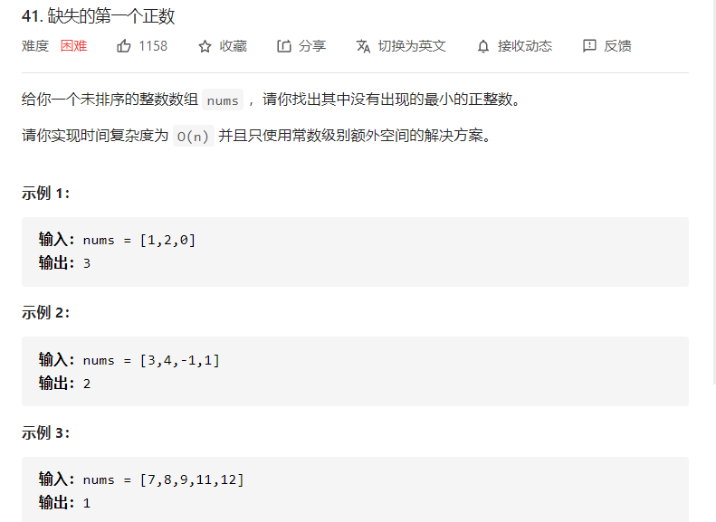


```java
public firstMissingPositive(int[] nums){
    int n = nums.length;
    for(int i=0; i<n; i++){
        //
        while(nums[i]>0 && nums[i]<=n && nums[nums[i]-1]!=nums[i]){
            swap(nums, nums[i]-1, i);
        }
    }
    for(int i=0; i<n; i++){
        if(nums[i]!=i+1){
            return i+1;
        }
    }
    return n+1;
}

private void swap(int[] nums, int index1, int index2) {
    int temp = nums[index1];
    nums[index1] = nums[index2];
    nums[index2] = temp;
}


```


### 442. 数组中重复的数据

[442. 数组中重复的数据](https://leetcode-cn.com/problems/find-all-duplicates-in-an-array/)

- 将nums[i]交换到nums[i]-1的位置上
- 如果发现nums[i]==nums[nums[i]-1] nums[i]是一个重复的数


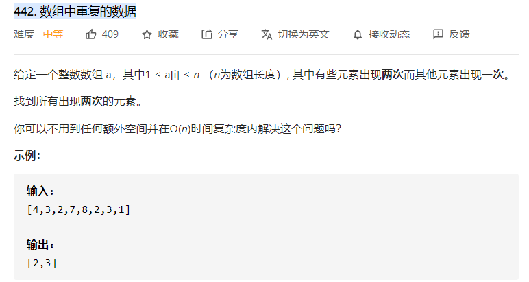

```java
public List<Integer> findDuplicates(int[] nums) {
    List<Integer> list = new ArrayList<>();
    int n = nums.length;
    for(int i=0; i<n; i++){
        while(nums[i]!=-1 && i!=nums[i]-1){
            if(nums[i]==nums[nums[i]-1]){
                list.add(nums[i]);
                //这个元素只会出现两次, 标记为-1 下次遇到另一个直接跳过
                nums[nums[i]-1]=-1;
                nums[i] = -1;
                break;
            }
            swap(nums, i, nums[i]-1);
        }
    }
    return list;
}
private void swap(int[] nums, int index1, int index2) {
    int temp = nums[index1];
    nums[index1] = nums[index2];
    nums[index2] = temp;
}
```


### 448. 找到所有数组中消失的数字

[448. 找到所有数组中消失的数字](https://leetcode-cn.com/problems/find-all-numbers-disappeared-in-an-array/)

- 遍历数组，将每个数字交换到它理应出现的位置上，下面情况不用换：
  - 当前数字本就出现在理应的位置上，跳过，不用换。nums[i]==i+1
  - 当前数字理应出现的位置上，已经存在当前数字，跳过，不用换。nums[i]==nums[nums[i]-1]


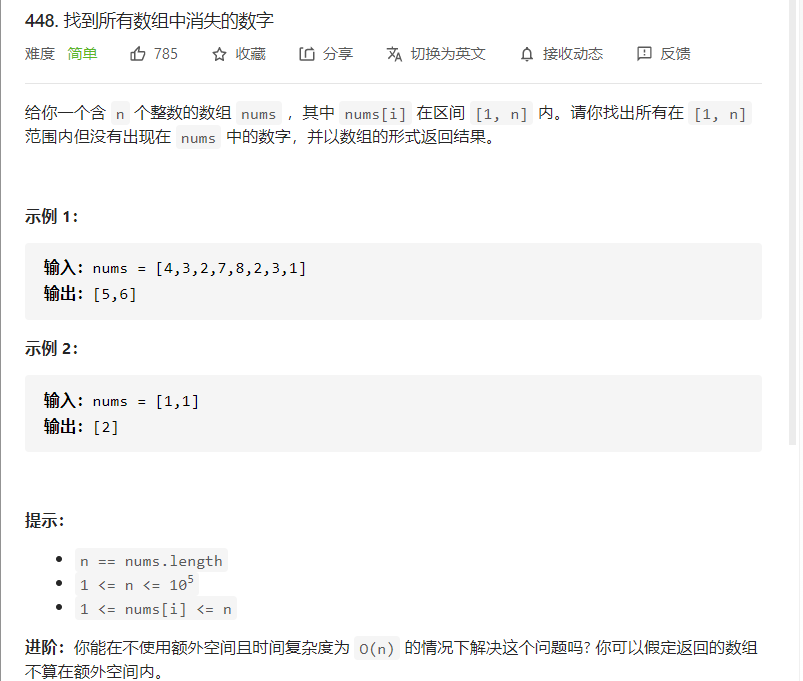

```java
public List<Integer> findDisappearedNumbers(int[] nums) {
    List<Integer> list = new ArrayList<>();
    int n = nums.length;
    for(int i=0; i<n; i++){
        while(nums[i]!=i+1 && nums[i]!=nums[nums[i]-1]){
            swap(nums,i,nums[i]-1);
        }
    }
    for(int i=0; i<n; i++){
        if(nums[i]!=i+1){
            list.add(i+1);
        }
    }
    return list;
}
private void swap(int[] nums, int index1, int index2) {
    int temp = nums[index1];
    nums[index1] = nums[index2];
    nums[index2] = temp;
}
```


# 实现数据结构

## 232. 用栈实现队列

[232. 用栈实现队列](https://leetcode-cn.com/problems/implement-queue-using-stacks/)

- 思路
  - 一个popStack用来移除队列头
  - 一个pushStack用来加入队列尾
  - pop如果为空, 需要将pushStack全部出栈再入栈到popStack

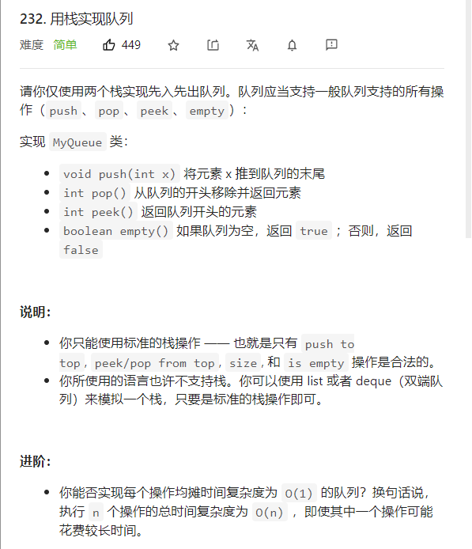

```java
class MyQueue {
    Deque<Integer> pushStack;
    Deque<Integer> popStack;

    /** Initialize your data structure here. */
    public MyQueue() {
        pushStack = new ArrayDeque<>();
        popStack = new ArrayDeque<>();

    }

    /** Push element x to the back of queue. */
    public void push(int x) {
        pushStack.push(x);
    }

    /** Removes the element from in front of queue and returns that element. */
    public int pop() {
        move();
        return popStack.isEmpty()?-1:popStack.pop();
    }

    /** Get the front element. */
    public int peek() {
        move();
        return popStack.isEmpty()?-1:popStack.peek();
    }

    private void move(){
        if(popStack.isEmpty()){
            while(!pushStack.isEmpty()){
                popStack.push(pushStack.pop());
            }
        }
    }

    /** Returns whether the queue is empty. */
    public boolean empty() {
        return pushStack.isEmpty() && popStack.isEmpty();
    }
}
```


# TOP300

## 4. 寻找两个正序数组的中位数

- 思路 : 数组已经排序了, 类似于合并两个升序链表, 当合并到中间位置的时候求出
  - 如果两个数组的长度之和为 从1开始
  - 奇数 pos = (m+n)/2+1
  - 偶数 pos = (m+n)/2 (m+n)/2+1 这两个位置的数的平均数

[4. 寻找两个正序数组的中位数](https://leetcode-cn.com/problems/median-of-two-sorted-arrays/)

```java
给定两个大小分别为 m 和 n 的正序（从小到大）数组 nums1 和 nums2。请你找出并返回这两个正序数组的 中位数 。

示例 1：

输入：nums1 = [1,3], nums2 = [2]
输出：2.00000
解释：合并数组 = [1,2,3] ，中位数 2
示例 2：

输入：nums1 = [1,2], nums2 = [3,4]
输出：2.50000
解释：合并数组 = [1,2,3,4] ，中位数 (2 + 3) / 2 = 2.5
示例 3：

输入：nums1 = [0,0], nums2 = [0,0]
输出：0.00000
示例 4：

输入：nums1 = [], nums2 = [1]
输出：1.00000
示例 5：

输入：nums1 = [2], nums2 = []
输出：2.00000
 

提示：

nums1.length == m
nums2.length == n
0 <= m <= 1000
0 <= n <= 1000
1 <= m + n <= 2000
-106 <= nums1[i], nums2[i] <= 106
 

进阶：你能设计一个时间复杂度为 O(log (m+n)) 的算法解决此问题吗？


```

```java
public double findMedianSortedArrays(int[] nums1, int[] nums2) {
    if(nums1==null && nums2==null){
        return 0.0;
    }
    if(nums1.length==0 && nums2.length==0){
        return 0.0;
    }
    int m = nums1.length;
    int n = nums2.length;

    boolean isEven = (m+n)%2==0;
    //对于奇数想要找到的是(m+n)/2+1
    //对于偶数想要找到的是(m+n)/2
    int target = isEven?(m+n)/2:(m+n)/2+1;
    int i=0, j=0;
    int cnt = 0;
    int first = Integer.MAX_VALUE;
    while(i<m && j<n){
        cnt++;
        int cur = 0;
        if(nums1[i]<=nums2[j]){
            cur = nums1[i];
            i++;
        }else{
            cur = nums2[j];
            j++;
        }
        if(cnt==target){
            first = cur;
            if(!isEven){
                return first;
            }
        }else if(cnt==target+1){
            return (first+cur)*1.0/2;
        }
    }
    while(i<m){
        cnt++;
        if(cnt==target){
            first = nums1[i];
            if(!isEven){
                return first;
            }
        }else if(cnt==target+1){
            return (first+nums1[i])*1.0/2;
        }
        i++;
    }
    while(j<n){
        cnt++;
        if(cnt==target){
            first = nums2[j];
            if(!isEven){
                return first;
            }
        }else if(cnt==target+1){
            return (first+nums2[j])*1.0/2;
        }
        j++;
    }
    return 0.0;
}
```


正则表达式去匹配IP地址

https://www.cnblogs.com/xiaoxiao075/p/10351122.html


