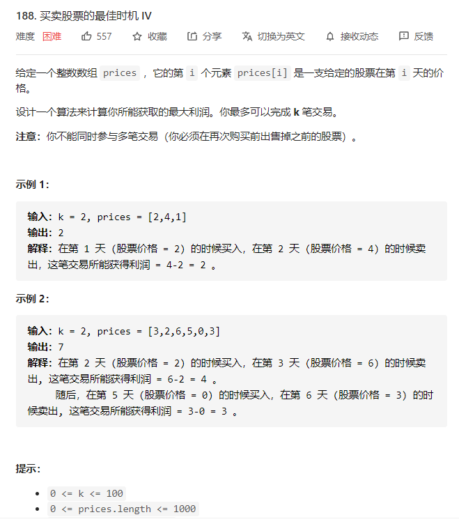
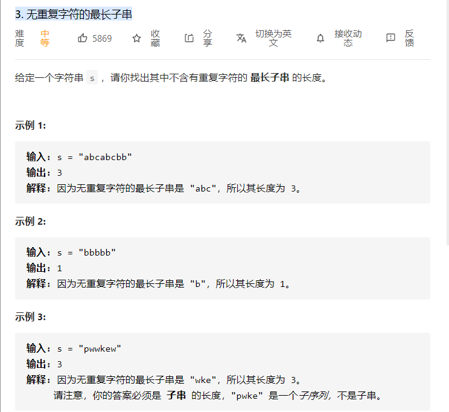
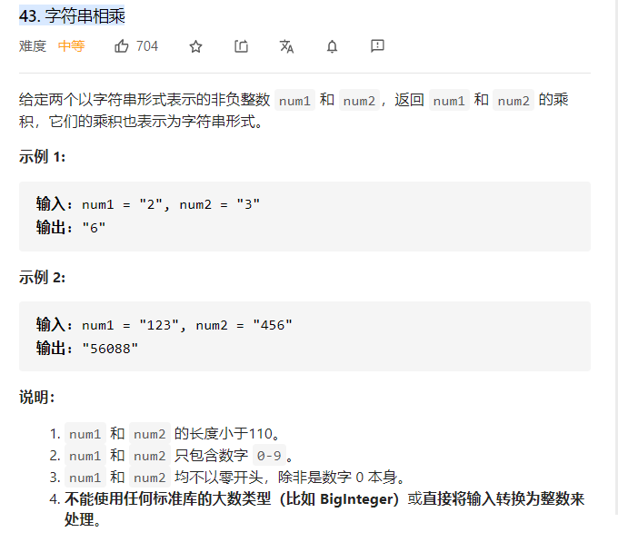
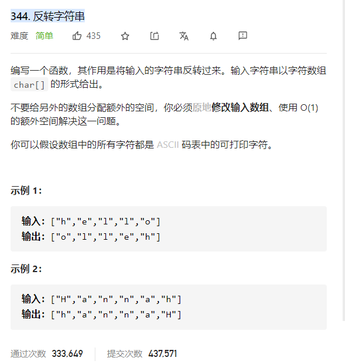
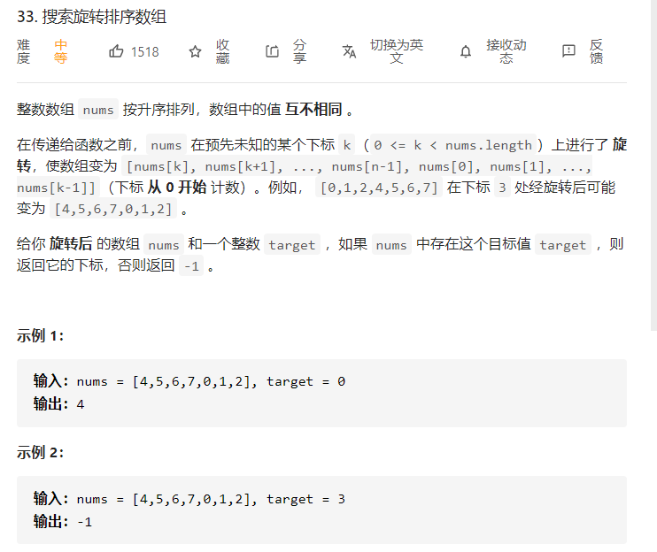

[TOC]

# 排序

https://www.cs.usfca.edu/~galles/visualization/ComparisonSort.html


- 选择排序（了解）
  思路：每一轮选取未排定的部分中最小的部分交换到未排定部分的最开头，经过若干个步骤，就能排定整个数组。即：先选出最小的，再选出第 2 小的，以此类推。

- 插入排序（熟悉）

  思路：每次将一个数字插入一个有序的数组里，成为一个长度更长的有序数组，有限次操作以后，数组整体有序。

- 归并排序（重点）
  基本思路：借助额外空间，合并两个有序数组，得到更长的有序数组。例如：「力扣」第 88 题：合并两个有序数组。
  算法思想：分而治之（分治思想）。「分而治之」思想的形象理解是「曹冲称象」、MapReduce，在一定情况下可以并行化。

- 快速排序（重点）

  - 1、n大时好，快速排序比较占用内存，内存随n的增大而增大，但却是效率高不稳定的排序算法。
  - 2、划分之后一边是一个，一边是n-1个，这种极端情况的时间复杂度就是O(N^2)
  - 3、最好的情况是每次都能均匀的划分序列，O(N*log2N)
  - 最优情况:Partition每次都划分得很均匀，如果排序n个关键字，其递归树的深度就为 [log2n]+1（ [x] 表示不大于 x 的最大整数），即仅需递归 log2n 次，需要时间为T（n）的话，第一次Partiation应该是需要对整个数组扫描一遍，做n次比较。然后，获得的枢轴将数组一分为二，那么各自还需要T（n/2）的时间（注意是最好情况，所以平分两半）。于是不断地划分下去，就有了下面的不等式推断：
  - 

- 堆排序（堆很重要，堆排序根据个人情况掌握）

  - 所有情况下都是NlogN，稳定算法。

  -  总时间=分解时间+解决问题时间+合并时间。分解时间就是把一个待排序序列分解成两序列，时间复杂度o(1).解决问题时间是两个递归式，把一个规模为n的问题分成两个规模分别为n/2的子问题，时间为2T(n/2).合并时间复杂度为o（n）。总时间T(n)=2T(n/2)+o(n).这个递归式可以用递归树来解，用递归树的方法解递归式T(n)=2T(n/2)+o(n):假设解决最后的子问题用时为常数c，则对于n个待排序记录来说整个问题的规模为cn。

    

- 希尔排序（不建议多花时间了解）
  希尔排序的参考资料是《算法 4》。

  思想来源：插入排序的优化。在插入排序里，如果靠后的数字较小，它来到前面就得交换多次。「希尔排序」改进了这种做法。带间隔地使用插入排序，直到最后「间隔」为 11 的时候，就是标准的「插入排序」，此时数组里的元素已经「几乎有序」了；
  希尔排序的「间隔序列」其实是一个超参数，这方面有一些研究成果，有兴趣的朋友可以了解一下，但是如果这是面向笔试面试，就不用了解了

- 冒泡排序（了解）
  基本思想：外层循环每一次经过两两比较，把每一轮未排定部分最大的元素放到了数组的末尾；
  「冒泡排序」有个特点：在遍历的过程中，提前检测到数组是有序的，从而结束排序，而不像「选择排序」那样，即使输入数据是有序的，「选择排序」依然需要「傻乎乎」地走完所有的流程


[912. 排序数组](https://leetcode-cn.com/problems/sort-an-array/)

## 快速排序

```java
public class quickSort {
    Random rand = new Random();
    public int[] sortArray(int[] nums) {
        quickSort(nums, 0, nums.length-1);
        return nums;
    }
    private void quickSort(int[] nums, int l, int r){
        if(l>=r){
            return;
        }
        int pivot = partition(nums, l, r);
        quickSort(nums, l, pivot-1);
        quickSort(nums, pivot+1, r);
    }
    private int partition(int[] nums, int l, int r){
        int pivot = rand.nextInt(r-l+1)+l;
        int cur = nums[pivot];
        int index = l;
        swap(nums, l, pivot);
        for(int i=l+1; i<=r; i++){
            if(nums[i]<=cur){
                index++;
                swap(nums, index, i);
            }
        }
        swap(nums, l, index);
        return index;
    }
    private void swap(int[] nums, int i, int j){
        int temp = nums[i];
        nums[i] = nums[j];
        nums[j] = temp;
    }
}
```


## 归并排序

```java
public class mergeSort {
    public int[] sortArray(int[] nums) {
        int len = nums.length;
        int[] temp = new int[len];
        mergeSort(nums, 0, len - 1, temp);
        return nums;
    }

    private void mergeSort(int[] nums, int l, int r, int[] temp){
        if(l>=r){
            return;
        }

        int mid = (l+r)>>>1;
        mergeSort(nums, l, mid, temp);
        mergeSort(nums, mid+1, r, temp);
        mergeTwoSortedArray(nums, l, mid, r, temp);
    }

    private void mergeTwoSortedArray(int[] nums, int l, int mid, int r, int[] temp){
        //System.arraycopy(nums, l, temp, l, r-l+1);
        for(int i=l; i<=r; i++){
            temp[i] = nums[i];
        }

        int i = l;
        int j = mid+1;

        for(int k=l; k<=r; k++){
            if(i==mid+1){
                nums[k] = temp[j];
                j++;
            }else if(j==r+1){
                nums[k] = temp[i];
                i++;
            }else if(temp[i]<=temp[j]){
                nums[k] = temp[i];
                i++;
            }else{
                // temp[i]>temp[j]
                nums[k] = temp[j];
                j++;
            }
        }
    }

}
```

## 堆排序

```java
public class heapSort {
    public int[] sortArray(int[] nums) {
        int len = nums.length;
        int size = len-1;
        heapify(nums, size);
        //不断把最大的元素交换到末尾
        for(int i=len-1; i>=0; i--){
            // 堆顶的元素交换到了最后一个位置, 这个元素是当前堆中最大的
            swap(nums, 0, i);
            size--;
            // 因为本来在最后一个位置的元素交换到了堆顶, 需要下沉到合适的位置
            // 并且已经找到了一个最大的元素, 堆中元素减一,
            percolateDown(nums, 0, size);
        }
        return nums;
    }

    private void heapify(int[] nums, int size){
        for(int i=(size-1)/2; i>=0; i--){
            percolateDown(nums, i, size);
        }
    }

    /**
     *
     * @param nums 堆对应的数组
     * @param index    当前需要下沉的数组
     * @param size   当前堆的最后一个元素在数组中对应的下标
     */
    private void percolateDown(int[] nums, int index, int size){
        // 2*end+1 是k位置对应的左子节点在数组中的下标
        while(index*2+1<=size){
            int l = index*2+1;
            // 找到左右子节点中较大的那个
            if(l+1<=size && nums[l+1]>nums[l]){
                l += 1;
            }
            if(nums[index]<nums[l]){
                swap(nums, index, l);
                index = l;
            }else {
                break;
            }
        }
    }
    private void swap(int[] nums, int i, int j){
        int temp = nums[i];
        nums[i] = nums[j];
        nums[j] = temp;
    }
}

```


# DP

1. DP定义

2. Base case

3. Induction rule

4. Fill in Order

5. Return what

6. Time && Space

  

## 最大(小)的(删除)子数组(矩阵)和(乘积) 问题

### 剑指 Offer 42. 连续子数组的最大和

[剑指 Offer 42. 连续子数组的最大和](https://leetcode-cn.com/problems/lian-xu-zi-shu-zu-de-zui-da-he-lcof/)

```java
/**剑指 Offer 42. 连续子数组的最大和
     输入一个整型数组，数组中的一个或连续多个整数组成一个子数组。求所有子数组的和的最大值。
     要求时间复杂度为O(n)。
     示例1:
     输入: nums = [-2,1,-3,4,-1,2,1,-5,4]
     输出: 6
     解释: 连续子数组 [4,-1,2,1] 的和最大，为 6。
     提示：
     1 <= arr.length <= 10^5
     -100 <= arr[i] <= 100

     * Step 1 DP定义
     *      dp[i] = 到i为止的最大子数组的和 Include i
     * Step 2 Base case
     *      dp[0] = nums[0]     子数组不允许为空至少含有一个元素
     * Step 3 Induction rule
     *      取决于以i-1结尾的最大子数组的和大小---> depends on dp[i-1]
     *          dp[i-1]>0
     *              dp[i] = dp[i-1]+nums[i]
     *          dp[i-1]<=0
     *              dp[i] = nums[i]
     *      跟新global max
     *          globalMax = Math.max(globalMax, dp[i])
     * Step 4 Fill in Order
     *      左-->右
     *          因为每一个都depends on 左边的元素 dp[i-1]
     * Step 5 Return what
     *      globalMax
     * Step 6 Time && Space
     *      Time: 遍历数组O(n) 每个元素的操作 O(1)
     *      Space:  dp[n] 数组 O(n) 可以优化为 O(1) 因为只depends on 前面一个元素
     */
// 连续子数组的最大和
public int maxSubArr(int[] nums){

    if(nums==null || nums.length==0){
        return Integer.MIN_VALUE;
    }
    int len = nums.length;
    int dp = nums[0];
    int globalMax = nums[0];
    for(int i=1; i<len; i++){
        dp = Math.max(dp+nums[i], nums[i]);
        globalMax = Math.max(globalMax, dp);
    }
    return globalMax;
}
```

### 删除一次得到子数组最大和

[1186. 删除一次得到子数组最大和](https://leetcode-cn.com/problems/maximum-subarray-sum-with-one-deletion/)

```java
/**1186. 删除一次得到子数组最大和
     给你一个整数数组，返回它的某个 非空 子数组（连续元素）在执行一次可选的删除操作后，所能得到的最大元素总和。
     换句话说，你可以从原数组中选出一个子数组，并可以决定要不要从中删除一个元素（只能删一次哦），（删除后）子数组中至少应当有一个元素，然后该子数组（剩下）的元素总和是所有子数组之中最大的。
     注意，删除一个元素后，子数组 不能为空。
     请看示例：
     示例 1：
     输入：arr = [1,-2,0,3]
     输出：4
     解释：我们可以选出 [1, -2, 0, 3]，然后删掉 -2，这样得到 [1, 0, 3]，和最大。
     示例 2：
     输入：arr = [1,-2,-2,3]
     输出：3
     解释：我们直接选出 [3]，这就是最大和。
     示例 3：
     输入：arr = [-1,-1,-1,-1]
     输出：-1
     解释：最后得到的子数组不能为空，所以我们不能选择 [-1] 并从中删去 -1 来得到 0。
     我们应该直接选择 [-1]，或者选择 [-1, -1] 再从中删去一个 -1。
     提示：
     1 <= arr.length <= 10^5
     -10^4 <= arr[i] <= 10^4

     * Step 1 DP定义
     *      需要两个dp数组
     *          keep[i] = 代表到i位置 include i 的最大子数组和
     *          dp[i] = 代表到i位置为止, include i, 考虑 删 || 不删除 nums[i] 的最大子数组和
     * Step 2 Base case
     *      keep[0] = nums[0]
     *      dp[0] = nums[0]
     *      必须保证至少有一个元素, 所以base case 都是第一个元素
     * Step 3 Induction rule
     *      dp[i] = 考虑是否删除当前元素nums[i]
     *                  删除nums[i]: 必须保证前面的元素都不能删除即=keep[i-1]
     *                  不删除nums[i]: 无论如何dp[i]中都只会删除一个元素, 所以无论dp[i-1]中删除了哪个, 都不会影响连续性 =dp[i-1]+nums[i]
     *                      这里包含了删除前面一个元素和前面都不删的两种情况
     *              考虑 keep[i-1]<=0的情况
     *                  舍弃keep[i-1]直接重新开始 只有nums[i]
     *       最后考虑着三种情况中的最大值
     *       需要先跟新dp 在优化到O(1)空间的情况下, dp depends on keep
     *      keep[i] = keep[i-1]>0?keep[i-1]+nums[i] : nums[i]
     *      更新完两个dp 更新最大值
     *          不更新, 保留所有的nums[0:i]=keep[i], 中间可能删除了一个dp[i]
     *          globalMax = Math.max(globalMax, dp[i], keep[i])
     * Step 4 Fill in Order
     *      左--> 右 因为 dp[i] depends on dp[i-1] keep[i-1]
     *                  keep[i] depends on keep[i-1]
     * Step 5 Return what
     *       globalMax
     * Step 6 Time && Space
     *      Time: O(n)
     *      Space: O(2*n) dp[n] keep[n] 优化--> O(2) dp num
     */
// 允许删除一个元素的最大子数组和
public int maxSubArrWithOneDelete(int[] nums){
    if(nums==null || nums.length==0){
        return Integer.MIN_VALUE;
    }
    int len = nums.length;
    int dp = nums[0];
    int keep = nums[0];
    int globalMax = nums[0];
    for(int i=1; i<len; i++){
        dp = Math.max(keep, Math.max(nums[i], dp+nums[i]));
        keep = Math.max(nums[i], keep+nums[i]);
        globalMax = Math.max(Math.max(dp, keep), globalMax);
    }
    return globalMax;
}
```


### 环形数组最大的子数组和

[918. 环形子数组的最大和](https://leetcode-cn.com/problems/maximum-sum-circular-subarray/)

```
918. 环形子数组的最大和
给定一个由整数数组 A 表示的环形数组 C，求 C 的非空子数组的最大可能和。
在此处，环形数组意味着数组的末端将会与开头相连呈环状。（形式上，当0 <= i < A.length 时 C[i] = A[i]，且当 i >= 0 时 C[i+A.length] = C[i]）
此外，子数组最多只能包含固定缓冲区 A 中的每个元素一次。（形式上，对于子数组 C[i], C[i+1], ..., C[j]，不存在 i <= k1, k2 <= j 其中 k1 % A.length = k2 % A.length）

示例 1：

输入：[1,-2,3,-2]
输出：3
解释：从子数组 [3] 得到最大和 3
示例 2：

输入：[5,-3,5]
输出：10
解释：从子数组 [5,5] 得到最大和 5 + 5 = 10
示例 3：

输入：[3,-1,2,-1]
输出：4
解释：从子数组 [2,-1,3] 得到最大和 2 + (-1) + 3 = 4
示例 4：

输入：[3,-2,2,-3]
输出：3
解释：从子数组 [3] 和 [3,-2,2] 都可以得到最大和 3
示例 5：

输入：[-2,-3,-1]
输出：-1
解释：从子数组 [-1] 得到最大和 -1
 

提示：

-30000 <= A[i] <= 30000
1 <= A.length <= 30000
```

1. DP定义
   1. 需要求解两个dp
      1. dpMax[i] 
         - 正常的最大子数组和, 不考虑环形数组的情况
         - 表示到i为止, include i 的最大子数组和
      2. dpMin[i]
         - 考虑环形数组的情况, 我们希望求得数组中最小的子数组和, 这样去除掉中间连续的最小子数组和, 首尾的部分连在一起就是最大子数组和
         - 表示到i位置 include i的最小子数组和
2. Base case
   1. dpMax[0] = arr[0];
   2. dpMin[0] = arr[0]
   3. globalMax = Integer.MIN_VALUE
   4. globalMin = Integer.MAX_VALUE
3. Induction rule
   1. dpMax[i] = dpMax[i-1]>0?dpMax[i-1]+nums[i]:nums[i];
   2. dpMin[i] = dpMin[i-1]<0?dpMin[i-1]+nums[i]:nums[i];
   3. globalMax = Math.max(globalMax, dpMax[i])
   4. globalMin = Math.min(globalMin, dpMin[i])
4. Fill in Order
   1. 左--> 右
5. Return what
   1. Math.max(globalMax, sum-globalMin);
6. Time && Space
   1. O(n) O(1)

```java
class LargestSubArrayCircular{
    public int LargestSubArrayCircular(int[] nums){
        int curMin = Integer.MAX_VALUE;
        int curMax = Integer.MIN_VALUE;
        int globalMin = Integer.MAX_VALUE;
        int globalMax = Integer.MIN_VALUE;
        int sum = 0;
        for(int i=0; i<nums.length; i++){
            sum += nums[i];
            curMin = curMin<0?curMin+nums[i]:nums[i];
            curMax = curMax>0?curMax+nums[i]:nums[i];
            globalMin = Math.min(curMin, globalMin);
            globalMax = Math.max(curMax, globalMax);
        }
        //全负数 sum-globalMin = 0 但是不能全不选
        if(globalMax<0){
            return globalMax;
        }
        return Math.max(globalMax, sum-globalMin);
    }
}
```


### 乘积最大子数组

[152. 乘积最大子数组](https://leetcode-cn.com/problems/maximum-product-subarray/)

-  思路:  两个dp , 分别维护到i为止包括i乘积最大和最小的子数组
  - 如果i为整数, 希望以i-1结尾的子数组积尽可能大且为正数
    - dpMax[i] = Math.max(dpMax[i-1] * num[i], dpMin[i-1] * num[i], num[i])
  - 如果i为负数, 希望以i-1结尾的子数组积尽可能小且为负数
    - dpMin[i] = Math.min(dpMax[i-1] * num[i], dpMin[i-1] * num[i], num[i])
  - 更新globalMax
-  乘法乘积和求sum区别
   -  initialization: 
      -  Product: result 从1开始
      -  sum: result从0开始
-  最大乘积
   -  case 1: 负数 * 负数
   -  case 2: 正数 * 正数
-  Step1: DP 定义
   -  dpPositive[i]  : 到i为止包含i的正向最大乘积

```java
public int maxProduct(int[] nums) {
    if(nums==null || nums.length==0){
        return 0;
    }
    int dpMax = nums[0];
    int dpMin = nums[0];
    int globalMax = nums[0];
    for(int i=1; i<nums.length; i++){
        int preMax = dpMax;
        dpMax = Math.max(dpMax*nums[i], Math.max(dpMin*nums[i], nums[i]));
        dpMin = Math.min(preMax*nums[i], Math.min(dpMin*nums[i], nums[i]));
        globalMax = Math.max(globalMax, dpMax);
    }
    return globalMax;
}
```


### 最大子矩阵

[面试题 17.24. 最大子矩阵](https://leetcode-cn.com/problems/max-submatrix-lcci/)

思路 将二维矩阵压缩到一维, 并求出压缩后一维数组的最大子数组和

- 枚举每一行开始
- 将这行开始的每一行压缩进一维数组(按列求和)
- 每压缩完一行, 求一维数组的最大子数组和
- 更新 globalMax globalStart globalEnd currentStart currentEnd
  - currentStart currentEnd每一轮压缩后都要更新为0, 因为一维数组已经改变, globalStart globalEnd记录了全局最优, currentStart currentEnd记录当前最优
  - currentEnd: 当前的index (无需更新)
  - currentStart: 
    - 如果加上index-1结尾的和, 等于之前的
    - 不加 更新为 index
  - globalStart: dp>globalMax
    - globalStart =currentStart
    - globalEnd = currentEnd

```
面试题 17.24. 最大子矩阵
给定一个正整数、负整数和 0 组成的 N × M 矩阵，编写代码找出元素总和最大的子矩阵。

返回一个数组 [r1, c1, r2, c2]，其中 r1, c1 分别代表子矩阵左上角的行号和列号，r2, c2 分别代表右下角的行号和列号。若有多个满足条件的子矩阵，返回任意一个均可。

注意：本题相对书上原题稍作改动

示例：

输入：
[
   [-1,0],
   [0,-1]
]
输出：[0,1,0,1]
解释：输入中标粗的元素即为输出所表示的矩阵
 

说明：

1 <= matrix.length, matrix[0].length <= 200
```


```java
int globalMax, currentStart, currentEnd, globalStart, globalEnd;
int rowHigh, rowLow;
public int[] getMaxMatrix(int[][] matrix) {
    if(matrix==null || matrix[0].length==0 || matrix.length==0){
        return new int[]{0,0,0,0};
    }
    int m = matrix.length;
    int n = matrix[0].length;
    rowHigh = 0;
    rowLow = 0;
    globalMax = matrix[0][0];
    currentStart = 0;
    currentEnd = 0;
    globalStart = 0;
    globalEnd = 0;
    for(int i=0; i<m; i++){
        int[] cur = new int[n];
        for(int j=i; j<m; j++){
            for(int k=0; k<n; k++){
                cur[k] += matrix[j][k];
            }
            findMax(cur, i, j);
        }
    }
    return new int[]{rowHigh, globalStart, rowLow, globalEnd};
}
private void findMax(int[] num, int m, int n){
    currentStart = 0;
    currentEnd = 0;

    int dp = num[0];
    for(int i=1; i<num.length; i++){
        if(dp>0){
            currentEnd = i;
            dp += num[i];
        }else{
            currentStart = i;
            currentEnd = i;
            dp = num[i];
        }
        if(dp>globalMax){
            globalStart = currentStart;
            globalEnd = currentEnd;
            globalMax = dp;
            rowHigh = m;
            rowLow = n;
        }
    }
}
```


### 统计矩阵中全是1的子矩阵

[1504. 统计全 1 子矩形](https://leetcode-cn.com/problems/count-submatrices-with-all-ones/)

- 思路: 将矩阵压缩到一行, 统计压缩的一位数组中连续的1的数量
  - 枚举从每一行开始, 依次将这行开始的每一行依次压缩到一位数组里(对应列的和)
  - 当出现的连续的压缩的行数(j-i+1)的时候就是一个全是1的矩阵
  - 对压缩后的一维数组, 枚举每个(j-i+1)起始的连续的1,2,3,4...列, 依次加一

```java
public int numSubmat(int[][] mat) {
    if(mat==null || mat.length==0){
        return 0;
    }
    int m = mat.length;
    int n = mat[0].length;
    int res = 0;
    //枚举每一行的开始
    for(int i=0; i<m; i++){
        int[] cur = new int[n];
        //枚举每一行压缩到一维数组cur
        for(int j=i; j<m; j++){
            // 当前行压缩进入cur后高度为j-i+1
            int target = j-i+1;
            //将第j行的每一个元素压缩进cur
            for(int k=0; k<n; k++){
                cur[k]+=mat[j][k];
            }
            // 计算压缩数组中又多少个连续的=target的组合
            res += find(cur, target);
        }
    }
    return res;
}
private int find(int[] num, int target){
    int res = 0;
    for(int i=0; i<num.length; i++){
        if(num[i]==target){
            int j=i;
            while(j<num.length && num[j]==target){
                res++;
                j++;
            }
        }
    }
    return res;
}
```

### 最大子矩阵乘积

- 思路: 将二维矩阵按行压缩到一维数组, 求出一维数组的最大子数组乘积
  - 枚举每一行开始压缩
  - 依次将这一行下面所有的行压缩进一个一维数组(按列乘积)
  - 得到的一维数组求最大乘积子数组


```java
@Test
public void testProdMaxMatrix(){
    double[][] matrix ={{1,5,-1},
                        {0,-1.5,1},
                        {1,1,1}};
    double res = maxMatrixProd(matrix);
    System.out.println(res);
}
//最大乘积子矩阵
public double maxMatrixProd(double[][] matrix){
    if(matrix==null || matrix.length==0 || matrix[0].length==0){
        return 0.0;
    }
    double globalMax = 0.0;
    int m=matrix.length, n=matrix[0].length;
    for(int i=0; i<m; i++){
        double[] cur = new double[n];
        Arrays.fill(cur, 1.0);
        for(int j=i; j<m; j++){
            for(int k=0; k<n; k++){
                cur[k] *= matrix[j][k];
            }
            globalMax = Math.max(globalMax, maxProd(cur));
        }
    }
    return globalMax;
}
private double maxProd(double[] num){
    double dpMax = num[0];
    double dpMin = num[0];
    double max = num[0];
    for(int i=1; i<num.length; i++){
        double preMax = dpMax;
        dpMax = Math.max(dpMax*num[i], Math.max(dpMin*num[i], num[i]));
        dpMin = Math.min(preMax*num[i], Math.min(dpMin*num[i], num[i]));
        max = Math.max(max, dpMax);
    }
    return max;
}


```

### 剑指 Offer II 040. 矩阵中最大的矩形

[剑指 Offer II 040. 矩阵中最大的矩形](https://leetcode-cn.com/problems/PLYXKQ/)

- 思路: 二维数组压缩到一维数组, 求一维数组最大子数组和


```java
public int maximalRectangle(String[] matrix) {
    if(matrix==null || matrix.length==0){
        return 0;
    }
    int globalMax = matrix[0].charAt(0)-'0';
    int m = matrix.length;
    int n = 0;
    for(String cur : matrix){
        n = Math.max(n, cur.length());
    }
    for(int k=0; k<m; k++){
        int[] cur = new int[n];
        for(int i=k; i<m; i++){
            String str = matrix[i];
            for(int j=0; j<str.length(); j++){
                cur[j] += str.charAt(j)-'0';
            }
            int target = i-k+1;
            globalMax = Math.max(findMax(cur,target )*target, globalMax);
        }
    }
    return globalMax;
}

private int findMax(int[] num, int target){
    int dp = num[0];
    int max = 0;
    int i = 0, j=0;
    while(i<num.length){
        if(num[i]==target){
            j = i;
            while(j<num.length && num[j]==target){
                j++;
            }
            max = Math.max(max, j-i);
            i = j;
        }else{
            i++;
        }
    }
    return max;
}
```


## 连续的1的数组, 矩阵, 正方形

### 221. 最大正方形

[221. 最大正方形](https://leetcode-cn.com/problems/maximal-square/)

- 思路
  - 按层压缩, 当前压缩了n层, 找到连续的n个n就找到了一个正方形


```java
public int maximalSquare(char[][] matrix) {
    if(matrix==null || matrix.length==0 || matrix[0].length==0){
        return 0;
    }
    int m = matrix.length, n = matrix[0].length;
    int max = Math.max(m,n);
    int side = 0;
    //枚举每一层
    for(int i=0; i<m; i++){
        int[] num = new int[n];
        //压缩
        for(int j=i; j<m; j++){
            for(int k=0; k<n; k++){
                num[k] += matrix[j][k]=='1'?1:0;
            }
            //压缩完一层, 查看是否有
            if(findSquare(num, j-i+1)){
                side = Math.max(side, j-i+1);
                if(side==max){
                    return side*side;
                }
            }
        }
    }
    return side*side;
}

//找到连续的level个level 返回true
private boolean findSquare(int[] num, int level){
    int cnt = 0;
    for(int i=0; i<num.length; i++){
        if(num[i]<level){
            cnt = 0;
            continue;
        }
        cnt++;
        if(cnt == level){
            return true;
        }
    }
    return false;
}

//dp
public int maximalSquare(char[][] matrix){
    if(matrix==null || matrix.length==0 || matrix[0].length==0){
        return 0;
    }
    int m = matrix.length, n = matrix[0].length;
    int side = 0;
    int[][] dp = new int[m][n];
    for(int i=0; i<m; i++){
        for(int j=0; j<n; j++){
            if(matrix[i][j]=='1'){
				if(i==0 || j==0){
                    dp[i][j] = 1;
                }
                else{
                    dp[i][j] = Math.min(dp[i-1][j], Math.min(dp[i][j-1], dp[i-1][j-1]))+1;
                }
                side = Math.max(dp[i][j], side);
            }
        }
    }
    return s
}
```


### 485. 最大连续 1 的个数

[485. 最大连续 1 的个数](https://leetcode-cn.com/problems/max-consecutive-ones/)


### 487. 最大连续1的个数 II

[487. 最大连续1的个数 II](https://leetcode-cn.com/problems/max-consecutive-ones-ii/)


### 562. 矩阵中最长的连续1线段

[562. 矩阵中最长的连续1线段](https://leetcode-cn.com/problems/longest-line-of-consecutive-one-in-matrix/)


## 子序列(Subsequence)

### 1143. 最长公共子序列

[1143. 最长公共子序列](https://leetcode-cn.com/problems/longest-common-subsequence/)

- 思路 `dp[i][j] = text1[0:i] 和 text[0:j]`最长公共子序列
  - 如果`text1.charAt(i)==text2.charAt(j)` 那么子序列的长度在 `dp[i-1][j-1]`的基础上+1
  - 否则 取 `Math.max(dp[i][j+1],dp[i+1][j]) ` 因为当前的 `i,j`对应位置不匹配,舍弃其中一个然后取较大的
  - 最后返回`dp[len1][len2]`


```java
//二维
public int longestCommonSubsequence(String text1, String text2) {
    /**
        如果text1.charAt(i-1) == text2.charAt(j-1)
            dp[i][j] = dp[i-1][j-1]+1
        else
            dp[i][j] = Math.max(dp[i-1][j], dp[i][j-1])
         */
    int len1 = text1.length();
    int len2 = text2.length();
    int[][] dp = new int[len1+1][len2+1];

    for(int i=0; i<len1; i++){
        for(int j=0; j<len2; j++){

            if(text1.charAt(i)==text2.charAt(j)){
                dp[i+1][j+1] = dp[i][j]+1;
            }else{
                dp[i+1][j+1] = Math.max(dp[i][j+1],dp[i+1][j]) ;
            }
        }
    }
    return dp[len1][len2];

}
//一行数组
public int longestCommonSubsequence(String text1, String text2) {
    /**
        如果text1.charAt(i-1) == text2.charAt(j-1)
            dp[i][j] = dp[i-1][j-1]+1
        else
            dp[i][j] = Math.max(dp[i-1][j], dp[i][j-1])
         */
    int len1 = text1.length();
    int len2 = text2.length();
    int[] dp = new int[len2+1];

    for(int i=0; i<len1; i++){
        //每一行第一列都是0 因为text2没有字符一定没有公共子序列
        dp[0] = 0;
        //一开始左上角无意义所以是0
        int lu = 0;
        for(int j=0; j<len2; j++){
            //当前位置要更新的是dp[j+1] 这个位置更新前的值是右边位置的左上角, 先记录下来
            int nextLu = dp[j+1];
            if(text1.charAt(i)==text2.charAt(j)){
                //dp[i+1][j+1] = dp[i][j]+1
                dp[j+1] = lu+1;
            }else{
                //dp[i+1][j+1] = Math.max(dp[i][j+1],dp[i+1][j])
                dp[j+1] = Math.max(dp[j+1],dp[j]) ;
            }
            //更新下一个位置的左上角的值
            lu = nextLu;
        }
    }
    return dp[len2];

}
```


### []300. 最长递增子序列

[300. 最长递增子序列](https://leetcode-cn.com/problems/longest-increasing-subsequence/)

- dp定义
  - dp[i] 表示以i位置结束的最长的递增子序列的长度
- base case
  - dp[0] = 1;
- Induction rule
  - 对于j in [0:i) 每个元素查看 nums[j]<nums[i] 是否成立, 成立就可以添加在后面, 找出可以使dp[i] 最大的
  - 更新globalMax
- Fill in Order
  - 左右
- Return what
  - globalmax
- Time && Space
  - Time O(n^2)
  - Space O(n)


```java
//DP
public int lengthOfLIS(int[] nums) {
    int globalMax = 1;
    int n = nums.length;
    int[] dp = new int[n];
    dp[0] = 1;
    for(int i=1; i<n; i++){
        dp[i] = 1;
        for(int j=0; j<i; j++){
            if(nums[j]<nums[i]){
                dp[i] = Math.max(dp[i], dp[j]+1);
            }
        }
        globalMax = Math.max(dp[i], globalMax);
    }
    return globalMax;
}

//DP+二分
public int lengthOfLIS(int[] nums) {
    int[] tails = new int[nums.length];
    int res = 0;
    for(int num : nums) {
        int i = 0, j = res;
        while(i < j) {
            int m = (i + j) / 2;
            if(tails[m] < num) i = m + 1;
            else j = m;
        }
        tails[i] = num;
        if(res == j) res++;
    }
    return res;
}


```


### 491. 递增子序列

[491. 递增子序列](https://leetcode-cn.com/problems/increasing-subsequences/)


### 115. 不同的子序列

[115. 不同的子序列](https://leetcode-cn.com/problems/distinct-subsequences/)

- 思路 dp
  - dp\[i][j] = s[i:] 子序列和 t[j:] 匹配的个数
  - i = m, s为空串, t[j:] 不可能是空串的子序列, 所有对于任意 0<=j<n dp\[m][j] = 0
  - j = n t为空串, 对于任意的 0<=i<=m dp\[i][n] = 1
  - s[i] == t[j] s[i:] 可以选择和 t[j:] 匹配, 也可以用s[i+1:] 和t[j:] 匹配 dp\[i][j] = dp\[i+1][j+1]+dp\[i+1][j] 
  - s[i] != t[j] s[i:] 不能跟 t[j:] 匹配, 所以 只能尝试 s[i+1:] 和 t[j:]匹配


```java
//DP
public int numDistinct(String s, String t) {
    int m = s.length();
    int n = t.length();
    if(m<n){
        return 0;
    }
    int[][] dp = new int[m+1][n+1];
    for(int i=0; i<=m; i++){
        dp[i][n] = 1;
    }
    for(int i=m-1; i>=0; i--){
        for(int j=n-1; j>=0; j--){
            if(s.charAt(i)==t.charAt(j)){
                dp[i][j] = dp[i+1][j+1]+dp[i+1][j];
            }else{
                dp[i][j] = dp[i+1][j];
            }
        }
    }
    return dp[0][0];
}


//回溯
public int numDistinct(String s, String t) {
    int m = s.length();
    int n = t.length();
    if(m<n){
        return 0;
    }
    StringBuffer path = new StringBuffer();
    int index = 0;
    int[] res = new int[]{0};
    backtrack(path, index, s, t, res);
    return res[0];
}

private void backtrack(StringBuffer path, int index, String s, String t, int[] res){
    //收集解
    if(path.length()==t.length()){
        //字符串相等
        if(path.toString().equals(t)){
            res[0]++;
        }
        return;
    }
    //超界
    if(index>=s.length()){
        return;
    }
    //剩余s的字符全部加上也不够t的长度
    if(s.length()-index<t.length()-path.length()){
        return;
    }

    //加
    path.append(s.charAt(index));
    backtrack(path, index+1, s, t, res);
    path.deleteCharAt(path.length()-1);

    //不加
    backtrack(path, index+1, s, t, res);

}

//recursion+memo
public int numDistinct(String s, String t) {
    if (s == null || s.length() == 0) return 0;
    if (t == null || t.length() == 0) return 1;

    return dfs(s, t, 0, 0, new Integer[s.length()][t.length()]);
}
// 查找 s从i开始, t从j开始 s中子序列等于t的个数
private int dfs(String s, String t, int i, int j, Integer[][] dp){
    if(j==t.length()) return 1;
    if(i==s.length()) return 0;
    //之前算过 直接返回
    if(dp[i][j]!=null) return dp[i][j];
    int match = 0, notMatch = 0;
    //当前开始的字符匹配
    if(s.charAt(i)==t.charAt(j)){
        match = dfs(s,t,i+1, j+1, dp) + dfs(s,t,i+1,j,dp);
    }else{
        //当前开始的字符不匹配
        notMatch = dfs(s,t,i+1, j, dp);
    }
    //两种情况相加为总数
    dp[i][j] = match+notMatch;
    return dp[i][j];

}
```


## 股票问题

https://leetcode-cn.com/circle/article/qiAgHn/

### 121. 买卖股票的最佳时机

[121. 买卖股票的最佳时机](https://leetcode-cn.com/problems/best-time-to-buy-and-sell-stock/)


```java
public int maxProfit(int[] prices) {
    int preMin = prices[0];
    int maxRes = 0;
    for(int i=1; i<prices.length; i++){
        maxRes = Math.max(maxRes, prices[i]-preMin);
        preMin = Math.min(preMin, prices[i]);
    }
    return maxRes;
}

public int maxProfit(int[] prices) {
    if (prices == null || prices.length == 0) {
        return 0;
    }
    int length = prices.length;
    int[][] dp = new int[length][2];
   	dp[0][0] = 0;
    dp[0][1] = -prices[0];
    for(int i=1; i<length; i++){
        dp[i][0] = Math.max(dp[i-1][0], dp[i-1][1]+prices[i]);
        dp[i][1] = Math.max(dp[i-1][1], -prices[i]);
    }
    return dp[length-1][0];
}

```


### 122. 买卖股票的最佳时机 II

[122. 买卖股票的最佳时机 II](https://leetcode-cn.com/problems/best-time-to-buy-and-sell-stock-ii/)


```java
public int maxProfit(int[] prices) {
    if (prices == null || prices.length == 0) {
        return 0;
    }
    int len = prices.length;
    int[][] dp = new int[len][2];
    dp[0][0] = 0;
    dp[0][1] = -prices[0];
    for(int i=1; i<len; i++){
        dp[i][0] = Math.max(dp[i-1][0], dp[i-1][1]+prices[i]);
        dp[i][1] = Math.max(dp[i-1][1], dp[i-1][0]-prices[i]);
    }
    return dp[len-1][0];
}

public int maxProfit(int[] prices) {
    if (prices == null || prices.length == 0) {
        return 0;
    }
    int len = prices.length;
    int max = 0;
    for(int i=1; i<len; i++){
        //加上所有递增的连续序列差
        max += prices[i]-prices[i-1]>0?prices[i]-prices[i-1]:0;
    }
    return max;
}
```


### 123. 买卖股票的最佳时机 III

[123. 买卖股票的最佳时机 III](https://leetcode-cn.com/problems/best-time-to-buy-and-sell-stock-iii/)


```java
public int maxProfit(int[] prices) {
    if (prices == null || prices.length <=1) {
        return 0;
    }
    int len = prices.length;
    //					len天, 3中可能的交易次数 2种可能的每天结束时的状态
    int[][][] dp = new int[len][3][2];
    dp[0][1][0] = 0; 
    dp[0][1][1] = -prices[0];
    //最多完成2次比一定必须完成2次
    dp[0][2][0] = 0; 
    dp[0][2][1] = -prices[0];     
    for(int i=1; i<len; i++){
        dp[i][1][0] = Math.max(dp[i-1][1][0], dp[i-1][1][1]+prices[i]);
        dp[i][1][1] = Math.max(dp[i-1][1][1], dp[i-1][0][0]-prices[i]);
        dp[i][2][0] = Math.max(dp[i-1][2][0], dp[i-1][2][1]+prices[i]);
        dp[i][2][1] = Math.max(dp[i-1][2][1], dp[i-1][1][0]-prices[i]);
    }
    return dp[len-1][2][0];
}

//二维dp

//状态定义：dp[i][j][k] 表示在 [0, i] 区间里（状态具有前缀性质），交易进行了 j 次，
// 并且状态为 k 时我们拥有的现金数。其中 j 和 k 的含义如下：
//j = 0 表示没有交易发生；
//j = 1 表示此时已经发生了 1 次买入股票的行为；
//j = 2 表示此时已经发生了 2 次买入股票的行为。
//即我们 人为规定 记录一次交易产生是在 买入股票 的时候。
//k = 0 表示当前不持股；
//k = 1 表示当前持股。
// 初始化
// dp[0][0][0] = 0 第一天不持股未发生交易
// dp[0][0][1] = 0 第一天未发生交易但是持股,这不可能设为0
// dp[0][1][0] = 0 发生了一次交易,但是不持股 不可能
// dp[0][1][1] = -price[0] 发生了一次交易,并且持股, 持有的现金数为第一天股价的相反数
// dp[0][2][0] = 0 发生了两次交易,但是不持股,不可能
// dp[0][2][1] = Integer.MIN_VALUE 发生了两次交易,并且持股
//二维dp
public int maxProfit(int[] prices){
    int[][] dp = new int[3][2];
    //第一天结束持股,发生一次交易即第一天买入
    dp[1][1] = -prices[0];
    dp[2][1] = Integer.MIN_VALUE;
    for(int i=1; i<prices.length; ++i){
        //i天结束发生1次交易,持股
        int dp11 = Math.max(dp[1][1], -prices[i]);
        //i天结束发生1次交易,不持股
        int dp10 = Math.max(dp[1][0], dp[1][1]+prices[i]);
        //i天结束发生2次交易,持股
        int dp21 = Math.max(dp[2][1], dp[1][0]-prices[i]);
        //i天结束发生2次交易,不持股
        int dp20 = Math.max(dp[2][0], dp[2][1]+prices[i]);
        dp[1][1] = dp11;
        dp[1][0] = dp10;
        dp[2][1] = dp21;
        dp[2][0] = dp20;
    }
    return Math.max(dp[1][0], dp[2][0]);
}
```


### 188. 买卖股票的最佳时机 IV

[188. 买卖股票的最佳时机 IV](https://leetcode-cn.com/problems/best-time-to-buy-and-sell-stock-iv/)




```java
//3维dp
public int maxProfit(int k, int[] prices) {
    if (prices == null || prices.length == 0) {
        return 0;
    }
    int length = prices.length;
    //因为一天不能同时买入卖出, 所以一次交易最少需要两天, 超出天数的一半等于没有限制
    if (k >= length / 2) {
        return maxProfit(prices);
    }
    int[][][] dp = new int[length][k + 1][2];
    for (int i = 1; i <= k; i++) {
        dp[0][i][0] = 0;
        dp[0][i][1] = -prices[0];
    }
    for (int i = 1; i < length; i++) {
        for (int j = k; j > 0; j--) {
            dp[i][j][0] = Math.max(dp[i - 1][j][0], dp[i - 1][j][1] + prices[i]);
            dp[i][j][1] = Math.max(dp[i - 1][j][1], dp[i - 1][j - 1][0] - prices[i]);
        }
    }
    return dp[length - 1][k][0];
}


//i只与i-1天有关 二维dp
public int maxProfit(int k, int[] prices) {
    if (prices == null || prices.length == 0) {
        return 0;
    }
    int length = prices.length;
    //因为一天不能同时买入卖出, 所以一次交易最少需要两天, 超出天数的一半等于没有限制
    if (k >= length / 2) {
        return maxProfit(prices);
    }
    int[][] dp = new int[k + 1][2];
    for (int i = 1; i <= k; i++) {
        dp[i][1] = -prices[0];
    }
    for (int i = 1; i < length; i++) {
        for (int j = k; j > 0; j--) {
            dp[j][0] = Math.max(dp[j][0], dp[j][1]+prices[i]);
            dp[j][1] = Math.max(dp[j][1], dp[j-1][0]-prices[i]);
        }
    }
    return dp[k][0];
}

//共享的k无限制的解法
public int maxProfit(int[] prices) {
    if (prices == null || prices.length == 0) {
        return 0;
    }
    int len = prices.length;
    int max = 0;
    for(int i=1; i<len; i++){
        //加上所有递增的连续序列差
        max += prices[i]-prices[i-1]>0?prices[i]-prices[i-1]:0;
    }
    return max;
}

```


### 309. 最佳买卖股票时机含冷冻期

[309. 最佳买卖股票时机含冷冻期](https://leetcode-cn.com/problems/best-time-to-buy-and-sell-stock-with-cooldown/)


```java
public int maxProfit(int[] prices) {
    if(prices==null || prices.length<=1){
        return 0;
    }
    int len = prices.length;
    int[][] dp = new int[len][2];
    dp[0][1] = -prices[0];
    dp[0][0] = 0;
    for(int i=1; i<len; i++){
        dp[i][0] = Math.max(dp[i-1][0], dp[i-1][1]+prices[i]);
        //                              i-2天不能买入否则i-1天卖出i天就不能买入
        dp[i][1] = Math.max(dp[i-1][1], (i>=2?dp[i-2][0]:0)-prices[i]);
    }
    return dp[len-1][0];
}
```


### 714. 买卖股票的最佳时机含手续费

[714. 买卖股票的最佳时机含手续费](https://leetcode-cn.com/problems/best-time-to-buy-and-sell-stock-with-transaction-fee/)


```java
public int maxProfit(int[] prices, int fee) {
    if(prices==null || prices.length<=1){
        return 0;
    }
    int len = prices.length;
    int[][] dp = new int[len][2];
    dp[0][1] = -prices[0];
    dp[0][0] = 0;
    for(int i=1; i<len; i++){
        dp[i][0] = Math.max(dp[i-1][0], dp[i-1][1]+prices[i]-fee);
        dp[i][1] = Math.max(dp[i-1][1], dp[i-1][0]-prices[i]);
    }
    return dp[len-1][0];
}


public int maxProfit(int[] prices, int fee) {
    int n = prices.length;
    int buy = prices[0] + fee;
    int profit = 0;
    for (int i = 1; i < n; ++i) {
        if (prices[i] + fee < buy) {
            buy = prices[i] + fee;
        } else if (prices[i] > buy) {
            profit += prices[i] - buy;
            buy = prices[i];
        }
    }
    return profit;
}


```


## 矩阵路径问题

### 64. 最小路径和

[64. 最小路径和](https://leetcode-cn.com/problems/minimum-path-sum/)

- 思路, 
  - dp 每个格子都只能有上面或者左边过来, 取两者最小
  - 需要先初始化第一行第一列, 因为第一行只能由左边过来, 第一列只能由上面过来
  - 从[1 ,1]开始,依次更新到这个位置的最小路径 上 左的较小值+本来的值
  - 更新完 右下角的值就是最短路径和


```java
public int minPathSum(int[][] grid) {
    if(grid==null || grid.length==0 || grid[0].length==0){
        return 0;
    }
    int m = grid.length;
    int n = grid[0].length;
    for(int j=1; j<n; j++){
        grid[0][j] += grid[0][j-1];
    }
    for(int i=1; i<m; i++){
        grid[i][0] += grid[i-1][0];
    }
    for(int i=1; i<m; i++){
        for(int j=1; j<n; j++){
            grid[i][j] += Math.min(grid[i-1][j], grid[i][j-1]);
        }
    }
    return grid[m-1][n-1];
}
```


## 正则表达式

### 10. 正则表达式匹配

- 思路:
  - dp\[ i ][ j ] 表示s的前i个字符和p的前j个字符是否匹配
    - p[j] = '*'
      - p[j-1:j]删除用 p[j-2]和s[i]匹配
      - 如果s[i]和p[j-1]匹配, 
        - 可以用'*'匹配s[i] 
        - 删除掉s[i] 在用p[j]和s[i-1]继续匹配 因为'*'可以表示多个p[j-1]
    - s[i] 和 p[j]必须匹配
      - 字符相等
      - p[j] = '.'

 [10. 正则表达式匹配](https://leetcode-cn.com/problems/regular-expression-matching/)

```
10. 正则表达式匹配
给你一个字符串 s 和一个字符规律 p，请你来实现一个支持 '.' 和 '*' 的正则表达式匹配。

'.' 匹配任意单个字符
'*' 匹配零个或多个前面的那一个元素
所谓匹配，是要涵盖 整个 字符串 s的，而不是部分字符串。

 
示例 1：

输入：s = "aa" p = "a"
输出：false
解释："a" 无法匹配 "aa" 整个字符串。
示例 2:

输入：s = "aa" p = "a*"
输出：true
解释：因为 '*' 代表可以匹配零个或多个前面的那一个元素, 在这里前面的元素就是 'a'。因此，字符串 "aa" 可被视为 'a' 重复了一次。
示例 3：

输入：s = "ab" p = ".*"
输出：true
解释：".*" 表示可匹配零个或多个（'*'）任意字符（'.'）。
示例 4：

输入：s = "aab" p = "c*a*b"
输出：true
解释：因为 '*' 表示零个或多个，这里 'c' 为 0 个, 'a' 被重复一次。因此可以匹配字符串 "aab"。
示例 5：

输入：s = "mississippi" p = "mis*is*p*."
输出：false
 

提示：

0 <= s.length <= 20
0 <= p.length <= 30
s 可能为空，且只包含从 a-z 的小写字母。
p 可能为空，且只包含从 a-z 的小写字母，以及字符 . 和 *。
保证每次出现字符 * 时，前面都匹配到有效的字符
```


```java
public boolean isMatch(String s, String p) {
    int m = s.length();
    int n = p.length();
	// f[i][j] s的第i个和p的第j个字符是否匹配
    boolean[][] f = new boolean[m + 1][n + 1];
    f[0][0] = true;
    for (int i = 0; i <= m; ++i) {
        for (int j = 1; j <= n; ++j) {
            //p第j个字符为*
            if (p.charAt(j - 1) == '*') {
                //删除p[j-1,j]这两个字符再去跟s[:i]匹配
                f[i][j] = f[i][j - 2];
                //如果s[i]==p[j-1] 
                if (matches(s, p, i, j - 1)) {
                    //*可以匹配s[i], 删掉s[i]保留*再跟前面匹配
                    f[i][j] = f[i][j] || f[i - 1][j];
                }
            } else {
                //p第j个字符不是* s[i]必须和p[j]
                if (matches(s, p, i, j)) {
                    f[i][j] = f[i - 1][j - 1];
                }
            }
        }
    }
    return f[m][n];
}

public boolean matches(String s, String p, int i, int j) {
    if (i == 0) {
        return false;
    }
    //是'.'一定匹配
    if (p.charAt(j - 1) == '.') {
        return true;
    }
    //字符是否相等
    return s.charAt(i - 1) == p.charAt(j - 1);
}

```


## 编辑距离

### 72. 编辑距离

[72. 编辑距离](https://leetcode-cn.com/problems/edit-distance/)


```java
//二维dp
public int minDistance(String word1, String word2) {
    /**
        dp[i][j] word1.subtring(0,i) 与 word2.substring(0,j)的编辑距离

        word1.charAt(i) != word2.charAt(j)
            dp[i][j] = Math.min(Math.min(dp[i-1][j], dp[i][j-1]), dp[i-1][j-1])+1
        word1.charAt(i) == word2.charAt(j)
            dp[i][j] = Math.min(Math.min(dp[i-1][j]+1, dp[i][j-1])+1, dp[i-1][j-1])

        dp[0][0] = 0;
        dp[0][j] = j
        dp[i][0] = i

         */
    int len1 = word1.length();
    int len2 = word2.length();
    int[][] dp = new int[len1+1][len2+1];
    for(int j=1; j<=len2; j++){
        dp[0][j] = j;
    }
    for(int i=1; i<=len1; i++){
        dp[i][0] = i;
    }
    for(int i=1; i<=len1; i++){
        for(int j=1; j<=len2; j++){
            if(word1.charAt(i-1)==word2.charAt(j-1)){
                dp[i][j] = Math.min(Math.min(dp[i-1][j]+1, dp[i][j-1]+1), dp[i-1][j-1]);
            }else{
                dp[i][j] = Math.min(dp[i-1][j], Math.min(dp[i][j-1],dp[i-1][j-1] ))+1;
            }
        }
    }
    return dp[len1][len2];


}

//一维dp
public int minDistance(String word1, String word2) {
    /**
        dp[i][j] word1.subtring(0,i) 与 word2.substring(0,j)的编辑距离

        word1.charAt(i) != word2.charAt(j)
            dp[i][j] = Math.min(Math.min(dp[i-1][j], dp[i][j-1]), dp[i-1][j-1])+1
        word1.charAt(i) == word2.charAt(j)
            dp[i][j] = Math.min(Math.min(dp[i-1][j]+1, dp[i][j-1])+1, dp[i-1][j-1])

        dp[0][0] = 0;
        dp[0][j] = j
        dp[i][0] = i

         */
    int len1 = word1.length();
    int len2 = word2.length();
    // 一维 dp
    int[] dp = new int[len2+1];
    // 初始化word1=="" word2的不同长度对应的编辑距离
    for(int i=0; i<=len2; i++){
        dp[i] = i;
    }
    // i表示word1的长度
    for(int i=1; i<=len1; i++){
        //等于原来的dp[i-1][j-1]
        int lu = dp[0];
        // 初始化word2.length()==0的编辑距离
        dp[0] = i;
        for(int j=1; j<=len2; j++){
            // 保存当前的dp[j] 这是dp[j+1]对应的dp[i-1][j-1]
            int temp = dp[j];
            if(word1.charAt(i-1)!=word2.charAt(j-1)){
                dp[j] = Math.min(Math.min(dp[j], dp[j-1]), lu)+1;
            }else{
                dp[j] = Math.min(Math.min(dp[j]+1, dp[j-1]+1), lu);
            }
            lu = temp;
        }
    }
    return dp[len2];

}
```


### NC35 最小编辑代价

https://www.nowcoder.com/practice/05fed41805ae4394ab6607d0d745c8e4


```java
/**
     * min edit cost
     * @param str1 string字符串 the string
     * @param str2 string字符串 the string
     * @param ic int整型 insert cost
     * @param dc int整型 delete cost
     * @param rc int整型 replace cost
     * @return int整型
     */
public int minEditCost (String str1, String str2, int ic, int dc, int rc) {
    // write code here
    /**
        dp[i][j] str1[:i] str2[:j] 最小编辑代价
        */
    int m = str1.length();
    int n = str2.length();
    int[][] dp = new int[m+1][n+1];

    dp[0][0] = 0;
    //初始化第一行 ic*i
    //将str1编辑成str2 不能反过来
    for(int i=1; i<=n; i++){
        dp[0][i] = ic*i;
    }
    //初始化第一列
    for(int j=1; j<=m; j++){
        dp[j][0] = dc*j;
    }
    for(int i=1; i<=m; i++){
        for(int j=1; j<=n; j++){
            if(str1.charAt(i-1)==str2.charAt(j-1)){
                dp[i][j] = dp[i-1][j-1];
            }else{
                //
                int insert1 = dp[i][j-1]+ic;
                int delete1 = dp[i-1][j]+dc;
                int replace = dp[i-1][j-1]+rc;
                dp[i][j] = Math.min(insert1, delete1);
                dp[i][j]  = Math.min(dp[i][j],replace);

            }
        }
    }
    return dp[m][n];

}
```


# 零钱兑换

```java
```


# IP地址 路径 注释

## 71. 简化路径

[71. 简化路径](https://leetcode-cn.com/problems/simplify-path/)

- 分割字符串之后根据每种情况进行判定
- `.`和`""`就不用管，直接跳过
  `..`就代表着返回上一级，即弹出队尾元素（要注意判空）
- 其他情况直接压入队列就行。


```java
public String simplifyPath(String path) {
    Deque<String> dq = new ArrayDeque<>();
    String[] items = path.split("/");
    for(String cur : items){
        if(cur.equals(".") || cur.equals("")){
            continue;
        }
        else if(cur.equals("..")){
            if(!dq.isEmpty()){
                dq.pollLast();
            }
        }else{
            dq.addLast(cur);
        }
    }
    StringBuffer sb = new StringBuffer();
    while(!dq.isEmpty()){
        sb.append("/");
        sb.append(dq.pollFirst());
    }
    return sb.toString().equals("")?"/":sb.toString();
}
```


## 93. 复原 IP 地址

[93. 复原 IP 地址](https://leetcode-cn.com/problems/restore-ip-addresses/)


```java
public List<String> restoreIpAddresses(String s) {
    List<String> res = new ArrayList<>();
    List<String> path = new ArrayList<>();
    backtrack(res, path, 0, s);
    return res;
}

private void backtrack(List<String> res, List<String> path, int start, String s){
    if(start==s.length() && path.size()==4){
        // res.add(String.join(".",path));
        // return ;
        StringBuffer sb = new StringBuffer();
        for(String str : path){
            sb.append(str);
            sb.append(".");
        }
        sb.deleteCharAt(sb.length()-1);
        res.add(sb.toString());
        return;
    }
    // 剪枝
    // 剩余字符数量 s.length()-1-start+1 = s.length()-start
    // 剩余需要的字符串的数量 4-path.size()
    // s.length()-start <4-path.size() 
    // s.length()-start > 3*(4-path.size())
    if(s.length()-start <4-path.size() || s.length()-start > 3*(4-path.size())){
        return;
    }

    // 处理一个字符
    if(start+1<=s.length()){
        path.add(s.substring(start, start+1));
        backtrack(res, path, start+1, s);
        path.remove(path.size()-1);
    }
    // 处理两个字符
    if(s.charAt(start)!='0' && start+2<=s.length()){
        path.add(s.substring(start, start+2));
        backtrack(res, path, start+2, s);
        path.remove(path.size()-1);
    }
    // 处理三个字符
    if(s.charAt(start)!='0' && start+3<=s.length()){
        String cur = s.substring(start, start+3);
        if(Integer.parseInt(cur)<=255){
            path.add(s.substring(start, start+3));
            backtrack(res, path, start+3, s);
            path.remove(path.size()-1);
        }

    }
}

public List<String> restoreIpAddresses(String s) {
    List<String> res = new ArrayList<>();
    List<String> path = new ArrayList<>();
    int start = 0;
    backtrack(res, path, start, s);
    return res;
}

private void backtrack(List<String> res,List<String> path ,int start ,String s){
    //base case
    if(start==s.length()){
        if(path.size()==4){
            StringBuffer sb  = new StringBuffer();
            for(int i=0; i<path.size(); i++){
                sb.append(path.get(i));
                sb.append(".");
            }
            sb.deleteCharAt(sb.length()-1);
            res.add(sb.toString());
        }
        return ;
    }

    /** 剪枝
        s.length()-start > (4-path.size())*3 || (4-path.size())>s.length()-start
        */
    if(s.length()-start > (4-path.size())*3 || (4-path.size())>s.length()-start){
        return;
    }
    //1位
    path.add(s.substring(start,start+1));
    backtrack(res,path,start+1, s);
    path.remove(path.size()-1);

    //2位
    if(s.charAt(start)!='0' && start+1<s.length()){
        path.add(s.substring(start,start+2));
        backtrack(res,path,start+2, s);
        path.remove(path.size()-1);
    }

    //3位
    if(s.charAt(start)!='0' && start+2<s.length()){
        String cur = s.substring(start, start+3);
        if(cur.compareTo("255")>0){
            return;
        }
        path.add(s.substring(start,start+3));
        backtrack(res,path,start+3, s);
        path.remove(path.size()-1);
    }

}
```


## 468. 验证IP地址

[468. 验证IP地址](https://leetcode-cn.com/problems/validate-ip-address/)


```java
public String validIPAddress(String IP) {
    if(isIPV4(IP)){
        return "IPv4";
    }else if(isIPV6(IP)){
        return "IPv6";
    }else{
        return "Neither";
    }
}

private boolean isIPV4(String str){
    String[] ips = str.split("\\.",-1);
    if(ips.length!=4){
        return false;
    }
    for(String ip : ips){
        //长度为0 >3 或者第一位为0 并且长度>1
        if(ip.length()==0 || ip.length()>3 || (ip.charAt(0)=='0' && ip.length()>1)){
            return false;
        }
        //必须是数字
        for(int i=0; i<ip.length(); i++){
            if(ip.charAt(i)<'0' || ip.charAt(i)>'9'){
                return false;
            }
        }
        //必须小于等于255
        if(ip.compareTo("255")>0){
            return false;
        }
    }
    return true;
}

private boolean isIPV6(String str){
    String[] ips = str.split(":",-1);
    //保证长度=8
    if(ips.length!=8){
        return false;
    }
    for(String ip : ips){
        //每个部分必须为1-4
        if(ip.length()==0 || ip.length()>4){
            return false;
        }
        //每次字符必须数字或者a-f的字母
        for(int i=0; i<ip.length(); i++){
            char cur = ip.charAt(i);
            if((!Character.isDigit(cur)) && (Character.toLowerCase(cur)<'a'||Character.toLowerCase(cur)>'f')){
                return false;
            }
        }
    }
    return true;
}

```


## [722. 删除注释

[722. 删除注释](https://leetcode-cn.com/problems/remove-comments/) 


# 组合

## 零钱兑换


```java
package Algorithm_HW.Week8;

import org.junit.jupiter.api.Test;

import java.util.ArrayList;
import java.util.List;

/** number of different conis (1,5,10, 15, 25), all possible ways to pay for a target
 * @author Chaoqun Cheng
 * @date 2021-07-2021/7/24-12:01
 *
 *

 *
 *
 *
 *
 */

public class CombinationCoins {

    @Test
    public void test(){
        int[] coins = new int[]{1,2,5,10, 25};
        int target = 10;
        List<List<Integer>> res = getPermutation(coins, target);
        System.out.println(res);
    }

    /**
     * 每层加一种硬币
     * @param coins
     * @param target
     * @return
     */
    public List<List<Integer>> getPermutation(int[] coins, int target){
        List<List<Integer>> res = new ArrayList<>();
        if(coins==null || coins.length==0){
            return res;
        }
        List<Integer> path = new ArrayList<>();
        int index = 0;
//        backtrackOneKindPerLevel(coins, target, index, path, res);
//        backtrackOneCoinPerLevel(coins, target, index, path, res);
        backtrackAllCoinPerLevel(coins, target, index, path, res);
        return res;
    }

    /**
     *
     * @param coins
     * @param target
     * @param index 当前层加的硬币在coins数组中的索引
     * @param path 当前已经加的硬币的集合
     * @param res   所有可能的情况的解


    这种解法我们对于每层的硬币都是考虑先不选 再在保证不超过target的情况下 选1,2,3,4...个coins[index]
    所以解的顺序是先考虑coins[]后面的情况再考虑前面出现的元素
    [[10],
    [5, 5],
    [2, 2, 2, 2, 2],
    [1, 2, 2, 5],
    [1, 1, 2, 2, 2, 2],
    [1, 1, 1, 2, 5],
    [1, 1, 1, 1, 2, 2, 2],
    [1, 1, 1, 1, 1, 5],
    [1, 1, 1, 1, 1, 1, 2, 2],
    [1, 1, 1, 1, 1, 1, 1, 1, 2],
    [1, 1, 1, 1, 1, 1, 1, 1, 1, 1]]
     */
    private void backtrackOneKindPerLevel(int[] coins, int target, int index, List<Integer> path, List<List<Integer>> res){
        //所有的硬币已经收集完了
        if(index== coins.length){
            //所有硬币的和刚好等于target就是一个解
            if(target==0){
                res.add(new ArrayList<>(path));
            }
            //无论如何都return
            return;
        }
        //当前加的是coins[index] 所有的加法有count种 count*coins[index]<=target
        for(int count=0; count*coins[index]<=target; count++){
            //加count个coins[index]到path
            for(int i=0; i<count; i++){
                path.add(coins[index]);
            }
            //下一层
            backtrackOneKindPerLevel(coins, target-count*coins[index], index+1, path, res);
            //回到这一层删除掉之前加的count个coins[index]
            for(int i=0; i<count; i++){
                path.remove(path.size()-1);
            }

        }

    }

    /**
     *
     * @param coins
     * @param target
     * @param index 对于coins[]中index位置的coin 每一层选择加或不加, 加了下一层还可以加, 不加下一层不能加之前加过的coin
     * @param path
     * @param res
    解的结果按照coins[]中出现的顺序[排列, 验证了我们总是选择完了一种硬币以后就不再考虑这个硬币了
    [[1, 1, 1, 1, 1, 1, 1, 1, 1, 1],
    [1, 1, 1, 1, 1, 1, 1, 1, 2],
    [1, 1, 1, 1, 1, 1, 2, 2],
    [1, 1, 1, 1, 1, 5],
    [1, 1, 1, 1, 2, 2, 2],
    [1, 1, 1, 2, 5],
    [1, 1, 2, 2, 2, 2],
    [1, 2, 2, 5],
    [2, 2, 2, 2, 2],
    [5, 5],
    [10]]
     */
    private void backtrackOneCoinPerLevel(int[] coins, int target, int index, List<Integer> path, List<List<Integer>> res){
        //所有的硬币已经收集完了
        if(index== coins.length){
            //所有硬币的和刚好等于target就是一个解
            if(target==0){
                res.add(new ArrayList<>(path));
            }
            //无论如何都return
            return;
        }

        //选择加coins[index]之前需要确认当前的target大于选择的coins[index]
        if(target-coins[index]>=0){
            // 加 coins[index]
            path.add(coins[index]);
            // target-coins[index] : 总数+coins[index] 剩余目标-coins[index]
            // index: 这一层选了coins[index] 下一层还可以选, 这个硬币还没选完
            backtrackOneCoinPerLevel(coins, target-coins[index], index, path, res);
            path.remove(path.size()-1);
        }
        // 不加 coins[index] 代表这个硬币已经选完了 后面都不能再选了
        backtrackOneCoinPerLevel(coins, target, index+1, path, res);
    }

    /**
     *
     * @param coins
     * @param target
     * @param index 代表这一层从index开始考虑每个coin不是选或不选 而是只要能选就选, 每层只考虑当前层可以选的元素能加的都加进去
     *              index代表的是一个挡板, 包括挡板在内后面的元素对我都是可见的但是index之前的都被板隔起来了就不能再选了
     * @param path
     * @param res
    这里每层都考虑[index:]范围内的元素, 每个元素只要可以加都加进去, 并且下一层还可以加,
    但是如果这个元素不加, 我们只是考虑这一层后面还可以加的元素,
    所以对于每个元素没有不加这个选项, 能加就加进去然后进入下一层 下一层还可以加这个元素
                                如果不能加, 就考虑当前层的其他元素
    所以本质上也是吧一个元素加完了以后开始考虑下一个元素
    这里的收集解的条件是target==0 而不是 index==coins.length
        因为我们只考虑了coins数组范围内可以考虑的元素 选择coins[i] 下一层index还是等于i
                                                coins[i] 不能选 我们继续考虑这一层下一个可以考虑的元素coins[i+1] 但是i始终<coins.length
    [[1, 1, 1, 1, 1, 1, 1, 1, 1, 1],
    [1, 1, 1, 1, 1, 1, 1, 1, 2],
    [1, 1, 1, 1, 1, 1, 2, 2],
    [1, 1, 1, 1, 1, 5],
    [1, 1, 1, 1, 2, 2, 2],
    [1, 1, 1, 2, 5],
    [1, 1, 2, 2, 2, 2],
    [1, 2, 2, 5],
    [2, 2, 2, 2, 2],
    [5, 5],
    [10]]
     */
    private void backtrackAllCoinPerLevel(int[] coins, int target, int index, List<Integer> path, List<List<Integer>> res){
        //所有硬币的和刚好等于target就是一个解,
        if(target==0){
            res.add(new ArrayList<>(path));
            //无论如何都return
            return;
        }
        //这一层考虑的是包括index在内的所有 [index:]范围内的元素
        for(int i=index; i< coins.length; i++){
            //保证可选
            if(target-coins[i]>=0){
                //coins[i] 只要能选就选
                path.add(coins[i]);
                // target-coins[index] : 总数+coins[i] 剩余目标-coins[i]
                // index: i 这一层选了coins[i] 下一层还可以选, 这个硬币还没选完
                backtrackAllCoinPerLevel(coins, target-coins[i], i, path, res);
                path.remove(path.size()-1);
            }
        }
    }

}

```


# 单调栈

## 删除元素达到最大或者最小(单调栈+贪心)

[ 42. 接雨水（困难）](https://leetcode-cn.com/problems/trapping-rain-water/)


[ 901. 股票价格跨度（中等）](https://leetcode-cn.com/problems/online-stock-span/)

[ 581. 最短无序连续子数组](https://leetcode-cn.com/problems/shortest-unsorted-continuous-subarray/)

### 739. 每日温度

[739. 每日温度](https://leetcode-cn.com/problems/daily-temperatures/)

- 思路 单调递减栈 栈中的元素都还没有找到下一个更高温度的天
  - 栈顶下标对应的元素<当前元素的值 栈顶出栈
  - 并且记录出栈元素下标在结果中的值为 当前元素的下标-出栈下标
  - 当前元素下标入栈


```java
public int[] dailyTemperatures(int[] t) {
    if(t==null || t.length==0){
        return t;
    }
    int[] res = new int[t.length];
    Deque<Integer> monoStack = new ArrayDeque<>();
    for(int i=0; i<t.length; i++){
        //这里peekLast()的是下标, 需要找到数组对应元素再比较
        while(!monoStack.isEmpty() && t[monoStack.peekLast()]<t[i]){
            int top = monoStack.pollLast();
            res[top] = i-top;
        }
        monoStack.offerLast(i);
    }
    //处理没有找到的元素
    while(!monoStack.isEmpty()){
        res[monoStack.pollLast()] = 0;
    }
    return res;
}
```


### 496. 下一个更大元素 I

[ 496. 下一个更大元素 I（简单）](https://leetcode-cn.com/problems/next-greater-element-i/)

- 思路 单调递减栈 栈中元素都还没找到下一个更大的元素
  - 栈顶元素<当前元素 栈顶元素的下一个更大元素为当前元素, map.put(栈顶元素, 当前元素)
  - 当前元素入栈
  - 遍历nums1 通过map.get(nums1[i]), 如果找不到说明没有 -1 找到了就是对应的元素


```java
public int[] nextGreaterElement(int[] nums1, int[] nums2) {
    Map<Integer, Integer> map = new HashMap<>();
    Deque<Integer> stack = new ArrayDeque<>();
    for(int i=0; i<nums2.length; i++){
        while(!stack.isEmpty() && stack.peekLast()<nums2[i]){
            int top = stack.pollLast();
            map.put(top, nums2[i]);
        }
        stack.offerLast(nums2[i]);
    }
    int[] res = new int[nums1.length];
    for(int i=0; i<res.length; i++){
        res[i] = map.getOrDefault(nums1[i], -1);
    }
    return res;
}
```


### 503. 下一个更大元素 II

[503. 下一个更大元素 II](https://leetcode-cn.com/problems/next-greater-element-ii/)


### 84. 柱状图中最大的矩形

[84. 柱状图中最大的矩形](https://leetcode-cn.com/problems/largest-rectangle-in-histogram/)


```java
public int largestRectangleArea(int[] heights){
    int len = heights.length;
    if(len==0){
        return 0;
    }
    if(len==1){
        return heights[0];
    }
    int res = 0;
    Deque<Integer> stack = new ArrayDeque<>();
    for(int i=0; i<len; i++){
        while(!stack.isEmpty() && heights[stack.peekLast()]>heights[i]){
            int curHeight = heights[stack.pollLast()];
            //找出之前连续的高度都是curHeight的数量
            while(!stack.isEmpty() && heights[stack.peekLast()]==curHeight){
                stack.pollLast();
            }
            int curWidth = 1;
            if(stack.isEmpty()){
                //i-(-1)+1-2 = i;
				curWidth = i;
            }else{
                //i-stack.peekLast()+1-2 区间长度减去两边端点
                curWidth = i-stack.peekLast()-1;
            }
            res = Math.max(res, curWidth*curHeight);
        }
        stack.addLast(i);
    }
    //处理剩余的柱子, 右端点都是确定的为len, 需要找到左端点
    while(!stack.isEmpty()){
        int curHeight = heights[stack.pollLast()];
        while(!stack.isEmpty() && heights[stack.peekLast()]==curHeight){
            stack.pollLast();
        }
        int curWidth = 0;
        if(stack.isEmpty()){
            //右端点 len 左端点 -1 ==> len-(-1)+1-2
            curWidth = len;
        }else{
            curWidth = len-stack.peekLast()-1;
        }
        res = Math.max(res, curWidth*curHeight);
    }
    return res;
    
}
```


### 42. 接雨水

[42. 接雨水](https://leetcode-cn.com/problems/trapping-rain-water/)

- 思路一 : 双指针
  - 维护双指针, 左右最大值
  - 双指针位置更新左到左指针位置的最大值, 右到右指针位置的最大值
  - 最大值小的那个, 对应边位置可以接的雨水可以确定, 即两边较小的高度-指针指向的高度
  - 较小的指针向中间移动, 较大的不动
- 思路二: 单调栈
  - 维护单点递减栈
  - 栈中为height数组的下标, 下标对应的元素从栈底到栈顶是单调递减的
  - 当前下标对应高度大于栈顶下标对应的高度的时候, 栈顶下标出栈
    - 如果栈空说明出栈元素没有左边界, 无法接雨水, 跳出循环
    - 如果如果栈非空, 当前栈顶的下边对应高度一定大于出栈下标对应的高度
      - 那当前可接雨水的矩形宽度为 i-leftBound+1
      - 高度为 左右边界较短的 Math.min(height[i], height[leftBound])-height[curTop]
      - res += width*height


```java
//双指针
双指针法真的妙，那么如何理解双指针法呢？听我来给你捋一捋。（捋的过程和原解中的C++在细节方面的处理是有出入的）

    我们先明确几个变量的意思：

    left_max：左边的最大值，它是从左往右遍历找到的
    right_max：右边的最大值，它是从右往左遍历找到的
    left：从左往右处理的当前下标
    right：从右往左处理的当前下标
    定理一：在某个位置i处，它能存的水，取决于它左右两边的最大值中较小的一个。

    定理二：当我们从左往右处理到left下标时，左边的最大值left_max对它而言是可信的，但right_max对它而言是不可信的。（见下图，由于中间状况未知，对于left下标而言，right_max未必就是它右边最大的值）

    定理三：当我们从右往左处理到right下标时，右边的最大值right_max对它而言是可信的，但left_max对它而言是不可信的。

    right_max
    left_max                             __
    __                                |  |
    |  |__   __??????????????????????  |  |
    __|     |__|                       __|  |__
    left                      right
    对于位置left而言，它左边最大值一定是left_max，右边最大值“大于等于”right_max，这时候，如果left_max<right_max成立，那么它就知道自己能存多少水了。无论右边将来会不会出现更大的right_max，都不影响这个结果。 所以当left_max<right_max时，我们就希望去处理left下标，反之，我们希望去处理right下标。
public int trap(int[] height){
    int n = height.length;
    //维护双指针, lmax rmax 记录左->右当前的最大值, 左<-右的最大值
    int l = 0, r = n-1, res = 0;
    int lmax = 0, rmax = 0;
    while(l<r){
        //更新左右最大值
        lmax = Math.max(lmax, height[l]);
        rmax = Math.max(rmax, height[r]);
        //如果 lmax<rmax 当前左指针的最大可接雨水数量确定 lmax-height[l]
        if(lmax<rmax){
            res += lmax-height[l];
            l++;
        }
        //如果 lmax>rmax 当前右指针的最大可接雨水数量确定 rmax-height[r]
        else{
            res += rmax-height[r];
            r--;
        }
    }
    return res;
}

//单调栈 递减的栈
public int trap(int[] height){
    int n = height.length;
    int res = 0;
    Deque<Integer> stack = new ArrayDeque<>();
    for(int i=0; i<n; i++){
        //右边界高度
        int cur = height[i];
        //遇到逆序的元素
        while(!stack.isEmpty() && height[stack.peek()]<cur){
            //需要计算能接受雨水量的柱形
            int curTop = stack.pop();
            //栈空 说明左边界为0 没办法接雨水,
            if(stack.isEmpty()){
                break;
            }
            //左边界索引
            int leftBound = stack.peek();
            //左右边界中间的长度(不包括左右边界)
            int curWidth = i-leftBound-1;
            //木桶原理, 可以装的水量是左右边界较小的
            int volume = Math.min(height[i], height[leftBound])-height[curTop];
            //长度*高度
            res += curWidth*volume;
        }
        //当前索引入栈
        stack.push(i);
    }
    return res;
}
```


### 316. 去除重复字母

[316. 去除重复字母](https://leetcode-cn.com/problems/remove-duplicate-letters/) (困难)

[1081. 不同字符的最小子序列](https://leetcode-cn.com/problems/smallest-subsequence-of-distinct-characters/) （中等）

- 思路:
  - 维护一个栈, 保证栈中的元素(字符)都是从小到大排列的
  - 从左到右扫描字符串, 
    - 如果栈空直接入栈
    - 如果当前元素<栈顶元素, 栈顶元素出栈直到当前元素>栈顶元素 或者栈空
    - 如果大于栈顶元素 直接入栈
  - 还需要保证每个字符都出现在栈中
    - 在弹出栈顶字符时，如果字符串在后面的位置上再也没有这一字符，则不能弹出栈顶字符。为此，需要记录每个字符的剩余数量，当这个值为 00 时，就不能弹出栈顶字符了。
  - 还需要保证每个字符只出现一次
    - 在考虑字符 s[i]*s*[*i*] 时，如果它已经存在于栈中，则不能加入字符 s[i]*s*[*i*]。为此，需要记录每个字符是否出现在栈中。


```java
public String removeDuplicateLetters(String s) {
    boolean[] visited = new boolean[26];
    int[] cnt = new int[26];
    Deque<Character> stack = new LinkedList<>();
    StringBuffer sb = new StringBuffer();
    for(char c : s.toCharArray()){
        cnt[c-'a']++;
    }
    for(char c : s.toCharArray()){
        //当前元素不在栈中
        if(!visited[c-'a']){
            //栈顶元素>当前元素
            while(!stack.isEmpty() && stack.peekLast()>c){
                char curTop = stack.peekLast();
                //栈顶元素后面还有剩余
                if(cnt[curTop-'a']>0){
                    stack.pollLast();
                    visited[curTop-'a'] = false;
                }else{
                    //没有剩余不能出栈
                    break;
                }
            }
            //当前元素入栈
            stack.addLast(c);
            //标记访问
            visited[c-'a'] = true;
        }
        //当前元素剩余个数-1
        cnt[c-'a']--;
    }
    while(!stack.isEmpty()){
        sb.append(stack.pollFirst());
    }
    return sb.toString();
}
```


### 321. 拼接最大数

[321. 拼接最大数](https://leetcode-cn.com/problems/create-maximum-number/) (困难)

- 思路: 从两个数组中选出k个数拼在一起,(从两个数组中选出的是自序列, 保持相对顺序) 使得这个数最大
  - 从m中选长度为x的子序列, n中选长度为y的子序列 使得 x+y=k
  - 从两个数组中选出的子序列都是对应序列中最大的
  - 需要枚举x=0,1,2,...k 对应 y = k-x
  - 将选出的两个子序列合并类似于合并两个有序列表, 但是保证递减


```java
public int[] maxNumber(int[] num1, int[] num2, int k) {

    int m = num1.length, n=num2.length;
    if(num1==null || num1.length==0) return findMaxSubSequence(num2,k);
    if(num2==null || num2.length==0) return findMaxSubSequence(num1,k);
    /**
        0<=i<=m && i<=k
        0<=k-i<=n ==> 0<=k-n<=i
        Math.max(0,k-n) <= i <= Math.min(m, k)
        */
    int start = Math.max(0,k-n);
    int end = Math.min(m,k);
    int[] res = null;
    //枚举从num1中选择i个数, num2中选择k-i个数, 合并后留下较大的
    for(int i=start; i<=end; i++){
        int[] max1 = findMaxSubSequence(num1,i);
        int[] max2 = findMaxSubSequence(num2,k-i);
        int[] merged = mergeTwoSortedArray(max1,max2);
        if(res==null){
            res = merged;
        }else{
            res = compare(merged,0,res,0)>0?merged:res;
        }
    }
    return res;
}

//找到数组中长度为 n 的最大子序列
private int[] findMaxSubSequence(int[] nums, int n){
    //栈
    int[] stack = new int[n];
    //栈顶指针
    int top = -1;
    int len = nums.length;
    //可以被删除的元素个数, 因为要留下k个 最多删除len-k
    int canBeDeleted = len-n;
    if(canBeDeleted==0){
        return nums.clone();
    }
    if(canBedeleted==len){
        return new int[0];
    }
    for(int i=0; i<len; i++){
        int cur = nums[i];
        while(top>=0 && stack[top]<cur && canBeDeleted>0){
            top--;
            canBeDeleted--;
        }
        if(top<n-1){
            stack[++top] = cur;
        }else{
            canBeDeleted--;
        }
    }
    return stack;
}

//合并两个数组从大到小
private int[] mergeTwoSortedArray(int[] num1, int[] num2){
    if(num1==null || num1.length==0){
        return num2;
    }
    if(num2==null || num2.length==0){
        return num1;
    }
    int len1 = num1.length;
    int len2 = num2.length;
    int mergeLen = len1+len2;
    int[] mergedArr = new int[mergeLen];
    int i = 0, j=0, index = 0;
    while(i<len1 && j<len2){
        mergedArr[index++] = compare(num1,i,num2,j)>0?num1[i++]:num2[j++];
    }
    while(i<len1){
        mergedArr[index++] = num1[i++];
    }
    while(j<len2){
        mergedArr[index++] = num2[j++];
    }
    return mergedArr;
}

//从num1的i num2的j 开始比较两个数组的大小
private int compare(int[] num1, int i, int[] num2, int j){
    int len1 = num1.length;
    int len2 = num2.length;
    //比较的长度为元素较少的那个长度
    int compareLen = Math.min(len1-i, len2-j);
    for(int k=0; k<compareLen; k++){
        if(num1[i+k]!=num2[j+k]){
            return Integer.compare(num1[i+k],num2[j+k]);
        }
    }
    //比较范围内都相等, 返回长度的比较
    return Integer.compare(len1-i, len2-j);
}
```


### 1081. 不同字符的最小子序列

### 402. 移掉 K 位数字

- 思路: 单调栈, 从第一位字符开始依次入栈, 
  - 如果当前元素>栈顶元素 删除当前元素
  - 一直删除栈顶元素直到栈顶>当前元素 || 栈空 || 可删除元素为0
  - 如果所有元素都入栈但是k>0, 从栈顶持续出栈直到k=0
  - 删除栈底连续的0
  - 如果此时栈空 返回 "0" 
  - 将栈中元素从栈底到栈顶append到StringBuffer 返回sb

[402. 移掉 K 位数字](https://leetcode-cn.com/problems/remove-k-digits/)


```java
public String removeKdigits(String num, int k) {
    Deque<Character> stack = new LinkedList<>();
    int index = 0;
    for(char cur : num.toCharArray()){
        while(k>0 && !stack.isEmpty() && stack.peekLast()>cur){
            stack.pollLast();
            k--;
        }
        stack.offerLast(cur);
    }

    while(!stack.isEmpty() && k>0){
        stack.pollLast();
        k--;
    }
    while(!stack.isEmpty() && stack.peekFirst()=='0'){
        stack.pollFirst();
    }
    StringBuffer sb = new StringBuffer();
    while(!stack.isEmpty()){
        sb.append(stack.pollFirst());
    }
    return sb.length()==0? "0":sb.toString();
}
```


# 链表

## 排序链表

### 148. 排序链表

[148. 排序链表](https://leetcode-cn.com/problems/sort-list/)


```java
public ListNode sortList(ListNode head) {
    return mergeSort(head);
}

private ListNode mergeSort(ListNode node){
    //base case I 只有一个结点或者没有直接返回
    if(node==null || node.next==null){
        return node;
    }
    //只有两个结点, 按升序调整后返回
    if(node.next.next==null){
        if(node.val < node.next.val){
            return node;
        }else{
            ListNode head = node.next;
            node.next.next = node;
            node.next = null;
            return head;
        }
    }
    //>2个结点, 分割为一半后递归调整成升序
    ListNode fast = node.next, slow = node;
    //找中点
    while(fast!=null && fast.next!=null){
        fast = fast.next.next;
        slow = slow.next;
    }
    //切分node链表
    ListNode temp = slow.next;
    slow.next = null;
    //分别对两半递归
    ListNode first = mergeSort(node);
    ListNode second = mergeSort(temp);
    //合并两个升序链表
    return mergeTwoSortedList(first, second);
}
//合并两个升序链表
private ListNode mergeTwoSortedList(ListNode f, ListNode s){
    if(f==null){
        return s;
    }
    if(s==null){
        return f;
    }
    if(f.val<=s.val){
        f.next = mergeTwoSortedList(f.next, s);
        return f;
    }else{
        s.next = mergeTwoSortedList(f,s.next);
        return s;
    }
}
```


### 剑指 Offer II 078. 合并排序链表

[剑指 Offer II 078. 合并排序链表](https://leetcode-cn.com/problems/vvXgSW/)

- 链表两两合并升序链表, 剩下的递归继续处理


```java
//归并
public ListNode mergeKLists(ListNode[] lists) {
    //Base case I 没有链表
    if(lists==null || lists.length==0){
        return null;
    }
    //Base case II 只有一个链表 直接返回
    if(lists.length==1){
        return lists[0];
    }
    //将链表两两合并后递归
    ListNode[] newList = new ListNode[(lists.length+1)/2];

    for(int i=0; i<newList.length; i++){
        if(i*2+1>=lists.length){
            //奇数情况, 最后剩下一个链表
            newList[i] = lists[i*2];
        }else{
            //偶数情况, 合并lists中连续的两个链表
            newList[i] = mergeTwoSortedList(lists[i*2], lists[i*2+1]);
        }
    }
    //链表合并后数量减半, 继续递归处理剩下的链表
    return mergeKLists(newList);

}

//合并两个升序链表
private ListNode mergeTwoSortedList(ListNode l, ListNode r){
    ListNode dummy = new ListNode(0);
    ListNode cur = dummy;
    while(l!=null && r!=null){
        if(l.val<=r.val){
            cur.next = l;
            l = l.next;
        }else{
            cur.next = r;
            r = r.next;
        }
        cur = cur.next;
    }
    cur.next = l==null?r:l;
    return dummy.next;
}

//最小堆
public ListNode mergeKLists(ListNode[] lists) {
    if (lists == null || lists.length == 0) {
        return null;
    }
    PriorityQueue<ListNode> minHeap = new PriorityQueue<>((a, b) -> (a.val - b.val));
    // 初始化将所有链表的头节点放入优先队列
    for (ListNode head : lists) {
        if (head != null) {
            minHeap.offer(head);
        }
    }
    ListNode dummy = new ListNode(0);
    ListNode cur = dummy;
    while (!minHeap.isEmpty()) {
        ListNode min = minHeap.poll();
        cur.next = min;
        if (min.next != null) minHeap.offer(min.next);
        cur = cur.next;
    }
    return dummy.next;
}


```


### 剑指 Offer II 029. 排序的循环链表

[剑指 Offer II 029. 排序的循环链表](https://leetcode-cn.com/problems/4ueAj6/)


```java
public Node insert(Node head, int insertVal) {
    Node node = new Node(insertVal);
    if(head==null){
        node.next = node;
        return node;
    }
    //找最小结点
    Node cur = head;
    while(cur.val <= cur.next.val){
        cur = cur.next;
        if(cur==head){
            break;
        }
    }
    //插入到最小最大结点之间
    if(node.val>=cur.val || node.val<=cur.next.val){
        node.next = cur.next;
        cur.next = node;
        return head;
    }
    //从最小值开始找到插入的结点位置
    cur = cur.next;
    while(node.val>cur.next.val){
        cur = cur.next;
    }
    node.next = cur.next;
    cur.next = node;
    return head;

}
```


## 环形链表

### 141. 环形链表

[141. 环形链表](https://leetcode-cn.com/problems/linked-list-cycle/)


```java
public boolean hasCycle(ListNode head) {
    if(head==null || head.next==null){
        return false;
    }
    /**
        快慢指针 
        如果快指针能够追上慢指针 那么存在换, 否则 快指针一定最后到达了链表的末尾
         */
    ListNode slow = head, fast = head;
    while(true){
        if(fast==null || fast.next==null){
            return false;
        }
        slow = slow.next;
        fast = fast.next.next;
        if(fast==slow){
            break;
        }
    }
    return true;
}
```


### 142. 环形链表 II

[142. 环形链表 II](https://leetcode-cn.com/problems/linked-list-cycle-ii/)

- 快慢指针先都在head
- 相遇的位置一定在环内
- 这是另一个指针从head开始走, slow从相遇点开始走
- 两个结点会在入口相遇


```java
public ListNode detectCycle(ListNode head){
    ListNode fast = head, slow = head, ptr = head;
    while (true) {
        if (fast == null || fast.next == null) return null;
        fast = fast.next.next;
        slow = slow.next;
        if (fast == slow) break;
    }
	while(ptr!=slow){
        slow = slow.next;
        ptr = ptr.next;
    }
    return ptr;

}
```


### 环形链表环的长度

- 当两个指针首次相遇，证明链表有环的时候
- 让两个指针从相遇点继续循环前进，并统计前进的循环次数，直到两个指针第2次相遇。
- 此时，统计出来的前进次数就是环长。
- 因为指针p1每次走1步，指针p2每次走2步，两者的速度差是1步。 当两个指针再次相遇时，p2比p1多走了整整1圈
- 环长 = 每一次速度差 × 前进次数 = 前进次数
  

```java
public boolean cycleLength(ListNode head) {
    if(head==null || head.next==null){
        return false;
    }
    /**
        快慢指针 
        如果快指针能够追上慢指针 那么存在换, 否则 快指针一定最后到达了链表的末尾
         */
    ListNode slow = head, fast = head;
    while(true){
        if(fast==null || fast.next==null){
            return false;
        }
        slow = slow.next;
        fast = fast.next.next;
        if(fast==slow){
            break;
        }
    }
    int cnt = 0;
    do{
        fast = fast.next.next;
        slow = slow.next;
        cnt++;
    }while(fast!=slow);
    System.out.println("环形链表长度 = " + cnt);
}
```


## 翻转链表

### 23. 合并K个升序链表

- 思路
  - 将list[]两个一组进行合并, 然后合并后继续两个一组合并剩下的链表

[23. 合并K个升序链表](https://leetcode-cn.com/problems/merge-k-sorted-lists/)

```
给你一个链表数组，每个链表都已经按升序排列。

请你将所有链表合并到一个升序链表中，返回合并后的链表。

 

示例 1：

输入：lists = [[1,4,5],[1,3,4],[2,6]]
输出：[1,1,2,3,4,4,5,6]
解释：链表数组如下：
[
  1->4->5,
  1->3->4,
  2->6
]
将它们合并到一个有序链表中得到。
1->1->2->3->4->4->5->6
示例 2：

输入：lists = []
输出：[]
示例 3：

输入：lists = [[]]
输出：[]
 

提示：

k == lists.length
0 <= k <= 10^4
0 <= lists[i].length <= 500
-10^4 <= lists[i][j] <= 10^4
lists[i] 按 升序 排列
lists[i].length 的总和不超过 10^4

来源：力扣（LeetCode）
链接：https://leetcode-cn.com/problems/merge-k-sorted-lists
著作权归领扣网络所有。商业转载请联系官方授权，非商业转载请注明出处。
```

```java
public ListNode mergeKLists(ListNode[] lists) {
    return merge(lists, 0, lists.length-1);
}

private ListNode merge(ListNode[] lists, int l, int r){
    //区间空返回null
    if(l>r){
        return null;
    }
    //区间只有一个元素 返回这个元素
    if(l==r){
        return lists[l];
    }
    int index = l;
    for(int i=l; i<=r; ){
        if(i+1<=r){
            lists[index++] = mergeTwoSortedList(lists[i],lists[i+1]);
            i+=2;
        }else{
            lists[index++] = lists[i];
            break;
        }
    }
    return merge(lists, l, index-1);
}


private ListNode mergeTwoSortedList(ListNode l1, ListNode l2){
    if(l1==null){
        return l2;
    }
    if(l2==null){
        return l1;
    }
    ListNode dummy = new ListNode(0);
    ListNode cur = dummy;
    while(l1!=null && l2!=null){
        if(l1.val<=l2.val){
            cur.next = l1;
            l1 = l1.next;
        }else{
            cur.next = l2;
            l2 = l2.next;
        }
        cur = cur.next;
    }
    cur.next = l1==null?l2:l1;
    return dummy.next;
}
```


### 24. 两两交换链表中的节点

- 思路: 新的头结点为head.next,  剩下的递归反转后接在head.next 新的头结点.next = head

[24. 两两交换链表中的节点](https://leetcode-cn.com/problems/swap-nodes-in-pairs/)


```java
//递归
public ListNode swapPairs(ListNode head) {
    if(head==null || head.next==null){
        return head;
    }        
    ListNode newHead = head.next;
    head.next = swapPairs(newHead.next);
    newHead.next = head;
    return newHead;
}
//迭代
public ListNode swapPairs(ListNode head) {
    ListNode dummy = new ListNode(0);
    dummy.next = head;
    ListNode cur = dummy;
    while(cur.next!=null && cur.next.next!=null){
		ListNode node1 = cur.next;
        ListNode node2 = cur.next.next;
        cur.next = node2;
        node1.next = node2.next;
        node2.next = node1;
        cur = node1;
    }
    return dummy.next;
}
```


### 25. K 个一组翻转链表

- 思路
  - 计算链表结点数量n
  - 需要翻转 n/k次
  - 将k个结点翻转后, 返回链表的 head tail tail.next

[25. K 个一组翻转链表](https://leetcode-cn.com/problems/reverse-nodes-in-k-group/)


```java
public ListNode reverseKGroup(ListNode head, int k) {
    int num = 0;
    ListNode cur = head;
    while(cur!=null){
        num++;
        cur = cur.next;
    }
    int numRever = num/k;
    cur = head;
    ListNode dummy = new ListNode(0);
    dummy.next = head;
    cur = head;
    ListNode temp = dummy;
    while(numRever>0){
        ListNode[] curRev = reverseK(cur,k);
        temp.next = curRev[1];
        temp = curRev[0];
        cur = curRev[2];
        numRever--;
    }
    temp.next = cur;
    return dummy.next;
}

private ListNode[] reverseK(ListNode node, int k){
    ListNode prev=null, cur=node, next=null;
    while(k>0){
        next = cur.next;
        cur.next = prev;
        prev = cur;
        cur = next;
        k--;
    }
    return new ListNode[]{node, prev, cur};
}
```


### 92. 反转链表 II

- 思路
  - 先遍历得到left位置的结点
  - 从这个位置开始翻转, 返回翻转完的head tail tai.next
  - 连接起来

[92. 反转链表 II](https://leetcode-cn.com/problems/reverse-linked-list-ii/)


```java
public ListNode reverseBetween(ListNode head, int left, int right) {
    ListNode dummy = new ListNode(0);
    dummy.next = head;
    ListNode cur = dummy;
    int index = 1;
    while(index<left){
        cur = cur.next;
        index++;
    }
    ListNode curRev = reverse(cur.next, right-left+1);
    cur.next = curRev;
    return dummy.next;

}

private ListNode reverse(ListNode node, int n){
    ListNode prev = null, cur = node, next = null;
    while(n>0){
        next = cur.next;
        cur.next = prev;
        prev = cur;
        cur = next;
        n--;
    }
    node.next = cur;
    return prev;

}
```


## 链表删除

### 83. 删除排序链表中的重复元素

[83. 删除排序链表中的重复元素](https://leetcode-cn.com/problems/remove-duplicates-from-sorted-list/)


```java
public ListNode deleteDuplicates(ListNode head) {
    if(head==null){
        return head;
    }
    ListNode cur = head;
    while(cur.next!=null){
        if(cur.next.val==cur.val){
            cur.next = cur.next.next;
        }else{
            cur = cur.next;
        }
    }
    return head;
}
```


### 82. 删除排序链表中的重复元素 II

[82. 删除排序链表中的重复元素 II](https://leetcode-cn.com/problems/remove-duplicates-from-sorted-list-ii/)


```java
public ListNode deleteDuplicates(ListNode head) {
    if(head==null){
        return null;
    }
    ListNode dummy = new ListNode(0), cur = dummy;
    dummy.next = head;
    while(cur.next!=null && cur.next.next!=null){
        if(cur.next.val == cur.next.next.val){
            int val = cur.next.val;
            while(cur.next!=null && cur.next.val==val){
                cur.next = cur.next.next;
            }
        }else{
            cur = cur.next;
        }

    }
    return dummy.next;
}


```


### 面试题 02.01. 移除重复节点

[面试题 02.01. 移除重复节点](https://leetcode-cn.com/problems/remove-duplicate-node-lcci/)


```java
public ListNode removeDuplicateNodes(ListNode head) {
    Set<Integer> set = new HashSet<>();
    //哑结点
    ListNode dummy = new ListNode(0);
    dummy.next = head;
    ListNode cur = dummy;
    //总是判断下一个这样可以在前一个结点删除重复的结点
    while(cur.next!=null){
        if(set.contains(cur.next.val)){
            cur.next = cur.next.next;
        }else{
            set.add(cur.next.val);
            cur = cur.next;
        }
    }
    return dummy.next;
}

//不允许额外空间 时间换空间
public ListNode removeDuplicateNodes(ListNode head) {
    Set<Integer> set = new HashSet<>();
    //哑结点
    ListNode dummy = new ListNode(0);
    dummy.next = head;
    ListNode cur = head;
    //总是判断下一个这样可以在前一个结点删除重复的结点
    while(cur!=null){
        //对每个结点遍历后面所有的结点, 存在重复就删除
        ListNode temp = cur;
        while(temp.next!=null){
            if(temp.next.val==cur.val){
                temp.next = temp.next.next;
            }else{
                temp = temp.next;
            }
        }
        cur = cur.next;
    }
    return dummy.next;
}
//位运算
public ListNode removeDuplicateNodes(ListNode head) {
    int[] bits = new int[20000/32+1];
    ListNode cur = head;
    while(cur!=null && cur.next!=null){
        //当前位置确定不重复, 将对应的1移动到数组对应位置的对应bit上
        bits[cur.val/32] |= (1<<(cur.val%32));
        //判断下一个位置是否重复, 对应的1 按位与后结果不等于0 说明将要移到的位置上有1 重复
        if((bits[cur.next.val/32] & (1<<(cur.next.val%32))) !=0){
            cur.next = cur.next.next;
        }else{
            cur = cur.next;
        }
    }
    return head;
}

```


### 剑指 Offer II 021. 删除链表的倒数第 n 个结点

[剑指 Offer II 021. 删除链表的倒数第 n 个结点](https://leetcode-cn.com/problems/SLwz0R/)


```java
public ListNode removeNthFromEnd(ListNode head, int n) {
    ListNode dummy = new ListNode(0), slow = dummy, fast = head;
    dummy.next = head;
    //快指针先走n步
    while(n>0){
        fast = fast.next;
        n--;
    }
    //慢指针从dummy开始走, 这样快指针=null 慢指针刚好是删除结点的前一个
    //因为慢指针从head前一个开始走
    while(fast!=null){
        fast = fast.next;
        slow = slow.next;
    }
    //删除倒数第n个结点
    slow.next = slow.next.next;
    return dummy.next;

}
```


# Tree

## 验证二叉搜索树

### 98. 验证二叉搜索树

[98. 验证二叉搜索树](https://leetcode-cn.com/problems/validate-binary-search-tree/)

- 中序遍历
  - 维护全局变量 Integer prev 表示前一个结点的值
  - 中序遍历二叉树
  - 如果prev!=null 并且prev>=node.val说明当前中序遍历的结果不是升序的, 返回false
  - 每个结点返回 左右子节点递归的结果, 必须全部是true才返回true


```java
Integer prev;
public boolean isValidBST(TreeNode root) {
    if(root==null){
        return true;
    }
    return check(root);

}

private boolean check(TreeNode node){
    if(node==null){
        return true;
    }
    boolean left = check(node.left);
    if(prev!= null && prev>=node.val){
        return false;
    }
    prev = node.val;
    boolean right = check(node.right);
    return left && right;
}
```


## 二叉树特征值

### 104. 二叉树的最大深度

[104. 二叉树的最大深度](https://leetcode-cn.com/problems/maximum-depth-of-binary-tree/)

```java

//DFS
public int maxDepth(TreeNode root) {
    return dfs(root);
}   

private int dfs(TreeNode node){
    if(node==null){
        return 0;
    }
    return Math.max(dfs(node.left), dfs(node.right))+1;
}

//BFS
public int maxDepth(TreeNode root) {
    if(root==null){
        return 0;
    }
    Deque<TreeNode> queue = new ArrayDeque<>();
    queue.offer(root);
    int cnt = 0;
    while(!queue.isEmpty()){
        cnt++;
        for(int i=queue.size(); i>0; i--){
            TreeNode cur = queue.poll();
            if(cur.left!=null){
                queue.offer(cur.left);
            }
            if(cur.right!=null){
                queue.offer(cur.right);
            }
        }
    }
    return cnt;
} 
```


### 662. 二叉树最大宽度

[662. 二叉树最大宽度](https://leetcode-cn.com/problems/maximum-width-of-binary-tree/)


```java
//BFS
public int widthOfBinaryTree(TreeNode root) {
    if(root==null){
        return 0;
    }
    Deque<InfoNode> queue = new ArrayDeque<>();
    queue.offer(new InfoNode(root,0,0));
    //当前层的最左结点深度 以及位置
    int curDep = 0, curPos = 0, maxWidth = 0;
    while(!queue.isEmpty()){
        //当前结点的信息
        InfoNode cur = queue.poll();
        int dep = cur.dep;
        int pos = cur.pos;
        //不为null 
        if(cur.node!=null){
            //左右子节点入队
            queue.offer(new InfoNode(cur.node.left, dep+1, pos*2));
            queue.offer(new InfoNode(cur.node.right, dep+1, pos*2+1));
            //该层的最左结点
            if(curDep!=dep){
                //更新深度位置
                curDep = dep;
                curPos = pos;
            }
            //更新最大宽度
            maxWidth = Math.max(maxWidth, pos-curPos+1);
        }

    }
    return maxWidth;
}


public int widthOfBinaryTree(TreeNode root) {
    int[] max = new int[]{0};
    Map<Integer, Integer> map = new HashMap<>();
    int dep = 0;
    int pos = 0;
    dfs(root,dep,pos,max,map);
    return max[0];
}

private void dfs(TreeNode node, int dep, int pos, int[] max, Map<Integer, Integer> map){
    if(node==null){
        return;
    }
    //第一次到达该层, put(dep, pos);
    map.computeIfAbsent(dep, x->pos);
    //将当前结点和本层最左侧的位置相减 更新最大值
    max[0] = Math.max(max[0], pos-map.get(dep)+1);
    //递归遍历左右子树 左子树在 pos*2 右子树在 pos*2+1
    dfs(node.left, dep+1, pos*2, max, map);
    dfs(node.right, dep+1, pos*2+1, max, map);
}
```


## 二叉树遍历


### 144. 二叉树的前序遍历

[144. 二叉树的前序遍历](https://leetcode-cn.com/problems/binary-tree-preorder-traversal/)

- 中 --> 左--> 右

```java
public List<Integer> preorderTraversal(TreeNode root) {
    List<Integer> list = new ArrayList<>();
    if(root==null){
        return list;
    }
    Deque<TreeNode> stack = new ArrayDeque<>();
    stack.push(root);
    while(!stack.isEmpty()){
        root = stack.pop();
        list.add(root.val);
        //先右后左
        if(root.right!=null){
            stack.push(root.right);
        }
        if(root.left!=null){
            stack.push(root.left);
        }
    }
    return list;
}

public List<Integer> preorderTraversal(TreeNode root) {
    List<Integer> list = new ArrayList<>();
    if(root==null){
        return list;
    }
    Deque<TreeNode> stack = new ArrayDeque<>();
    
    while(root!=null || !stack.isEmpty()){
        //中左遍历完
        while(root!=null){
            stack.push(root);
            list.add(root.val);
            root = root.left;
        }
        //右
        root = stack.pop();
        root = root.right;
    }
    return list;
}
```


### 94. 二叉树的中序遍历

[94. 二叉树的中序遍历](https://leetcode-cn.com/problems/binary-tree-inorder-traversal/)

```java
public List<Integer> inorderTraversal(TreeNode root) {
    List<Integer> list = new ArrayList<>();
    if(root==null){
        return list;
    }
    Deque<TreeNode> stack = new ArrayDeque<>();
    while(root!=null || !stack.isEmpty()){
        //左
        while(root!=null){
            stack.push(root);
            root = root.left;
        }
        //中
        root = stack.pop();
        list.add(root.val);
        //右
        root = root.right;
    }
    return list;
}
```


### 145. 二叉树的后序遍历

[145. 二叉树的后序遍历](https://leetcode-cn.com/problems/binary-tree-postorder-traversal/)

```java
public List<Integer> postorderTraversal(TreeNode root) {
    List<Integer> list = new ArrayList<>();
    if(root==null){
        return list;
    }
    Deque<TreeNode> stack = new ArrayDeque<>();
    TreeNode prev = null;
    while(root!=null || !stack.isEmpty()){
        //左
        while(root!=null){
            stack.push(root);
            root = root.left;
        }
        root = stack.pop();
        //右子节点为null 或者右子节点以及遍历了
        if(root.right==null || prev == root.right){
            list.add(root.val);
            prev = root;
            root = null;
        }else{
            //右子节点还没遍历, 当前结点入栈, 先遍历右子树, 遍历完才遍历当前结点
            stack.push(root);
            root = root.right;
        }
    }
    return list;
}
```


### 102. 二叉树的层序遍历

[102. 二叉树的层序遍历](https://leetcode-cn.com/problems/binary-tree-level-order-traversal/)

```java
//BFS
public List<List<Integer>> levelOrder(TreeNode root) {
    List<List<Integer>> list = new ArrayList<>();
    dfs(root, list, 0);
    return list;

}

private void dfs(TreeNode node, List<List<Integer>> list, int level){
    if(node==null){
        return;
    }
    if(list.size()<=level){
        list.add(new ArrayList<>());
    }
    list.get(level).add(node.val);
    dfs(node.left, list, level+1);
    dfs(node.right, list, level+1);
}
//DFS
public List<List<Integer>> levelOrder(TreeNode root) {
    List<List<Integer>> list = new ArrayList<>();
    if(root==null){
        return list;
    }
    Deque<TreeNode> queue = new ArrayDeque<>();
    queue.offer(root);
    while(!queue.isEmpty()){
        List<Integer> cur = new ArrayList<>();
        for(int i=queue.size(); i>0; i--){
            TreeNode node = queue.poll();
            cur.add(node.val);
            if(node.left!=null){
                queue.offer(node.left);
            }
            if(node.right!=null){
                queue.offer(node.right);
            }
        }
        list.add(cur);
    }
    return list;
}
```


### 103. 二叉树的锯齿形层序遍历

[103. 二叉树的锯齿形层序遍历](https://leetcode-cn.com/problems/binary-tree-zigzag-level-order-traversal/)

- 思路 

  - 偶数层 addFrist
  - 奇数次 addLast

  


```java
//BFS
public List<List<Integer>> zigzagLevelOrder(TreeNode root) {
    /**
         偶数层 0 2 4
         左 --> 右 遍历本层结点 先左子节点后右子节点
         奇数层 1 3 5
         右 --> 左 先右子节点后左子节点
         具体实现
         不论那一层 都先左后右加入队列
         偶数层 addLast到list
         奇数层 addFirst到list        
         */
    List<List<Integer>> res = new ArrayList<>();
    if(root==null){
        return res;
    }
    Queue<TreeNode> queue = new LinkedList<>();
    int flag = 0;
    queue.offer(root);
    while(!queue.isEmpty()){
        //双端队列
        Deque<Integer> list = new LinkedList<>();
        for(int i=queue.size(); i>0; i--){
            TreeNode node = queue.poll();
            if(flag==0){
                list.addLast(node.val);
            }else{
                list.addFirst(node.val);
            }
            if(node.left!=null){
                queue.offer(node.left);
            }
            if(node.right!=null){
                queue.offer(node.right);
            }
        }
        //转换成链表
        res.add(new LinkedList(list));
        flag ^= 1;
    }
    return res;
}
//DFS
public List<List<Integer>> zigzagLevelOrder(TreeNode root) {
    List<List<Integer>> res = new ArrayList<>();
    if(root==null){
        return res;
    }
    dfs(root, res, 0);
    return res;

}
private void dfs(TreeNode node, List<List<Integer>> list, int level){
    if(node==null){
        return;
    }
    if(list.size()<=level){
        list.add(new LinkedList<Integer>());
    }
    List<Integer> cur = list.get(level);
    if(level%2==0){
        cur.add(node.val);
    }else{
        cur.add(0,node.val);
    }
    dfs(node.left, list, level+1);
    dfs(node.right, list, level+1);
}
```


### 199. 二叉树的右视图

[199. 二叉树的右视图](https://leetcode-cn.com/problems/binary-tree-right-side-view/)

- 层序遍历左->右最后一个遍历到的就是这一层的右视图
- 变成先右后左, 那么层序遍历每层第一个结点就是最右的

```java
//DFS
public List<Integer> rightSideView(TreeNode root) {
    List<Integer> res = new ArrayList<>();
    dfs(root, res, 0);
    return res;
}

private void dfs(TreeNode node, List<Integer> list, int level){
    if(node==null){
        return;
    }
    //这一层还没有
    if(list.size()<=level){
        list.add(node.val);
    }
    //先右后左
    dfs(node.right, list, level+1);
    dfs(node.left, list, level+1);
}

//BFS 左->右 加入每层的最后一个结点
public List<Integer> rightSideView(TreeNode root) {
    List<Integer> res = new ArrayList<>();
    if(root==null){
        return res;
    }
    Deque<TreeNode> queue = new ArrayDeque<>();
    queue.offer(root);
    while(!queue.isEmpty()){
        for(int i=queue.size(); i>0; i--){
            TreeNode node = queue.poll();
            //这一层最后一个元素 
            if(i==1){
                res.add(node.val);
            }
            if(node.left!=null){
                queue.offer(node.left);
            }
            if(node.right!=null){
                queue.offer(node.right);
            }
        }
    }
    return res;
}

//BFS 右->左, 加入每层的第一个结点
public List<Integer> rightSideView(TreeNode root) {
    List<Integer> res = new ArrayList<>();
    if(root==null){
        return res;
    }
    Deque<TreeNode> queue = new ArrayDeque<>();
    queue.offer(root);
    while(!queue.isEmpty()){
        res.add(queue.peek().val);
        for(int i=queue.size(); i>0; i--){
            TreeNode node = queue.poll();
            if(node.right!=null){
                queue.offer(node.right);
            }
            if(node.left!=null){
                queue.offer(node.left);
            }
        }
    }
    return res;
}
```


## 恢复二叉树

### 889. 根据前序和后序遍历构造二叉树

[889. 根据前序和后序遍历构造二叉树](https://leetcode-cn.com/problems/construct-binary-tree-from-preorder-and-postorder-traversal/)

- 前序 [根 [左] [右]]
- 后序 [[左] [右] 根]

```java
int[] pre;
int[] post;
public TreeNode constructFromPrePost(int[] pre, int[] post) {
    this.pre = pre;
    this.post = post;
    return dfs(0,0,post.length);

}

private TreeNode dfs(int preIndex, int postIndex, int count){
    if(count==0){
        return null;
    }
    TreeNode root = new TreeNode(pre[preIndex]);
    if(count==1){
        return root;
    }
    //后序遍历左子树的最后一个结点是前序遍历左子树的第一个结点 pre[preInedx+1] = postIndex[postIndex+L-1]
    int l = 1;
    for(;l<count; l++){
        //后序遍历左子树的最后一个结点是前序遍历左子树的第一个结点
        if(pre[preIndex+1]==post[postIndex+l-1]){
            break;
        }
    }
    //左子树一共 l个结点 右子树一共count-l 个结点 根结点1个结点
    //左子树开始结点下标在前序遍历是根结点+1
    //后序遍历左子树结束下标就是postIndex
    root.left = dfs(preIndex+1, postIndex, l);
    //右子树开始结点下标在前序遍历是根结点+左子树数量+1, 
    //在后续遍历是左子树结束下标+左子树数量
    root.right = dfs(preIndex+l+1, postIndex+l, count-l-1);	
    return root;                                 
}
```


### 105. 从前序与中序遍历序列构造二叉树

[105. 从前序与中序遍历序列构造二叉树](https://leetcode-cn.com/problems/construct-binary-tree-from-preorder-and-inorder-traversal/)

- 思路
  - 对于前序遍历 [根 | 左子树 | 右子树]
  - 对于中序遍历 [左子树 | 根 | 右子树]
  - 一次遍历前序遍历数组, 找到当前元素在中序遍历中的位置i
    - 需要map<inNum, inIndex> 
    - [l:i-1] [i+1, r] 构建左右子树

```java
public TreeNode buildTree(int[] preorder, int[] inorder) {
    Map<Integer, Integer> map = new HashMap<>();
    for(int i=0; i<inorder.length; i++){
        map.put(inorder[i], i);
    }
    int[] nextIndex = new int[]{-1};
    return build(preorder, inorder, nextIndex, map, 0, preorder.length-1);
}

private TreeNode build(int[] preorder, int[] inorder, int[] nextIndex, Map<Integer, Integer> map, int l, int r){
    if(l>r){
        return null;
    }
    nextIndex[0]++;
    //区间只有一个结点
    if(l==r){
        return new TreeNode(inorder[l]);
    }
    //获取当前的根结点
    int curIndex = map.get(preorder[nextIndex[0]]);
    TreeNode root = new TreeNode(inorder[curIndex]);
    //递归构建左右子树
    TreeNode left = build(preorder, inorder, nextIndex, map, l, curIndex-1);
    TreeNode right = build(preorder, inorder, nextIndex, map, curIndex+1, r);
    root.left = left;
    root.right = right;
    return root;
}
```


### 106. 从中序与后序遍历序列构造二叉树

[106. 从中序与后序遍历序列构造二叉树](https://leetcode-cn.com/problems/construct-binary-tree-from-inorder-and-postorder-traversal/)

- 左 中  右
- 左 右 中


```java
public TreeNode buildTree(int[] inorder, int[] postorder) {
    Map<Integer, Integer> map = new HashMap<>();
    for(int i=0; i<inorder.length; i++){
        map.put(inorder[i], i);
    }
    int len = postorder.length;
    int[] nextIndex = new int[]{len};
    return build(postorder, inorder, nextIndex, map, 0, len-1);
}

private TreeNode build(int[] postorder, int[] inorder, int[] nextIndex, Map<Integer, Integer> map, int l, int r){
    if(l>r){
        return null;
    }
    nextIndex[0]--;
    //区间只有一个结点
    if(l==r){
        return new TreeNode(inorder[l]);
    }
    //获取当前的根结点
    int curIndex = map.get(postorder[nextIndex[0]]);
    TreeNode root = new TreeNode(inorder[curIndex]);
    //递归构建左右子树
    TreeNode right = build(postorder, inorder, nextIndex, map, curIndex+1, r);
    TreeNode left = build(postorder, inorder, nextIndex, map, l, curIndex-1);

    root.left = left;
    root.right = right;
    return root;
}
```


### 99. 恢复二叉搜索树

[99. 恢复二叉搜索树](https://leetcode-cn.com/problems/recover-binary-search-tree/)

- 思路
  - 对二叉搜索树进行中序遍历, 
  - 正确的二叉搜索树应该是递增序列
  - 交换了两个元素造成了 整个数组可能出现一个或两个逆序的地方 a[i]<a[i-1] 
  - 如果只有一个, 记录这两个结点, 交换即可
  - 如果有两个, 需要记录第一个逆序的前一个元素和第二逆序位置的后一个元素 交换这个两个元素


```java
//迭代
public void recoverTree(TreeNode root) {
    if(root==null) return;
    Deque<TreeNode> stack = new ArrayDeque<>();
    TreeNode prev = null, x=null, y=null;
    while(root!=null || !stack.isEmpty()){
        while(root!=null){
            stack.push(root);
            root = root.left;
        }
        root = stack.pop();
        //当前元素<中序遍历的前一个元素
        if(prev!=null && prev.val>root.val){
            //当前逆序对[prev.root]的后一个元素root
            y = root;
            
            if(x==null){
                //当前逆序对[prev.root]的前一个元素root, 说明这是第一个遇到的逆序对
                x = prev;
            }else{
                //之前已经有一个逆序对了, 需要交换的是当前逆序对的后一个元素root, 和之前逆序对的前一个元素
                break;
            }
        }
        //记录前一个元素
        prev = root;
        root = root.right;
    }
    //交换逆序的第一个和第二个
    swap(x,y);

}

private void swap(TreeNode x, TreeNode y){
    int tmp = x.val;
    x.val = y.val;
    y.val = tmp;
}

//递归
public void recoverTree(TreeNode root) {
    if(root==null) return;
    List<TreeNode> lists = new ArrayList<>();
    inOrder(root, lists);
    //记录可能存在的两个逆序对的前后元素
    TreeNode prev1=null, next1=null, prev2=null, next2=null;
    for(int i=1; i<lists.size(); i++){
        if(lists.get(i).val<lists.get(i-1).val){
            if(prev1==null){
                next1 = lists.get(i);
                prev1 = lists.get(i-1);
            }else{
                next2 = lists.get(i);
                prev2 = lists.get(i-1);
            }
        }
    }
    //只有一个逆序对
    if(prev2==null){
        swap(prev1, next1);
    }else{
        //有两个逆序对
        swap(prev1, next2);
    }
}

private void inOrder(TreeNode node, List<TreeNode> lists){
    if(node==null) return;
    inOrder(node.left, lists);
    lists.add(node);
    inOrder(node.right, lists);
}

private void swap(TreeNode x, TreeNode y){
    int tmp = x.val;
    x.val = y.val;
    y.val = tmp;
}
```


## 路径和问题

### 剑指 Offer 34. 二叉树中和为某一值的路径

[剑指 Offer 34. 二叉树中和为某一值的路径](https://leetcode-cn.com/problems/er-cha-shu-zhong-he-wei-mou-yi-zhi-de-lu-jing-lcof/)

- 思路
  - dfs遍历每条路径
  - 到达叶子结点, 检查路径的和是否和target相等, 相等就加入

```java
public List<List<Integer>> pathSum(TreeNode root, int target) {
    List<List<Integer>> res = new ArrayList<>();
    List<Integer> path = new ArrayList<>();
    int sum = 0;
    dfs(root, res, path, sum, target);
    return res;
}

private void dfs(TreeNode node, List<List<Integer>> res, List<Integer> path, int sum, int target){
    if(node==null){
        return;
    }
    path.add(node.val);
    sum += node.val;
    if(node.left==null && node.right==null && sum == target){
        res.add(new ArrayList<Integer>(path));
        path.remove(path.size()-1);
        return;
    }
    dfs(node.left, res, path, sum, target);
    dfs(node.right, res, path, sum, target);
    path.remove(path.size()-1);

}


```


### 543. 二叉树的直径

[543. 二叉树的直径](https://leetcode-cn.com/problems/diameter-of-binary-tree/)

- 思路
  - 后续遍历, 得到左右子树的深度
  - 更新当前的最大值 l+r
  - 返回左右子树较深的深度+1


```java
public int diameterOfBinaryTree(TreeNode root) {
    int[] max = new int[]{-1};
    dfs(root, max);
    return max[0];
}

private int dfs(TreeNode node, int[] max){
    if(node==null){
        return 0;
    }
    int l = dfs(node.left, max);
    int r = dfs(node.right, max);
    max[0] = Math.max(max[0], l+r);
    return Math.max(l,r)+1;
}
```


### 124. 二叉树中的最大路径和

[124. 二叉树中的最大路径和](https://leetcode-cn.com/problems/binary-tree-maximum-path-sum/)

- 思路
  - 后续遍历, 最大值可能是node.val + (l, r, l+r, 0) 中的最大值
    - node + 左子树路径
    - node + 右子树路径
    - 左子树路径+node + 右子树路径
    - node 
  - 返回 可能是 node, node+Math.max(r,l) 只能是一条路径或者只是结点值


```java
public int maxPathSum(TreeNode root) {
    int[] max = new int[]{Integer.MIN_VALUE};
    dfs(root, max);
    return max[0];
}

private int dfs(TreeNode node, int[] max){
    if(node==null){
        return 0;
    }
    //保证结果非负
    int l = Math.max(dfs(node.left, max),0);
    int r = Math.max(dfs(node.right, max),0);
    max[0] = Math.max(max[0], l+r+node.val);
    return Math.max(r,l)+node.val
}
```


### 129. 求根节点到叶节点数字之和

[129. 求根节点到叶节点数字之和](https://leetcode-cn.com/problems/sum-root-to-leaf-numbers/)


```java
public int sumNumbers(TreeNode root) {
    return dfs(root,0);
}

private int dfs(TreeNode node, int path){
    if(node==null){
        return 0;
    }
    path = path*10+node.val;
    if(node.left==null && node.right==null){
        return path;
    }
    return dfs(node.left, path) + dfs(node.right, path);
}
```


### 1740. 找到二叉树中的距离

- 思路: 找到两个结点的最深公共祖先,
  - left  right 表示p q 到父节点中间的结点数量(包括p q, 不包括祖先结点
  - find表示是否已经找到了祖先结点
  - p q分在祖先的两边, return left+right
  - p q 分在祖先的一边 那么一定有一个结点为另一个结点的祖先 return 下面那个结点返回的值
  - 如果当前还没到祖先结点, find=false 从下往上返回的时候, 如果返回了其中一个结点的值, 需要将这个值+1表示经过的结点数量+1
  - 如果已经找到了祖先结点, 直接返回left+right 并且标记 find=true 后续直接返回传上来的值即可

[1740. 找到二叉树中的距离](https://leetcode-cn.com/problems/find-distance-in-a-binary-tree/)


```java
boolean find = false;
    public int findDistance(TreeNode root, int p, int q) {
        if(root==null || p==q){
            return 0;
        }
        
        int left = findDistance(root.left, p, q);
        int right = findDistance(root.right, p,q);
        if(find){
            return Math.max(left, right);
        }
        if(left==0 && right==0){
            if(root.val==p || root.val==q){
                
                return 1;
            }
            return 0;
        }else if(left==0){
            if(root.val==p||root.val==q){
                find = true;
                return right;
            }
            return right+1;
        }else if(right==0){
            if(root.val==p||root.val==q){
                find = true;
                return left;
            }
            return left+1;
        }else{
            find = true;
            return right+left;

        }
        
    }
```


## 二叉树旋转

### 226. 翻转二叉树

[226. 翻转二叉树](https://leetcode-cn.com/problems/invert-binary-tree/)

- 先旋转当前结点, 再递归旋转左右子树

```java
public TreeNode invertTree(TreeNode root) {
    if(root==null){
        return null;
    }
    TreeNode l = root.left;
    root.left = root.right;
    root.right = l;
    invertTree(root.left);
    invertTree(root.right);
    return root;

}
```


## 二叉树祖先问题

### 235. 二叉搜索树的最近公共祖先

[235. 二叉搜索树的最近公共祖先](https://leetcode-cn.com/problems/lowest-common-ancestor-of-a-binary-search-tree/)

```java
public TreeNode lowestCommonAncestor(TreeNode root, TreeNode p, TreeNode q) {
    if(root==null){
        return null;
    }
    //保证p.val < q.val
    if(root!=null && p.val>q.val){
        return lowestCommonAncestor(root, q,p);
    }
    //等于其中人一个就返回当前结点
    if(root.val==p.val || root.val==q.val){
        return root;
    }
    //两个结点都在右子树
    if(root.val < p.val && root.val < q.val){
        return lowestCommonAncestor(root.right,p,q);
    }
    //两个结点都在左子树
    if(root.val > p.val  && root.val > q.val){
        return lowestCommonAncestor(root.left, p, q);
    }
    //两个结点分在两边
    if(p.val < root.val && root.val < q.val){
        return root;
    }
    return null;
}

public TreeNode lowestCommonAncestor(TreeNode root, TreeNode p, TreeNode q) {
    TreeNode ancestor = root;
    while (true) {
        if (p.val < ancestor.val && q.val < ancestor.val) {
            ancestor = ancestor.left;
        } else if (p.val > ancestor.val && q.val > ancestor.val) {
            ancestor = ancestor.right;
        } else {
            break;
        }
    }
    return ancestor;
}


```


### 236. 二叉树的最近公共祖先

[236. 二叉树的最近公共祖先](https://leetcode-cn.com/problems/lowest-common-ancestor-of-a-binary-tree/)


```java
public TreeNode lowestCommonAncestor(TreeNode root, TreeNode p, TreeNode q) {
    if(root==null){
        return root;
    }
    //等于任意一个返回当前结点
    if(root.val==p.val || root.val==q.val){
        return root;
    }
    //左右子树去找
    TreeNode l = lowestCommonAncestor(root.left, p, q);
    TreeNode r = lowestCommonAncestor(root.right, p, q);
    // 都为null或者一个为null返回另外一个
    if(l==null){
        return r;
    }
    if(r==null){
        return l;
    }
    //都不为null返回当前结点
    return root;
}
```


# 滑动窗口

```java
		# Step 1: 定义需要维护的变量们 (对于滑动窗口类题目，这些变量通常是最小长度，最大长度，或者哈希表)
        x, y = ..., ...

        # Step 2: 定义窗口的首尾端 (start, end)， 然后滑动窗口
        start = 0
        for end in range(len(s)):
            # Step 3: 更新需要维护的变量, 有的变量需要一个if语句来维护 (比如最大最小长度)
            x = new_x
            if condition:
                y = new_y

            '''
            ------------- 下面是两种情况，读者请根据题意二选1 -------------
            '''
            # Step 4 - 情况1
            # 如果题目的窗口长度固定：用一个if语句判断一下当前窗口长度是否超过限定长度 
            # 如果超过了，窗口左指针前移一个单位保证窗口长度固定, 在那之前, 先更新Step 1定义的(部分或所有)维护变量 
            if 窗口长度大于限定值:
                # 更新 (部分或所有) 维护变量 
                # 窗口左指针前移一个单位保证窗口长度固定

            # Step 4 - 情况2
            # 如果题目的窗口长度可变: 这个时候一般涉及到窗口是否合法的问题
            # 如果当前窗口不合法时, 用一个while去不断移动窗口左指针, 从而剔除非法元素直到窗口再次合法
            # 在左指针移动之前更新Step 1定义的(部分或所有)维护变量 
            while 不合法:
                # 更新 (部分或所有) 维护变量 
                # 不断移动窗口左指针直到窗口再次合法

        # Step 5: 返回答案

```


## 76. 最小覆盖子串

[76. 最小覆盖子串](https://leetcode-cn.com/problems/minimum-window-substring/)

- 思路
  - 滑动窗口, 检查s字符串中最小的窗口可以覆盖t中所有的字符
  - map记录t中所有字符出现的次数
  - map记录s中当前窗口所有的字符出现的次数
  - 当窗口内的子串不满足覆盖字符串t的时候, 
    - 右指针右移, 如果新的字符出现在t中, 更新窗口的map
  - 当窗口内的子串满足覆盖t, 左指针不断右移, 如果删除的是t中的字符需要更新窗口map
  - 每一个覆盖的窗口都需要与当前最小的覆盖窗口比较, 如果更小需要跟新


```java
Map<Character, Integer> tMap;
Map<Character, Integer> sMap;
public String minWindow(String s, String t) {
    tMap = new HashMap<>();
    sMap = new HashMap<>();
    for(char c : t.toCharArray()){
        tMap.put(c, tMap.getOrDefault(c,0)+1);
    }
    int len = s.length();
    int l = 0, r = -1;
    int resl = -1, resr = -1, reslen = Integer.MAX_VALUE;
    while(r<len){
        //右指针右移
        r++;
        //更新窗口map
        if(r<len && tMap.containsKey(s.charAt(r))){
            sMap.put(s.charAt(r), sMap.getOrDefault(s.charAt(r), 0)+1);
        }
        //左移左指针直到不能不该
        while(valid() && l<=r){
            //更新的结果窗口
            if(r-l+1<reslen){
                resl = l;
                resr = r;
                reslen = r-l+1;
            }
            //当前从窗口中删除的是s.charAt(l)
            if(tMap.containsKey(s.charAt(l))){
                sMap.put(s.charAt(l), sMap.get(s.charAt(l))-1);
            }
            //左指针右移
            l++;
        }
    }
    return resl==-1?"":s.substring(resl, resr+1);
}

private boolean valid(){
    //遍历tMap
    Iterator ite = tMap.entrySet().iterator();
    while(ite.hasNext()){
        Map.Entry entry = (Map.Entry) ite.next();
        Character key = (Character) entry.getKey();
        Integer val = (Integer) entry.getValue();
        //sMap.对应的key的次数如果小于tMap肯定不行
        if(!sMap.containsKey(key) || sMap.get(key)<val){
            return false;
        }
    }
    return true;
}

```


## 3.无重复字符的最长子串

[3. 无重复字符的最长子串](https://leetcode-cn.com/problems/longest-substring-without-repeating-characters/)

- 思路
  - 维护窗口的map记录每个字符出现的次数
  - map.size()代表无重复子串的长度
  - 当前右指针新增的字符出现过, 就需要左指针右移, 直到删除了当前的字符
  - 更新最长子串的长度



```java
public int lengthOfLongestSubstring(String s){
    if(s==null || s.length()==0){
        return 0;
    }
    //当前窗口中的字符
    Set<Character> set = new HashSet<>();
    int l = 0, r = -1, maxlen = 0, len = s.length();
    char[] arr = s.toCharArray();
    while(r<len-1){
        //需要在窗口加入arr[r]
        r++;
        //加入前判断是否出现过这个字符 出现就一直从左指针的位置一直删除, 直到删除之前出现的这个字符
        while(set.contains(arr[r])){
            set.remove(arr[l]);
            l++;
        }
        //当前右指针的字符加入
        set.add(arr[r]);
        //更新无重复字符窗口最大长度
        maxlen = Math.max(maxlen, r-l+1);
    }
    return maxlen;
}

//HashMap记录每个字符出现的最后位置, 遇到重复更新左指针为 重复字符最后出现的位置+1 和左指针当前位置更大的
public int lengthOfLongestSubstring(String s){
    if(s==null || s.length()==0){
        return 0;
    }
    Map<Character, Integer> map = new HashMap<>();
    int l = 0, r=-1 , max = 0;
    while(r<s.length()-1){
        r++;
        char cur = s.charAt(r);
        if(map.containsKey(cur)){
            //l左指针可能在这个元素的右边 取最右边的
            l = Math.max(map.get(cur)+1, l);
        }
        map.put(cur, r);
        max = Math.max(max, r-l+1);
    }
    return max;
}
```


## 159. 至多包含两个不同字符的最长子串

[159. 至多包含两个不同字符的最长子串](https://leetcode-cn.com/problems/longest-substring-with-at-most-two-distinct-characters/)

- 思路
  - 滑动窗口
  - 维护map表示窗口里的字符出现次数
  - 维护窗口里不同字符的数量 map.size()
  - 右指针右移
  - 当窗口不符合的时候, 左指针右移, 并更新map, 直到map.size()<=2
  - 每次符合的条件窗口需要更新对应的窗口长度, 如果更大就更新


```java
public int lengthOfLongestSubstringTwoDistinct(String s) {
    Map<Character, Integer> map = new HashMap<>();
    int l = 0, r = -1;
    int maxlen = 0, len = s.length();
    while(r<len-1){
        r++;
        //更新窗口字符数量
        map.put(s.charAt(r), map.getOrDefault(s.charAt(r),0)+1);
        //不同元素超过2 右移左指针
        while(map.size()>2 ){
            map.put(s.charAt(l), map.get(s.charAt(l))-1);
            //数量为0 删除对应的key
            if(map.get(s.charAt(l))==0){
                map.remove(s.charAt(l));
            }
            //左指针右移
            l++;
        }
        //更新最大长度
        maxlen = Math.max(maxlen, r-l+1);
    }   
    return maxlen;
}
```


## 340. 至多包含 K 个不同字符的最长子串

[340. 至多包含 K 个不同字符的最长子串](https://leetcode-cn.com/problems/longest-substring-with-at-most-k-distinct-characters/)

- 思路
  - 滑动窗口
  - 维护map表示窗口里的字符出现次数
  - 维护窗口里不同字符的数量 map.size()
  - 右指针右移
  - 当窗口不符合的时候, 左指针右移, 并更新map, 直到map.size()<=k
  - 每次符合的条件窗口需要更新对应的窗口长度, 如果更大就更新


```java
public int lengthOfLongestSubstringKDistinct(String s, int k) {
    Map<Character, Integer> map = new HashMap<>();
    int l = 0, r = -1;
    int maxlen = 0, len = s.length();
    while(r<len-1){
        r++;
        map.put(s.charAt(r), map.getOrDefault(s.charAt(r),0)+1);
        while(map.size()>k){
            map.put(s.charAt(l), map.get(s.charAt(l))-1);
            if(map.get(s.charAt(l))==0){
                map.remove(s.charAt(l));
            }
            l++;
        }
        maxlen = Math.max(maxlen, r-l+1);
    }
    return maxlen;
}
```


## 643. 子数组最大平均数 I


## 209. 长度最小的子数组

[209. 长度最小的子数组](https://leetcode-cn.com/problems/minimum-size-subarray-sum/)

- 思路
  - 滑动窗口
  - 维护窗口内元素的和
  - 窗口总和<target 右指针一直右移
  - 窗口总和>=target 左指针右移直到窗口总和<target 
  - 更新符合条件窗口的最小长度


```java
public int minSubArrayLen(int target, int[] nums) {
    if(nums==null || nums.length==0){
        return 0;
    }
    int l = 0, r = -1, minlen = Integer.MAX_VALUE, windowSum = 0;
    int len = nums.length;
    while(r<len-1){
        //右指针右移
        r++;
        //新加入nums[r] 更新窗口sum
        windowSum += nums[r];
        //只要窗口sum>=target 左指针右移
        while(windowSum>=target){
            //当前是符合条件的窗口, 更新最小值
            minlen = Math.min(minlen, r-l+1);
            //减去移出窗口的元素
            windowSum -= nums[l];
            //左指针右移
            l++;
        }

    }
    return minlen==Integer.MAX_VALUE?0:minlen;
}
```


## 239. 滑动窗口最大值

[239. 滑动窗口最大值](https://leetcode-cn.com/problems/sliding-window-maximum/)

- 思路
  - 维护窗口内元素的单调递减队列
  - 先形成k长度的窗口, 同时维护单点递减元素队列
  - 形成后, 左右指针同时移动一个位置, 右边加入一个, 左边删除一个
  - 左边删除的元素如果是队列头的值, 队列头元素出队
  - 右边加入的元素 和队列尾的元素比较,如果>队列尾的元素, 队列尾一直出队, 直到队列空或者队列尾>当前右边加入的元素


```java
public int[] maxSlidingWindow(int[] nums, int k) {
    if(nums==null || nums.length==0){
        return new int[0];
    }
    /**
        第一个窗口右端点下标 k-1
        最后一个窗口右端点下标 len-1
        窗口个数 len-1-(k-1)+1 = len-k+1
        最后一个窗口的左端下标x len-1-x+1 = k ==> x = len-k
        */
    int[] res = new int[len-k+1];
    int index = 0;
    Deque<Integer> stack = new ArrayDeque<>();
    int l = 0, r = -1;
    //形成第一个窗口
    while(r<k-1){
        r++;
        //保证单调队列的单调非递增, 队列头保存的是当前窗口的最大值
        while(!stack.isEmpty() && stack.peekLast()<nums[r]){
            stack.pollLast();
        }
        stack.addLast(nums[r]);
    }
    while(r<len-1){
        //上一个窗口的最大值
        res[index++] = stack.peekFirst();
        //右边添加一个元素
        r++;
        while(!stack.isEmpty() && stack.peekLast()<nums[r]){
            stack.pollLast();
        }
        stack.addLast(nums[r]);
        //左边减少一个 如果删除的刚好是队列头的元素, 队列头也需要出队
        if(nums[l]==stack.peekFirst()){
            stack.pollFirst();
        }
        l++;
    }
    //最后一个窗口的最大值
    res[index++] = stack.peekFirst();
    return res;

}
```


## 424. 替换后的最长重复字符

[424. 替换后的最长重复字符](https://leetcode-cn.com/problems/longest-repeating-character-replacement/)

- 思路
  - 维护滑动窗口内出现次数最多字符的数量 maxn
  - 如果 maxn + k < window 说明当前滑动窗口能形成的最长子串长度<窗口长度, 需要整体移动窗口 l++ r++
  - 如果 maxn+k>=window 说明当前形参的最长子串长度还有可能增加 r++


```java
public int characterReplacement(String s, int k) {
    if(s==null || s.length()==0 || s.length()<k){
        return s.length();
    }
    int l = 0, r = -1, len = s.length(), maxn = 0;
    int[] cnt = new int[26];
    while(r<len-1){
        r++;
        cnt[s.charAt(r)-'A']++;
        //当前窗口中出现次数最多的字符出现的次数
        maxn = Math.max(maxn, cnt[s.charAt(r)-'A']);
        //最长子串长度已经<窗口长度, 需要左指针左移
        if(maxn+k<r-l+1){
            //左指针左移
            //如果这里移除的是出现最多的那个字符, 那么maxn不会更新, 直到 加入了这个字符, 或者其他的字符数量超过了maxn
           
            cnt[s.charAt(l)-'A']--;
            l++;
        }
    }
    //最后的长度不能超过字符串长度
    return Math.min(maxn+k, len);
}
```


## 438. 找到字符串中所有字母异位词

[438. 找到字符串中所有字母异位词](https://leetcode-cn.com/problems/find-all-anagrams-in-a-string/)

- 思路
  - 枚举每个长度为p.length()的窗口, 比较窗口的字符串数量是否根p中一样, 相同就加入窗口左端点
  - 数组代替map更快


```java
int[] cnt1 = new int[26];
int[] cnt2 = new int[26];
List<Integer> list;
public List<Integer> findAnagrams(String s, String p) {
    list = new ArrayList<>();
    if(s.length()<p.length()){
        return list;
    }
    for(char c : p.toCharArray()){
        cnt2[c-'a']++;
    }
    /**
        int slen = s.length(), plen = p.length();
        slen-1-l+1 = plen ==> l = slen-plen;
        r = plen-1
        */
    int slen = s.length(), plen = p.length();
    int l = 0, r = -1;
    //形成窗口
    while(r<plen-1){
        r++;
        cnt1[s.charAt(r)-'a']++;
    }
    //每次左右指针都向右移动一个位置 
    while(r<slen-1){
        //先检查当前窗口是否符合
        check(l);
        //移动窗口
        cnt1[s.charAt(l)-'a']--;
        l++;
        r++;
        cnt1[s.charAt(r)-'a']++;
    }
    //最后一个窗口
    check(l);
    return list;
}
//检查两个数组是否相等
private void check(int l){
    for(int i=0; i<26; i++){
        if(cnt1[i]!=cnt2[i]){
            return;
        }
    }
    list.add(l);
}
```


## [ x ]480. 滑动窗口中位数


[480. 滑动窗口中位数](https://leetcode-cn.com/problems/sliding-window-median/)

- 思路
  - 滑动窗口, 维护两个堆 最大堆存储前 n-n/2  最小堆存储后n/2个数
  - 奇数情况 最大堆堆顶就是中位数
  - 偶数情况, 最大堆堆顶和最小堆堆顶的平均数


## 487. 最大连续1的个数 II

[487. 最大连续1的个数 II](https://leetcode-cn.com/problems/max-consecutive-ones-ii/)

- 思路
  - 


```java
public int findMaxConsecutiveOnes(int[] nums) {
    if(nums==null || nums.length==0){
        return 0;
    }
    //                                   之前0的下标
    int l = 0, r = 0, len = nums.length, zero = -1, maxlen = 0;
    while(r<len){
        //遇到0, 左指针变成之前0的下标+1
        //0的下标变成当前r
        if(nums[r]==0){
            l = zero+1;
            zero = r;
        }
        //当前窗口[l r] 长度为r-l+1
        maxlen = Math.max(r-l+1,maxlen);
        r++;
    }
    return maxlen;
}
```


## 1004. 最大连续1的个数 III

[1004. 最大连续1的个数 III](https://leetcode-cn.com/problems/max-consecutive-ones-iii/)

- 思路
  - 维护长度为k的队列, 保存当前窗口中最多k个0的下标
  - 当k=0 每次遇到0 左端点变成当前位置+1
  - k!=0 遇到0
    - 队列长度<k 当前右端点入队
    - 队列长度=k 需要删除最左边的0的下标,即队列头, 左端点变成删除的最左边的0的下标+1,当前右端点入队
    - 队列长度<k 当前右端点入队
  - 遇到1不需要更新队列, 
  - 更新最大长度, 当前的窗口大小为r-l+1


```java
public int longestOnes(int[] nums, int k) {
    if(nums==null || nums.length==0){
        return 0;
    }
    Deque<Integer> queue = new ArrayDeque<>();
    int l = 0, r = 0, len = nums.length,  maxlen = 0;
    int lastZero = 0;
    while(r<len){
        //遇到0, 左指针变成之前0的下标+1
        //0的下标变成当前r
        if(nums[r]==0){
            //一个0都不能删除, 所以当前窗口大小为0
            if(k==0){
                l = r+1;
                lastZero = r;
            }
            else if(queue.size()==k){//需要删除最左边的0
                //最前面的0出队
                int firstZero = queue.pollFirst();
                //左指针变成最前面的0+1
                l = firstZero+1;
                //当前0入队尾
                queue.offerLast(r);
            }else if(queue.size()<k){
                //当前0入队
                queue.offerLast(r);
            }
        }
        //当前窗口[l r] 长度为r-l+1
        maxlen = Math.max(r-l+1,maxlen);
        r++;
    }
    return maxlen;
}
```


## 567. 字符串的排列

[567. 字符串的排列](https://leetcode-cn.com/problems/permutation-in-string/)

- 思路
  - 利用数组统计s1所有字符的个数
  - 遍历s2所有s1.length()长度的窗口
    - 统计每个窗口中字符的个数, 
    - 与s1对应的数组比较如果完全一样说明当前窗口是一个s1的排列


```java
int[] cnt1;
int[] cnt2;
public boolean checkInclusion(String s1, String s2) {
    if(s2.length()<s1.length()){
        return false;
    }
    cnt1 = new int[26];
    cnt2 = new int[26];
    for(char c : s1.toCharArray()){
        cnt1[c-'a']++;
    }
    int l=0, r=-1, len1 = s1.length(), len2 = s2.length();
    /**
        最后一个窗口
            左端点x  len2-1-x+1 = len1 ==> x = len2-len1
        */
    //形成窗口
    while(r<len1-1){
        r++;
        cnt2[s2.charAt(r)-'a']++;

    }
    while(r<len2-1){
        if(valid()){
            return true;
        }
        cnt2[s2.charAt(l)-'a']--;
        l++;
        r++;
        cnt2[s2.charAt(r)-'a']++;
    }
    return valid();
}

private boolean valid(){
    for(int i=0; i<26; i++){
        if(cnt1[i]!=cnt2[i]){
            return false;
        }
    }
    return true;


}
```


## 1695.删除子数组的最大得分

## 1151. 最少交换次数来组合所有的 1

## 1208. 尽可能使字符串相等

## 1052. 爱生气的书店老板

## 1423. 可获得的最大点数


# 图

## 图遍历

### 529. 扫雷游戏

[529. 扫雷游戏](https://leetcode-cn.com/problems/minesweeper/)


```java
public class MIneSweep {
    class Node {
        int x;
        int y;
        public Node(int _x, int _y){
            x = _x;
            y = _y;
        }
    }
    private static final int[] dirX = {0, 1, 0, -1, 1, 1, -1, -1};
    private static final int[] dirY = {1, 0, -1, 0, 1, -1, 1, -1};
    public char[][] updateBoard(char[][] board, int[] click) {
        if(board==null || board.length==0 || board[0].length==0){
            return new char[0][0];
        }
        int x = click[0], y = click[1];
        if (board[x][y] == 'M') {
            board[x][y] = 'X';
        } else{
            bfs( x, y,board);
        }
        return board;

    }

    private void bfs(int x, int y, char[][] board){
        int m = board.length;
        int n = board[0].length;
        Deque<Node> queue = new ArrayDeque<>();
        boolean[][] visited = new boolean[m][n];
        queue.offer(new Node(x,y));
        visited[x][y] = true;
        while(!queue.isEmpty()){
            int res = 0;
            Node cur = queue.poll();
            int curX = cur.x;
            int curY = cur.y;
            //统计[x,y]周围地雷的数量
            for(int i=0; i<8; i++){
                int _x = curX + dirX[i];
                int _y = curY + dirY[i];
                if(!inArea(_x, _y, board)){
                    continue;
                }
                if(board[_x][_y]=='M'){
                    res++;
                }
            }
            //有地雷就标记数量结束
            if(res>0){
                board[curX][curY] = (char)(res+'0');
            }else{
                //没有地雷 继续递归周围的8个位置
                board[curX][curY] = 'B';
                for(int i=0; i<8; i++){
                    int tx = curX + dirX[i];
                    int ty = curY + dirY[i];
                    if(!inArea(tx, ty, board) || board[tx][ty]!='E' || visited[tx][ty]){
                        continue;
                    }
                    queue.offer(new Node(tx,ty));
                    visited[tx][ty] = true;
                }
            }
        }
    }

    private boolean inArea(int x, int y, char[][] board){
        return 0<=x && x<board.length && 0<=y && y<board[0].length;
    }


}


```


## 55. 跳跃游戏

[55. 跳跃游戏](https://leetcode-cn.com/problems/jump-game/)


```java
public boolean canJump(int[] nums) {
    //当前可以到达的最远距离
    int far = 0;
    for(int i=0; i<nums.length; i++){
        //当前位置不可达, 
        if(i>far){
            return false;
        }
        //当前可达, 但是无法从当前位置往后跳
        if(nums[i]==0){
            continue;
        }
        //更新能到达的最远距离
        far = Math.max(far, i+nums[i]);
    }
    //最后一个位置是否可达
    return far>=nums.length-1;
}
```


# 回文

## 回文子串

### 5. 最长回文子串

[5. 最长回文子串](https://leetcode-cn.com/problems/longest-palindromic-substring/)

- dp\[i][j]  表示s[i:j] 是否是回文串
  - 如果 s[i]==s[j] 取决于s[i+1,j-1]是否是回文串
  - 如果s[i] != s[j] 一定不是回文串
- i从len-2开始, j从i+1开始向外扩散, 保证每个字符串内部的字符串中间是否是回文串已经确定了
- 对角线的单个元素一定是回文串


```java
public String longestPalindrome(String s) {
    if(s==null || s.length()==0 || s.length()==1){
        return s;
    }
    int len = s.length();
    int[] res = new int[2];
    int max = 0;
    boolean[][] dp = new boolean[len][len];
    for(int i=0; i<len; i++){
        dp[i][i] = true;
    }
    for(int i=len-2; i>=0; i--){
        for(int j=i+1; j<len; j++){
            if(s.charAt(i)!=s.charAt(j)){
                continue;
            }
            if(s.charAt(i)==s.charAt(j)){
                if(j==i+1){
                    dp[i][j] = true;
                }else{
                    dp[i][j] = dp[i+1][j-1];
                }
            }
            if(dp[i][j] && j-i+1>max){
                res[0] = i;
                res[1] = j;
                max = j-i+1;
            }
        }
    }
    return s.substring(res[0], res[1]+1);
}
```


## 9. 回文数

[9. 回文数](https://leetcode-cn.com/problems/palindrome-number/)


```java
//转化成字符串
public boolean isPalindrome(int x) {
    String reversedStr = (new StringBuilder(x + "")).reverse().toString();
    return (x + "").equals(reversedStr);
}
//双指针
public boolean isPalindrome(int x) {
    String rever = String.valueOf(x);
    int i = 0, j = rever.length()-1;
    while(i<j){
        if(rever.charAt(i)!=rever.charAt(j)){
            return false;
        }
        i++;
        j--;
    }
    return true;
}


//通过取整和取余操作获取整数中对应的数字进行比较。
public boolean isPalindrome(int x) {
    //边界判断
    if (x < 0) return false;
    int div = 1;
    //
    while (x / div >= 10) div *= 10;
    while (x > 0) {
        int left = x / div;
        int right = x % 10;
        if (left != right) return false;
        x = (x % div) / 10;
        div /= 100;
    }
    return true;
}

//翻转后半数字
public boolean isPalindrome(int x) {
    //思考：这里大家可以思考一下，为什么末尾为 0 就可以直接返回 false
    if (x < 0 || (x % 10 == 0 && x != 0)) return false;
    int revertedNumber = 0;
    while (x > revertedNumber) {
        revertedNumber = revertedNumber * 10 + x % 10;
        x /= 10;
    }
    return x == revertedNumber || x == revertedNumber / 10;
}


```


# String Manipulation


## Z字变换

### 6. Z 字形变换

[6. Z 字形变换](https://leetcode-cn.com/problems/zigzag-conversion/)

- 思路
  - 建立StringBuffer[] 表示每行Z字变换后的字符串
  - row 代表当前所在的行, flag表示当前是向下遍历还是向上遍历
  - 遍历s
  - 需要变换方向的条件
    - 到最后一行, row=numRows flag=-1换成向上
    - 第二次站在第一行 i>0 row=0 flag=1 换成向下
  - 更新row+= flag
  - 最后将所有的字符串按顺序append到一起返回


```java
public String convert(String s, int numRows) {
    StringBuffer[] sb = new StringBuffer[numRows];
    for(int i=0; i<numRows; i++){
        sb[i] = new StringBuffer();
    }
    if(numRows==1){
        return s;
    }
    int flag = 1;
    int row = 0;
    /**
        换方向的条件 row=numRows-1 || row==0
         */
    for(int i=0; i<s.length(); i++){
        sb[row].append(s.charAt(i));
        if(i>0 && row==0){
            flag = 1;
        }else if(row==numRows-1){
            flag = -1;
        }
        row += flag;
    }
    StringBuffer res = new StringBuffer();
    for(StringBuffer cur : sb){
        res.append(cur.toString());
    }
    return res.toString();
}
```


## 字符串 加 乘


### 43. 字符串相乘

[43. 字符串相乘](https://leetcode-cn.com/problems/multiply-strings/)

- 思路
  - num1长度为 l1 num2长度为l2, 两数相乘的长度最大为 l1+l2 
  - num1[i] *  num2[j]
    - 最多是一个两位数
    - 并且在最后结果 的 i+j(十位) i+j+1个位
  - 创建长度为 l1+l2+1的int数组
  - 将num2的每个字符从右到左依次和num1的从右到左每个字符相乘得到的结果放入数组中对应的两个位置中
  - 每个位置都可能>10, 从右到左依次进位
  - 从左到右遍历数组, 从第一个不是0的位置将数字append到StringBuffer中



```java
public String multiply(String num1, String num2) {
    if(num1==null || num1.length()==0){
        return "";
    }
    if(num2==null || num2.length()==0){
        return "";
    }
    int l1 = num1.length(), l2 = num2.length();
    int[] res = new int[l1+l2];
    for(int i=l2-1; i>=0; i--){
        char cur2 = num2.charAt(i);
        for(int j=l1-1; j>=0; j--){
            //当前num1的字符
            char cur1 = num1.charAt(j);
            //两个个字符对应个位数相乘的结果
            int curRes = (cur2-'0')*(cur1-'0');
            //十位
            int t1 = curRes/10;
            //个位
            int t2 = curRes%10;
            //个位与对应位置相加
            res[i+j+1] = (res[i+j+1]+t2);
            //十位与对应位置相加
            res[i+j] = (res[i+j]+t1);
        }
    }
    //每个位置可能都是>10, 从右到左对>10的位置采取进位
    int car = 0;
    for(int k=res.length-1; k>=0; k--){
        res[k] += car;
        car = res[k]/10;
        res[k] %= 10;
    }
    //忽略前导0
    int i = 0;
    while(i<res.length && res[i]==0){
        i++;
    }
    //依次append
    StringBuffer sb = new StringBuffer();
    while(i<res.length){
        sb.append(res[i]);
        i++;
    }
    //判断结果是否是0
    return sb.length()==0?"0":sb.toString();
}
```


### 415. 字符串相加

[415. 字符串相加](https://leetcode-cn.com/problems/add-strings/)

- 思路
  - 两个字符串靠右对齐, 对齐位置字符相加
    - 结果%10为对应位置的数
    - 结果/10为进位
  - 如果某个字符已经遍历完了, 就用0代替
  - 循环继续的条件是 两个字符串的index>=0 || 进位>0


```java
public String addStrings(String num1, String num2) {
    int len1 = num1.length(), len2 = num2.length();
    //两个字符右对齐
    int index1 = len1-1;
    int index2 = len2-1;
    //相加的进位和余数
    int carry = 0, rem = 0;
    StringBuffer sb  = new StringBuffer();
    //只要还有数可以加
    while(index1>=0 || index2>=0 || carry >0){
        //越界的用0代替
        int c1 = index1>=0?num1.charAt(index1)-'0':0;
        int c2 = index2>=0?num2.charAt(index2)-'0':0;
        //当前三数相加的结果
        int temp = c1+c2+carry;
        //进位
        carry = temp/10;
        //余数
        rem = temp%10;
        sb.append(rem);
        index1--;
        index2--;
    }
    return sb.reverse().toString();
}
```


## 覆盖子串

### 76. 最小覆盖子串

[76. 最小覆盖子串](https://leetcode-cn.com/problems/minimum-window-substring/)

- Map 统计t中所有字符出现的次数
- 维护滑动窗口, 统计窗口内字符出现的次数
- 当t中字符都出现在窗口并且每个字符出现的次数都不大于窗口中对应字符出现的次数, 窗口左边依次缩小
- 每次更新最小的长度记录对应的左右端点下标
- 直到不能包括全部的t的字符进入下一轮循环


```java
public String minWindow(String s, String t) {
    Map<Character, Integer> sMap = new HashMap<>();
    Map<Character, Integer> tMap = new HashMap<>();
    //统计t中字符出现的次数
    for(char c :t.toCharArray()){
		tMap.put(c, tMap.getOrDefault(c,0)+1);
    }
    int l=0, r=-1, len = s.length();
    int lmin = -1, rmin = -1, lenmin = Integer.MAX_VALUE;
    while(r<len-1){
        r++;
        //窗口右端点字符加入
        if(tMap.containsKey(s.charAt(r))){
			sMap.put(s.charAt(r), sMap.getOrDefault(s.charAt(r), 0)+1);
        }
        //判断当前窗口是否覆盖t
        while(valid(sMap, tMap) && l<=r){
            //更新最小覆盖窗口
            if(lenmin>r-l+1){
                lmin = l;
                rmin = r;
                lenmin = r-l+1;
            }
            if(tMap.containsKey(s.charAt(l))){
                sMap.put(s.charAt(l), sMap.get(s.charAt(l))-1);
            }
            l++;
        }
    }
    return lenmin==Integer.MAX_VALUE?"":s.substring(lmin, rmin+1);
    
}


private boolean valid(Map<Character, Integer> sMap, Map<Character, Integer> tMap){
    for(Map.Entry<Character, Integer> entry : tMap.entrySet()){
        char key = entry.getKey();
        int val = entry.getValue();
        if(!sMap.containsKey(key) || sMap.get(key)<val){
            return false;
        }
    }
    return true;
}
```


## 翻转字符串

### 344. 反转字符串

[344. 反转字符串](https://leetcode-cn.com/problems/reverse-string/)



```java
//位运算
public void reverseString(char[] s) {
    if(s==null || s.length==0){
        return;
    }
    int len = s.length, l = 0, r = len-1;
    while(l<r){
        s[l] ^= s[r];//s[l] = s[l]^s[r]
        s[r] ^= s[l];//s[r] = s[r]^s[l] = s[r]^s[l]^s[r] = s[l];
        s[l] ^= s[r];//s[l] = s[l]^s[r] = (s[l]^s[r])^s[r] = s[l]^s[l]^s[r] = s[r];
        l++;
        r--;
    }

}


public void reverseString(char[] s) {
    if(s==null || s.length==0){
        return;
    }
    int len = s.length, l = 0, r = len-1;
    while(l<r){
        swap(s, l, r);
        l++;
        r--;
    }

}

private void swap(char[] s, int i, int j){
    char temp = s[i];
    s[i] = s[j];
    s[j] = temp;
}
```


### 541. 反转字符串 II

[541. 反转字符串 II](https://leetcode-cn.com/problems/reverse-string-ii/)


```java
//简洁写法
public String reverseStr(String s, int k) {
    int len = s.length();
    char[] c = s.toCharArray();
    //每次截取2k长度
    for(int i=0; i<len; i+=2*k){
        //右端点为 i+k-1 len-1中的较小值
        int l = i, r = Math.min(len-1, i+k-1);
        //双指针交换字符
        while(l<=r){
            char temp = c[l];
            c[l] = c[r];
            c[r] = temp;
            l++;
            r--;
        }
    }
    return new String(c);
}

public String reverseStr(String s, int k) {
    int len = s.length(), l=0;
    StringBuffer sb = new StringBuffer();
    //每次切割2k的区间
    while(l<len){
        //右区间要取与字符串最后一个索引中的最小值, 防止越界
        int r = Math.min(l+2*k-1, len-1);
        reverse(s,l,r,k,sb);
        l = r+1;
    }
    return sb.toString();
}

//将s字符串中 [l,r]区间内的字符翻转并且append到sb中
private void reverse(String s, int l, int r, int k, StringBuffer sb){
    int len = r-l+1;
    int mid = (r+l)>>>1;
    //翻转前k个
    if(len==2*k){
        sb.append(doRev(s,l,mid));
        sb.append(s.substring(mid+1,r+1));
    }else if(len>=k){
        //翻转前k个 
        sb.append(doRev(s,l,l+k-1));
        sb.append(s.substring(l+k,r+1));
    }else if(len<k){
        //翻转所有
        sb.append(doRev(s,l,r));
    }
}

//将s[l,r]区间的字符翻转 返回翻转后的字符串
private String doRev(String s, int l, int r){
    char[] c = new char[r-l+1];
    int i = 0;
    int j = r-l;
    while(l<=r){
        c[i] = s.charAt(r);
        c[j] = s.charAt(l);
        l++;
        i++;
        r--;
        j--;
    }
    return new String(c);
}
```


## 字符串比较

### 30. 串联所有单词的子串

[30. 串联所有单词的子串](https://leetcode-cn.com/problems/substring-with-concatenation-of-all-words/)

```java
Map<String ,Integer> allWords;
public List<Integer> findSubstring(String s, String[] words) {
    List<Integer> res = new ArrayList<>();
    allWords = new HashMap<>();
    for(String str : words){
        allWords.put(str, allWords.getOrDefault(str,0)+1);
    }
    int wordNum = words.length;
    int wordLen = words[0].length();
    int len = s.length();
    // len-i >= wordNum*wordLen
    for(int i=0; i<=len-wordNum*wordLen; i++){
        if(match(s,i,wordLen, wordNum)){
            res.add(i);
        }
    }
    return res;
}

private boolean match(String s, int i, int wordLen, int wordNum){
    Map<String ,Integer> curWords = new HashMap<>();
    while(wordNum>0){
        String cur = s.substring(i, i+wordLen);
        curWords.put(cur, curWords.getOrDefault(cur,0)+1);
        i = i+wordLen;
        wordNum--;
    }
    if(curWords.size()!=allWords.size()){
        return false;
    }
    for(Map.Entry<String,Integer> entry:curWords.entrySet()){
        String cur = entry.getKey();
        int cnt = entry.getValue();
        if(!allWords.containsKey(cur)||allWords.get(cur)!=cnt){
            return false;
        }
    }
    return true;

}
```


### 1048. 最长字符串链

[1048. 最长字符串链](https://leetcode-cn.com/problems/longest-string-chain/)

- 思路 dp
  - 对数组按照字符长度排序
  - dp[i] 代表以words[i] 结尾的字符串构成的最长的字符串链
  - 对于每个words[i] 遍历前 i-1 个字符串, 查看是否是其前身字符串, 如果是, 当前字符串可以接在后面
  - 找到可以接的字符串链的最大值, 更新全局最大长度
  - 比较是否是前身字符串的逻辑
    - 遍历str2, 记录一个str1的指针 index
    - 每次str2.charAt(i)==str1.charAt(index) index++
    - 表示一个按顺序匹配到的字符串
    - 如果最后index==str1.length 说明str1的字符能够按顺序在str2中匹配 返回true
    - 否则返回false


```java
public int longestStrChain(String[] words) {
        int n = words.length;
        int res = 0;
        //dp[i] = words[i] 为止包括的最长字符串链长度
        int[] dp = new int[n];
        //根据数组中字符串的长度排序
        Arrays.sort(words, (a,b)->(a.length()-b.length()));
        //对于每个i向前找前身字符串 得到最大的长度
        for(int i=0; i<words.length; i++){
            dp[i] = 1;
            for(int j=0; j<i; j++){
                //dp[i] 可以接在dp[j]后面 
                if(checkPrev(words[j], words[i])){
                    dp[i] = Math.max(dp[i], dp[j]+1);
                }
            }
            res = Math.max(res, dp[i]);
        }
        return res;

    }

    //判断str1是否是str2的前身字符串
    public boolean checkPrev(String str1, String str2){
        if(str2.length()-str1.length()!=1){
            return false;
        }
        int index = 0;
        //只要按照str2中去掉一个不同的字符, 其他字符在str1中都是对应排序的index=str1.length()
        for(int i=0; i<str2.length() && index<str1.length(); i++){
            if(str2.charAt(i)==str1.charAt(index)){
                index++;
            }
        }
        if(index==str1.length()){
            return true;
        }
        return false;
    }
```


# Binary Search

https://leetcode-cn.com/problems/binary-search/solution/er-fen-cha-zhao-xiang-jie-by-labuladong/

## 寻找一个数（基本的二分搜索）

```java
int binarySearch(int[] nums, int target) {
    int left = 0; 
    int right = nums.length - 1; // 注意

    while(left <= right) {
        int mid = left + (right - left) / 2;
        if(nums[mid] == target)
            return mid; 
        else if (nums[mid] < target)
            left = mid + 1; // 注意
        else if (nums[mid] > target)
            right = mid - 1; // 注意
    }
    return -1;
}

```

### 搜索区间 [left, right]

```
int left = 0, right = len-1;//区间左右端点 都是有效索引
```

### 循环条件 while(left<=right)

- `left<=right` ` (right = len-1)`和 `left<right` `(right = len)`的区别
  - 这二者可能出现在不同功能的二分查找中，
  - 前者相当于两端都闭区间 `[left, right]`，
  - 后者相当于左闭右开区间 `[left, right)`，因为索引大小为 `nums.length` 是越界的。
  - **这个区间其实就是每次进行搜索的区间**。

### 循环终止条件 left=right+1

- while 循环什么时候应该终止？
  - **搜索区间为空的时候应该终止**，意味着你没得找了，就等于没找到嘛。
- while(left <= right) 的终止条件是 left == right + 1，
  - 写成区间的形式就是 [right + 1, right]，或者带个具体的数字进去 [3, 2]，可见这时候区间为空，
  - 因为没有数字既大于等于 3 又小于等于 2 的吧。所以这时候 while 循环终止是正确的，直接返回 -1 即可。
- while(left < right) 的终止条件是 left == right，
  - 写成区间的形式就是 [left, right]，或者带个具体的数字进去 [2, 2]，这时候区间非空，还有一个数 2，
  - 但此时 while 循环终止了。也就是说这区间 [2, 2] 被漏掉了，索引 2 没有被搜索，如果这时候直接返回 -1 就是错误的。
  - 需要打补丁: `return nums[left] == target ? left : -1;`

### 区间中点的计算 

```
int mid = left + (right-left)/2;//防止整型溢出  等价于 (left+right)/2
```

### 如何判断 mid是否需要+1 -1

- 搜索区间是两端都闭的，即 `[left, right]`

- 发现索引 `mid` 不是要找的 `target` 时，
  - 搜索 `[left, mid-1]` 或者 `[mid+1, right]`
  - 因为 `mid` 已经搜索过，应该从搜索区间中去除。


### 局限性, 无法处理target的左右边界

比如说给你有序数组 nums = [1,2,2,2,3]，target 为 2，此算法返回的索引是 2，没错。

但是如果我想得到 target 的左侧边界，即索引 1，或者我想得到 target 的右侧边界，即索引 3，这样的话此算法是无法处理的。

这样的需求很常见，你也许会说，找到一个 target，然后向左或向右线性搜索不行吗？可以，但是不好，因为这样难以保证二分查找对数级的复杂度了。


## 寻找左侧边界的二分搜索

- 搜索左边界, 所以当nums[mid]>=target的时候, 一定会缩小右边界 r = mid-1;
- 最后出循环 l = r+1 所以最后一个满足条件的可是能l, 但是l一直变大 l = mid+1 可能所有数都小于target 最后l越右界
- 所以出循环判断 l==len 并且 nums[l] == target 不满足 返回-1 没找到
- 满足, 返回l

```java
int left_bound(int[] nums, int target) {
    if (nums.length == 0) return -1;
    int left = 0;
    int right = nums.length; // 注意
    
    while (left < right) { // 注意
        int mid = left + (right - left) / 2;
        if (nums[mid] == target) {
            right = mid;
        } else if (nums[mid] < target) {
            left = mid + 1;
        } else if (nums[mid] > target) {
            right = mid; // 注意
        }
    }
    // target 比所有数都大
    if (left == nums.length) return -1;
    // 类似之前算法的处理方式
    return nums[left] == target ? left : -1;
}
```

### **为什么 while 中是 `<` 而不是 `<=`**?

- 因为 `right = nums.length` 而不是 `nums.length - 1`。因此每次循环的「搜索区间」是 `[left, right)` 左闭右开。
- `while(left < right)` 终止的条件是 `left == right`，此时搜索区间 `[left, left)` 为空，所以可以正确终止。


### 为什么没有返回 -1 的操作？如果 `nums` 中不存在 `target` 这个值，怎么办？

「左侧边界」有什么特殊含义：nums中<target的元素有left个

函数的返回值（即 `left` 变量的值）取值区间是闭区间 `[0, nums.length]`

最后打补丁

```
// target 比所有数都大
if (left == nums.length) return -1;
// 类似之前算法的处理方式
return nums[left] == target ? left : -1;
```


### 为什么 `left = mid + 1`，`right = mid` ？

因为我们的「搜索区间」是 [left, right) 左闭右开，

所以当 nums[mid] 被检测之后，下一步的搜索区间应该去掉 mid 分割成两个区间，即 [left, mid) 或 [mid + 1, right)。

### **为什么该算法能够搜索左侧边界**？

关键在于对于 `nums[mid] == target` 这种情况的处理：

```java
if (nums[mid] == target)
    right = mid;
```

可见，找到 target 时不要立即返回，而是缩小「搜索区间」的上界 right，在区间 [left, mid) 中继续搜索，即不断向左收缩，达到锁定左侧边界的目的。

### **为什么返回 `left` 而不是 `right`**？

都是一样的，因为 while 终止的条件是 `left == right`。

### **能不能想办法把 `right` 变成 `nums.length - 1`，也就是继续使用两边都闭的「搜索区间」？这样就可以和第一种二分搜索在某种程度上统一起来了**。

改成 <= 形式 所以 `right` 应该初始化为 `nums.length - 1`，while 的终止条件应该是 `left == right + 1`，也就是其中应该用 `<=`：

由于 while 的退出条件是 `left == right + 1`，所以当 `target` 比 `nums` 中所有元素都大时，会存在索引越右界：

因此，最后返回结果的代码应该检查越界情况：

return left

- 出循环前最后一次 left==right  出循环后left = right+1
- 所以如果左边界不存在, 那么最后一次一定是 left = mid+1导致left = right+1, 判断是否越界可以检测这种情况
- 如果左边界存在, 那么最后一次一定是 right = mid-1 导致left = right+1, 那么最后一次的情况是 nums[mid]>=target, 所以此时left=mid是最后一个满足nums[mid]>=right的下标 所以返回left

```java
int left_bound(int[] nums, int target) {
    int left = 0, right = nums.length - 1;
    // 搜索区间为 [left, right]
    while (left <= right) {
        int mid = left + (right - left) / 2;
        if (nums[mid] < target) {
            // 搜索区间变为 [mid+1, right]
            left = mid + 1;
        } else if (nums[mid] > target) {
            // 搜索区间变为 [left, mid-1]
            right = mid - 1;
        } else if (nums[mid] == target) {
            // 收缩右侧边界
            right = mid - 1;
        }
    }
    // 检查出界情况
    if (left >= nums.length || nums[left] != target)
        return -1;
    return left;
}

```

## 寻找右侧边界的二分查找

- 搜索右边界, 所以当nums[mid]<=target的时候, 一定会收缩左边界 l = mid+1;
- 最后出循环 l = r+1 所以最后一个满足条件的可是能 r 但是r一直变小 r = mid-1 可能所有数都大于target 最后r越左界
- 所以出循环判断 r<0 并且 nums[r] == target 不满足 返回-1 没找到
- 满足, 返回r

### <写法

```java
int right_bound(int[] nums, int target) {
    if (nums.length == 0) return -1;
    int left = 0, right = nums.length;
    
    while (left < right) {
        int mid = (left + right) / 2;
        if (nums[mid] == target) {
            //出循环 left==right, 需要 mid = left-1
            left = mid + 1; // 注意
        } else if (nums[mid] < target) {
            left = mid + 1;
        } else if (nums[mid] > target) {
            right = mid;
        }
    }
    return left - 1; // 注意
}
```

### <=写法

```java
int right_bound(int[] nums, int target) {
    int left = 0, right = nums.length - 1;
    while (left <= right) {
        int mid = left + (right - left) / 2;
        if (nums[mid] < target) {
            left = mid + 1;
        } else if (nums[mid] > target) {
            right = mid - 1;
        } else if (nums[mid] == target) {
            // 这里改成收缩左侧边界即可 出循环left=right+1, 所以我们需要的是mid=right
            left = mid + 1;
        }
    }
    // 这里改为检查 right 越界的情况，见下图
    if (right < 0 || nums[right] != target)
        return -1;
    return right;
}

```


### 14. 最长公共前缀

[14. 最长公共前缀](https://leetcode-cn.com/problems/longest-common-prefix/)

- 思路 二分查找
  - 得到字符串中最长的长度
  - 对这个最长的长度进行二分查找
  - [0,mid] 这个范围是否是所有字符的公共前缀 是就 l = r+1
    - 判断是否是所有字符串的公共前缀
    - 如果某个字符串长度len-1<mid 不满足
    - 如果某个字符串substring(0,mid+1) 不等于这个前缀 不满足
    - 所有都满足返回true
  - 不是 r = mid-1
  - 出循环l=r+1 最后一个满足条件的是r 所以str[0].substring(0,r+1)


```java
public String longestCommonPrefix(String[] strs) {
    if(strs==null || strs.length==0){
        return "";
    }
    int len = strs.length;
    int maxLen = 0;
    for(String cur : strs){
        maxLen = Math.max(maxLen, cur.length());
    }
    int l=0, r=maxLen-1;
    while(l<=r){
        int mid = l + (r-l)/2;
        if(isCommonPrefix(strs, mid)){
            l = mid+1;
        }else{
            r = mid-1;
        }
    }
    //出循环最后一个满足条件的应该到下标r位置
    return strs[0].substring(0,r+1);

}

//判断所有的字符串是否到len长度都有公共的len长度的前缀
private boolean isCommonPrefix(String[] strs, int index){
    if(strs[0].length()-1<index){
        return false;
    }
    String prefix = strs[0].substring(0,index+1);
    for(String str : strs){
        if(str.length()-1<index){
            return false;
        }
        if(!str.substring(0,index+1).equals(prefix)){
            return false;
        }
    }
    return true;
}
```


## 704. 二分查找

[704. 二分查找](https://leetcode-cn.com/problems/binary-search/)

```java
public int search(int[] nums, int target) {
    if(nums==null || nums.length==0){
        return -1;
    }
    int len = nums.length, l = 0, r = len-1;
    while(l<=r){
        int mid = l + (r-l)/2;
        if(nums[mid]<target){
            l = mid+1;
        }else if(nums[mid]>target){
            r = mid-1;
        }else if(nums[mid]==target){
            return mid;
        }
    }
    //出循环l = r+1; 区间每个元素都遍历到了, 没找到说明 target不存在 返回-1
    return -1;
}
```


## 34. 在排序数组中查找元素的第一个和最后一个位置

[34. 在排序数组中查找元素的第一个和最后一个位置](https://leetcode-cn.com/problems/find-first-and-last-position-of-element-in-sorted-array/)


```java
public int[] searchRange(int[] nums, int target) {
    int[] res = new int[]{-1,-1};
    if(nums==null || nums.length==0){
        return res;
    }
    res[0] = findLeft(nums, target);
    res[1] = findRight(nums, target);
    return res;
}

/** 
    找左边界, 
    只要nums[mid]<=target 右边界会一直收缩, 
    如果所有都<target l=mid+1 可能会越右界
    最后一次l==r==mid, 这是如果nums[mid]==target r = mid-1;
    出循环l= r+1, 这时 l是最后一个==target的位置, 但是l可能越左界需要判断越界和是否相等
    最后返回l
    */
private int findLeft(int[] nums, int target){
    int len = nums.length, l = 0, r = len-1;
    while(l<=r){
        int mid = l +(r-l)/2;
        if(nums[mid]==target){
            r = mid-1;
        }else if(nums[mid]<target){
            l = mid+1;
        }else if(nums[mid]>target){
            r = mid-1;
        }
    }
    //出循环 r = l-1 最后一次 l==r 并且nums[l]>=target
    if(l == len || nums[l]!=target){
        return -1;
    }
    return l;
}

/**
    找右界
    只要nums[mid]<=target l=mid+1 左边界右移
    如果所有的数都>target r = mid-1 可能越左界
    最后一次l==r==mid, 如果存在nums[mid]<=target l = mid+1
    出循环 l = r+1, 这时r是最后一个nums[mid]==target的位置
    所以需要判断r是否越左界, 或者==target
    最后返回r
     */
private int findRight(int[] nums, int target){
    int len = nums.length, l = 0, r = len-1;
    while(l<=r){
        int mid = l +(r-l)/2;
        if(nums[mid]==target){
            l = mid+1;
        }else if(nums[mid]<target){
            l = mid+1;
        }else if(nums[mid]>target){
            r = mid-1;
        }
    }
    //出循环 r = l-1 最后一次 l==r 并且nums[l]<=target
    if(r<0 || nums[r]!=target){
        return -1;
    }
    return r;
}
```


## 27. 移除元素

[27. 移除元素](https://leetcode-cn.com/problems/remove-element/)

- 思路 二分查找
  - 排序
  - 找到target的左右边界
  - 如果不存在返回数组的长度
  - 将target左右边界内的元素交换到数组的后面


```java
public int removeElement(int[] nums, int val) {
    if(nums==null || nums.length==0){
        return 0;
    }
    Arrays.sort(nums);
    int len = nums.length, cnt = 0;
    int l = findLeft(nums, val);
    int r = findRight(nums, val);
    if(l==-1){
        return len;
    }
    cnt = r-l+1;
    // len-1-x+1 = r-l+1 ==> len-x = r-l+1 ==> x = len-cnt
    int index = 0;
    for(int i=len-1; i>=len-cnt ; i--){
        nums[l+index] = nums[i];
        index++;

    }

    return len-cnt;
}

private int findLeft(int[] nums, int target){
    int l = 0, r = nums.length-1;
    while(l<=r){
        int mid = l + (r-l)/2;
        if(nums[mid]==target){
            r = mid-1;
        }else if(nums[mid]<target){
            l = mid+1;
        }else if(nums[mid]>target){
            r = mid-1;
        }
    }
    if(l==nums.length || nums[l]!=target){
        return -1;
    }
    return l;
}

private int findRight(int[] nums, int target){
    int l = 0, r = nums.length-1;
    while(l<=r){
        int mid = l + (r-l)/2;
        if(nums[mid]==target){
            l = mid+1;
        }else if(nums[mid]<target){
            l = mid+1;
        }else if(nums[mid]>target){
            r = mid-1;
        }
    }
    if(r<0 || nums[r]!=target){
        return -1;
    }
    return r;
}
```


## 4. 寻找两个正序数组的中位数

[4. 寻找两个正序数组的中位数](https://leetcode-cn.com/problems/median-of-two-sorted-arrays/)

- 思路
  -  /* 主要思路：要找到第 k (k>1) 小的元素，那么就取 pivot1 = nums1[k/2-1] 和 pivot2 = nums2[k/2-1] 进行比较
             * 这里的 "/" 表示整除
                      * nums1 中小于等于 pivot1 的元素有 nums1[0 .. k/2-2] 共计 k/2-1 个
                      * nums2 中小于等于 pivot2 的元素有 nums2[0 .. k/2-2] 共计 k/2-1 个
                               * 取 pivot = min(pivot1, pivot2)，两个数组中小于等于 pivot 的元素共计不会超过 (k/2-1) + (k/2-1) <= k-2 个
                               * 这样 pivot 本身最大也只能是第 k-1 小的元素
                                        * 如果 pivot = pivot1，那么 nums1[0 .. k/2-1] 都不可能是第 k 小的元素。把这些元素全部 "删除"，剩下的作为新的 nums1 数组
                                        * 如果 pivot = pivot2，那么 nums2[0 .. k/2-1] 都不可能是第 k 小的元素。把这些元素全部 "删除"，剩下的作为新的 nums2 数组
                                                 * 由于我们 "删除" 了一些元素（这些元素都比第 k 小的元素要小），因此需要修改 k 的值，减去删除的数的个数
                                                 */


```java
class Solution {
    public double findMedianSortedArrays(int[] nums1, int[] nums2) {
        int length1 = nums1.length, length2 = nums2.length;
        int totalLength = length1 + length2;
        if (totalLength % 2 == 1) {
            int midIndex = totalLength / 2;
            double median = getKthElement(nums1, nums2, midIndex + 1);
            return median;
        } else {
            int midIndex1 = totalLength / 2 - 1, midIndex2 = totalLength / 2;
            double median = (getKthElement(nums1, nums2, midIndex1 + 1) + getKthElement(nums1, nums2, midIndex2 + 1)) / 2.0;
            return median;
        }
    }

    public int getKthElement(int[] nums1, int[] nums2, int k) {
        /* 主要思路：要找到第 k (k>1) 小的元素，那么就取 pivot1 = nums1[k/2-1] 和 pivot2 = nums2[k/2-1] 进行比较
         * 这里的 "/" 表示整除
         * nums1 中小于等于 pivot1 的元素有 nums1[0 .. k/2-2] 共计 k/2-1 个
         * nums2 中小于等于 pivot2 的元素有 nums2[0 .. k/2-2] 共计 k/2-1 个
         * 取 pivot = min(pivot1, pivot2)，两个数组中小于等于 pivot 的元素共计不会超过 (k/2-1) + (k/2-1) <= k-2 个
         * 这样 pivot 本身最大也只能是第 k-1 小的元素
         * 如果 pivot = pivot1，那么 nums1[0 .. k/2-1] 都不可能是第 k 小的元素。把这些元素全部 "删除"，剩下的作为新的 nums1 数组
         * 如果 pivot = pivot2，那么 nums2[0 .. k/2-1] 都不可能是第 k 小的元素。把这些元素全部 "删除"，剩下的作为新的 nums2 数组
         * 由于我们 "删除" 了一些元素（这些元素都比第 k 小的元素要小），因此需要修改 k 的值，减去删除的数的个数
         */

        int length1 = nums1.length, length2 = nums2.length;
        int index1 = 0, index2 = 0;
        int kthElement = 0;

        while (true) {
            // 边界情况
            if (index1 == length1) {
                return nums2[index2 + k - 1];
            }
            if (index2 == length2) {
                return nums1[index1 + k - 1];
            }
            if (k == 1) {
                return Math.min(nums1[index1], nums2[index2]);
            }
            
            // 正常情况
            int half = k / 2;
            int newIndex1 = Math.min(index1 + half, length1) - 1;
            int newIndex2 = Math.min(index2 + half, length2) - 1;
            int pivot1 = nums1[newIndex1], pivot2 = nums2[newIndex2];
            if (pivot1 <= pivot2) {
                k -= (newIndex1 - index1 + 1);
                index1 = newIndex1 + 1;
            } else {
                k -= (newIndex2 - index2 + 1);
                index2 = newIndex2 + 1;
            }
        }
    }
}

```


## 33. 搜索旋转排序数组

[33. 搜索旋转排序数组](https://leetcode-cn.com/problems/search-in-rotated-sorted-array/)


```java
public int search(int[] nums, int target) {
    int n = nums.length;
    if(n==0){
        return -1;
    }
    if(n==1){
        return nums[0]==target?0:-1;
    }
    int l = 0, r = n-1;
    while(l<=r){
        int mid = l + (r-l)/2;
        if(nums[mid]==target){
            return mid;
        }
        //nums[mid]在左半部分升序区间
        if(nums[mid]>=nums[0]){
            //确保target在左半部分升序区间
            if(nums[0]<=target && target<nums[mid]){
                r = mid - 1;
            }else{
                l = mid + 1;
            }
        }else if(nums[mid]<nums[0]){
            //确保target在右半部分升序区间
            if(nums[mid]<target && target <=nums[n-1]){
                l = mid+1;
            }else {
                r = mid - 1;
            }
        }
    }        
    return -1;

}
```


## 50. Pow(x, n)

[50. Pow(x, n)](https://leetcode-cn.com/problems/powx-n/)


```java
public double myPow(double x, int n){
    // n<0 需要转换为整数, n=Integer.MIN_VALUE取反后仍然是自己 按位否+1仍然是自己
    if(x==0.0){
        if(n==0){
            return 1.0;
        }
        return 0.0;
    }
    long N = n;
    //n<0 n取反, x变成倒数
    if(N<0){
        N = -N;
        x = 1.0/x;
    }

    double res = 1.0;
    //将n看成二进制, 二进制每一位都对应了 对应位的2的多少次幂
    //不断的将N右移一位, 遇到最低位有1, 将res*对应的权重, x_contribute就是对应位置的权重, 每个循环后就变成原来的平方
    /**
         * x ^ (n)
         * 如果n可以写成二进制对应了一个 01010101...0100序列的
         *      n可以写成 2^(i_1) + 2^(i_2) +...+ 2^(i_n)
         *  N & 1 == 1 说明当前N二进制最低位有1, 对应的原来的N的二进制序列的weight是 x_contribution
         *  那就需要将 x_contribution乘到结果中 等于我们得到了一个 x^(2^(i-1))
         */
    double x_contribute = x;
    while(N>0){
        if((N&1)==1){
            res *= x_contribute;
        }
        x_contribute *= x_contribute;
        N >>=1;
    }
    return res;
}
```


## 69. x 的平方根

[69. x 的平方根](https://leetcode-cn.com/problems/sqrtx/)


```java
public int mySqrt(int n){
    if(n==0 || n==1){
        return n;
    }
    //找到最大的x ==> x^2<=n
    int l = 0, r = n/2;
    while(l<=r){
        int mid = l + (r-l)/2;
        //中点为0 避免
        if(mid==0){
            l = mid+1;
            continue;
        }
        //找到
        if(mid==n/mid){
            return mid;
        }else if(mid<n/mid){
            // mid^2<n 收缩左端点
            l = mid+1;
        }else if(mid>n/mid){
            // mid^2>n 收缩右端点
            r = mid-1;
        }
    }
    //出循环 l-1 = r 最后一个满足mid^2 < n的数是l-1==r
    return l-1;
}
```


## 240. 搜索二维矩阵 II

[240. 搜索二维矩阵 II](https://leetcode-cn.com/problems/search-a-2d-matrix-ii/)


```java
public boolean searchMatrix(int[][] matrix, int target) {
    int m = matrix.length, n = matrix[0].length;
    int i = m-1, j = 0;
    while(i>=0 && j<n){
        if(matrix[i][j] == target){
            return true;
        }else if(matrix[i][j] <target){
            j++;
        }else if(matrix[i][j] > target){
            i--;
        }
    }
    return false;
}
```


## 658. 找到 K 个最接近的元素

[658. 找到 K 个最接近的元素](https://leetcode-cn.com/problems/find-k-closest-elements/)

- 双指针
  - l =0 r = len-1
  - 需要删除的元素个数为 removeNum = len-k
  - 左指针差距严格更大 左指针左移
  - 右指针差距<=左指针 右指针左移 差距相等保留较小的元素
  - 从左指针开始的k的个数就是结果


```java
public List<Integer> findClosestElements(int[] arr, int k, int x) {
    if(arr==null || arr.length==0){
        return new ArrayList<>();
    }
    int len = arr.length;
    int l = 0, r = len-1;
    int removeNum = len-k;
    while(removeNum>0){
        //左指针和x的差距更大, 缩短左指针
        if(x-arr[l] > arr[r]-x){
            l++;
        }else {//右指针差距更大 缩短右指针, 两个差距相等保留较小的元素 所以这里=放到右指针
            r--;
        }
        //需要删除的元素个数
        removeNum--;
    }
    List<Integer> res = new ArrayList<>();
    for(int i=l; i<l+k; i++){
        res.add(arr[i]);
    }
    return res;
}
```


## 剑指 Offer 04. 二维数组中的查找

[剑指 Offer 04. 二维数组中的查找](https://leetcode-cn.com/problems/er-wei-shu-zu-zhong-de-cha-zhao-lcof/)

- 思路
  - 每行左到右递增, 每列从上到下递增
  - 站在左下角 i = m-1, j = 0
    - 如果当前数>target 这一行都>target 上移 i--
    - 如果当前数<target, 这一列都>target 右移 j++


```java
public boolean findNumberIn2DArray(int[][] matrix, int target) {
    /**
        站在矩阵的左下角 i= m-1 j=0
        当前元素 > target i--;
        当前元素 < target j++;         
        越界的时候不存在
         */
    if(matrix==null || matrix.length==0 ||  matrix[0].length==0){
        return false;
    }
    int m = matrix.length;
    int n = matrix[0].length;
    int row = m-1, col = 0;
    while(row>=0 && col<n){
        if(matrix[row][col]==target){
            return true;
        }else if(matrix[row][col]<target){
            col++;
        }else{
            row--;
        }
    }
    return false;
}
```


## 69. x 的平方根

[69. x 的平方根](https://leetcode-cn.com/problems/sqrtx/)


```java
public int mySqrt(int n){
    if(n==0 || n==1){
        return n;
    }
    int l = 0, r=n/2;
    while(l<r){
        int mid = (l+r+1)>>>1;
        if(mid>x/mid){
            r = mid-1;
        }else{
            l = mid;
        }
    }
    return l;
}
```


## 33. 搜索旋转排序数组

[33. 搜索旋转排序数组](https://leetcode-cn.com/problems/search-in-rotated-sorted-array/)

- 二分查找
  - 找到区间中点
  - nums[mid] = target 直接返回
  - 如果中点>nums[0] 说明nums[0:mid] 处于第一个上升的区间
    - 如果target 位于nums[0] 和 nums[mid] 之间 r = mid-1 因为nums[mid] != target
    - 否则 l = mid+1
  - 如果中点<nums[0] 说明nums[mid] 处于第二个上升的区间
    - 如果target 位于 nums[mid] nums[n-1]之间 l = mid+1 
    - 否则 r = mid-1




```java
public int search(int[] nums, int target) {
    int n = nums.length;
    if(n==0){
        return -1;
    }
    if(n==1){
        return nums[0]==target?0:-1;
    }
    int l = 0, r = n-1;
    while(l<=r){
        int mid = (l+r)>>>1;
        if(nums[mid]==target){
            return mid;
        }
        else if(nums[0]<=nums[mid]){
            if(nums[0]<=target && target<nums[mid]){
                r = mid-1;
            }else{
                l = mid+1;
            }
        }else{
            if(nums[mid]<target && target<=nums[n-1]){
                l = mid+1;
            }else{
                r = mid-1;
            }
        }

    }
    return -1;

}

```


# Rand转换

1. 题目给你一个等概率函数，你可以把他转换为一个等概率返回0和1的函数rand01();
2. 因为f()可以构造任何等概率的函数，以题目举例;
3. 已知等概率返回1-7,我们可以在rand01()循环中等于4重新计算，小于4返回0，大于4返回1。这是等概率的
4. 构造1-10等概率，可以先构造0-9等概率再加1。估算至少需要4个二进制位，相加即可。

```java
class Solution extends SolBase {
    public int rand10() {
        int res;
        do {
            res = (rand01() << 3) + (rand01() << 2) + (rand01() << 1) + rand01();
        } while (res > 9);
        return res + 1;
    }

    public int rand01() {
        int res;
        do {
            res = rand7();
        } while (res == 4);
        return res < 4 ? 0 : 1;
    }
}

```


## 470. 用 Rand7() 实现 Rand10()

[470. 用 Rand7() 实现 Rand10()](https://leetcode-cn.com/problems/implement-rand10-using-rand7/)

```java
/**
 * 思路：
 *  
 * （1）由大的随机数 生成小的随机数是方便的，如 rand10 -> rand7
 *      只需要用 rand10 生成等概率的 1 ~ 10 ，然后判断生成的随机数 num ，如果 num <= 7 ，则返回即可
 *      
 * （2）如何由小的随机数生成大的随机数呢？
 *      考虑这样一个事实：
 *      randX() 生成的随机数范围是 [1...X]
 *      (randX - 1) * Y + randY() 可以等概率的生成的随机数范围是 [1, X*Y]
 *     因此， 可以通过 (rand7 - 1) * 7 + rand7() 等概率的生成 [1...49]的随机数
 *     我们可以选择在 [1...10] 范围内的随机数返回。
 *  
 * （3）上面生成 [1...49] 而 我们需要 [1...10]，[11...49]都要被过滤掉，效率有些低
 *      可以通过减小过滤掉数的范围来提高效率。
 *      比如我们保留 [1...40]， 剩下 [41...49]
 *      为什么保留 [1...40] 呢？ 因为对于要生成 [1...10]的随机数，那么 
 *      可以等概率的转换为 1 + num % 10 , suject to num <= 40
 *      因为 1 ... 40 可以等概率的映射到 [1...10]
 *      那么如果生成的数在 41...49 怎么办呢？，这些数因为也是等概率的。
 *      我们可以重新把 41 ... 49 通过 num - 40 映射到 1 ... 9，可以把 1...9 重新看成一个
 *      通过 rand9 生成 rand10 的过程。
 *      (num - 40 - 1) * 7 + rand7() -> [1 ... 63]
 *      if(num <= 60) return num % 10 + 1;
 *      
 *      类似的，[1...63] 可以 划分为 [1....60] and [61...63]
 *      [1...60] 可以通过 1 + num % 10 等概率映射到 [1...10]
 *      而 [61...63] 又可以重新重复上述过程，先映射到 [1...3]
 *      然后看作 rand3 生成 rand10
 *      
 *      (num - 60 - 1) * 7 + rand7() -> [1 ... 21]
 *      if( num <= 20) return num % 10 + 1;
 *      
 *      注意：这个映射的范围需要根据 待生成随机数的大小而定的。
 *      比如我要用 rand7 生成 rand9
 *      (rand7() - 1) * 7 + rand7() -> [1...49]
 *      则等概率映射范围调整为 [1...45]， 1 + num % 9
 *      if(num <= 45) return num % 9 + 1;
 */

public int rand10() {
    while (true){
        // 1~(7-1)*7+7 => 1~49
        int num = (rand7() - 1) * 7 + rand7();
        // 如果在40以内，那就直接返回
        if(num <= 40) return 1 + num % 10;
        // 说明刚才生成的在41-49之间，利用随机数再操作一遍
        // 1 ~ 8*7+7 => 1~63
        num = (num - 40 - 1) * 7 + rand7();
        if(num <= 60) return 1 + num % 10;
        // 说明刚才生成的在61-63之间，利用随机数再操作一遍
        // 1~2*7+7 =>1~21
        num = (num - 60 - 1) * 7 + rand7();
        if(num <= 20) return 1 + num % 10;

    }
}


```


# 矩阵操作

## 矩阵旋转

### 48. 旋转图像

[48. 旋转图像](https://leetcode-cn.com/problems/rotate-image/)

- 思路 顺时针旋转90度 = 矩阵按照中间水平翻转, 再按照对角线翻转
  - 水平翻转 `[i.j] => [m-1-i, j]` 将 `[0,m/2-1]`按照水平中线 交换
  - 对角线翻转 `[i.j] => [j,i] ` 按对角线交换, 每行从 j=i+1 开始交换
  - 合在一起就是 `[i,j] => [j,m-1-i]`


```java
public void rotate(int[][] matrix) {
    // `[i,j] => [j,m-1-i]`
    if(matrix==null || matrix.length==0 || matrix[0].length==0){
        return;
    }
    int m = matrix.length, n = matrix[0].length;
    //行交换
    for(int i=0; i<m/2; i++){
        for(int j=0; j<n; j++){
            swapRow(matrix, i, j);
        }
    }
    //对角线交换
    for(int i=0; i<m; i++){
        for(int j=i+1; j<n; j++){
            swapDiag(matrix, i, j);
        }
    }
}

private void swapRow(int[][] nums, int i, int j){
    int m = nums.length;
    int temp = nums[i][j];
    nums[i][j] = nums[m-1-i][j];
    nums[m-1-i][j] = temp;
}

private void swapDiag(int[][] nums, int i, int j){
    int temp = nums[i][j];
    nums[i][j] = nums[j][i];
    nums[j][i] = temp;
}
```


# 数组

## 前缀和

### 724. 寻找数组的中心下标

[724. 寻找数组的中心下标](https://leetcode-cn.com/problems/find-pivot-index/)

- 思路 前缀和 prefix[i] 表示[0:i-1] 的数组元素和 不包括i 因为i当成了中心点, 所以选择off by 1
  - 计算前缀和数组
  - 遍历每个位置作为中心点, 得到左右元素和相等即找到
  - 否则返回-1


```java
public int pivotIndex(int[] nums) {
    if(nums==null || nums.length==0){
        return -1;
    }
    int n = nums.length;
    //prefix[i] = sum[0:i-1]
    int[] prefix = new int[n+1];
    for(int i=1; i<=n; i++){
        prefix[i] = nums[i-1]+prefix[i-1];
    }
    for(int i=0; i<n; i++){
        if(prefix[i] == prefix[n]-prefix[i+1]){
            return i;
        }
    }

    return -1;

}
```


## 对角线遍历

### 498. 对角线遍历

[498. 对角线遍历](https://leetcode-cn.com/problems/diagonal-traverse/)

- 思路 模拟遍历
  - `(x+y) % 2 ==0 ` 表示向上的对角线 
    - `y==n-1`  => x++优先判断 一定向下 因为走到右上顶点优先向下 向右就越界了
    - `x==0`  => y++ 向右
    - 向右上 x-- y++
  - 当走到 x=m-1 || y=0 改变方向 向上 -1 1  先判断 x=m-1 向右
    - `x==m-1` => y++ 优先判断 一定向右
    - `y==0` => x++ 向下
    - 向左下 x+


```java
public int[] findDiagonalOrder(int[][] mat) {
    int m = mat.length;
    int n = mat[0].length;
    int[] res = new int[m*n];
    int index = 0;
    int x = 0, y = 0;
    for(int i=0; i<m*n; i++){
        res[i] = mat[x][y];
        //右上 对角线的和为偶数
        if((x+y)%2==0){
            //先判断是否达到最后一行 必须向下
            if(y==n-1){
                x++;
            }else if(x==0){//向右
                y++;
            }else{//右上
                x--;
                y++;
            }
        }else{//左下, 对角线的和为奇数
            //先判断是否到达最后一行 必须向右
            if(x==m-1){
                y++;
            }else if(y==0){//第一列 向下
                x++;
            }else{
                //左下
                x++;
                y--;
            }
        }
    }
    return res;

}
```


## 找出数组特征元素

### 169. 多数元素

[169. 多数元素](https://leetcode-cn.com/problems/majority-element/)

- 思路 摩尔投票
  - cand初始为数组第一个元素
  - cand的个数cnt初始为1
  - 遍历剩下的元素
  - 如果cnt==0说明当前没有cand cand=nums[i]
  - 如果cnt!=0 && cand == nums[i] cnt++;
  - 如果cnt==0 && cand!=nums[i] cnt--;
  - 最后的cand为出现超过一半的数
  - 相当于不相等的数互相抵消, 超过一半的数一定最后留下


## n数之和

### 15. 三数之和

[15. 三数之和](https://leetcode-cn.com/problems/3sum/)

- 思路: 排序+双指针
  - 排序
  - 枚举数组每一个元素 i, 保证第一个元素不重复
  - 在区间 [i+1:len-1]使用双指针, 计算三个指针的和 i,j,k
  - 保证j和之前的一个j不重复, 否则可能出现重复的结果
  - 当sum>0 k--
  - 当sum<0 j++
  - sum = 0 添加这三个指针对应的元素到一个list,然后添加到结果集里 k--, j++;


```java
public List<List<Integer>> threeSum(int[] nums) {
    List<List<Integer>> list = new ArrayList<>();
    if(nums==null || nums.length<3){
        return list;
    }
    Arrays.sort(nums);
    int len = nums.length;
    for(int i=0; i<len-2; i++){
        if(i>0 && nums[i]==nums[i-1]){
            continue;
        }
        int j = i+1, k = len-1;
        int curSum = 0;
        while(j<k){
            if(j>i+1 && nums[j]==nums[j-1]){
                j++;
                continue;
            }
            curSum = nums[i]+nums[j]+nums[k];
            if(curSum>0){
                k--;
            }else if(curSum<0){
                j++;
            }else{
                List<Integer> curList = new ArrayList<>();
                curList.add(nums[i]);
                curList.add(nums[j]);
                curList.add(nums[k]);
                list.add(curList);
                k--;
                j++;
            }
        }
    }
    return list;
}
```


## 数组排列

### 31. 下一个排列

[31. 下一个排列](https://leetcode-cn.com/problems/next-permutation/)


- 思路

  1. 从后向前查找第一个相邻升序的元素对 (i,j)，满足 A[i] < A[j]。此时 [j,end) 必然是降序

  2. 在 [j,end) 从后向前查找第一个满足 A[i] < A[k] 的 k。A[i]、A[k] 分别就是上文所说的「小数」、「大数」

  3. 将 A[i] 与 A[k] 交换

  4. 可以断定这时 [j,end) 必然是降序，逆置 [j,end)，使其升序

  5. 如果在步骤 1 找不到符合的相邻元素对，说明当前 [begin,end) 为一个降序顺序，则直接跳到步骤 4

     

```java
public void nextPermutation(int[] nums) {
    /**
        从后向前找到第一个 nums[i]<nums[i+1]
        再从后向前在区间[i+1:end]找到第一个 nums[i] < nums[j]
        交换 nums[i] nums[j]
        此时区间 [i+1:end]必定是降序的 
            因为 nums[j]是从后往前第一个大于nums[i] 那么 nums[i] > nums[j+1:end] 所有的数
            [i+1:end]降序, nums[j]>nums[i] nums[j-1] > nums[j] > nums[i]
        将区间[i+1:end]翻转变成升序
         */

    int n = nums.length;
    if(n<=1){
        return;
    }
    int i = n-2;
    //从右往左找倒第一个 nums[i]<nums[j] [j:n-1]降序
    for( ; i>=0; i--){
        if(nums[i]<nums[i+1]){
            break;
        }
    }
    //如果i<0 说明已经降序排列不存在下一个最大的
    if(i<0){
        //变成升序
        reverse(nums, 0, n-1);
        return;
    }
    //从右往左在[j:n-1]区间找到第一个 nums[i]<nums[k]
    int k = n-1;
    for(; k>=i+1; k--){
        if(nums[k]>nums[i]){
            break;
        }
    }
    // System.out.println(k);
    //交换 nums[i], nums[k]
    swap(nums, i, k);
    //[i+1:n-1]当前是降序的, 变成升序
    reverse(nums, i+1, n-1);

}

//翻转区间[i:j]
private void reverse(int[] nums, int i, int j){
    while(i<j){
        swap(nums, i, j);
        i++;
        j--;
    }
}

private void swap(int[] nums, int i, int j){
    int temp = nums[i];
    nums[i] = nums[j];
    nums[j] = temp;
}
```


## 字符串前缀

### 14. 最长公共前缀

[14. 最长公共前缀](https://leetcode-cn.com/problems/longest-common-prefix/)


```java
public String longestCommonPrefix(String[] strs) {
    if(strs==null || strs.length==0){
        return "";
    }
    int len = strs.length;
    int[] index = new int[len];
    StringBuffer sb = new StringBuffer();
    for(int i=0;i<=200;i++){
        if(index[0]>=strs[0].length()){
            return sb.toString();
        }
        char cur = strs[0].charAt(index[0]);
        for(int j=0; j<len; j++){
            if(index[j]>=strs[j].length()){
                return sb.toString();
            }
            if(strs[j].charAt(index[j])!=cur){
                return sb.toString();
            }
            index[j]++;
        }
        sb.append(cur);
    }
    return sb.toString();
}
//二分查找
public String longestCommonPrefix(String[] strs) {
    if (strs == null || strs.length == 0) {
        return "";
    }
    int minLength = Integer.MAX_VALUE;
    for (String str : strs) {
        minLength = Math.min(minLength, str.length());
    }
    int low = 0, high = minLength;
    while (low < high) {
        int mid = (high - low + 1) / 2 + low;
        //查找所有的字符串strs[i][:mid) 都是公共前缀
        if (isCommonPrefix(strs, mid)) {
            low = mid;
        } else {
            high = mid - 1;
        }
    }
    return strs[0].substring(0, low);
}
    //判断所有的字符串是否到len长度都有公共的len长度的前缀
public boolean isCommonPrefix(String[] strs, int length) {
    String str0 = strs[0].substring(0, length);
    int count = strs.length;
    for (int i = 1; i < count; i++) {
        String str = strs[i];
        for (int j = 0; j < length; j++) {
            if (str0.charAt(j) != str.charAt(j)) {
                return false;
            }
        }
    }
    return true;
}


```


## 数组中缺失, 重复(原地哈希)

### 41. 缺失的第一个正数

[41. 缺失的第一个正数](https://leetcode-cn.com/problems/first-missing-positive/)

- 思路
  - 不处理<0或者>n的数, 因为n个数的数组, 缺失的最小整数一定在[1,n+1]的范围内
  - 如果[1,n]都没缺失,就返回n+1
  - 希望将nums[i] 交换到nums[i]-1的位置 
    - nums[nums[i]-1]!=nums[i]
    - 表示nums[i]这个数在nums[i]-1这个位置上,所以达成了目标我们就不需要再交换了
  - 再遍历一遍数组, 如果发现了nums[i]!=i+1返回i+1
  - 都满足 返回n+1


```java
public firstMissingPositive(int[] nums){
    int n = nums.length;
    for(int i=0; i<n; i++){
        //
        while(nums[i]>0 && nums[i]<=n && nums[nums[i]-1]!=nums[i]){
            swap(nums, nums[i]-1, i);
        }
    }
    for(int i=0; i<n; i++){
        if(nums[i]!=i+1){
            return i+1;
        }
    }
    return n+1;
}

private void swap(int[] nums, int index1, int index2) {
    int temp = nums[index1];
    nums[index1] = nums[index2];
    nums[index2] = temp;
}


```


### 442. 数组中重复的数据

[442. 数组中重复的数据](https://leetcode-cn.com/problems/find-all-duplicates-in-an-array/)

- 将nums[i]交换到nums[i]-1的位置上
- 如果发现nums[i]==nums[nums[i]-1] nums[i]是一个重复的数


```java
public List<Integer> findDuplicates(int[] nums) {
    List<Integer> list = new ArrayList<>();
    int n = nums.length;
    for(int i=0; i<n; i++){
        while(nums[i]!=-1 && i!=nums[i]-1){
            if(nums[i]==nums[nums[i]-1]){
                list.add(nums[i]);
                //这个元素只会出现两次, 标记为-1 下次遇到另一个直接跳过
                nums[nums[i]-1]=-1;
                nums[i] = -1;
                break;
            }
            swap(nums, i, nums[i]-1);
        }
    }
    return list;
}
private void swap(int[] nums, int index1, int index2) {
    int temp = nums[index1];
    nums[index1] = nums[index2];
    nums[index2] = temp;
}
```


### 448. 找到所有数组中消失的数字

[448. 找到所有数组中消失的数字](https://leetcode-cn.com/problems/find-all-numbers-disappeared-in-an-array/)

- 遍历数组，将每个数字交换到它理应出现的位置上，下面情况不用换：
  - 当前数字本就出现在理应的位置上，跳过，不用换。nums[i]==i+1
  - 当前数字理应出现的位置上，已经存在当前数字，跳过，不用换。nums[i]==nums[nums[i]-1]


```java
public List<Integer> findDisappearedNumbers(int[] nums) {
    List<Integer> list = new ArrayList<>();
    int n = nums.length;
    for(int i=0; i<n; i++){
        while(nums[i]!=i+1 && nums[i]!=nums[nums[i]-1]){
            swap(nums,i,nums[i]-1);
        }
    }
    for(int i=0; i<n; i++){
        if(nums[i]!=i+1){
            list.add(i+1);
        }
    }
    return list;
}
private void swap(int[] nums, int index1, int index2) {
    int temp = nums[index1];
    nums[index1] = nums[index2];
    nums[index2] = temp;
}
```


# 实现数据结构

完全二叉树：设二叉树的深度为h，除第 h 层外，其它各层 (1～h-1) 的结点数都达到最大个数，
第 h 层所有的结点都连续集中在最左边

满二叉树：深度为k且有2^k-1个结点的二叉树称为满二叉树


## 单调栈结构

https://blog.csdn.net/weixin_40374341/article/details/100055210?utm_term=%E5%8D%95%E8%B0%83%E6%A0%88%E7%BB%93%E6%9E%84&utm_medium=distribute.pc_aggpage_search_result.none-task-blog-2~all~sobaiduweb~default-2-100055210&spm=3001.4430

题目描述

给定一个`不含有重复值`的数组 arr，找到每一个 i 位置左边和右边离 i 位置最近且值比 arr[i] 小的位置。返回所有位置相应的信息。

- 元素依次从左到右入栈 (单调递增栈)
  - 如果当前栈空直接入栈
  - 当栈不为空, 并且栈顶下标对应的元素>当前准备入栈的元素,
    - 栈顶下标出栈, 
    - 对应右下标为当前入栈元素的下标, 
    - 如果栈为空, 左下标为-1 否则为栈顶下标
- 遍历完, 剩余栈中的元素依次出栈
  - 右下标为-1
  - 栈空左下标为-1
  - 栈不空左下标为栈顶下标


```java
public static int[][] getNearLessNoRepeat(int[] nums){
    //单调递增栈存储下标
    Deque<Integer> monoStack = new ArrayDeque<>();
    int len = nums.length;
    //每个位置元素对应的左右下标
    int[][] res = new int[len][2];
    for(int i=0; i<len; i++){
        //当前元素<栈顶下标对应的元素
        while(!monoStack.isEmpty() && nums[i]<nums[monoStack.peek()]){
            //出栈 下标
            int top = monoStack.pop();
            //左下标栈空就是-1 否则是栈顶下标
            int leftIndex = monoStack.isEmpty()?-1:monoStack.peek();
            //右下标是i
            res[top][0] = leftIndex;
            res[top][1] = i;
        }
        //当前元素下标入栈, 满足单调递增栈
        monoStack.push(i);
    }
    //栈中剩余元素
    while(!monoStack.isEmpty()){
        int top = monoStack.pop();
        //左下标
        int leftIndex = monoStack.isEmpty()?-1:monoStack.peek();
        //右下标=-1
        res[top][1] = -1;
        res[top][0] = leftIndex;
    }
    
}
```


## 146. LRU 缓存机制

[146. LRU 缓存机制](https://leetcode-cn.com/problems/lru-cache/)

- 数据结构
  - HashMap<key,val> 保存插入的key-val
  - 双链表DLinkedNode<key,value, prev, next> 每个结点保存一个key-value pair 以及prev next指向前后结点的指针
  - head tail 双链表的头尾结点
  - size 双链表结点个数
  - capacity 双链表最多存储的结点数量, 超出了需要删除最近最少使用的结点即双链表为的结点, 并且也需要在hashmap中删除
- get
  - 从hashmap get对应的key 
  - 如果结点==null 不存在, 返回-1
  - 存在, 将对应结点移动到双链表的头 返回结点对应的值
- put
  - 先获取这个结点
  - 结点不存在
    - 创建这个key-value对应的结点
    - 插入到双链表的头
    - 插入到hashmap
    - size++
    - 检查size>capacity
      - true 移除双链表尾的结点 获得这个删除的结点的key
      - 从hashmap中删除
      - size--
  - 结点存在
    - 修改结点的值
    - 将结点移动到双链表的头


- 使用LinkedHashMap
  - 维持了插入的顺序, 所以第一个元素就是最近未使用
  - get 如果存在就删除了再插入
  - put 如果存在 删除了再插入 如果超出capacity 通过迭代器删除第一个元素


```java
//HashMap Node
class LRUCache {
    class Node{
        int key;
        int val;
    	Node prev, next;
        public Node(){}
        public Node(int key, int val){
            this.key = key;
            this.val = val;
        }
    }
    Node head;
    Node tail;
    int size;
    int capacity;
    Map<Integer, Node> map;
    
    public LRUCache(int capacity){
		this.capacity = capacity;
        map = new HashMap<>();
        size = 0;
        head = new Node();
        tail = new Node();
        head.next = tail;
        tail.prev = head;
    }

    public int get(int key){
        Node cur = map.get(key);
        if(cur==null){
            return -1;
        }
        moveToHead(cur);
        return cur.val;
    }
    
    public void put(int key, int val){
		Node cur = map.get(key);
        if(cur==null){
            Node newCur = new Node(key, val);
            addToHead(newCur);
            map.put(key,newCur);
            size++;
            if(size>capacity){
				Node curTail = removeTail();
                map.remove(curTail.key);
                size--;
            }
        }else{
            cur.val = val;
            moveToHead(cur);
        }
    }
    
    private void addToHead(Node node){
		node.next = head.next;
        node.prev = head;
       	head.next.prev = node;
        head.next = node;
    }
    
    private void removeNode(Node node){
        node.next.prev = node.prev;
        node.prev.next = node.next;
        
    }
    
    private void moveToHead(Node node){
        removeNode(node);
        addToHead(node);
    }
    
    private Node removeTail(){
        Node oldTail = tail.prev;
        removeNode(oldTail);
        return oldTail;
    }


}
//LinekdHashMap
class LRUCache {
	int capacity;
    Map<Integer, Integer> map;
    public LRUCache(int capacity) {
		this.capacity = capacity;
        map = new LinkedHashMap<>();
    }
    
    public int get(int key) {
		if(!map.containsKey(key)){
            return -1;
        }
        int val = map.remove(key);
        map.put(key,val);
        return val;
    }
    
    public void put(int key, int value) {
		if(map.containsKey(key)){
            map.remove(key);
            map.put(key,value);
            return;
        }
        map.put(key,value);
        if(map.size()>capacity){
            map.remove(map.entrySet().iterator().next().getKey());
        }
    }
}

```


## 232. 用栈实现队列

[232. 用栈实现队列](https://leetcode-cn.com/problems/implement-queue-using-stacks/)

- 思路
  - 一个popStack用来移除队列头
  - 一个pushStack用来加入队列尾
  - pop如果为空, 需要将pushStack全部出栈再入栈到popStack


```java
class MyQueue {
    Deque<Integer> pushStack;
    Deque<Integer> popStack;

    /** Initialize your data structure here. */
    public MyQueue() {
        pushStack = new ArrayDeque<>();
        popStack = new ArrayDeque<>();

    }

    /** Push element x to the back of queue. */
    public void push(int x) {
        pushStack.push(x);
    }

    /** Removes the element from in front of queue and returns that element. */
    public int pop() {
        move();
        return popStack.isEmpty()?-1:popStack.pop();
    }

    /** Get the front element. */
    public int peek() {
        move();
        return popStack.isEmpty()?-1:popStack.peek();
    }

    private void move(){
        if(popStack.isEmpty()){
            while(!pushStack.isEmpty()){
                popStack.push(pushStack.pop());
            }
        }
    }

    /** Returns whether the queue is empty. */
    public boolean empty() {
        return pushStack.isEmpty() && popStack.isEmpty();
    }
}
```


# 染色问题

## 785. 判断二分图

[785. 判断二分图](https://leetcode-cn.com/problems/is-graph-bipartite/)

- dfs

  - 枚举每一个结点, 如果这个结点没有被访问过, 尝试将这个结点设置为指定color 并且dfs搜索他的邻居

  - dfs过程, 对于每一个点, 

    - 如果已经访问过, 查看当前准备设置这个点的值是否和这个点访问过以后设置的颜色相等, 
      - 不同返回false
      - 相同返回true
    - 如果没有访问过, mark visited 设置为指定的color
    - 遍历这个点的所有邻居并且尝试将其设置为color*-1代表相反的颜色
      - 如果可以设置成功, 继续设置下一个邻居
      - 如果不能设置成功返回false
    - 所有邻居都设置成功, 返回true

    


```java
private static final int color = 1;
/**
    visited[i] = 0 not visited
    visited[i] = 1 colored 1
    visited[i] = -1 colorer -1
     */
public boolean isBipartite(int[][] graph) {
    if(graph==null || graph.length==0 ){
        return false;
    }
    int n = graph.length;
    //染色+判断是否访问过
    int[] visited = new int[n];
    for(int i=0; i<n; i++){
        //枚举每个点, 没有访问过的dfs设置color=1 
        if(visited[i]==0 && !dfs(i, color, visited, graph)){
            return false;
        }
    }
    return true;
}

private boolean dfs(int index, int color, int[] visited, int[][] graph){
    //当前index点已经访问过了
    if(visited[index]!=0){
        //判断color和现在要设置的color是否相同, 不相同说明不能成立
        return visited[index]==color;
    }
    //当前点还没有染色, 染色成指定的颜色
    visited[index] = color;
    //dfs遍历邻居, 设置成相反的颜色
    for(int nei : graph[index]){
        //不能染色说明不行
        if(!dfs(nei, -1*color, visited, graph)){
            return false;
        }
    }
    return true;

}
```


# Union Find

https://www.bilibili.com/video/BV19L411t7a8?p=11

https://www.cnblogs.com/MrSaver/p/9607552.html


```java
//元素都封装成一个类
private static class Element<V>{
    V value;
    public Element(V value){
        this.value = value;
    }
}
//泛型类 UF模板
public static class UnionFindSet<V>{
    //对于每个元素的值, 封装成一个类Element, 元素值-元素封装类 pair
    public HashMap<V, Element<V>> elementMap;
    //每个结点对应的父节点, 指针通过key-val键值对表示, key: 这个结点, val:这个结点的父节点
    public HashMap<Element<V>, Element<V>> fatherMap;
    //每个集合的结点个数, 用集合的最顶点结点表示, 一个集合只有一个key
    public HashMap<Element<V>, Integer> sizeMap;
    
    //构造函数要求传入数据集
    public UnionFindSet(List<V> list){
        elementMap = new HashMap<>();
        fatherMap = new HashMap<>();
        sizeMap = new HashMao<>();
        for (V value : list){
            //创建元素对应的包装类结点
            Element<V> element = new Element<>(value);
           	//元素值-元素值对应的封装类
			elementMap.put(value, element);
            //一开始每个结点的父节点都是自己
            fatherMap.put(element, element);
            //每个结点都是一个集合, 元素都是1
            sizeMap.put(element, 1);
        }
    }
    
    //查看两个元素是否在同一集合
    public boolean isSameSet(V a, V b){
        //首先保证集合有这两个元素
        if(elementMap.containsKey(a) && elementMap.containsKey(b)){
            //查看两个元素对应的集合顶点元素是否
            return findHead(elementMap.get(a)) == findHead(elementMap.get(b));
        }
    }
    //合并两个元素所在集合
    public void union(V a, V b){
        //合并的前提保证两个元素之前存在
        if(elementMap.containsKey(a) && elementMap.containsKey(b)){
    		//找到两个元素对应集合的根结点
            Element af<V> = findHead.get(elementMap.get(a));
            Element bf<V> = findHead.get(elementMap.get(b));
            //首先两个元素对应不再同一个集合
            if(af!=bf){
				//比较两个集合的大小, 
                Element<V> big = sizeMap.get(af)>sizeMap.get(bf)?af:bf;
                Element<V> small = big==af?bf:af;
                //将集合小的根结点挂到集合大的根结点下面
                fatherMap.put(small, big);
                //更新挂载后大集合的元素
                sizeMap.put(big, sizeMap.get(af)+sizeMap.get(bf));
                //删除小集合
                fatherMap.remove(small);
            }
        }
    }
    
    //路径压缩, 从一个元素向上找到根结点, 将沿途的元素直接指向找到的根结点
    /**
    findHead调用次数逼近集合个数n, 单次findHead的时间复杂度就是 O(1)
    但是如果调用次数较小 那么不能保证
    因为调用次数多了, 那么压缩程度很大那么很快就能找到根结点
    */
    public Element<V> findHead(Element<V> element){
        //维护栈保存当前元素向上找的路径
        Deque<Element<V>> stack = new ArrayDeque<>();
       	//当前结点不是集合的根结点
        while(element!=fatherMap.get(element)){
            //保存路径元素
            stack.push(element);
            //变成父节点
            element = fatehrMap.get(element);
        }
        //将路径的每个元素父结点都设成根结点
        while(!stack.isEmpty()){
            fatherMap.put(stack.pop(), element);
        }
        return element;
    }
}


//数组模板
```


## 200 岛屿数量

[200. 岛屿数量](https://leetcode-cn.com/problems/number-of-islands/)

- 思路
  - 遍历数组, 是1 就开始向右下找相邻的1并且合并到一起
  - 最后并查集连通分量的数量-0的数量就是岛屿的数量


````java
class Solution {
    public int numIslands(char[][] grid) {
        int m = grid.length;
        int n = grid[0].length;
        UF uf = new UF(m*n);
        //0的个数
        int zero = 0;
        //只需要向右向下找即可
        int[][] dir = {{1,0},{0,1}};
        for(int i=0; i<m; i++){
            for(int j=0; j<n; j++){
                //当前是1
                if(grid[i][j]=='1'){
                    //下右两个方向
                    for(int k=0; k<dir.length; k++){
                        int newX = i+dir[k][0];
                        int newY = j+dir[k][1];
                        //下一个位置在范围内, 并且=1
                        if(newX<m && newY<n && grid[newX][newY]=='1'){
                            //合并这两个结点所在的集合
                            uf.union(getCoor(i,j,n), getCoor(newX, newY, n));
                        }
                    }
                }else{
                    //0的个数
                    zero++;
                }
            }
        }
        //0全部都是一个独立的集合 总数量-0的数量就是剩下的连通分量的数量
        return uf.getCount()-zero;
        
    }

    public int getCoor(int i, int j, int n){
        return i*n+j;
    }
}

class UF{
    int count;
    //连通分量的根结点
    int[] parent;
    public UF(int n){
        parent = new int[n];
        count = n;
        //初始每个结点都是自己的根结点
        for(int i=0; i<n; i++){
            parent[i] = i;
        }
    }

    //合并x,y两个结点所在的集合
    public void union(int x, int y){
        int fx = find(x);
        int fy = find(y);
        //必须不在一个集合才会合并
        if(fx!=fy){
            parent[fx] = fy;
            //合并以后岛屿数量-1
            count--;
        }
    }

    //找到x的根结点
    public int find(int x){
        ///路径压缩, 对于路径的每个结点都将父节点变成根结点 扁平化
        Deque<Integer> stack = new ArrayDeque<>();
        //找根结点, 记录路径结点
        while(x != parent[x]){
            stack.push(x);
            x = parent[x];
        }
        //扁平化
        while(!stack.isEmpty()){
            parent[stack.pop()] = x;
        }
        //返回根结点
        return x;
    }

    //连通分量的数量
    public int getCount(){
        return count;
    }
}
````


# 背包9讲

https://github.com/youngyangyang04/leetcode-master/blob/master/problems/%E8%83%8C%E5%8C%85%E7%90%86%E8%AE%BA%E5%9F%BA%E7%A1%8001%E8%83%8C%E5%8C%85-1.md

## 01背包


有N件物品和一个最多能被重量为W 的背包。

第i件物品的重量是weight[i]，得到的价值是value[i] 。

每件物品只能用一次，求解将哪些物品装入背包里物品价值总和最大。


### 确定dp数组以及下标的含义

**dp\[i][j] 表示从下标为[0-i]的物品里任意取，放进容量为j的背包，价值总和最大是多少。**


### 确定递推公式 dp\[i][j] = max(dp\[i - 1][j], dp\[i - 1][j - weight[i]] + value[i]);

那么可以有两个方向推出来dp\[i][j]，

- 由dp\[i - 1][j]推出，即背包容量为j，里面不放物品i的最大价值，此时dp\[i][j]就是dp\[i - 1][j]
- 由dp\[i - 1][j - weight[i]]推出，dp\[i - 1][j - weight[i]] 为背包容量为j - weight[i]的时候不放物品i的最大价值，那么dp\[i - 1][j - weight[i]] + value[i] （物品i的价值），就是背包放物品i得到的最大价值

所以递归公式：dp\[i][j] = max(dp\[i - 1][j], dp\[i - 1][j - weight[i]] + value[i]);

### dp数组如何初始化

- 第一列 全为0 因为背包重量为0 无法装任何物品

首先从dp\[i][j]的定义触发，如果背包容量j为0的话，即dp\[i][0]，无论是选取哪些物品，背包价值总和一定为0。

- 第一行 只有第一个物品,dp\[0][j]，即：i为0，存放编号0的物品的时候，各个容量的背包所能存放的最大价值。

状态转移方程 dp\[i][j] = max(dp\[i - 1][j], dp\[i - 1][j - weight[i]] + value[i]); 可以看出i 是由 i-1 推导出来，那么i为0的时候就一定要初始化。

```java
// 倒叙遍历 正确
for (int j = bagWeight; j >= weight[0]; j--) {
    dp[0][j] = dp[0][j - weight[0]] + value[0]; // 初始化i为0时候的情况
}
```

- 为什么第一行一定要倒序遍历?

  - dp\[0][j]表示容量为j的背包存放物品0时候的最大价值，物品0的价值就是15，

  - 因为题目中说了**每个物品只有一个！**所以dp\[0][j]如果不是初始值的话，就应该都是物品0的价值，也就是15。

  - 但如果一旦正序遍历了，那么物品0就会被重复加入多次

    - ```java
      // 正序遍历 错误
      for (int j = weight[0]; j <= bagWeight; j++) {
          dp[0][j] = dp[0][j - weight[0]] + value[0];
      }
      ```

    - 例如dp\[0][1] 是15，到了dp\[0][2] = dp\[0][2 - 1] + 15; 也就是dp\[0][2] = 30 了，那么就是物品0被重复放入了。

**所以一定要倒叙遍历，保证物品0只被放入一次！这一点对01背包很重要**

- 物品价值非负 非0下标初始化为0 , 有负数, 初始为负无穷

dp[i][j]在推导的时候一定是取价值最大的数，如果题目给的价值都是正整数那么非0下标都初始化为0就可以了，因为0就是最小的了，不会影响取最大价值的结果。

如果题目给的价值有负数，那么非0下标就要初始化为负无穷了。例如：一个物品的价值是-2，但对应的位置依然初始化为0，那么取最大值的时候，就会取0而不是-2了，所以要初始化为负无穷。

**这样才能让dp数组在递归公式的过程中取最大的价值，而不是被初始值覆盖了**。


### 确定遍历顺序

有两个遍历的维度：物品与背包重量 **但是先遍历物品更好理解**。

左到右 上到下


### 代码

```java
    public static void main(String[] args) {
        int[] weight = {1, 3, 4};
        int[] value = {15, 20, 30};
        int bagSize = 4;
        testWeightBagProblem(weight, value, bagSize);
    }

    public static void testWeightBagProblem(int[] weight, int[] value, int bagSize){
        int wLen = weight.length, value0 = 0;
        //定义dp数组：dp[i][j]表示背包容量为j时，前i个物品能获得的最大价值
        int[][] dp = new int[wLen + 1][bagSize + 1];
        //初始化：背包容量为0时，能获得的价值都为0
        for (int i = 0; i <= wLen; i++){
            dp[i][0] = value0;
        }
        //遍历顺序：先遍历物品，再遍历背包容量
        for (int i = 1; i <= wLen; i++){
            for (int j = 1; j <= bagSize; j++){
                if (j < weight[i - 1]){
                    dp[i][j] = dp[i - 1][j];
                }else{
                    dp[i][j] = Math.max(dp[i - 1][j], dp[i - 1][j - weight[i - 1]] + value[i - 1]);
                }
            }
        }
        //打印dp数组
        for (int i = 0; i <= wLen; i++){
            for (int j = 0; j <= bagSize; j++){
                System.out.print(dp[i][j] + " ");
            }
            System.out.print("\n");
        }
    }

```


## 01背包滚动数组

https://github.com/youngyangyang04/leetcode-master/blob/master/problems/%E8%83%8C%E5%8C%85%E7%90%86%E8%AE%BA%E5%9F%BA%E7%A1%8001%E8%83%8C%E5%8C%85-2.md


对于背包问题其实状态都是可以压缩的。

在使用二维数组的时候，递推公式：dp\[i][j] = max(d\[i - 1][j], dp\[i - 1][j - weight[i]] + value[i]);

**其实可以发现如果把dp[i - 1]那一层拷贝到dp[i]上，表达式完全可以是：dp\[i][j] = max(dp\[i][j], dp\[i][j - weight[i]] + value[i]);**

**与其把dp[i - 1]这一层拷贝到dp[i]上，不如只用一个一维数组了**，只用dp[j]（一维数组，也可以理解是一个滚动数组）。

这就是滚动数组的由来，需要满足的条件是上一层可以重复利用，直接拷贝到当前层。

读到这里估计大家都忘了 dp[i][j]里的i和j表达的是什么了，i是物品，j是背包容量。

**dp\[i][j] 表示从下标为[0-i]的物品里任意取，放进容量为j的背包，价值总和最大是多少**。

一定要时刻记住这里i和j的含义，要不然很容易看懵了。

动规五部曲分析如下：

### 确定dp数组的定义

在一维dp数组中，dp[j]表示：容量为j的背包，所背的物品价值可以最大为dp[j]。

### 一维dp数组的递推公式 dp[j] = max(dp[j], dp[j - weight[i]] + value[i]);

dp[j]为 容量为j的背包所背的最大价值，那么如何推导dp[j]呢？

dp[j]可以通过dp[j - weight[i]]推导出来，dp[j - weight[i]]表示容量为j - weight[i]的背包所背的最大价值。

dp[j - weight[i]] + value[i] 表示 容量为 j - 物品i重量 的背包 加上 物品i的价值。（也就是容量为j的背包，放入物品i了之后的价值即：dp[j]）

此时dp[j]有两个选择，

- 一个是取自己dp[j] 相当于 二维dp数组中的dp\[i-1][j]，即不放物品i，
- 一个是取dp[j - weight[i]] + value[i]，即放物品i，指定是取最大的，毕竟是求最大价值，

所以递归公式为：

```
dp[j] = max(dp[j], dp[j - weight[i]] + value[i]);
```

可以看出相对于二维dp数组的写法，就是把dp[i][j]中i的维度去掉了。

### 一维dp数组如何初始化 dp[0] = 0

**关于初始化，一定要和dp数组的定义吻合，否则到递推公式的时候就会越来越乱**。

dp[j]表示：容量为j的背包，所背的物品价值可以最大为dp[j]，那么dp[0]就应该是0，因为背包容量为0所背的物品的最大价值就是0。

那么dp数组除了下标0的位置，初始为0，其他下标应该初始化多少呢？

看一下递归公式：dp[j] = max(dp[j], dp[j - weight[i]] + value[i]);

dp数组在推导的时候一定是取价值最大的数，如果题目给的价值都是正整数那么非0下标都初始化为0就可以了。

**这样才能让dp数组在递归公式的过程中取的最大的价值，而不是被初始值覆盖了**。

那么我假设物品价值都是大于0的，所以dp数组初始化的时候，都初始为0就可以了。

### 一维dp数组遍历顺序

代码如下：

```
for(int i = 0; i < weight.size(); i++) { // 遍历物品
    for(int j = bagWeight; j >= weight[i]; j--) { // 遍历背包容量
        dp[j] = max(dp[j], dp[j - weight[i]] + value[i]);

    }
}
```

**这里大家发现和二维dp的写法中，遍历背包的顺序是不一样的！**

二维dp遍历的时候，背包容量是从小到大，而一维dp遍历的时候，背包是从大到小。

为什么呢？

**倒叙遍历是为了保证物品i只被放入一次！**。但如果一旦正序遍历了，那么物品0就会被重复加入多次！

举一个例子：物品0的重量weight[0] = 1，价值value[0] = 15

如果正序遍历

dp[1] = dp[1 - weight[0]] + value[0] = 15

dp[2] = dp[2 - weight[0]] + value[0] = 30

此时dp[2]就已经是30了，意味着物品0，被放入了两次，所以不能正序遍历。

为什么倒叙遍历，就可以保证物品只放入一次呢？

倒叙就是先算dp[2]

dp[2] = dp[2 - weight[0]] + value[0] = 15 （dp数组已经都初始化为0）

dp[1] = dp[1 - weight[0]] + value[0] = 15

所以从后往前循环，每次取得状态不会和之前取得状态重合，这样每种物品就只取一次了。

**那么问题又来了，为什么二维dp数组历的时候不用倒叙呢？**

因为对于二维dp，dp[i][j]都是通过上一层即dp\[i - 1][j]计算而来，本层的dp[i][j]并不会被覆盖！

（如何这里读不懂，大家就要动手试一试了，空想还是不靠谱的，实践出真知！）

**再来看看两个嵌套for循环的顺序，代码中是先遍历物品嵌套遍历背包容量，那可不可以先遍历背包容量嵌套遍历物品呢？**

不可以！

因为一维dp的写法，背包容量一定是要倒序遍历（原因上面已经讲了），如果遍历背包容量放在上一层，那么每个dp[j]就只会放入一个物品，即：背包里只放入了一个物品。

（这里如果读不懂，就在回想一下dp[j]的定义，或者就把两个for循环顺序颠倒一下试试！）

**所以一维dp数组的背包在遍历顺序上和二维其实是有很大差异的！**，这一点大家一定要注意。


### java代码

```java
    public static void main(String[] args) {
        int[] weight = {1, 3, 4};
        int[] value = {15, 20, 30};
        int bagWight = 4;
        testWeightBagProblem(weight, value, bagWight);
    }

    public static void testWeightBagProblem(int[] weight, int[] value, int bagWeight){
        int wLen = weight.length;
        //定义dp数组：dp[j]表示背包容量为j时，能获得的最大价值
        int[] dp = new int[bagWeight + 1];
        //遍历顺序：先遍历物品，再遍历背包容量
        for (int i = 0; i < wLen; i++){
            for (int j = bagWeight; j >= weight[i]; j--){
                dp[j] = Math.max(dp[j], dp[j - weight[i]] + value[i]);
            }
        }
        //打印dp数组
        for (int j = 0; j <= bagWeight; j++){
            System.out.print(dp[j] + " ");
        }
    }

```


## 完全背包


有N件物品和一个最多能背重量为W的背包。第i件物品的重量是weight[i]，得到的价值是value[i] 。

**每件物品都有无限个（也就是可以放入背包多次）**，求解将哪些物品装入背包里物品价值总和最大。

**完全背包和01背包问题唯一不同的地方就是，每种物品有无限件**。

首先在回顾一下01背包的核心代码

```
for(int i = 0; i < weight.size(); i++) { // 遍历物品
    for(int j = bagWeight; j >= weight[i]; j--) { // 遍历背包容量
        dp[j] = max(dp[j], dp[j - weight[i]] + value[i]);
    }
}
```

### 完全背包遍历顺序 从左到右 因为每个物品可以加多次

我们知道01背包内嵌的循环是从大到小遍历，为了保证每个物品仅被添加一次。

而完全背包的物品是可以添加多次的，所以要从小到大去遍历，即：

```
// 先遍历物品，再遍历背包
for(int i = 0; i < weight.size(); i++) { // 遍历物品
    for(int j = weight[i]; j < bagWeight ; j++) { // 遍历背包容量
        dp[j] = max(dp[j], dp[j - weight[i]] + value[i]);

    }
}
```

**为什么遍历物品在外层循环，遍历背包容量在内层循环？**

**在完全背包中，对于一维dp数组来说，其实两个for循环嵌套顺序同样无所谓！**

因为dp[j] 是根据 下标j之前所对应的dp[j]计算出来的。 只要保证下标j之前的dp[j]都是经过计算的就可以了。

遍历物品在外层循环，遍历背包容量在内层循环，状态如图：


遍历背包容量在外层循环，遍历物品在内层循环，状态如图：


### 完全背包代码

```java
//先遍历物品，再遍历背包
private static void testCompletePack(){
    int[] weight = {1, 3, 4};
    int[] value = {15, 20, 30};
    int bagWeight = 4;
    int[] dp = new int[bagWeight + 1];
    for (int i = 0; i < weight.length; i++){
        for (int j = 1; j <= bagWeight; j++){
            if (j - weight[i] >= 0){
                dp[j] = Math.max(dp[j], dp[j - weight[i]] + value[i]);
            }
        }
    }
    for (int maxValue : dp){
        System.out.println(maxValue + "   ");
    }
}

//先遍历背包，再遍历物品
private static void testCompletePackAnotherWay(){
    int[] weight = {1, 3, 4};
    int[] value = {15, 20, 30};
    int bagWeight = 4;
    int[] dp = new int[bagWeight + 1];
    for (int i = 1; i <= bagWeight; i++){
        for (int j = 0; j < weight.length; j++){
            if (i - weight[j] >= 0){
                dp[i] = Math.max(dp[i], dp[i - weight[j]] + value[j]);
            }
        }
    }
    for (int maxValue : dp){
        System.out.println(maxValue + "   ");
    }
}

```


# KMP

https://www.bilibili.com/video/BV19L411t7a8?p=11


# TOP300

## 4. 寻找两个正序数组的中位数

- 思路 : 数组已经排序了, 类似于合并两个升序链表, 当合并到中间位置的时候求出
  - 如果两个数组的长度之和为 从1开始
  - 奇数 pos = (m+n)/2+1
  - 偶数 pos = (m+n)/2 (m+n)/2+1 这两个位置的数的平均数

[4. 寻找两个正序数组的中位数](https://leetcode-cn.com/problems/median-of-two-sorted-arrays/)

```java
给定两个大小分别为 m 和 n 的正序（从小到大）数组 nums1 和 nums2。请你找出并返回这两个正序数组的 中位数 。

示例 1：

输入：nums1 = [1,3], nums2 = [2]
输出：2.00000
解释：合并数组 = [1,2,3] ，中位数 2
示例 2：

输入：nums1 = [1,2], nums2 = [3,4]
输出：2.50000
解释：合并数组 = [1,2,3,4] ，中位数 (2 + 3) / 2 = 2.5
示例 3：

输入：nums1 = [0,0], nums2 = [0,0]
输出：0.00000
示例 4：

输入：nums1 = [], nums2 = [1]
输出：1.00000
示例 5：

输入：nums1 = [2], nums2 = []
输出：2.00000
 

提示：

nums1.length == m
nums2.length == n
0 <= m <= 1000
0 <= n <= 1000
1 <= m + n <= 2000
-106 <= nums1[i], nums2[i] <= 106
 

进阶：你能设计一个时间复杂度为 O(log (m+n)) 的算法解决此问题吗？


```

```java
public double findMedianSortedArrays(int[] nums1, int[] nums2) {
    if(nums1==null && nums2==null){
        return 0.0;
    }
    if(nums1.length==0 && nums2.length==0){
        return 0.0;
    }
    int m = nums1.length;
    int n = nums2.length;

    boolean isEven = (m+n)%2==0;
    //对于奇数想要找到的是(m+n)/2+1
    //对于偶数想要找到的是(m+n)/2
    int target = isEven?(m+n)/2:(m+n)/2+1;
    int i=0, j=0;
    int cnt = 0;
    int first = Integer.MAX_VALUE;
    while(i<m && j<n){
        cnt++;
        int cur = 0;
        if(nums1[i]<=nums2[j]){
            cur = nums1[i];
            i++;
        }else{
            cur = nums2[j];
            j++;
        }
        if(cnt==target){
            first = cur;
            if(!isEven){
                return first;
            }
        }else if(cnt==target+1){
            return (first+cur)*1.0/2;
        }
    }
    while(i<m){
        cnt++;
        if(cnt==target){
            first = nums1[i];
            if(!isEven){
                return first;
            }
        }else if(cnt==target+1){
            return (first+nums1[i])*1.0/2;
        }
        i++;
    }
    while(j<n){
        cnt++;
        if(cnt==target){
            first = nums2[j];
            if(!isEven){
                return first;
            }
        }else if(cnt==target+1){
            return (first+nums2[j])*1.0/2;
        }
        j++;
    }
    return 0.0;
}
```


正则表达式去匹配IP地址

https://www.cnblogs.com/xiaoxiao075/p/10351122.html


# 周赛

## 第 254 场周赛

```java
滑铁卢 太菜了!!!
```


## 第255场周赛

### \5850. 找出数组的最大公约数

```
public int findGCD(int[] nums) {
        if(nums==null || nums.length==0 ){
            return 0;
        }
        int min = Integer.MAX_VALUE;
        int max = Integer.MIN_VALUE;
        for(int i=0; i<nums.length; i++){
            min = Math.min(min, nums[i]);
            max = Math.max(max, nums[i]);
        }
        if(min==0){
            return 0;
        }
        return gcd(min, max);
    }
    
    
    
    /**
    grd(a, b) = gcd(b, a % b);
    3 8 
    8 3
    3 2
    2 1
    1 0
    
    6 9
    9 6
    6 3
    3 
    */
    int gcd(int a, int b){
        if(b==0){
            return a;
        }
        if(b%a==0){
            return a;
        }
        return gcd(b, a%b);
    }
```


### 

```java
public String findDifferentBinaryString(String[] nums) {
        Arrays.sort(nums);
        int n = nums.length;
        String res = "";
        if(convertToDec(nums[0])!=0){
            while(n>0){
                res = res + "0";
                n--;
            }
            return res;
        }
        
        for(int i=0; i<n-1; i++){
            String cur = nums[i];
            String next = nums[i+1];
            int curVal = convertToDec(cur);
            int nextVal = convertToDec(next);
            if(curVal==nextVal){
                continue;
            }
            if(curVal+1!=nextVal){
                res = convertToBin(curVal+1);
                break;
            }
        }
        if(res.length()==0){
            res = convertToBin(convertToDec(nums[n-1])+1);
        }
        while(res.length()<n){
            res = "0"+res;
        }
        return res;
        
        
    }
    
    private String convertToBin(int num){
        StringBuffer sb = new StringBuffer();
        while(num>0){
            if((num&1)==1){
                sb.insert(0, '1');                
            }else{
                sb.insert(0, '0');
            }
            num >>>= 1;
        }
        return sb.toString();
    }
    
    private int convertToDec(String str){
        int len = str.length();
        int res = 0;
        for(int i=len-1; i>=0; i--){
            if(str.charAt(i)=='1'){
                res = res+(1<<len-1-i);
            }
        }
        return res;
    }
```

### 

```java
int m;
int n;
//所有的值都是70 最大和70*70 = 4900
int N = 5000;
int[][] mat;
Integer[][] memo;
int INF = Integer.MAX_VALUE;
public int minimizeTheDifference(int[][] mat, int target) {
    if(mat==null || mat.length==0 || mat[0].length==0){
        return target;
    }
    this.mat = mat;
    m = mat.length;
    n = mat[0].length;
    memo = new Integer[m+1][5000*2];
    int row = m;
    return backtrack(row, target);

}

private int backtrack(int row,   int target){
    if(row==0){
        return Math.abs(target);
    }
    //到达row行, 需要的目标为target 这种情况之前遍历过, 所以直接返回最优值
    if(memo[row][target+N]!=null){
        return memo[row][target+N];
    }
    int curVal = INF;
    //找到这个target 对应的这一行应该选择的最优值
    for(int i=0; i<n; i++){
        curVal = Math.min(curVal,backtrack(row-1, target-mat[row-1][i]));
    }
    //记录这个最优值, +N是防止target变成了负数
    memo[row][target+N] = curVal;
    return curVal;
}
```


# 笔试复盘

## 腾讯 0905

### 第五题

一个long[] num 数组. 求出所有的连续子序列,使得 序列中的元素满足  序列的一段是这个序列的最小值, 另一端是次小值, 中间的元素都大于等于两端的这两个元素

求一共有多少个这样的连续子序列

1 3 1 2

以下符合条件一共4种

1 3  

1 3 1

3 1

1 2

符合条件的有4种


## 阿里0827

### 第一题

```java
public class Ali_p1 {
    /**
     *
     * @param args
     */
    /**
     * n个数, 可以k次任选数组中一个数+1, 使得操作k次以后 使得n个数中最大的数最小
     * @param num n个数的数组
     * @param k 表示可以选择一个数+1的次数
     * @return
     */
    public int findMaxWithKAdd(int[] num, long k){


        return -1;
    }

    public static void main(String[] args){
        Scanner sc = new Scanner(System.in);
        int n = sc.nextInt();
        long k = sc.nextLong();
        long sum = 0, max = 0;
        for(int i=0; i<n; i++){
            long cur = sc.nextLong();
            sum += cur;
            max = Math.max(cur, max);
        }
        //计算需要使得全部为max
        long diff = (n-1)*max-(sum-max);
        if(diff<=0 || k<=diff){
            System.out.println(max);
            return;
        }
        long rem = k-diff;
        max = max + (rem/n);
        if(rem%n>0){
            max+=1;
        }
        System.out.println(max);

    }
}
```


### 第二题

```java
public class Ali_P2 {

    @Test
    public void test(){
        int[][] matrix = new int[][]{
                {0,0,0},
                {1,1,1},
                {0,0,0}
        };
        int[][] pos = new int[][]{
                {0,0},
                {0,2},
                {2,0},
                {2,2}
        };
        int res = findMinMoveTime(matrix, pos);
        System.out.println(res);
    }
    /**
     *
     * @param matrix n*m的矩阵, 0代表陆地, 1代表沼泽 2代表军队
     * @param pos k*2的矩阵, 每行代表一个军队在矩阵的坐标,
     *            [i,j]位置的军队可以向周围的四个方向移动,移动的耗时都是1
     * @return 求 矩阵的一个位置使得所有军队都移动到这个位置的时间最短, 所有军队移动到这个位置的时间取决于移动到这个位置时间最长的军队
     * 转换成求两个军队的最短路径然后除以2?
     */
    public int findMinMoveTime(int[][] matrix, int[][] pos){
        int[][] dir = new int[][]{{1,0},{0,1},{-1,0},{0,-1}};
        //在矩阵中标记军队为2, 0位陆地, 1为沼泽不能到达
        for(int i=0; i<pos.length; i++){
            matrix[pos[i][0]][pos[i][1]] = 2;
        }
        //军队数量
        int k = pos.length;
        //最后结果
        int res = Integer.MAX_VALUE;
        //遍历矩阵
        for(int i=0; i<matrix.length; i++){
            for(int j=0; j<matrix[0].length; j++){
                //从每个0开始BFS遍历到所有军队位置
                if(matrix[i][j]==0){
                    int cur = bfs(matrix, dir, k, i, j, res);
                    //可以到达所有军队
                    if(cur!=-1){
                        //保留更小的
                        res = Math.min(res, cur);
                    }
                }
            }
        }
        return res ==Integer.MAX_VALUE?-1:res;
    }

    public  int bfs(int[][] matrix, int[][] dir, int k, int x, int y, int CurRes){
        boolean[][] visited = new boolean[matrix.length][matrix[0].length];
        Deque<int[]> queue = new ArrayDeque<>();
        queue.offer(new int[]{x,y});
        visited[x][y] = true;
        //[x,y]点出发达到所有军队的时间
        int dist = -1;
        while(!queue.isEmpty()){
            dist++;
            for(int m=queue.size(); m>0; m--){
                int[] cur = queue.poll();
                int row = cur[0], col = cur[1];
                visited[row][col] = true;
                //遍历到一个军队就-1
                if(matrix[row][col]==2){
                    k--;
                }
                //所有军队都遍历到了, 返回当前用的时间
                if(k==0){
                    return dist;
                }
                //将周围四个合法的点加进去, 只加载范围内 并且 没被访问过, 并且不是沼泽
                for(int i=0; i<dir.length; i++){
                    int newX = x+dir[i][0];
                    int newY = y+dir[i][1];
                    if(inArea(matrix, newX, newY) && !visited[newX][newY] && matrix[newX][newY]!=1){
                        queue.offer(new int[]{newX, newY});
                    }
                }
            }

        }
        return -1;

    }

    public boolean inArea(int[][] matrix, int i, int j){
        return 0<=i && i<matrix.length && 0<=j && j<matrix[0].length;
    }

}
```


## 美团0829

### 第一题

一个数组int[] num,  对于第i个数 前i-1个数中 nums[j]<nums[i] 且不同的数个数为这个位置的权值, 求所有数权值的和

数组 1 1 2 2 2  3 3 3 1

权值 0 0 1 1 1 2 2 2 0 

权值的和是1+1+1+2+2+2 = 9;

###  第二题

n本书的重量在 int[] book, 每本书的重量为 book[i]

n个位置 int[] pos 可以放书, 每个位置可以放的重量为 pos[i]

每本书 i 必须放在位置 j 要求 pos[j]>=book[i]

求有多少种可以放书的方式 结果需要mod 10^9+7

### 第三题

一个无线的输入流 可以重复的输入一个字符串 meituan

需要从这个输入流中得到 一个给定的字符如 uta

求得到这个target字符为止 会浪费多少个字符

meituanmeituanmeituan...

​	     1           1  1   

到第二个meituan的a的位置位置一共13个字符, 用掉了3个 u t a,浪费了10个

### 第四题

一个n*m的矩阵, 表示草坪, 草坪初始每个位置都有1单位的草, 每过一天, 每个位置的草都会+1个单位

一个 k*3的矩阵 表示第k天 这个人站在 [x,y] 位置, 会将  将满足 `(i-x)^2+(j-y)^2 <= r^2` [i,j]位置的草全部锄完变成0

[x,y] 是这个人站的位置, [i,j] 是满足条件的矩阵中的位置, r对于每一天是一个固定值

对于第k天, `x = pos[k][0], y=pos[k][1], r=pos[k][2]`

在第k天的晚上会把矩阵中所有的草全部清理完, 求第k天的晚上清理多少单位的草


# 笔试练习

```
import java.util.*;
public class Main{
    public static void main(String[] args){
        Scanner sc = new Scanner(System.in);
        
        System.out.println();
    }
}
```


## 阿里

### 完美对


```java
import java.io.BufferedReader;
import java.io.InputStreamReader;
import java.io.IOException;
import java.util.ArrayList;
import java.util.HashMap;

public class Main {
    public static void main(String[] args) throws IOException {
        BufferedReader br = new BufferedReader(new InputStreamReader(System.in));
        String[] params = br.readLine().trim().split(" ");
        int n = Integer.parseInt(params[0]), k = Integer.parseInt(params[1]);
        int[][] fields = new int[n][k];
        HashMap<Integer, ArrayList<Integer>> counter = new HashMap<>();
        int count = 0;
        for(int i = 0; i < n; i++){
            String[] row = br.readLine().trim().split(" ");
            for(int j = 0; j < k; j++)
                fields[i][j] = Integer.parseInt(row[j]);
            // 计算出差分之和
            int diffSum = fields[i][k - 1] - fields[i][0];
            // 检查相反数是否在里面，并检查是否是完美对
            if(counter.containsKey(-diffSum)){
                for(int j = 0; j < counter.get(-diffSum).size(); j++)
                    if(isValid(i, counter.get(-diffSum).get(j), fields)) count ++;
            }
            if(counter.containsKey(diffSum))
                counter.get(diffSum).add(i);
            else{
                ArrayList<Integer> path = new ArrayList<>();
                path.add(i);
                counter.put(diffSum, path);
            }
        }
        System.out.println(count);
    }
    
    private static boolean isValid(int i, int j, int[][] fields) {
        int val = fields[i][0] + fields[j][0];
        for(int fi = 1; fi < fields[0].length; fi++)
            if(fields[i][fi] + fields[j][fi] != val) return false;
        return true;
    }
}
```


### m选n 字典序输出


```java
import java.util.*;
public class Main{
    public static void main(String[] args){
        Scanner sc = new Scanner(System.in);
        int n = sc.nextInt();
        int m = sc.nextInt();
        List<List<Integer>> res = new ArrayList<>();
        List<Integer> path = new ArrayList<>();
        int index = 1;
        backtrack(n, m, index, res, path);
        for(int i=0; i<res.size(); i++){
            for(int j=0; j<res.get(i).size();j++){
                System.out.print(res.get(i).get(j)+" ");
            }
            System.out.println();
        }
        
    }
    public static void backtrack(int n, int m, int index, List<List<Integer>> res, List<Integer> path){
        if(m==0){
            res.add(new ArrayList<>(path));
            return;
        }
        if(index==n+1){
            return;
        }
        if(m>n-index+1){
            return;
        }
        //选
        path.add(index);
        backtrack(n,m-1, index+1, res, path);
        path.remove(path.size()-1);
        //不选
        backtrack(n, m, index+1, res, path);
    }
}
```


### 过河时间最短问题

- n>=4 
  - 思路就是每次将最重的两个人运到对面, 这样每次人数-2, 选择两种方案中时间少的
  - 方案1
    - /最轻的带着最重, 次重的来回 arr[j-1]+arr[j-2]+arr[0]*2
  - 方案2
    - //最轻和次轻过去, arr[1] 最轻回来arr[0]
    - //最重次重过去,arr[j-1] 次轻回来 arr[1]


```java
import java.util.*;
public class Main{
    public static void main(String[] args){
        Scanner sc = new Scanner(System.in);
        int num = sc.nextInt();
        for(int i=0; i<num; i++){
            int j = sc.nextInt();
            int[] arr = new int[j];
            for(int k=0; k<j; k++){
                arr[k] = sc.nextInt();
            }
            Arrays.sort(arr);
            int res = 0;
            while(j>=4){
                //最轻的带着最重, 次重的来回 arr[j-1]+arr[j-2]+arr[0]*2
                int p1 = arr[j-1]+arr[j-2]+arr[0]*2;
                //最轻和次轻过去, arr[1] 最轻回来arr[0]
                //最重次重过去,arr[j-1] 次轻回来 arr[1]
                int p2 = arr[j-1]+arr[0]+arr[1]*2;
                res += Math.min(p1, p2);
                j-=2;
            }
            if(j==3){
                res += arr[0]+arr[1]+arr[2];
            }else if(j==2){
                res += arr[1];
            }else if(j==1){
                res += arr[0];
            }
            System.out.println(res);

        }
    }
```


### 比例问题


```java
import java.util.*;
public class Main{
    public static void main(String[] args){
        Scanner sc = new Scanner(System.in);
        int A = sc.nextInt();
        int B = sc.nextInt();
        int a = sc.nextInt();
        int b = sc.nextInt();
        //找到最大公约数
        int gcd = GCD(a,b);
        //将分数变成最简形式
        a = a/gcd;
        b = b/gcd;
        long x, y;
        // <a || <b 无法得到 a/b
        if(A<a || B<b){
            x = 0;
            y = 0;
        }else{
            x = a;
            y = b;
            //最后起始就是 na/nb = a/b;
            while(x+a < A && y+b<B){
                x += a;
                y += b;
            }
        }
        System.out.println(x + " " + y);
    }
    //gcd(a,b) = gcd(b, a%b);
    public static int GCD(int a, int b){
        int c = 0;
        while(b!=0){
            c = a % b;
            a = b;
            b = c;
        }
        return a;
    }
}

```


### 小强修水渠


- 本质是找中位数

```java
import java.util.*;
public class Main{
    public static void main(String[] args){
        Scanner sc = new Scanner(System.in);
        int num = sc.nextInt();
        int[] m = new int[num];
        for(int i=0; i<num; i++){
            m[i] = sc.nextInt();
            sc.nextInt();
        }
        Arrays.sort(m);
        //找到x使得 整个范围内的|x_i-x|最小中位数
        long res = 0;
        double mid = num%2==1?m[num/2]:(m[num/2-1]+m[num/2])/2;
        for(int i:m){
            res += Math.abs(mid-i);
        }
        System.out.println(res);
    }
    
}
```


### 国际交流会

https://www.nowcoder.com/question/next?pid=30440590&qid=1664936&tid=47017772

- 思路
  - 将数组按照小大小大排列

```
最近小强主办了一场国际交流会，大家在会上以一个圆桌围坐在一起。由于大会的目的就是让不同国家的人感受一下不同的异域气息，为了更好地达到这个目的，小强希望最大化邻座两人之间的差异程度和。为此，他找到了你，希望你能给他安排一下座位，达到邻座之间的差异之和最大。

输入描述:
输入总共两行。
第一行一个正整数，代表参加国际交流会的人数(即圆桌上所坐的总人数，不单独对牛牛进行区分）
第二行包含个正整数，第个正整数a_i代表第个人的特征值。
其中
注意：
邻座的定义为: 第人的邻座为，第人的邻座是，第人的邻座是。
邻座的差异值计算方法为。
每对邻座差异值只计算一次。

输出描述:
输出总共两行。
第一行输出最大的差异值。
第二行输出用空格隔开的个数，为重新排列过的特征值。
（注意：不输出编号）
如果最大差异值情况下有多组解，输出任意一组即可。

输入例子1:
4
3 6 2 9

输出例子1:
20
6 2 9 3

例子说明1:
这么坐的话
差异和为\text |6-2|+|2-9|+|9-3|+|3-6|=20为最大的情况。
```


```java
import java.util.*;
public class Main{
    public static void main(String[] args){
        Scanner sc = new Scanner(System.in);
        int n = sc.nextInt();
        int[] arr  = new int[n];
        for(int i=0; i<n; i++){
            arr[i] = sc.nextInt();
        }
        Arrays.sort(arr);
        int l =0, r = n-1;
        long[] res = new long[n];
        long cnt = 0;
        for(int i=0; i<n; i++){
            res[i] = i%2==0? arr[r--]:arr[l++];
            if(i>0){
                cnt += Math.abs(res[i]-res[i-1]);
            }
        }
        cnt += Math.abs(res[0]-res[n-1]);
        System.out.println(cnt);
        for(int i=0; i<n; i++){
            System.out.print(res[i]+" ");
        }
        
        sc.close();
    }
    
    public static void swap(int[] num, int i, int j){
        int temp = num[i];
        num[i] = num[j];
        num[j] = temp;
    }
}
```


### 小强的神奇矩阵

```
小强有一个的矩阵，他将中每列的三个数字中取出一个按顺序组成一个长度为的数组，即b_i可以是其中任意一个。问的最小值是多少。

输入描述:
第一行，一个正整数。
第二行到第四行输入一个的矩阵，每行输入个正整数。
。

输出描述:
一行一个正整数表示答案。

输入例子1:
5
5 9 5 4 4
4 7 4 10 3
2 10 9 2 3

输出例子1:
5

例子说明1:
数组\mathit b可以为\left[5,7,5,4,4\right]，答案为\text 5。
```


```java
import java.util.*;
public class Main{
    public static void main(String[] args){
        Scanner sc = new Scanner(System.in);
        int n = sc.nextInt();
        int[][] num = new int[3][n];
        for(int i=0; i<3; i++){
            for(int j=0; j<n; j++){
                num[i][j] = sc.nextInt();
            }
        }
        long[][] res = new long[3][n];
        long r = 0;
        //这里需要按列遍历, 保证前面一列的结果在当前列计算的时候已知
        for(int j=1; j<n; j++){
            for(int i=0; i<3; i++){
                int cur = num[i][j];
                long d1 = Math.abs(cur-num[0][j-1])+res[0][j-1];
                long d2 = Math.abs(cur-num[1][j-1])+res[1][j-1];
                long d3 = Math.abs(cur-num[2][j-1])+res[2][j-1];
                res[i][j] = Math.min(d1, Math.min(d2,d3));
            }
        }
        r = Math.min(res[0][n-1], res[1][n-1]);
        r = Math.min(r, res[2][n-1]);
        System.out.println(r);
        
    }
    
    public static void backtrack(int[][] num, int index, long prev, long sum, long[] min){
        if(index==num[0].length){
            min[0] = Math.min(min[0], sum);
            return;
        }
        if(sum>min[0]){
            return;
        }
        for(int i=0; i<3; i++){
            int cur = num[i][index];
            long diff = index==0?0:Math.abs(cur-prev);
            backtrack(num, index+1, cur, sum+diff, min);
            
        }
    }
}
```


## 美团

### 淘汰分数

```
淘汰分数
时间限制：C/C++ 1秒，其他语言2秒

空间限制：C/C++ 256M，其他语言512M

某比赛已经进入了淘汰赛阶段,已知共有n名选手参与了此阶段比赛，他们的得分分别是a_1,a_2….a_n,小美作为比赛的裁判希望设定一个分数线m，使得所有分数大于m的选手晋级，其他人淘汰。

但是为了保护粉丝脆弱的心脏，小美希望晋级和淘汰的人数均在[x,y]之间。

显然这个m有可能是不存在的，也有可能存在多个m，如果不存在，请你输出-1，如果存在多个，请你输出符合条件的最低的分数线。


输入描述:
输入第一行仅包含三个正整数n,x,y，分别表示参赛的人数和晋级淘汰人数区间。(1<=n<=50000,1<=x,y<=n)

输入第二行包含n个整数，中间用空格隔开，表示从1号选手到n号选手的成绩。(1<=|a_i|<=1000)


输出描述:
输出仅包含一个整数，如果不存在这样的m，则输出-1，否则输出符合条件的最小的值。


输入例子1:
6 2 3
1 2 3 4 5 6

输出例子1:
3
```


```java
import java.util.*;
public class Main{
    public static void main(String[] args){
        Scanner sc = new Scanner(System.in);
        int n = sc.nextInt();
        int x = sc.nextInt();
        int y = sc.nextInt();
        int[] num = new int[n];
        for(int i=0; i<n; i++){
            num[i] = sc.nextInt();
        }
        if(n<2*x || n>2*y){
            System.out.println(-1);
        }
        Arrays.sort(num);
        int rem = n-y;
        if(rem > y){
            // 人数等于 n=rem+y >y+y= 2y 总人数>2y 无法分割导致人数都<=y
            System.out.println(-1);
        }else if(rem>=x && rem<=y){
            // 选y人通过, 剩下 n-y 人刚好也在[x:y] 选择最大的y个人通过
            // n-1-x+1 = y ==> x = n-y [n-y:n-1]是y个人, 所以>num[n-y-1]就是y个人
            System.out.println(num[n-y-1]);
        }else if(rem<x){
            //选择y个人剩下的人数<x 需要选择最低的x个人不通过 剩下的人数一定<y
            // 取最低的x个人
            System.out.println(num[x-1]);
        }
    }

}
```


### 正则序列

- 思路 排序+贪心
  - 对数组排序
  - 将每个位置的数都变成对应位置的下标+1 这样移动一定最少次

```
]正则序列
时间限制：C/C++ 1秒，其他语言2秒

空间限制：C/C++ 256M，其他语言512M

我们称一个长度为n的序列为正则序列，当且仅当该序列是一个由1~n组成的排列，即该序列由n个正整数组成，取值在[1,n]范围，且不存在重复的数，同时正则序列不要求排序

有一天小团得到了一个长度为n的任意序列，他需要在有限次操作内，将这个序列变成一个正则序列，每次操作他可以任选序列中的一个数字，并将该数字加一或者减一。

请问他最少用多少次操作可以把这个序列变成正则序列？


输入描述:
输入第一行仅包含一个正整数n，表示任意序列的长度。(1<=n<=20000)

输入第二行包含n个整数，表示给出的序列，每个数的绝对值都小于10000。


输出描述:
输出仅包含一个整数，表示最少的操作数量。


输入例子1:
5
-1 2 3 10 100

输出例子1:
103
```


```java
import java.util.*;
public class Main{
    public static void main(String[] args){
        Scanner sc = new Scanner(System.in);
        int n = sc.nextInt();
        int[] num = new int[n];
        for(int i=0; i<n; i++){
            num[i] = sc.nextInt();
        }
        int cnt = 0;
        Arrays.sort(num);
        for(int i=0; i<n; i++){
            cnt += Math.abs(i+1-num[i]);
        }
        System.out.println(cnt);
            
    }
}
```


### 食堂餐桌


```java
import java.util.*;
public class Main{
    public static void main(String[] args){
        Scanner sc = new Scanner(System.in);
        //数据组数
        int n = sc.nextInt();
        for(int k=0; k<n; k++){
            //餐桌数量
            int table = sc.nextInt();
            //餐桌使用情况
            String stat = sc.next();
            //存放 0  1 的优先队列
            PriorityQueue<Integer> pq0 = new PriorityQueue<>();
            PriorityQueue<Integer> pq1 = new PriorityQueue<>();
            //将 0 1的餐桌下标存在对应的优先队列
            for(int i=0; i<table; i++){
                if(stat.charAt(i)-'0'==0){
                    pq0.offer(i);
                }
                if(stat.charAt(i)-'0'==1){
                    pq1.offer(i);
                }
            }
            //人数
            int people = sc.nextInt();
            //人的性别
            String come = sc.next();
            for(int i=0; i<people; i++){
                int cur = 0;
                if(come.charAt(i)=='M'){
                    if(!pq1.isEmpty()){
                        cur = pq1.poll();
                    }else{
                        cur = pq0.poll();
                        pq1.offer(cur);
                    }
                }else if(come.charAt(i)=='F'){
                    if(!pq0.isEmpty()){
                        cur = pq0.poll();
                        pq1.offer(cur);
                    }else {
                        cur = pq1.poll();
                    }
                }
                System.out.println(cur+1);
            }
        }
        
    }
}

import java.io.*;
import java.util.*;

public class Main {

    public static void main(String[] args) throws IOException{
        BufferedReader reader = new BufferedReader(new InputStreamReader(System.in));
        BufferedWriter writer = new BufferedWriter(new OutputStreamWriter(System.out));
        int T = Integer.parseInt(reader.readLine());
        for (int i = 0; i < T; i++) {
            int N = Integer.parseInt(reader.readLine());
            String tables = reader.readLine();
            int M = Integer.parseInt(reader.readLine());
            String enters = reader.readLine();

            int[] res = solve(tables, enters);
            for (int r : res) {
                writer.write(Integer.toString(r));
                writer.newLine();
            }
        }
        writer.flush();
    }

    private static int[] solve(String tables, String enters) {
        List<PriorityQueue<Integer>> pqs = new ArrayList<>(3);
        pqs.add(new PriorityQueue<>());
        pqs.add(new PriorityQueue<>());
        pqs.add(new PriorityQueue<>());
        for (int i = 0; i < tables.length(); i++) {
            pqs.get(tables.charAt(i) - '0').add(i);
        }
        int[] res = new int[enters.length()];
        for (int i = 0; i < enters.length(); i++) {
            int table;
            if (enters.charAt(i) == 'M') {
                if (pqs.get(1).isEmpty()) {
                    table = pqs.get(0).poll();
                    pqs.get(1).add(table);
                } else {
                    table = pqs.get(1).poll();
                    pqs.get(2).add(table);
                }
            } else {
                if (!pqs.get(0).isEmpty()) {
                    table = pqs.get(0).poll();
                    pqs.get(1).add(table);
                } else {
                    table = pqs.get(1).poll();
                    pqs.get(2).add(table);
                }
            }
            res[i] = table + 1;
        }

        return res;
    }

}
```


### 最优二叉树II

```
小团有一个由N个节点组成的二叉树，每个节点有一个权值。定义二叉树每条边的开销为其两端节点权值的乘积，二叉树的总开销即每条边的开销之和。小团按照二叉树的中序遍历依次记录下每个节点的权值，即他记录下了N个数，第i个数表示位于中序遍历第i个位置的节点的权值。之后由于某种原因，小团遗忘了二叉树的具体结构。在所有可能的二叉树中，总开销最小的二叉树被称为最优二叉树。现在，小团请小美求出最优二叉树的总开销。


输入描述:
第一行输入一个整数N（1<=N<=300），表示二叉树的节点数。

第二行输入N个由空格隔开的整数，表示按中序遍历记录下的各个节点的权值，所有权值均为不超过1000的正整数。


输出描述:
输出一个整数，表示最优二叉树的总开销。


输入例子1:
5
7 6 5 1 3

输出例子1:
45

例子说明1:

最优二叉树如图所示，总开销为7*1+6*5+5*1+1*3=45。
```


```java
import java.util.*;
public class Main{
    public static void main(String[] args){
        Scanner sc = new Scanner(System.in);
        int n = sc.nextInt();
        int[] num = new int[n];
        for(int i=0; i<n; i++){
            num[i] = sc.nextInt();
        }
        int[][][] memo = new int[n][n][n];
        for(int i=0; i<n; i++){
            for(int j=0; j<n; j++){
                for(int k=0; k<n; k++){
                    //区间[l,r]root为k的最小和
                    memo[i][j][k] = -1;
                }
            }
        }
        int res = dfs(num, 0, n-1, -1, n, memo);
        System.out.println(res);
    }
    
    public static int dfs(int[] num, int l, int r, int root, int n, int[][][] memo){
        if(l>r){
            return 0;
        }
        //[l,r]区间的root已经确定, 且计算过, 直接返回
        if(root!=-1 && memo[l][r][root]!=-1){
            return memo[l][r][root];
        }
        int res = Integer.MAX_VALUE;
        //遍历区间以每个位置为根结点计算和
        for(int i=l; i<=r; i++){
            int left = dfs(num, l, i-1, i,n,memo);
            int right = dfs(num, i+1, r, i,n,memo);
            // root=-1 说明没有父节点 != -1 当前结点*父节点
            res = Math.min(res, left+right+num[i]*(root==-1?0:num[root]));
        }
        if(root>=0){
            memo[l][r][root] = res;
        }
        return res;
    }
}

//BufferReader BufferedWriter
import java.util.*;
import java.io.*;
public class Main{
    public static void main(String[] args) throws Exception{
        BufferedReader reader = new BufferedReader(new InputStreamReader(System.in));
        BufferedWriter writer = new BufferedWriter(new OutputStreamWriter(System.out));
        int n = Integer.parseInt(reader.readLine());
        int[] num = new int[n];
        String[] str = reader.readLine().trim().split(" ");
        for(int i=0; i<n; i++){
            num[i] = Integer.parseInt(str[i]);
        }
        int[][][] memo = new int[n][n][n];
        for(int i=0; i<n; i++){
            for(int j=0; j<n; j++){
                for(int k=0; k<n; k++){
                    //区间[l,r]root为k的最小和
                    memo[i][j][k] = -1;
                }
            }
        }
        int res = dfs(num, 0, n-1, -1, n, memo);
        writer.write(Integer.toString(res));
        writer.newLine();
        writer.flush();
    }
    
    public static int dfs(int[] num, int l, int r, int root, int n, int[][][] memo){
        if(l>r){
            return 0;
        }
        //[l,r]区间的root已经确定, 且计算过, 直接返回
        if(root!=-1 && memo[l][r][root]!=-1){
            return memo[l][r][root];
        }
        int res = Integer.MAX_VALUE;
        //遍历区间以每个位置为根结点计算和
        for(int i=l; i<=r; i++){
            int left = dfs(num, l, i-1, i,n,memo);
            int right = dfs(num, i+1, r, i,n,memo);
            // root=-1 说明没有父节点 != -1 当前结点*父节点
            res = Math.min(res, left+right+num[i]*(root==-1?0:num[root]));
        }
        if(root>=0){
            memo[l][r][root] = res;
        }
        return res;
    }
}
```


### 糕点

- 思路
  - 记录做好糕点的最大max最小值min, 剩余可做糕点数量rem, 期望最小值l 最大值r
  - min<r || max>r 说明最大或最小值已经不满足条件 返回NO
  - rem = 0 没有剩余可做蛋糕
    -  必须min=l && max = r 否则返回NO
  - rem = 1还可以做一个
    - 如果min!=l && max!= r 返回NO
  - rem = 2 还可以做两个
    - 一定可以满足 返回YES

```
小团的蛋糕铺长期霸占着美团APP中“蛋糕奶茶”栏目的首位，因此总会吸引各路食客前来探店。

小团一天最多可以烤n个蛋糕，每个蛋糕有一个正整数的重量。

早上，糕点铺已经做好了m个蛋糕。

现在，有一个顾客要来买两个蛋糕，他希望买这一天糕点铺烤好的最重的和最轻的蛋糕，并且希望这两个蛋糕的重量恰好为a和b。剩余的n-m个蛋糕可以现烤，请问小团能否满足他的要求？


输入描述:
输入包含多组数据，每组数据两行。

每组数据的第一行包含4个整数，n,m,a,b，空格隔开。这里不保证a和b的大小关系。

接下来一行m个数，空格隔开，代表烤好的蛋糕重量


输出描述:
对于每一组数据，如果可以办到顾客的要求，输出YES，否则输出NO


输入例子1:
4 2 2 4
3 3
4 2 2 4
1 1
4 2 2 4
5 5
4 2 4 2
2 4
2 2 2 4
3 3
3 2 2 4
3 3
3 2 2 4
3 3

输出例子1:
YES
NO
NO
YES
NO
NO
NO
```


```java
import java.util.*;
public class Main{
    public static void main(String[] args){
        Scanner sc = new Scanner(System.in);
        while(sc.hasNext()){
            String[] str = sc.nextLine().trim().split(" ");
            String[] done = sc.nextLine().trim().split(" ");
            int[] param = new int[4];
            for(int i=0; i<4; i++){
                param[i] = Integer.parseInt(str[i]);
            }
            int min = Integer.MAX_VALUE, max = Integer.MIN_VALUE;
            for(int i=0; i<done.length; i++){
                int cur = Integer.parseInt(done[i]);
                min = Math.min(min, cur);
                max = Math.max(max, cur);
            }
            int l = Math.min(param[2], param[3]), r = Math.max(param[2], param[3]);
            int rem = param[0]-param[1];
            // 最小最大不符合
            if(min<l || max > r){
                System.out.println("NO");
            }else if(rem==0){
                if(min!=l || max!=r){
                    System.out.println("NO");
                }else{
                    System.out.println("YES");
                }
            }else if(rem==1){
                if(min!=l && max!=r){
                    System.out.println("NO");
                }else{
                    System.out.println("YES");
                }
            }else if(rem>=2){
                System.out.println("YES");
            }
            
            
        }
    }
}
```


### 晋级人数

- 思路
  - 最小堆保存较大的x个数, 最大堆保存剩下的n-x个数
  - 最小堆中0全部出堆
  - 找出最大堆中和最小堆最小的数的数量
  - 返回最小堆数量+最大堆和最小堆堆顶元素相同的元素的个数

```
小团是某综艺节目的策划，他为某个游戏环节设计了一种晋级规则，已知在这个游戏环节中每个人最后都会得到一个分数score_i，显而易见的是，游戏很有可能出现同分的情况，小团计划该环节晋级人数为x人，则将所有人的分数从高到低排序，所有分数大于等于第x个人的分数且得分不为0的人都可以晋级。

请你求出本环节的实际晋级人数。显然这个数字可能是0，如果所有人的得分都是0，则没有人满足晋级条件。


输入描述:
输入第一行包含两个正整数n和x，分别表示参加本环节的人数，和小团指定的x。

输入第二行包含n个整数，每个整数表示一位选手的得分。


输出描述:
输出仅包含一个整数，表示实际晋级人数。

输入例子1:
5 4 
0 0 2 3 4

输出例子1:
3
```


```java
import java.util.*;
public class Main{
    /**
    找到第x个人的分数, 
        如果分数=0 找到0的右边界
        如果分数!=0 找到这个相等分数的左边界
    */
    public static void main(String[] args){
        Scanner sc = new Scanner(System.in);
        int n = sc.nextInt();
        int x = sc.nextInt();
        //保存较大的x个数
        PriorityQueue<Integer> max = new PriorityQueue<>((a,b)->(a-b));
        //保存剩下较小的数
        PriorityQueue<Integer> min = new PriorityQueue<>((a,b)->(b-a));
        //一开始的x个数都放在max中
        for(int i=0; i<x; i++){
            max.offer(sc.nextInt());
        }
        //剩下的数
        for(int i=x; i<n; i++){
            int cur = sc.nextInt();
            //cur>max中最小的, 最小数出max入min cur入max
            if(cur>max.peek()){
                min.offer(max.poll());
                max.offer(cur);
            }else{
                //cur<=max中最小的 cur入min
                min.offer(cur);
            }
        }
        //将max中较小的0全部出堆
        while(!max.isEmpty() && max.peek()==0){
            max.poll();
        }
        //当前max中最小的数
        int curMin = max.isEmpty()?0:max.peek();
        int cnt = 0;
        if(curMin==0){
            //全为0
            System.out.println(0);
        }else{
            //找到min中和max中最小的数相同的个数
            while(!min.isEmpty() && min.peek()==curMin){
                min.poll();
                cnt++;
            }
            //max的size + min中和max最小的数相同的数的个数
            System.out.println(cnt+max.size());
        }
        
    }
}
```


### 回转寿司

- 思路: 环形数组连续子数组的最大和
  - 需要求 连续子数组的最大和 与 最小和
    - dpMax[j] = Math.max(dpMax[j-1]+arr[j], arr[j]);
    - dpMin[j] = Math.min(dpMin[j-1]+arr[j], arr[j]);        
  - 不考虑环形的情况就是最大和
  - 考虑环形就是sum-最小和
  - 如果max=0 说明全是负数, 返回0
  - 否则返回 Math.max(max, sum-min)

```
小美请小团吃回转寿司。转盘上有N盘寿司围成一圈，第1盘与第2盘相邻，第2盘与第3盘相邻，…，第N-1盘与第N盘相邻，第N盘与第1盘相邻。小团认为第i盘寿司的美味值为A[i]（可能是负值，如果小团讨厌这盘寿司）。现在，小团要在转盘上选出连续的若干盘寿司，使得这些寿司的美味值之和最大（允许不选任何寿司，此时美味值总和为0）。


输入描述:
第一行输入一个整数T（1<=T<=10），表示数据组数。

每组数据占两行，第一行输入一个整数N（1<=N<=10^5）；

第二行输入N个由空格隔开的整数，表示A[1]到A[N]（-10^4<=A[i]<=10^4）。


输出描述:
每组数据输出占一行，输出一个整数，表示连续若干盘寿司的美味值之和的最大值。


输入例子1:
1
4
3 -2 4 -1

输出例子1:
6

例子说明1:
美味值之和最大连续若干盘寿司为第3盘、第4盘和第1盘。
```


```java
import java.util.*;
public class Main{
    public static void main(String[] args){
        Scanner sc = new Scanner(System.in);
        int n = sc.nextInt();
        for(int i=0; i<n; i++){
            int num = sc.nextInt();
            int[] arr = new int[num];
            int[] dpMax = new int[num];
            int[] dpMin = new int[num];
            int sum = 0;
            int max = Integer.MIN_VALUE, min = Integer.MAX_VALUE;
            for(int j=0; j<num; j++){
                arr[j] = sc.nextInt();
                sum += arr[j];
                if(j==0){
                    dpMax[j] = Math.max(0,arr[j]);
                    dpMin[j] = Math.min(0,arr[j]);
                }else{
                    dpMax[j] = Math.max(dpMax[j-1]+arr[j], arr[j]);
                    dpMin[j] = Math.min(dpMin[j-1]+arr[j], arr[j]);
                }
                max = Math.max(max, dpMax[j]);
                min = Math.min(min, dpMin[j]);
            }
            //全是负数
            if(max==0){
                System.out.println(0);
            }else{
                System.out.println(Math.max(max, sum-min));
            }
        }
        System.out.println();
    }
}
```


### 神秘的苹果树


```java
public class Main {

    public static void main(String[] args){
        Scanner scanner = new Scanner(System.in);
        int TreeSize = scanner.nextInt();
        Map<Integer,List<Integer>> map = new HashMap<>();
        for(int i=0;i<TreeSize-1;i++){
            int father = scanner.nextInt();
            int son = scanner.nextInt();
            List<Integer> fatherList = map.getOrDefault(father,new ArrayList<Integer>());
            List<Integer> sonList =map.getOrDefault(son,new ArrayList<Integer>());
            fatherList.add(son);
            sonList.add(father);
            map.put(father,fatherList);
            map.put(son,sonList);
        }
        modify(1,map);  //root是1 这是已知条件
        //对map里面的元素进行modyfy 使得它只能含有指向儿子的有向图


        //开始通过map 进行dfs遍历 并统计 数量


        //1.查字典  id 对应的 颜色
        Map<Integer,Integer> dictionary = new HashMap<>();
        Map<Integer,Integer> counter = new TreeMap<>();//计数器
        for(int i=0;i<TreeSize;i++){
            int color  = scanner.nextInt();
            dictionary.put(i+1,color);

        }
        int time = scanner.nextInt();
        for(int i=0;i<time;i++){
            int root = scanner.nextInt();
            Dfs(root,dictionary,counter,map);
            List<Integer>  list =new ArrayList<>(counter.values());
            Collections.sort(list);
            //现在想知道 list.szie-1 这个数量的key
            for(Map.Entry entry: counter.entrySet()){
                if(entry.getValue() == list.get(list.size()-1)){
                    System.out.println(entry.getKey());
                    break;
                }
            }
            //清空counter
            counter.clear();
        }


    }

    public static void Dfs(int root,Map<Integer,Integer>  dictionary,Map<Integer,Integer>  counter,Map<Integer,List<Integer>> map){
        //1.把root的color加入
        int color = dictionary.get(root);
        counter.put(color,counter.getOrDefault(color,0)+1);
        for(int child: map.get(root)){
            Dfs(child,dictionary,counter,map);
        }
    }

    public static void  modify(Integer root, Map<Integer,List<Integer>> map){
        List<Integer> fatherList =  map.get(root);
        if(fatherList.size()==0){
            return;//递归的终点
        }
        for(Integer child:fatherList){
            List<Integer> children = map.get(child);
            children.remove(root);
            //删除child为键的 邻接数组里面是root的部分
            map.put(child,children);
            modify(child,map);
        }
    }

}

import java.util.*;
public class Main{
    public static void main(String[] args){
        Scanner sc = new Scanner(System.in);
        int n = sc.nextInt();
        Map<Integer, List<Integer>> map = new HashMap<>();
        for(int i=0; i<n-1; i++){
            int father = sc.nextInt();
            int son = sc.nextInt();
            map.putIfAbsent(father, new ArrayList<Integer>());
            map.putIfAbsent(son, new ArrayList<Integer>());
            /map.get(father).add(son);
            //map.get(son).add(father);
        }
        modify(1,map);//root是1 这是已知条件
        //对map里面的元素进行modyfy 使得它只能含有指向儿子的有向图
        //1.查字典  id 对应的 颜色
        Map<Integer,Integer> colorMap = new HashMap<>();
        Map<Integer,Integer> cnt = new TreeMap<>();//计数器
        //每个结点的颜色
        for(int i=0; i<n; i++){
            int color = sc.nextInt();
            colorMap.put(i+1, color);
        }
        int query = sc.nextInt();
        for(int i=0; i<query; i++){
            int root = sc.nextInt();
            findColor(root, map, colorMap, cnt);
            //所有color的数量放入res 排序得到最高的那个数量
            List<Integer> res = new ArrayList<>(cnt.values());
            Collections.sort(res);
            for(Map.Entry<Integer, Integer> entry : cnt.entrySet()){
                if(entry.getValue()==res.get(res.size()-1)){
                    System.out.println(entry.getKey());
                    break;
                }
            }
            cnt.clear();
        }


    }
    //统计root为根的数中各种颜色的数量 放入cnt
    public static void findColor(int root, Map<Integer, List<Integer>> map, 
                                 Map<Integer, Integer> colorMap,
                                 Map<Integer, Integer> cnt){
        int color = colorMap.get(root);
        //统计
        cnt.put(color, cnt.getOrDefault(color,0)+1);
        //遍历子节点 递归统计
        for(Integer child : map.get(root)){
            findColor(child, map, colorMap, cnt);
        }
    }

    //因为root=1 修改子节点指向父节点的edge
    public static void modify(Integer root, Map<Integer, List<Integer>> map){
        List<Integer> fatherList =  map.get(root);
        if(fatherList.size()==0){
            return;
        }
        //遍历当前root的子节点
        for(Integer child : fatherList){
            //子节点的list
            List<Integer> children = map.get(child);
            //删除父节点
            children.remove(root);
            //覆盖
            map.put(child, children);
            //递归修改
            modify(child, map);
        }
    }
}


```


# 牛客网输入输出练习

https://ac.nowcoder.com/acm/contest/5652


## 每行两个数, 多行 in.hasNext()


```java
import java.util.*;
public class Main{
    public static void main(String[] args){
        Scanner in = new Scanner(System.in);
        while(in.hasNext()){
            int a = in.nextInt();
            int b = in.nextInt();
            System.out.println(a+b);
        }
    }
}
```


## 第一行一个数表示一共多少组数, 每组2个数


```java
import java.util.*;
public class Main{
    public static void main(String[] args){
        Scanner in = new Scanner(System.in);
        int num = in.nextInt();
        for(int i=0; i<num; i++){
            int a = in.nextInt();
            int b = in.nextInt();
            System.out.println(a+b);
        }
    }
}
```


## 多组数, 每组两个数 如果为 0 0 则结束


```java
import java.util.*;
public class Main{
    public static void main(String[] args){
        Scanner in = new Scanner(System.in);
        while(in.hasNext()){
            int a = in.nextInt();
            int b = in.nextInt();
            if(a==0 && b==0){
                break;
            }
            System.out.println(a+b);
        }
    }
}
```


## 多组数, 每组第一个数据表示这一组的数据个数 第一个数=0结束


```java
import java.util.*;
public class Main{
    public static void main(String[] args){
        Scanner in = new Scanner(System.in);
        while(in.hasNext()){
            int num = in.nextInt();
            if(num==0){
                break;
            }
            int sum = 0;
            for(int i=0; i<num; i++){
                sum += in.nextInt();
            }
            System.out.println(sum);
        }
    }
}
```


## 第一行表示组数, 每组第一个数表示这一组的数据个数


```java
import java.util.*;
public class Main{
    public static void main(String[] args){
        Scanner in = new Scanner(System.in);
        int num = in.nextInt();
        for(int i=0; i<num; i++){
            int curNum = in.nextInt();
            int sum = 0;
            for(int j=0; j<curNum; j++){
                sum += in.nextInt();
            }
            System.out.println(sum);
        }
    }
}
```


## 多组, 每组第一个表示这组的数据个数


```java
import java.util.*;
public class Main{
    public static void main(String[] args){
        Scanner in = new Scanner(System.in);
        while(in.hasNext()){
            int num = in.nextInt();
            int sum = 0;
            for(int i=0; i<num; i++){
                sum += in.nextInt();
            }
            System.out.println(sum);
        }
    }
}
```


## 多组, 每组数据数量不确定 scanner.nextLine().split() Integer.valueOf()


```java
import java.util.*;
public class Main{
    public static void main(String[] args){
        Scanner in = new Scanner(System.in);
        while(in.hasNext()){
            String[] arr = in.nextLine().split(" ");
            int sum = 0;
            for(int i=0; i<arr.length; i++){
                sum += Integer.valueOf(arr[i]);
            }
            System.out.println(sum);
        }
    }
}
```


## 对输入的字符串进行排序后输出


```java
import java.util.*;
public class Main{
    public static void main(String[] args){
        Scanner in = new Scanner(System.in);
        while(in.hasNext()){
            int a = in.nextInt();
            in.nextLine();
            String[] arr = in.nextLine().split(" ");
            Arrays.sort(arr);
            for(int i=0; i<arr.length; i++){
                System.out.print(arr[i]+" ");
            }
        }
    }
}
```


## 多组数据, 每组排序后输出 (注意每组输出后换行)


```java
import java.util.*;
public class Main{
    public static void main(String[] args){
        Scanner sc = new Scanner(System.in);
        while(sc.hasNext()){
            String[] arr = sc.nextLine().split(" ");
            Arrays.sort(arr);
            for(int i=0; i<arr.length; i++){
                System.out.print(arr[i]+" ");
            }
            System.out.println();
        }
    }
}
```


## 多组数据, 每组排序后+ ',' 输出


```java
import java.util.*;
public class Main{
    public static void main(String[] args){
        Scanner sc = new Scanner(System.in);
        while(sc.hasNext()){
            String[] arr = sc.nextLine().split(",");
            Arrays.sort(arr);
            for(int i=0; i<arr.length; i++){
                if(i==arr.length-1){
                    System.out.print(arr[i]);
                }else{
                    System.out.print(arr[i]+",");
                }
                
            }
            System.out.println();
        }
    }
}
```


## 多组数据 每组两个数, 可能是long nextLong();


```java
import java.util.*;
public class Main{
    public static void main(String[] args){
        Scanner sc = new Scanner(System.in);
        while(sc.hasNext()){
            long a = sc.nextLong();
            long b = sc.nextLong();
            System.out.println(a+b);
        }
    }
}
```

