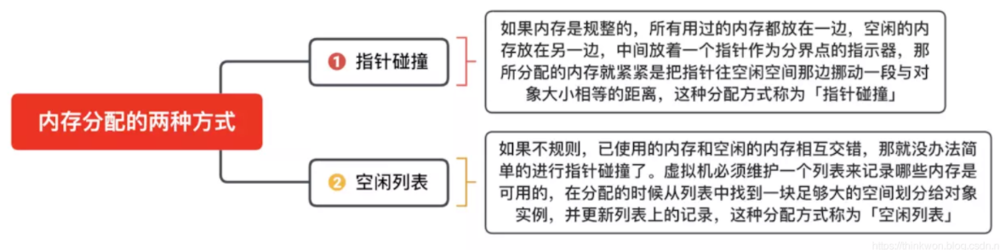
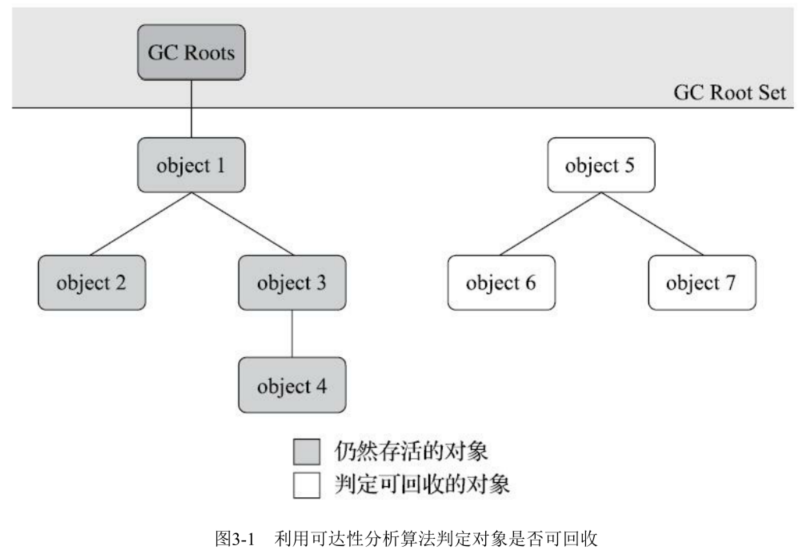

[TOC]


# JVM

https://thinkwon.blog.csdn.net/article/details/104390752

# JVM内存区域

## 运行时数据区

Java虚拟机在执行Java程序的过程中会把它所管理的内存划分为若干个不同的数据区域。这些区域有各自的用途，以及创建和销毁的时间，有的区域随着虚拟机进程的启动而一直存在，有些区域则是依赖用户线程的启动和结束而建立和销毁。根据《Java虚拟机规范》的规定，Java虚拟机所管理的内存将会包括以下几个运行时数据区域


### 程序计数器

程序计数器（Program Counter Register）是一块较小的内存空间，它是当前线程所执行的字节码的行号指示器, 每条线程都需要有一个独立的程序计数器

字节码解释器工作时就是通过改变这个计数器的值来选取下一条需要执行的字节码指令，

它是程序控制流的指示器，分支、循环、跳转、异常处理、线程恢复等基础功能都需要依赖这个计数器来完成。

如果线程正在执行的是一个Java方法，这个计数器记录的是正在执行的虚拟机字节码指令的地址；

如果正在执行的是本地（Native）方法，这个计数器值则应为空（Undefined）。

此内存区域是唯一一个在《Java虚拟机规范》中没有规定任何OutOfMemoryError情况的区域。


### Java虚拟机栈

Java虚拟机栈（Java Virtual Machine Stack）也是线程私有的，它的生命周期与线程相同。

虚拟机栈描述的是Java方法执行的线程内存模型：每个方法被执行的时候，Java虚拟机都会同步创建一个栈帧 （Stack Frame）用于存储局部变量表、操作数栈、动态连接、方法出口等信息。

每一个方法被调用直至执行完毕的过程，就对应着一个栈帧在虚拟机栈中从入栈到出栈的过程

局部变量表

- 存放了编译期可知的各种Java虚拟机基本数据类型（boolean、byte、char、short、int、float、long、double）、
- 对象引用（reference类型，它并不等同于对象本身，可能是一个指向对象起始地址的引用指针，也可能是指向一个代表对象的句柄或者其他与此对象相关的位置）
- returnAddress类型（指向了一条字节码指令的地址）

这些数据类型在局部变量表中的存储空间以局部变量槽（Slot）来表示，其中64位长度的long和double类型的数据会占用两个变量槽，其余的数据类型只占用一个。

局部变量表所需的内存空间在编译期间完成分配，当进入一个方法时，这个方法需要在栈帧中分配多大的局部变量空间是完全确定的，在方法运行期间不会改变局部变量表的大小。

在《Java虚拟机规范》中，对这个内存区域规定了两类异常状况：

- 如果线程请求的栈深度大于虚拟机所允许的深度，将抛出StackOverflowError异常；
- 如果Java虚拟机栈容量可以动态扩展  ，当栈扩展时无法申请到足够的内存会抛出OutOfMemoryError异常。
  - HotSpot虚拟机的栈容量是不可以动态扩展的
  - 所以在HotSpot虚拟机上是不会由于虚拟机栈无法扩展而导致OutOfMemoryError异常——只要线程申请栈空间成功了就不会有OOM，但是如果申请时就失败，仍然是会出现OOM异常的

### 本地方法栈

本地方法栈（Native Method Stacks）与虚拟机栈所发挥的作用是非常相似的，其区别只是

- 虚拟机栈为虚拟机执行Java方法（也就是字节码）服务，
- 而本地方法栈则是为虚拟机使用到的本地（Native）方法服务

本地方法栈也会在栈深度溢出或者栈扩展失败时分别抛出StackOverflowError和OutOfMemoryError异常。


### Java堆

Java堆（Java Heap）是虚拟机所管理的内存中最大的一块。Java堆是被所有线程共享的一块内存区域，

在虚拟机启动时创建。此内存区域的唯一目的就是存放对象实例，Java世界里“几乎”所有的对象实例都在这里分配内存。

在《Java虚拟机规范》中对Java堆的描述是：“所有的对象实例以及数组都应当在堆上分配

- 由于即时编译技术的进步，尤其是逃逸分析技术的日渐强大，栈上分配、标量替换 优化手段已经导致一些微妙的变化悄然发生，
- 所以说Java对象实例都分配在堆上也渐渐变得不是那么绝对了

如果从分配内存的角度看，所有线程共享的Java堆中可以划分出多个线程私有的分配缓冲区（Thread Local Allocation Buffer，TLAB），以提升对象分配时的效率。

不过无论从什么角度，无论如何划分，都不会改变Java堆中存储内容的共性，无论是哪个区域，存储的都只能是对象的实例，将Java堆细分的目的只是为了更好地回收内存，或者更快地分配内存

根据《Java虚拟机规范》的规定，Java堆可以处于物理上不连续的内存空间中，但在逻辑上它应该被视为连续的，这点就像我们用磁盘空间去存储文件一样，并不要求每个文件都连续存放。但对于大对象（典型的如数组对象），多数虚拟机实现出于实现简单、存储高效的考虑，很可能会要求连续的内存空间

### 方法区

方法区（Method Area）与Java堆一样，是各个线程共享的内存区域，

它用于存储已被虚拟机加载的**类型信息、常量、静态变量**、即时编译器编译后的**代码缓存**等数据。

《Java虚拟机规范》对方法区的约束是非常宽松的，除了和Java堆一样不需要连续的内存和可以选择固定大小或者可扩展外，甚至还可以选择不实现垃圾收集。

相对而言，垃圾收集行为在这个区域的确是比较少出现的，但并非数据进入了方法区就如永久代的名字一样“永久”存在了。

这区域的内存回收目标主要是针对**常量池的回收和对类型的卸载**，一般来说这个区域的回收效果比较难令人满意，尤其是类型的卸载，条件相当苛刻，但是这部分区域的回收有时又确实是必要的

根据《Java虚拟机规范》的规定，如果方法区无法满足新的内存分配需求时，将抛出OutOfMemoryError异常。

### 运行时常量池

运行时常量池（Runtime Constant Pool）是方法区的一部分。

Class文件中除了有类的版本、字段、方法、接口等描述信息外，还有一项信息是常量池表（Constant Pool Table），用于存放编译期生成的各种**字面量**与**符号引用**，这部分内容将在类加载后存放到方法区的运行时常量池中。

除了保存Class文件中描述的符号引用外，还会把由符号引用翻译出来的直接引用也存储在运行时常量池中

运行时常量池相对于Class文件常量池的另外一个重要特征是具备动态性，Java语言并不要求常量一定只有编译期才能产生，也就是说，并非预置入Class文件中常量池的内容才能进入方法区运行时常量池，运行期间也可以将新的常量放入池中，这种特性被开发人员利用得比较多的便是String类的intern()方法

当常量池无法再申请到内存时会抛出OutOfMemoryError异常。


### 直接内存

直接内存（Direct Memory）并不是虚拟机运行时数据区的一部分，也不是《Java虚拟机规范》中定义的内存区域。

但是这部分内存也被频繁地使用，而且也可能导致OutOfMemoryError异常出现

在JDK 1.4中新加入了NIO（New Input/Output）类，引入了一种基于通道（Channel）与缓冲区（Buffer）的I/O方式，它可以使用Native函数库直接分配堆外内存，然后通过一个存储在Java堆里面的DirectByteBuffer对象作为这块内存的引用进行操作。这样能在一些场景中显著提高性能，因为避免了在Java堆和Native堆中来回复制数据。

本机直接内存的分配不会受到Java堆大小的限制，但是，既然是内存，则肯定还是会受到本机总内存（包括物理内存、SWAP分区或者分页文件）大小以及处理器寻址空间的限制，一般服务器管理员配置虚拟机参数时，会根据实际内存去设置-Xmx等参数信息，但经常忽略掉直接内存，使得各个内存区域总和大于物理内存限制（包括物理的和操作系统级的限制），从而导致动态扩展时出现OutOfMemoryError异常。


## 说一下 JVM 的主要组成部分及其作用？

JVM包含两个子系统和两个组件，两个子系统为Class loader(类装载)、Execution engine(执行引擎)；两个组件为Runtime data area(运行时数据区)、Native Interface(本地接口)。

- Class loader(类装载)：根据给定的全限定名类名(如：java.lang.Object)来装载class文件到Runtime data area中的method area。

- Execution engine（执行引擎）：执行classes中的指令。

- Native Interface(本地接口)：与native libraries交互，是其它编程语言交互的接口。

- Runtime data area(运行时数据区域)：这就是我们常说的JVM的内存。


作用 ：

- 首先通过编译器把 Java 代码转换成字节码，
- 类加载器（ClassLoader）再把字节码加载到内存中，将其放在运行时数据区（Runtime data area）的方法区内，
- 而字节码文件只是 JVM 的一套指令集规范，并不能直接交给底层操作系统去执行，
- 因此需要特定的命令解析器执行引擎（Execution Engine），将字节码翻译成底层系统指令，再交由 CPU 去执行，
- 而这个过程中需要调用其他语言的本地库接口（Native Interface）来实现整个程序的功能。

下面是Java程序运行机制详细说明

Java程序运行机制步骤

- 首先利用IDE集成开发工具编写Java源代码，源文件的后缀为.java；
- 再利用编译器(javac命令)将源代码编译成字节码文件，字节码文件的后缀名为.class；
- 运行字节码的工作是由解释器(java命令)来完成的。


从上图可以看，java文件通过编译器变成了.class文件，接下来类加载器又将这些.class文件加载到JVM中。
其实可以一句话来解释：类的加载指的是将类的.class文件中的二进制数据读入到内存中，将其放在运行时数据区的方法区内，然后在堆区创建一个 java.lang.Class对象，用来封装类在方法区内的数据结构。

## 说一下 JVM 运行时数据区

Java 虚拟机在执行 Java 程序的过程中会把它所管理的内存区域划分为若干个不同的数据区域。这些区域都有各自的用途，以及创建和销毁的时间，有些区域随着虚拟机进程的启动而存在，有些区域则是依赖线程的启动和结束而建立和销毁。Java 虚拟机所管理的内存被划分为如下几个区域


不同虚拟机的运行时数据区可能略微有所不同，但都会遵从 Java 虚拟机规范， Java 虚拟机规范规定的区域分为以下 5 个部分：

- 程序计数器（Program Counter Register）：当前线程所执行的字节码的行号指示器，字节码解析器的工作是通过改变这个计数器的值，来选取下一条需要执行的字节码指令，分支、循环、跳转、异常处理、线程恢复等基础功能，都需要依赖这个计数器来完成；
- Java 虚拟机栈（Java Virtual Machine Stacks）：用于存储局部变量表、操作数栈、动态链接、方法出口等信息；
- 本地方法栈（Native Method Stack）：与虚拟机栈的作用是一样的，只不过虚拟机栈是服务 Java 方法的，而本地方法栈是为虚拟机调用 Native 方法服务的；
- Java 堆（Java Heap）：Java 虚拟机中内存最大的一块，是被所有线程共享的，几乎所有的对象实例都在这里分配内存；
- 方法区（Methed Area）：用于存储已被虚拟机加载的类信息、常量、静态变量、即时编译后的代码等数据。

## JVM内存模型的相关知识了解多少，比如重排序，内存屏障，happen-before，主内存，工作内存。

**思路：** 先画出Java内存模型图，结合例子volatile ，说明什么是重排序，内存屏障，最好能给面试官写以下demo说明。

**我的答案：**

### Java内存模型图：

- Java内存模型规定了所有的变量都存储在主内存中，每条线程还有自己的工作内存，
- 线程的工作内存中保存了该线程中是用到的变量的主内存副本拷贝，线程对变量的所有操作都必须在工作内存中进行，而不能直接读写主内存。
- 不同的线程之间也无法直接访问对方工作内存中的变量，线程间变量的传递均需要自己的工作内存和主存之间进行数据同步进行。
  


### 指令重排序


运行结果可能为(1,0)、(0,1)或(1,1)，也可能是(0,0)。

因为，在实际运行时，代码指令可能并不是严格按照代码语句顺序执行的。

大多数现代微处理器都会采用将指令乱序执行（out-of-order execution，简称OoOE或OOE）的方法，

在条件允许的情况下，直接运行当前有能力立即执行的后续指令，避开获取下一条指令所需数据时造成的等待。

通过乱序执行的技术，处理器可以大大提高执行效率。而这就是指令重排。


```java
public class PossibleReordering {
static int x = 0, y = 0;
static int a = 0, b = 0;
 
public static void main(String[] args) throws InterruptedException {
    Thread one = new Thread(new Runnable() {
        public void run() {
            a = 1;
            x = b;
        }
    });
    Thread other = new Thread(new Runnable() {
        public void run() {
            b = 1;
            y = a;
        }
    });
    one.start();other.start();
    one.join();other.join();
    System.out.println(“(” + x + “,” + y + “)”);
}
```

### 内存屏障

内存屏障，也叫内存栅栏，是一种CPU指令，用于控制特定条件下的重排序和内存可见性问题。

- LoadLoad屏障：对于这样的语句Load1; LoadLoad; Load2，在Load2及后续读取操作要读取的数据被访问前，保证Load1要读取的数据被读取完毕。
- StoreStore屏障：对于这样的语句Store1; StoreStore; Store2，在Store2及后续写入操作执行前，保证Store1的写入操作对其它处理器可见。
- LoadStore屏障：对于这样的语句Load1; LoadStore; Store2，在Store2及后续写入操作被刷出前，保证Load1要读取的数据被读取完毕。
- StoreLoad屏障：对于这样的语句Store1; StoreLoad; Load2，在Load2及后续所有读取操作执行前，保证Store1的写入对所有处理器可见。它的开销是四种屏障中最大的。 在大多数处理器的实现中，这个屏障是个万能屏障，兼具其它三种内存屏障的功能。

### happen-before原则

- 单线程happen-before原则：在同一个线程中，书写在前面的操作happen-before后面的操作。 
- 锁的happen-before原则：同一个锁的unlock操作happen-before此锁的lock操作。
- volatile的happen-before原则：对一个volatile变量的写操作happen-before对此变量的任意操作(当然也包括写操作了)。
- happen-before的传递性原则：如果A操作 happen-before B操作，B操作happen-before C操作，那么A操作happen-before C操作。
- 线程启动的happen-before原则：同一个线程的start方法happen-before此线程的其它方法。
- 线程中断的happen-before原则 ：对线程interrupt方法的调用happen-before被中断线程的检测到中断发送的代码。
- 线程终结的happen-before原则： 线程中的所有操作都happen-before线程的终止检测。
- 对象创建的happen-before原则： 一个对象的初始化完成先于他的finalize方法调用。
  


## 深拷贝和浅拷贝

浅拷贝（shallowCopy）只是增加了一个指针指向已存在的内存地址，

深拷贝（deepCopy）是增加了一个指针并且申请了一个新的内存，使这个增加的指针指向这个新的内存，

使用深拷贝的情况下，释放内存的时候不会因为出现浅拷贝时释放同一个内存的错误。


## 说一下堆栈的区别？

### 物理地址

堆的物理地址分配对对象是不连续的。因此性能慢些。在GC的时候也要考虑到不连续的分配，所以有各种算法。比如，标记-消除，复制，标记-压缩，分代（即新生代使用复制算法，老年代使用标记——压缩）

栈使用的是数据结构中的栈，先进后出的原则，物理地址分配是连续的。所以性能快。

### 内存分别

堆因为是不连续的，所以分配的内存是在运行期确认的，因此大小不固定。一般堆大小远远大于栈。

栈是连续的，所以分配的内存大小要在编译期就确认，大小是固定的。

### 存放的内容

堆存放的是对象的实例和数组。因此该区更关注的是数据的存储

栈存放：局部变量，操作数栈，返回结果。该区更关注的是程序方法的执行。

PS：

- 静态变量放在方法区
- 静态的对象还是放在堆。

程序的可见度

- 堆对于整个应用程序都是共享、可见的。

- 栈只对于线程是可见的。所以也是线程私有。他的生命周期和线程相同。


### 队列和栈是什么？有什么区别？

队列和栈都是被用来预存储数据的。

- 操作的名称不同。队列的插入称为入队，队列的删除称为出队。栈的插入称为进栈，栈的删除称为出栈。
- 可操作的方式不同。队列是在队尾入队，队头出队，即两边都可操作。而栈的进栈和出栈都是在栈顶进行的，无法对栈底直接进行操作。
- 操作的方法不同。队列是先进先出（FIFO），即队列的修改是依先进先出的原则进行的。新来的成员总是加入队尾（不能从中间插入），每次离开的成员总是队列头上（不允许中途离队）。而栈为后进先出（LIFO）,即每次删除（出栈）的总是当前栈中最新的元素，即最后插入（进栈）的元素，而最先插入的被放在栈的底部，要到最后才能删除。
  

# HotSpot虚拟机对象

## 对象的创建


下面是对象创建的主要流程:

### 检查对象的类是否加载

虚拟机遇到一条new指令时，先将去检查这个指令的参数是否能在常量池中定位到一个类的符号引用，并且检查这个符号引用代表的类是否已被加载、解析和初始化过。如果没有，那必须先执行相应的类加载过程

### 为对象分配内存



在类加载检查通过后，接下来虚拟机将为新生对象分配内存。对象所需内存的大小在类加载完成后便可完全确定，为对象分配空间的任务实际上便等同于把一块确定大小的内存块从Java堆中划分出来

- 若Java堆中内存是绝对规整的，使用“指针碰撞“(Bump The Pointer)方式分配内存；
  - 所有被使用过的内存都被放在一边，空闲的内存被放在另一边，中间放着一个指针作为分界点的指示器，那所分配内存就仅仅是把那个指针向空闲空间方向挪动一段与对象大小相等的距离
- 如果不是规整的，就从空闲列表中分配，叫做”空闲列表“(Free List)方式。
  - 但如果Java堆中的内存并不是规整的，已被使用的内存和空闲的内存相互交错在一起，那就没有办法简单地进行指针碰撞了，虚拟机就必须维护一个列表，记录上哪些内存块是可用的，在分配的时候从列表中找到一块足够大的空间划分给对象实例，并更新列表上的记录

选择哪种分配方式是由 Java 堆是否规整来决定的，而 Java 堆是否规整又由所采用的垃圾收集器是否带有压缩整理功能决定。

### 处理并发安全问题

对象创建在虚拟机中是非常频繁的行为，即使仅仅修改一个指针所指向的位置，在并发情况下也并不是线程安全的，可能出现正在给对象A分配内存，指针还没来得及修改，对象B又同时使用了原来的指针来分配内存的情况

- 对分配内存空间的动作进行同步处理——实际上虚拟机是采用CAS配上失败重试的方式保证更新操作的原子性；
- 另外一种是把内存分配的动作按照线程划分在不同的空间之中进行，
  - 即每个线程在Java堆中预先分配一小块内存，称为本地线程分配缓冲（Thread Local AllocationBuffer，TLAB），
  - 哪个线程要分配内存，就在哪个线程的本地缓冲区中分配，只有本地缓冲区用完了，分配新的缓存区时才需要同步锁定。
  - 虚拟机是否使用TLAB，可以通过-XX：+/-UseTLAB参数来设定。

### 初始化分配的内存空间

内存分配完成之后，虚拟机必须将分配到的内存空间（但不包括对象头）都初始化为零值，

如果使用了TLAB的话，这一项工作也可以提前至TLAB分配时顺便进行。

这步操作保证了对象的实例字段在Java代码中可以不赋初始值就直接使用，使程序能访问到这些字段的数据类型所对应的零值。

### 必要的对象头信息

Java虚拟机还要对对象进行必要的设置，

- 例如这个对象是哪个类的实例、
- 如何才能找到类的元数据信息、
- 对象的哈希码（实际上对象的哈希码会延后到真正调用Object::hashCode()方法时才计算）、
- 对象的GC分代年龄等信息。
- 这些信息存放在对象的对象头（Object Header）之中。
- 根据虚拟机当前运行状态的不同，如是否启用偏向锁等，对象头会有不同的设置方式。


### 最后执行 < init > 方法。

在上面工作都完成之后，从虚拟机的视角来看，一个新的对象已经产生了。

但是从Java程序的视角看来，对象创建才刚刚开始——构造函数，即Class文件中的< init>()方法还没有执行，所有的字段都为默认的零值，对象需要的其他资源和状态信息也还没有按照预定的意图构造好。

一般来说（由字节码流中new指令后面是否跟随invokespecial指令所决定，Java编译器会在遇到new关键字的地方同时生成这两条字节码指令，但如果直接通过其他方式产生的则不一定如此），

new指令之后会接着执行< init>()方法，按照程序员的意愿对对象进行初始化，这样一个真正可用的对象才算完全被构造出来


## 对象的内存布局

在HotSpot虚拟机里，对象在堆内存中的存储布局可以划分为三个部分：对象头（Header）、实例数据（Instance Data）和对齐填充（Padding）。

### 对象头（Header）

HotSpot虚拟机对象的对象头部分包括两类信息

- 第一类是用于存储对象自身的运行时数据，
  - 如哈希码（HashCode）、GC分代年龄、锁状态标志、线程持有的锁、偏向线程ID、偏向时间戳等，
  - 这部分数据的长度在32位和64位的虚拟机（未开启压缩指针）中分别为32个比特和64个比特，官方称它为“Mark Word”

- 另外一部分是类型指针，即对象指向它的类型元数据的指针，
  - Java虚拟机通过这个指针来确定该对象是哪个类的实例。并不是所有的虚拟机实现都必须在对象数据上保留类型指针，
  - 换句话说，查找对象的元数据信息并不一定要经过对象本身
  - 如果对象是一个Java数组，那在对象头中还必须有一块用于记录数组长度的数据，
  - 因为虚拟机可以通过普通Java对象的元数据信息确定Java对象的大小，但是如果数组的长度是不确定的，将无法通过元数据中的信息推断出数组的大小。


### 实例数据（Instance Data）

实例数据部分是对象真正存储的有效信息，即我们在程序代码里面所定义的各种类型的字段内容，无论是从父类继承下来的，还是在子类中定义的字段都必须记录起来这部分的存储顺序会受到虚拟机分配策略参数（-XX：FieldsAllocationStyle参数）和字段在Java源码中定义顺序的影响。

- HotSpot虚拟机默认的分配顺序为longs/doubles、ints、shorts/chars、bytes/booleans、oops（OrdinaryObject Pointers，OOPs），
- 从以上默认的分配策略中可以看到，相同宽度的字段总是被分配到一起存放，在满足这个前提条件的情况下，在父类中定义的变量会出现在子类之前。
- 如果HotSpot虚拟机的+XX：CompactFields参数值为true（默认就为true），那子类之中较窄的变量也允许插入父类变量的空隙之中，以节省出一点点空间。

### 对齐填充（Padding）

对象的第三部分是对齐填充，这并不是必然存在的，也没有特别的含义，它仅仅起着占位符的作用。


## 对象的访问定位

Java程序需要通过 JVM 栈上的引用访问堆中的具体对象。对象的访问方式取决于 JVM 虚拟机的实现。目前主流的访问方式有 句柄 和 直接指针 两种方式。

- 指针： 指向对象，代表一个对象在内存中的起始地址。

- 句柄： 可以理解为指向指针的指针，维护着对象的指针。句柄不直接指向对象，而是指向对象的指针（句柄不发生变化，指向固定内存地址），再由对象的指针指向对象的真实内存地址。


### 句柄访问

Java堆中划分出一块内存来作为句柄池，引用中存储对象的句柄地址，而句柄中包含了对象实例数据与对象类型数据各自的具体地址信息，具体构造如下图所示：

**优势**：引用中存储的是**稳定**的句柄地址，在对象被移动（垃圾收集时移动对象是非常普遍的行为）时只会改变**句柄中**的**实例数据指针**，而**引用**本身不需要修改。


### 直接指针

如果使用**直接指针**访问，**引用** 中存储的直接就是**对象地址**，那么`Java`堆对象内部的布局中就必须考虑如何放置访问**类型数据**的相关信息。

**优势**：速度更**快**，节省了**一次指针定位**的时间开销。由于对象的访问在`Java`中非常频繁，因此这类开销积少成多后也是非常可观的执行成本。HotSpot 中采用的就是这种方式。


## 内存溢出异常

### Java会存在内存泄漏吗？请简单描述

内存泄漏是指不再被使用的对象或者变量一直被占据在内存中。理论上来说，Java是有GC垃圾回收机制的，也就是说，不再被使用的对象，会被GC自动回收掉，自动从内存中清除。

但是，即使这样，Java也还是存在着内存泄漏的情况，java导致内存泄露的原因很明确：长生命周期的对象持有短生命周期对象的引用就很可能发生内存泄露，尽管短生命周期对象已经不再需要，但是因为长生命周期对象持有它的引用而导致不能被回收，这就是java中内存泄露的发生场景。


# 垃圾收集器

## 简述Java垃圾回收机制

在java中，程序员是不需要显示的去释放一个对象的内存的，而是由虚拟机自行执行。在JVM中，有一个垃圾回收线程，它是低优先级的，在正常情况下是不会执行的，只有在虚拟机空闲或者当前堆内存不足时，才会触发执行，扫面那些没有被任何引用的对象，并将它们添加到要回收的集合中，进行回收


## GC是什么？为什么要GC

- GC 是垃圾收集的意思（Gabage Collection）,内存处理是编程人员容易出现问题的地方，忘记或者错误的内存
- 回收会导致程序或系统的不稳定甚至崩溃，Java 提供的 GC 功能可以自动监测对象是否超过作用域从而达到自动回收内存的目的，
- Java 语言没有提供释放已分配内存的显示操作方法。

## 垃圾回收的优点和原理。并考虑2种回收机制

- java语言最显著的特点就是引入了垃圾回收机制，它使java程序员在编写程序时不再考虑内存管理的问题。
- 由于有这个垃圾回收机制，java中的对象不再有“作用域”的概念，只有引用的对象才有“作用域”。

- 垃圾回收机制有效的防止了内存泄露，可以有效的使用可使用的内存。

- 垃圾回收器通常作为一个单独的低级别的线程运行，在不可预知的情况下对内存堆中已经死亡的或很长时间没有用过的对象进行清除和回收。

- 程序员不能实时的对某个对象或所有对象调用垃圾回收器进行垃圾回收。

- 垃圾回收有分代复制垃圾回收、标记垃圾回收、增量垃圾回收。


## 垃圾回收器的基本原理是什么？垃圾回收器可以马上回收内存吗？有什么办法主动通知虚拟机进行垃圾回收？

- 对于GC来说，当程序员创建对象时，GC就开始监控这个对象的地址、大小以及使用情况。
- 通常，GC采用有向图的方式记录和管理堆(heap)中的所有对象。通过这种方式确定哪些对象是"可达的"，哪些对象是"不可达的"。当GC确定一些对象为"不可达"时，GC就有责任回收这些内存空间。

- 可以。程序员可以手动执行System.gc()，通知GC运行，但是Java语言规范并不保证GC一定会执行。


## Java 中都有哪些引用类型？

(4种引用强度依次逐渐减弱)

### 强引用（Strongly Re-ference）

- 类似“Object obj=new Object()”这种引用关系。无论任何情况下，只要强引用关系还存在，垃圾收集器就永远不会回收掉被引用的对象。

### 软引用（Soft Reference)

- 一些还有用，但非必须的对象。只被软引用关联着的对象，在系统将要发生内存溢出异常前，会把这些对象列进回收范围之中进行第二次回收，如果这次回收还没有足够的内存，才会抛出内存溢出异常

- 如果一个对象只具有软引用，则内存空间足够，垃圾回收器就不会回收它；如果内存空间不足了，就会回收这些对象的内存。

- ```java
  SoftReference<String> softRef=new SoftReference<String>(str);     // 软引用
  ```

- **用处：** 软引用在实际中有重要的应用，例如浏览器的后退按钮。按后退时，这个后退时显示的网页内容是重新进行请求还是从缓存中取出呢？这就要看具体的实现策略了。

  - （1）如果一个网页在浏览结束时就进行内容的回收，则按后退查看前面浏览过的页面时，需要重新构建

  - （2）如果将浏览过的网页存储到内存中会造成内存的大量浪费，甚至会造成内存溢出

  - ```java
    Browser prev = new Browser();               // 获取页面进行浏览
    SoftReference sr = new SoftReference(prev); // 浏览完毕后置为软引用        
    if(sr.get()!=null){ 
        rev = (Browser) sr.get();           // 还没有被回收器回收，直接获取
    }else{
        prev = new Browser();               // 由于内存吃紧，所以对软引用的对象回收了
        sr = new SoftReference(prev);       // 重新构建
    }
    ```

### 弱引用（Weak Reference）

- 那些非必须对象，但是它的强度比软引用更弱一些，被弱引用关联的对象只能生存到下一次垃圾收集发生为止。当垃圾收集器开始工作，无论当前内存是否足够，都会回收掉只被弱引用关联的对象
- 具有弱引用的对象拥有更短暂的生命周期。在垃圾回收器线程扫描它所管辖的内存区域的过程中，一旦发现了只具有弱引用的对象，不管当前内存空间足够与否，都会回收它的内存。

```java
String str=new String("abc");    
WeakReference<String> abcWeakRef = new WeakReference<String>(str);
str=null;
等价于
str = null;
System.gc();
```


### 虚引用（Phantom Reference）

- 最弱的一种引用关系。一个对象是否有虚引用的存在，完全不会对其生存时间构成影响，也无法通过虚引用来取得一个对象实例

## 怎么判断对象是否可以被回收？

垃圾收集器在做垃圾回收的时候，首先需要判定的就是哪些内存是需要被回收的，哪些对象是「存活」的，是不可以被回收的；哪些对象已经「死掉」了，需要被回收。

一般有两种方法来判断：

- 引用计数器法：为每个对象创建一个引用计数，有对象引用时计数器 +1，引用被释放时计数 -1，当计数器为 0 时就可以被回收。它有一个缺点不能解决循环引用的问题；
- 可达性分析算法：从 GC Roots 开始向下搜索，搜索所走过的路径称为引用链。当一个对象到 GC Roots 没有任何引用链相连时，则证明此对象是可以被回收的。

## 在Java中，对象什么时候可以被垃圾回收

- 当对象对当前使用这个对象的应用程序变得不可触及的时候，这个对象就可以被回收了。
- 垃圾回收不会发生在永久代，如果永久代满了或者是超过了临界值，会触发完全垃圾回收(Full GC)。如果你仔细查看垃圾收集器的输出信息，就会发现永久代也是被回收的。这就是为什么正确的永久代大小对避免Full GC是非常重要的原因。

## JVM中的永久代中会发生垃圾回收吗

垃圾回收不会发生在永久代，如果永久代满了或者是超过了临界值，会触发完全垃圾回收(Full GC)。如果你仔细查看垃圾收集器的输出信息，就会发现永久代也是被回收的。这就是为什么正确的永久代大小对避免Full GC是非常重要的原因。请参考下Java8：从永久代到元数据区
(译者注：Java8中已经移除了永久代，新加了一个叫做元数据区的native内存区)

## 说一下 JVM 有哪些垃圾回收算法？

- 标记-清除算法：标记无用对象，然后进行清除回收。缺点：效率不高，无法清除垃圾碎片。
- 复制算法：按照容量划分二个大小相等的内存区域，当一块用完的时候将活着的对象复制到另一块上，然后再把已使用的内存空间一次清理掉。缺点：内存使用率不高，只有原来的一半。
- 标记-整理算法：标记无用对象，让所有存活的对象都向一端移动，然后直接清除掉端边界以外的内存。
- 分代算法：根据对象存活周期的不同将内存划分为几块，一般是新生代和老年代，新生代基本采用复制算法，老年代采用标记整理算法。

### 标记-清除算法

标记无用对象，然后进行清除回收。

标记-清除算法（Mark-Sweep）是一种常见的基础垃圾收集算法，它将垃圾收集分为两个阶段：

- 标记阶段：标记出可以回收的对象。
- 清除阶段：回收被标记的对象所占用的空间。

标记-清除算法之所以是基础的，是因为后面讲到的垃圾收集算法都是在此算法的基础上进行改进的。

- 优点：实现简单，不需要对象进行移动。

- 缺点：标记、清除过程效率低，产生大量不连续的内存碎片，提高了垃圾回收的频率。


标记-清除算法的执行的过程如下图所示


### 复制算法

为了解决标记-清除算法的效率不高的问题，产生了复制算法。它把内存空间划为两个相等的区域，每次只使用其中一个区域。垃圾收集时，遍历当前使用的区域，把存活对象复制到另外一个区域中，最后将当前使用的区域的可回收的对象进行回收。

- 优点：按顺序分配内存即可，实现简单、运行高效，不用考虑内存碎片。

- 缺点：可用的内存大小缩小为原来的一半，对象存活率高时会频繁进行复制。


复制算法的执行过程如下图所示


### 标记-整理算法

在新生代中可以使用复制算法，但是在老年代就不能选择复制算法了，因为老年代的对象存活率会较高，这样会有较多的复制操作，导致效率变低。

标记-清除算法可以应用在老年代中，但是它效率不高，在内存回收后容易产生大量内存碎片。

因此就出现了一种标记-整理算法（Mark-Compact）算法，与标记-整理算法不同的是，在标记可回收的对象后将所有存活的对象压缩到内存的一端，使他们紧凑的排列在一起，然后对端边界以外的内存进行回收。回收后，已用和未用的内存都各自一边。

- 优点：解决了标记-清理算法存在的内存碎片问题。

- 缺点：仍需要进行局部对象移动，一定程度上降低了效率。


标记-整理算法的执行过程如下图所示


### 分代收集算法

当前商业虚拟机都采用**分代收集**的垃圾收集算法。分代收集算法，顾名思义是根据对象的**存活周期**将内存划分为几块。一般包括**年轻代**、**老年代** 和 **永久代**，如图所示：


## 说一下 JVM 有哪些垃圾回收器？

如果说垃圾收集算法是内存回收的方法论，那么垃圾收集器就是内存回收的具体实现。下图展示了7种作用于不同分代的收集器，

- 其中用于回收新生代的收集器包括Serial、PraNew、Parallel Scavenge，
- 回收老年代的收集器包括Serial Old、Parallel Old、CMS，
- 还有用于回收整个Java堆的G1收集器。

不同收集器之间的连线表示它们可以搭配使用。


新生代

- Serial收集器（复制算法): 新生代单线程收集器，标记和清理都是单线程，优点是简单高效；
- ParNew收集器 (复制算法): 新生代并行收集器，实际上是Serial收集器的多线程版本，在多核CPU环境下有着比Serial更好的表现；
- Parallel Scavenge收集器 (复制算法): 新生代并行收集器，追求高吞吐量，高效利用 CPU。吞吐量 = 用户线程时间/(用户线程时间+GC线程时间)，高吞吐量可以高效率的利用CPU时间，尽快完成程序的运算任务，适合后台应用等对交互相应要求不高的场景；

老年代

- Serial Old收集器 (标记-整理算法): 老年代单线程收集器，Serial收集器的老年代版本；
- Parallel Old收集器 (标记-整理算法)： 老年代并行收集器，吞吐量优先，Parallel Scavenge收集器的老年代版本；
- CMS(Concurrent Mark Sweep)收集器（标记-清除算法）： 老年代并行收集器，以获取最短回收停顿时间为目标的收集器，具有高并发、低停顿的特点，追求最短GC回收停顿时间。

Full GC

- G1(Garbage First)收集器 (标记-整理算法)： Java堆并行收集器，G1收集器是JDK1.7提供的一个新收集器，G1收集器基于“标记-整理”算法实现，也就是说不会产生内存碎片。此外，G1收集器不同于之前的收集器的一个重要特点是：G1回收的范围是整个Java堆(包括新生代，老年代)，而前六种收集器回收的范围仅限于新生代或老年代。

## 详细介绍一下 CMS 垃圾回收器？

CMS 是英文 Concurrent Mark-Sweep 的简称，是以牺牲吞吐量为代价来获得最短回收停顿时间的垃圾回收器。对于要求服务器响应速度的应用上，这种垃圾回收器非常适合。在启动 JVM 的参数加上“-XX:+UseConcMarkSweepGC”来指定使用 CMS 垃圾回收器。

CMS 使用的是标记-清除的算法实现的，所以在 gc 的时候回产生大量的内存碎片，当剩余内存不能满足程序运行要求时，系统将会出现 Concurrent Mode Failure，临时 CMS 会采用 Serial Old 回收器进行垃圾清除，此时的性能将会被降低。


## 新生代垃圾回收器和老年代垃圾回收器都有哪些？有什么区别？

- 新生代回收器：Serial、ParNew、Parallel Scavenge
- 老年代回收器：Serial Old、Parallel Old、CMS
- 整堆回收器：G1

新生代垃圾回收器一般采用的是复制算法，复制算法的优点是效率高，缺点是内存利用率低；老年代回收器一般采用的是标记-整理的算法进行垃圾回收。


## 简述分代垃圾回收器是怎么工作的？

分代回收器有两个分区：老生代和新生代，新生代默认的空间占比总空间的 1/3，老生代的默认占比是 2/3。

新生代使用的是复制算法，新生代里有 3 个分区：Eden、To Survivor、From Survivor，它们的默认占比是 8:1:1，它的执行流程如下：

- Java堆 = 老年代 + 新生代
- 新生代 = Eden + S0 + S1
- 当 Eden 区的空间满了， Java虚拟机会触发一次 Minor GC，以收集新生代的垃圾，存活下来的对象，则会转移到 Survivor区。
- 大对象（需要大量连续内存空间的Java对象，如那种很长的字符串）直接进入老年态；
- 如果对象在Eden出生，并经过第一次Minor GC后仍然存活，并且被Survivor容纳的话，年龄设为1，每熬过一次Minor GC，年龄+1，若年龄超过一定限制（15），则被晋升到老年态。即长期存活的对象进入老年态。
- 老年代满了而无法容纳更多的对象，Minor GC 之后通常就会进行Full GC，Full GC 清理整个内存堆 – 包括年轻代和年老代。
- Major GC 发生在老年代的GC，清理老年区，经常会伴随至少一次Minor GC，比Minor GC慢10倍以上。
  

## 为什么要分为Eden和Survivor?为什么要设置两个Survivor区？

- 如果没有Survivor，Eden区每进行一次Minor GC，存活的对象就会被送到老年代。老年代很快被填满，触发Major GC.老年代的内存空间远大于新生代，进行一次Full GC消耗的时间比Minor GC长得多,所以需要分为Eden和Survivor。
- Survivor的存在意义，就是减少被送到老年代的对象，进而减少Full GC的发生，Survivor的预筛选保证，只有经历16次Minor GC还能在新生代中存活的对象，才会被送到老年代。
- 设置两个Survivor区最大的好处就是解决了碎片化，
  - 刚刚新建的对象在Eden中，经历一次Minor GC，Eden中的存活对象就会被移动到第一块survivor space S0，Eden被清空；
  - 等Eden区再满了，就再触发一次Minor GC，Eden和S0中的存活对象又会被复制送入第二块survivor space S1
  - （这个过程非常重要，因为这种复制算法保证了S1中来自S0和Eden两部分的存活对象占用连续的内存空间，避免了碎片化的发生）
    

# 内存分配策略

## 简述java内存分配与回收策率以及Minor GC和Major GC

所谓自动内存管理，最终要解决的也就是内存分配和内存回收两个问题。前面我们介绍了内存回收，这里我们再来聊聊内存分配。

- 对象的内存分配通常是在 Java 堆上分配（随着虚拟机优化技术的诞生，某些场景下也会在栈上分配，后面会详细介绍），对象主要分配在新生代的 Eden 区，
- 如果启动了本地线程缓冲，将按照线程优先在 TLAB 上分配。少数情况下也会直接在老年代上分配。
- 总的来说分配规则不是百分百固定的，其细节取决于哪一种垃圾收集器组合以及虚拟机相关参数有关，

但是虚拟机对于内存的分配还是会遵循以下几种「普世」规则：

### 对象优先在 Eden 区分配

多数情况，对象都在新生代 Eden 区分配。当 Eden 区分配没有足够的空间进行分配时，虚拟机将会发起一次 Minor GC。如果本次 GC 后还是没有足够的空间，则将启用分配担保机制在老年代中分配内存。

- Minor GC 是指发生在新生代的 GC，因为 Java 对象大多都是朝生夕死，所有 Minor GC 非常频繁，一般回收速度也非常快；
- Major GC/Full GC 是指发生在老年代的 GC，出现了 Major GC 通常会伴随至少一次 Minor GC。Major GC 的速度通常会比 Minor GC 慢 10 倍以上。

### 大对象直接进入老年代

所谓大对象是指需要大量连续内存空间的对象，频繁出现大对象是致命的，会导致在内存还有不少空间的情况下提前触发 GC 以获取足够的连续空间来安置新对象。

前面我们介绍过新生代使用的是标记-清除算法来处理垃圾回收的，如果大对象直接在新生代分配就会导致 Eden 区和两个 Survivor 区之间发生大量的内存复制。因此对于大对象都会直接在老年代进行分配。

### 长期存活对象将进入老年代

虚拟机采用分代收集的思想来管理内存，那么内存回收时就必须判断哪些对象应该放在新生代，哪些对象应该放在老年代。

因此虚拟机给每个对象定义了一个对象年龄的计数器，如果对象在 Eden 区出生，并且能够被 Survivor 容纳，将被移动到 Survivor 空间中，这时设置对象年龄为 1。

对象在 Survivor 区中每「熬过」一次 Minor GC 年龄就加 1，当年龄达到一定程度（默认 15） 就会被晋升到老年代。


# Class类文件结构

任何一个Class文件都对应着唯一的一个类或接口的定义信息  ，但是反过来说，类或接口并不一定都得定义在文件里（譬如类或接口也可以动态生成，直接送入类加载器中）

- Class文件是一组以8个字节为基础单位的二进制流，各个数据项目严格按照顺序紧凑地排列在文件之中，中间没有添加任何分隔符，
- 这使得整个Class文件中存储的内容几乎全部是程序运行的必要数据，没有空隙存在。
- 当遇到需要占用8个字节以上空间的数据项时，则会按照高位在前的方式分割成若干个8个字节进行存储。

根据《Java虚拟机规范》的规定，Class文件格式采用一种类似于C语言结构体的伪结构来存储数据，这种伪结构中只有两种数据类型：“无符号数”和“表”。后面的解析都要以这两种数据类型为基础

- 无符号数属于基本的数据类型，以u1、u2、u4、u8来分别代表1个字节、2个字节、4个字节和8个字节的无符号数，无符号数可以用来**描述数字**、**索引引用、数量值或者按照UTF-8编码构成字符串值**

- 表是由多个**无符号数**或者**其他表**作为数据项构成的**复合数据类型**，为了便于区分，所有表的命名都习惯性地以**“_info”结尾。**表用于描述有层次关系的复合结构的数据，整个Class文件本质上也可以视作是一张表

## 魔数与Class文件的版本(1-4 5-6)

### 魔数(0xCAFEBABE（咖啡宝贝？）(1-4)

每个Class文件的头4个字节被称为魔数（Magic Number），它的唯一作用是确定这个文件是否为一个能被虚拟机接受的Class文件

不仅是Class文件，很多文件格式标准中都有使用魔数来进行身份识别的习惯，譬如图片格式，如GIF或者JPEG等在文件头中都存有魔数。

#### 为什么不使用扩展名?

- 使用魔数而不是扩展名来进行识别主要是基于安全考虑，因为文件扩展名可以随意改动。
- 文件格式的制定者可以自由地选择魔数值，只要这个魔数值还没有被广泛采用过而且不会引起混淆

### Class文件的版本号(5-6)

第5和第6个字节是次版本号（MinorVersion），第7和第8个字节是主版本号（Major Version）

高版本的JDK能向下兼容以前版本的Class文件，但不能运行以后版本的Class文件，因为《Java虚拟机规范》在Class文件校验部分明确要求了即使文件格式并未发生任何变化，虚拟机也必须拒绝执行超过其版本号的Class文件。


## 常量池

紧接着主、次版本号之后的是常量池入口，常量池可以比喻为Class文件里的资源仓库，它是Class文件结构中与其他项目关联最多的数据，通常也是占用Class文件空间最大的数据项目之一，另外，它还是在Class文件中第一个出现的表类型数据项目

- 由于常量池中常量的数量是不固定的，所以在常量池的入口需要放置一项u2类型的数据，代表常量池容量计数值（constant_pool_count）这个容量计数是从1而不是0开始
- 在Class文件格式规范制定之时，设计者将第0项常量空出来是有特殊考虑的，这样做的目的在于，如果后面某些指向常量池的索引值的数据在特定情况下需要表达“不引用任何一个常量池项目”的含义，可以把索引值设置为0来表示

### 常量池中主要存放两大类常量：字面量（Literal）和符号引用（Symbolic References）。

- 字面量比较接近于Java语言层面的常量概念，如文本字符串、被声明为final的常量值等。
- 而符号引用则属于编译原理方面的概念，主要包括下面几类常量：
  - 被模块导出或者开放的包（Package）
  - 类和接口的全限定名（Fully Qualified Name）
  - 字段的名称和描述符（Descriptor）
  - 方法的名称和描述符
  - 方法句柄和方法类型（Method Handle、Method Type、Invoke Dynamic）
  - 动态调用点和动态常量（Dynamically-Computed Call Site、Dynamically-Computed Constant）

### 符号引用的动态链接

Java代码在进行Javac编译的时候，并不像C和C++那样有“连接”这一步骤，而是在虚拟机加载Class文件的时候进行动态连接。

也就是说，在Class文件中不会保存各个方法、字段最终在内存中的布局信息，这些字段、方法的符号引用不经过虚拟机在运行期转换的话是无法得到真正的
内存入口地址，也就无法直接被虚拟机使用的。

当虚拟机做类加载时，将会从常量池获得对应的符号引用，再在类创建时或运行时解析、翻译到具体的内存地址之中

### 常量池的项目类型

常量池中每一项常量都是一个表, 常量表中分别有17种不同类型的常量。

- 这17类表都有一个共同的特点，表结构起始的第一位是个u1类型的标志位（tag，取值见表6-3中标志列），代表着当前常量属于哪种常量类型。

#### CONSTANT_Class_info类型

- 此类型的常量代表一个类或者接口的符号引用

- tag是标志位，它用于区分常量类型；
- name_index是常量池的索引值，它指向常量池中一个CONSTANT_Utf8_info类型常量，此常量代表了这个类（或者接口）的全限定名
- 


#### CONSTANT_Utf8_info类型

length值说明了这个UTF-8编码的字符串长度是多少字节，它后面紧跟着的长度为length字节的连续数据是一个使用UTF-8缩略编码表示的字符串

由于Class文件中方法、字段等都需要引用CONSTANT_Utf8_info型常量来描述名称，所以CONSTANT_Utf8_info型常量的最大长度也就是Java中方法、字段名的最大长度。而这里的最大长度就是length的最大值，既u2类型能表达的最大值65535


## 访问标志

在常量池结束之后，紧接着的2个字节代表访问标志（access_flags），这个标志用于识别一些类或者接口层次的访问信息，

- 这个Class是类还是接口；
- 是否定义为public类型；
- 是否定义为abstract类型；
- 如果是类的话，是否被声明为final

access_flags中一共有16个标志位可以使用，当前只定义了其中9个 ，没有使用到的标志位要求一律为零


## 类索引、父类索引与接口索引集合(u2)

类索引（this_class）和父类索引（super_class）都是一个u2(2个字节)类型的数据，

而接口索引集合（interfaces）是一组u2类型的数据的集合，

Class文件中由这三项数据来确定该类型的继承关系

类索引用于确定这个类的全限定名，父类索引用于确定这个类的父类的全限定名

接口索引集合就用来描述这个类实现了哪些接口，这些被实现的接口将按implements关键字（如果这个Class文件表示的是一个接口，则应当是extends关键字）后的接口顺序从左到右排列在接口索引集合中

类索引、父类索引和接口索引集合都按顺序排列在访问标志之后，

- 类索引和父类索引用两个u2类型的索引值表示，它们各自指向一个类型为CONSTANT_Class_info的类描述符常量，通过CONSTANT_Class_info类型的常量中的索引值可以找到定义在CONSTANT_Utf8_info类型的常量中的全限定名字符串


对于接口索引集合，入口的第一项u2类型的数据为接口计数器（interfaces_count），表示索引表的容量。如果该类没有实现任何接口，则该计数器值为0，后面接口的索引表不再占用任何字节


## 字段表集合

字段表（field_info）用于描述接口或者类中声明的变量。Java语言中的“字段”（Field）包括类级变量以及实例级变量，但不包括在方法内部声明的局部变量

描述一个字段可以包含哪些信息

- 字段可以包括的修饰符有字段的作用域（public、private、protected修饰符）、
- 是实例变量还是类变量（static修饰符）、
- 可变性（final）、
- 并发可见性（volatile修饰符，是否强制从主内存读写）、
- 可否被序列化（transient修饰符）、
- 字段数据类型（基本类型、对象、数组）、
- 字段名称

上述这些信息中，各个修饰符都是布尔值，要么有某个修饰符，要么没有，很适合使用标志位来表示。

而字段叫做什么名字、字段被定义为什么数据类型，这些都是无法固定的，只能引用常量池中的常量来描述


### access_flags

字段修饰符放在access_flags项目中，它与类中的access_flags项目是非常类似的，都是一个u2的数据类型

- 很明显，由于语法规则的约束，ACC_PUBLIC、ACC_PRIVATE、ACC_PROTECTED三个标志最多只能选择其一，
- ACC_FINAL、ACC_VOLATILE不能同时选择。
- 接口之中的字段必须有ACC_PUBLIC、ACC_STATIC、ACC_FINAL标志，
- 这些都是由Java本身的语言规则所导致的。


### name_index和descriptor_index

都是对常量池项的引用，分别代表着字段的简单名称以及字段和方法的描述符

"简单名称” “描述符” “全限定名”

- 全限定名
  - “org/fenixsoft/clazz/TestClass”是这个类的全限定名，仅仅是把类全名中的“.”替换成了“/”而已，
  - 为了使连续的多个全限定名之间不产生混淆，在使用时最后一般会加入一个“；”号表示全限定名结束。

- 简单名称
  - 指没有类型和参数修饰的方法或者字段名称，
  - 这个类中的inc()方法和m字段的简单名称分别就是“inc”和“m”。
- 描述符
  - 方法和字段的描述符就要复杂一些。
  - 描述符的作用是用来描述字段的数据类型、方法的参数列表（包括数量、类型以及顺序）和返回值。
  - 根据描述符规则，基本数据类型（byte、char、double、float、int、long、short、boolean）以及代表无返回值的void类型都用一个大
    写V字符来表示，
  - 而对象类型则用字符L加对象的全限定名
  - 对于数组类型，每一维度将使用一个前置的“[”字符来描述，
    - 如一个定义为“java.lang.String[][]”类型的二维数组将被记录成“[[Ljava/lang/String；”，
    - 一个整型数组“int[]”将被记录成“[I”
  - 描述符来描述方法时，按照先参数列表、后返回值的顺序描述，
    - 参数列表按照参数的严格顺序放在一组小括号“()”之内。
      - 如方法void inc()的描述符为“()V”，
      - 方法java.lang.String toString()的描述符为“()Ljava/lang/String；”，
      - 方法int indexOf(char[]source，int sourceOffset，int sourceCount，char[]target，int targetOffset，int targetCount，int fromIndex)的描述符为“([CII[CIII)I


字段表集合从地址0x000000F8开始，

- 第一个u2类型的数据为容量计数器fields_count，如图6-8所示，其值为0x0001，说明这个类只有一个字段表数据。
- 接下来紧跟着容量计数器的是access_flags标志，值为0x0002，代表private修饰符的ACC_PRIVATE标志位为真（ACC_PRIVATE标志的值为0x0002），其他修饰符为假。
- 代表字段名称的name_index的值为0x0005，从代码清单6-2列出的常量表中可查得第五项常量是一个CONSTANT_Utf8_info类型的字符串，其值为“m”，
- 代表字段描述符的descriptor_index的值为0x0006，指向常量池的字符串“I”。
- 根据这些信息，我们可以推断出原代码定义的字段为“private int m；”


字段表所包含的固定数据项目到descriptor_index为止就全部结束了，不过在descrip-tor_index之后跟随着一个属性表集合，用于存储一些额外的信息，字段表可以在属性表中附加描述零至多项的额外信息

字段表集合中不会列出从父类或者父接口中继承而来的字段，但有可能出现原本Java代码之中不存在的字段，譬如在内部类中为了保持对外部类的访问性，编译器就会自动添加指向外部类实例的字段。

另外，在Java语言中字段是无法重载的，两个字段的数据类型、修饰符不管是否相同，都必须使用不一样的名称，但是对于Class文件格式来讲，只要两个字段的描述符不是完全相同，那字段重名就是合法的。


## 方法表集合

Class文件存储格式中对方法的描述与对字段的描述采用了几乎完全一致的方式，方法表的结构如同字段表一样，

依次包括访问标志（access_flags）、名称索引（name_index）、描述符索引（descriptor_index）、属性表集合（attributes）


因为volatile关键字和transient关键字不能修饰方法，所以方法表的访问标志中没有了ACC_VOLATILE标志和ACC_TRANSIENT标志。

与之相对，synchronized、native、strictfp和abstract关键字可以修饰方法，方法表的访问标志中也相应地增加了ACC_SYNCHRONIZED、ACC_NATIVE、ACC_STRICTFP和ACC_ABSTRACT标志。


方法里的Java代码，经过Javac编译器编译成字节码指令之后，存放在方法属性表集合中一个名为“Code”的属性里面


方法表集合的入口地址为0x00000101，

- 第一个u2类型的数据（即计数器容量）的值为0x0002，代表集合中有两个方法，这两个方法为编译器添加的实例构造器< init>和源码中定义的方法inc()。
- 第一个方法的访问标志值为0x0001，也就是只有ACC_PUBLIC标志为真，
- 名称索引值为0x0007，查代码清单6-2的常量池得方法名为“<init>”，
- 描述符索引值为0x0008，对应常量为“()V”，
- 属性表计数器attributes_count的值为0x0001，表示此方法的属性表集合有1项属性，
- 属性名称的索引值为0x0009，对应常量为“Code”

与字段表集合相对应地，如果父类方法在子类中没有被重写（Override），方法表集合中就不会出现来自父类的方法信息。

但同样地，有可能会出现由编译器自动添加的方法，最常见的便是类构造器“<clinit>()”方法和实例构造器“<init>()”方法

在Java语言中，要重载（Overload）一个方法，除了要与原方法具有相同的简单名称之外，还要求必须拥有一个与原方法不同的特征签名 。

特征签名是指一个方法中各个参数在常量池中的字段符号引用的集合，也正是因为返回值不会包含在特征签名之中，所以Java语言里面是无法仅仅依靠返回值的不同来对一个已有方法进行重载的。

但是在Class文件格式之中，特征签名的范围明显要更大一些，只要描述符不是完全一致的两个方法就可以共存。也就是说，如果两个方法有相同的名称和特征签名，但返回值不同，那么也是可以合法共存于同一个Class文件中的

特征签名

- Java代码的方法特征签名只包括方法名称、参数顺序及参数类型，
- 而字节码的特征签名还包括方法返回值以及受查异常表


## 属性表集合

Class文件、字段表、方法表都可以携带自己的属性表集合，以描述某些场景专有的信息

属性表集合的限制稍微宽松一些，不再要求各个属性表具有严格顺序，并且《Java虚拟机规范》允许只要不与已有属性名重复，任何人实现的编译器都可以向属性表中写入自己定义的属性信息，Java虚拟机运行时会忽略掉它不认识的属性

对于每一个属性，它的名称都要从常量池中引用一个CONSTANT_Utf8_info类型的常量来表示，而属性值的结构则是完全自定义的，只需要通过一个u4的长度属性去说明属性值所占用的位数即可


### Code属性

Java程序方法体里面的代码经过Javac编译器处理之后，最终变为字节码指令存储在Code属性内。

Code属性出现在方法表的属性集合之中，但并非所有的方法表都必须存在这个属性，譬如接口或者抽象类中的方法就不存在Code属性

Code属性是Class文件中最重要的一个属性，如果把一个Java程序中的信息分为代码（Code，方法体里面的Java代码）和元数据（Metadata，包括类、字段、方法定义及其他信息）两部分，那么在整个Class文件里，Code属性用于描述代码，所有的其他数据项目都用于描述元数据。

#### attribute_name_index

是一项指向CONSTANT_Utf8_info型常量的索引，此常量值固定为“Code”，它代表了该属性的属性名称，

attribute_length指示了属性值的长度，

由于属性名称索引与属性长度一共为6个字节，所以属性值的长度固定为整个属性表长度减去6个字节。

#### max_stack

代表了操作数栈（Operand Stack）深度的最大值。在方法执行的任意时刻，操作数栈都不会超过这个深度。

虚拟机运行的时候需要根据这个值来分配栈帧（Stack Frame）中的操作栈深度

#### max_locals

代表了局部变量表所需的存储空间。

在这里，max_locals的单位是变量槽（Slot），变量槽是虚拟机为局部变量分配内存所使用的最小单位。

- 对于byte、char、float、int、short、boolean和returnAddress等长度不超过32位的数据类型，每个局部变量占用一个变量槽，
- 而double和long这两种64位的数据类型则需要两个变量槽来存放。

方法参数（包括实例方法中的隐藏参数“this”）、显式异常处理程序的参数（Exception Handler Parameter，就是try-catch语句中catch块中所定义的异常）、方法体中定义的局部变量都需要依赖局部变量表来存放。

注意，并不是在方法中用了多少个局部变量，就把这些局部变量所占变量槽数量之和作为max_locals的值，

操作数栈和局部变量表直接决定一个该方法的栈帧所耗费的内存，不必要的操作数栈深度和变量槽数量会造成内存的浪费。

Java虚拟机的做法是将局部变量表中的变量槽进行重用，当代码执行超出一个局部变量的作用域时，这个局部变量所占的变量槽可以被其他局部变量所使用，

Javac编译器会根据变量的作用域来分配变量槽给各个变量使用，根据同时生存的最大局部变量数量和类型计算出max_locals的大小

#### code_length

code_length和code用来存储Java源程序编译后生成的字节码指令。

code_length代表字节码长度，code是用于存储字节码指令的一系列字节流。既然叫字节码指令，那顾名思义每个指令就是一个u1类型的单字节，

当虚拟机读取到code中的一个字节码时，就可以对应找出这个字节码代表的是什么指令，并且可以知道这条指令后面是否需要跟随参数，以及后续的参数应当如何解析。

我们知道一个u1数据类型的取值范围为0x00～0xFF，对应十进制的0～255，也就是一共可以表达256条指令。

目前，《Java虚拟机规范》已经定义了其中约200条编码值对应的指令含义，编码与指令之间的对应关系可查阅本书的附录C“虚拟机字节码指令表”


Java语言里面的潜规则：在任何实例方法里面，都可以通过“this”关键字访问到此方法所属的对象。这个访问机制对Java程序的编写很重要，

而它的实现非常简单，仅仅是通过在Javac编译器编译的时候把对this关键字的访问转变为对一个普通方法参数的访问，然后在虚拟机调用实例方法时自动传入此参数而已。

因此在实例方法的局部变量表中至少会存在一个指向当前对象实例的局部变量，局部变量表中也会预留出第一个变量槽位来存放对象实例的引用，所以实例方法参数值从1开始计算

这个处理只对实例方法有效，如果代码清单6-1中的inc()方法被声明为static，那Args_size就不会等于1而是等于0了


## 字节码指令

Java虚拟机的指令是由一个字节长度的、代表着某种特定操作含义的数字以及跟随其后的多个代表此操作数的参数构成。主要有以下几类：

1. 字节码与数据类型
2. 加载和存储指令
3. 运算指令
4. 类型转换指令
5. 对象创建与访问指令
6. 操作数栈管理指令
7. 控制转移指令
8. 方法调用和返回指令
9. 异常处理指令


# 虚拟机类加载机制

## 概述

在Class文件中描述的各类信息，最终都需要加载到虚拟机中之后才能被运行和使用。而虚拟机如何加载这些Class文件，Class文件中的信息进入到虚拟机后会发生什么变化

Java虚拟机把描述类的数据从Class文件加载到内存，并对数据进行校验、转换解析和初始化，最终形成可以被虚拟机直接使用的Java类型，这个过程被称作虚拟机的类加载机制

与那些在编译时需要进行连接的语言不同，在Java语言里面，类型的加载、连接和初始化过程都是在**程序运行期间完成**的，这种策略让Java语言进行提前编译会面临额外的困难，也会让类加载时稍微增加一些性能开销，但是却为Java应用提供了极高的扩展性和灵活性，Java天生可以动态扩展的语言特性就是依赖**运行期动态加载和动态连接**这个特点实现的


## 类的加载时机

一个类型从被加载到虚拟机内存中开始，到卸载出内存为止，它的整个生命周期将会经历七个阶段

1. 加载（Loading）、
2. 链接(Linking)
   1. 验证（Verification）、
   2. 准备（Preparation）、
   3. 解析（Resolution）、
3. 初始化（Initialization）、
4. 使用（Using）
5. 卸载（Unloading）

加载、验证、准备、初始化和卸载这五个阶段的顺序是确定的，类型的加载过程必须按照这种顺序按部就班地开始，

而解析阶段则不一定：它在某些情况下可以在初始化阶段之后再开始，这是为了支持Java语言的运行时绑定特性（也称为动态绑定或晚期绑定）。


### 立刻初始化类的情况

《Java虚拟机规范》则是严格规定了有且只有六种情况必须立即对类进行“初始化”（而加载、验证、准备自然需要在此之前开始）：

1. 遇到new、getstatic、putstatic或invokestatic这四条字节码指令时，
   - 如果类型没有进行过初始化，则需要先触发其初始化阶段。能够生成这四条指令的典型Java代码场景有：
     - 使用new关键字实例化对象的时候。
     - 读取或设置一个类型的静态字段的时候（被final修饰、已在编译期把结果放入常量池的静态字段除外）
     - 调用一个类型的静态方法的时候。
2. 使用java.lang.reflect包的方法对类型进行反射调用的时候，如果类型没有进行过初始化，则需要先触发其初始化。
3. 当初始化类的时候，如果发现其父类还没有进行过初始化，则需要先触发其父类的初始化。
4. 当虚拟机启动时，用户需要指定一个要执行的主类（包含main()方法的那个类），虚拟机会先初始化这个主类。
5. 当使用JDK 7新加入的动态语言支持时，如果一个java.lang.invoke.MethodHandle实例最后的解析结果为
   - REF_getStatic、REF_putStatic、REF_invokeStatic、REF_newInvokeSpecial四种类型的方法句柄，
   - 并且这个方法句柄对应的类没有进行过初始化，则需要先触发其初始化。
6. 当一个接口中定义了JDK 8新加入的默认方法（被default关键字修饰的接口方法）时，如果有这个接口的实现类发生了初始化，那该接口要在其之前被初始化。

Java虚拟机规范》中使用了一个非常强烈的限定语——“有且只有”，这六种场景中的行为称为对一个类型进行主动引用。除此之外，所有引用类型的方式都不会触发初始化，称为被动引用

对于静态字段，只有**直接定义这个字段的类才会被初始化**，因此通过其子类来引用父类中定义的静态字段，只会**触发父类的初始化**而不会触发子类的初始化。至于是否要触发子类的加载和验证阶段，在《Java虚拟机规范》中并未明确规定，所以这点取决于虚拟机的具体实现

被动引用

- 通过子类引用父类的静态字段，不会导致子类初始化
- 通过数组定义来引用类，不会触发此类的初始化
- 常量在编译阶段会存入调用类的常量池中，本质上没有直接引用到定义常量的类，因此不会触发定义常量的类的初始化


接口的加载过程与类加载过程稍有不同，针对接口需要做一些特殊说明：接口也有初始化过程，这点与类是一致的，

编译器仍然会为接口生成“<clinit>()”类构造器  ，用于初始化接口中所定义的成员变量。

接口与类真正有所区别的是前面讲述的六种“有且仅有”需要触发初始化场景中的第三种：

- 当一个类在初始化时，要求其父类全部都已经初始化过了，
- 但是一个接口在初始化时，并不要求其父接口全部都完成了初始化，
- 只有在真正使用到父接口的时候（如引用接口中定义的常量）才会初始化。


## 类加载的过程

加载、验证、准备、解析和初始化

### 加载

1. 通过一个类的全限定名来获取定义此类的二进制字节流。
2. 将这个字节流所代表的静态存储结构转化为方法区的运行时数据结构。
3. 在内存中生成一个代表这个类的java.lang.Class对象，作为方法区这个类的各种数据的访问入口

#### 非数组类型

相对于类加载过程的其他阶段，非数组类型的加载阶段（准确地说，是加载阶段中获取类的二进制字节流的动作）是开发人员可控性最强的阶段。

加载阶段既可以使用Java虚拟机里内置的引导类加载器来完成，也可以由用户自定义的类加载器去完成，

开发人员通过定义自己的类加载器去控制字节流的获取方式（重写一个类加载器的findClass()或loadClass()方法），实现根据自己的想法来赋予应用程序获取运行代码的动态性。

#### 数组类型

数组类本身不通过类加载器创建，它是由Java虚拟机直接在内存中动态构造出来的。

但数组类与类加载器仍然有很密切的关系，因为数组类(C)的元素类型（ElementType，指的是数组去掉所有维度的类型）最终还是要靠类加载器来完成加载

- 如果数组的组件类型（Component Type，指的是数组去掉一个维度的类型，注意和前面的元素类型区分开来）是引用类型，
  - 那就递归采用本节中定义的加载过程去加载这个组件类型，数组C将被标识在加载该组件类型的类加载器的类名称空间上
- 如果数组的组件类型不是引用类型（例如int[]数组的组件类型为int），Java虚拟机将会把数组C标记为与引导类加载器关联。
- 数组类的可访问性与它的组件类型的可访问性一致，如果组件类型不是引用类型，它的数组类的可访问性将默认为public，可被所有的类和接口访问到

类型数据妥善安置在方法区之后，会在Java堆内存中实例化一个java.lang.Class类的对象，这个对象将作为程序访问方法区中的类型数据的外部接口

加载阶段与连接阶段的部分动作（如一部分字节码文件格式验证动作）是交叉进行的，加载阶段尚未完成，连接阶段可能已经开始，但这些夹在加载阶段之中进行的动作，仍然属于连接阶段的一部分，这两个阶段的开始时间仍然保持着固定的先后顺序。


### 验证

验证是连接阶段的第一步，这一阶段的目的是确保Class文件的字节流中包含的信息符合《Java虚拟机规范》的全部约束要求，保证这些信息被当作代码运行后不会危害虚拟机自身的安全

Class文件并不一定只能由Java源码编译而来，它可以使用包括靠键盘0和1直接在二进制编辑器中敲出Class文件在内的任何途径产生, 

Java虚拟机如果不检查输入的字节流，对其完全信任的话，很可能会因为载入了有错误或有恶意企图的字节码流而导致整个系统受攻击甚至崩溃，所以验证字节码是Java虚拟机保护自身的一项必要措施。

验证阶段的工作量在虚拟机的类加载过程中占了相当大的比重。

验证阶段大致上会完成下面四个阶段的检验动作：文件格式验证、元数据验证、字节码验证和符号引用验证。

#### 文件格式验证

第一阶段要验证字节流是否符合Class文件格式的规范，并且能被当前版本的虚拟机处理。这一阶段可能包括下面这些验证点：

- 是否以魔数0xCAFEBABE开头。
- 主、次版本号是否在当前Java虚拟机接受范围之内。
- 常量池的常量中是否有不被支持的常量类型（检查常量tag标志）。
- 指向常量的各种索引值中是否有指向不存在的常量或不符合类型的常量。
- CONSTANT_Utf8_info型的常量中是否有不符合UTF-8编码的数据。
- Class文件中各个部分及文件本身是否有被删除的或附加的其他信息。
- ...

该验证阶段的主要目的是保证输入的字节流能正确地解析并存储于方法区之内，格式上符合描述一个Java类型信息的要求。

这阶段的验证是基于二进制字节流进行的，只有通过了这个阶段的验证之后，这段字节流才被允许进入Java虚拟机内存的方法区中进行存储，所以后面的三个验证阶段全部是基于方法区的存储结构上进行的，不会再直接读取、操作字节流了

#### 元数据验证

第二阶段是对字节码描述的信息进行语义分析，以保证其描述的信息符合《Java语言规范》的要求，这个阶段可能包括的验证点如下：

- 这个类是否有父类（除了java.lang.Object之外，所有的类都应当有父类）。
- 这个类的父类是否继承了不允许被继承的类（被final修饰的类）。
- 如果这个类不是抽象类，是否实现了其父类或接口之中要求实现的所有方法。
- 类中的字段、方法是否与父类产生矛盾（例如覆盖了父类的final字段，或者出现不符合规则的方法重载，例如方法参数都一致，但返回值类型却不同等）

第二阶段的主要目的是对类的元数据信息进行语义校验，保证不存在与《Java语言规范》定义相悖的元数据信息。

#### 字节码验证

第三阶段是整个验证过程中最复杂的一个阶段，主要目的是通过数据流分析和控制流分析，确定程序语义是合法的、符合逻辑的。

在第二阶段对元数据信息中的数据类型校验完毕以后，这阶段就要对类的方法体（Class文件中的Code属性）进行校验分析，保证被校验类的方法在运行时不会做出危害虚拟机安全的行为，例如：

- 保证任意时刻操作数栈的数据类型与指令代码序列都能配合工作，例如不会出现类似于“在操作栈放置了一个int类型的数据，使用时却按long类型来加载入本地变量表中”这样的情况。
- 保证任何跳转指令都不会跳转到方法体以外的字节码指令上。
- 保证方法体中的类型转换总是有效的，例如可以把一个子类对象赋值给父类数据类型，这是安全的，但是把父类对象赋值给子类数据类型，甚至把对象赋值给与它毫无继承关系、完全不相干的一个数据类型，则是危险和不合法的
- ...

如果一个类型中有方法体的字节码没有通过字节码验证，那它肯定是有问题的；

但如果一个方法体通过了字节码验证，也仍然不能保证它一定就是安全的。即使字节码验证阶段中进行了再大量、再严密的检查，也依然不能保证这一点

在JDK 6之后的Javac编译器和Java虚拟机里进行了一项联合优化，把尽可能多的校验辅助措施挪到Javac编译器里进行。

- 具体做法是给方法体Code属性的属性表中新增加了一项名为“StackMapTable”的新属性，
- 这项属性描述了方法体所有的基本块（Basic Block，指按照控制流拆分的代码块）开始时本地变量表和操作栈应有的状态，
- 在字节码验证期间，Java虚拟机就不需要根据程序推导这些状态的合法性，只需要检查StackMapTable属性中的记录是否合法即可。
- 这样就将字节码验证的类型推导转变为类型检查，从而节省了大量校验时间

#### 符号引用验证

最后一个阶段的校验行为发生在虚拟机将符号引用转化为直接引用 的时候，这个转化动作将在连接的第三阶段——解析阶段中发生。

符号引用验证可以看作是对类自身以外（常量池中的各种符号引用）的各类信息进行匹配性校验，通俗来说就是，该类是否缺少或者被禁止访问它依赖的某些外部类、方法、字段等资源。

- 符号引用中通过字符串描述的全限定名是否能找到对应的类。
- 在指定类中是否存在符合方法的字段描述符及简单名称所描述的方法和字段。
- 符号引用中的类、字段、方法的可访问性（private、protected、public、<package>）是否可被当前类访问

符号引用验证的主要目的是确保解析行为能正常执行，如果无法通过符号引用验证，Java虚拟机将会抛出一个java.lang.IncompatibleClassChangeError的子类异常


验证阶段对于虚拟机的类加载机制来说，是一个非常重要的、但却不是必须要执行的阶段，因为验证阶段只有通过或者不通过的差别，只要通过了验证，其后就对程序运行期没有任何影响了。如果程序运行的全部代码（包括自己编写的、第三方包中的、从外部加载的、动态生成的等所有代码）都已经被反复使用和验证过，在生产环境的实施阶段就可以考虑使用-Xverify：none参数来关闭大部分的类验证措施，以缩短虚拟机类加载的时间。


### 准备

准备阶段是正式为类中定义的变量（即静态变量，被static修饰的变量）分配内存并设置类变量初始值的阶段，

从概念上讲，这些变量所使用的内存都应当在方法区中进行分配，但必须注意到方法区本身是一个逻辑上的区域，

在JDK 7及之前，HotSpot使用永久代来实现方法区时，实现是完全符合这种逻辑概念的；

而在JDK 8及之后，类变量则会随着Class对象一起存放在Java堆中，这时候“类变量在方法区”就完全是一种对逻辑概念的表述了

容易产生混淆的概念

- 这时候进行内存分配的仅包括类变量，而不包括实例变量，实例变量将会在对象实例化时随着对象一起分配在Java堆中。
- 其次是这里所说的初始值“通常情况”下是数据类型的零值
  - 假设一个类变量的定义为：public static int value = 123;
  - 那变量value在准备阶段过后的初始值为0而不是123，因为这时尚未开始执行任何Java方法，
  - 而把value赋值为123的putstatic指令是程序被编译后，存放于类构造器<clinit>()方法之中，
  - 所以把value赋值为123的动作要到类的初始化阶段才会被执行
- 如果类字段的字段属性表中存在ConstantValue属性，
  - 那在准备阶段变量值就会被初始化为ConstantValue属性所指定的初始值，假设上面类变量value的定义修改为：public static final int value = 123;
  - 编译时Javac将会为value生成ConstantValue属性，在准备阶段虚拟机就会根据Con-stantValue的设置将value赋值为123。


### 解析

解析阶段是Java虚拟机将常量池内的符号引用替换为直接引用的过程

- 符号引用（Symbolic References）：
  - 符号引用以一组符号来描述所引用的目标，符号可以是任何形式的字面量，只要使用时能无歧义地定位到目标即可。
  - 符号引用与虚拟机实现的内存布局无关，引用的目标并不一定是已经加载到虚拟机内存当中的内容。
  - 各种虚拟机实现的内存布局可以各不相同，但是它们能接受的符号引用必须都是一致的，因为符号引用的字面量形式明确定义在《Java虚拟机规范》的Class文件格式中。
- 直接引用（Direct References）：
  - 直接引用是可以直接指向目标的指针、相对偏移量或者是一个能间接定位到目标的句柄。
  - 直接引用是和虚拟机实现的内存布局直接相关的，同一个符号引用在不同虚拟机实例上翻译出来的直接引用一般不会相同。
  - 如果有了直接引用，那引用的目标必定已经在虚拟机的内存中存在。

虚拟机实现可以根据需要来自行判断，到底是在类被加载器加载时就对常量池中的符号引用进行解析，还是等到一个符号引用将要被使用前才去解析它。

类似地，对方法或者字段的访问，也会在解析阶段中对它们的可访问性（public、protected、private、<package>）进行检查

对同一个符号引用进行多次解析请求是很常见的事情，除invokedynamic指令以外，虚拟机实现可以对第一次解析的结果进行缓存，譬如在运行时直接引用常量池中的记录，并把常量标识为已解析状态，从而避免解析动作重复进行

- 无论是否真正执行了多次解析动作，Java虚拟机都需要保证的是在同一个实体中，如果一个符号引用之前已经被成功解析过，那么后续的引用解析请求就应当一直能够成功；
- 同样地，如果第一次解析失败了，其他指令对这个符号的解析请求也应该收到相同的异常，哪怕这个请求的符号在后来已成功加载进Java虚拟机内存之中。

不过对于invokedynamic指令，上面的规则就不成立了。

- 当碰到某个前面已经由invokedynamic指令触发过解析的符号引用时，并不意味着这个解析结果对于其他invokedynamic指令也同样生效。
- 因为invokedynamic指令的目的本来就是用于动态语言支持，它对应的引用称为“动态调用点限定符（Dynamically-Computed Call Site Specifier）”，
- 这里“动态”的含义是指必须等到程序实际运行到这条指令时，解析动作才能进行。

相对地，其余可触发解析的指令都是“静态”的，可以在刚刚完成加载阶段，还没有开始执行代码时就提前进行解析。

解析动作主要针对**类或接口、字段、类方法、接口方法、方法类型、方法句柄和调用点限定符**这7类符号引用进行

#### 类或接口的解析

假设当前代码所处的类为D，如果要把一个从未解析过的符号引用N解析为一个类或接口C的直接引用，那虚拟机完成整个解析的过程需要包括以下3个步骤：

1. 如果C不是一个数组类型，
   1. 那虚拟机将会把代表N的全限定名传递给D的类加载器去加载这个类C。
   2. 在加载过程中，由于元数据验证、字节码验证的需要，又可能触发其他相关类的加载动作，
   3. 例如加载这个类的父类或实现的接口。一旦这个加载过程出现了任何异常，解析过程就将宣告失败。
2. 如果C是一个数组类型，并且数组的元素类型为对象，也就是N的描述符会是类似“[Ljava/lang/Integer”的形式，
   1. 那将会按照第一点的规则加载数组元素类型。如果N的描述符如前面所假设的形式，需要加载的元素类型就是“java.lang.Integer”，接着由虚拟机生成一个代表该数组维度和元素的数组对象。
3. 如果上面两步没有出现任何异常，那么C在虚拟机中实际上已经成为一个有效的类或接口了，
   1. 但在解析完成前还要进行符号引用验证，确认D是否具备对C的访问权限。
   2. 如果发现不具备访问权限，将抛出java.lang.IllegalAccessError异常。

针对上面第3点访问权限验证，在JDK 9引入了模块化以后，一个public类型也不再意味着程序任何位置都有它的访问权限，我们还必须检查模块间的访问权限。
如果我们说一个D拥有C的访问权限，那就意味着以下3条规则中至少有其中一条成立：

- 被访问类C是public的，并且与访问类D处于同一个模块。
- 被访问类C是public的，不与访问类D处于同一个模块，但是被访问类C的模块允许被访问类D的模块进行访问。
- 被访问类C不是public的，但是它与访问类D处于同一个包中。在后续涉及可访问性时，都必须考虑模块间访问权限隔离的约束

#### 字段解析

要解析一个未被解析过的字段符号引用，首先将会对字段表内class_index项中索引的CONSTANT_Class_info符号引用进行解析，也就是字段所属的类或接口的符号引用。

如果在解析这个类或接口符号引用的过程中出现了任何异常，都会导致字段符号引用解析的失败。如果解析成功完成，那把这个字段所属的类或接口用C表示《Java虚拟机规范》要求按照如下步骤对C进行后续字段的搜索

1. 如果C本身就包含了简单名称和字段描述符都与目标相匹配的字段，则返回这个字段的直接引用，查找结束。
2. 否则，如果在C中实现了接口，将会按照继承关系从下往上递归搜索各个接口和它的父接口，如果接口中包含了简单名称和字段描述符都与目标相匹配的字段，则返回这个字段的直接引用，查找结束。
3. 否则，如果C不是java.lang.Object的话，将会按照继承关系从下往上递归搜索其父类，如果在父类中包含了简单名称和字段描述符都与目标相匹配的字段，则返回这个字段的直接引用，查找结束。
4. 否则，查找失败，抛出java.lang.NoSuchFieldError异常。如果查找过程成功返回了引用，将会对这个字段进行权限验证，如果发现不具备对字段的访问权限，将抛出java.lang.IllegalAccessError异常。

以上解析规则能够确保Java虚拟机获得字段唯一的解析结果，但在实际情况中，Javac编译器往往会采取比上述规范更加严格一些的约束，

譬如有一个同名字段同时出现在某个类的接口和父类当中，或者同时在自己或父类的多个接口中出现，按照解析规则仍是可以确定唯一的访问字段，但Javac编译器就可能直接拒绝其编译为Class文件

#### 方法解析

方法解析的第一个步骤与字段解析一样，也是需要先解析出方法表的class_index项中索引的方法所属的类或接口的符号引用，如果解析成功，那么我们依然用C表示这个类，接下来虚拟机将会按照如下步骤进行后续的方法搜索：

1. 由于Class文件格式中类的方法和接口的方法符号引用的常量类型定义是分开的，如果在类的方法表中发现**class_index中索引的C是个接口**的话，那就直接抛出java.lang.IncompatibleClassChangeError异常。
2. 如果通过了第一步，在类C中查找是否有**简单名称和描述符**都与目标相匹配的方法，如果有则返回这个方法的直接引用，查找结束。
3. 否则，在**类C的父类中递归查找**是否有简单名称和描述符都与目标相匹配的方法，如果有则返回这个方法的直接引用，查找结束。
4. 否则，在**类C实现的接口列表及它们的父接口之中**递归查找是否有简单名称和描述符都与目标相匹配的方法，如果存在匹配的方法，说明类C是一个抽象类，这时候查找结束，抛出java.lang.AbstractMethodError异常。
5. 否则，**宣告方法查找失败**，抛出java.lang.NoSuchMethodError。最后，如果查找过程成功返回了直接引用，将会对这个方法进行权限验证，如果发现不具备对此方法的访问权限，将抛出java.lang.IllegalAccessError异常

#### 接口方法解析

接口方法也是需要先解析出接口方法表的class_index [5] 项中索引的**方法所属的类或接口的符号引用**，如果解析成功，依然用C表示这个接口，接下来虚拟机将会按照如下步骤进行后续的接口方法搜索：

1. 与类的方法解析相反，如果在接口方法表中发现**class_index中的索引C是个类而不是接口**，那么就直接抛出java.lang.IncompatibleClassChangeError异常。
2. 否则，在**接口C中**查找是否有简单名称和描述符都与目标相匹配的方法，如果有则返回这个方法的直接引用，查找结束。
3. 否则，在**接口C的父接口**中递归查找，直到java.lang.Object类（接口方法的查找范围也会包括Object类中的方法）为止，看是否有简单名称和描述符都与目标相匹配的方法，如果有则返回这个方法的直接引用，查找结束。
4. 对于规则3，由于Java的接口允许多重继承，如果C的不同父接口中存有多个简单名称和描述符都与目标相匹配的方法，那将会从这多个方法中返回其中一个并结束查找，《Java虚拟机规范》中并没有进一步规则约束应该返回哪一个接口方法。但与之前字段查找类似地，不同发行商实现的Javac编译器有可能会按照更严格的约束拒绝编译这种代码来避免不确定性。
5. 否则，宣告方法查找失败，抛出java.lang.NoSuchMethodError异常。在JDK 9之前，Java接口中的所有方法都默认是public的，也没有模块化的访问约束，所以不存在访问权限的问题，接口方法的符号解析就不可能抛出java.lang.IllegalAccessError异常。但在JDK 9中增加了接口的静态私有方法，也有了模块化的访问约束, 所以从JDK 9起，接口方法的访问也完全有可能因访问权限控制而出现java.lang.IllegalAccessError异常。


### 初始化

类的初始化阶段是类加载过程的最后一个步骤，之前介绍的几个类加载的动作里，除了在加载阶段用户应用程序可以通过自定义类加载器的方式局部参与外，其余动作都完全由Java虚拟机来主导控制。直到初始化阶段，Java虚拟机才真正开始执行类中编写的Java程序代码，将主导权移交给应用程序。

进行准备阶段时，变量已经赋过一次系统要求的初始零值，而在初始化阶段，则会根据程序员通过程序编码制定的主观计划去**初始化类变量和其他资源**。我们也可以从另外一种更直接的形式来表达：初始化阶段就是**执行类构造器< clinit>()方法的过程**。< clinit>()并不是程序员在Java代码中直接编写的方法，它是Javac编译器的自动生成物，但我们非常有必要了解这个方法具体是如何产生的，以及< clinit>()方法执行过程中各种可能会影响程序运行行为的细节

< clinit>()方法是由编译器**自动收集类中的所有类变量的赋值动作和静态语句块**（static{}块）中的语句合并产生的，编译器收集的顺序是由语句在源文件中出现的顺序决定的，静态语句块中只能访问到定义在静态语句块之前的变量，定义在它之后的变量，在前面的静态语句块可以赋值，但是不能访问

非法前向引用变量

```java
public class Test {
    static {
        i = 0; // 给变量复制可以正常编译通过
        System.out.print(i); // 这句编译器会提示“非法向前引用”
    }
	static int i = 1;
}
```

< clinit>()方法与类的构造函数（即在虚拟机视角中的实例构造器< init>()方法）不同，它不需要显式地调用父类构造器，Java虚拟机会保证在子类的< clinit>()方法执行前，父类的< clinit>()方法已经执行完毕。因此在Java虚拟机中第一个被执行的< clinit>()方法的类型肯定是java.lang.Object

由于父类的< clinit>()方法先执行，也就意味着父类中定义的静态语句块要优先于子类的变量赋值操作

< clinit>()方法对于类或接口来说并不是必需的，如果一个类中没有静态语句块，也没有对变量的赋值操作，那么编译器可以不为这个类生成< clinit>()方法

接口中不能使用静态语句块，但仍然有变量初始化的赋值操作，因此接口与类一样都会生成< clinit>()方法。

- 但接口与类不同的是，执行接口的< clinit>()方法不需要先执行父接口的< clinit>()方法，
- 因为只有当父接口中定义的变量被使用时，父接口才会被初始化。
- 此外，接口的实现类在初始化时也一样不会执行接口的< clinit>()方法。

Java虚拟机必须保证一个类的< clinit>()方法在多线程环境中被正确地加锁同步，如果多个线程同时去初始化一个类，那么只会有其中一个线程去执行这个类的< clinit>()方法，其他线程都需要阻塞等待，直到活动线程执行完毕< clinit>()方法。如果在一个类的< clinit>()方法中有耗时很长的操作，那就可能造成多个进程阻塞，在实际应用中这种阻塞往往是很隐蔽的

- 需要注意，其他线程虽然会被阻塞，但如果执行＜clinit＞()方法的那条线程退出＜clinit＞()方法后，其他线程唤醒后则不会再次进入＜clinit＞()方法。同一个类加载器下，一个类型只会被初始化一次


## 类加载器

Java虚拟机设计团队有意把类加载阶段中的“通过一个类的全限定名来获取描述该类的二进制字节流”这个动作放到Java虚拟机外部去实现，以便让应用程序自己决定如何去获取所需的类。实现这个动作的代码被称为“类加载器”（Class Loader）。

### 类与类加载器

类加载器虽然只用于实现类的加载动作

对于任意一个类，都必须由加载**它的类加载器和这个类本身**一起共同确立其在Java虚拟机中的**唯一性**，每一个类加载器，都拥有一个独立的类名称空间

- 比较两个类是否“相等”，只有在这两个类是由同一个类加载器加载的前提下才有意义，
- 否则，即使这两个类来源于同一个Class文件，被同一个Java虚拟机加载，只要加载它们的类加载器不同，那这两个类就必定不相等

- 这里所指的“相等”，包括代表类的Class对象的equals()方法、isAssignableFrom()方法、isInstance()方法的返回结果，也包括了使用instanceof关键字做对象所属关系判定等各种情况

```java
public class ClassLoaderTest {
public static void main(String[] args) throws Exception {
    //自定义类加载器
    ClassLoader myLoader = new ClassLoader() {
            @Override
            public Class<?> loadClass(String name) throws ClassNotFoundException {
                try {
                    String fileName = name.substring(name.lastIndexOf(".") + 1)+".class";
                    InputStream is = getClass().getResourceAsStream(fileName);
                    if (is == null) {
                        return super.loadClass(name);
                    }
                    byte[] b = new byte[is.available()];
                    is.read(b);
                    return defineClass(name, b, 0, b.length);
                } catch (IOException e) {
                    throw new ClassNotFoundException(name);
            	}
        	}
    	};
    	// 自定义类加载器加载本class
        Object obj = myLoader.loadClass("org.fenixsoft.classloading.ClassLoaderTest").newInstance();
    	// 打印obj对象的类的全限定名
        System.out.println(obj.getClass());
    	// 查看obj是否属于本class // false 因为不是由加载这个类的类加载器加载的 不同
        System.out.println(obj instanceof org.fenixsoft.classloading.ClassLoaderTest);
	}
}
class org.fenixsoft.classloading.ClassLoaderTest
false
```

两行输出结果中，

- 从第一行可以看到这个对象确实是类org.fenixsoft.classloading.ClassLoaderTest实例化出来的，
- 但在第二行的输出中却发现这个对象与类org.fenixsoft.classloading.ClassLoaderTest做所属类型检查的时候返回了false。
- 这是因为Java虚拟机中同时存在了两个ClassLoaderTest类，
  - 一个是由虚拟机的应用程序类加载器所加载的，
  - 另外一个是由我们自定义的类加载器加载的，
  - 虽然它们都来自同一个Class文件，但在Java虚拟机中仍然是两个互相独立的类，做对象所属类型检查时的结果自然为false。


### 双亲委派模型

站在Java虚拟机的角度来看，只存在两种不同的类加载器：

- 一种是启动类加载器（BootstrapClassLoader），这个类加载器使用C++语言实现  ，是虚拟机自身的一部分；
- 另外一种就是其他所有的类加载器，这些类加载器都由Java语言实现，独立存在于虚拟机外部，并且全都继承自抽象类java.lang.ClassLoader。

站在Java开发人员的角度来看，类加载器就应当划分得更细致一些。

- 自JDK 1.2以来，Java一直保持着三层类加载器、双亲委派的类加载架构，
- 尽管这套架构在Java模块化系统出现后有了一些调整变动，但依然未改变其主体结构

绝大多数Java程序都会使用到以下3个系统提供的类加载器来进行加载

#### 启动类加载器（Bootstrap Class Loader）

这个类加载器负责加载存放在<JAVA_HOME>\lib目录，或者被-Xbootclasspath参数所指定的路径中存放的，而且是Java虚拟机能够识别的（按照文件名识别，如rt.jar、tools.jar，名字不符合的类库即使放在lib目录中也不会被加载）类库加载到虚拟机的内存中。

启动类加载器无法被Java程序直接引用，用户在编写自定义类加载器时，如果需要把加载请求委派给引导类加载器去处理，那直接使用null代替即可，

#### 扩展类加载器（Extension Class Loader）

这个类加载器是在类sun.misc.Launcher$ExtClassLoader中以Java代码的形式实现的。

它负责加载<JAVA_HOME>\lib\ext目录中，或者被java.ext.dirs系统变量所指定的路径中所有的类库。

根据“扩展类加载器”这个名称，就可以推断出这是一种Java系统类库的扩展机制，JDK的开发团队允许用户将具有通用性的类库放置在ext目录里以扩展Java SE的功能，

在JDK9之后，这种扩展机制被模块化带来的天然的扩展能力所取代。由于扩展类加载器是由Java代码实现的，开发者可以直接在程序中使用扩展类加载器来加载Class文件。

#### 应用程序类加载器（Application Class Loader）

这个类加载器由sun.misc.Launcher$AppClassLoader来实现。

由于应用程序类加载器是ClassLoader类中的getSystemClassLoader()方法的返回值，所以有些场合中也称它为“系统类加载器”。

它负责加载用户类路径（ClassPath）上所有的类库，开发者同样可以直接在代码中使用这个类加载器。如果应用程序中没有自定义过自己的类加载器，一般情况下这个就是程序中默认的类加载器


#### 双亲委派模型（Parents Delegation Model）

双亲委派模型要求除了顶层的启动类加载器外，其余的类加载器都应有自己的父类加载器。不过这里类加载器之间的父子关系一般不是以继承（Inheritance）的关系来实现的，而是通常使用组合（Composition）关系来复用父加载器的代码。

类加载器的双亲委派模型在JDK 1.2时期被引入，并被广泛应用于此后几乎所有的Java程序中，但它并不是一个具有强制性约束力的模型，而是Java设计者们推荐给开发者的一种类加载器实现的最佳实践

双亲委派模型的工作过程是：

- 如果一个类加载器收到了类加载的请求，它首先不会自己去尝试加载这个类，而是把这个请求委派给父类加载器去完成，
- 每一个层次的类加载器都是如此，
- 因此所有的加载请求最终都应该传送到最顶层的启动类加载器中，
- 只有当父加载器反馈自己无法完成这个加载请求（它的搜索范围中没有找到所需的类）时，子加载器才会尝试自己去完成加载。

使用双亲委派模型来组织类加载器之间的关系，一个显而易见的好处就是Java中的类随着它的类加载器一起具备了一种带有优先级的层次关系。

- 例如类java.lang.Object，它存放在rt.jar之中，无论哪一个类加载器要加载这个类，最终都是委派给处于模型最顶端的启动类加载器进行加载，
- 因此Object类在程序的各种类加载器环境中都能够保证是同一个类。
- 反之，如果没有使用双亲委派模型，都由各个类加载器自行去加载的话，如果用户自己也编写了一个名为java.lang.Object的类，并放在程序的ClassPath中，那系统中就会出现多个不同的Object类，Java类型体系中最基础的行为也就无从保证，应用程序将会变得一片混乱

双亲委派模型对于保证Java程序的稳定运作极为重要，但它的实现却异常简单，用以实现双亲委派的代码只有短短十余行，全部集中在java.lang.ClassLoader的loadClass()方法之中

```java
protected Class<?> loadClass(String name, boolean resolve)
        throws ClassNotFoundException
    {
        synchronized (getClassLoadingLock(name)) {
            // First, check if the class has already been loaded
            Class<?> c = findLoadedClass(name);
            if (c == null) {
                long t0 = System.nanoTime();
                try {
                    if (parent != null) {
                        c = parent.loadClass(name, false);
                    } else {
                        c = findBootstrapClassOrNull(name);
                    }
                } catch (ClassNotFoundException e) {
                    // ClassNotFoundException thrown if class not found
                    // from the non-null parent class loader
                }

                if (c == null) {
                    // If still not found, then invoke findClass in order
                    // to find the class.
                    long t1 = System.nanoTime();
                    c = findClass(name);

                    // this is the defining class loader; record the stats
                    sun.misc.PerfCounter.getParentDelegationTime().addTime(t1 - t0);
                    sun.misc.PerfCounter.getFindClassTime().addElapsedTimeFrom(t1);
                    sun.misc.PerfCounter.getFindClasses().increment();
                }
            }
            if (resolve) {
                resolveClass(c);
            }
            return c;
        }
    }
```

先检查请求加载的类型是否已经被加载过，若没有则调用父加载器的loadClass()方法，

若父加载器为空则默认使用启动类加载器作为父加载器。

假如父类加载器加载失败，抛出ClassNotFoundException异常的话，才调用自己的findClass()方法尝试进行加载。

### 破坏双亲委派模型

直到Java模块化出现为止，双亲委派模型主要出现过3次较大规模“被破坏”的情况。

#### 第一次

双亲委派模型的第一次“被破坏”其实发生在双亲委派模型出现之前——即JDK 1.2面世以前的“远古”时代。

- 由于双亲委派模型在JDK 1.2之后才被引入，但是类加载器的概念和抽象类java.lang.ClassLoader则在Java的第一个版本中就已经存在，
- 面对已经存在的用户自定义类加载器的代码，Java设计者们引入双亲委派模型时不得不做出一些妥协，
- 为了兼容这些已有代码，无法再以技术手段避免loadClass()被子类覆盖的可能性，只能在JDK 1.2之后的java.lang.ClassLoader中添加一个新的protected方法findClass()，
- 并引导用户编写的类加载逻辑时尽可能去重写这个方法，而不是在loadClass()中编写代码。
- 双亲委派的具体逻辑就实现在loadClass()，按照loadClass()方法的逻辑，如果父类加载失败，会自动调用自己的findClass()方法来完成加载，
- 这样既不影响用户按照自己的意愿去加载类，又可以保证新写出来的类加载器是符合双亲委派规则的

#### 第二次(父类加载器去请求子类加载器完成类加载的行为)

双亲委派模型的第二次“被破坏”是由这个模型自身的缺陷导致的，双亲委派很好地解决了各个类加载器协作时基础类型的一致性问题（越基础的类由越上层的加载器进行加载），基础类型之所以被称为“基础”，是因为它们总是作为被用户代码继承、调用的API存在，但程序设计往往没有绝对不变的完美规则，如果有基础类型又要调用回用户的代码，那该怎么办呢？

- 一个典型的例子便是JNDI服务，JNDI现在已经是Java的标准服务，它的代码由启动类加载器来完成加载（在JDK 1.3时加入到rt.jar的），肯定属于Java中很基础的类型了。但JNDI存在的目的就是对资源进行查找和集中管理，它需要调用由其他厂商实现并部署在应用程序的ClassPath下的JNDI服务提供者接口（Service Provider Interface，SPI）的代码，现在问题来了，启动类加载器是绝不可能认识、加载这些代码的，那该怎么办？

- Java的设计团队只好引入了一个不太优雅的设计：线程上下文类加载器（Thread Context ClassLoader）。这个类加载器可以通过java.lang.Thread类的setContext-ClassLoader()方法进行设置，如果创建线程时还未设置，它将会从父线程中继承一个，如果在应用程序的全局范围内都没有设置过的话，那这个类加载器默认就是应用程序类加载器

- 有了线程上下文类加载器，程序就可以做一些“舞弊”的事情了。JNDI服务使用这个线程上下文类加载器去加载所需的SPI服务代码，这是一种父类加载器去请求子类加载器完成类加载的行为，这种行为实际上是打通了双亲委派模型的层次结构来逆向使用类加载器，已经违背了双亲委派模型的一般性原则

#### 第三次(用户对程序动态性的追求而导致的)

双亲委派模型的第三次“被破坏”是由于用户对程序动态性的追求而导致的，这里所说的“动态性”指的是一些非常“热”门的名词：代码热替换（Hot Swap）、模块热部署（Hot Deployment）等

- OSGi实现模块化热部署的关键是它自定义的类加载器机制的实现，每一个程序模块（OSGi中称为Bundle）都有一个自己的类加载器，当需要更换一个Bundle时，就把Bundle连同类加载器一起换掉以实现代码的热替换。在OSGi环境下，类加载器不再双亲委派模型推荐的树状结构，而是进一步发展为更加复杂的网状结构，当收到类加载请求时，OSGi将按照下面的顺序进行类搜索
  1. 将以java.*开头的类，委派给父类加载器加载。
  2. 否则，将委派列表名单内的类，委派给父类加载器加载
  3. 否则，将Import列表中的类，委派给Export这个类的Bundle的类加载器加载
  4. 否则，查找当前Bundle的ClassPath，使用自己的类加载器加载
  5. 否则，查找类是否在自己的Fragment Bundle中，如果在，则委派给Fragment Bundle的类加载器加载
  6. 否则，查找Dynamic Import列表的Bundle，委派给对应Bundle的类加载器加载。
  7. 否则，类查找失败。

上面的查找顺序中只有开头两点仍然符合双亲委派模型的原则，其余的类查找都是在平级的类加载器中进行的


## 简述java类加载机制?

虚拟机把描述类的数据从Class文件加载到内存，并对数据进行校验，解析和初始化，最终形成可以被虚拟机直接使用的java类型。

## 描述一下JVM加载Class文件的原理机制

Java中的所有类，都需要由类加载器装载到JVM中才能运行。类加载器本身也是一个类，而它的工作就是把class文件从硬盘读取到内存中。

在写程序的时候，我们几乎不需要关心类的加载，因为这些都是隐式装载的，除非我们有特殊的用法，像是反射，就需要显式的加载所需要的类。

类装载方式，有两种 ：

- 隐式装载， 程序在运行过程中当碰到通过new 等方式生成对象时，隐式调用类装载器加载对应的类到jvm中，
- 显式装载， 通过class.forname()等方法，显式加载需要的类

Java类的加载是动态的，它并不会一次性将所有类全部加载后再运行，而是保证程序运行的基础类(像是基类)完全加载到jvm中，至于其他类，则在需要的时候才加载。这当然就是为了节省内存开销。

## 什么是类加载器，类加载器有哪些?

实现通过类的权限定名获取该类的二进制字节流的代码块叫做类加载器。

主要有一下四种类加载器:

- 启动类加载器(Bootstrap ClassLoader)负责加载$JAVA_HOME中jre/lib/**rt.jar**里所有的class，由C++实现，不是ClassLoader子类
- 扩展类加载器(extensions class loader):负责加载java平台中**扩展功能**的一些jar包，包括$JAVA_HOME中jre/lib/ext/*.jar或-Djava.ext.dirs指定目录下的jar包
- 系统类加载器（system class loader）：它根据 Java 应用的类路径（CLASSPATH）来加载 Java 类。一般来说，Java 应用的类都是由它来完成加载的。可以通过 ClassLoader.getSystemClassLoader()来获取它。
- 用户自定义类加载器，通过继承 java.lang.ClassLoader类的方式实现。

工作过程：

1. 当AppClassLoader加载一个class时，它首先不会自己去尝试加载这个类，而是把类加载请求委派给父类加载器ExtClassLoader去完成。
2. 当ExtClassLoader加载一个class时，它首先也不会自己去尝试加载这个类，而是把类加载请求委派给BootStrapClassLoader去完成。
3. 如果BootStrapClassLoader加载失败（例如在$JAVA_HOME/jre/lib里未查找到该class），会使用ExtClassLoader来尝试加载；
4. 若ExtClassLoader也加载失败，则会使用AppClassLoader来加载
5. 如果AppClassLoader也加载失败，则会报出异常ClassNotFoundException
   

## 说一下类装载的执行过程？

类装载分为以下 5 个步骤：

1. 加载：根据查找路径找到相应的 class 文件然后导入；
2. 验证：检查加载的 class 文件的正确性；
3. 准备：给类中的静态变量分配内存空间；
4. 解析：虚拟机将常量池中的符号引用替换成直接引用的过程。符号引用就理解为一个标示，而在直接引用直接指向内存中的地址；
5. 初始化：对静态变量和静态代码块执行初始化工作。

## 什么是双亲委派模型？

在介绍双亲委派模型之前先说下类加载器。对于任意一个类，都需要由加载它的类加载器和这个类本身一同确立在 JVM 中的唯一性，每一个类加载器，都有一个独立的类名称空间。类加载器就是根据指定全限定名称将 class 文件加载到 JVM 内存，然后再转化为 class 对象。


类加载器分类：

- 启动类加载器（Bootstrap ClassLoader），是虚拟机自身的一部分，用来加载Java_HOME/lib/目录中的，或者被 -Xbootclasspath 参数所指定的路径中并且被虚拟机识别的类库；
- 其他类加载器：
- 扩展类加载器（Extension ClassLoader）：负责加载\lib\ext目录或Java. ext. dirs系统变量指定的路径中的所有类库；
- 应用程序类加载器（Application ClassLoader）。负责加载用户类路径（classpath）上的指定类库，我们可以直接使用这个类加载器。一般情况，如果我们没有自定义类加载器默认就是用这个加载器。

双亲委派模型：如果一个类加载器收到了类加载的请求，它首先不会自己去加载这个类，而是把这个请求委派给父类加载器去完成，每一层的类加载器都是如此，这样所有的加载请求都会被传送到顶层的启动类加载器中，只有当父加载无法完成加载请求（它的搜索范围中没找到所需的类）时，子加载器才会尝试去加载类。

当一个类收到了类加载请求时，不会自己先去加载这个类，而是将其委派给父类，由父类去加载，如果此时父类不能加载，反馈给子类，由子类去完成类的加载。

### 为什么需要双亲委派模型？

在这里，先想一下，如果没有双亲委派，那么用户是不是可以自己定义一个java.lang.Object的同名类，java.lang.String的同名类，并把它放到ClassPath中,那么类之间的比较结果及类的唯一性将无法保证，因此，为什么需要双亲委派模型？防止内存中出现多份同样的字节码

### 怎么打破双亲委派模型？

打破双亲委派机制则不仅要继承ClassLoader类，还要重写loadClass和findClass方法。


# 虚拟机字节码执行引擎

执行引擎是Java虚拟机核心的组成部分之一。

“虚拟机”是一个相对于“物理机”的概念，这两种机器都有代码执行能力，

- 其区别是物理机的执行引擎是直接建立在处理器、缓存、指令集和操作系统层面上的，
- 而虚拟机的执行引擎则是由软件自行实现的，可以不受物理条件制约地定制指令集与执行引擎的结构体系，能够执行那些不被硬件直接支持的指令集格式。

所有的Java虚拟机的执行引擎输入、输出都是一致的：输入的是字节码二进制流，处理过程是字节码解析执行的等效过程，输出的是执行结果，


## 运行时栈帧结构

Java虚拟机以方法作为最基本的执行单元，“栈帧”（Stack Frame）则是用于支持虚拟机进行方法调用和方法执行背后的数据结构，它也是虚拟机运行时数据区中的虚拟机栈（Virtual MachineStack）的栈元素。

栈帧存储了方法的局部变量表、操作数栈、动态连接和方法返回地址等信息，

每一个方法从调用开始至执行结束的过程，都对应着一个栈帧在虚拟机栈里面从入栈到出栈的过程。

每一个栈帧都包括了局部变量表、操作数栈、动态连接、方法返回地址和一些额外的附加信息。

在编译Java程序源码的时候，栈帧中需要多大的局部变量表，需要多深的操作数栈就已经被分析计算出来，并且写入到方法表的Code属性之中 [2] 。换言之，一个栈帧需要分配多少内存，并不会受到程序运行期变量数据的影响，而仅仅取决于程序源码和具体的虚拟机实现的栈内存布局形式。

以Java程序的角度来看，同一时刻、同一条线程里面，在调用堆栈的所有方法都同时处于执行状态。

而对于执行引擎来讲，在活动线程中，只有位于栈顶的方法才是在运行的，只有位于栈顶的栈帧才是生效的，其被称为“当前栈帧”（Current Stack Frame），与这个栈帧所关联的方法被称为“当前方法”（Current Method）。

执行引擎所运行的所有字节码指令都只针对当前栈帧进行操作


### 局部变量表

#### 变量槽

局部变量表（Local Variables Table）是一组变量值的存储空间，用于存放方法参数和方法内部定义的局部变量。

在Java程序被编译为Class文件时，就在方法的Code属性的max_locals数据项中确定了该方法所需分配的局部变量表的最大容量

局部变量表的容量以变量槽（Variable Slot）为最小单位，《Java虚拟机规范》中并没有明确指出一个变量槽应占用的内存空间大小

- 通常每个变量槽占用32位长度的内存空间
- 允许变量槽的长度可以随着处理器、操作系统或虚拟机实现的不同而发生变化

一个变量槽可以存放一个32位以内的数据类型，Java中占用不超过32位存储空间的数据类型有

- boolean、byte、char、short、int、float、reference 和returnAddress这8种类型

reference类型表示对一个对象实例的引用

- 虚拟机实现至少都应当能通过这个引用做到两件事情，
  - 一是从根据引用直接或间接地查找到对象在Java堆中的数据存放的起始地址或索引，
  - 二是根据引用直接或间接地查找到对象所属数据类型在方法区中的存储的类型信息，
- 否则将无法实现《Java语言规范》中定义的语法约定 

returnAddress类型目前已经很少见了，

- 它是为字节码指令jsr、jsr_w和ret服务的，指向了一条字节码指令的地址，
- 某些很古老的Java虚拟机曾经使用这几条指令来实现异常处理时的跳转，但现在也已经全部改为采用异常表来代替了

#### 变量槽分配64位数据类型

对于64位的数据类型，Java虚拟机会以高位对齐的方式为其分配两个连续的变量槽空间

Java语言中明确的64位的数据类型只有long和double两种。这里把long和double数据类型分割存储的做法与“long和double的非原子性协定”中允许把一次long和double数据类型读写分割为两次32位读写的做法有些类似，

由于局部变量表是建立在线程堆栈中的，属于线程私有的数据，无论读写两个连续的变量槽是否为原子操作，都不会引起数据竞争和线程安全问题。

Java虚拟机通过索引定位的方式使用局部变量表，索引值的范围是从0开始至局部变量表最大的变量槽数量。

- 如果访问的是32位数据类型的变量，索引N就代表了使用第N个变量槽，
- 如果访问的是64位数据类型的变量，则说明会同时使用第N和N+1两个变量槽。
- 对于两个相邻的共同存放一个64位数据的两个变量槽，虚拟机不允许采用任何方式单独访问其中的某一个

#### 变量槽的复用

当一个方法被调用时，Java虚拟机会使用局部变量表来完成**参数值到参数变量列表的传递过程**，即实参到形参的传递。

- 如果执行的是实例方法（没有被static修饰的方法），那局部变量表中第0位索引的变量槽默认是用于传递方法所属对象实例的引用，在方法中可以通过关键字**“this”**来访问到这个隐含的参数。
- 其余参数则按照参数表顺序排列，占用从1开始的局部变量槽，参数表分配完毕后，再根据方法体内部定义的变量顺序和作用域分配其余的变量槽。

为了尽可能节省栈帧耗用的内存空间，局部变量表中的变量槽是可以重用的，

- 方法体中定义的变量，其作用域并不一定会覆盖整个方法体，
- 如果当前字节码PC计数器的值已经超出了某个变量的作用域，那这个变量对应的变量槽就可以交给其他变量来重用。
- 不过，这样的设计除了节省栈帧空间以外，还会伴随有少量额外的副作用，例如在某些情况下变量槽的复用会直接影响到系统的垃圾收集行为

#### 局部变量表槽复用对垃圾收集的影响

```java
//没有回收
public static void main(String[] args)() {
    byte[] placeholder = new byte[64 * 1024 * 1024];
    System.gc();
}
//没有回收
public static void main(String[] args)() {
    {
    	byte[] placeholder = new byte[64 * 1024 * 1024];
    }
    System.gc();
}
//回收
public static void main(String[] args)() {
    {
    	byte[] placeholder = new byte[64 * 1024 * 1024];
    }
    int a = 0;
    System.gc();
}
```

placeholder能否被回收的根本原因就是：

- 局部变量表中的变量槽是否还存有关于placeholder数组对象的引用。
- 第一次修改中，代码虽然已经离开了placeholder的作用域，但在此之后，再没有发生过任何对局部变量表的读写操作，
- placeholder原本所占用的变量槽还没有被其他变量所复用，
- 所以作为GC Roots一部分的局部变量表仍然保持着对它的关联。
- 这种关联没有被及时打断，绝大部分情况下影响都很轻微。但如果遇到一个方法，其后面的代码有一些耗时很长的操作，而前面又定义了占用了大量内存但实际上已经不会再使用的变量，手动将其设置为null值（用来代替那句inta=0，把变量对应的局部变量槽清空）便不见得是一个绝对无意义的操作，
- 这种操作可以作为一种在极特殊情形（对象占用内存大、此方法的栈帧长时间不能被回收、方法调用次数达不到即时编译器的编译条件）下的“奇技”来使用

从编码角度讲，以恰当的变量作用域来控制变量回收时间才是最优雅的解决方法

从执行角度来讲，使用赋null操作来优化内存回收是建立在对字节码执行引擎概念模型的理解之上的

- 赋null值的操作在经过即时编译优化后几乎是一定会被当作无效操作消除掉的，这时候将变量设置为null就是毫无意义的行为

局部变量不像前面介绍的类变量那样存在“准备阶段”, 如果一个局部变量定义了但没有赋初始值，那它是完全不能使用的

我们已经知道类的字段变量有两次赋初始值的过程，一次在准备阶段，赋予系统初始值；另外一次在初始化阶段，赋予程序员定义的初始值。因此即使在初始化阶段程序员没有为类变量赋值也没有关系，类变量仍然具有一个确定的初始值，不会产生歧义

### 操作数栈

操作数栈（Operand Stack）也常被称为操作栈，它是一个后入先出（Last In First Out，LIFO）栈。

同局部变量表一样，操作数栈的最大深度也在编译的时候被写入到Code属性的max_stacks数据项之中。

操作数栈的每一个元素都可以是包括long和double在内的任意Java数据类型。32位数据类型所占的栈容量为1，64位数据类型所占的栈容量为2。

Javac编译器的数据流分析工作保证了在方法执行的任何时候，操作数栈的深度都不会超过在max_stacks数据项中设定的最大值。

当一个方法刚刚开始执行的时候，这个方法的操作数栈是空的，

- 在方法的执行过程中，会有各种字节码指令往操作数栈中写入和提取内容，也就是出栈和入栈操作。
- 譬如在做算术运算的时候是通过将运算涉及的操作数栈压入栈顶后调用运算指令来进行的，
- 又譬如在调用其他方法的时候是通过操作数栈来进行方法参数的传递。
- 举个例子，例如整数加法的字节码指令iadd，这条指令在运行的时候要求操作数栈中最接近栈顶的两个元素已经存入了两个int型的数值，当执行这个指令时，会把这两个int值出栈并相加，然后将相加的结果重新入栈。

操作数栈中元素的**数据类型必须与字节码指令的序列严格匹配**，在编译程序代码的时候，编译器必须要严格保证这一点，在类校验阶段的数据流分析中还要再次验证这一点。再以上面的iadd指令为例，这个指令只能用于整型数的加法，它在执行时，最接近栈顶的两个元素的数据类型必须为int型，不能出现一个long和一个float使用iadd命令相加的情况

另外在概念模型中，两个不同栈帧作为不同方法的虚拟机栈的元素，是完全相互独立的。但是在大多虚拟机的实现里都会进行一些优化处理，令两个栈帧出现一部分重叠。让下面栈帧的部分操作数栈与上面栈帧的部分局部变量表重叠在一起，这样做不仅节约了一些空间，更重要的是在进行方法调用时就可以直接共用一部分数据，无须进行额外的参数复制传递了

Java虚拟机的解释执行引擎被称为“基于栈的执行引擎”，里面的“栈”就是操作数栈


### 动态链接

每个栈帧都包含一个指向运行时常量池中该栈帧所属方法的引用，持有这个引用是为了支持方法调用过程中的动态连接（Dynamic Linking）

Class文件的常量池中存有大量的符号引用，字节码中的方法调用指令就以常量池里指向方法的符号引用作为参数。

这些符号引用一部分会在类加载阶段或者第一次使用的时候就被转化为直接引用，这种转化被称为静态解析。

另外一部分将在每一次运行期间都转化为直接引用，这部分就称为动态连接


### 方法返回地址

当一个方法开始执行后，只有两种方式退出这个方法。

- 第一种方式是执行引擎遇到任意一个方法返回的字节码指令，
  - 这时候可能会有返回值传递给上层的方法调用者（调用当前方法的方法称为调者或者主调方法），
  - 方法是否有返回值以及返回值的类型将根据遇到何种方法返回指令来决定，
  - 这种退出方法的方式称为“正常调用完成”（Normal Method Invocation Completion）。

- 另外一种退出方式是在方法执行的过程中遇到了异常，并且这个异常没有在方法体内得到妥善处理。
  - 无论是Java虚拟机内部产生的异常，还是代码中使用athrow字节码指令产生的异常，
  - 只要在本方法的异常表中没有搜索到匹配的异常处理器，就会导致方法退出，
  - 这种退出方法的方式称为“异常调用完成（Abrupt Method Invocation Completion）”。
  - 一个方法使用异常完成出口的方式退出，是不会给它的上层调用者提供任何返回值的

无论采用何种退出方式，在方法退出之后，都必须返回到最初方法被调用时的位置，程序才能继续执行，

方法返回时可能需要在栈帧中保存一些信息，用来帮助恢复它的上层主调方法的执行状态。

- 一般来说，方法正常退出时，主调方法的PC计数器的值就可以作为返回地址，栈帧中很可能会保存这个计数器值。
- 而方法异常退出时，返回地址是要通过异常处理器表来确定的，栈帧中就一般不会保存这部分信息。

方法退出的过程实际上等同于把当前栈帧出栈，因此退出时可能执行的操作有：

- 恢复上层方法的局部变量表和操作数栈，
- 把返回值（如果有的话）压入调用者栈帧的操作数栈中，
- 调整PC计数器的值以指向方法调用指令后面的一条指令等

## 方法调用

方法调用并不等同于方法中的代码被执行，方法调用阶段唯一的任务就是确定被调用方法的版本（即调用哪一个方法），暂时还未涉及方法内部的具体运行过程。

- 在程序运行时，进行方法调用是最普遍、最频繁的操作之一，
- Class文件的编译过程中不包含传统程序语言编译的连接步骤，一切方法调用在Class文件里面存储的都只是符号引用，而不是方法在实际运行时内存布局中的入口地址（也就是之前说的直接引用）。
- 这个特性给Java带来了更强大的动态扩展能力，但也使得Java方法调用过程变得相对复杂，某些调用需要在类加载期间，甚至到运行期间才能确定目标方法的直接引用。

### 解析

所有方法调用的目标方法在Class文件里面都是一个常量池中的符号引用，在类加载的解析阶段，会将其中的一部分符号引用转化为直接引用，这种解析能够成立的前提是：

- 方法在程序真正运行之前就有一个可确定的调用版本，
- 并且这个方法的调用版本在运行期是不可改变的。
- 换句话说，调用目标在程序代码写好、编译器进行编译那一刻就已经确定下来。这类方法的调用被称为**解析（Resolution）**

在Java语言中符合“编译期可知，运行期不可变”这个要求的方法，主要有

- 静态方法和私有方法两大类，
- 前者与类型直接关联，
- 后者在外部不可被访问，
- 这两种方法各自的特点决定了它们都**不可能通过继承或别的方式重写出其他版本**，因此它们都适合在类加载阶段进行解析

调用不同类型的方法，字节码指令集里设计了不同的指令。在Java虚拟机支持以下5条方法调用字节码指令

- invokestatic。用于调用静态方法。
- invokespecial。用于调用实例构造器< init>()方法、私有方法和父类中的方法。
- invokevirtual。用于调用所有的虚方法。
- invokeinterface。用于调用接口方法，会在运行时再确定一个实现该接口的对象。
- invokedynamic。先在运行时动态解析出调用点限定符所引用的方法，然后再执行该方法。
  - 前面4条调用指令，分派逻辑都固化在Java虚拟机内部，而invokedynamic指令的分派逻辑是由用户设定的引导方法来决定的

只要能被invokestatic和invokespecial指令调用的方法，都可以在解析阶段中确定唯一的调用版本，

- Java语言里符合这个条件的方法共有静态方法、私有方法、实例构造器、父类方法4种
- 再加上被final修饰的方法（尽管它使用invokevirtual指令调用），这5种方法调用会在类加载的时候就可以把符号引用解析为该方法的直接引用。
- 这些方法统称为“非虚方法”（Non-Virtual Method），与之相反，其他方法就被称为“虚方法”（Virtual Method）

解析调用一定是个静态的过程，在编译期间就完全确定，在类加载的解析阶段就会把涉及的符号引用全部转变为明确的直接引用，不必延迟到运行期再去完成


### 分派

众所周知，Java是一门面向对象的程序语言，因为Java具备面向对象的3个基本特征：继承、封装和多态。本节讲解的分派调用过程将会揭示多态性特征的一些最基本的体现，如“重载”和“重写”在Java虚拟机之中是如何实现的，这里的实现当然不是语法上该如何写，我们关心的依然是虚拟机如何确定正确的目标方法。

#### 静态分派

所有依赖静态类型来决定方法执行版本的分派动作，都称为静态分派。

静态分派的最典型应用表现就是方法重载。

静态分派发生在编译阶段，因此确定静态分派的动作实际上不是由虚拟机来执行的

解析与分派这两者之间的关系并不是二选一的排他关系，它们是在不同层次上去筛选、确定目标方法的过程。

- 例如前面说过静态方法会在编译期确定、在类加载期就进行解析，
- 而静态方法显然也是可以拥有重载版本的，选择重载版本的过程也是通过静态分派完成的

```java
public class StaticDispatch {
    static abstract class Human {
    }
    static class Man extends Human {
    }
    static class Woman extends Human {
    }
    public void sayHello(Human guy) {
    	System.out.println("hello,guy!");
    }
    public void sayHello(Man guy) {
    	System.out.println("hello,gentleman!");
    }
    public void sayHello(Woman guy) {
    	System.out.println("hello,lady!");
    }
    public static void main(String[] args) {
        Human man = new Man();
        Human woman = new Woman();
        StaticDispatch sr = new StaticDispatch();
        sr.sayHello(man);
        sr.sayHello(woman);
    }
}
hello,guy!
hello,guy!
```

但为什么虚拟机会选择执行参数类型为Human的重载版本呢?

```java
Human man = new Man();
```

我们把上面代码中的“Human”称为变量的“静态类型”（Static Type），或者叫“外观类型”（Apparent Type），

后面的“Man”则被称为变量的“实际类型”（Actual Type）或者叫“运行时类型”（Runtime Type）。

静态类型和实际类型在程序中都可能会发生变化，区别是

- 静态类型的变化仅仅在使用时发生，变量本身的静态类型不会被改变，并且最终的静态类型是在编译期可知的；
- 而实际类型变化的结果在运行期才可确定，编译器在编译程序的时候并不知道一个对象的实际类型是什么

```java
// 实际类型变化
Human human = (new Random()).nextBoolean() ? new Man() : new Woman();
// 静态类型变化
sr.sayHello((Man) human)
sr.sayHello((Woman) human)
```

对象human的实际类型是可变的，编译期间它完全是个“薛定谔的人”，到底是Man还是Woman，必须等到程序运行到这行的时候才能确定。

而human的静态类型是Human，也可以在使用时（如sayHello()方法中的强制转型）临时改变这个类型，但这个改变仍是在编译期是可知的，两次sayHello()方法的调用，在编译期完全可以明确转型的是Man还是Woman。

回到之前的代码

- main()里面的两次sayHello()方法调用，在方法接收者已经确定是对象“sr”的前提下，使用哪个重载版本，就完全取决于传入参数的数量和数据类型。

- 代码中故意定义了两个静态类型相同，而实际类型不同的变量，
- 但虚拟机（或者准确地说是编译器）在重载时是通过**参数的静态类型而不是实际类型作为判定依据**的。
- 由于静态类型在编译期可知，所以在编译阶段，Javac编译器就根据参数的静态类型决定了会使用哪个重载版本，
- 因此选择了sayHello(Human)作为调用目标，并把这个方法的符号引用写到main()方法里的两条invokevirtual指令的参数中。


#### 动态分派

我们接下来看一下Java语言里动态分派的实现过程，它与Java语言多态性的另外一个重要体现 ——重写（Override）有着很密切的关联

我们把这种在运行期根据实际类型确定方法执行版本的分派过程称为动态分派

```java
public class DynamicDispatch {
    static abstract class Human {
    	protected abstract void sayHello();
    }
    static class Man extends Human {
        @Override
        protected void sayHello() {
        	System.out.println("man say hello");
        }
    }
    static class Woman extends Human {
        @Override
        protected void sayHello() {
        	System.out.println("woman say hello");
        }
    }
    public static void main(String[] args) {
        Human man = new Man();
        Human woman = new Woman();
        man.sayHello();
        woman.sayHello();
        man = new Woman();
        man.sayHello();
    }
}
man say hello
woman say hello
woman say hello
```

Java虚拟机是如何判断应该调用哪个方法的？

显然这里选择调用的方法版本是不可能再根据静态类型来决定的，因为静态类型同样都是Human的两个变量man和woman在调用sayHello()方法时产生了不同的行为

Java虚拟机是如何根据实际类型来分派方法执行版本的呢？

invokevirtual指令的运行时解析过程 [4] 大致分为以下几步：

1. 找到操作数栈顶的第一个元素所指向的对象的实际类型，记作C。
2. 如果在类型C中找到与常量中的描述符和简单名称都相符的方法，则进行访问权限校验，
   1. 如果通过则返回这个方法的直接引用，查找过程结束；
   2. 不通过则返回java.lang.IllegalAccessError异常。
3. 否则，按照继承关系从下往上依次对C的各个父类进行第二步的搜索和验证过程。
4. 如果始终没有找到合适的方法，则抛出java.lang.AbstractMethodError异常。

正是因为invokevirtual指令执行的第一步就是在运行期确定接收者的实际类型，

所以两次调用中的invokevirtual指令并不是把常量池中方法的符号引用解析到直接引用上就结束了，还会根据方法接收者的实际类型来选择方法版本，

这个过程就是Java语言中方法重写的本质。我们把这种在运行期根据实际类型确定方法执行版本的分派过程称为动态分派

既然这种多态性的根源在于虚方法调用指令invokevirtual的执行逻辑，那自然我们得出的结论就只会对方法有效，对字段是无效的，

- 因为字段不使用这条指令。事实上，在Java里面只有虚方法存在，字段永远不可能是虚的，
- 换句话说，字段永远不参与多态，哪个类的方法访问某个名字的字段时，该名字指的就是这个类能看到的那个字段。
- 当子类声明了与父类同名的字段时，虽然在子类的内存中两个字段都会存在，但是子类的字段会遮蔽父类的同名字段。

#### 虚拟机动态分派的实现

动态分派是执行非常频繁的动作，而且动态分派的方法版本选择过程需要运行时在接收者类型的方法元数据中搜索合适的目标方法，因此，Java虚拟机实现基于执行性能的考虑，真正运行时一般不会如此频繁地去反复搜索类型元数据

一种基础而且常见的优化手段是为类型在方法区中建立一个虚方法表（Virtual Method Table，也称为vtable，与此对应的，在invokeinterface执行时也会用到接口方法表——Interface Method Table，简称itable），使用虚方法表索引来代替元数据查找以提高性能

虚方法表中存放着各个方法的实际入口地址。

- 如果某个方法在子类中没有被重写，那子类的虚方法表中的地址入口和父类相同方法的地址入口是一致的，都指向父类的实现入口。
- 如果子类中重写了这个方法，子类虚方法表中的地址也会被替换为指向子类实现版本的入口地址


## 动态类型语言支持

### 动态类型语言

动态类型语言的关键特征是它的类型检查的主体过程是在运行期而不是编译期进行的

在编译期就进行类型检查过程的语言，譬如C++和Java等就是最常用的静态类型语言

#### 运行时 连接时

运行时异常就是指只要代码不执行到这一行就不会出现问题。与运行时异常相对应的概念是连接时异常，

例如很常见的NoClassDefFoundError便属于连接时异常，即使导致连接时异常的代码放在一条根本无法被执行到的路径分支上

```java
//java  能够正常编译，但运行的时候会出现NegativeArraySizeException异常
public static void main(String[] args) {
	int[][][] array = new int[1][0][-1];
}
// C++  在C语言里，语义相同的代码就会在编译期就直接报错，而不是等到运行时才出现异常
int main(void) {
    int i[1][0][-1]; // GCC拒绝编译，报“size of array is negative”
    return 0;
}
```

由此看来，一门语言的哪一种检查行为要在运行期进行，哪一种检查要在编译期进行并没有什么必然的因果逻辑关系，关键是在语言规范中人为设立的约定

#### 类型检查

“变量无类型而变量值才有类型”这个特点也是动态类型语言的一个核心特征。

静态类型语言能够在编译期确定变量类型，最显著的好处是编译器可以提供全面严谨的类型检查，这样与数据类型相关的潜在问题就能在编码时被及时发现，利于稳定性及让项目容易达到更大的规模。

而动态类型语言在运行期才确定类型，这可以为开发人员提供极大的灵活性，某些在静态类型语言中要花大量臃肿代码来实现的功能，由动态类型语言去做可能会很清晰简洁，清晰简洁通常也就意味着开发效率的提升

### invokedynamic指令

invokedynamic指令与MethodHandle机制的作用是一样的，都是为了解决原有4条“invoke*”指令方法分派规则完全固化在虚拟机之中的问题，把如何查找目标方法的决定权从虚拟机转嫁到具体用户代码之中，让用户（广义的用户，包含其他程序语言的设计者）有更高的自由度。而且，它们两者的思路也是可类比的，都是为了达成同一个目的，只是一个用上层代码和API来实现，另一个用字节码和Class中其他属性、常量来完成

每一处含有invokedynamic指令的位置都被称作“动态调用点（Dynamically-Computed Call Site）”，这条指令的第一个参数不再是代表方法符号引用的CONSTANT_Methodref_info常量，而是变为JDK 7时新加入的CONSTANT_InvokeDynamic_info常量，从这个新常量中可以得到3项信息：引导方法（Bootstrap Method，该方法存放在新增的BootstrapMethods属性中）、方法类型（MethodType）和名称。引导方法是有固定的参数，并且返回值规定是java.lang.invoke.CallSite对象，这个对象代表了真正要执行的目标方法调用。根据CONSTANT_InvokeDynamic_info常量中提供的信息，虚拟机可以找到并且执行引导方法，从而获得一个CallSite对象，最终调用到要执行的目标方法上


## 基于栈的字节码解释执行引擎


### 解释执行

Java语言经常被人们定位为“解释执行”的语言，在Java初生的JDK 1.0时代，这种定义还算是比较准确的，但当主流的虚拟机中都包含了即时编译器后，Class文件中的代码到底会被解释执行还是编译执行，就成了只有虚拟机自己才能准确判断的事。再后来，Java也发展出可以直接生成本地代码的编译器（如Jaotc、GCJ [1] ，Excelsior JET），而C/C++语言也出现了通过解释器执行的版本（如CINT [2] ），这时候再笼统地说“解释执行”，对于整个Java语言来说就成了几乎是没有意义的概念，只有确定了谈论对象是某种具体的Java实现版本和执行引擎运行模式时，谈解释执行还是编译执行才会比较合理确切。


### 基于栈的指令集与基于寄存器的指令集

Javac编译器输出的字节码指令流，基本上 是一种基于栈的指令集架构（Instruction SetArchitecture，ISA），字节码指令流里面的指令大部分都是零地址指令，它们依赖操作数栈进行工作。

与之相对的另外一套常用的指令集架构是基于寄存器的指令集，最典型的就是x86的二地址指令集，如果说得更通俗一些就是现在我们主流PC机中物理硬件直接支持的指令集架构，这些指令依赖寄存器进行工作

举个最简单的例子，分别使用这两种指令集去计算“1+1”的结果

- 基于栈的指令集

  - ```
    iconst_1
    iconst_1
    iadd
    istore_0
    ```

  - 两条iconst_1指令连续把两个常量1压入栈后，

  - iadd指令把栈顶的两个值出栈、相加，然后把结果放回栈顶，

  - 最后istore_0把栈顶的值放到局部变量表的第0个变量槽中。

  - 这种指令流中的指令通常都是不带参数的，使用操作数栈中的数据作为指令的运算输入，指令的运算结果也存储在操作数栈之中

- 基于寄存器的指令集

  - ```
    mov eax, 1
    add eax, 1
    ```

  - mov指令把EAX寄存器的值设为1，

  - 然后add指令再把这个值加1，

  - 结果就保存在EAX寄存器里面。

  - 这种二地址指令是x86指令集中的主流，每个指令都包含两个单独的输入参数，依赖于寄存器来访问和存储数据


栈架构的指令集的优点，

- 基于栈的指令集主要优点是可移植，因为寄存器由硬件直接提供，程序直接依赖这些硬件寄存器则不可避免地要受到硬件的约束

- 如代码相对更加紧凑（字节码中每个字节就对应一条指令，而多地址指令集中还需要存放参数）、
- 编译器实现更加简单（不需要考虑空间分配的问题，所需空间都在栈上操作）等

栈架构指令集的主要缺点

- 理论上执行速度相对来说会稍慢一些，所有主流物理机的指令集都是寄存器架构 [3] 也从侧面印证了这点
- 在解释执行时，栈架构指令集的代码虽然紧凑，但是完成相同功能所需的指令数量一般会比寄存器架构来得更多，
- 因为出栈、入栈操作本身就产生了相当大量的指令。
- 更重要的是栈实现在内存中，频繁的栈访问也就意味着频繁的内存访问，相对于处理器来说，内存始终是执行速度的瓶颈。
- 尽管虚拟机可以采取栈顶缓存的优化方法，把最常用的操作映射到寄存器中避免直接内存访问，但这也只是优化措施而不是解决本质问题的方法。
- 因此由于**指令数量和内存访问**的原因，导致了栈架构指令集的执行速度会相对慢上一点。


### 基于栈的解释器执行过程

```java
public int calc() {
    int a = 100;
    int b = 200;
    int c = 300;
    return (a + b) * c;
}
```

执行偏移地址为0的指令，Bipush指令的作用是将单字节的整型常量值（-128～127）推入操作数栈顶，跟随有一个参数，指明推送的常量值，这里是100。


执行偏移地址为2的指令，istore_1指令的作用是将操作数栈顶的整型值出栈并存放到第1个局部变量槽中。后续4条指令（直到偏移为11的指令为止）都是做一样的事情，也就是在对应代码中把变量a、b、c赋值为100、200、300


执行偏移地址为11的指令，iload_1指令的作用是将局部变量表第1个变量槽中的整型值复制到操作数栈顶。


执行偏移地址为12的指令，iload_2指令的执行过程与iload_1类似，把第2个变量槽的整型值入栈。画出这个指令的图示主要是为了显示下一条iadd指令执行前的堆栈状况


执行偏移地址为13的指令，iadd指令的作用是将操作数栈中头两个栈顶元素出栈，做整型加法，然后把结果重新入栈。在iadd指令执行完毕后，栈中原有的100和200被出栈，它们的和300被重新入栈。


执行偏移地址为14的指令，iload_3指令把存放在第3个局部变量槽中的300入栈到操作数栈中。这时操作数栈为两个整数300。下一条指令imul是将操作数栈中头两个栈顶元素出栈，做整型乘法，然后把结果重新入栈，与iadd完全类似


执行偏移地址为16的指令，ireturn指令是方法返回指令之一，它将结束方法执行并将操作数栈顶的整型值返回给该方法的调用者。到此为止，这段方法执行结束。


# 前端编译与优化

## Java语法糖

几乎所有的编程语言都或多或少提供过一些语法糖来方便程序员的代码开发，这些语法糖虽然不会提供实质性的功能改进，但是它们或能提高效率，或能提升语法的严谨性，或能减少编码出错的机会

### 泛型

泛型的本质是参数化类型（Parameterized Type）或者参数化多态（Parametric Polymorphism）的应用，

- 即可以将操作的数据类型指定为方法签名中的一种特殊参数，
- 这种参数类型能够用在类、接口和方法的创建中，分别构成泛型类、泛型接口和泛型方法。
- 泛型让程序员能够针对泛化的数据类型编写相同的算法，这极大地增强了编程语言的类型系统及抽象能力。


Java选择的泛型实现方式叫作“类型擦除式泛型”（Type Erasure Generics）

Java泛型只在程序源码中存在，在编译后的字节码文件中，全部泛型都被替换为原来的裸类型（Raw Type，稍后我们会讲解裸类型具体是什么）了，并且在相应的地方插入了强制转型代码，

因此对于运行期的Java语言来说，ArrayList< int>与ArrayList< String>其实是同一个类型，由此读者可以想象“类型擦除”这个名字的含义和来源

#### 类型擦除

以ArrayList为例来介绍Java泛型的类型擦除具体是如何实现的

为了保证引入泛型之后, 能向后兼容之前的Class文件, 有两条路

- 需要泛型化的类型（主要是容器类型），以前有的就保持不变，然后平行地加一套泛型化版本的新类型。
- 直接把已有的类型泛型化，即让所有需要泛型化的已有类型都原地泛型化，不添加任何平行于已有类型的泛型版。

由于Java选择了第二条路，直接把已有的类型泛型化。要让所有需要泛型化的已有类型，譬如ArrayList，原地泛型化后变成了ArrayList< T>，而且保证以前直接用ArrayList的代码在泛型新版本里必须还能继续用这同一个容器，这就必须让所有泛型化的实例类型，譬如ArrayList< Integer>、ArrayList< String>这些全部自动成为ArrayList的子类型才能可以，否则类型转换就是不安全的。

由此就引出了“裸类型”（Raw Type）的概念，裸类型应被视为所有该类型泛型化实例的共同父类型（Super Type）

```java
ArrayList<Integer> ilist = new ArrayList<Integer>();
ArrayList<String> slist = new ArrayList<String>();
ArrayList list; // 裸类型
list = ilist;
list = slist;
```

接下来的问题是该如何实现裸类型。这里又有了两种选择：

- 一种是在运行期由Java虚拟机来自动地、真实地构造出ArrayList< Integer>这样的类型，并且自动实现从ArrayList< Integer>派生自ArrayList的继承关系来满足裸类型的定义；
- 另外一种是索性简单粗暴地直接在编译时把ArrayList< Integer>还原回ArrayList，只在元素访问、修改时自动插入一些强制类型转换和检查指令，


##### 擦除式泛型的缺点

1. 首先，使用擦除法实现泛型直接导致了对原始类型（Primitive Types）数据的支持又成了新的麻烦

   - 一旦把泛型信息擦除后，到要插入强制转型代码的地方就没办法往下做了，
   - 因为不支持int、long与Object之间的强制转型。
   - 当时Java给出的解决方案一如既往的简单粗暴：既然没法转换那就索性别支持原生类型的泛型了吧，你们都用ArrayList<Integer>、ArrayList<Long>，
   - 反正都做了自动的强制类型转换，遇到原生类型时把装箱、拆箱也自动做了得了。
   - 这个决定后面导致了无数构造包装类和装箱、拆箱的开销，成为Java泛型慢的重要原因

2. 运行期无法取到泛型类型信息，会让一些代码变得相当啰嗦

   - 我们去写一个泛型版本的从List到数组的转换方法，由于不能从List中取得参数化类型T，所以不得不从一个额外参数中再传入一个数组的组件类型进去

   - ```java
     public static <T> T[] convert(List<T> list, Class<T> componentType) {
         T[] array = (T[])Array.newInstance(componentType, list.size());
         ...
     }
     ```

3. 通过擦除法来实现泛型，还丧失了一些面向对象思想应有的优雅，带来了一些模棱两可的模糊状况

   - 当泛型遇见重载1

     - ```java
       public class GenericTypes {
           public static void method(List<String> list) {
               System.out.println("invoke method(List<String> list)");
           }
           public static void method(List<Integer> list) {
               System.out.println("invoke method(List<Integer> list)");
           }
       }
       ```

     - 这段代码是不能被编译的，因为参数List<Integer>和List<String>编译之后都被擦除了，变成了同一种的裸类型List，

     - 类型擦除导致这两个方法的特征签名变得一模一样

   - 当泛型遇见重载2

     - ```java
       public class GenericTypes {
           public static String method(List<String> list) {
               System.out.println("invoke method(List<String> list)");
               return "";
           }
           public static int method(List<Integer> list) {
               System.out.println("invoke method(List<Integer> list)");
               return 1;
           }
           public static void main(String[] args) {
               method(new ArrayList<String>());
               method(new ArrayList<Integer>());
           }
       }
       invoke method(List<String> list)
       invoke method(List<Integer> list)
       ```

     - 两个method()方法添加了不同的返回值，由于这两个返回值的加入，方法重载居然成功了，

     - 即这段代码可以被编译和执行了。这是我们对Java语言中返回值不参与重载选择的基本认知的挑战吗

     - 之所以这次能编译和执行成功，是因为两个method()方法加入了不同的返回值后才能共存在一个Class文件之中。

     - 第6章介绍Class文件方法表（method_info）的数据结构时曾经提到过，方法重载要求方法具备不同的特征签名，返回值并不包含在方法的特征签名中，所以返回值不参与重载选择，

     - 但是在Class文件格式之中，只要**描述符**不是完全一致的两个方法就可以共存。

     - 也就是说两个方法如果有相同的名称和特征签名，但返回值不同，那它们也是可以**合法地共存于一个Class文件中**的。

擦除法对实际编码带来的不良影响，由于List<String>和List<Integer>擦除后是同一个类型，我们只能添加两个并不需要实际使用到的返回值才能完成重载

擦除法所谓的擦除，仅仅是对方法的Code属性中的字节码进行擦除，实际上元数据中还是保留了泛型信息，这也是我们在编码时能通过反射手段取得参数化类型的根本依据。


# 即使编译器

目前主流的两款商用Java虚拟机（HotSpot、OpenJ9）里，Java程序最初都是通过解释器（Interpreter）进行解释执行的，

- 当虚拟机发现某个方法或代码块的运行特别频繁，就会把这些代码认定为“热点代码”（Hot Spot Code），
- 为了提高热点代码的执行效率，在运行时，虚拟机将会把这些代码编译成本地机器码，并以各种手段尽可能地进行代码优化，
- 运行时完成这个任务的后端编译器被称为即时编译器

## 解释器与编译器

解释器与编译器两者各有优势：

- 当程序需要迅速启动和执行的时候，解释器可以首先发挥作用，省去编译的时间，立即运行。
- 当程序启动后，随着时间的推移，编译器逐渐发挥作用，把越来越多的代码编译成本地代码，这样可以减少解释器的中间损耗，获得更高的执行效率。
- 当程序运行环境中内存资源限制较大，可以使用解释执行节约内存（如部分嵌入式系统中和大部分的JavaCard应用中就只有解释器的存在），
- 反之可以使用编译执行来提升效率。


# 编译器优化技术

## 方法内联

它是编译器最重要的优化手段，甚至都可以不加上“之一”。内联被业内戏称为优化之母，因为除了消除方法调用的成本之外，它更重要的意义是为其他优化手段建立良好的基础

```java
public static void foo(Object obj) {
    if (obj != null) {
    System.out.println("do something");
    }
}
public static void testInline(String[] args) {
    Object obj = null;
    foo(obj);
}
```


没有内联，多数其他优化都无法有效进行。

- 例子里testInline()方法的内部全部是无用的代码，但如果不做内联，后续即使进行了无用代码消除的优化，也无法发现任何“Dead Code”的存在。
- 如果分开来看，foo()和testInline()两个方法里面的操作都有可能是有意义的

方法内联的优化行为理解起来是没有任何困难的，不过就是把目标方法的代码原封不动地“复制”到发起调用的方法之中，避免发生真实的方法调用而已

但实际上Java虚拟机中的内联过程却远没有想象中容易，甚至如果不是即时编译器做了一些特殊的努力，按照经典编译原理的优化理论，大多数的Java方法都无法进行内联

- 无法内联的原因：
  - 只有使用invokespecial指令调用的私有方法、实例构造器、父类方法和使用invokestatic指令调用的静态方法才会在编译期进行解析。
  - 除了上述四种方法之外（最多再除去被final修饰的方法这种特殊情况，尽管它使用invokevirtual指令调用，但也是非虚方法，《Java语言规范》中明确说明了这点），其他的Java方法调用都必须在运行时进行方法接收者的多态选择，
  - 它们都有可能存在多于一个版本的方法接收者，简而言之，Java语言中默认的实例方法是虚方法
  - 对于一个虚方法，编译器静态地去做内联的时候很难确定应该使用哪个方法版本，

为了解决虚方法的内联问题，Java虚拟机首先引入了一种名为类型继承关系分析（Class HierarchyAnalysis，CHA）的技术，

- 这是整个应用程序范围内的类型分析技术，用于确定在目前已加载的类中，某个接口是否有多于一种的实现、
- 某个类是否存在子类、某个子类是否覆盖了父类的某个虚方法等信息。
- 这样，编译器在进行内联时就会分不同情况采取不同的处理：
  - 如果是非虚方法，那么直接进行内联就可以了，这种的内联是有百分百安全保障的；
  - 如果遇到虚方法，则会向CHA查询此方法在当前程序状态下是否真的有多个目标版本可供选择，如果查询到只有一个版本，那就可以假设“应用程序的全貌就是现在运行的这个样子”来进行内联，这种内联被称为守护内联（Guarded Inlining）。
    - 不过由于Java程序是动态连接的，说不准什么时候就会加载到新的类型从而改变CHA结论，
    - 因此这种内联属于激进预测性优化，必须预留好“逃生门”，即当假设条件不成立时的“退路”（Slow Path）。
    - 假如在程序的后续执行过程中，虚拟机一直没有加载到会令这个方法的接收者的继承关系发生变化的类，那这个内联优化的代码就可以一直使用下去。
    - 如果加载了导致继承关系发生变化的新类，那么就必须抛弃已经编译的代码，退回到解释状态进行执行，或者重新进行编译

假如向CHA查询出来的结果是该方法确实有多个版本的目标方法可供选择，那即时编译器还将进行最后一次努力，使用内联缓存（Inline Cache）的方式来缩减方法调用的开销。

- 这种状态下方法调用是真正发生了的，但是比起直接查虚方法表还是要快一些。
- 内联缓存是一个建立在目标方法正常入口之前的缓存，它的工作原理大致为：
  - 在未发生方法调用之前，内联缓存状态为空，当第一次调用发生后，缓存记录下方法接收者的版本信息，并且每次进行方法调用时都比较接收者的版本。
  - 如果以后进来的每次调用的方法接收者版本都是一样的，那么这时它就是一种单态内联缓存（Monomorphic InlineCache）。
  - 通过该缓存来调用，比用不内联的非虚方法调用，仅多了一次类型判断的开销而已。
  - 但如果真的出现方法接收者不一致的情况，就说明程序用到了虚方法的多态特性，这时候会退化成超多态内联缓存（Megamorphic Inline Cache），其开销相当于真正查找虚方法表来进行方法分派。


## 逃逸分析

逃逸分析（Escape Analysis）是目前Java虚拟机中比较前沿的优化技术，它与类型继承关系分析一样，并不是直接优化代码的手段，而是为其他优化措施提供依据的分析技术。

逃逸分析的基本原理是：

- 分析对象动态作用域，当一个对象在方法里面被定义后，它可能被外部方法所引用，
- 例如作为调用参数传递到其他方法中，这种称为方法逃逸；
- 甚至还有可能被外部线程访问到，譬如赋值给可以在其他线程中访问的实例变量，这种称为线程逃逸；
- 从不逃逸、方法逃逸到线程逃逸，称为对象由低到高的不同逃逸程度

如果能证明一个对象不会逃逸到方法或线程之外（换句话说是别的方法或线程无法通过任何途径访问到这个对象），或者逃逸程度比较低（只逃逸出方法而不会逃逸出线程），则可能为这个对象实例采取不同程度的优化


### 栈上分配 （Stack Allocations）

在Java虚拟机中，Java堆上分配创建对象的内存空间几乎是Java程序员都知道的常识，Java堆中的对象对于各个线程都是共享和可见的，只要持有这个对象的引用，就可以访问到堆中存储的对象数据。

虚拟机的垃圾收集子系统会回收堆中不再使用的对象，但回收动作无论是标记筛选出可回收对象，还是回收和整理内存，都需要耗费大量资源。

如果确定一个对象不会逃逸出线程之外，那让这个对象在栈上分配内存将会是一个很不错的主意，对象所占用的内存空间就可以随栈帧出栈而销毁。

在一般应用中，完全不会逃逸的局部对象和不会逃逸出线程的对象所占的比例是很大的，如果能使用栈上分配，那大量的对象就会随着方法的结束而自动销毁了，垃圾收集子系统的压力将会下降很多。

**栈上分配可以支持方法逃逸，但不能支持线程逃逸**。


### 标量替换（Scalar Replacement）：

若一个数据已经无法再分解成更小的数据来表示了，Java虚拟机中的原始数据类型（int、long等数值类型及reference类型等）都不能再进一步分解了，那么这些数据就可以被称为标量。

相对的，如果一个数据可以继续分解，那它就被称为聚合量（Aggregate），Java中的对象就是典型的聚合量。

**如果把一个Java对象拆散，根据程序访问的情况，将其用到的成员变量恢复为原始类型来访问，这个过程就称为标量替换。**

假如逃逸分析能够证明一个对象不会被方法外部访问，并且这个对象可以被拆散，

- 那么程序真正执行的时候将可能不去创建这个对象，
- 而改为直接创建它的若干个被这个方法使用的成员变量来代替。
- 将对象拆分后，除了可以让对象的成员变量在栈上（栈上存储的数据，很大机会被虚拟机分配至物理机器的高速寄存器中存储）分配和读写之外，
- 还可以为后续进一步的优化手段创建条件。
- 标量替换可以视作栈上分配的一种特例，实现更简单（不用考虑整个对象完整结构的分配），但对逃逸程度的要求更高，它**不允许对象逃逸出方法范围内**。


### 同步消除（Synchronization Elimination）

线程同步本身是一个相对耗时的过程，如果逃逸分析能够确定一个变量不会逃逸出线程，无法被其他线程访问，那么这个变量的读写肯定就不会有竞争，对这个变量实施的同步措施也就可以安全地消除掉


### 模拟逃逸分析是如何工作的，展示逃逸分析能够实现的效果

```java
// 完全未优化的代码
public int test(int x) {
    int xx = x + 2;
    Point p = new Point(xx, 42);
    return p.getX();
}
//第一步，将Point的构造函数和getX()方法进行内联优化：
// 步骤1：构造函数内联后的样子
public int test(int x) {
    int xx = x + 2;
    Point p = point_memory_alloc(); // 在堆中分配P对象的示意方法
    p.x = xx; // Point构造函数被内联后的样子
    p.y = 42
    return p.x; // Point::getX()被内联后的样子
}
/**
第二步，经过逃逸分析，发现在整个test()方法的范围内Point对象实例不会发生任何程度的逃逸，
这样可以对它进行标量替换优化，把其内部的x和y直接置换出来，分解为test()方法内的局部变量，从
而避免Point对象实例被实际创建
*/
// 步骤2：标量替换后的样子
public int test(int x) {
    int xx = x + 2;
    int px = xx;
    int py = 42
    return px;
}

/**
第三步，通过数据流分析，发现py的值其实对方法不会造成任何影响，那就可以放心地去做无效
代码消除得到最终优化结果
*/
// 步骤3：做无效代码消除后的样子
public int test(int x) {
	return x + 2;	
}
```

用户也可以使用参数-XX：+DoEscapeAnalysis来手动开启逃逸分析，

开启之后可以通过参数-XX：+PrintEscapeAnalysis来查看分析结果。

有了逃逸分析支持之后，用户可以使用参数

- -XX：+EliminateAllocations来开启标量替换，
- +XX：+EliminateLocks来开启同步消除，
- -XX：+PrintEliminateAllocations查看标量的替换情况。


# Java内存模型

## 硬件的效率与一致性

基于高速缓存的存储交互很好地解决了处理器与内存速度之间的矛盾，但是也为计算机系统带来更高的复杂度，它引入了一个新的问题：

缓存一致性（Cache Coherence）。

- 在多路处理器系统中，每个处理器都有自己的高速缓存，
- 而它们又共享同一主内存（Main Memory），
- 这种系统称为共享内存多核系统（Shared Memory Multiprocessors System）

当多个处理器的运算任务都涉及同一块主内存区域时，将可能导致各自的缓存数据不一致。如果真的发生这种情况，那同步回到主内存时该以谁的缓存数据为准呢？为了解决一致性的问题，需要各个处理器访问缓存时都遵循一些协议，在读写时要根据协议来进行操作

除了增加高速缓存之外，为了使处理器内部的运算单元能尽量被充分利用，处理器可能会对输入代码进行乱序执行（Out-Of-Order Execution）优化，

- 处理器会在计算之后将乱序执行的结果重组，保证该结果与顺序执行的结果是一致的，
- 但并不保证程序中各个语句计算的先后顺序与输入代码中的顺序一致，
- 因此如果存在一个计算任务依赖另外一个计算任务的中间结果，那么其顺序性并不能靠代码的先后顺序来保证。
- 与处理器的乱序执行优化类似，Java虚拟机的即时编译器中也有指令重排序（Instruction Reorder）优化。


## Java内存模型（Java Memory Model，JMM）

屏蔽各种硬件和操作系统的内存访问差异，以实现让Java程序在各种平台下都能达到一致的内存访问效果


### 主内存与工作内存

Java内存模型的主要目的是定义程序中各种变量的访问规则，即关注在虚拟机中把变量值存储到内存和从内存中取出变量值这样的底层细节。

此处的变量（Variables）与Java编程中所说的变量有所区别，它包括了

- 实例字段、静态字段和构成数组对象的元素，
- 但是不包括局部变量与方法参数，

因为后者是线程私有的  ，不会被共享，自然就不会存在竞争问题。

为了获得更好的执行效能，Java内存模型并没有限制执行引擎使用处理器的特定寄存器或缓存来和主内存进行交互，也没有限制即时编译器是否要进行调整代码执行顺序这类优化措施

- Java内存模型规定了所有的变量都存储在主内存（Main Memory）中（此处的主内存与介绍物理硬件时提到的主内存名字一样，两者也可以类比，但物理上它仅是虚拟机内存的一部分）。
- 每条线程还有自己的工作内存（Working Memory，可与前面讲的处理器高速缓存类比），线程的工作内存中保存了被该线程使用的变量的主内存副本 ，
- 线程对变量的所有操作（读取、赋值等）都必须在工作内存中进行，而不能直接读写主内存中的数据。
- 不同的线程之间也无法直接访问对方工作内存中的变量，线程间变量值的传递均需要通过主内存来完成，

线程、主内存、工作内存三者的交互关系如图


这里所讲的主内存、工作内存与第2章所讲的Java内存区域中的Java堆、栈、方法区等并不是同一个层次的对内存的划分，这两者基本上是没有任何关系的。

如果两者一定要勉强对应起来，那么从变量、主内存、工作内存的定义来看，

- 主内存主要对应于Java堆中的对象实例数据部分，
- 而工作内存则对应于虚拟机栈中的部分区域。
- 从更基础的层次上说，主内存直接对应于物理硬件的内存，
- 而为了获取更好的运行速度，虚拟机（或者是硬件、操作系统本身的优化措施）可能会让工作内存优先存储于寄存器和高速缓存中，
- 因为程序运行时主要访问的是工作内存

### 内存间交互操作

关于主内存与工作内存之间具体的交互协议，即一个变量如何从主内存拷贝到工作内存、如何从工作内存同步回主内存这一类的实现细节，Java内存模型中定义了以下8种操作来完成。Java虚拟机实现时必须保证下面提及的每一种操作都是**原子的、不可再分**的

- lock（锁定）：作用于主内存的变量，它把一个变量标识为一条线程独占的状态。
- unlock（解锁）：作用于主内存的变量，它把一个处于锁定状态的变量释放出来，释放后的变量才可以被其他线程锁定。
- read（读取）：作用于主内存的变量，它把一个变量的值从主内存传输到线程的工作内存中，以便随后的load动作使用。
- load（载入）：作用于工作内存的变量，它把read操作从主内存中得到的变量值放入工作内存的变量副本中。
- use（使用）：作用于工作内存的变量，它把工作内存中一个变量的值传递给执行引擎，每当虚拟机遇到一个需要使用变量的值的字节码指令时将会执行这个操作。
- assign（赋值）：作用于工作内存的变量，它把一个从执行引擎接收的值赋给工作内存的变量，每当虚拟机遇到一个给变量赋值的字节码指令时执行这个操作。
- store（存储）：作用于工作内存的变量，它把工作内存中一个变量的值传送到主内存中，以便随后的write操作使用。
- write（写入）：作用于主内存的变量，它把store操作从工作内存中得到的变量的值放入主内存的变量中

如果要把一个变量从主内存拷贝到工作内存，那就要按顺序执行read和load操作，如果要把变量从工作内存同步回主内存，就要按顺序执行store和write操作。

注意，Java内存模型只要求上述两个操作必须按顺序执行，但不要求是连续执行。

- 也就是说read与load之间、store与write之间是可插入其他指令的，
- 如对主内存中的变量a、b进行访问时，一种可能出现的顺序是read a、read b、load b、load a。

除此之外，Java内存模型还规定了在执行上述8种基本操作时必须满足如下规则

- 不允许read和load、store和write操作之一单独出现，即不允许一个变量从主内存读取了但工作内存不接受，或者工作内存发起回写了但主内存不接受的情况出现。
- 不允许一个线程丢弃它最近的assign操作，即变量在工作内存中改变了之后必须把该变化同步回主内存。
- 不允许一个线程无原因地（没有发生过任何assign操作）把数据从线程的工作内存同步回主内存中。
- 一个新的变量只能在主内存中“诞生”，不允许在工作内存中直接使用一个未被初始化（load或assign）的变量，换句话说就是对一个变量实施use、store操作之前，必须先执行assign和load操作。
- 一个变量在同一个时刻只允许一条线程对其进行lock操作，但lock操作可以被同一条线程重复执行多次，多次执行lock后，只有执行相同次数的unlock操作，变量才会被解锁。
- 如果对一个变量执行lock操作，那将会清空工作内存中此变量的值，在执行引擎使用这个变量前，需要重新执行load或assign操作以初始化变量的值。
- 如果一个变量事先没有被lock操作锁定，那就不允许对它执行unlock操作，也不允许去unlock一个被其他线程锁定的变量。
- 对一个变量执行unlock操作之前，必须先把此变量同步回主内存中（执行store、write操作）

### 对于volatile型变量的特殊规则

关键字volatile可以说是Java虚拟机提供的最轻量级的同步机制

当一个变量被定义成volatile之后，它将具备两项特性：

#### 保证此变量对所有线程的可见性，

- 这里的“可见性”是指当一条线程修改了这个变量的值，新值对于其他线程来说是可以立即得知的。

- 而普通变量并不能做到这一点，普通变量的值在线程间传递时均需要通过主内存来完成。
- 比如，线程A修改一个普通变量的值，然后向主内存进行回写，另外一条线程B在线程A回写完成了之后再对主内存进行读取操作，新变量值才会对线程B可见

volatile变量在各个线程的工作内存中是不存在一致性问题的（从物理存储的角度看，各个线程的工作内存中volatile变量也可以存在不一致的情况，但由于每次使用之前都要先刷新，执行引擎看不到不一致的情况，因此可以认为不存在一致性问题），

但是Java里面的运算操作符并非原子操作，这导致volatile变量的运算在并发下一样是不安全的

##### volatile的并发不安全运算

```java
public class VolatileTest {
    public static volatile int race = 0;
    public static void increase() {
    	race++;
    }
    private static final int THREADS_COUNT = 20;
    public static void main(String[] args) {
        Thread[] threads = new Thread[THREADS_COUNT];
        for (int i = 0; i < THREADS_COUNT; i++) {
            threads[i] = new Thread(new Runnable() {
                @Override
                public void run() {
                    for (int i = 0; i < 10000; i++) {
                    	increase();
                    }
                }
            });
            threads[i].start();
        }
        // 等待所有累加线程都结束
        while (Thread.activeCount() > 1)
        	Thread.yield();
        System.out.println(race);
    }
}
// javap反编译得到字节码
public static void increase();
    Code:
        Stack=2, Locals=0, Args_size=0
        0: getstatic #13; //Field race:I
        3: iconst_1
        4: iadd
        5: putstatic #13; //Field race:I
        8: return
    LineNumberTable:
        line 14: 0
        line 15: 8
```

这段代码发起了20个线程，每个线程对race变量进行10000次自增操作，如果这段代码能够正确并发的话，最后输出的结果应该是200000。但是每次运行程序，输出的结果都不一样，都是一个小于200000的数字

- 问题就出在自增运算“race++”之中，
- 我们用Javap反编译这段代码，发现只有一行代码的increase()方法在Class文件中是由4条字节码指令构成（return指令不是由race++产生的，这条指令可以不计算），
- 从字节码层面上已经很容易分析出并发失败的原因了：
- 当getstatic指令把race的值取到操作栈顶时，
- volatile关键字保证了race的值在此时是正确的，
- 但是在执行iconst_1、iadd这些指令的时候，其他线程可能已经把race的值改变了，
- 而操作栈顶的值就变成了过期的数据，所以putstatic指令执行后就可能把较小的race值同步回主内存之中。

使用字节码来分析并发问题仍然是不严谨的，因为即使编译出来只有一条字节码指令，也并不意味执行这条指令就是一个原子操作。一条字节码指令在解释执行时，解释器要运行许多行代码才能实现它的语义。如果是编译执行，一条字节码指令也可能转化成若干条本地机器码指令。此处使用-XX：+PrintAssembly参数输出反汇编来分析才会更加严谨一些

由于volatile变量只能保证可见性，在不符合以下两条规则的运算场景中，我们仍然要通过加锁（使用synchronized、java.util.concurrent中的锁或原子类）来保证原子性

- 运算结果并不依赖变量的当前值，或者能够确保只有单一的线程修改变量的值。
- 变量不需要与其他的状态变量共同参与不变约束


#### 禁止指令重排序优化

使用volatile变量的第二个语义是禁止指令重排序优化，

普通的变量仅会保证在该方法的执行过程中所有依赖赋值结果的地方都能获取到正确的结果，而不能保证变量赋值操作的顺序与程序代码中的执行顺序一致。

因为在同一个线程的方法执行过程中无法感知到这点，这就是Java内存模型中描述的所谓“线程内表现为串行的语义”（Within-Thread As-If-Serial Semantics）。


##### 指令重排序会干扰程序的并发执行

```java
Map configOptions;
char[] configText;
// 此变量必须定义为volatile
volatile boolean initialized = false;
// 假设以下代码在线程A中执行
// 模拟读取配置信息，当读取完成后
// 将initialized设置为true,通知其他线程配置可用
configOptions = new HashMap();
configText = readConfigFile(fileName);
processConfigOptions(configText, configOptions);
initialized = true;
// 假设以下代码在线程B中执行
// 等待initialized为true，代表线程A已经把配置信息初始化完成
while (!initialized) {
	sleep();
}
// 使用线程A中初始化好的配置信息
doSomethingWithConfig();
```

所示的程序是一段伪代码，其中描述的场景是开发中常见配置读取过程，只是我们在处理配置文件时一般不会出现并发，所以没有察觉这会有问题。

试想一下，如果定义initialized变量时没有使用volatile修饰，

- 就可能会由于指令重排序的优化，
- 导致位于线程A中最后一条代码“initialized=true”被提前执行（这里虽然使用Java作为伪代码，但所指的重排序优化是机器级的优化操作，提前执行是指这条语句对应的汇编代码被提前执行），
- 这样在线程B中使用配置信息的代码就可能出现错误，而volatile关键字则可以避免此类情况的发生

##### 标准的双锁检测（Double Check Lock，DCL）单例代码，

```java
public class Singleton {
    private volatile static Singleton instance;
    public static Singleton getInstance() {
        if (instance == null) {
            synchronized (Singleton.class) {
                if (instance == null) {
                	instance = new Singleton();
                }
            }
        }
        return instance;
    }
    public static void main(String[] args) {
    	Singleton.getInstance();
    }
}
//编译字节码
0x01a3de0f: mov $0x3375cdb0,%esi	;...beb0cd75 33
									; {oop('Singleton')}
0x01a3de14: mov %eax,0x150(%esi) 	;...89865001 0000
0x01a3de1a: shr $0x9,%esi 			;...c1ee09
0x01a3de1d: movb $0x0,0x1104800(%esi) ;...c6860048 100100
0x01a3de24: lock addl $0x0,(%esp) ;...f0830424 00
                                    ;*putstatic instance
                                    ; - Singleton::getInstance@24
```

通过对比发现，关键变化在于有volatile修饰的变量，赋值后（前面mov%eax，0x150(%esi)这句便是赋值操作）多执行了一个“lock addl$0x0，(%esp)”操作，

这个操作的作用相当于一个内存屏障（Memory Barrier或Memory Fence，指重排序时不能把后面的指令重排序到内存屏障之前的位置，注意不要与第3章中介绍的垃圾收集器用于捕获变量访问的内存屏障互相混淆），

只有一个处理器访问内存时，并不需要内存屏障；但如果有两个或更多处理器访问同一块内存，且其中有一个在观测另一个，就需要内存屏障来保证一致性了。

这句指令中的“lock addl$0x0，(%esp)”（把ESP寄存器的值加0）显然是一个空操作，

- 这里的关键在于lock前缀，查询IA32手册可知，
- 它的作用是将本处理器的缓存写入了内存，
- 该写入动作也会引起别的处理器或者别的内核无效化（Invalidate）其缓存，
- 这种操作相当于对缓存中的变量做了一次前面介绍Java内存模式中所说的“store和write”操作 。
- 所以通过这样一个空操作，可让前面volatile变量的修改对其他处理器立即可见。

##### 那为何说它禁止指令重排序呢？

从硬件架构上讲，指令重排序是指处理器采用了**允许将多条指令不按程序规定的顺序分开发送给各个相应的电路单元进行处理**。

- 但并不是说指令任意重排，**处理器必须能正确处理指令依赖情况保障程序能得出正确的执行结果**。
- 譬如指令1把地址A中的值加10，指令2把地址A中的值乘以2，指令3把地址B中的值减去3，
- 这时指令1和指令2是有依赖的，它们之间的顺序不能重排——(A+10)*2与A*2+10显然不相等，
- 但指令3可以重排到指令1、2之前或者中间，只要保证处理器执行后面依赖到A、B值的操作时能获取正确的A和B值即可。
- 所以在同一个处理器中，重排序过的代码看起来依然是有序的。
- 因此，lock addl$0x0，(%esp)指令把修改同步到内存时，意味着所有之前的操作都已经执行完成，这样便形成了“指令重排序无法越过内存屏障”的效果

#### 选用volatile的意义

volatile变量读操作的性能消耗与普通变量几乎没有什么差别，但是写操作则可能会慢上一些，

因为它需要在本地代码中插入许多内存屏障指令来保证处理器不发生乱序执行。

不过即便如此，大多数场景下volatile的总开销仍然要比锁来得更低。我们在volatile与锁中选择的唯一判断依据仅仅是volatile的语义能否满足使用场景的需求


Java内存模型中对volatile变量定义的特殊规则的定义。

假定T表示一个线程，V和W分别表示两个volatile型变量，那么在进行read、load、use、assign、store和write操作时需要满足如下规则：

read->load->use

assign->store->write

- 只有当线程T对变量V执行的前一个动作是load的时候，线程T才能对变量V执行use动作；
- 并且，只有当线程T对变量V执行的后一个动作是use的时候，线程T才能对变量V执行load动作。
- 线程T对变量V的use动作可以认为是和线程T对变量V的load、read动作相关联的，必须连续且一起出现。
  - 这条规则要求在工作内存中，每次使用V前都必须先从主内存刷新最新的值，用于保证能看见其他线程对变量V所做的修改。
- 只有当线程T对变量V执行的前一个动作是assign的时候，线程T才能对变量V执行store动作；
- 并且，只有当线程T对变量V执行的后一个动作是store的时候，线程T才能对变量V执行assign动作。
- 线程T对变量V的assign动作可以认为是和线程T对变量V的store、write动作相关联的，必须连续且一起出现。
  - 这条规则要求在工作内存中，每次修改V后都必须立刻同步回主内存中，用于保证其他线程可以看到自己对变量V所做的修改。
- 假定动作A是线程T对变量V实施的use或assign动作，假定动作F是和动作A相关联的load或store动作，假定动作P是和动作F相应的对变量V的read或write动作；
- 与此类似，假定动作B是线程T对变量W实施的use或assign动作，假定动作G是和动作B相关联的load或store动作，假定动作Q是和动作G相应的对变量W的read或write动作。
- 如果A先于B，那么P先于Q。
  - 这条规则要求volatile修饰的变量不会被指令重排序优化，从而保证代码的执行顺序与程序的顺序相同。


### 针对long和double型变量的特殊规则

Java内存模型要求lock、unlock、read、load、assign、use、store、write这八种操作都具有原子性，

但是对于64位的数据类型（long和double），在模型中特别定义了一条宽松的规定：

- 允许虚拟机将没有被volatile修饰的64位数据的读写操作划分为两次32位的操作来进行，
- 即允许虚拟机实现自行选择是否要保证64位数据类型的load、store、read和write这四个操作的原子性，
- 这就是所谓的“long和double的非原子性协定”（Non-Atomic Treatment of double and long Variables）


### 原子性、可见性与有序性

Java内存模型是围绕着在并发过程中如何处理原子性、可见性和有序性这三个特征来建立的

#### 原子性（Atomicity）

由Java内存模型来直接保证的原子性变量操作包括read、load、assign、use、store和write这六个，我们大致可以认为，基本数据类型的访问、读写都是具备原子性的

如果应用场景需要一个更大范围的原子性保证（经常会遇到），Java内存模型还提供了lock和unlock操作来满足这种需求，

- 尽管虚拟机未把lock和unlock操作直接开放给用户使用，
- 但是却提供了更高层次的字节码指令monitorenter和monitorexit来隐式地使用这两个操作。
- 这两个字节码指令反映到Java代码中就是同步块——synchronized关键字，因此在synchronized块之间的操作也具备原子性


#### 可见性（Visibility）

可见性就是指当一个线程修改了共享变量的值时，其他线程能够立即得知这个修改

Java内存模型是通过在变量修改后将新值同步回主内存，在变量读取前从主内存刷新变量值这种依赖主内存作为传递媒介的方式来实现可见性的，

无论是普通变量还是volatile变量都是如此。普通变量与volatile变量的区别是，

- volatile的特殊规则保证了新值能立即同步到主内存，以及每次使用前立即从主内存刷新。
- 因此我们可以说volatile保证了多线程操作时变量的可见性，而普通变量则不能保证这一点

除了volatile之外，Java还有两个关键字能实现可见性，它们是synchronized和final。

- 同步块的可见性是由“对一个变量执行unlock操作之前，必须先把此变量同步回主内存中（执行store、write操作）”这条规则获得的。
- 而final关键字的可见性是指：被final修饰的字段在构造器中一旦被初始化完成，并且构造器没有把“this”的引用传递出去（this引用逃逸是一件很危险的事情，其他线程有可能通过这个引用访问到“初始化了一半”的对象），那么在其他线程中就能看见final字段的值

#### 有序性（Ordering）

Java程序中天然的有序性可以总结为一句话：

- 如果在本线程内观察，所有的操作都是有序的；
- 如果在一个线程中观察另一个线程，所有的操作都是无序的。
- 前半句是指“线程内似表现为串行的语义”（Within-Thread As-If-SerialSemantics），
- 后半句是指“指令重排序”现象和“工作内存与主内存同步延迟”现象

Java语言提供了volatile和synchronized两个关键字来保证线程之间操作的有序性，

- volatile关键字本身就包含了禁止指令重排序的语义，
- 而synchronized则是由“一个变量在同一个时刻只允许一条线程对其进行lock操作”这条规则获得的，这个规则决定了持有同一个锁的两个同步块只能串行地进入。

### 先行发生原则（Happens-Before）

这个原则非常重要，它是判断数据是否存在竞争，线程是否安全的非常有用的手段。依赖这个原则，我们可以通过几条简单规则一揽子解决并发环境下两个操作之间是否可能存在冲突的所有问题，而不需要陷入Java内存模型苦涩难懂的定义之中

先行发生是Java内存模型中定义的两项操作之间的偏序关系，比如说操作A先行发生于操作B，其实就是说在发生操作B之前，操作A产生的影响能被操作B观察到，“影响”包括修改了内存中共享变量的值、发送了消息、调用了方法等。

```java
// 以下操作在线程A中执行
i = 1;
// 以下操作在线程B中执行
j = i;
// 以下操作在线程C中执行
i = 2;
```

假设线程A中的操作“i=1”先行发生于线程B的操作“j=i”，那我们就可以确定在线程B的操作执行后，变量j的值一定是等于1，得出这个结论的依据有两个：

- 一是根据先行发生原则，“i=1”的结果可以被观察到；
- 二是线程C还没登场，线程A操作结束之后没有其他线程会修改变量i的值。

现在再来考虑线程C，我们依然保持线程A和B之间的先行发生关系，而C出现在线程A和B的操作之间，但是C与B没有先行发生关系，那j的值会是多少呢？

- 答案是不确定！1和2都有可能，因为线程C对变量i的影响可能会被线程B观察到，也可能不会，
- 这时候线程B就存在读取到过期数据的风险，不具备多线程安全性

#### 天然的先行发生关系

下面是Java内存模型下一些“天然的”先行发生关系，这些先行发生关系无须任何同步器协助就已经存在，可以在编码中直接使用。如果两个操作之间的关系不在此列，并且无法从下列规则推导出来，则它们就没有顺序性保障，虚拟机可以对它们随意地进行重排序

- 程序次序规则（Program Order Rule）：**在一个线程内**，按照控制流顺序，书写在前面的操作先行发生于书写在后面的操作。注意，这里说的是控制流顺序而不是程序代码顺序，因为要考虑分支、循环等结构。
- 管程锁定规则（Monitor Lock Rule）：一个unlock操作先行发生于后面对同一个锁的lock操作。这里必须强调的是“**同一个锁**”，而“后面”是指时间上的先后。
- volatile变量规则（Volatile Variable Rule）：对一个volatile变量的写操作先行发生于后面对这个变量的读操作，这里的“后面”同样是指时间上的先后。
- 线程启动规则（Thread Start Rule）：Thread对象的start()方法先行发生于此线程的每一个动作。
- 线程终止规则（Thread Termination Rule）：线程中的所有操作都先行发生于对此线程的终止检测，我们可以通过Thread::join()方法是否结束、Thread::isAlive()的返回值等手段检测线程是否已经终止执行。
- 线程中断规则（Thread Interruption Rule）：对线程interrupt()方法的调用先行发生于被中断线程的代码检测到中断事件的发生，可以通过Thread::interrupted()方法检测到是否有中断发生。
- 对象终结规则（Finalizer Rule）：一个对象的初始化完成（构造函数执行结束）先行发生于它的finalize()方法的开始。
- 传递性（Transitivity）：如果操作A先行发生于操作B，操作B先行发生于操作C，那就可以得出操作A先行发生于操作C的结论。

**先行发生原则示例**

```java
private int value = 0;
pubilc void setValue(int value){
	this.value = value;
}
public int getValue(){
	return value;
}
```

假设存在线程A和B，线程A先（时间上的先后）调用了setValue(1)，然后线程B调用了同一个对象的getValue()，那么线程B收到的返回值是什么？

我们依次分析一下先行发生原则中的各项规则。

- 由于两个方法分别由线程A和B调用，不在一个线程中，所以程序次序规则在这里不适用；
- 由于没有同步块，自然就不会发生lock和unlock操作，所以管程锁定规则不适用；
- 由于value变量没有被volatile关键字修饰，所以volatile变量规则不适用；
- 后面的线程启动、终止、中断规则和对象终结规则也和这里完全没有关系。因为没有一个适用的先行发生规则，
- 所以最后一条传递性也无从谈起，
- 因此我们可以判定，尽管线程A在操作时间上先于线程B，但是无法确定线程B中getValue()方法的返回结果，换句话说，这里面的**操作不是线程安全**的

那怎么修复这个问题呢？我们至少有两种比较简单的方案可以选择：

1. 要么把getter/setter方法都定义为synchronized方法，这样就可以套用管程锁定规则；
2. 要么把value定义为volatile变量，由于setter方法对value的修改不依赖value的原值，满足volatile关键字使用场景，这样就可以套用volatile变量规则来实现先行发生关系。

#### 时间上先发生与先行发生

一个操作“时间上的先发生”不代表这个操作会是“先行发生”。

那如果一个操作“先行发生”，是否就能推导出这个操作必定是“时间上的先发生”呢？很遗憾，这个推论也是不成立的

```java
// 以下操作在同一个线程中执行
int i = 1;
int j = 2;
```

根据程序次序规则，“int i=1”的操作先行发生于“int j=2”，但是“int j=2”的代码完全可能先被处理器执行，这并不影响先行发生原则的正确性，因为我们在这条线程之中没有办法感知到这一点

时间先后顺序与先行发生原则之间基本没有因果关系，所以我们衡量并发安全问题的时候不要受时间顺序的干扰，一切必须以先行发生原则为准。


## Java与线程

### 线程的实现

线程是比进程更轻量级的调度执行单位，线程的引入，可以把一个进程的资源分配和执行调度分开，各个线程既可以共享进程资源（内存地址、文件I/O等），又可以独立调度。目前线程是Java里面进行处理器资源调度的最基本单位

Java语言则提供了在不同硬件和操作系统平台下对线程操作的统一处理，每个已经调用过start()方法且还未结束的java.lang.Thread类的实例就代表着一个线程。我们注意到Thread类与大部分的Java类库API有着显著差别，它的所有关键方法都被声明为Native。在Java类库API中，一个Native方法往往就意味着这个方法没有使用或无法使用平台无关的手段来实现

实现线程主要有三种方式：使用内核线程实现（1：1实现），使用用户线程实现（1：N实现），使用用户线程加轻量级进程混合实现（N：M实现）

#### 内核线程实现

使用内核线程实现的方式也被称为1：1实现。内核线程（Kernel-Level Thread，KLT）就是直接由操作系统内核（Kernel，下称内核）支持的线程，

这种线程由内核来完成线程切换，内核通过操纵调度器（Scheduler）对线程进行调度，并负责将线程的任务映射到各个处理器上。

每个内核线程可以视为内核的一个分身，这样操作系统就有能力同时处理多件事情，支持多线程的内核就称为多线程内核（Multi-Threads Kernel）。

程序一般不会直接使用内核线程，而是使用内核线程的一种高级接口——轻量级进程（LightWeight Process，LWP），轻量级进程就是我们通常意义上所讲的线程，由于每个轻量级进程都由一个内核线程支持，因此只有先支持内核线程，才能有轻量级进程。这种轻量级进程与内核线程之间1：1的关系称为一对一的线程模型

由于内核线程的支持，每个轻量级进程都成为一个独立的调度单元，即使其中某一个轻量级进程在系统调用中被阻塞了，也不会影响整个进程继续工作。

轻量级进程也具有它的局限性：

- 首先，由于是基于内核线程实现的，所以各种线程操作，如创建、析构及同步，都需要进行系统调用。而系统调用的代价相对较高，需要在用户态（User Mode）和内核态（Kernel Mode）中来回切换。
- 其次，每个轻量级进程都需要有一个内核线程的支持，因此轻量级进程要消耗一定的内核资源（如内核线程的栈空间），因此一个系统支持轻量级进程的数量是有限的。


#### 用户线程实现

使用用户线程实现的方式被称为1：N实现。广义上来讲，一个线程只要不是内核线程，都可以认为是用户线程（User Thread，UT）的一种，

因此从这个定义上看，轻量级进程也属于用户线程，但轻量级进程的实现始终是建立在内核之上的，许多操作都要进行系统调用，因此效率会受到限制，并不具备通常意义上的用户线程的优点。

而狭义上的用户线程指的是完全建立在用户空间的线程库上，系统内核不能感知到用户线程的存在及如何实现的。

用户线程的建立、同步、销毁和调度完全在用户态中完成，不需要内核的帮助。

如果程序实现得当，这种线程不需要切换到内核态，因此操作可以是非常快速且低消耗的，也能够支持规模更大的线程数量，部分高性能数据库中的多线程就是由用户线程实现的。这种进程与用户线程之间1：N的关系称为一对多的线程模型

用户线程的优势在于不需要系统内核支援，劣势也在于没有系统内核的支援，

- 所有的线程操作都需要由用户程序自己去处理。线程的创建、销毁、切换和调度都是用户必须考虑的问题，
- 而且由于操作系统只把处理器资源分配到进程，那诸如“阻塞如何处理”“多处理器系统中如何将线程映射到其他处理器上”这类问题解决起来将会异常困难，
- 甚至有些是不可能实现的。因为使用用户线程实现的程序通常都比较复杂，除了有明确的需求外（譬如以前在不支持多线程的操作系统中的多线程程序、需要支持大规模线程数量的应用），一般的应用程序都不倾向使用用户线程。
- Java、Ruby等语言都曾经使用过用户线程，最终又都放弃了使用它。
- 但是近年来许多新的、以高并发为卖点的编程语言又普遍支持了用户线程，譬如Golang、Erlang等，使得用户线程的使用率有所回升


#### 混合实现

线程除了依赖内核线程实现和完全由用户程序自己实现之外，还有一种将内核线程与用户线程一起使用的实现方式，被称为N：M实现。

在这种混合实现下，既存在用户线程，也存在轻量级进程。

- 用户线程还是完全建立在用户空间中，因此用户线程的创建、切换、析构等操作依然廉价，并且可以支持大规模的用户线程并发。
- 而操作系统支持的轻量级进程则作为用户线程和内核线程之间的桥梁，这样可以使用内核提供的线程调度功能及处理器映射，
- 并且用户线程的系统调用要通过轻量级进程来完成，这大大降低了整个进程被完全阻塞的风险。
- 在这种混合模式中，用户线程与轻量级进程的数量比是不定的，是N：M的关系，如图12-5所示，这种就是多对多的线程模型。


#### Java线程的实现

Java线程如何实现并不受Java虚拟机规范的约束，这是一个与具体虚拟机相关的话题。Java线程在早期的Classic虚拟机上（JDK 1.2以前），是基于一种被称为“绿色线程”（Green Threads）的用户线程实现的，

但从JDK 1.3起，“主流”平台上的“主流”商用Java虚拟机的线程模型普遍都被替换为**基于操作系统原生线程模型来实现**，即采用1：1的线程模型。

以HotSpot为例，它的每一个Java线程都是直接映射到一个操作系统原生线程来实现的，而且中间没有额外的间接结构，

- 所以HotSpot自己是不会去干涉线程调度的（可以设置线程优先级给操作系统**提供调度建议**），
- 全权交给底下的操作系统去处理，
- 所以何时冻结或唤醒线程、该给线程分配多少处理器执行时间、该把线程安排给哪个处理器核心去执行等，都是由操作系统完成的，
- 也都是由操作系统全权决定的


操作系统支持怎样的线程模型，在很大程度上会影响上面的Java虚拟机的线程是怎样映射的，这一点在不同的平台上很难达成一致，因此《Java虚拟机规范》中才不去限定Java线程需要使用哪种线程模型来实现。线程模型只对线程的并发规模和操作成本产生影响，对Java程序的编码和运行过程来说，这些差异都是完全透明的。

### Java线程调度

线程调度是指系统为线程分配处理器使用权的过程，调度主要方式有两种，分别是

- 协同式（Cooperative Threads-Scheduling）线程调度
- 抢占式（Preemptive Threads-Scheduling）线程调度。

#### 协同式（Cooperative Threads-Scheduling）线程调度

如果使用协同式调度的多线程系统，线程的执行时间由线程本身来控制，线程把自己的工作执行完了之后，要主动通知系统切换到另外一个线程上去。

- 协同式多线程的最大好处是实现简单，而且由于线程要把自己的事情干完后才会进行线程切换，切换操作对线程自己是可知的，所以一般没有什么线程同步的问题。
- Lua语言中的“协同例程”就是这类实现。它的坏处也很明显：线程执行时间不可控制，甚至如果一个线程的代码编写有问题，一直不告知系统进行线程切换，那么程序就会一直阻塞在那里

#### 抢占式（Preemptive Threads-Scheduling）线程调度

如果使用抢占式调度的多线程系统，那么每个线程将由系统来分配执行时间，线程的切换不由线程本身来决定。

- 譬如在Java中，有Thread::yield()方法可以主动让出执行时间，
- 但是如果想要主动获取执行时间，线程本身是没有什么办法的。
- 在这种实现线程调度的方式下，线程的执行时间是系统可控的，也不会有一个线程导致整个进程甚至整个系统阻塞的问题。
- Java使用的线程调度方式就是抢占式调度

#### 线程优先级

虽然说Java线程调度是系统自动完成的，但是我们仍然可以“建议”操作系统给某些线程多分配一点执行时间，另外的一些线程则可以少分配一点——这项操作是通过设置线程优先级来完成的。Java语言一共设置了10个级别的线程优先级（Thread.MIN_PRIORITY至Thread.MAX_PRIORITY）。在个线程同时处于Ready状态时，优先级越高的线程越容易被系统选择执行

不过，线程优先级并不是一项稳定的调节手段，很显然因为主流虚拟机上的Java线程是被映射到系统的原生线程上来实现的，所以线程调度最终还是由操作系统说了算。尽管现代的操作系统基本都提供线程优先级的概念，但是并不见得能与Java线程的优先级一一对应

线程优先级并不是一项稳定的调节手段，这不仅仅体现在某些操作系统上不同的优先级实际会变得相同这一点上，还有其他情况让我们不能过于依赖线程优先级

#### 状态转换

Java语言定义了6种线程状态，在任意一个时间点中，一个线程只能有且只有其中的一种状态，并且可以通过特定的方法在不同状态之间转换。这6种状态分别是


- 新建（New）：创建后尚未启动的线程处于这种状态。
- 运行（Runnable）：包括操作系统线程状态中的Running和Ready，也就是处于此状态的线程有可能正在执行，也有可能正在等待着操作系统为它分配执行时间。
- 无限期等待（Waiting）：处于这种状态的线程不会被分配处理器执行时间，它们要等待被其他线程显式唤醒。以下方法会让线程陷入无限期的等待状态：
  - 没有设置Timeout参数的Object::wait()方法；
  - 没有设置Timeout参数的Thread::join()方法；
  - LockSupport::park()方法。
- 限期等待（Timed Waiting）：处于这种状态的线程也不会被分配处理器执行时间，不过无须等待被其他线程显式唤醒，在一定时间之后它们会由系统自动唤醒。以下方法会让线程进入限期等待状态：
  - Thread::sleep()方法；
  - 设置了Timeout参数的Object::wait()方法；
  - 设置了Timeout参数的Thread::join()方法；
  - LockSupport::parkNanos()方法；
  - LockSupport::parkUntil()方法。
- 阻塞（Blocked）：线程被阻塞了，“阻塞状态”与“等待状态”的区别是“阻塞状态”在等待着获取到一个排它锁，这个事件将在另外一个线程放弃这个锁的时候发生；而“等待状态”则是在等待一段时间，或者唤醒动作的发生。在程序等待进入同步区域的时候，线程将进入这种状态。
- 结束（Terminated）：已终止线程的线程状态，线程已经结束执行。


## Java与协程

### 内核线程的局限

现代B/S系统中一次对外部业务请求的响应，往往需要分布在不同机器上的大量服务共同协作来实现，

- 这种服务细分的架构在减少单个服务复杂度、增加复用性的同时，
- 也不可避免地增加了服务的数量，缩短了留给每个服务的响应时间。
- 这要求每一个服务都必须在极短的时间内完成计算，这样组合多个服务的总耗时才不会太长；
- 也要求每一个服务提供者都要能同时处理数量更庞大的请求，这样才不会出现请求由于某个服务被阻塞而出现等待。

Java目前的并发编程机制就与上述架构趋势产生了一些矛盾，

- 1：1的内核线程模型是如今Java虚拟机线程实现的主流选择，
- 但是这种映射到操作系统上的线程天然的缺陷是切换、调度成本高昂，系统能容纳的线程数量也很有限。
- 以前处理一个请求可以允许花费很长时间在单体应用中，具有这种线程切换的成本也是无伤大雅的，
- 但现在在每个请求本身的执行时间变得很短、数量变得很多的前提下，用户线程切换的开销甚至可能会接近用于计算本身的开销，这就会造成严重的浪费


### 协程的复苏

内核线程的调度成本主要来自于用户态与核心态之间的状态转换，而这两种状态转换的开销主要来自于响应中断、保护和恢复执行现场的成本

线程A -> 系统中断 -> 线程B

处理器要去执行线程A的程序代码时，并不是仅有代码程序就能跑得起来，程序是数据与代码的组合体，代码执行时还必须要有上下文数据的支撑。

- 而这里说的“上下文”，以程序员的角度来看，是方法调用过程中的各种局部的变量与资源；
- 以线程的角度来看，是方法的调用栈中存储的各类信息；
- 而以操作系统和硬件的角度来看，则是存储在内存、缓存和寄存器中的一个个具体数值。
- 物理硬件的各种存储设备和寄存器是被操作系统内所有线程共享的资源，
- 当中断发生，从线程A切换到线程B去执行之前，操作系统首先要把线程A的上下文数据妥善保管好，然后把寄存器、内存分页等恢复到线程B挂起时候的状态，
- 这样线程B被重新激活后才能仿佛从来没有被挂起过。
- 这种保护和恢复现场的工作，免不了涉及一系列**数据在各种寄存器、缓存中的来回拷贝**，当然不可能是一种轻量级的操作

如果说内核线程的切换开销是来自于保护和恢复现场的成本，那如果改为采用用户线程，这部分开销就能够省略掉吗？答案是“不能”, 但是可以缩减开销

#### 什么是协程

由于最初多数的用户线程是被设计成协同式调度（Cooperative Scheduling）的，所以它有了一个别名——“协程”（Coroutine）。

又由于这时候的协程会完整地做调用栈的保护、恢复工作，所以今天也被称为“有栈协程”（Stackfull Coroutine），起这样的名字是为了便于跟后来的“无栈协程”（Stackless Coroutine）区分开

#### 协程的主要优势是轻量

无论是有栈协程还是无栈协程，都要比传统内核线程要轻量得多。

如果进行量化的话，那么如果不显式设置-Xss或-XX：ThreadStackSize，则在64位Linux上HotSpot的线程栈容量默认是1MB，此外内核数据结构（Kernel Data Structures）还会额外消耗16KB内存。

一个协程的栈通常在几百个字节到几KB之间，所以Java虚拟机里线程池容量达到两百就已经不算小了，而很多支持协程的应用中，同时并存的协程数量可数以十万计。

#### 协程的局限

需要在应用层面实现的内容（调用栈、调度器这些）特别多。

除此之外，协程在最初，甚至在今天很多语言和框架中会被设计成协同式调度，这样在语言运行平台或者框架上的调度器就可以做得非常简单。

不过有不少资料上显示，既然取了“协程”这样的名字，它们之间就一定以协同调度的方式工作。


### 纤程(Fiber)

对于有栈协程，有一种特例实现名为纤程（Fiber），这个词最早是来自微软公司，后来微软还推出过系统层面的纤程包来方便应用做现场保存、恢复和纤程调度。OpenJDK在2018年创建了Loom项目，这是Java用来应对本节开篇所列场景的官方解决方案，根据目前公开的信息，如无意外，日后该项目为Java语言引入的、与现在线程模型平行的新并发编程机制中应该也会采用“纤程”这个名字，不过这显然跟微软是没有任何关系的。从Oracle官方对“什么是纤程”的解释里可以看出，它就是一种典型的有栈协程

Loom项目背后的意图是重新提供对用户线程的支持，但与过去的绿色线程不同，这些新功能不是为了取代当前基于操作系统的线程实现，而是会有两个并发编程模型在Java虚拟机中并存，可以在程序中同时使用。新模型有意地保持了与目前线程模型相似的API设计，它们甚至可以拥有一个共同的基类，这样现有的代码就不需要为了使用纤程而进行过多改动，甚至不需要知道背后采用了哪个并发编程模型。Loom团队在JVMLS 2018大会上公布了他们对Jetty基于纤程改造后的测试结果，同样在5000QPS的压力下，以容量为400的线程池的传统模式和每个请求配以一个纤程的新并发处理模式进行对比，前者的请求响应延迟在10000至20000毫秒之间，而后者的延迟普遍在200毫秒以下


在新并发模型下，一段使用纤程并发的代码会被分为两部分——执行过程（Continuation）和调度器（Scheduler）。执行过程主要用于维护执行现场，保护、恢复上下文状态，而调度器则负责编排所有要执行的代码的顺序。将调度程序与执行过程分离的好处是，用户可以选择自行控制其中的一个或者多个，而且Java中现有的调度器也可以被直接重用。事实上，Loom中默认的调度器就是原来已存在的用于任务分解的Fork/Join池


# 线程安全与锁优化

在软件业发展的初期，程序编写都是以算法为核心的，程序员会把数据和过程分别作为独立的部分来考虑，数据代表问题空间中的客体，程序代码则用于处理这些数据，这种思维方式直接站在计算机的角度去抽象问题和解决问题，被称为**面向过程的编程思想**

与此相对，**面向对象的编程思想**则站在现实世界的角度去抽象和解决问题，它把数据和行为都看作对象的一部分，这样可以让程序员能以符合现实世界的思维方式来编写和组织程序。


## 线程安全

当多个线程同时访问一个对象时，

- 如果不用考虑这些线程在运行时环境下的调度和交替执行，
- 也不需要进行额外的同步，
- 或者在调用方进行任何其他的协调操作，
- 调用这个对象的行为都可以获得正确的结果，那就称这个对象是线程安全的

线程安全的代码都必须具备一个共同特征

- 代码本身封装了所有必要的正确性保障手段（如互斥同步等），
- 令调用者无须关心多线程下的调用问题，
- 更无须自己实现任何措施来保证多线程环境下的正确调用

### Java语言中的线程安全

以多个线程之间存在共享数据访问为前提

我们可以不把线程安全当作一个非真即假的二元排他选项来看待，而是按照线程安全的“安全程度”由强至弱来排序，我们可以将Java语言中各种操作共享的数据分为以下五类：不可变、绝对线程安全、相对线程安全、线程兼容和线程对立

#### 不可变

在Java语言里面（特指JDK 5以后，即Java内存模型被修正之后的Java语言），不可变（Immutable）的对象一定是线程安全的，无论是对象的方法实现还是方法的调用者，都不需要再进行任何线程安全保障措施。

“final关键字带来的可见性”时曾经提到过这一点：只要一个不可变的对象被正确地构建出来（即没有发生this引用逃逸的情况），那其外部的可见状态永远都不会改变，永远都不会看到它在多个线程之中处于不一致的状态。“不可变”带来的安全性是最直接、最纯粹的

Java语言中，如果多线程共享的数据是一个基本数据类型，那么只要在定义时使用final关键字修饰它就可以保证它是不可变的。

如果共享数据是一个对象，由于Java语言目前暂时还没有提供值类型的支持，那就需要对象自行保证其行为不会对其状态产生任何影响才行。

java.lang.String类的对象实例，它是一个典型的不可变对象，用户调用它的substring()、replace()和concat()这些方法都不会影响它原来的值，只会返回一个新构造的字符串对象。

保证对象行为不影响自己状态的途径有很多种，最简单的一种就是把对象里面带有状态的变量都声明为final，这样在构造函数结束之后，它就是不可变的

在Java类库API中符合不可变要求的类型，除了上面提到的String之外，常用的还有枚举类型及java.lang.Number的部分子类，如Long和Double等数值包装类型、BigInteger和BigDecimal等大数据类型。但同为Number子类型的原子类AtomicInteger和AtomicLong则是可变的


#### 绝对线程安全

如果说java.util.Vector是一个线程安全的容器，相信所有的Java程序员对此都不会有异议，

- 因为它的add()、get()和size()等方法都是被synchronized修饰的，
- 尽管这样效率不高，但保证了具备原子性、可见性和有序性。
- 不过，即使它所有的方法都被修饰成synchronized，也不意味着调用它的时候就永远都不再需要同步手段了

```java
private static Vector<Integer> vector = new Vector<Integer>();
public static void main(String[] args) {
    while (true) {
        for (int i = 0; i < 10; i++) {
            vector.add(i);
        }
        Thread removeThread = new Thread(new Runnable() {
            @Override
            public void run() {
                for (int i = 0; i < vector.size(); i++) {
                    vector.remove(i);
                }
            }
        });
        Thread printThread = new Thread(new Runnable() {
            @Override
            public void run() {
                for (int i = 0; i < vector.size(); i++) {
                    System.out.println((vector.get(i)));
                }
            }
        });
        removeThread.start();
        printThread.start();
        //不要同时产生过多的线程，否则会导致操作系统假死
        while (Thread.activeCount() > 20);
    }
}
Exception in thread "Thread-132" java.lang.ArrayIndexOutOfBoundsException:
Array index out of range: 17
at java.util.Vector.remove(Vector.java:777)
at org.fenixsoft.mulithread.VectorTest$1.run(VectorTest.java:21)
at java.lang.Thread.run(Thread.java:662)
```

很明显，尽管这里使用到的Vector的get()、remove()和size()方法都是同步的，但是在多线程的环境中，如果不在方法调用端做额外的同步措施，使用这段代码仍然是不安全的。因为如果另一个线程恰好在错误的时间里删除了一个元素，导致序号i已经不再可用，再用i访问数组就会抛出一个ArrayIndexOutOfBoundsException异常

必须加入同步保证Vector访问的线程安全性

```java
Thread removeThread = new Thread(new Runnable() {
    @Override
    public void run() {
        synchronized (vector) {
            for (int i = 0; i < vector.size(); i++) {
                vector.remove(i);
            }
        }
    }
});
Thread printThread = new Thread(new Runnable() {
    @Override
    public void run() {
        synchronized (vector) {
            for (int i = 0; i < vector.size(); i++) {
                System.out.println((vector.get(i)));
            }
        }
    }
});
```

假如Vector一定要做到绝对的线程安全，那就必须在它内部维护一组一致性的快照访问才行，每次对其中元素进行改动都要产生新的快照，这样要付出的时间和空间成本都是非常大的。


#### 相对线程安全

相对线程安全就是我们通常意义上所讲的线程安全，它需要保证对这个对象单次的操作是线程安全的，我们在调用的时候不需要进行额外的保障措施，但是对于一些特定顺序的连续调用，就可能需要在调用端使用额外的同步手段来保证调用的正确性

在Java语言中，大部分声称线程安全的类都属于这种类型，例如Vector、HashTable、Collections的synchronizedCollection()方法包装的集合等。

#### 线程兼容

线程兼容是指对象本身并不是线程安全的，但是可以通过在调用端正确地使用同步手段来保证对象在并发环境中可以安全地使用。我们平常说一个类不是线程安全的，通常就是指这种情况。Java类库API中大部分的类都是线程兼容的，如集合类ArrayList和HashMap等。

#### 线程对立

线程对立是指不管调用端是否采取了同步措施，都无法在多线程环境中并发使用代码。由于Java语言天生就支持多线程的特性，线程对立这种排斥多线程的代码是很少出现的，而且通常都是有害的，应当尽量避免

一个线程对立的例子是Thread类的suspend()和resume()方法。如果有两个线程同时持有一个线程对象，一个尝试去中断线程，一个尝试去恢复线程，在并发进行的情况下，无论调用时是否进行了同步，目标线程都存在死锁风险——假如suspend()中断的线程就是即将要执行resume()的那个线程，那就肯定要产生死锁了。也正是这个原因，suspend()和resume()方法都已经被声明废弃了。常见的线程对立的操作还有System.setIn()、Sytem.setOut()和System.runFinalizersOnExit()等。


### 线程安全的实现方法

#### 互斥同步

互斥同步（Mutual Exclusion & Synchronization）是一种最常见也是最主要的并发正确性保障手段。

- 同步是指在多个线程并发访问共享数据时，保证共享数据在同一个时刻只被一条（或者是一些，当使用信号量的时候）线程使用。
- 而互斥是实现同步的一种手段，临界区（Critical Section）、互斥量（Mutex）和信号量（Semaphore）都是常见的互斥实现方式。
- 因此在“互斥同步”这四个字里面，互斥是因，同步是果；互斥是方法，同步是目的

##### Synchronized

在Java里面，最基本的互斥同步手段就是synchronized关键字，这是一种块结构（BlockStructured）的同步语法。

- synchronized关键字经过Javac编译之后，会在同步块的前后分别形成**monitorenter和monitorexit**这两个字节码指令。
- 这两个字节码指令都需要一个reference类型的参数来指明要锁定和解锁的对象。
- 如果Java源码中的synchronized明确指定了对象参数，那就以这个对象的引用作为reference；
- 如果没有明确指定，那将根据synchronized修饰的方法类型（如实例方法或类方法），来决定是取代码所在的**对象实例还是取类型对应的Class对象**来作为线程要持有的锁。

在执行monitorenter指令时，首先要去尝试获取对象的锁。

- 如果这个对象没被锁定，或者当前线程已经持有了那个对象的锁，就把锁的计数器的值增加一，
- 而在执行monitorexit指令时会将锁计数器的值减一。
- 一旦计数器的值为零，锁随即就被释放了。
- 如果获取对象锁失败，那当前线程就应当被阻塞等待，直到请求锁定的对象被持有它的线程释放为止。

##### 关于synchronized的直接推论

被synchronized修饰的同步块对同一条线程来说是**可重入**的。这意味着同一线程反复进入同步块也不会出现自己把自己锁死的情况。

被synchronized修饰的同步块在持有锁的线程执行完毕并释放锁之前，会**无条件地阻塞后面其他线程的进入**。

- 这意味着无法像处理某些数据库中的锁那样，强制已获取锁的线程释放锁；
- 也无法强制正在等待锁的线程中断等待或超时退出

从执行成本的角度看，持有锁是一个重量级（Heavy-Weight）的操作。

- Java的线程是映射到操作系统的原生内核线程之上的，如果要阻塞或唤醒一条线程，则需要操作系统来帮忙完成，
- 这就不可避免地陷入用户态到核心态的转换中，进行这种状态转换需要耗费很多的处理器时间。
- 尤其是对于代码特别简单的同步块（譬如被synchronized修饰的getter()或setter()方法），状态转换消耗的时间甚至会比用户代码本身执行的时间还要长。
- 因此才说，synchronized是Java语言中一个重量级的操作，有经验的程序员都只会在确实必要的情况下才使用这种操作。
- 而虚拟机本身也会进行一些优化，譬如在通知操作系统阻塞线程之前加入一段自旋等待过程，以避免频繁地切入核心态之中


##### Lock

自JDK 5起（实现了JSR 166 [1] ），Java类库中新提供了java.util.concurrent包（下文称J.U.C包），其中的java.util.concurrent.locks.Lock接口便成了Java的另一种全新的互斥同步手段。

基于Lock接口，用户能够以非块结构（Non-Block Structured）来实现互斥同步，从而摆脱了语言特性的束缚，改为在类库层面去实现同步

##### 重入锁（ReentrantLock）

重入锁（ReentrantLock）是Lock接口最常见的一种实现 ，

它与synchronized一样是可重入的。在基本用法上，ReentrantLock也与synchronized很相似，只是代码写法上稍有区别而已。

不过，ReentrantLock与synchronized相比增加了一些高级功能，主要有以下三项：等待可中断、可实现公平锁及锁可以绑定多个条件。

- 等待可中断：
  - 是指当持有锁的线程长期不释放锁的时候，正在等待的线程可以选择放弃等待，改为处理其他事情。可中断特性对处理执行时间非常长的同步块很有帮助。
- 公平锁：
  - 是指多个线程在等待同一个锁时，必须按照申请锁的时间顺序来依次获得锁；
  - 而非公平锁则不保证这一点，在锁被释放时，任何一个等待锁的线程都有机会获得锁。
  - synchronized中的锁是非公平的，ReentrantLock在默认情况下也是非公平的，
  - 但可以通过带布尔值的构造函数要求使用公平锁。不过一旦使用了公平锁，将会导致ReentrantLock的性能急剧下降，会明显影响吞吐量。
- 锁绑定多个条件：
  - 是指一个ReentrantLock对象可以同时绑定多个Condition对象。
  - 在synchronized中，锁对象的wait()跟它的notify()或者notifyAll()方法配合可以实现一个隐含的条件，
  - 如果要和多于一个的条件关联的时候，就不得不额外添加一个锁；
  - 而ReentrantLock则无须这样做，多次调用newCondition()方法即可

##### ReentrantLock VS synchronized

ReentrantLock在功能上是synchronized的超集，在性能上又至少不会弱于synchronized，那synchronized修饰符是否应该被直接抛弃，不再使用了呢？

当然不是，基于以下理由，仍然推荐在synchronized与ReentrantLock都可满足需要时优先使用synchronized：

- synchronized是在Java语法层面的同步，足够清晰，也足够简单，但J.U.C中的Lock接口则并非如此。因此在只需要基础的同步功能时，更推 synchronized。
- Lock应该确保在finally块中释放锁，否则一旦受同步保护的代码块中抛出异常，则有可能永远不会释放持有的锁。这一点必须由程序员自己来保证，而使用synchronized的话则可以由Java虚拟机来确保即使出现异常，锁也能被自动释放。
- Java虚拟机更容易针对synchronized来进行优化，
  - 因为Java虚拟机可以在线程和对象的元数据中记录synchronized中锁的相关信息，
  - 而使用J.U.C中的Lock的话，Java虚拟机是很难得知具体哪些锁对象是由特定线程锁持有的


#### 非阻塞同步

互斥同步面临的主要问题是进行线程阻塞和唤醒所带来的性能开销，因此这种同步也被称为阻塞同步（Blocking Synchronization）。

- 从解决问题的方式上看，互斥同步属于一种悲观的并发策略，其总是认为只要不去做正确的同步措施（例如加锁），那就肯定会出现问题，
- 无论共享的数据是否真的会出现竞争，它都会进行加锁（这里讨论的是概念模型，实际上虚拟机会优化掉很大一部分不必要的加锁），
- 这将会导致用户态到核心态转换、维护锁计数器和检查是否有被阻塞的线程需要被唤醒等开销。

随着硬件指令集的发展，我们已经有了另外一个选择：

- **基于冲突检测的乐观并发策略**，通俗地说就是不管风险，先进行操作，
- 如果没有其他线程争用共享数据，那操作就直接成功了；
- 如果共享的数据的确被争用，产生了冲突，那再进行其他的补偿措施，
- 最常用的补偿措施是不断地重试，直到出现没有竞争的共享数据为止。
- 这种乐观并发策略的实现不再需要把线程阻塞挂起，因此这种同步操作被称为非阻塞同步（Non-Blocking Synchronization），
- 使用这种措施的代码也常被称为无锁（Lock-Free）编程。

为什么笔者说使用乐观并发策略需要“硬件指令集的发展”？

因为我们必须要求操作和冲突检测这两个步骤具备原子性。靠什么来保证原子性？

- 如果这里再使用互斥同步来保证就完全失去意义了，
- 所以我们只能靠硬件来实现这件事情，
- 硬件保证某些从语义上看起来需要**多次操作的行为可以只通过一条处理器指令就能完成**，这类指令常用的有：
  - 测试并设置（Test-and-Set）；
  - 获取并增加（Fetch-and-Increment）；
  - 交换（Swap）；
  - 比较并交换（Compare-and-Swap，下文称CAS）；
  - 加载链接/条件储存（Load-Linked/Store-Conditional，下文称LL/SC）

##### CAS

CAS指令需要有三个操作数，

- 分别是内存位置（在Java中可以简单地理解为变量的内存地址，用V表示）、
- 旧的预期值（用A表示）
- 准备设置的新值（用B表示）。

CAS指令执行时，

- 当且仅当V符合A时，处理器才会用B更新V的值，
- 否则它就不执行更新。
- 但是，不管是否更新了V的值，都会返回V的旧值，
- 上述的处理过程是一个原子操作，执行期间不会被其他线程中断

在JDK 5之后，Java类库中才开始使用CAS操作，该操作由sun.misc.Unsafe类里面的compareAndSwapInt()和compareAndSwapLong()等几个方法包装提供。

HotSpot虚拟机在内部对这些方法做了特殊处理，即时编译出来的结果就是一条平台相关的处理器CAS指令，没有方法调用的过程，或者可以认为是无条件内联进去了 。

不过由于Unsafe类在设计上就不是提供给用户程序调用的类（Unsafe::getUnsafe()的代码中限制了只有启动类加载器（Bootstrap ClassLoader）加载的Class才能访问它），因此在JDK 9之前只有Java类库可以使用CAS，譬如J.U.C包里面的整数原子类，其中的compareAndSet()和getAndIncrement()等方法都使用了Unsafe类的CAS操作来实现。

而如果用户程序也有使用CAS操作的需求，那要么就采用反射手段突破Unsafe的访问限制，要么就只能通过Java类库API来间接使用它。直到JDK 9之后，Java类库才在VarHandle类里开放了面向用户程序使用的CAS操作。


##### Atomic的原子自增运算

通过20个线程自增10000次的操作来证明volatile变量不具备原子性，那么如何才能让它具备原子性呢？

之前我们的解决方案是把race++操作或increase()方法用同步块包裹起来，这毫无疑问是一个解决方案，但是如果改成以下的写法，效率将会提高许多

```java
public class AtomicTest {
    public static AtomicInteger race = new AtomicInteger(0);
    public static void increase() {
        race.incrementAndGet();
    }
    private static final int THREADS_COUNT = 20;
    public static void main(String[] args) throws Exception {
        Thread[] threads = new Thread[THREADS_COUNT];
        for (int i = 0; i < THREADS_COUNT; i++) {
            threads[i] = new Thread(new Runnable() {
                @Override
                public void run() {
                    for (int i = 0; i < 10000; i++) {
                        increase();
                    }
                }
            });
            threads[i].start();
        }
        while (Thread.activeCount() > 1)
            Thread.yield();
        System.out.println(race);
    }
}
```

使用AtomicInteger代替int后，程序输出了正确的结果，这一切都要归功于incrementAndGet()方法的原子性。它的实现其实非常简单

##### incrementAndGet()方法的JDK源码

incrementAndGet()方法在一个无限循环中，不断尝试将一个比当前值大一的新值赋值给自己。如果失败了，那说明在执行CAS操作的时候，旧值已经发生改变，于是再次循环进行下一次操作，直到设置成功为止。

```java
public final int incrementAndGet() {
    for (;;) {
        int current = get();
        int next = current + 1;
        if (compareAndSet(current, next))
            return next;
    }
}
```

##### ABA问题

CAS从语义上来说并不是真正完美的，它存在一个逻辑漏洞：

- 如果一个变量V初次读取的时候是A值，并且在准备赋值的时候检查到它仍然为A值，那就能说明它的值没有被其他线程改变过了吗？
- 这是不能的，因为如果在这段期间它的值曾经被改成B，后来又被改回为A，那CAS操作就会误认为它从来没有被改变过。
- 这个漏洞称为CAS操作的“ABA问题”。

J.U.C包为了解决这个问题，提供了一个带有标记的原子引用类**AtomicStampedReference**，它可以通过控制变量值的**版本**来保证CAS的正确性。

不过目前来说这个类处于相当鸡肋的位置，大部分情况下ABA问题不会影响程序并发的正确性，如果需要解决ABA问题，改用传统的互斥同步可能会比原子类更为高效

#### 无同步方案

同步只是保障存在共享数据争用时正确性的手段，如果能让一个方法本来就不涉及共享数据，那它自然就不需要任何同步措施去保证其正确性

可重入代码（Reentrant Code）：这种代码又称纯代码（Pure Code），

- 是指可以在代码执行的任何时刻中断它，转而去执行另外一段代码（包括递归调用它本身），而在控制权返回后，原来的程序不会出现任何错误，也不会对结果有所影响。
- 在特指多线程的上下文语境里（不涉及信号量等因素 ），我们可以认为可重入代码是线程安全代码的一个真子集，
- 这意味着相对线程安全来说，可重入性是更为基础的特性，它可以保证代码线程安全，
- 即所有可重入的代码都是线程安全的，但并非所有的线程安全的代码都是可重入的

可重入代码有一些共同的特征，

- 不依赖全局变量、存储在堆上的数据和公用的系统资源，
- 用到的状态量都由参数中传入，
- 不调用非可重入的方法等。
- 我们可以通过一个比较简单的原则来判断代码是否具备可重入性：
- 如果一个方法的返回结果是可以预测的，只要输入了相同的数据，就都能返回相同的结果，那它就满足可重入性的要求，当然也就是线程安全的。

线程本地存储（Thread Local Storage）：如果一段代码中所需要的数据必须与其他代码共享，那就看看这些共享数据的代码是否能保证在同一个线程中执行。如果能保证，我们就可以把共享数据的可见范围限制在同一个线程之内，这样，无须同步也能保证线程之间不出现数据争用的问题。

可以通过java.lang.ThreadLocal类来实现线程本地存储的功能。每一个线程的Thread对象中都有一个ThreadLocalMap对象，这个对象存储了一组以ThreadLocal.threadLocalHashCode为键，以本地线程变量为值的K-V值对，ThreadLocal对象就是当前线程的ThreadLocalMap的访问入口，每一个ThreadLocal对象都包含了一个独一无二的threadLocalHashCode值，使用这个值就可以在线程K-V值对中找回对应的本地线程变量。


## 锁优化

高效并发是从JDK 5升级到JDK 6后一项重要的改进项，HotSpot虚拟机开发团队在这个版本上花费了大量的资源去实现各种锁优化技术，如适应性自旋（Adaptive Spinning）、锁消除（LockElimination）、锁膨胀（Lock Coarsening）、轻量级锁（Lightweight Locking）、偏向锁（BiasedLocking）等，这些技术都是为了在线程之间更高效地共享数据及解决竞争问题，从而提高程序的执行效率。

### 自旋锁与自适应自旋

#### 自旋锁(-XX：+UseSpinning)

共享数据的锁定状态只会持续很短的一段时间，为了这段时间去挂起和恢复线程并不值得。

现在绝大多数的个人电脑和服务器都是多路（核）处理器系统，如果物理机器有一个以上的处理器或者处理器核心，能让两个或以上的线程同时并行执行，

我们就可以让后面请求锁的那个线程“稍等一会”，但不放弃处理器的执行时间，看看持有锁的线程是否很快就会释放锁。

**为了让线程等待，我们只须让线程执行一个忙循环（自旋），这项技术就是所谓的自旋锁**。

- 自旋等待不能代替阻塞，自旋等待本身虽然避免了线程切换的开销，但它是要占用处理器时间的，
- 所以如果锁被占用的时间很短，自旋等待的效果就会非常好，
- 反之如果锁被占用的时间很长，那么自旋的线程只会白白消耗处理器资源，而不会做任何有价值的工作，这就会带来性能的浪费。
- 因此自旋等待的时间必须有一定的限度，如果自旋超过了限定的次数仍然没有成功获得锁，就应当使用传统的方式去挂起线程。
- 自旋次数的默认值是10次，用户也可以使用参数-XX：PreBlockSpin来自行更改。

#### 自适应的自旋

在JDK 6中对自旋锁的优化，引入了自适应的自旋。

- 自适应意味着自旋的时间不再是固定的了，而是由前一次在**同一个锁**上的**自旋时间及锁的拥有者的状态**来决定的。
- 如果在同一个锁对象上，自旋等待刚刚成功获得过锁，并且持有锁的线程正在运行中，那么虚拟机就会认为这次自旋也很有可能再次成功，进而允许自旋等待持续相对更长的时间，比如持续100次忙循环。
- 另一方面，如果对于某个锁，自旋很少成功获得过锁，那在以后要获取这个锁时将有可能直接省略掉自旋过程，以避免浪费处理器资源。

有了自适应自旋，随着程序运行时间的增长及性能监控信息的不断完善，虚拟机对程序锁的状况预测就会越来越精准，虚拟机就会变得越来越“聪明”了。


### 锁消除

锁消除是指虚拟机即时编译器在运行时，对一些代码要求同步，但是**对被检测到不可能存在共享数据竞争的锁进行消除**。

锁消除的主要判定依据来源于逃逸分析的数据支持如果判断到一段代码中，在**堆上的所有数据都不会逃逸出去被其他线程访问到**，那就可以把它们当作栈上数据对待，认为它们是线程私有的，同步加锁自然就无须再进行

也许读者会有疑问，变量是否逃逸，对于虚拟机来说是需要使用复杂的过程间分析才能确定的，但是程序员自己应该是很清楚的，怎么会在明知道不存在数据争用的情况下还要求同步呢？

```java
//一段看起来没有同步的代码
public String concatString(String s1, String s2, String s3) {
    return s1 + s2 + s3;
}
```

由于String是一个不可变的类，对字符串的连接操作总是通过生成新的String对象来进行的，因此Javac编译器会对String连接做自动优化。

- 在JDK 5之前，字符串加法会转化为StringBuffer对象的连续append()操作，
- 在JDK 5及以后的版本中，会转化为StringBuilder对象的连续append()操作。

```java
//Javac转化后的字符串连接操作
public String concatString(String s1, String s2, String s3) {
    StringBuffer sb = new StringBuffer();
    sb.append(s1);
    sb.append(s2);
    sb.append(s3);
    return sb.toString();
}
```

每个StringBuffer.append()方法中都有一个同步块，锁就是sb对象。

虚拟机观察变量sb，经过逃逸分析后会发现它的动态作用域被限制在concatString()方法内部。

也就是sb的所有引用都永远不会逃逸到concatString()方法之外，其他线程无法访问到它，所以这里虽然有锁，但是可以被安全地消除掉。

在解释执行时这里仍然会加锁，但在经过服务端编译器的即时编译之后，这段代码就会忽略所有的同步措施而直接执行。


### 锁粗化

原则上，我们在编写代码的时候，总是推荐将同步块的作用范围限制得尽量小——只在共享数据的实际作用域中才进行同步，

这样是为了使得需要同步的操作数量尽可能变少，即使存在锁竞争，等待锁的线程也能尽可能快地拿到锁。

大多数情况下，上面的原则都是正确的，但是如果一系列的连续操作都对同一个对象反复加锁和解锁，甚至加锁操作是出现在循环体之中的，

那即使没有线程竞争，频繁地进行互斥同步操作也会导致不必要的性能损耗。上一节的连续的append()方法就属于这类情况。

如果虚拟机探测到有这样一串零碎的操作都对同一个对象加锁，将会把加锁同步的范围扩展（粗化）到整个操作序列的外部，

就是扩展到第一个append()操作之前直至最后一个append()操作之后，这样只需要加锁一次就可以了。


### 轻量级锁

轻量级锁是JDK 6时加入的新型锁机制，它名字中的“轻量级”是相对于使用操作系统互斥量来实现的传统锁而言的，因此传统的锁机制就被称为“重量级”锁。

轻量级锁并不是用来代替重量级锁的，它设计的初衷是在没有多线程竞争的前提下，**减少传统的重量级锁使用操作系统互斥量产生的性能消耗**

#### 对象头存储锁相关信息

HotSpot虚拟机的对象头（Object Header）分为两部分，

- 第一部分用于存储对象自身的运行时数据，如哈希码（HashCode）、GC分代年龄（Generational GC Age）等。
  - 这部分数据的长度在32位和64位的Java虚拟机中分别会占用32个或64个比特，官方称它为“MarkWord”。这部分是实现轻量级锁和偏向锁的关键。
- 另外一部分用于存储指向方法区对象类型数据的指针，如果是数组对象，还会有一个额外的部分用于存储数组长度

由于对象头信息是与对象自身定义的数据无关的额外存储成本，考虑到Java虚拟机的空间使用效率，Mark Word被设计成一个非固定的动态数据结构，以便在极小的空间内存储尽量多的信息。它会根据对象的状态复用自己的存储空间。

- 例如在32位的HotSpot虚拟机中，对象未被锁定的状态下，
- Mark Word的32个比特空间里的
- 25个比特将用于存储对象哈希码，
- 4个比特用于存储对象分代年龄，
- 2个比特用于存储锁标志位，
- 还有1个比特固定为0（这表示未进入偏向模式）。
- 对象除了未被锁定的正常状态外，还有轻量级锁定、重量级锁定、GC标记、可偏向等几种不同状态，


#### 轻量级锁的工作过程：

在代码即将进入同步块的时候，如果此同步对象没有被锁定（锁标志位为“01”状态），

- 虚拟机首先将在当前线程的栈帧中建立一个名为锁记录（Lock Record）的空间，
- 用于存储**锁对象目前的Mark Word**的拷贝（官方为这份拷贝加了一个Displaced前缀，即Displaced Mark Word），
- 这时候线程堆栈与对象头的状态如图


然后，虚拟机将使用CAS操作尝试把对象的Mark Word更新为指向Lock Record的指针。

- 如果这个更新动作成功了，即代表该线程拥有了这个对象的锁，
- 并且对象Mark Word的锁标志位（Mark Word的最后两个比特）将转变为“00”，
- 表示此对象处于轻量级锁定状态。
- 这时候线程堆栈与对象头的状态如图


上面描述的是轻量级锁的加锁过程，它的解锁过程也同样是通过CAS操作来进行的，

- 如果对象的Mark Word仍然指向线程的锁记录，
- 那就用CAS操作把对象当前的Mark Word和线程中复制的DisplacedMark Word替换回来。
- 假如能够成功替换，那整个同步过程就顺利完成了；
- 如果替换失败，则说明有其他线程尝试过获取该锁，就要在释放锁的同时，唤醒被挂起的线程。

轻量级锁能提升程序同步性能的依据是“对于绝大部分的锁，在整个同步周期内都是不存在竞争的”这一经验法则。

如果没有竞争，轻量级锁便通过CAS操作成功避免了使用互斥量的开销；

但如果确实存在锁竞争，除了互斥量的本身开销外，还额外发生了CAS操作的开销。因此在有竞争的情况下，轻量级锁反而会比传统的重量级锁更慢


### 偏向锁(-XX：+UseBiased Locking)

偏向锁也是JDK 6中引入的一项锁优化措施，它的目的是消除数据在无竞争情况下的同步原语，进一步提高程序的运行性能。

如果说轻量级锁是在无竞争的情况下使用CAS操作去消除同步使用的互斥量，那偏向锁就是在无竞争的情况下把整个同步都消除掉，连CAS操作都不去做了。

偏向锁中的“偏”，就是偏心的“偏”、偏袒的“偏”。它的意思是这个锁会偏向于第一个获得它的线程，如果在接下来的执行过程中，该锁一直没有被其他的线程获取，则持有偏向锁的线程将永远不需要再进行同步

#### 偏向锁的原理

假设当前虚拟机启用了偏向锁，

- 那么当锁对象第一次被线程获取的时候，
- 虚拟机将会把对象头中的标志位设置为“01”、
- 把偏向模式设置为“1”，
- 表示进入偏向模式。
- 同时使用CAS操作把获取到这个锁的线程的ID记录在对象的Mark Word之中。
- 如果CAS操作成功，持有偏向锁的线程以后每次进入这个锁相关的同步块时，虚拟机都可以不再进行任何同步操作（例如加锁、解锁及对Mark Word的更新操作等）。

#### 偏向锁, 轻量级锁的转化

一旦出现另外一个线程去尝试获取这个锁的情况，偏向模式就马上宣告结束。

- 根据锁对象目前是否处于被锁定的状态决定是否撤销偏向（偏向模式设置为“0”），
- 撤销后标志位恢复到未锁定（标志位为“01”）或轻量级锁定（标志位为“00”）的状态，
- 后续的同步操作就按照上面介绍的轻量级锁那样去执行。
- 偏向锁、轻量级锁的状态转化及对象Mark Word的关系如图


当对象进入偏向状态的时候，Mark Word大部分的空间（23个比特）都用于存储持有锁的线程ID了，这部分空间占用了原有存储对象哈希码的位置，那原来对象的哈希码怎么办呢

- 在Java语言里面一个对象如果计算过哈希码，就应该一直保持该值不变
- 而作为绝大多数对象哈希码来源的Object::hashCode()方法，返回的是对象的一致性哈希码（Identity Hash Code），
- 这个值是能强制保证不变的，它通过在对象头中存储计算结果来保证第一次计算之后，再次调用该方法取到的哈希码值永远不会再发生改变。
- 因此，当一个对象已经计算过一致性哈希码后，它就再也无法进入偏向锁状态了；
- 而当一个对象当前正处于偏向锁状态，又收到需要计算其一致性哈希码请求时，
- 它的偏向状态会被立即撤销，并且锁会膨胀为重量级锁。
- 在重量级锁的实现中，对象头指向了重量级锁的位置，代表重量级锁的ObjectMonitor类里有字段可以记录非加锁状态（标志位为“01”）下的Mark Word，其中自然可以存储原来的哈希码

偏向锁可以提高带有同步但无竞争的程序性能，但它同样是一个带有效益权衡（Trade Off）性质的优化，也就是说它并非总是对程序运行有利。如果程序中大多数的锁都总是被多个不同的线程访问，那偏向模式就是多余的


``

''


``

# JVM调优

## 说一下 JVM 调优的工具？

JDK 自带了很多监控工具，都位于 JDK 的 bin 目录下，其中最常用的是 jconsole 和 jvisualvm 这两款视图监控工具。

jconsole：用于对 JVM 中的内存、线程和类等进行监控；
jvisualvm：JDK 自带的全能分析工具，可以分析：内存快照、线程快照、程序死锁、监控内存的变化、gc 变化等。

## 常用的 JVM 调优的参数都有哪些？

- -Xms2g：初始化推大小为 2g；
- -Xmx2g：堆最大内存为 2g；
- -XX:NewRatio=4：设置年轻的和老年代的内存比例为 1:4；
- -XX:SurvivorRatio=8：设置新生代 Eden 和 Survivor 比例为 8:2；
- –XX:+UseParNewGC：指定使用 ParNew + Serial Old 垃圾回收器组合；
- -XX:+UseParallelOldGC：指定使用 ParNew + ParNew Old 垃圾回收器组合；
- -XX:+UseConcMarkSweepGC：指定使用 CMS + Serial Old 垃圾回收器组合；
- -XX:+PrintGC：开启打印 gc 信息；
- -XX:+PrintGCDetails：打印 gc 详细信息。


# GC

##  概述

- 垃圾收集需要完成的事情
  - 哪些内存需要回收？
  - 什么时候回收？
  - 如何回收？
- 为什么我们还要去了解垃圾收集和内存分配？
  - 当需要排查各种内存溢出、内存泄漏问题时，当垃圾收集成为系统达到更高并发量的瓶颈时，我们就必须对这些“自动化”的技术实施必要的监控和调节
- 程序计数器、虚拟机栈、本地方法栈
  - 这几个区域的内存分配和回收都具备确定性，在这几个区域内就不需要过多考虑如何回收的问题，当方法结束或者线程结束时，内存自然就跟随着回收了
- 堆和方法区
  - 这两个区域则有着很显著的不确定性：一个接口的多个实现类需要的内存可能会不一样，一个方法所执行的不同条件分支所需要的内存也可能不一样，只有处于运行期间，我们才能知道程序究竟会创建哪些对象，创建多少个对象，这部分内存的分配和回收是动态的。垃圾收集器所关注的正是这部分内存该如何管理

### 如何判断对象已不在被引用?

#### **引用计数算法**

- 在对象中添加一个引用计数器，每当有一个地方引用它时，计数器值就加一；当引用失效时，计数器值就减一；任何时刻计数器为零的对象就是不可能再被使用的
- 但是，在Java领域，至少主流的Java虚拟机里面都没有选用引用计数算法来管理内存，主要原因是，这个看似简单的算法有很多例外情况要考虑，必须要配合大量额外处理才能保证正确地工作，譬如单纯的引用计数就**很难解决对象之间相互循环引用**的问题。

#### **可达性分析算法**

- 通过一系列称为“**GC Roots**”的根对象作为起始节点集，从这些节点开始，根据引用关系向下搜索，搜索过
  程所走过的路径称为“**引用链**”（Reference Chain），如果某个对象到GC Roots间**没有任何引用链相连**，
  或者用图论的话来说就是从GC Roots到这个对象**不可达**时，则证明此对象是不可能再被使用的。
- 

#### 固定可作为**GC Roots**的对象

- 在**虚拟机栈**（栈帧中的本地变量表）中引用的对象，譬如各个线程被调用的方法堆栈中使用到的
  **参数、局部变量、临时变量**等。
- 在**方法区中类静态属性**引用的对象，譬如Java类的引用类型静态变量。
- 在**方法区中常量**引用的对象，譬如字符串常量池（String Table）里的引用。
- 在**本地方法栈中JNI**（即通常所说的Native方法）引用的对象。
- **Java虚拟机内部的引**用，如**基本数据类型对应的Class对象**，一些**常驻的异常对象**（比如
  NullPointExcepiton、OutOfMemoryError）等，还有系统类加载器。
- 所有被**同步锁（synchronized关键字）持有的对象**。
- 反映**Java虚拟机内部情况的JMXBea**n、JVMTI中注册的回调、本地代码缓存等。
- 除了这些固定的GC Roots集合以外，根据用户所选用的垃圾收集器以及当前回收的内存区域不
  同，还可以有其他对象“临时性”地加入
  - 某个区域里的对象完全有可能被位于堆中其他区域的对象所引用，这时候就需要将这些关联区域的对象也一并加入GC Roots集合中
  - 分代收集和局部回收, 只收集新生代的垃圾, 但是这些内存可能被老年代中的某些对象引用, 所以需要将这些其他关联区域的对象一起加入GC Root

#### **引用**

- (4种引用强度依次逐渐减弱)
- 强引用（Strongly Re-ference）
  - 类似“Object obj=new Object()”这种引用关系。无论任何情况下，只要强引用关系还存在，垃圾收集器就永远不会回收掉被引用的对象。
- 软引用（Soft Reference)
  - 一些还有用，但非必须的对象。只被软引用关联着的对象，在系统将要发生内存溢出异常前，会把这些对象列进回收范围之中进行第二次回收，如果这次回收还没有足够的内存，才会抛出内存溢出异常
- 弱引用（Weak Reference）
  - 那些非必须对象，但是它的强度比软引用更弱一些，被弱引用关联的对象只能生存到下一次垃圾收集发生为止。当垃圾收集器开始工作，无论当前内存是否足够，都会回收掉只被弱引用关联的对象
- 虚引用（Phantom Reference）
  - 最弱的一种引用关系。一个对象是否有虚引用的存在，完全不会对其生存时间构成影响，也无法通过虚引用来取得一个对象实例

- **finalize()**
  -  Java 技术允许使用 finalize() 方法在垃圾收集器将对象从内存中清除出去之前做必要的清理工作。这个方法是由垃圾收集器在确定这个对象没有被引用时对这个对象调用的。它是在 Object 类中定义的，因此所有的类都继承了它。子类覆盖 finalize() 方法以整理系统资源或者执行其他清理工作。finalize() 方法是在垃圾收集器删除对象之前对这个对象调用的。  
  -  任何一个对象的finalize()方法都只会被系统自动调用一次，如果对象面临下一次回收，它的finalize()方法不会被再次执行
  -  可达性分析算法中判定为不可达的对象，也不是“非死不可”的，这时候它们暂时还处于“缓刑”阶段，要真正宣告一个对象死亡，至少要经历两次标记过程：如果对象在进行可达性分析后发现没有与GC Roots相连接的引用链，那它将会被第一次标记，随后进行一次筛选，筛选的条件是此对象是否有必要执行finalize()方法。假如对象没有覆盖finalize()方法，或者finalize()方法已经被虚拟机调用过，那么虚拟机将这两种情况都视为“没有必要执行”
  -  如果这个对象被判定为确有必要执行finalize()方法，那么该对象将会被放置在一个名为F-Queue的
     队列之中，并在稍后由一条由虚拟机自动建立的、低调度优先级的Finalizer线程去执行它们的finalize()
     方法
  -  finalize()方法是对象逃脱死亡命运的最后一次机会，稍后收集器将对F-Queue中的对象进行第二次小规模的标记，如果对象要在finalize()中成功拯救自己——只要重新与引用链上的任何一个对象建立关联即可，譬如把自己（this关键字）赋值给某个类变量或者对象的成员变量，那在第二次标记时它将被移出“即将回收”的集合


- 回收方法区
  - 主要回收两部分内容：废弃的常量和不再使用的类型
  - 废弃的常量
    - 与回收Java堆中的对象非常类似。举个常量池中字面量回收的例子，假如一个字符串“java”曾经进入常量池中，但是当前系统已经没有任何字符串对象引用常量池中的“java”常量，且虚拟机中也没有其他地方引用这个字面量
  - 不再使用的类型 (满足3个条件)
    - 该类所有的实例都已经被回收，也就是Java堆中不存在该类及其任何派生子类的实例。
    - 加载该类的类加载器已经被回收，
    - 该类对应的java.lang.Class对象没有在任何地方被引用，无法在任何地方通过反射访问该类的方
      法。


## 垃圾收集算法

### 分代收集理论

- 弱分代假说（Weak Generational Hypothesis）：绝大多数对象都是朝生夕灭的。
- 强分代假说（Strong Generational Hypothesis) ：熬过越多次垃圾收集过程的对象就越难以消亡。
  - 收集器应该将Java堆划分出不同的区域，然后将回收对象依据其年龄（年龄即对象熬过垃圾收集过程的次数）分配到不同的区域之中存储
  - Java堆划分出不同的区域之后，垃圾收集器才可以每次只回收其中某一个或者某些部分的区域
    ——因而才有了“Minor GC”“Major GC”“Full GC”这样的回收类型的划分；也才能够针对不同的区域安
    排与里面存储对象存亡特征相匹配的垃圾收集算法——因而发展出了“标记-复制算法”“标记-清除算
    法”“标记-整理算法”等针对性的垃圾收集算法
  - 设计者一般至少会把Java堆划分为
    - 新生代（Young Generation）
      - 在新生代中，每次垃圾收集时都发现有大批对象死去
    - 老年代（Old Generation）
      - 而每次回收后存活的少量对象，将会逐步晋升到老年代中存放
- 跨代引用假说（Intergenerational Reference Hypothesis）跨代引用相对于同代引用来说仅占极少数。
  - 存在互相引用关系的两个对象，是应该倾向于同时生存或者同时消亡的
  - 新生代上建立一个全局的数据结构（该结构被称为“记忆集”，Remembered Set），这个结构把老年代划分成若干小块，标识出老年代的哪一块内存会存在跨代引用。此后当发生Minor GC时，只有包含了跨代引用的小块内存里的对象才会被加入到GC Roots进行扫描
- 部分收集（Partial GC）：指目标不是完整收集整个Java堆的垃圾收集，其中又分为：
- 新生代收集（Minor GC/Young GC）：指目标只是新生代的垃圾收集。
- 老年代收集（Major GC/Old GC）：指目标只是老年代的垃圾收集。目前只有CMS收集器会有单
  独收集老年代的行为。另外请注意“Major GC”这个说法现在有点混淆，在不同资料上常有不同所指，
  读者需按上下文区分到底是指老年代的收集还是整堆收集。
- 混合收集（Mixed GC）：指目标是收集整个新生代以及部分老年代的垃圾收集。目前只有G1收
  集器会有这种行为。
- 整堆收集（Full GC）：收集整个Java堆和方法区的垃圾收集。

### 标记-清除算法

- 算法分为“标记”和“清除”两个阶段：首先标记出所有需要回收的对象，在标记完成后，统一回收掉所有被标记的对象，也可以反过来，标记存活的对象，统一回收所有未被标记的对象。标记过程就是对象是否属于垃圾的判定过程
- 缺点
  - 执行效率不稳定
    - 如果Java堆中包含大量对象，而且其中大部分是需要被回收的，这时必须进行大量标记和清除的动作，导致标记和清除两个过程的执行效率都随对象数量增长而降低
  - 内存空间的碎片化问题，
    - 标记、清除之后会产生大量不连续的内存碎片，空间碎片太多可能会导致当以后在程序运行过程中需要分配较大对象时无法找到足够的连续内存而不得不提前触发另一次垃圾收集动作

### 标记-复制算法

- 为了解决标记-清除算法面对大量可回收对象时执行效率低的问题提出了一种称为“半区复制”（Semispace Copying）的垃圾收集算法，它将可用内存按容量划分为大小相等的两块，每次只使用其中的一块。当这一块的内存用完了，就将还存活着的对象复制到另外一块上面，然后再把已使用过的内存空间一次清理掉。如果内存中多数对象都是存活的，这种算法将会产生大量的内存间复制的开销，但对于多数对象都是可回收的情况，算法需要复制的就是占少数的存活对象，而且每次都是针对整个半区进行内存回收，分配内存时也就不用考虑有空间碎片的复杂情况，只要移动堆顶指针，按顺序分配即可
- 缺点
  - 复制回收算法的代价是将可用内存缩小为了原来的一半，空间浪费
- Appel式回收
  - HotSpot虚拟机的Serial、ParNew等新生代收集器均采用了这种策略来设计新生代的内存布局
  - 把新生代分为一块较大的Eden空间和两块较小的Survivor空间，每次分配内存只使用Eden和其中一块Survivor。发生垃圾搜集时，将Eden和Survivor中仍然存活的对象一次性复制到另外一块Survivor空间上，然后直接清理掉Eden和已用过的那块Survivor空间
  - HotSpot虚拟机默认Eden和Survivor的大小比例是8∶1，也即每次新生代中可用内存空间为整个新
    生代容量的90%（Eden的80%加上一个Survivor的10%），只有一个Survivor空间，即10%的新生代是会被“浪费”的
- 分配担保
  - Appel式回收还有一个充当罕见情况的“逃生门”的安全设计，当Survivor空间不足以容纳一次Minor GC之后存活的对象时，就需要依赖其他内存区域（实际上大多就是老年代）进行分配担保（Handle Promotion）
  - 如果另外一块Survivor空间没有足够空间存放上一次新生代收集下来的存活对象，这些对象便将通过分配担保直接进入老年代

### 标记-整理算法

- 标记过程仍然与“标记-清除”算法一样，但后续步骤不是直接对可回收对象进行清理，而是让所有存活的对象都向内存空间一端移动，然后直接清理掉边界以外的内存，
- 标记-复制算法在对象存活率较高时就要进行较多的复制操作，效率将会降低。更关键的是，如果不想浪费50%的空间，就需要有额外的空间进行分配担保，以应对被使用的内存中所有对象都100%存活的极端情况，所以在老年代一般不能直接选用这种算法
- 标记-清除算法与标记-整理算法的本质差异在于前者是一种非移动式的回收算法，而后者是移动式的。是否移动回收后的存活对象是一项优缺点并存的风险决策
- Stop the World
  - 如果移动存活对象，尤其是在老年代这种每次回收都有大量对象存活区域，移动存活对象并更新所有引用这些对象的地方将会是一种极为负重的操作，而且这种对象移动操作必须全程暂停用户应用程序才能进行

## HotSpot算法细节的实现

### 根结点枚举

- 固定可作为GC Roots的节点主要在全局性的引用（例如常量或类静态属性）与执行上下文（例如栈帧中的本地变量表）中，尽管目标明确，但查找过程要做到高效并非一件容易的事情
- 所有收集器在根节点枚举这一步骤时都是必须暂停用户线程的，因此毫无疑问根节点枚举与之前提及的整理内存碎片一样会面临相似的“Stop The World”的困扰
- 在HotSpot的解决方案里，是使用一组称为OopMap的数据结构来达到这个目的。一旦类加载动作完成的时候，HotSpot就会把对象内什么偏移量上是什么类型的数据计算出来，在即时编译过程中，也会在特定的位置记录下栈里和寄存器里哪些位置是引用。这样收集器在扫描时就可以直接得知这些信息了，并不需要真正一个不漏地从方法区等GC Roots开始查找

### 安全点

- HotSpot也的确没有为每条指令都生成OopMap，前面已经提到，只是在“特定的位置”记录了这些信息，这些位置被称为安全点（Safepoint）
- 有了安全点的设定，也就决定了用户程序执行时并非在代码指令流的任意位置都能够停顿下来开始垃圾收集，而是强制要求必须执行到达安全点后才能够暂停。因此，安全点的选定既不能太少以至于让收集器等待时间过长，也不能太过频繁以至于过分增大运行时的内存负荷
- 安全点位置的选取基本上是以“是否具有让程序长时间执行的特征”为标准进行选定的
  - 因为每条指令执行的时间都非常短暂，程序不太可能因为指令流长度太长这样的原因而
    长时间执行，
  - “长时间执行”的最明显特征就是指令序列的复用，例如方法调用、循环跳转、异常跳转
    等都属于指令序列复用，所以只有具有这些功能的指令才会产生安全点
- 如何在垃圾收集发生时让所有线程（这里其实不包括执行JNI调用的线程）都跑到最近的安全点，然后停顿下来?
  - 抢先式中断: 不需要线程的执行代码主动去配合，在垃圾收集发生时，系统首先把所有用户线程全部中断，如果发现有用户线程中断的地方不在安全点上，就恢复这条线程执行，让它一会再重新中断，直到跑到安全点上。现在几乎没有虚拟机实现采用抢先式中断来暂停线程响应GC事件。
  - 主动式中断: 当垃圾收集需要中断线程的时候，不直接对线程操作，仅仅简单地设置一个标志位，各个线程执行过程时会不停地主动去轮询这个标志，一旦发现中断标志为真时就自己在最近的安全点上主动中断挂起。轮询标志的地方和安全点是重合的，另外还要加上所有创建对象和其他需要在Java堆上分配内存的地方，这是为了检查是否即将要发生垃圾收集，避免没有足够内存分配新对象。
  - 轮询操作在代码中会频繁出现，这要求它必须足够高效。HotSpot使用内存保护陷阱的方式，把轮询操作精简至只有一条汇编指令的程度

### 安全区域

- 安全点机制保证了程序执行时，在不太长的时间内就会遇到可进入垃圾收集过程的安全点。但是，程序“不执行”的时候呢？所谓的程序不执行就是没有分配处理器时间，典型的场景便是用户线程处于Sleep状态或者Blocked状态，这时候线程无法响应虚拟机的中断请求，不能再走到安全的地方去中断挂起自己，虚拟机也显然不可能持续等待线程重新被激活分配处理器时间。对于这种情况，就必须引入安全区域（Safe Region）来解决。
- 安全区域是指能够确保在某一段代码片段之中，引用关系不会发生变化，因此，在这个区域中任意地方开始垃圾收集都是安全的。我们也可以把安全区域看作被扩展拉伸了的安全点
- 当用户线程执行到安全区域里面的代码时，首先会标识自己已经进入了安全区域，那样当这段时
  间里虚拟机要发起垃圾收集时就不必去管这些已声明自己在安全区域内的线程了。
- 当线程要离开安全区域时，它要检查虚拟机是否已经完成了根节点枚举（或者垃圾收集过程中其他需要暂停用户线程的阶段），如果完成了，那线程就当作没事发生过，继续执行；否则它就必须一直等待，直到收到可以离开安全区域的信号为止。

### 记忆集

- 记忆集是一种用于记录从非收集区域指向收集区域的指针集合的抽象数据结构。如果我们不考虑效率和成本的话，最简单的实现可以用非收集区域中所有含跨代引用的对象数组来实现这个数据结构，
  - 空间占用还是维护成本都相当高昂
- 收集器只需要通过记忆集判断出某一块非收集区域是否存在有指向了收集区域的指针就可以了，并不需要了解这些跨代指针的全部细节,那设计者在实现记忆集的时候，便可以选择更为粗犷的记录粒度来节省记忆集的存储和维护成本，
  - 字长精度：每个记录精确到一个机器字长（就是处理器的寻址位数，如常见的32位或64位，这个
    精度决定了机器访问物理内存地址的指针长度），该字包含跨代指针。
  - 对象精度：每个记录精确到一个对象，该对象里有字段含有跨代指针。
  - 卡精度：每个记录精确到一块内存区域，该区域内有对象含有跨代指针。
- 第三种“卡精度”所指的是用一种称为“卡表”（Card Table）的方式去实现记忆集 ，这也是目前最常用的一种记忆集实现形式, 卡表就是记忆集的一种具体实现，它定义了记忆集的记录精度、与堆内存的映射关系等
- 卡表最简单的形式可以只是一个字节数组 ，而HotSpot虚拟机确实也是这样做的
- 字节数组CARD_TABLE的每一个元素都对应着其标识的内存区域中一块特定大小的内存块，这个内存块被称作“卡页”（Card Page）。一般来说，卡页大小都是以2的N次幂的字节数
- 一个卡页的内存中通常包含不止一个对象，只要卡页内有一个（或更多）对象的字段存在着跨代
  指针，那就将对应卡表的数组元素的值标识为1，称为这个元素变脏（Dirty），没有则标识为0。在垃
  圾收集发生时，只要筛选出卡表中变脏的元素，就能轻易得出哪些卡页内存块中包含跨代指针，把它
  们加入GC Roots中一并扫描。

### 写屏障

- 我们已经解决了如何使用记忆集来缩减GC Roots扫描范围的问题，但还没有解决卡表元素如何维护的问题，例如它们何时变脏、谁来把它们变脏等。
- 何时变脏的答案是很明确的——有其他分代区域中对象引用了本区域对象时，其对应的卡表元素就应该变脏，变脏时间点原则上应该发生在引用类型字段赋值的那一刻
- HotSpot虚拟机里是通过写屏障（Write Barrier）技术维护卡表状态的
  - 写屏障可以看作在虚拟机层面对“引用类型字段赋值”这个动作的AOP切面
  - 在引用对象赋值时会产生一个环形（Around）通知，供程序执行额外的动作，也就是说赋值的前后都在写屏障的覆盖范畴内。在赋值前的部分的写屏障叫作写前屏障（Pre-Write Barrier），在赋值
    后的则叫作写后屏障（Post-Write Barrier）。HotSpot虚拟机的许多收集器中都有使用到写屏障，但直至G1收集器出现之前，其他收集器都只用到了写后屏障。
  - 应用写屏障后，虚拟机就会为所有赋值操作生成相应的指令，一旦收集器在写屏障中增加了更新
    卡表操作，无论更新的是不是老年代对新生代对象的引用，每次只要对引用进行更新，就会产生额外
    的开销

### 伪共享问题

- 处理并发底层细节时一种经常需要考虑的问题，现代中央处理器的缓存系统中是以缓存行（CacheLine）为单位存储的，当多线程修改互相独立的变量时，如果这些变量恰好共享同一个缓存行，就会彼此影响（写回、无效化或者同步）而导致性能降低
- 为了避免伪共享问题，一种简单的解决方案是不采用无条件的写屏障，而是先检查卡表标记，只有当该卡表元素未被标记过时才将其标记为变脏
- 

### 并发的可达性分析

- 要知道包含“标记”阶段是所有追踪式垃圾收集算法的共同特征，如果这个阶段会随着堆变大而等
  比例增加停顿时间，其影响就会波及几乎所有的垃圾收集器，同理可知，如果能够削减这部分停顿时
  间的话，那收益也将会是系统性的。

#### 三色标记（Tri-color Marking）

- 遍历对象图过程中遇到的对象，按照“是否访问过”这个条件标记成以下三种颜色：
  - 白色：表示对象尚未被垃圾收集器访问过。显然在可达性分析刚刚开始的阶段，所有的对象都是
    白色的，若在分析结束的阶段，仍然是白色的对象，即代表不可达。
  - 黑色：表示对象已经被垃圾收集器访问过，且这个对象的所有引用都已经扫描过。黑色的对象代
    表已经扫描过，它是安全存活的，如果有其他对象引用指向了黑色对象，无须重新扫描一遍。黑色对象不可能直接（不经过灰色对象）指向某个白色对象。
  - 灰色：表示对象已经被垃圾收集器访问过，但这个对象上至少存在一个引用还没有被扫描过
- 如果用户线程与收集器是并发工作, 收集器在对象图上标记颜色，同时用户线程在修改引用关系——即修改对象图的结构，这样可能出现两种后果。
  - 一种是把原本消亡的对象错误标记为存活，这不是好事，但其实是可以容忍的，只不过产生了一点逃过本次收集的浮动垃圾而已，下次收集清理掉就好。
  - 另一种是把原本存活的对象错误标记为已消亡，这就是非常致命的后果了，程序肯定会因此发生错误，

#### 对象消失 (原本应该是黑色的对象被误标为白色)

- 赋值器插入了一条或多条从黑色对象到白色对象的新引用；
- 赋值器删除了全部从灰色对象到该白色对象的直接或间接引用。
- 我们要解决并发扫描时的对象消失问题，只需破坏这两个条件的任意一个即可。由此分别
  产生了两种解决方案：增量更新（Incremental Update）和原始快照（Snapshot At The Beginning，SATB）
  - **增量更新**要破坏的是第一个条件，当黑色对象插入新的指向白色对象的引用关系时，就将这个新
    插入的引用记录下来，等并发扫描结束之后，再将这些记录过的引用关系中的黑色对象为根，重新扫描一次。这可以简化理解为，黑色对象一旦新插入了指向白色对象的引用之后，它就变回灰色对象了。
  - **原始快照**要破坏的是第二个条件，当灰色对象要删除指向白色对象的引用关系时，就将这个要删
    除的引用记录下来，在并发扫描结束之后，再将这些记录过的引用关系中的灰色对象为根，重新扫描一次。这也可以简化理解为，无论引用关系删除与否，都会按照刚刚开始扫描那一刻的对象图快照来进行搜索。

## 经典垃圾收集器


### Serial


- 单线程工作的收集器，
  - 但它的“单线程”的意义并不仅仅是说明它只会使用一个处理器或一条收集线程去完成垃圾收集工作，
  - 更重要的是强调在它进行垃圾收集时，必须暂停其他所有工作线程，直到它收集结束
- 优点
  - 简单而高效
  - 对于内存资源受限的环境，它是所有收集器里额外内存消耗（Memory Footprint)最小的
  - 对于单核处理器或处理器核心数较少的环境来说，Serial收集器由于没有线程交互的开销，专心做垃圾收集自然可以获得最高的单线程收集效率

### ParNew收集器


- Serial收集器的多线程并行版本
- 目前只有它能与CMS收集器配合工作。
- ParNew收集器在单核心处理器的环境中绝对不会有比Serial收集器更好的效果，甚至由于存在线程
  交互的开销，该收集器在通过超线程（Hyper-Threading）技术实现的伪双核处理器环境中都不能百分
  之百保证超越Serial收集器
- **并行**（Parallel）：并行描述的是**多条垃圾收集器线程之间的关系**，说明同一时间有多条这样的线
  程在协同工作，通常默认此时用户线程是处于等待状态。
- **并发**（Concurrent）：并发描述的是**垃圾收集器线程与用户线程之间的关系**，说明同一时间垃圾
  收集器线程与用户线程都在运行。由于用户线程并未被冻结，所以程序仍然能响应服务请求，但由于
  垃圾收集器线程占用了一部分系统资源，此时应用程序的处理的吞吐量将受到一定影响。


### Parallel Scavenge收集器

- 新生代收集器，
- 它同样是基于标记-复制算法实现的收集器，
- 也是能够并行收集的多线程收集器
- Parallel Scavenge收集器的目标则是达到一个可控制的吞吐量（Throughput）。
  - 所谓吞吐量就是处理器用于运行用户代码的时间与处理器总消耗时间的比值，
- 垃圾收集停顿时间缩短是以牺牲吞吐量和新生代空间为代价换取的：
  - 系统把新生代调得小一些，收集300MB新生代肯定比收集500MB快，但这也直接导致垃圾收集发生得
    更频繁，原来10秒收集一次、每次停顿100毫秒，现在变成5秒收集一次、每次停顿70毫秒。停顿时间
    的确在下降，但吞吐量也降下来了。


### Serial Old收集器


- Serial收集器的老年代版本
- 同样是一个单线程收集器
- 使用标记-整理算法
- JDK 5以及之前的版本中与Parallel Scavenge收集器搭配使用 另外一种就是作为CMS收集器发生失败时的后备预案，在并发收集发生Concurrent Mode Failure时使用

### Parallel Old收集器


- Parallel Scavenge收集器的老年代版本，
- 支持多线程并发收集，
- 基于标记-整理算法实现
- 在注重吞吐量或者处理器资源较为稀缺的场合，都可以优先考虑Parallel Scavenge加Parallel Old收集器这个组合

### CMS收集器


- CMS（Concurrent Mark Sweep）收集器是一种以获取最短回收停顿时间为目标的收集器,基于标记-清除算法实现
- 四个步骤
  1. 初始标记（CMS initial mark）
     - Stop The World
     - 标记一下GC Roots能直接关联到的对象，速度很快
  2. 并发标记（CMS concurrent mark）
     - GC Roots的直接关联对象开始遍历整个对象图的过程，这个过程耗时较长但是不需要停顿用户线程，可以与垃圾收集线程一起并发运行
  3. 重新标记（CMS remark）
     - Stop The World
     - 修正并发标记期间，因用户程序继续运作而导致标记产生变动的那一部分对象的标记记录
     - 这个阶段的停顿时间通常会比初始标记阶段稍长一些，但也远比并发标记阶段的时间短
  4. 并发清除（CMS concurrent sweep）
     - 清理删除掉标记阶段判断的已经死亡的对象，由于不需要移动存活对象，所以这个阶段也是可以与用户线程同时并发的
- 由于在整个过程中耗时最长的并发标记和并发清除阶段中，垃圾收集器线程都可以与用户线程一起工作，所以从总体上来说，CMS收集器的内存回收过程是与用户线程一起并发执行的
- 优点
  - 并发收集、低停顿
- 缺点
  - **对处理器资源非常敏感**
    - 并发阶段，它虽然不会导致用户线程停顿，但却会因为占用了一部分线程而导致应用程序变慢，降低总吞吐量
    - CMS默认启动的回收线程数是（处理器核心数量+3）/4，
      - 处理器核心数量 > 4 并发回收时垃圾收集线程只占用不超过25%
      - 处理器核心数量 < 4 并发回收时垃圾收集线程 占用比例很高
    - 增量式并发收集器
      - 并发标记、清理的时候让收集器线程、用户线程交替运行，尽量减少垃圾收集线程的独占资源的
        时间，这样整个垃圾收集的过程会更长，但对用户程序的影响就会显得较少一些，
  - **无法处理“浮动垃圾”**, 有可能出现“Con-current Mode Failure”失败进而导致另一次完全“Stop The World”的Full GC的产生
    - 浮动垃圾
      - 在CMS的并发标记和并发清理阶段，用户线程是还在继续运行的，程序在运行自然就还会伴随有新的垃圾对象不断产生，但这一部分垃圾对象是出现在标记过程结束以后，CMS无法在当次收集中处理掉它们，只好留待下一次垃圾收集时再清理掉。这一部分垃圾就称为“浮动垃圾”
    - 由于在垃圾收集阶段用户线程还需要持续运行，那就还需要预留足够内存空间提供给用户线程使用，因此CMS收集器不能像其他收集器那样等待到老年代几乎完全被填满了再进行收集，必须预留一部分空间供并发收集时的程序运作使用
      - JDK 5 : CMS收集器当老年代使用了68%的空间后就会被激活，
      - JDK 6 : CMS收集器当老年代使用了92%的空间后就会被激活，
    - 并发失败
      - 要是CMS运行期间预留的内存无法满足程序分配新对象的需要，就会出现一次“并发失败”（Concurrent Mode Failure）
      - 这时候虚拟机将不得不启动后备预案：冻结用户线程的执行，临时启用Serial Old收集器来重新进行老年代的垃圾收集，但这样停顿时间就很长了
  - 大量空间碎片产生。
    - 基于“标记-清除”算法实现的收集器
    - 空间碎片过多时，将会给大对象分配带来很大麻烦，往往会出现老年代还有很多剩余空间，但就是无法找到足够大的连续空间来分配当前对象，而不得不提前触发一次Full GC的情况
    - -XX：+UseCMS-CompactAtFullCollection
      - CMS收集器不得不进行Full GC时开启内存碎片的合并整理过程，由于这个内存整理必须移动存活对象，（在Shenandoah和ZGC出现前）是无法并发的, 这样空间碎片问题是解决了，但停顿时间又会变长
    - -XX：CMSFullGCsBefore-Compaction
      - 要求CMS收集器在执行过若干次（数量由参数值决定）不整理空间的Full GC之后，下一次进入Full GC前会先进行碎片整理

### Garbage First收集器


- 基于Region的内存布局形式
- 提供并发的类卸载的支持
- 希望做出一款能够建立起“停顿时间模型”（PausePrediction Model）的收集器，停顿时间模型的意思是能够支持指定在一个长度为M毫秒的时间片段内，消耗在垃圾收集上的时间大概率不超过N毫秒这样的目标

- Mixed GC模式
  - 可以面向堆内存任何部分来组成回收集（Collection Set，一般简称CSet）进行回收，衡量标准不再是它属于哪个分代，而是哪块内存中存放的垃圾数量最多，回收收益最大，
- G1也仍是遵循分代收集理论设计的，但其堆内存的布局与其他收集器有非常明显的差异：
  - G1不再坚持固定大小以及固定数量的分代区域划分，而是把连续的Java堆划分为多个大小相等的独立区域（Region），每一个Region都可以根据需要，扮演新生代的Eden空间、Survivor空间，或者老年代空间。
  - 收集器能够对扮演不同角色的Region采用不同的策略去处理，这样无论是新创建的对象还是已经存活了一段时间、熬过多次收集的旧对象都能获取很好的收集效果
- Humongous区域
  - 专门用来存储大对象。G1认为只要大小超过了一个Region容量一半的对象即可判定为大对象
  - 而对于那些超过了整个Region容量的超级大对象，将会被存放在N个连续的Humongous Region之中，G1的大多数行为都把Humongous Region作为老年代的一部分来进行看待
- 处理思路
  - G1收集器去跟踪各个Region里面的垃圾堆积的“价值”大小，价值即回收所获得的空间大小以及回收所需时间的经验值，然后在后台维护一个优先级列表，每次根据用户设定允许的收集停顿时间（使用参数-XX：MaxGCPauseMillis指定，默认值是200毫秒），优先处理回收价值收益最大的那些Region，
- Region里面存在的跨Region引用对象如何解决?
  - 使用记忆集避免全堆作为GC Roots扫描，但在G1收集器上记忆集的应用其实要复杂很多，它的每个Region都维护有自己的记忆集，这些记忆集会记录下别的Region指向自己的指针，并标记这些指针分别在哪些卡页的范围之内。
  - G1的记忆集在存储结构的本质上是一种哈希表，Key是别的Region的起始地址，Value是一个集合，里面存储的元素是卡表的索引号。这种“双向”的卡表结构（卡表是“我指向谁”，这种结构还记录了“谁指向我”）比原来的卡表实现起来更复杂，同时由于Region数量比传统收集器的分代数量明显要多得多，因此G1收集器要比其他的传统垃圾收集器有着更高的内存占用负担
- 并发标记阶段如何保证收集线程与用户线程互不干扰地运行?
  - 首先要解决的是用户线程改变对象引用关系时，必须保证其不能打破原本的对象图结构，导致标记结果出现错误
    - 三色标记
    - CMS收集器采用**增量更新**算法实现，而G1收集器则是通过**原始快照（SATB）**算法来实现的
  - 垃圾收集对用户线程的影响还体现在回收过程中新创建对象的内存分配上，
    - 程序要继续运行就肯定会持续有新对象被创建，
    - G1为每一个Region设计了两个名为TAMS（Top at Mark Start）的指针，把Region中的一部分空间划分出来用于并发回收过程中的新对象分配，并发回收时新分配的对象地址都必须要在这两个指针位置以上。
    - G1收集器默认在这个地址以上的对象是被隐式标记过的，即默认它们是存活的，不纳入回收范围
  - 如果内存回收的速度赶不上内存分配的速度，G1收集器也要被迫冻结用户线程执行，导致Full GC而产生长时间“Stop The World”。
- 怎样建立起可靠的停顿预测模型?
  - G1收集器的停顿预测模型是以衰减均值（Decaying Average）为理论基础来实现的，在垃圾收集过程中，G1收集器会记录每个Region的回收耗时、每个Region记忆集里的脏卡数量等各个可测量的步骤花费的成本，并分析得出平均值、标准偏差、置信度等统计信息
  - 里强调的“衰减平均值”是指它会比普通的平均值更容易受到新数据的影响，平均值代表整体平均状态，但衰减平均值更准确地代表“最近的”平均状态。
- 四个步骤
  - 初始标记（Initial Marking）：
    - 仅仅只是标记一下GC Roots能直接关联到的对象，
    - 并且修改TAMS指针的值，让下一阶段用户线程并发运行时，能正确地在可用的Region中分配新对象。这个阶段需要停顿线程，但耗时很短，而且是借用进行Minor GC的时候同步完成的，所以G1收集器在这个阶段实际并没有额外的停顿。
  - 并发标记（Concurrent Marking）：
    - 从GC Root开始对堆中对象进行可达性分析，递归扫描整个堆里的对象图，找出要回收的对象，这阶段耗时较长，但可与用户程序并发执行。
    - 当对象图扫描完成以后，还要重新处理SATB记录下的在并发时有引用变动的对象。
  - 最终标记（Final Marking）：
    - 对用户线程做另一个短暂的暂停，用于处理并发阶段结束后仍遗留下来的最后那少量的SATB记录。
  - 筛选回收（Live Data Counting and Evacuation）：
    - 负责更新Region的统计数据，对各个Region的回收价值和成本进行排序，根据用户所期望的停顿时间来制定回收计划，可以自由选择任意多个Region构成回收集，然后把决定回收的那一部分Region的存活对象复制到空的Region中，再清理掉整个旧Region的全部空间。这里的操作**涉及存活对象的移动**，是必须暂停用户线程，由多条收集器线程并行完成的。
  - G1收集器除了并发标记外，其余阶段也是要完全暂停用户线程
    - 考虑到G1不是仅仅面向低延迟，停顿用户线程能够最大幅度提高垃圾收集效率，为了保证吞吐量所以才选择了完全暂停用户线程的实现方案
    - 可以由用户指定期望的停顿时间是G1收集器很强大的一个功能，设置不同的期望停顿时间，可使得G1在不同应用场景中取得关注吞吐量和关注延迟之间的最佳平衡。
- CMS VS G1
  - 可以指定最大停顿时间、分Region的内存布局、按收益动态确定回收集这些创新性设计带来的红利
  - 与CMS的“标记-清除”算法不同，G1从整体来看是基于“**标记-整理**”算法实现的收集器，但从局部（两个Region之间）上看又是基于“**标记-复制**”算法实现，无论如何，这两种算法都意味着**G1运作期间不会产生内存空间碎片**，垃圾收集完成之后能提供规整的可用内存。这种特性有利于程序长时间运行，在程序为大
    对象分配内存时不容易因无法找到连续内存空间而提前触发下一次收集
  - 用户程序运行过程中，G1无论是为了垃圾收集产生的内存占用（Footprint）还是程序运行时的额外执行负载（Overload）都要比CMS要高
    - 虽然G1和CMS都使用卡表来处理跨代指针，但G1的卡表实现更为复杂，而且堆中每个Region，无论扮演的是新生代还是老年代角色，都必须有一份卡表，这导致G1的记忆集（和其他内存消耗）可能会占整个堆容量的20%乃至更多的内存空间；
    - 相比起来CMS的卡表就相当简单，只有唯一一份，而且只需要处理老年代到新生代的引用，反过来则不需要，由于新生代的对象具有朝生夕灭的不稳定性，引用变化频繁，能省下这个区域的维护开销是很划算的
  - 在执行负载的角度上，同样由于两个收集器各自的细节实现特点导致了用户程序运行时的负载会
    有不同，
    - 譬如它们都使用到写屏障，CMS用写后屏障来更新维护卡表；
    - 而G1除了使用写后屏障来进行同样的（由于G1的卡表结构复杂，其实是更烦琐的）卡表维护操作外，为了实现原始快照搜索（SATB）算法，还需要使用写前屏障来跟踪并发时的指针变化情况
    - 相比起增量更新算法，原始快照搜索能够减少并发标记和重新标记阶段的消耗，避免CMS那样在最终标记阶段停顿时间过长的缺点，但是在用户程序运行过程中确实会产生由跟踪引用变化带来的额外负担
    - 由于G1对写屏障的复杂操作要比CMS消耗更多的运算资源，所以CMS的写屏障实现是直接的同步操作，而G1就不得不将其实现为类似于消息队列的结构，把写前屏障和写后屏障中要做的事情都放到队列里，然后再异步处理。


