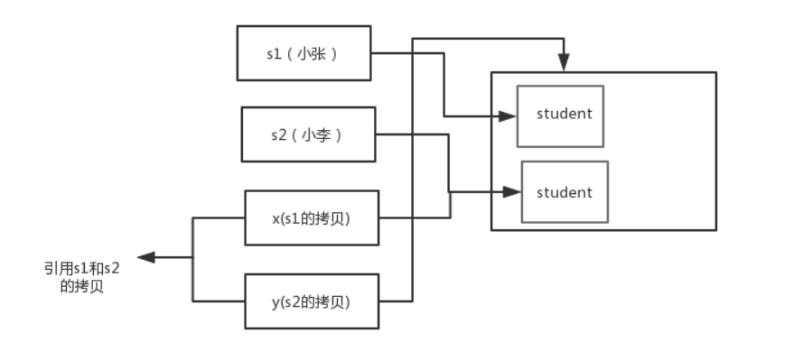

# Java概述

https://blog.csdn.net/qq_41701956/article/details/110119625?ops_request_misc=%257B%2522request%255Fid%2522%253A%2522162548995616780271532360%2522%252C%2522scm%2522%253A%252220140713.130102334.pc%255Fall.%2522%257D&request_id=162548995616780271532360&biz_id=0&utm_medium=distribute.pc_search_result.none-task-blog-2~all~first_rank_v2~hot_rank-3-110119625.pc_search_result_control_group&utm_term=%E6%93%8D%E4%BD%9C%E7%B3%BB%E7%BB%9F%E8%B0%83%E5%BA%A6%E7%AE%97%E6%B3%95%E5%92%8C%E9%A5%A5%E9%A5%BF%E9%97%AE%E9%A2%98+&spm=1018.2226.3001.4187

## JVM、JRE和JDK的关系

JVM
Java Virtual Machine是Java虚拟机，Java程序需要运行在虚拟机上，不同的平台有自己的虚拟机，因此Java语言可以实现跨平台。

JRE
Java Runtime Environment包括Java虚拟机和Java程序所需的核心类库等。核心类库主要是java.lang包：包含了运行Java程序必不可少的系统类，如基本数据类型、基本数学函数、字符串处理、线程、异常处理类等，系统缺省加载这个包

如果想要运行一个开发好的Java程序，计算机中只需要安装JRE即可。

JDK
Java Development Kit是提供给Java开发人员使用的，其中包含了Java的开发工具，也包括了JRE。所以安装了JDK，就无需再单独安装JRE了。其中的开发工具：编译工具(javac.exe)，打包工具(jar.exe)等

JVM&JRE&JDK关系图


## 什么是跨平台性？原理是什么

所谓跨平台性，是指java语言编写的程序，一次编译后，可以在多个系统平台上运行。

java文件编译成字节码(), 每个平台有自己对应的JVM都能运行字节码文件, 所以一个java文件编译成字节码在任何平台都可以直接运行

## 什么是字节码？采用字节码的最大好处是什么

字节码：Java源代码经过虚拟机编译器编译后产生的文件（即扩展为.class的文件），它不面向任何特定的处理器，只面向虚拟机。

采用字节码的好处：

Java语言通过字节码的方式，在一定程度上解决了传统解释型语言执行效率低的问题，同时又保留了解释型语言可移植的特点。所以Java程序运行时比较高效，而且，由于字节码并不专对一种特定的机器，因此，Java程序无须重新编译便可在多种不同的计算机上运行。

先看下java中的编译器和解释器：

Java中引入了虚拟机的概念，即在机器和编译程序之间加入了一层抽象的虚拟机器。这台虚拟的机器在任何平台上都提供给编译程序一个的共同的接口。编译程序只需要面向虚拟机，生成虚拟机能够理解的代码，然后由解释器来将虚拟机代码转换为特定系统的机器码执行。在Java中，这种供虚拟机理解的代码叫做字节码（即扩展为.class的文件），它不面向任何特定的处理器，只面向虚拟机。每一种平台的解释器是不同的，但是实现的虚拟机是相同的。Java源程序经过编译器编译后变成字节码，字节码由虚拟机解释执行，虚拟机将每一条要执行的字节码送给解释器，解释器将其翻译成特定机器上的机器码，然后在特定的机器上运行，这就是上面提到的Java的特点的编译与解释并存的解释。

```
Java源代码---->编译器---->jvm可执行的Java字节码(即虚拟指令)---->jvm---->jvm中解释器----->机器可执行的二进制机器码---->程序运行。
```


## Java语言有哪些特点

简单易学（Java语言的语法与C语言和C++语言很接近）

面向对象（封装，继承，多态）

平台无关性（Java虚拟机实现平台无关性）

支持网络编程并且很方便（Java语言诞生本身就是为简化网络编程设计的）

支持多线程（多线程机制使应用程序在同一时间并行执行多项任）

健壮性（Java语言的强类型机制、异常处理、垃圾的自动收集等）

安全性


## Java和C++的区别

都是面向对象的语言，都支持封装、继承和多态
Java不提供指针来直接访问内存，程序内存更加安全
Java的类是单继承的，C++支持多重继承；虽然Java的类不可以多继承，但是接口可以多继承。
Java有自动内存管理机制，不需要程序员手动释放无用内存

# 基础语法

## Java有哪些数据类型

定义：Java语言是强类型语言，对于每一种数据都定义了明确的具体的数据类型，在内存中分配了不同大小的内存空间。

分类

基本数据类型

- 数值型
- 整数类型(byte,short,int,long)
- 浮点类型(float,double)
- 字符型(char)
- 布尔型(boolean)

引用数据类型

- 类(class)
- 接口(interface)
- 数组([])

Java基本数据类型图


switch 是否能作用在 byte 上，是否能作用在 long 上，是否能作用在 String 上

- 在 Java 5 以前，switch(expr)中，expr 只能是 byte、short、char、int。
- 从 Java5 开始，Java 中引入了枚举类型，expr 也可以是 enum 类型，
- 从 Java 7 开始，expr 还可以是字符串（String），但是长整型（long）在目前所有的版本中都是不可以的。

用最有效率的方法计算 2 乘以 8

- 2 << 3（左移 3 位相当于乘以 2 的 3 次方，右移 3 位相当于除以 2 的 3 次方）。

Math.round(11.5) 等于多少？Math.round(-11.5)等于多少

- Math.round(11.5)的返回值是 12，Math.round(-11.5)的返回值是-11。四舍五入的原理是在参数上加 0.5 然后进行下取整。


float f=3.4;是否正确

- 不正确。3.4 是双精度数，将双精度型（double）赋值给浮点型（float）属于下转型（down-casting，也称为窄化）会造成精度损失，因此需要强制类型转换float f =(float)3.4; 或者写成 float f =3.4F;。


short s1 = 1; s1 = s1 + 1;有错吗?short s1 = 1; s1 += 1;有错吗

- 对于 short s1 = 1; s1 = s1 + 1;由于 1 是 int 类型，因此 s1+1 运算结果也是 int型，需要强制转换类型才能赋值给 short 型。


- 而 short s1 = 1; s1 += 1;可以正确编译，因为 s1+= 1;相当于 s1 = (short)(s1 + 1);其中有隐含的强制类型转换。
  

## 访问修饰符

访问修饰符 public,private,protected,以及不写（默认）时的区别

定义：Java中，可以使用访问修饰符来保护对类、变量、方法和构造方法的访问。Java 支持 4 种不同的访问权限。

分类

private : 在同一类内可见。使用对象：变量、方法。 注意：不能修饰类（外部类）
default (即缺省，什么也不写，不使用任何关键字）: 在同一包内可见，不使用任何修饰符。使用对象：类、接口、变量、方法。
protected : 对同一包内的类和所有子类可见。使用对象：变量、方法。 注意：不能修饰类（外部类）。
public : 对所有类可见。使用对象：类、接口、变量、方法

访问修饰符图


## 关键字

### final

用于修饰类、属性和方法；

- 被final修饰的类不可以被继承
- 被final修饰的方法不可以被重写
- 被final修饰的变量不可以被改变，被final修饰不可变的是变量的引用，而不是引用指向的内容，引用指向的内容是可以改变的

### final finally finalize区别

- final可以修饰类、变量、方法，修饰类表示该类不能被继承、修饰方法表示该方法不能被重写、修饰变量表
  示该变量是一个常量不能被重新赋值。
- finally一般作用在try-catch代码块中，在处理异常的时候，通常我们将一定要执行的代码方法finally代码块
  中，表示不管是否出现异常，该代码块都会执行，一般用来存放一些关闭资源的代码。
- finalize是一个方法，属于Object类的一个方法，而Object类是所有类的父类，该方法一般由垃圾回收器来调
  用，当我们调用System.gc() 方法的时候，由垃圾回收器调用finalize()，回收垃圾，一个对象是否可回收的
  最后判断。

### this关键字的用法

this是自身的一个对象，代表对象本身，可以理解为：指向对象本身的一个指针。

this的用法在java中大体可以分为3种：

- 普通的直接引用，this相当于是指向当前对象本身。
- 形参与成员名字重名，用this来区分：


### super关键字的用法

super可以理解为是指向自己超（父）类对象的一个指针，而这个超类指的是离自己最近的一个父类。

super也有三种用法：

1. 普通的直接引用
   - 与this类似，super相当于是指向当前对象的父类的引用，这样就可以用super.xxx来引用父类的成员。
2. 子类中的成员变量或方法与父类中的成员变量或方法同名时，用super进行区分

3. 引用父类构造函数
   - super（参数）：调用父类中的某一个构造函数（应该为构造函数中的第一条语句）。
   - this（参数）：调用本类中另一种形式的构造函数（应该为构造函数中的第一条语句）。

### this与super的区别

- super:　它引用当前对象的直接父类中的成员
  - （用来访问直接父类中被隐藏的父类中成员数据或函数，基类与派生类中有相同成员定义时如：super.变量名 super.成员函数据名（实参）
- this：它代表当前对象名
  - （在程序中易产生二义性之处，应使用this来指明当前对象；如果函数的形参与类中的成员数据同名，这时需用this来指明成员变量名）
- super()和this()类似,区别是，super()在子类中调用父类的构造方法，this()在本类内调用本类的其它构造方法。
- super()和this()均需放在构造方法内第一行。
  - 尽管可以用this调用一个构造器，但却不能调用两个。
- this和super不能同时出现在一个构造函数里面，因为this必然会调用其它的构造函数，其它的构造函数必然也会有super语句的存在，所以在同一个构造函数里面有相同的语句，就失去了语句的意义，编译器也不会通过。
- this()和super()都指的是对象，所以，均不可以在static环境中使用。包括：static变量,static方法，static语句块。
  - 从本质上讲，this是一个指向本对象的指针, 然而super是一个Java关键字。
    

### static存在的主要意义

static的主要意义是在于创建独立于具体对象的域变量或者方法。以致于即使没有创建对象，也能使用属性和调用方法！

static关键字还有一个比较关键的作用就是 用来形成静态代码块以优化程序性能。static块可以置于类中的任何地方，类中可以有多个static块。在类初次被加载的时候，会按照static块的顺序来执行每个static块，并且只会执行一次。

为什么说static块可以用来优化程序性能，是因为它的特性:只会在类加载的时候执行一次。因此，很多时候会将一些只需要进行一次的初始化操作都放在static代码块中进行。

#### static的独特之处

1. 被static修饰的变量或者方法是独立于该类的任何对象，也就是说，这些变量和方法不属于任何一个实例对象，而是被类的实例对象所共享。
   - 怎么理解 “被类的实例对象所共享” 这句话呢？
   - 就是说，一个类的静态成员，它是属于大伙的【大伙指的是这个类的多个对象实例，我们都知道一个类可以创建多个实例！】，
   - 所有的类对象共享的，不像成员变量是自个的【自个指的是这个类的单个实例对象】
2. 在该类被第一次加载的时候，就会去加载被static修饰的部分，而且只在类第一次使用时加载并进行初始化，注意这是第一次用就要初始化，后面根据需要是可以再次赋值的。

3. static变量值在类加载的时候分配空间，以后创建类对象的时候不会重新分配。赋值的话，是可以任意赋值的！

4. 被static修饰的变量或者方法是优先于对象存在的，也就是说当一个类加载完毕之后，即便没有创建对象，也可以去访问。

#### static应用场景

因为static是被类的实例对象所共享，因此如果某个成员变量是被所有对象所共享的，那么这个成员变量就应该定义为静态变量。

因此比较常见的static应用场景有：

1、修饰成员变量 2、修饰成员方法 3、静态代码块 4、修饰类【只能修饰内部类也就是静态内部类】 5、静态导包

#### static注意事项

1、静态只能访问静态。 2、非静态既可以访问非静态的，也可以访问静态的。

### 流程控制语句

break ,continue ,return 的区别及作用

break 跳出总上一层循环，不再执行循环(结束当前的循环体)

continue 跳出本次循环，继续执行下次循环(结束正在执行的循环 进入下一个循环条件)

return 程序返回，不再执行下面的代码(结束当前的方法 直接返回)

在 Java 中，如何跳出当前的多重嵌套循环

在Java中，要想跳出多重循环，可以在外面的循环语句前定义一个标号，然后在里层循环体的代码中使用带有标号的break 语句，即可跳出外层循环。例如：

```java
public static void main(String[] args) {
    ok:
    for (int i = 0; i < 10; i++) {
        for (int j = 0; j < 10; j++) {
            System.out.println("i=" + i + ",j=" + j);
            if (j == 5) {
                break ok;
            }
 
        }
    }
}
```


# 面向对象


## 面向对象和面向过程的区别

### 面向过程：

优点：性能比面向对象高，因为类调用时需要实例化，开销比较大，比较消耗资源;比如单片机、嵌入式开发、Linux/Unix等一般采用面向过程开发，性能是最重要的因素。

缺点：没有面向对象易维护、易复用、易扩展

### 面向对象：

优点：易维护、易复用、易扩展，由于面向对象有封装、继承、多态性的特性，可以设计出低耦合的系统，使系统更加灵活、更加易于维护

缺点：性能比面向过程低

面向过程是具体化的，流程化的，解决一个问题，你需要一步一步的分析，一步一步的实现。

面向对象是模型化的，你只需抽象出一个类，这是一个封闭的盒子，在这里你拥有数据也拥有解决问题的方法。需要什么功能直接使用就可以了，不必去一步一步的实现，至于这个功能是如何实现的，管我们什么事？我们会用就可以了。

面向对象的底层其实还是面向过程，把面向过程抽象成类，然后封装，方便我们使用的就是面向对象了。


## 面向对象三大特性(封装 继承 多态)

### 面向对象的特征主要有以下几个方面：

抽象是将一类对象的共同特征总结出来构造类的过程，包括数据抽象和行为抽象两方面。抽象只关注对象有哪些属性和行为，并不关注这些行为的细节是什么。

### 封装

封装把一个对象的属性私有化，同时提供一些可以被外界访问的属性的方法，如果属性不想被外界访问，我们大可不必提供方法给外界访问。但是如果一个类没有提供给外界访问的方法，那么这个类也没有什么意义了。

### 继承

继承是使用已存在的类的定义作为基础建立新类的技术，新类的定义可以增加新的数据或新的功能，也可以用父类的功能，但不能选择性地继承父类。通过使用继承我们能够非常方便地复用以前的代码。

关于继承如下 3 点请记住：

- 子类拥有父类非 private 的属性和方法。

- 子类可以拥有自己属性和方法，即子类可以对父类进行扩展。

- 子类可以用自己的方式实现父类的方法。（以后介绍）。


### 多态

所谓多态就是指程序中定义的引用变量所指向的具体类型和通过该引用变量发出的方法调用在编程时并不确定，而是在程序运行期间才确定，即一个引用变量到底会指向哪个类的实例对象，该引用变量发出的方法调用到底是哪个类中实现的方法，必须在由程序运行期间才能决定。

在Java中有两种形式可以实现多态：继承（多个子类对同一方法的重写）和接口（实现接口并覆盖接口中同一方法）。

方法重载（overload）实现的是编译时的多态性（也称为前绑定），而方法重写（override）实现的是运行时的多态性（也称为后绑定）。

一个引用变量到底会指向哪个类的实例对象，该引用变量发出的方法调用到底是哪个类中实现的方法，必须在由程序运行期间才能决定。运行时的多态是面向对象最精髓的东西，要实现多态需要做两件事：

- 方法重写（子类继承父类并重写父类中已有的或抽象的方法）；
- 对象造型（用父类型引用子类型对象，这样同样的引用调用同样的方法就会根据子类对象的不同而表现出不同的行为）。

#### 什么是多态机制？Java语言是如何实现多态的？

所谓多态就是指程序中定义的引用变量所指向的具体类型和通过该引用变量发出的方法调用在编程时并不确定，而是在程序运行期间才确定，

即一个引用变量倒底会指向哪个类的实例对象，该引用变量发出的方法调用到底是哪个类中实现的方法，必须在由程序运行期间才能决定。

因为在程序运行时才确定具体的类，这样，不用修改源程序代码，就可以让引用变量绑定到各种不同的类实现上，从而导致该引用调用的具体方法随之改变，即不修改程序代码就可以改变程序运行时所绑定的具体代码，让程序可以选择多个运行状态，这就是多态性。

- 多态分为编译时多态和运行时多态。其中编辑时多态是静态的，主要是指方法的重载，它是根据参数列表的不同来区分不同的函数，通过编辑之后会变成两个不同的函数，
- 在运行时谈不上多态。而运行时多态是动态的，它是通过动态绑定来实现的，也就是我们所说的多态性。

#### 多态的实现

Java实现多态有三个必要条件：继承、重写、向上转型。

- 继承：在多态中必须存在有继承关系的子类和父类。

- 重写：子类对父类中某些方法进行重新定义，在调用这些方法时就会调用子类的方法。

- 向上转型：在多态中需要将子类的引用赋给父类对象，只有这样该引用才能够具备技能调用父类的方法和子类的方法。


只有满足了上述三个条件，我们才能够在同一个继承结构中使用统一的逻辑实现代码处理不同的对象，从而达到执行不同的行为。

对于Java而言，它多态的实现机制遵循一个原则：当超类对象引用变量引用子类对象时，被引用对象的类型而不是引用变量的类型决定了调用谁的成员方法，但是这个被调用的方法必须是在超类中定义过的，也就是说被子类覆盖的方法。

## 面向对象五大基本原则是什么（可选）

- 单一职责原则SRP(Single Responsibility Principle)
  类的功能要单一，不能包罗万象，跟杂货铺似的。
- 开放封闭原则OCP(Open－Close Principle)
  一个模块对于拓展是开放的，对于修改是封闭的，想要增加功能热烈欢迎，想要修改，哼，一万个不乐意。
- 里式替换原则LSP(the Liskov Substitution Principle LSP)
  子类可以替换父类出现在父类能够出现的任何地方。
- 依赖倒置原则DIP(the Dependency Inversion Principle DIP)
  高层次的模块不应该依赖于低层次的模块，他们都应该依赖于抽象。抽象不应该依赖于具体实现，具体实现应该依赖于抽象。就是你出国要说你是中国人，而不能说你是哪个村子的。比如说中国人是抽象的，下面有具体的xx省，xx市，xx县。你要依赖的抽象是中国人，而不是你是xx村的。
- 接口分离原则ISP(the Interface Segregation Principle ISP)
  设计时采用多个与特定客户类有关的接口比采用一个通用的接口要好。就比如一个手机拥有打电话，看视频，玩游戏等功能，把这几个功能拆分成不同的接口，比在一个接口里要好的多。

## 类与接口

抽象类和接口的对比

抽象类是用来捕捉子类的通用特性的。接口是抽象方法的集合。

从设计层面来说，抽象类是对类的抽象，是一种模板设计，接口是行为的抽象，是一种行为的规范。

### 相同点

- 接口和抽象类都不能实例化
- 都位于继承的顶端，用于被其他实现或继承
- 都包含抽象方法，其子类都必须覆写这些抽象方法

### **不同点**


### Java8中接口中引入默认方法和静态方法，以此来减少抽象类和接口之间的差异。

现在，我们可以为接口提供默认实现的方法了，并且不用强制子类来实现它。

接口和抽象类各有优缺点，在接口和抽象类的选择上，必须遵守这样一个原则：

- 行为模型应该总是通过接口而不是抽象类定义，所以通常是优先选用接口，尽量少用抽象类。
- 选择抽象类的时候通常是如下情况：需要定义子类的行为，又要为子类提供通用的功能。

### 普通类和抽象类有哪些区别？

- 普通类不能包含抽象方法，抽象类可以包含抽象方法。
- 抽象类不能直接实例化，普通类可以直接实例化。

### 抽象类能使用 final 修饰吗？

不能，定义抽象类就是让其他类继承的，如果定义为 final 该类就不能被继承，这样彼此就会产生矛盾，所以 final 不能修饰抽象类

### 创建一个对象用什么关键字？对象实例与对象引用有何不同？

new关键字，new创建对象实例（对象实例在堆内存中），对象引用指向对象实例（对象引用存放在栈内存中）。

一个对象引用可以指向0个或1个对象（一根绳子可以不系气球，也可以系一个气球）;一个对象可以有n个引用指向它（可以用n条绳子系住一个气球）


##  变量与方法

### 成员变量与局部变量

变量：在程序执行的过程中，在某个范围内其值可以发生改变的量。从本质上讲，变量其实是内存中的一小块区域

成员变量：方法外部，类内部定义的变量

局部变量：类的方法中的变量。

### 成员变量和局部变量的区别

#### 作用域

成员变量：针对整个类有效。
局部变量：只在某个范围内有效。(一般指的就是方法,语句体内)

#### 存储位置

成员变量：随着对象的创建而存在，随着对象的消失而消失，存储在堆内存中。
局部变量：在方法被调用，或者语句被执行的时候存在，存储在栈内存中。当方法调用完，或者语句结束后，就自动释放。

#### 生命周期

成员变量：随着对象的创建而存在，随着对象的消失而消失
局部变量：当方法调用完，或者语句结束后，就自动释放。

#### 初始值

成员变量：有默认初始值。

局部变量：没有默认初始值，使用前必须赋值。

#### 使用原则

在使用变量时需要遵循的原则为：就近原则
首先在局部范围找，有就使用；接着在成员位置找。

### 在Java中定义一个不做事且没有参数的构造方法的作用

Java程序在执行子类的构造方法之前，如果没有用super()来调用父类特定的构造方法，则会调用父类中“没有参数的构造方法”。

因此，如果父类中只定义了有参数的构造方法，而在子类的构造方法中又没有用super()来调用父类中特定的构造方法，则编译时将发生错误，因为Java程序在父类中找不到没有参数的构造方法可供执行。解决办法是在父类里加上一个不做事且没有参数的构造方法。

### 在调用子类构造方法之前会先调用父类没有参数的构造方法，其目的是？

帮助子类做初始化工作。

### 一个类的构造方法的作用是什么？若一个类没有声明构造方法，改程序能正确执行吗？为什么？

主要作用是完成对类对象的初始化工作。可以执行。因为一个类即使没有声明构造方法也会有默认的不带参数的构造方法。

### 构造方法有哪些特性？

名字与类名相同；

没有返回值，但不能用void声明构造函数；

生成类的对象时自动执行，无需调用。

### 静态变量和实例变量区别

静态变量： 静态变量由于不属于任何实例对象，属于类的，所以在内存中只会有一份，在类的加载过程中，JVM只为静态变量分配一次内存空间。

实例变量： 每次创建对象，都会为每个对象分配成员变量内存空间，实例变量是属于实例对象的，在内存中，创建几次对象，就有几份成员变量。

### 静态变量与普通变量区别

static变量也称作静态变量，静态变量和非静态变量的区别是：静态变量被所有的对象所共享，在内存中只有一个副本，它当且仅当在类初次加载时会被初始化。而非静态变量是对象所拥有的，在创建对象的时候被初始化，存在多个副本，各个对象拥有的副本互不影响。

还有一点就是static成员变量的初始化顺序按照定义的顺序进行初始化。

### 静态方法和实例方法有何不同？

静态方法和实例方法的区别主要体现在两个方面：

- 在外部调用静态方法时，可以使用"类名.方法名"的方式，也可以使用"对象名.方法名"的方式。而实例方法只有后面这种方式。也就是说，调用静态方法可以无需创建对象。
- 静态方法在访问本类的成员时，只允许访问静态成员（即静态成员变量和静态方法），而不允许访问实例成员变量和实例方法；实例方法则无此限制

### 在一个静态方法内调用一个非静态成员为什么是非法的？

由于静态方法可以不通过对象进行调用，因此在静态方法里，不能调用其他非静态变量，也不可以访问非静态变量成员。

### 什么是方法的返回值？返回值的作用是什么？

方法的返回值是指我们获取到的某个方法体中的代码执行后产生的结果！（前提是该方法可能产生结果）。返回值的作用:接收出结果，使得它可以用于其他的操作！


## 内部类

### 什么是内部类？

在Java中，可以将一个类的定义放在另外一个类的定义内部，这就是内部类。内部类本身就是类的一个属性，与其他属性定义方式一致。

### 内部类的分类有哪些

内部类可以分为四种：成员内部类、局部内部类、匿名内部类和静态内部类。

### 静态内部类

定义在类内部的静态类，就是静态内部类。

```java
public class Outer {
    private static int radius = 1;
    static class StaticInner {
        public void visit() {
            System.out.println("visit outer static  variable:" + radius);
        }
    }
}
```

静态内部类可以访问外部类所有的静态变量，而不可访问外部类的非静态变量；静态内部类的创建方式，`new 外部类.静态内部类()`，如下：

```java
Outer.StaticInner inner = new Outer.StaticInner();
inner.visit();
```

### 成员内部类

定义在类内部，成员位置上的非静态类，就是成员内部类。

```java
public class Outer {
    private static  int radius = 1;
    private int count =2;
    class Inner {
        public void visit() {
            System.out.println("visit outer static  variable:" + radius);
            System.out.println("visit outer   variable:" + count);
        }
    }
}
```

成员内部类可以访问外部类所有的变量和方法，包括静态和非静态，私有和公有。成员内部类依赖于外部类的实例，

它的创建方式`外部类实例.new 内部类()`，如下：

```java
Outer outer = new Outer();
Outer.Inner inner = outer.new Inner();
inner.visit();
```

### 局部内部类

定义在方法中的内部类，就是局部内部类。

```java
public class Outer {
    private  int out_a = 1;
    private static int STATIC_b = 2;
    public void testFunctionClass(){
        int inner_c =3;
        class Inner {
            private void fun(){
                System.out.println(out_a);
                System.out.println(STATIC_b);
                System.out.println(inner_c);
            }
        }
        Inner  inner = new Inner();
        inner.fun();
    }
    public static void testStaticFunctionClass(){
        int d =3;
        class Inner {
            private void fun(){
                // System.out.println(out_a); 编译错误，定义在静态方法中的局部类不可以访问外部类的实例变量
                System.out.println(STATIC_b);
                System.out.println(d);
            }
        }
        Inner  inner = new Inner();
        inner.fun();
    }
}
```

定义在实例方法中的局部类可以访问外部类的所有变量和方法，定义在静态方法中的局部类只能访问外部类的静态变量和方法。

局部内部类的创建方式，在对应方法内，`new 内部类()`，如下：

### 匿名内部类

匿名内部类就是没有名字的内部类，日常开发中使用的比较多。

```java
public class Outer {
    private void test(final int i) {
        new Service() {
            public void method() {
                for (int j = 0; j < i; j++) {
                    System.out.println("匿名内部类" );
                }
            }
        }.method();
    }
 }
 //匿名内部类必须继承或实现一个已有的接口 
 interface Service{
    void method();
}
```

#### 除了没有名字，匿名内部类还有以下特点：

- 匿名内部类必须继承一个抽象类或者实现一个接口。
- 匿名内部类不能定义任何静态成员和静态方法。
- 当所在的方法的形参需要被匿名内部类使用时，必须声明为 final。
- 匿名内部类不能是抽象的，它必须要实现继承的类或者实现的接口的所有抽象方法。

匿名内部类创建方式：

```java
new 类/接口{ 
  //匿名内部类实现部分
}
```

#### 内部类的优点

我们为什么要使用内部类呢？因为它有以下优点：

- 一个内部类对象可以访问创建它的外部类对象的内容，包括私有数据！
- 内部类不为同一包的其他类所见，具有很好的封装性；
- 内部类有效实现了“多重继承”，优化 java 单继承的缺陷。
- 匿名内部类可以很方便的定义回调。

#### 内部类有哪些应用场景

1. 一些多算法场合
2. 解决一些非面向对象的语句块。
3. 适当使用内部类，使得代码更加灵活和富有扩展性。
4. 当某个类除了它的外部类，不再被其他的类使用时。

局部内部类和匿名内部类访问局部变量的时候，为什么变量必须要加上final？

局部内部类和匿名内部类访问局部变量的时候，为什么变量必须要加上final呢？它内部原理是什么呢？

```java
public class Outer {
    void outMethod(){
        final int a =10;
        class Inner {
            void innerMethod(){
                System.out.println(a);
            }
        }
    }
}
```

以上例子，为什么要加final呢？是因为生命周期不一致， 局部变量直接存储在栈中，当方法执行结束后，非final的局部变量就被销毁。而局部内部类对局部变量的引用依然存在，如果局部内部类要调用局部变量时，就会出错。加了final，可以确保局部内部类使用的变量与外层的局部变量区分开，解决了这个问题。


```java
public class Outer {
    private int age = 12;
    class Inner {
        private int age = 13;
        public void print() {
            int age = 14;
            System.out.println("局部变量：" + age);
            System.out.println("内部类变量：" + this.age);
            System.out.println("外部类变量：" + Outer.this.age);
        }
    }
    public static void main(String[] args) {
        Outer.Inner in = new Outer().new Inner();
        in.print();
    }
}
局部变量：14
内部类变量：13
外部类变量：12
```


##  重写与重载

### 构造器（constructor）是否可被重写（override）

构造器不能被继承，因此不能被重写，但可以被重载。

### 重载（Overload）和重写（Override）的区别。重载的方法能否根据返回类型进行区分？

方法的重载和重写都是实现多态的方式，区别在于前者实现的是编译时的多态性，而后者实现的是运行时的多态性。

- 重载：
  - 发生在同一个类中，
  - 方法名相同参数列表不同（参数类型不同、个数不同、顺序不同），
  - 与方法返回值和访问修饰符无关，即重载的方法不能根据返回类型进行区分
- 重写：
  - 发生在父子类中，方法名、参数列表必须相同，
  - 返回值类型小于等于父类，
  - 抛出的异常小于等于父类，
  - 访问修饰符大于等于父类（里氏代换原则）；
  - 如果父类方法访问修饰符为private则子类中就不是重写。
    

## 对象相等判断

### == 和 equals 的区别是什么

- == : 它的作用是判断两个对象的地址是不是相等。即，判断两个对象是不是同一个对象。(基本数据类型 == 比较的是值，引用数据类型 == 比较的是内存地址)
- equals() : 它的作用也是判断两个对象是否相等。但它一般有两种使用情况：
  - 情况1：类没有覆盖 equals() 方法。则通过 equals() 比较该类的两个对象时，等价于通过“==”比较这两个对象。
  - 情况2：类覆盖了 equals() 方法。一般，我们都覆盖 equals() 方法来两个对象的内容相等；若它们的内容相等，则返回 true (即，认为这两个对象相等)。

```java
public class test1 {
    public static void main(String[] args) {
        String a = new String("ab"); // a 为一个引用
        String b = new String("ab"); // b为另一个引用,对象的内容一样
        String aa = "ab"; // 放在常量池中
        String bb = "ab"; // 从常量池中查找
        if (aa == bb) // true
            System.out.println("aa==bb");
        if (a == b) // false，非同一对象
            System.out.println("a==b");
        if (a.equals(b)) // true
            System.out.println("aEQb");
        if (42 == 42.0) { // true
            System.out.println("true");
        }
    }
}
```

- String中的equals方法是被重写过的，因为object的equals方法是比较的对象的内存地址，而String的equals方法比较的是对象的值。
- 当创建String类型的对象时，虚拟机会在常量池中查找有没有已经存在的值和要创建的值相同的对象，如果有就把它赋给当前引用。如果没有就在常量池中重新创建一个String对象。
  

### hashCode 与 equals (重要)

- HashSet如何检查重复
- 两个对象的 hashCode() 相同，则 equals() 也一定为 true，对吗？
- hashCode和equals方法的关系
- 面试官可能会问你：“你重写过 hashcode 和 equals 么，为什么重写equals时必须重写hashCode方法？”

#### hashCode()介绍

hashCode() 的作用是获取哈希码，也称为散列码；它实际上是返回一个int整数。这个哈希码的作用是确定该对象在哈希表中的索引位置。

hashCode() 定义在JDK的Object.java中，这就意味着Java中的任何类都包含有hashCode()函数。

散列表存储的是键值对(key-value)，它的特点是：能根据“键”快速的检索出对应的“值”。这其中就利用到了散列码！（可以快速找到所需要的对象）

#### 为什么要有 hashCode

我们以“HashSet 如何检查重复”为例子来说明为什么要有 hashCode：

- 当你把对象加入 HashSet 时，HashSet 会先计算对象的 hashcode 值来判断对象加入的位置，
- 同时也会与其他已经加入的对象的 hashcode 值作比较，如果没有相符的hashcode，HashSet会假设对象没有重复出现。
- 但是如果发现有相同 hashcode 值的对象，这时会调用 equals()方法来检查 hashcode 相等的对象是否真的相同。
- 如果两者相同，HashSet 就不会让其加入操作成功。如果不同的话，就会重新散列到其他位置。
- 这样我们就大大减少了 equals 的次数，相应就大大提高了执行速度。

#### hashCode()与equals()的相关规定

- 如果两个对象相等，则hashcode一定也是相同的

- 两个对象相等，对两个对象分别调用equals方法都返回true

- 两个对象有相同的hashcode值，它们也不一定是相等的

- 因此，equals 方法被覆盖过，则 hashCode 方法也必须被覆盖

- hashCode() 的默认行为是对堆上的对象产生独特值。如果没有重写 hashCode()，则该 class 的两个对象无论如何都不会相等（即使这两个对象指向相同的数据）


#### 对象的相等与指向他们的引用相等，两者有什么不同？

- 对象的相等 比的是内存中存放的内容是否相等而 
- 引用相等 比较的是他们指向的内存地址是否相等。
  


## 值传递

当一个对象被当作参数传递到一个方法后，此方法可改变这个对象的属性，并可返回变化后的结果，那么这里到底是值传递还是引用传递

- 是值传递。Java 语言的方法调用只支持参数的值传递。当一个对象实例作为一个参数被传递到方法中时，参数的值就是对该对象的引用。
- 对象的属性可以在被调用过程中被改变，但对对象引用的改变是不会影响到调用者的

### 为什么 Java 中只有值传递

首先回顾一下在程序设计语言中有关将参数传递给方法（或函数）的一些专业术语。

- 按值调用(call by value)表示方法接收的是调用者提供的值，而按引用调用（call by reference)表示方法接收的是调用者提供的变量地址。
- 一个方法可以修改传递引用所对应的变量值，而不能修改传递值调用所对应的变量值。 它用来描述各种程序设计语言（不只是Java)中方法参数传递方式。
- Java程序设计语言总是采用按值调用。也就是说，方法得到的是所有参数值的一个拷贝，也就是说，方法不能修改传递给它的任何参数变量的内容。


下面通过 3 个例子来给大家说明

example 1

在swap方法中，a、b的值进行交换，并不会影响到 num1、num2。因为，a、b中的值，只是从 num1、num2 的复制过来的。也就是说，a、b相当于num1、num2 的副本，副本的内容无论怎么修改，都不会影响到原件本身。

```java
public static void main(String[] args) {
    int num1 = 10;
    int num2 = 20;
    swap(num1, num2);
    System.out.println("num1 = " + num1);
    System.out.println("num2 = " + num2);
}
public static void swap(int a, int b) {
    int temp = a;
    a = b;
    b = temp;
    System.out.println("a = " + a);
    System.out.println("b = " + b);
}
a = 20
b = 10
num1 = 10
num2 = 20
```


**一个方法不能修改一个基本数据类型的参数，而对象引用作为参数就不一样，请看 example2.**

example 2

array 被初始化 arr 的拷贝也就是一个对象的引用，也就是说 array 和 arr 指向的时同一个数组对象。 因此，外部对引用对象的改变会反映到所对应的对象上。

```java
public static void main(String[] args) {
    int[] arr = { 1, 2, 3, 4, 5 };
    System.out.println(arr[0]);
    change(arr);
    System.out.println(arr[0]);
}
public static void change(int[] array) {
    // 将数组的第一个元素变为0
    array[0] = 0;
}
1
0
```


通过 example2 我们已经看到，实现一个改变对象参数状态的方法并不是一件难事。理由很简单，方法得到的是对象引用的拷贝，对象引用及其他的拷贝同时引用同一个对象。

很多程序设计语言（特别是，C++和Pascal)提供了两种参数传递的方式：值调用和引用调用。有些程序员（甚至本书的作者）认为Java程序设计语言对对象采用的是引用调用，实际上，这种理解是不对的。由于这种误解具有一定的普遍性，所以下面给出一个反例来详细地阐述一下这个问题。


example 3

```java
public class Test {
    public static void main(String[] args) {
        Student s1 = new Student("小张");
        Student s2 = new Student("小李");
        Test.swap(s1, s2);
        System.out.println("s1:" + s1.getName());
        System.out.println("s2:" + s2.getName());
    }
    public static void swap(Student x, Student y) {
        Student temp = x;
        x = y;
        y = temp;
        System.out.println("x:" + x.getName());
        System.out.println("y:" + y.getName());
    }
}
x:小李
y:小张
s1:小张
s2:小李
```

交换之前：


交换之后：



通过上面两张图可以很清晰的看出： **方法并没有改变存储在变量 s1 和 s2 中的对象引用。swap方法的参数x和y被初始化为两个对象引用的拷贝，这个方法交换的是这两个拷贝**

### **总结**

Java程序设计语言对对象采用的不是引用调用，实际上，对象引用是按值传递的。

下面再总结一下Java中方法参数的使用情况：

- 一个方法不能修改一个基本数据类型的参数（即数值型或布尔型》
- 一个方法可以改变一个对象参数的状态。
- 一个方法不能让对象参数引用一个新的对象。

### 值传递和引用传递有什么区别

值传递：指的是在方法调用时，传递的参数是按值的拷贝传递，传递的是值的拷贝，也就是说传递后就互不相关了。

引用传递：指的是在方法调用时，传递的参数是按引用进行传递，其实传递的引用的地址，也就是变量所对应的内存空间的地址。传递的是值的引用，也就是说传递前和传递后都指向同一个引用（也就是同一个内存空间）。


## Java包

JDK 中常用的包有哪些

java.lang：这个是系统的基础类；
java.io：这里面是所有输入输出有关的类，比如文件操作等；
java.nio：为了完善 io 包中的功能，提高 io 包中性能而写的一个新包；
java.net：这里面是与网络有关的类；
java.util：这个是系统辅助类，特别是集合类；
java.sql：这个是数据库操作的类。
import java和javax有什么区别

刚开始的时候 JavaAPI 所必需的包是 java 开头的包，javax 当时只是扩展 API 包来说使用。然而随着时间的推移，javax 逐渐的扩展成为 Java API 的组成部分。但是，将扩展从 javax 包移动到 java 包将是太麻烦了，最终会破坏一堆现有的代码。因此，最终决定 javax 包将成为标准API的一部分。

所以，实际上java和javax没有区别。这都是一个名字。


# IO流

## java 中 IO 流分为几种?

按照流的流向分，可以分为输入流和输出流；
按照操作单元划分，可以划分为字节流和字符流；
按照流的角色划分为节点流和处理流。
Java Io流共涉及40多个类，这些类看上去很杂乱，但实际上很有规则，而且彼此之间存在非常紧密的联系， Java I0流的40多个类都是从如下4个抽象类基类中派生出来的。

InputStream/Reader: 所有的输入流的基类，前者是字节输入流，后者是字符输入流。
OutputStream/Writer: 所有输出流的基类，前者是字节输出流，后者是字符输出流。


## BIO,NIO,AIO 有什么区别?

BIO：Block IO 同步阻塞式 IO，就是我们平常使用的传统 IO，它的特点是模式简单使用方便，并发处理能力低。
NIO：Non IO 同步非阻塞 IO，是传统 IO 的升级，客户端和服务器端通过 Channel（通道）通讯，实现了多路复用。
AIO：Asynchronous IO 是 NIO 的升级，也叫 NIO2，实现了异步非堵塞 IO ，异步 IO 的操作基于事件和回调机制。

- BIO (Blocking I/O): 同步阻塞I/O模式，数据的读取写入必须阻塞在一个线程内等待其完成。
  - 在活动连接数不是特别高（小于单机1000）的情况下，这种模型是比较不错的，可以让每一个连接专注于自己的 I/O 并且编程模型简单，也不用过多考虑系统的过载、限流等问题。
  - 线程池本身就是一个天然的漏斗，可以缓冲一些系统处理不了的连接或请求。
  - 但是，当面对十万甚至百万级连接的时候，传统的 BIO 模型是无能为力的。因此，我们需要一种更高效的 I/O 处理模型来应对更高的并发量。
- NIO (New I/O): NIO是一种同步非阻塞的I/O模型，
  - 在Java 1.4 中引入了NIO框架，对应 java.nio 包，提供了 Channel , Selector，Buffer等抽象。
  - NIO中的N可以理解为Non-blocking，不单纯是New。它支持面向缓冲的，基于通道的I/O操作方法。 
  - NIO提供了与传统BIO模型中的 Socket 和 ServerSocket 相对应的 SocketChannel 和 ServerSocketChannel 两种不同的套接字通道实现,两种通道都支持阻塞和非阻塞两种模式。
  - 阻塞模式使用就像传统中的支持一样，比较简单，但是性能和可靠性都不好；
  - 非阻塞模式正好与之相反。对于低负载、低并发的应用程序，可以使用同步阻塞I/O来提升开发速率和更好的维护性；
  - 对于高负载、高并发的（网络）应用，应使用 NIO 的非阻塞模式来开发
- AIO (Asynchronous I/O): AIO 也就是 NIO 2。在 Java 7 中引入了 NIO 的改进版 NIO 2,它是异步非阻塞的IO模型。
  - 异步 IO 是基于事件和回调机制实现的，也就是应用操作之后会直接返回，不会堵塞在那里，
  - 当后台处理完成，操作系统会通知相应的线程进行后续的操作。
  - AIO 是异步IO的缩写，虽然 NIO 在网络操作中，提供了非阻塞的方法，但是 NIO 的 IO 行为还是同步的。
  - 对于 NIO 来说，我们的业务线程是在 IO 操作准备好时，得到通知，接着就由这个线程自行进行 IO 操作，IO操作本身是同步的。
  - 查阅网上相关资料，我发现就目前来说 AIO 的应用还不是很广泛，Netty 之前也尝试使用过 AIO，不过又放弃了。
    

## 进程通信上下文的同步/异步， 阻塞/非阻塞

进程间的通信时通过 send() 和 receive() 两种基本操作完成的。具体如何实现这两种基础操作，存在着不同的设计。
消息的传递有可能是**阻塞的**或**非阻塞的** -- 也被称为**同步**或**异步**的：

- 阻塞式发送（blocking send）. 发送方进程会被一直阻塞， 直到消息被接受方进程收到。
- 非阻塞式发送（nonblocking send）。 发送方进程调用 send() 后， 立即就可以其他操作。
- 阻塞式接收（blocking receive） 接收方调用 receive() 后一直阻塞， 直到消息到达可用。
- 非阻塞式接受（nonblocking receive） 接收方调用 receive() 函数后， 要么得到一个有效的结果， 要么得到一个空值， 即不会被阻塞。

上述不同类型的发送方式和不同类型的接收方式，可以自由组合。

也就是说， `从进程级通信的维度讨论时， 阻塞和同步（非阻塞和异步）就是一对同义词`， 且需要针对**发送方**和**接收方**作区分对待。

### I/O System Call 的阻塞/非阻塞， 同步/异步

这里再重新审视 阻塞/非阻塞 IO 这个概念， 其实阻塞和非阻塞描述的是进程的一个操作是否会使得进程转变为“等待”的状态， 但是为什么我们总是把它和 IO 连在一起讨论呢？

原因是， 阻塞这个词是与系统调用 System Call 紧紧联系在一起的， 因为要让一个进程进入 等待（waiting） 的状态, 要么是它主动调用 wait() 或 sleep() 等挂起自己的操作， 另一种就是它调用 System Call, 而 System Call 因为涉及到了 I/O 操作， 不能立即完成， 于是内核就会先将该进程置为等待状态， 调度其他进程的运行， 等到 它所请求的 I/O 操作完成了以后， 再将其状态更改回 ready 。

操作系统内核在执行 System Call 时， CPU 需要与 IO 设备完成一系列物理通信上的交互， 其实再一次会涉及到阻塞和非阻塞的问题， 例如， 操作系统发起了一个读硬盘的请求后， 其实是向硬盘设备通过总线发出了一个请求，它即可以阻塞式地等待IO 设备的返回结果，也可以非阻塞式的继续其他的操作。 在现代计算机中，这些物理通信操作基本都是异步完成的， 即发出请求后， 等待 I/O 设备的中断信号后， 再来读取相应的设备缓冲区。 但是，大部分操作系统默认为用户级应用程序提供的都是阻塞式的系统调用 （blocking systemcall）接口， 因为阻塞式的调用，使得应用级代码的编写更容易（代码的执!行顺序和编写顺序是一致的）。

但同样， 现在的大部分操作系统也会提供非阻塞I/O 系统调用接口（Nonblocking I/O system call）。 一个非阻塞调用不会挂起调用程序， 而是会立即返回一个值， 表示有多少bytes 的数据被成功读取（或写入）。

非阻塞I/O 系统调用( nonblocking system call )的另一个替代品是 异步I/O系统调用 （asychronous system call）。 与非阻塞 I/O 系统调用类似，asychronous system call 也是会立即返回， 不会等待 I/O 操作的完成， 应用程序可以继续执行其他的操作， 等到 I/O 操作完成了以后，操作系统会通知调用进程（设置一个用户空间特殊的变量值 或者 触发一个 signal 或者 产生一个软中断 或者 调用应用程序的回调函数）。

####  非阻塞I/O 系统调用( nonblocking system call ) 和 **异步I/O系统调用 （asychronous system call）**的区别是：

- 一个非阻塞I/O 系统调用 read() 操作立即返回的是任何可以立即拿到的数据， 可以是完整的结果， 也可以是不完整的结果， 还可以是一个空值。
- 而异步I/O系统调用 read（）结果必须是完整的， 但是这个操作完成的通知可以延迟到将来的一个时间点。

下图展示了同步I/O 与 异步 I/O 的区别 （非阻塞 IO 在下图中没有绘出）.


上面提到的 **非阻塞I/O 系统调用( nonblocking system call )** 和 **异步I/O系统调用** 都是非阻塞式的行为（non-blocking behavior）。 

他们的差异仅仅是返回结果的方式和内容不同。

### 非阻塞 I/O 如何帮助服务器提高吞吐量

考虑一个**单进程**服务器程序， 收到一个 Socket 连接请求后， 读取请求中的文件名，然后读请求的文件名内容，将文件内容返回给客户端。 那么一个请求的处理流程会如下图所示。


- R 表示读操作
- W 表示写操作
- C 表示关闭操作

在这个过程中， 我们可以看到， CPU 和 硬盘IO 的资源大部分时间都是闲置的。 此时， 我们会希望在等待 I/O 的过程中继续处理新的请求。

方案一： 多进程

- 每到达一个请求， 我们为这个请求新创建一个进程来处理。 这样， 一个进程在等待 IO 时， 其他的进程可以被调度执行， 更加充分地利用 CPU 等资源。
- 问题： 每新创建一个进程都会消耗一定的内存空间， 且进程切换也会有时间消耗， 高并发时， 大量进程来回切换的时间开销会变得明显起来。

方案二：多线程

- 和多进程方案类似，为每一个请求新建一个线程进行处理，这样做的重要区别是， 所有的线程都共享同一个进程空间
- 问题： 需要考虑是否需要为特定的逻辑使用锁。
- 引申问题： 一个进程中的某一个线程发起了 system call 后， 是否造成整个进程的阻塞？ 如果会， 那么多线程方案与单进程方案相比就没有明显的改善。

解决办法1：内核支持的线程（kenerl supported threads）

- 操作系统内核能够感知到线程， 每一个线程都会有一个内核调用栈（kenerl stack） 和 保存CPU 寄存器下文的 table 。
  


在这种方案中， 如果 CPU 是多核的， 不同的线程还可以运行在不同的 CPU processor 上。 既实现了IO 并发， 也实现了 CPU 并发。

问题： 基于内核线程编写的应用会难以移植

- 不同的操作系统对于内核线程的支持方式统而言有所差别，甚至部分操作系统甚至不支持内核级别线程， 当应用代码基于内核线程进行开发后， 就使得应用层代码与特定的操作系统产生了耦合关系， 不能随意部署


解决办法2： 用户支持的线程（user supported threads）

- 内核感知不到用户线程， 每一个用户的进程拥有一个调度器， 该调度器可以感知到线程发起的系统调用， 当一个线程产生系统调用时， 不阻塞整个进程， 切换到其他线程继续运行。 当 I/O 调用完成以后， 能够重新唤醒被阻塞的线程。
- 实现细节：
  - 应用程序基于线程库 thread libray 编写
  - 线程库中包含 “虚假的” read(), write(), accept()等系统调用。
  - 线程库中的 read(), write(), accept() 的底层实现为非阻塞系统调用（Non-blocking system call）， 调用后，由于可以立即返回， 则将特定的线程状态标记为 waiting, 调度其他的可执行线程。 内核完成了 IO 操作后， 调用线程库的回调函数， 将原来处于 waiting 状态的线程标记为 runnable.
    

从上面的过程可以看出，用户支持线程的解决方案基于非阻塞IO系统调用( non-blocking system call) ， 且是一种基于操作系统内核事件通知（event-driven）的解决方案

### 阻塞/非阻塞 同步/异步总结：

阻塞/非阻塞， 同步/异步的概念要注意讨论的上下文：
在进程通信层面， 阻塞/非阻塞， 同步/异步基本是同义词， 但是需要注意区分讨论的对象是发送方还是接收方。

发送方阻塞/非阻塞（同步/异步）和接收方的阻塞/非阻塞（同步/异步） 是互不影响的。
在 IO 系统调用层面（ IO system call ）层面， 非阻塞IO 系统调用 和 异步IO 系统调用存在着一定的差别， 它们都不会阻塞进程， 但是返回结果的方式和内容有所差别， 但是都属于非阻塞系统调用（ non-blocing system call ）

非阻塞系统调用（non-blocking I/O system call 与 asynchronous I/O system call） 的存在可以用来实现线程级别的 I/O 并发， 与通过多进程实现的 I/O 并发相比可以减少内存消耗以及进程切换的开销。


# 反射

## 什么是反射机制？

JAVA反射机制是在运行状态中，对于任意一个类，都能够知道这个类的所有属性和方法；对于任意一个对象，都能够调用它的任意一个方法和属性；

这种动态获取的信息以及动态调用对象的方法的功能称为java语言的反射机制。

静态编译和动态编译

- **静态编译：**在编译时确定类型，绑定对象
- **动态编译：**运行时确定类型，绑定对象

## 反射机制优缺点

优点： 运行期类型的判断，动态加载类，提高代码灵活度。
缺点： 性能瓶颈：反射相当于一系列解释操作，通知 JVM 要做的事情，性能比直接的java代码要慢很多。

## 反射机制的应用场景有哪些？

反射是框架设计的灵魂。

在我们平时的项目开发过程中，基本上很少会直接使用到反射机制，但这不能说明反射机制没有用，实际上有很多设计、开发都与反射机制有关，

例如模块化的开发，通过反射去调用对应的字节码；

动态代理设计模式也采用了反射机制，还有我们日常使用的 Spring／Hibernate 等框架也大量使用到了反射机制。

①我们在使用JDBC连接数据库时使用Class.forName()通过反射加载数据库的驱动程序；

②Spring框架也用到很多反射机制，最经典的就是xml的配置模式。Spring 通过 XML 配置模式装载 Bean 的过程：

1) 将程序内所有 XML 或 Properties 配置文件加载入内存中; 
2) Java类里面解析xml或properties里面的内容，得到对应实体类的字节码字符串以及相关的属性信息;
3)  使用反射机制，根据这个字符串获得某个类的Class实例; 
4) 动态配置实例的属性

##  Java获取反射的三种方法

- 通过new对象实现反射机制 
  - 对象.getClass()
- 通过路径实现反射机制 
  - Class.forName(类路径)
- 通过类名实现反射机制
  - 类名.class

```java
public class Student {
    private int id;
    String name;
    protected boolean sex;
    public float score;
}
public class Get {
    //获取反射机制三种方式
    public static void main(String[] args) throws ClassNotFoundException {
        //方式一(通过建立对象)
        Student stu = new Student();
        Class classobj1 = stu.getClass();
        System.out.println(classobj1.getName());
        //方式二（所在通过路径-相对路径）
        Class classobj2 = Class.forName("fanshe.Student");
        System.out.println(classobj2.getName());
        //方式三（通过类名.class）
        Class classobj3 = Student.class;
        System.out.println(classobj3.getName());
    }
}
```


# 常用API

## String

### 字符型常量和字符串常量的区别

- 形式上: 字符常量是单引号引起的一个字符 字符串常量是双引号引起的若干个字符
- 含义上: 字符常量相当于一个整形值(ASCII值),可以参加表达式运算 字符串常量代表一个地址值(该字符串在内存中存放位置)
- 占内存大小 字符常量只占一个字节 字符串常量占若干个字节(至少一个字符结束标志)

### 什么是字符串常量池？

字符串常量池位于堆内存中，专门用来存储字符串常量，可以提高内存的使用率，避免开辟多块空间存储相同的字符串，

在创建字符串时 JVM 会首先检查字符串常量池，如果该字符串已经存在池中，则返回它的引用，如果不存在，则实例化一个字符串放到池中，并返回其引用。

### String 是最基本的数据类型吗

不是。Java 中的基本数据类型只有 8 个 ：byte、short、int、long、float、double、char、boolean；除了基本类型（primitive type），剩下的都是引用类型（referencetype），Java 5 以后引入的枚举类型也算是一种比较特殊的引用类型。

这是很基础的东西，但是很多初学者却容易忽视，Java 的 8 种基本数据类型中不包括 String，基本数据类型中用来描述文本数据的是 char，但是它只能表示单个字符，比如 ‘a’,‘好’ 之类的，如果要描述一段文本，就需要用多个 char 类型的变量，也就是一个 char 类型数组，比如“你好” 就是长度为2的数组 char[] chars = {‘你’,‘好’};

但是使用数组过于麻烦，所以就有了 String，String 底层就是一个 char 类型的数组，只是使用的时候开发者不需要直接操作底层数组，用更加简便的方式即可完成对字符串的使用。

### String有哪些特性

- 不变性：String 是只读字符串，是一个典型的 immutable 对象，对它进行任何操作，其实都是创建一个新的对象，再把引用指向该对象。不变模式的主要作用在于当一个对象需要被多线程共享并频繁访问时，可以保证数据的一致性。

- 常量池优化：String 对象创建之后，会在字符串常量池中进行缓存，如果下次创建同样的对象时，会直接返回缓存的引用。

- final：使用 final 来定义 String 类，表示 String 类不能被继承，提高了系统的安全性。


### String为什么是不可变的吗？

简单来说就是String类利用了final修饰的char类型数组存储字符，源码如下图所以：

```java
/** The value is used for character storage. */
private final char value[];
```

### String真的是不可变的吗？

我觉得如果别人问这个问题的话，回答不可变就可以了。 下面只是给大家看两个有代表性的例子：

#### **String不可变但不代表引用不可以变**

```java
String str = "Hello";
str = str + " World";
System.out.println("str=" + str);
//结果
str=Hello World
```

实际上，原来String的内容是不变的，只是str由原来指向"Hello"的内存地址转为指向"Hello World"的内存地址而已，也就是说多开辟了一块内存区域给"Hello World"字符串。

#### **通过反射是可以修改所谓的“不可变”对象**

```java
// 创建字符串"Hello World"， 并赋给引用s
String s = "Hello World";
System.out.println("s = " + s); // Hello World
// 获取String类中的value字段
Field valueFieldOfString = String.class.getDeclaredField("value");
// 改变value属性的访问权限
valueFieldOfString.setAccessible(true);
// 获取s对象上的value属性的值
char[] value = (char[]) valueFieldOfString.get(s);
// 改变value所引用的数组中的第5个字符
value[5] = '_';
System.out.println("s = " + s); // Hello_World
//结果
s = Hello World
s = Hello_World
```

用反射可以访问私有成员， 然后反射出String对象中的value属性， 进而改变通过获得的value引用改变数组的结构。但是一般我们不会这么做

### 是否可以继承 String 类

String 类是 final 类，不可以被继承。

### String str="i"与 String str=new String(“i”)一样吗？

不一样，因为内存的分配方式不一样。String str="i"的方式，java 虚拟机会将其分配到常量池中；

而 String str=new String(“i”) 则会被分到堆内存中。

### String s = new String(“xyz”);创建了几个字符串对象

两个对象，一个是静态区的"xyz"，一个是用new创建在堆上的对象。

```java
String str1 = "hello"; //str1指向静态区
String str2 = new String("hello");  //str2指向堆上的对象
String str3 = "hello";
String str4 = new String("hello");
System.out.println(str1.equals(str2)); //true
System.out.println(str2.equals(str4)); //true
System.out.println(str1 == str3); //true
System.out.println(str1 == str2); //false
System.out.println(str2 == str4); //false
System.out.println(str2 == "hello"); //false
str2 = str1;
System.out.println(str2 == "hello"); //true
```

### 数组有没有 length()方法？String 有没有 length()方法

数组没有 length()方法 ，有 length 的属性。String 有 length()方法

### String 类的常用方法都有那些？

- indexOf()：返回指定字符的索引。
- charAt()：返回指定索引处的字符。
- replace()：字符串替换。
- trim()：去除字符串两端空白。
- split()：分割字符串，返回一个分割后的字符串数组。
- getBytes()：返回字符串的 byte 类型数组。
- length()：返回字符串长度。
- toLowerCase()：将字符串转成小写字母。
- toUpperCase()：将字符串转成大写字符。
- substring()：截取字符串。
- equals()：字符串比较。
  

### 在使用 HashMap 的时候，用 String 做 key 有什么好处？

HashMap 内部实现是通过 key 的 hashcode 来确定 value 的存储位置，因为字符串是不可变的，所以当创建字符串时，它的 hashcode 被缓存下来，不需要再次计算，所以相比于其他对象更快。

### String和StringBuffer、StringBuilder的区别是什么？String为什么是不可变的

#### 可变性

String类中使用字符数组保存字符串，private　final　char　value[]，所以string对象是不可变的。

StringBuilder与StringBuffer都继承自AbstractStringBuilder类，在AbstractStringBuilder中也是使用字符数组保存字符串，char[] value，这两种对象都是可变的。

#### 线程安全性

String中的对象是不可变的，也就可以理解为常量，线程安全。

AbstractStringBuilder是StringBuilder与StringBuffer的公共父类，定义了一些字符串的基本操作，如expandCapacity、append、insert、indexOf等公共方法。

StringBuffer对方法加了同步锁或者对调用的方法加了同步锁，所以是线程安全的。StringBuilder并没有对方法进行加同步锁，所以是非线程安全的。

#### 性能

每次对String 类型进行改变的时候，都会生成一个新的String对象，然后将指针指向新的String 对象。

StringBuffer每次都会对StringBuffer对象本身进行操作，而不是生成新的对象并改变对象引用。

相同情况下使用StirngBuilder 相比使用StringBuffer 仅能获得10%~15% 左右的性能提升，但却要冒多线程不安全的风险。

#### 对于三者使用的总结

如果要操作少量的数据用 = String

单线程操作字符串缓冲区 下操作大量数据 = StringBuilder

多线程操作字符串缓冲区 下操作大量数据 = StringBuffer


## 包装类相关

### 自动装箱与拆箱

装箱：将基本类型用它们对应的引用类型包装起来；

拆箱：将包装类型转换为基本数据类型；

### int 和 Integer 有什么区别

Java 是一个近乎纯洁的面向对象编程语言，但是为了编程的方便还是引入了基本数据类型，但是为了能够将这些基本数据类型当成对象操作，Java 为每一个基本数据类型都引入了对应的包装类型（wrapper class），int 的包装类就是 Integer，从 Java 5 开始引入了自动装箱/拆箱机制，使得二者可以相互转换。

Java 为每个原始类型提供了包装类型：

原始类型: boolean，char，byte，short，int，long，float，double

包装类型：Boolean，Character，Byte，Short，Integer，Long，Float，Double

### Integer a= 127 与 Integer b = 127相等吗

对于对象引用类型：== 比较的是对象的内存地址。
对于基本数据类型：== 比较的是值。

如果整型字面量的值在-128到127之间，那么自动装箱时不会new新的Integer对象，而是直接引用常量池中的Integer对象，超过范围 a1==b1的结果是false

```java
public static void main(String[] args) {
    Integer a = new Integer(3);
    Integer b = 3;  // 将3自动装箱成Integer类型
    int c = 3;
    System.out.println(a == b); // false 两个引用没有引用同一对象
    System.out.println(a == c); // true a自动拆箱成int类型再和c比较
    System.out.println(b == c); // true
 
    Integer a1 = 128;
    Integer b1 = 128;
    System.out.println(a1 == b1); // false
 
    Integer a2 = 127;
    Integer b2 = 127;
    System.out.println(a2 == b2); // true
}
```


# 集合容器

## 集合概述

Map接口和Collection接口是所有集合框架的父接口：

- Collection接口的子接口包括：Set接口和List接口
- Map接口的实现类主要有：HashMap、TreeMap、Hashtable、ConcurrentHashMap以及Properties等
- Set接口的实现类主要有：HashSet、TreeSet、LinkedHashSet等
- List接口的实现类主要有：ArrayList、LinkedList、Stack以及Vector等
  


###  List，Set，Map三者的区别？List、Set、Map 是否继承自 Collection 接口？List、Map、Set 三个接口存取元素时，各有什么特点？

Java 容器分为 Collection 和 Map 两大类，

- Collection集合的子接口有Set、List、Queue三种子接口。我们比较常用的是Set、List，
- Map接口不是collection的子接口。

Collection集合主要有List和Set两大接口

- List：一个有序（元素存入集合的顺序和取出的顺序一致）容器，元素可以重复，可以插入多个null元素，元素都有索引。常用的实现类有 ArrayList、LinkedList 和 Vector。
- Set：一个无序（存入和取出顺序有可能不一致）容器，不可以存储重复元素，只允许存入一个null元素，必须保证元素唯一性。Set 接口常用实现类是 HashSet、LinkedHashSet 以及 TreeSet。

Map是一个键值对集合，存储键、值和之间的映射。 Key无序，唯一；value 不要求有序，允许重复。Map没有继承于Collection接口，从Map集合中检索元素时，只要给出键对象，就会返回对应的值对象。

- Map 的常用实现类：HashMap、TreeMap、HashTable、LinkedHashMap、ConcurrentHashMap
  

### 集合框架底层数据结构

#### List

Arraylist： Object数组
Vector： Object数组
LinkedList： 双向循环链表

#### Set

HashSet（无序，唯一）：基于 HashMap 实现的，底层采用 HashMap 来保存元素
LinkedHashSet： LinkedHashSet 继承与 HashSet，并且其内部是通过 LinkedHashMap 来实现的。有点类似于我们之前说的LinkedHashMap 其内部是基于 Hashmap 实现一样，不过还是有一点点区别的。
TreeSet（有序，唯一）： 红黑树(自平衡的排序二叉树。)

#### Map

HashMap： JDK1.8之前HashMap由数组+链表组成的，数组是HashMap的主体，链表则是主要为了解决哈希冲突而存在的（“拉链法”解决冲突）.JDK1.8以后在解决哈希冲突时有了较大的变化，当链表长度大于阈值（默认为8）时，将链表转化为红黑树，以减少搜索时间
LinkedHashMap：LinkedHashMap 继承自 HashMap，所以它的底层仍然是基于拉链式散列结构即由数组和链表或红黑树组成。另外，LinkedHashMap 在上面结构的基础上，增加了一条双向链表，使得上面的结构可以保持键值对的插入顺序。同时通过对链表进行相应的操作，实现了访问顺序相关逻辑。
HashTable： 数组+链表组成的，数组是 HashMap 的主体，链表则是主要为了解决哈希冲突而存在的
TreeMap： 红黑树（自平衡的排序二叉树）

### 哪些集合类是线程安全的？

vector：就比arraylist多了个同步化机制（线程安全），因为效率较低，现在已经不太建议使用。在web应用中，特别是前台页面，往往效率（页面响应速度）是优先考虑的。
statck：堆栈类，先进后出。
hashtable：就比hashmap多了个线程安全。
enumeration：枚举，相当于迭代器。

### Java集合的快速失败机制 “fail-fast”？

是java集合的一种错误检测机制，当多个线程对集合进行结构上的改变的操作时，有可能会产生 fail-fast 机制。

例如：假设存在两个线程（线程1、线程2），线程1通过Iterator在遍历集合A中的元素，在某个时候线程2修改了集合A的结构（是结构上面的修改，而不是简单的修改集合元素的内容），那么这个时候程序就会抛出 ConcurrentModificationException 异常，从而产生fail-fast机制。

原因：迭代器在遍历时直接访问集合中的内容，并且在遍历过程中使用一个 modCount 变量。集合在被遍历期间如果内容发生变化，就会改变modCount的值。每当迭代器使用hashNext()/next()遍历下一个元素之前，都会检测modCount变量是否为expectedmodCount值，是的话就返回遍历；否则抛出异常，终止遍历。

解决办法：

- 在遍历过程中，所有涉及到改变modCount值得地方全部加上synchronized。

- 使用CopyOnWriteArrayList来替换ArrayList
  

### 怎么确保一个集合不能被修改？

可以使用 Collections. unmodifiableCollection(Collection c) 方法来创建一个只读集合，这样改变集合的任何操作都会抛出 Java. lang. UnsupportedOperationException 异常。

示例代码如下：

```java
List<String> list = new ArrayList<>();
list. add("x");
Collection<String> clist = Collections. unmodifiableCollection(list);
clist. add("y"); // 运行时此行报错
System. out. println(list. size());
```


## Collection接口

### List接口

迭代器 Iterator 是什么？

Iterator 接口提供遍历任何 Collection 的接口。我们可以从一个 Collection 中使用迭代器方法来获取迭代器实例。迭代器取代了 Java 集合框架中的 Enumeration，迭代器允许调用者在迭代过程中移除元素。

#### Iterator 怎么使用？有什么特点？

Iterator 使用代码如下：

```java
List<String> list = new ArrayList<>();
Iterator<String> it = list. iterator();
while(it. hasNext()){
  String obj = it. next();
  System. out. println(obj);
}
```

Iterator 的特点是只能单向遍历，但是更加安全，因为它可以确保，在当前遍历的集合元素被更改的时候，就会抛出 ConcurrentModificationException 异常。

#### 如何边遍历边移除 Collection 中的元素？

边遍历边修改 Collection 的唯一正确方式是使用 Iterator.remove() 方法，如下：

```java
Iterator<Integer> it = list.iterator();
while(it.hasNext()){
   *// do something*
   it.remove();
}
```

#### Iterator 和 ListIterator 有什么区别？

- Iterator 可以遍历 Set 和 List 集合，而 ListIterator 只能遍历 List。
- Iterator 只能单向遍历，而 ListIterator 可以双向遍历（向前/后遍历）。
- ListIterator 实现 Iterator 接口，然后添加了一些额外的功能，比如添加一个元素、替换一个元素、获取前面或后面元素的索引位置

#### 遍历一个 List 有哪些不同的方式？每种方法的实现原理是什么？Java 中 List 遍历的最佳实践是什么？

- for 循环遍历，基于计数器。在集合外部维护一个计数器，然后依次读取每一个位置的元素，当读取到最后一个元素后停止。

- 迭代器遍历.Iterator 是面向对象的一个设计模式，目的是屏蔽不同数据集合的特点，统一遍历集合的接口。Java 在 Collections 中支持了 Iterator 模式。

- foreach 循环遍历。foreach 内部也是采用了 Iterator 的方式实现，使用时不需要显式声明 Iterator 或计数器。优点是代码简洁，不易出错；缺点是只能做简单的遍历，不能在遍历过程中操作数据集合，例如删除、替换。


最佳实践：Java Collections 框架中提供了一个 RandomAccess 接口，用来标记 List 实现是否支持 Random Access。

如果一个数据集合实现了该接口，就意味着它支持 Random Access，按位置读取元素的平均时间复杂度为 O(1)，如ArrayList。
如果没有实现该接口，表示不支持 Random Access，如LinkedList。
推荐的做法就是，支持 Random Access 的列表可用 for 循环遍历，否则建议用 Iterator 或 foreach 遍历。

#### 说一下 ArrayList 的优缺点

ArrayList的优点如下：

- ArrayList 底层以数组实现，是一种随机访问模式。ArrayList 实现了 RandomAccess 接口，因此查找的时候非常快。
- ArrayList 在顺序添加一个元素的时候非常方便。

ArrayList 的缺点如下：

- 删除元素的时候，需要做一次元素复制操作。如果要复制的元素很多，那么就会比较耗费性能。
- 插入元素的时候，也需要做一次元素复制操作，缺点同上。
- ArrayList 比较适合顺序添加、随机访问的场景。

#### 如何实现数组和 List 之间的转换？

- 数组转 List：使用 Arrays. asList(array) 进行转换。
- List 转数组：使用 List 自带的 toArray() 方法。

代码示例：

```java
// list to array
List<String> list = new ArrayList<String>();
list.add("123");
list.add("456");
list.toArray();
 
// array to list
String[] array = new String[]{"123","456"};
Arrays.asList(array);
```

#### ArrayList 和 LinkedList 的区别是什么？

- 数据结构实现：ArrayList 是动态数组的数据结构实现，而 LinkedList 是双向链表的数据结构实现。
- 随机访问效率：ArrayList 比 LinkedList 在随机访问的时候效率要高，因为 LinkedList 是线性的数据存储方式，所以需要移动指针从前往后依次查找。
- 增加和删除效率：在非首尾的增加和删除操作，LinkedList 要比 ArrayList 效率要高，因为 ArrayList 增删操作要影响数组内的其他数据的下标。
- 内存空间占用：LinkedList 比 ArrayList 更占内存，因为 LinkedList 的节点除了存储数据，还存储了两个引用，一个指向前一个元素，一个指向后一个元素。
- 线程安全：ArrayList 和 LinkedList 都是不同步的，也就是不保证线程安全；

综合来说，在需要频繁读取集合中的元素时，更推荐使用 ArrayList，而在插入和删除操作较多时，更推荐使用 LinkedList。

#### ArrayList 和 Vector 的区别是什么？

这两个类都实现了 List 接口（List 接口继承了 Collection 接口），他们都是有序集合

- 线程安全：Vector 使用了 Synchronized 来实现线程同步，是线程安全的，而 ArrayList 是非线程安全的。
- 性能：ArrayList 在性能方面要优于 Vector。
- 扩容：ArrayList 和 Vector 都会根据实际的需要动态的调整容量，只不过在 Vector 扩容每次会增加 1 倍，而 ArrayList 只会增加 50%。

Vector类的所有方法都是同步的。可以由两个线程安全地访问一个Vector对象、但是一个线程访问Vector的话代码要在同步操作上耗费大量的时间。

Arraylist不是同步的，所以在不需要保证线程安全时时建议使用Arraylist。

#### 插入数据时，ArrayList、LinkedList、Vector谁速度较快？阐述 ArrayList、Vector、LinkedList 的存储性能和特性？

ArrayList、LinkedList、Vector 底层的实现都是使用数组方式存储数据。数组元素数大于实际存储的数据以便增加和插入元素，它们都允许直接按序号索引元素，但是插入元素要涉及数组元素移动等内存操作，所以索引数据快而插入数据慢。

Vector 中的方法由于加了 synchronized 修饰，因此 Vector 是线程安全容器，但性能上较ArrayList差。

LinkedList 使用双向链表实现存储，按序号索引数据需要进行前向或后向遍历，但插入数据时只需要记录当前项的前后项即可，所以 LinkedList 插入速度较快。

#### 多线程场景下如何使用 ArrayList？

ArrayList 不是线程安全的，如果遇到多线程场景，可以通过 Collections 的 synchronizedList 方法将其转换成线程安全的容器后再使用。例如像下面这样：

```java
List<String> synchronizedList = Collections.synchronizedList(list);
synchronizedList.add("aaa");
synchronizedList.add("bbb");
 
for (int i = 0; i < synchronizedList.size(); i++) {
    System.out.println(synchronizedList.get(i));
}
```

#### 为什么 ArrayList 的 elementData 加上 transient 修饰？

ArrayList 中的数组定义如下：

```java
private transient Object[] elementData;
```

再看一下 ArrayList 的定义：

```java
public class ArrayList<E> extends AbstractList<E>
     implements List<E>, RandomAccess, Cloneable, java.io.Serializable
```

可以看到 ArrayList 实现了 Serializable 接口，这意味着 ArrayList 支持序列化。transient 的作用是说不希望 elementData 数组被序列化，重写了 writeObject 实现：

```java
private void writeObject(java.io.ObjectOutputStream s) throws java.io.IOException{
    *// Write out element count, and any hidden stuff*
        int expectedModCount = modCount;
    s.defaultWriteObject();
    *// Write out array length*
        s.writeInt(elementData.length);
    *// Write out all elements in the proper order.*
        for (int i=0; i<size; i++)
            s.writeObject(elementData[i]);
    if (modCount != expectedModCount) {
        throw new ConcurrentModificationException();
}
```

每次序列化时，先调用 defaultWriteObject() 方法序列化 ArrayList 中的非 transient 元素，然后遍历 elementData，只序列化已存入的元素，这样既加快了序列化的速度，又减小了序列化之后的文件大小。

## Set接口

说一下 HashSet 的实现原理？

HashSet 是基于 HashMap 实现的，HashSet的值存放于HashMap的key上，HashMap的value统一为PRESENT，因此 HashSet 的实现比较简单，相关 HashSet 的操作，基本上都是直接调用底层 HashMap 的相关方法来完成，HashSet 不允许重复的值。

HashSet如何检查重复？HashSet是如何保证数据不可重复的？

向HashSet 中add ()元素时，判断元素是否存在的依据，不仅要比较hash值，同时还要结合equles 方法比较。
HashSet 中的add ()方法会使用HashMap 的put()方法。

HashMap 的 key 是唯一的，由源码可以看出 HashSet 添加进去的值就是作为HashMap 的key，并且在HashMap中如果K/V相同时，会用新的V覆盖掉旧的V，然后返回旧的V。所以不会重复（ HashMap 比较key是否相等是先比较hashcode 再比较equals ）。

以下是HashSet 部分源码：

```java
private static final Object PRESENT = new Object();
private transient HashMap<E,Object> map;
 
public HashSet() {
    map = new HashMap<>();
}
 
public boolean add(E e) {
    // 调用HashMap的put方法,PRESENT是一个至始至终都相同的虚值
	return map.put(e, PRESENT)==null;
}
```

### hashCode（）与equals（）的相关规定：

- 如果两个对象相等，则hashcode一定也是相同的
- 两个对象相等,对两个equals方法返回true
- 两个对象有相同的hashcode值，它们也不一定是相等的
- 综上，equals方法被覆盖过，则hashCode方法也必须被覆盖
- hashCode()的默认行为是对堆上的对象产生独特值。如果没有重写hashCode()，则该class的两个对象无论如何都不会相等（即使这两个对象指向相同的数据）。

### ==与equals的区别

1. == 是判断两个变量或实例是不是指向同一个内存空间 equals是判断两个变量或实例所指向的内存空间的值是不是相同
2. == 是指对内存地址进行比较 equals()是对字符串的内容进行比较
3. == 指引用是否相同 equals()指的是值是否相同

### HashSet与HashMap的区别


## Queue

### BlockingQueue是什么？

Java.util.concurrent.BlockingQueue是一个队列，在进行检索或移除一个元素的时候，它会等待队列变为非空；当在添加一个元素时，它会等待队列中的可用空间。BlockingQueue接口是Java集合框架的一部分，主要用于实现生产者-消费者模式。我们不需要担心等待生产者有可用的空间，或消费者有可用的对象，因为它都在BlockingQueue的实现类中被处理了。Java提供了集中BlockingQueue的实现，比如ArrayBlockingQueue、LinkedBlockingQueue、PriorityBlockingQueue,、SynchronousQueue等。

### 在 Queue 中 poll()和 remove()有什么区别？

- 相同点：都是返回第一个元素，并在队列中删除返回的对象。
- 不同点：如果没有元素 poll()会返回 null，而 remove()会直接抛出 NoSuchElementException 异常。

代码示例：

```java
Queue<String> queue = new LinkedList<String>();
queue. offer("string"); // add
System. out. println(queue. poll());
System. out. println(queue. remove());
System. out. println(queue. size());
```

## Map接口

### 说一下 HashMap 的实现原理？

HashMap概述： HashMap是基于哈希表的Map接口的非同步实现。允许使用null值和null键。此类不保证映射的顺序，特别是它不保证该顺序恒久不变。

HashMap的数据结构： HashMap实际上是一个“链表散列”的数据结构，即数组和链表的结合体。

HashMap 基于 Hash 算法实现的

- 当我们往Hashmap中put元素时，利用key的hashCode重新hash计算出当前对象的元素在数组中的下标
- 存储时，如果出现hash值相同的key，此时有两种情况。
  - (1)如果key相同，则覆盖原始值；
  - (2)如果key不同（出现冲突），则将当前的key-value放入链表中
- 获取时，直接找到hash值对应的下标，在进一步判断key是否相同，从而找到对应值。
- 理解了以上过程就不难明白HashMap是如何解决hash冲突的问题，核心就是使用了数组的存储方式，然后将冲突的key的对象放入链表中，一旦发现冲突就在链表中做进一步的对比。

需要注意Jdk 1.8中对HashMap的实现做了优化，当链表中的节点数据>8 数组长度>64之后，该链表会转为红黑树来提高查询效率，从原来的O(n)到O(logn)

### HashMap在JDK1.7和JDK1.8中有哪些不同？HashMap的底层实现

在Java中，保存数据有两种比较简单的数据结构：数组和链表。数组的特点是：寻址容易，插入和删除困难；链表的特点是：寻址困难，但插入和删除容易；所以我们将数组和链表结合在一起，发挥两者各自的优势，使用一种叫做拉链法的方式可以解决哈希冲突。

#### JDK1.8之前

JDK1.8之前采用的是拉链法。拉链法：将链表和数组相结合。也就是说创建一个链表数组，数组中每一格就是一个链表。若遇到哈希冲突，则将冲突的值加到链表中即可。


#### JDK1.8之后

相比于之前的版本，jdk1.8在解决哈希冲突时有了较大的变化，当链表长度大于阈值（默认为8）时 数组长度>64，将链表转化为红黑树，以减少搜索时间。


### JDK1.7 VS JDK1.8 比较

JDK1.8主要解决或优化了一下问题：

1. resize 扩容优化
2. 引入了红黑树，目的是避免单条链表过长而影响查询效率，红黑树算法请参考
3. 解决了多线程死循环问题，但仍是非线程安全的，多线程时可能会造成数据丢失问题。


###  HashMap的put方法的具体流程？

当我们put的时候，首先计算 key的hash值，这里调用了 hash方法，

hash方法实际是让key.hashCode()与key.hashCode()>>>16进行异或操作，高16bit补0，一个数和0异或不变，

所以 hash 函数大概的作用就是：高16bit不变，低16bit和高16bit做了一个异或，目的是减少碰撞。

按照函数注释，因为bucket数组大小是2的幂，计算下标index = (table.length - 1) & hash，如果不做 hash 处理，相当于散列生效的只有几个低 bit 位，为了减少散列的碰撞，设计者综合考虑了速度、作用、质量之后，使用高16bit和低16bit异或来简单处理减少碰撞，而且JDK8中用了复杂度 O（logn）的树结构来提升碰撞下的性能。

1. ①.判断键值对数组table[i]是否为空或为null，否则执行resize()进行扩容；

2. ②.根据键值key计算hash值得到插入的数组索引i，如果table[i]==null，直接新建节点添加，转向⑥，如果table[i]不为空，转向③；

3. ③.判断table[i]的首个元素是否和key一样，如果相同直接覆盖value，否则转向④，这里的相同指的是hashCode以及equals；

4. ④.判断table[i] 是否为treeNode，即table[i] 是否是红黑树，如果是红黑树，则直接在树中插入键值对，否则转向⑤；

5. ⑤.遍历table[i]，判断链表长度是否大于8，大于8的话把链表转换为红黑树，在红黑树中执行插入操作，否则进行链表的插入操作；遍历过程中若发现key已经存在直接覆盖value即可；

6. ⑥.插入成功后，判断实际存在的键值对数量size是否超多了最大容量threshold，如果超过，进行扩容。

putVal方法执行流程图


putVal源码

```java
public V put(K key, V value) {
    return putVal(hash(key), key, value, false, true);
}
 
static final int hash(Object key) {
    int h;
    return (key == null) ? 0 : (h = key.hashCode()) ^ (h >>> 16);
}
 
//实现Map.put和相关方法
final V putVal(int hash, K key, V value, boolean onlyIfAbsent,
                   boolean evict) {
    Node<K,V>[] tab; Node<K,V> p; int n, i;
    // 步骤①：tab为空则创建 
    // table未初始化或者长度为0，进行扩容
    if ((tab = table) == null || (n = tab.length) == 0)
        n = (tab = resize()).length;
    // 步骤②：计算index，并对null做处理  
    // (n - 1) & hash 确定元素存放在哪个桶中，桶为空，新生成结点放入桶中(此时，这个结点是放在数组中)
    if ((p = tab[i = (n - 1) & hash]) == null)
        tab[i] = newNode(hash, key, value, null);
    // 桶中已经存在元素
    else {
        Node<K,V> e; K k;
        // 步骤③：节点key存在，直接覆盖value 
        // 比较桶中第一个元素(数组中的结点)的hash值相等，key相等
        if (p.hash == hash &&
            ((k = p.key) == key || (key != null && key.equals(k))))
                // 将第一个元素赋值给e，用e来记录
                e = p;
        // 步骤④：判断该链为红黑树 
        // hash值不相等，即key不相等；为红黑树结点
        // 如果当前元素类型为TreeNode，表示为红黑树，putTreeVal返回待存放的node, e可能为null
        else if (p instanceof TreeNode)
            // 放入树中
            e = ((TreeNode<K,V>)p).putTreeVal(this, tab, hash, key, value);
        // 步骤⑤：该链为链表 
        // 为链表结点
        else {
            // 在链表最末插入结点
            for (int binCount = 0; ; ++binCount) {
                // 到达链表的尾部
                
                //判断该链表尾部指针是不是空的
                if ((e = p.next) == null) {
                    // 在尾部插入新结点
                    p.next = newNode(hash, key, value, null);
                    //判断链表的长度是否达到转化红黑树的临界值，临界值为8
                    if (binCount >= TREEIFY_THRESHOLD - 1) // -1 for 1st
                        //链表结构转树形结构
                        treeifyBin(tab, hash);
                    // 跳出循环
                    break;
                }
                // 判断链表中结点的key值与插入的元素的key值是否相等
                if (e.hash == hash &&
                    ((k = e.key) == key || (key != null && key.equals(k))))
                    // 相等，跳出循环
                    break;
                // 用于遍历桶中的链表，与前面的e = p.next组合，可以遍历链表
                p = e;
            }
        }
        //判断当前的key已经存在的情况下，再来一个相同的hash值、key值时，返回新来的value这个值
        if (e != null) { 
            // 记录e的value
            V oldValue = e.value;
            // onlyIfAbsent为false或者旧值为null
            if (!onlyIfAbsent || oldValue == null)
                //用新值替换旧值
                e.value = value;
            // 访问后回调
            afterNodeAccess(e);
            // 返回旧值
            return oldValue;
        }
    }
    // 结构性修改
    ++modCount;
    // 步骤⑥：超过最大容量就扩容 
    // 实际大小大于阈值则扩容
    if (++size > threshold)
        resize();
    // 插入后回调
    afterNodeInsertion(evict);
    return null;
}
```

### HashMap的扩容操作是怎么实现的？

①.在jdk1.8中，resize方法是在hashmap中的键值对大于阀值时或者初始化时，就调用resize方法进行扩容；

②.每次扩展的时候，都是扩展2倍；

③.扩展后Node对象的位置要么在原位置，要么移动到原偏移量两倍的位置。

在putVal()中，我们看到在这个函数里面使用到了2次resize()方法，

resize()方法表示的在进行第一次初始化时会对其进行扩容，或者当该数组的实际大小大于其临界值值(第一次为12),这个时候在扩容的同时也会伴随的桶上面的元素进行重新分发，这也是JDK1.8版本的一个优化的地方，

在1.7中，扩容之后需要重新去计算其Hash值，根据Hash值对其进行分发，

但在1.8版本中，则是根据在同一个桶的位置中进行判断(e.hash & oldCap)是否为0，重新进行hash分配后，该元素的位置要么停留在原始位置，要么移动到原始位置+增加的数组大小这个位置上

```java
final Node<K,V>[] resize() {
    Node<K,V>[] oldTab = table;//oldTab指向hash桶数组
    int oldCap = (oldTab == null) ? 0 : oldTab.length;
    int oldThr = threshold;
    int newCap, newThr = 0;
    if (oldCap > 0) {//如果oldCap不为空的话，就是hash桶数组不为空
        if (oldCap >= MAXIMUM_CAPACITY) {//如果大于最大容量了，就赋值为整数最大的阀值
            threshold = Integer.MAX_VALUE;
            return oldTab;//返回
        }//如果当前hash桶数组的长度在扩容后仍然小于最大容量 并且oldCap大于默认值16
        else if ((newCap = oldCap << 1) < MAXIMUM_CAPACITY &&
                 oldCap >= DEFAULT_INITIAL_CAPACITY)
            newThr = oldThr << 1; // double threshold 双倍扩容阀值threshold
    }
    // 旧的容量为0，但threshold大于零，代表有参构造有cap传入，threshold已经被初始化成最小2的n次幂
    // 直接将该值赋给新的容量
    else if (oldThr > 0) // initial capacity was placed in threshold
        newCap = oldThr;
    // 无参构造创建的map，给出默认容量和threshold 16, 16*0.75
    else {               // zero initial threshold signifies using defaults
        newCap = DEFAULT_INITIAL_CAPACITY;
        newThr = (int)(DEFAULT_LOAD_FACTOR * DEFAULT_INITIAL_CAPACITY);
    }
    // 新的threshold = 新的cap * 0.75
    if (newThr == 0) {
        float ft = (float)newCap * loadFactor;
        newThr = (newCap < MAXIMUM_CAPACITY && ft < (float)MAXIMUM_CAPACITY ?
                  (int)ft : Integer.MAX_VALUE);
    }
    threshold = newThr;
    // 计算出新的数组长度后赋给当前成员变量table
    @SuppressWarnings({"rawtypes","unchecked"})
        Node<K,V>[] newTab = (Node<K,V>[])new Node[newCap];//新建hash桶数组
    table = newTab;//将新数组的值复制给旧的hash桶数组
    // 如果原先的数组没有初始化，那么resize的初始化工作到此结束，否则进入扩容元素重排逻辑，使其均匀的分散
    if (oldTab != null) {
        // 遍历新数组的所有桶下标
        for (int j = 0; j < oldCap; ++j) {
            Node<K,V> e;
            if ((e = oldTab[j]) != null) {
                // 旧数组的桶下标赋给临时变量e，并且解除旧数组中的引用，否则就数组无法被GC回收
                oldTab[j] = null;
                // 如果e.next==null，代表桶中就一个元素，不存在链表或者红黑树
                if (e.next == null)
                    // 用同样的hash映射算法把该元素加入新的数组
                    newTab[e.hash & (newCap - 1)] = e;
                // 如果e是TreeNode并且e.next!=null，那么处理树中元素的重排
                else if (e instanceof TreeNode)
                    ((TreeNode<K,V>)e).split(this, newTab, j, oldCap);
                // e是链表的头并且e.next!=null，那么处理链表中元素重排
                else { // preserve order
                    // loHead,loTail 代表扩容后不用变换下标，见注1
                    Node<K,V> loHead = null, loTail = null;
                    // hiHead,hiTail 代表扩容后变换下标，见注1
                    Node<K,V> hiHead = null, hiTail = null;
                    Node<K,V> next;
                    // 遍历链表
                    do {             
                        next = e.next;
                        if ((e.hash & oldCap) == 0) {
                            if (loTail == null)
                                // 初始化head指向链表当前元素e，e不一定是链表的第一个元素，初始化后loHead
                                // 代表下标保持不变的链表的头元素
                                loHead = e;
                            else                                
                                // loTail.next指向当前e
                                loTail.next = e;
                            // loTail指向当前的元素e
                            // 初始化后，loTail和loHead指向相同的内存，所以当loTail.next指向下一个元素时，
                            // 底层数组中的元素的next引用也相应发生变化，造成lowHead.next.next.....
                            // 跟随loTail同步，使得lowHead可以链接到所有属于该链表的元素。
                            loTail = e;                           
                        }
                        else {
                            if (hiTail == null)
                                // 初始化head指向链表当前元素e, 初始化后hiHead代表下标更改的链表头元素
                                hiHead = e;
                            else
                                hiTail.next = e;
                            hiTail = e;
                        }
                    } while ((e = next) != null);
                    // 遍历结束, 将tail指向null，并把链表头放入新数组的相应下标，形成新的映射。
                    if (loTail != null) {
                        loTail.next = null;
                        newTab[j] = loHead;
                    }
                    if (hiTail != null) {
                        hiTail.next = null;
                        newTab[j + oldCap] = hiHead;
                    }
                }
            }
        }
    }
    return newTab;
}
```


### HashMap是怎么解决哈希冲突的？

#### 什么是哈希？

Hash，一般翻译为“散列”，也有直接音译为“哈希”的，这就是把任意长度的输入通过散列算法，变换成固定长度的输出，该输出就是散列值（哈希值）；

这种转换是一种压缩映射，也就是，散列值的空间通常远小于输入的空间，不同的输入可能会散列成相同的输出，所以不可能从散列值来唯一的确定输入值。

简单的说就是一种将任意长度的消息压缩到某一固定长度的消息摘要的函数。

所有散列函数都有如下一个基本特性**：根据同一散列函数计算出的散列值如果不同，那么输入值肯定也不同。但是，根据同一散列函数计算出的散列值如果相同，输入值不一定相同**。

#### 什么是哈希冲突？

当两个不同的输入值，根据同一散列函数计算出相同的散列值的现象，我们就把它叫做碰撞（哈希碰撞）。

#### HashMap的数据结构

在Java中，保存数据有两种比较简单的数据结构：数组和链表。数组的特点是：寻址容易，插入和删除困难；链表的特点是：寻址困难，但插入和删除容易；所以我们将数组和链表结合在一起，发挥两者各自的优势，使用一种叫做链地址法的方式可以解决哈希冲突：

这样我们就可以将拥有相同哈希值的对象组织成一个链表放在hash值所对应的bucket下，但相比于hashCode返回的int类型，我们HashMap初始的容量大小DEFAULT_INITIAL_CAPACITY = 1 << 4（即2的四次方16）要远小于int类型的范围，所以我们如果只是单纯的用hashCode取余来获取对应的bucket这将会大大增加哈希碰撞的概率，并且最坏情况下还会将HashMap变成一个单链表，所以我们还需要对hashCode作一定的优化


#### hash()函数

上面提到的问题，主要是因为如果使用hashCode取余，那么相当于参与运算的只有hashCode的低位，高位是没有起到任何作用的，所以我们的思路就是让hashCode取值出的高位也参与运算，进一步降低hash碰撞的概率，使得数据分布更平均，我们把这样的操作称为扰动，在JDK 1.8中的hash()函数如下：

```java
static final int hash(Object key) {
    int h;
    return (key == null) ? 0 : (h = key.hashCode()) ^ (h >>> 16);// 与自己右移16位进行异或运算（高低位异或）
}
```

这比在**JDK 1.7**中，更为简洁，**相比在1.7中的4次位运算，5次异或运算（9次扰动），在1.8中，只进行了1次位运算和1次异或运算（2次扰动）**；

#### 简单总结一下HashMap是使用了哪些方法来有效解决哈希冲突的：

1. 使用链地址法（使用散列表）来链接拥有相同hash值的数据；
2. 使用2次扰动函数（hash函数）来降低哈希冲突的概率，使得数据分布更平均；
3. 引入红黑树进一步降低遍历的时间复杂度，使得遍历更快；


### 能否使用任何类作为 Map 的 key？

可以使用任何类作为 Map 的 key，然而在使用之前，需要考虑以下几点：

如果类重写了 equals() 方法，也应该重写 hashCode() 方法。

类的所有实例需要遵循与 equals() 和 hashCode() 相关的规则。

如果一个类没有使用 equals()，不应该在 hashCode() 中使用它。

用户自定义 Key 类最佳实践是使之为不可变的，这样 hashCode() 值可以被缓存起来，拥有更好的性能。不可变的类也可以确保 hashCode() 和 equals() 在未来不会改变，这样就会解决与可变相关的问题了。


### 为什么HashMap中String、Integer这样的包装类适合作为K？

String、Integer等包装类的特性能够保证Hash值的不可更改性和计算准确性，能够有效的减少Hash碰撞的几率

都是final类型，即不可变性，保证key的不可更改性，不会存在获取hash值不同的情况

内部已重写了equals()、hashCode()等方法，遵守了HashMap内部的规范（不清楚可以去上面看看putValue的过程），不容易出现Hash值计算错误的情况；


### 如果使用Object作为HashMap的Key，应该怎么办呢？

重写hashCode()和equals()方法

重写hashCode()是因为需要计算存储数据的存储位置，需要注意不要试图从散列码计算中排除掉一个对象的关键部分来提高性能，这样虽然能更快但可能会导致更多的Hash碰撞；

重写equals()方法，需要遵守自反性、对称性、传递性、一致性以及对于任何非null的引用值x，x.equals(null)必须返回false的这几个特性，目的是为了保证key在哈希表中的唯一性；

### HashMap为什么不直接使用hashCode()处理后的哈希值直接作为table的下标？

hashCode()方法返回的是int整数类型，其范围为-(2 ^ 31)~(2 ^ 31 - 1)，约有40亿个映射空间，而HashMap的容量范围是在16（初始化默认值）~2 ^ 30，HashMap通常情况下是取不到最大值的，并且设备上也难以提供这么多的存储空间，从而导致通过hashCode()计算出的哈希值可能不在数组大小范围内，进而无法匹配存储位置；

那怎么解决呢？

HashMap自己实现了自己的hash()方法，通过两次扰动使得它自己的哈希值高低位自行进行异或运算，降低哈希碰撞概率也使得数据分布更平均；

在保证数组长度为2的幂次方的时候，使用hash()运算之后的值与运算（&）（数组长度 - 1）来获取数组下标的方式进行存储，这样一来是比取余操作更加有效率，二来也是因为只有当数组长度为2的幂次方时，h&(length-1)才等价于h%length，三来解决了“哈希值与数组大小范围不匹配”的问题；

### HashMap 的长度为什么是2的幂次方

为了能让 HashMap 存取高效，尽量较少碰撞，也就是要尽量把数据分配均匀，每个链表/红黑树长度大致相同。这个实现就是把数据存到哪个链表/红黑树中的算法。

### 这个算法应该如何设计呢？

我们首先可能会想到采用%取余的操作来实现。但是，重点来了：“取余(%)操作中如果除数是2的幂次则等价于与其除数减一的与(&)操作

（也就是说 hash%length==hash&(length-1)的前提是 length 是2的 n 次方；）。” 并且 采用二进制位操作 &，相对于%能够提高运算效率，这就解释了 HashMap 的长度为什么是2的幂次方。

### 那为什么是两次扰动呢？

这样就是加大哈希值低位的随机性，使得分布更均匀，从而提高对应数组存储下标位置的随机性&均匀性，最终减少Hash冲突，两次就够了，已经达到了高位低位同时参与运算的目的；

### HashMap 与 HashTable 有什么区别？

1. 线程安全： HashMap 是非线程安全的，HashTable 是线程安全的；HashTable 内部的方法基本都经过 synchronized 修饰。（如果你要保证线程安全的话就使用 ConcurrentHashMap 吧！）；
2. 效率： 因为线程安全的问题，HashMap 要比 HashTable 效率高一点。另外，HashTable 基本被淘汰，不要在代码中使用它；
3. 对Null key 和Null value的支持： HashMap 中，null 可以作为键，这样的键只有一个，可以有一个或多个键所对应的值为 null。但是在 HashTable 中 put 进的键值只要有一个 null，直接抛NullPointerException。
4. **初始容量大小和每次扩充容量大小的不同 **：
   1.  ①创建时如果不指定容量初始值，Hashtable 默认的初始大小为11，之后每次扩充，容量变为原来的2n+1。HashMap 默认的初始化大小为16。之后每次扩充，容量变为原来的2倍。
   2. ②创建时如果给定了容量初始值，那么 Hashtable 会直接使用你给定的大小，而 HashMap 会将其扩充为2的幂次方大小。也就是说 HashMap 总是使用2的幂作为哈希表的大小，后面会介绍到为什么是2的幂次方。
5. 底层数据结构： JDK1.8 以后的 HashMap 在解决哈希冲突时有了较大的变化，当链表长度大于阈值（默认为8）时，将链表转化为红黑树，以减少搜索时间。Hashtable 没有这样的机制。
6. 推荐使用：在 Hashtable 的类注释可以看到，Hashtable 是保留类不建议使用，推荐在单线程环境下使用 HashMap 替代，如果需要多线程使用则用 ConcurrentHashMap 替代。

### 如何决定使用 HashMap 还是 TreeMap？

对于在Map中插入、删除和定位元素这类操作，HashMap是最好的选择。然而，假如你需要对一个有序的key集合进行遍历，TreeMap是更好的选择。基于你的collection的大小，也许向HashMap中添加元素会更快，将map换为TreeMap进行有序key的遍历。

###  HashMap 和 ConcurrentHashMap 的区别

ConcurrentHashMap对整个桶数组进行了分割分段(Segment)，然后在每一个分段上都用lock锁进行保护，相对于HashTable的synchronized锁的粒度更精细了一些，并发性能更好，而HashMap没有锁机制，不是线程安全的。

（JDK1.8之后ConcurrentHashMap启用了一种全新的方式实现,利用CAS算法。）

HashMap的键值对允许有null，但是ConCurrentHashMap都不允许。

### ConcurrentHashMap 和 Hashtable 的区别？

ConcurrentHashMap 和 Hashtable 的区别主要体现在实现线程安全的方式上不同。

- 底层数据结构： JDK1.7的 ConcurrentHashMap 底层采用 分段的数组+链表 实现，JDK1.8 采用的数据结构跟HashMap1.8的结构一样，数组+链表/红黑二叉树。Hashtable 和 JDK1.8 之前的 HashMap 的底层数据结构类似都是采用 数组+链表 的形式，数组是 HashMap 的主体，链表则是主要为了解决哈希冲突而存在的；
- 实现线程安全的方式（重要）：
  -  在JDK1.7的时候，ConcurrentHashMap（分段锁） 对整个桶数组进行了分割分段(Segment)，每一把锁只锁容器其中一部分数据，多线程访问容器里不同数据段的数据，就不会存在锁竞争，提高并发访问率。（默认分配16个Segment，比Hashtable效率提高16倍。） 
  - 到了 JDK1.8 的时候已经摒弃了Segment的概念，而是直接用 Node 数组+链表+红黑树的数据结构来实现，并发控制使用 synchronized 和 CAS 来操作。（JDK1.6以后 对 synchronized锁做了很多优化）整个看起来就像是优化过且线程安全的 HashMap，虽然在JDK1.8中还能看到 Segment 的数据结构，但是已经简化了属性，只是为了兼容旧版本；
  - Hashtable(同一把锁) :使用 synchronized 来保证线程安全，效率非常低下。当一个线程访问同步方法时，其他线程也访问同步方法，可能会进入阻塞或轮询状态，如使用 put 添加元素，另一个线程不能使用 put 添加元素，也不能使用 get，竞争会越来越激烈效率越低。

ConcurrentHashMap 结合了 HashMap 和 HashTable 二者的优势。HashMap 没有考虑同步，HashTable 考虑了同步的问题。但是 HashTable 在每次同步执行时都要锁住整个结构。 ConcurrentHashMap 锁的方式是稍微细粒度的


HashTable


JDK1.7的ConcurrentHashMap：


JDK1.8的ConcurrentHashMap（TreeBin: 红黑二叉树节点 Node: 链表节点）：


### ConcurrentHashMap 底层具体实现知道吗？实现原理是什么？

#### JDK1.7

首先将数据分为一段一段的存储，然后给每一段数据配一把锁，当一个线程占用锁访问其中一个段数据时，其他段的数据也能被其他线程访问。

在JDK1.7中，ConcurrentHashMap采用Segment + HashEntry的方式进行实现，结构如下：

一个 ConcurrentHashMap 里包含一个 Segment 数组。Segment 的结构和HashMap类似，是一种数组和链表结构，

一个 Segment 包含一个 HashEntry 数组，每个 HashEntry 是一个链表结构的元素，每个 Segment 守护着一个HashEntry数组里的元素，当对 HashEntry 数组的数据进行修改时，必须首先获得对应的 Segment的锁。

1. 该类包含两个静态内部类 HashEntry 和 Segment ；前者用来封装映射表的键值对，后者用来充当锁的角色；
2. Segment 是一种可重入的锁 ReentrantLock，每个 Segment 守护一个HashEntry 数组里得元素，当对 HashEntry 数组的数据进行修改时，必须首先获得对应的 Segment 锁。
   


#### JDK1.8

在JDK1.8中，放弃了Segment臃肿的设计，取而代之的是采用Node + CAS + Synchronized来保证并发安全进行实现，synchronized只锁定当前链表或红黑二叉树的首节点，这样只要hash不冲突，就不会产生并发，效率又提升N倍。

结构如下：


## 辅助工具类

###  Array 和 ArrayList 有何区别？

Array 可以存储基本数据类型和对象，ArrayList 只能存储对象。
Array 是指定固定大小的，而 ArrayList 大小是自动扩展的。
Array 内置方法没有 ArrayList 多，比如 addAll、removeAll、iteration 等方法只有 ArrayList 有。
对于基本类型数据，集合使用自动装箱来减少编码工作量。但是，当处理固定大小的基本数据类型的时候，这种方式相对比较慢。

### 如何实现 Array 和 List 之间的转换？

Array 转 List： Arrays. asList(array) ；
List 转 Array：List 的 toArray() 方法。

###  comparable 和 comparator的区别？

- comparable接口实际上是出自java.lang包，它有一个 compareTo(Object obj)方法用来排序
- comparator接口实际上是出自 java.util 包，它有一个compare(Object obj1, Object obj2)方法用来排序

一般我们需要对一个集合使用自定义排序时，我们就要重写compareTo方法或compare方法，当我们需要对某一个集合实现两种排序方式，比如一个song对象中的歌名和歌手名分别采用一种排序方法的话，我们可以重写compareTo方法和使用自制的Comparator方法或者以两个Comparator来实现歌名排序和歌星名排序，第二种代表我们只能使用两个参数版的Collections.sort().

### Collection 和 Collections 有什么区别？

- java.util.Collection 是一个集合接口（集合类的一个顶级接口）。它提供了对集合对象进行基本操作的通用接口方法。Collection接口在Java 类库中有很多具体的实现。Collection接口的意义是为各种具体的集合提供了最大化的统一操作方式，其直接继承接口有List与Set。
- Collections则是集合类的一个工具类/帮助类，其中提供了一系列静态方法，用于对集合中元素进行排序、搜索以及线程安全等各种操作。

### TreeMap 和 TreeSet 在排序时如何比较元素？Collections 工具类中的 sort()方法如何比较元素？

TreeSet 要求存放的对象所属的类必须实现 Comparable 接口，该接口提供了比较元素的 compareTo()方法，当插入元素时会回调该方法比较元素的大小。TreeMap 要求存放的键值对映射的键必须实现 Comparable 接口从而根据键对元素进 行排 序。

Collections 工具类的 sort 方法有两种重载的形式，

第一种要求传入的待排序容器中存放的对象比较实现 Comparable 接口以实现元素的比较；

第二种不强制性的要求容器中的元素必须可比较，但是要求传入第二个参数，参数是Comparator 接口的子类型（需要重写 compare 方法实现元素的比较），相当于一个临时定义的排序规则，其实就是通过接口注入比较元素大小的算法，也是对回调模式的应用（Java 中对函数式编程的支持）。

# 异常

## Error 和 Exception 区别是什么？

Error 类型的错误通常为虚拟机相关错误，如系统崩溃，内存不足，堆栈溢出等，编译器不会对这类错误进行检测，JAVA 应用程序也不应对这类错误进行捕获，一旦这类错误发生，通常应用程序会被终止，仅靠应用程序本身无法恢复；

Exception 类的错误是可以在应用程序中进行捕获并处理的，通常遇到这种错误，应对其进行处理，使应用程序可以继续正常运行。

## 运行时异常和一般异常(受检异常)区别是什么？

运行时异常包括 RuntimeException 类及其子类，表示 JVM 在运行期间可能出现的异常。 Java 编译器不会检查运行时异常。

受检异常是Exception 中除 RuntimeException 及其子类之外的异常。 Java 编译器会检查受检异常。

RuntimeException异常和受检异常之间的区别：是否强制要求调用者必须处理此异常，如果强制要求调用者必须进行处理，那么就使用受检异常，否则就选择非受检异常(RuntimeException)。一般来讲，如果没有特殊的要求，我们建议使用RuntimeException异常。

## JVM 是如何处理异常的？

在一个方法中如果发生异常，这个方法会创建一个异常对象，并转交给 JVM，该异常对象包含异常名称，异常描述以及异常发生时应用程序的状态。创建异常对象并转交给 JVM 的过程称为抛出异常。可能有一系列的方法调用，最终才进入抛出异常的方法，这一系列方法调用的有序列表叫做调用栈。

JVM 会顺着调用栈去查找看是否有可以处理异常的代码，如果有，则调用异常处理代码。当 JVM 发现可以处理异常的代码时，会把发生的异常传递给它。如果 JVM 没有找到可以处理该异常的代码块，JVM 就会将该异常转交给默认的异常处理器（默认处理器为 JVM 的一部分），默认异常处理器打印出异常信息并终止应用程序。

## throw 和 throws 的区别是什么？

Java 中的异常处理除了包括捕获异常和处理异常之外，还包括声明异常和拋出异常，可以通过 throws 关键字在方法上声明该方法要拋出的异常，或者在方法内部通过 throw 拋出异常对象。

throws 关键字和 throw 关键字在使用上的几点区别如下：

- throw 关键字用在方法内部，只能用于抛出一种异常，用来抛出方法或代码块中的异常，受查异常和非受查异常都可以被抛出。
- throws 关键字用在方法声明上，可以抛出多个异常，用来标识该方法可能抛出的异常列表。一个方法用 throws 标识了可能抛出的异常列表，调用该方法的方法中必须包含可处理异常的代码，否则也要在方法签名中用 throws 关键字声明相应的异常。

## final、finally、finalize 有什么区别？

- final可以修饰类、变量、方法，修饰类表示该类不能被继承、修饰方法表示该方法不能被重写、修饰变量表示该变量是一个常量不能被重新赋值。
- finally一般作用在try-catch代码块中，在处理异常的时候，通常我们将一定要执行的代码方法finally代码块中，表示不管是否出现异常，该代码块都会执行，一般用来存放一些关闭资源的代码。
- finalize是一个方法，属于Object类的一个方法，而Object类是所有类的父类，Java 中允许使用 finalize()方法在垃圾收集器将对象从内存中清除出去之前做必要的清理工作。

## NoClassDefFoundError 和 ClassNotFoundException 区别？

NoClassDefFoundError 是一个 Error 类型的异常，是由 JVM 引起的，不应该尝试捕获这个异常。

引起该异常的原因是 JVM 或 ClassLoader 尝试加载某类时在内存中找不到该类的定义，该动作发生在运行期间，即编译时该类存在，但是在运行时却找不到了，可能是变异后被删除了等原因导致；

ClassNotFoundException 是一个受查异常，需要显式地使用 try-catch 对其进行捕获和处理，或在方法签名中用 throws 关键字进行声明。

当使用 Class.forName, ClassLoader.loadClass 或 ClassLoader.findSystemClass 动态加载类到内存的时候，通过传入的类路径参数没有找到该类，就会抛出该异常；

另一种抛出该异常的可能原因是某个类已经由一个类加载器加载至内存中，另一个加载器又尝试去加载它。

## try-catch-finally 中哪个部分可以省略？

答：catch 可以省略

原因

更为严格的说法其实是：try只适合处理运行时异常，try+catch适合处理运行时异常+普通异常。也就是说，如果你只用try去处理普通异常却不加以catch处理，编译是通不过的，因为编译器硬性规定，普通异常如果选择捕获，则必须用catch显示声明以便进一步处理。而运行时异常在编译时没有如此规定，所以catch可以省略，你加上catch编译器也觉得无可厚非。

理论上，编译器看任何代码都不顺眼，都觉得可能有潜在的问题，所以你即使对所有代码加上try，代码在运行期时也只不过是在正常运行的基础上加一层皮。但是你一旦对一段代码加上try，就等于显示地承诺编译器，对这段代码可能抛出的异常进行捕获而非向上抛出处理。如果是普通异常，编译器要求必须用catch捕获以便进一步处理；如果运行时异常，捕获然后丢弃并且+finally扫尾处理，或者加上catch捕获以便进一步处理。

至于加上finally，则是在不管有没捕获异常，都要进行的“扫尾”处理。

## try-catch-finally 中，如果 catch 中 return 了，finally 还会执行吗？

答：会执行，在 return 前执行。

注意：在 finally 中改变返回值的做法是不好的，因为如果存在 finally 代码块，try中的 return 语句不会立马返回调用者，而是记录下返回值待 finally 代码块执行完毕之后再向调用者返回其值，然后如果在 finally 中修改了返回值，就会返回修改后的值。显然，在 finally 中返回或者修改返回值会对程序造成很大的困扰，C#中直接用编译错误的方式来阻止程序员干这种龌龊的事情，Java 中也可以通过提升编译器的语法检查级别来产生警告或错误。

代码示例1：

```java
public static int getInt() {
    int a = 10;
    try {
        System.out.println(a / 0);
        a = 20;
    } catch (ArithmeticException e) {
        a = 30;
        return a;
        /*
         * return a 在程序执行到这一步的时候，这里不是return a 而是 return 30；这个返回路径就形成了
         * 但是呢，它发现后面还有finally，所以继续执行finally的内容，a=40
         * 再次回到以前的路径,继续走return 30，形成返回路径之后，这里的a就不是a变量了，而是常量30
         */
    } finally {
        a = 40;
    }
	return a;
}
执行结果：30
    
    public static int getInt() {
    int a = 10;
    try {
        System.out.println(a / 0);
        a = 20;
    } catch (ArithmeticException e) {
        a = 30;
        return a;
    } finally {
        a = 40;
        //如果这样，就又重新形成了一条返回路径，由于只能通过1个return返回，所以这里直接返回40
        return a; 
    }
}
执行结果：40
```


## 类 ExampleA 继承 Exception，类 ExampleB 继承ExampleA。

有如下代码片断：

```java
try {
	throw new ExampleB("b")
} catch（ExampleA e）{
	System.out.println("ExampleA");
} catch（Exception e）{
	System.out.println("Exception");
}
```

请问执行此段代码的输出是什么？

输出：ExampleA。（根据里氏代换原则[能使用父类型的地方一定能使用子类型]，抓取 ExampleA 类型异常的 catch 块能够抓住 try 块中抛出的 ExampleB 类型的异常）

面试题 - 说出下面代码的运行结果。（此题的出处是《Java 编程思想》一书）

```java
class Annoyance extends Exception {
}
class Sneeze extends Annoyance {
}
class Human {
	public static void main(String[] args)
	throws Exception {
		try {
			try {
				throw new Sneeze();
			} catch ( Annoyance a ) {
				System.out.println("Caught Annoyance");
				throw a;
			}
		} catch ( Sneeze s ) {
			System.out.println("Caught Sneeze");
			return ;
		} finally {
			System.out.println("Hello World!");
		}
	}
}

Caught Annoyance
Caught Sneeze
Hello World!
```

## 常见的 RuntimeException 有哪些？

ClassCastException(类转换异常)
IndexOutOfBoundsException(数组越界)
NullPointerException(空指针)
ArrayStoreException(数据存储异常，操作数组时类型不一致)
还有IO操作的BufferOverflowException异常

## Java常见异常有哪些

java.lang.IllegalAccessError：违法访问错误。当一个应用试图访问、修改某个类的域（Field）或者调用其方法，但是又违反域或方法的可见性声明，则抛出该异常。

java.lang.InstantiationError：实例化错误。当一个应用试图通过Java的new操作符构造一个抽象类或者接口时抛出该异常.

java.lang.OutOfMemoryError：内存不足错误。当可用内存不足以让Java虚拟机分配给一个对象时抛出该错误。

java.lang.StackOverflowError：堆栈溢出错误。当一个应用递归调用的层次太深而导致堆栈溢出或者陷入死循环时抛出该错误。

java.lang.ClassCastException：类造型异常。假设有类A和B（A不是B的父类或子类），O是A的实例，那么当强制将O构造为类B的实例时抛出该异常。该异常经常被称为强制类型转换异常。

java.lang.ClassNotFoundException：找不到类异常。当应用试图根据字符串形式的类名构造类，而在遍历CLASSPAH之后找不到对应名称的class文件时，抛出该异常。

java.lang.ArithmeticException：算术条件异常。譬如：整数除零等。

java.lang.ArrayIndexOutOfBoundsException：数组索引越界异常。当对数组的索引值为负数或大于等于数组大小时抛出。

java.lang.IndexOutOfBoundsException：索引越界异常。当访问某个序列的索引值小于0或大于等于序列大小时，抛出该异常。

java.lang.InstantiationException：实例化异常。当试图通过newInstance()方法创建某个类的实例，而该类是一个抽象类或接口时，抛出该异常。

java.lang.NoSuchFieldException：属性不存在异常。当访问某个类的不存在的属性时抛出该异常。

java.lang.NoSuchMethodException：方法不存在异常。当访问某个类的不存在的方法时抛出该异常。

java.lang.NullPointerException：空指针异常。当应用试图在要求使用对象的地方使用了null时，抛出该异常。譬如：调用null对象的实例方法、访问null对象的属性、计算null对象的长度、使用throw语句抛出null等等。

java.lang.NumberFormatException：数字格式异常。当试图将一个String转换为指定的数字类型，而该字符串确不满足数字类型要求的格式时，抛出该异常。

java.lang.StringIndexOutOfBoundsException：字符串索引越界异常。当使用索引值访问某个字符串中的字符，而该索引值小于0或大于等于序列大小时，抛出该异常。


