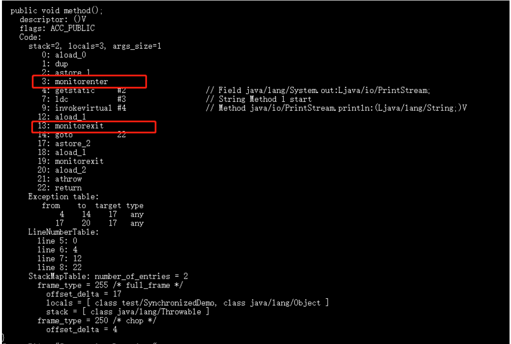
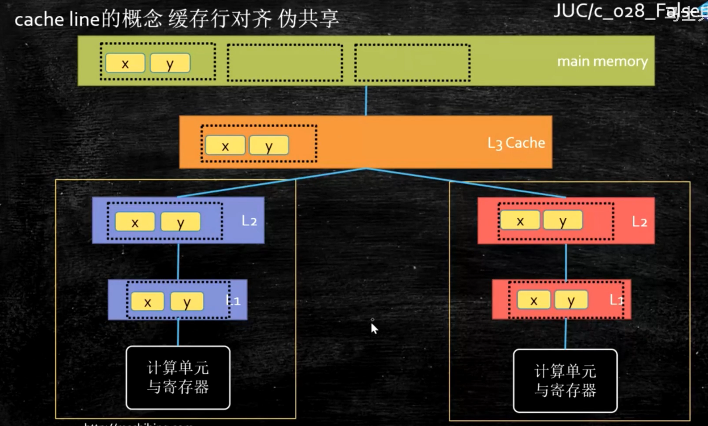

# 面试题

## 打印 A1B2C3...Z26

```java
package A_MultiThread;

/**
 * @author Chaoqun Cheng
 * @date 2021-08-2021/8/17-16:01
 */

public class A1B2_wait_notify {

    public static void main(String[] args) {
        final Object o = new Object();
        int[] nums = new int[26];
        char[] strs = new char[26];
        for(int i=0; i<26; i++){
            nums[i] = i+1;
            strs[i] = (char)('A'+i);
        }

        new Thread(()->{
            synchronized (o){
                for(char str : strs){
                    System.out.println(str);
                    try {
                        o.notify();
                        o.wait();
                    } catch (InterruptedException e) {
                        e.printStackTrace();
                    }
                }
                o.notify();// 必须否则无法停止程序
            }
        }, "t1").start();

        new Thread(()->{
            synchronized (o){
                for(int num : nums){
                    System.out.println(num);
                    try {
                        o.notify();
                        o.wait();
                    } catch (InterruptedException e) {
                        e.printStackTrace();
                    }
                }
                o.notify();
            }
        }, "t2").start();
    }
}

```


## 交替打印

```java
package A_MultiThread;

import java.util.concurrent.locks.Condition;
import java.util.concurrent.locks.Lock;
import java.util.concurrent.locks.ReentrantLock;

/**
 * @author Chaoqun Cheng
 * @date 2021-08-2021/8/18-22:00
 */

public class TakeTurn {
    public static void main(String[] args) {
        Number1 number = new Number1();
        Thread t1 = new Thread(number, "线程1");
        Thread t2 = new Thread(number, "线程2");
        t1.start();
        t2.start();

    }
}

//notify wait()
class Number implements Runnable{

    private int i = 0;

    @Override
    public void run() {
        while(true){
            synchronized (this){
                notify();
                if(i<100){
                    i++;
                    System.out.println(Thread.currentThread().getName()+"---"+i);
                }else{
                    break;
                }
                try {
                    wait();
                } catch (InterruptedException e) {
                    e.printStackTrace();
                }
            }
        }
    }
}

//lock condition
class Number1 implements Runnable{
    private int i = 0;
    private Lock lock = new ReentrantLock();
    private Condition condition = lock.newCondition();

    @Override
    public void run(){
        while(true){
            lock.lock();
            try{
                condition.signal();
                if(i<100){
                    i++;
                    System.out.println(Thread.currentThread().getName()+"---"+i);
                }else{
                    break;
                }
                condition.await();
            }catch(Exception e){

            }finally {
                lock.unlock();
            }
        }
    }

}

```


## 2消费者10生产者 固定容器

```java
package A_MultiThread;

import java.util.LinkedList;
import java.util.concurrent.TimeUnit;
import java.util.concurrent.locks.Condition;
import java.util.concurrent.locks.Lock;
import java.util.concurrent.locks.ReentrantLock;

/**
 * @author Chaoqun Cheng
 * @date 2021-08-2021/8/17-16:33
 */

public class MyContainer_Condition<T> {
    final private LinkedList<T> lists = new LinkedList<>();
    final private int MAX = 10;
    private int count = 0;
    private Lock lock = new ReentrantLock();
    private Condition producer = lock.newCondition();
    private Condition consumer = lock.newCondition();

    public void put(T t){
        try {
            lock.lock();
            while(lists.size()==MAX){
                producer.await();
            }
            lists.add(t);
            ++count;
            consumer.signalAll();
        } catch (InterruptedException e) {
            e.printStackTrace();
        }finally {
            lock.unlock();
        }
    }

    public T get(){
        T t = null;
        try {
            lock.lock();
            while(lists.size()==0){
                consumer.await();
            }
            t = lists.removeFirst();
            --count;
            producer.signalAll();
        } catch (InterruptedException e) {
            e.printStackTrace();
        }finally {
            lock.unlock();
        }
        return t;
    }

    public static void main(String[] args) {
        MyContainer_Condition<String> c = new MyContainer_Condition<>();
        for (int i = 0; i < 10; i++) {
            new Thread(()->{
                for (int j = 0; j < 5; j++) {
                    System.out.println(c.get());
                }
            }, "c"+i).start();
        }

        try {
            TimeUnit.SECONDS.sleep(2);
        } catch (InterruptedException e) {
            e.printStackTrace();
        }

        for (int i = 0; i < 2; i++) {
            new Thread(()->{
                for (int j = 0; j < 25; j++) {
                    c.put(Thread.currentThread().getName() + " "+j);

                }
            }, "p"+i).start();
        }
    }
}

```


## 手写线程池

https://blog.csdn.net/hongtaolong/article/details/87808009?ops_request_misc=%257B%2522request%255Fid%2522%253A%2522162921121516780261961655%2522%252C%2522scm%2522%253A%252220140713.130102334..%2522%257D&request_id=162921121516780261961655&biz_id=0&utm_medium=distribute.pc_search_result.none-task-blog-2~all~sobaiduend~default-1-87808009.pc_search_download_positive&utm_term=%E6%89%8B%E5%86%99%E7%BA%BF%E7%A8%8B%E6%B1%A0&spm=1018.2226.3001.4187

```java
```


# 多线程

```
https://www.jianshu.com/p/40d4c7aebd66
```

## 并发基础

### 并发编程的优缺点

#### 为什么要使用并发编程（并发编程的优点）

- 充分利用多核CPU的计算能力：通过并发编程的形式可以将多核CPU的计算能力发挥到极致，性能得到提升

- 方便进行业务拆分，提升系统并发能力和性能：在特殊的业务场景下，先天的就适合于并发编程。现在的系统动不动就要求百万级甚至千万级的并发量，而多线程并发编程正是开发高并发系统的基础，利用好多线程机制可以大大提高系统整体的并发能力以及性能。面对复杂业务模型，并行程序会比串行程序更适应业务需求，而并发编程更能吻合这种业务拆分 。


#### 并发编程有什么缺点

并发编程的目的就是为了能提高程序的执行效率，提高程序运行速度，但是并发编程并不总是能提高程序运行速度的，而且并发编程可能会遇到很多问题，比如**：内存泄漏、上下文切换、线程安全、死锁**等问题。

### 并发编程三要素是什么？在 Java 程序中怎么保证多线程的运行安全？

并发编程三要素（线程的安全性问题体现在）：

- 原子性：原子，即一个不可再被分割的颗粒。原子性指的是一个或多个操作要么全部执行成功要么全部执行失败。

- 可见性：一个线程对共享变量的修改,另一个线程能够立刻看到。（synchronized,volatile）

- 有序性：程序执行的顺序按照代码的先后顺序执行。（处理器可能会对指令进行重排序）


### 出现线程安全问题的原因：

- 线程切换带来的原子性问题

- 缓存导致的可见性问题

- 编译优化带来的有序性问题


解决办法：

- JDK Atomic开头的原子类、synchronized、LOCK，可以解决原子性问题
- synchronized、volatile、LOCK，可以解决可见性问题
- Happens-Before 规则可以解决有序性问题

### 并行和并发有什么区别？

- 并发：多个任务在同一个 CPU 核上，按细分的时间片轮流(交替)执行，从逻辑上来看那些任务是同时执行。
- 并行：单位时间内，多个处理器或多核处理器同时处理多个任务，是真正意义上的“同时进行”。
- 串行：有n个任务，由一个线程按顺序执行。由于任务、方法都在一个线程执行所以不存在线程不安全情况，也就不存在临界区的问题。
  做一个形象的比喻：

并发 = 两个队列和一台咖啡机。

并行 = 两个队列和两台咖啡机。

串行 = 一个队列和一台咖啡机。

### 什么是多线程，多线程的优劣？

多线程：多线程是指程序中包含多个执行流，即在一个程序中可以同时运行多个不同的线程来执行不同的任务。

#### 多线程的好处：

可以提高 CPU 的利用率。在多线程程序中，一个线程必须等待的时候，CPU 可以运行其它的线程而不是等待，这样就大大提高了程序的效率。也就是说允许单个程序创建多个并行执行的线程来完成各自的任务。

#### 多线程的劣势：

- 线程也是程序，所以线程需要占用内存，线程越多占用内存也越多；

- 多线程需要协调和管理，所以需要 CPU 时间跟踪线程；

- 线程之间对共享资源的访问会相互影响，必须解决竞用共享资源的问题。
  

### 线程和进程区别

#### 什么是线程和进程?

进程

- 一个在内存中运行的应用程序。每个进程都有自己独立的一块内存空间，一个进程可以有多个线程，比如在Windows系统中，一个运行的xx.exe就是一个进程。


线程

- 进程中的一个执行任务（控制单元），负责当前进程中程序的执行。一个进程至少有一个线程，一个进程可以运行多个线程，多个线程可共享数据。


#### 进程与线程的区别

线程具有许多传统进程所具有的特征，故又称为轻型进程(Light—Weight Process)或进程元；而把传统的进程称为重型进程(Heavy—Weight Process)，它相当于只有一个线程的任务。在引入了线程的操作系统中，通常一个进程都有若干个线程，至少包含一个线程。

- 根本区别：进程是操作系统资源分配的基本单位，而线程是处理器任务调度和执行的基本单位
- 资源开销：每个进程都有独立的代码和数据空间（程序上下文），程序之间的切换会有较大的开销；线程可以看做轻量级的进程，同一进程中的线程共享代码和数据空间，每个线程都有自己独立的运行栈和程序计数器（PC），线程之间切换的开销小。
- 包含关系：如果一个进程内有多个线程，则执行过程不是一条线的，而是多条线（线程）共同完成的；线程是进程的一部分，所以线程也被称为轻权进程或者轻量级进程。
- 内存分配：同一进程的线程共享本进程的地址空间和资源，而进程之间的地址空间和资源是相互独立的
- 影响关系：一个进程崩溃后，在保护模式下不会对其他进程产生影响，但是一个线程崩溃整个进程都死掉。所以多进程要比多线程健壮。
- 执行过程：每个独立的进程有程序运行的入口、顺序执行序列和程序出口。但是线程不能独立执行，必须依存在应用程序中，由应用程序提供多个线程执行控制，两者均可并发执行


### 什么是上下文切换?

多线程编程中一般线程的个数都大于 CPU 核心的个数，而一个 CPU 核心在任意时刻只能被一个线程使用，为了让这些线程都能得到有效执行，CPU 采取的策略是为每个线程分配时间片并轮转的形式。当一个线程的时间片用完的时候就会重新处于就绪状态让给其他线程使用，这个过程就属于一次上下文切换。

概括来说就是：当前任务在执行完 CPU 时间片切换到另一个任务之前会先保存自己的状态，以便下次再切换回这个任务时，可以再加载这个任务的状态。任务从保存到再加载的过程就是一次上下文切换。

上下文切换通常是计算密集型的。也就是说，它需要相当可观的处理器时间，在每秒几十上百次的切换中，每次切换都需要纳秒量级的时间。所以，上下文切换对系统来说意味着消耗大量的 CPU 时间，事实上，可能是操作系统中时间消耗最大的操作。

Linux 相比与其他操作系统（包括其他类 Unix 系统）有很多的优点，其中有一项就是，其上下文切换和模式切换的时间消耗非常少。

### 守护线程和用户线程有什么区别呢？

守护线程和用户线程

- 用户 (User) 线程：运行在前台，执行具体的任务，如程序的主线程、连接网络的子线程等都是用户线程
- 守护 (Daemon) 线程：运行在后台，为其他前台线程服务。也可以说守护线程是 JVM 中非守护线程的 “佣人”。一旦所有用户线程都结束运行，守护线程会随 JVM 一起结束工作

main 函数所在的线程就是一个用户线程啊，main 函数启动的同时在 JVM 内部同时还启动了好多守护线程，比如垃圾回收线程。

比较明显的区别之一是用户线程结束，JVM 退出，不管这个时候有没有守护线程运行。而守护线程不会影响 JVM 的退出。

注意事项：

1. setDaemon(true)必须在start()方法前执行，否则会抛出 IllegalThreadStateException 异常
2. 在守护线程中产生的新线程也是守护线程
3. 不是所有的任务都可以分配给守护线程来执行，比如读写操作或者计算逻辑
4. 守护 (Daemon) 线程中不能依靠 finally 块的内容来确保执行关闭或清理资源的逻辑。因为我们上面也说过了一旦所有用户线程都结束运行，守护线程会随 JVM 一起结束工作，所以守护 (Daemon) 线程中的 finally 语句块可能无法被执行。

### 如何在 Windows 和 Linux 上查找哪个线程cpu利用率最高？

windows上面用任务管理器看，linux下可以用 top 这个工具看。

1. 找出cpu耗用厉害的进程pid， 终端执行top命令，然后按下shift+p 查找出cpu利用最厉害的pid号
2. 根据上面第一步拿到的pid号，top -H -p pid 。然后按下shift+p，查找出cpu利用率最厉害的线程号，比如top -H -p 1328
3. 将获取到的线程号转换成16进制，去百度转换一下就行
4. 使用jstack工具将进程信息打印输出，jstack pid号 > /tmp/t.dat，比如jstack 31365 > /tmp/t.dat
5. 编辑/tmp/t.dat文件，查找线程号对应的信息


### 创建线程的四种方式

#### 继承 Thread 类；

1. 定义一个Thread类的子类，重写run方法，将相关逻辑实现，run()方法就是线程要执行的业务逻辑方法
2. 创建自定义的线程子类对象
3. 调用子类实例的star()方法来启动线程

```java
public class MyThread extends Thread {
    @Override
    public void run() {
        System.out.println(Thread.currentThread().getName() + " run()方法正在执行...");
    }
}
public class TheadTest {
    public static void main(String[] args) {
        MyThread myThread = new MyThread(); 	
        myThread.start();
        System.out.println(Thread.currentThread().getName() + " main()方法执行结束");
    }
}
main main()方法执行结束
Thread-0 run()方法正在执行...
```


#### 实现 Runnable 接口；

1. 定义Runnable接口实现类MyRunnable，并重写run()方法
2. 创建MyRunnable实例myRunnable，以myRunnable作为target创建Thead对象，**该Thread对象才是真正的线程对象**
3. 调用线程对象的start()方法

```java
public class MyRunnable implements Runnable {
    @Override
    public void run() {
        System.out.println(Thread.currentThread().getName() + " run()方法执行中...");
    }
}
public class RunnableTest {
    public static void main(String[] args) {
        MyRunnable myRunnable = new MyRunnable();
        Thread thread = new Thread(myRunnable);
        thread.start();
        System.out.println(Thread.currentThread().getName() + " main()方法执行完成");
    }
}
main main()方法执行完成
Thread-0 run()方法执行中...
```


#### 实现 Callable 接口；

1. 创建实现Callable接口的类myCallable
2. 以myCallable为参数创建FutureTask对象
3. 将FutureTask作为参数创建Thread对象
4. 调用线程对象的start()方法

```java
public class MyCallable implements Callable<Integer> {
    @Override
    public Integer call() {
        System.out.println(Thread.currentThread().getName() + " call()方法执行中...");
        return 1;
    }
}
public class CallableTest {
    public static void main(String[] args) {
        FutureTask<Integer> futureTask = new FutureTask<Integer>(new MyCallable());
        Thread thread = new Thread(futureTask);
        thread.start();
        try {
            Thread.sleep(1000);
            System.out.println("返回结果 " + futureTask.get());
        } catch (InterruptedException e) {
            e.printStackTrace();
        } catch (ExecutionException e) {
            e.printStackTrace();
        }
        System.out.println(Thread.currentThread().getName() + " main()方法执行完成");
    }
}
Thread-0 call()方法执行中...
返回结果 1
main main()方法执行完成
```


#### 使用 Executors 工具类创建线程池

Executors提供了一系列工厂方法用于创先线程池，返回的线程池都实现了ExecutorService接口。

主要有newFixedThreadPool，newCachedThreadPool，newSingleThreadExecutor，newScheduledThreadPool，后续详细介绍这四种线程池

```java
public class MyRunnable implements Runnable {
    @Override
    public void run() {
        System.out.println(Thread.currentThread().getName() + " run()方法执行中...");
    }
 
}
public class SingleThreadExecutorTest {
    public static void main(String[] args) {
        ExecutorService executorService = Executors.newSingleThreadExecutor();
        MyRunnable runnableTest = new MyRunnable();
        for (int i = 0; i < 5; i++) {
            executorService.execute(runnableTest);
        }
        System.out.println("线程任务开始执行");
        executorService.shutdown();
    }
}
线程任务开始执行
pool-1-thread-1 is running...
pool-1-thread-1 is running...
pool-1-thread-1 is running...
pool-1-thread-1 is running...
pool-1-thread-1 is running...
```

### 说一下 runnable 和 callable 有什么区别？

#### 相同点

- 都是接口

- 都可以编写多线程程序

- 都采用Thread.start()启动线程


#### 主要区别

- Runnable 接口 run 方法无返回值；Callable 接口 call 方法有返回值，是个泛型，和Future、FutureTask配合可以用来获取异步执行的结果
- Runnable 接口 run 方法只能抛出运行时异常，且无法捕获处理；Callable 接口 call 方法允许抛出异常，可以获取异常信息
- 注：Callalbe接口支持返回执行结果，需要调用FutureTask.get()得到，此方法会阻塞主进程的继续往下执行，如果不调用不会阻塞。

### 线程的 run()和 start()有什么区别？

- 每个线程都是通过某个特定Thread对象所对应的方法run()来完成其操作的，run()方法称为线程体。通过调用Thread类的start()方法来启动一个线程。

- start() 方法用于启动线程，run() 方法用于执行线程的运行时代码。run() 可以重复调用，而 start() 只能调用一次。

- start()方法来启动一个线程，真正实现了多线程运行。调用start()方法无需等待run方法体代码执行完毕，可以直接继续执行其他的代码； 此时线程是处于就绪状态，并没有运行。 然后通过此Thread类调用方法run()来完成其运行状态， run()方法运行结束， 此线程终止。然后CPU再调度其它线程。

- run()方法是在本线程里的，只是线程里的一个函数，而不是多线程的。 如果直接调用run()，其实就相当于是调用了一个普通函数而已，直接待用run()方法必须等待run()方法执行完毕才能执行下面的代码，所以执行路径还是只有一条，根本就没有线程的特征，所以在多线程执行时要使用start()方法而不是run()方法。


### 为什么我们调用 start() 方法时会执行 run() 方法，为什么我们不能直接调用 run() 方法？

- new 一个 Thread，线程进入了新建状态。调用 start() 方法，会启动一个线程并使线程进入了就绪状态，当分配到时间片后就可以开始运行了。 
- start() 会执行线程的相应准备工作，然后自动执行 run() 方法的内容，这是真正的多线程工作。
- 而直接执行 run() 方法，会把 run 方法当成一个 main 线程下的普通方法去执行，并不会在某个线程中执行它，所以这并不是多线程工作。

- 总结： 调用 start 方法方可启动线程并使线程进入就绪状态，而 run 方法只是 thread 的一个普通方法调用，还是在主线程里执行。


### 什么是 Callable 和 Future?

Callable 接口类似于 Runnable，从名字就可以看出来了，但是 Runnable 不会返回结果，并且无法抛出返回结果的异常，

而 Callable 功能更强大一些，被线程执行后，可以返回值，这个返回值可以被 Future 拿到，也就是说，Future 可以拿到异步执行任务的返回值。

Future 接口表示异步任务，是一个可能还没有完成的异步任务的结果。所以说 Callable用于产生结果，Future 用于获取结果。

### 什么是 FutureTask

FutureTask 表示一个异步运算的任务。FutureTask 里面可以传入一个 Callable 的具体实现类，可以对这个异步运算的任务的结果进行等待获取、判断是否已经完成、取消任务等操作。

只有当运算完成的时候结果才能取回，如果运算尚未完成 get 方法将会阻塞。一个 FutureTask 对象可以对调用了 Callable 和 Runnable 的对象进行包装，由于 FutureTask 也是Runnable 接口的实现类，所以 FutureTask 也可以放入线程池中。


### 线程的状态和基本操作

说说线程的生命周期及五种基本状态？


1. 新建(new)：新创建了一个线程对象。

2. 可运行(runnable)：线程对象创建后，当调用线程对象的 start()方法，该线程处于就绪状态，等待被线程调度选中，获取cpu的使用权。

3. 运行(running)：可运行状态(runnable)的线程获得了cpu时间片（timeslice），执行程序代码。注：就绪状态是进入到运行状态的唯一入口，也就是说，线程要想进入运行状态执行，首先必须处于就绪状态中；

4. 阻塞(block)：处于运行状态中的线程由于某种原因，暂时放弃对 CPU的使用权，停止执行，此时进入阻塞状态，直到其进入到就绪状态，才 有机会再次被 CPU 调用以进入到运行状态。

5. 阻塞的情况分三种：
   - (一). 等待阻塞：运行状态中的线程执行 wait()方法，JVM会把该线程放入等待队列(waitting queue)中，使本线程进入到等待阻塞状态；
   - (二). 同步阻塞：线程在获取 synchronized 同步锁失败(因为锁被其它线程所占用)，，则JVM会把该线程放入锁池(lock pool)中，线程会进入同步阻塞状态；
   - (三). 其他阻塞: 通过调用线程的 sleep()或 join()或发出了 I/O 请求时，线程会进入到阻塞状态。当 sleep()状态超时、join()等待线程终止或者超时、或者 I/O 处理完毕时，线程重新转入就绪状态。
6. 死亡(dead)：线程run()、main()方法执行结束，或者因异常退出了run()方法，则该线程结束生命周期。死亡的线程不可再次复生。


### Java 中用到的线程调度算法是什么？

计算机通常只有一个 CPU，在任意时刻只能执行一条机器指令，每个线程只有获得CPU 的使用权才能执行指令。所谓多线程的并发运行，其实是指从宏观上看，各个线程轮流获得 CPU 的使用权，分别执行各自的任务。在运行池中，会有多个处于就绪状态的线程在等待 CPU，JAVA 虚拟机的一项任务就是负责线程的调度，线程调度是指按照特定机制为多个线程分配 CPU 的使用权。

#### 有两种调度模型：分时调度模型和抢占式调度模型。

- 分时调度模型是指让所有的线程轮流获得 cpu 的使用权，并且平均分配每个线程占用的 CPU 的时间片这个也比较好理解。

- Java虚拟机采用抢占式调度模型，是指优先让可运行池中优先级高的线程占用CPU，如果可运行池中的线程优先级相同，那么就随机选择一个线程，使其占用CPU。处于运行状态的线程会一直运行，直至它不得不放弃 CPU。


#### 线程的调度策略

线程调度器选择优先级最高的线程运行，但是，如果发生以下情况，就会终止线程的运行：

（1）线程体中调用了 yield 方法让出了对 cpu 的占用权利

（2）线程体中调用了 sleep 方法使线程进入睡眠状态

（3）线程由于 IO 操作受到阻塞

（4）另外一个更高优先级线程出现

（5）在支持时间片的系统中，该线程的时间片用完

### 什么是线程调度器(Thread Scheduler)和时间分片(Time Slicing )？

- 线程调度器是一个操作系统服务，它负责为 Runnable 状态的线程分配 CPU 时间。一旦我们创建一个线程并启动它，它的执行便依赖于线程调度器的实现。

- 时间分片是指将可用的 CPU 时间分配给可用的 Runnable 线程的过程。分配 CPU 时间可以基于线程优先级或者线程等待的时间。

- 线程调度并不受到 Java 虚拟机控制，所以由应用程序来控制它是更好的选择（也就是说不要让你的程序依赖于线程的优先级）。


### 请说出与线程同步以及线程调度相关的方法。

- wait()：使一个线程处于等待（阻塞）状态，并且**释放所持有的对象的锁**；

- sleep()：使一个正在运行的线程处于睡眠状态, 不会释放持有的锁，是一个静态方法，调用此方法要处理 InterruptedException 异常；

- notify()：唤醒一个处于等待状态的线程，当然在调用此方法的时候，并不能确切的唤醒某一个等待状态的线程，而是由 JVM 确定唤醒哪个线程，而且与优先级无关；

- notityAll()：唤醒所有处于等待状态的线程，该方法并不是将对象的锁给所有线程，而是让它们竞争，只有获得锁的线程才能进入就绪状态；


### sleep() 和 wait() 有什么区别？

两者都可以暂停线程的执行

- 类的不同：sleep() 是 Thread线程类的静态方法，wait() 是 Object类的方法。
- 是否释放锁：sleep() 不释放锁；wait() 释放锁。
- 用途不同：Wait 通常被用于线程间交互/通信，sleep 通常被用于暂停执行。
- 用法不同：wait() 方法被调用后，线程不会自动苏醒，需要别的线程调用同一个对象上的 notify() 或者 notifyAll() 方法。
  - sleep() 方法执行完成后，线程会自动苏醒。或者可以使用wait(long timeout)超时后线程会自动苏醒。

### 你是如何调用 wait() 方法的？使用 if 块还是循环？为什么？

处于等待状态的线程可能会收到错误警报和伪唤醒，如果不在循环中检查等待条件，程序就会在没有满足结束条件的情况下退出。

wait() 方法应该在循环调用，因为当线程获取到 CPU 开始执行的时候，其他条件可能还没有满足，所以在处理前，循环检测条件是否满足会更好。下面是一段标准的使用 wait 和 notify 方法的代码：

```java
synchronized (monitor) {
    //  判断条件谓词是否得到满足
    while(!locked) {
        //  等待唤醒
        monitor.wait();
    }
    //  处理其他的业务逻辑
}
```

### 为什么线程通信的方法 wait(), notify()和 notifyAll()被定义在 Object 类里？

- Java中，任何对象都可以作为锁，并且 wait()，notify()等方法用于等待对象的锁或者唤醒线程，在 Java 的线程中并没有可供任何对象使用的锁，所以任意对象调用方法一定定义在Object类中。

- wait(), notify()和 notifyAll()这些方法在同步代码块中调用

- 有的人会说，既然是线程放弃对象锁，那也可以把wait()定义在Thread类里面啊，新定义的线程继承于Thread类，也不需要重新定义wait()方法的实现。然而，这样做有一个非常大的问题，一个线程完全可以持有很多锁，你一个线程放弃锁的时候，到底要放弃哪个锁？当然了，这种设计并不是不能实现，只是管理起来更加复杂。

- 综上所述，wait()、notify()和notifyAll()方法要定义在Object类中。


### 为什么 wait(), notify()和 notifyAll()必须在同步方法或者同步块中被调用？

当一个线程需要调用对象的 wait()方法的时候，这个线程必须拥有该对象的锁，接着它就会释放这个对象锁并进入等待状态直到其他线程调用这个对象上的 notify()方法。

同样的，当一个线程需要调用对象的 notify()方法时，它会释放这个对象的锁，以便其他在等待的线程就可以得到这个对象锁。由于所有的这些方法都需要线程持有对象的锁，这样就只能通过同步来实现，所以他们只能在同步方法或者同步块中被调用。

### Thread 类中的 yield 方法有什么作用？

使当前线程从执行状态（运行状态）变为可执行态（就绪状态）。

当前线程到了就绪状态，那么接下来哪个线程会从就绪状态变成执行状态呢？可能是当前线程，也可能是其他线程，看系统的分配了。

### 为什么 Thread 类的 sleep()和 yield ()方法是静态的？

Thread 类的 sleep()和 yield()方法将在当前正在执行的线程上运行。所以在其他处于等待状态的线程上调用这些方法是没有意义的。这就是为什么这些方法是静态的。它们可以在当前正在执行的线程中工作，并避免程序员错误的认为可以在其他非运行线程调用这些方法。

### 线程的 sleep()方法和 yield()方法有什么区别？

（1） sleep()方法给其他线程运行机会时不考虑线程的优先级，因此会给低优先级的线程以运行的机会；yield()方法只会给相同优先级或更高优先级的线程以运行的机会；

（2） 线程执行 sleep()方法后转入阻塞（blocked）状态，而执行 yield()方法后转入就绪（ready）状态；

（3）sleep()方法声明抛出 InterruptedException，而 yield()方法没有声明任何异常；

（4）sleep()方法比 yield()方法（跟操作系统 CPU 调度相关）具有更好的可移植性，通常不建议使用yield()方法来控制并发线程的执行。

### 如何停止一个正在运行的线程？

在java中有以下3种方法可以终止正在运行的线程：

- 使用退出标志，使线程正常退出，也就是当run方法完成后线程终止。
- 使用stop方法强行终止，但是不推荐这个方法，因为stop和suspend及resume一样都是过期作废的方法。
- 使用interrupt方法中断线程。

### Java 中 interrupted 和 isInterrupted 方法的区别？

interrupt：用于中断线程。调用该方法的线程的状态为将被置为”中断”状态。

注意：线程中断仅仅是置线程的中断状态位，不会停止线程。需要用户自己去监视线程的状态为并做处理。支持线程中断的方法（也就是线程中断后会抛出interruptedException 的方法）就是在监视线程的中断状态，一旦线程的中断状态被置为“中断状态”，就会抛出中断异常。

interrupted：是静态方法，查看当前中断信号是true还是false并且清除中断信号。如果一个线程被中断了，第一次调用 interrupted 则返回 true，第二次和后面的就返回 false 了。

isInterrupted：查看当前中断信号是true还是false

### 什么是阻塞式方法？

阻塞式方法是指程序会一直等待该方法完成期间不做其他事情，ServerSocket 的accept()方法就是一直等待客户端连接。这里的阻塞是指调用结果返回之前，当前线程会被挂起，直到得到结果之后才会返回。此外，还有异步和非阻塞式方法在任务完成前就返回。

### Java 中你怎样唤醒一个阻塞的线程？

首先 ，wait()、notify() 方法是针对对象的，调用任意对象的 wait()方法都将导致线程阻塞，阻塞的同时也将释放该对象的锁，相应地，调用任意对象的 notify()方法则将随机解除该对象阻塞的线程，但它需要重新获取该对象的锁，直到获取成功才能往下执行；

其次，wait、notify 方法必须在 synchronized 块或方法中被调用，并且要保证同步块或方法的锁对象与调用 wait、notify 方法的对象是同一个，如此一来在调用 wait 之前当前线程就已经成功获取某对象的锁，执行 wait 阻塞后当前线程就将之前获取的对象锁释放。

### notify() 和 notifyAll() 有什么区别？

如果线程调用了对象的 wait()方法，那么线程便会处于该对象的等待池中，等待池中的线程不会去竞争该对象的锁。

notifyAll() 会唤醒所有的线程，notify() 只会唤醒一个线程。

notifyAll() 调用后，会将全部线程由等待池移到锁池，然后参与锁的竞争，竞争成功则继续执行，如果不成功则留在锁池等待锁被释放后再次参与竞争。而 notify()只会唤醒一个线程，具体唤醒哪一个线程由虚拟机控制。

### 如何在两个线程间共享数据？

在两个线程间共享变量即可实现共享。

一般来说，共享变量要求变量本身是线程安全的，然后在线程内使用的时候，如果有对共享变量的复合操作，那么也得保证复合操作的线程安全性。

### Java 如何实现多线程之间的通讯和协作？

可以通过中断 和 共享变量的方式实现线程间的通讯和协作

比如说最经典的生产者-消费者模型：当队列满时，生产者需要等待队列有空间才能继续往里面放入商品，而在等待的期间内，生产者必须释放对临界资源（即队列）的占用权。因为生产者如果不释放对临界资源的占用权，那么消费者就无法消费队列中的商品，就不会让队列有空间，那么生产者就会一直无限等待下去。因此，一般情况下，当队列满时，会让生产者交出对临界资源的占用权，并进入挂起状态。然后等待消费者消费了商品，然后消费者通知生产者队列有空间了。同样地，当队列空时，消费者也必须等待，等待生产者通知它队列中有商品了。这种互相通信的过程就是线程间的协作。

#### Java中线程通信协作的最常见的两种方式：

一.syncrhoized加锁的线程的Object类的wait()/notify()/notifyAll()

二.ReentrantLock类加锁的线程的Condition类的await()/signal()/signalAll()

线程间直接的数据交换：

三.通过管道进行线程间通信：1）字节流；2）字符流

### 同步方法和同步块，哪个是更好的选择？

同步块是更好的选择，因为它不会锁住整个对象（当然你也可以让它锁住整个对象）。

同步方法会锁住整个对象，哪怕这个类中有多个不相关联的同步块，这通常会导致他们停止执行并需要等待获得这个对象上的锁。

同步块更要符合开放调用的原则，只在需要锁住的代码块锁住相应的对象，这样从侧面来说也可以避免死锁。

请知道一条原则：同步的范围越小越好。

### 什么是线程同步和线程互斥，有哪几种实现方式？

当一个线程对共享的数据进行操作时，应使之成为一个”原子操作“，即在没有完成相关操作之前，不允许其他线程打断它，否则，就会破坏数据的完整性，必然会得到错误的处理结果，这就是线程的同步。

在多线程应用中，考虑不同线程之间的数据同步和防止死锁。当两个或多个线程之间同时等待对方释放资源的时候就会形成线程之间的死锁。为了防止死锁的发生，需要通过同步来实现线程安全。

线程互斥是指对于共享的进程系统资源，在各单个线程访问时的排它性。当有若干个线程都要使用某一共享资源时，任何时刻最多只允许一个线程去使用，其它要使用该资源的线程必须等待，直到占用资源者释放该资源。线程互斥可以看成是一种特殊的线程同步。

线程间的同步方法大体可分为两类：用户模式和内核模式。顾名思义，内核模式就是指利用系统内核对象的单一性来进行同步，使用时需要切换内核态与用户态，而用户模式就是不需要切换到内核态，只在用户态完成操作。

用户模式下的方法有：原子操作（例如一个单一的全局变量），临界区。内核模式下的方法有：事件，信号量，互斥量。

### 实现线程同步的方法

同步代码方法：sychronized 关键字修饰的方法

同步代码块：sychronized 关键字修饰的代码块

使用特殊变量域volatile实现线程同步：volatile关键字为域变量的访问提供了一种免锁机制

使用重入锁实现线程同步：reentrantlock类是可重入、互斥、实现了lock接口的锁, 他与sychronized方法具有相同的基本行为和语义

### 在监视器(Monitor)内部，是如何做线程同步的？程序应该做哪种级别的同步？

在 java 虚拟机中，每个对象( Object 和 class )通过某种逻辑关联监视器,每个监视器和一个对象引用相关联，为了实现监视器的互斥功能，每个对象都关联着一把锁。

一旦方法或者代码块被 synchronized 修饰，那么这个部分就放入了监视器的监视区域，确保一次只能有一个线程执行该部分的代码，线程在获取锁之前不允许执行该部分的代码

另外 java 还提供了显式监视器( Lock )和隐式监视器( synchronized )两种锁方案

### 如果你提交任务时，线程池队列已满，这时会发生什么

这里区分一下：

（1）如果使用的是无界队列 LinkedBlockingQueue，继续添加任务到阻塞队列中等待执行，因为 LinkedBlockingQueue 可以近乎认为是一个无穷大的队列，可以无限存放任务

（2）如果使用的是有界队列比如 ArrayBlockingQueue，任务首先会被添加到ArrayBlockingQueue 中，ArrayBlockingQueue 满了，会根据maximumPoolSize 的值增加线程数量，如果增加了线程数量还是处理不过来，ArrayBlockingQueue 继续满，那么则会使用拒绝策略RejectedExecutionHandler 处理满了的任务，默认是 AbortPolicy

### 什么叫线程安全？servlet 是线程安全吗?

线程安全是编程中的术语，指某个方法在多线程环境中被调用时，能够正确地处理多个线程之间的共享变量，使程序功能正确完成。

Servlet 不是线程安全的，servlet 是单实例多线程的，当多个线程同时访问同一个方法，是不能保证共享变量的线程安全性的。

Struts2 的 action 是多实例多线程的，是线程安全的，每个请求过来都会 new 一个新的 action 分配给这个请求，请求完成后销毁。

SpringMVC 的 Controller 是线程安全的吗？不是的，和 Servlet 类似的处理流程。

Struts2 好处是不用考虑线程安全问题；Servlet 和 SpringMVC 需要考虑线程安全问题，但是性能可以提升不用处理太多的 gc，可以使用 ThreadLocal 来处理多线程的问题。

### 在 Java 程序中怎么保证多线程的运行安全？

- 方法一：使用安全类，比如 java.util.concurrent 下的类，使用原子类AtomicInteger
- 方法二：使用自动锁 synchronized。
- 方法三：使用手动锁 Lock。

手动锁 Java 示例代码如下：

```java
Lock lock = new ReentrantLock();
lock. lock();
try {
    System. out. println("获得锁");
} catch (Exception e) {
    // TODO: handle exception
} finally {
    System. out. println("释放锁");
    lock. unlock();
}
```

### 你对线程优先级的理解是什么？

每一个线程都是有优先级的，一般来说，高优先级的线程在运行时会具有优先权，但这依赖于线程调度的实现，这个实现是和操作系统相关的(OS dependent)。我们可以定义线程的优先级，但是这并不能保证高优先级的线程会在低优先级的线程前执行。线程优先级是一个 int 变量(从 1-10)，1 代表最低优先级，10 代表最高优先级。

Java 的线程优先级调度会委托给操作系统去处理，所以与具体的操作系统优先级有关，如非特别需要，一般无需设置线程优先级。

### 线程类的构造方法、静态块是被哪个线程调用的

**线程类的构造方法、静态块是被 new这个线程类所在的线程所调用的，而 run 方法里面的代码才是被线程自身所调用的。**

如果说上面的说法让你感到困惑，那么我举个例子，假设 Thread2 中 new 了Thread1，main 函数中 new 了 Thread2，那么：

（1）Thread2 的构造方法、静态块是 main 线程调用的，Thread2 的 run()方法是Thread2 自己调用的

（2）Thread1 的构造方法、静态块是 Thread2 调用的，Thread1 的 run()方法是Thread1 自己调用的

### Java 中怎么获取一份线程 dump 文件？你如何在 Java 中获取线程堆栈？

Dump文件是进程的内存镜像。可以把程序的执行状态通过调试器保存到dump文件中。

在 Linux 下，你可以通过命令 kill -3 PID （Java 进程的进程 ID）来获取 Java应用的 dump 文件。

在 Windows 下，你可以按下 Ctrl + Break 来获取。这样 JVM 就会将线程的 dump 文件打印到标准输出或错误文件中，它可能打印在控制台或者日志文件中，具体位置依赖应用的配置。

### 一个线程运行时发生异常会怎样？

如果异常没有被捕获该线程将会停止执行。Thread.UncaughtExceptionHandler是用于处理未捕获异常造成线程突然中断情况的一个内嵌接口。

当一个未捕获异常将造成线程中断的时候，JVM 会使用 Thread.getUncaughtExceptionHandler()来查询线程的 UncaughtExceptionHandler 并将线程和异常作为参数传递给 handler 的 uncaughtException()方法进行处理。

### Java 线程数过多会造成什么异常？

- 线程的生命周期开销非常高

- 消耗过多的 CPU

- 资源如果可运行的线程数量多于可用处理器的数量，那么有线程将会被闲置。大量空闲的线程会占用许多内存，给垃圾回收器带来压力，而且大量的线程在竞争 CPU资源时还将产生其他性能的开销。

- 降低稳定性JVM

- 在可创建线程的数量上存在一个限制，这个限制值将随着平台的不同而不同，并且承受着多个因素制约，包括 JVM 的启动参数、Thread 构造函数中请求栈的大小，以及底层操作系统对线程的限制等。如果破坏了这些限制，那么可能抛出OutOfMemoryError 异常。
  


## 并发理论

### Java内存模型

#### Java中垃圾回收有什么目的？什么时候进行垃圾回收？

垃圾回收是在内存中存在没有引用的对象或超过作用域的对象时进行的。

垃圾回收的目的是识别并且丢弃应用不再使用的对象来释放和重用资源。

#### 如果对象的引用被置为null，垃圾收集器是否会立即释放对象占用的内存？

不会，在下一个垃圾回调周期中，这个对象将是被可回收的。

也就是说并不会立即被垃圾收集器立刻回收，而是在下一次垃圾回收时才会释放其占用的内存。

#### finalize()方法什么时候被调用？析构函数(finalization)的目的是什么？

- 垃圾回收器（garbage colector）决定回收某对象时，就会运行该对象的finalize()方法；
- finalize是Object类的一个方法，该方法在Object类中的声明protected void finalize() throws Throwable { }
- 在垃圾回收器执行时会调用被回收对象的finalize()方法，可以覆盖此方法来实现对其资源的回收。注意：一旦垃圾回收器准备释放对象占用的内存，将首先调用该对象的finalize()方法，并且下一次垃圾回收动作发生时，才真正回收对象占用的内存空间
- GC本来就是内存回收了，应用还需要在finalization做什么呢？ 答案是大部分时候，什么都不用做(也就是不需要重载)。只有在某些很特殊的情况下，比如你调用了一些native的方法(一般是C写的)，可以要在finaliztion里去调用C的释放函数。

### 重排序与数据依赖性

#### 为什么代码会重排序？

在执行程序时，为了提供性能，处理器和编译器常常会对指令进行重排序，但是不能随意重排序，不是你想怎么排序就怎么排序，它需要满足以下两个条件：

- 在单线程环境下不能改变程序运行的结果；

- 存在数据依赖关系的不允许重排序


需要注意的是：重排序不会影响单线程环境的执行结果，但是会破坏多线程的执行语义。

#### as-if-serial规则和happens-before规则的区别

- as-if-serial语义保证单线程内程序的执行结果不被改变，happens-before关系保证正确同步的多线程程序的执行结果不被改变。
- as-if-serial语义给编写单线程程序的程序员创造了一个幻境：单线程程序是按程序的顺序来执行的。happens-before关系给编写正确同步的多线程程序的程序员创造了一个幻境：正确同步的多线程程序是按happens-before指定的顺序来执行的。
- as-if-serial语义和happens-before这么做的目的，都是为了在不改变程序执行结果的前提下，尽可能地提高程序执行的并行度。


## 强软弱虚四种引用

### 强

```java
M m = new M();
```

GC回收会执行对象的finalize方法

### 软

SoftReference

内存不够了 删除软引用, 适合做缓存


### 弱

WeakReference

执行GC就回收弱引用


### 虚引用

PhantomReference

get不到虚引用

作用: 管理堆外内存

- JVM DirectByteBuffer分配的内存在JVM堆外, 
- JVM内没有指向DBB的时候, 需要回收这块区域, 和他关联的堆外内存需要同时回收
- 对这样的对象挂一个虚引用, 对象被回收的时候, 这个虚引用被放入一个Queue, 这个Queue有虚引用就会去回收这个虚引用对应的堆外内存


## ThreadLocal

rl->ThreadLocal 强引用

key->ThreadLocal 弱引用

ThreadLocal删除后, key=null  这条记录无法被访问了, 所以需要remove 否则产生内存泄露


线程有一个ThreadLocalMap 

- key = ThreadLocal 
- value = 对象

new一个ThreadLocal 调用set(对象) 就把 创建的ThreadLocal 和 对象放入到Thread的map里, 这样这个对象就是线程私有, 因为存到到了线程局部变量的map中

- 这时候会有一个强引用指向 new出来的ThreadLocal对象
- 调用ThreadLocalMap.set方法将 ThreadLocal-value pair放入map的时候实际上创建了Entry<key,value> 放入map
- 但是这个Entry继承了WeakReference 这个key是一个弱引用指向new 出来的ThreadLocal key

这时候会存在内存泄露的问题

- 当强引用不在指向new 出来的ThreadLocal对象被垃圾回收的时候, map里的弱引用指向了null 
- 那么ThreadLocalMap中的这条记录 null-value就无法被访问, 
- 所以需要remove掉这条记录, 否则这个value对象就无法释放, 导致内存泄露

为什么ThreadLocal中的key要是弱引用

- 否则new ThreadLocal时的强引用释放的时候, 还有一个ThreadLocal中的key强引用指向这个ThreadLocal对象, 对象无法被释放造成内存泄露


## 并发关键字

### 对象在内存中的存储布局

 

对象头8字节, 

类型指针压缩情况下4字节, 不压缩8字节

实例数据具体情况

padding 如果不能被8整除需要补齐

#### 对象头 markword 8字节

- 锁, synchronized信息

#### 类型指针 class  pointer 4字节

- 这个对象属于哪个class类

#### 实例数据

- 数据, 一个int 占4个字节

#### 对齐 padding

- 如果这个对象字节数不能被8整除, 补到能被8整除, 
- CPU读取按照总线长度 8个字节, 这样读取效率高


### synchronized

#### 锁升级 markword存储变化

new 偏向锁 轻量级锁 (无锁, 自旋锁, 自适应自旋) 重量级锁

- 偏向锁
  - 第一个使用这个对象的线程, markword中存储了这个线程的指针表示这个对象偏向了这个线程
- 轻量级锁
  - 发生任意竞争, 这个锁升级为轻量级锁
  - 撤销偏向锁, 
  - 每个抢锁的线程在自己的线程栈生成lockrecord 并把自己的LR 放到对象的对象头里 使用CAS的方式上锁
  - 谁成功了谁就拥有了这个轻量级锁, 即对象头有了一个指针指向了拿到锁的线程栈中的LR
  - 存在于用户态, 不需要系统调用, 但是这个是一个while循环, 竞争激烈, 导致太多线程自旋, 占用太多CPU资源
- 重量级锁
  - 竞争加剧, 自旋次数到达一定次数, JVM判定升级为重量级锁
  - markword存储的指向内核态的mutex互斥锁
  - 每一把锁都有一个队列, 等待拿锁的线程进入锁的队列, 但是不消耗任何CPU资源


#### 锁清除

锁消除是指虚拟机即时编译器在运行时，对一些代码要求同步，但是**对被检测到不可能存在共享数据竞争的锁进行消除**。

#### 锁粗化

原则上，我们在编写代码的时候，总是推荐将同步块的作用范围限制得尽量小——只在共享数据的实际作用域中才进行同步，

这样是为了使得需要同步的操作数量尽可能变少，即使存在锁竞争，等待锁的线程也能尽可能快地拿到锁。

大多数情况下，上面的原则都是正确的，但是如果一系列的连续操作都对同一个对象反复加锁和解锁，甚至加锁操作是出现在循环体之中的，

那即使没有线程竞争，频繁地进行互斥同步操作也会导致不必要的性能损耗


#### synchronized实现原理


#### synchronized 的作用？

关键字 synchronized可以保证在同一个时刻，只有一个线程可以执行某个方法或者某个代码块(主要是对方法或者代码块中存在共享数据的操作)，同时我们还应该注意到synchronized另外一个重要的作用，synchronized可保证一个线程的变化(主要是共享数据的变化)被其他线程所看到（保证可见性，完全可以替代Volatile功能），这点确实也是很重要的。

另外，在 Java 早期版本中，synchronized属于重量级锁，效率低下，因为监视器锁（monitor）是依赖于底层的操作系统的 Mutex Lock 来实现的，Java 的线程是映射到操作系统的原生线程之上的。

如果要挂起或者唤醒一个线程，都需要操作系统帮忙完成，而操作系统实现线程之间的切换时需要从用户态转换到内核态，这个状态之间的转换需要相对比较长的时间，时间成本相对较高，这也是为什么早期的 synchronized 效率低的原因。

庆幸的是在 Java 6 之后 Java 官方对从 JVM 层面对synchronized 较大优化，所以现在的 synchronized 锁效率也优化得很不错了。JDK1.6对锁的实现引入了大量的优化，如**自旋锁、适应性自旋锁、锁消除、锁粗化、偏向锁、轻量级锁**等技术来减少锁操作的开销。


#### 说说自己是怎么使用 synchronized 关键字，在项目中用到了吗(synchronized的三种应用方式)

synchronized关键字最主要的三种使用方式：

- 修饰实例方法: 作用于当前对象实例加锁，进入同步代码前要获得当前对象实例的锁
- 修饰静态方法: 也就是给当前类加锁，会作用于类的所有对象实例，因为静态成员不属于任何一个实例对象，是类成员（ static 表明这是该类的一个静态资源，不管new了多少个对象，只有一份）。
  - 所以如果一个线程A调用一个实例对象的非静态 synchronized 方法，而线程B需要调用这个实例对象所属类的静态 synchronized 方法，是允许的，不会发生互斥现象，因为访问静态 synchronized 方法占用的锁是当前类的锁，而访问非静态 synchronized 方法占用的锁是当前实例对象锁。
- 修饰代码块: 指定加锁对象，对给定对象加锁，进入同步代码库前要获得给定对象的锁。

总结： 

- synchronized 关键字加到 static 静态方法和 synchronized(class)代码块上都是是给 Class 类上锁。
- synchronized 关键字加到实例方法上是给对象实例上锁。
- 尽量不要使用 synchronized(String a) 因为JVM中，字符串常量池具有缓存功能！

面试中面试官经常会说：“单例模式了解吗？来给我手写一下！给我解释一下双重检验锁方式实现单例模式的原理呗！”

双重校验锁实现对象单例（线程安全）

```java
public class Singleton {
    private volatile static Singleton uniqueInstance;
    private Singleton() {}
    public static Singleton getUniqueInstance() {
       //先判断对象是否已经实例过，没有实例化过才进入加锁代码
        if (uniqueInstance == null) {
            //类对象加锁
            synchronized (Singleton.class) {
                if (uniqueInstance == null) {
                    uniqueInstance = new Singleton();
                }
            }
        }
        return uniqueInstance;
    }
}
```

另外，需要注意 uniqueInstance 采用 volatile 关键字修饰也是很有必要。

uniqueInstance 采用 volatile 关键字修饰也是很有必要的， uniqueInstance = new Singleton(); 这段代码其实是分为三步执行：

- 为 uniqueInstance 分配内存空间
- 初始化 uniqueInstance
- 将 uniqueInstance 指向分配的内存地址

但是由于 JVM 具有指令重排的特性，执行顺序有可能变成 1->3->2。指令重排在单线程环境下不会出现问题，但是在多线程环境下会导致一个线程获得还没有初始化的实例。

- 例如，线程 T1 执行了 1 和 3，此时 T2 调用 getUniqueInstance() 后发现 uniqueInstance 不为空，因此返回 uniqueInstance，但此时 uniqueInstance 还未被初始化。

使用 volatile 可以禁止 JVM 的指令重排，保证在多线程环境下也能正常运行。

#### 说一下 synchronized 底层实现原理？

synchronized是Java中的一个关键字，在使用的过程中并没有看到显示的加锁和解锁过程。

Java 虚拟机中的同步(Synchronization)基于进入和退出管程(Monitor)对象实现， 无论是显式同步(有明确的 monitorenter 和 monitorexit 指令,即同步代码块)还是隐式同步都是如此。在 Java 语言中，同步用的最多的地方可能是被 synchronized 修饰的同步方法。同步方法 并不是由 monitorenter 和 monitorexit 指令来实现同步的，而是由方法调用指令读取运行时常量池中方法的 ACC_SYNCHRONIZED 标志来隐式实现的

方法级的同步是隐式，即无需通过字节码指令来控制的，它实现在方法调用和返回操作之中。

- JVM可以从方法常量池中的方法表结构(method_info Structure) 中的 ACC_SYNCHRONIZED 访问标志区分一个方法是否同步方法。
- 当方法调用时，调用指令将会 检查方法的 ACC_SYNCHRONIZED 访问标志是否被设置，如果设置了，执行线程将先持有monitor（虚拟机规范中用的是管程一词）， 然后再执行方法，
- 最后再方法完成(无论是正常完成还是非正常完成)时释放monitor。
- 在方法执行期间，执行线程持有了monitor，其他任何线程都无法再获得同一个monitor。
- 如果一个同步方法执行期间抛 出了异常，并且在方法内部无法处理此异常，那这个同步方法所持有的monitor将在异常抛到同步方法之外时自动释放
  

synchronized 同步语句块的情况

```java
public class SynchronizedDemo {
    public void method() {
        synchronized (this) {
            System.out.println("synchronized 代码块");
        }
    }
}
```

通过JDK 反汇编指令 javap -c -v SynchronizedDemo

- 可以看出在执行同步代码块之前之后都有一个monitor字样，其中前面的是monitorenter，后面的是离开monitorexit，

- 一个线程也执行同步代码块，首先要获取锁，而获取锁的过程就是monitorenter ，在执行完代码块之后，要释放锁，释放锁就是执行monitorexit指令。




#### 为什么会有两个monitorexit呢？

- 这个主要是防止在同步代码块中线程因异常退出，而锁没有得到释放，这必然会造成死锁（等待的线程永远获取不到锁）。
- 因此最后一个monitorexit是保证在异常情况下，锁也可以得到释放，避免死锁。
- 仅有ACC_SYNCHRONIZED这么一个标志，该标记表明线程进入该方法时，需要monitorenter，退出该方法时需要monitorexit。


#### synchronized可重入的原理

重入锁是指一个线程获取到该锁之后，该线程可以继续获得该锁。底层原理维护一个计数器，当线程获取该锁时，计数器加一，再次获得该锁时继续加一，释放锁时，计数器减一，当计数器值为0时，表明该锁未被任何线程所持有，其它线程可以竞争获取锁。

#### 什么是自旋

- 很多 synchronized 里面的代码只是一些很简单的代码，执行时间非常快，此时等待的线程都加锁可能是一种不太值得的操作，因为线程阻塞涉及到用户态和内核态切换的问题。
- 既然 synchronized 里面的代码执行得非常快，不妨让等待锁的线程不要被阻塞，而是在 synchronized 的边界做忙循环，这就是自旋。
- 如果做了多次循环发现还没有获得锁，再阻塞，这样可能是一种更好的策略。

#### 多线程中 synchronized 锁升级的原理是什么？

synchronized 锁升级原理：

- 在锁对象的对象头里面有一个 threadid 字段，在第一次访问的时候 threadid 为空，jvm 让其持有偏向锁，并将 threadid 设置为其线程 id，
- 再次进入的时候会先判断 threadid 是否与其线程 id 一致，如果一致则可以直接使用此对象，如果不一致，则升级偏向锁为轻量级锁，通过自旋循环一定次数来获取锁，
- 执行一定次数之后，如果还没有正常获取到要使用的对象，此时就会把锁从轻量级升级为重量级锁，此过程就构成了 synchronized 锁的升级。

锁的升级的目的：

- 锁升级是为了减低了锁带来的性能消耗。
- 在 Java 6 之后优化 synchronized 的实现方式，使用了偏向锁升级为轻量级锁再升级到重量级锁的方式，从而减低了锁带来的性能消耗。

#### 线程 B 怎么知道线程 A 修改了变量

（1）volatile 修饰变量

（2）synchronized 修饰修改变量的方法

（3）wait/notify

（4）while 轮询

#### 当一个线程进入一个对象的 synchronized 方法 A 之后，其它线程是否可进入此对象的 synchronized 方法 B？

- 不能。其它线程只能访问该对象的非同步方法，同步方法则不能进入。
- 因为非静态方法上的 synchronized 修饰符要求执行方法时要获得对象的锁，如果已经进入A 方法说明对象锁已经被取走，
- 那么试图进入 B 方法的线程就只能在等锁池（注意不是等待池哦）中等待对象的锁。

#### synchronized、volatile、CAS 比较

（1）synchronized 是悲观锁，属于抢占式，会引起其他线程阻塞。

（2）volatile 提供多线程共享变量可见性和禁止指令重排序优化。

（3）CAS 是基于冲突检测的乐观锁（非阻塞）

#### synchronized 和 Lock 有什么区别？

- 首先synchronized是Java内置关键字，在JVM层面，Lock是个Java类；
- synchronized 可以给类、方法、代码块加锁；而 lock 只能给代码块加锁。
- synchronized 不需要手动获取锁和释放锁，使用简单，发生异常会自动释放锁，不会造成死锁；而 lock 需要自己加锁和释放锁，如果使用不当没有 unLock()去释放锁就会造成死锁。
- 通过 Lock 可以知道有没有成功获取锁，而 synchronized 却无法办到。

#### synchronized 和 ReentrantLock 区别是什么？

synchronized 是和 if、else、for、while 一样的关键字，ReentrantLock 是类，这是二者的本质区别。既然 ReentrantLock 是类，那么它就提供了比synchronized 更多更灵活的特性，可以被继承、可以有方法、可以有各种各样的类变量

synchronized 早期的实现比较低效，对比 ReentrantLock，大多数场景性能都相差较大，但是在 Java 6 中对 synchronized 进行了非常多的改进。

相同点：两者都是可重入锁

- 两者都是可重入锁。“可重入锁”概念是：自己可以再次获取自己的内部锁。
- 比如一个线程获得了某个对象的锁，此时这个对象锁还没有释放，当其再次想要获取这个对象的锁的时候还是可以获取的，
- 如果不可锁重入的话，就会造成死锁。同一个线程每次获取锁，锁的计数器都自增1，所以要等到锁的计数器下降为0时才能释放锁。

主要区别如下：

- ReentrantLock 使用起来比较灵活，但是必须有释放锁的配合动作；
- ReentrantLock 必须手动获取与释放锁，而 synchronized 不需要手动释放和开启锁；
- ReentrantLock 只适用于代码块锁，而 synchronized 可以修饰类、方法、变量等。
- 二者的锁机制其实也是不一样的。ReentrantLock 底层调用的是 Unsafe 的park 方法加锁，synchronized 操作的应该是对象头中 mark word

Java中每一个对象都可以作为锁，这是synchronized实现同步的基础：

- 普通同步方法，锁是当前实例对象
- 静态同步方法，锁是当前类的class对象
- 同步方法块，锁是括号里面的对象
  

### volatile


#### 超线程


#### 缓存行 cache line

- 读取数据 内存->L3 -> L2 -> L1
- 局部性原理, 读取了x可能马上就会用x后面的数据
- 读取数据按块读, 一次读一个缓存行 64字节
- 如果两个volatile修饰的变量存在于一个缓存行, 不同的线程再对于两个变量做修改的时候每次都需要通知另一个线程这个缓存行已经修改了, 需要取内存中读取最新的数据才可以读到最新的数据, 这样会降低相率, 
- CPU的可见性是以一个缓存行为单位的




#### CPU乱序执行

- CPU速度很快
- 两条指令间没有依赖关系
  - 第一条指令需要取磁盘读一个数据, 很慢
  - 等到的时间可以先执行第二条指令,导致原本应该第二条执行的指令第一执行了
- 


#### DCL是否需要加volatile?

- 对象的创建过程
  1. 在堆分配对象(markword, class pointer, 数据, padding), 对象的值为默认值0 null ,
  2. 在栈上分配成员变量
  3. 调用类的构造方法, 初始化对象的指定初始值
  4. 将栈上的成员变量指向堆上的对象
- 为什么需要volatile
  1. 线程1new 对象 申请堆中的内存, 变量赋默认值 0 null
  2. 这时发生了指令重排序
  3. 先建立了栈上变量与堆中对象的关系
  4. 线程2 进入判断对象是否为空, 这时不为空, 因为已经建立了栈上成员变量与堆上对象的关系
  5. 但是栈上成员变量实际指向的是一个半初始化状态的对象,使用的时候会发生空指针异常或者数据不一致
  6. 再调用构造方法给成员变量赋初始值


#### 内存屏障


- volatile写操作
  - 之前的store操作执行完毕
  - volatile写操作完成后续的读可见
- volatile读操作
  - 之前load操作执行完毕
  - volatile读操作完成以后后续的store操作才可以执行


#### volatile 关键字的作用

- 对于可见性，Java 提供了 volatile 关键字来保证**可见性和禁止指令重排**。
-  volatile 提供 happens-before 的保证，确保一个线程的修改能对其他线程是可见的。
- 当一个共享变量被 volatile 修饰时，它会保证修改的值会立即被更新到主存，当有其他线程需要读取时，它会去内存中读取新值。
- 从实践角度而言，volatile 的一个重要作用就是和 CAS 结合，保证了原子性，详细的可以参见 java.util.concurrent.atomic 包下的类，比如 AtomicInteger。

- volatile 常用于多线程环境下的单次操作(单次读或者单次写)。


#### Java 中能创建 volatile 数组吗？

- 能，Java 中可以创建 volatile 类型数组，不过只是一个指向数组的引用，而不是整个数组。
- 意思是，如果改变引用指向的数组，将会受到 volatile 的保护，但是如果多个线程同时改变数组的元素，volatile 标示符就不能起到之前的保护作用了。

#### volatile 变量和 atomic 变量有什么不同？

- volatile 变量可以确保先行关系，即写操作会发生在后续的读操作之前, 但它并不能保证原子性。例如用 volatile 修饰 count 变量，那么 count++ 操作就不是原子性的。

- 而 AtomicInteger 类提供的 atomic 方法可以让这种操作具有原子性如getAndIncrement()方法会原子性的进行增量操作把当前值加一，其它数据类型和引用变量也可以进行相似操作。


#### volatile 能使得一个非原子操作变成原子操作吗？

关键字volatile的主要作用是使变量在多个线程间可见，但无法保证原子性，对于多个线程访问同一个实例变量需要加锁进行同步。

虽然volatile只能保证可见性不能保证原子性，但用volatile修饰long和double可以保证其操作原子性。

所以从Oracle Java Spec里面可以看到：

- 对于64位的long和double，如果没有被volatile修饰，那么对其操作可以不是原子的。在操作的时候，可以分成两步，每次对32位操作。
- 如果使用volatile修饰long和double，那么其读写都是原子操作
- 对于64位的引用地址的读写，都是原子操作
- 在实现JVM时，可以自由选择是否把读写long和double作为原子操作
- 推荐JVM实现为原子操作

#### volatile 修饰符的有过什么实践？

单例模式

是否 Lazy 初始化：是

是否多线程安全：是

实现难度：较复杂

描述：对于Double-Check这种可能出现的问题（当然这种概率已经非常小了，但毕竟还是有的嘛~），解决方案是：只需要给instance的声明加上volatile关键字即可volatile关键字的一个作用是禁止指令重排，把instance声明为volatile之后，对它的写操作就会有一个内存屏障（什么是内存屏障？），这样，在它的赋值完成之前，就不用会调用读操作。注意：volatile阻止的不是singleton = newSingleton()这句话内部[1-2-3]的指令重排，而是保证了在一个写操作（[1-2-3]）完成之前，不会调用读操作（if (instance == null)）。

```java
public class Singleton7 {
    private static volatile Singleton7 instance = null;
    private Singleton7() {}
    public static Singleton7 getInstance() {
        if (instance == null) {
            synchronized (Singleton7.class) {
                if (instance == null) {
                    instance = new Singleton7();
                }
            }
        }
        return instance;
    }
}
```

#### synchronized 和 volatile 的区别是什么？

synchronized 表示只有一个线程可以获取作用对象的锁，执行代码，阻塞其他线程。

volatile 表示变量在 CPU 的寄存器中是不确定的，必须从主存中读取。保证多线程环境下变量的可见性；禁止指令重排序。

区别

- volatile 是变量修饰符；synchronized 可以修饰类、方法、变量。

- volatile 仅能实现变量的修改可见性，不能保证原子性；而 synchronized 则可以保证变量的修改可见性和原子性。

- volatile 不会造成线程的阻塞；synchronized 可能会造成线程的阻塞。

- volatile标记的变量不会被编译器优化；synchronized标记的变量可以被编译器优化。

- volatile关键字是线程同步的轻量级实现，所以volatile性能肯定比synchronized关键字要好。
  - 但是volatile关键字只能用于变量而synchronized关键字可以修饰方法以及代码块。
  - synchronized关键字在JavaSE1.6之后进行了主要包括为了减少获得锁和释放锁带来的性能消耗而引入的偏向锁和轻量级锁以及其它各种优化之后执行效率有了显著提升，实际开发中使用 synchronized 关键字的场景还是更多一些。

### final

#### 什么是不可变对象，它对写并发应用有什么帮助？

不可变对象(Immutable Objects)即对象一旦被创建它的状态（对象的数据，也即对象属性值）就不能改变，反之即为可变对象(Mutable Objects)。

不可变对象的类即为不可变类(Immutable Class)。Java 平台类库中包含许多不可变类，如 String、基本类型的包装类、BigInteger 和 BigDecimal 等。

只有满足如下状态，一个对象才是不可变的；

它的状态不能在创建后再被修改；

所有域都是 final 类型；并且，它被正确创建（创建期间没有发生 this 引用的逸出）。

不可变对象保证了对象的内存可见性，对不可变对象的读取不需要进行额外的同步手段，提升了代码执行效率。


## Lock体系

### Lock简介与初识AQS

#### Java Concurrency API 中的 Lock 接口(Lock interface)是什么？对比同步它有什么优势？

Lock 接口比同步方法和同步块提供了更具扩展性的锁操作。他们允许更灵活的结构，可以具有完全不同的性质，并且可以支持多个相关类的条件对象。

它的优势有：

（1）可以使锁更公平

（2）可以使线程在等待锁的时候响应中断

（3）可以让线程尝试获取锁，并在无法获取锁的时候立即返回或者等待一段时间

（4）可以在不同的范围，以不同的顺序获取和释放锁

整体上来说 Lock 是 synchronized 的扩展版，Lock 提供了无条件的、可轮询的(tryLock 方法)、定时的(tryLock 带参方法)、可中断的(lockInterruptibly)、可多条件队列的(newCondition 方法)锁操作。另外 Lock 的实现类基本都支持非公平锁(默认)和公平锁，synchronized 只支持非公平锁，当然，在大部分情况下，非公平锁是高效的选择。

#### 乐观锁和悲观锁的理解及如何实现，有哪些实现方式？

##### 悲观锁：

- 总是假设最坏的情况，每次去拿数据的时候都认为别人会修改，所以每次在拿数据的时候都会上锁，这样别人想拿这个数据就会阻塞直到它拿到锁。

- 传统的关系型数据库里边就用到了很多这种锁机制，比如行锁，表锁等，读锁，写锁等，都是在做操作之前先上锁。再比如 Java 里面的同步原语 synchronized 关键字的实现也是悲观锁。

##### 乐观锁：

- 顾名思义，就是很乐观，每次去拿数据的时候都认为别人不会修改，所以不会上锁，但是在更新的时候会判断一下在此期间别人有没有去更新这个数据，

- 可以使用版本号等机制。乐观锁适用于多读的应用类型，这样可以提高吞吐量，像数据库提供的类似于 write_condition 机制，其实都是提供的乐观锁。在 Java中 java.util.concurrent.atomic 包下面的原子变量类就是使用了乐观锁的一种实现方式 CAS 实现的。

##### 乐观锁的实现方式：

- 使用版本标识来确定读到的数据与提交时的数据是否一致。提交后修改版本标识，不一致时可以采取丢弃和再次尝试的策略。

- java 中的 Compare and Swap 即 CAS ，当多个线程尝试使用 CAS 同时更新同一个变量时，只有其中一个线程能更新变量的值，而其它线程都失败，失败的线程并不会被挂起，而是被告知这次竞争中失败，并可以再次尝试。 
- CAS 操作中包含三个操作数 —— 需要读写的内存位置（V）、进行比较的预期原值（A）和拟写入的新值(B)。如果内存位置 V 的值与预期原值 A 相匹配，那么处理器会自动将该位置值更新为新值 B。否则处理器不做任何操作。

#### 什么是 CAS

```assembly
LOCK_IF_MP(mp) cmpxchg
```

lock: 当执行后面的cmpxchg指令的时候, 不允许其他cpu对这个值做更改

CAS 是 compare and swap 的缩写，即我们所说的比较交换。

- cas 是一种基于锁的操作，而且是乐观锁。在 java 中锁分为乐观锁和悲观锁。
  - 悲观锁是将资源锁住，等一个之前获得锁的线程释放锁之后，下一个线程才可以访问。
  - 而乐观锁采取了一种宽泛的态度，通过某种方式不加锁来处理资源，比如通过给记录加 version 来获取数据，性能较悲观锁有很大的提高。
- CAS 操作包含三个操作数 —— 内存位置（V）、预期原值（A）和新值(B)。如果内存地址里面的值和 A 的值是一样的，那么就将内存里面的值更新成 B。CAS是通过无限循环来获取数据的，如果在第一轮循环中，a 线程获取地址里面的值被b 线程修改了，那么 a 线程需要自旋，到下次循环才有可能机会执行。

- java.util.concurrent.atomic 包下的类大多是使用 CAS 操作来实现的(AtomicInteger,AtomicBoolean,AtomicLong)。


#### CAS 的会产生什么问题？

##### ABA问题，

- 因为CAS需要在操作值的时候，检查值有没有发生变化，如果没有发生变化则更新，但是如果一个值原来是A，变成了B，又变成了A，那么使用CAS进行检查时会发现它的值没有发生变化，但是实际上却变化了。
- ABA问题的解决思路就是使用版本号。在变量前面追加上版本号，每次变量更新的时候把版本号加1，那么A→B→A就会变成1A→2B→3A。
- JDK的Atomic包里提供了一个类AtomicStampedReference来解决ABA问题。这个类的compareAndSet方法的作用是首先检查当前引用是否等于预期引用，并且检查当前标志是否等于预期标志，如果全部相等，则以原子方式将该引用和该标志的值设置为给定的更新值。

##### 循环时间长开销大

- 自旋CAS如果长时间不成功，会给CPU带来非常大的执行开销。如果JVM能支持处理器提供的pause指令，那么效率会有一定的提升。
- pause指令有两个作用：
- 第一，它可以延迟流水线执行指令（de-pipeline），使CPU不会消耗过多的执行资源，延迟的时间取决于具体实现的版本，在一些处理器上延迟时间是零；
- 第二，它可以避免在退出循环的时候因内存顺序冲突（Memory Order Violation）而引起CPU流水线被清空（CPU Pipeline Flush），从而提高CPU的执行效率。

##### 只能保证一个共享变量的原子操作。

- 当对一个共享变量执行操作时，我们可以使用循环CAS的方式来保证原子操作，但是对多个共享变量操作时，循环CAS就无法保证操作的原子性，这个时候就可以用锁。
- 还有一个取巧的办法，就是把多个共享变量合并成一个共享变量来操作。比如，有两个共享变量i＝2，j=a，合并一下ij=2a，然后用CAS来操作ij

#### 什么是死锁？

当线程 A 持有独占锁a，并尝试去获取独占锁 b 的同时，线程 B 持有独占锁 b，并尝试获取独占锁 a 的情况下，就会发生 AB 两个线程由于互相持有对方需要的锁，而发生的阻塞现象，我们称为死锁。

#### 产生死锁的条件是什么？怎么防止死锁？

产生死锁的必要条件：

1、互斥条件：所谓互斥就是进程在某一时间内独占资源。

2、请求与保持条件：一个进程因请求资源而阻塞时，对已获得的资源保持不放。

3、不剥夺条件：进程已获得资源，在末使用完之前，不能强行剥夺。

4、循环等待条件：若干进程之间形成一种头尾相接的循环等待资源关系。

这四个条件是死锁的必要条件，只要系统发生死锁，这些条件必然成立，而只要上述条件之 一不满足，就不会发生死锁。

理解了死锁的原因，尤其是产生死锁的四个必要条件，就可以最大可能地避免、预防和 解除死锁。

#### 防止死锁可以采用以下的方法：

- 尽量使用 tryLock(long timeout, TimeUnit unit)的方法(ReentrantLock、ReentrantReadWriteLock)，设置超时时间，超时可以退出防止死锁。
- 尽量使用 Java. util. concurrent 并发类代替自己手写锁。
- 尽量降低锁的使用粒度，尽量不要几个功能用同一把锁。
- 尽量减少同步的代码块。

#### 死锁与活锁的区别，死锁与饥饿的区别？

- 死锁：是指两个或两个以上的进程（或线程）在执行过程中，因争夺资源而造成的一种互相等待的现象，若无外力作用，它们都将无法推进下去。

- 活锁：任务或者执行者没有被阻塞，由于某些条件没有满足，导致一直重复尝试，失败，尝试，失败。

- 活锁和死锁的区别在于，处于活锁的实体是在不断的改变状态，这就是所谓的“活”， 而处于死锁的实体表现为等待；活锁有可能自行解开，死锁则不能。

- 饥饿：一个或者多个线程因为种种原因无法获得所需要的资源，导致一直无法执行的状态。


#### Java 中导致饥饿的原因：

1、高优先级线程吞噬所有的低优先级线程的 CPU 时间。

2、线程被永久堵塞在一个等待进入同步块的状态，因为其他线程总是能在它之前持续地对该同步块进行访问。

3、线程在等待一个本身也处于永久等待完成的对象(比如调用这个对象的 wait 方法)，因为其他线程总是被持续地获得唤醒。

#### 多线程锁的升级原理是什么？

在Java中，锁共有4种状态，级别从低到高依次为：无状态锁，偏向锁，轻量级锁和重量级锁状态，这几个状态会随着竞争情况逐渐升级。

锁可以升级但不能降级。

### AQS(AbstractQueuedSynchronizer)详解与源码分析

- CAS +volatile
- State遍历是volatile修饰, 表示是否上锁的判断
- 设置state 没有获取到锁的线程封装成Node结点入同步队列的过程都是CAS
- 所以核心就是CAS+volatile


#### 队列同步AQS

- 用来构建锁或者其他同步组件的基础框架，它使用了一个int成员变量表示同步状态，通过内置的FIFO队列来完成资源获取线程的排队工作
- 同步器的主要使用方式是继承，子类通过继承同步器并实现它的抽象方法来管理同步状态，
- 在抽象方法的实现过程中免不了要对同步状态进行更改，这时就需要使用同步器提供的3个方法
  - getState()、
  - setState(int newState)
  - compareAndSetState(int expect,int update)）
- 锁是面向使用者的，它定义了使用者与锁交互的接口（比如可以允许两个线程并行访问），隐藏了实现细节；
- 同步器面向的是锁的实现者，它简化了锁的实现方式，屏蔽了同步状态管理、线程的排队、等待与唤醒等底层操作。锁和同
  步器很好地隔离了使用者和实现者所需关注的领域。

#### 队列同步器的接口

- 使用者需要继承同步器并重写指定的方法，随后将同步器组合在自定义同步组件的实现中，并调用同步器提供的模板方法，而这些模板方法将会调用使用者重写的方法
- 重写同步器指定的方法时，需要使用同步器提供的如下3个方法来访问或修改同步状态。
  - getState()：获取当前同步状态。 volatile修饰state
  - setState(int newState)：设置当前同步状态。
  - compareAndSetState(int expect,int update)：使用CAS设置当前状态，该方法能够保证状态
    设置的原子性。
- 同步器可重写的方法
  - 
- 同步器提供的模板方法
  - 
- 同步器提供的模板方法基本上分为3类：
  - 独占式获取与释放同步状态、
  - 共享式获取与释放同步状态
  - 查询同步队列中的等待线程情况

#### 队列同步器的实现

##### 同步队列

- 同步器依赖内部的同步队列（一个FIFO双向队列）来完成同步状态的管理，
- 当前线程获取同步状态失败时，同步器会将当前线程以及等待状态等信息构造成为一个节点（Node）并将其加入同步队列，
- 同时会阻塞当前线程，当同步状态释放时，会把首节点中的线程唤醒，使其再次尝试获取同步状态。

##### 结点

- 节点是构成同步队列的基础，同步器拥有首节点（head）和尾节点（tail），没有成功获取同步状态的线程将会成为节点加入该队列的尾部，
- 
- 同步器包含了两个节点类型的引用，一个指向头节点，而另一个指向尾节点。
- 试想一下，当一个线程成功地获取了同步状态（或者锁），其他线程将无法获取到同步状态，转而被构造成为节点并加入到同步队列中，
- 而这个加入队列的过程必须要保证线程安全，因此同步器提供了一个基于CAS的设置尾节点的方法：
  - compareAndSetTail(Node expect,Node update)，
  - 它需要传递当前线程“认为”的尾节点和当前节点，只有设置成功后，当前节点才正式与之前的尾节点建立关联
- 同步队列遵循FIFO，首节点是获取同步状态成功的节点，首节点的线程在释放同步状态
  时，将会唤醒后继节点，而后继节点将会在获取同步状态成功时将自己设置为首节点
- 设置首节点是通过获取同步状态成功的线程来完成的，由于只有一个线程能
  够成功获取到同步状态，因此设置头节点的方法并不需要使用CAS来保证，它只需要将首节
  点设置成为原首节点的后继节点并断开原首节点的next引用即可。

##### 独占式同步状态获取与释放

- acquire(int arg)
  - 可以获取同步状态
  - 该方法对中断不敏感，也就是由于线程获取同步状态失败后进入同步队列中，后续对线程进行中断操作时，线程不会从同步队列中移出
- tryAcquire()
  - 首先调用自定义同步器实现的tryAcquire(int arg)方法，
  - 保证线程安全的获取同步状态，如果同步状态获取失败，则构造同步节点（独占式Node.EXCLUSIVE，同一时刻只能有一个线程成功获取同步状态）
  - 并通过addWaiter(Node node)方法将该节点加入到同步队列的尾部，
  - 最后调用acquireQueued(Node node,int arg)方法，使得该节点以“死循环”的方式获取同步状态。
  - 如果获取不到则阻塞节点中的线程，而被阻塞线程的唤醒主要依靠前驱节点的出队或阻塞线程被中断来实现。
- compareAndSetTail(Node expect,Node update)
  - 确保节点能够被线程安全添加
- enq(final Node node)
  - 同步器通过“死循环”来保证节点的正确添加，
  - 在“死循环”中只有通过CAS将节点设置成为尾节点之后，当前线程才能从该方法返回，
  - 否则，当前线程不断地尝试设置。可以看出，enq(final Node node)方法将并发添加节点的请求通过CAS变得“串行化”了。
- 节点进入同步队列之后，就进入了一个自旋的过程，每个节点（或者说每个线程）都在自省地观察，当条件满足，获取到了同步状态，就可以从这个自旋过程中退出，否则依旧留在这个自旋过程中（并会阻塞节点的线程）
- acquireQueued(final Node node,int arg)
  - 当前线程在“死循环”中尝试获取同步状态，而只有前驱节点是头节点才能够尝试获取同步状态，这是为什么？
  - 第一，头节点是成功获取到同步状态的节点，而头节点的线程释放了同步状态之后，将会唤醒其后继节点，后继节点的线程被唤醒后需要检查自己的前驱节点是否是头节点。
  - 第二，维护同步队列的FIFO原则。

##### 共享式同步状态获取与释放

- 共享式获取与独占式获取最主要的区别在于同一时刻能否有多个线程同时获取到同步状态。
- 以文件的读写为例，如果一个程序在对文件进行读操作，那么这一时刻对于该文件的写操作均被阻塞，而读操作能够同时进行。
- 写操作要求对资源的独占式访问，而读操作可以是共享式访问
- 在acquireShared(int arg)方法中，同步器调用tryAcquireShared(int arg)方法尝试获取同步状态，
  - tryAcquireShared(int arg)方法返回值为int类型，当返回值大于等于0时，表示能够获取到同步状态。
- 因此，在共享式获取的自旋过程中，成功获取到同步状态并退出自旋的条件就是tryAcquireShared(int arg)方法返回值大于等于0。
- 可以看到，在doAcquireShared(int arg)方法的自旋过程中，如果当前节点的前驱为头节点时，尝试获取同步状态，如果返回值大于等于0，表示该次获取同步状态成功并从自旋过程中退出。

### 可重入锁是什么，非可重入锁又是什么 

- 可重入锁
  - 任意线程在获取到锁之后能够再次获取该锁而不会被锁所阻塞，
    - 线程再次获取锁。锁需要去识别获取锁的线程是否为当前占据锁的线程，如果是，则再次成功获取。
    - 锁的最终释放。线程重复n次获取了锁，随后在第n次释放该锁后，其他线程能够获取到该锁。
    - 锁的最终释放要求锁对于获取进行计数自增，计数表示当前锁被重复获取的次数，而锁被释放时，计数自减，当计数等于0时表示锁已经成功释放。
    - 成功获取锁的线程再次获取锁，只是增加了同步状态值，这也就要求ReentrantLock在释放同步状态时减少同步状态值
    - 如果该锁被获取了n次，那么前(n-1)次tryRelease(int releases)方法必须返回false，而只有同
      步状态完全释放了，才能返回true。可以看到，该方法将同步状态是否为0作为最终释放的条
      件，当同步状态为0时，将占有线程设置为null，并返回true，表示释放成功。
  - 该锁的还支持获取锁时的公平和非公平性选择
    - 如果在绝对时间上，先对锁进行获取的请求一定先被满足，那么这个锁是公平的，反之，是不公平的。
    - 公平的获取锁，也就是等待时间最长的线程最优先获取锁，也可以说锁获取是顺序的
    - 公平锁能够减少“饥饿”发生的概率，等待越久的请求越是能够得到优先满足。
    - tryAcquire()方法不同的点在于唯一不同的位置为判断条件多了hasQueuedPredecessors()方法，即加入了同步队列中当前节点是否有前驱节点的判断，如果该方法返回true，则表示有线程比当前线程更早地请求获取锁，因此需要等待前驱线程获取并释放锁之后才能继续获取锁。
  - **为什么会出现线程连续获取锁的情况呢**？
    - 回顾nonfairTryAcquire(int acquires)方法，当一个线程请求锁时，只要获取了同步状态即成功获取锁。在这个前提下，刚释放锁的线程再次获取同步状态的几率会非常大
  - **非公平性锁可能使线程“饥饿”，为什么它又被设定成默认的实现呢**？
    - 如果把每次不同线程获取到锁定义为1次切换，公平性锁在测试中进行了10次切换，而非
      公平性锁只有5次切换，这说明非公平性锁的开销更小
    - 公平性锁保证了锁的获取按照FIFO原则，而代价是进行大量的线程切换。
    - 非公平性锁虽然可能造成线程“饥饿”，但极少的线程切换，保证了其更大的吞吐量。
  - synchronized关键字隐式的支持重进入
- 非可重入锁
  - 当一个线程调用Mutex的lock()方法获取锁之后，如果再次调用lock()方法，则该线程将会被自己所阻塞

### 读写锁 ReentrantReadWriteLock

- 读写锁的自定义同步器需要在同步状态（一个整型变量）上维护多个读线程和一个写线程的状态，使得该状态的设计成为读写锁实现的关键

- 读写锁将变量切分成了两个部分，高16位表示读，低16位表示写，

- 当前同步状态表示一个线程已经获取了写锁，且重进入了两次，同时也连续获取了两次读锁。读写锁是如何迅速确定读和写各自的状态呢？
  - 答案是通过位运算。
  - 假设当前同步状态值为S，写状态等于S&0x0000FFFF（将高16位全部抹去），
  - 读状态等于S>>>16（无符号补0右移16位）。
  - 当写状态增加1时，等于S+1，当读状态增加1时，等于S+(1<<16)，也就是S+0x00010000。
  - S不等于0时，当写状态（S&0x0000FFFF）等于0时，则读状态（S>>>16）大于0，即读锁已被获取。

- readLock()
  - 读锁是一个支持重进入的共享锁，它能够被多个线程同时获取，在没有其他写线程访问（或者写状态为0）时，读锁总会被成功地获取，而所做的也只是（线程安全的）增加读状态。如果当前线程已经获取了读锁，则增加读状态。如果当前线程在获取读锁时，写锁已被其他线程获取，则进入等待状态
  - 读状态是所有线程获取读锁次数的总和，而每个线程各自获取读锁的次数只能选择保存在ThreadLocal中
- writeLock()
  - 写锁是一个支持重进入的排它锁。如果当前线程已经获取了写锁，则增加写状态。如果当前线程在获取写锁时，读锁已经被获取（读状态不为0）或者该线程不是已经获取写锁的线程，则当前线程进入等待状态
  - 该方法除了重入条件（当前线程为获取了写锁的线程）之外，增加了一个读锁是否存在的判断。如果存在读锁，则写锁不能被获取，原因在于：读写锁要确保写锁的操作对读锁可见，如果允许读锁在已被获取的情况下对写锁的获取，那么正在运行的其他读线程就无法感知到当前写线程的操作。因此，只有等待其他读线程都释放了读锁，写锁才能被当前线程获取，而写锁一旦被获取，则其他读写线程的后续访问均被阻塞。
  - 写锁的释放与ReentrantLock的释放过程基本类似，每次释放均减少写状态，当写状态为0时表示写锁已被释放，从而等待的读写线程能够继续访问读写锁，同时前次写线程的修改对后续读写线程可见。
- 降级锁
  - 锁降级指的是写锁降级成为读锁。把持住（当前拥有的）写锁，再获取到读锁，随后释放（先前拥有的）写锁的过程
  - 锁降级中读锁的获取是否必要呢？答案是必要的。主要是为了保证数据的可见性，如果当前线程不获取读锁而是直接释放写锁，假设此刻另一个线程（记作线程T）获取了写锁并修改了数据，那么当前线程无法感知线程T的数据更新。如果当前线程获取读锁，即遵循锁降级的步骤，则线程T将会被阻塞，直到当前线程使用数据并释放读锁之后，线程T才能获取写锁进行数据更新。


### Condition接口

- Condition接口也提供了类似Object的监视器方法，与Lock配合可以实现等待/通知模式，
- Condition定义了等待/通知两种类型的方法，当前线程调用这些方法时，需要提前获取到Condition对象关联的锁。Condition对象是由Lock对象（调用Lock对象的newCondition()方法）创建出来的，换句话说，Condition是依赖Lock对象的。
- Condition的使用方式比较简单，需要注意在调用方法前获取锁，
- 一般都会将Condition对象作为成员变量。当调用await()方法后，当前线程会释放锁并在此等待，而其他线程调用Condition对象的signal()方法，通知当前线程后，当前线程才从await()方法返回，并且在返回前已经获取了锁。

#### Condition的实现

##### 等待队列

- 等待队列是一个FIFO的队列，在队列中的每个节点都包含了一个线程引用，该线程就是在Condition对象上等待的线程，
- 如果一个线程调用了Condition.await()方法，那么该线程将会释放锁、构造成节点加入等待队列并进入等待状态。
- 事实上，节点的定义复用了同步器中节点的定义，也就是说，同步队列和等待队列中节点类型都是同步器的静态内部类AbstractQueuedSynchronizer.Node。
- 一个Condition包含一个等待队列，Condition拥有首节点（firstWaiter）和尾节点（lastWaiter）。
- 当前线程调用Condition.await()方法，将会以当前线程构造节点，并将节点从尾部加入等待队列
- Condition拥有首尾节点的引用，而新增节点只需要将原有的尾节点nextWaiter指向它，并且更新尾节点即可。
- 上述节点引用更新的过程并没有使用CAS保证，原因在于调用await()方法的线程必定是获取了锁的线程，也就是说该过程是由锁来保证线程安全的。

##### 等待

- 调用Condition的await()方法（或者以await开头的方法），会使当前线程进入等待队列并释放锁，同时线程状态变为等待状态。
- 当从await()方法返回时，当前线程一定获取了Condition相关联的锁。
- 如果从队列（同步队列和等待队列）的角度看await()方法，当调用await()方法时，相当于同步队列的首节点（获取了锁的节点）移动到Condition的等待队列中。
- 然后释放同步状态，唤醒同步队列中的后继节点，然后当前线程会进入等待状态。(同步队列的首节点并不会直接加入等待队列，而是通addConditionWaiter()方法把当前线程构造成一个新的节点并将其加入等待队列中。)
- 当等待队列中的节点被唤醒，则唤醒节点的线程开始尝试获取同步状态。如果不是通过其他线程调用Condition.signal()方法唤醒，而是对等待线程进行中断，则会抛出InterruptedException。

##### 通知

- 调用Condition的signal()方法，将会唤醒在等待队列中等待时间最长的节点（首节点），在唤醒节点之前，会将节点移到同步队列中。
- 通过调用同步器的enq(Node node)方法，等待队列中的头节点线程安全地移动到同步队列。当节点移动到同步队列后，当前线程再使用LockSupport唤醒该节点的线程。
- 被唤醒后的线程，将从await()方法中的while循环中退出（isOnSyncQueue(Node node)方法返回true，节点已经在同步队列中），进而调用同步器的acquireQueued()方法加入到获取同步状态的竞争中。
- 成功获取同步状态（或者说锁）之后，被唤醒的线程将从先前调用的await()方法返回，此时该线程已经成功地获取了锁。
- Condition的signalAll()方法，相当于对等待队列中的每个节点均执行一次signal()方法，效果就是将等待队列中所有节点全部移动到同步队列中，并唤醒每个节点的线程。


### LockSupport

- park()
  - 当前线程阻塞, 无需上锁, wait() 必须在同步代码块中才可以
- unpark()
  - 传入线程对象参数, 就可以指定线程停止阻塞继续运行
  - unpark()可以先于park()调用, 并且可以让park()阻塞取消


## 并发容器


### ConcurrentHashMap详解(JDK1.8版本)与源码分析

#### 什么是ConcurrentHashMap？

ConcurrentHashMap是Java中的一个线程安全且高效的HashMap实现。平时涉及高并发如果要用map结构，那第一时间想到的就是它。相对于hashmap来说，ConcurrentHashMap就是线程安全的map，其中利用了锁分段的思想提高了并发度。

#### 那么它到底是如何实现线程安全的？

JDK 1.6版本关键要素：

- segment继承了ReentrantLock充当锁的角色，为每一个segment提供了线程安全的保障；

- segment维护了哈希散列表的若干个桶，每个桶由HashEntry构成的链表。


JDK1.8后，ConcurrentHashMap抛弃了原有的Segment 分段锁，而采用了 **CAS + synchronized** 来保证并发安全性。

#### Java 中 ConcurrentHashMap 的并发度是什么？

ConcurrentHashMap 把实际 map 划分成若干部分来实现它的可扩展性和线程安全。这种划分是使用并发度获得的，它是 ConcurrentHashMap 类构造函数的一个可选参数，默认值为 16，这样在多线程情况下就能避免争用。

在 JDK8 后，它摒弃了 Segment（锁段）的概念，而是启用了一种全新的方式实现,利用 CAS 算法。同时加入了更多的辅助变量来提高并发度，

#### 什么是并发容器的实现？

同步容器：

- 可以简单地理解为通过 synchronized 来实现同步的容器，如果有多个线程调用同步容器的方法，它们将会串行执行。
- 比如 Vector，Hashtable，以及 Collections.synchronizedSet，synchronizedList 等方法返回的容器。
- 可以通过查看 Vector，Hashtable 等这些同步容器的实现代码，可以看到这些容器实现线程安全的方式就是将它们的状态封装起来，并在需要同步的方法上加上关键字 synchronized。

并发容器

- 使用了与同步容器完全不同的加锁策略来提供更高的并发性和伸缩性，
- 例如在 ConcurrentHashMap 中采用了一种粒度更细的加锁机制，可以称为分段锁，
- 在这种锁机制下，允许任意数量的读线程并发地访问 map，并且执行读操作的线程和写操作的线程也可以并发的访问 map，同时允许一定数量的写操作线程并发地修改 map，所以它可以在并发环境下实现更高的吞吐量。

#### Java 中的同步集合与并发集合有什么区别？

同步集合与并发集合都为多线程和并发提供了合适的线程安全的集合，不过并发集合的可扩展性更高。在 Java1.5 之前程序员们只有同步集合来用且在多线程并发的时候会导致争用，阻碍了系统的扩展性。Java5 介绍了并发集合ConcurrentHashMap，不仅提供线程安全还用锁分离和内部分区等现代技术提高了可扩展性。

#### SynchronizedMap 和 ConcurrentHashMap 有什么区别？

SynchronizedMap 一次锁住整张表来保证线程安全，所以每次只能有一个线程来访为 map。

ConcurrentHashMap 使用分段锁来保证在多线程下的性能。

ConcurrentHashMap 中是一次锁住一个桶。ConcurrentHashMap 默认将hash 表分为 16 个桶，诸如 get，put，remove 等常用操作只锁当前需要用到的桶。

这样，原来只能一个线程进入，现在却能同时有 16 个写线程执行，并发性能的提升是显而易见的。

另外 ConcurrentHashMap 使用了一种不同的迭代方式。在这种迭代方式中，当iterator 被创建后集合再发生改变就不再是抛出ConcurrentModificationException，取而代之的是在改变时 new 新的数据从而不影响原有的数据，iterator 完成后再将头指针替换为新的数据 ，这样 iterator线程可以使用原来老的数据，而写线程也可以并发的完成改变。

### CopyOnWriteArrayList

#### CopyOnWriteArrayList 是什么，可以用于什么应用场景？有哪些优缺点？

CopyOnWriteArrayList 是一个并发容器。有很多人称它是线程安全的，我认为这句话不严谨，缺少一个前提条件，那就是非复合场景下操作它是线程安全的。

CopyOnWriteArrayList(免锁容器)的好处之一是当多个迭代器同时遍历和修改这个列表时，不会抛出 ConcurrentModificationException。

在CopyOnWriteArrayList 中，写入将导致创建整个底层数组的副本，而源数组将保留在原地，使得复制的数组在被修改时，读取操作可以安全地执行。

#### CopyOnWriteArrayList 的使用场景

通过源码分析，我们看出它的优缺点比较明显，所以使用场景也就比较明显。就是合适**读多写少**的场景。

#### CopyOnWriteArrayList 的缺点

- 由于写操作的时候，需要拷贝数组，会消耗内存，如果原数组的内容比较多的情况下，可能导致 young gc 或者 full gc。
- 不能用于实时读的场景，像拷贝数组、新增元素都需要时间，所以调用一个 set 操作后，读取到数据可能还是旧的，虽然CopyOnWriteArrayList 能做到最终一致性,但是还是没法满足实时性要求。
- 由于实际使用中可能没法保证 CopyOnWriteArrayList 到底要放置多少数据，万一数据稍微有点多，每次 add/set 都要重新复制数组，这个代价实在太高昂了。在高性能的互联网应用中，这种操作分分钟引起故障。

#### CopyOnWriteArrayList 的设计思想

- 读写分离，读和写分开
- 最终一致性
- 使用另外开辟空间的思路，来解决并发冲突

### ThreadLocal

#### ThreadLocal 是什么？有哪些使用场景？

ThreadLocal 是一个本地线程副本变量工具类，在每个线程中都创建了一个 ThreadLocalMap 对象，简单说 ThreadLocal 就是一种以空间换时间的做法，每个线程可以访问自己内部 ThreadLocalMap 对象内的 value。通过这种方式，避免资源在多线程间共享。

原理：线程局部变量是局限于线程内部的变量，属于线程自身所有，不在多个线程间共享。Java提供ThreadLocal类来支持线程局部变量，是一种实现线程安全的方式。但是在管理环境下（如 web 服务器）使用线程局部变量的时候要特别小心，在这种情况下，工作线程的生命周期比任何应用变量的生命周期都要长。任何线程局部变量一旦在工作完成后没有释放，Java 应用就存在内存泄露的风险。

经典的使用场景是为每个线程分配一个 JDBC 连接 Connection。这样就可以保证每个线程的都在各自的 Connection 上进行数据库的操作，不会出现 A 线程关了 B线程正在使用的 Connection； 还有 Session 管理 等问题。

ThreadLocal 使用例子：

```java
public class TestThreadLocal {
    //线程本地存储变量
    private static final ThreadLocal<Integer> THREAD_LOCAL_NUM 
        = new ThreadLocal<Integer>() {
        @Override
        protected Integer initialValue() {
            return 0;
        }
    };
    public static void main(String[] args) {
        for (int i = 0; i <3; i++) {//启动三个线程
            Thread t = new Thread() {
                @Override
                public void run() {
                    add10ByThreadLocal();
                }
            };
            t.start();
        }
    }
    /**
     * 线程本地存储变量加 5
     */
    private static void add10ByThreadLocal() {
        for (int i = 0; i <5; i++) {
            Integer n = THREAD_LOCAL_NUM.get();
            n += 1;
            THREAD_LOCAL_NUM.set(n);
            System.out.println(Thread.currentThread().getName() + " : ThreadLocal num=" + n);
        }
    }
}
打印结果：启动了 3 个线程，每个线程最后都打印到 “ThreadLocal num=5”，而不是 num 一直在累加直到值等于 15
Thread-0 : ThreadLocal num=1
Thread-1 : ThreadLocal num=1
Thread-0 : ThreadLocal num=2
Thread-0 : ThreadLocal num=3
Thread-1 : ThreadLocal num=2
Thread-2 : ThreadLocal num=1
Thread-0 : ThreadLocal num=4
Thread-2 : ThreadLocal num=2
Thread-1 : ThreadLocal num=3
Thread-1 : ThreadLocal num=4
Thread-2 : ThreadLocal num=3
Thread-0 : ThreadLocal num=5
Thread-2 : ThreadLocal num=4
Thread-2 : ThreadLocal num=5
Thread-1 : ThreadLocal num=5  
```

#### 什么是线程局部变量？

- 线程局部变量是局限于线程内部的变量，属于线程自身所有，不在多个线程间共享。
- Java 提供 ThreadLocal 类来支持线程局部变量，是一种实现线程安全的方式。
- 但是在管理环境下（如 web 服务器）使用线程局部变量的时候要特别小心，在这种情况下，工作线程的生命周期比任何应用变量的生命周期都要长。任何线程局部变量一旦在工作完成后没有释放，Java 应用就存在内存泄露的风险。

#### ThreadLocal造成内存泄漏的原因？

- ThreadLocalMap 中使用的 key 为 ThreadLocal 的弱引用,而 value 是强引用。

- 所以，如果 ThreadLocal 没有被外部强引用的情况下，在垃圾回收的时候，key 会被清理掉，而 value 不会被清理掉。
- 这样一来，ThreadLocalMap 中就会出现key为null的Entry。假如我们不做任何措施的话，value 永远无法被GC 回收，这个时候就可能会产生内存泄露。
- ThreadLocalMap实现中已经考虑了这种情况，在调用 set()、get()、remove() 方法的时候，会清理掉 key 为 null 的记录。使用完 ThreadLocal方法后 最好手动调用remove()方法

#### ThreadLocal内存泄漏解决方案？

- 每次使用完ThreadLocal，都调用它的remove()方法，清除数据。

- 在使用线程池的情况下，没有及时清理ThreadLocal，不仅是内存泄漏的问题，更严重的是可能导致业务逻辑出现问题。所以，使用ThreadLocal就跟加锁完要解锁一样，用完就清理。


### 并发容器之BlockingQueue

#### 什么是阻塞队列？阻塞队列的实现原理是什么？如何使用阻塞队列来实现生产者-消费者模型？

- 阻塞队列（BlockingQueue）是一个支持两个附加操作的队列。这两个附加的操作支持阻塞的插入和移除方法。

  - 支持阻塞的插入方法：意思是当队列满时，队列会阻塞插入元素的线程，直到队列不满。
  - 支持阻塞的移除方法：意思是在队列为空时，获取元素的线程会等待队列变为非空

- 阻塞队列常用于生产者和消费者的场景，生产者是向队列里添加元素的线程，消费者是从队列里取元素的线程。阻塞队列就是生产者用来存放元素、消费者用来获取元素的容器。

- 在阻塞队列不可用时，这两个附加操作提供了4种处理方式
  - 抛出异常：
    - 当队列满时，如果再往队列里插入元素，会抛出IllegalStateException（"Queue full"）异常。
    - 当队列空时，从队列里获取元素会抛出NoSuchElementException异常。
  - 返回特殊值：当往队列插入元素时，会返回元素是否插入成功，成功返回true。如果是移除方法，则是从队列里取出一个元素，如果没有则返回null。
  - 一直阻塞：
    - 当阻塞队列满时，如果生产者线程往队列里put元素，队列会一直阻塞生产者线程，直到队列可用或者响应中断退出。
    - 当队列空时，如果消费者线程从队列里take元素，队列会阻塞住消费者线程，直到队列不为空。
  - 超时退出：当阻塞队列满时，如果生产者线程往队列里插入元素，队列会阻塞生产者线程一段时间，如果超过了指定的时间，生产者线程就会退出。

#### Java里的阻塞队列

- ArrayBlockingQueue：一个由数组结构组成的有界阻塞队列。
  - ArrayBlockingQueue是一个用数组实现的有界阻塞队列。此队列按照先进先出（FIFO）的原则对元素进行排序。
  - 默认情况下不保证线程公平的访问队列，所谓公平访问队列是指阻塞的线程，可以按照阻塞的先后顺序访问队列，即先阻塞线程先访问队列
- LinkedBlockingQueue：一个由链表结构组成的无界阻塞队列。
  - LinkedBlockingQueue用链表实现的有界阻塞队列。此队列的默认和最大长度为Integer.MAX_VALUE。此队列按照先进先出的原则对元素进行排序。
- PriorityBlockingQueue：一个支持优先级排序的无界阻塞队列。
  - PriorityBlockingQueue是一个支持优先级的无界阻塞队列。
  - 默认情况下元素采取自然顺序升序排列。也可以自定义类实现compareTo()方法来指定元素排序规则，或者初始化PriorityBlockingQueue时，指定构造参数Comparator来对元素进行排序。
  - 需要注意的是不能保证同优先级元素的顺序。
- DelayQueue：一个使用优先级队列实现的无界阻塞队列。
  - DelayQueue是一个支持延时获取元素的无界阻塞队列。
  - 队列使用PriorityQueue来实现。队列中的元素必须实现Delayed接口，
  - 在创建元素时可以指定多久才能从队列中获取当前元素。只有在延迟期满时才能从队列中提取元素
  - DelayQueue非常有用，可以将DelayQueue运用在以下应用场景。
    - 缓存系统的设计：可以用DelayQueue保存缓存元素的有效期，使用一个线程循环查询DelayQueue，一旦能从DelayQueue中获取元素时，表示缓存有效期到了。
    - 定时任务调度：使用DelayQueue保存当天将会执行的任务和执行时间，一旦从DelayQueue中获取到任务就开始执行，比如TimerQueue就是使用DelayQueue实现的。
- SynchronousQueue：一个不存储元素的阻塞队列。
  - SynchronousQueue是一个不存储元素的阻塞队列。每一个put操作必须等待一个take操作，否则不能继续添加元素。
  - 它支持公平访问队列。默认情况下线程采用非公平性策略访问队列。使用以下构造方法可以创建公平性访问的SynchronousQueue，如果设置为true，则等待的线程会采用先进先出的顺序访问队列。
  - SynchronousQueue可以看成是一个传球手，负责把生产者线程处理的数据直接传递给消费者线程。队列本身并不存储任何元素，非常适合传递性场景。SynchronousQueue的吞吐量高于LinkedBlockingQueue和ArrayBlockingQueue。
- LinkedTransferQueue：一个由链表结构组成的无界阻塞队列。
  - LinkedTransferQueue是一个由链表结构组成的无界阻塞TransferQueue队列。相对于其他阻塞队列，LinkedTransferQueue多了tryTransfer和transfer方法。
  - transfer方法
    - 如果当前有消费者正在等待接收元素（消费者使用take()方法或带时间限制的poll()方法时），transfer方法可以把生产者传入的元素立刻transfer（传输）给消费者。
    - 如果没有消费者在等待接收元素，transfer方法会将元素存放在队列的tail节点，并等到该元素被消费者消费了才返回
  - tryTransfer方法
    - tryTransfer方法是用来试探生产者传入的元素是否能直接传给消费者。如果没有消费者等待接收元素，则返回false。
    - 和transfer方法的区别是tryTransfer方法无论消费者是否接收，方法立即返回，而transfer方法是必须等到消费者消费了才返回。
    - 对于带有时间限制的tryTransfer（E e，long timeout，TimeUnit unit）方法，试图把生产者传入的元素直接传给消费者，但是如果没有消费者消费该元素则等待指定的时间再返回，如果超时还没消费元素，则返回false，如果在超时时间内消费了元素，则返回true。
- LinkedBlockingDeque：一个由链表结构组成的双向阻塞队列。
  - LinkedBlockingDeque是一个由链表结构组成的双向阻塞队列。
  - 所谓双向队列指的是可以从队列的两端插入和移出元素。
  - 双向队列因为多了一个操作队列的入口，在多线程同时入队时，也就减少了一半的竞争。
  - 相比其他的阻塞队列，LinkedBlockingDeque多了addFirst、addLast、offerFirst、offerLast、peekFirst和peekLast等方法，
  - 以First单词结尾的方法，表示插入、获取（peek）或移除双端队列的第一个元素。
  - 以Last单词结尾的方法，表示插入、获取或移除双端队列的最后一个元素。
  - 另外，插入方法add等同于addLast，移除方法remove等效于removeFirst。但是take方法却等同于takeFirst，

#### 阻塞队列的实现原理

- 使用通知模式实现。当生产者往满的队列里添加元素时会阻塞住生产者，当消费者消费了一个队列中的元素后，会通知生产者当前队列可用
- 当往队列里插入一个元素时，如果队列不可用，那么阻塞生产者主要通过LockSupport.park（this）来实现。

ArrayBlockingQueue ：一个由数组结构组成的有界阻塞队列。

LinkedBlockingQueue ：一个由链表结构组成的有界阻塞队列。

PriorityBlockingQueue ：一个支持优先级排序的无界阻塞队列。

DelayQueue：一个使用优先级队列实现的无界阻塞队列。

SynchronousQueue：一个不存储元素的阻塞队列。

LinkedTransferQueue：一个由链表结构组成的无界阻塞队列。

LinkedBlockingDeque：一个由链表结构组成的双向阻塞队列。

Java 5 之前实现同步存取时，可以使用普通的一个集合，然后在使用线程的协作和线程同步可以实现生产者，消费者模式，

主要的技术就是用好，wait,notify,notifyAll,sychronized 这些关键字。而在 java 5 之后，可以使用阻塞队列来实现，此方式大大简少了代码量，使得多线程编程更加容易，安全方面也有保障。

BlockingQueue 接口是 Queue 的子接口，它的主要用途并不是作为容器，而是作为线程同步的的工具，因此他具有一个很明显的特性，当生产者线程试图向 BlockingQueue 放入元素时，如果队列已满，则线程被阻塞，当消费者线程试图从中取出一个元素时，如果队列为空，则该线程会被阻塞，正是因为它所具有这个特性，所以在程序中多个线程交替向 BlockingQueue 中放入元素，取出元素，它可以很好的控制线程之间的通信。

阻塞队列使用最经典的场景就是 socket 客户端数据的读取和解析，读取数据的线程不断将数据放入队列，然后解析线程不断从队列取数据解析。

## 线程池

### 七大参数


### CompleteableFuture

### 工作线程数 设置多少合适


### Executors类创建四种常见线程池

#### 什么是线程池？有哪几种创建方式？

池化技术相比大家已经屡见不鲜了，线程池、数据库连接池、Http 连接池等等都是对这个思想的应用。池化技术的思想主要是为了减少每次获取资源的消耗，提高对资源的利用率。

在面向对象编程中，**创建和销毁对象是很费时间**的，因为创建一个对象要获取内存资源或者其它更多资源。在 Java 中更是如此，虚拟机将试图跟踪每一个对象，以便能够在对象销毁后进行垃圾回收。所以提高服务程序效率的一个手段就是**尽可能减少创建和销毁对象的次数**，特别是一些很耗资源的对象创建和销毁，这就是”池化资源”技术产生的原因。

线程池顾名思义就是事先创建若干个可执行的线程放入一个池（容器）中，需要的时候从池中获取线程不用自行创建，使用完毕不需要销毁线程而是放回池中，从而减少创建和销毁线程对象的开销。Java 5+中的 Executor 接口定义一个执行线程的工具。它的子类型即线程池接口是 ExecutorService。要配置一个线程池是比较复杂的，尤其是对于线程池的原理不是很清楚的情况下，因此在工具类 Executors 面提供了一些静态工厂方法，生成一些常用的线程池，如下所示：

1. newSingleThreadExecutor：
   - 创建一个单线程的线程池。这个线程池只有一个线程在工作，也就是相当于**单线程串行执行所有任务**。
   - 如果这个唯一的线程因为异常结束，那么会有一个新的线程来替代它。此线程池保证所有**任务的执行顺序按照任务的提交顺序执行**。
2. newFixedThreadPool：
   - 创建固定大小的线程池。每次提交一个任务就创建一个线程，直到线程达到线程池的最大大小。
   - 线程池的大小一旦达到最大值就会保持不变，如果某个线程因为执行异常而结束，那么线程池会补充一个新线程。
   - 如果希望在服务器上使用线程池，建议使用 newFixedThreadPool方法来创建线程池，这样能获得更好的性能。
3. newCachedThreadPool：
   - 创建一个可缓存的线程池。如果线程池的大小超过了处理任务所需要的线程，那么就会回收部分空闲（60 秒不执行任务）的线程，
   - 当任务数增加时，此线程池又可以智能的添加新线程来处理任务。
   - 此线程池不会对线程池大小做限制，线程池大小完全依赖于操作系统（或者说 JVM）能够创建的最大线程大小。
4. newScheduledThreadPool：
   - 创建一个大小无限的线程池。此线程池支持定时以及周期性执行任务的需求。

#### 线程池有什么优点？

- 降低资源消耗：重用存在的线程，减少对象创建销毁的开销。

- 提高响应速度。可有效的控制最大并发线程数，提高系统资源的使用率，同时避免过多资源竞争，避免堵塞。当任务到达时，任务可以不需要的等到线程创建就能立即执行。

- 提高线程的可管理性。线程是稀缺资源，如果无限制的创建，不仅会消耗系统资源，还会降低系统的稳定性，使用线程池可以进行统一的分配，调优和监控。

- 附加功能：提供**定时执行、定期执行、单线程、并发数控制**等功能。

- 综上所述使用线程池框架 Executor 能更好的管理线程、提供系统资源使用率。


#### 线程池都有哪些状态？

- RUNNING：这是最正常的状态，接受新的任务，处理等待队列中的任务。
- SHUTDOWN：不接受新的任务提交，但是会继续处理等待队列中的任务。
- STOP：不接受新的任务提交，不再处理等待队列中的任务，中断正在执行任务的线程。
- TIDYING：所有的任务都销毁了，workCount 为 0，线程池的状态在转换为 TIDYING 状态时，会执行钩子方法 terminated()。
- TERMINATED：terminated()方法结束后，线程池的状态就会变成这个。

#### 什么是 Executor 框架？为什么使用 Executor 框架？

- Executor 框架是一个根据一组执行策略调用，调度，执行和控制的异步任务的框架。

- 每次执行任务创建线程 new Thread()比较消耗性能，创建一个线程是比较耗时、耗资源的，而且无限制的创建线程会引起应用程序内存溢出。

- 所以创建一个线程池是个更好的的解决方案，因为可以限制线程的数量并且可以回收再利用这些线程。利用Executors 框架可以非常方便的创建一个线程池。

#### Executor VS ExecutorService VS Executors

- Executor vs ExecutorService 

  1. ExecutorService 接口继承了 Executor 接口，是 Executor 的子接口
  2. Executor 接口定义了 execute()方法用来接收一个Runnable接口的对象，而 ExecutorService 接口中的 submit()方法可以接受Runnable和Callable接口的对象。
  3. Executor 中的 execute() 方法不返回任何结果，而 ExecutorService 中的 submit()方法可以通过一个 Future 对象返回运算结果。
  4. 除了允许客户端提交一个任务，ExecutorService 还提供用来控制线程池的方法。比如：调用 shutDown() 方法终止线程池。

- Executors 类提供工厂方法用来创建不同类型的线程池。

  
  


#### 线程池中 submit() 和 execute() 方法有什么区别？

- 接收参数：execute()只能执行 Runnable 类型的任务。submit()可以执行 Runnable 和 Callable 类型的任务。
- 返回值：submit()方法可以返回持有计算结果的 Future 对象，而execute()没有
- 异常处理：submit()方便Exception处理
- submit 异步有返回值 execute同步无返回值


#### 什么是线程组，为什么在 Java 中不推荐使用？

ThreadGroup 类，可以把线程归属到某一个线程组中，线程组中可以有线程对象，也可以有线程组，组中还可以有线程，这样的组织结构有点类似于树的形式。

线程组和线程池是两个不同的概念，他们的作用完全不同，前者是为了方便线程的管理，后者是为了管理线程的生命周期，复用线程，减少创建销毁线程的开销。

为什么不推荐使用线程组？因为使用有很多的安全隐患吧

### 线程池之ThreadPoolExecutor详解

#### Executors和ThreaPoolExecutor创建线程池的区别

《阿里巴巴Java开发手册》中强制线程池不允许使用 Executors 去创建，而是通过 ThreadPoolExecutor 的方式，这样的处理方式让写的同学更加明确线程池的运行规则，规避资源耗尽的风险

Executors 各个方法的弊端：

- newFixedThreadPool 和 newSingleThreadExecutor:
  主要问题是堆积的请求处理队列可能会耗费非常大的内存，甚至 OOM。
- newCachedThreadPool 和 newScheduledThreadPool:
  主要问题是线程数最大数是 Integer.MAX_VALUE，可能会创建数量非常多的线程，甚至 OOM。

ThreaPoolExecutor创建线程池方式只有一种，就是走它的构造函数，参数自己指定

#### 你知道怎么创建线程池吗？

创建线程池的方式有多种，这里你只需要答 ThreadPoolExecutor 即可。

ThreadPoolExecutor() 是最原始的线程池创建，也是阿里巴巴 Java 开发手册中明确规范的创建线程池的方式。

#### ThreadPoolExecutor构造函数重要参数分析

ThreadPoolExecutor **3 个最重要的参数：**

- corePoolSize ：核心线程数，线程数定义了最小可以同时运行的线程数量。
- maximumPoolSize ：线程池中允许存在的工作线程的最大数量
- workQueue：当新任务来的时候会先判断当前运行的线程数量是否达到核心线程数，如果达到的话，任务就会被存放在队列中。

ThreadPoolExecutor其他常见参数:

- keepAliveTime：线程池中的线程数量大于 corePoolSize 的时候，如果这时没有新的任务提交，核心线程外的线程不会立即销毁，而是会等待，直到等待的时间超过了 keepAliveTime才会被回收销毁；
- unit ：keepAliveTime 参数的时间单位。
- threadFactory：为线程池提供创建新线程的线程工厂
- handler ：线程池任务队列超过 maxinumPoolSize 之后的拒绝策略

#### ThreadPoolExecutor饱和策略

ThreadPoolExecutor 饱和策略定义:

如果当前同时运行的线程数量达到最大线程数量并且队列也已经被放满了任时，ThreadPoolTaskExecutor 定义一些策略:

- ThreadPoolExecutor.AbortPolicy：抛出 RejectedExecutionException来拒绝新任务的处理。
- ThreadPoolExecutor.CallerRunsPolicy：调用执行自己的线程运行任务. 不处理新任务, 但是这种策略会降低对于新任务提交速度，影响程序的整体性能。另外，这个策略喜欢增加队列容量。如果您的应用程序可以承受此延迟并且你不能任意丢弃任何一个任务请求的话，你可以选择这个策略。
- ThreadPoolExecutor.DiscardPolicy：不处理新任务，直接丢弃掉。
- ThreadPoolExecutor.DiscardOldestPolicy： 此策略将丢弃最早的未处理的任务请求。

举个例子： Spring 通过 ThreadPoolTaskExecutor 或者我们直接通过 ThreadPoolExecutor 的构造函数创建线程池的时候，当我们不指定 RejectedExecutionHandler 饱和策略的话来配置线程池的时候默认使用的是 ThreadPoolExecutor.AbortPolicy。在默认情况下，ThreadPoolExecutor 将抛出 RejectedExecutionException 来拒绝新来的任务 ，这代表你将丢失对这个任务的处理。 对于可伸缩的应用程序，建议使用ThreadPoolExecutor.CallerRunsPolicy。当最大池被填满时，此策略为我们提供可伸缩队列。（这个直接查看 ThreadPoolExecutor 的构造函数源码就可以看出，比较简单的原因，这里就不贴代码了）

一个简单的线程池Demo:Runnable+ThreadPoolExecutor

线程池实现原理


首先创建一个 `Runnable` 接口的实现类（当然也可以是 `Callable` 接口，我们上面也说了两者的区别。）

```java
import java.util.Date;
/**
 * 这是一个简单的Runnable类，需要大约5秒钟来执行其任务。
 */
public class MyRunnable implements Runnable {
    private String command;
    public MyRunnable(String s) {
        this.command = s;
    }
    @Override
    public void run() {
        System.out.println(Thread.currentThread().getName() + " Start. Time = " + new Date());
        processCommand();
        System.out.println(Thread.currentThread().getName() + " End. Time = " + new Date());
    }
    private void processCommand() {
        try {
            Thread.sleep(5000);
        } catch (InterruptedException e) {
            e.printStackTrace();
        }
    }
    @Override
    public String toString() {
        return this.command;
    }
}
```

编写测试程序，我们这里以阿里巴巴推荐的使用 `ThreadPoolExecutor` 构造函数自定义参数的方式来创建线程池。

```java
import java.util.concurrent.ArrayBlockingQueue;
import java.util.concurrent.ThreadPoolExecutor;
import java.util.concurrent.TimeUnit;
 
public class ThreadPoolExecutorDemo {
 
    private static final int CORE_POOL_SIZE = 5;
    private static final int MAX_POOL_SIZE = 10;
    private static final int QUEUE_CAPACITY = 100;
    private static final Long KEEP_ALIVE_TIME = 1L;
    public static void main(String[] args) {
 
        //使用阿里巴巴推荐的创建线程池的方式
        //通过ThreadPoolExecutor构造函数自定义参数创建
        ThreadPoolExecutor executor = new ThreadPoolExecutor(
                CORE_POOL_SIZE,
                MAX_POOL_SIZE,
                KEEP_ALIVE_TIME,
                TimeUnit.SECONDS,
                new ArrayBlockingQueue<>(QUEUE_CAPACITY),
                new ThreadPoolExecutor.CallerRunsPolicy());
 
        for (int i = 0; i < 10; i++) {
            //创建WorkerThread对象（WorkerThread类实现了Runnable 接口）
            Runnable worker = new MyRunnable("" + i);
            //执行Runnable
            executor.execute(worker);
        }
        //终止线程池
        executor.shutdown();
        while (!executor.isTerminated()) {
        }
        System.out.println("Finished all threads");
    }
}
```

可以看到我们上面的代码指定了：

- corePoolSize: 核心线程数为 5。
- maximumPoolSize ：最大线程数 10
- keepAliveTime : 等待时间为 1L。
- unit: 等待时间的单位为 TimeUnit.SECONDS。
- workQueue：任务队列为 ArrayBlockingQueue，并且容量为 100;
- handler:饱和策略为 CallerRunsPolicy。
  

###  线程池基础知识

- 好处
  - 第一：降低资源消耗。通过重复利用已创建的线程降低线程创建和销毁造成的消耗。
  - 第二：提高响应速度。当任务到达时，任务可以不需要等到线程创建就能立即执行。
  - 第三：提高线程的可管理性。线程是稀缺资源，如果无限制地创建，不仅会消耗系统资源，
    还会降低系统的稳定性，使用线程池可以进行统一分配、调优和监控

#### 线程池的实现原理

- ##### 线程池的处理流程

  - 1）线程池判断核心线程池里的线程是否都在执行任务。如果不是，则创建一个新的工作线程来执行任务。如果核心线程池里的线程都在执行任务，则进入下个流程。
  - 2）线程池判断工作队列是否已经满。如果工作队列没有满，则将新提交的任务存储在这个工作队列里。如果工作队列满了，则进入下个流程。
  - 3）线程池判断线程池的线程是否都处于工作状态。如果没有，则创建一个新的工作线程来执行任务。如果已经满了，则交给饱和策略来处理这个任务。
  - 

- ##### ThreadPoolExecutor执行execute()方法

  - 如果当前运行的线程少于corePoolSize，则创建新线程来执行任务（注意，执行这一步骤需要获取全局锁）。
  - 如果运行的线程等于或多于corePoolSize，则将任务加入BlockingQueue。
  - 如果无法将任务加入BlockingQueue（队列已满），则创建新的线程来处理任务（注意，执行这一步骤需要获取全局锁）。
  - 如果创建新线程将使当前运行的线程超出maximumPoolSize，任务将被拒绝，并调用RejectedExecutionHandler.rejectedExecution()方法。
  - ThreadPoolExecutor采取上述步骤的总体设计思路，是为了在执行execute()方法时，尽可能地避免获取全局锁（那将会是一个严重的可伸缩瓶颈）。在ThreadPoolExecutor完成预热之后（当前运行的线程数大于等于corePoolSize），几乎所有的execute()方法调用都是执行步骤2，而步骤2不需要获取全局锁。
  - 

- 工作线程：线程池创建线程时，会将线程封装成工作线程Worker，Worker在执行完任务后，还会循环获取工作队列里的任务来执行。


#### 线程池的使用

##### 线程池的创建

- 我们可以通过ThreadPoolExecutor来创建一个线程池。
- 创建一个线程池时需要输入几个参数，如下。
  - corePoolSize（线程池的基本大小）：
    - 当提交一个任务到线程池时，线程池会创建一个线程来执行任务，
    - 即使其他空闲的基本线程能够执行新任务也会创建线程，
    - 等到需要执行的任务数大于线程池基本大小时就不再创建。
    - 如果调用了线程池的prestartAllCoreThreads()方法，线程池会提前创建并启动所有基本线程。
  - runnableTaskQueue（任务队列）：用于保存等待执行的任务的阻塞队列。可以选择以下几个阻塞队列。
    - ArrayBlockingQueue：是一个基于数组结构的有界阻塞队列，此队列按FIFO（先进先出）原则对元素进行排序。
    - LinkedBlockingQueue：一个基于链表结构的阻塞队列，此队列按FIFO排序元素，吞吐量通常要高于ArrayBlockingQueue。静态工厂方法Executors.newFixedThreadPool()使用了这个队列。
    - SynchronousQueue：一个不存储元素的阻塞队列。每个插入操作必须等到另一个线程调用移除操作，否则插入操作一直处于阻塞状态，吞吐量通常要高于Linked-BlockingQueue，静态工厂方法Executors.newCachedThreadPool使用了这个队列。
    - PriorityBlockingQueue：一个具有优先级的无限阻塞队列。
  - maximumPoolSize（线程池最大数量）：
    - 线程池允许创建的最大线程数。如果队列满了，并且已创建的线程数小于最大线程数，则线程池会再创建新的线程执行任务。
    - 值得注意的是，如果使用了无界的任务队列这个参数就没什么效果。
  - ThreadFactory：
    - 用于设置创建线程的工厂，可以通过线程工厂给每个创建出来的线程设置更有意义的名字。
  - RejectedExecutionHandler（饱和策略）：
    - 当队列和线程池都满了，说明线程池处于饱和状态，那么必须采取一种策略处理提交的新任务。这个策略默认情况下是AbortPolicy，表示无法
      处理新任务时抛出异常。在JDK 1.5中Java线程池框架提供了以下4种策略。
    - AbortPolicy：直接抛出异常。
    - CallerRunsPolicy：只用调用者所在线程来运行任务。
    - DiscardOldestPolicy：丢弃队列里最近的一个任务，并执行当前任务。
    - DiscardPolicy：不处理，丢弃掉。当然，也可以根据应用场景需要来实现RejectedExecutionHandler接口自定义策略。如记录日志或持久化存储不能处理的任务。
    - keepAliveTime（线程活动保持时间）：线程池的工作线程空闲后，保持存活的时间。所以，如果任务很多，并且每个任务执行的时间比较短，可以调大时间，提高线程的利用率。
    - TimeUnit（线程活动保持时间的单位）：可选的单位有天（DAYS）、小时（HOURS）、分钟（MINUTES）、毫秒（MILLISECONDS）、微秒（MICROSECONDS，千分之一毫秒）和纳秒（NANOSECONDS，千分之一微秒）。

#### 向线程池提交任务

- 可以使用两个方法向线程池提交任务，分别为execute()和submit()方法。
- execute()方法用于提交不需要返回值的任务，所以无法判断任务是否被线程池执行成功。execute()方法输入的任务是一个Runnable类的实例。
- submit()方法用于提交需要返回值的任务。
  - 线程池会返回一个future类型的对象，通过这个future对象可以判断任务是否执行成功，并且可以通过future的get()方法来获取返回值，
  - get()方法会阻塞当前线程直到任务完成，而使用get（long timeout，TimeUnit unit）方法则会阻塞当前线程一段时间后立即返回，这时候有可能任务没有执行完。

#### 关闭线程池

- 可以通过调用线程池的shutdown或shutdownNow方法来关闭线程池
- 它们的原理是遍历线程池中的工作线程，然后逐个调用线程的interrupt方法来中断线程，所以无法响应中断的任务可能永远无法终止。但是它们存在一定的区别，
  - shutdownNow首先将线程池的状态设置成STOP，然后尝试停止所有的正在执行或暂停任务的线程，并返回等待执行任务的列表，
  - 而shutdown只是将线程池的状态设置成SHUTDOWN状态，然后中断所有没有正在执行任务的线程。
  - 只要调用了这两个关闭方法中的任意一个，isShutdown方法就会返回true。
  - 当所有的任务都已关闭后，才表示线程池关闭成功，这时调用isTerminaed方法会返回true。
  - 至于应该调用哪一种方法来关闭线程池，应该由提交到线程池的任务特性决定，通常调用shutdown方法来关闭线程池，如果任务不一定要执行完，则可以调用shutdownNow方法。

#### 合理地配置线程池

- ·任务的性质：CPU密集型任务、IO密集型任务和混合型任务。
- ·任务的优先级：高、中和低。
- ·任务的执行时间：长、中和短。
- ·任务的依赖性：是否依赖其他系统资源，如数据库连接
- 性质不同的任务可以用不同规模的线程池分开处理。
  - CPU密集型任务应配置尽可能小的线程，如配置N cpu +1个线程的线程池。
  - 由于IO密集型任务线程并不是一直在执行任务，则应配置尽可能多的线程，如2*N cpu 。混合型的任务
- 如果一直有优先级高的任务提交到队列里，那么优先级低的任务可能永远不能执行。
- 执行时间不同的任务可以交给不同规模的线程池来处理，或者可以使用优先级队列，让执行时间短的任务先执行。
- 建议使用有界队列。有界队列能增加系统的稳定性和预警能力，可以根据需要设大一点儿，比如几千。

#### 线程池的监控

- 如果在系统中大量使用线程池，则有必要对线程池进行监控，方便在出现问题时，可以根据线程池的使用状况快速定位问题。可以通过线程池提供的参数进行监控，在监控线程池的时候可以使用以下属性。
  - taskCount：线程池需要执行的任务数量。
  - completedTaskCount：线程池在运行过程中已完成的任务数量，小于或等于taskCount。
  - largestPoolSize：线程池里曾经创建过的最大线程数量。通过这个数据可以知道线程池是否曾经满过。如该数值等于线程池的最大大小，则表示线程池曾经满过。
  - getPoolSize：线程池的线程数量。如果线程池不销毁的话，线程池里的线程不会自动销毁，所以这个大小只增不减。
  - getActiveCount：获取活动的线程数。

### Executor

#### Executor框架的两级调度模型

- 在HotSpot VM的线程模型中，Java线程（java.lang.Thread）被一对一映射为本地操作系统线程。Java线程启动时会创建一个本地操作系统线程；当该Java线程终止时，这个操作系统线程也会被回收。操作系统会调度所有线程并将它们分配给可用的CPU。

- 在上层，Java多线程程序通常把应用分解为若干个任务，然后使用用户级的调度器（Executor框架）将这些任务映射为固定数量的线程；在底层，操作系统内核将这些线程映射到硬件处理器上
- 应用程序通过Executor框架控制上层的调度；而下层的调度由操作系统内核控制，下层的调度不受应用程序的控制。
- 

#### Executor框架的结构

- Executor框架主要由3大部分组成如下。
  - 任务。包括被执行任务需要实现的接口：Runnable接口或Callable接口。
  - 任务的执行。包括任务执行机制的核心接口Executor，以及继承自Executor的ExecutorService接口。Executor框架有两个关键类实现了ExecutorService接口（ThreadPoolExecutor和ScheduledThreadPoolExecutor）。
  - 异步计算的结果。包括接口Future和实现Future接口的FutureTask类。

- Executor框架包含的主要的类与接口
  - Executor是一个接口，它是Executor框架的基础，它将任务的提交与任务的执行分离开来。
  - ThreadPoolExecutor是线程池的核心实现类，用来执行被提交的任务。
  - ScheduledThreadPoolExecutor是一个实现类，可以在给定的延迟后运行命令，或者定期执行命令。ScheduledThreadPoolExecutor比Timer更灵活，功能更强大。
  - Future接口和实现Future接口的FutureTask类，代表异步计算的结果。
  - Runnable接口和Callable接口的实现类，都可以被ThreadPoolExecutor或ScheduledThreadPoolExecutor执行。
  - 

#### Executor框架的成员

ThreadPoolExecutor、ScheduledThreadPoolExecutor、Future接口、Runnable接口、Callable接口和Executors。

- ThreadPoolExecutor
  - ThreadPoolExecutor通常使用工厂类Executors来创建。Executors可以创建3种类型的
    - FixedThreadPool
      - FixedThreadPool适用于为了满足资源管理的需求，而需要限制当前线程数量的应用场景，它适用于负载比较重的服务器。
    - SingleThreadExecutor
      - SingleThreadExecutor适用于需要保证顺序地执行各个任务；并且在任意时间点，不会有多个线程是活动的应用场景。
    - CachedThreadPool。
      - CachedThreadPool是大小无界的线程池，适用于执行很多的短期异步任务的小程序，或者是负载较轻的服务器。
- ScheduledThreadPoolExecutor
  - ScheduledThreadPoolExecutor通常使用工厂类Executors来创建
    - ScheduledThreadPoolExecutor。包含若干个线程的ScheduledThreadPoolExecutor。
      - ScheduledThreadPoolExecutor适用于需要多个后台线程执行周期任务，同时为了满足资源管理的需求而需要限制后台线程的数量的应用场景。
    - SingleThreadScheduledExecutor。只包含一个线程的ScheduledThreadPoolExecutor。
      - SingleThreadScheduledExecutor适用于需要单个后台线程执行周期任务，同时需要保证顺序地执行各个任务的应用场景。
- Future接口
  - Future接口和实现Future接口的FutureTask类用来表示异步计算的结果。
  - 当我们把Runnable接口或Callable接口的实现类提交（submit）给ThreadPoolExecutor或ScheduledThreadPoolExecutor时，
  - ThreadPoolExecutor或ScheduledThreadPoolExecutor会向我们返回一个FutureTask对象
- Runnable接口和Callable接口
  - Runnable接口和Callable接口的实现类，都可以被ThreadPoolExecutor或Scheduled-ThreadPoolExecutor执行。它们之间的区别是Runnable不会返回结果，而Callable可以返回结果。
  - 除了可以自己创建实现Callable接口的对象外，还可以使用工厂类Executors来把一个Runnable包装成一个Callable。
  - 前面讲过，当我们把一个Callable对象（比如上面的Callable1或Callable2）提交给ThreadPoolExecutor或ScheduledThreadPoolExecutor执行时，submit（…）会向我们返回一个FutureTask对象。
  - 我们可以执行FutureTask.get()方法来等待任务执行完成。当任务成功完成后FutureTask.get()将返回该任务的结果

#### ThreadPoolExecutor详解

Executor框架最核心的类是ThreadPoolExecutor，它是线程池的实现类，主要由下列4个组件构成。

- ·corePool：核心线程池的大小。
- ·maximumPool：最大线程池的大小。
- ·BlockingQueue：用来暂时保存任务的工作队列。
- ·RejectedExecutionHandler：当ThreadPoolExecutor已经关闭或ThreadPoolExecutor已经饱和时（达到了最大线程池大小且工作队列已满），execute()方法将要调用的Handler。

通过Executor框架的工具类Executors，可以创建3种类型的ThreadPoolExecutor。

##### FixedThreadPool。

- FixedThreadPool被称为可重用固定线程数的线程池
- FixedThreadPool的corePoolSize和maximumPoolSize都被设置为创建FixedThreadPool时指定的参数nThreads
- 当线程池中的线程数大于corePoolSize时，keepAliveTime为多余的空闲线程等待新任务的最长时间，超过这个时间后多余的线程将被终止。这里把keepAliveTime设置为0L，意味着多余的空闲线程会被立即终止
- FixedThreadPool的execute()方法的运行
  - 如果当前运行的线程数少于corePoolSize，则创建新线程来执行任务。
  - 在线程池完成预热之后（当前运行的线程数等于corePoolSize），将任务加入LinkedBlockingQueue。
  - 线程执行完1中的任务后，会在循环中反复从LinkedBlockingQueue获取任务来执行。FixedThreadPool使用无界队列LinkedBlockingQueue作为线程池的工作队列（队列的容量为Integer.MAX_VALUE）。使用无界队列作为工作队列会对线程池带来如下影响。
    - 1）当线程池中的线程数达到corePoolSize后，新任务将在无界队列中等待，因此线程池中的线程数不会超过corePoolSize。
    - 2）由于1，使用无界队列时maximumPoolSize将是一个无效参数。
    - 3）由于1和2，使用无界队列时keepAliveTime将是一个无效参数。
    - 4）由于使用无界队列，运行中的FixedThreadPool（未执行方法shutdown()或shutdownNow()）不会拒绝任务（不会调用RejectedExecutionHandler.rejectedExecution方法）。
- 

##### SingleThreadExecutor。

- SingleThreadExecutor是使用单个worker线程的Executor
- SingleThreadExecutor的corePoolSize和maximumPoolSize被设置为1。
- 其他参数与FixedThreadPool相同。SingleThreadExecutor使用无界队列LinkedBlockingQueue作为线程池的工作队列（队列的容量为Integer.MAX_VALUE）。SingleThreadExecutor使用无界队列作为工作队列对线程池带来的影响与FixedThreadPool相同，
- SingleThreadExecutor的运行
  - 如果当前运行的线程数少于corePoolSize（即线程池中无运行的线程），则创建一个新线程来执行任务。
  - 在线程池完成预热之后（当前线程池中有一个运行的线程），将任务加入Linked-BlockingQueue。
  - 线程执行完1中的任务后，会在一个无限循环中反复从LinkedBlockingQueue获取任务来执行。
- 

##### CachedThreadPool。

- CachedThreadPool是一个会根据需要创建新线程的线程池
- CachedThreadPool的corePoolSize被设置为0，即corePool为空；
- maximumPoolSize被设置为Integer.MAX_VALUE，即maximumPool是无界的。
- 这里把keepAliveTime设置为60L，意味着CachedThreadPool中的空闲线程等待新任务的最长时间为60秒，空闲线程超过60秒后将会被终止。
- CachedThreadPool使用没有容量的SynchronousQueue作为线程池的工作队列，但CachedThreadPool的maximumPool是无界的。这意味着，如果主线程提交任务的速度高于maximumPool中线程处理任务的速度时，CachedThreadPool会不断创建新线程。极端情况下，CachedThreadPool会因为创建过多线程而耗尽CPU和内存资源。
- CachedThreadPool的execute()
  1. 首先执行SynchronousQueue.offer（Runnable task）。
     - 如果当前maximumPool中有空闲线程正在执行SynchronousQueue.poll（keepAliveTime，TimeUnit.NANOSECONDS），那么主线程执行offer操作与空闲线程执行的poll操作配对成功，
     - 主线程把任务交给空闲线程执行，execute()方法执行完成；否则执行下面的步骤2）。
  2. 当初始maximumPool为空，或者maximumPool中当前没有空闲线程时，将没有线程执行SynchronousQueue.poll（keepAliveTime，TimeUnit.NANOSECONDS）。这种情况下，步骤1）将失败。此时CachedThreadPool会创建一个新线程执行任务，execute()方法执行完成。
  3. 在步骤2）中新创建的线程将任务执行完后，会执行SynchronousQueue.poll（keepAliveTime，TimeUnit.NANOSECONDS）。
     - 这个poll操作会让空闲线程最多在SynchronousQueue中等待60秒钟。如果60秒钟内主线程提交了一个新任务（主线程执行步骤1）），那么这个空闲线程将执行主线程提交的新任务；
     - 否则，这个空闲线程将终止。由于空闲60秒的空闲线程会被终止，因此长时间保持空闲的CachedThreadPool不会使用任何资源。
     - 前面提到过，SynchronousQueue是一个没有容量的阻塞队列。每个插入操作必须等待另一个线程的对应移除操作，反之亦然。
     - CachedThreadPool使用SynchronousQueue，把主线程提交的任务传递给空闲线程执行
- 


#### ScheduledThreadPoolExecutor详解

- ScheduledThreadPoolExecutor继承自ThreadPoolExecutor。它主要用来在给定的延迟之后运行任务，或者定期执行任务。
- ScheduledThreadPoolExecutor的功能与Timer类似，但ScheduledThreadPoolExecutor功能更强大、更灵活。
- Timer对应的是单个后台线程，而ScheduledThreadPoolExecutor可以在构造函数中指定多个对应的后台线程数。

##### ScheduledThreadPoolExecutor的运行机制

- DelayQueue是一个无界队列，所以ThreadPoolExecutor的maximumPoolSize在ScheduledThreadPoolExecutor中没有什么意义

- ScheduledThreadPoolExecutor的执行主要分为两大部分。
  1. 当调用ScheduledThreadPoolExecutor的scheduleAtFixedRate()方法或者scheduleWith-FixedDelay()方法时，会向ScheduledThreadPoolExecutor的DelayQueue添加一个实现了RunnableScheduledFutur接口的ScheduledFutureTask。
  2. 线程池中的线程从DelayQueue中获取ScheduledFutureTask，然后执行任务。

- ScheduledThreadPoolExecutor为了实现周期性的执行任务，对ThreadPoolExecutor做了如下的修改。
  - 使用DelayQueue作为任务队列。
  - 获取任务的方式不同（后文会说明）。
  - 执行周期任务后，增加了额外的处理

- 

##### ScheduledThreadPoolExecutor的实现

前面我们提到过，ScheduledThreadPoolExecutor会把待调度的任务（ScheduledFutureTask）放到一个DelayQueue中。

- ScheduledFutureTask主要包含3个成员变量，如下。
  - long型成员变量time，表示这个任务将要被执行的具体时间。
  - long型成员变量sequenceNumber，表示这个任务被添加到ScheduledThreadPoolExecutor中的序号。
  - long型成员变量period，表示任务执行的间隔周期。
- DelayQueue封装了一个PriorityQueue，这个PriorityQueue会对队列中的ScheduledFutureTask进行排序。
  - 排序时，time小的排在前面（时间早的任务将被先执行）。
  - 如果两个ScheduledFutureTask的time相同，就比较sequenceNumber，sequenceNumber小的排在前面（也就是说，如果两个任务的执行时间相同，那么先提交的任务将被先执行）。
- ScheduledThreadPoolExecutor的任务执行步骤
  1. 线程1从DelayQueue中获取已到期的ScheduledFutureTask（DelayQueue.take()）。到期任务是指ScheduledFutureTask的time大于等于当前时间。
     1. 获取Lock。
     2. 获取周期任务。
        1. 如果PriorityQueue为空，当前线程到Condition中等待；否则执行下面的2.2。
        2. 如果PriorityQueue的头元素的time时间比当前时间大，到Condition中等待到time时间；否则执行下面的2.3。
        3. 获取PriorityQueue的头元素（2.3.1）；如果PriorityQueue不为空，则唤醒在Condition中等待的所有线程（2.3.2）。
     3. 释放Lock。
        - ScheduledThreadPoolExecutor在一个循环中执行步骤2，直到线程从PriorityQueue获取到一个元素之后（执行2.3.1之后），才会退出无限循环（结束步骤2）。
  2. 线程1执行这个ScheduledFutureTask。
  3. 线程1修改ScheduledFutureTask的time变量为下次将要被执行的时间。
  4. 线程1把这个修改time之后的ScheduledFutureTask放回DelayQueue中（DelayQueue.add()）
     1. 获取Lock。
     2. 添加任务。
        - 向PriorityQueue添加任务。
        - 如果在上面2.1中添加的任务是PriorityQueue的头元素，唤醒在Condition中等待的所有线程。
     3. 释放Lock。
  5. 


#### FutureTask详解

##### FutureTask简介

- Future接口和实现Future接口的FutureTask类，代表异步计算的结果

- FutureTask除了实现Future接口外，还实现了Runnable接口。因此，FutureTask可以交给Executor执行，也可以由调用线程直接执行（FutureTask.run()）。根据FutureTask.run()方法被执行的时机，FutureTask可以处于下面3种状态。

  - 未启动。FutureTask.run()方法还没有被执行之前，FutureTask处于未启动状态。当创建一个FutureTask，且没有执行FutureTask.run()方法之前，这个FutureTask处于未启动状态。
  - 已启动。FutureTask.run()方法被执行的过程中，FutureTask处于已启动状态。
  - 已完成。FutureTask.run()方法执行完后正常结束，或被取消（FutureTask.cancel（…）），或执行FutureTask.run()方法时抛出异常而异常结束，FutureTask处于已完成状态。

- 当FutureTask处于未启动或已启动状态时，执行FutureTask.get()方法将导致调用线程阻塞；

- 当FutureTask处于已完成状态时，执行FutureTask.get()方法将导致调用线程立即返回结果或抛出异常。

- 当FutureTask处于未启动状态时，执行FutureTask.cancel()方法将导致此任务永远不会被执行；

- 当FutureTask处于已启动状态时，执行FutureTask.cancel（true）方法将以中断执行此任务线程的方式来试图停止任务；

- 当FutureTask处于已启动状态时，执行FutureTask.cancel（false）方法将不会对正在执行此任务的线程产生影响（让正在执行的任务运行完成）；

- 当FutureTask处于已完成状态时，执行FutureTask.cancel（…）方法将返回false。

- 

  

  - 


##### FutureTask的使用

- 可以把FutureTask交给Executor执行；也可以通过ExecutorService.submit（…）方法返回一个FutureTask，然后执行FutureTask.get()方法或FutureTask.cancel（…）方法。除此以外，还可以单独使用FutureTask。
- 当一个线程需要等待另一个线程把某个任务执行完后它才能继续执行，此时可以使用FutureTask。假设有多个线程执行若干任务，每个任务最多只能被执行一次。当多个线程试图同时执行同一个任务时，只允许一个线程执行任务，其他线程需要等待这个任务执行完后才能继续执行
- 当两个线程试图同时执行同一个任务时，如果Thread 1执行1.3后Thread 2执行2.1，那么接下来Thread 2将在2.2等待，直到Thread 1执行完1.4后Thread 2才能从2.2（FutureTask.get()）返回。


##### FutureTask的实现

- FutureTask的实现基于AbstractQueuedSynchronizer（以下简称为AQS）。
  - java.util.concurrent中的很多可阻塞类（比如ReentrantLock）都是基于AQS来实现的。
  - AQS是一个同步框架，它提供通用机制来原子性管理同步状态、阻塞和唤醒线程，以及维护被阻塞线程的队列。
  - JDK 6中AQS被广泛使用，基于AQS实现的同步器包括：ReentrantLock、Semaphore、ReentrantReadWriteLock、CountDownLatch和FutureTask。
- 每一个基于AQS实现的同步器都会包含两种类型的操作，如下。
  - 至少一个acquire操作。这个操作阻塞调用线程，除非/直到AQS的状态允许这个线程继续执行。FutureTask的acquire操作为get()/get（long timeout，TimeUnit unit）方法调用。
  - 至少一个release操作。这个操作改变AQS的状态，改变后的状态可允许一个或多个阻塞线程被解除阻塞。FutureTask的release操作包括run()方法和cancel（…）方法。
  - 基于“复合优先于继承”的原则，FutureTask声明了一个内部私有的继承于AQS的子类Sync，对FutureTask所有公有方法的调用都会委托给这个内部子类。
  - AQS被作为“模板方法模式”的基础类提供给FutureTask的内部子类Sync，这个内部子类只需要实现状态检查和状态更新的方法即可，这些方法将控制FutureTask的获取和释放操作。具体来说，Sync实现了AQS的tryAcquireShared（int）方法和tryReleaseShared（int）方法，Sync通过这两个方法来检查和更新同步状态。


- 如图所示，Sync是FutureTask的内部私有类，它继承自AQS。创建FutureTask时会创建内部私有的成员对象Sync，FutureTask所有的的公有方法都直接委托给了内部私有的Sync。
- FutureTask.get()方法会调用AQS.acquireSharedInterruptibly（int arg）方法，
  1. 调用AQS.acquireSharedInterruptibly（int arg）方法，这个方法首先会回调在子类Sync中实现的tryAcquireShared()方法来判断acquire操作是否可以成功。
     - acquire操作可以成功的条件为：state为执行完成状态RAN或已取消状态CANCELLED，且runner不为null。
  2. 如果成功则get()方法立即返回。如果失败则到线程等待队列中去等待其他线程执行release操作。
  3. 当其他线程执行release操作（比如FutureTask.run()或FutureTask.cancel（…））唤醒当前线程后，当前线程再次执行tryAcquireShared()将返回正值1，当前线程将离开线程等待队列并唤醒它的后继线程（这里会产生级联唤醒的效果，后面会介绍）。
  4. 最后返回计算的结果或抛出异常。

- FutureTask.run()的执行过程如下。
  - 1）执行在构造函数中指定的任务（Callable.call()）。
  - 2）以原子方式来更新同步状态（调用AQS.compareAndSetState（int expect，int update），设置state为执行完成状态RAN）。如果这个原子操作成功，就设置代表计算结果的变量result的值为Callable.call()的返回值，然后调用AQS.releaseShared（int arg）。
  - 3）AQS.releaseShared（int arg）首先会回调在子类Sync中实现的tryReleaseShared（arg）来执行release操作（设置运行任务的线程runner为null，然会返回true）；AQS.releaseShared（int arg），然后唤醒线程等待队列中的第一个线程。
  - 4）调用FutureTask.done()。
    - 当执行FutureTask.get()方法时，如果FutureTask不是处于执行完成状态RAN或已取消状态CANCELLED，当前执行线程将到AQS的线程等待队列中等待（见下图的线程A、B、C和D）。
    - 当某个线程执行FutureTask.run()方法或FutureTask.cancel（...）方法时，会唤醒线程等待队列的第一个线程（见图10-16所示的线程E唤醒线程A）。


- 假设开始时FutureTask处于未启动状态或已启动状态，等待队列中已经有3个线程（A、B和C）在等待。此时，线程D执行get()方法将导致线程D也到等待队列中去等待。
- 当线程E执行run()方法时，会唤醒队列中的第一个线程A。线程A被唤醒后，首先把自己从队列中删除，然后唤醒它的后继线程B，最后线程A从get()方法返回。线程B、C和D重复A线程的处理流程。最终，在队列中等待的所有线程都被级联唤醒并从get()方法返回。


## 原子操作类

### 什么是原子操作？在 Java Concurrency API 中有哪些原子类(atomic classes)？

原子操作（atomic operation）意为”不可被中断的一个或一系列操作” 。

- 处理器使用基于对缓存加锁或总线加锁的方式来实现多处理器之间的原子操作。在 Java 中可以通过锁和循环 CAS 的方式来实现原子操作。 
- CAS 操作——Compare & Set，或是 Compare & Swap，现在几乎所有的 CPU 指令都支持 CAS 的原子操作。

原子操作是指一个不受其他操作影响的操作任务单元。原子操作是在多线程环境下避免数据不一致必须的手段。

int++并不是一个原子操作，所以当一个线程读取它的值并加 1 时，另外一个线程有可能会读到之前的值，这就会引发错误。

为了解决这个问题，必须保证增加操作是原子的，在 JDK1.5 之前我们可以使用同步技术来做到这一点。

到 JDK1.5，java.util.concurrent.atomic 包提供了 int 和long 类型的原子包装类，它们可以自动的保证对于他们的操作是原子的并且不需要使用同步。

java.util.concurrent 这个包里面提供了一组原子类。其基本的特性就是在多线程环境下，当有多个线程同时执行这些类的实例包含的方法时，具有排他性，即当某个线程进入方法，执行其中的指令时，不会被其他线程打断，而别的线程就像自旋锁一样，一直等到该方法执行完成，才由 JVM 从等待队列中选择另一个线程进入，这只是一种逻辑上的理解。

- 原子类：AtomicBoolean，AtomicInteger，AtomicLong，AtomicReference

- 原子数组：AtomicIntegerArray，AtomicLongArray，AtomicReferenceArray

- 原子属性更新器：AtomicLongFieldUpdater，AtomicIntegerFieldUpdater，AtomicReferenceFieldUpdater


#### 解决 ABA 问题的原子类：

- AtomicMarkableReference（通过引入一个 boolean来反映中间有没有变过），
- AtomicStampedReference（通过引入一个 int 来累加来反映中间有没有变过）

#### 说一下 atomic 的原理？

- Atomic包中的类基本的特性就是在多线程环境下，当有多个线程同时对单个（包括基本类型及引用类型）变量进行操作时，具有排他性，
- 即当多个线程同时对该变量的值进行更新时，仅有一个线程能成功，而未成功的线程可以向自旋锁一样，继续尝试，一直等到执行成功。

AtomicInteger 类的部分源码：

```java
// setup to use Unsafe.compareAndSwapInt for updates（更新操作时提供“比较并替换”的作用）
private static final Unsafe unsafe = Unsafe.getUnsafe();
private static final long valueOffset;
 
static {
	try {
		valueOffset = unsafe.objectFieldOffset
		(AtomicInteger.class.getDeclaredField("value"));
	} catch (Exception ex) { throw new Error(ex); }
}
 
private volatile int value;
```


AtomicInteger 类主要利用 CAS (compare and swap) + volatile 和 native 方法来保证原子操作，从而避免 synchronized 的高开销，执行效率大为提升。

CAS的原理是拿期望的值和原本的一个值作比较，如果相同则更新成新的值。UnSafe 类的 objectFieldOffset() 方法是一个本地方法，这个方法是用来拿到“原来的值”的内存地址，返回值是 valueOffset。另外 value 是一个volatile变量，在内存中可见，因此 JVM 可以保证任何时刻任何线程总能拿到该变量的最新值。


### Atomic

- Atomic包里一共提供了13个类，属于4种类型的原子更
  新方式，分别是原子更新基本类型、原子更新数组、原子更新引用和原子更新属性（字段）。
  Atomic包里的类基本都是使用Unsafe实现的包装类。

#### 原子更新基本类型类

- AtomicBoolean：原子更新布尔类型。AtomicInteger：原子更新整型。AtomicLong：原子更新长整型。

- AtomicInteger的常用方法如下

  - int addAndGet（int delta）：以原子方式将输入的数值与实例中的值（AtomicInteger里的value）相加，并返回结果。

  - boolean compareAndSet（int expect，int update）：如果输入的数值等于预期值，则以原子方
    式将该值设置为输入的值。

  - int getAndIncrement()：以原子方式将当前值加1，注意，这里返回的是自增前的值。

    - ```java
      public final int getAndIncrement() {    for (;;) {        int current = get();        int next = current + 1;        if (compareAndSet(current, next))        return current;    }}
      ```

    - 源码中for循环体的第一步先取得AtomicInteger里存储的数值，第二步对AtomicInteger的当
      前数值进行加1操作，关键的第三步调用compareAndSet方法来进行原子更新操作，该方法先检
      查当前数值是否等于current，等于意味着AtomicInteger的值没有被其他线程修改过，则将
      AtomicInteger的当前数值更新成next的值，如果不等compareAndSet方法会返回false，程序会进
      入for循环重新进行compareAndSet操作。

  - void lazySet（int newValue）：最终会设置成newValue，使用lazySet设置值后，可能导致其他
    线程在之后的一小段时间内还是可以读到旧的值。关于该方法的更多信息可以参考并发编程
    网翻译的一篇文章《AtomicLong.lazySet是如何工作的？》，文章地址是“http://ifeve.com/how-
    does-atomiclong-lazyset-work/”。

  - int getAndSet（int newValue）：以原子方式设置为newValue的值，并返回旧值。

- Unsafe只提供了3种CAS方法：

  - compareAndSwapObject、compareAndSwapInt compareAndSwapLong
  - 再看AtomicBoolean源码，发现它是先把Boolean转换成整型，再使用compareAndSwapInt进行CAS，所以原子更新char、float和double变量也可以用类似的思路来实现

#### 原子更新数组

- AtomicIntegerArray：原子更新整型数组里的元素。
- AtomicLongArray：原子更新长整型数组里的元素。
- AtomicReferenceArray：原子更新引用类型数组里的元素。
- AtomicIntegerArray类主要是提供原子的方式更新数组里的整型，其常用方法如下。
  - int addAndGet（int i，int delta）：以原子方式将输入值与数组中索引i的元素相加。
  - boolean compareAndSet（int i，int expect，int update）：如果当前值等于预期值，则以原子
    方式将数组位置i的元素设置成update值。
- 数组value通过构造方法传递进去，然后AtomicIntegerArray会将当前数组
  复制一份，所以当AtomicIntegerArray对内部的数组元素进行修改时，不会影响传入的数组。

#### 原子更新引用类型

- 原子更新基本类型的AtomicInteger，只能更新一个变量，如果要原子更新多个变量，就需
  要使用这个原子更新引用类型提供的类。Atomic包提供了以下3个类。
  - AtomicReference：原子更新引用类型。
  - AtomicReferenceFieldUpdater：原子更新引用类型里的字段。
  - AtomicMarkableReference：原子更新带有标记位的引用类型。可以原子更新一个布尔类
    型的标记位和引用类型。构造方法是AtomicMarkableReference（V initialRef，boolean
    initialMark）。

#### 原子更新字段类

- AtomicIntegerFieldUpdater：原子更新整型的字段的更新器。
- AtomicLongFieldUpdater：原子更新长整型字段的更新器。
- AtomicStampedReference：原子更新带有版本号的引用类型。该类将整数值与引用关联起
  来，可用于原子的更新数据和数据的版本号，可以解决使用CAS进行原子更新时可能出现的
  ABA问题。
- 要想原子地更新字段类需要两步
  - 第一步，因为原子更新字段类都是抽象类，每次使用的时候必须使用静态方法newUpdater()创建一个更新器，并且需要设置想要更新的类和属性。
  - 第二步，更新类的字段（属性）必须使用public volatile修饰符

####  AtomicInteger的原理

（UnSafe类，底层是一句CPU指令，避免了并发问题） 


## Java多线程知识点

###  synchronized 

- 从JVM规范中可以看到Synchonized在JVM里的实现原理，JVM基于进入和退出Monitor对
  象来实现方法同步和代码块同步，但两者的实现细节不一样。代码块同步是使用monitorenter
  和monitorexit指令实现的，而方法同步是使用另外一种方式实现的，细节在JVM规范里并没有
  详细说明。但是，方法的同步同样可以使用这两个指令来实现。
- monitorenter指令是在编译后插入到同步代码块的开始位置，而monitorexit是插入到方法结
  束处和异常处，JVM要保证每个monitorenter必须有对应的monitorexit与之配对。任何对象都有
  一个monitor与之关联，当且一个monitor被持有后，它将处于锁定状态。线程执行到monitorenter
  指令时，将会尝试获取对象所对应的monitor的所有权，即尝试获得对象的锁。

#### Java对象头

- synchronized用的锁是存在Java对象头里的。
- Java对象头里的Mark Word里默认存储对象的HashCode、分代年龄和锁标记位。


#### 锁的升级与对比

- 锁一共有4种状态，级别从低到高依次是：无锁状态、偏向锁状态、轻量级锁状
  态和重量级锁状态，这几个状态会随着竞争情况逐渐升级。锁可以升级但不能降级，意味着偏
  向锁升级成轻量级锁后不能降级成偏向锁。这种锁升级却不能降级的策略，目的是为了提高
  获得锁和释放锁的效率

##### 偏向锁

- HotSpot [1] 的作者经过研究发现，大多数情况下，锁不仅不存在多线程竞争，而且总是由同
  一线程多次获得，为了让线程获得锁的代价更低而引入了偏向锁。
- 当一个线程访问同步块并获取锁时，
  - 会在对象头和栈帧中的锁记录里存储锁偏向的线程ID，
  - 以后该线程在进入和退出同步块时不需要进行CAS操作来加锁和解锁，只需简单地测试一下对象头的Mark Word里是否存储着指向当前线程的偏向锁。
  - 如果测试成功，表示线程已经获得了锁。
  - 如果测试失败，则需要再测试一下Mark Word中偏向锁的标识是否设置成1（表示当前是偏向锁）：
  - 如果没有设置，则使用CAS竞争锁；
  - 如果设置了，则尝试使用CAS将对象头的偏向锁指向当前线程。
- （1）偏向锁的撤销
  - 偏向锁使用了一种等到竞争出现才释放锁的机制，所以当其他线程尝试竞争偏向锁时，
    持有偏向锁的线程才会释放锁。偏向锁的撤销，需要等待全局安全点（在这个时间点上没有正
    在执行的字节码）。它会首先暂停拥有偏向锁的线程，然后检查持有偏向锁的线程是否活着，
    如果线程不处于活动状态，则将对象头设置成无锁状态；如果线程仍然活着，拥有偏向锁的栈
    会被执行，遍历偏向对象的锁记录，栈中的锁记录和对象头的Mark Word要么重新偏向于其他
    线程，要么恢复到无锁或者标记对象不适合作为偏向锁，最后唤醒暂停的线程。图2-1中的线
    程1演示了偏向锁初始化的流程，线程2演示了偏向锁撤销的流程。

##### 轻量级锁

- （1）轻量级锁加锁
  - 线程在执行同步块之前，JVM会先在当前线程的栈桢中创建用于存储锁记录的空间，并
    将对象头中的Mark Word复制到锁记录中，官方称为Displaced Mark Word。然后线程尝试使用
    CAS将对象头中的Mark Word替换为指向锁记录的指针。如果成功，当前线程获得锁，如果失
    败，表示其他线程竞争锁，当前线程便尝试使用自旋来获取锁。
- （2）轻量级锁解锁
  - 轻量级解锁时，会使用原子的CAS操作将Displaced Mark Word替换回到对象头，如果成
    功，则表示没有竞争发生。如果失败，表示当前锁存在竞争，锁就会膨胀成重量级锁。图2-2是
    两个线程同时争夺锁，导致锁膨胀的流程图。

##### 锁的升级流程

- 每⼀个线程在准备获取共享资源时： 第⼀步，检查MarkWord⾥⾯是不是放的⾃⼰
  的ThreadId ,如果是，表示当前线程是处于 “偏向锁” 。
- 第⼆步，如果MarkWord不是⾃⼰的ThreadId，锁升级，这时候，⽤CAS来执⾏切
  换，新的线程根据MarkWord⾥⾯现有的ThreadId，通知之前线程暂停，之前线程
  将Markword的内容置为空。
- 第三步，两个线程都把锁对象的HashCode复制到⾃⼰新建的⽤于存储锁的记录空
  间，接着开始通过CAS操作， 把锁对象的MarKword的内容修改为⾃⼰新建的记录
  空间的地址的⽅式竞争MarkWord。
- 第四步，第三步中成功执⾏CAS的获得资源，失败的则进⼊⾃旋 。
- 第五步，⾃旋的线程在⾃旋过程中，成功获得资源(即之前获的资源的线程执⾏完
  成并释放了共享资源)，则整个状态依然处于 轻量级锁的状态，如果⾃旋失败 。
- 第六步，进⼊重量级锁的状态，这个时候，⾃旋的线程进⾏阻塞，等待之前线程执
  ⾏完成并唤醒⾃⼰。

####  synchronized修饰普通同步方法和静态同步方法的区别 

- 对于普通同步方法，锁是当前实例对象。
- 对于静态同步方法，锁是当前类的Class对象。
- 对于同步方法块，锁是Synchonized括号里配置的对象

### Volatile

- volatile是轻量级的synchronized，它在多处理器开发中保证了共享变量的“可见性”。可见性的意思是当一个线程修改一个共享变量时，另外一个线程能读到这个修改的值。如果volatile变量修饰符使用恰当的话，它比synchronized的使用和执行成本更低，因为它不会引起线程上下文的切换和调度
- 有volatile变量修饰的共享变量进行写操作的时候会多出一行汇编代码
  - 1）将当前处理器缓存行的数据写回到系统内存。
  - 2）这个写回内存的操作会使在其他CPU里缓存了该内存地址的数据无效。
  - 为了提高处理速度，处理器不直接和内存进行通信，而是先将系统内存的数据读到内部缓存（L1，L2或其他）后再进行操作，但操作完不知道何时会写到内存。如果对声明了volatile的变量进行写操作，JVM就会向处理器发送一条Lock前缀的指令，将这个变量所在缓存行的数据写回到系统内存。
  - 但是，就算写回到内存，如果其他处理器缓存的值还是旧的，再执行计算操作就会有问题。所以，在多处理器下，为了保证各个处理器的缓存是一致的，就会实现缓存一致性协议，每个处理器通过嗅探在总线上传播的数据来检查自己缓存的值是不是过期了，当处理器发现自己缓存行对应的内存地址被修改，就会将当前处理器的缓存行设置成无效状态，当处理器对这个数据进行修改操作的时候，会重新从系统内存中把数据读到处理器缓存里。
- volatile的两条实现原则
  - 1）Lock前缀指令会引起处理器缓存回写到内存。Lock前缀指令导致在执行指令期间，声
    言处理器的LOCK#信号。在多处理器环境中，LOCK#信号确保在声言该信号期间，处理器可以
    独占任何共享内存 [2] 。但是，在最近的处理器里，LOCK＃信号一般不锁总线，而是锁缓存，毕
    竟锁总线开销的比较大。在8.1.4节有详细说明锁定操作对处理器缓存的影响，对于Intel486和
    Pentium处理器，在锁操作时，总是在总线上声言LOCK#信号。但在P6和目前的处理器中，如果
    访问的内存区域已经缓存在处理器内部，则不会声言LOCK#信号。相反，它会锁定这块内存区
    域的缓存并回写到内存，并使用缓存一致性机制来确保修改的原子性，此操作被称为“缓存锁
    定”，缓存一致性机制会阻止同时修改由两个以上处理器缓存的内存区域数据。
  - 2）一个处理器的缓存回写到内存会导致其他处理器的缓存无效。IA-32处理器和Intel 64处
    理器使用MESI（修改、独占、共享、无效）控制协议去维护内部缓存和其他处理器缓存的一致
    性。在多核处理器系统中进行操作的时候，IA-32和Intel 64处理器能嗅探其他处理器访问系统
    内存和它们的内部缓存。处理器使用嗅探技术保证它的内部缓存、系统内存和其他处理器的
    缓存的数据在总线上保持一致。例如，在Pentium和P6 family处理器中，如果通过嗅探一个处理
    器来检测其他处理器打算写内存地址，而这个地址当前处于共享状态，那么正在嗅探的处理
    器将使它的缓存行无效，在下次访问相同内存地址时，强制执行缓存行填充。


### 乐观锁 悲观锁

- 锁可以从不同的⻆度分类。其中，乐观锁和悲观锁是⼀种分类⽅式。
  - 悲观锁：
    - 悲观锁就是我们常说的锁。对于悲观锁来说，它总是认为每次访问共享资源时会发
      ⽣冲突，所以必须对每次数据操作加上锁，以保证临界区的程序同⼀时间只能有⼀
      个线程在执⾏。
  - 乐观锁：
    - 乐观锁⼜称为“⽆锁”，顾名思义，它是乐观派。乐观锁总是假设对共享资源的访问
      没有冲突，线程可以不停地执⾏，⽆需加锁也⽆需等待。⽽⼀旦多个线程发⽣冲
      突，乐观锁通常是使⽤⼀种称为CAS的技术来保证线程执⾏的安全性。
    - 由于⽆锁操作中没有锁的存在，因此不可能出现死锁的情况，也就是说乐观锁天⽣
      免疫死锁。
    - 乐观锁多⽤于“读多写少“的环境，避免频繁加锁影响性能；⽽悲观锁多⽤于”写多读
      少“的环境，避免频繁失败和重试影响性能。

###  Java如何实现线程安全 

（synchronized，ReentrantLock，AtomicInteger，ThreadLocal，CAS）

### 原子操作

- （1）使用总线锁保证原子性
  - 总线锁就是使用处理器提供的一个LOCK＃信号，当一个处理器在总线上输出此信号时，其他处理器的请求将被阻塞住，那么该处理器可以独占共享内存。
- （2）使用缓存锁保证原子性
  - 第二个机制是通过缓存锁定来保证原子性。在同一时刻，我们只需保证对某个内存地址
    的操作是原子性即可，但总线锁定把CPU和内存之间的通信锁住了，这使得锁定期间，其他处
    理器不能操作其他内存地址的数据，所以总线锁定的开销比较大，目前处理器在某些场合下
    使用缓存锁定代替总线锁定来进行优化。
  - 频繁使用的内存会缓存在处理器的L1、L2和L3高速缓存里，那么原子操作就可以直接在
    处理器内部缓存中进行，并不需要声明总线锁，在Pentium 6和目前的处理器中可以使用“缓存
    锁定”的方式来实现复杂的原子性。所谓“缓存锁定”是指内存区域如果被缓存在处理器的缓存
    行中，并且在Lock操作期间被锁定，那么当它执行锁操作回写到内存时，处理器不在总线上声
    言LOCK＃信号，而是修改内部的内存地址，并允许它的缓存一致性机制来保证操作的原子
    性，因为缓存一致性机制会阻止同时修改由两个以上处理器缓存的内存区域数据，当其他处
    理器回写已被锁定的缓存行的数据时，会使缓存行无效，在如图2-3所示的例子中，当CPU1修
    改缓存行中的i时使用了缓存锁定，那么CPU2就不能同时缓存i的缓存行。
- 但是有两种情况下处理器不会使用缓存锁定。
  - 第一种情况是：当操作的数据不能被缓存在处理器内部，或操作的数据跨多个缓存行
    （cache line）时，则处理器会调用总线锁定。
  - 第二种情况是：有些处理器不支持缓存锁定

###  CAS

#### Java如何实现原子操作

- 通过锁和循环CAS的方式来实现原子操作
- JVM中的CAS操作正是利用了处理器提供的CMPXCHG指令实现的。自旋CAS实现的基本思路就是循环进行CAS操作直到成功为止，

#### CAS实现原子操作的三大问题

##### ABA问题，

- 因为CAS需要在操作值的时候，检查值有没有发生变化，如果没有发生变化则更新，但是如果一个值原来是A，变成了B，又变成了A，那么使用CAS进行检查时会发现它的值没有发生变化，但是实际上却变化了。
- ABA问题的解决思路就是使用版本号。在变量前面追加上版本号，每次变量更新的时候把版本号加1，那么A→B→A就会变成1A→2B→3A。
- JDK的Atomic包里提供了一个类AtomicStampedReference来解决ABA问题。这个类的compareAndSet方法的作用是首先检查当前引用是否等于预期引用，并且检查当前标志是否等于预期标志，如果全部相等，则以原子方式将该引用和该标志的值设置为给定的更新值。

##### 循环时间长开销大

- 自旋CAS如果长时间不成功，会给CPU带来非常大的执行开销。如果JVM能支持处理器提供的pause指令，那么效率会有一定的提升。
- pause指令有两个作用：
- 第一，它可以延迟流水线执行指令（de-pipeline），使CPU不会消耗过多的执行资源，延迟的时间取决于具体实现的版本，在一些处理器上延迟时间是零；
- 第二，它可以避免在退出循环的时候因内存顺序冲突（Memory Order Violation）而引起CPU流水线被清空（CPU Pipeline Flush），从而提高CPU的执行效率。

##### 只能保证一个共享变量的原子操作。

- 当对一个共享变量执行操作时，我们可以使用循环CAS的方式来保证原子操作，但是对多个共享变量操作时，循环CAS就无法保证操作的原子性，这个时候就可以用锁。
- 还有一个取巧的办法，就是把多个共享变量合并成一个共享变量来操作。比如，有两个共享变量i＝2，j=a，合并一下ij=2a，然后用CAS来操作ij

##### 使用锁机制实现原子操作

- 锁机制保证了只有获得锁的线程才能够操作锁定的内存区域。JVM内部实现了很多种锁
  机制，有偏向锁、轻量级锁和互斥锁。有意思的是除了偏向锁，JVM实现锁的方式都用了循环
  CAS，即当一个线程想进入同步块的时候使用循环CAS的方式来获取锁，当它退出同步块的时
  候使用循环CAS释放锁。

#### CAS如何解决ABA问题

- 版本号或者时间戳


### 内存屏障

- 硬件层⾯，内存屏障分两种：读屏障（Load Barrier）和写屏障（Store Barrier）。内存屏障有两个作⽤：
  1. 阻⽌屏障两侧的指令重排序；
  2. 强制把写缓冲区/⾼速缓存中的脏数据等写回主内存，或者让缓存中相应的数据失效。
  
- 编译器在⽣成字节码时，会在指令序列中插⼊内存屏障来禁⽌特定类型的处理器重
  排序。编译器选择了⼀个⽐较保守的JMM内存屏障插⼊策略，这样可以保证在任何
  处理器平台，任何程序中都能得到正确的volatile内存语义。这个策略是：
  - 在每个volatile写操作前插⼊⼀个StoreStore屏障；
  - 在每个volatile写操作后插⼊⼀个StoreLoad屏障；
  - 在每个volatile读操作后插⼊⼀个LoadLoad屏障；
  - 在每个volatile读操作后再插⼊⼀个LoadStore屏障。
  - LoadLoad屏障：对于这样的语句Load1; LoadLoad; Load2，在Load2及后
    续读取操作要读取的数据被访问前，保证Load1要读取的数据被读取完毕。
  - StoreStore屏障：对于这样的语句Store1; StoreStore; Store2，在Store2及
    后续写⼊操作执⾏前，保证Store1的写⼊操作对其它处理器可⻅。
  - LoadStore屏障：对于这样的语句Load1; LoadStore; Store2，在Store2及后
    续写⼊操作被刷出前，保证Load1要读取的数据被读取完毕。
  - StoreLoad屏障：对于这样的语句Store1; StoreLoad; Load2，在Load2及后
    续所有读取操作执⾏前，保证Store1的写⼊对所有处理器可⻅。它的开销是
    四种屏障中最⼤的（冲刷写缓冲器，清空⽆效化队列）。在⼤多数处理器的
    实现中，这个屏障是个万能屏障，兼具其它三种内存屏障的功能
  - 

### ThreadLocal

- ThreadLocal，即线程变量，是一个以ThreadLocal对象为键、任意对象为值的存储结构。这
  个结构被附带在线程上，也就是说一个线程可以根据一个ThreadLocal对象查询到绑定在这个
  线程上的一个值。
- 可以通过set(T)方法来设置一个值，在当前线程下再通过get()方法获取到原先设置的值


### Lock

- 锁是用来控制多个线程访问共享资源的方式，一般来说，一个锁能够防止多个线程同时
  访问共享资源（但是有些锁可以允许多个线程并发的访问共享资源，比如读写锁）。在Lock接
  口出现之前，Java程序是靠synchronized关键字实现锁功能的，而Java SE 5之后，并发包中新增
  了Lock接口（以及相关实现类）用来实现锁功能，它提供了与synchronized关键字类似的同步功
  能，只是在使用时需要显式地获取和释放锁。虽然它缺少了（通过synchronized块或者方法所提
  供的）隐式获取释放锁的便捷性，但是却拥有了锁获取与释放的可操作性、可中断的获取锁以
  及超时获取锁等多种synchronized关键字所不具备的同步特性。


### 队列同步AQS

- 用来构建锁或者其他同步组件的基础框架，它使用了一个int成员变量表示同步状态，通过内置的FIFO队列来完成资源获取线程的排队工作
- 同步器的主要使用方式是继承，子类通过继承同步器并实现它的抽象方法来管理同步状
  态，在抽象方法的实现过程中免不了要对同步状态进行更改，这时就需要使用同步器提供的3
  个方法（getState()、setState(int newState)和compareAndSetState(int expect,int update)）来进行操
  作，因为它们能够保证状态的改变是安全的
- 锁是面向使用者的，它定义了使用者与锁交
  互的接口（比如可以允许两个线程并行访问），隐藏了实现细节；
- 同步器面向的是锁的实现者，
  它简化了锁的实现方式，屏蔽了同步状态管理、线程的排队、等待与唤醒等底层操作。锁和同
  步器很好地隔离了使用者和实现者所需关注的领域。

#### 队列同步器的接口

- 使用者需要继承同步器并重写指定的
  方法，随后将同步器组合在自定义同步组件的实现中，并调用同步器提供的模板方法，而这些
  模板方法将会调用使用者重写的方法
- 重写同步器指定的方法时，需要使用同步器提供的如下3个方法来访问或修改同步状态。
  - getState()：获取当前同步状态。
  - setState(int newState)：设置当前同步状态。
  - compareAndSetState(int expect,int update)：使用CAS设置当前状态，该方法能够保证状态
    设置的原子性。
- 同步器可重写的方法
  - 
- 同步器提供的模板方法
  - 
- 同步器提供的模板方法基本上分为3类：独占式获取与释放同步状态、共享式获取与释放
  同步状态和查询同步队列中的等待线程情况

#### 队列同步器的实现

##### 同步队列

- 同步器依赖内部的同步队列（一个FIFO双向队列）来完成同步状态的管理，当前线程获取
  同步状态失败时，同步器会将当前线程以及等待状态等信息构造成为一个节点（Node）并将其
  加入同步队列，同时会阻塞当前线程，当同步状态释放时，会把首节点中的线程唤醒，使其再
  次尝试获取同步状态。

##### 结点

- 节点是构成同步队列的基础，同步器拥有首节点（head）和尾节点（tail），没有成功获取同步状态的线程将会成为节点加入该队列的尾部，
- 
- 同步器包含了两个节点类型的引用，一个指向头节点，而另一个指向尾节点。
  试想一下，当一个线程成功地获取了同步状态（或者锁），其他线程将无法获取到同步状态，转
  而被构造成为节点并加入到同步队列中，而这个加入队列的过程必须要保证线程安全，因此
  同步器提供了一个基于CAS的设置尾节点的方法：compareAndSetTail(Node expect,Node
  update)，它需要传递当前线程“认为”的尾节点和当前节点，只有设置成功后，当前节点才正式
  与之前的尾节点建立关联
- 同步队列遵循FIFO，首节点是获取同步状态成功的节点，首节点的线程在释放同步状态
  时，将会唤醒后继节点，而后继节点将会在获取同步状态成功时将自己设置为首节点
- 设置首节点是通过获取同步状态成功的线程来完成的，由于只有一个线程能
  够成功获取到同步状态，因此设置头节点的方法并不需要使用CAS来保证，它只需要将首节
  点设置成为原首节点的后继节点并断开原首节点的next引用即可。

##### 独占式同步状态获取与释放

- 通过调用同步器的acquire(int arg)方法可以获取同步状态，该方法对中断不敏感，也就是
  由于线程获取同步状态失败后进入同步队列中，后续对线程进行中断操作时，线程不会从同
  步队列中移出
- tryAcquire()
  - 首先调用自定义同步器实现的tryAcquire(int arg)方法，该方法
    保证线程安全的获取同步状态，如果同步状态获取失败，则构造同步节点（独占式
    Node.EXCLUSIVE，同一时刻只能有一个线程成功获取同步状态）并通过addWaiter(Node node)
    方法将该节点加入到同步队列的尾部，最后调用acquireQueued(Node node,int arg)方法，使得该
    节点以“死循环”的方式获取同步状态。如果获取不到则阻塞节点中的线程，而被阻塞线程的
    唤醒主要依靠前驱节点的出队或阻塞线程被中断来实现。
- compareAndSetTail(Node expect,Node update)方法来确保节点能够被线程安全添加。ReentrantLock
- enq(final Node node)方法中，同步器通过“死循环”来保证节点的正确添加，在“死循
  环”中只有通过CAS将节点设置成为尾节点之后，当前线程才能从该方法返回，否则，当前线
  程不断地尝试设置。可以看出，enq(final Node node)方法将并发添加节点的请求通过CAS变
  得“串行化”了。
- 节点进入同步队列之后，就进入了一个自旋的过程，每个节点（或者说每个线程）都在自
  省地观察，当条件满足，获取到了同步状态，就可以从这个自旋过程中退出，否则依旧留在这
  个自旋过程中（并会阻塞节点的线程）
- 在acquireQueued(final Node node,int arg)方法中，当前线程在“死循环”中尝试获取同步状
  态，而只有前驱节点是头节点才能够尝试获取同步状态，这是为什么？
  - 第一，头节点是成功获取到同步状态的节点，而头节点的线程释放了同步状态之后，将会
    唤醒其后继节点，后继节点的线程被唤醒后需要检查自己的前驱节点是否是头节点。
  - 第二，维护同步队列的FIFO原则。

##### 共享式同步状态获取与释放

- 共享式获取与独占式获取最主要的区别在于同一时刻能否有多个线程同时获取到同步状
  态。以文件的读写为例，如果一个程序在对文件进行读操作，那么这一时刻对于该文件的写操
  作均被阻塞，而读操作能够同时进行。写操作要求对资源的独占式访问，而读操作可以是共享
  式访问
- 在acquireShared(int arg)方法中，同步器调用tryAcquireShared(int arg)方法尝试获取同步状
  态，tryAcquireShared(int arg)方法返回值为int类型，当返回值大于等于0时，表示能够获取到同
  步状态。
- 因此，在共享式获取的自旋过程中，成功获取到同步状态并退出自旋的条件就是
  tryAcquireShared(int arg)方法返回值大于等于0。可以看到，在doAcquireShared(int arg)方法的自
  旋过程中，如果当前节点的前驱为头节点时，尝试获取同步状态，如果返回值大于等于0，表示
  该次获取同步状态成功并从自旋过程中退出。

#### 可重入锁是什么，非可重入锁又是什么 

- 可重入锁
  - 任意线程在获取到锁之后能够再次获取该锁而不会被锁所阻塞，
    - 线程再次获取锁。锁需要去识别获取锁的线程是否为当前占据锁的线程，如果是，则再次成功获取。
    - 锁的最终释放。线程重复n次获取了锁，随后在第n次释放该锁后，其他线程能够获取到该锁。
    - 锁的最终释放要求锁对于获取进行计数自增，计数表示当前锁被重复获取的次数，而锁被释放时，计数自减，当计数等于0时表示锁已经成功释放。
    - 成功获取锁的线程再次获取锁，只是增加了同步状态值，这也就要求ReentrantLock在释放同步状态时减少同步状态值
    - 如果该锁被获取了n次，那么前(n-1)次tryRelease(int releases)方法必须返回false，而只有同
      步状态完全释放了，才能返回true。可以看到，该方法将同步状态是否为0作为最终释放的条
      件，当同步状态为0时，将占有线程设置为null，并返回true，表示释放成功。
  - 该锁的还支持获取锁时的公平和非公平性选择
    - 如果在绝对时间上，先对锁进行获取的请求一定先被满足，那么这个锁是公平的，反之，是不公平的。
    - 公平的获取锁，也就是等待时间最长的线程最优先获取锁，也可以说锁获取是顺序的
    - 公平锁能够减少“饥饿”发生的概率，等待越久的请求越是能够得到优先满足。
    - tryAcquire()方法不同的点在于唯一不同的位置为判断条件多了hasQueuedPredecessors()方法，即加入了同步队列中当前节点是否有前驱节点的判断，如果该方法返回true，则表示有线程比当前线程更早地请求获取锁，因此需要等待前驱线程获取并释放锁之后才能继续获取锁。
    - **为什么会出现线程连续获取锁的情况呢**？
      - 回顾nonfairTryAcquire(int acquires)方法，当一个线程请求锁时，只要获取了同步状态即成功获取锁。在这个前提下，刚释放锁的线程再次获取同步状态的几率会非常大
    - **非公平性锁可能使线程“饥饿”，为什么它又被设定成默认的实现呢**？
      - 如果把每次不同线程获取到锁定义为1次切换，公平性锁在测试中进行了10次切换，而非
        公平性锁只有5次切换，这说明非公平性锁的开销更小
      - 公平性锁保证了锁的获取按照FIFO原则，而代价是进行大量的线程切换。
      - 非公平性锁虽然可能造成线程“饥饿”，但极少的线程切换，保证了其更大的吞吐量。
  - synchronized关键字隐式的支持重进入
- 非可重入锁
  - 当一个线程调用Mutex的lock()方法获取锁之后，如果再次调用lock()方法，则该线程将会被自己所阻塞

### 读写锁 ReentrantReadWriteLock

- 读写锁的自定义同步器需要在同步状态（一个整型变量）上维护多个读线程和一个写线程的状态，使得该状态的设计成为读写锁实现的关键

- 读写锁将变量切分成了两个部分，高16位表示读，低16位表示写，

- 当前同步状态表示一个线程已经获取了写锁，且重进入了两次，同时也连续获取了两次读锁。读写锁是如何迅速确定读和写各自的状态呢？
  - 答案是通过位运算。
  - 假设当前同步状态值为S，写状态等于S&0x0000FFFF（将高16位全部抹去），
  - 读状态等于S>>>16（无符号补0右移16位）。
  - 当写状态增加1时，等于S+1，当读状态增加1时，等于S+(1<<16)，也就是S+0x00010000。
  - S不等于0时，当写状态（S&0x0000FFFF）等于0时，则读状态（S>>>16）大于0，即读锁已被获取。

- readLock()
  - 读锁是一个支持重进入的共享锁，它能够被多个线程同时获取，在没有其他写线程访问（或者写状态为0）时，读锁总会被成功地获取，而所做的也只是（线程安全的）增加读状态。如果当前线程已经获取了读锁，则增加读状态。如果当前线程在获取读锁时，写锁已被其他线程获取，则进入等待状态
  - 读状态是所有线程获取读锁次数的总和，而每个线程各自获取读锁的次数只能选择保存在ThreadLocal中
- writeLock()
  - 写锁是一个支持重进入的排它锁。如果当前线程已经获取了写锁，则增加写状态。如果当前线程在获取写锁时，读锁已经被获取（读状态不为0）或者该线程不是已经获取写锁的线程，则当前线程进入等待状态
  - 该方法除了重入条件（当前线程为获取了写锁的线程）之外，增加了一个读锁是否存在的判断。如果存在读锁，则写锁不能被获取，原因在于：读写锁要确保写锁的操作对读锁可见，如果允许读锁在已被获取的情况下对写锁的获取，那么正在运行的其他读线程就无法感知到当前写线程的操作。因此，只有等待其他读线程都释放了读锁，写锁才能被当前线程获取，而写锁一旦被获取，则其他读写线程的后续访问均被阻塞。
  - 写锁的释放与ReentrantLock的释放过程基本类似，每次释放均减少写状态，当写状态为0时表示写锁已被释放，从而等待的读写线程能够继续访问读写锁，同时前次写线程的修改对后续读写线程可见。
- 降级锁
  - 锁降级指的是写锁降级成为读锁。把持住（当前拥有的）写锁，再获取到读锁，随后释放（先前拥有的）写锁的过程
  - 锁降级中读锁的获取是否必要呢？答案是必要的。主要是为了保证数据的可见性，如果当前线程不获取读锁而是直接释放写锁，假设此刻另一个线程（记作线程T）获取了写锁并修改了数据，那么当前线程无法感知线程T的数据更新。如果当前线程获取读锁，即遵循锁降级的步骤，则线程T将会被阻塞，直到当前线程使用数据并释放读锁之后，线程T才能获取写锁进行数据更新。


### Condition接口

- Condition接口也提供了类似Object的监视器方法，与Lock配合可以实现等待/通知模式，
- Condition定义了等待/通知两种类型的方法，当前线程调用这些方法时，需要提前获取到Condition对象关联的锁。Condition对象是由Lock对象（调用Lock对象的newCondition()方法）创建出来的，换句话说，Condition是依赖Lock对象的。
- Condition的使用方式比较简单，需要注意在调用方法前获取锁，
- 一般都会将Condition对象作为成员变量。当调用await()方法后，当前线程会释放锁并在此等待，而其他线程调用Condition对象的signal()方法，通知当前线程后，当前线程才从await()方法返回，并且在返回前已经获取了锁。

#### Condition的实现

##### 等待队列

- 等待队列是一个FIFO的队列，在队列中的每个节点都包含了一个线程引用，该线程就是
  在Condition对象上等待的线程，如果一个线程调用了Condition.await()方法，那么该线程将会
  释放锁、构造成节点加入等待队列并进入等待状态。事实上，节点的定义复用了同步器中节点
  的定义，也就是说，同步队列和等待队列中节点类型都是同步器的静态内部类
  AbstractQueuedSynchronizer.Node。
- 一个Condition包含一个等待队列，Condition拥有首节点（firstWaiter）和尾节点
  （lastWaiter）。当前线程调用Condition.await()方法，将会以当前线程构造节点，并将节点从尾部
  加入等待队列
- Condition拥有首尾节点的引用，而新增节点只需要将原有的尾节点nextWaiter
  指向它，并且更新尾节点即可。上述节点引用更新的过程并没有使用CAS保证，原因在于调用
  await()方法的线程必定是获取了锁的线程，也就是说该过程是由锁来保证线程安全的。

##### 等待

- 调用Condition的await()方法（或者以await开头的方法），会使当前线程进入等待队列并释
  放锁，同时线程状态变为等待状态。当从await()方法返回时，当前线程一定获取了Condition相
  关联的锁。
- 如果从队列（同步队列和等待队列）的角度看await()方法，当调用await()方法时，相当于同步队列的首节点（获取了锁的节点）移动到Condition的等待队列中。然后释放同步状态，唤醒同步队列中的后继节点，然后当前线程会进入等待状态。(同步队列的首节点并不会直接加入等待队列，而是通过addConditionWaiter()方
  法把当前线程构造成一个新的节点并将其加入等待队列中。)
- 当等待队列中的节点被唤醒，则唤醒节点的线程开始尝试获取同步状态。如果不是通过其他线程调用Condition.signal()方法唤醒，而是对等待线程进行中断，则会抛出InterruptedException。

##### 通知

- 调用Condition的signal()方法，将会唤醒在等待队列中等待时间最长的节点（首节点），在
  唤醒节点之前，会将节点移到同步队列中。
- 通过调用同步器的enq(Node node)方法，等待队列中的头节点线程安全地移动到同步队
  列。当节点移动到同步队列后，当前线程再使用LockSupport唤醒该节点的线程。
- 被唤醒后的线程，将从await()方法中的while循环中退出（isOnSyncQueue(Node node)方法
  返回true，节点已经在同步队列中），进而调用同步器的acquireQueued()方法加入到获取同步状
  态的竞争中。
- 成功获取同步状态（或者说锁）之后，被唤醒的线程将从先前调用的await()方法返回，此
  时该线程已经成功地获取了锁。
- Condition的signalAll()方法，相当于对等待队列中的每个节点均执行一次signal()方法，效
  果就是将等待队列中所有节点全部移动到同步队列中，并唤醒每个节点的线程。


### ConcurrentHashMap

#### 为什么使用ConcurrentHashMap

- 并发编程中使用HashMap可能导致程序死循环。而使用线程安全的HashTable效率又非常低下，基于以上两个原因，便有了ConcurrentHashMap的登场机会
  - https://coolshell.cn/articles/9606.html HashMap死循环的情况
- 线程不安全的HashMap
  - HashMap在并发执行put操作时会引起死循环，是因为多线程会导致HashMap的Entry链表形成环形数据结构，一旦形成环形数据结构，Entry的next节点永远不为空，就会产生死循环获取Entry。
- 效率低下的HashTable
  - HashTable容器使用synchronized来保证线程安全，但在线程竞争激烈的情况下HashTable的效率非常低下。
  - 因为当一个线程访问HashTable的同步方法，其他线程也访问HashTable的同步方法时，会进入阻塞或轮询状态。
  - 如线程1使用put进行元素添加，线程2不但不能使用put方法添加元素，也不能使用get方法来获取元素，所以竞争越激烈效率越低
- ConcurrentHashMap的锁分段技术可有效提升并发访问率
  - 假如容器里有多把锁，每一把锁用于锁容器其中一部分数据，那么当多线程访问容器里不同数据段的数据时，线程间就不会存在锁竞争，从而可以有效提高并发访问效率，这就是ConcurrentHashMap所使用的锁分段技术。
  - 首先将数据分成一段一段地存储，然后给每一段数据配一把锁，当一个线程占用锁访问其中一个段数据的时候，其他段的数据也能被其他线程访问

#### ConcurrentHashMap结构

- ConcurrentHashMap是由Segment数组结构和HashEntry数组结构组成。
  - Segment是一种可重入锁（ReentrantLock），在ConcurrentHashMap里扮演锁的角色；
  - HashEntry则用于存储键值对数据。
- 一个ConcurrentHashMap里包含一个Segment数组。Segment的结构和HashMap类似，是一种数组和链表结构。
- 一个Segment里包含一个HashEntry数组，每个HashEntry是一个链表结构的元素，每个Segment守护着一个HashEntry数组里的元素，当对HashEntry数组的数据进行修改时，必须首先获得与它对应的Segment锁


#### ConcurrentHashMap的初始化

ConcurrentHashMap初始化方法是通过initialCapacity、loadFactor和concurrencyLevel等几个参数来初始化segment数组、段偏移量segmentShift、段掩码segmentMask和每个segment里的HashEntry数组来实现的

##### 初始化segments数组

- segments数组的长度ssize是通过concurrencyLevel计算得出的。为了能通过按位与的散列算法来定位segments数组的索引，必须保证segments数组的长度是2的N次方（power-of-two size），所以必须计算出一个大于或等于concurrencyLevel的最小的2的N次方值来作为segments数组的长度。假如concurrencyLevel等于14、15或16，ssize都会等于16，即容器里锁的个数也是16。
- concurrencyLevel的最大值是65535，这意味着segments数组的长度最大为65536，对应的二进制是16位。

##### 初始化segmentShift和segmentMask

- 这两个全局变量需要在定位segment时的散列算法里使用，sshift等于ssize从1向左移位的
  次数，在默认情况下concurrencyLevel等于16，1需要向左移位移动4次，所以sshift等于4。
  segmentShift用于定位参与散列运算的位数，segmentShift等于32减sshift，所以等于28，这里之所
  以用32是因为ConcurrentHashMap里的hash()方法输出的最大数是32位的，后面的测试中我们
  可以看到这点。segmentMask是散列运算的掩码，等于ssize减1，即15，掩码的二进制各个位的
  值都是1。因为ssize的最大长度是65536，所以segmentShift最大值是16，segmentMask最大值是
  65535，对应的二进制是16位，每个位都是1。

##### 初始化每个segment

- 输入参数initialCapacity是ConcurrentHashMap的初始化容量，loadfactor是每个segment的负
  载因子，在构造方法里需要通过这两个参数来初始化数组中的每个segment。
- 上面代码中的变量cap就是segment里HashEntry数组的长度，它等于initialCapacity除以ssize
  的倍数c，如果c大于1，就会取大于等于c的2的N次方值，所以cap不是1，就是2的N次方。
  segment的容量threshold＝（int）cap*loadFactor，默认情况下initialCapacity等于16，loadfactor等于
  0.75，通过运算cap等于1，threshold等于零

##### 定位Segment

- 既然ConcurrentHashMap使用分段锁Segment来保护不同段的数据，那么在插入和获取元素
  的时候，必须先通过散列算法定位到Segment。可以看到ConcurrentHashMap会首先使用
  Wang/Jenkins hash的变种算法对元素的hashCode进行一次再散列。
- 之所以进行再散列，目的是减少散列冲突，使元素能够均匀地分布在不同的Segment上，
  从而提高容器的存取效率


#### ConcurrentHashMap的操作

##### get操作

- Segment的get操作实现非常简单和高效。先经过一次再散列，然后使用这个散列值通过散列运算定位到Segment，再通过散列算法定位到元素
- get操作的高效之处在于整个get过程不需要加锁，除非读到的值是空才会加锁重读。
  - 原因是它的get方法里将要使用的共享变量都定义成volatile类型，
    - 如用于统计当前Segement大小的count字段和用于存储值的HashEntry的value。定义成volatile的变量，能够在线程之间保持可见性，能够被多线程同时读，并且保证不会读到过期的值，但是只能被单线程写（有一种情况可以被多线程写，就是写入的值不依赖于原值），在get操作里只需要读不需要写共享变量count和value，所以可以不用加锁。
    - 之所以不会读到过期的值，是因为根据Java内存模型的happen before原则，对volatile字段的写入操作先于读操作，即使两个线程同时修改和获取volatile变量，get操作也能拿到最新的值，这是用volatile替换锁的经典应用场景

##### put操作

- 由于put方法里需要对共享变量进行写入操作，所以为了线程安全，在操作共享变量时必
  须加锁。put方法首先定位到Segment，然后在Segment里进行插入操作。插入操作需要经历两个
  步骤，第一步判断是否需要对Segment里的HashEntry数组进行扩容，第二步定位添加元素的位
  置，然后将其放在HashEntry数组里
- 是否需要扩容
  - 在插入元素前会先判断Segment里的HashEntry数组是否超过容量（threshold），如果超过阈
    值，则对数组进行扩容。值得一提的是，Segment的扩容判断比HashMap更恰当，因为HashMap
    是在插入元素后判断元素是否已经到达容量的，如果到达了就进行扩容，但是很有可能扩容
    之后没有新元素插入，这时HashMap就进行了一次无效的扩容。
- 如何扩容
  - 在扩容的时候，首先会创建一个容量是原来容量两倍的数组，然后将原数组里的元素进
    行再散列后插入到新的数组里。为了高效，ConcurrentHashMap不会对整个容器进行扩容，而只
    对某个segment进行扩容。

##### size操作

Segment里的全局变量count是一个volatile变量


### ConcurrentLinkedQueue

- 在并发编程中，有时候需要使用线程安全的队列。如果要实现一个线程安全的队列有两
  种方式：一种是使用阻塞算法，另一种是使用非阻塞算法。使用阻塞算法的队列可以用一个锁
  （入队和出队用同一把锁）或两个锁（入队和出队用不同的锁）等方式来实现。非阻塞的实现方
  式则可以使用循环CAS的方式来实现
- ConcurrentLinkedQueue是一个基于链接节点的无界线程安全队列，它采用先进先出的规
  则对节点进行排序，当我们添加一个元素的时候，它会添加到队列的尾部；当我们获取一个元
  素时，它会返回队列头部的元素。它采用了“wait-free”算法（即CAS算法）来实现

#### ConcurrentLinkedQueue的结构

- ConcurrentLinkedQueue由head节点和tail节点组成，每个节点（Node）由节点元素（item）和
  指向下一个节点（next）的引用组成，节点与节点之间就是通过这个next关联起来，从而组成一
  张链表结构的队列。默认情况下head节点存储的元素为空，tail节点等于head节点。

#### 入队列

- 入队列就是将入队节点添加到队列的尾部。

- 发现入队主要做两件事情：
  - 第一是将入队节点设置成当前队列尾节点的下一个节点；
  - 第二是更新tail节点，如果tail节点的next节点不为空，则将入队节点设置成tail节点，如果tail节点的next节点为空，则将入队节点设置成tail的next节点，所以tail节点不总是尾节点
- 如果有一个线程正在入队，那么它必须先获取尾节点，然后设置尾节点的下一个节点为入队节点，但这时可能有另外一个线程插队了，那么队列的尾节点就会发生变化，这时当前线程要暂停入队操作，然后重新获取尾节点
- 从源代码角度来看，整个入队过程主要做两件事情第一是定位出尾节点；第二是使用CAS算法将入队节点设置成尾节点的next节点，如不成功则重试
- 定位尾节点
  - tail节点并不总是尾节点，所以每次入队都必须先通过tail节点来找到尾节点。
  - 尾节点可能是tail节点，也可能是tail节点的next节点。代码中循环体中的第一个if就是判断tail是否有next节点，有则表示next节点可能是尾节点。
  - 获取tail节点的next节点需要注意的是p节点等于p的next节点的情况，只有一种可能就是p节点和p的next节点都等于空，表示这个队列刚初始化，正准备添加节点，所以需要返回head节点
- 设置入队结点为尾结点
  - p.casNext（null，n）方法用于将入队节点设置为当前队列尾节点的next节点，如果p是null，
    表示p是当前队列的尾节点，如果不为null，表示有其他线程更新了尾节点，则需要重新获取当
    前队列的尾节点。
- Hops
  - 让tail节点永远作为队列的尾节点，这样实现代码量非常少，而且逻辑清晰和易懂。但是，
    这么做有个缺点，每次都需要使用循环CAS更新tail节点。如果能减少CAS更新tail节点的次
    数，就能提高入队的效率，
  - 所以doug lea使用hops变量来控制并减少tail节点的更新频率，并不是每次节点入队后都将tail节点更新成尾节点，而是当tail节点和尾节点的距离大于等于常量HOPS的值（默认等于1）时才更新tail节点，tail和尾节点的距离越长，使用CAS更新tail节点的次数就会越少，
  - 但是距离越长带来的负面效果就是每次入队时定位尾节点的时间就越长，因为循环体需要多循环一次来定位出尾节点，但是这样仍然能提高入队的效率，因为从本质上来看它通过增加对volatile变量的读操作来减少对volatile变量的写操作，而对volatile变量的写操作开销要远远大于读操作，所以入队效率会有所提升。
- 入队方法永远返回true，所以不要通过返回值判断入队是否成功。

#### 出队列

- 出队列的就是从队列里返回一个节点元素，并清空该节点对元素的引

- 并不是每次出队时都更新head节点，当head节点里有元素时，直接弹出head
  节点里的元素，而不会更新head节点。只有当head节点里没有元素时，出队操作才会更新head
  节点。这种做法也是通过hops变量来减少使用CAS更新head节点的消耗，从而提高出队效率。
- 首先获取头节点的元素，然后判断头节点元素是否为空，如果为空，表示另外一个线程已
  经进行了一次出队操作将该节点的元素取走，如果不为空，则使用CAS的方式将头节点的引
  用设置成null，如果CAS成功，则直接返回头节点的元素，如果不成功，表示另外一个线程已经
  进行了一次出队操作更新了head节点，导致元素发生了变化，需要重新获取头节点。

### 阻塞队列

- 阻塞队列（BlockingQueue）是一个支持两个附加操作的队列。这两个附加的操作支持阻塞
  的插入和移除方法。

- 支持阻塞的插入方法：意思是当队列满时，队列会阻塞插入元素的线程，直到队列不满。
- 支持阻塞的移除方法：意思是在队列为空时，获取元素的线程会等待队列变为非空

- 阻塞队列常用于生产者和消费者的场景，生产者是向队列里添加元素的线程，消费者是
  从队列里取元素的线程。阻塞队列就是生产者用来存放元素、消费者用来获取元素的容器。

- 在阻塞队列不可用时，这两个附加操作提供了4种处理方式
  - 抛出异常：当队列满时，如果再往队列里插入元素，会抛出IllegalStateException（"Queue
    full"）异常。当队列空时，从队列里获取元素会抛出NoSuchElementException异常。
  - 返回特殊值：当往队列插入元素时，会返回元素是否插入成功，成功返回true。如果是移
    除方法，则是从队列里取出一个元素，如果没有则返回null。
  - 一直阻塞：当阻塞队列满时，如果生产者线程往队列里put元素，队列会一直阻塞生产者
    线程，直到队列可用或者响应中断退出。当队列空时，如果消费者线程从队列里take元素，队
    列会阻塞住消费者线程，直到队列不为空。
  - 超时退出：当阻塞队列满时，如果生产者线程往队列里插入元素，队列会阻塞生产者线程
    一段时间，如果超过了指定的时间，生产者线程就会退出。

#### Java里的阻塞队列

- ArrayBlockingQueue：一个由数组结构组成的有界阻塞队列。
  - ArrayBlockingQueue是一个用数组实现的有界阻塞队列。此队列按照先进先出（FIFO）的原
    则对元素进行排序。
  - 默认情况下不保证线程公平的访问队列，所谓公平访问队列是指阻塞的线程，可以按照
    阻塞的先后顺序访问队列，即先阻塞线程先访问队列
- LinkedBlockingQueue：一个由链表结构组成的有界阻塞队列。
  - LinkedBlockingQueue是一个用链表实现的有界阻塞队列。此队列的默认和最大长度为
    Integer.MAX_VALUE。此队列按照先进先出的原则对元素进行排序。
- PriorityBlockingQueue：一个支持优先级排序的无界阻塞队列。
  - PriorityBlockingQueue是一个支持优先级的无界阻塞队列。默认情况下元素采取自然顺序
    升序排列。也可以自定义类实现compareTo()方法来指定元素排序规则，或者初始化
    PriorityBlockingQueue时，指定构造参数Comparator来对元素进行排序。需要注意的是不能保证
    同优先级元素的顺序。
- DelayQueue：一个使用优先级队列实现的无界阻塞队列。
  - DelayQueue是一个支持延时获取元素的无界阻塞队列。队列使用PriorityQueue来实现。队
    列中的元素必须实现Delayed接口，在创建元素时可以指定多久才能从队列中获取当前元素。
    只有在延迟期满时才能从队列中提取元素
  - DelayQueue非常有用，可以将DelayQueue运用在以下应用场景。
  - 缓存系统的设计：可以用DelayQueue保存缓存元素的有效期，使用一个线程循环查询
    DelayQueue，一旦能从DelayQueue中获取元素时，表示缓存有效期到了。
  - 定时任务调度：使用DelayQueue保存当天将会执行的任务和执行时间，一旦从
    DelayQueue中获取到任务就开始执行，比如TimerQueue就是使用DelayQueue实现的。
- SynchronousQueue：一个不存储元素的阻塞队列。
  - SynchronousQueue是一个不存储元素的阻塞队列。每一个put操作必须等待一个take操作，
    否则不能继续添加元素。
  - 它支持公平访问队列。默认情况下线程采用非公平性策略访问队列。使用以下构造方法
    可以创建公平性访问的SynchronousQueue，如果设置为true，则等待的线程会采用先进先出的
    顺序访问队列。
  - SynchronousQueue可以看成是一个传球手，负责把生产者线程处理的数据直接传递给消费
    者线程。队列本身并不存储任何元素，非常适合传递性场景。SynchronousQueue的吞吐量高于
    LinkedBlockingQueue和ArrayBlockingQueue。
- LinkedTransferQueue：一个由链表结构组成的无界阻塞队列。
  - LinkedTransferQueue是一个由链表结构组成的无界阻塞TransferQueue队列。相对于其他阻
    塞队列，LinkedTransferQueue多了tryTransfer和transfer方法。
  - transfer方法
    - 如果当前有消费者正在等待接收元素（消费者使用take()方法或带时间限制的poll()方法
      时），transfer方法可以把生产者传入的元素立刻transfer（传输）给消费者。如果没有消费者在等
      待接收元素，transfer方法会将元素存放在队列的tail节点，并等到该元素被消费者消费了才返
      回
  - tryTransfer方法
    - tryTransfer方法是用来试探生产者传入的元素是否能直接传给消费者。如果没有消费者等
      待接收元素，则返回false。和transfer方法的区别是tryTransfer方法无论消费者是否接收，方法
      立即返回，而transfer方法是必须等到消费者消费了才返回。
      对于带有时间限制的tryTransfer（E e，long timeout，TimeUnit unit）方法，试图把生产者传入
      的元素直接传给消费者，但是如果没有消费者消费该元素则等待指定的时间再返回，如果超
      时还没消费元素，则返回false，如果在超时时间内消费了元素，则返回true。
- LinkedBlockingDeque：一个由链表结构组成的双向阻塞队列。
  - LinkedBlockingDeque是一个由链表结构组成的双向阻塞队列。所谓双向队列指的是可以
    从队列的两端插入和移出元素。双向队列因为多了一个操作队列的入口，在多线程同时入队
    时，也就减少了一半的竞争。相比其他的阻塞队列，LinkedBlockingDeque多了addFirst、
    addLast、offerFirst、offerLast、peekFirst和peekLast等方法，以First单词结尾的方法，表示插入、
    获取（peek）或移除双端队列的第一个元素。以Last单词结尾的方法，表示插入、获取或移除双
    端队列的最后一个元素。另外，插入方法add等同于addLast，移除方法remove等效于
    removeFirst。但是take方法却等同于takeFirst，

#### 阻塞队列的实现原理

- 使用通知模式实现。所谓通知模式，就是当生产者往满的队列里添加元素时会阻塞住生
  产者，当消费者消费了一个队列中的元素后，会通知生产者当前队列可用
- 当往队列里插入一个元素时，如果队列不可用，那么阻塞生产者主要通过
  LockSupport.park（this）来实现。


### Atomic

- Atomic包里一共提供了13个类，属于4种类型的原子更
  新方式，分别是原子更新基本类型、原子更新数组、原子更新引用和原子更新属性（字段）。
  Atomic包里的类基本都是使用Unsafe实现的包装类。

#### 原子更新基本类型类

- AtomicBoolean：原子更新布尔类型。AtomicInteger：原子更新整型。AtomicLong：原子更新长整型。

- AtomicInteger的常用方法如下

  - int addAndGet（int delta）：以原子方式将输入的数值与实例中的值（AtomicInteger里的value）相加，并返回结果。

  - boolean compareAndSet（int expect，int update）：如果输入的数值等于预期值，则以原子方
    式将该值设置为输入的值。

  - int getAndIncrement()：以原子方式将当前值加1，注意，这里返回的是自增前的值。

    - ```java
      public final int getAndIncrement() {    for (;;) {        int current = get();        int next = current + 1;        if (compareAndSet(current, next))        return current;    }}
      ```

    - 源码中for循环体的第一步先取得AtomicInteger里存储的数值，第二步对AtomicInteger的当
      前数值进行加1操作，关键的第三步调用compareAndSet方法来进行原子更新操作，该方法先检
      查当前数值是否等于current，等于意味着AtomicInteger的值没有被其他线程修改过，则将
      AtomicInteger的当前数值更新成next的值，如果不等compareAndSet方法会返回false，程序会进
      入for循环重新进行compareAndSet操作。

  - void lazySet（int newValue）：最终会设置成newValue，使用lazySet设置值后，可能导致其他
    线程在之后的一小段时间内还是可以读到旧的值。关于该方法的更多信息可以参考并发编程
    网翻译的一篇文章《AtomicLong.lazySet是如何工作的？》，文章地址是“http://ifeve.com/how-
    does-atomiclong-lazyset-work/”。

  - int getAndSet（int newValue）：以原子方式设置为newValue的值，并返回旧值。

- Unsafe只提供了3种CAS方法：

  - compareAndSwapObject、compareAndSwapInt compareAndSwapLong
  - 再看AtomicBoolean源码，发现它是先把Boolean转换成整型，再使用compareAndSwapInt进行CAS，所以原子更新char、float和double变量也可以用类似的思路来实现

#### 原子更新数组

- AtomicIntegerArray：原子更新整型数组里的元素。
- AtomicLongArray：原子更新长整型数组里的元素。
- AtomicReferenceArray：原子更新引用类型数组里的元素。
- AtomicIntegerArray类主要是提供原子的方式更新数组里的整型，其常用方法如下。
  - int addAndGet（int i，int delta）：以原子方式将输入值与数组中索引i的元素相加。
  - boolean compareAndSet（int i，int expect，int update）：如果当前值等于预期值，则以原子
    方式将数组位置i的元素设置成update值。
- 数组value通过构造方法传递进去，然后AtomicIntegerArray会将当前数组
  复制一份，所以当AtomicIntegerArray对内部的数组元素进行修改时，不会影响传入的数组。

#### 原子更新引用类型

- 原子更新基本类型的AtomicInteger，只能更新一个变量，如果要原子更新多个变量，就需
  要使用这个原子更新引用类型提供的类。Atomic包提供了以下3个类。
  - AtomicReference：原子更新引用类型。
  - AtomicReferenceFieldUpdater：原子更新引用类型里的字段。
  - AtomicMarkableReference：原子更新带有标记位的引用类型。可以原子更新一个布尔类
    型的标记位和引用类型。构造方法是AtomicMarkableReference（V initialRef，boolean
    initialMark）。

#### 原子更新字段类

- AtomicIntegerFieldUpdater：原子更新整型的字段的更新器。
- AtomicLongFieldUpdater：原子更新长整型字段的更新器。
- AtomicStampedReference：原子更新带有版本号的引用类型。该类将整数值与引用关联起
  来，可用于原子的更新数据和数据的版本号，可以解决使用CAS进行原子更新时可能出现的
  ABA问题。
- 要想原子地更新字段类需要两步
  - 第一步，因为原子更新字段类都是抽象类，每次使用的时候必须使用静态方法newUpdater()创建一个更新器，并且需要设置想要更新的类和属性。
  - 第二步，更新类的字段（属性）必须使用public volatile修饰符

####  AtomicInteger的原理

（UnSafe类，底层是一句CPU指令，避免了并发问题） 


###  线程池

- 好处
  - 第一：降低资源消耗。通过重复利用已创建的线程降低线程创建和销毁造成的消耗。
  - 第二：提高响应速度。当任务到达时，任务可以不需要等到线程创建就能立即执行。
  - 第三：提高线程的可管理性。线程是稀缺资源，如果无限制地创建，不仅会消耗系统资源，
    还会降低系统的稳定性，使用线程池可以进行统一分配、调优和监控

#### 线程池的实现原理

- ##### 线程池的处理流程

  - 1）线程池判断核心线程池里的线程是否都在执行任务。如果不是，则创建一个新的工作线程来执行任务。如果核心线程池里的线程都在执行任务，则进入下个流程。
  - 2）线程池判断工作队列是否已经满。如果工作队列没有满，则将新提交的任务存储在这个工作队列里。如果工作队列满了，则进入下个流程。
  - 3）线程池判断线程池的线程是否都处于工作状态。如果没有，则创建一个新的工作线程来执行任务。如果已经满了，则交给饱和策略来处理这个任务。
  - 
  
- ##### ThreadPoolExecutor执行execute()方法

  - 如果当前运行的线程少于corePoolSize，则创建新线程来执行任务（注意，执行这一步骤需要获取全局锁）。
  - 如果运行的线程等于或多于corePoolSize，则将任务加入BlockingQueue。
  - 如果无法将任务加入BlockingQueue（队列已满），则创建新的线程来处理任务（注意，执行这一步骤需要获取全局锁）。
  - 如果创建新线程将使当前运行的线程超出maximumPoolSize，任务将被拒绝，并调用RejectedExecutionHandler.rejectedExecution()方法。
  - ThreadPoolExecutor采取上述步骤的总体设计思路，是为了在执行execute()方法时，尽可能地避免获取全局锁（那将会是一个严重的可伸缩瓶颈）。在ThreadPoolExecutor完成预热之后（当前运行的线程数大于等于corePoolSize），几乎所有的execute()方法调用都是执行步骤2，而步骤2不需要获取全局锁。
  - 

- 工作线程：线程池创建线程时，会将线程封装成工作线程Worker，Worker在执行完任务后，还会循环获取工作队列里的任务来执行。


#### 线程池的使用

##### 线程池的创建

- 我们可以通过ThreadPoolExecutor来创建一个线程池。
- 创建一个线程池时需要输入几个参数，如下。
  - corePoolSize（线程池的基本大小）：
    - 当提交一个任务到线程池时，线程池会创建一个线程来执行任务，
    - 即使其他空闲的基本线程能够执行新任务也会创建线程，
    - 等到需要执行的任务数大于线程池基本大小时就不再创建。
    - 如果调用了线程池的prestartAllCoreThreads()方法，线程池会提前创建并启动所有基本线程。
  - runnableTaskQueue（任务队列）：用于保存等待执行的任务的阻塞队列。可以选择以下几个阻塞队列。
    - ArrayBlockingQueue：是一个基于数组结构的有界阻塞队列，此队列按FIFO（先进先出）原则对元素进行排序。
    - LinkedBlockingQueue：一个基于链表结构的阻塞队列，此队列按FIFO排序元素，吞吐量通常要高于ArrayBlockingQueue。静态工厂方法Executors.newFixedThreadPool()使用了这个队列。
    - SynchronousQueue：一个不存储元素的阻塞队列。每个插入操作必须等到另一个线程调用移除操作，否则插入操作一直处于阻塞状态，吞吐量通常要高于Linked-BlockingQueue，静态工厂方法Executors.newCachedThreadPool使用了这个队列。
    - PriorityBlockingQueue：一个具有优先级的无限阻塞队列。
  - maximumPoolSize（线程池最大数量）：
    - 线程池允许创建的最大线程数。如果队列满了，并且已创建的线程数小于最大线程数，则线程池会再创建新的线程执行任务。
    - 值得注意的是，如果使用了无界的任务队列这个参数就没什么效果。
  - ThreadFactory：
    - 用于设置创建线程的工厂，可以通过线程工厂给每个创建出来的线程设置更有意义的名字。
  - RejectedExecutionHandler（饱和策略）：
    - 当队列和线程池都满了，说明线程池处于饱和状态，那么必须采取一种策略处理提交的新任务。这个策略默认情况下是AbortPolicy，表示无法
      处理新任务时抛出异常。在JDK 1.5中Java线程池框架提供了以下4种策略。
    - AbortPolicy：直接抛出异常。
    - CallerRunsPolicy：只用调用者所在线程来运行任务。
    - DiscardOldestPolicy：丢弃队列里最近的一个任务，并执行当前任务。
    - DiscardPolicy：不处理，丢弃掉。当然，也可以根据应用场景需要来实现RejectedExecutionHandler接口自定义策略。如记录日志或持久化存储不能处理的任务。
    - keepAliveTime（线程活动保持时间）：线程池的工作线程空闲后，保持存活的时间。所以，如果任务很多，并且每个任务执行的时间比较短，可以调大时间，提高线程的利用率。
    - TimeUnit（线程活动保持时间的单位）：可选的单位有天（DAYS）、小时（HOURS）、分钟（MINUTES）、毫秒（MILLISECONDS）、微秒（MICROSECONDS，千分之一毫秒）和纳秒（NANOSECONDS，千分之一微秒）。

#### 向线程池提交任务

- 可以使用两个方法向线程池提交任务，分别为execute()和submit()方法。
- execute()方法用于提交不需要返回值的任务，所以无法判断任务是否被线程池执行成功。execute()方法输入的任务是一个Runnable类的实例。
- submit()方法用于提交需要返回值的任务。
  - 线程池会返回一个future类型的对象，通过这个future对象可以判断任务是否执行成功，并且可以通过future的get()方法来获取返回值，
  - get()方法会阻塞当前线程直到任务完成，而使用get（long timeout，TimeUnit unit）方法则会阻塞当前线程一段时间后立即返回，这时候有可能任务没有执行完。

#### 关闭线程池

- 可以通过调用线程池的shutdown或shutdownNow方法来关闭线程池
- 它们的原理是遍历线程池中的工作线程，然后逐个调用线程的interrupt方法来中断线程，所以无法响应中断的任务可能永远无法终止。但是它们存在一定的区别，
  - shutdownNow首先将线程池的状态设置成STOP，然后尝试停止所有的正在执行或暂停任务的线程，并返回等待执行任务的列表，
  - 而shutdown只是将线程池的状态设置成SHUTDOWN状态，然后中断所有没有正在执行任务的线程。
  - 只要调用了这两个关闭方法中的任意一个，isShutdown方法就会返回true。
  - 当所有的任务都已关闭后，才表示线程池关闭成功，这时调用isTerminaed方法会返回true。
  - 至于应该调用哪一种方法来关闭线程池，应该由提交到线程池的任务特性决定，通常调用shutdown方法来关闭线程池，如果任务不一定要执行完，则可以调用shutdownNow方法。

#### 合理地配置线程池

- ·任务的性质：CPU密集型任务、IO密集型任务和混合型任务。
- ·任务的优先级：高、中和低。
- ·任务的执行时间：长、中和短。
- ·任务的依赖性：是否依赖其他系统资源，如数据库连接
- 性质不同的任务可以用不同规模的线程池分开处理。
  - CPU密集型任务应配置尽可能小的线程，如配置N cpu +1个线程的线程池。
  - 由于IO密集型任务线程并不是一直在执行任务，则应配置尽可能多的线程，如2*N cpu 。混合型的任务
- 如果一直有优先级高的任务提交到队列里，那么优先级低的任务可能永远不能执行。
- 执行时间不同的任务可以交给不同规模的线程池来处理，或者可以使用优先级队列，让执行时间短的任务先执行。
- 建议使用有界队列。有界队列能增加系统的稳定性和预警能力，可以根据需要设大一点儿，比如几千。

#### 线程池的监控

- 如果在系统中大量使用线程池，则有必要对线程池进行监控，方便在出现问题时，可以根据线程池的使用状况快速定位问题。可以通过线程池提供的参数进行监控，在监控线程池的时候可以使用以下属性。
  - taskCount：线程池需要执行的任务数量。
  - completedTaskCount：线程池在运行过程中已完成的任务数量，小于或等于taskCount。
  - largestPoolSize：线程池里曾经创建过的最大线程数量。通过这个数据可以知道线程池是否曾经满过。如该数值等于线程池的最大大小，则表示线程池曾经满过。
  - getPoolSize：线程池的线程数量。如果线程池不销毁的话，线程池里的线程不会自动销毁，所以这个大小只增不减。
  - getActiveCount：获取活动的线程数。

#### 线程池的参数

### Executor

#### Executor框架的两级调度模型

- 在HotSpot VM的线程模型中，Java线程（java.lang.Thread）被一对一映射为本地操作系统线程。Java线程启动时会创建一个本地操作系统线程；当该Java线程终止时，这个操作系统线程也会被回收。操作系统会调度所有线程并将它们分配给可用的CPU。
  
- 在上层，Java多线程程序通常把应用分解为若干个任务，然后使用用户级的调度器（Executor框架）将这些任务映射为固定数量的线程；在底层，操作系统内核将这些线程映射到硬件处理器上
- 应用程序通过Executor框架控制上层的调度；而下层的调度由操作系统内核控制，下层的调度不受应用程序的控制。
- 

#### Executor框架的结构

- Executor框架主要由3大部分组成如下。
  - 任务。包括被执行任务需要实现的接口：Runnable接口或Callable接口。
  - 任务的执行。包括任务执行机制的核心接口Executor，以及继承自Executor的ExecutorService接口。Executor框架有两个关键类实现了ExecutorService接口（ThreadPoolExecutor和ScheduledThreadPoolExecutor）。
  - 异步计算的结果。包括接口Future和实现Future接口的FutureTask类。

- Executor框架包含的主要的类与接口
  - Executor是一个接口，它是Executor框架的基础，它将任务的提交与任务的执行分离开来。
  - ThreadPoolExecutor是线程池的核心实现类，用来执行被提交的任务。
  - ScheduledThreadPoolExecutor是一个实现类，可以在给定的延迟后运行命令，或者定期执行命令。ScheduledThreadPoolExecutor比Timer更灵活，功能更强大。
  - Future接口和实现Future接口的FutureTask类，代表异步计算的结果。
  - Runnable接口和Callable接口的实现类，都可以被ThreadPoolExecutor或ScheduledThreadPoolExecutor执行。
  - 

#### Executor框架的成员

ThreadPoolExecutor、ScheduledThreadPoolExecutor、Future接口、Runnable接口、Callable接口和Executors。

- ThreadPoolExecutor
  - ThreadPoolExecutor通常使用工厂类Executors来创建。Executors可以创建3种类型的
    - FixedThreadPool
      - FixedThreadPool适用于为了满足资源管理的需求，而需要限制当前线程数量的应用场景，它适用于负载比较重的服务器。
    - SingleThreadExecutor
      - SingleThreadExecutor适用于需要保证顺序地执行各个任务；并且在任意时间点，不会有多个线程是活动的应用场景。
    - CachedThreadPool。
      - CachedThreadPool是大小无界的线程池，适用于执行很多的短期异步任务的小程序，或者是负载较轻的服务器。
- ScheduledThreadPoolExecutor
  - ScheduledThreadPoolExecutor通常使用工厂类Executors来创建
    - ScheduledThreadPoolExecutor。包含若干个线程的ScheduledThreadPoolExecutor。
      - ScheduledThreadPoolExecutor适用于需要多个后台线程执行周期任务，同时为了满足资源管理的需求而需要限制后台线程的数量的应用场景。
    - SingleThreadScheduledExecutor。只包含一个线程的ScheduledThreadPoolExecutor。
      - SingleThreadScheduledExecutor适用于需要单个后台线程执行周期任务，同时需要保证顺序地执行各个任务的应用场景。
- Future接口
  - Future接口和实现Future接口的FutureTask类用来表示异步计算的结果。
  - 当我们把Runnable接口或Callable接口的实现类提交（submit）给ThreadPoolExecutor或ScheduledThreadPoolExecutor时，
  - ThreadPoolExecutor或ScheduledThreadPoolExecutor会向我们返回一个FutureTask对象
- Runnable接口和Callable接口
  - Runnable接口和Callable接口的实现类，都可以被ThreadPoolExecutor或Scheduled-ThreadPoolExecutor执行。它们之间的区别是Runnable不会返回结果，而Callable可以返回结果。
  - 除了可以自己创建实现Callable接口的对象外，还可以使用工厂类Executors来把一个Runnable包装成一个Callable。
  - 前面讲过，当我们把一个Callable对象（比如上面的Callable1或Callable2）提交给ThreadPoolExecutor或ScheduledThreadPoolExecutor执行时，submit（…）会向我们返回一个FutureTask对象。
  - 我们可以执行FutureTask.get()方法来等待任务执行完成。当任务成功完成后FutureTask.get()将返回该任务的结果

#### ThreadPoolExecutor详解

Executor框架最核心的类是ThreadPoolExecutor，它是线程池的实现类，主要由下列4个组件构成。
- ·corePool：核心线程池的大小。
- ·maximumPool：最大线程池的大小。
- ·BlockingQueue：用来暂时保存任务的工作队列。
- ·RejectedExecutionHandler：当ThreadPoolExecutor已经关闭或ThreadPoolExecutor已经饱和时（达到了最大线程池大小且工作队列已满），execute()方法将要调用的Handler。

通过Executor框架的工具类Executors，可以创建3种类型的ThreadPoolExecutor。

##### FixedThreadPool。

- FixedThreadPool被称为可重用固定线程数的线程池
- FixedThreadPool的corePoolSize和maximumPoolSize都被设置为创建FixedThreadPool时指定的参数nThreads
- 当线程池中的线程数大于corePoolSize时，keepAliveTime为多余的空闲线程等待新任务的最长时间，超过这个时间后多余的线程将被终止。这里把keepAliveTime设置为0L，意味着多余的空闲线程会被立即终止
- FixedThreadPool的execute()方法的运行
  - 如果当前运行的线程数少于corePoolSize，则创建新线程来执行任务。
  - 在线程池完成预热之后（当前运行的线程数等于corePoolSize），将任务加入LinkedBlockingQueue。
  - 线程执行完1中的任务后，会在循环中反复从LinkedBlockingQueue获取任务来执行。FixedThreadPool使用无界队列LinkedBlockingQueue作为线程池的工作队列（队列的容量为Integer.MAX_VALUE）。使用无界队列作为工作队列会对线程池带来如下影响。
    - 1）当线程池中的线程数达到corePoolSize后，新任务将在无界队列中等待，因此线程池中的线程数不会超过corePoolSize。
    - 2）由于1，使用无界队列时maximumPoolSize将是一个无效参数。
    - 3）由于1和2，使用无界队列时keepAliveTime将是一个无效参数。
    - 4）由于使用无界队列，运行中的FixedThreadPool（未执行方法shutdown()或shutdownNow()）不会拒绝任务（不会调用RejectedExecutionHandler.rejectedExecution方法）。
- 

##### SingleThreadExecutor。

- SingleThreadExecutor是使用单个worker线程的Executor
- SingleThreadExecutor的corePoolSize和maximumPoolSize被设置为1。
- 其他参数与FixedThreadPool相同。SingleThreadExecutor使用无界队列LinkedBlockingQueue作为线程池的工作队列（队列的容量为Integer.MAX_VALUE）。SingleThreadExecutor使用无界队列作为工作队列对线程池带来的影响与FixedThreadPool相同，
- SingleThreadExecutor的运行
  - 如果当前运行的线程数少于corePoolSize（即线程池中无运行的线程），则创建一个新线程来执行任务。
  - 在线程池完成预热之后（当前线程池中有一个运行的线程），将任务加入Linked-BlockingQueue。
  - 线程执行完1中的任务后，会在一个无限循环中反复从LinkedBlockingQueue获取任务来执行。
- 

##### CachedThreadPool。

- CachedThreadPool是一个会根据需要创建新线程的线程池
- CachedThreadPool的corePoolSize被设置为0，即corePool为空；
- maximumPoolSize被设置为Integer.MAX_VALUE，即maximumPool是无界的。
- 这里把keepAliveTime设置为60L，意味着CachedThreadPool中的空闲线程等待新任务的最长时间为60秒，空闲线程超过60秒后将会被终止。
- CachedThreadPool使用没有容量的SynchronousQueue作为线程池的工作队列，但CachedThreadPool的maximumPool是无界的。这意味着，如果主线程提交任务的速度高于maximumPool中线程处理任务的速度时，CachedThreadPool会不断创建新线程。极端情况下，CachedThreadPool会因为创建过多线程而耗尽CPU和内存资源。
- CachedThreadPool的execute()
  1. 首先执行SynchronousQueue.offer（Runnable task）。
    - 如果当前maximumPool中有空闲线程正在执行SynchronousQueue.poll（keepAliveTime，TimeUnit.NANOSECONDS），那么主线程执行offer操作与空闲线程执行的poll操作配对成功，
    - 主线程把任务交给空闲线程执行，execute()方法执行完成；否则执行下面的步骤2）。
  2. 当初始maximumPool为空，或者maximumPool中当前没有空闲线程时，将没有线程执行SynchronousQueue.poll（keepAliveTime，TimeUnit.NANOSECONDS）。这种情况下，步骤1）将失败。此时CachedThreadPool会创建一个新线程执行任务，execute()方法执行完成。
  3. 在步骤2）中新创建的线程将任务执行完后，会执行SynchronousQueue.poll（keepAliveTime，TimeUnit.NANOSECONDS）。
     - 这个poll操作会让空闲线程最多在SynchronousQueue中等待60秒钟。如果60秒钟内主线程提交了一个新任务（主线程执行步骤1）），那么这个空闲线程将执行主线程提交的新任务；
     - 否则，这个空闲线程将终止。由于空闲60秒的空闲线程会被终止，因此长时间保持空闲的CachedThreadPool不会使用任何资源。
     - 前面提到过，SynchronousQueue是一个没有容量的阻塞队列。每个插入操作必须等待另一个线程的对应移除操作，反之亦然。
     - CachedThreadPool使用SynchronousQueue，把主线程提交的任务传递给空闲线程执行
- 


#### ScheduledThreadPoolExecutor详解

- ScheduledThreadPoolExecutor继承自ThreadPoolExecutor。它主要用来在给定的延迟之后运行任务，或者定期执行任务。
- ScheduledThreadPoolExecutor的功能与Timer类似，但ScheduledThreadPoolExecutor功能更强大、更灵活。
- Timer对应的是单个后台线程，而ScheduledThreadPoolExecutor可以在构造函数中指定多个对应的后台线程数。

##### ScheduledThreadPoolExecutor的运行机制

- DelayQueue是一个无界队列，所以ThreadPoolExecutor的maximumPoolSize在ScheduledThreadPoolExecutor中没有什么意义
  
- ScheduledThreadPoolExecutor的执行主要分为两大部分。
  1. 当调用ScheduledThreadPoolExecutor的scheduleAtFixedRate()方法或者scheduleWith-FixedDelay()方法时，会向ScheduledThreadPoolExecutor的DelayQueue添加一个实现了RunnableScheduledFutur接口的ScheduledFutureTask。
  2. 线程池中的线程从DelayQueue中获取ScheduledFutureTask，然后执行任务。
  
- ScheduledThreadPoolExecutor为了实现周期性的执行任务，对ThreadPoolExecutor做了如下的修改。
  - 使用DelayQueue作为任务队列。
  - 获取任务的方式不同（后文会说明）。
  - 执行周期任务后，增加了额外的处理

- 

##### ScheduledThreadPoolExecutor的实现

前面我们提到过，ScheduledThreadPoolExecutor会把待调度的任务（ScheduledFutureTask）放到一个DelayQueue中。

- ScheduledFutureTask主要包含3个成员变量，如下。
  - long型成员变量time，表示这个任务将要被执行的具体时间。
  - long型成员变量sequenceNumber，表示这个任务被添加到ScheduledThreadPoolExecutor中的序号。
  - long型成员变量period，表示任务执行的间隔周期。
- DelayQueue封装了一个PriorityQueue，这个PriorityQueue会对队列中的ScheduledFutureTask进行排序。
  - 排序时，time小的排在前面（时间早的任务将被先执行）。
  - 如果两个ScheduledFutureTask的time相同，就比较sequenceNumber，sequenceNumber小的排在前面（也就是说，如果两个任务的执行时间相同，那么先提交的任务将被先执行）。
- ScheduledThreadPoolExecutor的任务执行步骤
  1. 线程1从DelayQueue中获取已到期的ScheduledFutureTask（DelayQueue.take()）。到期任务是指ScheduledFutureTask的time大于等于当前时间。
    1. 获取Lock。
    2. 获取周期任务。
          1. 如果PriorityQueue为空，当前线程到Condition中等待；否则执行下面的2.2。
              2. 如果PriorityQueue的头元素的time时间比当前时间大，到Condition中等待到time时间；否则执行下面的2.3。
                  3. 获取PriorityQueue的头元素（2.3.1）；如果PriorityQueue不为空，则唤醒在Condition中等待的所有线程（2.3.2）。
    3. 释放Lock。
  
      - ScheduledThreadPoolExecutor在一个循环中执行步骤2，直到线程从PriorityQueue获取到一个元素之后（执行2.3.1之后），才会退出无限循环（结束步骤2）。
  2. 线程1执行这个ScheduledFutureTask。
  3. 线程1修改ScheduledFutureTask的time变量为下次将要被执行的时间。
  4. 线程1把这个修改time之后的ScheduledFutureTask放回DelayQueue中（DelayQueue.add()）
    1. 获取Lock。
    2. 添加任务。
  
      - 向PriorityQueue添加任务。
      - 如果在上面2.1中添加的任务是PriorityQueue的头元素，唤醒在Condition中等待的所有线程。
    3. 释放Lock。
  5. 


#### FutureTask详解

##### FutureTask简介

- Future接口和实现Future接口的FutureTask类，代表异步计算的结果

- FutureTask除了实现Future接口外，还实现了Runnable接口。因此，FutureTask可以交给Executor执行，也可以由调用线程直接执行（FutureTask.run()）。根据FutureTask.run()方法被执行的时机，FutureTask可以处于下面3种状态。
  
  - 未启动。FutureTask.run()方法还没有被执行之前，FutureTask处于未启动状态。当创建一个FutureTask，且没有执行FutureTask.run()方法之前，这个FutureTask处于未启动状态。
  - 已启动。FutureTask.run()方法被执行的过程中，FutureTask处于已启动状态。
  - 已完成。FutureTask.run()方法执行完后正常结束，或被取消（FutureTask.cancel（…）），或执行FutureTask.run()方法时抛出异常而异常结束，FutureTask处于已完成状态。
  
- 当FutureTask处于未启动或已启动状态时，执行FutureTask.get()方法将导致调用线程阻塞；

- 当FutureTask处于已完成状态时，执行FutureTask.get()方法将导致调用线程立即返回结果或抛出异常。

- 当FutureTask处于未启动状态时，执行FutureTask.cancel()方法将导致此任务永远不会被执行；

- 当FutureTask处于已启动状态时，执行FutureTask.cancel（true）方法将以中断执行此任务线程的方式来试图停止任务；

- 当FutureTask处于已启动状态时，执行FutureTask.cancel（false）方法将不会对正在执行此任务的线程产生影响（让正在执行的任务运行完成）；

- 当FutureTask处于已完成状态时，执行FutureTask.cancel（…）方法将返回false。

- 

  

  - 


##### FutureTask的使用

- 可以把FutureTask交给Executor执行；也可以通过ExecutorService.submit（…）方法返回一个FutureTask，然后执行FutureTask.get()方法或FutureTask.cancel（…）方法。除此以外，还可以单独使用FutureTask。
- 当一个线程需要等待另一个线程把某个任务执行完后它才能继续执行，此时可以使用FutureTask。假设有多个线程执行若干任务，每个任务最多只能被执行一次。当多个线程试图同时执行同一个任务时，只允许一个线程执行任务，其他线程需要等待这个任务执行完后才能继续执行
- 当两个线程试图同时执行同一个任务时，如果Thread 1执行1.3后Thread 2执行2.1，那么接下来Thread 2将在2.2等待，直到Thread 1执行完1.4后Thread 2才能从2.2（FutureTask.get()）返回。


##### FutureTask的实现

- FutureTask的实现基于AbstractQueuedSynchronizer（以下简称为AQS）。
  - java.util.concurrent中的很多可阻塞类（比如ReentrantLock）都是基于AQS来实现的。
  - AQS是一个同步框架，它提供通用机制来原子性管理同步状态、阻塞和唤醒线程，以及维护被阻塞线程的队列。
  - JDK 6中AQS被广泛使用，基于AQS实现的同步器包括：ReentrantLock、Semaphore、ReentrantReadWriteLock、CountDownLatch和FutureTask。
- 每一个基于AQS实现的同步器都会包含两种类型的操作，如下。
  - 至少一个acquire操作。这个操作阻塞调用线程，除非/直到AQS的状态允许这个线程继续执行。FutureTask的acquire操作为get()/get（long timeout，TimeUnit unit）方法调用。
  - 至少一个release操作。这个操作改变AQS的状态，改变后的状态可允许一个或多个阻塞线程被解除阻塞。FutureTask的release操作包括run()方法和cancel（…）方法。
  - 基于“复合优先于继承”的原则，FutureTask声明了一个内部私有的继承于AQS的子类Sync，对FutureTask所有公有方法的调用都会委托给这个内部子类。
  - AQS被作为“模板方法模式”的基础类提供给FutureTask的内部子类Sync，这个内部子类只需要实现状态检查和状态更新的方法即可，这些方法将控制FutureTask的获取和释放操作。具体来说，Sync实现了AQS的tryAcquireShared（int）方法和tryReleaseShared（int）方法，Sync通过这两个方法来检查和更新同步状态。


- 如图所示，Sync是FutureTask的内部私有类，它继承自AQS。创建FutureTask时会创建内部私有的成员对象Sync，FutureTask所有的的公有方法都直接委托给了内部私有的Sync。
- FutureTask.get()方法会调用AQS.acquireSharedInterruptibly（int arg）方法，
  1. 调用AQS.acquireSharedInterruptibly（int arg）方法，这个方法首先会回调在子类Sync中实现的tryAcquireShared()方法来判断acquire操作是否可以成功。
    - acquire操作可以成功的条件为：state为执行完成状态RAN或已取消状态CANCELLED，且runner不为null。
  2. 如果成功则get()方法立即返回。如果失败则到线程等待队列中去等待其他线程执行release操作。
  3. 当其他线程执行release操作（比如FutureTask.run()或FutureTask.cancel（…））唤醒当前线程后，当前线程再次执行tryAcquireShared()将返回正值1，当前线程将离开线程等待队列并唤醒它的后继线程（这里会产生级联唤醒的效果，后面会介绍）。
  4. 最后返回计算的结果或抛出异常。
  
- FutureTask.run()的执行过程如下。
  - 1）执行在构造函数中指定的任务（Callable.call()）。
  - 2）以原子方式来更新同步状态（调用AQS.compareAndSetState（int expect，int update），设置state为执行完成状态RAN）。如果这个原子操作成功，就设置代表计算结果的变量result的值为Callable.call()的返回值，然后调用AQS.releaseShared（int arg）。
  - 3）AQS.releaseShared（int arg）首先会回调在子类Sync中实现的tryReleaseShared（arg）来执行release操作（设置运行任务的线程runner为null，然会返回true）；AQS.releaseShared（int arg），然后唤醒线程等待队列中的第一个线程。
  - 4）调用FutureTask.done()。
    - 当执行FutureTask.get()方法时，如果FutureTask不是处于执行完成状态RAN或已取消状态CANCELLED，当前执行线程将到AQS的线程等待队列中等待（见下图的线程A、B、C和D）。
    - 当某个线程执行FutureTask.run()方法或FutureTask.cancel（...）方法时，会唤醒线程等待队列的第一个线程（见图10-16所示的线程E唤醒线程A）。


- 假设开始时FutureTask处于未启动状态或已启动状态，等待队列中已经有3个线程（A、B和C）在等待。此时，线程D执行get()方法将导致线程D也到等待队列中去等待。
- 当线程E执行run()方法时，会唤醒队列中的第一个线程A。线程A被唤醒后，首先把自己从队列中删除，然后唤醒它的后继线程B，最后线程A从get()方法返回。线程B、C和D重复A线程的处理流程。最终，在队列中等待的所有线程都被级联唤醒并从get()方法返回。


### java多线程的实现方式 

###  x

###  Collection 

### 实现生产者和消费者，一个长度100的buffer，10个生产者线程，10个消费者线程 

###  Java里的锁，有哪几种（synchronized和Reentrantlock） 

###  ReentrantLock有哪些特性（可重入，公平锁），可重入是如何实现的（有一个引用数，非可重入只有01值） 

###  当某个线程获取ReentrantLock失败时，是否会从内核态切换回用户态？ReentrantLock如何存储阻塞的线程的？（AQS，不断轮询前一个结点是否状态发生了变化）所以什么是自旋锁？ 


###  JVM，说一下最熟悉的GC（我说了CMS，讲了并行回收，浮动垃圾，最短STW等等），然后追问我CMS的整个回收流程，标记，清理等等，年轻代怎么回收等等 