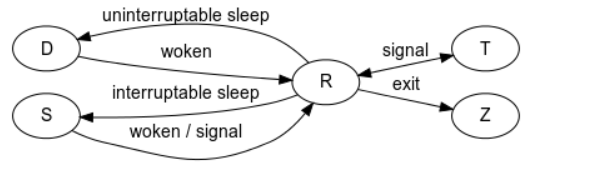
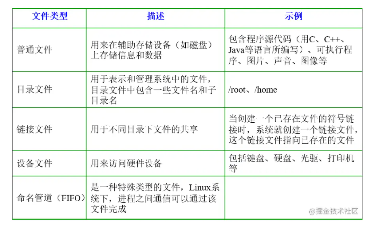
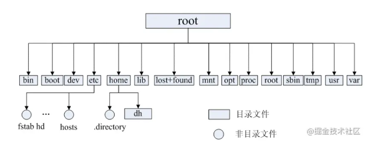
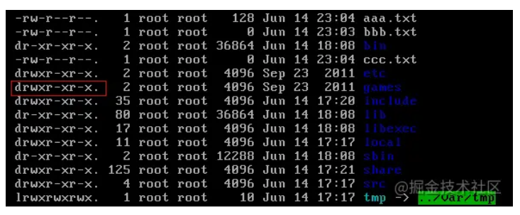
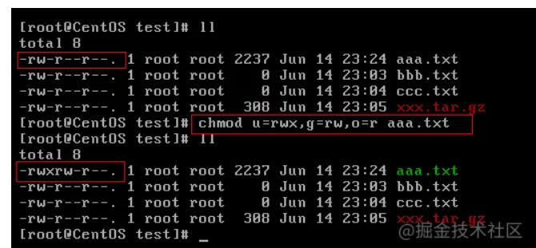
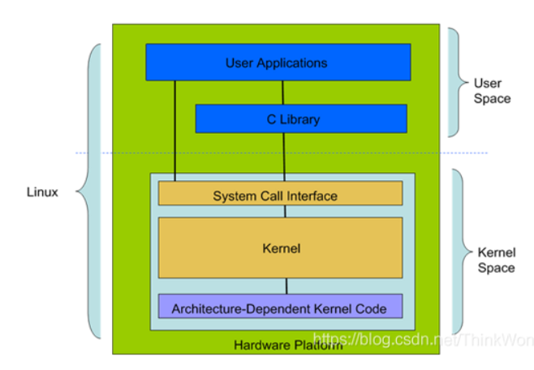
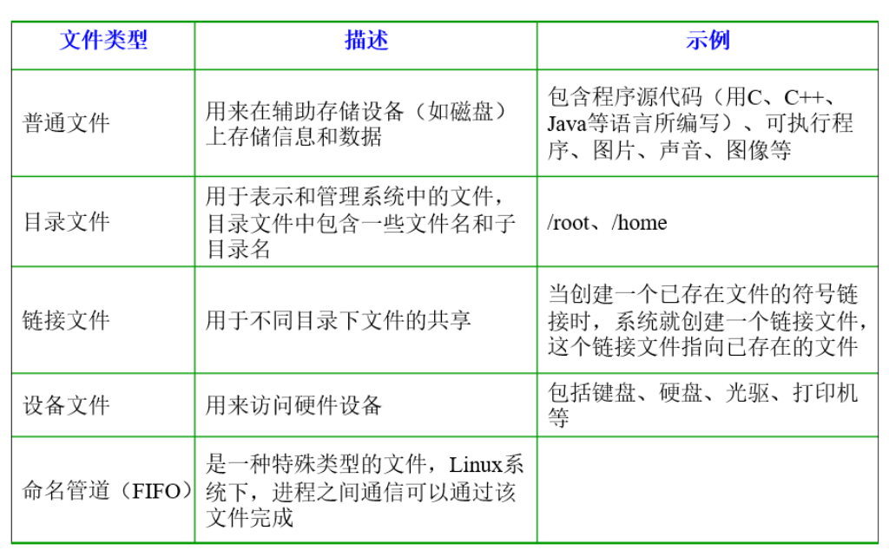
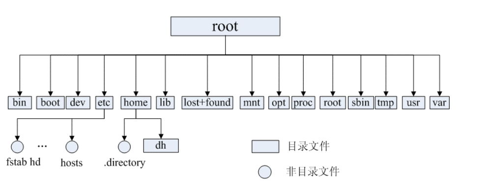
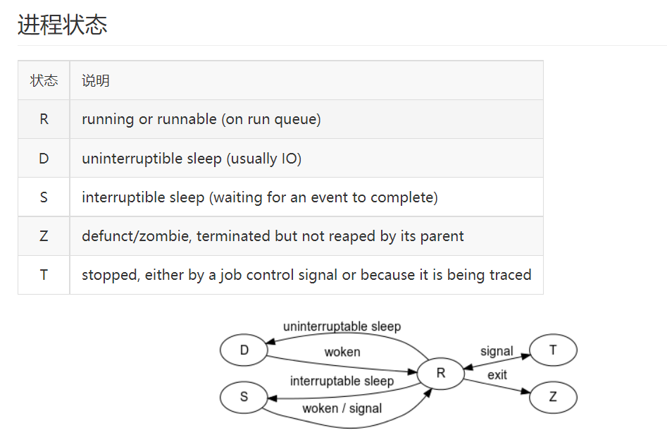

[TOC]


# Linux面试

https://juejin.cn/post/6844903634036064269#heading-0

http://www.cyc2018.xyz/%E8%AE%A1%E7%AE%97%E6%9C%BA%E5%9F%BA%E7%A1%80/Linux/Linux.html#sigchld

https://man.linuxde.net/

## 查看进程

### ps

查看某个时间点的进程信息。

示例：查看自己的进程

```sh
## ps -l
```

示例：查看系统所有进程

```sh
## ps aux
```

示例：查看特定的进程

```sh
## ps aux | grep threadx
```


### pstree

查看进程树。

示例：查看所有进程树

```sh
## pstree -A
```

### top

实时显示进程信息。

示例：两秒钟刷新一次

```sh
## top -d 2
```

### netstat

查看占用端口的进程

示例：查看特定端口的进程

```sh
## netstat -anp | grep port
```

### 进程状态

| 状态 | 说明                                                         |
| :--: | ------------------------------------------------------------ |
|  R   | running or runnable (on run queue) 正在执行或者可执行，此时进程位于执行队列中。 |
|  D   | uninterruptible sleep (usually I/O) 不可中断阻塞，通常为 IO 阻塞。 |
|  S   | interruptible sleep (waiting for an event to complete) 可中断阻塞，此时进程正在等待某个事件完成。 |
|  Z   | zombie (terminated but not reaped by its parent) 僵死，进程已经终止但是尚未被其父进程获取信息。 |
|  T   | stopped (either by a job control signal or because it is being traced) 结束，进程既可以被作业控制信号结束，也可能是正在被追踪。 |



## 孤儿进程和僵死进程

### 1. 孤儿进程

一个父进程退出，而它的一个或多个子进程还在运行，那么这些子进程将成为孤儿进程。孤儿进程将被 init 进程（进程号为 1）所收养，并由 init 进程对它们完成状态收集工作。

由于孤儿进程会被 init 进程收养，所以孤儿进程不会对系统造成危害。

### 2. 僵死进程

一个子进程的进程描述符在子进程退出时不会释放，只有当父进程通过 wait 或 waitpid 获取了子进程信息后才会释放。如果子进程退出，而父进程并没有调用 wait 或 waitpid，那么子进程的进程描述符仍然保存在系统中，这种进程称之为僵死进程。

僵死进程通过 ps 命令显示出来的状态为 Z。

系统所能使用的进程号是有限的，如果大量的产生僵死进程，将因为没有可用的进程号而导致系统不能产生新的进程。

要消灭系统中大量的僵死进程，只需要将其父进程杀死，此时所有的僵死进程就会变成孤儿进程，从而被 init 所收养，这样 init 就会释放所有的僵死进程所占有的资源，从而结束僵死进程。


## linux查看cpu占用率的命令

https://www.cnblogs.com/mengchunchen/p/9669704.html

### top命令

- top命令是Linux下常用的性能分析工具，能够实时显示系统中各个进程的资源占用状况，类似于Windows的任务管理器。
- 运行 top 命令后，CPU 使用状态会以全屏的方式显示，并且会处在对话的模式 -- 用基于 top 的命令，可以控制显示方式等等。退出 top 的命令为 q （在 top 运行中敲 q 键一次）。

### ps命令

- ps命令用于报告当前系统的进程状态。ps命令是最基本同时也是非常强大的进程查看命令，使用该命令可以确定有哪些进程正在运行和运行的状态、进程是否结束、进程有没有僵死、哪些进程占用了过多的资源等等，总之大部分信息都是可以通过执行该命令得到的。


## Linux如何查看哪些端口建立tcp连接。

- netstate命令。
- 这些端口都有哪些状态，(listien,established,time-wait等等)

## Kill -9 

发送指定的信号到相应进程。不指定型号将发送SIGTERM（15）终止指定进程。如果任无法终止该程序可用"-KILL" 参数，其发送的信号为SIGKILL(9) ，将强制结束进程，使用ps命令或者jobs 命令可以查看进程号。root用户将影响用户的进程，非root用户只能影响自己的进程。

常用参数：

```sh
-l  信号，若果不加信号的编号参数，则使用“-l”参数会列出全部的信号名称
-a  当处理当前进程时，不限制命令名和进程号的对应关系
-p  指定kill 命令只打印相关进程的进程号，而不发送任何信号
-s  指定发送信号
-u  指定用户

#（1）先使用ps查找进程pro1，然后用kill杀掉
kill -9 $(ps -ef | grep pro1)
```


# Linux简要概括

## 从认识操作系统开始

### 1.1  操作系统简介

我通过以下四点介绍什么操作系统：

- **操作系统（Operation System，简称OS）是管理计算机硬件与软件资源的程序，是计算机系统的内核与基石；**
- **操作系统本质上是运行在计算机上的软件程序 ；**
- **为用户提供一个与系统交互的操作界面 ；**
- **操作系统分内核与外壳（我们可以把外壳理解成围绕着内核的应用程序，而内核就是能操作硬件的程序）。**


### 1.2  操作系统简单分类

1. **Windows:** 目前最流行的个人桌面操作系统 ，不做多的介绍，大家都清楚。

2. Unix：

    最早的多用户、多任务操作系统 .按照操作系统的分类，属于分时操作系统。Unix 大多被用在服务器、工作站，现在也有用在个人计算机上。它在创建互联网、计算机网络或客户端/服务器模型方面发挥着非常重要的作用。

   

3. **Linux:** Linux是一套免费使用和自由传播的类Unix操作系统.Linux存在着许多不同的Linux版本，但它们都使用了 **Linux内核** 。Linux可安装在各种计算机硬件设备中，比如手机、平板电脑、路由器、视频游戏控制台、台式计算机、大型机和超级计算机。严格来讲，Linux这个词本身只表示Linux内核，但实际上人们已经习惯了用Linux来形容整个基于Linux内核，并且使用GNU 工程各种工具和数据库的操作系统。


## 二  初探Linux

### 2.1 Linux简介

我们上面已经介绍到了Linux，我们这里只强调三点。

- **类Unix系统：** Linux是一种自由、开放源码的类似Unix的操作系统
- **Linux内核：** 严格来说，Linux这个词本身只表示Linux内核
- **Linux之父：** 一个编程领域的传奇式人物。他是Linux内核的最早作者，随后发起了这个开源项目，担任Linux内核的首要架构师与项目协调者，是当今世界最著名的电脑程序员、黑客之一。他还发起了Git这个开源项目，并为主要的开发者。


### 2.2  Linux诞生简介

- 1991年，芬兰的业余计算机爱好者Linus Torvalds编写了一款类似Minix的系统（基于微内核架构的类Unix操作系统）被ftp管理员命名为Linux 加入到自由软件基金的GNU计划中;
- Linux以一只可爱的企鹅作为标志，象征着敢作敢为、热爱生活。

### 2.3 Linux的分类

**Linux根据原生程度，分为两种：**

1. **内核版本：** Linux不是一个操作系统，严格来讲，Linux只是一个操作系统中的内核。内核是什么？内核建立了计算机软件与硬件之间通讯的平台，内核提供系统服务，比如文件管理、虚拟内存、设备I/O等；

2. 发行版本：

    一些组织或公司在内核版基础上进行二次开发而重新发行的版本。Linux发行版本有很多种（ubuntu和CentOS用的都很多，初学建议选择CentOS），如下图所示：

   

## 三  Linux文件系统概览

### 3.1 Linux文件系统简介

**在Linux操作系统中，所有被操作系统管理的资源，例如网络接口卡、磁盘驱动器、打印机、输入输出设备、普通文件或是目录都被看作是一个文件。**

也就是说在LINUX系统中有一个重要的概念：**一切都是文件**。其实这是UNIX哲学的一个体现，而Linux是重写UNIX而来，所以这个概念也就传承了下来。在UNIX系统中，把一切资源都看作是文件，包括硬件设备。UNIX系统把每个硬件都看成是一个文件，通常称为设备文件，这样用户就可以用读写文件的方式实现对硬件的访问。

### 3.2 文件类型与目录结构

**Linux支持5种文件类型 ：**




**Linux的目录结构如下：**

Linux文件系统的结构层次鲜明，就像一棵倒立的树，最顶层是其根目录：




**常见目录说明：**

- **/bin：** 存放二进制可执行文件(ls,cat,mkdir等)，常用命令一般都在这里；
- **/etc：**  存放系统管理和配置文件；
- **/home：**  存放所有用户文件的根目录，是用户主目录的基点，比如用户user的主目录就是/home/user，可以用~user表示；
- **/usr ：** 用于存放系统应用程序；
- **/opt：** 额外安装的可选应用程序包所放置的位置。一般情况下，我们可以把tomcat等都安装到这里；
- **/proc：**  虚拟文件系统目录，是系统内存的映射。可直接访问这个目录来获取系统信息；
- **/root：**	超级用户（系统管理员）的主目录（特权阶级^o^）；
- **/sbin:**	存放二进制可执行文件，只有root才能访问。这里存放的是系统管理员使用的系统级别的管理命令和程序。如ifconfig等；
- **/dev：**	用于存放设备文件；
- **/mnt：**	系统管理员安装临时文件系统的安装点，系统提供这个目录是让用户临时挂载其他的文件系统；
- **/boot：**	存放用于系统引导时使用的各种文件；
- **/lib ：**      存放着和系统运行相关的库文件 ；
- **/tmp：**	用于存放各种临时文件，是公用的临时文件存储点；
- **/var：**	用于存放运行时需要改变数据的文件，也是某些大文件的溢出区，比方说各种服务的日志文件（系统启动日志等。）等；
- **/lost+found：**	这个目录平时是空的，系统非正常关机而留下“无家可归”的文件（windows下叫什么.chk）就在这里。

## 四  Linux基本命令

下面只是给出了一些比较常用的命令。推荐一个Linux命令快查网站，非常不错，大家如果遗忘某些命令或者对某些命令不理解都可以在这里得到解决。

Linux命令大全：[man.linuxde.net/](https://link.juejin.cn?target=http%3A%2F%2Fman.linuxde.net%2F)

### 4.1 目录切换命令

- **`cd usr`：**		切换到该目录下usr目录
- **`cd ..（或cd../）`：**	切换到上一层目录
- **`cd /`：**		切换到系统根目录
- **`cd ~`：**		切换到用户主目录
- **`cd -`：**		切换到上一个所在目录

### 4.2 目录的操作命令（增删改查）

1. **`mkdir 目录名称`：** 增加目录

2. **`ls或者ll`**（ll是ls -l的缩写，ll命令以看到该目录下的所有目录和文件的详细信息）：查看目录信息

3. **`find 目录 参数`：** 寻找目录（查）

   示例：

   - 列出当前目录及子目录下所有文件和文件夹: `find .`
   - 在`/home`目录下查找以.txt结尾的文件名:`find /home -name "*.txt"`
   - 同上，但忽略大小写: `find /home -iname "*.txt"`
   - 当前目录及子目录下查找所有以.txt和.pdf结尾的文件:`find . \( -name "*.txt" -o -name "*.pdf" \)`或`find . -name "*.txt" -o -name "*.pdf"`

4. **`mv 目录名称 新目录名称`：** 修改目录的名称（改）

   注意：mv的语法不仅可以对目录进行重命名而且也可以对各种文件，压缩包等进行	重命名的操作。mv命令用来对文件或目录重新命名，或者将文件从一个目录移到另一个目录中。后面会介绍到mv命令的另一个用法。

5. **`mv 目录名称 目录的新位置`：**  移动目录的位置---剪切（改）

   注意：mv语法不仅可以对目录进行剪切操作，对文件和压缩包等都可执行剪切操作。另外mv与cp的结果不同，mv好像文件“搬家”，文件个数并未增加。而cp对文件进行复制，文件个数增加了。

6. **`cp -r 目录名称 目录拷贝的目标位置`：** 拷贝目录（改），-r代表递归拷贝

   注意：cp命令不仅可以拷贝目录还可以拷贝文件，压缩包等，拷贝文件和压缩包时不	用写-r递归

7. **`rm [-rf] 目录`:** 删除目录（删）

   注意：rm不仅可以删除目录，也可以删除其他文件或压缩包，为了增强大家的记忆，	无论删除任何目录或文件，都直接使用`rm -rf` 目录/文件/压缩包

### 4.3 文件的操作命令（增删改查）

1. **`touch 文件名称`:**  文件的创建（增）

2. **`cat/more/less/tail 文件名称`** 文件的查看（查）

   - **`cat`：** 只能显示最后一屏内容
   - **`more`：** 可以显示百分比，回车可以向下一行，	空格可以向下一页，q可以退出查看
   - **`less`：** 可以使用键盘上的PgUp和PgDn向上	和向下翻页，q结束查看
   - **`tail-10` ：** 查看文件的后10行，Ctrl+C结束

   注意：命令 tail -f 文件 可以对某个文件进行动态监控，例如tomcat的日志文件，	会随着程序的运行，日志会变化，可以使用tail -f catalina-2016-11-11.log 监控	文	件的变化

3. **`vim 文件`：**  修改文件的内容（改）

   vim编辑器是Linux中的强大组件，是vi编辑器的加强版，vim编辑器的命令和快捷方式有很多，但此处不一一阐述，大家也无需研究的很透彻，使用vim编辑修改文件的方式基本会使用就可以了。

   **在实际开发中，使用vim编辑器主要作用就是修改配置文件，下面是一般步骤：**

   vim 文件------>进入文件----->命令模式------>按i进入编辑模式----->编辑文件	------->按Esc进入底行模式----->输入:wq/q! （输入wq代表写入内容并退出，即保存；输入q!代表强制退出不保存。）

4. **`rm -rf 文件`：** 删除文件（删）

   同目录删除：熟记 `rm -rf` 文件 即可

### 4.4 压缩文件的操作命令

**1）打包并压缩文件：**

Linux中的打包文件一般是以.tar结尾的，压缩的命令一般是以.gz结尾的。

而一般情况下打包和压缩是一起进行的，打包并压缩后的文件的后缀名一般.tar.gz。 命令：**`tar -zcvf 打包压缩后的文件名 要打包压缩的文件`** 其中：

z：调用gzip压缩命令进行压缩

c：打包文件

v：显示运行过程

f：指定文件名

比如：加入test目录下有三个文件分别是 :aaa.txt bbb.txt ccc.txt,如果我们要打包test目录并指定压缩后的压缩包名称为test.tar.gz可以使用命令：**`tar -zcvf test.tar.gz aaa.txt bbb.txt ccc.txt`或：`tar -zcvf test.tar.gz /test/`**

**2）解压压缩包：**

命令：tar [-xvf] 压缩文件

其中：x：代表解压

示例：

1 将/test下的test.tar.gz解压到当前目录下可以使用命令：**`tar -xvf test.tar.gz`**

2 将/test下的test.tar.gz解压到根目录/usr下:**`tar -xvf xxx.tar.gz -C /usr`**（- C代表指定解压的位置）

### 4.5 Linux的权限命令

操作系统中每个文件都拥有特定的权限、所属用户和所属组。权限是操作系统用来限制资源访问的机制，在Linux中权限一般分为读(readable)、写(writable)和执行(excutable)，分为三组。分别对应文件的属主(owner)，属组(group)和其他用户(other)，通过这样的机制来限制哪些用户、哪些组可以对特定的文件进行什么样的操作。通过 **`ls -l`** 命令我们可以	查看某个目录下的文件或目录的权限

示例：在随意某个目录下`ls -l`





第一列的内容的信息解释如下：


> 下面将详细讲解文件的类型、Linux中权限以及文件有所有者、所在组、其它组具体是什么？

**文件的类型：**

- d： 代表目录
- -： 代表文件
- l： 代表链接（可以认为是window中的快捷方式）

**Linux中权限分为以下几种：**

- r：代表权限是可读，r也可以用数字4表示
- w：代表权限是可写，w也可以用数字2表示
- x：代表权限是可执行，x也可以用数字1表示

**文件和目录权限的区别：**

对文件和目录而言，读写执行表示不同的意义。

对于文件：

| 权限名称 | 可执行操作                |
| -------- | ------------------------- |
| r        | 可以使用cat查看文件的内容 |
| w        | 可以修改文件的内容        |
| x        | 可以将其运行为二进制文件  |

对于目录：

| 权限名称 | 可执行操作               |
| -------- | ------------------------ |
| r        | 可以查看目录下列表       |
| w        | 可以创建和删除目录下文件 |
| x        | 可以使用cd进入目录       |

**在linux中的每个用户必须属于一个组，不能独立于组外。在linux中每个文件有所有者、所在组、其它组的概念。**

- **所有者**

  一般为文件的创建者，谁创建了该文件，就天然的成为该文件的所有者，用ls ‐ahl命令可以看到文件的所有者 也可以使用chown 用户名  文件名来修改文件的所有者 。

- **文件所在组**

  当某个用户创建了一个文件后，这个文件的所在组就是该用户所在的组 用ls ‐ahl命令可以看到文件的所有组 也可以使用chgrp  组名  文件名来修改文件所在的组。

- **其它组**

  除开文件的所有者和所在组的用户外，系统的其它用户都是文件的其它组

> 我们再来看看如何修改文件/目录的权限。

**修改文件/目录的权限的命令：`chmod`**

示例：修改/test下的aaa.txt的权限为属主有全部权限，属主所在的组有读写权限， 其他用户只有读的权限

**`chmod u=rwx,g=rw,o=r aaa.txt`**





上述示例还可以使用数字表示：

chmod 764 aaa.txt

**补充一个比较常用的东西:**

假如我们装了一个zookeeper，我们每次开机到要求其自动启动该怎么办？

1. 新建一个脚本zookeeper
2. 为新建的脚本zookeeper添加可执行权限，命令是:`chmod +x zookeeper`
3. 把zookeeper这个脚本添加到开机启动项里面，命令是：`chkconfig --add zookeeper`
4. 如果想看看是否添加成功，命令是：`chkconfig --list`

### 4.6 Linux 用户管理

Linux系统是一个多用户多任务的分时操作系统，任何一个要使用系统资源的用户，都必须首先向系统管理员申请一个账号，然后以这个账号的身份进入系统。

用户的账号一方面可以帮助系统管理员对使用系统的用户进行跟踪，并控制他们对系统资源的访问；另一方面也可以帮助用户组织文件，并为用户提供安全性保护。

**Linux用户管理相关命令:**

- `useradd 选项 用户名`:添加用户账号
- `userdel 选项 用户名`:删除用户帐号
- `usermod 选项 用户名`:修改帐号
- `passwd 用户名`:更改或创建用户的密码
- `passwd -S 用户名` :显示用户账号密码信息
- `passwd -d 用户名`:  清除用户密码

useradd命令用于Linux中创建的新的系统用户。useradd可用来建立用户帐号。帐号建好之后，再用passwd设定帐号的密码．而可用userdel删除帐号。使用useradd指令所建立的帐号，实际上是保存在/etc/passwd文本文件中。

passwd命令用于设置用户的认证信息，包括用户密码、密码过期时间等。系统管理者则能用它管理系统用户的密码。只有管理者可以指定用户名称，一般用户只能变更自己的密码。

### 4.7 Linux系统用户组的管理

每个用户都有一个用户组，系统可以对一个用户组中的所有用户进行集中管理。不同Linux 系统对用户组的规定有所不同，如Linux下的用户属于与它同名的用户组，这个用户组在创建用户时同时创建。

用户组的管理涉及用户组的添加、删除和修改。组的增加、删除和修改实际上就是对/etc/group文件的更新。

**Linux系统用户组的管理相关命令:**

- `groupadd 选项 用户组` :增加一个新的用户组
- `groupdel 用户组`:要删除一个已有的用户组
- `groupmod 选项 用户组` : 修改用户组的属性

### 4.8 其他常用命令

- **`pwd`：** 显示当前所在位置

- **`grep 要搜索的字符串 要搜索的文件 --color`：** 搜索命令，--color代表高亮显示

- **`ps -ef`/`ps aux`：** 这两个命令都是查看当前系统正在运行进程，两者的区别是展示格式不同。如果想要查看特定的进程可以使用这样的格式：**`ps aux|grep redis`** （查看包括redis字符串的进程）

  注意：如果直接用ps（（Process Status））命令，会显示所有进程的状态，通常结合grep命令查看某进程的状态。

- **`kill -9 进程的pid`：** 杀死进程（-9 表示强制终止。）

  先用ps查找进程，然后用kill杀掉

- **网络通信命令：**

  - 查看当前系统的网卡信息：ifconfig
  - 查看与某台机器的连接情况：ping
  - 查看当前系统的端口使用：netstat -an

- **`shutdown`：**  `shutdown -h now`： 指定现在立即关机；`shutdown +5 "System will shutdown after 5 minutes"`:指定5分钟后关机，同时送出警告信息给登入用户。

- **`reboot`：**  **`reboot`：**  重开机。**`reboot -w`：** 做个重开机的模拟（只有纪录并不会真的重开机）。


# Linux详细指令

https://blog.csdn.net/ThinkWon/article/details/104588679?ops_request_misc=%257B%2522request%255Fid%2522%253A%2522162825413816780264062121%2522%252C%2522scm%2522%253A%252220140713.130102334.pc%255Fall.%2522%257D&request_id=162825413816780264062121&biz_id=0&utm_medium=distribute.pc_search_result.none-task-blog-2~all~first_rank_v2~rank_v29-3-104588679.pc_search_result_cache&utm_term=linux%E9%9D%A2%E8%AF%95%E9%A2%98&spm=1018.2226.3001.4187

## Linux概述

### 什么是 Linux 内核？

Linux 系统的核心是内核。内核控制着计算机系统上的所有硬件和软件，在必要时分配硬件，并根据需要执行软件。

1. 系统内存管理
2. 应用程序管理
3. 硬件设备管理
4. 文件系统管理

Linux 的体系结构
从大的方面讲，Linux 体系结构可以分为两块：



用户空间(User Space) ：用户空间又包括用户的应用程序(User Applications)、C 库(C Library) 。
内核空间(Kernel Space) ：内核空间又包括系统调用接口(System Call Interface)、内核(Kernel)、平台架构相关的代码(Architecture-Dependent Kernel Code) 。

### Linux 使用的进程间通信方式？

> 了解即可，不需要太深入。

- 1、管道(pipe)、流管道(s_pipe)、有名管道(FIFO)。
- 2、信号(signal) 。
- 3、消息队列。
- 4、共享内存。
- 5、信号量。
- 6、套接字(socket) 。


### 简单 Linux 文件系统？

在 Linux 操作系统中，所有被操作系统管理的资源，例如网络接口卡、磁盘驱动器、打印机、输入输出设备、普通文件或是目录都被看作是一个文件。

也就是说在 Linux 系统中有一个重要的概念**：一切都是文件**。其实这是 Unix 哲学的一个体现，而 Linux 是重写 Unix 而来，所以这个概念也就传承了下来。在 Unix 系统中，把一切资源都看作是文件，包括硬件设备。UNIX系统把每个硬件都看成是一个文件，通常称为设备文件，这样用户就可以用读写文件的方式实现对硬件的访问。



### Linux 的目录结构是怎样的？

这个问题，一般不会问。更多是实际使用时，需要知道。

Linux 文件系统的结构层次鲜明，就像一棵倒立的树，最顶层是其根目录：




常见目录说明：

- /bin： 存放二进制可执行文件(ls,cat,mkdir等)，常用命令一般都在这里；
- /etc： 存放系统管理和配置文件；
- /home： 存放所有用户文件的根目录，是用户主目录的基点，比如用户user的主目录就是/home/user，可以用~user表示；
- **/usr **： 用于存放系统应用程序；
- /opt： 额外安装的可选应用程序包所放置的位置。一般情况下，我们可以把tomcat等都安装到这里；
- /proc： 虚拟文件系统目录，是系统内存的映射。可直接访问这个目录来获取系统信息；
- /root： 超级用户（系统管理员）的主目录（特权阶级o）；
- /sbin: 存放二进制可执行文件，只有root才能访问。这里存放的是系统管理员使用的系统级别的管理命令和程序。如ifconfig等；
- /dev： 用于存放设备文件；
- /mnt： 系统管理员安装临时文件系统的安装点，系统提供这个目录是让用户临时挂载其他的文件系统；
- /boot： 存放用于系统引导时使用的各种文件；
- **/lib **： 存放着和系统运行相关的库文件 ；
- /tmp： 用于存放各种临时文件，是公用的临时文件存储点；
- /var： 用于存放运行时需要改变数据的文件，也是某些大文件的溢出区，比方说各种服务的日志文件（系统启动日志等。）等；
- /lost+found： 这个目录平时是空的，系统非正常关机而留下“无家可归”的文件（windows下叫什么.chk）就在这里。
  

### 什么是 inode ？

一般来说，面试不会问 inode 。但是 inode 是一个重要概念，是理解 Unix/Linux 文件系统和硬盘储存的基础。

理解inode，要从文件储存说起。

- 文件储存在硬盘上，硬盘的最小存储单位叫做"扇区"（Sector）。每个扇区储存512字节（相当于0.5KB）。

- 操作系统读取硬盘的时候，不会一个个扇区地读取，这样效率太低，而是一次性连续读取多个扇区，即一次性读取一个"块"（block）。这种由多个扇区组成的"块"，是文件存取的最小单位。"块"的大小，最常见的是4KB，即连续八个 sector组成一个 block。

- 文件数据都储存在"块"中，那么很显然，我们还必须找到一个地方储存文件的元信息，比如文件的创建者、文件的创建日期、文件的大小等等。这种储存文件元信息的区域就叫做inode，中文译名为"索引节点"。

- 每一个文件都有对应的inode，里面包含了与该文件有关的一些信息。
  

### 简述 Linux 文件系统通过 i 节点把文件的逻辑结构和物理结构转换的工作过程？

Linux 通过 inode 节点表将文件的逻辑结构和物理结构进行转换。

inode 节点是一个 64 字节长的表，表中包含了文件的相关信息，

- 其中有文件的大小、文件所有者、文件的存取许可方式以及文件的类型等重要信息。
- 在 inode 节点表中最重要的内容是磁盘地址表。在磁盘地址表中有 13 个块号，文件将以块号在磁盘地址表中出现的顺序依次读取相应的块。
- Linux 文件系统通过把 inode 节点和文件名进行连接，当需要读取该文件时，文件系统在当前目录表中查找该文件名对应的项，由此得到该文件相对应的 inode 节点号，
- 通过该 inode 节点的磁盘地址表把分散存放的文件物理块连接成文件的逻辑结构。

### 什么是硬链接和软链接？

#### 1）硬链接

由于 Linux 下的文件是通过索引节点(inode)来识别文件，硬链接可以认为是一个指针，指向文件索引节点的指针，系统并不为它重新分配 inode 。每添加一个一个硬链接，文件的链接数就加 1 。

不足：1）不可以在不同文件系统的文件间建立链接；2）只有超级用户才可以为目录创建硬链接。

#### 2）软链接

软链接克服了硬链接的不足，没有任何文件系统的限制，任何用户可以创建指向目录的符号链接。因而现在更为广泛使用，它具有更大的灵活性，甚至可以跨越不同机器、不同网络对文件进行链接。

不足：因为链接文件包含有原文件的路径信息，所以当原文件从一个目录下移到其他目录中，再访问链接文件，系统就找不到了，而硬链接就没有这个缺陷，你想怎么移就怎么移；还有它要系统分配额外的空间用于建立新的索引节点和保存原文件的路径。
实际场景下，基本是使用软链接。

#### 总结区别如下：

- 硬链接不可以跨分区，软连接可以跨分区。
- 硬链接指向一个 inode 节点，而软链接则是创建一个新的 inode 节点。
- 删除硬链接文件，不会删除原文件，删除软链接文件，会把原文件删除。


## Shell

### Shell 脚本是什么？

一个 Shell 脚本是一个文本文件，包含一个或多个命令。作为系统管理员，我们经常需要使用多个命令来完成一项任务，我们可以添加这些所有命令在一个文本文件(Shell 脚本)来完成这些日常工作任务。

### 什么是默认登录 Shell ？

在 Linux 操作系统，"/bin/bash" 是默认登录 Shell，是在创建用户时分配的。

### 在 Shell 脚本中，如何写入注释？

注释可以用来描述一个脚本可以做什么和它是如何工作的。每一行注释以 # 开头。例子如下：

```bash
#!/bin/bash
## This is a command
echo “I am logged in as $USER”

```


#### **Shell脚本中 $? 标记的用途是什么？**

在写一个 Shell 脚本时，如果你想要检查前一命令是否执行成功，在 `if` 条件中使用 `$?` 可以来检查前一命令的结束状态。

- 如果结束状态是 0 ，说明前一个命令执行成功。例如：

```bash
root@localhost:~## ls /usr/bin/shar
/usr/bin/shar
root@localhost:~## echo $?
0
```

- 如果结束状态不是0，说明命令执行失败。例如：

```bash
root@localhost:~## ls /usr/bin/share
ls: cannot access /usr/bin/share: No such file or directory
root@localhost:~## echo $?
2
```

#### **如何取消变量或取消变量赋值？**

`unset` 命令用于取消变量或取消变量赋值。语法如下所示：

```bash
## unset <变量名>
```

#### Shell 脚本中 `if` 语法如何嵌套?

```bash
if [ 条件 ]
then
命令1
命令2
…..
else
if [ 条件 ]
then
命令1
命令2
….
else
命令1
命令2
…..
fi
fi

```

#### **在 Shell 脚本中如何比较两个数字？**

```bash
#!/bin/bash
x=10
y=20
if [ $x -gt $y ]
then
echo “x is greater than y”
else
echo “y is greater than x”
fi
```

#### Shell 脚本中 `case` 语句的语法?

```bash
case 变量 in
值1)
命令1
命令2
…..
最后命令
!!
值2)
命令1
命令2
……
最后命令
;;
esac

```

#### Shell 脚本中 `for` 循环语法？

```bash
for 变量 in 循环列表
do
命令1
命令2
….
最后命令
done

```

#### Shell 脚本中 `while` 循环语法？

如同 `for` 循环，`while` 循环只要条件成立就重复它的命令块。
不同于 `for`循环，`while` 循环会不断迭代，直到它的条件不为真。

```bash
while [ 条件 ]
do
命令…
done
```

**do-while 语句的基本格式？**

`do-while` 语句类似于 `while` 语句，但检查条件语句之前先执行命令（LCTT 译注：意即至少执行一次。）。下面是用 `do-while` 语句的语法：

```bash
do
{
命令
} while (条件)
```

#### Shell 脚本中 break 命令的作用？

break 命令一个简单的用途是退出执行中的循环。我们可以在 while 和 until 循环中使用 break 命令跳出循环。

#### Shell 脚本中 continue 命令的作用？

continue 命令不同于 break 命令，它只跳出当前循环的迭代，而不是整个循环。continue 命令很多时候是很有用的，例如错误发生，但我们依然希望继续执行大循环的时候。

#### 如何使脚本可执行?

使用 chmod 命令来使脚本可执行。例子如下：chmod a+x myscript.sh 。

#### #!/bin/bash 的作用？

#!/bin/bash 是 Shell 脚本的第一行，称为释伴（shebang）行。

- 这里 # 符号叫做 hash ，而 ! 叫做 bang。
- 它的意思是命令通过 /bin/bash 来执行。

#### 如何调试 Shell脚本？

- 使用 -x' 数（sh -x myscript.sh）可以调试 Shell脚本。
- 另一个种方法是使用 -nv 参数(sh -nv myscript.sh)。

#### 如何将标准输出和错误输出同时重定向到同一位置?

- 方法一：2>&1 (如## ls /usr/share/doc > out.txt 2>&1 ) 。
- 方法二：&> (如## ls /usr/share/doc &> out.txt ) 。

#### 在 Shell 脚本中，如何测试文件？

```bash
Test         用法
-d 文件名    如果文件存在并且是目录，返回true
-e 文件名    如果文件存在，返回true
-f 文件名    如果文件存在并且是普通文件，返回true
-r 文件名    如果文件存在并可读，返回true
-s 文件名    如果文件存在并且不为空，返回true
-w 文件名    如果文件存在并可写，返回true
-x 文件名    如果文件存在并可执行，返回true
```

#### 在 Shell 脚本如何定义函数呢？

函数是拥有名字的代码块。当我们定义代码块，我们就可以在我们的脚本调用函数名字，该块就会被执行。示例如下所示：

```bash
$ diskusage () { df -h ; }
译注：下面是我给的shell函数语法，原文没有
[ function ] 函数名 [()]
{
命令;
[return int;]
}
```

**如何让 Shell 就脚本得到来自终端的输入?**

read 命令可以读取来自终端（使用键盘）的数据。read 命令得到用户的输入并置于你给出的变量中。

```bash
## vi /tmp/test.sh
#!/bin/bash
echo ‘Please enter your name’
read name
echo “My Name is $name”
## ./test.sh
Please enter your name
ThinkWon
My Name is ThinkWon

```

**如何执行算术运算？**

有两种方法来执行算术运算：

- 1、使用 expr 命令：`## expr 5 + 2` 。
- 2、用一个美元符号和方括号（`$[ 表达式 ]`）：`test=$[16 + 4] ; test=$[16 + 4]` 。


## 优化

### 请问当用户反馈网站访问慢，你会如何处理？

#### 有哪些方面的因素会导致网站网站访问慢？

- 服务器出口带宽不够用
  - 本身服务器购买的出口带宽比较小。一旦并发量大的话，就会造成分给每个用户的出口带宽就小，访问速度自然就会慢。
  - 跨运营商网络导致带宽缩减。例如，公司网站放在电信的网络上，那么客户这边对接是长城宽带或联通，这也可能导致带宽的缩减。

- 服务器负载过大，导致响应不过来
  - 分析系统负载，使用 w 命令或者 uptime 命令查看系统负载。
  - 如果负载很高，则使用 top 命令查看 CPU ，MEM 等占用情况，要么是 CPU 繁忙，要么是内存不够。
  - 如果这二者都正常，再去使用 sar 命令分析网卡流量，分析是不是遭到了攻击。
  - 一旦分析出问题的原因，采取对应的措施解决，如决定要不要杀死一些进程，或者禁止一些访问等。

- 数据库瓶颈
  - 如果慢查询比较多。那么就要开发人员或 DBA 协助进行 SQL 语句的优化。
  - 如果数据库响应慢，考虑可以加一个数据库缓存，如 Redis 等。
  - 然后，也可以搭建 MySQL 主从，一台 MySQL 服务器负责写，其他几台从数据库负责读。

- 网站开发代码没有优化好
  - 例如 SQL 语句没有优化，导致数据库读写相当耗时。

#### 怎么去解决？

1、如果是出口带宽问题，那么久申请加大出口带宽。
2、如果慢查询比较多，那么就要开发人员或 DBA 协助进行 SQL 语句的优化。
3、如果数据库响应慢，考虑可以加一个数据库缓存，如 Redis 等等。然后也可以搭建MySQL 主从，一台 MySQL 服务器负责写，其他几台从数据库负责读。
4、申请购买 CDN 服务，加载用户的访问。
5、如果访问还比较慢，那就需要从整体架构上进行优化咯。做到专角色专用，多台服务器提供同一个服务。

### Linux 性能调优都有哪几种方法？

- Disabling daemons (关闭 daemons)。
- Shutting down the GUI (关闭 GUI)。
- Changing kernel parameters (改变内核参数)。
- Kernel parameters (内核参数)。
- Tuning the processor subsystem (处理器子系统调优)。
- Tuning the memory subsystem (内存子系统调优)。
- Tuning the file system (文件系统子系统调优)。
- Tuning the network subsystem（网络子系统调优)。


## 文件管理命令

### cat 命令

cat 命令用于连接文件并打印到标准输出设备上。

cat 主要有三大功能：

- 一次显示整个文件:


```bash
cat filename
```

- 从键盘创建一个文件:

```bash
cat > filename
```

只能创建新文件，不能编辑已有文件。

- 将几个文件合并为一个文件:


```bash
cat file1 file2 > file
```

-b 对非空输出行号
-n 输出所有行号

- 实例：

（1）把 log2012.log 的文件内容加上行号后输入 log2013.log 这个文件里

```bash
cat -n log2012.log log2013.log
```

（2）把 log2012.log 和 log2013.log 的文件内容加上行号（空白行不加）之后将内容附加到 log.log 里

```bash
cat -b log2012.log log2013.log log.log
```

（3）使用 here doc 生成新文件

```bash
cat >log.txt <<EOF
>Hello
>World
>PWD=$(pwd)
>EOF
ls -l log.txt
cat log.txt
Hello
World
PWD=/opt/soft/test
```

### chmod 命令

Linux/Unix 的文件调用权限分为三级 : 文件拥有者、群组、其他。利用 chmod 可以控制文件如何被他人所调用。

用于改变 linux 系统文件或目录的访问权限。用它控制文件或目录的访问权限。该命令有两种用法。

- 一种是包含字母和操作符表达式的文字设定法；
- 另一种是包含数字的数字设定法。

每一文件或目录的访问权限都有三组，每组用三位表示，分别为

- 文件属主的读、写和执行权限；

- 与属主同组的用户的读、写和执行权限；
- 系统中其他用户的读、写和执行权限。

可使用 ls -l test.txt 查找。

以文件 log2012.log 为例：

```bash
-rw-r--r-- 1 root root 296K 11-13 06:03 log2012.log
```

第一列共有 10 个位置，

- 第一个字符指定了文件类型。在通常意义上，一个目录也是一个文件。如果第一个字符是横线，表示是一个非目录的文件。如果是 d，表示是一个目录。
- 从第二个字符开始到第十个 9 个字符，3 个字符一组，分别表示了 3 组用户对文件或者目录的权限。
- 权限字符用横线代表空许可，r 代表只读，w 代表写，x 代表可执行。

**常用参数**：

```bash
-c 当发生改变时，报告处理信息
-R 处理指定目录以及其子目录下所有文件
```

权限范围

```bash
u ：目录或者文件的当前的用户
g ：目录或者文件的当前的群组
o ：除了目录或者文件的当前用户或群组之外的用户或者群组
a ：所有的用户及群组
```

权限代号：

```bash
r ：读权限，用数字4表示
w ：写权限，用数字2表示
x ：执行权限，用数字1表示
- ：删除权限，用数字0表示
s ：特殊权限
```

实例

```bash
#（1）增加文件 t.log 所有用户可执行权限
chmod a+x t.log
#（2）撤销原来所有的权限，然后使拥有者具有可读权限,并输出处理信息
chmod u=r t.log -c
#（3）给 file 的属主分配读、写、执行(7)的权限，给file的所在组分配读、执行(5)的权限，给其他用户分配执行(1)的权限
chmod 751 t.log -c（或者：chmod u=rwx,g=rx,o=x t.log -c)
#（4）将 test 目录及其子目录所有文件添加可读权限
chmod u+r,g+r,o+r -R text/ -c

```

### chown 命令

chown 将指定文件的拥有者改为指定的用户或组，用户可以是用户名或者用户 ID；组可以是组名或者组 ID；文件是以空格分开的要改变权限的文件列表，支持通配符。

```bash
-c 显示更改的部分的信息
-R 处理指定目录及子目录
```

```bash
#（1）改变拥有者和群组 并显示改变信息
chown -c mail:mail log2012.log

#（2）改变文件群组
chown -c mail:mail log2012.log

#（3）改变文件夹及子文件目录属主及属组为 mail
chown -cR mail: test/

```

### cp 命令

将源文件复制至目标文件，或将多个源文件复制至目标目录。

注意：命令行复制，如果目标文件已经存在会提示是否覆盖，而在 shell 脚本中，如果不加 -i 参数，则不会提示，而是直接覆盖！

```bash
-i 提示
-r 复制目录及目录内所有项目
-a 复制的文件与原文件时间一样

```

**实例**：

```bash
#（1）复制 a.txt 到 test 目录下，保持原文件时间，如果原文件存在提示是否覆盖。
cp -ai a.txt test

#（2）为 a.txt 建议一个链接（快捷方式）
cp -s a.txt link_a.txt

```

### find 命令

用于在文件树中查找文件，并作出相应的处理。

命令格式：

```bash
find pathname -options [-print -exec -ok ...]

```

命令参数：

```bash
pathname: find命令所查找的目录路径。例如用.来表示当前目录，用/来表示系统根目录。
-print： find命令将匹配的文件输出到标准输出。
-exec： find命令对匹配的文件执行该参数所给出的shell命令。相应命令的形式为'command' {  } \;，注意{   }和\；之间的空格。
-ok： 和-exec的作用相同，只不过以一种更为安全的模式来执行该参数所给出的shell命令，在执行每一个命令之前，都会给出提示，让用户来确定是否执行。

```

**命令选项**：

```bash
-name 按照文件名查找文件
-perm 按文件权限查找文件
-user 按文件属主查找文件
-group  按照文件所属的组来查找文件。
-type  查找某一类型的文件，诸如：
   b - 块设备文件
   d - 目录
   c - 字符设备文件
   l - 符号链接文件
   p - 管道文件
   f - 普通文件

```

**实例**：

```bash
#(1）查找 48 小时内修改过的文件
find -atime -2
#（2）在当前目录查找 以 .log 结尾的文件。 . 代表当前目录
find ./ -name '*.log'
#（3）查找 /opt 目录下 权限为 777 的文件
find /opt -perm 777
#（4）查找大于 1K 的文件
find -size +1000c
#查找等于 1000 字符的文
find -size 1000c 
```

### head 命令

head 用来显示档案的开头至标准输出中，默认 head 命令打印其相应文件的开头 10 行。

**常用参数**：

```bash
-n<行数> 显示的行数（行数为复数表示从最后向前数）
```

**实例**：

```bash
#（1）显示 1.log 文件中前 20 行
head 1.log -n 20
#（2）显示 log2014.log 文件前 20 字节
head -c 20 log2014.log
#（3）显示 t.log最后 10 行
head -n -10 t.log
```

### less 命令

less 与 more 类似，但使用 less 可以随意浏览文件，而 more 仅能向前移动，却不能向后移动，而且 less 在查看之前不会加载整个文件。

**常用命令参数**：

```bash
-i  忽略搜索时的大小写
-N  显示每行的行号
-o  <文件名> 将less 输出的内容在指定文件中保存起来
-s  显示连续空行为一行
/字符串：向下搜索“字符串”的功能
?字符串：向上搜索“字符串”的功能
n：重复前一个搜索（与 / 或 ? 有关）
N：反向重复前一个搜索（与 / 或 ? 有关）
-x <数字> 将“tab”键显示为规定的数字空格
b  向后翻一页
d  向后翻半页
h  显示帮助界面
Q  退出less 命令
u  向前滚动半页
y  向前滚动一行
空格键 滚动一行
回车键 滚动一页
[pagedown]： 向下翻动一页
[pageup]：   向上翻动一页
```

**实例**：

```bash
#（1）ps 查看进程信息并通过 less 分页显示
ps -aux | less -N
#（2）查看多个文件
less 1.log 2.log
#可以使用 n 查看下一个，使用 p 查看前一个。
```

### ln 命令

功能是为文件在另外一个位置建立一个同步的链接，当在不同目录需要该文件时，就不需要为每一个目录创建同样的文件，通过 ln 创建的链接（link）减少磁盘占用量。

链接分类：软件链接及硬链接

#### 软链接：

1.软链接，以路径的形式存在。类似于Windows操作系统中的快捷方式
2.软链接可以 跨文件系统 ，硬链接不可以
3.软链接可以对一个不存在的文件名进行链接
4.软链接可以对目录进行链接

#### 硬链接:

1.硬链接，以文件副本的形式存在。但不占用实际空间。
2.不允许给目录创建硬链接
3.硬链接只有在同一个文件系统中才能创建

#### 需要注意：

- 第一：ln命令会保持每一处链接文件的同步性，也就是说，不论你改动了哪一处，其它的文件都会发生相同的变化；
- 第二：ln的链接又分软链接和硬链接两种，
  - 软链接  ln –s 源文件 目标文件，它只会在你选定的位置上生成一个文件的镜像，不会占用磁盘空间，
  - 硬链接  ln 源文件 目标文件，没有参数-s， 它会在你选定的位置上生成一个和源文件大小相同的文件，无论是软链接还是硬链接，文件都保持同步变化。
- 第三：ln指令用在链接文件或目录，如同时指定两个以上的文件或目录，且最后的目的地是一个已经存在的目录，则会把前面指定的所有文件或目录复制到该目录中。若同时指定多个文件或目录，且最后的目的地并非是一个已存在的目录，则会出现错误信息。

常用参数：

```bash
-b 删除，覆盖以前建立的链接
-s 软链接（符号链接）
-v 显示详细处理过程
```

**实例**：

```bash
#（1）给文件创建软链接，并显示操作信息
ln -sv source.log link.log
#（2）给文件创建硬链接，并显示操作信息
ln -v source.log link1.log
#（3）给目录创建软链接
ln -sv /opt/soft/test/test3 /opt/soft/test/test5
```

### locate 命令

locate 通过搜寻系统内建文档数据库达到快速找到档案，数据库由 updatedb 程序来更新，updatedb 是由 cron daemon 周期性调用的。

默认情况下 locate 命令在搜寻数据库时比由整个由硬盘资料来搜寻资料来得快，但较差劲的是 locate 所找到的档案若是最近才建立或 刚更名的，可能会找不到，在内定值中，updatedb 每天会跑一次，可以由修改 crontab 来更新设定值 (etc/crontab)。

locate 与 find 命令相似，可以使用如 *、? 等进行正则匹配查找

常用参数：

```bash
-l num（要显示的行数）
-f   将特定的档案系统排除在外，如将proc排除在外
-r   使用正则运算式做为寻找条件
```

**实例**：

```bash
#（1）查找和 pwd 相关的所有文件(文件名中包含 pwd）
locate pwd
#（2）搜索 etc 目录下所有以 sh 开头的文件
locate /etc/sh
#（3）查找 /var 目录下，以 reason 结尾的文件
locate -r '^/var.*reason$'（其中.表示一个字符，*表示任务多个；.*表示任意多个字符）

```

### more 命令

功能类似于 cat, more 会以一页一页的显示方便使用者逐页阅读，而最基本的指令就是按空白键（space）就往下一页显示，按 b 键就会往回（back）一页显示。

**命令参数**：

```bash
+n      从笫 n 行开始显示
-n       定义屏幕大小为n行
+/pattern 在每个档案显示前搜寻该字串（pattern），然后从该字串前两行之后开始显示 
-c       从顶部清屏，然后显示
-d       提示“Press space to continue，’q’ to quit（按空格键继续，按q键退出）”，禁用响铃功能
-l        忽略Ctrl+l（换页）字符
-p       通过清除窗口而不是滚屏来对文件进行换页，与-c选项相似
-s       把连续的多个空行显示为一行
-u       把文件内容中的下画线去掉

```

**常用操作命令**

```bash
Enter    向下 n 行，需要定义。默认为 1 行
Ctrl+F   向下滚动一屏
空格键  向下滚动一屏
Ctrl+B  返回上一屏
=       输出当前行的行号
:f     输出文件名和当前行的行号
V      调用vi编辑器
!命令   调用Shell，并执行命令
q       退出more

```

**实例**：

```bash
#（1）显示文件中从第3行起的内容
more +3 text.txt
#（2）在所列出文件目录详细信息，借助管道使每次显示 5 行
ls -l | more -5
#按空格显示下 5 行。
```

### mv 命令

移动文件或修改文件名，根据第二参数类型（如目录，则移动文件；如为文件则重命令该文件）。

当第二个参数为目录时，第一个参数可以是多个以空格分隔的文件或目录，然后移动第一个参数指定的多个文件到第二个参数指定的目录中。

**实例**：

```bash
#（1）将文件 test.log 重命名为 test1.txt
mv test.log test1.txt
#（2）将文件 log1.txt,log2.txt,log3.txt 移动到根的 test3 目录中
mv llog1.txt log2.txt log3.txt /test3
#（3）将文件 file1 改名为 file2，如果 file2 已经存在，则询问是否覆盖
mv -i log1.txt log2.txt
#（4）移动当前文件夹下的所有文件到上一级目录
mv * ../

```

### rm 命令

删除一个目录中的一个或多个文件或目录，如果没有使用 -r 选项，则 rm 不会删除目录。如果使用 rm 来删除文件，通常仍可以将该文件恢复原状。

```bash
rm [选项] 文件…
```

**实例**：

```bash
#（1）删除任何 .log 文件，删除前逐一询问确认：
rm -i *.log
#（2）删除 test 子目录及子目录中所有档案删除，并且不用一一确认
rm -rf test
#（3）删除以 -f 开头的文件
rm -- -f*
```

### tail 命令

用于显示指定文件末尾内容，不指定文件时，作为输入信息进行处理。常用查看日志文件。

**常用参数**：

```bash
-f 循环读取（常用于查看递增的日志文件）
-n<行数> 显示行数（从后向前）
#（1）循环读取逐渐增加的文件内容
ping 127.0.0.1 > ping.log &
# 后台运行：可使用 jobs -l 查看，也可使用 fg 将其移到前台运行。
tail -f ping.log
```

### touch 命令

Linux touch命令用于修改文件或者目录的时间属性，包括存取时间和更改时间。若文件不存在，系统会建立一个新的文件。

ls -l 可以显示档案的时间记录。

**语法**

```bash
touch [-acfm][-d<日期时间>][-r<参考文件或目录>] [-t<日期时间>][--help][--version][文件或目录…]
```

参数说明：
a 改变档案的读取时间记录。
m 改变档案的修改时间记录。
c 假如目的档案不存在，不会建立新的档案。与 --no-create 的效果一样。
f 不使用，是为了与其他 unix 系统的相容性而保留。
r 使用参考档的时间记录，与 --file 的效果一样。
d 设定时间与日期，可以使用各种不同的格式。
t 设定档案的时间记录，格式与 date 指令相同。
–no-create 不会建立新档案。
–help 列出指令格式。
–version 列出版本讯息。
**实例**

```bash
#使用指令"touch"修改文件"testfile"的时间属性为当前系统时间，输入如下命令：
$ touch testfile                #修改文件的时间属性 
#首先，使用ls命令查看testfile文件的属性，如下所示：
$ ls -l testfile                #查看文件的时间属性  
#原来文件的修改时间为16:09  
-rw-r--r-- 1 hdd hdd 55 2011-08-22 16:09 testfile  
#执行指令"touch"修改文件属性以后，并再次查看该文件的时间属性，如下所示：
$ touch testfile                #修改文件时间属性为当前系统时间  
$ ls -l testfile                #查看文件的时间属性  
#修改后文件的时间属性为当前系统时间  
-rw-r--r-- 1 hdd hdd 55 2011-08-22 19:53 testfile  
#使用指令"touch"时，如果指定的文件不存在，则将创建一个新的空白文件。例如，在当前目录下，使用该指令创建一个空白文件"file"，输入如下命令：
$ touch file            #创建一个名为“file”的新的空白文件 
```

### vim 命令

Vim是从 vi 发展出来的一个文本编辑器。代码补完、编译及错误跳转等方便编程的功能特别丰富，在程序员中被广泛使用。

- 打开文件并跳到第 10 行：vim +10 filename.txt 。
- 打开文件跳到第一个匹配的行：vim +/search-term filename.txt 。
- 以只读模式打开文件：vim -R /etc/passwd 。

基本上 vi/vim 共分为三种模式，分别是命令模式（Command mode），输入模式（Insert mode）和底线命令模式（Last line mode）。

### whereis 命令

whereis 命令只能用于程序名的搜索，而且只搜索二进制文件（参数-b）、man说明文件（参数-m）和源代码文件（参数-s）。

如果省略参数，则返回所有信息。whereis 及 locate 都是基于系统内建的数据库进行搜索，因此效率很高，而find则是遍历硬盘查找文件。

常用参数：

```bash
-b   定位可执行文件。
-m   定位帮助文件。
-s   定位源代码文件。
-u   搜索默认路径下除可执行文件、源代码文件、帮助文件以外的其它文件。
```

**实例**：

```bash
#（1）查找 locate 程序相关文件
whereis locate
#（2）查找 locate 的源码文件
whereis -s locate
#（3）查找 lcoate 的帮助文件
whereis -m locate
```

### which 命令

在 linux 要查找某个文件，但不知道放在哪里了，可以使用下面的一些命令来搜索：

```bash
which     查看可执行文件的位置。
whereis 查看文件的位置。
locate  配合数据库查看文件位置。
find        实际搜寻硬盘查询文件名称。
```

which 是在 PATH 就是指定的路径中，搜索某个系统命令的位置，并返回第一个搜索结果。使用 which 命令，就可以看到某个系统命令是否存在，以及执行的到底是哪一个位置的命令。

**常用参数**：

```bash
-n 　指定文件名长度，指定的长度必须大于或等于所有文件中最长的文件名。
```

**实例**：

```bash
#（1）查看 ls 命令是否存在，执行哪个
which ls
#（2）查看 which
which which
#（3）查看 cd
which cd（显示不存在，因为 cd 是内建命令，而 which 查找显示是 PATH 中的命令）
#查看当前 PATH 配置：
echo $PATH
#或使用 env 查看所有环境变量及对应值
```

## 文档编辑命令

### grep 命令

强大的文本搜索命令，grep(Global Regular Expression Print) 全局正则表达式搜索。

grep 的工作方式是这样的，它在一个或多个文件中搜索字符串模板。

如果模板包括空格，则必须被引用，模板后的所有字符串被看作文件名。搜索的结果被送到标准输出，不影响原文件内容。

命令格式：

```bash
grep [option] pattern file|dir
```

**常用参数**：

```bash
-A n --after-context显示匹配字符后n行
-B n --before-context显示匹配字符前n行
-C n --context 显示匹配字符前后n行
-c --count 计算符合样式的列数
-i 忽略大小写
-l 只列出文件内容符合指定的样式的文件名称
-f 从文件中读取关键词
-n 显示匹配内容的所在文件中行数
-R 递归查找文件夹

```

grep 的规则表达式:

```bash
^  #锚定行的开始 如：'^grep'匹配所有以grep开头的行。 
$  #锚定行的结束 如：'grep$'匹配所有以grep结尾的行。 
.  #匹配一个非换行符的字符 如：'gr.p'匹配gr后接一个任意字符，然后是p。  
*  #匹配零个或多个先前字符 如：'*grep'匹配所有一个或多个空格后紧跟grep的行。
.*   #一起用代表任意字符。  
[]   #匹配一个指定范围内的字符，如'[Gg]rep'匹配Grep和grep。 
[^]  #匹配一个不在指定范围内的字符，如：'[^A-FH-Z]rep'匹配不包含A-R和T-Z的一个字母开头，紧跟rep的行。  
\(..\)  #标记匹配字符，如'\(love\)'，love被标记为1。   
\<      #锚定单词的开始，如:'\<grep'匹配包含以grep开头的单词的行。
\>      #锚定单词的结束，如'grep\>'匹配包含以grep结尾的单词的行。
x\{m\}  #重复字符x，m次，如：'0\{5\}'匹配包含5个o的行。 
x\{m,\}  #重复字符x,至少m次，如：'o\{5,\}'匹配至少有5个o的行。  
x\{m,n\}  #重复字符x，至少m次，不多于n次，如：'o\{5,10\}'匹配5--10个o的行。  
\w    #匹配文字和数字字符，也就是[A-Za-z0-9]，如：'G\w*p'匹配以G后跟零个或多个文字或数字字符，然后是p。  
\W    #\w的反置形式，匹配一个或多个非单词字符，如点号句号等。  
\b    #单词锁定符，如: '\bgrep\b'只匹配grep。
```

**实例**：

```bash
#（1）查找指定进程
ps -ef | grep svn
#（2）查找指定进程个数
ps -ef | grep svn -c
#（3）从文件中读取关键词
cat test1.txt | grep -f key.log
#（4）从文件夹中递归查找以grep开头的行，并只列出文件
grep -lR '^grep' /tmp
#（5）查找非x开关的行内容
grep '^[^x]' test.txt
#（6）显示包含 ed 或者 at 字符的内容行
grep -E 'ed|at' test.txt
```

### wc 命令

wc(word count)功能为统计指定的文件中字节数、字数、行数，并将统计结果输出

命令格式：

```bash
wc [option] file..
```

**命令参数**：

```bash
-c 统计字节数
-l 统计行数
-m 统计字符数
-w 统计词数，一个字被定义为由空白、跳格或换行字符分隔的字符串
```

**实例**：

```bash
#（1）查找文件的 行数 单词数 字节数 文件名
wc text.txt
#结果
7     8     70     test.txt
#（2）统计输出结果的行数
cat test.txt | wc -l
```

## 磁盘管理命令

### cd 命令

cd(changeDirectory) 命令语法：

```bash
cd [目录名]
说明：切换当前目录至 dirName。

#（1）进入要目录
cd /
#（2）进入 “home” 目录
cd ~
#（3）进入上一次工作路径
cd -
#（4）把上个命令的参数作为cd参数使用。
cd !$
```

### df 命令

显示磁盘空间使用情况。获取硬盘被占用了多少空间，目前还剩下多少空间等信息，如果没有文件名被指定，则所有当前被挂载的文件系统的可用空间将被显示。默认情况下，磁盘空间将以 1KB 为单位进行显示，除非环境变量 POSIXLY_CORRECT 被指定，那样将以512字节为单位进行显示：

```bash
-a 全部文件系统列表
-h 以方便阅读的方式显示信息
-i 显示inode信息
-k 区块为1024字节
-l 只显示本地磁盘
-T 列出文件系统类型

#（1）显示磁盘使用情况
df -l
#（2）以易读方式列出所有文件系统及其类型
df -haT
```

### du 命令

du 命令也是查看使用空间的，但是与 df 命令不同的是 Linux du 命令是对文件和目录磁盘使用的空间的查看：

命令格式

```bash
du [选项] [文件]

-a 显示目录中所有文件大小
-k 以KB为单位显示文件大小
-m 以MB为单位显示文件大小
-g 以GB为单位显示文件大小
-h 以易读方式显示文件大小
-s 仅显示总计
-c或--total  除了显示个别目录或文件的大小外，同时也显示所有目录或文件的总和

#（1）以易读方式显示文件夹内及子文件夹大小
du -h scf/
#（2）以易读方式显示文件夹内所有文件大小
du -ah scf/
#（3）显示几个文件或目录各自占用磁盘空间的大小，还统计它们的总和
du -hc test/ scf/
#（4）输出当前目录下各个子目录所使用的空间
du -hc --max-depth=1 scf/

```

### ls命令

就是 list 的缩写，通过 ls 命令不仅可以查看 linux 文件夹包含的文件，而且可以查看文件权限(包括目录、文件夹、文件权限)查看目录信息等等。

**常用参数搭配**：

```bash
ls -a 列出目录所有文件，包含以.开始的隐藏文件
ls -A 列出除.及..的其它文件
ls -r 反序排列
ls -t 以文件修改时间排序
ls -S 以文件大小排序
ls -h 以易读大小显示
ls -l 除了文件名之外，还将文件的权限、所有者、文件大小等信息详细列出来

(1) 按易读方式 按时间 反序排序，并显示文件详细信息
ls -lhrt
(2) 按大小反序 显示文件详细信息
ls -lrS
(3)列出当前目录中所有以"t"开头的目录的详细内容
ls -l t*
(4) 列出文件绝对路径（不包含隐藏文件）
ls | sed "s:^:`pwd`/:"
(5) 列出文件绝对路径（包含隐藏文件）
find $pwd -maxdepth 1 | xargs ls -ld

```

### mkdir 命令

mkdir 命令用于创建文件夹。

可用选项：

- **-m**: 对新建目录设置存取权限，也可以用 chmod 命令设置;
- **-p**: 可以是一个路径名称。此时若路径中的某些目录尚不存在,加上此选项后，系统将自动建立好那些尚不在的目录，即一次可以建立多个目录。

**实例**：

```bash
#（1）当前工作目录下创建名为 t的文件夹
mkdir t
#（2）在 tmp 目录下创建路径为 test/t1/t 的目录，若不存在，则创建：
mkdir -p /tmp/test/t1/t
```

### pwd 命令

pwd 命令用于查看当前工作目录路径。

**实例**

```bash
#（1）查看当前路径
pwd
#（2）查看软链接的实际路径
pwd -P
```

### rmdir 命令

从一个目录中删除一个或多个子目录项，删除某目录时也必须具有对其父目录的写权限。

**注意**：不能删除非空目录

**实例**：

（1）当 parent 子目录被删除后使它也成为空目录的话，则顺便一并删除：

```shell
rmdir -p parent/child/child11
```

## 网络通讯命令

### ifconfig 命令

ifconfig 用于查看和配置 Linux 系统的网络接口。

- 查看所有网络接口及其状态：`ifconfig -a` 。
- 使用 up 和 down 命令启动或停止某个接口：`ifconfig eth0 up` 和` ifconfig eth0 down` 。

### iptables 命令

iptables ，是一个配置 Linux 内核防火墙的命令行工具。功能非常强大，对于我们开发来说，主要掌握如何开放端口即可。例如：

- 把来源 IP 为 192.168.1.101 访问本机 80 端口的包直接拒绝：`iptables -I INPUT -s 192.168.1.101 -p tcp --dport 80 -j REJECT` 

- 开启 80 端口，因为web对外都是这个端口


```shell
iptables -A INPUT -p tcp --dport 80 -j ACCEP

```

- 另外，要注意使用 `iptables save` 命令，进行保存。否则，服务器重启后，配置的规则将丢失。

### netstat 命令

Linux netstat命令用于显示网络状态。

利用netstat指令可让你得知整个Linux系统的网络情况。

语法

```
netstat [-acCeFghilMnNoprstuvVwx][-A<网络类型>][--ip]
```

参数说明：

- -a或–all 显示所有连线中的Socket。
- -A<网络类型>或–<网络类型> 列出该网络类型连线中的相关地址。
- -c或–continuous 持续列出网络状态。
- -C或–cache 显示路由器配置的快取信息。
- -e或–extend 显示网络其他相关信息。
- -F或–fib 显示FIB。
- -g或–groups 显示多重广播功能群组组员名单。
- -h或–help 在线帮助。
- -i或–interfaces 显示网络界面信息表单。
- -l或–listening 显示监控中的服务器的Socket。
- -M或–masquerade 显示伪装的网络连线。
- -n或–numeric 直接使用IP地址，而不通过域名服务器。
- -N或–netlink或–symbolic 显示网络硬件外围设备的符号连接名称。
- -o或–timers 显示计时器。
- -p或–programs 显示正在使用Socket的程序识别码和程序名称。
- -r或–route 显示Routing Table。
- -s或–statistice 显示网络工作信息统计表。
- -t或–tcp 显示TCP传输协议的连线状况。
- -u或–udp 显示UDP传输协议的连线状况
- -v或–verbose 显示指令执行过程。
- -V或–version 显示版本信息。
- -w或–raw 显示RAW传输协议的连线状况。
- -x或–unix 此参数的效果和指定"-A unix"参数相同。
- –ip或–inet 此参数的效果和指定"-A inet"参数相同。

**实例**

**如何查看系统都开启了哪些端口？**

```shell
[root@centos6 ~ 13:20 #55]# netstat -lnp
Active Internet connections (only servers)
Proto Recv-Q Send-Q Local Address               Foreign Address             State       PID/Program name
tcp        0      0 0.0.0.0:22                  0.0.0.0:*                   LISTEN      1035/sshd
tcp        0      0 :::22                       :::*                        LISTEN      1035/sshd
udp        0      0 0.0.0.0:68                  0.0.0.0:*                               931/dhclient
Active UNIX domain sockets (only servers)
Proto RefCnt Flags       Type       State         I-Node PID/Program name    Path
unix  2      [ ACC ]     STREAM     LISTENING     6825   1/init              @/com/ubuntu/upstart
unix  2      [ ACC ]     STREAM     LISTENING     8429   1003/dbus-daemon    /var/run/dbus/system_bus_socket

```

**如何查看网络连接状况？**

```bash
[root@centos6 ~ 13:22 #58]# netstat -an
Active Internet connections (servers and established)
Proto Recv-Q Send-Q Local Address               Foreign Address             State
tcp        0      0 0.0.0.0:22                  0.0.0.0:*                   LISTEN
tcp        0      0 192.168.147.130:22          192.168.147.1:23893         ESTABLISHED
tcp        0      0 :::22                       :::*                        LISTEN
udp        0      0 0.0.0.0:68                  0.0.0.0:*

```

如何统计系统当前进程连接数？

- 输入命令 `netstat -an | grep ESTABLISHED | wc -l` 。
- 输出结果 177 。一共有 177 连接数。

用 netstat 命令配合其他命令，按照源 IP 统计所有到 80 端口的 ESTABLISHED 状态链接的个数？
首先，使用 `netstat -an|grep ESTABLISHED` 命令。结果如下：

```bash
tcp        0      0 120.27.146.122:80       113.65.18.33:62721      ESTABLISHED
tcp        0      0 120.27.146.122:80       27.43.83.115:47148      ESTABLISHED
tcp        0      0 120.27.146.122:58838    106.39.162.96:443       ESTABLISHED
tcp        0      0 120.27.146.122:52304    203.208.40.121:443      ESTABLISHED
tcp        0      0 120.27.146.122:33194    203.208.40.122:443      ESTABLISHED
tcp        0      0 120.27.146.122:53758    101.37.183.144:443      ESTABLISHED
tcp        0      0 120.27.146.122:27017    23.105.193.30:50556     ESTABLISHED

```

### ping 命令

Linux ping命令用于检测主机。

执行ping指令会使用ICMP传输协议，发出要求回应的信息，若远端主机的网络功能没有问题，就会回应该信息，因而得知该主机运作正常。

指定接收包的次数

```shell
ping -c 2 www.baidu.com
```

### telnet 命令

Linux telnet命令用于远端登入。

执行telnet指令开启终端机阶段作业，并登入远端主机。

语法

```
telnet [-8acdEfFKLrx][-b<主机别名>][-e<脱离字符>][-k<域名>][-l<用户名称>][-n<记录文件>][-S<服务类型>][-X<认证形态>][主机名称或IP地址<通信端口>]


登录远程主机
# 登录IP为 192.168.0.5 的远程主机
telnet 192.168.0.5 
```

参数说明：

-8 允许使用8位字符资料，包括输入与输出。
-a 尝试自动登入远端系统。
-b<主机别名> 使用别名指定远端主机名称。
-c 不读取用户专属目录里的.telnetrc文件。
-d 启动排错模式。
-e<脱离字符> 设置脱离字符。
-E 滤除脱离字符。
-f 此参数的效果和指定"-F"参数相同。
-F 使用Kerberos V5认证时，加上此参数可把本地主机的认证数据上传到远端主机。
-k<域名> 使用Kerberos认证时，加上此参数让远端主机采用指定的领域名，而非该主机的域名。
-K 不自动登入远端主机。
-l<用户名称> 指定要登入远端主机的用户名称。
-L 允许输出8位字符资料。
-n<记录文件> 指定文件记录相关信息。
-r 使用类似rlogin指令的用户界面。
-S<服务类型> 设置telnet连线所需的IP TOS信息。
-x 假设主机有支持数据加密的功能，就使用它。
-X<认证形态> 关闭指定的认证形态。

## 系统管理命令

### date 命令

显示或设定系统的日期与时间。

命令参数：

```bash
-d<字符串> 　显示字符串所指的日期与时间。字符串前后必须加上双引号。
-s<字符串> 　根据字符串来设置日期与时间。字符串前后必须加上双引号。
-u 　显示GMT。
%H 小时(00-23)
%I 小时(00-12)
%M 分钟(以00-59来表示)
%s 总秒数。起算时间为1970-01-01 00:00:00 UTC。
%S 秒(以本地的惯用法来表示)
%a 星期的缩写。
%A 星期的完整名称。
%d 日期(以01-31来表示)。
%D 日期(含年月日)。
%m 月份(以01-12来表示)。
%y 年份(以00-99来表示)。
%Y 年份(以四位数来表示)。

#（1）显示下一天
date +%Y%m%d --date="+1 day"  //显示下一天的日期
#（2）-d参数使用
date -d "nov 22"  今年的 11 月 22 日是星期三
date -d '2 weeks' 2周后的日期
date -d 'next monday' (下周一的日期)
date -d next-day +%Y%m%d（明天的日期）或者：date -d tomorrow +%Y%m%d
date -d last-day +%Y%m%d(昨天的日期) 或者：date -d yesterday +%Y%m%d
date -d last-month +%Y%m(上个月是几月)
date -d next-month +%Y%m(下个月是几月)

```

### free 命令

显示系统内存使用情况，包括物理内存、交互区内存(swap)和内核缓冲区内存。

**命令参数**：

```bash
-b 以Byte显示内存使用情况
-k 以kb为单位显示内存使用情况
-m 以mb为单位显示内存使用情况
-g 以gb为单位显示内存使用情况
-s<间隔秒数> 持续显示内存
-t 显示内存使用总合

#（1）显示内存使用情况
free
free -k
free -m
#（2）以总和的形式显示内存的使用信息
free -t
#（3）周期性查询内存使用情况
free -s 10
```

### kill 命令

发送指定的信号到相应进程。不指定型号将发送SIGTERM（15）终止指定进程。如果任无法终止该程序可用"-KILL" 参数，其发送的信号为SIGKILL(9) ，将强制结束进程，使用ps命令或者jobs 命令可以查看进程号。root用户将影响用户的进程，非root用户只能影响自己的进程。

常用参数：

```bash
-l  信号，若果不加信号的编号参数，则使用“-l”参数会列出全部的信号名称
-a  当处理当前进程时，不限制命令名和进程号的对应关系
-p  指定kill 命令只打印相关进程的进程号，而不发送任何信号
-s  指定发送信号
-u  指定用户

#（1）先使用ps查找进程pro1，然后用kill杀掉
kill -9 $(ps -ef | grep pro1)
```

### ps 命令

ps(process status)，用来查看当前运行的进程状态，一次性查看，如果需要动态连续结果使用 top

linux上进程有5种状态:

1. 运行(正在运行或在运行队列中等待)

2. 中断(休眠中, 受阻, 在等待某个条件的形成或接受到信号)

3. 不可中断(收到信号不唤醒和不可运行, 进程必须等待直到有中断发生)

4. 僵死(进程已终止, 但进程描述符存在, 直到父进程调用wait4()系统调用后释放)

5. 停止(进程收到SIGSTOP, SIGSTP, SIGTIN, SIGTOU信号后停止运行运行)


ps 工具标识进程的5种状态码:

```bash
D 不可中断 uninterruptible sleep (usually IO)
R 运行 runnable (on run queue)
S 中断 sleeping
T 停止 traced or stopped
Z 僵死 a defunct (”zombie”) process

```



**命令参数**：

```bash
-A 显示所有进程
a 显示所有进程
-a 显示同一终端下所有进程
c 显示进程真实名称
e 显示环境变量
f 显示进程间的关系
r 显示当前终端运行的进程
-aux 显示所有包含其它使用的进程

```

**实例**：

```bash
#（1）显示当前所有进程环境变量及进程间关系
ps -ef
#（2）显示当前所有进程
ps -A
#（3）与grep联用查找某进程
ps -aux | grep apache
#（4）找出与 cron 与 syslog 这两个服务有关的 PID 号码
ps aux | grep '(cron|syslog)'

```

### rpm 命令

Linux rpm 命令用于管理套件。

rpm(redhat package manager) 原本是 Red Hat Linux 发行版专门用来管理 Linux 各项套件的程序，由于它遵循 GPL 规则且功能强大方便，因而广受欢迎。逐渐受到其他发行版的采用。RPM 套件管理方式的出现，让 Linux 易于安装，升级，间接提升了 Linux 的适用度。

```bash
# 查看系统自带jdk
rpm -qa | grep jdk
# 删除系统自带jdk
rpm -e --nodeps 查看jdk显示的数据
# 安装jdk
rpm -ivh jdk-7u80-linux-x64.rpm

```

### top 命令

显示当前系统正在执行的进程的相关信息，包括进程 ID、内存占用率、CPU 占用率等

**常用参数**：

```
-c 显示完整的进程命令
-s 保密模式
-p <进程号> 指定进程显示
-n <次数>循环显示次数
```

```bash
top - 14:06:23 up 70 days, 16:44,  2 users,  load average: 1.25, 1.32, 1.35
Tasks: 206 total,   1 running, 205 sleeping,   0 stopped,   0 zombie
Cpu(s):  5.9%us,  3.4%sy,  0.0%ni, 90.4%id,  0.0%wa,  0.0%hi,  0.2%si,  0.0%st
Mem:  32949016k total, 14411180k used, 18537836k free,   169884k buffers
Swap: 32764556k total,        0k used, 32764556k free,  3612636k cached
PID USER      PR  NI  VIRT  RES  SHR S %CPU %MEM    TIME+  COMMAND  
28894 root      22   0 1501m 405m  10m S 52.2  1.3   2534:16 java  

```

### yum 命令

yum（ Yellow dog Updater, Modified）是一个在Fedora和RedHat以及SUSE中的Shell前端软件包管理器。

基於RPM包管理，能够从指定的服务器自动下载RPM包并且安装，可以自动处理依赖性关系，并且一次安装所有依赖的软体包，无须繁琐地一次次下载、安装。

yum提供了查找、安装、删除某一个、一组甚至全部软件包的命令，而且命令简洁而又好记。

- 1.列出所有可更新的软件清单命令：yum check-update
- 2.更新所有软件命令：yum update
- 3.仅安装指定的软件命令：yum install <package_name>
- 4.仅更新指定的软件命令：yum update <package_name>
- 5.列出所有可安裝的软件清单命令：yum list
- 6.删除软件包命令：yum remove <package_name>
- 7.查找软件包 命令：yum search
- 8.清除缓存命令:
  - yum clean packages: 清除缓存目录下的软件包
  - yum clean headers: 清除缓存目录下的 headers
  - yum clean oldheaders: 清除缓存目录下旧的 headers
  - yum clean, yum clean all (= yum clean packages; yum clean oldheaders) :清除缓存目录下的软件包及旧的headers

实例

安装 pam-devel

```bash
[root@www ~]# yum install pam-devel

```


## 备份压缩命令

### bzip2 命令

创建 *.bz2 压缩文件：bzip2 test.txt 。
解压 *.bz2 文件：bzip2 -d test.txt.bz2 。

### gzip 命令

创建一个 *.gz 的压缩文件：gzip test.txt 。
解压 *.gz 文件：gzip -d test.txt.gz 。
显示压缩的比率：gzip -l *.gz 。

### tar 命令

用来压缩和解压文件。tar 本身不具有压缩功能，只具有打包功能，有关压缩及解压是调用其它的功能来完成。

弄清两个概念：打包和压缩。打包是指将一大堆文件或目录变成一个总的文件；压缩则是将一个大的文件通过一些压缩算法变成一个小文件

常用参数：

```bash
-c 建立新的压缩文件
-f 指定压缩文件
-r 添加文件到已经压缩文件包中
-u 添加改了和现有的文件到压缩包中
-x 从压缩包中抽取文件
-t 显示压缩文件中的内容
-z 支持gzip压缩
-j 支持bzip2压缩
-Z 支持compress解压文件
-v 显示操作过程

```

有关 gzip 及 bzip2 压缩:

```bash
gzip 实例：压缩 gzip fileName .tar.gz 和.tgz  解压：gunzip filename.gz 或 gzip -d filename.gz
          对应：tar zcvf filename.tar.gz     tar zxvf filename.tar.gz

bz2实例：压缩 bzip2 -z filename .tar.bz2 解压：bunzip filename.bz2或bzip -d filename.bz2
       对应：tar jcvf filename.tar.gz         解压：tar jxvf filename.tar.bz2

#（1）将文件全部打包成 tar 包
tar -cvf log.tar 1.log,2.log 或tar -cvf log.*
#（2）将 /etc 下的所有文件及目录打包到指定目录，并使用 gz 压缩
tar -zcvf /tmp/etc.tar.gz /etc
#（3）查看刚打包的文件内容（一定加z，因为是使用 gzip 压缩的）
tar -ztvf /tmp/etc.tar.gz
#（4）要压缩打包 /home, /etc ，但不要 /home/dmtsa
tar --exclude /home/dmtsai -zcvf myfile.tar.gz /home/* /etc

```

### unzip 命令

- 解压 `*.zip` 文件：`unzip test.zip` 。
- 查看 `*.zip` 文件的内容：`unzip -l jasper.zip` 。
