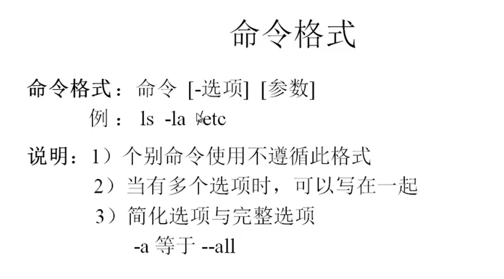
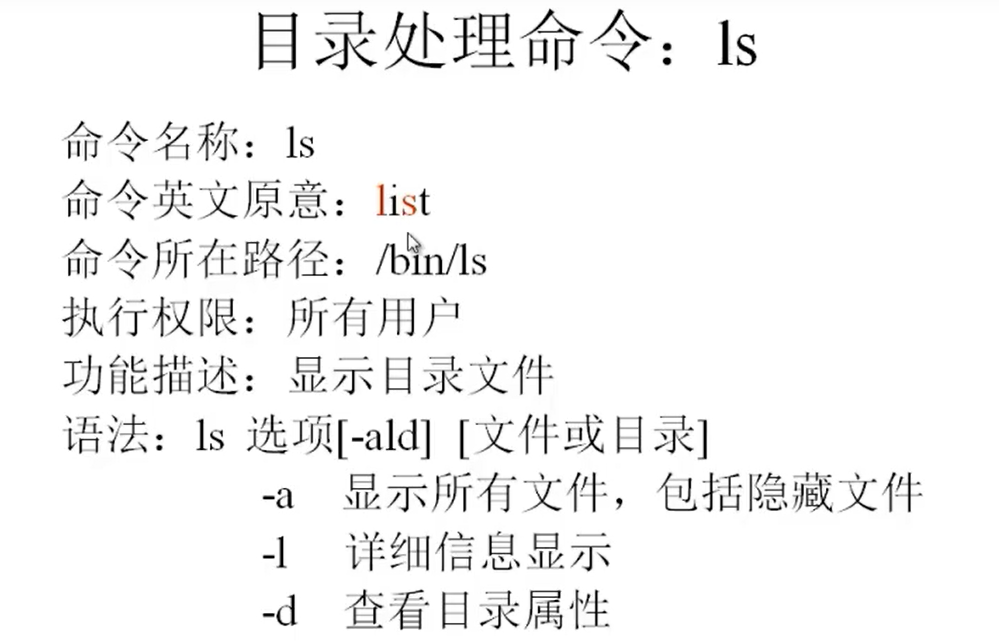
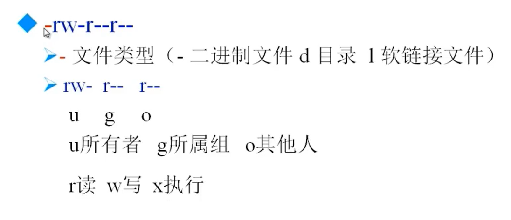
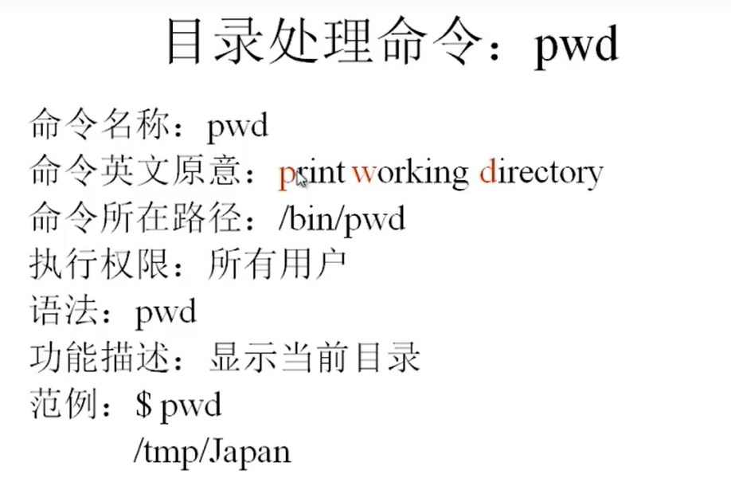
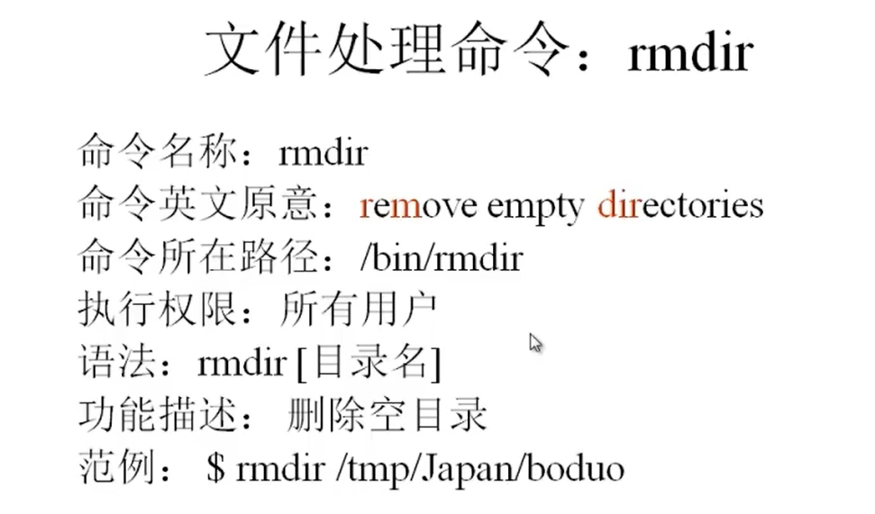
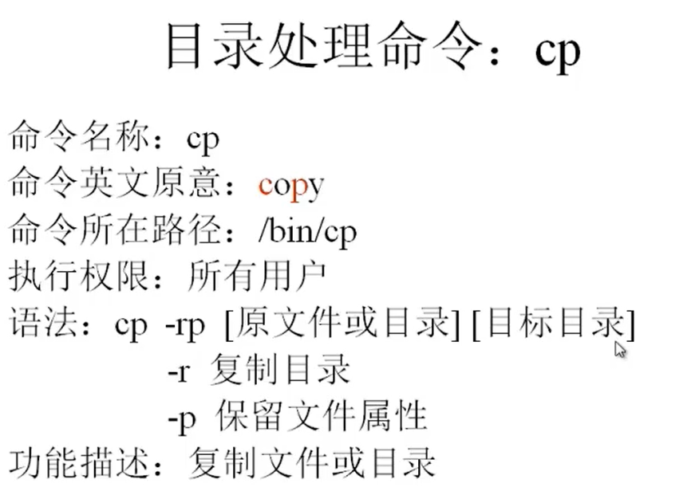

视频地址:

https://www.bilibili.com/video/BV1mW411i7Qf?from=search&seid=4411492801152978707&spm_id_from=333.337.0.0

2021/10/15 p13

# 初始化

## 网络IP地址设置

### 测试主机与虚拟机的网络连接

1. 虚拟机查看ip地址

   1. ```bash
      #查看虚拟机ip地址
      ccq@ccq-virtual-machine:~/Desktop$ ifconfig
      docker0: flags=4099<UP,BROADCAST,MULTICAST>  mtu 1500
              ether 02:42:a2:c0:ab:50  txqueuelen 0  (Ethernet)
              RX packets 0  bytes 0 (0.0 B)
              RX errors 0  dropped 0  overruns 0  frame 0
              TX packets 0  bytes 0 (0.0 B)
              TX errors 0  dropped 0 overruns 0  carrier 0  collisions 0
      
      ens33: flags=4163<UP,BROADCAST,RUNNING,MULTICAST>  mtu 1500
              inet 192.168.169.128  netmask 255.255.255.0  broadcast 192.168.169.255
              inet6 fe80::a426:afdf:114b:d665  prefixlen 64  scopeid 0x20<link>
              ether 00:0c:29:86:09:d6  txqueuelen 1000  (Ethernet)
              RX packets 146482  bytes 195435254 (195.4 MB)
              RX errors 0  dropped 0  overruns 0  frame 0
              TX packets 35010  bytes 3148865 (3.1 MB)
              TX errors 0  dropped 0 overruns 0  carrier 0  collisions 0
      
      lo: flags=73<UP,LOOPBACK,RUNNING>  mtu 65536
              inet 127.0.0.1  netmask 255.0.0.0
              inet6 ::1  prefixlen 128  scopeid 0x10<host>
              loop  txqueuelen 1000  (Local Loopback)
              RX packets 3808  bytes 373746 (373.7 KB)
              RX errors 0  dropped 0  overruns 0  frame 0
              TX packets 3808  bytes 373746 (373.7 KB)
      #查看ens33的inet即ip地址
      192.168.169.128
      ```

2. 打开主机cmd窗口, ping 虚拟机的ip地址

   1. ```
      C:\Users\Chaoq>ping 192.168.169.128
      
      Pinging 192.168.169.128 with 32 bytes of data:
      Reply from 192.168.169.128: bytes=32 time<1ms TTL=64
      Reply from 192.168.169.128: bytes=32 time<1ms TTL=64
      Reply from 192.168.169.128: bytes=32 time<1ms TTL=64
      Reply from 192.168.169.128: bytes=32 time<1ms TTL=64
      
      Ping statistics for 192.168.169.128:
          Packets: Sent = 4, Received = 4, Lost = 0 (0% loss),
      Approximate round trip times in milli-seconds:
          Minimum = 0ms, Maximum = 0ms, Average = 0ms
      ```

   2. 发现能ping通 ok

### 临时改变虚拟机的ip地址

```bash
ifconfig eth0 <ip地址>
```

# Linux常用命令




## ls

```bash
-l	long 显示文件详细信息
-a	all	显示所有文件包括隐藏文件
-d	directory 查看目录属性
-lh	human 人类便于理解的 文件大小单位为 k|M等
-i inode 显示每个文件的唯一标识符
```






```bash
ccq@ccq-virtual-machine:~/Desktop$ ls -l /
total 76
lrwxrwxrwx   1 root root     7 6月   1 16:56 bin -> usr/bin
drwxr-xr-x   4 root root  4096 10月 15 11:00 boot
drwxrwxr-x   2 root root  4096 6月   1 17:00 cdrom
drwxr-xr-x  19 root root  4200 8月   3 01:33 dev
drwxr-xr-x 133 root root 12288 8月   5 19:57 etc
ccq@ccq-virtual-machine:~/Desktop$ ls -lh /
total 76K
lrwxrwxrwx   1 root root    7 6月   1 16:56 bin -> usr/bin
drwxr-xr-x   4 root root 4.0K 10月 15 11:00 boot
drwxrwxr-x   2 root root 4.0K 6月   1 17:00 cdrom
drwxr-xr-x  19 root root 4.2K 8月   3 01:33 dev
drwxr-xr-x 133 root root  12K 8月   5 19:57 etc
ccq@ccq-virtual-machine:~/Desktop$ ls -i /etc
131080 acpi                           131228 fuse.conf        131255 lsb-release              131280 rmt
131209 adduser.conf                   131118 fwupd            131256 ltrace.conf              131281 rpc
131081 alsa                           131229 gai.conf         131257 machine-id               131282 rsyslog.conf

```

- l == long 长形式展示详细信息

按列解释

1. 所有者,所属组,其他用户对文件的操作权限 
2. 第一个位置
   1. l:  link 软链路文件
   2. -: 文件
   3. d: 目录
3. 后面9个字符每三个一组代表所有者,所属组,其他用户对文件的操作权限 
   1. r = read
   2. w = write
   3. x = execute
4. 引用数量 (硬链接数量)
5. 所有者
6. 所属组
7. 文件字节数量
8. 最后一次修改时间
9. 文件名


## mkdir 创建文件夹


```bash
-p	在不存在的目录下面创建新的目录, 否则不带这个flag不可以在不存在的目录下创建新的目录
ccq@ccq-virtual-machine:/tmp$ mkdir -p  /tmp/test/test1/test2
ccq@ccq-virtual-machine:/tmp$ ls
config-err-dL9sNQ
config-err-E7I3kY
config-err-EbsazD
config-err-kLbxbF
config-err-VfiDJF
config-err-Z2SUIv
snap.snap-store
systemd-private-c2bdfcd9bd4e44768654f61579e7dea4-colord.service-h0i4Rg
systemd-private-c2bdfcd9bd4e44768654f61579e7dea4-fwupd.service-5oLIRf
systemd-private-c2bdfcd9bd4e44768654f61579e7dea4-ModemManager.service-XY0xmh
systemd-private-c2bdfcd9bd4e44768654f61579e7dea4-switcheroo-control.service-eoFSuj
systemd-private-c2bdfcd9bd4e44768654f61579e7dea4-systemd-logind.service-8Wlsjg
systemd-private-c2bdfcd9bd4e44768654f61579e7dea4-systemd-resolved.service-EzmBTh
systemd-private-c2bdfcd9bd4e44768654f61579e7dea4-systemd-timesyncd.service-MkFr6h
systemd-private-c2bdfcd9bd4e44768654f61579e7dea4-upower.service-zKwESg
test
tmpo25gs7ep
tracker-extract-files.1000
tracker-extract-files.125
VMwareDnD
vmware-root_729-4257135007
ccq@ccq-virtual-machine:/tmp$ cd test
ccq@ccq-virtual-machine:/tmp/test$ ls
test1
ccq@ccq-virtual-machine:/tmp/test$ cd test1
ccq@ccq-virtual-machine:/tmp/test/test1$ ls
test2
ccq@ccq-virtual-machine:/tmp/test/test1$ 
```


## cd 更换目录


## pwd 打印当前工作路径




## rmdir 删除空目录




## cp 复制文件或目录

```bash
-r	复制目录
-p	保留文件属性
cp 文件1 文件2 目标目录 #可以一次性复制多个文件 最后加上目标目录即可
cp 源目录 目标目录/改名	#复制过程可以更改复制后的目录名
#test1目录复制到tmp文件夹下更名为changename文件夹,
ccq@ccq-virtual-machine:/tmp/test$ cp -r /tmp/test/test1 /tmp/changename

```




## mv 改名, 剪切文件


## rm 删除目录文件

