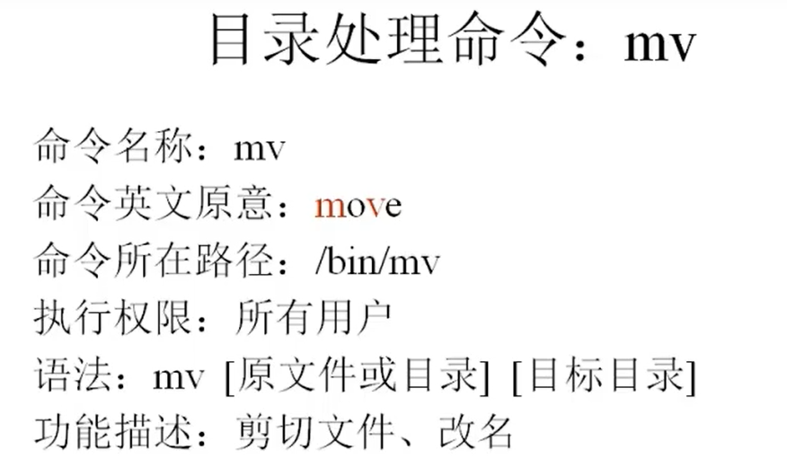
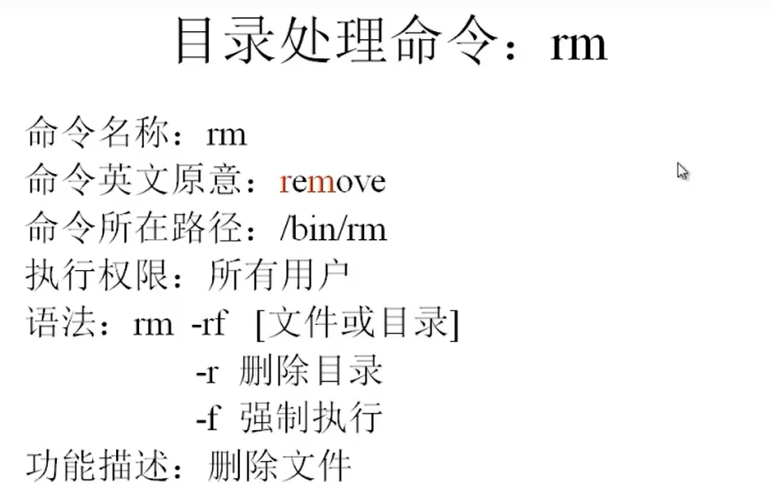

视频地址:

https://www.bilibili.com/video/BV1mW411i7Qf?from=search&seid=4411492801152978707&spm_id_from=333.337.0.0

2021/10/15 p13

# 初始化

## 网络IP地址设置

### 测试主机与虚拟机的网络连接

1. 虚拟机查看ip地址

   1. ```bash
      #查看虚拟机ip地址
      ccq@ccq-virtual-machine:~/Desktop$ ifconfig
      docker0: flags=4099<UP,BROADCAST,MULTICAST>  mtu 1500
              ether 02:42:a2:c0:ab:50  txqueuelen 0  (Ethernet)
              RX packets 0  bytes 0 (0.0 B)
              RX errors 0  dropped 0  overruns 0  frame 0
              TX packets 0  bytes 0 (0.0 B)
              TX errors 0  dropped 0 overruns 0  carrier 0  collisions 0
      
      ens33: flags=4163<UP,BROADCAST,RUNNING,MULTICAST>  mtu 1500
              inet 192.168.169.128  netmask 255.255.255.0  broadcast 192.168.169.255
              inet6 fe80::a426:afdf:114b:d665  prefixlen 64  scopeid 0x20<link>
              ether 00:0c:29:86:09:d6  txqueuelen 1000  (Ethernet)
              RX packets 146482  bytes 195435254 (195.4 MB)
              RX errors 0  dropped 0  overruns 0  frame 0
              TX packets 35010  bytes 3148865 (3.1 MB)
              TX errors 0  dropped 0 overruns 0  carrier 0  collisions 0
      
      lo: flags=73<UP,LOOPBACK,RUNNING>  mtu 65536
              inet 127.0.0.1  netmask 255.0.0.0
              inet6 ::1  prefixlen 128  scopeid 0x10<host>
              loop  txqueuelen 1000  (Local Loopback)
              RX packets 3808  bytes 373746 (373.7 KB)
              RX errors 0  dropped 0  overruns 0  frame 0
              TX packets 3808  bytes 373746 (373.7 KB)
      #查看ens33的inet即ip地址
      192.168.169.128
      ```

2. 打开主机cmd窗口, ping 虚拟机的ip地址

   1. ```
      C:\Users\Chaoq>ping 192.168.169.128
      
      Pinging 192.168.169.128 with 32 bytes of data:
      Reply from 192.168.169.128: bytes=32 time<1ms TTL=64
      Reply from 192.168.169.128: bytes=32 time<1ms TTL=64
      Reply from 192.168.169.128: bytes=32 time<1ms TTL=64
      Reply from 192.168.169.128: bytes=32 time<1ms TTL=64
      
      Ping statistics for 192.168.169.128:
          Packets: Sent = 4, Received = 4, Lost = 0 (0% loss),
      Approximate round trip times in milli-seconds:
          Minimum = 0ms, Maximum = 0ms, Average = 0ms
      ```

   2. 发现能ping通 ok

### 临时改变虚拟机的ip地址

```bash
ifconfig eth0 <ip地址>
```


## 文件传输

https://www.cnblogs.com/jerrybaby/p/6678300.html

电脑用的是windows的系统，vmware player打开了一台ubuntu虚拟机，想在它们之间传送文件。

**在宿主机上安装FTP文件传输软件**

步骤如下：

**1.**Ubuntu中安装ssh，命令：sudo apt-get install ssh openssh-server

**2.**查看虚拟机中Ubuntu的IP地址，命令：ifconfig

  下图就是虚拟机中Ubuntu的IP地址

　　

 

**3.**回到宿主机中，百度搜索下载FileZilla，其实这就是一个基于FTP协议、在两台电脑之间进行文件传送的软件（上学期做项目做过这方面的功能哈哈哈），另一台电脑可以在远端，在当前情况下，另一台电脑就是装在本地的虚拟机。

FileZilla运行界面如下。主机：就是填入Ubuntu的IP地址（可以只填IP地址，也可以自己补充上IP地址前面的协议）；用户名：Ubuntu下的用户名称；密码：Ubuntu下的用户密码；端口：22。

**4.**点击快速连接之后就会出现本地和远程文件列表，可以互相拖拽文件。


 

## 远程登录

```
ip a 查看虚拟机端口
获得ip地址
xshell 登录主机为ip, 端口为22 登录用户名为root 输入密码即可登录
```

## linux安装ssh服务

查看linux是否安装ssh服务

登录 root 用户下

命令：ssh localhost 

如果提示 "ssh:connect to host localhost port 22:connection refused",就说明没有打开ssh服务或者未安装ssh服务.

(1)如果linux系统是 ubuntu linux 版本,执行命令：sudo apt-get install openssh-server 安装ssh服务，在提示时都选择yes,然后会自动安装ssh服务.

(2)如果linux系统是 centos linux 版本,查看ssh是否安装,执行命令：rpm -qa | grep ssh 


https://blog.csdn.net/adanjeep/article/details/120676287

ubuntu远程连接失败
首先查找对应ubuntu服务器的防火墙是否开启？
防火墙状态查看命令：
sudo ufw status
ubuntu虚拟机一般情况下防火墙默认是关闭的；
防火墙关闭状态显示为Status：inactive；
若防火墙为开启，显示状态为Status：active
关闭防火墙命令：sudo ufw disable

执行该命令之后 我们使用sudo ufw status命令来查看当前防火墙的状态如果是inactive说明我们的防火墙已经关闭掉了。
若防火墙是关闭的，其次可能是Ubuntu系统在安装过程中没有选择安装openssh，那我们来安装一下，再次尝试远程连接
安装openssh操作步骤：
1.更新源列表
sudo apt-get update

2.安装openssh
sudo apt-get install openssh-server

3.查看ssh服务是否启动
sudo ps -e |grep ssh    # sshd服务是否开启，查看sshd有进程开启说明启动成功

## 设置允许root用户远程登录

*修改**ssh**配置文件/etc/ssh/sshd_config*

\#LoginGraceTime 120

*PermitRootLogin* *no*

\#StrictModes yes

*把PermitRootLogin* *no* *改为PermitRootLogin yes ，然后重启**ssh**服务。*

service sshd restart或 /etc/init.d/sshd restart


# Linux 软件安装

## Java

https://www.cnblogs.com/chenyucong/p/5697514.html


下载放到 ~/ 目录下（即主文件夹）

地址：http://www.oracle.com/technetwork/java/javase/downloads/index.html

进入上面的地址后，点击


 

二、解压并移动到目录中

打开终端，

解压，sudo tar zxvf ~/jdk-8u101-linux-x64.tar.gz

新建目标目录，cd /opt

　　　　　　　sudo mkdir Java

　　　　　　　sudo mkdir Java/jdk

移动解压的jdk目录，sudo mv ~/jdk1.8.0_101 /opt/Java/jdk

 

三、配置环境变量

还是在终端，修改bashrc文件，

根据需要，可先备份，cp .bashrc .bash_backup

使用vim打开编辑bashrc文件，vi ~/.bashrc

进入vim后，先跳转到文本的最下方，按“i”，进入编辑模式，插入下面的环境变量属性：

export JAVA_HOME=/opt/Java/jdk

export CLASSPATH=${JAVA_HOME}/lib:.

export PATH=${JAVA_HOME}/bin:$PATH

输入完成后，按ESC退出编辑模式，输入“:w”保存，输入“:q”退出vim

立即生效修改，source ~/.bashrc

 

四、确定是否成功

终端输入：java -version

显示三行Java的信息，则成功。


# Linux常用命令

## 目录处理命令


### ls

```bash
-l	long 显示文件详细信息
-a	all	显示所有文件包括隐藏文件
-d	directory 查看目录属性
-lh	human 人类便于理解的 文件大小单位为 k|M等
-i inode 显示每个文件的唯一标识符
```


```bash
ccq@ccq-virtual-machine:~/Desktop$ ls -l /
total 76
lrwxrwxrwx   1 root root     7 6月   1 16:56 bin -> usr/bin
drwxr-xr-x   4 root root  4096 10月 15 11:00 boot
drwxrwxr-x   2 root root  4096 6月   1 17:00 cdrom
drwxr-xr-x  19 root root  4200 8月   3 01:33 dev
drwxr-xr-x 133 root root 12288 8月   5 19:57 etc
ccq@ccq-virtual-machine:~/Desktop$ ls -lh /
total 76K
lrwxrwxrwx   1 root root    7 6月   1 16:56 bin -> usr/bin
drwxr-xr-x   4 root root 4.0K 10月 15 11:00 boot
drwxrwxr-x   2 root root 4.0K 6月   1 17:00 cdrom
drwxr-xr-x  19 root root 4.2K 8月   3 01:33 dev
drwxr-xr-x 133 root root  12K 8月   5 19:57 etc
ccq@ccq-virtual-machine:~/Desktop$ ls -i /etc
131080 acpi                           131228 fuse.conf        131255 lsb-release              131280 rmt
131209 adduser.conf                   131118 fwupd            131256 ltrace.conf              131281 rpc
131081 alsa                           131229 gai.conf         131257 machine-id               131282 rsyslog.conf

```

- l == long 长形式展示详细信息

按列解释

1. 所有者,所属组,其他用户对文件的操作权限 
2. 第一个位置
   1. l:  link 软链路文件
   2. -: 文件
   3. d: 目录
3. 后面9个字符每三个一组代表所有者,所属组,其他用户对文件的操作权限 
   1. r = read
   2. w = write
   3. x = execute
4. 引用数量 (硬链接数量)
5. 所有者
6. 所属组
7. 文件字节数量
8. 最后一次修改时间
9. 文件名


### mkdir 创建文件夹


```bash
-p	在不存在的目录下面创建新的目录, 否则不带这个flag不可以在不存在的目录下创建新的目录
ccq@ccq-virtual-machine:/tmp$ mkdir -p  /tmp/test/test1/test2
ccq@ccq-virtual-machine:/tmp$ ls
config-err-dL9sNQ
config-err-E7I3kY
config-err-EbsazD
config-err-kLbxbF
config-err-VfiDJF
config-err-Z2SUIv
snap.snap-store
systemd-private-c2bdfcd9bd4e44768654f61579e7dea4-colord.service-h0i4Rg
systemd-private-c2bdfcd9bd4e44768654f61579e7dea4-fwupd.service-5oLIRf
systemd-private-c2bdfcd9bd4e44768654f61579e7dea4-ModemManager.service-XY0xmh
systemd-private-c2bdfcd9bd4e44768654f61579e7dea4-switcheroo-control.service-eoFSuj
systemd-private-c2bdfcd9bd4e44768654f61579e7dea4-systemd-logind.service-8Wlsjg
systemd-private-c2bdfcd9bd4e44768654f61579e7dea4-systemd-resolved.service-EzmBTh
systemd-private-c2bdfcd9bd4e44768654f61579e7dea4-systemd-timesyncd.service-MkFr6h
systemd-private-c2bdfcd9bd4e44768654f61579e7dea4-upower.service-zKwESg
test
tmpo25gs7ep
tracker-extract-files.1000
tracker-extract-files.125
VMwareDnD
vmware-root_729-4257135007
ccq@ccq-virtual-machine:/tmp$ cd test
ccq@ccq-virtual-machine:/tmp/test$ ls
test1
ccq@ccq-virtual-machine:/tmp/test$ cd test1
ccq@ccq-virtual-machine:/tmp/test/test1$ ls
test2
ccq@ccq-virtual-machine:/tmp/test/test1$ 
```


### cd 更换目录


### pwd 打印当前工作路径


### rmdir 删除空目录


### cp 复制文件或目录

```bash
-r	复制目录
-p	保留文件属性
cp 文件1 文件2 目标目录 #可以一次性复制多个文件 最后加上目标目录即可
cp 源目录 目标目录/改名	#复制过程可以更改复制后的目录名
#test1目录复制到tmp文件夹下更名为changename文件夹,
ccq@ccq-virtual-machine:/tmp/test$ cp -r /tmp/test/test1 /tmp/changename

```


### mv 改名, 剪切文件



### rm 删除目录文件




## 文件处理命令


### touch 创建文件

```bash
#在当前目录下床架文件
touch file.txt
#在/root目录下创建文件
touch /root/file.txt
#创建两个文件 program 和 file
touch program file


```


### cat 查看文件内容

```bash
#查看文件内容
cat file.txt
#查看文件内容 附带行号
cat -n file.txt
```

### tac 倒着查看文件内容(从最后一行到第一行显示)


### more 分页显示文件内容

```bash
#分页显示
more file.txt
#空格或者f 一页一页往后翻
#回车一行一行往后翻
#q退出
```


### less 向上翻页

```bash
#分页显示
less file.txt
#pageup 一页一页往上翻
#上箭头 一行一行往上翻
# /加上需要搜索的关键字, 然后找到的关键字会被标记, 按n会找到下一个

#空格或者f 一页一页往后翻
#回车一行一行往后翻
#q退出


```


### head 显示文件的前几行

```bash
#显示文件的前几行 (不加-n 默认显示前10行)
head -n 显示行数 file.txt
```


### tail 显示文件最后几行

```bash
#显示文件的最后几行 (不加-n 默认显示最后10行)
tail -n 显示行数 file.txt
#查看文件的时候, 如果文件变化会动态显示
tail -f file.txt

```


## 链接命令

### ln  生成文件的链接文件

```bash
# 生成文件的链接文件
ln 源文件 源文件的硬连接文件
ln -s 源文件 源文件的软连接文件
```


## 权限管理命令

### chmod


- 文件权限修改只能是所有者和root用户

- ugoa
  - u = user 所有者
  - g = group 所属组
  - o = other 其他人
  - a = all 所有人
- +-=
  - `+` 增加权限
  - `-` 减少权限
  - `=` 变成等号右边的权限

```bash
[root@localhost tmp]# touch file.txt
[root@localhost tmp]# ls -l file.txt 
-rw-r--r--. 1 root root 0 Nov  2 11:18 file.txt
# 增加 user执行的权限
[root@localhost tmp]# chmod u+x file.txt 
[root@localhost tmp]# ls -l file.txt 
-rwxr--r--. 1 root root 0 Nov  2 11:18 file.txt
# 增加所属组写的权限
[root@localhost tmp]# chmod g+w,o-r file.txt 
[root@localhost tmp]# ls -l file.txt 
-rwxrw----. 1 root root 0 Nov  2 11:18 file.txt
#改变所属组的权限为 rwx
[root@localhost tmp]# chmod g=rwx file.txt 
[root@localhost tmp]# ls -l file.txt 
-rwxrwx---. 1 root root 0 Nov  2 11:18 file.txt

```


```bash
[root@localhost tmp]# ls -l file.txt 
-rwxrwx---. 1 root root 0 Nov  2 11:18 file.txt
[root@localhost tmp]# chmod 640 file.txt 
[root@localhost tmp]# ls -l file.txt 
-rw-r-----. 1 root root 0 Nov  2 11:18 file.txt

#-R 递归修改
#改变一个目录的同时修改该目录下所有目录的权限都为指定的权限
[root@localhost tmp]# mkdir -p /tmp/a/b
[root@localhost tmp]# ls -ld /tmp/a
drwxr-xr-x. 3 root root 15 Nov  2 11:24 /tmp/a
[root@localhost tmp]# ls -ld /tmp/a/b
drwxr-xr-x. 2 root root 6 Nov  2 11:24 /tmp/a/b
# 只修改了/tmp/a的权限
[root@localhost tmp]# chmod 777 /tmp/a
[root@localhost tmp]# ls -ld /tmp/a
drwxrwxrwx. 3 root root 15 Nov  2 11:24 /tmp/a
[root@localhost tmp]# ls -ld /tmp/a/b
drwxr-xr-x. 2 root root 6 Nov  2 11:24 /tmp/a/b
#递归修改/tmp/a下所有目录的权限为777
[root@localhost tmp]# chmod -R 777 /tmp/a
[root@localhost tmp]# ls -ld /tmp/a
drwxrwxrwx. 3 root root 15 Nov  2 11:24 /tmp/a
[root@localhost tmp]# ls -ld /tmp/a/b
drwxrwxrwx. 2 root root 6 Nov  2 11:24 /tmp/a/b
```


- 实验 root用户创建的文件 普通用户是否可以删除

```bash
#root用户创建文件夹 /temp
[root@localhost /]# mkdir /temp
#root用户创建文件
[root@localhost /]# touch /temp/testfile
#修改文件夹权限为777
[root@localhost /]# chmod 777 /temp
[root@localhost /]# ls -ld /temp
drwxrwxrwx. 2 root root 22 Nov  2 11:29 /temp
[root@localhost /]# ls -l /temp/testfile
-rw-r--r--. 1 root root 0 Nov  2 11:29 /temp/testfile
#创建一个新的用户
[root@localhost /]# useradd ccq1
#设置password为 123
[root@localhost /]# passwd ccq1
Changing password for user ccq1.
New password: 
BAD PASSWORD: The password is shorter than 8 characters
Retype new password: 
passwd: all authentication tokens updated successfully.
#改到创建的普通用户ccq1下
[root@localhost /]# su ccq1
#删除刚刚创建的文件
[ccq1@localhost /]$ rm /temp/testfile
rm: remove write-protected regular empty file ‘/temp/testfile’? y
#root用户下查看
[root@localhost /]# cd temp
# /temp文件夹下的testfile.txt文件被删除了
[root@localhost temp]# ls
[root@localhost temp]# 


```

- 这里因为 对于/temp文件夹有rwx权限, 所以ccq1普通用户可以删除该目录下的文件
- 删除文件的权限是对该文件所在的目录具有写权限


