# MySQL

# 索引

# MVCC

# 事务

# 日志

# 锁

# 优化

1. MYSQL的事务隔离机制（3种问题，4种隔离机制）

2. MYSQL的A C I D怎样实现的？

3. MVCC原理

4. MYSQL redo_log原理（实现D）,undo_log原理（实现A）

5. sql注入

6. InnoDB和MyISAM的区别

   聚簇索引和非聚簇索引的区别

   MVCC

   非聚簇索引 回表（其实就是考B+树的优势，对叶子节点存数据这边问的很深入，答的不够完整）

   可重复读怎么解决不可重复读问题

##  数据库索引以及为什么要用这种索引 

##  问mysql有哪些存储引擎，你用到什么存储引擎，区别是什么？ 

##  sql优化策略 

##  聚集索引的底层 

## mvcc机制了解嘛

## mysql的表锁有哪些？

## 给了一段sql语句，问会上什么锁？详细解读一下

##  Mysql索引，联合索引，失效，左连接（八股文） 

##  什么是柔性事务 

##  跨库事务如何保证 

## 数据库三大范式

## 事务特性

## 事务隔离级别

##  mysql索引（B+和hash） 

##  聚集索引和非聚集索引 

##  Mysql的主从复制（从数据库依据redolog完成一致性） 

##  binlog和redolog的差异，以及记录写入的先后性（，binlog二进制数据文件，redolog逻辑命令。先后顺序，当时回答binlog先，redolog后，不知对错，面试官没纠正，应该对了） 

##  mysql事务特性（泛谈了ACID，和MVCC） 

##  谈谈锁（sync关键字和ReentrantLock） 

##  sync关键字和ReentrantLock的区别（层级，功能，重量级三个方面） 

##  说说分布式锁

（谈了Redis和Zoo[keep](https://www.nowcoder.com/jump/super-jump/word?word=keep)er的分布式锁实现原理， 


##  可重入锁在过期前续期失败会发生什么

（说了事务回滚和yeid让出） 


##  间隙锁是什么，具体什么时候会加锁

（具体什么时候加锁，这里要把所有情况都说清楚。。 

##  一级索引和二级索引之间是怎么作用的 

##  连接池，一些参数的含义(详细探讨了一下 removeAbandonedTimeout细节) 


## MYSQL的事务隔离机制

 读未提交：一个事务还没提交，它做的变更就能被别的事务看到。读提交：一个事务提交后，它做的变更才能被别的事务看到。可重复读：一个事务执行过程中看到的数据总是和事务启动时看到的数据是一致的。在这个级别下事务未提交，做出的变更其它事务也看不到。串行化：对于同一行记录进行读写会分别加读写锁，当发生读写锁冲突，后面执行的事务需等前面执行的事务完成才能继续执行。 

##  MYSQL的A C I D怎样实现的 

 利用undo log保障原子性。该log保存了事务发生之前的数据的一个版本，可以用于回滚，从而保证事务原子性。 

 利用redo log保证事务的持久性，该log关注于事务的恢复.在重启mysql服务的时候，根据redo log进行重做，从而使事务有持久性。 

 利用undo log+redo log保障一致性。事务中的执行需要redo log，如果执行失败，需要undo log 回滚。 

##  MVCC原理 

 MVCC为多版本并发控制，即同一条记录在系统中存在多个版本。其存在目的是在保证数据一致性的前提下提供一种高并发的访问性能。对数据读写在不加读写锁的情况下实现互不干扰,从而实现数据库的隔离性,在事务隔离级别为读提交和可重复读中使用到。 

 在InnoDB中，事务在开始前会向事务系统申请一个事务ID，该ID是按申请顺序严格递增的。每行数据具有多个版本，每次事务更新数据都会生成新的数据版本，而不会直接覆盖旧的数据版本。数据的行结构中包含多个信息字段。其中实现MVCC的主要涉及最近更改该行数据的事务ID（DBTRXID）和可以找到历史数据版本的指针（DBROLLPTR）。InnoDB在每个事务开启瞬间会为其构造一个记录当前已经开启但未提交的事务ID的视图数组。通过比较[链表]()中的事务ID与该行数据的值与对应的DBTRXID，并通过DBROLLPTR找到历史数据的值以及对应的DBTRXID来决定当前版本的数据是否应该被当前事务所见。最终实现在不加锁的情况下保证数据的一致性 

##  简述redo_log undo_log 

 redo log: 存储引擎级别的log（InnoDB有，MyISAM没有），该log关注于事务的恢复.在重启mysql服务的时候，根据redo log进行重做，从而使事务有持久性。 

 undo log：是存储引擎级别的log（InnoDB有，MyISAM没有）保证数据的原子性，该log保存了事务发生之前的数据的一个版本，可以用于回滚，是MVCC的重要实现方法之一。


# 存储引擎

-  InnoDB 是 MySQL 默认的存储引擎
- InnoDB 是一个将表中的数据存储到磁盘上的存储引擎，所以即使关机后重启我们的数据还是存在的。而真正处理数据的过程是发生在内存中的，所以需要把磁盘中的数据加载到内存中，如果是处理写入或修改请求的话，还需要把内存中的内容刷新到磁盘上。
- InnoDB 采取的方式是：将数据划分为若干个页，以页作为磁盘和内存之间交互的基本单位，InnoDB中页的大小一般为 16 KB。也就是在一般情况下，一次最少从磁盘中读取16KB的内容到内存中，一次最少把内存中的16KB内容刷新到磁盘中。

## InnoDB行格式

- 我们平时是以记录为单位来向表中插入数据的，这些记录在磁盘上的存放方式也被称为 行格式 或者 记录格式 
  -  Compact 、 Redundant 、Dynamic 和 Compressed 

### COMPACT行格式


#### 记录的额外信息

服务器为了描述这条记录而不得不额外添加的一些信息

##### 变长字段长度列表 

MySQL 支持一些变长的数据类型，比如 VARCHAR(M) 、 VARBINARY(M) 、各种 TEXT 类型，各种 BLOB 类型，我们也可以把拥有这些数据类型的列称为 **变长字段** ，变长字段中存储多少字节的数据是**不固定**的，所以我们在存储真实数据的时候需要顺便把这些**数据占用的字节数**也存起来

- 变长字段占用的存储空间分为两部分：
  1. 真正的数据内容
  2. 占用的字节数
- 变长字段长度列表中只存储值为 非NULL 的列内容占用的长度，值为 NULL 的列的长度是不储存的 

把所有变长字段的真实数据占用的字节长度都存放在记录的开头部位，从而形成一个**变长字段长度列表**，各变长字段数据占用的字节数按照列的顺序**逆序存放**


- 确定使用1个字节还是2个字节表示真正字符串占用的**字节数**的规则
  - W: 某个字符集中表示一个字符最多需要使用的字节数
  - M: 变长类型 VARCHAR(M) 来说，这种类型表示能存储最多 M 个字符
  - L: 实际存储的字符串占用的字节数
  - 如果 M×W <= 255 ，那么使用1个字节来表示真正字符串占用的字节数。
  - 如果 M×W > 255 ，则分为两种情况：
    - 如果 L <= 127 ，则用1个字节来表示真正字符串占用的字节数。
    - 如果 L > 127 ，则用2个字节来表示真正字符串占用的字节数。
  - 总结：如果该可变字段允许存储的最大字节数（ M×W ）超过255字节并且真实存储的字节数（ L ）超过127字节，则使用2个字节，否则使用1个字节。

- 区分某个字节是一个单独的字段长度还是半个字段长度
  - 该字节的第一个二进制位作为标志位：如果该字节的第一个位为0，那该字节就是一个单独的字段长度（使用一个字节表示不大于127的二进制的第一个位都为0），如果该字节的第一个位为1，那该字节就是半个字段长度


##### NULL值列表 


表中的某些列可能存储 NULL 值，如果把这些 NULL 值都放到 记录的真实数据 中存储会很占地方，所以 Compact 行格式把这些值为 NULL 的列统一管理起来，存储到 NULL 值列表中

- 处理过程
  1. 统计表中允许存储 NULL 的列有哪些。
  2. 如果表中没有允许存储 NULL 的列，则 NULL值列表 也不存在了
     - 否则将每个允许存储 NULL 的列对应一个二进制位，二进制位按照列的顺序逆序排列
       - 二进制位的值为 1 时，代表该列的值为 NULL 。
       - 二进制位的值为 0 时，代表该列的值不为 NULL 。
  3. MySQL 规定 NULL值列表 必须用整数个字节的位表示，如果使用的二进制位个数不是整数个字节，则在字节的高位补 0 
     - 


##### 记录头信息


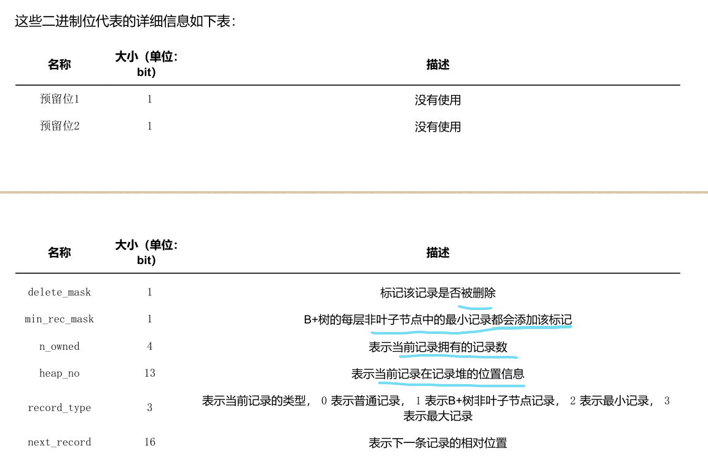

由固定的 5 个字节组成。 5 个字节也就是 40 个二进制位


#### 记录的真实数据

MySQL 会为每个记录默认的添加一些列（也称为 隐藏列 ）

InnoDB存储引擎会为每条记录都添加 transaction_id和 roll_pointer 这两个列，但是 row_id 是可选的

（在没有自定义主键以及Unique键的情况下才会添加该列）


- InnoDB 表对主键的生成策略
  1. 优先使用用户自定义主键作为主键，
  2. 如果用户没有定义主键，则选取一个 Unique 键作为主键，
  3. 如果表中连 Unique 键都没有定义的话，则 InnoDB 会为表默认添加一个名为row_id 的隐藏列作为主键


#### CHAR(M)列的存储格式

- 对于 CHAR(M) 类型的列来说，当列采用的是定长字符集时，该列占用的字节数不会被加到变长字段长度列表，而如果采用变长字符集时，该列占用的字节数也会被加到变长字段长度列表。

- 变长字符集的 CHAR(M) 类型的列要求至少占用 M 个字节，而 VARCHAR(M) 却没有这个要求。
  - 比方说对于使用 utf8 字符集的 CHAR(10) 的列来说，该列存储的数据字节长度的范围是10～30个字节。
  - 即使我们向该列中存储一个空字符串也会占用 10 个字节，这是怕将来更新该列的值的字节长度大于原有值的字节长度而小于10个字节时，可以在该记录处直接更新，而不是在存储空间中重新分配一个新的记录空间，导致原有的记录空间成为所谓的碎片。


### 总结

1. 页是 MySQL 中磁盘和内存交互的基本单位，也是 MySQL 是管理存储空间的基本单位。
2. 指定和修改行格式的语法如下：
   - CREATE TABLE 表名 (列的信息) ROW_FORMAT=行格式名称
   - ALTER TABLE 表名 ROW_FORMAT=行格式名称
3. InnoDB 目前定义了4种行格式
   1. COMPACT行格式
      - 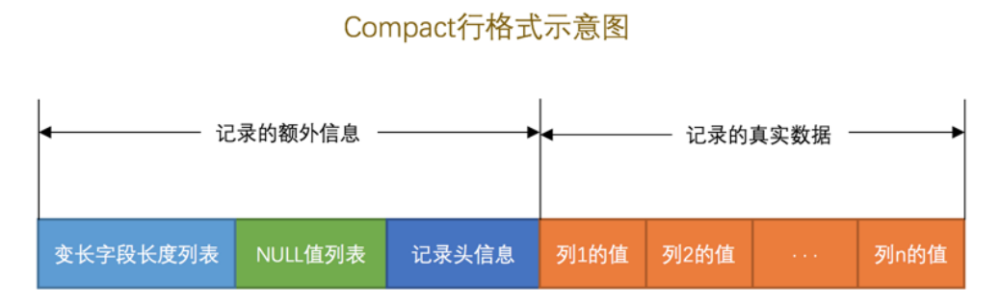
   2. Redundant行格式
      - 
   3. Dynamic和Compressed行格式
      - 这两种行格式类似于 COMPACT行格式 ，只不过在处理行溢出数据时有点儿分歧，它们不会在记录的真实数据处存储字符串的前768个字节，而是把所有的字节都存储到其他页面中，只在记录的真实数据处存储其他页面的地址。
      - 另外， Compressed 行格式会采用压缩算法对页面进行压缩。
   4. 一个页一般是 16KB ，当记录中的数据太多，当前页放不下的时候，会把多余的数据存储到其他页中，这种现象称为 行溢出 


## InnoDB数据页结构

### 数据页结构的快速浏览

存放我们表中记录的那种类型的页，官方称这种存放记录的页为索引（ INDEX ）页(数据页)


### 记录在页中的存储

- 存储的记录会按照我们指定的 行格式 存储到 User Records 部分.
- 但是在一开始生成页的时候，其实并没有 User Records 这个部分，每当我们插入一条记录，都会从 Free Space 部分，也就是尚未使用的存储空间中申请一个记录大小的空间划分到 User Records 部分，
- 当 Free Space 部分的空间全部被 User Records 部分替代掉之后，也就意味着这个页使用完了，如果还有新的记录插入的话，就需要去申请新的页了

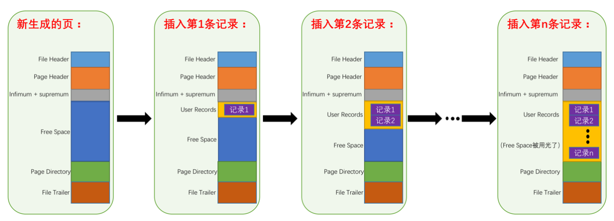

### 记录头信息

如果我们设置了表的主键，行格式中InnoDB就没必要为我们去创建那个所谓的 row_id 隐藏列了

> 创建表 page_demo

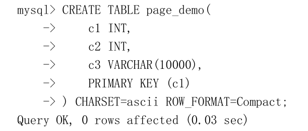

> 表中记录的行格式


> 记录头信息的各个属性

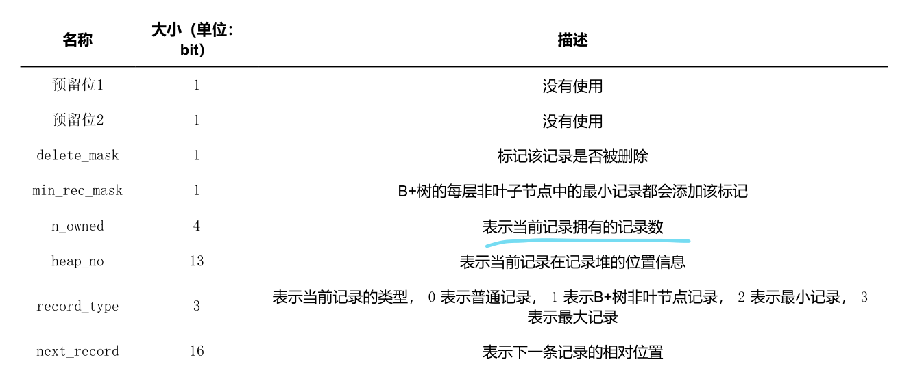


> 记录头信息中的各个属性解释


#### delete_mask

- 标记着当前记录是否被删除，占用1个二进制位，
- 0: 记录并没有被删除，
- 1: 记录被删除掉了

- 这些被删除的记录之所以不立即从磁盘上移除，是因为移除它们之后把其他的记录在磁盘上重新排列需要性能消耗，所以只是打一个删除标记而已，
- 所有被删除掉的记录都会组成一个 **垃圾链表** ，在这个链表中的记录占用的空间称之为所谓的**可重用空间** ，之后如果有新记录插入到表中的话，可能把这些被删除的记录占用的存储空间覆盖掉
- 将这个delete_mask位设置为1和将被删除的记录加入到垃圾链表中其实是两个阶段

#### min_rec_mask

B+树的每层非叶子节点中的最小记录都会添加该标记

#### n_owned

#### heap_no

- 当前记录在本页中的位置


- InnoDB会自动给每个页里边儿加两个记录，称为 伪记录 或者 虚拟记录 。
- 这两个伪记录一个代表 最小记录 ，一个代表 最大记录
- 记录也可以比大小，对于一条完整的记录来说，比较记录的大小就是比较 主键 的大小
- 这两条记录的构造十分简单，都是由5字节大小的 记录头信息 和8字节大小的一个固定的部分组成的
- 由于这两条记录不是我们自己定义的记录，所以它们并不存放在 页 的 User Records 部分，他们被单独放在一个称为 Infimum + Supremum 的部分

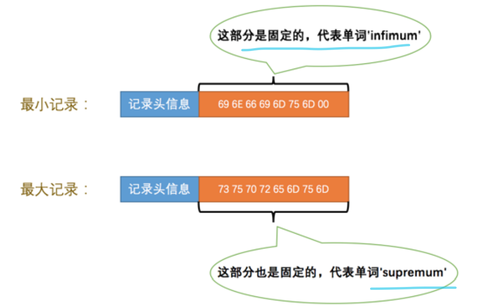


从图中我们可以看出来，最小记录和最大记录的 heap_no 值分别是 0 和 1 ，也就是说它们的位置最靠前


#### record_type

- 这个属性表示当前记录的类型，一共有4种类型的记录， 
- 0 表示普通记录
- 1 表示B+树非叶节点记录
- 2 表示最小记录
- 3 表示最大记录

#### next_record

- 表示从当前记录的真实数据到下一条记录的真实数据的地址偏移量(链表)
  - 比方说第一条记录的 next_record 值为 32 ，意味着从第一条记录的真实数据的地址处向后找 32 个字节便是下一条记录的真实数据
- 这其实是个 链表 ，可以通过一条记录找到它的下一条记录

-  下一条记录 指得并不是按照我们插入顺序的下一条记录，而是按照**主键值由小到大**的顺序的下一条记录

-  **Infimum**记录（也就是最小记录） 的下一条记录就是**本页中主键值最小**的用户记录，
- 而**本页中主键值最大**的用户记录的下一条记录就是 **Supremum**记录（也就是最大记录） 

- 我们的记录按照**主键从小到大**的顺序形成了一个单链表。 最大记录 的 next_record 的值为 0 ，这也就是说最大记录是没有 下一条记录 了，它是这个单链表中的最后一个节点。如果从中删除掉一条记录，这个链表也是会跟着变化的


> 删掉第2条记录后

- 第2条记录并没有从存储空间中移除，而是把该条记录的 delete_mask 值设置为 1 。
- 第2条记录的 next_record 值变为了0，意味着该记录没有下一条记录了。
- 第1条记录的 next_record 指向了第3条记录。
- 最大记录 的 n_owned 值从 5 变成了 4 

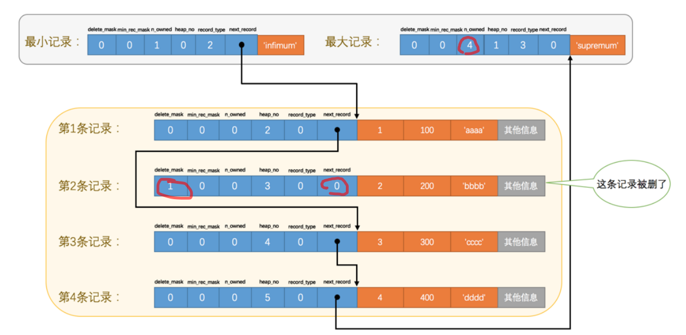

- 不论我们怎么对页中的记录做增删改操作，InnoDB始终会维护一条记录的单链表，链表中的各个节点是按照主键值由小到大的顺序连接起来的

> next_record这个指针为啥要指向记录头信息和真实数据之间的位置呢

- 因为这个位置刚刚好，向左读取就是记录头信息，向右读取就是真实数据。
- 我们前边还说过变长字段长度列表、NULL值列表中的信息都是逆序存放，这样可以使记录中位置靠前的字段和它们对应的字段长度信息在内存中的距离更近，可能会提高高速缓存的命中率

>将删除的第2条记录插入到表中

- InnoDB 并没有因为新记录的插入而为它申请新的存储空间，而是直接复用了原来被删除记录的存储空间
- 当数据页中存在多条被删除掉的记录时，这些记录的next_record属性将会把这些被删除掉的记录组成一个垃圾链表，以备之后重用这部分存储空间


### Page Directory（页目录）

现在我们了解了记录在页中按照主键值由小到大顺序串联成一个单链表，那如果我们想根据主键值查找页中的某
条记录该咋办呢?

#### 制作页目录

1. 将所有正常的记录（包括最大和最小记录，**不包括标记为已删除的记录**）划分为几个组。
2. 每个组的最后一条记录（也就是组内最大的那条记录）的头信息中的 **n_owned** 属性表示该记录拥有多少条记
   录，也就是该组内共有几条记录。
3. 将每个组的最后一条记录的**地址偏移量**单独提取出来按顺序存储到靠近 页 的尾部的地方，这个地方就是所
   谓的 Page Directory ，也就是 页目录 （此时应该返回头看看页面各个部分的图）。页面目录中的这些地址
   偏移量被称为 **槽** （英文名： Slot ），所以这个页面目录就是由 槽 组成的。

InnoDB 如下记录分成两组，第一组中只有一个最小记录，第二组中是剩余的5条记录


> 注意点

- 现在 页目录 部分中有两个槽，也就意味着我们的记录被分成了两个组， 
  - 槽1 中的值是 112 ，代表最大记录的地址偏移量（就是从页面的0字节开始数，数112个字节）；
  - 槽0 中的值是 99 ，代表最小记录的地址偏移量。
- 注意最小和最大记录的头信息中的 n_owned 属性
  - 最小记录的 n_owned 值为 1 ，这就代表着以最小记录结尾的这个分组中只有 1 条记录，也就是最小记录
    本身。
    最大记录的 n_owned 值为 5 ，这就代表着以最大记录结尾的这个分组中只有 5 条记录，包括最大记录本
    身还有我们自己插入的 4 条记录

> 修改表示方式, 用箭头以及调整page directory的位置


> 为什么最小记录的 n_owned 值为1，而最大记录的 n_owned 值为 5 呢?

- 对每个分组中的记录条数是有规定
  - 对于最小记录所在的分组只能有 1 条记录，
  - 最大记录所在的分组拥有的记录条数只能在 1~8 条之间，
  - 剩下的分组中记录的条数范围只能在是 4~8 条之间。

> 分组的步骤

1. 初始情况下一个数据页里只有最小记录和最大记录两条记录，它们分属于两个分组。
2. 之后每插入一条记录，都会从 页目录 中找到主键值比本记录的主键值大并且差值最小的槽，然后把该槽对
   应的记录的 n_owned 值加1，表示本组内又添加了一条记录，直到该组中的记录数等于8个。
3. 在一个组中的记录数等于8个后再插入一条记录时，会将组中的记录拆分成两个组，一个组中4条记录，另一
   个5条记录。这个过程会在 页目录 中新增一个 槽 来记录这个新增分组中最大的那条记录的偏移量

> 如何从页目录查找记录?

- 因为各个槽代表的记录的主键值都是从小到大排序的，所以我们可以使用所谓的 二分法 来进行快速查找
- 4个槽的编号分别是： 0 、 1 、 2 、 3 、 4 ，所以初始情况下最低的槽就是 low=0 ，最高的槽就是high=4 。比方说我们想找主键值为 6 的记录
  1. 计算中间槽的位置： (0+4)/2=2 ，所以查看 槽2 对应记录的主键值为 8 ，又因为 8 > 6 ，所以设置
     high=2 ， low 保持不变。
  2. 重新计算中间槽的位置： (0+2)/2=1 ，所以查看 槽1 对应的主键值为 4 ，又因为 4 < 6 ，所以设置
    low=1 ， high 保持不变。
  3. 因为 high - low 的值为1，所以确定主键值为 5 的记录在 槽2 对应的组中。
    1. 此刻我们需要找到 槽2 中主键值最小的那条记录，然后沿着单向链表遍历 槽2 中的记录。
    2. 但是我们前边又说过，每个槽对应的记录都是该组中主键值最大的记录，这里 槽2 对应的记录是主键值为 8 的记录，怎么定位一个组中最小的记录呢？
    3. 别忘了各个槽都是挨着的，我们可以很轻易的拿到 槽1 对应的记录（主键值为 4 ），该条记录的下一条记录就是 槽2 中主键值最小的记录，该记录的主键值为 5 。
    4. 所以我们可以从这条主键值为 5 的记录出发，遍历 槽2 中的各条记录，直到找到主键值为 6 的那条记录即可。
    5. 由于一个组中包含的记录条数只能是1~8条，所以遍历一个组中的记录的代价是很小的

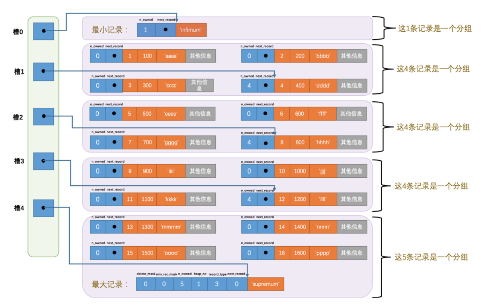

> 所以在一个数据页中查找指定主键值的记录的过程分为两步：

- 通过二分法确定该记录所在的槽，并找到该槽中主键值最小的那条记录。
- 通过记录的 next_record 属性遍历该槽所在的组中的各个记录。


### Page Header（页面头部）

- 为了能得到一个数据页中存储的记录的状态信息，比如本页中已经存储了多少条记录，第一条记录的地址是什么，页目录中存储了多少个槽等等，特意在页中定义了一个叫 Page Header 的部分

- 它是页 结构的第二部分，这个部分占用固定的 56 个字节，专门存储各种状态信息


#### PAGE_DIRECTION 

假如新插入的一条记录的主键值比上一条记录的主键值大，我们说这条记录的插入方向是右边，反之则是左边。用来表示最后一条记录插入方向的状态就是 PAGE_DIRECTION

#### PAGE_N_DIRECTION 

假设连续几次插入新记录的方向都是一致的， InnoDB 会把沿着同一个方向插入记录的条数记下来，这个条数就用 PAGE_N_DIRECTION 这个状态表示。当然，如果最后一条记录的插入方向改变了的话，这个状态的值会被清零重新统计


### File Header（文件头部）

File Header 针对各种类型的页都通用，也就是说不同类型的页都会以 File Header 作为第一个组成部分，它描述了一些针对各种页都通用的一些信息，比方说这个页的编号是多少，它的上一个页、下一个页是谁这个部分占用固定的 38 个字节

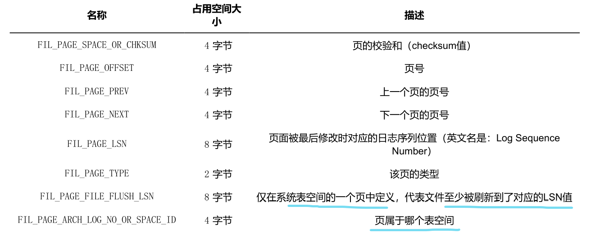

#### FIL_PAGE_SPACE_OR_CHKSUM

- 这个代表当前页面的校验和（checksum）。啥是个校验和？
- 就是对于一个很长很长的字节串来说，我们会通过某种算法来计算一个比较短的值来代表这个很长的字节串，这个比较短的值就称为 校验和 。
- 这样在比较两个很长的字节串之前先比较这两个长字节串的校验和，如果校验和都不一样两个长字节串肯定是不同的，所以省去了直接比较两个比较长的字节串的时间损耗

#### FIL_PAGE_OFFSET

每一个 页 都有一个单独的页号，就跟你的身份证号码一样， InnoDB 通过页号来可以唯一定位一个 页

#### FIL_PAGE_TYPE

这个代表当前 页 的类型，我们前边说过， InnoDB 为了不同的目的而把页分为不同的类型，我们上边介绍的
其实都是存储记录的 数据页 ，其实还有很多别的类型的页

我们存放记录的数据页的类型其实是 FIL_PAGE_INDEX ，也就是所谓的 索引页

#### FIL_PAGE_PREV 和 FIL_PAGE_NEXT

- InnoDB 都是以页为单位存放数据的，有时候我们存放某种类型的数据占用的空间非常大（比方说一张表中可以有成千上万条记录）， 
- InnoDB 可能不可以一次性为这么多数据分配一个非常大的存储空间，如果分散到多个不连续的页中存储的话需要把这些页关联起来，
- FIL_PAGE_PREV 和 FIL_PAGE_NEXT就分别代表本页的上一个和下一个页的页号。这样通过建立一个双向链表把许许多多的页就都串联起来了，而无需这些页在物理上真正连着。
- 需要注意的是，并不是所有类型的页都有上一个和下一个页的属性，不过我们本集中唠叨的 数据页 （也就是类型为 FIL_PAGE_INDEX 的页）是有这两个属性的，所以所有的数据页其实是一个双链表


### File Trailer

我们知道 InnoDB 存储引擎会把数据存储到磁盘上，但是磁盘速度太慢，需要以 页 为单位把数据加载到内存中处
理，如果该页中的数据在内存中被修改了，那么在修改后的某个时间需要把数据同步到磁盘中。但是在同步了一
半的时候中断电了咋办，这不是莫名尴尬么？为了检测一个页是否完整（也就是在同步的时候有没有发生只同步一半的尴尬情况），设计 InnoDB 的大叔们在每个页的尾部都加了一个 File Trailer 部分，这个部分由 8 个字节组成，可以分成2个小部分

- 前4个字节代表页的校验和
  - 这个部分是和 File Header 中的校验和相对应的。每当一个页面在内存中修改了，在同步之前就要把它的校验和算出来，
  - 因为 File Header 在页面的前边，所以校验和会被首先同步到磁盘，当完全写完时，校验和也会被写到页的尾部，
  - 如果完全同步成功，则页的首部和尾部的校验和应该是一致的。如果写了一半儿断电了，那么在 File Header 中的校验和就代表着已经修改过的页，而在 File Trialer 中的校验和代表着原先的页，二者不同则意味着同步中间出了错。
- 后4个字节代表页面被最后修改时对应的日志序列位置（LSN）
  - 这个部分也是为了校验页的完整性的

这个 File Trailer 与 File Header 类似，都是所有类型的页通用的。


### 数据页结构总结

1.  InnoDB为了不同的目的而设计了不同类型的页，我们把用于存放记录的页叫做 **数据页** 
2.  一个数据页可以被大致划分为7个部分，分别是
   1. File Header ，表示页的一些通用信息，占固定的38字节。
   2. Page Header ，表示数据页专有的一些信息，占固定的56个字节。
   3. Infimum + Supremum ，两个虚拟的伪记录，分别表示页中的最小和最大记录，占固定的 26 个字节。
   4. User Records ：真实存储我们插入的记录的部分，大小不固定。
   5. Free Space ：页中尚未使用的部分，大小不确定。
   6. Page Directory ：页中的某些记录相对位置，也就是各个槽在页面中的地址偏移量，大小不固定，插
      入的记录越多，这个部分占用的空间越多。
   7. File Trailer ：用于检验页是否完整的部分，占用固定的8个字节。
3. 每个记录的头信息中都有一个 next_record 属性，从而使页中的所有记录串联成一个 单链表 。
4. InnoDB 会为把页中的记录划分为若干个组，每个组的**最后一个记录的地址偏移量**作为一个 **槽** ，存放在
  **Page Directory** 中，所以在一个页中根据**主键**查找记录是非常快的，分为两步：
  1. 通过二分法确定该记录所在的槽。
  2. 找到槽对应的分组中最小的记录,通过记录的next_record属性遍历该槽所在的组中的各个记录。
5. 每个数据页的 File Header 部分都有上一个和下一个页的编号，所以所有的数据页会组成一个 双链表 。
6. 为保证从内存中同步到磁盘的页的完整性，在页的首部和尾部都会存储页中数据的校验和和页面最后修改时
  对应的 LSN 值，如果首部和尾部的校验和和 LSN 值校验不成功的话，就说明同步过程出现了问题。


## InnoDB的表空间-存放页面的大池子

> 表空间 是一个抽象的概念

- 对于系统表空间来说，对应着文件系统中一个或多个实际文件；
- 对于每个独立表空间来说，对应着文件系统中一个名为 表名.ibd 的实际文件
- 可以把表空间想象成被切分为许许多多个 页 的池子，当我们想为某个表插入一条记录的时候，就从池子中捞出一个对应的页来把数据写进去


### 页面类型

- InnoDB是以页为单位管理存储空间的，
- 我们的聚簇索引（也就是完整的表数据）和其他的二级索引都是以 B+ 树的形式保存到表空间的，
- 而 B+ 树的节点就是数据页( FIL_PAGE_INDEX)

#### 常用的页面类型

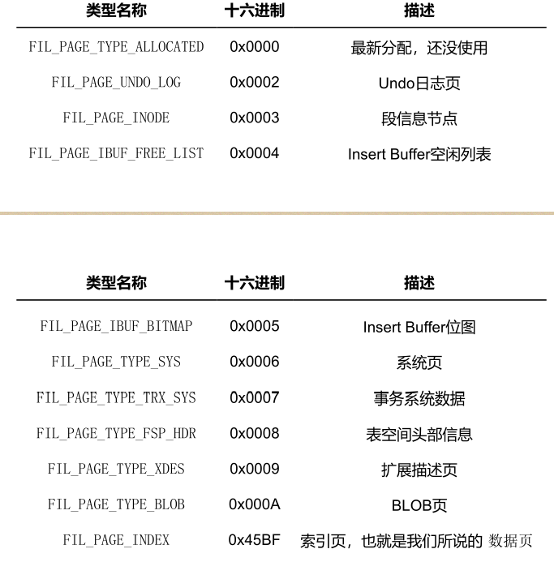

页面类型前边都有个 FIL_PAGE 或者 FIL_PAGE_TYPE 的前缀，为简便起见我们后边唠叨页面类型的时候就把这些前缀省略掉了

### 页面通用部分

数据页，也就是 INDEX 类型的页由7个部分组成，其中的两个部分是所有类型的页面都通用的,任何类型的页面都有下边这种通用的结构：

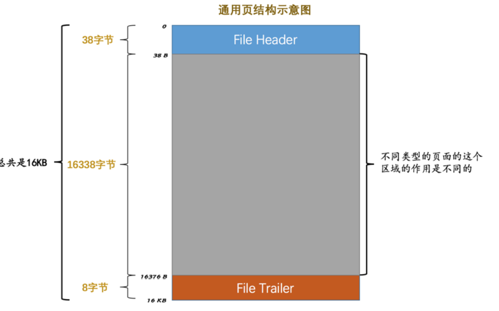

> 任何类型的页都会包含这两个部分：

- File Header ：记录页面的一些通用信息
- File Trailer ：校验页是否完整，保证从内存到磁盘刷新时内容的一致性

> File Header 的各个组成部分：

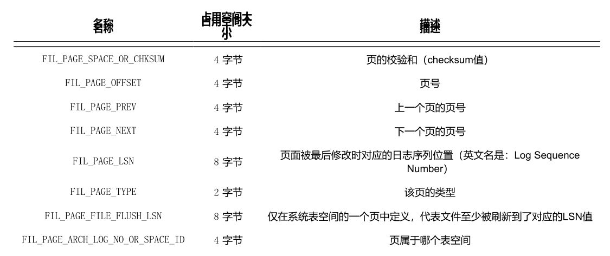


-  FIL_PAGE_OFFSET
  - 表空间中的每一个页都对应着一个页号这个页号由4个字节组成，也就是32个比特位，
  - 所以一个表空间最多可以拥有2³²个页，如果按照页的默认大小16KB来算，一个表空间最多支持64TB的数据。
  - 表空间的第一个页的页号为0，之后的页号分别是1，2，3...依此类推
- FIL_PAGE_PREV 和FIL_PAGE_NEXT 
  - 某些类型的页可以组成双向链表，链表中的页可以不按照物理顺序存储，
  - 而是根据 来存储上一个页和下一个页的页号。
  - 需要注意的是，这两个字段主要是为了 INDEX 类型的页，也就是我们之前一直说的数据页建立 B+ 树后，为每层节点建立双向链表用的，一般类型的页是不使用这两个字段的。
- FIL_PAGE_TYPE 
  - 每个页的类型
  - 比如像数据页的该字段的值就是 0x45BF ，不同类型的页在该字段上的值是不同的。

### 独立表空间结构

#### 区（extent）的概念

- 表空间中的页实在是太多了，为了更好的**管理**这些页面，设计 InnoDB 的大叔们提出了区的概念。
- 对于16KB的页来说，**连续的64个页**就是一个 区 ，也就是说一个区默认占用**1MB**空间大小。
- 不论是系统表空间还是独立表空间，都可以看成是由**若干个区组成**的，每**256个区被划分成一组**


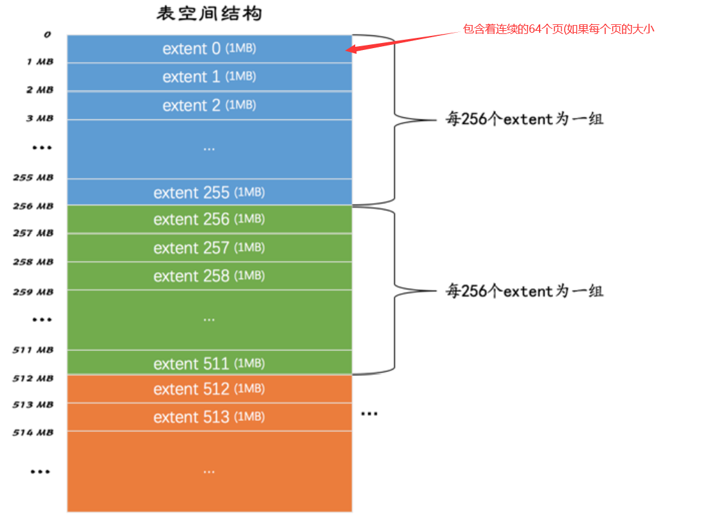

>这些组的头几个页面的类型都是类似的

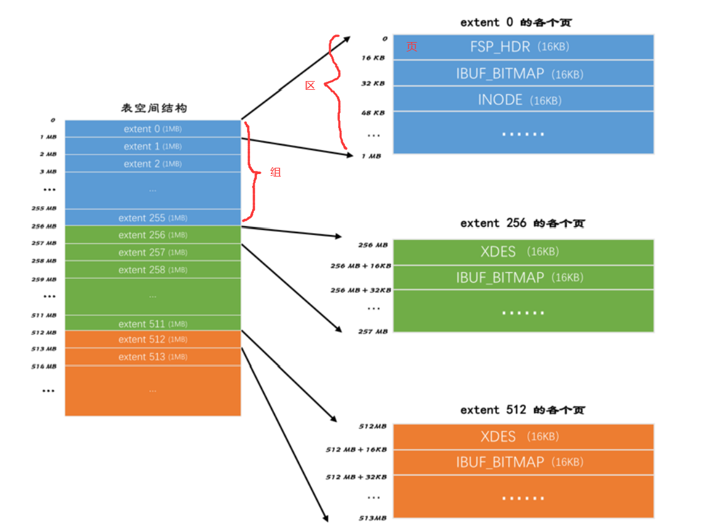


- 第一个组最开始的3个页面的类型是固定的，也就是说 extent 0 这个区最开始的3个页面的类型是固定的，
  - FSP_HDR 类型：
    - 这个类型的页面是用来登记**整个表空间**的一些整体属性
    - 以及**本组所有的区** 也就是extent 0 ~ extent 255 这256个区的属性
    - 需要注意的一点是，整个表空间**只有一个 FSP_HDR** 类型的页面。
  - IBUF_BITMAP 类型：
    - 这个类型的页面是存储本组所有的区的所有页面关于 INSERT BUFFER 的信息。
  - INODE 类型：
    - 这个类型的页面存储了许多称为 INODE 的数据结构，
- 其余各组最开始的2个页面的类型是固定的，也就是说 extent 256 、 extent 512 这些区最开始的2个页面的类型是固定的
  - XDES 类型：
    - 全称是 extent descriptor ，用来登记**本组256个区的属性，**
    - 也就是说对于在 extent 256区中的该类型页面存储的就是 extent 256 ~ extent 511 这些区的属性，
    - 对于在 extent 512 区中的该类型页面存储的就是 extent 512 ~ extent 767 这些区的属性。
    - 上边介绍的 FSP_HDR 类型的页面其实和 XDES 类型的页面的作用类似，只不过 FSP_HDR 类型的页面还会额外存储一些表空间的属性。
  - IBUF_BITMAP 类型


> 区的总结

- 表空间被划分为许多连续的区 ，
- 每个区默认由64个页组成，
- 每256个区划分为一组，
- 每个组的最开始的几个页面类型是固定的就好了


# B+树索引

- 前边我们详细唠叨了 InnoDB 数据页的7个组成部分，知道了各个数据页可以组成一个 双向链表 ，
- 而每个数据页中的记录会按照主键值从小到大的顺序组成一个 单向链表 ，
- 每个数据页都会为存储在它里边儿的记录生成一个页目录 ，
- 在通过主键查找某条记录的时候可以在 页目录 中使用二分法快速定位到对应的槽，
- 然后再遍历该槽对应分组中的记录即可快速找到指定的记录

> 页和记录的关系

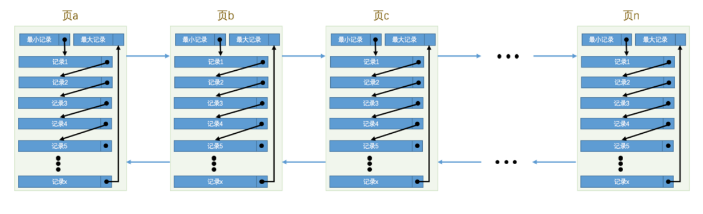

页a、页b、页c ... 页n 这些页可以不在物理结构上相连，只要通过双向链表相关联即可。


## 没有索引的查找

```MySQL
SELECT [列名列表] FROM 表名 WHERE 列名 = xxx;
```

### 在一个页中的查找

> 假设目前表中的记录比较少，所有的记录都可以被存放到一个页中，在查找记录的时候可以根据搜索条件的不同分为两种情况：

1. 以主键为搜索条件
   1. 在 页目录 中使用二分法快速定位到对应的槽，
   2. 然后再遍历该槽对应分组中的记录即可快速找到指定的记录。
2. 以其他列作为搜索条件
   1. 因为在数据页中并没有对非主键列建立所谓的 页目录 ，所以我们无法通过二分法快速定位相应的 槽 。
   2. 这种情况下只能从 最小记录 开始依次遍历单链表中的每条记录，然后对比每条记录是不是符合搜索条件。很显然，这种查找的效率是非常低的。

### 在很多页中查找

1. 定位到记录所在的页。
2. 从所在的页内中查找相应的记录

在没有索引的情况下，不论是根据主键列或者其他列的值进行查找，由于我们并不能快速的定位到记录所在的
页，所以只能从第一个页沿着双向链表一直往下找，在每一个页中根据我们刚刚唠叨过的查找方式去查找指定的
记录。


## 索引

> 建表


 c1 列为主键，使用 Compact 行格式来实际存储记录的

- record_type ：记录头信息的一项属性，表示记录的类型， 
  - 0 表示普通记录、1 表示B+树非叶节点记录、2 表示最小记录、 3 表示最大记录、 
- next_record ：记录头信息的一项属性，表示下一条地址相对于本条记录的地址偏移量，为了方便大家理
  解，我们都会用箭头来表明下一条记录是谁。
- 各个列的值 ：这里只记录在 index_demo 表中的三个列，分别是 c1 、 c2 和 c3 。
- 其他信息 ：除了上述3种信息以外的所有信息，包括其他隐藏列的值以及记录的额外信息


记录竖过来


> 记录放到页里边


### 简单的索引方案

- 我们在根据某个搜索条件查找一些记录时为什么要遍历所有的数据页呢?
  - 因为各个页中的记录并没有规律，我们并不知道我们的搜索条件匹配哪些页中的记录，所以 不得不 依次遍历所有的数据页
- 如果我们想快速的定位到需要查找的记录在哪些数据页中该咋办？
  - 想办法为快速定位记录所在的数据页而建立一个别的目录，建这个目录必须完成下边这些事儿
    - **下一个数据页中用户记录的主键值必须大于上一个页中用户记录的主键值。**

>假设我们的每个数据页最多能存放3条记录

- 插入三条记录

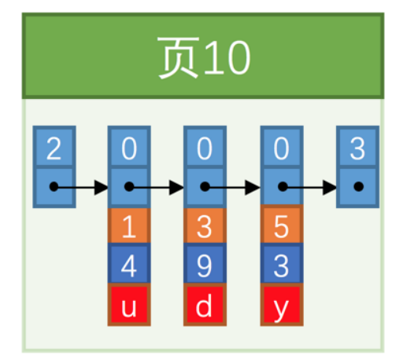

- 再插入一条记录, 因为 页10 最多只能放3条记录，所以我们不得不再分配一个新页：


- 新分配的数据页编号可能并不是连续的，也就是说我们使用的这些页在存储空间里可能并不挨着。它们只是通过维护着上一个页和下一个页的编号而建立了链表关系。
- 另外， 页10 中用户记录最大的主键值是 5 ，而 页28 中有一条记录的主键值是 4 ，因为 5>4 ，所以这就不符合下一个数据页中用户记录的主键值必须大于上一个页中用户记录的主键值的要求，
- 所以在插入主键值为 4 的记录的时候需要伴随着一次记录移动，也就是把主键值为 5 的记录移动到 页28 中，
  然后再把主键值为 4 的记录插入到 页10 中，

> 页分裂的过程

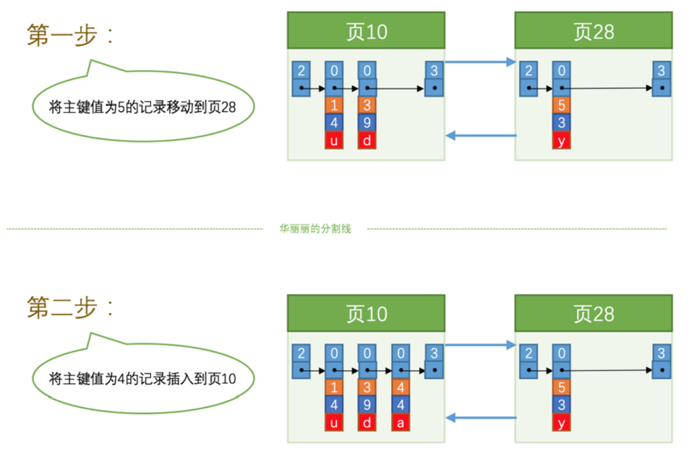

- 这个过程表明了在对页中的记录进行增删改操作的过程中，我们必须通过一些诸如记录移动的操作来始终保
  证这个状态一直成立：
- **下一个数据页中用户记录的主键值必须大于上一个页中用户记录的主键值。**
- 这个过程我们也可以称为 页分裂 

> 数据页的编号可能并不是连续的


> 因为这些 16KB 的页在物理存储上可能并不挨着，所以如果想从这么多页中根据主键值快速定位某些记录所
> 在的页，我们需要给它们做个目录，**每个页对应一个目录项**，每个目录项包括下边两个部分

- 页的用户记录中最小的主键值，我们用 key 来表示。
- 页号，我们用 page_no 表示。


> 针对数据页做的简易目录称为索引

- 以 页28 为例，它对应 目录项2 ，这个目录项中包含着该页的页号 28 以及该页中用户记录的最小主键
  值 5 。
- 我们只需要把几个目录项在物理存储器上连续存储，比如把他们放到一个数组里，就可以实现根
  据主键值快速查找某条记录的功能了。
- 比方说我们想找主键值为 20 的记录，具体查找过程分两步：先从目录项中根据二分法快速确定出主键值为 20 的记录在 目录项3 中（因为 12 < 20 < 209 ），它对应的页是 页9 。
- 再根据前边说的在页中查找记录的方式去 页9 中定位具体的记录。


### InnoDB中的索引方案

我们为了在根据主键值进行查找时使用二分法快速定位具体的目录项而假设所有目录项都可以在物理存储器上连续存储，但是这样做有几个问题:

- InnoDB 是使用页来作为管理存储空间的基本单位，也就是最多能保证 16KB 的连续存储空间，而随着表中记
  录数量的增多，需要非常大的连续的存储空间才能把所有的目录项都放下，这对记录数量非常多的表是不现实的。
- 我们时常会对记录进行增删，假设我们把 页28 中的记录都删除了， 页28 也就没有存在的必要了，那意味
  着 目录项2 也就没有存在的必要了，这就需要把 目录项2 后的目录项都向前移动一下，这种牵一发而动全身
  的设计不是什么好主意～

#### 目录项记录

设计 InnoDB 的大叔们需要一种可以灵活管理所有 目录项 的方式。他们灵光乍现，忽然发现这些 目录项其实长得跟我们的用户记录差不多，只不过 **目录项 中的两个列是 主键 和 页号** 而已，所以他们复用了之前存储用户记录的数据页来存储目录项，为了和用户记录做一下区分，我们把这些用来表示目录项的记录称为 **目录项记录**

那 InnoDB 怎么区分一条记录是普通的 **用户记录** 还是 **目录项记录** 呢？

- 记录头信息里的record_type 属性
  - 0 ：普通的用户记录
  - 1 ：目录项记录
  - 2 ：最小记录
  - 3 ：最大记录

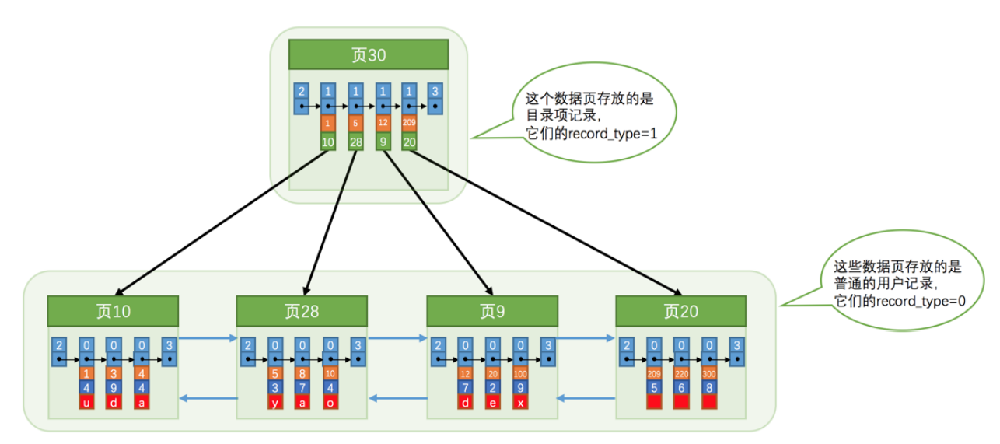

>目录项记录和普通的 用户记录 的不同点：

- 目录项记录 的 record_type 值是1，而普通用户记录的 record_type 值是0。
- 目录项记录 只有主键值和页的编号两个列，而普通的用户记录的列是用户自己定义的，可能包含很多列，另外还有 InnoDB 自己添加的隐藏列。
- 还记得我们之前在唠叨记录头信息的时候说过一个叫 min_rec_mask 的属性么，只有在存储 **目录项记录** 的页
  中的**主键值最小**的 目录项记录 的 min_rec_mask 值为 1 ，其他别的记录的 min_rec_mask 值都是 0 。

它们用的是一样的数据页，页的组成结构也是一样一样的，都会为主键值生成 Page Directory （页目录），从而在按照主键值进行查找时可以使用二分法来加快查询速度

#### 根据主键查找记录的步骤

>以查找主键为 20 的记录为例，根据某个主键值去查找记录的步骤就可以大致拆分成下边两步

1. 先到存储 **目录项记录** 的页，也就是页 30 中通过二分法快速定位到对应**目录项**，因为 12 < 20 < 209 ，所
   以定位到对应的**记录所在的页**就是 页9 。
2. 再到**存储用户记录**的 页9 中根据二分法快速定位到**主键值为 20** 的用户记录。

虽然说 目录项记录 中只存储主键值和对应的页号，比用户记录需要的存储空间小多了，但是不论怎么说一个页
只有 16KB 大小，能存放的 目录项记录 也是有限的，那如果表中的数据太多，以至于一个数据页不足以存放所有
的 **目录项记录** ，该咋办呢？

再多创建一个存储 目录项记录 的页, 为我们假设一个存储 目录项记录 的页最多只能存放4条 目录项记录 （请注意是假设哦，真实情况下可以存放好多条的），所以如果此时我们再向上图中插入一条主键值为 320 的用户记录的话，那就需要分配一个新的存储 **目录项记录**的页

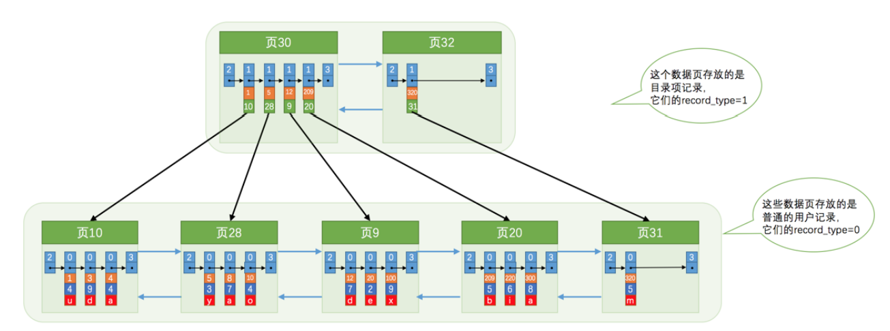

> 现在因为存储 目录项记录 的页不止一个，所以如果我们想根据主键值查找一条用户记录大致需要3个步骤
>
> (以查找主键值为 20 的记录为例：)

1. 确定 目录项记录 页
2. 通过 目录项记录 页确定用户记录真实所在的页。
3. 在真实存储用户记录的页中定位到具体的记录。
  

> 需要定位存储 目录项记录 的页，但是这些页在存储空间中也可能不连续，如果我们表中的数据非常多则会产生很多存储 目录项记录 的页，那我们怎么根据主键值快速定位一个存储 目录项记录 的页呢？

其实也简单，为这些存储 目录项记录 的页再生成一个更高级的目录，就像是一个多级目录一样，大目录里嵌套小目录，小目录里才是实际的数据

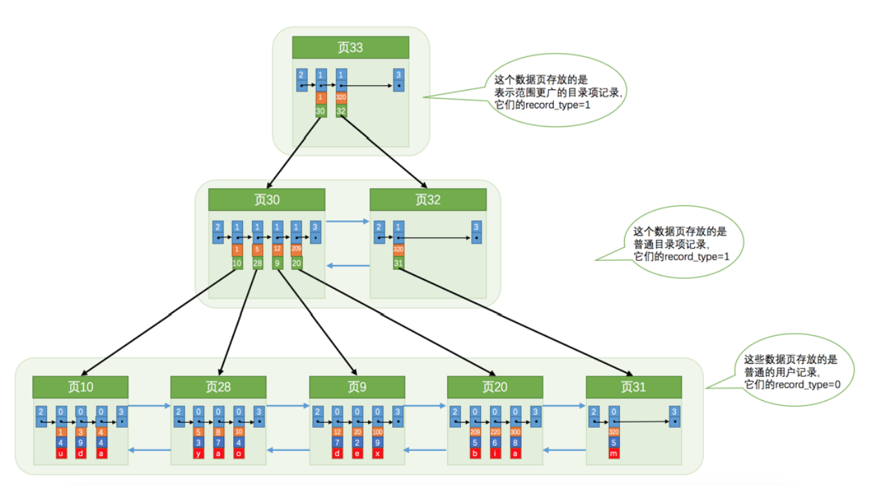

> 随着表中记录的增加，这个目录的层级会继续增加 


####  B+树

- 不论是存放用户记录的数据页，还是存放目录项记录的数据页，我们都把它们存放到 B+ 树这个数据结构中了，所以我们也称这些数据页为 **节点** 。
- 从图中可以看出来，我们的实际用户记录其实都存放在B+树的最底层的节点上，这些节点也被称为 **叶子节点** 或 叶节点 ，
- 其余用来存放 目录项 的节点称为 **非叶子节点** 或者 内节点 ，其中 B+ 树最上边的那个节点也称为 **根节点** 
- 规定最下边的那层，也就是存放我们用户记录的那层为第 0 层
-  B+ 树都不会超过4层
- 通过主键值去查找某条记录最多只需要做4个页面内的查找
  - 查找3个目录项页和一个用户记录页，
  - 又因为在每个页面内有所谓的 Page Directory （页目录），所以在页面内也可以通过二分法实现快速定位记录

#### 聚簇索引

1. 使用记录主键值的大小进行记录和页的排序，这包括三个方面的含义：
   - 页内的记录是按照主键的大小顺序排成一个单向链表。
   - 各个存放用户记录的页也是根据页中用户记录的主键大小顺序排成一个双向链表。
   - 存放目录项记录的页分为不同的层次，在同一层次中的页也是根据页中目录项记录的主键大小顺序排成
     一个双向链表。
2. B+ 树的叶子节点存储的是完整的用户记录。
   - 所谓完整的用户记录，就是指这个记录中存储了所有列的值（包括隐藏列）。

具有这两种特性的 B+ 树称为 **聚簇索引**, InnoDB 存储引擎会自动的为我们创建聚簇索引

InnoDB 存储引擎中， 聚簇索引 就是数据的存储方式（所有的用户记录都存储在了 叶子节点 ），

也就是所谓的**索引即数据，数据即索引**

聚簇索引 只能在搜索条件是主键值时才能发挥作用

#### 二级索引

> 如果我们想以别的列作为搜索条件该咋办呢？

我们可以多建几棵 B+ 树，不同的 B+ 树中的数据采用不同的排序规则。比方说我们用 c2 列的大小作为数据
页、页中记录的排序规则，再建一棵 B+ 树

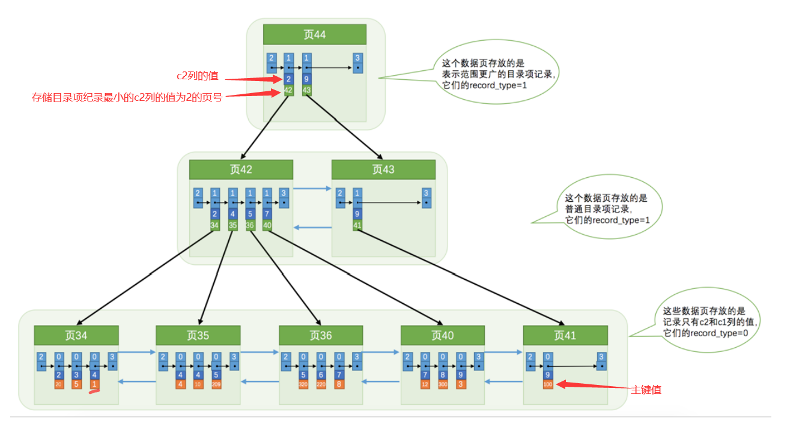

> 与聚簇索引的不同点

- 使用记录 c2 列的大小进行记录和页的排序，这包括三个方面的含义：
  - 页内的记录是按照 c2 列的大小顺序排成一个单向链表。
  - 各个存放用户记录的页也是根据页中记录的 c2 列大小顺序排成一个双向链表。
  - 存放目录项记录的页分为不同的层次，在同一层次中的页也是根据页中目录项记录的 c2 列大小顺序排
    成一个双向链表。
- B+ 树的叶子节点存储的并不是完整的用户记录，而只是 **c2列+主键** 这两个列的值。
- 目录项记录中不再是 **主键+页号** 的搭配，而变成了 **c2列+页号** 的搭配。

>通过 c2 列的值查找某些记录 (以查找 c2 列的值为 4 的记录为例)

1. 确定 目录项记录 页
   - 根据 根页面 ，也就是 页44 ，可以快速定位到 目录项记录 所在的页为 页42 （因为 2 < 4 < 9 ）。

2. 通过 目录项记录 页确定用户记录真实所在的页。
- 在 页42 中可以快速定位到实际存储用户记录的页，但是由于 c2 列并没有唯一性约束，所以 c2 列值为 4 的记录可能分布在多个数据页中，又因为 2 < 4 ≤ 4 ，所以确定实际存储用户记录的页在 页34 和 页35 中。
3. 在真实存储用户记录的页中定位到具体的记录。
  - 到 页34 和 页35 中定位到具体的记录。
4. 但是这个 B+ 树的叶子节点中的记录只存储了 c2 和 c1 （也就是 主键 ）两个列，所以**我们必须再根据主键**
  **值去聚簇索引中再查找一遍完整的用户记录。**

##### 回表

我们根据这个以 c2 列大小排序的 B+ 树只能确定我们要查找记录的主键值，所以如果我们想根据 c2 列的值查找到完整的用户记录的话，仍然需要到 聚簇索引 中再查一遍，这个过程也被称为 **回表** 。

也就是根据 c2 列的值查询一条完整的用户记录需要使用到 2 棵 B+ 树！

> 为什么要回表? 直接把完整的用户记录放到 叶子节点 不就好了么？

- 太占空间, 相当于每建立一棵 B+ 树都需要把所有的用户记录再都拷贝一遍。
- 因为这种按照 非主键列 建立的 B+ 树需要一次 **回表** 操作才可以定位到完整的用户记录，所以这种 B+ 树也被称为 **二级索引** 

- 由于我们使用的是 c2 列的大小作为 B+ 树的排序规则，所以我们也称这个 B+ 树为**为c2列建立的索引**。


#### 联合索引

可以同时以多个列的大小作为排序规则，也就是同时为多个列建立索引

>比方说我们想让 B+ 树按照 c2和 c3 列的大小进行排序

1. 先把各个记录和页按照 c2 列进行排序。
2. 在记录的 c2 列相同的情况下，采用 c3 列进行排序


- 每条 目录项记录 都由 c2 、 c3 、 页号 这三个部分组成，各条记录先按照 c2 列的值进行排序，如果记录的 c2 列相同，则按照 c3 列的值进行排序。
- B+ 树叶子节点处的用户记录由 c2 、 c3 和主键 c1 列组成。

以c2和c3列的大小为排序规则建立的B+树称为联合索引，本质上也是一个二级索引。它的意思与分别为c2和c3列分别建立索引的表述是不同的

1. 建立 联合索引 只会建立如上图一样的1棵 B+ 树。
2. 为c2和c3列分别建立索引会分别以 c2 和 c3 列的大小为排序规则建立2棵 B+ 树

### InnoDB的B+树索引的注意事项

#### 根页面万年不动窝

> B+ 树的形成过程

- 每当为某个表创建一个 B+ 树索引（聚簇索引不是人为创建的，默认就有）的时候，都会为这个索引创建一
  个 根节点 页面。
  - 最开始表中没有数据的时候，每个 B+ 树索引对应的 根节点 中既没有用户记录，也没有目录项记录。
- 随后向表中插入用户记录时，先把用户记录存储到这个 根节点 中。
- 当 根节点 中的可用空间用完时继续插入记录，
  - 此时会将 根节点 中的所有记录复制到一个新分配的页，比如 页a 中，
  - 然后对这个新页进行 页分裂 的操作，得到另一个新页，比如 页b 。
  - 这时新插入的记录根据键值（也就是聚簇索引中的主键值，二级索引中对应的索引列的值）的大小就会被分配到 页a 或者 页b 中，而根节点 便升级为存储目录项记录的页

一个B+树索引的**根节点**自诞生之日起，便**不会再移动**。这样只要我们对某个表建立一个索引，那么它的 根节点 的页号便会被记录到某个地方，然后凡是 InnoDB 存储引擎需要用到这个索引的时候，都会从那个**固定的地方**取出 根节点 的页号，从而来访问这个索引。

#### 内节点中目录项记录的唯一性

 B+ 树索引的内节点中目录项记录的内容是 索引列 + 页号 的搭配

> 目录项记录中没有加入主键


如果我们想插入一条c2列为1的记录, 不知道该插入到哪个页中

> 二级索引的内结点的目录项记录的构成

为了让新插入记录能找到自己在那个页里，我们需要保证在B+树的同一层内节点的目录项记录除 页号 这个字段
以外是唯一的。所以对于二级索引的内节点的目录项记录的内容实际上是由三个部分构成的：

- 索引列的值
- 主键值
- 页号

我们把 主键值 也添加到二级索引内节点中的目录项记录了，这样就能保证 B+ 树每一层节点中各条目录项记录除 页号 这个字段外是唯一的

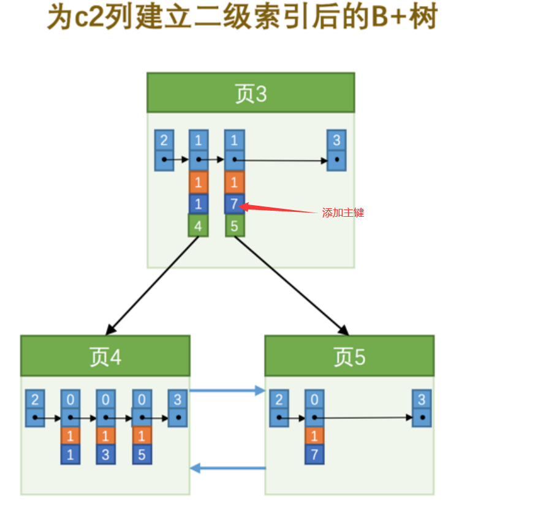

可以先把新记录的 c2 列的值和 页3 中各目录项记录的 c2 列的值作比较，

如果 c2 列的值相同的话，可以接着比较主键值，

因为 B+ 树同一层中不同目录项记录的 c2列 + 主键 的值肯定是不一样的，所以最后肯定能定位唯一的
一条目录项记录

#### 一个页面最少存储2条记录

我们前边说过一个B+树只需要很少的层级就可以轻松存储数亿条记录，查询速度杠杠的！

这是因为B+树本质上就是一个大的多层级目录，每经过一个目录时都会过滤掉许多无效的子目录，直到最后访问到存储真实数据的目录。

那如果一个大的目录中只存放一个子目录是个啥效果呢？那就是目录层级非常非常非常多，而且最后的那个
存放真实数据的目录中只能存放一条记录。费了半天劲只能存放一条真实的用户记录？逗我呢？

所以 InnoDB 的一个数据页至少可以存放两条记录


### MyISAM中的索引方案

 InnoDB 中索引即数据，也就是聚簇索引的那棵 B+ 树的叶子节点中已经把所有完整的用户记录都包含了，

而 MyISAM 的索引方案虽然也使用树形结构，但是却将索引和数据分开存储

- 将表中的记录按照记录的插入顺序单独存储在一个文件中，称之为 **数据文件** 。
- 这个文件并不划分为若干个数据页，有多少记录就往这个文件中塞多少记录就成了。
- 我们可以通过**行号**而快速访问到一条记录。
- MyISAM 记录也需要记录头信息来存储一些额外数据


由于在插入数据的时候并没有刻意按照主键大小排序，所以我们并不能在这些数据上使用二分法进行查找

- 使用 MyISAM 存储引擎的表会把索引信息另外存储到一个称为 **索引文件** 的另一个文件中。 MyISAM 会单独为
  表的**主键创建一个索引**，只不过在索引的叶子节点中存储的不是完整的用户记录，而是 **主键值 + 行号** 的组合。也就是先通过索引找到对应的行号，再通过行号去找对应的记录！

这一点和 InnoDB 是完全不相同的，在 InnoDB 存储引擎中，我们只需要根据主键值对 聚簇索引 进行一次查
找就能找到对应的记录，而在 MyISAM 中却需要进行一次 **回表** 操作，意味着 MyISAM 中建立的索引相当于全
部都是 **二级索引** ！

- 如果有需要的话，我们也可以对其它的列分别建立索引或者建立联合索引，原理和 InnoDB 中的索引差不
  多，不过在叶子节点处存储的是 **相应的列 + 行号** 。这些索引也全部都是 **二级索引**

MyISAM的行格式有定长记录格式（Static）、变长记录格式（Dynamic）、压缩记录格式（Compres
sed）。上边用到的表采用定长记录格式，也就是一条记录占用存储空间的大小是固定的，这样就可以轻松算出某条记录在数据文件中的**地址偏移量**。但是**变长记录格式就不行了**，MyISAM会直接在索引**叶子节点**处存储该条记录在数据文件中的**地址偏移量**。通过这个可以看出，MyISAM的**回表**操作是**十分快速**的，因为是拿着地址偏移量直接到文件中取数据的，反观InnoDB是通过获取主键之后再去聚簇索引里边儿找记录，虽然说也不慢，但还是比不上直接用地址去访问

InnoDB中的索引即数据，数据即索引，而MyISAM中却是索引是索引、数据是数据


### InnoDB存储引擎的B+树索引性质

1. 每个索引都对应一棵 B+ 树， B+ 树分为好多层，最下边一层是叶子节点，其余的是内节点。所有 用户记录
   都存储在 B+ 树的叶子节点，所有 目录项记录 都存储在内节点。
2. InnoDB 存储引擎会自动为主键（如果没有它会自动帮我们添加）建立 聚簇索引 ，聚簇索引的叶子节点包含
   完整的用户记录。
3. 我们可以为自己感兴趣的列建立 二级索引 ， 二级索引 的叶子节点包含的用户记录由 索引列 + 主键 组
   成，所以如果想通过 二级索引 来查找完整的用户记录的话，需要通过 回表 操作，也就是在通过 二级索引
   找到主键值之后再到 聚簇索引 中查找完整的用户记录。
4. B+ 树中每层节点都是按照索引列值从小到大的顺序排序而组成了双向链表，
5. 每个页内的记录（不论是用户记录还是目录项记录）都是按照索引列的值从小到大的顺序而形成了一个单链表。
6. 如果是 联合索引 的话，则页面和记录先按照 联合索引 前边的列排序，如果该列值相同，再按照 联合索引 后边的列排序。
7. 通过索引查找记录是从 B+ 树的根节点开始，一层一层向下搜索。由于每个页面都按照索引列的值建立了
   Page Directory （页目录），所以在这些页面中的查找非常快。

### 索引的代价

- 空间上的代价
  - 每建立一个索引都要为它建立一棵 B+ 树，每一棵 B+ 树的每一个节点都是一个数据页，
    一个页默认会占用 16KB 的存储空间，一棵很大的 B+ 树由许多数据页组成，占用很大的存储空间。
- 时间上的代价
  - 每次对表中的数据进行增、删、改操作时，都需要去修改各个 B+ 树索引。
  - B+ 树**每层**节点都是按照索引列的值从小到大的顺序排序而组成了**双向链表**。不论是叶子节点中的记录，还是内节点中的记录（也就是不论是用户记录还是目录项记录）都是按照索引列的值从小到大的顺序而形成了一个**单向链表**。
  - 而增、删、改操作可能会对节点和记录的排序造成破坏，所以存储引擎需要额外的时间进行一些记录**移位**，**页面分裂**、**页面回收**等操作来维护好节点和记录的排序。
  - 如果我们建了许多索引，每个索引对应的 B+ 树都要进行相关的维护操作，会降低性能

### B+树索引适用的条件

> 建表

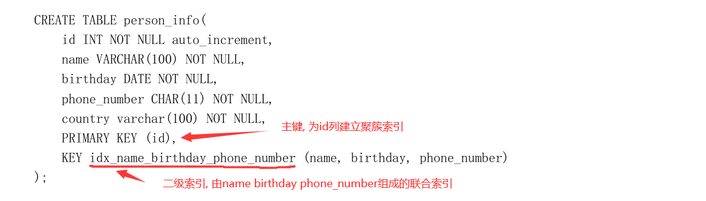

- 表中的主键是 id 列，它存储一个自动递增的整数。所以 InnoDB 存储引擎会自动为 id 列建立**聚簇索引**。

- 我们额外定义了一个**二级索引** idx_name_birthday_phone_number ，它是由3个列组成的联合索引。所以这
  个索引对应的 B+ 树的叶子节点处存储的用户记录只保留 name 、 birthday 、 phone_number 这三个列的值
  以及主键 id 的值，并不会保存 country 列的值
- 一个表中有多少索引就会建立多少棵 B+ 树， person_info 表会为聚簇索引和 idx_name_birthday_phone_number 索引建立2棵 B+ 树

>idx_name_birthday_phone_number 索引

内节点中存储的是 目录项记录 ，叶子节点中存储的是 用户记录 （由于不是聚簇索引，所以用户记录是不完整的，缺少 country 列的值）


idx_name_birthday_phone_number 索引的排序方式

- 先按照 name 列的值进行排序。
- 如果 name 列的值相同，则按照 birthday 列的值进行排序。
- 如果 birthday 列的值也相同，则按照 phone_number 的值进行排序

这个排序方式非常重要，因为只要页面和记录是排好序的，我们就可以通过二分法来快速定位查找。


#### 全值匹配

> 如果我们的搜索条件中的列和索引列一致的话，这种情况就称为全值匹配

```mysql
SELECT * FROM person_info WHERE name = 'Ashburn' AND birthday = '1990-09-27' AND phone_number = '15123983239';
```

- 通过 idx_name_birthday_phone_number 索引查询的过程
  - 因为 B+ 树的数据页和记录先是按照 name 列的值进行排序的，所以先可以很快定位 name 列的值是 Ashburn的记录位置。
  - 在 name 列相同的记录里又是按照 birthday 列的值进行排序的，所以在 name 列的值是 Ashburn 的记录里又可以快速定位 birthday 列的值是 '1990-09-27' 的记录。
  - 如果很不幸， name 和 birthday 列的值都是相同的，那记录是按照 phone_number 列的值排序的，所以联合索引中的三个列都可能被用到。


> WHERE 子句中的几个搜索条件的顺序对查询结果有啥影响么？
>
> 如果我们调换name 、 birthday 、 phone_number 这几个搜索列的顺序对查询的执行过程有影响么

```mysql
SELECT * FROM person_info WHERE birthday = '1990-09-27' AND phone_number = '15123983239' AND name = 'Ashburn';
```

答案是：没影响哈。 MySQL 有查询优化器，会分析这些搜索条件并且按照可以使用的索引中列的顺序来决定先使用哪个搜索条件，后使用哪个搜索条件


#### 匹配左边的列

> 搜索语句中也可以不用包含全部联合索引中的列，只包含左边的就行

```mysql
SELECT * FROM person_info WHERE name = 'Ashburn';
```

>或者包含多个左边的列

```mysql
SELECT * FROM person_info WHERE name = 'Ashburn' AND birthday = '1990-09-27';
```

>那为什么搜索条件中必须出现左边的列才可以使用到这个 B+ 树索引呢？
>
>比如下边的语句就用不到这个 B+ 树索引么？

```mysql
SELECT * FROM person_info WHERE birthday = '1990-09-27';
```

- 因为 B+ 树的数据页和记录先是按照 name 列的值排序的，在 name 列的值相同的情况下才使用 birthday 列进行排序，
- 也就是说 name 列的值不同的记录中 birthday 的值可能是无序的。而现在你跳过name 列直接根据 birthday 的值去查找，
- 那如果我就想在只使用 birthday 的值去通过 B+ 树索引进行查找咋办呢？需要再对 birthday 列建一个 B+ 树索引就行了

>如果我们想使用联合索引中尽可能多的列，搜索条件中的各个列必须是联合索引中从最左边连续的列

- 比方说联合索引 idx_name_birthday_phone_number 中列的定义顺序是 name 、birthday 、 phone_number ，

  - 如果我们的搜索条件中只有 name 和 phone_number ，而没有中间的 birthday 

  - ```mysql
    SELECT * FROM person_info WHERE name = 'Ashburn' AND phone_number = '15123983239';
    ```

- 这样只能用到 name 列的索引， birthday 和 phone_number 的索引就用不上了，因为 name 值相同的记录先按照birthday 的值进行排序， birthday 值相同的记录才按照 phone_number 值进行排序


#### 匹配列前缀

我们前边说过为某个列建立索引的意思其实就是在对应的 B+ 树的记录中使用该列的值进行排序

两个字符串的大小的过程:

- 先比较字符串的第一个字符，第一个字符小的那个字符串就比较小。
- 如果两个字符串的第一个字符相同，那就再比较第二个字符，第二个字符比较小的那个字符串就比较小。
- 如果两个字符串的第二个字符也相同，那就接着比较第三个字符，依此类推。

一个排好序的字符串列其实有这样的特点：

- 先按照字符串的第一个字符进行排序。
- 如果第一个字符相同再按照第二个字符进行排序。
- 如果第二个字符相同再按照第三个字符进行排序，依此类推。

>也就是说这些字符串的前n个字符，也就是前缀都是排好序的，所以对于字符串类型的索引列来说，我们只匹配它的前缀也是可以快速定位记录

比方说我们想查询名字以 'As' 开头的记录:

```mysql
SELECT * FROM person_info WHERE name LIKE 'As%';
```

如果只给出后缀或者中间的某个字符串, MySQL 就无法快速定位记录位置了，因为字符串中间有 'As' 的字符串并没有排好序，所以只能全表扫描了

```mysql
SELECT * FROM person_info WHERE name LIKE '%As%';
```

有时候我们有一些匹配某些字符串后缀的需求, 比方说某个表有一个 url 列，该列中存储了许多url,

假设已经对该 url 列创建了索引，如果我们想查询以 com 为后缀的网址的话, 

我们可以把后缀查询改写成前缀查询，不过我们就得把表中的数据全部逆序存储一下，也就是说我们可以这样保存 url列中的数据


#### 匹配范围值

##### 索引最左边列的返回匹配

> 所有记录都是按照索引列的值从小到大的顺序排好序的，所以这极大的方便我们查找索引列的值在某个范围内的记录

```mysql
SELECT * FROM person_info WHERE name > 'Asa' AND name < 'Barlow';
```

由于 B+ 树中的数据页和记录是先按 name 列排序的，所以我们上边的查询过程其实是这样的

- 找到 name 值为 Asa 的记录。
- 找到 name 值为 Barlow 的记录。
- 由于所有记录都是由链表连起来的（记录之间用单链表，数据页之间用双链表），所以他们之间的记录都可以很容易的取出来喽～
- 找到这些记录的主键值，再到 聚簇索引 中 回表 查找完整的记录


##### 包括索引最左列在内的多个列范围查询

>在使用联合进行范围查找的时候需要注意，如果对**多个列同时进行范围查找**的话，只有对索引**最左边**的那个
>列进行范围查找的时候才能用到 B+ 树索引，

```mysql
SELECT * FROM person_info WHERE name > 'Asa' AND name < 'Barlow' AND birthday > '1980-01-01'
```

查询过程

1. 通过条件 name > 'Asa' AND name < 'Barlow' 来对 name 进行范围，查找的结果可能有多条 name 值不同的记录，
2. 对这些 name 值不同的记录继续通过 birthday > '1980-01-01' 条件继续过滤。

这样子对于联合索引 idx_name_birthday_phone_number 来说，只能用到 name 列的部分，而用不到 birthday 列的部分，因为只有 name 值相同的情况下才能用 birthday 列的值进行排序，而这个查询中通过 name 进行范围查找的记录中按name排序的结果中birthday的列并不是一定排好序的，所以在搜索条件中继续以 birthday 列进行查找时是用不到这个 B+ 树索引的


#### 精确匹配某一列并范围匹配另外一列

>对于同一个联合索引来说，虽然对多个列都进行范围查找时只能用到最左边那个索引列，但是如果左边的列是精确查找，则右边的列可以进行范围查找

```mysql
SELECT * FROM person_info WHERE name = 'Ashburn' 
								AND birthday > '1980-01-01' 
								AND birthday< '2000-12-31' 
								AND phone_number > '15100000000';
```


查询的条件可以分为3个部分：

1. name = 'Ashburn' ，对 name 列进行精确查找，使用 B+ 树索引了。
2. birthday > '1980-01-01' AND birthday < '2000-12-31' ，由于 name 列是精确查找，所以通过 name =
  'Ashburn' 条件查找后得到的结果的 name 值都是相同的，它们会再按照 birthday 的值进行排序。所以此时
  对 birthday 列进行范围查找是可以用到 B+ 树索引的。
3. phone_number > '15100000000' ，通过 birthday 的范围查找的记录的 birthday 的值可能不同，所以这个
  条件无法再利用 B+ 树索引了，只能遍历上一步查询得到的记录。

下边的查询也是可能用到这个 idx_name_birthday_phone_number 联合索引的

```mysql
SELECT * FROM person_info WHERE name = 'Ashburn' 
								AND birthday = '1980-01-01' 
								AND phone_number > '15100000000';
```


#### 用于排序

> 写查询语句的时候经常需要对查询出来的记录通过 ORDER BY 子句按照某种规则进行排序。

##### **文件排序**

- 记录都加载到内存中，再用一些排序算法，比如快速排序、归并排序、等等在内存中对这些记录进行排序，
- 有的时候可能查询的结果集太大以至于不能在内存中进行排序的话，还可能暂时借助磁盘的空间来存放中间结果，排序操作完成后再把排好序的结果集返回到客户端
- 这种在内存中或者磁盘上进行排序的方式统称为**文件排序**


##### 使用联合索引进行排序

> 如果 ORDER BY 子句里使用到了我们的索引列，就有可能省去在内存或文件中排序的步骤

```mysql
SELECT * FROM person_info ORDER BY name, birthday, phone_number LIMIT 10;
```

- 这个查询的结果集需要先按照 name 值排序，如果记录的 name 值相同，则需要按照 birthday 来排序，如果
  birthday 的值相同，则需要按照 phone_number 排序。
- 大家可以回过头去看我们建立的idx_name_birthday_phone_number 索引的示意图，因为这个 B+ 树索引本身就是按照上述规则排好序的，所以直接从索引中提取数据，然后进行 回表 操作取出该索引中不包含的列就好了

> ORDER BY 的子句后边的列的顺序也必须按照索引列的顺序给出

- 对于 联合索引 有个问题需要注意， ORDER BY 的子句后边的列的顺序也必须按照索引列的顺序给出，如果给出ORDER BY phone_number, birthday, name 的顺序，那也是用不了 B+ 树索引

- 同理， ORDER BY name 、 ORDER BY name, birthday 这种匹配索引左边的列的形式可以使用部分的 B+ 树索引。当联合索引左边列的值为常量，也可以使用后边的列进行排序

```mysql
SELECT * FROM person_info WHERE name = 'A' ORDER BY birthday, phone_number LIMIT 10;
```

- 这个查询能使用联合索引进行排序是因为 name 列的值相同的记录是按照 birthday , phone_number 排序的


##### 不可以使用索引进行排序的几种情况

###### ASC、DESC混用

>对于使用联合索引进行排序的场景，我们要求各个排序列的排序顺序是一致的，也就是要么各个列都是 ASC 规则排序，要么都是 DESC 规则排序。
>
>(ORDER BY子句后的列如果不加ASC或者DESC默认是按照ASC排序规则排序的，也就是升序排序的。)


- 如果查询中的各个排序列的排序顺序是一致的，比方说下边这两种情况：
  - ORDER BY name, birthday LIMIT 10
    这种情况直接从索引的最左边开始往右读10行记录就可以了。
  - ORDER BY name DESC, birthday DESC LIMIT 10 ，
    这种情况直接从索引的最右边开始往左读10行记录就可以了。
- 但是如果我们查询的需求是先按照 name 列进行升序排列，再按照 birthday 列进行降序排列

```mysql
SELECT * FROM person_info ORDER BY name, birthday DESC LIMIT 10;
```

这样如果使用索引排序的话过程就是这样的：

- 先从索引的最左边确定 name 列最小的值，然后找到 name 列等于该值的所有记录，然后从 name 列等于该值的最右边的那条记录开始往左找10条记录。
- 如果 name 列等于最小的值的记录不足10条，再继续往右找 name 值第二小的记录，重复上边那个过程，直
  到找到10条记录为止。

这样不能高效使用索引, 不如直接文件排序来的快，所以就规定使用联合索引的各个排序列的排序顺序必须是一致的。


###### WHERE子句中出现非排序使用到的索引列

- 如果WHERE子句中出现了非排序使用到的索引列，那么排序依然是使用不到索引的，比方说这样：

  - ```mysql
    SELECT * FROM person_info WHERE country = 'China' ORDER BY name LIMIT 10;
    ```

  - 这个查询只能先把符合搜索条件 country = 'China' 的记录提取出来后再进行排序，是使用不到索引。

- 虽然这个查询也有搜索条件，但是 name = 'A' 可以使用到索引 idx_name_birthday_phone_number ，而且过滤剩下的记录还是按照 birthday 、 phone_number 列排序的，所以还是可以使用索引进行排序的。

  - ```mysql
    SELECT * FROM person_info WHERE name = 'A' ORDER BY birthday, phone_number LIMIT 10;
    ```

###### 排序列包含非同一个索引的列

有时候用来排序的多个列不是一个索引里的，这种情况也不能使用索引进行排序

```mysql
SELECT * FROM person_info ORDER BY name, country LIMIT 10;
```

name 和 country 并不属于一个联合索引中的列，所以无法使用索引进行排序


###### 排序列使用了复杂的表达式

要想使用索引进行排序操作，必须保证索引列是以单独列的形式出现，而不是修饰过的形式

```mysql
SELECT * FROM person_info ORDER BY UPPER(name) LIMIT 10;
```

使用了 UPPER 函数修饰过的列就不是单独的列啦，这样就无法使用索引进行排序啦。


#### 用于分组

有时候我们为了方便统计表中的一些信息，会把表中的记录按照某些列进行分组

分组列的顺序也需要和索引列的顺序一致，也可以只使用索引列中左边的列进行分组

```mysql
SELECT name, birthday, phone_number, COUNT(*) FROM person_info GROUP BY name,birthday, phone_number
```

这个查询语句相当于做了3次分组操作：

1. 先把记录按照 name 值进行分组，所有 name 值相同的记录划分为一组。
2. 将每个 name 值相同的分组里的记录再按照 birthday 的值进行分组，将 birthday 值相同的记录放到一个小
  分组里，所以看起来就像在一个大分组里又化分了好多小分组。
3. 再将上一步中产生的小分组按照 phone_number 的值分成更小的分组，所以整体上看起来就像是先把记录分
  成一个大分组，然后把 大分组 分成若干个 小分组 ，然后把若干个 小分组 再细分成更多的 小小分组 。


### 回表的代价

#### 顺序I/O 与 随机I/O

```mysql
SELECT * FROM person_info WHERE name > 'Asa' AND name < 'Barlow';
```

> 使用 idx_name_birthday_phone_number 索引进行查询时大致可以分为这两个步骤：

1. 从索引 idx_name_birthday_phone_number 对应的 B+ 树中取出 name 值在 Asa ～ Barlow 之间的用户录。
2. 由于索引 idx_name_birthday_phone_number 对应的 B+ 树用户记录中只包含 name 、 birthday 、
  phone_number 、 id 这4个字段，而查询列表是 * ，意味着要查询表中所有字段，也就是还要包括 country
  字段。这时需要把从上一步中获取到的每一条记录的 id 字段都到**聚簇索引对应的 B+ 树**中找到**完整的用户记**
  **录**，也就是我们通常所说的 **回表** ，然后把完整的用户记录返回给查询用户。

- 顺序 I/O
  - 由于索引 idx_name_birthday_phone_number 对应的 B+ 树中的记录首先会按照 name 列的值进行排序，所以值在 Asa ～ Barlow 之间的记录在磁盘中的存储是相连的，集中分布在一个或几个数据页中，我们可以很快的把这些连着的记录从磁盘中读出来
- 随机 I/O
  - 根据第1步中获取到的记录的 id 字段的值可能并不相连，而在聚簇索引中记录是根据 id （也就是主键）的顺序排列的，所以根据这些并不连续的 id值到聚簇索引中访问完整的用户记录可能分布在不同的数据页中，这样读取完整的用户记录可能要访问更多的数据页，
- 一般情况下，顺序I/O比随机I/O的性能高很多，所以步骤1的执行可能很快，而步骤2就慢一些

> 使用索引 idx_name_birthday_phone_number 的查询有这么两个特点:

1. 会使用到两个 B+ 树索引，一个二级索引，一个聚簇索引。
2. 访问二级索引使用 顺序I/O ，访问聚簇索引使用 随机I/O 

需要回表的记录越多，使用二级索引的性能就越低，甚至让某些查询宁愿使用全表扫描也不使用 二级索引 。

比方说 name 值在 Asa ～ Barlow 之间的用户记录数量占全部记录数量90%以上，那么如果使用
idx_name_birthday_phone_number 索引的话，有90%多的 id 值需要回表，这不是吃力不讨好么，还不如直接去扫描聚簇索引（也就是全表扫描）。

#### 什么时候采用全表扫描的方式，什么时候使用采用 二级索引 + 回表 的方式去执行查询呢？

##### 查询优化器

- 查询优化器会事先对表中的记录计算一些统计数据，
- 然后再利用这些统计数据根据查询的条件来计算一下**需要回表的记录数**，
- 需要回表的记录数越多，就越倾向于使用全表扫描，
- 反之倾向于使用 二级索引 + 回表 的方式

```mysql
SELECT * FROM person_info WHERE name > 'Asa' AND name < 'Barlow' LIMIT 10;
```

添加了 LIMIT 10 的查询更容易让优化器采用 二级索引 + 回表 的方式进行查询。

```mysql
SELECT * FROM person_info ORDER BY name, birthday, phone_number;
```

由于查询列表是 * ，所以如果使用二级索引进行排序的话，需要把排序完的二级索引记录全部进行回表操作，这
样操作的成本还不如直接遍历聚簇索引然后再进行文件排序（ filesort ）低，所以优化器会倾向于使用 全表扫
描 的方式执行查询

```mysql
SELECT * FROM person_info ORDER BY name, birthday, phone_number LIMIT 10;
```

加了 LIMIT 子句,这样需要回表的记录特别少，优化器就会倾向于使用 二级索引 + 回表 的方式执行查询。


#### 覆盖索引

>为了彻底告别 回表 操作带来的性能损耗，我们建议：最好在**查询列表里只包含索引列**

```mysql
SELECT name, birthday, phone_number FROM person_info WHERE name > 'Asa' AND name < 'Barlow'
```

- 因为我们只查询 name , birthday , phone_number 这三个索引列的值，所以在通过idx_name_birthday_phone_number 索引得到结果后就不必到 聚簇索引 中再查找记录的剩余列，也就是
  country 列的值了
- 这样就省去了 回表 操作带来的性能损耗。我们把这种只需要用到索引的查询方式称为 索引覆盖 。排序操作也优先使用 覆盖索引 的方式进行查询

```mysql
SELECT name, birthday, phone_number FROM person_info ORDER BY name, birthday, phone_number;
```

虽然这个查询中没有 LIMIT 子句，但是采用了 覆盖索引 ，所以查询优化器就会直接使用idx_name_birthday_phone_number 索引进行排序而不需要回表操作了。

当然，如果业务需要查询出索引以外的列，那还是以保证业务需求为重。但是我们很**不鼓励用 * 号作为查询列**
**表**，最好把我们需要查询的列依次标明。


### 如何挑选索引

#### 只为用于搜索、排序或分组的列创建索引

> 也就是说，只为出现在 WHERE 子句中的列、连接子句中的连接列，或者出现在 ORDER BY 或 GROUP BY 子句中的列创建索引。而出现在查询列表中的列就没必要建立索引了：

```mysql
SELECT birthday, country FROM person name WHERE name = 'Ashburn';
```

 birthday 、 country 这两个列就不需要建立索引，我们只需要为出现在 WHERE 子句中的 name列创建索引就可以了。

#### 考虑列的基数

> 最好为那些列的基数大的列建立索引，为基数太小列的建立索引效果可能不好

- 列的基数 指的是某一列中不重复数据的个数，

- 在记录行数一定的情况下，列的基数越大，该列中的值越分散，列的基数越小，该列中的值越集中
- 假设某个列的基数为 1 ，也就是所有记录在该列中的值都一样，那为该列建立索引是没有用的，因为所有值都一样就无法排序，无法进行快速查找了～ 
- 而且如果某个建立了二级索引的列的重复值特别多，那么使用这个二级索引查出的记录还可能要做**回表**操作，这样性能损耗就更大了。

#### 索引列的类型尽量小

 类型大小 指的就是该类型表示的数据范围的大小。

如果我们想要对某个整数列建立索引的话，在表示的整数范围允许的情况下，尽量让索引列使用较小的类型

- 数据类型越小，在查询时进行的比较操作越快（这是CPU层次的东东）
- 数据类型越小，索引占用的存储空间就越少，在一个数据页内就可以放下更多的记录，从而减少磁盘 I/O 带
  来的性能损耗，也就意味着可以把更多的数据页缓存在内存中，从而加快读写效率

这个建议对于表的主键来说更加适用，因为不仅是聚簇索引中会存储主键值，其他所有的二级索引的节点处都会
存储一份记录的主键值，如果主键适用更小的数据类型，也就意味着节省更多的存储空间和更高效的 I/O 。


#### 索引字符串值的前缀

假设我们的字符串很长，那存储一个字符串就需要占用很大的存储空间。在我们需要为这个字符串列建立索引时，那就意味着在对应的 B+ 树中有这么两个问题

- B+ 树索引中的记录需要把该列的完整字符串存储起来，而且字符串越长，在索引中占用的存储空间越大。
- 如果 B+ 树索引中索引列存储的字符串很长，那在做字符串比较时会占用更多的时间

我们前边儿说过索引列的字符串前缀其实也是排好序的，所以索引的设计者提出了个方案 --- 

- 只对字符串的前几个字符进行索引也就是说在二级索引的记录中只保留字符串前几个字符。
- 这样在查找记录时虽然不能精确的定位到记录的位置，但是能定位到相应前缀所在的位置，
- 然后根据前缀相同的记录的主键值**回表查询完整的字符串值**，再对比就好了。
- 这样只在 B+ 树中存储字符串的前几个字符的编码，既节约空间，又减少了字符串的比较时间，还大概能解决排序的问题，何乐而不为，
- 比方说我们在建表语句中只对 name 列的前10个字符进行索引可以这么写：


name(10) 就表示在建立的 B+ 树索引中只保留记录的前 10 个字符的编码，这种只索引字符串值的前缀的策略是
我们非常鼓励的，尤其是在字符串类型能存储的字符比较多的时候

>索引列前缀对排序的影响

如果使用了索引列前缀

```mysql
SELECT * FROM person_info ORDER BY name LIMIT 10;
```

因为二级索引中不包含完整的 name 列信息，所以无法对前十个字符相同，后边的字符不同的记录进行排序，也
就是使用索引列前缀的方式无法支持使用索引排序，只好乖乖的用文件排序喽


#### 让索引列在比较表达式中单独出现

>如果索引列在比较表达式中不是以单独列的形式出现，而是以某个表达式，或者函数调用形式出现的话，是用不到索引的

假设表中有一个整数列 my_col ，我们为这个列建立了索引。下边的两个 WHERE 子句虽然语义是一致的，但是在
效率上却有差别

- WHERE my_col * 2 < 4
  - 第1个 WHERE 子句中 my_col 列并不是以单独列的形式出现的，而是以 my_col * 2 这样的表达式的形式出现的，存储引擎会依次遍历所有的记录，计算这个表达式的值是不是小于 4 ，所以这种情况下是使用不到为 my_col 列建立的 B+ 树索引的
- WHERE my_col < 4/2
  2. 而第2个 WHERE 子句中 my_col 列并是以单独列的形式出现的，这样的情况可以直接使用B+ 树索引。


#### 主键插入顺序

>建议：让主键具有 AUTO_INCREMENT ，让存储引擎自己为表生成主键

如果我们插入的记录的主键值是依次增大的话，那我们每插满一个数据页就换到下一个数据页继续插，而如果我们插入的主键值忽大忽小的话，这就比较麻烦

- 假设某个数据页存储的记录已经满了，它存储的主键值在 1~100 之间


- 如果此时再插入一条主键值为 9 的记录，那它插入的位置就如下图：

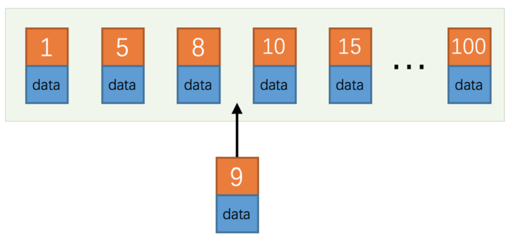

- 这个数据页已经满了啊，再插进来咋办呢？
  - 我们需要把当前页面分裂成两个页面，把本页中的一些记录移动到新创建的这个页中。
  - 页面分裂和记录移位意味着什么？意味着：性能损耗！
  - 所以如果我们想尽量避免这样无谓的性能损耗，最好让插入的记录的主键值依次递增，这样就不会发生这样的性能损耗了。
  - 所以我们建议：让主键具有 AUTO_INCREMENT ，让存储引擎自己为表生成主键，而不是我们手动插入 

我们自定义的主键列 id 拥有 AUTO_INCREMENT 属性，在插入记录时存储引擎会自动为我们填入自增的主键值。


#### 冗余和重复索引

> 避免: 对同一个列创建了多个索引或重复建立索引

- 创建了多个索引
  -  idx_name_birthday_phone_number 索引就可以对 name 列进行快速搜索，再创建一个专门针对
    name 列的索引就算是一个 冗余 索引，维护这个索引只会增加维护的成本，并不会对搜索有什么好处。

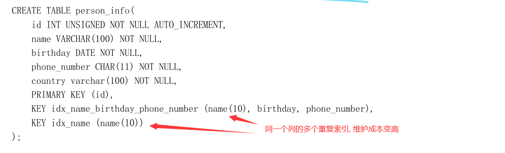

- 重复建立索引
  -  c1 既是主键、又给它定义为一个唯一索引，还给它定义了一个普通索引，可是主键本身就会生成聚
    簇索引，所以定义的唯一索引和普通索引是重复的，这种情况要避免。

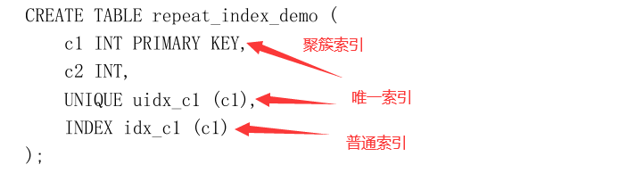

### B+树索引总结

B+ 树索引在空间和时间上都有代价，所以没事儿别瞎建索引。
#### B+ 树索引适用于下边这些情况：

- 全值匹配
- 匹配左边的列
- 匹配范围值
- 精确匹配某一列并范围匹配另外一列
- 用于排序
- 用于分组

#### 在使用索引时需要注意下边这些事项：

- 只为用于搜索、排序或分组的列创建索引
- 为列的基数大的列创建索引
- 索引列的类型尽量小
- 可以只对字符串值的前缀建立索引
- 只有索引列在比较表达式中单独出现才可以适用索引
- 为了尽可能少的让 聚簇索引 发生页面分裂和记录移位的情况，建议让主键 AUTO_INCREMENT 
- 定位并删除表中的重复和冗余索引
- 尽量使用 覆盖索引 进行查询，避免 回表 带来的性能损耗。


# MySQL的数据目录

## 数据库和文件系统的关系

>像 InnoDB 、 MyISAM 这样的存储引擎都是把表存储在文件系统上的

- 当我们想读取数据的时候，这些存储引擎会从文件系统中把数据读出来返回给我们，

- 当我们想写入数据的时候，这些存储引擎会把这些数据又写回文件系统


## MySQL数据目录

> 数据目录

- MySQL服务器程序在启动时会到文件系统的某个目录下加载一些文件

- 之后在运行过程中产生的数据也都会存储到这个目录下的某些文件中

> 数据目录 对应着一个系统变量 datadir

```mysql
SHOW VARIABLES LIKE 'datadir'
```


### 数据库在文件系统中的表示

> 每个数据库都对应数据目录下的一个子目录，或者说对应一个文件夹

新建一个数据库时， MySQL 会帮我们做这两件事儿

1. 在 数据目录 下创建一个和数据库名同名的子目录（或者说是文件夹）。
2. 在该与数据库名同名的子目录下创建一个名为 db.opt 的文件，这个文件中包含了该数据库的各种属性，比
方说该数据库的字符集和比较规则是个啥。

### 表在文件系统中的表示

> 我们的数据其实都是以记录的形式插入到表中的，每个表的信息其实可以分为两种

1. 表结构的定义
2. 表中的数据

> 表结构

- 该表的名称是啥，表里边有多少列，每个列的数据类型是啥，有啥约束条件和索引，用的是啥字符集和比较规则的各种信息，
- 这些信息都体现在了我们的建表语句中了。为了保存这些信息， InnoDB 和MyISAM 这两种存储引擎都在 数据目录 下对应的数据库子目录下创建了一个专门用于描述表结构的文件，文件名是这样：
  - 表名.frm
  - 这个后缀名为.frm是以二进制格式存储的，我们直接打开会是乱码的


#### InnoDB是如何存储表数据的

- InnoDB 其实是使用 页 为基本单位来管理存储空间的，默认的 页 大小为 16KB 。
- 对于 InnoDB 存储引擎来说，每个索引都对应着一棵 B+ 树，该 B+ 树的每个节点都是一个数据页，数据页之
  间不必要是物理连续的，因为数据页之间有 双向链表 来维护着这些页的顺序。
- InnoDB 的聚簇索引的叶子节点存储了完整的用户记录，也就是所谓的索引即数据，数据即索引。

为了更好的管理这些页，设计 InnoDB 的大叔们提出了一个 **表空间** 或者 **文件空间** （英文名： table space 或
者 file space ）的概念，

这个表空间是一个抽象的概念，它可以对应文件系统上一个或多个真实文件（不同表空间对应的文件数量可能不同）。每一个 表空间 可以被划分为很多很多很多个 页 ，我们的表数据就存放在某个 表空间 下的某些页里

##### 系统表空间（system tablespace）

- 系统表空间 可以对应文件系统上一个或多个实际的文件，默认情况下， InnoDB 会在 **数据目录** 下创建一个名为 ibdata1、大小为 12M 的文件，这个文件就是对应的 系统表空间 在文件系统上的表示

- 这个文件是所谓的自扩展文件 ，也就是当不够用的时候它会自己增加文件大小
- 在一个MySQL服务器中，系统表空间只有一份。从MySQL5.5.7到MySQL5.6.6之间的各个版本中，我们**表中的数据都会被默认存储到这个 系统表空间**

可以在 MySQL 启动时配置对应的文件路径以及它们的大小

```mysql
innodb_data_file_path=data1:512M;data2:512M:autoextend
```

##### 独立表空间(file-per-table tablespace)

- InnoDB **并不会默认的把各个表的数据存储到系统表空间**中，而是为**每一个表建立一个独立表空间**，也就是说我们创建了多少个表，就有多少个独立表空间。

- 使用 独立表空间 来存储表数据的话，会在该表所属数据库对应的子目录下创建一个表示该 独立表空间 的文件，文件名和表名相同，只不过添加了一个 .ibd 的扩展名

  - 表名.ibd

- 比方说假如我们使用了 独立表空间 去存储 xiaohaizi 数据库下的 test 表的话，那么在该表所在数据库对应的
  xiaohaizi 目录下会为 test 表创建这两个文件：

  - test.frm 表结构文件
  - test.ibd 独立表空间用来存储 test 表中的数据和索引

- 启动参数 innodb_file_per_table

  - 0 系统表空间
  - 1 独立表空间
  - 只对新建的表起作用，对于已经分配了表空间的表并不起作用

- 把已经存在系统表空间中的表转移到独立表空间

  - ```mysql
    ALTER TABLE 表名 TABLESPACE [=] innodb_file_per_table;
    ```

- 把已经存在独立表空间的表转移到系统表空间

  - ```mysql
    ALTER TABLE 表名 TABLESPACE [=] innodb_system;
    ```

- = 可有可无

#### MyISAM是如何存储表数据的

- MyISAM 中的索引全部都是 二级索引 ，该存储引擎的数据和索引是分开存放的。

- 所以在文件系统中也是使用不同的文件来存储数据文件和索引文件

- 和 InnoDB 不同的是， MyISAM 并没有什么所谓的 **表空间** 一说，表数据都存放到对应的数据库子目录下。

 test 表使用 MyISAM 存储引擎所在数据库对应的 数据库目录下会为 test 表创建这三个文件

- test.frm 	代表表结构文件
- test.MYD 代表表的数据文件，也就是我们插入的用户记录
- test.MYI  代表表的索引文件，我们为该表创建的索引都会放到这个文件中

### 视图在文件系统中的表示

- MySQL 中的视图其实是虚拟的表，也就是某个查询语句的一个别名而已
- 存储 视图 的时候是不需要存储真实的数据的，只需要把它的结构存储起来就行了
- 和 表 一样，描述视图结构的文件也会被存储到所属数据库对应的子目录下，只会存储一个**视图名.frm**的文件


### 文件系统对数据库的影响

 MySQL 的数据都是存在文件系统中的，就不得不受到文件系统的一些制约

- 数据库名称和表名称不得超过文件系统所允许的最大长度。
  - 每个数据库都对应 数据目录 的一个子目录，数据库名称就是这个子目录的名称；
  - 每个表都会在数据库子目录下产生一个和表名同名的 .frm 文件，
  - 如果是 InnoDB 的独立表空间(test.idb)或者使用 MyISAM 引擎(test.MYD, test.MYI)还会有别的文件的名称与表名一致。
  - 这些目录或文件名的长度都受限于文件系统所允许的长度～
- 特殊字符的问题
  - 为了避免因为数据库名和表名出现某些特殊字符而造成文件系统不支持的情况， MySQL 会把数据库名和表名中所有除数字和拉丁字母以外的所有字符在文件名里都映射成 @+编码值 的形式作为文件名
- 文件长度受文件系统最大长度限制
  - 对于 InnoDB 的独立表空间来说，每个表的数据都会被存储到一个与表名同名的 .ibd 文件中；对于MyISAM存储引擎来说，数据和索引会分别存放到与表同名的 .MYD 和 .MYI 文件中。这些文件会随着表中记录的增加而增大，它们的大小受限于文件系统支持的最大文件大小。

### MySQL系统数据库

- mysql
  - 存储了MySQL的用户账户和权限信息，一些存储过程、事件的定义信息，一些运行过程中产生的日志信息，一些帮助信息以及时区信息等。
- information_schema
  - 保存着MySQL服务器维护的所有其他数据库的信息，比如有哪些表、哪些视图、哪些触发器、哪
    些列、哪些索引。
  - 这些信息并不是真实的用户数据，而是一些描述性信息，有时候也称之为元数据。
- performance_schema
  - 这个数据库里主要保存MySQL服务器运行过程中的一些状态信息，算是对MySQL服务器的一个性能监控。包括统计最近执行了哪些语句，在执行过程的每个阶段都花费了多长时间，内存的使用情况等等信息。
- sys
  - 这个数据库主要是通过视图的形式把 information_schema 和 performance_schema 结合起来，让程序员可以更方便的了解MySQL服务器的一些性能信息。


