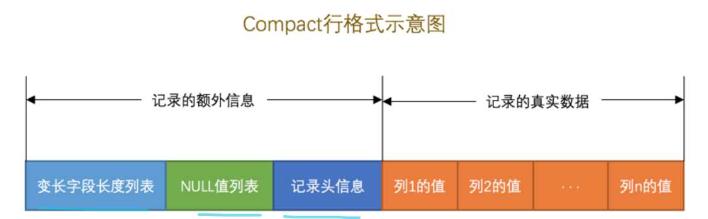
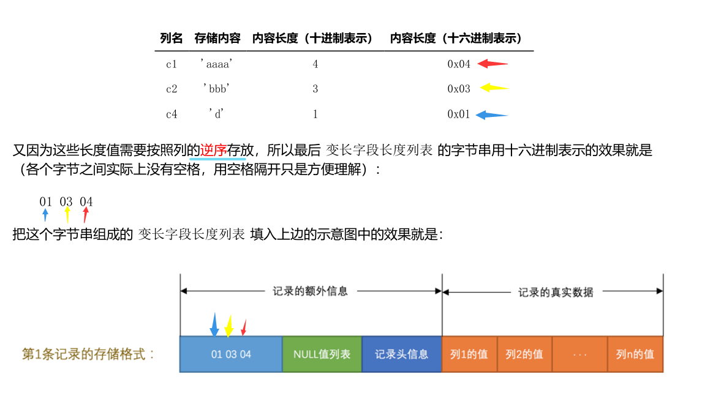
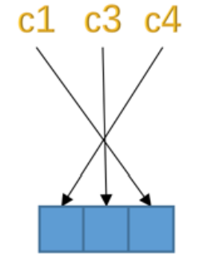
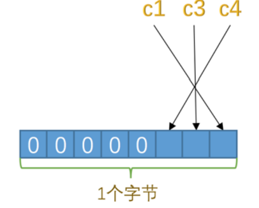
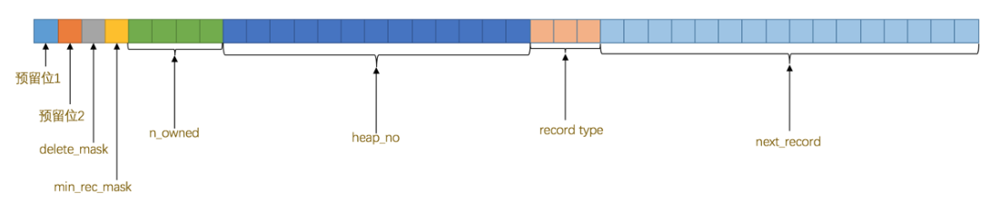
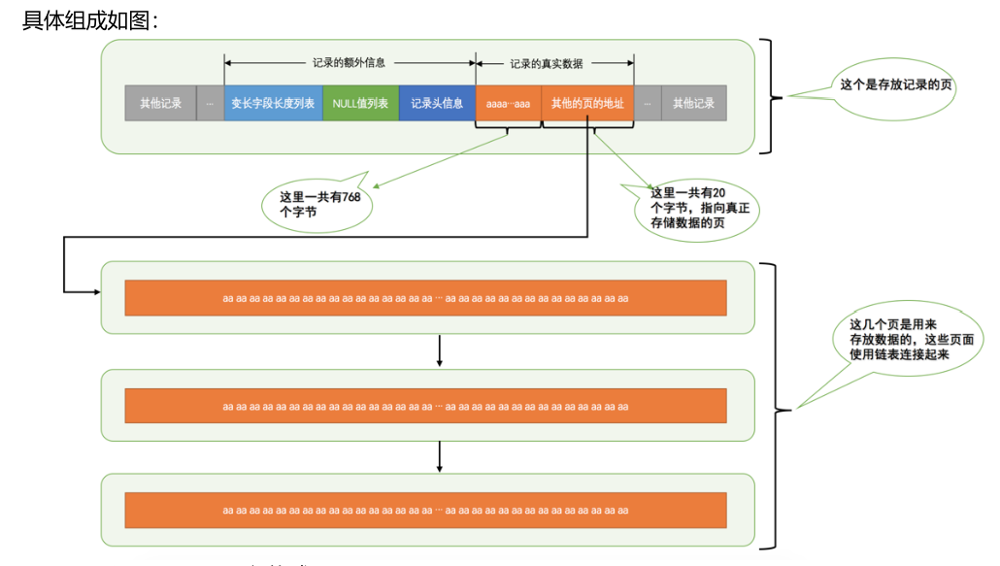

# MySQL

# 索引

# MVCC

# 事务

# 日志

# 锁

# 优化

1. MYSQL的事务隔离机制（3种问题，4种隔离机制）

2. MYSQL的A C I D怎样实现的？

3. MVCC原理

4. MYSQL redo_log原理（实现D）,undo_log原理（实现A）

5. sql注入

6. InnoDB和MyISAM的区别

   聚簇索引和非聚簇索引的区别

   MVCC

   非聚簇索引 回表（其实就是考B+树的优势，对叶子节点存数据这边问的很深入，答的不够完整）

   可重复读怎么解决不可重复读问题

##  数据库索引以及为什么要用这种索引 

##  问mysql有哪些存储引擎，你用到什么存储引擎，区别是什么？ 

##  sql优化策略 

##  聚集索引的底层 

## mvcc机制了解嘛

## mysql的表锁有哪些？

## 给了一段sql语句，问会上什么锁？详细解读一下

##  Mysql索引，联合索引，失效，左连接（八股文） 

##  什么是柔性事务 

##  跨库事务如何保证 

## 数据库三大范式

## 事务特性

## 事务隔离级别

##  mysql索引（B+和hash） 

##  聚集索引和非聚集索引 

##  Mysql的主从复制（从数据库依据redolog完成一致性） 

##  binlog和redolog的差异，以及记录写入的先后性（，binlog二进制数据文件，redolog逻辑命令。先后顺序，当时回答binlog先，redolog后，不知对错，面试官没纠正，应该对了） 

##  mysql事务特性（泛谈了ACID，和MVCC） 

##  谈谈锁（sync关键字和ReentrantLock） 

##  sync关键字和ReentrantLock的区别（层级，功能，重量级三个方面） 

##  说说分布式锁

（谈了Redis和Zoo[keep](https://www.nowcoder.com/jump/super-jump/word?word=keep)er的分布式锁实现原理， 

##  可重入锁在过期前续期失败会发生什么

（说了事务回滚和yeid让出） 

##  间隙锁是什么，具体什么时候会加锁

（具体什么时候加锁，这里要把所有情况都说清楚。。 

##  一级索引和二级索引之间是怎么作用的 

##  连接池，一些参数的含义(详细探讨了一下 removeAbandonedTimeout细节) 

## MYSQL的事务隔离机制

 读未提交：一个事务还没提交，它做的变更就能被别的事务看到。读提交：一个事务提交后，它做的变更才能被别的事务看到。可重复读：一个事务执行过程中看到的数据总是和事务启动时看到的数据是一致的。在这个级别下事务未提交，做出的变更其它事务也看不到。串行化：对于同一行记录进行读写会分别加读写锁，当发生读写锁冲突，后面执行的事务需等前面执行的事务完成才能继续执行。 

##  MYSQL的A C I D怎样实现的 

 利用undo log保障原子性。该log保存了事务发生之前的数据的一个版本，可以用于回滚，从而保证事务原子性。 

 利用redo log保证事务的持久性，该log关注于事务的恢复.在重启mysql服务的时候，根据redo log进行重做，从而使事务有持久性。 

 利用undo log+redo log保障一致性。事务中的执行需要redo log，如果执行失败，需要undo log 回滚。 

##  MVCC原理 

 MVCC为多版本并发控制，即同一条记录在系统中存在多个版本。其存在目的是在保证数据一致性的前提下提供一种高并发的访问性能。对数据读写在不加读写锁的情况下实现互不干扰,从而实现数据库的隔离性,在事务隔离级别为读提交和可重复读中使用到。 

 在InnoDB中，事务在开始前会向事务系统申请一个事务ID，该ID是按申请顺序严格递增的。每行数据具有多个版本，每次事务更新数据都会生成新的数据版本，而不会直接覆盖旧的数据版本。数据的行结构中包含多个信息字段。其中实现MVCC的主要涉及最近更改该行数据的事务ID（DBTRXID）和可以找到历史数据版本的指针（DBROLLPTR）。InnoDB在每个事务开启瞬间会为其构造一个记录当前已经开启但未提交的事务ID的视图数组。通过比较[链表]()中的事务ID与该行数据的值与对应的DBTRXID，并通过DBROLLPTR找到历史数据的值以及对应的DBTRXID来决定当前版本的数据是否应该被当前事务所见。最终实现在不加锁的情况下保证数据的一致性 

##  简述redo_log undo_log 

 redo log: 存储引擎级别的log（InnoDB有，MyISAM没有），该log关注于事务的恢复.在重启mysql服务的时候，根据redo log进行重做，从而使事务有持久性。 

 undo log：是存储引擎级别的log（InnoDB有，MyISAM没有）保证数据的原子性，该log保存了事务发生之前的数据的一个版本，可以用于回滚，是MVCC的重要实现方法之一。

# 存储引擎

-  InnoDB 是 MySQL 默认的存储引擎
- InnoDB 是一个将表中的数据存储到磁盘上的存储引擎，所以即使关机后重启我们的数据还是存在的。而真正处理数据的过程是发生在内存中的，所以需要把磁盘中的数据加载到内存中，如果是处理写入或修改请求的话，还需要把内存中的内容刷新到磁盘上。
- InnoDB 采取的方式是：将数据划分为若干个页，以页作为磁盘和内存之间交互的基本单位，InnoDB中页的大小一般为 16 KB。也就是在一般情况下，一次最少从磁盘中读取16KB的内容到内存中，一次最少把内存中的16KB内容刷新到磁盘中。

## InnoDB行格式

- 我们平时是以记录为单位来向表中插入数据的，这些记录在磁盘上的存放方式也被称为 行格式 或者 记录格式 
  -  Compact 、 Redundant 、Dynamic 和 Compressed 

### COMPACT行格式

#### 记录的额外信息

服务器为了描述这条记录而不得不额外添加的一些信息

##### 变长字段长度列表 

MySQL 支持一些变长的数据类型，比如 VARCHAR(M) 、 VARBINARY(M) 、各种 TEXT 类型，各种 BLOB 类型，我们也可以把拥有这些数据类型的列称为 **变长字段** ，变长字段中存储多少字节的数据是**不固定**的，所以我们在存储真实数据的时候需要顺便把这些**数据占用的字节数**也存起来

- 变长字段占用的存储空间分为两部分：
  1. 真正的数据内容
  2. 占用的字节数
- 变长字段长度列表中只存储值为 非NULL 的列内容占用的长度，值为 NULL 的列的长度是不储存的 

把所有变长字段的真实数据占用的字节长度都存放在记录的开头部位，从而形成一个**变长字段长度列表**，各变长字段数据占用的字节数按照列的顺序**逆序存放**

- 确定使用1个字节还是2个字节表示真正字符串占用的**字节数**的规则
  - W: 某个字符集中表示一个字符最多需要使用的字节数
  - M: 变长类型 VARCHAR(M) 来说，这种类型表示能存储最多 M 个字符
  - L: 实际存储的字符串占用的字节数
  - 如果 M×W <= 255 ，那么使用1个字节来表示真正字符串占用的字节数。
  - 如果 M×W > 255 ，则分为两种情况：
    - 如果 L <= 127 ，则用1个字节来表示真正字符串占用的字节数。
    - 如果 L > 127 ，则用2个字节来表示真正字符串占用的字节数。
  - 总结：如果该可变字段允许存储的最大字节数（ M×W ）超过255字节并且真实存储的字节数（ L ）超过127字节，则使用2个字节，否则使用1个字节。

- 区分某个字节是一个单独的字段长度还是半个字段长度
  - 该字节的第一个二进制位作为标志位：如果该字节的第一个位为0，那该字节就是一个单独的字段长度（使用一个字节表示不大于127的二进制的第一个位都为0），如果该字节的第一个位为1，那该字节就是半个字段长度

##### NULL值列表 

表中的某些列可能存储 NULL 值，如果把这些 NULL 值都放到 记录的真实数据 中存储会很占地方，所以 Compact 行格式把这些值为 NULL 的列统一管理起来，存储到 NULL 值列表中

- 处理过程
  1. 统计表中允许存储 NULL 的列有哪些。
  2. 如果表中没有允许存储 NULL 的列，则 NULL值列表 也不存在了
     - 否则将每个允许存储 NULL 的列对应一个二进制位，二进制位按照列的顺序逆序排列
       - 二进制位的值为 1 时，代表该列的值为 NULL 。
       - 二进制位的值为 0 时，代表该列的值不为 NULL 。
  3. MySQL 规定 NULL值列表 必须用整数个字节的位表示，如果使用的二进制位个数不是整数个字节，则在字节的高位补 0 
     - 

##### 记录头信息

由固定的 5 个字节组成。 5 个字节也就是 40 个二进制位

#### 记录的真实数据

MySQL 会为每个记录默认的添加一些列（也称为 隐藏列 ）

InnoDB存储引擎会为每条记录都添加 transaction_id和 roll_pointer 这两个列，但是 row_id 是可选的

（在没有自定义主键以及Unique键的情况下才会添加该列）

- InnoDB 表对主键的生成策略
  1. 优先使用用户自定义主键作为主键，
  2. 如果用户没有定义主键，则选取一个 Unique 键作为主键，
  3. 如果表中连 Unique 键都没有定义的话，则 InnoDB 会为表默认添加一个名为row_id 的隐藏列作为主键

#### CHAR(M)列的存储格式

- 对于 CHAR(M) 类型的列来说，当列采用的是定长字符集时，该列占用的字节数不会被加到变长字段长度列表，而如果采用变长字符集时，该列占用的字节数也会被加到变长字段长度列表。

- 变长字符集的 CHAR(M) 类型的列要求至少占用 M 个字节，而 VARCHAR(M) 却没有这个要求。
  - 比方说对于使用 utf8 字符集的 CHAR(10) 的列来说，该列存储的数据字节长度的范围是10～30个字节。
  - 即使我们向该列中存储一个空字符串也会占用 10 个字节，这是怕将来更新该列的值的字节长度大于原有值的字节长度而小于10个字节时，可以在该记录处直接更新，而不是在存储空间中重新分配一个新的记录空间，导致原有的记录空间成为所谓的碎片。

### 总结

1. 页是 MySQL 中磁盘和内存交互的基本单位，也是 MySQL 是管理存储空间的基本单位。
2. 指定和修改行格式的语法如下：
   - CREATE TABLE 表名 (列的信息) ROW_FORMAT=行格式名称
   - ALTER TABLE 表名 ROW_FORMAT=行格式名称
3. InnoDB 目前定义了4种行格式
   1. COMPACT行格式
      - 
   2. Redundant行格式
      - 
   3. Dynamic和Compressed行格式
      - 这两种行格式类似于 COMPACT行格式 ，只不过在处理行溢出数据时有点儿分歧，它们不会在记录的真实数据处存储字符串的前768个字节，而是把所有的字节都存储到其他页面中，只在记录的真实数据处存储其他页面的地址。
      - 另外， Compressed 行格式会采用压缩算法对页面进行压缩。
   4. 一个页一般是 16KB ，当记录中的数据太多，当前页放不下的时候，会把多余的数据存储到其他页中，这种现象称为 行溢出 

## InnoDB数据页结构

存放我们表中记录的那种类型的页，官方称这种存放记录的页为索引（ INDEX ）页(数据页)

### 记录在页中的存储

