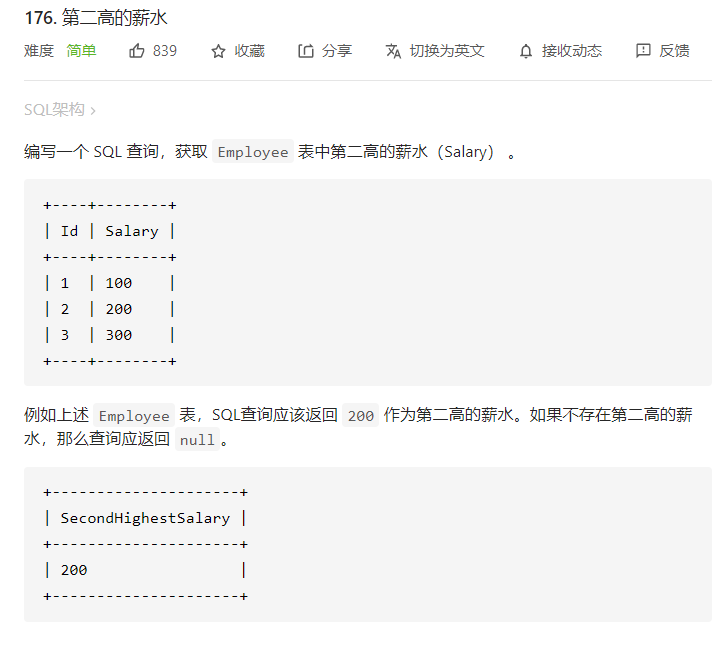
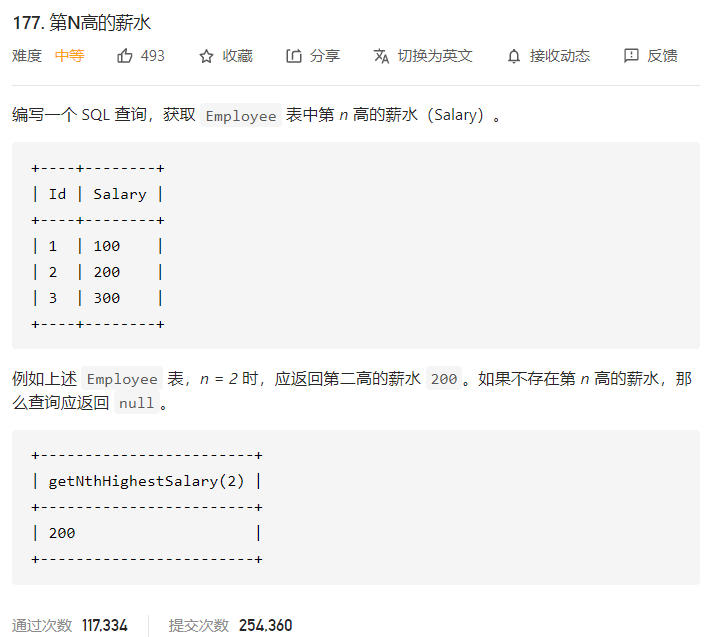
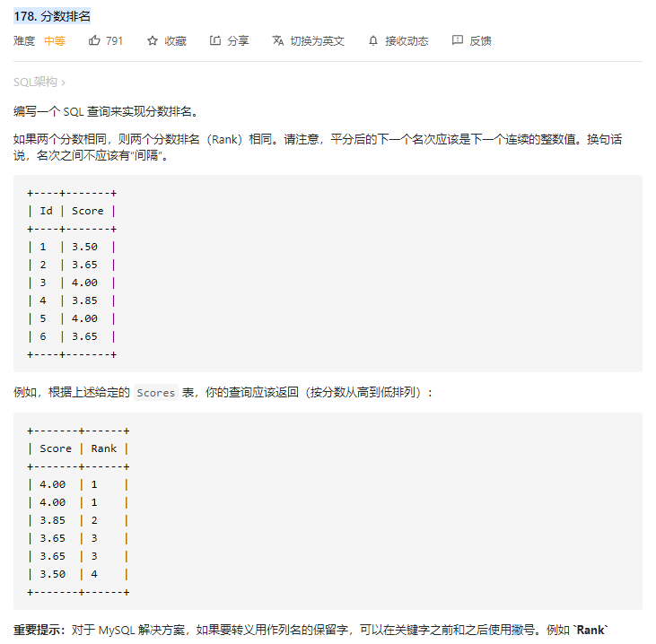
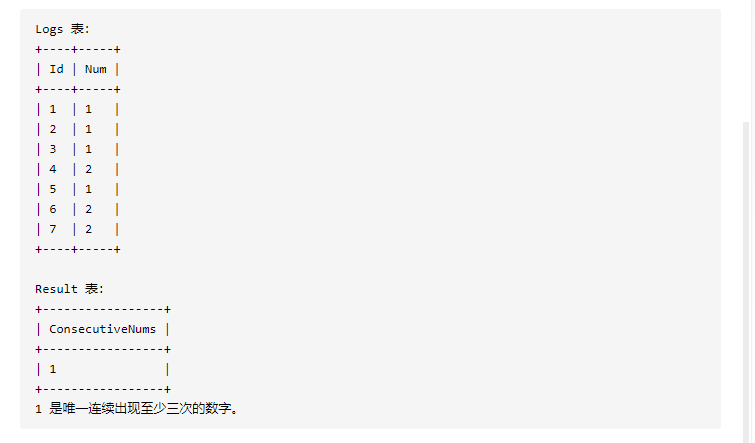

# MYSQL_LeetCode

## 176. 第二高的薪水

[176. 第二高的薪水](https://leetcode-cn.com/problems/second-highest-salary/)

```mysql
#IFNULL
select 
    IFNULL((select DISTINCT Salary 
    from Employee
    order by  Salary DESC
    limit 1 OFFSET 1), null) AS SecondHighestSalary

# 子查询
select 
    (select DISTINCT Salary 
    from Employee
    Order by Salary DESC 
    limit 1 , 1) as SecondHighestSalary
```




## 177. 第N高的薪水

[177. 第N高的薪水](https://leetcode-cn.com/problems/nth-highest-salary/)

```mysql
#子查询
CREATE FUNCTION getNthHighestSalary(N INT) RETURNS INT
BEGIN
    set N:=N-1;
  RETURN (
      # Write your MySQL query statement below.

      select 
   		   (select Distinct Salary 
           from Employee
           ORDER by Salary DESC
           LIMIT N, 1) 
  );
END

#IFNULL
CREATE FUNCTION getNthHighestSalary(N INT) RETURNS INT
BEGIN
    set N:=N-1;
  RETURN (
      # Write your MySQL query statement below.
      
      select IFNULL(
          (select Distinct Salary 
          from Employee
          ORDER by Salary DESC
          LIMIT N, 1), NULL) 
  );
END
```




## 178. 分数排名

[178. 分数排名](https://leetcode-cn.com/problems/rank-scores/)

```mysql
#Score下降
select a.Score as Score, 
(select count(distinct b.Score) from Scores b where b.Score >= a.Score) as `Rank`
from Scores a
order by a.Score DESC
#Rand上升
select a.Score as Score, 
(select count(distinct b.Score) from Scores b where b.Score >= a.Score) as `Rank`
from Scores a
order by `Rank` ASC

SELECT Score, DENSE_RANK() over (ORDER BY Score DESC) AS 'Rank'
FROM Scores
;
```





## 180. 连续出现的数字

[180. 连续出现的数字](https://leetcode-cn.com/problems/consecutive-numbers/)

```mysql
select  distinct l1.num as ConsecutiveNums 
from Logs l1,Logs l2,Logs l3
WHERE l1.id = l2.id-1 AND l2.id = l3.id-1
AND l1.num=l2.num AND l2.num=l3.num
```




# 01_basic_query

```mysql
#进阶1: 基础查询
/*
语法
select 查询列表
from 表名;

类似于: System.out.ptintln(打印东西);

特点:

1.查询列表可以使:表中的字段 常量值 表达式 函数
2.查询的结果是一个虚拟的表格

*/
#打开需要查询的库名
USE myemployees;

#1.查询表中的单个字段
SELECT last_name FROM employees;

#2.查询表中的多个字段
SELECT last_name, email, salary FROM employees;

#3.查询表中的所有字段 F12格式化
#*显示的字段顺序和表中的相同
# ` 着重号,区分字段和关键字
#选中SQL语句再执行
SELECT 
  * 
FROM
  employees ;
  
 #4.查询常量值
 #显示常量值本身
 SELECT 100;
 SELECT 'john';
 
 #5.查询表达式
 SELECT 100*98;
 SELECT 100%98;

 #6.查询函数
 #调用该方法,并显示该方法的返回值
 SELECT VERSION();

#7.为字段起别名
/*
1.便于理解
2.如查询的字段有重名的情况,使用别名可以区分开来
*/
#方式1 AS
SELECT 100 %98 AS `mod`;
SELECT last_name AS lname, first_name AS fname FROM employees;
#方式2 使用空格 
SELECT last_name lname, first_name fname FROM employees;

#案例 查询salary 显示结果为out put
#显示的名称有关键字 或者空格 或者#, 用""括起来 避免歧义
SELECT salary AS "OUT PUT" FROM employees;

#8.去重
#案例: 查询员工变种涉及到的所有的部门编号
#在显示的字段前面加上关键字 DISTINCT
SELECT DISTINCT department_id FROM employees;

#9.+号的作用
/*
java中的+号
运算符
连接符

mysql中的+号
仅仅只有一个功能;运算符
SELECT 100+90; 两个操作数都为数值型,则做加法运算
SELECT '123' + 90; 其中的一方为字符型,师徒转换成数字型
			如果转换成功,则继续加法运算
SELECT 'john'+90	如果转换失败, 则字符型数值转换成0
SELECT null+10; 	只要其中有null,结果为null
*/

#案例: 查询员工名和姓连接成一个字段并显示为 姓名
#使用 CONCAT函数进行拼接
SELECT CONCAT('a', 'b', 'c') AS test;

SELECT CONCAT(last_name, " ", first_name) AS `name` FROM employees;

#Practice
#1.显示表departments的结构,并查询其中的全部数据
#DESC (describe)
DESC departments;
SELECT * FROM departments;
#2.显示表employees中的全部job_id(不能重复)
SELECT DISTINCT job_id FROM employees;
#3.显示employees的全部列,各个列之间用逗号隔开链接,列头显示为"OUT PUT"

#但是某些字段为null,结果全为null
#IFNULL(exp1, exp2) exp1可能为null的字段名 exp2如果为null,代替的值
#这里如果为null,代替为0
SELECT IFNULL(commission_pct, 0) AS comission_pct_NoNull,
	commission_pct
FROM 
	employees;

#--------------------------------------------------------
SELECT
	CONCAT(`first_name`, ",", `last_name`,",",`phone_number`, ",", IFNULL(commission_pct, 0)) AS "OUT PUT"
FROM 
	employees;


```


# 02_conditional_query

```mysql
#进阶2: 条件查询

/*

语法:
	SELECT 
		查询列表
	FROM
		表名
	WHERE
		筛选条件;
执行顺序
1.查看对应表名是否存在
2.对应筛选条件
3.选择

分类:
	1.按条件表达式筛选
	条件运算符: > < =等于 <>不等 >= <=
	
	2.按逻辑表达式筛选
	作用: 用于连接条件表达式
	逻辑运算符: 
		&& || !
		and or not 推荐使用
	
	3.模糊查询
		like 
		between and 
		in 
		is null	

*/

#打开需要查询的库名
USE employees;

#1.按条件表达式筛选
#案例1: 查询工资>12000的员工信息

SELECT 
	*
FROM 
	employees
WHERE
	salary > 12000;

#案例2: 查询部门编号不等于90号的员工名和部门编号
SELECT
	last_name, 
	department_id
FROM 
	employees
WHERE
	department_id <> 90;

#2.按逻辑表达式筛选
#案例1: 查询工资在10000到20000之间的员工名,工资以及奖金

SELECT
	last_name,
	salary,
	commission_pct
FROM 
	employees
WHERE
	(salary>=10000) AND (salary<=20000);
	
#案例2: 部门编号不是在90到110之间,或者工资高于15000的员工信息
SELECT 
	*
FROM 
	employees
WHERE
	(department_id <90 OR department_id>110) 
	OR
	(salary>15000);

SELECT 
	*
FROM 
	employees
WHERE
	NOT(department_id>=90 AND department_id<=110)
	OR
	(salary>15000);
	
#3.模糊查询

/*
like 
	% 代表通配符 任意多个字符,包含0个字符
	_ 代表任意单个字符
	\ 转移字符,如果需要查询的字符为匹配字符,前面加\
		或者需要转义字符前加 任意字符, 字符串后面加上 ESCAPE '任意字符' 等于代替了转移字符\
between and 
in
is null | is not null
*/

#1.like
#案例1: 查询员工名字中包含字符a的员工信息

SELECT
	*
FROM 
	employees
WHERE 
	last_name LIKE '%a%';

#案例2: 查询员工名中第三个字符为n第五个字符为l的员工名字和工资
SELECT 
	last_name,
	salary
FROM 
	employees
WHERE
	last_name LIKE '__n_l%';

#案例3:查询员工名中的第二字字符为_的员工名
SELECT
	*
FROM 
	employees
WHERE 
	last_name LIKE '_$_%' ESCAPE '$';
	
#案例4: like用于查询数字 100多的department_id
SELECT
	*
FROM 
	employees
WHERE
	department_id LIKE "1__";
	
#2.between and
/*
提高语句的
包含临界值
两个临界值不能颠倒顺序 等价于将between换成>= and 换成<=
*/


#案例1: 查询员工编号在100到120之间的员工信息
SELECT
	*
FROM
	employees
WHERE
	employee_id BETWEEN 100 AND 120;
	
#3.in
/*
含义:判断某字段的值是否属于in列表中的某一项
特点
	提高简洁度
	in列表的值类型必须一致或兼容
	in 等价于= 所以不能使用通配符


*/
#案例: 查询员工的工种编号IT_PROG AD_VP AD_PRES中的一个员工名和工种编号
SELECT
	last_name,
	job_id
FROM
	employees
WHERE
	job_id IN ('IT_PROG', 'AD_VP', 'AD_PRES');
	
#4. is null
/*
= <> 不能用于判断null值
is null 或 is not null 可以判断null值


*/

#案例1:查询有奖金的员工名和奖金率
SELECT
		last_name,
		commission_pct
FROM 
		employees
WHERE
		commission_pct IS  NOT NULL;
	
	
#安全等于:  <=>	
/*
安全等于用于判断是否相等,
	可用于数值判断
	也可用于判断 null


*/

#案例1:查询没有奖金的员工名和奖金率
SELECT
		last_name,
		commission_pct
FROM 
		employees
WHERE
		commission_pct <=> NULL;
	
#案例2: 查询工资=12000的员工信息

SELECT 
	last_name,
	salary
FROM 
	employees
WHERE
	salary <=>12000;	
	
# is null pk <=>
/*
IS NULL  :  仅判断null值 可读性高建议使用
<=>		:  既可以判断NULL值,又可以判断普通的数值,可读性低


*/
	
#练习
#ISNULL的使用, ISNULL(字段值), 是null 返回1 不是null返回0
SELECT
	ISNULL(commission_pct), commission_pct
FROM 
	employees;

#1. 查询员工号为176的员工的姓名和部门号和年薪
SELECT
	last_name,
	department_id,
	salary*12*(1+IFNULL(commission_pct, 0)) AS annual_salary
FROM 
	employees
WHERE
	employee_id = 176;

#2.
SELECT
	salary,
	last_name
FROM 
	employees
WHERE
	commission_pct IS NULL AND salary<18000;

#3.
SELECT
	*
FROM 
	employees
WHERE
	job_id NOT IN ('IT_PROG') OR salary=12000;

#4.
DESC departments;

#5
SELECT
	DISTINCT location_id
FROM 
	departments

```

# 03_sort_query

```mysql
#3 排序查询

/*
语法
	select 查询列表
	from  表
	where 筛选条件
	order by 排序列表 [asc|desc]
特点
	1.asc升序 desc 降序
	如果不写,默认升序
	2. order by 子句中可以支持单个字段 多个字段 表达式 函数 别名
	3. order by 子句一般是放在查询语句的最后面, 但是limit 子句除外

*/

#案例1: 查询员工信息,按照工资从高到低
SELECT * FROM employees ORDER BY salary DESC;
SELECT * FROM employees ORDER BY salary ASC;
SELECT * FROM employees ORDER BY salary ;

#案例2:查询部门编号 >=90的员工信息,安入职时间先后排序
SELECT * 
FROM employees 
WHERE department_id >= 90
ORDER BY hiredate ASC; 

#案例3: 按年薪的高低显示员工的信息和年薪 [按别名排序]
SELECT *, salary*12*(1+IFNULL(commission_pct,0)) AS annual_salary
FROM employees
ORDER BY annual_salary DESC;

#案例4: 按年薪的高低显示员工的信息和年薪 [按表达式排序]
SELECT *, salary*12*(1+IFNULL(commission_pct,0)) AS annual_salary
FROM employees
ORDER BY salary*12*(1+IFNULL(commission_pct,0))  DESC;

#案例4: 按姓名的长度显示员工的姓名和工资 [按函数排序]
SELECT LENGTH(last_name) AS nameLen, last_name, salary
FROM employees
ORDER BY nameLen DESC;

#案例5: 查询员工信息,先按工资排序, 再按员工编号排序[按多个字段排序]
# salary相同的情况下 employees_id降序排列
SELECT *
FROM employees
ORDER BY salary ASC, employee_id  DESC ;

#====================Prac======================
#1.
SELECT last_name, department_id, salary*12*(1+IFNULL(commission_pct, 0)) AS annual_salary
FROM employees
ORDER BY annual_salary DESC, last_name ASC;

#2.
SELECT last_name, salary
FROM employees
WHERE NOT(salary BETWEEN 8000 AND 17000)
ORDER BY salary DESC;

#3.
SELECT *, LENGTH(email)
FROM employees
WHERE email LIKE '%e%'
ORDER BY  LENGTH(email) DESC, department_id ASC;


```


# 04_normal_function

```mysql
#4. 常见函数
/*

概念: 类似于java的方法,将一组逻辑语句语句封装在方法体中
好处 1.隐藏了实现细节, 2.提高代码的重用性
调用:  SELECT 函数名(实参列表)  FROM 表;
特点: 
		1.函数名
		2.函数功能
分类:
		1.单行函数
		 concat length ifnull
		2.分组函数
		功能:做统计使用,又称为统计函数
常见函数:
		字符函数:
		length
		concat
		upper
		lower
		instr
		substr
		trim
		lpad
		rpad
		replace
		
		数学函数
		round 
		floor
		ceil
		truncate
		mod 
		
		日期函数
		now
		curdate
		curtime 
		year 
		month
		day
		hour
		minute
		second
		str_to_date
		date_format
		
*/
USE myemployees;
USE employees;

#一.字符函数
#1. LENGTH 获取参数值的字节个数
SELECT LENGTH('john');
SELECT LENGTH('张三丰hahaha');

#查看编码格式
SHOW VARIABLES LIKE '%char%'

#2. concat 拼接字符串

SELECT CONCAT(last_name, '_', first_name) AS `name` FROM employees;

#3. upper lower
SELECT UPPER('john');
SELECT LOWER('John');

#示例: 将姓变大写,名变小写 然后拼接
SELECT CONCAT(LOWER(last_name), '_', UPPER(first_name)) AS `name` 
FROM employees;

#4. substr
#注意索引从1开始
# (str, start_position) 截取从start_position开始包括在内后面所有的字符
SELECT SUBSTR('A123456B', 8) AS out_put;

# 截取从指定索引处指定字符长度的字符
SELECT SUBSTR('AAA123BBB', 1, 3) AS out_put;

#案例; 姓名中首字符大写,其他字符小写,然后用_拼接显示出来
SELECT CONCAT(UPPER(SUBSTR(last_name, 1, 1) ), '_', LOWER(SUBSTR(last_name,2))) AS `name`
FROM employees;

#5. instr
#返回子串在主串中第一次出现的索引, 否则返回0
SELECT INSTR('AAA123AstrAA23str', 'str') AS `index`;

#6. trim
# 去掉字符串前后的空格
SELECT LENGTH(TRIM('                 sada                 ')) AS 'name';
# 按照指定的字符前后去掉
SELECT TRIM('aa' FROM 'aaaaaaaaaaaAAAaaaaaaaasdsaAAAaaaaaaaaaaaa') AS out_put;

#7. lpad 用指定的字符实现字符左填充指定长度
# 如果指定长度小于本身字符串长度, 右截断
SELECT LPAD('abc', 2, '*') AS out_put;
SELECT LPAD('abc', 10, '*') AS out_put;

#8. rpad 用指定的字符实现字符右填充指定长度
# 如果指定长度小于本身字符串长度, 同样右截断
SELECT RPAD('abc', 12, 'AA') AS out_put;
SELECT RPAD('abc', 2, 'AA') AS out_put;

#9. replace 替换
SELECT REPLACE('AAAdsadasdAAAAAAA', 'AAA', 'BBB') AS out_put;


#二 数学函数

#1. round 四舍五入
SELECT ROUND(-1.55);
SELECT ROUND(1.567, 2);

#2. ceil 向上取整, 返回>=该参数的最小整数
SELECT CEIL(-1.02); #-1
SELECT CEIL(1.02);#2
SELECT CEIL(1.00);#1

#3. floor 向下取整, 返回<=该参数的最大整数
SELECT FLOOR(-9.99);#-10
SELECT FLOOR(9.99);#9

#4. truncate 阶段
#第二个参数表示小数点后保留几位
SELECT TRUNCATE(1.65, 1); #1.6

#5. mod 取余
#mod(a,b) : a-a/b*b
SELECT MOD(-10, -3);
SELECT MOD(10, -3);

#三 日期函数

#1. now 返回当前系统日期+时间
SELECT NOW();
#2.  curdate 返回当前系统日期, 不包含时间
SELECT CURDATE();
#3. curtime 返回当前时间,不包含日期
SELECT CURTIME();

# 可以获取指定的部分, 年 月 日 小时 分钟 秒
SELECT YEAR(NOW()) `year`;
SELECT YEAR('2025-01-01') `year`;
SELECT YEAR(hiredate) 'year' FROM employees;

SELECT MONTH(NOW()) `month`;
SELECT DAY(NOW()) 'day';
SELECT HOUR(NOW()) 'hour';
SELECT MINUTE(NOW()) 'minute';
SELECT SECOND(NOW()) 'second';

#str_to_date 将字符通过指定的格式转换成日期
SELECT STR_TO_DATE('2025-3-2', '%Y-%c-%d') AS out_put;

#查询 入职日期为1992-4-3的员工信息
SELECT * FROM employees WHERE hiredate = '1992-4-3';

SELECT * FROM employees WHERE hiredate = STR_TO_DATE('4-3 1992', '%c-%d %Y');

#date_format 将日期按指定格式转化成字符
SELECT DATE_FORMAT(NOW(), '%y年%m月%d日') AS out_put;

#查询有奖金的员工名和入职日期(xx月/xx日 xx年)
SELECT last_name, DATE_FORMAT(hiredate, '%m月/%d日 %y年') AS 'date' , commission_pct
FROM employees 
WHERE commission_pct IS NOT NULL AND commission_pct > 0;

#四 其他函数

#查看MySQL版本号
SELECT VERSION();
#查询当前数据库
SELECT DATABASE();
#查询当前用户
SELECT USER();

#五 流程控制函数
# if 函数: if else 的效果
# if(exp1, exp2, exp3) exp1=条件表达式; exp2=exp1为真 返回exp2; exp3= exp1为假 返回exp3

SELECT IF(10>5, 'big', 'small');

SELECT last_name, commission_pct, 
IF(commission_pct IS NOT NULL AND commission_pct>0, 'with commission', 'without commission') AS 'status'
FROM employees;

#2. case函数的使用一: switch case的效果
/*
语法
case: 要判断的字段或表达式
when 常量1 then 要显示的值1或语句1
when 常量2 then 要显示的值2或语句2
...
else 要显示的值n或语句n
end
*/

/*
案例: 查询员工的工资, 要求
部门号=30, 显示的工资为1.1倍
部门号=40, 显示的工资为1.2倍
部门号=50, 显示的工资为1.3倍
其他部门原工资

*/


SELECT salary AS origin_salary, department_id,
CASE department_id
WHEN 30 THEN salary*1.1
WHEN 40 THEN salary*1.2
WHEN 50 THEN salary*1.3
ELSE salary
END AS new_salary
FROM employees;

#3. case 函数的使用二: 类似于多重if
/*
语法
case
WHEN 条件1 THEN 要显示的值1或语句1
WHEN 条件2 THEN 要显示的值1或语句2
...
ELSE 要显示的值n或语句n
END
*/

#案例: 查询员工的工资情况 根据工资情况分级
SELECT salary AS origin_salary,
CASE
WHEN salary>20000 THEN 'A'
WHEN salary>15000 THEN 'B'
WHEN salary>10000 THEN 'C'
ELSE 'D'
END AS salary_level
FROM employees
ORDER BY salary_level;

#练习
#1. 显示系统时间
SELECT NOW();
#2. 查询员工号,姓名,工资,工资提高20%后的结果
SELECT employee_id, last_name, salary, salary*1.2 AS new_salary
FROM employees;

#3. 将员工的姓名按首字母排序,并写出姓名的长度
SELECT LENGTH(last_name) AS len, SUBSTR(last_name, 1, 1) AS first_, last_name
FROM employees
ORDER BY first_; 

#4
SELECT CONCAT(last_name, ' earns ', salary, ' monthly but wants ', salary*3) AS 'Dream Salary'
FROM employees
WHERE salary=24000;

SELECT last_name, job_id AS job,
CASE job_id
WHEN 'AD_PRES' THEN 'A'
WHEN 'ST_MAN' THEN 'B'
WHEN 'IT_PROG' THEN 'C'
END AS GRADE
FROM employees
WHERE job_id = 'AD_PRES';


#对输入自动加密
# password('字符');
# MD5('字符')
SELECT MD5('王世宇');


```


# 05_group_function

```mysql
# 二 分组函数
/*
功能: 用作统计使用,又称为聚合函数或统计函数或分组函数

分类:
	sum 求和
	avg 平均值
	max 最大值
	min 最小值
	count 计算个数
特点:
	1.sum avg 一般用于处理数值
	2.max min count 可以处理任何类型
	3.是否忽略null值
		以上分组函数全部忽略null值
	4.可以和distinct搭配实现去重的运算
	5.count函数的介绍
	一般使用(*) 统计行数
	6. 和分组函数一同查询的字段要求是group by后的字段
*/

#1. 简单的使用
SELECT SUM(salary) FROM employees;
SELECT AVG(salary) FROM employees;
SELECT MAX(salary) FROM employees;
SELECT MIN(salary) FROM employees;
SELECT COUNT(salary) FROM employees;

SELECT SUM(salary) 'sum', ROUND(AVG(salary), 2) 'avg', ROUND(MAX(salary),2) 'max', MIN(salary) 'min', COUNT(salary) 'count'
FROM employees;

#2. 参数支持哪类类型
#不会报错但是没有意义 不要使用
SELECT SUM(last_name), AVG(last_name) FROM employees;
SELECT SUM(hiredate), AVG(hiredate) FROM employees;

#可以使用,因为这些字段是可以排序的
SELECT MAX(last_name), MIN(last_name) FROM employees;
SELECT MAX(hiredate), MIN(hiredate) FROM employees;

#只统计非null的个数
SELECT COUNT(commission_pct), COUNT(last_name) FROM employees;

#3. 忽略null
# sum avg 都忽略null值
SELECT SUM(commission_pct) , AVG(commission_pct), SUM(commission_pct) / 35, SUM(commission_pct) / 72
FROM employees;

# max min
SELECT MAX(commission_pct), MIN(commission_pct) FROM employees;

#count
SELECT COUNT(commission_pct) FROM employees;

#4. 可以和distinct搭配实现去重的运算
SELECT SUM(DISTINCT salary), SUM(salary) FROM employees;
SELECT COUNT(DISTINCT salary), COUNT(salary) FROM employees;

#5. count函数的详细介绍
SELECT COUNT(salary) FROM employees;
#  * 统计行数
SELECT COUNT(*) FROM employees;
# 增加一列的1,统计右多少行2 可以加一个常量值, 等价于增加了一列这个常量值
SELECT COUNT(1) FROM employees;

#效率
#  MYISAM 存储引擎下, COUNT(*)的效率高
#  INNODB存储引擎下, COUNT(*) 和COUNt(1)的效率差不多,比COUNT(字段)高一些
# 引入如果COUNT(字段) 需要判断这一行的字段是否为null多了一步判断

#6. 和分组函数一同查询的字段有限制
# 统计每个employee_id对应的平均工资
SELECT AVG(salary), employee_id 
FROM employees
GROUP BY employee_id;

# Prac

#1.
SELECT MAX(salary), MIN(salary), ROUND(AVG(salary),2), COUNT(salary) FROM employees;

#2. 
#  DATEDIFF (date1, date2) = date1-date2 相差的天数
SELECT DATEDIFF(MAX(hiredate), MIN(hiredate)) AS diff
FROM employees;

#3.
SELECT COUNT(*) 'count' FROM employees WHERE department_id = 90;

```


# 06_group_query

```mysql
USE myemployees;
USE employees;
`departments`
#5.进阶5: 分组查询
/*
语法:
	SELECT 分组函数,列(要求出现在group by 后面)
	FROM 表
	WHERE 筛选条件
	GROUP BY 分组的列表
	ORDER BY 子句
注意
	查询列表必须特殊,要求是分组函数和group by 后出现的字段
特点
	1. 分组查询中过得筛选条件分为两类
					数据源 					位置 				关键字
	分组前筛选           原始表 FROM后面的表         group by子句的前面      WHERE
	分组后筛选           分组后的结果集 		        group by子句的后面      HAVING
	
	分组函数做条件 一定放在HAVING子句中
	能用分组前筛选的优先使用分组前筛选
	
	2.GROUP BY 子句支持单个字段,多个字段分组(多个字段之间用逗号隔开没有顺序要求), 表达式或函数
	3.也可以添加排序,排序在整个排序的最后
*/


#引入 查询每个部门的平均工资
SELECT department_id, AVG(salary) AS avg_salary
FROM employees
WHERE department_id IS NOT NULL
GROUP BY department_id
ORDER BY avg_salary;

#简单的分组查询
#案例1  查询每个工种的最高工资
SELECT MAX(salary), job_id
FROM employees
GROUP BY job_id;

#案例2: 查询每个位置上的部门个数
SELECT location_id, COUNT(*) AS departments_count
FROM departments 
GROUP BY location_id;

#添加筛选条件
#案例1: 查询邮箱中包含a字符的, 每个部门的平均工资
SELECT AVG(salary), department_id
FROM employees
WHERE email LIKE '%a%'
GROUP BY department_id;

#案例2: 查询有奖金的每个领导手下员工的最高工资
SELECT MAX(salary), manager_id, commission_pct
FROM employees
WHERE commission_pct IS NOT NULL AND commission_pct>0
GROUP BY manager_id;

#添加复杂的筛选条件  分组后而定筛选 HAVING
#查询1: 哪个部门的员工个数>2

#1.查询每个部门的员工个数
SELECT department_id, COUNT(*) AS count_
FROM employees
GROUP BY department_id
HAVING count_ >2;
#2.根据1的结果,查询哪个部门的员工个数>2

#案例2: 查询每个工种 有奖金的员工 的最高工资 >12000 的 工种编号 和 最高工资

SELECT MAX(salary) AS max_salary, job_id
FROM employees
WHERE commission_pct IS NOT NULL
GROUP BY job_id
HAVING max_salary>12000;


#案例3: 领导编号>102的每个领导手下的最低工资>5000的领导编号是哪个,以及最低工资

SELECT manager_id, MIN(salary) AS min_salary
FROM employees
WHERE manager_id > 102
GROUP BY manager_id
HAVING min_salary > 5000;


#按表达式或函数分组

#案例: 按员工姓名的长度分组, 查询每一组的员工个数, 筛选员工个数>5的个数
SELECT LENGTH(last_name) AS name_len, COUNT(*) AS employee_count
FROM employees
GROUP BY name_len
HAVING employee_count>5;


#按多个字段分组

#案例: 查询每个部门 每个工种的员工的平均工资
#group by 后面的字段一致的放在一行
SELECT AVG(salary) AS avg_salary, department_id, job_id
FROM employees
GROUP BY department_id, job_id;

#添加排序
#案例: 查询每个部门 每个工种的员工的平均工资
# GROUP BY, HAVING, ORDER BY 后面都可以使用别名
SELECT AVG(salary) AS avg_salary, department_id, job_id
FROM employees
WHERE department_id IS NOT NULL
GROUP BY department_id, job_id
HAVING AVG(salary) > 10000
ORDER BY AVG(salary) DESC;

#Prac
#1. 
SELECT job_id, MAX(salary), MIN(salary), AVG(salary), SUM(salary)
FROM employees
GROUP BY job_id
ORDER BY job_id ASC;

#2.
SELECT MAX(salary)-MIN(salary) AS DIFFERENCE
FROM employees;

#3.
SELECT manager_id, MIN(salary)
FROM employees
WHERE manager_id IS NOT NULL
GROUP BY manager_id
HAVING MIN(salary)>=6000

#4.
SELECT department_id, COUNT(*), AVG(salary)
FROM employees
GROUP BY department_id
ORDER BY AVG(salary) DESC;

#5.
SELECT job_id, COUNT(*)
FROM employees
GROUP BY job_id;


```


# 07_connection

```mysql
#进阶6: 连接查询
/*
含义: 又称多表查询,当查询的字段来自于多个表时,就会用到连接查询

笛卡尔乘积现象: 表1有m行 表2有n行 结果=m*n行
发生的原因: 没有有效的连接条件
如何避免: 添加有效的连接

分类:
		按年代分类
		sql92 标准 : 仅支持内连接
		sql99 标准 : 支持内连接+外连接(左外+右外) + 交叉连接
		
		按功能分类
				内连接:
						等值连接
						非等值连接
						自连接
				外连接:
						左外连接
						右外连接
						全外连接
				交叉连接


*/
USE girls;
SELECT * FROM beauty;
SELECT * FROM boys;

SELECT NAME, boyName FROM beauty, boys
WHERE beauty.boyfriend_id = boys.id;

#一  SQL92标准
#1. ===================等值连接======================
/*
1.多表等值连接的结果为多表交集的部分
2.n表连接, 至少需要n-1个连接结果
3. 多表的顺序没有要求
4.一般为表起别名 
5. 可以搭配前面所有查询子句 比如 排序 ORDER BY ,  分组 GROUP BY, 筛选 WHERE

*/
#案例1:  查询女神名和对应的男神名
SELECT NAME, boyName FROM beauty, boys
WHERE beauty.boyfriend_id = boys.id;

#案例2:  查询员工名和对应的部门名
SELECT last_name, department_name
FROM employees, departments
WHERE employees.department_id = departments.department_id;

#2. 为表起别名
/*
提高语句的整洁度
区分多个重名的字段

注意: 如果为表起了别名,则查询的字段就不能用原来的表名去限定

*/
#查询:  员工名字,工种号,工种名
SELECT last_name, e.job_id, job_title
FROM employees AS e, jobs AS j
WHERE e.job_id = j.job_id;

#3.两个表的顺序是否可以调换
SELECT last_name, e.job_id, job_title
FROM jobs AS j, employees AS e
WHERE e.job_id = j.job_id;

#4.可以加筛选?
#案例1 : 查询有奖金的员工名, 部门名
SELECT last_name, department_name, commission_pct
FROM employees AS e, departments AS d
WHERE e.department_id=d.department_id 
AND  e.commission_pct IS NOT NULL;

#案例2: 查询城市名中第二个字符为'o'的部门名和城市名
SELECT department_name, city
FROM departments AS d, locations AS l
WHERE d.location_id = l.`location_id`
AND l.city LIKE '_o%';

#5. 可以加分组
#案例1: 查询每个城市的部门个数
SELECT city, COUNT(*) AS department_num
FROM locations l, departments d
WHERE l.location_id = d.`location_id`
GROUP BY city;

# 没有group by之前的情况
SELECT  *
FROM locations l, departments d
WHERE l.location_id = d.`location_id`;


#案例2: 有奖金的每个部门的部门名和部门的领导编号和该部门的最低工资
SELECT department_name, d.manager_id, MIN(salary), commission_pct
FROM employees AS e, departments AS d
WHERE e.department_id = d.department_id
AND e.commission_pct IS NOT NULL
GROUP BY department_name;

#6. 可以加排序
#案例: 查询每个工种的工种名,和员工的个数,并且按员工个数降序
SELECT job_title, COUNT(*) AS emp_num
FROM employees e, jobs j
WHERE e.job_id = j.`job_id`
GROUP BY job_title
ORDER BY COUNT(*) DESC;

#7. 可以实现三表连接
#案例; 员工名, 部门名, 和所在的城市
SELECT last_name, department_name, city
FROM employees e, departments d, locations l
WHERE e.department_id = d.`department_id`
AND d.location_id = l.location_id
AND city LIKE "s%"
ORDER BY department_name DESC;


#2. ================非等值连接====================
SELECT * FROM job_grades;
#案例1: 查询员工的工资和工资级别
SELECT salary, grade_level
FROM employees e, job_grades jg
WHERE e.salary BETWEEN jg.lowest_sal AND jg.highest_sal
AND grade_level = 'A';


#3. ====================自连接=========================
#案例1: 查询员工名和上级的名称
/*
查询顺序:
1.第一次看表, 根据last_name找到对应员工的上级领导编号manager_id
2.第二次看表, 根据employee_id 找到对应的last_name
第一次看表找到的manger_id就是第二次看表根据的employee_id

*/
SELECT e.employee_id, e.last_name, m.employee_id, m.last_name
FROM employees e, employees m
WHERE e.manager_id = m.employee_id;

#=======================Prac==============================
#1.
SELECT MAX(salary), AVG(salary)
FROM employees;

#2.
SELECT employee_id, job_id, last_name
FROM employees
ORDER BY department_id DESC, salary ASC;

#3.
SELECT job_id
FROM employees
WHERE job_id LIKE "%a%e%";

#4.
SELECT s.name, g.name, r,score
FROM student s, grade g, result r
WHERE s.gradeId = g.id AND s.id = r.studentNo;

#5.
SELECT CURDATE();
SELECT TRIM('a' FROM "aaaaaaaa      a dsad dsds         aaaaaaaaa");
SELECT SUBSTR("abc", 1);

#====================Prac=========================
#1.
SELECT e.last_name, e.department_id, d.department_name
FROM employees e, departments d
WHERE e.department_id = d.department_id;

#2.
SELECT e.job_id, d.`location_id`
FROM employees e, departments d
WHERE e.department_id = d.department_id AND e.department_id = 90;

#3.
SELECT e.last_name, d.department_name, l.location_id, l.city, e.commission_pct
FROM employees e, departments d, locations l
WHERE e.department_id  = d.department_id AND d.location_id = l.`location_id`
AND e.commission_pct IS NOT NULL;

#4.
SELECT e.last_name, e.job_id, e.department_id, d.department_name, l.city
FROM employees e, departments d, locations l, jobs j
WHERE e.department_id = d.department_id AND d.location_id = l.location_id 
AND e.job_id = j.job_id
AND l.city = 'Toronto';

#5.
SELECT d.department_name, j.job_title, MIN(e.salary)
FROM employees e, jobs j, departments d
WHERE e.department_id = d.department_id AND e.job_id = j.`job_id`
GROUP BY j.job_title, d.department_name;

#6.
SELECT l.country_id, COUNT(*) AS depar_num
FROM locations l, departments d
WHERE l.location_id = d.location_id 
GROUP BY l.country_id
HAVING COUNT(*) > 2;

#7.
SELECT e.last_name AS 'employees', e.employee_id AS 'Emp#',
m.last_name AS 'Manager', m.employee_id AS 'Mgr#'
FROM employees e, employees m
WHERE e.manager_id = m.employee_id
AND e.last_name = 'kochhar';


```


# 08_inner_outer_join

```mysql
#二 sql99语法
/*
语法
	select 查询列表
	FROM 表1 别名
	[连接类型] join 表2 别名
	on 连接条件
	[Where 筛选条件]
	[Group by 分组]
	[Having 筛选条件]
	[Order By 排序列表]


内连接 inner
外连接
	左外 left
	右外 right
	全外 full
交叉连接 cross


*/
#=============内连接===================
/*
语法
	Select 查询列表
	FROM 表1 别名
	inner join 表2 别名
	on 连接条件;
分类:
	等值
	非等值
	自连接
特点:
	1.添加排序 分组 筛选
	2.inner可以省略
	3.筛选条件放在 WHERE 后面, 连接条件放在ON后面
	4.inner join 和sql92语法中的等值连接实现的效果完全相同 都是查询多表的交集

*/
#1. ------------------等值连接-----------------------
#案例1: 查询员工名,部门名
SELECT e.last_name, d.department_name
FROM employees e
INNER JOIN departments d
ON e.department_id=d.department_id;

#案例2: 查询名字中包含e的员工名和工种名
SELECT  e.last_name, j.job_title
FROM employees e
INNER JOIN jobs j
ON e.job_id = j.`job_id`
WHERE e.last_name LIKE "%e%";

#案例3: 查询部门个数>3的城市名和部门个数
SELECT l.city, COUNT(*) AS dep_num
FROM locations l
INNER JOIN departments d
ON l.location_id = d.`location_id`
GROUP BY l.city
HAVING COUNT(*)> 3;

#案例4: 查询哪个部门的员工个数>3的部门名和员工个数,并案个数降序
SELECT d.department_name, COUNT(*) AS emp_num
FROM departments d
INNER JOIN employees e
ON e.department_id = d.`department_id`
GROUP BY d.`department_name`
HAVING COUNT(*) > 3
ORDER BY COUNT(*) DESC;

#案例5: 查询员工名,部门名,工种名 并按部门名降序
SELECT e.last_name, d.department_name, j.job_title
FROM employees e
INNER JOIN departments d ON e.department_id = d.department_id
INNER JOIN jobs j ON e.job_id = j.`job_id`
ORDER BY department_name DESC;

#2.  ------------------非等值连接-----------------------

#查询员工的工资级别
SELECT e.salary, jg.grade_level
FROM employees e
INNER JOIN job_grades jg
ON e.salary BETWEEN jg.lowest_sal AND jg.highest_sal;

#查询每个工资级别的个数>20的个数 并且 按降序排序
SELECT e.salary, jg.grade_level, COUNT(*) grade_count
FROM employees e
INNER JOIN job_grades jg
ON e.salary BETWEEN jg.lowest_sal AND jg.highest_sal
GROUP BY jg.`grade_level`
HAVING COUNT(*) > 20 
ORDER BY COUNT(*) DESC;

#3.  ------------------自连接-----------------------
#案例1: 查询员工名和上级的名称
SELECT e.last_name, m.last_name
FROM employees e
INNER JOIN employees m
ON e.manager_id = m.`employee_id`;

#案例2: 查询员工名包含e的员工名和上级的名称
SELECT e.last_name, m.last_name
FROM employees e
INNER JOIN employees m
ON e.manager_id = m.`employee_id`
WHERE e.last_name LIKE "%e%";


#=============外连接===================
/*
应用场景: 一个表中有一个字段, 另一个表中没有
特点:
1.外连接的查询结果为主表中的所有记录
	如果从表中有匹配的,则显示匹配值
	如果从表中没有匹配的,则显示null
	外连接的查询结果=内连接的结果+主表中有而从表中没有的结果
2.	左外连接,left join左边的是主表
	右外连接, right join 右边的是主表
3.	左外和右外交换两个表的顺序,可以实现相同的效果
4.	全外连接 = 内连接的结果+表1中有表2没有(null填充)+表2有表1没有(null填充)的结果

*/
SELECT * FROM beauty;

#查询男朋友不在男生表的女神名
#left outer join beauty 为主表
SELECT be.name
FROM beauty be
LEFT OUTER JOIN boys bo
ON be.boyfriend_id = bo.`id`
WHERE bo.id IS NULL;
#left outer join boys 为主表 在的
SELECT bo.boyName
FROM boys bo
LEFT OUTER JOIN beauty be
ON be.boyfriend_id = bo.`id`
WHERE be.id IS NOT NULL;


#right outer join boys为主表
SELECT be.name
FROM boys bo
RIGHT OUTER JOIN beauty be
ON be.`boyfriend_id` = bo.id
WHERE bo.id IS NULL;

#案例 : 查询哪个部门没有员工
#左外
SELECT d.*, e.employee_id
FROM departments d
LEFT JOIN employees e
ON d.department_id = e.department_id
WHERE e.employee_id IS NULL;

#右外
SELECT d.*, e.employee_id
FROM employees e
RIGHT OUTER JOIN departments d
ON e.`department_id` = d.`department_id`
WHERE e.employee_id IS NULL

#全外
USE girls;
SELECT be.*, bo.*
FROM beauty be
FULL OUTER JOIN boys bo
ON be.boyfriend_id = bo.id;

#===============交叉连接=================
#结果为两表的笛卡尔 乘积
SELECT be.*, bo.*
FROM beauty be
CROSS JOIN boys bo;


#sql99 VS sql92
/*
功能:sql99支持的较多
可读性:sql99实现连接的条件和筛选条件的分离,可读性提高

*/
#===========Prac=============
#1.
SELECT  be.name, be.id,bo.*
FROM beauty be
LEFT OUTER JOIN boys bo
ON be.`boyfriend_id` = bo.id
WHERE be.id > 3;


#2.
SELECT l.city, d.*
FROM locations l
LEFT JOIN departments d
ON l.location_id = d.location_id
WHERE d.department_id IS NULL;

#3.
SELECT d.department_name, e.*
FROM departments d
LEFT JOIN employees e
ON d.department_id = e.department_id
WHERE d.department_name IN ("SAL", "IT");


```


# 09_subQuerry

```mysql
#进阶7: 子查询
/*
含义:
	出现在其他语句中的select语句,称为子查询或内查询
	外部的查询语句,称为主查询或外查询
分类:
按子查询出现的位置:
		select 后面:
				仅仅支持标量子查询
		from 后面:
				支持表子查询
		where 或 having后面: *
				标量子查询 (单行)*
				列子查询     (多行)*
				行子查询 (较少)
		
		exists 后面(相关子查询)
				表子查询
按结果集的行列数不同:
		标量子查询 (结果集只有一行一列)
		列子查询 (结果集只有一行多列)
		行子查询 (结果集有一行多列)
		表子查询 (结果集一般为多行多列)
*/

#一 =============where having后面===================
#1. 标量子查询 (单行子查询)
#2. 列子查询 (多行子查询)
#3. 行子查询 (多行多列)
/*
1.子查询放在小括号内
2.子查询一般放在条件的右侧
3.标量子查询 一般搭配着单行操作符使用
>< >= <=  = <>
列子查询 一般搭配着多行操作符使用
in any/some all

4.子查询的执行优先于主查询执行, 主查询的条件用到了子查询的结果
*/

#案例1: 谁的工资被abel高?
#1. 查询Abel的工资
SELECT salary FROM employees e WHERE e.last_name = "Abel";
#2. 查询员工信息,满足salary>1的结果
SELECT last_name, salary
FROM employees
WHERE salary >  (
			SELECT salary 
			FROM employees e 
			WHERE e.last_name = "Abel" 
)
ORDER BY salary;

#案例2: 返回job_id与141号员工相同, salary比143号员工多的员工姓名,job_id和工资
#1.查询141号员工的job_id
SELECT job_id
FROM employees
WHERE employee_id = "141";
#2.查询143员工的salary
SELECT salary
FROM employees
WHERE employee_id="143";
#3.
SELECT last_name, job_id, salary
FROM employees 
WHERE job_id = (
				SELECT job_id
				FROM employees
				WHERE employee_id = "141"
) 
AND salary > (
				SELECT salary
				FROM employees
				WHERE employee_id = "143"
)
ORDER BY salary;

#案例3: 返回公司工资最少的员工的last_name, job_id 和salary
SELECT last_name, job_id, salary
FROM employees
WHERE salary = (
				SELECT MIN(salary)
				FROM employees

);

#案例4: 查询最低工资大于50号部门最低工资的部门id和其最低工资
SELECT department_id, MIN(salary)
FROM employees
GROUP BY department_id
HAVING MIN(salary) > (
					SELECT MIN(salary)
					FROM employees
					WHERE department_id = "50"
)
ORDER BY MIN(salary);

#-----------------非法使用标量子查询------------------
#子查询的结果不是一行一列

#2.===============列子查询(多行子查询)====================
#案例1: 返回location_id是1400或1700的部门中的所有员工姓名
#join
SELECT last_name, location_id
FROM employees e
JOIN departments d
ON e.department_id = d.`department_id`
WHERE location_id IN (1400, 1700);
#不join
SELECT last_name
FROM employees
WHERE department_id IN (
				SELECT DISTINCT department_id
				FROM departments 
				WHERE location_id IN(1400, 1700)
);
# =ANY 替换 IN
# <>ALL 替换 NOT IN
SELECT last_name
FROM employees
WHERE department_id =ANY (
				SELECT DISTINCT department_id
				FROM departments 
				WHERE location_id IN(1400, 1700)
);

#案例2: 返回其他部门中比job_id为"IT_PROG" 部门任一工资低的员工的:工号 姓名 job_id以及salary

SELECT salary
FROM employees
WHERE job_id = 'IT_PROG';

SELECT employee_id, last_name, job_id, salary
FROM employees
WHERE salary < ANY(
				SELECT DISTINCT salary
				FROM employees
				WHERE job_id = 'IT_PROG'


)AND job_id <> "ID_PROG";

# MAX 替换 ANY
SELECT employee_id, last_name, job_id, salary
FROM employees
WHERE salary < (
				SELECT MAX(salary)
				FROM employees
				WHERE job_id = 'IT_PROG'


) AND job_id <> "ID_PROG";


#案例3: 返回其他部门中比job_id为"IT_PROG" 部门所有工资低的员工的:工号 姓名 job_id以及salary
SELECT employee_id, last_name, job_id, salary
FROM employees
WHERE salary < ALL(
				SELECT DISTINCT salary
				FROM employees
				WHERE job_id = 'IT_PROG'


)AND job_id <> "ID_PROG";

SELECT employee_id, last_name, job_id, salary
FROM employees
WHERE salary < (
				SELECT MIN(salary)
				FROM employees
				WHERE job_id = 'IT_PROG'


) AND job_id <> "ID_PROG";

#3. ===========行子查询(结果集一行多列或者多行多列)===========
#案例3: 查询员工编号最小,并且工资最高的员工信息
#行子查询
SELECT *
FROM employees
WHERE (employee_id, salary) = (
					SELECT MIN(employee_id), MAX(salary)
					FROM employees
);

#最小employee_id
SELECT MIN(employee_id)
FROM employees;
#最大salary
SELECT MAX(salary)
FROM employees;
#两个条件同时满足
SELECT *
FROM employees
WHERE employee_id = (
				SELECT MIN(employee_id)
				FROM employees
) AND salary = (
				SELECT MAX(salary)
				FROM employees
);

#二 ===============SELECT后面======================

#案例: 查询每个部门的员工个数
SELECT d.*, (
				SELECT COUNT(*)
				FROM employees e
				WHERE e.department_id = d.department_id
) AS depart_emp_count
FROM departments d;

#案例: 查询员工号=102的部门名
SELECT  (
	SELECT department_name
	FROM departments d
	INNER JOIN employees e
	ON d.department_id = e.department_id
	WHERE e.employee_id = 102
) AS depart_name;


#三 ===========FROM后面===============
#查询的结果集当成一张表 必须取别名
#案例1: 查询每个部门的平均工资的工资等级
SELECT AVG(salary), department_id
FROM employees e
GROUP BY department_id;

SELECT av.*, jg.grade_level
FROM (
		SELECT AVG(salary) avg_sal, department_id
		FROM employees e
		GROUP BY department_id
) AS av
INNER JOIN job_grades jg
ON av.avg_sal BETWEEN jg.lowest_sal AND jg.highest_sal;


#四===========exists后面============
/*
子查询的结果是否有值
SELECT EXIST(完整的查询语句)
结果:
1或0
*/
SELECT EXISTS(SELECT employee_id FROM employees);

#案例1: 查询有员工的部门名

SELECT department_name 
FROM departments d
WHERE EXISTS(
			SELECT * 
			FROM employees e
			WHERE d.department_id = e.department_id
);


SELECT department_name
FROM departments d
WHERE d.department_id IN (
					SELECT e.department_id
					FROM employees e
);


#案例2: 查询没有女朋友的男神信息
SELECT bo.*
FROM boys bo
WHERE bo.id IN (
				SELECT be.boyFriend_id
				FROM beauty be 
);

SELECT bo.*
FROM boys bo
WHERE EXISTS(
			SELECT boyFriend_id
			FROM beauty
			WHERE boyFriend_id = bo.id
);

#==========Prac==========
#1.
SELECT last_name, salary, department_id
FROM employees
WHERE department_id = (
				SELECT department_id
				FROM employees
				WHERE last_name = 'Zlotkey'
);

#2
SELECT employee_id, last_name, salary
FROM employees
WHERE salary > (
			SELECT AVG(salary)
			FROM employees
)
ORDER BY salary;

#3.查询各部门中工资比本部门平均工资高的员工的员工号,姓名,工资
SELECT e.department_id, employee_id, last_name, salary, av.avg_sal
FROM employees e
INNER JOIN (
			SELECT AVG(salary) avg_sal, department_id
			FROM employees e1
			GROUP BY department_id

) AS av
ON e.department_id = av.department_id
WHERE e.salary > av.avg_sal
ORDER BY department_id;

#4.
SELECT employee_id, last_name
FROM employees
WHERE department_id IN (
				SELECT department_id
				FROM employees
				WHERE last_name LIKE "%u%"
);

#5.
#IN 可用 =ANY代替
SELECT employee_id
FROM employees
WHERE department_id IN (
				SELECT DISTINCT department_id
				FROM departments
				WHERE location_id = 1700
);

#6.
SELECT last_name, salary, manager_id
FROM employees
WHERE manager_id IN (
			SELECT DISTINCT employee_id
			FROM employees
			WHERE last_name = "K_ing"
);


#7.
SELECT CONCAT(first_name, '.', last_name) AS last_first_name
FROM employees
WHERE salary = (
			SELECT MAX(salary)
			FROM employees
);


#=========================Prac==========================
#1.查询工资最低的员工信息
SELECT last_name, salary
FROM employees
WHERE salary = (
			SELECT MIN(salary)
			FROM employees
);
#2.查询平均工资最低的部门信息
#(1)各部门的平均工资
SELECT AVG(salary) avg_sal, department_id
FROM employees
GROUP BY department_id;
#(2)各部门平均工资最低的平均工资
SELECT MIN(avg_sal)
FROM(
	SELECT AVG(salary) avg_sal, department_id
	FROM employees
	GROUP BY department_id
) avg_dep;
#(3)部门id=最低的平均工资
SELECT d.*
FROM departments d
WHERE department_id = (
	SELECT department_id
	FROM employees
	GROUP BY department_id
	HAVING AVG(salary)= (
		SELECT MIN(avg_dep.avg_sal)
			FROM(
				SELECT AVG(salary) avg_sal, department_id
				FROM employees
				GROUP BY department_id
			) avg_dep
	)
);
#方式2
SELECT d.*
FROM departments d
WHERE department_id = (
			SELECT avg_dep.department_id
			FROM (
				SELECT department_id, AVG(salary) av_sal
			        FROM employees
			        GROUP BY department_id
			        ORDER BY av_sal ASC
			        LIMIT 1
			) AS avg_dep		
);

#3. 查询平均工资最低的部门信息和该部门的平均工资
SELECT d.*, av_dep.av_sal
FROM departments d
INNER JOIN (
		SELECT department_id, MIN(salary) av_sal
		FROM employees
		GROUP BY department_id
		ORDER BY MIN(salary) ASC
		LIMIT 1
) av_dep 
ON d.department_id = av_dep.department_id;

SELECT d.*, min_av_sal.avg_sal
FROM departments d
INNER JOIN (
		SELECT department_id, AVG(salary) avg_sal
		FROM employees
		GROUP BY department_id
		HAVING AVG(salary) = (
				SELECT MIN(av_dep.av_sal)
				FROM(
						SELECT AVG(salary) av_sal
						FROM employees
						GROUP BY department_id
				) AS av_dep
		)
) AS min_av_sal
ON d.department_id = min_av_sal.department_id;

#4.查询平均工资最高的job信息
SELECT j.*
FROM jobs j
WHERE job_id = (
			SELECT av_job_sal.job_id
			FROM (
				SELECT job_id, AVG(salary) av_sal
				FROM employees
				GROUP BY job_id
				ORDER BY av_sal DESC
				LIMIT 1
			) AS av_job_sal
);


SELECT j.*
FROM jobs j
WHERE job_id IN (
		SELECT job_id
		FROM employees
		GROUP BY job_id
		HAVING AVG(salary) = (
				SELECT MAX(av_job.av_sal)
				FROM (
					SELECT AVG(salary) av_sal
					FROM employees
					GROUP BY job_id
				) av_job
		)
);

#如果把平均工资也查询出来
SELECT j.*, avg_job.avg_sal
FROM jobs j
INNER JOIN (
		SELECT AVG(salary) avg_sal, job_id
		FROM employees
		GROUP BY job_id
		HAVING AVG(salary) = (
				SELECT MAX(av_j.a_s)
				FROM (
					SELECT AVG(salary) a_s
					FROM employees
					GROUP BY job_id
				) av_j
		
		)
) avg_job
ON j.job_id = avg_job.job_id;


SELECT j.*, av_job_sal.av_sal
FROM jobs j
INNER JOIN (
			SELECT job_id, MIN(salary) AS av_sal
			FROM employees
			GROUP BY job_id
			ORDER BY av_sal DESC
			LIMIT 1
) av_job_sal
ON j.job_id = av_job_sal.job_id;

#5.查询平均工资高于公司平均工资的部门名称
#(1)公司平均工资
SELECT  AVG(salary) FROM employees;

#(2)平均工资高于公司平均工资的部门的department_id
SELECT department_id
FROM employees
WHERE department_id IS NOT NULL
GROUP BY department_id
HAVING AVG(salary) > (
				SELECT AVG(salary) FROM employees
);
#(3)平均工资高于公司平均工资的部门的department_name
SELECT department_name
FROM departments d
WHERE d.department_id IN(
		SELECT department_id
		FROM employees
		GROUP BY department_id
		HAVING AVG(salary) > (
				SELECT AVG(salary) FROM employees
		)
);

#6.查询出公司中所有manager的详细信息
#(1) 查询所有manager_id
SELECT DISTINCT manager_id FROM employees
#(2) 查询manager_id对应employee_id的详细信息
SELECT *
FROM employees
WHERE employee_id IN (
			SELECT DISTINCT manager_id FROM employees
);

#7.各个部门中 最高工资中最低的那个部门的最低工资是多少
#(1) 每个部门的最高工资最低的那个部门
SELECT department_id
FROM employees
GROUP BY department_id
ORDER BY MAX(salary) ASC
LIMIT 1;
#(2) 每个部门最高工资最低的那个部门id
SELECT MIN(salary)
FROM employees
WHERE department_id = (
			SELECT department_id
			FROM employees
			GROUP BY department_id
			ORDER BY MAX(salary) ASC
			LIMIT 1
);

SELECT MIN(salary)
FROM employees
GROUP BY department_id
HAVING department_id = (
		SELECT department_id
		FROM employees
		GROUP BY department_id
		HAVING MAX(salary) =(
			SELECT MIN(max_dep.max_sal)
				FROM (
					SELECT department_id, MAX(salary) max_sal
					FROM employees
					GROUP BY department_id
				) max_dep
		)
);

#8.查询平均工资最高的部门的manager的详细信息
#(1)查询平均工资最高的部门
SELECT department_id
FROM employees
GROUP BY department_id
ORDER BY AVG(salary) DESC
LIMIT 1
#(2) 查询对应manager信息
SELECT *
FROM employees
WHERE department_id = (
		SELECT department_id
		FROM employees
		GROUP BY department_id
		ORDER BY AVG(salary) DESC
		LIMIT 1
);

SELECT *
FROM employees e
INNER JOIN departments d
ON d.manager_id = e.employee_id
WHERE d.department_id = (
		SELECT department_id
		FROM employees
		GROUP BY department_id
		HAVING AVG(salary) = (
		SELECT MAX(av_dep.av_sal)
		FROM(
			SELECT AVG(salary) av_sal
			FROM employees
			GROUP BY department_id
			)av_dep
		)
);

```


# 10_limit

```mysql
#进阶8: 分页查询
/*
应用场景:当要显示的数据,一页显示不全,需要分页提交SQL请求
语法                                                                  执行顺序
		SELECT 查询列表				7
		FROM 表1 						1
		[join type] join 表2				2	
		on 连接条件						3
		WHERE 筛选条件  				4
		GROUP BY 分组条件 			5
		HAVING 分组后的筛选 			6
		ORDER BY 排序的字段			8
		LIMIT offset, size;					9
		
			offset要显示条目的起始索引 (起始索引从0开始)
			要显示的条目数目
特点:
	1.limit语句放在查询语句的最后 (执行语法都在最后)
	2.公式
	要显示的页数 page, 每页的条目数size
	SELECT 查询列表
	FROM 表
	LIMIT (page-1)*size, size;
*/

#案例1: 查询前5条员工信息
SELECT * FROM employees LIMIT 0,5;
SELECT * FROM employees LIMIT 5;

#案例2: 查询第11条到25条
SELECT * FROM employees LIMIT 10, 15;

#案例3: 有奖金的员工信息,并且工资较高的前10名显示出来
SELECT *
FROM employees
WHERE commission_pct IS NOT NULL
ORDER BY salary DESC
LIMIT 10;


#==========Prac===============
#1.
SELECT SUBSTR(email,1,INSTR(email, '@')-1) user_
FROM stuinfo;
#2.
SELECT COUNT(*) AS set_count
FROM stuinfo
GROUP BY sex;
#3.
SELECT s.`name`, g.gradeName
FROM stuinfo s
INNER JOIN grade g
ON s.gradeId = g.id
WHERE s.age > 18;

#4.
SELECT MIN(age), gradeId
FROM stuinfo
GROUP BY gradeId
HAVING MIN(age) > 20;

#查询执行先后
/*									执行顺序                                          
SELECT 查询列表						7
FROM 表								1
连接类型 JOIN 表2						2
ON 连接条件 							3
 WHERE 筛选条件						4	
 GROUP BY 分组条件					5	
 HAVING 分组后筛选条件				6
 ORDER BY 字段						8		
 LIMIT 起始索引,大小					9
 
*/

```


# 11_union

```mysql
#进阶9 : 联合查询
/*
union: 将多条查询语句的结果合并成一个结果
语法:
查询语句1
UNION
查询语句2
UNION
...

应用场景:
要查询的结果来自于多个表,且多个表没有直接的连接关系,且查询信息一致时

特点:
1.要求多条查询语句的查询列数是一致的	
2.要求多条查询语句的类型和顺序最好是一致的
3.union关键默认去重, union all 包含重复项
*/
#查询:部门编号>90 || 邮箱中包含"a"的员工信息
SELECT * FROM employees WHERE department_id>90 || email LIKE "%a%";
#使用union
SELECT * FROM employees WHERE department_id>90
UNION 
SELECT * FROM employees WHERE email LIKE "%a%";

#查询:中国用户中男性的信息 以及外国用户男性的信息
SELECT * FROM t_ca;
SELECT * FROM t_ua;

SELECT * FROM t_ca WHERE csex = '男'
UNION ALL
SELECT * FROM t_ua WHERE tGender = 'male';

```


# 12_insert_update

```mysql
#DML 语言
/*
数据操作语言
插入: insert
修改: update
删除: delete

*/

#一 =============插入语句===============
#方式一: 经典的插入
/*
语法:
insert into 表名 (列名,...) values (值1,...);

*/
SELECT * FROM beauty;
#1.插入的值的类型要与列的类型一致或兼容
INSERT INTO beauty(id, NAME, sex, borndate, phone, photo, boyfriend_id)
VALUES(13,'唐艺昕', '女', '1990-4-23', '18999999', NULL, 2);

#2.不可以为null的列必须插入值 可以为null的列如何插入值?
#方式一: 列名不省略,值=null
INSERT INTO beauty(id, NAME, sex, borndate, phone, photo, boyfriend_id)
VALUES(13,'唐艺昕', '女', '1990-4-23', '18999999', NULL, 2);
#方式二: 列名和值都省略
INSERT INTO beauty(id, NAME, sex,phone)
VALUES(15,'娜扎', '女' ,'19989999');

#3.列顺序是否可以调换
INSERT INTO beauty(NAME, sex, id, phone)
VALUES('girls', '女', 16, '18882');

#4.列数和值的个数必须一致
INSERT INTO beauty(NAME, sex, id, phone)
VALUES('关晓彤', '女', 17, '18882');

#5.可以省略列名,默认所有列,而且列的顺序和表中顺序一致
INSERT INTO beauty
VALUES (18, '张飞', '男', NULL, '119', NULL, NULL);

#方式二:
/*
语法
INSERT INTO 表名
SET 列名=值,列名=值,...

*/
INSERT INTO beauty
SET id=19, NAME='girls3', phone='999';

SELECT  * FROM beauty;
#两种方式比较
#1.方式一支持插入多行 方式二不支持
INSERT INTO beauty
VALUES(23,'唐艺昕1', '女', '1990-4-23', '18999999', NULL, 2)
,(24,'唐艺昕2', '女', '1990-4-23', '18999999', NULL, 2)
,(25,'唐艺昕3', '女', '1990-4-23', '18999999', NULL, 2);

#2,方式一支持子查询, 方式二不支持
INSERT INTO beauty(id, NAME, phone)
SELECT 26,'宋茜', '110';

INSERT INTO beauty(id, NAME, phone)
SELECT id, boyname,'123'
FROM boys WHERE id<3;

#二 修改语句
/*
1.修改单表的记录
语法:
update 表名
set 列=新值,列=新值,...
WHERE 筛选条件;

2.修改多表的记录 
语法:
sql92语法
update 表1 别名, 表2 别名
SET 列=值,...
WHERE 筛选条件
AND 筛选条件

sql99语法:
update 表1 别名
inner|left|right join 表2 别名
on 连接条件
set 列=值,...
where 筛选条件;
*/
SELECT * FROM beauty;
SELECT * FROM boys;
#1.修改单表的记录
 #案例1: 修改beauty中姓唐的人电话变成138
 UPDATE beauty
 SET phone='138xxxxxx'
 WHERE NAME LIKE '唐%';

#案例2: 修改boys表中id为2的名称为张飞, userCP = 10
UPDATE boys
SET boyname = '张飞', userCP  = 10
WHERE id = 2;

#2.修改多表的记录
#案例1: 修改张无忌的女朋友的电话为114
UPDATE boys b
INNER  JOIN beauty be
ON b.id = be.`boyfriend_id`
SET be.phone = '114'
WHERE b.boyname = '张无忌';

#案例2: 修改没有男朋友的女神的男朋友编号为2
UPDATE beauty be
LEFT JOIN boys bo ON be.`boyfriend_id` = bo.`id`
SET be.boyfriend_id = 10
WHERE bo.id IS NULL;


SELECT * FROM beauty;

#三============删除语句==============
/*
方式一: delete
语法:
1.单表的删除
delete from 表名 where 筛选条件 LIMIT 条目数
2.多表的删除
sql92语法
delete 表1的别名,表2的别名
from 表1 别名, 表2 别名
where 连接条件
and 筛选条件;

sql99
delete 表1的别名,表2的别名
from 表1 别名
inner|left|right join  表2 别名 on 连接条件
where 筛选条件

方式二:truncate
语法: truncate table 表名 //删除整个表,不能加筛选条件

*/
USE girls;
SELECT * FROM boys;
SELECT * FROM beauty;
#方式一: delete
#1. 单表的删除
#案例1: 删除手机号以9结尾的女神信息
DELETE FROM beauty WHERE phone LIKE "%9";
DELETE FROM beauty WHERE id=25 OR id=26 LIMIT 1;
#2.多表的删除

#案例: 删除张无忌的女朋友的信息
DELETE be
FROM beauty be
INNER JOIN boys bo 
ON be.boyfriend_id = bo.id
WHERE bo.boyName = "张无忌";

#案例: 删除黄晓明的信息以及女朋友的信息
DELETE be, bo
FROM boys bo
INNER JOIN beauty be 
ON bo.id = be.`boyfriend_id`
WHERE bo.boyName = "黄晓明";

#方式二: truncate 语句
#案例: 将魅力值>100的男神信息删除
#不能加筛选条件,只能整个表
TRUNCATE TABLE boys;

#delete VS truncate
/*
1.delete可以加where 条件, truncate不能加
2.truncate 删除,效率高一点
3.假如要删除的表中有自增长列, 如果用delete删除后,再插入数据从自增长列开始
truncate删除后,在插入数据,自增长列从1开始 (例如id列)
4.truncate删除没有返回值, delete删除有返回值
5.truncate 删除不能回滚, delete删除可以回滚
*/
DELETE FROM boys;
TRUNCATE TABLE boys;
SELECT * FROM boys;
INSERT INTO boys(boyName, userCP)
VALUES('张飞',100), ('张飞1',100), ('张飞2',100);

#练习
#1.创建表
USE myemployees;
CREATE TABLE my_employees(
		Id INT(10),
		First_name VARCHAR(10),
		Last_name VARCHAR(10),
		Userid VARCHAR(10),
		Salary DOUBLE (10,2)
);

CREATE TABLE users(
		id INT,
		userid VARCHAR(10),
		department_id INT
);
#2.显示表的结构
DESC my_employees;

#3. 插入数据
#方式一
INSERT  INTO my_employees
VALUES(1,'Patel', 'Ralph', 'Rpatel', 895)
,(2,'Dancs','Betty','Bdancs',860)
,(3,'Biri','Ben','Bbiri',1100)
,(4,'Newman','Chad','Newman',750)
,(5,'Ropeburn','Audrey','Aropebur',1550);
DELETE FROM my_employees;
#方式二
INSERT INTO my_employees
SELECT 1,'Patel', 'Ralph', 'Rpatel', 895 UNION
SELECT 2,'Dancs','Betty','Bdancs',860 UNION
SELECT 3,'Biri','Ben','Bbiri',1100 UNION
SELECT 4,'Newman','Chad','Newman',750 UNION
SELECT 5,'Ropeburn','Audrey','Aropebur',1550 ;

#4. 插入users
INSERT INTO users
VALUES(1,'Rpatel',10),(2,'Bdancs',10),(3,'Bbiri',20),(4,'Cnewman',30),(5,'Aropebur',40);

SELECT * FROM users;
SELECT * FROM my_employees;

#5.将3号员工的last_name修改为 "drelxer";
UPDATE my_employees
SET last_name="drexler"
WHERE Id = 3;

#6. 将所有工资<900的员工修改为1000
UPDATE my_employees
SET salary=1000
WHERE salary<900;

#7将userid为Bbiri的user表和my_employees表的记录全部删除
DELETE u, m
FROM users u
INNER JOIN my_employees m ON m.Userid = u.userid
WHERE u.userid = "Bbiri";

#8.删除所有数据
DELETE FROM my_employees;
DELETE FROM users;

#9.检查所做的修正
SELECT * FROM users;
SELECT * FROM my_employees;
#清空表my_employees
TRUNCATE TABLE users;
TRUNCATE TABLE my_employees;


```


# 13_database_table_create_alter_drop

```mysql
#DDL
/*
数据定义语言
库和表的管理
一 库的管理
创建 修改 删除
二 表的管理
创建 修改 删除

创建: create
修改: alter  (修改结构)
删除: drop (删除后表不存在)

*/

#一 ==============库的管理===================
#1. 库的创建
/*
语法
create database (if not exist)库名;


*/
#案例;创建库
CREATE DATABASE IF NOT EXISTS books;

#2.库的修改
#不安全 已经弃用
RENAME DATABASE books TO '新库名';
#更改库的字符集
ALTER DATABASE books CHARACTER SET gbk;

#3. 库的删除
DROP DATABASE IF EXISTS books;


#二======表的管理=============
#1. 表的管理
/*

CREATE TABLE 表名(
		列名 列的类型 [(长度) 约束],
		列名 列的类型 [(长度) 约束],
		列名 列的类型 [(长度) 约束],
		列名 列的类型 [(长度) 约束],
		...
		列名 列的类型 [(长度) 约束]

)
*/

CREATE TABLE IF NOT EXISTS book(
		id INT, #编号
		bName VARCHAR(20), #20代表字段最大长度
		price DOUBLE, #价格
		authorId INT, #作者编号
		publishDate DATETIME#出版日期
);

DESC book;

#案例L创建表author
CREATE TABLE IF NOT EXISTS author(
		id INT,
		au_name VARCHAR(20),
		nation VARCHAR(10)
);

#2.表的修改
/*
ALTER TABLE 表名 ADD|DROP|MODIFY|CHANGE COLUMN 列名 [列类型,约束]
*/
DESC book;
DESC book_author;
#1.修改列名
ALTER TABLE book CHANGE COLUMN publishDate pubDate DATETIME;

#2.修改列的类型或约束
ALTER TABLE book MODIFY COLUMN pubDate TIMESTAMP;

#3,添加列
ALTER TABLE author ADD COLUMN annual DOUBLE;
/*
ALTER TABLE 表名 ADD  COLUMN 字段名 类型 [first|after 字段名];
*/
CREATE TABLE test_add_column(
		t1 INT,
		t2 INT,
		t3 INT

);
ALTER TABLE test_add_column ADD COLUMN newT1 INT FIRST;
ALTER TABLE test_add_column ADD COLUMN newT2 INT AFTER t1;


#4.删除列
ALTER TABLE author DROP COLUMN annual;

#5.修改表名
ALTER TABLE author RENAME TO book_author;


#3.表的删除
# IF EXISTS 只用于库和表的删除创建 不适用与列
DROP TABLE IF EXISTS book_author;

#查看当前库的所有表
SHOW TABLES;

#通用的写法:
/*
DROP dATABASE IF EXISTS 旧库名;
CREATE DATABASE 新库名;

DROP table IF EXISTS 旧库名;
CREATE table 新表名();
*/

#4.表的复制
INSERT INTO author VALUES
(1,'村上村树', '日本'),
(1,'莫言', '中国'),
(3,'冯唐', '中国'),
(4,'金庸','中国');

SELECT * FROM author;
SELECT * FROM copy;
SELECT * FROM copy2;
SELECT * FROM copy3;
SELECT * FROM copy4;
#1.仅复制表的结构
CREATE TABLE copy LIKE author;
#2.复制表的结构+值
CREATE TABLE copy2
SELECT * FROM author;
#3.只赋值部分数据
CREATE TABLE copy3
SELECT * FROM author WHERE nation="中国";
#4.仅仅复制某些字段
CREATE TABLE IF NOT EXISTS copy4
SELECT id, au_name
FROM author
WHERE 0;

CREATE DATABASE IF NOT EXISTS TEST;
#============Prac==============
#1. 
USE TEST;
DROP TABLE dept1;
CREATE TABLE dept1(
		id INT(7),
		NAME VARCHAR(25)
);
#2.将表departments中的数据插入新表dept2中
CREATE TABLE dept2
SELECT department_id, department_name FROM myemployees.departments;
SELECT * FROM dept2;

#3.
CREATE TABLE emp5(
		id INT(7),
		First_name VARCHAR(25),
		Last_name VARCHAR(25),
		Dept_id INT(7)
);
#4. last_name长度修改为50
ALTER TABLE emp5 MODIFY COLUMN Last_name VARCHAR(50);
DESC emp5;

#5. 根据employees创建employees2
CREATE TABLE employees2 LIKE myemployees.employees;
DESC employees2;

#6.删除表emp5
DROP TABLE IF EXISTS emp5;

#7.将表employees2重命名为emp5
ALTER TABLE employees2 RENAME TO emp5;

#8在表emp5 dept中添加新列test_column 
ALTER TABLE emp5 ADD COLUMN test_column VARCHAR(20);
ALTER TABLE dept1 ADD COLUMN test_column VARCHAR(20);
DESC emp5;
DESC dept1;

#9.直接删除表emp5中的列 dept_id
ALTER TABLE emp5 DROP COLUMN test_column;

```


# 14_datatype_int_char_datetime

```mysql
#常见的数据类型
/*
数值型: 
		整型
		小数:
			定点数
			浮点数
字符型:
		较短的文本: char varchar
		较长的文本: text blob(较长的二进制数据)
日期型:
		

*/

#一=======整型===============
/*
分类:
tinyint(1) samllint(2) mediumint(3) int/integer(4) bigint(8)

特点:
1. 如果不设置无符号还是有符号,默认有符号,如果想设置无符号,添加 UNSIGNED关键字
2. 如果插入的数值超出了整型的范围, 会报out of range异常,并且插入临界值
3. 如果不设置长度,会有默认长度
4. 长度代表了显示的最大宽度, 如果不够会左填充0, 但是需要搭配ZEROFILL 关键字才会有效,否则不会填充
*/

#1.如何设置无符号和有符号
DROP TABLE IF EXISTS tab_int;
CREATE TABLE tab_int(
		t1 INT(7) ZEROFILL,
		t2 INT(7) ZEROFILL
);
DESC tab_int;
INSERT INTO tab_int VALUES(-123456);
INSERT INTO tab_int VALUES(-123456, -123456);
INSERT INTO tab_int VALUES(2147483648, 4300000000);
INSERT INTO tab_int VALUES(123,123);
SELECT * FROM tab_int;


#二==============小数===============
/*
1.浮点型
float(M,D)
double(M,D)
2.定点型
dec(M,D)
decimal(M,D)
特点:
1. M和D
M: 代表整数部位+小数部位
D: 小数部位
如果超出范围,则插入临界值
2
M和D都可以省略
如果是decimal 则M默认为10, D默认为0
如果是float和 double,则会根据插入值的精度确定精度

3定点型的精确度较高,如果要求插入数值的精确度较高,如货币运算等则考虑使用


*/

DROP TABLE tab_float;
CREATE TABLE tab_float(
		f1 FLOAT,
		f2 DOUBLE,
		f3 DECIMAL

);
SELECT * FROM tab_float;
DESC tab_float;
INSERT INTO tab_float VALUES(123.45, 123.45,123.45);
INSERT INTO tab_float VALUES(123.456, 123.456,123.456);
INSERT INTO tab_float VALUES(123.4, 123.4,123.4);
INSERT INTO tab_float VALUES(1523.4, 1523.4,1523.4);


#原则:
/*
所选择的类型越简单越好,能保存数值的类型越小越好
*/

#三 字符型
/*
较短的文本:
char 
varchar

其他:
binary 和 varbinary 用于保存较短的二进制
enum用于保存枚举
set用于保存集合
较长的文本:
text
blob(较大的二进制)

特点:

		写法		M的意思							 	特点			空间的耗费	效率
char		char(M)		最大的字符数,可以省略,默认为1		固定长度的字符	比较耗费	高

varchar	varchar(M)	最大的字符数,不可以省略				可变长度的字符	比较节省 	低
*/

#ENUM SET 都不区分大小写
#ENUM 一次只能插入一个
#SET一次可以插入多个,在一个""内,用逗号隔开
CREATE TABLE tab_char(
		c1 ENUM('a','b','c')

);
INSERT INTO tab_char VALUES('a');
INSERT INTO tab_char VALUES('b');
INSERT INTO tab_char VALUES('c');
INSERT INTO tab_char VALUES('m');
INSERT INTO tab_char VALUES('A');
SELECT * FROM tab_char;


CREATE TABLE tab_set(
		s1 SET('a','b','c','d')

);
INSERT INTO tab_set VALUES('a');
INSERT INTO tab_set VALUES('a,b');
INSERT INTO tab_set VALUES('a,b,d');
INSERT INTO tab_set VALUES('A,B');
SELECT * FROM tab_set;


#四=============日期型====================
/*
分类:
date 只保存日期
time 只保存时间
year 只保存年

datetime 保存日期+时间
timestamp 保存日期+时间

特点:
			字节	范围		时区等影响
datetime		8		1000-9999	不受
timestamp		4		1970-2038	受

*/
CREATE TABLE tab_date(
		t1 DATETIME,
		t2 TIMESTAMP
);
INSERT INTO tab_date VALUES(NOW(), NOW());
SELECT * FROM tab_date;

SHOW VARIABLES LIKE 'time_zone';

SET time_zone = '+9:00';

```


# 15_constraint

```mysql
# 常见约束

/*

含义: 一种限制,用于限制表中的数据, 用于保证表中数据的准确和可靠性

分类: 六大约束
		NOT NULL: 非空,保证该字段的值不能为NULL
			比如: 姓名 学号等
		DEFAULT; 默认 保证该字段有默认值
			比如: 性别 
		PRIMARY KEY: 主键, 用于保证该字段具备唯一性并且非空
			比如: 学号,员工编号
		UNIQUE: 唯一, 保证该字段的值具有唯一性,可以为空
			比如: 座位号
		CHECK: 检查约束 (MySQL不支持)  性别: sex='male' or sex='female'
		FOREIGN KEY: 外键约束, 用于限制两个表的关系,保证该字段的值必须来自于主表关联列的值
			在从表添加外键约束,用于引用主表某列的值
			比如: 学生表的专业编号, 员工表的部门编号,工种编号
			
添加约束的时机:
			1. 创建表时
			2. 修改表时
			
约束的添加分类:
			列级约束:
				六大约束语法上都支持,但外键约束没有效果
			表级约束:
				除了非空,默认其他都支持
	

主键和唯一的对比:
			保证唯一性	是否允许为空 	一个表中可以有多少个	是否允许组合
	主键	√			×				至多一个				√ 但不推荐
	唯一	√			√				可以有多个				√ 但不推荐

外键
	1.要求在从表设置外键关系
	2.从表的外键列的类型和主表的关联列的类型要求一致或兼容,名称无要求
	3.主表的关联列必须是一个key, (一般是主键或唯一)
	4.插入数据时, 应该先插入主表数据 再插入从表数据
	   删除数据时, 先删除从表, 再删除主表
	
	INSERT INTO major values(1, 'java');
	INSERT INTO major values(2, 'h5');
	SELECT * FROM major;
	SELECT * FROM stuinfo;
	DELETE FROM stuinfo;
	INSERT INTO stuinfo values(1, 'john', '男', 1,19, 1,1);
	INSERT INTO stuinfo values(1, 'john', '男', 2,19, 2,2);
	
	DROP TABLE IF EXISTS stuinfo;
	DROP TABLE IF EXISTS major;
	CREATE TABLE major(
		id INT UNIQUE,
		majorName VARCHAR(20)
	);
	CREATE TABLE stuinfo(
		id INT,
		stuName VARCHAR(20), 
		gender CHAR(1),
		seat INT,
		age INT,
		majorId INT,
		seat2 INT,
		
		CONSTRAINT pk PRIMARY KEY(id, stuName),#主键
		CONSTRAINT uq UNIQUE(seat,seat2), #唯一键
		CONSTRAINT ck CHECK(gender='男' OR gender = '女'), #检查约束
		CONSTRAINT fk_stuinfo_major FOREIGN KEY(majorId) REFERENCES major(id)#外键
	);
SHOW INDEX FROM stuinfo;

		
CREATE TABLE 表名(
	字段名 字段类型 列级约束
	字段名 字段类型,
	表级约束

)

*/

CREATE DATABASE students;
#一 ==============创建表时添加约束===============
#1. ----------------条件列级约束-----------------------
/*
语法:
	直接在字段名和类型后面追加 约束类型即可
	只支持: 默认 非空 主键 唯一


*/
USE students;
DROP TABLE stuinfo;
SHOW INDEX FROM stuinfo;
DESC stuinfo;
CREATE TABLE stuinfo(
		id INT PRIMARY KEY,  #主键
		stuName VARCHAR(20) NOT NULL UNIQUE,#非空
		gender CHAR(1) CHECK(gender='男' OR gender='女'),  #检查约束   
		seat INT UNIQUE, #唯一
		age INT DEFAULT 18, #默认约束
		majorId INT REFERENCES major(id) #外键
);

CREATE TABLE major(
		id INT PRIMARY KEY,
		majorName VARCHAR(20)
);
DESC stuinfo;
#查看stuinfo表中所有的索引
SHOW INDEX FROM stuinfo;

#2.-------------------------添加表级约束--------------------------
/*
语法: 在各个字段的最下面
[CONSTRAINT 约束名] 约束类型(字段名)
*/

DROP TABLE IF EXISTS stuinfo;
CREATE TABLE stuinfo(
		id INT,
		stuName VARCHAR(20), 
		gender CHAR(1),
		seat INT,
		age INT,
		majorId INT,
		seat2 INT,
		
		CONSTRAINT pk PRIMARY KEY(id, stuName),#主键
		CONSTRAINT uq UNIQUE(seat,seat2), #唯一键
		CONSTRAINT ck CHECK(gender='男' OR gender = '女'), #检查约束
		CONSTRAINT fk_stuinfo_major FOREIGN KEY(majorId) REFERENCES major(id)#外键
);
SHOW INDEX FROM stuinfo;

#通用的写法:
CREATE TABLE IF NOT EXISTS stuinfo(
		id INT PRIMARY KEY,
		stuName VARCHAR(20) NOT NULL,
		gender CHAR(1),
		age INT DEFAULT 18,
		seat INT UNIQUE,		
		majorId INT ,
		CONSTRAINT fk_stuinfo_major FOREIGN KEY(majorId) REFERENCES major(id)
);

#二 修改表时添加约束
/*
1.添加列级约束
ALTER TABLE 表名 MODIFY COLUMN 字段名 字段类型 新约束;
2.添加表级约束
ALTER TABLE 表名 ADD [CONSTRAINT 约束名] 约束类型(字段名);


*/
DROP TABLE IF EXISTS stuinfo;
SELECT * FROM stuinfo;
SHOW INDEX FROM stuinfo;
CREATE TABLE stuinfo(
		id INT,
		stuName VARCHAR(20), 
		gender CHAR(1),
		seat INT,
		age INT,
		majorId INT,
		seat2 INT
);
DESC stuinfo;
#1.添加非空约束
ALTER TABLE stuinfo MODIFY COLUMN stuName VARCHAR(20) NOT NULL;
#1.1.删除非空约束
ALTER TABLE stuinfo MODIFY COLUMN stuName VARCHAR(20) NULL;

#2.添加默认约束
ALTER TABLE stuinfo MODIFY COLUMN age INT DEFAULT 19;

#3.添加主键
#3.1列级约束
ALTER TABLE stuinfo MODIFY COLUMN id INT PRIMARY KEY;
#3.2表级约束
ALTER TABLE stuinfo ADD PRIMARY KEY(id);

#4.添加唯一
ALTER TABLE stuinfo MODIFY COLUMN seat INT UNIQUE;
ALTER TABLE stuinfo ADD UNIQUE(seat);

#5.添加外键
ALTER TABLE stuinfo ADD CONSTRAINT fk_stuinfo_major FOREIGN KEY (majorId) REFERENCES major(id);

#三 =================修改表时删除约束====================
#1.删除非空约束
ALTER TABLE stuinfo MODIFY COLUMN stuName VARCHAR(20) NULL;

#2. 删除默认约束
ALTER TABLE stuinfo MODIFY COLUMN age INT;

#3.删除主键
ALTER TABLE stuinfo DROP PRIMARY KEY;
ALTER TABLE stuinfo MODIFY COLUMN id INT;

#4.删除唯一键
ALTER TABLE stuinfo DROP INDEX seat;

#5.删除外键
ALTER TABLE stuinfo DROP FOREIGN KEY fk_stuinfo_major;
SHOW INDEX FROM stuinfo;

#=================Prac==================
USE test;
#1.

DESC emp5;
ALTER TABLE emp5 DROP PRIMARY KEY;
ALTER TABLE emp5 MODIFY COLUMN employee_id INT PRIMARY KEY;
ALTER TABLE emp5 ADD CONSTRAINT my_emp_id_pk PRIMARY KEY(employee_id);

#2.
DESC dept2;
ALTER TABLE dept2 DROP PRIMARY KEY;
ALTER TABLE dept2 MODIFY COLUMN department_id INT PRIMARY KEY;
ALTER TABLE dept2 ADD CONSTRAINT my_dept_id_pk  PRIMARY KEY(department_id);

#3.
DESC emp5;
SHOW INDEX FROM emp5;
ALTER TABLE emp5 DROP FOREIGN KEY fk_emp5_dept1;
ALTER TABLE emp5 ADD COLUMN dept_id INT;
ALTER TABLE emp5 ADD CONSTRAINT fk_emp5_dept1 FOREIGN KEY (dept_id) REFERENCES dept1(id);


#级联删除
#从表引用主表数据,直接删除主表会报错, 
#在添加外键最后加上 ON DELETE CASCADE;
SELECT * FROM major;
SELECT * FROM stuinfo;
DESC stuinfo;
SHOW INDEX FROM major;
SHOW INDEX FROM stuinfo;
ALTER TABLE stuinfo DROP FOREIGN KEY fk_stu_major;

ALTER TABLE major MODIFY COLUMN id INT PRIMARY KEY;


ALTER TABLE stuinfo ADD CONSTRAINT fk_stu_major FOREIGN KEY(majorId) REFERENCES major(id);


INSERT INTO major
VALUES(1,'java'), (2,'h5'), (3,'big data');

INSERT INTO stuinfo
SELECT 1, 'a1','male',NULL, NULL, 1, NULL UNION ALL
SELECT 2, 'a1','male',NULL, NULL, 2, NULL UNION ALL
SELECT 3, 'a1','male',NULL, NULL, 2, NULL UNION ALL
SELECT 4, 'a1','male',NULL, NULL, 1, NULL UNION ALL
SELECT 5, 'a1','male',NULL, NULL, 3, NULL UNION ALL
SELECT 6, 'a1','male',NULL, NULL, 3, NULL;

#删除专业表的3号专业
DELETE FROM major WHERE id=2;

#方式一 级联删除
ALTER TABLE stuinfo ADD CONSTRAINT fk_stu_major FOREIGN KEY(majorId) REFERENCES major(id) ON DELETE CASCADE;
#方式二 级联置空
ALTER TABLE stuinfo ADD CONSTRAINT fk_stu_major FOREIGN KEY(majorId) REFERENCES major(id) ON DELETE SET NULL;


```


# 16_auto_increment

```mysql
#标识列
/*
又称自增长列
含义: 可以不用手动插入值,系统提供默认的序列值

特点:
1.标识列不一定与主键搭配, 但要求一定是一个key
2.一个表可以有几个标识列,至多一个
3.标识列的类型: 只能是数值型
4.标识列可以通过 SET auto_increment_increment = 3 设置步长
*/
#一 ============创建表时设置表示列===========
USE students;
DROP TABLE IF EXISTS tab_identity;
CREATE TABLE tab_identity(
		id INT ,
		id2 INT UNIQUE ,
		NAME VARCHAR(20),
		salary FLOAT UNIQUE 

);
TRUNCATE TABLE tab_identity;
SHOW INDEX FROM tab_identity;
DESC tab_identity;
#更改起始值, 无法手动更改, 可以第一次插入使用需要的起始值, 后面全部用NULL,就会从输入起始值后增加
INSERT INTO tab_identity(id, NAME) VALUES(NULL, 'john');
INSERT INTO tab_identity(NAME) VALUES('lily');
SELECT * FROM tab_identity;

SHOW VARIABLES LIKE "%auto_increment%";
SET auto_increment_increment = 1;

#二 ===========修改表时设置标识列===========
ALTER TABLE tab_identity MODIFY COLUMN id INT PRIMARY KEY AUTO_INCREMENT;

#三============修改表时删除标识列===========
ALTER TABLE tab_identity MODIFY COLUMN id INT;


```


# 17_TCL

```mysql
#TCL
/*
Transaction Control Language: 事务控制语言
事务:
一个或一组sql语句组成一个执行单元,要么全部执行,要么全部不执行

案例: 转账
a 1000
b 1000

update 表 set a的余额=500 where name = a
意外
update 表 set b的余额=1500 where name = b

事务的特性 ACID
原子性: 一个事务不可再分割,要么都执行,要么都不执行
一致性: 一个事务会使数据从一个一直的状态切换到另一个一直的状态
隔离性:  一个事务的执行不受其他事务的干扰 取决于隔离级别
持久性: 一个事务一旦提交,则会永久的改变数据库的数据

事务的创建
隐式事务: 事务没有明显的开启和结束的标记
		比如: insert update delete 语句
		
显示事务: 事务具有明显的开启和结束的标记
前提: 必须先设置自动提交功能为禁用
set autocommit = 0;
步骤1: 开启事务
	set autocommit = 0;
	start transaction; 可选的
步骤2: 编写事务中的sql语句(select insert update delete)
	语句1;
	语句2;
	...
步骤3:结束事务
	commit; 提交事务
	rollback; 回滚事务
	
	
savepoint 节点名; 设置保存点

事务的隔离级别:
read uncommited:  
	出现脏读,不可重复度,幻读
		脏读:
			线程2更新数据未提交,
			线程1读, 显示了线程2更新未提交的临时数据
			线程2rollback
			线程1再读,读到了线程2回滚后的初始数据
			第一次读到的数据为无效的临时数据
		不可重复读:
			线程1读,
			线程2更新数据提交了
			线程1再读,两次读取的数据不同
		幻读:
			线程1读
			线程2插入了一行并提交
			线程1在读,发现多了一行
			两次读到的数据量不同
read commited:
	避免脏读, 出现不可重复读和幻读
	不会读到未提交的临时数据所以可以避免幻读
	但是对于两次读取之间其他线程提交的更新的或者插入的数据,无法避免,造成了不可重复读和幻读
repeatable read:
	避免脏读,不可重复读,但是无法避免幻读
	当前线程不会读取其他线程提交的或者未提交的更新数据,避免了脏读和不可重复读
	但是对于其他线程提交的插入数据不可避免,所以还是会出现幻读
serializable:
	避免所有的并发问题
	一个线程使用时,其他线程无法对表进行修改操作,相当于上了锁,任何的更新操作都需要等待
	当前线程结束释放锁以后才能访问到当前表
				脏读	不可重复读	幻读
read uncommited	√		√			√
read commited		×		√			√
repeatable  read		×		×			√
serializable		×		×			×

mysql默认 repeatable read 隔离级别
oracle默认 read commited
#查看隔离级别
select @@transaction_isolation
#设置隔离级别
set session|global transaction isolation level 隔离级别


开启事务的语句;
update 表 set a的余额=500 where name = a

update 表 set b的余额=1500 where name = b
结束事务的语句


*/
SHOW ENGINES;

SHOW VARIABLES LIKE "autocommit";


DROP TABLE IF EXISTS account;
CREATE TABLE account(
		id INT PRIMARY KEY AUTO_INCREMENT,
		username VARCHAR(20),
		balance DOUBLE
);
INSERT INTO account (username, balance)
VALUES( 'user1', 1000),('user2', 1000);
SELECT * FROM account;

#开启事务
SET autocommit = 0;
START TRANSACTION;
#事务语句 
UPDATE account SET balance = 1000 WHERE username = 'user1';
UPDATE account SET balance =1000 WHERE username = 'user2';
#结束事务
ROLLBACK;#回滚
#提交事务
COMMIT;

#3. 演示savepoint的使用
SET autocommit=0;
START TRANSACTION;
DELETE FROM account WHERE id=7;
SAVEPOINT a;#设置保存点
DELETE FROM account WHERE id =4;
ROLLBACK TO a; #回滚到保存点

SELECT * FROM account;

#2. delete 和 truncate 在事务使用时的区别
#演示delete 支持回滚
SET autocommit=0;
START TRANSACTION;
DELETE FROM account;
ROLLBACK;

#演示truncate 不支持回滚
SET autocommit=0;
START TRANSACTION
DELETE FROM account;
ROLLBACK;

#=========Prac============
#1.
DROP TABLE book;
CREATE TABLE IF NOT EXISTS book(
	bid INT PRIMARY KEY,
	bname VARCHAR(20) UNIQUE NOT NULL,
	price DOUBLE DEFAULT 10,
	btypeId INT,
	FOREIGN KEY (bTypeId) REFERENCES bookType(id)
);

CREATE TABLE bookType(
	id INT PRIMARY KEY,
	NAME VARCHAR(20)
);

#2.开启事务
SET autocommit=0;
START TRANSACTION;
INSERT INTO bookType VALUES(1,'comedy');
INSERT INTO book VALUES(1,'book1', NULL, 1);
COMMIT;

SELECT * FROM book;
DESC book;

INSERT INTO book VALUES(2,'book12', 101, 1);
#3.创建视图 实现查询价格大于100的书名和类型名
CREATE OR REPLACE VIEW myv1
AS
SELECT b.bname, bt.name
FROM book b
INNER JOIN bookType bt
ON b.btypeId = bt.id
WHERE b.price>100; 

SELECT * FROM myv1;

INSERT INTO book VALUES(4,'book2', 95, 1);
INSERT INTO book VALUES(3,'book3', 100, 1);
#4.修改视图 实现查询价格在90-120支架您的书名和价格
CREATE OR REPLACE VIEW myv1
AS
SELECT b.bname, b.price
FROM book b
WHERE b.price BETWEEN 90 AND 120;

#5.
DROP VIEW myv1;


```


# 18_view

```mysql
#视图
/*
含义: 虚拟表 和普通表一样使用
mysql5.1版本出现的新特性,通过表生成的数据

		创建语法的关键字	是否实际占用物理空间	使用
视图	create view			没有(仅保存了sql逻辑)		增删改查,一般不能增删改

表		create table			占用(保存实际数据) 		增删改查

*/
#案例: 查询姓张的学生名和专业名
SELECT * FROM major;
SELECT * FROM stuinfo;
DELETE FROM major;
DELETE FROM stuinfo;
INSERT INTO major VALUES(1,'java');
INSERT INTO stuinfo VALUES(8,'张三', '男', 10, 20,1,10);

SELECT stuName, majorName
FROM stuinfo s
INNER JOIN major m
ON s.majorId = m.`id`
WHERE s.stuName LIKE "张%";

#生成视图
CREATE VIEW v1
AS
SELECT stuName, majorName
FROM stuinfo s
INNER JOIN major m
ON s.majorId = m.`id`;

#使用视图
SELECT * FROM v1 WHERE stuName LIKE "张%";

#一 ============创建视图==============
/*
语法:
CREATE view 视图名
AS
查询语句;

*/
USE myemployees;
#1.查询邮箱中包含a字符的员工名,部门名和工种信息
#创建视图查看员工名 部门名和工种信息
CREATE VIEW my_v1
AS
SELECT e.last_name, d.department_name, j.job_title, e.email
FROM employees e
INNER JOIN departments d ON e.department_id=d.department_id
INNER JOIN jobs j ON e.job_id=j.job_id;

SELECT * FROM e1 WHERE last_name LIKE "%a%";


#2.查询各部门的平均工资级别

#创建视图查看各部门的平均工资
CREATE VIEW myv2
AS
SELECT AVG(salary) ag, department_id
FROM employees
GROUP BY department_id;
#使用
SELECT myv2.ag, g.grade_level
FROM myv2 
INNER JOIN job_grades g
ON myv2.ag BETWEEN g.lowest_sal AND g.highest_sal;

#3.查询平均工资最低的部门信息
SELECT * FROM myv2 ORDER BY ag LIMIT 1;

CREATE OR REPLACE VIEW myv3
AS
SELECT *
FROM departments d
WHERE d.department_id = (
	SELECT department_id
	FROM myv2
	WHERE myv2.ag = (
		SELECT MIN(myv2.ag) FROM myv2
	)
);
SELECT * FROM myv3;
#4.查询平均工资最低的部门名和工资
CREATE VIEW myv3
AS
SELECT * FROM myv2 ORDER BY ag LIMIT 1;

SELECT d.*, m.ag
FROM departments d
INNER JOIN myv3 m
ON d.department_id = m.department_id;


#二==========视图的修改=============
#方式一:
/*
CREATE or REPLACE view 视图名
AS
查询语句;

*/

CREATE OR REPLACE VIEW myv3
AS
SELECT AVG(salary) ag, job_id
FROM employees
GROUP BY job_id;

#方式二
/*
语法:
ALTER VIEW 视图名
AS
查询语句;
*/

ALTER VIEW myv3
AS 
SELECT * FROM employees;

#三=======删除视图=========
/*
语法: DROP VIEW 视图名, 视图名,...;


*/

DROP VIEW my_v1, myv2, myv3,e1,s1,s2,s3,s4;

#四=======查看视图========
DESC myv3;
SHOW CREATE VIEW myv3;

#===========Prac============
#1. 创建视图emp_v1, 要求查询电话号码以'011'开头的员工姓名和工资 邮箱
CREATE VIEW emp_v1
AS
SELECT last_name, salary, email
FROM employees
WHERE phone_number LIKE "011%";


#2.创建视图emp_v2 要求查询部门的最高工资高于12000的部门信息
CREATE OR REPLACE VIEW emp_v2
AS 
SELECT d.*,e.mx_sal
FROM departments d
INNER JOIN emp_v22 e
ON d.department_id = e.department_id

CREATE OR REPLACE VIEW emp_v22
AS
SELECT MAX(salary) mx_sal, department_id
FROM employees
GROUP BY department_id
HAVING MAX(salary)>12000;

SELECT * FROM emp_v2;

#五 ==========视图的更新==========
DROP VIEW emp_v1, emp_v2, emp_v22;

CREATE OR REPLACE VIEW myv1
AS
SELECT last_name, email, salary*12*(1+IFNULL(commission_pct,0)) "annual salary"
FROM employees;

CREATE OR REPLACE VIEW myv1
AS
SELECT last_name, email
FROM employees;

SELECT * FROM myv1;
SELECT * FROM employees;
#1.插入
INSERT INTO myv1 VALUES('张飞', 'zhangfei@qq.com');
#2. 修改
UPDATE myv1 SET last_name='张飞1' WHERE last_name='张飞';
#3.删除
DELETE FROM myv1 WHERE last_name='张飞1'

#具备以下特点的视图不允许更新

#1.包含以下关键字的sql语句: 分组函数, distinct, group by, having, union, union all
CREATE OR REPLACE VIEW myv1
AS 
SELECT MAX(salary) mx, department_id
FROM employees
GROUP BY department_id;

#更新
UPDATE myv1 SET mx=9000 WHERE department_id=10;

#2.常量视图
CREATE OR REPLACE VIEW myv2
AS
SELECT 'aaa' NAME;

SELECT * FROM myv2;
#更新
UPDATE myv2 SET NAME='lily';

#3.SELECT 中包含子查询
CREATE OR REPLACE VIEW myv3
AS
SELECT (SELECT MAX(salary) FROM employees) mx_sal;

SELECT * FROM myv3;
#更新
UPDATE myv3 SET mx_sal=10000;

#4.join
CREATE OR REPLACE VIEW myv4
AS
SELECT e.last_name, d.department_name
FROM employees e
JOIN departments d
ON e.department_id = d.department_id;

SELECT * FROM myv4;
#更新
UPDATE myv4 SET last_name = "张飞" WHERE last_name='Whalen';
INSERT INTO myv4 VALUES('aaa', 'd1');

#5.from一个不能更新的视图
CREATE OR REPLACE VIEW myv5
AS
SELECT * FROM myv3;

SELECT * FROM myv5;
#更新
UPDATE myv5 SET mx_sal=100000 WHERE department_id=60;


#6.where子句的子查询引用了from子句中的表
CREATE OR REPLACE VIEW myv6
AS
SELECT last_name, email, salary
FROM employees
WHERE employee_id IN (
		SELECT manager_id
		FROM employees
		WHERE manager_id IS NOT NULL
);
SELECT * FROM myv6;
#更新
UPDATE myv6 SET salary=1000 WHERE last_name='K_ing';


```


# 19_variables

```mysql
#变量
/*
系统变量: 
		全局变量
		会话变量
自定义变量
		用户变量
		局部变量

*/

#一 系统变量
/*说明: 变量由系统提供,不是用户定义的,属于服务器层面
注意:
如果是全局级别,需要加global 如果是会话级别,则需要加session,如果不写,默认session

使用的语法:
1.查看所有的系统变量
SHOW SESSION| GLOBAL VARIABLES;

2.查看满足条件的部分系统变量
SHOW GLOBAL |session VARIABLES LIKE "%char%";

3.查看指定的某个系统变量的值
SELECT @@global | session.系统变量名;

4.为某个系统变量赋值
方式一
set global|session系统变量名 = 值
方式二
set @@global|session.系统变量名=值


*/
#1.全局变量
/*
作用域: 服务器每次启动将为所有的全局变量赋初始值,针对于所以的会话(连接)有效,但是不能跨重启

*/

#查看所有的全局变量
SHOW GLOBAL VARIABLES;
#查看部分全局变量
SHOW GLOBAL VARIABLES LIKE "%char%";
#查看指定的全局变量
SELECT @@global.autocommit;
SELECT @@transaction_isolation;

#为某个指定的全局变量赋值
SET @@global.autocommit=0;


#2 会话变量
/*
作用域: 仅针对当前会话(有效)

*/
#查看所有的会话变量
SHOW SESSION VARIABLES ;
SHOW VARIABLES ;

#查看部分的会话变量
SHOW SESSION VARIABLES LIKE "%char%";
SHOW VARIABLES LIKE "%char%";

#查看指定的某个会话变量
SELECT @@session.transaction_isolation;
SELECT @@transaction_isolation;

#为某个会话变量赋值
#方式一
SET @@session.transaction_isolation = 'read-uncommitted';
#方式二
SET SESSION transaction_isolation = 'repeatable-read';

#二 自定义变量
/*
说明: 变量是用户自定义的 不是系统定义的
使用步骤
声明
赋值
使用(查看, 比较,运算等)


*/
#1.用户变量
/*
作用域: 针对于当前会话(连接)有效, 同于会话变量的作用域
应用在任何地方, 也就是begin end 里面或begin end外面
*/

#1.声明并初始化  赋值操作符 = | :=
/*
SET @用户变量名=值
SET @用户变量名:=值
SELECT @用户变量名:=值
*/
#2.赋值(更新)用户变量的值
#方式一: 通过SET || SELECT
/*
SET @用户变量名=值
SET @用户变量名:=值
SELECT @用户变量名:=值
*/
#方式二: 通过SELECT INTO
/*
SELECT 字段 INTO @变量名 FROM 表
*/

#3.使用(查看用户变量的值)
SELECT @用户变量名;

#案例:
#声明并初始化
SET @name = 'john';
SET @name = 100;	
SET @count = 1;
#赋值
SELECT COUNT(*) INTO @count FROM employees;
#查看
SELECT @count;


#2. 局部变量
/*
作用域: 仅在定义它的begin end中有效
应用在begin end中的第一句话
*/
 
 #1.声明
 DECLARE 变量名 类型;
 DECLARE 变量名 类型 DEFAULT 值;
 
 #2.赋值
/*
SET 局部变量名=值
SET 局部变量名:=值
SELECT @局部变量名:=值
*/
#方式二: 通过SELECT INTO
/*
SELECT 字段 INTO 局部变量名 FROM 表
*/

#3.使用
SELECT 局部变量名;

#对比用户变量和局部变量

			作用域		 	定义和使用的位置					语法
用户变量	当前会话		会话中的任何地方					必须加@ 不用限定类型

局部变量	BEGIN END 中	只能在BEGIN END 中.且为第一句话		一般不用加@ 需要限定类型

#案例: 声明两个变量并附初始值 求和 并打印

#1.用户变量
SET @m=1;
SET @n=2;
SET @sum = @m+@n;
SELECT @sum;

BEGIN
DECLARE m INT DEFAULT 1;
DECLARE n INT DEFAULT 2;
DECLARE SUM INT;
SET SUM = m+n;
END

```


# 20_procedure

```mysql
#存储过程和函数
/*
存储过程和函数: 类似于java中的方法
好处:
1.提高代码的重用性
2. 简化操作
3.减少了编译次数并且减少了和数据库服务器的链接次数,提高了效率

*/

#存储过程
/*
含义: 一组预先编译好的SQL语句的集合, 理解成批处理语句

*/

#一 创建语法
CREATE PROCEDURE 存储过程名(参数列表)
BEGIN

		存储过程体(一组合法的SQL语句)


END
/*
注意:
1.参数列表包含三部分
参数模式  参数名 参数类型
举例:
IN stuname VARCHAR(20)
参数模式:
IN: 改参数可以作为输入.也就是改参数需要调用方法传入值
OUT: 改参数可以作为输出 也就是改参数可以作为返回值
INOUT: 改参数既可以作为输入又可以作为输出, 也就是该参数既需要传入值也可以返回值
*/
/*
#2. 如果存储过程体仅仅只有一句话 BEGIN END 可以省略
存储过程体中的每条SQL语句的结尾要求必须加分号.
存储过程的结尾可以使用 DELIMITER 重新设置
语法:
DELIMITER 结束标记
案例:
DELIMITER $

*/
#二 调用语法
CALL 存储过程名(实参列表);

#空参列表
#案例: 插入到admin表中五条记录
SELECT * FROM admin;
DELETE FROM admin WHERE username LIKE 'aaa%';

CREATE PROCEDURE myp1()
BEGIN
	INSERT INTO admin(username, `password`) 
	VALUES('aaa', 111), ('aaa1', 111), ('aaa2', 111), ('aaa3', 111), ('aaa4', 111)
END ;

CALL myp1() ;
SELECT * FROM beauty;
SELECT * FROM boys;
INSERT INTO boys VALUES(4,'aaa', 10);
UPDATE beauty SET boyfriend_id=4 WHERE NAME='柳岩'
#创建带in模式参数的存储过程
#案例1: 创建存储过程实现 根据女神名 查询对应的男神信息
DELIMITER $
CREATE PROCEDURE myp2(IN beautyName VARCHAR(20))
BEGIN 
	SELECT bo.*
	FROM boys bo
	RIGHT JOIN beauty be
	ON bo.id=be.boyfriend_id
	WHERE be.name = beautyName;
END $


#案例2: 创建存储过程实现, 用户是否登录成功
DELIMITER $
CREATE PROCEDURE myp3(IN username VARCHAR(20), IN PASSWORD VARCHAR(20))
BEGIN
		DECLARE result INT DEFAULT 0;#声明并初始化
		
		SELECT COUNT(*) INTO result #赋值
		FROM admin
		WHERE admin.username = username
		AND admin.password = PASSWORD;
		
		SELECT IF(result > 0, 'success', 'fail');#使用
END $
#调用
CALL myp3('张飞', '2222') $

#3: 创建带out模式的存储过程
SELECT * FROM beauty;
SELECT * FROM boys;
INSERT INTO beauty VALUES(30, 'girl1', '女', NULL, 1313, NULL, 11);
INSERT INTO boys VALUES(11, 'boy1', 10);
INSERT INTO boys VALUES(12, 'boy1', 11);
#案例1: 根据女神名返回对应的男神名字
DELIMITER $
CREATE PROCEDURE myp55(IN beautyName VARCHAR(20), OUT boyName VARCHAR(20))
BEGIN
		SELECT bo.boyName INTO boyName
		FROM boys bo
		INNER JOIN beauty be
		ON bo.id = be.boyfriend_id
		WHERE be.name = beautyName;

END $

CALL myp4('girl1', @boyName) $
SELECT @boyName $

SHOW VARIABLES LIKE "autocommit";
SET autocommit=1;

#案例1: 根据女神名返回对应的男神名字和魅力值
DELIMITER $
CREATE PROCEDURE myp6(IN beautyName VARCHAR(20), OUT boyName VARCHAR(20), OUT userCP INT)
BEGIN
		SELECT bo.boyName, bo.userCP INTO boyName, userCP
		FROM boys bo
		INNER JOIN beauty be
		ON bo.id = be.boyfriend_id
		WHERE be.name = beautyName;
END $
#调用
CALL myp6('girl1', @bbname, @cp) $
SELECT @bbname, @cp$


#4.创建带inout模式参数的存储过程
#案例1: 传入a和b两个值,最终ab都翻倍并返回
CREATE PROCEDURE myp7(INOUT a INT, INOUT b INT)
BEGIN
	SET a = a*2;
	SET b = b*2;
END $
SET @a = 1;
SET @b = 2;
CALL myp7(@a, @b)$
SELECT @a, @b $

#二 删除存储过程
#语法: DROP PROCEDURE 存储过程名
DROP PROCEDURE myp1 $

#三 查看存储过程信息
SHOW CREATE PROCEDURE myp2;

#=================Prac============
#1.创建存储过程实现传入用户名和密码 插入到admin表中
CREATE PROCEDURE myp8(IN user1 VARCHAR(20), IN pass1 VARCHAR(20))
BEGIN
	INSERT INTO admin(username, PASSWORD) VALUES(user1, pass1);
END$
CALL myp8('user123', '123')$
SELECT * FROM admin WHERE username = 'user123'$

#2. 创建存储过程或函数实现传入女神编号 返回女神名称和女神电话
CREATE PROCEDURE myp9(IN id1 INT, OUT bname VARCHAR(20), OUT ph VARCHAR(20))
BEGIN
		SELECT be.name, be.phone INTO bname, ph
		FROM beauty be
		WHERE be.id = id1;
END$
CALL myp9(30, @bname, @ph)$
SELECT @bname, @ph$


#3.创建存储过程或函数或实现比较两个女神生日 返回大小
CREATE PROCEDURE myp10(IN bir1 DATETIME, IN bir2 DATETIME, OUT res INT)
BEGIN
		SELECT DATEDIFF(bir1, bir2) INTO res;
END $
CALL myp10('1990-10-11', '1990-10-12', @diff)$
SELECT @diff$

#4. 创建存储过程实现传入一个日期,格式化成xx年xx月xx日 并返回
CREATE PROCEDURE test_p1(IN mydate DATETIME, OUT strDate VARCHAR(20))
BEGIN 
		SELECT DATE_FORMAT(mydate, "%Y年%m月%d日") INTO strDate;
END $
CALL test_p1(CURDATE(), @strDate) $
SELECT @strDate $

#5. 创建存储过程实现传入一个女神名称, 返回 女神 and 男神 格式的字符串
DROP PROCEDURE test_p2 $
CREATE PROCEDURE test_p2(IN be VARCHAR(20), OUT str VARCHAR(50))
BEGIN
		SELECT CONCAT(be, ' and ', IFNULL(bo.boyName, ' null')) INTO str
		FROM beauty be
		RIGHT JOIN boys bo 
		ON be.boyfriend_id = bo.id
		WHERE be.name = be;
END $
CALL test_p2('girl1', @str) $
SELECT @str $


#6. 创建存储过程实现传入一个条码标书和起始索引 查询beauty表的记录
DROP PROCEDURE test_p3 $
CREATE PROCEDURE test_p3(IN startIndex INT, IN size INT)
BEGIN
	SELECT * FROM beauty LIMIT startIndex, size;
END $
CALL test_p3(2, 3) $

```


# 21_function

```mysql
#函数
/*
存储过程和函数: 类似于java中的方法
好处:
1.提高代码的重用性
2. 简化操作
3.减少了编译次数并且减少了和数据库服务器的链接次数,提高了效率

区别:
存储过程 可以有0个或多个返回 适合做批量插入更新
函数: 有且仅有1个返回 处理数据后返回一个结果
*/

#一 创建语法
CREATE FUNCTION 函数名(参数列表) RETURNS 返回类型
BEGIN 
		函数体


END
/*
注意:
1.参数列表 包含两部分
参数名 参数类型

2. 函数体: 肯定会有 return语句 如果没有会保存
如果return语句没有放在函数体的最后也不报错 但不建议

return 值;
3. 函数体中仅有一句话, 则可以省略begin end
4. 使用delimiter语句设置结束标记

*/

#二 调用语法
SELECT 函数名(参数列表)
#--------------------------------案例-------------------------------------
#1.无参有返回
#案例: 返回公司的员工个数
SET GLOBAL log_bin_trust_function_creators = 1;
DELIMITER $
CREATE FUNCTION myf1() RETURNS INT
BEGIN 
	DECLARE c INT DEFAULT 0;
	SELECT COUNT(*) INTO c FROM employees;
	RETURN c;
END $
SELECT myf1() $

#2.有参有返回
#案例1: 根据员工名 返回他的工资
SELECT * FROM employees;
DESC employees;

CREATE FUNCTION myf2(ename VARCHAR(20)) RETURNS DOUBLE
BEGIN
	SET @dol=0;
	SELECT salary INTO @dol
	FROM employees
	WHERE last_name = ename;
	RETURN @dol;
END $
SELECT myf2('Kochhar') $

#案例2: 根据部门名 返回该部门的平均工资
SELECT * FROM departments;
CREATE FUNCTION myf3(depname VARCHAR(20)) RETURNS DOUBLE
BEGIN 
		DECLARE sal DOUBLE;
		SELECT AVG(e.salary) INTO sal
		FROM employees e
		INNER JOIN departments d
		ON e.department_id = d.department_id
		WHERE d.department_name = depname
		GROUP BY d.department_name;
		RETURN sal;
END $
SELECT myf3('Adm') $

#三 查看函数
SHOW CREATE FUNCTION myf3 ;

#四 删除函数
DROP FUNCTION myf3 ;

#==================Prac================
#1. 创建函数 实现传入两个float 返回二者之和
CREATE FUNCTION test(f1 FLOAT, f2 FLOAT) RETURNS FLOAT
BEGIN
		DECLARE mySum FLOAT DEFAULT 0;
		SELECT f1+f2 INTO mySum;
		RETURN mySum;
END $
SELECT test(1.0, 2.6) $

```


# 22_If

```mysql
#流程控制结构
/*
顺序结构: 程序从上往下依次执行
分支结构: 程序从两条或多条路径中选择一条去执行
循环结构: 程序在满足一定条件的基础上, 重复执行一段代码

*/
#一分支结构

#1. if函数
/*
功能: 实现简单的双分支
语法:
SELECT IF(表达式1, 表达式2, 表达式3)
执行顺序
如果表达式1=true 则 IF 函数返回表达式2的值, 否则返回表达式3的值
*/

#2. case结构
/*
情况1: 类似于java中的switch语句, 一般用于实现等值判断
语法:
	CASE 变量|表达式|字段
	WHEN 要判断的值 THEN 返回的值1 或语句1 ;
	WHEN 要判断的值 THEN 返回的值2 或语句2 ;
	...
	ELSE 要返回的值n或语句n ;
	END CASE ;


情况2: 类似于java中的多重if语句 一般用于实现区间判断
语法:
	CASE 
	WHEN 要判断的条件1 THEN 返回的值1 或语句1 ;
	WHEN 要判断的条件2 THEN 返回的值2 或语句2 ;
	...
	ELSE 要返回的值n或语句n ;
	END CASE;
	
特点:
1.
可以作为表达式 嵌套在其他语句中使用 可以放在任何地方 BEGIN END 里面或外面
可以作为独立的语句去使用, 只能放在 BEGIN END中
2.
如果WHEN中的值满足或条件成立 则执行THEN后面的语句, 并且结束CASE
如果都不满足 则执行ELSE的语句或值
3.
ELSE可以省略, 如果ELSE省略 并且所有WHEN条件都不满足 则返回NULL
*/


#案例
#创建存储过程 根据传入的成绩来显示登记 比如 90-100 A 80-90 B 60-80 C 0-60 C
DELIMITER $
CREATE PROCEDURE test_case(IN score INT)
BEGIN
	CASE
	WHEN score>=90 AND score <=100 THEN SELECT 'A';
	WHEN score >=80 THEN SELECT 'B';
	WHEN score >=60 THEN SELECT 'C';
	ELSE SELECT 'D';
	END CASE ;
END $
CALL test_case(90) $

#3. IF结构
/*

功能: 实现多重分支
语法:
if 条件1 then 语句1;
elseif 条件2 then 语句2;
...
else 语句n;
end if;

应用在begin end 中


*/
#案例1: 根据传入的成绩来返回登记 比如 90-100 A 80-90 B 60-80 C 0-60 C
CREATE FUNCTION test_if (score INT ) RETURNS CHAR
BEGIN 
		IF score >= 90 AND score <=100 THEN RETURN 'A';
		ELSEIF score >=80 THEN RETURN 'B';
		ELSEIF score >=60 THEN RETURN 'C';
		ELSE RETURN 'D';
		END IF;
END $
SELECT test_if(95) $


#二 循环结构
/*
分类:
while loop
循环控制:
iterate 类似于continue 结束本次循环 继续下一次
leave 类似于 break 跳出 结束当前所在的循环

*/
#1.while
/*
语法:
标签: while 循环条件 do
	循环体;
end while 标签;


*/
#2. loop
/*
语法:
标签: loop
	循环体;
end loop 标签;
可以用来模拟简单的死循环

*/
#3. repeat
/*
语法:
标签: repeat
	循环体;
until 结束循环的条件
end repeat 标签;

*/

#1.没有添加循环控制语句
#案例: 批量插入 根据次数插入到admin表中多条记录
DROP PROCEDURE pro_while1 $
CREATE PROCEDURE pro_while1(IN insertCount INT)
BEGIN 
	DECLARE i INT DEFAULT 1;
	WHILE i <=insertCount DO
		INSERT INTO admin (username, `password`) VALUES
		(CONCAT('abc', i), '123');
		SET i = i+1;
	END WHILE;
END $
CALL pro_while1(100) $


#2.添加leave语句
#案例: 批量插入, 根据次数插入到admin表中多条记录,如果次数>20则停止
TRUNCATE TABLE admin $
DROP PROCEDURE pro_while1 $
CREATE PROCEDURE test_while1(IN insertCount INT)
BEGIN
	DECLARE i INT DEFAULT 0;
	a: WHILE i<insertCount DO
		INSERT INTO admin(username, PASSWORD) 
		VALUES(CONCAT('asd', i), CONCAT('pw', i));
		IF i>=20 THEN LEAVE a;
		END IF;
		SET i = i+1;
	END WHILE a;
END $
CALL test_while1(20) $

#3添加 iterate 语句
#只插入偶数次
CREATE PROCEDURE test_while2(IN insertCount INT)
BEGIN 
	DECLARE i INT DEFAULT 0;
	a: WHILE i<insertCount DO
		SET i = i+1;
		IF MOD(i,2)!=0 THEN ITERATE a;
		END IF;
		INSERT INTO admin(username, PASSWORD) 
		VALUES(CONCAT('qwe', i), CONCAT('pws', i));
	END WHILE a;
END $
CALL

# repeat

CREATE PROCEDURE test_repeat1(IN c INT)
BEGIN 
	DECLARE i INT DEFAULT 0;
	a: REPEAT
		SET i = i+1;
		IF MOD(i,2)!=0 THEN ITERATE a;
		END IF;
		INSERT INTO admin(username, PASSWORD) 
		VALUES(CONCAT('qwe', i), CONCAT('pws', i));
	UNTIL i>c END REPEAT a;
END $

#============Prac===============
DROP TABLE IF EXISTS stringcontent;
CREATE TABLE stringcontent(
	id INT PRIMARY KEY AUTO_INCREMENT,
	content VARCHAR(20)
);
DELIMITER $
CREATE PROCEDURE test_randstr_insert(IN insertCount INT)
BEGIN 
	DECLARE i INT DEFAULT 1;#定义一个循环变量 表示插入次数
	DECLARE str VARCHAR(26) DEFAULT 'abcdefghijklmnopqrstuvwxyz';
	DECLARE startIndex INT DEFAULT 1;#代表起始索引
	DECLARE len INT DEFAULT 1; #达标截取的字符的长度
	WHILE i<=insertCount DO
			SET len = FLOOR(RAND()*(20-startIndex+1)+1);#产生一个随机的整数 长度从1- 26-startIndex+1 content最大长度为20
			SET startIndex = FLOOR(RAND()*26+1); #产生1-26的随机数
			INSERT INTO stringcontent (content) VALUES(SUBSTR(str, startIndex, len));
		SET i = i+1;#循环变量的更新
	END WHILE ;
END $

```


