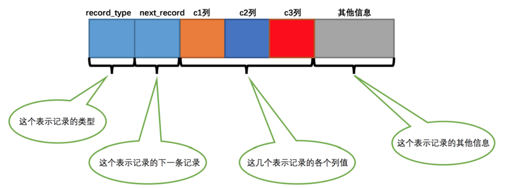
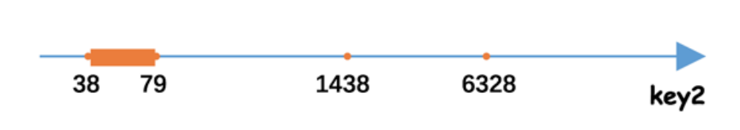
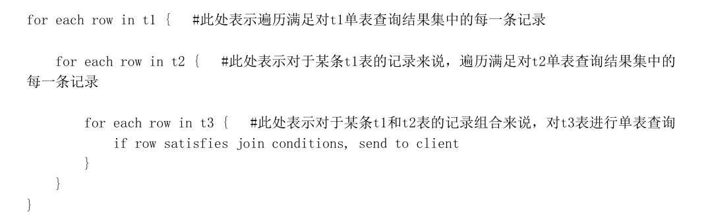
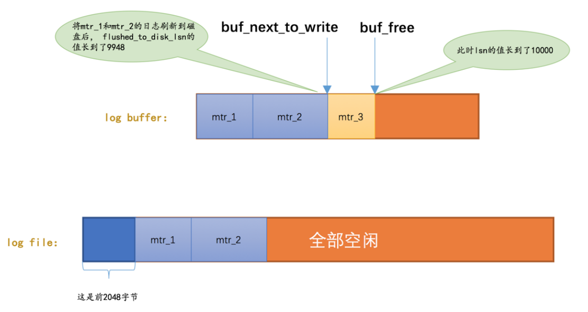
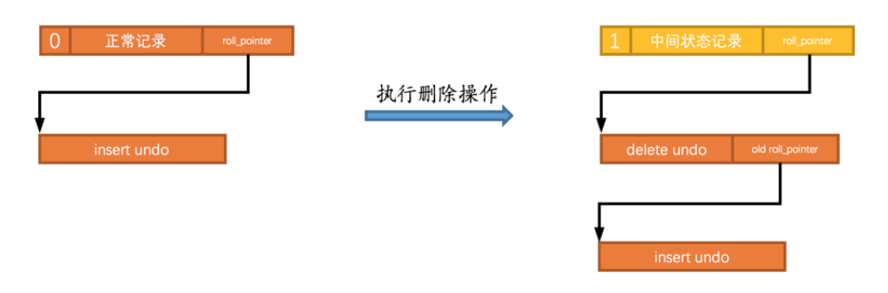

# 

# # 

1. MYSQL的事务隔离机制（3种问题，4种隔离机制）

2. MYSQL的A C I D怎样实现的？

3. MVCC原理

4. MYSQL redo_log原理（实现D）,undo_log原理（实现A）

6. InnoDB和MyISAM的区别

   聚簇索引和非聚簇索引的区别

   MVCC

   非聚簇索引 回表（其实就是考B+树的优势，对叶子节点存数据这边问的很深入，答的不够完整）

   可重复读怎么解决不可重复读问题

##  数据库索引以及为什么要用这种索引 

##  问mysql有哪些存储引擎，你用到什么存储引擎，区别是什么？ 

##  sql优化策略 

##  聚集索引的底层 

## mvcc机制了解嘛

## mysql的表锁有哪些？

## 给了一段sql语句，问会上什么锁？详细解读一下

##  Mysql索引，联合索引，失效，左连接（八股文） 

##  什么是柔性事务 

##  跨库事务如何保证 

## 数据库三大范式

## 事务特性

## 事务隔离级别

##  mysql索引（B+和hash） 

##  聚集索引和非聚集索引 

##  Mysql的主从复制（从数据库依据redolog完成一致性） 

##  binlog和redolog的差异，以及记录写入的先后性（，binlog二进制数据文件，redolog逻辑命令。先后顺序，当时回答binlog先，redolog后，不知对错，面试官没纠正，应该对了） 

##  mysql事务特性（泛谈了ACID，和MVCC） 

##  谈谈锁（sync关键字和ReentrantLock） 

##  sync关键字和ReentrantLock的区别（层级，功能，重量级三个方面） 

##  说说分布式锁

（谈了Redis和Zoo[keep](https://www.nowcoder.com/jump/super-jump/word?word=keep)er的分布式锁实现原理， 


##  可重入锁在过期前续期失败会发生什么

（说了事务回滚和yeid让出） 


##  间隙锁是什么，具体什么时候会加锁

（具体什么时候加锁，这里要把所有情况都说清楚。。 

##  一级索引和二级索引之间是怎么作用的 

##  连接池，一些参数的含义(详细探讨了一下 removeAbandonedTimeout细节) 


## MYSQL的事务隔离机制

 读未提交：一个事务还没提交，它做的变更就能被别的事务看到。读提交：一个事务提交后，它做的变更才能被别的事务看到。可重复读：一个事务执行过程中看到的数据总是和事务启动时看到的数据是一致的。在这个级别下事务未提交，做出的变更其它事务也看不到。串行化：对于同一行记录进行读写会分别加读写锁，当发生读写锁冲突，后面执行的事务需等前面执行的事务完成才能继续执行。 

##  MYSQL的A C I D怎样实现的 

 利用undo log保障原子性。该log保存了事务发生之前的数据的一个版本，可以用于回滚，从而保证事务原子性。 

 利用redo log保证事务的持久性，该log关注于事务的恢复.在重启mysql服务的时候，根据redo log进行重做，从而使事务有持久性。 

 利用undo log+redo log保障一致性。事务中的执行需要redo log，如果执行失败，需要undo log 回滚。 

##  MVCC原理 

 MVCC为多版本并发控制，即同一条记录在系统中存在多个版本。其存在目的是在保证数据一致性的前提下提供一种高并发的访问性能。对数据读写在不加读写锁的情况下实现互不干扰,从而实现数据库的隔离性,在事务隔离级别为读提交和可重复读中使用到。 

 在InnoDB中，事务在开始前会向事务系统申请一个事务ID，该ID是按申请顺序严格递增的。每行数据具有多个版本，每次事务更新数据都会生成新的数据版本，而不会直接覆盖旧的数据版本。数据的行结构中包含多个信息字段。其中实现MVCC的主要涉及最近更改该行数据的事务ID（DBTRXID）和可以找到历史数据版本的指针（DBROLLPTR）。InnoDB在每个事务开启瞬间会为其构造一个记录当前已经开启但未提交的事务ID的视图数组。通过比较[链表]()中的事务ID与该行数据的值与对应的DBTRXID，并通过DBROLLPTR找到历史数据的值以及对应的DBTRXID来决定当前版本的数据是否应该被当前事务所见。最终实现在不加锁的情况下保证数据的一致性 

##  简述redo_log undo_log 

 redo log: 存储引擎级别的log（InnoDB有，MyISAM没有），该log关注于事务的恢复.在重启mysql服务的时候，根据redo log进行重做，从而使事务有持久性。 

 undo log：是存储引擎级别的log（InnoDB有，MyISAM没有）保证数据的原子性，该log保存了事务发生之前的数据的一个版本，可以用于回滚，是MVCC的重要实现方法之一。


# 存储引擎

-  InnoDB 是 MySQL 默认的存储引擎
- InnoDB 是一个将表中的数据存储到磁盘上的存储引擎，所以即使关机后重启我们的数据还是存在的。而真正处理数据的过程是发生在内存中的，所以需要把磁盘中的数据加载到内存中，如果是处理写入或修改请求的话，还需要把内存中的内容刷新到磁盘上。
- InnoDB 采取的方式是：将数据划分为若干个页，以页作为磁盘和内存之间交互的基本单位，InnoDB中页的大小一般为 16 KB。也就是在一般情况下，一次最少从磁盘中读取16KB的内容到内存中，一次最少把内存中的16KB内容刷新到磁盘中。

## InnoDB行格式

- 我们平时是以记录为单位来向表中插入数据的，这些记录在磁盘上的存放方式也被称为 行格式 或者 记录格式 
  -  Compact 、 Redundant 、Dynamic 和 Compressed 

### COMPACT行格式


#### 记录的额外信息

服务器为了描述这条记录而不得不额外添加的一些信息

##### 变长字段长度列表 

MySQL 支持一些变长的数据类型，比如 VARCHAR(M) 、 VARBINARY(M) 、各种 TEXT 类型，各种 BLOB 类型，我们也可以把拥有这些数据类型的列称为 **变长字段** ，变长字段中存储多少字节的数据是**不固定**的，所以我们在存储真实数据的时候需要顺便把这些**数据占用的字节数**也存起来

- 变长字段占用的存储空间分为两部分：
  1. 真正的数据内容
  2. 占用的字节数
- 变长字段长度列表中只存储值为 非NULL 的列内容占用的长度，值为 NULL 的列的长度是不储存的 

把所有变长字段的真实数据占用的字节长度都存放在记录的开头部位，从而形成一个**变长字段长度列表**，各变长字段数据占用的字节数按照列的顺序**逆序存放**


- 确定使用1个字节还是2个字节表示真正字符串占用的**字节数**的规则
  - W: 某个字符集中表示一个字符最多需要使用的字节数
  - M: 变长类型 VARCHAR(M) 来说，这种类型表示能存储最多 M 个字符
  - L: 实际存储的字符串占用的字节数
  - 如果 M×W <= 255 ，那么使用1个字节来表示真正字符串占用的字节数。
  - 如果 M×W > 255 ，则分为两种情况：
    - 如果 L <= 127 ，则用1个字节来表示真正字符串占用的字节数。
    - 如果 L > 127 ，则用2个字节来表示真正字符串占用的字节数。
  - 总结：如果该可变字段允许存储的最大字节数（ M×W ）超过255字节并且真实存储的字节数（ L ）超过127字节，则使用2个字节，否则使用1个字节。

- 区分某个字节是一个单独的字段长度还是半个字段长度
  - 该字节的第一个二进制位作为标志位：如果该字节的第一个位为0，那该字节就是一个单独的字段长度（使用一个字节表示不大于127的二进制的第一个位都为0），如果该字节的第一个位为1，那该字节就是半个字段长度


##### NULL值列表 


表中的某些列可能存储 NULL 值，如果把这些 NULL 值都放到 记录的真实数据 中存储会很占地方，所以 Compact 行格式把这些值为 NULL 的列统一管理起来，存储到 NULL 值列表中

- 处理过程
  1. 统计表中允许存储 NULL 的列有哪些。
  2. 如果表中没有允许存储 NULL 的列，则 NULL值列表 也不存在了
     - 否则将每个允许存储 NULL 的列对应一个二进制位，二进制位按照列的顺序逆序排列
       - 二进制位的值为 1 时，代表该列的值为 NULL 。
       - 二进制位的值为 0 时，代表该列的值不为 NULL 。
  3. MySQL 规定 NULL值列表 必须用整数个字节的位表示，如果使用的二进制位个数不是整数个字节，则在字节的高位补 0 
     - 


##### 记录头信息


由固定的 5 个字节组成。 5 个字节也就是 40 个二进制位


#### 记录的真实数据

MySQL 会为每个记录默认的添加一些列（也称为 隐藏列 ）

InnoDB存储引擎会为每条记录都添加 transaction_id和 roll_pointer 这两个列，但是 row_id 是可选的

（在没有自定义主键以及Unique键的情况下才会添加该列）


- InnoDB 表对主键的生成策略
  1. 优先使用用户自定义主键作为主键，
  2. 如果用户没有定义主键，则选取一个 Unique 键作为主键，
  3. 如果表中连 Unique 键都没有定义的话，则 InnoDB 会为表默认添加一个名为row_id 的隐藏列作为主键


#### CHAR(M)列的存储格式

- 对于 CHAR(M) 类型的列来说，当列采用的是定长字符集时，该列占用的字节数不会被加到变长字段长度列表，而如果采用变长字符集时，该列占用的字节数也会被加到变长字段长度列表。

- 变长字符集的 CHAR(M) 类型的列要求至少占用 M 个字节，而 VARCHAR(M) 却没有这个要求。
  - 比方说对于使用 utf8 字符集的 CHAR(10) 的列来说，该列存储的数据字节长度的范围是10～30个字节。
  - 即使我们向该列中存储一个空字符串也会占用 10 个字节，这是怕将来更新该列的值的字节长度大于原有值的字节长度而小于10个字节时，可以在该记录处直接更新，而不是在存储空间中重新分配一个新的记录空间，导致原有的记录空间成为所谓的碎片。


#### Compact行格式总结

1. 页是 MySQL 中磁盘和内存交互的基本单位，也是 MySQL 是管理存储空间的基本单位。
2. 指定和修改行格式的语法如下：
   - CREATE TABLE 表名 (列的信息) ROW_FORMAT=行格式名称
   - ALTER TABLE 表名 ROW_FORMAT=行格式名称
3. InnoDB 目前定义了4种行格式
   1. COMPACT行格式
      
      - 
      
   2. Redundant行格式
      
      - 
      
      - 
      
   3. Dynamic和Compressed行格式
      - 这两种行格式类似于 COMPACT行格式 ，只不过在处理行溢出数据时有点儿分歧，它们不会在记录的真实数据处存储字符串的前768个字节，而是把所有的字节都存储到其他页面中，只在记录的真实数据处存储其他页面的地址。
      - 另外， Compressed 行格式会采用压缩算法对页面进行压缩。
   
   4. 一个页一般是 16KB ，当记录中的数据太多，当前页放不下的时候，会把多余的数据存储到其他页中，这种现象称为 行溢出 


## InnoDB数据页结构

### 数据页结构的快速浏览

存放我们表中记录的那种类型的页，官方称这种存放记录的页为索引（ INDEX ）页(数据页)


### 记录在页中的存储

- 存储的记录会按照我们指定的 行格式 存储到 User Records 部分.
- 但是在一开始生成页的时候，其实并没有 User Records 这个部分，每当我们插入一条记录，都会从 Free Space 部分，也就是尚未使用的存储空间中申请一个记录大小的空间划分到 User Records 部分，
- 当 Free Space 部分的空间全部被 User Records 部分替代掉之后，也就意味着这个页使用完了，如果还有新的记录插入的话，就需要去申请新的页了


### 记录头信息

如果我们设置了表的主键，行格式中InnoDB就没必要为我们去创建那个所谓的 row_id 隐藏列了

> 创建表 page_demo


> 表中记录的行格式


> 记录头信息的各个属性


> 记录头信息中的各个属性解释


#### delete_mask

- 标记着当前记录是否被删除，占用1个二进制位，
- 0: 记录并没有被删除，
- 1: 记录被删除掉了

- 这些被删除的记录之所以不立即从磁盘上移除，是因为移除它们之后把其他的记录在磁盘上重新排列需要性能消耗，所以只是打一个删除标记而已，
- 所有被删除掉的记录都会组成一个 **垃圾链表** ，在这个链表中的记录占用的空间称之为所谓的**可重用空间** ，之后如果有新记录插入到表中的话，可能把这些被删除的记录占用的存储空间覆盖掉
- 将这个delete_mask位设置为1和将被删除的记录加入到垃圾链表中其实是两个阶段

#### min_rec_mask

B+树的每层非叶子节点中的最小记录都会添加该标记

#### n_owned

#### heap_no

- 当前记录在本页中的位置


- InnoDB会自动给每个页里边儿加两个记录，称为 伪记录 或者 虚拟记录 。
- 这两个伪记录一个代表 最小记录 ，一个代表 最大记录
- 记录也可以比大小，对于一条完整的记录来说，比较记录的大小就是比较 主键 的大小
- 这两条记录的构造十分简单，都是由5字节大小的 记录头信息 和8字节大小的一个固定的部分组成的
- 由于这两条记录不是我们自己定义的记录，所以它们并不存放在 页 的 User Records 部分，他们被单独放在一个称为 Infimum + Supremum 的部分


从图中我们可以看出来，最小记录和最大记录的 heap_no 值分别是 0 和 1 ，也就是说它们的位置最靠前


#### record_type

- 这个属性表示当前记录的类型，一共有4种类型的记录， 
- 0 表示普通记录
- 1 表示B+树非叶节点记录
- 2 表示最小记录
- 3 表示最大记录

#### next_record

- 表示从当前记录的真实数据到下一条记录的真实数据的地址偏移量(链表)
  - 比方说第一条记录的 next_record 值为 32 ，意味着从第一条记录的真实数据的地址处向后找 32 个字节便是下一条记录的真实数据
- 这其实是个 链表 ，可以通过一条记录找到它的下一条记录

-  下一条记录 指得并不是按照我们插入顺序的下一条记录，而是按照**主键值由小到大**的顺序的下一条记录

-  **Infimum**记录（也就是最小记录） 的下一条记录就是**本页中主键值最小**的用户记录，
- 而**本页中主键值最大**的用户记录的下一条记录就是 **Supremum**记录（也就是最大记录） 

- 我们的记录按照**主键从小到大**的顺序形成了一个单链表。 最大记录 的 next_record 的值为 0 ，这也就是说最大记录是没有 下一条记录 了，它是这个单链表中的最后一个节点。如果从中删除掉一条记录，这个链表也是会跟着变化的


> 删掉第2条记录后

- 第2条记录并没有从存储空间中移除，而是把该条记录的 delete_mask 值设置为 1 。
- 第2条记录的 next_record 值变为了0，意味着该记录没有下一条记录了。
- 第1条记录的 next_record 指向了第3条记录。
- 最大记录 的 n_owned 值从 5 变成了 4 


- 不论我们怎么对页中的记录做增删改操作，InnoDB始终会维护一条记录的单链表，链表中的各个节点是按照主键值由小到大的顺序连接起来的

> next_record这个指针为啥要指向记录头信息和真实数据之间的位置呢

- 因为这个位置刚刚好，向左读取就是记录头信息，向右读取就是真实数据。
- 我们前边还说过变长字段长度列表、NULL值列表中的信息都是逆序存放，这样可以使记录中位置靠前的字段和它们对应的字段长度信息在内存中的距离更近，可能会提高高速缓存的命中率

>将删除的第2条记录插入到表中

- InnoDB 并没有因为新记录的插入而为它申请新的存储空间，而是直接复用了原来被删除记录的存储空间
- 当数据页中存在多条被删除掉的记录时，这些记录的next_record属性将会把这些被删除掉的记录组成一个垃圾链表，以备之后重用这部分存储空间


### Page Directory（页目录）

现在我们了解了记录在页中按照主键值由小到大顺序串联成一个单链表，那如果我们想根据主键值查找页中的某条记录该咋办呢?

#### 制作页目录

1. 将所有正常的记录（包括最大和最小记录，**不包括标记为已删除的记录**）划分为几个组。
2. 每个组的最后一条记录（也就是组内最大的那条记录）的头信息中的 **n_owned** 属性表示该记录拥有多少条记录，也就是该组内共有几条记录。
3. 将每个组的最后一条记录的**地址偏移量**单独提取出来按顺序存储到靠近 页 的尾部的地方，这个地方就是所谓的 Page Directory ，也就是 页目录
4. 页面目录中的这些地址偏移量被称为 **槽** （英文名： Slot ），所以这个页面目录就是由 槽 组成的。

InnoDB 如下记录分成两组，第一组中只有一个最小记录，第二组中是剩余的5条记录


> 注意点

- 现在 页目录 部分中有两个槽，也就意味着我们的记录被分成了两个组， 
  - 槽1 中的值是 112 ，代表最大记录的地址偏移量（就是从页面的0字节开始数，数112个字节）；
  - 槽0 中的值是 99 ，代表最小记录的地址偏移量。
- 注意最小和最大记录的头信息中的 n_owned 属性
  - 最小记录的 n_owned 值为 1 ，这就代表着以最小记录结尾的这个分组中只有 1 条记录，也就是最小记录
    本身。
    最大记录的 n_owned 值为 5 ，这就代表着以最大记录结尾的这个分组中只有 5 条记录，包括最大记录本
    身还有我们自己插入的 4 条记录

> 修改表示方式, 用箭头以及调整page directory的位置


> 为什么最小记录的 n_owned 值为1，而最大记录的 n_owned 值为 5 呢?

- 对每个分组中的记录条数是有规定
  - 对于最小记录所在的分组只能有 1 条记录，
  - 最大记录所在的分组拥有的记录条数只能在 1~8 条之间，
  - 剩下的分组中记录的条数范围只能在是 4~8 条之间。

> 分组的步骤

1. 初始情况下一个数据页里只有最小记录和最大记录两条记录，它们分属于两个分组。
2. 之后每插入一条记录，都会从 页目录 中找到主键值比本记录的主键值大并且差值最小的槽，然后把该槽对
   应的记录的 n_owned 值加1，表示本组内又添加了一条记录，直到该组中的记录数等于8个。
3. 在一个组中的记录数等于8个后再插入一条记录时，会将组中的记录拆分成两个组，一个组中4条记录，另一
   个5条记录。这个过程会在 页目录 中新增一个 槽 来记录这个新增分组中最大的那条记录的偏移量

> 如何从页目录查找记录?

- 因为各个槽代表的记录的主键值都是从小到大排序的，所以我们可以使用所谓的 二分法 来进行快速查找
- 4个槽的编号分别是： 0 、 1 、 2 、 3 、 4 ，所以初始情况下最低的槽就是 low=0 ，最高的槽就是high=4 。比方说我们想找主键值为 6 的记录
  1. 计算中间槽的位置： (0+4)/2=2 ，所以查看 槽2 对应记录的主键值为 8 ，又因为 8 > 6 ，所以设置
     high=2 ， low 保持不变。
  2. 重新计算中间槽的位置： (0+2)/2=1 ，所以查看 槽1 对应的主键值为 4 ，又因为 4 < 6 ，所以设置
      low=1 ， high 保持不变。
  3. 因为 high - low 的值为1，所以确定主键值为 5 的记录在 槽2 对应的组中。
    1. 此刻我们需要找到 槽2 中主键值最小的那条记录，然后沿着单向链表遍历 槽2 中的记录。
    2. 但是我们前边又说过，每个槽对应的记录都是该组中主键值最大的记录，这里 槽2 对应的记录是主键值为 8 的记录，怎么定位一个组中最小的记录呢？
    3. 别忘了各个槽都是挨着的，我们可以很轻易的拿到 槽1 对应的记录（主键值为 4 ），该条记录的下一条记录就是 槽2 中主键值最小的记录，该记录的主键值为 5 。
    4. 所以我们可以从这条主键值为 5 的记录出发，遍历 槽2 中的各条记录，直到找到主键值为 6 的那条记录即可。
    5. 由于一个组中包含的记录条数只能是1~8条，所以遍历一个组中的记录的代价是很小的


> 所以在一个数据页中查找指定主键值的记录的过程分为两步：

- 通过二分法确定该记录所在的槽，并找到该槽中主键值最小的那条记录。
- 通过记录的 next_record 属性遍历该槽所在的组中的各个记录。


### Page Header（页面头部）

- 为了能得到一个数据页中存储的记录的状态信息，比如本页中已经存储了多少条记录，第一条记录的地址是什么，页目录中存储了多少个槽等等，特意在页中定义了一个叫 Page Header 的部分

- 它是页 结构的第二部分，这个部分占用固定的 56 个字节，专门存储各种状态信息


#### PAGE_DIRECTION 

假如新插入的一条记录的主键值比上一条记录的主键值大，我们说这条记录的插入方向是右边，反之则是左边。用来表示最后一条记录插入方向的状态就是 PAGE_DIRECTION

#### PAGE_N_DIRECTION 

假设连续几次插入新记录的方向都是一致的， InnoDB 会把沿着同一个方向插入记录的条数记下来，这个条数就用 PAGE_N_DIRECTION 这个状态表示。当然，如果最后一条记录的插入方向改变了的话，这个状态的值会被清零重新统计


### File Header（文件头部）

File Header 针对各种类型的页都通用，也就是说不同类型的页都会以 File Header 作为第一个组成部分，它描述了一些针对各种页都通用的一些信息，比方说这个页的编号是多少，它的上一个页、下一个页是谁这个部分占用固定的 38 个字节


#### FIL_PAGE_SPACE_OR_CHKSUM

- 这个代表当前页面的校验和（checksum）。啥是个校验和？
- 就是对于一个很长很长的字节串来说，我们会通过某种算法来计算一个比较短的值来代表这个很长的字节串，这个比较短的值就称为 校验和 。
- 这样在比较两个很长的字节串之前先比较这两个长字节串的校验和，如果校验和都不一样两个长字节串肯定是不同的，所以省去了直接比较两个比较长的字节串的时间损耗

#### FIL_PAGE_OFFSET

每一个 页 都有一个单独的页号，就跟你的身份证号码一样， InnoDB 通过页号来可以唯一定位一个 页

#### FIL_PAGE_TYPE

这个代表当前 页 的类型，我们前边说过， InnoDB 为了不同的目的而把页分为不同的类型，我们上边介绍的
其实都是存储记录的 数据页 ，其实还有很多别的类型的页

我们存放记录的数据页的类型其实是 FIL_PAGE_INDEX ，也就是所谓的 索引页

#### FIL_PAGE_PREV 和 FIL_PAGE_NEXT

- InnoDB 都是以页为单位存放数据的，有时候我们存放某种类型的数据占用的空间非常大（比方说一张表中可以有成千上万条记录）， 
- InnoDB 可能不可以一次性为这么多数据分配一个非常大的存储空间，如果分散到多个不连续的页中存储的话需要把这些页关联起来，
- FIL_PAGE_PREV 和 FIL_PAGE_NEXT就分别代表本页的上一个和下一个页的页号。这样通过建立一个双向链表把许许多多的页就都串联起来了，而无需这些页在物理上真正连着。
- 需要注意的是，并不是所有类型的页都有上一个和下一个页的属性，不过我们本集中唠叨的 数据页 （也就是类型为 FIL_PAGE_INDEX 的页）是有这两个属性的，所以所有的数据页其实是一个双链表


### File Trailer

我们知道 InnoDB 存储引擎会把数据存储到磁盘上，但是磁盘速度太慢，需要以 页 为单位把数据加载到内存中处
理，如果该页中的数据在内存中被修改了，那么在修改后的某个时间需要把数据同步到磁盘中。但是在同步了一
半的时候中断电了咋办，这不是莫名尴尬么？为了检测一个页是否完整（也就是在同步的时候有没有发生只同步一半的尴尬情况），设计 InnoDB 的大叔们在每个页的尾部都加了一个 File Trailer 部分，这个部分由 8 个字节组成，可以分成2个小部分

- 前4个字节代表页的校验和
  - 这个部分是和 File Header 中的校验和相对应的。每当一个页面在内存中修改了，在同步之前就要把它的校验和算出来，
  - 因为 File Header 在页面的前边，所以校验和会被首先同步到磁盘，当完全写完时，校验和也会被写到页的尾部，
  - 如果完全同步成功，则页的首部和尾部的校验和应该是一致的。如果写了一半儿断电了，那么在 File Header 中的校验和就代表着已经修改过的页，而在 File Trialer 中的校验和代表着原先的页，二者不同则意味着同步中间出了错。
- 后4个字节代表页面被最后修改时对应的日志序列位置（LSN）
  - 这个部分也是为了校验页的完整性的

这个 File Trailer 与 File Header 类似，都是所有类型的页通用的。


### 数据页结构总结

1.  InnoDB为了不同的目的而设计了不同类型的页，我们把用于存放记录的页叫做 **数据页** 
2.  一个数据页可以被大致划分为7个部分，分别是
   1. File Header ，表示页的一些通用信息，占固定的38字节。
   2. Page Header ，表示数据页专有的一些信息，占固定的56个字节。
   3. Infimum + Supremum ，两个虚拟的伪记录，分别表示页中的最小和最大记录，占固定的 26 个字节。
   4. User Records ：真实存储我们插入的记录的部分，大小不固定。
   5. Free Space ：页中尚未使用的部分，大小不确定。
   6. Page Directory ：页中的某些记录相对位置，也就是各个槽在页面中的地址偏移量，大小不固定，插入的记录越多，这个部分占用的空间越多。
   7. File Trailer ：用于检验页是否完整的部分，占用固定的8个字节。
3. 每个记录的头信息中都有一个 next_record 属性，从而使页中的所有记录串联成一个 单链表 。
4. InnoDB 会为把页中的记录划分为若干个组，每个组的**最后一个记录的地址偏移量**作为一个 **槽** ，存放在**Page Directory** 中，所以在一个页中根据**主键**查找记录是非常快的，分为两步：
      1. 通过二分法确定该记录所在的槽。
      2.  找到槽对应的分组中最小的记录,通过记录的next_record属性遍历该槽所在的组中的各个记录。
5. 每个数据页的 File Header 部分都有上一个和下一个页的编号，所以所有的数据页会组成一个 双链表 。
6.  为保证从内存中同步到磁盘的页的完整性，在页的首部和尾部都会存储页中数据的校验和和页面最后修改时对应的 LSN 值，如果首部和尾部的校验和和 LSN 值校验不成功的话，就说明同步过程出现了问题。


## InnoDB的表空间-存放页面的大池子

> 表空间 是一个抽象的概念

- 对于系统表空间来说，对应着文件系统中一个或多个实际文件；
- 对于每个独立表空间来说，对应着文件系统中一个名为 表名.ibd 的实际文件
- 可以把表空间想象成被切分为许许多多个 页 的池子，当我们想为某个表插入一条记录的时候，就从池子中捞出一个对应的页来把数据写进去


### 页面类型

- InnoDB是以页为单位管理存储空间的，
- 我们的聚簇索引（也就是完整的表数据）和其他的二级索引都是以 B+ 树的形式保存到表空间的，
- 而 B+ 树的节点就是数据页( FIL_PAGE_INDEX)

#### 常用的页面类型


页面类型前边都有个 FIL_PAGE 或者 FIL_PAGE_TYPE 的前缀，为简便起见我们后边唠叨页面类型的时候就把这些前缀省略掉了

### 页面通用部分

数据页，也就是 INDEX 类型的页由7个部分组成，其中的两个部分是所有类型的页面都通用的,任何类型的页面都有下边这种通用的结构：


> 任何类型的页都会包含这两个部分：

- File Header ：记录页面的一些通用信息
- File Trailer ：校验页是否完整，保证从内存到磁盘刷新时内容的一致性

> File Header 的各个组成部分：


-  FIL_PAGE_OFFSET
  - 表空间中的每一个页都对应着一个页号这个页号由4个字节组成，也就是32个比特位，
  - 所以一个表空间最多可以拥有2³²个页，如果按照页的默认大小16KB来算，一个表空间最多支持64TB的数据。
  - 表空间的第一个页的页号为0，之后的页号分别是1，2，3...依此类推
- FIL_PAGE_PREV 和FIL_PAGE_NEXT 
  - 某些类型的页可以组成双向链表，链表中的页可以不按照物理顺序存储，
  - 而是根据 来存储上一个页和下一个页的页号。
  - 需要注意的是，这两个字段主要是为了 INDEX 类型的页，也就是我们之前一直说的数据页建立 B+ 树后，为每层节点建立双向链表用的，一般类型的页是不使用这两个字段的。
- FIL_PAGE_TYPE 
  - 每个页的类型
  - 比如像数据页的该字段的值就是 0x45BF ，不同类型的页在该字段上的值是不同的。

### 独立表空间结构

#### 区（extent）的概念

- 表空间中的页实在是太多了，为了更好的**管理**这些页面，设计 InnoDB 的大叔们提出了区的概念。
- 对于16KB的页来说，**连续的64个页**就是一个 区 ，也就是说一个区默认占用**1MB**空间大小。
- 不论是系统表空间还是独立表空间，都可以看成是由**若干个区组成**的，每**256个区被划分成一组**


>这些组的头几个页面的类型都是类似的


- 第一个组最开始的3个页面的类型是固定的，也就是说 extent 0 这个区最开始的3个页面的类型是固定的，
  - FSP_HDR 类型：
    - 这个类型的页面是用来登记**整个表空间**的一些整体属性
    - 以及**本组所有的区** 也就是extent 0 ~ extent 255 这256个区的属性
    - 需要注意的一点是，整个表空间**只有一个 FSP_HDR** 类型的页面。
  - IBUF_BITMAP 类型：
    - 这个类型的页面是存储本组所有的区的所有页面关于 INSERT BUFFER 的信息。
  - INODE 类型：
    - 这个类型的页面存储了许多称为 INODE 的数据结构，
- 其余各组最开始的2个页面的类型是固定的，也就是说 extent 256 、 extent 512 这些区最开始的2个页面的类型是固定的
  - XDES 类型：
    - 全称是 extent descriptor ，用来登记**本组256个区的属性，**
    - 也就是说对于在 extent 256区中的该类型页面存储的就是 extent 256 ~ extent 511 这些区的属性，
    - 对于在 extent 512 区中的该类型页面存储的就是 extent 512 ~ extent 767 这些区的属性。
    - 上边介绍的 FSP_HDR 类型的页面其实和 XDES 类型的页面的作用类似，只不过 FSP_HDR 类型的页面还会额外存储一些表空间的属性。
  - IBUF_BITMAP 类型


> 区的总结

- 表空间被划分为许多连续的区 ，
- 每个区默认由64个页组成，
- 每256个区划分为一组，
- 每个组的最开始的几个页面类型是固定的


#### 段（segment）的概念

##### 为什么要引入区的概念

> 考虑范围查询的场景:

- 我们每向表中插入一条记录，本质上就是向该表的聚簇索引以及所有二级索引代表的 B+ 树的节点中插入数
  据。
- 而 B+ 树的每一层中的页都会形成一个双向链表，如果是以 页 为单位来分配存储空间的话，双向链表相
  邻的两个页之间的物理位置可能离得非常远。
- 对于范围查询只需要定位到最左边的记录和最右边的记录，然后沿着双向链表一直扫描就可以了，
- 而如果链表中相邻的两个页物理位置离得非常远，就是所谓的 随机I/O 。
- 磁盘的速度和内存的速度差了好几个数量级， 随机I/O 是非常慢的，所以我们应该尽量让链表中相邻的页的物理位置也相邻，这样进行范围查询的时候才可以使用所谓的 顺序I/O

所以才引入了 区 （ extent ）的概念，一个区就是在物理位置上连续的64个页。

在表中数据量大的时候，为某个索引分配空间的时候就不再按照页为单位分配了，而是按照 区 为单位分配，甚至在表中的数据十分非常特别多的时候，可以一次性分配多个连续的区。虽然可能造成一点点空间的浪费（数据不足填充满整个区），但是从性能角度看，可以消除很多的随机 I/O

> 叶子结点和非叶子节点的分别存放

- 范围查询，其实是对 B+ 树叶子节点中的记录进行顺序扫描
- 而如果不区分叶子节点和非叶子节点，统统把节点代表的页面放到申请到的区中的话，进行范围扫描的效果就大打折扣了
- 所以叶子节点有自己独有的 区 ，非叶子节点也有自己独有的 区 。
- 存放叶子节点的区的集合就算是一个 段 （ segment ），存放非叶子节点的区的集合也算是一个 段 
- 一个索引会生成2个段，一个叶子节点段，一个非叶子节点段。


> 碎片区 fragment

默认情况下一个使用 InnoDB 存储引擎的表只有一个聚簇索引，一个索引会生成2个段，而段是以区为单位申请存
储空间的，一个区默认占用1M存储空间，所以默认情况下一个只存了几条记录的小表也需要2M的存储空间么？

提出了一个碎片（fragment）区的概念

- 在一个碎片区中，并不是所有的页都是为了存储同一个段的数据而存在的，
- 而是碎片区中的页可以用于不同的目的，比如有些页用于段A，有些页用于段B，有些页哪个段都不属于。
- 碎片区直属于表空间，并不属于任何一个段

> 段分配存储空间的策略

- 在刚开始向表中插入数据的时候，段是从某个碎片区以单个页面为单位来分配存储空间的。
- 当某个段已经占用了**32个碎片区**页面之后，就会以**完整的区**为单位来分配存储空间

> 段的精确定义:

某些零散的页面以及一些完整的区的集合


#### 区的分类

> 表空间的是由若干个区组成的:

- 空闲的区：现在还没有用到这个区中的任何页面。
- 有剩余空间的碎片区：表示碎片区中还有可用的页面。
- 没有剩余空间的碎片区：表示碎片区中的所有页面都被使用，没有空闲页面。
- 附属于某个段的区。每一个索引都可以分为叶子节点段和非叶子节点段，除此之外InnoDB还会另外定义一些
  特殊作用的段，在这些段中的数据量很大时将使用区来作为基本的分配单位。


>4种类型的区也可以被称为区的4种状态（ State ）


处于 FREE 、 FREE_FRAG 以及 FULL_FRAG 这三种状态的区都是独立的，算是直属于表空间；

而处于 FSEG 状态的区是附属于某个段的


##### XDES Entry(Extent Descriptor Entry)

每一个区都对应着一个 XDES Entry 结构，这个结构记录了对应的区的一些属性


 XDES Entry 是一个40个字节的结构，大致分为4个部分

- Segment ID （8字节）
  - 每一个段都有一个唯一的编号，用ID表示，此处的 Segment ID 字段表示就是该区所在的段。
  - 当然前提是该区已经被分配给某个段了，不然的话该字段的值没啥意义。
- List Node （12字节）
  - 这个部分可以将若干个 XDES Entry 结构串联成一个链表
  - 
  - 定位表空间内的某一个位置的话，只需指定**页号**以及该位置在指定页号中的**页内偏移量**即可
    - Pre Node Page Number 和 Pre Node Offset 的组合就是指向前一个 XDES Entry 的指针
    - Next Node Page Number 和 Next Node Offset 的组合就是指向后一个 XDES Entry 的指针
- State （4字节）
  - 这个字段表明区的状态。可选的值分别是： FREE 、 FREE_FRAG 、 FULL_FRAG和 FSEG 。
- Page State Bitmap （16字节）
  - 这个部分共占用16个字节，也就是128个比特位。
  - 我们说一个区默认有64个页，这128个比特位被划分为64个部分，每个部分2个比特位，对应区中的一个页。
  - 比如 Page State Bitmap 部分的第1和第2个比特位对应着区中的第1个页面，第3和第4个比特位对应着区中的第2个页面，依此类推，
  - 每个页对应的这两个比特位的第一个位表示对应的页是否是空闲的，第二个比特位还没有用。


##### XDES Entry链表

> 向某个段中插入数据的过程

- 当段中数据较少的时候，首先会查看表空间中是否有状态为 FREE_FRAG 的区，
  - 也就是找还有空闲空间的碎片区，如果找到了，那么从该区中取一些零碎的页把数据插进去；
- 否则到表空间下申请一个状态为 FREE 的区，也就是空闲的区，
  - 把该区的状态变为 FREE_FRAG ，然后从该新申请的区中取一些零碎的页把数据插进去。
  - 之后不同的段使用零碎页的时候都会从该区中取，直到该区中没有空闲空间，然后该区的状态就变成了FULL_FRAG 


> 如何知道表空间里所有区的状态?

我们可以通过 List Node 中的指针，做这么三件事

- 把状态为 FREE 的区对应的 XDES Entry 结构通过 List Node 来连接成一个FREE 链表，
- 把状态为 FREE_FRAG 的区对应的 XDES Entry 结构通过 List Node 来连接成一个FREE_FRAG链表，
- 把状态为 FULL_FRAG 的区对应的 XDES Entry 结构通过 List Node 来连接成一个 FULL_FRAG 链表，

这样每当我们想找一个 FREE_FRAG 状态的区时，就直接把 FREE_FRAG 链表的头节点拿出来，从这个节点
中取一些零碎的页来插入数据，当这个节点对应的区用完时，就修改一下这个节点的 State 字段的值，
然后从 FREE_FRAG 链表中移到 FULL_FRAG 链表中。

同理，如果 FREE_FRAG 链表中一个节点都没有，那么就直接从 FREE 链表中取一个节点移动到 FREE_FRAG 链表的状态，并修改该节点的 STATE 字段值为FREE_FRAG ，然后从这个节点对应的区中获取零碎的页就好了


> 每个段中的区对应的 XDES Entry 结构建立了三个链表

当段中数据已经占满了32个零散的页后，就直接申请完整的区来插入数据了。

每个段中的区对应的 XDES Entry 结构建立了三个链表

- FREE 链表：同一个段中，所有页面都是空闲的区对应的 XDES Entry 结构会被加入到这个链表。注意和
  直属于表空间的 FREE 链表区别开了，此处的 FREE 链表是附属于某个段的。
- NOT_FULL 链表：同一个段中，仍有空闲空间的区对应的 XDES Entry 结构会被加入到这个链表。
- FULL 链表：同一个段中，已经没有空闲空间的区对应的 XDES Entry 结构会被加入到这个链表。

每一个索引都对应两个段，每个段都会维护上述的3个链表


##### 链表基结点

>  List Base Node

这个结构中包含了链表的头节点和尾节点的指针以及这个链表中包含了多少节点的信息


- List Length 表明该链表一共有多少节点，
- First Node Page Number 和 First Node Offset 表明该链表的头节点在表空间中的位置。
- Last Node Page Number 和 Last Node Offset 表明该链表的尾节点在表空间中的位置。

一般我们把某个链表对应的 List Base Node 结构放置在表空间中固定的位置

##### 链表小结

- 表空间是由若干个区组成的，每个区都对应一个 XDES Entry 的结构，
- 直属于表空间的区对应的 XDESEntry 结构可以分成 FREE 、 FREE_FRAG 和 FULL_FRAG 这3个链表；
- 每个段可以附属若干个区，每个段中的区对应的 XDES Entry 结构可以分成 FREE 、 NOT_FULL 和 FULL 这3个链表。
- 每个链表都对应一个 List Base Node 的结构，这个结构里记录了链表的头、尾节点的位置以及该链表中包含的节点数。


#### 段的结构

段不对应表空间中某一个连续的物理区域，而是一个逻辑上的概念，由若干个零散的页面以及一些完整的区组成

每个段都定义了一个 INODE Entry 结构来记录一下段中的属性

##### INODE Entry


- Segment ID
  - 就是指这个 INODE Entry 结构对应的段的编号（ID）。
- NOT_FULL_N_USED
  - 这个字段指的是在 NOT_FULL 链表中已经使用了多少个页面。
  - 下次从 NOT_FULL 链表分配空闲页面时可以直接根据这个字段的值定位到。而不用从链表中的第一个页面开始遍历着寻找空闲页面。
- 3个 List Base Node
  - 分别为段的 FREE 链表、 NOT_FULL 链表、 FULL 链表定义了 List Base Node ，这样我们想查找某个段的某个链表的头节点和尾节点的时候，就可以直接到这个部分找到对应链表的 List Base Node 
- Magic Number ：
  - 这个值是用来标记这个 INODE Entry 是否已经被初始化了（初始化就是把各个字段的值都填进去了）。
  - 如果这个数字是值的 97937874 ，表明该 INODE Entry 已经初始化，否则没有被初始化。
- Fragment Array Entry
  - 我们前边强调过无数次段是一些零散页面和一些完整的区的集合，每个 Fragment Array Entry 结构都对应着一个零散的页面，这个结构一共4个字节，表示一个零散页面的页号。
  - 占满**32个碎片区**页面之后，就会以**完整的区**为单位来分配存储空间


#### 各类页面详细解析

了解了表空间、段、区、XDES Entry、INODE Entry、各种以 XDES Enty 为节点的链表的基本概念了

> 疑问

- 每个区对应的 XDES Entry 结构到底存储在表空间的什么地方？
- 直属于表空间的 FREE 、 FREE_FRAG 、 FULL_FRAG 链表的基节点到底存储在表空间的什么地方？
- 每个段对应的 INODE Entry 结构到底存在表空间的什么地方?

从每个组开头的一些类型相同的页面说起

##### FSP_HDR 类型

- 第一个组的第一个页面，当然也是表空间的第一个页面，页号为 0 。
- 这个页面的类型是 FSP_HDR ，
- 它存储了表空间的一些整体属性
- 以及第一个组内256个区的对应的 XDES Entry 结构


> FSP_HDR页面组成


###### File Space Header部分

存储表空间的一些整体属性的


> 表空间头部属性


- List Base Node for FREE List 、 List Base Node for FREE_FRAG List 、 List Base Node forFULL_FRAG List 
  - 分别是直属于表空间的 FREE 链表的基节点、 FREE_FRAG 链表的基节点、FULL_FRAG 链表的基节点，
  - 这三个链表的基节点在表空间的位置是固定的，就是在表空间的第一个页面（也就是 FSP_HDR 类型的页面）的 File Space Header 部分。

- FRAG_N_USED
  - 这个字段表明在 FREE_FRAG 链表中已经使用的页面数量，方便之后在链表中查找空闲的页面。

- FREE Limit
  - 我们知道表空间都对应着具体的磁盘文件，一开始我们创建表空间的时候对应的磁盘文件中都没有数据，
  - 所以我们需要对表空间完成一个初始化操作，包括为表空间中的区建立 XDES Entry 结构，为各个段建立
    INODE Entry 结构，建立各种链表的各种操作。
  - 我们可以一开始就为表空间申请一个特别大的空间，但是实际上有绝大部分的区是空闲的，
    - 我们可以选择把所有的这些空闲区对应的 XDES Entry 结构加入FREE 链表，
    - 也可以选择只把一部分的空闲区加入 FREE 链表，等啥时候空闲链表中的 XDES Entry 结构对应
      的区不够使了，再把之前没有加入 FREE 链表的空闲区对应的 XDES Entry 结构加入 FREE 链表，
  - 中心思想就是啥时候用到啥时候初始化
  - 他们为表空间定义了 FREE Limit 这个字段，在该字段表示的页号之前的区都被初始化了，之后的区尚未被初始化。

- Next Unused Segment ID
  - 表中每个索引都对应2个段，每个段都有一个唯一的ID，那当我们为某个表新创建一个索引的时候，就意味着要创建两个新的段。
  - 那怎么为这个新创建的段找一个唯一的ID呢？
  -  NextUnused Segment ID 的字段，该字段表明当前表空间中最大的段ID的下一个ID，
  - 这样在创建新段的时候赋予新段一个唯一的ID值就so easy啦，直接使用这个字段的值就好了。

- Space Flags
  - 表空间对于一些布尔类型的属性，或者只需要寥寥几个比特位搞定的属性都放在了这个 Space Flags 中存
    储，虽然它只有4个字节，32个比特位大小，却存储了好多表空间的属性

- List Base Node for SEG_INODES_FULL List 和 List Base Node for SEG_INODES_FREE List
  - 每个段对应的 INODE Entry 结构会集中存放到一个类型位 INODE 的页中，如果表空间中的段特别多，则会有多个 INODE Entry 结构，可能一个页放不下，这些 INODE 类型的页会组成两种列表：
    - 一个表空间对应数据库的一张表, 每个表可能会创建多个索引, 每个索引都有两个segment, 每个segment都有一个INODE Entry 来描述对应的链表基结点和碎片区信息
  - SEG_INODES_FULL 链表，该链表中的 INODE 类型的页面都已经被 INODE Entry 结构填充满了，没空闲
    空间存放额外的 INODE Entry 了。
  - SEG_INODES_FREE 链表，该链表中的 INODE 类型的页面都仍有空闲空间来存放 INODE Entry 结构。
    


###### XDES Entry部分

XDES Entry 就是在表空间的第一个页面中保存的

一个 XDES Entry 结构的大小是40字节，但是一个页面的大小有限，只能存放有限个 XDES Entry 结构，所以我们才把256个区划分成一组，在每组的第一个页面中存放256个 XDES Entry 结构

每个区对应的 XDES Entry 结构的地址是固定的，所以我们访问这些结构就so easy啦

##### XDES 类型

- 每一个 XDES Entry 结构对应表空间的一个区，虽然一个 XDES Entry 结构只占用40字节，在区的数量非常多时，一个单独的页可能就不够存放足够多的 XDES Entry 结构，
- 所以我们把表空间的区分为若干个组，每组开头的一个页面记录着本组内所有的区对应的 XDES Entry 结构。
- 由于第一个组的第一个页面有些特殊，因为它也是整个表空间的第一个页面，所以除了记录本组中的所有区对应的 XDES Entry 结构以外，还记录着表空间的一些整体属性，这个页面的类型就是我们刚刚说完的 FSP_HDR 类型，整个表空间里只有一个这个类型的页面。
- 除去第一个分组以外，之后的每个分组的第一个页面只需要记录本组内所有的区对应的 XDES Entry 结构即可，不需要再记录表空间的属性了，为了和 FSP_HDR 类型做区别，我们把之后每个分组的第一个页面的类型定义为 XDES ，它的结构和 FSP_HDR 类型是非常相似的
- 与 FSP_HDR 类型的页面对比，除了少了 File Space Header 部分之外，也就是除了少了记录表空间整体属性的部分之外，其余的部分是一样


##### IBUF_BITMAP 类型

每个分组的第二个页面的类型都是 IBUF_BITMAP ，这种类型的页里边记录了一些有关 Change Buffer 的东西

##### INODE 类型

- 第一个分组的第三个页面的类型是 INODE 。
- 每个索引定义了两个段，而且为某些特殊功能定义了些特殊的段。
- 为了方便管理，他们又为每个段设计了一个INODE Entry 结构，这个结构中记录了关于这个段的相关属性。
- 而我们这会儿要介绍的这个 INODE 类型的页就是为了存储 INODE Entry 结构而存在的
- 因为INODE是用来描述段的, 而段是属于表空间的, 所以放在表空间第一个组的第一个区的第三个页来描述整个表空间相关的段的信息


> INODE类型的页面组成


-  INODE Entry
  - 主要包括对应的段内零散页面的地址以及附属于该段的 FREE 、 NOT_FULL 和 FULL 链表的基节点。
  - 每个 INODE Entry 结构占用192字节，一个页面里可以存储 85 个这样的结构。

-  List Node for INODE Page List
  - 因为一个表空间中可能存在超过85个段，所以可能一个 INODE 类型的页面不足以存储所有的段对应的 INODE Entry 结构，所以就需要额外的 INODE 类型的页面来存储这些结构。
  - 还是为了方便管理这些 INODE 类型的页面，设计 InnoDB 的大叔们将这些 INODE 类型的页面串联成
    两个不同的链表：
    - SEG_INODES_FULL 链表：该链表中的 INODE 类型的页面中已经没有空闲空间来存储额外的 INODE Entry 结构了。
    - SEG_INODES_FREE 链表：该链表中的 INODE 类型的页面中还有空闲空间来存储额外的 INODE Entry 结构了。
  - 两个链表的基节点就存储在 File Space Header (第一个组的第一个区的第一个页 (FSP_HDR) 的File Space Header里边，也就是说这两个链表的基节点的位置是固定的，所以我们可以很轻松的访问到这两个表。

>存储 INODE Entry 的大致过程

- 新创建一个段（创建索引时就会创建段）时，都会创建一个 INODE Entry 结构与之对应
- 先看看 **SEG_INODES_FREE** 链表是否为空，
  - 如果不为空，直接从该链表中获取一个节点，也就相当于获取到一个仍有空闲空间的 INODE 类型的页面，
  - 然后把该 INODE Entry 结构防到该页面中。当该页面中无剩余空间时，就把该页放到 SEG_INODES_FULL 链表中
- 如果 **SEG_INODES_FREE** 链表为空，
  - 则需要从表空间的 FREE_FRAG 链表中申请一个页面，修改该页面的类型为 INODE ，
  - 把该页面放到 SEG_INODES_FREE 链表中，与此同时把该 INODE Entry 结构放入该页面


#### Segment Header 结构的运用

一个索引会产生两个段，分别是叶子节点段和非叶子节点段，而每个段都会对应一个 INODE Entry 结构，

> 那我们怎么知道某个段对应哪个 INODE Entry 结构呢？

- INDEX 类型的页时有一个 Page Header 部分


-  PAGE_BTR_SEG_LEAF 和 PAGE_BTR_SEG_TOP 都占用10个字节，它们其实对应一个叫 Segment Header 的结构


-  PAGE_BTR_SEG_LEAF 记录着叶子节点段对应的 INODE Entry 结构的地址是哪个表空间的哪个页面的哪个偏移量， 
- PAGE_BTR_SEG_TOP 记录着非叶子节点段对应的 INODE Entry 结构的地址是哪个表空间的哪个页面的哪个偏移量。
- 这样子索引和其对应的段的关系就建立起来了。
- 不过需要注意的一点是，因为一个索引只对应两个段，所以只需要在索引的**根页面**中记录这两个结构即可


### 系统表空间

系统表空间的结构和独立表空间基本类似，只不过由于整个MySQL进程只有一个系统表空间，在系统表空间中会额外记录一些有关整个系统信息的页面，所以会比独立表空间多出一些记录这些信息的页面。

因为这个系统表空间最牛逼，相当于是表空间之首，所以它的 表空间 ID （Space ID）是 0 。


- 系统表空间和独立表空间的前三个页面（页号分别为 0 、 1 、 2 ，类型分别是 FSP_HDR 、
  IBUF_BITMAP 、 INODE ）的类型是一致的，只是页号为 3 ～ 7 的页面是系统表空间特有的
- 系统表空间的 extent 1 和 extent 2 这两个区，也就是页号从 64 ~ 191这128个页面被称为 Doublewrite buffer ，也就是双写缓冲区


#### InnoDB数据字典

> 每当我们向一个表中插入一条记录的时候，

- MySQL先要校验一下插入语句对应的表存不存在，
- 插入的列和表中的列是否符合，
- 如果语法没有问题的话，还需要知道该表的聚簇索引和所有二级索引对应的根页面是哪个表空间的哪个页面，
- 然后把记录插入对应索引的 B+ 树中。
- 所以说，MySQL除了保存着我们插入的用户数据之外，还需要保存许多额外的信息
  - 某个表属于哪个表空间，表里边有多少列
  - 表对应的每一个列的类型是什么
  - 该表有多少索引，每个索引对应哪几个字段，该索引对应的根页面在哪个表空间的哪个页面
  - 该表有哪些外键，外键对应哪个表的哪些列
  - 某个表空间对应文件系统上文件路径是什么
- 上述这些数据并不是我们使用 INSERT 语句插入的用户数据，实际上是为了更好的管理我们这些用户数据而不得已引入的一些额外数据，这些数据也称为 **元数据**


>InnoDB存储引擎特意定义了一些列的内部系统表（internalsystem table）来记录这些这些 元数据 ：


> 这些系统表也被称为 数据字典 

- 它们都是以 B+ 树的形式保存在系统表空间的某些页面中，
- 其中SYS_TABLES 、 SYS_COLUMNS 、 SYS_INDEXES 、 SYS_FIELDS 这四个表尤其重要，称之为基本系统表（basic system tables）

##### SYS_TABLES表

- 这个 SYS_TABLES 表有两个索引：
  - 以 NAME 列为主键的聚簇索引
  - 以 ID 列建立的二级索引


##### SYS_COLUMNS表

- 这个 SYS_COLUMNS 表只有一个聚集索引：
  - 以 (TABLE_ID, POS) 列为主键的聚簇索引


##### SYS_INDEXES表

- 这个 SYS_INEXES 表只有一个聚集索引：
  - 以 (TABLE_ID, ID) 列为主键的聚簇索引


##### SYS_FIELDS表

- 这个 SYS_INEXES 表只有一个聚集索引：
  - 以 (INDEX_ID, POS) 列为主键的聚簇索引


##### Data Dictionary Header页面

只要有了上述4个基本系统表，也就意味着可以获取其他系统表以及用户定义的表的所有元数据

- 我们想看看 SYS_TABLESPACES 这个系统表里存储了哪些表空间以及表空间对应的属性
  - 到 SYS_TABLES 表中根据表名定位到具体的记录，就可以获取到 SYS_TABLESPACES 表的 TABLE_ID
  - 使用这个 TABLE_ID 到 SYS_COLUMNS 表中就可以获取到属于该表的所有列的信息。
  - 使用这个 TABLE_ID 还可以到 SYS_INDEXES 表中获取所有的索引的信息，索引的信息中包括对应的
  - INDEX_ID ，还记录着该索引对应的 B+ 数根页面是哪个表空间的哪个页面。
    使用 INDEX_ID 就可以到 SYS_FIELDS 表中获取所有索引列的信息。

>也就是说这4个表是表中之表，那这4个表的元数据去哪里获取呢？ 7号页

- 只能把这4个表的元数据，就是它们有哪些列、哪些索引等信息硬编码到代码中，然
- 用一个固定的页面来记录这4个表的聚簇索引和二级索引对应的 B+树 位置，这个页面就是页号为 7 的页面
- 类型为 SYS ，记录了 Data Dictionary Header ，也就是数据字典的头部信息
- 除了这4个表的5个索引的根页面信息外，这个页号为 7 的页面还记录了整个InnoDB存储引擎的一些全局属性


这个页面里竟然有 Segment Header 部分，意味着设计InnoDB的大叔把这些有关数据字典的信息当成一个段来分配存储空间，我们就姑且称之为 数据字典段 吧。由于目前我们需要记录的数据字典信息非常少（可以看到 Data Dictionary Header 部分仅占用了56字节），所以该段只有一个碎片页，也就是页号为 7 的这个页。

- Max Row ID ：
  - 我们说过如果我们不显式的为表定义主键，而且表中也没有 UNIQUE 索引，那么 InnoDB 存储
    引擎会默认为我们生成一个名为 row_id 的列作为主键。
  - 因为它是主键，所以每条记录的 row_id 列的值不能重复。原则上只要一个表中的 row_id 列不重复就可以了，也就是说表a和表b拥有一样的 row_id 列也没啥关系，
  - 不过设计InnoDB的大叔只提供了这个 Max Row ID 字段，不论哪个拥有 row_id 列的表插入一条记录
    时，该记录的 row_id 列的值就是 Max Row ID 对应的值，然后再把 Max Row ID 对应的值加1，也就是这
    个 Max Row ID 是全局共享的。
- Max Table ID ：
  - InnoDB存储引擎中的所有的表都对应一个唯一的ID，每次新建一个表时，就会把本字段的值作为该表的ID，然后自增本字段的值。
- Max Index ID ：
  - InnoDB存储引擎中的所有的索引都对应一个唯一的ID，每次新建一个索引时，就会把本字段的值作为该索引的ID，然后自增本字段的值。
- Max Space ID ：
  - InnoDB存储引擎中的所有的表空间都对应一个唯一的ID，每次新建一个表空间时，就会把本字段的值作为该表空间的ID，然后自增本字段的值。
- Mix ID Low(Unused) ：这个字段没啥用，跳过。
- Root of SYS_TABLES clust index ：本字段代表 SYS_TABLES 表聚簇索引的根页面的页号。
- Root of SYS_TABLE_IDS sec index ：本字段代表 SYS_TABLES 表为 ID 列建立的二级索引的根页面的页
  号。
- Root of SYS_COLUMNS clust index ：本字段代表 SYS_COLUMNS 表聚簇索引的根页面的页号。
- Root of SYS_INDEXES clust index 本字段代表 SYS_INDEXES 表聚簇索引的根页面的页号。
- Root of SYS_FIELDS clust index ：本字段代表 SYS_FIELDS 表聚簇索引的根页面的页号。
- Unused ：这4个字节没用，跳过

##### information_schema系统数据库

需要注意一点的是，用户是不能直接访问 InnoDB 的这些内部系统表的，除非你直接去解析系统表空间对应文件
系统上的文件。不过设计InnoDB的大叔考虑到查看这些表的内容可能有助于大家分析问题，所以在系统数据库
information_schema 中提供了一些以 innodb_sys 开头的表


information_schema 数据库中的这些以 INNODB_SYS 开头的表并不是真正的内部系统表（内部系统表就是我们
上边唠叨的以 SYS 开头的那些表），而是在存储引擎启动时读取这些以 SYS 开头的系统表，然后填充到这些以
INNODB_SYS 开头的表中。以 INNODB_SYS 开头的表和以 SYS 开头的表中的字段并不完全一样


# B+树索引

- 前边我们详细唠叨了 InnoDB 数据页的7个组成部分，知道了各个数据页可以组成一个 双向链表 ，
- 而每个数据页中的记录会按照主键值从小到大的顺序组成一个 单向链表 ，
- 每个数据页都会为存储在它里边儿的记录生成一个页目录 ，
- 在通过主键查找某条记录的时候可以在 页目录 中使用二分法快速定位到对应的槽，
- 然后再遍历该槽对应分组中的记录即可快速找到指定的记录

> 页和记录的关系


页a、页b、页c ... 页n 这些页可以不在物理结构上相连，只要通过双向链表相关联即可。


## 没有索引的查找

```MySQL
SELECT [列名列表] FROM 表名 WHERE 列名 = xxx;
```

### 在一个页中的查找

> 假设目前表中的记录比较少，所有的记录都可以被存放到一个页中，在查找记录的时候可以根据搜索条件的不同分为两种情况：

1. 以主键为搜索条件
   1. 在 页目录 中使用二分法快速定位到对应的槽，
   2. 然后再遍历该槽对应分组中的记录即可快速找到指定的记录。
2. 以其他列作为搜索条件
   1. 因为在数据页中并没有对非主键列建立所谓的 页目录 ，所以我们无法通过二分法快速定位相应的 槽 。
   2. 这种情况下只能从 最小记录 开始依次遍历单链表中的每条记录，然后对比每条记录是不是符合搜索条件。很显然，这种查找的效率是非常低的。

### 在很多页中查找

1. 定位到记录所在的页。
2. 从所在的页内中查找相应的记录

在没有索引的情况下，不论是根据主键列或者其他列的值进行查找，由于我们并不能快速的定位到记录所在的
页，所以只能从第一个页沿着双向链表一直往下找，在每一个页中根据我们刚刚唠叨过的查找方式去查找指定的
记录。


## 索引

> 建表


 c1 列为主键，使用 Compact 行格式来实际存储记录的

- record_type ：记录头信息的一项属性，表示记录的类型， 
  - 0 表示普通记录、1 表示B+树非叶节点记录、2 表示最小记录、 3 表示最大记录、 
- next_record ：记录头信息的一项属性，表示下一条地址相对于本条记录的地址偏移量，为了方便大家理
  解，我们都会用箭头来表明下一条记录是谁。
- 各个列的值 ：这里只记录在 index_demo 表中的三个列，分别是 c1 、 c2 和 c3 。
- 其他信息 ：除了上述3种信息以外的所有信息，包括其他隐藏列的值以及记录的额外信息



记录竖过来


> 记录放到页里边


### 简单的索引方案

- 我们在根据某个搜索条件查找一些记录时为什么要遍历所有的数据页呢?
  - 因为各个页中的记录并没有规律，我们并不知道我们的搜索条件匹配哪些页中的记录，所以 不得不 依次遍历所有的数据页
- 如果我们想快速的定位到需要查找的记录在哪些数据页中该咋办？
  - 想办法为快速定位记录所在的数据页而建立一个别的目录，建这个目录必须完成下边这些事儿
    - **下一个数据页中用户记录的主键值必须大于上一个页中用户记录的主键值。**

>假设我们的每个数据页最多能存放3条记录

- 插入三条记录


- 再插入一条记录, 因为 页10 最多只能放3条记录，所以我们不得不再分配一个新页：


- 新分配的数据页编号可能并不是连续的，也就是说我们使用的这些页在存储空间里可能并不挨着。它们只是通过维护着上一个页和下一个页的编号而建立了链表关系。
- 另外， 页10 中用户记录最大的主键值是 5 ，而 页28 中有一条记录的主键值是 4 ，因为 5>4 ，所以这就不符合下一个数据页中用户记录的主键值必须大于上一个页中用户记录的主键值的要求，
- 所以在插入主键值为 4 的记录的时候需要伴随着一次记录移动，也就是把主键值为 5 的记录移动到 页28 中，
  然后再把主键值为 4 的记录插入到 页10 中，

> 页分裂的过程


- 这个过程表明了在对页中的记录进行增删改操作的过程中，我们必须通过一些诸如记录移动的操作来始终保
  证这个状态一直成立：
- **下一个数据页中用户记录的主键值必须大于上一个页中用户记录的主键值。**
- 这个过程我们也可以称为 页分裂 

> 数据页的编号可能并不是连续的


> 因为这些 16KB 的页在物理存储上可能并不挨着，所以如果想从这么多页中根据主键值快速定位某些记录所
> 在的页，我们需要给它们做个目录，**每个页对应一个目录项**，每个目录项包括下边两个部分

- 页的用户记录中最小的主键值，我们用 key 来表示。
- 页号，我们用 page_no 表示。


> 针对数据页做的简易目录称为索引

- 以 页28 为例，它对应 目录项2 ，这个目录项中包含着该页的页号 28 以及该页中用户记录的最小主键
  值 5 。
- 我们只需要把几个目录项在物理存储器上连续存储，比如把他们放到一个数组里，就可以实现根
  据主键值快速查找某条记录的功能了。
- 比方说我们想找主键值为 20 的记录，具体查找过程分两步：先从目录项中根据二分法快速确定出主键值为 20 的记录在 目录项3 中（因为 12 < 20 < 209 ），它对应的页是 页9 。
- 再根据前边说的在页中查找记录的方式去 页9 中定位具体的记录。


### InnoDB中的索引方案

我们为了在根据主键值进行查找时使用二分法快速定位具体的目录项而假设所有目录项都可以在物理存储器上连续存储，但是这样做有几个问题:

- InnoDB 是使用页来作为管理存储空间的基本单位，也就是最多能保证 16KB 的连续存储空间，而随着表中记
  录数量的增多，需要非常大的连续的存储空间才能把所有的目录项都放下，这对记录数量非常多的表是不现实的。
- 我们时常会对记录进行增删，假设我们把 页28 中的记录都删除了， 页28 也就没有存在的必要了，那意味
  着 目录项2 也就没有存在的必要了，这就需要把 目录项2 后的目录项都向前移动一下，这种牵一发而动全身
  的设计不是什么好主意～

#### 目录项记录

设计 InnoDB 的大叔们需要一种可以灵活管理所有 目录项 的方式。他们灵光乍现，忽然发现这些 目录项其实长得跟我们的用户记录差不多，只不过 **目录项 中的两个列是 主键 和 页号** 而已，所以他们复用了之前存储用户记录的数据页来存储目录项，为了和用户记录做一下区分，我们把这些用来表示目录项的记录称为 **目录项记录**

那 InnoDB 怎么区分一条记录是普通的 **用户记录** 还是 **目录项记录** 呢？

- 记录头信息里的record_type 属性
  - 0 ：普通的用户记录
  - 1 ：目录项记录
  - 2 ：最小记录
  - 3 ：最大记录


>目录项记录和普通的 用户记录 的不同点：

- 目录项记录 的 record_type 值是1，而普通用户记录的 record_type 值是0。
- 目录项记录 只有主键值和页的编号两个列，而普通的用户记录的列是用户自己定义的，可能包含很多列，另外还有 InnoDB 自己添加的隐藏列。
- 还记得我们之前在唠叨记录头信息的时候说过一个叫 min_rec_mask 的属性么，只有在存储 **目录项记录** 的页
  中的**主键值最小**的 目录项记录 的 min_rec_mask 值为 1 ，其他别的记录的 min_rec_mask 值都是 0 。

它们用的是一样的数据页，页的组成结构也是一样一样的，都会为主键值生成 Page Directory （页目录），从而在按照主键值进行查找时可以使用二分法来加快查询速度

#### 根据主键查找记录的步骤

>以查找主键为 20 的记录为例，根据某个主键值去查找记录的步骤就可以大致拆分成下边两步

1. 先到存储 **目录项记录** 的页，也就是页 30 中通过二分法快速定位到对应**目录项**，因为 12 < 20 < 209 ，所
   以定位到对应的**记录所在的页**就是 页9 。
2. 再到**存储用户记录**的 页9 中根据二分法快速定位到**主键值为 20** 的用户记录。

虽然说 目录项记录 中只存储主键值和对应的页号，比用户记录需要的存储空间小多了，但是不论怎么说一个页
只有 16KB 大小，能存放的 目录项记录 也是有限的，那如果表中的数据太多，以至于一个数据页不足以存放所有
的 **目录项记录** ，该咋办呢？

再多创建一个存储 目录项记录 的页, 为我们假设一个存储 目录项记录 的页最多只能存放4条 目录项记录 （请注意是假设哦，真实情况下可以存放好多条的），所以如果此时我们再向上图中插入一条主键值为 320 的用户记录的话，那就需要分配一个新的存储 **目录项记录**的页


> 现在因为存储 目录项记录 的页不止一个，所以如果我们想根据主键值查找一条用户记录大致需要3个步骤
>
> (以查找主键值为 20 的记录为例：)

1. 确定 目录项记录 页
2. 通过 目录项记录 页确定用户记录真实所在的页。
3. 在真实存储用户记录的页中定位到具体的记录。


> 需要定位存储 目录项记录 的页，但是这些页在存储空间中也可能不连续，如果我们表中的数据非常多则会产生很多存储 目录项记录 的页，那我们怎么根据主键值快速定位一个存储 目录项记录 的页呢？

其实也简单，为这些存储 目录项记录 的页再生成一个更高级的目录，就像是一个多级目录一样，大目录里嵌套小目录，小目录里才是实际的数据


> 随着表中记录的增加，这个目录的层级会继续增加 


####  B+树

- 不论是存放用户记录的数据页，还是存放目录项记录的数据页，我们都把它们存放到 B+ 树这个数据结构中了，所以我们也称这些数据页为 **节点** 。
- 从图中可以看出来，我们的实际用户记录其实都存放在B+树的最底层的节点上，这些节点也被称为 **叶子节点** 或 叶节点 ，
- 其余用来存放 目录项 的节点称为 **非叶子节点** 或者 内节点 ，其中 B+ 树最上边的那个节点也称为 **根节点** 
- 规定最下边的那层，也就是存放我们用户记录的那层为第 0 层
-  B+ 树都不会超过4层
- 通过主键值去查找某条记录最多只需要做4个页面内的查找
  - 查找3个目录项页和一个用户记录页，
  - 又因为在每个页面内有所谓的 Page Directory （页目录），所以在页面内也可以通过二分法实现快速定位记录

#### 聚簇索引

1. 使用记录主键值的大小进行记录和页的排序，这包括三个方面的含义：
   - 页内的记录是按照主键的大小顺序排成一个单向链表。
   - 各个存放用户记录的页也是根据页中用户记录的主键大小顺序排成一个双向链表。
   - 存放目录项记录的页分为不同的层次，在同一层次中的页也是根据页中目录项记录的主键大小顺序排成一个双向链表。
2. B+ 树的叶子节点存储的是完整的用户记录。
   - 所谓完整的用户记录，就是指这个记录中存储了所有列的值（包括隐藏列）。

具有这两种特性的 B+ 树称为 **聚簇索引**, InnoDB 存储引擎会自动的为我们创建聚簇索引

InnoDB 存储引擎中， 聚簇索引 就是数据的存储方式（所有的用户记录都存储在了 叶子节点 ），

也就是所谓的**索引即数据，数据即索引**

聚簇索引 只能在搜索条件是主键值时才能发挥作用

#### 二级索引

> 如果我们想以别的列作为搜索条件该咋办呢？

我们可以多建几棵 B+ 树，不同的 B+ 树中的数据采用不同的排序规则。比方说我们用 c2 列的大小作为数据
页、页中记录的排序规则，再建一棵 B+ 树


> 与聚簇索引的不同点

- 使用记录 c2 列的大小进行记录和页的排序，这包括三个方面的含义：
  - 页内的记录是按照 c2 列的大小顺序排成一个单向链表。
  - 各个存放用户记录的页也是根据页中记录的 c2 列大小顺序排成一个双向链表。
  - 存放目录项记录的页分为不同的层次，在同一层次中的页也是根据页中目录项记录的 c2 列大小顺序排
    成一个双向链表。
- B+ 树的叶子节点存储的并不是完整的用户记录，而只是 **c2列+主键** 这两个列的值。
- 目录项记录中不再是 **主键+页号** 的搭配，而变成了 **c2列+页号** 的搭配。

>通过 c2 列的值查找某些记录 (以查找 c2 列的值为 4 的记录为例)

1. 确定 目录项记录 页
   - 根据 根页面 ，也就是 页44 ，可以快速定位到 目录项记录 所在的页为 页42 （因为 2 < 4 < 9 ）。

2. 通过 目录项记录 页确定用户记录真实所在的页。
- 在 页42 中可以快速定位到实际存储用户记录的页，但是由于 c2 列并没有唯一性约束，所以 c2 列值为 4 的记录可能分布在多个数据页中，又因为 2 < 4 ≤ 4 ，所以确定实际存储用户记录的页在 页34 和 页35 中。
3. 在真实存储用户记录的页中定位到具体的记录。
  - 到 页34 和 页35 中定位到具体的记录。
4. 但是这个 B+ 树的叶子节点中的记录只存储了 c2 和 c1 （也就是 主键 ）两个列，所以**我们必须再根据主键**
    **值去聚簇索引中再查找一遍完整的用户记录。**

##### 回表

我们根据这个以 c2 列大小排序的 B+ 树只能确定我们要查找记录的主键值，所以如果我们想根据 c2 列的值查找到完整的用户记录的话，仍然需要到 聚簇索引 中再查一遍，这个过程也被称为 **回表** 。

也就是根据 c2 列的值查询一条完整的用户记录需要使用到 2 棵 B+ 树！

> 为什么要回表? 直接把完整的用户记录放到 叶子节点 不就好了么？

- 太占空间, 相当于每建立一棵 B+ 树都需要把所有的用户记录再都拷贝一遍。
- 因为这种按照 非主键列 建立的 B+ 树需要一次 **回表** 操作才可以定位到完整的用户记录，所以这种 B+ 树也被称为 **二级索引** 

- 由于我们使用的是 c2 列的大小作为 B+ 树的排序规则，所以我们也称这个 B+ 树为**为c2列建立的索引**。


#### 联合索引

可以同时以多个列的大小作为排序规则，也就是同时为多个列建立索引

>比方说我们想让 B+ 树按照 c2和 c3 列的大小进行排序

1. 先把各个记录和页按照 c2 列进行排序。
2. 在记录的 c2 列相同的情况下，采用 c3 列进行排序


- 每条 目录项记录 都由 c2 、 c3 、 页号 这三个部分组成，各条记录先按照 c2 列的值进行排序，如果记录的 c2 列相同，则按照 c3 列的值进行排序。
- B+ 树叶子节点处的用户记录由 c2 、 c3 和主键 c1 列组成。

以c2和c3列的大小为排序规则建立的B+树称为联合索引，本质上也是一个二级索引。它的意思与分别为c2和c3列分别建立索引的表述是不同的

1. 建立 联合索引 只会建立如上图一样的1棵 B+ 树。
2. 为c2和c3列分别建立索引会分别以 c2 和 c3 列的大小为排序规则建立2棵 B+ 树

### InnoDB的B+树索引的注意事项

#### 根页面万年不动窝

> B+ 树的形成过程

- 每当为某个表创建一个 B+ 树索引（聚簇索引不是人为创建的，默认就有）的时候，都会为这个索引创建一
  个 根节点 页面。
  - 最开始表中没有数据的时候，每个 B+ 树索引对应的 根节点 中既没有用户记录，也没有目录项记录。
- 随后向表中插入用户记录时，先把用户记录存储到这个 根节点 中。
- 当 根节点 中的可用空间用完时继续插入记录，
  - 此时会将 根节点 中的所有记录复制到一个新分配的页，比如 页a 中，
  - 然后对这个新页进行 页分裂 的操作，得到另一个新页，比如 页b 。
  - 这时新插入的记录根据键值（也就是聚簇索引中的主键值，二级索引中对应的索引列的值）的大小就会被分配到 页a 或者 页b 中，而根节点 便升级为存储目录项记录的页

一个B+树索引的**根节点**自诞生之日起，便**不会再移动**。这样只要我们对某个表建立一个索引，那么它的 根节点 的页号便会被记录到某个地方，然后凡是 InnoDB 存储引擎需要用到这个索引的时候，都会从那个**固定的地方**取出 根节点 的页号，从而来访问这个索引。

#### 内节点中目录项记录的唯一性

 B+ 树索引的内节点中目录项记录的内容是 索引列 + 页号 的搭配

> 目录项记录中没有加入主键


如果我们想插入一条c2列为1的记录, 不知道该插入到哪个页中

> 二级索引的内结点的目录项记录的构成

为了让新插入记录能找到自己在那个页里，我们需要保证在B+树的同一层内节点的目录项记录除 页号 这个字段
以外是唯一的。所以对于二级索引的内节点的目录项记录的内容实际上是由三个部分构成的：

- 索引列的值
- 主键值
- 页号

我们把 主键值 也添加到二级索引内节点中的目录项记录了，这样就能保证 B+ 树每一层节点中各条目录项记录除 页号 这个字段外是唯一的


可以先把新记录的 c2 列的值和 页3 中各目录项记录的 c2 列的值作比较，

如果 c2 列的值相同的话，可以接着比较主键值，

因为 B+ 树同一层中不同目录项记录的 c2列 + 主键 的值肯定是不一样的，所以最后肯定能定位唯一的一条目录项记录

#### 一个页面最少存储2条记录

我们前边说过一个B+树只需要很少的层级就可以轻松存储数亿条记录，查询速度杠杠的！

这是因为B+树本质上就是一个大的多层级目录，每经过一个目录时都会过滤掉许多无效的子目录，直到最后访问到存储真实数据的目录。

那如果一个大的目录中只存放一个子目录是个啥效果呢？那就是目录层级非常非常非常多，而且最后的那个存放真实数据的目录中只能存放一条记录。费了半天劲只能存放一条真实的用户记录？逗我呢？

所以 InnoDB 的一个数据页至少可以存放两条记录


### MyISAM中的索引方案

 InnoDB 中索引即数据，也就是聚簇索引的那棵 B+ 树的叶子节点中已经把所有完整的用户记录都包含了，

而 MyISAM 的索引方案虽然也使用树形结构，但是却将索引和数据分开存储

- 将表中的记录按照记录的插入顺序单独存储在一个文件中，称之为 **数据文件** 。
- 这个文件并不划分为若干个数据页，有多少记录就往这个文件中塞多少记录就成了。
- 我们可以通过**行号**而快速访问到一条记录。
- MyISAM 记录也需要记录头信息来存储一些额外数据


由于在插入数据的时候并没有刻意按照主键大小排序，所以我们并不能在这些数据上使用二分法进行查找

- 使用 MyISAM 存储引擎的表会把索引信息另外存储到一个称为 **索引文件** 的另一个文件中。 MyISAM 会单独为表的**主键创建一个索引**，只不过在索引的叶子节点中存储的不是完整的用户记录，而是 **主键值 + 行号** 的组合。也就是先通过索引找到对应的行号，再通过行号去找对应的记录！

这一点和 InnoDB 是完全不相同的，在 InnoDB 存储引擎中，我们只需要根据主键值对 聚簇索引 进行一次查找就能找到对应的记录，而在 MyISAM 中却需要进行一次 **回表** 操作，意味着 MyISAM 中建立的索引相当于全部都是 **二级索引** ！

- 如果有需要的话，我们也可以对其它的列分别建立索引或者建立联合索引，原理和 InnoDB 中的索引差不多，不过在叶子节点处存储的是 **相应的列 + 行号** 。这些索引也全部都是 **二级索引**

MyISAM的行格式有定长记录格式（Static）、变长记录格式（Dynamic）、压缩记录格式（Compres
sed）。上边用到的表采用定长记录格式，也就是一条记录占用存储空间的大小是固定的，这样就可以轻松算出某条记录在数据文件中的**地址偏移量**。但是**变长记录格式就不行了**，MyISAM会直接在索引**叶子节点**处存储该条记录在数据文件中的**地址偏移量**。通过这个可以看出，MyISAM的**回表**操作是**十分快速**的，因为是拿着地址偏移量直接到文件中取数据的，反观InnoDB是通过获取主键之后再去聚簇索引里边儿找记录，虽然说也不慢，但还是比不上直接用地址去访问

InnoDB中的索引即数据，数据即索引，而MyISAM中却是索引是索引、数据是数据


### InnoDB存储引擎的B+树索引性质

1. 每个索引都对应一棵 B+ 树， B+ 树分为好多层，最下边一层是叶子节点，其余的是内节点。所有 用户记录
   都存储在 B+ 树的叶子节点，所有 目录项记录 都存储在内节点。
2. InnoDB 存储引擎会自动为主键（如果没有它会自动帮我们添加）建立 聚簇索引 ，聚簇索引的叶子节点包含
   完整的用户记录。
3. 我们可以为自己感兴趣的列建立 二级索引 ， 二级索引 的叶子节点包含的用户记录由 索引列 + 主键 组
   成，所以如果想通过 二级索引 来查找完整的用户记录的话，需要通过 回表 操作，也就是在通过 二级索引
   找到主键值之后再到 聚簇索引 中查找完整的用户记录。
4. B+ 树中每层节点都是按照索引列值从小到大的顺序排序而组成了双向链表，
5. 每个页内的记录（不论是用户记录还是目录项记录）都是按照索引列的值从小到大的顺序而形成了一个单链表。
6. 如果是 联合索引 的话，则页面和记录先按照 联合索引 前边的列排序，如果该列值相同，再按照 联合索引 后边的列排序。
7. 通过索引查找记录是从 B+ 树的根节点开始，一层一层向下搜索。由于每个页面都按照索引列的值建立了
   Page Directory （页目录），所以在这些页面中的查找非常快。

### 索引的代价

- 空间上的代价
  - 每建立一个索引都要为它建立一棵 B+ 树，每一棵 B+ 树的每一个节点都是一个数据页，
    一个页默认会占用 16KB 的存储空间，一棵很大的 B+ 树由许多数据页组成，占用很大的存储空间。
- 时间上的代价
  - 每次对表中的数据进行增、删、改操作时，都需要去修改各个 B+ 树索引。
  - B+ 树**每层**节点都是按照索引列的值从小到大的顺序排序而组成了**双向链表**。不论是叶子节点中的记录，还是内节点中的记录（也就是不论是用户记录还是目录项记录）都是按照索引列的值从小到大的顺序而形成了一个**单向链表**。
  - 而增、删、改操作可能会对节点和记录的排序造成破坏，所以存储引擎需要额外的时间进行一些记录**移位**，**页面分裂**、**页面回收**等操作来维护好节点和记录的排序。
  - 如果我们建了许多索引，每个索引对应的 B+ 树都要进行相关的维护操作，会降低性能

### B+树索引适用的条件

> 建表


- 表中的主键是 id 列，它存储一个自动递增的整数。所以 InnoDB 存储引擎会自动为 id 列建立**聚簇索引**。

- 我们额外定义了一个**二级索引** idx_name_birthday_phone_number ，它是由3个列组成的联合索引。所以这
  个索引对应的 B+ 树的叶子节点处存储的用户记录只保留 name 、 birthday 、 phone_number 这三个列的值
  以及主键 id 的值，并不会保存 country 列的值
- 一个表中有多少索引就会建立多少棵 B+ 树， person_info 表会为聚簇索引和 idx_name_birthday_phone_number 索引建立2棵 B+ 树

>idx_name_birthday_phone_number 索引

内节点中存储的是 目录项记录 ，叶子节点中存储的是 用户记录 （由于不是聚簇索引，所以用户记录是不完整的，缺少 country 列的值）


idx_name_birthday_phone_number 索引的排序方式

- 先按照 name 列的值进行排序。
- 如果 name 列的值相同，则按照 birthday 列的值进行排序。
- 如果 birthday 列的值也相同，则按照 phone_number 的值进行排序

这个排序方式非常重要，因为只要页面和记录是排好序的，我们就可以通过二分法来快速定位查找。


#### 全值匹配

> 如果我们的搜索条件中的列和索引列一致的话，这种情况就称为全值匹配

```mysql
SELECT * FROM person_info WHERE name = 'Ashburn' AND birthday = '1990-09-27' AND phone_number = '15123983239';
```

- 通过 idx_name_birthday_phone_number 索引查询的过程
  - 因为 B+ 树的数据页和记录先是按照 name 列的值进行排序的，所以先可以很快定位 name 列的值是 Ashburn的记录位置。
  - 在 name 列相同的记录里又是按照 birthday 列的值进行排序的，所以在 name 列的值是 Ashburn 的记录里又可以快速定位 birthday 列的值是 '1990-09-27' 的记录。
  - 如果很不幸， name 和 birthday 列的值都是相同的，那记录是按照 phone_number 列的值排序的，所以联合索引中的三个列都可能被用到。


> WHERE 子句中的几个搜索条件的顺序对查询结果有啥影响么？
>
> 如果我们调换name 、 birthday 、 phone_number 这几个搜索列的顺序对查询的执行过程有影响么

```mysql
SELECT * FROM person_info WHERE birthday = '1990-09-27' AND phone_number = '15123983239' AND name = 'Ashburn';
```

答案是：没影响哈。 MySQL 有查询优化器，会分析这些搜索条件并且按照可以使用的索引中列的顺序来决定先使用哪个搜索条件，后使用哪个搜索条件


#### 匹配左边的列

> 搜索语句中也可以不用包含全部联合索引中的列，只包含左边的就行

```mysql
SELECT * FROM person_info WHERE name = 'Ashburn';
```

>或者包含多个左边的列

```mysql
SELECT * FROM person_info WHERE name = 'Ashburn' AND birthday = '1990-09-27';
```

>那为什么搜索条件中必须出现左边的列才可以使用到这个 B+ 树索引呢？
>
>比如下边的语句就用不到这个 B+ 树索引么？

```mysql
SELECT * FROM person_info WHERE birthday = '1990-09-27';
```

- 因为 B+ 树的数据页和记录先是按照 name 列的值排序的，在 name 列的值相同的情况下才使用 birthday 列进行排序，
- 也就是说 name 列的值不同的记录中 birthday 的值可能是无序的。而现在你跳过name 列直接根据 birthday 的值去查找，
- 那如果我就想在只使用 birthday 的值去通过 B+ 树索引进行查找咋办呢？需要再对 birthday 列建一个 B+ 树索引就行了

>如果我们想使用联合索引中尽可能多的列，搜索条件中的各个列必须是联合索引中从最左边连续的列

- 比方说联合索引 idx_name_birthday_phone_number 中列的定义顺序是 name 、birthday 、 phone_number ，

  - 如果我们的搜索条件中只有 name 和 phone_number ，而没有中间的 birthday 

  - ```mysql
    SELECT * FROM person_info WHERE name = 'Ashburn' AND phone_number = '15123983239';
    ```

- 这样只能用到 name 列的索引， birthday 和 phone_number 的索引就用不上了，因为 name 值相同的记录先按照birthday 的值进行排序， birthday 值相同的记录才按照 phone_number 值进行排序


#### 匹配列前缀

我们前边说过为某个列建立索引的意思其实就是在对应的 B+ 树的记录中使用该列的值进行排序

两个字符串的大小的过程:

- 先比较字符串的第一个字符，第一个字符小的那个字符串就比较小。
- 如果两个字符串的第一个字符相同，那就再比较第二个字符，第二个字符比较小的那个字符串就比较小。
- 如果两个字符串的第二个字符也相同，那就接着比较第三个字符，依此类推。

一个排好序的字符串列其实有这样的特点：

- 先按照字符串的第一个字符进行排序。
- 如果第一个字符相同再按照第二个字符进行排序。
- 如果第二个字符相同再按照第三个字符进行排序，依此类推。

>也就是说这些字符串的前n个字符，也就是前缀都是排好序的，所以对于字符串类型的索引列来说，我们只匹配它的前缀也是可以快速定位记录

比方说我们想查询名字以 'As' 开头的记录:

```mysql
SELECT * FROM person_info WHERE name LIKE 'As%';
```

如果只给出后缀或者中间的某个字符串, MySQL 就无法快速定位记录位置了，因为字符串中间有 'As' 的字符串并没有排好序，所以只能全表扫描了

```mysql
SELECT * FROM person_info WHERE name LIKE '%As%';
```

有时候我们有一些匹配某些字符串后缀的需求, 比方说某个表有一个 url 列，该列中存储了许多url,

假设已经对该 url 列创建了索引，如果我们想查询以 com 为后缀的网址的话, 

我们可以把后缀查询改写成前缀查询，不过我们就得把表中的数据全部逆序存储一下，也就是说我们可以这样保存 url列中的数据


#### 匹配范围值

##### 索引最左边列的范围匹配

> 所有记录都是按照索引列的值从小到大的顺序排好序的，所以这极大的方便我们查找索引列的值在某个范围内的记录

```mysql
SELECT * FROM person_info WHERE name > 'Asa' AND name < 'Barlow';
```

由于 B+ 树中的数据页和记录是先按 name 列排序的，所以我们上边的查询过程其实是这样的

- 找到 name 值为 Asa 的记录。
- 找到 name 值为 Barlow 的记录。
- 由于所有记录都是由链表连起来的（记录之间用单链表，数据页之间用双链表），所以他们之间的记录都可以很容易的取出来喽～
- 找到这些记录的主键值，再到 聚簇索引 中 回表 查找完整的记录


##### 包括索引最左列在内的多个列范围查询

>在使用联合进行范围查找的时候需要注意，如果对**多个列同时进行范围查找**的话，只有对索引**最左边**的那个
>列进行范围查找的时候才能用到 B+ 树索引，

```mysql
SELECT * FROM person_info WHERE name > 'Asa' AND name < 'Barlow' AND birthday > '1980-01-01'
```

查询过程

1. 通过条件 name > 'Asa' AND name < 'Barlow' 来对 name 进行范围，查找的结果可能有多条 name 值不同的记录，
2. 对这些 name 值不同的记录继续通过 birthday > '1980-01-01' 条件继续过滤。

这样子对于联合索引 idx_name_birthday_phone_number 来说，只能用到 name 列的部分，而用不到 birthday 列的部分，因为只有 name 值相同的情况下才能用 birthday 列的值进行排序，而这个查询中通过 name 进行范围查找的记录中按name排序的结果中birthday的列并不是一定排好序的，所以在搜索条件中继续以 birthday 列进行查找时是用不到这个 B+ 树索引的


#### 精确匹配某一列并范围匹配另外一列

>对于同一个联合索引来说，虽然对多个列都进行范围查找时只能用到最左边那个索引列，但是如果左边的列是精确查找，则右边的列可以进行范围查找

```mysql
SELECT * FROM person_info WHERE name = 'Ashburn' 
								AND birthday > '1980-01-01' 
								AND birthday< '2000-12-31' 
								AND phone_number > '15100000000';
```


查询的条件可以分为3个部分：

1. name = 'Ashburn' ，对 name 列进行精确查找，使用 B+ 树索引了。
2. birthday > '1980-01-01' AND birthday < '2000-12-31' ，由于 name 列是精确查找，所以通过 name =
    'Ashburn' 条件查找后得到的结果的 name 值都是相同的，它们会再按照 birthday 的值进行排序。所以此时
    对 birthday 列进行范围查找是可以用到 B+ 树索引的。
3. phone_number > '15100000000' ，通过 birthday 的范围查找的记录的 birthday 的值可能不同，所以这个
    条件无法再利用 B+ 树索引了，只能遍历上一步查询得到的记录。

下边的查询也是可能用到这个 idx_name_birthday_phone_number 联合索引的

```mysql
SELECT * FROM person_info WHERE name = 'Ashburn' 
								AND birthday = '1980-01-01' 
								AND phone_number > '15100000000';
```


#### 用于排序

> 写查询语句的时候经常需要对查询出来的记录通过 ORDER BY 子句按照某种规则进行排序。

##### **文件排序**

- 记录都加载到内存中，再用一些排序算法，比如快速排序、归并排序、等等在内存中对这些记录进行排序，
- 有的时候可能查询的结果集太大以至于不能在内存中进行排序的话，还可能暂时借助磁盘的空间来存放中间结果，排序操作完成后再把排好序的结果集返回到客户端
- 这种在内存中或者磁盘上进行排序的方式统称为**文件排序**


##### 使用联合索引进行排序

> 如果 ORDER BY 子句里使用到了我们的索引列，就有可能省去在内存或文件中排序的步骤

```mysql
SELECT * FROM person_info ORDER BY name, birthday, phone_number LIMIT 10;
```

- 这个查询的结果集需要先按照 name 值排序，如果记录的 name 值相同，则需要按照 birthday 来排序，如果birthday 的值相同，则需要按照 phone_number 排序。
- 大家可以回过头去看我们建立的idx_name_birthday_phone_number 索引的示意图，因为这个 B+ 树索引本身就是按照上述规则排好序的，所以直接从索引中提取数据，然后进行 回表 操作取出该索引中不包含的列就好了

> ORDER BY 的子句后边的列的顺序也必须按照索引列的顺序给出

- 对于 联合索引 有个问题需要注意， ORDER BY 的子句后边的列的顺序也必须按照索引列的顺序给出，如果给出ORDER BY phone_number, birthday, name 的顺序，那也是用不了 B+ 树索引

- 同理， ORDER BY name 、 ORDER BY name, birthday 这种匹配索引左边的列的形式可以使用部分的 B+ 树索引。当联合索引左边列的值为常量，也可以使用后边的列进行排序

```mysql
SELECT * FROM person_info WHERE name = 'A' ORDER BY birthday, phone_number LIMIT 10;
```

- 这个查询能使用联合索引进行排序是因为 name 列的值相同的记录是按照 birthday , phone_number 排序的


##### 不可以使用索引进行排序的几种情况

###### ASC、DESC混用

>对于使用联合索引进行排序的场景，我们要求各个排序列的排序顺序是一致的，也就是要么各个列都是 ASC 规则排序，要么都是 DESC 规则排序。
>
>(ORDER BY子句后的列如果不加ASC或者DESC默认是按照ASC排序规则排序的，也就是升序排序的。)


- 如果查询中的各个排序列的排序顺序是一致的，比方说下边这两种情况：
  - ORDER BY name, birthday LIMIT 10
    这种情况直接从索引的最左边开始往右读10行记录就可以了。
  - ORDER BY name DESC, birthday DESC LIMIT 10 ，
    这种情况直接从索引的最右边开始往左读10行记录就可以了。
- 但是如果我们查询的需求是先按照 name 列进行升序排列，再按照 birthday 列进行降序排列

```mysql
SELECT * FROM person_info ORDER BY name, birthday DESC LIMIT 10;
```

这样如果使用索引排序的话过程就是这样的：

- 先从索引的最左边确定 name 列最小的值，然后找到 name 列等于该值的所有记录，然后从 name 列等于该值的最右边的那条记录开始往左找10条记录。
- 如果 name 列等于最小的值的记录不足10条，再继续往右找 name 值第二小的记录，重复上边那个过程，直
  到找到10条记录为止。

这样不能高效使用索引, 不如直接文件排序来的快，所以就规定使用联合索引的各个排序列的排序顺序必须是一致的。


###### WHERE子句中出现非排序使用到的索引列

- 如果WHERE子句中出现了非排序使用到的索引列，那么排序依然是使用不到索引的，比方说这样：

  - ```mysql
    SELECT * FROM person_info WHERE country = 'China' ORDER BY name LIMIT 10;
    ```

  - 这个查询只能先把符合搜索条件 country = 'China' 的记录提取出来后再进行排序，是使用不到索引。

- 虽然这个查询也有搜索条件，但是 name = 'A' 可以使用到索引 idx_name_birthday_phone_number ，而且过滤剩下的记录还是按照 birthday 、 phone_number 列排序的，所以还是可以使用索引进行排序的。

  - ```mysql
    SELECT * FROM person_info WHERE name = 'A' ORDER BY birthday, phone_number LIMIT 10;
    ```

###### 排序列包含非同一个索引的列

有时候用来排序的多个列不是一个索引里的，这种情况也不能使用索引进行排序

```mysql
SELECT * FROM person_info ORDER BY name, country LIMIT 10;
```

name 和 country 并不属于一个联合索引中的列，所以无法使用索引进行排序


###### 排序列使用了复杂的表达式

要想使用索引进行排序操作，必须保证索引列是以单独列的形式出现，而不是修饰过的形式

```mysql
SELECT * FROM person_info ORDER BY UPPER(name) LIMIT 10;
```

使用了 UPPER 函数修饰过的列就不是单独的列啦，这样就无法使用索引进行排序啦。


#### 用于分组

有时候我们为了方便统计表中的一些信息，会把表中的记录按照某些列进行分组

分组列的顺序也需要和索引列的顺序一致，也可以只使用索引列中左边的列进行分组

```mysql
SELECT name, birthday, phone_number, COUNT(*) FROM person_info GROUP BY name,birthday, phone_number
```

这个查询语句相当于做了3次分组操作：

1. 先把记录按照 name 值进行分组，所有 name 值相同的记录划分为一组。
2. 将每个 name 值相同的分组里的记录再按照 birthday 的值进行分组，将 birthday 值相同的记录放到一个小
    分组里，所以看起来就像在一个大分组里又化分了好多小分组。
3. 再将上一步中产生的小分组按照 phone_number 的值分成更小的分组，所以整体上看起来就像是先把记录分
    成一个大分组，然后把 大分组 分成若干个 小分组 ，然后把若干个 小分组 再细分成更多的 小小分组 。


### 回表的代价

#### 顺序I/O 与 随机I/O

```mysql
SELECT * FROM person_info WHERE name > 'Asa' AND name < 'Barlow';
```

> 使用 idx_name_birthday_phone_number 索引进行查询时大致可以分为这两个步骤：

1. 从索引 idx_name_birthday_phone_number 对应的 B+ 树中取出 name 值在 Asa ～ Barlow 之间的用户录。
2. 由于索引 idx_name_birthday_phone_number 对应的 B+ 树用户记录中只包含 name 、 birthday 、
    phone_number 、 id 这4个字段，而查询列表是 * ，意味着要查询表中所有字段，也就是还要包括 country
    字段。这时需要把从上一步中获取到的每一条记录的 id 字段都到**聚簇索引对应的 B+ 树**中找到**完整的用户记**
    **录**，也就是我们通常所说的 **回表** ，然后把完整的用户记录返回给查询用户。

- 顺序 I/O
  - 由于索引 idx_name_birthday_phone_number 对应的 B+ 树中的记录首先会按照 name 列的值进行排序，所以值在 Asa ～ Barlow 之间的记录在磁盘中的存储是相连的，集中分布在一个或几个数据页中，我们可以很快的把这些连着的记录从磁盘中读出来
- 随机 I/O
  - 根据第1步中获取到的记录的 id 字段的值可能并不相连，而在聚簇索引中记录是根据 id （也就是主键）的顺序排列的，所以根据这些并不连续的 id值到聚簇索引中访问完整的用户记录可能分布在不同的数据页中，这样读取完整的用户记录可能要访问更多的数据页，
- 一般情况下，顺序I/O比随机I/O的性能高很多，所以步骤1的执行可能很快，而步骤2就慢一些

> 使用索引 idx_name_birthday_phone_number 的查询有这么两个特点:

1. 会使用到两个 B+ 树索引，一个二级索引，一个聚簇索引。
2. 访问二级索引使用 顺序I/O ，访问聚簇索引使用 随机I/O 

需要回表的记录越多，使用二级索引的性能就越低，甚至让某些查询宁愿使用全表扫描也不使用 二级索引 。

比方说 name 值在 Asa ～ Barlow 之间的用户记录数量占全部记录数量90%以上，那么如果使用
idx_name_birthday_phone_number 索引的话，有90%多的 id 值需要回表，这不是吃力不讨好么，还不如直接去扫描聚簇索引（也就是全表扫描）。

#### 什么时候采用全表扫描的方式，什么时候使用采用 二级索引 + 回表 的方式去执行查询呢？

##### 查询优化器

- 查询优化器会事先对表中的记录计算一些统计数据，
- 然后再利用这些统计数据根据查询的条件来计算一下**需要回表的记录数**，
- 需要回表的记录数越多，就越倾向于使用全表扫描，
- 反之倾向于使用 二级索引 + 回表 的方式

```mysql
SELECT * FROM person_info WHERE name > 'Asa' AND name < 'Barlow' LIMIT 10;
```

添加了 LIMIT 10 的查询更容易让优化器采用 二级索引 + 回表 的方式进行查询。

```mysql
SELECT * FROM person_info ORDER BY name, birthday, phone_number;
```

由于查询列表是 * ，所以如果使用二级索引进行排序的话，需要把排序完的二级索引记录全部进行回表操作，这
样操作的成本还不如直接遍历聚簇索引然后再进行文件排序（ filesort ）低，所以优化器会倾向于使用 全表扫
描 的方式执行查询

```mysql
SELECT * FROM person_info ORDER BY name, birthday, phone_number LIMIT 10;
```

加了 LIMIT 子句,这样需要回表的记录特别少，优化器就会倾向于使用 二级索引 + 回表 的方式执行查询。


#### 覆盖索引

>为了彻底告别 回表 操作带来的性能损耗，我们建议：最好在**查询列表里只包含索引列**

```mysql
SELECT name, birthday, phone_number FROM person_info WHERE name > 'Asa' AND name < 'Barlow'
```

- 因为我们只查询 name , birthday , phone_number 这三个索引列的值，所以在通过idx_name_birthday_phone_number 索引得到结果后就不必到 聚簇索引 中再查找记录的剩余列，也就是
  country 列的值了
- 这样就省去了 回表 操作带来的性能损耗。我们把这种只需要用到索引的查询方式称为 索引覆盖 。排序操作也优先使用 覆盖索引 的方式进行查询

```mysql
SELECT name, birthday, phone_number FROM person_info ORDER BY name, birthday, phone_number;
```

虽然这个查询中没有 LIMIT 子句，但是采用了 覆盖索引 ，所以查询优化器就会直接使用idx_name_birthday_phone_number 索引进行排序而不需要回表操作了。

当然，如果业务需要查询出索引以外的列，那还是以保证业务需求为重。但是我们很**不鼓励用 * 号作为查询列**
**表**，最好把我们需要查询的列依次标明。


### 如何挑选索引

#### 只为用于搜索、排序或分组的列创建索引

> 也就是说，只为出现在 WHERE 子句中的列、连接子句中的连接列，或者出现在 ORDER BY 或 GROUP BY 子句中的列创建索引。而出现在查询列表中的列就没必要建立索引了：

```mysql
SELECT birthday, country FROM person name WHERE name = 'Ashburn';
```

 birthday 、 country 这两个列就不需要建立索引，我们只需要为出现在 WHERE 子句中的 name列创建索引就可以了。

#### 考虑列的基数

> 最好为那些列的基数大的列建立索引，为基数太小列的建立索引效果可能不好

- 列的基数 指的是某一列中不重复数据的个数，

- 在记录行数一定的情况下，列的基数越大，该列中的值越分散，列的基数越小，该列中的值越集中
- 假设某个列的基数为 1 ，也就是所有记录在该列中的值都一样，那为该列建立索引是没有用的，因为所有值都一样就无法排序，无法进行快速查找了～ 
- 而且如果某个建立了二级索引的列的重复值特别多，那么使用这个二级索引查出的记录还可能要做**回表**操作，这样性能损耗就更大了。

#### 索引列的类型尽量小

 类型大小 指的就是该类型表示的数据范围的大小。

如果我们想要对某个整数列建立索引的话，在表示的整数范围允许的情况下，尽量让索引列使用较小的类型

- 数据类型越小，在查询时进行的比较操作越快（这是CPU层次的东东）
- 数据类型越小，索引占用的存储空间就越少，在一个数据页内就可以放下更多的记录，从而减少磁盘 I/O 带
  来的性能损耗，也就意味着可以把更多的数据页缓存在内存中，从而加快读写效率

这个建议对于表的主键来说更加适用，因为不仅是聚簇索引中会存储主键值，其他所有的二级索引的节点处都会
存储一份记录的主键值，如果主键适用更小的数据类型，也就意味着节省更多的存储空间和更高效的 I/O 。


#### 索引字符串值的前缀

假设我们的字符串很长，那存储一个字符串就需要占用很大的存储空间。在我们需要为这个字符串列建立索引时，那就意味着在对应的 B+ 树中有这么两个问题

- B+ 树索引中的记录需要把该列的完整字符串存储起来，而且字符串越长，在索引中占用的存储空间越大。
- 如果 B+ 树索引中索引列存储的字符串很长，那在做字符串比较时会占用更多的时间

我们前边儿说过索引列的字符串前缀其实也是排好序的，所以索引的设计者提出了个方案 --- 

- 只对字符串的前几个字符进行索引也就是说在二级索引的记录中只保留字符串前几个字符。
- 这样在查找记录时虽然不能精确的定位到记录的位置，但是能定位到相应前缀所在的位置，
- 然后根据前缀相同的记录的主键值**回表查询完整的字符串值**，再对比就好了。
- 这样只在 B+ 树中存储字符串的前几个字符的编码，既节约空间，又减少了字符串的比较时间，还大概能解决排序的问题，何乐而不为，
- 比方说我们在建表语句中只对 name 列的前10个字符进行索引可以这么写：


name(10) 就表示在建立的 B+ 树索引中只保留记录的前 10 个字符的编码，这种只索引字符串值的前缀的策略是
我们非常鼓励的，尤其是在字符串类型能存储的字符比较多的时候

>索引列前缀对排序的影响

如果使用了索引列前缀

```mysql
SELECT * FROM person_info ORDER BY name LIMIT 10;
```

因为二级索引中不包含完整的 name 列信息，所以无法对前十个字符相同，后边的字符不同的记录进行排序，也
就是使用索引列前缀的方式无法支持使用索引排序，只好乖乖的用文件排序喽


#### 让索引列在比较表达式中单独出现

>如果索引列在比较表达式中不是以单独列的形式出现，而是以某个表达式，或者函数调用形式出现的话，是用不到索引的

假设表中有一个整数列 my_col ，我们为这个列建立了索引。下边的两个 WHERE 子句虽然语义是一致的，但是在
效率上却有差别

- WHERE my_col * 2 < 4
  - 第1个 WHERE 子句中 my_col 列并不是以单独列的形式出现的，而是以 my_col * 2 这样的表达式的形式出现的，存储引擎会依次遍历所有的记录，计算这个表达式的值是不是小于 4 ，所以这种情况下是使用不到为 my_col 列建立的 B+ 树索引的
- WHERE my_col < 4/2
  2. 而第2个 WHERE 子句中 my_col 列并是以单独列的形式出现的，这样的情况可以直接使用B+ 树索引。


#### 主键插入顺序

>建议：让主键具有 AUTO_INCREMENT ，让存储引擎自己为表生成主键

如果我们插入的记录的主键值是依次增大的话，那我们每插满一个数据页就换到下一个数据页继续插，而如果我们插入的主键值忽大忽小的话，这就比较麻烦

- 假设某个数据页存储的记录已经满了，它存储的主键值在 1~100 之间


- 如果此时再插入一条主键值为 9 的记录，那它插入的位置就如下图：


- 这个数据页已经满了啊，再插进来咋办呢？
  - 我们需要把当前页面分裂成两个页面，把本页中的一些记录移动到新创建的这个页中。
  - 页面分裂和记录移位意味着什么？意味着：性能损耗！
  - 所以如果我们想尽量避免这样无谓的性能损耗，最好让插入的记录的主键值依次递增，这样就不会发生这样的性能损耗了。
  - 所以我们建议：让主键具有 AUTO_INCREMENT ，让存储引擎自己为表生成主键，而不是我们手动插入 

我们自定义的主键列 id 拥有 AUTO_INCREMENT 属性，在插入记录时存储引擎会自动为我们填入自增的主键值。


#### 冗余和重复索引

> 避免: 对同一个列创建了多个索引或重复建立索引

- 创建了多个索引
  -  idx_name_birthday_phone_number 索引就可以对 name 列进行快速搜索，再创建一个专门针对
    name 列的索引就算是一个 冗余 索引，维护这个索引只会增加维护的成本，并不会对搜索有什么好处。


- 重复建立索引
  -  c1 既是主键、又给它定义为一个唯一索引，还给它定义了一个普通索引，可是主键本身就会生成聚
    簇索引，所以定义的唯一索引和普通索引是重复的，这种情况要避免。


### B+树索引总结

B+ 树索引在空间和时间上都有代价，所以没事儿别瞎建索引。
#### B+ 树索引适用于下边这些情况：

- 全值匹配
- 匹配左边的列
- 匹配范围值
- 精确匹配某一列并范围匹配另外一列
- 用于排序
- 用于分组

#### 在使用索引时需要注意下边这些事项：

- 只为用于搜索、排序或分组的列创建索引
- 为列的基数大的列创建索引
- 索引列的类型尽量小
- 可以只对字符串值的前缀建立索引
- 只有索引列在比较表达式中单独出现才可以适用索引
- 为了尽可能少的让 聚簇索引 发生页面分裂和记录移位的情况，建议让主键 AUTO_INCREMENT 
- 定位并删除表中的重复和冗余索引
- 尽量使用 覆盖索引 进行查询，避免 回表 带来的性能损耗。


# MySQL的数据目录

## 数据库和文件系统的关系

>像 InnoDB 、 MyISAM 这样的存储引擎都是把表存储在文件系统上的

- 当我们想读取数据的时候，这些存储引擎会从文件系统中把数据读出来返回给我们，

- 当我们想写入数据的时候，这些存储引擎会把这些数据又写回文件系统


## MySQL数据目录

> 数据目录

- MySQL服务器程序在启动时会到文件系统的某个目录下加载一些文件

- 之后在运行过程中产生的数据也都会存储到这个目录下的某些文件中

> 数据目录 对应着一个系统变量 datadir

```mysql
SHOW VARIABLES LIKE 'datadir'
```


### 数据库在文件系统中的表示

> 每个数据库都对应数据目录下的一个子目录，或者说对应一个文件夹

新建一个数据库时， MySQL 会帮我们做这两件事儿

1. 在 数据目录 下创建一个和数据库名同名的子目录（或者说是文件夹）。
2. 在该与数据库名同名的子目录下创建一个名为 db.opt 的文件，这个文件中包含了该数据库的各种属性，比
方说该数据库的字符集和比较规则是个啥。

### 表在文件系统中的表示

> 我们的数据其实都是以记录的形式插入到表中的，每个表的信息其实可以分为两种

1. 表结构的定义
2. 表中的数据

> 表结构

- 该表的名称是啥，表里边有多少列，每个列的数据类型是啥，有啥约束条件和索引，用的是啥字符集和比较规则的各种信息，
- 这些信息都体现在了我们的建表语句中了。为了保存这些信息， InnoDB 和MyISAM 这两种存储引擎都在 数据目录 下对应的数据库子目录下创建了一个专门用于描述表结构的文件，文件名是这样：
  - 表名.frm
  - 这个后缀名为.frm是以二进制格式存储的，我们直接打开会是乱码的


#### InnoDB是如何存储表数据的

- InnoDB 其实是使用 页 为基本单位来管理存储空间的，默认的 页 大小为 16KB 。
- 对于 InnoDB 存储引擎来说，每个索引都对应着一棵 B+ 树，该 B+ 树的每个节点都是一个数据页，数据页之
  间不必要是物理连续的，因为数据页之间有 双向链表 来维护着这些页的顺序。
- InnoDB 的聚簇索引的叶子节点存储了完整的用户记录，也就是所谓的索引即数据，数据即索引。

为了更好的管理这些页，设计 InnoDB 的大叔们提出了一个 **表空间** 或者 **文件空间** （英文名： table space 或
者 file space ）的概念，

这个表空间是一个抽象的概念，它可以对应文件系统上一个或多个真实文件（不同表空间对应的文件数量可能不同）。每一个 表空间 可以被划分为很多很多很多个 页 ，我们的表数据就存放在某个 表空间 下的某些页里

##### 系统表空间（system tablespace）

- 系统表空间 可以对应文件系统上一个或多个实际的文件，默认情况下， InnoDB 会在 **数据目录** 下创建一个名为 ibdata1、大小为 12M 的文件，这个文件就是对应的 系统表空间 在文件系统上的表示

- 这个文件是所谓的自扩展文件 ，也就是当不够用的时候它会自己增加文件大小
- 在一个MySQL服务器中，系统表空间只有一份。从MySQL5.5.7到MySQL5.6.6之间的各个版本中，我们**表中的数据都会被默认存储到这个 系统表空间**

可以在 MySQL 启动时配置对应的文件路径以及它们的大小

```mysql
innodb_data_file_path=data1:512M;data2:512M:autoextend
```

##### 独立表空间(file-per-table tablespace)

- InnoDB **并不会默认的把各个表的数据存储到系统表空间**中，而是为**每一个表建立一个独立表空间**，也就是说我们创建了多少个表，就有多少个独立表空间。

- 使用 独立表空间 来存储表数据的话，会在该表所属数据库对应的子目录下创建一个表示该 独立表空间 的文件，文件名和表名相同，只不过添加了一个 .ibd 的扩展名

  - 表名.ibd

- 比方说假如我们使用了 独立表空间 去存储 xiaohaizi 数据库下的 test 表的话，那么在该表所在数据库对应的
  xiaohaizi 目录下会为 test 表创建这两个文件：

  - test.frm 表结构文件
  - test.ibd 独立表空间用来存储 test 表中的数据和索引

- 启动参数 innodb_file_per_table

  - 0 系统表空间
  - 1 独立表空间
  - 只对新建的表起作用，对于已经分配了表空间的表并不起作用

- 把已经存在系统表空间中的表转移到独立表空间

  - ```mysql
    ALTER TABLE 表名 TABLESPACE [=] innodb_file_per_table;
    ```

- 把已经存在独立表空间的表转移到系统表空间

  - ```mysql
    ALTER TABLE 表名 TABLESPACE [=] innodb_system;
    ```

- = 可有可无

#### MyISAM是如何存储表数据的

- MyISAM 中的索引全部都是 二级索引 ，该存储引擎的数据和索引是分开存放的。

- 所以在文件系统中也是使用不同的文件来存储数据文件和索引文件

- 和 InnoDB 不同的是， MyISAM 并没有什么所谓的 **表空间** 一说，表数据都存放到对应的数据库子目录下。

 test 表使用 MyISAM 存储引擎所在数据库对应的 数据库目录下会为 test 表创建这三个文件

- test.frm 	代表表结构文件
- test.MYD 代表表的数据文件，也就是我们插入的用户记录
- test.MYI  代表表的索引文件，我们为该表创建的索引都会放到这个文件中

### 视图在文件系统中的表示

- MySQL 中的视图其实是虚拟的表，也就是某个查询语句的一个别名而已
- 存储 视图 的时候是不需要存储真实的数据的，只需要把它的结构存储起来就行了
- 和 表 一样，描述视图结构的文件也会被存储到所属数据库对应的子目录下，只会存储一个**视图名.frm**的文件


### 文件系统对数据库的影响

 MySQL 的数据都是存在文件系统中的，就不得不受到文件系统的一些制约

- 数据库名称和表名称不得超过文件系统所允许的最大长度。
  - 每个数据库都对应 数据目录 的一个子目录，数据库名称就是这个子目录的名称；
  - 每个表都会在数据库子目录下产生一个和表名同名的 .frm 文件，
  - 如果是 InnoDB 的独立表空间(test.idb)或者使用 MyISAM 引擎(test.MYD, test.MYI)还会有别的文件的名称与表名一致。
  - 这些目录或文件名的长度都受限于文件系统所允许的长度～
- 特殊字符的问题
  - 为了避免因为数据库名和表名出现某些特殊字符而造成文件系统不支持的情况， MySQL 会把数据库名和表名中所有除数字和拉丁字母以外的所有字符在文件名里都映射成 @+编码值 的形式作为文件名
- 文件长度受文件系统最大长度限制
  - 对于 InnoDB 的独立表空间来说，每个表的数据都会被存储到一个与表名同名的 .ibd 文件中；对于MyISAM存储引擎来说，数据和索引会分别存放到与表同名的 .MYD 和 .MYI 文件中。这些文件会随着表中记录的增加而增大，它们的大小受限于文件系统支持的最大文件大小。

### MySQL系统数据库

- mysql
  - 存储了MySQL的用户账户和权限信息，一些存储过程、事件的定义信息，一些运行过程中产生的日志信息，一些帮助信息以及时区信息等。
- information_schema
  - 保存着MySQL服务器维护的所有其他数据库的信息，比如有哪些表、哪些视图、哪些触发器、哪
    些列、哪些索引。
  - 这些信息并不是真实的用户数据，而是一些描述性信息，有时候也称之为元数据。
- performance_schema
  - 这个数据库里主要保存MySQL服务器运行过程中的一些状态信息，算是对MySQL服务器的一个性能监控。包括统计最近执行了哪些语句，在执行过程的每个阶段都花费了多长时间，内存的使用情况等等信息。
- sys
  - 这个数据库主要是通过视图的形式把 information_schema 和 performance_schema 结合起来，让程序员可以更方便的了解MySQL服务器的一些性能信息。


# 单表访问

-  MySQL Server 有一个称为 查询优化器 的模块，
  - 一条查询语句进行语法解析之后就会被交给查询优化器来进行优化，
  - 优化的结果就是生成一个所谓的 执行计划 ，
    - 这个执行计划表明了应该使用哪些索引进行查询，
    - 表之间的连接顺序是啥样的，
    - 最后会按照执行计划中的步骤调用存储引擎提供的方法来真正的执行查询，
    - 并将查询结果返回给用户

  

  > 建表

  

  

我们为这个 single_table 表建立了1个聚簇索引和4个二级索引，分别是：

- 为 id 列建立的聚簇索引。
- 为 key1 列建立的 idx_key1 二级索引。
- 为 key2 列建立的 idx_key2 二级索引，而且该索引是唯一二级索引。
- 为 key3 列建立的 idx_key3 二级索引。
- 为 key_part1 、 key_part2 、 key_part3 列建立的 idx_key_part 二级索引，这也是一个联合索引。

## 访问方法（access method）

MySQL 执行查询语句的方式称之为 访问方法 或者 访问类型 。同一个查询语句可能可以使用多种不同的访问方法来执行，虽然最后的查询结果都是一样的，但是执行的时间可能相差很远

> 查询的执行方式大致分为下边两种

- 使用全表扫描进行查询
  - 这种执行方式很好理解，就是把表的每一行记录都扫一遍，把符合搜索条件的记录加入到结果集就完了。
- 使用索引进行查询
  - 如果查询语句中的搜索条件可以使用到某个索引，那直接使用索引来执行查询可能会加快查询执行的时间。使用索引来执行查询的方式五花八门，又可以细分为许多种类：
    - 针对主键或唯一二级索引的等值查询
    - 针对普通二级索引的等值查询
    - 针对索引列的范围查询
    - 直接扫描整个索引

## const

通过主键或者唯一二级索引列来定位一条记录的访问方法定义为： const, 

### 通过主键列进行等值查询

```mysql
SELECT * FROM single_table WHERE id = 1438;
```

MySQL 会直接利用主键值在聚簇索引中定位对应的用户记录

B+ 树叶子节点中的记录是按照索引列排序的，对于的聚簇索引来说，它对应的 B+ 树叶子节点中的记录就是按照 id 列排序的


### 根据唯一二级索引列等值查询

```mysql
SELECT * FROM single_table WHERE key2 = 3841;
```

查询的执行分两步

- 第一步先从 idx_key2 对应的 B+ 树索引中根据 key2 列与常数的等值比较条件定位到一条二级索引记录，
- 然后再根据该记录的 id 值到聚簇索引中获取到完整的用户记录


不过这种 const 访问方法只能在主键列或者唯一二级索引列和一个常数进行等值比较时才有效，

- 如果主键或者唯一二级索引是由多个列构成的话，索引中的每一个列都需要与常数进行等值比较，这个const 访问方法才有效（这是因为只有该索引中全部列都采用等值比较才可以定位唯一的一条记录）。

对于唯一二级索引来说，查询该列为 NULL 值的情况比较特殊

- 因为唯一二级索引列并不限制 NULL 值的数量，所以上述语句可能访问到多条记录

```mysql
SELECT * FROM single_table WHERE key2 IS NULL;
```


## ref

### 二级索引进行等值查询

搜索条件为二级索引列与常数等值比较，采用二级索引来执行查询的访问方法称为： ref 

```mysql
SELECT * FROM single_table WHERE key1 = 'abc'
```

### ref 方法查询流程

1. 使用二级索引找到对应记录的 id 值，
2. 然后再回表到聚簇索引中查找完整的用户记录。
3. 由于普通二级索引并不限制索引列值的唯一性，所以可能找到多条对应的记录，
4. 也就是说使用二级索引来执行查询的代价取决于等值匹配到的二级索引记录条数。
5. 如果匹配的记录较少，则回表的代价还是比较低的，
6. 所以 MySQL 可能选择使用索引而不是全表扫描的方式来执行查询。


> 注意

- 二级索引列值为 NULL 的情况

  - 不论是普通的二级索引，还是唯一二级索引，它们的索引列对包含 NULL 值的数量并不限制，所以我们采用key IS NULL 这种形式的搜索条件最多只能使用 ref 的访问方法，而不是 const 的访问方法。

- 对于某个包含多个索引列的二级索引来说，只要是最左边的连续索引列是与常数的等值比较就可能采用 ref的访问方法，比方说下边这几个查询：

  - ```mysql
    SELECT * FROM single_table WHERE key_part1 = 'god like';
    SELECT * FROM single_table WHERE key_part1 = 'god like' AND key_part2 = 'legendary';
    SELECT * FROM single_table WHERE key_part1 = 'god like' AND key_part2 = 'legendary'AND key_part3 = 'penta kill';
    ```

- 但是如果最左边的连续索引列并不全部是等值比较的话，它的访问方法就不能称为 ref 了，比方说这样：

  - ```mysql
    SELECT * FROM single_table WHERE key_part1 = 'god like' AND key_part2 > 'legendary';
    ```


## ref_or_null

### 二级索引列等值查询并且包括 NULL 

使用二级索引而不是全表扫描的方式找出某个二级索引列的值等于某个常数的记录，还想把该列的值为 NULL 的记录也找出来，

```mysql
SELECT * FROM single_demo WHERE key1 = 'abc' OR key1 IS NULL;
```

- 上边的查询相当于先分别从 idx_key1 索引对应的 B+ 树中找出 key1 IS NULL 和 key1 = 'abc' 的两个连续的记录范围，
- 然后根据这些二级索引记录中的 id 值再回表查找完整的用户记录


## range

### 利用索引进行范围匹配 (聚簇索引 or 二级索引)

利用索引进行范围匹配的访问方法称之为： range 。

```mysql
SELECT * FROM single_table WHERE key2 IN (1438, 6328) OR (key2 >= 38 AND key2 <= 79);
```

- 如果采用 二级索引 + 回表 的方式来执行的话，索引列需要匹配某个或某些范围的值，
- 在本查询中 key2 列的值只要匹配下列3个范围中的任何一个就算是匹配成功了：
  - key2 的值是 1438
  - key2 的值是 6328
  - key2 的值在 38 和 79 之间。



## index

采用遍历二级索引记录的执行方式称之为： index 

查询符合下边这两个条件：

- 查询列表中的列都是联合索引中的列
- 搜索条件中的列也在相同的联合索引中

### 遍历二级索引B+树的叶子结点

```mysql
SELECT key_part1, key_part2, key_part3 FROM single_table WHERE key_part2 = 'abc';
```

 key_part2 并不是联合索引 idx_key_part 最左索引列，所以我们无法使用 ref 或者 range 访问方法来执行

符合:

- 它的查询列表只有3个列： key_part1 , key_part2 , key_part3 ，而索引 idx_key_part 又包含这三个列。
- 搜索条件中只有 key_part2 列。这个列也包含在索引 idx_key_part 中。

可以直接通过遍历 idx_key_part 索引的叶子节点的记录来比较 key_part2 = 'abc' 这个条件是否成立，把匹配成功的二级索引记录的 key_part1 , key_part2 , key_part3 列的值直接加到结果集中就行了

由于二级索引记录比聚簇索记录小的多（聚簇索引记录要存储所有用户定义的列以及所谓的隐藏列，而二级索引记
录只需要存放索引列和主键），而且这个过程也不用进行回表操作，所以直接遍历二级索引比直接遍历聚簇索引
的成本要小很多


## all

### 全表扫描

直接扫描聚簇索引，


## 注意事项

### 重温 二级索引 + 回表

一般情况下只能利用单个二级索引执行查询

```mysql
SELECT * FROM single_table WHERE key1 = 'abc' AND key2 > 1000;
```

查询优化器会识别到这个查询中的两个搜索条件：

- key1 = 'abc'
- key2 > 1000

优化器一般会根据表的统计数据判断到低使用哪个条件对应的二级索引查询到的行数更少,

选择那个扫描行数较少的条件到对应的二级索引中查询得到主键值

然后将从该二级索引中查询到的主键值经回表得到对应的完整的用户记录后再根据其余的 WHERE 条件过滤记录。

一般来说，等值查找比范围查找需要扫描的行数更少

查询过程

1. 步骤1：使用二级索引定位记录的阶段，也就是根据条件 key1 = 'abc' 从 idx_key1 索引代表的 B+ 树中找到对应的二级索引记录。
2. 步骤2：回表阶段，也就是根据上一步骤中找到的记录的主键值进行 回表 操作，也就是到聚簇索引中找到对
   应的完整的用户记录，再根据条件 key2 > 1000 到完整的用户记录继续过滤。将最终符合过滤条件的记录返
   回给用户。

>因为二级索引的节点中的记录只包含索引列和主键，所以在步骤1中使用idx_key1 索引进行查询时只会用到与 key1 列有关的搜索条件，其余条件，比如 key2 > 1000 这个条件在步骤1中是用不到的，只有在步骤2完成回表操作后才能继续针对完整的用户记录中继续过滤。


### 明确range访问方法使用的范围区间

其实对于 B+ 树索引来说，只要索引列和常数使用

> = 、 <=> 、 IN 、 NOT IN 、 IS NULL 、 IS NOT NULL 、>、  < 、 >= 、 <= 、 BETWEEN 、 != （不等于也可以写成 <> ）或者 LIKE 操作符连接起来，就可以产生一个所谓的 区间 。


- LIKE操作符比较特殊，只有在匹配完整字符串或者匹配字符串前缀时才可以利用索引

- IN操作符的效果和若干个等值匹配操作符`=`之间用`OR`连接起来是一样的，也就是说会产生多个单点区间
  - SELECT * FROM single_table WHERE key2 IN (1438, 6328);
  - SELECT * FROM single_table WHERE key2 = 1438 OR key2 = 6328;


使用 range 访问方法来执行一个查询语句时，重点就是找出该查询可用的索引以及这些索引对应的范围区间

#### 所有搜索条件都可以使用某个索引的情况

```mysql
SELECT * FROM single_table WHERE key2 > 100 AND key2 > 200;
```


```mysql
SELECT * FROM single_table WHERE key2 > 100 OR key2 > 200;
```


#### 有的搜索条件无法使用索引的情况

```mysql
SELECT * FROM single_table WHERE key2 > 100 AND common_field = 'abc';
```

- 这个查询语句中能利用的索引只有 idx_key2 一个，
- 而 idx_key2 这个二级索引的记录中又不包含common_field 这个字段，
- 所以在使用二级索引 idx_key2 定位记录的阶段用不到 common_field = 'abc' 这个条件，
- 这个条件是在回表获取了完整的用户记录后才使用的，而 范围区间 是为了到索引中取记录中提出的概念
- 在确定 范围区间 的时候不需要考虑 common_field = 'abc' 这个条件，我们在为某个索引确定范围区间的时
  候只需要把用不到相关索引的搜索条件替换为 TRUE 就好了
  - 之所以把用不到索引的搜索条件替换为TRUE，是因为我们不打算使用这些条件进行在该索引上进行过
    滤，所以不管索引的记录满不满足这些条件，我们都把它们选取出来，待到之后回表的时候再使用它们
    过滤。


把上边的查询中用不到 idx_key2 的搜索条件替换后

```mysql
SELECT * FROM single_table WHERE key2 > 100 AND TRUE;
#等价于
SELECT * FROM single_table WHERE key2 > 100;
```

使用 OR 的情况

```mysql
SELECT * FROM single_table WHERE key2 > 100 OR common_field = 'abc';
#把使用不到 idx_key2 索引的搜索条件替换为 TRUE 
SELECT * FROM single_table WHERE key2 > 100 OR TRUE;
#等价于
SELECT * FROM single_table WHERE TRUE;
```

如果我们强制使用 idx_key2 执行查询的话，对应的范围区间就是 (-∞, +∞) ，也就是需要将全部二级索引的记录进行回表

也就是说一个使用到索引的搜索条件和没有使用该索引的搜索条件使用 OR 连接起来后是无法使用该索引的。


#### 复杂搜索条件下找出范围匹配的区间

```mysql
SELECT * FROM single_table WHERE
(key1 > 'xyz' AND key2 = 748 ) OR
(key1 < 'abc' AND key1 > 'lmn') OR
(key1 LIKE '%suf' AND key1 > 'zzz' AND (key2 < 8000 OR common_field = 'abc')) ;
```

按着下边这个套路分析

- 首先查看 WHERE 子句中的搜索条件都涉及到了哪些列，哪些列可能使用到索引

- 对于那些可能用到的索引，分析它们的范围区间
- 我们需要把那些用不到该索引的搜索条件替换为 TRUE
- 得到最终的区间以后通过二级索引查询对应的id，然后拿着这些记录的id再进行回表，得到完整的用户记录之后再使用其他的搜索条件进行过滤。

### 索引合并

#### 多个索引来完成一次查询 index merge

使用到多个索引来完成一次查询的执行方法称之为： index merge ，

#### Intersection合并

某个查询可以使用多个二级索引，将从多个二级索引中查询到的结果取交集

```mysql
SELECT * FROM single_table WHERE key1 = 'a' AND key3 = 'b';
```

##### 使用 Intersection 合并的方式执行

- 从 idx_key1 二级索引对应的 B+ 树中取出 key1 = 'a' 的相关记录。
- 从 idx_key3 二级索引对应的 B+ 树中取出 key3 = 'b' 的相关记录。
- 二级索引的记录都是由 索引列 + 主键 构成的，所以我们可以计算出这两个结果集中 id 值的交集。
- 按照上一步生成的 id 值列表进行回表操作，也就是从聚簇索引中把指定 id 值的完整用户记录取出来，

为啥不直接使用 idx_key1 或者 idx_key3 只根据某个搜索条件去读取一个二级索引，然后回表后再过滤另外一个搜索条件呢？

>分析一下两种查询执行方式之间需要的成本代价。

- 只读取一个二级索引的成本：
  - 按照某个搜索条件读取一个二级索引
  - 根据从该二级索引得到的主键值进行回表操作，然后再过滤其他的搜索条件
- 读取多个二级索引之后取交集成本：
  - 按照不同的搜索条件分别读取不同的二级索引
  - 将从多个二级索引得到的主键值取交集，然后进行回表操作

虽然读取多个二级索引比读取一个二级索引消耗性能，但是读取二级索引的操作是 **顺序I/O** ，而回表操作是 **随机I/O** ，所以如果只读取一个二级索引时需要回表的记录数特别多，而读取多个二级索引之后取交集的记录数非常少，当节省的因为 回表 而造成的性能损耗比访问多个二级索引带来的性能损耗更高时，读取多个二级索引后取交集比只读取一个二级索引的成本更低。

##### 使用到 Intersection 索引合并的情况

- 情况一：二级索引列是等值匹配的情况，对于联合索引来说，在联合索引中的每个列都必须等值匹配，不能出现只出现匹配部分列的情况。
  
  - ```mysql
    #可以
    SELECT * FROM single_table WHERE key1 = 'a' AND key_part1 = 'a' AND key_part2 = 'b' AND key_part3 = 'c';
    #不可以
    SELECT * FROM single_table WHERE key1 > 'a' AND key_part1 = 'a' AND key_part2 = 'b' AND key_part3 = 'c';
    SELECT * FROM single_table WHERE key1 = 'a' AND key_part1 = 'a';
    ```
  
    
  
- 情况二：主键列可以是范围匹配

  - ```mysql
    SELECT * FROM single_table WHERE id > 100 AND key1 = 'a';
    ```

##### 为什么?

**二级索引列都是等值匹配**

- 对于 InnoDB 的二级索引来说，记录先是按照索引列进行排序，
- 如果该二级索引是一个联合索引，那么会按照联合索引中的各个列依次排序。
- 而二级索引的用户记录是由 索引列 + 主键 构成的，二级索引列的值相同的记录可能会有好多条，这些索引列的值相同的记录又是按照主键 的值进行排序的。
- 所以重点来了，之所以在二级索引列都是等值匹配的情况下才可能使用 Intersection 索引合并，是因为只有在这种情况下**根据二级索引查询出的结果集是按照主键值排序的**。

>据二级索引查询出的结果集是按照主键值排序的对使用 Intersection 索引合并有啥好处？

Intersection 索引合并会把从多个二级索引中查询出的主键值求交集，如果从各个二级索引中查询的到的结果集本身就是已经按照主键排好序的，那么求交集的过程就是O(n)双指针

但是如果从各个二级索引中查询出的结果集并不是按照主键排序的话，那就要先把结果集中的主键值排序完再来做上边的那个过程，就比较耗时了。

> 按照有序的主键值去回表取记录有个专有名词儿，叫：Rowid Ordered Retrieval，简称ROR

**主键的范围匹配**

```mysql
SELECT * FROM single_table WHERE key1 = 'a' AND id > 100;
```

从 idx_key1 中获取到的主键值上直接运用条件 id > 100 过滤就行了

所以涉及主键的搜索条件只不过是为了从别的二级索引得到的结果集中过滤记录罢了，是不是等值匹配不重要。


#### Union合并

使用不同索引的搜索条件之间使用 OR 连接起来的情况

```mysql
SELECT * FROM single_table WHERE key1 = 'a' OR key3 = 'b'
```

##### 使用到 Union 索引合并

- 情况一：二级索引列是等值匹配的情况，对于联合索引来说，在联合索引中的每个列都必须等值匹配，不能出现只出现匹配部分列的情况。
  
- 情况二：主键列可以是范围匹配

- 情况三：使用 Intersection 索引合并的搜索条件
  - ```mysql
    SELECT * FROM single_table WHERE key_part1 = 'a' AND key_part2 = 'b' AND key_part3 = 'c' OR (key1 = 'a' AND key3 = 'b');
    ```

  - 先按照搜索条件 key1 = 'a' AND key3 = 'b' 从索引 idx_key1 和 idx_key3 中使用 Intersection 索引合并的方式得到一个主键集合。
    
  - 再按照搜索条件 key_part1 = 'a' AND key_part2 = 'b' AND key_part3 = 'c' 从联合索引idx_key_part 中得到另一个主键集合。
  
  - 采用 Union 索引合并的方式把上述两个主键集合取并集，然后进行回表操作，将结果返回给用户。

#### Sort-Union合并

先按照二级索引记录的主键值进行排序，之后按照 Union 索引合并方式执行的方式称之为 Sort-Union 索引合并

```mysql
SELECT * FROM single_table WHERE key1 < 'a' OR key3 > 'z'
```

无法使用到 Union 索引合并因为:

- 根据 key1 < 'a' 从 idx_key1 索引中获取的二级索引记录的主键值不是排好序的，
- 根据 key3 >'z' 从 idx_key3 索引中获取的二级索引记录的主键值也不是排好序的，
- 但是 key1 < 'a' 和 key3 > 'z' 这两个条件又特别让我们动心，所以我们可以这样：
  - 先根据 key1 < 'a' 条件从 idx_key1 二级索引总获取记录，并按照记录的主键值进行排序
  - 再根据 key3 > 'z' 条件从 idx_key3 二级索引总获取记录，并按照记录的主键值进行排序
  - 因为上述的两个二级索引主键值都是排好序的，剩下的操作和 Union 索引合并方式就一样了

这种 Sort-Union 索引合并比单纯的 Union 索引合并多了一步对二级索引记录的主键值排序的过程。

>Sort-Union的适用场景是单独根据搜索条件从某个二级索引中获取的记录数比较少，这样即使对这些二级索引记录按照主键值进行排序的成本也不会太高
>
>而Intersection索引合并的适用场景是单独根据搜索条件从某个二级索引中获取的记录数太多，导致回表开销太大，合并后可以明显降低回表开销，
>
>但是如果加入Sort-Intersection后，就需要为大量的二级索引记录按照主键值进行排序，这个成本可能比回表查询都高了，所以也就没有引入Sort-Intersection这个玩意儿。


#### 联合索引替代Intersection索引合并

将搜索条件的两个列合并成一个联合索引, 直接利用生成的联合索引

```mysql
SELECT * FROM single_table WHERE key1 = 'a' AND key3 = 'b';
ALTER TABLE single_table drop index idx_key1, idx_key3, add index idx_key1_key3(key1, key3);
```


# 连接的原理

## 连接的本质

连接 的本质就是把各个连接表中的记录都取出来依次匹配的组合加入结果集并返回给用户


这个过程就是把 t1 表的记录和 t2 的记录连起来组成新的更大的记录，所以这个查询过程称之为连接查询。

连接查询的结果集中包含一个表中的每一条记录与另一个表中的每一条记录相互匹配的组合，

像这样的结果集就可以称之为 笛卡尔积

## 连接过程简介

连接的时候过滤掉特定记录组合是有必要的

- 涉及单表的条件
  - 这种只涉及单表的过滤条件称为 搜索条件 ，
  - t1.m1 > 1是只针对 t1 表的过滤条件， 
  - t2.n2 < 'd' 是只针对 t2 表的过滤条件。
- 涉及两表的条件
  - t1.m1 = t2.m2 、 t1.n1 > t2.n2 等，这些条件中涉及到了两个表

```mysql
SELECT * FROM t1, t2 WHERE t1.m1 > 1 AND t1.m1 = t2.m2 AND t2.n2 < 'd';
```

### 连接查询的执行过程

> 两表连接查询中，驱动表只需要访问一次，被驱动表可能被访问多次

1. 首先确定第一个需要查询的表，这个表称之为 驱动表 。
   - 选取单表查询代价最小的那种访问方法去执行单表查询语句
     - （从const、ref、ref_or_null、range、index、all这些执行方法中选取代价最小的去执行查询）。
   - 此处假设使用 t1 作为驱动表，那么就需要到 t1 表中找满足 t1.m1 > 1 的记录，
   - 因为表中的数据太少，我们也没在表上建立二级索引，所以使用 all ,采用全表扫描的方式执行单表查询。
   - 
2. 针对上一步骤中从驱动表产生的结果集中的每一条记录，分别需要到 t2 表中查找匹配的记录
   - 所谓 匹配的记录 ，指的是符合过滤条件的记录。
   - 因为是根据 t1 表中的记录去找 t2 表中的记录，所以 t2 表也可以被称之为 被驱动表 。
   - 上一步骤从驱动表中得到了2条记录，所以需要查询2次 t2 表。
   - 此时涉及两个表的列的过滤条件 t1.m1 = t2.m2 就派上用场了：
     - 当 t1.m1 = 2 时，
       - 过滤条件 t1.m1 = t2.m2 就相当于 t2.m2 = 2 ，
       - 所以此时 t2 表相当于有了 t2.m2 =2 、 t2.n2 < 'd' 这两个过滤条件，
       - 然后到 t2 表中执行单表查询。
     - 当 t1.m1 = 3 时，
       - 过滤条件 t1.m1 = t2.m2 就相当于 t2.m2 = 3 ，
       - 所以此时 t2 表相当于有了 t2.m2 =3 、 t2.n2 < 'd' 这两个过滤条件，
       - 然后到 t2 表中执行单表查询。


## 内连接和外连接

> 建表


想把每个学生的考试成绩都查询出来就需要进行两表连接了

连接过程就是从 student 表中取出记录，在 score 表中查找 number 相同的成绩记录，所以过滤条件就是 student.number = socre.number 

```mysql
SELECT s1.number, s1.name, s2.subject, s2.score FROM student AS s1, score AS s2 WHE
RE s1.number = s2.number;
```


学号为 20180103 的同学因为某些原因没有参加考试，所以在 score 表中没有对应的成绩记录。那如果老师想查看所有同学的考试成绩，即使是缺考的同学也应该展示出来，但是到目前为止我们介绍的 连接查询 是无法完成这样的需求的

>驱动表中的记录即使在被驱动表中没有匹配的记录，也仍然需要加入到结果集

### 内连接

对于 内连接 的两个表，驱动表中的记录在被驱动表中找不到匹配的记录，该记录不会加入到最后的结果集

#### 内连接的语法

- 内连接和外连接的根本区别就是在驱动表中的记录不符合 ON 子句中的连接条件时不会把该记录加入到最后的结果集。
- 一种最简单的内连接语法，就是直接把需要连接的多个表都放到 FROM 子句后边

```mysql
SELECT * FROM t1 [INNER | CROSS] JOIN t2 [ON 连接条件] [WHERE 普通过滤条件];
#等价写法
SELECT * FROM t1 JOIN t2;
SELECT * FROM t1 INNER JOIN t2;
SELECT * FROM t1 CROSS JOIN t2;
SELECT * FROM t1, t2;
```

- 推荐 INNER JOIN 的形式书写内连接（因为 INNER JOIN 语义很明确嘛，可以和 LEFT JOIN 和 RIGHT JOIN 很轻松的区分开）。

- 这里需要注意的是，由于在内连接中ON子句和WHERE子句是等价的，所以内连接中不要求强制写明ON

#### 驱动表和被驱动表的位置

而对于内连接来说，由于凡是不符合 ON 子句或WHERE 子句中的条件的记录都会被过滤掉，其实也就相当于从两表连接的笛卡尔积中把不符合过滤条件的记录给踢出去，

所以对于内连接来说，驱动表和被驱动表是可以互换的，并不会影响最后的查询结果。

但是对于外连接来说，由于驱动表中的记录即使在被驱动表中找不到符合 ON 子句连接条件的记录，所以此时驱动表和被驱动表的关系就很重要了，也就是说左外连接和右外连接的驱动表和被驱动表不能轻易互换

### 外连接

对于 外连接 的两个表，驱动表中的记录即使在被驱动表中没有匹配的记录，也仍然需要加入到结果集。

> 外连接的细分

- 根据选取驱动表的不同，外连接仍然可以细分为2种：
  - 左外连接
    - 选取左侧的表为驱动表。
  - 右外连接
    - 选取右侧的表为驱动表。


>即使对于外连接来说，有时候我们也并不想把驱动表的全部记录都加入到最后的结果集

把过滤条件分为两种不就解决了这个问题了么

- WHERE 子句中的过滤条件
  - WHERE 子句中的过滤条件不论是内连接还是外连接，凡是不符合 WHERE 子句中的过滤条件的记录都不会被加入最后的结果集。
- ON 子句中的过滤条件
  - 对于外连接的驱动表的记录来说，如果无法在被驱动表中找到匹配 ON 子句中的过滤条件的记录，那么该记录仍然会被加入到结果集中，对应的被驱动表记录的各个字段使用 NULL 值填充。
  - 需要注意的是，这个 ON 子句是专门为外连接驱动表中的记录在被驱动表找不到匹配记录时应不应该把该记录加入结果集这个场景下提出的，
  - 所以如果把 ON 子句放到内连接中， MySQL 会把它和 WHERE 子句一样对待，也就是说：内连接中的WHERE子句和ON子句是等价的。

一般情况下，我们都把只涉及单表的过滤条件放到 WHERE 子句中，

把涉及两表的过滤条件都放到 ON 子句中，

我们也一般把放到 ON 子句中的过滤条件也称之为 连接条件 


#### 左（外）连接的语法 LEFT JOIN ON

```mysql
SELECT * FROM t1 LEFT [OUTER] JOIN t2 ON 连接条件 [WHERE 普通过滤条件];
```

- 其中中括号里的 OUTER 单词是可以省略的。
- 对于 LEFT JOIN 类型的连接来说，我们把放在左边的表称之为外表或者驱动表，
- 右边的表称之为内表或者被驱动表。
- 所以上述例子中 t1 就是外表或者驱动表， 
- t2 就是内表或者被驱动表。
- 需要注意的是，对于左（外）连接和右（外）连接来说，必须使用 ON 子句来指出连接条件。


```mysql
SELECT s1.number, s1.name, s2.subject, s2.score FROM student AS s1 LEFT JOIN score
AS s2 ON s1.number = s2.number;
```


#### 右（外）连接的语法 RIGHT JOIN ON

```mysql
SELECT * FROM t1 RIGHT [OUTER] JOIN t2 ON 连接条件 [WHERE 普通过滤条件];
```

驱动表是右边的表，被驱动表是左边的表


## 连接的原理

### 嵌套循环连接（Nested-Loop Join）

> 驱动表只访问一次，但被驱动表却可能被多次访问，访问次数取决于对驱动表执行单表查询后的结果集中的记录条数的连接执行方式称之为 嵌套循环连接 （ Nested-Loop Join ）

对于两表连接来说，驱动表只会被访问一遍，但被驱动表却要被访问到好多遍，具体访问几遍取决于对驱动表执行单表查询后的结果集中的记录条数。

对于内连接来说，选取哪个表为驱动表都没关系，而外连接的驱动表是固定的，也就是说左（外）连接的驱动表就是左边的那个表，右（外）连接的驱动表就是右边的那个表

#### 内连接查询的大致过程

- 步骤1：选取驱动表，使用驱动表的过滤条件，选取代价最低的单表访问方法来执行对驱动表的单表查询。
- 步骤2：对上一步骤中查询驱动表得到的结果集中每一条记录，都分别到被驱动表中查找匹配的记录


- 如果有3个表进行连接的话，那么 步骤2 中得到的结果集就像是新的驱动表，然后第三个表就成为了被驱动表，重复上边过程，也就是 步骤2 中得到的结果集中的每一条记录都需要到 t3 表中找一找有没有匹配的记录



### 使用索引加快连接速度

嵌套循环连接 的 步骤2 中可能需要访问多次被驱动表，如果访问被驱动表的方式都是全表扫描需要扫描好多次. 

但是查询 t2 表其实就相当于一次单表扫描，我们可以利用索引来加快查询速度哦


-  t1.m1 = t2.m2 这个涉及两个表的过滤条件在针对 t2 表做查询时关于 t1 表的条件就已经确定了，所以我们只需要单单优化对 t2 表的查询了

-  t2 表的查询语句中利用到的列是 m2 和 n2 列，

- 建立索引的方法
  - 在 m2 列上建立索引，
    - 因为对 m2 列的条件是等值查找，比如 t2.m2 = 2 、 t2.m2 = 3 等，所以可能使用到ref 的访问方法，
    - 假设使用 ref 的访问方法去执行对 t2 表的查询的话，需要回表之后再判断 t2.n2 < d 这个条件是否成立。
    - 这里有一个比较特殊的情况，就是假设 m2 列是 t2 表的主键或者唯一二级索引列，那么使用 t2.m2 = 常数值 这样的条件从 t2 表中查找记录的过程的代价就是常数级别的。
    - 我们知道在单表中使用主键值或者唯一二级索引列的值进行等值查找的方式称之为 const ，
    - 在连接查询中对被驱动表使用主键值或者唯一二级索引列的值进行等值查找的查询执行方式称之为： eq_ref 。
  - 在 n2 列上建立索引，
    - 涉及到的条件是 t2.n2 < 'd' ，可能用到 range 的访问方法，假设使用 range 的访问方法对 t2 表的查询的话，需要回表之后再判断在 m2 列上的条件是否成立。

假设 m2 和 n2 列上都存在索引的话，那么就需要从这两个里边儿挑一个代价更低的去执行对 t2 表的查询。

当然，建立了索引不一定使用索引，只有在 二级索引 + 回表 的代价比全表扫描的代价更低时才会使用索引。

有时候连接查询的查询列表和过滤条件中可能只涉及被驱动表的部分列，而这些列都是某个索引的一部分，

这种情况下即使不能使用 eq_ref 、 ref 、 ref_or_null 或者 range 这些访问方法执行对被驱动表的查询的话，也可以使用索引扫描，也就是 index 的访问方法来查询被驱动表。

所以我们建议在真实工作中最好不要使用 * 作为查询列表，最好把真实用到的列作为查询列表


### 基于块的嵌套循环连接（Block Nested-Loop Join）

>加入了 join buffer 的嵌套循环连接算法称之为 基于块的嵌套连接（Block Nested-Loop Join）算法。

扫描一个表的过程其实是先把这个表从磁盘上加载到内存中，然后从内存中比较匹配条件是否满足。

内存里可能并不能完全存放的下表中所有的记录，所以在扫描表前边记录的时候后边的记录可能还在磁盘上，等扫描到后边记录的时候可能内存不足，所以需要把前边的记录从内存中释放掉

采用 嵌套循环连接 算法的两表连接过程中，被驱动表可是要被访问好多次的，如果这个被驱动表中的数据特别多而且不能使用索引进行访问，那就相当于要从磁盘上读好几次这个表，这个 I/O 代价就非常大了

#### 尽量减少访问被驱动表的次数

驱动表结果集中有多少条记录，就得把被驱动表从磁盘上加载到内存中多少次进行比较

>可不可以在把被驱动表的记录加载到内存的时候，一次性和多条驱动表中的记录做匹配，这样就可以大大减少重复从磁盘上加载被驱动表的代价了?

#####  join buffer

- 执行连接查询前申请的一块固定大小的内存，先把若干条驱动表结果集中的记录装在这个 join buffer 中，
- 然后开始扫描被驱动表，每一条被驱动表的记录一次性和 join buffer 中的多条驱动表记录做匹配，
- 因为匹配的过程都是在内存中完成的，所以这样可以显著减少被驱动表的 I/O 代价
- 最好的情况是 join buffer 足够大，能容纳驱动表结果集中的所有记录，这样只需要访问一次被驱动表就可以完成连接操作了
- 驱动表的记录并不是所有列都会被放到 join buffer 中，只有查询列表中的列和过滤条件中的列才会被放到 join buffer 中，所以再次提醒我们，最好不要把 * 作为查询列表，只需要把我们关心的列放到查询列表就好了，这样还可以在 join buffer 中放置更多的记录


# 基于成本的查询优化

## 什么是成本

### I/O 成本

从磁盘到内存这个加载的过程损耗的时间

### CPU 成本

读取以及检测记录是否满足对应的搜索条件、对结果集进行排序等这些操作损耗的时间称之为 CPU 成本。

### 成本常数 

- 读取一个页面花费的成本默认是 1.0 ，
- 读取以及检测一条记录是否符合搜索条件的成本默认是 0.2
  - 不管读取记录时需不需要检测是否满足搜索条件，其成本都算是0.2


## 单表查询的成本

> 建表


### 基于成本的优化步骤

在一条单表查询语句真正执行之前， MySQL 的查询优化器会找出执行该语句所有可能使用的方案，对比之后找出
成本最低的方案，这个成本最低的方案就是所谓的 执行计划 ，之后才会调用存储引擎提供的接口真正的执行查询

1. 根据搜索条件，找出所有可能使用的索引
2. 计算全表扫描的代价
3. 计算使用不同索引执行查询的代价
4. 对比各种执行方案的代价，找出成本最低的那一个

```mysql
SELECT * FROM single_table WHERE
key1 IN ('a', 'b', 'c') AND
key2 > 10 AND key2 < 1000 AND
key3 > key2 AND
key_part1 LIKE '%hello%' AND
common_field = '123';
```

#### 根据搜索条件，找出所有可能使用的索引

##### possible keys

> 一个查询中可能使用到的索引称之为 

对于 B+ 树索引来说，只要索引列和常数使用 = 、 <=> 、 IN 、 NOT IN 、 IS NULL 、 IS NOT NULL 、 > 、 < 、 >= 、 <= 、 BETWEEN 、 != （不等于也可以写成 <> ）或者 LIKE 操作符连接起来，就可以产生一个所谓的 范围区间 （ LIKE 匹配字符串前缀也行），也就是说这些搜索条件都可能使用到索引

- key1 IN ('a', 'b', 'c') ，这个搜索条件可以使用二级索引 idx_key1 。
- key2 > 10 AND key2 < 1000 ，这个搜索条件可以使用二级索引 idx_key2 。
- key3 > key2 ，这个搜索条件的索引列由于没有和常数比较，所以并不能使用到索引。
- key_part1 LIKE '%hello%' ， key_part1 通过 LIKE 和以通配符开头的字符串做比较，不可以适用索引。
- common_field = '123' ，由于该列上压根儿没有索引，所以不会用到索引。

上边的查询语句可能用到的索引，也就是 possible keys 只有 idx_key1 和 idx_key2 。


#### 计算全表扫描的代价

全表扫描的意思就是把聚簇索引中的记录都依次和给定的搜索条件做一下比较，把符合搜索条件的记录加入到结果集，所以需要将聚簇索引对应的页面加载到内存中，然后再检测记录是否符合搜索条件。

由于查询成本= I/O 成本+ CPU 成本，所以计算全表扫描的代价需要两个信息：

- 聚簇索引占用的页面数
- 该表中的记录数

>这两个信息从哪来呢？

每个表维护了一系列的 统计信息,  SHOW TABLE STATUS 语句来查看表的统计信息


- Rows
  - 本选项表示表中的记录条数。
  - 对于使用 MyISAM 存储引擎的表来说，该值是准确的，
  - 对于使用 InnoDB 存引擎的表来说，该值是一个估计值。
  - 从查询结果我们也可以看出来，由于我们的 single_table 表是使用InnoDB 存储引擎的，所以虽然实际上表中有10000条记录，但是 SHOW TABLE STATUS 显示的 Rows 值只有9693条记录。
- Data_length
  - 本选项表示表占用的存储空间字节数。
  - 使用 MyISAM 存储引擎的表来说，该值就是数据文件的大小，
  - 对于使用 InnoDB 存储引擎的表来说，该值就相当于聚簇索引占用的存储空间大小，
  - 也就是说可以这样计算该值的大小：
    - Data_length = 聚簇索引的页面数量 x 每个页面的大小
  - 我们的 single_table 使用默认 16KB 的页面大小，而上边查询结果显示 Data_length 的值是 1589248 ，所以我们可以反向来推导出 聚簇索引的页面数量 ：
    - 聚簇索引的页面数量 = 1589248 ÷ 16 ÷ 1024 = 97
- 我们现在已经得到了聚簇索引占用的页面数量以及该表记录数的估计值，所以就可以计算全表扫描成本了
  - 真实计算成本时会进行一些 微调 ，这些微调的值是直接硬编码到代码里的
  - I/O 成本
    - 97 x 1.0 + 1.1 = 98.1
    - 97 指的是聚簇索引占用的页面数， 
    - 1.0 指的是加载一个页面的成本常数，
    - 后边的 1.1 是一个微调值
  - CPU 成本：
    - 9693 x 0.2 + 1.0 = 1939.6
    - 9693 指的是统计数据中表的记录数，
    - 对于 InnoDB 存储引擎来说是一个估计值，
    -  0.2 指的是访问一条记录所需的成本常数，
    - 后边的 1.0 是一个微调值
  - 总成本：
    - 98.1 + 1939.6 = 2037.7

> 表中的记录其实都存储在聚簇索引对应B+树的叶子节点中，所以只要我们通过根节点获得了最左边的叶子节点，就可以沿着叶子节点组成的双向链表把所有记录都查看一遍。
>
> 也就是说全表扫描这个过程其实有的B+树内节点是不需要访问的，但是设计MySQL的大叔们在计算全表扫描成本时直接使用聚簇索引占用的页面数作为计算I/O成本的依据，是不区分内节点和叶子节点的，有点儿简单暴力，


#### 计算使用不同索引执行查询的代价

上述查询可能使用到 idx_key1 和 idx_key2 这两个索引，我们需要分别分析单独使用这些索引执行查询的成本，最后还要分析是否可能使用到索引合并。

MySQL 查询优化器先分析使用唯一二级索引的成本，再分析使用普通索引的成本

1. 根据索引条件找到二级索引中的范围区间, 一个范围区间看做从磁盘读取一个页对应一个I/O成本
2. 统计每个范围区间的左右区间端点页, 统建范围区间一共多少条记录
   1. 沿着 区间最左记录 向右读10个页面，计算平均每个页面中包含多少记录
   2. 根据左右区间端点页的父节点的目录项之间有多少个目录项就有多少个页
   3. 页数 * 每个页的平均记录数 = 估算的范围区间总记录数
3. 范围区间所有的记录的数量就是多少个CPU成本因为要读取这些二级索引页获取主键信息
4. 根据获取的记录数到聚簇索引中查询每条记录, 并对剩余的过滤条件进行比较
   1. 涉及对应记录数的I/O成本, 每条记录看做读取一个页
   2. 每条记录需要对剩下的过滤条件比较涉及CPU成本
5. 总和为查询的代价

##### 使用idx_key2执行查询的成本分析

idx_key2 对应的搜索条件是： key2 > 10 AND key2 < 1000 ，也就是说对应的范围区间就是： (10, 1000) ，


> 对于使用 二级索引 + 回表 方式的查询，计算这种查询的成本依赖两个方面的数据：

- 范围区间数量
  - 不论某个范围区间的二级索引到底占用了多少页面，查询优化器粗暴的认为读取索引的一个范围区间的 I/O成本和读取一个页面是相同的。
  - 本例中使用 idx_key2 的范围区间只有一个： (10, 1000) ，所以相当于访问这个范围区间的二级索引付出的 I/O 成本就是：
    - 1 x 1.0 = 1.0

- 需要回表的记录数
  - 优化器需要计算二级索引的某个范围区间到底包含多少条记录，对于本例来说就是要计算 idx_key2 在 (10,1000) 这个范围区间中包含多少二级索引记录，
  - 计算过程是这样的：
    - 步骤1：先根据 key2 > 10 这个条件访问一下 idx_key2 对应的 B+ 树索引，找到满足 key2 > 10 这个条件的第一条记录，我们把这条记录称之为 区间最左记录 。
      -  B+ 数树中定位一条记录的过程是是常数级别的，所以这个过程的性能消耗是可以忽略不计的。
    - 步骤2：然后再根据 key2 < 1000 这个条件继续从 idx_key2 对应的 B+ 树索引中找出第一条满足这
      个条件的记录，我们把这条记录称之为 区间最右记录 ，这个过程的性能消耗也可以忽略不计的。
    - 步骤3：如果 区间最左记录 和 区间最右记录 相隔不太远
      - （在 MySQL 5.7.21 这个版本里，只要相隔不大于10个页面即可），那就可以精确统计出满足 key2 > 10 AND key2 < 1000 条件的二级索引记录条数。
      - 否则只沿着 区间最左记录 向右读10个页面，计算平均每个页面中包含多少记录，然后用这个平均值乘以 区间最左记录 和 区间最右记录 之间的页面数量就可以了。
      - 那么问题又来了，怎么估计 区间最左记录 和 区间最右记录 之间有多少个页面呢？
      - 解决这个问题还得回到 B+ 树索引的结构中来
        - 如图，我们假设 区间最左记录 在 页b 中， 区间最右记录 在 页c 中，那么我们想计算 区间最左记录 和 区间最右记录 之间的页面数量就相当于计算 页b 和 页c 之间有多少页面，
        - 而每一条 目录项记录 都对应一个数据页，所以计算 页b 和 页c 之间有多少页面就相当于计算它们父节点（也就是页a）中对应的目录项记录之间隔着几条记录。在一个页面中统计两条记录之间有几条记录的成本就贼小了
        - 不过还有问题，如果 页b 和 页c 之间的页面实在太多，以至于 页b 和 页c 对应的目录项记录都不在一个页面中该咋办？
          - 继续递归，也就是再统计 页b 和 页c 对应的目录项记录所在页之间有多少个页面。之前我们说过一个 B+ 树有4层高已经很了不得了，所以这个统计过程也不是很耗费性能。
  - 根据上述算法测得idx_key2 在区间 (10, 1000) 之间大约有 95 条记录。读取这 95 条二级索引记录需要付出的 CPU 成本就是：
    - 95 x 0.2 + 0.01 = 19.01
    - 95 是需要读取的二级索引记录条数， 0.2 是读取一条记录成本常数， 0.01 是微调。
- 在通过二级索引获取到记录之后，还需要干两件事儿：
  - 根据这些记录里的主键值到聚簇索引中做回表操作
    - 每次回表操作都相当于访问一个页面，也就是说二级索引范围区间有多少记录，就需要进行多少次回表操作，也就是需要进行多少次页面 I/O 
    - I/O 成本就是：
      - 95 x 1.0 = 95.0
      -  95 是预计的二级索引记录数， 1.0 是一个页面的 I/O 成本常数。
  - 回表操作后得到的完整用户记录，然后再检测其他搜索条件是否成立
    - 回表操作的本质就是通过二级索引记录的主键值到聚簇索引中找到完整的用户记录，然后再检测除key2 > 10 AND key2 < 1000 这个搜索条件以外的搜索条件是否成立
    -  CPU 成本如下:
      - 95 x 0.2 = 19.0
      - 95`是待检测记录的条数，`0.2`是检测一条记录是否符合给定的搜索条件的成本常数

所以本例中使用 idx_key2 执行查询的成本就如下所示：

- I/O 成本：
  - 1.0 + 95 x 1.0 = 96.0 (范围区间的数量 + 预估的二级索引记录条数)
- CPU 成本：
  - 95 x 0.2 + 0.01 + 95 x 0.2 = 38.01 （读取二级索引记录的成本 + 读取并检测回表后聚簇索引记录的成本）
- 综上所述，使用 idx_key2 执行查询的总成本就是：
  - 96.0 + 38.01 = 134.01

##### 使用idx_key1执行查询的成本分析

- idx_key1 对应的搜索条件是： key1 IN ('a', 'b', 'c') ，也就是说相当于3个单点区间：
  - ['a', 'a']
  - ['b', 'b']
  - ['c', 'c']


计算使用 idx_key1 时需要访问的范围区间数量以及需要回表的记录数：

- 范围区间数量
  - 使用 idx_key1 执行查询时很显然有3个单点区间，所以访问这3个范围区间的二级索引付出的I/O成本是：
    - 3 x 1.0 = 3.0
- 需要回表的记录数
  - 由于使用 idx_key1 时有3个单点区间，所以每个单点区间都需要查找一遍对应的二级索引记录数：
  - 查找单点区间 ['a', 'a'] 对应的二级索引记录数计算单点区间对应的二级索引记录数和计算连续范围区间对应的二级索引记录数一样，都是先计算区间最左记录 和 区间最右记录 ，然后再计算它们之间的记录数，
  - 最后计算得到单点区间 ['a', 'a'] 对应的二级索引记录数是： 35 。
  - 查找单点区间 ['b', 'b'] 对应的二级索引记录数与上同理，计算得到本单点区间对应的记录数是： 44 。
  - 查找单点区间 ['c', 'c'] 对应的二级索引记录数与上同理，计算得到本单点区间对应的记录数是： 39 。
  - 所以，这三个单点区间总共需要回表的记录数就是：
    - 35 + 44 + 39 = 118
- 读取这些二级索引记录的 CPU 成本就是：
  - 118 x 0.2 + 0.01 = 23.61
- 根据这些记录里的主键值到聚簇索引中做回表操作
  - 所需的 I/O 成本就是：
    - 118 x 1.0 = 118.0
- 回表操作后得到的完整用户记录，然后再比较其他搜索条件是否成立
  - 此步骤对应的 CPU 成本就是：
    - 118 x 0.2 = 23.6

所以本例中使用 idx_key1 执行查询的成本就如下所示：

- I/O 成本：
  - 3.0 + 118 x 1.0 = 121.0 (范围区间的数量 + 预估的二级索引记录条数)
- CPU 成本：
  - 118 x 0.2 + 0.01 + 118 x 0.2 = 47.21 （读取二级索引记录的成本 + 读取并检测回表后聚簇索引记录的成本）

综上所述，使用 idx_key1 执行查询的总成本就是：

- 121.0 + 47.21 = 168.21

##### 是否有可能使用索引合并（Index Merge）

本例中有关 key1 和 key2 的搜索条件是使用 AND 连接起来的，而对于 idx_key1 和 idx_key2 都是范围查询，也
就是说查找到的二级索引记录并不是按照主键值进行排序的，并不满足使用 Intersection 索引合并的条件，所以并不会使用索引合并。

#### 对比各种执行方案的代价，找出成本最低的那一个

下边把执行本例中的查询的各种可执行方案以及它们对应的成本列出来：

- 全表扫描的成本： 2037.7
- 使用 idx_key2 的成本： 134.01
- 使用 idx_key1 的成本： 168.21

很显然，使用 idx_key2 的成本最低，所以当然选择 idx_key2 来执行查询喽


### 基于索引统计数据的成本计算

使用索引执行查询时会有许多单点区间，比如使用 IN 语句就很容易产生非常多的单点区间,查询可能使用到的索引就是 idx_key1 ，由于这个索引并不是唯一二级索引，所以并不能确定一个单点区间对应的二级索引记录的条数有多少,需要我们去计算

####  index dive

通过直接访问索引对应的 B+ 树来计算某个范围区间对应的索引记录条数的方式

>eq_range_index_dive_limit


如果我们的 IN 语句中的参数个数小于200个的话，将使用 index dive 的方式计算各个单点区间对应的记录条数，

如果大于或等于200个的话，可就不能使用 index dive 了，要使用所谓的索引统计数据来进行估算

> MySQL 也会为表中的每一个索引维护一份统计数据 ( SHOW INDEX FROM 表名)


-  Cardinality 属性， 
  - Cardinality 直译过来就是 基数 的意思，表示索引列中不重复值的个数
  - 对于InnoDB存储引擎来说，使用SHOW INDEX语句展示出来的某个索引列的Cardinality属性是一个估计值，并不是精确的

-  索引统计数据指的是这两个值
  - 使用 SHOW TABLE STATUS 展示出的 Rows 值，也就是一个表中有多少条记录。
  - 使用 SHOW INDEX 语句展示出的 Cardinality 属性。
    - 结合上一个 Rows 统计数据，我们可以针对索引列，计算出平均一个值重复多少次。
      - 一个值的重复次数 ≈ Rows ÷ Cardinality

- 使用统计数据来计算单点区间对应的索引记录条数可比 index dive 的方式简单多了，但是它的致命弱点就是：不精确！。使用统计数据算出来的查询成本与实际所需的成本可能相差非常大。


## 连接查询的成本

连接查询至少是要有两个表的，只有一个 single_table 表是不够的，所以为了故事的顺利发展，我们直接构造
一个和 single_table 表一模一样的 single_table2 表。为了简便起见，我们把 single_table 表称为 s1 表，
把 single_table2 表称为 s2 表。


### Condition filtering介绍

猜驱动表的扇出有多少的过程为 Condition filtering

 MySQL 中连接查询采用的是嵌套循环连接算法，驱动表会被访问一次，被驱动表可能会被访问多
次，所以对于两表连接查询来说，它的查询成本由下边两个部分构成：

- 单次查询驱动表的成本
- 多次查询被驱动表的成本（具体查询多少次取决于对驱动表查询的结果集中有多少条记录）

> 扇出 (fanout)

对驱动表进行查询后得到的记录条数称之为驱动表的 扇出

```mysql
SELECT * FROM single_table AS s1 INNER JOIN single_table2 AS s2;
#假设使用 s1 表作为驱动表，很显然对驱动表的单表查询只能使用全表扫描的方式执行，驱动表的扇出值也
#很明确，那就是驱动表中有多少记录，扇出值就是多少

SELECT * FROM single_table AS s1 INNER JOIN single_table2 AS s2
WHERE s1.key2 >10 AND s1.key2 < 1000;
#仍然假设 s1 表是驱动表的话，很显然对驱动表的单表查询可以使用 idx_key2 索引执行查询。此时
#idx_key2 的范围区间 (10, 1000) 中有多少条记录，那么扇出值就是多少

SELECT * FROM single_table AS s1 INNER JOIN single_table2 AS s2
WHERE s1.common_field > 'xyz';
#对于驱动表 s1 多了一个 common_field > 'xyz' 的搜索条件。查询优化器又
#不会真正的去执行查询，所以它只能 猜 这 9693 记录里有多少条记录满足 common_field > 'xyz' 条件。

SELECT * FROM single_table AS s1 INNER JOIN single_table2 AS s2
WHERE s1.key2 > 10 AND s1.key2 < 1000 AND
s1.common_field > 'xyz';
#从符合二级索引范围区间的记录中猜有多少条记录符合common_field > 'xyz' 条件

SELECT * FROM single_table AS s1 INNER JOIN single_table2 AS s2
WHERE s1.key2 > 10 AND s1.key2 < 1000 AND
s1.key1 IN ('a', 'b', 'c') AND
s1.common_field > 'xyz';
#从符合二级索引范围
#区间的记录中猜有多少条记录符合下边两个条件：
#key1 IN ('a', 'b', 'c')
#common_field > 'xyz'
```

两种情况下计算驱动表扇出值时需要靠 猜 ：

- 如果使用的是全表扫描的方式执行的单表查询，那么计算驱动表扇出时需要猜满足搜索条件的记录到底有多少
- 如果使用的是索引执行的单表扫描，那么计算驱动表扇出的时候需要猜满足除使用到对应索引的搜索条件外的其他搜索条件的记录有多少条。

引入了这个condition filtering的功能，就是还要猜一猜剩余的那些搜索条件能把驱动表中的记录再过滤多少条，其实本质上就是为了让成本估算更精确


### 两表连接的成本分析

连接查询总成本 = 单次访问驱动表的成本 + 驱动表扇出数 x 单次访问被驱动表的成本

- 对于左（外）连接和右（外）连接查询来说，它们的驱动表是固定的，所以想要得到最优的查询方案只需要：
  - 分别为驱动表和被驱动表选择成本最低的访问方法。
  - 左（外）连接和右（外）连接查询在某些特殊情况下可以被优化为内连接查询，

- 可是对于内连接来说，驱动表和被驱动表的位置是可以互换的，所以需要考虑两个方面的问题：
  - 不同的表作为驱动表最终的查询成本可能是不同的，也就是需要考虑最优的表连接顺序。
  - 然后分别为驱动表和被驱动表选择成本最低的访问方法。

#### 如何计算出最优的连接查询方案。

```mysql
SELECT * FROM single_table AS s1 INNER JOIN single_table2 AS s2
ON s1.key1 = s2.common_field
WHERE s1.key2 > 10 AND s1.key2 < 1000 AND
		s2.key2 > 1000 AND s2.key2 < 2000;
```

可以选择的连接顺序有两种：

- s1 连接 s2 ，也就是 s1 作为驱动表， s2 作为被驱动表。
- s2 连接 s1 ，也就是 s2 作为驱动表， s1 作为被驱动表。

> 查询优化器需要分别考虑这两种情况下的最优查询成本，然后选取那个成本更低的连接顺序以及该连接顺序下各个表的最优访问方法作为最终的查询计划 (定性分析)

使用 s1 作为驱动表的情况

- 分析对于驱动表的成本最低的执行方案
  - 首先看一下涉及 s1 表单表的搜索条件有哪些：
    - s1.key2 > 10 AND s1.key2 < 1000
    - 所以这个查询可能使用到 idx_key2 索引，从全表扫描和使用 idx_key2 这两个方案中选出成本最低
      的那个，使用 idx_key2 执行查询的成本更低些。
- 然后分析对于被驱动表的成本最低的执行方案
  - 此时涉及被驱动表 idx_key2 的搜索条件就是：
    - s2.common_field = 常数 
      - （这是因为对驱动表 s1 结果集中的每一条记录，都需要进行一次被驱动表 s2 的访问，此时那些涉及两表的条件现在相当于只涉及被驱动表 s2 了。）
    - s2.key2 > 1000 AND s2.key2 < 2000
      - 很显然，第一个条件由于 common_field 没有用到索引，
      - 此时访问single_table2 表时可用的方案也是全表扫描和使用 idx_key2 两种，很显然使用 idx_key2 的成本更小。
- 所以此时使用 single_table 作为驱动表时的总成本就是（暂时不考虑使用 join buffer 对成本的影响）：
  - 使用idx_key2访问s1的成本 + s1的扇出 × 使用idx_key2访问s2的成本

使用 s2 作为驱动表的情况

- 分析对于驱动表的成本最低的执行方案
- 首先看一下涉及 s2 表单表的搜索条件有哪些：
  - s2.key2 > 10 AND s2.key2 < 1000
  - 所以这个查询可能使用到 idx_key2 索引，从全表扫描和使用 idx_key2 这两个方案中选出成本最低
    的那个，使用 idx_key2 执行查询的成本更低些。
- 然后分析对于被驱动表的成本最低的执行方案
  - 此时涉及被驱动表 idx_key2 的搜索条件就是：
  - s1.key1 = 常数
  - s1.key2 > 1000 AND s1.key2 < 2000
  - 使用 idx_key1 可以进行 ref 方式的访问，使用 idx_key2 可以使用 range 方式的访问。
  - 优化器需要从全表扫描、使用 idx_key1 、使用 idx_key2 这几个方案里选出一个成本最低的方案。
  - 这里有个问题啊，因为 idx_key2 的范围区间是确定的： (10, 1000) ，怎么计算使用 idx_key2 的成本我们上边已经说过了，
  - 可是在没有真正执行查询前， s1.key1 = 常数 中的 常数 值我们是不知道的，怎么衡量使用 idx_key1 执行查询的成本呢？
  - 其实很简单，直接使用索引统计数据就好了（就是索引列平均一个值重复多少次）。
  - 一般情况下， ref 的访问方式要比 range 成本最低，
  - 这里假设使用 idx_key1 进行对 s2 的访问。所以此时使用 single_table 作为驱动表时的总成本就是：
    - 使用idx_key2访问s2的成本 + s2的扇出 × 使用idx_key1访问s1的成本

最后优化器会比较这两种方式的最优访问成本，选取那个成本更低的连接顺序去真正的执行查询。从上边的计算
过程也可以看出来，连接查询成本占大头的其实是 驱动表扇出数 x 单次访问被驱动表的成本 ，所以我们的优化
重点其实是下边这两个部分：

- 尽量减少驱动表的扇出
- 对被驱动表的访问成本尽量低

尽量在被驱动表的连接列上建立索引，这样就可以使用 ref 访问方法来降低访问被驱动表的成本了。

如果可以，被驱动表的连接列最好是该表的主键或者唯一二级索引列，这样就可以把访问被驱动表的成本降到更低


### 多表连接的成本分析

首先要考虑一下多表连接时可能产生出多少种连接顺序：

- 对于 n 表连接的话，则有 n × (n-1) × (n-2) × ··· × 1 种连接顺序，就是n的阶乘种连接顺序，也就是 n!

减少计算非常多种连接顺序的成本的方法

- 提前结束某种顺序的成本评估
  - MySQL 在计算各种链接顺序的成本之前，会维护一个全局的变量，
  - 这个变量表示当前最小的连接查询成本。
  - 如果在分析某个连接顺序的成本时，该成本已经超过当前最小的连接查询成本，
  - 那就压根儿不对该连接顺序继续往下分析了。

- 系统变量 optimizer_search_depth
  - 为了防止无穷无尽的分析各种连接顺序的成本，
  - 如果连接表的个数小于该值，那么就继续穷举分析每一种连接顺序的成本，
  - 否则只对与optimizer_search_depth 值相同数量的表进行穷举分析。
  - 很显然，该值越大，成本分析的越精确，越容易得到好的执行计划，
  - 但是消耗的时间也就越长，否则得到不是很好的执行计划，但可以省掉很多分析连接成本的时间

- 根据某些规则压根儿就不考虑某些连接顺序
  - 提出了一些所谓的 启发式规则 （就是根据以往经验指定的一些规则），
  - 凡是不满足这些规则的连接顺序压根儿就不分析，
  - 这样可以极大的减少需要分析的连接顺序的数量，但是也可能造成错失最


## 调节成本常数

我们前边之介绍了两个 成本常数 ：

- 读取一个页面花费的成本默认是 1.0
- 检测一条记录是否符合搜索条件的成本默认是 0.2
- 其实除了这两个成本常数， MySQL 还支持好多呢，它们被存储到了 mysql 数据库


一条语句的执行其实是分为两层的：

- server 层
  -  server 层进行连接管理、查询缓存、语法解析、查询优化等操作
  - 一条语句在 server 层中执行的成本是和它操作的表使用的存储引擎是没关系的，所以关于这些操作对
    应的 成本常数 就存储在了 server_cost 表中
- 存储引擎层
  - 存储引擎层执行具体的数据存取操作。
  - 而依赖于存储引擎的一些操作对应的 成本常数 就存储在了engine_cost 表中。


# 基于规则的优化（内含关于子查询优化二三事儿）

> 查询重写

依据一些规则，竭尽全力的把这个很糟糕的语句转换成某种可以比较高效执行的形式，这个过程也可以被称作 查询重写 


## 条件化简

我们编写的查询语句的搜索条件本质上是一个表达式, MySQL的查询优化器会为我们简化这些表达式

### 移除不必要的括号

```mysql
((a = 5 AND b = c) OR ((a > c) AND (c < 5)))
=> 
(a = 5 and b = c) OR (a > c AND c < 5)
```

### 常量传递（constant_propagation）

某个表达式是某个列和某个常量做等值匹配

```mysql
a = 5 AND b > a
=>
a = 5 AND b > 5
```

OR连接起来的表达式就不能进行常量传递呢

### 等值传递（equality_propagation）

多个列之间存在等值匹配的关系

```mysql
a = b and b = c and c = 5
=>
a = 5 and b = 5 and c = 5
```

### 移除没用的条件（trivial_condition_removal）

对于一些明显永远为 TRUE 或者 FALSE 的表达式，优化器会移除掉它们，

```mysql
    (a < 1 and b = b) OR (a = 6 OR 5 != 5)
    =>
    a < 1 OR a = 6
```

### 表达式计算

表达式中只包含常量的话，它的值会被先计算出来

```mysql
a = 5 + 1  =>  a = 6
```

某个列并不是以单独的形式作为表达式的操作数时, 比如出现在函数中，出现在某个更复杂表达式中, 优化器是不会尝试对这些表达式进行化简的。

```mysql
ABS(a) > 5
-a < -8
```

最好让索引列以单独的形式出现在表达式中。


### HAVING子句和WHERE子句的合并

如果查询语句中没有出现诸如 SUM 、 MAX 等等的聚集函数以及 GROUP BY 子句，优化器就把 HAVING 子句和WHERE 子句合并起来。

### 常量表检测

两种查询运行的特别快

- 查询的表中一条记录没有，或者只有一条记录。
  - 依靠的是统计数据。不过我们说过InnoDB的统计数据数据不准确，所以这一条不能用于使用InnoDB作为存储引擎的表，只能适用于使用Memory或者MyISAM存储引擎的表。
- 使用主键等值匹配或者唯一二级索引列等值匹配作为搜索条件来查询某个表。

因为这两种查询花费的时间特别少，少到可以忽略，所以也把通过这两种方式查询的表称之为 常量表 (constant tables)

优化器在分析一个查询语句时，先首先执行常量表查询，然后把查询中涉及到该表的条件全部替换成常数，最后再分析其余表的查询成本

```mysql
SELECT * FROM table1 INNER JOIN table2
ON table1.column1 = table2.column2
WHERE table1.primary_key = 1;
```

- 这个查询可以使用主键和常量值的等值匹配来查询 table1 表，
- 也就是在这个查询中 table1 表相当于常量表 ，
- 在分析对 table2 表的查询成本之前，就会执行对 table1 表的查询，
- 并把查询中涉及 table1 表的条件都替换掉

```mysql
SELECT table1表记录的各个字段的常量值, table2.* FROM table1 INNER JOIN table2
ON table1表column1列的常量值 = table2.column2;
```


## 外连接消除

- 内连接 的驱动表和被驱动表的位置可以互换，而 左（外）连接 和 右（外）连接驱动表和被驱动表是固定的。
- 这就导致 内连接 可能通过优化表的连接顺序来降低整体的查询成本，而 外连接 却无法优化表的连接顺序。
- 外连接和内连接的本质区别就是：
  - 对于外连接的驱动表的记录来说，如果无法在被驱动表中找到匹配ON子句中的过滤条件的记录，那么该记录仍然会被加入到结果集中，对应的被驱动表记录的各个字段使用NULL值填充；
  - 而内连接的驱动表的记录如果无法在被驱动表中找到匹配ON子句中的过滤条件的记录，那么该记录会被舍弃
- 右（外）连接和左（外）连接其实只在驱动表的选取方式上是不同的，其余方面都是一样的，所以优化器会首先把右（外）连接查询转换成左（外）连接查询

### 通过WHERE子句消除 外连接

- 凡是不符合WHERE子句中条件的记录都不会参与连接。
- 只要我们在搜索条件中指定关于被驱动表相关列的值不为 NULL ，那么外连接中在被驱动表中找不到符合 ON 子句条件的驱动表记录也就被排除出最后的结果集了，
- 也就是说：在这种情况下：外连接和内连接也就没有什么区别了

```mysql
SELECT * FROM t1 LEFT JOIN t2 ON t1.m1 = t2.m2 WHERE t2.n2 IS NOT NULL;
```


由于指定了被驱动表 t2 的 n2 列不允许为 NULL ，所以上边的 t1 和 t2 表的左（外）连接查询和内连接查询是
一样一样的。当然，我们也可以不用显式的指定被驱动表的某个列 IS NOT NULL ，只要隐含的有这个意思就行

```mysql
SELECT * FROM t1 LEFT JOIN t2 ON t1.m1 = t2.m2 WHERE t2.m2 = 2;
<==>
SELECT * FROM t1 INNER JOIN t2 ON t1.m1 = t2.m2 WHERE t2.m2 = 2;
```

### reject-NULL

- 我们把这种在外连接查询中，指定的 WHERE 子句中包含被驱动表中的列不为 NULL 值的条件称之为 空值拒绝（ reject-NULL ）。
- 在被驱动表的WHERE子句符合空值拒绝的条件后，外连接和内连接可以相互转换。
- 这种转换带来的好处就是查询优化器可以通过评估表的不同连接顺序的成本，选出成本最低的那种连接顺序来执行查询。


## 子查询优化

### 子查询语法

出现在某个查询语句的中的查询就被称为 **子查询** 

子查询外面的查询为**外层查询**

子查询可以在一个外层查询的各种位置出现:

- SELECT 子句

```mysql
#子查询 (SELECT m1 FROM t1 LIMIT 1)
SELECT (SELECT m1 FROM t1 LIMIT 1);
```

- FROM 子句中
  - 子查询的查询结果当作是一个表，子查询后边的 AS t 表明这个子查询的结果就相当于一个名称为 t 的表，这个名叫 t 的表的列就是子查询结果中的列	

```mysql
#子查询是： (SELECT m2 + 1 AS m, n2 AS n FROM t2 WHERE m2 > 2) 
SELECT m, n FROM (SELECT m2 + 1 AS m, n2 AS n FROM t2 WHERE m2 > 2) AS t;
```

>由子查询结果集组成的表称之为派生表

- WHERE 或 ON 子句中
  - 把子查询放在外层查询的 WHERE 子句或者 ON 子句中可能是我们最常用的一种使用子查询的方式了

```mysql
SELECT * FROM t1 WHERE m1 IN (SELECT m2 FROM t2);
```

- ORDER BY 子句中
- GROUP BY 子句中

#### 按返回的结果集区分子查询

子查询本身也算是一个查询，所以可以按照它们返回的不同结果集类型而把这些子查询分为不同的类型：

- 标量子查询

  - 只返回一个单一值的子查询称之为 标量子查询

  - ```mysql
    SELECT (SELECT m1 FROM t1 LIMIT 1);
    SELECT * FROM t1 WHERE m1 = (SELECT MIN(m2) FROM t2);
    ```

- 行子查询

  - 一条记录的子查询，不过这条记录需要包含多个列

  - ```mysql
    SELECT * FROM t1 WHERE (m1, n1) = (SELECT m2, n2 FROM t2 LIMIT 1);
    ```

- 列子查询

  - 查询出一个列的数据喽，不过这个列的数据需要包含多条记录

  - ```mysql
    SELECT * FROM t1 WHERE m1 IN (SELECT m2 FROM t2);
    ```

- 表子查询

  - 子查询的结果既包含很多条记录，又包含很多个列

  - ```mysql
    SELECT * FROM t1 WHERE (m1, n1) IN (SELECT m2, n2 FROM t2);
    ```

  - 这里需要和行子查询对比一下，行子查询中我们用了 LIMIT 1 来保证子查询的结果只有一条记录，表子查询中不需要这个限制

#### 按与外层查询关系来区分子查询

- 不相关子查询
  
  - 如果子查询可以单独运行出结果，而不依赖于外层查询的值，我们就可以把这个子查询称之为 不相关子查询 。我们前边介绍的那些子查询全部都可以看作不相关子查询
  
- 相关子查询

  - 如果子查询的执行需要依赖于外层查询的值，我们就可以把这个子查询称之为 相关子查询

  - ```mysql
    SELECT * FROM t1 WHERE m1 IN (SELECT m2 FROM t2 WHERE n1 = n2);
    ```

  - 这个查询中有一个搜索条件是 n1 = n2 , n1 是表 t1 的列，也就是外层查询的列


#### 子查询在布尔表达式中的使用

查询在布尔表达式中的使用场景

- 使用 = 、 > 、 < 、 >= 、 <= 、 <> 、 != 、 <=> 作为布尔表达式的操作符 ( comparison_operator)
  - 操作数 comparison_operator (子查询)
  - 作数 可以是某个列名，或者是一个常量，或者是一个更复杂的表达式，甚至可以是另一个子查询。
  - 但是需要注意的是，这里的子查询只能是**标量子查询**或者**行子查询**，也就是子查询的结果只能返回一个单一的值或者只能是一条记录

- [NOT] IN/ANY/SOME/ALL子查询
  - 对于列子查询和表子查询来说，它们的结果集中包含很多条记录，这些记录相当于是一个集合，所以就不能单纯的和另外一个操作数使用 comparison_operator 来组成布尔表达式了
  - IN 或者 NOT IN
    - 操作数 [NOT] IN (子查询)
    - 判断某个操作数在不在由子查询结果集组成的集合
  - ANY/SOME （ ANY 和 SOME 是同义词）
    - 操作数 comparison_operator ANY/SOME(子查询)
    - 子查询结果集中存在某个值和给定的操作数做 comparison_operator 比较结果为 TRUE ，那么整个表达式的结果就为 TRUE ，否则整个表达式的结果就为 FALSE
    - =ANY相当于判断子查询结果集中是否存在某个值和给定的操作数相等，它的含义和IN是相同的
  - ALL
    - 操作数 comparison_operator ALL(子查询)
    - 子查询结果集中所有的值和给定的操作数做 comparison_operator 比较结果为 TRUE ，那么整个表达式的结果就为 TRUE ，否则整个表达式的结果就为 FALSE
- EXISTS子查询
  - 判断子查询的结果集中是否有记录
  - EXISTS 或者 NOT EXISTS 放在子查询语句前边
  - [NOT] EXISTS (子查询)
  - 我们真正关心的是子查询的结果集中是否存在记录。也就是说只要 (SELECT 1 FROM t2) 这个查询中有记录，那么整个 EXISTS 表达式的结果就为 TRUE 。

#### 子查询语法注意事项

- 子查询必须用小括号扩起来。不扩起来的子查询是非法的

- 在 SELECT 子句中的子查询必须是标量子查询。

- 在想要得到标量子查询或者行子查询，但又不能保证子查询的结果集只有一条记录时，应该使用 LIMIT 1 语句来限制记录数量
  
- 对于 [NOT] IN/ANY/SOME/ALL 子查询来说，子查询中不允许有 LIMIT 语句。

- 子查询中的这些语句也就是多余的了

  - ORDER BY 子句
    - 子查询的结果其实就相当于一个集合，集合里的值排不排序一点儿都不重要
  - DISTINCT 语句
    - 集合里的值去不去重也没啥意义
  - 没有聚集函数以及 HAVING 子句的 GROUP BY 子句。
    - 在没有聚集函数以及 HAVING 子句时， GROUP BY 子句就是个摆设
  - 查询优化器在一开始就把它们给干掉了。

- 不允许在一条语句中增删改某个表的记录时同时还对该表进行子查询

  - ```mysql
    DELETE FROM t1 WHERE m1 < (SELECT MAX(m1) FROM t1);
    ```

    

### 子查询在MySQL中是怎么执行的

> 建表


#### 标量子查询、行子查询的执行方式

我们经常在下边两个场景中使用到标量子查询或者行子查询：

- SELECT 子句中，我们前边说过的在查询列表中的子查询必须是标量子查询。
- 子查询使用 = 、 > 、 < 、 >= 、 <= 、 <> 、 != 、 <=> 等操作符和某个操作数组成一个布尔表达式，这样
  的子查询必须是标量子查询或者行子查询。

> 不相关标量子查询或者行子查询

```mysql
SELECT * FROM s1
WHERE key1 = (SELECT common_field FROM s2 WHERE key3 = 'a' LIMIT 1);
```

- 先单独执行 (SELECT common_field FROM s2 WHERE key3 = 'a' LIMIT 1) 这个子查询。
- 然后在将上一步子查询得到的结果当作外层查询的参数再执行外层查询 SELECT * FROM s1 WHERE key1 =... 

对于包含不相关的标量子查询或者行子查询的查询语句来说，MySQL会分别独立的执行外层查询和子查询，就当作两个单表查询就好了。


>相关的标量子查询或者行子查询

```mysql
SELECT * FROM s1 WHERE
key1 = (SELECT common_field FROM s2 WHERE s1.key3 = s2.key3 LIMIT 1);
```

- 先从外层查询中获取一条记录，本例中也就是先从 s1 表中获取一条记录。
- 然后从上一步骤中获取的那条记录中找出子查询中涉及到的值，本例中就是从 s1 表中获取的那条记录中找出 s1.key3 列的值，然后执行子查询。
- 最后根据子查询的查询结果来检测外层查询 WHERE 子句的条件是否成立，如果成立，就把外层查询的那条记录加入到结果集，否则就丢弃。
- 再次执行第一步，获取第二条外层查询中的记录，依次类推～


#### IN子查询优化

##### 物化表(Materialize)

子查询结果集中的记录保存到临时表的过程称之为 物化(Materialize)

存储子查询结果集的临时表称之为 物化表

正因为物化表中的记录都建立了索引（基于内存的物化表有哈希索引，基于磁盘的有B+树索引），通过索引执行 IN 语句判断某个操作数在不在子查询结果集中变得非常快，从而提升了子查询语句的性能。

```mysql
SELECT * FROM s1
WHERE key1 IN (SELECT common_field FROM s2 WHERE key3 = 'a');
```

> 如果单独执行子查询后的结果集太多的话，就会导致些问题：

- 结果集太多，可能内存中都放不下～

- 对于外层查询来说，如果子查询的结果集太多，那就意味着 IN 子句中的参数特别多，这就导致：

  - 无法有效的使用索引，只能对外层查询进行全表扫描。

  - 在对外层查询执行全表扫描时，由于 IN 子句中的参数太多，这会导致检测一条记录是否符合和 IN 子句
    中的参数匹配花费的时间太长。

    - 比如说 IN 子句中的参数只有两个：

    - ```mysql
      SELECT * FROM tbl_name WHERE column IN (a, b);
      ```

    - 这样相当于需要对 tbl_name 表中的每条记录判断一下它的 column 列是否符合 column = a OR column= b 。在 IN 子句中的参数比较少时这并不是什么问题，

    - 如果 IN 子句中的参数比较多时，比如这样：

    - ```mysql
      SELECT * FROM tbl_name WHERE column IN (a, b, c ..., ...);
      ```

    - 那么这样每条记录需要判断一下它的 column 列是否符合 column = a OR column = b OR column = c OR ... ，这样性能耗费可就多了。

> 不直接将不相关子查询的结果集当作外层查询的参数，而是将该结果集写入一个临时表里

写入临时表的过程是这样的：

- 该临时表的列就是子查询结果集中的列。
- 写入临时表的记录会被去重
  - IN 语句是判断某个操作数在不在某个集合中，集合中的值重不重复对整个 IN 语句的结果并没有啥子关系，所以我们在将结果集写入临时表时对记录进行去重可以让临时表变得更小
  - 临时表如何对记录进行去重？这不是小意思嘛，临时表也是个表，只要为表中记录的所有列建立主键或者唯一索引就好了
- 一般情况下子查询结果集不会大的离谱，所以会为它建立基于内存的使用 Memory 存储引擎的临时表，而且会为该表建立哈希索引
  - IN语句的本质就是判断某个操作数在不在某个集合里，如果集合中的数据建立了哈希索引，那么这个匹配的过程就是超级快
- 如果子查询的结果集非常大，超过了系统变量 tmp_table_size 或者 max_heap_table_size ，临时表会转而使用基于磁盘的存储引擎来保存结果集中的记录，索引类型也对应转变为 B+ 树索引


##### 物化表转连接

```mysql
SELECT * FROM s1 WHERE key1 IN (SELECT common_field FROM s2 WHERE key3 = 'a');
```

当我们把子查询进行物化之后，假设子查询物化表的名称为 materialized_table ，该物化表存储的子查询结果
集的列为 m_val ，那么这个查询其实可以从下边两种角度来看待

- 从表 s1 的角度来看待，整个查询的意思其实是：对于 s1 表中的每条记录来说，如果该记录的 key1 列的值
  在子查询对应的物化表中，则该记录会被加入最终的结果集


- 从子查询物化表的角度来看待，整个查询的意思其实是：对于子查询物化表的每个值来说，如果能在 s1 表
  中找到对应的 key1 列的值与该值相等的记录，那么就把这些记录加入到最终的结果集


> 也就是说其实上边的查询就相当于表 s1 和子查询物化表 materialized_table 进行内连接：

```mysql
SELECT s1.* FROM s1 INNER JOIN materialized_table ON key1 = m_val;
```

- 转化成内连接之后就有意思了，查询优化器可以评估不同连接顺序需要的成本是多少，选取成本最低的那种查询方式执行查询

- 上述查询中使用外层查询的表 s1 和物化表 materialized_table 进行内连接的成本都是由哪几部分组成的
  - 如果使用 s1 表作为驱动表的话，总查询成本由下边几个部分组成：
    - 物化子查询时需要的成本
    - 扫描 s1 表时的成本
    - s1表中的记录数量 × 通过 m_val = xxx 对 materialized_table 表进行单表访问的成本（我们前边说过
      物化表中的记录是不重复的，并且为物化表中的列建立了索引，所以这个步骤显然是非常快的）。
  - 如果使用 materialized_table 表作为驱动表的话，总查询成本由下边几个部分组成：
    - 物化子查询时需要的成本
    - 扫描物化表时的成本
    - 物化表中的记录数量 × 通过 key1 = xxx 对 s1 表进行单表访问的成本（非常庆幸 key1 列上建立了索
      引，所以这个步骤是非常快的）。

MySQL 查询优化器会通过运算来选择上述成本更低的方案来执行查询。


##### 将子查询转换为半连接(semi-join)

>能不能不进行物化操作直接把子查询转换为连接呢？

```mysql
SELECT * FROM s1 WHERE key1 IN (SELECT common_field FROM s2 WHERE key3 = 'a');
```

子查询转换为连接

```mysql
SELECT s1.* FROM s1 INNER JOIN s2
					ON s1.key1 = s2.common_field
					WHERE s2.key3 = 'a';
```

不能保证对于 s1 表的某条记录来说，在 s2 表（准确的说是执行完 WHERE s2.key3 = 'a' 之后的结果集）中有多少条记录满足 s1.key1 = s2.common_field 这个条件，不过我们可以分三种情况讨论：

- 情况一：对于 s1 表的某条记录来说， s2 表中没有任何记录满足 s1.key1 = s2.common_field 这个条件，
  那么该记录自然也不会加入到最后的结果集。
- 情况二：对于 s1 表的某条记录来说， s2 表中有且只有1条记录满足 s1.key1 = s2.common_field 这个条件，
  那么该记录会被加入最终的结果集。
- 情况三：对于 s1 表的某条记录来说， s2 表中至少有2条记录满足 s1.key1 = s2.common_field 这个条件，
  那么该记录会被多次加入最终的结果集。

对于 s1 表的某条记录来说，由于我们只关心 s2 表中是否存在记录满足 s1.key1 = s2.common_field 这个条
件，而不关心具体有多少条记录与之匹配，又因为有 情况三 的存在，我们上边所说的 IN 子查询和两表连接之间
并不完全等价但是将子查询转换为连接又真的可以充分发挥优化器的作用，

###### 半连接(semi-join)

将 s1 表和 s2 表进行半连接的意思就是：对于 s1 表的某条记录来说，我们只关心在 s2 表中是否存在与之匹配的记录是否存在，而不关心具体有多少条记录与之匹配，最终的结果集中只保留 s1 表的记录

```mysql
#semi-join只是在MySQL内部采用的一种执行子查询的方式，MySQL并没有提供面向用户的semi-join语法，所以我们不需要，也不能尝试把上边这个语句放到黑框框里运行
SELECT s1.* FROM s1 SEMI JOIN s2
ON s1.key1 = s2.common_field
WHERE key3 = 'a';
```

###### 如何实现半连接(semi-join)呢?

- Table pullout （子查询中的表上拉）
  - 当子查询的查询列表处只有主键或者唯一索引列时，可以直接把子查询中的表 上拉 到外层查询的 FROM 子句中，并把子查询中的搜索条件合并到外层查询的搜索条件中

  - ```mysql
    SELECT * FROM s1 WHERE key2 IN (SELECT key2 FROM s2 WHERE key3 = 'a');
    #Table pullout
    SELECT s1.* FROM s1 INNER JOIN s2 ON s1.key2 = s2.key2 WHERE s2.key3 = 'a';
    ```

  - 为啥当子查询的查询列表处只有主键或者唯一索引列时，就可以直接将子查询转换为连接查询呢？

    - 主键或者唯一索引列中的数据本身就是不重复的嘛！所以对于同一条 s1 表中的记录，你不可能找到两条以上的符合 s1.key2 = s2.key2 的记录

- DuplicateWeedout execution strategy （重复值消除）

  - 用临时表消除 semi-join 结果集中的重复值的方式称之为 DuplicateWeedout

  - ```mysql
    SELECT * FROM s1 WHERE key1 IN (SELECT common_field FROM s2 WHERE key3 = 'a');
    ```

  - 转换为半连接查询后， s1 表中的某条记录可能在 s2 表中有多条匹配的记录，所以该条记录可能多次被添加到最后的结果集中，为了消除重复，我们可以建立一个临时表

  - ```mysql
    CREATE TABLE tmp (
        id PRIMARY KEY
    );
    ```

  - 这样在执行连接查询的过程中，每当某条 s1 表中的记录要加入结果集时，就首先把这条记录的 id 值加入到这个临时表里，

    - 如果添加成功，说明之前这条 s1 表中的记录并没有加入最终的结果集，现在把该记录添加到最终的结果集；
    - 如果添加失败，说明这条之前这条 s1 表中的记录已经加入过最终的结果集，这里直接把它丢弃就好了

- LooseScan execution strategy （松散索引扫描）

  - 只取值相同的记录的第一条去做匹配操作的方式称之为 松散索引扫描 。

  - ```mysql
    SELECT * FROM s1 WHERE key3 IN (SELECT key1 FROM s2 WHERE key1 > 'a' AND key1 < 'b');
    ```

  - 子查询中，对于 s2 表的访问可以使用到 key1 列的索引，而恰好子查询的查询列表处就是 key1 列，这样
    在将该查询转换为半连接查询后，如果将 s2 作为驱动表执行查询的话，那么执行过程就是这样：

  - 

  - 在 s2 表的 idx_key1 索引中，值为 'aa' 的二级索引记录一共有3条，那么只需要取第一条的值
    到 s1 表中查找 s1.key3 = 'aa' 的记录，如果能在 s1 表中找到对应的记录，那么就把对应的记录加入到结
    果集。依此类推，其他值相同的二级索引记录，也只需要取第一条记录的值到 s1 表中找匹配的记录

- Semi-join Materialization execution strategy
  - 先把外层查询的 IN 子句中的不相关子查询进行物化，
  - 然后再进行外层查询的表和物化表的连接
  - 本质上也算是一种 semi-join ，只不过由于物化表中没有重复的记录，所以可直接将子查询转为连接查询

- FirstMatch execution strategy （首次匹配）
  - FirstMatch 是一种最原始的半连接执行方式，
  - 先取一条外层查询的中的记录，
  - 然后到子查询的表中寻找符合匹配条件的记录，
    - 如果能找到一条，则将该外层查询的记录放入最终的结果集并且停止查找更多匹配的记录，
    - 如果找不到则把该外层查询的记录丢弃掉；
  - 然后再开始取下一条外层查询中的记录，重复上边这个过程


- 对于某些使用 IN 语句的相关子查询

  - ```mysql
    SELECT * FROM s1 
    WHERE key1 IN (SELECT common_field FROM s2 WHERE s1.key3 = s2.key3);
    #转为半连接
    SELECT s1.* FROM s1 SEMI JOIN s2 
    ON s1.key1 = s2.common_field AND s1.key3 = s2.key3
    ```

  - 然后就可以使用我们上边介绍过的 DuplicateWeedout 、 LooseScan 、 FirstMatch 等半连接执行策略来执行查询，

  - 当然，如果子查询的查询列表处只有主键或者唯一二级索引列，还可以直接使用 table pullout 的策略来执行查询，

  - 由于相关子查询并不是一个独立的查询，所以不能转换为物化表来执行查询。

###### 半连接(semi-join)的适用条件

并不是所有包含 IN 子查询的查询语句都可以转换为 semi-join ，只有形如这样的查询才可以被转换为semi-join 

```mysql
SELECT ... FROM outer_tables
WHERE expr IN (SELECT ... FROM inner_tables ...) AND ...

SELECT ... FROM outer_tables
WHERE (oe1, oe2, ...) IN (SELECT ie1, ie2, ... FROM inner_tables ...) AND ...
```

- 该子查询必须是和 IN 语句组成的布尔表达式，并且在外层查询的 WHERE 或者 ON 子句中出现。
- 外层查询也可以有其他的搜索条件，只不过和 IN 子查询的搜索条件必须使用 AND 连接起来。
- 该子查询必须是一个单一的查询，不能是由若干查询由 UNION 连接起来的形式。
- 该子查询不能包含 GROUP BY 或者 HAVING 语句或者聚集函数。


###### 不适用于半连接(semi-join)的情况

- 外层查询的WHERE条件中有其他搜索条件与IN子查询组成的布尔表达式使用 OR 连接起来

```mysql
SELECT * FROM s1
WHERE key1 IN (SELECT common_field FROM s2 WHERE key3 = 'a')
OR key2 > 100;
```

- 使用 NOT IN 而不是 IN 的情况

```mysql
SELECT * FROM s1
WHERE key1 NOT IN (SELECT common_field FROM s2 WHERE key3 = 'a')
```

- 在 SELECT 子句中的IN子查询的情况

```mysql
SELECT key1 IN (SELECT common_field FROM s2 WHERE key3 = 'a') FROM s1 ;
```

- 子查询中包含 GROUP BY 、 HAVING 或者聚集函数的情况

```mysql
SELECT * FROM s1
WHERE key2 IN (SELECT COUNT(*) FROM s2 GROUP BY key1);
```

- 查询中包含 UNION 的情况

```mysql
SELECT * FROM s1 WHERE key1 IN (
    SELECT common_field FROM s2 WHERE key3 = 'a'
    UNION
    SELECT common_field FROM s2 WHERE key3 = 'b'
);
```

###### 优化不能转为 semi-join 查询的子查询

- 对于不相关子查询来说，可以尝试把它们物化之后再参与查询

- 不管子查询是相关的还是不相关的，都可以把 IN 子查询尝试专为 EXISTS 子查询

```mysql
outer_expr IN (SELECT inner_expr FROM ... WHERE subquery_where)
#可以被转换为：
EXISTS (SELECT inner_expr FROM ... WHERE subquery_where AND outer_expr=inner_expr)
```

所以只要我们的 IN 子查询是放在 WHERE 或者 ON 子句中的，那么 IN -> EXISTS 的转换就是没问题的

>为啥要转换呢？

因为不转换的话可能用不到索引

```mysql
SELECT * FROM s1
WHERE key1 IN (SELECT key3 FROM s2 where s1.common_field = s2.common_field)
OR key2 > 1000;
```

查询中的子查询是一个相关子查询，而且子查询执行的时候不能使用到索引，但是将它转为 EXISTS 子
查询后却可以使用到索引

```mysql
SELECT * FROM s1
WHERE EXISTS (SELECT 1 FROM s2 where s1.common_field = s2.common_field AND s2.ke
y3 = s1.key1)
OR key2 > 1000;
```

转为 EXISTS 子查询时便可以使用到 s2 表的 idx_key3 索引了

如果 IN 子查询不满足转换为 semi-join 的条件，又不能转换为物化表或者转换为物化表的成本太大，那么它就会被转换为 EXISTS 查询。

###### IN子查询的优化小结

- 如果 IN 子查询符合转换为 semi-join 的条件，查询优化器会优先把该子查询为 semi-join ，然后再考虑下
  边5种执行半连接的策略中哪个成本最低：
  - Table pullout
    - 当子查询的查询列表处只有主键或者唯一索引列时，可以直接把子查询中的表 上拉 到外层查询的 FROM 子句中，并把子查询中的搜索条件合并到外层查询的搜索条件中
  - DuplicateWeedout
    - 用临时表消除 semi-join 结果集中的重复值
  - LooseScan
    - 只取值相同的记录的第一条去做匹配操作
  - Materialization
    - 先把外层查询的 IN 子句中的不相关子查询进行物化，
    - 然后再进行外层查询的表和物化表的连接
    - 本质上也算是一种 semi-join ，只不过由于物化表中没有重复的记录，所以可直接将子查询转为连接查询
  - FirstMatch
    - 先取一条外层查询的中的记录，
    - 然后到子查询的表中寻找符合匹配条件的记录，
      - 如果能找到一条，则将该外层查询的记录放入最终的结果集并且停止查找更多匹配的记录，
      - 如果找不到则把该外层查询的记录丢弃掉
  - 选择成本最低的那种执行策略来执行子查询。
- 如果 IN 子查询不符合转换为 semi-join 的条件，那么查询优化器会从下边两种策略中找出一种成本更低的
  方式执行子查询：
  - 先将子查询物化之后再执行查询
  - 执行 IN to EXISTS 转换。


#### ANY/ALL子查询优化

如果ANY/ALL子查询是不相关子查询的话，它们在很多场合都能转换成我们熟悉的方式去执行


```
< ANY = < MAX()
> ANY = > MIN()
< ALL = < MIN()
> ALL = > MAX()
```

#### [NOT] EXISTS子查询的执行

如果 [NOT] EXISTS 子查询是不相关子查询，可以先执行子查询，得出该 [NOT] EXISTS 子查询的结果是 TRUE 还
是 FALSE ，并重写原先的查询语句

```mysql
SELECT * FROM s1
WHERE EXISTS (SELECT 1 FROM s2 WHERE key1 = 'a')
OR key2 > 100;
```

因为这个语句里的子查询是不相关子查询，所以优化器会首先执行该子查询，假设该EXISTS子查询的结果为
TRUE ，那么接着优化器会重写查询为

```mysql
SELECT * FROM s1 WHERE TRUE OR key2 > 100;
#进一步简化后就变成了：
SELECT * FROM s1 WHERE TRUE;
```

#### 对于派生表的优化

子查询放在外层查询的 FROM 子句后，那么这个子查询的结果相当于一个 派生表

所以 MySQL 在执行带有派生表的时候，优先尝试把派生表和外层查询合并掉，如果不行的话，再把派生表物化掉
执行查询。

```mysql
ELECT * FROM (
	SELECT id AS d_id, key3 AS d_key3 FROM s2 WHERE key1 = 'a'
) AS derived_s1 WHERE d_key3 = 'a';
```

- 子查询 ( SELECT id AS d_id, key3 AS d_key3 FROM s2 WHERE key1 = 'a') 的结果就相当于一个派生表，
- 这个表的名称是 derived_s1 ，该表有两个列，分别是 d_id 和 d_key3 

> 对于含有 派生表 的查询， MySQL 提供了两种执行策略：

- 把派生表物化。

  - 我们可以将派生表的结果集写到一个内部的临时表中，

  - 然后就把这个物化表当作普通表一样参与查询。

  - 对派生表进行物化时，使用了一种称为 延迟物化 的策略，也就是在查询中真正使用到派生表时才回去尝试物化派生表，而不是还没开始执行查询呢就把派生表物化掉。

  - ```mysql
    SELECT * FROM (
    SELECT * FROM s1 WHERE key1 = 'a'
    ) AS derived_s1 INNER JOIN s2
    ON derived_s1.key1 = s2.key1
    WHERE s2.key2 = 1;
    ```

  - 如果采用物化派生表的方式来执行这个查询的话，那么执行时首先会到 s1 表中找出满足 s1.key2 = 1 的记
    录，如果压根儿找不到，说明参与连接的 s1 表记录就是空的，所以整个查询的结果集就是空的，所以也就没有必要去物化查询中的派生表了。

- 将派生表和外层的表合并，也就是将查询重写为没有派生表的形式
  - ```mysql
    SELECT * FROM (SELECT * FROM s1 WHERE key1 = 'a') AS derived_s1;
    ```

  - 这个查询本质上就是想查看 s1 表中满足 key1 = 'a' 条件的的全部记录，所以和下边这个语句是等价的

  - ```mysql
    SELECT * FROM s1 WHERE key1 = 'a';
    ```

  - 将派生表与外层查询的表合并，然后将派生表中的搜索条件放到外层查询的搜索条件中

  - ```mysql
    SELECT * FROM (
    SELECT * FROM s1 WHERE key1 = 'a'
    ) AS derived_s1 INNER JOIN s2
    ON derived_s1.key1 = s2.key1
    WHERE s2.key2 = 1;
    #<==>
    SELECT * FROM s1 INNER JOIN s2
    ON s1.key1 = s2.key1
    WHERE s1.key1 = 'a' AND s2.key2 = 1;
    ```

  - 这样通过将外层查询和派生表合并的方式成功的消除了派生表，也就意味着我们没必要再付出创建和访问临时表的成本了

- 当派生表中有这些语句就不可以和外层查询合并：
  - 聚集函数，比如MAX()、MIN()、SUM()啥的
  - DISTINCT
  - GROUP BY
  - HAVING
  - LIMIT
  - UNION 或者 UNION ALL
  - 派生表对应的子查询的 SELECT 子句中含有另一个子查询


# Explain

一条查询语句在经过 MySQL 查询优化器的各种基于成本和规则的优化会后生成一个所谓的 执行计划 ，这个执行计划展示了接下来具体执行查询的方式，比如多表连接的顺序是什么，对于每个表采用什么访问方法具体执行查询


> EXPLAIN 语句输出的各个列的作用


> 建表

## 执行计划输出中各列详解

### table

EXPLAIN语句输出的每条记录都对应着某个单表的访问方法，该条记录的table列代表着该表的表名。

- 单表查询
  - 这条记录是用来说明对 s1 表的单表访问方法


- 连接查询
  - 两条记录用来分别说明对 s1 表和 s2 表的访问方法是什么。


### id

查询语句中每出现一个 SELECT 关键字，设计 MySQL 的大叔就会为它分配一个唯一的 id 值。这个 id 值就是EXPLAIN 语句的第一个列

在一条查询语句中会出现多个 SELECT 关键字

- 查询中包含子查询的情况

  - ```mysql
    SELECT * FROM s1
    WHERE key1 IN (SELECT * FROM s2);
    ```

- 查询中包含 UNION 语句的情况

  - ```mysql
    SELECT * FROM s1 UNION SELECT * FROM s2;
    ```

- 对于连接查询来说，一个 SELECT 关键字后边的 FROM 子句中可以跟随多个表，所以在连接查询的执行计划中，每个表都会对应一条记录，但是这些记录的id值都是相同的
  - 在连接查询的执行计划中，每个表都会对应一条记录，这些记录的id列的值是相同的，出现在前边的表表示驱动表，出现在后边的表表示被驱动表
  -  s1 表作为驱动表，让 s2 表作为被驱动表来执行查询。


- 包含子查询的查询语句的执行计划中，每个 SELECT 关键字都会对应一个唯一的 id 值
  -  s1 表在外层查询中，外层查询有一个独立的 SELECT 关键字，所以第一条记录的id 值就是 1 ， 
  - s2 表在子查询中，子查询有一个独立的 SELECT 关键字，所以第二条记录的 id 值就是 2 。


- 查询优化器可能对涉及子查询的查询语句进行重写，从而转换为连接查询。
  - 想知道查询优化器对某个包含子查询的语句是否进行了重写，直接查看执行计划就好了
  - 可以看到，虽然我们的查询语句是一个子查询，但是执行计划中 s1 和 s2 表对应的记录的 id 值全部是 1 ，这就表明了查询优化器将子查询转换为了连接查询。


- 对于包含 UNION 子句的查询语句来说，每个 SELECT 关键字对应一个 id 值也是没错的，不过还是有点儿特别的东西
  - UNION 把多个查询的结果集合并起来并对结果集中的记录使用的是内部的临时表去重
  - UNION 子句是为了把 id 为 1 的查询和 id 为 2 的查询的结果集合并起来并去重，所以在内部创建了一个名为 <union1, 2> 的临时表（就是执行计划第三条记录的 table列的名称）， id 为 NULL 表明这个临时表是为了合并两个查询的结果集而创建的


-  UNION ALL 就不需要为最终的结果集进行去重，它只是单纯的把多个查询的结果集中的记录合并成一个并返回给用户，所以也就不需要使用临时表


### select_type

每一个 SELECT 关键字代表的小查询都定义了一个称之为 select_type 的属性，意思是我们只要知道了某个小查询的 select_type 属性，就知道了这个小查询在整个大查询中扮演了一个什么角色

select_type 都能取哪些值


- SIMPLE
  - 查询语句中不包含 UNION 或者子查询的查询都算作是 SIMPLE 类型
  - 连接查询也算是 SIMPLE 类型

- PRIMARY
  - 对于包含 UNION 、 UNION ALL 或者子查询的大查询来说，它是由几个小查询组成的，其中最左边的那个查询的 select_type 值就是 PRIMARY 
- UNION
  对于包含 UNION 或者 UNION ALL 的大查询来说，它是由几个小查询组成的，其中除了最左边的那个小查询以外，其余的小查询的 select_type 值就是 UNION 

- UNION RESULT
  - MySQL 选择使用临时表来完成 UNION 查询的去重工作，针对该临时表的查询的 select_type 就是 UNION RESULT 

- SUBQUERY
  - 如果包含子查询的查询语句不能够转为对应的 semi-join 的形式，并且该子查询是不相关子查询，并且查询优化器决定采用将该子查询**物化**的方案来执行该子查询时，该子查询的第一个 SELECT 关键字代表的那个查询的 select_type 就是 SUBQUERY
  - 由于select_type为SUBQUERY的子查询由于会被物化，所以只需要执行一遍

- DEPENDENT SUBQUERY
  - 如果包含子查询的查询语句不能够转为对应的 semi-join 的形式，并且该子查询是相关子查询，则该**子查询的第一个 SELECT 关键字**代表的那个查询的 select_type 就是 DEPENDENT SUBQUERY ，
  - select_type为DEPENDENT SUBQUERY的查询可能会被执行多次。
- DEPENDENT UNION
  - 在包含 UNION 或者 UNION ALL 的大查询中，如果各个小查询都依赖于外层查询的话，那除了最左边的那个小查询之外，其余的小查询的 select_type 的值就是 DEPENDENT UNION 。

- DERIVED
  - 对于采用物化的方式执行的包含派生表的查询，该派生表对应的子查询的 select_type 就是 DERIVED

- MATERIALIZED
  - 当查询优化器在执行包含子查询的语句时，选择将子查询物化之后与外层查询进行连接查询时，该子查询对应的 select_type 属性就是 MATERIALIZED

### partitions

一般情况下我们的查询语句的执行计划的 partitions 列的值都是 NULL 。


### type

执行计划的一条记录就代表着 MySQL 对某个表的执行查询时的访问方法，其中的 type 列就表明了这个访问方法是个啥

访问方法

- system
  - 当表中只有一条记录并且该表使用的存储引擎的统计数据是精确的，比如MyISAM、Memory，那么对该表的访问方法就是 system 

- const
  - 这个我们前边唠叨过，就是当我们根据主键或者唯一二级索引列与常数进行等值匹配时，对单表的访问方法就是 const 
- eq_ref
  - 在连接查询时，如果被驱动表是通过主键或者唯一二级索引列等值匹配的方式进行访问的（如果该主键或者唯一二级索引是联合索引的话，所有的索引列都必须进行等值比较），则对该被驱动表的访问方法就是
    eq_ref

- ref
  - 当通过普通的二级索引列与常量进行等值匹配时来查询某个表，那么对该表的访问方法就可能是 ref

- fulltext
  - 全文索引

- ref_or_null
  - 当对普通二级索引进行等值匹配查询，该索引列的值也可以是 NULL 值时，那么对该表的访问方法就可能是ref_or_null 

- index_merge
  - 某些场景下可以使用 Intersection 、 Union 、 Sort-Union 这三种索引合并的方式来执行查询

- unique_subquery
  - 类似于两表连接中被驱动表的 eq_ref 访问方法， 
  - unique_subquery 是针对在一些包含 IN 子查询的查询语句中，如果查询优化器决定将 IN 子查询转换为 EXISTS 子查询，
  - 而且子查询可以使用到主键进行等值匹配的话，
  - 那么该子查询执行计划的 type 列的值就是 unique_subquery 

- index_subquery
  - index_subquery 与 unique_subquery 类似，只不过访问子查询中的表时使用的是普通的索引

- range
  - 如果使用索引获取某些 范围区间 的记录，那么就可能使用到 range 访问方法

- index
  - 当我们可以使用索引覆盖，但需要扫描全部的索引记录时，该表的访问方法就是 index

- ALL
  - 全表扫描

### possible_keys和key

possible_keys 列表示在某个查询语句中，对某个表执行单表查询时可能用到的索引有哪些，

key 列表示实际用到的索引有哪些

possible_keys列中的值并不是越多越好，可能使用的索引越多，查询优化器计算查询成本时就得花费更长时间，所以如果可以的话，尽量删除那些用不到的索引

### key_len

key_len 列表示当优化器决定使用某个索引执行查询时，该索引记录的最大长度，它是由这三个部分构成的：

- 对于使用固定长度类型的索引列来说，
  - 它实际占用的存储空间的最大长度就是该固定值，
  - 对于指定字符集的变长类型的索引列来说，比如某个索引列的类型是 VARCHAR(100) ，使用的字符集是 utf8 ，那么该列实际占用的最大存储空间就是 100 × 3 = 300 个字节。
- 如果该索引列可以存储 NULL 值，则 key_len 比不可以存储 NULL 值时多1个字节。
- 对于变长字段来说，都会有2个字节的空间来存储该变长列的实际长度

### ref

当使用索引列等值匹配的条件去执行查询时，也就是在访问方法是 const 、 eq_ref 、 ref 、 ref_or_null 、
unique_subquery 、 index_subquery 其中之一时， ref 列展示的就是与索引列作等值匹配的东东是个啥


### rows

如果查询优化器决定使用全表扫描的方式对某个表执行查询时，执行计划的 rows 列就代表预计需要扫描的行
数，如果使用索引来执行查询时，执行计划的 rows 列就代表预计扫描的索引记录行数


### filtered

分析连接查询的成本时提出过一个 condition filtering 的概念

计算驱动表扇出时采用的一个策略：

- 如果使用的是全表扫描的方式执行的单表查询，那么计算驱动表扇出时需要估计出满足搜索条件的记录到底
  有多少条。
- 如果使用的是索引执行的单表扫描，那么计算驱动表扇出的时候需要估计出满足除使用到对应索引的搜索条
  件外的其他搜索条件的记录有多少条。

### Extra

Extra 列是用来说明一些额外信息的，我们可以通过这些额外信息来更准确的理解 MySQL 到底将如何执行给定的查询语句

- No tables used
  
  - 当查询语句的没有 FROM 子句时将会提示该额外信息
  
- Impossible WHERE
  
  - 查询语句的 WHERE 子句永远为 FALSE 时将会提示该额外信息
  
- No matching min/max row
  
  - 当查询列表处有 MIN 或者 MAX 聚集函数，但是并没有符合 WHERE 子句中的搜索条件的记录时，将会提示该额外信息
  
- Using index
  
  - 当我们的查询列表以及搜索条件中只包含属于某个索引的列，也就是在可以使用索引覆盖的情况下（不要回表），在Extra 列将会提示该额外信息
  
- Using index condition

  - 有些搜索条件中虽然出现了索引列，但却不能使用到索引

  - ```mysql
    SELECT * FROM s1 WHERE key1 > 'z' AND key1 LIKE '%a';
    ```

  - 先根据 key1 > 'z' 这个条件，定位到二级索引 idx_key1 中对应的二级索引记录。

  - 对于指定的二级索引记录，先不着急回表，而是先检测一下该记录是否满足 key1 LIKE '%a' 这个条件，

    - 如果这个条件不满足，则该二级索引记录压根儿就没必要回表。
    - 对于满足 key1 LIKE '%a' 这个条件的二级索引记录执行回表操作。

  - 我们说回表操作其实是一个随机 IO ，比较耗时，所以上述修改虽然只改进了一点点，但是可以省去好多回表操作的成本。
    
  - 这个改进称之为 **索引条件下推** （英文名： Index Condition Pushdown ）
  
  - 如果在查询语句的执行过程中将要使用 索引条件下推 这个特性，在 Extra 列中将会显示 Using index condition
  
- Using where
  - 当我们使用全表扫描来执行对某个表的查询，并且该语句的 WHERE 子句中有针对该表的搜索条件时
  - 当使用索引访问来执行对某个表的查询，并且该语句的 WHERE 子句中有除了该索引包含的列之外的其他搜索条件时，在 Extra 列中也会提示上述额外信息
    - EXPLAIN SELECT * FROM s1 WHERE key1 = 'a' AND common_field = 'a';

- Using join buffer (Block Nested Loop)
  
  - 在连接查询执行过程中，当被驱动表不能有效的利用索引加快访问速度， MySQL 一般会为其分配一块名叫join buffer 的内存块来加快查询速度，也就是我们所讲的 基于块的嵌套循环算法
  
- Not exists
  
  - 当我们使用左（外）连接时，如果 WHERE 子句中包含要求被驱动表的某个列等于 NULL 值的搜索条件，而且那个列又是不允许存储 NULL 值的，那么在该表的执行计划的 Extra 列就会提示 Not exists 额外信息
  
- Using intersect(...) 、 Using union(...) 和 Using sort_union(...)
  
  - 说明计划使用索引合并的方式执行查询
  
- Zero limit
  
  - 当我们的 LIMIT 子句的参数为 0 时，表示压根儿不打算从表中读出任何记录，将会提示该额外信息
  
- Using filesort
  
  - 有一些情况下对结果集中的记录进行排序是可以使用到索引的
  
- Using temporary
  
  - 在许多查询的执行过程中， MySQL 可能会借助临时表来完成一些功能，比如去重、排序之类的，比如我们在执行许多包含 DISTINCT 、 GROUP BY 、 UNION 等子句的查询过程中，如果不能有效利用索引来完成查询，MySQL 很有可能寻求通过建立内部的临时表来执行查询。如果查询中使用到了内部的临时表
  
- Start temporary, End temporary
  - 我们前边唠叨子查询的时候说过，查询优化器会优先尝试将 IN 子查询转换成 semi-join ，而 semi-join 又
    有好多种执行策略，当执行策略为 **DuplicateWeedout** 时，也就是通过建立临时表来实现为外层查询中的记录进行去重操作时，驱动表查询执行计划的 Extra 列将显示 Start temporary 提示，被驱动表查询执行计划的 Extra 列将显示 End temporary 提示

- LooseScan
  
  - 在将 In 子查询转为 semi-join 时，如果采用的是 LooseScan 执行策略
  
- FirstMatch(tbl_name)
  - 在将 In 子查询转为 semi-join 时，如果采用的是 FirstMatch 执行策略，则在被驱动表执行计划的 Extra
    列就是显示 FirstMatch(tbl_name) 提示

# optimizer trace表

optimizer trace 的功能可以让我们方便的查看优化器生成执行计划的整个过程，

这个功能的开启与关闭由系统变量optimizer_trace 决定

 OPTIMIZER_TRACE 表有4个列，分别是：

- QUERY ：表示我们的查询语句。
- TRACE ：表示优化过程的JSON格式文本。
- MISSING_BYTES_BEYOND_MAX_MEM_SIZE ：由于优化过程可能会输出很多，如果超过某个限制时，多余的文本将不会被显示，这个字段展示了被忽略的文本字节数。
- INSUFFICIENT_PRIVILEGES ：表示是否没有权限查看优化过程，默认值是0，只有某些特殊情况下才会是
  1 ，我们暂时不关心这个字段的值。


完整的使用 optimizer trace 功能的步骤总结如下：

1. 打开optimizer trace功能 (默认情况下它是关闭的):

SET optimizer_trace="enabled=on";
2. 这里输入你自己的查询语句

SELECT ...;
3. 从OPTIMIZER_TRACE表中查看上一个查询的优化过程

SELECT * FROM information_schema.OPTIMIZER_TRACE;
4. 可能你还要观察其他语句执行的优化过程，重复上边的第2、3步


5. 当你停止查看语句的优化过程时，把optimizer trace功能关闭

SET optimizer_trace="enabled=off";


# InnoDB统计数据是如何收集的

## 两种不同的统计数据存储方式

InnoDB 提供了两种存储统计数据的方式：

- 永久性的统计数据
  - 这种统计数据存储在磁盘上，也就是服务器重启之后这些统计数据还在。
- 非永久性的统计数据
  - 这种统计数据存储在内存中，当服务器关闭时这些这些统计数据就都被清除掉了，等到服务器重启之后，在某些适当的场景下才会重新收集这些统计数据。

> 系统变量 innodb_stats_persistent 来控制到底采用哪种方式去存储统计数 (ON/OFF)

不过 InnoDB 默认是以表为单位来收集和存储统计数据的，也就是说我们可以把某些表的统计数据（以及该表的
索引统计数据）存储在磁盘上，把另一些表的统计数据存储在内存中

>创建和修改表的时候通过指定 STATS_PERSISTENT 属性来指明该表的统计数据存储方式

```mysql
CREATE TABLE 表名 (...) Engine=InnoDB, STATS_PERSISTENT = (1|0);
ALTER TABLE 表名 Engine=InnoDB, STATS_PERSISTENT = (1|0);
```

 STATS_PERSISTENT=1 时，表明我们想把该表的统计数据永久的存储到磁盘上，

当 STATS_PERSISTENT=0 时，表明我们想把该表的统计数据临时的存储到内存中


## 基于磁盘的永久性统计数据

当我们选择把某个表以及该表索引的统计数据存放到磁盘上时，实际上是把这些统计数据存储到了两个表里


这两个表都位于 mysql 系统数据库下边

- innodb_table_stats 存储了关于表的统计数据，每一条记录对应着一个表的统计数据。
- innodb_index_stats 存储了关于索引的统计数据，每一条记录对应着一个索引的一个统计项的统计数据。


### innodb_table_stats

表相关的信息

>表中的记录数
>
>表中聚簇索引占用的页面数
>
>表中其他索引占用的页面数量
>
>

> innodb_table_stats表的各个列


这个表的主键是 (database_name,table_name) ，innodb_table_stats表的每条记录代表着一个表的统计信息

> innodb_table_stats表内容


- n_rows 的值是 9693 ，表明 single_table 表中大约有 9693 条记录，估值。
- clustered_index_size 的值是 97 ，表明 single_table 表的聚簇索引占用97个页面，估值。
- sum_of_other_index_sizes 的值是 175 ，表明 single_table 表的其他索引一共占用175个页面，估值

#### n_rows统计项的收集

按照一定算法（并不是纯粹随机的）选取几个叶子节点页面，计算每个页面中主键值记录数量，然后计算平
均一个页面中主键值的记录数量乘以全部叶子节点的数量就算是该表的 n_rows 值。

- 可以看出来这个 n_rows 值精确与否取决于统计时采样的页面数量， 
- innodb_stats_persistent_sample_pages 的系统变量来控制使用永久性的统计数据时，
- 计算统计数据时采样的页面数量。该值设置的越大，统计出的 n_rows 值越精确，但是统计耗时也就最久；
- 该值设置的越小，统计出的 n_rows 值越不精确，但是统计耗时特别少。
- 所以在实际使用是需要我们去权衡利弊，该系统变量的默认值是 20 。

单独设置某个表的采样页面的数量

```mysql
CREATE TABLE 表名 (...) Engine=InnoDB, STATS_SAMPLE_PAGES = 具体的采样页面数量;
ALTER TABLE 表名 Engine=InnoDB, STATS_SAMPLE_PAGES = 具体的采样页面数量;
```

#### clustered_index_size和sum_of_other_index_sizes统计项的收集

>数据字典 --> 索引表 --> 索引的根页面 --> page header --> 叶子/非叶子段的Segment Header
>
>--> INODE Entry --> 三个链表(FREE FULL NOT_FULL) + 碎片区(Fragment)
>
>

- 从数据字典里找到表的各个索引对应的根页面位置。
  - 系统表 SYS_INDEXES 里存储了各个索引对应的根页面信息。
- 从根页面的 Page Header 里找到叶子节点段和非叶子节点段对应的 Segment Header 。
- 在每个索引的根页面的 Page Header 部分都有两个字段：
  - PAGE_BTR_SEG_LEAF ：表示B+树叶子段的 Segment Header 信息。
  - PAGE_BTR_SEG_TOP ：表示B+树非叶子段的 Segment Header 信息。
- 从叶子节点段和非叶子节点段的 Segment Header 中找到这两个段对应的 INODE Entry 结构。
  - 通过Segment Header 定位该段的INODE Entry在哪个表空间的哪个页的哪个位置偏移


- 从对应的 INODE Entry 结构中可以找到该段对应所有零散的页面地址以及 FREE 、 NOT_FULL 、 FULL 链表的基节点。


- 直接统计零散的页面有多少个，然后从那三个链表基结点的 List Length 字段中读出该段占用的区的大小，每个区占用 64 个页，所以就可以统计出整个段占用的页面


- 分别计算聚簇索引的叶子结点段和非叶子节点段占用的页面数，它们的和就是 clustered_index_size 的值，
- 按照同样的套路把其余索引占用的页面数都算出来，加起来之后就是 sum_of_other_index_sizes 的值。

这里需要大家注意一个问题，我们说一个段的数据在非常多时（超过32个页面），会以 区 为单位来申请空间，
这里头的问题是以区为单位申请空间中有一些页可能并没有使用，但是在统计 clustered_index_size 和
sum_of_other_index_sizes 时都把它们算进去了，所以说聚簇索引和其他的索引占用的页面数可能比这两个值
要小一些。


### innodb_index_stats

索引相关的信息

>- n_leaf_pages ：表示该索引的叶子节点占用多少页面。
>
>- size ：表示该索引共占用多少页面。
>- n_diff_pfxNN ：表示对应的索引列不重复的值有多少。

> innodb_index_stats表的列


这个表的主键是 (database_name,table_name,index_name,stat_name) ，

其中的 stat_name 是指统计项的名称，也就是说innodb_index_stats表的每条记录代表着一个索引的一个统计项

> innodb_index_stats表的一条记录

- index_name 列，说明该记录是哪个索引的统计信息，
- PRIMARY 索引（也就是主键）占了3条记录， idx_key_part 索引占了6条记录

- index_name 列相同的记录， stat_name 表示针对该索引的统计项名称， 
  - stat_value 展示的是该索引在该统计项上的值，
  - stat_description 指的是来描述该统计项的含义的。
  - 我们来具体看一下一个索引都有哪些统计项
    - n_leaf_pages ：表示该索引的叶子节点占用多少页面。
    - size ：表示该索引共占用多少页面。
    - n_diff_pfxNN ：表示对应的索引列不重复的值有多少。其中的 NN 长得有点儿怪呀，啥意思呢？
      - 其实 NN 可以被替换为 01 、 02 、 03 ... 这样的数字。比如对于 idx_key_part 来说：
      - n_diff_pfx01 统计 key_part1 这单单一个列不重复的值有多少。
      - n_diff_pfx02 统计 key_part1、key_part2 这两个列组合起来不重复的值有多少。
      - n_diff_pfx03 统计 key_part1、key_part2、key_part3 这三个列组合不重复的值有多少。
      - n_diff_pfx04 统计 key_part1、key_part2、key_part3、id 这四个列组合不重复的值有多少。

这里需要注意的是，对于普通的二级索引，并不能保证它的索引列值是唯一的，比如对于
idx_key1来说，key1列就可能有很多值重复的记录。此时只有在索引列上加上主键值才可
以区分两条索引列值都一样的二级索引记录。对于主键和唯一二级索引则没有这个问题，
它们本身就可以保证索引列值的不重复，所以也不需要再统计一遍在索引列后加上主键值
的不重复值有多少

- 在计算某些索引列中包含多少不重复值时，需要对一些叶子节点页面进行采样， size 列就表明了采样的页
  面数量是多少。
  - 对于有多个列的联合索引来说，采样的页面数量是：
    - innodb_stats_persistent_sample_pages× 索引列的个数。
  - 当需要采样的页面数量大于该索引的叶子节点数量的话，就直接采用全表扫描来统计索引列的不重复值数量了

### 定期更新统计数据

 innodb_table_stats 和 innodb_index_stats表里的统计数据随着用户的增删改查操作变化

- 开启 innodb_stats_auto_recalc 。

  - 系统变量 innodb_stats_auto_recalc 决定着服务器是否自动重新计算统计数据，它的默认值是 ON ，

  - 也就是该功能默认是开启的。每个表都维护了一个变量，该变量记录着对该表进行增删改的记录条数，如果发生变动的记录数量超过了表大小的 10% ，并且自动重新计算统计数据的功能是打开的，那么服务器会重新进行一次统计数据的计算，并且更新 innodb_table_stats 和 innodb_index_stats 表。

  - 不过自动重新计算统计数据的过程是异步发生的，也就是即使表中变动的记录数超过了 10% ，自动重新计算统计数据也不会立即发生，可能会延迟几秒才会进行计算。

  - InnoDB 默认是以表为单位来收集和存储统计数据的，我们也可以单独为某个表设置是否自动重新计算统计数的属性 (STATS_AUTO_RECALC)

  - ```mysql
    CREATE TABLE 表名 (...) Engine=InnoDB, STATS_AUTO_RECALC = (1|0);
    ALTER TABLE 表名 Engine=InnoDB, STATS_AUTO_RECALC = (1|0);
    ```

    - STATS_AUTO_RECALC=1 时，表明我们想让该表自动重新计算统计数据，
    - 当 STATS_PERSISTENT=0 时，表明不想让该表自动重新计算统计数据

- 手动调用 ANALYZE TABLE 语句来更新统计信息

  - 如果 innodb_stats_auto_recalc 系统变量的值为 OFF 的话，我们也可以手动调用 ANALYZE TABLE 语句来重新计算统计数据
  - ANALYZE TABLE语句会立即重新计算统计数据，也就是这个过程是同步的，在表中索引多或者采样页面特别多时这个过程可能会特别慢

### 手动更新 innodb_table_stats 和 innodb_index_stats 表

其实 innodb_table_stats 和 innodb_index_stats 表就相当于一个普通的表一样，我们能对它们做增删改查操
作。这也就意味着我们可以手动更新某个表或者索引的统计数据。

- 步骤一：更新 innodb_table_stats 表。

  - ```mysql
    UPDATE innodb_table_stats SET n_rows = 1 WHERE table_name = 'single_table';
    ```

- 步骤二：让 MySQL 查询优化器重新加载我们更改过的数据。

- 更新完 innodb_table_stats 只是单纯的修改了一个表的数据，需要让 MySQL 查询优化器重新加载我们更改
  过的数据，运行下边的命令就可以了：

  - FLUSH TABLE single_table;


### 基于内存的非永久性统计数据

当我们把系统变量 innodb_stats_persistent 的值设置为 OFF 时，之后创建的表的统计数据默认就都是非永久性
的了，或者我们直接在创建表或修改表时设置 STATS_PERSISTENT 属性的值为 0 ，那么该表的统计数据就是非永
久性的了。


### innodb_stats_method的使用

统计某个索引列不重复值的数量时如何对待 NULL 值。

#### 索引列的基数

索引列不重复的值的数量 这个统计数据对于 MySQL 查询优化器十分重要，因为通过它可以计算出在索
引列中平均一个值重复多少行, 它的应用场景主要有两个

- 单表查询中单点区间太多，比方说这样：

  - ```mysql
    SELECT * FROM tbl_name WHERE key IN ('xx1', 'xx2', ..., 'xxn');
    ```

  - 当 IN 里参数数量过多时，采用 index dive 的方式直接访问 B+ 树索引去统计每个单点区间对应的记录的数量就太耗费性能了，所以直接依赖统计数据中的平均一个值重复多少行来计算单点区间对应的记录量。

- 连接查询时，如果有涉及两个表的等值匹配连接条件，该连接条件对应的被驱动表中的列又拥有索引时，则
  可以使用 ref 访问方法来对被驱动表进行查询，比方说这样：

  - ```mysql
    SELECT * FROM t1 JOIN t2 ON t1.column = t2.key WHERE ...;
    ```

  - 在真正执行对 t2 表的查询前， t1.comumn 的值是不确定的，所以我们也不能通过 index dive 的方式直接访问 B+ 树索引去统计每个单点区间对应的记录的数量，

  - 所以也只能依赖统计数据中的平均一个值重复多少行来计算单点区间对应的记录数量。

#### 索引列的NULL

col 列中不重复的值的数量

- 有的人认为 NULL 值代表一个未确定的值, 所以每一个`NULL`值都是独一无二的，也就是说统计索引列不重复的值的数量时，应该把`NULL`值当作一个独立的值
- 有的人认为其实 NULL 值在业务上就是代表没有，所有的 NULL 值代表的意义是一样的
- 有的人认为这 NULL 完全没有意义嘛，所以在统计索引列不重复的值的数量时压根儿不能把它们算进来

>innodb_stats_method 的系统变量


- nulls_equal ：认为所有 NULL 值都是相等的。这个值也是 innodb_stats_method 的默认值。
  - 如果某个索引列中 NULL 值特别多的话，这种统计方式会让优化器认为某个列中平均一个值重复次数特别
    多，所以倾向于不使用索引进行访问。
- nulls_unequal ：认为所有 NULL 值都是不相等的。
  - 如果某个索引列中 NULL 值特别多的话，这种统计方式会让优化器认为某个列中平均一个值重复次数特别
    少，所以倾向于使用索引进行访问。
- nulls_ignored ：直接把 NULL 值忽略掉。

对于用户的我们来说，最好不在索引列中存放NULL值才是正解

## 统计数据收集的总结

- InnoDB 以表为单位来收集统计数据，这些统计数据可以是基于磁盘的永久性统计数据，也可以是基于内存
  的非永久性统计数据。
- innodb_stats_persistent 控制着使用永久性统计数据还是非永久性统计数据；
- innodb_stats_persistent_sample_pages 控制着永久性统计数据的采样页面数量；
- innodb_stats_transient_sample_pages 控制着非永久性统计数据的采样页面数量；
- innodb_stats_auto_recalc 控制着是否自动重新计算统计数据。
- 我们可以针对某个具体的表，在创建和修改表时通过指定 STATS_PERSISTENT 、 STATS_AUTO_RECALC 、
  STATS_SAMPLE_PAGES 的值来控制相关统计数据属性。
- innodb_stats_method 决定着在统计某个索引列不重复值的数量时如何对待 NULL 值。


# Buffer Pool

## 缓存的重要性

- 对于使用 InnoDB 作为存储引擎的表来说，不管是用于存储用户数据的索引（包括聚簇索引和二级索引），还是各种系统数据，都是以 页 的形式存放在 表空间 中的，
- 而所谓的 表空间 只不过是InnoDB 对文件系统上一个或几个实际文件的抽象，
- 也就是说我们的数据说到底还是存储在磁盘上的。
- 但是各位也都知道，磁盘的速度慢的跟乌龟一样，怎么能配得上“快如风，疾如电”的 CPU 呢？
- 所以 InnoDB 存储引擎在处理客户端的请求时，当需要访问某个页的数据时，就会把完整的页的数据全部加载到内存中，
- 也就是说即使我们只需要访问一个页的一条记录，那也需要先把整个页的数据加载到内存中。
- 将整个页加载到内存中后就可以进行读写访问了，
- 在进行完读写访问之后并不着急把该页对应的内存空间释放掉，而是将其 缓存 起来，这样将来有请求再次访问该页面时，就可以省去磁盘 IO 的开销了

## InnoDB的Buffer Pool

### 什么是Buffer Pool

为了缓存磁盘中的页，在 MySQL 服务器启动的时候就向操作系统申请了一片连续的内存, 叫做 Buffer Pool 

默认情况下 Buffer Pool 只有 128M 大小


### Buffer Pool内部组成

Buffer Pool 中默认的缓存页大小和在磁盘上默认的页大小是一样的，都是 16KB 

每一个缓存页都创建了一些所谓的 控制信息 ，这些控制信息包括该页所属的表空间编号、页号、缓存页在 Buffer Pool 中的地址、链表节点信息、一些锁信息以及 LSN 信息

每个缓存页对应的控制信息占用的内存大小是相同的，我们就把每个页对应的控制信息占用的一块内存称为一个**控制块** 吧，控制块和缓存页是一一对应的，它们都被存放到 Buffer Pool 中，其中控制块被存放到 Buffer Pool的前边，缓存页被存放到 Buffer Pool 后边，所以整个 Buffer Pool 对应的内存空间看起来就是这样的：


分配足够多的控制块和缓存页后，可能剩余的那点儿空间不够一对控制块和缓存页的大小，自然就用不到喽，这个用不到的那点儿内存空间就被称为 碎片 了

### free链表的管理

>从磁盘上读取一个页到 Buffer Pool 中的时候该放到哪个缓存页的位置呢？
>
>或者说怎么区分 BufferPool 中哪些缓存页是空闲的，哪些已经被使用了呢？

- 我们最好在某个地方记录一下Buffer Pool中哪些缓存页是可用的，
- 我们可以把所有空闲的缓存页对应的控制块作为一个节点放到一个链表中，
- 这个链表也可以被称作 free链表 （或者说空闲链表）。
- 刚刚完成初始化的 Buffer Pool 中所有的缓存页都是空闲的，所以每一个缓存页对应的控制块都会被加入到 free链表 中


为了管理好这个 free链表 ，特意为这个链表定义了一个 基节点 ，里边儿包含着链表的头节点地址，尾节点地址，以及当前链表中节点的数量等信息。这里需要注意的是，链表的基节点占用的内存空间并不包含在为 Buffer Pool 申请的一大片连续内存空间之内，而是单独申请的一块内存空间。

每当需要从磁盘中加载一个页到 Buffer Pool 中时，就从 free链表 中取一个空闲的缓存页，并且把该缓存页对应的 控制块 的信息填上（就是该页所在的表空间、页号之类的信息），然后把该缓存页对应的 free链表 节点从链表中移除，表示该缓存页已经被使用了～


### 缓存页的哈希处理

可以用 表空间号 + 页号 作为 key ， 缓存页 作为 value 创建一个哈希表，在需要访问某个页的数据时，先从哈希表中根据 表空间号 + 页号 看看有没有对应的缓存页，如果有，直接使用该缓存页就好，如果没有，那就从 free链表 中选一个空闲的缓存页，然后把磁盘中对应的页加载到该缓存页的位置

### flush链表的管理

>同步的时候我们怎么知道 Buffer Pool 中哪些页是 脏页 ，哪些页从来没被修改过呢？

创建一个存储脏页的链表，凡是修改过的缓存页对应的控制块都会作为一个节点加入到一个链表中，因为这个链表节点对应的缓存页都是需要被刷新到磁盘上的，所以也叫 flush链表

如果我们修改了 Buffer Pool 中某个缓存页的数据，那它就和磁盘上的页不一致了，这样的缓存页也被称为 脏
页 （英文名： dirty page ）。每次修改缓存页后，我们并不着急立即把修改同步到磁盘上，而是在未来的某个时间点进行同步


### LRU链表的管理

#### 缓存不够

> free链表 中已经没有多余的空闲缓存页怎么办？

把某些旧的不频繁使用的缓存页从 Buffer Pool 中移除，然后再把新的页放进来

设立 Buffer Pool 的初衷，我们就是想减少和磁盘的 IO 交互，最好每次在访问某个页的时候它都已经被缓存到 Buffer Pool 中了。假设我们一共访问了 n 次页，那么被访问的页已经在缓存中的次数除以 n 就是所谓的 缓存命中率 ，我们的期望就是让 缓存命中率 越高越好


#### 简单的LRU链表

Buffer Pool 中不再有空闲的缓存页时，就需要淘汰掉部分最近很少使用的缓存页

创建一个链表，由于这个链表是为了 按照最近最少使用 的原则去淘汰缓存页的，所以这个链表可以被称为 LRU链表 （LRU的英文全称：Least Recently Used）。当我们需要访问某个页时，可以这样处理 LRU链表 ：

- 如果该页不在 Buffer Pool 中，在把该页从磁盘加载到 Buffer Pool 中的缓存页时，就把该缓存页对应的控制块 作为节点塞到链表的头部。
- 如果该页已经缓存在 Buffer Pool 中，则直接把该页对应的 控制块 移动到 LRU链表 的头部。

只要我们使用到某个缓存页，就把该缓存页调整到 LRU链表 的头部，这样 LRU链表 尾部就是最近最少使用的缓存页喽～ 所以当 Buffer Pool 中的空闲缓存页使用完时，到 LRU链表 的尾部找些缓存页淘汰


#### 划分区域的LRU链表

##### LRU链表存在的问题

- 情况一： InnoDB 提供了一个看起来比较贴心的服务—— 预读 （英文名： read ahead ）。所谓 预读 ，就是 InnoDB 认为执行当前的请求可能之后会读取某些页面，就预先把它们加载到 Buffer Pool 中。根据触发方式的不同， 预读 又可以细分为下边两种：
  - 线性预读
    - 系统变量 innodb_read_ahead_threshold ，如果顺序访问了某个区（ extent ）的页面超过这个系统变量的值，就会触发一次 异步 读取下一个区中全部的页面到 Buffer Pool 的请求，
    - 注意 异步 读取意味着从磁盘中加载这些被预读的页面并不会影响到当前工作线程的正常执行。
    - 这个 innodb_read_ahead_threshold 系统变量的值默认是 56
  - 随机预读
    - 如果 Buffer Pool 中已经缓存了某个区的13个连续的页面，不论这些页面是不是顺序读取的，都会触发一次 异步 读取本区中所有的页面到 Buffer Pool 的请求。
    - innodb_random_read_ahead 系统变量，它的默认值为 OFF ，也就意味着 InnoDB 并不会默认开启随机预读的功能
    - 预读 本来是个好事儿，如果预读到 Buffer Pool 中的页成功的被使用到，那就可以极大的提高语句执行的效率。
    - 可是如果用不到呢？这些预读的页都会放到 LRU 链表的头部，但是如果此时 Buffer Pool 的容量不太大而且很多预读的页面都没有用到的话，这就会导致处在 LRU链表 尾部的一些缓存页会很快的被淘汰掉，也就是所谓的 劣币驱逐良币 ，会大大降低缓存命中率。
  
- 情况二：需要扫描全表的查询语句（比如没有建立合适的索引或者压根儿没有WHERE子句的查询）。
  - 扫描全表意味着将访问到该表所在的所有页！
  - 假设这个表中记录非常多的话，那该表会占用特别多的 页 ，当需要访问这些页时，会把它们统统都加载到 Buffer Pool 中，
  - 这也就意味着Buffer Pool 中的所有页都被换了一次血，
  - 其他查询语句在执行时又得执行一次从磁盘加载到 Buffer Pool的操作。
  - 而这种全表扫描的语句执行的频率也不高，每次执行都要把 Buffer Pool 中的缓存页换一次血，这严重的影响到其他查询对 Buffer Pool 的使用，从而大大降低了缓存命中率。

> 总结一下上边说的可能降低 Buffer Pool 的两种情况：

- 加载到 Buffer Pool 中的页不一定被用到。
- 如果非常多的使用频率偏低的页被同时加载到 Buffer Pool 时，可能会把那些使用频率非常高的页从Buffer Pool 中淘汰掉。

> 因此 LRU链表 按照一定比例分成两截

- 一部分存储使用频率非常高的缓存页，所以这一部分链表也叫做 热数据 ，或者称 young区域 。
- 另一部分存储使用频率不是很高的缓存页，所以这一部分链表也叫做 冷数据 ，或者称 old区域 


我们是按照某个比例将LRU链表分成两半的，不是某些节点固定是young区域的，某些节点固定是old区域的，随着程序的运行，某个节点所属的区域也可能发生变化

>划分成两截的比例怎么确定呢？

系统变量 innodb_old_blocks_pct 的值确定 old 区域在 LRU链表 中所占的比例


##### LRU链表的优化

有了这个被划分成 young 和 old 区域的 LRU 链表之后，设计 InnoDB 的大叔就可以针对我们上边提到的两种可能降低缓存命中率的情况进行优化了

- 针对预读的页面可能不进行后续访情况的优化
  - 设计 InnoDB 的大叔规定，当磁盘上的某个页面在初次加载到Buffer Pool中的某个缓存页时，该缓存页对应的控制块会被放到**old区域**的头部。这样针对预读到 Buffer Pool 却不进行后续访问的页面就会被逐渐从old 区域逐出，而不会影响 young 区域中被使用比较频繁的缓存页。

- 针对全表扫描时，短时间内访问大量使用频率非常低的页面情况的优化
  - 在进行全表扫描时，虽然首次被加载到 Buffer Pool 的页被放到了 old 区域的头部，
  - 但是后续会被马上访问到，每次进行访问的时候又会把该页放到 young 区域的头部，
  - 这样仍然会把那些使用频率比较高的页面给顶下去。
  - 在对某个处在 old 区域的缓存页进行第一次访问时就在它对应的控制块中记录下来这个访问时间，
  - 如果后续的访问时间与第一次访问的时间在某个时间间隔内，那么该页面就不会被从old区域移动到young区域的头部，否则将它移动到young区域的头部
  - innodb_old_blocks_time 控制间隔时间, 默认值是 1s

正是因为将 LRU 链表划分为 **young 和 old 区域**这两个部分，又添加了 **innodb_old_blocks_time** 这个系统变量，才使得预读机制和全表扫描造成的缓存命中率降低的问题得到了遏制，因为用不到的预读页面以及全表扫描的页面都只会被放到 old 区域，而不影响 young 区域中的缓存页。


#### 更进一步优化LRU链表

>我们每次访问一个缓存页就要把它移动到 LRU链表 的头部, 这样频繁的对 LRU链表 进行节点移动操作是不是不太好?

优化策略:

- 只有被访问的缓存页位于 young 区域的 1/4 的后边，才会被移动到 LRU链表 头部，
- 这样就可以降低调整 LRU链表 的频率，从而提升性能（也就是说如果某个缓存页对应的节点在 young 区域的1/4 中，再次访问该缓存页时也不会将其移动到 LRU 链表头部）

### 其他的一些链表

unzip LRU链表 用于管理解压页，

zip clean链表 用于管理没有被解压的压缩页，

zip free数组 中每一个元素都代表一个链表，

它们组成所谓的 伙伴系统 来为压缩页提供内存空间

### 刷新脏页到磁盘

后台有专门的线程每隔一段时间负责把脏页刷新到磁盘，这样可以不影响用户线程处理正常的请求。主要有两种刷新路径：

- 从 LRU链表 的冷数据中刷新一部分页面到磁盘。（ BUF_FLUSH_LRU）
  - 后台线程会定时从 **LRU链表 尾部**开始扫描一些页面，扫描的页面数量可以通过系统变量innodb_lru_scan_depth 来指定，如果从里边儿发现脏页，会把它们刷新到磁盘。这种刷新页面的方式被称之为 BUF_FLUSH_LRU 。
- 从 flush链表 中刷新一部分页面到磁盘。（ BUF_FLUSH_LIST ）
  - 后台线程也会定时从 **flush链表** 中刷新一部分页面到磁盘，刷新的速率取决于当时系统是不是很繁忙。这种刷新页面的方式被称之为 BUF_FLUSH_LIST 

FLUSH_SINGLE_PAGE

- 有时后台线程刷新脏页的进度慢，导致用户线程在准备加载一个磁盘页到 Buffer Pool 时没有可用的缓存页，
- 这时就会尝试看看 LRU链表 尾部有没有可以直接释放掉的未修改页面，
- 如果没有的话会不得不将 LRU链表 尾部的一个脏页同步刷新到磁盘

### 多个Buffer Pool实例

Buffer Pool 本质是 InnoDB 向操作系统申请的一块连续的内存空间，

在多线程环境下，访问Buffer Pool 中的各种链表都需要加锁处理啥的，在 Buffer Pool 特别大而且多线程并发访问特别高的情况下，单一的 Buffer Pool 可能会影响请求的处理速度。

所以在 Buffer Pool 特别大的时候，我们可以把它们拆分成若干个小的 Buffer Pool ，每个 Buffer Pool 都称为一个 实例 ，它们都是独立的，独立的去申请内存空间，独立的管理各种链表，

所以在多线程并发访问时并不会相互影响，从而提高并发处理能力

 innodb_buffer_pool_instances设置Buffer Pool 实例的个数


当innodb_buffer_pool_size的值小于1G的时候设置多个实例是无效的，InnoDB会默认把innodb_buffer_pool_instances 的值修改为1

### innodb_buffer_pool_chunk_size

从申请整个一片连续的内存区间变成以一个所谓的 chunk 为单位向操作系统申请空间。

也就是说一个 Buffer Pool 实例其实是由若干个 chunk 组成的，一个 chunk 就代表一片连续的内存空间，里边儿包含了若干缓存页与其对应的控制块


因为发明了这个 chunk 的概念，我们在服务器运行期间调整 Buffer Pool 的大小时就是以 chunk 为单位增
加或者删除内存空间，而不需要重新向操作系统申请一片大的内存，然后进行缓存页的复制

chunk默认大小 128M

innodb_buffer_pool_chunk_size的值只能在服务器启动时指定，在服务器运行过程中是不可以修改的。

>为什么不允许在服务器运行过程中修改innodb_buffer_pool_chunk_size的值？

因为innodb_buffer_pool_chunk_size的值代表InnoDB向操作系统申请的一片连续的内存空间的大小，如果你在服务器运行过程中修改了该值，就意味着要重新向操作系统申请连续的内存空间并且将原先的缓存页和它们对应
的控制块复制到这个新的内存空间中，这是十分耗时的操作！

## Buffer Pool 总结

1. 磁盘太慢，用内存作为缓存很有必要。
2. Buffer Pool 本质上是 InnoDB 向操作系统申请的一段连续的内存空间，可以通过innodb_buffer_pool_size 来调整它的大小。
3. Buffer Pool 向操作系统申请的连续内存由控制块和缓存页组成，每个控制块和缓存页都是一一对应的，在填充足够多的控制块和缓存页的组合后， Buffer Pool 剩余的空间可能产生不够填充一组控制块和缓存页，这部分空间不能被使用，也被称为 碎片 。
4. InnoDB 使用了许多 链表 来管理 Buffer Pool 。
5. free链表 中每一个节点都代表一个空闲的缓存页，在将磁盘中的页加载到 Buffer Pool 时，会从 free链表 中寻找空闲的缓存页。
6. 为了快速定位某个页是否被加载到 Buffer Pool ，使用 表空间号 + 页号 作为 key ，缓存页作为 value ，建立哈希表。
7. 在 Buffer Pool 中被修改的页称为 脏页 ，脏页并不是立即刷新，而是被加入到 flush链表 中，待之后的某个时刻同步到磁盘上。
8. LRU链表 分为 young 和 old 两个区域，可以通过 innodb_old_blocks_pct 来调节 old 区域所占的比例。首
次从磁盘上加载到 Buffer Pool 的页会被放到 old 区域的头部，在 innodb_old_blocks_time 间隔时间内访
问该页不会把它移动到 young 区域头部。在 Buffer Pool 没有可用的空闲缓存页时，会首先淘汰掉 old 区
域的一些页。
9. 我们可以通过指定 innodb_buffer_pool_instances 来控制 Buffer Pool 实例的个数，每个 Buffer Pool 实
例中都有各自独立的链表，互不干扰。
10. 自 MySQL 5.7.5 版本之后，可以在服务器运行过程中调整 Buffer Pool 大小。每个 Buffer Pool 实例由若
干个 chunk 组成，每个 chunk 的大小可以在服务器启动时通过启动参数调整。
11. 可以用下边的命令查看 Buffer Pool 的状态信息：
SHOW ENGINE INNODB STATUS\G


# 事务

## 事务的性质

数据库事务是指作为单个逻辑工作单元执行的一系列操作（SQL语句）。这些操作要么全部执行，要么全部不执行。 

需要保证 原子性 、 隔离性 、 一致性 和 持久性 的一个或多个数据库操作称之为一个 事务 （ transaction ）

### 原子性（Atomicity）

处于一个事务中的操作要么全做要么全不做, 不可分割,  强调事务的不可分割. 

### 隔离性（Isolation）

 一个事务执行的过程中,不应该受到其他事务的干扰 

### 一致性（Consistency）

 事务的执行的前后数据的完整性保持一致 , 从一个一致性的状态到了另一个一致性的状态

数据库某些操作的原子性和隔离性都是保证一致性的一种手段，在操作执行完成后保证符合所有既定的约束则是一种结果。

### 持久性（Durability）

 事务一旦结束,数据就持久到数据库 


## 事务的概念

事务的状态:

- 活动的（active）
  - 事务对应的数据库操作正在执行过程中时，我们就说该事务处在 活动的 状态。
- 部分提交的（partially committed）
  - 当事务中的最后一个操作执行完成，但由于操作都在内存中执行，所造成的影响并没有刷新到磁盘时，我们就说该事务处在 部分提交的 状态。
- 失败的（failed）
  - 当事务处在 活动的 或者 部分提交的 状态时，可能遇到了某些错误（数据库自身的错误、操作系统错误或者直接断电等）而无法继续执行，或者人为的停止当前事务的执行，我们就说该事务处在 失败的 状态。
- 中止的（aborted）
  - 如果事务执行了半截而变为 失败的 状态，
  - 需要撤销失败事务对当前数据库造成的影响,我们把这个撤销的过程称之为 回滚 。当 回滚 操作执行完毕时，也就是数据库恢复到了执行事务之前的状态，我们就说该事务处在了 中止的 状态。
- 提交的（committed）
  - 当一个处在 部分提交的 状态的事务将修改过的数据都同步到磁盘上之后，我们就可以说该事务处在了 提交的 状态。


只有当事务处于提交的或者中止的状态时，一个事务的生命周期才算是结束了。


## MySQL中事务的语法

### 开启事务

- BEGIN 
  - BEGIN 语句代表开启一个事务,开启事务后，就可以继续写若干条语句，这些语句都属于刚刚开启的这个事务
- START TRANSACTION;
  - START TRANSACTION 语句和 BEGIN 语句有着相同的功效，都标志着开启一个事务
  -  START TRANSACTION 语句后边可以跟随几个修饰符
  - READ ONLY ：
    - 标识当前事务是一个只读事务，也就是属于该事务的数据库操作只能读取数据，而不能修改数据。
    - 只读事务中只是不允许修改那些其他事务也能访问到的表中的数据，对于临时表来说（我们使用CREATE TMEPORARY TABLE创建的表），由于它们只能在当前会话中可见，所以只读事务其实也是可以对临时表进行增、删、改操作的。
  - READ WRITE ：
    - 标识当前事务是一个读写事务，也就是属于该事务的数据库操作既可以读取数据，也可以修改数据。
  - WITH CONSISTENT SNAPSHOT ：
    - 启动一致性读
  - 如果我们想在 START TRANSACTION 后边跟随多个 修饰符 的话，可以使用逗号将 修饰符 分开
  - 如果我们不显式指定事务的访问模式，那么该事务的访问模式就是 读写 模式。


### 提交事务

- COMMIT 
  - COMMIT 语句就代表提交一个事务，后边的 WORK 可有可无。


### 手动中止事务

- ROLLBACK
  - ROLLBACK 语句就代表中止并回滚一个事务，
  -  ROLLBACK 语句是我们程序员手动的去回滚事务时才去使用的，如果事务在执行过程中遇到了某些错误而无法继续执行的话，事务自身会自动的回滚


### 支持事务的存储引擎

MySQL 中并不是所有存储引擎都支持事务的功能，目前只有 InnoDB 和 NDB 存储引擎支持

如果某个事务中包含了修改使用不支持事务的存储引擎的表，那么对该使用不支持事务的存储引擎的表所做的修改将无法进行回滚。


### 自动提交

- autocommit
  - 默认情况下，如果我们不显式的使用 START TRANSACTION 或者 BEGIN 语句开启一个事务，那么每一条语句都算是一个独立的事务，这种特性称之为事务的 自动提交

- 如果我们想关闭这种 自动提交 的功能
  - 显式的的使用 START TRANSACTION 或者 BEGIN 语句开启一个事务。
    - 这样在本次事务提交或者回滚前会暂时关闭掉自动提交的功能。
  - 把系统变量 autocommit 的值设置为 OFF ，就像这样：
    - SET autocommit = OFF;
  - 这样的话，我们写入的多条语句就算是属于同一个事务了，直到我们显式的写出 COMMIT 语句来把这个事务提交掉，或者显式的写出 ROLLBACK 语句来把这个事务回滚掉。

### 隐式提交

当我们使用 START TRANSACTION 或者 BEGIN 语句开启了一个事务，或者把系统变量 autocommit 的值设置为 OFF时，事务就不会进行 自动提交 ，但是如果我们输入了某些语句之后就会 悄悄的 提交掉，就像我们输入了
COMMIT 语句了一样，这种因为某些特殊的语句而导致事务提交的情况称为 隐式提交 ，这些会导致事务隐式提交的语句包括：

- 定义或修改数据库对象的数据定义语言（Data definition language，缩写为： DDL ）
  - 所谓的数据库对象，指的就是 数据库 、 表 、 视图 、 存储过程 等等这些东西。当我们使用 CREATE 、
    ALTER 、 DROP 等语句去修改这些所谓的数据库对象时，就会隐式的提交前边语句所属于的事务
- 隐式使用或修改 mysql 数据库中的表
  - 当我们使用 ALTER USER 、 CREATE USER 、 DROP USER 、 GRANT 、 RENAME USER 、 REVOKE 、 SET PASSWORD 等语句时也会隐式的提交前边语句所属于的事务
- 事务控制或关于锁定的语句
  - 当我们在一个事务还没提交或者回滚时就又使用 START TRANSACTION 或者 BEGIN 语句开启了另一个事务时，会隐式的提交上一个事务
  - 或者当前的 autocommit 系统变量的值为 OFF ，我们手动把它调为 ON 时，也会隐式的提交前边语句所属的事务。
- 加载数据的语句
  - 比如我们使用 LOAD DATA 语句来批量往数据库中导入数据时，也会隐式的提交前边语句所属的事务。
- 关于 MySQL 复制的一些语句
  - 使用 START SLAVE 、 STOP SLAVE 、 RESET SLAVE 、 CHANGE MASTER TO 等语句时也会隐式的提交前边语句所属的事务。
- 其它的一些语句
  - 使用 ANALYZE TABLE 、 CACHE INDEX 、 CHECK TABLE 、 FLUSH 、 LOAD INDEX INTO CACHE 、 OPTIMIZE TABLE 、 REPAIR TABLE 、 RESET 等语句也会隐式的提交前边语句所属的事务

### 保存点

保存点 （ savepoint ）就是在事务对应的数据库语句中打几个点，我们在调用 ROLLBACK 语句时可以指定会滚到哪个点，而不是回到最初的原点。定义保存点的语法如下：

- SAVEPOINT 保存点名称;


当我们想回滚到某个保存点时

- ROLLBACK TO  保存点名称;


不过如果 ROLLBACK 语句后边不跟随保存点名称的话，会直接回滚到事务执行之前的状态。

删除某个保存点

- RELEASE SAVEPOINT 保存点名称;


# Redo Log

redo 日志本质上只是记录了一下事务对数据库做了哪些修改

## 什么是 redo log

> 事务提交保存到了内存中但是还没来得及持久化到磁盘中, 这个时候系统崩溃了, 重启之后内存中的数据都丢失了, 这样提交的事务因为没有来得及从内存中刷新到磁盘而丢失. 如何解决这个问题?

**解决方法一:**

在事务提交完成之前把该事务所修改的所有页面都刷新到磁盘

问题:

- 刷新一个完整的数据页太浪费了
  - 有时候我们仅仅修改了某个页面中的一个字节，
  - 但是我们知道在 InnoDB 中是以页为单位来进行磁盘IO的，
  - 也就是说我们在该事务提交时不得不将一个完整的页面从内存中刷新到磁盘，
  - 我们又知道一个页面默认是16KB大小，只修改一个字节就要刷新16KB的数据到磁盘上显然是太浪费了

- 随机IO刷起来比较慢
  - 一个事务可能包含很多语句，即使是一条语句也可能修改许多页面，
  - 事务修改的这些页面可能并不相邻，
  - 这就意味着在将某个事务修改的 Buffer Pool 中的页面刷新到磁盘时，需要进行很多的随机IO，
  - 随机IO比顺序IO要慢，

> 我们只是想让已经提交了的事务对数据库中数据所做的修改永久生效，即使后来系统崩溃，在重启后也能把这种修改恢复出来

我们其实没有必要在每次事务提交时就把该事务在内存中修改过的全部页面刷新到磁盘，只需要把修改了哪些东西记录一下就好

```
将第0号表空间的100号页面的偏移量为1000处的值更新为 2 。
```

这样我们在事务提交时，把上述内容刷新到磁盘中，即使之后系统崩溃了，重启之后只要按照上述内容所记录的
步骤重新更新一下数据页，那么该事务对数据库中所做的修改又可以被恢复出来，也就意味着满足 持久性 的要求

因为在系统奔溃重启时需要按照上述内容所记录的步骤重新更新数据页，所以上述内容也被称之为 重做日
志 ，英文名为 redo log 

- redo 日志占用的空间非常小
  - **存储表空间ID**、**页号、偏移量**以及需要**更新的值**所需的存储空间是很小的
- redo 日志是顺序写入磁盘的
  - 在执行事务的过程中，每执行一条语句，就可能产生若干条 redo 日志，这些日志是按照产生的顺序写入磁盘的，也就是使用顺序IO。

## redo日志格式

redo 日志本质上只是记录了一下事务对数据库做了哪些修改


- type ：该条 redo 日志的类型。
- space ID ：表空间ID。
- page number ：页号。
- data ：该条 redo 日志的具体内容。

### 简单的redo日志类型

如果我们没有为某个表显式的定义主键，并且表中也没有定义Unique 键，那么 InnoDB 会自动的为表添加一个称之为 row_id 的隐藏列作为主键。为这个 row_id 隐藏列赋值的方式如下：

- 服务器会在内存中维护一个全局变量，每当向某个包含隐藏的 row_id 列的表中插入一条记录时，就会把该
  变量的值当作新记录的 row_id 列的值，并且把该变量自增1。
- 每当这个变量的值为256的倍数时，就会将该变量的值刷新到系统表空间的页号为 7 的页面中一个称之为
  Max Row ID 的属性处（我们前边介绍表空间结构时详细说过）。
- 当系统启动时，会将上边提到的 Max Row ID 属性加载到内存中，将该值加上256之后赋值给我们前边提到的
  全局变量（因为在上次关机时该全局变量的值可能大于 Max Row ID 属性值）。

> 物理日志,极为简单的redo日志

将Max Row ID 写入7号页面实际上是在 Buffer Pool 中完成的，我们需要为这个页面的修改记录一条 redo日志，以便在系统奔溃后能将已经提交的该事务对该页面所做的修改恢复出来。

这种情况下对页面的修改是极其简单的， redo 日志中只需要记录一下在某个页面的某个偏移量处修改了几个字节的值，具体被修改的内容是啥就好了

根据在页面写入数据的多少分为:

- MLOG_1BYTE （ type 字段对应的十进制数字为 1 ）：表示在页面的某个偏移量处写入1个字节的 redo 日志
- MLOG_2BYTE （ type 字段对应的十进制数字为 2 ）：表示在页面的某个偏移量处写入2个字节的 redo 日志
- MLOG_4BYTE （ type 字段对应的十进制数字为 4 ）：表示在页面的某个偏移量处写入4个字节的 redo 日志
- MLOG_8BYTE （ type 字段对应的十进制数字为 8 ）：表示在页面的某个偏移量处写入8个字节的 redo 日志
- MLOG_WRITE_STRING （ type 字段对应的十进制数字为 30 ）：表示在页面的某个偏移量处写入一串数据


MLOG_WRITE_STRING 类型的 redo 日志表示写入一串数据，但是因为不能确定写入的具体数据占用多少字节，所以需要在日志结构中添加一个 len 字段：


### 复杂一些的redo日志类型

>把一条记录插入到一个页面时需要更改的地方非常多

有时候执行一条语句会修改非常多的页面，包括系统数据页面和用户数据页面（用户数据指的就是聚簇索引和二级索引对应的 B+ 树）

- 表中包含多少个索引，一条 INSERT 语句就可能更新多少棵 B+ 树。
- 针对某一棵 B+ 树来说，既可能更新叶子节点页面，也可能更新内节点页面，也可能创建新的页面（在该记
  录插入的叶子节点的剩余空间比较少，不足以存放该记录时，会进行页面的分裂，在内节点页面中添加 目录
  项记录 ）。
- 可能更新 Page Directory 中的槽信息。
- Page Header 中的各种页面统计信息，比如 PAGE_N_DIR_SLOTS 表示的槽数量可能会更改，PAGE_HEAP_TOP代表的还未使用的空间最小地址可能会更改， PAGE_N_HEAP 代表的本页面中的记录数量可能会更改
- 我们知道在数据页里的记录是按照索引列从小到大的顺序组成一个单向链表的，每插入一条记录，还需要更
  新上一条记录的记录头信息中的 next_record 属性来维护这个单向链表。


使用简单的物理 redo 日志来记录这些修改

- 方案一：在每个修改的地方都记录一条 redo 日志。
  - 也就是如上图所示，有多少个加粗的块，就写多少条物理 redo 日志。这样子记录 redo 日志的缺点是显而易见的，因为被修改的地方是在太多了，可能记录的 redo 日志占用的空间都比整个页面占用的空间都多了～
- 方案二：将整个页面的 第一个被修改的字节 到 最后一个修改的字节 之间所有的数据当成是一条物理 redo
  日志中的具体数据。
  - 从图中也可以看出来， 第一个被修改的字节 到 最后一个修改的字节 之间仍然有许多没有修改过的数据，我们把这些没有修改的数据也加入到 redo 日志中去岂不是太浪费了～

> 新的 redo 日志类型

- MLOG_REC_INSERT （对应的十进制数字为 9 ）：表示插入一条使用非紧凑行格式的记录时的 redo 日志类型。
- MLOG_COMP_REC_INSERT （对应的十进制数字为 38 ）：表示插入一条使用紧凑行格式的记录时的 redo 日志类型。

- MLOG_COMP_PAGE_CREATE （ type 字段对应的十进制数字为 58 ）：表示创建一个存储紧凑行格式记录的页面的 redo 日志类型。
- MLOG_COMP_REC_DELETE （ type 字段对应的十进制数字为 42 ）：表示删除一条使用紧凑行格式记录的
  redo 日志类型。
- MLOG_COMP_LIST_START_DELETE （ type 字段对应的十进制数字为 44 ）：表示从某条给定记录开始删除页
  面中的一系列使用紧凑行格式记录的 redo 日志类型。
- MLOG_COMP_LIST_END_DELETE （ type 字段对应的十进制数字为 43 ）：与 MLOG_COMP_LIST_START_DELETE 类型的 redo 日志呼应，表示删除一系列记录直到MLOG_COMP_LIST_END_DELETE 类型的 redo 日志对应的记录为止。

- MLOG_ZIP_PAGE_COMPRESS （ type 字段对应的十进制数字为 51 ）：表示压缩一个数据页的 redo 日志类
  型。

> 这些类型的 redo 日志既包含 物理 层面的意思，也包含 逻辑 层面的意思

- 物理层面看，这些日志都指明了对哪个表空间的哪个页进行了修改。
- 逻辑层面看，在系统奔溃重启时，并不能直接根据这些日志里的记载，将页面内的某个偏移量处恢复成某个
  数据，而是需要调用一些事先准备好的函数，执行完这些函数后才可以将页面恢复成系统奔溃前的样子


> 通过MLOG_COMP_REC_INSERT 的 redo 日志的结构解释物理和逻辑层面


- n_uniques 的值的含义是在一条记录中，需要几个字段的值才能确保记录的唯一性，
  - 这样当插入一条记录时就可以按照记录的前 n_uniques 个字段进行排序
  - 对于聚簇索引来说，n_uniques 的值为主键的列数，
  - 对于其他二级索引来说，该值为索引列数+主键列数。
  - 这里需要注意的是，唯一二级索引的值可能为 NULL ，所以该值仍然为索引列数+主键列数。

- field1_len ~ fieldn_len 代表着该记录若干个字段占用存储空间的大小，
  - 需要注意的是，这里不管该字段的类型是固定长度大小的（比如 INT ），还是可变长度大小（比如 VARCHAR(M) ）的，该字段占用的大小始终要写入 redo 日志中。

- offset 代表的是该记录的前一条记录在页面中的地址。
  - 为啥要记录前一条记录的地址呢？
  - 这是因为每向数据页插入一条记录，都需要修改该页面中维护的记录链表，
  - 每条记录的 记录头信息 中都包含一个称为next_record 的属性，所以在插入新记录时，需要修改前一条记录的 next_record 属性。

-  end_seg_len 的值可以间接的计算出一条记录占用存储空间的总大小，
  - 为啥不直接存储一条记录占用存储空间的总大小呢？
  - 这是因为写 redo 日志是一个非常频繁的操作，希望减小 redo 日志本身占用的存储空间大小，
  - end_seg_len 这个字段就是为了节省 redo 日志存储空间而提出来的
- mismatch_index 的值也是为了节省 redo 日志的大小而设立的


> 逻辑 日志

- 这个类型为 MLOG_COMP_REC_INSERT 的 redo 日志并没有记录 PAGE_N_DIR_SLOTS 的值修改为了啥，
  PAGE_HEAP_TOP 的值修改为了啥， PAGE_N_HEAP 的值修改为了啥等等这些信息，

- 而只是把在本页面中插入一条记录所有必备的要素记了下来，
- 之后系统奔溃重启时，服务器会调用相关向某个页面插入一条记录的那个函数，而redo 日志中的那些数据就可以被当成是调用这个函数所需的参数，
- 在调用完该函数后，页面中的PAGE_N_DIR_SLOTS 、 PAGE_HEAP_TOP 、 PAGE_N_HEAP 等等的值也就都被恢复到系统奔溃前的样子了

### redo日志格式小结

redo日志会把事务在执行过程中对数据库所做的所有修改都记录下来，在之后系统奔溃重启后可以把事务所做的任何修改都恢复出来。

## Mini-Transaction

### 以组的形式写入redo日志

> 在该组中的最后一条 redo 日志后边加上一条特殊类型的 redo 日志，该类型名称为 MLOG_MULTI_REC_END ， type 字段对应的十进制数字为 31 ，标志着一个组的redo日志结束了, 才会进行恢复. 
>
> 该类型的 redo 日志结构很简单，只有一个 type 字段：
>
> 对于只有一条redo日志, type字段的第一个bit为1表示需要保证原子性的操作只产生了单一的一条 redo 日志

执行语句的过程中产生的 redo 日志被划分成了若干个不可分割的组

- 更新 Max Row ID 属性时产生的 redo 日志是不可分割的。
- 向聚簇索引对应 B+ 树的页面中插入一条记录时产生的 redo 日志是不可分割的。
- 向某个二级索引对应 B+ 树的页面中插入一条记录时产生的 redo 日志是不可分割的。
- 还有其他的一些对页面的访问操作时产生的 redo 日志是不可分割的

>怎么理解这个 不可分割 的意思呢？

我们以向某个索引对应的 B+ 树插入一条记录为例

- 在向 B+ 树中插入这条记录之前，需要先定位到这条记录应该被插入到哪个叶子节点代表的数据页中，定位到具体的数据页之后，有两种可能的情况：
  - 情况一：该数据页的剩余的空闲空间充足，足够容纳这一条待插入记录，直
    - 接把记录插入到这个数据页中，
    - 记录一条类型为 MLOG_COMP_REC_INSERT 的 redo 日志就好了，
    - 这种情况称之为 **乐观插入**
  - 情况二：该数据页剩余的空闲空间不足，那么事情就悲剧了，
    - 要进行所谓的 页分裂 操作，
    - 也就是新建一个叶子节点，然后把原先数据页中的一部分记录复制到这个新的数据页中，
    - 然后再把记录插入进去，把这个叶子节点插入到叶子节点链表中，
    - 最后还要在内节点中添加一条 目录项记录 指向这个新创建的页面。
    - 很显然，这个过程要对多个页面进行修改，也就意味着会产生多条 redo 日志，
    - 我们把这种情况称之为 **悲观插入** 
    - 对于 悲观插入 来说，由于需要新申请数据页，还需要改动一些系统页面，
      - 比方说要修改各种段、区的统计信息信息，各种链表的统计信息
      - （比如什么 FREE 链表、 FSP_FREE_FRAG 链表）

向某个索引对应的 B+ 树中插入一条记录的这个过程必须是原子的,不能说插了一半之后就停止了

- 悲观插入过程中，新的页面已经分配好了，数据也复制过去了，新的记录也插入到页面中了，可是没有向内节点中插入一条 目录项记录 ，这个插入过程就是不完整的，这样会形成一棵不正确的 B+ 树

- 如果在悲观插入的过程中只记录了一部分 redo日志，那么在系统奔溃重启时会将索引对应的 B+ 树恢复成一种不正确的状态，
- 所以他们规定在执行这些需要保证原子性的操作时必须以 组 的形式来记录的 redo 日志，在进行系统奔
  溃重启恢复时，针对某个组中的 redo 日志，要么把全部的日志都恢复掉，要么一条也不恢复

> 如何保证原子性?如何把这些 redo 日志划分到一个组里边儿呢？

- 有的需要保证原子性的操作会生成多条 redo 日志，比如向某个索引对应的 B+ 树中进行一次悲观插入就需要
  生成许多条 redo 日志。

- 在该组中的最后一条 redo 日志后边加上一条特殊类型的 redo 日志，该类型名称为 MLOG_MULTI_REC_END ， type 字段对应的十进制数字为 31 ，该类型的 redo 日志结构很简单，只有一个 type 字段：


- 所以某个需要保证原子性的操作产生的一系列 redo 日志必须要以一个类型为 MLOG_MULTI_REC_END 结尾


- 这样在系统奔溃重启进行恢复时，只有当解析到类型为 MLOG_MULTI_REC_END 的 redo 日志，才认为解析到了一组完整的 redo 日志，才会进行恢复。否则的话直接放弃前边解析到的 redo 日志。

- 有的需要保证原子性的操作只生成一条 redo 日志，更新 Max Row ID 属性的操作就只会生成一条 redo日志。
- 我们用7个比特位就足以包括所有的 redo 日志类型，而 type 字段其实是占用1个字节的，也就是说我们可以省出来一个比特位用来表示该需要保证原子性的操作只产生单一的一条redo 日志


- 如果 type 字段的第一个比特位为 1 ，代表该需要保证原子性的操作只产生了单一的一条 redo 日志，否则
  表示该需要保证原子性的操作产生了一系列的 redo 日志


### Mini-Transaction的概念

>对底层页面中的一次原子访问的过程称之为一个 Mini-Transaction, 简称 mtr

- 修改一次 Max Row ID 的值算是一个 Mini-Transaction ，
- 向某个索引对应的 B+ 树中插入一条记录的过程也算是一个 Mini-Transaction 。
- 通过上边的叙述我们也知道，一个所谓的 mtr 可以包含一组 redo 日志，在进行奔溃恢复时这一组 redo 日志作为一个不可分割的整体
- 一个事务可以包含若干条语句，每一条语句其实是由若干个 mtr 组成，每一个 mtr 又可以包含若干条 redo 日
  志


## redo日志的写入过程

### redo log block

为了更好的进行系统奔溃恢复，他们把通过 mtr 生成的 redo 日志都放在了大小为 512字节的 页 中。

存储 redo 日志的页称为 block


真正的 redo 日志都是存储到占用 496 字节大小的 log block body 中，图中的 log block header 和 log block
trailer 存储的是一些管理信息


 log block header 的几个属性

- LOG_BLOCK_HDR_NO ：每一个block都有一个大于0的唯一标号，本属性就表示该标号值。
- LOG_BLOCK_HDR_DATA_LEN ：表示block中已经使用了多少字节，初始值为 12 （因为 log block body 从第
  12个字节处开始）。随着往block中写入的redo日志越来也多，本属性值也跟着增长。如果 log block body
  已经被全部写满，那么本属性的值被设置为 512 。
- LOG_BLOCK_FIRST_REC_GROUP ：一条 redo 日志也可以称之为一条 redo 日志记录（ redo log record ），
  一个 mtr 会生产多条 redo 日志记录，这些 redo 日志记录被称之为一个 redo 日志记录组（ redo log
  record group ）。 LOG_BLOCK_FIRST_REC_GROUP 就代表该block中第一个 mtr 生成的 redo 日志记录组的偏移量（其实也就是这个block里第一个 mtr 生成的第一条 redo 日志的偏移量）。
- LOG_BLOCK_CHECKPOINT_NO ：表示所谓的 checkpoint 的序号，。

log block trailer 中的属性

- LOG_BLOCK_CHECKSUM ：表示block的校验值，用于正确性校验，

### redo日志缓冲区

在服务器启动时就向操作系统申请了一大片称之为 redo log buffer 的连续内存空间，这片内存空间被划分成若干个连续的 redo log block


### redo日志写入log buffer

向 log buffer 中写入 redo 日志的过程是顺序的，也就是先往前边的block中写，当该block的空闲空间用完之后
再往下一个block中写。

当我们想往 log buffer 中写入 redo 日志时，第一个遇到的问题就是应该写在哪个block 的哪个偏移量处，

 buf_free 全局变量，该变量指明后续写入的 redo 日志应该写入到 log buffer 中的哪个位置，


一个 mtr 执行过程中可能产生若干条 redo 日志，这些 redo 日志是一个不可分割的组，所以其实并不是每生成一条 redo 日志，就将其插入到 log buffer 中，而是每个 mtr 运行过程中产生的日志先暂时存到一个地方，当该 mtr 结束的时候，将过程中产生的一组 redo 日志再全部复制到 log buffer 中


不同的事务可能是并发执行的，所以 T1 、 T2 之间的 mtr 可能是交替执行的。每当一个 mtr 执行完成时，伴随
该 mtr 生成的一组 redo 日志就需要被复制到 log buffer 中，也就是说不同事务的 mtr 可能是交替写入 log buffer


不同的 mtr 产生的一组 redo 日志占用的存储空间可能不一样，有的 mtr 产生的redo 日志量很少，比如 mtr_t1_1 、 mtr_t2_1 就被放到同一个block中存储，有的 mtr 产生的 redo 日志量非常大，比如 mtr_t1_2 产生的 redo 日志甚至占用了3个block来存储。

## redo日志文件

### redo日志刷盘时机

> 什么时候将log buffer中的redo日志刷新到磁盘?

- log buffer 空间不足时
  - log buffer 的大小是有限的（通过系统变量 innodb_log_buffer_size 指定），如果不停的往这个有限大小
    的 log buffer 里塞入日志，很快它就会被填满。如果当前写入 log buffer 的redo 日志量已经占满了 log buffer 总容量的大约一半左右，就需要把这些日志刷新到磁盘上。
- 事务提交时
  - 我们前边说过之所以使用 redo 日志主要是因为它占用的空间少，还是顺序写，在事务提交时可以不把修改过的 Buffer Pool 页面刷新到磁盘，但是为了保证持久性，必须要把修改这些页面对应的 redo 日志刷新到磁盘。
- 后台线程不停的刷刷刷
  - 后台有一个线程，大约每秒都会刷新一次 log buffer 中的 redo 日志到磁盘。
- 正常关闭服务器时
- 做所谓的 checkpoint 时


### redo日志文件组

MySQL 的数据目录（使用 SHOW VARIABLES LIKE 'datadir' 查看）下默认有两个名为 ib_logfile0 和
ib_logfile1 的文件， log buffer 中的日志默认情况下就是刷新到这两个磁盘文件中。

redo 日志文件的修改

- innodb_log_group_home_dir
  - 该参数指定了 redo 日志文件所在的目录，默认值就是当前的数据目录。
- innodb_log_file_size
  - 该参数指定了每个 redo 日志文件的大小，在 MySQL 5.7.21 这个版本中的默认值为 48MB ，
- innodb_log_files_in_group
  - 该参数指定 redo 日志文件的个数，默认值为2，最大值为100。

从上边的描述中可以看到，磁盘上的 redo 日志文件不只一个，而是以一个 日志文件组 的形式出现的。

这些文件以 ib_logfile[数字] （ 数字 可以是 0 、 1 、 2 ...）的形式进行命名。

在将 redo 日志写入 日志文件组 时，是从 ib_logfile0 开始写，如果 ib_logfile0 写满了，就接着 ib_logfile1 写，同理， ib_logfile1 写满了就去写 ib_logfile2 ，依此类推

如果写到最后一个文件该咋办？那就重新转到 ib_logfile0 继续写


总共的 redo 日志文件大小其实就是： innodb_log_file_size × innodb_log_files_in_group 

>如果采用循环使用的方式向redo日志文件组里写数据的话，那岂不是要追尾，也就是后写入的
>redo日志覆盖掉前边写的redo日志？当然可能了！所以设计InnoDB的大叔提出了checkpoint的概念


### redo日志文件格式

log buffer 本质上是一片连续的内存空间，被划分成了若干个 512 字节大小的 block 。

将logbuffer中的redo日志刷新到磁盘的本质就是把block的镜像写入日志文件中，所以 redo 日志文件其实也是由若干个 512 字节大小的block组成

redo 日志文件组中的每个文件大小都一样，格式也一样，都是由两部分组成

- 前2048个字节，也就是前4个block是用来存储一些管理信息的。
- 从第2048字节往后是用来存储 log buffer 中的block镜像的。


每个 redo 日志文件前2048个字节


- log file header ：描述该 redo 日志文件的一些整体属性
  -  LOG_HEADER_FORMAT : redo 日志的版本，在 MySQL5.7.21 中该值永远为1
  - LOG_HEADER_PAD1: 做字节填充用的
  -  LOG_HEADER_START_LSN: 标记本 redo 日志文件开始的LSN值，也就是文件偏移量为2048字节初对应的LSN值
  -  LOG_HEADER_CREATOR : 一个字符串，标记本 redo 日志文件的创建者是谁。正常运行时该值为 MySQL 的版本号
  -  LOG_BLOCK_CHECKSUM: block的校验值，所有block都有


- checkpoint1
  - LOG_CHECKPOINT_NO: 服务器做 checkpoint 的编号，每做一次 checkpoint ，该值就加1
  - LOG_CHECKPOINT_LSN: 服务器做 checkpoint 结束时对应的 LSN 值，系统奔溃恢复时将从该值开始。
  - LOG_CHECKPOINT_OFFSET: 上个属性中的 LSN 值在 redo 日志文件组中的偏移量
  - LOG_CHECKPOINT_LOG_BUF_SIZE : 服务器在做 checkpoint 操作时对应的 log buffer 的大小
  - LOG_BLOCK_CHECKSUM : 本block的校验值，所有block都有
  - checkpoint2 ：结构和 checkpoint1 一样。
  - 

## Log Sequeue Number

为记录**已经写入的 redo 日志量**，设计了一个称之为 Log Sequeue Number 的全局变量 日志序列号 ，简称 lsn 。初始的 lsn 值为 8704 

在向 log buffer 中写入 redo 日志时不是一条一条写入的，而是以一个 mtr 生成的一组 redo 日志为单位进行写入的。而且实际上是把日志内容写在了 log block body 处

在统计 lsn 的增长量时，是按照实际写入的日志量加上占用的 log block header 和 log block trailer 来计算

- 系统第一次启动后初始化 log buffer 时， buf_free （就是标记下一条 redo 日志应该写入到 log buffer的位置的变量）就会指向第一个 block 的偏移量为12字节（ log block header 的大小）的地方，那么 lsn值也会跟着增加12
  - 

- 如果某个 mtr 产生的一组 redo 日志占用的存储空间比较小，也就是待插入的block剩余空闲空间能容纳这
  个 mtr 提交的日志时， lsn 增长的量就是该 mtr 生成的 **redo 日志占用的字节数**
  - 

- 如果某个 mtr 产生的一组 redo 日志占用的存储空间比较大，也就是待插入的block剩余空闲空间不足以容纳
  这个 mtr 提交的日志时， lsn 增长的量就是该 mtr 生成的 redo 日志占用的字节数加上额外占用的 log block header 和 log block trailer 的字节数
  - 

每一组由mtr生成的redo日志都有一个唯一的LSN值与其对应，LSN值越小，说明redo日志产生的越早


### flushed_to_disk_lsn

redo 日志是首先写到 log buffer 中，之后才会被刷新到磁盘上的 redo 日志文件。

 buf_next_to_write 的全局变量，标记当前 log buffer 中已经有哪些日志被刷新到磁盘中了


**lsn** 是表示当前系统中写入的 redo 日志量，这包括了**写到 log buffer 而没有刷新到磁盘的日志**，

**flushed_to_disk_lsn**表示刷**新到磁盘中的 redo 日志量**的全局变量

系统第一次启动时，flushed_to_disk_lsn = lsn，都是 8704 。

随着系统的运行， redo 日志被不断写入 log buffer ，但是并不会立即刷新到磁盘， lsn 的值就和flushed_to_disk_lsn 的值拉开了差距

当有新的 redo 日志写入到 log buffer 时，首先 lsn 的值会增长，但 flushed_to_disk_lsn 不变，

随后随着不断有 log buffer 中的日志被刷新到磁盘上， flushed_to_disk_lsn 的值也跟着增长。

如果两者的值相同时，说明log buffer中的所有redo日志都已经刷新到磁盘中了。



>应用程序向磁盘写入文件时其实是先写到操作系统的缓冲区中去，如果某个写入操作要等到操作系统确
>认已经写到磁盘时才返回，那需要调用一下操作系统提供的fsync函数。其实只有当系统执行了fsync函
>数后，flushed_to_disk_lsn的值才会跟着增长，当仅仅把log buffer中的日志写入到操作系统缓冲区
>却没有显式的刷新到磁盘时，另外的一个称之为write_lsn的值跟着增长


### lsn值和redo日志文件偏移量的对应关系

因为 lsn 的值是代表系统写入的 redo 日志量的一个总和，一个 mtr 中产生多少日志， lsn 的值就增加多少（当
然有时候要加上 log block header 和 log block trailer 的大小），这样 mtr 产生的日志写到磁盘中时，很容易计算某一个 lsn 值在 redo 日志文件组中的偏移量


初始时的 LSN 值是 8704 ，对应文件偏移量 2048 ，之后每个 mtr 向磁盘中写入多少字节日志， lsn 的值就增长
多少。


### flush链表中的LSN

我们知道一个 mtr 代表一次对底层页面的原子访问，在访问过程中可能会产生一组不可分割的 redo 日志，在
mtr 结束时，会把这一组 redo 日志写入到 log buffer 中。

除此之外，在 mtr 结束时还有一件非常重要的事情要做，就是把在mtr执行过程中可能**修改过的页面**加入到**Buffer Pool的flush链表**


当第一次修改某个缓存在 Buffer Pool 中的页面时，就会把这个页面对应的控制块插入到 flush链表 的头部，

之后再修改该页面时由于它已经在 flush 链表中了，就不再次插入了。

也就是说flush链表中的脏页是按照页面的**第一次修改时间从大到小进行排序**的。

在这个过程中会在缓存页对应的控制块中记录两个关于页面何时修改的属性：

- oldest_modification ：如果某个页面被加载到 Buffer Pool 后进行第一次修改，那么就将修改该页面的
  mtr 开始时对应的 lsn 值写入这个属性。
- newest_modification ：每修改一次页面，都会将修改该页面的 mtr 结束时对应的 lsn 值写入这个属性。
  也就是说该属性表示页面最近一次修改后对应的系统 lsn 值。

假设 mtr_1 执行过程中修改了 页a ，

- 那么在 mtr_1 执行结束时，就会将 页a 对应的控制块加入到 flush链表 的头部。
- 并且将 mtr_1 开始时对应的 lsn ，也就是 8716 写入 页a 对应的控制块的oldest_modification 属性中，
- 把 mtr_1 结束时对应的 lsn ，也就是8916写入 页a 对应的控制块的newest_modification 属性中


接着假设 mtr_2 执行过程中又修改了 页b 和 页c 两个页面


从图中可以看出来，每次**新插入到 flush链表 中的节点都是被放在了头部**，也就是说 flush链表 中前边的脏页修改的时间比较晚，后边的脏页修改时间比较早

接着假设 mtr_3 执行过程中修改了 页b 和 页d ，不过 页b 之前已经被修改过了，所以它对应的控制块已经被插入到了 flush 链表，所以在 mtr_3 执行结束时，只需要将 页d 对应的控制块都加入到 flush链表 的头部即可


总结一下上边说的，就是：flush链表中的脏页按照修改发生的时间顺序进行排序，也就是按照**oldest_modification代表的LSN值**进行排序，被多次更新的页面不会重复插入到flush链表中，但是会更新
newest_modification属性的值。

## checkpoint

>全局变量 checkpoint_lsn 来代表当前系统中可以被覆盖的 redo 日志总量是多少
>
>进行一个增加checkpoint_lsn 的操作，我们把这个过程称之为做一次 checkpoint

redo 日志文件组容量是有限的，我们不得不选择循环使用 redo 日志文件组中的文件，但是这会造成最后写的 redo 日志与最开始写的 redo 日志 追尾 ，

这时应该想到：redo日志只是为了系统奔溃后恢复脏页用的，如果对应的脏页已经刷新到了磁盘，也就是说即使现在系统奔溃，那么在重启后也用不着使用redo日志恢复该页面了，

所以该redo日志也就没有存在的必要了，那么它占用的磁盘空间就可以被后续的redo日志所重用。

也就是说：判断某些redo日志占用的磁盘空间是否可以覆盖的依据就是它**对应的脏页是否已经刷新到磁盘里**


虽然 mtr_1 和 mtr_2 生成的 redo 日志都已经被**写到了磁盘**上，但是它们**修改的脏页仍然留在 BufferPool 中**，

所以它们生成的 redo 日志在磁盘上的空间是**不可以被覆盖**的。

之后随着系统的运行，如果 页a 被刷新到了磁盘，那么它对应的控制块就会从 flush链表 中移除


这样 mtr_1 生成的 redo 日志就没有用了，它们占用的磁盘空间就可以被覆盖掉了。

全局变量 checkpoint_lsn 来代表当前系统中可以被覆盖的 redo 日志总量是多少，这个变量初始值也是8704 。


页a 被刷新到了磁盘， mtr_1 生成的 redo 日志就可以被覆盖了，所以我们可以进行一个增加checkpoint_lsn 的操作，我们把这个过程称之为做一次 checkpoint

- 步骤一：计算一下当前系统中可以被覆盖的 redo 日志对应的 lsn 值最大是多少。
  - redo 日志可以被覆盖，意味着它对应的脏页被刷到了磁盘，
  - 只要我们计算出当前系统中被最早修改的脏页对应的 oldest_modification 值，
  - 那凡是在系统lsn值小于该节点的oldest_modification值时产生的redo日志都是可以被覆盖掉的，
  - 我们就把该脏页的 oldest_modification 赋值给 checkpoint_lsn 。
  - 比方说当前系统中 页a 已经被刷新到磁盘，那么 flush链表 的尾节点就是 页c ，该节点就是当前系统中最
    早修改的脏页了，它的 oldest_modification 值为8916，我们就把8916赋值给 checkpoint_lsn （也就说
    在redo日志对应的lsn值小于8916时就可以被覆盖掉）。

- 步骤二：将 checkpoint_lsn 和对应的 redo 日志文件组偏移量以及此次 checkpint 的编号写到日志文件的
  管理信息（就是 checkpoint1 或者 checkpoint2 ）中
  - 设计 InnoDB 的大叔维护了一个目前系统做了多少次 checkpoint 的变量 checkpoint_no ，
  - 每做一次checkpoint ，该变量的值就加1。
  - 我们前边说过计算一个 lsn 值对应的 redo 日志文件组偏移量是很容易的，(lsn+redo日志文件组大小)
  - 所以可以计算得到该 checkpoint_lsn 在 redo 日志文件组中对应的偏移量 checkpoint_offset ，
  - 然后把这三个值都写到 redo 日志文件组的管理信息中。

我们说过，每一个 redo 日志文件都有 2048 个字节的管理信息，但是上述关于checkpoint的信息只会被写到
日志文件组的第一个日志文件的管理信息中。不过我们是存储到 checkpoint1 中还是 checkpoint2 中呢？

规定，当 checkpoint_no 的值是偶数时，就写到 checkpoint1 中，是奇数时，就写到checkpoint2 中。


### 批量从flush链表中刷出脏页

我们在介绍 Buffer Pool 的时候说过，一般情况下都是后台的线程在对 LRU链表 和 flush链表 进行刷脏操作，
这主要因为刷脏操作比较慢，不想影响用户线程处理请求。

但是如果当前系统修改页面的操作十分频繁，这样就导致写日志操作十分频繁，系统 lsn 值增长过快。如果后台的刷脏操作不能将脏页刷出，那么系统无法及时做checkpoint ，

可能就需要用户线程同步的从 flush链表 中把那些最早修改的脏页（ oldest_modification 最小的脏页）刷新到磁盘，这样这些脏页对应的 redo 日志就没用了，然后就可以去做 checkpoint 了。


### 查看系统中的各种LSN值

- Log sequence number ：代表系统中的 lsn 值，也就是当前系统已经写入的 redo 日志量，包括写入 log
  buffer 中的日志。
- Log flushed up to ：代表 flushed_to_disk_lsn 的值，也就是当前系统已经写入磁盘的 redo 日志量。
- Pages flushed up to ：代表 flush链表 中被最早修改的那个页面对应的 oldest_modification 属性值。
- Last checkpoint at ：当前系统的 checkpoint_lsn 值。


## innodb_flush_log_at_trx_commit的用法

为了保证事务的 持久性 ，用户线程在事务提交时需要将该事务执行过程中产生的所有 redo 日志都刷新到磁盘上

这会会很明显的降低数据库性能

如果有的同学对事务的 持久性 要求不是那么强烈的话，可以选择修改一个称为 innodb_flush_log_at_trx_commit 的系统变量的值，该变量有3个可选的值：

- 0 ：当该系统变量值为0时，表示在事务提交时不立即向磁盘中同步 redo 日志，这个任务是交给后台线程
  做的。
  - 这样很明显会加快请求处理速度，但是如果事务提交后服务器挂了，后台线程没有及时将 redo 日志刷新到磁盘，那么该事务对页面的修改会丢失。
- 1 ：当该系统变量值为1时，表示在事务提交时需要将 redo 日志同步到磁盘，可以保证事务的 持久性 。 1
  也是 innodb_flush_log_at_trx_commit 的默认值。
- 2 ：当该系统变量值为2时，表示在事务提交时需要将 redo 日志写到操作系统的缓冲区中，但并不需要保
  证将日志真正的刷新到磁盘。
  - 这种情况下如果数据库挂了，操作系统没挂的话，事务的 持久性 还是可以保证的，但是操作系统也挂了的话，那就不能保证 持久性 了。


## 崩溃恢复

服务器不挂的情况下， redo 日志简直就是个大累赘

万一数据库挂了，我们就可以在重启时根据 redo 日志中的记录就可以将页面恢复到系统奔溃前的状态

### 确定恢复的起点

checkpoint_lsn 之前的 redo 日志都可以被覆盖，也就是说这些 redo 日志对应的脏页都已经被刷新到磁盘中了

对于 checkpoint_lsn 之后的 redo 日志，它们对应的脏页可能没被刷盘，也可能被刷盘了，我们不能确定，所以需要从 checkpoint_lsn 开始读取 redo 日志来恢复页面

redo 日志文件组的第一个文件的管理信息中有两个block都存储了 checkpoint_lsn 的信息，

我们要选取最近发生的那次checkpoint的信息。衡量 checkpoint 发生时间早晚的信息就是所谓的 checkpoint_no 

我们只要把 checkpoint1 和 checkpoint2 这两个block中的 checkpoint_no 值读出来比一下大小，哪个的
checkpoint_no 值更大，说明哪个block存储的就是最近的一次 checkpoint 信息。

这样我们就能拿到最近发生的 checkpoint 对应的 checkpoint_lsn 值以及它在 redo 日志文件组中的偏移量checkpoint_offset


### 确定恢复的终点

redo 日志恢复的起点确定了，那终点是哪个呢？

这个还得从block的结构说起。我们说在写 redo 日志的时候都是顺序写的，写满了一个block之后会再往下一个block中写：


普通block的 log block header 部分有一个称之为 LOG_BLOCK_HDR_DATA_LEN 的属性，该属性值记录了当前block里使用了多少字节的空间。对于被填满的block来说，该值永远为 512 。如果该属性的值不为 512 ，那么就是它了，它就是此次奔溃恢复中需要扫描的最后一个block。


### 怎么恢复


我们现在可以按照 redo 日志的顺序依次扫描checkpoint_lsn 之后的各条redo日志，按照日志中记载的内容将对应的页面恢复出来

加快这个恢复的过程

- 使用哈希表
  - 根据 redo 日志的 space ID 和 page number 属性计算出散列值，把 space ID 和 page number 相同的 redo日志放到哈希表的同一个槽里，如果有多个 space ID 和 page number 都相同的 redo 日志，那么它们之间使用链表连接起来，按照生成的先后顺序链接起来的
  - 
  - 遍历哈希表，因为对同一个页面进行修改的 redo 日志都放在了一个槽里，所以可以一次性将一个页面修复好（避免了很多读取页面的随机IO），这样可以加快恢复速度。
  - 另外需要注意一点的是，同一个页面的 redo 日志是按照生成时间顺序进行排序的，所以恢复的时候也是按照这个顺序进行恢复，如果不按照生成时间顺序进行排序的话，那么可能出现错误。比如原先的修改操作是先插入一条记录，再删除该条记录，如果恢复时不按照这个顺序来，就可能变成先删除一条记录，再插入一条记录，这显然是错误的。

- 跳过已经刷新到磁盘的页面
  - checkpoint_lsn 之后的 redo 日志我们不能确定是否已经刷到磁盘，主要是因为在最近做的一次
    checkpoint 后，可能后台线程又不断的从 LRU链表 和 flush链表 中将一些脏页刷出 Buffer Pool 。
  - 这些在 checkpoint_lsn 之后的 redo 日志，如果它们对应的脏页在奔溃发生时已经刷新到磁盘，那在恢复时也就没有必要根据 redo 日志的内容修改该页面了。
  - 那在恢复时怎么知道某个 redo 日志对应的脏页是否在奔溃发生时已经刷新到磁盘了呢？
    - 每个页面都有一个称之为 File Header 的部分，
    - 在 File Header 里有一个称之为FIL_PAGE_LSN 的属性，
    - 该属性记载了最近一次修改页面时对应的 lsn 值（其实就是页面控制块中的newest_modification 值）。
    - 如果在做了某次 checkpoint 之后有脏页被刷新到磁盘中，那么该页对应的FIL_PAGE_LSN 代表的 lsn 值肯定大于 checkpoint_lsn 的值，
    - 凡是符合这种情况的页面就不需要重复执行lsn值小于 FIL_PAGE_LSN 的redo日志了


## LOG_BLOCK_HDR_NO是如何计算的

对于实际存储 redo 日志的普通的 log block 来说，在 log block header 处有一个称之为LOG_BLOCK_HDR_NO 的属性


这个属性代表一个唯一的标号。这个属性是初次使用该block时分配的，跟当时的系统 lsn 值有关

使用下边的公式计算该block的 LOG_BLOCK_HDR_NO 值

```
((lsn / 512) & 0x3FFFFFFFUL) + 1
```


0x3FFFFFFFUL 对应的二进制数的前2位为0，后30位的值都为 1 。

让一个数和 0x3FFFFFFFUL 做与运算的意思就是要将该值的前2个比特位的值置为0，

这样该值就肯定小于或等于0x3FFFFFFFUL 了。

这也就说明了，不论lsn多大， ((lsn / 512) & 0x3FFFFFFFUL) 的值肯定在0 0x3FFFFFFFUL 之间，

再加1的话肯定在 1 0x40000000UL 之间。

而 0x40000000UL 代表着 1GB 。

也就是说系统最多能产生不重复的 LOG_BLOCK_HDR_NO 值只有 1GB 个。

规定 redo 日志文件组中包含的所有文件大小总和不得超过512GB，一个block大小是512字节

也就是说redo日志文件组中包含的block块最多为1GB个，所以有1GB个不重复的编号值也就够用了。


 LOG_BLOCK_HDR_NO 值的第一个比特位比较特殊，称之为 flush bit ，如果该值为1，代表着本block是在
某次将 log buffer 中的block刷新到磁盘的操作中的第一个被刷入的block。


# Undo Log

>为了回滚而记录的这些信息称之为撤销日志( undo log)

## 事务回滚的需求

 事务 需要保证 原子性 ，也就是事务中的操作要么全部完成，要么什么也不做

但是遇到服务器错误或者程序员主动的ROLLBACK操作, 需要恢复到事务开始之前的状态,造成这个事务看起来什么都没做, 从而符合原子性的要求

为了能够恢复到之前的状态, 我们需要对一条记录做改动时（这里的 改动 可以指 INSERT 、DELETE 、 UPDATE ）， 把回滚时所需的东西都给记下来

- 你插入一条记录时，至少要把这条记录的主键值记下来，之后回滚的时候只需要把这个主键值对应的记录删掉就好了。
- 你删除了一条记录，至少要把这条记录中的内容都记下来，这样之后回滚时再把由这些内容组成的记录插入到表中就好了。
- 你修改了一条记录，至少要把修改这条记录前的旧值都记录下来，这样之后回滚时再把这条记录更新为旧值就好了

由于查询操作（ SELECT ）并不会修改任何用户记录，所以在查询操作执行时，并不需要记录相应的 undo日志


## 事务ID

### 给事务分配id的时机

一个事务可以是一个只读事务，或者是一个读写事务：

- 我们可以通过 START TRANSACTION READ ONLY 语句开启一个只读事务。
  - 在只读事务中不可以对普通的表（其他事务也能访问到的表）进行增、删、改操作，
  - 但可以对临时表做增、删、改操作。
- 我们可以通过 START TRANSACTION READ WRITE 语句开启一个读写事务，或者使用 BEGIN 、 START TRANSACTION 语句开启的事务默认也算是读写事务。
  - 在读写事务中可以对表执行增删改查操作。


如果某个事务执行过程中对某个表执行了增、删、改操作，那么 InnoDB 存储引擎就会给它分配一个独一无二的事务id

- 对于只读事务来说，只有在它第一次对某个用户创建的临时表执行增、删、改操作时才会为这个事务分配一个 事务id ，否则的话是不分配 事务id
  - 对某个查询语句执行EXPLAIN分析它的查询计划时，有时候在Extra列会看到Usingtemporary的提示，这个表明在执行该查询语句时会用到内部临时表。这个所谓的内部临时表和我们手动用CREATE TEMPORARY TABLE创建的用户临时表并不一样，在事务回滚时并不需要把执行SELECT语句过程中用到的内部临时表也回滚，在执行SELECT语句用到内部临时表时并不会为它分配事务id。
  - Using temporary
  
    - 在许多查询的执行过程中， MySQL 可能会借助临时表来完成一些功能，比如去重、排序之类的，比如我们在执行许多包含 DISTINCT 、 GROUP BY 、 UNION 等子句的查询过程中，如果不能有效利用索引来完成查询，MySQL 很有可能寻求通过建立内部的临时表来执行查询。如果查询中使用到了内部的临时表
  
- 对于读写事务来说，只有在它第一次对某个表（包括用户创建的临时表）执行增、删、改操作时才会为这个事务分配一个 事务id ，否则的话也是不分配 事务id 的
  - 有的时候虽然我们开启了一个读写事务，但是在这个事务中全是查询语句，并没有执行增、删、改的语句，那也就意味着这个事务并不会被分配一个 事务id 。


### 事务id是怎么生成的

事务id 本质上就是一个数字，它的分配策略和我们前边提到的对隐藏列 row_id （当用户没有为表创建主键
和 UNIQUE 键时 InnoDB 自动创建的列）的分配策略大抵相同

- 服务器会在内存中维护一个全局变量，每当需要为某个事务分配一个 事务id 时，就会把该变量的值当作 事务id 分配给该事务，并且把该变量自增1。
- 每当这个变量的值为 256 的倍数时，就会将该变量的值刷新到系统表空间的页号为 5 的页面中一个称之为Max Trx ID 的属性处，这个属性占用 8 个字节的存储空间。
- 当系统下一次重新启动时，会将上边提到的 Max Trx ID 属性加载到内存中，将该值加上256之后赋值给我们前边提到的全局变量（因为在上次关机时该全局变量的值可能大于 Max Trx ID 属性值）。
  - 为什么要加上256?
    - 因为上一次事务可能Max_Trx_ID = 256*n + 250, 剩下的250还没刷新到磁盘
    - 但是服务器崩溃了, 所以磁盘上的Max_Trx_ID = 256*n, 但是 [256 * n , 256 * n +250]都已经分配给其他事务了,
    - 我们希望保证每个事务的ID都不同, 所以需要加上256 保证当前服务器启动之后分配的事务ID一定跟之前不同并且一定大于之前事务ID 的最大值
    - 而中间没有分配的事务ID没关系, 因为我们只是希望保证事务ID不同并且有序但是不必要连续即可

这样就可以保证整个系统中分配的 事务id 值是一个递增的数字。先被分配 id 的事务得到的是较小的 事务id ，后被分配 id 的事务得到的是较大的 事务id 


### trx_id

> trx_id 列就是某个对这个聚簇索引记录做改动的语句所在的事务对应的 事务id 

 InnoDB 记录行格式的时候重点强调过：

- 聚簇索引的记录除了会保存完整的用户数据以外，
- 而且还会自动添加名为trx_id、roll_pointer的隐藏列，
- 如果用户没有在表中定义主键以及UNIQUE键，还会自动添加一个名为row_id的隐藏列


## undo日志的格式

为了实现事务的 原子性 ， InnoDB 存储引擎在实际进行增、删、改一条记录时，都需要先把对应的 undo日志 记
下来。一般每对一条记录做一次改动，就对应着一条 undo日志 ，但在某些更新记录的操作中，也可能会对应着2条 undo日志

> undo no

这些 undo日志 会被从 0 开始编号，也就是说根据生成的顺序分别被称为 第0号undo日志 、 第1号undo日志 、...、 第n号undo日志 等，这个编号也被称之为 undo no 。

> 记录undo log

这些 undo日志 是被记录到类型为 FIL_PAGE_UNDO_LOG 的页面中。这些页面可以从系统表空间中分配，也可以从一种专门存放 undo日志 的表空间，也就是所谓的 undo tablespace 中分配

> 建表


### INSERT操作对应的undo日志 (TRX_UNDO_INSERT_REC)

插入的记录需要被放到了一个数据页中。如果希望回滚这个插入操作，那么把这条记录删除就好了，也就是说在写对应的 undo 日志时，主要是把这条记录的主键信息记上


- undo no 在一个事务中是从 0 开始递增的，也就是说只要事务没提交，每生成一条 undo日志 ，那么该条日
  志的 undo no 就增1。
- 如果记录中的主键只包含一个列，那么在类型为 TRX_UNDO_INSERT_REC 的 undo日志 中只需要把该列占用的存储空间大小和真实值记录下来，如果记录中的主键包含多个列，那么每个列占用的存储空间大小和对应的
  真实值都需要记录下来

当我们向某个表中插入一条记录时，实际上需要向聚簇索引和所有的二级索引都插入一条记录。不过记录undo日志时，我们只需要考虑向聚簇索引插入记录时的情况就好了，因为其实聚簇索引记录和二级索引记录是一一对应的，我们在回滚插入操作时，只需要知道这条记录的主键信息，然后根据主键信息做对应的删除操作，做删除操作时就会顺带着把所有二级索引中相应的记录也删除掉


向 undo_demo 中插入两条记录

```mysql
BEGIN; # 显式开启一个事务，假设该事务的id为100
# 插入两条记录
INSERT INTO undo_demo(id, key1, col)
VALUES (1, 'AWM', '狙击枪'), (2, 'M416', '步枪');
```

- 第一条 undo日志 的 undo no 为 0 ，记录主键占用的存储空间长度为 4 ，真实值为 1
  - 

- 第二条 undo日志 的 undo no 为 1 ，记录主键占用的存储空间长度为 4 ，真实值为 2
  - 


####  roll pointer隐藏列的含义

> 本质上就是一个指向记录对应的 undo日志 的一个指针, 占用7个字节

每条记录都有与其对应的一条 undo日志 。记录被存储到了类型为 FIL_PAGE_INDEX 的页面中（就是我们前边一直所说的 数据页 ），undo日志 被存放到了类型为 FIL_PAGE_UNDO_LOG 的页面中


roll_pointer 本质就是一个指针，指向记录对应的undo日志


### DELETE操作对应的undo日志(TRX_UNDO_DEL_MARK_REC)


入到页面中的记录会根据记录头信息中的 next_record 属性组成一个单向链表，链表称之为 正常记录链表

被删除的记录其实也会根据记录头信息中的next_record 属性组成一个链表，只不过这个链表中的记录占用的存储空间可以被重新利用，所以也称这个链表为 垃圾链表

 Page Header 部分有一个称之为 PAGE_FREE 的属性，它指向由被删除记录组成的垃圾链表中的头节点


使用 DELETE 语句把 正常记录链表 中的最后一条记录给删除掉，其实这个删除的过程需要经历两个阶段：

#### 阶段一: delete mark

- 阶段一：仅仅将记录的 delete_mask 标识位设置为 1 ，其他的不做修改（其实会修改记录的 trx_id 、roll_pointer 这些隐藏列的值）
  - 正常记录链表 中的最后一条记录的 delete_mask 值被设置为 1 ，但是并没有被加入到 垃圾链表 。
  - 此时记录处于一个 中间状态 。在删除语句所在的事务提交之前，被删除的记录一直都处于这种中间状态 


#### 阶段二: purge

- 阶段二：当该删除语句所在的事务提交之后，会有专门的线程后来真正的把记录删除掉。
  - 所谓真正的删除就是把该记录从 正常记录链表 中移除，并且加入到 垃圾链表 中，
  - 然后还要调整一些页面的其他信息，比如:
    - 页面中的用户记录数量 PAGE_N_RECS 、
    - 上次插入记录的位置 PAGE_LAST_INSERT 、
    - 垃圾链表头节点的指针PAGE_FREE 、
    - 页面中可重用的字节数量 PAGE_GARBAGE 、
    - 还有页目录的一些信息
  - 阶段二 执行完了，这条记录就真正的被删除掉了。这条已删除记录占用的存储空间也可以被重新利用了
- 将被删除记录加入到 垃圾链表 时，实际上加入到链表的头节点处，会跟着修改 PAGE_FREE 属性的值


#### 重用垃圾链表, 以及利用时的碎片化问题

- 页面的Page Header部分有一个PAGE_GARBAGE属性，该属性记录着当前页面中可重用存储空间占用的总
  字节数。
- 每当有已删除记录被加入到垃圾链表后，都会把这个PAGE_GARBAGE属性的值加上该已删除记录占用的存储空间大小。
- PAGE_FREE指向垃圾链表的头节点，之后每当新插入记录时，首先判断**PAGE_FREE指向的头节点**代表的已删除记录占用的存储空间是否足够容纳这条新插入的记录，
  - 如果不可以容纳，就直接向页面中申请新的空间来存储这条记录（并不会尝试遍历整个垃圾链表，找到一
    个可以容纳新记录的节点）。
  - 如果可以容纳，那么直接重用这条已删除记录的存储空间，并且把PAGE_FREE指向垃圾链表中的下一条已删除记录。
  - 但是这里有一个问题，如果新**插入的那条记录**占用的存储空间大小**小于**垃圾链表的**头节点占用的存储空间**大小，那头节点对应的记录占用的存储空间里有一部分空间用不到，这部分空间就被称之为**碎片空间。**
  - 那这些碎片空间岂不是永远都用不到了么？
    - 其实也不是，这些碎片空间占用的存储空间大小会被统计到PAGE_GARBAGE属性中，
    - 这些碎片空间在整个页面快使用完前并不会被重新利用，
    - 不过当页面快满时，如果再插入一条记录，此时页面中并不能分配一条完整记录的空间，
      - 这时候会首先看一看PAGE_GARBAGE的空间和剩余可利用的空间加起来是不是可以容纳下这条记录，
      - 如果可以的话，InnoDB会尝试重新组织页内的记录，重新组织的过程就是先开辟一个临时页面，把页面内的记录依次插入一遍，因为依次插入时并不会产生碎片，之后再把临时页面的内容复制到本页面，这样就可以把那些碎片空间都解放出来


在删除语句所在的事务提交之前，只会经历 阶段一 ，也就是 delete mark阶段

（提交之后我们就不用回滚了，所以只需考虑对删除操作的 阶段一 做的影响进行回滚）


- 在对一条记录进行 delete mark 操作前，需要把该记录的旧的 **trx_id 和 roll_pointer** 隐藏列的值都给记
  到对应的 undo日志 中来，就是我们图中显示的 old trx_id 和 old roll_pointer 属性
  - 这样可以通过 undo日志 的 old roll_pointer 找到记录在修改之前对应的 undo 日志

先插入了一条记录，然后又执行对该记录的删除操作




#### 版本链

> 对于一条记录的操作会全部以undo log的形式形成一个单链表记录在roll_pointer中, 
>
> 链表从头到尾是操作从新到旧的顺序, 链表头是最新的操作, 链表尾是最久的操作

从图中可以看出来，执行完 delete mark 操作后，它对应的 undo 日志和 INSERT 操作对应的 undo 日志就串
成了一个链表。这个很有意思啊，这个链表就称之为 **版本链**

- 索引列各列信息 的内容，
  - 也就是说如果某个列被包含在某个索引中，那么它的相关信息就应该被记录到这个 索引列各列信息 部分，
  - 所谓的相关信息包括该列在记录中的位置（用 pos 表示），该列占用的存储空间大小（用 len 表示），该列实际值（用 value 表示）。
  - 所以 索引列各列信息 存储的内容实质上就是<pos, len, value> 的一个列表。这部分信息主要是用在事务提交后，对该 中间状态记录 做真正删除的阶段二，也就是 purge 阶段中使用


#### delete 操作对应的undo log 结构

```mysql
BEGIN; # 显式开启一个事务，假设该事务的id为100
# 插入两条记录
INSERT INTO undo_demo(id, key1, col)
VALUES (1, 'AWM', '狙击枪'), (2, 'M416', '步枪');
# 删除一条记录
DELETE FROM undo_demo WHERE id = 1;
```

> undo日志 的结构


-  undo no = 2 : undo 日志是 id 为 100 的事务中产生的第3条 undo 日志
-  old trx_id = 100: 对该记录最近的一次修改就发生在本事务中
-  roll_pointer 隐藏列的值取出来，填入 old roll_pointer 属性中，这样就可以通过 old roll_pointer 属性值找到最近一次对该记录做改动时产生的 undo日志 

-  undo_demo 表中有2个索引：一个是聚簇索引，一个是二级索引 idx_key1 。
  - 只要是包含在索引中的列，那么这个列在记录中的位置（ pos ），占用存储空间大小（ len ）和实际值（ value ）就需要存储到undo日志 中
  - 对于主键, 只包含一个 id 列
    - pos ： id 列是主键，也就是在记录的第一个列，它对应的 pos 值为 0 。 pos 占用1个字节来存储。
    - len ： id 列的类型为 INT ，占用4个字节，所以 len 的值为 4 。 len 占用1个字节来存储。
    - value ：在被删除的记录中 id 列的值为 1 ，也就是 value 的值为 1 。 value 占用4个字节来存储。
    - 1+1+4 = 6字节
    - 
  - 对于 idx_key1 来说，只包含一个 key1 列
    - pos ： key1 列是排在 id 列、 trx_id 列、 roll_pointer 列之后的，它对应的 pos 值为 3 。pos 占用1个字节来存储。
    - len ： key1 列的类型为 VARCHAR(100) ，使用 utf8 字符集，被删除的记录实际存储的内容是
    - AWM ，所以一共占用3个字节，也就是所以 len 的值为 3 。 len 占用1个字节来存储。
    - value ：在被删除的记录中 key1 列的值为 AWM ，也就是 value 的值为 AWM 。 value 占用3个字节来存储。
    - 1+1+3 = 5字节
    - 

-  index_col_info len  = 13 : <0, 4, 1> 和 <3, 3, 'AWM'> 共占用 11 个字节。然后 index_col_infolen 本身占用 2 个字节，所以加起来一共占用 13 个字节


### UPDATE操作对应的undo日志

在执行 UPDATE 语句时， InnoDB 对更新主键和不更新主键这两种情况有截然不同的处理方案


#### 不更新主键的情况(TRX_UNDO_UPD_EXIST_REC)

在不更新主键的情况下，又可以细分为被**更新的列占用的存储空间**不发生变化和发生变化的情况。

- 就地更新（in-place update）
  - 更新记录时，对于被更新的每个列来说，如果更新后的列和更新前的列占用的存储空间都一样大，那么就可以进行 就地更新 ，也就是直接在原记录的基础上修改对应列的值。
  - 再次强调一边，是每个列在更新前后占用的存储空间一样大，**有任何一个被更新的列更新前比更新后占用的存储空间大**，或者**更新前比更新后占用的存储空间小**都**不能进行 就地更新** 

- 先删除掉旧记录，再插入新记录
  - 在不更新主键的情况下，如果有任何一个被更新的列更新前和更新后占用的存储空间大小不一致，那么就需要先把这条旧的记录从聚簇索引页面中删除掉，再根据更新后列的值创建一条新的记录插入到页面中。
  - 这里所说的 删除 并不是 delete mark 操作，而是真正的删除掉，也就是把这条记录从 正常记录链表 中移除并加入到 垃圾链表 中，并且修改页面中相应的统计信息（比如 PAGE_FREE 、PAGE_GARBAGE ）
  - 真正删除之后紧接着就要根据各个列更新后的值创建的新记录插入
  - 这里如果新创建的记录占用的存储空间大小不超过旧记录占用的空间，那么可以直接重用被加入到 垃圾链表 中的旧记录所占用的存储空间，否则的话需要在页面中新申请一段空间以供新记录使用，如果本页面内已经没有可用的空间的话，那就需要进行页面分裂操作，然后再插入新记录。


- n_updated 属性表示本条 UPDATE 语句执行后将有几个列被更新，
  - 后边跟着的 <pos, old_len, old_value>分别表示被更新列在记录中的位置、更新前该列占用的存储空间大小、更新前该列的真实值。
- 如果在 UPDATE 语句中更新的列包含索引列，
  - 那么也会添加 索引列各列信息 这个部分，否则的话是不会添加这个部分的


##### update操作对应的undo log结构

```mysql
BEGIN; # 显式开启一个事务，假设该事务的id为100
# 插入两条记录
INSERT INTO undo_demo(id, key1, col)
VALUES (1, 'AWM', '狙击枪'), (2, 'M416', '步枪');
# 删除一条记录
DELETE FROM undo_demo WHERE id = 1;
# 更新一条记录
UPDATE undo_demo
SET key1 = 'M249', col = '机枪'
WHERE id = 2;
```

 UPDATE 语句更新的列大小都没有改动，所以可以采用 就地更新 的方式来执行


- 因为这条 undo日志 是 id 为 100 的事务中产生的第4条 undo日志 ，所以它对应的 undo no 就是3。
- 这条日志的 roll_pointer 指向 undo no 为 1 的那条日志，也就是插入主键值为 2 的记录时产生的那条undo日志 ，也就是最近一次对该记录做改动时产生的 undo日志 。
- 由于本条 UPDATE 语句中更新了索引列 key1 的值，所以需要记录一下 索引列各列信息 部分，也就是把主键
  和 key1 列更新前的信息填入。


#### 更新主键的情况

在聚簇索引中，记录是按照主键值的大小连成了一个单向链表的，如果我们更新了某条记录的主键值，意味着这
条记录在聚簇索引中的位置将会发生改变，比如你将记录的主键值从1更新为10000，如果还有非常多的记录的主
键值分布在 1 ~ 10000 之间的话，那么这两条记录在聚簇索引中就有可能离得非常远，甚至中间隔了好多个页
面。针对 UPDATE 语句中更新了记录主键值的这种情况， InnoDB 在聚簇索引中分了两步处理：

- 将旧记录进行 delete mark 操作
  - 这里是delete mark操作！也就是说在 UPDATE语句所在的事务提交前，对旧记录只做一个 delete mark 操作，在事务提交后才由专门的线程做purge操作，把它加入到垃圾链表中。
  - 这里一定要和我们上边所说的在不更新记录主键值时，先真正删除旧记录，再插入新记录的方式区分开！
    - 之所以只对旧记录做delete mark操作，是因为别的事务同时也可能访问这条记录，如果把它真正的删除加入到垃圾链表后，别的事务就访问不到了, 这个功能就是所谓的MVCC
- 根据更新后各列的值创建一条新记录，并将其插入到聚簇索引中（需重新定位插入的位置）
  - 由于更新后的记录主键值发生了改变，所以需要重新从聚簇索引中定位这条记录所在的位置，然后把它插进去。

针对 UPDATE 语句更新记录主键值的这种情况，在对该记录进行 delete mark 操作前，会记录一条类型为
TRX_UNDO_DEL_MARK_REC 的 undo日志 ；之后插入新记录时，会记录一条类型为 TRX_UNDO_INSERT_REC 的 undo日志 ，也就是说每对一条记录的主键值做改动时，会记录**2条 undo日志**


## 通用链表结构

写入 undo日志 的过程中会使用到多个链表，很多链表都有同样的节点结构，


在某个表空间内，我们可以通过一个页的页号和在页内的偏移量来唯一定位一个节点的位置，这两个信息也就相
当于指向这个节点的一个指针

- Pre Node Page Number 和 Pre Node Offset 的组合就是指向前一个节点的指针
- Next Node Page Number 和 Next Node Offset 的组合就是指向后一个节点的指针。


为了更好的管理链表，提出了一个基节点的结构，里边存储了这个链表的 头节点 、 尾节点 以及链表长度信息，


- List Length 表明该链表一共有多少节点。
- First Node Page Number 和 First Node Offset 的组合就是指向链表头节点的指针。
- Last Node Page Number 和 Last Node Offset 的组合就是指向链表尾节点的指针。


所以使用 List Base Node 和 List Node 这两个结构组成的链表的示意图就是这样：


## FIL_PAGE_UNDO_LOG页面

FIL_PAGE_UNDO_LOG 类型的页面是专门用来存储 undo日志


### Undo Page Header 

> 存储当前页面中存储的undo log信息, 
>
> undo log的类型 (Insert Update)
>
> 第一个undo log的偏移量
>
> 最后一个undo log的偏移量


- TRX_UNDO_PAGE_TYPE ：本页面准备存储什么种类的 undo日志 。
  我们前边介绍了好几种类型的 undo日志 ，它们可以被分为两个大类：
  - TRX_UNDO_INSERT （使用十进制 1 表示）：类型为 TRX_UNDO_INSERT_REC 的 undo日志 属于此大类，一般由 **INSERT** 语句产生，或者在 **UPDATE** 语句中有更新主键的情况也会产生此类型的 undo日志 
  - TRX_UNDO_UPDATE （使用十进制 2 表示），除了类型为 TRX_UNDO_INSERT_REC 的 undo日志 ，其他类型的 undo日志 都属于这个大类，比如我们前边说的 TRX_UNDO_DEL_MARK_REC 、
    TRX_UNDO_UPD_EXIST_REC 啥的，一般由 **DELETE 、 UPDATE** 语句产生的 undo日志 属于这个大类。
  - 这个 TRX_UNDO_PAGE_TYPE 属性可选的值就是上边的两个，用来标记本页面用于存储哪个大类的 undo日志 ，不同大类的 undo日志 不能混着存储，比如一个 Undo页面 的 TRX_UNDO_PAGE_TYPE 属性值为
    TRX_UNDO_INSERT ，那么这个页面就只能存储类型为 TRX_UNDO_INSERT_REC 的 undo日志 ，其他类型的 undo日志 就不能放到这个页面中了。
  - 之所以把undo日志分成两个大类，是因为类型为TRX_UNDO_INSERT_REC的undo日志在事务提交
    后可以直接删除掉，而其他类型的undo日志还需要为所谓的MVCC服务，不能直接删除掉

- TRX_UNDO_PAGE_START ：表示在当前页面中是从什么位置开始存储 undo日志 的，或者说表示第一条 undo日志 在本页面中的起始偏移量。
- TRX_UNDO_PAGE_FREE ：与上边的 TRX_UNDO_PAGE_START 对应，表示当前页面中存储的最后一条 undo 日志结束时的偏移量，或者说从这个位置开始，可以继续写入新的 undo日志 
- TRX_UNDO_PAGE_NODE ：代表一个 List Node 结构


## Undo页面链表

### 单个事务中的Undo页面链表

因为一个事务可能包含多个语句，而且一个语句可能对若干条记录进行改动，而对每条记录进行改动前，都需要
记录1条或2条的 undo日志 ，所以在一个事务执行过程中可能产生很多 undo日志 ，这些日志可能一个页面放不
下，需要放到多个页面中


第一个 Undo页面 给标了出来，称它为 first undo page ，其余的 Undo页面 称之为 normal undo page

 first undo page 中除了记录 Undo Page Header 之外，还会记录其他的一些管理信息

一个事务执行过程中就可能需要2个 Undo页面 的链表，一个称之为 insert undo链表 ，另一个称之为 update undo链表


对普通表和临时表的记录改动时产生的 undo日志 要分别记录

所以在一个事务中最多有4个以 Undo页面 为节点组成的链表：


事务undo log链表按需分配

- 刚刚开启事务时，一个 Undo页面 链表也不分配。
- 当事务执行过程中向普通表中插入记录或者执行更新记录主键的操作之后，就会为其分配一个 普通表的
  insert undo链表 。
- 当事务执行过程中删除或者更新了普通表中的记录之后，就会为其分配一个 普通表的update undo链表 。
- 当事务执行过程中向临时表中插入记录或者执行更新记录主键的操作之后，就会为其分配一个 临时表的
  insert undo链表 。
- 当事务执行过程中删除或者更新了临时表中的记录之后，就会为其分配一个 临时表的update undo链表 

### 多个事务中的Undo页面链表

为了尽可能提高 undo日志 的写入效率，不同事务执行过程中产生的undo日志需要被写入到不同的Undo页面链表
中。

- trx 1 对普通表做了 DELETE 操作，对临时表做了 INSERT 和 UPDATE 操作。
  - InnoDB 会为 trx 1 分配3个链表，分别是：
    - 针对普通表的 update undo链表
    - 针对临时表的 insert undo链表
    - 针对临时表的 update undo链表 。
- trx 2 对普通表做了 INSERT 、 UPDATE 和 DELETE 操作，没有对临时表做改动。
  - InnoDB 会为 trx 2 分配2个链表，分别是：
    - 针对普通表的 insert undo链表
    - 针对普通表的 update undo链表 


## undo日志具体写入过程

### 段（Segment）的概念

- 段 是一个逻辑上的概念，本质上是由若干个零散页面和若干个完整的区组成的。
- 比如一个B+ 树索引被划分成两个段，一个叶子节点段，一个非叶子节点段，这样叶子节点就可以被尽可能的存到一起，非叶子节点被尽可能的存到一起。
- 每一个段对应一个 INODE Entry 结构，这个 INODE Entry 结构描述了这个段的各种信息，比如段的 ID ，段内的各种链表基节点，零散页面的页号有哪些等信息
- 利用 Segment Header 的结构定位一个 INODE Entry, 
  - INODE Entry 存在于哪个表空间的哪个页的哪个偏移位置


- Space ID of the INODE Entry ： INODE Entry 结构所在的表空间ID。
- Page Number of the INODE Entry ： INODE Entry 结构所在的页面页号。
- Byte Offset of the INODE Ent ： INODE Entry 结构在该页面中的偏移量


### Undo Log Segment Header

> 每一个 Undo页面 链表都对应着一个 段 ，称之为 Undo Log Segment 。(这个undo页面链表需要申请页面都从这个链表对应的undo log segment 中申请)

也就是说链表中的页面都是从这个段里边申请的，

所以他们在 Undo页面 链表的第一个页面( first undopage )中设计了 Undo Log Segment Header 的部分，

这个部分中包含了该链表对应的段的 segment header 信息以及其他的一些关于这个段的信息


> undo log segment header


- TRX_UNDO_STATE ：本 Undo页面 链表处在什么状态。
  - 一个 Undo Log Segment 可能处在的状态包括：
  - TRX_UNDO_ACTIVE ：活跃状态，也就是一个活跃的事务正在往这个段里边写入 undo日志 。
  - TRX_UNDO_CACHED ：被缓存的状态。处在该状态的 Undo页面 链表等待着之后被其他事务重用。
  - TRX_UNDO_TO_FREE ：对于 insert undo 链表来说，如果在它对应的事务提交之后，该链表不能被重
    用，那么就会处于这种状态。
  - TRX_UNDO_TO_PURGE ：对于 update undo 链表来说，如果在它对应的事务提交之后，该链表不能被重用，那么就会处于这种状态。
  - TRX_UNDO_PREPARED ：包含处于 PREPARE 阶段的事务产生的 undo日志 。
- TRX_UNDO_LAST_LOG ：本 Undo页面 链表中最后一个 Undo Log Header 的位置

- TRX_UNDO_FSEG_HEADER ：本 Undo页面 链表对应的段的 Segment Header 信息(TRX_UNDO_FSEG_HEADER ：本 Undo页面 链表对应的段的 Segment Header 信息)
- TRX_UNDO_PAGE_LIST ： Undo页面 链表的基节点。


Undo页面 的 Undo Page Header 部分有一个12字节大小的 TRX_UNDO_PAGE_NODE 属性，这个属性
代表一个 List Node 结构。


每一个 Undo页面 都包含 Undo Page Header 结构，这些页面就可以通过这个属性连成一个链表。


这个 TRX_UNDO_PAGE_LIST 属性代表着这个链表的基节点，当然这个基节点只存在于 Undo页面 链表的第一个页面，也就是 first undo page 中


### Undo Log Header

> 一个事务产生的一组undo log在写入页面之前会记录关于这个组的一些属性,
>
> 这个些属性存放在Undo log header

一个事务在向 Undo页面 中写入 undo日志 时的方式是十分简单暴力的，就是直接往里怼，写完一条紧接着写另一条，各条 undo日志 之间是亲密无间的。写完一个 Undo页面 后，再从段里申请一个新页面，然后把这个页面插入到 Undo页面 链表中，继续往这个新申请的页面中写。

同一个事务向一个 Undo页面 链表中写入的 undo日志 算是一个组，比方说我们上边介绍的 trx 1 由于会分配3个 Undo页面 链表，也就会写入3个组的 undo日志 ； trx 2 由于会分配2个 Undo页面 链表，也就会写入2个组的 undo日志 。

在每写入一组 undo日志 时，都会在这组 undo日志 前先记录一下关于这个组的一些属性，

存储这些属性的地方称之为 Undo Log Header 。所以 Undo页面 链表的第一个页面在真正写入 undo日志 前，其实都会被填充 Undo Page Header 、 Undo Log Segment Header 、 Undo Log Header 这3个部分


> Undo log Header 结构


- TRX_UNDO_TRX_ID ：生成本组 undo日志 的事务 id 。
- TRX_UNDO_TRX_NO ：事务提交后生成的一个需要序号，使用此序号来标记事务的提交顺序（先提交的此序号小，后提交的此序号大）。
- TRX_UNDO_DEL_MARKS ：标记本组 undo 日志中是否包含由于 Delete mark 操作产生的 undo日志 。
- TRX_UNDO_LOG_START ：表示本组 undo 日志中第一条 undo日志 的在页面中的偏移量。
- TRX_UNDO_XID_EXISTS ：本组 undo日志 是否包含XID信息。

- TRX_UNDO_DICT_TRANS ：标记本组 undo日志 是不是由DDL语句产生的。
- TRX_UNDO_TABLE_ID ：如果 TRX_UNDO_DICT_TRANS 为真，那么本属性表示DDL语句操作的表的 table id 
- TRX_UNDO_NEXT_LOG ：下一组的 undo日志 在页面中开始的偏移量。
- TRX_UNDO_PREV_LOG ：上一组的 undo日志 在页面中开始的偏移量。
  - 一般来说一个Undo页面链表只存储一个事务执行过程中产生的一组undo日志，但是在某些情况
    下，可能会在一个事务提交之后，之后开启的事务重复利用这个Undo页面链表，这样就会导致一个
    Undo页面中可能存放多组Undo日志，TRX_UNDO_NEXT_LOG和TRX_UNDO_PREV_LOG就是用来标记下一组和上一组undo日志在页面中的偏移量的
- TRX_UNDO_HISTORY_NODE ：一个12字节的 List Node 结构，


对于没有被重用的 Undo页面 链表来说，链表的第一个页面，也就是 first undo page 在真正写入 undo日志
前，会填充 Undo Page Header 、 Undo Log Segment Header 、 Undo Log Header 这3个部分，之后才开始正式写入 undo日志 。

对于其他的页面来说，也就是 normal undo page 在真正写入 undo日志 前，只会填充 UndoPage Header 。

链表的 List Base Node 存放到 first undo page 的 Undo Log Segment Header 部分， 

List Node 信息存放到每一个 Undo页面 的 undo Page Header 部分


## 重用Undo页面

> 为什么重用Undo页面

我们前边说为了能提高并发执行的多个事务写入 undo日志 的性能，每个事务单独分配相应的 Undo页面 链表（最多可能单独分配4个链表）。

但是这样也造成了一些问题，比如其实大部分事务执行过程中可能只修改了一条或几条记录，针对某个 Undo页面 链表只产生了非常少的 undo日志 ，这些 undo日志 可能只占用一丢丢存储空间，每开启一个事务就新创建一个 Undo页面 链表（虽然这个链表中只有一个页面）来存储这么一丢丢 undo日志 岂不是太浪费了么？

> 事务提交后在某些情况下重用该事务的 Undo页面 链表

- 该链表中只包含一个 Undo页面 

如果一个事务执行过程中产生了非常多的 undo日志 ，那么它可能申请非常多的页面加入到 Undo页面 链表
中。在该事物提交后，如果将整个链表中的页面都重用，那就意味着即使新的事务并没有向该 Undo页面 链
表中写入很多 undo日志 ，那该链表中也得维护非常多的页面，那些用不到的页面也不能被别的事务所使
用，这样就造成了另一种浪费。所以设计 InnoDB 的大叔们规定，只有在 Undo页面 链表中只包含一个 Undo
页面 时，该链表才可以被下一个事务所重用。

- 该 Undo页面 已经使用的空间小于整个页面空间的3/4


Undo页面 链表按照存储的 undo日志 所属的大类可以被分为 insert undo链表 和 update undo链表 两种，这两种链表在被重用时的策略也是不同的

- insert undo链表
  - insert undo链表 中只存储类型为 TRX_UNDO_INSERT_REC 的 undo日志 ，这种类型的 undo日志 在事务提交之后就没用了，就可以被清除掉。所以在某个事务提交后，重用这个事务的 insert undo链表 （这个链表中只有一个页面）时，可以直接把之前事务写入的一组 undo日志 覆盖掉，从头开始写入新事务的一组 undo日志 ，


- update undo链表
  - 在一个事务提交后，它的 update undo链表 中的 undo日志 也不能立即删除掉（这些日志用于MVCC，我们后边会说的）。所以如果之后的事务想重用 update undo链表 时，就不能覆盖之前事务写入的 undo日志 。这样就相当于在同一个 Undo页面 中写入了多组的 undo日志


## 回滚段

### 回滚段的概念

#### **Rollback Segment Header**

> 存放所有事务的undo 页面链表的first undo page的页号(undo slot)

#### Rollback Segment (回滚段)

> 每个**Rollback Segment Header**t 页面对应的段称为 Rollback Segment

一个事务在执行过程中最多可以分配4个 Undo页面 链表，在同一时刻不同事务拥有的 Undo页面 链表是不一样的，所以在同一时刻系统里其实可以有许许多多个 Undo页面 链表存在。

为了更好的管理这些链表，设计 InnoDB 的大叔又设计了一个称之为 **Rollback Segment Header** 的页面，在这个页面中存放了各个 Undo页面 链表的 **frist undo page** 的 页号 ，他们把这些 页号 称之为 **undo slot** 


每一个 Rollback Segment Header 页面都对应着一个段，这个段就称为 Rollback Segment ，翻译过来就是 回滚段 。与我们之前介绍的各种段不同的是，这个 Rollback Segment 里其实只有一个页面

> Rollback Segment Header 的页面结果

- TRX_RSEG_MAX_SIZE ：本 Rollback Segment 中管理的所有 Undo页面 链表中的 Undo页面 数量之和的最大
  值。换句话说，本 Rollback Segment 中所有 Undo页面 链表中的 Undo页面 数量之和不能超过TRX_RSEG_MAX_SIZE 代表的值。
  - 该属性的值默认为无限大，也就是我们想写多少 Undo页面 都可以。
  - 无限大其实也只是个夸张的说法，4个字节能表示最大的数也就是0xFFFFFFFF，但是我们之后会
    看到，0xFFFFFFFF这个数有特殊用途，所以实际上TRX_RSEG_MAX_SIZE的值为0xFFFFFFFE。
- TRX_RSEG_HISTORY_SIZE ： History 链表占用的页面数量。
- TRX_RSEG_HISTORY ： History 链表的基节点。
- TRX_RSEG_FSEG_HEADER ：本 Rollback Segment 对应的10字节大小的 Segment Header 结构，通过它可以找到本段对应的 INODE Entry 。
- TRX_RSEG_UNDO_SLOTS ：各个 Undo页面 链表的 first undo page 的 页号 集合，也就是 undo slot 集合。
  一个页号占用 4 个字节，对于 16KB 大小的页面来说，这个 TRX_RSEG_UNDO_SLOTS 部分共存储了 1024 个
  undo slot ，所以共需 1024 × 4 = 4096 个字节。

### 从回滚段中申请Undo页面链表

初始情况下，由于未向任何事务分配任何 Undo页面 链表，所以对于一个 Rollback Segment Header 页面来说，
它的各个 undo slot 都被设置成了一个特殊的值： FIL_NULL （对应的十六进制就是 0xFFFFFFFF ），表示该
undo slot 不指向任何页面。

开始有事务需要分配 Undo页面 链表了，就从回滚段的第一个 undo slot 开始，看看该 undo slot 的值是不是 FIL_NULL ：

- 如果是 FIL_NULL ，那么在表空间中新创建一个段（也就是 Undo Log Segment :每个undo log 页面链表对应的undo log segment），然后从段里申请一个页面作为 Undo页面 链表的 first undo page ，然后把该 undo slot 的值设置为刚刚申请的这个页面的地址，这样也就意味着这个 undo slot 被分配给了这个事务。

- 如果不是 FIL_NULL ，说明该 undo slot 已经指向了一个 undo链表 ，也就是说这个 undo slot 已经被别的
  事务占用了，那就跳到下一个 undo slot ，判断该 undo slot 的值是不是 FIL_NULL ，重复上边的步骤。

一个 Rollback Segment Header 页面中包含 1024 个 undo slot ，如果这 1024 个 undo slot 的值都不为
FIL_NULL ，这就意味着这 1024 个 undo slot 都已经名花有主（被分配给了某个事务），此时由于新事务无法
再获得新的 Undo页面 链表，就会回滚这个事务并且给用户报错：

>Too many active concurrent transactions

用户看到这个错误，可以选择重新执行这个事务（可能重新执行时有别的事务提交了，该事务就可以被分配 Undo
页面 链表了）


> 当一个事务提交时，它所占用的 undo slot 有两种命运

- 如果该 undo slot 指向的 Undo页面 链表符合被重用的条件（就是我们上边说的 Undo页面 链表只占用一个
  页面并且已使用空间小于整个页面的3/4）。
  - 该 undo slot 就处于被缓存的状态，设计 InnoDB 的大叔规定这时该 Undo页面 链表的TRX_UNDO_STATE 属性（该属性在 first undo page 的 Undo Log Segment Header 部分）会被设置为 TRX_UNDO_CACHED
  - 被缓存的 undo slot 都会被加入到一个链表，根据对应的 Undo页面 链表的类型不同，也会被加入到不同的链表：
    - 如果对应的 Undo页面 链表是 insert undo链表 ，则 undo slot 会被加入 insert undo cached链表 
    - 如果对应的 Undo页面 链表是 update undo链表 ，则 undo slot 会被加入 update undo cached链表
  - 一个回滚段就对应着上述两个 cached链表 ，如果有新事务要分配 undo slot 时，先从对应的 cached链
    表 中找。如果没有被缓存的 undo slot ，才会到回滚段的 Rollback Segment Header 页面中再去找。(先找可能可以被复用的undo 页面, 否则去查看是否有空余的undo slot)

- 如果该 undo slot 指向的 Undo页面 链表不符合被重用的条件，那么针对该 undo slot 对应的 Undo页面 链
  表类型不同，也会有不同的处理
  - 如果对应的 Undo页面 链表是 **insert undo**链表 ，则该 Undo页面 链表的 TRX_UNDO_STATE 属性会被设置为 **TRX_UNDO_TO_FREE** ，之后该 Undo页面 链表对应的段会被释**放掉**（也就意味着段中的页面可以被挪作他用），然后把该 undo slot 的值设置为 FIL_NULL 。
  - 如果对应的 Undo页面 链表是 **update undo**链表 ，则该 Undo页面 链表的 TRX_UNDO_STATE 属性会被设置为 **TRX_UNDO_TO_PRUGE** ，则会将该 undo slot 的值设置为 FIL_NULL ，然后将本次事务写入的一组undo 日志放到所谓的 **History链表** 中（需要注意的是，这里并不会将 Undo页面 链表对应的段给释放
    掉，因为这些 undo 日志还有用呢～）


### 多个回滚段

一个事务执行过程中最多分配 4 个 Undo页面 链表，而一个回滚段里只有 1024 个 undo slot ，很显然
undo slot 的数量有点少啊。我们即使假设一个读写事务执行过程中只分配 1 个 Undo页面 链表，那 1024 个
undo slot 也只能支持 1024 个读写事务同时执行，再多了就崩溃了

> 如何解决一个回滚段不能支持更多的并发事务?

定义了 128 个回滚段，也就相当于有了 128 × 1024 = 131072 个 undo slot 。假设一个读写事务执行过程中只分配 1 个 Undo页面 链表，那么就可以同时支持 131072 个读写事务并发执行

只读事务并不需要分配Undo页面链表，MySQL 5.7中所有刚开启的事务默认都是只读事务，只有在事务
执行过程中对记录做了某些改动时才会被升级为读写事务

每个回滚段都对应着一个 Rollback Segment Header 页面，有128个回滚段，自然就要有128个 Rollback
Segment Header 页面, 在系统表空间的第 5 号页面的某个区域包含了128个8字节大小的格子存放指向这些 Rollback Segment Header 页面的指针


每个8字节的构造


- 4字节大小的 Space ID ，代表一个表空间的ID。
- 4字节大小的 Page number ，代表一个页号。

每个8字节大小的 格子 相当于一个指针，指向某个表空间中的某个页面，这些页面就是 Rollback Segment Header 。

这里需要注意的一点事，要定位一个 Rollback Segment Header 还需要知道对应的表空间ID，这也就意味着不同的回滚段可能分布在不同的表空间中

- 在系统表空间的第 5 号页面中存储了128个 Rollback Segment Header页面地址，
- 每个 Rollback Segment Header 就相当于一个回滚段。
- 在 Rollback Segment Header 页面中，又包含 1024 个 undo slot ，
- 每个 undo slot 都对应一个 Undo页面 链表。


### 回滚段的分类

这128个回滚段可以被分成两大类：

- 第 0 号、第 33～127 号回滚段属于一类。其中第 0 号回滚段必须在系统表空间中（就是说第 0 号回滚段对
  应的 Rollback Segment Header 页面必须在系统表空间中），第 33～127 号回滚段既可以在系统表空间中，
  也可以在自己配置的 undo 表空间中，
  - 如果一个事务在执行过程中由于对普通表的记录做了改动需要分配 Undo页面 链表时，必须从这一类的段中分配相应的 undo slot

- 第 1～32 号回滚段属于一类。这些回滚段必须在临时表空间（对应着数据目录中的 ibtmp1 文件）中。
  - 如果一个事务在执行过程中由于对临时表的记录做了改动需要分配 Undo页面 链表时，必须从这一类的段中分配相应的 undo slot 。

也就是说如果一个事务在执行过程中既对普通表的记录做了改动，又对临时表的记录做了改动，那么需要为这个
记录分配2个回滚段，再分别到这两个回滚段中分配对应的 undo slot 。

> 为啥要把针对普通表和临时表来划分不同种类的 回滚段 呢？

- Undo页面 其实是类型为 FIL_PAGE_UNDO_LOG 的页面的简称，说到底它也是一个普通的页面。
- 我们前边说过，在修改页面之前一定要先把对应的 redo日志 写上，这样在系统奔溃重启时才能恢复到奔溃前的状态。
- 我们向 Undo页面 写入 undo日志 本身也是一个写页面的过程
- 也就是说我们对 Undo页面 做的任何改动都会记录相应类型的 redo日志 。
- 但是对于临时表来说，因为修改临时表而产生的 undo日志 只需要在系统运行过程中有效，如果系统奔溃了，那么在重启时也不需要恢复这些 undo 日志所在的页面，所以在写针对临时表的 Undo页面 时，并不需要记录相应的 redo日志 。
- 总结一下针对普通表和临时表划分不同种类的 回滚段 的原因：
  - 在修改针对普通表的回滚段中的Undo页面时，需要记录对应的redo日志，
  - 而修改针对临时表的回滚段中的Undo页面时，不需要记录对应的redo日志。

如果我们仅对普通表的记录做了改动，那么只会为该事务分配针对普通表的回滚段，不分配针对临时表的回滚段。

但是如果我们仅仅对临时表的记录做了改动，那么既会为该事务分配针对普通表的回滚段，又会为其分配针对临时表的回滚段（不过分配了回滚段并不会立即分配undo slot，只有在真正需要Undo页面链表时才会去分配回滚段中的undo slot）。


### 为事务分配Undo页面链表详细过程

以事务对普通表的记录做改动为例，给大家梳理一下事务执行过程中分配 Undo页面 链表时的完整过程

- 事务在执行过程中对普通表的记录首次做改动之前，首先会到系统表空间的第 5 号页面中分配一个回滚段
  （其实就是获取一个 Rollback Segment Header 页面的地址）。一旦某个回滚段被分配给了这个事务，那么
  之后该事务中再对普通表的记录做改动时，就不会重复分配了。
  - 使用传说中的 round-robin （循环使用）方式来分配回滚段。比如当前事务分配了第 0 号回滚段，那么下一个事务就要分配第 33 号回滚段，下下个事务就要分配第 34 号回滚段
- 在分配到回滚段后，首先看一下这个回滚段的两个 cached链表 有没有已经缓存了的 undo slot ，
  - 比如如果事务做的是 INSERT 操作，就去回滚段对应的 insert undo cached链表 中看看有没有缓存的 undo slot ；
  - 如果事务做的是 DELETE 操作，就去回滚段对应的 update undo cached链表 中看看有没有缓存的 undo
    slot 。
  - 如果有缓存的 undo slot ，那么就把这个缓存的 undo slot 分配给该事务。
  - 如果没有缓存的 undo slot 可供分配，那么就要到 Rollback Segment Header 页面中找一个可用的 undo
    slot 分配给当前事务。
  - 从 Rollback Segment Header 页面中分配可用的 undo slot 的方式我们上边也说过了，就是从第 0 个 undoslot 开始，如果该 undo slot 的值为 FIL_NULL ，意味着这个 undo slot 是空闲的，就把这个 undo slot分配给当前事务，否则查看第 1 个 undo slot 是否满足条件，依次类推，直到最后一个 undo slot 。如果这 1024 个 undo slot 都没有值为 FIL_NULL 的情况，就直接报错喽（一般不会出现这种情况）～
- 找到可用的 undo slot 后，
  - 如果该 undo slot 是从 cached链表 中获取的，那么它对应的 Undo Log Segment 已经分配了，
  - 否则的话需要重新分配一个 Undo Log Segment ，然后从该 Undo Log Segment 中申请一个页面作为 Undo页面 链表的 first undo page 。
  - 然后事务就可以把 undo日志 写入到上边申请的 Undo页面 链表了！

对临时表的记录做改动的步骤和上述的一样。不错需要再次强调一次，如果一个事务在执行过程中既对普通表的记录做了改动，又对临时表的记录做了改动，那么需要为这个记录分配2个回滚段。

并发执行的不同事务其实也可以被分配相同的回滚段，只要分配不同的undo slot就可以了


## 回滚段相关配置

### 配置回滚段数量

我们前边说系统中一共有 128 个回滚段，其实这只是默认值，我们可以通过启动参数**innodb_rollback_segments** 来配置回滚段的数量，可配置的范围是 1~128 。

但是这个参数并不会影响针对临时表的回滚段数量，针对临时表的回滚段数量一直是 32

- 如果我们把 innodb_rollback_segments 的值设置为 1 ，那么只会有1个针对普通表的可用回滚段，但是仍
  然有32个针对临时表的可用回滚段。
- 如果我们把 innodb_rollback_segments 的值设置为 2～33 之间的数，效果和将其设置为 1 是一样的。
- 如果我们把 innodb_rollback_segments 设置为大于 33 的数，那么针对普通表的可用回滚段数量就是该值减
  去32

### 配置undo表空间

针对普通表设立的回滚段（第 0 号以及第 33~127 号回滚段）都是被分配到系统表空间的。其中的
第第 0 号回滚段是一直在系统表空间的，但是第 33~127 号回滚段可以通过配置放到自定义的 undo表空间 中。
但是这种配置只能在系统初始化（创建数据目录时）的时候使用，一旦初始化完成，之后就不能再次更改了

- 通过 innodb_undo_directory 指定 undo表空间 所在的目录，如果没有指定该参数，则默认 undo表空间 所
  在的目录就是数据目录。
- 通过 innodb_undo_tablespaces 定义 undo表空间 的数量。该参数的默认值为 0 ，表明不创建任何 undo表
  空间 。


# 事务的隔离级别与MVCC

> 建表

```mysql
CREATE TABLE hero (
number INT,
name VARCHAR(100),
country varchar(100),
PRIMARY KEY (number)
) Engine=InnoDB CHARSET=utf8;

INSERT INTO hero VALUES(1, '刘备', '蜀');
```


## 事务隔离级别

客户端／服务器 架构的软件，对于同一个服务器来说，可以有若干个客户端与之连接，每个客户端与服务器连接上之后，就可以称之为一个会话（ Session ）。

每个客户端都可以在自己的会话中向服务器发出请求语句，一个请求语句可能是某个事务的一部分，也就是对于服务器来说可能同时处理多个事务。

事务有一个称之为 隔离性 的特性，理论上在某个事务对某个数据进行访问时，其他事务应该进行排队，当该事务提交之后，其他事务才可以继续访问这个数据。

但是这样子的话对性能影响太大，我们既想保持事务的 隔离性 ，又想让服务器在处理访问同一数据的多个事务时性能尽量高些


### 事务并发执行遇到的问题

访问相同数据的事务在不保证串行执行（也就是执行完一个再执行另一个）的情况下可能会出现哪些问题：

#### 脏写（ Dirty Write ）

- 如果一个事务修改了另一个未提交事务修改过的数据，那就意味着发生了 脏写


#### 脏读（ Dirty Read ）

- 如果一个事务读到了另一个未提交事务修改过的数据，那就意味着发生了 脏读 


#### 不可重复读（Non-Repeatable Read）

如果一个事务只能读到另一个已经提交的事务修改过的数据，并且其他事务每对该数据进行一次修改并提交
后，该事务都能查询得到最新值，那就意味着发生了 不可重复读

 Session B 中提交了几个隐式事务（注意是隐式事务，意味着语句结束事务就提交了），这些事务都修改了 number 列为 1 的记录的列 name 的值，每次事务提交之后，如果 Session A 中的事务都可以查看到最新的值，这种现象也被称之为 不可重复读 


#### 幻读（Phantom）

如果一个事务先根据某些条件查询出一些记录，之后另一个事务又向表中插入了符合这些条件的记录，原先
的事务再次按照该条件查询时，能把另一个事务插入的记录也读出来，那就意味着发生了 幻读 


那如果 Session B 中是删除了一些符合 number > 0 的记录而不是插入新记录，那Session A 中之后再根据 number > 0 的条件读取的记录变少了，这种现象算不算 幻读 呢？

明确说一下，这种现象不属于 幻读 ， 幻读 强调的是一个事务按照某个相同条件多次读取记录时，后读取时读到了**之前没有读到的记录**。

>那对于先前已经读到的记录，之后又读取不到这种情况，算啥呢？其实这相当于对每一条记录都
>发生了不可重复读的现象。幻读只是重点强调了读取到了之前读取没有获取到的记录


### SQL标准中的四种隔离级别

脏写 > 脏读 > 不可重复读 > 幻读

设立一些隔离级别，隔离级别越低，越严重的问题就越可能发生

SQL4个 隔离级别 ：

- READ UNCOMMITTED ：未提交读。
- READ COMMITTED ：已提交读。
- REPEATABLE READ ：可重复读。
- SERIALIZABLE ：可串行化。

SQL标准 中规定，针对不同的隔离级别，并发事务可以发生不同严重程度的问题，具体情况如下：


- READ UNCOMMITTED 隔离级别下，可能发生 脏读 、 不可重复读 和 幻读 问题。
- READ COMMITTED 隔离级别下，可能发生 不可重复读 和 幻读 问题，但是不可以发生 脏读 问题。
- REPEATABLE READ 隔离级别下，可能发生 幻读 问题，但是不可以发生 脏读 和 不可重复读 的问题。
- SERIALIZABLE 隔离级别下，各种问题都不可以发生

>脏写 是怎么回事儿？怎么里边都没写呢？

这是因为脏写这个问题太严重了，不论是哪种隔离级别，都不允许脏写的情况发生。


### MySQL中支持的四种隔离级别

#### MySQL在REPEATABLE READ隔离级别下，是可以禁止幻读问题的发生的

MySQL 的默认隔离级别为 REPEATABLE READ

#### 如何设置事务的隔离级别

```mysql
SET [GLOBAL|SESSION] TRANSACTION ISOLATION LEVEL level
#其中的 level 可选值有4个
level: {
REPEATABLE READ
| READ COMMITTED
| READ UNCOMMITTED
| SERIALIZABLE
}
```

设置事务的隔离级别的语句中，在 SET 关键字后可以放置 GLOBAL 关键字、 SESSION 关键字或者什么都不放，这样会对不同范围的事务产生不同的影响

- 使用 GLOBAL 关键字（在全局范围影响）
  - 只对执行完该语句之后产生的会话起作用。
  - 当前已经存在的会话无效。
- 使用 SESSION 关键字（在会话范围影响）
  - 对当前会话的所有后续的事务有效
  - 该语句可以在已经开启的事务中间执行，但不会影响当前正在执行的事务。
  - 如果在事务之间执行，则对后续的事务有效

- 上述两个关键字都不用（只对执行语句后的下一个事务产生影响）
  - 只对当前会话中下一个即将开启的事务有效。
  - 下一个事务执行完后，后续事务将恢复到之前的隔离级别。
  - 该语句不能在已经开启的事务中间执行，会报错的。


> 在服务器启动时想改变事务的默认隔离级别，

可以修改启动参数 transaction-isolation 的值，比方说我们在启动服务器时指定了 --transaction-isolation=SERIALIZABLE ，

> 查看当前会话默认的隔离级别, 查看系统变量 transaction_isolation

```mysql
SHOW VARIABLES LIKE 'transaction_isolation'
#或者
SELECT @@transaction_isolation;
```


## MVCC原理

### 版本链

>对一条记录每次更新后，都会将旧值放到一条 undo日志 中，就算是该记录的一个旧版本，随着更新次数的增多，所有的版本都会被 roll_pointer 属性连接成一个链表，我们把这个链表称之为 **版本链** 

对于使用 InnoDB 存储引擎的表来说，它的聚簇索引记录中都包含两个必要的隐藏列

（ row_id 并不是必要的，我们创建的表中有主键或者非NULL的UNIQUE键时都不会包含 row_id 列）

- trx_id ：每次一个事务对某条**聚簇索引**记录进行改动时，都会把该事务的 事务id 赋值给 trx_id 隐藏列。
- roll_pointer ：每次对某条**聚簇索引**记录进行改动时，都会把旧的版本写入到 undo日志 中，然后这个隐藏
  列就相当于一个指针，可以通过它来找到该记录修改前的信息。

我们的表 hero 现在只包含一条记录：

假设插入该记录的 事务id 为 80 ，那么此刻该条记录的示意图如下所示：


实际上insert undo只在事务回滚时起作用，当事务提交后，该类型的undo日志就没用了，它占用的  Undo Log Segment也会被系统回收（也就是该undo日志占用的Undo页面链表要么被重用，要么被释放）。

- 因为insert操作本来就没有这条记录, 所以也没有所谓的之前的版本

虽然真正的insert undo日志占用的存储空间被释放了，但是roll_pointer的值并不会被清除，roll_pointer属性占用7个字节，第一个比特位就标记着它指向的undo日志的类型，如果该比特位的值为1时，就代表着它指向向的undo日志类型为insert undo

假设之后两个 事务id 分别为 100 、 200 的事务对这条记录进行 UPDATE 操作


>能不能在两个事务中交叉更新同一条记录呢？

这不就是一个事务修改了另一个未提交事务修改过的数据，沦为了脏写了么？

InnoDB使用锁来保证不会有脏写情况的发生，也就是在第一个事务更新了某条记录后，就会给这条记录加锁，另一个事务再次更新时就需要等待第一个事务提交了，把锁释放之后才可以继续更新

每次对记录进行改动，都会记录一条 undo日志 ，每条 undo日志 也都有一个 roll_pointer 属性（ INSERT 操作
对应的 undo日志 没有该属性，因为该记录并没有更早的版本），可以将这些 undo日志 都连起来，串成一个链
表，


对该记录每次更新后，都会将旧值放到一条 undo日志 中，就算是该记录的一个旧版本，随着更新次数的增多，
所有的版本都会被 roll_pointer 属性连接成一个链表，我们把这个链表称之为 **版本链** ，版本链的头节点就是当
前记录最新的值。另外，每个版本中还包含生成该版本时对应的 事务id 


### ReadView

- READ UNCOMMITTED 隔离级别的事务，
  - 由于可以读到未提交事务修改过的记录，所以直接读取记录的最新版本就好了；
- SERIALIZABLE 隔离级别的事务，
  - 规定使用加锁的方式来访问记录

- 对于使用 READ COMMITTED 和 REPEATABLE READ 隔离级别的事务来说，
  - 都必须保证读到已经**提交了的事务修改过的记录**，
  - 也就是说假如另一个事务已经修改了记录但是尚未提交，是不能直接读取最新版本的记录的

> 需要判断一下版本链中的哪个版本是当前事务可见的

为此提出了一个 ReadView 的概念，这个 ReadView 中主要包含4个比较重要的内容

- m_ids ：表示在生成 ReadView 时当前系统中活跃的读写事务的 事务id 列表。
- min_trx_id ：表示在生成 ReadView 时当前系统中活跃的读写事务中最小的 事务id ，也就是 m_ids 中的最小值。
- max_trx_id ：表示生成 ReadView 时系统中应该分配给下一个事务的 id 值。
  - 注意max_trx_id并不是m_ids中的最大值，事务id是递增分配的。比方说现在有id为1，2，3这三个事务，之后id为3的事务提交了。那么一个新的读事务在生成ReadView时，m_ids就包括1和2，min_trx_id的值就是1，max_trx_id的值就是4。
- creator_trx_id ：表示生成该 ReadView 的事务的 事务id 。
  - 只有在对表中的记录做改动时（执行INSERT、DELETE、UPDATE这些语句时）才会为事务分配事务id，否则在一个只读事务中的事务id值都默认为0。

>有了这个 ReadView ，这样在访问某条记录时，只需要按照下边的步骤判断记录的某个版本是否可见：

- 如果被访问版本的 trx_id 属性值 = ReadView 中的 creator_trx_id 值，
  - 意味着当前事务在访问它自己修改过的记录，所以该版本可以被当前事务访问。
- 如果被访问版本的 trx_id 属性值< ReadView 中的 min_trx_id 值，
  - 表明生成该版本的事务在当前事务生成 ReadView 前已经提交，所以该版本可以被当前事务访问。
- 如果被访问版本的 trx_id 属性值> ReadView 中的 max_trx_id 值，
  - 表明生成该版本的事务在当前事务生成 ReadView 后才开启，所以该版本不可以被当前事务访问。
- 如果被访问版本的 属性值 min_trx_id< trx_id< max_trx_id ，那就需要判断一下
  - trx_id 属性值是不是在 m_ids 列表中，如果在，说明创建 ReadView 时生成该版本的事务还是活跃的，该版本不可以被访问；
  - 如果不在，说明创建 ReadView 时生成该版本的事务已经被提交，该版本可以被访问。

如果某个版本的数据对当前事务不可见的话，那就顺着版本链找到下一个版本的数据，继续按照上边的步骤判断
可见性，依此类推，直到版本链中的最后一个版本。如果最后一个版本也不可见的话，那么就意味着该条记录对
该事务完全不可见，查询结果就不包含该记录

> 在 MySQL 中， READ COMMITTED 和 REPEATABLE READ 隔离级别的的一个非常大的区别就是它们生ReadView的时机不同


以表 hero 为例来，假设现在表 hero 中只有一条由 事务id 为 80 的事务插入的一条记录

看一下 READ COMMITTED 和 REPEATABLE READ 所谓的生成ReadView的时机不同到底不同在哪里。


#### READ COMMITTED —— 每次读取数据前都生成一个ReadView

> 使用READ COMMITTED隔离级别的事务在每次查询开始时都会生成一个独立的ReadView。
>
> 而每次查询时生成的ReadView可能包含了不同的活跃事务id集合, 
>
> 这样就导致了可能存在第一次查询时存在于活跃事务id集合中的事务在第二次查询的时候已经提交了, 
>
> 并且这个在两次查询之间提交的事务id一定不会大于第二次查询时的max_trx_id (下一个待分配的事务id)
>
> 那么如果小于第二次查询时活跃事务id集合中的最小id, 那么这个版本是可见的
>
> 如果大于最小id, 那么这个版本的事务id就在 min_trx_id max_trx_id之间, 
>
> 因为这个事务已经提交了所以不在活跃事务id集合中, 所以是可见的
>
> 这样就存在了两次查询一个同样的记录产生不同的结果
>
> **根本的原因还是每次读取数据前都会生成ReadView导致判断版本是否可见时的条件不同**

比方说现在系统里有两个 事务id 分别为 100 、 200 的事务在执行：

```mysql
# Transaction 100
BEGIN;
UPDATE hero SET name = '关羽' WHERE number = 1;
UPDATE hero SET name = '张飞' WHERE number = 1;
# Transaction 200
BEGIN;
# 更新了一些别的表的记录
...
```

再次强调一遍，事务执行过程中，只有在第一次真正修改记录时（比如使用INSERT、DELETE、UPDATE语句），才会被分配一个单独的事务id，这个事务id是递增的。所以我们才在Transaction 200中更新一些别的表的记录，目的是让它分配事务id

此刻，表 hero 中 number 为 1 的记录得到的版本链表如下所示


##### 第一次Read Committed查询

假设现在有一个使用 READ COMMITTED 隔离级别的事务开始执行

```mysql
# 使用READ COMMITTED隔离级别的事务
BEGIN;
# SELECT1：Transaction 100、200未提交
SELECT * FROM hero WHERE number = 1; # 得到的列name的值为'刘备'
```

这个 SELECT 1 的执行过程如下

- 在执行 SELECT 语句时会先生成一个 ReadView
  - m_ids 列表的内容就是 [100, 200] ，
    - 当前事务开始时 事务100 200仍然活跃没有commit
  - min_trx_id 为 100 ， 
    - 活跃事务中id最小的为100
  - max_trx_id 为 201 ，
    - 当前 下一个可以分配的事务id=201, 因为最后一个分配的事务id=200
  - creator_trx_id 为 0 
    - 因为当前事务只是进行了查询操作, 

- 然后从版本链中挑选可见的记录
  - 最新版本的列 name 的内容是 '张飞' ，该版本的trx_id 值为 100 ，在 m_ids([100,200]) 列表内，所以不符合可见性要求，根据 roll_pointer 跳到下一个版本
  - 下一个版本的列 name 的内容是 '关羽' ，该版本的 trx_id 值也为 100 ，也在 m_ids 列表内，所以也不符
    合要求，继续跳到下一个版本。
  - 下一个版本的列 name 的内容是 '刘备' ，该版本的 trx_id 值为 80 ，小于 ReadView 中的 min_trx_id 值
    100 ，所以这个版本是符合要求的，最后返回给用户的版本就是这条列 name 为 '刘备' 的记录

##### 提交了一个活跃事务后再次Read Committed查询

之后，我们把 事务id 为 100 的事务提交一下

```mysql
# Transaction 100
BEGIN;
UPDATE hero SET name = '关羽' WHERE number = 1;
UPDATE hero SET name = '张飞' WHERE number = 1;
COMMIT;
```

然后再到 事务id 为 200 的事务中更新一下表 hero 中 number 为 1 的记录

```mysql
# Transaction 200
BEGIN;
# 更新了一些别的表的记录
...
UPDATE hero SET name = '赵云' WHERE number = 1;
UPDATE hero SET name = '诸葛亮' WHERE number = 1;
```

此刻，表 hero 中 number 为 1 的记录的版本链就长这样：


再到刚才使用 READ COMMITTED 隔离级别的事务中继续查找这个 number 为 1 的记录

```mysql
# 使用READ COMMITTED隔离级别的事务
BEGIN;
# SELECT1：Transaction 100、200均未提交
SELECT * FROM hero WHERE number = 1; # 得到的列name的值为'刘备'
# SELECT2：Transaction 100提交，Transaction 200未提交
SELECT * FROM hero WHERE number = 1; # 得到的列name的值为'张飞'
```

这个 SELECT2 的执行过程如下：

- 在执行 SELECT 语句时会又会单独生成一个 ReadView
  -  m_ids 列表的内容就是 [200] 
    - （ 事务id 为 100 的那个事务已经提交了，所以再次查询时就没有它了）， 
  - min_trx_id 为 200 ，
    - m_ids中只剩下[200] 200是最小的
  - max_trx_id 为 201 ， 
    - 两次查询中间没有其他事务发生, 所以仍然是201
  - creator_trx_id 为 0 。
    - 当前事务也没有进行更新操作, 所以不会为其分配事务id
  - creator_trx_id 为 0 

- 然后从版本链中挑选可见的记录，
  - 最新版本的列 name 的内容是 '诸葛亮' ，该版本的trx_id 值为 200 ，在 m_ids 列表内，所以不符合可见性要求，根据 roll_pointer 跳到下一个版本。
  - 下一个版本的列 name 的内容是 '赵云' ，该版本的 trx_id 值为 200 ，也在 m_ids 列表内，所以也不符合
    要求，继续跳到下一个版本。
  - 下一个版本的列 name 的内容是 '张飞' ，该版本的 trx_id 值为 100 ，小于 ReadView 中的 min_trx_id 值
    200 ，所以这个版本是符合要求的，最后返回给用户的版本就是这条列 name 为 '张飞' 的记录。

以此类推，如果之后 事务id 为 200 的记录也提交了，再此在使用 READ COMMITTED 隔离级别的事务中查询表
hero 中 number 值为 1 的记录时，得到的结果就是 '诸葛亮' 了，

>总结一下就是：使用READ COMMITTED隔离级别的事务在每次查询开始时都会生成一个独立的ReadView。


#### REPEATABLE READ —— 在第一次读取数据时生成一个ReadView

> 对于使用 REPEATABLE READ 隔离级别的事务来说，只会在第一次执行查询语句时生成一个 ReadView ，之后的查询就不会重复生成了 
>
>这样第一次查询时的ReadView决定以后查询时决定版本是否可见的条件, 那么不论后续其他事务做了任何改变, ReadView的 m_ids, min_trx_id max_trx_id creator_trx_id 都是相同, 所以对于同一条记录来说不论查询几次, 因为判断版本是否可见的决定条件相同, 所以一定会产生相同的结果


现在系统里有两个 事务id 分别为 100 、 200 的事务在执行：

```mysql
# Transaction 100
BEGIN;
UPDATE hero SET name = '关羽' WHERE number = 1;
UPDATE hero SET name = '张飞' WHERE number = 1;
# Transaction 200
BEGIN;
# 更新了一些别的表的记录
...
```

此刻，表 hero 中 number 为 1 的记录得到的版本链表如下所示：


##### 第一次Repeatable Read查询

假设现在有一个使用 REPEATABLE READ 隔离级别的事务开始执行：

```mysql
# 使用REPEATABLE READ隔离级别的事务
BEGIN;
# SELECT1：Transaction 100、200未提交
SELECT * FROM hero WHERE number = 1; # 得到的列name的值为'刘备'
```

这个 SELECT1 的执行过程如下：

- 在执行 SELECT 语句时会先生成一个 ReadView 
  - ReadView 的 m_ids 列表的内容就是 [100, 200] ，
  - min_trx_id 为 100 ， 
  - max_trx_id 为 201 ，
  - creator_trx_id 为 0 。

- 然后从版本链中挑选可见的记录
  - 从图中可以看出，最新版本的列 name 的内容是 '张飞' ，该版本的trx_id 值为 100 ，在 m_ids 列表内，所以不符合可见性要求，根据 roll_pointer 跳到下一个版本。
  - 下一个版本的列 name 的内容是 '关羽' ，该版本的 trx_id 值也为 100 ，也在 m_ids 列表内，所以也不符
    合要求，继续跳到下一个版本。
  - 下一个版本的列 name 的内容是 '刘备' ，该版本的 trx_id 值为 80 ，小于 ReadView 中的 min_trx_id 值
    100 ，所以这个版本是符合要求的，最后返回给用户的版本就是这条列 name 为 '刘备' 的记录。

第一次查询产生的ReadView和Read Committed的查询时机一样所以查询结果相同

之后，我们把 事务id 为 100 的事务提交一下，就像这样：

```mysql
# Transaction 100
BEGIN;
UPDATE hero SET name = '关羽' WHERE number = 1;
UPDATE hero SET name = '张飞' WHERE number = 1;
COMMIT;
```

然后再到 事务id 为 200 的事务中更新一下表 hero 中 number 为 1 的记录：

```mysql
# Transaction 200
BEGIN;
# 更新了一些别的表的记录
...
UPDATE hero SET name = '赵云' WHERE number = 1;
UPDATE hero SET name = '诸葛亮' WHERE number = 1;
```

此刻，表 hero 中 number 为 1 的记录的版本链就长这样：


##### 提交了一个活跃事务再次Repeatable Read 查询

然后再到刚才使用 REPEATABLE READ 隔离级别的事务中继续查找这个 number 为 1 的记录

```mysql
# 使用REPEATABLE READ隔离级别的事务
BEGIN;
# SELECT1：Transaction 100、200均未提交
SELECT * FROM hero WHERE number = 1; # 得到的列name的值为'刘备'
# SELECT2：Transaction 100提交，Transaction 200未提交
SELECT * FROM hero WHERE number = 1; # 得到的列name的值仍为'刘备'
```

这个 SELECT2 的执行过程如下：

- 因为当前事务的隔离级别为 REPEATABLE READ ，而之前在执行 SELECT1 时已经生成过 ReadView 了，所以此时**直接复用之前的 ReadView**
  - ReadView 的 m_ids 列表的内容就是 [100, 200] ，
    - 即便事务100已经提交了, 这个时候活跃事务只有200, 但是repeatable只会复用之前第一次查询产生的ReadView, 所以事务100仍然在活跃事务集合中
    - 这导致了判断版本是否可见时, 即便这个事务100产生的更新已经提交了但是仍然对当前事务不可见
  - min_trx_id 为 100 ， 
  - max_trx_id 为 201 ，
  - creator_trx_id 为 0 。
- 然后从版本链中挑选可见的记录，
  - 从图中可以看出，最新版本的列 name 的内容是 '诸葛亮' ，该版本的
    trx_id 值为 200 ，在 m_ids 列表内，所以不符合可见性要求，根据 roll_pointer 跳到下一个版本。
  - 下一个版本的列 name 的内容是 '赵云' ，该版本的 trx_id 值为 200 ，也在 m_ids 列表内，所以也不符合
    要求，继续跳到下一个版本。
  - 下一个版本的列 name 的内容是 '张飞' ，该版本的 trx_id 值为 100 ，而 m_ids 列表中是包含值为 100 的
    事务id 的，所以该版本也不符合要求，同理下一个列 name 的内容是 '关羽' 的版本也不符合要求。继续跳到下一个版本。
  - 下一个版本的列 name 的内容是 '刘备' ，该版本的 trx_id 值为 80 ，小于 ReadView 中的 min_trx_id 值
    100 ，所以这个版本是符合要求的，最后返回给用户的版本就是这条列 c 为 '刘备' 的记录。

也就是说两次 SELECT 查询得到的结果是重复的，记录的列 c 值都是 '刘备' ，这就是 可重复读 的含义。如果我
们之后再把 事务id 为 200 的记录提交了，然后再到刚才使用 REPEATABLE READ 隔离级别的事务中继续查找这
个 number 为 1 的记录，得到的结果还是 '刘备' 


### MVCC小结

从上边的描述中我们可以看出来，所谓的 MVCC （Multi-Version Concurrency Control ，多版本并发控制）指的就是在使用 READ COMMITTD 、 REPEATABLE READ 这两种隔离级别的事务在执行普通的 SEELCT 操作时访问记录的版本链的过程，这样子可以使不同事务的 读-写 、 写-读 操作并发执行，从而提升系统性能

READ COMMITTD 、REPEATABLE READ 这两个隔离级别的一个很大不同就是：生成ReadView的时机不同，

- READ COMMITTD在每一次进行普通SELECT操作前都会生成一个ReadView，
- 而REPEATABLE READ只在第一次进行普通SELECT操作前生成一个ReadView，之后的查询操作都重复使用这个ReadView就好了

我们之前说执行DELETE语句或者更新主键的UPDATE语句并不会立即把对应的记录完全从页面中删除，而
是执行一个所谓的delete mark操作，相当于只是对记录打上了一个删除标志位，这主要就是为MVCC服务的，

另外，所谓的MVCC只是在我们进行普通的SEELCT查询时才生效


### Repeatable 是否能解决幻读问题

第一次查询生成了read view

```mysql
select name from t where number>1
```

- ReadView 的 m_ids 列表的内容就是 [100, 200] ，
- min_trx_id 为 100 ， 
- max_trx_id 为 201 ，
- creator_trx_id 为 0 。

插入一条number>1的数据

```mysql
#事务300
begin;
insert into t (number, name) values(10, 'aaa') 
commit;
```

第二次查询, 复用了之前的readview

读到number=10的数据的时候, 事务id=300 > max_trx_id(201) 所以不会读到?


#### 快照读与当前读 

在MVCC并发控制中，读操作可以分成两类：快照读 (snapshot read)与当前读 (current read)。

快照读，读取的是记录的可见版本 (有可能是历史版本)，不用加锁。

当前读，读取的是记录的最新版本，并且，**当前读返回的记录，都会加上锁，保证其他事务不会再并发修改这条记录**。

在一个支持MVCC并发控制的系统中，哪些读操作是快照读？哪些操作又是当前读呢？以MySQL InnoDB为例：

- **快照读：**简单的select操作，属于快照读，不加锁。(当然，也有例外，下面会分析)

  - select * from table where ?;

   

- **当前读：**特殊的读操作，插入/更新/删除操作，属于当前读，需要加锁。

  - select * from table where ? lock in share mode;
  - select * from table where ? for update;
  - insert into table values (…);
  - update table set ? where ?;
  - delete from table where ?;

  所有以上的语句，都属于当前读，读取记录的最新版本。并且，读取之后，还需要保证其他并发事务不能修改当前记录，对读取记录加锁。其中，除了第一条语句，对读取记录加S锁 (共享锁)外，其他的操作，都加的是X锁 (排它锁)。

MySQL/InnoDB定义的4种隔离级别：

- **Read Uncommited**

  可以读取未提交记录。此隔离级别，不会使用，忽略。

- **Read Committed (RC)**

  快照读忽略，本文不考虑。

  针对当前读，**RC隔离级别保证对读取到的记录加锁 (记录锁)**，存在幻读现象。

- **Repeatable Read (RR)**

  快照读忽略，本文不考虑。

  针对当前读，RR隔离级别保证对读取到的记录加锁 (记录锁)，同时保证对读取的范围加锁，新的满足查询条件的记录不能够插入 (间隙锁)，不存在幻读现象。

- **Serializable**

  从MVCC并发控制退化为基于锁的并发控制。不区别快照读与当前读，所有的读操作均为当前读，读加读锁 (S锁)，写加写锁 (X锁)。

  Serializable隔离级别下，读写冲突，因此并发度急剧下降，在MySQL/InnoDB下不建议使用。


## 关于purge

- 我们说 insert undo 在事务提交之后就可以被释放掉了，而 update undo 由于还需要支持 MVCC ，不能立即
  删除掉。
- 为了支持 MVCC ，对于 delete mark 操作来说，仅仅是在记录上打一个删除标记，并没有真正将它删除掉

随着系统的运行，在确定系统中包含最早产生的那个 ReadView 的事务不会再访问某些 update undo日志 以及被
打了删除标记的记录后，有一个后台运行的 purge线程 会把它们真正的删除掉


# 锁

## 解决并发事务带来问题的两种基本方式

并发事务访问相同记录的情况大致可以划分为3种：

### 读-读 情况：即并发事务相继读取相同的记录。

- 读取操作本身不会对记录有一毛钱影响，并不会引起什么问题，所以允许这种情况的发生。


### 写-写 情况：即并发事务相继对相同的记录做出改动

- 在这种情况下会发生 脏写 的问题，任何一种隔离级别都不允许这种问题的发生。
- 所以在多个未提交事务相继对一条记录做改动时，需要让它们排队执行，这个排队的过程其实是通过 锁 来实现的。
- 这个所谓的 锁 其实是一个内存中的结构，在事务执行前本来是没有锁的，也就是说一开始是没有 锁结构 和记录进行关联的
- 当一个事务想对这条记录做改动时，首先会看看内存中有没有与这条记录关联的 锁结构 ，当没有的时候就会在内存中生成一个 锁结构 与之关联。比方说事务 T1 要对这条记录做改动，就需要生成一个 锁结构 与之关联

当一个事务想对这条记录做改动时，首先会看看内存中有没有与这条记录关联的 锁结构 ，当没有的时候就
会在内存中生成一个 锁结构 与之关联。

比方说事务 T1 要对这条记录做改动，就需要生成一个 锁结构 与之关联


- trx信息 ：代表这个锁结构是哪个事务生成的。
- is_waiting ：代表当前事务是否在等待。

> 加锁成功

事务 T1 改动了这条记录后，就生成了一个 锁结构 与该记录关联，因为之前没有别的事务为这条记录加锁，所以 is_waiting 属性就是 false ，我们把这个场景就称之为获取锁成功，或者加锁成功，然后就可以继续执行操作了

> 加锁失败

在事务 T1 提交之前，另一个事务 T2 也想对该记录做改动，那么先去看看有没有 锁结构 与这条记录关
联，发现有一个 锁结构 与之关联后，然后也生成了一个 锁结构 与这条记录关联，不过 锁结构 的
is_waiting 属性值为 true ，表示当前事务需要等待，我们把这个场景就称之为获取锁失败，或者加锁
失败，或者没有成功的获取到锁，


> 占用锁的事务释放锁并唤醒等待的其他事务让其获取到锁

在事务 T1 提交之后，就会把该事务生成的 锁结构 释放掉，然后看看还有没有别的事务在等待获取锁，
发现了事务 T2 还在等待获取锁，所以把事务 T2 对应的锁结构的 is_waiting 属性设置为 false ，然后
把该事务对应的线程唤醒，让它继续执行，此时事务 T2 就算获取到锁了


- 不加锁
  - 意思就是不需要在内存中生成对应的 锁结构 ，可以直接执行操作。
- 获取锁成功，或者加锁成功
  - 意思就是在内存中生成了对应的 锁结构 ，而且锁结构的 is_waiting 属性为 false ，也就是事务可以
    继续执行操作。
- 获取锁失败，或者加锁失败，或者没有获取到锁
  - 意思就是在内存中生成了对应的 锁结构 ，不过锁结构的 is_waiting 属性为 true ，也就是事务需要等
    待，不可以继续执行操作。


### 读-写 或 写-读 情况：也就是一个事务进行读取操作，另一个进行改动操作

我们前边说过，这种情况下可能发生 脏读 、 不可重复读 、 幻读 的问题。

幻读问题的产生是因为某个事务读了一个范围的记录，之后别的事务在该范围内插入了新记录，该事务再次读取该范围的记录时，可以读到新插入的记录，所以幻读问题准确的说并不是因为读取和写入一条相同记录而产生的，这一点要注意一下。

SQL标准 规定不同隔离级别下可能发生的问题不一样：

- 在 READ UNCOMMITTED 隔离级别下， 脏读 、 不可重复读 、 幻读 都可能发生。
- 在 READ COMMITTED 隔离级别下， 不可重复读 、 幻读 可能发生， 脏读 不可以发生。
- 在 REPEATABLE READ 隔离级别下， 幻读 可能发生， 脏读 和 不可重复读 不可以发生。
- 在 SERIALIZABLE 隔离级别下，上述问题都不可以发生

与 SQL标准 不同的一点就是， **MySQL 在REPEATABLE READ 隔离级别实际上就已经解决了 幻读 问题**


#### 怎么解决 脏读 、 不可重复读 、 幻读 这些问题呢？

- 方案一：读操作利用多版本并发控制（ MVCC ），写操作进行 加锁 。
  - 所谓的 MVCC, 就是通过生成一个 ReadView ，然后通过 ReadView 找到符合条件的记录版本（历史版本是由 undo日志 构建的），
  - 其实就像是在生成 ReadView 的那个时刻做了一次时间静止（就像用相机拍了一个快照），查询语句只能读到在生成 ReadView 之前已提交事务所做的更改，
  - 在生成 ReadView 之前未提交的事务或者之后才开启的事务所做的更改是看不到的。
  - 而写操作肯定针对的是最新版本的记录，读记录的历史版本和改动记录的最新版本本身并不冲突，也就是采用MVCC 时， 读-写 操作并不冲突。
  - 我们说过普通的SELECT语句在READ COMMITTED和REPEATABLE READ隔离级别下会使用到MVCC读取记录。
  - 在READ COMMITTED隔离级别下，一个事务在执行过程中每次执行SELECT操作时都会生成一个ReadView，ReadView的存在本身就保证了事务不可以读取到未提交的事务所做的更改，也就是避免了脏读现象；
  - REPEATABLE READ隔离级别下，一个事务在执行过程中只有第一次执行SELECT操作才会生成一个ReadView，之后的SELECT操作都复用这个ReadView，这样也就避免了不可重复读和幻读的问题。
  
- 方案二：读、写操作都采用 加锁 的方式
  - 如果我们的一些业务场景不允许读取记录的旧版本，而是每次都必须去读取记录的最新版本，
    - 比方在银行存款的事务中，你需要先把账户的余额读出来，然后将其加上本次存款的数额，最后再写到数据库中。
    - 在将账户余额读取出来后，就不想让别的事务再访问该余额，直到本次存款事务执行完成，其他事务才可以访问账户的余额。
  - 这样在读取记录的时候也就需要对其进行 加锁 操作，这样也就意味着 读 操作和 写 操作也像 写-写 操作那样排队执行。
  - 脏读的产生是因为当前事务读取了另一个未提交事务写的一条记录，如果另一个事务在写记录的时候就给这条记录加锁，那么当前事务就无法继续读取该记录了，所以也就不会有脏读问题的产生了。
  - 不可重复读的产生是因为当前事务先读取一条记录，另外一个事务对该记录做了改动之后并提交之后，当前事务再次读取时会获得不同的值，如果在当前事务读取记录时就给该记录加锁，那么另一个事务就无法修改该记录，自然也不会发生不可重复读了。
  - 幻读问题的产生是因为当前事务读取了一个范围的记录，然后另外的事务向该范围内插入了新记录，当前事务再次读取该范围的记录时发现了新插入的新记录，我们把新插入的那些记录称之为幻影记录。采用加锁的方式解决幻读问题就有那么一丢丢麻烦了，因为当前事务在第一次读取记录时那些幻影记录并不存在，所以读取的时候加锁就有点尴尬 

很明显，采用 MVCC 方式的话， 读-写 操作彼此并不冲突，性能更高，采用 加锁 方式的话， 读-写 操作彼此需要排队执行，影响性能。一般情况下我们当然愿意采用 MVCC 来解决 读-写 操作并发执行的问题


### 一致性读（Consistent Reads）

事务利用 MVCC 进行的读取操作称之为 一致性读 ，或者 一致性无锁读 ，有的地方也称之为 快照读 。所有普通
的 SELECT 语句（ plain SELECT ）在 READ COMMITTED 、 REPEATABLE READ 隔离级别下都算是 一致性读

```mysql
SELECT * FROM t;
SELECT * FROM t1 INNER JOIN t2 ON t1.col1 = t2.col2
```

一致性读 并不会对表中的任何记录做 加锁 操作，其他事务可以自由的对表中的记录做改动。


### 锁定读（Locking Reads）

#### 共享锁(S)和独占锁(X)

我们前边说过，并发事务的 读-读 情况并不会引起什么问题，不过对于 写-写 、 读-写 或 写-读 这些情况可能
会引起一些问题，需要使用 MVCC 或者 加锁 的方式来解决它们。

在使用 加锁 的方式解决问题时，由于既要允许 读-读 情况不受影响，又要使 写-写 、 读-写 或 写-读 情况中的操作相互阻塞，所以给锁分了个类：

- 共享锁 ，英文名： Shared Locks ，简称 S锁 。在事务要读取一条记录时，需要先获取该记录的 S锁 。
- 独占锁 ，也常称 排他锁 ，英文名： Exclusive Locks ，简称 X锁 。在事务要改动一条记录时，需要先获取该记录的 X锁 


> 假如事务 T1 首先获取了一条记录的 S锁 之后，事务 T2 接着也要访问这条记录：

- 如果事务 T2 想要再获取一个记录的 S锁 ，那么事务 T2 也会获得该锁，也就意味着事务 T1 和 T2 在该记录
  上同时持有 S锁 。
- 如果事务 T2 想要再获取一个记录的 X锁 ，那么此操作会被阻塞，直到事务 T1 提交之后将 S锁 释放掉。

> 如果事务 T1 首先获取了一条记录的 X锁 之后

- 那么不管事务 T2 接着想获取该记录的 S锁 还是 X锁 都会被阻塞，直到事务 T1 提交。

> 所以我们说 S锁 和 S锁 是兼容的， S锁 和 X锁 是不兼容的， X锁 和 X锁 也是不兼容的


#### 锁定读的语句

我们前边说在采用 加锁 方式解决 脏读 、 不可重复读 、 幻读 这些问题时，读取一条记录时需要获取一下该记
录的 S锁 ，其实这是不严谨的，有时候想在读取记录时就获取记录的 X锁 ，来禁止别的事务读写该记录，为此设
计 MySQL 的大叔提出了两种比较特殊的 SELECT 语句格式：

- 对读取的记录加 S锁 ：

  - ```mysql
    SELECT ... LOCK IN SHARE MODE;
    ```

  - 也就是在普通的 SELECT 语句后边加 LOCK IN SHARE MODE ，

  - 如果当前事务执行了该语句，那么它会为读取到的记录加 S锁 ，

  - 这样允许别的事务继续获取这些记录的 S锁 （比方说别的事务也使用 SELECT ... LOCK INSHARE MODE 语句来读取这些记录），

  - 但是不能获取这些记录的 X锁 （比方说使用 SELECT ... FOR UPDATE语句来读取这些记录，或者直接修改这些记录）。

  - 如果别的事务想要获取这些记录的 X锁 ，那么它们会阻塞，直到当前事务提交之后将这些记录上的 S锁 释放掉。

- 对读取的记录加 X锁 ：

  - ```mysql
    SELECT ... FOR UPDATE;
    ```

  - 也就是在普通的 SELECT 语句后边加 FOR UPDATE ，

  - 如果当前事务执行了该语句，那么它会为读取到的记录加 X锁 ，

  - 这样既不允许别的事务获取这些记录的 S锁 （比方说别的事务使用 SELECT ... LOCK IN SHARE MODE 语句来读取这些记录），

  - 也不允许获取这些记录的 X锁 （比方也说使用 SELECT ... FOR UPDATE 语句来读取这些记录，或者直接修改这些记录）。

  - 如果别的事务想要获取这些记录的 S锁 或者 X锁 ，那么它们会阻塞，直到当前事务提交之后将这些记录上的 X锁 释放掉

### 写操作

平常所用到的 写操作 无非是 DELETE 、 UPDATE 、 INSERT 这三种：

- DELETE ：
  - 对一条记录做 DELETE 操作的过程其实是先在 B+ 树中定位到这条记录的位置，
  - 然后获取一下这条记录的 X锁 ，然后再执行 delete mark 操作。
  - 我们也可以把这个定位待删除记录在 B+ 树中位置的过程看成是一个获取 X锁 的 锁定读 。
- UPDATE ：
  - 在对一条记录做 UPDATE 操作时分为三种情况：
    - 如果未修改该记录的键值并且被更新的列占用的存储空间在修改前后未发生变化，
      - 则先在 B+ 树中定位到这条记录的位置，然后再获取一下记录的 X锁 ，
      - 最后在原记录的位置进行修改操作。
      - 其实我们也可以把这个定位待修改记录在 B+ 树中位置的过程看成是一个获取 X锁 的 锁定读 。
    - 如果未修改该记录的键值并且至少有一个被更新的列占用的存储空间在修改前后发生变化，
      - 则先在B+ 树中定位到这条记录的位置，然后获取一下记录的 X锁 ，
      - 将该记录彻底删除掉（就是把记录彻底移入垃圾链表），
      - 最后再插入一条新记录。
      - 这个定位待修改记录在 B+ 树中位置的过程看成是一个获取 X锁 的 锁定读 ，新插入的记录由 INSERT 操作提供的 隐式锁 进行保护。
    - 如果修改了该记录的键值，
      - 则相当于在原记录上做 DELETE 操作之后再来一次 INSERT 操作，
      - 加锁操作就需要按照 DELETE 和 INSERT 的规则进行了。

- INSERT ：
  - 一般情况下，新插入一条记录的操作并不加锁，设计 InnoDB 的大叔通过一种称之为 隐式锁 的东东来保护这条新插入的记录在本事务提交前不被别的事务访问


## 多粒度锁

我们前边提到的 锁 都是针对记录的，也可以被称之为 行级锁 或者 行锁 ，对一条记录加锁影响的也只是这条记
录而已，我们就说这个锁的粒度比较细；

其实一个事务也可以在 表 级别进行加锁，自然就被称之为 表级锁 或者 表锁 ，对一个表加锁影响整个表中的记录，我们就说这个锁的粒度比较粗。给表加的锁也可以分为 共享锁（ S锁 ）和 独占锁 （ X锁 ）：

- 给表加 S锁 ：
  - 如果一个事务给表加了 S锁 ，那么：
  - 别的事务可以继续获得该表的 S锁
  - 别的事务可以继续获得该表中的某些记录的 S锁
  - 别的事务不可以继续获得该表的 X锁
  - 别的事务不可以继续获得该表中的某些记录的 X锁
- 给表加 X锁 ：
  - 如果一个事务给表加了 X锁 （意味着该事务要独占这个表），那么：
  - 别的事务不可以继续获得该表的 S锁
  - 别的事务不可以继续获得该表中的某些记录的 S锁
  - 别的事务不可以继续获得该表的 X锁
  - 别的事务不可以继续获得该表中的某些记录的 X锁

### 意向锁(Intention Locks)

- 意向共享锁( Intention Shared Lock)  IS锁 当事务准备在某条记录上加 S锁 时，需要先在表级别加一个 IS锁

- 意向独占锁(Intention Exclusive Lock)  IX锁  当事务准备在某条记录上加 X锁 时，需要先在表级别加一个 IX锁 

IS、IX锁是表级锁，它们的提出仅仅为了在之后加表级别的S锁和X锁时可以快速判断表中的记录是否被上锁，以避免用遍历的方式来查看表中有没有上锁的记录，也就是说其实IS锁和IX锁是兼容的，IX锁和IX锁是兼容的。

> 表级别的各种锁的兼容性


- 表级别的独占锁
  - 不允许其他事务对整个表的读写操作
  - 不允许其他事务对表中的记录的读写操作
- 记录级别的的独占锁
  - 不允许其他事务对整个表的读写操作
  - 允许其他事务对表中其他记录的读写操作
- 表级别的共享锁
  - 不允许其他事务对整个表的以及表中记录的写操作
  - 允许其他事务表级别以及记录级别的读操作
- 记录级别的共享锁
  - 不允许表级别的写操作
  - 允许表级别的读操作, 记录级别的读写操作


## MySQL中的行锁和表锁

### 其他存储引擎中的锁

对于 MyISAM 、 MEMORY 、 MERGE 这些存储引擎来说，它们**只支持表级锁**，而且这些引擎**并不支持事务**，所以使用这些存储引擎的锁一般都是针对当前会话来说的

因为使用MyISAM、MEMORY、MERGE这些存储引擎的表在**同一时刻只允许一个会话对表进行写操作**，所以
这些存储引擎实际上最好用在只读，或者大部分都是读操作，或者单用户的情景下。另外，在MyISAM存储引擎中有一个称之为Concurrent Inserts的特性，支持在对MyISAM表读取时同时插入记录，这样可以提升一些插入速度


### InnoDB存储引擎中的锁

#### InnoDB中的表级锁

- 表级别的 S锁 、 X锁
  - 在对某个表执行 SELECT 、 INSERT 、 DELETE 、 UPDATE 语句时， InnoDB 存储引擎是不会为这个表添加表级别的 S锁 或者 X锁 的。
  - 另外，在对某个表执行一些诸如 ALTER TABLE 、 DROP TABLE 这类的 DDL 语句时，其他事务对这个表并发执行诸如 SELECT 、 INSERT 、 DELETE 、 UPDATE 的语句会发生阻塞，
  - 同理，某个事务中对某个表执行SELECT 、 INSERT 、 DELETE 、 UPDATE 语句时，在其他会话中对这个表执行 DDL 语句也会发生阻塞。
  - 这个过程其实是通过在 server层 使用一种称之为 元数据锁(Metadata Locks  MDL)
  - 一般情况下也不会使用 InnoDB 存储引擎自己提供的表级别的 S锁 和 X锁 。
  - DDL语句执行时会隐式的提交当前会话中的事务，这主要是DDL语句的执行一般都会在若干个特殊事务中完成，在开启这些特殊事务前，需要将当前会话中的事务提交掉。
  - 其实这个 InnoDB 存储引擎提供的表级 S锁 或者 X锁 是相当鸡肋，只会在一些特殊情况下，比方说崩溃恢复过程中用到。
    - 不过我们还是可以手动获取一下的，比方说在系统变量 autocommit=0，innodb_table_locks =1 时，手动获取 InnoDB 存储引擎提供的表 t 的 S锁 或者 X锁 可以这么写：
    - LOCK TABLES t READ ： InnoDB 存储引擎会对表 t 加表级别的 S锁 。
    - LOCK TABLES t WRITE ： InnoDB 存储引擎会对表 t 加表级别的 X锁
  - 不过请尽量避免在使用 InnoDB 存储引擎的表上使用 LOCK TABLES 这样的手动锁表语句，它们并不会提
    供什么额外的保护，只是会降低并发能力而已

- 表级别的 IS锁 、 IX锁
  - 当我们在对使用 InnoDB 存储引擎的表的某些记录加 S锁 之前，那就需要先在表级别加一个 IS锁 ，
  - 当我们在对使用 InnoDB 存储引擎的表的某些记录加 X锁 之前，那就需要先在表级别加一个 IX锁 。
  -  IS锁 和 IX锁的使命只是为了后续在加表级别的 S锁 和 X锁 时判断表中是否有已经被加锁的记录，以避免用遍历的方式来查看表中有没有上锁的记录
- 表级别的 AUTO-INC锁
  - 在使用 MySQL 过程中，我们可以为表的某个列添加 AUTO_INCREMENT 属性，之后在插入记录时，可以不指定该列的值，系统会自动为它赋上递增的值
  - 系统实现这种自动给 AUTO_INCREMENT 修饰的列递增赋值的原理主要是两个：
    - 采用 AUTO-INC 锁，也就是在执行插入语句时就在表级别加一个 AUTO-INC 锁，然后为每条待插入记录的 AUTO_INCREMENT 修饰的列分配递增的值，在该语句执行结束后，再把 AUTO-INC 锁释放掉。这样一个事务在持有 AUTO-INC 锁的过程中，其他事务的插入语句都要被阻塞，可以保证一个语句中分配的递增值是连续的。
      - 需要注意一下的是，这个AUTO-INC锁的作用范围只是单个插入语句，插入语句执行完成后，这个锁就被释放了
    - 采用一个轻量级的锁，在为插入语句生成 AUTO_INCREMENT 修饰的列的值时获取一下这个轻量级锁，然后生成本次插入语句需要用到的 AUTO_INCREMENT 列的值之后，就把该轻量级锁释放掉，并不需要等到整个插入语句执行完才释放锁。
  - 如果我们的插入语句在执行前就可以确定具体要插入多少条记录，比方说我们上边举的关于表 t 的例子
    中，在语句执行前就可以确定要插入2条记录，那么一般采用轻量级锁的方式对 AUTO_INCREMENT 修饰的列进行赋值。这种方式可以避免锁定表，可以提升插入性能。
  - innodb_autoinc_lock_mode的系统变量来控制到底使用上述两种方式中的哪种来为AUTO_INCREMENT修饰的列进行赋值，
  - 当innodb_autoinc_lock_mode值为0时，一律采用AUTO-INC锁；
  - 当innodb_autoinc_lock_mode值为2时，一律采用轻量级锁；
  - 当innodb_autoinc_lock_mode值为1时，两种方式混着来（也就是在插入记录数量确定时采用轻
    量级锁，不确定时使用AUTO-INC锁）。
  - 不过当innodb_autoinc_lock_mode值为2时，可能会造成不同事务中的插入语句为AUTO_INCREMENT修饰的列生成的值是交叉的，在有主从复制的场景中是不安全的。


#### InnoDB中的行级锁

行锁 ，也称为 记录锁 ，顾名思义就是在记录上加的锁。

 行锁 分成了各种类型, 如果类型不同，起到的功效也是不同的

```mysql
CREATE TABLE hero (
number INT,
name VARCHAR(100),
country varchar(100),
PRIMARY KEY (number),
KEY idx_name (name)
) Engine=InnoDB CHARSET=utf8;
```


我们把 hero 表中的聚簇索引的示意图


常用的 行锁类型 

##### Record Locks ：(LOCK_REC_NOT_GAP)

- 我们前边提到的记录锁就是这种类型，也就是仅仅把一条记录锁上( 正经记录锁) 
- 官方的类型名称为：LOCK_REC_NOT_GAP 。
- 比方说我们把 number 值为 8 的那条记录加一个 正经记录锁


- 正经记录锁 是有 S锁 和 X锁 之分的，让我们分别称之为 S型正经记录锁 和 X型正经记录锁 吧
- 当一个事务获取了一条记录的 S型正经记录锁 后，其他事务也可以继续获取该记录的 S型正经记录锁 ，但不可以继续获取 X型正经记录锁 ；
- 当一个事务获取了一条记录的 X型正经记录锁 后，其他事务既不可以继续获取该记录的 S型正经记录锁 ，也不可以继续获取 X型正经记录锁 


##### Gap Locks ：(LOCK_GAP)

- 我们说 MySQL 在 REPEATABLE READ 隔离级别下是可以解决幻读问题的，
- 解决方案有两种，可以使用 MVCC 方案解决，也可以采用 加锁 方案解决。
- 但是在使用 加锁 方案解决时有个大问题，就是事务在第一次执行读取操作时，那些幻影记录尚不存在，我们无法给这些幻影记录加上 正经记录锁 。
- 提出了一种称之为 Gap Locks 的锁，官方的类型名称为： LOCK_GAP ，我们也可以简称为 gap锁 。比方说我们把 number 值为 8 的那条记录加一个 gap锁 的示意图


如图中为 number 值为 8 的记录加了 gap锁 ，意味着不允许别的事务在 number 值为 8 的记录前边的 间隙
插入新记录，其实就是 number 列的值 (3, 8) 这个区间的新记录是不允许立即插入的。

比方说有另外一个事务再想插入一条 number 值为 4 的新记录，它定位到该条新记录的下一条记录的 number 值为8，而这条记录上又有一个 gap锁 ，所以就会阻塞插入操作，直到拥有这个 gap锁 的事务提交了之后，number 列的值在区间 (3, 8) 中的新记录才可以被插入

这个 **gap锁 的提出仅仅是为了防止插入幻影记录而提出**的，虽然有 共享gap锁 和 独占gap锁 这样的说法，但是它们起到的作用都是相同的。而且如果你对一条记录加了 gap锁 （不论是 共享gap锁 还是 独占gap锁 ），并不会限制其他事务对这条记录加 正经记录锁 或者继续加 gap锁 ，

>给哪条记录加 gap锁 才能阻止其他事务插入 number 值在 (20, +∞) 这个区间的新记录呢？

数据页的两条伪记录：

- Infimum 记录，表示该页面中最小的记录。
- Supremum 记录，表示该页面中最大的记录。

为了实现阻止其他事务插入 number 值在 (20, +∞) 这个区间的新记录，我们可以给索引中的最后一条记录，也就是 number 值为 20 的那条记录所在页面的 Supremum 记录加上一个 gap锁


这样就可以阻止其他事务插入 number 值在 (20, +∞) 这个区间的新记录


##### Next-Key Locks( LOCK_ORDINARY)

有时候我们既想锁住某条记录，又想阻止其他事务在该记录前边的 间隙 插入新记录, 提出了一种称之为 Next-Key Locks 的锁

比方说我们把 number 值为 8 的那条记录加一个 next-key锁


next-key锁 的本质就是一个 正经记录锁 和一个 gap锁 的合体，它既能保护该条记录，又能阻止别的事务将新记录插入被保护记录前边的 间隙 


##### Insert Intention Locks ：((LOCK_INSERT_INTENTION)

我们说一个事务在插入一条记录时需要判断一下插入位置是不是被别的事务加了所谓的 gap锁 （ next-key
锁 也包含 gap锁 ，后边就不强调了），

如果有的话，插入操作需要等待，直到拥有 gap锁 的那个事务提交。

但是设计 InnoDB 的大叔规定事务在等待的时候也需要在内存中生成一个 锁结构 ，表明有事务想在某个 间隙 中插入新记录，但是现在在等待。

这种类型的锁命名为 Insert IntentionLocks (LOCK_INSERT_INTENTION) ，我们也可以称为 插入意向锁


比方说现在 T1 为number 值为 8 的记录加了一个 gap锁 ，然后 T2 和 T3 分别想向 hero 表中插入 number 值分别为 4 、 5 的两条记录，


我们在锁结构中又新添了一个type属性，表明该锁的类型

从图中可以看到，由于 T1 持有 gap锁 ，所以 T2 和 T3 需要生成一个 插入意向锁 的 锁结构 并且处于等待状态。

当 T1 提交后会把它获取到的锁都释放掉，这样 T2 和 T3 就能获取到对应的 插入意向锁 了（本质上就是把插入意向锁对应锁结构的 is_waiting 属性改为 false ）， 

T2 和 T3 之间也并不会相互阻塞，它们可以同时获取到 number 值为8的 插入意向锁 ，然后执行插入操作。

事实上插入意向锁并不会阻止别的事务继续获取该记录上任何类型的锁


> 隐式锁

我们前边说一个事务在执行 INSERT 操作时，如果即将插入的 间隙 已经被其他事务加了 gap锁 ，那么本次
INSERT 操作会阻塞，并且当前事务会在该间隙上加一个 插入意向锁 ，否则一般情况下 INSERT 操作是不加
锁的。

那如果一个事务首先插入了一条记录（此时并没有与该记录关联的锁结构），然后另一个事务

- 立即使用 SELECT ... LOCK IN SHARE MODE 语句读取这条事务，也就是在要获取这条记录的 S锁 ，或者使用 SELECT ... FOR UPDATE 语句读取这条事务或者直接修改这条记录，也就是要获取这条记录的 X锁 ，该咋办？
  - 如果允许这种情况的发生，那么可能产生 脏读 问题
    - 其他事务读到了当前事务insert的一条记录, 但是如果当前事务回滚, 读到了一条不存在数据
- 立即修改这条记录，也就是要获取这条记录的 X锁 ，该咋办？
  - 如果允许这种情况的发生，那么可能产生 脏写 问题
    - 其他事务对于这条记录修改后当前事务回滚, 这条记录就不存在了
- 我们把聚簇索引和二级索引中的记录分开看一下：
- 情景一：对于聚簇索引记录来说，有一个 trx_id 隐藏列，该隐藏列记录着最后改动该记录的 事务id 。
  - 那么如果在当前事务中新插入一条聚簇索引记录后，该记录的 trx_id 隐藏列代表的的就是当前事务的
    事务id ，
  - 如果其他事务此时想对该记录添加 S锁 或者 X锁 时，首先会看一下该记录的 trx_id 隐藏列代表的事务是否是当前的活跃事务，
    - 如果是的话，那么就帮助当前事务创建一个 X锁 （也就是为当前事务创建一个锁结构， is_waiting 属性是 false ），
    - 然后自己进入等待状态（也就是为自己也创建一个锁结构， is_waiting 属性是 true ）。

- 情景二：对于二级索引记录来说，本身并没有 trx_id 隐藏列，
  - 但是在二级索引页面的 Page Header 部分有一个 PAGE_MAX_TRX_ID 属性，该属性代表对该页面做改动的最大的 事务id ，
  - 如果PAGE_MAX_TRX_ID 属性值小于当前最小的活跃 事务id ，那么说明对该页面做修改的事务都已经提交了，
  - 否则就需要在页面中定位到对应的二级索引记录，然后回表找到它对应的聚簇索引记录，然后再重复 情景一 的做法

通过上边的叙述我们知道，一个事务对新插入的记录可以不显式的加锁（生成一个锁结构）

但是由于事务id 这个牛逼的东东的存在，相当于加了一个 隐式锁 。

别的事务在对这条记录加 S锁 或者 X锁时，由于 隐式锁 的存在，会先帮助当前事务生成一个锁结构，然后自己再生成一个锁结构后进入等待状态

通过这条新插入的记录的事务id 判断是否可以对这条记录进行读写操作, 不可以的时候再显示给这条记录加锁


### InnoDB锁的内存结构

我们前边说对一条记录加锁的本质就是在内存中创建一个 锁结构 与之关联，那么是不是一个事务对多条记录加
锁，就要创建多个 锁结构 呢？

```mysql
# 事务T1
SELECT * FROM hero LOCK IN SHARE MODE;
```

决定在对不同记录加锁时，如果符合下边这些条件,  那么这些记录的锁就可以被放到一个 锁结构 中 

- 在同一个事务中进行加锁操作
- 被加锁的记录在同一个页面中
- 加锁的类型是一样的
- 等待状态是一样的


InnoDB 存储引擎中的 锁结构


- 锁所在的事务信息 ：
  - 不论是 表锁 还是 行锁 ，都是在事务执行过程中生成的，哪个事务生成了这个 锁结构 ，这里就记载着这个事务的信息。
  - 锁所在的事务信息`在内存结构中只是一个指针而已，所以不会占用多大内存空间，通过指针可以找到内存中关于该事务的更多信息，比方说事务id
- 索引信息 ：
  - 对于 行锁 来说，需要记录一下加锁的记录是属于哪个索引的。

- 表锁／行锁信息 ：
  - 表锁结构 和 行锁结构 在这个位置的内容是不同的：
  - 表锁：
    - 记载着这是对哪个表加的锁，还有其他的一些信息。
  - 行锁：
    - 记载了三个重要的信息：
    - Space ID ：记录所在表空间。
    - Page Number ：记录所在页号。
    - n_bits ：对于行锁来说，一条记录就对应着一个比特位，一个页面中包含很多记录，用不同的比
      特位来区分到底是哪一条记录加了锁。为此在行锁结构的末尾放置了一堆比特位，这个 n_bits 属
      性代表使用了多少比特位。
    - 并不是该页面中有多少记录，n_bits属性的值就是多少。为了让之后在页面中插入了新记
      录后也不至于重新分配锁结构，所以n_bits的值一般都比页面中记录条数多一些。

- type_mode ：
  - 这是一个32位的数，被分成了 lock_mode 、 lock_type 和 rec_lock_type 三个部分，如图所示：


- 锁的模式（ lock_mode ），占用低4位，可选的值如下：
  - LOCK_IS （十进制的 0 ）：表示共享意向锁，也就是 IS锁 。
  - LOCK_IX （十进制的 1 ）：表示独占意向锁，也就是 IX锁 。
  - LOCK_S （十进制的 2 ）：表示共享锁，也就是 S锁 。
  - LOCK_X （十进制的 3 ）：表示独占锁，也就是 X锁 。
  - LOCK_AUTO_INC （十进制的 4 ）：表示 AUTO-INC锁
  - 在InnoDB存储引擎中，LOCK_IS，LOCK_IX，LOCK_AUTO_INC都算是表级锁的模式，LOCK_S
    和LOCK_X既可以算是表级锁的模式，也可以是行级锁的模式。

- 锁的类型（ lock_type ），占用第5～8位，不过现阶段只有第5位和第6位被使用：
  - LOCK_TABLE （十进制的 16 ），也就是当第5个比特位置为1时，表示表级锁。
  - LOCK_REC （十进制的 32 ），也就是当第6个比特位置为1时，表示行级锁。

- 行锁的具体类型（ rec_lock_type ），使用其余的位来表示。只有在 lock_type 的值为 LOCK_REC 时，
  也就是只有在该锁为行级锁时，才会被细分为更多的类型
  - LOCK_ORDINARY （十进制的 0 ）：表示 next-key锁 
  - LOCK_GAP （十进制的 512 ）：也就是当第10个比特位置为1时，表示 gap锁 。
  - LOCK_REC_NOT_GAP （十进制的 1024 ）：也就是当第11个比特位置为1时，表示 正经记录锁 。
  - LOCK_INSERT_INTENTION （十进制的 2048 ）：也就是当第12个比特位置为1时，表示插入意向锁
  - LOCK_WAIT （十进制的 256 ） ：
    - 当第9个比特位置为 1 时，表示 is_waiting 为 true ，也就是当前事务尚未获取到锁，处在等待状态；
    - 当这个比特位为 0 时，表示 is_waiting 为 false ，也就是当前事务获取锁成功。

- 一堆比特位 ：
  - 如果是 行锁结构 的话，在该结构末尾还放置了一堆比特位，比特位的数量是由上边提到的 n_bits 属性表示的。
  - 页面中的每条记录在 记录头信息 中都包含一个 heap_no 属性，伪记录 Infimum 的 heap_no 值为 0 ， Supremum 的 heap_no 值为 1 ，之后每插入一条记录， heap_no值就增1
  - 锁结构 最后的一堆比特位就对应着一个页面中的记录，一个比特位映射一个 heap_no


现在有两个事务 T1 和 T2 想对hero 表中的记录进行加锁， hero 表中记录比较少，假设这些记录都存储在所在的表空间号为 67 ，页号为 3 的页面上

> T1 想对 number 值为 15 的这条记录加 S型正常记录锁 ，在对记录加行锁之前，需要先加表级别的 IS 锁，
> 也就是会生成一个表级锁的内存结构, 分析一下生成行锁结构的过程：

- 事务 T1 要进行加锁，所以锁结构的 锁所在事务信息 指的就是 T1 。

- 直接对聚簇索引进行加锁，所以索引信息指的其实就是 PRIMARY 索引。

- 由于是行锁，所以接下来需要记录的是三个重要信息：

  - Space ID ：表空间号为 67 。

  - Page Number ：页号为 3 。

  - n_bits ：我们的 hero 表中现在只插入了5条用户记录，但是在初始分配比特位时会多分配一些，这主要是为了在之后新增记录时不用频繁分配比特位。其实计算 n_bits 有一个公式：

    - ```
      n_bits = (1 + ((n_recs + LOCK_PAGE_BITMAP_MARGIN) / 8)) * 8
      ```

    -  n_recs 指的是当前页面中一共有多少条记录（算上伪记录和在垃圾链表中的记录）

    - 比方说现在 hero 表一共有7条记录（5条用户记录和2条伪记录），

    - 所以 n_recs 的值就是 7 ，LOCK_PAGE_BITMAP_MARGIN 是一个固定的值 64 

    - ```
      n_bits = (1 + ((7 + 64) / 8)) * 8 = 72
      ```

  - type_mode 是由三部分组成的：

    - lock_mode ，这是对记录加 S锁 ，它的值为 LOCK_S 。
    - lock_type ，这是对记录进行加锁，也就是行锁，所以它的值为 LOCK_REC 。
    - rec_lock_type ，这是对记录加 正经记录锁 ，也就是类型为 LOCK_REC_NOT_GAP 的锁。
    - 另外，由于当前没有其他事务对该记录加锁，所以应当获取到锁，也就是 LOCK_WAIT 代表的二进制位是0。
    - type_mode = LOCK_S | LOCK_REC | LOCK_REC_NOT_GAP
      也就是：
      type_mode = 2 | 32 | 1024 = 1058

  - 一堆比特位
    因为 number 值为 15 的记录 heap_no 值为 5 ，根据上边列举的比特位和 heap_no 的映射图来看，应该是第一个字节从低位往高位数第6个比特位被置为1

    - 

综上所述，事务 T1 为 number 值为5的记录加锁生成的锁结构就如下图所示：


> T2 想对 number 值为 3 、 8 、 15 的这三条记录加 X型的next-key锁 ，在对记录加行锁之前，需要先加表
> 级别的 IX 锁，也就是会生成一个表级锁的内存结构

现在 T2 要为3条记录加锁， number 为 3 、 8 的两条记录由于没有其他事务加锁，所以可以成功获取这条记
录的 X型next-key锁 ，也就是生成的锁结构的 is_waiting 属性为 false ；

- 同一个事务, 同一个页面, 加锁类型都是next-key, 加锁的状态相同(isWaiting),
- 所以生成同一个锁结构

但是 number 为 15 的记录已经被 T1 加了 S型正经记录锁 ， T2 是不能获取到该记录的 X型next-key锁 的，也就是生成的锁结构的is_waiting 属性为 true 。因为等待状态不相同，所以这时候会生成两个 锁结构 

- 等待状态不同


- 事务 T2 要进行加锁，所以锁结构的 锁所在事务信息 指的就是 T2 。
- 直接对聚簇索引进行加锁，所以索引信息指的其实就是 PRIMARY 索引。
- 由于是行锁，所以接下来需要记录是三个重要信息：
  - Space ID ：表空间号为 67 。
  - Page Number ：页号为 3 。
  - n_bits ：此属性生成策略同 T1 中一样，该属性的值为 72 。
  - type_mode 是由三部分组成的：
    - lock_mode ，这是对记录加 X锁 ，它的值为 LOCK_X 。
    - lock_type ，这是对记录进行加锁，也就是行锁，所以它的值为 LOCK_REC 。
    - rec_lock_type ，这是对记录加 next-key锁 ，也就是类型为 LOCK_ORDINARY 的锁。

不同的属性如下：

为`number`为`3`、`8`的记录生成的`锁结构`：

- type_mode`值
  - 由于可以获取到锁，所以`is_waiting`属性为`false`，也就是`LOCK_WAIT`代表的二进制位被置0。
  - type_mode = LOCK_X | LOCK_REC |LOCK_ORDINARY
    也就是
    type_mode = 3 | 32 | 0 = 35
- 一堆比特位
  - 因为`number`值为`3`、`8`的记录`heap_no`值分别为`3`、`4`，根据上边列举的比特位和`he
    ap_no`的映射图来看，应该是第一个字节从低位往高位数第4、5个比特位被置为1


为`number`为`15`的记录生成的`锁结构`

- type_mode
  - 由于可以获取到锁，所以`is_waiting`属性为`true`，也就是`LOCK_WAIT`代表的二进制位被置1
  - type_mode = LOCK_X | LOCK_REC |LOCK_ORDINARY | LOCK_WAIT
    也就是
    type_mode = 3 | 32 | 0 | 256 = 291

- 一堆比特位
  - 因为`number`值为`15`的记录`heap_no`值为`5`，根据上边列举的比特位和`heap_no`的映射图来看，应该是第一个字节从低位往高位数第6个比特位被置为1


事务 T1 先获取 number 值为 15 的 S型正经记录锁 ，然后事务 T2 获取 number 值为 3 、 8 、 15 的X型正经记录锁 共需要生成3个锁结构

上边事务T2在对number值分别为3、8、15这三条记录加锁的情景中，是按照先对number值为3的记录加
锁、再对number值为8的记录加锁，最后对number值为15的记录加锁的顺序进行的，

如果我们一开始就对number值为15的记录加锁，那么该事务在为number值为15的记录生成一个锁结构后，直接就进入等待状态，就不为number值为3、8的两条记录生成锁结构了。

在事务T1提交后会把在number值为15的记录上获取的锁释放掉，然后事务T2就可以获取该记录上的锁，这时再对number值为3、8的两条记录加锁时，就可以复用之前为number值为15的记录加锁时生成的锁结构了


