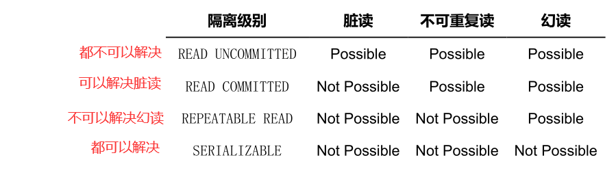

# MySQL基础知识

## 数据库三大范式是什么

第一范式：每个列都不可以再拆分。

第二范式：在第一范式的基础上，非主键列完全依赖于主键，而不能是依赖于主键的一部分。

第三范式：在第二范式的基础上，非主键列只依赖于主键，不依赖于其他非主键。

## mysql有哪些数据类型

1、整数类型，包括TINYINT、SMALLINT、MEDIUMINT、INT、BIGINT，分别表示1字节、2字节、3字节、4字节、8字节整数。任何整数类型都可以加上UNSIGNED属性，表示数据是无符号的，即非负整数。
长度：整数类型可以被指定长度，例如：INT(11)表示长度为11的INT类型。长度在大多数场景是没有意义的，它不会限制值的合法范围，只会影响显示字符的个数，而且需要和UNSIGNED ZEROFILL属性配合使用才有意义。
例子，假定类型设定为INT(5)，属性为UNSIGNED ZEROFILL，如果用户插入的数据为12的话，那么数据库实际存储数据为00012。

2、实数类型，包括FLOAT、DOUBLE、DECIMAL。
DECIMAL可以用于存储比BIGINT还大的整型，能存储精确的小数。
而FLOAT和DOUBLE是有取值范围的，并支持使用标准的浮点进行近似计算。
计算时FLOAT和DOUBLE相比DECIMAL效率更高一些，DECIMAL你可以理解成是用字符串进行处理。

3、字符串类型，包括VARCHAR、CHAR、TEXT、BLOB
VARCHAR用于存储可变长字符串，它比定长类型更节省空间。
VARCHAR使用额外1或2个字节存储字符串长度。列长度小于255字节时，使用1字节表示，否则使用2字节表示。
VARCHAR存储的内容超出设置的长度时，内容会被截断。
CHAR是定长的，根据定义的字符串长度分配足够的空间。
CHAR会根据需要使用空格进行填充方便比较。
CHAR适合存储很短的字符串，或者所有值都接近同一个长度。
CHAR存储的内容超出设置的长度时，内容同样会被截断。

使用策略：
对于经常变更的数据来说，CHAR比VARCHAR更好，因为CHAR不容易产生碎片。
对于非常短的列，CHAR比VARCHAR在存储空间上更有效率。
使用时要注意只分配需要的空间，更长的列排序时会消耗更多内存。
尽量避免使用TEXT/BLOB类型，查询时会使用临时表，导致严重的性能开销。

4、枚举类型（ENUM），把不重复的数据存储为一个预定义的集合。
有时可以使用ENUM代替常用的字符串类型。
ENUM存储非常紧凑，会把列表值压缩到一个或两个字节。
ENUM在内部存储时，其实存的是整数。
尽量避免使用数字作为ENUM枚举的常量，因为容易混乱。
排序是按照内部存储的整数

5、日期和时间类型，尽量使用timestamp，空间效率高于datetime，
用整数保存时间戳通常不方便处理。
如果需要存储微妙，可以使用bigint存储。
看到这里，这道真题是不是就比较容易回答了。


# Log

## MySQL的binlog有有几种录入格式？分别有什么区别？

有三种格式，statement，row和mixed。

statement模式下，每一条会修改数据的sql都会记录在binlog中。不需要记录每一行的变化，减少了binlog日志量，节约了IO，提高性能。由于sql的执行是有上下文的，因此在保存的时候需要保存相关的信息，同时还有一些使用了函数之类的语句无法被记录复制。
row级别下，不记录sql语句上下文相关信息，仅保存哪条记录被修改。记录单元为每一行的改动，基本是可以全部记下来但是由于很多操作，会导致大量行的改动(比如alter table)，因此这种模式的文件保存的信息太多，日志量太大。
mixed，一种折中的方案，普通操作使用statement记录，当无法使用statement的时候使用row。
此外，新版的MySQL中对row级别也做了一些优化，当表结构发生变化的时候，会记录语句而不是逐行记录。

# 存储引擎

- Innodb引擎：Innodb引擎提供了对数据库ACID事务的支持。并且还提供了行级锁和外键的约束。它的设计的目标就是处理大数据容量的数据库系统。
- MyIASM引擎(原本Mysql的默认引擎)：不提供事务的支持，也不支持行级锁和外键。
- MEMORY引擎：所有的数据都在内存中，数据的处理速度快，但是安全性不高。


## MyISAM索引与InnoDB索引的区别？

InnoDB索引是聚簇索引，MyISAM索引是非聚簇索引。
InnoDB的主键索引的叶子节点存储着行数据，因此主键索引非常高效。
MyISAM索引的叶子节点存储的是行数据地址，需要再寻址一次才能得到数据。
InnoDB非主键索引的叶子节点存储的是主键和其他带索引的列数据，因此查询时做到覆盖索引会非常高效。


# 索引

## 什么是索引？

- 针对数据页所做的目录就是索引
- 为了更快的定位到数据库的一条记录, 我们需要知道这条记录所在的页
- 而InnoDB的索引是基于B+树的, 
  - B+树的每一个非叶子节点都是关于数据记录的目录, 保存着页号+索引列的组合, 并且保证了在每个页中的每条记录都按照索引列的值从小到大排列, 并且每层的节点页都是以双链表的形式连接起来, 并且保证了后一个页的索引列的值都是大于前一个列的索引值, 这样通过索引列的值我们就可以定位到叶子结点中我们希望找到的记录
  - 对于叶子结点, 
    - 如果是聚簇索引, 保存的是完整的记录, 这些叶子结点页也是以双链表的形式连接起来, 保证每个页中的记录都是按照主键值从小到大排列并且后一个页的索引列的值大于前一个页, 通过主键值可以获取到整条记录
    - 如果是二级索引, 叶子结点页保存的是二级索引列的值+主键值, 同样是以双链表的形式按照索引列的值从小到大排列, 如果需要完整的记录就需要根据查询到的主键值去聚簇索引中找到对应的记录进行一次回表操作
- 通过索引(聚簇, 二级, 联合)我们可以快速的定位到一条我们希望找到的记录

## 索引有哪些优缺点？

### 优点

可以根据查询条件建立相对应的索引,这样可以大大加速查询的速度,而不需要每次查询都进行全表扫描

### 缺点

- 空间上的代价
  - 每建立一个索引都要为它建立一棵 B+ 树，每一棵 B+ 树的每一个节点都是一个数据页，
    一个页默认会占用 16KB 的存储空间，一棵很大的 B+ 树由许多数据页组成，占用很大的存储空间。
- 时间上的代价
  - 每次对表中的数据进行增、删、改操作时，都需要去修改各个 B+ 树索引。
  - B+ 树**每层**节点都是按照索引列的值从小到大的顺序排序而组成了**双向链表**。不论是叶子节点中的记录，还是内节点中的记录（也就是不论是用户记录还是目录项记录）都是按照索引列的值从小到大的顺序而形成了一个**单向链表**。
  - 而增、删、改操作可能会对节点和记录的排序造成破坏，所以存储引擎需要额外的时间进行一些记录**移位**，**页面分裂**、**页面回收**等操作来维护好节点和记录的排序。
  - 如果我们建了许多索引，每个索引对应的 B+ 树都要进行相关的维护操作，会降低性能


## 索引有哪几种类型？

### 聚簇索引

1. 使用记录主键值的大小进行记录和页的排序，这包括三个方面的含义：
   - 页内的记录是按照主键的大小顺序排成一个单向链表。
   - 各个存放用户记录的页也是根据页中用户记录的主键大小顺序排成一个双向链表。
   - 存放目录项记录的页分为不同的层次，在同一层次中的页也是根据页中目录项记录的主键大小顺序排成
     一个双向链表。
2. B+ 树的叶子节点存储的是完整的用户记录。
   - 所谓完整的用户记录，就是指这个记录中存储了所有列的值（包括隐藏列）。

具有这两种特性的 B+ 树称为 **聚簇索引**, InnoDB 存储引擎会自动的为我们创建聚簇索引

InnoDB 存储引擎中， 聚簇索引 就是数据的存储方式（所有的用户记录都存储在了 叶子节点 ），

也就是所谓的**索引即数据，数据即索引**

### 二级索引

1. 使用索引列的值进行记录和页的排序
   - 页内的记录是按照 c2 列的大小顺序排成一个单向链表。
   - 各个存放用户记录的页也是根据页中记录的 c2 列大小顺序排成一个双向链表。
   - 存放目录项记录的页分为不同的层次，在同一层次中的页也是根据页中目录项记录的 c2 列大小顺序排
     成一个双向链表
2. B+ 树的叶子节点存储的并不是完整的用户记录，而只是 **c2列+主键** 这两个列的值。
3. 目录项记录中不再是 **主键+页号** 的搭配，而变成了 **c2列+页号** 的搭配。
4. 如果我们需要完整的用户记录或者其他当前信息, 我们必须再根据主键值去聚簇索引中再查找一遍完整的用户记录。
5. 不将用户记录放在二级索引的叶子结点因为太占空间, 相当于每建立一棵 B+ 树都需要把所有的用户记录再都拷贝一遍。

### 联合索引

以c2和c3列的大小为排序规则建立的B+树称为联合索引，本质上也是一个二级索引。

1. 先把各个记录和页按照 c2 列进行排序。
2. 在记录的 c2 列相同的情况下，采用 c3 列进行排序
3. 每条 目录项记录 都由 c2 、 c3 、 页号 这三个部分组成，各条记录先按照 c2 列的值进行排序，如果记录的 c2 列相同，则按照 c3 列的值进行排序。
4. B+ 树叶子节点处的用户记录由 c2 、 c3 和主键 c1 列组成。


### 哈希索引

简要说下，类似于数据结构中简单实现的HASH表（散列表）一样，当我们在mysql中用哈希索引时，主要就是通过Hash算法（常见的Hash算法有直接定址法、平方取中法、折叠法、除数取余法、随机数法），将数据库字段数据转换成定长的Hash值，与这条数据的行指针一并存入Hash表的对应位置；如果发生Hash碰撞（两个不同关键字的Hash值相同），则在对应Hash键下以链表形式存储。当然这只是简略模拟图。


### 前缀索引

语法：`index(field(10))`，使用字段值的前10个字符建立索引，默认是使用字段的全部内容建立索引。

前提：前缀的标识度高。比如密码就适合建立前缀索引，因为密码几乎各不相同。


## 索引相关原则

### 索引设计的原则？

1. 适合索引的列是出现在where子句中的列，或者连接子句中指定的列
2. 基数较小的类，索引效果较差，没有必要在此列建立索引
3. 使用短索引，如果对长字符串列进行索引，应该指定一个前缀长度，这样能够节省大量索引空间
4. 不要过度索引。索引需要额外的磁盘空间，并降低写操作的性能。在修改表内容的时候，索引会进行更新甚至
5. 重构，索引列越多，这个时间就会越长。所以只保持需要的索引有利于查询即可。
   

### 创建索引的原则（重中之重）

索引虽好，但也不是无限制的使用，最好符合一下几个原则

1） 最左前缀匹配原则，组合索引非常重要的原则，mysql会一直向右匹配直到遇到范围查询(>、<、between、like)就停止匹配，比如a = 1 and b = 2 and c > 3 and d = 4 如果建立(a,b,c,d)顺序的索引，d是用不到索引的，如果建立(a,b,d,c)的索引则都可以用到，a,b,d的顺序可以任意调整。

2）较频繁作为查询条件的字段才去创建索引

3）更新频繁字段不适合创建索引

4）若是不能有效区分数据的列不适合做索引列(如性别，男女未知，最多也就三种，区分度实在太低)

5）尽量的扩展索引，不要新建索引。比如表中已经有a的索引，现在要加(a,b)的索引，那么只需要修改原来的索引即可。

6）定义有外键的数据列一定要建立索引。

7）对于那些查询中很少涉及的列，重复值比较多的列不要建立索引。

8）对于定义为text、image和bit的数据类型的列不要建立索引。

## 创建索引的三种方式，删除索引

-  第一种方式：在执行CREATE TABLE时创建索引 

```mysql
CREATE TABLE user_index2 (
	id INT auto_increment PRIMARY KEY,
	first_name VARCHAR (16),
	last_name VARCHAR (16),
	id_card VARCHAR (18),
	information text,
	KEY name (first_name, last_name),
	FULLTEXT KEY (information),
	UNIQUE KEY (id_card)
);

```

-  第二种方式：使用ALTER TABLE命令去增加索引 

```mysql
ALTER TABLE table_name ADD INDEX index_name (column_list);
```

-  第三种方式：使用CREATE INDEX命令创建 

```mysql
CREATE INDEX index_name ON table_name (column_list);
```

-  删除索引 

```mysql
alter table user_index drop KEY name;
alter table user_index drop KEY id_card;
alter table user_index drop KEY information;
```

## 使用索引查询一定能提高查询的性能吗？为什么

通常，通过索引查询数据比全表扫描要快。但是我们也必须注意到它的代价。

索引需要空间来存储，也需要定期维护， 每当有记录在表中增减或索引列被修改时，索引本身也会被修改。 这意味着每条记录的INSERT，DELETE，UPDATE将为此多付出4，5 次的磁盘I/O。 因为索引需要额外的存储空间和处理，那些不必要的索引反而会使查询反应时间变慢。使用索引查询不一定能提高查询性能，索引范围查询(INDEX RANGE SCAN)适用于两种情况:


## 百万级别或以上的数据如何删除

关于索引：由于索引需要额外的维护成本，因为索引文件是单独存在的文件,所以当我们对数据的增加,修改,删除,都会产生额外的对索引文件的操作,这些操作需要消耗额外的IO,会降低增/改/删的执行效率。所以，在我们删除数据库百万级别数据的时候，查询MySQL官方手册得知删除数据的速度和创建的索引数量是成正比的。

1. 所以我们想要删除百万数据的时候可以先删除索引（此时大概耗时三分多钟）
2. 然后删除其中无用数据（此过程需要不到两分钟）
3. 删除完成后重新创建索引(此时数据较少了)创建索引也非常快，约十分钟左右。
4. 与之前的直接删除绝对是要快速很多，更别说万一删除中断,一切删除会回滚。那更是坑了。
   

## 什么是最左前缀原则？什么是最左匹配原则

- 顾名思义，就是最左优先，在创建多列索引时，要根据业务需求，where子句中使用最频繁的一列放在最左边。
- 最左前缀匹配原则，非常重要的原则，mysql会一直向右匹配直到遇到范围查询(>、<、between、like)就停止匹配，比如a = 1 and b = 2 and c > 3 and d = 4 如果建立(a,b,c,d)顺序的索引，d是用不到索引的，如果建立(a,b,d,c)的索引则都可以用到，a,b,d的顺序可以任意调整。
- =和in可以乱序，比如a = 1 and b = 2 and c = 3 建立(a,b,c)索引可以任意顺序，mysql的查询优化器会帮你优化成索引可以识别的形式


## B树和B+树的区别

- 在B树中，你可以将键和值存放在内部节点和叶子节点；但在B+树中，内部节点都是键，没有值，叶子节点同时存放键和值。
- B+树的叶子节点有一条链相连，而B树的叶子节点各自独立。

### 使用B树的好处

B树可以在内部节点同时存储键和值，因此，把频繁访问的数据放在靠近根节点的地方将会大大提高热点数据的查询效率。这种特性使得B树在特定数据重复多次查询的场景中更加高效。

### 使用B+树的好处

由于B+树的内部节点只存放键，不存放值，因此，一次读取，可以在内存页中获取更多的键，有利于更快地缩小查找范围。 B+树的叶节点由一条链相连，因此，当需要进行一次全数据遍历的时候，B+树只需要使用O(logN)时间找到最小的一个节点，然后通过链进行O(N)的顺序遍历即可。而B树则需要对树的每一层进行遍历，这会需要更多的内存置换次数，因此也就需要花费更多的时间


## Hash索引和B+树所有有什么区别或者说优劣呢?

首先要知道Hash索引和B+树索引的底层实现原理：

hash索引底层就是hash表，进行查找时，调用一次hash函数就可以获取到相应的**键值**，之后进行**回表查询**获得实际数据。

B+树底层实现是多路平衡查找树。对于每一次的查询都是从根节点出发，查找到叶子节点方可以获得所查键值，然后根据查询判断是否需要回表查询数据。

那么可以看出他们有以下的不同：

- hash索引进行等值查询更快(一般情况下)，但是却无法进行范围查询。
  - 因为在hash索引中经过hash函数建立索引之后，索引的顺序与原顺序无法保持一致，不能支持范围查询。而B+树的的所有节点皆遵循(左节点小于父节点，右节点大于父节点，多叉树也类似)，天然支持范围。

- hash索引不支持使用索引进行排序，原理同上。
- hash索引不支持**模糊查询**以及多列索引的**最左前缀匹配**。原理也是因为hash函数的不可预测。AAAA和AAAAB的索引没有相关性。
- hash索引任何时候都避免不了回表查询数据，而B+树在符合某些条件(**聚簇索引，覆盖索引**等)的时候可以只通过索引完成查询。
- hash索引虽然在等值查询上较快，但是不稳定。性能不可预测，当**某个键值存在大量重复**的时候，发生**hash碰撞**，此时效率可能极差。而B+树的查询效率比较稳定，对于所有的查询都是从根节点到叶子节点，且**树的高度较低**。
- 因此，在大多数情况下，直接选择B+树索引可以获得稳定且较好的查询速度。而不需要使用hash索引。
  

## 数据库为什么使用B+树而不是B树

- B树只适合随机检索，而B+树同时支持随机检索和顺序检索；
- B+树空间**利用率更高**，可减少I/O次数，磁盘读写代价更低。一般来说，索引本身也很大，不可能全部存储在内存中，因此索引往往以索引文件的形式存储的磁盘上。这样的话，索引查找过程中就要产生磁盘I/O消耗。B+树的内部结点并没有指向关键字具体信息的指针，只是作为索引使用，其内部结点比B树小，盘块能容纳的结点中关键字数量更多，一次性读入内存中可以查找的关键字也就越多，相对的，IO读写次数也就降低了。而IO读写次数是影响索引检索效率的最大因素；
- B+树的查询效率更加稳定。B树搜索有可能会在非叶子结点结束，越靠近根节点的记录查找时间越短，只要找到关键字即可确定记录的存在，其性能等价于在关键字全集内做一次二分查找。而在B+树中，顺序检索比较明显，随机检索时，任何关键字的查找都必须走一条从根节点到叶节点的路，所有关键字的查找路径长度相同，导致每一个关键字的查询效率相当。
- B-树在提高了磁盘IO性能的同时并没有解决元素遍历的效率低下的问题。B+树的叶子节点使用指针顺序连接在一起，只要遍历叶子节点就可以实现整棵树的遍历。而且在数据库中基于范围的查询是非常频繁的，而B树不支持这样的操作。
- 增删文件（节点）时，效率更高。因为B+树的叶子节点包含所有关键字，并以有序的链表结构存储，这样可很好提高增删效率。

## B+树在满足聚簇索引和覆盖索引的时候不需要回表查询数据，

在B+树的索引中，叶子节点可能存储了当前的key值，也可能存储了当前的key值以及整行的数据，这就是聚簇索引和非聚簇索引。 在InnoDB中，只有主键索引是聚簇索引，如果没有主键，则挑选一个唯一键建立聚簇索引。如果没有唯一键，则隐式的生成一个键来建立聚簇索引。

当查询使用聚簇索引时，在对应的叶子节点，可以获取到整行数据，因此不用再次进行回表查询。


## 什么是聚簇索引？何时使用聚簇索引与非聚簇索引

- 聚簇索引: 使用记录主键值的大小进行记录和页的排序, 叶子结点存储所有的记录
- 非聚簇索引:  将数据存储于索引分开结构，索引结构的叶子节点存储对应的记录的主键, 通过聚簇索引回表才能找到完整的记录


## 非聚簇索引一定会回表查询吗？

不一定，这涉及到查询语句所要求的字段是否全部命中了索引，如果全部命中了索引，那么就不必再进行回表查询。

举个简单的例子，假设我们在员工表的年龄上建立了索引，那么当进行select age from employee where age < 20的查询时，在索引的叶子节点上，已经包含了age信息，不会再次进行回表查询。


## 联合索引是什么？为什么需要注意联合索引中的顺序？

MySQL可以使用多个字段同时建立一个索引，叫做联合索引。在联合索引中，如果想要命中索引，需要按照建立索引时的字段顺序挨个使用，否则无法命中索引。

具体原因为:

MySQL使用索引时需要索引有序，假设现在建立了"name，age，school"的联合索引，那么索引的排序为: 先按照name排序，如果name相同，则按照age排序，如果age的值也相等，则按照school进行排序。

当进行查询时，此时索引仅仅按照name严格有序，因此必须首先使用name字段进行等值查询，之后对于匹配到的列而言，其按照age字段严格有序，此时可以使用age字段用做索引查找，以此类推。因此在建立联合索引的时候应该注意索引列的顺序，一般情况下，将查询需求频繁或者字段选择性高的列放在前面


# 事务

## 什么是事务

数据库事务是指作为单个逻辑工作单元执行的一系列操作（SQL语句）。这些操作要么全部执行，要么全部不执行。 

需要保证 原子性 、 隔离性 、 一致性 和 持久性 的一个或多个数据库操作称之为一个 事务 （ transaction ）

## 事物的四大特性(ACID)介绍一下?

原子性： 事务是最小的执行单位，不允许分割。事务的原子性确保动作要么全部完成，要么完全不起作用；
一致性：  事务的执行的前后数据的完整性保持一致 , 从一个一致性的状态到了另一个一致性的状态
隔离性： 并发访问数据库时，一个用户的事务不被其他事务所干扰，各并发事务之间数据库是独立的；
持久性： 一个事务被提交之后。它对数据库中数据的改变是持久的，即使数据库发生故障也不应该对其有任何影响。

## 什么是脏读？幻读？不可重复读？

### 脏写（ Dirty Write ）

- 如果一个事务修改了另一个未提交事务修改过的数据，那就意味着发生了 脏写


### 脏读（ Dirty Read ）

- 如果一个事务读到了另一个未提交事务修改过的数据，那就意味着发生了 脏读 


### 不可重复读（Non-Repeatable Read）

如果一个事务只能读到另一个已经提交的事务修改过的数据，并且其他事务每对该数据进行一次修改并提交
后，该事务都能查询得到最新值，那就意味着发生了 不可重复读

 Session B 中提交了几个隐式事务（注意是隐式事务，意味着语句结束事务就提交了），这些事务都修改了 number 列为 1 的记录的列 name 的值，每次事务提交之后，如果 Session A 中的事务都可以查看到最新的值，这种现象也被称之为 不可重复读 


### 幻读（Phantom）

如果一个事务先根据某些条件查询出一些记录，之后另一个事务又向表中插入了符合这些条件的记录，原先
的事务再次按照该条件查询时，能把另一个事务插入的记录也读出来，那就意味着发生了 幻读 


那如果 Session B 中是删除了一些符合 number > 0 的记录而不是插入新记录，那Session A 中之后再根据 number > 0 的条件读取的记录变少了，这种现象算不算 幻读 呢？

明确说一下，这种现象不属于 幻读 ， 幻读 强调的是一个事务按照某个相同条件多次读取记录时，后读取时读到了**之前没有读到的记录**。

>那对于先前已经读到的记录，之后又读取不到这种情况，算啥呢？其实这相当于对每一条记录都
>发生了不可重复读的现象。幻读只是重点强调了读取到了之前读取没有获取到的记录


## 什么是事务的隔离级别？MySQL的默认隔离级别是什么？

脏写 > 脏读 > 不可重复读 > 幻读

设立一些隔离级别，隔离级别越低，越严重的问题就越可能发生

SQL4个 隔离级别 ：

- READ UNCOMMITTED ：未提交读。
- READ COMMITTED ：已提交读。
- REPEATABLE READ ：可重复读。
- SERIALIZABLE ：可串行化。

SQL标准 中规定，针对不同的隔离级别，并发事务可以发生不同严重程度的问题，具体情况如下：



- READ UNCOMMITTED 隔离级别下，可能发生 脏读 、 不可重复读 和 幻读 问题。
- READ COMMITTED 隔离级别下，可能发生 不可重复读 和 幻读 问题，但是不可以发生 脏读 问题。
- REPEATABLE READ 隔离级别下，可能发生 幻读 问题，但是不可以发生 脏读 和 不可重复读 的问题。
- SERIALIZABLE 隔离级别下，各种问题都不可以发生

>脏写 是怎么回事儿？怎么里边都没写呢？

这是因为脏写这个问题太严重了，不论是哪种隔离级别，都不允许脏写的情况发生。

Mysql 默认采用的 REPEATABLE_READ隔离级别 Oracle 默认采用的 READ_COMMITTED隔离级别

事务隔离机制的实现基于锁机制和并发调度。其中并发调度使用的是MVVC（多版本并发控制），通过保存修改的旧版本信息来支持并发一致性读和回滚等特性。


1. MYSQL的事务隔离机制（3种问题，4种隔离机制）

2. MYSQL的A C I D怎样实现的？

3. MVCC原理

4. MYSQL redo_log原理（实现D）,undo_log原理（实现A）

5. InnoDB和MyISAM的区别

   聚簇索引和非聚簇索引的区别

   MVCC

   非聚簇索引 回表（其实就是考B+树的优势，对叶子节点存数据这边问的很深入，答的不够完整）

   可重复读怎么解决不可重复读问题


# 锁

## mysql的表锁有哪些？

- S: 读锁
- X: 写锁
- IS: 读意向锁, 加S锁之前先加IS锁, 判断一个表中是否有有被加了S锁的记录
- IX: 写意向锁, 加X锁之前先加IX锁, 判断一个表中是否有有被加了X锁的记录
- AUTO-INC: 对于需要递增的列, 执行插入语句的时候需要加入AUTO-INC

## 按照锁的粒度分数据库锁有哪些？锁机制与InnoDB锁算法

在关系型数据库中，可以按照锁的粒度把数据库锁分为行级锁(INNODB引擎)、表级锁(MYISAM引擎)和页级锁(BDB引擎 )。

MyISAM和InnoDB存储引擎使用的锁：

MyISAM采用表级锁(table-level locking)。
InnoDB支持行级锁(row-level locking)和表级锁，默认为行级锁
行级锁，表级锁和页级锁对比

行级锁 行级锁是Mysql中锁定粒度最细的一种锁，表示只针对当前操作的行进行加锁。行级锁能大大减少数据库操作的冲突。其加锁粒度最小，但加锁的开销也最大。行级锁分为共享锁 和 排他锁。

特点：开销大，加锁慢；会出现死锁；锁定粒度最小，发生锁冲突的概率最低，并发度也最高。

表级锁 表级锁是MySQL中锁定粒度最大的一种锁，表示对当前操作的整张表加锁，它实现简单，资源消耗较少，被大部分MySQL引擎支持。最常使用的MYISAM与INNODB都支持表级锁定。表级锁定分为表共享读锁（共享锁）与表独占写锁（排他锁）。

特点：开销小，加锁快；不会出现死锁；锁定粒度大，发出锁冲突的概率最高，并发度最低。

页级锁 页级锁是MySQL中锁定粒度介于行级锁和表级锁中间的一种锁。表级锁速度快，但冲突多，行级冲突少，但速度慢。所以取了折衷的页级，一次锁定相邻的一组记录。

特点：开销和加锁时间界于表锁和行锁之间；会出现死锁；锁定粒度界于表锁和行锁之间，并发度一般


## 从锁的类别上分MySQL都有哪些锁呢？像上面那样子进行锁定岂不是有点阻碍并发效率了

从锁的类别上来讲，有共享锁和排他锁。

共享锁: 又叫做读锁。 当用户要进行数据的读取时，对数据加上共享锁。共享锁可以同时加上多个。

排他锁: 又叫做写锁。 当用户要进行数据的写入时，对数据加上排他锁。排他锁只可以加一个，他和其他的排他锁，共享锁都相斥。


## MySQL中InnoDB引擎的行锁是怎么实现的？

答：InnoDB是基于索引来完成行锁

mysql的行锁是通过索引加载的，即是行锁是加在索引响应的行上的，要是对应的SQL语句没有走索引，则会全表扫描，行锁则无法实现，取而代之的是表锁。

**表锁**：不会出现死锁，发生锁冲突几率高，并发低。锁是对表操作的，所以自然锁住全表的表锁就不会出现死锁。

**行锁：**会出现死锁，发生锁冲突几率低，并发高。

###   **行锁的实现** 

1. 行锁必须有索引才能实现，否则会自动锁全表，那么就不是行锁了。

2. 两个事务不能锁同一个索引，

3.  insert ，delete ， update在事务中都会自动默认加上排它锁。 

   

## 什么是死锁？怎么解决？

死锁是指两个或多个事务在同一资源上相互占用，并请求锁定对方的资源，从而导致恶性循环的现象。

**锁冲突：**例如说事务A将某几行上锁后，事务B又对其上锁，锁不能共存否则会出现锁冲突。**（但是共享锁可以共存，共享锁和排它锁不能共存，排它锁和排他锁也不可以）**

**死锁：**例如说两个事务，事务A锁住了1~5行，同时事务B锁住了6~10行，此时事务A请求锁住6~10行，就会阻塞直到事务B施放6~10行的锁，而随后事务B又请求锁住1~5行，事务B也阻塞直到事务A释放1~5行的锁。死锁发生时，会产生Deadlock错误。

常见的解决死锁的方法

1、如果不同程序会并发存取多个表，尽量约定以相同的顺序访问表，可以大大降低死锁机会。

2、在同一个事务中，尽可能做到一次锁定所需要的所有资源，减少死锁产生概率；

3、对于非常容易产生死锁的业务部分，可以尝试使用升级锁定颗粒度，通过表级锁定来减少死锁产生的概率；

如果业务处理不好可以用分布式事务锁或者使用乐观锁


## 数据库的乐观锁和悲观锁是什么？怎么实现的？

数据库管理系统（DBMS）中的并发控制的任务是确保在多个事务同时存取数据库中同一数据时不破坏事务的隔离性和统一性以及数据库的统一性。乐观并发控制（乐观锁）和悲观并发控制（悲观锁）是并发控制主要采用的技术手段。

悲观锁：与乐观锁相对应的就是悲观锁了。悲观锁就是在操作数据时，认为此操作会出现数据冲突，所以在进行每次操作时都要通过获取锁才能进行对相同数据的操作，这点跟java中的synchronized很相似，所以悲观锁需要耗费较多的时间。另外与乐观锁相对应的，悲观锁是由数据库自己实现了的，要用的时候，我们直接调用数据库的相关语句就可以了。

说到这里，由悲观锁涉及到的另外两个锁概念就出来了，它们就是共享锁与排它锁。共享锁和排它锁是悲观锁的不同的实现，它俩都属于悲观锁的范畴。

乐观锁：**乐观锁不是数据库自带的，需要我们自己去实现**。乐观锁是指操作数据库时(更新操作)，想法很乐观，认为这次的操作不会导致冲突，在操作数据时，并不进行任何其他的特殊处理（也就是不加锁），而在进行更新后，再去判断是否有冲突了。

通常实现是这样的：在表中的数据进行操作时(更新)，先给数据表加一个版本(version)字段，每操作一次，将那条记录的版本号加1。也就是先查询出那条记录，获取出version字段,如果要对那条记录进行操作(更新),则先判断此刻version的值是否与刚刚查询出来时的version的值相等，如果相等，则说明这段期间，没有其他程序对其进行操作，则可以执行更新，将version字段的值加1；如果更新时发现此刻的version值与刚刚获取出来的version的值不相等，则说明这段期间已经有其他程序对其进行操作了，则不进行更新操作。

两种锁的使用场景

从上面对两种锁的介绍，我们知道两种锁各有优缺点，不可认为一种好于另一种，像乐观锁适用于写比较少的情况下（多读场景），即冲突真的很少发生的时候，这样可以省去了锁的开销，加大了系统的整个吞吐量。

但如果是多写的情况，一般会经常产生冲突，这就会导致上层应用会不断的进行retry，这样反倒是降低了性能，所以一般多写的场景下用悲观锁就比较合适。


# 视图

## 为什么要使用视图？什么是视图？

为了提高复杂SQL语句的复用性和表操作的安全性，MySQL数据库管理系统提供了视图特性。所谓视图，本质上是一种虚拟表，在物理上是不存在的，其内容与真实的表相似，包含一系列带有名称的列和行数据。但是，视图并不在数据库中以储存的数据值形式存在。行和列数据来自定义视图的查询所引用基本表，并且在具体引用视图时动态生成。

视图使开发者只关心感兴趣的某些特定数据和所负责的特定任务，只能看到视图中所定义的数据，而不是视图所引用表中的数据，从而提高了数据库中数据的安全性。

## 视图有哪些特点？

视图的特点如下:

视图的列可以来自不同的表，是表的抽象和在逻辑意义上建立的新关系。

视图是由基本表(实表)产生的表(虚表)。

视图的建立和删除不影响基本表。

对视图内容的更新(添加，删除和修改)直接影响基本表。

当视图来自多个基本表时，不允许添加和删除数据。

视图的操作包括创建视图，查看视图，删除视图和修改视图。

## 视图的使用场景有哪些？

视图根本用途：简化sql查询，提高开发效率。如果说还有另外一个用途那就是兼容老的表结构。

下面是视图的常见使用场景：

重用SQL语句；

简化复杂的SQL操作。在编写查询后，可以方便的重用它而不必知道它的基本查询细节；

使用表的组成部分而不是整个表；

保护数据。可以给用户授予表的特定部分的访问权限而不是整个表的访问权限；

更改数据格式和表示。视图可返回与底层表的表示和格式不同的数据。

## 视图的优点

查询简单化。视图能简化用户的操作
数据安全性。视图使用户能以多种角度看待同一数据，能够对机密数据提供安全保护
逻辑数据独立性。视图对重构数据库提供了一定程度的逻辑独立性
视图的缺点
性能。数据库必须把视图的查询转化成对基本表的查询，如果这个视图是由一个复杂的多表查询所定义，那么，即使是视图的一个简单查询，数据库也把它变成一个复杂的结合体，需要花费一定的时间。

修改限制。当用户试图修改视图的某些行时，数据库必须把它转化为对基本表的某些行的修改。事实上，当从视图中插入或者删除时，情况也是这样。对于简单视图来说，这是很方便的，但是，对于比较复杂的视图，可能是不可修改的

这些视图有如下特征：1.有UNIQUE等集合操作符的视图。2.有GROUP BY子句的视图。3.有诸如AVG\SUM\MAX等聚合函数的视图。 4.使用DISTINCT关键字的视图。5.连接表的视图（其中有些例外）

## 什么是游标？

游标是系统为用户开设的一个数据缓冲区，存放SQL语句的执行结果，每个游标区都有一个名字。用户可以通过游标逐一获取记录并赋给主变量，交由主语言进一步处理。

## 存储过程与函数

### 什么是存储过程？有哪些优缺点？

存储过程是一个预编译的SQL语句，优点是允许模块化的设计，就是说只需要创建一次，以后在该程序中就可以调用多次。如果某次操作需要执行多次SQL，使用存储过程比单纯SQL语句执行要快。

优点

1）存储过程是预编译过的，执行效率高。

2）存储过程的代码直接存放于数据库中，通过存储过程名直接调用，减少网络通讯。

3）安全性高，执行存储过程需要有一定权限的用户。

4）存储过程可以重复使用，减少数据库开发人员的工作量。

缺点

1）调试麻烦，但是用 PL/SQL Developer 调试很方便！弥补这个缺点。

2）移植问题，数据库端代码当然是与数据库相关的。但是如果是做工程型项目，基本不存在移植问题。

3）重新编译问题，因为后端代码是运行前编译的，如果带有引用关系的对象发生改变时，受影响的存储过程、包将需要重新编译（不过也可以设置成运行时刻自动编译）。

4）如果在一个程序系统中大量的使用存储过程，到程序交付使用的时候随着用户需求的增加会导致数据结构的变化，接着就是系统的相关问题了，最后如果用户想维护该系统可以说是很难很难、而且代价是空前的，维护起来更麻烦。

## 触发器

### 什么是触发器？触发器的使用场景有哪些？

触发器是用户定义在关系表上的一类由事件驱动的特殊的存储过程。触发器是指一段代码，当触发某个事件时，自动执行这些代码。

使用场景

可以通过数据库中的相关表实现级联更改。
实时监控某张表中的某个字段的更改而需要做出相应的处理。
例如可以生成某些业务的编号。
注意不要滥用，否则会造成数据库及应用程序的维护困难。
大家需要牢记以上基础知识点，重点是理解数据类型CHAR和VARCHAR的差异，表存储引擎InnoDB和MyISAM的区别。

### MySQL中都有哪些触发器？

在MySQL数据库中有如下六种触发器：

Before Insert
After Insert
Before Update
After Update
Before Delete
After Delete

# 常用SQL语句

## SQL语句主要分为哪几类

### 数据定义语言DDL（Data Ddefinition Language）CREATE，DROP，ALTER

主要为以上操作 即对逻辑结构等有操作的，其中包括表结构，视图和索引。

### 数据查询语言DQL（Data Query Language）SELECT

这个较为好理解 即查询操作，以select关键字。各种简单查询，连接查询等 都属于DQL。

### 数据操纵语言DML（Data Manipulation Language）INSERT，UPDATE，DELETE

主要为以上操作 即对数据进行操作的，对应上面所说的查询操作 DQL与DML共同构建了多数初级程序员常用的增删改查操作。而查询是较为特殊的一种 被划分到DQL中。

### 数据控制功能DCL（Data Control Language）GRANT，REVOKE，COMMIT，ROLLBACK

主要为以上操作 即对数据库安全性完整性等有操作的，可以简单的理解为权限控制等。


## SQL 约束有哪几种？

- NOT NULL: 用于控制字段的内容一定不能为空（NULL）。
- UNIQUE: 控件字段内容不能重复，一个表允许有多个 Unique 约束。
- PRIMARY KEY: 也是用于控件字段内容不能重复，但它在一个表只允许出现一个。
- FOREIGN KEY: 用于预防破坏表之间连接的动作，也能防止非法数据插入外键列，因为它必须是它指向的那个表中的值之一。
- CHECK: 用于控制字段的值范围。
  

## 六种关联查询

- 交叉连接（CROSS JOIN）
- 内连接（INNER JOIN）
- 外连接（LEFT JOIN/RIGHT JOIN）
- 联合查询（UNION与UNION ALL）
  - 就是把多个结果集集中在一起，UNION前的结果为基准，需要注意的是联合查询的列数要相等，相同的记录行会合并
  - 如果使用UNION ALL，不会合并重复的记录行
  - 效率 UNION 高于 UNION ALL
- 交叉连接（CROSS JOIN）

## mysql中 in 和 exists 区别

 “**外层查询表小于子查询表，则用exists，外层查询表大于子查询表，则用in，如果外层和子查询表差不多，则爱用哪个用哪个。**” 

### exists

```mysql
SELECT * FROM a WHERE EXISTS(SELECT 1 FROM b WHERE B.id  = A.id);
#以上查询等价于：
1、SELECT * FROM A;
2、SELECT I FROM B WHERE B.id = A.id;
```

EXISTS()查询会执行SELECT * FROM A查询，执行A.length次，并不会将EXISTS()查询结果结果进行缓存，因为EXISTS()查询返回一个布尔值true或flase，它只在乎EXISTS()的查询中是否有记录，与具体的结果集无关。

EXISTS()查询是将主查询的结果集放到子查询中做验证，根据验证结果是true或false来决定主查询数据结果是否得以保存。

 当B表的数据比A表的数据大时适合使用EXISTS()查询，因为它不用遍历B操作，只执行一次查询就OK了 

exists关键字后面的参数是一个任意的子查询，系统对子查询进行运算以判断它是否返回行，如果至少返回一行，那么exists的结果为true ,此时外层的查询语句将进行查询；如果子查询没有返回任何行，那么exists的结果为false,此时外层语句将不进行查询。

需要注意的是，当我们的子查询为 SELECT NULL 时，MYSQL仍然认为它是True。
例如：

1、A表有100条记录,B表有1000条记录,那么EXISTS()会执行100次去判断A表中的id是否与B表中的id相等.因为它只执行A.length次，可见B表数据越多,越适合EXISTS()发挥效果.

2、A表有10000条记录,B表有100条记录,那么EXISTS()还是执行10000次,此时不如使用in()遍历10000*100次,因为IN()是在内存里遍历数据进行比较,而EXISTS()需要查询数据库,我们都知道查询数据库所消耗的性能更高,而内存比较很快.

### in

```mysql
SELECT   *  FROM A WHERE id IN (SELECT id FROM B);
#等价于：
1、SELECT id FROM B ----->先执行in中的查询
2、SELECT *  FROM A  WHERE A.id = B.id
```

以上in()中的查询只执行一次，它查询出B中的所有的id并缓存起来，然后检查A表中查询出的id在缓存中是否存在，如果存在则将A的查询数据加入到结果集中，直到遍历完A表中所有的结果集为止。
 当B表的数据较大时不适合使用in()查询，因为它会将B表中的数据全部遍历一次 

1、A表中有100条记录，B表中有1000条记录，那么最多可能遍历100*1000次，效率很差

2、A表中有1000条记录，B表中有100条记录，那么最多可遍历1000*100此，内循环次数减少，效率大大提升

结论：IN()查询适合B表数据比A表数据小的情况，IN()查询是从缓存中取数据


### not exists和not in

- not in 和not exists：
  - 如果查询语句使用了not in，那么内外表都进行全表扫描，没有用到索引；
    -  因为not in实质上等于`!= and != ···`，因为!=不会使用索引，故not in不会使用索引。 
  - 而not extsts的子查询依然能用到表上的索引。所以无论那个表大，用not exists都比not in要快。
    


## mysql中int(10)和char(10)以及varchar(10)的区别

int(10)的10表示显示的数据的长度，不是存储数据的大小；chart(10)和varchar(10)的10表示存储数据的大小，即表示存储多少个字符。

int(10) 10位的数据长度 9999999999，占32个字节，int型4位
char(10) 10位固定字符串，不足补空格 最多10个字符
varchar(10) 10位可变字符串，不足补空格 最多10个字符

char(10)表示存储定长的10个字符，不足10个就用空格补齐，占用更多的存储空间

varchar(10)表示存储10个变长的字符，存储多少个就是多少个，空格也按一个字符存储，这一点是和char(10)的空格不同的，char(10)的空格表示占位不算一个字符


## drop、delete与truncate的区别

三者都表示删除，但是三者有一些差别：

 因此，在不再需要一张表的时候，用drop；在想删除部分数据行时候，用delete；在保留表而删除所有数据的时候用truncate。 


## UNION与UNION ALL的区别？

- 如果使用UNION ALL，不会合并重复的记录行
- 效率 UNION 高于 UNION ALL


##  sql优化策略 

##  聚集索引的底层 

## mvcc机制了解嘛

## 

## 给了一段sql语句，问会上什么锁？详细解读一下

##  Mysql索引，联合索引，失效，左连接（八股文） 

##  什么是柔性事务 

##  跨库事务如何保证 


##  mysql索引（B+和hash） 


##  Mysql的主从复制（从数据库依据redolog完成一致性） 

##  binlog和redolog的差异，以及记录写入的先后性（，binlog二进制数据文件，redolog逻辑命令。先后顺序，当时回答binlog先，redolog后，不知对错，面试官没纠正，应该对了） 


##  谈谈锁（sync关键字和ReentrantLock） 

##  sync关键字和ReentrantLock的区别（层级，功能，重量级三个方面） 

##  说说分布式锁

（谈了Redis和Zoo[keep](https://www.nowcoder.com/jump/super-jump/word?word=keep)er的分布式锁实现原理， 


##  可重入锁在过期前续期失败会发生什么

（说了事务回滚和yeid让出） 


##  间隙锁是什么，具体什么时候会加锁

（具体什么时候加锁，这里要把所有情况都说清楚。。 

##  一级索引和二级索引之间是怎么作用的 

##  连接池，一些参数的含义(详细探讨了一下 removeAbandonedTimeout细节) 


## MYSQL的事务隔离机制

 读未提交：一个事务还没提交，它做的变更就能被别的事务看到。读提交：一个事务提交后，它做的变更才能被别的事务看到。可重复读：一个事务执行过程中看到的数据总是和事务启动时看到的数据是一致的。在这个级别下事务未提交，做出的变更其它事务也看不到。串行化：对于同一行记录进行读写会分别加读写锁，当发生读写锁冲突，后面执行的事务需等前面执行的事务完成才能继续执行。 

##  MYSQL的A C I D怎样实现的 

 利用undo log保障原子性。该log保存了事务发生之前的数据的一个版本，可以用于回滚，从而保证事务原子性。 

 利用redo log保证事务的持久性，该log关注于事务的恢复.在重启mysql服务的时候，根据redo log进行重做，从而使事务有持久性。 

 利用undo log+redo log保障一致性。事务中的执行需要redo log，如果执行失败，需要undo log 回滚。 

##  MVCC原理 

 MVCC为多版本并发控制，即同一条记录在系统中存在多个版本。其存在目的是在保证数据一致性的前提下提供一种高并发的访问性能。对数据读写在不加读写锁的情况下实现互不干扰,从而实现数据库的隔离性,在事务隔离级别为读提交和可重复读中使用到。 

 在InnoDB中，事务在开始前会向事务系统申请一个事务ID，该ID是按申请顺序严格递增的。每行数据具有多个版本，每次事务更新数据都会生成新的数据版本，而不会直接覆盖旧的数据版本。数据的行结构中包含多个信息字段。其中实现MVCC的主要涉及最近更改该行数据的事务ID（DBTRXID）和可以找到历史数据版本的指针（DBROLLPTR）。InnoDB在每个事务开启瞬间会为其构造一个记录当前已经开启但未提交的事务ID的视图数组。通过比较[链表]()中的事务ID与该行数据的值与对应的DBTRXID，并通过DBROLLPTR找到历史数据的值以及对应的DBTRXID来决定当前版本的数据是否应该被当前事务所见。最终实现在不加锁的情况下保证数据的一致性 

##  简述redo_log undo_log 

 redo log: 存储引擎级别的log（InnoDB有，MyISAM没有），该log关注于事务的恢复.在重启mysql服务的时候，根据redo log进行重做，从而使事务有持久性。 

 undo log：是存储引擎级别的log（InnoDB有，MyISAM没有）保证数据的原子性，该log保存了事务发生之前的数据的一个版本，可以用于回滚，是MVCC的重要实现方法之一。

