# MySQL基础知识

## MySQL架构

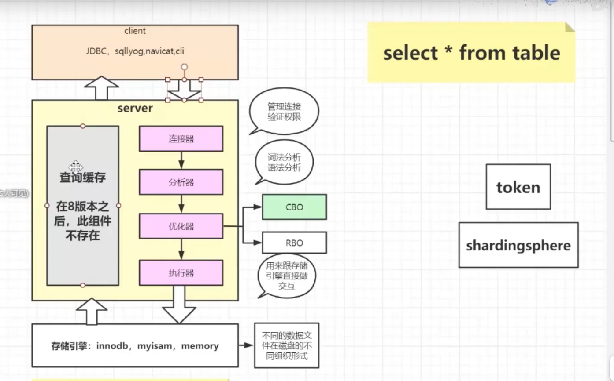

## 数据库三大范式是什么

 一范式就是属性不可分割，二范式就是要有主键,其他字段都依赖于主键，三范式就是要消除传递依赖,消除冗余,就是各种信息只在一个地方存储,不出现在多张表中 

第一范式：每个列都不可以再拆分。

第二范式：在第一范式的基础上，非主键列完全依赖于主键，而不能是依赖于主键的一部分。

第三范式：在第二范式的基础上，非主键列只依赖于主键，不依赖于其他非主键。

## mysql有哪些数据类型

1、整数类型，包括TINYINT、SMALLINT、MEDIUMINT、INT、BIGINT，分别表示1字节、2字节、3字节、4字节、8字节整数。任何整数类型都可以加上UNSIGNED属性，表示数据是无符号的，即非负整数。
长度：整数类型可以被指定长度，例如：INT(11)表示长度为11的INT类型。长度在大多数场景是没有意义的，它不会限制值的合法范围，只会影响显示字符的个数，而且需要和UNSIGNED ZEROFILL属性配合使用才有意义。
例子，假定类型设定为INT(5)，属性为UNSIGNED ZEROFILL，如果用户插入的数据为12的话，那么数据库实际存储数据为00012。

2、实数类型，包括FLOAT、DOUBLE、DECIMAL。
DECIMAL可以用于存储比BIGINT还大的整型，能存储精确的小数。
而FLOAT和DOUBLE是有取值范围的，并支持使用标准的浮点进行近似计算。
计算时FLOAT和DOUBLE相比DECIMAL效率更高一些，DECIMAL你可以理解成是用字符串进行处理。

3、字符串类型，包括VARCHAR、CHAR、TEXT、BLOB
VARCHAR用于存储可变长字符串，它比定长类型更节省空间。
VARCHAR使用额外1或2个字节存储字符串长度。列长度小于255字节时，使用1字节表示，否则使用2字节表示。
VARCHAR存储的内容超出设置的长度时，内容会被截断。
CHAR是定长的，根据定义的字符串长度分配足够的空间。
CHAR会根据需要使用空格进行填充方便比较。
CHAR适合存储很短的字符串，或者所有值都接近同一个长度。
CHAR存储的内容超出设置的长度时，内容同样会被截断。

使用策略：
对于经常变更的数据来说，CHAR比VARCHAR更好，因为CHAR不容易产生碎片。
对于非常短的列，CHAR比VARCHAR在存储空间上更有效率。
使用时要注意只分配需要的空间，更长的列排序时会消耗更多内存。
尽量避免使用TEXT/BLOB类型，查询时会使用临时表，导致严重的性能开销。

4、枚举类型（ENUM），把不重复的数据存储为一个预定义的集合。
有时可以使用ENUM代替常用的字符串类型。
ENUM存储非常紧凑，会把列表值压缩到一个或两个字节。
ENUM在内部存储时，其实存的是整数。
尽量避免使用数字作为ENUM枚举的常量，因为容易混乱。
排序是按照内部存储的整数

5、日期和时间类型，尽量使用timestamp，空间效率高于datetime，
用整数保存时间戳通常不方便处理。
如果需要存储微妙，可以使用bigint存储。
看到这里，这道真题是不是就比较容易回答了。


# 主从复制

## 简介

随着业务的增长，一台数据服务器已经满足不了需求了，负载过重。这个时候就需要**减压**了，实现负载均衡读写分离，一主一丛或一主多从。

主服务器只负责写，而从服务器只负责读，从而提高了效率减轻压力。

主从复制可以分为：

- 主从同步：当用户写数据主服务器必须和从服务器**同步**了才告诉用户写入成功，等待时间比较长。
- 主从异步：只要用户**访问**写数据主服务器，立即返回给用户。
- 主从半同步：当用户访问写数据主服务器写入并同步**其中一个从服务器**就返回给用户成功。

### 形式

- 一主一从

- 一主多从

  - 一主一从和一主多从是我们现在见的最多的主从架构，使用起来简单有效，不仅可以实现 HA，而且还能读写分离，进而提升集群的**并发能力**。

- 多主一从

  - 多主一从可以将多个 MySQL 数据库**备份**到一台存储性能比较好的服务器上。

- 双主复制

  - 双主复制，也就是可以互做主从复制，每个 master 既是 master，又是另外一台服务器的 salve。这样任何一方所做的变更，都会通过**复制**应用到另外一方的数据库中。

- 级联复制

  - 级联复制模式下，部分 slave 的数据同步不连接主节点，而是连接**从节点**。
  - 因为如果主节点有太多的从节点，就会损耗一部分性能用于 replication ，那么我们可以让 3~5 个从节点连接主节点，其它从节点作为二级或者三级与从节点连接，这样不仅可以**缓解**主节点的压力，并且对**数据一致性**没有负面影响。

  

## 原理

MySQL 主从复制是基于主服务器在二进制日志跟踪所有对数据库的更改。因此，要进行复制，必须在主服务器上启用二进制日志。

每个从服务器从主服务器接收已经记录到日志的数据。当一个从服务器连接到主服务器时，它通知主服务器从服务器日志中读取最后一个更新成功的位置。

从服务器接收从那时发生起的任何更新，并在主机上执行相同的更新。然后封锁等待主服务器通知的更新。

从服务器执行备份不会干扰主服务器，在备份过程中主服务器可以继续处理更新。

### 过程

#### 工作过程

MySQL 的主从复制工作过程大致如下：

1. 从库生成两个线程，一个 I/O 线程，一个 SQL 线程；
2. I/O 线程去请求主库的 binlog，并将得到的 binlog 日志写到 relay log(中继日志) 文件中；
3. 主库会生成一个 log dump 线程，用来给从库 I/O 线程传 binlog；
4. SQL 线程会读取 relay log 文件中的日志，并解析成具体操作，来实现主从的操作一致，而最终数据一致；

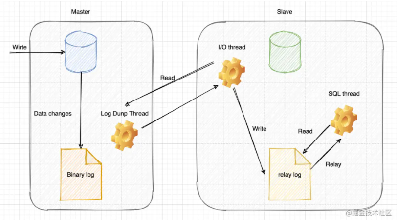

#### 请求流程

MySQL 建立请求的主从的详细流程如下：

1. 当从服务器连接主服务器时，主服务器会创建一个 log dump 线程，用于发送 binlog 的内容。在读取 binlog 的内容的操作中，会给对象主节点上的 binlog **加锁**，当读取完成并发送给从服务器后解锁。
2. 当从节点上执行 `start slave` 命令之后，从节点会创建一个 IO 线程用来连接主节点，请求主库中**更新** binlog。IO 线程接收主节点 binlog dump 进程发来的更新之后，保存到 relay-log 中。
3. 从节点 SQL 线程负责读取 realy-log 中的内容，**解析**成具体的操作执行，最终保证主从数据的一致性。

### 类型

#### 异步复制

一个主库，一个或多个从库，数据异步同步到从库。

这种模式下，主节点不会主动推送数据到从节点，主库在执行完客户端提交的事务后会立即将结果返给给客户端，并不关心从库是否已经接收并处理。

这样就会有一个问题，主节点如果崩溃掉了，此时主节点上已经提交的事务可能并没有传到从节点上，如果此时，强行将从提升为主，可能导致新主节点上的数据不完整。


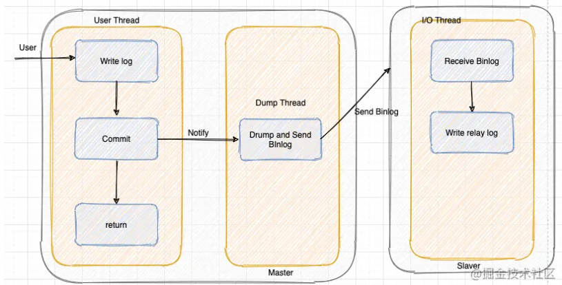


#### 同步复制

在 MySQL cluster 中特有的复制方式。

当主库执行完一个事务，然后所有的从库都复制了该事务并成功执行完才返回成功信息给客户端。

因为需要等待所有从库执行完该事务才能返回成功信息，所以全同步复制的性能必然会收到严重的影响。

#### 半同步复制

在异步复制的基础上，确保任何一个主库上的事物在提交之前至少有一个从库已经收到该事物并日志记录下来。

介于异步复制和全同步复制之间，主库在执行完客户端提交的事务后不是立刻返回给客户端，而是等待至少一个从库接收到并写到 relay log 中才返回成功信息给客户端(只能保证主库的 Binlog 至少传输到了一个从节点上)，否则需要等待直到超时时间然后切换成异步模式再提交。

相对于异步复制，半同步复制提高了数据的安全性，一定程度的保证了数据能成功备份到从库，同时它也造成了一定程度的延迟，但是比全同步模式延迟要低，这个延迟最少是一个 TCP/IP 往返的时间。所以，半同步复制最好在低延时的网络中使用。

半同步模式不是 MySQL 内置的，从 `MySQL 5.5` 开始集成，需要 master 和 slave 安装插件开启半同步模式。


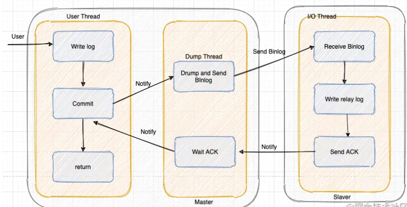

#### 延迟复制

在异步复制的基础上，人为设定主库和从库的数据**同步延迟时间**，即保证数据延迟至少是这个参数。

### 方式

MySQL 主从复制支持两种不同的日志格式，这两种日志格式也对应了各自的复制方式。当然也有二者相结合的混合类型复制。

#### 语句复制

基于语句的复制相当于**逻辑复制**，即二进制日志中记录了操作的语句，通过这些语句在从数据库中重放来实现复制。

这种方式简单，二进制文件小，传输带宽占用小。但是基于语句更新依赖于其它因素，比如插入数据时利用了时间戳。

因此在开发当中，我们应该尽量将业务逻辑逻辑放在**代码层**，而不应该放在 MySQL 中，不易拓展。

*特点*：

- 传输效率高，减少延迟。
- 在从库更新不存在的记录时，语句赋值不会失败。而行复制会导致失败，从而更早发现主从之间的不一致。
- 设表里有一百万条数据，一条sql更新了所有表，基于语句的复制仅需要发送一条sql，而基于行的复制需要发送一百万条更新记录

#### 行数据复制

基于行的复制相当于**物理复制**，即二进制日志中记录的实际更新数据的每一行。

这样导致复制的压力比较大，日志占用的空间大，传输带宽占用大。但是这种方式比基于语句的复制要更加**精确**。

*特点*：

- 不需要执行查询计划。
- 不知道执行的到底是什么语句。
- 例如一条更新用户总积分的语句，需要统计用户的所有积分再写入用户表。如果是基于语句复制的话，从库需要再一次统计用户的积分，而基于行复制就直接更新记录，无需再统计用户积分。

#### 混合类型的复制

一般情况下，默认采用**基于语句**的复制，一旦发现基于语句无法精确复制时，就会采用基于行的复制。


# Log

## MySQL的binlog有有几种录入格式？分别有什么区别？

有三种格式，statement，row和mixed。

statement模式下，每一条会修改数据的sql都会记录在binlog中。不需要记录每一行的变化，减少了binlog日志量，节约了IO，提高性能。由于sql的执行是有上下文的，因此在保存的时候需要保存相关的信息，同时还有一些使用了函数之类的语句无法被记录复制。
row级别下，不记录sql语句上下文相关信息，仅保存哪条记录被修改。记录单元为每一行的改动，基本是可以全部记下来但是由于很多操作，会导致大量行的改动(比如alter table)，因此这种模式的文件保存的信息太多，日志量太大。
mixed，一种折中的方案，普通操作使用statement记录，当无法使用statement的时候使用row。
此外，新版的MySQL中对row级别也做了一些优化，当表结构发生变化的时候，会记录语句而不是逐行记录。

### 问题

#### 延迟

当主库的 TPS 并发较高的时候，由于主库上面是多线程写入的，而从库的SQL线程是单线程的，导致从库SQL可能会跟不上主库的**处理速度**。

*解决方法*：

- 网络方面：尽量保证主库和从库之间的**网络稳定**，延迟较小；
- 硬件方面：从库**配置更好**的硬件，提升随机写的性能；
- 配置方面：尽量使 MySQL 的操作在**内存中完成**，减少磁盘操作。或升级 MySQL5.7 版本使用并行复制；
- 建构方面：在事务中尽量对**主库读写**，其它非事务的读在从库。消除一部分**延迟**带来的数据库不一致。**增加缓存**降低一些从库的负载。

#### 数据丢失

当主库宕机后，数据可能丢失。

*解决方法*：

使用**半同步**复制，可以解决数据丢失的问题。

### 注意事项

MySQL 需要注意以下事项：

- MySQL 主从复制是 MySQL **高可用性，高性能**（负载均衡）的基础；
- 简单，灵活，部署**方式多样**，可以根据不同业务场景部署不同复制结构；
- 复制过程中应该时刻**监控**复制状态，复制出错或延时可能给系统造成影响；
- MySQL 主从复制目前也存在一些问题，可以根据需要部署**复制增强**功能。

### 作用

主从复制带来了很多好处，当我们的主服务器出现问题，可以**切换**到从服务器；可以进行数据库层面的**读写分离**；可以在从数据库上进行日常**备份**。还可以保证：

1. 数据更安全：做了**数据冗余**，不会因为单台服务器的宕机而丢失数据；
2. 性能大大提升：一主多从，不同用户从不同数据库读取，**性能提升**；
3. 扩展性更优：流量增大时，可以方便的**增加**从服务器，不影响系统使用；
4. 负载均衡：一主多从相当于分担了主机任务，做了**负载均衡**。

### 应用场景

MySQL 主从复制集群功能使得 MySQL 数据库支持**大规模高并发读写**成为可能，同时有效地保护了物理服务器宕机场景的**数据备份**。

#### 横向扩展

将工作负载**分发**到各 Slave 节点上，从而提高系统性能。

在这个场景下，所有的写(write)和更新(update)操作都在 Master 节点上完成；所有的读( read)操作都在 Slave 节点上完成。通过**增加更多**的 Slave 节点，便能提高系统的读取速度。

#### 数据安全

数据从 Master 节点复制到 Slave 节点上，在 Slave 节点上可以**暂停**复制进程。可以在 Slave 节点上**备份**与 Master 节点对应的数据，而不用影响 Master 节点的运行。

#### 数据分析

实时数据可以在 Master 节点上创建，而分析这些数据可以在 Slave 节点上进行，并且不会对 Master 节点的性能产生影响。

#### 远距离数据分布

可以利用复制在远程主机上创建一份本地数据的**副本**，而不用持久的与Master节点连接。

#### 拆分访问

可以把几个不同的从服务器，根据公司的**业务**进行拆分。通过拆分可以帮助减轻主服务器的压力，还可以使数据库对外部用户浏览、内部用户业务处理及 DBA 人员的备份等**互不影响**。


## BinLog RedoLog UndoLog

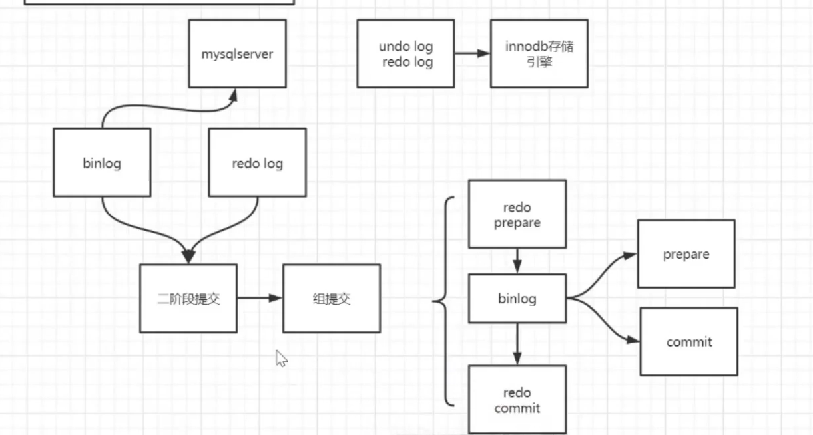

https://www.cnblogs.com/f-ck-need-u/archive/2018/05/08/9010872.html

https://juejin.cn/post/6860252224930070536

https://www.cnblogs.com/f-ck-need-u/archive/2018/05/08/9010872.html#auto_id_16

## binlog

`binlog`用于记录数据库执行的写入性操作(不包括查询)信息，以二进制的形式保存在磁盘中。`binlog`是`mysql`的逻辑日志，并且由`Server`层进行记录，使用任何存储引擎的`mysql`数据库都会记录`binlog`日志。

> 逻辑日志：**可以简单理解为记录的就是sql语句**。

> 物理日志：**因为`mysql`数据最终是保存在数据页中的，物理日志记录的就是数据页变更**。

`binlog`是通过追加的方式进行写入的，可以通过`max_binlog_size`参数设置每个`binlog`文件的大小，当文件大小达到给定值之后，会生成新的文件来保存日志。

### binlog使用场景

在实际应用中，`binlog`的主要使用场景有两个，分别是**主从复制**和**数据恢复**。

1. **主从复制**：在`Master`端开启`binlog`，然后将`binlog`发送到各个`Slave`端，`Slave`端重放`binlog`从而达到主从数据一致。
2. **数据恢复**：通过使用`mysqlbinlog`工具来恢复数据。

### binlog刷盘时机

对于`InnoDB`存储引擎而言，只有在事务提交时才会记录`biglog`，此时记录还在内存中，那么`biglog`是什么时候刷到磁盘中的呢？`mysql`通过`sync_binlog`参数控制`biglog`的刷盘时机，取值范围是`0-N`：

- 0：不去强制要求，由系统自行判断何时写入磁盘；
- 1：每次`commit`的时候都要将`binlog`写入磁盘；
- N：每N个事务，才会将`binlog`写入磁盘。

从上面可以看出，`sync_binlog`最安全的是设置是`1`，这也是`MySQL 5.7.7`之后版本的默认值。但是设置一个大一些的值可以提升数据库性能，因此实际情况下也可以将值适当调大，牺牲一定的一致性来获取更好的性能。

### binlog日志格式

`binlog`日志有三种格式，分别为`STATMENT`、`ROW`和`MIXED`。

> 在 `MySQL 5.7.7`之前，默认的格式是`STATEMENT`，`MySQL 5.7.7`之后，默认值是`ROW`。日志格式通过`binlog-format`指定。

- `STATMENT` 
  - 基于`SQL`语句的复制(`statement-based replication, SBR`)，每一条会修改数据的sql语句会记录到`binlog`中。 
  - 优点：不需要记录每一行的变化，减少了`binlog`日志量，节约了`IO`, 从而提高了性能；
  -  缺点：在某些情况下会导致主从数据不一致，比如执行`sysdate()`、`slepp()`等。
- `ROW` 
  - 基于行的复制(`row-based replication, RBR`)，不记录每条sql语句的上下文信息，仅需记录哪条数据被修改了。 
  - 优点：不会出现某些特定情况下的存储过程、或function、或trigger的调用和触发无法被正确复制的问题； 
  - 缺点：会产生大量的日志，尤其是`alter table`的时候会让日志暴涨
- `MIXED` 
  - 基于`STATMENT`和`ROW`两种模式的混合复制(`mixed-based replication, MBR`)，
  - 一般的复制使用`STATEMENT`模式保存`binlog`，
  - 对于`STATEMENT`模式无法复制的操作使用`ROW`模式保存`binlog`

### redo log和binlog区别

- redo log是属于innoDB层面，binlog属于MySQL Server层面的，这样在数据库用别的存储引擎时可以达到一致性的要求。
- redo log是物理日志，记录该数据页更新的内容；binlog是逻辑日志，记录的是这个更新语句的原始逻辑
- redo log是循环写，日志空间大小固定；binlog是追加写，是指一份写到一定大小的时候会更换下一个文件，不会覆盖。
- binlog可以作为恢复数据使用，主从复制搭建，redo log作为异常宕机或者介质故障后的数据恢复使用。

### 一条更新语句执行的顺序

update T set c=c+1 where ID=2;

- 执行器先找引擎取 ID=2 这一行。ID 是主键，引擎直接用树搜索找到这一行。如果 ID=2 这一行所在的数据页本来就在内存中，就直接返回给执行器；否则，需要先从磁盘读入内存，然后再返回。
- 执行器拿到引擎给的行数据，把这个值加上 1，比如原来是 N，现在就是 N+1，得到新的一行数据，再调用引擎接口写入这行新数据。
- 引擎将这行新数据更新到内存中，同时将这个更新操作记录到 redo log 里面，此时 redo log 处于 prepare 状态。然后告知执行器执行完成了，随时可以提交事务。
- 执行器生成这个操作的 binlog，并把 binlog 写入磁盘。
- 执行器调用引擎的提交事务接口，引擎把刚刚写入的 redo log 改成提交（commit）状态，更新完成。

这个update语句的执行流程图，图中浅色框表示是在 InnoDB 内部执行的，深色框表示是在执行器中执行的。

## binlog和redo的先后顺序及group commit

https://www.cnblogs.com/f-ck-need-u/archive/2018/05/08/9010872.html#auto_id_16

为了提高性能，通常会将有关联性的多个数据修改操作放在一个事务中，这样可以避免对每个修改操作都执行完整的持久化操作。这种方式，可以看作是人为的组提交(group commit)。

除了将多个操作组合在一个事务中，记录binlog的操作也可以按组的思想进行优化：将多个事务涉及到的binlog一次性flush，而不是每次flush一个binlog。

事务在提交的时候不仅会记录事务日志，还会记录二进制日志，但是它们谁先记录呢？二进制日志是MySQL的上层日志，先于存储引擎的事务日志被写入。

在MySQL5.6以前，当事务提交(即发出commit指令)后，MySQL接收到该信号进入commit prepare阶段；进入prepare阶段后，立即写内存中的二进制日志，写完内存中的二进制日志后就相当于确定了commit操作；然后开始写内存中的事务日志；最后将二进制日志和事务日志刷盘，它们如何刷盘，分别由变量 sync_binlog 和 innodb_flush_log_at_trx_commit 控制。

但因为要保证二进制日志和事务日志的一致性，在提交后的prepare阶段会启用一个**prepare_commit_mutex**锁来保证它们的顺序性和一致性。但这样会导致开启二进制日志后group commmit失效，特别是在主从复制结构中，几乎都会开启二进制日志。

在MySQL5.6中进行了改进。提交事务时，在存储引擎层的上一层结构中会将事务按序放入一个队列，队列中的第一个事务称为leader，其他事务称为follower，leader控制着follower的行为。虽然顺序还是一样先刷二进制，再刷事务日志，但是机制完全改变了：删除了原来的prepare_commit_mutex行为，也能保证即使开启了二进制日志，group commit也是有效的。

MySQL5.6中分为3个步骤：**flush阶段、sync阶段、commit阶段。**

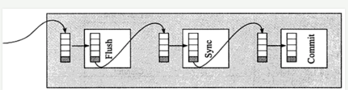

- flush阶段：向内存中写入每个事务的二进制日志。
- sync阶段：将内存中的二进制日志刷盘。若队列中有多个事务，那么仅一次fsync操作就完成了二进制日志的刷盘操作。这在MySQL5.6中称为BLGC(binary log group commit)。
- commit阶段：leader根据顺序调用存储引擎层事务的提交，由于innodb本就支持group commit，所以解决了因为锁 prepare_commit_mutex 而导致的group commit失效问题。

在flush阶段写入二进制日志到内存中，但是不是写完就进入sync阶段的，而是要等待一定的时间，多积累几个事务的binlog一起进入sync阶段，等待时间由变量 binlog_max_flush_queue_time 决定，默认值为0表示不等待直接进入sync，设置该变量为一个大于0的值的好处是group中的事务多了，性能会好一些，但是这样会导致事务的响应时间变慢，所以建议不要修改该变量的值，除非事务量非常多并且不断的在写入和更新。

进入到sync阶段，会将binlog从内存中刷入到磁盘，刷入的数量和单独的二进制日志刷盘一样，由变量 sync_binlog 控制。

当有一组事务在进行commit阶段时，其他新事务可以进行flush阶段，它们本就不会相互阻塞，所以group commit会不断生效。当然，group commit的性能和队列中的事务数量有关，如果每次队列中只有1个事务，那么group commit和单独的commit没什么区别，当队列中事务越来越多时，即提交事务越多越快时，group commit的效果越明显。

## redo log

### 为什么需要redo log

我们都知道，事务的四大特性里面有一个是**持久性**，具体来说就是**只要事务提交成功，那么对数据库做的修改就被永久保存下来了，不可能因为任何原因再回到原来的状态**。那么`mysql`是如何保证持久性的呢？最简单的做法是在每次事务提交的时候，将该事务涉及修改的数据页全部刷新到磁盘中。但是这么做会有严重的性能问题，主要体现在两个方面：

1. 因为`Innodb`是以`页`为单位进行磁盘交互的，而一个事务很可能只修改一个数据页里面的几个字节，这个时候将完整的数据页刷到磁盘的话，太浪费资源了！
2. 一个事务可能涉及修改多个数据页，并且这些数据页在物理上并不连续，使用随机IO写入性能太差！

因此`mysql`设计了`redo log`，**具体来说就是只记录事务对数据页做了哪些修改**，这样就能完美地解决性能问题了(相对而言文件更小并且是顺序IO)。

### redo log基本概念

`redo log`包括两部分：

- 一个是内存中的日志缓冲(`redo log buffer`)，另一个是磁盘上的日志文件(`redo log file`)。
- `mysql`每执行一条`DML`语句，先将记录写入`redo log buffer`，后续某个时间点再一次性将多个操作记录写到`redo log file`。
- 这种**先写日志，再写磁盘**的技术就是`MySQL`里经常说到的`WAL(Write-Ahead Logging)` 技术。

在计算机操作系统中，用户空间(`user space`)下的缓冲区数据一般情况下是无法直接写入磁盘的，中间必须经过操作系统内核空间(`kernel space`)缓冲区(`OS Buffer`)。

因此，`redo log buffer`写入`redo log file`实际上是先写入`OS Buffer`，然后再通过系统调用`fsync()`将其刷到`redo log`

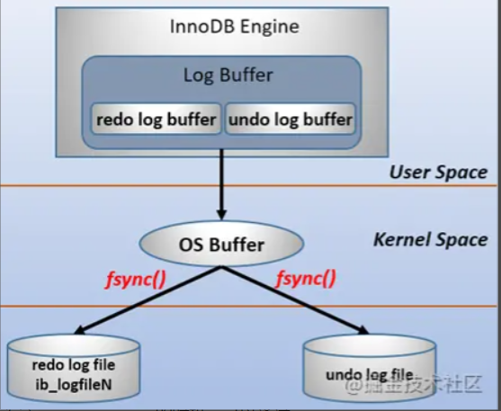


`file`中，过程如下

`mysql`支持三种将`redo log buffer`写入`redo log file`的时机，可以通过`innodb_flush_log_at_trx_commit`参数配置，各参数值含义如下：

| 参数值              | 含义                                                         |
| ------------------- | :----------------------------------------------------------- |
| 0（延迟写）         | 事务提交时不会将`redo log buffer`中日志写入到`os buffer`，而是每秒写入`os buffer`并调用`fsync()`写入到`redo log file`中。也就是说设置为0时是(大约)每秒刷新写入到磁盘中的，当系统崩溃，会丢失1秒钟的数据。 |
| 1（实时写，实时刷） | 事务每次提交都会将`redo log buffer`中的日志写入`os buffer`并调用`fsync()`刷到`redo log file`中。这种方式即使系统崩溃也不会丢失任何数据，但是因为每次提交都写入磁盘，IO的性能较差。 |
| 2（实时写，延迟刷） | 每次提交都仅写入到`os buffer`，然后是每秒调用`fsync()`将`os buffer`中的日志写入到`redo log file`。 |

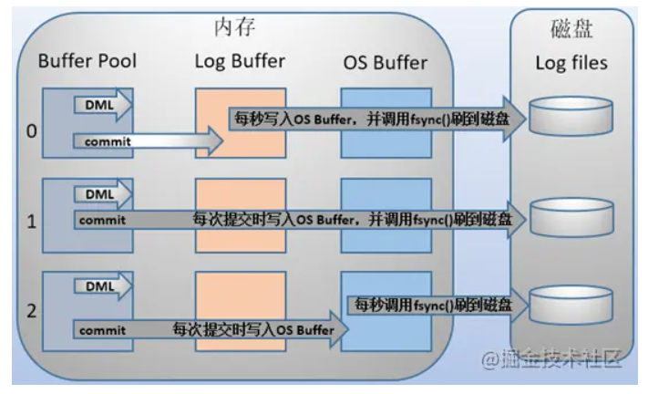

### redo log记录形式

前面说过，`redo log`实际上记录数据页的变更，而这种变更记录是没必要全部保存，因此`redo log`实现上采用了大小固定，循环写入的方式，当写到结尾时，会回到开头循环写日志。如下图：

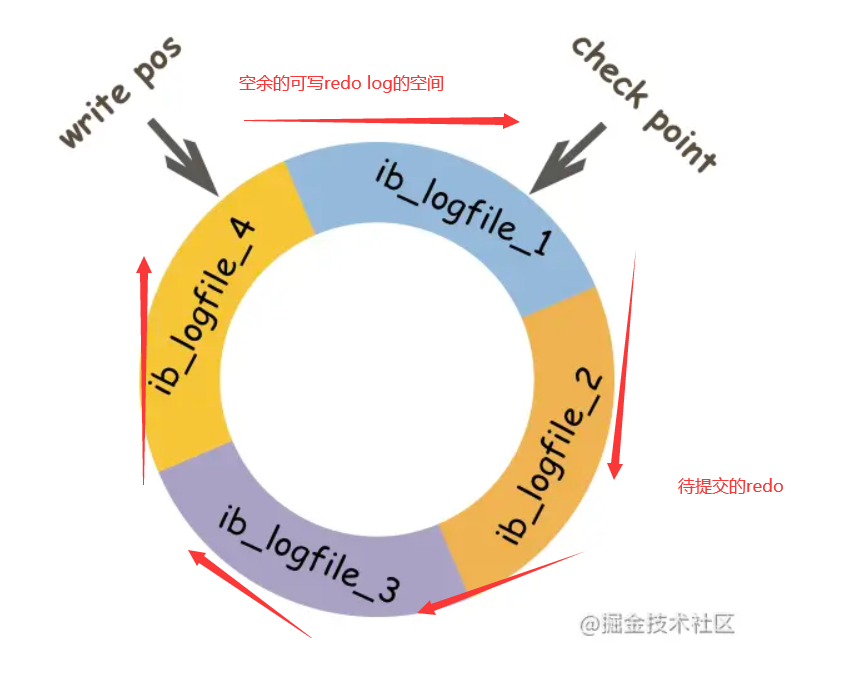

同时我们很容易得知，**在innodb中，既有`redo log`需要刷盘，还有`数据页`也需要刷盘，`redo log`存在的意义主要就是降低对`数据页`刷盘的要求**。

- `write pos`表示`redo log`当前记录的`LSN`(逻辑序列号)位置，
- `check point`表示**数据页更改记录**刷盘后对应`redo log`所处的`LSN`(逻辑序列号)位置。
- `write pos`到`check point`之间的部分是`redo log`空着的部分，用于记录新的记录；
- `check point`到`write pos`之间是`redo log`待落盘的数据页更改记录。
- 当`write pos`追上`check point`时，会先推动`check point`向前移动，空出位置再记录新的日志。

启动`innodb`的时候，不管上次是正常关闭还是异常关闭，总是会进行恢复操作。因为`redo log`记录的是数据页的物理变化，因此恢复的时候速度比逻辑日志(如`binlog`)要快很多。 

重启`innodb`时，首先会检查磁盘中数据页的`LSN`，如果数据页的`LSN`小于日志中的`LSN`，则会从`checkpoint`开始恢复。 

还有一种情况，在宕机前正处于`checkpoint`的刷盘过程，且数据页的刷盘进度超过了日志页的刷盘进度，此时会出现数据页中记录的`LSN`大于日志中的`LSN`，这时超出日志进度的部分将不会重做，因为这本身就表示已经做过的事情，无需再重做。

### redo log与binlog区别

|          | redo log                                                     | binlog                                                       |
| -------- | ------------------------------------------------------------ | ------------------------------------------------------------ |
| 文件大小 | `redo log`的大小是固定的。                                   | `binlog`可通过配置参数`max_binlog_size`设置每个`binlog`文件的大小。 |
| 实现方式 | `redo log`是`InnoDB`引擎层实现的，并不是所有引擎都有。       | `binlog`是`Server`层实现的，所有引擎都可以使用 `binlog`日志  |
| 记录方式 | redo log 采用循环写的方式记录，当写到结尾时，会回到开头循环写日志。 | binlog 通过追加的方式记录，当文件大小大于给定值后，后续的日志会记录到新的文件上 |
| 适用场景 | `redo log`适用于崩溃恢复(crash-safe)                         | `binlog`适用于主从复制和数据恢复                             |

由`binlog`和`redo log`的区别可知：`binlog`日志只用于归档，只依靠`binlog`是没有`crash-safe`能力的。

但只有`redo log`也不行，因为`redo log`是`InnoDB`特有的，且日志上的记录落盘后会被覆盖掉。

因此需要`binlog`和`redo log`二者同时记录，才能保证当数据库发生宕机重启时，数据不会丢失。

## undo log

数据库事务四大特性中有一个是**原子性**，具体来说就是 **原子性是指对数据库的一系列操作，要么全部成功，要么全部失败，不可能出现部分成功的情况**。实际上，**原子性**底层就是通过`undo log`实现的。`undo log`主要记录了数据的逻辑变化，比如一条`INSERT`语句，对应一条`DELETE`的`undo log`，对于每个`UPDATE`语句，对应一条相反的`UPDATE`的`undo log`，这样在发生错误时，就能回滚到事务之前的数据状态。同时，`undo log`也是`MVCC`(多版本并发控制)实现的关键，这部分内容在[面试中的老大难-mysql事务和锁，一次性讲清楚！](https://juejin.cn/post/6855129007336521741)中有介绍，不再赘述。


# 自适应hash

https://juejin.cn/post/6978470653737467911


# GroupBy优化


# 存储引擎

- Innodb引擎：Innodb引擎提供了对数据库ACID事务的支持。并且还提供了行级锁和外键的约束。它的设计的目标就是处理大数据容量的数据库系统。
- MyIASM引擎(原本Mysql的默认引擎)：不提供事务的支持，也不支持行级锁和外键。
- MEMORY引擎：所有的数据都在内存中，数据的处理速度快，但是安全性不高。

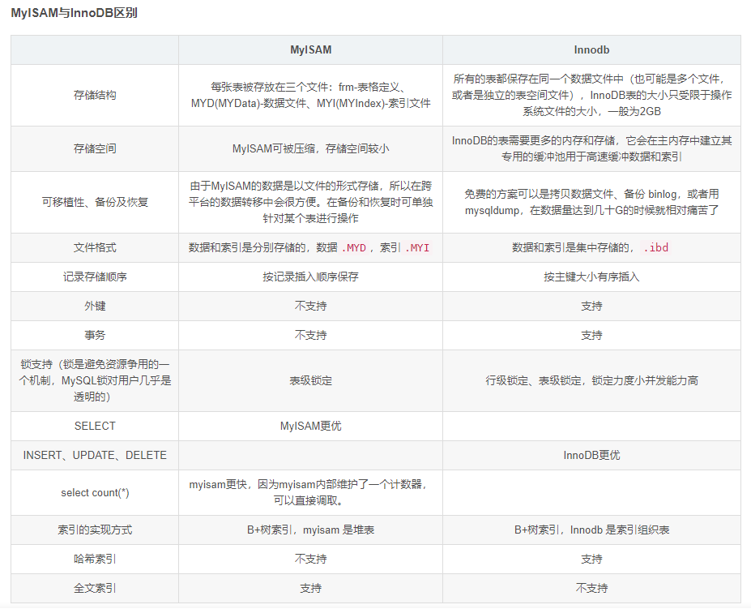


## MyISAM存储引擎与InnoDB存储引擎的区别？

InnoDB索引是聚簇索引，MyISAM索引是非聚簇索引。
InnoDB的主键索引的叶子节点存储着行数据，因此主键索引非常高效。
MyISAM索引的叶子节点存储的是行数据地址，需要再寻址一次才能得到数据。
InnoDB非主键索引的叶子节点存储的是主键和其他带索引的列数据，因此查询时做到覆盖索引会非常高效。

MyISAM不支持事务和行级锁, 不支持外键, 索引数据分开存储, Innodb 支持事务, 外键, 通过MVCC来支持高并发, 索引和数据存储在一起

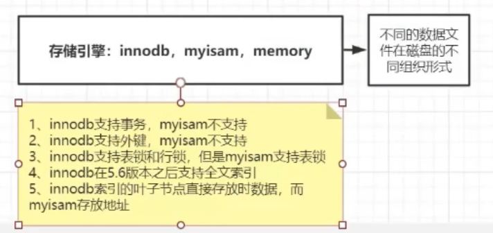


# 索引

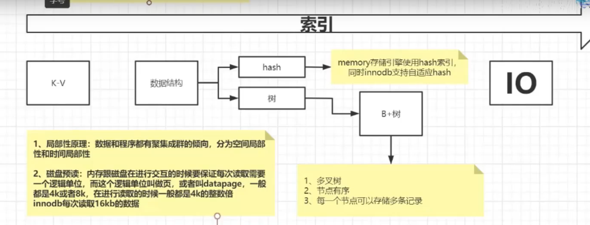

## 索引相关


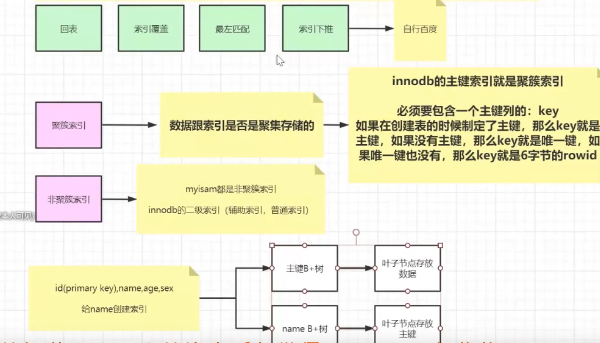


## 什么情况下索引会失效？

## 什么是索引？

- 针对数据页所做的目录就是索引
- 为了更快的定位到数据库的一条记录, 我们需要知道这条记录所在的页
- 而InnoDB的索引是基于B+树的, 
  - B+树的每一个非叶子节点都是关于数据记录的目录, 保存着页号+索引列的组合, 并且保证了在每个页中的每条记录都按照索引列的值从小到大排列, 并且每层的节点页都是以双链表的形式连接起来, 并且保证了后一个页的索引列的值都是大于前一个列的索引值, 这样通过索引列的值我们就可以定位到叶子结点中我们希望找到的记录
  - 对于叶子结点, 
    - 如果是聚簇索引, 保存的是完整的记录, 这些叶子结点页也是以双链表的形式连接起来, 保证每个页中的记录都是按照主键值从小到大排列并且后一个页的索引列的值大于前一个页, 通过主键值可以获取到整条记录
    - 如果是二级索引, 叶子结点页保存的是二级索引列的值+主键值, 同样是以双链表的形式按照索引列的值从小到大排列, 如果需要完整的记录就需要根据查询到的主键值去聚簇索引中找到对应的记录进行一次回表操作
- 通过索引(聚簇, 二级, 联合)我们可以快速的定位到一条我们希望找到的记录

## 索引有哪些优缺点？

### 优点

可以根据查询条件建立相对应的索引,这样可以大大加速查询的速度,而不需要每次查询都进行全表扫描

### 缺点

- 空间上的代价
  - 每建立一个索引都要为它建立一棵 B+ 树，每一棵 B+ 树的每一个节点都是一个数据页，
    一个页默认会占用 16KB 的存储空间，一棵很大的 B+ 树由许多数据页组成，占用很大的存储空间。
- 时间上的代价
  - 每次对表中的数据进行增、删、改操作时，都需要去修改各个 B+ 树索引。
  - B+ 树**每层**节点都是按照索引列的值从小到大的顺序排序而组成了**双向链表**。不论是叶子节点中的记录，还是内节点中的记录（也就是不论是用户记录还是目录项记录）都是按照索引列的值从小到大的顺序而形成了一个**单向链表**。
  - 而增、删、改操作可能会对节点和记录的排序造成破坏，所以存储引擎需要额外的时间进行一些记录**移位**，**页面分裂**、**页面回收**等操作来维护好节点和记录的排序。
  - 如果我们建了许多索引，每个索引对应的 B+ 树都要进行相关的维护操作，会降低性能


## 索引有哪几种类型？

### 聚簇索引

1. 使用记录主键值的大小进行记录和页的排序，这包括三个方面的含义：
   - 页内的记录是按照主键的大小顺序排成一个单向链表。
   - 各个存放用户记录的页也是根据页中用户记录的主键大小顺序排成一个双向链表。
   - 存放目录项记录的页分为不同的层次，在同一层次中的页也是根据页中目录项记录的主键大小顺序排成
     一个双向链表。
2. B+ 树的叶子节点存储的是完整的用户记录。
   - 所谓完整的用户记录，就是指这个记录中存储了所有列的值（包括隐藏列）。

具有这两种特性的 B+ 树称为 **聚簇索引**, InnoDB 存储引擎会自动的为我们创建聚簇索引

InnoDB 存储引擎中， 聚簇索引 就是数据的存储方式（所有的用户记录都存储在了 叶子节点 ），

也就是所谓的**索引即数据，数据即索引**

### 二级索引

1. 使用索引列的值进行记录和页的排序
   - 页内的记录是按照 索引列的大小顺序排成一个单向链表。
   - 各个存放用户记录的页也是根据页中记录的索引 列大小顺序排成一个双向链表。
   - 存放目录项记录的页分为不同的层次，在同一层次中的页也是根据页中目录项记录的 索引 列大小顺序排成一个双向链表
2. B+ 树的叶子节点存储的并不是完整的用户记录，而只是 索引列+主键 这两个列的值。
3. B+ 树的非叶子节点中不再是 主键+页号 的搭配，而变成了 索引列+页号 的搭配。
4. 如果我们需要完整的用户记录或者其他当前信息, 我们必须再根据主键值去聚簇索引中再查找一遍完整的用户记录。
5. 不将用户记录放在二级索引的叶子结点因为太占空间, 相当于每建立一棵 B+ 树都需要把所有的用户记录再都拷贝一遍。

### 联合索引

以c2和c3列的大小为排序规则建立的B+树称为联合索引，本质上也是一个二级索引。

1. 先把各个记录和页按照 c2 列进行排序。
2. 在记录的 c2 列相同的情况下，采用 c3 列进行排序
3. 每条 目录项记录 都由 c2 +c3 +页号 这三个部分组成，各条记录先按照 c2 列的值进行排序，如果记录的 c2 列相同，则按照 c3 列的值进行排序。
4. B+ 树叶子节点处的用户记录由 c2 、 c3 和主键 c1 列组成。


### 哈希索引

简要说下，类似于数据结构中简单实现的HASH表（散列表）一样，当我们在mysql中用哈希索引时，主要就是通过Hash算法（常见的Hash算法有直接定址法、平方取中法、折叠法、除数取余法、随机数法），将数据库字段数据转换成定长的Hash值，与这条数据的行指针一并存入Hash表的对应位置；如果发生Hash碰撞（两个不同关键字的Hash值相同），则在对应Hash键下以链表形式存储。当然这只是简略模拟图。
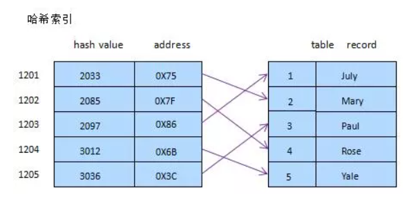


### 前缀索引

语法：`index(field(10))`，使用字段值的前10个字符建立索引，默认是使用字段的全部内容建立索引。

前提：前缀的标识度高。比如密码就适合建立前缀索引，因为密码几乎各不相同。


## 索引相关原则

### 索引设计的原则？

1. 适合索引的列是出现在where子句中的列，或者连接子句中指定的列
2. 基数较小的类，索引效果较差，没有必要在此列建立索引
3. 使用短索引，如果对长字符串列进行索引，应该指定一个前缀长度，这样能够节省大量索引空间
4. 不要过度索引。索引需要额外的磁盘空间，并降低写操作的性能。在修改表内容的时候，索引会进行更新甚至
5. 重构，索引列越多，这个时间就会越长。所以只保持需要的索引有利于查询即可。
   

### 创建索引的原则（重中之重）

索引虽好，但也不是无限制的使用，最好符合一下几个原则

1） 最左前缀匹配原则，组合索引非常重要的原则，mysql会一直向右匹配直到遇到范围查询(>、<、between、like)就停止匹配，比如a = 1 and b = 2 and c > 3 and d = 4 如果建立(a,b,c,d)顺序的索引，d是用不到索引的，如果建立(a,b,d,c)的索引则都可以用到，a,b,d的顺序可以任意调整。

2）较频繁作为查询条件的字段才去创建索引

3）更新频繁字段不适合创建索引

4）若是不能有效区分数据的列不适合做索引列(如性别，男女未知，最多也就三种，区分度实在太低)

5）尽量的扩展索引，不要新建索引。比如表中已经有a的索引，现在要加(a,b)的索引，那么只需要修改原来的索引即可。

6）定义有外键的数据列一定要建立索引。

7）对于那些查询中很少涉及的列，重复值比较多的列不要建立索引。

8）对于定义为text、image和bit的数据类型的列不要建立索引。

## 创建索引的三种方式，删除索引

-  第一种方式：在执行CREATE TABLE时创建索引 

```mysql
CREATE TABLE user_index2 (
	id INT auto_increment PRIMARY KEY,
	first_name VARCHAR (16),
	last_name VARCHAR (16),
	id_card VARCHAR (18),
	information text,
	KEY name (first_name, last_name),
	FULLTEXT KEY (information),
	UNIQUE KEY (id_card)
);

```

-  第二种方式：使用ALTER TABLE命令去增加索引 

```mysql
ALTER TABLE table_name ADD INDEX index_name (column_list);
```

-  第三种方式：使用CREATE INDEX命令创建 

```mysql
CREATE INDEX index_name ON table_name (column_list);
```

-  删除索引 

```mysql
alter table user_index drop KEY name;
alter table user_index drop KEY id_card;
alter table user_index drop KEY information;
```

## 使用索引查询一定能提高查询的性能吗？为什么

通常，通过索引查询数据比全表扫描要快。但是我们也必须注意到它的代价。

索引需要空间来存储，也需要定期维护， 每当有记录在表中增减或索引列被修改时，索引本身也会被修改。 这意味着每条记录的INSERT，DELETE，UPDATE将为此多付出4，5 次的磁盘I/O。 因为索引需要额外的存储空间和处理，那些不必要的索引反而会使查询反应时间变慢。使用索引查询不一定能提高查询性能，索引范围查询(INDEX RANGE SCAN)适用于两种情况:


## 百万级别或以上的数据如何删除

关于索引：由于索引需要额外的维护成本，因为索引文件是单独存在的文件,所以当我们对数据的增加,修改,删除,都会产生额外的对索引文件的操作,这些操作需要消耗额外的IO,会降低增/改/删的执行效率。所以，在我们删除数据库百万级别数据的时候，查询MySQL官方手册得知删除数据的速度和创建的索引数量是成正比的。

1. 所以我们想要删除百万数据的时候可以先删除索引（此时大概耗时三分多钟）
2. 然后删除其中无用数据（此过程需要不到两分钟）
3. 删除完成后重新创建索引(此时数据较少了)创建索引也非常快，约十分钟左右。
4. 与之前的直接删除绝对是要快速很多，更别说万一删除中断,一切删除会回滚。那更是坑了。
   

## 什么是最左前缀原则？什么是最左匹配原则

- 顾名思义，就是最左优先，在创建多列索引时，要根据业务需求，where子句中使用最频繁的一列放在最左边。
- 最左前缀匹配原则，非常重要的原则，mysql会一直向右匹配直到遇到范围查询(>、<、between、like)就停止匹配，比如a = 1 and b = 2 and c > 3 and d = 4 如果建立(a,b,c,d)顺序的索引，d是用不到索引的，如果建立(a,b,d,c)的索引则都可以用到，a,b,d的顺序可以任意调整。
- =和in可以乱序，比如a = 1 and b = 2 and c = 3 建立(a,b,c)索引可以任意顺序，mysql的查询优化器会帮你优化成索引可以识别的形式


## B树和B+树的区别

- 在B树中，你可以将键和值存放在内部节点和叶子节点；但在B+树中，内部节点都是键，没有值，叶子节点同时存放键和值。
- B+树的叶子节点有一条链相连，而B树的叶子节点各自独立。

### 使用B树的好处

B树可以在内部节点同时存储键和值，因此，把频繁访问的数据放在靠近根节点的地方将会大大提高热点数据的查询效率。这种特性使得B树在特定数据重复多次查询的场景中更加高效。

### 使用B+树的好处

由于B+树的内部节点只存放键，不存放值，因此，一次读取，可以在内存页中获取更多的键，有利于更快地缩小查找范围。 B+树的叶节点由一条链相连，因此，当需要进行一次全数据遍历的时候，B+树只需要使用O(logN)时间找到最小的一个节点，然后通过链进行O(N)的顺序遍历即可。而B树则需要对树的每一层进行遍历，这会需要更多的内存置换次数，因此也就需要花费更多的时间


## Hash索引和B+树所有有什么区别或者说优劣呢?

首先要知道Hash索引和B+树索引的底层实现原理：

hash索引底层就是hash表，进行查找时，调用一次hash函数就可以获取到相应的**键值**，之后进行**回表查询**获得实际数据。

B+树底层实现是多路平衡查找树。对于每一次的查询都是从根节点出发，查找到叶子节点方可以获得所查键值，然后根据查询判断是否需要回表查询数据。

那么可以看出他们有以下的不同：

- hash索引进行等值查询更快(一般情况下)，但是却无法进行范围查询。
  - 因为在hash索引中经过hash函数建立索引之后，索引的顺序与原顺序无法保持一致，不能支持范围查询。而B+树的的所有节点皆遵循(左节点小于父节点，右节点大于父节点，多叉树也类似)，天然支持范围。

- hash索引不支持使用索引进行排序，原理同上。
- hash索引不支持**模糊查询**以及多列索引的**最左前缀匹配**。原理也是因为hash函数的不可预测。AAAA和AAAAB的索引没有相关性。
- hash索引任何时候都避免不了回表查询数据，而B+树在符合某些条件(**聚簇索引，覆盖索引**等)的时候可以只通过索引完成查询。
- hash索引虽然在等值查询上较快，但是不稳定。性能不可预测，当**某个键值存在大量重复**的时候，发生**hash碰撞**，此时效率可能极差。而B+树的查询效率比较稳定，对于所有的查询都是从根节点到叶子节点，且**树的高度较低**。
- 因此，在大多数情况下，直接选择B+树索引可以获得稳定且较好的查询速度。而不需要使用hash索引。
  

## 数据库为什么使用B+树而不是B树

- B树只适合随机检索，而B+树同时支持随机检索和顺序检索；
- B+树空间利用率更高，可减少I/O次数，磁盘读写代价更低。一般来说，索引本身也很大，不可能全部存储在内存中，因此索引往往以索引文件的形式存储的磁盘上。这样的话，索引查找过程中就要产生磁盘I/O消耗。B+树的内部结点并没有指向关键字具体信息的指针，只是作为索引使用，其内部结点比B树小，盘块能容纳的结点中关键字数量更多，一次性读入内存中可以查找的关键字也就越多，相对的，IO读写次数也就降低了。而IO读写次数是影响索引检索效率的最大因素；
- B+树的查询效率更加稳定。B树搜索有可能会在非叶子结点结束，越靠近根节点的记录查找时间越短，只要找到关键字即可确定记录的存在，其性能等价于在关键字全集内做一次二分查找。而在B+树中，顺序检索比较明显，随机检索时，任何关键字的查找都必须走一条从根节点到叶节点的路，所有关键字的查找路径长度相同，导致每一个关键字的查询效率相当。
- B-树在提高了磁盘IO性能的同时并没有解决元素遍历的效率低下的问题。B+树的叶子节点使用指针顺序连接在一起，只要遍历叶子节点就可以实现整棵树的遍历。而且在数据库中基于范围的查询是非常频繁的，而B树不支持这样的操作。
- 增删文件（节点）时，效率更高。因为B+树的叶子节点包含所有关键字，并以有序的链表结构存储，这样可很好提高增删效率。

## B+树在满足聚簇索引和覆盖索引的时候不需要回表查询数据，

在B+树的索引中，叶子节点可能存储了当前的key值，也可能存储了当前的key值以及整行的数据，这就是聚簇索引和非聚簇索引。 在InnoDB中，只有主键索引是聚簇索引，如果没有主键，则挑选一个唯一键建立聚簇索引。如果没有唯一键，则隐式的生成一个键来建立聚簇索引。

当查询使用聚簇索引时，在对应的叶子节点，可以获取到整行数据，因此不用再次进行回表查询。


## 什么是聚簇索引？何时使用聚簇索引与非聚簇索引

- 聚簇索引: 使用记录主键值的大小进行记录和页的排序, 叶子结点存储所有的记录
- 非聚簇索引:  将数据存储于索引分开结构，索引结构的叶子节点存储对应的记录的主键, 通过聚簇索引回表才能找到完整的记录

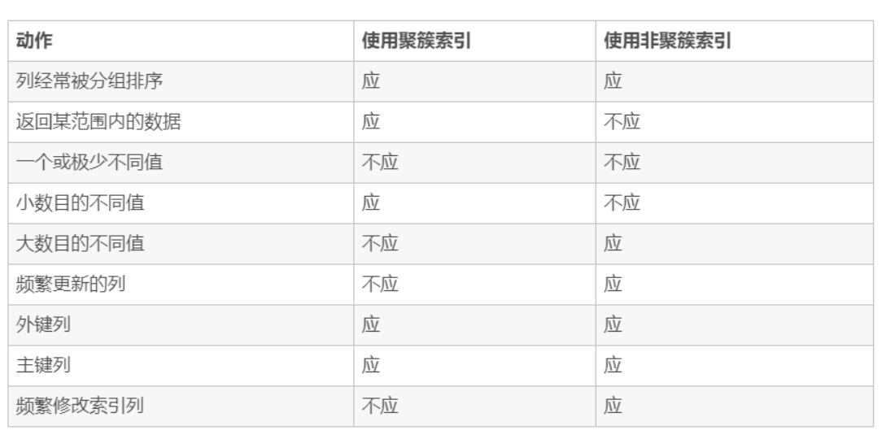

## 非聚簇索引一定会回表查询吗？

不一定，这涉及到查询语句所要求的字段是否全部命中了索引，如果全部命中了索引，那么就不必再进行回表查询。

举个简单的例子，假设我们在员工表的年龄上建立了索引，那么当进行select age from employee where age < 20的查询时，在索引的叶子节点上，已经包含了age信息，不会再次进行回表查询。


## 联合索引是什么？为什么需要注意联合索引中的顺序？

MySQL可以使用多个字段同时建立一个索引，叫做联合索引。在联合索引中，如果想要命中索引，需要按照建立索引时的字段顺序挨个使用，否则无法命中索引。

具体原因为:

MySQL使用索引时需要索引有序，假设现在建立了"name，age，school"的联合索引，那么索引的排序为: 先按照name排序，如果name相同，则按照age排序，如果age的值也相等，则按照school进行排序。

当进行查询时，此时索引仅仅按照name严格有序，因此必须首先使用name字段进行等值查询，之后对于匹配到的列而言，其按照age字段严格有序，此时可以使用age字段用做索引查找，以此类推。因此在建立联合索引的时候应该注意索引列的顺序，一般情况下，将查询需求频繁或者字段选择性高的列放在前面


## 那你知道什么是覆盖索引和回表吗？

覆盖索引指的是在一次查询中，如果一个索引包含或者说覆盖所有需要查询的字段的值，我们就称之为覆盖索引，而不再需要回表查询。

而要确定一个查询是否是覆盖索引，我们只需要explain sql语句看Extra的结果是否是“Using index”即可。


# 事务

## 什么是事务

数据库事务是指作为单个逻辑工作单元执行的一系列操作（SQL语句）。这些操作要么全部执行，要么全部不执行。 

需要保证 原子性 、 隔离性 、 一致性 和 持久性 的一个或多个数据库操作称之为一个 事务 （ transaction ）

## 事物的四大特性(ACID)介绍一下?

原子性： 事务是最小的执行单位，不允许分割。事务的原子性确保动作要么全部完成，要么完全不起作用；
一致性：  事务的执行的前后数据的完整性保持一致 , 从一个一致性的状态到了另一个一致性的状态
隔离性： 并发访问数据库时，一个用户的事务不被其他事务所干扰，各并发事务之间数据库是独立的；
持久性： 一个事务被提交之后。它对数据库中数据的改变是持久的，即使数据库发生故障也不应该对其有任何影响。

## 什么是脏读？幻读？不可重复读？

### 脏写（ Dirty Write ）

- 如果一个事务修改了另一个未提交事务修改过的数据，那就意味着发生了 脏写

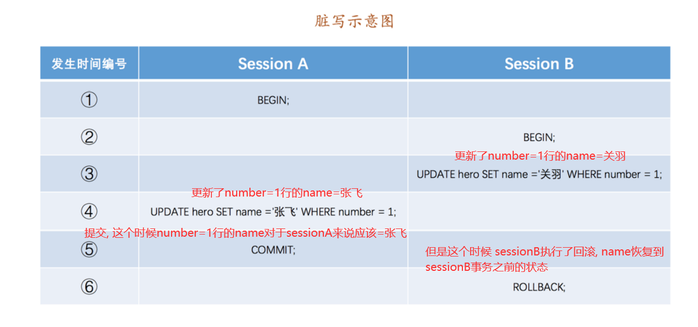


### 脏读（ Dirty Read ）

- 如果一个事务读到了另一个未提交事务修改过的数据，那就意味着发生了 脏读 


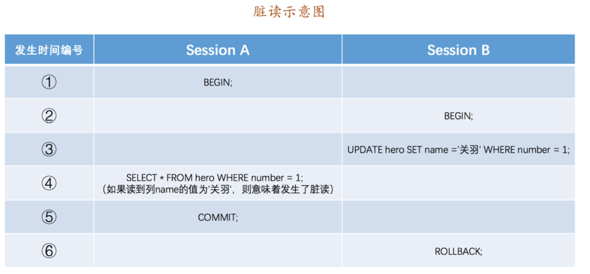


### 不可重复读（Non-Repeatable Read）

如果一个事务只能读到另一个已经提交的事务修改过的数据，并且其他事务每对该数据进行一次修改并提交
后，该事务都能查询得到最新值，那就意味着发生了 不可重复读

 Session B 中提交了几个隐式事务（注意是隐式事务，意味着语句结束事务就提交了），这些事务都修改了 number 列为 1 的记录的列 name 的值，每次事务提交之后，如果 Session A 中的事务都可以查看到最新的值，这种现象也被称之为 不可重复读 

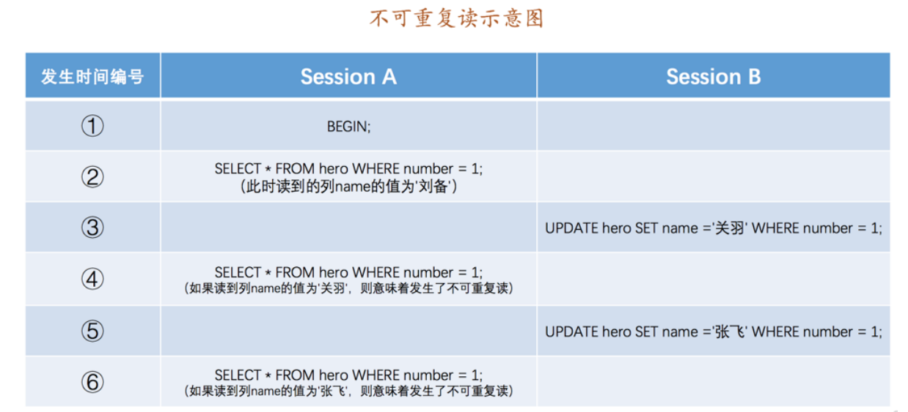


### 幻读（Phantom）

如果一个事务先根据某些条件查询出一些记录，之后另一个事务又向表中插入了符合这些条件的记录，原先
的事务再次按照该条件查询时，能把另一个事务插入的记录也读出来，那就意味着发生了 幻读 


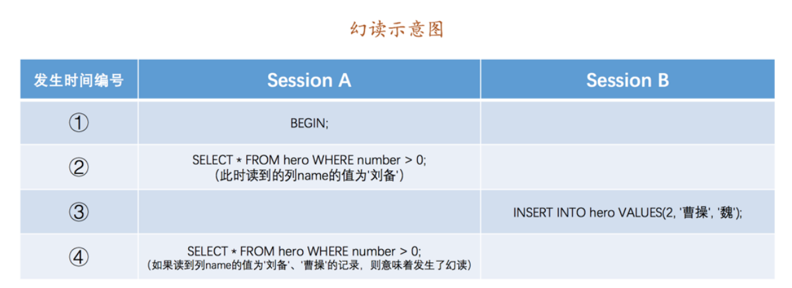


那如果 Session B 中是删除了一些符合 number > 0 的记录而不是插入新记录，那Session A 中之后再根据 number > 0 的条件读取的记录变少了，这种现象算不算 幻读 呢？

明确说一下，这种现象不属于 幻读 ， 幻读 强调的是一个事务按照某个相同条件多次读取记录时，后读取时读到了**之前没有读到的记录**。

>那对于先前已经读到的记录，之后又读取不到这种情况，算啥呢？其实这相当于对每一条记录都
>发生了不可重复读的现象。幻读只是重点强调了读取到了之前读取没有获取到的记录


## 什么是事务的隔离级别？MySQL的默认隔离级别是什么？

脏写 > 脏读 > 不可重复读 > 幻读

设立一些隔离级别，隔离级别越低，越严重的问题就越可能发生

SQL4个 隔离级别 ：

- READ UNCOMMITTED ：未提交读。
- READ COMMITTED ：已提交读。
- REPEATABLE READ ：可重复读。
- SERIALIZABLE ：可串行化。

SQL标准 中规定，针对不同的隔离级别，并发事务可以发生不同严重程度的问题，具体情况如下：


- READ UNCOMMITTED 隔离级别下，可能发生 脏读 、 不可重复读 和 幻读 问题。
- READ COMMITTED 隔离级别下，可能发生 不可重复读 和 幻读 问题，但是不可以发生 脏读 问题。
- REPEATABLE READ 隔离级别下，可能发生 幻读 问题，但是不可以发生 脏读 和 不可重复读 的问题。
- SERIALIZABLE 隔离级别下，各种问题都不可以发生

>脏写 是怎么回事儿？怎么里边都没写呢？

这是因为脏写这个问题太严重了，不论是哪种隔离级别，都不允许脏写的情况发生。

Mysql 默认采用的 REPEATABLE_READ隔离级别 Oracle 默认采用的 READ_COMMITTED隔离级别

事务隔离机制的实现基于锁机制和并发调度。其中并发调度使用的是MVVC（多版本并发控制），通过保存修改的旧版本信息来支持并发一致性读和回滚等特性。


## MYSQL的A C I D怎样实现的？

A原子性由undo log日志保证，它记录了需要回滚的日志信息，事务回滚时撤销已经执行成功的sql

C一致性一般由代码层面来保证

I隔离性由MVCC来保证

D持久性由内存+redo log来保证，mysql修改数据同时在内存和redo log记录这次操作，事务提交的时候通过redo log刷盘，宕机的时候可以从redo log恢复

## MVCC原理

MVCC(Multi Version Concurrency Control)，中文名是多版本并发控制，简单来说就是通过维护数据历史版本，从而解决并发访问情况下的读一致性问题。

### 版本链

在`InnoDB`中，每行记录实际上都包含了两个隐藏字段：事务id(`trx_id`)和回滚指针(`roll_pointer`)。

1. `trx_id`：事务id。每次修改某行记录时，都会把该事务的事务id赋值给`trx_id`隐藏列。
2. `roll_pointer`：回滚指针。每次修改某行记录时，都会把`undo`日志地址赋值给`roll_pointer`隐藏列。

假设`hero`表中只有一行记录，当时插入的事务id为80。此时，该条记录的示例图如下：


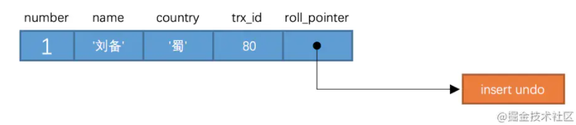

假设之后两个事务`id`分别为`100`、`200`的事务对这条记录进行`UPDATE`操作，操作流程如下：

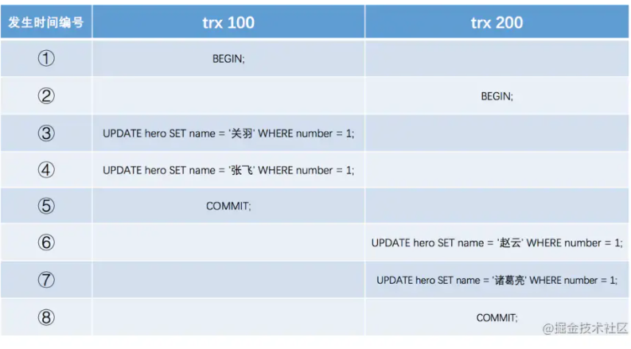

由于每次变动都会先把`undo`日志记录下来，并用`roll_pointer`指向`undo`日志地址。因此可以认为，**对该条记录的修改日志串联起来就形成了一个`版本链`，版本链的头节点就是当前记录最新的值**。如下：

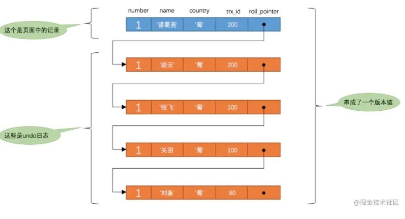

### ReadView

如果数据库隔离级别是`未提交读（READ UNCOMMITTED）`，那么读取版本链中最新版本的记录即可。如果是是`串行化（SERIALIZABLE）`，事务之间是加锁执行的，不存在读不一致的问题。**但是如果是`已提交读（READ COMMITTED）`或者`可重复读（REPEATABLE READ）`，就需要遍历版本链中的每一条记录，判断该条记录是否对当前事务可见，直到找到为止(遍历完还没找到就说明记录不存在)**。`InnoDB`通过`ReadView`实现了这个功能。`ReadView`中主要包含以下4个内容：

- `m_ids`：表示在生成`ReadView`时当前系统中活跃的读写事务的事务id列表。
- `min_trx_id`：表示在生成`ReadView`时当前系统中活跃的读写事务中最小的事务id，也就是`m_ids`中的最小值。
- `max_trx_id`：表示生成`ReadView`时系统中应该分配给**下一个事务的id值**。
- `creator_trx_id`：表示生成该`ReadView`事务的事务id。

有了`ReadView`之后，我们可以基于以下步骤判断某个版本的记录是否对当前事务可见。

1. 如果被访问版本的`trx_id`属性值与`ReadView`中的`creator_trx_id`值相同，意味着当前事务在访问它自己修改过的记录，所以该版本可以被当前事务访问。
2. 如果被访问版本的`trx_id`属性值小于`ReadView`中的`min_trx_id`值，表明生成该版本的事务在当前事务生成`ReadView`前已经提交，所以该版本可以被当前事务访问。
3. 如果被访问版本的`trx_id`属性值大于或等于`ReadView`中的`max_trx_id`值，表明生成该版本的事务在当前事务生成`ReadView`后才开启，所以该版本不可以被当前事务访问。
4. 如果被访问版本的`trx_id`属性值在`ReadView`的`min_trx_id`和`max_trx_id`之间，那就需要判断一下`trx_id`属性值是不是在`m_ids`列表中，如果在，说明创建`ReadView`时生成该版本的事务还是活跃的，该版本不可以被访问；如果不在，说明创建`ReadView`时生成该版本的事务已经被提交，该版本可以被访问。

在`MySQL`中，`READ COMMITTED`和`REPEATABLE READ`隔离级别的的一个非常大的区别就是它们生成`ReadView`的时机不同。**`READ COMMITTED`在每次读取数据前都会生成一个`ReadView`**，这样就能保证每次都能读到其它事务已提交的数据。**`REPEATABLE READ` 只在第一次读取数据时生成一个`ReadView`**，这样就能保证后续读取的结果完全一致。

## 锁

事务并发访问同一数据资源的情况主要就分为`读-读`、`写-写`和`读-写`三种。

1. `读-读` 即并发事务同时访问同一行数据记录。由于两个事务都进行只读操作，不会对记录造成任何影响，因此并发读完全允许。
2. `写-写` 即并发事务同时修改同一行数据记录。这种情况下可能导致`脏写`问题，这是任何情况下都不允许发生的，因此只能通过`加锁`实现，也就是当一个事务需要对某行记录进行修改时，首先会先给这条记录加锁，如果加锁成功则继续执行，否则就排队等待，事务执行完成或回滚会自动释放锁。
3. `读-写` 即一个事务进行读取操作，另一个进行写入操作。这种情况下可能会产生`脏读`、`不可重复读`、`幻读`。最好的方案是**读操作利用多版本并发控制（`MVCC`），写操作进行加锁**。

### 锁的粒度

按锁作用的数据范围进行分类的话，锁可以分为`行级锁`和`表级锁`。

1. `行级锁`：作用在数据行上，锁的粒度比较小。
2. `表级锁`：作用在整张数据表上，锁的粒度比较大。

### 锁的分类

为了实现`读-读`之间不受影响，并且`写-写`、`读-写`之间能够相互阻塞，`Mysql`使用了`读写锁`的思路进行实现，具体来说就是分为了`共享锁`和`排它锁`：

1. `共享锁(Shared Locks)`：简称`S锁`，在事务要读取一条记录时，需要先获取该记录的`S锁`。`S锁`可以在同一时刻被多个事务同时持有。我们可以用`select ...... lock in share mode;`的方式手工加上一把`S锁`。
2. `排他锁(Exclusive Locks)`：简称`X锁`，在事务要改动一条记录时，需要先获取该记录的`X锁`。`X锁`在同一时刻最多只能被一个事务持有。`X锁`的加锁方式有两种，第一种是自动加锁，在对数据进行增删改的时候，都会默认加上一个`X锁`。还有一种是手工加锁，我们用一个`FOR UPDATE`给一行数据加上一个`X锁`。

还需要注意的一点是，如果一个事务已经持有了某行记录的`S锁`，另一个事务是无法为这行记录加上`X锁`的，反之亦然。

除了`共享锁(Shared Locks)`和`排他锁(Exclusive Locks)`，`Mysql`还有`意向锁(Intention Locks)`。意向锁是由数据库自己维护的，一般来说，当我们给一行数据加上共享锁之前，数据库会自动在这张表上面加一个`意向共享锁(IS锁)`；当我们给一行数据加上排他锁之前，数据库会自动在这张表上面加一个`意向排他锁(IX锁)`。**`意向锁`可以认为是`S锁`和`X锁`在数据表上的标识，通过意向锁可以快速判断表中是否有记录被上锁，从而避免通过遍历的方式来查看表中有没有记录被上锁，提升加锁效率**。例如，我们要加表级别的`X锁`，这时候数据表里面如果存在行级别的`X锁`或者`S锁`的，加锁就会失败，此时直接根据`意向锁`就能知道这张表是否有行级别的`X锁`或者`S锁`。

### InnoDB中的表级锁

`InnoDB`中的表级锁主要包括表级别的`意向共享锁(IS锁)`和`意向排他锁(IX锁)`以及`自增锁(AUTO-INC锁)`。其中`IS锁`和`IX锁`在前面已经介绍过了，这里不再赘述，我们接下来重点了解一下`AUTO-INC锁`。

大家都知道，如果我们给某列字段加了`AUTO_INCREMENT`自增属性，插入的时候不需要为该字段指定值，系统会自动保证递增。系统实现这种自动给`AUTO_INCREMENT`修饰的列递增赋值的原理主要是两个：

1. `AUTO-INC锁`：在执行插入语句的时先加上表级别的`AUTO-INC锁`，插入执行完成后立即释放锁。**如果我们的插入语句在执行前无法确定具体要插入多少条记录，比如`INSERT ... SELECT`这种插入语句，一般采用`AUTO-INC锁`的方式**。
2. `轻量级锁`：在插入语句生成`AUTO_INCREMENT`值时先才获取这个`轻量级锁`，然后在`AUTO_INCREMENT`值生成之后就释放`轻量级锁`。**如果我们的插入语句在执行前就可以确定具体要插入多少条记录，那么一般采用轻量级锁的方式对AUTO_INCREMENT修饰的列进行赋值**。这种方式可以避免锁定表，可以提升插入性能。

> mysql默认根据实际场景自动选择加锁方式，当然也可以通过`innodb_autoinc_lock_mode`强制指定只使用其中一种。

### InnoDB中的行级锁

前面说过，通过`MVCC`可以解决`脏读`、`不可重复读`、`幻读`这些读一致性问题，但实际上这只是解决了普通`select`语句的数据读取问题。事务利用`MVCC`进行的读取操作称之为`快照读`，所有普通的`SELECT`语句在`READ COMMITTED`、`REPEATABLE READ`隔离级别下都算是`快照读`。除了`快照读`之外，还有一种是`锁定读`，即在读取的时候给记录加锁，在`锁定读`的情况下依然要解决`脏读`、`不可重复读`、`幻读`的问题。由于都是在记录上加锁，这些锁都属于`行级锁`。

**`InnoDB`的行锁，是通过锁住索引来实现的，如果加锁查询的时候没有使用过索引，会将整个聚簇索引都锁住，相当于锁表了**。根据锁定范围的不同，行锁可以使用`记录锁(Record Locks)`、`间隙锁(Gap Locks)`和`临键锁(Next-Key Locks)`的方式实现。假设现在有一张表`t`，主键是`id`。我们插入了4行数据，主键值分别是 1、4、7、10。接下来我们就以聚簇索引为例，具体介绍三种形式的行锁。

- 记录锁(Record Locks) 所谓记录，就是指聚簇索引中真实存放的数据，比如上面的1、4、7、10都是记录


显然，记录锁就是直接锁定某行记录。当我们使用唯一性的索引(包括唯一索引和聚簇索引)进行等值查询且精准匹配到一条记录时，此时就会直接将这条记录锁定。例如`select * from t where id =4 for update;`就会将`id=4`的记录锁定。

- 间隙锁(Gap Locks) 间隙指的是两个记录之间逻辑上尚未填入数据的部分，比如上述的(1,4)、(4,7)等。

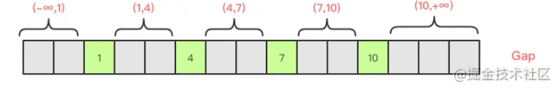

同理，间隙锁就是锁定某些间隙区间的。当我们使用用等值查询或者范围查询，并且没有命中任何一个`record`，此时就会将对应的间隙区间锁定。例如`select * from t where id =3 for update;`或者`select * from t where id > 1 and id < 4 for update;`就会将(1,4)区间锁定。

- 临键锁(Next-Key Locks) 临键指的是间隙加上它右边的记录组成的左开右闭区间。比如上述的(1,4]、(4,7]等。


- 临键锁就是记录锁(Record Locks)和间隙锁(Gap Locks)的结合，即除了锁住记录本身，还要再锁住索引之间的间隙。当我们使用范围查询，并且命中了部分`record`记录，此时锁住的就是临键区间。注意，临键锁锁住的区间会包含最后一个record的右边的临键区间。例如`select * from t where id > 5 and id <= 7 for update;`会锁住(4,7]、(7,+∞)。mysql默认行锁类型就是`临键锁(Next-Key Locks)`。当使用唯一性索引，等值查询匹配到一条记录的时候，临键锁(Next-Key Locks)会退化成记录锁；没有匹配到任何记录的时候，退化成间隙锁。

`间隙锁(Gap Locks)`和`临键锁(Next-Key Locks)`都是用来解决幻读问题的，在`已提交读（READ COMMITTED）`隔离级别下，`间隙锁(Gap Locks)`和`临键锁(Next-Key Locks)`都会失效！


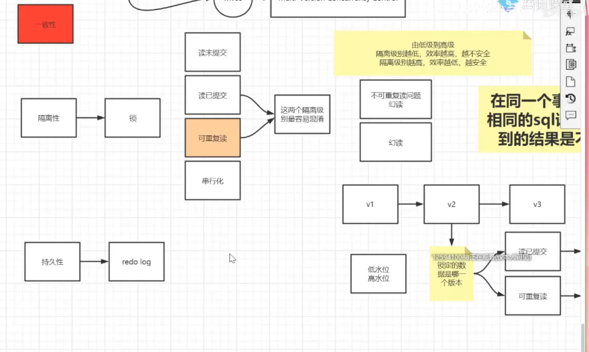


# 锁

## mysql的表锁有哪些？

- S: 读锁
- X: 写锁
- IS: 读意向锁, 加S锁之前先加IS锁, 判断一个表中是否有有被加了S锁的记录
- IX: 写意向锁, 加X锁之前先加IX锁, 判断一个表中是否有有被加了X锁的记录
- AUTO-INC: 对于需要递增的列, 执行插入语句的时候需要加入AUTO-INC

## 按照锁的粒度分数据库锁有哪些？锁机制与InnoDB锁算法

在关系型数据库中，可以按照锁的粒度把数据库锁分为行级锁(INNODB引擎)、表级锁(MYISAM引擎)和页级锁(BDB引擎 )。

MyISAM和InnoDB存储引擎使用的锁：

MyISAM采用表级锁(table-level locking)。
InnoDB支持行级锁(row-level locking)和表级锁，默认为行级锁
行级锁，表级锁和页级锁对比

行级锁 行级锁是Mysql中锁定粒度最细的一种锁，表示只针对当前操作的行进行加锁。行级锁能大大减少数据库操作的冲突。其加锁粒度最小，但加锁的开销也最大。行级锁分为共享锁 和 排他锁。

特点：开销大，加锁慢；会出现死锁；锁定粒度最小，发生锁冲突的概率最低，并发度也最高。

表级锁 表级锁是MySQL中锁定粒度最大的一种锁，表示对当前操作的整张表加锁，它实现简单，资源消耗较少，被大部分MySQL引擎支持。最常使用的MYISAM与INNODB都支持表级锁定。表级锁定分为表共享读锁（共享锁）与表独占写锁（排他锁）。

特点：开销小，加锁快；不会出现死锁；锁定粒度大，发出锁冲突的概率最高，并发度最低。

页级锁 页级锁是MySQL中锁定粒度介于行级锁和表级锁中间的一种锁。表级锁速度快，但冲突多，行级冲突少，但速度慢。所以取了折衷的页级，一次锁定相邻的一组记录。

特点：开销和加锁时间界于表锁和行锁之间；会出现死锁；锁定粒度界于表锁和行锁之间，并发度一般


## 从锁的类别上分MySQL都有哪些锁呢？像上面那样子进行锁定岂不是有点阻碍并发效率了

从锁的类别上来讲，有共享锁和排他锁。

共享锁: 又叫做读锁。 当用户要进行数据的读取时，对数据加上共享锁。共享锁可以同时加上多个。

排他锁: 又叫做写锁。 当用户要进行数据的写入时，对数据加上排他锁。排他锁只可以加一个，他和其他的排他锁，共享锁都相斥。


## MySQL中InnoDB引擎的行锁是怎么实现的？

答：InnoDB是基于索引来完成行锁

mysql的行锁是通过索引加载的，即是行锁是加在索引响应的行上的，要是对应的SQL语句没有走索引，则会全表扫描，行锁则无法实现，取而代之的是表锁。

**表锁**：不会出现死锁，发生锁冲突几率高，并发低。锁是对表操作的，所以自然锁住全表的表锁就不会出现死锁。

**行锁：**会出现死锁，发生锁冲突几率低，并发高。

###   **行锁的实现** 

1. 行锁必须有索引才能实现，否则会自动锁全表，那么就不是行锁了。

2. 两个事务不能锁同一个索引，

3.  insert ，delete ， update在事务中都会自动默认加上排它锁。 

   

## 什么是死锁？怎么解决？

死锁是指两个或多个事务在同一资源上相互占用，并请求锁定对方的资源，从而导致恶性循环的现象。

**锁冲突：**例如说事务A将某几行上锁后，事务B又对其上锁，锁不能共存否则会出现锁冲突。**（但是共享锁可以共存，共享锁和排它锁不能共存，排它锁和排他锁也不可以）**

**死锁：**例如说两个事务，事务A锁住了1~5行，同时事务B锁住了6~10行，此时事务A请求锁住6~10行，就会阻塞直到事务B施放6~10行的锁，而随后事务B又请求锁住1~5行，事务B也阻塞直到事务A释放1~5行的锁。死锁发生时，会产生Deadlock错误。

常见的解决死锁的方法

1、如果不同程序会并发存取多个表，尽量约定以相同的顺序访问表，可以大大降低死锁机会。

2、在同一个事务中，尽可能做到一次锁定所需要的所有资源，减少死锁产生概率；

3、对于非常容易产生死锁的业务部分，可以尝试使用升级锁定颗粒度，通过表级锁定来减少死锁产生的概率；

如果业务处理不好可以用分布式事务锁或者使用乐观锁


## 数据库的乐观锁和悲观锁是什么？怎么实现的？

数据库管理系统（DBMS）中的并发控制的任务是确保在多个事务同时存取数据库中同一数据时不破坏事务的隔离性和统一性以及数据库的统一性。乐观并发控制（乐观锁）和悲观并发控制（悲观锁）是并发控制主要采用的技术手段。

悲观锁：与乐观锁相对应的就是悲观锁了。悲观锁就是在操作数据时，认为此操作会出现数据冲突，所以在进行每次操作时都要通过获取锁才能进行对相同数据的操作，这点跟java中的synchronized很相似，所以悲观锁需要耗费较多的时间。另外与乐观锁相对应的，悲观锁是由数据库自己实现了的，要用的时候，我们直接调用数据库的相关语句就可以了。

说到这里，由悲观锁涉及到的另外两个锁概念就出来了，它们就是共享锁与排它锁。共享锁和排它锁是悲观锁的不同的实现，它俩都属于悲观锁的范畴。

乐观锁：**乐观锁不是数据库自带的，需要我们自己去实现**。乐观锁是指操作数据库时(更新操作)，想法很乐观，认为这次的操作不会导致冲突，在操作数据时，并不进行任何其他的特殊处理（也就是不加锁），而在进行更新后，再去判断是否有冲突了。

通常实现是这样的：在表中的数据进行操作时(更新)，先给数据表加一个版本(version)字段，每操作一次，将那条记录的版本号加1。也就是先查询出那条记录，获取出version字段,如果要对那条记录进行操作(更新),则先判断此刻version的值是否与刚刚查询出来时的version的值相等，如果相等，则说明这段期间，没有其他程序对其进行操作，则可以执行更新，将version字段的值加1；如果更新时发现此刻的version值与刚刚获取出来的version的值不相等，则说明这段期间已经有其他程序对其进行操作了，则不进行更新操作。

两种锁的使用场景

从上面对两种锁的介绍，我们知道两种锁各有优缺点，不可认为一种好于另一种，像乐观锁适用于写比较少的情况下（多读场景），即冲突真的很少发生的时候，这样可以省去了锁的开销，加大了系统的整个吞吐量。

但如果是多写的情况，一般会经常产生冲突，这就会导致上层应用会不断的进行retry，这样反倒是降低了性能，所以一般多写的场景下用悲观锁就比较合适。


# 视图

## 为什么要使用视图？什么是视图？

为了提高复杂SQL语句的复用性和表操作的安全性，MySQL数据库管理系统提供了视图特性。所谓视图，本质上是一种虚拟表，在物理上是不存在的，其内容与真实的表相似，包含一系列带有名称的列和行数据。但是，视图并不在数据库中以储存的数据值形式存在。行和列数据来自定义视图的查询所引用基本表，并且在具体引用视图时动态生成。

视图使开发者只关心感兴趣的某些特定数据和所负责的特定任务，只能看到视图中所定义的数据，而不是视图所引用表中的数据，从而提高了数据库中数据的安全性。

## 视图有哪些特点？

视图的特点如下:

视图的列可以来自不同的表，是表的抽象和在逻辑意义上建立的新关系。

视图是由基本表(实表)产生的表(虚表)。

视图的建立和删除不影响基本表。

对视图内容的更新(添加，删除和修改)直接影响基本表。

当视图来自多个基本表时，不允许添加和删除数据。

视图的操作包括创建视图，查看视图，删除视图和修改视图。

## 视图的使用场景有哪些？

视图根本用途：简化sql查询，提高开发效率。如果说还有另外一个用途那就是兼容老的表结构。

下面是视图的常见使用场景：

重用SQL语句；

简化复杂的SQL操作。在编写查询后，可以方便的重用它而不必知道它的基本查询细节；

使用表的组成部分而不是整个表；

保护数据。可以给用户授予表的特定部分的访问权限而不是整个表的访问权限；

更改数据格式和表示。视图可返回与底层表的表示和格式不同的数据。

## 视图的优点

查询简单化。视图能简化用户的操作
数据安全性。视图使用户能以多种角度看待同一数据，能够对机密数据提供安全保护
逻辑数据独立性。视图对重构数据库提供了一定程度的逻辑独立性
视图的缺点
性能。数据库必须把视图的查询转化成对基本表的查询，如果这个视图是由一个复杂的多表查询所定义，那么，即使是视图的一个简单查询，数据库也把它变成一个复杂的结合体，需要花费一定的时间。

修改限制。当用户试图修改视图的某些行时，数据库必须把它转化为对基本表的某些行的修改。事实上，当从视图中插入或者删除时，情况也是这样。对于简单视图来说，这是很方便的，但是，对于比较复杂的视图，可能是不可修改的

这些视图有如下特征：1.有UNIQUE等集合操作符的视图。2.有GROUP BY子句的视图。3.有诸如AVG\SUM\MAX等聚合函数的视图。 4.使用DISTINCT关键字的视图。5.连接表的视图（其中有些例外）

## 什么是游标？

游标是系统为用户开设的一个数据缓冲区，存放SQL语句的执行结果，每个游标区都有一个名字。用户可以通过游标逐一获取记录并赋给主变量，交由主语言进一步处理。

## 存储过程与函数

### 什么是存储过程？有哪些优缺点？

存储过程是一个预编译的SQL语句，优点是允许模块化的设计，就是说只需要创建一次，以后在该程序中就可以调用多次。如果某次操作需要执行多次SQL，使用存储过程比单纯SQL语句执行要快。

优点

1）存储过程是预编译过的，执行效率高。

2）存储过程的代码直接存放于数据库中，通过存储过程名直接调用，减少网络通讯。

3）安全性高，执行存储过程需要有一定权限的用户。

4）存储过程可以重复使用，减少数据库开发人员的工作量。

缺点

1）调试麻烦，但是用 PL/SQL Developer 调试很方便！弥补这个缺点。

2）移植问题，数据库端代码当然是与数据库相关的。但是如果是做工程型项目，基本不存在移植问题。

3）重新编译问题，因为后端代码是运行前编译的，如果带有引用关系的对象发生改变时，受影响的存储过程、包将需要重新编译（不过也可以设置成运行时刻自动编译）。

4）如果在一个程序系统中大量的使用存储过程，到程序交付使用的时候随着用户需求的增加会导致数据结构的变化，接着就是系统的相关问题了，最后如果用户想维护该系统可以说是很难很难、而且代价是空前的，维护起来更麻烦。

## 触发器

### 什么是触发器？触发器的使用场景有哪些？

触发器是用户定义在关系表上的一类由事件驱动的特殊的存储过程。触发器是指一段代码，当触发某个事件时，自动执行这些代码。

使用场景

可以通过数据库中的相关表实现级联更改。
实时监控某张表中的某个字段的更改而需要做出相应的处理。
例如可以生成某些业务的编号。
注意不要滥用，否则会造成数据库及应用程序的维护困难。
大家需要牢记以上基础知识点，重点是理解数据类型CHAR和VARCHAR的差异，表存储引擎InnoDB和MyISAM的区别。

### MySQL中都有哪些触发器？

在MySQL数据库中有如下六种触发器：

Before Insert
After Insert
Before Update
After Update
Before Delete
After Delete

# 常用SQL语句

## SQL语句主要分为哪几类

### 数据定义语言DDL（Data Ddefinition Language）CREATE，DROP，ALTER

主要为以上操作 即对逻辑结构等有操作的，其中包括表结构，视图和索引。

### 数据查询语言DQL（Data Query Language）SELECT

这个较为好理解 即查询操作，以select关键字。各种简单查询，连接查询等 都属于DQL。

### 数据操纵语言DML（Data Manipulation Language）INSERT，UPDATE，DELETE

主要为以上操作 即对数据进行操作的，对应上面所说的查询操作 DQL与DML共同构建了多数初级程序员常用的增删改查操作。而查询是较为特殊的一种 被划分到DQL中。

### 数据控制功能DCL（Data Control Language）GRANT，REVOKE，COMMIT，ROLLBACK

主要为以上操作 即对数据库安全性完整性等有操作的，可以简单的理解为权限控制等。


## SQL 约束有哪几种？

- NOT NULL: 用于控制字段的内容一定不能为空（NULL）。
- UNIQUE: 控件字段内容不能重复，一个表允许有多个 Unique 约束。
- PRIMARY KEY: 也是用于控件字段内容不能重复，但它在一个表只允许出现一个。
- FOREIGN KEY: 用于预防破坏表之间连接的动作，也能防止非法数据插入外键列，因为它必须是它指向的那个表中的值之一。
- CHECK: 用于控制字段的值范围。
  

## 六种关联查询

- 交叉连接（CROSS JOIN）
- 内连接（INNER JOIN）
- 外连接（LEFT JOIN/RIGHT JOIN）
- 联合查询（UNION与UNION ALL）
  - 就是把多个结果集集中在一起，UNION前的结果为基准，需要注意的是联合查询的列数要相等，相同的记录行会合并
  - 如果使用UNION ALL，不会合并重复的记录行
  - 效率 UNION 高于 UNION ALL
- 交叉连接（CROSS JOIN）

## mysql中 in 和 exists 区别

 “**外层查询表小于子查询表，则用exists，外层查询表大于子查询表，则用in，如果外层和子查询表差不多，则爱用哪个用哪个。**” 

### exists

```mysql
SELECT * FROM a WHERE EXISTS(SELECT 1 FROM b WHERE B.id  = A.id);
#以上查询等价于：
1、SELECT * FROM A;
2、SELECT I FROM B WHERE B.id = A.id;
```

EXISTS()查询会执行SELECT * FROM A查询，执行A.length次，并不会将EXISTS()查询结果结果进行缓存，因为EXISTS()查询返回一个布尔值true或flase，它只在乎EXISTS()的查询中是否有记录，与具体的结果集无关。

EXISTS()查询是将主查询的结果集放到子查询中做验证，根据验证结果是true或false来决定主查询数据结果是否得以保存。

 当B表的数据比A表的数据大时适合使用EXISTS()查询，因为它不用遍历B操作，只执行一次查询就OK了 

exists关键字后面的参数是一个任意的子查询，系统对子查询进行运算以判断它是否返回行，如果至少返回一行，那么exists的结果为true ,此时外层的查询语句将进行查询；如果子查询没有返回任何行，那么exists的结果为false,此时外层语句将不进行查询。

需要注意的是，当我们的子查询为 SELECT NULL 时，MYSQL仍然认为它是True。
例如：

1、A表有100条记录,B表有1000条记录,那么EXISTS()会执行100次去判断A表中的id是否与B表中的id相等.因为它只执行A.length次，可见B表数据越多,越适合EXISTS()发挥效果.

2、A表有10000条记录,B表有100条记录,那么EXISTS()还是执行10000次,此时不如使用in()遍历10000*100次,因为IN()是在内存里遍历数据进行比较,而EXISTS()需要查询数据库,我们都知道查询数据库所消耗的性能更高,而内存比较很快.

### in

```mysql
SELECT   *  FROM A WHERE id IN (SELECT id FROM B);
#等价于：
1、SELECT id FROM B ----->先执行in中的查询
2、SELECT *  FROM A  WHERE A.id = B.id
```

以上in()中的查询只执行一次，它查询出B中的所有的id并缓存起来，然后检查A表中查询出的id在缓存中是否存在，如果存在则将A的查询数据加入到结果集中，直到遍历完A表中所有的结果集为止。
 当B表的数据较大时不适合使用in()查询，因为它会将B表中的数据全部遍历一次 

1、A表中有100条记录，B表中有1000条记录，那么最多可能遍历100*1000次，效率很差

2、A表中有1000条记录，B表中有100条记录，那么最多可遍历1000*100此，内循环次数减少，效率大大提升

结论：IN()查询适合B表数据比A表数据小的情况，IN()查询是从缓存中取数据


### not exists和not in

- not in 和not exists：
  - 如果查询语句使用了not in，那么内外表都进行全表扫描，没有用到索引；
    -  因为not in实质上等于`!= and != ···`，因为!=不会使用索引，故not in不会使用索引。 
  - 而not extsts的子查询依然能用到表上的索引。所以无论那个表大，用not exists都比not in要快。
    


## mysql中int(10)和char(10)以及varchar(10)的区别

int(10)的10表示显示的数据的长度，不是存储数据的大小；chart(10)和varchar(10)的10表示存储数据的大小，即表示存储多少个字符。

int(10) 10位的数据长度 9999999999，占32个字节，int型4位
char(10) 10位固定字符串，不足补空格 最多10个字符
varchar(10) 10位可变字符串，不足补空格 最多10个字符

char(10)表示存储定长的10个字符，不足10个就用空格补齐，占用更多的存储空间

varchar(10)表示存储10个变长的字符，存储多少个就是多少个，空格也按一个字符存储，这一点是和char(10)的空格不同的，char(10)的空格表示占位不算一个字符


## drop、delete与truncate的区别

三者都表示删除，但是三者有一些差别：

 因此，在不再需要一张表的时候，用drop；在想删除部分数据行时候，用delete；在保留表而删除所有数据的时候用truncate。 

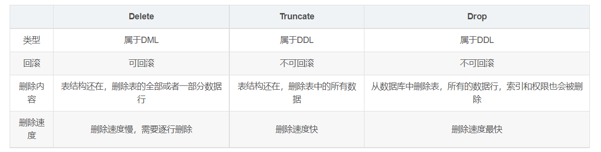


## UNION与UNION ALL的区别？

- 如果使用UNION ALL，不会合并重复的记录行
  - UNION ALL 就不需要为最终的结果集进行去重，它只是单纯的把多个查询的结果集中的记录合并成一个并返回给用户，所以也就不需要使用临时表
-  union all 效率高于union 
  - UNION 把多个查询的结果集合并起来并对结果集中的记录使用的是内部的临时表去重


# SQL优化

## 如何定位及优化SQL语句的性能问题？创建的索引有没有被使用到?或者说怎么才可以知道这条语句运行很慢的原因？

对于低性能的SQL语句的定位，最重要也是最有效的方法就是使用执行计划，MySQL提供了explain命令来查看语句的执行计划。 我们知道，不管是哪种数据库，或者是哪种数据库引擎，在对一条SQL语句进行执行的过程中都会做很多相关的优化，对于查询语句，最重要的优化方式就是使用索引。 而执行计划，就是显示数据库引擎对于SQL语句的执行的详细情况，其中包含了是否使用索引，使用什么索引，使用的索引的相关信息等。

执行计划包含的信息 **id** 有一组数字组成。表示一个查询中各个子查询的执行顺序;

- id相同执行顺序由上至下。
- id不同，id值越大优先级越高，越先被执行。
- id为null时表示一个结果集，不需要使用它查询，常出现在包含union等查询语句中

 **select_type** 每个子查询的查询类型，一些常见的查询类型。 

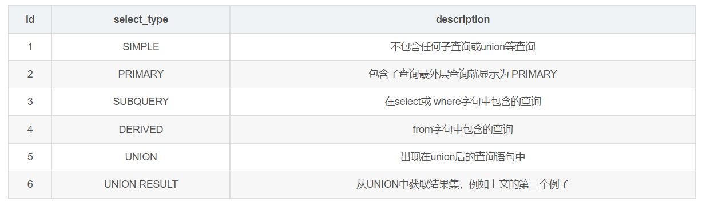

type 访问方法

- system
  - 当表中只有一条记录并且该表使用的存储引擎的统计数据是精确的，比如MyISAM、Memory，那么对该表的访问方法就是 system 

- const
  - 这个我们前边唠叨过，就是当我们根据主键或者唯一二级索引列与常数进行等值匹配时，对单表的访问方法就是 const 
- eq_ref
  - 在连接查询时，如果被驱动表是通过主键或者唯一二级索引列等值匹配的方式进行访问的（如果该主键或者唯一二级索引是联合索引的话，所有的索引列都必须进行等值比较），则对该被驱动表的访问方法就是
    eq_ref

- ref
  - 当通过普通的二级索引列与常量进行等值匹配时来查询某个表，那么对该表的访问方法就可能是 ref

- fulltext
  - 全文索引

- ref_or_null
  - 当对普通二级索引进行等值匹配查询，该索引列的值也可以是 NULL 值时，那么对该表的访问方法就可能是ref_or_null 

- index_merge
  - 某些场景下可以使用 Intersection 、 Union 、 Sort-Union 这三种索引合并的方式来执行查询

- unique_subquery
  - 类似于两表连接中被驱动表的 eq_ref 访问方法， 
  - unique_subquery 是针对在一些包含 IN 子查询的查询语句中，如果查询优化器决定将 IN 子查询转换为 EXISTS 子查询，
  - 而且子查询可以使用到主键进行等值匹配的话，
  - 那么该子查询执行计划的 type 列的值就是 unique_subquery 

- index_subquery
  - index_subquery 与 unique_subquery 类似，只不过访问子查询中的表时使用的是普通的索引

- range
  - 如果使用索引获取某些 范围区间 的记录，那么就可能使用到 range 访问方法

- index
  - 当我们可以使用索引覆盖，但需要扫描全部的索引记录时，该表的访问方法就是 index

- ALL
  - 全表扫描

possible_keys 可能使用的索引，注意不一定会使用。查询涉及到的字段上若存在索引，则该索引将被列出来。当该列为 NULL时就要考虑当前的SQL是否需要优化了。

key 显示MySQL在查询中实际使用的索引，若没有使用索引，显示为NULL。

TIPS:查询中若使用了覆盖索引(覆盖索引：索引的数据覆盖了需要查询的所有数据)，则该索引仅出现在key列表中

key_length 索引长度

ref 表示上述表的连接匹配条件，即哪些列或常量被用于查找索引列上的值

rows 返回估算的结果集数目，并不是一个准确的值。

extra 的信息非常丰富，常见的有：

Using index 使用覆盖索引
Using where 使用了用where子句来过滤结果集
Using filesort 使用文件排序，使用非索引列进行排序时出现，非常消耗性能，尽量优化。
Using temporary 使用了临时表 sql优化的目标可以参考阿里开发手册

## SQL的生命周期？

1. 应用服务器与数据库服务器建立一个连接
2. 数据库进程拿到请求sql
3. 解析并生成执行计划，执行
4. 读取数据到内存并进行逻辑处理
5. 通过步骤一的连接，发送结果到客户端
6. 关掉连接，释放资源

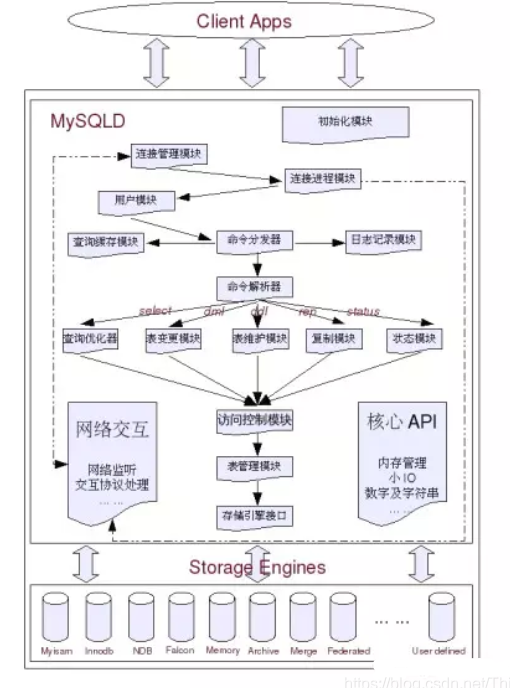


## 大表数据查询，怎么优化

优化shema、sql语句+索引；
第二加缓存，memcached, redis；
主从复制，读写分离；
垂直拆分，根据你模块的耦合度，将一个大的系统分为多个小的系统，也就是分布式系统；
水平切分，针对数据量大的表，这一步最麻烦，最能考验技术水平，要选择一个合理的sharding key, 为了有好的查询效率，表结构也要改动，做一定的冗余，应用也要改，sql中尽量带sharding key，将数据定位到限定的表上去查，而不是扫描全部的表；

## 超大分页怎么处理？

超大的分页一般从两个方向上来解决.

数据库层面,这也是我们主要集中关注的(虽然收效没那么大),类似于select * from table where age > 20 limit 1000000,10这种查询其实也是有可以优化的余地的. 这条语句需要load1000000数据然后基本上全部丢弃,只取10条当然比较慢. 当时我们可以修改为select * from table where id in (select id from table where age > 20 limit 1000000,10).这样虽然也load了一百万的数据,但是由于索引覆盖,要查询的所有字段都在索引中,所以速度会很快. 同时如果ID连续的好,我们还可以select * from table where id > 1000000 limit 10,效率也是不错的,优化的可能性有许多种,但是核心思想都一样,就是减少load的数据.
从需求的角度减少这种请求…主要是不做类似的需求(直接跳转到几百万页之后的具体某一页.只允许逐页查看或者按照给定的路线走,这样可预测,可缓存)以及防止ID泄漏且连续被人恶意攻击.
解决超大分页,其实主要是靠缓存,可预测性的提前查到内容,缓存至redis等k-V数据库中,直接返回即可.

```mysql
【推荐】利用延迟关联或者子查询优化超多分页场景。 

说明：MySQL并不是跳过offset行，而是取offset+N行，然后返回放弃前offset行，返回N行，那当offset特别大的时候，效率就非常的低下，要么控制返回的总页数，要么对超过特定阈值的页数进行SQL改写。 

正例：先快速定位需要获取的id段，然后再关联： 

SELECT a.* FROM 表1 a, (select id from 表1 where 条件 LIMIT 100000,20 ) b where a.id=b.id

```


## mysql 分页

LIMIT 子句可以被用于强制 SELECT 语句返回指定的记录数。LIMIT 接受一个或两个数字参数。参数必须是一个整数常量。如果给定两个参数，第一个参数指定第一个返回记录行的偏移量，第二个参数指定返回记录行的最大数目。初始记录行的偏移量是 0(而不是 1)

mysql> SELECT * FROM table LIMIT 5,10; // 检索记录行 6-15 
为了检索从某一个偏移量到记录集的结束所有的记录行，可以指定第二个参数为 -1：

mysql> SELECT * FROM table LIMIT 95,-1; // 检索记录行 96-last. 
如果只给定一个参数，它表示返回最大的记录行数目：

mysql> SELECT * FROM table LIMIT 5; //检索前 5 个记录行 
 换句话说，LIMIT n 等价于 LIMIT 0,n。 


## 慢查询日志

> 用于记录执行时间超过某个临界值的SQL日志，用于快速定位慢查询，为我们的优化做参考。 

开启慢查询日志

配置项：slow_query_log

可以使用show variables like ‘slov_query_log’查看是否开启，如果状态值为OFF，可以使用set GLOBAL slow_query_log = on来开启，它会在datadir下产生一个xxx-slow.log的文件。

设置临界时间

配置项：long_query_time

查看：show VARIABLES like 'long_query_time'，单位秒

设置：set long_query_time=0.5

实操时应该从长时间设置到短的时间，即将最慢的SQL优化掉

查看日志，一旦SQL超过了我们设置的临界时间就会被记录到xxx-slow.log中


## 关心过业务系统里面的sql耗时吗？统计过慢查询吗？对慢查询都怎么优化过？

慢查询的优化首先要搞明白慢的原因是什么？ 是查询条件没有命中索引？是load了不需要的数据列？还是数据量太大？

所以优化也是针对这三个方向来的，

首先分析语句，看看是否load了额外的数据，可能是查询了多余的行并且抛弃掉了，可能是加载了许多结果中并不需要的列，对语句进行分析以及重写。
分析语句的执行计划，然后获得其使用索引的情况，之后修改语句或者修改索引，使得语句可以尽可能的命中索引。
如果对语句的优化已经无法进行，可以考虑表中的数据量是否太大，如果是的话可以进行横向或者纵向的分表。

## 为什么要尽量设定一个主键？

主键是数据库确保数据行在整张表唯一性的保障，即使业务上本张表没有主键，也建议添加一个自增长的ID列作为主键。设定了主键之后，在后续的删改查的时候可能更加快速以及确保操作数据范围安全。

主键使用自增ID还是UUID？
推荐使用自增ID，不要使用UUID。

因为在InnoDB存储引擎中，主键索引是作为聚簇索引存在的，也就是说，主键索引的B+树叶子节点上存储了主键索引以及全部的数据(按照顺序)，如果主键索引是自增ID，那么只需要不断向后排列即可，如果是UUID，由于到来的ID与原来的大小不确定，会造成非常多的数据插入，数据移动，然后导致产生很多的内存碎片，进而造成插入性能的下降。

总之，在数据量大一些的情况下，用自增主键性能会好一些。

关于主键是聚簇索引，如果没有主键，InnoDB会选择一个唯一键来作为聚簇索引，如果没有唯一键，会生成一个隐式的主键。


## 字段为什么要求定义为not null？

null值会占用更多的字节，且会在程序中造成很多与预期不符的情况。

数据存储的行结构如果以compact模式存储, 会有null值列表记录当前行哪些列为null

## 如果要存储用户的密码散列，应该使用什么字段进行存储？

 密码散列，盐，用户身份证号等固定长度的字符串应该使用char而不是varchar来存储，这样可以节省空间且提高检索效率。 

如果使用varchar等变长字段, 会在每条记录的行结构开头的变长字段列表中逆序的记录变长字段的列所占用的字节数, 造成一定的浪费,同时char固定长度在分配空间会直接分配对应的空间, 即便值为null, 这样之后值改变的时候不需要再去申请其他的空间造成这里的空间变长碎片造成空间的浪费


## 优化查询过程中的数据访问

- 访问数据太多导致查询性能下降
  - 确定应用程序是否在检索大量超过需要的数据，可能是太多行或列
  - 确认MySQL服务器是否在分析大量不必要的数据行
  - 避免犯如下SQL语句错误
  - 查询不需要的数据。解决办法：使用limit解决
  - 多表关联返回全部列。解决办法：指定列名
  - 总是返回全部列。解决办法：避免使用SELECT *
  - 重复查询相同的数据。解决办法：可以缓存数据，下次直接读取缓存
  - 是否在扫描额外的记录。解决办法：
    - 使用explain进行分析，如果发现查询需要扫描大量的数据，但只返回少数的行，可以通过如下技巧去优化：
      - 使用索引覆盖扫描，把所有的列都放到索引中，这样存储引擎不需要回表获取对应行就可以返回结果。
  - 改变数据库和表的结构，修改数据表范式
  - 重写SQL语句，让优化器可以以更优的方式执行查询


## 优化长难的查询语句

一个复杂查询还是多个简单查询
MySQL内部每秒能扫描内存中上百万行数据，相比之下，响应数据给客户端就要慢得多
使用尽可能小的查询是好的，但是有时将一个大的查询分解为多个小的查询是很有必要的。

- 将一个大的查询分为多个小的相同的查询
- 一次性删除1000万的数据要比一次删除1万，暂停一会的方案更加损耗服务器开销。
- 分解关联查询，让缓存的效率更高。
- 执行单个查询可以减少锁的竞争。
- 在应用层做关联更容易对数据库进行拆分。
- 减少少冗余记录的查询。

## 优化特定类型的查询语句

- count(*)会忽略所有的列，直接统计所有列数，不要使用count(列名)
- MyISAM中，没有任何where条件的count(*)非常快。
- 当有where条件时，MyISAM的count统计不一定比其它引擎快。


## 优化关联查询

- 确定ON或者USING子句中是否有索引。
- 确保GROUP BY和ORDER BY只有一个表中的列，这样MySQL才有可能使用索引。

## 优化子查询

- 用关联查询替代
- 优化GROUP BY和DISTINCT
  - 这两种查询据可以使用索引来优化，是最有效的优化方法
- 关联查询中，使用标识列分组的效率更高
- 如果不需要ORDER BY，进行GROUP BY时加ORDER BY NULL，MySQL不会再进行文件排序。

## 优化LIMIT分页

- LIMIT偏移量大的时候，查询效率较低
- 可以记录上次查询的最大ID，下次查询时直接根据该ID来查询


## 优化WHERE子句

```
对字段的函数,表达式,算数运算,
模糊查询%target%
in not in ==>between
or
!= <>
null
where order by 后面的列 建立索引
```


 对于此类考题，先说明如何定位低效SQL语句，然后根据SQL语句可能低效的原因做排查，先从索引着手，如果索引没有问题，考虑以上几个方面，数据访问的问题，长难查询句的问题还是一些特定类型优化的问题，逐一回答。 

 SQL语句优化的一些方法？ 

1.

- 对查询进行优化，应尽量避免全表扫描，首先应考虑在 where 及 order by 涉及的列上建立索引。

- 应尽量避免在 where 子句中对字段进行 null 值判断，否则将导致引擎放弃使用索引而进行全表扫描，如：

- ```mysql
  select id from t where num is null
  -- 可以在num上设置默认值0，确保表中num列没有null值，然后这样查询：
  select id from t where num=
  ```

- 应尽量避免在 where 子句中使用!=或<>操作符，否则引擎将放弃使用索引而进行全表扫描。

- 应尽量避免在 where 子句中使用or 来连接条件，否则将导致引擎放弃使用索引而进行全表扫描，如：

```mysql
select id from t where num=10 or num=20
-- 可以这样查询：
select id from t where num=10 union all select id from t where num=20
```

- in 和 not in 也要慎用，否则会导致全表扫描，如：

```mysql
select id from t where num in(1,2,3) 
-- 对于连续的数值，能用 between 就不要用 in 了：
select id from t where num between 1 and 3
```


- 下面的查询也将导致全表扫描：select id from t where name like ‘%李%’若要提高效率，可以考虑全文检索。
- 如果在 where 子句中使用参数，也会导致全表扫描。因为SQL只有在运行时才会解析局部变量，但优化程序不能将访问计划的选择推迟到运行时；它必须在编译时进行选择。然 而，如果在编译时建立访问计划，变量的值还是未知的，因而无法作为索引选择的输入项。如下面语句将进行全表扫描：

```mysql
select id from t where num=@num
-- 可以改为强制查询使用索引：
select id from t with(index(索引名)) where num=@num
```


- 应尽量避免在 where 子句中对字段进行表达式操作，这将导致引擎放弃使用索引而进行全表扫描。如：

```mysql
select id from t where num/2=100
-- 应改为:
select id from t where num=100*2
```

- 应尽量避免在where子句中对字段进行函数操作，这将导致引擎放弃使用索引而进行全表扫描。如：

```mysql
select id from t where substring(name,1,3)=’abc’
-- name以abc开头的id应改为:
select id from t where name like ‘abc%’
```


- 不要在 where 子句中的“=”左边进行函数、算术运算或其他表达式运算，否则系统将可能无法正确使用索引。
  

# 数据库优化

## 为什么使用B+树

### 不用Hash

- 需要保证合理的hash算法保证尽可能少的碰撞
- hash表占据比较大的内存, 需要一次性的全部加载进来占用宝贵的内存空间
- 如果需要范围查询, 只能范围内所有数据挨个进行等值查询, 
- memory使用hash因为数据都在内存, 所以即使是范围查询也比与磁盘交互更快

### 不用二叉树 红黑树

- 因为数的深度过深导致IO次数变多, 影响数据读取的效率

### 为什么B- B+数可以

- 每个结点可以放一个页
- B-Tree每个结点都存放了索引键+数据, 导致每个页可存放的数据量很少, 那么读数据就需要进行更多次IO导致效率的降低
- 如果我们每个结点只存放索引键, 而不存放数据, 数据只存放在叶子结点, 我们一次IO就可以读出更多的索引键信息, 减少了IO的次数
- B-Tree

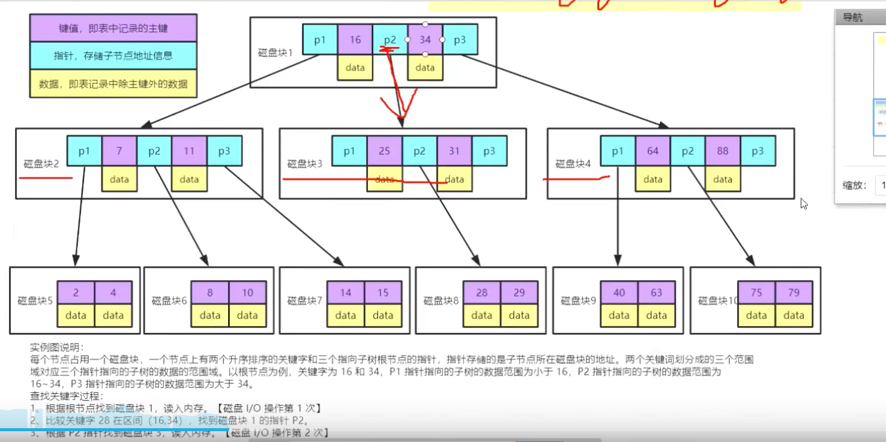

- B+Tree

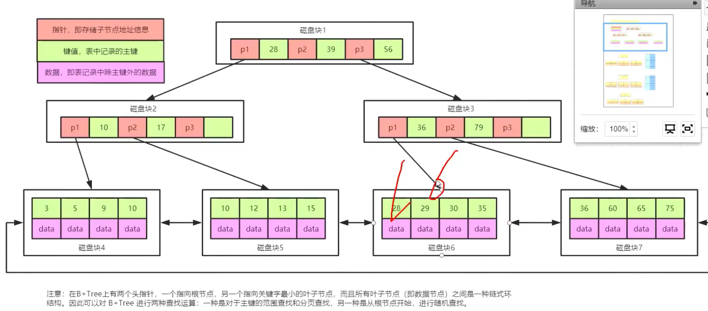


## InnoDB 和 MyISAM 叶子结点的区别

- InnoDB
  - .idb文件

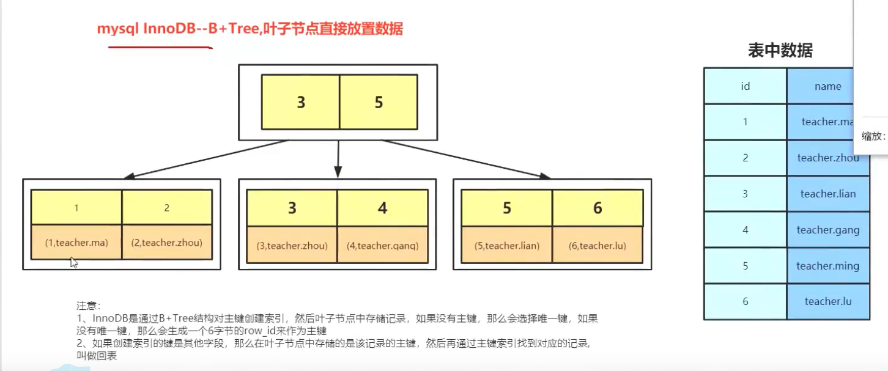


- MyISAM
  - myi myd文件

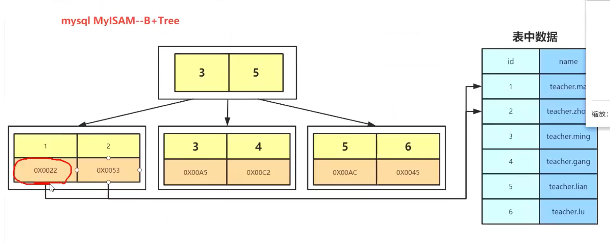

## 聚簇索引和非聚簇索引的区别

- 索引使用键的优先级: 主键->唯一键->row_id

- 一个索引对应一个树
- 聚簇索引叶子结点存放的是数据, 并且是以主键排序的
- 非聚簇索引叶子结点存放的是索引键对应记录的主键


## 主键是否使用自增

- 单机推荐使用, 这样插入数据都是叶子结点往后顺序插入, 否则记录的主键不是自增, 可能存在需要往前面的页插入数据导致数据的级联分裂, 甚至是内结点的分页, 造成维护聚簇索引的消耗增加
- 分布式不推荐, 因为同一张表的数据可能会被横向切割到不同主机的数据库分片中, 这样在处理自增主键的过程中遇到两个分片交界的地方就需要事务来保证一直性, 可能会用到同步机制例如锁, 降低系统的并发性


## 回表

- 通过二级索引或者联合索引, 需要查找的数据不包括在索引列中, 所以二级索引联合索引的叶子结点没有包含需要的所有数据
- 需要根据查询出来的行记录的主键值去到聚簇索引找到这条主键对应的完全行记录得到我们需要的数据
- 一次查询需要查询两个B+树, 索引效率会低


## 索引覆盖

- 通过二级索引或者联合索引, 叶子结点中的数据包含了我们需要的列, 无需再去聚簇索引查询,
- 索引的列包含了全部的查询的列, 省去了回表的时间


## 最左匹配

- 1 ,2, 4 可以使用组合索引
  - 4可以使用因为优化器或调换name age的位置, 所以可以使用索引

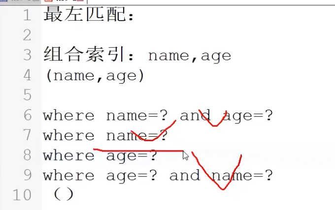


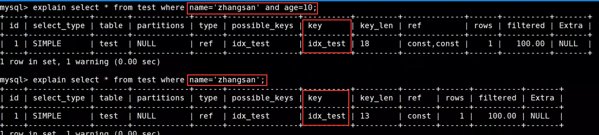

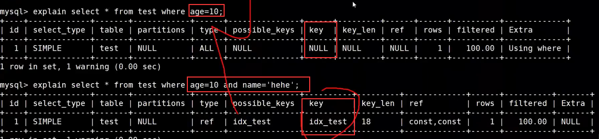


## 索引下推

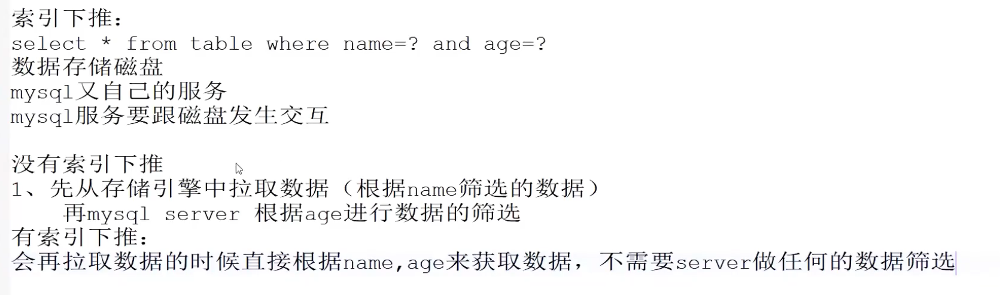

- 没有索引下推
  - 每次匹配到name就把数据返回, 到服务层再根据name字段进行筛选符合条件的
- 有了索引下推
  - 我们在索引层就可以直接找到我们需要的数据 再返回, 这里需要返回的数据减少 进行的IO次数减少
  - 唯一的缺点是需要在磁盘上多做数据筛选, 原来的筛选放在内存, 现在放到磁盘
  - 这样做看起来成本较高, 但是数据是排序的, 聚集存放在一起, 所以性能的影响较小, 但是整体的IO量减少因为数据在磁盘筛选后返回的数据减少了


## MRR(multi_range_read)

- 查找age>10的记录得到了1000条记录的id(主键)值
- 正常需要根据这些id去聚簇索引中找到对应的行记录, 每个都需要从根结点到叶子结点1000log(depth)
- 我们得到id值后可以对这些id进行排序 然后到聚簇索引进行范围查询这样减少了查询的次数


## FIC(fast index create)

- 插入删除数据
  1. 创建临时表, 将数据导入到临时表
  2. 删除原始表
  3. 修改临时表的名字
- FIC 
  - 给当前表添加一个Share锁, 不会有创建临时表的消耗, 还是源文件


## 索引分类


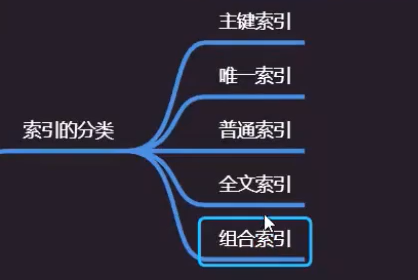


## 哈希索引

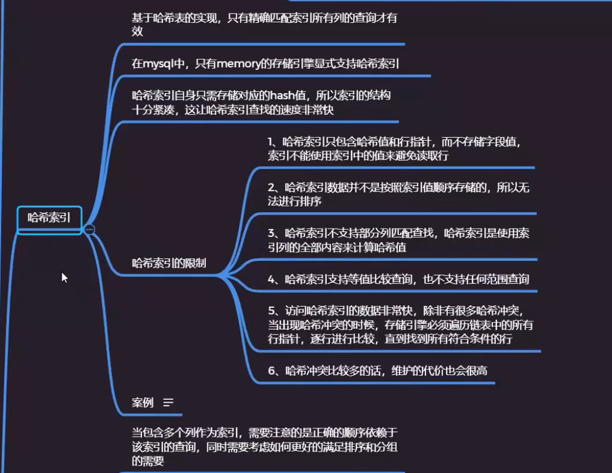

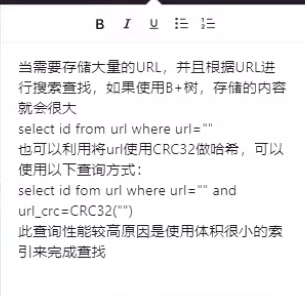

CRC32 (Circular Redudent Check ) 循环冗余校验 将字符串变成10位的整数, 直接存储整数 节省了存储字符串的空间


## 索引匹配方式


## 组合索引 OR

- 如果索引包括了表的所有列, 在使用or查询的时候会检索全部的索引
- 如果索引不包括所有的列, 使用or条件查询的时候不会使用索引
  - 组合索引, 索引只占表的部分列, 使用OR条件查询不会走组合索引


## 覆盖索引

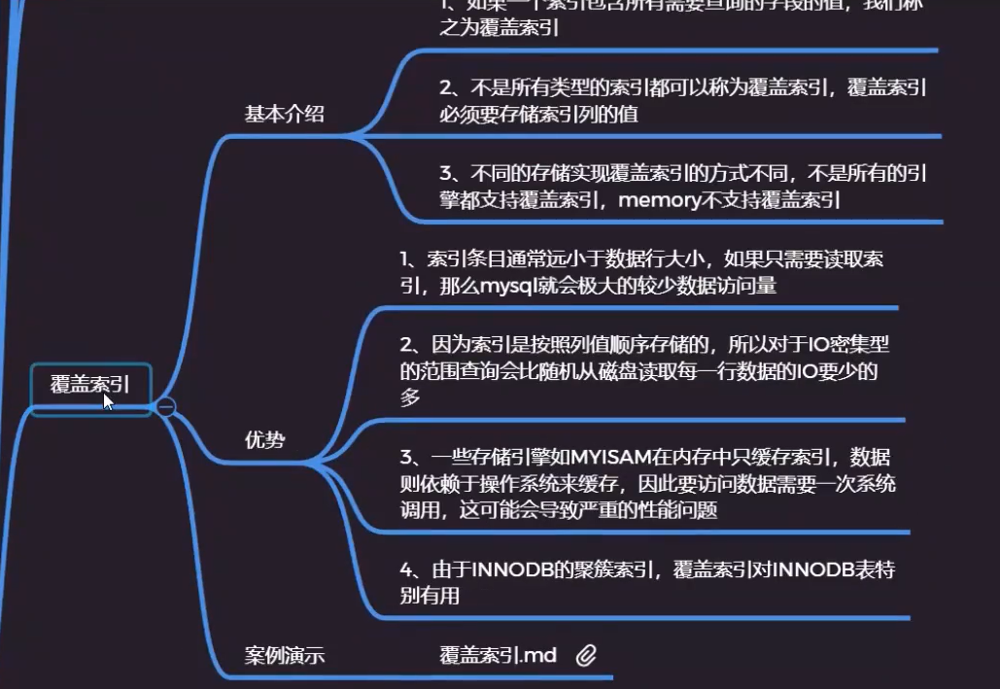


## MySQL复制的原理

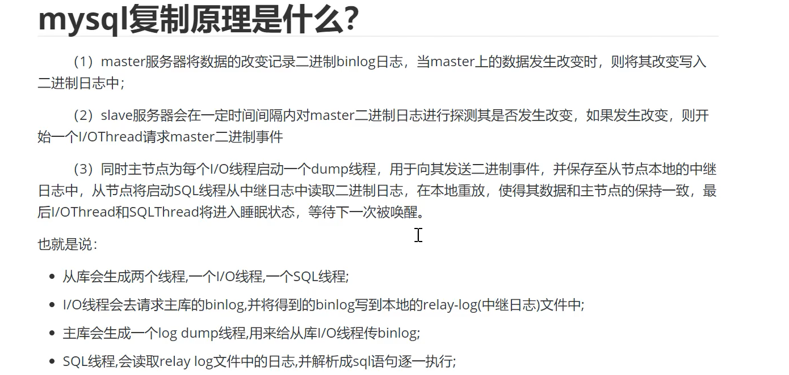

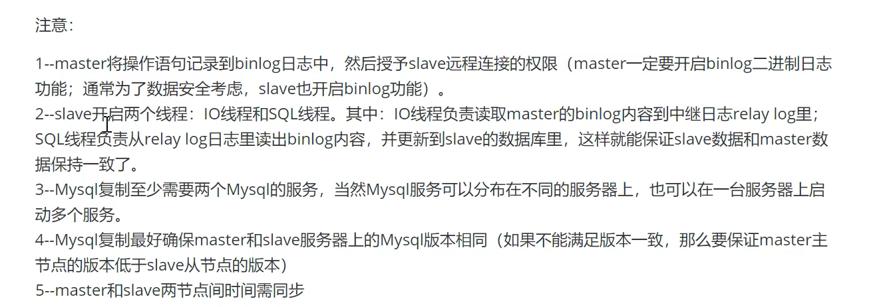

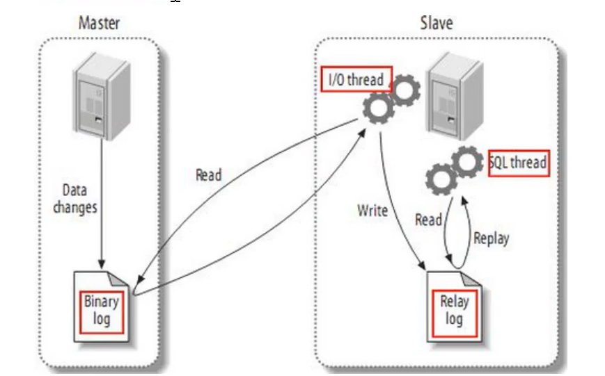


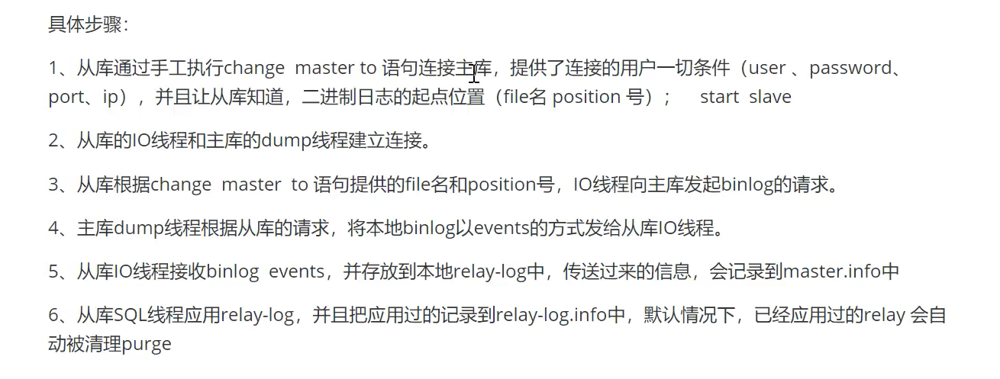


## 如何做慢查询排查的？

## 为什么要优化

系统的吞吐量瓶颈往往出现在数据库的访问速度上
随着应用程序的运行，数据库的中的数据会越来越多，处理时间会相应变慢
数据是存放在磁盘上的，读写速度无法和内存相比
优化原则：减少系统瓶颈，减少资源占用，增加系统的反应速度。

## 数据库结构优化

一个好的数据库设计方案对于数据库的性能往往会起到事半功倍的效果。

需要考虑数据冗余、查询和更新的速度、字段的数据类型是否合理等多方面的内容。

### 将字段很多的表分解成多个表

对于字段较多的表，如果有些字段的使用频率很低，可以将这些字段分离出来形成新表。

因为当一个表的数据量很大时，会由于使用频率低的字段的存在而变慢。

### 增加中间表

对于需要经常联合查询的表，可以建立中间表以提高查询效率。

通过建立中间表，将需要通过联合查询的数据插入到中间表中，然后将原来的联合查询改为对中间表的查询。

### 增加冗余字段

设计数据表时应尽量遵循范式理论的规约，尽可能的减少冗余字段，让数据库设计看起来精致、优雅。但是，合理的加入冗余字段可以提高查询速度。

表的规范化程度越高，表和表之间的关系越多，需要连接查询的情况也就越多，性能也就越差。

### 注意：

冗余字段的值在一个表中修改了，就要想办法在其他表中更新，否则就会导致数据不一致的问题。


## MySQL数据库cpu飙升到500%的话他怎么处理？

### 是否是mysql造成的

当 cpu 飙升到 500%时，先用操作系统命令 top 命令观察是不是 mysqld 占用导致的，如果不是，找出占用高的进程，并进行相关处理。

### 查看消耗高的sql, 是否可以优化

如果是 mysqld 造成的， show processlist，看看里面跑的 session 情况，是不是有消耗资源的 sql 在运行。找出消耗高的 sql，看看执行计划是否准确， index 是否缺失，或者实在是数据量太大造成。

### kill后调整再运行

一般来说，肯定要 kill 掉这些线程(同时观察 cpu 使用率是否下降)，等进行相应的调整(比如说加索引、改 sql、改内存参数)之后，再重新跑这些 SQL。

### 是否有大访问量并发

也有可能是每个 sql 消耗资源并不多，但是突然之间，有大量的 session 连进来导致 cpu 飙升，这种情况就需要跟应用一起来分析为何连接数会激增，再做出相应的调整，比如说限制连接数等


## 大表怎么优化？某个表有近千万数据，CRUD比较慢，如何优化？分库分表了是怎么做的？分表分库了有什么问题？有用到中间件么？他们的原理知道么？

 当MySQL单表记录数过大时，数据库的CRUD性能会明显下降，一些常见的优化措施如下： 

- **限定数据的范围：** 务必禁止不带任何限制数据范围条件的查询语句。比如：我们当用户在查询订单历史的时候，我们可以控制在一个月的范围内。；
- **读/写分离：** 经典的数据库拆分方案，主库负责写，从库负责读；
- **缓存：** 使用MySQL的缓存，另外对重量级、更新少的数据可以考虑使用应用级别的缓存；

 还有就是通过分库分表的方式进行优化，主要有垂直分表和水平分表 

### **垂直分区：**

 把主键和一些列放在一个表，然后把主键和另外的列放在另一个表中 

**根据数据库里面数据表的相关性进行拆分。** 例如，用户表中既有用户的登录信息又有用户的基本信息，可以将用户表拆分成两个单独的表，甚至放到单独的库做分库。

**简单来说垂直拆分是指数据表列的拆分，把一张列比较多的表拆分为多张表。** 如下图所示，这样来说大家应该就更容易理解了。

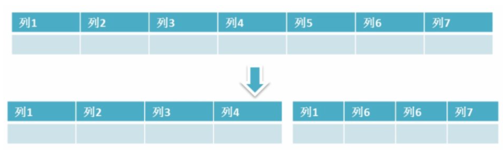

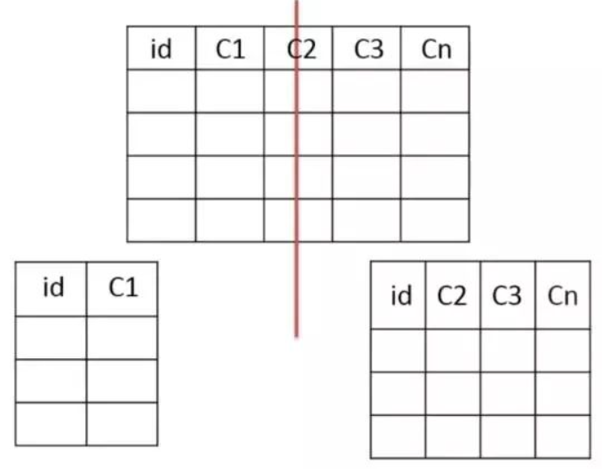


**垂直拆分的优点：** 可以使得行数据变小，在查询时减少读取的Block数，减少I/O次数。此外，垂直分区可以简化表的结构，易于维护。

**垂直拆分的缺点：** 

- 主键会出现冗余，需要管理冗余列， 查询所有数据需要join操作 ，可以通过在应用层进行Join来解决。
- 此外，垂直分区会让事务变得更加复杂；
- 有些分表的策略基于应用层的逻辑算法，一旦逻辑算法改变，整个分表逻辑都会改变，扩展性较差
- 对于应用层来说，逻辑算法增加开发成本

#### 适用场景

- 如果一个表中某些列常用，另外一些列不常用
- 可以使数据行变小，一个数据页能存储更多数据，查询时减少I/O次数


###  **水平分区：** 

 表很大，分割后可以降低在查询时需要读的数据和索引的页数，同时也降低了索引的层数，提高查询次数 

保持数据表结构不变，通过某种策略存储数据分片。这样每一片数据分散到不同的表或者库中，达到了分布式的目的。 水平拆分可以支撑非常大的数据量。

水平拆分是指数据表行的拆分，表的行数超过200万行时，就会变慢，这时可以把一张的表的数据拆成多张表来存放。举个例子：我们可以将用户信息表拆分成多个用户信息表，这样就可以避免单一表数据量过大对性能造成影响。

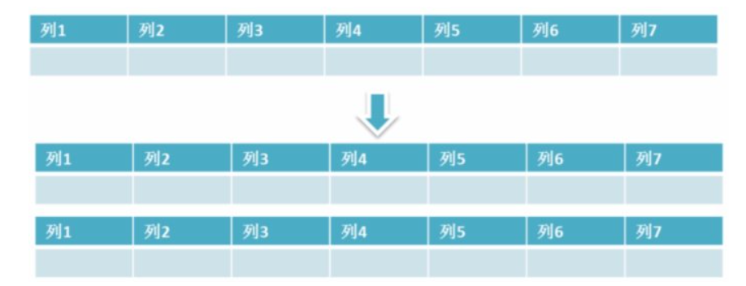


水品拆分可以支持非常大的数据量。需要注意的一点是:分表仅仅是解决了单一表数据过大的问题，但由于表的数据还是在同一台机器上，其实对于提升MySQL并发能力没有什么意义，所以 水平拆分最好分库 。

水平拆分能够 支持非常大的数据量存储，应用端改造也少，但 分片事务难以解决 ，跨界点Join性能较差，逻辑复杂。

《Java工程师修炼之道》的作者推荐 尽量不要对数据进行分片，因为拆分会带来逻辑、部署、运维的各种复杂度 ，一般的数据表在优化得当的情况下支撑千万以下的数据量是没有太大问题的。如果实在要分片，尽量选择客户端分片架构，这样可以减少一次和中间件的网络I/O。


#### 适用场景

- 表中的数据本身就有独立性，例如表中分表记录各个地区的数据或者不同时期的数据，特别是有些数据常用，有些不常用。
- 需要把数据存放在多个介质上。

#### 水平切分的缺点

- 给应用增加复杂度，通常查询时需要多个表名，查询所有数据都需UNION操作
- 在许多数据库应用中，这种复杂度会超过它带来的优点，查询时会增加读一个索引层的磁盘次数

### 下面补充一下数据库分片的两种常见方案：

- 客户端代理： 分片逻辑在应用端，封装在jar包中，通过修改或者封装JDBC层来实现。 当当网的 Sharding-JDBC 、阿里的TDDL是两种比较常用的实现。
- 中间件代理： 在应用和数据中间加了一个代理层。分片逻辑统一维护在中间件服务中。 我们现在谈的 Mycat 、360的Atlas、网易的DDB等等都是这种架构的实现。
  

## 分库分表后面临的问题

- **事务支持 分库分表后，就成了分布式事务**了。如果依赖数据库本身的分布式事务管理功能去执行事务，将付出高昂的性能代价； 如果由应用程序去协助控制，形成程序逻辑上的事务，又会造成编程方面的负担。

- **跨库join**
  
- 只要是进行切分，跨节点Join的问题是不可避免的。但是良好的设计和切分却可以减少此类情况的发生。解决这一问题的普遍做法是分两次查询实现。在第一次查询的结果集中找出关联数据的id,根据这些id发起第二次请求得到关联数据。 分库分表方案产品
  
- **跨节点的count,order by,group by以及聚合函数问题** 这些是一类问题，因为它们都需要基于全部数据集合进行计算。多数的代理都不会自动处理合并工作。
  
- 解决方案：与解决跨节点join问题的类似，分别在各个节点上得到结果后在应用程序端进行合并。和join不同的是每个结点的查询可以并行执行，因此很多时候它的速度要比单一大表快很多。但如果结果集很大，对应用程序内存的消耗是一个问题。
  
- **数据迁移，容量规划**，扩容等问题 来自淘宝综合业务平台团队，它利用对2的倍数取余具有向前兼容的特性（如对4取余得1的数对2取余也是1）来分配数据，避免了行级别的数据迁移，但是依然需要进行表级别的迁移，同时对扩容规模和分表数量都有限制。总得来说，这些方案都不是十分的理想，多多少少都存在一些缺点，这也从一个侧面反映出了Sharding扩容的难度。

- **ID问题**
  - 一旦数据库被切分到多个物理结点上，我们将不能再依赖数据库自身的主键生成机制。一方面，某个分区数据库自生成的ID无法保证在全局上是唯一的；另一方面，应用程序在插入数据之前需要先获得ID,以便进行SQL路由. 一些常见的主键生成策略
  - UUID 使用UUID作主键是最简单的方案，但是缺点也是非常明显的。由于UUID非常的长，除占用大量存储空间外，最主要的问题是在索引上，在建立索引和基于索引进行查询时都存在性能问题。 Twitter的分布式自增ID算法Snowflake 在分布式系统中，需要生成全局UID的场合还是比较多的，twitter的snowflake解决了这种需求，实现也还是很简单的，除去配置信息，核心代码就是毫秒级时间41位 机器ID 10位 毫秒内序列12位。
- 因为我们主键默认都是自增的，那么分表之后的主键在不同表就肯定会有冲突了。有几个办法考虑：
    - 设定步长，比如1-1024张表我们分别设定1-1024的基础步长，这样主键落到不同的表就不会冲突了。
    - 分布式ID，自己实现一套分布式ID生成算法或者使用开源的比如雪花算法这种。
    - 分表后不使用主键作为查询依据，而是每张表单独新增一个字段作为唯一主键使用，比如订单表订单号是唯一的，不管最终落在哪张表都基于订单号作为查询依据，更新也一样。
      
  
- 跨分片的排序分页

  般来讲，分页时需要按照指定字段进行排序。当排序字段就是分片字段的时候，我们通过分片规则可以比较容易定位到指定的分片，而当排序字段非分片字段的时候，情况就会变得比较复杂了。为了最终结果的准确性，我们需要在不同的分片节点中将数据进行排序并返回，并将不同分片返回的结果集进行汇总和再次排序，最后再返回给用户。如下图所示：
  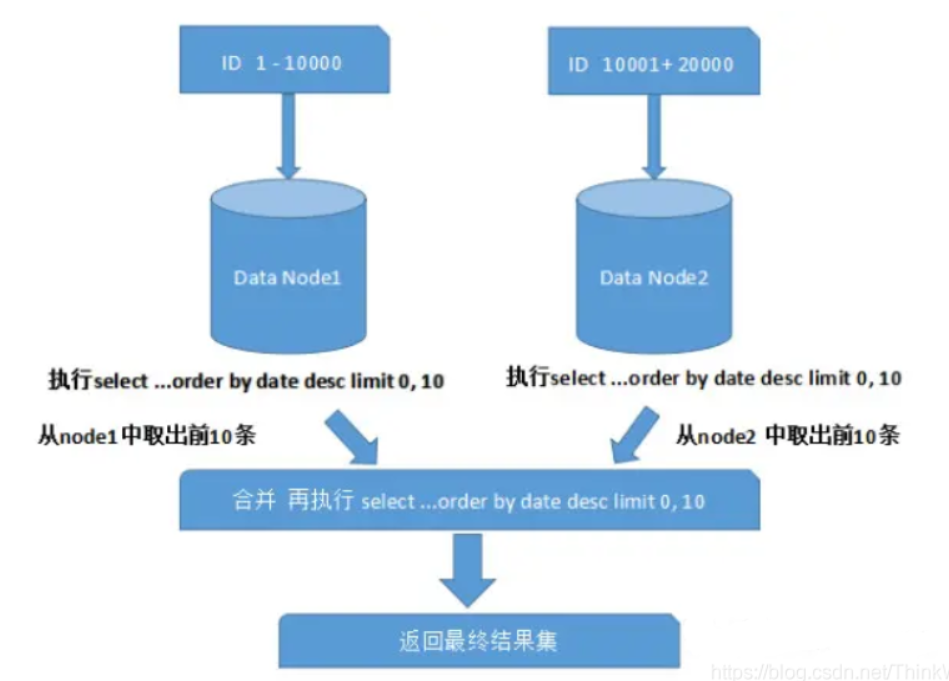

- 分表后非sharding_key的查询怎么处理呢？
  - 可以做一个mapping表，比如这时候商家要查询订单列表怎么办呢？不带user_id查询的话你总不能扫全表吧？所以我们可以做一个映射关系表，保存商家和用户的关系，查询的时候先通过商家查询到用户列表，再通过user_id去查询。
  - 打宽表，一般而言，商户端对数据实时性要求并不是很高，比如查询订单列表，可以把订单表同步到离线（实时）数仓，再基于数仓去做成一张宽表，再基于其他如es提供查询服务。
  - 数据量不是很大的话，比如后台的一些查询之类的，也可以通过多线程扫表，然后再聚合结果的方式来做。或者异步的形式也是可以的。
    

## MySQL的复制原理以及流程

主从复制：将主数据库中的DDL和DML操作通过二进制日志（BINLOG）传输到从数据库上，然后将这些日志重新执行（重做）；从而使得从数据库的数据与主数据库保持一致。

### 主从复制的作用

- 主数据库出现问题，可以切换到从数据库。
- 可以进行数据库层面的读写分离。
- 可以在从数据库上进行日常备份。

### MySQL主从复制解决的问题

- 数据分布：随意开始或停止复制，并在不同地理位置分布数据备份
- 负载均衡：降低单个服务器的压力
- 高可用和故障切换：帮助应用程序避免单点失败
- 升级测试：可以用更高版本的MySQL作为从库

### MySQL主从复制工作原理

- 在主库上把数据更高记录到二进制日志
- 从库将主库的日志复制到自己的中继日志
- 从库读取中继日志的事件，将其重放到从库数据中

### 基本原理流程，3个线程以及之间的关联

主：binlog线程——记录下所有改变了数据库数据的语句，放进master上的binlog中；

从：io线程——在使用start slave 之后，负责从master上拉取 binlog 内容，放进自己的relay log中；

从：sql执行线程——执行relay log中的语句；

### 复制过程

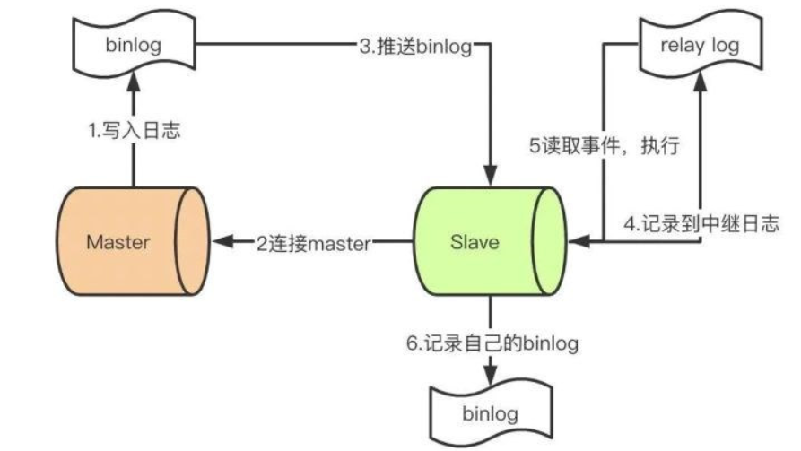

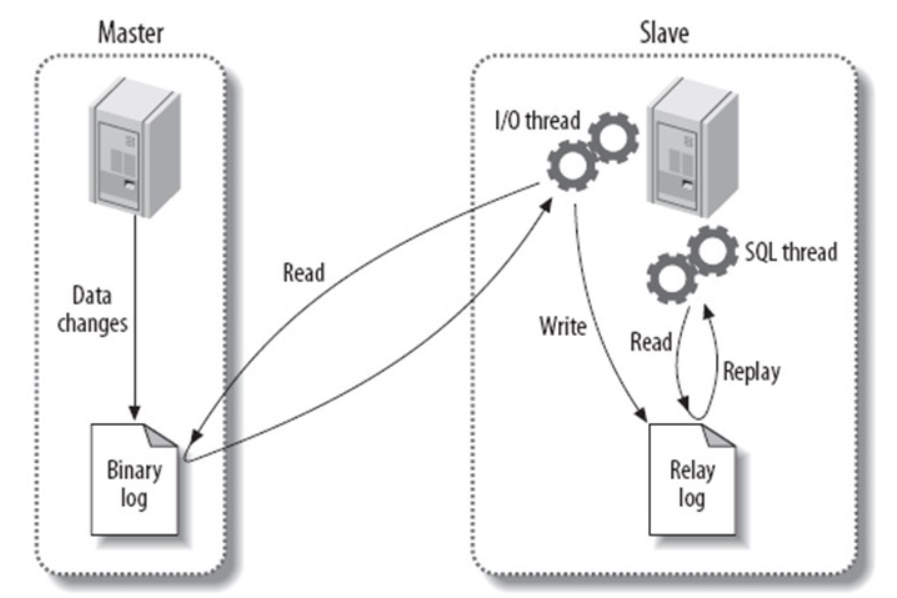

Binary log：主数据库的二进制日志

Relay log：从服务器的中继日志

第一步：master在每个事务更新数据完成之前，将该操作记录串行地写入到binlog文件中。

第二步：salve开启一个I/O Thread，该线程在master打开一个普通连接，主要工作是binlog dump process。如果读取的进度已经跟上了master，就进入睡眠状态并等待master产生新的事件。I/O线程最终的目的是将这些事件写入到中继日志中。

第三步：SQL Thread会读取中继日志，并顺序执行该日志中的SQL事件，从而与主数据库中的数据保持一致。

由于mysql默认的复制方式是异步的，主库把日志发送给从库后不关心从库是否已经处理，这样会产生一个问题就是假设主库挂了，从库处理失败了，这时候从库升为主库后，日志就丢失了。由此产生两个概念。 

- **全同步复制**

主库写入binlog后强制同步日志到从库，所有的从库都执行完成后才返回给客户端，但是很显然这个方式的话性能会受到严重影响。

- **半同步复制**

和全同步不同的是，半同步复制的逻辑是这样，从库写入日志成功后返回ACK确认给主库，主库收到至少一个从库的确认就认为写操作完成。


## 读写分离有哪些解决方案？

读写分离是依赖于主从复制，而主从复制又是为读写分离服务的。因为主从复制要求slave不能写只能读（如果对slave执行写操作，那么show slave status将会呈现Slave_SQL_Running=NO，此时你需要按照前面提到的手动同步一下slave）。

### 方案一

使用mysql-proxy代理

优点：直接实现读写分离和负载均衡，不用修改代码，master和slave用一样的帐号，mysql官方不建议实际生产中使用

缺点：降低性能， 不支持事务

### 方案二

使用AbstractRoutingDataSource+aop+annotation在dao层决定数据源。
如果采用了mybatis， 可以将读写分离放在ORM层，比如mybatis可以通过mybatis plugin拦截sql语句，所有的insert/update/delete都访问master库，所有的select 都访问salve库，这样对于dao层都是透明。 plugin实现时可以通过注解或者分析语句是读写方法来选定主从库。不过这样依然有一个问题， 也就是不支持事务， 所以我们还需要重写一下DataSourceTransactionManager， 将read-only的事务扔进读库， 其余的有读有写的扔进写库。

### 方案三

使用AbstractRoutingDataSource+aop+annotation在service层决定数据源，可以支持事务.

缺点：类内部方法通过this.xx()方式相互调用时，aop不会进行拦截，需进行特殊处理。


## 备份计划，mysqldump以及xtranbackup的实现原理

### (1)备份计划

视库的大小来定，一般来说 100G 内的库，可以考虑使用 mysqldump 来做，因为 mysqldump更加轻巧灵活，备份时间选在业务低峰期，可以每天进行都进行全量备份(mysqldump 备份出来的文件比较小，压缩之后更小)。

100G 以上的库，可以考虑用 xtranbackup 来做，备份速度明显要比 mysqldump 要快。一般是选择一周一个全备，其余每天进行增量备份，备份时间为业务低峰期。

### (2)备份恢复时间

物理备份恢复快，逻辑备份恢复慢

逻辑导入时间一般是备份时间的5倍以上

### (3)备份恢复失败如何处理

首先在恢复之前就应该做足准备工作，避免恢复的时候出错。比如说备份之后的有效性检查、权限检查、空间检查等。如果万一报错，再根据报错的提示来进行相应的调整。

### (4)mysqldump和xtrabackup实现原理

#### mysqldump

mysqldump 属于逻辑备份。加入–single-transaction 选项可以进行一致性备份。后台进程会先设置 session 的事务隔离级别为 RR(SET SESSION TRANSACTION ISOLATION LEVELREPEATABLE READ)，之后显式开启一个事务(START TRANSACTION /*!40100 WITH CONSISTENTSNAPSHOT */)，这样就保证了该事务里读到的数据都是事务事务时候的快照。之后再把表的数据读取出来。如果加上–master-data=1 的话，在刚开始的时候还会加一个数据库的读锁(FLUSH TABLES WITH READ LOCK),等开启事务后，再记录下数据库此时 binlog 的位置(showmaster status)，马上解锁，再读取表的数据。等所有的数据都已经导完，就可以结束事务

#### Xtrabackup:

xtrabackup 属于物理备份，直接拷贝表空间文件，同时不断扫描产生的 redo 日志并保存下来。最后完成 innodb 的备份后，会做一个 flush engine logs 的操作(老版本在有 bug，在5.6 上不做此操作会丢数据)，确保所有的 redo log 都已经落盘(涉及到事务的两阶段提交

概念，因为 xtrabackup 并不拷贝 binlog，所以必须保证所有的 redo log 都落盘，否则可能会丢最后一组提交事务的数据)。这个时间点就是 innodb 完成备份的时间点，数据文件虽然不是一致性的，但是有这段时间的 redo 就可以让数据文件达到一致性(恢复的时候做的事

情)。然后还需要 flush tables with read lock，把 myisam 等其他引擎的表给备份出来，备份完后解锁。这样就做到了完美的热备。


##  聚集索引的底层 

## mvcc机制了解嘛


## 给了一段sql语句，问会上什么锁？详细解读一下

##  Mysql索引，联合索引，失效，左连接（八股文） 

##  什么是柔性事务 

##  跨库事务如何保证 


##  mysql索引（B+和hash） 


##  Mysql的主从复制（从数据库依据redolog完成一致性） 

##  binlog和redolog的差异，以及记录写入的先后性（，binlog二进制数据文件，redolog逻辑命令。先后顺序，当时回答binlog先，redolog后，不知对错，面试官没纠正，应该对了） 


##  说说分布式锁

（谈了Redis和Zoo[keep](https://www.nowcoder.com/jump/super-jump/word?word=keep)er的分布式锁实现原理， 


##  可重入锁在过期前续期失败会发生什么

（说了事务回滚和yeid让出） 


##  间隙锁是什么，具体什么时候会加锁

（具体什么时候加锁，这里要把所有情况都说清楚。。 

##  一级索引和二级索引之间是怎么作用的 


## MYSQL的事务隔离机制

 读未提交：一个事务还没提交，它做的变更就能被别的事务看到。读提交：一个事务提交后，它做的变更才能被别的事务看到。可重复读：一个事务执行过程中看到的数据总是和事务启动时看到的数据是一致的。在这个级别下事务未提交，做出的变更其它事务也看不到。串行化：对于同一行记录进行读写会分别加读写锁，当发生读写锁冲突，后面执行的事务需等前面执行的事务完成才能继续执行。 


##  MVCC原理 

 MVCC为多版本并发控制，即同一条记录在系统中存在多个版本。其存在目的是在保证数据一致性的前提下提供一种高并发的访问性能。对数据读写在不加读写锁的情况下实现互不干扰,从而实现数据库的隔离性,在事务隔离级别为读提交和可重复读中使用到。 

 在InnoDB中，事务在开始前会向事务系统申请一个事务ID，该ID是按申请顺序严格递增的。每行数据具有多个版本，每次事务更新数据都会生成新的数据版本，而不会直接覆盖旧的数据版本。数据的行结构中包含多个信息字段。其中实现MVCC的主要涉及最近更改该行数据的事务ID（DBTRXID）和可以找到历史数据版本的指针（DBROLLPTR）。InnoDB在每个事务开启瞬间会为其构造一个记录当前已经开启但未提交的事务ID的视图数组。通过比较[链表]()中的事务ID与该行数据的值与对应的DBTRXID，并通过DBROLLPTR找到历史数据的值以及对应的DBTRXID来决定当前版本的数据是否应该被当前事务所见。最终实现在不加锁的情况下保证数据的一致性 

##  简述redo_log undo_log 

 redo log: 存储引擎级别的log（InnoDB有，MyISAM没有），该log关注于事务的恢复.在重启mysql服务的时候，根据redo log进行重做，从而使事务有持久性。 

 undo log：是存储引擎级别的log（InnoDB有，MyISAM没有）保证数据的原子性，该log保存了事务发生之前的数据的一个版本，可以用于回滚，是MVCC的重要实现方法之一。


https://www.bilibili.com/video/BV1V64y1s7Sv?p=10

https://www.bilibili.com/video/BV1YX4y1M7Sd?p=9&spm_id_from=pageDriver


