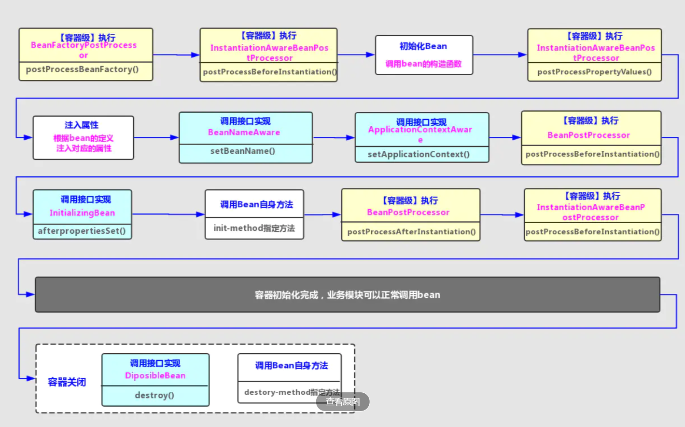
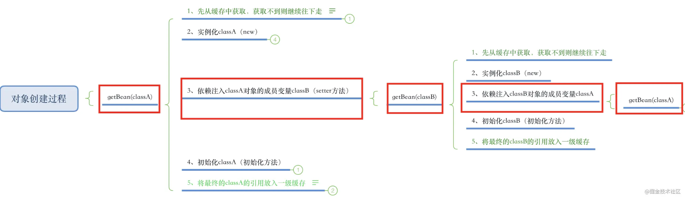
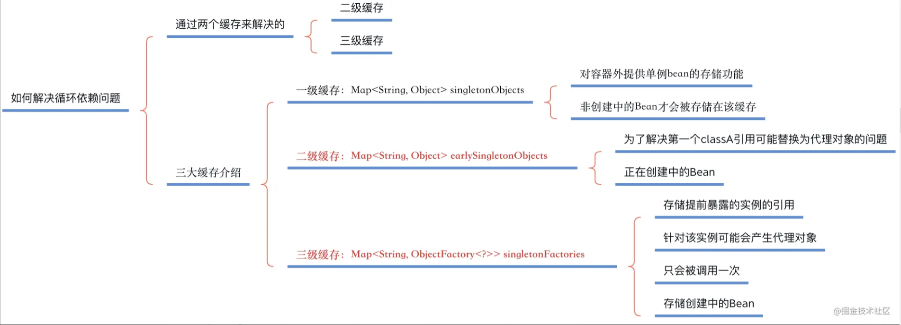
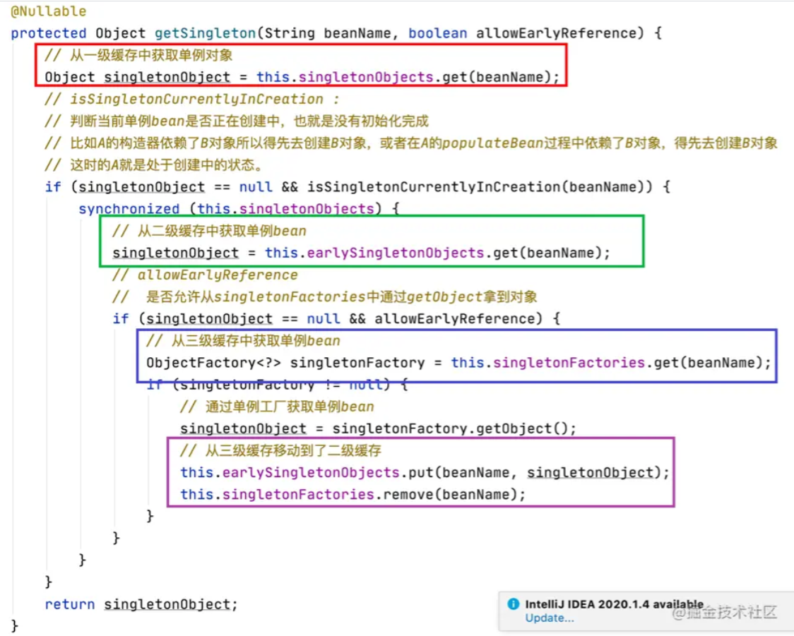
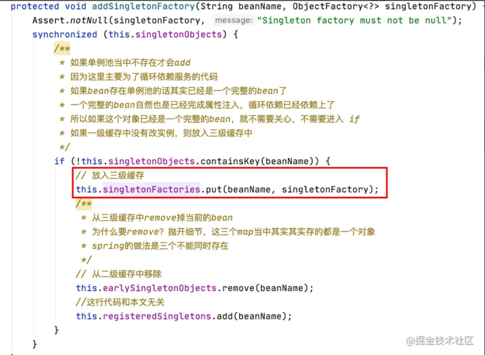
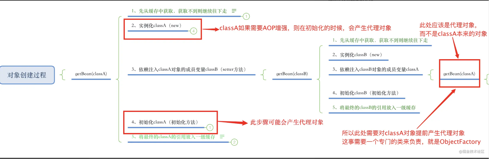
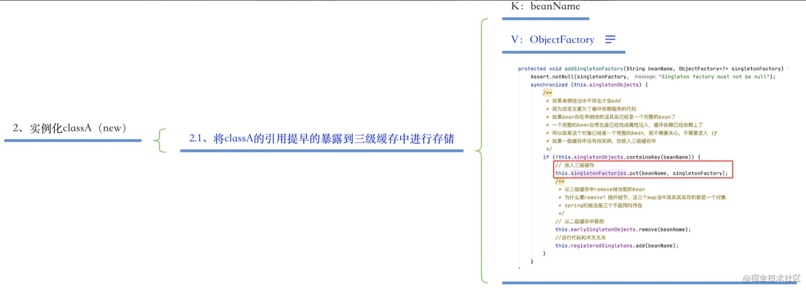
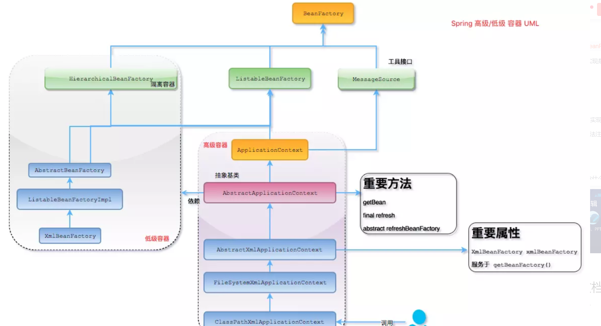
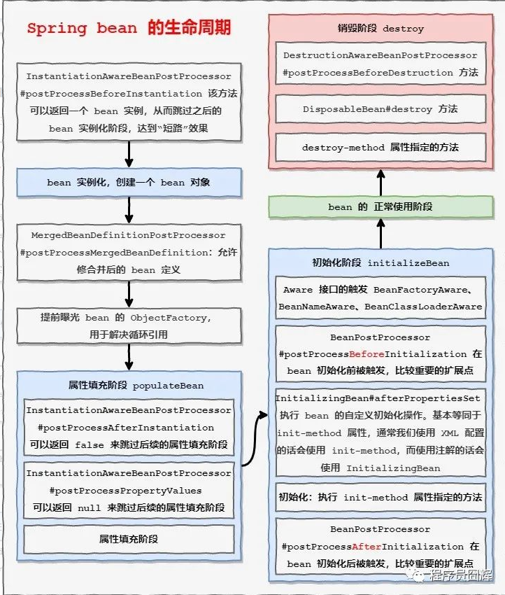
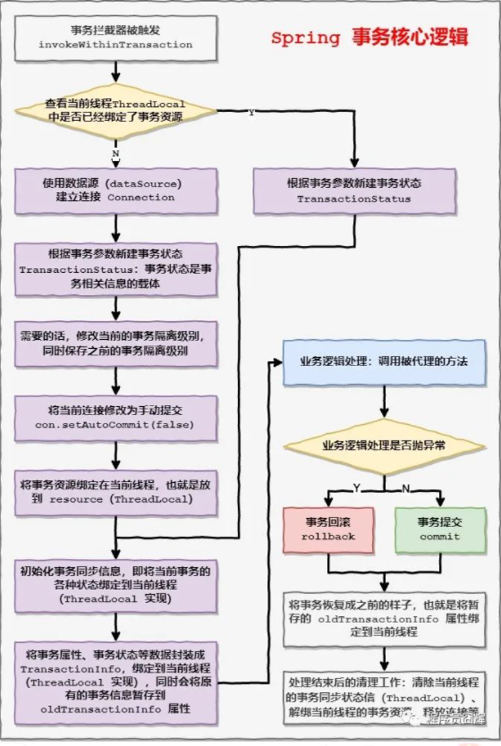

spring

https://blog.csdn.net/v123411739/article/details/110009966?ops_request_misc=%257B%2522request%255Fid%2522%253A%2522162840644916780271526029%2522%252C%2522scm%2522%253A%252220140713.130102334..%2522%257D&request_id=162840644916780271526029&biz_id=0&utm_medium=distribute.pc_search_result.none-task-blog-2~all~top_positive~default-5-110009966.pc_search_result_cache&utm_term=Spring&spm=1018.2226.3001.4187

https://blog.csdn.net/ThinkWon/article/details/104397516?ops_request_misc=%257B%2522request%255Fid%2522%253A%2522162840644916780271526029%2522%252C%2522scm%2522%253A%252220140713.130102334..%2522%257D&request_id=162840644916780271526029&biz_id=0&utm_medium=distribute.pc_search_result.none-task-blog-2~all~top_positive~default-2-104397516.pc_search_result_cache&utm_term=Spring&spm=1018.2226.3001.4187

springboot

https://blog.csdn.net/ThinkWon/article/details/104397299?ops_request_misc=%257B%2522request%255Fid%2522%253A%2522162840644916780271565452%2522%252C%2522scm%2522%253A%252220140713.130102334.pc%255Fblog.%2522%257D&request_id=162840644916780271565452&biz_id=0&utm_medium=distribute.pc_search_result.none-task-blog-2~all~first_rank_v2~rank_v29-12-104397299.pc_search_result_cache&utm_term=Spring&spm=1018.2226.3001.4187

springcloud

https://blog.csdn.net/ThinkWon/article/details/104397367?ops_request_misc=%257B%2522request%255Fid%2522%253A%2522162840644916780271565452%2522%252C%2522scm%2522%253A%252220140713.130102334.pc%255Fblog.%2522%257D&request_id=162840644916780271565452&biz_id=0&utm_medium=distribute.pc_search_result.none-task-blog-2~all~first_rank_v2~rank_v29-14-104397367.pc_search_result_cache&utm_term=Spring&spm=1018.2226.3001.4187


spring IoC

https://blog.csdn.net/xiaofeng10330111/article/details/105631666?ops_request_misc=%257B%2522request%255Fid%2522%253A%2522162841111916780271574588%2522%252C%2522scm%2522%253A%252220140713.130102334.pc%255Fall.%2522%257D&request_id=162841111916780271574588&biz_id=0&utm_medium=distribute.pc_search_result.none-task-blog-2~all~first_rank_v2~rank_v29-14-105631666.pc_search_result_cache&utm_term=Spring+IOC&spm=1018.2226.3001.4187

https://juejin.cn/post/6844903609067372558#heading-3

https://www.jianshu.com/p/b60c30fdcc65

https://www.jianshu.com/p/b60c30fdcc65

https://juejin.cn/post/6844903478582575111


# bean作用域：理解Bean生命周期

 在bean准备就绪给我们使用之前，容器默默的执行了很多启动步骤。Spring提供了BeanFactory作为Spring容器，平常开发中我们常用其派生类ApplicationContext。尽管BeanFactory和ApplicationContext容器的注册方式不太一样（使用BeanFactory要显式地调用其addBeanPostProcessor()方法进行注册）以及加载bean的时机不一样（BeanFactory默认采用延迟加载）等，但对于bean的生命周期管控基本一致。

 Bean的完整生命周期可以认为是从容器创建初始化Bean开始，直到Spring容器关闭。事实上，在Bean被初始化创建之前，容器级别的接口方法也会对Bean产生影响，因此这里把两个事件也加进来了。



## 接口分类

在以上接口方法中，可以分为几类：

1. **容器级生命周期接口方法**：
   1. BeanFactoryPostProcessor、BeanPostProcessor和InstantiationAwareBeanPostProcessor。它们都是容器初始化bean时对暴露的扩展点（容器扩展点），一般称它们的实现类为“后置处理器”。
   2. InstantiationAwareBeanPostProcessor是BeanPostProcessor的子接口，可以在Bean生命周期的另外三个时期提供扩展的回调接口，
      1. 即实例化之前（调用postProcessBeforeInstantiation方法）、
      2. 给bean注入对应属性后（调用postProcessPropertyValues方法）
      3. 和实例化Bean之后（调用postProcessAfterInstantiantion方法）。
2. **Bean级生命周期接口方法**：
   1. BeanNameAware、
   2. BeanFactoryAware、
   3. InitializingBean和DiposableBean。
   4. bean继承接口然后在bean内部实现方法，因此配置文件中的init-method和destory-method指定的方法。
3. **Bean自身的调用方**法：通过配置文件中init-method和destory-method指定的方法。

## 流程概述

1. **[容器级别]BeanFactoryPostProcessor接口**：可以注册bean，如果spring配置文件注册了该接口的实现类，可以在spring的bean创建之前，修改bean的定义属性。例如可以把bean的scope从singleton改为prototype。
2. **[容器级别]InstantiationAwareBeanPost接口**：初始化Bean之前的预处理。
3. **初始化Bean**
4. **[容器级别]InstantiationAwareBeanPost接口**：如果spring配置文件注册了该接口的实现类，Spring将调用它们的postProcessPropertyValues方法；
5. **注入**：Spring根据定义信息（beanDifinition）将值和引用bean注入到bean对应的属性中。
6. **[Bean级别]感知类名**：如果bean实现了BeanNameAware接口，Spring将bean的ID传递给setBeanName()方法；
7. **[Bean级别]感知容器**：如果bean实现了ApplicationContextAware接口，Spring将调用setApplicationContext()方法，将bean所在的应用上下文的引用传入进来。注：BeanFactory容器查找实现了BeanFactoryAware接口，Spring将调用setBeanFactory()方法，将BeanFactory容器实例传入。
8. **[容器级]BeanPostProcessor**：如果bean实现了BeanPostProcessor接口，Spring将调用它们的postProcessBeforeInitialization()方法；
9. **[容器级别]InitializingBean**：如果bean实现了InitializingBean接口，Spring将调用它们的postprocessAfterInitialialization()方法；
10. **[Bean自身方法]init-method**：如果bean定义中使用指定了init-method初始化方法，该方法也会被调用；
11. **[容器级]BeanPostProcessor**：如果bean实现了BeanPostProcessor接口，Spring将会调用它们的postProcessBeforeInitialization()方法；
12. **[容器级别/后处理器]InstantiationAwareBeanPostProcessor**：如果bean实现了InstantiationAwareBeanPostProcessor接口，Spring将调用它们的postProcessAfterInitialization()方法；
     此时，bean已经准备就绪，可以被应用程序使用了，它们将一直驻留在应用上下文，直到该应用上下文被销毁。
13. **[Bean级]DisposableBean**：如果bean实现了DisposableBean接口，Spring将调用它的destory()接口方法。
14. **[Bean自身方法]destory-method**：如果bean定义中使用destory-method声明了销毁方法，该方法也会被调用。

# 容器扩展点：FactoryBean

 FactoryBean接口是Spring IOC容器实例逻辑的扩展点。什么叫扩展点？还记得前面说得bean生命周期吗？Spring处理Bean生命周期的事件就是扩展点。

## 5.1 区分FactoryBean和BeanFactory

 BeanFactory直译是生产Bean的工厂，在Spring中就是容器，常用的ApplicationContext就是它的一个继承类。我们也可以直接使用BeanFactory示例：

```dart
BeanFactory factory = new XmlBeanFactory(new FileSystemResource("c:/piratebean.xml"));
```

 而FactoryBean顾名思义就是一个bean，但这个bean和普通bean有点不一样。

## 5.2 区分FactoryBean和普通Bean

 Spring中有两种类型的Bean，一种是普通Bean，另一种是工厂Bean即FactoryBean，这两种Bean都被容器管理。工厂Bean是实现了org.springframework.beans.factory.FactoryBean<T>接口的Bean,从ApplicationContext的getBean()方法获取的对象不是该类的一个实例，而是该类的getObject()方法所返回的对象。

 当我们需要获取FactoryBean实例本身而不是它所产生的bean，则要使用&符号。

 比如，现有FactoryBean，id为“playerBean”，在容器上调用getBean("playerBean")将返回FactoryBean产生的bean。调用getBean("&playerBean")将返回FactoryBean它本身的实例。

## 5.3 使用场景

 当需要在类中撰写复杂的初始化程序，此时使用java编码比使用XML配置更容易表达。我们常接触的代理类就可以用这个接口实现。在Spring框架内部，有很多地方有FactoryBean的实现类，它们在很多应用如(Spring的AOP、ORM、事务管理)及与其它第三框架(ehCache)集成时都有体现。

# 容器扩展点：后置处理器BeanPostProcessor

通过上图看到BeanPostProcessor(Bean后置处理器)两个方法在bean生命周期的位置，即：在Spring容器完成Bean实例化和属性设置后，并且在bean调用初始化方法之前或之后。因此BeanPostProcessor(Bean后置处理器)常用在：对bean内部的值进行修改；实现Bean的动态代理等。

 可以定义一个或者多个BeanPostProcessor接口的实现，然后注册到容器中。那么该容器里管控的所有Bean在调用初始化方法之前或之后，都会调用BeanPostProcessor接口中对应的方法。

 InstantiationAwareBeanPostProcessor是BeanPostProcessor的子接口。从最上面的的生命周期图，我们知道它在Bean生命周期的另外三个时期提供扩展的回调接口。其使用方法与BeanPostProcessor接口类似，只是回调时机不同。

 BeanPostProcessor接口有两个方法：


```tsx
public interface BeanPostProcessor {
    @Nullable
    default Object postProcessBeforeInitialization(Object bean, String beanName) throws BeansException {
        return bean;
    }
    
    @Nullable
    default Object postProcessAfterInitialization(Object bean, String beanName) throws BeansException {
        return bean;
    }
}
```

容器调用接口定义的方法时会将该受管Bean的实例和名字通过参数传入方法，经过处理后通过方法的返回值返回给容器。注意，不能返回null，如果返回的是null那么我们通过getBean方法将得不到目标。

 BeanPostProcessor不允许标记为延迟加载。因为如果这样做，Spring容器将不会注册它们，自定义逻辑也就无法得到应用。假如你在<beans/>元素的定义中使用'default-lazy-init'属性，那就必须将每个BeanPostProcessor显式标记为'lazy-init="false"'。


# 容器扩展点：后置处理器BeanFactoryPostProcessor

 BeanPostProcessor(Bean后置处理器)常用在对bean内部的值进行修改；实现Bean的动态代理等。BeanFactoryPostProcessor和BeanPostProcessor都是spring初始化bean时对外暴露的扩展点。但它们有什么区别呢？

 由Bean生命周期的图可知：BeanFactoryPostProcessor是生命周期中最早被调用的，远远早于BeanPostProcessor。它在spring容器加载了bean的定义文件之后，在bean实例化之前执行的。也就是说，Spring允许BeanFactoryPostProcessor在容器创建bean之前读取bean配置元数据，并可进行修改。例如增加bean的属性和值，重新设置bean是否作为自动装配的后选者，重设bean的依赖项等等。

 在spring配置文件中可以同时配置多个BeanFactoryPostProcessor，并通过在xml中注册时设置'order'属性来控制各个BeanFactoryPostProcessor的执行次序。

# 循环依赖问题

https://juejin.cn/post/6895753832815394824




> 循环依赖问题在Spring中主要有三种情况：
>
> - 通过构造方法进行依赖注入时产生的循环依赖问题。
> - 通过setter方法进行依赖注入且是在多例（原型）模式下产生的循环依赖问题。
> - 通过setter方法进行依赖注入且是在单例模式下产生的循环依赖问题。

> 注意：在Spring中，只有【第三种方式】的循环依赖问题被解决了，其他两种方式在遇到循环依赖问题时都会产生异常。

其实也很好解释:

> - 第一种构造方法注入的情况下，在new对象的时候就会堵塞住了，其实也就是”先有鸡还是先有蛋“的历史难题。
> - 第二种setter方法&&多例的情况下，每一次getBean()时，都会产生一个新的Bean，如此反复下去就会有无穷无尽的Bean产生了，最终就会导致OOM问题的出现。

## 如何解决循环依赖问题？

那Spring到底是如何解决的setter方法依赖注入引起的循环依赖问题呢？请看下图（其实主要是通过两个缓存来解决的）：




## Spring三大缓存介绍

> Spring中有三个缓存，用于存储单例的Bean实例，这三个缓存是彼此互斥的，不会针对同一个Bean的实例同时存储。

> 如果调用getBean，则需要从三个缓存中依次获取指定的Bean实例。 读取顺序依次是一级缓存-->二级缓存-->三级缓存




### 一级缓存：Map<String, Object> singletonObjects

> 第一级缓存的作用？
>
> - 用于存储单例模式下创建的Bean实例（已经创建完毕）。
> - 该缓存是对外使用的，指的就是使用Spring框架的程序员。

> 存储什么数据？
>
> - K：bean的名称
> - V：bean的实例对象（有代理对象则指的是代理对象，已经创建完毕）

### 第二级缓存：Map<String, Object> earlySingletonObjects

> 第二级缓存的作用？
>
> - 用于存储单例模式下创建的Bean实例（该Bean被提前暴露的引用,该Bean还在创建中）。
> - 该缓存是对内使用的，指的就是Spring框架内部逻辑使用该缓存。
> - 为了解决第一个classA引用最终如何替换为代理对象的问题（如果有代理对象）请爬楼参考演示案例

> 存储什么数据？
>
> - K：bean的名称
> - V：bean的实例对象（有代理对象则指的是代理对象，该Bean还在创建中）

### 第三级缓存：Map<String, ObjectFactory<?>> singletonFactories

> 第三级缓存的作用？
>
> - 通过ObjectFactory对象来存储单例模式下提前暴露的Bean实例的引用（正在创建中）。
> - 该缓存是对内使用的，指的就是Spring框架内部逻辑使用该缓存。
> - 此缓存是解决循环依赖最大的功臣

> 存储什么数据？
>
> - K：bean的名称
> - V：ObjectFactory，该对象持有提前暴露的bean的引用



### 为什么第三级缓存要使用ObjectFactory？

需要提前产生代理对象。




### 什么时候将Bean的引用提前暴露给第三级缓存的ObjectFactory持有？

时机就是在第一步实例化之后，第二步依赖注入之前，完成此操作。



## Spring 怎么解决循环依赖的问题（9分）

Spring 是通过提前暴露 bean 的引用来解决的，具体如下。

Spring 首先使用构造函数创建一个 “不完整” 的 bean 实例（之所以说不完整，是因为此时该 bean 实例还未初始化），并且提前曝光该 bean 实例的 ObjectFactory（提前曝光就是将 ObjectFactory 放到 singletonFactories 缓存）.

通过 ObjectFactory 我们可以拿到该 bean 实例的引用，如果出现循环引用，我们可以通过缓存中的 ObjectFactory 来拿到 bean 实例，从而避免出现循环引用导致的死循环。

举个例子：A 依赖了 B，B 也依赖了 A，那么依赖注入过程如下。

检查 A 是否在缓存中，发现不存在，进行实例化

通过构造函数创建 bean A，并通过 ObjectFactory 提前曝光 bean A

A 走到属性填充阶段，发现依赖了 B，所以开始实例化 B。

首先检查 B 是否在缓存中，发现不存在，进行实例化

通过构造函数创建 bean B，并通过 ObjectFactory 曝光创建的 bean B

B 走到属性填充阶段，发现依赖了 A，所以开始实例化 A。

检查 A 是否在缓存中，发现存在，拿到 A 对应的 ObjectFactory 来获得 bean A，并返回。

B 继续接下来的流程，直至创建完毕，然后返回 A 的创建流程，A 同样继续接下来的流程，直至创建完毕。


这边通过缓存中的 ObjectFactory 拿到的 bean 实例虽然拿到的是 “不完整” 的 bean 实例，但是由于是单例，所以后续初始化完成后，该 bean 实例的引用地址并不会变，所以最终我们看到的还是完整 bean 实例。

 

## Spring 能解决构造函数循环依赖吗（6分）

答案是不行的，对于使用构造函数注入产生的循环依赖，Spring 会直接抛异常。

为什么无法解决构造函数循环依赖？

上面解决逻辑的第一句话：“首先使用构造函数创建一个 “不完整” 的 bean 实例”，从这句话可以看出，构造函数循环依赖是无法解决的，因为当构造函数出现循环依赖，我们连 “不完整” 的 bean 实例都构建不出来。

 

## Spring 三级缓存（6分）

Spring 的三级缓存其实就是解决循环依赖时所用到的三个缓存。

singletonObjects：正常情况下的 bean 被创建完毕后会被放到该缓存，key：beanName，value：bean 实例。

singletonFactories：上面说的提前曝光的 ObjectFactory 就会被放到该缓存中，key：beanName，value：ObjectFactory。

earlySingletonObjects：该缓存用于存放 ObjectFactory 返回的 bean，也就是说对于一个 bean，ObjectFactory 只会被用一次，之后就通过 earlySingletonObjects 来获取，key：beanName，早期 bean 实例。


# AOP

# AOP的技术实现Proxy

AOP仅仅是一种思想，那为了让这种思想发光，必然脱离语言本身的技术支持，Java在实现该技术时就是采用的代理Proxy,那我们就去了解一下，如何通过代理实现面向切面

## 1.静态代理


就像我们去买二手房要经过中介一样，房主将房源委托给中介，中介将房源推荐给买方。中间的任何手续的承办都由中介来处理，不需要我们和房主直接打交道。无论对买方还是卖房都都省了很多事情，但同时也要付出代价，对于买房当然是中介费，对于代码的话就是性能。下面我们来介绍实现AOP的三种代理方式。
下面我就以买房的过程中需要打日志为例介绍三种代理方式
静态和动态是由代理产生的时间段来决定的。静态代理产生于代码编译阶段，即一旦代码运行就不可变了。下面我们来看一个例子


```
public interface IPerson {
    public void doSomething();
}复制代码
public class Person implements IPerson {
    public void doSomething(){
        System.out.println("I want wo sell this house");
    }
}复制代码
public class PersonProxy {
    private IPerson iPerson;
    private final static Logger logger = LoggerFactory.getLogger(PersonProxy.class);

    public PersonProxy(IPerson iPerson) {
        this.iPerson = iPerson;
    }
    public void doSomething() {
        logger.info("Before Proxy");
        iPerson.doSomething();
        logger.info("After Proxy");
    }

    public static void main(String[] args) {
        PersonProxy personProxy = new PersonProxy(new Person());
        personProxy.doSomething();
    }
}复制代码
```

通过代理类我们实现了将日志代码集成到了目标类，但从上面我们可以看出它具有很大的局限性：需要固定的类编写接口（或许还可以接受，毕竟有提倡面向接口编程），需要实现接口的每一个函数（不可接受），同样会造成代码的大量重复，将会使代码更加混乱。

## 2.动态代理

那能否通过实现一次代码即可将logger织入到所有函数中呢，答案当然是可以的，此时就要用到java中的反射机制

```
public class PersonProxy implements InvocationHandler{
    private Object delegate;
    private final Logger logger = LoggerFactory.getLogger(this.getClass();

    public Object bind(Object delegate) {
        this.delegate = delegate;
        return Proxy.newProxyInstance(delegate.getClass().getClassLoader(), delegate.getClass().getInterfaces(), this);
    }
    public Object invoke(Object proxy, Method method, Object[] args) throws Throwable {
        Object result = null;
        try {
            logger.info("Before Proxy");
            result = method.invoke(delegate, args);
            logger.info("After Proxy");
        } catch (Exception e) {
            throw e;
        }
        return result;
    }

    public static void main(String[] args) {
        PersonProxy personProxy = new PersonProxy();
        IPerson iperson = (IPerson) personProxy.bind(new Person());
        iperson.doSomething();
    }
}复制代码
```

它的好处理时可以为我们生成任何一个接口的代理类，并将需要增强的方法织入到任意目标函数。但它仍然具有一个局限性，就是只有实现了接口的类，才能为其实现代理。

## 3.CGLIB

CGLIB解决了动态代理的难题，它通过生成目标类子类的方式来实现来实现代理，而不是接口，规避了接口的局限性。
CGLIB是一个强大的高性能代码生成包（[生成原理](https://link.juejin.cn?target=http%3A%2F%2Fblog.csdn.net%2Fqq_25689397%2Farticle%2Fdetails%2F51427164)还没研究过），其在运行时期（非编译时期）生成被 代理对象的子类，并重写了被代理对象的所有方法，从而作为代理对象。

```java
public class PersonProxy implements MethodInterceptor {
    private Object delegate;
    private final Logger logger = LoggerFactory.getLogger(this.getClass());

    public Object intercept(Object proxy, Method method, Object[] args,  MethodProxy methodProxy) throws Throwable {
        logger.info("Before Proxy");
        Object result = methodProxy.invokeSuper(method, args);
        logger.info("After Proxy");
        return result;
    }

    public static Person getProxyInstance() {
        Enhancer enhancer = new Enhancer();
        enhancer.setSuperclass(Person.class);

        enhancer.setCallback(new PersonProxy());
        return (Person) enhancer.create();
    }
}复制代码
```

当然CGLIB也具有局限性，对于无法生成子类的类（final类），肯定是没有办法生成代理子类的。

以上就是三种代理的实现方式，但千成别被迷惑了，在Spring AOP中这些东西已经被封装了，不需要我们自己实现。要不然得累死，但了解AOP的实现原理（即基于代理）还是很有必要的。


# Spring面试题

## Spring 框架中都用到了哪些设计模式？

工厂模式：BeanFactory就是简单工厂模式的体现，用来创建对象的实例；
单例模式：Bean默认为单例模式。
代理模式：Spring的AOP功能用到了JDK的动态代理和CGLIB字节码生成技术；
模板方法：用来解决代码重复的问题。比如. RestTemplate, JmsTemplate, JpaTemplate。
观察者模式：定义对象键一种一对多的依赖关系，当一个对象的状态发生改变时，所有依赖于它的对象都会得到通知被制动更新，如Spring中listener的实现–ApplicationListener。

## BeanFactory 和 ApplicationContext有什么区别？

BeanFactory和ApplicationContext是Spring的两大核心接口，都可以当做Spring的容器。其中ApplicationContext是BeanFactory的子接口。

### 依赖关系

BeanFactory：是Spring里面最底层的接口，包含了各种Bean的定义，读取bean配置文档，管理bean的加载、实例化，控制bean的生命周期，维护bean之间的依赖关系。

ApplicationContext接口作为BeanFactory的派生，除了提供BeanFactory所具有的功能外，还提供了更完整的框架功能：

- 继承MessageSource，因此支持国际化。

- 统一的资源文件访问方式。

- 提供在监听器中注册bean的事件。

- 同时加载多个配置文件。

- 载入多个（有继承关系）上下文 ，使得每一个上下文都专注于一个特定的层次，比如应用的web层。


### 加载方式

BeanFactroy采用的是延迟加载形式来注入Bean的，即只有在使用到某个Bean时(调用getBean())，才对该Bean进行加载实例化。这样，我们就不能发现一些存在的Spring的配置问题。如果Bean的某一个属性没有注入，BeanFacotry加载后，直至第一次使用调用getBean方法才会抛出异常。

ApplicationContext，它是在容器启动时，一次性创建了所有的Bean。这样，在容器启动时，我们就可以发现Spring中存在的配置错误，这样有利于检查所依赖属性是否注入。 ApplicationContext启动后预载入所有的单实例Bean，通过预载入单实例bean ,确保当你需要的时候，你就不用等待，因为它们已经创建好了。

相对于基本的BeanFactory，ApplicationContext 唯一的不足是占用内存空间。当应用程序配置Bean较多时，程序启动较慢。

### 创建方式

BeanFactory通常以编程的方式被创建，ApplicationContext还能以声明的方式创建，如使用ContextLoader。

### 注册方式

BeanFactory和ApplicationContext都支持BeanPostProcessor、BeanFactoryPostProcessor的使用，但两者之间的区别是：BeanFactory需要手动注册，而ApplicationContext则是自动注册。


## Spring 如何设计容器的，BeanFactory和ApplicationContext的关系详解

### Spring 作者 Rod Johnson 设计了两个接口用以表示容器。

BeanFactory 简单粗暴，可以理解为就是个 HashMap，Key 是 BeanName，Value 是 Bean 实例。通常只提供注册（put），获取（get）这两个功能。我们可以称之为 “低级容器”。

ApplicationContext 可以称之为 “高级容器”。因为他比 BeanFactory 多了更多的功能。他继承了多个接口。因此具备了更多的功能。例如资源的获取，支持多种消息（例如 JSP tag 的支持），对 BeanFactory 多了工具级别的支持等待。所以你看他的名字，已经不是 BeanFactory 之类的工厂了，而是 “应用上下文”， 代表着整个大容器的所有功能。该接口定义了一个 refresh 方法，此方法是所有阅读 Spring 源码的人的最熟悉的方法，用于刷新整个容器，即重新加载/刷新所有的 bean。

### BeanFactory和ApplicationContext的关系

为了更直观的展示 “低级容器” 和 “高级容器” 的关系，这里通过常用的 ClassPathXmlApplicationContext 类来展示整个容器的层级 UML 关系。



最上面的是 BeanFactory，下面的 3 个绿色的，都是功能扩展接口，这里就不展开讲。

看下面的隶属 ApplicationContext 粉红色的 “高级容器”，依赖着 “低级容器”，这里说的是依赖，不是继承哦。他依赖着 “低级容器” 的 getBean 功能。而高级容器有更多的功能：支持不同的信息源头，可以访问文件资源，支持应用事件（Observer 模式）。

通常用户看到的就是 “高级容器”。 但 BeanFactory 也非常够用啦！

左边灰色区域的是 “低级容器”， 只负载加载 Bean，获取 Bean。容器其他的高级功能是没有的。例如上图画的 refresh 刷新 Bean 工厂所有配置，生命周期事件回调等。

### 小结

说了这么多，不知道你有没有理解Spring IoC？ 这里小结一下：IoC 在 Spring 里，只需要低级容器就可以实现，2 个步骤：

- 加载配置文件，解析成 BeanDefinition 放在 Map 里。

- 调用 getBean 的时候，从 BeanDefinition 所属的 Map 里，拿出 Class 对象进行实例化，同时，如果有依赖关系，将递归调用 getBean 方法 —— 完成依赖注入。


上面就是 Spring 低级容器（BeanFactory）的 IoC。

至于高级容器 ApplicationContext，他包含了低级容器的功能，当他执行 refresh 模板方法的时候，将刷新整个容器的 Bean。同时其作为高级容器，包含了太多的功能。一句话，他不仅仅是 IoC。他支持不同信息源头，支持 BeanFactory 工具类，支持层级容器，支持访问文件资源，支持事件发布通知，支持接口回调等等。


## 什么是Spring的依赖注入？

控制反转IoC是一个很大的概念，可以用不同的方式来实现。其主要实现方式有两种：依赖注入和依赖查找

依赖注入：相对于IoC而言，依赖注入(DI)更加准确地描述了IoC的设计理念。所谓依赖注入（Dependency Injection），即组件之间的依赖关系由容器在应用系统运行期来决定，也就是由容器动态地将某种依赖关系的目标对象实例注入到应用系统中的各个关联的组件之中。组件不做定位查询，只提供普通的Java方法让容器去决定依赖关系。

### 依赖注入的基本原则

依赖注入的基本原则是：应用组件不应该负责查找资源或者其他依赖的协作对象。配置对象的工作应该由IoC容器负责，“查找资源”的逻辑应该从应用组件的代码中抽取出来，交给IoC容器负责。容器全权负责组件的装配，它会把符合依赖关系的对象通过属性（JavaBean中的setter）或者是构造器传递给需要的对象。

### 依赖注入有什么优势

依赖注入之所以更流行是因为它是一种更可取的方式：让容器全权负责依赖查询，受管组件只需要暴露JavaBean的setter方法或者带参数的构造器或者接口，使容器可以在初始化时组装对象的依赖关系。其与依赖查找方式相比，主要优势为：

查找定位操作与应用代码完全无关。
不依赖于容器的API，可以很容易地在任何容器以外使用应用对象。
不需要特殊的接口，绝大多数对象可以做到完全不必依赖容器。

## 解释Spring支持的几种bean的作用域

Spring框架支持以下五种bean的作用域：

singleton : bean在每个Spring ioc 容器中只有一个实例。
prototype：一个bean的定义可以有多个实例。
request：每次http请求都会创建一个bean，该作用域仅在基于web的Spring ApplicationContext情形下有效。
session：在一个HTTP Session中，一个bean定义对应一个实例。该作用域仅在基于web的Spring ApplicationContext情形下有效。
global-session：在一个全局的HTTP Session中，一个bean定义对应一个实例。该作用域仅在基于web的Spring ApplicationContext情形下有效。
注意： 缺省的Spring bean 的作用域是Singleton。使用 prototype 作用域需要慎重的思考，因为频繁创建和销毁 bean 会带来很大的性能开销。

## Spring框架中的单例bean是线程安全的吗？

不是，Spring框架中的单例bean不是线程安全的。

spring 中的 bean 默认是单例模式，spring 框架并没有对单例 bean 进行多线程的封装处理。

实际上大部分时候 spring bean 无状态的（比如 dao 类），所有某种程度上来说 bean 也是安全的，但如果 bean 有状态的话（比如 view model 对象），那就要开发者自己去保证线程安全了，最简单的就是改变 bean 的作用域，把“singleton”变更为“prototype”，这样请求 bean 相当于 new Bean()了，所以就可以保证线程安全了。

有状态就是有数据存储功能。
无状态就是不会保存数据。

## Spring如何处理线程并发问题？

在一般情况下，只有无状态的Bean才可以在多线程环境下共享，在Spring中，绝大部分Bean都可以声明为singleton作用域，因为Spring对一些Bean中非线程安全状态采用ThreadLocal进行处理，解决线程安全问题。

ThreadLocal和线程同步机制都是为了解决多线程中相同变量的访问冲突问题。同步机制采用了“时间换空间”的方式，仅提供一份变量，不同的线程在访问前需要获取锁，没获得锁的线程则需要排队。而ThreadLocal采用了“空间换时间”的方式。

ThreadLocal会为每一个线程提供一个独立的变量副本，从而隔离了多个线程对数据的访问冲突。因为每一个线程都拥有自己的变量副本，从而也就没有必要对该变量进行同步了。ThreadLocal提供了线程安全的共享对象，在编写多线程代码时，可以把不安全的变量封装进ThreadLocal。


## @Component, @Controller, @Repository, @Service 有何区别？

@Component：这将 java 类标记为 bean。它是任何 Spring 管理组件的通用构造型。spring 的组件扫描机制现在可以将其拾取并将其拉入应用程序环境中。

@Controller：这将一个类标记为 Spring Web MVC 控制器。标有它的 Bean 会自动导入到 IoC 容器中。

@Service：此注解是组件注解的特化。它不会对 @Component 注解提供任何其他行为。您可以在服务层类中使用 @Service 而不是 @Component，因为它以更好的方式指定了意图。

@Repository：这个注解是具有类似用途和功能的 @Component 注解的特化。它为 DAO 提供了额外的好处。它将 DAO 导入 IoC 容器，并使未经检查的异常有资格转换为 Spring DataAccessException。

### @Required 注解有什么作用: 

这个注解表明bean的属性必须在配置的时候设置，通过一个bean定义的显式的属性值或通过自动装配，若@Required注解的bean属性未被设置，容器将抛出BeanInitializationException。示例：

### @Autowired 注解有什么作用: 

@Autowired默认是按照类型装配注入的，默认情况下它要求依赖对象必须存在（可以设置它required属性为false）。@Autowired 注解提供了更细粒度的控制，包括在何处以及如何完成自动装配。它的用法和@Required一样，修饰setter方法、构造器、属性或者具有任意名称和/或多个参数的PN方法。


### @Autowired和@Resource之间的区别

@Autowired可用于：构造函数、成员变量、Setter方法

@Autowired和@Resource之间的区别

- @Autowired默认是按照类型装配注入的，默认情况下它要求依赖对象必须存在（可以设置它required属性为false）。

- @Resource默认是按照名称来装配注入的，只有当找不到与名称匹配的bean才会按照类型来装配注入。


### @Qualifier 注解有什么作用

当您创建多个相同类型的 bean 并希望仅使用属性装配其中一个 bean 时，您可以使用@Qualifier 注解和 @Autowired 通过指定应该装配哪个确切的 bean 来消除歧义。

### @RequestMapping 注解有什么用？

@RequestMapping 注解用于将特定 HTTP 请求方法映射到将处理相应请求的控制器中的特定类/方法。此注释可应用于两个级别：

类级别：映射请求的 URL
方法级别：映射 URL 以及 HTTP 请求方法

## 说一下Spring的事务传播行为

spring事务的传播行为说的是，当多个事务同时存在的时候，spring如何处理这些事务的行为。

- ① PROPAGATION_REQUIRED：如果当前没有事务，就创建一个新事务，如果当前存在事务，就加入该事务，该设置是最常用的设置。

- ② PROPAGATION_SUPPORTS：支持当前事务，如果当前存在事务，就加入该事务，如果当前不存在事务，就以非事务执行。

- ③ PROPAGATION_MANDATORY：支持当前事务，如果当前存在事务，就加入该事务，如果当前不存在事务，就抛出异常。

- ④ PROPAGATION_REQUIRES_NEW：创建新事务，无论当前存不存在事务，都创建新事务。

- ⑤ PROPAGATION_NOT_SUPPORTED：以非事务方式执行操作，如果当前存在事务，就把当前事务挂起。

- ⑥ PROPAGATION_NEVER：以非事务方式执行，如果当前存在事务，则抛出异常。

- ⑦ PROPAGATION_NESTED：如果当前存在事务，则在嵌套事务内执行。如果当前没有事务，则按REQUIRED属性执行。
  

## 什么是AOP

OOP(Object-Oriented Programming)面向对象编程，允许开发者定义纵向的关系，但并适用于定义横向的关系，导致了大量代码的重复，而不利于各个模块的重用。

AOP(Aspect-Oriented Programming)，一般称为面向切面编程，作为面向对象的一种补充，用于将那些与业务无关，但却对多个对象产生影响的公共行为和逻辑，抽取并封装为一个可重用的模块，这个模块被命名为“切面”（Aspect），减少系统中的重复代码，降低了模块间的耦合度，同时提高了系统的可维护性。可用于权限认证、日志、事务处理等。

### Spring AOP and AspectJ AOP 有什么区别？AOP 有哪些实现方式？

AOP实现的关键在于 代理模式，AOP代理主要分为静态代理和动态代理。静态代理的代表为AspectJ；动态代理则以Spring AOP为代表。

（1）AspectJ是静态代理的增强，所谓静态代理，就是AOP框架会在编译阶段生成AOP代理类，因此也称为编译时增强，他会在编译阶段将AspectJ(切面)织入到Java字节码中，运行的时候就是增强之后的AOP对象。

（2）Spring AOP使用的动态代理，所谓的动态代理就是说AOP框架不会去修改字节码，而是每次运行时在内存中临时为方法生成一个AOP对象，这个AOP对象包含了目标对象的全部方法，并且在特定的切点做了增强处理，并回调原对象的方法。

### JDK动态代理和CGLIB动态代理的区别

Spring AOP中的动态代理主要有两种方式，JDK动态代理和CGLIB动态代理：

- JDK动态代理只提供接口的代理，不支持类的代理。核心InvocationHandler接口和Proxy类，InvocationHandler 通过invoke()方法反射来调用目标类中的代码，动态地将横切逻辑和业务编织在一起；接着，Proxy利用 InvocationHandler动态创建一个符合某一接口的的实例, 生成目标类的代理对象。

- 如果代理类没有实现 InvocationHandler 接口，那么Spring AOP会选择使用CGLIB来动态代理目标类。CGLIB（Code Generation Library），是一个代码生成的类库，可以在运行时动态的生成指定类的一个子类对象，并覆盖其中特定方法并添加增强代码，从而实现AOP。CGLIB是通过继承的方式做的动态代理，因此如果某个类被标记为final，那么它是无法使用CGLIB做动态代理的。


静态代理与动态代理区别在于生成AOP代理对象的时机不同，相对来说AspectJ的静态代理方式具有更好的性能，但是AspectJ需要特定的编译器进行处理，而Spring AOP则无需特定的编译器处理。

InvocationHandler 的 invoke(Object proxy,Method method,Object[] args)：proxy是最终生成的代理实例; method 是被代理目标实例的某个具体方法; args 是被代理目标实例某个方法的具体入参, 在方法反射调用时使用。


## 解释一下Spring AOP里面的几个名词

（1）切面（Aspect）：切面是通知和切点的结合。通知和切点共同定义了切面的全部内容。 在Spring AOP中，切面可以使用通用类（基于模式的风格） 或者在普通类中以 @AspectJ 注解来实现。

（2）连接点（Join point）：指方法，在Spring AOP中，一个连接点 总是 代表一个方法的执行。 应用可能有数以千计的时机应用通知。这些时机被称为连接点。连接点是在应用执行过程中能够插入切面的一个点。这个点可以是调用方法时、抛出异常时、甚至修改一个字段时。切面代码可以利用这些点插入到应用的正常流程之中，并添加新的行为。

（3）通知（Advice）：在AOP术语中，切面的工作被称为通知。

（4）切入点（Pointcut）：切点的定义会匹配通知所要织入的一个或多个连接点。我们通常使用明确的类和方法名称，或是利用正则表达式定义所匹配的类和方法名称来指定这些切点。

（5）引入（Introduction）：引入允许我们向现有类添加新方法或属性。

（6）目标对象（Target Object）： 被一个或者多个切面（aspect）所通知（advise）的对象。它通常是一个代理对象。也有人把它叫做 被通知（adviced） 对象。 既然Spring AOP是通过运行时代理实现的，这个对象永远是一个 被代理（proxied） 对象。

（7）织入（Weaving）：织入是把切面应用到目标对象并创建新的代理对象的过程。在目标对象的生命周期里有多少个点可以进行织入：

- 编译期：切面在目标类编译时被织入。AspectJ的织入编译器是以这种方式织入切面的。
- 类加载期：切面在目标类加载到JVM时被织入。需要特殊的类加载器，它可以在目标类被引入应用之前增强该目标类的字节码。AspectJ5的加载时织入就支持以这种方式织入切面。
- 运行期：切面在应用运行的某个时刻被织入。一般情况下，在织入切面时，AOP容器会为目标对象动态地创建一个代理对象。SpringAOP就是以这种方式织入切面。

## Spring通知有哪些类型？

在AOP术语中，切面的工作被称为通知，实际上是程序执行时要通过SpringAOP框架触发的代码段。

Spring切面可以应用5种类型的通知：

前置通知（Before）：在目标方法被调用之前调用通知功能；
后置通知（After）：在目标方法完成之后调用通知，此时不会关心方法的输出是什么；
返回通知（After-returning ）：在目标方法成功执行之后调用通知；
异常通知（After-throwing）：在目标方法抛出异常后调用通知；
环绕通知（Around）：通知包裹了被通知的方法，在被通知的方法调用之前和调用之后执行自定义的行为。
同一个aspect，不同advice的执行顺序：

①没有异常情况下的执行顺序：

around before advice
before advice
target method 执行
around after advice
after advice
afterReturning

②有异常情况下的执行顺序：

around before advice
before advice
target method 执行
around after advice
after advice
afterThrowing:异常发生
java.lang.RuntimeException: 异常发生

## Spring bean 的生命周期




## BeanFactory 和 FactoryBean 的区别（6分）

BeanFactory：Spring 容器最核心也是最基础的接口，本质是个工厂类，用于管理 bean 的工厂，最核心的功能是加载 bean，也就是 getBean 方法，通常我们不会直接使用该接口，而是使用其子接口。

FactoryBean：该接口以 bean 样式定义，但是它不是一种普通的 bean，它是个工厂 bean，实现该接口的类可以自己定义要创建的 bean 实例，只需要实现它的 getObject 方法即可。

FactoryBean 被广泛应用于 Java 相关的中间件中，如果你看过一些中间件的源码，一定会看到 FactoryBean 的身影。

一般来说，都是通过 FactoryBean#getObject 来返回一个代理类，当我们触发调用时，会走到代理类中，从而可以在代理类中实现中间件的自定义逻辑，比如：RPC 最核心的几个功能，选址、建立连接、远程调用，还有一些自定义的监控、限流等等。


## Spring 的 AOP 是怎么实现的（5分）

本质是通过动态代理来实现的，主要有以下几个步骤。

1、获取增强器，例如被 Aspect 注解修饰的类。

2、在创建每一个 bean 时，会检查是否有增强器能应用于这个 bean，简单理解就是该 bean 是否在该增强器指定的 execution 表达式中。如果是，则将增强器作为拦截器参数，使用动态代理创建 bean 的代理对象实例。

3、当我们调用被增强过的 bean 时，就会走到代理类中，从而可以触发增强器，本质跟拦截器类似。

## Spring 事务的实现原理（8分）

Spring 事务的底层实现主要使用的技术：AOP（动态代理） + ThreadLocal + try/catch。

动态代理：基本所有要进行逻辑增强的地方都会用到动态代理，AOP 底层也是通过动态代理实现。

ThreadLocal：主要用于线程间的资源隔离，以此实现不同线程可以使用不同的数据源、隔离级别等等。

try/catch：最终是执行 commit 还是 rollback，是根据业务逻辑处理是否抛出异常来决定。

Spring 事务的核心逻辑伪代码如下：

```java
public void invokeWithinTransaction() {
    // 1.事务资源准备
    try {
        // 2.业务逻辑处理，也就是调用被代理的方法
    } catch (Exception e) {
        // 3.出现异常，进行回滚并将异常抛出
    } finally {
        // 现场还原：还原旧的事务信息
    }
    // 4.正常执行，进行事务的提交
    // 返回业务逻辑处理结果
}
```

