# 数据结构

## 简单动态字符串

> 总结

Redis只会用C字符串作为字面量, 大多数情况下使用SDS作为字符串表示

相比C字符串的优点

1. 常数复杂度获取SDS的长度
2. 杜绝缓冲区溢出
3. 二进制安全
4. 预分配空间 + 惰性释放减少修改字符串所需的内存重分配次数
5. 兼容部分C字符串的函数

### SDS (simple dynamic string)

- 无需对字符串值进行修改的地方, 使用C字符串

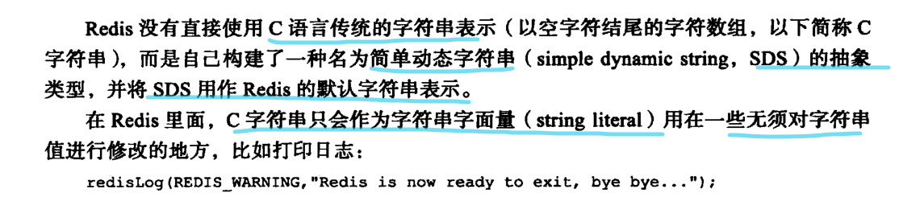

- 需要对字符串修改的地方使用SDS表示字符串值

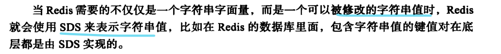

### SDS定义

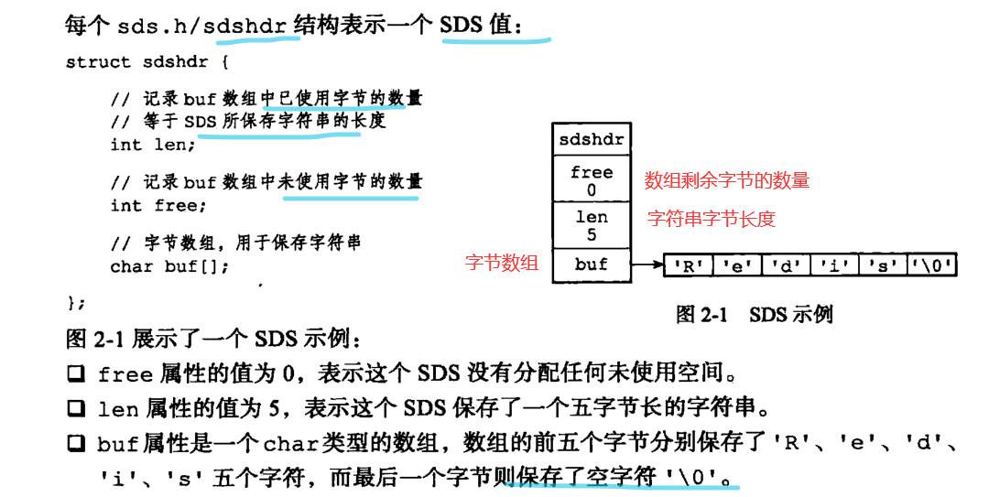

- 以空字符串结尾, 分配额外的一个自己的空间但是不计算到len 属性中
  - 保留这个C字符串的特性可以重用C的字符串函数库的函数
  - printf("%s", s->buf);


### SDS与C字符串的区别

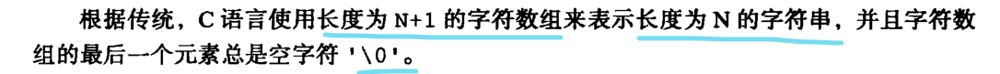

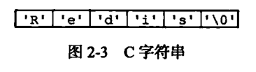

#### 常数复杂度获取字符串的长度

- C字符串
  - 不记录本身的长度, 需要比例字符串知道遇到结尾的空字符, O(N)的操作
- SDS
  - SDS 的len属性记录了SDS本身的长度, 可以O(1)获取
  - 设置和更新SDS长度由SDS API在执行的时候自动完成
- 确保了获取字符串长度不会成为redis的性能瓶颈
- 字符串键底层通过SDS实现, 返回对一个字符串键调用 STRLEN, 不会对性能造成影响


#### 杜绝缓冲区溢出


- C
  - 调用某些C的字符串库函数(strcat), 因为不知道字符串的长度信息, 会造成缓冲区溢出
- redis
  - SDS API对字符修改的时候, 需要先检查SDS的空间是否足够, 如果不够会自动扩展至执行操作需要的大小,再执行实际的修改, 所以不存在缓冲区溢出的问题
  - sdscat(str1, str2) 会先检查str1的buf是否有足够的空间容纳str2, 不够的话先扩容再执行 


#### 减少修改字符串带来的内存重分配次数

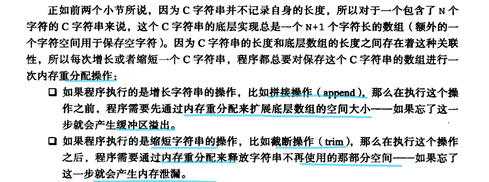

- C
  - 增大字符串, 需要先扩展底层数组的大小, 否则会缓冲区溢出
  - 减少字符串, 需要先释放底层数组不使用的那部分空间, 否则会造成内存泄露

- redis
  - 避免频繁修改字符造成的内存重分配

> 通过空间预分配和惰性空间释放两种优化策略

##### 空间预分配

优化需要对SDS进行空间扩展的时候, 不仅分配修改需要的空间, 还会分配额外的未使用空间(free)

- 修改后SDS的长度(len)<1MB
  - 为这个SDS分配额外和SDS长度相同的额外未使用空间(free=len)
- 修改后SDS的长度(len)>=1MB
  - 为这个SDS分配1MB未使用的空间(free)

减少连续执行字符串增长操作所需的内存重分配次数, SDS将连续增长N次字符串所需的内存重分配次数从=N次降低到最多N次


##### 惰性空间释放

优化需要堆SDS字符串的缩短操作, 当需要缩短SDS的时候, 不立即使用内存重分配来回收多出来的字节, 而是将这些多出来的空间记录到free属性中, 这样将来如果需要进行增长操作, 未使用的空间就可以用上

通过惰性分配策略, SDS避免了缩短字符串所需的内存重分配操作, 并为将来的增长操作提供了优化


#### 二进制安全

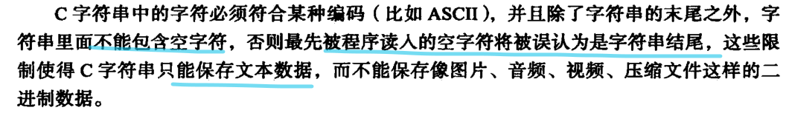

- C
  - 字符串中除了末尾不能包含空字符, 否则被认为是字符串的结尾, 不能保存二进制数据
- redis
  - SDS API 以处理二进制的方式来处理保存在buf数组里的数据, 不做任何限制, 假设, 过滤, 写入什么样子读出来就是什么样子
  - 不仅可以保存文本数据也可以保存任意格式的二进制数据

#### 兼容部分C字符串函数

SDS API二进制安全但是仍然遵守C字符串以空字符串结尾的管理, 这样可以兼容部分C字符串函数


#### 区别总结

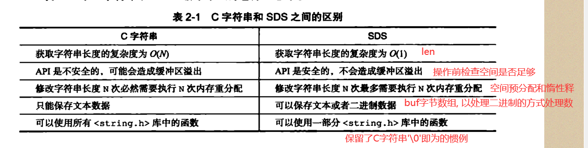

### SDS API

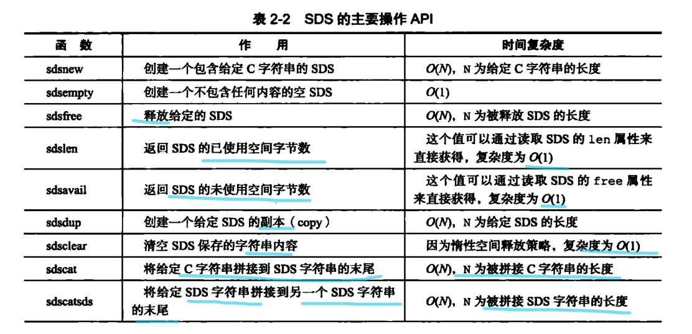

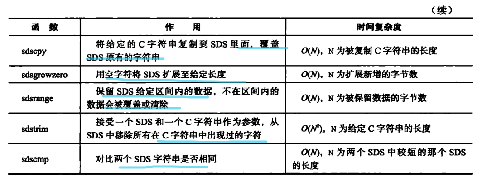


## 链表

- 提供了高效的结点重排能力, 通过顺序的访问方式, 可以加增删结点灵活调节链表的长度
- 官方使用: 列表键, 发布与订阅, 慢查询, 监视器
- 每个结点是一个ListNode, 拥有prev next 指向前后置结点, 链表的实现是双端队列
  - prev next value
- 每个链表是有list结构表示
  - head tail len dup() clear() match()
- head.prev = NULL tail.next=NULL 无环
- void *value 结点可以保存不同类型的值


### 链表和链表结点的实现

- 每个连接的结点

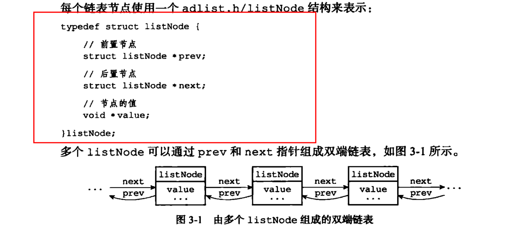

- 整个的链表

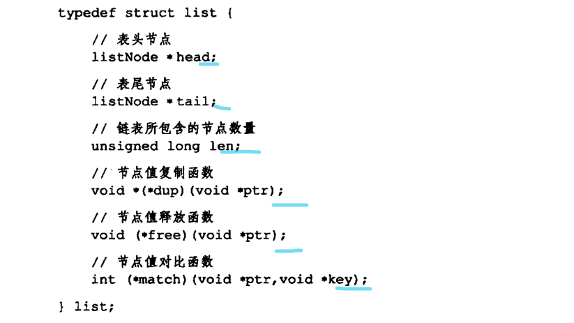

- dup 复制链表结点所保存的值
- free释放链表结点所保存的值
- match 对比链表结点所保存的值和另一个输入值是否相等

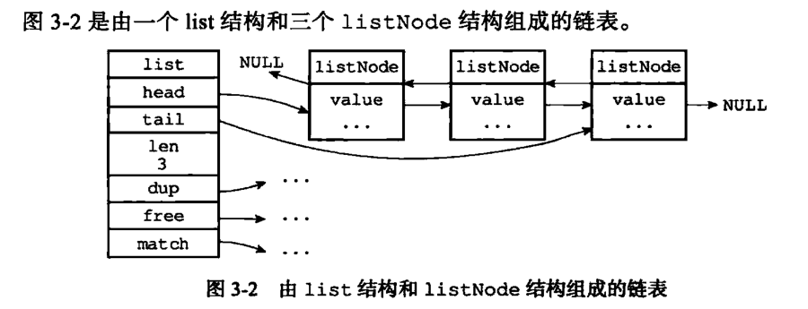

> 链表的特性

- 双端 prev next指针可以O(1)获取前置和后置结点
- 无环  head.prev = NULL tail.next = NULL
- O(1)获取头尾结点
- O(1) 通过len属性获取链表结点个数
- 多态 void\*保存结点值, 包括dup clear match函数的比较值都是void*  可以保存不同类型的值


### 链表和链表结点的API

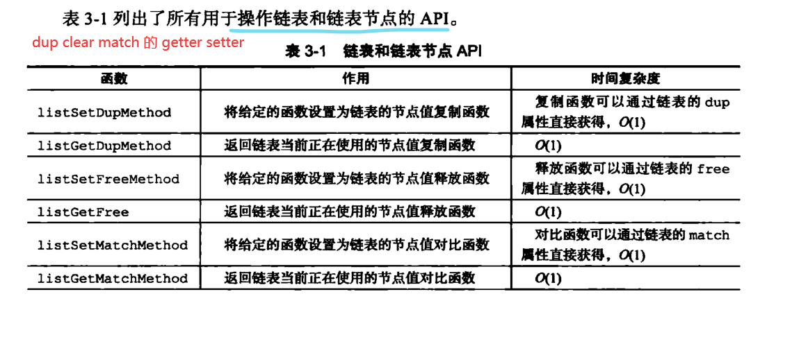

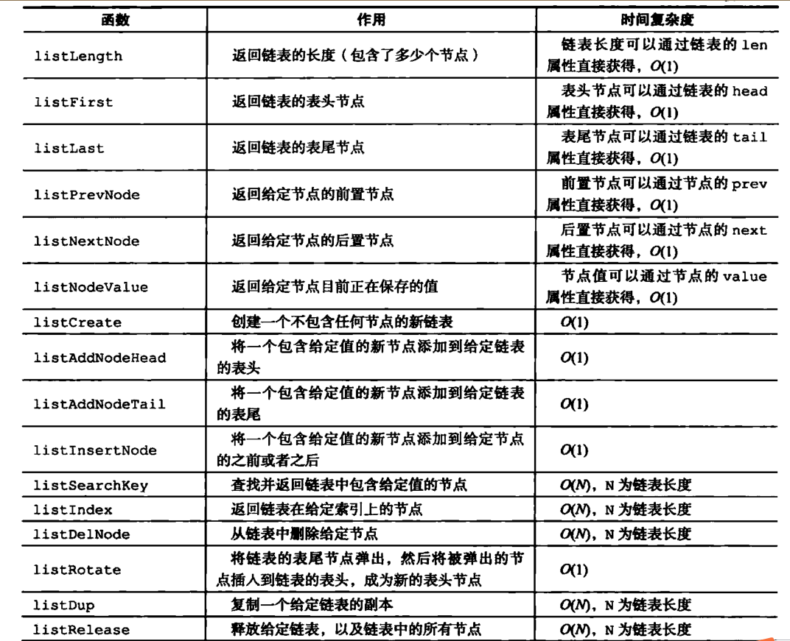


## 字典

- 字典的每个键都是唯一的
- redis数据库, 哈希键的底层实现, 使用的是MurmurHash2哈希算法计算哈希值
- 字典使用哈希表作为底层实现, 每个字典有两个哈希表, 一个用于平时存储键值对, 另一个用于rehash时使用
- 哈希表 使用链地址法解决哈希冲突, 被分配到同一个索引上的多个键值对连城一个单向链表, 新的冲突的键值对被添加到链表的头
- 对哈希表的扩展或收缩操作需要将现有哈希表所有键值对rehash到新的哈希表中, 这是一个渐进式的过程

### 字典的实现

哈希表是Redis字典的底层实现, 一个哈希表可以有多个哈希表结点, 每个哈希表结点保存了字典中的一个键值对


#### 哈希表 (dictht)

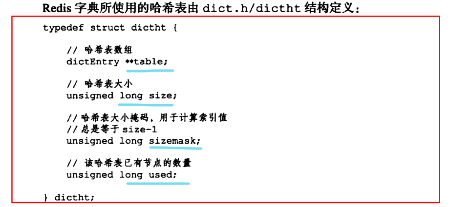

- table
  - 是一个指针数组, 二级指针指向一个一个数组的起始位置
  - 数组中每个元素都是一个指向一个dict.h/dictEntry结构的指针
  - 每个dictEntry结构保存着一个键值对
- size
  - 哈希表的大小, table数组的大小
- used
  - 已有的结点数量
- sizemask
  - size-1
  - 和哈希值决定了一个键被放到table数组的那一个索引上

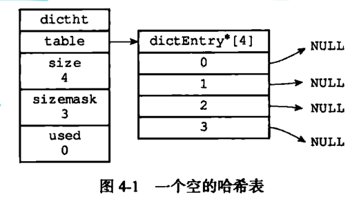

#### 哈希表结点(dictEntry)

dictEntry结构, 每个dictEntry结构保存一个键值对

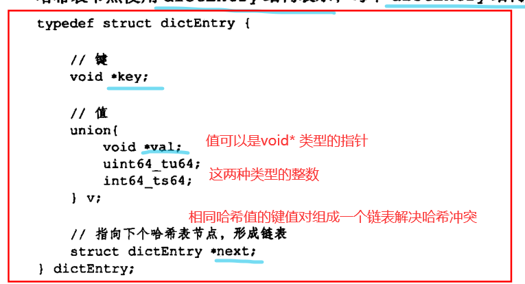

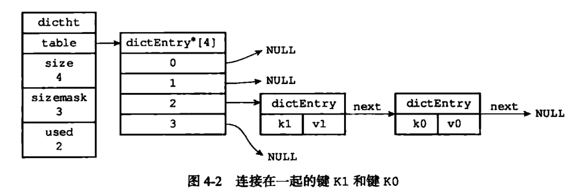


#### 字典(dict)

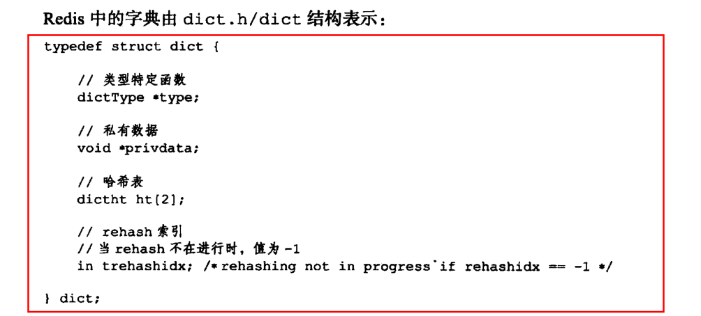

##### type和privatedate

- 针对不同类型的键值对, 创建多态字典而设置的

- type
  - 指向dictType结构的指针, 每个dictType结构保存了一簇用于操作特定类型键值对的函数
  - redis会为用途不同的字典设置不同类型的函数
- privatedata
  - 保存了要传给哪些类型特定函数的可选参数

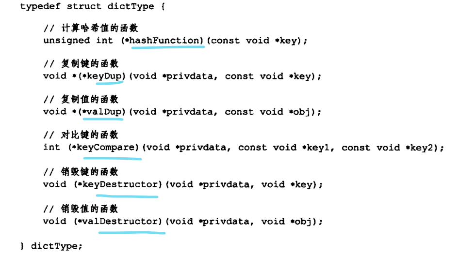

##### ht

大小为2的数组, 数组中的每个项都是一个dictht哈希表

- ht[0]是正常使用的哈希表
- ht[1]只会对ht[0]进行rehash的时候使用

##### rehashindex

rehashindex=-1 表示目前没有进行rehash

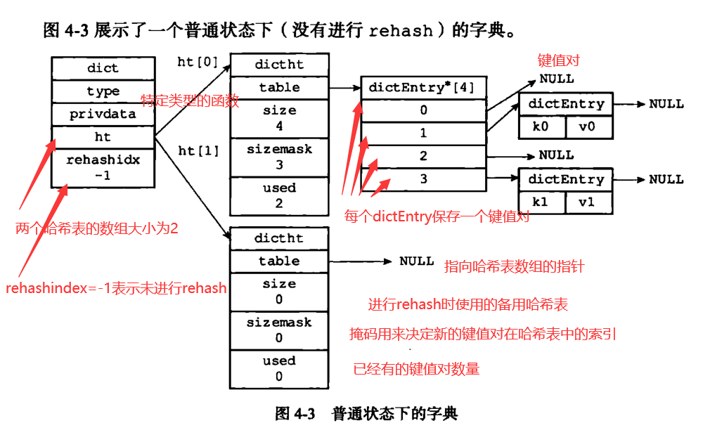

### 哈希算法

新的键值对要添加到字典中

1. 根据键值对计算哈希值和索引值
   1. 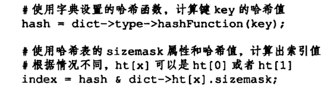
2. 根据索引值将包含新的键值对的哈希表结点放到哈希表数组的指定索引上

MurmurHash算法计算键的哈希值

- 即使输入的键很有规律也能给出很好的随机分布性

### 解决键的冲突

两个或以上数量的键被分配到了哈希表数组的同一个索引上

> 链地址法

每个哈希表结点都有一个next指针, 多个哈希表结点可以通过next指针构成一个单项链表

因为是单项链表没有指向链表表尾的指针, 每次总是将新节点添加到链表的表头位置O(1)


### rehash

当哈希表保存的键值对数量太多或者太少时, 需要对哈希表的大小进行相应的扩展和收缩

> rehash的步骤

1. 为字典的ht[1]哈希表分配空间, 分配的空间取决与执行的操作和ht[0].used的大小
   - 如果执行的扩展操作, ht[1] 大小 = 第一个大于等于 ht[0].used*2的2^n
   - 如果执行的是收缩操作, ht[1]大小=第一个大于等于ht[0].used的2^n
2. 将保存在ht[0]中的键值对rehash到ht[1]上
   - rehash就是根据键值对的键值以及ht[1].sizemask重新计算键的哈希值和索引值, 然后将键值对放到ht[1]对应索引的位置
3. ht[0]所有的键值对迁移到ht[1]上以后释放ht[0] 将ht[1]置为ht[0], 并在ht[1]的位置上创建一个空白的哈希表


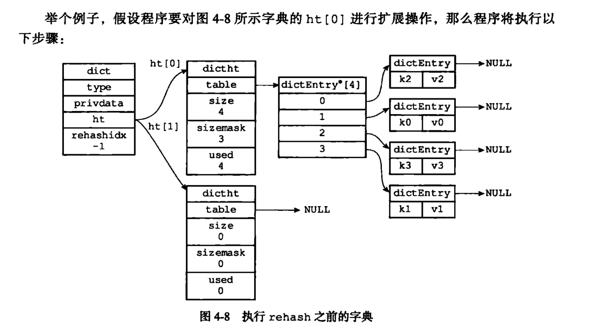


- 分配ht[1]

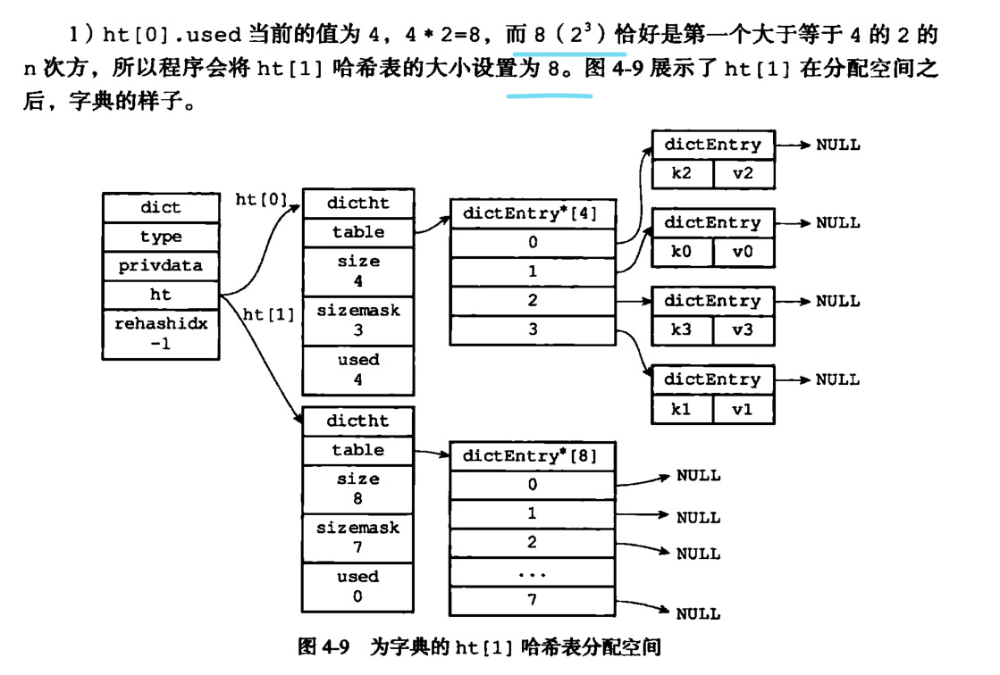

- rehash

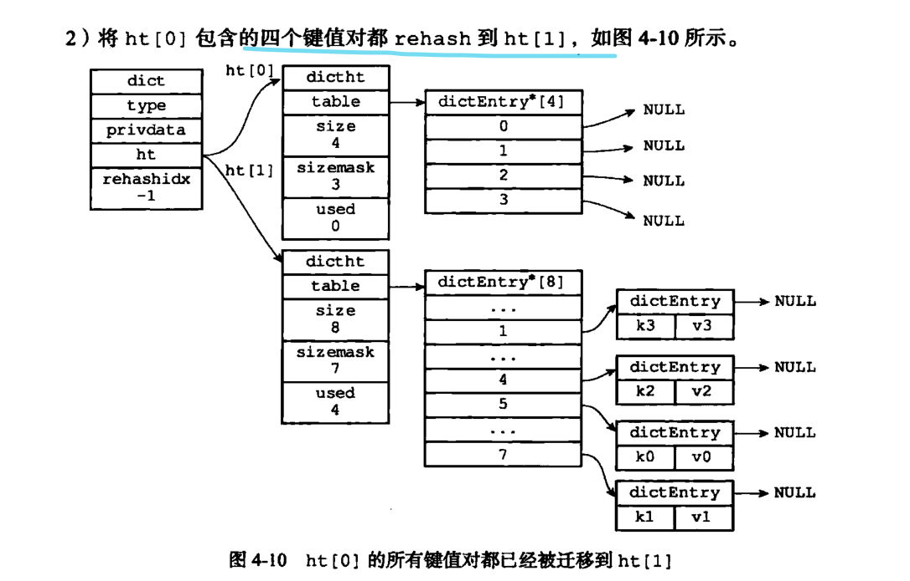

- 释放空间, 交换

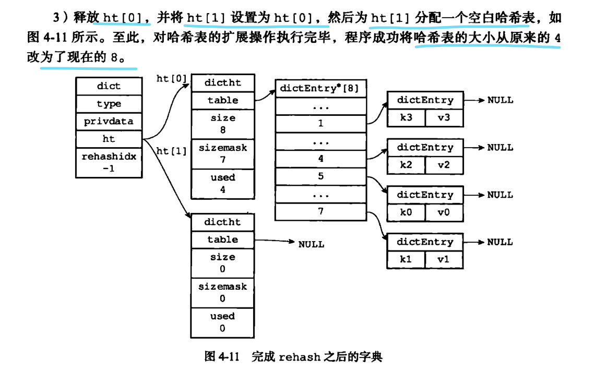

#### 哈希表的扩展和收缩

执行扩展操作的条件

- 服务器没有执行BGSAVE || BGREWRITEAOF 命令, 并且哈希表的负载因子>=1
- 服务器正在执行BGSAVE || BGREWRITEAOF 命令, 并且哈希表的负载因子>=5

负载因子

- load_factor = ht[0].used / ht[0].size
- 负载因子 = 已保存的结点数量 / 哈希表大小

BGSAVE || BGREWRITEAOF 命令

- BGSAVE || BGREWRITEAOF 命令执行过程中 Redis需要创建子进程, 通过COW优化子进程的效率
- 所以需要提高扩展操作所需的负载因子来避免子进程存在期间进行哈希表扩展操作, 
- 避免不必要的内存写入操作, 节约内存

收缩操作的必要条件

- 负载因子<0.1

### 渐进式rehash

rehash的操作不是一次性集中式的完成, 而是分多次渐进式的完成的

#### 为什么分多次渐进式的进行rehash

如果ht[0]保存的键值对数量过多, 一次性将这些键值对全部rehash到ht[1]庞大的计算量可能导致服务器停止一段时间, 使用分多次渐进式的rehash可以避免这种因为瞬时的大量计算导致的服务器停止

#### 渐进式rehash的步骤

1. 为ht[1]分配空间, 让字典同时持有ht[0] 和 ht[1]两个哈希表
2. 字典中维护一个索引计数器遍变量 rehashidx=0 
3. rehash期间进行的对字典的增删改查操作除了指向指定操作外, 都将操作对应的索引上的所有键值对rehash到ht[1], 此次rehash工作完成后rehashidx+1
4. 当ht[0]所有的键值对都rehash到ht[1]以后, rehashidx=-1标志rehash操作完成

这样分而治之的方式, 可以将rehash键值对所需的工作均摊到每个队字典的增删改查操作中, 避免了集中式rehash带来的庞大的计算量


#### 渐进式rehash期间的哈希表操作

- 查找
  - 先在ht[0]中找, 没有找到会到ht[1]中找
- 添加
  - 新添加的键值对一律添加到ht[1], 保证了ht[0]的数量只减不增

### 字典API

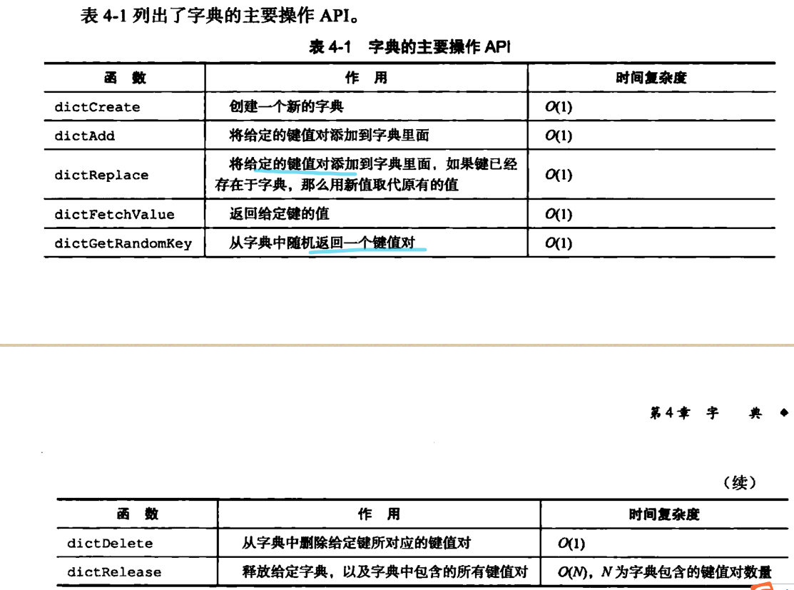


## 跳跃表

1. 找到插入位置, 通过不同的层找到最下面一层
2. 修改前后指针插入
3. 随机造层, (1-32层)
4. 对于每一层向前看具有相同的元素, 修改指针
5. 修改每一层


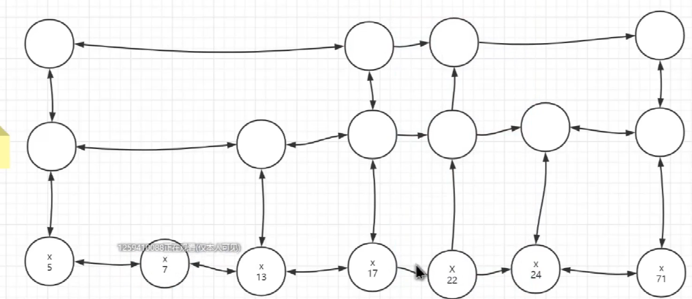

- 跳跃表是一种有序数据结构, 是有序集合的底层实现之一
- 由zskiplist 和 zskiplistNode两个结构组成
  - zskiplist保存跳跃表信息(头尾结点, 长度)
  - zskiplistNode表示跳跃表结点
- 每个跳跃表的层高都是1-32的随机数
- 同一个跳跃表中多个结点可以包含相同的分值(score)但是每个结点的成员对象必须是唯一的
- 跳跃表按照分值进行排序, 分值相同的按照成员对象大小排序
- 通过在每个结点维持多个指向其他节点的指针, 从而达到快速访问结点的目的
- 平均支持O(log N) 最坏O(N)的结点查找, 还可以通过顺序性操作完成批处理结点
- 只有在实现有序集合键, 在集群结点中用作内部数据结构用到


### 跳跃表的实现

redis.h/zskiplistNode跳跃表结点 redis.h/zskiplist保存跳跃表结点相关信息 两个结构定义

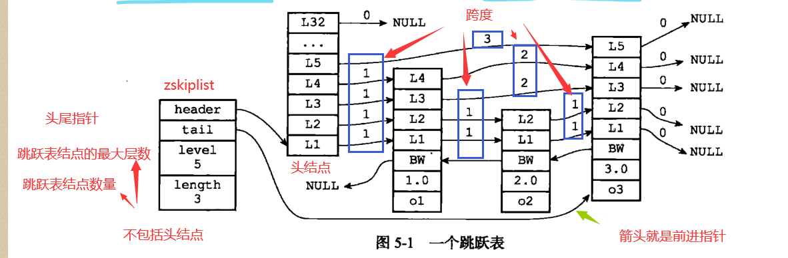

#### zskiplist

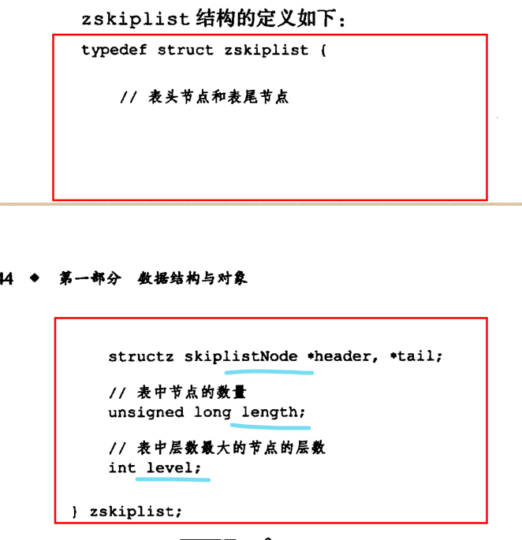


- head  tail 跳跃表的头尾结点
- level 记录目前跳跃表内, 层数最大的那个结点的层数(表头结点的层数不算在内)
- length 跳跃表的长度即跳跃表的结点数(表头结点不算在内)


#### 跳跃表结点 zskiplistNode

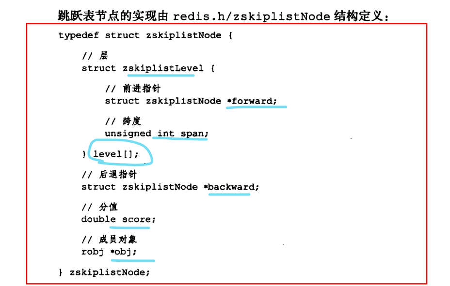

- 层 level: 
  - 结点的level数组可以包含多个元素, 每个元素都是一个指向其他节点的指针, 可以通过这些层来加快访问其他节点的速度
  - 每次创建新的跳跃表结点都会随机生成一个1-32之间的值作为level数组的大小即高度
  - 结点中 L1 L2 L3...表示各个层, L1表示第一层 L2 表示第二层 以此类推
  - 每个层有两个属性: 前进指针和跨度
    - 前进指针用于方位位于表尾方向的结点
    - 跨度记录了前进指针指向的结点与当前结点的距离
  - 从表头向表尾遍历时, 访问会沿着层的前进指针进行

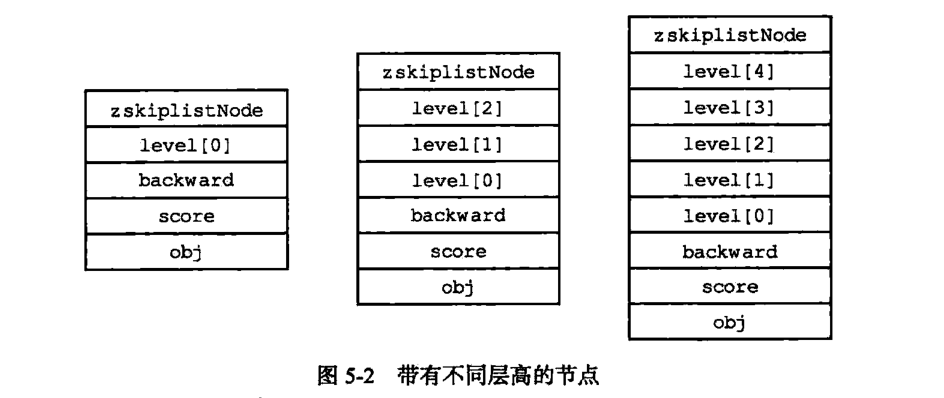

- 前进指针
  - 每一层都有一个指向表尾方向的前进指针, (level[i].forward) 用于从表头向表尾方向的访问

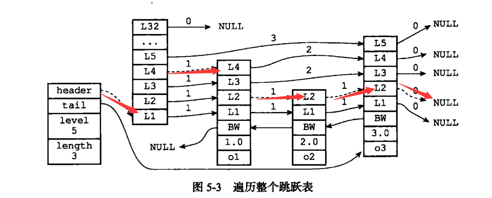

- 跨度
  - 记录连个结点之间的距离(level[i].span)
  - 跨度实际与遍历操作无关, 是用来计算排位的(rank)
  - 在查找某个结点的过程中, 将沿途访问过的所有层的跨度累计起来, 得到的结果就是目标结点在跳跃表中的排位

- 后退指针(backward)
  - BW是后退指针, 指向位于当前结点的前一个结点, 用于从表尾向表头遍历
  - 每个结点只有一个BW指针, 只能回退到前一个结点

- 分值(score)
  - 结点按照各自的分值从小到大排列(double类型)
- 成员对象(obj)
  - 是一个指针, 指向一个字符串对象, 字符串对象保存一个SDS的值
  - 同一个跳跃表中, 各个结点保存的成员对象必须是唯一的, 但是多个结点保存的分值可以相同
  - 分值相同的结点将按照成员对象在字典序中的大小来进行排序
  - 成员对象小的结点排在前面, 大的在后面


### 跳跃表API

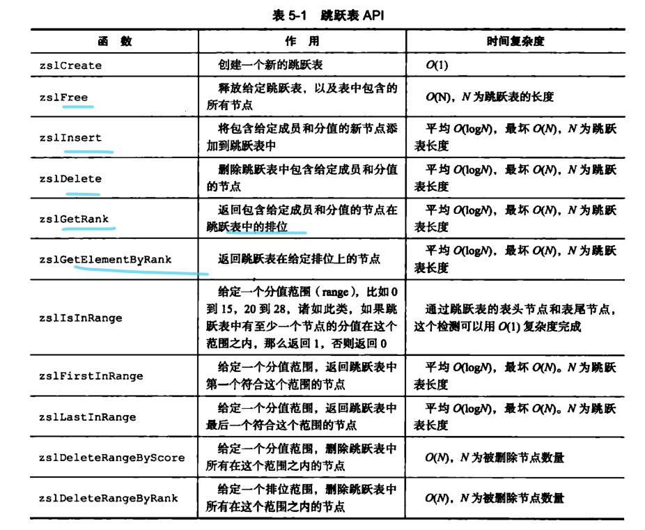


## 整数集合

- 集合键的底层实现之一
- 当一个集合只包含整数, 并且元素数量不多就会使用整数集合
- 整数集合的底层实现是数组, 数组以有序, 无重复的方式保存集合元素, 在需要的时候根据新添加元素的类型对数组的类型进行调整
- 升级操作带来了整数集合的灵活性已经节约了内存
- 只支持升级不支持降级

### 整数集合的实现

用于保存整数值集合的抽象数据结构, 保存类型为 int16_t int32_t int64_t 并且保证元素不重复

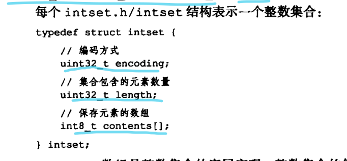


- contents数组是整数集合的底层实现
  - 整数集合的每个元素都是contents数组的一个数组项(item) 各个项在数组中从小到大排列并且不重复
- length
  - 数组的长度, 整数集合包含的元素数量
- content数组的真正类型取决于encoding属性的值


### 升级

当添加的新元素类型比整数集合所有元素的类型都要长时, 整数集合需要先升级, 才能将新元素添加到整数集合

升级集合并添加元素的步骤

1. 根据新元素的类型, 扩展整数集合底层数组的空间大小, 并为新元素分配空间
2. 将底层数组所有的元素都转换成和新元素相同的类型, 并将类型转换后的元素放置到正确的位置上, 而且放置元素的过程中, 需要维持底层数组的有序性质
3. 将新元素添加到底层数组中

因为每次向整数集合添加元素都有可能引起升级, 而每次升级都需要将所有元素进行类型转换, 所以时间复杂度O(N)

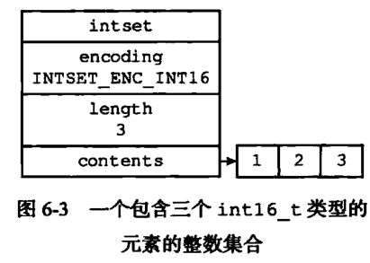

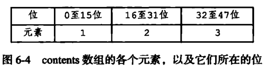

- 添加一个int32_t类型的65535 需要升级 升级后

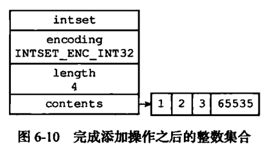

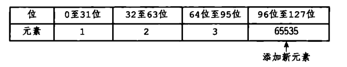

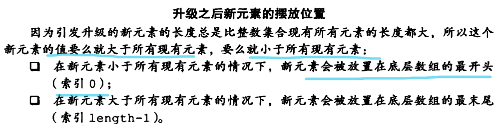


### 升级的好处

提升整数集合的灵活性和尽可能的节约内存

#### 提升灵活性

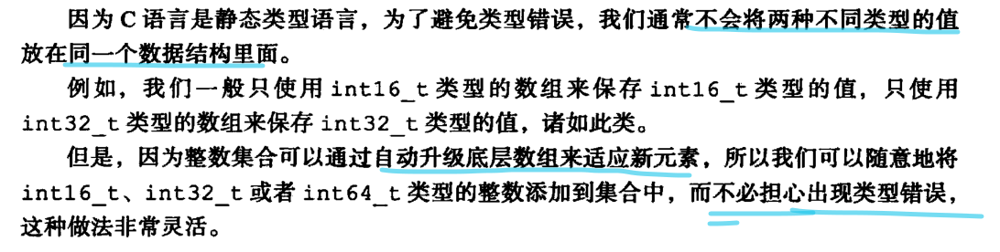


#### 节约内存

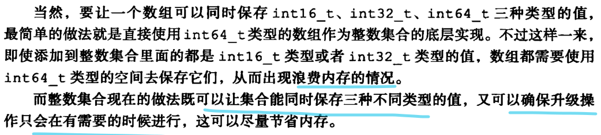

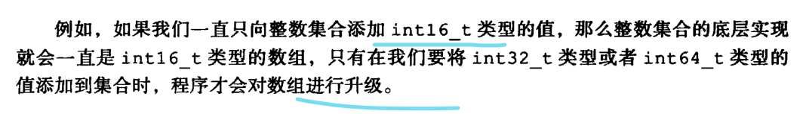


### 降级

整数集合不支持降级操作, 一旦升级, 就会保持升级后的状态

即使删除了造成整数集合升级的元素, 底层数组仍然不变

可能是因为各个元素都已经按照升级后的类型进行了位置的调整, 占据的位数已经是升级后类型的位数, 如果升级又带来一系列类型转换, 元素移动的操作, 可能会非常耗时


### 整数集合API


## 压缩列表

- 压缩列表是列表键和哈希键的底层实现之一
  - 当一个列表键只有少量列表项, 并且每个列表项是小整数 || 短字符串
  - 键值对的键和值都是小整数||短字符串
- 压缩列表是一种为节约内存而开发的顺序型数据结构
- 可以包含多个结点, 每个结点包含一个字节数组或者整数值
- 添加或者删除结点可能会导致连锁更新


### 压缩列表的构成

一系列特殊编码的连续内存块组成的顺序型数据结构

一个压缩列表可以包含任意多个结点, 每个结点都可以保存一个字节数组或者一个整数值

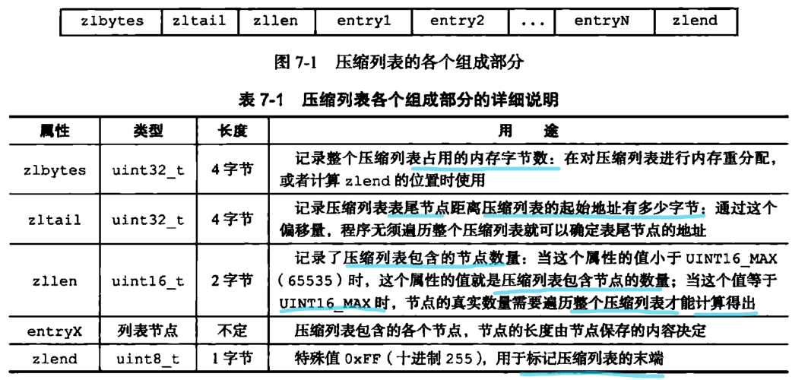

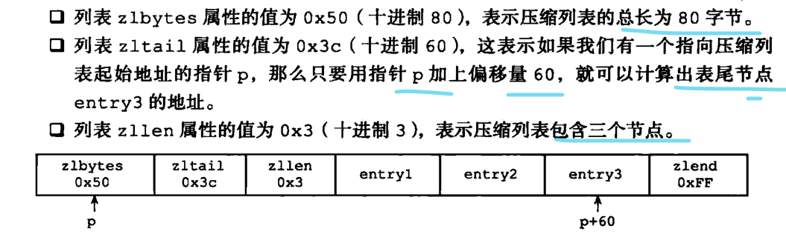

### 压缩列表结点的构成

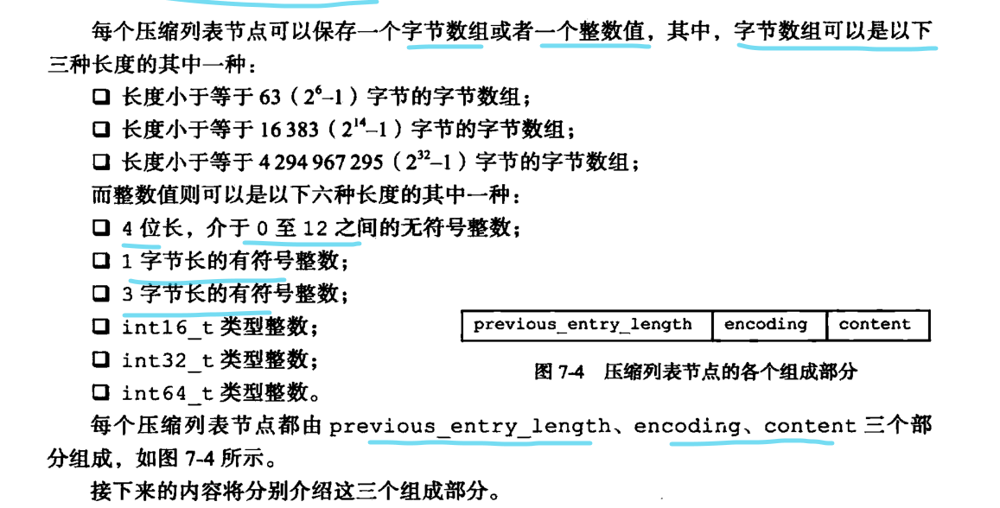

#### previous_entry_length

以字节为单位, 记录前一个结点的长度, 属性的长度可以是1 || 5 个字节

- 前一个结点的长度<254bytes  previous_entry_length属性长度是1字节, 前一个结点长度就保存在这个属性中
- 前一个结点的长度>=254bytes  previous_entry_length属性长度是5字节, 属性的第一字节被设置为0xFE(254), 而之后的四个字节保存前一个结点的长度

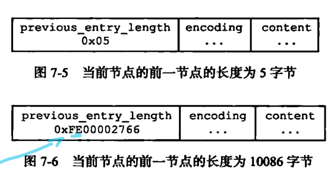

可以通过指针运算, 根据当前结点的起始地址计算前一个结点的起始地址

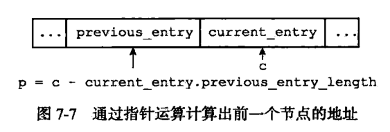

压缩列表从表尾向表头遍历操作就是利用指针运算的原理, 

- 当我们拥有一个指向某个结点起始地址的指针, 以及这个结点的previous_entry_length属性就可以获得前一个结点的起始地址, 进而一直到达头结点

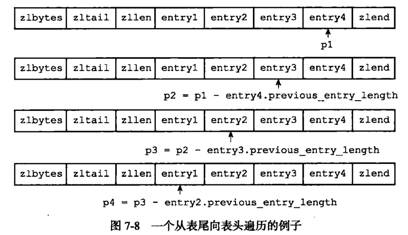

#### encoding

记录了结点的content属性所保存数据的类型和长度


#### content

保存结点的值, 结点值可以是一个字节数组, 或者整数, 类型和长度由encoding决定


### 连锁更新

> 特殊情况下产生的连续多次空间扩展操作称之为连锁更新 cascade update

 previous_entry_length属性以字节为单位, 记录前一个结点的长度, 属性的长度可以使1 || 5 个字节

- 前一个结点的长度<254bytes  previous_entry_length属性长度是1字节, 前一个结点长度就保存在这个属性中
- 前一个结点的长度>=254bytes  previous_entry_length属性长度是5字节, 属性的第一字节被设置为0xFE(254), 而之后的四个字节保存前一个结点的长度

> 在一个压缩列表中, 有多个连续的长度介于[250, 253]字节的结点e1~eN


因为结点长度<254, 记录这些结点的长度只需要1字节的 previous_entry_length属性

这是将一个长度>=254字节的新节点new 设置为压缩列表的表头结点, 即e1的前置结点


因为e1 previous_entry_length属性仅为1字节, 空间不够需要对压缩列表进行空间重新分配, 

将e1 previous_entry_length属性扩展为5字节, 

这会导致e1的长度变成[254,257]之间, 造成后续节点的previous_entry_length属性的更新直到eN为止

除了添加, 删除也会导致连锁更新, 删除了中间的某个结点导致删除结点的后一个结点需要存储删除结点的前一个的长度, 而这个长度大于后一个结点 previous_entry_length属性所能装下的空间进而导致连锁更新


### 压缩列表API


# 对象

- 每个键值对的键和值都是一个对象
- 共有字符串, 列表, 哈希, 集合, 有序集合五种类型的对象
  - 每种类型都有至少两种或以上的编码方式, 不同编码应用于不同的场景优化
- 服务器执行命令前会检查给定键的值对象的类型是否符合
- 引用计数实现内存回收, 当一个对象的refcount=0 占用的内存会被释放
- 共享0~9999的字符串对象
- 对象会记录自己最后一次被访问的时间, 这个时间可以用于计算对象的空转时间


Redis不直接使用这些数据结构实现键值对, 而是基于这些数据结构创建一个对象系统

字符串, 列表, 哈希, 集合, 有序集合对象

针对不同的使用场景为对象设置不同的数据结构来实现, 从而优化使用效率

基于引用计数计数的垃圾回收机制

基于引用计数实现对象的共享机制, 多个数据库共享同一个对象来节约内存

对象带有访问时间可以计算数据库键的空转时间


## 对象类型与编码

数据库每创建一个键值对, 都会至少创建两个对象用来表示键和值 每个对象都是一个redisObject

每个对象都是一个redisObject


### 类型


type属性记录了对象的类型

- 键总是一个字符串对象
- 值可以是字符串, 列表, 哈希, 集合, 有序集合对象中的一种

type <数据库键>:

- 返回键对应值的对象类型, 因为键总是字符串对象


### 编码和底层实现

ptr

- 对象的ptr指针指向底层实现数据结构, 数据结构由对象的encoding属性决定

encoding

- 记录了对象所使用的编码, 也就是对象使用了什么数据结构作为对象的底层实现


每种类型的对象都使用了至少两种不同的编码


OBJECT ENCODING 查看一个数据库键的值对象的编码


通过encoding属性可以设定对象所使用的编码, 而不是为特定类型的对象关联固定的编码, 极大地低声了Redis的灵活性和效率, Redis可以根据不同的场景来为对象设置不同的编码, 优化某一场景下的效率


## 字符串对象(int embstr raw)

字符串对象的编码可以是 int  raw 或 embstr

### int

- 字符串对象保存的是整数值, 并且这个整数值可以用long类型来表示
- 字符串对象会把整数值保存在对象结构的ptr属性里面(void* --> long)
- 并将对象的编码设置为int


### raw

- 保存字符串, 长度>32字节
- 使用SDS来保存这个字符串值
- 对象编码设为raw


### embstr

- 保存字符串, 长度<=32字节
- 使用embstr编码的方式保存这个字符串值


embstr编码是专门保存短字符串的优化编码方式, 和raw一样用了redisObject和sdshdr结构来表示字符串对象

- raw调用两次内存分配分别创建redisObject 和 sdshdr结构
- embstr编码通过调用一次内存分配一块连续的空间 依次包含redisObject和sdshdr两个结构


embstr编码的字符串保存段字符串值的好处

- 内存分配次数只需一次
- 释放字符串对象时序调用一次内存释放函数
- 字符串对象的所有数据都保存在一块连续的内存里, 所以能更好的利用缓存带来的优势


long double类型表示的浮点数在redis也是作为字符串的值来保存


### 编码的转换

int embstr在条件满足的情况下会转换成raw

int

- 向对象执行了一些命令, 使得这个对象保存的不再是整数值, 而是一个字符串值, 那么字符串对象编码会变成raw
- 

embstr

- embstr编码的字符串没有任何修改程序, 实际上是只读的
- 所以修改前编码必须从embstr改成raw, 
- 

### 字符串命令


## 列表对象(ziplist linkedlist)

编码可以是ziplist 或者 linkedlist

### ziplist

- ziplist编码的列表对象底层实现为压缩列表, 每个压缩列表结点保存一个列表元素, 


### linkedlist

-  linkedlist编码的列表对象底层实现为双端链表
- 每个双端链表结点保存了一个字符串对象, 字符串对象保存了一个列表元素


字符串对象是Redis五中类型的对象中唯一会被其他四种对象嵌套的对象


### 编码转换

列表对象满足下面条件可以使用ziplist编码

- 列表对象保存的所有字符串元素的长度都小于64字节
- 列表对象保存的元素数量小于512

不能满足这两个条件的都需要使用linkedlist编码

当ziplist编码的列表对象改变导致上述两个条件不能满足时会自动转换编码将裂变元素转移到双端链表中

- 插入了大字符串长度大于64字节
- 增加了元素数量使得总数量超过512

### 列表命令的实现


## 哈希对象(ziplist hashtable)

ziplist 或 hashtable编码

### ziplist

- ziplist编码的哈希对象底层使用压缩列表
- 新的键值对加入哈希对象, 先将保存了键的压缩列表结点推入压缩列表结尾
- 再将保存了值的压缩列表结点推入压缩列表结尾
- 保证了同一键值对的两个结点总是紧挨在一起的, 键在前, 值在后
- 先添加到哈希对象的键值对在表头方向, 后添加的在表尾方向


### hashtable

- hashtable编码的哈希对象使用字典作为底层实现, 哈希对象的每个键值对都由一个字典键值对来保存
  - 字典的每个键都是一个字符串对象, 对象保存了键值对的键
  - 字典的每个值都是一个字符串对象, 对象保存了键值对的值


### 编码转换

满足使用ziplist编码的条件

- 哈希对象保存的所有键值对的键和值的字符串长度都<64字节
- 哈希对象保存的所有键值对的数量<512

不满足的都需要使用hashtable

当ziplist编码所需的两个条件任意一个不能满足的时候都需要转换成hashtable编码

- 添加新的键值对 键或值长度>=64字节
- 加入的键值对数量总和>=512


### 哈希命令的实现


## 集合对象(intset hashtable)

### intset

使用整数集合作为底层实现, 

集合对象包含的所有元素都被保存在整数集合里面


### hashtable

使用字典作为底层实现, 

字典的每个键都是一个字符串对象, 

每个字符串对象包含一个集合元素, 

字典的值全部设为NULL


### 编码转换

intset编码的条件

- 集合对象所有元素都是整数值
- 元素个数<=512

不满足的需要用hashtable编码

- 在intset编码的集合对象插入一个字符串元素
- 集合元素个数超过512


### 集合命令的实现


## 有序集合对象(ziplist skiplist)

### ziplist

使用压缩列表作为底层实现

每个集合元素使用两个挨在一起的压缩列表结点保存, 

第一个保存元素的成员(member) 第二个保存元素的分值(score)

压缩列表内的集合元素按照分值从小到大排序


### skiplist

使用zset结构作为底层实现, 一个zset结构同时包含一个字典和一个跳跃表

```c
typedef struct zset{
    //跳跃表
    zskiplist *zsl;
    //字典
    dict *dict;
}zset;
```


#### zsl跳跃表

- 按分值从小到大保存了所有集合的元素,

- 每个跳跃表结点都保存了一个集合元素

- 跳跃表结点的object 属性保存了元素的成员

- score属性保存了元素的分值

- 通过这个跳跃表可以对有序集合进行范围型操作 (ZRANK ZRANGE)


#### dict字典

- 为有序集合创建一个从成员到分值的映射

- 字典的每个键值对都保存了一个集合元素
  - 字典的键保存了一个元素的成员
  - 字典的值保存了一个元素的分值
- 可以用O(1)复杂度找到给定成员的分值


- ZSCORE就时根据这一特性实现的


有序集合的每一个元素的成员都是一个字符串对象

每个元素的分值都是一个double类型的浮点数

虽然同是使用了跳跃表和字典保存集合元素, 但是都是通过指针共享相同元素的成员和分值, 不会造成重复


#### 为什么同是使用跳跃表和字典来实现?

字典保证了O(1)查找指定成员的分值

跳跃表保证了可以进行范围操作而无需对整体的成员进行排序


### 编码转换

使用ziplist的条件

- 有序集合元素数量<128
- 保存元素的成员长度都<64字节

不能满足的都要使用skiplist编码

- 有序集合元素数量>=128
- 插入元素成员长度>=64字节


### 有序集合命令的实现


## 类型检查和命令多态

操作键的基本命令

- 对任意类型键执行
  - DEL EXPIRE RENAME TYPE OBJECT

- 对特定类型键执行
  - 


### 类型检查的实现

为了确保只有指定类型的键才可以执行某些特定的命令, 执行之前会先检查输入键的类型是否正确, 然后决定是否执行

类型特定命令通过redisObject结构的type属性实现

- 执行类型特定命令前, 服务器会先检查输入数据库键的值对象是否为执行命令所需要的类型, 是的话才执行


### 多态命令的实现

根据对象编码方式 选择正面的命令实现代码来执行命令

在确保了值对象类型符合命令要求, 还需要根据值对象的底层实现调用对应的底层函数完成高层命令

LLEN返回列表的长度, 根据底层实现的不同使用不同的函数获取长度

- ziplist --> ziplistLen
- linkedlist --> listLength


## 内存回收

构建引用计数计数实现内存回收机制, 跟踪对象的引用计数信息, 在适当的时候释放对象进行内存回收


- 创建初始refcount=1
- 增加引用refcount+1
- 减少引用refcount-1
- refcount==0 释放


## 对象共享

对象的引用计数属性还有对象共享的作用

让多个对象共享同一个值对象需要两个步骤

1. 将数据库键的值指针指向一个现有的值对象
2. 被共享的值对象的引用计数refcount+1


redis在初始化服务器的时候, 创建10000个字符串对象, 包含了0~9999所有的整数值, 当需要的时候共享这些字符串对象, 而不是创建新的对象


为什么不共享包含字符串的对象


## 对象空转时间

redisObject的 lru属性记录了对象最后一次被命令程序访问的时间


OBJECT IDLETIME = 当前时间 - 键的值对象的lru


# 数据库

- redisServer.db数组保存了redis服务器所有的数据库, redisServer.dbnum保存数据库的数量
- 通过修改redisClient.db指针 让他指向redisServer.db数组中的不同元素来切换不同数据库
- 数据库redisDb主要由dict expires两个字典构成
  - dict保存所有键值对
  - expires保存设置过期时间 生存时间的过期时间
- 数据库由字典构成, 数据库的操作都是建立在字典之上
- 数据库键总是字符串对象, 值可以是 字符串, 列表, 哈希, 集合, 有序集合对象五种中任意一种
- expires字典的键指向数据库中的某个键, 值记录了键的过期时间, 过期时间是以毫秒为单位的UNIX时间戳
- Redis使用定期删除和过期删除两种策略删除过期键
  - 惰性删除: 碰到过期键才删除
  - 定期删除: 每隔一段时间周期性在所有数据库的expires字典中检查一部分键, 如果过期就删除
    - 下一次删除会从上一次删除的地方接着删除
- 执行SAVE BGSAVE命令产生的RDB文件不会包含过期键
- 执行BGREWRITEAOF命令产生的AOF文件不会包含过期键
- 当删除一个过期键时, 服务器会追加一条DEL命令到现有AOF文件的末尾, 显示的删除过期键

- 主服务器显示删除一个过期键会向所有从服务器发送一条DEL命令, 让从服务器删除过期键
- 从服务器即使发现一个过期键也不会主动删除, 而是等待主服务器的DEL命令, 这种中心化的过期键删除策略可以保证主从服务器的一致性
- Redis命令对数据库进行修改, 服务器根据配置向客服端发送数据库通知


服务器保存数据库的方法

客户端切换数据库的方法

数据库保存键值对的方法

数据库的CRUD

服务器保存键的过期时间的方法

服务器自动删除过期键的方法

通知功能的实现


## 服务器中的数据库

redis服务器的数据库保存在服务器redis.h/redisServer结构的db数组中

db数组中的每项都是一个redis.redisDb结构

每个redisDb结构代表一个数据库


初始化服务器, 根据服务器的dbnum属性来决定应该创建多少个数据库


dbnum 默认为16


## 切换数据库

每个客户端都有自己的目标数据库

默认目标数据库是0号数据库就是db数组中的db[0]

客户端可以通过select命令切换目标数据库 select [数据库在db数组中的索引]

服务器内部redisClient结构的db属性记录了客服端当前的目标数据库, 这个属性是指向redisDb结构的指针


> select命令的原理

通过修改redisClient.db指针指向服务器的不同数据库, 达到切换数据库的目的


## 数据库键空间

Redis是一个键值对数据库服务器

每个数据库由一个redis.h/redisDb结构表示

redisDb结构的dict字典保存了数据库中所有的键值对, 这个字典就是**键空间(key space)**


键空间和用户所见的数据库是直接对应的

- 键空间的键是数据库的键, 每个键都是一个字符串对象
- 键空间的值是数据库的值, 每个值可以是字符串, 列表, 集合, 哈希, 有序集合对象中任意一种redis对象


### 添加新键

添加新键值对就是将一个新的键值对添加到键空间字典里面

- 键为字符串对象, 值为任意一种类型的redis对象


### 删除键

删除数据库的键就是在键空间字典里面删除所对应的键值对对象


### 更新键

更新数据库的键就是对键空间里面键所对应的值对象进行更新, 根据值对象类型不同, 更新的具体方法不同


### 对键取值

对数据库键进行取值, 实际上就是在键空间中取出键对应的值对象, 根据值对象类型不同, 具体的取值方法不同


### 其他键空间操作

针对数据库本身的命令起始就是针对键空间的操作

- FLUSHDB
  - 删除键空间所有的键值对
- RANDOMKEY
  - 在键空间随机返回一个键
- DBSIZE
  - 返回数据库键数量就是返回键空间中包含的键值对的数量
- EXIST RENAME KEYS
  - 都是通过键空间进行操作实现的


### 读写键空间的维护操作

- 读取一个键, 根据键是否存在更新服务器的键空间命中(hit)或键空间不命中(miss)次数
  - INFO stats 的keyspace_hits keyspace_misses
- 读取一个键, 跟新键的LRU, 用于计算键的闲置时间
  - OBJECT idletime <key> 查看key的空闲时间
- 读取一个键, 发现键已经过期
  - 删除过期键, 然后执行余下的操作
- WATCH命令监视了某个键, 服务器堆被监视的键进行了修改后, 这个键标记为dirty , 让食物程序注意到键已经被修改过
- 每修改一个键之后, , 都会对脏键计数器值+1, 计数器会触发服务器的持久化以及复制操作
- 服务器开启了数据库通知功能, 会在堆键进行修改后, 按照配置发送相应的数据库通知


## 设置键的生存或过期时间

- EXPIRE PEXPIRE

通过EXPIRE 或 PEXPIRE 命令, 客户端可以以秒或者毫秒为数据库的键设置生存时间(Time To Live TTL) 指定的时间后, 服务器会自动删除生存时间为0 的键

(SETEX 在设置一个字符串键的同时设置过期时间)

- EXPIREAT PEXPIREAT

以秒或者毫秒精度给数据库中的键设置过期时间(expire time)

过期时间是一个UNIX时间戳, 当键的过期时间来临时, 服务器会自动从数据库中删除这个键

- TTL PTTL

接受一个带有生存时间或者过期时间的键, 返回这个键的剩余生存时间


### 设置过期时间

- EXPIRE <key> <ttl> 生存时间设置为ttl秒
- PEXPIRE <key> <ttl> 生存时间设置为ttl毫秒
- EXPIREAT <key> <timestamp> 过期时间设置为 timestamp秒数时间戳
- PEXPIREAT <key> <timestamp> 过期时间设置为 timestamp毫秒数时间戳

EXPIRE  PEXPIRE EXPIREAT 都是通过PEXPIREAT实现的

- EXPIRE --> PEXPIRE --> PEXPIREAT
- EXPIREAT --> PEXPIREAT


### 保存过期时间

redisDb结构的expires字典保存了数据库中所有键的过期时间, 过期字典

- 过期字典的键是一个指针, 指向了键空间的某个键对象
- 过期字典的值是一个long long类型的整数, 保存了键所指向的数据库键对象的过期时间
  - 一个毫秒精度的UNIX时间戳

```c
typedef struct redisDb{
    //过期字典
    dict *expires;
}redisDb;
```


当客户端执行PEXPIREAT命令, 为一个数据库键设置过期时间, 服务器会在数据库的过期字典中关联给定的数据库键和过期时间


### 移除过期时间

PERSIST 移除一个键的过期时间

PERSIST 命令在过期字典查找给定的键, 并解除键和过期时间在过期字典的关联


### 计算并返回剩余生存时间

TTL单位为秒, PTTL单位为毫秒

通过计算过期时间和当前时间之间的差来实现的


### 过期键的判定


## 过期键的删除策略

键过期了, 什么时候删除?


### 定时删除

优点

- 对内存友好

- 通过使用定时器, 保证过期键尽快被删除, 并释放过期键所占用的内存

缺点

- 对CPU不友好
- 过期键较多的时候会占用一部分CPU时间

创建定时器需要用到时间事件

- 时间事件的实现方式 无序链表
- 查找一个时间的时间复杂度O(N) 不能高效处理大量时间事件

### 惰性删除

优点

- 对CPU友好
- 只有在取出过期键时才会删除, 并且只会删除当前处理的键, 不会删除其他无关的键

缺点

- 内存不友好
- 过期键不删除, 始终占用内存, 内存不会被释放

### 定期删除

定时删除占用太多的CPU时间, 影响服务器的响应时间和吞吐量

惰性删除浪费太多内存, 有内存泄露的风险

定期删除采用整合折中的方法

- 每隔一段时间执行一次删除过期键的操作, 并限制删除操作执行的时长和频率来减少堆CPU的影响
- 减少了内存的浪费

难点是确定删除操作执行的时长和频率

- 如果删除操作执行太长或者频率过高就会退化成定时删除, 消耗过多的CPU
- 如果太短或者频率太低, 退化成惰性删除, 出现内存浪费


## Redis过期键删除策略

redis服务器实际使用**惰性删除**和**定期删除**两种, 通过两者的配合在合理使用CPU时间和避免浪费内存中平衡

### 惰性删除策略的实现

db.c/expireIfNeed函数实现, 所有读写数据库的Redis命令在执行前都会调用expireIfNeed函数对键进行检查

- 如果键已经过期, expireIfNeed会将输入键从数据库删除
- 未过期 不做任何操作

expireIfNeed函数像一个过滤器, 过滤掉过期的键, 避免命令接触到过期键


### 定期删除策略的实现

redis.c/activeExpireCycle 实现

每当Redis服务器周期性的操作 redis.c/serverCron函数, activeExpireCycle函数机会被调用

在规定时间分多次遍历服务器的各个数据库, 从数据库的expires字典中随机检查一部分键的过期时间, 并删除其中过期的键


## AOF RDB 赋值功能对过期键的处理

### 生成RDB文件

指向SAVE 或者BGSAVE命令创建一个新的RDB文件时, 会检查数据库中的键, 过期键不会保存到 新创建的RDB文件中

### 载入RDB文件

启动Redis服务器时, 如果服务器开启了RDB功能, 服务器会将RDB文件载入

- 如果服务器以主服务器运行, 载入RDB文件时, 会对文件中保存的键进行检查, 未过期的才会载入数据库
- 如果以从服务器模式运行, 载入RDB文件会保存所有的键, 不论是否过期
  - 因为主从服务器再进数据同步的时候,从服务器数据库会被情况, 所以一般不会有影响


### AOF文件写入

当服务器以AOF持久化模式运行, 如果数据库中的某个键过期了, 还没有被定期或者惰性删除, AOF文件不会因为这个过期键产生任何影响

当过期键被惰性删除或者定期删除之后, 会向AOF文件追加一条DEL命令 来显式的记录该键已经删除

如果get message试图访问 过期键message

1. 从数据库删除message键
2. 追加一条DEL message命令到AOF
3. 向执行get命令的客服端返回空回复


### AOF重写

执行AOF重写, 会检查数据库中的键, 过期键不会保存到重写后的AOF文件中


### 复制

运行在赋值模式下, 从服务器的过期键删除动作由主服务器控制

- 主服务器在删除一个过期键后, 会显式的向所有的从服务器发送一个DEL命令, 告诉从服务器删除这个过期键
- 从服务器执行客户端发送的读命令, 即使碰到过期键也像未过期键一样处理
- 从服务器只有收到主服务器传来的DEL命令才会删除过期键

通过主服务器统一的删除过期键可以保证主从服务器数据的一致性, 所以当一个过期键存在于主服务器, 这个过期键的复制品仍然存在于从服务器


## 数据库通知

让客服端通过订阅给定的频道或者模式, 来获取数据库键的变化, 以及数据库中命令的执行情况

- 键空间通知(key-space notification)
  - 关注某个键执行了什么命令
  - 
- 键事件通知(key-event notification)
  - 某个命令被什么键执行了
  - 


### 发送通知

notify.c/notifyKeySpaceEvent


- type
  - 当前想要发送的通知的类型, 根据这个值判断通知是否是服务器配置的 notify-keyspace-event选项选定的通知类型, 从而决定是否发送
- event keys dbid 分别是事件名称, 产生事件的键, 产生事件的数据库号码
- 函数会根据type参数以及这三个参数构建事件通知的内容, 记忆就收通知的频道名
- 每当一个Redis命令需要发送数据库通知, 该命令的实现函数会调用notify-KeyspaceEvent函数, 并向函数传递该命令所引发事件的相关信息


### 发送通知的实现


# RDB(Redis DataBase)持久化

- RDB文件用于保存和还原Redis服务器所有数据库中的键值对数据
- SAVE由服务器执行, 阻塞服务器
- BGSAVE由子进程执行, 不会阻塞服务器
- 服务器状态会保存save选择设置的保存条件, 任意满足会执行BGSAVE
  - redisServer -- > saveparams -->saveparam(保存条件)
- RDB文件时压缩的二进制文件, 
- 不同类型的键值对, RDB文件会用不同的方式保存


Redis是内存数据库, 如果数据不存储到磁盘上, 服务器进程退出, 数据库状态也会消失

RDB持久化功能可以将Redis在内存的数据库状态保存到磁盘里面

可以配置中定期执行, 或者手动执行, 将某个时间点的数据库状态保存到一个RDB文件中

RDB文件是一个压缩的二进制文件, 可以还原生成RDB文件时的数据库状态


## RDB文件的创建和载入

### SAVE BGSAVE 生成RDB文件

#### SAVE

- 阻塞Redis服务器进程, 直到RDB 文件创建完毕为止, 阻塞期间, 服务器不能处理任何请求

#### BGSAVE

- fork一个子进程去创建RDB文件, 服务器进程继续处理请求

- 创建RDB文件右 rdb.c/rdbServer函数完成, SAVE BGSAVE 用不同的方式调用这个函数
- BGSAVE命令执行期间, 服务器处理SAVE BGSAVE BGREWRITEAOF三个命令的方式不同
  - SAVE命令会被拒绝, 服务器禁止SAVE BGSAVE同时执行, 避免父子进程同时执行两个rdbSave, 防止产生竞争条件
  - BGSAVE也会被拒绝, 防止两个BGSAVE产生竞争条件
  - BGREWRITEAOF和BGSAVE不能同时执行
    - BGSAVE执行期间, BGREWRITEAOF会被延迟到BGSAVE执行完毕以后执行
    - BGREWRITEAOF正在执行, BGSAVE 会被拒绝
    - BGREWRITEAOF和BGSAVE的实际工作都是子进程完成的, 不会冲突, 但是出于性能的考虑, 并发的两个子进程同时执行大量的磁盘写入操作, 造成性能的降低


### RDB文件的载入

RDB文件的载入是在服务器启动的时候自动载入的, 只要检测到RDB文件存在, 就会自动载入

载入RDB文件期间, 服务器一直阻塞直到载入完成

AOF文件的更新频率 > RDB文件

- 如果开启了AOF持久化功能, 会优先使用AOF文件还原数据库状态
- AOF持久化功能处于关闭状态, 服务器才会使用RDB文件还原数据库状态

rdb.c/rdbLoad函数完成RDB文件的载入


## 自动间隔性保存

SAVE由服务器进程执行保存, BGSAVE由派生的子进程执行保存

SAVE阻塞服务器, BGSAVE不阻塞服务器

因为 BGSAVE不阻塞服务器, 用户可以通过设置服务器配置的save选项, 让服务器每隔一段时间自动执行一次BGSAVE

可以为save选项设置多个条件, 任意满足就会执行


- 900秒内, 对数据库进行了至少1次修改
- 300秒内, 对数据库进行了至少10次修改
- 60秒内, 对数据库进行了至少10000次修改

### 设置保存条件

用户可以指定配置文件或者传入启动参数的方式设置save选项, 没有设置则设置默认条件

服务器根据save选项设置的保存条件, 设置服务器状态redisServer结构的saveparams属性


saveparams属性是一个数组, 数组每个元素都是一个saveparam结构, 每个saveparam结构保存了一个save选项设置的保存条件


### dirty计数器, lastsave属性

dirty计数器

- 距离上一次成功执行SAVE/BGSAVE命令之后服务器对数据库状态进行了多少次修改(增删改)

lastsave

- 是一个UNIX时间戳, 记录距离上一次成功执行SAVE/BGSAVE命令的时间


服务器成功执行一次服务器的修改命令后, 会更新dirty计数器, 修改了多少次就增加多少

### 检查保存条件是否满足

Redis周期性操作函数 serverCron默认每隔100ms执行一次, 会检查save选项所保存的设置条件是否满足

满足就会执行BGSAVE命令


## RBD文件结构


- REDIS
  - 保存REDIS这5个字符, 载入文件快速检查载入文件是否是RDB文件
  - RDB保存的是二进制数据, 不是C字符串不带'\0'结尾
- db_version
  - 4字节, 字符串表示的整数, 记录了RDB文件的版本号
- database
  - 保存着任意多个数据库, 以及数据库中的键值对数据
- EOF
  - 1字节, 标志着RDB文件正文结束
- check_sum
  - 8字节无符号整数, 保存着校验和
  - 通过计算前面四个部分得到的, 载入文件会计算前面四个部分的校验和与这个数据是否相同来校验文件是否出错

### database

一个RDB文件的database部分可以保存任意个数据库


每个非空数据库在RDB文件中都可以保存 SELECTDB db_number key_value_pair三个部分


SELECTDB

- 常量, 1字节, 接下来是一个数据库号码

db_number

- 保存数据库号码

key_value_pair

- 保存数据库所有键值对, 如果有过期时间也会被保存在一起


### key_value_pair

- 不带过期时间


服务器根据type类型决定如何解释value数据

key是一个字符串对象

value根据根据type确定类型


- 带过期时间


EXPIRETIME_MS 1字节, 标识下面读入的是以毫秒为单位的过期时间

ms 8字节长的带符号整数, 记录毫秒为单位的UNIX时间戳, 对应键的过期时间


### value的编码


#### 字符串对象

编码是REDIS_ENCODING_INT 或 REDIS_ENCODING_RAW

- REDIS_ENCODING_INT
  - 保存长度不超过32位的整数
- REDIS_ENCODING_RAW
  - 保存字符串值
    - 长度小于20字节, 不压缩
    - 长度大于20字节, 压缩后保存
  - RDB文件压缩功能打开才会进行, 不打开总是不压缩
  - 无压缩
    - len 字符串长度  string 字符串值本身
    - 
  - 压缩
    - REDIS_RDB_ENC_LZF 标志字符已经被LZF算法压缩, 会根据后面三个部分解压缩
    - compressed_len origin_len是压缩后和压缩前的长度
    - compressed_string是压缩后的字符串
    - 


#### 列表对象

REDIS_ENCODING_LINKEDLIST


list_length 记录列表长度

item 字符串对象


#### 集合对象

REDIS_ENCODING_HT


set_size 集合大小 保存了多少个元素

elem 集合的元素, 每个元素都是一个字符串对象


#### 哈希表对象

REDIS_ENCODING_HT


hash_size 哈希表大小 , 保存了多少个键值对

key_value_pair 每个键值对, 键和值都是字符串对象


#### 有序集合对象

REDIS_ENCODING_SKIPLIST


sorted_set_size 有序集合的大小

element 集合中的元素, 每个元素分为成员和分值, 成员是字符串对象, 分值是double类型的浮点数

保存RDB文件会先将分值转成字符串对象, 再用保存字符串对象的方式保存分值


#### INTSET编码的集合

REDIS_RDB_TYPE_SET_INTSET

整数集合对象, 先将整数集合转换为字符串对象, 再将字符串对象保存到RDB文件里面

#### ZIPLIST编码的列表 哈希表 有序集合


## RDB文件


# AOF持久化(Append Only File)

- AOF文件通过保存所有修改数据库的写命令请求来记录服务器数据库状态
- AOF文件的命令都以Redis命令请求协议的格式保存
- appendfsync选项不同对AOF持久化功能的安全性和Redis服务器的性能有很大的影响
  - always, everysec, no
- 服务器重新执行保存在AOF文件中的命令就可以还原数据库的状态
- AOF重写产生新的AOF文件, 保存的数据库状态和旧的AOF文件相同, 但是体积更小
- AOF重写是通过读取数据库键值对实现的, 根现有的AOF文件没有任何关系
- 执行BGREWRITEAOF命令
  - Redis服务器维护一个AOF重写缓冲区, 
  - 子进程创建新的AOF文件期间 记录服务器执行的所有写命令
  - 子进程完成AOF重写, 服务器将重写缓冲区中内容追加到新的AOF文件,
  - 最后用新的AOF文件代替旧的AOF文件完成AOF文件重写操作


AOF持久化通过保存服务器执行的写命令记录数据库状态


## AOF持久化的实现

命令追加(append) 文件写入 文件同步(sync)

### 命令追加

AOF 持久化功能打开, 服务器执行完一个写命令, 会以协议格式将被执行的写命令追加到服务器状态的aof_buf缓冲区末尾


### AOF文件的写入与同步

Redis服务器进程是一个事件循环, 循环中的文件事件负责接收客服端命令请求, 已经向客服端发生回复

时间事件负责执行向serverCron函数这样的定时运行函数

服务器每次结束一个事件循环前, 会调用flushAppendOnlyFile函数, 考虑是否需要将aof_buf缓冲区的内容写入和保存到AOF文件里面


服务器配置的appendfsync选项值决定, 默认是everysec


- 文件的写入与同步
  - 内容写入文件先会写到操作系统的内存缓冲	区, 然后等缓冲区满了以后才会写入磁盘
  - 如果不同步到AOF文件仅仅写入的话只写到了内存的缓冲区, 如果计算机故障缓冲区的内容就丢失了


## AOF文件的载入与数据还原

AOF文件保存了重建数据库状态所需的所有写命令, 只需读入并重新执行一遍AOF文件里面保存的写命令, 就可以还原服务器关闭之前的数据库状态

还原的步骤

1. 创建一个不带网络连接的伪客户端, 因为redis 命令只能在客户端上下文执行
2. 从AOF文件中分析并读取一条写命令
3. 伪客户端执行读出的写命令
4. 直到所有AOF文件中的写命令处理完


## AOF重写

写命令越来越多, AOF文件也越来越大, 还原的时间越多

AOF文件重写通过创建一个新的AOF文件替代现有的AOF文件, 新旧的AOF文件保存的数据库状态一致, 但是新的AOF文件不会包含任何浪费空间的冗余命令

### AOF文件重写的实现

AOF文件重写是通过读取服务器当前的数据库状态实现

对于数据库的一个键值对, 读取键现在的值, 用一条插入命令去记录键值对, 代替之前记录这个键值对的多条命令

- 之前可能会对一个键做多次的修改删除, 但是只记录重写时的状态
- 用一条插入命令代替

重写过程

1. 创建新的AOF文件
2. 遍历数据库
   1. 忽略空数据库
   2. 写入SELECT命令+数据库号码
   3. 遍历数据库所有的键
      1. 或略过期键
      2. 根据键的类型对键重写
   4. GET 获取键的值
   5. SET命令重写键
   6. GET SET都是对应类型的方法 这里是字符串键的
   7. 如果键带有过期时间, 过期时间也要被重写


### AOF后台重写

aof_rewrite 会进行大量的写入操作, 函数的线程会长时间阻塞

redis服务器使用单线程处理命令请求, 如果服务器调用aof_rewrite 服务器被阻塞 无法处理客户端的请求

Redis将AOF重写程序放到子进程进行

- 子进程AOF重写, 父进程可以继续处理客户端请求
- 子进程带有服务器进程的数据副本, 使用子进程而不是线程, 避免使用锁的情况下保证数据的安全性

子进程AOF重写, 父进程继续接受客户端请求可能会对服务器状态修改, 使得服务器当前状态和AOF重写后文件保存的数据库状态不同


Redis服务器设置一个AOF重写缓冲区, 在服务器创建子进程以后使用

Redis服务器执行完一个写命令之后, 他会同时将这个写命令发送给AOF缓冲区和AOF重写缓冲区

子进程执行AOF重写期间, 服务器进程需要执行三个工作

1. 执行客户端发送的命令
2. 将执行的写命令追加到AOF缓冲区
3. 将执行的写命令追加到AOF重写缓冲区


保证了

- AOF缓冲区的内容会定期被写入同步到AOF文件
- 创建子进程开始, 服务器执行的写命令都会被记录到AOF重写缓冲区

子进程完成AOF后, 向父进程发送一个信号, 父进程接到信号后, 调用信号处理函数

1. 将AOF重写缓冲区的内容写入到新的AOF文件, 新的AOF文件所保存的数据库状态将和服务器当前的数据库状态一致
2. 对新的AOF文件改名, atomic原子地覆盖现有的AOF文件, 完成新旧两个AOF文件替换

整个AOF后台重写过程, 只有信号处理阶段会阻塞服务器, 其他时候都不会阻塞父进程


# 事件

- Redis服务器是一个事件驱动程序, 处理的事件分为时间事件和文件事件
- 文件事件处理器是基于Reactor模式实现的网络通信程序
- 文件事件是对套接字的抽象, 每次套接字变成可应到(acceptable) 可写(writable) 可读(readable) 相应文件事件就会产生
- 文件事件分成 AE_RAEDABLE AE_WRITEABLE两种
- 时间事件分为定时, 周期事件两种
  - 定时, 到达一次被删除
  - 周期, 每隔一段时间到达一次
- 服务器一般只执行serverCron函数一个时间事件, 是周期事件
- 文件事件和时间事件是合作关系, 服务器轮流执行这两种事件, 处理事件的过程不会发生抢占
- 时间事件的实际处理时间通常比设定的到达时间晚一点, 因为到达的时候服务器可能还在处理别的文件事件或者上一个到达的时间事件


Redis服务器是一个事件驱动程序, 需要处理

- 文件事件, Redis服务器通过套接字与客户端进行连接, 文件事件是服务器对套接字操作的抽象
  - 服务器与客户端的通信会产生相应的文件事件, 服务器通过监听并处理这些事件来完成一系列网络通信操作
- 时间事件: Redis服务器一些操作(serverCron函数) 需要在给定的时间执行, 时间时间是对这一类定时操作的抽象

## 文件事件

Redis基于Reactor模式开发了自己的网络事件处理器, 文件事件处理器(file event handler)

- 文件事件处理器使用I/O多路复用程序来同时监听多个套接字, 并根据套接字目前执行的任务为套接字关联不同的事件处理器
- 被监听的套接字准备好执行连接应答(accept) 读取(read) 写入(write) 关闭(close)操作时, 与操作相对的文件事件就会产生, 文件事件处理器调用套接字关联的事件处理器处理这些事件


### 文件事件处理器的构成


文件事件是对套接字操作的抽象, 一个服务器通常连接多个套接字, 多个文件事件可能并发的出现

- I/O多路复用负责监听多个套接字, 并向文件事件分派器传递哪些产生了事件的套接字
- 多个文件事件会并发的出现, 但是I/O多路复用总是会将所有产生事件的套接字放在一个队列, 通过队列 有序(sequentially)同步(synchronously) 每次一个套接字的方式向文件事件分派器传送套接字, 上一个套接字产生的事件被处理完毕后, 才会继续向分派器传送下一个套接字
- 文件事件分派器接受I/O多路复用程序传来的套接字, 根据套接字产生的事件的类型, 调用相应的事件处理器


### I/O多路复用程序的实现

通过包装常见的 select epoll evport kqueue 这些I/O多路复用函数库实现

Redis为每个I/O多路复用函数库实现了相同的API, 所以底层实现可以互换

EVPORT --> EPOLL --> KQUEUE --> SELECT


### 事件的类型

I/O多路复用监听多个套接字的 ae.h/AE_READABLE 事件和 ae.h/AE_WRITEABLE事件

- 套接字可读(客户端对套接字执行write, close, 或者有新的可应答套接字出现(客户端对服务器监听的套接字执行connect操作)), 产生 ae.h/AE_READABLE 事件

- 套接字可写(客户端对套接字执行read操作) 产生ae.h/AE_WRITEABLE事件

同时产生的 ae.h/AE_READABLE 事件和 ae.h/AE_WRITEABLE事件优先处理ae.h/AE_READABLE 事件 因为这是客户端内的一个写操作, 处理完再处理 ae.h/AE_WRITEABLE事件


### API


### 文件事件的处理器


#### 连接应答处理器

networking.c/acceptTcpHandler 函数式redis连接应答处理器, 对连接服务器监听套接字的客户端进行应答

连接应答处理器与服务器监听套接字的AE_READABLE事件关联, 客户端连接服务器监听套接字时, 产生AE_READABLE事件, 引发连接应答处理器执行


#### 命令请求处理器

networking.c/readQueryFromClient函数 是redis命令请求处理器, 负责从客户端读入客户端发送的命令请求

客户端向服务器发送命令请求, 套接字产生AE_READABLE事件, 引发命令请求处理器


#### 命令回复处理器

networking.c/sendReplyToClient redis的命令回复处理器, 负责将服务器执行命令得到的命令回复通过套接字返回给客户端

服务器将客户端套接字的AE_WRITEABLE事件和命令回复处理器关联, 客户端准备好接受服务器的回复, 产生AE_WRITEABLE事件, 引发命令回复处理器执行


## 时间事件

- 定时事件
  - 让一段程序在指定时间之后执行一次
- 周期事件
  - 让一段程序每隔一段时间执行一次
- 时间事件的三个属性
  - id 时间事件全局唯一的id, 从小到大递增
  - when 毫秒UNIX时间戳, 记录事件到达的时间
  - timeProc 时间事件处理器, 时间事件到达, 服务器调用相应的处理器处理事件
- 事件处理器的返回值决定时间事件是定时事件还是周期事件
  - ae.h/AE_NOMORE 定时事件, 事件到达一次后被删除
  - 非AE_NOMORE的整数, 周期事件, 根据事件处理器返回值, 对时间事件的when属性更新, 让这个事件一段时间后再次到达


### 实现

所有时间事件放在一个无序列表, 时间处理器执行, 遍历整个链表, 查找已经到达的时间事件, 调用相应的事件处理器

无序值的是不按时间事件的when属性排序, 链表按照新的时间事件插入到表头, ID从大到小排序


### API

- ae.c/aeCreateTimeEvent


- ae.c/aeDeleteFileEvent


- ae.c/aeSearchNearestTimer


- ae.c/processTimeEvents


### serverCron函数


## 事件的调度与执行

ae.c/aeProcessEvents


# 客户端

- 服务器状态结构使用clients链表链接多个客户端状态, 新添加的客户端状态会添加到链表末尾
- 客户端状态的 flags 标志 使用不同的标志表示客户端的角色和当前所处的状态
- 输入缓冲区记录了客户端的命令请求, 不能超过1GB
- 命令的参数和参数个数记录在客户端状态的argv argc属性中, cmd属性指向了命令字典中对应的命令实现函数
- 客户端有固定和可变大小的缓冲区, 固定大小用来存放长度小的回复, 可变用来存储长度大的回复
  - 可变大小缓冲区不能超过服务器设置的硬性限制值
  - 超过硬性限制会立即关闭客户端
  - 一定时间一直超过服务器的软性限制也会关闭客户端
- 客户端关闭的原因
  - 网络连接关闭
  - 发送不符合协议格式的请求
  - 称为 CLIENT KILL命令的目标
  - 空转时间超时
  - 输出缓冲区大小超出限制
- 处理Lua脚本的伪客户端在服务器初始化时创建直到服务器关闭才关闭
- 载入AOF文件时的伪客户端在载入工作开始时动态创建, 载入工作完成后关闭


## 客户端属性

分为两类

- 通用属性
- 特点功能相关的属性, db, dictid, mstate, watched_key


### 套接字描述符

```c
typedef struct redisClient{
    int fd
}redisClient;
```

客户端类型不同, fd属性的值可以是-1 或者大于-1的整数

- 伪客户端 fd=-1, 伪客户端处理的命令请求来源于AOF文件或者Lua脚本
  - 用于载入AOF文件还原数据库状态, 
  - 执行Lua脚本包含的redis命令
- 普通客户端的fd>-1的整数, 普通客户端通过套接字与服务器通信, fd记录客户端套接字的描述符


### 名字

CLIENT setname 为客户端设置名字

客户端名字记录在客户端状态的name属性, 指向一个字符串对象

```C
typedef struct redisClient{
    robj *name;
}redisClient;
```


### 标志

flags记录客户端的角色已经客户端目前的状态

```C
typedef struct redisClient{
    int flags;
}redisClient;
```

每个标志使用一个常量表示, 一部分标志记录客户端角色


PUBSUB 和 SCRIPT LOAD因为对服务器状态产生副作用, 所以需要通过 REDIS_FORCE_AOF  REDIS_FORCE_REPL 标志强制载入AOF文件和复制给所有从服务器


### 输入缓冲区

保存客户端发送的命令请求

缓冲区大小会根据输入内容动态缩小或扩大, 不能超过1GB


### 命令与命令参数

通过对客户端的querybuf属性解析, 获取命令参数和参数的个数保存到客户端状态的argv argc属性

argv

- 数组, 每项都是一个字符串对象, argv[0] 是要执行的命令, 后面的是传给命令的参数

argc 

- argv数组的长度


### 命令实现函数

获取argv argc属性后, 根据argv[0]的值 在命令表中查找命令对应的命令实现函数

- 命令表是一个字典, 
- 字典键是SDS结构, 保存命令的名字
- 字典值是redisCommand结构, 保存命令的实现函数, 标志, 给定参数个数, 总执行次数, 总消耗时长等统计信息
- 找到对应的命令的redisCommand结构, 将redisClient cmd指针指向对应的redisCommand结构
- 调用实现函数, 指向客户端指定的命令


### 输出缓冲区

命令回复会被保存在客户端状态的输出缓冲区, 两个输出缓冲区, 一个大小固定, 一个可变

- 固定大小, 用来保存长度较小的回复
  - buf 和 bufpos属性组成
  - buf是一个大小为REDIS_REPLY_CHUNK_BYTES(16*1024) 的字节数组
  - bufpos记录目前buf数组已经使用的字节数量
  - 
  - 
- 可变大小, 保存长度较大的回复
  - reply链表+ 一个或多个字符串对象组成
  - 通过链表链接多个字符串对象, 可以为客户端保存一个非常长的命令回复
  - 
  - 

### 身份验证

客户端状态的authenticated 属性记录客户端是否通过了身份验证

authenticated = 0 表示未通过, authenticated =1表示通过身份验证

为通过身份认证的客户端发送的命令都会被服务器拒绝执行

客户端通过AUTH命令成功认证身份后, 客户端状态authenticated变成1 可以发送命令请求

authenticated属性尽在服务器开启身份验证功能时使用, 未开启无需认证身份


### 时间


## 客户端的创建与关闭


### 创建普通客户端

- 客户端通过网络连接和服务器连接
- 客户端使用connect函数连接到服务器
- 服务器调用事件处理器
- 为客户端创建对应的客户端状态, 将这个客户端状态添加到服务器状态结构的clients链表的末尾


### 关闭普通客户端

- 客户端进程退出或被杀死
- 客户端发送不符合协议格式的命令请求
- 客户端成了 CLIENT KILL 命令的目标
- 客户端超过了服务器为其设置的空转时间(timeout)
- 客户端发送的命令请求大小查过输入缓冲区的限制大小
- 发送给客户端回复的大小超出了输出缓冲区的限制大小

服务器使用两种模式限制客户端输出缓冲区的大小

- 硬性限制, 输出缓冲区的大小超出了硬性限制大小, 关闭客户端
- 软性限制, 输出缓冲区的大小超出了软性限制大小, 但没有超出硬性限制大小
  - 会在客户端结构的obuf_soft_limite_reached_time属性记录达到软性限制的起始时间
  - 如果一直超出软性限制, 并且超过一定的持续时间 关闭客户端
  - 相反如果指定时间不再超出软性限制, 不会被关闭,obuf_soft_limite_reached_time属性被清零


### Lua脚本的伪客户端

服务器会在初始化时负责执行Lua脚本中的redis命令的伪客户端, 并将这个伪客户端关联在服务器结构的 lua_client属性中

lua_client在服务器运行的整个生命周期中一直存在, 服务器关闭这个伪客户端才会被关闭


### AOF文件的伪客户端

载入AOF文件时会创建用于执行AOF文件中包含的redis命令的伪客户端, 载入完成后关闭这个伪客户端


# 服务器


## 命令请求的过程

```C
SET KEY VALUE
```

1. 客户端向服务器发送命令请求 SET KEY VALUE
2. 服务器接收客户端发送来的命令请求 SET KEY VALUE 在数据库中进行设置操作, 并产生命令回复OK
3. 服务器将命令回复发送给客户端
4. 客户端接收服务器返回的命令回复OK 并将这个回复打印给用户


### 发送命令请求

- 客户端将命令请求转换成协议格式, 
- 然后通过连接到服务器的套接字, 将协议格式的命令请求发送给服务器


### 读取命令请求

连接套接字因为客户端的写入变成可读, 服务器调用命令请求处理器

1. 读取套接字中协议格式的命令请求, 保存早客户端状态的输入缓冲区
   1. 
2. 对输入缓冲区的命令请求解析, 提取出命令请求中的命令参数和命令参数个数, 保存到客户端状态的argv  argc属性
   1. 
3. 调用命令执行器, 执行客户端指定的命令

### 命令执行器 1 查找命令实现

命令执行器第一件事就是根据客户端状态的argv[0]参数, 在命令表中查找参数指定的命令, 将找到的redisCommand结构保存到客户端状态的cmd属性

- 命令表时一个字典
- 字典键是保存了命令名字的字符串对象
- 字典值是一个个redisCommand结构
- 每个redisCommand结构记录了一个Redis命令的实现信息


### 命令执行器 2 执行预备操作

- 检查cmd是否为NULL 
- 检查redisCommand结构的arity 命令请求的参数个数是否正确
- 检查客户端身份认证
- 打开了maxmemory 需要检查服务器内存占用情况, 需要时进行垃圾回收
- BGSAVE执行过程, 打开了 stop-write-on=bgsave-error 服务器拒绝这个过程的写请求
- 客户端正在用SUBSRCIBE PSUBSCRIBE 命令订阅模式, 服务器只会执行客户端发来的 SUBSRCIBE PSUBSCRIBE UNSUBSRCIBE PUNSUBSCRIBE四个命令, 其他都会被拒绝
- 服务器因为执行Lua脚本而阻塞, 服务器只会执行客户端的 SHUTDOWN nosave 和 SCRIPT KILL命令
- 如果客户端正在执行事务, 服务器只会执行客户端发来的EXEC DISCARD MULTI WATCH 四个命令, 其他都会被放入队列
- 如果打开了监视器, 会将要执行的命令和参数等信息发送给监视器


### 命令执行器 3 调用命令的实现函数

命令的实现保存到了cmd属性, 命令参数和个数保存到了 argv argc属性

执行语句

```C
client->cmd->proc(client)
```

因为值命令所需的参数都在客户端状态的 argv 属性,命令实现函数只需要一个指向客户端状态的指针为参数即可


被调用的命令实现函数执行指定的操作, 并产生相应的命令回复, 保存到客户端状态的输出缓冲区

实现函数还会为客户端的套接字关联命令回复处理器, 处理器负责将命令回复给客户端


### 命令执行器 4 执行后续工作

- 如果开启了慢查询日志功能, 慢查询日志模块会检查是否需要为刚刚执行完的命令请求添加一条新的慢查询日志
- 根据执行命令的耗时, 更新redisCommand milliseconds属性, calls属性+1
- 如果开启了AOF持久化功能, AOF持久化模块会将刚刚执行的命令请求写入AOF缓冲区
- 如果其他服务器在复制这个服务器, 服务器会把刚刚执行的命令传播给所有的从服务器


### 命令回复发送给客户端

命令实现函数会将命令回复保存到客户端的输出缓冲区

为客户端套接字关联命令回复处理器

客户端套接字变成可写, 服务器执行命令回复处理器, 将保存在输出缓冲区的命令回复发送给客户端

发送完毕 清空输出缓冲区


### 客户端接收并打印命令回复

客户端接收到协议格式的命令护肤讲这些回复转换成人类可读的格式, 并打印


## serverCron函数

默认每隔100ms执行一次

### 更新服务器时间缓存

服务器状态的unixtime mstime属性被当做时间的缓存, 因为每个100ms更新这两个属性, 精度并不高

- 打印日志, 更新服务器的LRU时钟, 决定是否执行持久化任务, 计算服务器上线时间, 对时间精度要求不高的功能可以使用
- 键设置过期时间, 添加慢查询日志需要高精度的时间 还是会执行系统调用

### 更新LRU时钟

服务器状态的lruclock属性保存了服务器的LRU时钟, 是服务器时间缓存的一种

每个redis对象都有一个lru属性, 保存了对象最后一次被访问的时间, 可以计算出对象的空转时间

serverCron函数默认10s/次 的频率更新lruclock属性

### 更新服务器每秒执行命令次数

trackOperationPerSeconds函数 以抽样计算的方式估算并记录服务器最近一秒处理命令请求的数量

### 更新服务器内存峰值

服务器状态 stat_peek_memory属性记录了服务器的内存峰值大小

每次执行serverCron函数会比较当前内存数量, 比较stat_peek_memory 决定是否更新

### 处理SIGTERM信号

服务器进程的SIGTERM信号关联处理器sigtermHandler, 这个信号处理器负责在服务器接到SIGTERM信号的打开服务器状态的shutdown_asap标识

每次serverCron函数运行, 会检查服务器状态的shutdown_asap属性, 决定是否关闭服务器

服务器在关闭自身会进行RDB持久化, 这是服务器拦截SIGTERM信号的原因, 如果一接受SIGTERM就关闭, 没办法执行持久化

### 管理客户端资源

serverCron函数每次执行都会调用clientsCron函数, 会检查客户端

- 客户端服务器连接超时, 释放客户端
- 客户端上次执行命令请求后 输入缓冲区的大小超出一定长度, 程序会自动释放客户端的输入缓冲区重新分配一个

### 管理数据库资源

databasesCron函数对服务器中一部分数据库进行检查

- 删除过期键
- 需要时对字典进行收缩操作

### 执行被延迟的BGREWRITEAOF

服务器执行BGSAVE期间, 客户端发来的BGREWRITEAOF命令会被延迟到BGSAVE执行完成以后执行

aof_rewrite_scheduled标识记录了服务器是否延迟了BGREWRITEAOF

serverCron执行时, 检查 BGSAVE BGREWRITEAOF是否正咋执行, 如果没有, 并且aof_rewrite_scheduled属性=1 就会执行之前被推迟的BGREWRITEAOF

### 检查持久化操作的运行状态


### AOF缓冲区内容写入AOF文件

如果AOF缓冲区还有待写入的数据, 调用相应的程序 将AOF缓冲区的内容写入到AOF文件

### 关闭异步客户端

服务器关闭哪些输出缓冲区大小超出限制的客户端

### 增加cronloops计数器的值

服务器状态的cronloops记录了serverCron函数执行的次数


## 初始化服务器

### 初始化服务器状态

创建 struct redisServer类型的实例变量 server作为服务器的状态, 并为属性设置默认值

### 载入配置选项

通过指定配置参数 或者指定配置文件来修改服务器的默认配置

```bash
redis-server --port 10086
redis-server redis.conf
```

### 初始化服务器数据结构

- server.clients 记录连接的客户端状态结构
- server.db 服务器的数据库
- server.pubsub_channels 字典啊 保存频道订阅信息
- server.pubsub_patterns 保存模式订阅信息的链表
- server.lua 执行lua脚本
- server.slowlog 保存慢查询日志


initServerConfig初始化一般属性

initServer负责初始化数据结构

- 为服务器设置信号处理器
- 创建共享对象 0-9999
- 打开服务器监听端口, 为监听套接字关联连接应答事件处理器
- 为serverCron函数创建时间事件
- 如果打开AOF  打开现有的AOF或者创建并打开新的AOF
- 初始化后台I/O模块

### 还原数据库状态

载入RDB或AOF文件 

### 执行事件循环

开始指向服务器的事件循环


# 复制

- Redis2.8之前的复制功能不能高效的处理断线重连复制, 新的部分重同步功能通过RUNID OFFSET 复制积压缓冲区解决了这个问题
- 复制刚开始, 从服务器称为主服务器的客户端, 通过向主服务器发送命令请求执行复制步骤, 复制后期双方都成为对方的客户端
- 主服务器向从服务器传播命令保持主从一致
- 从服务器通过向主服务器发送心跳, 检查命令的丢失


SLAVEOF  让一个服务器取复制另一个服务器, 被复制的是主服务器, 对主服务器进行复制的称为从服务器

数据库状态一致

- 主从服务器数据库保存相同的数据

## 旧版复制功能实现

同步 

- 将从服务器状态更新至和主服务器一致

命令传播

- 主服务器状态被修改, 让主从服务器数据库状态回到一致

### 同步(SYNC)

SLAVEOF 要求从服务器复制主服务器, 从服务器执行同步

1. 从服务器向主服务器发送SYNC命令
2. 主服务器收到SYNC命令, 执行BGSAVE, 生成RDB文件, 并利用缓冲区记录从现在开始的所有命令
3. 主服务器完成BGSAVE, 将生成的RDB发给从服务器, 从服务器接受RDB文件,导入将数据库状态更新
4. 主服务器将记录在缓冲区的命令发送给从服务器, 从服务器执行这些命令, 主从服务器状态一致


### 命令传播

主从服务器状态一致后, 客户端内的写请求会重新造成不一致, 需要将客户端造成主服务器状态改变的命令传播给从服务器, 要求从服务器执行, 执行后主从服务器回到一致的状态


## 旧版复制功能的缺陷

两种复制的情况

1. 初次复制

   - 从服务器没有复制过服务器, 或者此次复制的服务器和上次复制的服务器不同
   - 好实现

2. 断线后复制

   - 处于命令传播阶段的主从服务器因为网络原因中断了复制, 伺候从服务器自动重连上主服务器, 继续复制
   - 效率低
     - 主服务器会把所有的数据全部保存到RDB发送给从服务器
     - 从服务器需要将所有的数据再同步一遍
     - 而实际上理想状态是只同步断开连接的那部分数据即可

   


SYNC耗时

- 主服务器
  - BGSAVE --> RDB -->发送RDB 
  - 消耗 CPU I/O 网络资源
- 从服务器
  - 载入RDB-->阻塞


## 新版复制功能的实现

PSYNC 代替 SYNC

支持完整重同步, 部分重同步

- 完整重同步
  - 用于初次复制, 和SYNC步骤一样
  - 主服务器 BGSAVE--> RDB -->发送RDB-->发送缓冲区命令
- 部分重同步
  - 用于断线后重连
  - 只发送断开期间主服务器的写命令
  - 从服务器执行这些命令就可以将数据库状态更新到一致


## 部分重同步的实现

- 主从服务器的复制偏移量
- 主服务器的复制积压缓冲区
- 服务器的运行ID


### 复制偏移量

执行复制的双方 主从服务器分别维护一个复制偏移量

- 主服务器传播N个字节的数据就在复制偏移量+N
- 从服务器接收到主服务器传播来的N个字节, 就在自己的复制偏移量+N
- 如果主从服务器的复制偏移量不同则处于不同步的状态
- 断线重连后的从服务器向主服务器发送PSYNC命令, 携带自己当前的复制偏移量
- 主服务器根据从服务器的复制偏移量决定执行完全还是部分重同步


### 复制积压缓冲区

主服务器维护的固定长度的FIFO队列, 队列满了以后队首的字符被弹出, 新的字符入队尾

- 主服务器传播命令也会将命令写入复制积压缓冲区, 所以复制积压缓冲区保留了一部分最近传播的写命令
- 缓冲区会为每个字节记录对应的复制偏移量
- 从服务器重连后, 会通过PSYNC将自己的复制偏移量(offset)发送个主服务器
- 主服务器决定执行什么同步
  - 如果offset之后的数据仍然存在于缓冲区, 执行部分重同步
  - 相反需要执行完整重同步操作
- 复制积压缓冲区的大小可以根据 second*write_size_per_second估算


### 服务器运行ID

- 每个Redis服务器在服务器启动的时候都会生成40个随机的十六进制字符组成的运行ID
- 初次复制的时候 主服务器会把自己的运行ID发送给从服务器, 从服务器保存起来
- 从服务器断线重连后, 会向当前正在连接的服务器发送之前保存的运行ID
  - 如果这个ID和自己的ID想用会尝试执行部分重同步
  - 如果不同, 执行完整重同步

## PSYNC命令的实现

PSYNC调用方法有两种

- 从服务器没有复制过任何主服务器, 或者之前执行了 PSYNC of no one, 会发送 PSYNC ? -1 命令主动请求进行完整重同步
- 从服务器复制过某个主服务器, 会发送 PSYNC <runid> <offset> 
  - runid 是上次复制的主服务器的id
  - offset 是当前的复制偏移量

接到PSYNC主服务器会有三种回复

- +FULLRESYNC <runid> <offset> 表示执行完整重同步
  - runid 主服务器的id, 从服务器保存这个id
  - offset 主服务器当前的offset , 作为从服务器的初始复制偏移量

- +CONTINUE 表示执行部分重同步
  - 从服务器等待主服务器发送缺少的那部分数据
- -ERR
  - 主服务器版本低, 无法识别PSYNC


## 复制的实现

SLAVEOF <master_ip> <master_port> 让一个从服务器复制一个主服务器

### 设置主服务器的ip+port

客户端向从服务器发送 SLAVEOF ip port

从服务器保存客户端指定的 IP PORT到服务器状态的masterhost masterport属性

SLAVEOF 是一个异步命令, 保存了属性后向客户端回复OK, 实际的复制之后执行


### 建立套接字连接

从服务器

- 根据指定的IP+PORT创建向主服务器的套接字连接
- 套接字建立成功连接到主服务器
- 为套接字关联用于处理复制工作的文件事件处理器
  - 负责后续复制的工作
  - 接受RDB文件
  - 接受主服务器传播来的写命令

主服务器

- 接受从服务器的套接字连接
- 为这个套接字创建对应的客户端状态
- 从服务器看做一个连接到主服务器的客户端
- 从服务器具有服务器 客户端的双重身份
- 从服务器可以向主服务器发送请求
- 主服务器会向从服务器返回命令回复


### 发送PING命令

建立完连接后, 从服务器向主服务器发送一个PING命令

- 确认套接字的读写正常
- 确认主服务器能正常处理命令请求

主服务器会有三种可能的回复

- 主服务器返回一个命令回复, 但是从服务器不能再规定时间读取命令回复内容, 
  - 表示主从服务器连接不佳, 需要断开并重新创建套接字连接
- 主服务器返回一个错误表示现在主服务器没办法处理从服务器的命令请求, 不能继续复制工作
  - 断开并重新创建套接字连接
- 从服务器读到 PONG
  - 表示主从服务器连接正常, 
  - 主服务器可以正常处理从服务器的请求


### 身份验证

从服务器收到主服务器返回的PONG

- 如果从服务器设置了masterauth选项, 需要身份验证
  - 从服务器向主服务器发送一条AUTH命令, 参数为从服务器的masterauth选项的值
- 没设置mastreauth 无需身份验证

身份认证可能遇到的情况

- 主服务器没设置reuirepass 从服务器没设置masterauth 继续复制
- 从服务器发送的密码和主服务器的requirepass设置的密码相同, 继续复制, 否则返回invalid password错误
- 主服务器设置了requirepass 从服务器没设置masterauth, 主服务器返回NOAUTH错误
- 主服务器没设置requirepass 从服务器设置了masterauth 主服务范湖 no password is set

所有的错误情况都会令从服务器中止目前的复制工作, 并从创建套接字开始执行复制, 直到身份认证通过, 或者放弃执行复制


### 发送端口信息

身份验证后

从服务器执行命令 REPLCONF listening-port <port-number> 向主服务器发送从服务器的监听端口号

主服务器接收到这个命令之后, 会将端口号记录在对应客户端状态的 slave_listening_port属性中


### 同步

从服务器向主服务器发送PSYNC命令, 执行同步操作, 将自己的数据库跟新到主服务器数据库状态


### 命令传播

主服务器一直将自己的写命令发送给从服务器, 从服务器一直执行主服务器发送来的写命令

## 心跳检测

命令传播阶段, 从服务器会以 每秒一次的频率向主服务器发送

REPLCONF ACK <replication_offset>

- replcaition_offset是服务器当前的复制偏移量
- 检测主从服务器的网络连接状态
- 辅助实现min-slaves选项
- 检测命令丢失


### 检测主从服务器的网络连接状态

主从服务器通过发送REPLCONF_ACK命令检查两者之间的网络连接是否正常

如果查过一秒没有接收到从服务器发送的REPLCONF_ACK命令, 主服务器直到主从服务器之间的链接出现问题

INFO repliation 列出的从服务器的lag一栏表示从服务器最后一次向主服务器发送REPLCONF_ACK经过了多少秒

这个值超过1秒说明链接出现故障


### 辅助实现min-slaves配置选项

min-slaves-to-write min-slaves-max-lag可以防止服务器在不安全的情况下执行写命令

从服务数量<min-slaves-to-write 或者 所有的从服务器的lag都大于等于min-slaves-max-lag 主服务器拒绝执行写命令


### 检测命令丢失

因为网络故障主服务器发送给从服务器的写命令在半路丢失, 从服务器发送REPLCONF_ACK命令时, 主服务器发现从服务器的复制偏移量少于自己的, 主服务器会根据从服务器提交的复制偏移量在复制积压缓冲区找到从服务器的缺失数据发送给从服务器


# Sentinel

- Sentinel是一个运行在特殊模式下的Redis服务器, 使用了和普通模式不同的命令表
- Sentinel读入用户指定的配置文件
  - 为每个监视的主服务器创建实例结构
  - 创建与主服务器的命令连接和订阅连接
  - 命令连接发送命令请求, 订阅连接接收指定频道的消息
- Sentinel通过向主服务器发送INFO命令获得主服务器属下的从服务器地址信息
  - 为这些从服务器创建实例结构
  - 创建连向这些从服务器的命令订阅连接
- Sentinel 以10秒每次向主从服务器发送INFO命令
  - 主服务器下线, 或者正在对主服务器进行故障转移操作时, 向从服务器发送INFO的频率变为每秒一次
- 对于监视同一主从服务器的多个Sentinel来说
  - 每两秒一次向被监视服务器的 _sentinel_:hello发送消息宣告自己的存在
- 每个setinel从 _sentinel_:hello频道接收消息, 并根据这些消息为其他Sentinel创建相应的实例结构和命令连接
- Sentinel只会与主从服务器创建命令,订阅连接, Sentinel之间只会创建命令连接
- Sentinel以每秒一次向实例(主从服务器, 其他Sentinel)发送PING命令, 根据回复判断实例是否在线
  - 当一个实例在指定时长连续发送无效回复, 这个实例被判断为主观下线
- 当Sentine判断一个实例主观下线, 会像同样监视这个实例的其他Sentinel询问, 是否同意这个实例进入主观下线
- 当收集足够多的主观下线投票后, 他会将主服务器判断为主观下线, 并选举局部领头Sentinel, 由局部Sentinel执行故障转移操作
  - 选择下线主服务器的一个从服务器称为新的主服务器
  - 其他的从服务器复制新的主服务器
  - 下线服务器设置为新的主服务器的从服务器
  - INFO 判断是否已经变成master


Sentinel是Redis高可用的解决方法

- 由一个或多个Sentinel实例组成的Sentinel系统, 可以监视任意多个主服务器以及这些主服务器的所有从服务器
- 被监视的主服务器下线, 自动将下线主服务器的某个从服务器升级为新的主服务器, 新的主服务器代替下线的主服务处理命令请求
- 主服务器server1下线后
  - 挑选server1的从服务器称为新的主服务器
  - 向server1所有的从服务器发送新的复制指令, 让他们称为新的主服务器的从服务器, 所有的从服务器开始复制新主服务器后, 故障转移完成
  - 继续监视下线的server1 重新上线后, 让其称为新的主服务器的从服务器


## 启动并初始化Sentinel

```
redis-sentinel <sentinel.conf的路径>
redis-server <sentinel.conf的路径> --sentinel
```

1. 初始化服务器
2. 将普通redis服务器使用的代码转换成sentinel专用代码
3. 初始化Sentinel状态
4. 根据给定配置文件, 初始化Sentinel监视主服务器列表
5. 创建连向主服务器的网络连接


### 初始化服务器

Sentinel本质是特殊模式下的Redis服务器, 需要先初始化Redis服务器

功能不同, 初始化过程不同, 不需要使用数据库 无需载入RDB AOF文件


### 使用Sentinel专用代码

普通Redis服务器代码转换为Sentinel专用代码

|        | 普通Redis服务器           | Sentinel                                                     |
| ------ | ------------------------- | ------------------------------------------------------------ |
| Port   | redis.h/REDIS_SERVERPORT  | sentinel.c/REDIS_SENTINEL_PORT                               |
| 命令表 | redis.c/redisCommandTable | sentinel.c/sentinelcmds                                      |
| INFO   | redis.c/infoCommand       | sentinel.c/sentinelInfoCommand                               |
|        |                           | PING SENTINEL INFO SUBSRCIBE UNSUBSRIBE PSUBSRIBE PUNSUBSRIBE |


### 初始化Sentinel状态

初始化一个sentinel.c/sentinelState结构 保存服务器中所有和Sentinel功能相关的状态


### 初始化Sentinel状态的masters属性

masters字典记录所有被Sentinel监视的主服务器的相关信息

- 字典键是被监视主服务器的名字
- 字典的值是被监视主服务器对应的sentinel.c/sentinelRedisInstance结构
  - 可以是主,从服务器, 或者另外一个Sentinel


- sentinelRedisInstance.addr 属性指向sentinel.c/sentinelAddr结构的指针, 保存着实例的IP+PORT


- master字典内的初始化根据载入的Sentinel配置文件进行的


### 创建连向主服务器的网络连接

每个被Sentinel监视的主服务器, Sentinel会创建两个连向主服务器的异步网络连接

- 命令连接
  - 专门用于向主服务器发送命令, 接受命令回复
- 订阅连接
  - 订阅主服务器的 _sentinel_:hello频道


## 获取主服务器的信息

默认十秒一次频率的向被监视的主服务器发送INFO命令, 通过分析命令的回复获取主服务器当前信息

通过INFO命令回复, 获取两方面信息

- 主服务器本身信息
  - run_id, role
- 主服务器属下从服务器信息
  - 从服务器slave字符串开头的行记录, ip port, 根据ip+port可以自动发现这些从服务器


根据rund_id域和role域记录的信息,, Sentinel对主服务器的实例结构进行更新,

主服务器返回的从服务器信息, 用于更新主服务器实例结构的slaves字典, 字典记录了主服务器的从服务器名单

- 字典键是Sentinel自动设置的从服务器名字, ip:port 格式
- 值是从服务器对应的实例结构

Sentinel会检查从服务器对应的实例结构是否存在于slaves字典

- 已经存在就跟新
- 不存在就创建


## 获取从服务器信息

Sentinel发现主服务器有新的从服务器后, 除了创建相应的实例结构外, 还会创建连接到从服务器的命令连接和订阅连接

创建连接后 会以十秒一次的频率通过命令连接向从服务器发送INFO命令

通过INFO命令的回复提取以下信息

- rund_id
- role
- master_host master_port
- master_link_status
- slave_priority
- slave_repl_offset

根绝这些信息对从服务器的实例结构进行更新


## 向主服务器和从服务器发送信息

默认 Sentinel以两秒一次的频率 通过命令连接向所有被监视的主从服务器放以下格式的命令


- s_开头的参数记录是Sentinel本身的信息
- m_开头的参数记录是主服务器的信息
  - 如果监视的是主服务器, 就是主服务器的信息
  - 如果是从服务器, 就是从服务器复制的主服务器信息


## 接收来自主从服务器的频道信息

当Sentinel与一个主服务器或从服务器建立起订阅连接后, Sentinel通过订阅连接向服务器发送以下命令

SUBSCRIBE _sentinel_ : hello

Sentinel对频道的订阅会一直持续到Sentinel与服务器的链接断开为止

每个与Sentinel连接的服务器, Sentinel既通过命令连接向服务器的  _sentinel_ : hello频道发送信息, 又通过订阅连接从服务器的 _sentinel_ : hello频道接受信息

对于监视同一个服务器的多个Sentinel, 一个Sentinel发送的信息会被其他Sentinel接收到, 这些信息会被用于更新其他Sentinel对发送信息Sentinel的认知, 也会用于更新其他Sentinel对被监视服务器的认知

当一个Sentinel从 _sentinel_ : hello频道接收到一条信息, 

- 会检查Sentinel运行ID, 如果和自己的一样说明是自己 发送的, 丢弃
- 不一样, 说明这是监视同一个服务器的其他Sentinel发来的, 根据参数对主服务器进行更新


### 更新Sentinels字典

Sentinel为主服务器创建的实例结构中Sentinels字典保存了除Sentinel本身以外所有其他监视这个主服务器的Sentinel资料

- 字典键是一个Sentinel的名字 ip:port的形式
- 值是键对应的Sentinel的实例结构

Sentinel接收到其他Sentinel发送的消息, 会提取两方面参数

- Sentinel相关
  - 源Sentinel IP PORT run_id 配置纪元
- 主服务器相关
  - 主服务器的名字, IP PORT 配置纪元


### 创建连向其他Sentinel的命令连接

当Sentinel通过频道信息发现一个新的Sentinel时,

- 为新的Sentinel在sentinels字典中创建相应的实例结构, 
- 还会创建一个连向新的Sentinel的命令连接
- 新的Sentinel同样会创建连向这个Sentinel的命令连接
- 最终监视同一主服务器的Sentinel形参互联的网络


## 检测主观下线状态

默认 Sentinel会以每秒一次的频率向所有与他创建了命令连接的实例(主从服务器, Sentinel) 发送PING命令, 通过实例返回的PING命令回复判断实例是否在线

- 有效回复
  - +PONG 
  - -LOADING
  - -MASTERDOWN

- 无效回复
  - 除了有效回复外的其他回复

Sentinel配置文件中的down_after_milliseconds指定了Sentinel判断实例是否进入主观下线所需的时间长度

- 如果一个实例在down_after_milliseconds毫秒内持续向Sentinel返回无效回复, Sentinel修改这个实例的flags属性, 打开SRI_S_DOWN标识, 标识实例进入主观下线


## 检查客观下线状态

当Sentinel判断一个主服务为主观下线后, 为了确认这个主服务器是否真的下线, 他会想同样监视这个主服务器的其他Sentinel询问, 看他们是否也认为这个主服务器下线了, 当Sentinel接收到足够数量的已下线判断之后, Sentinel就会将从服务器判定为客观下线, 并对主服务器执行故障转移操作


### 发送 SENTINEL is-master-down-by-addr命令


### 接受 SENTINEL is-master-down-by-addr命令

- 一个Sentinel接收到另一个Sentinel发送来的 SENTINEL is-master-down-by-addr命令
  - 分析取出命令请求中包含的各个参数
  - 根据主服务器的IP PORT 检查主服务器是否下线
  - 返回一条包含三个参数的 Multi Bulk 回复
    - down_state
    - leader_runid
    - leader_epoch


### 接受 SENTINEL is-master-down-by-addr回复

根据其他Sentinel发回的SENTINEL is-master-down-by-addr回复,

- 统计其他Sentinel同意主服务器下线的数量
- 超出配置指定判断客观下线所需的数量
  - 不同 Sentinel判断主观下线的数量不同, 取决于启动时载入的配置参数是多少
- 将主服务器实例结构flags属性SRI_O_DOWN标识打开
- 标识主服务器进入客观下线


## 选举领头 Sentinel

当一个主服务器被判断为客观下线, 监视这个主服务器的各个Sentinel会进行协商, 选举一个领头Sentinel, 并由领头Sentinel对下线主服务器进行故障转移

- 所有在线Sentinel都可以被选为Sentinel
- 不论选举是否成功, 所有的Sentinel的配置纪元的值都会自增一次
- 一个配置纪元, 所有Sentinel都有一次将某个Sentinel设置为局部领头Sentinel的机会, 局部领头一旦设置在这个配置纪元无法更改
- 发现主服务器进入客观下线的Sentinel都会要求其他Sentinel将自己设为局部领头Sentinel
- 当源Sentinel向另一个目标Sentinel发送 SENTINEL is-master-down-by-addr命令, runid参数不是*而是源Sentinel的运行ID表示源Sentinel要求目标Sentinel将自己设置为局部Sentinel
- Sentinel设置局部领头Sentinel的规则是先到先得
- 目标接收到 SENTINEL is-master-down-by-addr命令会回复, 
  - leader_runid 目标Sentinel的局部领头运行ID
  - leader_epoch 目标Sentinel的局部领头配置纪元
- 源Sentinel收到SENTINEL is-master-down-by-addr命令回复, 检查leader_epoch leader_runid, 如果都一样说明目标Sentinel将源Sentinel设置为局部领头
- 如果某个Sentinel被半数以上的Sentinel设置为局部领头, 这个Sentinel称为Sentinel
- 因为每个Sentinel在一个配置纪元只能投票一次, 并且需要半数以上的票数, 这个局部领头是唯一的
- 如果给定时限没有选出, 过一段时间再继续选举直到选出领头Sentinel为止


## 故障转移

领头Sentinel对已下线的主服务器进行故障转移

1. 下线主服务器的从服务器选出一个转换为主服务器
2. 已下线主服务器的从服务器复制新的主服务器
3. 下线主服务器重新上线时称为新的主服务器的从服务器

### 选出新的主服务器

如何挑选新的主服务器

所有的从服务器放入列表

1. 删除下线状态的从服务器
2. 删除最近五秒没有回复过领头Sentinel INFO命令的从服务器, 保证最近通信过
3. 删除与下线主服务器连接断开超过down-after-milliseconds*10ms的从服务器
   - 保证从服务器没有过早的与主服务器断开连接
4. 根据从服务器的优先级选择优先级最高的
   1. 优先级相同, 选复制偏移量最大的
   2. 复制偏移量相同 选运行ID最小的
5. 向选中的从服务器发送 SLAVEOF no one
6. 每秒一次向被升级的从服务器发送INFO
7. 当role变成master 故障转移完成


### 修改从服务器的复制目标

让下线服务器的从服务器复制新的主服务器 SLAVEOF <newMaster_ip> <newMaster_port>


### 旧的主服务器变成从服务器

下线主服务器设置为新的主服务器的从服务器


# 集群

Redis集群是Redis提供的分布式数据库方案, 集群通过分片(sharding) 来进行数据共享, 提供复制和故障转移功能


## 节点

Redis集群由多个结点组成, 一开始每个结点相互独立, 多个独立的结点连接起来构成一个包含多个节点的集群

```
CLUSTER MEET <ip> <port>
```

像一个节点(node)发送 CLUSTER MEET 命令, 让node与指定的 ip 和 port节点握手, 握手成功后, 两个结点就在一个集群了


### 启动节点

一个节点就是运行在集群模式下的Redis服务器, Redis服务器在启动时会根据cluster-enabled配置选项是否为yes决定是否开启服务器的集群模式

结点会继续使用单机模式下的服务器组件

集群模式相关的数据保存到 cluster.h/clusterNode clusterLinked clusterState


### 集群数据结构

clusterNode结构保存了节点当前的状态

- 节点创建时间, 名字, 当前的配置纪元, IP PORT

每个节点都会使用clusterNode结构

- 记录自己的状态, 并为集群中其他所有节点创建相应的clusterNode结构

- link属性是clusterLink结构, 保存了连接节点所需的信息
  - 套接字描述符, 输入输出缓冲区
- redisClient clusterLink结构的异同
  - 都有套接字描述符, 输入输出缓冲区
  - redisClient套接字缓冲区用于连接客户端
  - clusterLink套接字缓冲区用于连接节点


每个节点都会保存一个clusterState结构,

- 记录当前节点视角下 集群目前处于的状态,
  - 在线|下线, 包含多少个节点, 配置纪元


### Cluster Meet命令的实现

节点A向节点B发送CLUSTER MEET命令将B节点加入到A所在的集群

A B 通过握手确认彼此的存在

1. A 为 B创建一个clusterNode节点存到自己的clusterState.nodes字典里
2. A根据CLUSTER MEET命令的 IP+PORT向节点B发送MEET消息
3. B收到MEET消息为A创建一个clusterNode节点存到自己的clusterState.nodes字典里
4. B回复A一条PONG消息
5. A收到B的PONG消息确认B成功接受自己的MEET消息
6. A向B返回一条PING消息
7. B收到A返回的PING消息确认A收到自己回复的PONG消息 握手完成
8. 之后结点A将节点B的信息通过Gossip协议传播给集群的其他节点, 让其他节点与B握手, 最终被集群所有结点认识


## 槽指派

Redis集群通过分片的方式保存数据库中的键值对

集群的整个数据库被分为16384个槽(slot)

数据库的每个键都属于这个16384个槽中的一个,

集群的每个结点可以处理0个或最多16384个槽

数据库中所有的槽都有结点在处理的时候, 集群处于上线状态(ok), 相反存在任何一个槽没有被处理, 集群处于下线状态(nail)

```
CLUSTER ADDSLOTS [i,i+1,...,j] 将槽[i:j]指派给当前结点
```


### 记录结点的槽指派信息

clusterNode结构的slots 属性 和 numslot属性记录了结点负责处理哪些槽

slots属性是一个二进制位数组, 长度为 16384/8个字节, 包含16384个二进制位

槽从0~16383编号, 根据索引i上的二进制位是否为1判断结点是否处理槽i


### 传播结点的槽指派信息

每个结点会将自己的slots数组通过消息发送给集群中的其他节点

每个接收到slots数组的结点都会将数组保存到发送这个slots数组信息的对应结点的clusterState.nodes.clusterNode结构里

所以集群中的每个结点都会知道数据库中的16384个槽分别被指派给了集群中的哪个结点


### 记录集群所有槽的指派信息

clusterState结构的slots数组记录了集群所有16384个槽的指派信息

slots包含16384项, 每个数组项都是一个指向clusterNode结构的指针

- slots[i] 指向NULL 表示槽i没有被指派给任何结点
- slots[i] 指向clusterNode结构, 表示槽i已经指派给了clusterNode结构代表的结点

clusterState.slots解决了clusterNode.slots无法法高效解决的问题

- 了解槽i是否被指派或者指派给了谁
  - 如果只有clusterNode.slots
    - 需要遍历clusterNode.nodes字典, 遍历所有的clusterNode结构直到找到负责处理槽i的结点 O(N)
  - 通过clusterState
    - 访问clusterState.slots[i] O(1) 

clusterNode.slots仍然是必要的

- 需要将某个结点的槽指派信息发送给其他节点, 只需要将结点的clusterNode.slots数组发出去即可 O(1)
- 如果单独使用clusterState.slots需要遍历数组找到结点负责处理的槽再发送出去 O(16384)

clusterNode.slots数组记录了clusterNode结构所代表的结点的槽指派信息

clusterState.slots数组记录了集群所有槽的指派信息


### CLUSTER ADDSLOTS命令的实现

CLUSTER ADDSLOTS命令接受一个或多个槽作为参数, 将所有输入的槽指派给接受命令的结点负责

```
CLUSTER ADDSLOTS [slot ...]
```

1. 遍历所有的输入槽, 检查是否已经被指派(clusterState.slots[i]==NULL), 如果已经被指派则返回错误
2. 再次遍历所有的输入槽, 
   1. clusterState.slots[i] = clusterState.myself
   2. clusterNode.slots 对应槽i的二进制位置为1
3. 执行完毕通过消息告诉集群中其他节点自己负责处理哪些槽


## 集群中执行命令

客户端向节点发送与数据库键有关的命令时, 接收命令的结点解析命令要处理的数据库键属于哪个槽, 检查这个槽是否指派给自己

- 指派给自己, 就执行这个命令
- 没有指派给自己, 返回一个MOVED错误, 指引客户端转向至正确的结点, 并再次发送想要执行的命令


### 计算键属于哪个槽


### 判断槽是否由当前结点负责处理

计算出键所属的槽i后, 检查clusterState.slots[i] 

- clusterState.slots[i] = clusterNode.myself 槽i由当前结点负责可以执行命令
- clusterState.slots[i] != clusterNode.myself , 不由当前结点负责, 根据clusterState.slots[i]指向的clusterNode结构记录的 IP+PORT 向客户端返回一个MOVED, 指引客户端指向正在处理槽i 的结点


### MOVED 错误

结点发现键所在的槽不是由自己负责处理会返回一个MOVED错误

并通过键找到负责处理槽的结点的IP+PORT返回给用户, 指引客户端转向负责槽的结点

```
MOVED <slot> <ip>:<port>
```

一个集群客户端通常与多个集群结点建立套接字连接, 结点转向实际上就是换一个套接字发送命令

如果客户端与想要转向的结点没有建立连接, 回显根据MOVED错误提供的ip port连接节点再转向


### 结点数据库的实现

结点只能使用0号数据库, 单机数据库没有限制

结点会用clusterState结构中的slots_to_keys跳跃表保存槽和键之间的关系

- slots_to_keys 每个结点的scores都是一个槽号,
- 结点的member都是一个数据库键
- 结点向数据库添加一个新的键值对, 结点会将这个键以及键的槽号关联到slots_to_keys跳跃表
- 删除某个键值对, 会在跳跃表里取消关联
- 可以方便的对某个或某些槽的所有数据库键进行批量操作


## 重新分片

重新分片将任意数量已经指派给某个结点的槽位指派给另一个结点, 并且相关槽所属的键值对都从源结点移动到目标结点

重新分片可以在线进行, 无需集群下线, 源 目标结点都可以继续处理命令请求

### 实现原理


## ASK错误

客户端请求的数据库键属于被正在被迁移的槽

- 先查找自己槽, 查看键是否在槽中, 在就执行命令
- 不在, 这个键有可能被迁移到目标结点, 源结点返回一个ASK错误, 指引客户端向导入槽的目标结点发送请求


### CLUSTER SETSLOT IMPORTING命令的实现

clusterState结构的 importing_slots_from数组记录当前结点正在从其他节点导入的槽

importing_slots_from[i] 值不为NULL, 而是指向 一个clusterNode结构, 表示当前结点正在从clusterNode代表的结点导入槽i

```
CLUSTER SETSLOT <i> IMPORTING <source_id>
```

将目标结点的 clsusterState.importing_slots_from[i]值设置为 source_id代表的结点的clusterNode结构


### CLUSTER SETSLOT MIGRATING 命令的实现

clusterState结构的 migrating_slots_to数组记录了当前结点正在迁移至其他节点的槽

 migrating_slots_to[i] 指向一个clusterNode结构说明当前结点正在将槽[i]迁移至clusterNode代表的结点


### ASK错误

结点收到一个关于键key的命令请求, 并且键key所属的槽 i 指派给这个结点,

- 结点尝试在自己的数据库查找key, 找到了直接执行命令
- 找不到, 检查自己的clusterState.migrating_slots_to[i] 查看key所属的槽 i 是否正在进行迁移
- 槽i 正在迁移, 结点返回一个ASK错误, 引导客户端到 导入槽i 的结点查找key
- 客户端向引导的结点 发送 ASKING
- 然后再执行之前的命令


### ASKING命令

ASKING命令需要做的就是打开发送该命令的客户端的REDIS_ASKING 标识

客户端向节点发送一个关于槽i的命令, 

- 结点检查槽i是否指派给自己, 有就执行
- 没有指派给自己, 检查自己是否正在导入槽i clusterState.importing_slots_from[i] 
- 如果正在导入槽i, 检查客户端是否带有REDIS_ASKING标识, 带了就破例执行一次关于槽i的命令
- 客户端接收到ASK错误并转向正在导入槽i的结点的时候, 客户端会先发送一个ASKING命令, 再发送自己想要执行的命令
- REDIS_ASKING 是一次性标识, 执行了一个带有REDIS_ASKING 标识的客户端发送的命令之后, 客户端的REDIS_ASKING 标识就会被移除


### ASK错误和MOVED错误的区别

MOVED错误代表槽的负责权以及从一个结点转移到另一个结点了, 

- 客户端请求一个结点, 当前结点没有被指派键所在的槽i
- 找到被指派槽i 的结点返回给客户端并指引客户端访问负责槽i的结点

ASK错误代表两个结点在迁移槽的时候使用的临时措施

- 客户端请求一个结点, 当前结点指派了键对应的槽i
- 查找数据库, 但是没有找到键, 查看对应槽是否正在迁移
- 正在迁移, 返回一个ASK错误, 带有槽i迁移至的目标结点的信息,


## 复制与故障转移

Redis集群分为主节点 从节点

主节点

- 负责处理槽

从节点

- 复制某个主节点, 被复制节点下线时, 代替下线结点继续处理请求


### 设置从节点

```
CLUSTER REPLICATE <node_id>
```

让接收命令的节点成为node_id所指定的从节点, 并开始对主节点进行复制

- 接收该命令在自己的clusterState.nodes字典找到node_id 所对应的clusterNode结构,

- 将自己的clusterState.myself.slaveof 指针指向这个结构, 一次来记录这个结点正在复制的主节点

- 修改自己在clusterState.myself.flags中的属性 关闭REDIS_NODE_MASTER标识  打开REDIS_NODE_SLAVE标识 表示变为从节点

- 调用复制代码, 根据clusterState.myself.slaveof指向的clusterNode结构所保存的IP地址和端口号, 对主节点进行复制

  - ```
    SLAVEOF <master_ip> <master_port>
    ```

- 结点成为从节点 复制 主节点 这个信息变成消息发送给集群其他节点

- 集群中的所有结点都会在代表主节点clusterNode结构的slaves属性和numslaves属性记录正在复制这个主节点的从节点名单


### 故障检测

集群每个结点都会定期向集群其他节点发送PING消息, 检测对方是否在线

接受PING消息的结点B没有在规定时间返回一个PONG消息, 发送PING消息的结点A会将接受PING消息的结点标记为疑似下线(probable fail)

- 结点A会在自己的clusterState.nodes字典找到结点B的clusterNode结构, 将flags属性的 REDIS_NODE_PFAIL标识打开


### 故障转移

从节点发现自己正在复制的主节点进入下线状态, 从节点对主节点进行故障转移

- 复制下线主节点的从节点里 会有一个从节点被选中
- 被选中的从节点执行SLAVEOF no one 命令成为新的主节点
- 新的主节点撤销所有下线主节点的槽指派, 并指派给自己
- 新的主节点向集群广播一条PONG消息, 集群其他节点直到这个节点变成主节点, 并且接管原来下线主节点负责的槽
- 新的主节点开始接收和自己负责处理的槽相关的命令请求, 故障转移完成


### 选举新的主节点

1. 开始故障转移, 集群配置纪元的值自增1
2. 对于每个配置纪元, 集群每个负责处理槽的主节点有一次投票的机会, 会投给第一个要求自己投票的从结点
3. 从节点发现正在复制的结点下线, 从结点会向集群广播一条 CLUSTERMSG_TYPE_FAILOVER_AUTH_REQUEST消息, 要求所有收到消息的有投票权的主节点向这个从节点投票
4. 拥有投票权的主节点会向第一个向自己发送消息的结点投票, 投完不能再投
5. 当一个从节点收到了集群中N个主节点中的 至少N/2+1 就成为了新的主节点
6. 没有从节点收到足够的票, 集群进入新的配置纪元继续选举直到选出主节点
7. 这个选取Sentinel领头相似都是基于Raft算法


## 消息

MEET PING PONG FAIL PUBLISH


# 事务


## 事务的实现

1. 事务开始
2. 命令入队
3. 命令执行

### 事务开始

MULTI

执行该命令的客户端从非事务状态切换到事务状态, 客户端状态的flags属性中打开 REDIS_MULTI标识打开

### 命令入队

非事务状态, 客户端发送的命令会立即被服务器执行

事务状态, 

- EXEC DISCARD WATCH MULTI 命令会立即被服务器执行
- 其他不会执行,放入事务队列,  返回QUEUED


### 事务队列

事务状态保存在客户端状态的mstate属性


事务状态包含一个已经入队命令的计数器


事务队列是一个multiCmd类型的数组, 每个multiCmd结构都保存了一个已入队命令的相关信息(实现函数的指针, 命令参数, 参数数量)


事务队列FIFO方式保存入队命令


### 命令执行

EXEC


## WATCH 命令的实现

WATCH

- 乐观锁
- EXEC执行之前, 监视任意数量的数据库键
- EXEC执行时, 如果至少有一个被监视的键已经被修改了, 服务器拒绝执行事务, 返回空代表事务执行失败


### 使用WATCH命令监视数据库键

每个Redis数据库保存一个watched_keys字典

- 键是被WATCH监视的键
- 值是一个链表, 链表中记录了所有监视相应数据库键的客户端
- watched_key可以告诉服务器哪些数据库键正在被监视, 以及哪些客户端正在监视这些键


### 监视机制的出发


### 判断事务是否安全

服务器收到客户端发来的EXEC命令, 服务器根据客户端是否打开了REDIS_DIRTY_CAS标识决定是否执行事务

- 打开了REDIS_DIRTY_CAS标识拒绝执行, 因为事务期间至少一个键被修改了
- 未打开REDIS_DIRTY_CAS标识 执行


## 事务的ACID性质


### 原子性

事务队列的命令要么全部执行要么全不执行

Redis不支持事务回滚机制,, 即使事务队列某个命令在执行期间出现错误, 整个事务继续执行下去, 直到将事务队列所有命令执行完毕为止


### 一致性


#### 入队错误


#### 执行错误


#### 服务器停机

- 无持久化, 数据库空白, 数据一致
- RDB模式, 根据RDB文件恢复, 是一致的
- AOF模式, 根据AOF文件恢复, 是一致的


### 隔离性


### 持久性


- 无持久化, 不具有持久性
- RDB持久化模式, 特定SAVE条件满足才会BGSAVE 异步的进行保存, 不能保证持久性
- AOF持久化模式
  - appendfsync = always 执行命令以后就调用同步sync函数, 将数据保存到磁盘 具有持久性
  - appendfsync = everysec 每秒同步一次, 如果停机发生在等待同步的那一秒, 造成失误数据丢失, 不具有持久性
  - appendfsync = no 同步操作交由操作系统决定, 可能在等待同步过程丢失失误数据, 不具有持久性


# LUA脚本


## 创建并修改Lua环境


### 创建Lua环境 (lua_open)


### 载入函数库


### 创建Redis全局表格


### Redis自制的随机函数替换Lua原有的随机函数

消除函数的副作用, 变成纯函数


### 创建排序辅助函数


### 创建redis.pcall函数的错误报告辅助函数


### 保护Lua的全局变量


### 将Lua环境保存到服务器状态的lua属性


## LUA 环境协作组件

### 伪客户端


### lua_script字典


## EVAL命令的实现


### 定义脚本函数


`

### 将脚本保存到lua_script字典


### 执行脚本函数


## EVALSHA命令的实现

Lua脚本 --> f_SHA函数 --> EVALSHA调用f_SHA函数达到执行脚本的目的


## 脚本管理命令的实现

### SCRIPT FLUSH


### SCRIPT EXISTS


### SCRIPT LOAD


### SCRIPT KILL


## 脚本复制


### 复制 EVAL SCRIPT FLUSH SCRIPT LOAD


### 复制EVALSHA


#### 判断传播EVALSHA命令是否安全的方法


#### 清空repl_scriptcache_dict字典


#### EVALSHA命令转换成EVAL命令


`

`

#### 传播EVALSHA命令的方法


# 排序


## SORT \<key>


## ALPHA 选项的实现 SORT \<Key> ALPHA


`


## ASC DESC选项的实现


## BY选项的实现


`


## 带有ALPHA选项的BY选项的实现


## LIMIT选项的实现

`

`

## GET选项


## STORE选项的实现


`

## 多个选项的执行顺序

### 选项的执行顺序


# 慢查询日志


# 监视器


`

`


`

`


`

