# 数据结构

## 简单动态字符串

> 总结

Redis只会用C字符串作为字面量, 大多数情况下使用SDS作为字符串表示

相比C字符串的优点

1. 常数复杂度获取SDS的长度
2. 杜绝缓冲区溢出
3. 二进制安全
4. 预分配空间 + 惰性释放减少修改字符串所需的内存重分配次数
5. 兼容部分C字符串的函数

### SDS (simple dynamic string)

- 无需对字符串值进行修改的地方, 使用C字符串


- 需要对字符串修改的地方使用SDS表示字符串值


### SDS定义


- 以空字符串结尾, 分配额外的一个自己的空间但是不计算到len 属性中
  - 保留这个C字符串的特性可以重用C的字符串函数库的函数
  - printf("%s", s->buf);


### SDS与C字符串的区别


#### 常数复杂度获取字符串的长度

- C字符串
  - 不记录本身的长度, 需要比例字符串知道遇到结尾的空字符, O(N)的操作
- SDS
  - SDS 的len属性记录了SDS本身的长度, 可以O(1)获取
  - 设置和更新SDS长度由SDS API在执行的时候自动完成
- 确保了获取字符串长度不会成为redis的性能瓶颈
- 字符串键底层通过SDS实现, 返回对一个字符串键调用 STRLEN, 不会对性能造成影响


#### 杜绝缓冲区溢出


- C
  - 调用某些C的字符串库函数, 因为不知道字符串的长度信息, 会造成缓冲区溢出
- redis
  - SDS API对字符修改的时候, 需要先检查SDS的空间是否足够, 如果不够会自动扩展至执行操作需要的大小,再执行实际的修改, 所以不存在缓冲区溢出的问题
  - sdscat(str1, str2) 会先检查str1的buf是否有足够的空间容纳str2, 不够的话先扩容再执行 


#### 减少修改字符串带来的内存重分配次数


- C
  - 增大字符串, 需要先扩展底层数组的大小, 否则会缓冲区溢出
  - 减少字符串, 需要先释放底层数组不使用的那部分空间, 否则会造成内存泄露

- redis
  - 避免频繁修改字符造成的内存重分配

> 通过空间预分配和惰性空间释放两种优化策略

##### 空间预分配

优化需要对SDS进行空间扩展的时候, 不仅分配修改需要的空间, 还会分配额外的未使用空间(free)

- 修改后SDS的长度(len)<1MB
  - 为这个SDS分配额外和SDS长度相同的额外未使用空间(free=len)
- 修改后SDS的长度(len)>=1MB
  - 为这个SDS分配1MB未使用的空间(free)

减少连续执行字符串增长操作所需的内存重分配次数, SDS将连续增长N次字符串所需的内存重分配次数从=N次降低到最多N次


##### 惰性空间释放

优化需要堆SDS字符串的缩短操作, 当需要缩短SDS的时候, 不立即使用内存重分配来回收多出来的字节, 而是将这些多出来的空间记录到free属性中, 这样将来如果需要进行增长操作, 未使用的空间就可以用上

通过惰性分配策略, SDS避免了缩短字符串所需的内存重分配操作, 并为将来的增长操作提供了优化


#### 二进制安全


- C
  - 字符串中除了末尾不能包含空字符, 否则被认为是字符串的结尾, 不能保存二进制数据
- redis
  - SDS API 以处理二进制的方式来处理保存在buf数组里的数据, 不做任何限制, 假设, 过滤, 写入什么样子读出来就是什么样子
  - 不仅可以保存文本数据也可以保存任意格式的二进制数据

#### 兼容部分C字符串函数

SDS API二进制安全但是仍然遵守C字符串以空字符串结尾的管理, 这样可以兼容部分C字符串函数


#### 区别总结


### SDS API


## 链表

- 提供了高效的结点重排能力, 通过顺序的访问方式, 可以加增删结点灵活调节链表的长度
- 官方使用: 列表键, 发布与订阅, 慢查询, 监视器
- 每个结点是一个ListNode, 拥有prev next 指向前后置结点, 链表的实现是双端队列
  - prev next value
- 每个链表是有list结构表示
  - head tail len dup() clear() match()
- head.prev = NULL tail.next=NULL 无环
- void *value 结点可以保存不同类型的值


### 链表和链表结点的实现

- 每个连接的结点


- 整个的链表


- dup 复制链表结点所保存的值
- free释放链表结点所保存的值
- match 对比链表结点所保存的值和另一个输入值是否相等


> 链表的特性

- 双端 prev next指针可以O(1)获取前置和后置结点
- 无环  head.prev = NULL tail.next = NULL
- O(1)获取头尾结点
- O(1) 通过len属性获取链表结点个数
- 多态 void\*保存结点值, 包括dup clear match函数的比较值都是void*  可以保存不同类型的值


### 链表和链表结点的API


## 字典

- 字典的每个键都是唯一的
- redis数据库, 哈希键的底层实现, 使用的是MurmurHash2哈希算法计算哈希值
- 字典使用哈希表作为底层实现, 每个字典有两个哈希表, 一个用于平时存储键值对, 另一个用于rehash时使用
- 哈希表 使用链地址法解决哈希冲突, 被分配到同一个索引上的多个键值对连城一个单向链表, 新的冲突的键值对被添加到链表的头
- 对哈希表的扩展或收缩操作需要将现有哈希表所有键值对rehash到新的哈希表中, 这是一个渐进式的过程

### 字典的实现

哈希表是Redis字典的底层实现, 一个哈希表可以有多个哈希表结点, 每个哈希表结点保存了字典中的一个键值对


#### 哈希表 (dictht)


- table
  - 是一个指针数组, 二级指针指向一个一个数组的起始位置
  - 数组中每个元素都是一个指向一个dict.h/dictEntry结构的指针
  - 每个dictEntry结构保存着一个键值对
- size
  - 哈希表的大小, table数组的大小
- used
  - 已有的结点数量
- sizemask
  - size-1
  - 和哈希值决定了一个键被放到table数组的那一个索引上


#### 哈希表结点(dictEntry)

dictEntry结构, 每个dictEntry结构保存一个键值对


#### 字典(dict)


##### type和privatedate

- 针对不同类型的键值对, 创建多态字典而设置的

- type
  - 指向dictType结构的指针, 每个dictType结构保存了一簇用于操作特定类型键值对的函数
  - redis会为用途不同的字典设置不同类型的函数
- privatedata
  - 保存了要传给哪些类型特定函数的可选参数


##### ht

大小为2的数组, 数组中的每个项都是一个dictht哈希表

- ht[0]是正常使用的哈希表
- ht[1]只会对ht[0]进行rehash的时候使用

##### rehashindex

rehashindex=-1 表示目前没有进行rehash


### 哈希算法

新的键值对要添加到字典中

1. 根据键值对计算哈希值和索引值
   1. 
2. 根据索引值将包含新的键值对的哈希表结点放到哈希表数组的指定索引上

MurmurHash算法计算键的哈希值

- 即使输入的键很有规律也能给出很好的随机分布性

### 解决键的冲突

两个或以上数量的键被分配到了哈希表数组的同一个索引上

> 链地址法

每个哈希表结点都有一个next指针, 多个哈希表结点可以通过next指针构成一个单项链表

因为是单项链表没有指向链表表尾的指针, 每次总是将新节点添加到链表的表头位置O(1)


### rehash

当哈希表保存的键值对数量太多或者太少时, 需要对哈希表的大小进行相应的扩展和收缩

> rehash的步骤

1. 为字典的ht[1]哈希表分配空间, 分配的空间取决与执行的操作和ht[0].used的大小
   - 如果执行的扩展操作, ht[1] 大小 = 第一个大于等于 ht[0].used*2的2^n
   - 如果执行的是收缩操作, ht[1]大小=第一个大于等于ht[0].used的2^n
2. 将保存在ht[0]中的键值对rehash到ht[1]上
   - rehash就是根据键值对的键值以及ht[1].sizemask重新计算键的哈希值和索引值, 然后将键值对放到ht[1]对应索引的位置
3. ht[0]所有的键值对迁移到ht[1]上以后释放ht[0] 将ht[1]置为ht[0], 并在ht[1]的位置上创建一个空白的哈希表


- 分配ht[1]


- rehash


- 释放空间, 交换


#### 哈希表的扩展和收缩

执行扩展操作的条件

- 服务器没有执行BGSAVE || BGREWRITEAOF 命令, 并且哈希表的负载因子>=1
- 服务器正在执行BGSAVE || BGREWRITEAOF 命令, 并且哈希表的负载因子>=5

负载因子

- load_factor = ht[0].used / ht[0].size
- 负载因子 = 已保存的结点数量 / 哈希表大小

BGSAVE || BGREWRITEAOF 命令

- BGSAVE || BGREWRITEAOF 命令执行过程中 Redis需要创建子进程, 通过COW优化子进程的效率
- 所以需要提高扩展操作所需的负载因子来避免子进程存在期间进行哈希表扩展操作, 
- 避免不必要的内存写入操作, 节约内存

收缩操作的必要条件

- 负载因子<0.1

### 渐进式rehash

rehash的操作不是一次性集中式的完成, 而是分多次渐进式的完成的

#### 为什么分多次渐进式的进行rehash

如果ht[0]保存的键值对数量过多, 一次性将这些键值对全部rehash到ht[1]庞大的计算量可能导致服务器停止一段时间, 使用分多次渐进式的rehash可以避免这种因为瞬时的大量计算导致的服务器停止

#### 渐进式rehash的步骤

1. 为ht[1]分配空间, 让字典同时持有ht[0] 和 ht[1]两个哈希表
2. 字典中维护一个索引计数器遍变量 rehashidx=0 
3. rehash期间进行的对字典的增删改查操作除了指向指定操作外, 都将操作对应的索引上的所有键值对rehash到ht[1], 此次rehash工作完成后rehashidx+1
4. 当ht[0]所有的键值对都rehash到ht[1]以后, rehashidx=-1标志rehash操作完成

这样分而治之的方式, 可以将rehash键值对所需的工作均摊到每个队字典的增删改查操作中, 避免了集中式rehash带来的庞大的计算量


#### 渐进式rehash期间的哈希表操作

- 查找
  - 先在ht[0]中找, 没有找到会到ht[1]中找
- 添加
  - 新添加的键值对一律添加到ht[1], 保证了ht[0]的数量只减不增

### 字典API


## 跳跃表

- 跳跃表是一种有序数据结构, 是有序集合的底层实现之一
- 由zskiplist 和 zskiplistNode两个结构组成
  - zskiplist保存跳跃表信息(头尾结点, 长度)
  - zskiplistNode表示跳跃表结点
- 每个跳跃表的层高都是1-32的随机数
- 同一个跳跃表中多个结点可以包含相同的分值(score)但是每个结点的成员对象必须是唯一的
- 跳跃表按照分值进行排序, 分值相同的按照成员对象大小排序
- 通过在每个结点维持多个指向其他节点的指针, 从而达到快速访问结点的目的
- 平均支持O(log N) 最坏O(N)的结点查找, 还可以通过顺序性操作完成批处理结点
- 只有在实现有序集合键, 在集群结点中用作内部数据结构用到


### 跳跃表的实现

redis.h/zskiplistNode跳跃表结点 redis.h/zskiplist保存跳跃表结点相关信息 两个结构定义


#### zskiplist


- head  tail 跳跃表的头尾结点
- level 记录目前跳跃表内, 层数最大的那个结点的层数(表头结点的层数不算在内)
- length 跳跃表的长度即跳跃表的结点数(表头结点不算在内)


#### 跳跃表结点 zskiplistNode


- 层 level: 
  - 结点的level数组可以包含多个元素, 每个元素都是一个指向其他节点的指针, 可以通过这些层来加快访问其他节点的速度
  - 每次创建新的跳跃表结点都会随机生成一个1-32之间的值作为level数组的大小即高度
  - 结点中 L1 L2 L3...表示各个层, L1表示第一层 L2 表示第二层 以此类推
  - 每个层有两个属性: 前进指针和跨度
    - 前进指针用于方位位于表尾方向的结点
    - 跨度记录了前进指针指向的结点与当前结点的距离
  - 从表头向表尾遍历时, 访问会沿着层的前进指针进行


- 前进指针
  - 每一层都有一个指向表尾方向的前进指针, (level[i].forward) 用于从表头向表尾方向的访问


- 跨度
  - 记录连个结点之间的距离(level[i].span)
  - 跨度实际与遍历操作无关, 是用来计算排位的(rank)
  - 在查找某个结点的过程中, 将沿途访问过的所有层的跨度累计起来, 得到的结果就是目标结点在跳跃表中的排位

- 后退指针(backward)
  - BW是后退指针, 指向位于当前结点的前一个结点, 用于从表尾向表头遍历
  - 每个结点只有一个BW指针, 只能回退到前一个结点

- 分值(score)
  - 结点按照各自的分值从小到大排列(double类型)
- 成员对象(obj)
  - 是一个指针, 指向一个字符串对象, 字符串对象保存一个SDS的值
  - 同一个跳跃表中, 各个结点保存的成员对象必须是唯一的, 但是多个结点保存的分值可以相同
  - 分值相同的结点将按照成员对象在字典序中的大小来进行排序
  - 成员对象小的结点排在前面, 大的在后面


### 跳跃表API


## 整数集合

- 集合键的底层实现之一
- 当一个集合只包含整数, 并且元素数量不多就会使用整数集合
- 整数集合的底层实现是数组, 数组以有序, 无重复的方式保存集合元素, 在需要的时候根据新添加元素的类型对数组的类型进行调整
- 升级操作带来了整数集合的灵活性已经节约了内存
- 只支持升级不支持降级

### 整数集合的实现

用于保存整数值集合的抽象数据结构, 保存类型为 int16_t int32_t int64_t 并且保证元素不重复


- contents数组是整数集合的底层实现
  - 整数集合的每个元素都是contents数组的一个数组项(item) 各个项在数组中从小到大排列并且不重复
- length
  - 数组的长度, 整数集合包含的元素数量
- content数组的真正类型取决于encoding属性的值


### 升级

当添加的新元素类型比整数集合所有元素的类型都要长时, 整数集合需要先升级, 才能将新元素添加到整数集合

升级集合并添加元素的步骤

1. 根据新元素的类型, 扩展整数集合底层数组的空间大小, 并为新元素分配空间
2. 将底层数组所有的元素都转换成和新元素相同的类型, 并将类型转换后的元素放置到正确的位置上, 而且放置元素的过程中, 需要位置底层数组的有序性质
3. 将新元素添加到底层数组中

因为每次向整数集合添加元素都有可能引起升级, 而每次升级都需要将所有元素进行类型转换, 所以时间复杂度O(N)


- 添加一个int32_t类型的65535 需要升级 升级后


### 升级的好处

提升整数集合的灵活性和尽可能的节约内存

#### 提升灵活性


#### 节约内存


### 降级

整数集合不支持降级操作, 一旦升级, 就会保持升级后的状态

即使删除了造成整数集合升级的元素, 底层数组仍然不变

可能是因为各个元素都已经按照升级后的类型进行了位置的调整, 占据的位数已经是升级后类型的位数, 如果升级又带来一系列类型转换, 元素移动的操作, 可能会非常耗时


### 整数集合API

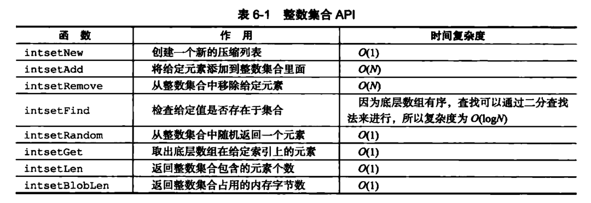


## 压缩列表

- 压缩列表是列表键和哈希键的底层实现之一
  - 当一个列表键只有少量列表项, 并且每个列表项是小整数 || 短字符串
  - 键值对的键和值都是小整数||短字符串
- 压缩列表是一种为节约内存而开发的顺序型数据结构
- 可以包含多个结点, 每个结点包含一个字节数组或者整数值
- 添加或者删除结点可能会导致连锁更新


### 压缩列表的构成

一系列特殊编码的连续内存块组成的顺序型数据结构

一个压缩列表可以包含任意多个结点, 每个结点都可以保存一个字节数组或者一个整数值


### 压缩列表结点的构成


#### previous_entry_length

以字节为单位, 记录前一个结点的长度, 属性的长度可以使1 || 5 个字节

- 前一个结点的长度<254bytes  previous_entry_length属性长度是1字节, 前一个结点长度就保存在这个属性中
- 前一个结点的长度>=254bytes  previous_entry_length属性长度是5字节, 属性的第一字节被设置为0xFE(254), 而之后的四个字节保存前一个结点的长度


可以通过指针运算, 根据当前结点的起始地址计算前一个结点的起始地址


压缩列表从表尾向表头遍历操作就是利用指针运算的原理, 

- 当我们拥有一个指向某个结点起始地址的指针, 以及这个结点的previous_entry_length属性就可以获得前一个结点的起始地址, 进而一直到达头结点


#### encoding

记录了结点的content属性所保存数据的类型和长度


#### content

保存结点的值, 结点值可以是一个字节数组, 或者整数, 类型和长度由encoding决定


### 连锁更新

> 特殊情况下产生的连续多次空间扩展操作称之为连锁更新 cascade update

 previous_entry_length属性以字节为单位, 记录前一个结点的长度, 属性的长度可以使1 || 5 个字节

- 前一个结点的长度<254bytes  previous_entry_length属性长度是1字节, 前一个结点长度就保存在这个属性中
- 前一个结点的长度>=254bytes  previous_entry_length属性长度是5字节, 属性的第一字节被设置为0xFE(254), 而之后的四个字节保存前一个结点的长度

> 在一个压缩列表中, 有多个连续的长度介于[250, 253]字节的结点e1~eN


因为结点长度<254, 记录这些结点的长度只需要1字节的 previous_entry_length属性

这是将一个长度>=254字节的新节点new 设置为压缩列表的表头结点, 即e1的前置结点


因为e1 previous_entry_length属性仅为1字节, 空间不够需要对压缩列表进行空间重新分配, 

将e1 previous_entry_length属性扩展为5字节, 

这会导致e1的长度变成[254,257]之间, 造成后续节点的previous_entry_length属性的更新直到eN为止

除了添加, 删除也会导致连锁更新, 删除了中间的某个结点导致删除结点的后一个结点需要存储删除结点的前一个的长度, 而这个长度大于后一个结点 previous_entry_length属性所能装下的空间进而导致连锁更新


### 压缩列表API


# 对象

- 每个键值对的键和值都是一个对象
- 共有字符串, 列表, 哈希, 集合, 有序集合五种类型的对象
  - 每种类型都有至少两种或以上的编码方式, 不同编码应用于不同的场景优化
- 服务器执行命令前会检查给定键的值对象的类型是否符合
- 引用计数实现内存回收, 当一个对象的refcount=0 占用的内存会被释放
- 共享0~9999的字符串对象
- 对象会记录自己最后一次被访问的时间, 这个时间可以用于计算对象的空转时间


Redis不直接使用这些数据结构实现键值对, 而是基于这些数据结构创建一个对象系统

字符串, 列表, 哈希, 集合, 有序集合对象

针对不同的使用场景为对象设置不同的数据结构来实现, 从而优化使用效率

基于引用计数计数的垃圾回收机制

基于引用计数实现对象的共享机制, 多个数据库共享同一个对象来节约内存

对象带有访问时间可以计算数据库键的空转时间


## 对象类型与编码

数据库每创建一个键值对, 都会至少创建两个对象用来表示键和值

每个对象都是一个redisObject


### 类型


type属性记录了对象的类型

- 键总是一个字符串对象
- 值可以是字符串, 列表, 哈希, 集合, 有序集合对象中的一种

type <数据库键>:

- 返回键对应值的对象类型, 因为键总是字符串对象


### 编码和底层实现

ptr

- 对象的ptr指针指向底层实现数据结构, 数据结构由对象的encoding属性决定

encoding

- 记录了对象所使用的编码, 也就是对象使用了什么数据结构作为对象的底层实现


每种类型的对象都使用了至少两种不同的编码


OBJECT ENCODING 查看一个数据库键的值对象的编码


通过encoding属性可以设定对象所使用的编码, 而不是为特定类型的对象关联固定的编码, 极大地低声了Redis的灵活性和效率, Redis可以根据不同的场景来为对象设置不同的编码, 优化某一场景下的效率


## 字符串对象(int embstr raw)

字符串对象的编码可以是 int  raw 或 embstr

### int

- 字符串对象保存的是整数值, 并且这个整数值可以用long类型来表示
- 字符串对象会把整数值保存在对象结构的ptr属性里面(void* --> long)
- 并将对象的编码设置为int


### raw

- 保存字符串, 长度>32字节
- 使用SDS来保存这个字符串值
- 对象编码设为raw


### embstr

- 保存字符串, 长度<=32字节
- 使用embstr编码的方式保存这个字符串值


embstr编码是专门保存短字符串的优化编码方式, 和raw一样用了redisObject和sdshdr结构来表示字符串对象

- raw调用两次内存分配分别创建redisObject 和 sdshdr结构
- embstr编码通过调用一次内存分配一块连续的空间 依次包含redisObject和sdshdr两个结构


embstr编码的字符串保存段字符串值的好处

- 内存分配次数只需一次
- 释放字符串对象时序调用一次内存释放函数
- 字符串对象的所有数据都保存在一块连续的内存里, 所以能更好的利用缓存带来的优势


long double类型表示的浮点数在redis也是作为字符串的值来保存


### 编码的转换

int embstr在条件满足的情况下会转换成raw

int

- 向对象执行了一些命令, 使得这个对象保存的不再是整数值, 而是一个字符串值, 那么字符串对象编码会变成raw
- 

embstr

- embstr编码的字符串没有任何修改程序, 实际上是只读的
- 所以修改前编码必须从embstr改成raw, 
- 

### 字符串命令

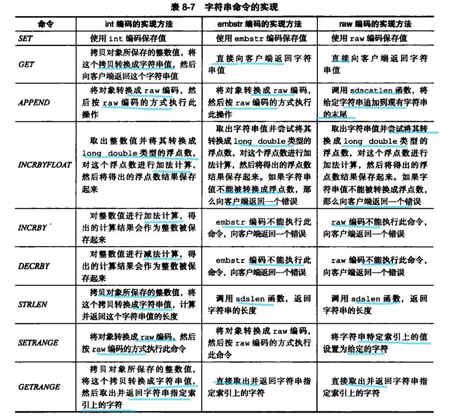


## 列表对象(ziplist linkedlist)

编码可以是ziplist 或者 linkedlist

### ziplist

- ziplist编码的列表对象底层实现为压缩列表, 每个压缩列表结点保存一个列表元素, 


### linkedlist

-  linkedlist编码的列表对象底层实现为双端链表
- 每个双端链表结点保存了一个字符串对象, 字符串对象保存了一个列表元素


字符串对象是Redis五中类型的对象中唯一会被其他四种对象嵌套的对象


### 编码转换

列表对象满足下面条件可以使用ziplist编码

- 列表对象保存的所有字符串元素的长度都小于64字节
- 列表对象保存的元素数量小于512

不能满足这两个条件的都需要使用linkedlist编码

当ziplist编码的列表对象改变导致上述两个条件不能满足时会自动转换编码将裂变元素转移到双端链表中

- 插入了大字符串长度大于64字节
- 增加了元素数量使得总数量超过512

### 列表命令的实现


## 哈希对象(ziplist hashtable)

ziplist 或 hashtable编码

### ziplist

- ziplist编码的哈希对象底层使用压缩列表
- 新的键值对加入哈希对象, 先将保存了键的压缩列表结点推入压缩列表结尾
- 再将保存了值的压缩列表结点推入压缩列表结尾
- 保证了同一键值对的两个结点总是紧挨在一起的, 键在前, 值在后
- 先添加到哈希对象的键值对在表头方向, 后添加的在表尾方向


### hashtable

- hashtable编码的哈希对象使用字典作为底层实现, 哈希对象的每个键值对都由一个字典键值对来保存
  - 字典的每个键都是一个字符串对象, 对象保存了键值对的键
  - 字典的每个值都是一个字符串对象, 对象保存了键值对的值


### 编码转换

满足使用ziplist编码的条件

- 哈希对象保存的所有键值对的键和值的字符串长度都<64字节
- 哈希对象保存的所有键值对的数量<512

不满足的都需要使用hashtable

当ziplist编码所需的两个条件任意一个不能满足的时候都需要转换成hashtable编码

- 添加新的键值对 键或值长度>=64字节
- 加入的键值对数量总和>=512


### 哈希命令的实现


## 集合对象(intset hashtable)

### intset

使用整数集合作为底层实现, 

集合对象包含的所有元素都被保存在整数集合里面


### hashtable

使用字典作为底层实现, 

字典的每个键都是一个字符串对象, 

每个字符串对象包含一个集合元素, 

字典的值全部设为NULL


### 编码转换

intset编码的条件

- 集合对象所有元素都是整数值
- 元素个数<=512

不满足的需要用hashtable编码

- 在intset编码的集合对象插入一个字符串元素
- 集合元素个数超过512


### 集合命令的实现


## 有序集合对象(ziplist skiplist)

### ziplist

使用压缩列表作为底层实现

每个集合元素使用两个挨在一起的压缩列表结点保存, 

第一个保存元素的成员(member) 第二个保存元素的分值(score)

压缩列表内的集合元素按照分值从小到大排序


### skiplist

使用zset结构作为底层实现, 一个zset结构同时包含一个字典和一个跳跃表

```c
typedef struct zset{
    //跳跃表
    zskiplist *zsl;
    //字典
    dict *dict;
}zset;
```


#### zsl跳跃表

按分值从小到大保存了所有集合的元素,

每个跳跃表结点都保存了一个集合元素

跳跃表结点的object 属性保存了元素的成员

score属性保存了元素的分值

通过这个跳跃表可以对有序集合进行范围型操作 (ZRANK ZRANGE)


#### dict字典

为有序集合创建一个从成员到分值的映射

字典的每个键值对都保存了一个集合元素

字典的键保存了一个元素的成员

字典的值保存了一个元素的分值

可以用O(1)复杂度找到给定成员的分值

ZSCORE就时根据这一特性实现的


有序集合的每一个元素的成员都是一个字符串对象

每个元素的分值都是一个double类型的浮点数

虽然同是使用了跳跃表和字典保存集合元素, 但是都是通过指针共享相同元素的成员和分值, 不会造成重复


#### 为什么同是使用跳跃表和字典来实现?

字典保证了O(1)查找指定成员的分值

跳跃表保证了可以进行范围操作而无需对整体的成员进行排序

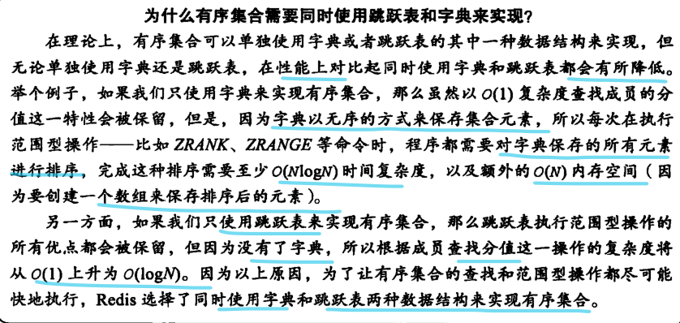


### 编码转换

使用ziplist的条件

- 有序集合元素数量<128
- 保存元素的成员长度都<64字节

不能满足的都要使用skiplist编码

- 有序集合元素数量>=128
- 插入元素成员长度>=64字节


### 有序集合命令的实现


## 类型检查和命令多态

操作键的基本命令

- 对任意类型键执行
  - DEL EXPIRE RENAME TYPE OBJECT

- 对特定类型键执行
  - 


### 类型检查的实现

为了确保只有指定类型的键才可以执行某些特定的命令, 执行之前会先检查输入键的类型是否正确, 然后决定是否执行

类型特定命令通过redisObject结构的type属性实现

- 执行类型特定命令前, 服务器会先检查输入数据库键的值对象是否为执行命令所需要的类型, 是的话才执行


### 多态命令的实现

根据对象编码方式 选择正面的命令实现代码来执行命令

在确保了值对象类型符合命令要求, 还需要根据值对象的底层实现调用对应的底层函数完成高层命令

LLEN返回列表的长度, 根据底层实现的不同使用不同的函数获取长度

- ziplist --> ziplistLen
- linkedlist --> listLength


## 内存回收

构建引用计数计数实现内存回收机制, 跟踪对象的引用计数信息, 在适当的时候释放对象进行内存回收


- 创建初始refcount=1
- 增加引用refcount+1
- 减少引用refcount-1
- refcount==0 释放


## 对象共享

对象的引用计数属性还有对象共享的作用

让多个对象共享同一个值对象需要两个步骤

1. 将数据库键的值指针指向一个现有的值对象
2. 被共享的值对象的引用计数refcount+1


redis在初始化服务器的时候, 创建10000个字符串对象, 包含了0~9999所有的整数值, 当需要的时候共享这些字符串对象, 而不是创建新的对象


为什么不共享包含字符串的对象


## 对象空转时间

redisObject的 lru属性记录了对象最后一次被命令程序访问的时间


OBJECT IDLETIME = 当前时间 - 键的值对象的lru


# 数据库

- redisServer.db数组保存了redis服务器所有的数据库, redisServer.dbnum保存数据库的数量
- 通过修改redisClient.db指针 让他指向redisServer.db数组中的不同元素来切换不同数据库
- 数据库redisDb主要由dict expires两个字典构成
  - dict保存所有键值对
  - expires保存设置过期时间 生存时间的过期时间
- 数据库由字典构成, 数据库的操作都是建立在字典之上
- 数据库键总是字符串对象, 值可以是 字符串, 列表, 哈希, 集合, 有序集合对象五种中任意一种
- expires字典的键指向数据库中的某个键, 值记录了键的过期时间, 过期时间是以毫秒为单位的UNIX时间戳
- Redis使用定期删除和过期删除两种策略删除过期键
  - 惰性删除: 碰到过期键才删除
  - 定期删除: 每隔一段时间周期性在所有数据库的expires字典中检查一部分键, 如果过期就删除
    - 下一次删除会从上一次删除的地方接着删除
- 执行SAVE BGSAVE命令产生的RDB文件不会包含过期键
- 执行BGREWRITEAOF命令产生的AOF文件不会包含过期键
- 当删除一个过期键时, 服务器会追加一条DEL命令到现有AOF文件的末尾, 显示的删除过期键

- 主服务器显示删除一个过期键会向所有从服务器发送一条DEL命令, 让从服务器删除过期键
- 从服务器即使发现一个过期键也不会主动删除, 而是等待主服务器的DEL命令, 这种中心化的过期键删除策略可以保证主从服务器的一致性
- Redis命令对数据库进行修改, 服务器根据配置向客服端发送数据库通知


服务器保存数据库的方法

客户端切换数据库的方法

数据库保存键值对的方法

数据库的CRUD

服务器保存键的过期时间的方法

服务器自动删除过期键的方法

通知功能的实现


## 服务器中的数据库

redis服务器的数据库保存在服务器redis.h/redisServer结构的db数组中

db数组中的每项都是一个redis.redisDb结构

每个redisDb结构代表一个数据库


初始化服务器, 根据服务器的dbnum属性来决定应该创建多少个数据库


dbnum 默认为16

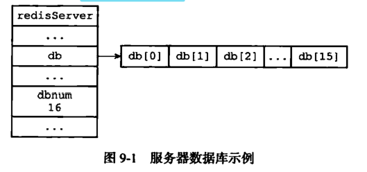

## 切换数据库

每个客户端都有自己的目标数据库

默认目标数据库是0号数据库就是db数组中的db[0]

客户端可以通过select命令切换目标数据库 select [数据库在db数组中的索引]

服务器内部redisClient结构的db属性记录了客服端当前的目标数据库, 这个属性是指向redisDb结构的指针


> select命令的原理

通过修改redisClient.db指针指向服务器的不同数据库, 达到切换数据库的目的


## 数据库键空间

Redis是一个键值对数据库服务器

每个数据库由一个redis.h/redisDb结构表示

redisDb结构的dict字典保存了数据库中所有的键值对, 这个字典就是**键空间(key space)**


键空间和用户所见的数据库是直接对应的

- 键空间的键是数据库的键, 每个键都是一个字符串对象
- 键空间的值是数据库的值, 每个值可以是字符串, 列表, 集合, 哈希, 有序集合对象中任意一种redis对象


### 添加新键

添加新键值对就是将一个新的键值对添加到键空间字典里面

- 键为字符串对象, 值为任意一种类型的redis对象


### 删除键

删除数据库的键就是在键空间字典里面删除所对应的键值对对象


### 更新键

更新数据库的键就是对键空间里面键所对应的值对象进行更新, 根据值对象类型不同, 更新的具体方法不同


### 对键取值

对数据库键进行取值, 实际上就是在键空间中取出键对应的值对象, 根据值对象类型不同, 具体的取值方法不同


### 其他键空间操作

针对数据库本身的命令起始就是针对键空间的操作

- FLUSHDB
  - 删除键空间所有的键值对
- RANDOMKEY
  - 在键空间随机返回一个键
- DBSIZE
  - 返回数据库键数量就是返回键空间中包含的键值对的数量
- EXIST RENAME KEYS
  - 都是通过键空间进行操作实现的


### 读写键空间的维护操作

- 读取一个键, 根据键是否存在更新服务器的键空间命中(hit)或键空间不命中(miss)次数
  - INFO stats 的keyspace_hits keyspace_misses
- 读取一个键, 跟新键的LRU, 用于计算键的闲置时间
  - OBJECT idletime <key> 查看key的空闲时间
- 读取一个键, 发现键已经过期
  - 删除过期键, 然后执行余下的操作
- WATCH命令监视了某个键, 服务器堆被监视的键进行了修改后, 这个键标记为dirty , 让食物程序注意到键已经被修改过
- 每修改一个键之后, , 都会对脏键计数器值+1, 计数器会触发服务器的持久化以及复制操作
- 服务器开启了数据库通知功能, 会在堆键进行修改后, 按照配置发送相应的数据库通知


## 设置键的生存或过期时间

- EXPIRE PEXPIRE

通过EXPIRE 或 PEXPIRE 命令, 客户端可以以秒或者毫秒为数据库的键设置生存时间(Time To Live TTL) 指定的时间后, 服务器会自动删除生存时间为0 的键

(SETEX 在设置一个字符串键的同时设置过期时间)

- EXPIREAT PEXPIREAT

以秒或者毫秒精度给数据库中的键设置过期时间(expire time)

过期时间是一个UNIX时间戳, 当键的过期时间来临时, 服务器会自动从数据库中删除这个键

- TTL PTTL

接受一个带有生存时间或者过期时间的键, 返回这个键的剩余生存时间


### 设置过期时间

- EXPIRE <key> <ttl> 生存时间设置为ttl秒
- PEXPIRE <key> <ttl> 生存时间设置为ttl毫秒
- EXPIREAT <key> <timestamp> 过期时间设置为 timestamp秒数时间戳
- PEXPIREAT <key> <timestamp> 过期时间设置为 timestamp毫秒数时间戳

EXPIRE  PEXPIRE EXPIREAT 都是通过PEXPIREAT实现的

- EXPIRE --> PEXPIRE --> PEXPIREAT
- EXPIREAT --> PEXPIREAT


### 保存过期时间

redisDb结构的expires字典保存了数据库中所有键的过期时间, 过期字典

- 过期字典的键是一个指针, 指向了键空间的某个键对象
- 过期字典的值是一个long long类型的整数, 保存了键所指向的数据库键对象的过期时间
  - 一个毫秒精度的UNIX时间戳

```c
typedef struct redisDb{
    //过期字典
    dict *expires;
}redisDb;
```


当客户端执行PEXPIREAT命令, 为一个数据库键设置过期时间, 服务器会在数据库的过期字典中关联给定的数据库键和过期时间


### 移除过期时间

PERSIST 移除一个键的过期时间

PERSIST 命令在过期字典查找给定的键, 并解除键和过期时间在过期字典的关联


### 计算并返回剩余生存时间

TTL单位为秒, PTTL单位为毫秒

通过计算过期时间和当前时间之间的差来实现的


### 过期键的判定


## 过期键的删除策略

键过期了, 什么时候删除?


### 定时删除

优点

- 对内存友好

- 通过使用定时器, 保证过期键尽快被删除, 并释放过期键所占用的内存

缺点

- 对CPU不友好
- 过期键较多的时候会占用一部分CPU时间

创建定时器需要用到时间事件

- 时间事件的实现方式 无序链表
- 查找一个时间的时间复杂度O(N) 不能高效处理大量时间事件

### 惰性删除

优点

- 对CPU友好
- 只有在取出过期键时才会删除, 并且只会删除当前处理的键, 不会删除其他无关的键

缺点

- 内存不友好
- 过期键不删除, 始终占用内存, 内存不会被释放

### 定期删除

定时删除占用太多的CPU时间, 影响服务器的响应时间和吞吐量

惰性删除浪费太多内存, 有内存泄露的风险

定期删除采用整合折中的方法

- 每隔一段时间执行一次删除过期键的操作, 并限制删除操作执行的时长和频率来减少堆CPU的影响
- 减少了内存的浪费

难点是确定删除操作执行的时长和频率

- 如果删除操作执行太长或者频率过高就会退化成定时删除, 消耗过多的CPU
- 如果太短或者频率太低, 退化成惰性删除, 出现内存浪费


## Redis过期键删除策略

redis服务器实际使用**惰性删除**和**定期删除**两种, 通过两者的配合在合理使用CPU时间和避免浪费内存中平衡

### 惰性删除策略的实现

db.c/expireIfNeed函数实现, 所有读写数据库的Redis命令在执行前都会调用expireIfNeed函数对键进行检查

- 如果键已经过期, expireIfNeed会将输入键从数据库删除
- 未过期 不做任何操作

expireIfNeed函数像一个过滤器, 过滤掉过期的键, 避免命令接触到过期键


### 定期删除策略的实现

redis.c/activeExpireCycle 实现

每当Redis服务器周期性的操作 redis.c/serverCron函数, activeExpireCycle函数机会被调用

在规定时间分多次遍历服务器的各个数据库, 从数据库的expires字典中随机检查一部分键的过期时间, 并删除其中过期的键


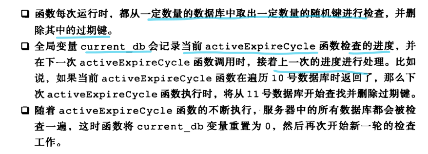


## AOF RDB 赋值功能对过期键的处理

### 生成RDB文件

指向SAVE 或者BGSAVE命令创建一个新的RDB文件时, 会检查数据库中的键, 过期键不会保存到 新创建的RDB文件中

### 载入RDB文件

启动Redis服务器时, 如果服务器开启了RDB功能, 服务器会将RDB文件载入

- 如果服务器以主服务器运行, 载入RDB文件时, 会对文件中保存的键进行检查, 未过期的才会载入数据库
- 如果以从服务器模式运行, 载入RDB文件会保存所有的键, 不论是否过期
  - 因为主从服务器再进数据同步的时候,从服务器数据库会被情况, 所以一般不会有影响


### AOF文件写入

当服务器以AOF持久化模式运行, 如果数据库中的某个键过期了, 还没有被定期或者惰性删除, AOF文件不会因为这个过期键产生任何影响

当过期键被惰性删除或者定期删除之后, 会向AOF文件追加一条DEL命令 来显式的记录该键已经删除

如果get message试图访问 过期键message

1. 从数据库删除message键
2. 追加一条DEL message命令到AOF
3. 向执行get命令的客服端返回空回复


### AOF重写

执行AOF重写, 会检查数据库中的键, 过期键不会保存到重写后的AOF文件中


### 复制

运行在赋值模式下, 从服务器的过期键删除动作由主服务器控制

- 主服务器在删除一个过期键后, 会显式的向所有的从服务器发送一个DEL命令, 告诉从服务器删除这个过期键
- 从服务器执行客户端发送的读命令, 即使碰到过期键也像未过期键一样处理
- 从服务器只有收到主服务器传来的DEL命令才会删除过期键

通过主服务器统一的删除过期键可以保证主从服务器数据的一致性, 所以当一个过期键存在于主服务器, 这个过期键的复制品仍然存在于从服务器


## 数据库通知

让客服端通过订阅给定的频道或者模式, 来获取数据库键的变化, 以及数据库中命令的执行情况

- 键空间通知(key-space notification)
  - 关注某个键执行了什么命令
  - 
- 键事件通知(key-event notification)
  - 某个命令被什么键执行了
  - 


### 发送通知

notify.c/notifyKeySpaceEvent


- type
  - 当前想要发送的通知的类型, 根据这个值判断通知是否是服务器配置的 notify-keyspace-event选项选定的通知类型, 从而决定是否发送
- event keys dbid 分别是事件名称, 产生事件的键, 产生事件的数据库号码
- 函数会根据type参数以及这三个参数构建事件通知的内容, 记忆就收通知的频道名
- 每当一个Redis命令需要发送数据库通知, 该命令的实现函数会调用notify-KeyspaceEvent函数, 并向函数传递该命令所引发事件的相关信息


### 发送通知的实现


# RDB持久化

- RDB文件用于保存和还原Redis服务器所有数据库中的键值对数据
- SAVE由服务器执行, 阻塞服务器
- BGSAVE由子进程执行, 不会阻塞服务器
- 服务器状态会保存save选择设置的保存条件, 任意满足会执行BGSAVE
  - redisServer -- > saveparams -->saveparam(保存条件)
- RDB文件时压缩的二进制文件, 
- 不同类型的键值对, RDB文件会用不同的方式保存


Redis是内存数据库, 如果数据不存储到磁盘上, 服务器进程退出, 数据库状态也会消失

RDB持久化功能可以将Redis在内存的数据库状态保存到磁盘里面

可以配置中定期执行, 或者手动执行, 将某个时间点的数据库状态保存到一个RDB文件中

RDB文件是一个压缩的二进制文件, 可以还原生成RDB文件时的数据库状态


## RDB文件的创建和载入

### SAVE BGSAVE 生成RDB文件

#### SAVE

- 阻塞Redis服务器进程, 直到RDB 文件创建完毕为止, 阻塞期间, 服务器不能处理任何请求

#### BGSAVE

- 派生一个子进程去创建RDB文件, 服务器进程继续处理请求

- 创建RDB文件右 rdb.c/rdbServer函数完成, SAVE BGSAVE 用不同的方式调用这个函数
- BGSAVE命令执行期间, 服务器处理SAVE BGSAVE BGREWRITEAOF三个命令的方式不同
  - SAVE命令会被拒绝, 服务器禁止SAVE BGSAVE同时执行, 避免父子进程同时执行两个rdbSave, 防止产生竞争条件
  - BGSAVE也会被拒绝, 防止两个BGSAVE产生竞争条件
  - BGREWRITEAOF和BGSAVE不能同时执行
    - BGSAVE执行期间, BGREWRITEAOF会被延迟到BGSAVE执行完毕以后执行
    - BGREWRITEAOF正在执行, BGSAVE 会被拒绝
    - BGREWRITEAOF和BGSAVE的实际工作都是子进程完成的, 不会冲突, 但是出于性能的考虑, 并发的两个子进程同时执行大量的磁盘写入操作, 造成性能的降低


### RDB文件的载入

RDB文件的载入是在服务器启动的时候自动载入的, 只要检测到RDB文件存在, 就会自动载入

载入RDB文件期间, 服务器一直阻塞直到载入完成

AOF文件的更新频率 > RDB文件

- 如果开启了AOF持久化功能, 会优先使用AOF文件还原数据库状态
- AOF持久化功能处于关闭状态, 服务器才会使用RDB文件还原数据库状态

rdb.c/rdbLoad函数完成RDB文件的载入


## 自动间隔性保存

SAVE由服务器进程执行保存, BGSAVE由派生的子进程执行保存

SAVE阻塞服务器, BGSAVE不阻塞服务器

因为 BGSAVE不阻塞服务器, 用户可以通过设置服务器配置的save选项, 让服务器每隔一段时间自动执行一次BGSAVE

可以为save选项设置多个条件, 任意满足就会执行


- 900秒内, 对数据库进行了至少1次修改
- 300秒内, 对数据库进行了至少10次修改
- 60秒内, 对数据库进行了至少10000次修改

### 设置保存条件

用户可以指定配置文件或者传入启动参数的方式设置save选项, 没有设置则设置默认条件

服务器根据save选项设置的保存条件, 设置服务器状态redisServer结构的saveparams属性


saveparams属性是一个数组, 数组每个元素都是一个saveparam结构, 每个saveparam结构保存了一个save选项设置的保存条件


### dirty计数器, lastsave属性

dirty计数器

- 距离上一次成功执行SAVE/BGSAVE命令之后服务器对数据库状态进行了多少次修改(增删改)

lastsave

- 是一个UNIX时间戳, 记录距离上一次成功执行SAVE/BGSAVE命令的时间

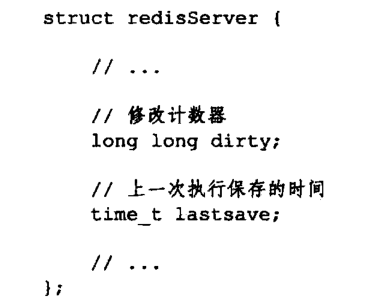

服务器成功执行一次服务器的修改命令后, 会更新dirty计数器, 修改了多少次就增加多少

### 检查保存条件是否满足

Redis周期性操作函数 serverCron默认每隔100ms执行一次, 会检查save选项所保存的设置条件是否满足

满足就会执行BGSAVE命令


## RBD文件结构


- REDIS
  - 保存REDIS这5个字符, 载入文件快速检查载入文件是否是RDB文件
  - RDB保存的是二进制数据, 不是C字符串不带'\0'结尾
- db_version
  - 4字节, 字符串表示的整数, 记录了RDB文件的版本号
- database
  - 保存着任意多个数据库, 以及数据库中的键值对数据
- EOF
  - 1字节, 标志着RDB文件正文结束
- check_sum
  - 8字节无符号整数, 保存着校验和
  - 通过计算前面四个部分得到的, 载入文件会计算前面四个部分的校验和与这个数据是否相同来校验文件是否出错

### database

一个RDB文件的database部分可以保存任意个数据库


每个非空数据库在RDB文件中都可以保存 SELECTDB db_number key_value_pair三个部分


SELECTDB

- 常量, 1字节, 接下来是一个数据库号码

db_number

- 保存数据库号码

key_value_pair

- 保存数据库所有键值对, 如果有过期时间也会被保存在一起


### key_value_pair

- 不带过期时间


服务器根据type类型决定如何解释value数据

key是一个字符串对象

value根据根据type确定类型


- 带过期时间


EXPIRETIME_MS 1字节, 标识下面读入的是以毫秒为单位的过期时间

ms 8字节长的带符号整数, 记录毫秒为单位的UNIX时间戳, 对应键的过期时间


### value的编码

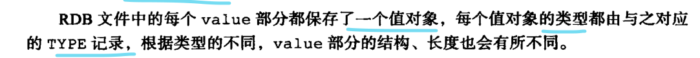

#### 字符串对象

编码是REDIS_ENCODING_INT 或 REDIS_ENCODING_RAW

- REDIS_ENCODING_INT
  - 保存长度不超过32位的整数
- REDIS_ENCODING_RAW
  - 保存字符串值
    - 长度小于20字节, 不压缩
    - 长度大于20字节, 压缩后保存
  - RDB文件压缩功能打开才会进行, 不打开总是不压缩
  - 无压缩
    - len 字符串长度  string 字符串值本身
    - 
  - 压缩
    - REDIS_RDB_ENC_LZF 标志字符已经被LZF算法压缩, 会根据后面三个部分解压缩
    - compressed_len origin_len是压缩后和压缩前的长度
    - compressed_string是压缩后的字符串
    - 


#### 列表对象

REDIS_ENCODING_LINKEDLIST


list_length 记录列表长度

item 字符串对象


#### 集合对象

REDIS_ENCODING_HT


set_size 集合大小 保存了多少个元素

elem 集合的元素, 每个元素都是一个字符串对象


#### 哈希表对象

REDIS_ENCODING_HT


hash_size 哈希表大小 , 保存了多少个键值对

key_value_pair 每个键值对, 键和值都是字符串对象


#### 有序集合对象

REDIS_ENCODING_SKIPLIST


sorted_set_size 有序集合的大小

element 集合中的元素, 每个元素分为成员和分值, 成员是字符串对象, 分值是double类型的浮点数

保存RDB文件会先将分值转成字符串对象, 再用保存字符串对象的方式保存分值

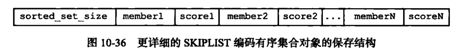


#### INTSET编码的集合

REDIS_RDB_TYPE_SET_INTSET

整数集合对象, 先将整数集合转换为字符串对象, 再将字符串对象保存到RDB文件里面

#### ZIPLIST编码的列表 哈希表 有序集合


## RDB文件


# AOF持久化(Append Only File)

- AOF文件通过保存所有修改数据库的写命令请求来记录服务器数据库状态
- AOF文件的命令都以Redis命令请求协议的格式保存
- appendfsync选项不同对AOF持久化功能的安全性和Redis服务器的性能有很大的影响
  - always, everysec, no
- 服务器重新执行保存在AOF文件中的命令就可以还原数据库的状态
- AOF重写产生新的AOF文件, 保存的数据库状态和旧的AOF文件相同, 但是体积更小
- AOF重写是通过读取数据库键值对实现的, 根现有的AOF文件没有任何关系
- 执行BGREWRITEAOF命令
  - Redis服务器维护一个AOF重写缓冲区, 
  - 子进程创建新的AOF文件期间 记录服务器执行的所有写命令
  - 子进程完成AOF重写, 服务器将重写缓冲区中内容追加到新的AOF文件,
  - 最后用新的AOF文件代替旧的AOF文件完成AOF文件重写操作


AOF持久化通过保存服务器执行的写命令记录数据库状态


## AOF持久化的实现

命令追加(append) 文件写入 文件同步(sync)

### 命令追加

AOF 持久化功能打开, 服务器执行完一个写命令, 会以协议格式将被执行的写命令追加到服务器状态的aof_buf缓冲区末尾


### AOF文件的写入与同步

Redis服务器进程是一个事件循环, 循环中的文件事件负责接收客服端命令请求, 已经向客服端发生回复

时间事件负责执行向serverCron函数这样的定时运行函数

服务器每次结束一个事件循环前, 会调用flushAppendOnlyFile函数, 考虑是否需要将aof_buf缓冲区的内容写入和保存到AOF文件里面


服务器配置的appendfsync选项值决定, 默认是everysec


- 文件的写入与同步
  - 内容写入文件先会写到操作系统的内存缓存区, 然后等缓冲区满了以后才会写入磁盘
  - 如果不同步到AOF文件仅仅写入的话只写到了内存的缓冲区, 如果计算机故障缓冲区的内容就丢失了


## AOF文件的载入与数据还原

AOF文件保存了重建数据库状态所需的所有写命令, 只需读入并重新执行一遍AOF文件里面保存的写命令, 就可以还原服务器关闭之前的数据库状态

还原的步骤

1. 创建一个不带网络连接的伪客户端, 因为redis 命令只能在客户端上下文执行
2. 从AOF文件中分析并读取一条写命令
3. 伪客户端执行读出的写命令
4. 直到所有AOF文件中的写命令处理完


## AOF重写

写命令越来越多, AOF文件也越来越大, 还原的时间越多

AOF文件重写通过创建一个新的AOF文件替代现有的AOF文件, 新旧的AOF文件保存的数据库状态一致, 但是新的AOF文件不会包含任何浪费空间的冗余命令

### AOF文件重写的实现

AOF文件重写是通过读取服务器当前的数据库状态实现

对于数据库的一个键值对, 读取键现在的值, 用一条命令去记录键值对, 代替之前记录这个键值对的多条命令

- 之前可能会对一个键做多次的修改删除, 但是只记录重写时的状态
- 用一条插入命令代替

重写过程

1. 创建新的AOF文件
2. 遍历数据库
   1. 忽略空数据库
   2. 写入SELECT命令+数据库号码
   3. 遍历数据库所有的键
      1. 或略过期键
      2. 根据键的类型对键重写
         1. GET 获取键的值
         2. SET命令重写键
         3. GET SET都是对应类型的方法 这里是字符串键的
   4. 如果键带有过期时间, 过期时间也要被重写


### AOF后台重写

aof_rewrite 会进行大量的写入操作, 函数的线程会长时间阻塞

redis服务器使用单线程处理命令请求, 如果服务器调用aof_rewrite 服务器被阻塞 无法处理客户端的请求

Redis将AOF重写程序放到子进程进行

- 子进程AOF重写, 父进程可以继续处理客户端请求
- 子进程带有服务器进程的数据副本, 使用子进程而不是线程, 避免使用锁的情况下保证数据的安全性

子进程AOF重写, 父进程继续接受客户端请求可能会对服务器状态修改, 使得服务器当前状态和AOF重写后文件保存的数据库状态不同


Redis服务器设置一个AOF重写缓冲区, 在服务器创建子进程以后使用

Redis服务器执行玩一个写命令之后, 他会同时将这个写命令发送给AOF缓冲区和AOF重写缓冲区

子进程执行AOF重写期间, 服务器进程需要执行三个工作

1. 执行客户端发送的命令
2. 将执行的写命令追加到AOF缓冲区
3. 将执行的写命令追加到AOF重写缓冲区


保证了

- AOF缓冲区的内容会定期被写入同步到AOF文件
- 创建子进程开始, 服务器执行的写命令都会被记录到AOF重写缓冲区

子进程完成AOF后, 向父进程发送一个信号, 父进程接到信号后, 调用信号处理函数

1. 将AOF重写缓冲区的内容写入到新的AOF文件, 新的AOF文件所保存的数据库状态将和服务器当前的数据库状态一致
2. 对新的AOF文件改名, atomic原子地覆盖现有的AOF文件, 完成新旧两个AOF文件替换

整个AOF后台重写过程, 只有信号处理阶段会阻塞服务器, 其他时候都不会阻塞父进程

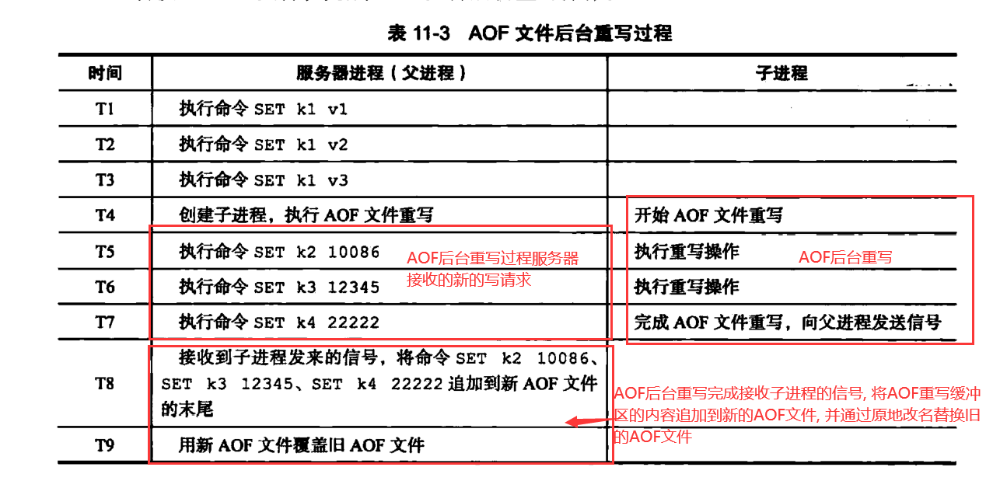


# 事件

- Redis服务器是一个事件驱动程序, 处理的事件分为时间事件和文件事件
- 文件事件处理器是基于Reactor模式实现的网络通信程序
- 文件事件是对套接字的抽象, 每次套接字变成可应到(acceptable) 可写(writable) 可读(readable) 相应文件事件就会产生
- 文件事件分成 AE_RAEDABLE AE_WRITEABLE两种
- 时间事件分为定时, 周期事件两种
  - 定时, 到达一次被删除
  - 周期, 每隔一段时间到达一次
- 服务器一般只执行serverCron函数一个时间事件, 是周期事件
- 文件事件和时间事件是合作关系, 服务器轮流执行这两种事件, 处理事件的过程不会发生抢占
- 时间事件的实际处理时间通常比设定的到达时间晚一点, 因为到达的时候服务器可能还在处理别的文件事件或者上一个到达的时间事件


Redis服务器是一个事件驱动程序, 需要处理

- 文件事件, Redis服务器通过套接字与客户端进行连接, 文件事件是服务器对套接字操作的抽象
  - 服务器与客户端的通信会产生相应的文件事件, 服务器通过监听并处理这些事件来完成一系列网络通信操作
- 时间事件: Redis服务器一些操作(serverCron函数) 需要在给定的时间执行, 时间时间是对这一类定时操作的抽象

## 文件事件

Redis基于Reactor模式开发了自己的网络事件处理器, 文件事件处理器(file event handler)

- 文件事件处理器使用I/O多路复用程序来同时监听多个套接字, 并根据套接字目前执行的任务为套接字关联不同的事件处理器
- 被监听的套接字准备好执行连接应答(accept) 读取(read) 写入(write) 关闭(close)操作时, 与操作相对的文件事件就会产生, 文件事件处理器调用套接字关联的事件处理器处理这些事件


### 文件事件处理器的构成


文件事件是对套接字操作的抽象, 一个服务器通常连接多个套接字, 多个文件事件可能并发的出现

- I/O多路复用负责监听多个套接字, 并向文件事件分派器传递哪些产生了事件的套接字
- 多个文件事件会并发的出现, 但是I/O多路复用总是会将所有产生事件的套接字放在一个队列, 通过队列 有序(sequentially)同步(synchronously) 每次一个套接字的方式向文件事件分派器传送套接字, 上一个套接字产生的事件被处理完毕后, 才会继续向分派器传送下一个套接字
- 文件事件分派器接受I/O多路复用程序传来的套接字, 根据套接字产生的事件的类型, 调用相应的事件处理器

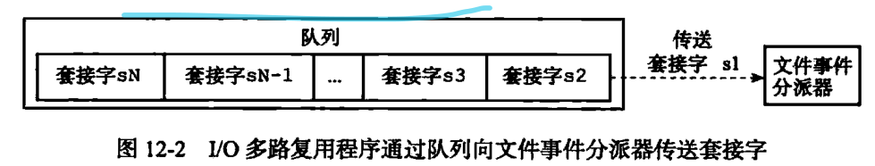


### I/O多路复用程序的实现

通过包装常见的 select epoll evport kqueue 这些I/O多路复用函数库实现

Redis为每个I/O多路复用函数库实现了相同的API, 所以底层实现可以互换

EVPORT --> EPOLL --> KQUEUE --> SELECT


### 事件的类型

I/O多路复用监听多个套接字的 ae.h/AE_READABLE 事件和 ae.h/AE_WRITEABLE事件

- 套接字可读(客户端对套接字执行write, close, 或者有新的可应答套接字出现(客户端对服务器监听的套接字执行connect操作)), 产生 ae.h/AE_READABLE 事件

- 套接字可写(客户端对套接字执行read操作) 产生ae.h/AE_WRITEABLE事件

同时产生的 ae.h/AE_READABLE 事件和 ae.h/AE_WRITEABLE事件优先处理ae.h/AE_READABLE 事件 因为这是客户端内的一个写操作, 处理完再处理 ae.h/AE_WRITEABLE事件


### API


### 文件事件的处理器


#### 连接应答处理器

networking.c/acceptTcpHandler 函数式redis连接应答处理器, 对连接服务器监听套接字的客户端进行应答

连接应答处理器与服务器监听套接字的AE_READABLE事件关联, 客户端连接服务器监听套接字时, 产生AE_READABLE事件, 引发连接应答处理器执行


#### 命令请求处理器

networking.c/readQueryFromClient函数 是redis命令请求处理器, 负责从客户端读入客户端发送的命令请求

客户端向服务器发送命令请求, 套接字产生AE_READABLE事件, 引发命令请求处理器


#### 命令回复处理器

networking.c/sendReplyToClient redis的命令回复处理器, 负责将服务器执行命令得到的命令回复通过套接字返回给客户端

服务器将客户端套接字的AE_WRITEABLE事件和命令回复处理器关联, 客户端准备好接受服务器的回复, 产生AE_WRITEABLE事件, 引发命令回复处理器执行


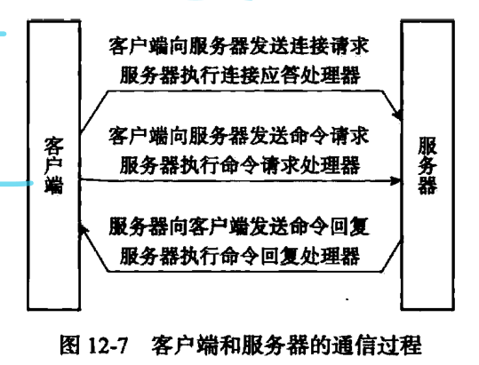


## 时间事件

- 定时事件
  - 让一段程序在指定时间之后执行一次
- 周期事件
  - 让一段程序每隔一段时间执行一次
- 时间事件的三个属性
  - id 时间事件全局唯一的id, 从小到大递增
  - when 毫秒UNIX时间戳, 记录事件到达的时间
  - timeProc 时间事件处理器, 时间事件到达, 服务器调用相应的处理器处理事件
- 事件处理器的返回值决定时间事件是定时事件还是周期事件
  - ae.h/AE_NOMORE 定时事件, 事件到达一次后被删除
  - 非AE_NOMORE的整数, 周期事件, 根据事件处理器返回值, 对时间事件的when属性更新, 让这个事件一段时间后再次到达


### 实现

所有时间事件放在一个无序列表, 时间处理器执行, 遍历整个链表, 查找已经到达的时间事件, 调用相应的事件处理器

无序值的是不按时间事件的when属性排序, 链表按照新的时间事件插入到表头, ID从大到小排序


### API

- ae.c/aeCreateTimeEvent


- ae.c/aeDeleteFileEvent


- ae.c/aeSearchNearestTimer


- ae.c/processTimeEvents


### serverCron函数


## 事件的调度与执行

ae.c/aeProcessEvents


# 客户端

- 服务器状态结构使用clients链表链接多个客户端状态, 新添加的客户端状态会添加到链表末尾
- 客户端状态的 flags 标志 使用不同的标志表示客户端的角色和当前所处的状态
- 输入缓冲区记录了客户端的命令请求, 不能超过1GB
- 命令的参数和参数个数记录在客户端状态的argv argc属性中, cmd属性指向了命令字典中对应的命令实现函数
- 客户端有固定和可变大小的缓冲区, 固定大小用来存放长度小的回复, 可变用来存储长度大的回复
  - 可变大小缓冲区不能超过服务器设置的硬性限制值
  - 超过硬性限制会立即关闭客户端
  - 一定时间一直超过服务器的软性限制也会关闭客户端
- 客户端关闭的原因
  - 网络连接关闭
  - 发送不符合协议格式的请求
  - 称为 CLIENT KILL命令的目标
  - 空转时间超时
  - 输出缓冲区大小超出限制
- 处理Lua脚本的伪客户端在服务器初始化时创建直到服务器关闭才关闭
- 载入AOF文件时的伪客户端在载入工作开始时动态创建, 载入工作完成后关闭


## 客户端属性

分为两类

- 通用属性
- 特点功能相关的属性, db, dictid, mstate, watched_key


### 套接字描述符

```c
typedef struct redisClient{
    int fd
}redisClient;
```

客户端类型不同, fd属性的值可以是-1 或者大于-1的整数

- 伪客户端 fd=-1, 伪客户端处理的命令请求来源于AOF文件或者Lua脚本
  - 用于载入AOF文件还原数据库状态, 
  - 执行Lua脚本包含的redis命令
- 普通客户端的fd>-1的整数, 普通客户端通过套接字与服务器通信, fd记录客户端套接字的描述符


### 名字

CLIENT setname 为客户端设置名字

客户端名字记录在客户端状态的name属性, 指向一个字符串对象

```C
typedef struct redisClient{
    robj *name;
}redisClient;
```


### 标志

flags记录客户端的角色已经客户端目前的状态

```C
typedef struct redisClient{
    int flags;
}redisClient;
```

每个标志使用一个常量表示, 一部分标志记录客户端角色


PUBSUB 和 SCRIPT LOAD因为对服务器状态产生副作用, 所以需要通过 REDIS_FORCE_AOF  REDIS_FORCE_REPL 标志强制载入AOF文件和复制给所有从服务器


### 输入缓冲区

保存客户端发送的命令请求

缓冲区大小会根据输入内容动态缩小或扩大, 不能超过1GB


### 命令与命令参数

通过对客户端的querybuf属性解析, 获取命令参数和参数的个数保存到客户端状态的argv argc属性

argv

- 数组, 每项都是一个字符串对象, argv[0] 是要执行的命令, 后面的是传给命令的参数

argc 

- argv数组的长度


### 命令而定实现函数

获取argv argc属性后, 根据argv[0]的值 在命令表中查找命令对应的命令实现函数

- 命令表是一个字典, 
- 字典键是SDS结构, 保存命令的名字
- 字典值是redisCommand结构, 保存命令的实现函数, 标志, 给定参数个数, 总执行次数, 总消耗时长等统计信息
- 找到对应的命令的redisCommand结构, 将redisClient cmd指针指向对应的redisCommand结构
- 调用实现函数, 指向客户端指定的命令


### 输出缓冲区

命令回复会被保存在客户端状态的输出缓冲区, 两个输出缓冲区, 一个大小固定, 一个可变

- 固定大小, 用来保存长度较小的回复
  - buf 和 bufpos属性组成
  - buf是一个大小为REDIS_REPLY_CHUNK_BYTES(16*1024) 的字节数组
  - bufpos记录目前buf数组已经使用的字节数量
  - 
  - 
- 可变大小, 保存长度较大的回复
  - reply链表+ 一个或多个字符串对象组成
  - 通过链表链接多个字符串对象, 可以为客户端保存一个非常长的命令回复
  - 
  - 

### 身份验证

客户端状态的authenticated 属性记录客户端是否通过了身份验证

authenticated = 0 表示未通过, authenticated =1表示通过身份验证

为通过身份认证的客户端发送的命令都会被服务器拒绝执行

客户端通过AUTH命令成功认证身份后, 客户端状态authenticated变成1 可以发送命令请求

authenticated属性尽在服务器开启身份验证功能时使用, 未开启无需认证身份


### 时间

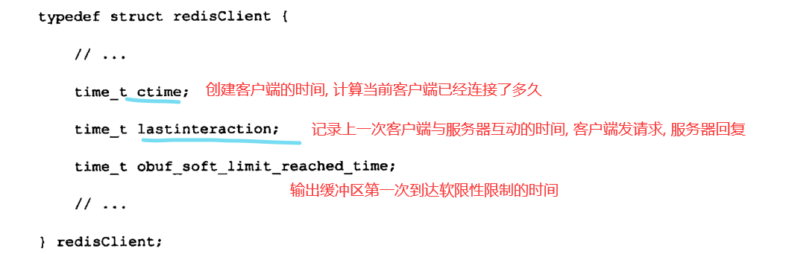


## 客户端的创建与关闭


### 创建普通客户端

- 客户端通过网络连接和服务器连接
- 客户端使用connect函数连接到服务器
- 服务器调用事件处理器
- 为客户端创建对应的客户端状态, 将这个客户端状态添加到服务器状态结构的clients链表的末尾


### 关闭普通客户端

- 客户端进程退出或被杀死
- 客户端发送不符合协议格式的命令请求
- 客户端成了 CLIENT KILL 命令的目标
- 客户端超过了服务器为其设置的空转时间(timeout)
- 客户端发送的命令请求大小查过输入缓冲区的限制大小
- 发送给客户端回复的大小超出了输出缓冲区的限制大小

服务器使用两种模式限制客户端输出缓冲区的大小

- 硬性限制, 输出缓冲区的大小超出了硬性限制大小, 关闭客户端
- 软性限制, 输出缓冲区的大小超出了软性限制大小, 但没有超出硬性限制大小
  - 会在客户端结构的obuf_soft_limite_reached_time属性记录达到软性限制的起始时间
  - 如果一直超出软性限制, 并且超过一定的持续时间 关闭客户端
  - 相反如果指定时间不再超出软性限制, 不会被关闭,obuf_soft_limite_reached_time属性被清零


### Lua脚本的伪客户端

服务器会在初始化时负责执行Lua脚本中的redis命令的伪客户端, 并将这个伪客户端关联在服务器结构的 lua_client属性中

lua_client在服务器运行的整个生命周期中一直存在, 服务器关闭这个伪客户端才会被关闭


### AOF文件的伪客户端

载入AOF文件时会创建用于执行AOF文件中包含的redis命令的伪客户端, 载入完成后关闭这个伪客户端


# 服务器


## 命令请求的过程

```C
SET KEY VALUE
```

1. 客户端向服务器发送命令请求 SET KEY VALUE
2. 服务器接收客户端发送来的命令请求 SET KEY VALUE 在数据库中进行设置操作, 并产生命令回复OK
3. 服务器将命令回复发送给客户端
4. 客户端接收服务器返回的命令回复OK 并将这个回复打印给用户


### 发送命令请求

- 客户端将命令请求转换成协议格式, 
- 然后通过连接到服务器的套接字, 将协议格式的命令请求发送给服务器


### 读取命令请求

连接套接字因为客户端的写入变成可读, 服务器调用命令请求处理器

1. 读取套接字中协议格式的命令请求, 保存早客户端状态的输入缓冲区
   1. 
2. 对输入缓冲区的命令请求解析, 提取出命令请求中的命令参数和命令参数个数, 保存到客户端状态的argv  argc属性
   1. 
3. 调用命令执行器, 执行客户端指定的命令

### 命令执行器 1 查找命令实现

命令执行器第一件事就是根据客户端状态的argv[0]参数, 在命令表中查找参数指定的命令, 将找到的redisCommand结构保存到客户端状态的cmd属性

- 命令表时一个字典
- 字典键是保存了命令名字的字符串对象
- 字典值是一个个redisCommand结构
- 每个redisCommand结构记录了一个Redis命令的实现信息


### 命令执行器 2 执行预备操作

- 检查cmd是否为NULL 
- 检查redisCommand结构的arity 命令请求的参数个数是否正确
- 检查客户端身份认证
- 打开了maxmemory 需要检查服务器内存占用情况, 需要时进行垃圾回收
- BGSAVE执行过程, 打开了 stop-write-on=bgsave-error 服务器拒绝这个过程的写请求
- 客户端正在用SUBSRCIBE PSUBSCRIBE 命令订阅模式, 服务器只会执行客户端发来的 SUBSRCIBE PSUBSCRIBE UNSUBSRCIBE PUNSUBSCRIBE四个命令, 其他都会被拒绝
- 服务器因为执行Lua脚本而阻塞, 服务器只会执行客户端的 SHUTDOWN nosave 和 SCRIPT KILL命令
- 如果客户端正在执行事务, 服务器只会执行客户端发来的EXEC DISCARD MULTI WATCH 四个命令, 其他都会被放入队列
- 如果打开了监视器, 会将要执行的命令和参数等信息发送给监视器


### 命令执行器 3 调用命令的实现函数

命令的实现保存到了cmd属性, 命令参数和个数保存到了 argv argc属性

执行语句

```C
client->cmd->proc(client)
```

因为值命令所需的参数都在客户端状态的 argv 属性,命令实现函数只需要一个指向客户端状态的指针为参数即可


被调用的命令实现函数执行指定的操作, 并产生相应的命令回复, 保存到客户端状态的输出缓冲区

实现函数还会为客户端的套接字关联命令回复处理器, 处理器负责将命令回复给客户端


### 命令执行器 4 执行后续工作

- 如果开启了慢查询日志功能, 慢查询日志模块会检查是否需要为刚刚执行完的命令请求添加一条新的慢查询日志
- 根据执行命令的耗时, 更新redisCommand milliseconds属性, calls属性+1
- 如果开启了AOF持久化功能, AOF持久化模块会将刚刚执行的命令请求写入AOF缓冲区
- 如果其他服务器在复制这个服务器, 服务器会把刚刚执行的命令传播给所有的从服务器


### 命令回复发送给客户端

命令实现函数会将命令回复保存到客户端的输出缓冲区

为客户端套接字关联命令回复处理器

客户端套接字变成可写, 服务器执行命令回复处理器, 将保存在输出缓冲区的命令回复发送给客户端

发送完毕 清空输出缓冲区


### 客户端接收并打印命令回复

客户端接收到协议格式的命令护肤讲这些回复转换成人类可读的格式, 并打印


## serverCron函数

默认每隔100ms执行一次

### 更新服务器时间缓存

服务器状态的unixtime mstime属性被当做时间的缓存, 因为每个100ms更新这两个属性, 精度并不高

- 打印日志, 更新服务器的LRU时钟, 决定是否执行持久化任务, 计算服务器上线时间, 对时间精度要求不高的功能可以使用
- 键设置过期时间, 添加慢查询日志需要高精度的时间 还是会执行系统调用

### 更新LRU时钟

服务器状态的lruclock属性保存了服务器的LRU时钟, 是服务器时间缓存的一种

每个redis对象都有一个lru属性, 保存了对象最后一次被访问的时间, 可以计算出对象的空转时间

serverCron函数默认10s/次 的频率更新lruclock属性

### 更新服务器每秒执行命令次数

trackOperationPerSeconds函数 以抽样计算的方式估算并记录服务器最近一秒处理命令请求的数量

### 更新服务器内存峰值

服务器状态 stat_peek_memory属性记录了服务器的内存峰值大小

每次执行serverCron函数会比较当前内存数量, 比较stat_peek_memory 决定是否更新

### 处理SIGTERM信号

服务器进程的SIGTERM信号关联处理器sigtermHandler, 这个信号处理器负责在服务器接到SIGTERM信号的打开服务器状态的shutdown_asap标识

每次serverCron函数运行, 会检查服务器状态的shutdown_asap属性, 决定是否关闭服务器

服务器在关闭自身会进行RDB持久化, 这是服务器拦截SIGTERM信号的原因, 如果一接受SIGTERM就关闭, 没办法执行持久化

### 管理客户端资源

serverCron函数每次执行都会调用clientsCron函数, 会检查客户端

- 客户端服务器连接超时, 释放客户端
- 客户端上次执行命令请求后 输入缓冲区的大小超出一定长度, 程序会自动释放客户端的输入缓冲区重新分配一个

### 管理数据库资源

databasesCron函数对服务器中一部分数据库进行检查

- 删除过期键
- 需要时对字典进行收缩操作

### 执行被延迟的BGREWRITEAOF

服务器执行BGSAVE期间, 客户端发来的BGREWRITEAOF命令会被延迟到BGSAVE执行完成以后执行

aof_rewrite_scheduled标识记录了服务器是否延迟了BGREWRITEAOF

serverCron执行时, 检查 BGSAVE BGREWRITEAOF是否正咋执行, 如果没有, 并且aof_rewrite_scheduled属性=1 就会执行之前被推迟的BGREWRITEAOF

### 检查持久化操作的运行状态


### AOF缓冲区内容写入AOF文件

如果AOF缓冲区还有待写入的数据, 调用相应的程序 将AOF缓冲区的内容写入到AOF文件

### 关闭异步客户端

服务器关闭哪些输出缓冲区大小超出限制的客户端

### 增加cronloops计数器的值

服务器状态的cronloops记录了serverCron函数执行的次数


## 初始化服务器

### 初始化服务器状态

创建 struct redisServer类型的实例变量 server作为服务器的状态, 并为属性设置默认值

### 载入配置选项

通过指定配置参数 或者指定配置文件来修改服务器的默认配置

```bash
redis-server --port 10086
redis-server redis.conf
```

### 初始化服务器数据结构

- server.clients 记录连接的客户端状态结构
- server.db 服务器的数据库
- server.pubsub_channels 字典啊 保存频道订阅信息
- server.pubsub_patterns 保存模式订阅信息的链表
- server.lua 执行lua脚本
- server.slowlog 保存慢查询日志


initServerConfig初始化一般属性

initServer负责初始化数据结构

- 为服务器设置信号处理器
- 创建共享对象 0-9999
- 打开服务器监听端口, 为监听套接字关联连接应答时间处理器
- 为serverCron函数创建时间事件
- 如果打开AOF  打开现有的AOF或者创建并打开新的AOF
- 初始化后台I/O模块

### 还原数据库状态

载入RDB或AOF文件 

### 执行事件循环

开始指向服务器的事件循环


