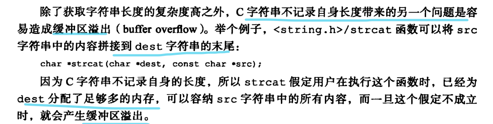

# 数据结构与对象

## 简单动态字符串

> 总结

Redis只会用C字符串作为字面量, 大多数情况下使用SDS作为字符串表示

相比C字符串的优点

1. 常数复杂度获取SDS的长度
2. 杜绝缓冲区溢出
3. 二进制安全
4. 预分配空间 + 惰性释放减少修改字符串所需的内存重分配次数
5. 兼容部分C字符串的函数

### SDS (simple dynamic string)

- 无需对字符串值进行修改的地方, 使用C字符串

- 需要对字符串修改的地方使用SDS表示字符串值

### SDS定义

- 以空字符串结尾, 分配额外的一个自己的空间但是不计算到len 属性中
  - 保留这个C字符串的特性可以重用C的字符串函数库的函数
  - printf("%s", s->buf);

### SDS与C字符串的区别

#### 常数复杂度获取字符串的长度

- C字符串
  - 不记录本身的长度, 需要比例字符串知道遇到结尾的空字符, O(N)的操作
- SDS
  - SDS 的len属性记录了SDS本身的长度, 可以O(1)获取
  - 设置和更新SDS长度由SDS API在执行的时候自动完成
- 确保了获取字符串长度不会成为redis的性能瓶颈
- 字符串键底层通过SDS实现, 返回对一个字符串键调用 STRLEN, 不会对性能造成影响

#### 杜绝缓冲区溢出

- C
  - 调用某些C的字符串库函数, 因为不知道字符串的长度信息, 会造成缓冲区溢出
- redis
  - SDS API对字符修改的时候, 需要先检查SDS的空间是否足够, 如果不够会自动扩展至执行操作需要的大小,再执行实际的修改, 所以不存在缓冲区溢出的问题
  - sdscat(str1, str2) 会先检查str1的buf是否有足够的空间容纳str2, 不够的话先扩容再执行 

#### 减少修改字符串带来的内存重分配次数

- C
  - 增大字符串, 需要先扩展底层数组的大小, 否则会缓冲区溢出
  - 减少字符串, 需要先释放底层数组不使用的那部分空间, 否则会造成内存泄露

- redis
  - 避免频繁修改字符造成的内存重分配

> 通过空间预分配和惰性空间释放两种优化策略

##### 空间预分配

优化需要对SDS进行空间扩展的时候, 不仅分配修改需要的空间, 还会分配额外的未使用空间(free)

- 修改后SDS的长度(len)<1MB
  - 为这个SDS分配额外和SDS长度相同的额外未使用空间(free=len)
- 修改后SDS的长度(len)>=1MB
  - 为这个SDS分配1MB未使用的空间(free)

减少连续执行字符串增长操作所需的内存重分配次数, SDS将连续增长N次字符串所需的内存重分配次数从=N次降低到最多N次

##### 惰性空间释放

优化需要堆SDS字符串的缩短操作, 当需要缩短SDS的时候, 不立即使用内存重分配来回收多出来的字节, 而是将这些多出来的空间记录到free属性中, 这样将来如果需要进行增长操作, 未使用的空间就可以用上

通过惰性分配策略, SDS避免了缩短字符串所需的内存重分配操作, 并为将来的增长操作提供了优化

#### 二进制安全

- C
  - 字符串中除了末尾不能包含空字符, 否则被认为是字符串的结尾, 不能保存二进制数据
- redis
  - SDS API 以处理二进制的方式来处理保存在buf数组里的数据, 不做任何限制, 假设, 过滤, 写入什么样子读出来就是什么样子
  - 不仅可以保存文本数据也可以保存任意格式的二进制数据

#### 兼容部分C字符串函数

SDS API二进制安全但是仍然遵守C字符串以空字符串结尾的管理, 这样可以兼容部分C字符串函数

#### 区别总结

### SDS API

## 链表

- 提供了高效的结点重排能力, 通过顺序的访问方式, 可以加增删结点灵活调节链表的长度
- 官方使用: 列表键, 发布与订阅, 慢查询, 监视器
- 每个结点是一个ListNode, 拥有prev next 指向前后置结点, 链表的实现是双端队列
  - prev next value
- 每个链表是有list结构表示
  - head tail len dup() clear() match()
- head.prev = NULL tail.next=NULL 无环
- void *value 结点可以保存不同类型的值

### 链表和链表结点的实现

- 每个连接的结点

- 整个的链表

- dup 复制链表结点所保存的值
- free释放链表结点所保存的值
- match 对比链表结点所保存的值和另一个输入值是否相等

> 链表的特性

- 双端 prev next指针可以O(1)获取前置和后置结点
- 无环  head.prev = NULL tail.next = NULL
- O(1)获取头尾结点
- O(1) 通过len属性获取链表结点个数
- 多态 void\*保存结点值, 包括dup clear match函数的比较值都是void*  可以保存不同类型的值

### 链表和链表结点的API

## 字典

- 字典的每个键都是唯一的
- redis数据库, 哈希键的底层实现, 使用的是MurmurHash2哈希算法计算哈希值
- 字典使用哈希表作为底层实现, 每个字典有两个哈希表, 一个用于平时存储键值对, 另一个用于rehash时使用
- 哈希表 使用链地址法解决哈希冲突, 被分配到同一个索引上的多个键值对连城一个单向链表, 新的冲突的键值对被添加到链表的头
- 对哈希表的扩展或收缩操作需要将现有哈希表所有键值对rehash到新的哈希表中, 这是一个渐进式的过程

### 字典的实现

哈希表是Redis字典的底层实现, 一个哈希表可以有多个哈希表结点, 每个哈希表结点保存了字典中的一个键值对

#### 哈希表 (dictht)

- table
  - 是一个指针数组, 二级指针指向一个一个数组的起始位置
  - 数组中每个元素都是一个指向一个dict.h/dictEntry结构的指针
  - 每个dictEntry结构保存着一个键值对
- size
  - 哈希表的大小, table数组的大小
- used
  - 已有的结点数量
- sizemask
  - size-1
  - 和哈希值决定了一个键被放到table数组的那一个索引上

#### 哈希表结点(dictEntry)

dictEntry结构, 每个dictEntry结构保存一个键值对

#### 字典(dict)

##### type和privatedate

- 针对不同类型的键值对, 创建多态字典而设置的

- type
  - 指向dictType结构的指针, 每个dictType结构保存了一簇用于操作特定类型键值对的函数
  - redis会为用途不同的字典设置不同类型的函数
- privatedata
  - 保存了要传给哪些类型特定函数的可选参数

##### ht

大小为2的数组, 数组中的每个项都是一个dictht哈希表

- ht[0]是正常使用的哈希表
- ht[1]只会对ht[0]进行rehash的时候使用

##### rehashindex

rehashindex=-1 表示目前没有进行rehash

### 哈希算法

新的键值对要添加到字典中

1. 根据键值对计算哈希值和索引值
   1. 
2. 根据索引值将包含新的键值对的哈希表结点放到哈希表数组的指定索引上

MurmurHash算法计算键的哈希值

- 即使输入的键很有规律也能给出很好的随机分布性

### 解决键的冲突

两个或以上数量的键被分配到了哈希表数组的同一个索引上

> 链地址法

每个哈希表结点都有一个next指针, 多个哈希表结点可以通过next指针构成一个单项链表

因为是单项链表没有指向链表表尾的指针, 每次总是将新节点添加到链表的表头位置O(1)

### rehash

当哈希表保存的键值对数量太多或者太少时, 需要对哈希表的大小进行相应的扩展和收缩

> rehash的步骤

1. 为字典的ht[1]哈希表分配空间, 分配的空间取决与执行的操作和ht[0].used的大小
   - 如果执行的扩展操作, ht[1] 大小 = 第一个大于等于 ht[0].used*2的2^n
   - 如果执行的是收缩操作, ht[1]大小=第一个大于等于ht[0].used的2^n
2. 将保存在ht[0]中的键值对rehash到ht[1]上
   - rehash就是根据键值对的键值以及ht[1].sizemask重新计算键的哈希值和索引值, 然后将键值对放到ht[1]对应索引的位置
3. ht[0]所有的键值对迁移到ht[1]上以后释放ht[0] 将ht[1]置为ht[0], 并在ht[1]的位置上创建一个空白的哈希表

- 分配ht[1]

- rehash

- 释放空间, 交换

#### 哈希表的扩展和收缩

执行扩展操作的条件

- 服务器没有执行BGSAVE || BGREWRITEAOF 命令, 并且哈希表的负载因子>=1
- 服务器正在执行BGSAVE || BGREWRITEAOF 命令, 并且哈希表的负载因子>=5

负载因子

- load_factor = ht[0].used / ht[0].size
- 负载因子 = 已保存的结点数量 / 哈希表大小

BGSAVE || BGREWRITEAOF 命令

- BGSAVE || BGREWRITEAOF 命令执行过程中 Redis需要创建紫禁城, 通过COW优化子进程的效率
- 所以需要提高扩展操作所需的负载因子来避免子进程存在期间进行哈希表扩展操作, 
- 避免不必要的内存写入操作, 节约内存

收缩操作的必要条件

- 负载因子<0.1

### 渐进式rehash

rehash的操作不是一次性集中式的完成, 而是分多次渐进式的完成的

#### 为什么分多次渐进式的进行rehash

如果ht[0]保存的键值对数量过多, 一次性将这些键值对全部rehash到ht[1]庞大的计算量可能导致服务器停止一段时间, 使用分多次渐进式的rehash可以避免这种因为瞬时的大量计算导致的服务器停止

#### 渐进式rehash的步骤

1. 为ht[1]分配空间, 让字典同时持有ht[0] 和 ht[1]两个哈希表
2. 字典中维护一个索引计数器遍变量 rehashidx=0 
3. rehash期间进行的对字典的增删改查操作除了指向指定操作外, 都将操作对应的索引上的所有键值对rehash到ht[1], 此次rehash工作完成后rehashidx+1
4. 当ht[0]所有的键值对都rehash到ht[1]以后, rehashidx=-1标志rehash操作完成

这样分而治之的方式, 可以将rehash键值对所需的工作均摊到每个队字典的增删改查操作中, 避免了集中式rehash带来的庞大的计算量

#### 渐进式rehash期间的哈希表操作

- 查找
  - 先在ht[0]中找, 没有找到会到ht[1]中找
- 添加
  - 新添加的键值对一律添加到ht[1], 保证了ht[0]的数量只减不增

### 字典API

## 跳跃表

- 跳跃表是一种有序数据结构, 是有序集合的底层实现之一
- 由zskiplist 和 zskiplistNode两个结构组成
  - zskiplist保存跳跃表信息(头尾结点, 长度)
  - zskiplistNode表示跳跃表结点
- 每个跳跃表的层高都是1-32的随机数
- 同一个跳跃表中多个结点可以包含相同的分值(score)但是每个结点的成员对象必须是唯一的
- 跳跃表按照分值进行排序, 分值相同的按照成员对象大小排序
- 通过在每个结点维持多个指向其他节点的指针, 从而达到快速访问结点的目的
- 平均支持O(log N) 最坏O(N)的结点查找, 还可以通过顺序性操作完成批处理结点
- 只有在实现有序集合键, 在集群结点中用作内部数据结构用到

### 跳跃表的实现

redis.h/zskiplistNode跳跃表结点 redis.h/zskiplist保存跳跃表结点相关信息 两个结构定义

#### zskiplist

- head  tail 跳跃表的头尾结点
- level 记录目前跳跃表内, 层数最大的那个结点的层数(表头结点的层数不算在内)
- length 跳跃表的长度即跳跃表的结点数(表头结点不算在内)

#### 跳跃表结点 zskiplistNode

- 层 level: 
  - 结点的level数组可以包含多个元素, 每个元素都是一个指向其他节点的指针, 可以通过这些层来加快访问其他节点的速度
  - 每次创建新的跳跃表结点都会随机生成一个1-32之间的值作为level数组的大小即高度
  - 结点中 L1 L2 L3...表示各个层, L1表示第一层 L2 表示第二层 以此类推
  - 每个层有两个属性: 前进指针和跨度
    - 前进指针用于方位位于表尾方向的结点
    - 跨度记录了前进指针指向的结点与当前结点的距离
  - 从表头向表尾遍历时, 访问会沿着层的前进指针进行

- 前进指针
  - 每一层都有一个指向表尾方向的前进指针, (level[i].forward) 用于从表头向表尾方向的访问

- 跨度
  - 记录连个结点之间的距离(level[i].span)
  - 跨度实际与遍历操作无关, 是用来计算排位的(rank)
  - 在查找某个结点的过程中, 将沿途访问过的所有层的跨度累计起来, 得到的结果就是目标结点在跳跃表中的排位

- 后退指针(backward)
  - BW是后退指针, 指向位于当前结点的前一个结点, 用于从表尾向表头遍历
  - 每个结点只有一个BW指针, 只能回退到前一个结点

- 分值(score)
  - 结点按照各自的分值从小到大排列(double类型)
- 成员对象(obj)
  - 是一个指针, 指向一个字符串对象, 字符串对象保存一个SDS的值
  - 同一个跳跃表中, 各个结点保存的成员对象必须是唯一的, 但是多个结点保存的分值可以相同
  - 分值相同的结点将按照成员对象在字典序中的大小来进行排序
  - 成员对象小的结点排在前面, 大的在后面

### 跳跃表API

## 整数集合

- 集合键的底层实现之一
- 当一个集合只包含整数, 并且元素数量不多就会使用整数集合
- 整数集合的底层实现是数组, 数组以有序, 无重复的方式保存集合元素, 在需要的时候根据新添加元素的类型对数组的类型进行调整
- 升级操作带来了整数集合的灵活性已经节约了内存
- 只支持升级不支持降级

### 整数集合的实现

用于保存整数值集合的抽象数据结构, 保存类型为 int16_t int32_t int64_t 并且保证元素不重复

- contents数组是整数集合的底层实现
  - 整数集合的每个元素都是contents数组的一个数组项(item) 各个项在数组中从小到大排列并且不重复
- length
  - 数组的长度, 整数集合包含的元素数量
- content数组的真正类型取决于encoding属性的值

### 升级

当添加的新元素类型比整数集合所有元素的类型都要长时, 整数集合需要先升级, 才能将新元素添加到整数集合

升级集合并添加元素的步骤

1. 根据新元素的类型, 扩展整数集合底层数组的空间大小, 并为新元素分配空间
2. 将底层数组所有的元素都转换成和新元素相同的类型, 并将类型转换后的元素放置到正确的位置上, 而且放置元素的过程中, 需要位置底层数组的有序性质
3. 将新元素添加到底层数组中

因为每次向整数集合添加元素都有可能引起升级, 而每次升级都需要将所有元素进行类型转换, 所以时间复杂度O(N)

- 添加一个int32_t类型的65535 需要升级 升级后

### 升级的好处

提升整数集合的灵活性和尽可能的节约内存

#### 提升灵活性

#### 节约内存

### 降级

整数集合不支持降级操作, 一旦升级, 就会保持升级后的状态

即使删除了造成整数集合升级的元素, 底层数组仍然不变

可能是因为各个元素都已经按照升级后的类型进行了位置的调整, 占据的位数已经是升级后类型的位数, 如果升级又带来一系列类型转换, 元素移动的操作, 可能会非常耗时

### 整数集合API

## 压缩列表

- 压缩列表是列表键和哈希键的底层实现之一
  - 当一个列表键只有少量列表项, 并且每个列表项是小整数 || 短字符串
  - 键值对的键和值都是小整数||短字符串
- 压缩列表是一种为节约内存而开发的顺序型数据结构
- 可以包含多个结点, 每个结点包含一个字节数组或者整数值
- 添加或者删除结点可能会导致连锁更新

### 压缩列表的构成

一系列特殊编码的连续内存块组成的顺序型数据结构

一个压缩列表可以包含任意多个结点, 每个结点都可以保存一个字节数组或者一个整数值

### 压缩列表结点的构成

#### previous_entry_length

以字节为单位, 记录前一个结点的长度, 属性的长度可以使1 || 5 个字节

- 前一个结点的长度<254bytes  previous_entry_length属性长度是1字节, 前一个结点长度就保存在这个属性中
- 前一个结点的长度>=254bytes  previous_entry_length属性长度是5字节, 属性的第一字节被设置为0xFE(254), 而之后的四个字节保存前一个结点的长度

可以通过指针运算, 根据当前结点的起始地址计算前一个结点的起始地址

压缩列表从表尾向表头遍历操作就是利用指针运算的原理, 

- 当我们拥有一个指向某个结点起始地址的指针, 以及这个结点的previous_entry_length属性就可以获得前一个结点的起始地址, 进而一直到达头结点

#### encoding

记录了结点的content属性所保存数据的类型和长度

#### content

保存结点的值, 结点值可以是一个字节数组, 或者整数, 类型和长度由encoding决定

### 连锁更新

> 特殊情况下产生的连续多次空间扩展操作称之为连锁更新 cascade update

 previous_entry_length属性以字节为单位, 记录前一个结点的长度, 属性的长度可以使1 || 5 个字节

- 前一个结点的长度<254bytes  previous_entry_length属性长度是1字节, 前一个结点长度就保存在这个属性中
- 前一个结点的长度>=254bytes  previous_entry_length属性长度是5字节, 属性的第一字节被设置为0xFE(254), 而之后的四个字节保存前一个结点的长度

> 在一个压缩列表中, 有多个连续的长度介于[250, 253]字节的结点e1~eN

因为结点长度<254, 记录这些结点的长度只需要1字节的 previous_entry_length属性

这是将一个长度>=254字节的新节点new 设置为压缩列表的表头结点, 即e1的前置结点

因为e1 previous_entry_length属性仅为1字节, 空间不够需要对压缩列表进行空间重新分配, 

将e1 previous_entry_length属性扩展为5字节, 

这会导致e1的长度变成[254,257]之间, 造成后续节点的previous_entry_length属性的更新直到eN为止

除了添加, 删除也会导致连锁更新, 删除了中间的某个结点导致删除结点的后一个结点需要存储删除结点的前一个的长度, 而这个长度大于后一个结点 previous_entry_length属性所能装下的空间进而导致连锁更新

### 压缩列表API

## 对象

