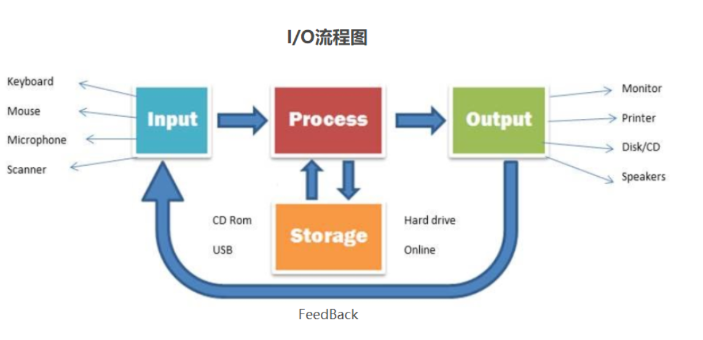

# RPC

https://blog.csdn.net/mindfloating/article/details/39474123?ops_request_misc=%257B%2522request%255Fid%2522%253A%2522162847848616780366579666%2522%252C%2522scm%2522%253A%252220140713.130102334.pc%255Fall.%2522%257D&request_id=162847848616780366579666&biz_id=0&utm_medium=distribute.pc_search_result.none-task-blog-2~all~first_rank_v2~rank_v29-4-39474123.pc_search_result_cache&utm_term=RPC&spm=1018.2226.3001.4187

https://blog.csdn.net/yjp198713/article/details/79410521?ops_request_misc=%257B%2522request%255Fid%2522%253A%2522162848133516780357238678%2522%252C%2522scm%2522%253A%252220140713.130102334.pc%255Fall.%2522%257D&request_id=162848133516780357238678&biz_id=0&utm_medium=distribute.pc_search_result.none-task-blog-2~all~first_rank_v2~rank_v29-14-79410521.pc_search_result_cache&utm_term=RPC%E9%9D%A2%E8%AF%95%E9%A2%98&spm=1018.2226.3001.4187


## RPC 功能目标

RPC（Remote Procedure Call Protocol）远程过程调用协议。一个通俗的描述是：客户端在不知道调用细节的情况下，调用存在于远程计算机上的某个对象，就像调用本地应用程序中的对象一样。比较正式的描述是：一种通过网络从远程计算机程序上请求服务，而不需要了解底层网络技术的协议

- RPC是协议：既然是协议就只是一套规范，那么就需要有人遵循这套规范来进行实现。目前典型的RPC实现包括：Dubbo、Thrift、GRPC、Hetty等。这里要说明一下，目前技术的发展趋势来看，实现了RPC协议的应用工具往往都会附加其他重要功能，例如Dubbo还包括了服务治等功能。

- 网络协议和网络IO模型对其透明：既然RPC的客户端认为自己是在调用本地对象。那么传输层使用的是TCP/UDP还是HTTP协议，又或者是一些其他的网络协议它就不需要关心了。既然网络协议对其透明，那么调用过程中，使用的是哪一种网络IO模型调用者也不需要关心。

- 信息格式对其透明：我们知道在本地应用程序中，对于某个对象的调用需要传递一些参数，并且会返回一个调用结果。至于被调用的对象内部是如何使用这些参数，并计算出处理结果的，调用方是不需要关心的。那么对于远程调用来说，这些参数会以某种信息格式传递给网络上的另外一台计算机，这个信息格式是怎样构成的，调用方是不需要关心的。

- 应该有跨语言能力：为什么这样说呢？因为调用方实际上也不清楚远程服务器的应用程序是使用什么语言运行的。那么对于调用方来说，无论服务器方使用的是什么语言，本次调用都应该成功，并且返回值也应该按照调用方程序语言所能理解的形式进行描述。
  

公司的系统都由成千上万大大小小的服务组成，各服务部署在不同的机器上，由不同的团队负责。这时就会遇到两个问题：

- 1）要搭建一个新服务，免不了需要依赖他人的服务，而现在他人的服务都在远端，怎么调用？
- 2）其它团队要使用我们的新服务，我们的服务该怎么发布以便他人调用

## 如何调用他人的远程服务？

由于各服务部署在不同机器，服务间的调用免不了网络通信过程，服务消费方每调用一个服务都要写一坨网络通信相关的代码，不仅复杂而且极易出错。

如果有一种方式能让我们像调用本地服务一样调用远程服务，而让调用者对网络通信这些细节透明，那么将大大提高生产力，

- 比如服务消费方在执行helloWorldService.sayHello("test")时，实质上调用的是远端的服务。这种方式其实就是RPC（Remote Procedure Call Protocol），在各大互联网公司中被广泛使用，如阿里巴巴的hsf、dubbo（开源）、Facebook的thrift（开源）、Google grpc（开源）、Twitter的finagle（开源）等。

让网络通信细节对使用者透明，我们需要对通信细节进行封装，我们先看下一个RPC调用的流程涉及到哪些通信细节：


## RPC 结构拆解


- 1）服务消费方（client）调用以本地调用方式调用服务；
- 2）client stub接收到调用后负责将方法、参数等组装成能够进行网络传输的消息体；
- 3）client stub找到服务地址，并将消息发送到服务端；
- 4）server stub收到消息后进行解码；
- 5）server stub根据解码结果调用本地的服务；
- 6）本地服务执行并将结果返回给server stub；
- 7）server stub将返回结果打包成消息并发送至消费方；
- 8）client stub接收到消息，并进行解码；
- 9）服务消费方得到最终结果。


- RPC 服务方通过 RpcServer 去导出（export）远程接口方法，而客户方通过 RpcClient 去引入（import）远程接口方法。
- 客户方像调用本地方法一样去调用远程接口方法，RPC 框架提供接口的代理实现，实际的调用将委托给代理RpcProxy 。
- 代理封装调用信息并将调用转交给RpcInvoker 去实际执行。
- 在客户端的RpcInvoker 通过连接器RpcConnector 去维持与服务端的通道RpcChannel，并使用RpcProtocol 执行协议编码（encode）并将编码后的请求消息通过通道发送给服务方。
- RPC 服务端接收器 RpcAcceptor 接收客户端的调用请求，同样使用RpcProtocol 执行协议解码（decode）。
- 解码后的调用信息传递给RpcProcessor 去控制处理调用过程，最后再委托调用给RpcInvoker 去实际执行并返回调用结果。


- Client：RPC协议的调用方。就像上文所描述的那样，最理想的情况是RPC Client在完全不知道有RPC框架存在的情况下发起对远程服务的调用。但实际情况来说Client或多或少的都需要指定RPC框架的一些细节。
- Server：在RPC规范中，这个Server并不是提供RPC服务器IP、端口监听的模块。而是远程服务方法的具体实现（在JAVA中就是RPC服务接口的具体实现）。其中的代码是最普通的和业务相关的代码，甚至其接口实现类本身都不知道将被某一个RPC远程客户端调用。
- Stub/Proxy：RPC代理存在于客户端，因为要实现客户端对RPC框架“透明”调用，那么客户端不可能自行去管理消息格式、不可能自己去管理网络传输协议，也不可能自己去判断调用过程是否有异常。这一切工作在客户端都是交给RPC框架中的“代理”层来处理的。
- Message Protocol：在上文我们已经说到，一次完整的client-server的交互肯定是携带某种两端都能识别的，共同约定的消息格式。RPC的消息管理层专门对网络传输所承载的消息信息进行编码和解码操作。目前流行的技术趋势是不同的RPC实现，为了加强自身框架的效率都有一套（或者几套）私有的消息格式。
- Transfer/Network Protocol：传输协议层负责管理RPC框架所使用的网络协议、网络IO模型。例如Hessian的传输协议基于HTTP（应用层协议）；而Thrift的传输协议基于TCP（传输层协议）。传输层还需要统一RPC客户端和RPC服务端所使用的IO模型；
- Selector/Processor：存在于RPC服务端，用于服务器端某一个RPC接口的实现的特性（它并不知道自己是一个将要被RPC提供给第三方系统调用的服务）。所以在RPC框架中应该有一种“负责执行RPC接口实现”的角色。包括：管理RPC接口的注册、判断客户端的请求权限、控制接口实现类的执行在内的各种工作。
- IDL：实际上IDL（接口定义语言）并不是RPC实现中所必须的。但是需要跨语言的RPC框架一定会有IDL部分的存在。这是因为要找到一个各种语言能够理解的消息结构、接口定义的描述形式。如果您的RPC实现没有考虑跨语言性，那么IDL部分就不需要包括，例如JAVA RMI因为就是为了在JAVA语言间进行使用，所以JAVA RMI就没有相应的IDL。
  


## 怎么做到透明化远程服务调用？

怎么封装通信细节才能让用户像以本地调用方式调用远程服务呢？对java来说就是使用代理！java代理有两种方式：

- 1） jdk 动态代理；2）字节码生成。
- 尽管字节码生成方式实现的代理更为强大和高效，但代码维护不易，大部分公司实现RPC框架时还是选择动态代理方式。

下面简单介绍下动态代理怎么实现我们的需求。我们需要实现RPCProxyClient代理类，代理类的invoke方法中封装了与远端服务通信的细节，消费方首先从RPCProxyClient获得服务提供方的接口，当执行helloWorldService.sayHello("test")方法时就会调用invoke方法。

```java
public class RPCProxyClient implements java.lang.reflect.InvocationHandler{
    private Object obj;
    public RPCProxyClient(Object obj){
        this.obj=obj;
    }
    /**
     * 得到被代理对象;
     */
    public static Object getProxy(Object obj){
        return java.lang.reflect.Proxy.newProxyInstance(obj.getClass().getClassLoader(),
                obj.getClass().getInterfaces(), new RPCProxyClient(obj));
    }
    /**
     * 调用此方法执行
     */
    public Object invoke(Object proxy, Method method, Object[] args)
            throws Throwable {
        //结果参数;
        Object result = new Object();
        // ...执行通信相关逻辑
        // ...
        return result;
    }
}
```


###  怎么对消息进行编码和解码？

#### 1.2.1 确定消息数据结构

　　上节讲了invoke里需要封装通信细节，而通信的第一步就是要确定客户端和服务端相互通信的消息结构。客户端的请求消息结构一般需要包括以下内容：

1）接口名称

　　在我们的例子里接口名是“HelloWorldService”，如果不传，服务端就不知道调用哪个接口了；

2）方法名

　　一个接口内可能有很多方法，如果不传方法名服务端也就不知道调用哪个方法；

3）参数类型&参数值

　　参数类型有很多，比如有bool、int、long、double、string、map、list，甚至如struct（class）；

　　以及相应的参数值；

4）超时时间

5）requestID，标识唯一请求id，在下面一节会详细描述requestID的用处。

　　同理服务端返回的消息结构一般包括以下内容。

1）返回值

2）状态code

3）requestID 

#### 1.2.2 序列化

　　一旦确定了消息的数据结构后，下一步就是要考虑序列化与反序列化了。

　　什么是序列化？序列化就是将数据结构或对象转换成二进制串的过程，也就是编码的过程。

　　什么是反序列化？将在序列化过程中所生成的二进制串转换成数据结构或者对象的过程。

　　为什么需要序列化？转换为二进制串后才好进行网络传输嘛！

　　为什么需要反序列化？将二进制转换为对象才好进行后续处理！

现如今序列化的方案越来越多，每种序列化方案都有优点和缺点，它们在设计之初有自己独特的应用场景，那到底选择哪种呢？从RPC的角度上看，主要看三点：

- 1）通用性，比如是否能支持Map等复杂的数据结构；
- 2）性能，包括时间复杂度和空间复杂度，由于RPC框架将会被公司几乎所有服务使用，如果序列化上能节约一点时间，对整个公司的收益都将非常可观，同理如果序列化上能节约一点内存，网络带宽也能省下不少；
- 3）可扩展性，对互联网公司而言，业务变化飞快，如果序列化协议具有良好的可扩展性，支持自动增加新的业务字段，而不影响老的服务，这将大大提供系统的灵活度。

　　目前互联网公司广泛使用Protobuf、Thrift、Avro等成熟的序列化解决方案来搭建RPC框架，这些都是久经考验的解决方案。

### **消息里为什么要有requestID？**

　　如果使用netty的话，一般会用channel.writeAndFlush()方法来发送消息二进制串，这个方法调用后对于整个远程调用(从发出请求到接收到结果)来说是一个异步的，即对于当前线程来说，将请求发送出来后，线程就可以往后执行了，至于服务端的结果，是服务端处理完成后，再以消息的形式发送给客户端的。于是这里出现以下两个问题：

1）怎么让当前线程“暂停”，等结果回来后，再向后执行？

2）如果有多个线程同时进行远程方法调用，这时建立在client server之间的socket连接上会有很多双方发送的消息传递，前后顺序也可能是随机的，server处理完结果后，将结果消息发送给client，client收到很多消息，怎么知道哪个消息结果是原先哪个线程调用的？

　　如下图所示，线程A和线程B同时向client socket发送请求requestA和requestB，socket先后将requestB和requestA发送至server，而server可能将responseA先返回，尽管requestA请求到达时间更晚。我们需要一种机制保证responseA丢给ThreadA，responseB丢给ThreadB。


　　怎么解决呢？

1）client线程每次通过socket调用一次远程接口前，生成一个唯一的ID，即requestID（requestID必需保证在一个Socket连接里面是唯一的），一般常常使用AtomicLong从0开始累计数字生成唯一ID；

2）将处理结果的回调对象callback，存放到全局ConcurrentHashMap里面put(requestID, callback)；

3）当线程调用channel.writeAndFlush()发送消息后，紧接着执行callback的get()方法试图获取远程返回的结果。在get()内部，则使用synchronized获取回调对象callback的锁，再先检测是否已经获取到结果，如果没有，然后调用callback的wait()方法，释放callback上的锁，让当前线程处于等待状态。

4）服务端接收到请求并处理后，将response结果（此结果中包含了前面的requestID）发送给客户端，客户端socket连接上专门监听消息的线程收到消息，分析结果，取到requestID，再从前面的ConcurrentHashMap里面get(requestID)，从而找到callback对象，再用synchronized获取callback上的锁，将方法调用结果设置到callback对象里，再调用callback.notifyAll()唤醒前面处于等待状态的线程。


## 如何发布自己的服务？

　　如何让别人使用我们的服务呢？有同学说很简单嘛，告诉使用者服务的IP以及端口就可以了啊。确实是这样，这里问题的关键在于是自动告知还是人肉告知。

　　人肉告知的方式：如果你发现你的服务一台机器不够，要再添加一台，这个时候就要告诉调用者我现在有两个ip了，你们要轮询调用来实现负载均衡；调用者咬咬牙改了，结果某天一台机器挂了，调用者发现服务有一半不可用，他又只能手动修改代码来删除挂掉那台机器的ip。现实生产环境当然不会使用人肉方式。

　　有没有一种方法能实现自动告知，即机器的增添、剔除对调用方透明，调用者不再需要写死服务提供方地址？当然可以，现如今zookeeper被广泛用于实现服务自动注册与发现功能！

　　简单来讲，zookeeper可以充当一个`服务注册表`（Service Registry），让多个`服务提供者`形成一个集群，让`服务消费者`通过服务注册表获取具体的服务访问地址（ip+端口）去访问具体的服务提供者。如下图所示：


　　具体来说，zookeeper就是个分布式文件系统，每当一个服务提供者部署后都要将自己的服务注册到zookeeper的某一路径上: /{service}/{version}/{ip:port}, 比如我们的HelloWorldService部署到两台机器，那么zookeeper上就会创建两条目录：分别为/HelloWorldService/1.0.0/100.19.20.01:16888  /HelloWorldService/1.0.0/100.19.20.02:16888。

　　zookeeper提供了“心跳检测”功能，它会定时向各个服务提供者发送一个请求（实际上建立的是一个 Socket 长连接），如果长期没有响应，服务中心就认为该服务提供者已经“挂了”，并将其剔除，比如100.19.20.02这台机器如果宕机了，那么zookeeper上的路径就会只剩/HelloWorldService/1.0.0/100.19.20.01:16888。

　　服务消费者会去监听相应路径（/HelloWorldService/1.0.0），一旦路径上的数据有任务变化（增加或减少），zookeeper都会通知服务消费方服务提供者地址列表已经发生改变，从而进行更新。

　　更为重要的是zookeeper与生俱来的容错容灾能力（比如leader选举），可以确保服务注册表的高可用性。


# NIO, BIO, AIO, SIGIO,IO多路复用

https://www.cnblogs.com/sheng-jie/p/how-much-you-know-about-io-models.html

## 阻塞和非阻塞IO

阻塞和非阻塞强调的是进程对于操作系统IO是否处于就绪状态的处理方式。

应用程序的IO实际是分为两个步骤，IO调用和IO执行。IO调用是由进程发起，IO执行是操作系统的工作。操作系统的IO情况决定了进程IO调用是否能够得到立即响应。如进程发起了读取数据的IO调用，操作系统需要将外部数据拷贝到进程缓冲区，在有数据拷贝到进程缓冲区前，进程缓冲区处于不可读状态，我们称之为操作系统IO未就绪。

进程的IO调用是否能得到立即执行是需要操作系统IO处于就绪状态的，对于读取数据的操作，如果操作系统IO处于未就绪状态，当前进程或线程如果一直等待直到其就绪，该种IO方式为阻塞IO。如果进程或线程并不一直等待其就绪，而是可以做其他事情，这种方式为非阻塞IO。所以对于非阻塞IO，我们编程时需要经常去轮询就绪状态。

阻塞非阻塞: 讨论的是调用IO的线程在内核的数据准备阶段是否阻塞

- 不立即返回, 阻塞等待数据准备完成就是阻塞, 
- 立即返回就是非阻塞

## 异步和同步IO

我们经常会谈及同步IO和异步IO。同步和异步描述的是针对当前执行线程、或进程而言，发起IO调用后，当前线程或进程是否挂起等待操作系统的IO执行完成。

我们说一个IO执行是同步执行的，意思是程序发起IO调用，当前线程或进程需要等待操作系统完成IO工作并告知进程已经完成，线程或进程才能继续往下执行其他既定指令。

如果说一个IO执行是异步的，意思是该动作是由当前线程或进程请求发起，且当前线程或进程不必等待操作系统IO的执行完毕，可直接继续往下执行其他既定指令。操作系统完成IO后，当前线程或进程会得到操作系统的通知。

以一个读取数据的IO操作而言，在操作系统将外部数据写入进程缓冲区这个期间，进程或线程挂起等待操作系统IO执行完成的话，这种IO执行策略就为同步，如果进程或线程并不挂起而是继续工作，这种IO执行策略便为异步。

异步同步: 讨论的是从内核将数据复制到用户空间的过程, 调用线程是否阻塞

- 不阻塞就是异步
- 阻塞就是同步

##  I/O 的定义



应用程序作为一个文件保存在磁盘中，只有加载到内存到成为一个进程才能运行。应用程序运行在计算机内存中，必然会涉及到数据交换，比如读写磁盘文件，访问数据库，调用远程API等等。但我们编写的程序并不能像操作系统内核一样直接进行I/O操作。

因为为了确保操作系统的安全稳定运行，操作系统启动后，将会开启保护模式：将内存分为内核空间（内核对应进程所在内存空间）和用户空间，进行内存隔离。我们构建的程序将运行在用户空间，用户空间无法操作内核空间，也就意味着用户空间的程序不能直接访问由内核管理的I/O，比如：硬盘、网卡等。

但操作系统向外提供API，其由各种类型的系统调用（System Call）组成，以提供安全的访问控制。
所以应用程序要想访问内核管理的I/O，必须通过调用内核提供的系统调用(system call）进行间接访问。

所以I/O之于应用程序来说，强调的通过**向内核发起系统调用完成对I/O的间接访问**。换句话说应用程序发起的一次IO操作实际包含两个阶段：

1. IO调用阶段：应用程序进程向内核发起系统调用
2. IO执行阶段：内核执行IO操作并返回
   2.1. 准备数据阶段：内核等待I/O设备准备好数据
   2.2. 拷贝数据阶段：将数据从内核缓冲区拷贝到用户空间缓冲区

怎么理解准备数据阶段呢？
对于写请求：等待系统调用的完整请求数据，并写入内核缓冲区；
对于读请求：等待系统调用的完整请求数据；（若请求数据不存在于内核缓冲区）则将外围设备的数据读入到内核缓冲区。


而应用程序进程在发起IO调用至内核执行IO返回之前，应用程序进程/线程所处状态，就是我们下面要讨论的第二个话题阻塞IO与非阻塞IO。

## BIO(Blocking IO)

应用程序中进程在发起IO调用后至内核执行IO操作返回结果之前，若发起系统调用的线程一直处于等待状态，则此次IO操作为阻塞IO。


从上图可知当用户进程发起IO系统调用后，内核从准备数据到拷贝数据到用户空间的两个阶段期间**用户调用线程选择阻塞等待**数据返回。

因此BIO带来了一个问题：如果内核数据需要耗时很久才能准备好，那么用户进程将被阻塞，浪费性能。为了提升应用的性能，虽然可以通过多线程来提升性能，但线程的创建依然会借助系统调用，同时多线程会导致频繁的线程上下文的切换，同样会影响性能。所以要想解决BIO带来的问题，我们就得看到问题的本质，那就是**阻塞**二字。

## NIO(New/Non-Blocking IO)

那解决方案自然也容易想到，将阻塞变为非阻塞，那就是用户进程在发起系统调用时指定为非阻塞，内核接收到请求后，就会立即返回，然后用户进程通过轮询的方式来拉取处理结果。


应用程序中进程在发起IO调用后至内核执行IO操作返回结果之前，若发起系统调用的线程不会等待而是立即返回，则此次IO操作为非阻塞IO模型。

然而，非阻塞IO虽然相对于阻塞IO大幅提升了性能，但依旧不是完美的解决方案，其依然存在性能问题，也就是频繁的轮询导致频繁的系统调用，会耗费大量的CPU资源。比如当并发很高时，假设有1000个并发，那么单位时间循环内将会有1000次系统调用去轮询执行结果，而实际上可能只有2个请求结果执行完毕，这就会有998次无效的系统调用，造成严重的性能浪费。有问题就要解决，那**NIO问题的本质就是频繁轮询导致的无效系统调用**。


## IO多路复用

### select/poll

Select是内核提供的系统调用，它支持一次查询多个系统调用的可用状态，当任意一个结果状态可用时就会返回，用户进程再发起一次系统调用进行数据读取。换句话说，就是NIO中N次的系统调用，借助Select，只需要发起一次系统调用就够了。


但是，select有一个限制，就是存在连接数限制，针对于此，又提出了poll。其与select相比，主要是解决了连接限制。

select/epoll 虽然解决了NIO重复无效系统调用用的问题，但同时又引入了新的问题。问题是：

1. 用户空间和内核空间之间，大量的数据拷贝
2. 内核循环遍历IO状态，浪费CPU时间

换句话说，select/poll虽然减少了用户进程的发起的系统调用，但内核的工作量只增不减。在高并发的情况下，内核的性能问题依旧。所以select/poll的问题本质是：内核存在无效的循环遍历。

### epoll

针对select/pool引入的问题，我们把解决问题的思路转回到内核上，如何减少内核重复无效的循环遍历呢？变主动为被动，基于事件驱动来实现。


epoll相较于select/poll，多了两次系统调用，其中epoll_create建立与内核的连接，epoll_ctl注册事件，epoll_wait阻塞用户进程，等待IO事件。


epoll，已经大大优化了IO的执行效率，但在IO执行的第一阶段：数据准备阶段都还是被阻塞的。所以这是一个可以继续优化的点。

## SIGIO

信号驱动IO与BIO和NIO最大的区别就在于，在IO执行的数据准备阶段，不会阻塞用户进程。
如下图所示：当用户进程需要等待数据的时候，会向内核发送一个信号，告诉内核我要什么数据，然后用户进程就继续做别的事情去了，而当内核中的数据准备好之后，内核立马发给用户进程一个信号，说”数据准备好了，快来查收“，用户进程收到信号之后，立马调用recvfrom，去查收数据。


乍一看，信号驱动式I/O模型有种异步操作的感觉，但是在IO执行的第二阶段，也就是将数据从内核空间复制到用户空间这个阶段，用户进程还是被阻塞的。

综上，你会发现，不管是BIO还是NIO还是SIGIO，它们最终都会被阻塞在IO执行的第二阶段。
那如果能将IO执行的第二阶段变成非阻塞，那就完美了。

## AIO

异步IO真正实现了IO全流程的非阻塞。用户进程发出系统调用后立即返回，内核等待数据准备完成，然后将数据拷贝到用户进程缓冲区，然后发送信号告诉用户进程**IO操作执行完毕**（与SIGIO相比，一个是发送信号告诉用户进程数据准备完毕，一个是IO执行完毕）


所以，之所以称为异步IO，取决于IO执行的第二阶段是否阻塞。因此前面讲的BIO，NIO和SIGIO均为同步IO。


# I/O 多路复用

https://segmentfault.com/a/1190000003063859

https://www.bilibili.com/video/BV11K4y1C7rm?p=2&spm_id_from=pageDriver


Redis的IO


Kafka 零拷贝


##  说说NIO（select,poll,epoll） epoll底层，水平，边缘 

### epoll

设想一个场景：有100万用户同时与一个进程保持着TCP连接，而每一时刻只有几十个或几百个TCP连接是活跃的(接收TCP包)，也就是说在每一时刻进程只需要处理这100万连接中的一小部分连接。那么，如何才能高效的处理这种场景呢？进程是否在每次询问操作系统收集有事件发生的TCP连接时，把这100万个连接告诉操作系统，然后由操作系统找出其中有事件发生的几百个连接呢？实际上，在Linux2.4版本以前，那时的select或者poll事件驱动方式是这样做的。

这里有个非常明显的问题，即在某一时刻，进程收集有事件的连接时，其实这100万连接中的大部分都是没有事件发生的。因此如果每次收集事件时，都把100万连接的套接字传给操作系统(这首先是用户态内存到内核态内存的大量复制)，而由操作系统内核寻找这些连接上有没有未处理的事件，将会是巨大的资源浪费，然后select和poll就是这样做的，因此它们最多只能处理几千个并发连接。而epoll不这样做，它在Linux内核中申请了一个简易的文件系统，把原先的一个select或poll调用分成了3部分：

```C
int epoll_create(int size);  
int epoll_ctl(int epfd, int op, int fd, struct epoll_event *event);  
int epoll_wait(int epfd, struct epoll_event *events,int maxevents, int timeout);  
```


1. 调用epoll_create建立一个epoll对象(在epoll文件系统中给这个句柄分配资源)；

2. 调用epoll_ctl向epoll对象中添加这100万个连接的套接字；

3. 调用epoll_wait收集发生事件的连接。

这样只需要在进程启动时建立1个epoll对象，并在需要的时候向它添加或删除连接就可以了，因此，在实际收集事件时，epoll_wait的效率就会非常高，因为调用epoll_wait时并没有向它传递这100万个连接，内核也不需要去遍历全部的连接。

#### epoll原理

当某一进程调用epoll_create方法时，Linux内核会创建一个eventpoll结构体，这个结构体中有两个成员与epoll的使用方式密切相关，如下所示：

```C
struct eventpoll {
　　...
　　/*红黑树的根节点，这棵树中存储着所有添加到epoll中的事件，
　　也就是这个epoll监控的事件*/
　　struct rb_root rbr;
　　/*双向链表rdllist保存着将要通过epoll_wait返回给用户的、满足条件的事件*/
　　struct list_head rdllist;
　　...
};
```


我们在调用epoll_create时，内核除了帮我们在epoll文件系统里建了个file结点，在内核cache里建了个红黑树用于存储以后epoll_ctl传来的socket外，还会再建立一个rdllist双向链表，用于存储准备就绪的事件，

当epoll_wait调用时，仅仅观察这个rdllist双向链表里有没有数据即可。有数据就返回，没有数据就sleep，等到timeout时间到后即使链表没数据也返回。所以，epoll_wait非常高效。

所有添加到epoll中的事件都会与设备(如网卡)驱动程序建立回调关系，也就是说相应事件的发生时会调用这里的回调方法。这个回调方法在内核中叫做ep_poll_callback，它会把这样的事件放到上面的rdllist双向链表中。

在epoll中对于每一个事件都会建立一个epitem结构体，如下所示：

```C
struct epitem {
　　...
　　//红黑树节点
　　struct rb_node rbn;
　　//双向链表节点
　　struct list_head rdllink;
　　//事件句柄等信息
　　struct epoll_filefd ffd;
　　//指向其所属的eventepoll对象
　　struct eventpoll *ep;
　　//期待的事件类型
　　struct epoll_event event;
　　...
}; // 这里包含每一个事件对应着的信息。
```


当调用epoll_wait检查是否有发生事件的连接时，只是检查eventpoll对象中的rdllist双向链表是否有epitem元素而已，

- 如果rdllist链表不为空，则这里的事件复制到用户态内存（使用共享内存提高效率）中，同时将事件数量返回给用户。因此epoll_waitx效率非常高。
- epoll_ctl在向epoll对象中添加、修改、删除事件时，从rbr红黑树中查找事件也非常快，它可以轻易地处理百万级别的并发连接。

#### 总结

一颗红黑树，一张准备就绪句柄链表，少量的内核cache，就帮我们解决了大并发下的socket处理问题。

执行epoll_create()时，创建了红黑树和就绪链表；

执行epoll_ctl()时，如果增加socket句柄，则检查在红黑树中是否存在，存在立即返回，不存在则添加到树干上，然后向内核注册回调函数，用于当中断事件来临时向准备就绪链表中插入数据；

执行epoll_wait()时立刻返回准备就绪链表里的数据即可。

### epoll的两种触发模式

epoll有EPOLLLT和EPOLLET两种触发模式，LT是默认的模式，ET是“高速”模式。

LT（水平触发）模式下，只要这个文件描述符还有数据可读，每次 epoll_wait都会返回它的事件，提醒用户程序去操作；

ET（边缘触发）模式下，在它检测到有 I/O 事件时，通过 epoll_wait 调用会得到有事件通知的文件描述符，对于每一个被通知的文件描述符，如可读，则必须将该文件描述符一直读到空，让 errno 返回 EAGAIN 为止，否则下次的 epoll_wait 不会返回余下的数据，会丢掉事件。如果ET模式不是非阻塞的，那这个一直读或一直写势必会在最后一次阻塞。

还有一个特点是，epoll使用“事件”的就绪通知方式，通过epoll_ctl注册fd，一旦该fd就绪，内核就会采用类似callback的回调机制来激活该fd，epoll_wait便可以收到通知。

#### 【epoll为什么要有EPOLLET触发模式？】：

如果采用EPOLLLT模式的话，系统中一旦有大量你不需要读写的就绪文件描述符，它们每次调用epoll_wait都会返回，这样会大大降低处理程序检索自己关心的就绪文件描述符的效率.。

而采用EPOLLET这种边缘触发模式的话，当被监控的文件描述符上有可读写事件发生时，epoll_wait()会通知处理程序去读写。如果这次没有把数据全部读写完(如读写缓冲区太小)，那么下次调用epoll_wait()时，它不会通知你，也就是它只会通知你一次，直到该文件描述符上出现第二次可读写事件才会通知你！！！这种模式比水平触发效率高，系统不会充斥大量你不关心的就绪文件描述符。

#### 【总结】：

ET模式（边缘触发）只有数据到来才触发，不管缓存区中是否还有数据，缓冲区剩余未读尽的数据不会导致epoll_wait返回；

LT 模式（水平触发，默认）只要有数据都会触发，缓冲区剩余未读尽的数据会导致epoll_wait返回。

ET模式在很大程度上减少了epoll事件被重复触发的次数，因此效率要比LT模式高。epoll工作在ET模式的时候，必须使用非阻塞套接口，以避免由于一个文件句柄的阻塞读/阻塞写操作把处理多个文件描述符的任务饿死。


## Select Poll Epoll

select、poll、epoll是Linux平台下的IO多路复用技术，适合用来管理大量的文件描述符，但是这些系统调用本身是阻塞的，而他们管理的socket描述符其实是可以阻塞，也可以非阻塞的，但是大部分情况下设置为非阻塞的要更好一些，效率会更高一些。因此，他们并不是真正的异步IO。是伪异步的。

### select

首先，select的缺点

- 1：是select管理的描述符的数量在不重新编译内核的情况下是一个固定的值：1024，当然，重新编译了Linux内核之后，这个数值可以继续增大到用户的需求，但是这是相对来说比较麻烦的一件事。

- 2：是select对于socket描述符的管理方式，因为Linux内核对select的实现方式为每次返回前都要对所有的描述符进行一遍遍历，然后将有事件发生的socket描述符放到描述符集合里，然后将这个描述符集合返回。
  - 这种情况对于描述符的数量不是很大的时候还是可以的，但是当描述符达到数十万，甚至上百万的时候，select的效率就会急剧的降低，因为这样的轮询机制会造成大量的浪费和资源开销。
  - 因为每一次的轮询都要将这些所有的socket描述符从用户态拷贝到内核态，在内核态，进行轮询，查看是否有事件发生，这是select的底层需要做的。而这些拷贝完全是可以避免的。

### poll

poll的实现机制和select是一样的，也是采用轮询机制来查看有事件发生的socket描述符，所以效率也是很低，但是poll对select有一项改进就是能够监视的描述符是任意大小的而不是局限在一个较小的数值上(当然这个描述符的大小也是需要操作系统来支持的)。

综上：在总结一下，select与poll的实现机制基本是一样的，只不过函数不同，参数不同，但是基本流程是相同的；

1、复制用户数据到内核空间

2、估计超时时间

3、遍历每个文件并调用f_op->poll()取得文件状态

4、遍历完成检查状态

如果有就绪的文件(描述符对应的还是文件，这里就当成是描述符就可以)则跳转到5，

如果有信号产生则重新启动poll或者select，否则挂起进程并等待超时或唤醒超时或再次遍历每个文件的状态

5、将所有文件的就绪状态复制到用户空间

6、清理申请的资源

### epoll

epoll改进了select的两个缺点，使用了三个数据结构从而能够在管理大量的描述符的情况下，对系统资源的使用并没有急剧的增加，而只是对内存的使用有所增加（毕竟存储大量的描述符的数据结构会占用大量内存）。

epoll在实现上的三个核心点是：1、红黑树，2、rdlist(就绪描述符链表)接下来一一解释为什么会高效；

1、红黑树是用来存储这些描述符的，因为红黑树的特性，就是良好的插入，查找，删除性能O(lgN)。

-  当内核初始化epoll的时候（当调用epoll_create的时候内核也是个epoll描述符创建了一个文件，毕竟在Linux中一切都是文件，而epoll面对的是一个特殊的文件，和普通文件不同），会开辟出一块内核高速cache区，
- 这块区域用来存储我们要监管的所有的socket描述符，当然在这里面存储一定有一个数据结构，这就是红黑树，由于红黑树的接近平衡的查找，插入，删除能力，在这里显著的提高了对描述符的管理。

2、rdlist   就绪描述符链表这是一个双链表，epoll_wait()函数返回的也是这个就绪链表。

-  当内核创建了红黑树之后，同时也会建立一个双向链表rdlist，用于存储准备就绪的描述符，
- 当调用epoll_wait的时候在timeout时间内，只是简单的去管理这个rdlist中是否有数据，如果没有则睡眠至超时，如果有数据则立即返回并将链表中的数据赋值到events数组中。
- 这样就能够高效的管理就绪的描述符，而不用去轮询所有的描述符。所以当管理的描述符很多但是就绪的描述符数量很少的情况下如果用select来实现的话效率可想而知，很低，但是epoll的话确实是非常适合这个时候使用。
- 对与rdlist的维护：
  - 当执行epoll_ctl时除了把socket描述符放入到红黑树中之外，还会给内核中断处理程序注册一个回调函数，告诉内核，当这个描述符上有事件到达（或者说中断了）的时候就调用这个回调函数。
  - 这个回调函数的作用就是将描述符放入到rdlist中，所以当一个socket上的数据到达的时候内核就会把网卡上的数据复制到内核，然后把socket描述符插入就绪链表rdlist中。

#### epoll的工作模式ET和LT

都知道epoll有两个工作模式，ET和LT，其中ET模式是高速模式，叫做边缘触发模式，LT模式是默认模式，叫做水平触发模式。

#### 这两种工作模式的区别在于：

当工作在ET模式下，如果一个描述符上有数据到达，然后读取这个描述符上的数据如果没有将数据全部读完的话，当下次epoll_wait返回的时候这个描述符里的数据就再也读取不到了，因为这个描述符不会再次触发返回，也就没法去读取，所以对于这种模式下对一个描述符的数据的正确读取方式是用一个死循环一直读，读到么有数据可读的情况下才可以认为是读取结束。

而工作在LT模式下，这种情况就不会发生，如果对一个描述符的数据没有读取完成，那么下次当epoll_wait返回的时候会继续触发，也就可以继续获取到这个描述符，从而能够接着读。

#### 那么这两种模式的实现方式是什么样的?

基于以上的数据结构是怎么实现这种工作模式的呢？

- 当一个socket描述符的中断事件发生，内核会将数据从网卡复制到内核，同时将socket描述符插入到rdlist中，
- 此时如果调用了epoll_wait会把rdlist中的就绪的socekt描述符复制到用户空间，然后清理掉这个rdlist中的数据，最后epoll_wait还会再次检查这些socket描述符，
- 如果是工作在LT模式下，并且这些socket描述符上还有数据没有读取完成，那么L就会再次把没有读完的socket描述符放入到rdlist中，所以再次调用epoll_wait的时候是会再次触发的，而ET模式是不会这么干的。

ET模式在物理实现上是基于电平的高低变化来工作的，就是从高电平变成低电平，或者从低电平变成高电平的这个上升沿或者下降沿才会触发，也就是状态变化导致触发，而当一个描述符上数据未读完的时候这个状态是不会发生变化的，所以触发不了，LT模式是在只有出现高电平的时候才会触发。

高电平和低电平：

LT水平触发：

EPOLLIN的触发事件：当输入缓冲区为空-->低电平，当输入缓冲区不为空-->高电平

高电平的时候触发EPOLLIN事件，如果没有把缓冲区的数据读取完，下次还会触发的，因为始终是高电平

EPOLLOUT的触发事件：当发送缓冲区满-->低电平，当发送缓冲区不满-->高电平

高电平的时候触发EPOLLOUT事件，所以在一开始的时候不要关注EPOLLOUT时间，因为发送缓冲区是不满的所以会导致CPU忙等待，每次都触发。什么时候关注EPOLLOUT事件呢? 当write的时候没有写完全，因为发送缓冲区满了，这个时候才关注EPOLLOUT事件直到下次把所有数据都发送完毕了，才取消EPOLLOUT事件

ET边缘触发：

EPOLLIN事件发生的条件:

有数据到来(输入缓冲区初始为空，为低电平，有数据到来变成了高电平)

EPOLLout事件发生的条件:

内核发送缓冲区不满(当发送缓冲区出现满之后为低电平，然后内核发送出去了部分数据后变成了不满，也就是高电平)