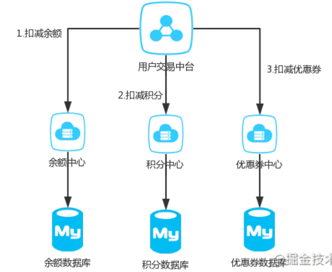

# RPC

https://blog.csdn.net/mindfloating/article/details/39474123?ops_request_misc=%257B%2522request%255Fid%2522%253A%2522162847848616780366579666%2522%252C%2522scm%2522%253A%252220140713.130102334.pc%255Fall.%2522%257D&request_id=162847848616780366579666&biz_id=0&utm_medium=distribute.pc_search_result.none-task-blog-2~all~first_rank_v2~rank_v29-4-39474123.pc_search_result_cache&utm_term=RPC&spm=1018.2226.3001.4187

https://blog.csdn.net/yjp198713/article/details/79410521?ops_request_misc=%257B%2522request%255Fid%2522%253A%2522162848133516780357238678%2522%252C%2522scm%2522%253A%252220140713.130102334.pc%255Fall.%2522%257D&request_id=162848133516780357238678&biz_id=0&utm_medium=distribute.pc_search_result.none-task-blog-2~all~first_rank_v2~rank_v29-14-79410521.pc_search_result_cache&utm_term=RPC%E9%9D%A2%E8%AF%95%E9%A2%98&spm=1018.2226.3001.4187


## 

https://www.bilibili.com/video/BV14k4y1z7WT?p=4

- Client
- Stub (代理)
  - Client只需要调用Stub特定方法
  - Stub屏蔽了网络连接的细节, 只对Client暴露需要的方法,
  - 动态代理代理了实现接口类的代理类, 调用Proxy.newProxyInstance(代理接口的类加载器, 需要调用的方法.class, invoketionHandler)
  - invoketionHandler 通过传入的代理类, 方法, 参数, 调用这个方法

## RPC调用流程(Remote Procedure Call)

分布式通信方式的一种

1. 客户端调用本地代理提供的方法
2. 代理类调用InvoketionHandler的invoke方法
   1. 传入的参数 代理类对象, 调用方法对象, 方法参数
   2. 通过方法对象获取方法名字, 方法参数类型.class数组
   3. 通过这三个部分 方法名, 方法参数类型.class数组, 方法参数 就可以确定服务器上的一个指定的方法
   4. 讲这些参数通过RPC协议规定好的格式, 以二进制的方法写入网络发送到服务端
3. 服务端接收到RPC请求
   1. 解析二进制流
   2. 得到方法名, 方法参数类型.class数组, 方法参数数组
   3. 生成接口的实现类
   4. 实现类通过反射根据解析得到的方法名,方法参数类型获得对应的方法对象
   5. 方法对象调用invoke方法传入接口实现类对象, 方法参数 得到需要的数据
4. RPC需要序列化传输的数据, 所以有一系列序列化框架, 框架的区别可能在于序列化后的长度以及时间消耗


## RPC 功能目标

RPC（Remote Procedure Call Protocol）远程过程调用协议。一个通俗的描述是：客户端在不知道调用细节的情况下，调用存在于远程计算机上的某个对象，就像调用本地应用程序中的对象一样。比较正式的描述是：一种通过网络从远程计算机程序上请求服务，而不需要了解底层网络技术的协议

- RPC是协议：既然是协议就只是一套规范，那么就需要有人遵循这套规范来进行实现。目前典型的RPC实现包括：Dubbo、Thrift、GRPC、Hetty等。这里要说明一下，目前技术的发展趋势来看，实现了RPC协议的应用工具往往都会附加其他重要功能，例如Dubbo还包括了服务治等功能。

- 网络协议和网络IO模型对其透明：既然RPC的客户端认为自己是在调用本地对象。那么传输层使用的是TCP/UDP还是HTTP协议，又或者是一些其他的网络协议它就不需要关心了。既然网络协议对其透明，那么调用过程中，使用的是哪一种网络IO模型调用者也不需要关心。

- 信息格式对其透明：我们知道在本地应用程序中，对于某个对象的调用需要传递一些参数，并且会返回一个调用结果。至于被调用的对象内部是如何使用这些参数，并计算出处理结果的，调用方是不需要关心的。那么对于远程调用来说，这些参数会以某种信息格式传递给网络上的另外一台计算机，这个信息格式是怎样构成的，调用方是不需要关心的。

- 应该有跨语言能力：为什么这样说呢？因为调用方实际上也不清楚远程服务器的应用程序是使用什么语言运行的。那么对于调用方来说，无论服务器方使用的是什么语言，本次调用都应该成功，并且返回值也应该按照调用方程序语言所能理解的形式进行描述。
  

公司的系统都由成千上万大大小小的服务组成，各服务部署在不同的机器上，由不同的团队负责。这时就会遇到两个问题：

- 1）要搭建一个新服务，免不了需要依赖他人的服务，而现在他人的服务都在远端，怎么调用？
- 2）其它团队要使用我们的新服务，我们的服务该怎么发布以便他人调用

## 如何调用他人的远程服务？

由于各服务部署在不同机器，服务间的调用免不了网络通信过程，服务消费方每调用一个服务都要写一坨网络通信相关的代码，不仅复杂而且极易出错。

如果有一种方式能让我们像调用本地服务一样调用远程服务，而让调用者对网络通信这些细节透明，那么将大大提高生产力，

- 比如服务消费方在执行helloWorldService.sayHello("test")时，实质上调用的是远端的服务。这种方式其实就是RPC（Remote Procedure Call Protocol），在各大互联网公司中被广泛使用，如阿里巴巴的hsf、dubbo（开源）、Facebook的thrift（开源）、Google grpc（开源）、Twitter的finagle（开源）等。

让网络通信细节对使用者透明，我们需要对通信细节进行封装，我们先看下一个RPC调用的流程涉及到哪些通信细节：


## RPC 结构拆解


- 1）服务消费方（client）调用以本地调用方式调用服务；
- 2）client stub接收到调用后负责将方法、参数等组装成能够进行网络传输的消息体；
- 3）client stub找到服务地址，并将消息发送到服务端；
- 4）server stub收到消息后进行解码；
- 5）server stub根据解码结果调用本地的服务；
- 6）本地服务执行并将结果返回给server stub；
- 7）server stub将返回结果打包成消息并发送至消费方；
- 8）client stub接收到消息，并进行解码；
- 9）服务消费方得到最终结果。


- RPC 服务方通过 RpcServer 去导出（export）远程接口方法，而客户方通过 RpcClient 去引入（import）远程接口方法。
- 客户方像调用本地方法一样去调用远程接口方法，RPC 框架提供接口的代理实现，实际的调用将委托给代理RpcProxy 。
- 代理封装调用信息并将调用转交给RpcInvoker 去实际执行。
- 在客户端的RpcInvoker 通过连接器RpcConnector 去维持与服务端的通道RpcChannel，并使用RpcProtocol 执行协议编码（encode）并将编码后的请求消息通过通道发送给服务方。
- RPC 服务端接收器 RpcAcceptor 接收客户端的调用请求，同样使用RpcProtocol 执行协议解码（decode）。
- 解码后的调用信息传递给RpcProcessor 去控制处理调用过程，最后再委托调用给RpcInvoker 去实际执行并返回调用结果。


- Client：RPC协议的调用方。就像上文所描述的那样，最理想的情况是RPC Client在完全不知道有RPC框架存在的情况下发起对远程服务的调用。但实际情况来说Client或多或少的都需要指定RPC框架的一些细节。
- Server：在RPC规范中，这个Server并不是提供RPC服务器IP、端口监听的模块。而是远程服务方法的具体实现（在JAVA中就是RPC服务接口的具体实现）。其中的代码是最普通的和业务相关的代码，甚至其接口实现类本身都不知道将被某一个RPC远程客户端调用。
- Stub/Proxy：RPC代理存在于客户端，因为要实现客户端对RPC框架“透明”调用，那么客户端不可能自行去管理消息格式、不可能自己去管理网络传输协议，也不可能自己去判断调用过程是否有异常。这一切工作在客户端都是交给RPC框架中的“代理”层来处理的。
- Message Protocol：在上文我们已经说到，一次完整的client-server的交互肯定是携带某种两端都能识别的，共同约定的消息格式。RPC的消息管理层专门对网络传输所承载的消息信息进行编码和解码操作。目前流行的技术趋势是不同的RPC实现，为了加强自身框架的效率都有一套（或者几套）私有的消息格式。
- Transfer/Network Protocol：传输协议层负责管理RPC框架所使用的网络协议、网络IO模型。例如Hessian的传输协议基于HTTP（应用层协议）；而Thrift的传输协议基于TCP（传输层协议）。传输层还需要统一RPC客户端和RPC服务端所使用的IO模型；
- Selector/Processor：存在于RPC服务端，用于服务器端某一个RPC接口的实现的特性（它并不知道自己是一个将要被RPC提供给第三方系统调用的服务）。所以在RPC框架中应该有一种“负责执行RPC接口实现”的角色。包括：管理RPC接口的注册、判断客户端的请求权限、控制接口实现类的执行在内的各种工作。
- IDL：实际上IDL（接口定义语言）并不是RPC实现中所必须的。但是需要跨语言的RPC框架一定会有IDL部分的存在。这是因为要找到一个各种语言能够理解的消息结构、接口定义的描述形式。如果您的RPC实现没有考虑跨语言性，那么IDL部分就不需要包括，例如JAVA RMI因为就是为了在JAVA语言间进行使用，所以JAVA RMI就没有相应的IDL。
  


## 怎么做到透明化远程服务调用？

怎么封装通信细节才能让用户像以本地调用方式调用远程服务呢？对java来说就是使用代理！java代理有两种方式：

- 1） jdk 动态代理；2）字节码生成。
- 尽管字节码生成方式实现的代理更为强大和高效，但代码维护不易，大部分公司实现RPC框架时还是选择动态代理方式。

下面简单介绍下动态代理怎么实现我们的需求。我们需要实现RPCProxyClient代理类，代理类的invoke方法中封装了与远端服务通信的细节，消费方首先从RPCProxyClient获得服务提供方的接口，当执行helloWorldService.sayHello("test")方法时就会调用invoke方法。

```java
public class RPCProxyClient implements java.lang.reflect.InvocationHandler{
    private Object obj;
    public RPCProxyClient(Object obj){
        this.obj=obj;
    }
    /**
     * 得到被代理对象;
     */
    public static Object getProxy(Object obj){
        return java.lang.reflect.Proxy.newProxyInstance(obj.getClass().getClassLoader(),
                obj.getClass().getInterfaces(), new RPCProxyClient(obj));
    }
    /**
     * 调用此方法执行
     */
    public Object invoke(Object proxy, Method method, Object[] args)
            throws Throwable {
        //结果参数;
        Object result = new Object();
        // ...执行通信相关逻辑
        // ...
        return result;
    }
}
```


###  怎么对消息进行编码和解码？

#### 1.2.1 确定消息数据结构

　　上节讲了invoke里需要封装通信细节，而通信的第一步就是要确定客户端和服务端相互通信的消息结构。客户端的请求消息结构一般需要包括以下内容：

1）接口名称

　　在我们的例子里接口名是“HelloWorldService”，如果不传，服务端就不知道调用哪个接口了；

2）方法名

　　一个接口内可能有很多方法，如果不传方法名服务端也就不知道调用哪个方法；

3）参数类型&参数值

　　参数类型有很多，比如有bool、int、long、double、string、map、list，甚至如struct（class）；

　　以及相应的参数值；

4）超时时间

5）requestID，标识唯一请求id，在下面一节会详细描述requestID的用处。

　　同理服务端返回的消息结构一般包括以下内容。

1）返回值

2）状态code

3）requestID 

#### 1.2.2 序列化

　　一旦确定了消息的数据结构后，下一步就是要考虑序列化与反序列化了。

　　什么是序列化？序列化就是将数据结构或对象转换成二进制串的过程，也就是编码的过程。

　　什么是反序列化？将在序列化过程中所生成的二进制串转换成数据结构或者对象的过程。

　　为什么需要序列化？转换为二进制串后才好进行网络传输嘛！

　　为什么需要反序列化？将二进制转换为对象才好进行后续处理！

现如今序列化的方案越来越多，每种序列化方案都有优点和缺点，它们在设计之初有自己独特的应用场景，那到底选择哪种呢？从RPC的角度上看，主要看三点：

- 1）通用性，比如是否能支持Map等复杂的数据结构；
- 2）性能，包括时间复杂度和空间复杂度，由于RPC框架将会被公司几乎所有服务使用，如果序列化上能节约一点时间，对整个公司的收益都将非常可观，同理如果序列化上能节约一点内存，网络带宽也能省下不少；
- 3）可扩展性，对互联网公司而言，业务变化飞快，如果序列化协议具有良好的可扩展性，支持自动增加新的业务字段，而不影响老的服务，这将大大提供系统的灵活度。

　　目前互联网公司广泛使用Protobuf、Thrift、Avro等成熟的序列化解决方案来搭建RPC框架，这些都是久经考验的解决方案。

### **消息里为什么要有requestID？**

　　如果使用netty的话，一般会用channel.writeAndFlush()方法来发送消息二进制串，这个方法调用后对于整个远程调用(从发出请求到接收到结果)来说是一个异步的，即对于当前线程来说，将请求发送出来后，线程就可以往后执行了，至于服务端的结果，是服务端处理完成后，再以消息的形式发送给客户端的。于是这里出现以下两个问题：

1）怎么让当前线程“暂停”，等结果回来后，再向后执行？

2）如果有多个线程同时进行远程方法调用，这时建立在client server之间的socket连接上会有很多双方发送的消息传递，前后顺序也可能是随机的，server处理完结果后，将结果消息发送给client，client收到很多消息，怎么知道哪个消息结果是原先哪个线程调用的？

　　如下图所示，线程A和线程B同时向client socket发送请求requestA和requestB，socket先后将requestB和requestA发送至server，而server可能将responseA先返回，尽管requestA请求到达时间更晚。我们需要一种机制保证responseA丢给ThreadA，responseB丢给ThreadB。


　　怎么解决呢？

1）client线程每次通过socket调用一次远程接口前，生成一个唯一的ID，即requestID（requestID必需保证在一个Socket连接里面是唯一的），一般常常使用AtomicLong从0开始累计数字生成唯一ID；

2）将处理结果的回调对象callback，存放到全局ConcurrentHashMap里面put(requestID, callback)；

3）当线程调用channel.writeAndFlush()发送消息后，紧接着执行callback的get()方法试图获取远程返回的结果。在get()内部，则使用synchronized获取回调对象callback的锁，再先检测是否已经获取到结果，如果没有，然后调用callback的wait()方法，释放callback上的锁，让当前线程处于等待状态。

4）服务端接收到请求并处理后，将response结果（此结果中包含了前面的requestID）发送给客户端，客户端socket连接上专门监听消息的线程收到消息，分析结果，取到requestID，再从前面的ConcurrentHashMap里面get(requestID)，从而找到callback对象，再用synchronized获取callback上的锁，将方法调用结果设置到callback对象里，再调用callback.notifyAll()唤醒前面处于等待状态的线程。


## 如何发布自己的服务？

　　如何让别人使用我们的服务呢？有同学说很简单嘛，告诉使用者服务的IP以及端口就可以了啊。确实是这样，这里问题的关键在于是自动告知还是人肉告知。

　　人肉告知的方式：如果你发现你的服务一台机器不够，要再添加一台，这个时候就要告诉调用者我现在有两个ip了，你们要轮询调用来实现负载均衡；调用者咬咬牙改了，结果某天一台机器挂了，调用者发现服务有一半不可用，他又只能手动修改代码来删除挂掉那台机器的ip。现实生产环境当然不会使用人肉方式。

　　有没有一种方法能实现自动告知，即机器的增添、剔除对调用方透明，调用者不再需要写死服务提供方地址？当然可以，现如今zookeeper被广泛用于实现服务自动注册与发现功能！

　　简单来讲，zookeeper可以充当一个`服务注册表`（Service Registry），让多个`服务提供者`形成一个集群，让`服务消费者`通过服务注册表获取具体的服务访问地址（ip+端口）去访问具体的服务提供者。如下图所示：


　　具体来说，zookeeper就是个分布式文件系统，每当一个服务提供者部署后都要将自己的服务注册到zookeeper的某一路径上: /{service}/{version}/{ip:port}, 比如我们的HelloWorldService部署到两台机器，那么zookeeper上就会创建两条目录：分别为/HelloWorldService/1.0.0/100.19.20.01:16888  /HelloWorldService/1.0.0/100.19.20.02:16888。

　　zookeeper提供了“心跳检测”功能，它会定时向各个服务提供者发送一个请求（实际上建立的是一个 Socket 长连接），如果长期没有响应，服务中心就认为该服务提供者已经“挂了”，并将其剔除，比如100.19.20.02这台机器如果宕机了，那么zookeeper上的路径就会只剩/HelloWorldService/1.0.0/100.19.20.01:16888。

　　服务消费者会去监听相应路径（/HelloWorldService/1.0.0），一旦路径上的数据有任务变化（增加或减少），zookeeper都会通知服务消费方服务提供者地址列表已经发生改变，从而进行更新。

　　更为重要的是zookeeper与生俱来的容错容灾能力（比如leader选举），可以确保服务注册表的高可用性。


# NIO, BIO, AIO, SIGIO,IO多路复用

https://www.cnblogs.com/sheng-jie/p/how-much-you-know-about-io-models.html

## 阻塞和非阻塞IO

阻塞和非阻塞强调的是进程对于操作系统IO是否处于就绪状态的处理方式。

应用程序的IO实际是分为两个步骤，IO调用和IO执行。IO调用是由进程发起，IO执行是操作系统的工作。操作系统的IO情况决定了进程IO调用是否能够得到立即响应。如进程发起了读取数据的IO调用，操作系统需要将外部数据拷贝到进程缓冲区，在有数据拷贝到进程缓冲区前，进程缓冲区处于不可读状态，我们称之为操作系统IO未就绪。

进程的IO调用是否能得到立即执行是需要操作系统IO处于就绪状态的，对于读取数据的操作，如果操作系统IO处于未就绪状态，当前进程或线程如果一直等待直到其就绪，该种IO方式为阻塞IO。如果进程或线程并不一直等待其就绪，而是可以做其他事情，这种方式为非阻塞IO。所以对于非阻塞IO，我们编程时需要经常去轮询就绪状态。

阻塞非阻塞: 讨论的是调用IO的线程在内核的数据准备阶段是否阻塞

- 不立即返回, 阻塞等待数据准备完成就是阻塞, 
- 立即返回就是非阻塞

## 异步和同步IO

我们经常会谈及同步IO和异步IO。同步和异步描述的是针对当前执行线程、或进程而言，发起IO调用后，当前线程或进程是否挂起等待操作系统的IO执行完成。

我们说一个IO执行是同步执行的，意思是程序发起IO调用，当前线程或进程需要等待操作系统完成IO工作并告知进程已经完成，线程或进程才能继续往下执行其他既定指令。

如果说一个IO执行是异步的，意思是该动作是由当前线程或进程请求发起，且当前线程或进程不必等待操作系统IO的执行完毕，可直接继续往下执行其他既定指令。操作系统完成IO后，当前线程或进程会得到操作系统的通知。

以一个读取数据的IO操作而言，在操作系统将外部数据写入进程缓冲区这个期间，进程或线程挂起等待操作系统IO执行完成的话，这种IO执行策略就为同步，如果进程或线程并不挂起而是继续工作，这种IO执行策略便为异步。

异步同步: 讨论的是从内核将数据复制到用户空间的过程, 调用线程是否阻塞

- 不阻塞就是异步
- 阻塞就是同步

##  I/O 的定义


应用程序作为一个文件保存在磁盘中，只有加载到内存到成为一个进程才能运行。应用程序运行在计算机内存中，必然会涉及到数据交换，比如读写磁盘文件，访问数据库，调用远程API等等。但我们编写的程序并不能像操作系统内核一样直接进行I/O操作。

因为为了确保操作系统的安全稳定运行，操作系统启动后，将会开启保护模式：将内存分为内核空间（内核对应进程所在内存空间）和用户空间，进行内存隔离。我们构建的程序将运行在用户空间，用户空间无法操作内核空间，也就意味着用户空间的程序不能直接访问由内核管理的I/O，比如：硬盘、网卡等。

但操作系统向外提供API，其由各种类型的系统调用（System Call）组成，以提供安全的访问控制。
所以应用程序要想访问内核管理的I/O，必须通过调用内核提供的系统调用(system call）进行间接访问。

所以I/O之于应用程序来说，强调的通过**向内核发起系统调用完成对I/O的间接访问**。换句话说应用程序发起的一次IO操作实际包含两个阶段：

1. IO调用阶段：应用程序进程向内核发起系统调用
2. IO执行阶段：内核执行IO操作并返回
   2.1. 准备数据阶段：内核等待I/O设备准备好数据
   2.2. 拷贝数据阶段：将数据从内核缓冲区拷贝到用户空间缓冲区

怎么理解准备数据阶段呢？
对于写请求：等待系统调用的完整请求数据，并写入内核缓冲区；
对于读请求：等待系统调用的完整请求数据；（若请求数据不存在于内核缓冲区）则将外围设备的数据读入到内核缓冲区。


而应用程序进程在发起IO调用至内核执行IO返回之前，应用程序进程/线程所处状态，就是我们下面要讨论的第二个话题阻塞IO与非阻塞IO。

## BIO(Blocking IO)

应用程序中进程在发起IO调用后至内核执行IO操作返回结果之前，若发起系统调用的线程一直处于等待状态，则此次IO操作为阻塞IO。


从上图可知当用户进程发起IO系统调用后，内核从准备数据到拷贝数据到用户空间的两个阶段期间**用户调用线程选择阻塞等待**数据返回。

因此BIO带来了一个问题：如果内核数据需要耗时很久才能准备好，那么用户进程将被阻塞，浪费性能。为了提升应用的性能，虽然可以通过多线程来提升性能，但线程的创建依然会借助系统调用，同时多线程会导致频繁的线程上下文的切换，同样会影响性能。所以要想解决BIO带来的问题，我们就得看到问题的本质，那就是**阻塞**二字。

## NIO(New/Non-Blocking IO)

那解决方案自然也容易想到，将阻塞变为非阻塞，那就是用户进程在发起系统调用时指定为非阻塞，内核接收到请求后，就会立即返回，然后用户进程通过轮询的方式来拉取处理结果。


应用程序中进程在发起IO调用后至内核执行IO操作返回结果之前，若发起系统调用的线程不会等待而是立即返回，则此次IO操作为非阻塞IO模型。

然而，非阻塞IO虽然相对于阻塞IO大幅提升了性能，但依旧不是完美的解决方案，其依然存在性能问题，也就是频繁的轮询导致频繁的系统调用，会耗费大量的CPU资源。比如当并发很高时，假设有1000个并发，那么单位时间循环内将会有1000次系统调用去轮询执行结果，而实际上可能只有2个请求结果执行完毕，这就会有998次无效的系统调用，造成严重的性能浪费。有问题就要解决，那**NIO问题的本质就是频繁轮询导致的无效系统调用**。


## IO多路复用

### select/poll

Select是内核提供的系统调用，它支持一次查询多个系统调用的可用状态，当任意一个结果状态可用时就会返回，用户进程再发起一次系统调用进行数据读取。换句话说，就是NIO中N次的系统调用，借助Select，只需要发起一次系统调用就够了。


但是，select有一个限制，就是存在连接数限制，针对于此，又提出了poll。其与select相比，主要是解决了连接限制。

select/epoll 虽然解决了NIO重复无效系统调用用的问题，但同时又引入了新的问题。问题是：

1. 用户空间和内核空间之间，大量的数据拷贝
2. 内核循环遍历IO状态，浪费CPU时间

换句话说，select/poll虽然减少了用户进程的发起的系统调用，但内核的工作量只增不减。在高并发的情况下，内核的性能问题依旧。所以select/poll的问题本质是：内核存在无效的循环遍历。

### epoll

针对select/poll引入的问题，我们把解决问题的思路转回到内核上，如何减少内核重复无效的循环遍历呢？变主动为被动，基于事件驱动来实现。


epoll相较于select/poll，多了两次系统调用，其中epoll_create建立与内核的连接，epoll_ctl注册事件，epoll_wait阻塞用户进程，等待IO事件。


epoll，已经大大优化了IO的执行效率，但在IO执行的第一阶段：数据准备阶段都还是被阻塞的。所以这是一个可以继续优化的点。

## SIGIO

信号驱动IO与BIO和NIO最大的区别就在于，在IO执行的数据准备阶段，不会阻塞用户进程。
如下图所示：当用户进程需要等待数据的时候，会向内核发送一个信号，告诉内核我要什么数据，然后用户进程就继续做别的事情去了，而当内核中的数据准备好之后，内核立马发给用户进程一个信号，说”数据准备好了，快来查收“，用户进程收到信号之后，立马调用recvfrom，去查收数据。


乍一看，信号驱动式I/O模型有种异步操作的感觉，但是在IO执行的第二阶段，也就是将数据从内核空间复制到用户空间这个阶段，用户进程还是被阻塞的。

综上，你会发现，不管是BIO还是NIO还是SIGIO，它们最终都会被阻塞在IO执行的第二阶段。
那如果能将IO执行的第二阶段变成非阻塞，那就完美了。

## AIO

异步IO真正实现了IO全流程的非阻塞。用户进程发出系统调用后立即返回，内核等待数据准备完成，然后将数据拷贝到用户进程缓冲区，然后发送信号告诉用户进程**IO操作执行完毕**（与SIGIO相比，一个是发送信号告诉用户进程数据准备完毕，一个是IO执行完毕）


所以，之所以称为异步IO，取决于IO执行的第二阶段是否阻塞。因此前面讲的BIO，NIO和SIGIO均为同步IO。


# I/O 多路复用

https://segmentfault.com/a/1190000003063859

https://www.bilibili.com/video/BV11K4y1C7rm?p=2&spm_id_from=pageDriver


## BIO


- 每次进来一个客户端连接, 服务器生成一个线程, 去阻塞的读这个连接是否有时间发生, BIO
- 问题
  - 线程太多, 每个线程的建立需要系统调用
  - 线程消耗资源, 内存栈
  - 线程多造成的来回切换浪费时间 (CPU调度)
  - 根本原因是阻塞的 创建这么多线程都是因为线程需要阻塞的读, 所以每来一个连接都会创建线程来阻塞的读


## NIO


- 希望每个连接都可以非阻塞的读, 这样就不需要创建多个线程应对多个连接 读了发现没有数据可读就返回
- NIO(app library 级别因为增加了channel buffer-> newIO  在内核读取状态是non-blocking)
- 如果有10000个客户端, 每循环一次都需要对着10000个客户端连接发生一次系统调用, 查看这个连接是否有事件发生, 但是可能只有少数有数据可读, 浪费了太多的时间在轮询查询状态上
- 希望不用对每个连接在一次循环里都发生一次系统调用, O(n)的系统调用时无法接受的


## Select/Poll

- select 系统调用, 在这一次系统调用的时候, 传入我们的fds, 这样系统调用的时间复杂度就变成了O(1)
- 很多条连接复用了这个select, 而不用对于每一个连接都去系统调用一次, 返回的是可读可写的状态
- 程序需要自己去发生读写这件事情
- 问题在于 
  - 每次都需要传递O(n)的数据, 牵涉到用户空间到系统空间的大量复制
  - 对于传入的fds 系统内核需要 O(n)的遍历查看哪些是可读可写的 在复制回用户空间


## Epoll

- 内核开辟空间, 每次新的连接都会放在内核开辟的高速缓存空间, 不用每次都去从用户空间复制到内核空间
  1. epoll_create 返回文件描述符 fd 描述的内核开辟的区域
  2. epoll_ctl 将新连接放到开辟的内核区域, 并且注册回调方法, 有事件发生的时候就把这个fd放到准备就绪的双链表等待epoll_wait
  3. epoll_wait检查双链表是否有fd 有就返回 进行同步读写
  4. cpu不需要遍历fd 只有有事件到达的时候产生硬中断才会去处理连接放入内存缓存


## Redis的IO

- worker线程是单线程
- epoll告诉redis哪些客户端是可读的, 有事件发生
- 原子串行化
- IO Thread 允许多个IO线程读发生事件的链接, 读是一个阻塞的过程
- 读完了以后由工作线程去进行计算的过程, 这个过程是串行化的因为只有一个工作线程
- 写回的过程是IOTread 完成的可以是多线程


## Kafka 零拷贝

- 生产者数据到达, epoll读到用户空间加head信息, 再写入磁盘
- mmap 用户空间和内核空间一部分是打通的并且可以直接写入磁盘 不需要系统调用 只需要put到用户空间的缓冲区, 减少write系统调用
- 用户read->内核->read磁盘->读到内核缓冲区->用户缓冲区->写入内核socket->发送
- 但是因为在用户空间没有发生对数据的装饰, 随意在从磁盘到内核缓冲区的时候不需要拷贝到用户空间, 直接发送到socket 也就是零拷贝


##  说说NIO（select,poll,epoll） epoll底层，水平，边缘 

### epoll

设想一个场景：有100万用户同时与一个进程保持着TCP连接，而每一时刻只有几十个或几百个TCP连接是活跃的(接收TCP包)，也就是说在每一时刻进程只需要处理这100万连接中的一小部分连接。那么，如何才能高效的处理这种场景呢？进程是否在每次询问操作系统收集有事件发生的TCP连接时，把这100万个连接告诉操作系统，然后由操作系统找出其中有事件发生的几百个连接呢？实际上，在Linux2.4版本以前，那时的select或者poll事件驱动方式是这样做的。

这里有个非常明显的问题，即在某一时刻，进程收集有事件的连接时，其实这100万连接中的大部分都是没有事件发生的。因此如果每次收集事件时，都把100万连接的套接字传给操作系统(这首先是用户态内存到内核态内存的大量复制)，而由操作系统内核寻找这些连接上有没有未处理的事件，将会是巨大的资源浪费，然后select和poll就是这样做的，因此它们最多只能处理几千个并发连接。而epoll不这样做，它在Linux内核中申请了一个简易的文件系统，把原先的一个select或poll调用分成了3部分：

```C
int epoll_create(int size);  
int epoll_ctl(int epfd, int op, int fd, struct epoll_event *event);  
int epoll_wait(int epfd, struct epoll_event *events,int maxevents, int timeout);  
```


1. 调用epoll_create建立一个epoll对象(在epoll文件系统中给这个句柄分配资源)；

2. 调用epoll_ctl向epoll对象中添加这100万个连接的套接字；

3. 调用epoll_wait收集发生事件的连接。

这样只需要在进程启动时建立1个epoll对象，并在需要的时候向它添加或删除连接就可以了，因此，在实际收集事件时，epoll_wait的效率就会非常高，因为调用epoll_wait时并没有向它传递这100万个连接，内核也不需要去遍历全部的连接。

#### epoll原理

当某一进程调用epoll_create方法时，Linux内核会创建一个eventpoll结构体，这个结构体中有两个成员与epoll的使用方式密切相关，如下所示：

```C
struct eventpoll {
　　...
　　/*红黑树的根节点，这棵树中存储着所有添加到epoll中的事件，
　　也就是这个epoll监控的事件*/
　　struct rb_root rbr;
　　/*双向链表rdllist保存着将要通过epoll_wait返回给用户的、满足条件的事件*/
　　struct list_head rdllist;
　　...
};
```


我们在调用epoll_create时，内核除了帮我们在epoll文件系统里建了个file结点，在内核cache里建了个红黑树用于存储以后epoll_ctl传来的socket外，还会再建立一个rdllist双向链表，用于存储准备就绪的事件，

当epoll_wait调用时，仅仅观察这个rdllist双向链表里有没有数据即可。有数据就返回，没有数据就sleep，等到timeout时间到后即使链表没数据也返回。所以，epoll_wait非常高效。

所有添加到epoll中的事件都会与设备(如网卡)驱动程序建立回调关系，也就是说相应事件的发生时会调用这里的回调方法。这个回调方法在内核中叫做ep_poll_callback，它会把这样的事件放到上面的rdllist双向链表中。

在epoll中对于每一个事件都会建立一个epitem结构体，如下所示：

```C
struct epitem {
　　...
　　//红黑树节点
　　struct rb_node rbn;
　　//双向链表节点
　　struct list_head rdllink;
　　//事件句柄等信息
　　struct epoll_filefd ffd;
　　//指向其所属的eventepoll对象
　　struct eventpoll *ep;
　　//期待的事件类型
　　struct epoll_event event;
　　...
}; // 这里包含每一个事件对应着的信息。
```


当调用epoll_wait检查是否有发生事件的连接时，只是检查eventpoll对象中的rdllist双向链表是否有epitem元素而已，

- 如果rdllist链表不为空，则这里的事件复制到用户态内存（使用共享内存提高效率）中，同时将事件数量返回给用户。因此epoll_waitx效率非常高。
- epoll_ctl在向epoll对象中添加、修改、删除事件时，从rbr红黑树中查找事件也非常快，它可以轻易地处理百万级别的并发连接。

#### 总结

一颗红黑树，一张准备就绪句柄链表，少量的内核cache，就帮我们解决了大并发下的socket处理问题。

执行epoll_create()时，创建了红黑树和就绪链表；

执行epoll_ctl()时，如果增加socket句柄，则检查在红黑树中是否存在，存在立即返回，不存在则添加到树干上，然后向内核注册回调函数，用于当中断事件来临时向准备就绪链表中插入数据；

执行epoll_wait()时立刻返回准备就绪链表里的数据即可。

### epoll的两种触发模式

epoll有EPOLLLT和EPOLLET两种触发模式，LT是默认的模式，ET是“高速”模式。

LT（水平触发）模式下，只要这个文件描述符还有数据可读，每次 epoll_wait都会返回它的事件，提醒用户程序去操作；

ET（边缘触发）模式下，在它检测到有 I/O 事件时，通过 epoll_wait 调用会得到有事件通知的文件描述符，对于每一个被通知的文件描述符，如可读，则必须将该文件描述符一直读到空，让 errno 返回 EAGAIN 为止，否则下次的 epoll_wait 不会返回余下的数据，会丢掉事件。如果ET模式不是非阻塞的，那这个一直读或一直写势必会在最后一次阻塞。

还有一个特点是，epoll使用“事件”的就绪通知方式，通过epoll_ctl注册fd，一旦该fd就绪，内核就会采用类似callback的回调机制来激活该fd，epoll_wait便可以收到通知。

#### 【epoll为什么要有EPOLLET触发模式？】：

如果采用EPOLLLT模式的话，系统中一旦有大量你不需要读写的就绪文件描述符，它们每次调用epoll_wait都会返回，这样会大大降低处理程序检索自己关心的就绪文件描述符的效率.。

而采用EPOLLET这种边缘触发模式的话，当被监控的文件描述符上有可读写事件发生时，epoll_wait()会通知处理程序去读写。如果这次没有把数据全部读写完(如读写缓冲区太小)，那么下次调用epoll_wait()时，它不会通知你，也就是它只会通知你一次，直到该文件描述符上出现第二次可读写事件才会通知你！！！这种模式比水平触发效率高，系统不会充斥大量你不关心的就绪文件描述符。

#### 【总结】：

ET模式（边缘触发）只有数据到来才触发，不管缓存区中是否还有数据，缓冲区剩余未读尽的数据不会导致epoll_wait返回；

LT 模式（水平触发，默认）只要有数据都会触发，缓冲区剩余未读尽的数据会导致epoll_wait返回。

ET模式在很大程度上减少了epoll事件被重复触发的次数，因此效率要比LT模式高。epoll工作在ET模式的时候，必须使用非阻塞套接口，以避免由于一个文件句柄的阻塞读/阻塞写操作把处理多个文件描述符的任务饿死。


## Select Poll Epoll

select、poll、epoll是Linux平台下的IO多路复用技术，适合用来管理大量的文件描述符，但是这些系统调用本身是阻塞的，而他们管理的socket描述符其实是可以阻塞，也可以非阻塞的，但是大部分情况下设置为非阻塞的要更好一些，效率会更高一些。因此，他们并不是真正的异步IO。是伪异步的。

### select

首先，select的缺点

- 1：是select管理的描述符的数量在不重新编译内核的情况下是一个固定的值：1024，当然，重新编译了Linux内核之后，这个数值可以继续增大到用户的需求，但是这是相对来说比较麻烦的一件事。

- 2：是select对于socket描述符的管理方式，因为Linux内核对select的实现方式为每次返回前都要对所有的描述符进行一遍遍历，然后将有事件发生的socket描述符放到描述符集合里，然后将这个描述符集合返回。
  - 这种情况对于描述符的数量不是很大的时候还是可以的，但是当描述符达到数十万，甚至上百万的时候，select的效率就会急剧的降低，因为这样的轮询机制会造成大量的浪费和资源开销。
  - 因为每一次的轮询都要将这些所有的socket描述符从用户态拷贝到内核态，在内核态，进行轮询，查看是否有事件发生，这是select的底层需要做的。而这些拷贝完全是可以避免的。

### poll

poll的实现机制和select是一样的，也是采用轮询机制来查看有事件发生的socket描述符，所以效率也是很低，但是poll对select有一项改进就是能够监视的描述符是任意大小的而不是局限在一个较小的数值上(当然这个描述符的大小也是需要操作系统来支持的)。

综上：在总结一下，select与poll的实现机制基本是一样的，只不过函数不同，参数不同，但是基本流程是相同的；

1、复制用户数据到内核空间

2、估计超时时间

3、遍历每个文件并调用f_op->poll()取得文件状态

4、遍历完成检查状态

如果有就绪的文件(描述符对应的还是文件，这里就当成是描述符就可以)则跳转到5，

如果有信号产生则重新启动poll或者select，否则挂起进程并等待超时或唤醒超时或再次遍历每个文件的状态

5、将所有文件的就绪状态复制到用户空间

6、清理申请的资源

### epoll

epoll改进了select的两个缺点，使用了三个数据结构从而能够在管理大量的描述符的情况下，对系统资源的使用并没有急剧的增加，而只是对内存的使用有所增加（毕竟存储大量的描述符的数据结构会占用大量内存）。

epoll在实现上的三个核心点是：1、红黑树，2、rdlist(就绪描述符链表)接下来一一解释为什么会高效；

1、红黑树是用来存储这些描述符的，因为红黑树的特性，就是良好的插入，查找，删除性能O(lgN)。

-  当内核初始化epoll的时候（当调用epoll_create的时候内核也是个epoll描述符创建了一个文件，毕竟在Linux中一切都是文件，而epoll面对的是一个特殊的文件，和普通文件不同），会开辟出一块内核高速cache区，
- 这块区域用来存储我们要监管的所有的socket描述符，当然在这里面存储一定有一个数据结构，这就是红黑树，由于红黑树的接近平衡的查找，插入，删除能力，在这里显著的提高了对描述符的管理。

2、rdlist   就绪描述符链表这是一个双链表，epoll_wait()函数返回的也是这个就绪链表。

-  当内核创建了红黑树之后，同时也会建立一个双向链表rdlist，用于存储准备就绪的描述符，
- 当调用epoll_wait的时候在timeout时间内，只是简单的去管理这个rdlist中是否有数据，如果没有则睡眠至超时，如果有数据则立即返回并将链表中的数据赋值到events数组中。
- 这样就能够高效的管理就绪的描述符，而不用去轮询所有的描述符。所以当管理的描述符很多但是就绪的描述符数量很少的情况下如果用select来实现的话效率可想而知，很低，但是epoll的话确实是非常适合这个时候使用。
- 对与rdlist的维护：
  - 当执行epoll_ctl时除了把socket描述符放入到红黑树中之外，还会给内核中断处理程序注册一个回调函数，告诉内核，当这个描述符上有事件到达（或者说中断了）的时候就调用这个回调函数。
  - 这个回调函数的作用就是将描述符放入到rdlist中，所以当一个socket上的数据到达的时候内核就会把网卡上的数据复制到内核，然后把socket描述符插入就绪链表rdlist中。

#### epoll的工作模式ET和LT

都知道epoll有两个工作模式，ET和LT，其中ET模式是高速模式，叫做边缘触发模式，LT模式是默认模式，叫做水平触发模式。

#### 这两种工作模式的区别在于：

当工作在ET模式下，如果一个描述符上有数据到达，然后读取这个描述符上的数据如果没有将数据全部读完的话，当下次epoll_wait返回的时候这个描述符里的数据就再也读取不到了，因为这个描述符不会再次触发返回，也就没法去读取，所以对于这种模式下对一个描述符的数据的正确读取方式是用一个死循环一直读，读到么有数据可读的情况下才可以认为是读取结束。

而工作在LT模式下，这种情况就不会发生，如果对一个描述符的数据没有读取完成，那么下次当epoll_wait返回的时候会继续触发，也就可以继续获取到这个描述符，从而能够接着读。

#### 那么这两种模式的实现方式是什么样的?

基于以上的数据结构是怎么实现这种工作模式的呢？

- 当一个socket描述符的中断事件发生，内核会将数据从网卡复制到内核，同时将socket描述符插入到rdlist中，
- 此时如果调用了epoll_wait会把rdlist中的就绪的socekt描述符复制到用户空间，然后清理掉这个rdlist中的数据，最后epoll_wait还会再次检查这些socket描述符，
- 如果是工作在LT模式下，并且这些socket描述符上还有数据没有读取完成，那么L就会再次把没有读完的socket描述符放入到rdlist中，所以再次调用epoll_wait的时候是会再次触发的，而ET模式是不会这么干的。

ET模式在物理实现上是基于电平的高低变化来工作的，就是从高电平变成低电平，或者从低电平变成高电平的这个上升沿或者下降沿才会触发，也就是状态变化导致触发，而当一个描述符上数据未读完的时候这个状态是不会发生变化的，所以触发不了，LT模式是在只有出现高电平的时候才会触发。

高电平和低电平：

LT水平触发：

EPOLLIN的触发事件：当输入缓冲区为空-->低电平，当输入缓冲区不为空-->高电平

高电平的时候触发EPOLLIN事件，如果没有把缓冲区的数据读取完，下次还会触发的，因为始终是高电平

EPOLLOUT的触发事件：当发送缓冲区满-->低电平，当发送缓冲区不满-->高电平

高电平的时候触发EPOLLOUT事件，所以在一开始的时候不要关注EPOLLOUT时间，因为发送缓冲区是不满的所以会导致CPU忙等待，每次都触发。什么时候关注EPOLLOUT事件呢? 当write的时候没有写完全，因为发送缓冲区满了，这个时候才关注EPOLLOUT事件直到下次把所有数据都发送完毕了，才取消EPOLLOUT事件

ET边缘触发：

EPOLLIN事件发生的条件:

有数据到来(输入缓冲区初始为空，为低电平，有数据到来变成了高电平)

EPOLLout事件发生的条件:

内核发送缓冲区不满(当发送缓冲区出现满之后为低电平，然后内核发送出去了部分数据后变成了不满，也就是高电平)


# 限流算法 - 令牌桶算法

https://juejin.cn/post/6895201419805392909

## 微服务网关Spring Cloud Gateway

### 1.1 导引

文中内容包含：微服务网关限流10万QPS、跨域、过滤器、令牌桶算法。

在构建微服务系统中，必不可少的技术就是网关了，从早期的Zuul，到现在的Spring Cloud Gateway，网关我们用的不可少。

今天我就将沉淀下来的所有与网关相关的知识，用一篇文章总结清楚，希望对爱学习的小伙伴们有所帮助。

本篇文章主要介绍网关跨域配置，网关过滤器编写，网关的令牌桶算法限流【每秒10万QPS】

首先我们来看什么是网关

### 1.2 什么是微服务网关Gateway？

> This project provides a library for building an API Gateway on top of Spring WebFlux.

gateway官网：[spring.io/projects/sp…](https://link.juejin.cn?target=https%3A%2F%2Fspring.io%2Fprojects%2Fspring-cloud-gateway)

实现微服务网关的技术有很多，

- nginx  Nginx (engine x) 是一个高性能的[HTTP](https://link.juejin.cn?target=https%3A%2F%2Fbaike.baidu.com%2Fitem%2FHTTP)和[反向代理](https://link.juejin.cn?target=https%3A%2F%2Fbaike.baidu.com%2Fitem%2F%E5%8F%8D%E5%90%91%E4%BB%A3%E7%90%86%2F7793488)web服务器，同时也提供了IMAP/POP3/SMTP服务
- zuul ,Zuul 是 Netflix 出品的一个基于 JVM 路由和服务端的负载均衡器。
- spring-cloud-gateway, 是spring 出品的 基于spring 的网关项目，集成断路器，路径重写，性能比Zuul好。

我们使用gateway这个网关技术，无缝衔接到基于spring cloud的微服务开发中来。

### 1.3 微服务为什么要使用网关呢？

不同的微服务一般会有不同的网络地址，而外部客户端可能需要调用多个服务的接口才能完成一个业务需求，如果让客户端直接与各个微服务通信，会有以下的问题：

1. 客户端会多次请求不同的微服务，增加了客户端的复杂性
2. 存在跨域请求，在一定场景下处理相对复杂
3. 认证复杂，每个服务都需要独立认证
4. 难以重构，随着项目的迭代，可能需要重新划分微服务。例如，可能将多个服务合并成一个或者将一个服务拆分成多个。如果客户端直接与微服务通信，那么重构将会很难实施
5. 某些微服务可能使用了防火墙 / 浏览器不友好的协议，直接访问会有一定的困难

以上这些问题可以借助网关解决。

网关是介于客户端和服务器端之间的中间层，所有的外部请求都会先经过 网关这一层。也就是说，API 的实现方面更多的考虑业务逻辑，而安全、性能、监控可以交由 网关来做，这样既提高业务灵活性又不缺安全性，典型的架构图如图所示：


### 1.4 微服务网关优点

- 安全 ，只有网关系统对外进行暴露，微服务可以隐藏在内网，通过防火墙保护。
- 易于监控。可以在网关收集监控数据并将其推送到外部系统进行分析。
- 易于认证。可以在网关上进行认证，然后再将请求转发到后端的微服务，而无须在每个微服务中进行认证。
- 减少了客户端与各个微服务之间的交互次数
- 易于统一授权。

### 1.5 总结

微服务网关就是一个系统，通过暴露该微服务网关系统，方便我们进行相关的鉴权，安全控制，日志统一处理，易于监控的相关功能。

## 微服务网关搭建及配置

### 2.1 微服务网关微服务搭建

 由于我们开发的系统 有包括前台系统和后台系统，后台的系统给管理员使用。那么也需要调用各种微服务，所以我们针对管理后台搭建一个网关微服务。分析如下：


**搭建步骤：**

（1）依赖坐标pom.xml:

```xml
<dependency>
    <groupId>org.springframework.cloud</groupId>
    <artifactId>spring-cloud-starter-gateway</artifactId>
</dependency>
<dependency>
    <groupId>org.springframework.cloud</groupId>
    <artifactId>spring-cloud-starter-netflix-hystrix</artifactId>
</dependency>
<dependency>
    <groupId>org.springframework.cloud</groupId>
    <artifactId>spring-cloud-starter-netflix-eureka-client</artifactId>
</dependency>
复制代码
```

（2）启动引导类：GatewayApplication

```java
@SpringBootApplication
@EnableEurekaClient
public class GatewayApplication {
    public static void main(String[] args) {
        SpringApplication.run(GatewayApplication.class, args);
    }
}
复制代码
```

（3）在resources下创建application.yml

```yaml
spring:
  application:
    name: apigateway
  cloud:
    gateway:
      routes:
      - id: open
        uri: lb://open
        predicates:
        - Path=/open/**
        filters:
        - StripPrefix= 1
      - id: system
        uri: lb://system
        predicates:
        - Path=/system/**
        filters:
        - StripPrefix= 1
server:
  port: 9999
eureka:
  client:
    service-url:
      defaultZone: http://127.0.0.1:10086/eureka
  instance:
    prefer-ip-address: true
复制代码
```

参考官方手册：

[cloud.spring.io/spring-clou…](https://link.juejin.cn?target=https%3A%2F%2Fcloud.spring.io%2Fspring-cloud-gateway%2Fspring-cloud-gateway.html%23_stripprefix_gatewayfilter_factory)

### 2.2 微服务网关跨域

在启动类GatewayApplication中，加入跨域配置代码如下

```java
@Bean
public CorsWebFilter corsFilter() {
    CorsConfiguration config = new CorsConfiguration();
    config.addAllowedMethod("*");//支持所有方法
    config.addAllowedOrigin("*");//跨域处理 允许所有的域
    config.addAllowedHeader("*");//支持所有请求头

    UrlBasedCorsConfigurationSource source = new UrlBasedCorsConfigurationSource(new PathPatternParser());
    source.registerCorsConfiguration("/**", config);//匹配所有请求

    return new CorsWebFilter(source);
}
复制代码
```

## 三、微服务网关过滤器

我们可以通过网关过滤器，实现一些逻辑的处理，比如ip黑白名单拦截、特定地址的拦截等。下面的代码中做了两个过滤器，并且设定的先后顺序。

（1）在网关微服务中创建IpFilter，无需配置其他，注册到Spring容器即可生效

```java
@Component
public class IpFilter implements GlobalFilter, Ordered {

    @Override
    public Mono<Void> filter(ServerWebExchange exchange, GatewayFilterChain chain) {
        ServerHttpRequest request = exchange.getRequest();
        InetSocketAddress remoteAddress = request.getRemoteAddress();
        //TODO 设置ip白名单
        System.out.println("ip:"+remoteAddress.getHostName());
        return chain.filter(exchange);
    }
    @Override
    public int getOrder() {
        return 1;
    }
}
复制代码
```

（2）在网关微服务中创建UrlFilter，无需配置其他，注册到Spring容器即可生效

```java
@Component
public class UrlFilter implements GlobalFilter, Ordered {

    @Override
    public Mono<Void> filter(ServerWebExchange exchange, GatewayFilterChain chain) {
        ServerHttpRequest request = exchange.getRequest();
        String url = request.getURI().getPath();
        //TODO 拦截特定URL地址
        System.out.println("url:"+url);
        return chain.filter(exchange);
    }

    @Override
    public int getOrder() {
        return 2;
    }
}
复制代码
```

## 四、网关限流每秒10万请求

​	我们之前说过，网关可以做很多的事情，比如，限流，当我们的系统 被频繁的请求的时候，就有可能 将系统压垮，所以 为了解决这个问题，需要在每一个微服务中做限流操作，但是如果有了网关，那么就可以在网关系统做限流，因为所有的请求都需要先通过网关系统才能路由到微服务中。

### 4.1 限流实现思路分析

看图就完了，非常简单！


### 4.2 令牌桶算法 介绍

令牌桶算法是比较常见的限流算法之一，大概描述如下：

1）所有的请求在处理之前都需要拿到一个可用的令牌才会被处理；

 2）根据限流大小，设置按照一定的速率往桶里添加令牌； 

3）桶设置最大的放置令牌限制，当桶满时、新添加的令牌就被丢弃或者拒绝； 

4）请求达到后首先要获取令牌桶中的令牌，拿着令牌才可以进行其他的业务逻辑，处理完业务逻辑之后，将令牌直接删除； 

5）令牌桶有最低限额，当桶中的令牌达到最低限额的时候，请求处理完之后将不会删除令牌，以此保证足够的限流

如下图：


这个算法的实现，有很多技术，Guava(读音: 瓜哇)是其中之一，redis客户端也有其实现。

### 4.3 网关限流代码实现

**需求：每个ip地址1秒内只能发送10万请求，多出来的请求返回429错误。**

代码实现：

#### （1）spring cloud gateway 默认使用redis的RateLimter限流算法来实现。所以我们要使用首先需要引入redis的依赖

```xml
<!--redis-->
<dependency>
    <groupId>org.springframework.boot</groupId>
    <artifactId>spring-boot-starter-data-redis-reactive</artifactId>
    <version>2.1.3.RELEASE</version>
</dependency>
复制代码
```

#### （2）定义KeyResolver

在GatewayApplicatioin引导类中添加如下代码，KeyResolver用于计算某一个类型的限流的KEY也就是说，可以通过KeyResolver来指定限流的Key。

```java
    //定义一个KeyResolver
    @Bean
    public KeyResolver ipKeyResolver() {
        return new KeyResolver() {
            @Override
            public Mono<String> resolve(ServerWebExchange exchange) {
                return Mono.just(exchange.getRequest().getRemoteAddress().getHostName());
            }
        };
    }
复制代码
```

#### （3）修改application.yml中配置项，指定限制流量的配置以及REDIS的配置，修改后最终配置如下：

```yaml
spring:
  application:
    name: apigateway
  cloud:
    gateway:
      routes:
      - id: open
        uri: lb://open
        predicates:
        - Path=/open/**
        filters:
        - StripPrefix= 1
        - name: RequestRateLimiter #请求数限流 名字不能随便写 
          args:
            key-resolver: "#{@ipKeyResolver}"
            redis-rate-limiter.replenishRate: 1
            redis-rate-limiter.burstCapacity: 1
      - id: system
        uri: lb://system
        predicates:
        - Path=/system/**
        filters:
        - StripPrefix= 1
  # 配置Redis 127.0.0.1可以省略配置
  redis:
    host: 101.57.2.128
    port: 6379
server:
  port: 9999
eureka:
  client:
    service-url:
      defaultZone: http://127.0.0.1:100/eureka
  instance:
    prefer-ip-address: true
复制代码
```

解释：

- burstCapacity：令牌桶总容量。
- replenishRate：令牌桶每秒填充平均速率。
- key-resolver：用于限流的键的解析器的 Bean 对象的名字。它使用 SpEL 表达式根据#{@beanName}从 Spring 容器中获取 Bean 对象。

通过在`replenishRate`和中设置相同的值来实现稳定的速率`burstCapacity`。设置`burstCapacity`高于时，可以允许临时突发`replenishRate`。在这种情况下，需要在突发之间允许速率限制器一段时间（根据`replenishRate`），因为2次连续突发将导致请求被丢弃（`HTTP 429 - Too Many Requests`）

key-resolver: "#{@userKeyResolver}" 用于通过SPEL表达式来指定使用哪一个KeyResolver.

如上配置：

表示 一秒内，允许 一个请求通过，令牌桶的填充速率也是一秒钟添加一个令牌。

最大突发状况 也只允许 一秒内有一次请求，可以根据业务来调整 。

#### （4）测试时需要注意服务启动顺序，这里需要依赖于Redis，所以首先要启动redis

- 启动redis
- 启动注册中心
- 启动商品微服务
- 启动gateway网关
- 打开浏览器  [http://localhost:9999/open](https://link.juejin.cn?target=http%3A%2F%2Flocalhost%3A9999%2Fopen)
- 快速刷新，当1秒内发送超过10万次请求，就会返回429错误。


# 跨域

https://juejin.cn/post/6844903767226351623#heading-11

## 什么是跨域？

### 1.什么是同源策略及其限制内容？

同源策略是一种约定，它是浏览器最核心也最基本的安全功能，如果缺少了同源策略，浏览器很容易受到XSS、CSRF等攻击。所谓同源是指"协议+域名+端口"三者相同，即便两个不同的域名指向同一个ip地址，也非同源。


**同源策略限制内容有：**

- Cookie、LocalStorage、IndexedDB 等存储性内容
- DOM 节点
- AJAX 请求发送后，结果被浏览器拦截了

但是有三个标签是允许跨域加载资源：

- ``
- `<link href=XXX>`
- `<script src=XXX>`

### 2.常见跨域场景

**当协议、子域名、主域名、端口号中任意一个不相同时，都算作不同域**。不同域之间相互请求资源，就算作“跨域”。常见跨域场景如下图所示：


特别说明两点：

**第一：如果是协议和端口造成的跨域问题“前台”是无能为力的。**

**第二：在跨域问题上，仅仅是通过“URL的首部”来识别而不会根据域名对应的IP地址是否相同来判断。“URL的首部”可以理解为“协议, 域名和端口必须匹配”**。

这里你或许有个疑问：**请求跨域了，那么请求到底发出去没有？**

**跨域并不是请求发不出去，请求能发出去，服务端能收到请求并正常返回结果，只是结果被浏览器拦截了**。你可能会疑问明明通过表单的方式可以发起跨域请求，为什么 Ajax 就不会?因为归根结底，跨域是为了阻止用户读取到另一个域名下的内容，Ajax 可以获取响应，浏览器认为这不安全，所以拦截了响应。但是表单并不会获取新的内容，所以可以发起跨域请求。同时也说明了跨域并不能完全阻止 CSRF，因为请求毕竟是发出去了。


作者：浪里行舟
链接：https://juejin.cn/post/6844903767226351623
来源：掘金
著作权归作者所有。商业转载请联系作者获得授权，非商业转载请注明出处。

## 二、跨域解决方案

### 2.cors

**CORS 需要浏览器和后端同时支持。IE 8 和 9 需要通过 XDomainRequest 来实现**。

浏览器会自动进行 CORS 通信，实现 CORS 通信的关键是后端。只要后端实现了 CORS，就实现了跨域。

服务端设置 Access-Control-Allow-Origin 就可以开启 CORS。 该属性表示哪些域名可以访问资源，如果设置通配符则表示所有网站都可以访问资源。

虽然设置 CORS 和前端没什么关系，但是通过这种方式解决跨域问题的话，会在发送请求时出现两种情况，分别为**简单请求**和**复杂请求**。

#### 1) 简单请求

只要同时满足以下两大条件，就属于简单请求

条件1：使用下列方法之一：

- GET
- HEAD
- POST

条件2：Content-Type 的值仅限于下列三者之一：

- text/plain
- multipart/form-data
- application/x-www-form-urlencoded

请求中的任意 XMLHttpRequestUpload 对象均没有注册任何事件监听器； XMLHttpRequestUpload 对象可以使用 XMLHttpRequest.upload 属性访问。

#### 2) 复杂请求

不符合以上条件的请求就肯定是复杂请求了。 复杂请求的CORS请求，会在正式通信之前，增加一次HTTP查询请求，称为"预检"请求,该请求是 option 方法的，通过该请求来知道服务端是否允许跨域请求。

我们用`PUT`向后台请求时，属于复杂请求，后台需做如下配置：

```
// 允许哪个方法访问我
res.setHeader('Access-Control-Allow-Methods', 'PUT')
// 预检的存活时间
res.setHeader('Access-Control-Max-Age', 6)
// OPTIONS请求不做任何处理
if (req.method === 'OPTIONS') {
  res.end() 
}
// 定义后台返回的内容
app.put('/getData', function(req, res) {
  console.log(req.headers)
  res.end('我不爱你')
})
复制代码
```

接下来我们看下一个完整复杂请求的例子，并且介绍下CORS请求相关的字段

```
// index.html
let xhr = new XMLHttpRequest()
document.cookie = 'name=xiamen' // cookie不能跨域
xhr.withCredentials = true // 前端设置是否带cookie
xhr.open('PUT', 'http://localhost:4000/getData', true)
xhr.setRequestHeader('name', 'xiamen')
xhr.onreadystatechange = function() {
  if (xhr.readyState === 4) {
    if ((xhr.status >= 200 && xhr.status < 300) || xhr.status === 304) {
      console.log(xhr.response)
      //得到响应头，后台需设置Access-Control-Expose-Headers
      console.log(xhr.getResponseHeader('name'))
    }
  }
}
xhr.send()
复制代码
//server1.js
let express = require('express');
let app = express();
app.use(express.static(__dirname));
app.listen(3000);
复制代码
//server2.js
let express = require('express')
let app = express()
let whitList = ['http://localhost:3000'] //设置白名单
app.use(function(req, res, next) {
  let origin = req.headers.origin
  if (whitList.includes(origin)) {
    // 设置哪个源可以访问我
    res.setHeader('Access-Control-Allow-Origin', origin)
    // 允许携带哪个头访问我
    res.setHeader('Access-Control-Allow-Headers', 'name')
    // 允许哪个方法访问我
    res.setHeader('Access-Control-Allow-Methods', 'PUT')
    // 允许携带cookie
    res.setHeader('Access-Control-Allow-Credentials', true)
    // 预检的存活时间
    res.setHeader('Access-Control-Max-Age', 6)
    // 允许返回的头
    res.setHeader('Access-Control-Expose-Headers', 'name')
    if (req.method === 'OPTIONS') {
      res.end() // OPTIONS请求不做任何处理
    }
  }
  next()
})
app.put('/getData', function(req, res) {
  console.log(req.headers)
  res.setHeader('name', 'jw') //返回一个响应头，后台需设置
  res.end('我不爱你')
})
app.get('/getData', function(req, res) {
  console.log(req.headers)
  res.end('我不爱你')
})
app.use(express.static(__dirname))
app.listen(4000)
复制代码
```

上述代码由`http://localhost:3000/index.html`向`http://localhost:4000/`跨域请求，正如我们上面所说的，后端是实现 CORS 通信的关键。


# 分布式锁

## 什么是分布式锁


## 两大类分布式锁


## Redis类型

- 主从复制模式
  - 解决的是单点不可用的问题, 强调HA(高可用) 主从数据是全量复制的, 强调AP
  - 有一个线程抢到了锁, 但是主节点挂了, 但是主从没有完全同步, 导致另一个自旋的线程抢到了升级为主节点的锁, 这样就有两个并行的线程同时都拥有了锁
- Cluster模式
  - 数据量达到了一个redis实例的上限, 需要将数据分片, 负载均衡, 每个结点存储的都是不的数据
  - 锁就是一个key
  - 不同的锁访问不同的结点
  - 结点多不一定可靠
- redlock
  - 客户端请求所有的redis多机服务器, 
  - 只有获得了超过一半以上的服务器的票数才会获得锁
    - 可能会存在没有一个客户端获得, 票数被均分了 split vote 等待随机事件开始下一轮
    - 

https://www.bilibili.com/video/BV1go4y1m7Fd?p=34


### Redis实现分布式锁

https://juejin.cn/post/6844903717641142285#heading-2

### 1）加锁机制

咱们来看上面那张图，现在某个客户端要加锁。如果该客户端面对的是一个redis cluster集群，他首先会根据hash节点选择一台机器。

这里注意，仅仅只是选择一台机器！这点很关键！紧接着，就会发送一段lua脚本到redis上，那段lua脚本如下所示：


为啥要用lua脚本呢？因为一大坨复杂的业务逻辑，可以通过封装在lua脚本中发送给redis，保证这段复杂业务逻辑执行的**原子性**。

那么，这段lua脚本是什么意思呢？这里**KEYS[1]**代表的是你加锁的那个key，比如说：RLock lock = redisson.getLock("myLock");这里你自己设置了加锁的那个锁key就是“myLock”。

**ARGV[1]**代表的就是锁key的默认生存时间，默认30秒。**ARGV[2]**代表的是加锁的客户端的ID，类似于下面这样：8743c9c0-0795-4907-87fd-6c719a6b4586:1

给大家解释一下，第一段if判断语句，就是用“**exists myLock**”命令判断一下，如果你要加锁的那个锁key不存在的话，你就进行加锁。如何加锁呢？很简单，**用下面的命令**：hset myLock 8743c9c0-0795-4907-87fd-6c719a6b4586:1 1，通过这个命令设置一个hash数据结构，这行命令执行后，会出现一个类似下面的数据结构：


上述就代表“8743c9c0-0795-4907-87fd-6c719a6b4586:1”这个客户端对“myLock”这个锁key完成了加锁。接着会执行“**pexpire myLock 30000**”命令，设置myLock这个锁key的**生存时间是30秒**。好了，到此为止，ok，加锁完成了。

### （2）锁互斥机制

那么在这个时候，如果客户端2来尝试加锁，执行了同样的一段lua脚本，会咋样呢？很简单，第一个if判断会执行“**exists myLock**”，发现myLock这个锁key已经存在了。接着第二个if判断，判断一下，myLock锁key的hash数据结构中，是否包含客户端2的ID，但是明显不是的，因为那里包含的是客户端1的ID。

所以，客户端2会获取到**pttl myLock**返回的一个数字，这个数字代表了myLock这个锁key的**剩余生存时间。**比如还剩15000毫秒的生存时间。此时客户端2会进入一个while循环，不停的尝试加锁。

### （3）watch dog自动延期机制

客户端1加锁的锁key默认生存时间才30秒，如果超过了30秒，客户端1还想一直持有这把锁，怎么办呢？

简单！只要客户端1一旦加锁成功，就会启动一个watch dog看门狗，**他是一个后台线程，会每隔10秒检查一下**，如果客户端1还持有锁key，那么就会不断的延长锁key的生存时间。

### （4）可重入加锁机制

那如果客户端1都已经持有了这把锁了，结果可重入的加锁会怎么样呢？比如下面这种代码：


这时我们来分析一下上面那段lua脚本。**第一个if判断肯定不成立**，“exists myLock”会显示锁key已经存在了。**第二个if判断会成立**，因为myLock的hash数据结构中包含的那个ID，就是客户端1的那个ID，也就是“8743c9c0-0795-4907-87fd-6c719a6b4586:1”

此时就会执行可重入加锁的逻辑，他会用：

incrby myLock 8743c9c0-0795-4907-87fd-6c71a6b4586:1 1 ，通过这个命令，对客户端1的加锁次数，累加1。此时myLock数据结构变为下面这样：


大家看到了吧，那个myLock的hash数据结构中的那个客户端ID，就对应着加锁的次数

### （5）释放锁机制

如果执行lock.unlock()，就可以释放分布式锁，此时的业务逻辑也是非常简单的。其实说白了，就是每次都对myLock数据结构中的那个加锁次数减1。如果发现加锁次数是0了，说明这个客户端已经不再持有锁了，此时就会用：**“del myLock”命令**，从redis里删除这个key。然后呢，另外的客户端2就可以尝试完成加锁了。这就是所谓的**分布式锁的开源Redisson框架的实现机制。**

一般我们在生产系统中，可以用Redisson框架提供的这个类库来基于redis进行分布式锁的加锁与释放锁。

### （6）上述Redis分布式锁的缺点

其实上面那种方案最大的问题，就是如果你对某个redis master实例，写入了myLock这种锁key的value，此时会异步复制给对应的master slave实例。但是这个过程中一旦发生redis master宕机，主备切换，redis slave变为了redis master。

接着就会导致，客户端2来尝试加锁的时候，在新的redis master上完成了加锁，而客户端1也以为自己成功加了锁。此时就会导致多个客户端对一个分布式锁完成了加锁。这时系统在业务语义上一定会出现问题，**导致各种脏数据的产生**。

所以这个就是redis cluster，或者是redis master-slave架构的主从异步复制导致的redis分布式锁的最大缺陷：**在redis master实例宕机的时候，可能导致多个客户端同时完成加锁**


### Redlock

https://juejin.cn/post/6844904039218429960#heading-6

对集群的每个节点进行加锁，如果大多数（N/2+1）加锁成功了，则认为获取锁成功。

在Redis的分布式环境中，我们假设有N个完全互相独立的Redis节点，在N个Redis实例上使用与在Redis单实例下相同方法获取锁和释放锁。

现在假设有5个Redis主节点(大于3的奇数个)，这样基本保证他们不会同时都宕掉，获取锁和释放锁的过程中，客户端会执行以下操作:

1. 获取当前Unix时间，以毫秒为单位
2. 依次尝试从5个实例，使用相同的key和具有唯一性的value获取锁
   - 当向Redis请求获取锁时，客户端应该设置一个网络连接和响应超时时间，这个超时时间应该小于锁的失效时间，这样可以避免客户端死等
3. 客户端使用当前时间减去开始获取锁时间就得到获取锁使用的时间。
   - 当且仅当从半数以上的Redis节点取到锁，并且使用的时间小于锁失效时间时，锁才算获取成功
4. 如果取到了锁，key的真正有效时间等于有效时间减去获取锁所使用的时间，这个很重要
5. 如果因为某些原因，获取锁失败（没有在半数以上实例取到锁或者取锁时间已经超过了有效时间），客户端应该在所有的Redis实例上进行解锁，
   - 无论Redis实例是否加锁成功，因为可能服务端响应消息丢失了但是实际成功了，毕竟多释放一次也不会有问题


## Zookeeper/etcd p36

- zookeeper是集群
- 客户端通过访问leader结点实现增删改操作, 读访问从节点也可以
- leader是单机的, 通过两阶段提交的方式来产生分布式锁
  - 请求过来, 写入leader log, 然后发消息给其他follower, 也把这个消息写到自己的log
  - 半数以上通过以后, 再发消息, 提交这个log 半数通过以后, 就可以返回
- 分布式锁是通过, 在zookper 创建一个临时的path node 文件的当做第三方锁的参照物, 
  - 创建文件成功的客户端成功拿到锁
  - 且访问zookeeper的客户端都会注册回调函数, 关注我想创建这个路径的结点的变化
  - 如果发生了 Delete Create change都会通过回调函数通知, 就不需要去自旋询问是否上锁
  - 顺序性因为增删改都是同过leader, 有的直接连到了leader 有的通过follower结点转发过来, 那么因为leader是单机的, 那么一定存在先后顺序, 就很好解决了
- zookeeper通过leader来顺序的执行所有进来抢锁的客户端连接, 成功的拥有锁, 失败的会注册一个回调函数,
  -  当这个锁被释放了以后(文件结点被删除)回调函数会通知注册了的客户端, 重新进来抢锁, 
  - 而在锁没有被释放的期间, 不会自旋询问服务器锁有没有被释放, 这是和redis类型的锁的区别


# 分布式事务

https://juejin.cn/post/6844904087390011405

https://juejin.cn/post/6844903647197806605

## 什么是分布式事务

- 分布式事务就是指事务的参与者、支持事务的服务器、资源服务器以及事务管理器分别位于不同的分布式系统的不同节点之上。
- 简单的说，就是一次大的操作由不同的小操作组成，这些小的操作分布在不同的服务器上，且属于不同的应用，
-  分布式事务需要保证这些小操作要么全部成功，要么全部失败。本质上来说，分布式事务就是为了保证不同数据库的数据一致性。

## 分布式事务产生的原因

从上面本地事务来看，我们可以看为两块，

- service产生多个节点，
- resource产生多个节点。


### service多个节点

随着互联网快速发展，微服务，SOA等服务架构模式正在被大规模的使用，举个简单的例子，

一个公司之内，用户的资产可能分为好多个部分，比如余额，积分，优惠券等等。在公司内部有可能积分功能由一个微服务团队维护，优惠券又是另外的团队维护这样的话就无法保证积分扣减了之后，优惠券能否扣减成功。



### resource多个节点

同样的，互联网发展得太快了，我们的Mysql一般来说装千万级的数据就得进行分库分表，对于一个支付宝的转账业务来说，你给的朋友转钱，有可能你的数据库是在北京，而你的朋友的钱是存在上海，所以我们依然无法保证他们能同时成功。


## 分布式事务的基础

从上面来看分布式事务是随着互联网高速发展应运而生的，这是一个必然的我们之前说过数据库的ACID四大特性，已经无法满足我们分布式事务，这个时候又有一些新的大佬提出一些新的理论:

### CAP

CAP定理，又被叫作布鲁尔定理。对于设计分布式系统来说(不仅仅是分布式事务)的架构师来说，CAP就是你的入门理论。

- C (一致性) Consistency:
  - 对某个指定的客户端来说，读操作能返回最新的写操作。
  - 对于数据分布在不同节点上的数据上来说，如果在某个节点更新了数据，那么在其他节点如果都能读取到这个最新的数据，那么就称为强一致，
  - 如果有某个节点没有读取到，那就是分布式不一致。
- A (可用性) Availability：
  - 非故障的节点在合理的时间内返回合理的响应(不是错误和超时的响应)。
  - 可用性的两个关键一个是合理的时间，一个是合理的响应。
  - 合理的时间指的是请求不能无限被阻塞，应该在合理的时间给出返回。
  - 合理的响应指的是系统应该明确返回结果并且结果是正确的，这里的正确指的是比如应该返回50，而不是返回40。
- P (分区容错性) Partition tolerance:
  - 当出现网络分区后，系统能够继续工作。
  - 打个比方，这里个集群有多台机器，有台机器网络出现了问题，但是这个集群仍然可以正常工作。

熟悉CAP的人都知道，三者不能共有，如果感兴趣可以搜索CAP的证明，在分布式系统中，网络无法100%可靠，分区其实是一个必然现象，如果我们选择了CA而放弃了P，那么当发生分区现象时，为了保证一致性，这个时候必须拒绝请求，但是A又不允许，所以分布式系统理论上不可能选择CA架构，只能选择CP或者AP架构。

对于CP来说，放弃可用性，追求一致性和分区容错性，我们的zookeeper其实就是追求的强一致。

对于AP来说，放弃一致性(这里说的一致性是强一致性)，追求分区容错性和可用性，这是很多分布式系统设计时的选择，后面的BASE也是根据AP来扩展。

顺便一提，CAP理论中是忽略网络延迟，也就是当事务提交时，从节点A复制到节点B，但是在现实中这个是明显不可能的，所以总会有一定的时间是不一致。同时CAP中选择两个，比如你选择了CP，并不是叫你放弃A。因为P出现的概率实在是太小了，大部分的时间你仍然需要保证CA。就算分区出现了你也要为后来的A做准备，比如通过一些日志的手段，是其他机器回复至可用。

### BASE

BASE 是 Basically Available(基本可用)、Soft state(软状态)和 Eventually consistent (最终一致性)三个短语的缩写。是对CAP中AP的一个扩展

1. 基本可用:分布式系统在出现故障时，允许损失部分可用功能，保证核心功能可用。
2. 软状态:允许系统中存在中间状态，这个状态不影响系统可用性，这里指的是CAP中的不一致。
3. 最终一致:最终一致是指经过一段时间后，所有节点数据都将会达到一致。

BASE解决了CAP中理论没有网络延迟，在BASE中用软状态和最终一致，保证了延迟后的一致性。BASE和 ACID 是相反的，它完全不同于ACID的强一致性模型，而是通过牺牲强一致性来获得可用性，并允许数据在一段时间内是不一致的，但最终达到一致状态


## 2PC 两阶段提交

### 2PC 原理

`两段提交`顾名思义就是要进行两个阶段的提交：第一阶段，准备阶段(投票阶段) ； 第二阶段，提交阶段（执行阶段）。


下单扣库存案例

- 一个下单流程就会用到多个服务，各个服务都无法保证调用的其他服务的成功与否，
- 这个时候就需要一个全局的角色（`协调者`）对各个服务（`参与者`）进行协调。
- 一个下单请求过来通过`协调者`，给每一个`参与者`发送`Prepare`消息，执行本地数据脚本但不提交事务。
  - 如果`协调者`收到了`参与者`的失败消息或者超时，直接给每个`参与者`发送`回滚(Rollback)`消息
  - 否则，发送`提交(Commit)`消息；
- `参与者`根据`协调者`的指令执行提交或者回滚操作，释放所有事务处理过程中被占用的资源，显然`2PC`做到了所有操作要么全部成功、要么全部失败。


### 两段提交（2PC）的缺点

**网络抖动导致的数据不一致：** 

- 第二阶段中`协调者`向`参与者`发送`commit`命令之后，一旦此时发生网络抖动，
- 导致一部分`参与者`接收到了`commit`请求并执行，可其他未接到`commit`请求的`参与者`无法执行事务提交。
- 进而导致整个分布式系统出现了数据不一致。

**超时导致的同步阻塞问题：** 

- `2PC`中的所有的参与者节点都为`事务阻塞型`，当某一个`参与者`节点出现通信超时，其余`参与者`都会被动阻塞占用资源不能释放。

**单点故障的风险：** 

- 由于严重的依赖`协调者`，一旦`协调者`发生故障，而此时`参与者`还都处于锁定资源的状态，无法完成事务`commit`操作。
- 虽然协调者出现故障后，会重新选举一个协调者，可无法解决因前一个`协调者`宕机导致的`参与者`处于阻塞状态的问题。


## 3PC 三阶段提交

3PC 的三个阶段分别是`CanCommit`、`PreCommit`、`DoCommit`

- **CanCommit**：类似于2PC中的第二个阶段中的Ready阶段，是一种事务询问操作(被调用方检查自己是否有能力进行事务操作)
  - 事务的协调者向所有参与者询问“**你们是否可以完成本次事务？**”，如果参与者节点认为自身可以完成事务就返回“YES”，否则“NO”。而在实际的场景中参与者节点会对自身逻辑进行事务尝试，其实说白了就是检查下自身状态的健康性，看有没有能力进行事务操作。
- **PreCommit**：使用预留的资源，完成真正的业务操作，
  - 此时分布式事务协调者会向所有的参与者节点发送PreCommit请求，参与者收到后开始执行事务操作，并将Undo和Redo信息记录到事务日志中。
  - 参与者执行完事务操作后（此时属于未提交事务的状态），就会向协调者反馈“Ack”表示我已经准备好提交了，并等待协调者的下一步指令。
  - 如果阶段一中有任何一个参与者节点返回的结果是No响应，或者协调者在等待参与者节点反馈的过程中超时（2PC中只有协调者可以超时，参与者没有超时机制）。整个分布式事务就会中断，协调者就会向所有的参与者发送“abort”请求。
- **DoCommit**： 在前两个阶段中所有参与者的响应反馈均是`YES`后，协调者向参与者发送`DoCommit`命令正式提交事务，
  - 参与者节点在收到提交请求后就会各自执行事务提交操作，并向协调者节点反馈**“Ack”**消息，协调者收到所有参与者的Ack消息后完成事务。
  - 如果有一个参与者节点未完成PreCommit的反馈或者反馈超时，那么协调者都会向所有的参与者节点发送abort请求，从而中断事务。

3PC对于2PC的优化

- 相比较2PC而言，3PC对于协调者（**Coordinator**）和参与者（**Partcipant**）都设置了超时时间，而2PC只有协调者才拥有超时机制。
- 避免了参与者在长时间无法与协调者节点通讯（协调者挂掉了）的情况下，无法释放资源的问题，因为参与者自身拥有超时机制会在超时后，自动进行本地commit从而进行释放资源。而这种机制也侧面降低了整个事务的阻塞时间和范围。


## TCC 补偿事务

`TCC`（Try-Confirm-Cancel）又被称`补偿事务`，`TCC`与`2PC`的思想很相似，事务处理流程也很相似，但`2PC` 是应用于在DB层面，TCC则可以理解为在应用层面的`2PC`，是需要我们编写业务逻辑来实现。

`TCC`它的核心思想是："针对每个操作都要注册一个与其对应的确认（Try）和补偿（Cancel）"。

还拿下单扣库存解释下它的三个操作：

**Try阶段**

- 尝试执行,完成所有业务检查（一致性）,预留必须业务资源（准隔离性）

**Confirm阶段：**

- 确认执行真正执行业务，不作任何业务检查，只使用Try阶段预留的业务资源，Confirm操作满足幂等性。要求具备幂等设计，Confirm失败后需要进行重试。

**Cancel阶段：**

- 取消执行，释放Try阶段预留的业务资源 Cancel操作满足幂等性Cancel阶段的异常和Confirm阶段异常处理方案基本上一致。

举个简单的例子如果你用100元买了一瓶水， Try阶段:你需要向你的钱包检查是否够100元并锁住这100元，水也是一样的。

如果有一个失败，则进行cancel(释放这100元和这一瓶水)，如果cancel失败不论什么失败都进行重试cancel，所以需要保持幂等。

如果都成功，则进行confirm,确认这100元扣，和这一瓶水被卖，如果confirm失败无论什么失败则重试(会依靠活动日志进行重试)


**TCC的缺点：**

- 应用侵入性强：TCC由于基于在业务层面，至使每个操作都需要有 `try`、`confirm`、`cancel`三个接口。

- 开发难度大：代码开发量很大，要保证数据一致性 `confirm` 和 `cancel` 接口还必须实现幂等性。

## 分布式ID

https://mp.weixin.qq.com/s?__biz=MzAxNTM4NzAyNg==&mid=2247483785&idx=1&sn=8b828a8ae1701b810fe3969be536cb14&chksm=9b859174acf21862f0b95e0502a1a441c496a5488f5466b2e147d7bb9de072bde37c4db25d7a&token=745402269&lang=zh_CN#rd


### **什么是分布式ID？**

拿MySQL数据库举个栗子：

在我们业务数据量不大的时候，单库单表完全可以支撑现有业务，数据再大一点搞个MySQL主从同步读写分离也能对付。

- 但随着数据日渐增长，主从同步也扛不住了，就需要对数据库进行分库分表，
- 但分库分表后需要有一个唯一ID来标识一条数据，数据库的自增ID显然不能满足需求；
- 特别一点的如订单、优惠券也都需要有`唯一ID`做标识。此时一个能够生成`全局唯一ID`的系统是非常必要的。
- 那么这个`全局唯一ID`就叫`分布式ID`。


### **分布式ID需要满足那些条件**

- 全局唯一：必须保证ID是全局性唯一的，基本要求
- 高性能：高可用低延时，ID生成响应要块，否则反倒会成为业务瓶颈
- 高可用：100%的可用性是骗人的，但是也要无限接近于100%的可用性
- 好接入：要秉着拿来即用的设计原则，在系统设计和实现上要尽可能的简单
- 趋势递增：最好趋势递增，这个要求就得看具体业务场景了，一般不严格要求


### 分布式ID都有哪些生成方式？

- UUID
- 数据库自增ID
- 数据库多主模式
- 号段模式
- Redis
- 雪花算法（SnowFlake）
- 滴滴出品（TinyID）
- 百度 （Uidgenerator）
- 美团（Leaf）

### 基于UUID

**是可以的，但是并不推荐**

```java
public static void main(String[] args) { 
    String uuid = UUID.randomUUID().toString().replaceAll("-","");
    System.out.println(uuid);
}
```

`UUID`的生成简单到只有一行代码，输出结果 `c2b8c2b9e46c47e3b30dca3b0d447718`，但UUID却并不适用于实际的业务需求。

像用作订单号`UUID`这样的字符串没有丝毫的意义，看不出和订单相关的有用信息；

而对于数据库来说用作业务`主键ID`，它不仅是太长还是字符串，存储性能差查询也很耗时，所以不推荐用作`分布式ID`。

**优点：**

- 生成足够简单，本地生成无网络消耗，具有唯一性

**缺点：**

- 无序的字符串，不具备趋势自增特性
- 没有具体的业务含义
- 长度过长，存储以及查询对MySQL的性能消耗较大，MySQL官方明确建议主键要尽量越短越好，作为数据库主键 `UUID` 的无序性会导致数据位置频繁变动，严重影响性能。

### 基于数据库自增ID

基于数据库的`auto_increment`自增ID完全可以充当`分布式ID`，具体实现：需要一个单独的MySQL实例用来生成ID，建表结构如下：

```mysql
CREATE DATABASE `SEQ_ID`;
CREATE TABLE SEQID.SEQUENCE_ID (
    id bigint(20) unsigned NOT NULL auto_increment, 
    value char(10) NOT NULL default '',
    PRIMARY KEY (id),
) ENGINE=MyISAM;
insert into SEQUENCE_ID(value)  VALUES ('values');
```

当我们需要一个ID的时候，向表中插入一条记录返回`主键ID`，但这种方式有一个比较致命的缺点，访问量激增时MySQL本身就是系统的瓶颈，用它来实现分布式服务风险比较大，不推荐！

**优点：**

- 实现简单，ID单调自增，数值类型查询速度快

**缺点：**

- DB单点存在宕机风险，无法扛住高并发场景


### 基于数据库集群模式

前边说了单点数据库方式不可取，那对上边的方式做一些高可用优化，换成主从模式集群。害怕一个主节点挂掉没法用，那就做双主模式集群，也就是两个Mysql实例都能单独的生产自增ID。

那这样还会有个问题，两个MySQL实例的自增ID都从1开始，**会生成重复的ID怎么办？**

**解决方案**：设置`起始值`和`自增步长`

MySQL_1 配置：

```
set @@auto_increment_offset = 1;     -- 起始值
set @@auto_increment_increment = 2;  -- 步长
```

MySQL_2 配置：

```
set @@auto_increment_offset = 2;     -- 起始值
set @@auto_increment_increment = 2;  -- 步长
```

这样两个MySQL实例的自增ID分别就是：

> 1、3、5、7、9 
> 2、4、6、8、10

那如果集群后的性能还是扛不住高并发咋办？就要进行MySQL扩容增加节点，这是一个比较麻烦的事。


从上图可以看出，水平扩展的数据库集群，有利于解决数据库单点压力的问题，同时为了ID生成特性，将自增步长按照机器数量来设置。

增加第三台`MySQL`实例需要人工修改一、二两台`MySQL实例`的起始值和步长，把`第三台机器的ID`起始生成位置设定在比现有`最大自增ID`的位置远一些，但必须在一、二两台`MySQL实例`ID还没有增长到`第三台MySQL实例`的`起始ID`值的时候，否则`自增ID`就要出现重复了，**必要时可能还需要停机修改**。

**优点：**

- 解决DB单点问题

**缺点：**

- 不利于后续扩容，而且实际上单个数据库自身压力还是大，依旧无法满足高并发场景。


### 基于数据库的号段模式

号段模式是当下分布式ID生成器的主流实现方式之一，号段模式可以理解为从数据库批量的获取自增ID，每次从数据库取出一个号段范围，例如 (1,1000] 代表1000个ID，具体的业务服务将本号段，生成1~1000的自增ID并加载到内存。表结构如下：

```
CREATE TABLE id_generator (
  id int(10) NOT NULL,
  max_id bigint(20) NOT NULL COMMENT '当前最大id',
  step int(20) NOT NULL COMMENT '号段的布长',
  biz_type    int(20) NOT NULL COMMENT '业务类型',
  version int(20) NOT NULL COMMENT '版本号',
  PRIMARY KEY (`id`)
) 
```

biz_type ：代表不同业务类型

max_id ：当前最大的可用id

step ：代表号段的长度

version ：是一个乐观锁，每次都更新version，保证并发时数据的正确性

| id   | biz_type | max_id | step | version |
| :--- | :------- | :----- | :--- | :------ |
| 1    | 101      | 1000   | 2000 | 0       |

等这批号段ID用完，再次向数据库申请新号段，对`max_id`字段做一次`update`操作，`update max_id= max_id + step`，update成功则说明新号段获取成功，新的号段范围是`(max_id ,max_id +step]`。

```
update id_generator set max_id = #{max_id+step}, version = version + 1 where version = # {version} and biz_type = XXX
```

由于多业务端可能同时操作，所以采用版本号`version`乐观锁方式更新，这种`分布式ID`生成方式不强依赖于数据库，不会频繁的访问数据库，对数据库的压力小很多。


### 基于Redis模式

`Redis`也同样可以实现，原理就是利用`redis`的 `incr`命令实现ID的原子性自增。

```
127.0.0.1:6379> set seq_id 1     // 初始化自增ID为1
OK
127.0.0.1:6379> incr seq_id      // 增加1，并返回递增后的数值
(integer) 2
```

用`redis`实现需要注意一点，要考虑到redis持久化的问题。`redis`有两种持久化方式`RDB`和`AOF`

- `RDB`会定时打一个快照进行持久化，假如连续自增但`redis`没及时持久化，而这会Redis挂掉了，重启Redis后会出现ID重复的情况。
- `AOF`会对每条写命令进行持久化，即使`Redis`挂掉了也不会出现ID重复的情况，但由于incr命令的特殊性，会导致`Redis`重启恢复的数据时间过长。

### 基于雪花算法（Snowflake）模式

雪花算法（Snowflake）是twitter公司内部分布式项目采用的ID生成算法，开源后广受国内大厂的好评，在该算法影响下各大公司相继开发出各具特色的分布式生成器。

在这里插入图片描述

> 以上图片源自网络，如有侵权联系删除

`Snowflake`生成的是Long类型的ID，一个Long类型占8个字节，每个字节占8比特，也就是说一个Long类型占64个比特。

Snowflake ID组成结构：`正数位`（占1比特）+ `时间戳`（占41比特）+ `机器ID`（占5比特）+ `数据中心`（占5比特）+ `自增值`（占12比特），总共64比特组成的一个Long类型。

- 第一个bit位（1bit）：Java中long的最高位是符号位代表正负，正数是0，负数是1，一般生成ID都为正数，所以默认为0。
- 时间戳部分（41bit）：毫秒级的时间，不建议存当前时间戳，而是用（当前时间戳 - 固定开始时间戳）的差值，可以使产生的ID从更小的值开始；41位的时间戳可以使用69年，(1L << 41) / (1000L * 60 * 60 * 24 * 365) = 69年
- 工作机器id（10bit）：也被叫做`workId`，这个可以灵活配置，机房或者机器号组合都可以。
- 序列号部分（12bit），自增值支持同一毫秒内同一个节点可以生成4096个ID

根据这个算法的逻辑，只需要将这个算法用Java语言实现出来，封装为一个工具方法，那么各个业务应用可以直接使用该工具方法来获取分布式ID，只需保证每个业务应用有自己的工作机器id即可，而不需要单独去搭建一个获取分布式ID的应用。

**Java版本的`Snowflake`算法实现：**

```java
/**
 * Twitter的SnowFlake算法,使用SnowFlake算法生成一个整数，然后转化为62进制变成一个短地址URL
 *
 * https://github.com/beyondfengyu/SnowFlake
 */
public class SnowFlakeShortUrl {

    /**
     * 起始的时间戳
     */
    private final static long START_TIMESTAMP = 1480166465631L;

    /**
     * 每一部分占用的位数
     */
    private final static long SEQUENCE_BIT = 12;   //序列号占用的位数
    private final static long MACHINE_BIT = 5;     //机器标识占用的位数
    private final static long DATA_CENTER_BIT = 5; //数据中心占用的位数

    /**
     * 每一部分的最大值
     */
    private final static long MAX_SEQUENCE = -1L ^ (-1L << SEQUENCE_BIT);
    private final static long MAX_MACHINE_NUM = -1L ^ (-1L << MACHINE_BIT);
    private final static long MAX_DATA_CENTER_NUM = -1L ^ (-1L << DATA_CENTER_BIT);

    /**
     * 每一部分向左的位移
     */
    private final static long MACHINE_LEFT = SEQUENCE_BIT;
    private final static long DATA_CENTER_LEFT = SEQUENCE_BIT + MACHINE_BIT;
    private final static long TIMESTAMP_LEFT = DATA_CENTER_LEFT + DATA_CENTER_BIT;

    private long dataCenterId;  //数据中心
    private long machineId;     //机器标识
    private long sequence = 0L; //序列号
    private long lastTimeStamp = -1L;  //上一次时间戳

    private long getNextMill() {
        long mill = getNewTimeStamp();
        while (mill <= lastTimeStamp) {
            mill = getNewTimeStamp();
        }
        return mill;
    }

    private long getNewTimeStamp() {
        return System.currentTimeMillis();
    }

    /**
     * 根据指定的数据中心ID和机器标志ID生成指定的序列号
     *
     * @param dataCenterId 数据中心ID
     * @param machineId    机器标志ID
     */
    public SnowFlakeShortUrl(long dataCenterId, long machineId) {
        if (dataCenterId > MAX_DATA_CENTER_NUM || dataCenterId < 0) {
            throw new IllegalArgumentException("DtaCenterId can't be greater than MAX_DATA_CENTER_NUM or less than 0！");
        }
        if (machineId > MAX_MACHINE_NUM || machineId < 0) {
            throw new IllegalArgumentException("MachineId can't be greater than MAX_MACHINE_NUM or less than 0！");
        }
        this.dataCenterId = dataCenterId;
        this.machineId = machineId;
    }

    /**
     * 产生下一个ID
     *
     * @return
     */
    public synchronized long nextId() {
        long currTimeStamp = getNewTimeStamp();
        if (currTimeStamp < lastTimeStamp) {
            throw new RuntimeException("Clock moved backwards.  Refusing to generate id");
        }

        if (currTimeStamp == lastTimeStamp) {
            //相同毫秒内，序列号自增
            sequence = (sequence + 1) & MAX_SEQUENCE;
            //同一毫秒的序列数已经达到最大
            if (sequence == 0L) {
                currTimeStamp = getNextMill();
            }
        } else {
            //不同毫秒内，序列号置为0
            sequence = 0L;
        }

        lastTimeStamp = currTimeStamp;

        return (currTimeStamp - START_TIMESTAMP) << TIMESTAMP_LEFT //时间戳部分
            | dataCenterId << DATA_CENTER_LEFT       //数据中心部分
            | machineId << MACHINE_LEFT             //机器标识部分
            | sequence;                             //序列号部分
    }

    public static void main(String[] args) {
        SnowFlakeShortUrl snowFlake = new SnowFlakeShortUrl(2, 3);

        for (int i = 0; i < (1 << 4); i++) {
            //10进制
            System.out.println(snowFlake.nextId());
        }
    }
}
```


### 百度（uid-generator）

`uid-generator`是由百度技术部开发，项目GitHub地址 https://github.com/baidu/uid-generator

`uid-generator`是基于`Snowflake`算法实现的，与原始的`snowflake`算法不同在于，`uid-generator`支持自`定义时间戳`、`工作机器ID`和 `序列号` 等各部分的位数，而且`uid-generator`中采用用户自定义`workId`的生成策略。

`uid-generator`需要与数据库配合使用，需要新增一个`WORKER_NODE`表。当应用启动时会向数据库表中去插入一条数据，插入成功后返回的自增ID就是该机器的`workId`数据由host，port组成。

**对于`uid-generator` ID组成结构**：

`workId`，占用了22个bit位，时间占用了28个bit位，序列化占用了13个bit位，需要注意的是，和原始的`snowflake`不太一样，时间的单位是秒，而不是毫秒，`workId`也不一样，而且同一应用每次重启就会消费一个`workId`。

> 参考文献
> https://github.com/baidu/uid-generator/blob/master/README.zh_cn.md

### 美团（Leaf）

`Leaf`由美团开发，github地址：https://github.com/Meituan-Dianping/Leaf

`Leaf`同时支持号段模式和`snowflake`算法模式，可以切换使用。

#### 号段模式

先导入源码 https://github.com/Meituan-Dianping/Leaf ，在建一张表`leaf_alloc`

```
DROP TABLE IF EXISTS `leaf_alloc`;

CREATE TABLE `leaf_alloc` (
  `biz_tag` varchar(128)  NOT NULL DEFAULT '' COMMENT '业务key',
  `max_id` bigint(20) NOT NULL DEFAULT '1' COMMENT '当前已经分配了的最大id',
  `step` int(11) NOT NULL COMMENT '初始步长，也是动态调整的最小步长',
  `description` varchar(256)  DEFAULT NULL COMMENT '业务key的描述',
  `update_time` timestamp NOT NULL DEFAULT CURRENT_TIMESTAMP ON UPDATE CURRENT_TIMESTAMP COMMENT '数据库维护的更新时间',
  PRIMARY KEY (`biz_tag`)
) ENGINE=InnoDB;
```

然后在项目中开启`号段模式`，配置对应的数据库信息，并关闭`snowflake`模式

```
leaf.name=com.sankuai.leaf.opensource.test
leaf.segment.enable=true
leaf.jdbc.url=jdbc:mysql://localhost:3306/leaf_test?useUnicode=true&characterEncoding=utf8&characterSetResults=utf8
leaf.jdbc.username=root
leaf.jdbc.password=root

leaf.snowflake.enable=false
#leaf.snowflake.zk.address=
#leaf.snowflake.port=
```

启动`leaf-server` 模块的 `LeafServerApplication`项目就跑起来了

号段模式获取分布式自增ID的测试url ：http：//localhost：8080/api/segment/get/leaf-segment-test

监控号段模式：http://localhost:8080/cache

#### snowflake模式

`Leaf`的snowflake模式依赖于`ZooKeeper`，不同于`原始snowflake`算法也主要是在`workId`的生成上，`Leaf`中`workId`是基于`ZooKeeper`的顺序Id来生成的，每个应用在使用`Leaf-snowflake`时，启动时都会都在`Zookeeper`中生成一个顺序Id，相当于一台机器对应一个顺序节点，也就是一个`workId`。

```
leaf.snowflake.enable=true
leaf.snowflake.zk.address=127.0.0.1
leaf.snowflake.port=2181
```

snowflake模式获取分布式自增ID的测试url：http://localhost:8080/api/snowflake/get/test


### 滴滴（Tinyid）

`Tinyid`由滴滴开发，Github地址：https://github.com/didi/tinyid。

`Tinyid`是基于号段模式原理实现的与`Leaf`如出一辙，每个服务获取一个号段（1000,2000]、（2000,3000]、（3000,4000]

在这里插


# 服务注册与发现

https://juejin.cn/post/6973455825905909797

## 什么是服务注册和发现？


- **服务注册**

指服务实例启动的时候将自身的信息注册到服务注册与发现中心，并在运行的时候通过心跳的方式向服务注册发现中心汇报自身服务状态

- **服务发现**

指服务实例向服务注册与发现中心获取的其他服务实例信息，用于进行后续的远程调用。


## 服务注册和发现的作用？

- **管理实例信息**

管理当前注册到服务注册与发现中心的微服务实例元数据信息，这些信息包括服务实例的服务名，IP地址，端口号，服务状态和服务描述等等信息

- **健康检查**

服务注册与发现中心会与已经注册 ok 的微服务实例维持心跳，定期检查注册表中的服务是否正常在线，并且会在过程中剔除掉无效的服务实例信息

- **提供服务发现的作用**

如一个人服务需要调用服务注册与发现中心中的微服务实例，可以通过**服务注册与发现中心**获取到其具体的服务实例信息


## **CAP 定理**

是描述**分布式系统下节点数据同步的基本定理**

有如下 **3** 个特性：

- 一致性

指数据的一致性。

系统的数据信息，这里包括备份的数据信息，在同一时刻下都是一致的。

在我们现在的分布式系统中，同一份数据可能存在多个实例当中，在这个特性的要求下，每一个实例若修改了其中一份数据，都必须同步到他所有的备份当中

- **可用性**

指服务的可用性

这里是要求服务实例，在接收到客户端的请求后，都能够给出相应的响应

这里是考量系统的可用性 ，例如在系统中某个节点宕机了，客户端请求服务的时候，服务端仍然可以做出对应的响应

- **分区容忍性**

这个特性是这样理解的

现在我们分布式的系统环境中，每一个节点之间都是通过网络通信连接起来的，

可是，我们要知道，基于网络通信，还是会存在不可靠的地方，处在不同的网络环境，该环境下的服务节点是会有可能出现连接不上，通信失败的。

对于以上这个问题，若系统可以容忍，那么这个系统就满足了 **分区容忍性**

## 服务注册和发现都有哪些组件？

- **ETCD**

基于HTTP 协议的分布式 key/value 存储组件

- Consul

基于 Raft 算法的开箱即用的服务发现组件

- Zookeeper

重量级一致性服务组件

- Eureka

基于集群配置的组件


# etcd

## 概述

https://juejin.cn/post/6844904031186321416

### 什么是etcd

etcd是CoreOS团队于2013年6月发起的开源项目，

ETCD 一个开源的、高可用的分布式key-value存储系统，可以用于配置共享和服务的注册和发现。

etcd内部采用`raft`协议作为一致性算法，etcd基于Go语言实现。

### etcd的特点

- 整理梳理了一下，有如下几个特点：

  - 高可用性

  ETCD 可用于避免硬件的单点故障或网络问题

  - 一致性

  每次读取 ETCD 上的数据，都会返回跨多主机的最新写入的数据

  - 简单

  可以简单的定义良好、面向用户的API（此处说的API 指的是 gRPC 的接口）

  - 安全

  ETCD 里面还实现了带有**可选的客户端证书身份验证** TLS

  - 快速

  资料上表示，每秒 **10000次** 写入的基准速度

  - 可靠性

  使用 **Raft算法** 实现了强一致、高可用的服务存储目录

  - 完全复制

  集群中的每个节点都可以使用完整的存档数据

  根据以上特性，有没有发现这些特性都是围绕 **CAP定理** 来的

### 为什么选择 ETCD 而不是 Zookeeper？

还是刚才说到的 ETCD ，用起来很简单，且还有如下特点：

- 支持**HTTP/JSON API** ， 使用简单；使用 通用的 Raft 算法保证强一致性这让用户更加容易理解一些
- ETCD 默认数据一更新，就会进行持久化，这一点很香
- ETCD 还支持 SSL 客户端安全认证，能够做到既简单，又安全

**来说一说为啥不用Zookeeper呢？**

- Zookeeper 部署和维护起来，相对复杂，并且 Zookeeper 使用的强一致性算法 是 **Paxos 算法**，相对晦涩难懂
- 官方提供的接口里面没有 Go 的，这就很尴尬了，只有JAVA 和 C 的


### 概念术语

- Raft：etcd所采用的保证分布式系统强一致性的算法。
- Node：一个Raft状态机实例。
- Member： 一个etcd实例。它管理着一个Node，并且可以为客户端请求提供服务。
- Cluster：由多个Member构成可以协同工作的etcd集群。
- Peer：对同一个etcd集群中另外一个Member的称呼。
- Client： 向etcd集群发送HTTP请求的客户端。
- WAL：预写式日志，etcd用于持久化存储的日志格式。
- snapshot：etcd防止WAL文件过多而设置的快照，存储etcd数据状态。
- Proxy：etcd的一种模式，为etcd集群提供反向代理服务。
- Leader：Raft算法中通过竞选而产生的处理所有数据提交的节点。
- Follower：竞选失败的节点作为Raft中的从属节点，为算法提供强一致性保证。
- Candidate：当Follower超过一定时间接收不到Leader的心跳时转变为Candidate开始竞选。
- Term：某个节点成为Leader到下一次竞选时间，称为一个Term。
- Index：数据项编号。Raft中通过Term和Index来定位数据。

### 数据读写顺序

为了保证数据的强一致性，etcd集群中所有的数据流向都是一个方向，从 Leader （主节点）流向 Follower，也就是所有 Follower 的数据必须与 Leader 保持一致，如果不一致会被覆盖。

用户对于etcd集群所有节点进行读写

- 读取：由于集群所有节点数据是强一致性的，读取可以从集群中随便哪个节点进行读取数据
- 写入：etcd集群有leader，如果写入往leader写入，可以直接写入，然后然后Leader节点会把写入分发给所有Follower，如果往follower写入，然后Leader节点会把写入分发给所有Follower

### leader选举

假设三个节点的集群，三个节点上均运行Timer（每个Timer持续时间是随机的），Raft算法使用随机Timer来初始化Leader选举流程，第一个节点率先完成了Timer，随后它就会向其他两个节点发送成为Leader的请求，其他节点接收到请求后会以投票回应然后第一个节点被选举为Leader。

成为Leader后，该节点会以固定时间间隔向其他节点发送通知，确保自己仍是Leader。有些情况下当Follower们收不到Leader的通知后，比如说Leader节点宕机或者失去了连接，其他节点会重复之前选举过程选举出新的Leader。

### 判断数据是否写入

etcd认为写入请求被Leader节点处理并分发给了多数节点后，就是一个成功的写入。那么多少节点如何判定呢，假设总结点数是N，那么多数节点 `Quorum=N/2+1`。关于如何确定etcd集群应该有多少个节点的问题，上图的左侧的图表给出了集群中节点总数(Instances)对应的Quorum数量，用Instances减去Quorom就是集群中容错节点（允许出故障的节点）的数量。

所以在集群中推荐的最少节点数量是3个，因为1和2个节点的容错节点数都是0，一旦有一个节点宕掉整个集群就不能正常工作了


## etcd架构及解析

### 架构图


##  架构解析

从 etcd 的架构图中我们可以看到，etcd 主要分为四个部分。

- HTTP Server：用于处理用户发送的 API 请求以及其它 etcd 节点的同步与心跳信息请求。
- Store：用于处理 etcd 支持的各类功能的事务，包括数据索引、节点状态变更、监控与反馈、事件处理与执行等等，是 etcd 对用户提供的大多数 API 功能的具体实现。
- Raft：Raft 强一致性算法的具体实现，是 etcd 的核心。
- WAL：Write Ahead Log（预写式日志），是 etcd 的数据存储方式。除了在内存中存有所有数据的状态以及节点的索引以外，etcd 就通过 WAL 进行持久化存储。WAL 中，所有的数据提交前都会事先记录日志。
  - Snapshot 是为了防止数据过多而进行的状态快照；
  - Entry 表示存储的具体日志内容。

通常，一个用户的请求发送过来，会经由 HTTP Server 转发给 Store 进行具体的事务处理，如果涉及到节点的修改，则交给 Raft 模块进行状态的变更、日志的记录，然后再同步给别的 etcd 节点以确认数据提交，最后进行数据的提交，再次同步。

## 应用场景

### 服务注册与发现

etcd可以用于服务的注册与发现

- 前后端业务注册发现


中间件以及后端服务在etcd中注册，前端和中间件可以很轻松的从etcd中发现相关服务器然后服务器之间根据调用关系相关绑定调用

- 多组后端服务器注册发现


后端多个无状态相同副本的app可以同时注册到etcd中，前端可以通过haproxy从etcd中获取到后端的ip和端口组，然后进行请求转发，

可以用来故障转移屏蔽后端端口已经后端多组app实例。

###  消息发布与订阅


etcd可以充当消息中间件，生产者可以往etcd中注册topic并发送消息，消费者从etcd中订阅topic，来获取生产者发送至etcd中的消息。


### 负载均衡


- 后端多组相同的服务提供者可以经自己服务注册到etcd中，etcd并且会与注册的服务进行监控检查，
- 服务请求者首先从etcd中获取到可用的服务提供者真正的ip:port，然后对此多组服务发送请求，
- etcd在其中充当了负载均衡的功能


### 分部署通知与协调


- 当etcd watch服务发现丢失，会通知服务检查
- 控制器向etcd发送启动服务，etcd通知服务进行相应操作
- 当服务完成work会讲状态更新至etcd，etcd对应会通知用户


### 分布式锁


当有多个竞争者node节点，etcd作为总控，在分布式集群中与一个节点成功分配lock

### 分布式队列


有对个node，etcd根据每个node来创建对应node的队列，根据不同的队列可以在etcd中找到对应的competitor

### 集群与监控与Leader选举


etcd可以根据raft算法在多个node节点来选举出leader

## 简单使用

### 5.1 增加

- set

指定某个键的值。例如:

```
$ etcdctl set /testdir/testkey "Hello world"
Hello world
复制代码
```

支持的选项包括：

```
--ttl '0' 该键值的超时时间(单位为秒)，不配置(默认为0)则永不超时
--swap-with-value value 若该键现在的值是value，则进行设置操作
--swap-with-index '0'   若该键现在的索引值是指定索引，则进行设置操作
复制代码
```

- mk

如果给定的键不存在，则创建一个新的键值。例如:

```
$ etcdctl mk /testdir/testkey "Hello world"
Hello world
复制代码
```

当键存在的时候，执行该命令会报错，例如:

```
$ etcdctl mk /testdir/testkey "Hello world"
Error:  105: Key already exists (/testdir/testkey) [8]
复制代码
```

支持的选项为:

```
--ttl '0'  超时时间(单位为秒），不配置(默认为 0)。则永不超时
复制代码
```

- mkdir

如果给定的键目录不存在，则创建一个新的键目录。例如：

```
$ etcdctl mkdir testdir2
复制代码
```

当键目录存在的时候，执行该命令会报错，例如：

```
$ etcdctl mkdir testdir2
Error:  105: Key already exists (/testdir2) [9]
复制代码
```

支持的选项为：

```
--ttl '0' 超时时间(单位为秒)，不配置(默认为0)则永不超时。
复制代码
```

- setdir

创建一个键目录。如果目录不存在就创建，如果目录存在更新目录TTL。

```
$ etcdctl setdir testdir3
复制代码
```

支持的选项为:

```
--ttl '0' 超时时间(单位为秒)，不配置(默认为0)则永不超时。
复制代码
```

### 5.2 删除

- rm

删除某个键值。例如:

```
$ etcdctl rm /testdir/testkey
PrevNode.Value: Hello
复制代码
```

当键不存在时，则会报错。例如:

```
$ etcdctl rm /testdir/testkey
Error:  100: Key not found (/testdir/testkey) [7]
复制代码
```

支持的选项为：

```
--dir 如果键是个空目录或者键值对则删除
--recursive 删除目录和所有子键
--with-value  检查现有的值是否匹配
--with-index '0'检查现有的index是否匹配
复制代码
```

- rmdir

删除一个空目录，或者键值对。

```
$ etcdctl setdir dir1
$ etcdctl rmdir dir1
复制代码
```

若目录不空，会报错:

```
$ etcdctl set /dir/testkey hi
hi
$ etcdctl rmdir /dir
Error:  108: Directory not empty (/dir) [17]
复制代码
```

### 5.3 更新

- update

当键存在时，更新值内容。例如：

```
$ etcdctl update /testdir/testkey "Hello"
Hello
复制代码
```

当键不存在时，则会报错。例如:

```
$ etcdctl update /testdir/testkey2 "Hello"
Error:  100: Key not found (/testdir/testkey2) [6]
复制代码
```

支持的选项为:

```
--ttl '0' 超时时间(单位为秒)，不配置(默认为 0)则永不超时。
复制代码
```

- updatedir

更新一个已经存在的目录。

```
$ etcdctl updatedir testdir2
复制代码
```

支持的选项为:

```
--ttl '0' 超时时间(单位为秒)，不配置(默认为0)则永不超时。
复制代码
```

### 5.4 查询

- get

获取指定键的值。例如：

```
$ etcdctl get /testdir/testkey
Hello world
复制代码
```

当键不存在时，则会报错。例如：

```
$ etcdctl get /testdir/testkey2
Error:  100: Key not found (/testdir/testkey2) [5]
复制代码
```

支持的选项为:

```
--sort 对结果进行排序
--consistent 将请求发给主节点，保证获取内容的一致性。
复制代码
```

- ls

列出目录(默认为根目录)下的键或者子目录，默认不显示子目录中内容。

例如：

```
$ etcdctl ls
/testdir
/testdir2
/dir

$ etcdctl ls dir
/dir/testkey
复制代码
```

支持的选项包括:

```
--sort 将输出结果排序
--recursive 如果目录下有子目录，则递归输出其中的内容
-p 对于输出为目录，在最后添加/进行区分
复制代码
```

### 5.5 watch

- watch

监测一个键值的变化，一旦键值发生更新，就会输出最新的值并退出。

例如:用户更新testkey键值为Hello watch。

```
$ etcdctl get /testdir/testkey
Hello world
$ etcdctl set /testdir/testkey "Hello watch"
Hello watch
$ etcdctl watch testdir/testkey
Hello watch
复制代码
```

支持的选项包括:

```
--forever  一直监测直到用户按CTRL+C退出
--after-index '0' 在指定index之前一直监测
--recursive 返回所有的键值和子键值
复制代码
```

- exec-watch

监测一个键值的变化，一旦键值发生更新，就执行给定命令。

例如：用户更新testkey键值。

```
$ etcdctl exec-watch testdir/testkey -- sh -c 'ls'
config	Documentation  etcd  etcdctl  README-etcdctl.md  README.md  READMEv2-etcdctl.md
复制代码
```

支持的选项包括:

```
--after-index '0' 在指定 index 之前一直监测
--recursive 返回所有的键值和子键值
复制代码
```

### 5.6 备份

备份etcd的数据。

```
$ etcdctl backup --data-dir /var/lib/etcd  --backup-dir /home/etcd_backup
复制代码
```

支持的选项包括:

```
--data-dir  etcd的数据目录
--backup-dir 备份到指定路径
复制代码
```

### 5.7 member

通过`list`、`add`、`remove`命令列出、添加、删除etcd实例到etcd集群中。

查看集群中存在的节点

```
$ etcdctl member list
8e9e05c52164694d: name=dev-master-01 peerURLs=http://localhost:2380 clientURLs=http://localhost:2379 isLeader=true
复制代码
```

删除集群中存在的节点

```
$ etcdctl member remove 8e9e05c52164694d
Removed member 8e9e05c52164694d from cluster
复制代码
```

向集群中新加节点

```
$ etcdctl member add etcd3 http://192.168.1.100:2380
Added member named etcd3 with ID 8e9e05c52164694d to cluster
复制代码
```

### 示例

```
# 设置一个key值
[root@etcd-0-8 ~]# etcdctl set /msg "hello k8s"
hello k8s

# 获取key的值
[root@etcd-0-8 ~]# etcdctl get /msg
hello k8s

# 获取key值的详细信息
[root@etcd-0-8 ~]# etcdctl -o extended get /msg
Key: /msg
Created-Index: 12
Modified-Index: 12
TTL: 0
Index: 12

hello k8s

# 获取不存在的key回报错
[root@etcd-0-8 ~]# etcdctl get /xxzx
Error:  100: Key not found (/xxzx) [12]

# 设置key的ttl，过期后会被自动删除
[root@etcd-0-8 ~]# etcdctl set /testkey "tmp key test" --ttl 5
tmp key test
[root@etcd-0-8 ~]# etcdctl get /testkey
Error:  100: Key not found (/testkey) [14]

# key 替换操作
[root@etcd-0-8 ~]# etcdctl get /msg
hello k8s
[root@etcd-0-8 ~]# etcdctl set --swap-with-value "hello k8s" /msg "goodbye"
goodbye
[root@etcd-0-8 ~]# etcdctl get /msg
goodbye

# mk 仅当key不存在时创建(set对同一个key会覆盖)
[root@etcd-0-8 ~]# etcdctl get /msg
goodbye
[root@etcd-0-8 ~]# etcdctl mk /msg "mktest"
Error:  105: Key already exists (/msg) [18]
[root@etcd-0-8 ~]# etcdctl mk /msg1 "mktest"
mktest

# 创建自排序的key
[root@etcd-0-8 ~]# etcdctl mk --in-order /queue s1
s1
[root@etcd-0-8 ~]# etcdctl mk --in-order /queue s2
s2
[root@etcd-0-8 ~]# etcdctl ls --sort /queue
/queue/00000000000000000021
/queue/00000000000000000022
[root@etcd-0-8 ~]# etcdctl get /queue/00000000000000000021
s1

# 更新key值
[root@etcd-0-8 ~]# etcdctl update /msg1 "update test"
update test
[root@etcd-0-8 ~]# etcdctl get /msg1
update test

# 更新key的ttl及值
[root@etcd-0-8 ~]# etcdctl update --ttl 5 /msg "aaa"
aaa

# 创建目录
[root@etcd-0-8 ~]# etcdctl mkdir /testdir

# 删除空目录
[root@etcd-0-8 ~]# etcdctl mkdir /test1
[root@etcd-0-8 ~]# etcdctl rmdir /test1

# 删除非空目录
[root@etcd-0-8 ~]# etcdctl get /testdir
/testdir: is a directory
[root@etcd-0-8 ~]#
[root@etcd-0-8 ~]# etcdctl rm --recursive /testdir

# 列出目录内容
[root@etcd-0-8 ~]# etcdctl ls /
/tmp
/msg1
/queue
[root@etcd-0-8 ~]# etcdctl ls /tmp
/tmp/a
/tmp/b

# 递归列出目录的内容
[root@etcd-0-8 ~]# etcdctl ls --recursive /
/msg1
/queue
/queue/00000000000000000021
/queue/00000000000000000022
/tmp
/tmp/b
/tmp/a

# 监听key，当key发生改变的时候打印出变化
[root@etcd-0-8 ~]# etcdctl watch /msg1
xxx

[root@VM_0_17_centos ~]# etcdctl update /msg1 "xxx"
xxx

# 监听某个目录，当目录中任何 node 改变的时候，都会打印出来
[root@etcd-0-8 ~]# etcdctl watch --recursive /
[update] /msg1
xxx

[root@VM_0_17_centos ~]# etcdctl update /msg1 "xxx"
xxx

# 一直监听，除非 `CTL + C` 导致退出监听
[root@etcd-0-8 ~]# etcdctl watch --forever /


# 监听目录，当发生变化时执行一条命令
[root@etcd-0-8 ~]# etcdctl exec-watch --recursive / -- sh -c "echo change"
change

# backup
[root@etcd-0-14 ~]# etcdctl backup --data-dir /data/app/etcd --backup-dir /root/etcd_backup
2019-12-04 10:25:16.113237 I | ignoring EntryConfChange raft entry
2019-12-04 10:25:16.113268 I | ignoring EntryConfChange raft entry
2019-12-04 10:25:16.113272 I | ignoring EntryConfChange raft entry
2019-12-04 10:25:16.113293 I | ignoring member attribute update on /0/members/2d2e457c6a1a76cb/attributes
2019-12-04 10:25:16.113299 I | ignoring member attribute update on /0/members/d2d2e9fc758e6790/attributes
2019-12-04 10:25:16.113305 I | ignoring member attribute update on /0/members/56e0b6dad4c53d42/attributes
2019-12-04 10:25:16.113310 I | ignoring member attribute update on /0/members/56e0b6dad4c53d42/attributes
2019-12-04 10:25:16.113314 I | ignoring member attribute update on /0/members/2d2e457c6a1a76cb/attributes
2019-12-04 10:25:16.113319 I | ignoring member attribute update on /0/members/d2d2e9fc758e6790/attributes
2019-12-04 10:25:16.113384 I | ignoring member attribute update on /0/members/56e0b6dad4c53d42/attributes

# 使用v3版本
[root@etcd-0-14 ~]# export ETCDCTL_API=3
[root@etcd-0-14 ~]# etcdctl --endpoints="http://172.16.0.8:2379,http://172.16.0.14:2379,http://172.16.0.17:2379" snapshot save mysnapshot.db
Snapshot saved at mysnapshot.db
[root@etcd-0-14 ~]# etcdctl snapshot status mysnapshot.db -w json
{"hash":928285884,"revision":0,"totalKey":5,"totalSize":20480}


复制代码
```

## 总结

- etcd 默认只保存 1000 个历史事件，所以不适合有大量更新操作的场景，这样会导致数据的丢失。 etcd 典型的应用场景是配置管理和服务发现，这些场景都是读多写少的。
- 相比于 zookeeper，etcd 使用起来要简单很多。不过要实现真正的服务发现功能，etcd 还需要和其他工具（比如 registrator、confd 等）一起使用来实现服务的自动注册和更新。
- 目前 etcd 还没有图形化的工具。


# 


# gRPC


# zookeeper


# MQ


# Kibana


# K8S

