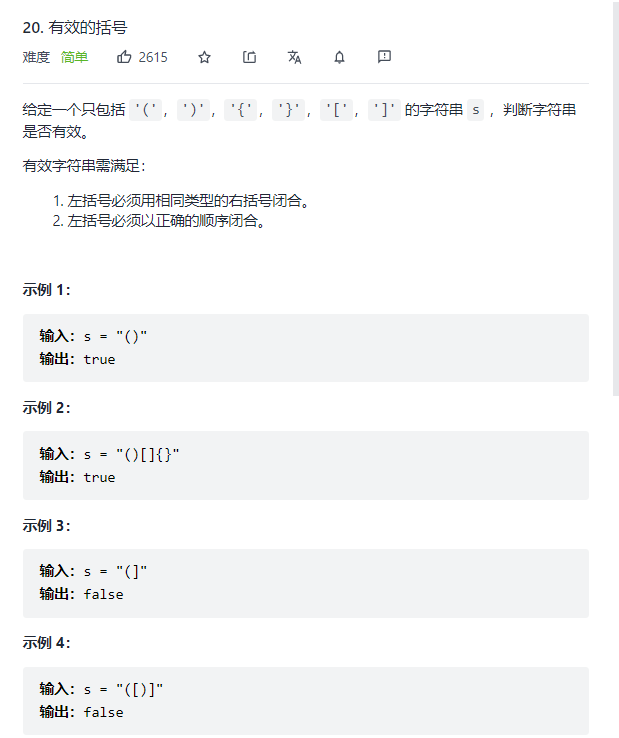
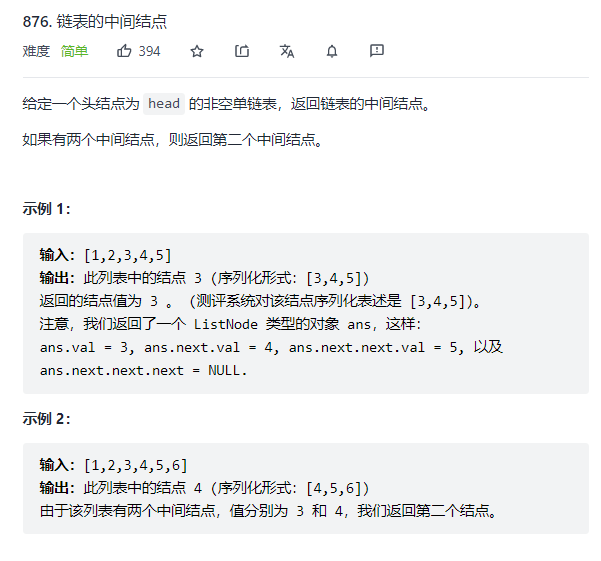
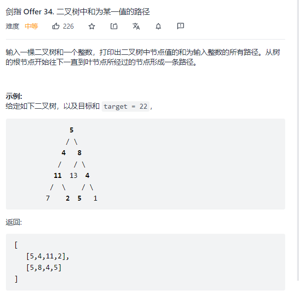
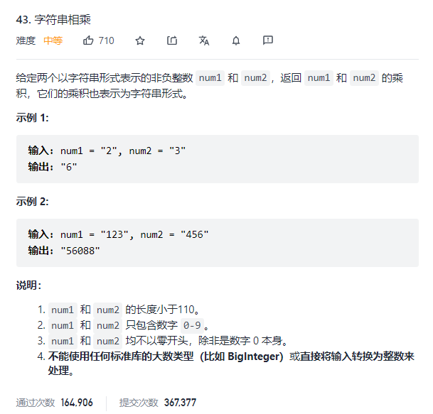
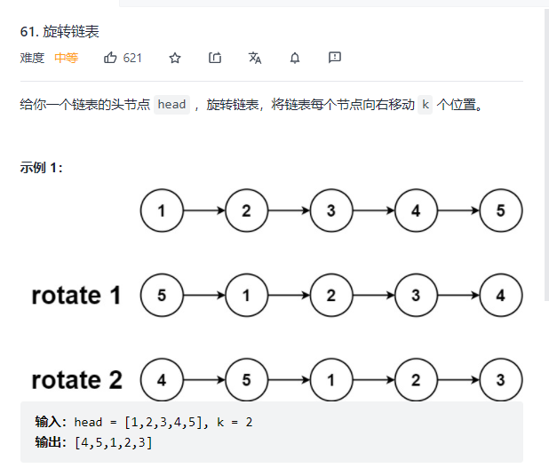
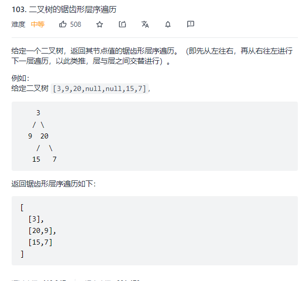

# 字节算法题

## 剑指 Offer 28. 对称的二叉树

[剑指 Offer 28. 对称的二叉树](https://leetcode-cn.com/problems/dui-cheng-de-er-cha-shu-lcof/)

- 递归
  - 不对称的情况, 两个结点其中一个为null ,或者 值不等
  - 同时为null, 并且 值相等, 比较左节点.left 和 右节点.right && 左节点.right 和头结点.left
- 迭代
  - 队列保存子节点
  - 同时出队两个 就是对称的两个结点, 比较 左.left 右.right  左.right和右.left
  - 不符合返回false ,符合 将左.left 右.right 左.right 右.left 按顺序入队

```java
//递归
public boolean isSymmetric(TreeNode root) {
    return root==null || dfs(root.left, root.right);
}

private boolean dfs(TreeNode l, TreeNode r){
    if(l==null && r==null){
        return true;
    }
    if(l==null || r==null || r.val != l.val){
        return false;
    }

    return dfs(l.left, r.right) && dfs(l.right, r.left);
}
//迭代
public boolean isSymmetric(TreeNode root) {
    if(root==null){
        return true;
    }
    //左右子节点都不存可以
    if(root.left==null && root.right==null){
        return true;
    }
    //其中一个为null 不可以
    if(root.left==null || root.right==null){
        return false;
    }
    //左右子节点入队
    Queue<TreeNode> queue = new LinkedList<>();
    queue.offer(root.left);
    queue.offer(root.right);
    while(!queue.isEmpty()){
        //一次出对的两个必须值相等 或者都是null 
        TreeNode l = queue.poll();
        TreeNode r = queue.poll();
        if(l==null && r==null){
            continue;
        }
        if(l==null || r==null || l.val!=r.val){
            return false;
        }
        //对称相等的节点放入队列
        queue.offer(l.left);
        queue.offer(r.right);
        queue.offer(l.right);
        queue.offer(r.left);
    }
    return true;
}
```


## 20. 有效的括号

[20. 有效的括号](https://leetcode-cn.com/problems/valid-parentheses/)

- 栈中保存还没匹配的括号
- 当前括号如果栈空直接入栈
- 如果栈顶的括号不能匹配 当前入栈
- 如果匹配 栈顶出栈
- 最后栈空说明是有效的



```java
//栈
public boolean isValid(String s) {
    Map<Character, Character> map = new HashMap<>();
    map.put(')', '(');
    map.put(']', '[');
    map.put('}', '{');
    Deque<Character> stack = new ArrayDeque<>();
    for(char c : s.toCharArray()){
        if(map.containsKey(c)){
            if(stack.isEmpty() || stack.peekLast()!=map.get(c)){
                stack.offerLast(c);
            }else{
                stack.pollLast();
            }
        }else{
            stack.offerLast(c);
        }
    }
    return stack.isEmpty();
}

//数组代替栈
public boolean isValid(String s) {
    /**
        1. 数量相等
        2. 括号匹配
        3. 空间优化 index s.toCharArray() arr[index-1] 代表栈顶
         */
    Map<Character, Character> map = new HashMap<>();
    map.put(')','(');
    map.put(']','[');
    map.put('}','{');
    int index = 0;
    char[] arr = s.toCharArray();
    for(char cur : s.toCharArray()){
        if(map.containsKey(cur)){
            if(index==0 || arr[index-1]!=map.get(cur)){
                return false;
            }
            index--;
        }else{
            arr[index++] = cur;
        }
    }
    return index==0;
}


```


## 876. 链表的中间结点

[876. 链表的中间结点](https://leetcode-cn.com/problems/middle-of-the-linked-list/)

- 遍历链表 算出结点个数 n
- 中点下标为 n/2
- 快慢指针, 
  - slow一次走一步 fast一次走两步 循环判断fast!=null  && fast.next!=null



```java
//快慢指针
public ListNode middleNode(ListNode head) {
    if(head==null){
        return null;
    }
    ListNode slow = head;
    ListNode fast = head;
    while(fast!=null && fast.next!=null){
        slow = slow.next;
        fast = fast.next.next;
    }
    return slow;
}
```


## 剑指 Offer 22. 链表中倒数第k个节点

[剑指 Offer 22. 链表中倒数第k个节点](https://leetcode-cn.com/problems/lian-biao-zhong-dao-shu-di-kge-jie-dian-lcof/)

- 快指针先走k步
- 快慢指针一起走 fast=null 这时的slow就是倒数第k个结点

```java
public ListNode getKthFromEnd(ListNode head, int k) {
    ListNode slow = head;
    ListNode fast = head;
    while(k>0){
        fast = fast.next;
        k--;
    }
    while(fast!=null){
        slow = slow.next;
        fast = fast.next;
    }
    return slow;
}
```


## 5. 最长回文子串

[5. 最长回文子串](https://leetcode-cn.com/problems/longest-palindromic-substring/)

- dp数组 `dp[i][j] = s.charAt(i)==s.charAt(j) && dp[i+1][j-1]` 代表 字符串的 ij范围内是否是回文串 
- 遇到回文串 更新 最长长度和起始结尾下标
- 填表顺序 i=n-2, j=i+1

```java
public String longestPalindrome(String s) {
        if(s==null || s.length()==0 || s.length()==1){
            return s;
        }
        int n = s.length();
        boolean[][] dp = new boolean[n][n];
        int[] res = new int[2];
        int maxLen = 1;
        for(int i=0; i<n; i++){
            dp[i][i] = true;
        }
        for(int i=n-2; i>=0; i--){
            for(int j=i+1; j<n; j++){
                if(s.charAt(i)==s.charAt(j)){
                    if(j==i+1){
                        dp[i][j] = true;
                    }else{
                        dp[i][j] = dp[i+1][j-1];
                    }
                }
                if(dp[i][j] && j-i+1>maxLen){
                    res[0] = i;
                    res[1] = j;
                    maxLen = j-i+1;
                }
            }
        }
        return s.substring(res[0], res[1]+1);
    }
```


## 剑指 Offer 34. 二叉树中和为某一值的路径

[剑指 Offer 34. 二叉树中和为某一值的路径](https://leetcode-cn.com/problems/er-cha-shu-zhong-he-wei-mou-yi-zhi-de-lu-jing-lcof/)

- dfs遍历每条路径, 记录路径结点以及和
- path.add(node.val) sum+=node.val
- 到达叶子结点判断是否等于target 是就加入到结果res
- 递归左右子节点
- 递归回来删除path加入的当前结点



```java
public List<List<Integer>> pathSum(TreeNode root, int target) {
    List<List<Integer>> res = new ArrayList<>();
    List<Integer> path = new ArrayList<>();
    dfs(res, path, target, 0, root);
    return res;
}

private void dfs(List<List<Integer>> res, List<Integer> path, int target, int sum, TreeNode node){
    if(node==null){
        return;
    }
    path.add(node.val);
    sum+=node.val;
    if(node.left==null && node.right==null && sum==target){
        res.add(new ArrayList<>(path));
        path.remove(path.size()-1);
        return;
    }
    dfs(res, path, target, sum, node.left);
    dfs(res, path, target, sum, node.right);
    path.remove(path.size()-1);

}
```


## 43. 字符串相乘

[43. 字符串相乘](https://leetcode-cn.com/problems/multiply-strings/)

- 两个字符串相乘的数长度最多为 长度之和
- 从右到左对齐相乘对应位置上的数
- 最多为两位, 对应在结果的 i+j i+j+1
- 对每个位置的和进位保留个位
- 去除leading 0 



```java
public String multiply(String num1, String num2) {
    if(num1==null || num1.length()==0){
        return "";
    }
    if(num2==null || num2.length()==0){
        return "";
    }
    int n1 = num1.length(), n2 = num2.length();
    int[] res = new int[n1+n2];
    for(int i=n1-1; i>=0; i--){
        for(int j=n2-1; j>=0; j--){
            int c1 = num1.charAt(i)-'0';
            int c2 = num2.charAt(j)-'0';
            int curMul = c1*c2;
            int ten = curMul/10;
            int one = curMul%10;
            res[i+j] += ten;
            res[i+j+1] += one;
        }
    }
    int car = 0;
    for(int i=res.length-1; i>=0; i--){
        int cur = res[i]+car;
        car = cur/10;
        res[i] = cur%10;
    }
    int index = 0;
    while(index<res.length && res[index]==0){
        index++;
    }
    StringBuffer sb = new StringBuffer();
    while(index<res.length){
        sb.append(res[index]);
        index++;
    }
    return sb.length()==0?"0":sb.toString();


}

```


## 61. 旋转链表

[61. 旋转链表](https://leetcode-cn.com/problems/rotate-list/)

- 计算结点个数 n
-  k%= n
- 找到移动后新的头结点 为后面k个结点的前一个结点
- 快指针移动k次, 然后快慢一起移动直到快指针为最后一个结点
- 这是慢指针下一个就是新的头结点
- 慢指针.next = null 原始链表的尾结点接到head , 返回新的头结点
- 另一个思路 结成环, 头结点向后遍历n-k-1个 位置 断开, 后面一个结点就是头结点



```java
//连城环
public ListNode rotateRight(ListNode head, int k) {
    if(head==null ){
        return null;
    }
    int cnt = 0;
    //结点个数 尾结点
    ListNode cur = head, tail = null;
    while(cur!=null){
        cnt++;
        if(cur.next==null){
            tail = cur;
        }
        cur = cur.next;
    }
    //实际的k
    k %= cnt;
    int rem = cnt-k-1;
    tail.next = head;
    cur = head;
    while(rem>0){
        cur = cur.next;
        rem--;
    }
    ListNode newHead = cur.next;
    cur.next = null;
    return newHead;

}

//拼接
public ListNode rotateRight(ListNode head, int k) {
    if(head==null ){
        return null;
    }
    int cnt = 0;
    //结点个数 尾结点
    ListNode cur = head, tail = null;
    while(cur!=null){
        cnt++;
        if(cur.next==null){
            tail = cur;
        }
        cur = cur.next;
    }
    //实际的k
    k %= cnt;
    //不需要旋转
    if(k==0){
        return head;
    }
    //快指针先移动k个位置
    cur = head;
    while(k>0){
        cur = cur.next;
        k--;
    }
    //快慢一起移动到快指针到达最后一个结点
    ListNode prev = head;
    while( cur.next!=null ){
        prev = prev.next;
        cur = cur.next;
    }
    //新的头结点是慢指针的下一个
    ListNode next = prev.next;
    //尾结点接到head前面, 新的头结点为 next
    prev.next = null;
    tail.next = head;
    return next;
}
```


## 103. 二叉树的锯齿形层序遍历

[103. 二叉树的锯齿形层序遍历](https://leetcode-cn.com/problems/binary-tree-zigzag-level-order-traversal/)




```java
public List<List<Integer>> zigzagLevelOrder(TreeNode root) {
    List<List<Integer>> res = new ArrayList<>();
    Queue<TreeNode> queue = new LinkedList<>();
    if(root==null){
        return res;
    }
    queue.offer(root);
    int level = 0;
    while(!queue.isEmpty()){
        ArrayList<Integer> cur = new ArrayList<>();
        for(int i=queue.size(); i>0; i--){
            TreeNode node = queue.poll();
            cur.add(node.val);
            if(node.left!=null){
                queue.offer(node.left);
            }
            if(node.right!=null){
                queue.offer(node.right);
            }
        }
        if(level==1){
            Collections.reverse(cur);
        }
        res.add(cur);
        level = (level+1)%2;
    }
    return res;
}

public List<List<Integer>> zigzagLevelOrder(TreeNode root) {
    /**
         偶数层 0 2 4
         左 --> 右 遍历本层结点 先左子节点后右子节点
         奇数层 1 3 5
         右 --> 左 先右子节点后左子节点
         具体实现
         不论那一层 都先左后右加入队列
         偶数层 addLast到list
         奇数层 addFirst到list        
         */
    List<List<Integer>> res = new ArrayList<>();
    if(root==null){
        return res;
    }
    dfs(root, res, 0);
    return res;

}

private void dfs(TreeNode node, List<List<Integer>> list, int level){
    if(node==null){
        return;
    }
    if(list.size()<=level){
        list.add(new LinkedList<Integer>());
    }
    List<Integer> cur = list.get(level);
    if(level%2==0){
        cur.add(node.val);
    }else{
        cur.add(0,node.val);
    }
    dfs(node.left, list, level+1);
    dfs(node.right, list, level+1);
}
```


智力题：36匹马6赛道，不能计时，找最快的三匹（7次
智力题：一刀切两个苹果平均分给三个人

七个球，天秤找质量不同的要几次


括号，n对括号有几种，输出所有可能的字符串（本来想用回溯，没想出剪枝条件，直接用的暴力+栈）

大数除法

链表判环

一个非零数组，将大于零的数放在前面，等于零的放在后面（easy难度）

判断一个回文字符串（easy难度）

LRU
机器人走格子

求第K小的数

二叉树最近公共祖先
36位数相加

二叉树节点的最近公共祖先，时间复杂度，如果有重复值节点怎么办？

求一个数，由当前数字组成的比当前数大的最小值？（下一个排列）

（1） 数组实现栈

（2） 判断平衡二叉树

堆排序 先问让我说堆排序的思路，然后问我堆的几个条件，说是不是随便拿个完全二叉树，然后根节点最大这就是个大顶堆什么的

 前序中序构造二叉树

算法题, LeetCode303 要求查询时间复杂度O(1) 一位数组前缀和
算法题, LeetCode304 要求查询时间复杂度O(1) 二维数组前缀和

先序遍历非递归解法

二维地图(数组)从左上角走到右下角的最小开销

判断是否是平衡二叉树

奇升偶降链表重排序

下一个排列

sql 查询学生分数最大值

链路上的最小延迟值 leetcode 743

剑指 Offer 03. 数组中重复的数字

https://mp.weixin.qq.com/s/2OXg67MfBuQjDPAJxxD8rQ

交换整数第n个节点和倒数第n个节点