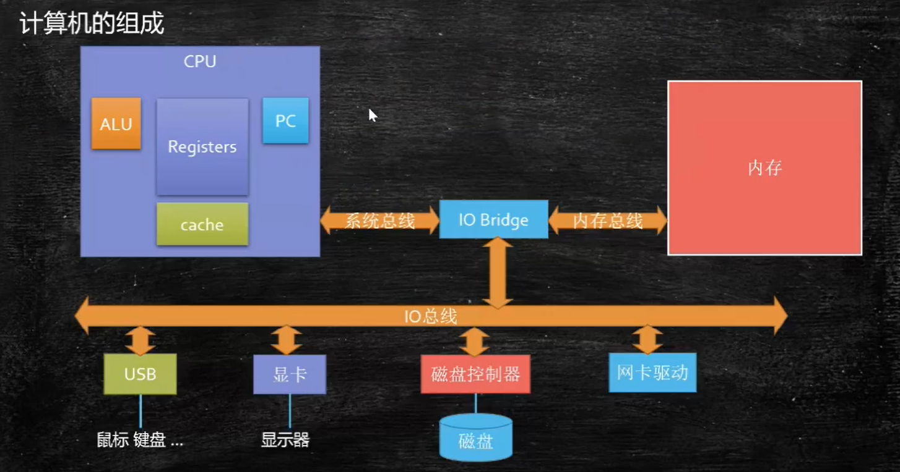

# 操作系统

https://gitee.com/cosen1024/Java-Interview



## 进程管理

###  进程

#### 进程的概念

- 进程是资源分配的最小单位，

- 进程拥有自己的资源空间(地址空间)，每启动一个进程，系统就会为它分配地址空间

- 进程上下文切换开销大，线程开销小

- 一个进程挂掉了不会影响其他进程，而线程挂掉了会影响其他线程

- 一般情况下，包括文本区域（text region）、数据区域（data region）和堆栈（stack region）。
  - 文本区域存储处理器执行的代码
  - 数据区域存储变量和进程执行期间使用的动态分配的内存；
  - 堆栈区域存储着活动过程调用的指令和本地变量
- 进程是抢占式的争夺CPU运行自身,而CPU单核的情况下同一时间只能执行一个进程的代码,但是多进程的实现则是通过CPU飞快的切换不同进程,因此使得看上去就像是多个进程在同时进行.

- 操作系统对进程的控制和管理通过PCB(Processing Control Block)，PCB通常是系统内存占用区中的一个连续存区，它存放着操作系统用于描述进程情况及控制进程运行所需的全部信息(包括：进程标识号,进程状态,进程优先级,文件系统指针以及各个寄存器的内容等)，

- 操作系统对把CPU控制权在不同进程之间交换执行的机制称为上下文切换（context switch），即保存当前进程的上下文，恢复新进程的上下文，然后将CPU控制权转移到新进程，新进程就会从上次停止的地方开始。因此，进程是轮流使用CPU的，CPU被若干进程共享，使用某种调度算法来决定何时停止一个进程，并转而为另一个进程提供服务。

#### 进程的状态

一个进程至少具有5种基本状态：初始态、就绪状态、等待（阻塞）状态、执行状态、终止状态。

- 初始状态：进程刚被创建，由于其他进程正占有CPU资源，所以得不到执行，只能处于初始状态。
- 就绪状态：只有处于就绪状态的经过调度才能到执行状态
- 等待状态：进程等待某件事件完成
- 执行状态：任意时刻处于执行状态的进程只能有一个（对于单核CPU来讲）。
- 停止状态：进程结束


#### 进程间通信方式有哪些？

- 管道：管道这种通讯方式有两种限制，一是半双工的通信，数据只能单向流动，二是只能在具有亲缘关系的进程间使用。进程的亲缘关系通常是指父子进程关系。

  管道可以分为两类：匿名管道和命名管道。匿名管道是单向的，只能在有亲缘关系的进程间通信；命名管道以磁盘文件的方式存在，可以实现本机任意两个进程通信。

- 信号 ： 信号是一种比较复杂的通信方式，信号可以在任何时候发给某一进程，而无需知道该进程的状态。

  > **Linux系统中常用信号**： （1）**SIGHUP**：用户从终端注销，所有已启动进程都将收到该进程。系统缺省状态下对该信号的处理是终止进程。
  >
  > （2）**SIGINT**：程序终止信号。程序运行过程中，按`Ctrl+C`键将产生该信号。
  >
  > （3）**SIGQUIT**：程序退出信号。程序运行过程中，按`Ctrl+\\`键将产生该信号。
  >
  > （4）**SIGBUS和SIGSEGV**：进程访问非法地址。
  >
  > （5）**SIGFPE**：运算中出现致命错误，如除零操作、数据溢出等。
  >
  > （6）**SIGKILL**：用户终止进程执行信号。shell下执行`kill -9`发送该信号。
  >
  > （7）**SIGTERM**：结束进程信号。shell下执行`kill 进程pid`发送该信号。
  >
  > （8）**SIGALRM**：定时器信号。
  >
  > （9）**SIGCLD**：子进程退出信号。如果其父进程没有忽略该信号也没有处理该信号，则子进程退出后将形成僵尸进程。

- 信号量：信号量是一个**计数器**，可以用来控制多个进程对共享资源的访问。它常作为一种**锁机制**，防止某进程正在访问共享资源时，其他进程也访问该资源。因此，主要作为进程间以及同一进程内不同线程之间的同步手段。

- 消息队列：消息队列是消息的链接表，包括Posix消息队列和System V消息队列。有足够权限的进程可以向队列中添加消息，被赋予读权限的进程则可以读走队列中的消息。消息队列克服了信号承载信息量少，管道只能承载无格式字节流以及缓冲区大小受限等缺点。

- 共享内存：共享内存就是映射一段能被其他进程所访问的内存，这段共享内存由一个进程创建，但多个进程都可以访问。共享内存是最快的 IPC 方式，它是针对其他进程间通信方式运行效率低而专门设计的。它往往与其他通信机制，如信号量，配合使用，来实现进程间的同步和通信。

- Socket：与其他通信机制不同的是，它可用于不同机器间的进程通信。

**优缺点**：

- 管道：速度慢，容量有限；
- Socket：任何进程间都能通讯，但速度慢；
- 消息队列：容量受到系统限制，且要注意第一次读的时候，要考虑上一次没有读完数据的问题；
- 信号量：不能传递复杂消息，只能用来同步；
- 共享内存区：能够很容易控制容量，速度快，但要保持同步，比如一个进程在写的时候，另一个进程要注意读写的问题，相当于线程中的线程安全，当然，共享内存区同样可以用作线程间通讯，不过没这个必要，线程间本来就已经共享了同一进程内的一块内存。


#### 进程同步的机制

##### 进程同步概念

1、临界资源：在系统中有许多硬件和软件资源，如打印机、公共变量等，这些资源在一段时间内只允许一个进程访问或者使用，这种资源称之为临界资源。

2、临界区：作为临界资源，不论硬件临界资源还是软件临界资源，多个并发的进程都必须互斥地访问或者使用，这时候，把每个进程访问临界资源的那段代码称为临界区。

3、进程同步：进程同步是指多个相关进程在执行次序上的协调这些进程相互合作，在一些关键点上需要相互等待或者通信。通过临界区可以协调进程间的合作关系，这就是同步。

4、进程互斥：进程互斥是指当一个程序进入临界区使用临界资源时，另一个进程必须等待。当占用临界资源的进程退出临界区后，另一个进程才被允许使用临界资源。通过临界区可以协调程序间资源共享关系，就是进程互斥。进程互斥是同步的一种特例。

##### 进程同步机制遵循的原则

空闲让进：当无进程处于临界区时，临界区处于空闲状态，可以允许一个请求进入临界区的进程进入临界区，有效地使用临界资源。

忙则等待：当有进程进入自己的临界区时，意味着临界资源正在被访问，因而其他的试图进入临界区的进程必须等待，以保证进程互斥地使用临界资源。

有限等待：对要求访问临界资源的进程，必须保证该进程在有效的时间内进入自己的临界区，以免出现死等的情况。

让权等待：当进程不能进入自己的临界区时，应该立即释放处理器，以免陷入“忙等”

#####  进程间同步的方式有哪些？

1、临界区：通过对多线程的串行化来访问公共资源或一段代码，速度快，适合控制数据访问。

优点：保证在某一时刻只有一个线程能访问数据的简便办法。

缺点：虽然临界区同步速度很快，但却只能用来同步本进程内的线程，而不可用来同步多个进程中的线程。

2、互斥量：为协调共同对一个共享资源的单独访问而设计的。互斥量跟临界区很相似，比临界区复杂，互斥对象只有一个，只有拥有互斥对象的线程才具有访问资源的权限。

优点：使用互斥不仅仅能够在同一应用程序不同线程中实现资源的安全共享，而且可以在不同应用程序的线程之间实现对资源的安全共享。

缺点：

- 互斥量是可以命名的，也就是说它可以跨越进程使用，所以创建互斥量需要的资源更多，所以如果只为了在进程内部是用的话使用临界区会带来速度上的优势并能够减少资源占用量。
- 通过互斥量可以指定资源被独占的方式使用，但如果有下面一种情况通过互斥量就无法处理，比如现在一位用户购买了一份三个并发访问许可的数据库系统，可以根据用户购买的访问许可数量来决定有多少个线程/进程能同时进行数据库操作，这时候如果利用互斥量就没有办法完成这个要求，信号量对象可以说是一种资源计数器。

3、信号量：为控制一个具有有限数量用户资源而设计。它允许多个线程在同一时刻访问同一资源，但是需要限制在同一时刻访问此资源的最大线程数目。互斥量是信号量的一种特殊情况，当信号量的最大资源数=1就是互斥量了。

优点：适用于对Socket（套接字）程序中线程的同步。

缺点:

- 信号量机制必须有公共内存，不能用于分布式操作系统，这是它最大的弱点；
- 信号量机制功能强大，但使用时对信号量的操作分散， 而且难以控制，读写和维护都很困难，加重了程序员的编码负担；
- 核心操作P-V分散在各用户程序的代码中，不易控制和管理，一旦错误，后果严重，且不易发现和纠正。

4、事件： 用来通知线程有一些事件已发生，从而启动后继任务的开始。

优点：事件对象通过通知操作的方式来保持线程的同步，并且可以实现不同进程中的线程同步操作。


#### 进程上下文切换、为啥进程开销大 

线程也有自己的资源，比如栈，私有数据等等。说他使用而不拥有资源指的是使用的是进程的打开文件句柄，进程的全局数据，进程的地址空间等等,这些都属于进程，而不属于线程，进程内线程共享。 

进程切换比线程切换开销大是因为进程切换时要切页表，而且往往伴随着页调度，因为进程的数据段代码段要换出去，以便把将要执行的进程的内容换进来。本来进程的内容就是线程的超集。而且线程只需要保存线程的上下文（相关寄存器状态和栈的信息）就好了，动作很小

##### 进程切换分两步：

1. 切换页目录以使用新的地址空间
2. 切换内核栈和硬件上下文

对于linux来说，线程和进程的最大区别就在于地址空间，对于线程切换，第1步是不需要做的，第2是进程和线程切换都要做的。

##### 切换的性能消耗：

1. 线程上下文切换和进程上下问切换一个最主要的区别是线程的切换虚拟内存空间依然是相同的，但是进程切换是不同的。
   - 这两种上下文切换的处理都是通过操作系统内核来完成的。内核的这种切换过程伴随的最显著的性能损耗是将寄存器中的内容切换出。
2. 另外一个隐藏的损耗是上下文的切换会扰乱处理器的缓存机制。
   - 简单的说，一旦去切换上下文，处理器中所有已经缓存的内存地址一瞬间都作废了。
   - 还有一个显著的区别是当你改变虚拟内存空间的时候，处理的页表缓冲（processor's Translation Lookaside Buffer (TLB)）被全部刷新，这将导致内存的访问在一段时间内相当的低效。但是在线程的切换中，不会出现这个问题。
   - 页表查找是一个很慢的过程，因此通常使用Cache来缓存常用的地址映射，这样可以加速页表查找，这个cache就是TLB.当进程切换后页表也要进行切换，页表切换后TLB就失效了，cache失效导致命中率降低，那么虚拟地址转换为物理地址就会变慢，表现出来的就是程序运行会变慢

####  如何减少上下文切换

- 多线程竞争时，会引起上下文切换。
- 无锁并发编程：用一些办法来避免使用锁，如将数据的ID按照Hash取模分段，不同线程处理不同段数据。

- CAS算法：Java的Atomic包使用CAS算法来更新数据，而不需加锁

- 使用最少线程：避免创建不需要的线程

- 协程：在单线程里实现多任务的调度，维持多任务间的切换。


### 线程

#### 线程的概念

- 线程是线程是CPU调度的最小单位

- 一个进程可以有一个或多个线程，同一进程中的多个线程将共享该进程中的全部系统资源，如虚拟地址空间，文件描述符和信号处理等等。
- 同一进程中的多个线程有各自的调用栈和线程本地存储
- 线程之间的通信比较方便。同一进程下的线程共享数据（比如全局变量，静态变量），但是需要考虑同步问题

- 同时多线程是不安全的,当一个线程崩溃了,会导致整个进程也崩溃了,即其他线程也挂了,

- 系统为线程分配一个线程控制块TCB（Thread Control Block）,将所有用于控制和管理线程的信息记录在线程的控制块中，
  - TCB中通常包括：线程标志符 一组寄存器 线程运行状态 优先级 线程专有存储区 信号屏蔽
- 线程同样至少具有五种状态：初始态、就绪状态、等待（阻塞）状态、执行状态和终止状态
  - Java.Thread.State
  - NEW 状态是指线程刚创建, 尚未启动
  - RUNNABLE 状态是线程正在正常运行中,当然可能会有某种耗时计算/IO等待的操作/CPU时间片切换等,这个状态下发生的等待一般是其他系统资源, 而不是锁, Sleep等
  - BLOCKED 这个状态下, 是在多个线程有同步操作的场景,比如正在等待另一个线程的synchronized 块的执行释放, 或者可重入的 synchronized块里别人调用wait() 方法,也就是这里是线程在等待进入临界区
  - WAITING 这个状态下是指线程拥有了某个锁之后, 调用了他的wait方法, 等待其他线程/锁拥有者调用 notify / notifyAll 一遍该线程可以继续下一步操作, 这里要区分 BLOCKED 和 WATING 的区别, 一个是在临界点外面等待进入, 一个是在理解点里面wait等待别人notify, 线程调用了join方法 join了另外的线程的时候, 也会进入WAITING状态, 等待被他join的线程执行结束
  - TIMED_WAITING 这个状态就是有限的(时间限制)的WAITING, 一般出现在调用wait(long), join(long)等情况下, 另外一个线程sleep后, 也会进入TIMED_WAITING状态
  - TERMINATED 这个状态下表示该线程的run方法已经执行完毕了,基本上就等于死亡了(当时如果线程被持久持有, 可能不会被回收)


#### 线程同步的方式有哪些？

1、临界区：当多个线程访问一个独占性共享资源时，可以使用临界区对象。拥有临界区的线程可以访问被保护起来的资源或代码段，其他线程若想访问，则被挂起，直到拥有临界区的线程放弃临界区为止，以此达到用原子方式操 作共享资源的目的。

2、事件：事件机制，则允许一个线程在处理完一个任务后，主动唤醒另外一个线程执行任务。

3、互斥量：互斥对象和临界区对象非常相似，只是其允许在进程间使用，而临界区只限制与同一进程的各个线程之间使用，但是更节省资源，更有效率。

4、信号量：当需要一个计数器来限制可以使用某共享资源的线程数目时，可以使用“信号量”对象。

区别：

- 互斥量与临界区的作用非常相似，但互斥量是可以命名的，也就是说互斥量可以跨越进程使用，但创建互斥量需要的资源更多，所以如果只为了在进程内部是用的话使用临界区会带来速度上的优势并能够减少资源占用量 。因为互斥量是跨进程的互斥量一旦被创建，就可以通过名字打开它。
- 互斥量，信号量，事件都可以被跨越进程使用来进行同步数据操作。


#### 线程有几种状态？

- 新建(NEW)：新创建了一个线程对象。
- 可运行(RUNNABLE)：线程对象创建后，其他线程(比如main线程）调用了该对象的start()方法。该状态的线程位于可运行线程池中，等待被线程调度选中，获取cpu 的使用权 。
- 运行(RUNNING)：可运行状态(runnable)的线程获得了cpu 时间片（timeslice） ，执行程序代码。
- 阻塞(BLOCKED)：阻塞状态是指线程因为某种原因放弃了cpu 使用权，也即让出了cpu timeslice，暂时停止运行。直到线程进入可运行(runnable)状态，才有机会再次获得cpu timeslice 转到运行(running)状态。阻塞的情况分三种：
  - (一). 等待阻塞：运行(running)的线程执行o.wait()方法，JVM会把该线程放入等待队列(waitting queue)中。
  - (二). 同步阻塞：运行(running)的线程在获取对象的同步锁时，若该同步锁被别的线程占用，则JVM会把该线程放入锁池(lock pool)中。
  - (三). 其他阻塞：运行(running)的线程执行Thread.sleep(long ms)或t.join()方法，或者发出了I/O请求时，JVM会把该线程置为阻塞状态。当sleep()状态超时、join()等待线程终止或者超时、或者I/O处理完毕时，线程重新转入可运行(runnable)状态。
- 死亡(DEAD)：线程run()、main() 方法执行结束，或者因异常退出了run()方法，则该线程结束生命周期。死亡的线程不可再次复生。

#### 创建线程的方式

##### 继承Thread类

```java
//定义一个继承Thread类的Runner类
class Runner extends Thread {
    //定义线程所拥有的方法
    public void run (){
        System.out.println("线程创建完毕");
    }
}

Runner r = new Runner();
r.start();
//如果使用r.run()仅相当于方法的调用

```


##### 实现Runnable接口

```java
//定义一个实现Runnable接口的类
class MyThread implements Runnable {
    public void run (){
        System.out.println("创建成功");
    }
}        
//创建MyThread的对象，并用这个对象作为Thread类构造器的参数
MyThread r = new MyThread();
Thread t = new Thread(r);
t.start();

```


##### 实现Callable接口

做法：首先重写Call方法，启动线程时，需要新建一个Callable的实例，再用Future Task实例包装它，最终再包装成Thread实例，调用start方法启动。

```java
//创建线程的方式：Callable
class MyThread implements Callable<Integer> {
    @Override
    public Integer call() throws Exception {
        System.out.println(Thread.currentThread().getName()+"\t coming in");
        TimeUnit.SECONDS.sleep(3l);
        return 1024;
    }
}

//用Callable的方式创建线程,相比较于Runnable，可以获取返回的值
MyThread thread = new MyThread();
//需要一个FutureTask，而且在两个线程里传入同一个futureTask，只会执行一次
FutureTask<Integer> futureTask = new FutureTask<>(thread);
new Thread(futureTask,"A").start();

```


##### 使用Executors工具类创建线程池

1. newFixedThreadPool：固定大小线程池
2. newCachedThreadPool：带缓冲线程池
3. newSingleThreadExecutor：单线程线程池
4. newScheduledThreadPool：任务调度线程池
5. ForkJoinPool：分治线程池

```java
// 创建单线程线程池的方法，创建其他线程池同理
public class t {
    public static void main(String[] args) {
        ExecutorService executorService = Executors.newSingleThreadExecutor();
        MyRunnable runnableTest = new MyRunnable();
        for (int i = 0; i < 5; i++) {
            // 每次循环，都创建一个线程
            executorService.execute(runnableTest);
        }
        System.out.println("线程任务开始执行");
        // 当线程池调用该方法时,线程池的状态则立刻变成SHUTDOWN状态。此时，则不能再往线程池中添加任何任务(串行执行)
        executorService.shutdown();
    }

}
class MyRunnable implements Runnable {
    @Override
    public void run() {
        System.out.println("执行中");
    }
}
```

##### Runnable、Callable、Future的异同

- 相同点：
  - 都是接口
  - 都可以编写多线程程序
  - 都采用Thread.start()启动线程

- 不同点
  - Runnable接口run方法无返回值。 Callable有，被线程执行后，可以返回值，这个返回值可以被Future拿到。
  - Future表示异步任务，是一个可能还没有完成异步任务的结果。
  - 因此：Callable用于产生结果，Future用于获取结果
  - FutureTask：表示异步运算任务，里面可以传入Callable具体实现类，可以对这个异步运算任务的结果进行等待获取，判断是否已经完成，取消任务等操作。
  - Runnable接口run只能抛出异常时运行，且无法捕获处理；Callable接口call方法允许抛出异常，且可以获取异常信息。

##### run()和start()区别

start()方法用于启动线程，run()方法用于执行线程的运行时代码，叫做线程体。

run()只是一个线程里的普通函数，可以重复调用，而start()只能调用一次

总结：调用start方法可以启动线程并使线程进入就绪状态，而run方法只是thread的一个普通方法调用，还是在主线程里执行。

#### 守护、用户线程

用户线程：运行在前台，执行具体任务，如程序的主线程，连接网络的子线程等都是用户线程。

守护线程：运行在后台，为其他前台线程服务。一旦所有用户线程都结束运行，守护线程会随JVM一起结束工作。（如垃圾回收线程）

#### 查看线程运行的方法

1. Windows
   任务管理器查看or杀死

打开cmd命令行窗口，使用tasklist + taskkill命令杀死进程。具体如下：

```
jps
taskkill /F /PID 33736 (F是强烈杀死)
```

- linux
- ps -fe 查看所有进程
  - ID、当前状态、启动时间、占用CPU时间、CPU占用百分比、内存占用百分比、占用虚拟内存的大小、占用常驻内存的大小
- ps -fT -p <PID> 查看某个进程（PID）的所有线程
- kill杀死进程
- top 按大写 H 切换是否显示线程
- top -H -p <PID>查看某个进程（PID）的所有线程

Java
注意：需要到对应的java\lib下面运行

- jsp查看所有Java命令

- jstack<PID>查看某个Java进程（PID）的所有线程状态

- jconsole查看某个Java进程中线程的运行情况（图形界面）


### 协程 Coroutine

- 协程是属于线程的。协程程序是在线程里面跑的，协程不是被操作系统内核所管理，而完全是由程序所控制。
- 协程没有线程的上下文切换消耗。协程的调度切换是用户(程序员)手动切换的,因此更加灵活,因此又叫用户空间线程.
- 原子操作性。由于协程是用户调度的，所以不会出现执行一半的代码片段被强制中断了，因此无需原子操作锁。
- 协程可以比作子程序，但执行过程中，子程序内部可中断，然后转而执行别的子程序，在适当的时候再返回来继续执行。协程之间的切换不需要涉及任何系统调用或任何阻塞调用
- 协程只在一个线程中执行，是子程序之间的切换，发生在用户态上。而且，线程的阻塞状态是由操作系统内核来完成，发生在内核态上，因此协程相比线程节省了线程创建和切换的开销
- 协程中不存在同时写变量冲突，因此，也就不需要用来守卫关键区块的同步性原语，比如互斥锁、信号量等，并且不需要来自操作系统的支持。
- 协程适用于IO阻塞且需要大量并发的场景，当发生IO阻塞，由协程的调度器进行调度，通过将数据流yield掉，并且记录当前栈上的数据，阻塞完后立刻再通过线程恢复协程栈，并把阻塞的结果放到这个线程上去运行。


### 进程和线程的区别？

- 调度：进程是资源管理的基本单位，线程是程序执行的基本单位。
- 切换：线程上下文切换比进程上下文切换要快得多。
- 拥有资源： 进程是拥有资源的一个独立单位，线程不拥有系统资源，但是可以访问隶属于进程的资源。
- 系统开销： 创建或撤销进程时，系统都要为之分配或回收系统资源，如内存空间，I/O设备等，OS所付出的开销显著大于在创建或撤销线程时的开销，进程切换的开销也远大于线程切换的开销。

### 协程与线程的区别？

- 线程和进程都是同步机制，而协程是异步机制。
- 线程是抢占式，而协程是非抢占式的。需要用户释放使用权切换到其他协程，因此同一时间其实只有一个协程拥有运行权，相当于单线程的能力。
- 一个线程可以有多个协程，一个进程也可以有多个协程。
- 协程不被操作系统内核管理，而完全是由程序控制。线程是被分割的CPU资源，协程是组织好的代码流程，线程是协程的资源。但协程不会直接使用线程，协程直接利用的是执行器关联任意线程或线程池。
- 协程能保留上一次调用时的状态。

### 并发和并行有什么区别？

并发就是在一段时间内，多个任务都会被处理；但在某一时刻，只有一个任务在执行。单核处理器可以做到并发。比如有两个进程`A`和`B`，`A`运行一个时间片之后，切换到`B`，`B`运行一个时间片之后又切换到`A`。因为切换速度足够快，所以宏观上表现为在一段时间内能同时运行多个程序。

并行就是在同一时刻，有多个任务在执行。这个需要多核处理器才能完成，在微观上就能同时执行多条指令，不同的程序被放到不同的处理器上运行，这个是物理上的多个进程同时进行。

### 进程与线程的切换流程？

进程切换分两步：

1、切换**页表**以使用新的地址空间，一旦去切换上下文，处理器中所有已经缓存的内存地址一瞬间都作废了。

2、切换内核栈和硬件上下文。

对于linux来说，线程和进程的最大区别就在于地址空间，对于线程切换，第1步是不需要做的，第2步是进程和线程切换都要做的。

因为每个进程都有自己的虚拟地址空间，而线程是共享所在进程的虚拟地址空间的，因此同一个进程中的线程进行线程切换时不涉及虚拟地址空间的转换。

### 为什么虚拟地址空间切换会比较耗时？

进程都有自己的虚拟地址空间，把虚拟地址转换为物理地址需要查找页表，页表查找是一个很慢的过程，因此通常使用Cache来缓存常用的地址映射，这样可以加速页表查找，这个Cache就是TLB（translation Lookaside Buffer，TLB本质上就是一个Cache，是用来加速页表查找的）。

由于每个进程都有自己的虚拟地址空间，那么显然每个进程都有自己的页表，那么**当进程切换后页表也要进行切换，页表切换后TLB就失效了**，Cache失效导致命中率降低，那么虚拟地址转换为物理地址就会变慢，表现出来的就是程序运行会变慢，而线程切换则不会导致TLB失效，因为线程无需切换地址空间，因此我们通常说线程切换要比较进程切换块，原因就在这里。


###  什么是临界区，如何解决冲突？

每个进程中访问临界资源的那段程序称为临界区，**一次仅允许一个进程使用的资源称为临界资源。**

解决冲突的办法：

- 如果有若干进程要求进入空闲的临界区，**一次仅允许一个进程进入**，如已有进程进入自己的临界区，则其它所有试图进入临界区的进程必须等待；
- 进入临界区的进程要在**有限时间内退出**。
- 如果进程不能进入自己的临界区，则应**让出CPU**，避免进程出现“忙等”现象。


### 什么用线程什么时候用进程

1、需要频繁创建销毁的优先使用线程；因为对进程来说创建和销毁一个进程代价是很大的。

2、线程的切换速度快，所以在需要大量计算，切换频繁时用线程，还有耗时的操作使用线程可提高应用程序的响应

3、因为对CPU系统的效率使用上线程更占优，所以可能要发展到多机分布的用进程，多核分布用线程；

4、并行操作时使用线程，如C/S架构的服务器端并发线程响应用户的请求；

5、需要更稳定安全时，适合选择进程；需要速度时，选择线程更好。

### CPU调度算法

- 先来先到
  - 计算密集型和IO密集型进程同时执行, IO可能需要很长时间才能执行完, 但是如果调度算法可以每10ms抢占计算密集型进程, IO可也很快完成, 不会对计算密集型产生太大延迟
- 最短作业优先
  - 所有作业都可以同时运行的情况下才是最优的
- 最短剩余时间优先
  - 当前运行进程会为刚进来的剩余时间更短的进程让出CPU
- 轮转调度 (20-50ms)
  - 每个进程分配一个时间片, 时间片结束将CPU分配给另一个进程, 如果时间片结束前阻塞或者结束立即切换
- 优先级调度 (aging)
  - 防止当前高优先级的进程无限进行下去, 每个时钟滴答会降低当前进程的优先级,如果导致了当前进程优先级低于其他进程, 切换 给其他进程运行的机会
- 多级队列
  - 为CPU密集型进程设置较长的时间片比频繁的分给他们短时间片更高效, 设置优先级类, 属于最高优先级类的进程运行一个时间片, 属于次高的运行2个时间片, 
  - 降低一级, 时间片时间加倍, 当一个进程用完分配的时间片后, 移动到下一类, 下次可运行的时间加倍
- 最短进程优先
  - 根据过去的行为, 估算运行时间最短的那一个
- 保证调度
  - n个进程, 每个获取1/nCPU
- 彩票
  - 需要调度, 抽彩票, 拥有该彩票的进程获得该资源
- 公平分享
  - 每个用户不管进程多少, 都获得1/用户数的CPU


### 系统调用为什么效率低


## 内存管理

###  虚拟内存和物理内存的区别和关系？ 

- 虚拟地址是操作系统为每个进程分配的自己的独立的地址空间,
- 而物理内存是物理意义上的内存, CPU通过操作物理内存来实现程序的运行
- 因为直接操作物理内存会带来程序编写的困难如两个程序同时对一个物理内存地址进行操作一个覆盖了另一个, 导致了程序的崩溃, 那么分配每个进程单独的地址空间使得进程间的地址隔离开来互不干扰
- 这时就需要一个MMU内存映射单元将每个进程的虚拟地址映射到对应的物理内存地址上, 这样CPU就可以操作虚拟地址对应的物理内存地址了
- 内存存在分页分段机制
  - 分段根据逻辑上把内存分成 堆 栈 数据 代码四个段, 虚拟地址由 段选择子和段偏移量构成, 
    - 通过段选择子在段表中获得段在物理内存中的段基地址值 + 段偏移量获得真实的物理内存地址从而完成虚拟地址到物理内存的映射
  - 在分页机制下，虚拟地址分为两部分，页号和页内偏移。
    - 页号作为页表的索引，页表包含物理页每页所在物理内存的基地址，这个基地址与页内偏移的组合就形成了物理内存地址


###  内存分页分段机制 

#### 虚拟内存 

如果你是电子相关专业的，肯定在大学里捣鼓过单片机。

单片机是没有操作系统的，所以每次写完代码，都需要借助工具把程序烧录进去，这样程序才能跑起来。

另外，**单片机的 CPU 是直接操作内存的「物理地址」**。


在这种情况下，要想在内存中同时运行两个程序是不可能的。如果第一个程序在 2000 的位置写入一个新的值，将会擦掉第二个程序存放在相同位置上的所有内容，所以同时运行两个程序是根本行不通的，这两个程序会立刻崩溃。

> 操作系统是如何解决这个问题呢？

这里关键的问题是这两个程序都引用了绝对物理地址，而这正是我们最需要避免的。

我们可以把进程所使用的地址「隔离」开来，即让操作系统为每个进程分配独立的一套「**虚拟地址**」，人人都有，大家自己玩自己的地址就行，互不干涉。但是有个前提每个进程都不能访问物理地址，至于虚拟地址最终怎么落到物理内存里，对进程来说是透明的，操作系统已经把这些都安排的明明白白了。

进程的中间层

**操作系统会提供一种机制，将不同进程的虚拟地址和不同内存的物理地址映射起来。**

如果程序要访问虚拟地址的时候，由操作系统转换成不同的物理地址，这样不同的进程运行的时候，写入的是不同的物理地址，这样就不会冲突了。

于是，这里就引出了两种地址的概念：

- 我们程序所使用的内存地址叫做**虚拟内存地址**（*Virtual Memory Address*）
- 实际存在硬件里面的空间地址叫**物理内存地址**（*Physical Memory Address*）。

操作系统引入了虚拟内存，进程持有的虚拟地址会通过 CPU 芯片中的内存管理单元（MMU）的映射关系，来转换变成物理地址，然后再通过物理地址访问内存，如下图所示：

虚拟地址寻址

> 操作系统是如何管理虚拟地址与物理地址之间的关系？

主要有两种方式，分别是**内存分段和内存分页**，分段是比较早提出的，我们先来看看内存分段。

------

#### 内存分段 

程序是由若干个逻辑分段组成的，如可由代码分段、数据分段、栈段、堆段组成。**不同的段是有不同的属性的，所以就用分段（\*Segmentation\*）的形式把这些段分离出来。**

> 分段机制下，虚拟地址和物理地址是如何映射的？

分段机制下的虚拟地址由两部分组成，**段选择子**和**段内偏移量**。

内存分段-寻址的方式

- **段选择子**就保存在段寄存器里面。段选择子里面最重要的是**段号**，用作段表的索引。**段表**里面保存的是这个**段的基地址、段的界限和特权等级**等。
- 虚拟地址中的**段内偏移量**应该位于 0 和段界限之间，如果段内偏移量是合法的，就将段基地址加上段内偏移量得到物理内存地址。

在上面，知道了虚拟地址是通过**段表**与物理地址进行映射的，分段机制会把程序的虚拟地址分成 4 个段，每个段在段表中有一个项，在这一项找到段的基地址，再加上偏移量，于是就能找到物理内存中的地址，如下图：

内存分段-虚拟地址与物理地址

如果要访问段 3 中偏移量 500 的虚拟地址，我们可以计算出物理地址为，段 3 基地址 7000 + 偏移量 500 = 7500。

分段的办法很好，解决了程序本身不需要关心具体的物理内存地址的问题，但它也有一些不足之处：

- 第一个就是**内存碎片**的问题。
- 第二个就是**内存交换的效率低**的问题。

接下来，说说为什么会有这两个问题。

> 我们先来看看，分段为什么会产生内存碎片的问题？

我们来看看这样一个例子。假设有 1G 的物理内存，用户执行了多个程序，其中：

- 游戏占用了 512MB 内存
- 浏览器占用了 128MB 内存
- 音乐占用了 256 MB 内存。

这个时候，如果我们关闭了浏览器，则空闲内存还有 1024 - 512 - 256 = 256MB。

如果这个 256MB 不是连续的，被分成了两段 128 MB 内存，这就会导致没有空间再打开一个 200MB 的程序。

内存碎片的问题

这里的内存碎片的问题共有两处地方：

- 外部内存碎片，也就是产生了多个不连续的小物理内存，导致新的程序无法被装载；
- 内部内存碎片，程序所有的内存都被装载到了物理内存，但是这个程序有部分的内存可能并不是很常使用，这也会导致内存的浪费；

针对上面两种内存碎片的问题，解决的方式会有所不同。

解决外部内存碎片的问题就是**内存交换**。

可以把音乐程序占用的那 256MB 内存写到硬盘上，然后再从硬盘上读回来到内存里。不过再读回的时候，我们不能装载回原来的位置，而是紧紧跟着那已经被占用了的 512MB 内存后面。这样就能空缺出连续的 256MB 空间，于是新的 200MB 程序就可以装载进来。

这个内存交换空间，在 Linux 系统里，也就是我们常看到的 Swap 空间，这块空间是从硬盘划分出来的，用于内存与硬盘的空间交换。

> 再来看看，分段为什么会导致内存交换效率低的问题？

对于多进程的系统来说，用分段的方式，内存碎片是很容易产生的，产生了内存碎片，那不得不重新 `Swap` 内存区域，这个过程会产生性能瓶颈。

因为硬盘的访问速度要比内存慢太多了，每一次内存交换，我们都需要把一大段连续的内存数据写到硬盘上。

所以，**如果内存交换的时候，交换的是一个占内存空间很大的程序，这样整个机器都会显得卡顿。**

为了解决内存分段的内存碎片和内存交换效率低的问题，就出现了内存分页。

------

#### 内存分页 

分段的好处就是能产生连续的内存空间，但是会出现内存碎片和内存交换的空间太大的问题。

要解决这些问题，那么就要想出能少出现一些内存碎片的办法。另外，当需要进行内存交换的时候，让需要交换写入或者从磁盘装载的数据更少一点，这样就可以解决问题了。这个办法，也就是**内存分页**（*Paging*）。

**分页是把整个虚拟和物理内存空间切成一段段固定尺寸的大小**。这样一个连续并且尺寸固定的内存空间，我们叫**页**（*Page*）。在 Linux 下，每一页的大小为 `4KB`。

虚拟地址与物理地址之间通过**页表**来映射，如下图：

内存映射

页表实际上存储在 CPU 的**内存管理单元** （*MMU*） 中，于是 CPU 就可以直接通过 MMU，找出要实际要访问的物理内存地址。

而当进程访问的虚拟地址在页表中查不到时，系统会产生一个**缺页异常**，进入系统内核空间分配物理内存、更新进程页表，最后再返回用户空间，恢复进程的运行。

> 分页是怎么解决分段的内存碎片、内存交换效率低的问题？

由于内存空间都是预先划分好的，也就不会像分段会产生间隙非常小的内存，这正是分段会产生内存碎片的原因。而**采用了分页，那么释放的内存都是以页为单位释放的，也就不会产生无法给进程使用的小内存。**

如果内存空间不够，操作系统会把其他正在运行的进程中的「最近没被使用」的内存页面给释放掉，也就是暂时写在硬盘上，称为**换出**（*Swap Out*）。一旦需要的时候，再加载进来，称为**换入**（*Swap In*）。所以，一次性写入磁盘的也只有少数的一个页或者几个页，不会花太多时间，**内存交换的效率就相对比较高。**

换入换出

更进一步地，分页的方式使得我们在加载程序的时候，不再需要一次性都把程序加载到物理内存中。我们完全可以在进行虚拟内存和物理内存的页之间的映射之后，并不真的把页加载到物理内存里，而是**只有在程序运行中，需要用到对应虚拟内存页里面的指令和数据时，再加载到物理内存里面去。**

> 分页机制下，虚拟地址和物理地址是如何映射的？

在分页机制下，虚拟地址分为两部分，**页号**和**页内偏移**。页号作为页表的索引，**页表**包含物理页每页所在**物理内存的基地址**，这个基地址与页内偏移的组合就形成了物理内存地址，见下图。

内存分页寻址

总结一下，对于一个内存地址转换，其实就是这样三个步骤：

- 把虚拟内存地址，切分成页号和偏移量；
- 根据页号，从页表里面，查询对应的物理页号；
- 直接拿物理页号，加上前面的偏移量，就得到了物理内存地址。

下面举个例子，虚拟内存中的页通过页表映射为了物理内存中的页，如下图：

虚拟页与物理页的映射

这看起来似乎没什么毛病，但是放到实际中操作系统，这种简单的分页是肯定是会有问题的。

> 简单的分页有什么缺陷吗？

有空间上的缺陷。

因为操作系统是可以同时运行非常多的进程的，那这不就意味着页表会非常的庞大。

在 32 位的环境下，虚拟地址空间共有 4GB，假设一个页的大小是 4KB（2^12），那么就需要大约 100 万 （2^20） 个页，每个「页表项」需要 4 个字节大小来存储，那么整个 4GB 空间的映射就需要有 `4MB` 的内存来存储页表。

这 4MB 大小的页表，看起来也不是很大。但是要知道每个进程都是有自己的虚拟地址空间的，也就说都有自己的页表。

那么，`100` 个进程的话，就需要 `400MB` 的内存来存储页表，这是非常大的内存了，更别说 64 位的环境了。

#### 多级页表

要解决上面的问题，就需要采用的是一种叫作**多级页表**（*Multi-Level Page Table*）的解决方案。

在前面我们知道了，对于单页表的实现方式，在 32 位和页大小 `4KB` 的环境下，一个进程的页表需要装下 100 多万个「页表项」，并且每个页表项是占用 4 字节大小的，于是相当于每个页表需占用 4MB 大小的空间。

我们把这个 100 多万个「页表项」的单级页表再分页，将页表（一级页表）分为 `1024` 个页表（二级页表），每个表（二级页表）中包含 `1024` 个「页表项」，形成**二级分页**。如下图所示：

二级分页

> 你可能会问，分了二级表，映射 4GB 地址空间就需要 4KB（一级页表）+ 4MB（二级页表）的内存，这样占用空间不是更大了吗？

当然如果 4GB 的虚拟地址全部都映射到了物理内存上的话，二级分页占用空间确实是更大了，但是，我们往往不会为一个进程分配那么多内存。

其实我们应该换个角度来看问题，还记得计算机组成原理里面无处不在的**局部性原理**么？

每个进程都有 4GB 的虚拟地址空间，而显然对于大多数程序来说，其使用到的空间远未达到 4GB，因为会存在部分对应的页表项都是空的，根本没有分配，对于已分配的页表项，如果存在最近一定时间未访问的页表，在物理内存紧张的情况下，操作系统会将页面换出到硬盘，也就是说不会占用物理内存。

如果使用了二级分页，一级页表就可以覆盖整个 4GB 虚拟地址空间，但**如果某个一级页表的页表项没有被用到，也就不需要创建这个页表项对应的二级页表了，即可以在需要时才创建二级页表**。做个简单的计算，假设只有 20% 的一级页表项被用到了，那么页表占用的内存空间就只有 4KB（一级页表） + 20% * 4MB（二级页表）= `0.804MB`，这对比单级页表的 `4MB` 是不是一个巨大的节约？

> 那么为什么不分级的页表就做不到这样节约内存呢？

我们从页表的性质来看，保存在内存中的页表承担的职责是将虚拟地址翻译成物理地址。假如虚拟地址在页表中找不到对应的页表项，计算机系统就不能工作了。所以**页表一定要覆盖全部虚拟地址空间，不分级的页表就需要有 100 多万个页表项来映射，而二级分页则只需要 1024 个页表项**（此时一级页表覆盖到了全部虚拟地址空间，二级页表在需要时创建）。

我们把二级分页再推广到多级页表，就会发现页表占用的内存空间更少了，这一切都要归功于对局部性原理的充分应用。

对于 64 位的系统，两级分页肯定不够了，就变成了四级目录，分别是：

- 全局页目录项 PGD（*Page Global Directory*）；
- 上层页目录项 PUD（*Page Upper Directory*）；
- 中间页目录项 PMD（*Page Middle Directory*）；
- 页表项 PTE（*Page Table Entry*）；

四级目录

#### TLB

多级页表虽然解决了空间上的问题，但是虚拟地址到物理地址的转换就多了几道转换的工序，这显然就降低了这俩地址转换的速度，也就是带来了时间上的开销。

程序是有局部性的，即在一段时间内，整个程序的执行仅限于程序中的某一部分。相应地，执行所访问的存储空间也局限于某个内存区域。

程序的局部性

我们就可以利用这一特性，把最常访问的几个页表项存储到访问速度更快的硬件，于是计算机科学家们，就在 CPU 芯片中，加入了一个专门存放程序最常访问的页表项的 Cache，这个 Cache 就是 TLB（*Translation Lookaside Buffer*） ，通常称为页表缓存、转址旁路缓存、快表等。

地址转换

在 CPU 芯片里面，封装了内存管理单元（*Memory Management Unit*）芯片，它用来完成地址转换和 TLB 的访问与交互。

有了 TLB 后，那么 CPU 在寻址时，会先查 TLB，如果没找到，才会继续查常规的页表。

TLB 的命中率其实是很高的，因为程序最常访问的页就那么几个。

------

#### 段页式内存管理 

内存分段和内存分页并不是对立的，它们是可以组合起来在同一个系统中使用的，那么组合起来后，通常称为**段页式内存管理**。

段页式地址空间

段页式内存管理实现的方式：

- 先将程序划分为多个有逻辑意义的段，也就是前面提到的分段机制；
- 接着再把每个段划分为多个页，也就是对分段划分出来的连续空间，再划分固定大小的页；

这样，地址结构就由**段号、段内页号和页内位移**三部分组成。

用于段页式地址变换的数据结构是每一个程序一张段表，每个段又建立一张页表，段表中的地址是页表的起始地址，而页表中的地址则为某页的物理页号，如图所示：

段页式管理中的段表、页表与内存的关系

段页式地址变换中要得到物理地址须经过三次内存访问：

- 第一次访问段表，得到页表起始地址；
- 第二次访问页表，得到物理页号；
- 第三次将物理页号与页内位移组合，得到物理地址。

可用软、硬件相结合的方法实现段页式地址变换，这样虽然增加了硬件成本和系统开销，但提高了内存的利用率。

#### 总结 

为了在多进程环境下，使得进程之间的内存地址不受影响，相互隔离，于是操作系统就为每个进程独立分配一套**虚拟地址空间**，每个程序只关心自己的虚拟地址就可以，实际上大家的虚拟地址都是一样的，但分布到物理地址内存是不一样的。作为程序，也不用关心物理地址的事情。

每个进程都有自己的虚拟空间，而物理内存只有一个，所以当启用了大量的进程，物理内存必然会很紧张，于是操作系统会通过**内存交换**技术，把不常使用的内存暂时存放到硬盘（换出），在需要的时候再装载回物理内存（换入）。

那既然有了虚拟地址空间，那必然要把虚拟地址「映射」到物理地址，这个事情通常由操作系统来维护。

那么对于虚拟地址与物理地址的映射关系，可以有**分段**和**分页**的方式，同时两者结合都是可以的。

内存分段是根据程序的逻辑角度，分成了**栈段、堆段、数据段、代码段**等，这样可以分离出不同属性的段，同时是一块连续的空间。但是每个段的大小都不是统一的，这就会导致内存碎片和内存交换效率低的问题。

于是，就出现了内存分页，把虚拟空间和物理空间分成大小固定的页，如在 Linux 系统中，每一页的大小为 `4KB`。由于分了页后，就不会产生细小的内存碎片。同时在内存交换的时候，写入硬盘也就一个页或几个页，这就大大提高了内存交换的效率。

再来，为了解决简单分页产生的页表过大的问题，就有了**多级页表**，它解决了空间上的问题，但这就会导致 CPU 在寻址的过程中，需要有很多层表参与，加大了时间上的开销。于是根据程序的**局部性原理**，在 CPU 芯片中加入了 **TLB**，负责缓存最近常被访问的页表项，大大提高了地址的转换速度。


### 页面置换算法

- 理想页面（Optimal， OPT)置换算法
  - 发生缺页时，有些页面在内存中，其中有一页将很快被访问(包含紧接着 的下一条指令的那页)，而其他页则可能到10、
    100或1000条指令后才会被访问，每个页都可以用在该页面首次被访问前所要执行的指令数进行标记。标记树最大的页应该被置换。
- 最近最久未使用置换算法（Least Recently Used， LRU）
  - 刚被访问的页面，可能马上又要被访问；而较长时间内没有被访问的页面，可能最近不会被访问。 LRU算法普偏地适用于各种类型的程
    序，但是系统要时时刻刻对各页的访问历史情况加以记录和更新，开销太大，因此LRU算法必须要有硬件的支持。
- 第二次机会页面置换算法
  - FIFO算法可能会把经常使用的页面置换出去，为了避免这一问题，对该算法进行简单的修改：检查最老页面的R位，如果R位是0，那么
    这个页面又老有没用，可以立即置换出去，如果是1，就清零R位，并将该页放到链表的尾端，修改它的装入时间使它就像装入的一样，
    然后继续搜索。如果所有的页面都被访问过，那么该算法就被降为纯粹的FIFO算法。
- 最近未使用(NRU：Not Recently Used)
  - 用R位和M位构造一个简单的页面置换算法：当启动一个进程时，它的所有页的两个位都由操作系统设置成0，R位被定期的清零，以
    区别最近没有被访问的页和被访问了的页。 
  - 根据R位和M位，分为4类页面 
    - 第0类：没有被访问，没有被修改 
    - 第1类，没有被访问，被修改 
    - 第2类，被访问，没有被修改 
    - 第3类，被访问，被修改。
  - NRU算法随机地从编号最小的非空类中挑选一个页淘汰之。这个算法隐含的意思是，淘汰一个在最近一个时钟周期内没有被访问
    的已修改页要比淘汰一个被频繁访问的干净的页好。

- FIFO先进先出算法：在操作系统中经常被用到，比如作业调度（主要实现简单，很容易想到）；
  - 置换最先调入内存的页面，即置换在内存中驻留时间最久的页面。按照进入内存的先后次序排列成队列，从队尾进入，从队首删除。但是
    该算法会淘汰经常访问的页面，不适应进程实际运行的规律，目前已经很少使用。
- LFU（Least frequently use）最少使用次数算法：根据使用次数来判断；
- 时钟页面置换算法


- 软件模拟LRU


- 工作集时钟页面置换算法


### 中断与缺页中断


#### 缺页中断

malloc()和mmap()等内存分配函数，在分配时只是建立了进程虚拟地址空间，并没有分配虚拟内存对应的物理内存。当进程访问这些没有建立映射关系的虚拟内存时，处理器自动触发一个缺页异常。
缺页中断：在请求分页系统中，可以通过查询页表中的状态位来确定所要访问的页面是否存在于内存中。每当所要访问的页面不在内存是，会产生一次缺页中断，此时操作系统会根据页表中的外存地址在外存中找到所缺的一页，将其调入内存。

缺页本身是一种中断，与一般的中断一样，需要经过4个处理步骤：

1、保护CPU现场

2、分析中断原因

3、转入缺页中断处理程序进行处理

4、恢复CPU现场，继续执行

#### 操作系统中的中断

中断是指CPU对系统发生的某个事件做出的一种反应，CPU暂停正在执行的程序，保存现场后自动去执行相应的处理程序，处理完该事件后再返回中断处继续执行原来的程序。

中断一般三类，

- 一种是由CPU外部引起的，如I/O中断、时钟中断，
- 一种是来自CPU内部事件或程序执行中引起的中断，例如程序非法操作，地址越界、浮点溢出），
- 最后一种是在程序中使用了系统调用引起的。而中断处理一般分为中断响应和中断处理两个步骤，中断响应由硬件实施，中断处理主要由软件实施。

#### 区别

但是缺页中断是由于所要访问的页面不存在于内存时，由硬件所产生的一种特殊的中断，因此，与一般的中断存在区别：

1、在指令执行期间产生和处理缺页中断信号

2、一条指令在执行期间，可能产生多次缺页中断

3、缺页中断返回是，执行产生中断的一条指令，而一般的中断返回是，执行下一条指令。


### 颠簸

- 颠簸本质上是指频繁的页调度行为，具体来讲，进程发生缺页中断，这时，必须置换某一页。然而，其他所有的页都在使用，它置换一个页，但又立刻再次需要这个页。因此，会不断产生缺页中断，导致整个系统的效率急剧下降，这种现象称为颠簸（抖动）。


- 内存颠簸的解决策略包括：
  - 如果是因为页面替换策略失误，可以修改替换算法来解决这个问题；
  - 如果是因为运行的程序太多，造成程序无法同时将所有频繁访问的页面调入内存，则要降低多道程序的数量；
  - 否则，还剩下两个办法：终止该进程或增加物理内存容量。


##  堆和栈的区别 以及在操作系统中堆和栈的具体使用 

```
内存中的栈区处于相对较高的地址以地址的增长方向为上的话，栈地址是向下增长的。

栈中分配局部变量空间，堆区是向上增长的用于分配程序员申请的内存空间。另外还有静态区是分配静态变量，全局变量空间的；只读区是分配常量和程序代码空间的；以及其他一些分区。

0.申请方式和回收方式不同
不知道你是否有点明白了。

堆和栈的第一个区别就是申请方式不同：栈（英文名称是stack）是系统自动分配空间的，例如我们定义一个 char a；系统会自动在栈上为其开辟空间。而堆（英文名称是heap）则是程序员根据需要自己申请的空间，例如malloc（10）；开辟十个字节的空间。

由于栈上的空间是自动分配自动回收的，所以栈上的数据的生存周期只是在函数的运行过程中，运行后就释放掉，不可以再访问。而堆上的数据只要程序员不释放空间，就一直可以访问到，不过缺点是一旦忘记释放会造成内存泄露。还有其他的一些区别我认为网上的朋友总结的不错这里转述一下：

1.申请后系统的响应
栈：只要栈的剩余空间大于所申请空间，系统将为程序提供内存，否则将报异常提示栈溢出。

堆：首先应该知道操作系统有一个记录空闲内存地址的链表，当系统收到程序的申请时，会遍历该链表，寻找第一个空间大于所申请空间的堆结点，然后将该结点从空闲结点链表中删除，并将该结点的空间分配给程序，另外，对于大多数系统，会在这块内存空间中的首地址处记录本次分配的大小，这样，代码中的 delete语句才能正确的释放本内存空间。另外，由于找到的堆结点的大小不一定正好等于申请的大小，系统会自动的将多余的那部分重新放入空闲链表中。 
也就是说堆会在申请后还要做一些后续的工作这就会引出申请效率的问题。

2.申请效率的比较

根据第0点和第1点可知。
栈：由系统自动分配，速度较快。但程序员是无法控制的。
堆：是由new分配的内存，一般速度比较慢，而且容易产生内存碎片,不过用起来最方便。

3.申请大小的限制
栈：在Windows下,栈是向低地址扩展的数据结构，是一块连续的内存的区域。这句话的意思是栈顶的地址和栈的最大容量是系统预先规定好的，在 WINDOWS下，栈的大小是2M（也有的说是1M，总之是一个编译时就确定的常数），如果申请的空间超过栈的剩余空间时，将提示overflow。因此，能从栈获得的空间较小。 

堆：堆是向高地址扩展的数据结构，是不连续的内存区域。这是由于系统是用链表来存储的空闲内存地址的，自然是不连续的，而链表的遍历方向是由低地址向高地址。堆的大小受限于计算机系统中有效的虚拟内存。由此可见，堆获得的空间比较灵活，也比较大。

4.堆和栈中的存储内容
由于栈的大小有限，所以用子函数还是有物理意义的，而不仅仅是逻辑意义。

栈： 在函数调用时，第一个进栈的是主函数中函数调用后的下一条指令（函数调用语句的下一条可执行语句）的地址，然后是函数的各个参数，在大多数的C编译器中，参数是由右往左入栈的，然后是函数中的局部变量。注意静态变量是不入栈的。 
当本次函数调用结束后，局部变量先出栈，然后是参数，最后栈顶指针指向最开始存的地址，也就是主函数中的下一条指令，程序由该点继续运行。 

堆：一般是在堆的头部用一个字节存放堆的大小。堆中的具体内容有程序员安排。
```


## DMA

https://blog.csdn.net/as480133937/article/details/104927922?ops_request_misc=%257B%2522request%255Fid%2522%253A%2522162579960116780261915487%2522%252C%2522scm%2522%253A%252220140713.130102334..%2522%257D&request_id=162579960116780261915487&biz_id=0&utm_medium=distribute.pc_search_result.none-task-blog-2~all~top_positive~default-1-104927922.pc_search_result_control_group&utm_term=DMA&spm=1018.2226.3001.4187

## 文件管理

https://juejin.cn/post/6850037269835808782#heading-86

## inode

https://blog.csdn.net/haiross/article/details/39157885?ops_request_misc=%257B%2522request%255Fid%2522%253A%2522162556888416780269864750%2522%252C%2522scm%2522%253A%252220140713.130102334..%2522%257D&request_id=162556888416780269864750&biz_id=0&utm_medium=distribute.pc_search_result.none-task-blog-2~all~sobaiduend~default-5-39157885.pc_search_result_control_group&utm_term=%E6%93%8D%E4%BD%9C%E7%B3%BB%E7%BB%9F+%E6%96%87%E4%BB%B6%E7%B3%BB%E7%BB%9F+inode&spm=1018.2226.3001.4187

### 硬连接

- 创建一个硬链接后，testfile的inode count增加了一个。而且testfile和testfile.hard这两个的Inode number是一样的。这个硬链接就是重新创建了一个文件名对应到原文件的Inode。实质就是在Directory中增加了一个新的对应关系。通过这个例子，你是不是更清楚了，这个Inode count的含义了。他就是指，一个Inode对应了多少个文件名。 

- 般情况下，文件名和inode号码是"一一对应"关系，每个inode号码对应一个文件名。但是，Unix/Linux系统允许，多个文件名指向同一个inode号码。这意味着，可以用不同的文件名访问同样的内容；对文件内容进行修改，会影响到所有文件名；但是，删除一个文件名，不影响另一个文件名的访问。这种情况就被称为"硬链接"（hard link）。**

  

### 软链接

-  软链接是重新建立了一个文件，而文件是指向到原文件，而不是指向原Inode。当然他会占用掉 inode 与 block。当我们删除了源文件后，链接文件不能独立存在，虽然仍保留文件名，但我们却不能查看软链接文件的内容了。但软链接是可以跨文件系统，而且是可以链接目录。他就相当于windows系统下的快捷方式一样 
-  文件A和文件B的inode号码虽然不一样，但是文件A的内容是文件B的路径。读取文件A时，系统会自动将访问者导向文件B。因此，无论打开哪一个文件，最终读取的都是文件B。这时，文件A就称为文件B的"软链接"（soft link）或者"符号链接（symbolic link）。这意味着，文件A依赖于文件B而存在，如果删除了文件B，打开文件A就会报错："No such file or directory"。这是软链接与硬链接最大的不同：文件A指向文件B的文件名，而不是文件B的inode号码，文件B的inode"链接数"不会因此发生变化。

### 总结

1.  一个Inode对应一个文件，而一个文件根据其大小，会占用多块blocks。
2.  更为准确的来说，一个文件只对应一个Inode。因为硬链接其实不是创建新文件，只是在Directory中写入了新的对应关系而已。
3.  当我们删除文件的时候，只是把Inode标记为可用，文件在block中的内容是没有被清除的，只有在有新的文件需要占用block的时候，才会被覆盖。 


硬链接：其实就是同一个文件具有多个别名，具有相同inode，而dentry不同。

​       \1. 文件具有相同的inode和data block；

​       \2. 只能对已存在的文件进行创建；

​       \3. 不同交叉文件系统进行硬链接的创建

​       \4. 不能对目录进行创建，只能对文件创建硬链接

​       \5. 删除一个硬链接并不影响其他具有相同inode号的文件；

软链接：软链接具有自己的inode，即具有自己的文件，只是这个文件中存放的内容是另一个文件的路径名。因此软链接具有自己的inode号以及用户数据块。

​       \1. 软链接有自己的文件属性及权限等；

​       \2. 软链接可以对不存在的文件或目录创建；

​       \3. 软链接可以交叉文件系统；

​       \4. 软链接可以对文件或目录创建；

​       \5. 创建软链接时，链接计数i_nlink不会增加；

​       \6. 删除软链接不会影响被指向的文件，但若指向的原文件被删除，则成死链接，但重新创建指向 的路径即可恢复为正常的软链接，只是源文件的内容可能变了。


## 锁

### 死锁的概念

在两个或者多个并发进程中，如果每个进程持有某种资源而又等待其它进程释放它或它们现在保持着的资源，在未改变这种状态之前都不能向前推进，称这一组进程产生了死锁。通俗的讲，就是两个或多个进程无限期的阻塞、相互等待的一种状态。

### 活锁

活锁指的是任务或者执行者没有被阻塞，由于某些条件没有满足，导致一直重复尝试，失败，尝试，失败。

### 产生死锁的四个必要条件

- 互斥：至少有一个资源必须属于非共享模式，即一次只能被一个进程使用；若其他申请使用该资源，那么申请进程必须等到该资源被释放为止；

- 占有并等待：一个进程必须占有至少一个资源，并等待另一个资源，而该资源为其他进程所占有；

- 非抢占：进程不能被抢占，即资源只能被进程在完成任务后自愿释放

- 循环等待：若干进程之间形成一种头尾相接的环形等待资源关系

### 死锁的预防

#### 破坏互斥条件

方法：如果允许系统资源都能共享使用，则系统不会进入死锁状态。
缺点：有些资源根本不能同时访问，如打印机等临界资源只能互斥使用。所以，破坏互斥条件而预防死锁的方法不太可行，而且在有的场合应该保护这种互斥性。

#### 破坏请求并保持条件

方法：釆用预先静态分配方法，即进程在运行前一次申请完它所需要的全部资源，在它的资源未满足前，不把它投入运行。一旦投入运行后，这些资源就一直归它所有，也不再提出其他资源请求，这样就可以保证系统不会发生死锁。
缺点： 系统资源被严重浪费，其中有些资源可能仅在运行初期或运行快结束时才使用，甚至根本不使用。而且还会导致“饥饿”现象，当由于个别资源长期被其他进程占用时，将致使等待该资源的进程迟迟不能开始运行。

#### 破坏不可剥夺条件

方法：当一个已保持了某些不可剥夺资源的进程，请求新的资源而得不到满足时，它必须释放已经保持的所有资源，待以后需要时再重新申请。这意味着，一个进程已占有的资源会被暂时释放，或者说是被剥夺了，或从而破坏了不可剥夺条件。
缺点：该策略实现起来比较复杂，释放已获得的资源可能造成前一阶段工作的失效，反复地申请和释放资源会增加系统开销，降低系统吞吐量。这种方法常用于状态易于保存和恢复的资源，如CPU的寄存器及内存资源，一般不能用于打印机之类的资源。

#### 破坏循环等待条件

方法：为了破坏循环等待条件，可釆用顺序资源分配法。首先给系统中的资源编号，规定每个进程，必须按编号递增的顺序请求资源，同类资源一次申请完。也就是说，只要进程提出申请分配资源Ri，则该进程在以后的资源申请中，只能申请编号大于Ri的资源。
缺点：这种方法存在的问题是，编号必须相对稳定，这就限制了新类型设备的增加；尽管在为资源编号时已考虑到大多数作业实际使用这些资源的顺序，但也经常会发生作业使用资源的顺序与系统规定顺序不同的情况，造成资源的浪费；此外，这种按规定次序申请资源的方法，也必然会给用户的编程带来麻烦。

###  死锁如何避免

- 死锁避免的基本思想是动态地检测资源分配状态，以确保循环等待条件不成立，从而确保系统处于安全状态。
- 所谓安全状态是指：如果系统能按某个顺序为每个进程分配资源（不超过其最大值），那么系统状态是安全的，换句话说就是，如果存在一个安全序列，那么系统处于安全状态。
- 资源分配图算法和银行家算法是两种经典的死锁避免的算法，其可以确保系统始终处于安全状态。
  - 其中，资源分配图算法应用场景为每种资源类型只有一个实例(申请边，分配边，需求边，不形成环才允许分配)，
  - 而银行家算法应用于每种资源类型可以有多个实例的场景。

### 死锁解除

- 资源剥夺法
  - 挂起某些死锁进程，并抢占它的资源，将这些资源分配给其他的死锁进程。但应防止被挂起的进程长时间得不到资源，而处于资源匮乏的状态。
- 撤销进程法
  - 强制撤销部分、甚至全部死锁进程并剥夺这些进程的资源。撤销的原则可以按进程优先级和撤销进程代价的高低进行。
- 进程回退法
  - 让一（多）个进程回退到足以回避死锁的地步，进程回退时自愿释放资源而不是被剥夺。要求系统保持进程的历史信息，设置还原点。

