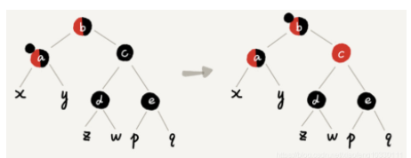
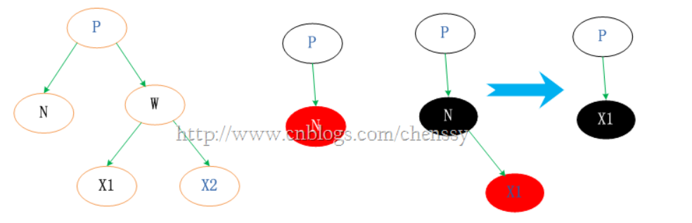

# 数据结构

完全二叉树

- 若设二叉树的深度为k，除第 k 层外，其它各层 (1～k-1) 的结点数都达到最大个数，第k 层所有的结点都**连续集中在最左边**，这就是完全二叉树。

满二叉树

- 一棵二叉树的结点要么是叶子结点，要么它有两个子结点（如果一个二叉树的层数为K，且结点总数是(2^k) -1，则它就是满二叉树。）


 [二叉树](https://www.nowcoder.com/jump/super-jump/word?word=二叉树)的概念？[红黑树](https://www.nowcoder.com/jump/super-jump/word?word=红黑树)又是什么，[红黑树](https://www.nowcoder.com/jump/super-jump/word?word=红黑树)和其他平衡树的区别在哪 

1. [平衡二叉树](https://www.nowcoder.com/jump/super-jump/word?word=平衡二叉树)是什么？用普通二叉搜索树不行吗？ [红黑树](https://www.nowcoder.com/jump/super-jump/word?word=红黑树)和平衡树的区别 
2. 说一下对于树的理解
3. [二叉树](https://www.nowcoder.com/jump/super-jump/word?word=二叉树)，二叉查找树，[红黑树](https://www.nowcoder.com/jump/super-jump/word?word=红黑树)
4. 堆排 快排 
5. LRU 


## 二叉查找树

对于数中的每个结点node, 

- node.left.val<node.val 
- node.right.val>node.val

二叉查找树的平均深度是O(logN)

包括的操作

1. contains
2. findMin findMax
   1. 最左子节点, 最右子节点
   2. 递归迭代两种方法
3. insert
4. remove
   1. 叶子结点直接删除
   2. 待删除结点有一个子树,  将待删除结点的父节点连上这个子树
   3. 有两个子树, 
      1. 需要找到左子树的最右子节点, 或者右子树的最左子节点代替待删除结点, 并且在子树中删除这个代替的结点

```java

package com.ccq.Binary_Search_Tree;

import java.util.ArrayDeque;
import java.util.Deque;

/**
 * @author Chaoqun Cheng
 * @date 2021-08-2021/8/4-0:23
 */

public class BinarySearchTree<E extends Comparable<E>> {
    /**
     * 结点类
     */
    private class Node{
        public E e;
        public Node left, right;
        public Node(E _e){
            this.e = _e;
            left = null;
            right = null;
        }
    }
    private Node root;
    private int size;
    public BinarySearchTree(){
        root = null;
        size = 0;
    }

    public BinarySearchTree(Node node){
        root = node;
        size++;
    }

    public int size(){
        return size;
    }

    public boolean isEmpty(){
        return size==0;
    }

    //===================================插入元素======================================

    /**
     * 向node为根元素的二分搜索树中插入元素
     * 如果存在就更新值
     * @param node
     * @param e
     * @return
     */
    private Node add(Node node, E e){
        if(node==null){
            size++;
            return new Node(e);
        }
        if(e.compareTo(node.e)<0){
            node.left = add(node.left, e);
            return node;
        }else if(e.compareTo(node.e)>0){
            node.right = add(node.right, e);
            return node;
        }else{
            node.e = e;
        }
        return node;
    }

    /**
     * 向二分搜索树中添加元素
     * @param e
     */
    public void add(E e){
        if(root==null){
            root = new Node(e);
        }
        add(root, e);
    }

    //===================================查找元素======================================

    /**
     * 判断以node为根元素的二分搜索树是否包含某个元素
     * @param node
     * @param e
     * @return
     */
    private boolean contains(Node node, E e){
        if(node==null){
            return false;
        }
        if(e.compareTo(node.e)<0){
            return contains(node.left, e);
        }else if(e.compareTo(node.e)>0){
            return contains(node.right, e);
        }else{
            return true;
        }
    }

    /**
     * 判断二分搜索树是否包含某个元素
     * @param e
     * @return
     */
    public boolean contains(E e){
        return contains(root, e);
    }

    private void checkEmpty(){
        if(isEmpty()){
            throw new IllegalArgumentException("BinarySearchTree is empty !");
        }
    }

    /**
     * 查找以node为根节点二分搜索树的最小节点
     * @param node
     * @return
     */
    private Node findMin(Node node){
        checkEmpty();
        if(node==null){
            return null;
        }
        if(node.left==null){
            return node;
        }
        return findMin(node.left);
    }

    /**
     * 查找二分搜索树的最小值
     * @return
     */
    public E findMin(){
        checkEmpty();
        Node min = findMin(root);
        return min==null?null:min.e;
    }

    /**
     * 查找以node为根节点二分搜索树的最大节点
     * @param node
     * @return
     */
    private Node findMax(Node node){
        checkEmpty();
        if(node==null){
            return null;
        }
        if(node.right==null){
            return node;
        }
        return findMin(node.right);
    }

    /**
     * 查找二分搜索树的最大值
     * @return
     */
    public E findMax(){
        checkEmpty();
        Node max = findMax(root);
        return max==null?null:max.e;
    }


    //===================================遍历二叉树======================================
    /**
     * 前序遍历二分搜索树
     */
    public void preOrder(){
        preOrder(root);
    }

    /**
     * 前序遍历以node为根节点的二分搜索树
     * 深度优先遍历，递归实现
     * @param node
     */
    private void preOrder(Node node){
        if(node == null){
            return;
        }
        System.out.println(node.e);
        preOrder(node.left);
        preOrder(node.right);
    }

    public void inOrder(){
        inOrder(root);
    }

    private void inOrder(Node node){
        if(node == null){
            return;
        }
        inOrder(node.left);
        System.out.println(node.e);
        inOrder(node.right);
    }

    public void postOrder(){
        postOrder(root);
    }

    private void postOrder(Node node){
        if(node == null){
            return;
        }
        postOrder(node.left);
        postOrder(node.right);
        System.out.println(node.e);
    }

    /**
     * 前序遍历二分搜索树
     * 深度优先遍历，非递归实现，利用栈结构
     */
    public void preOrderByStack(){
        if(root==null){
            return;
        }
        Deque<Node> stack = new ArrayDeque<>();
        stack.push(root);
        while(!stack.isEmpty()){
            Node curNode = stack.pop();
            System.out.println(curNode.e);
            if(curNode.right!=null){
                stack.push(curNode.right);
            }
            if(curNode.left!=null){
                stack.push(curNode.left);
            }
        }
    }

    /**
     * BFS
     */
    public void levelOrder(){
        if(root==null){
            return;
        }
        Deque<Node> queue = new ArrayDeque<>();
        queue.offer(root);
        while(!queue.isEmpty()){
            Node cur = queue.poll();
            System.out.println(cur);
            if(cur.left!=null){
                queue.offer(cur.left);
            }
            if(cur.right!=null){
                queue.offer(cur.right);
            }
        }
    }

    //===================================删除二叉树的结点======================================

    /**
     * 删除以node为根的二分搜索树的最大节点
     * @param node
     * @return
     */
    private Node removeMax(Node node){
        if(node==null){
            return null;
        }
        if(node.right==null){
            Node leftNode = node.left;
            node.left = null;
            size--;
            return leftNode;
        }
        node.right = removeMax(node.right);
        return node;
    }

    /**
     * 删除二分搜索树的最大值
     * @return
     */
    public E removeMax(){
        E max = findMax();
        removeMax(root);
        return max;
    }

    /**
     * 删除以node为根的二分搜索树的最小节点
     * @param node
     * @return
     */
    private Node removeMin(Node node){
        if(node==null){
            return null;
        }
        if(node.left==null){
            Node rightNode = node.right;
            node.right = null;
            size--;
            return rightNode;
        }
        node.left = removeMin(node.left);
        return node;
    }

    /**
     * 删除二分搜索树的最小值
     * @return
     */
    public E removeMin(){
        E min = findMin();
        removeMin(root);
        return min;
    }

    public void remove(E e){
        root = remove(root,e);
    }

    private Node remove(Node node, E e){
        if(node==null){
            return null;
        }
        if(e.compareTo(node.e)<0){
            node.left = remove(node.left, e);
            return node;
        }else if(e.compareTo(node.e)>0){
            node.right = remove(node.right, e);
            return node;
        }else{
            if(node.right==null){
                Node leftNode = node.left;
                node.left = null;
                size--;
                return leftNode;
            }else if(node.left==null){
                Node rightNode = node.right;
                node.right = null;
                size--;
                return rightNode;
            }else{
                //删除后用前驱节点替代该位置(前驱节点即待删除节点左子树中的最大节点)
                Node successor = findMax(node.left);
                //除前驱节点，并让待删除节点的左子树成为前驱节点的左子树
                successor.left = removeMax(node.left);
                // 让待删除节点的右子树成为前驱节点的右子树
                successor.right = node.right;
                // 将待删除节点的左、右子节点置为空
                node.left = node.right = null;
                return successor;
            }
        }
    }
    @Override
    public String toString() {
        StringBuilder result = new StringBuilder();
        generateBSTString(root,0,result);
        return result.toString();
    }

    /**
     * 生成二分搜索树的字符
     */
    private void generateBSTString(Node node, int depth, StringBuilder result) {
        if (node == null) {
            result.append(generateBSTString(depth)+"null\n");
            return;
        }
        result.append(generateBSTString(depth)+node.e+"\n");
        generateBSTString(node.left,depth+1,result);
        generateBSTString(node.right,depth+1,result);
    }

    /**
     * 生成表示深度的字符
     */
    private String generateBSTString(int depth) {
        StringBuilder result = new StringBuilder();
        for (int i = 0; i < depth; i++) {
            result.append("--");
        }
        return result.toString();
    }
}

```


## AVL

### AVL树的定义

- 平衡因子 : 树中某结点其左子树的高度和右子树的高度之差
- AVL树中的任意一个结点, 其平衡因子的绝对值小于2
- AVL树是一种特殊的二叉搜索树 (BST树), 相对于数据极端情况下, 二叉搜索树会退化成为单链表, AVL树定义了旋转操作, 在平衡因子大于等于2时, AVL树会旋转来调整树的结构, 来重新满足平衡因子小于2

### AVL树不平衡的情况

`AVL树`大部分操作都和`BST树`相同, 只有在插入删除结点时, 有可能造成`AVL树`失去平衡, 而且只有那些在被插入/删除结点到根节点的路径上的结点有可能出现失衡, 因为只有那些结点的子树结构发生了变化

当插入新结点导致不平衡时, 我们需要找到距离新节点`最近`的不平衡结点为轴来转动`AVL树`来达到平衡

### 单旋转


### 双旋转


```java
package com.ccq.AVL_Tree;

import java.util.ArrayDeque;
import java.util.ArrayList;
import java.util.Deque;
import java.util.List;

/** 二分查找树
 * @author Chaoqun Cheng
 * @date 2021-08-2021/8/4-0:00
 */

public class AVLTree<K extends Comparable<K>,V> {
    private class Node{
        public K key;
        public V value;
        public int height;
        public Node left, right;
        public Node(K _key, V _value){
            key = _key;
            value = _value;
            left = null;
            right = null;
            height = 1;
        }
    }

    private Node root;
    private int size;
    public AVLTree(){
        root = null;
        size = 0;
    }

    public boolean isEmpty(){
        return size==0;
    }
    public boolean contains(K key) {
        return getNode(root,key) != null;
    }

    public V get(K key) {
        Node node = getNode(root, key);
        return node != null ? node.value : null;
    }

    public void set(K key, V value) {
        Node node = getNode(root, key);
        if(node == null){
            throw new IllegalArgumentException("Set failed. key is not exists!");
        }
        node.value = value;
    }

    public int getSize() {
        return size;
    }

    /**
     * 根据key获取Node
     * @param node
     * @param key
     * @return
     */
    private Node getNode(Node node, K key){
        if(node==null){
            return null;
        }
        if(key.compareTo(node.key) == 0){
            return node;
        }else if(key.compareTo(node.key) < 0){
            return getNode(node.left,key);
        }else{
            return getNode(node.right,key);
        }
    }

    //=====================================AVL二叉树的平衡属性===================================
    /**
     * 获取某个节点的高度
     * @param node
     * @return
     */
    private int getHeight(Node node){
        if(node==null){
            return 0;
        }
        return node.height;
    }

    /**
     * 获取某个节点的平衡因子
     * @param node
     * @return
     */
    private int getBalanceFactor(Node node){
        if(node==null){
            return 0;
        }
        return getHeight(node.left)-getHeight(node.right);
    }

    /**
     * 查看AVL平衡二叉树是否是二分搜索树
     * 通过中序遍历得到二叉树的key的集合, 如果是升序的则是二分搜索树
     * @return
     */
    public boolean isBinarySearchTree(){
        List<K> keys = new ArrayList<>();
        inOrder(root, keys);
        for(int i=1; i<keys.size(); i++){
            if(keys.get(i-1).compareTo(keys.get(i))>0){
                return false;
            }
        }
        return true;
    }

    /**
     * 归查看以node为根节点的AVL平衡二叉树是否是平衡二叉树
     * @param node
     * @return
     */
    private boolean isBalanced(Node node){
        if(node==null){
            return true;
        }
        if(Math.abs(getBalanceFactor(node))>1){
            return false;
        }
        return isBalanced(node.left) && isBalanced(node.right);
    }

    /**
     * 查看AVL平衡二叉树是否是平衡二叉树
     * @return
     */
    public boolean isBalanced(){
        return isBalanced(root);
    }

    //=====================================AVL二叉树的旋转===================================

    /**右旋转操作
     // 对节点y进行向右旋转操作，返回旋转后新的根节点x
     //        y                              x
     //       / \                           /   \
     //      x   T4     向右旋转 (y)        z     y
     //     / \       - - - - - - - ->    / \   / \
     //    z   T3                       T1  T2 T3 T4
     //   / \
     // T1   T2
     * @return
     */
    private Node rightRotate(Node node){
        Node x = node.left;
        Node T3 = x.right;
        //右旋
        x.right = node;
        node.left = T3;
        //更新height
        updateHeight(node);
        updateHeight(x);
        return x;
    }

    /**左旋转操作
     // 对节点y进行向左旋转操作，返回旋转后新的根节点x
     //    y                             x
     //  /  \                          /   \
     // T1   x      向左旋转 (y)       y     z
     //     / \   - - - - - - - ->   / \   / \
     //   T2  z                     T1 T2 T3 T4
     //      / \
     //
     * @param node
     * @return
     */
    private Node leftRotate(Node node){
        Node x = node.right;
        Node T2 = x.left;
        //左旋转操作
        x.left = node;
        node.right = T2;
        //更新height
        updateHeight(node);
        updateHeight(x);
        return x;
    }

    //=====================================遍历AVL二叉树===================================
    /**
     * 中序遍历以node为根节点的AVL平衡二叉树 递归
     * @param node
     * @param keys
     */
    private void inOrder(Node node, List<K> keys){
        if(node==null){
            return;
        }
        inOrder(node.left, keys);
        keys.add(node.key);
        inOrder(node.right, keys);
    }

    /**
     * 中序遍历以node为根节点的AVL平衡二叉树 迭代
     * @param node
     * @param keys
     */
    private void inOrderByStack(Node node, List<K> keys){
        if(node==null){
            return;
        }
        Deque<Node> stack = new ArrayDeque<>();
        while(node!=null || !stack.isEmpty()){
            while(node!=null){
                stack.push(node);
                node = node.left;
            }
            node = stack.pop();
            keys.add(node.key);
            node = node.right;
        }
    }


    //=====================================AVL二叉树的插入操作===================================

    /**
     * 旋转之后更新node的高度属性
     * @param node
     */
    private void updateHeight(Node node){
        node.height = Math.max(getHeight(node.left), getHeight(node.right))+1;
    }

    /**
     * 向node为根元素的AVL平衡二叉树中插入元素
     * @param node
     * @param key
     * @param value
     * @return
     */
    private Node add(Node node, K key, V value){
        //递归结束
        if(node==null){
            size++;
            return new Node(key,value);
        }
        //递归找到插入节点的位置插入节点, 存在就更新结点值
        if(key.compareTo(node.key)<0){
            node.left = add(node.left, key, value);
        }else if(key.compareTo(node.key)>0){
            node.right = add(node.right, key, value);
        }else{
            node.value = value;
        }
        //维护平衡
        return keepBalance(node);
    }

    /**
     * 向AVL平衡二叉树中插入元素
     * @param key
     * @param value
     */
    public void add(K key, V value){
        root = add(root, key, value);
    }

    /**
     * 维护node结点的平衡
     * @param node
     * @return
     */
    private Node keepBalance(Node node){
        if(node==null){
            return null;
        }
        //更新height
        updateHeight(node);
        /**========== 维护平衡 Start ==========*/
        //计算平衡因子
        int balanceFactor = getBalanceFactor(node);
        /**----------单旋转 LL RR -------------*/
        //LL左孩子节点的左侧产生不平衡 node.left.left.height>node.left.right.height
        if(balanceFactor>1 && getBalanceFactor(node.left)>=0){
            //右旋转
            return rightRotate(node);
        }
        //RR右孩子节点的右侧产生不平衡 node.right.right.height > node.right.left.height
        if(balanceFactor<-1 && getBalanceFactor(node.right)<=0){
            //左旋转
            return leftRotate(node);
        }
        /**----------双旋转 LR RL -------------*/
        //LR左孩子节点的右侧产生不平衡 node.left.right.height > node.left.left.height
        if(balanceFactor>1 && getBalanceFactor(node.left)<0){
            //node.left左旋 变成LL的情况
            node.left = leftRotate(node.left);
            //node.left左旋之后node右旋
            return rightRotate(node);
        }
        //RL右孩子节点的左侧产生不平衡
        if(balanceFactor<-1 && getBalanceFactor(node.right)>0){
            //node.right右旋变成RR
            node.right = rightRotate(node.right);
            //node.right右旋之后 node左旋
            return leftRotate(node);
        }
        /**========== 维护平衡 End ==========*/
        return node;

    }


    //=====================================AVL二叉树的查询操作===================================
    private void checkEmpty(){
        if(isEmpty()){
            throw new IllegalArgumentException("BinarySearchTree is empty !");
        }
    }
    /**
     * 查找AVL平衡二叉树的最小值
     * @return
     */
    public V minimum(){
        checkEmpty();
        return minimum(root).value;
    }

    /***
     * 查找以node为根节点AVL平衡二叉树的最小节点
     * @param node
     * @return
     */
    private Node minimum(Node node){
        checkEmpty();
        if(node.left==null){
            return node;
        }
        return minimum(node.left);
    }

    /**
     * 查找AVL平衡二叉树的最大值
     * @return
     */
    public V maxmize(){
        checkEmpty();
        return maxmize(root).value;
    }

    /***
     * 查找以node为根节点AVL平衡二叉树的最大节点
     * @param node
     * @return
     */
    private Node maxmize(Node node){
        checkEmpty();
        if(node.right==null){
            return node;
        }
        return maxmize(node.right);
    }

    //=====================================AVL二叉树的删除操作===================================

    /**
     * 删除以node为根的AVL平衡二叉树的最大节点
     * @param node
     * @return
     */
    private Node removeMax(Node node){
        if(node.right==null){
            Node leftNode  = node.left;
            node.left = null;
            size--;
            return leftNode;
        }
        node.right = removeMax(node.right);
        return node;
    }

    /**
     * 删除AVL平衡二叉树的最大值
     * @return
     */
    public V removeMax(){
        V maximum = maxmize();
        removeMax(root);
        return maximum;
    }

    /**
     * 删除以node为根的AVL平衡二叉树的最小节点
     * @param node
     * @return
     */
    private Node removeMin(Node node){
        if(node.left==null){
            Node rightNode  = node.right;
            node.right = null;
            size--;
            return rightNode;
        }
        node.left = removeMin(node.left);
        return node;
    }

    /**
     * 删除AVL平衡二叉树的最小值
     * @return
     */
    public V removeMin(){
        V minimum = minimum();
        removeMin(root);
        return minimum;
    }

    /**
     * 删除以node为根的AVL平衡二叉树中的指定元素
     * @param node
     * @param key
     * @return
     */
    private Node remove(Node node, K key){
        if(node == null){
            return null;
        }
        Node resultNode = null;

        if(key.compareTo(node.key) < 0){
            node.left = remove(node.left, key);
            resultNode = node;
        }else if(key.compareTo(node.key) > 0){
            node.right = remove(node.right, key);
            resultNode = node;
        }else /*if(key.compareTo(node.key) == 0)*/{
            //删除右子树为空的情况
            if(node.right==null){
                Node leftNode = node.left;
                node.left = null;
                size--;
                resultNode = leftNode;
            }
            //删除左子树为空的情况
            else if(node.left==null){
                Node rightNode = node.right;
                node.right = null;
                size--;
                resultNode = rightNode;
            }
            // 删除左子树、右子树均不为空的情况
            else{
                // 1、删除后用后继节点替代该位置(后继节点即待删除节点右子树中的最小节点)
                Node successor = minimum(node.right);
                // 删除后继节点，并让待删除节点的右子树成为后继节点的右子树
                successor.right = removeMin(node.right);
                // 让待删除节点的左子树成为后继节点的左子树
                successor.left = node.left;
                // 将待删除节点的左、右子节点置为空
                node.left = node.right = null;
                resultNode = successor;
                /**
                 // 2、删除后用前驱节点替代该位置(前驱节点即待删除节点左子树中的最大节点)
                 // 获得前驱节点
                 Node predecessor = maximize(node.left);
                 // 删除前驱节点，并让待删除节点的左子树成为前驱节点的左子树
                 predecessor.left = removeMax(node);
                 // 让待删除节点的右子树成为前驱节点的右子树
                 predecessor.right = node.right;
                 // 将待删除节点的左、右子节点置为空
                 node.left = node.right = null;
                 return predecessor;
                 */
            }
        }
        //维护平衡
        return keepBalance(resultNode);
    }

    public V remove(K key){
        Node node = getNode(root, key);
        if(node!=null){
            root = remove(root,key);
            return node.value;
        }
        return null;
    }


}

```


## 堆(Heap)

数组based的堆 data[] 

- 0开始的堆, 父节点 左右节点的关系
  - parent = (left-1)/2 = (right-1)/2
  - left = parent*2+1
  - right = parent*2+2
- 1开始的堆, 父节点 左右节点的关系
  - parent = left/2 = right/2
  - left = parent*2
  - right = parent*2+1

堆中某个节点的值总是不大于或不小于其父节点的值；
堆总是一棵完全二叉树。

堆是一颗完全二叉树，每次总是先填满上一层，再在下一层从左往右依次插入, 

在这棵树中，所有父节点都满足大于等于其子节点的堆叫大根堆，所有父节点都满足小于等于其子节点的堆叫小根堆。


### 建堆 heapify()

1. 根据传入的数组, 将元素依次插入堆中的数组, 
2. 从最后一个元素的父节点开始下沉
3. 所有需要下沉的元素下沉完毕以后, 堆建好了

```java
/**
     * 传入数组建堆
     * @param array
     */
public MinHeap(E[] array){
    this(array.length);
    //所有元素入堆
    for(int i=0; i<array.length; i++){
        data.addLast(array[i]);
    }
    //建堆
    heapify();
}

/**
     * 建堆
     */
private void heapify(){
    //最后一层的不需要shiftdown 从最后一个元素的父节点开始即可
    // parent(data.getSize()-1) = (size-1)/2
    for(int i=parent(data.getSize()-1); i>=0; i--){
        shiftDown(i);
    }
}
```


### 插入 shiftUp()

1. 将新元素增加到堆的末尾
2. 按照优先顺序，将新元素与其父节点比较，如果新元素小于父节点(小根堆)则将两者交换位置。
3. 不断进行第2步操作，直到不需要交换新元素和父节点，或者达到堆顶
4. 最后通过得到一个最小堆

通过将新元素与父节点调整交换的操作叫做**上滤(percolate up)**。


```java
/**
     * 将index位置的元素上移到适合的位置
     * 这个位置应该使得这个元素大于父节点的值
     * @param index
     */
public void shiftUp(int index){
    //只要没有到达根位置, 并且index父节点的值>index位置的值
    while(index>0 && data.get(parent(index)).compareTo(data.get(index))>0){
        //交换父节点和index位置的元素
        data.swap(index, parent(index));
        //更新index为父节点的index
        index = parent(index);
    }
}
```

### 删除 shiftDown()

堆的删除操作与插入操作相反，插入操作从下往上调整堆，而删除操作则从上往下调整堆

1. 删除堆顶元素（通常是将堆顶元素与数组的末尾元素交换）
2. size--
3. 将堆顶的元素下沉, 与左右子节点比较
   1. 如果小于两个当中较小的那个, 结束下沉
   2. 如果大于较小的那个, 将两个元素交换, 继续下沉
4. 结束下沉的时候得到一个小根堆

这里图示是大根堆, 但是原理是相同的只是改变了交换时判断条件


```java
/**
     * 将index位置的元素下沉到适合的位置
     * 这个位置应该使得这个元素小于左右子节点中最小的那个
     * @param index
     */
public void shiftDown(int index){
    //只要index还有左子节点
    while(index>=0 && leftChild(index)<data.getSize()){
        //左子节点的下标
        int left = leftChild(index);
        //比较左右子节点选出最小的那个
        if(left+1<data.getSize() && data.get(left+1).compareTo(data.get(left))<0){
            left = rightChild(index);
        }
        //如果index位置的元素已经小于左右子节点中的最小的, 无需下沉
        if(data.get(index).compareTo(data.get(left))<0){
            break;
        }
        //下沉, 与左右子节点中最小的那个交换
        data.swap(index, left);
        //更新下标
        index = left;
    }
}
```


### 完整实现

```java
package com.ccq.Heap_With_Generalization;

/** 最小堆
 * 完全二叉树实现、树中的根结点都表示树中的最小元素结点
 * 0开始:
 *      LeftChild = index*2+1
 *      RightChild = index*2+2
 *      Parent = (index-1)/2
 * @author Chaoqun Cheng
 * @date 2021-08-2021/8/3-11:20
 */

public class MinHeap<E extends Comparable<E>> {

    //数组存放在自定义的Array数组中
    private Array<E> data;

    /**
     * 指定初始容量的构造器
     * @param capacity
     */
    public MinHeap(int capacity){
        data = new Array<>(capacity);
    }

    /**
     * 默认初始容量创建底层数组
     */
    public MinHeap(){
        data = new Array<>();
    }

    /**
     * 传入数组建堆
     * @param array
     */
    public MinHeap(E[] array){
        this(array.length);
        //所有元素入堆
        for(int i=0; i<array.length; i++){
            data.addLast(array[i]);
        }
        heapify();
    }

    /**
     * 建堆
     */
    private void heapify(){
        //最后一层的不需要shiftdown 从最后一个元素的父节点开始即可
        for(int i=parent(data.getSize()-1); i>=0; i--){
            shiftDown(i);
        }
    }

    //================================获取底层数组大小===========================

    /**
     * 获取数组大小
     * @return
     */
    public int size(){
        return data.getSize();
    }

    /**
     * 查看数组是否有元素
     * @return
     */
    public boolean isEmpty(){
        return data.isEmpty();
    }

    //================================获取父节点 左右子节点===========================

    /**
     * 获取index位置的父节点在数组中的下标
     * @param index
     * @return
     */
    public int parent(int index){
        if(index==0){
            throw new IllegalArgumentException("根结点没有父节点");
        }
        return (index-1)/2;
    }

    /**
     * 获取index位置左子节点在数组中的下标
     * @param index
     * @return
     */
    public int leftChild(int index){
        return index*2+1;
    }

    /**
     * 获取index位置右子节点在数组中的下标
     * @param index
     * @return
     */
    public int rightChild(int index){
        return index*2+2;
    }


    //================================元素上升下沉===========================

    /**
     * 将index位置的元素上移到适合的位置
     * 这个位置应该使得这个元素大于父节点的值
     * @param index
     */
    public void shiftUp(int index){
        //只要没有到达根位置, 并且index父节点的值>index位置的值
        while(index>0 && data.get(parent(index)).compareTo(data.get(index))>0){
            //交换父节点和index位置的元素
            data.swap(index, parent(index));
            //更新index为父节点的index
            index = parent(index);
        }
    }

    /**
     * 将index位置的元素下沉到适合的位置
     * 这个位置应该使得这个元素小于左右子节点中最小的那个
     * @param index
     */
    public void shiftDown(int index){
        //只要index还有左子节点
        while(index>=0 && leftChild(index)<data.getSize()){
            //左子节点的下标
            int left = leftChild(index);
            //比较左右子节点选出最小的那个
            if(left+1<data.getSize() && data.get(left+1).compareTo(data.get(left))<0){
                left = rightChild(index);
            }
            //如果index位置的元素已经小于左右子节点中的最小的, 无需下沉
            if(data.get(index).compareTo(data.get(left))<0){
                break;
            }
            //下沉, 与左右子节点中最小的那个交换
            data.swap(index, left);
            //更新下标
            index = left;
        }
    }

    //================================向堆中插入元素===========================
    /**
     * 向堆中插入元素
     * @param e
     */
    public void add(E e){
        //每次都加入到数组的最后
        data.addLast(e);
        //然后将这个元素上浮到合适的位置
        shiftUp(data.getSize()-1);
    }

    //================================获取堆中的最小值===========================

    /**
     * 获取堆顶的元素
     * @return
     */
    public E findMin(){
        if(data.isEmpty()){
            throw new IllegalArgumentException("堆空");
        }
        return data.get(0);
    }

    /**
     * 获取堆顶的元素并且将这个元素从堆中删除
     * @return
     */
    public E extractMin(){
        //获取堆顶元素
        E top = findMin();
        //将数组最后一个位置的元素和堆顶元素交换
        data.swap(0, data.getSize()-1);
        //删除交换后最后一个元素
        data.removeLast();
        //将交换到堆顶的元素下沉到合适的位置
        shiftDown(0);
        //之前堆顶的元素
        return top;
    }
}

```


## 红黑树

https://blog.csdn.net/xiaofeng10330111/article/details/106080394?ops_request_misc=%257B%2522request%255Fid%2522%253A%2522162740012116780265489543%2522%252C%2522scm%2522%253A%252220140713.130102334..%2522%257D&request_id=162740012116780265489543&biz_id=0&utm_medium=distribute.pc_search_result.none-task-blog-2~all~top_positive~default-4-106080394.pc_search_result_before_js&utm_term=%E7%BA%A2%E9%BB%91%E6%A0%91&spm=1018.2226.3001.4187


TreeMap TreeSet HashMap

### 对红黑树的基本定义理解

红黑树的英文是“Red-Black Tree”，简称 R-B Tree，它是一种不严格的平衡二叉查找树

允许最大高度和最低高度差两倍  牺牲查找的性能提高插入的性能


红黑树中的节点，一类被标记为黑色，一类被标记为红色。除此之外，一棵红黑树还需要满足这样几个要求：

- 根节点是黑色的；
- 每个叶子节点都是黑色的空节点（NIL），也就是说，叶子节点不存储数据（图中将黑色的、空的叶子节点都省略掉了）；
- 任何相邻的节点都不能同时为红色，也就是说，红色节点是被黑色节点隔开的；
  -  每个红色节点的两个子节点都是黑色。(从每个叶子到根的所有路径上不能有两个连续的红色节点)
- 每个节点，从该节点到达其可达叶子节点的所有路径，都包含相同数目的黑色节点；

### 对红黑树是“近似平衡”的理解

平衡二叉查找树的初衷，是为了解决二叉查找树因为动态更新导致的性能退化问题。所以，“平衡”的意思可以等价为性能不退化。“近似平衡”就等价为性能不会退化的太严重。

一棵极其平衡的二叉树（满二叉树或完全二叉树）的高度大约是 log2n，所以如果要证明红黑树是近似平衡的，只需要分析，红黑树的高度是否比较稳定地趋近 log2n 就好了。

#### 1.将红色节点从红黑树中去掉，分析包含黑色节点的红黑树的高度

红色节点删除之后，有些节点就没有父节点了，它们会直接拿这些节点的祖父节点（父节点的父节点）作为父节点。所以，之前的二叉树就变成了四叉树。


从四叉树中取出某些节点，放到叶节点位置，四叉树就变成了完全二叉树。所以，仅包含黑色节点的四叉树的高度，比包含相同节点个数的完全二叉树的高度还要小。

完全二叉树的高度近似 log2n，这里的四叉“黑树”的高度要低于完全二叉树，所以去掉红色节点的“黑树”的高度也不会超过 log2n。


#### 把红色节点加回去，分析高度变化

在红黑树中，红色节点不能相邻，也就是说，有一个红色节点就要至少有一个黑色节点，将它跟其他红色节点隔开。

红黑树中包含最多黑色节点的路径不会超过 log2n，所以加入红色节点之后，最长路径不会超过 2log2n，也就是说，红黑树的高度近似 2log2n。

所以，红黑树的高度只比高度平衡的 AVL 树的高度（log2n）仅仅大了一倍，在性能上，下降得并不多。这样推导出来的结果不够精确，实际上红黑树的性能更好。


### **红黑树与AVL树的比较：**

- AVL树的时间复杂度虽然优于红黑树，但是对于现在的计算机，cpu太快，可以忽略性能差异
- 红黑树的插入删除比AVL树更便于控制操作
- 红黑树整体性能略优于AVL树（红黑树旋转情况少于AVL树）


### 实现红黑树的基本思想分析

红黑树的平衡过程跟魔方复原非常神似，大致过程就是：遇到什么样的节点排布，我们就对应怎么去调整。只要按照这些固定的调整规则来操作，就能将一个非平衡的红黑树调整成平衡的。

如上，一棵合格的红黑树需要满足的四个基本要求中，在插入、删除节点的过程中，第三、第四点要求可能会被破坏，而“平衡调整”实际上就是要把被破坏的第三、第四点恢复过来。具体分析如下：

#### 理解左旋（rotate left）、右旋（rotate right）操作

左旋就是围绕某个节点的左旋，图中的 a，b，r 表示子树，可以为空。

逆时针旋转红黑树的两个节点，使得父节点被自己的右孩子取代，而自己成为自己的左孩子


```java
/**
     * 功能描述：左旋右侧需要平衡
     *
     * @author yanfengzhang
     * @date 2020-05-27 14:57
     */
    private void rotateLeft(Entry<K, V> p) {
        if (p != null) {
            /*拿到根节点的右子节点 */
            Entry<K, V> r = p.right;
            /*把根节点的右子节点的左节点，赋值*/
            p.right = r.left;
            if (r.left != null)
                /*将根节点这个值赋值到当前断开的跟节点上*/ {
                r.left.parent = p;
            }
            /*r 将来要成为新的根节点 p.parent 为根 ，使得他为新的跟节点 */
            r.parent = p.parent;
            if (p.parent == null) {
                root = r;
            }
            /*如果p 为左孩子，让他还是成为左孩子 同理*/
            else if (p.parent.left == p) {
                p.parent.left = r;
            } else {
                p.parent.right = r;
            }
            /*最后 将当前交换的跟换值*/
            r.left = p;
            p.parent = r;
        }
    }
```

右旋就是围绕某个节点的右旋，图中的 a，b，r 表示子树，可以为空。

顺时针旋转红黑树的两个节点，使得父节点被自己的左孩子取代，而自己成为自己的右孩子。


```java
    /**
     * 功能描述：右旋代码
     *
     * @author yanfengzhang
     * @date 2020-05-27 14:58
     */
    private void rotateRight(Entry<K, V> p) {
        if (p != null) {
            Entry<K, V> l = p.left;
            p.left = l.right;
            if (l.right != null) {
                l.right.parent = p;
            }
            l.parent = p.parent;
            if (p.parent == null) {
                root = l;
            } else if (p.parent.right == p) {
                p.parent.right = l;
            } else {
                p.parent.left = l;
            }
            l.right = p;
            p.parent = l;
        }
    }
```

#### 插入操作的平衡调整

红黑树规定，**插入的节点必须是红色的**。而且，二叉查找树中新插入的节点都是放在叶子节点上。

关于插入操作的平衡调整，有这样两种特殊情况：

- 如果插入节点的父节点是黑色的，那我们什么都不用做，它仍然满足红黑树的定义。
- 如果插入的节点是根节点，那我们直接改变它的颜色，把它变成黑色就可以了。

除此之外，其他情况都会违背红黑树的定义，需要进行调整，调整的过程包含两种基础的操作：左右旋转和改变颜色。

红黑树的平衡调整过程是一个迭代的过程。把正在处理的节点叫作关注节点。关注节点会随着不停地迭代处理，而不断发生变化。最开始的关注节点就是新插入的节点。新节点插入之后，如果红黑树的平衡被打破，那一般会有下面三种情况：

备注：我们只需要根据每种情况的特点，不停地调整，就可以让红黑树继续符合定义，也就是继续保持平衡。为了简化描述，把父节点的兄弟节点叫作叔叔节点，父节点的父节点叫作祖父节点。

##### 情况一：如果关注节点是 a，它的叔叔节点 d 是红色


具体操作为：

- 将关注节点 a 的父节点 b、叔叔节点 d 的颜色都设置成黑色；
- 将关注节点 a 的祖父节点 c 的颜色设置成红色；
- 关注节点变成 a 的祖父节点 c；
- 跳到情况二或者情况三。

##### 情况二：如果关注节点是 a，它的叔叔节点 d 是黑色，关注节点 a 是其父节点 b 的右子节点


具体操作为：关注节点变成节点 a 的父节点 b；围绕新的关注节点b 左旋；跳到情况三。

##### 情况三：如果关注节点是 a，它的叔叔节点 d 是黑色，关注节点 a 是其父节点 b 的左子节点


具体操作为：围绕关注节点 a 的祖父节点 c 右旋；将关注节点 a 的父节点 b、兄弟节点 c 的颜色互换，调整结束。

```java
    /**
     * 功能描述：插入一个节点
     *
     * @author yanfengzhang
     * @date 2020-05-27 15:07
     */
    private void insert(RBTreeNode<T> node) {
        int cmp;
        RBTreeNode<T> root = this.rootNode;
        RBTreeNode<T> parent = null;
 
        /*定位节点添加到哪个父节点下*/
        while (null != root) {
            parent = root;
            cmp = node.key.compareTo(root.key);
            if (cmp < 0) {
                root = root.left;
            } else {
                root = root.right;
            }
        }
 
        node.parent = parent;
        /*表示当前没一个节点，那么就当新增的节点为根节点*/
        if (null == parent) {
            this.rootNode = node;
        } else {
            //找出在当前父节点下新增节点的位置
            cmp = node.key.compareTo(parent.key);
            if (cmp < 0) {
                parent.left = node;
            } else {
                parent.right = node;
            }
        }
 
        /*设置插入节点的颜色为红色*/
        node.color = COLOR_RED;
 
        /*修正为红黑树*/
        insertFixUp(node);
    }
 
    /**
     * 功能描述：红黑树插入修正
     *
     * @author yanfengzhang
     * @date 2020-05-27 15:07
     */
    private void insertFixUp(RBTreeNode<T> node) {
        RBTreeNode<T> parent, gparent;
        /*节点的父节点存在并且为红色*/
        while (((parent = getParent(node)) != null) && isRed(parent)) {
            gparent = getParent(parent);
 
            /*如果其祖父节点是空怎么处理, 若父节点是祖父节点的左孩子*/
            if (parent == gparent.left) {
                RBTreeNode<T> uncle = gparent.right;
                if ((null != uncle) && isRed(uncle)) {
                    setColorBlack(uncle);
                    setColorBlack(parent);
                    setColorRed(gparent);
                    node = gparent;
                    continue;
                }
 
                if (parent.right == node) {
                    RBTreeNode<T> tmp;
                    leftRotate(parent);
                    tmp = parent;
                    parent = node;
                    node = tmp;
                }
 
                setColorBlack(parent);
                setColorRed(gparent);
                rightRotate(gparent);
            } else {
                RBTreeNode<T> uncle = gparent.left;
                if ((null != uncle) && isRed(uncle)) {
                    setColorBlack(uncle);
                    setColorBlack(parent);
                    setColorRed(gparent);
                    node = gparent;
                    continue;
                }
 
                if (parent.left == node) {
                    RBTreeNode<T> tmp;
                    rightRotate(parent);
                    tmp = parent;
                    parent = node;
                    node = tmp;
                }
 
                setColorBlack(parent);
                setColorRed(gparent);
                leftRotate(gparent);
            }
        }
        setColorBlack(this.rootNode);
    }
```

#### 删除操作的平衡调整

删除操作的平衡调整分为两步：

- 第一步是针对删除节点初步调整。初步调整只是保证整棵红黑树在一个节点删除之后，仍然满足最后一条定义的要求，也就是说，每个节点，从该节点到达其可达叶子节点的所有路径，都包含相同数目的黑色节点；
- 第二步是针对关注节点进行二次调整，让它满足红黑树的第三条定义，即不存在相邻的两个红色节点。

##### 针对删除节点初步调整

红黑树的定义中“只包含红色节点和黑色节点”，经过初步调整之后，为了保证满足红黑树定义的最后一条要求，有些节点会被标记成两种颜色，“红 - 黑”或者“黑 - 黑”。如果一个节点被标记为了“黑 - 黑”，那在计算黑色节点个数的时候，要算成两个黑色节点。

备注：如果一个节点既可以是红色，也可以是黑色，图中用一半红色一半黑色来表示。如果一个节点是“红 - 黑”或者“黑 - 黑”，图中用左上角的一个小黑点来表示额外的黑色。

###### 情况一：如果要删除的节点是 a，它只有一个子节点 b


具体操作为：

- 删除节点 a，并且把节点 b 替换到节点 a 的位置，这一部分操作跟普通的二叉查找树的删除操作一样；
- 节点 a 只能是黑色，节点 b 也只能是红色，其他情况均不符合红黑树的定义。
- 这种情况下，我们把节点 b 改为黑色；调整结束，不需要进行二次调整。

###### 情况二：如果要删除的节点 a 有两个非空子节点，并且它的后继节点就是节点 a 的右子节点 c


具体操作为：

- 如果节点 a 的后继节点就是右子节点 c，那右子节点 c 肯定没有左子树。
- 我们把节点 a 删除，并且将节点 c 替换到节点 a 的位置。这一部分操作跟普通的二叉查找树的删除操作无异；
- 然后把节点 c 的颜色设置为跟节点 a 相同的颜色；
- 如果节点 c 是黑色，为了不违反红黑树的最后一条定义，我们给节点 c 的右子节点 d 多加一个黑色，这个时候节点 d 就成了“红 - 黑”或者“黑 - 黑”；
- 这个时候，关注节点变成了节点 d，第二步的调整操作就会针对关注节点来做。

###### 情况三：如果要删除的是节点 a，它有两个非空子节点，并且节点 a 的后继节点不是右子节点


具体操作为：

- 找到后继节点 d，并将它删除，删除后继节点 d 的过程参照 CASE 1；
- 将节点 a 替换成后继节点 d；
- 把节点 d 的颜色设置为跟节点 a 相同的颜色；
- 如果节点 d 是黑色，为了不违反红黑树的最后一条定义，我们给节点 d 的右子节点 c 多加一个黑色，这个时候节点 c 就成了“红 - 黑”或者“黑 - 黑”；
- 这个时候，关注节点变成了节点 c，第二步的调整操作就会针对关注节点来做。
  

##### 针对关注节点进行二次调整

初步调整之后，关注节点变成了“红 - 黑”或者“黑 - 黑”节点。针对这个关注节点，再分四种情况来进行二次调整。

备注：二次调整是为了让红黑树中不存在相邻的红色节点。

###### 情况一：如果关注节点是 a，它的兄弟节点 c 是红色的


具体操作：

- 围绕关注节点 a 的父节点 b 左旋；
- 关注节点 a 的父节点 b 和祖父节点 c 交换颜色；
- 关注节点不变；继续从四种情况中选择适合的规则来调整。

###### 情况二：如果关注节点是 a，它的兄弟节点 c 是黑色的，并且节点 c 的左右子节点 d、e 都是黑色的




具体操作：

- 将关注节点 a 的兄弟节点 c 的颜色变成红色；
- 从关注节点 a 中去掉一个黑色，这个时候节点 a 就是单纯的红色或者黑色；
- 给关注节点 a 的父节点 b 添加一个黑色，这个时候节点 b 就变成了“红 - 黑”或者“黑 - 黑”；
- 关注节点从 a 变成其父节点 b；继续从四种情况中选择符合的规则来调整。
  

###### 情况三：如果关注节点是 a，它的兄弟节点 c 是黑色，c 的左子节点 d 是红色，c 的右子节点 e 是黑色


具体操作：

- 围绕关注节点 a 的兄弟节点 c 右旋；
- 节点 c 和节点 d 交换颜色；
- 关注节点不变；
- 跳转到 CASE 4，继续调整。


###### 情况四：如果关注节点 a 的兄弟节点 c 是黑色的，并且 c 的右子节点是红色的


具体操作：

- 围绕关注节点 a 的父节点 b 左旋；
- 将关注节点 a 的兄弟节点 c 的颜色，跟关注节点 a 的父节点 b 设置成相同的颜色；
- 将关注节点 a 的父节点 b 的颜色设置为黑色；
- 从关注节点 a 中去掉一个黑色，节点 a 就变成了单纯的红色或者黑色；
- 将关注节点 a 的叔叔节点 e 设置为黑色；调整结束。
  

```java
    /**
     * 功能描述：删除节点
     *
     * @author yanfengzhang
     * @date 2020-05-27 15:11
     */
    private void remove(RBTreeNode<T> node) {
        RBTreeNode<T> child, parent;
        boolean color;
        /*被删除节点左右孩子都不为空的情况*/
        if ((null != node.left) && (null != node.right)) {
 
            /*获取到被删除节点的后继节点*/
            RBTreeNode<T> replace = node;
 
            replace = replace.right;
            while (null != replace.left) {
                replace = replace.left;
            }
 
            /*node节点不是根节点*/
            if (null != getParent(node)) {
                /*node是左节点*/
                if (getParent(node).left == node) {
                    getParent(node).left = replace;
                } else {
                    getParent(node).right = replace;
                }
            } else {
                this.rootNode = replace;
            }
 
            child = replace.right;
            parent = getParent(replace);
            color = getColor(replace);
 
            if (parent == node) {
                parent = replace;
            } else {
                if (null != child) {
                    setParent(child, parent);
                }
                parent.left = child;
 
                replace.right = node.right;
                setParent(node.right, replace);
            }
 
            replace.parent = node.parent;
            replace.color = node.color;
            replace.left = node.left;
            node.left.parent = replace;
            if (color == COLOR_BLACK) {
                removeFixUp(child, parent);
            }
 
            node = null;
            return;
        }
 
        if (null != node.left) {
            child = node.left;
        } else {
            child = node.right;
        }
 
        parent = node.parent;
        color = node.color;
        if (null != child) {
            child.parent = parent;
        }
 
        if (null != parent) {
            if (parent.left == node) {
                parent.left = child;
            } else {
                parent.right = child;
            }
        } else {
            this.rootNode = child;
        }
 
        if (color == COLOR_BLACK) {
            removeFixUp(child, parent);
        }
        node = null;
    }
 
    /**
     * 功能描述：删除修复
     *
     * @author yanfengzhang
     * @date 2020-05-27 15:11
     */
    private void removeFixUp(RBTreeNode<T> node, RBTreeNode<T> parent) {
        RBTreeNode<T> other;
        /*node不为空且为黑色，并且不为根节点*/
        while ((null == node || isBlack(node)) && (node != this.rootNode)) {
            /*node是父节点的左孩子*/
            if (node == parent.left) {
                /*获取到其右孩子*/
                other = parent.right;
                /*node节点的兄弟节点是红色*/
                if (isRed(other)) {
                    setColorBlack(other);
                    setColorRed(parent);
                    leftRotate(parent);
                    other = parent.right;
                }
 
                /*node节点的兄弟节点是黑色，且兄弟节点的两个孩子节点也是黑色*/
                if ((other.left == null || isBlack(other.left)) &&
                        (other.right == null || isBlack(other.right))) {
                    setColorRed(other);
                    node = parent;
                    parent = getParent(node);
                } else {
                    /*node节点的兄弟节点是黑色，且兄弟节点的右孩子是红色*/
                    if (null == other.right || isBlack(other.right)) {
                        setColorBlack(other.left);
                        setColorRed(other);
                        rightRotate(other);
                        other = parent.right;
                    }
                    /*node节点的兄弟节点是黑色，且兄弟节点的右孩子是红色，左孩子是任意颜色*/
                    setColor(other, getColor(parent));
                    setColorBlack(parent);
                    setColorBlack(other.right);
                    leftRotate(parent);
                    node = this.rootNode;
                    break;
                }
            } else {
                other = parent.left;
                if (isRed(other)) {
                    setColorBlack(other);
                    setColorRed(parent);
                    rightRotate(parent);
                    other = parent.left;
                }
 
                if ((null == other.left || isBlack(other.left)) &&
                        (null == other.right || isBlack(other.right))) {
                    setColorRed(other);
                    node = parent;
                    parent = getParent(node);
                } else {
                    if (null == other.left || isBlack(other.left)) {
                        setColorBlack(other.right);
                        setColorRed(other);
                        leftRotate(other);
                        other = parent.left;
                    }
 
                    setColor(other, getColor(parent));
                    setColorBlack(parent);
                    setColorBlack(other.left);
                    rightRotate(parent);
                    node = this.rootNode;
                    break;
                }
            }
        }
        if (node != null) {
            setColorBlack(node);
        }
    }
```


### 自己的实现

```java
package com.ccq.Red_Black_Tree;


/**红黑树
 * @author Chaoqun Cheng
 * @date 2021-08-2021/8/3-13:02
 */

public class RedBlackTree<K extends Comparable<K>, V>{
    private static final boolean RED = true;
    private static final boolean BLACK = false;

    /**
     * 内部结点类
     */
    private class Node{
        public K key;
        public V value;
        public Node left, right;
        public boolean color;
        public Node(K _key, V _value){
            key = _key;
            value = _value;
            left = null;
            right = null;
            //插入的节点必须是红色的。而且，二叉查找树中新插入的节点都是放在叶子节点上。
            color = RED;
        }
    }

    /**
     * 红黑树的根结点
     */
    private Node root;
    /**
     * 红黑树中结点数量
     */
    private int size;

    public RedBlackTree(){
        root = null;
        size = 0;
    }

    public boolean isEmpty(){
        return size==0;
    }

    public int getSize(){
        return size;
    }

    public boolean contains(K key){
        return getNode(root,key)!=null;
    }

    public V get(K key){
        Node node = getNode(root, key);
        return node==null?null:node.value;
    }
    public void set(K key, V value){
        Node node = getNode(root, key);
        if(node==null){
            throw new IllegalArgumentException("no such key");
        }
        node.value = value;
    }


    //==============================旋转 && 变色===============================

    /**
     *  左旋
     //   node                     x
     //  /   \     左旋转         /  \
     // T1   x   --------->   node   T3
     //     / \              /   \
     //    T2 T3            T1   T2
     * @param node
     * @return
     */
    private Node leftRotate(Node node){
        Node curRight = node.right;
        //左旋
        node.right = curRight.left;
        curRight.left = node;
        curRight.color = node.color;
        node.color = RED;
        return curRight;
    }

    /**
     * 右旋
     //     node                   x
     //    /   \     右旋转       /  \
     //   x    T2   ------->   y   node
     //  / \                       /  \
     // y  T1                     T1  T2
     * @param node
     * @return
     */
    private Node rightRotate(Node node){
        Node curLeft = node.left;
        //右旋
        node.left = curLeft.right;
        curLeft.right = node;
        curLeft.color = node.color;
        node.color = RED;
        return curLeft;
    }

    /**
     * 将node颜色变成红色
     * 左右子节点都变成黑色
     * @param node
     */
    private void flipColor(Node node){
        node.color = RED;
        node.left.color = BLACK;
        node.right.color = BLACK;
    }

    /**
     * 判断当前结点是否是红色
     * @param node
     * @return
     */
    public boolean isRed(Node node){
        if(node==null){
            return BLACK;
        }
        return node.color;
    }

    //==============================向红黑树中插入节点===============================
    public Node add(Node node, K key, V value){
        //递归终止条件
        if(node==null){
            size++;
            return new Node(key,value);
        }
        //左右子树递归
        if(key.compareTo(node.key)<0){
            node.left = add(node.left, key, value);
        }else if(key.compareTo(node.key)>0){
            node.right = add(node.right, key, value);
        }else /*key.compareTo(node.key)==0*/{
            node.value = value;
        }
        //插入节点后, 查看 是否需要旋转来保证红黑树的性质
        /**==========维护红黑树性质 Start==========*/

        //判断是否需要左旋转
        if(isRed(node.right) && !isRed(node.left)){
            node = leftRotate(node);
        }
        //判断是否需要右旋转
        if(isRed(node.left) && isRed(node.left.left)){
            node = rightRotate(node);
        }
        //判断颜色是否需要翻转
        if(isRed(node.left) && isRed(node.right)){
            flipColor(node);
        }
        /**==========维护红黑树性质 Start==========*/
        return node;
    }

    /**
     * 插入一个结点
     * @param key
     * @param value
     */
    public void add(K key, V value){
        root = add(root,key,value);
        root.color = BLACK;
    }

    //==============================从红黑树中查找节点===============================
    private void checkEmpty(){
        if(isEmpty()){
            throw new IllegalArgumentException("BinarySearchTree is empty !");
        }
    }

    /**
     * 根据key获取对应的红黑树中的结点
     * @param node
     * @param key
     * @return
     */
    public Node getNode(Node node, K key){
        if(node==null){
            return null;
        }
        if(key.compareTo(node.key)<0){
            return getNode(node.left, key);
        }else if(key.compareTo(node.key)>0){
            return getNode(node.right, key);
        }else{
            return node;
        }
    }

    /**
     * 查找以node为根节点红黑树的最小节点
     * @param node
     * @return
     */
    private Node minimum(Node node){
        checkEmpty();
        if(node.left==null){
            return node;
        }
        return minimum(node.left);
    }

    /**
     * 查找红黑树的最小值
     * @return
     */
    public V minimum(){
        checkEmpty();
        return minimum(root).value;
    }

    /**
     * 查找红黑树的最大值
     * @return
     */
    public V maximum(){
        checkEmpty();
        return maximum(root).value;
    }

    /**
     * 查找以node为根节点红黑树的最大节点
     * @param node
     * @return
     */
    private Node maximum(Node node){
        checkEmpty();
        if(node.right==null){
            return node;
        }
        return maximum(node.right);
    }

    //==============================从红黑树中删除节点===============================

    /**
     * 删除以node为根的红黑树的最大节点
     * @param node
     * @return
     */
    private Node removeMax(Node node){
        if(node.right==null){
            Node leftNode = node.left;
            node.left = null;
            size--;
            return leftNode;
        }
        node.right = removeMax(node.right);
        return node;
    }

    /**
     * 删除红黑树的最大值
     * @return
     */
    public V removeMax(){
        // 获取最大值
        V maximum = maximum();
        // 删除最大结点
        removeMax(root);
        return maximum;
    }

    /**
     * 删除以node为根的红黑树的最小节点
     * @param node
     * @return
     */
    private Node removeMin(Node node){
        if(node.left==null){
            Node rightNode = node.right;
            node.right = null;
            size--;
            return rightNode;
        }
        node.left = removeMin(node.left);
        return node;
    }

    /**
     * 删除红黑树的最小值
     * @return
     */
    public V removeMin(){
        V minimum = minimum();
        removeMin(root);
        return minimum;
    }

    private Node remove(Node node, K key){
        if(node==null){
            return null;
        }
        if(key.compareTo(node.key)<0){
            node.left = remove(node.left, key);
            return node;
        }else if(key.compareTo(node.key)>0){
            node.right = remove(node.right, key);
            return node;
        }else /*key.compareTo(node.key)==0*/{
            if(node.left==null){
                Node rightNode = node.right;
                node.right = null;
                size--;
                return rightNode;
            }else if(node.right==null){
                Node leftNode = node.left;
                node.left = null;
                size--;
                return leftNode;
            }else{
                //1、删除后用后继节点替代该位置(后继节点即待删除节点右子树中的最小节点)
                //获得后继节点
                Node rightMin = minimum(node.right);
                //// 删除后继节点，并让待删除节点的右子树成为后继节点的右子树
                rightMin.right = removeMin(node.right);
                // 让待删除节点的左子树成为后继节点的左子树
                rightMin.left = node.left;
                // 将待删除节点的左、右子节点置为空
                node.left = node.right = null;
                return rightMin;
                /**
                 // 2、删除后用前驱节点替代该位置(前驱节点即待删除节点左子树中的最大节点)
                 // 获得前驱节点
                 Node predecessor = maximize(node.left);
                 // 删除前驱节点，并让待删除节点的左子树成为前驱节点的左子树
                 predecessor.left = removeMax(node.left);
                 // 让待删除节点的右子树成为前驱节点的右子树
                 predecessor.right = node.right;
                 // 将待删除节点的左、右子节点置为空
                 node.left = node.right = null;
                 return predecessor;
                 */
            }
        }
    }

}

```


## 线程安全的集合

### Vector

Vector和ArrayList类似，是长度可变的数组，与ArrayList不同的是，Vector是线程安全的，它给几乎所有的public方法都加上了synchronized关键字。由于加锁导致性能降低，在不需要并发访问同一对象时，这种强制性的同步机制就显得多余，所以现在Vector已被弃用


### HashTable

HashTable和HashMap类似，不同点是HashTable是线程安全的，它给几乎所有public方法都加上了synchronized关键字，还有一个不同点是HashTable的K，V都不能是null，但HashMap可以，它现在也因为性能原因被弃用了

### Collections包装方法

Vector和HashTable被弃用后，它们被ArrayList和HashMap代替，但它们不是线程安全的，所以Collections工具类中提供了相应的包装方法把它们包装成线程安全的集合

Collections针对每种集合都声明了一个线程安全的包装类，在原集合的基础上添加了锁对象，集合中的每个方法都通过这个锁对象实现同步

```java
List<E> synArrayList = Collections.synchronizedList(new ArrayList<E>());
Set<E> synHashSet = Collections.synchronizedSet(new HashSet<E>());
Map<K,V> synHashMap = Collections.synchronizedMap(new HashMap<K,V>());

```

### java.util.concurrent包中的集合

#### ConcurrentHashMap

ConcurrentHashMap和HashTable都是线程安全的集合，它们的不同主要是加锁粒度上的不同。HashTable的加锁方法是给每个方法加上synchronized关键字，这样锁住的是整个Table对象。而ConcurrentHashMap是更细粒度的加锁
在JDK1.8之前，ConcurrentHashMap加的是分段锁，也就是Segment锁，每个Segment含有整个table的一部分，这样不同分段之间的并发操作就互不影响
JDK1.8对此做了进一步的改进，它取消了Segment字段，直接在table元素上加锁，实现对每一行进行加锁，进一步减小了并发冲突的概率

#### CopyOnWriteArrayList和CopyOnWriteArraySet

它们是加了写锁的ArrayList和ArraySet，锁住的是整个对象，但读操作可以并发执行

ConcurrentSkipListMap、ConcurrentSkipListSet、ConcurrentLinkedQueue、ConcurrentLinkedDeque等，


## HashMap

https://blog.csdn.net/zhengwangzw/article/details/104889549?ops_request_misc=%257B%2522request%255Fid%2522%253A%2522162731499816780264041105%2522%252C%2522scm%2522%253A%252220140713.130102334..%2522%257D&request_id=162731499816780264041105&biz_id=0&utm_medium=distribute.pc_search_result.none-task-blog-2~all~top_positive~default-2-104889549.pc_search_result_before_js&utm_term=HashMap&spm=1018.2226.3001.4187

### 内部结构

JDK1.8 数组+链表红黑树


### 插入原理(put)

1. 判断数组是否为空，为空进行初始化;
2. 不为空，计算 k 的 hash 值，通过(n - 1) & hash计算应当存放在数组中的下标 index;
3. 查看 table[index] 是否存在数据，没有数据就构造一个Node节点存放在 table[index] 中；
4. 存在数据，说明发生了hash冲突(存在二个节点key的hash值一样), 继续判断key是否相等，相等，用新的value替换原数据(onlyIfAbsent为false)；
5. 如果不相等，判断当前节点类型是不是树型节点，如果是树型节点，创造树型节点插入红黑树中；(如果当前节点是树型节点证明当前已经是红黑树了)
6. 如果不是树型节点，创建普通Node加入链表中；判断链表长度是否大于 8并且数组长度大于64， 大于的话链表转换为红黑树；
7. 插入完成之后判断当前节点数是否大于阈值，如果大于开始扩容为原数组的二倍。


### HashMap怎么设定初始容量大小

一般如果`new HashMap()` 不传值，默认大小是16，负载因子是0.75， 

如果自己传入初始大小k，初始化大小为 大于k的 2的整数次方，例如如果传10，大小为16

```java
/**
     * Returns a power of two size for the given target capacity.
     */
static final int tableSizeFor(int cap) {
    int n = cap - 1;
    n |= n >>> 1;
    n |= n >>> 2;
    n |= n >>> 4;
    n |= n >>> 8;
    n |= n >>> 16;
    return (n < 0) ? 1 : (n >= MAXIMUM_CAPACITY) ? MAXIMUM_CAPACITY : n + 1;
}
```


>补充说明：下图是详细过程，算法就是让初始二进制右移1，2，4，8，16位，分别与自己位或，把高位第一个为1的数通过不断右移，把高位为1的后面全变为1，最后再进行+1操作，111111 + 1 = 1000000 = 2^62   （符合大于50并且是2的整数次幂 ）
>
>
>


### HashMap的哈希函数怎么设计的

https://blog.csdn.net/zhengwangzw/article/details/104889549?ops_request_misc=%257B%2522request%255Fid%2522%253A%2522162731499816780264041105%2522%252C%2522scm%2522%253A%252220140713.130102334..%2522%257D&request_id=162731499816780264041105&biz_id=0&utm_medium=distribute.pc_search_result.none-task-blog-2~all~top_positive~default-2-104889549.pc_search_result_before_js&utm_term=HashMap&spm=1018.2226.3001.4187

hash函数是先拿到 key 的hashcode，是一个32位的int值，然后让hashcode的高16位和低16位进行异或操作。

```java
/**
     * Computes key.hashCode() and spreads (XORs) higher bits of hash
     * to lower.  Because the table uses power-of-two masking, sets of
     * hashes that vary only in bits above the current mask will
     * always collide. (Among known examples are sets of Float keys
     * holding consecutive whole numbers in small tables.)  So we
     * apply a transform that spreads the impact of higher bits
     * downward. There is a tradeoff between speed, utility, and
     * quality of bit-spreading. Because many common sets of hashes
     * are already reasonably distributed (so don't benefit from
     * spreading), and because we use trees to handle large sets of
     * collisions in bins, we just XOR some shifted bits in the
     * cheapest possible way to reduce systematic lossage, as well as
     * to incorporate impact of the highest bits that would otherwise
     * never be used in index calculations because of table bounds.
     */
    static final int hash(Object key) {
        int h;
        return (key == null) ? 0 : (h = key.hashCode()) ^ (h >>> 16);
    }
```


#### 为什么这么设计吗？

扰动函数, 原因有两点

1. 一定要尽可能降低hash碰撞，越分散越好；
2. 算法一定要尽可能高效，因为这是高频操作, 因此采用位运算；

#### 为什么采用hashcode的高16位和低16位异或能降低hash碰撞？hash函数能不能直接用key的hashcode？

因为key.hashCode()函数调用的是key键值类型自带的哈希函数，返回int型散列值。int值范围为**-2147483648~2147483647**，前后加起来大概40亿的映射空间。只要哈希函数映射得比较均匀松散，一般应用是很难出现碰撞的。

但问题是一个40亿长度的数组，内存是放不下的。如果HashMap数组的初始大小才16，用之前需要对数组的长度取模运算，得到的余数才能用来访问数组下标

源码中模运算就是把散列值和数组长度-1做一个"与"操作，位运算比取余%运算要快。

```C
bucketIndex = indexFor(hash, table.length);

static int indexFor(int h, int length) {
     return h & (length-1);
}

```


这也正好解释了为什么HashMap的数组长度要取2的整数幂。因为这样（数组长度-1）正好相当于一个“低位掩码”。“与”操作的结果就是散列值的高位全部归零，只保留低位值，用来做数组下标访问。以初始长度16为例，16-1=15。2进制表示是00000000 00000000 00001111。和某散列值做“与”操作如下，结果就是截取了最低的四位值。

```
  10100101 11000100 00100101
& 00000000 00000000 00001111
----------------------------------
  00000000 00000000 00000101    //高位全部归零，只保留末四位

```


但这时候问题就来了，这样就算我的散列值分布再松散，要是只取最后几位的话，碰撞也会很严重。更要命的是如果散列本身做得不好，分布上成等差数列的漏洞，如果正好让最后几个低位呈现规律性重复，就无比蛋疼。这时候“扰动函数”的价值就体现出来了


右移16位，正好是32bit的一半，自己的高半区和低半区做异或，就是为了混合原始哈希码的高位和低位，以此来加大低位的随机性。而且混合后的低位掺杂了高位的部分特征，这样高位的信息也被变相保留下来。

另外Java1.8相比1.7做了调整，1.7做了四次移位和四次异或，但明显Java 8觉得扰动做一次就够了，做4次的话，多了可能边际效用也不大，所谓为了效率考虑就改成一次了。

```javastatic int hash(int h) {
static int hash(int h) {
    h ^= (h >>> 20) ^ (h >>> 12);
    return h ^ (h >>> 7) ^ (h >>> 4);
}

```

### 1.8还有有哪些优化吗？为什么这么优化?

#### 数组+链表改成了数组+链表或红黑树；

1. 防止发生hash冲突，链表长度过长，将时间复杂度由`O(n)`降为`O(logn)`;

#### 链表的插入方式从头插法改成了尾插法，为什么头插法产生环, 尾插法不产生环

1. 如果数组位置上已经有元素，

   1. 1.7将新元素放到数组中，原始节点作为新节点的后继节点，
   2. 1.8遍历链表，将元素放置到链表的最后；

2. 因为1.7头插法扩容时，头插法会使链表发生反转，多线程环境下会产生环；

   1. A线程在插入节点B，B线程也在插入，遇到容量不够开始扩容，重新hash，放置元素，

   2. 采用头插法，后遍历到的B节点放入了头部，这样形成了环，如下图所示：

   3. 

   4. 1.7的扩容调用transfer代码 头插法

      1. 假设一开始是A->B->C-D,第一个线程获取了A，获取了下个节点A.next是B做下次循环，此时线程被挂起，
   
      2. 第二线程跑完了整个流程，此时链表变成了D->C->B->A(假设扩容后都在同个桶里)，接着第一个线程继续跑，
   
      3. A跑完，A->NULL,下一个之前获取是B（本来这时候A下一步应该是Null,但是链表已经被上一个线程修改了，但是B是改之前获取）
   
      4. B跑完，此时变成B->A->NULL,b.next就是A了（重点）；A继续循环，此时变成A->B->A->null，A.next=null跳出循环结束
   
      5. 后面get()获取到该桶的时候就一只循环呀循环，就导致了死循环了
   
      6. ```java
         此处就会有很大问题：
         假设有T1，T2两个线程同时对一个HashMap进行put操作，刚好，HashMap达到了扩容的条件，
         这是两个线程都会去对这个HashMap进行扩容。
          
         链表A-->B，假设A B扩容后，计算的index依然相同，那么他们还会存放在同一链表中
         假设当T1线程进入到transfer时，先会拿到A，Entry<K,V> next = e.next拿到B，这时T1线程被挂起。
         T2线程进入transfer时，先会拿到A，Entry<K,V> next = e.next拿到B，然后向下执行，将A放入index，
         之后循环至B，B继续执行时，就会将B.next->A, 特别注意，新数组属于线程专属的，但AB这种Enrty是
         从原数组拿到的，所以它们属于全局的，T2修改了B的next，将其指向A.
         T2线程执行完之后，T1继续执行，将A放入index，循环至B, 此时B的next指向A（T2做了全局的修改），
         B执行完后。循环发现B.next!=null，将其取出继续循环，即A又执行了一次，根据头插法，A的next又指向B.
         当使用get获取元素时，发现A.next=B,B.next=A;形成环状，导致查询出现了死循环。
         
         假设一开始是A->B->C-D,第一个线程获取了A，获取了下个节点A.next是B做下次循环，此时线程被挂起，第二线程哒哒跑完了整个流程，此时链表变成了D->C->B->A(假设扩容后都在同个桶里)，接着第一个线程继续跑，A跑完，A->NULL,下一个之前获取是B（本来这时候A下一步应该是Null,但是链表已经被上一个线程修改了，但是B是改之前获取）；B跑完，此时变成B->A->NULL,b.next就是A了（重点）；A继续循环，此时变成A->B->A->null，A.next=null跳出循环结束。后面get()获取到该桶的时候就一只循环呀循环，就导致了死循环了
         头插法再扩容的时候会改变原数组中entry的指向关系，即原来是A->B,扩容后如果index还是相同，就会变成B->A,但是这个Entry是全局的，多个线程共享的，如果T1做了修改，T2刚好拿到，就会出现环。而尾插法不会改变原有的next指向关系，所以他不会出现环
         
         void transfer(Entry[] newTable, boolean rehash) {
             int newCapacity = newTable.length;
             for (Entry<K,V> e : table) {
                 while(null != e) {
                     // 获取entry在原链表（未扩容前）的next
                     Entry<K,V> next = e.next;
                     if (rehash) {
                         e.hash = null == e.key ? 0 : hash(e.key);
                     }
                     int i = indexFor(e.hash, newCapacity);
                     // 将当前entrydenetx指向新数组对应index的值，即头插法（新来的在最上面）
                     e.next = newTable[i];
                     // 将新数组对应位置占据
                     newTable[i] = e;
                     // 进入下一个节点的循环
                     e = next;
                 }
             }
         }
         ```
   
   5. 1.8的扩容 尾插法 尾插法不会改变原有的next指向关系，所以他不会出现环
   
      1. ```java
         final Node<K,V>[] resize() {
             Node<K,V>[] oldTab = table;
             int oldCap = (oldTab == null) ? 0 : oldTab.length;
             int oldThr = threshold;
             int newCap, newThr = 0;
             if (oldCap > 0) {
                 if (oldCap >= MAXIMUM_CAPACITY) {
                     threshold = Integer.MAX_VALUE;
                     return oldTab;
                 }
                 else if ((newCap = oldCap << 1) < MAXIMUM_CAPACITY &&
                          oldCap >= DEFAULT_INITIAL_CAPACITY)
                     newThr = oldThr << 1; // double threshold
             }
             else if (oldThr > 0) // initial capacity was placed in threshold
                 newCap = oldThr;
             else {               // zero initial threshold signifies using defaults
                 newCap = DEFAULT_INITIAL_CAPACITY;
                 newThr = (int)(DEFAULT_LOAD_FACTOR * DEFAULT_INITIAL_CAPACITY);
             }
             if (newThr == 0) {
                 float ft = (float)newCap * loadFactor;
                 newThr = (newCap < MAXIMUM_CAPACITY && ft < (float)MAXIMUM_CAPACITY ?
                           (int)ft : Integer.MAX_VALUE);
             }
             threshold = newThr;
             @SuppressWarnings({"rawtypes","unchecked"})
             Node<K,V>[] newTab = (Node<K,V>[])new Node[newCap];
             table = newTab;
             if (oldTab != null) {
                 for (int j = 0; j < oldCap; ++j) {
                     Node<K,V> e;
                     if ((e = oldTab[j]) != null) {
                         oldTab[j] = null;
                         if (e.next == null)
                             newTab[e.hash & (newCap - 1)] = e;
                         else if (e instanceof TreeNode)
                             ((TreeNode<K,V>)e).split(this, newTab, j, oldCap);
                         else { // preserve order
                             Node<K,V> loHead = null, loTail = null;
                             Node<K,V> hiHead = null, hiTail = null;
                             Node<K,V> next;
                             do {
                                 // 尾插法，直接在末尾插入对应元素，不会变化原Node的next关系,所以不会出现死循环
                                 next = e.next;
                                 if ((e.hash & oldCap) == 0) {
                                     if (loTail == null)
                                         loHead = e;
                                     else
                                         loTail.next = e;
                                     loTail = e;
                                 }
                                 else {
                                     if (hiTail == null)
                                         hiHead = e;
                                     else
                                         hiTail.next = e;
                                     hiTail = e;
                                 }
                             } while ((e = next) != null);
                             if (loTail != null) {
                                 loTail.next = null;
                                 newTab[j] = loHead;
                             }
                             if (hiTail != null) {
                                 hiTail.next = null;
                                 newTab[j + oldCap] = hiHead;
                             }
                         }
                     }
                 }
             }
             return newTab;
         }
         ```
   
         


#### 扩容的时候1.7需要对原数组中的元素进行重新hash定位在新数组的位置，1.8采用更简单的判断逻辑，位置不变或索引+旧容量大小；

1. 扩容的时候为什么1.8 不用重新hash就可以直接定位原节点在新数据的位置呢?
   1. 这是由于扩容是扩大为原数组大小的2倍，用于计算数组位置的掩码仅仅只是高位多了一个1，怎么理解呢？
   2. 扩容前长度为16，用于计算(n-1) & hash 的二进制n-1为0000 1111，扩容为32后的二进制就高位多了1，为0001 1111。
   3. 因为是& 运算，1和任何数 & 都是它本身，那就分二种情况，如下图：原数据hashcode高位第4位为0和高位为1的情况；
   4. 第四位高位为0，重新hash数值不变，第四位为1，重新hash数值比原来大16（旧数组的容量）
   5. 

#### 在插入时，1.7先判断是否需要扩容，再插入，1.8先进行插入，插入完成再判断是否需要扩容；

### HashMap是线程安全的吗？

不是，

在多线程环境下，1.7 会产生死循环、数据丢失、数据覆盖的问题，

1.8 中会有数据覆盖的问题，

以1.8为例，当A线程判断index位置为空后正好挂起，B线程开始往index位置的写入节点数据，这时A线程恢复现场，执行赋值操作，就把A线程的数据给覆盖了；

还有++size这个地方也会造成多线程同时扩容等问题。

```java
final V putVal(int hash, K key, V value, boolean onlyIfAbsent,
               boolean evict) {
  Node<K,V>[] tab; Node<K,V> p; int n, i;
  if ((tab = table) == null || (n = tab.length) == 0)
    n = (tab = resize()).length;
  if ((p = tab[i = (n - 1) & hash]) == null)  //多线程执行到这里
    tab[i] = newNode(hash, key, value, null);
  else {
    Node<K,V> e; K k;
    if (p.hash == hash &&
        ((k = p.key) == key || (key != null && key.equals(k))))
      e = p;
    else if (p instanceof TreeNode) // 这里很重要
      e = ((TreeNode<K,V>)p).putTreeVal(this, tab, hash, key, value);
    else {
      for (int binCount = 0; ; ++binCount) {
        if ((e = p.next) == null) {
          p.next = newNode(hash, key, value, null);
          if (binCount >= TREEIFY_THRESHOLD - 1) // -1 for 1st
            treeifyBin(tab, hash);
          break;
        }
        if (e.hash == hash &&
            ((k = e.key) == key || (key != null && key.equals(k))))
          break;
        p = e;
      }
    }
    if (e != null) { // existing mapping for key
      V oldValue = e.value;
      if (!onlyIfAbsent || oldValue == null)
        e.value = value;
      afterNodeAccess(e);
      return oldValue;
    }
  }
  ++modCount;
  if (++size > threshold) // 多个线程走到这，可能重复resize()
    resize();
  afterNodeInsertion(evict);
  return null;
}

```

### 怎么解决HashMap线程不安全的问题

Java中有HashTable、Collections.synchronizedMap、以及ConcurrentHashMap可以实现线程安全的Map。

HashTable是直接在操作方法上加synchronized关键字，锁住整个数组，粒度比较大，

Collections.synchronizedMap是使用Collections集合工具的内部类，通过传入Map封装出一个SynchronizedMap对象，内部定义了一个对象锁，方法内通过对象锁实现；

ConcurrentHashMap使用分段锁，降低了锁粒度，让并发度大大提高。

### ConcurrentHashMap的分段锁的实现原理?

ConcurrentHashMap成员变量使用volatile 修饰，免除了指令重排序，同时保证内存可见性，另外使用CAS操作和synchronized结合实现赋值操作，多线程操作只会锁住当前操作索引的节点。

如下图，线程A锁住A节点所在链表，线程B锁住B节点所在链表，操作互不干涉。


### 链表转红黑树是链表长度达到阈值，这个阈值是多少

阈值是8，红黑树转链表阈值为6

#### 为什么是8，不是16，32甚至是7 ？又为什么红黑树转链表的阈值是6，不是8了呢？

因为经过计算，在hash函数设计合理的情况下，发生hash碰撞8次的几率为百万分之6，概率说话。。因为8够用了，

至于为什么转回来是6，因为如果hash碰撞次数在8附近徘徊，会一直发生链表和红黑树的互相转化，为了预防这种情况的发生。


### HashMap源码分析

https://blog.csdn.net/crpxnmmafq/article/details/75331318?ops_request_misc=%257B%2522request%255Fid%2522%253A%2522162558865716780366574289%2522%252C%2522scm%2522%253A%252220140713.130102334.pc%255Fall.%2522%257D&request_id=162558865716780366574289&biz_id=0&utm_medium=distribute.pc_search_result.none-task-blog-2~all~first_rank_v2~rank_v29-11-75331318.pc_search_result_control_group&utm_term=Java8+HashMap&spm=1018.2226.3001.4187

#### hashmap的13 个成员变量

```
static final int DEFAULT_INITIAL_CAPACITY = 1 << 4;-> 数组默认初始容量：16
static final int MAXIMUM_CAPACITY = 1 << 30;-> 数组最大容量2 ^ 30 次方
static final float DEFAULT_LOAD_FACTOR = 0.75f;-> 默认负载因子的大小：0.75
static final int MIN_TREEIFY_CAPACITY = 64;-> 树形最小容量：哈希表的最小树形化容量,超过此值允许表中桶转化成红黑树
static final int TREEIFY_THRESHOLD = 8;-> 树形阈值：当链表长度达到8时，将链表转化为红黑树
static final int UNTREEIFY_THRESHOLD = 6;-> 树形阈值：当链表长度小于6时，将红黑树转化为链表
transient int modCount; -> hashmap修改次数
int threshold; -> 可存储key-value 键值对的临界值 需要扩充时;值 = 容量 * 加载因子
transient int size; 已存储key-value 键值对数量
final float loadFactor; -> 负载因子
transient Set< Map.Entry< K,V >> entrySet; -> 缓存的键值对集合
transient Node< K,V>[] table; -> 链表数组（用于存储hashmap的数据）

```

#### 构造方法

```java
    /**
     * 默认无参构造方法：
     * 初始容量16
     * 负载因子0.75
     */
public HashMap() {
        this.loadFactor = DEFAULT_LOAD_FACTOR; 
    }
    /**
     * 参数为初始容量
     */
public HashMap(int initialCapacity) {
        this(initialCapacity, DEFAULT_LOAD_FACTOR); //调用HashMap(int initialCapacity, float loadFactor) 构造方法
    }
    /**
     * 参数为初始容量 和 负载因子
     */
public HashMap(int initialCapacity, float loadFactor) {
        if (initialCapacity < 0)
            throw new IllegalArgumentException("Illegal initial capacity: " + initialCapacity);
     if (initialCapacity > MAXIMUM_CAPACITY)
            initialCapacity = MAXIMUM_CAPACITY;
        if (loadFactor <= 0 || Float.isNaN(loadFactor))
            throw new IllegalArgumentException("Illegal load factor: " + loadFactor);
        this.loadFactor = loadFactor;
        this.threshold = tableSizeFor(initialCapacity);
    }
    /**
     * 设置可存储的 key-value 键值对最大值
     * 返回值为传入参数最接近的且大于等于的2的n次方
     * 传入参数 3 -> 4
     * 传入参数 5 -> 8
     * 传入参数 32 -> 32
     * 传入参数 33 -> 64
     */
    static final int tableSizeFor(int cap) {
        int n = cap - 1;
        n |= n >>> 1;
        n |= n >>> 2;
        n |= n >>> 4;
        n |= n >>> 8;
        n |= n >>> 16;
        return (n < 0) ? 1 : (n >= 1 << 30) ? 1 << 30 : n + 1;
    }
    /*
     * 构造一个新的 HashMap与指定的相同的映射 Map 。
     */
    public HashMap(Map<? extends K, ? extends V> m) {
       this.loadFactor = DEFAULT_LOAD_FACTOR;
       putMapEntries(m, false);
   }
   // 具体实现将map 内元素遍历插入hash表中
    final void putMapEntries(Map<? extends K, ? extends V> m, boolean evict) {
        int s = m.size();
        if (s > 0) {
            if (table == null) { // pre-size
                float ft = ((float)s / loadFactor) + 1.0F;// ft代表 在默认负载因子下，该hashmap的容量
                int t = ((ft < (float)MAXIMUM_CAPACITY) ?
                         (int)ft : MAXIMUM_CAPACITY);// 相当于执行 (int)Math.floor(ft);
                if (t > threshold)
                    threshold = tableSizeFor(t);// 重新设置临界值
            }
            else if (s > threshold)
                resize();
            // 一次将元素插入 后面详细讲解
            for (Map.Entry<? extends K, ? extends V> e : m.entrySet()) {
                K key = e.getKey();
                V value = e.getValue();
                putVal(hash(key), key, value, false,evict);
            }
        }
    }
```


#### Node<K,V> 存储结构

```java
// 用于存储key-value键值
// Map.Entry仅定义一些方法 因此不列出详细代码
static class Node<K,V> implements Map.Entry<K,V> {
        final int hash;
        final K key;
        V value;
        Node<K,V> next; // 保存下一个节点地址
        Node(int hash, K key, V value, Node<K,V> next) {
            this.hash = hash;
            this.key = key;
            this.value = value;
            this.next = next;
        }

        public final K getKey()        { return key; }
        public final V getValue()      { return value; }
        public final String toString() { return key + "=" + value; }

        public final int hashCode() {
            return Objects.hashCode(key) ^ Objects.hashCode(value);
        }

        public final V setValue(V newValue) {
            V oldValue = value;
            value = newValue;
            return oldValue;
        }

        public final boolean equals(Object o) {
            // 此处进行的地址的比较
            if (o == this)
                return true;
            // 此处调用equal方法，若该类重写equal方法则调用重写后的equal方法
            if (o instanceof Map.Entry) {
                Map.Entry<?,?> e = (Map.Entry<?,?>)o;
                if (Objects.equals(key, e.getKey()) &&
                    Objects.equals(value, e.getValue()))
                    return true;
            }
            return false;
        }
    }
```


#### Put

```java
    /**
     * K - key（键） V - Value （值）
     */
public V put(K key, V value) {
        return putVal(hash(key), key, value, false, true);
    }
    /**
     * hashcode 计算方式
     * 若未重写hashcode方法 则调用object的hashcode方法
     * 涉及数据结构红黑树 再此不详细讲解
     * 当容量达到64 且 单个位置链表长度达到8 链表转化红黑树
     * 若 单个位置链表长度减小到6 将红黑树转化会链表
     */
static final int hash(Object key) {
        int h;
        return (key == null) ? 0 : (h = key.hashCode()) ^ (h >>> 16);
    } 
    /**
     * 插入key-value 键值对具体实现
     */
     final V putVal(int hash, K key, V value, boolean onlyIfAbsent,
                   boolean evict) {
        Node<K,V>[] tab; Node<K,V> p; int n, i;
        // 判断 若hashmap内没有值 则重构hashmap
        if ((tab = table) == null || (n = tab.length) == 0)
            n = (tab = resize()).length;
        // 若指定位置hashcode 未被占用 则直接将该键值对插入
        if ((p = tab[i = (n - 1) & hash]) == null)
            tab[i] = newNode(hash, key, value, null);
        // 发生冲突时 解决方法
        else {
            Node<K,V> e; K k;
            // 若地址相同 直接新值替换旧值
            if (p.hash == hash &&
                ((k = p.key) == key || (key != null && key.equals(k))))
                e = p;
            // 若冲突位置已经是红黑树作为存储结构 则将该键值对插入红黑树中
            else if (p instanceof TreeNode)
                e = ((TreeNode<K,V>)p).putTreeVal(this, tab, hash, key, value);
            // 冲突位置不为红黑树 将该节点插入链表
            else {
                // 死循环
                for (int binCount = 0; ; ++binCount) {
                    if ((e = p.next) == null) {
                        p.next = newNode(hash, key, value, null);
                        // 若此时链表内长度大于等于7 将链表转化为红黑树 并将节点插入
                        if (binCount >= TREEIFY_THRESHOLD - 1) // -1 for 1st
                            treeifyBin(tab, hash);
                        break;
                    }
                    // 若带插入数据与存储数据有重复时 结束
                    if (e.hash == hash &&
                        ((k = e.key) == key || (key != null && key.equals(k))))
                        break;
                    p = e;
                }
            }
            if (e != null) { // existing mapping for key
                V oldValue = e.value;
                if (!onlyIfAbsent || oldValue == null)
                    e.value = value;
                afterNodeAccess(e);
                return oldValue;
            }
        }
        ++modCount;
        // 若容量不足 则扩容
        if (++size > threshold)
            resize();
        afterNodeInsertion(evict);
        return null;
    }
    /**
     * 调整底层用于存储数据的hashmap底层数组长度
     * 优化操作效率 -> 每次扩容 扩大为原来的2倍
     */
    final Node<K,V>[] resize() {
        Node<K,V>[] oldTab = table;
        int oldCap = (oldTab == null) ? 0 : oldTab.length;
        int oldThr = threshold;
        int newCap, newThr = 0;
        // 是否可以扩容
        if (oldCap > 0) {
            // 若已经最大 没办法 让他冲突去吧
            if (oldCap >= MAXIMUM_CAPACITY) {
                threshold = Integer.MAX_VALUE;
                return oldTab;
            }
            // 将容量翻倍
            else if ((newCap = oldCap << 1) < MAXIMUM_CAPACITY && oldCap >= DEFAULT_INITIAL_CAPACITY)
                newThr = oldThr << 1; // double threshold
        }
        // 如果旧容量为 0 ，并且旧阈值>0，说明之前创建了哈希表但没有添加元素，初始化容量等于阈值
        else if (oldThr > 0) // initial capacity was placed in threshold
            newCap = oldThr;
        else {               // zero initial threshold signifies using defaults
            newCap = DEFAULT_INITIAL_CAPACITY;
            newThr = (int)(DEFAULT_LOAD_FACTOR * DEFAULT_INITIAL_CAPACITY);
        }
         // 如果新的阈值为 0 ，就得用 新容量*加载因子 重计算一次
        if (newThr == 0) {
            float ft = (float)newCap * loadFactor;
            newThr = (newCap < MAXIMUM_CAPACITY && ft < (float)MAXIMUM_CAPACITY ?(int)ft : Integer.MAX_VALUE);
        }
        threshold = newThr;
        @SuppressWarnings({"rawtypes","unchecked"})
        // 将底层链表数组 数据复制已经调整过大小的新链表数据
            Node<K,V>[] newTab = (Node<K,V>[])new Node[newCap];
        table = newTab;
        if (oldTab != null) {
            for (int j = 0; j < oldCap; ++j) {
                Node<K,V> e;
                if ((e = oldTab[j]) != null) {
                    oldTab[j] = null;
                    if (e.next == null)
                        newTab[e.hash & (newCap - 1)] = e;
                    else if (e instanceof TreeNode)
                        ((TreeNode<K,V>)e).split(this, newTab, j, oldCap);
                    else { // preserve order
                        Node<K,V> loHead = null, loTail = null;
                        Node<K,V> hiHead = null, hiTail = null;
                        Node<K,V> next;
                        do {
                            next = e.next;
                            if ((e.hash & oldCap) == 0) {
                                if (loTail == null)
                                    loHead = e;
                                else
                                    loTail.next = e;
                                loTail = e;
                            }
                            else {
                                if (hiTail == null)
                                    hiHead = e;
                                else
                                    hiTail.next = e;
                                hiTail = e;
                            }
                        } while ((e = next) != null);
                        if (loTail != null) {
                            loTail.next = null;
                            newTab[j] = loHead;
                        }
                        if (hiTail != null) {
                            hiTail.next = null;
                            newTab[j + oldCap] = hiHead;
                        }
                    }
                }
            }
        }
        return newTab;
    }
```


#### Get

```java
    /**
     * 传入key值返回value值
     * 若不存在则返回null
     */ 
     public V get(Object key) {
        Node<K,V> e;
        return (e = getNode(hash(key), key)) == null ? null : e.value;
    }
    // 具体实现get-value 方法
     final Node<K,V> getNode(int hash, Object key) {
        Node<K,V>[] tab; Node<K,V> first, e; int n; K k;
        // 若表不为空且长度不为0 且指定位置hash表内有元素
        if ((tab = table) != null && (n = tab.length) > 0 && (first = tab[(n - 1) & hash]) != null) {
        // 若key值相同 返回该节点
            if (first.hash == hash && // always check first node
                ((k = first.key) == key || (key != null && key.equals(k))))
                return first;
            // 若该节点有下一个节点 且该节点属于红黑树节点
            // 按照红黑树高效查找
            if ((e = first.next) != null) {
                if (first instanceof TreeNode)
                    return ((TreeNode<K,V>)first).getTreeNode(hash, key);
                // 直到下一个节点为空 循环 对比key值
                do {
                    if (e.hash == hash &&
                        ((k = e.key) == key || (key != null && key.equals(k))))
                        return e;
                } while ((e = e.next) != null);
            }
        }
        // 若数组不存在hash算法的值 返回null
        return null;
    }
```


#### Remove

```java
    /**
     * 传入key 移除该key-value键值对
     * 若不存在 key 返回null
     */
    public V remove(Object key) {
        Node<K,V> e;
        return (e = removeNode(hash(key), key, null, false, true)) == null ?
            null : e.value;
    }
    // 具体实现 remove - key 方法
    final Node<K,V> removeNode(int hash, Object key, Object value, boolean matchValue, boolean movable) {
        Node<K,V>[] tab; Node<K,V> p; int n, index;
         // 若表不为空且长度不为0 且指定位置hash表内有元素
        if ((tab = table) != null && (n = tab.length) > 0 && (p = tab[index = (n - 1) & hash]) != null) {
            Node<K,V> node = null, e; K k; V v;
            // 若key值相同 保留该节点
            if (p.hash == hash &&
                ((k = p.key) == key || (key != null && key.equals(k))))
                node = p;
            else if ((e = p.next) != null) {
                // 若该节点属于红黑树 按照红黑树查找方式 
                if (p instanceof TreeNode)
                    node = ((TreeNode<K,V>)p).getTreeNode(hash, key);
                else {
                    // 循环链表直到链表为空 依次对比key 若相同 保留该节点
                    do {
                        if (e.hash == hash &&
                            ((k = e.key) == key ||
                             (key != null && key.equals(k)))) {
                            node = e;
                            break;
                        }
                        p = e;
                    } while ((e = e.next) != null);
                }
            }
            // 将该节点移除
            if (node != null && (!matchValue || (v = node.value) == value || (value != null && value.equals(v)))) {
                if (node instanceof TreeNode)
                    ((TreeNode<K,V>)node).removeTreeNode(this, tab, movable);
                else if (node == p)
                    tab[index] = node.next;
                else
                    p.next = node.next;
                ++modCount;
                --size;
                afterNodeRemoval(node);
                return node;
            }
        }
        // 若数组不存在hash算法的值 返回null
        return null;
    }
```

#### putAll

```java
    /**
     *  参数为map 要求key-value 
     *  对应的泛型要求 K -key（本类或子类）V -value（本类或子类）
     */
    public void putAll(Map<? extends K, ? extends V> m) {
        putMapEntries(m, true);
    }
    // 具体插入实现
    final void putMapEntries(Map<? extends K, ? extends V> m, boolean evict) {
        int s = m.size();
        if (s > 0) {
            // 若表为空 加载一些成员变量
            if (table == null) { // pre-size
                float ft = ((float)s / loadFactor) + 1.0F;
                int t = ((ft < (float)MAXIMUM_CAPACITY) ?
                         (int)ft : MAXIMUM_CAPACITY);
                if (t > threshold)
                    threshold = tableSizeFor(t);
            }
            // 重新调整大小
            else if (s > threshold)
                resize();
            // 依次遍历元素 插入数据
            for (Map.Entry<? extends K, ? extends V> e : m.entrySet()) {
                K key = e.getKey();
                V value = e.getValue();
                putVal(hash(key), key, value, false, evict);
            }
        }
    }
```


### HashMap内部节点是有序的吗？

是无序的，根据hash值随机插入

LinkedHashMap 和 TreeMap是有序的

### LinkedHashMap怎么实现有序的？

 LinkedHashMap内部维护了一个单链表，有头尾节点，同时LinkedHashMap节点Entry内部除了继承HashMap的Node属性，还有before 和 after用于标识前置节点和后置节点。可以实现按插入的顺序或访问顺序排序。

```java
/**
 * The head (eldest) of the doubly linked list.
*/
transient LinkedHashMap.Entry<K,V> head;

/**
  * The tail (youngest) of the doubly linked list.
*/
transient LinkedHashMap.Entry<K,V> tail;
//链接新加入的p节点到链表后端
private void linkNodeLast(LinkedHashMap.Entry<K,V> p) {
  LinkedHashMap.Entry<K,V> last = tail;
  tail = p;
  if (last == null)
    head = p;
  else {
    p.before = last;
    last.after = p;
  }
}
//LinkedHashMap的节点类
static class Entry<K,V> extends HashMap.Node<K,V> {
  Entry<K,V> before, after;
  Entry(int hash, K key, V value, Node<K,V> next) {
    super(hash, key, value, next);
  }
}

```

### TreeMap怎么实现有序的？

TreeMap是按照Key的自然顺序或者Comprator的顺序进行排序，内部是通过红黑树来实现。

所以要么key所属的类实现Comparable接口，或者自定义一个实现了Comparator接口的比较器，传给TreeMap用于key的比较


### HashMap总结

- hashmap基于哈希表的 map接口的实现。此实现提供所有可选的映射操作，并允许使用 null 值和 null 键。

- 与hashtable区别是hashmap允许使用null作为key值，且线程不安全，hashtable不允许null作为key值线程安全，可以使用Collections.synchronizedMap使hashmap线程安全,

- 在JDK1.5后建议使用ConcurrentHashMap,ConcurrentHashMap采用锁分段机制，hashtable是一个线程访问时，其他线程无法访问，ConcurrentHashMap是一个线程访问某个指定数组的某一个下标，该下标所在段不允许其他线程访问，其他线程仍可访问ConcurrentHashMap的其他下标。

- hashmap底层数据结构是基于数组和链表（红黑树 ）来实现的，它之所以有相当快的查询速度主要是因为它是通过计算散列码来决定存储的位置。

  - 通过key值计算hash码值，将其传递进数组，若hash码值冲突则采用链表连接，
  - 若该hashmap容量大于64且该链表长度大于8则将该链表转化为红黑树，
  - 若链表长度减少到6时候，则将红黑树转化回链表

- hashmap每次扩容扩大为原来的两倍，扩容后原来的元素要么还在原来的位置, 要么移动到原来的位置+原来数组的长度的位置

  - ```java
    /**
         * Initializes or doubles table size.  If null, allocates in
         * accord with initial capacity target held in field threshold.
         * Otherwise, because we are using power-of-two expansion, the
         * elements from each bin must either stay at same index, or move
         * with a power of two offset in the new table.
         *
         * @return the table
         */
    final Node<K,V>[] resize() {
        Node<K,V>[] oldTab = table;
        int oldCap = (oldTab == null) ? 0 : oldTab.length;
        int oldThr = threshold;
        int newCap, newThr = 0;
        if (oldCap > 0) {
            if (oldCap >= MAXIMUM_CAPACITY) {
                threshold = Integer.MAX_VALUE;
                return oldTab;
            }
            else if ((newCap = oldCap << 1) < MAXIMUM_CAPACITY &&
                     oldCap >= DEFAULT_INITIAL_CAPACITY)
                newThr = oldThr << 1; // double threshold
        }
        else if (oldThr > 0) // initial capacity was placed in threshold
            newCap = oldThr;
        else {               // zero initial threshold signifies using defaults
            newCap = DEFAULT_INITIAL_CAPACITY;
            newThr = (int)(DEFAULT_LOAD_FACTOR * DEFAULT_INITIAL_CAPACITY);
        }
        if (newThr == 0) {
            float ft = (float)newCap * loadFactor;
            newThr = (newCap < MAXIMUM_CAPACITY && ft < (float)MAXIMUM_CAPACITY ?
                      (int)ft : Integer.MAX_VALUE);
        }
        threshold = newThr;
        @SuppressWarnings({"rawtypes","unchecked"})
        Node<K,V>[] newTab = (Node<K,V>[])new Node[newCap];
        table = newTab;
        if (oldTab != null) {
            for (int j = 0; j < oldCap; ++j) {
                Node<K,V> e;
                if ((e = oldTab[j]) != null) {
                    oldTab[j] = null;
                    if (e.next == null)
                        newTab[e.hash & (newCap - 1)] = e;
                    else if (e instanceof TreeNode)
                        ((TreeNode<K,V>)e).split(this, newTab, j, oldCap);
                    else { // preserve order
                        Node<K,V> loHead = null, loTail = null;
                        Node<K,V> hiHead = null, hiTail = null;
                        Node<K,V> next;
                        do {
                            next = e.next;
                            if ((e.hash & oldCap) == 0) {
                                if (loTail == null)
                                    loHead = e;
                                else
                                    loTail.next = e;
                                loTail = e;
                            }
                            else {
                                if (hiTail == null)
                                    hiHead = e;
                                else
                                    hiTail.next = e;
                                hiTail = e;
                            }
                        } while ((e = next) != null);
                        if (loTail != null) {
                            loTail.next = null;
                            newTab[j] = loHead;
                        }
                        if (hiTail != null) {
                            hiTail.next = null;
                            newTab[j + oldCap] = hiHead;
                        }
                    }
                }
            }
        }
        return newTab;
    }
    ```
    
  - 

## ConcurrentHashmap 与hashmap。 JDK1.7与JDK1.8的区别   

### HashMap

#### 数组+链表改成了数组+链表或红黑树；

1. 防止发生hash冲突，链表长度过长，将时间复杂度由`O(n)`降为`O(logn)`;

#### 链表的插入方式从头插法改成了尾插法，简单说就是插入时，

1. 如果数组位置上已经有元素，

   1. 1.7将新元素放到数组中，原始节点作为新节点的后继节点，
   2. 1.8遍历链表，将元素放置到链表的最后；

2. 因为1.7头插法扩容时，头插法会使链表发生反转，多线程环境下会产生环；

   1. A线程在插入节点B，B线程也在插入，遇到容量不够开始扩容，重新hash，放置元素，

   2. 采用头插法，后遍历到的B节点放入了头部，这样形成了环，如下图所示：

   3. 

   4. 1.7的扩容调用transfer代码，如下所示：

   5. ```java
      void transfer(Entry[] newTable, boolean rehash) {
        int newCapacity = newTable.length;
        for (Entry<K,V> e : table) {
          while(null != e) {
            Entry<K,V> next = e.next;
            if (rehash) {
              e.hash = null == e.key ? 0 : hash(e.key);
            }
            int i = indexFor(e.hash, newCapacity);
            e.next = newTable[i]; //A线程如果执行到这一行挂起，B线程开始进行扩容
            newTable[i] = e;
            e = next;
          }
        }
      }
      ```


#### 扩容的时候1.7需要对原数组中的元素进行重新hash定位在新数组的位置，1.8采用更简单的判断逻辑，位置不变或索引+旧容量大小；

1. 扩容的时候为什么1.8 不用重新hash就可以直接定位原节点在新数据的位置呢?
   1. 这是由于扩容是扩大为原数组大小的2倍，用于计算数组位置的掩码仅仅只是高位多了一个1，怎么理解呢？
   2. 扩容前长度为16，用于计算(n-1) & hash 的二进制n-1为0000 1111，扩容为32后的二进制就高位多了1，为0001 1111。
   3. 因为是& 运算，1和任何数 & 都是它本身，那就分二种情况，如下图：原数据hashcode高位第4位为0和高位为1的情况；
   4. 第四位高位为0，重新hash数值不变，第四位为1，重新hash数值比原来大16（旧数组的容量）
   5. 

#### 在插入时，1.7先判断是否需要扩容，再插入，1.8先进行插入，插入完成再判断是否需要扩容；


### ConcurrentHashMap

- 数据结构：取消了 Segment 分段锁的数据结构，取而代之的是数组+链表+红黑树的结构。
- 保证线程安全机制：JDK1.7 采用 Segment 的分段锁机制实现线程安全，其中 Segment 继承自 ReentrantLock 。JDK1.8 采用CAS+synchronized保证线程安全。
- 锁的粒度：JDK1.7 是对需要进行数据操作的 Segment 加锁，JDK1.8 调整为对每个数组元素加锁（Node）。
- 链表转化为红黑树：定位节点的 hash 算法简化会带来弊端，hash 冲突加剧，因此在链表节点数量大于 8（且数据总量大于等于 64）时，会将链表转化为红黑树进行存储。
- 查询时间复杂度：从 JDK1.7的遍历链表O(n)， JDK1.8 变成遍历红黑树O(logN)。


## ConcurrentHashMap

### ConcurrentHashMap 的实现原理是什么？ ★★★★★

ConcurrentHashMap 在 JDK1.7 和 JDK1.8 的实现方式是不同的。

#### 先来看下JDK1.7

- JDK1.7 中的 ConcurrentHashMap 是由 Segment 数组结构和 HashEntry 数组结构组成，即 ConcurrentHashMap 把哈希桶数组切分成小数组（Segment ），每个小数组有 n 个 HashEntry 组成。

- 如下图所示，首先将数据分为一段一段的存储，然后给每一段数据配一把锁，当一个线程占用锁访问其中一段数据时，其他段的数据也能被其他线程访问，实现了真正的并发访问。


##### Segment

Segment 是 ConcurrentHashMap 的一个内部类，

- Segment 继承了 ReentrantLock，所以 Segment 是一种可重入锁，扮演锁的角色。Segment 默认为 16，也就是并发度为 16。

主要的组成如下：


##### HashEntry

存放元素的 HashEntry，也是一个静态内部类，

- 其中，用 volatile 修饰了 HashEntry 的数据 value 和 下一个节点 next，保证了多线程环境下数据获取时的可见性！

主要的组成如下：


#### 再来看下JDK1.8

- 在数据结构上， JDK1.8 中的ConcurrentHashMap 选择了与 HashMap 相同的Node数组+链表+红黑树结构；
- 在锁的实现上，抛弃了原有的 Segment 分段锁，采用CAS + synchronized实现更加细粒度的锁。
- 将锁的级别控制在了更细粒度的哈希桶数组元素级别，也就是说只需要锁住这个链表头节点（红黑树的根节点），就不会影响其他的哈希桶数组元素的读写，大大提高了并发度。


### JDK1.8 中为什么使用内置锁 synchronized替换 可重入锁 ReentrantLock？★★★★★

- 在 JDK1.6 中，对 synchronized 锁的实现引入了大量的优化，并且 synchronized 有多种锁状态，会从无锁 -> 偏向锁 -> 轻量级锁 -> 重量级锁一步步转换。
- 减少内存开销 。假设使用可重入锁来获得同步支持，那么每个节点都需要通过继承 AQS 来获得同步支持。但并不是每个节点都需要获得同步支持的，只有链表的头节点（红黑树的根节点）需要同步，这无疑带来了巨大内存浪费。

### ConcurrentHashMap 的 put 方法执行逻辑是什么？★★★★

#### 先来看JDK1.7

首先会尝试获取锁，如果获取失败肯定就有其他线程存在竞争，则利用 scanAndLockForPut() 自旋获取锁。

- 尝试自旋获取锁。
- 如果重试的次数达到了 MAX_SCAN_RETRIES 则改为阻塞锁获取，保证能获取成功。


先定位到相应的 Segment ，然后再进行 put 操作。

源代码如下：


#### 再来看JDK1.8

大致可以分为以下步骤：

1. 根据 key 计算出 hash 值；

2. 判断是否需要进行初始化；

3. 定位到 Node，拿到首节点 f，判断首节点 f：
   1. 如果为 null ，则通过 CAS 的方式尝试添加；
   2. 如果为 f.hash = MOVED = -1 ，说明其他线程在扩容，参与一起扩容；
   3. 如果都不满足 ，synchronized 锁住 f 节点，判断是链表还是红黑树，遍历插入；
4. 当在链表长度达到 8 的时候，数组扩容或者将链表转换为红黑树。

源代码如下：


### ConcurrentHashMap 的 get 方法执行逻辑是什么？★★★★

#### 同样，先来看JDK1.7

首先，根据 key 计算出 hash 值定位到具体的 Segment ，再根据 hash 值获取定位 HashEntry 对象，并对 HashEntry 对象进行链表遍历，找到对应元素。

由于 HashEntry 涉及到的共享变量都使用 volatile 修饰，volatile 可以保证内存可见性，所以每次获取时都是最新值。

源代码如下：


#### 再来看JDK1.8

大致可以分为以下步骤：

1. 根据 key 计算出 hash 值，判断数组是否为空；

2. 如果是首节点，就直接返回；

3. 如果是红黑树结构，就从红黑树里面查询；

4. 如果是链表结构，循环遍历判断。


源代码如下：


### ConcurrentHashMap 的 get 方法是否要加锁，为什么？★★★

get 方法不需要加锁。因为 Node 的元素 value 和指针 next 是用 volatile 修饰的，在多线程环境下线程A修改节点的 value 或者新增节点的时候是对线程B可见的。

这也是它比其他并发集合比如 Hashtable、用 Collections.synchronizedMap()包装的 HashMap 效率高的原因之一。


### get 方法不需要加锁与 volatile 修饰的哈希桶数组有关吗？★★★

没有关系。哈希桶数组table用 volatile 修饰主要是保证在数组扩容的时候保证可见性。


### ConcurrentHashMap 不支持 key 或者 value 为 null 的原因？★★★

- 我们先来说value 为什么不能为 null。因为 ConcurrentHashMap 是用于多线程的 ，如果ConcurrentHashMap.get(key)得到了 null ，这就无法判断，是映射的value是 null ，还是没有找到对应的key而为 null ，就有了二义性。

- 而用于单线程状态的 HashMap 却可以用containsKey(key) 去判断到底是否包含了这个 null 。


我们用反证法来推理：

- 假设 ConcurrentHashMap 允许存放值为 null 的 value，这时有A、B两个线程，线程A调用ConcurrentHashMap.get(key)方法，返回为 null ，我们不知道这个 null 是没有映射的 null ，还是存的值就是 null 。

- 假设此时，返回为 null 的真实情况是没有找到对应的 key。那么，我们可以用 ConcurrentHashMap.containsKey(key)来验证我们的假设是否成立，我们期望的结果是返回 false 。

- 但是在我们调用 ConcurrentHashMap.get(key)方法之后，containsKey方法之前，线程B执行了ConcurrentHashMap.put(key, null)的操作。那么我们调用containsKey方法返回的就是 true 了，这就与我们的假设的真实情况不符合了，这就有了二义性。

- 至于 ConcurrentHashMap 中的 key 为什么也不能为 null 的问题，源码就是这样写的，哈哈。如果面试官不满意，就回答因为作者Doug不喜欢 null ，所以在设计之初就不允许了 null 的 key 存在。


### ConcurrentHashMap 的并发度是什么？★★

并发度可以理解为程序运行时能够同时更新 ConccurentHashMap且不产生锁竞争的最大线程数。在JDK1.7中，实际上就是ConcurrentHashMap中的分段锁个数，即Segment[]的数组长度，默认是16，这个值可以在构造函数中设置。

如果自己设置了并发度，ConcurrentHashMap 会使用大于等于该值的最小的2的幂指数作为实际并发度，也就是比如你设置的值是17，那么实际并发度是32。

如果并发度设置的过小，会带来严重的锁竞争问题；如果并发度设置的过大，原本位于同一个Segment内的访问会扩散到不同的Segment中，CPU cache命中率会下降，从而引起程序性能下降。

在JDK1.8中，已经摒弃了Segment的概念，选择了Node数组+链表+红黑树结构，并发度大小依赖于数组的大小。

#### ConcurrentHashMap 迭代器是强一致性还是弱一致性？★★

与 HashMap 迭代器是强一致性不同，ConcurrentHashMap 迭代器是弱一致性。

ConcurrentHashMap 的迭代器创建后，就会按照哈希表结构遍历每个元素，但在遍历过程中，内部元素可能会发生变化，如果变化发生在已遍历过的部分，迭代器就不会反映出来，而如果变化发生在未遍历过的部分，迭代器就会发现并反映出来，这就是弱一致性。

这样迭代器线程可以使用原来老的数据，而写线程也可以并发的完成改变，更重要的，这保证了多个线程并发执行的连续性和扩展性，是性能提升的关键。

#### JDK1.7 与 JDK1.8 中ConcurrentHashMap 的区别？★★★★★

- 数据结构：取消了 Segment 分段锁的数据结构，取而代之的是数组+链表+红黑树的结构。
- 保证线程安全机制：JDK1.7 采用 Segment 的分段锁机制实现线程安全，其中 Segment 继承自 ReentrantLock 。JDK1.8 采用CAS+synchronized保证线程安全。
- 锁的粒度：JDK1.7 是对需要进行数据操作的 Segment 加锁，JDK1.8 调整为对每个数组元素加锁（Node）。
- 链表转化为红黑树：定位节点的 hash 算法简化会带来弊端，hash 冲突加剧，因此在链表节点数量大于 8（且数据总量大于等于 64）时，会将链表转化为红黑树进行存储。
- 查询时间复杂度：从 JDK1.7的遍历链表O(n)， JDK1.8 变成遍历红黑树O(logN)。

#### ConcurrentHashMap 和 Hashtable 的效率哪个更高？为什么？★★★★★

ConcurrentHashMap 的效率要高于 Hashtable，因为 Hashtable 给整个哈希表加了一把大锁从而实现线程安全。

而ConcurrentHashMap 的锁粒度更低，在 JDK1.7 中采用分段锁实现线程安全，在 JDK1.8 中采用CAS+synchronized实现线程安全。

#### 具体说一下Hashtable的锁机制 ★★★★★

Hashtable 是使用 synchronized来实现线程安全的，给整个哈希表加了一把大锁，多线程访问时候，只要有一个线程访问或操作该对象，那其他线程只能阻塞等待需要的锁被释放，在竞争激烈的多线程场景中性能就会非常差！


#### 多线程下安全的操作 map还有其他方法吗？★★★

还可以使用Collections.synchronizedMap方法，对方法进行加同步锁。

如果传入的是 HashMap 对象，其实也是对 HashMap 做的方法做了一层包装，里面使用对象锁来保证多线程场景下，线程安全，本质也是对 HashMap 进行全表锁。**在竞争激烈的多线程环境下性能依然也非常差，不推荐使用！**


## TreeMap

### TreeMap介绍

- TreeMap 是一个**有序的key-value集合**，它是通过[红黑树](http://www.cnblogs.com/skywang12345/p/3245399.html)实现的。
- TreeMap **继承于AbstractMap**，所以它是一个Map，即一个key-value集合。
- TreeMap 实现了NavigableMap接口，意味着它**支持一系列的导航方法。**比如返回有序的key集合。
- TreeMap 实现了Cloneable接口，意味着**它能被克隆**。
- TreeMap 实现了java.io.Serializable接口，意味着**它支持序列化**。
- TreeMap基于**红黑树（Red-Black tree）实现**。该映射根据其键的自然顺序进行排序，或者根据创建映射时提供的 Comparator 进行排序，具体取决于使用的构造方法。
- TreeMap的基本操作 containsKey、get、put 和 remove 的时间复杂度是 log(n) 。
- 另外，TreeMap是非同步的。 它的iterator 方法返回的迭代器是fail-fastl的。

### ***\*TreeMap的构造函数\****

```java
// 默认构造函数。使用该构造函数，TreeMap中的元素按照自然排序进行排列。
TreeMap()
 
// 创建的TreeMap包含Map
TreeMap(Map<? extends K, ? extends V> copyFrom)
 
// 指定Tree的比较器
TreeMap(Comparator<? super K> comparator)
 
// 创建的TreeSet包含copyFrom
TreeMap(SortedMap<K, ? extends V> copyFrom)
```


### ***\*TreeMap的API\****

```java
 Map.Entry<K,V>	ceilingEntry(K key) 
          返回一个键-值映射关系，它与大于等于给定键的最小键关联；如果不存在这样的键，则返回 null。
 K	ceilingKey(K key) 
          返回大于等于给定键的最小键；如果不存在这样的键，则返回 null。
 void	clear() 
          从此映射中移除所有映射关系。
 Object	clone() 
          返回此 TreeMap 实例的浅表副本。
 Comparator<? super K>	comparator() 
          返回对此映射中的键进行排序的比较器；如果此映射使用键的自然顺序，则返回 null。
 boolean	containsKey(Object key) 
          如果此映射包含指定键的映射关系，则返回 true。
 boolean	containsValue(Object value) 
          如果此映射为指定值映射一个或多个键，则返回 true。
 NavigableSet<K>	descendingKeySet() 
          返回此映射中所包含键的逆序 NavigableSet 视图。
 NavigableMap<K,V>	descendingMap() 
          返回此映射中所包含映射关系的逆序视图。
 Set<Map.Entry<K,V>>	entrySet() 
          返回此映射中包含的映射关系的 Set 视图。
 Map.Entry<K,V>	firstEntry() 
          返回一个与此映射中的最小键关联的键-值映射关系；如果映射为空，则返回 null。
 K	firstKey() 
          返回此映射中当前第一个（最低）键。
 Map.Entry<K,V>	floorEntry(K key) 
          返回一个键-值映射关系，它与小于等于给定键的最大键关联；如果不存在这样的键，则返回 null。
 K	floorKey(K key) 
          返回小于等于给定键的最大键；如果不存在这样的键，则返回 null。
 V	get(Object key) 
          返回指定键所映射的值，如果对于该键而言，此映射不包含任何映射关系，则返回 null。
 SortedMap<K,V>	headMap(K toKey) 
          返回此映射的部分视图，其键值严格小于 toKey。
 NavigableMap<K,V>	headMap(K toKey, boolean inclusive) 
          返回此映射的部分视图，其键小于（或等于，如果 inclusive 为 true）toKey。
 Map.Entry<K,V>	higherEntry(K key) 
          返回一个键-值映射关系，它与严格大于给定键的最小键关联；如果不存在这样的键，则返回 null。
 K	higherKey(K key) 
          返回严格大于给定键的最小键；如果不存在这样的键，则返回 null。
 Set<K>	keySet() 
          返回此映射包含的键的 Set 视图。
 Map.Entry<K,V>	lastEntry() 
          返回与此映射中的最大键关联的键-值映射关系；如果映射为空，则返回 null。
 K	lastKey() 
          返回映射中当前最后一个（最高）键。
 Map.Entry<K,V>	lowerEntry(K key) 
          返回一个键-值映射关系，它与严格小于给定键的最大键关联；如果不存在这样的键，则返回 null。
 K	lowerKey(K key) 
          返回严格小于给定键的最大键；如果不存在这样的键，则返回 null。
 NavigableSet<K>	navigableKeySet() 
          返回此映射中所包含键的 NavigableSet 视图。
 Map.Entry<K,V>	pollFirstEntry() 
          移除并返回与此映射中的最小键关联的键-值映射关系；如果映射为空，则返回 null。
 Map.Entry<K,V>	pollLastEntry() 
          移除并返回与此映射中的最大键关联的键-值映射关系；如果映射为空，则返回 null。
 V	put(K key, V value) 
          将指定值与此映射中的指定键进行关联。
 void	putAll(Map<? extends K,? extends V> map) 
          将指定映射中的所有映射关系复制到此映射中。
 V	remove(Object key) 
          如果此 TreeMap 中存在该键的映射关系，则将其删除。
 int	size() 
          返回此映射中的键-值映射关系数。
 NavigableMap<K,V>	subMap(K fromKey, boolean fromInclusive, K toKey, boolean toInclusive) 
          返回此映射的部分视图，其键的范围从 fromKey 到 toKey。
 SortedMap<K,V>	subMap(K fromKey, K toKey) 
          返回此映射的部分视图，其键值的范围从 fromKey（包括）到 toKey（不包括）。
 SortedMap<K,V>	tailMap(K fromKey) 
          返回此映射的部分视图，其键大于等于 fromKey。
 NavigableMap<K,V>	tailMap(K fromKey, boolean inclusive) 
          返回此映射的部分视图，其键大于（或等于，如果 inclusive 为 true）fromKey。
 Collection<V>	values() 
          返回此映射包含的值的 Collection 视图。
```

### ***\*TreeMap数据结构\****

#### **TreeMap的继承关系**

```java
java.lang.Object
   ↳     java.util.AbstractMap<K, V>
         ↳     java.util.TreeMap<K, V>
 
public class TreeMap<K,V>
    extends AbstractMap<K,V>
    implements NavigableMap<K,V>, Cloneable, java.io.Serializable {}
```

#### **TreeMap与Map关系如下图：**


TreeMap的实现是红黑树算法的实现，

1. 红黑树的基本概念。
2. 红黑树增加节点. 删除节点的实现过程。
3. 红黑树左旋转. 右旋转的复杂过程。
4. Java 中TreeMap是如何通过put. deleteEntry两个来实现红黑树增加. 删除节点的。


### 一. 红黑树简介

红黑树又称红-黑二叉树，它首先是一颗二叉树，它具体二叉树所有的特性。同时红黑树更是一颗自平衡的排序二叉树。

我们知道一颗基本的二叉树满足一个基本性质--

- 即树中的任何节点的值大于它的左子节点，且小于它的右子节点。

按照这个基本性质使得树的检索效率大大提高。我们知道在生成二叉树的过程是非常容易失衡的，最坏的情况就是一边倒（只有右/左子树），这样势必会导致二叉树的检索效率大大降低（O(n)），所以为了维持二叉树的平衡，大牛们提出了各种实现的算法，如：[AVL](http://baike.baidu.com/view/414610.htm)，[SBT](http://baike.baidu.com/view/2957252.htm)，[伸展树](http://baike.baidu.com/view/1118088.htm)，[TREAP](http://baike.baidu.com/view/956602.htm) ，[红黑树](http://baike.baidu.com/view/133754.htm?fr=aladdin#1_1)等等。

平衡二叉树必须具备如下特性：

- 它是一棵空树或它的左右两个子树的高度差的绝对值不超过1，
- 并且左右两个子树都是一棵平衡二叉树。也就是说该二叉树的任何一个等等子节点，其左右子树的高度都相近。


红黑树顾名思义就是节点是红色或者黑色的平衡二叉树，它通过颜色的约束来维持着二叉树的平衡。对于一棵有效的红黑树二叉树而言我们必须增加如下规则：

- 1. 每个节点都只能是红色或者黑色 
- 2. 根节点是黑色 
- 3. 每个叶节点（NIL节点，空节点）是黑色的。 
- 4. 如果一个结点是红的，则它两个子节点都是黑的。也就是说在一条路径上不能出现相邻的两个红色结点。 
- 5. 从任一节点到其每个叶子的所有路径都包含相同数目的黑色节点。

这些约束强制了红黑树的关键性质: 

- 从根到叶子的最长的可能路径不多于最短的可能路径的两倍长。结果是这棵树大致上是平衡的。
- 因为操作比如插入. 删除和查找某个值的最坏情况时间都要求与树的高度成比例，
- 这个在高度上的理论上限允许红黑树在最坏情况下都是高效的，而不同于普通的二叉查找树。
- 所以红黑树它是复杂而高效的，其检索效率O(log *n*)。下图为一颗典型的红黑二叉树。


对于红黑二叉树而言它主要包括三大基本操作：左旋. 右旋. 着色。


（图片来自：http://www.cnblogs.com/yangecnu/p/Introduce-Red-Black-Tree.html）

------

本节参考文献：http://baike.baidu.com/view/133754.htm?fr=aladdin-----百度百科

**注：**由于本文主要是讲解Java中TreeMap，所以并没有对红黑树进行非常深入的了解和研究，如果诸位想对其进行更加深入的研究Lz提供几篇较好的博文：

**1. [红黑树系列集锦](http://blog.csdn.net/v_JULY_v/article/category/774945)**

**2. [红黑树数据结构剖析](http://www.cnblogs.com/fanzhidongyzby/p/3187912.html)**

**3. [红黑树](http://blog.csdn.net/eric491179912/article/details/6179908)**

### 二. TreeMap数据结构

TreeMap的定义如下：

```java
public class TreeMap<K,V>
    extends AbstractMap<K,V>
    implements NavigableMap<K,V>, Cloneable, java.io.Serializable

```

TreeMap继承AbstractMap，实现NavigableMap. Cloneable. Serializable三个接口。

其中AbstractMap表明TreeMap为一个Map即支持key-value的集合， 

NavigableMap（[更多](http://docs.oracle.com/javase/7/docs/api/java/util/NavigableMap.html)）则意味着它支持一系列的导航方法，具备针对给定搜索目标返回最接近匹配项的导航方法 。

TreeMap中同时也包含了如下几个重要的属性：

```java
//比较器，因为TreeMap是有序的，通过comparator接口我们可以对TreeMap的内部排序进行精密的控制
private final Comparator<? super K> comparator;
//TreeMap红-黑节点，为TreeMap的内部类
private transient Entry<K,V> root = null;
//容器大小
private transient int size = 0;
//TreeMap修改次数
private transient int modCount = 0;
//红黑树的节点颜色--红色
private static final boolean RED = false;
//红黑树的节点颜色--黑色
private static final boolean BLACK = true;
```

对于叶子节点Entry是TreeMap的内部类，它有几个重要的属性：

```java
//键
K key;
//值
V value;
//左孩子
Entry<K,V> left = null;
//右孩子
Entry<K,V> right = null;
//父亲
Entry<K,V> parent;
//颜色
boolean color = BLACK;
```


### 三. TreeMap put()方法

在了解TreeMap的put()方法之前，我们先了解红黑树增加节点的算法。

#### 红黑树增加节点

红黑树在新增节点过程中比较复杂，复杂归复杂它同样必须要依据上面提到的五点规范，同时由于规则1. 2. 3基本都会满足，下面我们主要讨论规则4. 5。假设我们这里有一棵最简单的树，我们规定新增的节点为N. 它的父节点为P. P的兄弟节点为U. P的父节点为G。


对于新节点的插入有如下三个关键地方：

1. 插入新节点总是红色节点 。
2. 如果插入节点的父节点是黑色, 能维持性质 。
3. 如果插入节点的父节点是红色, 破坏了性质. 故插入算法就是通过重新着色或旋转, 来维持性质 。

##### **一. 插入为根节点** 

- 若新插入的节点N没有父节点，则直接当做根据节点插入即可，同时将颜色设置为黑色。（如图一（1））

##### **二. 父节点为黑色**

这种情况新节点N同样是直接插入，同时颜色为红色，由于根据规则四它会存在两个黑色的叶子节点，值为null。同时由于新增节点N为红色，所以通过它的子节点的路径依然会保存着相同的黑色节点数，同样满足规则5。（如图一（2））


（图一）

**三. 若父节点P和P的兄弟节点U都为红色**

对于这种情况若直接插入肯定会出现不平衡现象。怎么处理？

- P. U节点变黑. G节点变红。
- 这时由于经过节点P. U的路径都必须经过G所以在这些路径上面的黑节点数目还是相同的。但是经过上面的处理，可能G节点的父节点也是红色，这个时候我们需要将G节点当做新增节点递归处理。


##### 四. 若父节点P为红色，叔父节点U为黑色或者缺少，且新增节点N为P节点的右孩子

对于这种情况

- 我们对新增节点N. P进行一次左旋转。
- 这里所产生的结果其实并没有完成，还不是平衡的（违反了规则四），这是我们需要进行情况5的操作。


##### 五. 父节点P为红色，叔父节点U为黑色或者缺少，新增节点N为父节点P左孩子

这种情况有可能是由于情况四而产生的，也有可能不是。对于这种情况

- 先以P节点为中心进行右旋转，在旋转后产生的树中，节点P是节点N. G的父节点。
- 但是这棵树并不规范，它违反了规则4，所以我们将P. G节点的颜色进行交换，使之其满足规范。
- 开始时所有的路径都需要经过G其他们的黑色节点数一样，但是现在所有的路径改为经过P，且P为整棵树的唯一黑色节点，所以调整后的树同样满足规范5。


上面展示了红黑树新增节点的五种情况，这五种情况涵盖了所有的新增可能，不管这棵红黑树多么复杂，都可以根据这五种情况来进行生成。下面就来分析Java中的TreeMap是如何来实现红黑树的。

#### TreeMap put()方法实现分析

在TreeMap的put()的实现方法中主要分为两个步骤，第一：构建排序二叉树，第二：平衡二叉树。

对于排序二叉树的创建，其添加节点的过程如下：

1. 以根节点为初始节点进行检索。
2. 与当前节点进行比对，若新增节点值较大，则以当前节点的右子节点作为新的当前节点。否则以当前节点的左子节点作为新的当前节点。
3. 循环递归2步骤知道检索出合适的叶子节点为止。
4. 将新增节点与3步骤中找到的节点进行比对，如果新增节点较大，则添加为右子节点；否则添加为左子节点。

按照这个步骤我们就可以将一个新增节点添加到排序二叉树中合适的位置。如下：

```java
public V put(K key, V value) {
    //用t表示二叉树的当前节点
    Entry<K,V> t = root;
    //t为null表示一个空树，即TreeMap中没有任何元素，直接插入
    if (t == null) {
        //比较key值，个人觉得这句代码没有任何意义，空树还需要比较. 排序？
        compare(key, key); // type (and possibly null) check
        //将新的key-value键值对创建为一个Entry节点，并将该节点赋予给root
        root = new Entry<>(key, value, null);
        //容器的size = 1，表示TreeMap集合中存在一个元素
        size = 1;
        //修改次数 + 1
        modCount++;
        return null;
    }
    int cmp;     //cmp表示key排序的返回结果
    Entry<K,V> parent;   //父节点
    // split comparator and comparable paths
    Comparator<? super K> cpr = comparator;    //指定的排序算法
    //如果cpr不为空，则采用既定的排序算法进行创建TreeMap集合
    if (cpr != null) {
        do {
            **parent** **= t;      //****parent指向上次循环后的t
            //比较新增节点的key和当前节点key的大小
            cmp =** **cpr.compare(key, t.key);
            //cmp返回值小于0，表示新增节点的key小于当前节点的key，则以当前节点的左子节点作为新的当前节点
            if (cmp < 0****)
                t =** **t.left;
            //cmp返回值大于0，表示新增节点的key大于当前节点的key，则以当前节点的右子节点作为新的当前节点
            else if (cmp > 0****)
                t =** **t.right;
            //cmp返回值等于0，表示两个key值相等，则新值覆盖旧值，并返回新值
            else
                return** **t.setValue(value);**
        } while (t != null);
    }
    //如果cpr为空，则采用默认的排序算法进行创建TreeMap集合
    else {
        if (key == null)     //key值为空抛出异常
            throw new NullPointerException();
        /* 下面处理过程和上面一样 */
        Comparable<? super K> k = (Comparable<? super K>) key;
        do {
            parent = t;
            cmp = k.compareTo(t.key);
            if (cmp < 0)
                t = t.left;
            else if (cmp > 0)
                t = t.right;
            else
                return t.setValue(value);
        } while (t != null);
    }
    //将新增节点当做parent的子节点
    Entry<K,V> e = new Entry<>(key, value, parent);
    //如果新增节点的key小于parent的key，则当做左子节点
    if (cmp < 0)
        parent.left = e;
    //如果新增节点的key大于parent的key，则当做右子节点
    else
        parent.right = e;
    /*
                     *  上面已经完成了排序二叉树的的构建，将新增节点插入该树中的合适位置
                     *  下面fixAfterInsertion()方法就是对这棵树进行调整. 平衡，具体过程参考上面的五种情况
                     */
    **fixAfterInsertion(e);**
        //TreeMap元素数量 + 1
        size++;
    //TreeMap容器修改次数 + 1
    modCount++;
    return null;
}
```

上面代码中do{}代码块是实现排序二叉树的核心算法，通过该算法我们可以确认新增节点在该树的正确位置。找到正确位置后将插入即可，这样做了其实还没有完成，因为我知道TreeMap的底层实现是红黑树，红黑树是一棵平衡排序二叉树，普通的排序二叉树可能会出现失衡的情况，所以下一步就是要进行调整。fixAfterInsertion(e); 调整的过程务必会涉及到红黑树的左旋. 右旋. 着色三个基本操作。代码如下：

```java
/**
             * 新增节点后的修复操作
             * x 表示新增节点
             */
private void fixAfterInsertion(Entry<K,V> x) {
    x.color = RED;    //新增节点的颜色为红色

    //循环 直到 x不是根节点，且x的父节点不为红色
    while (x != null && x != root && x.parent.color == RED) {
        //如果X的父节点（P）是其父节点的父节点（G）的左节点
        if (parentOf(x) == leftOf(parentOf(parentOf(x)))) {
            //获取X的叔节点(U)
            Entry<K,V> y = rightOf(parentOf(parentOf(x)));
            **//如果X的叔节点（U） 为红色（情况三）**
                if (colorOf(y) == RED) {     
                    //将X的父节点（P）设置为黑色
                    setColor(parentOf(x), BLACK);
                    //将X的叔节点（U）设置为黑色
                    setColor(y, BLACK);
                    //将X的父节点的父节点（G）设置红色
                    setColor(parentOf(parentOf(x)), RED);
                    x = parentOf(parentOf(x));
                }
            **//如果X的叔节点（U为黑色）；这里会存在两种情况（情况四. 情况五）**
                else {   
                    **//如果X节点为其父节点（P）的右子树，则进行左旋转（情况四）**
                        if (x == rightOf(parentOf(x))) {
                            //将X的父节点作为X
                            x = parentOf(x);
                            //右旋转
                            rotateLeft(x);
                        }
                    **//****（情况五）**
                        **//将X的父节点（P）设置为黑色**
                        setColor(parentOf(x), BLACK);
                    //将X的父节点的父节点（G）设置红色
                    setColor(parentOf(parentOf(x)), RED);
                    //以X的父节点的父节点（G）为中心右旋转
                    rotateRight(parentOf(parentOf(x)));
                }
        }
        //如果X的父节点（P）是其父节点的父节点（G）的右节点
        else {
            //获取X的叔节点（U）
            Entry<K,V> y = leftOf(parentOf(parentOf(x)));
            //如果X的叔节点（U） 为红色（情况三）
            if (colorOf(y) == RED) {
                //将X的父节点（P）设置为黑色
                setColor(parentOf(x), BLACK);
                //将X的叔节点（U）设置为黑色
                setColor(y, BLACK);
                //将X的父节点的父节点（G）设置红色
                setColor(parentOf(parentOf(x)), RED);
                x = parentOf(parentOf(x));
            }
            //如果X的叔节点（U为黑色）；这里会存在两种情况（情况四. 情况五）
            else {
                //如果X节点为其父节点（P）的右子树，则进行左旋转（情况四）
                if (x == leftOf(parentOf(x))) {
                    //将X的父节点作为X
                    x = parentOf(x);
                    //右旋转
                    rotateRight(x);
                }
                //（情况五）
                //将X的父节点（P）设置为黑色
                setColor(parentOf(x), BLACK);
                //将X的父节点的父节点（G）设置红色
                setColor(parentOf(parentOf(x)), RED);
                //以X的父节点的父节点（G）为中心右旋转
                rotateLeft(parentOf(parentOf(x)));
            }
        }
    }
    //将根节点G强制设置为黑色
    root.color = BLACK;
}
```


对这段代码的研究我们发现,其处理过程完全符合红黑树新增节点的处理过程。所以在看这段代码的过程一定要对红黑树的新增节点过程有了解。在这个代码中还包含几个重要的操作。左旋(rotateLeft()). 右旋（rotateRight()）. 着色（setColor()）。

#### 左旋：rotateLeft()

所谓左旋转，就是将新增节点（N）当做其父节点（P），将其父节点P当做新增节点（N）的左子节点。即：G.left ---> N ,N.left ---> P。

```java
private void rotateLeft(Entry<K,V> p) {
    if (p != null) {
        //获取P的右子节点，其实这里就相当于新增节点N（情况四而言）
        Entry<K,V> r = p.right;
        //将R的左子树设置为P的右子树
        p.right = r.left;
        //若R的左子树不为空，则将P设置为R左子树的父亲
        if (r.left != null)
            r.left.parent = p;
        //将P的父亲设置R的父亲
        r.parent = p.parent;
        //如果P的父亲为空，则将R设置为跟节点
        if (p.parent == null)
            root = r;
        //如果P为其父节点（G）的左子树，则将R设置为P父节点(G)左子树
        else if (p.parent.left == p)
            p.parent.left = r;
        //否则R设置为P的父节点（G）的右子树
        else
            p.parent.right = r;
        //将P设置为R的左子树
        r.left = p;
        //将R设置为P的父节点
        p.parent = r;
    }
}
```

#### 右旋：rotateRight()

所谓右旋转即，P.right ---> G. G.parent ---> P。

```java
private void rotateRight(Entry<K,V> p) {
    if (p != null) {
        //将L设置为P的左子树
        Entry<K,V> l = p.left;
        //将L的右子树设置为P的左子树
        p.left = l.right;
        //若L的右子树不为空，则将P设置L的右子树的父节点
        if (l.right != null)
            l.right.parent = p;
        //将P的父节点设置为L的父节点
        l.parent = p.parent;
        //如果P的父节点为空，则将L设置根节点
        if (p.parent == null)
            root = l;
        //若P为其父节点的右子树，则将L设置为P的父节点的右子树
        else if (p.parent.right == p)
            p.parent.right = l;
        //否则将L设置为P的父节点的左子树
        else
            p.parent.left = l;
        //将P设置为L的右子树
        l.right = p;
        //将L设置为P的父节点
        p.parent = l;
    }
}
```


（图片来自：http://www.cnblogs.com/yangecnu/p/Introduce-Red-Black-Tree.html）

#### 着色：setColor()

着色就是改变该节点的颜色，在红黑树中，它是依靠节点的颜色来维持平衡的。

```java
private static <K,V> void setColor(Entry<K,V> p, boolean c) {
    if (p != null)
        p.color = c;
}
```

### 四. TreeMap delete()方法

#### 红黑树删除节点

针对于红黑树的增加节点而言，删除显得更加复杂，同时删除节点和增加节点一样，同样是找到删除的节点，删除之后调整红黑树。

但是这里的删除节点并不是直接删除，而是通过走了“弯路”通过一种捷径来删除的：

- 找到被删除的节点D的子节点C，用C来替代D，不是直接删除D，因为D被C替代了，直接删除C即可。
- 所以这里就将删除父节点D的事情转变为了删除子节点C的事情，这样处理就将复杂的删除事件简单化了。
- 子节点C的规则是：右分支最左边，或者 左分支最右边的。


红-黑二叉树删除节点，最大的麻烦是要保持 各分支黑色节点数目相等。 因为是删除，所以不用担心存在颜色冲突问题——插入才会引起颜色冲突。

红黑树删除节点同样会分成几种情况，这里是按照待删除节点有几个儿子的情况来进行分类：

1. 没有儿子，即为叶结点。直接把父结点的对应儿子指针设为NULL，删除儿子结点就OK了。
2. 只有一个儿子。那么把父结点的相应儿子指针指向儿子的独生子，删除儿子结点也OK了。
3. 有两个儿子。这种情况比较复杂，但还是比较简单。上面提到过用子节点C替代代替待删除节点D，然后删除子节点C即可。

诚然，既然删除节点比较复杂，那么在这里我们就约定一下规则：

1. 下面要讲解的删除节点一定是实际要删除节点的后继节点（N），如前面提到的C。
2. 下面提到的删除节点的树都是如下结构，该结构所选取的节点是待删除节点的右树的最左边子节点。这里我们规定真实删除节点为N. 父节点为P. 兄弟节点为W兄弟节点的两个子节点为X1. X2。如下图（2.1）。



现在我们就上面提到的三种情况进行分析. 处理。

#### **情况一. 无子节点（红色节点）**

这种情况对该节点直接删除即可，不会影响树的结构。因为该节点为叶子节点它不可能存在子节点-----如子节点为黑，则违反黑节点数原则（规定5），为红，则违反“颜色”原则（规定4）。 如上图（2.2）。

#### **情况二. 有一个子节点**

这种情况处理也是非常简单的，用子节点替代待删除节点，然后删除子节点即可。如上图（2.3）

#### **情况三. 有两个子节点**

这种情况可能会稍微有点儿复杂。它需要找到一个替代待删除节点（N）来替代它，然后删除N即可。它主要分为四种情况。

1. N的兄弟节点W为红色
2. N的兄弟w是黑色的，且w的俩个孩子都是黑色的。
3. N的兄弟w是黑色的，w的左孩子是红色，w的右孩子是黑色。
4. N的兄弟w是黑色的，且w的右孩子时红色的。

##### **情况3.1. N的兄弟节点W为红色**

W为红色，那么其子节点X1. X2必定全部为黑色，父节点P也为黑色。处理策略是：改变W. P的颜色，然后进行一次左旋转。这样处理就可以使得红黑性质得以继续保持。N的新兄弟new w是旋转之前w的某个孩子，为黑色。这样处理后将情况3.1. 转变为3.2. 3.3. 3.4中的一种。如下：


##### **情况3.2. N的兄弟w是黑色的，且w的俩个孩子都是黑色的。**

这种情况其父节点可红可黑，由于W为黑色，这样导致N子树相对于其兄弟W子树少一个黑色节点，这时我们可以将W置为红色。这样，N子树与W子树黑色节点一致，保持了平衡。如下


将W由黑转变为红，这样就会导致新节点new N相对于它的兄弟节点会少一个黑色节点。但是如果new x为红色，我们直接将new x转变为黑色，保持整棵树的平衡。否则情况3.2 会转变为情况3.1. 3.3. 3.4中的一种。

##### **情况3.3. N的兄弟w是黑色的，w的左孩子是红色，w的右孩子是黑色。**

针对这种情况是将节点W和其左子节点进行颜色交换，然后对W进行右旋转处理。


此时N的新兄弟X1(new w)是一个有红色右孩子的黑结点，于是将情况3转化为情况4.

##### **情况3.4. N的兄弟w是黑色的，且w的右孩子时红色的。**

交换W和父节点P的颜色，同时对P进行左旋转操作。这样就把左边缺失的黑色节点给补回来了。同时将W的右子节点X2置黑。这样左右都达到了平衡。


**总结**

个人认为这四种情况比较难理解，首先他们都不是单一的某种情况，他们之间是可以进行互转的。相对于其他的几种情况，

- 情况3.2比较好理解，仅仅只是一个颜色的转变，通过减少右子树的一个黑色节点使之保持平衡，同时将不平衡点上移至N与W的父节点，然后进行下一轮迭代。
- 情况3.1，是将W旋转将其转成情况2. 3. 4情况进行处理。
- 而情况3.3通过转变后可以化成情况3.4来进行处理，从这里可以看出情况3.4应该最终结。
- 况3.4. 右子节点为红色节点，那么将缺失的黑色节点交由给右子节点，通过旋转达到平衡。

通过上面的分析，我们已经初步了解了红黑树的删除节点情况，相对于增加节点而言它确实是选的较为复杂。下面我将看到在Java TreeMap中是如何实现红黑树删除的。

#### TreeMap deleteEntry()方法实现分析

通过上面的分析我们确认删除节点的步骤是：找到一个替代子节点C来替代P，然后直接删除C，最后调整这棵红黑树。下面代码是寻找替代节点. 删除替代节点。

```java
private void deleteEntry(Entry<K,V> p) {
    modCount++;      //修改次数 +1
    size--;          //元素个数 -1

    *  /***
     *** 被删除节点的左子树和右子树都不为空，那么就用 p节点的中序后继节点代替 p 节点
             * successor(P)方法为寻找P的替代节点。规则是右分支最左边，或者 左分支最右边的节点
             * ---------------------（1）** ***/**
        if (p.left != null && p.right != null) {  
            Entry<K,V> s = successor(p);
            p.key = s.key;
            p.value = s.value;
            p = s;
        }

    //replacement为替代节点，如果P的左子树存在那么就用左子树替代，否则用右子树替代
    Entry<K,V> replacement = (p.left != null ? p.left : p.right);

    **/***
     *** 删除节点，分为上面提到的三种情况
             * -----------------------（2）** ***/**
        //如果替代节点不为空
        if (replacement != null) {
            replacement.parent = p.parent;
            /*
                 *replacement来替代P节点
                 */
            //若P没有父节点，则跟节点直接变成replacement
            if (p.parent == null)
                root = replacement;
            //如果P为左节点，则用replacement来替代为左节点
            else if (p == p.parent.left)
                p.parent.left  = replacement;
            //如果P为右节点，则用replacement来替代为右节点
            else
                p.parent.right = replacement;

            //同时将P节点从这棵树中剔除掉
            p.left = p.right = p.parent = null;

            /*
                 * 若P为红色直接删除，红黑树保持平衡
                 * 但是若P为黑色，则需要调整红黑树使其保持平衡
                 */
            if (p.color == BLACK)
                fixAfterDeletion(replacement);
        } else if (p.parent == null) {     //p没有父节点，表示为P根节点，直接删除即可
            root = null;
        } else {      //P节点不存在子节点，直接删除即可
            if (p.color == BLACK)         //如果P节点的颜色为黑色，对红黑树进行调整
                fixAfterDeletion(p);

            //删除P节点
            if (p.parent != null) {
                if (p == p.parent.left)
                    p.parent.left = null;
                else if (p == p.parent.right)
                    p.parent.right = null;
                p.parent = null;
            }
        }
}
```

**（1）** 除是寻找替代节点replacement，其实现方法为successor()。如下：

```java
static <K,V> TreeMap.Entry<K,V> successor(Entry<K,V> t) {
    if (t == null)
        return null;
    /*
             * 寻找右子树的最左子树
             */
    else if (t.right != null) {
        Entry<K,V> p = t.right;
        while (p.left != null)
            p = p.left;
        return p;
    }
    /*
             * 选择左子树的最右子树
             */
    else {
        Entry<K,V> p = t.parent;
        Entry<K,V> ch = t;
        while (p != null && ch == p.right) {
            ch = p;
            p = p.parent;
        }
        return p;
    }
}
```

**（2）** 处是删除该节点过程。它主要分为上面提到的三种情况，它与上面的if…else if… else一一对应 。如下：

1. 有两个儿子。这种情况比较复杂，但还是比较简单。上面提到过用子节点C替代代替待删除节点D，然后删除子节点C即可。
2. 没有儿子，即为叶结点。直接把父结点的对应儿子指针设为NULL，删除儿子结点就OK了。
3. 只有一个儿子。那么把父结点的相应儿子指针指向儿子的独生子，删除儿子结点也OK了。

删除完节点后，就要根据情况来对红黑树进行复杂的调整：fixAfterDeletion()。

```java
private void fixAfterDeletion(Entry<K,V> x) {
    // 删除节点需要一直迭代，知道 直到 x 不是根节点，且 x 的颜色是黑色
    while (x != root && colorOf(x) == BLACK) {
        if (x == leftOf(parentOf(x))) {      //若X节点为左节点
            //获取其兄弟节点
            Entry<K,V> sib = rightOf(parentOf(x));

            /*
                     * 如果兄弟节点为红色----（情况3.1）
                     * 策略：改变W. P的颜色，然后进行一次左旋转
                     */
            if (colorOf(sib) == RED) {     
                setColor(sib, BLACK);     
                setColor(parentOf(x), RED);  
                rotateLeft(parentOf(x));
                sib = rightOf(parentOf(x));
            }

            /*
                     * 若兄弟节点的两个子节点都为黑色----（情况3.2）
                     * 策略：将兄弟节点编程红色
                     */
            if (colorOf(leftOf(sib))  == BLACK &&
                colorOf(rightOf(sib)) == BLACK) {
                setColor(sib, RED);
                x = parentOf(x);
            }
            else {
                /*
                         * 如果兄弟节点只有右子树为黑色----（情况3.3）
                         * 策略：将兄弟节点与其左子树进行颜色互换然后进行右转
                         * 这时情况会转变为3.4
                         */
                if (colorOf(rightOf(sib)) == BLACK) {
                    setColor(leftOf(sib), BLACK);
                    setColor(sib, RED);
                    rotateRight(sib);
                    sib = rightOf(parentOf(x));
                }
                /*
                         *----情况3.4
                         *策略：交换兄弟节点和父节点的颜色，
                         *同时将兄弟节点右子树设置为黑色，最后左旋转
                         */
                setColor(sib, colorOf(parentOf(x)));
                setColor(parentOf(x), BLACK);
                setColor(rightOf(sib), BLACK);
                rotateLeft(parentOf(x));
                x = root;
            }
        }

        /**
                 * X节点为右节点与其为做节点处理过程差不多，这里就不在累述了
                 */
        else {
            Entry<K,V> sib = leftOf(parentOf(x));

            if (colorOf(sib) == RED) {
                setColor(sib, BLACK);
                setColor(parentOf(x), RED);
                rotateRight(parentOf(x));
                sib = leftOf(parentOf(x));
            }

            if (colorOf(rightOf(sib)) == BLACK &&
                colorOf(leftOf(sib)) == BLACK) {
                setColor(sib, RED);
                x = parentOf(x);
            } else {
                if (colorOf(leftOf(sib)) == BLACK) {
                    setColor(rightOf(sib), BLACK);
                    setColor(sib, RED);
                    rotateLeft(sib);
                    sib = leftOf(parentOf(x));
                }
                setColor(sib, colorOf(parentOf(x)));
                setColor(parentOf(x), BLACK);
                setColor(leftOf(sib), BLACK);
                rotateRight(parentOf(x));
                x = root;
            }
        }
    }

    setColor(x, BLACK);
}
```

这是红黑树在删除节点后，对树的平衡性进行调整的过程，其实现过程与上面四种复杂的情况一一对应，所以在这个源码的时候一定要对着上面提到的四种情况看。


## LinkedHashMap

https://blog.csdn.net/justloveyou_/article/details/71713781?ops_request_misc=%257B%2522request%255Fid%2522%253A%2522162814356316780357253422%2522%252C%2522scm%2522%253A%252220140713.130102334.pc%255Fall.%2522%257D&request_id=162814356316780357253422&biz_id=0&utm_medium=distribute.pc_search_result.none-task-blog-2~all~first_rank_v2~rank_v29-5-71713781.pc_search_result_cache&utm_term=linkedhashmap&spm=1018.2226.3001.4187

HashMap和双向链表合二为一即是LinkedHashMap。所谓LinkedHashMap，其落脚点在HashMap，因此更准确地说，它是一个将所有Entry节点链入一个双向链表的HashMap。由于LinkedHashMap是HashMap的子类，所以LinkedHashMap自然会拥有HashMap的所有特性。比如，LinkedHashMap的元素存取过程基本与HashMap基本类似，只是在细节实现上稍有不同。当然，这是由LinkedHashMap本身的特性所决定的，因为它额外维护了一个双向链表用于保持迭代顺序。此外，LinkedHashMap可以很好的支持LRU算法


## HashMap与Hashtable的区别

https://blog.csdn.net/wangxing233/article/details/79452946?ops_request_misc=%257B%2522request%255Fid%2522%253A%2522162852141116780271572592%2522%252C%2522scm%2522%253A%252220140713.130102334.pc%255Fall.%2522%257D&request_id=162852141116780271572592&biz_id=0&utm_medium=distribute.pc_search_result.none-task-blog-2~all~first_rank_v2~rank_v29-4-79452946.pc_search_result_cache&utm_term=HashTable&spm=1018.2226.3001.4187

https://juejin.cn/post/6844903925460500487

https://www.cnblogs.com/xinzhao/p/5644175.html


### 代码版本

JDK每一版本都在改进。本文讨论的HashMap和HashTable基于JDK 1.7.0_67

### 时间

HashTable产生于JDK 1.1，而HashMap产生于JDK 1.2。从时间的维度上来看，HashMap要比HashTable出现得晚一些。

### 作者

以下是HashTable的作者：

```
以下代码及注释来自java.util.HashTable

* @author  Arthur van Hoff
* @author  Josh Bloch
* @author  Neal Gafter
复制代码
```

以下是HashMap的作者：

```
以下代码及注释来自java.util.HashMap

 * @author  Doug Lea
 * @author  Josh Bloch
 * @author  Arthur van Hoff
 * @author  Neal Gafter
复制代码
```

可以看到HashMap的作者多了大神Doug Lea。不了解Doug Lea的，可以看[这里](https://link.juejin.cn?target=https%3A%2F%2Fen.wikipedia.org%2Fwiki%2FDoug_Lea)。

### 继承父类不同

下面两张图，我画出了HashMap和HashTable的类继承体系，并列出了这两个类的可供外部调用的公开方法。


------


- 从图中可以看出，两个类的继承体系有些不同。虽然都实现了Map、Cloneable、Serializable三个接口。
- 但是HashMap继承自抽象类AbstractMap，而HashTable继承自抽象类Dictionary。其中Dictionary类是一个已经被废弃的类，

### 对外接口不同

Hashtable比HashMap多提供了elments() 和contains() 两个方法。

- elments() 方法继承自Hashtable的父类Dictionnary。elements() 方法用于返回此Hashtable中的value的枚举。

- contains()方法判断该Hashtable是否包含传入的value。它的作用与containsValue()一致。事实上，contansValue() 就只是调用了一下contains() 方法。
  

### 对Null key 和Null value的支持不同

- HashMap是支持null键和null值的，
  - HashMap中，null可以作为键，这样的键只有一个, 存放在数组第一个位置；
  - 可以有一个或多个键所对应的值为null。
  - 当get()方法返回null值时，可能是 HashMap中没有该键，也可能使该键所对应的值为null。
  - 因此，在HashMap中不能由get()方法来判断HashMap中是否存在某个键， 而应该用containsKey()方法来判断。
- Hashtable既不支持Null key也不支持Null value。Hashtable的put()方法的注释中有说明。
  - 当key为Null时，调用put() 方法，运行到下面这一步就会抛出空指针异常。因为拿一个Null值去调用方法了。
  - 当value为null值时，Hashtable对其做了限制，运行到下面这步也会抛出空指针异常。


### 线程安全

- Hashtable是线程安全的，它的每个方法中都加入了Synchronize方法。在多线程并发的环境下，可以直接使用Hashtable，不需要自己为它的方法实现同步
  - 
  - 
- HashMap不是线程安全的，在多线程并发的环境下，可能会产生死锁等问题。使用HashMap时就必须要自己增加同步处理，

- 虽然HashMap不是线程安全的，但是它的效率会比Hashtable要好很多。这样设计是合理的。在我们的日常使用当中，大部分时间是单线程操作的。HashMap把这部分操作解放出来了。当需要多线程操作的时候可以使用线程安全的ConcurrentHashMap。ConcurrentHashMap虽然也是线程安全的，但是它的效率比Hashtable要高好多倍。因为ConcurrentHashMap使用了分段锁，并不对整个数据进行锁定。
  

### 遍历方式的内部实现上不同

Hashtable、HashMap都使用了 Iterator。而由于历史原因，Hashtable还使用了Enumeration的方式 。

HashMap的Iterator是fail-fast迭代器。当有其它线程改变了HashMap的结构（增加，删除，修改元素），将会抛出ConcurrentModificationException。不过，通过Iterator的remove()方法移除元素则不会抛出ConcurrentModificationException异常。但这并不是一个一定发生的行为，要看JVM。

JDK8之前的版本中，Hashtable是没有fast-fail机制的。在JDK8及以后的版本中 ，HashTable也是使用fast-fail的， 源码如下：


modCount的使用类似于并发编程中的CAS（Compare and Swap）技术。我们可以看到这个方法中，每次在发生增删改的时候都会出现modCount++的动作。

而modcount可以理解为是当前hashtable的状态。每发生一次操作，状态就向前走一步。设置这个状态，主要是由于hashtable等容器类在迭代时，判断数据是否过时时使用的。

尽管hashtable采用了原生的同步锁来保护数据安全。但是在出现迭代数据的时候，则无法保证边迭代，边正确操作。于是使用这个值来标记状态。一旦在迭代的过程中状态发生了改变，则会快速抛出一个异常，终止迭代行为。


### 初始容量大小和每次扩充容量大小的不同

- Hashtable默认的初始大小为11，之后每次扩充，容量变为原来的2n+1。
- HashMap默认的初始化大小为16。之后每次扩充，容量变为原来的2倍。
- 创建时，如果给定了容量初始值，那么Hashtable会直接使用你给定的大小，而HashMap会将其扩充为2的幂次方大小。
  - 也就是说Hashtable会尽量使用素数、奇数。而HashMap则总是使用2的幂作为哈希表的大小。
  - 之所以会有这样的不同，是因为Hashtable和HashMap设计时的侧重点不同。
    - Hashtable的侧重点是哈希的结果更加均匀，使得哈希冲突减少。当哈希表的大小为素数时，简单的取模哈希的结果会更加均匀。
    - 而HashMap则更加关注hash的计算效率问题。在取模计算时，如果模数是2的幂，那么我们可以直接使用位运算来得到结果，效率要大大高于做除法。HashMap为了加快hash的速度，将哈希表的大小固定为了2的幂。当然这引入了哈希分布不均匀的问题，所以HashMap为解决这问题，又对hash算法做了一些改动。这从而导致了Hashtable和HashMap的计算hash值的方法不同
      

### 计算hash值的方法不同

为了得到元素的位置，首先需要根据元素的 KEY计算出一个hash值，然后再用这个hash值来计算得到最终的位置。

Hashtable直接使用对象的hashCode。hashCode是JDK根据对象的地址或者字符串或者数字算出来的int类型的数值。然后再使用除留余数发来获得最终的位置。

Hashtable在计算元素的位置时需要进行一次除法运算，而除法运算是比较耗时的


HashMap为了提高计算效率，将哈希表的大小固定为了2的幂，这样在取模预算时，不需要做除法，只需要做位运算。位运算比除法的效率要高很多。

HashMap的效率虽然提高了，但是hash冲突却也增加了。因为它得出的hash值的低位相同的概率比较高

为了解决这个问题，HashMap重新根据hashcode计算hash值后，又对hash值做了一些运算来打散数据。使得取得的位置更加分散，从而减少了hash冲突。当然了，为了高效，HashMap只做了一些简单的位处理。从而不至于把使用2 的幂次方带来的效率提升给抵消掉。


## TreeSet vs HashSet

### HashSet

- 底层实现 HashMap key是存入的元素, val都是null

- 元素是无序的, 

  - 因为存入底层HashMap是通过存入元素的hashcode()找到放入HashMap的位置

- 不是线程安全 

  - 底层基于HashMap实现, HashMap线程不安全所以HashSet也不是线程安全的

- 集合元素有且只能有一个null值, 并且放在底层HashMap的第一个Entry位置, 

  - 因为HashMap.hash()会判断key是否是null, 如果是null就会返回hash=0

- 为什么HashSet集合元素不重合,

  - 因为底层基于HashMap, 根据hashcode决定放在底层数组的哪个位置, 重合的元素(key)equals方法相等, 那么put方法会覆盖两个相等的元素, 保证不存在重复元素

- add()

  - key是加入set的元素, val是一个静态不可变的Object对象

  - ```java
    HashMap<E,Object> map;
    private static final Object PRESENT = new Object();
    public boolean add(E e) {
        return map.put(e, PRESENT)==null;
    }
    ```

- contain()

  - 查看底层的HashMap中是否包含这个key

  - ```java
    public boolean contains(Object o) {
        return map.containsKey(o);
    }
    ```

    

### TreeSet

- 底层实现基于 TreeMap实现 TreeMap底层实现是红黑树, 所以TreeSet可以实现排序

- 集合元素有序 因为底层基于TreeMap实现

- 集合元素不能有null值, 因为底层TreeMap.put()方法遇到key=null 会出现空指针异常

- 线程不安全 TreeMap不是线程安全的

- 可以通过传入比较器实现定制比较

- add() 

  - ```java
    public boolean add(E e) {
            return m.put(e, PRESENT)==null;
        }
    ```

- contains()

  - ```java
    public boolean contains(Object o) {
            return m.containsKey(o);
        }
    ```

  - 


## HashCode Equals

### hashCode的作用

要想了解一个方法的内在原理，我们首先需要明白它是干什么的，也就是这个方法的作用。。第一我们需要知道所查询数据的所在位置。第二：如果我们进行迭代查找时，数据量一定要小，对于大数据量而言一般推荐集合。

在Java集合中有两类，一类是List，一类是Set他们之间的区别就在于List集合中的元素师有序的，且可以重复，而Set集合中元素是无序不可重复的。

- 对于List好处理，但是对于Set而言我们要如何来保证元素不重复呢？
- 通过迭代来equals()是否相等。数据量小还可以接受，当我们的数据量大的时候效率可想而知（当然我们可以利用算法进行优化）。
- 比如我们向HashSet插入1000数据，难道我们真的要迭代1000次，调用1000次equals()方法吗？
- hashCode提供了解决方案。怎么实现？我们先看hashCode的源码(Object)。

```
     public native int hashCode();    
```

它是一个本地方法，它的实现与本地机器有关，这里我们暂且认为他返回的是对象存储的物理位置（实际上不是，这里写是便于理解）。

- 当我们向一个集合中添加某个元素，集合会首先调用hashCode方法，这样就可以直接定位它所存储的位置，
- 若该处没有其他元素，则直接保存。若该处已经有元素存在，就调用equals方法来匹配这两个元素是否相同，相同则不存，不同则散列到其他位置。
- 这样处理，当我们存入大量元素时就可以大大减少调用equals()方法的次数，极大地提高了效率。

所以**hashCode在上面扮演的角色为寻域**（寻找某个对象在集合中区域位置）。hashCode可以将集合分成若干个区域，每个对象都可以计算出他们的hash码，可以将hash码分组，每个分组对应着某个存储区域，根据对象的hash码就可以确定该对象所存储区域，这样就大大减少查询匹配元素的数量，提高了查询效率。

### hashCode对于一个对象的重要性

hashCode重要么？不重要，对于List集合、数组而言，他就是一个累赘，但是对于HashMap、HashSet、HashTable而言，它变得异常重要。所以在使用HashMap、HashSet、HashTable时一定要注意hashCode。对于一个对象而言，其hashCode过程就是一个简单的Hash算法的实现，其实现过程对你实现对象的存取过程起到非常重要的作用。

在前面LZ提到了HashMap和HashTable两种数据结构，虽然他们存在若干个区别，但是他们的实现原理是相同的，这里我以HashTable为例阐述hashCode对于一个对象的重要性。

一个对象势必会存在若干个属性，如何选择属性来进行散列考验着一个人的设计能力。如果我们将所有属性进行散列，这必定会是一个糟糕的设计，因为对象的hashCode方法无时无刻不是在被调用，如果太多的属性参与散列，那么需要的操作数时间将会大大增加，这将严重影响程序的性能。但是如果较少属相参与散列，散列的多样性会削弱，会产生大量的散列“冲突”，除了不能够很好的利用空间外，在某种程度也会影响对象的查询效率。其实这两者是一个矛盾体，散列的多样性会带来性能的降低。

那么如何对对象的hashCode进行设计，LZ也没有经验。从网上查到了这样一种解决方案：设置一个缓存标识来缓存当前的散列码，只有当参与散列的对象改变时才会重新计算，否则调用缓存的hashCode，这样就可以从很大程度上提高性能。

在HashTable计算某个对象在table[]数组中的索引位置，其代码如下：

```
    int index = (hash & 0x7FFFFFFF) % tab.length;    
```

为什么要&0x7FFFFFFF？因为某些对象的hashCode可能会为负值，与0x7FFFFFFF进行与运算可以确保index为一个正数。通过这步我可以直接定位某个对象的位置，所以从理论上来说我们是完全可以利用hashCode直接定位对象的散列表中的位置，但是为什么会存在一个key-value的键值对，利用key的hashCode来存入数据而不是直接存放value呢？这就关系HashTable性能问题的最重要的问题:Hash冲突！

我们知道冲突的产生是由于不同的对象产生了相同的散列码，假如我们设计对象的散列码可以确保99.999999999%的不重复，但是有一种绝对且几乎不可能遇到的冲突你是绝对避免不了的。我们知道hashcode返回的是int，它的值只可能在int范围内。如果我们存放的数据超过了int的范围呢？这样就必定会产生两个相同的index，这时在index位置处会存储两个对象，我们就可以利用key本身来进行判断。所以具有相索引的对象，在该index位置处存在多个对象，我们必须依靠key的hashCode和key本身来进行区分。

### hashCode与equals

在Java中hashCode的实现总是伴随着equals，他们是紧密配合的，你要是自己设计了其中一个，就要设计另外一个。当然在多数情况下，这两个方法是不用我们考虑的，直接使用默认方法就可以帮助我们解决很多问题。但是在有些情况，我们必须要自己动手来实现它，才能确保程序更好的运作。

对于equals，我们必须遵循如下规则：

- 对称性：如果x.equals(y)返回是“true”，那么y.equals(x)也应该返回是“true”。
- 反射性：x.equals(x)必须返回是“true”。
- 类推性：如果x.equals(y)返回是“true”，而且y.equals(z)返回是“true”，那么z.equals(x)也应该返回是“true”。
- 一致性：如果x.equals(y)返回是“true”，只要x和y内容一直不变，不管你重复x.equals(y)多少次，返回都是“true”。 任何情况下，x.equals(null)，永远返回是“false”；x.equals(和x不同类型的对象)永远返回是“false”。

对于hashCode，我们应该遵循如下规则：

1. 在一个应用程序执行期间，如果一个对象的equals方法做比较所用到的信息没有被修改的话，则对该对象调用hashCode方法多次，它必须始终如一地返回同一个整数。
2. 如果两个对象根据equals(Object o)方法是相等的，则调用这两个对象中任一对象的hashCode方法必须产生相同的整数结果。
3. 如果两个对象根据equals(Object o)方法是不相等的，则调用这两个对象中任一个对象的hashCode方法，不要求产生不同的整数结果。但如果能不同，则可能提高散列表的性能。

至于两者之间的关联关系，我们只需要记住如下即可：

- 如果x.equals(y)返回“true”，那么x和y的hashCode()必须相等。
- 如果x.equals(y)返回“false”，那么x和y的hashCode()有可能相等，也有可能不等。

理清了上面的关系我们就知道他们两者是如何配合起来工作的。先看下图：


整个处理流程是：

- 1、判断两个对象的hashcode是否相等，若不等，则认为两个对象不等，完毕，若相等，则比较equals。
- 2、若两个对象的equals不等，则可以认为两个对象不等，否则认为他们相等。


## fail-fast机制

在JDK的Collection中我们时常会看到类似于这样的话：

例如，ArrayList:

> 注意，迭代器的快速失败行为无法得到保证，因为一般来说，不可能对是否出现不同步并发修改做出任何硬性保证。快速失败迭代器会尽最大努力抛出 ConcurrentModificationException。因此，为提高这类迭代器的正确性而编写一个依赖于此异常的程序是错误的做法：迭代器的快速失败行为应该仅用于检测 bug。

HashMap中：

> 注意，迭代器的快速失败行为不能得到保证，一般来说，存在非同步的并发修改时，不可能作出任何坚决的保证。快速失败迭代器尽最大努力抛出 ConcurrentModificationException。因此，编写依赖于此异常的程序的做法是错误的，正确做法是：迭代器的快速失败行为应该仅用于检测程序错误。

在这两段话中反复地提到”快速失败”。那么何为”快速失败”机制呢？

“快速失败”也就是fail-fast，它是Java集合的一种错误检测机制。当多个线程对集合进行结构上的改变的操作时，有可能会产生fail-fast机制。记住是有可能，而不是一定。例如：假设存在两个线程（线程1、线程2），线程1通过Iterator在遍历集合A中的元素，在某个时候线程2修改了集合A的结构（是结构上面的修改，而不是简单的修改集合元素的内容），那么这个时候程序就会抛出 ConcurrentModificationException 异常，从而产生fail-fast机制。

### fail-fast示例

```java
public class FailFastTest {
    private static List<Integer> list = new ArrayList<>();

    /**
         * @desc:线程one迭代list
         * @Project:test
         * @file:FailFastTest.java
         * @Authro:chenssy
         * @data:2014年7月26日
         */
    private static class threadOne extends Thread{
        public void run() {
            Iterator<Integer> iterator = list.iterator();
            while(iterator.hasNext()){
                int i = iterator.next();
                System.out.println("ThreadOne 遍历:" + i);
                try {
                    Thread.sleep(10);
                } catch (InterruptedException e) {
                    e.printStackTrace();
                }
            }
        }
    }

    /**
         * @desc:当i == 3时，修改list
         * @Project:test
         * @file:FailFastTest.java
         * @Authro:chenssy
         * @data:2014年7月26日
         */
    private static class threadTwo extends Thread{
        public void run(){
            int i = 0 ;
            while(i < 6){
                System.out.println("ThreadTwo run：" + i);
                if(i == 3){
                    list.remove(i);
                }
                i++;
            }
        }
    }

    public static void main(String[] args) {
        for(int i = 0 ; i < 10;i++){
            list.add(i);
        }
        new threadOne().start();
        new threadTwo().start();
    }
}

```

运行结果：

```java
    ThreadOne 遍历:0
    ThreadTwo run：0
    ThreadTwo run：1
    ThreadTwo run：2
    ThreadTwo run：3
    ThreadTwo run：4
    ThreadTwo run：5
    Exception in thread "Thread-0" java.util.ConcurrentModificationException
        at java.util.ArrayList$Itr.checkForComodification(Unknown Source)
        at java.util.ArrayList$Itr.next(Unknown Source)
        at test.ArrayListTest$threadOne.run(ArrayListTest.java:23)
```

### fail-fast产生原因

通过上面的示例和讲解，我初步知道fail-fast产生的原因就在于程序在对 collection 进行迭代时，某个线程对该 collection 在结构上对其做了修改，这时迭代器就会抛出 ConcurrentModificationException 异常信息，从而产生 fail-fast。

要了解fail-fast机制，我们首先要对ConcurrentModificationException 异常有所了解。当方法检测到对象的并发修改，但不允许这种修改时就抛出该异常。同时需要注意的是，该异常不会始终指出对象已经由不同线程并发修改，如果单线程违反了规则，同样也有可能会抛出改异常。

诚然，迭代器的快速失败行为无法得到保证，它不能保证一定会出现该错误，但是快速失败操作会尽最大努力抛出ConcurrentModificationException异常，所以因此，为提高此类操作的正确性而编写一个依赖于此异常的程序是错误的做法，正确做法是：ConcurrentModificationException 应该仅用于检测 bug。下面我将以ArrayList为例进一步分析fail-fast产生的原因。

从前面我们知道fail-fast是在操作迭代器时产生的。现在我们来看看ArrayList中迭代器的源代码：

```java
private class Itr implements Iterator<E> {
    int cursor;
    int lastRet = -1;
    int expectedModCount = ArrayList.this.modCount;

    public boolean hasNext() {
        return (this.cursor != ArrayList.this.size);
    }

    public E next() {
        checkForComodification();
        /** 省略此处代码 */
    }

    public void remove() {
        if (this.lastRet < 0)
            throw new IllegalStateException();
        checkForComodification();
        /** 省略此处代码 */
    }

    final void checkForComodification() {
        if (ArrayList.this.modCount == this.expectedModCount)
            return;
        throw new ConcurrentModificationException();
    }
}
```


从上面的源代码我们可以看出，迭代器在调用next()、remove()方法时都是调用checkForComodification()方法，该方法主要就是检测modCount == expectedModCount ? 若不等则抛出ConcurrentModificationException 异常，从而产生fail-fast机制。所以要弄清楚为什么会产生fail-fast机制我们就必须要用弄明白为什么modCount != expectedModCount ，他们的值在什么时候发生改变的。

expectedModCount 是在Itr中定义的：int expectedModCount = ArrayList.this.modCount;所以他的值是不可能会修改的，所以会变的就是modCount。modCount是在 AbstractList 中定义的，为全局变量：

```java
     protected transient int modCount = 0;    
```

那么他什么时候因为什么原因而发生改变呢？请看ArrayList的源码：

```java
public boolean add(E paramE) {
    ensureCapacityInternal(this.size + 1);
    /** 省略此处代码 */
}

private void ensureCapacityInternal(int paramInt) {
    if (this.elementData == EMPTY_ELEMENTDATA)
        paramInt = Math.max(10, paramInt);
    ensureExplicitCapacity(paramInt);
}

private void ensureExplicitCapacity(int paramInt) {
    this.modCount += 1;    //修改modCount
    /** 省略此处代码 */
}

public boolean remove(Object paramObject) {
    int i;
    if (paramObject == null)
        for (i = 0; i < this.size; ++i) {
            if (this.elementData[i] != null)
                continue;
            fastRemove(i);
            return true;
        }
    else
        for (i = 0; i < this.size; ++i) {
            if (!(paramObject.equals(this.elementData[i])))
                continue;
            fastRemove(i);
            return true;
        }
    return false;
}

private void fastRemove(int paramInt) {
    this.modCount += 1;   //修改modCount
    /** 省略此处代码 */
}

public void clear() {
    this.modCount += 1;    //修改modCount
    /** 省略此处代码 */
}

```

从上面的源代码我们可以看出，ArrayList中无论add、remove、clear方法只要是涉及了改变ArrayList元素的个数的方法都会导致modCount的改变。所以我们这里可以初步判断由于expectedModCount 得值与modCount的改变不同步，导致两者之间不等从而产生fail-fast机制。知道产生fail-fast产生的根本原因了，我们可以有如下场景：

有两个线程（线程A，线程B），其中线程A负责遍历list、线程B修改list。线程A在遍历list过程的某个时候（此时expectedModCount = modCount=N），线程启动，同时线程B增加一个元素，这是modCount的值发生改变（modCount + 1 = N + 1）。线程A继续遍历执行next方法时，通告checkForComodification方法发现expectedModCount = N ，而modCount = N + 1，两者不等，这时就抛出ConcurrentModificationException 异常，从而产生fail-fast机制。

所以，直到这里我们已经完全了解了fail-fast产生的根本原因了。知道了原因就好找解决办法了。

### fail-fast解决办法

通过前面的实例、源码分析，我想各位已经基本了解了fail-fast的机制，下面我就产生的原因提出解决方案。这里有两种解决方案：

- **方案一：** 在遍历过程中所有涉及到改变modCount值得地方全部加上synchronized或者直接使用Collections.synchronizedList，这样就可以解决。但是不推荐，因为增删造成的同步锁可能会阻塞遍历操作。
- **方案二：** 使用CopyOnWriteArrayList来替换ArrayList。推荐使用该方案。

CopyOnWriteArrayList为何物？ArrayList 的一个线程安全的变体，其中所有可变操作（add、set 等等）都是通过对底层数组进行一次新的复制来实现的。 该类产生的开销比较大，但是在两种情况下，它非常适合使用。1：在不能或不想进行同步遍历，但又需要从并发线程中排除冲突时。2：当遍历操作的数量大大超过可变操作的数量时。遇到这两种情况使用CopyOnWriteArrayList来替代ArrayList再适合不过了。那么为什么CopyOnWriterArrayList可以替代ArrayList呢？

- 第一、CopyOnWriterArrayList的无论是从数据结构、定义都和ArrayList一样。它和ArrayList一样，同样是实现List接口，底层使用数组实现。在方法上也包含add、remove、clear、iterator等方法。
- 第二、CopyOnWriterArrayList根本就不会产生ConcurrentModificationException异常，也就是它使用迭代器完全不会产生fail-fast机制。请看：

```java
private static class COWIterator<E> implements ListIterator<E> {
    /** 省略此处代码 */
    public E next() {
        if (!(hasNext()))
            throw new NoSuchElementException();
        return this.snapshot[(this.cursor++)];
    }

    /** 省略此处代码 */
}
```

CopyOnWriterArrayList的方法根本就没有像ArrayList中使用checkForComodification方法来判断expectedModCount 与 modCount 是否相等。它为什么会这么做，凭什么可以这么做呢？我们以add方法为例：

```java
public boolean add(E paramE) {
    ReentrantLock localReentrantLock = this.lock;
    localReentrantLock.lock();
    try {
        Object[] arrayOfObject1 = getArray();
        int i = arrayOfObject1.length;
        Object[] arrayOfObject2 = Arrays.copyOf(arrayOfObject1, i + 1);
        arrayOfObject2[i] = paramE;
        setArray(arrayOfObject2);
        int j = 1;
        return j;
    } finally {
        localReentrantLock.unlock();
    }
}

final void setArray(Object[] paramArrayOfObject) {
    this.array = paramArrayOfObject;
}
```

CopyOnWriterArrayList的add方法与ArrayList的add方法有一个最大的不同点就在于，下面三句代码：

```java
Object[] arrayOfObject2 = Arrays.copyOf(arrayOfObject1, i + 1);
arrayOfObject2[i] = paramE;
setArray(arrayOfObject2);

```

就是这三句代码使得CopyOnWriterArrayList不会抛ConcurrentModificationException异常。他们所展现的魅力就在于copy原来的array，再在copy数组上进行add操作，这样做就完全不会影响COWIterator中的array了。

所以 CopyOnWriterArrayList所代表的核心概念就是：

- 任何对array在结构上有所改变的操作（add、remove、clear等），CopyOnWriterArrayList都会copy现有的数据，再在copy的数据上修改，
- 这样就不会影响COWIterator中的数据了，修改完成之后改变原有数据的引用即可。
- 同时这样造成的代价就是产生大量的对象，同时数组的copy也是相当有损耗的。


## ArrayList LinkedList Vector

### Arraylist与 LinkedList 异同点？

- **是否保证线程安全：** ArrayList 和 LinkedList 都是不同步的，也就是不保证线程安全；
- **底层数据结构：** Arraylist 底层使用的是Object数组；LinkedList 底层使用的是双向链表数据结构；
- **插入和删除是否受元素位置的影响：** **ArrayList 采用数组存储，所以插入和删除元素的时间复杂度受元素位置的影响。** 比如：执行`add(E e)`方法的时候， ArrayList 会默认在将指定的元素追加到此列表的末尾，这种情况时间复杂度就是O(1)。但是如果要在指定位置 i 插入和删除元素的话（`add(int index, E element)`）时间复杂度就为 O(n-i)。因为在进行上述操作的时候集合中第 i 和第 i 个元素之后的(n-i)个元素都要执行向后位/向前移一位的操作。 **LinkedList 采用链表存储，所以插入，删除元素时间复杂度不受元素位置的影响，都是近似 O（1）而数组为近似 O（n）。**
- **是否支持快速随机访问：** LinkedList 不支持高效的随机元素访问，而ArrayList 实现了RandmoAccess 接口，所以有随机访问功能。快速随机访问就是通过元素的序号快速获取元素对象(对应于`get(int index)`方法)。
- **内存空间占用：** ArrayList的空 间浪费主要体现在在list列表的结尾会预留一定的容量空间，而LinkedList的空间花费则体现在它的每一个元素都需要消耗比ArrayList更多的空间（因为要存放直接后继和直接前驱以及数据）。

### ArrayList 与 Vector 区别？

- Vector是线程安全的，ArrayList不是线程安全的。其中，Vector在关键性的方法前面都加了synchronized关键字，来保证线程的安全性。如果有多个线程会访问到集合，那最好是使用 Vector，因为不需要我们自己再去考虑和编写线程安全的代码。
- ArrayList在底层数组不够用时在原来的基础上扩展0.5倍，Vector是扩展1倍，这样ArrayList就有利于节约内存空间。

### 说一说ArrayList 的扩容机制？

ArrayList扩容的本质就是计算出新的扩容数组的size后实例化，并将原有数组内容复制到新数组中去。**默认情况下，新的容量会是原容量的1.5倍**。

以JDK1.8为例说明:

```java
public boolean add(E e) {
    //判断是否可以容纳e，若能，则直接添加在末尾；若不能，则进行扩容，然后再把e添加在末尾
    ensureCapacityInternal(size + 1);  // Increments modCount!!
    //将e添加到数组末尾
    elementData[size++] = e;
    return true;
}

// 每次在add()一个元素时，arraylist都需要对这个list的容量进行一个判断。通过ensureCapacityInternal()方法确保当前ArrayList维护的数组具有存储新元素的能力，经过处理之后将元素存储在数组elementData的尾部

private void ensureCapacityInternal(int minCapacity) {
    ensureExplicitCapacity(calculateCapacity(elementData, minCapacity));
}

private static int calculateCapacity(Object[] elementData, int minCapacity) {
    //如果传入的是个空数组则最小容量取默认容量与minCapacity之间的最大值
    if (elementData == DEFAULTCAPACITY_EMPTY_ELEMENTDATA) {
        return Math.max(DEFAULT_CAPACITY, minCapacity);
    }
    return minCapacity;
}

private void ensureExplicitCapacity(int minCapacity) {
    modCount++;
    // 若ArrayList已有的存储能力满足最低存储要求，则返回add直接添加元素；如果最低要求的存储能力>ArrayList已有的存储能力，这就表示ArrayList的存储能力不足，因此需要调用 grow();方法进行扩容
    if (minCapacity - elementData.length > 0)
        grow(minCapacity);
}


private void grow(int minCapacity) {
    // 获取elementData数组的内存空间长度
    int oldCapacity = elementData.length;
    // 扩容至原来的1.5倍
    int newCapacity = oldCapacity + (oldCapacity >> 1);
    //校验容量是否够
    if (newCapacity - minCapacity < 0)
        newCapacity = minCapacity;
    //若预设值大于默认的最大值，检查是否溢出
    if (newCapacity - MAX_ARRAY_SIZE > 0)
        newCapacity = hugeCapacity(minCapacity);
    // 调用Arrays.copyOf方法将elementData数组指向新的内存空间
    //并将elementData的数据复制到新的内存空间
    elementData = Arrays.copyOf(elementData, newCapacity);
}
```

### Array 和 ArrayList 有什么区别？什么时候该应 Array 而不是 ArrayList 呢？

- Array 可以包含基本类型和对象类型，ArrayList 只能包含对象类型。
- Array 大小是固定的，ArrayList 的大小是动态变化的。
- ArrayList 提供了更多的方法和特性，比如：addAll()，removeAll()，iterator() 等等。


## B B+ B*树

### B树

B树和平衡二叉树稍有不同的是B树属于多叉树又名平衡多路查找树（查找路径不只两个）

- 排序方式：所有节点关键字是按递增次序排列，并遵循左小右大原则；
- 子节点数：非叶节点的子节点数>1，且<=M ，且M>=2，空树除外（注：M阶代表一个树节点最多有多少个查找路径，M=M路,当M=2则是2叉树,M=3则是3叉）；
- 关键字数：枝节点的关键字数量大于等于ceil(m/2)-1个且小于等于M-1个（注：ceil()是个朝正无穷方向取整的函数 如ceil(1.1)结果为2);
- 所有叶子节点均在同一层、叶子节点除了包含了关键字和关键字记录的指针外也有指向其子节点的指针只不过其指针地址都为null对应下图最后一层节点的空格子;


- B树查询流程
  - 如上图我要从上图中找到E字母，查找流程如下
  - 获取根节点的关键字进行比较，当前根节点关键字为M，E<M（26个字母顺序），所以往找到指向左边的子节点（二分法规则，左小右大，左边放小于当前节点值的子节点、右边放大于当前节点值的子节点）；
  - 拿到关键字D和G，D<E<G 所以直接找到D和G中间的节点；
  - 拿到E和F，因为E=E 所以直接返回关键字和指针信息（如果树结构里面没有包含所要查找的节点则返回null）；

- B树插入节点流程
  - （1）节点拆分规则：当前是要组成一个5路查找树，那么此时m=5,关键字数必须<=5-1（这里关键字数>4就要进行节点拆分）；
  - （2）排序规则：满足节点本身比左边节点大，比右边节点小的排序规则;

- B树节点删除
  - （1）节点合并规则：当前是要组成一个5路查找树，那么此时m=5,关键字数必须大于等于ceil（5/2）（这里关键字数<2就要进行节点合并）；
  - （2）满足节点本身比左边节点大，比右边节点小的排序规则;
  - （3）关键字数小于二时先从子节点取，子节点没有符合条件时就向向父节点取，取中间值往父节点放；

B树相对于平衡二叉树的不同是，每个节点包含的关键字增多了，特别是在B树应用到数据库中的时候，数据库充分利用了磁盘块的原理（磁盘数据存储是采用块的形式存储的，每个块的大小为4K，每次IO进行数据读取时，同一个磁盘块的数据可以一次性读取出来）把节点大小限制和充分使用在磁盘快大小范围；把树的节点关键字增多后树的层级比原来的二叉树少了，减少数据查找的次数和复杂度;

### B+树

B+树是B树的一个升级版，相对于B树来说B+树更充分的利用了节点的空间，让查询速度更加稳定，其速度完全接近于二分法查找。

- B+跟B树不同B+树的非叶子节点不保存关键字记录的指针，只进行数据索引，这样使得B+树每个非叶子节点所能保存的关键字大大增加；
- B+树叶子节点保存了父节点的所有关键字记录的指针，所有数据地址必须要到叶子节点才能获取到。所以每次数据查询的次数都一样；
- B+树叶子节点的关键字从小到大有序排列，左边结尾数据都会保存右边节点开始数据的指针。
- 非叶子节点的子节点数=关键字数


- B+树的层级更少：相较于B树B+每个非叶子节点存储的关键字数更多，树的层级更少所以查询数据更快；

- B+树查询速度更稳定：B+所有关键字数据地址都存在叶子节点上，所以每次查找的次数都相同所以查询速度要比B树更稳定;

- B+树天然具备排序功能：B+树所有的叶子节点数据构成了一个有序链表，在查询大小区间的数据时候更方便，数据紧密性很高，缓存的命中率也会比B树高。
- B+树全节点遍历更快：B+树遍历整棵树只需要遍历所有的叶子节点即可，，而不需要像B树一样需要对每一层进行遍历，这有利于数据库做全表扫描。

B树相对于B+树的优点是，如果经常访问的数据离根节点很近，而B树的非叶子节点本身存有关键字其数据的地址，所以这种数据检索的时候会要比B+树快。

### B*树

B*树是B+树的变种

- （1）首先是关键字个数限制问题，B+树初始化的关键字初始化个数是cei(m/2)，b*树的初始化个数为（cei(2/3*m)）
- （2）B+树节点满时就会分裂，而B*树节点满时会检查兄弟节点是否满（因为每个节点都有指向兄弟的指针），如果兄弟节点未满则向兄弟节点转移关键字，如果兄弟节点已满，则从当前节点和兄弟节点各拿出1/3的数据创建一个新的节点出来；

在B+树的基础上因其初始化的容量变大，使得节点空间使用率更高，而又存有兄弟节点的指针，可以向兄弟节点转移关键字的特性使得B*树额分解次数变得更少；

### B树总结

1、相同思想和策略
从平衡二叉树、B树、B+树、B*树总体来看它们的贯彻的思想是相同的，都是采用二分法和数据平衡策略来提升查找数据的速度；

2、不同的方式的磁盘空间利用
不同点是他们一个一个在演变的过程中通过IO从磁盘读取数据的原理进行一步步的演变，每一次演变都是为了让节点的空间更合理的运用起来，从而使树的层级减少达到快速查找数据的目的；