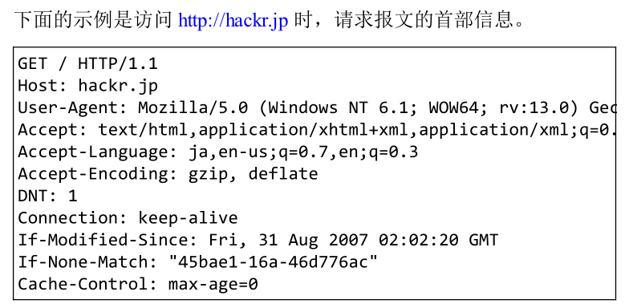
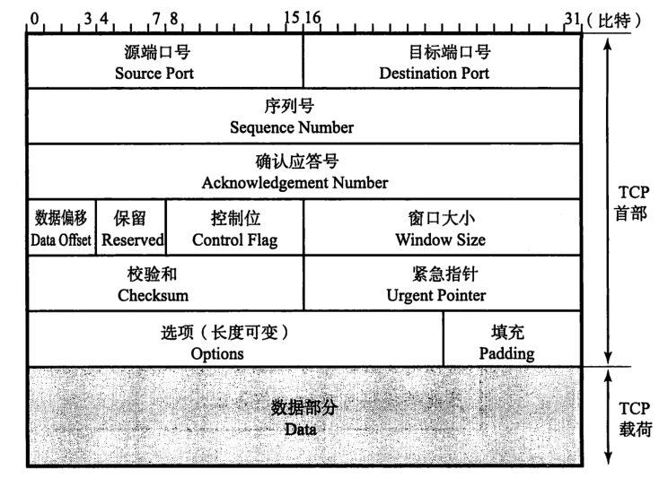
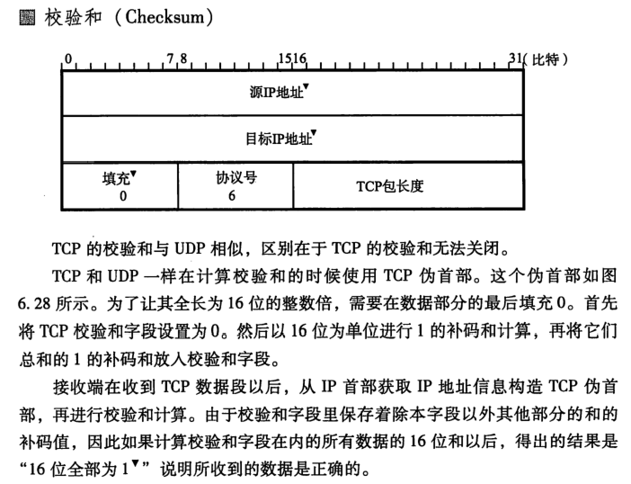
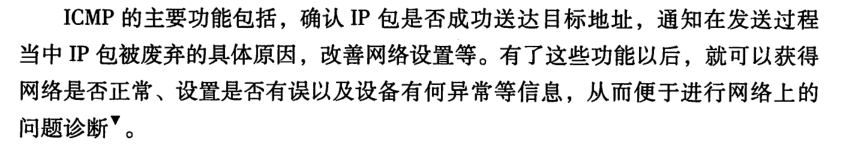
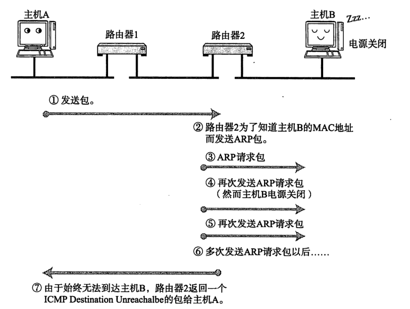

# 计网

## HTTP

### 请求与响应


### 如何理解HTTP协议是无状态的

- HTTP 是一种不保存状态，即无状态（stateless）协议。HTTP 协议自身不对请求和响应之间的通信状态进行保存。也就是说在 HTTP 这个级别，协议对于发送过的请求或响应都不做持久化处理。
- 协议本身并不保留之前一切的请求或响应报文的信息。这是为了更快地处理大量事务，确保协议的可伸缩性
- Cookies 解决需要保存状态的场景
- HTTP是一个无状态的面向连接的协议，无状态不代表HTTP不能保持TCP连接，更不能代表HTTP使用的是UDP协议（无连接）。


### HTTP请求的方法

#### GET ：获取资源

- GET 方法用来请求访问已被 URI 识别的资源。指定的资源经服务器端解析后返回响应内容。也就是说，如果请求的资源是文本，那就保持原样返回
- 请求报文的实体体(entity body)为空


#### POST：传输实体主体

- POST 方法用来传输实体的主体。
- 请求报文的实体体通常为表单内容


#### PUT：传输文件

- PUT 方法用来传输文件。就像 FTP 协议的文件上传一样，要求在请求报文的主体中包含文件内容，然后保存到请求 URI 指定的位置。


#### GET POST区别

 Get：指定资源请求数据，刷新无害，Get请求的数据会附加到URL中，传输数据的大小受到url的限制。 

 Post：向指定资源提交要被处理的数据。刷新会使数据会被重复提交。post在发送数据前会先将请求头发送给服务器进行确认，然后才真正发送数据。


#### HEAD：获得报文首部

- HEAD 方法和 GET 方法一样，只是不返回报文主体部分。用于确认URI 的有效性及资源更新的日期时间等


#### DELETE：删除文件

- DELETE 方法用来删除文件，是与 PUT 相反的方法。DELETE 方法按请求 URI 删除指定的资源。


#### OPTIONS：询问支持的方法

- OPTIONS 方法用来查询针对请求 URI 指定的资源支持的方法。


#### TRACE：追踪路径

- TRACE 方法是让 Web 服务器端将之前的请求通信环回给客户端的方法。


#### CONNECT：要求用隧道协议连接代理

- CONNECT 方法要求在与代理服务器通信时建立隧道，实现用隧道协议进行 TCP 通信。主要使用 SSL（Secure Sockets Layer，安全套接层）和 TLS（Transport Layer Security，传输层安全）协议把通信内容加 密后经网络隧道传输。


### Cookie

- HTTP 是无状态协议，它不对之前发生过的请求和响应的状态进行管理。也就是说，无法根据之前的状态进行本次的请求处理。假设要求登录认证的 Web 页面本身无法进行状态的管理（不记录已登录的状态），那么每次跳转新页面不是要再次登录，就是要在每次请求报文中附加参数来管理登录状态。
- 保留无状态协议这个特征的同时又要解决类似的矛盾问题，于是引入了 Cookie 技术。
- Cookie 技术通过在请求和响应报文中写入 Cookie 信息来控制客户端的状态。
- Cookie 会根据从服务器端发送的响应报文内的一个叫做 Set-Cookie 的首部字段信息，通知客户端保存 Cookie。
- 当下次客户端再往该服务器发送请求时，客户端会自动在请求报文中加入 Cookie 值后发送出去。服务器端发现客户端发送过来的 Cookie 后，会去检查究竟是从哪一个客户端发来的连接请求，然后对比服务器上的记录，最后得到之前的状态信息。


- Cookie相关的首部字段属性

  

### Session 管理及 Cookie 应用


HTTP 是无状态协议，之前已认证成功的用户状态无法通过协议层面保存下来。即，无法实现状态管理，因此即使当该用户下一次继续访问，也无法区分他与其他的用户。于是我们会使用 Cookie 来管理 Session，以弥补 HTTP 协议中不存在的状态管理功能。

#### Cookie管理Session

- 步骤 1： 客户端把用户 ID 和密码等登录信息放入报文的实体部分，通常是以 POST 方法把请求发送给服务器。而这时，会使用 HTTPS通信来进行 HTML 表单画面的显示和用户输入数据的发送。
- 步骤 2： 服务器会发放用以识别用户的 Session ID。通过验证从客户端发送过来的登录信息进行身份认证，然后把用户的认证状态与Session ID 绑定后记录在服务器端。向客户端返回响应时，会在首部字段 Set-Cookie 内写入 SessionID（如 PHPSESSID=028a8c…）。你可以把 Session ID 想象成一种用以区分不同用户的等位号。
  - 然而，如果 Session ID 被第三方盗走，对方就可以伪装成你的身份进行恶意操作了。因此必须防止 Session ID 被盗，或被猜出。为了做到这点，Session ID 应使用难以推测的字符串，且服务器端也需要进行有效期的管理，保证其安全性。
  - 另外，为减轻跨站脚本攻击（XSS）造成的损失，建议事先在 Cookie内加上 httponly 属性。
- 步骤 3： 客户端接收到从服务器端发来的 Session ID 后，会将其作为Cookie 保存在本地。下次向服务器发送请求时，浏览器会自动发送Cookie，所以 Session ID 也随之发送到服务器。服务器端可通过验证接收到的 Session ID 识别用户和其认证状态。

#### 密码加盐

先利用给密码加盐（salt）的方式增加额外信息，再使用散列（hash）函数计算出散列值后保存。但是我
们也经常看到直接保存明文密码的做法，而这样的做法具有导致密码泄露的风险。

#### 加盐

salt 其实就是由服务器随机生成的一个字符串，但是要保证长度足够长，并且是真正随机生成的。然后把它和密码字符串相连接（前后都可以）生成散列值。当两个用户使用了同一个密码时，由于随机生成的 salt 值不同，对应的散列值也将是不同的。这样一来，很大程度上减少了密码特征，攻击者也就很难利用自己手中的密码特征库进行破解

### HTTP报文

- 用于 HTTP 协议交互的信息被称为 HTTP 报文。请求端（客户端）的HTTP 报文叫做请求报文，响应端（服务器端）的叫做响应报文。HTTP 报文本身是由多行（用 CR+LF 作换行符）数据构成的字符串文本


#### 报文主体和实体主体的差异

- 报文（message）
  - 是 HTTP 通信中的基本单位，由 8 位组字节流（octet sequence，其中 octet 为 8 个比特）组成，通过 HTTP 通信传输。
- 实体（entity）
  - 作为请求或响应的有效载荷数据（补充项）被传输，其内容由实体首部和实体主体组成


#### 发送多种数据的多部分对象集合

- 图片等二进制数据以 ASCII 码字符串编码的方式指明，就是利用 MIME(Multipurpose Internet Mail Extensions) 来描述标记数据类型。而在 MIME 扩展中会使用一种称为多部分对象集合（Multipart）的方法，来容纳多份不同类型的数据。
- 相应地，HTTP 协议中也采纳了多部分对象集合，发送的一份报文主体内可含有多类型实体。通常是在图片或文本文件等上传时使用。

#### 获取部分内容的范围请求

- 指定范围发送的请求叫做范围请求（Range Request）
- 执行范围请求时，会用到首部字段 Range 来指定资源的 byte 范围。
- byte 范围的指定形式如下。
  - 5001~10 000 字节
    - Range: bytes=5001-10000
  - 从 5001 字节之后全部的
    - Range: bytes=5001-
  - 从一开始到 3000 字节和 5000~7000 字节的多重范围
    - Range: bytes=-3000, 5000-7000
- 针对范围请求，响应会返回状态码为 206 Partial Content 的响应报文。另外，对于多重范围的范围请求，响应会在首部字段 Content-Type 标明 multipart/byteranges 后返回响应报文。
- 如果服务器端无法响应范围请求，则会返回状态码 200 OK 和完整的实体内容。


### HTTP 状态码

HTTP 状态码负责表示客户端 HTTP 请求的返回结果、标记服务器端的处理是否正常、通知出现的错误等工作


#### 状态码的类别


#### 2XX 成功

2XX 的响应结果表明请求被正常处理了。

##### 200 OK

表示从客户端发来的请求在服务器端被正常处理了

##### 204 No Content

- 该状态码代表服务器接收的请求已成功处理，但在返回的响应报文中不含实体的主体部分。
- 另外，也不允许返回任何实体的主体。比如，当从浏览器发出请求处理后，返回 204 响应，那么浏览器显示的页面不发生更新。
- 一般在只需要从客户端往服务器发送信息，而对客户端不需要发送新信息内容的情况下使用。

##### 206 Partial Content

该状态码表示客户端进行了范围请求，而服务器成功执行了这部分的GET 请求。响应报文中包含由 Content-Range 指定范围的实体内容。


201 – 已创建。
202 – 已接受。
203 – 非权威性信息。
205 – 重置内容。

#### 3XX 重定向

##### 301 Moved Permanently

永久性重定向。该状态码表示请求的资源已被分配了新的 URI，以后应使用资源现在所指的 URI。也就是说，如果已经把资源对应的 URI保存为书签了，这时应该按 Location 首部字段提示的 URI 重新保存。

##### 302 Found

- 临时性重定向。该状态码表示请求的资源已被分配了新的 URI，希望用户（本次）能使用新的 URI 访问。
- 和 301 Moved Permanently 状态码相似，但 302 状态码代表的资源不是被永久移动，只是临时性质的。换句话说，已移动的资源对应的URI 将来还有可能发生改变。
- 比如，用户把 URI 保存成书签，但不会像 301 状态码出现时那样去更新书签，而是仍旧保留返回 302 状态码的页面对应的 URI。

##### 303 See Other

- 该状态码表示由于请求对应的资源存在着另一个 URI，应使用 GET方法定向获取请求的资源。
- 303 状态码和 302 Found 状态码有着相同的功能，但 303 状态码明确表示客户端应当采用 GET 方法获取资源，这点与 302 状态码有区别。
- 比如，当使用 POST 方法访问 CGI 程序，其执行后的处理结果是希望客户端能以 GET 方法重定向到另一个 URI 上去时，返回 303 状态码。虽然 302 Found 状态码也可以实现相同的功能，但这里使用 303状态码是最理想的

>当 301、302、303 响应状态码返回时，几乎所有的浏览器都会把POST 改成 GET，并删除请求报文内的主体，之后请求会自动再次发送。
>
>301、302 标准是禁止将 POST 方法改变成 GET 方法的，但实际使用时大家都会这么做

##### 304 Not Modified

- 该状态码表示客户端发送附带条件的请求时，服务器端允许请求访问资源，但未满足条件的情况。304 状态码返回时，不包含任何响应的主体部分。304 虽然被划分在 3XX 类别中，但是和重定向没有关系。
- 附带条件的请求是指采用 GET 方法的请求报文中包含 If-Match，If-Modified-Since，If-None-Match，If-Range，If-Unmodified-Since 中任一首部。
- 304状态码中除了if modified还可以使用什么？ 

##### 307 Temporary Redirect

- 临时重定向
- 该状态码与 302 Found 有着相同的含义。尽管 302 标准禁止 POST 变换成 GET，但实际使用时大家并不遵守。307 会遵照浏览器标准，不会从 POST 变成 GET


#### 4XX 客户端错误

4XX 的响应结果表明客户端是发生错误的原因所在。

##### 400 Bad Request

- 该状态码表示请求报文中存在语法错误。当错误发生时，需修改请求的内容后再次发送请求。
- 另外，浏览器会像 200 OK 一样对待该状态码。

##### 401 Unauthorized


- 该状态码表示发送的请求需要有通过 HTTP 认证（BASIC 认证、DIGEST 认证）的认证信息。
- 另外若之前已进行过 1 次请求，则表示用 户认证失败。
- 返回含有 401 的响应必须包含一个适用于被请求资源的 WWW-Authenticate 首部用以质询（challenge）用户信息。当浏览器初次接收到 401 响应，会弹出认证用的对话窗口。

##### 403 Forbidden

- 该状态码表明对请求资源的访问被服务器拒绝了。服务器端没有必要给出拒绝的详细理由，
- 但如果想作说明的话，可以在实体的主体部分对原因进行描述，这样就能让用户看到了。
- 未获得文件系统的访问授权，访问权限出现某些问题（从未授权的发送源 IP 地址试图访问）等列举的情况都可能是发生 403 的原因。

##### 404 Not Found

该状态码表明服务器上无法找到请求的资源。除此之外，也可以在服务器端拒绝请求且不想说明理由时使用。

HTTP 405 – 资源被禁止
HTTP 406 – 无法接受
HTTP 407 – 要求代理身份验证
HTTP 410 – 永远不可用
HTTP 412 – 先决条件失败
HTTP 414 – 请求 – URI 太长 

#### 5XX 服务器错误

##### 500 Internal Server Error

该状态码表明服务器端在执行请求时发生了错误。也有可能是 Web应用存在的 bug 或某些临时的故障。

##### 503 Service Unavailable

该状态码表明服务器暂时处于超负载或正在进行停机维护，现在无法处理请求。如果事先得知解除以上状况需要的时间，最好写入RetryAfter 首部字段再返回给客户端

Error 501 – 未实现
HTTP 502 – 网关错误 

 504 – 网关超时 

 505 – HTTP 版本不受支持。 

### 通信数据转发程序 ：代理、网关、隧道

HTTP 通信时，除客户端和服务器以外，还有一些用于通信数据转发的应用程序，例如代理、网关和隧道。它们可以配合服务器工作。这些应用程序和服务器可以将请求转发给通信线路上的下一站服务器，并且能接收从那台服务器发送的响应再转发给客户端。

#### 代理 


代理是一种有转发功能的应用程序，它扮演了位于服务器和客户端“中间人”的角色，接收由客户端发送的请求并转发给服务器，同时也接收服务器返回的响应并转发给客户端。

- 代理服务器的基本行为就是接收客户端发送的请求后转发给其他服务器。代理不改变请求 URI，会直接发送给前方持有资源的目标服务器。
- 持有资源实体的服务器被称为源服务器。从源服务器返回的响应经过代理服务器后再传给客户端
- 在 HTTP 通信过程中，可级联多台代理服务器。请求和响应的转发会经过数台类似锁链一样连接起来的代理服务器。转发时，需要附加Via 首部字段以标记出经过的主机信息。

使用代理服务器的理由有：利用缓存技术（稍后讲解）减少网络带宽的流量，组织内部针对特定网站的访问控制，以获取访问日志为主要目的，等等。

- 代理有多种使用方法，按两种基准分类。一种是是否使用缓存，另一种是是否会修改报文。
  - 缓存代理
    - 代理转发响应时，缓存代理（Caching Proxy）会预先将资源的副本（缓存）保存在代理服务器上。
      当代理再次接收到对相同资源的请求时，就可以不从源服务器那里获取资源，而是将之前缓存的资源作为响应返回。
  - 透明代理
    - 转发请求或响应时，不对报文做任何加工的代理类型被称为透明代理（Transparent Proxy）。反之，对报文内容进行加工的代理被称为非透明代理。

#### 网关


网关是转发其他服务器通信数据的服务器，接收从客户端发送来的请求时，它就像自己拥有资源的源服务器一样对请求进行处理。有时客户端可能都不会察觉，自己的通信目标是一个网关。

- 网关的工作机制和代理十分相似。而网关能使通信线路上的服务器提供非 HTTP 协议服务。
- 利用网关能提高通信的安全性，因为可以在客户端与网关之间的通信线路上加密以确保连接的安全。
- 比如，网关可以连接数据库，使用SQL 语句查询数据。另外，在 Web 购物网站上进行信用卡结算时，网关可以和信用卡结算系统联动。

#### 隧道


隧道是在相隔甚远的客户端和服务器两者之间进行中转，并保持双方通信连接的应用程序。

隧道可按要求建立起一条与其他服务器的通信线路，届时使用 SSL 等加密手段进行通信。隧道的目的是确保客户端能与服务器进行安全的通信。

隧道本身不会去解析 HTTP 请求。也就是说，请求保持原样中转给之后的服务器。隧道会在通信双方断开连接时结束

#### 保存资源的缓存


缓存是指代理服务器或客户端本地磁盘内保存的资源副本。利用缓存可减少对源服务器的访问，因此也就节省了通信流量和通信时间。

缓存服务器是代理服务器的一种，并归类在缓存代理类型中。换句话说，当代理转发从服务器返回的响应时，代理服务器将会保存一份资源的副本。

- 缓存的有效期限
  - 
  - 即使存在缓存，也会因为客户端的要求、缓存的有效期等因素，向源服务器确认资源的有效性。若判断缓存失效，缓存服务器将会再次从源服务器上获取“新”资源。
- 客户端的缓存
  - 缓存不仅可以存在于缓存服务器内，还可以存在客户端浏览器中。以Internet Explorer 程序为例，把客户端缓存称为临时网络文件（Temporary Internet File）。
  - 浏览器缓存如果有效，就不必再向服务器请求相同的资源了，可以直接从本地磁盘内读取。
  - 另外，和缓存服务器相同的一点是，当判定缓存过期后，会向源服务器确认资源的有效性。若判断浏览器缓存失效，浏览器会再次请求新资源。


### HTTP 首部

#### HTTP 报文首部

##### HTTP 请求报文

在请求中，HTTP 报文由方法、URI、HTTP 版本、HTTP 首部字段等部分构成。




##### HTTP 响应报文

在响应中，HTTP 报文由 HTTP 版本、状态码（数字和原因短语）、HTTP 首部字段 3 部分构成


#### HTTP 首部字段

首部字段是为了给浏览器和服务器提供报文主体大小、所使用的语言、认证信息等内容。

- HTTP 首部字段是由首部字段名和字段值构成的，中间用冒号“:” 分隔。
  - Content-Type: text/html
- 字段值对应单个 HTTP 首部字段可以有多个值
  - Keep-Alive: timeout=15, max=100

- 4 种 HTTP 首部字段类型
  - 通用首部字段（General Header Fields）
    - 请求报文和响应报文两方都会使用的首部。
  - 请求首部字段（Request Header Fields）
    - 从客户端向服务器端发送请求报文时使用的首部。补充了请求的附加内容、客户端信息、响应内容相关优先级等信息。
  - 响应首部字段（Response Header Fields）
    - 从服务器端向客户端返回响应报文时使用的首部。补充了响应的附加内容，也会要求客户端附加额外的内容信息。
  - 实体首部字段（Entity Header Fields）
    - 针对请求报文和响应报文的实体部分使用的首部。补充了资源内容更新时间等与实体有关的信息。

##### HTTP/1.1 首部字段一览

- 通用首部字段


- 请求首部字段


- 响应首部字段


- 实体首部字段


##### End-to-end 首部和 Hop-by-hop 首部

HTTP 首部字段将定义成缓存代理和非缓存代理的行为，分成 2 种类型。

- 端到端首部（End-to-end Header）
  - 分在此类别中的首部会转发给请求 / 响应对应的最终接收目标，且必须保存在由缓存生成的响应中，另外规定它必须被转发。
- 逐跳首部（Hop-by-hop Header）
  - 分在此类别中的首部只对单次转发有效，会因通过缓存或代理而不再转发。HTTP/1.1 和之后版本中，如果要使用 hop-by-hop 首部，需提供 Connection 首部字段。
  - HTTP/1.1 中的逐跳首部字段。除这 8 个首部字段之外，其他所有字段都属于端到端首部
  - Connection
  - Keep-Alive
  - Proxy-Authenticate
  - Proxy-Authorization
  - Trailer
  - TE
  - Transfer-Encoding
  - Upgrade


#### HTTP/1.1 通用首部字段

通用首部字段是指，请求报文和响应报文双方都会使用的首部

##### Cache-Control

通过指定首部字段 Cache-Control 的指令，就能操作缓存的工作机制。

- 缓存请求指令
  - 

- 缓存响应指令
  - 

##### Connection

Connection 首部字段具备如下两个作用。

- 控制不再转发给代理的首部字段
  - Connection: 不再转发的首部字段名
  - 在客户端发送请求和服务器返回响应内，使用 Connection 首部字段，可控制不再转发给代理的首部字段（即 Hop-by-hop 首部）。
  - 
- 管理持久连接
  - HTTP/1.1 版本的默认连接都是持久连接。为此，客户端会在持久连接上连续发送请求。当服务器端想明确断开连接时，则指定Connection 首部字段的值为 Close。
  - HTTP/1.1 之前的 HTTP 版本的默认连接都是非持久连接。为此，如果想在旧版本的 HTTP 协议上维持持续连接，则需要指定Connection 首部字段的值为 Keep-Alive。


#### 请求首部字段

请求首部字段是从客户端往服务器端发送请求报文中所使用的字段，用于补充请求的附加信息、客户端信息、对响应内容相关的优先级等内容。

- Authorization
  - 首部字段 Authorization 是用来告知服务器，用户代理的认证信息（证书值）。通常，想要通过服务器认证的用户代理会在接收到返回的401 状态码响应后，把首部字段 Authorization 加入请求中。
  - 
- Host
  - 首部字段 Host 会告知服务器，请求的资源所处的互联网主机名和端口号。Host 首部字段在 HTTP/1.1 规范内是**唯一一个必须被包含在请求内的首部字段**。
  - 首部字段 Host 和**以单台服务器分配多个域名的虚拟主机**的工作机制有很密切的关联，这是首部字段 Host 必须存在的意义。
  - 请求被发送至服务器时，请求中的主机名会用 IP 地址直接替换解决。但如果这时，相同的 IP 地址下部署运行着多个域名，那么服务器就会无法理解究竟是哪个域名对应的请求。因此，就需要使用首部字段 Host 来明确指出请求的主机名。若服务器未设定主机名，那直接发送一个空值即可
  - 
- 条件请求
- 形如 If-xxx 这种样式的请求首部字段，都可称为条件请求。服务器接收到附带条件的请求后，只有判断指定条件为真时，才会执行请求。

  - If-Match
    - 
    - 首部字段 If-Match，属附带条件之一，它会告知服务器匹配资源所用的实体标记（ETag）值。这时的服务器无法使用弱 ETag 值。
    - 服务器会比对 If-Match 的字段值和资源的 ETag 值，仅当两者一致时，才会执行请求。反之，则返回状态码 412 Precondition Failed 的响应。
    - 还可以使用星号（*）指定 If-Match 的字段值。针对这种情况，服务器将会忽略 ETag 的值，只要资源存在就处理请求。

  - If-Modified-Since
    - 告知服务器若 If-Modified-Since 字段值早于资源的更新时间，则希望能处理该请求。
    - 而在指定 If-Modified-Since 字段值的日期时间之后，如果请求的资源都没有过更新，则返回状态码 304 Not Modified 的响应。
    - If-Modified-Since 用于确认代理或客户端拥有的本地资源的有效性。获取资源的更新日期时间，可通过确认首部字段 Last-Modified 来确定。
  - If-None-Match
    - 它和首部字段 If-Match作用相反。用于指定 If-None-Match 字段值的实体标记（ETag）值与请求资源的 ETag 不一致时，它就告知服务器处理该请求。
    - 在 GET 或 HEAD 方法中使用首部字段 If-None-Match 可获取最新的资源。因此，这与使用首部字段 If-Modified-Since 时有些类似。
  - If-Range
    - 告知服务器若指定的 If-Range 字段值（ETag 值或者时间）和请求资源的 ETag 值或时间相一致时，则作为范围请求处理。反之，则返回全体资源。
  - If-Unmodified-Since
    - 首部字段 If-Unmodified-Since 和首部字段 If-Modified-Since 的作用相反。
    - 它的作用的是告知服务器，指定的请求资源只有在字段值内指定的日期时间之后，未发生更新的情况下，才能处理请求。
    - 如果在指定日期时间后发生了更新，则以状态码 412 Precondition Failed 作为响应返回。


#### 响应首部字段

响应首部字段是由服务器端向客户端返回响应报文中所使用的字段，用于补充响应的附加信息、服务器信息，以及对客户端的附加要求等信息。

- ETag
  - 首部字段 ETag 能告知客户端实体标识。它是一种可将资源以字符串形式做唯一性标识的方式。服务器会为每份资源分配对应的 ETag值。
  - 另外，当资源更新时，ETag 值也需要更新。生成 ETag 值时，并没有统一的算法规则，而仅仅是由服务器来分配。
  - 资源被缓存时，就会被分配唯一性标识。
  - 强 ETag 值
    - 强 ETag 值，不论实体发生多么细微的变化都会改变其值。
  - 弱 ETag 值
    - 弱 ETag 值只用于提示资源是否相同。只有资源发生了根本改变，产生差异时才会改变 ETag 值。这时，会在字段值最开始处附加 W/。
- Location
  - 使用首部字段 Location 可以将响应接收方引导至某个与请求 URI 位置不同的资源。
  - 基本上，该字段会配合 3xx ：Redirection 的响应，提供重定向的URI。
  - 几乎所有的浏览器在接收到包含首部字段 Location 的响应后，都会强制性地尝试对已提示的重定向资源的访问。


#### 实体首部字段

实体首部字段是包含在请求报文和响应报文中的实体部分所使用的首部，用于补充内容的更新时间等与实体相关的信息。

- Allow
  - 首部字段 Allow 用于通知客户端能够支持 Request-URI 指定资源的所有 HTTP 方法。当服务器接收到不支持的 HTTP 方法时，会以状态码405 Method Not Allowed 作为响应返回。与此同时，还会把所有能支
    持的 HTTP 方法写入首部字段 Allow 后返回

#### 为 Cookie 服务的首部字段

- Set-Cookie
  - 当服务器准备开始管理客户端的状态时，会事先告知各种信息。
  - 
- Cookie
  - 首部字段 Cookie 会告知服务器，当客户端想获得 HTTP 状态管理支持时，就会在请求中包含从服务器接收到的 Cookie。接收到多个Cookie 时，同样可以以多个 Cookie 形式发送。


### 确保 Web 安全的HTTPS

在 HTTP 协议中有可能存在信息窃听或身份伪装等安全问题。使用HTTPS 通信机制可以有效地防止这些问题

#### HTTP 的缺点

- 通信使用明文（不加密），内容可能会被窃听
- 不验证通信方的身份，因此有可能遭遇伪装
- 无法证明报文的完整性，所以有可能已遭篡改

#### HTTP+ 加密 + 认证 + 完整性保护=HTTPS

- HTTPS通信步骤


1. 步骤 1： 客户端通过发送 Client Hello 报文开始 SSL 通信。
   1. 报文中包含客户端支持的 SSL 的指定版本、
   2. 加密组件（Cipher Suite）列表（所使用的加密算法及密钥长度等）。
2. 步骤 2： 服务器可进行 SSL 通信时，会以 Server Hello 报文作为应答。
   1. 在报文中包含 SSL 版本以及加密组件。
   2. 服务器的加密组件内容是从接收到的客户端加密组件内筛选出来的。
3. 步骤 3： 之后服务器发送 Certificate 报文。报文中包含公开密钥证书。
4. 步骤 4： 最后服务器发送 Server Hello Done 报文通知客户端，最初阶段的 SSL 握手协商部分结束。
5. 步骤 5： SSL 第一次握手结束之后，客户端以 Client Key Exchange 报文作为回应。
   1. 报文中包含通信加密中使用的一种被称为 Pre-mastersecret 的随机密码串。
   2. 该报文已用步骤 3 中的公开密钥进行加密。
6. 步骤 6： 接着客户端继续发送 Change Cipher Spec 报文。该报文会提示服务器，在此报文之后的通信会采用 Pre-master secret 密钥加密。
7. 步骤 7： 客户端发送 Finished 报文。该报文包含连接至今全部报文的整体校验值。这次握手协商是否能够成功，要以服务器是否能够正确解密该报文作为判定标准。
8. 步骤 8： 服务器同样发送 Change Cipher Spec 报文。
9. 步骤 9： 服务器同样发送 Finished 报文。
10. 步骤 10： 服务器和客户端的 Finished 报文交换完毕之后，SSL 连接就算建立完成。当然，通信会受到 SSL 的保护。从此处开始进行应用层协议的通信，即发送 HTTP 请求。
11. 步骤 11： 应用层协议通信，即发送 HTTP 响应。
12. 步骤 12： 最后由客户端断开连接。断开连接时，发送 close_notify 报文。上图做了一些省略，这步之后再发送 TCP FIN 报文来关闭与 TCP的通信。

- 在以上流程中，应用层发送数据时会附加一种叫做 MAC（MessageAuthentication Code）的报文摘要。MAC 能够查知报文是否遭到篡改，从而保护报文的完整性。

### SPDY(Speedy)

Google 在 2010 年发布了 SPDY（取自 SPeeDY，发音同 speedy），其开发目标旨在解决 HTTP 的性能瓶颈，缩短 Web 页面的加载时间

- SPDY 没有完全改写 HTTP 协议，而是在 TCP/IP 的应用层与运输层之间通过新加会话层的形式运作。同时，考虑到安全性问题，SPDY 规定通信中使用 **SSL**。
- SPDY 以**会话层**的形式加入，控制对数据的流动，但还是采用 HTTP建立通信连接。因此，可照常使用 HTTP 的 GET 和 POST 等方 法、Cookie 以及 HTTP 报文等


- 使用 SPDY 后，HTTP 协议额外获得以下功能。
  - 多路复用流
    - 通过单一的 TCP 连接，可以无限制处理多个 HTTP 请求。所有请求的处理都在一条 TCP 连接上完成，因此 TCP 的处理效率得到提高。
  - 赋予请求优先级
    - SPDY 不仅可以无限制地并发处理请求，还可以给请求逐个分配优先级顺序。这样主要是为了在发送多个请求时，解决因带宽低而导致响应变慢的问题。
  - 压缩 HTTP 首部
    - 压缩 HTTP 请求和响应的首部。这样一来，通信产生的数据包数量和发送的字节数就更少了。
  - 推送功能
    - 支持服务器主动向客户端推送数据的功能。这样，服务器可直接发送数据，而不必等待客户端的请求。
  - 服务器提示功能
    - 服务器可以主动提示客户端请求所需的资源。由于在客户端发现资源之前就可以获知资源的存在，因此在资源已缓存等情况下，可以避免发送不必要的请求。


### SQL注入

SQL 注入（SQL Injection）是指针对 Web 应用使用的数据库，通过运行非法的 SQL 而产生的攻击。该安全隐患有可能引发极大的威胁，有时会直接导致个人信息及机密信息的泄露

- 非法查看或篡改数据库内的数据
  - 
  - 指定查询字段的x改写成“x'--”
  - SQL 语句中的 -- 之后全视为注释。即后续的查询条件就被忽略了导致可能查阅隐私的数据 
  - SQL 注入是攻击者将 SQL 语句改变成开发者意想不到的形式以达到破坏结构的攻击。
- 规避认证
- 执行和数据库服务器业务关联的程序等


### SYN洪泛攻击


### HTTP 首部注入攻击

HTTP 首部注入攻击（HTTP Header Injection）是指攻击者通过在响应首部字段内插入换行，添加任意响应首部或主体的一种攻击。

- 设置任何 Cookie 信息
- 重定向至任意 URL
- 显示任意的主体（HTTP 响应截断攻击）

案例


- 攻击者以下面的内容替代之前的类别 ID 后发送请求。
- 101%0D%0ASet-Cookie:+SID=123456789
- 其中，%0D%0A 代表 HTTP 报文中的换行符，紧接着的是可强制将攻击者网站（http://hackr.jp/）的会话 ID 设置成SID=123456789 的 Set-Cookie 首部字段。
- 发送该请求之后，假设结果返回以下响应。
- Location: http://example.com/?cat=101（%0D%0A ：换行符）Set-Cookie: SID=123456789
- 此刻，首部字段 Set-Cookie 已生效，因此攻击者可指定修改任意的 Cookie 信息。通过和会话固定攻击（攻击者可使用指定的会话 ID）攻击组合，攻击者可伪装成用户。
- 攻击者输入的 %0D%0A，原本应该属于首部字段 Location 的查询值部分，但经过解析后，%0D%0A 变成了换行符，结果插入了新的首部字段。
- 这样一来，攻击者可在响应中插入任意的首部字段。


### HTTP 响应截断攻击

向首部主体内添加内容的攻击称为 HTTP 响应截断攻击（HTTPResponse Splitting Attack）。

HTTP 响应截断攻击是用在 HTTP 首部注入的一种攻击。攻击顺序相同，但是要将两个 %0D%0A%0D%0A 并排插入字符串后发送。利用这两个连续的换行就可作出 HTTP 首部与主体分隔所需的空行了，这样就能显示伪造的主体，达到攻击目的。这样的攻击叫做 HTTP 响应截断攻击

> %0D%0A%0D%0A<HTML><HEAD><TITLE>之后，想要显示的网页内容 <!--

在可能进行 HTTP 首部注入的环节，通过发送上面的字符串，返回结果得到以下这种响应。

> Set-Cookie: UID=（%0D%0A ：换行符）
> （%0D%0A ：换行符）
> <HTML><HEAD><TITLE>之后，想要显示的网页内容 <!--（原来页面对应的首部字段和主体部分全视为注释）

利用这个攻击，已触发陷阱的用户浏览器会显示伪造的 Web 页面，再让用户输入自己的个人信息等，可达到和跨站脚本攻击相同的效果。另外，滥用 HTTP/1.1 中汇集多响应返回功能，会导致缓存服务器对任意内容进行缓存操作。这种攻击称为缓存污染。使用该缓存服务器的用户，在浏览遭受攻击的网站时，会不断地浏览被替换掉的 Web 网页。


### REST API

REST API全称为表述性状态转移（Representational State Transfer，REST）即利用HTTP中get、post、put、delete以及其他的HTTP方法构成REST中数据资源的增删改查操作： 

-  Create ： POST 
-  Read ： GET 
-  Update ： PUT/PATCH 
-  Delete： DELETE


### 转发和重定向的区别

转发是服务器行为。服务器直接向目标地址访问URL,将相应内容读取之后发给浏览器，用户浏览器地址栏URL不变，转发页面和转发到的页面可以共享request里面的数据。 

重定向是利用服务器返回的状态码来实现的，如果服务器返回301或者302，浏览器收到新的消息后自动跳转到新的网址重新请求资源。用户的地址栏url会发生改变，而且不能共享数据。

### **HTTP协议与TCP/IP协议的关系**

- HTTP的长连接和短连接本质上是TCP长连接和短连接。
- HTTP属于应用层协议，在传输层使用TCP协议，在网络层使用IP协议。 
- IP协议主要解决网络路由和寻址问题，
- TCP协议主要解决如何在IP层之上可靠地传递数据包，使得网络上接收端收到发送端所发出的所有包，并且顺序与发送顺序一致。TCP协议是可靠的、面向连接的。

  


### TCP短连接

- 模拟一下TCP短连接的情况：
- client向server发起连接请求，server接到请求，然后双方建立连接。
- client向server发送消息，server回应client，然后一次请求就完成了。
- 这时候双方任意都可以发起close操作，不过一般都是client先发起close操作。
- 上述可知，短连接一般只会在 client/server间传递一次请求操作。

短连接的优点是：管理起来比较简单，存在的连接都是有用的连接，不需要额外的控制手段。

### TCP长连接

我们再模拟一下长连接的情况：

- client向server发起连接，server接受client连接，双方建立连接，
- client与server完成一次请求后，它们之间的连接并不会主动关闭，后续的读写操作会继续使用这个连接。

TCP的保活功能主要为服务器应用提供。如果客户端已经消失而连接未断开，则会使得服务器上保留一个半开放的连接，而服务器又在等待来自客户端的数据，此时服务器将永远等待客户端的数据。保活功能就是试图在服务端器端检测到这种半开放的连接。

如果一个给定的连接在两小时内没有任何动作，服务器就向客户发送一个探测报文段，根据客户端主机响应探测4个客户端状态：

- 客户主机依然正常运行，且服务器可达。此时客户的TCP响应正常，服务器将保活定时器复位。
- 客户主机已经崩溃，并且关闭或者正在重新启动。上述情况下客户端都不能响应TCP。服务端将无法收到客户端对探测的响应。服务器总共发送10个这样的探测，每个间隔75秒。若服务器没有收到任何一个响应，它就认为客户端已经关闭并终止连接。
- 客户端崩溃并已经重新启动。服务器将收到一个对其保活探测的响应，这个响应是一个复位，使得服务器终止这个连接。
- 客户机正常运行，但是服务器不可达。这种情况与第二种状态类似。

### 长连接和短连接的优点和缺点

#### **长连接**

- 可以**省去较多的TCP建立和关闭的操作，减少浪费，节约时间**。
- 对于频繁请求资源的客户来说，较适用长连接。
- 不过这里**存在一个问题**，**存活功能的探测周期太长**，还有就是它只是探测TCP连接的存活，属于比较斯文的做法，遇到恶意的连接时，保活功能就不够使了。
- 在长连接的应用场景下，client端一般不会主动关闭它们之间的连接，**Client与server之间的连接如果一直不关闭的话，会存在一个问题，随着客户端连接越来越多，server早晚有扛不住的时候**，这时候server端需要采取一些策略，
  - 如关闭一些长时间没有读写事件发生的连接，这样可 以避免一些恶意连接导致server端服务受损；
  - 如果条件再允许就可以以客户端机器为颗粒度，限制每个客户端的最大长连接数，这样可以完全避免某个蛋疼的客户端连累后端服务。

#### **短连接**

- 对于服务器来说管理较为简单，存在的连接都是有用的连接，不需要额外的控制手段。但如果客户**请求频繁**，将在**TCP的建立和关闭操作上浪费时间和带宽**。

## HTTPS

### 面试题

- http和https的区别 
- https 数据传输中使用什么加密以及为什么要使用这种加密 
- https加密的详细过程 

https://juejin.cn/post/6844903830916694030#heading-1


### 什么是HTTPS

-  HTTPS是在HTTP上建立SSL加密层，并对传输数据进行加密，是HTTP协议的安全版 
-  SSL 协议可分为两层：
   - SSL 记录协议（SSL Record Protocol），它建立在可靠的传输协议（如TCP）之上，为高层协议提供数据封装、压缩、加密等基本功能的支持。
   - SSL 握手协议（SSL Handshake Protocol），它建立在 SSL 记录协议之上，用于在实际的数据传输开始前，通讯双方进行身份认证、协商加密算法、交换加密密钥等。 

### HTTPS的主要作用

- 对数据进行加密，并建立一个信息安全通道，来保证传输过程中的数据安全;
- 对网站服务器进行真实身份认证。

### 为什么需要HTTPS

-  在HTTP协议中有可能存在信息窃取或身份伪装等安全问题。使用HTTPS通信机制可以有效地防止这些问题 

####  HTTP协议存在的哪些问题 

- 通信使用明文（不加密），内容可能被窃听

由于HTTP本身不具备加密的功能，所以也无法做到对通信整体（使用HTTP协议通信的请求和响应的内容）进行加密。即，**HTTP报文使用明文（指未经过加密的报文）方式发送**。

HTTP明文协议的缺陷是导致数据泄露、数据篡改、流量劫持、钓鱼攻击等安全问题的重要原因。HTTP协议无法加密数据. 通过网络的嗅探设备及一些技术手段，就可还原HTTP报文内容。

- 无法证明报文的完整性，所以可能遭篡改

所谓完整性是指信息的准确度。若无法证明其完整性，通常也就意味着无法判断信息是否准确。由于HTTP协议无法证明通信的报文完整性，因此，在请求或响应送出之后直到对方接收之前的这段时间内，即使请求或响应的内容遭到篡改，也没有办法获悉。 换句话说，**没有任何办法确认，发出的请求/响应和接收到的请求/响应是前后相同的**。

- 不验证通信方的身份，因此有可能遭遇伪装

**HTTP协议中的请求和响应不会对通信方进行确认**。在HTTP协议通信时，由于不存在确认通信方的处理步骤，任何人都可以发起请求。另外，服务器只要接收到请求，不管对方是谁都会返回一个响应（但也仅限于发送端的IP地址和端口号没有被Web服务器设定限制访问的前提下）

HTTP协议无法验证通信方身份，任何人都可以伪造虚假服务器欺骗用户，实现“钓鱼欺诈”，用户无法察觉。

### HTTPS的优势

#### 数据隐私性：

- 内容经过对称加密，每个连接生成一个唯一的加密密钥

- ( **利用非对称加密实现身份认证和密钥协商** ）

#### 数据完整性：

- 内容传输经过完整性校验

#### 身份认证：

- 第三方无法伪造服务端（客户端）身份

### **HTTPS的缺点**

（1）HTTPS协议握手阶段比较费时，会使页面的加载时间延长近50%，增加10%到20%的耗电；

（2）HTTPS连接缓存不如HTTP高效，会增加数据开销和功耗，甚至已有的安全措施也会因此而受到影响；

（3）SSL证书需要钱，功能越强大的证书费用越高，个人网站、小网站没有必要一般不会用。

（4）SSL证书通常需要绑定IP，不能在同一IP上绑定多个域名，IPv4资源不可能支撑这个消耗。

（5）HTTPS协议的加密范围也比较有限，在黑客攻击、拒绝服务攻击、服务器劫持等方面几乎起不到什么作用。最关键的，SSL证书的信用链体系并不安全，特别是在某些国家可以控制CA根证书的情况下，中间人攻击一样可行。

### HTTPS如何解决HTTP数据不安全相关问题?

- HTTPS并非是应用层的一种新协议。只是HTTP通信接口部分用SSL和TLS协议代替而已。

  通常，HTTP直接和TCP通信。当使用SSL时，则演变成先和SSL通信，再由SSL和TCP通信了。简言之，**所谓HTTPS，其实就是身披SSL协议这层外壳的HTTP**。

  - 

- 在采用SSL后，HTTP就拥有了HTTPS的加密、证书和完整性保护这些功能。也就是说**HTTP加上加密处理和认证以及完整性保护后即是HTTPS**。 


-  HTTPS 协议的主要功能基本都依赖于 TLS/SSL 协议，TLS/SSL 的功能实现主要依赖于三类基本算法：散列函数 、对称加密和非对称加密，**其利用非对称加密实现身份认证和密钥协商，对称加密算法采用协商的密钥对数据加密，基于散列函数验证信息的完整性**。 


#### 解决内容可能被窃听的问题——加密

##### 方法1.对称加密

这种方式加密和解密同用一个密钥。加密和解密都会用到密钥。**没有密钥就无法对密码解密，反过来说，任何人只要持有密钥就能解密了**。

以对称加密方式加密时必须将密钥也发给对方。可究竟怎样才能安全地转交？在互联网上转发密钥时，如果通信被监听那么密钥就可会落人攻击者之手，同时也就失去了加密的意义。另外还得设法安全地保管接收到的密钥。

##### 方法2.非对称加密

公开密钥加密使用一对非对称的密钥。一把叫做私有密钥，另一把叫做公开密钥。顾名思义，**私有密钥不能让其他任何人知道，而公开密钥则可以随意发布，任何人都可以获得**。

使用公开密钥加密方式，发送密文的一方使用**对方的公开密钥**进行加密处理，对方收到被加密的信息后，再使用自己的私有密钥进行解密。利用这种方式，不需要发送用来解密的私有密钥，也不必担心密钥被攻击者窃听而盗走。 


非对称加密的特点是信息传输一对多，服务器只需要维持一个私钥就能够和多个客户端进行加密通信。

这种方式有以下缺点：

- 公钥是公开的，所以**针对私钥加密**的信息，黑客截获后可以使用公钥进行解密，获取其中的内容；
- 公钥并不包含服务器的信息，使用非对称加密算法**无法确保服务器身份的合法性**，存在中间人攻击的风险，服务器发送给客户端的公钥可能在传送过程中被中间人截获并篡改；
- 使用非对称加密**在数据加密解密过程需要消耗一定时间**，降低了数据传输效率；

##### 方法3.对称加密+非对称加密(HTTPS采用这种方式)

- 使用**对称密钥的好处是解密的效率比较快**，
- 使用**非对称密钥的好处是可以使得传输的内容不能被破解**，因为就算你拦截到了数据，但是没有对应的私钥，也是不能破解内容的。就比如说你抢到了一个保险柜，但是没有保险柜的钥匙也不能打开保险柜。
- 那我们就将对称加密与非对称加密结合起来,充分利用两者各自的优势，
- **在交换密钥环节使用非对称加密方式，之后的建立通信交换报文阶段则使用对称加密方式**。

- 具体做法是：
  - **发送密文的一方使用对方的公钥进行加密处理“对称的密钥(服务端生成的随机数密钥)”，**
  - **然后对方用自己的私钥解密拿到“对称的密钥”，**
  - **这样可以确保交换的密钥是安全的前提下，使用对称加密方式进行通信**。
  - 所以，HTTPS采用**对称加密**和**非对称加密**两者并用的混合加密机制。

#### 解决报文可能遭篡改问题——数字签名

网络传输过程中需要经过很多中间节点，虽然数据无法被解密，但可能被篡改，那如何校验数据的完整性呢？----校验数字签名。

**数字签名有两种功效**：

- 能确定消息确实是由发送方签名并发出来的，因为别人假冒不了发送方的签名。
- 数字签名能确定消息的完整性,证明数据是否未被篡改过。

**数字签名如何生成:** 


- 将一段文本先用**Hash函数**生成消息摘要，
- 然后用发送者的**私钥**加密生成数字签名，与原文文一起传送给接收者
- 接下来就是接收者校验数字签名的流程了。

**校验数字签名流程**：


- 接收者只有用发送者的**公钥**才能解密被加密的摘要信息，
- 然后用**HASH函数**对收到的原文产生一个摘要信息，与上一步得到的摘要信息对比。
- 如果相同，则说明收到的信息是完整的，在传输过程中没有被修改，否则说明信息被修改过，因此数字签名能够验证信息的完整性。


#### 解决通信方身份可能被伪装的问题——数字证书

数字证书认证机构处于客户端与服务器双方都可信赖的第三方机构的立场上。 

 我们来介绍一下数字证书认证机构的业务流程：

- 服务器的运营人员向第三方机构CA提交公钥、组织信息、个人信息(域名)等信息并申请认证;
- CA通过线上、线下等多种手段验证申请者提供信息的真实性，如组织是否存在、企业是否合法，是否拥有域名的所有权等;
- 如信息审核通过，CA会向申请者签发认证文件-证书。证书包含以下信息：
  - 申请者公钥、
  - 申请者的组织信息和个人信息、
  - 签发机构 CA的信息、有效时间、证书序列号等信息的明文，同时包含一个签名。 
  - 其中签名的产生算法：
    - 首先，使用散列函数计算公开的明文信息的信息摘要，
    - 然后，采用 CA的私钥对信息摘要进行加密，密文即签名;
- 客户端 Client 向服务器 Server 发出请求时，Server 返回证书文件;
- 客户端 Client 读取证书中的相关的明文信息，
  - 采用相同的散列函数计算得到信息摘要，
  - 然后，利用对应 CA的公钥解密签名数据，对比证书的信息摘要，
  - 如果一致，则可以确认证书的合法性，即服务器的公开密钥是值得信赖的。
- 客户端还会验证证书相关的域名信息、有效时间等信息; 客户端会内置信任CA的证书信息(包含公钥)，如果CA不被信任，则找不到对应 CA的证书，证书也会被判定非法。


### HTTPS工作流程


- 1.Client发起一个HTTPS的请求，根据RFC2818的规定，Client知道需要连接Server的**443**（默认）端口。

- 2.Server把事先配置好的**公钥证书**（public key certificate）返回给客户端。

- 3.Client验证公钥证书：

  - 比如是否在有效期内，
  - 证书的用途是不是匹配Client请求的站点，
  - 是不是在CRL吊销列表里面，
  - 它的上一级证书是否有效，这是一个递归的过程，直到验证到根证书（操作系统内置的Root证书或者Client内置的Root证书）。如果验证通过则继续，不通过则显示警告信息。

- 4.Client使用**伪随机数生成器**生成加密所使用的**对称密钥**，然后用证书的公钥加密这个对称密钥，发Server。

- 5.Server使用自己的**私钥**（private key）解密这个消息，得到对称密钥。至此，Client和Server双方都持有了**相同的对称密钥**。

- 6.Server使用对称密钥加密“明文内容A”，发送给Client。

- 7.Client使用对称密钥解密响应的密文，得到“明文内容A”。

- 8.Client再次发起HTTPS的请求，使用对称密钥加密请求的“明文内容B”，然后Server使用对称密钥解密密文，得到“明文内容B”。


### HTTP 与 HTTPS 的区别


- HTTP 是明文传输协议, 连接很简单，是无状态的 ，HTTPS 协议是由 SSL+HTTP 协议构建的可进行加密传输、身份认证的网络协议，比 HTTP 协议安全。

- HTTPS需要用到 ca 证书，而HTTP不用;

- HTTPS标准端口443，HTTP标准端口80;

- HTTPS基于传输层，HTTP基于应用层;

  


### 为何不所有的网站都使用HTTPS

-  HTTPS实施有门槛，这个门槛在于需要权威CA颁发的SSL证书。从证书的选择、购买到部署，传统的模式下都会比较耗时耗力。 
-  HTTPS普遍认为性能消耗要大于HTTP，因为**与纯文本通信相比，加密通信会消耗更多的CPU及内存资源**。 
-  **想要节约购买证书的开销** 


### 为什么需要 CA 认证机构颁发证书？

####  中间人攻击 


- 过程原理
  - 本地请求被劫持（如DNS劫持等），所有请求均发送到中间人的服务器
  - 中间人服务器返回中间人自己的证书
  - 客户端创建随机数，通过中间人证书的公钥对随机数加密后传送给中间人，然后凭随机数构造对称加密对传输内容进行加密传输
  - 中间人因为拥有客户端的随机数，可以通过对称加密算法进行内容解密
  - 中间人以客户端的请求内容再向正规网站发起请求
  - 因为中间人与服务器的通信过程是合法的，正规网站通过建立的安全通道返回加密后的数据
  - 中间人凭借与正规网站建立的对称加密算法对内容进行解密
  - 中间人通过与客户端建立的对称加密算法对正规内容返回的数据进行加密传输
  - 客户端通过与中间人建立的对称加密算法对返回结果数据进行解密

- 由于缺少对证书的验证，所以客户端虽然发起的是 HTTPS 请求，但客户端完全不知道自己的网络已被拦截，传输内容被中间人全部窃取。 

#### 浏览器如何验证证书的合法性？

- 验证域名、有效期等信息是否正确。证书上都有包含这些信息，比较容易完成验证；

- 判断证书来源是否合法。每份签发证书都可以根据验证链查找到对应的根证书，操作系统、浏览器会在本地存储权威机构的根证书，利用本地根证书可以对对应机构签发证书完成来源验证；

- 判断证书是否被篡改。需要与 CA 服务器进行校验；

- 判断证书是否已吊销。通过CRL（Certificate Revocation List 证书注销列表）和 OCSP（Online Certificate Status Protocol 在线证书状态协议）实现，其中 OCSP 可用于第3步中以减少与 CA 服务器的交互，提高验证效率

>  既然证书是公开的，如果要发起中间人攻击，我在官网上下载一份证书作为我的服务器证书，那客户端肯定会认同这个证书是合法的，如何避免这种证书冒用的情况？ 

-  其实这就是非加密对称中公私钥的用处，虽然中间人可以得到证书，但私钥是无法获取的，一份公钥是不可能推算出其对应的私钥，中间人即使拿到证书也无法伪装成合法服务端，因为无法对客户端传入的加密数据进行解密。 

### 用了 HTTPS 会被抓包吗？

会被抓包，HTTPS 只防止用户在不知情的情况下通信被监听，如果用户主动授信，是可以构建“中间人”网络，代理软件可以对传输内容进行解密。 

HTTPS 的数据是加密的，常规下抓包工具代理请求后抓到的包内容是加密状态，无法直接查看。

但是，正如前文所说，浏览器只会提示安全风险，如果用户授权仍然可以继续访问网站，完成请求。因此，只要客户端是我们自己的终端，我们授权的情况下，便可以组建中间人网络，而抓包工具便是作为中间人的代理。通常 HTTPS 抓包工具的使用方法是会生成一个证书，用户需要手动把证书安装到客户端中，然后终端发起的所有请求通过该证书完成与抓包工具的交互，然后抓包工具再转发请求到服务器，最后把服务器返回的结果在控制台输出后再返回给终端，从而完成整个请求的闭环。

既然 HTTPS 不能防抓包，那 HTTPS 有什么意义？
HTTPS 可以防止用户在不知情的情况下通信链路被监听，对于主动授信的抓包操作是不提供防护的，因为这个场景用户是已经对风险知情。要防止被抓包，需要采用应用级的安全防护，例如采用私有的对称加密，同时做好移动端的防反编译加固，防止本地算法被破解。


## HTTP1.0、HTTP1.1 和 HTTP2.0 的区别

https://blog.csdn.net/striveb/article/details/84230923?utm_medium=distribute.pc_relevant.none-task-blog-2%7Edefault%7EBlogCommendFromBaidu%7Edefault-9.control&depth_1-utm_source=distribute.pc_relevant.none-task-blog-2%7Edefault%7EBlogCommendFromBaidu%7Edefault-9.control

### 简单总结区别

- HTTP/2采用二进制格式而非文本格式
- HTTP/2是完全多路复用的，而非有序并阻塞的——只需一个连接即可实现并行
- 使用报头压缩，HTTP/2降低了开销
- HTTP/2让服务器可以将响应主动“推送”到客户端缓存中

#### 多路复用和二进制帧

HTTP/1.x 有个问题叫线端阻塞(head-of-line blocking), 它是指一个连接(connection)一次只提交一个请求的效率比较高, 多了就会变慢。 HTTP/1.1 试过用流水线(pipelining)来解决这个问题, 但是效果并不理想(数据量较大或者速度较慢的响应, 会阻碍排在他后面的请求). 此外, 由于网络媒介(intermediary )和服务器不能很好的支持流水线, 导致部署起来困难重重。而多路传输(Multiplexing)能很好的解决这些问题, 因为它能同时处理多个消息的请求和响应; 甚至可以在传输过程中将一个消息跟另外一个掺杂在一起。所以客户端只需要一个连接就能加载一个页面。

多路复用允许单一的 HTTP/2 连接同时发起多重的请求-响应消息。如下图：

从这张图可以看出，请求index.html页面的时候，浏览器会去请求style.css和scripts.js的文件。左边的图是顺序加载两个个文件的，右边则是并行加载两个文件。 

我们知道，TCP连接相当于两根管道（双工，一个用于服务器到客户端，一个用于客户端到服务器），管道里面数据传输是通过字节码传输，传输是有序的，每个字节都是一个一个来传输。

例如客户端要向服务器发送Hello、World两个单词，只能是先发送Hello再发送World，没办法同时发送这两个单词。不然服务器收到的可能就是HWeolrllod（注意是穿插着发过去了，但是顺序还是不会乱）。这样服务器就懵b了。

接上面的问题，能否同时发送Hello和World两个单词能，当然也是可以的，可以将数据拆成包，给每个包打上标签。发的时候是这样的①H ②W ①e ②o ①l ②r ①l ②l ①o ②d。这样到了服务器，服务器根据标签把两个单词区分开来。实际的发送效果如下图：

二进制分帧可以实现上面的效果，二进制分帧层在 应用层(HTTP/2)和传输层(TCP or UDP)之间。HTTP/2并没有去修改TCP协议而是尽可能的利用TCP的特性。


在二进制分帧层中， HTTP/2 会将所有传输的信息分割为帧（frame）,并对它们采用二进制格式的编码 ，其中 首部信息会被封装到 HEADER frame，而相应的 Request Body 则封装到 DATA frame 里面。

HTTP 性能优化的关键并不在于高带宽，而是低延迟。TCP 连接会随着时间进行自我「调谐」，起初会限制连接的最大速度，如果数据成功传输，会随着时间的推移提高传输的速度。这种调谐则被称为 TCP 慢启动。由于这种原因，让原本就具有突发性和短时性的 HTTP 连接变的十分低效。

HTTP/2 通过让所有数据流共用同一个连接，可以更有效地使用 TCP 连接，让高带宽也能真正的服务于 HTTP 的性能提升。

#### 首部压缩

在 HTTP/1 中，HTTP 请求和响应都是由「状态行、请求 / 响应头部、消息主体」三部分组成。一般而言，消息主体都会经过 gzip 压缩，或者本身传输的就是压缩过后的二进制文件（例如图片、音频），但状态行和头部却没有经过任何压缩，直接以纯文本传输。

随着 Web 功能越来越复杂，每个页面产生的请求数也越来越多，导致消耗在头部的流量越来越多，尤其是每次都要传输 UserAgent、Cookie 这类不会频繁变动的内容，完全是一种浪费。

我们再用通俗的语言解释下，压缩的原理。头部压缩需要在支持 HTTP/2 的浏览器和服务端之间：

维护一份相同的静态字典（Static Table），包含常见的头部名称，以及特别常见的头部名称与值的组合；

维护一份相同的动态字典（Dynamic Table），可以动态的添加内容；

支持基于静态哈夫曼码表的哈夫曼编码（Huffman Coding）；

静态字典的作用有两个：

1）对于完全匹配的头部键值对，例如 “:method :GET”，可以直接使用一个字符表示；

2）对于头部名称可以匹配的键值对，例如 “cookie :xxxxxxx”，可以将名称使用一个字符表示。

同时，浏览器和服务端都可以向动态字典中添加键值对，之后这个键值对就可以使用一个字符表示了。需要注意的是，动态字典上下文有关，需要为每个 HTTP/2 连接维护不同的字典。在传输过程中使用，使用字符代替键值对大大减少传输的数据量。 

#### HTTP2支持服务器推送

服务端推送是一种在客户端请求之前发送数据的机制。当代网页使用了许多资源:HTML、样式表、脚本、图片等等。在HTTP/1.x中这些资源每一个都必须明确地请求。这可能是一个很慢的过程。浏览器从获取HTML开始，然后在它解析和评估页面的时候，增量地获取更多的资源。因为服务器必须等待浏览器做每一个请求，网络经常是空闲的和未充分使用的。

为了改善延迟，HTTP/2引入了server push，它允许服务端推送资源给浏览器，在浏览器明确地请求之前。一个服务器经常知道一个页面需要很多附加资源，在它响应浏览器第一个请求的时候，可以开始推送这些资源。这允许服务端去完全充分地利用一个可能空闲的网络，改善页面加载时间。

其实说白了，就是HTTP2.0中，浏览器在请求HTML页面的时候，服务端会推送css、js等其他资源给浏览器，减少网络空闲浪费。 


| HTTP1.0 | 无状态、无连接                                               |
| ------- | ------------------------------------------------------------ |
| HTTP1.1 | 持久连接 <br />请求管道化 <br />增加缓存处理（新的字段如`cache-control`） <br />增加`Host`字段、支持断点传输等（把文件分成几部分） |
| HTTP2.0 | 二进制分帧 <br />多路复用（或连接共享） <br />头部压缩 <br />服务器推送 |


- HTTP1.0：


浏览器的每次请求都需要与服务器建立一个TCP连接，服务器处理完成后立即断开TCP连接（无连接），服务器不跟踪每个客户端也不记录过去的请求（无状态）。

- HTTP1.1：


HTTP/1.0中默认使用Connection: close。在HTTP/1.1中已经默认使用Connection: keep-alive，避免了连接建立和释放的开销，但服务器必须按照客户端请求的先后顺序依次回送相应的结果，以保证客户端能够区分出每次请求的响应内容。通过Content-Length字段来判断当前请求的数据是否已经全部接收。不允许同时存在两个并行的响应。

- HTTP2.0：


HTTP/2引入二进制数据帧和流的概念，其中帧对数据进行顺序标识，如下图所示，这样浏览器收到数据之后，就可以按照序列对数据进行合并，而不会出现合并后数据错乱的情况。同样是因为有了序列，服务器就可以并行的传输数据，这就是流所做的事情。


- 多路复用：

1、所有的HTTP2.0通信都在一个TCP连接上完成，这个连接可以承载任意数量的双向数据流。

2、每个数据流以消息的形式发送，而消息由一或多个帧组成。这些帧可以乱序发送，然后再根据每个帧头部的流标识符（stream id）重新组装。

举个例子，每个请求是一个数据流，数据流以消息的方式发送，而消息又分为多个帧，帧头部记录着stream id用来标识所属的数据流，不同属的帧可以在连接中随机混杂在一起。接收方可以根据stream id将帧再归属到各自不同的请求当中去。

3、另外，多路复用（连接共享）可能会导致关键请求被阻塞。HTTP2.0里每个数据流都可以设置优先级和依赖，优先级高的数据流会被服务器优先处理和返回给客户端，数据流还可以依赖其他的子数据流。

4、可见，HTTP2.0实现了真正的并行传输，它能够在一个TCP上进行任意数量HTTP请求。而这个强大的功能则是基于“二进制分帧”的特性。

- 头部压缩


在HTTP1.x中，头部元数据都是以纯文本的形式发送的，通常会给每个请求增加500~800字节的负荷。

HTTP2.0使用encoder来减少需要传输的header大小，通讯双方各自cache一份header fields表，既避免了重复header的传输，又减小了需要传输的大小。高效的压缩算法可以很大的压缩header，减少发送包的数量从而降低延迟。

- 服务器推送：


服务器除了对最初请求的响应外，服务器还可以额外的向客户端推送资源，而无需客户端明确的请求。


https://juejin.cn/post/6844903489596833800

### **HTTP的基本优化**

影响一个 HTTP 网络请求的因素主要有两个：**带宽和延迟。**

- **带宽：**如果说我们还停留在拨号上网的阶段，带宽可能会成为一个比较严重影响请求的问题，但是现在网络基础建设已经使得带宽得到极大的提升，我们不再会担心由带宽而影响网速，那么就只剩下延迟了。

- **延迟：**

- - 浏览器阻塞（HOL blocking）：浏览器会因为一些原因阻塞请求。浏览器对于同一个域名，同时只能有 4 个连接（这个根据浏览器内核不同可能会有所差异），超过浏览器最大连接数限制，后续请求就会被阻塞。
  - DNS 查询（DNS Lookup）：浏览器需要知道目标服务器的 IP 才能建立连接。将域名解析为 IP 的这个系统就是 DNS。这个通常可以利用DNS缓存结果来达到减少这个时间的目的。
  - 建立连接（Initial connection）：HTTP 是基于 TCP 协议的，浏览器最快也要在第三次握手时才能捎带 HTTP 请求报文，达到真正的建立连接，但是这些连接无法复用会导致每次请求都经历三次握手和慢启动。三次握手在高延迟的场景下影响较明显，慢启动则对文件类大请求影响较大。


### **HTTP1.0和HTTP1.1的一些区别**

1.  **缓存处理**，
    - 在HTTP1.0中主要使用header里的If-Modified-Since,Expires来做为缓存判断的标准，
    - HTTP1.1则引入了更多的缓存控制策略例如Entity tag，If-Unmodified-Since, If-Match, If-None-Match等更多可供选择的缓存头来控制缓存策略。
2.  **带宽优化及网络连接的使用**，
    - HTTP1.0中，存在一些浪费带宽的现象，例如客户端只是需要某个对象的一部分，而服务器却将整个对象送过来了，并且不支持断点续传功能，
    - HTTP1.1则在请求头引入了range头域，它允许只请求资源的某个部分，即返回码是206（Partial Content），这样就方便了开发者自由的选择以便于充分利用带宽和连接。
3.  **错误通知的管理**，
    - 在HTTP1.1中新增了24个错误状态响应码，
    - 409（Conflict）表示请求的资源与资源的当前状态发生冲突；
    - 410（Gone）表示服务器上的某个资源被永久性的删除。
4.  **Host头处理**，
    - 在HTTP1.0中认为每台服务器都绑定一个唯一的IP地址，因此，请求消息中的URL并没有传递主机名（hostname）。
    - 但随着虚拟主机技术的发展，在一台物理服务器上可以存在多个虚拟主机（Multi-homed Web Servers），并且它们共享一个IP地址。
    - HTTP1.1的请求消息和响应消息都应支持Host头域，且请求消息中如果没有Host头域会报告一个错误（400 Bad Request）。
5.  **长连接**，
    - HTTP 1.1支持长连接（PersistentConnection）和请求的流水线（Pipelining）处理，
    - 在一个TCP连接上可以传送多个HTTP请求和响应，减少了建立和关闭连接的消耗和延迟，
    - 在HTTP1.1中默认开启Connection： keep-alive，一定程度上弥补了HTTP1.0每次请求都要创建连接的缺点。

### **HTTPS与HTTP的一些区别**

- HTTPS协议需要到CA申请证书，一般免费证书很少，需要交费。
- HTTP协议运行在TCP之上，所有传输的内容都是明文，HTTPS运行在SSL/TLS之上，SSL/TLS运行在TCP之上，所有传输的内容都经过加密的。
- HTTP和HTTPS使用的是完全不同的连接方式，用的端口也不一样，前者是80，后者是443。
- HTTPS可以有效的防止运营商劫持，解决了防劫持的一个大问题。

### **SPDY：HTTP1.x的优化**

1. **降低延迟**，针对HTTP高延迟的问题，SPDY优雅的采取了多路复用（multiplexing）。多路复用通过多个请求stream共享一个tcp连接的方式，解决了HOL blocking的问题，降低了延迟同时提高了带宽的利用率。
2. **请求优先级**（request prioritization）。多路复用带来一个新的问题是，在连接共享的基础之上有可能会导致关键请求被阻塞。SPDY允许给每个request设置优先级，这样重要的请求就会优先得到响应。比如浏览器加载首页，首页的html内容应该优先展示，之后才是各种静态资源文件，脚本文件等加载，这样可以保证用户能第一时间看到网页内容。
3. **header压缩。**前面提到HTTP1.x的header很多时候都是重复多余的。选择合适的压缩算法可以减小包的大小和数量。
4. **基于HTTPS的加密协议传输**，大大提高了传输数据的可靠性。
5. **服务端推送**（server push），采用了SPDY的网页，例如我的网页有一个sytle.css的请求，在客户端收到sytle.css数据的同时，服务端会将sytle.js的文件推送给客户端，当客户端再次尝试获取sytle.js时就可以直接从缓存中获取到，不用再发请求了。SPDY构成图：

SPDY位于HTTP之下，TCP和SSL之上，这样可以轻松兼容老版本的HTTP协议(将HTTP1.x的内容封装成一种新的frame格式)，同时可以使用已有的SSL功能。


###  HTTP2.0

####  **HTTP2.0和SPDY的区别：** 

HTTP2.0 支持明文 HTTP 传输，而 SPDY 强制使用 HTTPS

HTTP2.0 消息头的压缩算法采用 **HPACK** http://http2.github.io/http2-spec/compression.html，而非 SPDY 采用的 **DEFLATE** http://zh.wikipedia.org/wiki/DEFLATE

###  **HTTP2.0和HTTP1.X相比的新特性** 

- **新的二进制格式**（Binary Format），HTTP1.x的解析是基于文本。基于文本协议的格式解析存在天然缺陷，文本的表现形式有多样性，要做到健壮性考虑的场景必然很多，二进制则不同，只认0和1的组合。基于这种考虑HTTP2.0的协议解析决定采用二进制格式，实现方便且健壮。

- **多路复用**（MultiPlexing），即连接共享，即每一个request都是是用作连接共享机制的。一个request对应一个id，这样一个连接上可以有多个request，每个连接的request可以随机的混杂在一起，接收方可以根据request的 id将request再归属到各自不同的服务端请求里面。

- **header压缩**，如上文中所言，对前面提到过HTTP1.x的header带有大量信息，而且每次都要重复发送，HTTP2.0使用encoder来减少需要传输的header大小，通讯双方各自cache一份header fields表，既避免了重复header的传输，又减小了需要传输的大小。

- **服务端推送**（server push），同SPDY一样，HTTP2.0也具有server push功能。


####  **HTTP2.0的多路复用和HTTP1.X中的长连接复用有什么区别？** 

- HTTP/1.* 一次请求-响应，建立一个连接，用完关闭；每一个请求都要建立一个连接；

- HTTP/1.1 Pipeling解决方式为，若干个请求排队串行化单线程处理，后面的请求等待前面请求的返回才能获得执行机会，一旦有某请求超时等，后续请求只能被阻塞，毫无办法，也就是人们常说的线头阻塞；

- HTTP/2多个请求可同时在一个连接上并行执行。某个请求任务耗时严重，不会影响到其它连接的正常执行；具体如图：


####  服务器推送到底是什么 

 服务端推送能把客户端所需要的资源伴随着index.html一起发送到客户端，省去了客户端重复请求的步骤。正因为没有发起请求，建立连接等操作，所以静态资源通过服务端推送的方式可以极大地提升速度 

- 普通的客户端请求过程：
  - 对于每个资源都需要单独请求


- 服务端推送的过程：


#### **为什么需要头部压缩？**

假定一个页面有100个资源需要加载, 而每一次请求都有1kb的消息头（这同样也并不少见，因为Cookie和引用等东西的存在）, 则至少需要多消耗100kb来获取这些消息头。HTTP2.0可以维护一个字典，差量更新HTTP头部，大大降低因头部传输产生的流量。

#### **HTTP2.0多路复用有多好？**

HTTP 性能优化的关键并不在于高带宽，而是低延迟。TCP 连接会随着时间进行自我「调谐」，起初会限制连接的最大速度，如果数据成功传输，会随着时间的推移提高传输的速度。这种调谐则被称为 TCP 慢启动。由于这种原因，让原本就具有突发性和短时性的 HTTP 连接变的十分低效。HTTP/2 通过让所有数据流共用同一个连接，可以更有效地使用 TCP 连接，让高带宽也能真正的服务于 HTTP的性能提升。


## TCP/UDP面试题

https://www.huaweicloud.com/articles/8b7799c3bc64b54e79db3b8603ad5a12.html

### tcp和udp，详细介绍udp，报文大小多少。http 数据包大小

### TCP三次握手 TCP为啥不能两次 举个例子 

### TCP三次握手的过程，重发报文的过程。 

###  **TCP和UDP分别对应的常见应用层协议** 

- TCP对应的应用层协议

FTP：定义了文件传输协议，使用21端口。常说某某计算机开了FTP服务便是启动了文件传输服务。下载文件，上传主页，都要用到FTP服务。

Telnet：它是一种用于远程登陆的端口，用户可以以自己的身份远程连接到计算机上，通过这种端口可以提供一种基于DOS模式下的通信服务。如以前的BBS是-纯字符界面的，支持BBS的服务器将23端口打开，对外提供服务。

SMTP：定义了简单邮件传送协议，现在很多邮件服务器都用的是这个协议，用于发送邮件。如常见的免费邮件服务中用的就是这个邮件服务端口，所以在电子邮件设置-中常看到有这么SMTP端口设置这个栏，服务器开放的是25号端口。

POP3：它是和SMTP对应，POP3用于接收邮件。通常情况下，POP3协议所用的是110端口。也是说，只要你有相应的使用POP3协议的程序（例如Fo-xmail或Outlook），就可以不以Web方式登陆进邮箱界面，直接用邮件程序就可以收到邮件（如是163邮箱就没有必要先进入网易网站，再进入自己的邮-箱来收信）。

HTTP：从Web服务器传输超文本到本地浏览器的传送协议。

- UDP对应的应用层协议

DNS：用于域名解析服务，将域名地址转换为IP地址。DNS用的是53号端口。

SNMP：简单网络管理协议，使用161号端口，是用来管理网络设备的。由于网络设备很多，无连接的服务就体现出其优势。

TFTP(Trival File Transfer Protocal)：简单文件传输协议，该协议在熟知端口69上使用UDP服务。

###  流量控制，拥塞控制。滑动窗口。 

#### 滑动窗口

- TCP 利用滑动窗口实现流量控制的机制。
- 滑动窗口（Sliding window）是一种流量控制技术。早期的网络通信中，通信双方不会考虑网络的拥挤情况直接发送数据。由于大家不知道网络拥塞状况，同时发送数据，导致中间节点阻塞掉包，谁也发不了数据，所以就有了滑动窗口机制来解决此问题。
- TCP 中采用滑动窗口来进行传输控制，滑动窗口的大小意味着接收方还有多大的缓冲区可以用于接收数据。发送方可以通过滑动窗口的大小来确定应该发送多少字节的数据。当滑动窗口为 0 时，发送方一般不能再发送数据报，但有两种情况除外，一种情况是可以发送紧急数据，例如，允许用户终止在远端机上的运行进程。另一种情况是发送方可以发送一个 1 字节的数据报来通知接收方重新声明它希望接收的下一字节及发送方的滑动窗口大小。

#### 流量控制

- TCP 利用滑动窗口实现流量控制。
- 流量控制是为了控制发送方发送速率，保证接收方来得及接收。
- 接收方发送的确认报文中的窗口字段可以用来控制发送方窗口大小，从而影响发送方的发送速率。将窗口字段设置为 0，则发送方不能发送数据。

#### 拥塞控制

在某段时间，若对网络中某一资源的需求超过了该资源所能提供的可用部分，网络的性能就要变坏。这种情况就叫拥塞。拥塞控制就是为了防止过多的数据注入到网络中，这样就可以使网络中的路由器或链路不致过载。拥塞控制所要做的都有一个前提，就是网络能够承受现有的网络负荷。拥塞控制是一个全局性的过程，涉及到所有的主机，所有的路由器，以及与降低网络传输性能有关的所有因素。相反，流量控制往往是点对点通信量的控制，是个端到端的问题。流量控制所要做到的就是抑制发送端发送数据的速率，以便使接收端来得及接收。

为了进行拥塞控制，TCP 发送方要维持一个 **拥塞窗口(cwnd)** 的状态变量。拥塞控制窗口的大小取决于网络的拥塞程度，并且动态变化。发送方让自己的发送窗口取为拥塞窗口和接收方的接受窗口中较小的一个。

TCP的拥塞控制采用了四种算法，即 **慢开始** 、 **拥塞避免** 、**快重传** 和 **快恢复**。在网络层也可以使路由器采用适当的分组丢弃策略（如主动队列管理 AQM），以减少网络拥塞的发生。

- **慢开始：** 慢开始算法的思路是当主机开始发送数据时，如果立即把大量数据字节注入到网络，那么可能会引起网络阻塞，因为现在还不知道网络的符合情况。经验表明，较好的方法是先探测一下，即由小到大逐渐增大发送窗口，也就是由小到大逐渐增大拥塞窗口数值。cwnd初始值为1，每经过一个传播轮次，cwnd加倍。
  
- **拥塞避免：** 拥塞避免算法的思路是让拥塞窗口cwnd缓慢增大，即每经过一个往返时间RTT就把发送放的cwnd加1.
- **快重传与快恢复：**
  在 TCP/IP 中，快速重传和恢复（fast retransmit and recovery，FRR）是一种拥塞控制算法，它能快速恢复丢失的数据包。没有 FRR，如果数据包丢失了，TCP 将会使用定时器来要求传输暂停。在暂停的这段时间内，没有新的或复制的数据包被发送。有了 FRR，如果接收机接收到一个不按顺序的数据段，它会立即给发送机发送一个重复确认。如果发送机接收到三个重复确认，它会假定确认件指出的数据段丢失了，并立即重传这些丢失的数据段。有了 FRR，就不会因为重传时要求的暂停被耽误。 　当有单独的数据包丢失时，快速重传和恢复（FRR）能最有效地工作。当有多个数据信息包在某一段很短的时间内丢失时，它则不能很有效地工作。
  


## TCP三次握手

https://zhuanlan.zhihu.com/p/86426969


### 三次握手的过程


#### 什么是三次握手

三次握手（Three-way Handshake）其实就是指建立一个TCP连接时，需要客户端和服务器总共发送3个包。

#### 三次握手的作用是什么

- 为了确认双方的接收能力和发送能力是否正常、
- 指定自己的初始化序列号为后面的可靠性传送做准备。
- 实质上其实就是连接服务器指定端口，
- 建立TCP连接，
- 并同步连接双方的序列号和确认号，
- 交换TCP窗口大小信息。

#### 握手流程

1. 刚开始客户端处于 Closed 的状态，服务端处于 Listen 状态。
2. 第一次握手：客户端给服务端发一个 SYN 报文，并指明客户端的初始化序列号 ISN。
   1. 此时客户端处于 SYN_SEND 状态。
   2. 首部的同步位SYN=1，初始序号seq=x，
   3. SYN=1的报文段不能携带数据，但要消耗掉一个序号。
3. 第二次握手：服务器收到客户端的 SYN 报文之后，会以自己的 SYN 报文作为应答，
   1. 并且也是指定了自己的初始化序列号 ISN(s)。
   2. 同时会把客户端的 ISN + 1 作为确认号 ack 的值，表示自己已经收到了客户端的 SYN，
   3. 此时服务器处于 SYN_REVD 的状态。
   4. 在确认报文段中SYN=1，ACK=1，确认号ack=x+1，初始序号seq=y。
4. 第三次握手：客户端收到 SYN 报文之后，会发送一个 ACK 报文，
   1. 把服务器的 ISN + 1 作为 ACK 的值，表示已经收到了服务端的 SYN 报文，
   2. 此时客户端处于 ESTABLISHED 状态。
   3. 服务器收到 ACK 报文之后，也处于 ESTABLISHED 状态，此时，双方已建立起了连接。
   4. 确认报文段ACK=1，确认号ack=y+1，序号seq=x+1（初始为seq=x，第二个报文段所以要+1），
   5. ACK报文段可以携带数据，不携带数据则不消耗序号。
5. 发送第一个SYN的一端将执行主动打开（active open），接收这个SYN并发回下一个SYN的另一端执行被动打开（passive open）。
6. 在socket编程中，客户端执行connect()时，将触发三次握手。


###  **为什么需要三次握手，两次不行吗？** 

- 需要三次握手确认服务端和客服端的接受和发送能力正常
  - 第一次握手
    -  客户端发送网络包，服务端收到了
    -  服务端确认：客户端的发送能力、服务端的接收能力是正常的。 
  - 第二次握手
    -  服务端发包，客户端收到了。 
    -  客户端确认：服务端的接收、发送能力，客户端的接收、发送能力是正常的。
    -  不过此时服务器并不能确认客户端的接收能力和服务端的发送能力是否正常 
  - 第三次握手
    -  客户端发包，服务端收到了。 
    -  服务端确认：客户端的接收、发送能力正常，服务器自己的发送、接收能力也正常。 

###  如果是用两次握手，则会出现下面这种情况： 

- 如客户端发出连接请求，但因连接请求报文丢失而未收到确认，于是客户端再重传一次连接请求。
- 后来收到了确认，建立了连接。数据传输完毕后，就释放了连接，
- 客户端共发出了两个连接请求报文段，其中第一个丢失，第二个到达了服务端，但是第一个丢失的报文段只是在某些网络结点长时间滞留了，延误到连接释放以后的某个时间才到达服务端，
- 此时服务端误认为客户端又发出一次新的连接请求，于是就向客户端发出确认报文段，同意建立连接，
- 不采用三次握手，只要服务端发出确认，就建立新的连接了，
- 此时客户端忽略服务端发来的确认，也不发送数据，则服务端一致等待客户端发送数据，浪费资源。 


###  **什么是半连接队列？** 

服务器第一次收到客户端的 SYN 之后，就会处于 SYN_RCVD 状态，此时双方还没有完全建立其连接，服务器会把此种状态下请求连接放在一个队列里，我们把这种队列称之为半连接队列。

当然还有一个全连接队列，就是已经完成三次握手，建立起连接的就会放在全连接队列中。如果队列满了就有可能会出现丢包现象。

这里在补充一点关于SYN-ACK 重传次数的问题：

服务器发送完SYN-ACK包，如果未收到客户确认包，服务器进行首次重传，等待一段时间仍未收到客户确认包，进行第二次重传。如果重传次数超过系统规定的最大重传次数，系统将该连接信息从半连接队列中删除。

注意，每次重传等待的时间不一定相同，一般会是指数增长，例如间隔时间为 1s，2s，4s，8s…

###  **ISN(Initial Sequence Number)是固定的吗？** 

当一端为建立连接而发送它的SYN时，它为连接选择一个初始序号。ISN随时间而变化，因此每个连接都将具有不同的ISN。ISN可以看作是一个32比特的计数器，每4ms加1 。这样选择序号的目的在于防止在网络中被延迟的分组在以后又被传送，而导致某个连接的一方对它做错误的解释。

三次握手的其中一个重要功能是客户端和服务端交换 ISN(Initial Sequence Number)，以便让对方知道接下来接收数据的时候如何按序列号组装数据。如果 ISN 是固定的，攻击者很容易猜出后续的确认号，因此 ISN 是动态生成的。


###  **三次握手过程中可以携带数据吗？** 

 其实第三次握手的时候，是可以携带数据的。但是，第一次、第二次握手不可以携带数据 

为什么这样呢?大家可以想一个问题，假如第一次握手可以携带数据的话，如果有人要恶意攻击服务器，那他每次都在第一次握手中的 SYN 报文中放入大量的数据。因为攻击者根本就不理服务器的接收、发送能力是否正常，然后疯狂着重复发 SYN 报文的话，这会让服务器花费很多时间、内存空间来接收这些报文。

也就是说，第一次握手不可以放数据，其中一个简单的原因就是会让服务器更加容易受到攻击了。而对于第三次的话，此时客户端已经处于 ESTABLISHED 状态。对于客户端来说，他已经建立起连接了，并且也已经知道服务器的接收、发送能力是正常的了，所以能携带数据也没啥毛病。


###   **SYN攻击是什么？** 

- 服务器端的资源分配是在二次握手时分配的，而客户端的资源是在完成三次握手时分配的，所以服务器容易受到SYN洪泛攻击。
- SYN攻击就是Client在短时间内伪造大量不存在的IP地址，并向Server不断地发送SYN包，Server则回复确认包，并等待Client确认，
- 由于源地址不存在，因此Server需要不断重发直至超时，这些伪造的SYN包将长时间占用半连接队列，导致正常的SYN请求因为队列满而被丢弃，从而引起网络拥塞甚至系统瘫痪。SYN 攻击是一种典型的 DoS/DDoS 攻击。

检测 SYN 攻击非常的方便，当你在服务器上看到大量的半连接状态时，特别是源IP地址是随机的，基本上可以断定这是一次SYN攻击。在 Linux/Unix 上可以使用系统自带的 netstats 命令来检测 SYN 攻击。

```java
netstat -n -p TCP | grep SYN_RECV
```

常见的防御 SYN 攻击的方法有如下几种：

- 缩短超时（SYN Timeout）时间
- 增加最大半连接数
- 过滤网关防护
- SYN cookies技术


## TCP四次挥手

https://zhuanlan.zhihu.com/p/86426969

- 建立一个连接需要三次握手，而终止一个连接要经过四次挥手。
- 这由TCP的半关闭（half-close）造成的。
- 所谓的半关闭，其实就是TCP提供了连接的一端在结束它的发送后还能接收来自另一端数据的能力。 

- TCP 的连接的拆除需要发送四个包，因此称为四次挥手(Four-way handshake)，客户端或服务器均可主动发起挥手动作。 

### 四次挥手的过程


1. 刚开始双方都处于 ESTABLISHED 状态，假如是客户端先发起关闭请求。四次挥手的过程如下：
2. 第一次挥手：客户端发送一个 FIN 报文，报文中会指定一个序列号。此时客户端处于 FIN_WAIT1 状态。
   1. 报文段 FIN=1 序列号 seq = u
   2. 停止再发送数据，主动关闭TCP连接，进入FIN_WAIT1（终止等待1）状态，等待服务端的确认。
3. 第二次挥手：服务端收到 FIN 之后，会发送 ACK 报文，且把客户端的序列号值 +1 作为 ACK 报文的序列号值，表明已经收到客户端的报文了，此时服务端处于 CLOSE_WAIT 状态。
   1. 服务端收到连接释放报文段后即发出确认报文段（ACK=1，确认号ack=u+1，序号seq=v），
   2. 服务端进入CLOSE_WAIT（关闭等待）状态，
   3. 此时的TCP处于半关闭状态，客户端到服务端的连接释放。
   4. 客户端收到服务端的确认后，进入FIN_WAIT2（终止等待2）状态，等待服务端发出的连接释放报文段。
4. 第三次挥手：如果服务端也想断开连接了，和客户端的第一次挥手一样，发给 FIN 报文，且指定一个序列号。此时服务端处于 LAST_ACK 的状态。
   1. 服务端没有要向客户端发出的数据，
   2. 服务端发出连接释放报文段（FIN=1，ACK=1，序号seq=w，确认号ack=u+1），
   3. 服务端进入LAST_ACK（最后确认）状态，等待客户端的确认。
5. 第四次挥手：客户端收到 FIN 之后，发送一个 ACK 报文作为应答，且把服务端的序列号值 +1 作为自己 ACK 报文的序列号值，此时客户端处于 TIME_WAIT 状态。需要过一阵子以确保服务端收到自己的 ACK 报文之后才会进入 CLOSED 状态，服务端收到 ACK 报文之后，就处于关闭连接了，处于 CLOSED 状态。
   1. 客户端收到服务端的连接释放报文段后，对此发出确认报文段（ACK=1，seq=u+1，ack=w+1），
   2. 客户端进入TIME_WAIT（时间等待）状态。
   3. 此时TCP未释放掉，需要经过时间等待计时器设置的时间2MSL后，客户端才进入CLOSED状态。
6. 收到一个FIN只意味着在这一方向上没有数据流动。客户端执行主动关闭并进入TIME_WAIT是正常的，服务端通常执行被动关闭，不会进入TIME_WAIT状态。
7. 在socket编程中，任何一方执行close()操作即可产生挥手操作。


###  **挥手为什么需要四次？** 

- 因为当服务端收到客户端的SYN连接请求报文后，可以直接发送SYN+ACK报文。其中ACK报文是用来应答的，SYN报文是用来同步的。
- 但是关闭连接时，当服务端收到FIN报文时，很可能并不会立即关闭SOCKET，所以只能先回复一个ACK报文，告诉客户端，“你发的FIN报文我收到了”。只有等到我服务端所有的报文都发送完了，我才能发送FIN报文，因此不能一起发送。故需要四次挥手。 


###  **四次挥手释放连接时，等待2MSL的意义?** 

MSL是Maximum Segment Lifetime的英文缩写，可译为“最长报文段寿命”，它是任何报文在网络上存在的最长时间，超过这个时间报文将被丢弃。 因为TCP报文段以IP数据报在网络内传输，而IP数据报则有限制其生存时间的TTL字段。 

为了保证客户端发送的最后一个ACK报文段能够到达服务器。因为这个ACK有可能丢失，从而导致处在LAST-ACK状态的服务器收不到对FIN-ACK的确认报文。服务器会超时重传这个FIN-ACK，接着客户端再重传一次确认，重新启动时间等待计时器。最后客户端和服务器都能正常的关闭。假设客户端不等待2MSL，而是在发送完ACK之后直接释放关闭，一但这个ACK丢失的话，服务器就无法正常的进入关闭连接状态。

两个理由：

- 保证客户端发送的最后一个ACK报文段能够到达服务端。

这个ACK报文段有可能丢失，使得处于LAST-ACK状态的B收不到对已发送的FIN+ACK报文段的确认，服务端超时重传FIN+ACK报文段，而客户端能在2MSL时间内收到这个重传的FIN+ACK报文段，接着客户端重传一次确认，重新启动2MSL计时器，最后客户端和服务端都进入到CLOSED状态，若客户端在TIME-WAIT状态不等待一段时间，而是发送完ACK报文段后立即释放连接，则无法收到服务端重传的FIN+ACK报文段，所以不会再发送一次确认报文段，则服务端无法正常进入到CLOSED状态。

- 防止“已失效的连接请求报文段”出现在本连接中。

客户端在发送完最后一个ACK报文段后，再经过2MSL，就可以使本连接持续的时间内所产生的所有报文段都从网络中消失，使下一个新的连接中不会出现这种旧的连接请求报文段。

这种2MSL等待的另一个结果是这个TCP连接在2MSL等待期间，定义这个连接的插口（客户的IP地址和端口号，服务器的IP地址和端口号）不能再被使用。这个连接只能在2MSL结束后才能再被使用。 

### 为什么建立连接是三次握手，关闭连接确是四次挥手呢？

- 建立连接的时候， 服务器在LISTEN状态下，收到建立连接请求的SYN报文后，把ACK和SYN放在一个报文里发送给客户端。
- 而关闭连接时，服务器收到对方的FIN报文时，仅仅表示对方不再发送数据了但是还能接收数据，而自己也未必全部数据都发送给对方了，所以己方可以立即关闭，也可以发送一些数据给对方后，再发送FIN报文给对方来表示同意现在关闭连接，因此，己方ACK和FIN一般都会分开发送，从而导致多了一次。

### 如果已经建立了连接，但是客户端突然出现故障了怎么办？

TCP还设有一个保活计时器，显然，客户端如果出现故障，服务器不能一直等下去，白白浪费资源。服务器每收到一次客户端的请求后都会重新复位这个计时器，时间通常是设置为2小时，若两小时还没有收到客户端的任何数据，服务器就会发送一个探测报文段，以后每隔75秒发送一次。若一连发送10个探测报文仍然没反应，服务器就认为客户端出了故障，接着就关闭连接。


  

##   TCP和UDP的区别

https://blog.csdn.net/zhang6223284/article/details/81414149?ops_request_misc=%257B%2522request%255Fid%2522%253A%2522162609542316780261913088%2522%252C%2522scm%2522%253A%252220140713.130102334..%2522%257D&request_id=162609542316780261913088&biz_id=0&utm_medium=distribute.pc_search_result.none-task-blog-2~all~top_positive~default-1-81414149.pc_search_result_control_group&utm_term=tcp%E5%92%8Cudp%E7%9A%84%E5%8C%BA%E5%88%AB&spm=1018.2226.3001.4187


- TCP提供面向连接的传输，通信前要先建立连接（三次握手机制）； UDP提供无连接的传输，通信前不需要建立连接。
- TCP提供可靠的传输（有序，无差错，不丢失，不重复）； UDP提供不可靠的传输。
- TCP面向字节流的传输，因此它能将信息分割成组，并在接收端将其重组； UDP是面向数据报的传输，没有分组开销。
- TCP提供拥塞控制和流量控制机制； UDP不提供拥塞控制和流量控制机制。

### UDP 

#### UDP首部


#### UDP检验和


####  UDP 的特点 

- 沟通简单，不需要大量的数据结构，处理逻辑和包头字段
- 它不会建立连接，但是会监听这个地方，谁都可以传给它数据，它也可以传给任何人数据，甚至可以同时传给多个人数据。
- 不会根据网络的情况进行拥塞控制，无论是否丢包，它该怎么发还是怎么发

####  UDP 的主要应用场景 

- 需要资源少，网络情况稳定的内网，或者对于丢包不敏感的应用，比如 DHCP 就是基于 UDP 协议的。
- 不需要一对一沟通，建立连接，而是可以广播的应用。因为它不面向连接，所以可以做到一对多，承担广播或者多播的协议。
- 需要处理速度快，可以容忍丢包，但是即使网络拥塞，也毫不退缩，一往无前的时候
- 具体例子
  - 直播。直播对实时性的要求比较高，宁可丢包，也不要卡顿的，所以很多直播应用都基于 UDP 实现了自己的视频传输协议
  - 实时游戏。游戏的特点也是实时性比较高，在这种情况下，采用自定义的可靠的 UDP 协议，自定义重传策略，能够把产生的延迟降到最低，减少网络问题对游戏造成的影响
  - 物联网。一方面，物联网领域中断资源少，很可能知识个很小的嵌入式系统，而维护 TCP 协议的代价太大了；另一方面，物联网对实时性的要求也特别高

### TCP

####  TCP 的首部







####  TCP 的包头有哪些内容，分别有什么用 

- 源端口和目标端口是不可少的。
- 包的序号。主要是为了解决乱序问题。不编好号怎么知道哪个先来，哪个后到
- 确认序号。发出去的包应该有确认，这样能知道对方是否收到，如果没收到就应该重新发送，这个解决的是不丢包的问题
- 状态位。SYN 是发起一个链接，ACK 是回复，RST 是重新连接，FIN 是结束连接。因为 TCP 是面向连接的，因此需要双方维护连接的状态，这些状态位的包会引起双方的状态变更
- 窗口大小，TCP 要做流量控制，需要通信双方各声明一个窗口，标识自己当前的处理能力。
- 我们需要关注的问题
  - 顺序问题
  - 丢包问题
  - 连接维护
  - 流量控制
  - 拥塞控制

####  累计确认

#####  TCP 如何实现可靠传输? 

- 首先为了保证顺序性，每个包都有一个 ID。在建立连接的时候会商定起始 ID 是什么，然后按照 ID 一个个发送，为了保证不丢包，需要对发送的包都要进行应答，当然，这个应答不是一个一个来的，而是会应答某个之前的 ID，表示都收到了，这种模式成为**累计应答**或**累计确认**。 
- 为了记录所有发送的包和接收的包，TCP 需要发送端和接收端分别来缓存这些记录 

> 发送端

-  发送端的缓存里是按照包的 ID 一个个排列，根据处理的情况分成四个部分 
   - 发送并且确认的
   - 发送尚未确认的
   - 没有发送等待发送的
   - 没有发送并且暂时不会发送的
-  这里的第三部分和第四部分就属于流量控制的内容 
-  在 TCP 里，接收端会给发送端报一个窗口大小，叫 Advertised window。这个窗口应该等于上面的第二部分加上第三部分，超过这个窗口，接收端做不过来，就不能发送了 
-  于是，发送端要保持下面的数据结构 


> 接收端

- 对于接收端来讲，它的缓存里面的内容要简单一些
  - 接收并且确认过的
  - 还没接收，但是马上就能接收的
  - 还没接收，但也无法接收的
- 对应的数据结构如下 


#### 顺序问题和丢包问题

> **确认与重传机制**。 

  假设 4 的确认收到了，5 的 ACK 丢了，6、7 的数据包丢了，该怎么办？ 

- 一种方法是超时重试，即对每一个发送了但是没有 ACK 的包设定一个定时器，超过了一定的事件就重新尝试。这个时间必须大于往返时间，但也不宜过长，否则超时时间变长，访问就变慢了。 
  -  如果过一段时间，5、6、7 都超时了就会重新发送。接收方发现 5 原来接收过，于是丢弃 5；6 收到了，发送 ACK，要求下一个是 7，7 不幸又丢了。当 7 再次超时的时候，TCP 的策略是超时间隔加倍。每当遇到一次超时重传的时候，都会讲下一次超时时间间隔设为先前值的两倍。 
- 有一个快速重传的机制，即当接收方接收到一个序号大于期望的报文段时，就检测到了数据流之间的间隔，于是发送三个冗余的 ACK，客户端接收到之后，知道数据报丢失，于是重传丢失的报文段。 
  -  例如，接收方发现 6、8、9 都接收了，但是 7 没来，所以肯定丢了，于是发送三个 6 的 ACK，要求下一个是 7。客户端接收到 3 个，就会发现 7 的确又丢了，不等超时，马上重发。 


#### 流量控制的问题

建立连接时，各端分配一个缓冲区用来存储接收的数据，并将缓冲区的尺寸发送给另一端。接收方发送的确认消息中包含了自己剩余的缓冲区尺寸。剩余缓冲区空间的数量叫做窗口。其实就是建立连接的双方互相知道彼此剩余的缓冲区大小。 


#### 拥塞控制的问题

-  拥塞控制： 在某段时间，若**对网络中某一资源的需求超过了该资源所能提供的可用部分，网络性能就要变坏**，这种情况就叫做**网络拥塞**。 
-  在计算机网络中数位链路容量（即带宽）、交换结点中的缓存和处理机等，都是网络的资源。 


> **TCP的四种拥塞控制算法** 


- 慢开始：
  - 发送方维持一个叫做拥塞窗口cwnd（congestion window）的状态变量。
  - 拥塞窗口的大小取决于网络的拥塞程度，并且动态的变化。
  - 发送方让自己的发送窗口等于拥塞窗口，另外考虑到接收方的接收能力，发送窗口可能小于拥塞窗口。
  - 思路就是：不要一开始就发送大量的数据，先试探一下网络的拥塞程度，也就是说由小到大增加拥塞窗口的大小。先发送一个数据报文段，此后首到几个确认报文段，拥塞窗口的大小就加上对应的数量，并且第二次发送的报文段数量就等于拥塞窗口的值
  - 当前的拥塞窗口cwnd的值已经等于慢开始门限值，之后改用拥塞避免算法。 
  -  

- 拥塞避免：
  - 
  - 
  - 也就是每个传输轮次，拥塞窗口cwnd只能线性加1，而不是像慢开始算法时，每个传输轮次，拥塞窗口cwnd按指数增长。
  - 同理，16+1……直至到达24，假设24个报文段在传输过程中丢失4个，接收方只收到20个报文段，给发送方依次回复20个确认报文段，一段时间后，丢失的4个报文段的重传计时器超时了，发送发判断可能出现拥塞，更改cwnd和ssthresh.并重新开始慢开始算法

- 快重传

发送方收到了累计3个连续的针对某个报文段x的重复确认，立即重传x+1号报文段，这样就不会造成发送方对x+1号报文的超时重传，而是提早收到了重传 


- 快恢复


###  TCP 为什么是可靠连接 

- 通过 TCP 连接传输的数据无差错，不丢失，不重复，且按顺序到达。
- TCP 报文头里面的序号能使 TCP 的数据按序到达
- 报文头里面的确认序号能保证不丢包，累计确认及超时重传机制
- TCP 拥有流量控制及拥塞控制的机制

1. 应用数据被分割成 TCP 认为最适合发送的数据块。
2. TCP 给发送的每一个包进行编号，接收方对数据包进行排序，把有序数据传送给应用层。
3. **校验和：** TCP 将保持它首部和数据的检验和。这是一个端到端的检验和，目的是检测数据在传输过程中的任何变化。如果收到段的检验和有差错，TCP 将丢弃这个报文段和不确认收到此报文段。
4. TCP 的接收端会丢弃重复的数据。
5. **流量控制：** TCP 连接的每一方都有固定大小的缓冲空间，TCP的接收端只允许发送端发送接收端缓冲区能接纳的数据。当接收方来不及处理发送方的数据，能提示发送方降低发送的速率，防止包丢失。TCP 使用的流量控制协议是可变大小的滑动窗口协议。 （TCP 利用滑动窗口实现流量控制）
6. **拥塞控制：** 当网络拥塞时，减少数据的发送。
7. **停止等待协议** 也是为了实现可靠传输的，它的基本原理就是每发完一个分组就停止发送，等待对方确认。在收到确认后再发下一个分组。
   1.  停止等待协议中超时重传是指只要超过一段时间仍然没有收到确认，就重传前面发送过的分组（认为刚才发送过的分组丢失了）。因此每发送完一个分组需要设置一个超时计时器，其重转时间应比数据在分组传输的平均往返时间更长一些。这种自动重传方式常称为 **自动重传请求 ARQ** 。另外在停止等待协议中若收到重复分组，就丢弃该分组，但同时还要发送确认。**连续 ARQ 协议** 可提高信道利用率。发送维持一个发送窗口，凡位于发送窗口内的分组可连续发送出去，而不需要等待对方确认。接收方一般采用累积确认，对按序到达的最后一个分组发送确认，表明到这个分组位置的所有分组都已经正确收到了。 
8.  **超时重传：** 当 TCP 发出一个段后，它启动一个定时器，等待目的端确认收到这个报文段。如果不能及时收到一个确认，将重发这个报文段。


## 从输入URL到浏览器显示页面发生了什么

### 输入url会发生什么？ 用到了哪些协议 

https://blog.csdn.net/xiamiflying/article/details/81477539?ops_request_misc=%257B%2522request%255Fid%2522%253A%2522162610769816780269881238%2522%252C%2522scm%2522%253A%252220140713.130102334..%2522%257D&request_id=162610769816780269881238&biz_id=0&utm_medium=distribute.pc_search_result.none-task-blog-2~all~sobaiduend~default-2-81477539.pc_search_result_control_group&utm_term=%E8%BE%93%E5%85%A5URL%E5%88%B0%E9%A1%B5%E9%9D%A2%E5%91%88%E7%8E%B0%E5%8F%91%E7%94%9F%E4%BA%86%E4%BB%80%E4%B9%88&spm=1018.2226.3001.4187

https://blog.csdn.net/jeffleo/article/details/77151646?ops_request_misc=%257B%2522request%255Fid%2522%253A%2522162610769816780269881238%2522%252C%2522scm%2522%253A%252220140713.130102334..%2522%257D&request_id=162610769816780269881238&biz_id=0&utm_medium=distribute.pc_search_result.none-task-blog-2~all~sobaiduend~default-1-77151646.pc_search_result_control_group&utm_term=%E8%BE%93%E5%85%A5URL%E5%88%B0%E9%A1%B5%E9%9D%A2%E5%91%88%E7%8E%B0%E5%8F%91%E7%94%9F%E4%BA%86%E4%BB%80%E4%B9%88&spm=1018.2226.3001.4187


```
(1). 浏览器查询 DNS，获取域名对应的IP地址:具体过程包括浏览器搜索自身的DNS缓存、搜索操作系统的DNS缓存、读取本地的Host文件和向本地DNS服务器进行查询等。对于向本地DNS服务器进行查询，如果要查询的域名包含在本地配置区域资源中，则返回解析结果给客户机，完成域名解析(此解析具有权威性)；如果要查询的域名不由本地DNS服务器区域解析，但该服务器已缓存了此网址映射关系，则调用这个IP地址映射，完成域名解析（此解析不具有权威性）。如果本地域名服务器并未缓存该网址映射关系，那么将根据其设置发起递归查询或者迭代查询；

(2). 浏览器获得域名对应的IP地址以后，浏览器向服务器请求建立链接，发起三次握手；

(3). TCP/IP链接建立起来后，浏览器向服务器发送HTTP请求；

(4). 服务器接收到这个请求，并根据路径参数映射到特定的请求处理器进行处理，并将处理结果及相应的视图返回给浏览器；

(5). 浏览器解析并渲染视图，若遇到对js文件、css文件及图片等静态资源的引用，则重复上述步骤并向服务器请求这些资源；

(6). 浏览器根据其请求到的资源、数据渲染页面，最终向用户呈现一个完整的页面。

```


-  通过ip寻址和arp，找到服务器，并利用三次握手建立TCP连接 
-  浏览器生成HTTP报文，发送HTTP请求，等待服务器响应
-  服务器处理请求，并返回给浏览器 
-  根据HTTP是否开启长连接，进行TCP的挥手过程 
-  浏览器根据收到的静态资源进行页面渲染

### 输入地址

### 应用层DNS解析域名的 IP 地址　　

1、请求一旦发起，浏览器解析域名，

- ​	浏览器会首先查看本地硬盘的 hosts 文件，看看其中有没有和这个域名对应的规则，如果有的话就直接使用 hosts 文件里面的 ip 地址。

 2、如果在本地的 hosts 文件没有能够找到对应的 ip 地址，

- 浏览器会发出一个 DNS请求到本地DNS服务器 。

3、查询你输入的网址的DNS请求到达本地DNS服务器之后，

- 本地DNS服务器会首先查询它的缓存记录，如果缓存中有此条记录，就可以直接返回结果，此过程是递归的方式进行查询。如果没有，本地DNS服务器还要向DNS根服务器进行查询。

4、根DNS服务器没有记录具体的域名和IP地址的对应关系，而是告诉本地DNS服务器，你可以到域服务器上去继续查询，并给出域服务器的地址。这种过程是迭代的过程。

5、本地DNS服务器继续向域服务器发出请求，

- 在这个例子中，请求的对象是.com域服务器。.com域服务器收到请求之后，也不会直接返回域名和IP地址的对应关系，而是告诉本地DNS服务器，你的域名的解析服务器的地址。

6、最后，本地DNS服务器向域名的解析服务器发出请求，这时就能收到一个域名和IP地址对应关系，本地DNS服务器不仅要把IP地址返回给用户电脑，还要把这个对应关系保存在缓存中，以备下次别的用户查询时，可以直接返回结果，加快网络访问。

下面这张图很完美的解释了这一过程：


#### 知识扩展：

**1)什么是DNS？**

DNS（Domain Name System，域名系统），因特网上作为域名和IP地址相互映射的一个分布式数据库，能够使用户更方便的访问互联网，而不用去记住能够被机器直接读取的IP数串。通过主机名，最终得到该主机名对应的IP地址的过程叫做域名解析（或主机名解析）。

**1、递归解析**

 当局部DNS服务器自己不能回答客户机的DNS查询时，它就需要向其他DNS服务器进行查询。此时有两种方式，如图所示的是递归方式。局部DNS服务器自己负责向其他DNS服务器进行查询，一般是先向该域名的根域服务器查询，再由根域名服务器一级级向下查询。最后得到的查询结果返回给局部DNS服务器，再由局部DNS服务器返回给客户端。


**2、迭代解析**

当局部DNS服务器自己不能回答客户机的DNS查询时，也可以通过迭代查询的方式进行解析，如图所示。局部DNS服务器不是自己向其他DNS服务器进行查询，而是把能解析该域名的其他DNS服务器的IP地址返回给客户端DNS程序，客户端DNS程序再继续向这些DNS服务器进行查询，直到得到查询结果为止。也就是说，迭代解析只是帮你找到相关的服务器而已，而不会帮你去查。比如说：baidu.com的服务器ip地址在192.168.4.5这里，你自己去查吧，本人比较忙，只能帮你到这里了。


 

DNS负载均衡

当一个网站有足够多的用户的时候，假如每次请求的资源都位于同一台机器上面，那么这台机器随时可能会蹦掉。处理办法就是用DNS负载均衡技术，它的原理是在DNS服务器中为同一个主机名配置多个IP地址,在应答DNS查询时,DNS服务器对每个查询将以DNS文件中主机记录的IP地址按顺序返回不同的解析结果,将客户端的访问引导到不同的机器上去,使得不同的客户端访问不同的服务器,从而达到负载均衡的目的｡例如可以根据每台机器的负载量，该机器离用户地理位置的距离等等。

### 应用层客户端发送HTTP请求

拿到域名对应的IP地址之后，浏览器会以一个随机端口（1024<端口<65535）向服务器的WEB程序（常用的有httpd,nginx等）80端口发起TCP的连接请求`。`这个连接请求到达服务器端后（这中间通过各种路由设备，局域网内除外），进入到网卡，然后是进入到内核的TCP/IP协议栈（用于识别该连接请求，解封包，一层一层的剥开），还有可能要经过Netfilter防火墙（属于内核的模块）的过滤，最终到达WEB程序，最终建立了TCP/IP的连接。

TCP连接如图所示:


### 传输层TCP传输报文

位于传输层的TCP协议为传输报文提供可靠的字节流服务。它为了方便传输，将大块的数据分割成以报文段为单位的数据包进行管理，并为它们编号，方便服务器接收时能准确地还原报文信息。TCP协议通过“三次握手”等方法保证传输的安全可靠。TCP三次握手 四次挥手

### 网络层IP协议查询MAC地址

IP协议的作用是把TCP分割好的各种数据包传送给接收方。而要保证确实能传到接收方还需要接收方的MAC地址，也就是物理地址。IP地址和MAC地址是一一对应的关系，一个网络设备的IP地址可以更换，但是MAC地址一般是固定不变的。ARP协议可以将IP地址解析成对应的MAC地址。当通信的双方不在同一个局域网时，需要多次中转才能到达最终的目标，在中转的过程中需要通过下一个中转站的MAC地址来搜索下一个中转目标。

### 数据到达数据链路层

  在找到对方的MAC地址后，就将数据发送到数据链路层传输。这时，客户端发送请求的阶段结束

### 服务器响应请求

### 服务器处理请求

经过前面的重重步骤，我们终于将我们的http请求发送到了服务器这里，其实前面的重定向已经是到达服务器了，那么，服务器是如何处理我们的请求的呢？

后端从在固定的端口接收到TCP报文开始，它会对TCP连接进行处理，对HTTP协议进行解析，并按照报文格式进一步封装成HTTP Request对象，供上层使用。

一些大一点的网站会将你的请求到反向代理服务器中，因为当网站访问量非常大，网站越来越慢，一台服务器已经不够用了。于是将同一个应用部署在多台服务器上，将大量用户的请求分配给多台机器处理。此时，客户端不是直接通过HTTP协议访问某网站应用服务器，而是先请求到Nginx，Nginx再请求应用服务器，然后将结果返回给客户端，这里Nginx的作用是反向代理服务器。同时也带来了一个好处，其中一台服务器万一挂了，只要还有其他服务器正常运行，就不会影响用户使用。

如图所示：


通过Nginx的反向代理，我们到达了web服务器，服务端脚本处理我们的请求，访问我们的数据库，获取需要获取的内容等等，当然，这个过程涉及很多后端脚本的复杂操作。由于对这一块不熟，所以这一块只能介绍这么多了。

#### 扩展阅读：

1）什么是反向代理？

客户端本来可以直接通过HTTP协议访问某网站应用服务器，网站管理员可以在中间加上一个Nginx，客户端请求Nginx，Nginx请求应用服务器，然后将结果返回给客户端，此时Nginx就是反向代理服务器。


### 服务器返回一个 HTTP 响应　


### 浏览器显示 HTML

在浏览器没有完整接受全部HTML文档时，它就已经开始显示这个页面了，浏览器是如何把页面呈现在屏幕上的呢？不同浏览器可能解析的过程不太一样，这里我们只介绍webkit的渲染过程，下图对应的就是WebKit渲染的过程，这个过程包括：

解析html以构建dom树 -> 构建render树 -> 布局render树 -> 绘制render树


## IP协议


### 转发与路由选择


### 路由控制


#### Hop 跳


#### 路由控制表


### IP面向无连接


### IP地址

#### **IP地址与物理地址**

- 物理地址是数据链路层和物理层使用的地址，IP地址是网络层和以上各层使用的地址，是一种逻辑地址，其中ARP协议用于IP地址与物理地址的对应。

#### IP地址的定义


#### IP地址由网络和主机两部分标识组成


- 相同段内相连的主机必须有相同的网络地址,
- IP地址的主机标识不允许在同一个网段内重复出现


### IP地址的分类


### 广播地址

用于在同一个链路中相互连接的主机之间发送数据, IP地址中的主机地址部分全部设置为1就成了广播地址

本地广播与直接广播


### IP多播


### 子网掩码


#### 子网与子网掩码


### 路由控制


#### 路由控制表的聚合


### IP报文的分片和重组


### IPv4 首部


- 版本


- 首部长度


- 区分服务


- 总长度


- 分片


- 标识


- 标志


- 片偏移


- 生存时间


- 协议


- 首部校验和


- 源地址


- 目标地址


- 可选项


- 填充


- 数据


### IPv6首部


## IP协议相关技术

### DNS

#### IP不便于记忆


#### DNS的产生


#### 域名的构成


#### 域名服务器


#### DNS查询


### ARP

####  **网络层的ARP协议工作原理** 

- 网络层的ARP协议完成了IP地址与物理地址的映射。
- 首先，每台主机都会在自己的ARP缓冲区中建立一个ARP列表，以表示IP地址和MAC地址的对应关系。
- 当源主机需要将一个数据包要发送到目的主机时，会首先检查自己ARP列表中是否存在该IP地址对应的MAC地址：
  - 如果有，就直接将数据包发送到这个MAC地址；
  - 如果没有，就向本地网段发起一个ARP请求的广播包，查询此目的主机对应的MAC地址。
  - 此ARP请求数据包里包括源主机的IP地址、硬件地址、以及目的主机的IP地址。
  - 网络中所有的主机收到这个ARP请求后，会检查数据包中的目的IP是否和自己的IP地址一致。
    - 如果不相同就忽略此数据包；
    - 如果相同，该主机首先将发送端的MAC地址和IP地址添加到自己的ARP列表中，如果ARP表中已经存在该IP的信息，则将其覆盖，然后给源主机发送一个ARP响应数据包，告诉对方自己是它需要查找的MAC地址；
    - 源主机收到这个ARP响应数据包后，将得到的目的主机的IP地址和MAC地址添加到自己的ARP列表中，并利用此信息开始数据的传输。
- 如果源主机一直没有收到ARP响应数据包，表示ARP查询失败。


#### ARP工作机制

ARP只为在同一个子网上的主机和路由器接口解析IP地址, 否则返回一个错误


#### IP和MAC缺一不可


### ICMP






#### 主要的ICMP消息

- 目标消息不可达


- 重定向消息


- 超时消息


- 回送消息


- 其他ICMP消息


#### ICMPv6


### DHCP


#### DHCP工作机制


#### DHCP中继代理


### NAT


#### NAT工作机制


#### NAT-PT


##  OSI网络体系结构与TCP/IP协议模型


### 数据链路层

#### 数据链路层传输什么信号?


#### MAC地址

识别数据链路中不同计算机的一种识别码


#### 以太网


#### ATM


### 传输层


#### 端口号


#### 其他传输层协议

- UDP-Lite


- SCTP


- DCCP


### 应用层

#### 应用层协议


#### 远程登录

- TELNET


- SSH


#### 文件传输


#### 电子邮件

- SMTP


- MIME


- POP


- IMAP


## OSI与TCP/IP各层的结构与功能,都有哪些协议


- 应用层
  - 应用进程间的交互来完成特定网络应用。
  - 应用层协议定义的是应用进程（进程：主机中正在运行的程序）间的通信和交互的规则
  - 报文
- 运输层
  - 负责向两台主机进程之间的通信提供通用的数据传输服务。
  - 报文段
- 网络层
  - 分组交换网上的不同主机提供通信服务
  - IP数据报
- 链路层
  - 两个相邻节点之间传送数据时，数据链路层将网络层交下来的 IP 数据报组装成**帧**，在两个相邻节点间的链路上传送帧。每一帧包括数据和必要的控制信息（如同步信息，地址信息，差错控制等）
  - 链路层帧
    - IP数据报可能会因为太大而在路由器中被分成更小的IP数据报, 并用链路层帧封装成片
- 物理层
  - 电信号


### 五层协议的体系结构

学习计算机网络时我们一般采用折中的办法，也就是中和 OSI 和 TCP/IP 的优点，采用一种只有五层协议的体系结构，这样既简洁又能将概念阐述清楚。


### 应用层


- 应用层(application-layer）的任务是通过应用进程间的交互来完成特定网络应用。
- 应用层协议定义的是应用进程（进程：主机中正在运行的程序）间的通信和交互的规则。
- 对于不同的网络应用需要不同的应用层协议。在互联网中应用层协议很多，如
  - **域名系统DNS**，
  - 支持万维网应用的 **HTTP协议**，
  - 支持电子邮件的 **SMTP协议**等等。
- 我们把应用层交互的数据单元称为报文。

#### 域名系统

> 域名系统(Domain Name System缩写 DNS，Domain Name被译为域名)是因特网的一项核心服务，它作为可以将域名和IP地址相互映射的一个分布式数据库，能够使人更方便的访问互联网，而不用去记住能够被机器直接读取的IP数串。

#### HTTP协议

> 超文本传输协议（HTTP，HyperText Transfer Protocol)是互联网上应用最为广泛的一种网络协议。所有的 WWW（万维网） 文件都必须遵守这个标准。设计 HTTP 最初的目的是为了提供一种发布和接收 HTML 页面的方法。

### 运输层

- **运输层(transport layer)的主要任务就是负责向两台主机进程之间的通信提供通用的数据传输服务**。
- 应用进程利用该服务传送应用层报文。“通用的”是指并不针对某一个特定的网络应用，而是多种应用可以使用同一个运输层服务。由于一台主机可同时运行多个线程，因此运输层有复用和分用的功能。所谓复用就是指多个应用层进程可同时使用下面运输层的服务，分用和复用相反，是运输层把收到的信息分别交付上面应用层中的相应进程。

#### 运输层主要使用以下两种协议

1. **传输控制协议 TCP**（Transmisson Control Protocol）--提供**面向连接**的，**可靠的**数据传输服务。
2. **用户数据协议 UDP**（User Datagram Protocol）--提供**无连接**的，尽最大努力的数据传输服务（**不保证数据传输的可靠性**）。

#### UDP 的主要特点

1. UDP 是无连接的；
2. UDP 使用尽最大努力交付，即不保证可靠交付，因此主机不需要维持复杂的链接状态；
3. UDP 是面向报文的；
4. UDP 没有拥塞控制，因此网络出现拥塞不会使源主机的发送速率降低（对实时应用很有用，如 直播，实时视频会议等）；
5. UDP 支持一对一、一对多、多对一和多对多的交互通信；
6. UDP 的首部开销小，只有8个字节，比TCP的20个字节的首部要短。

#### TCP 的主要特点

1. TCP 是面向连接的。（就好像打电话一样，通话前需要先拨号建立连接，通话结束后要挂机释放连接）；
2. 每一条 TCP 连接只能有两个端点，每一条TCP连接只能是点对点的（一对一）；
3. TCP 提供可靠交付的服务。通过TCP连接传送的数据，无差错、不丢失、不重复、并且按序到达；
4. TCP 提供全双工通信。TCP 允许通信双方的应用进程在任何时候都能发送数据。TCP 连接的两端都设有发送缓存和接收缓存，用来临时存放双方通信的数据；
5. 面向字节流。TCP 中的“流”（Stream）指的是流入进程或从进程流出的字节序列。“面向字节流”的含义是：虽然应用程序和 TCP 的交互是一次一个数据块（大小不等），但 TCP 把应用程序交下来的数据仅仅看成是一连串的无结构的字节流。

### 网络层


**网络层(network layer)负责为分组交换网上的不同主机提供通信服务。** 在发送数据时，网络层把运输层产生的报文段或用户数据报封装成分组和包进行传送。在 TCP/IP 体系结构中，由于网络层使用 **IP 协议**，因此分组也叫 **IP 数据报** ，简称 **数据报**。

这里要注意：**不要把运输层的“用户数据报 UDP ”和网络层的“ IP 数据报”弄混**。另外，无论是哪一层的数据单元，都可笼统地用“分组”来表示。

网络层的另一个任务就是选择合适的路由，使源主机运输层所传下来的分株，能通过网络层中的路由器找到目的主机。

这里强调指出，网络层中的“网络”二字已经不是我们通常谈到的具体网络，而是指计算机网络体系结构模型中第三层的名称.

互联网是由大量的异构（heterogeneous）网络通过路由器（router）相互连接起来的。互联网使用的网络层协议是无连接的网际协议（Intert Prococol）和许多路由选择协议，因此互联网的网络层也叫做**网际层**或**IP层**。

### 4 数据链路层

ARP

- 数据链路层(data link layer)通常简称为链路层。
- 两台主机之间的数据传输，总是在一段一段的链路上传送的，这就需要使用专门的链路层的协议。
- 在两个相邻节点之间传送数据时，数据链路层将网络层交下来的 IP 数据报组装程**帧**，在两个相邻节点间的链路上传送帧。每一帧包括数据和必要的控制信息（如同步信息，地址信息，差错控制等）。

在接收数据时，控制信息使接收端能够知道一个帧从哪个比特开始和到哪个比特结束。这样，数据链路层在收到一个帧后，就可从中提出数据部分，上交给网络层。
控制信息还使接收端能够检测到所收到的帧中有误差错。如果发现差错，数据链路层就简单地丢弃这个出了差错的帧，以避免继续在网络中传送下去白白浪费网络资源。如果需要改正数据在链路层传输时出现差错（这就是说，数据链路层不仅要检错，而且还要纠错），那么就要采用可靠性传输协议来纠正出现的差错。这种方法会使链路层的协议复杂些。

### 物理层

- 在物理层上所传送的数据单位是比特。
- 物理层(physical layer)的作用是实现相邻计算机节点之间比特流的透明传送，尽可能屏蔽掉具体传输介质和物理设备的差异。
- 使其上面的数据链路层不必考虑网络的具体传输介质是什么。“透明传送比特流”表示经实际电路传送后的比特流没有发生变化，对传送的比特流来说，这个电路好像是看不见的。

在互联网使用的各种协中最重要和最著名的就是 TCP/IP 两个协议。现在人们经常提到的TCP/IP并不一定单指TCP和IP这两个具体的协议，而往往表示互联网所使用的整个TCP/IP协议族。


##  socket中的time-wait状态多，如何解决 

##  计算机网络是干啥的，主机间通信需要考虑什么 

##  http中传输图片是怎么传输的 什么情况下用http，什么情况下用https 

##  场景题：要是握手第三次断了我怎么去设计？ 

## 应用层、传输层和网络层常用协议

##  网络请求的过程 

##  介绍应用层的一个具体的网络服务

##  网络间两个主机通信过程，用到了哪些设备 

