# 设计模式

https://blog.csdn.net/lovelion/article/details/17517213

https://design-patterns.readthedocs.io/zh_CN/latest/creational_patterns/singleton.html

- 设计模式几大基本原则
- 说一下你理解的几种设计模式
- SOLID

```
开放封闭原则：对扩展开放，对修改关闭。在程序需要进行拓展的时候，不能去修改原有的代码，实现一个热插拔的效果。

单一职责原则：一个类、接口或方法只负责一个职责，降低代码复杂度以及变更引起的风险。

依赖倒置原则：针对接口编程，依赖于抽象类或接口而不依赖于具体实现类。

接口隔离原则：将不同功能定义在不同接口中实现接口隔离。

里氏替换原则：任何基类可以出现的地方，子类一定可以出现。

迪米特原则：每个模块对其他模块都要尽可能少地了解和依赖，降低代码耦合度。

合成复用原则：尽量使用组合(has-a)/聚合(contains-a)而不是继承(is-a)达到软件复用的目的。
```

##  说出单例模式几种实现方式以及区别 

##  单例模式的几种写法以及为啥双重校验锁。

## UML类图和时序图


- 车的类图结构为\<<abstract>>，表示车是一个抽象类；
- 它有两个继承类：小汽车和自行车；它们之间的关系为实现关系，使用带空心箭头的虚线表示；
- 小汽车为与SUV之间也是继承关系，它们之间的关系为泛化关系，使用带空心箭头的实线表示；
- 小汽车与发动机之间是组合关系，使用带实心箭头的实线表示；
- 学生与班级之间是聚合关系，使用带空心箭头的实线表示；
- 学生与身份证之间为关联关系，使用一根实线表示；
- 学生上学需要用到自行车，与自行车是一种依赖关系，使用带箭头的虚线表示；

### 类之间的关系

#### 泛化关系(generalization)

类的继承结构表现在UML中为：泛化(generalize)与实现(realize)：

继承关系为 is-a的关系；两个对象之间如果可以用 is-a 来表示，就是继承关系：（..是..)

eg：自行车是车、猫是动物

泛化关系用一条带空心箭头的直接表示；如下图表示（A继承自B）；

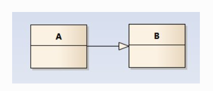

eg：汽车在现实中有实现，可用汽车定义具体的对象；汽车与SUV之间为泛化关系；

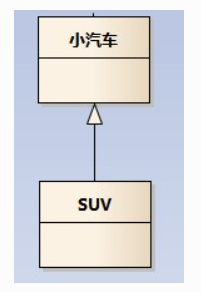

注：最终代码中，泛化关系表现为继承非抽象类；

#### 实现关系(realize)

实现关系用一条带空心箭头的虚线表示；

eg：”车”为一个抽象概念，在现实中并无法直接用来定义对象；只有指明具体的子类(汽车还是自行车)，才 可以用来定义对象（”车”这个类在C++中用抽象类表示，在JAVA中有接口这个概念，更容易理解）

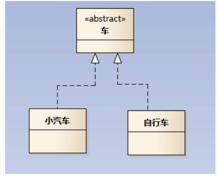

注：最终代码中，实现关系表现为继承抽象类；

#### 聚合关系(aggregation)

聚合关系用一条带空心菱形箭头的直线表示，如下图表示A聚合到B上，或者说B由A组成；

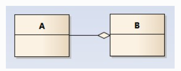

聚合关系用于表示实体对象之间的关系，表示整体由部分构成的语义；例如一个部门由多个员工组成；

与组合关系不同的是，整体和部分不是强依赖的，即使整体不存在了，部分仍然存在；例如， 部门撤销了，人员不会消失，他们依然存在；

#### 组合关系(composition)

组合关系用一条带实心菱形箭头直线表示，如下图表示A组成B，或者B由A组成；

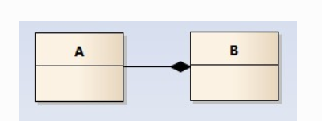

与聚合关系一样，组合关系同样表示整体由部分构成的语义；比如公司由多个部门组成；

但组合关系是一种强依赖的特殊聚合关系，如果整体不存在了，则部分也不存在了；例如， 公司不存在了，部门也将不存在了；

#### 关联关系(association)

关联关系是用一条直线表示的；它描述不同类的对象之间的结构关系；它是一种静态关系， 通常与运行状态无关，一般由常识等因素决定的；它一般用来定义对象之间静态的、天然的结构； 所以，关联关系是一种“强关联”的关系；

比如，乘车人和车票之间就是一种关联关系；学生和学校就是一种关联关系；

关联关系默认不强调方向，表示对象间相互知道；如果特别强调方向，如下图，表示A知道B，但 B不知道A；

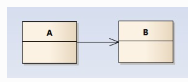

注：在最终代码中，关联对象通常是以成员变量的形式实现的；

#### 依赖关系(dependency)

依赖关系是用一套带箭头的虚线表示的；如下图表示A依赖于B；他描述一个对象在运行期间会用到另一个对象的关系；

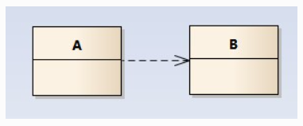

与关联关系不同的是，它是一种临时性的关系，通常在运行期间产生，并且随着运行时的变化； 依赖关系也可能发生变化；

显然，依赖也有方向，双向依赖是一种非常糟糕的结构，我们总是应该保持单向依赖，杜绝双向依赖的产生；

注：在最终代码中，依赖关系体现为类构造方法及类方法的传入参数，箭头的指向为调用关系；依赖关系除了临时知道对方外，还是“使用”对方的方法和属性；

### 时序图

为了展示对象之间的交互细节，后续对设计模式解析的章节，都会用到时序图；

时序图（Sequence Diagram）是显示对象之间交互的图，这些对象是按时间顺序排列的。时序图中显示的是参与交互的对象及其对象之间消息交互的顺序。

时序图包括的建模元素主要有：对象（Actor）、生命线（Lifeline）、控制焦点（Focus of control）、消息（Message）等等。


# 创建型模式

## 简单工厂模式-Simple Factory Pattern

> 简单工厂模式(Simple Factory Pattern)：定义一个工厂类，它可以根据参数的不同返回不同类的实例，被创建的实例通常都具有共同的父类。因为在简单工厂模式中用于创建实例的方法是静态(static)方法，因此简单工厂模式又被称为静态工厂方法(Static Factory Method)模式，它属于类创建型模式。
>
>  简单工厂模式的要点在于：**当你需要什么，只需要传入一个正确的参数，就可以获取你所需要的对象，而无须知道其创建细节。**简单工厂模式结构比较简单，其核心是工厂类的设计

- 首先将需要创建的各种不同对象（例如各种不同的Chart对象）的相关代码封装到不同的类中，这些类称为具体产品类，
- 而将它们公共的代码进行抽象和提取后封装在一个抽象产品类中，每一个具体产品类都是抽象产品类的子类；
- 然后提供一个工厂类用于创建各种产品，在工厂类中提供一个创建产品的工厂方法，该方法可以根据所传入的参数不同创建不同的具体产品对象；
- 客户端只需调用工厂类的工厂方法并传入相应的参数即可得到一个产品对象。
  

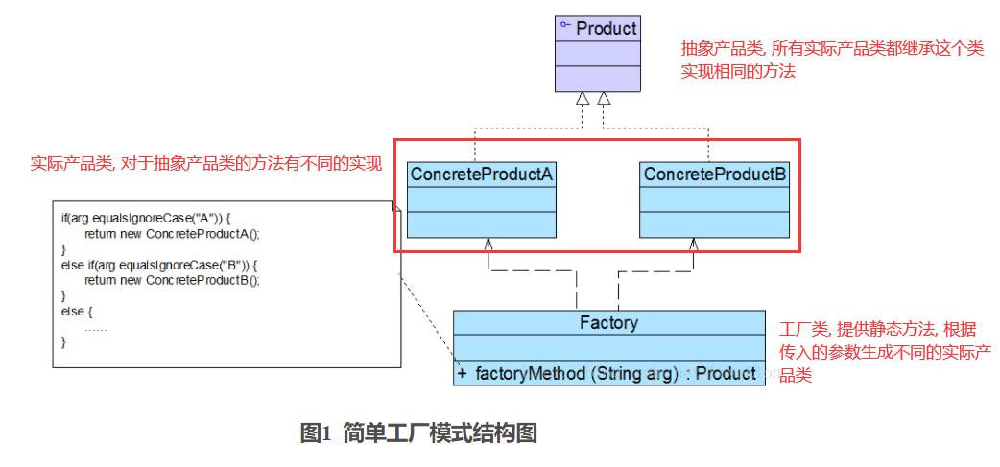

- Factory（工厂角色）：工厂角色即工厂类，它是简单工厂模式的核心，负责实现创建所有产品实例的内部逻辑；工厂类可以被外界直接调用，创建所需的产品对象；在工厂类中提供了静态的工厂方法factoryMethod()，它的返回类型为抽象产品类型Product。


-  Product（抽象产品角色）：它是工厂类所创建的所有对象的父类，封装了各种产品对象的公有方法，它的引入将提高系统的灵活性，使得在工厂类中只需定义一个通用的工厂方法，因为所有创建的具体产品对象都是其子类对象。


- ConcreteProduct（具体产品角色）：它是简单工厂模式的创建目标，所有被创建的对象都充当这个角色的某个具体类的实例。每一个具体产品角色都继承了抽象产品角色，需要实现在抽象产品中声明的抽象方法。

### 实际案例 图表库

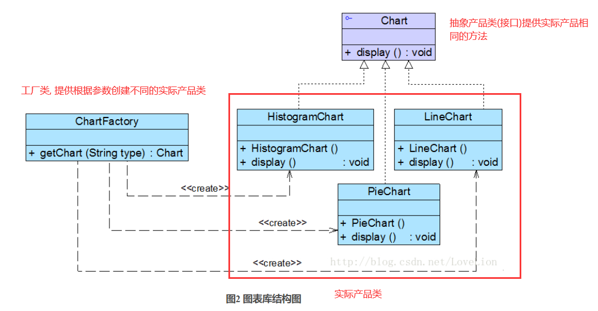

```java
//抽象图表接口：抽象产品类
interface Chart {
	public void display();
}
 
//柱状图类：具体产品类
class HistogramChart implements Chart {
	public HistogramChart() {
		System.out.println("创建柱状图！");
	}
	
	public void display() {
		System.out.println("显示柱状图！");
	}
}
 
//饼状图类：具体产品类
class PieChart implements Chart {
	public PieChart() {
		System.out.println("创建饼状图！");
	}
	
	public void display() {
		System.out.println("显示饼状图！");
	}
}
 
//折线图类：具体产品类
class LineChart implements Chart {
	public LineChart() {
		System.out.println("创建折线图！");
	}
	
	public void display() {
		System.out.println("显示折线图！");
	}
}
 
//图表工厂类：工厂类
class ChartFactory {
    //静态工厂方法
	public static Chart getChart(String type) {
		Chart chart = null;
		if (type.equalsIgnoreCase("histogram")) {
			chart = new HistogramChart();
			System.out.println("初始化设置柱状图！");
		}
		else if (type.equalsIgnoreCase("pie")) {
			chart = new PieChart();
			System.out.println("初始化设置饼状图！");
		}
		else if (type.equalsIgnoreCase("line")) {
			chart = new LineChart();
			System.out.println("初始化设置折线图！");			
		}
		return chart;
	}
}

//编写如下客户端测试代码：
class Client {
	public static void main(String args[]) {
		Chart chart;
		chart = ChartFactory.getChart("histogram"); //通过静态工厂方法创建产品
		chart.display();
	}
}
```


### 简单工厂模式总结

​      简单工厂模式提供了专门的工厂类用于创建对象，将对象的创建和对象的使用分离开，它作为一种最简单的工厂模式在软件开发中得到了较为广泛的应用。

 1. 主要优点

   简单工厂模式的主要优点如下：

   (1) 工厂类包含必要的判断逻辑，可以决定在什么时候创建哪一个产品类的实例，客户端可以免除直接创建产品对象的职责，而仅仅“消费”产品，简单工厂模式实现了对象创建和使用的分离。

   (2) 客户端无须知道所创建的具体产品类的类名，只需要知道具体产品类所对应的参数即可，对于一些复杂的类名，通过简单工厂模式可以在一定程度减少使用者的记忆量。

   (3) 通过引入配置文件，可以在不修改任何客户端代码的情况下更换和增加新的具体产品类，在一定程度上提高了系统的灵活性。

 

2. 主要缺点

   简单工厂模式的主要缺点如下：

   (1) 由于工厂类集中了所有产品的创建逻辑，职责过重，一旦不能正常工作，整个系统都要受到影响。

   (2) 使用简单工厂模式势必会增加系统中类的个数（引入了新的工厂类），增加了系统的复杂度和理解难度。

   (3) 系统扩展困难，一旦添加新产品就不得不修改工厂逻辑，在产品类型较多时，有可能造成工厂逻辑过于复杂，不利于系统的扩展和维护。

   (4) 简单工厂模式由于使用了静态工厂方法，造成工厂角色无法形成基于继承的等级结构。

 

3. 适用场景

   在以下情况下可以考虑使用简单工厂模式：

   (1) 工厂类负责创建的对象比较少，由于创建的对象较少，不会造成工厂方法中的业务逻辑太过复杂。

   (2) 客户端只知道传入工厂类的参数，对于如何创建对象并不关心。


## 工厂方法模式(**Factory Method Pattern**)

### 简单工厂的缺陷

简单工厂模式虽然简单，但存在一个很严重的问题。**当系统中需要引入新产品时，由于静态工厂方法通过所传入参数的不同来创建不同的产品，这必定要修改工厂类的源代码，将违背“开闭原则”，如何实现增加新产品而不影响已有代码？**工厂方法模式应运而生

### 工厂方法原理

在工厂方法模式中，我们**不再提供一个统一的工厂类来创建所有的产品对象，而是针对不同的产品提供不同的工厂，系统提供一个与产品等级结构对应的工厂等级结构**

工厂方法模式(Factory Method Pattern)：定义一个用于创建对象的接口，让子类决定将哪一个类实例化。工厂方法模式让一个类的实例化延迟到其子类。工厂方法模式又简称为工厂模式(Factory Pattern)，又可称作虚拟构造器模式(Virtual Constructor Pattern)或多态工厂模式(Polymorphic Factory Pattern)。工厂方法模式是一种类创建型模式。

工厂方法模式提供一个抽象工厂接口来声明抽象工厂方法，而由其子类来具体实现工厂方法，创建具体的产品对象。

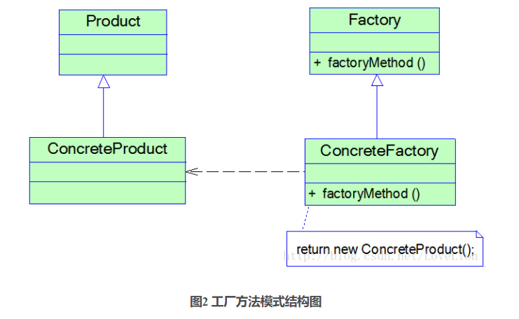

在工厂方法模式结构图中包含如下几个角色：

- Product（抽象产品）：它是定义产品的接口，是工厂方法模式所创建对象的超类型，也就是产品对象的公共父类。


-  ConcreteProduct（具体产品）：它实现了抽象产品接口，某种类型的具体产品由专门的具体工厂创建，具体工厂和具体产品之间一一对应。


- Factory（抽象工厂）：在抽象工厂类中，声明了工厂方法(Factory Method)，用于返回一个产品。抽象工厂是工厂方法模式的核心，所有创建对象的工厂类都必须实现该接口。


- ConcreteFactory（具体工厂）：它是抽象工厂类的子类，实现了抽象工厂中定义的工厂方法，并可由客户端调用，返回一个具体产品类的实例。与简单工厂模式相比，工厂方法模式最重要的区别是引入了抽象工厂角色，抽象工厂可以是接口，也可以是抽象类或者具体类


- 在抽象工厂中声明了工厂方法但并未实现工厂方法，具体产品对象的创建由其子类负责，客户端针对抽象工厂编程，可在运行时再指定具体工厂类，具体工厂类实现了工厂方法，不同的具体工厂可以创建不同的具体产品


### 案例-日志记录器

Sunny公司的开发人员通过对该需求进行分析，发现该日志记录器有两个设计要点：

       (1) 需要封装日志记录器的初始化过程，这些初始化工作较为复杂，例如需要初始化其他相关的类，还有可能需要读取配置文件（例如连接数据库或创建文件），导致代码较长，如果将它们都写在构造函数中，会导致构造函数庞大，不利于代码的修改和维护；
    
       (2) 用户可能需要更换日志记录方式，在客户端代码中需要提供一种灵活的方式来选择日志记录器，尽量在不修改源代码的基础上更换或者增加日志记录方式。
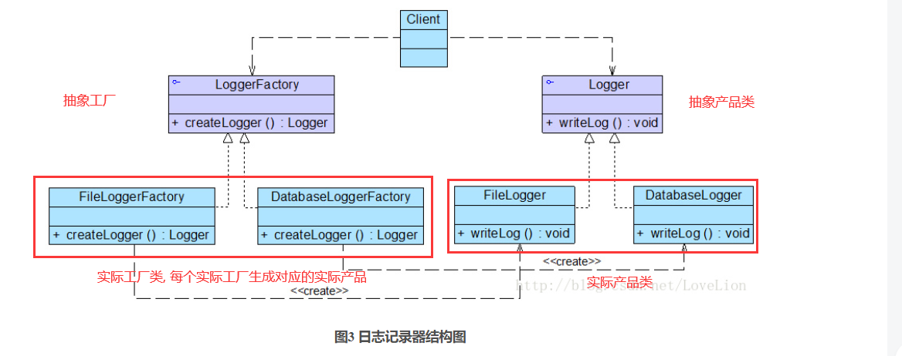

```java
//日志记录器接口：抽象产品
interface Logger {
	public void writeLog();
}
 
//数据库日志记录器：具体产品
class DatabaseLogger implements Logger {
	public void writeLog() {
		System.out.println("数据库日志记录。");
	}
}
 
//文件日志记录器：具体产品
class FileLogger implements Logger {
	public void writeLog() {
		System.out.println("文件日志记录。");
	}
}
 
//日志记录器工厂接口：抽象工厂
interface LoggerFactory {
	public Logger createLogger();
}
 
//数据库日志记录器工厂类：具体工厂
class DatabaseLoggerFactory implements LoggerFactory {
	public Logger createLogger() {
			//连接数据库，代码省略
			//创建数据库日志记录器对象
			Logger logger = new DatabaseLogger(); 
			//初始化数据库日志记录器，代码省略
			return logger;
	}	
}
 
//文件日志记录器工厂类：具体工厂
class FileLoggerFactory implements LoggerFactory {
	public Logger createLogger() {
            //创建文件日志记录器对象
			Logger logger = new FileLogger(); 
			//创建文件，代码省略
			return logger;
	}	
}

class Client {
	public static void main(String args[]) {
		LoggerFactory factory;
		Logger logger;
		factory = new FileLoggerFactory(); //可引入配置文件实现
		logger = factory.createLogger();
		logger.writeLog();
	}
}
```


### 工厂方法模式总结

​      工厂方法模式是简单工厂模式的延伸，它继承了简单工厂模式的优点，同时还弥补了简单工厂模式的不足。工厂方法模式是使用频率最高的设计模式之一，是很多开源框架和API类库的核心模式。

 

        1. 主要优点
    
       工厂方法模式的主要优点如下：
    
       (1) 在工厂方法模式中，工厂方法用来创建客户所需要的产品，同时还向客户隐藏了哪种具体产品类将被实例化这一细节，用户只需要关心所需产品对应的工厂，无须关心创建细节，甚至无须知道具体产品类的类名。
    
       (2) 基于工厂角色和产品角色的多态性设计是工厂方法模式的关键。它能够让工厂可以自主确定创建何种产品对象，而如何创建这个对象的细节则完全封装在具体工厂内部。工厂方法模式之所以又被称为多态工厂模式，就正是因为所有的具体工厂类都具有同一抽象父类。
    
       (3) 使用工厂方法模式的另一个优点是在系统中加入新产品时，无须修改抽象工厂和抽象产品提供的接口，无须修改客户端，也无须修改其他的具体工厂和具体产品，而只要添加一个具体工厂和具体产品就可以了，这样，系统的可扩展性也就变得非常好，完全符合“开闭原则”。

 


      2. 主要缺点
    
     工厂方法模式的主要缺点如下：
    
      (1) 在添加新产品时，需要编写新的具体产品类，而且还要提供与之对应的具体工厂类，系统中类的个数将成对增加，在一定程度上增加了系统的复杂度，有更多的类需要编译和运行，会给系统带来一些额外的开销。
    
      (2) 由于考虑到系统的可扩展性，需要引入抽象层，在客户端代码中均使用抽象层进行定义，增加了系统的抽象性和理解难度，且在实现时可能需要用到DOM、反射等技术，增加了系统的实现难度。

 


       3. 适用场景
    
       在以下情况下可以考虑使用工厂方法模式：
    
       (1) 客户端不知道它所需要的对象的类。在工厂方法模式中，客户端不需要知道具体产品类的类名，只需要知道所对应的工厂即可，具体的产品对象由具体工厂类创建，可将具体工厂类的类名存储在配置文件或数据库中。
    
       (2) 抽象工厂类通过其子类来指定创建哪个对象。在工厂方法模式中，对于抽象工厂类只需要提供一个创建产品的接口，而由其子类来确定具体要创建的对象，利用面向对象的多态性和里氏代换原则，在程序运行时，子类对象将覆盖父类对象，从而使得系统更容易扩展。


## 抽象工厂模式-Abstract  Factory Pattern

工厂方法模式通过引入工厂等级结构，解决了简单工厂模式中工厂类职责太重的问题，但由于工厂方法模式中的每个工厂只生产一类产品，可能会导致系统中存在大量的工厂类，势必会增加系统的开销。此时，我们可以考虑***\*将一些相关的产品组成一个“产品族”，由同一个工厂来统一生产\****


### 产品等级结构与产品族

在工厂方法模式中具体工厂负责生产具体的产品，每一个具体工厂对应一种具体产品，工厂方法具有唯一性，一般情况下，一个具体工厂中只有一个或者一组重载的工厂方法。但是有时候我们希望一个工厂可以提供多个产品对象，而不是单一的产品对象

-   (1) 产品等级结构：产品等级结构即产品的继承结构，如一个抽象类是电视机，其子类有海尔电视机、海信电视机、TCL电视机，则抽象电视机与具体品牌的电视机之间构成了一个产品等级结构，抽象电视机是父类，而具体品牌的电视机是其子类。

-    (2) 产品族：在抽象工厂模式中，产品族是指由同一个工厂生产的，位于不同产品等级结构中的一组产品，如海尔电器工厂生产的海尔电视机、海尔电冰箱，海尔电视机位于电视机产品等级结构中，海尔电冰箱位于电冰箱产品等级结构中，海尔电视机、海尔电冰箱构成了一个产品族。

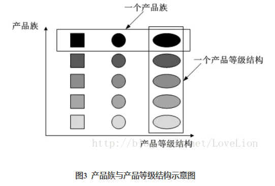

在图3中，不同颜色的多个正方形、圆形和椭圆形分别构成了三个不同的产品等级结构，而相同颜色的正方形、圆形和椭圆形构成了一个产品族，每一个形状对象都位于某个产品族，并属于某个产品等级结构。图3中一共有五个产品族，分属于三个不同的产品等级结构。我们只要指明一个产品所处的产品族以及它所属的等级结构，就可以唯一确定这个产品。

   当系统所提供的工厂生产的具体产品并不是一个简单的对象，而是多个位于不同产品等级结构、属于不同类型的具体产品时就可以使用抽象工厂模式。抽象工厂模式是所有形式的工厂模式中最为抽象和最具一般性的一种形式。抽象工厂模式与工厂方法模式最大的区别在于，工厂方法模式针对的是一个产品等级结构，而抽象工厂模式需要面对多个产品等级结构，一个工厂等级结构可以负责多个不同产品等级结构中的产品对象的创建。当一个工厂等级结构可以创建出分属于不同产品等级结构的一个产品族中的所有对象时，抽象工厂模式比工厂方法模式更为简单、更有效率。抽象工厂模式示意图如图4所示：

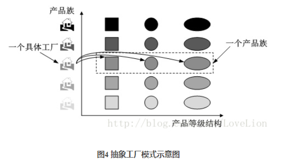

 在图4中，每一个具体工厂可以生产属于一个产品族的所有产品，例如生产颜色相同的正方形、圆形和椭圆形，所生产的产品又位于不同的产品等级结构中。如果使用工厂方法模式，图4所示结构需要提供15个具体工厂，而使用抽象工厂模式只需要提供5个具体工厂，极大减少了系统中类的个数。


### 抽象工厂模式概述

抽象工厂模式为创建一组对象提供了一种解决方案。与工厂方法模式相比，抽象工厂模式中的具体工厂不只是创建一种产品，它负责创建一族产品

> 抽象工厂模式(Abstract Factory Pattern)：提供一个创建一系列相关或相互依赖对象的接口，而无须指定它们具体的类。抽象工厂模式又称为Kit模式，它是一种对象创建型模式。

 在抽象工厂模式中，每一个具体工厂都提供了多个工厂方法用于产生多种不同类型的产品，这些产品构成了一个产品族，

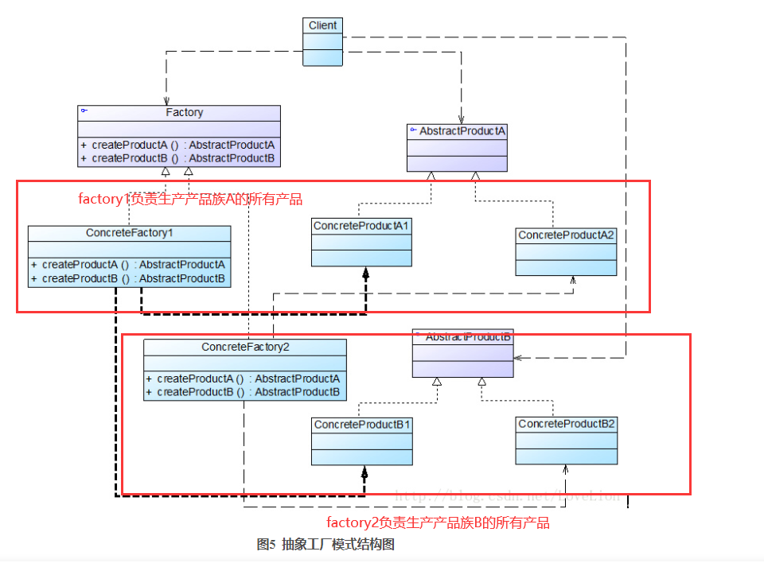

  ● AbstractFactory（抽象工厂）：它声明了一组用于创建一族产品的方法，每一个方法对应一种产品。

   ● ConcreteFactory（具体工厂）：它实现了在抽象工厂中声明的创建产品的方法，生成一组具体产品，这些产品构成了一个产品族，每一个产品都位于某个产品等级结构中。

   ● AbstractProduct（抽象产品）：它为每种产品声明接口，在抽象产品中声明了产品所具有的业务方法。

   ● ConcreteProduct（具体产品）：它定义具体工厂生产的具体产品对象，实现抽象产品接口中声明的业务方法。


### 案例-界面皮肤库

Sunny软件公司欲开发一套界面皮肤库，可以对Java桌面软件进行界面美化。为了保护版权，该皮肤库源代码不打算公开，而只向用户提供已打包为jar文件的class字节码文件。用户在使用时可以通过菜单来选择皮肤，不同的皮肤将提供视觉效果不同的按钮、文本框、组合框等界面元素

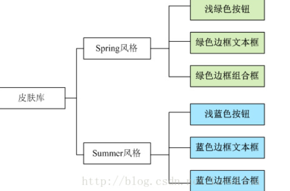

初始方案, 针对每个产品都需要一个工厂

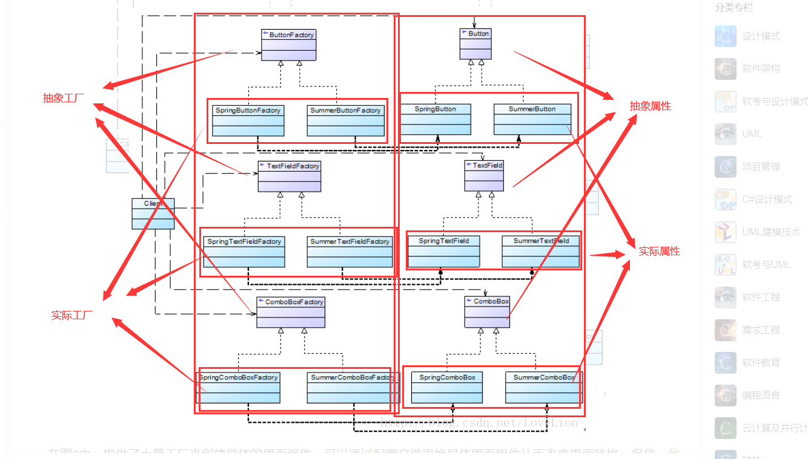

   在图2中，提供了大量工厂来创建具体的界面组件，可以通过配置文件更换具体界面组件从而改变界面风格。但是，此设计方案存在如下问题：

       (1) 当需要增加新的皮肤时，虽然不要修改现有代码，但是需要增加大量类，针对每一个新增具体组件都需要增加一个具体工厂，类的个数成对增加，这无疑会导致系统越来越庞大，增加系统的维护成本和运行开销；
    
       (2) 由于同一种风格的具体界面组件通常要一起显示，因此需要为每个组件都选择一个具体工厂，用户在使用时必须逐个进行设置，如果某个具体工厂选择失误将会导致界面显示混乱，虽然我们可以适当增加一些约束语句，但客户端代码和配置文件都较为复杂。
    
       如何减少系统中类的个数并保证客户端每次始终只使用某一种风格的具体界面组件？这是Sunny公司开发人员所面临的两个问题，显然，工厂方法模式无法解决这两个问题
抽象工厂方法, 每个抽象工厂生成一族的产品, 减少工厂类的数量

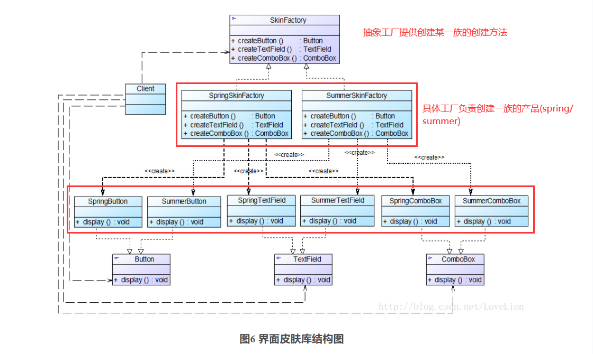

```java
//在本实例中我们对代码进行了大量简化，实际使用时，界面组件的初始化代码较为复杂，还需要使用JDK中一些已有类，为了突出核心代码，在此只提供框架代码和演示输出。
//按钮接口：抽象产品
interface Button {
	public void display();
}
 
//Spring按钮类：具体产品
class SpringButton implements Button {
	public void display() {
		System.out.println("显示浅绿色按钮。");
	}
}
 
//Summer按钮类：具体产品
class SummerButton implements Button {
	public void display() {
		System.out.println("显示浅蓝色按钮。");
	}	
}
//省略其他产品
 
//界面皮肤工厂接口：抽象工厂
interface SkinFactory {
	public Button createButton();
	public TextField createTextField();
	public ComboBox createComboBox();
}
 
//Spring皮肤工厂：具体工厂
class SpringSkinFactory implements SkinFactory {
	public Button createButton() {
		return new SpringButton();
	}
 
	public TextField createTextField() {
		return new SpringTextField();
	}
 
	public ComboBox createComboBox() {
		return new SpringComboBox();
	}
}
 
//Summer皮肤工厂：具体工厂
class SummerSkinFactory implements SkinFactory {
	public Button createButton() {
		return new SummerButton();
	}
 
	public TextField createTextField() {
		return new SummerTextField();
	}
 
	public ComboBox createComboBox() {
		return new SummerComboBox();
	}
}

class Client {
	public static void main(String args[]) {
        //使用抽象层定义
		SkinFactory factory;
		Button bt;
		TextField tf;
		ComboBox cb;
		factory = (SkinFactory)XMLUtil.getBean();
		bt = factory.createButton();
		tf = factory.createTextField();
		cb = factory.createComboBox();
		bt.display();
		tf.display();
		cb.display();
	}
}
```


### 开闭原则”的倾斜性

​       Sunny公司使用抽象工厂模式设计了界面皮肤库，该皮肤库可以较为方便地增加新的皮肤，但是现在遇到一个非常严重的问题：由于设计时考虑不全面，忘记为单选按钮(RadioButton)提供不同皮肤的风格化显示，导致无论选择哪种皮肤，单选按钮都显得那么“格格不入”。Sunny公司的设计人员决定向系统中增加单选按钮，但是发现原有系统居然不能够在符合“开闭原则”的前提下增加新的组件，原因是抽象工厂SkinFactory中根本没有提供创建单选按钮的方法，如果需要增加单选按钮，首先需要修改抽象工厂接口SkinFactory，在其中新增声明创建单选按钮的方法，然后逐个修改具体工厂类，增加相应方法以实现在不同的皮肤中创建单选按钮，此外还需要修改客户端，否则单选按钮无法应用于现有系统。

       怎么办？答案是抽象工厂模式无法解决该问题，这也是抽象工厂模式最大的缺点。在抽象工厂模式中，增加新的产品族很方便，但是增加新的产品等级结构很麻烦，抽象工厂模式的这种性质称为“开闭原则”的倾斜性。“开闭原则”要求系统对扩展开放，对修改封闭，通过扩展达到增强其功能的目的，对于涉及到多个产品族与多个产品等级结构的系统，其功能增强包括两方面：
    
       (1) 增加产品族：对于增加新的产品族，抽象工厂模式很好地支持了“开闭原则”，只需要增加具体产品并对应增加一个新的具体工厂，对已有代码无须做任何修改。
    
       (2) 增加新的产品等级结构：对于增加新的产品等级结构，需要修改所有的工厂角色，包括抽象工厂类，在所有的工厂类中都需要增加生产新产品的方法，违背了“开闭原则”。
    
       正因为抽象工厂模式存在“开闭原则”的倾斜性，它以一种倾斜的方式来满足“开闭原则”，为增加新产品族提供方便，但不能为增加新产品结构提供这样的方便，因此要求设计人员在设计之初就能够全面考虑，不会在设计完成之后向系统中增加新的产品等级结构，也不会删除已有的产品等级结构，否则将会导致系统出现较大的修改，为后续维护工作带来诸多麻烦。

 

###  抽象工厂模式总结

​       抽象工厂模式是工厂方法模式的进一步延伸，由于它提供了功能更为强大的工厂类并且具备较好的可扩展性，在软件开发中得以广泛应用，尤其是在一些框架和API类库的设计中，例如在Java语言的AWT（抽象窗口工具包）中就使用了抽象工厂模式，它使用抽象工厂模式来实现在不同的操作系统中应用程序呈现与所在操作系统一致的外观界面。抽象工厂模式也是在软件开发中最常用的设计模式之一。

 

       1. 主要优点
    
       抽象工厂模式的主要优点如下：
    
       (1) 抽象工厂模式隔离了具体类的生成，使得客户并不需要知道什么被创建。由于这种隔离，更换一个具体工厂就变得相对容易，所有的具体工厂都实现了抽象工厂中定义的那些公共接口，因此只需改变具体工厂的实例，就可以在某种程度上改变整个软件系统的行为。
    
       (2) 当一个产品族中的多个对象被设计成一起工作时，它能够保证客户端始终只使用同一个产品族中的对象。
    
       (3) 增加新的产品族很方便，无须修改已有系统，符合“开闭原则”。

 


       2. 主要缺点
    
       抽象工厂模式的主要缺点如下：
    
       增加新的产品等级结构麻烦，需要对原有系统进行较大的修改，甚至需要修改抽象层代码，这显然会带来较大的不便，违背了“开闭原则”。

 


       3. 适用场景
    
       在以下情况下可以考虑使用抽象工厂模式：
    
       (1) 一个系统不应当依赖于产品类实例如何被创建、组合和表达的细节，这对于所有类型的工厂模式都是很重要的，用户无须关心对象的创建过程，将对象的创建和使用解耦。
    
       (2) 系统中有多于一个的产品族，而每次只使用其中某一产品族。可以通过配置文件等方式来使得用户可以动态改变产品族，也可以很方便地增加新的产品族。
    
       (3) 属于同一个产品族的产品将在一起使用，这一约束必须在系统的设计中体现出来。同一个产品族中的产品可以是没有任何关系的对象，但是它们都具有一些共同的约束，如同一操作系统下的按钮和文本框，按钮与文本框之间没有直接关系，但它们都是属于某一操作系统的，此时具有一个共同的约束条件：操作系统的类型。
    
       (4) 产品等级结构稳定，设计完成之后，不会向系统中增加新的产品等级结构或者删除已有的产品等级结构。


## 建造者模式

### 模式动机

无论是在现实世界中还是在软件系统中，都存在一些复杂的对象，它们拥有多个组成部分，如汽车，它包括车轮、方向盘、发送机等各种部件。

- 而对于大多数用户而言，无须知道这些部件的装配细节，也几乎不会使用单独某个部件，而是使用一辆完整的汽车，
- 可以通过建造者模式对其进行设计与描述，建造者模式可以将部件和其组装过程分开，一步一步创建一个复杂的对象。
- 用户只需要指定复杂对象的类型就可以得到该对象，而无须知道其内部的具体构造细节。

在软件开发中，也存在大量类似汽车一样的复杂对象，它们拥有一系列成员属性，这些成员属性中有些是引用类型的成员对象。

- 而且在这些复杂对象中，还可能存在一些限制条件，如某些属性没有赋值则复杂对象不能作为一个完整的产品使用；
- 有些属性的赋值必须按照某个顺序，一个属性没有赋值之前，另一个属性可能无法赋值等。

复杂对象相当于一辆有待建造的汽车，而对象的属性相当于汽车的部件，建造产品的过程就相当于组合部件的过程。

- 由于组合部件的过程很复杂，因此，这些部件的组合过程往往被“外部化”到一个称作建造者的对象里，
- 建造者返还给客户端的是一个已经建造完毕的完整产品对象，而用户无须关心该对象所包含的属性以及它们的组装方式，这就是建造者模式的模式动机。

###  模式定义

造者模式(Builder Pattern)：将一个复杂对象的构建与它的表示分离，使得同样的构建过程可以创建不同的表示。

建造者模式是一步一步创建一个复杂的对象，它允许用户只通过指定复杂对象的类型和内容就可以构建它们，用户不需要知道内部的具体构建细节。建造者模式属于对象创建型模式。根据中文翻译的不同，建造者模式又可以称为生成器模式。

### 模式结构

建造者模式包含如下角色：

- Builder（抽象建造者）：它为创建一个产品Product对象的各个部件指定抽象接口，在该接口中一般声明两类方法，一类方法是buildPartX()，它们用于创建复杂对象的各个部件；另一类方法是getResult()，它们用于返回复杂对象。Builder既可以是抽象类，也可以是接口。
- ConcreteBuilder（具体建造者）：它实现了Builder接口，实现各个部件的具体构造和装配方法，定义并明确它所创建的复杂对象，也可以提供一个方法返回创建好的复杂产品对象。
- Product（产品角色）：它是被构建的复杂对象，包含多个组成部件，具体建造者创建该产品的内部表示并定义它的装配过程。
- Director（指挥者）：指挥者又称为导演类，它负责安排复杂对象的建造次序，指挥者与抽象建造者之间存在关联关系，可以在其construct()建造方法中调用建造者对象的部件构造与装配方法，完成复杂对象的建造。客户端一般只需要与指挥者进行交互，在客户端确定具体建造者的类型，并实例化具体建造者对象（也可以通过配置文件和反射机制），然后通过指挥者类的构造函数或者Setter方法将该对象传入指挥者类中。
  


### 时序图


###  模式分析

抽象建造者类中定义了产品的创建方法和返回方法;

建造者模式的结构中还引入了一个指挥者类Director，该类的作用主要有两个：

- 一方面它隔离了客户与生产过程；
- 另一方面它负责控制产品的生成过程。
- 指挥者针对抽象建造者编程，客户端只需要知道具体建造者的类型，即可通过指挥者类调用建造者的相关方法，返回一个完整的产品对象

在客户端代码中，无须关心产品对象的具体组装过程，只需确定具体建造者的类型即可，建造者模式将复杂对象的构建与对象的表现分离开来，这样使得同样的构建过程可以创建出不同的表现。

### 实例

实例：KFC套餐

建造者模式可以用于描述KFC如何创建套餐：套餐是一个复杂对象，它一般包含主食（如汉堡、鸡肉卷等）和饮料（如果汁、 可乐等）等组成部分，不同的套餐有不同的组成部分，而KFC的服务员可以根据顾客的要求，一步一步装配这些组成部分，构造一份完整的套餐，然后返回给顾客。


### 优点

- 在建造者模式中， **客户端不必知道产品内部组成的细节，将产品本身与产品的创建过程解耦，使得相同的创建过程可以创建不同的产品对象。**
- 每一个具体建造者都相对独立，而与其他的具体建造者无关，因此可以很方便地替换具体建造者或增加新的具体建造者， **用户使用不同的具体建造者即可得到不同的产品对象** 。
- **可以更加精细地控制产品的创建过程** 。将复杂产品的创建步骤分解在不同的方法中，使得创建过程更加清晰，也更方便使用程序来控制创建过程。
- **增加新的具体建造者无须修改原有类库的代码，指挥者类针对抽象建造者类编程，系统扩展方便，符合“开闭原则”。**

### 缺点

- 建造者模式所创建的产品一般具有较多的共同点，其组成部分相似，如果产品之间的差异性很大，则不适合使用建造者模式，因此其使用范围受到一定的限制。
- 如果产品的内部变化复杂，可能会导致需要定义很多具体建造者类来实现这种变化，导致系统变得很庞大。

### 适用环境

在以下情况下可以使用建造者模式：

- 需要生成的产品对象有复杂的内部结构，这些产品对象通常包含多个成员属性。
- 需要生成的产品对象的属性相互依赖，需要指定其生成顺序。
- 对象的创建过程独立于创建该对象的类。在建造者模式中引入了指挥者类，将创建过程封装在指挥者类中，而不在建造者类中。
- 隔离复杂对象的创建和使用，并使得相同的创建过程可以创建不同的产品。

### 模式应用

在很多游戏软件中，地图包括天空、地面、背景等组成部分，人物角色包括人体、服装、装备等组成部分，可以使用建造者模式对其进行设计，通过不同的具体建造者创建不同类型的地图或人物。

### 模式扩展

建造者模式的简化:

- 省略抽象建造者角色：如果系统中只需要一个具体建造者的话，可以省略掉抽象建造者。
- 省略指挥者角色：在具体建造者只有一个的情况下，如果抽象建造者角色已经被省略掉，那么还可以省略指挥者角色，让

Builder角色扮演指挥者与建造者双重角色。

建造者模式与抽象工厂模式的比较:

- 与抽象工厂模式相比， **建造者模式返回一个组装好的完整产品** ，而 **抽象工厂模式返回一系列相关的产品，这些产品位于不同的产品等级结构，构成了一个产品族。**
- 在抽象工厂模式中，客户端实例化工厂类，然后调用工厂方法获取所需产品对象，而在建造者模式中，客户端可以不直接调用建造者的相关方法，而是通过指挥者类来指导如何生成对象，包括对象的组装过程和建造步骤，它侧重于一步步构造一个复杂对象，返回一个完整的对象。
- 如果将抽象工厂模式看成 **汽车配件生产工厂** ，生产一个产品族的产品，那么建造者模式就是一个 **汽车组装工厂** ，通过对部件的组装可以返回一辆完整的汽车。

### 总结

- 建造者模式将一个复杂对象的构建与它的表示分离，使得同样的构建过程可以创建不同的表示。建造者模式是一步一步创建一个复杂的对象，它允许用户只通过指定复杂对象的类型和内容就可以构建它们，用户不需要知道内部的具体构建细节。建造者模式属于对象创建型模式。
- 建造者模式包含如下四个角色：抽象建造者为创建一个产品对象的各个部件指定抽象接口；具体建造者实现了抽象建造者接口，实现各个部件的构造和装配方法，定义并明确它所创建的复杂对象，也可以提供一个方法返回创建好的复杂产品对象；产品角色是被构建的复杂对象，包含多个组成部件；指挥者负责安排复杂对象的建造次序，指挥者与抽象建造者之间存在关联关系，可以在其construct()建造方法中调用建造者对象的部件构造与装配方法，完成复杂对象的建造
- 在建造者模式的结构中引入了一个指挥者类，该类的作用主要有两个：一方面它隔离了客户与生产过程；另一方面它负责控制产品的生成过程。指挥者针对抽象建造者编程，客户端只需要知道具体建造者的类型，即可通过指挥者类调用建造者的相关方法，返回一个完整的产品对象。
- 建造者模式的主要优点在于客户端不必知道产品内部组成的细节，将产品本身与产品的创建过程解耦，使得相同的创建过程可以创建不同的产品对象，每一个具体建造者都相对独立，而与其他的具体建造者无关，因此可以很方便地替换具体建造者或增加新的具体建造者，符合“开闭原则”，还可以更加精细地控制产品的创建过程；其主要缺点在于由于建造者模式所创建的产品一般具有较多的共同点，其组成部分相似，因此其使用范围受到一定的限制，如果产品的内部变化复杂，可能会导致需要定义很多具体建造者类来实现这种变化，导致系统变得很庞大。
- 建造者模式适用情况包括：需要生成的产品对象有复杂的内部结构，这些产品对象通常包含多个成员属性；需要生成的产品对象的属性相互依赖，需要指定其生成顺序；对象的创建过程独立于创建该对象的类；隔离复杂对象的创建和使用，并使得相同的创建过程可以创建不同类型的产品。


## 单例模式-Singleton Pattern

> 单例模式(Singleton Pattern)：确保某一个类只有一个实例，而且自行实例化并向整个系统提供这个实例，这个类称为单例类，它提供全局访问的方法。单例模式是一种对象创建型模式。
>
>  单例模式有三个要点：一是某个类只能有一个实例；二是它必须自行创建这个实例；三是它必须自行向整个系统提供这个实例。


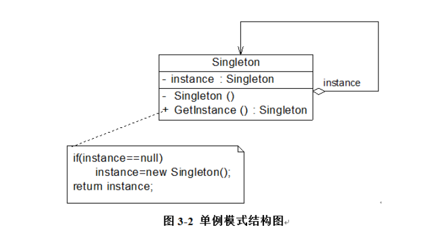


Singleton（单例）：在单例类的内部实现只生成一个实例，同时它提供一个静态的getInstance()工厂方法，让客户可以访问它的唯一实例；为了防止在外部对其实例化，将其构造函数设计为私有；在单例类内部定义了一个Singleton类型的静态对象，作为外部共享的唯一实例


### 案例-负载均衡器的设计与实现

 Sunny软件公司承接了一个服务器负载均衡(Load Balance)软件的开发工作，该软件运行在一台负载均衡服务器上，可以将并发访问和数据流量分发到服务器集群中的多台设备上进行并发处理，提高系统的整体处理能力，缩短响应时间。由于集群中的服务器需要动态删减，且客户端请求需要统一分发，因此需要确保负载均衡器的唯一性，只能有一个负载均衡器来负责服务器的管理和请求的分发，否则将会带来服务器状态的不一致以及请求分配冲突等问题。如何确保负载均衡器的唯一性是该软件成功的关键。
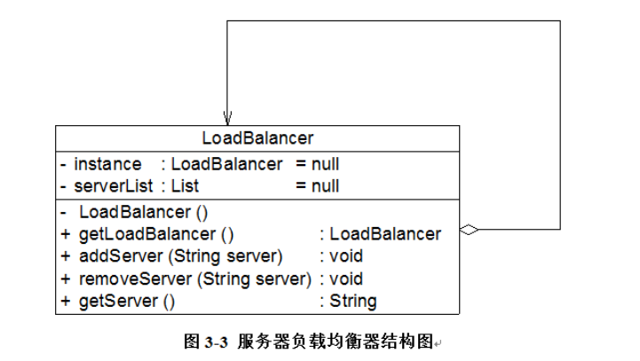

```java
import java.util.*;
 
//负载均衡器LoadBalancer：单例类，真实环境下该类将非常复杂，包括大量初始化的工作和业务方法，考虑到代码的可读性和易理解性，只列出部分与模式相关的核心代码
class LoadBalancer {
	//私有静态成员变量，存储唯一实例
	private static LoadBalancer instance = null;
	//服务器集合
	private List serverList = null;
	
	//私有构造函数
	private LoadBalancer() {
		serverList = new ArrayList();
	}
	
	//公有静态成员方法，返回唯一实例
	public static LoadBalancer getLoadBalancer() {
		if (instance == null) {
			instance = new LoadBalancer();
		}
		return instance;
	}
	
	//增加服务器
	public void addServer(String server) {
		serverList.add(server);
	}
	
	//删除服务器
	public void removeServer(String server) {
		serverList.remove(server);
	}
	
	//使用Random类随机获取服务器
	public String getServer() {
		Random random = new Random();
		int i = random.nextInt(serverList.size());
		return (String)serverList.get(i);
	}
}
```

### 饿汉式单例与懒汉式单例的讨论

Sunny公司开发人员使用单例模式实现了负载均衡器的设计，但是在实际使用中出现了一个非常严重的问题，当负载均衡器在启动过程中用户再次启动该负载均衡器时，系统无任何异常，但当客户端提交请求时出现请求分发失败，通过仔细分析发现原来系统中还是存在多个负载均衡器对象，导致分发时目标服务器不一致，从而产生冲突。为什么会这样呢？Sunny公司开发人员百思不得其解。

  现在我们对负载均衡器的实现代码进行再次分析，当第一次调用getLoadBalancer()方法创建并启动负载均衡器时，instance对象为null值，因此系统将执行代码instance= new LoadBalancer()，在此过程中，由于要对LoadBalancer进行大量初始化工作，需要一段时间来创建LoadBalancer对象。而在此时，如果再一次调用getLoadBalancer()方法（通常发生在多线程环境中），由于instance尚未创建成功，仍为null值，判断条件(instance== null)为真值，因此代码instance= new LoadBalancer()将再次执行，导致最终创建了多个instance对象，这违背了单例模式的初衷，也导致系统运行发生错误

#### 饿汉式单例类

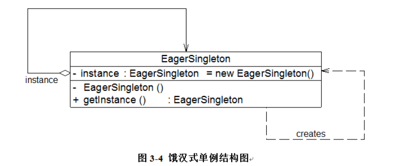

由于在定义静态变量的时候实例化单例类，因此在类加载的时候就已经创建了单例对象

当类被加载时，静态变量instance会被初始化，此时类的私有构造函数会被调用，单例类的唯一实例将被创建。如果使用饿汉式单例来实现负载均衡器LoadBalancer类的设计，则不会出现创建多个单例对象的情况，可确保单例对象的唯一性。

```java
class EagerSingleton { 
    private static final EagerSingleton instance = new EagerSingleton(); 
    private EagerSingleton() { } 
 
    public static EagerSingleton getInstance() {
        return instance; 
    }   
}
```

#### 懒汉式单例类与线程锁定

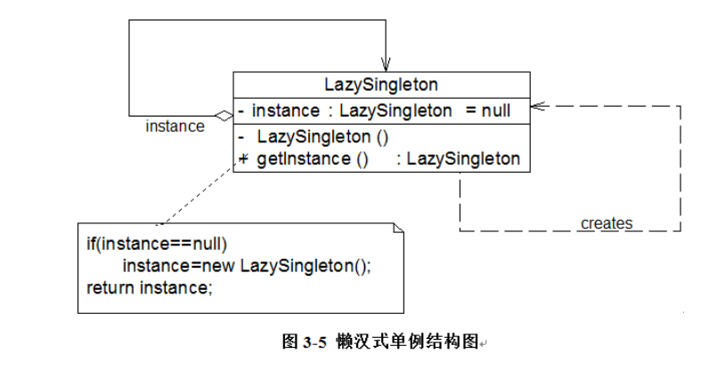

从图3-5中可以看出，懒汉式单例在第一次调用getInstance()方法时实例化，在类加载时并不自行实例化，这种技术又称为延迟加载(Lazy Load)技术，即需要的时候再加载实例，为了避免多个线程同时调用getInstance()方法，我们可以使用关键字synchronized，


```java
class LazySingleton { 
    private static LazySingleton instance = null; 
    private LazySingleton() { } 
    synchronized public static LazySingleton getInstance() { 
        if (instance == null) {
            instance = new LazySingleton(); 
        }
        return instance; 
    }
}
```

该懒汉式单例类在getInstance()方法前面增加了关键字synchronized进行线程锁，以处理多个线程同时访问的问题。但是，上述代码虽然解决了线程安全问题，但是每次调用getInstance()时都需要进行线程锁定判断，在多线程高并发访问环境中，将会导致系统性能大大降低。如何既解决线程安全问题又不影响系统性能呢？我们继续对懒汉式单例进行改进。事实上，我们无须对整个getInstance()方法进行锁定，只需对其中的代码“instance = new LazySingleton();”进行锁定即可。因此getInstance()方法可以进行如下改进：

```java
public static LazySingleton getInstance() { 
    if (instance == null) {
        synchronized (LazySingleton.class) {
            instance = new LazySingleton(); 
        }
    }
    return instance; 
}
```

 问题貌似得以解决，事实并非如此。如果使用以上代码来实现单例，还是会存在单例对象不唯一。原因如下：
      假如在某一瞬间线程A和线程B都在调用getInstance()方法，此时instance对象为null值，均能通过instance == null的判断。由于实现了synchronized加锁机制，线程A进入synchronized锁定的代码中执行实例创建代码，线程B处于排队等待状态，必须等待线程A执行完毕后才可以进入synchronized锁定代码。但当A执行完毕时，线程B并不知道实例已经创建，将继续创建新的实例，导致产生多个单例对象，违背单例模式的设计思想，因此需要进行进一步改进，在synchronized中再进行一次(instance == null)判断，这种方式称为双重检查锁定(Double-Check Locking)。使用双重检查锁定实现的懒汉式单例类完整代码如下所示：

```java
class LazySingleton { 
    private volatile static LazySingleton instance = null; 
    private LazySingleton() { } 
    public static LazySingleton getInstance() { 
        //第一重判断
        if (instance == null) {
            //锁定代码块
            synchronized (LazySingleton.class) {
                //第二重判断
                if (instance == null) {
                    instance = new LazySingleton(); //创建单例实例
                }
            }
        }
        return instance; 
    }
}
```

 需要注意的是，如果使用双重检查锁定来实现懒汉式单例类，需要在静态成员变量instance之前增加修饰符volatile，被volatile修饰的成员变量可以确保多个线程都能够正确处理，且该代码只能在JDK 1.5及以上版本中才能正确执行。由于volatile关键字会屏蔽Java虚拟机所做的一些代码优化，可能会导致系统运行效率降低，因此即使使用双重检查锁定来实现单例模式也不是一种完美的实现方式。 


#### 饿汉式单例类与懒汉式单例类比较

      饿汉式单例类在类被加载时就将自己实例化，它的优点在于无须考虑多线程访问问题，可以确保实例的唯一性；从调用速度和反应时间角度来讲，由于单例对象一开始就得以创建，因此要优于懒汉式单例。但是无论系统在运行时是否需要使用该单例对象，由于在类加载时该对象就需要创建，因此从资源利用效率角度来讲，饿汉式单例不及懒汉式单例，而且在系统加载时由于需要创建饿汉式单例对象，加载时间可能会比较长。
    
      懒汉式单例类在第一次使用时创建，无须一直占用系统资源，实现了延迟加载，但是必须处理好多个线程同时访问的问题，特别是当单例类作为资源控制器，在实例化时必然涉及资源初始化，而资源初始化很有可能耗费大量时间，这意味着出现多线程同时首次引用此类的机率变得较大，需要通过双重检查锁定等机制进行控制，这将导致系统性能受到一定影响。
### 一种更好的单例实现方法

饿汉式单例类不能实现延迟加载，不管将来用不用始终占据内存；懒汉式单例类线程安全控制烦琐，而且性能受影响。可见，无论是饿汉式单例还是懒汉式单例都存在这样那样的问题，有没有一种方法，能够将两种单例的缺点都克服，而将两者的优点合二为一呢？答案是：Yes！下面我们来学习这种更好的被称之为Initialization Demand Holder (IoDH)的技术。
在IoDH中，我们在单例类中增加一个***\*静态\*\*(static)\*\*内部类\****，在该内部类中创建单例对象，再将该单例对象通过getInstance()方法返回给外部使用

```java
//Initialization on Demand Holder
class Singleton {
	private Singleton() {
	}
	
	private static class HolderClass {
            private final static Singleton instance = new Singleton();
	}
	
	public static Singleton getInstance() {
	    return HolderClass.instance;
	}
	
	public static void main(String args[]) {
	    Singleton s1, s2; 
            s1 = Singleton.getInstance();
	    s2 = Singleton.getInstance();
	    System.out.println(s1==s2);
	}
}
```

编译并运行上述代码，运行结果为：true，即创建的单例对象s1和s2为同一对象。由于静态单例对象没有作为Singleton的成员变量直接实例化，因此类加载时不会实例化Singleton，第一次调用getInstance()时将加载内部类HolderClass，在该内部类中定义了一个static类型的变量instance，此时会首先初始化这个成员变量，由Java虚拟机来保证其线程安全性，确保该成员变量只能初始化一次。由于getInstance()方法没有任何线程锁定，因此其性能不会造成任何影响。

  通过使用IoDH，我们既可以实现延迟加载，又可以保证线程安全，不影响系统性能，不失为一种最好的Java语言单例模式实现方式（其缺点是与编程语言本身的特性相关，很多面向对象语言不支持IoDH）。


### 单例模式总结


主要优点

       单例模式的主要优点如下：
    
       (1) 单例模式提供了对唯一实例的受控访问。因为单例类封装了它的唯一实例，所以它可以严格控制客户怎样以及何时访问它。
    
       (2) 由于在系统内存中只存在一个对象，因此可以节约系统资源，对于一些需要频繁创建和销毁的对象单例模式无疑可以提高系统的性能。
    
       (3) 允许可变数目的实例。基于单例模式我们可以进行扩展，使用与单例控制相似的方法来获得指定个数的对象实例，既节省系统资源，又解决了单例单例对象共享过多有损性能的问题。

 


主要缺点

       单例模式的主要缺点如下：
    
       (1) 由于单例模式中没有抽象层，因此单例类的扩展有很大的困难。
    
       (2) 单例类的职责过重，在一定程度上违背了“单一职责原则”。因为单例类既充当了工厂角色，提供了工厂方法，同时又充当了产品角色，包含一些业务方法，将产品的创建和产品的本身的功能融合到一起。
    
       (3) 现在很多面向对象语言(如Java、C#)的运行环境都提供了自动垃圾回收的技术，因此，如果实例化的共享对象长时间不被利用，系统会认为它是垃圾，会自动销毁并回收资源，下次利用时又将重新实例化，这将导致共享的单例对象状态的丢失。
适用场景

       在以下情况下可以考虑使用单例模式：
    
       (1) 系统只需要一个实例对象，如系统要求提供一个唯一的序列号生成器或资源管理器，或者需要考虑资源消耗太大而只允许创建一个对象。
    
       (2) 客户调用类的单个实例只允许使用一个公共访问点，除了该公共访问点，不能通过其他途径访问该实例。


# 七个结构型模式

## 代理模式-Proxy Pattern

 代理模式是常用的结构型设计模式之一，当无法直接访问某个对象或访问某个对象存在困难时可以通过一个代理对象来间接访问，为了保证客户端使用的透明性，所访问的真实对象与代理对象需要实现相同的接口。根据代理模式的使用目的不同，代理模式又可以分为多种类型，例如保护代理、远程代理、虚拟代理、缓冲代理等，它们应用于不同的场合，满足用户的不同需求。


### 理模式概述

>代理模式：给某一个对象提供一个代理或占位符，并由代理对象来控制对原对象的访问。
>
>Proxy Pattern: Provide a surrogate or placeholder for another object to control access to it.
>
> 代理模式是一种对象结构型模式。在代理模式中引入了一个新的代理对象，代理对象在客户端对象和目标对象之间起到中介的作用，它去掉客户不能看到的内容和服务或者增添客户需要的额外的新服务。


### 代理模式结构与实现

代理模式的结构比较简单，其核心是代理类，为了让客户端能够一致性地对待真实对象和代理对象，在代理模式中引入了抽象层

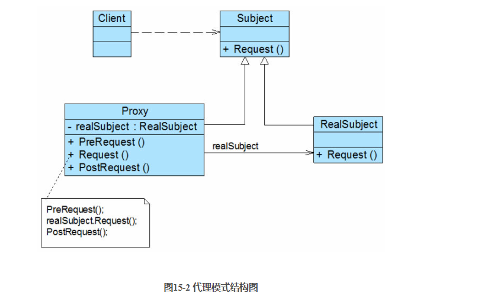

- (1) Subject（抽象主题角色）：它声明了真实主题和代理主题的共同接口，这样一来在任何使用真实主题的地方都可以使用代理主题，客户端通常需要针对抽象主题角色进行编程。
- (2) Proxy（代理主题角色）：它包含了对真实主题的引用，从而可以在任何时候操作真实主题对象；在代理主题角色中提供一个与真实主题角色相同的接口，以便在任何时候都可以替代真实主题；代理主题角色还可以控制对真实主题的使用，负责在需要的时候创建和删除真实主题对象，并对真实主题对象的使用加以约束。通常，在代理主题角色中，客户端在调用所引用的真实主题操作之前或之后还需要执行其他操作，而不仅仅是单纯调用真实主题对象中的操作。
- (3) RealSubject（真实主题角色）：它定义了代理角色所代表的真实对象，在真实主题角色中实现了真实的业务操作，客户端可以通过代理主题角色间接调用真实主题角色中定义的操作。

### 模式实现

抽象主题类声明了真实主题类和代理类的公共方法，它可以是接口、抽象类或具体类，客户端针对抽象主题类编程，一致性地对待真实主题和代理主题

-  (1) 远程代理(Remote Proxy)：为一个位于不同的地址空间的对象提供一个本地的代理对象，这个不同的地址空间可以是在同一台主机中，也可是在另一台主机中，远程代理又称为大使(Ambassador)。

- (2) 虚拟代理(Virtual Proxy)：如果需要创建一个资源消耗较大的对象，先创建一个消耗相对较小的对象来表示，真实对象只在需要时才会被真正创建。

- (3) 保护代理(Protect Proxy)：控制对一个对象的访问，可以给不同的用户提供不同级别的使用权限。

- (4) 缓冲代理(Cache Proxy)：为某一个目标操作的结果提供临时的存储空间，以便多个客户端可以共享这些结果。

- (5) 智能引用代理(Smart Reference Proxy)：当一个对象被引用时，提供一些额外的操作，例如将对象被调用的次数记录下来等。


### 案例-信息咨询

       某软件公司承接了某信息咨询公司的收费商务信息查询系统的开发任务，该系统的基本需求如下：
       (1) 在进行商务信息查询之前用户需要通过身份验证，只有合法用户才能够使用该查询系统；
       (2) 在进行商务信息查询时系统需要记录查询日志，以便根据查询次数收取查询费用。
       该软件公司开发人员已完成了商务信息查询模块的开发任务，现希望能够以一种松耦合的方式向原有系统增加身份验证和日志记录功能，客户端代码可以无区别地对待原始的商务信息查询模块和增加新功能之后的商务信息查询模块，而且可能在将来还要在该信息查询模块中增加一些新的功能。
       试使用代理模式设计并实现该收费商务信息查询系统。
#### 实例分析及类图

通过分析，可以采用一种间接访问的方式来实现该商务信息查询系统的设计，在客户端对象和信息查询对象之间增加一个代理对象，让代理对象来实现身份验证和日志记录等功能，而无须直接对原有的商务信息查询对象进行修改

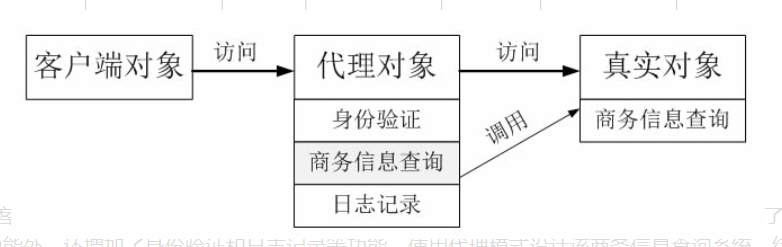

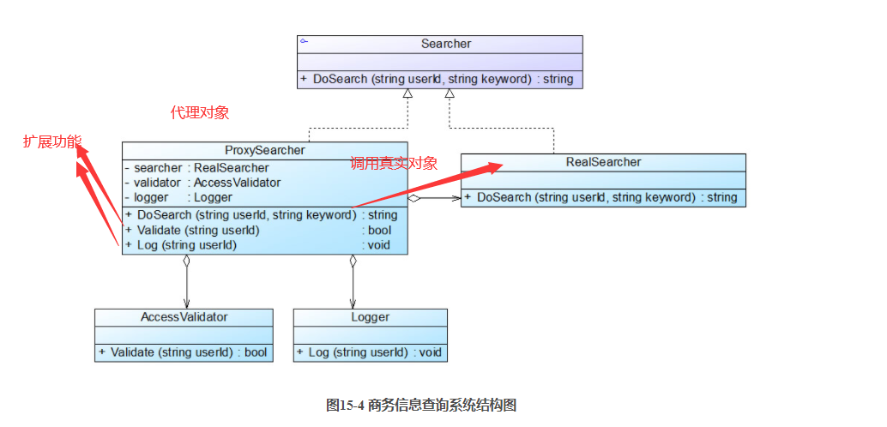

####  实例代码


```java
//AccessValidator.cs
//   (1) AccessValidator：身份验证类，业务类，它提供方法Validate()来实现身份验证。
using System;
 
namespace ProxySample
{
    class AccessValidator
    {
        //模拟实现登录验证
        public bool Validate(string userId) 
        {
		    Console.WriteLine("在数据库中验证用户'" + userId + "'是否是合法用户？");
		    if (userId.Equals("杨过")) {
			    Console.WriteLine("'{0}'登录成功！",userId);
			    return true;
		    }
		    else {
                Console.WriteLine("'{0}'登录失败！", userId);
			    return false;
		    }
	    }
    }
}
//  (2) Logger：日志记录类，业务类，它提供方法Log()来保存日志。
//Logger.cs
using System;
 
namespace ProxySample
{
    class Logger
    {
        //模拟实现日志记录
        public void Log(string userId) {
            Console.WriteLine("更新数据库，用户'{0}'查询次数加1！",userId);
	    }
    }
}
//       (3) Searcher：抽象查询类，充当抽象主题角色，它声明了DoSearch()方法。
//Searcher.cs
namespace ProxySample
{
    interface Searcher
    {
        string DoSearch(string userId, string keyword);
    }
}
///       (4) RealSearcher：具体查询类，充当真实主题角色，它实现查询功能，提供方法DoSearch()来查询信息。
//RealSearcher.cs
using System;
 
namespace ProxySample
{
    class RealSearcher : Searcher
    {
        //模拟查询商务信息
        public string DoSearch(string userId, string keyword) {
            Console.WriteLine("用户'{0}'使用关键词'{1}'查询商务信息！",userId,keyword);
		    return "返回具体内容";
	    }
    }
}
//      (5) ProxySearcher：代理查询类，充当代理主题角色，它是查询代理，维持了对RealSearcher对象、AccessValidator对象和Logger对象的引用。
//ProxySearcher.cs
namespace ProxySample
{
    class ProxySearcher : Searcher
    {
        private RealSearcher searcher = new RealSearcher(); //维持一个对真实主题的引用
        private AccessValidator validator;
        private Logger logger;
 
        public string DoSearch(string userId, string keyword)
        {
            //如果身份验证成功，则执行查询
            if (this.Validate(userId))
            {
                string result = searcher.DoSearch(userId, keyword); //调用真实主题对象的查询方法
                this.Log(userId); //记录查询日志
                return result; //返回查询结果
            }
            else
            {
                return null;
            }
        }
 
        //创建访问验证对象并调用其Validate()方法实现身份验证
        public bool Validate(string userId)
        {
            validator = new AccessValidator();
            return validator.Validate(userId);
        }
 
        //创建日志记录对象并调用其Log()方法实现日志记录
        public void Log(string userId)
        {
            logger = new Logger();
            logger.Log(userId);
        }
    }
}
```


### 远程代理

​      远程代理(Remote Proxy)是一种常用的代理模式，它使得客户端程序可以访问在远程主机上的对象，远程主机可能具有更好的计算性能与处理速度，可以快速响应并处理客户端的请求。远程代理可以将网络的细节隐藏起来，使得客户端不必考虑网络的存在。客户端完全可以认为被代理的远程业务对象是在本地而不是在远程，而远程代理对象承担了大部分的网络通信工作，并负责对远程业务方法的调用。

   远程代理示意图如图15-5所示，客户端对象不能直接访问远程主机中的业务对象，只能采取间接访问的方式。远程业务对象在本地主机中有一个代理对象，该代理对象负责对远程业务对象的访问和网络通信，它对于客户端对象而言是透明的。客户端无须关心实现具体业务的是谁，只需要按照服务接口所定义的方式直接与本地主机中的代理对象交互即可。

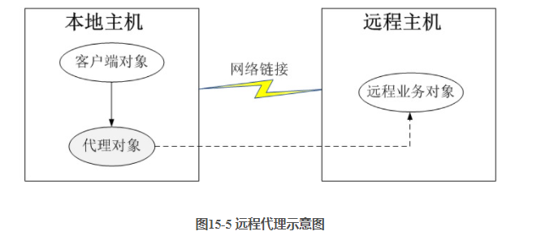


### 虚拟代理

​       虚拟代理(Virtual Proxy)也是一种常用的代理模式，对于一些占用系统资源较多或者加载时间较长的对象，可以给这些对象提供一个虚拟代理。在真实对象创建成功之前虚拟代理扮演真实对象的替身，而当真实对象创建之后，虚拟代理将用户的请求转发给真实对象。

   通常，在以下两种情况下可以考虑使用虚拟代理：

(1) 由于对象本身的复杂性或者网络等原因导致一个对象需要较长的加载时间，此时可以用一个加载时间相对较短的代理对象来代表真实对象。通常在实现时可以结合多线程技术，一个线程用于显示代理对象，其他线程用于加载真实对象。这种虚拟代理模式可以应用在程序启动的时候，由于创建代理对象在时间和处理复杂度上要少于创建真实对象，因此，在程序启动时，可以用代理对象代替真实对象初始化，大大加速了系统的启动时间。当需要使用真实对象时，再通过代理对象来引用，而此时真实对象可能已经成功加载完毕，可以缩短用户的等待时间。

  (2) 当一个对象的加载十分耗费系统资源的时候，也非常适合使用虚拟代理。虚拟代理可以让那些占用大量内存或处理起来非常复杂的对象推迟到使用它们的时候才创建，而在此之前用一个相对来说占用资源较少的代理对象来代表真实对象，再通过代理对象来引用真实对象。为了节省内存，在第一次引用真实对象时再创建对象，并且该对象可被多次重用，在以后每次访问时需要检测所需对象是否已经被创建，因此在访问该对象时需要进行存在性检测，这需要消耗一定的系统时间，但是可以节省内存空间，这是一种用时间换取空间的做法。

   无论是以上哪种情况，虚拟代理都是用一个“虚假”的代理对象来代表真实对象，通过代理对象来间接引用真实对象，可以在一定程度上提高系统的性能。


###  缓冲代理

​       缓冲代理(Cache Proxy)也是一种较为常用的代理模式，它为某一个操作的结果提供临时的缓存存储空间，以便在后续使用中能够共享这些结果，从而可以避免某些方法的重复执行，优化系统性能。

   在微软示例项目PetShop 4.0的业务逻辑层(Business Logic Layer, BLL)中定义了Product、Category、Item等类，它们封装了相关的业务方法，用于调用数据访问层(Data Access Layer, DAL)对象访问数据库，以获取相关数据。为了改进系统性能，PetShop 4.0为这些实现方法增加缓存机制，引入一个新的对象去控制原来的BLL业务逻辑对象，这些新的对象对应于代理模式中的代理对象。在引入代理模式后，实现了在缓存级别上对业务对象的封装，增强了对业务对象的控制，如果需要访问的数据在缓存中已经存在，则无须再重复执行获取数据的方法，直接返回存储在缓存中的数据即可。由于原有业务对象（真实对象）和新增代理对象暴露在外的方法是一致的，因而对于调用方即客户端而言，调用代理对象与真实对象并没有实质的区别。

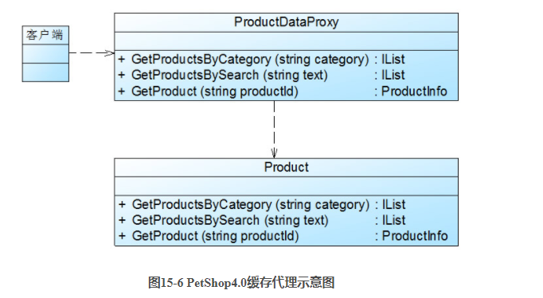


### 模式优点

​       代理模式的共同优点如下：

       (1) 能够协调调用者和被调用者，在一定程度上降低了系统的耦合度。
    
       (2) 客户端可以针对抽象主题角色进行编程，增加和更换代理类无须修改源代码，符合开闭原则，系统具有较好的灵活性和可扩展性。
    
       此外，不同类型的代理模式也具有独特的优点，例如：
    
       (1) 远程代理为位于两个不同地址空间对象的访问提供了一种实现机制，可以将一些消耗资源较多的对象和操作移至性能更好的计算机上，提高系统的整体运行效率。
    
       (2) 虚拟代理通过一个消耗资源较少的对象来代表一个消耗资源较多的对象，可以在一定程度上节省系统的运行开销。
    
       (3) 缓冲代理为某一个操作的结果提供临时的缓存存储空间，以便在后续使用中能够共享这些结果，优化系统性能，缩短执行时间。
    
       (4) 保护代理可以控制对一个对象的访问权限，为不同用户提供不同级别的使用权限。

 

### 模式缺点

​       代理模式的主要缺点如下：

       (1) 由于在客户端和真实主题之间增加了代理对象，因此有些类型的代理模式可能会造成请求的处理速度变慢，例如保护代理。
    
       (2) 实现代理模式需要额外的工作，而且有些代理模式的实现过程较为复杂，例如远程代理。

 

### 模式适用场景

​       代理模式的类型较多，不同类型的代理模式有不同的优缺点，它们应用于不同的场合：

       (1) 当客户端对象需要访问远程主机中的对象时可以使用远程代理。
    
       (2) 当需要用一个消耗资源较少的对象来代表一个消耗资源较多的对象，从而降低系统开销、缩短运行时间时可以使用虚拟代理，例如一个对象需要很长时间才能完成加载时。
    
       (3) 当需要为某一个被频繁访问的操作结果提供一个临时存储空间，以供多个客户端共享访问这些结果时可以使用缓冲代理。通过使用缓冲代理，系统无须在客户端每一次访问时都重新执行操作，只需直接从临时缓冲区获取操作结果即可。
    
       (4) 当需要控制对一个对象的访问，为不同用户提供不同级别的访问权限时可以使用保护代理。
    
       (5) 当需要为一个对象的访问（引用）提供一些额外的操作时可以使用智能引用代理。


- 


# 十一个行为型模式

## 观察者模式-Observer Pattern

观察者模式用于建立一种对象与对象之间的依赖关系，一个对象发生改变时将自动通知其他对象，其他对象将相应作出反应。在观察者模式中，发生改变的对象称为观察目标，而被通知的对象称为观察者，一个观察目标可以对应多个观察者，而且这些观察者之间可以没有任何相互联系，可以根据需要增加和删除观察者，使得系统更易于扩展。
>观察者模式(Observer Pattern)：定义对象之间的一种一对多依赖关系，使得每当一个对象状态发生改变时，其相关依赖对象皆得到通知并被自动更新。观察者模式的别名包括发布-订阅（Publish/Subscribe）模式、模型-视图（Model/View）模式、源-监听器（Source/Listener）模式或从属者（Dependents）模式。观察者模式是一种对象行为型模式。
>

观察者模式结构中通常包括观察目标和观察者两个继承层次结构

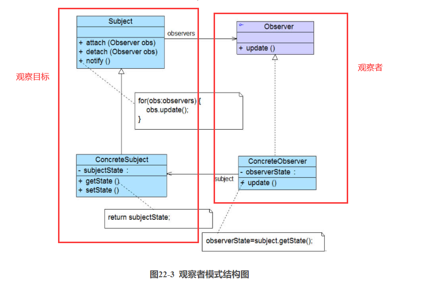

- Subject（目标）：目标又称为主题，它是指被观察的对象。在目标中定义了一个观察者集合，一个观察目标可以接受任意数量的观察者来观察，它提供一系列方法来增加和删除观察者对象，同时它定义了通知方法notify()。目标类可以是接口，也可以是抽象类或具体类。


- ConcreteSubject（具体目标）：具体目标是目标类的子类，通常它包含有经常发生改变的数据，当它的状态发生改变时，向它的各个观察者发出通知；同时它还实现了在目标类中定义的抽象业务逻辑方法（如果有的话）。如果无须扩展目标类，则具体目标类可以省略。

- Observer（观察者）：观察者将对观察目标的改变做出反应，观察者一般定义为接口，该接口声明了更新数据的方法update()，因此又称为抽象观察者。

- ConcreteObserver（具体观察者）：在具体观察者中维护一个指向具体目标对象的引用，它存储具体观察者的有关状态，这些状态需要和具体目标的状态保持一致；它实现了在抽象观察者Observer中定义的update()方法。通常在实现时，可以调用具体目标类的attach()方法将自己添加到目标类的集合中或通过detach()方法将自己从目标类的集合中删除。


### 案例-多人联机对战游戏

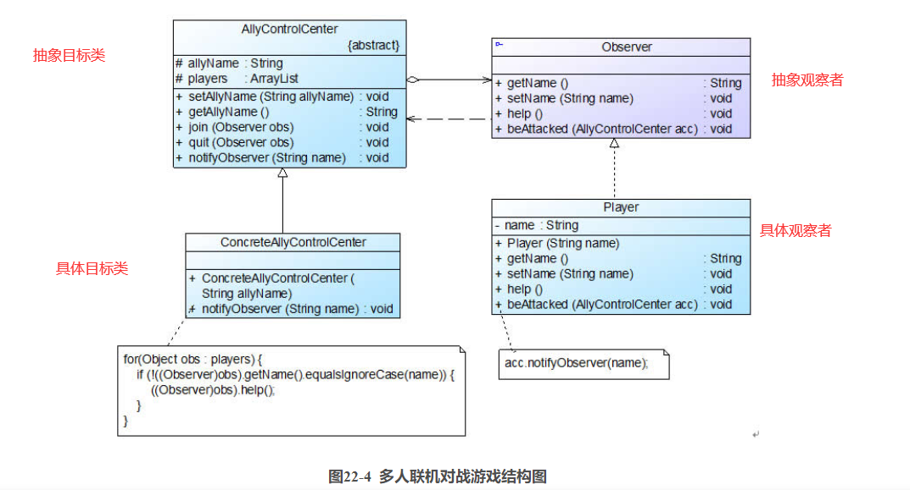

AllyControlCenter充当目标类，ConcreteAllyControlCenter充当具体目标类，Observer充当抽象观察者，Player充当具体观察者

```java
import java.util.*;
 
//抽象观察类
interface Observer {
	public String getName();
	public void setName(String name);
	public void help(); //声明支援盟友方法
	public void beAttacked(AllyControlCenter acc); //声明遭受攻击方法
}
 
//战队成员类：具体观察者类
class Player implements Observer {
	private String name;
 
	public Player(String name) {
		this.name = name;
	}
	
	public void setName(String name) {
		this.name = name;
	}
	
	public String getName() {
		return this.name;
	}
	
    //支援盟友方法的实现
	public void help() {
		System.out.println("坚持住，" + this.name + "来救你！");
	}
	
    //遭受攻击方法的实现，当遭受攻击时将调用战队控制中心类的通知方法notifyObserver()来通知盟友
	public void beAttacked(AllyControlCenter acc) {
        System.out.println(this.name + "被攻击！");
        acc.notifyObserver(name);		
	}
}
 
//战队控制中心类：目标类
abstract class AllyControlCenter {
	protected String allyName; //战队名称
	protected ArrayList<Observer> players = new ArrayList<Observer>(); //定义一个集合用于存储战队成员
	
	public void setAllyName(String allyName) {
		this.allyName = allyName;
	}
	
	public String getAllyName() {
		return this.allyName;
	}
	
    //注册方法
	public void join(Observer obs) {
		System.out.println(obs.getName() + "加入" + this.allyName + "战队！");
		players.add(obs);
	}
	
    //注销方法
	public void quit(Observer obs) {
		System.out.println(obs.getName() + "退出" + this.allyName + "战队！");
		players.remove(obs);
	}
	
    //声明抽象通知方法
	public abstract void notifyObserver(String name);
}
 
//具体战队控制中心类：具体目标类
class ConcreteAllyControlCenter extends AllyControlCenter {
	public ConcreteAllyControlCenter(String allyName) {
		System.out.println(allyName + "战队组建成功！");
		System.out.println("----------------------------");
		this.allyName = allyName;
	}
	
    //实现通知方法
	public void notifyObserver(String name) {
		System.out.println(this.allyName + "战队紧急通知，盟友" + name + "遭受敌人攻击！");
        //遍历观察者集合，调用每一个盟友（自己除外）的支援方法
        for(Object obs : players) {
            if (!((Observer)obs).getName().equalsIgnoreCase(name)) {
                ((Observer)obs).help();
            }
        }		
	}
}
```

在本实例中，实现了两次对象之间的联动，当一个游戏玩家Player对象的beAttacked()方法被调用时，将调用AllyControlCenter的notifyObserver()方法来进行处理，而在notifyObserver()方法中又将调用其他Player对象的help()方法。Player的beAttacked()方法、AllyControlCenter的notifyObserver()方法以及Player的help()方法构成了一个联动触发链，执行顺序如下所示：

Player.beAttacked() --> AllyControlCenter.notifyObserver() -->Player.help()。


### 观察者模式总结

      1.主要优点
    
      观察者模式的主要优点如下：
    
      (1) 观察者模式可以实现表示层和数据逻辑层的分离，定义了稳定的消息更新传递机制，并抽象了更新接口，使得可以有各种各样不同的表示层充当具体观察者角色。
    
      (2) 观察者模式在观察目标和观察者之间建立一个抽象的耦合。观察目标只需要维持一个抽象观察者的集合，无须了解其具体观察者。由于观察目标和观察者没有紧密地耦合在一起，因此它们可以属于不同的抽象化层次。
    
      (3) 观察者模式支持广播通信，观察目标会向所有已注册的观察者对象发送通知，简化了一对多系统设计的难度。
    
      (4) 观察者模式满足“开闭原则”的要求，增加新的具体观察者无须修改原有系统代码，在具体观察者与观察目标之间不存在关联关系的情况下，增加新的观察目标也很方便。
    
      2.主要缺点
    
      观察者模式的主要缺点如下：
    
      (1) 如果一个观察目标对象有很多直接和间接观察者，将所有的观察者都通知到会花费很多时间。
    
      (2) 如果在观察者和观察目标之间存在循环依赖，观察目标会触发它们之间进行循环调用，可能导致系统崩溃。
    
      (3) 观察者模式没有相应的机制让观察者知道所观察的目标对象是怎么发生变化的，而仅仅只是知道观察目标发生了变化。
    
      3.适用场景
    
      在以下情况下可以考虑使用观察者模式：
    
      (1) 一个抽象模型有两个方面，其中一个方面依赖于另一个方面，将这两个方面封装在独立的对象中使它们可以各自独立地改变和复用。
    
      (2) 一个对象的改变将导致一个或多个其他对象也发生改变，而并不知道具体有多少对象将发生改变，也不知道这些对象是谁。
    
      (3) 需要在系统中创建一个触发链，A对象的行为将影响B对象，B对象的行为将影响C对象……，可以使用观察者模式创建一种链式触发机制。


## 策略模式

### 模式动机

- 完成一项任务，往往可以有多种不同的方式，每一种方式称为一个策略，我们可以根据环境或者条件的不同选择不同的策略来完成该项任务。
- 在软件开发中也常常遇到类似的情况，实现某一个功能有多个途径，此时可以使用一种设计模式来使得系统可以灵活地选择解决途径，也能够方便地增加新的解决途径。
- 在软件系统中，有许多算法可以实现某一功能，如查找、排序等，一种常用的方法是硬编码(Hard Coding)在一个类中，如需要提供多种查找算法，可以将这些算法写到一个类中，在该类中提供多个方法，每一个方法对应一个具体的查找算法；当然也可以将这些查找算法封装在一个统一的方法中，通过if…else…等条件判断语句来进行选择。这两种实现方法我们都可以称之为硬编码，如果需要增加一种新的查找算法，需要修改封装算法类的源代码；更换查找算法，也需要修改客户端调用代码。在这个算法类中封装了大量查找算法，该类代码将较复杂，维护较为困难。
- 除了提供专门的查找算法类之外，还可以在客户端程序中直接包含算法代码，这种做法更不可取，将导致客户端程序庞大而且难以维护，如果存在大量可供选择的算法时问题将变得更加严重。
- 为了解决这些问题，可以定义一些独立的类来封装不同的算法，每一个类封装一个具体的算法，在这里，每一个封装算法的类我们都可以称之为策略(Strategy)，为了保证这些策略的一致性，一般会用一个抽象的策略类来做算法的定义，而具体每种算法则对应于一个具体策略类。

### 模式定义

   在策略模式中，我们可以定义一些独立的类来封装不同的算法，***\*每一个类封装一种具体的算法\****，在这里，每一个封装算法的类我们都可以称之为一种***\*策略\*\*(Strategy)\*\**\***，为了保证这些策略在使用时具有一致性，一般会提供一个抽象的策略类来做规则的定义，而每种算法则对应于一个具体策略类。

***\*策略模式的主要目的是将算法的定义与使用分开，也就是将算法的行为和环境分开\****，将算法的定义放在专门的策略类中，每一个策略类封装了一种实现算法，使用算法的环境类针对抽象策略类进行编程，符合“依赖倒转原则”。在出现新的算法时，只需要增加一个新的实现了抽象策略类的具体策略类即可

>策略模式(Strategy Pattern)：定义一系列算法类，将每一个算法封装起来，并让它们可以相互替换，策略模式让算法独立于使用它的客户而变化，也称为政策模式(Policy)。策略模式是一种对象行为型模式。


### 模式结构

策略模式包含如下角色：

- ***\*Context\*******\*（环境类）：\****环境类是使用算法的角色，它在解决某个问题（即实现某个方法）时可以采用多种策略。在环境类中维持一个对抽象策略类的引用实例，用于定义所采用的策略。
- ***\*Strategy\*******\*（抽象策略类）：\****它为所支持的算法声明了抽象方法，是所有策略类的父类，它可以是抽象类或具体类，也可以是接口。环境类通过抽象策略类中声明的方法在运行时调用具体策略类中实现的算法。
- ***\*ConcreteStrategy\*******\*（具体策略类）：\****它实现了在抽象策略类中声明的算法，在运行时，具体策略类将覆盖在环境类中定义的抽象策略类对象，使用一种具体的算法实现某个业务处理。


### 案例-电影票打折方案

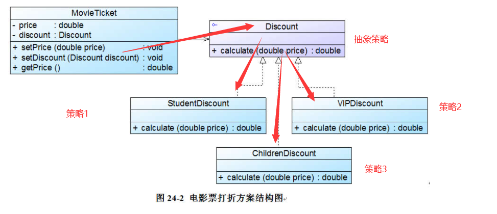

```java
//电影票类：环境类
class MovieTicket {
	private double price;
	private Discount discount; //维持一个对抽象折扣类的引用
 
	public void setPrice(double price) {
		this.price = price;
	}
 
    //注入一个折扣类对象
	public void setDiscount(Discount discount) {
		this.discount = discount;
	}
 
	public double getPrice() {
        //调用折扣类的折扣价计算方法
		return discount.calculate(this.price);
	}
}
 
//折扣类：抽象策略类
interface Discount {
	public double calculate(double price);
}
 
//学生票折扣类：具体策略类
class StudentDiscount implements Discount {
	public double calculate(double price) {
		System.out.println("学生票：");
		return price * 0.8;
	}
} 
 
//儿童票折扣类：具体策略类
class ChildrenDiscount implements Discount {
	public double calculate(double price) {
		System.out.println("儿童票：");
		return price - 10;
	}
} 
 
//VIP会员票折扣类：具体策略类
class VIPDiscount implements Discount {
	public double calculate(double price) {
		System.out.println("VIP票：");
		System.out.println("增加积分！");
		return price * 0.5;
	}
}
```

### 策略模式总结

​      策略模式用于算法的自由切换和扩展，它是应用较为广泛的设计模式之一。策略模式对应于解决某一问题的一个算法族，允许用户从该算法族中任选一个算法来解决某一问题，同时可以方便地更换算法或者增加新的算法。只要涉及到算法的封装、复用和切换都可以考虑使用策略模式。

      1. 主要优点
    
      策略模式的主要优点如下：
    
      (1) 策略模式提供了对“开闭原则”的完美支持，用户可以在不修改原有系统的基础上选择算法或行为，也可以灵活地增加新的算法或行为。
    
      (2) 策略模式提供了管理相关的算法族的办法。策略类的等级结构定义了一个算法或行为族，恰当使用继承可以把公共的代码移到抽象策略类中，从而避免重复的代码。
    
      (3) 策略模式提供了一种可以替换继承关系的办法。如果不使用策略模式，那么使用算法的环境类就可能会有一些子类，每一个子类提供一种不同的算法。但是，这样一来算法的使用就和算法本身混在一起，不符合“单一职责原则”，决定使用哪一种算法的逻辑和该算法本身混合在一起，从而不可能再独立演化；而且使用继承无法实现算法或行为在程序运行时的动态切换。
    
      (4) 使用策略模式可以避免多重条件选择语句。多重条件选择语句不易维护，它把采取哪一种算法或行为的逻辑与算法或行为本身的实现逻辑混合在一起，将它们全部硬编码(Hard Coding)在一个庞大的多重条件选择语句中，比直接继承环境类的办法还要原始和落后。
    
      (5) 策略模式提供了一种算法的复用机制，由于将算法单独提取出来封装在策略类中，因此不同的环境类可以方便地复用这些策略类。
    
      2. 主要缺点
    
      策略模式的主要缺点如下：
    
      (1) 客户端必须知道所有的策略类，并自行决定使用哪一个策略类。这就意味着客户端必须理解这些算法的区别，以便适时选择恰当的算法。换言之，策略模式只适用于客户端知道所有的算法或行为的情况。
    
      (2) 策略模式将造成系统产生很多具体策略类，任何细小的变化都将导致系统要增加一个新的具体策略类。
    
      (3) 无法同时在客户端使用多个策略类，也就是说，在使用策略模式时，客户端每次只能使用一个策略类，不支持使用一个策略类完成部分功能后再使用另一个策略类来完成剩余功能的情况。
    
      3. 适用场景
    
      在以下情况下可以考虑使用策略模式：
    
      (1) 一个系统需要动态地在几种算法中选择一种，那么可以将这些算法封装到一个个的具体算法类中，而这些具体算法类都是一个抽象算法类的子类。换言之，这些具体算法类均有统一的接口，根据“里氏代换原则”和面向对象的多态性，客户端可以选择使用任何一个具体算法类，并只需要维持一个数据类型是抽象算法类的对象。
    
      (2) 一个对象有很多的行为，如果不用恰当的模式，这些行为就只好使用多重条件选择语句来实现。此时，使用策略模式，把这些行为转移到相应的具体策略类里面，就可以避免使用难以维护的多重条件选择语句。
    
      (3) 不希望客户端知道复杂的、与算法相关的数据结构，在具体策略类中封装算法与相关的数据结构，可以提高算法的保密性与安全性。
