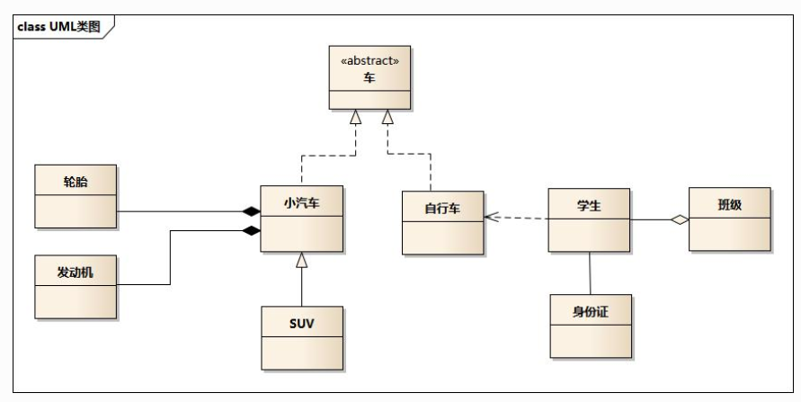
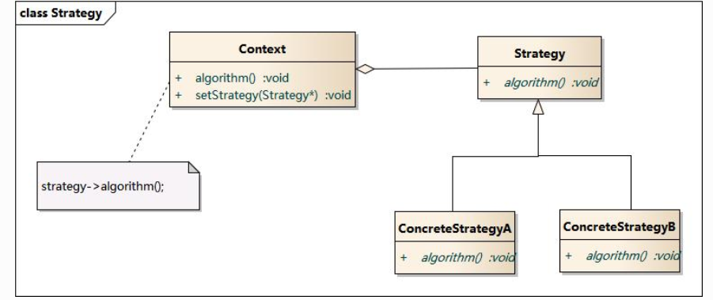

# 设计模式

https://blog.csdn.net/lovelion/article/details/17517213

https://design-patterns.readthedocs.io/zh_CN/latest/creational_patterns/singleton.html

- 设计模式几大基本原则
- 说一下你理解的几种设计模式
- SOLID

```
开放封闭原则：对扩展开放，对修改关闭。在程序需要进行拓展的时候，不能去修改原有的代码，实现一个热插拔的效果。

单一职责原则：一个类、接口或方法只负责一个职责，降低代码复杂度以及变更引起的风险。

依赖倒置原则：针对接口编程，依赖于抽象类或接口而不依赖于具体实现类。

接口隔离原则：将不同功能定义在不同接口中实现接口隔离。

里氏替换原则：任何基类可以出现的地方，子类一定可以出现。

迪米特原则：每个模块对其他模块都要尽可能少地了解和依赖，降低代码耦合度。

合成复用原则：尽量使用组合(has-a)/聚合(contains-a)而不是继承(is-a)达到软件复用的目的。
```

##  说出单例模式几种实现方式以及区别 

##  单例模式的几种写法以及为啥双重校验锁。

## UML类图和时序图



- 车的类图结构为\<<abstract>>，表示车是一个抽象类；
- 它有两个继承类：小汽车和自行车；它们之间的关系为实现关系，使用带空心箭头的虚线表示；
- 小汽车为与SUV之间也是继承关系，它们之间的关系为泛化关系，使用带空心箭头的实线表示；
- 小汽车与发动机之间是组合关系，使用带实心箭头的实线表示；
- 学生与班级之间是聚合关系，使用带空心箭头的实线表示；
- 学生与身份证之间为关联关系，使用一根实线表示；
- 学生上学需要用到自行车，与自行车是一种依赖关系，使用带箭头的虚线表示；

### 类之间的关系

#### 泛化关系(generalization)

类的继承结构表现在UML中为：泛化(generalize)与实现(realize)：

继承关系为 is-a的关系；两个对象之间如果可以用 is-a 来表示，就是继承关系：（..是..)

eg：自行车是车、猫是动物

泛化关系用一条带空心箭头的直接表示；如下图表示（A继承自B）；


eg：汽车在现实中有实现，可用汽车定义具体的对象；汽车与SUV之间为泛化关系；


注：最终代码中，泛化关系表现为继承非抽象类；

#### 实现关系(realize)

实现关系用一条带空心箭头的虚线表示；

eg：”车”为一个抽象概念，在现实中并无法直接用来定义对象；只有指明具体的子类(汽车还是自行车)，才 可以用来定义对象（”车”这个类在C++中用抽象类表示，在JAVA中有接口这个概念，更容易理解）


注：最终代码中，实现关系表现为继承抽象类；

#### 聚合关系(aggregation)

聚合关系用一条带空心菱形箭头的直线表示，如下图表示A聚合到B上，或者说B由A组成；


聚合关系用于表示实体对象之间的关系，表示整体由部分构成的语义；例如一个部门由多个员工组成；

与组合关系不同的是，整体和部分不是强依赖的，即使整体不存在了，部分仍然存在；例如， 部门撤销了，人员不会消失，他们依然存在；

#### 组合关系(composition)

组合关系用一条带实心菱形箭头直线表示，如下图表示A组成B，或者B由A组成；


与聚合关系一样，组合关系同样表示整体由部分构成的语义；比如公司由多个部门组成；

但组合关系是一种强依赖的特殊聚合关系，如果整体不存在了，则部分也不存在了；例如， 公司不存在了，部门也将不存在了；

#### 关联关系(association)

关联关系是用一条直线表示的；它描述不同类的对象之间的结构关系；它是一种静态关系， 通常与运行状态无关，一般由常识等因素决定的；它一般用来定义对象之间静态的、天然的结构； 所以，关联关系是一种“强关联”的关系；

比如，乘车人和车票之间就是一种关联关系；学生和学校就是一种关联关系；

关联关系默认不强调方向，表示对象间相互知道；如果特别强调方向，如下图，表示A知道B，但 B不知道A；


注：在最终代码中，关联对象通常是以成员变量的形式实现的；

#### 依赖关系(dependency)

依赖关系是用一套带箭头的虚线表示的；如下图表示A依赖于B；他描述一个对象在运行期间会用到另一个对象的关系；


与关联关系不同的是，它是一种临时性的关系，通常在运行期间产生，并且随着运行时的变化； 依赖关系也可能发生变化；

显然，依赖也有方向，双向依赖是一种非常糟糕的结构，我们总是应该保持单向依赖，杜绝双向依赖的产生；

注：在最终代码中，依赖关系体现为类构造方法及类方法的传入参数，箭头的指向为调用关系；依赖关系除了临时知道对方外，还是“使用”对方的方法和属性；

### 时序图

为了展示对象之间的交互细节，后续对设计模式解析的章节，都会用到时序图；

时序图（Sequence Diagram）是显示对象之间交互的图，这些对象是按时间顺序排列的。时序图中显示的是参与交互的对象及其对象之间消息交互的顺序。

时序图包括的建模元素主要有：对象（Actor）、生命线（Lifeline）、控制焦点（Focus of control）、消息（Message）等等。

## 建造者模式

### 模式动机

无论是在现实世界中还是在软件系统中，都存在一些复杂的对象，它们拥有多个组成部分，如汽车，它包括车轮、方向盘、发送机等各种部件。

- 而对于大多数用户而言，无须知道这些部件的装配细节，也几乎不会使用单独某个部件，而是使用一辆完整的汽车，
- 可以通过建造者模式对其进行设计与描述，建造者模式可以将部件和其组装过程分开，一步一步创建一个复杂的对象。
- 用户只需要指定复杂对象的类型就可以得到该对象，而无须知道其内部的具体构造细节。

在软件开发中，也存在大量类似汽车一样的复杂对象，它们拥有一系列成员属性，这些成员属性中有些是引用类型的成员对象。

- 而且在这些复杂对象中，还可能存在一些限制条件，如某些属性没有赋值则复杂对象不能作为一个完整的产品使用；
- 有些属性的赋值必须按照某个顺序，一个属性没有赋值之前，另一个属性可能无法赋值等。

复杂对象相当于一辆有待建造的汽车，而对象的属性相当于汽车的部件，建造产品的过程就相当于组合部件的过程。

- 由于组合部件的过程很复杂，因此，这些部件的组合过程往往被“外部化”到一个称作建造者的对象里，
- 建造者返还给客户端的是一个已经建造完毕的完整产品对象，而用户无须关心该对象所包含的属性以及它们的组装方式，这就是建造者模式的模式动机。

###  模式定义

造者模式(Builder Pattern)：将一个复杂对象的构建与它的表示分离，使得同样的构建过程可以创建不同的表示。

建造者模式是一步一步创建一个复杂的对象，它允许用户只通过指定复杂对象的类型和内容就可以构建它们，用户不需要知道内部的具体构建细节。建造者模式属于对象创建型模式。根据中文翻译的不同，建造者模式又可以称为生成器模式。

### 模式结构

建造者模式包含如下角色：

- Builder：抽象建造者
- ConcreteBuilder：具体建造者
- Director：指挥者
- Product：产品角色


### 时序图


###  模式分析

抽象建造者类中定义了产品的创建方法和返回方法;

建造者模式的结构中还引入了一个指挥者类Director，该类的作用主要有两个：

- 一方面它隔离了客户与生产过程；
- 另一方面它负责控制产品的生成过程。
- 指挥者针对抽象建造者编程，客户端只需要知道具体建造者的类型，即可通过指挥者类调用建造者的相关方法，返回一个完整的产品对象

在客户端代码中，无须关心产品对象的具体组装过程，只需确定具体建造者的类型即可，建造者模式将复杂对象的构建与对象的表现分离开来，这样使得同样的构建过程可以创建出不同的表现。

### 实例

实例：KFC套餐

建造者模式可以用于描述KFC如何创建套餐：套餐是一个复杂对象，它一般包含主食（如汉堡、鸡肉卷等）和饮料（如果汁、 可乐等）等组成部分，不同的套餐有不同的组成部分，而KFC的服务员可以根据顾客的要求，一步一步装配这些组成部分，构造一份完整的套餐，然后返回给顾客。


### 优点

- 在建造者模式中， **客户端不必知道产品内部组成的细节，将产品本身与产品的创建过程解耦，使得相同的创建过程可以创建不同的产品对象。**
- 每一个具体建造者都相对独立，而与其他的具体建造者无关，因此可以很方便地替换具体建造者或增加新的具体建造者， **用户使用不同的具体建造者即可得到不同的产品对象** 。
- **可以更加精细地控制产品的创建过程** 。将复杂产品的创建步骤分解在不同的方法中，使得创建过程更加清晰，也更方便使用程序来控制创建过程。
- **增加新的具体建造者无须修改原有类库的代码，指挥者类针对抽象建造者类编程，系统扩展方便，符合“开闭原则”。**

### 缺点

- 建造者模式所创建的产品一般具有较多的共同点，其组成部分相似，如果产品之间的差异性很大，则不适合使用建造者模式，因此其使用范围受到一定的限制。
- 如果产品的内部变化复杂，可能会导致需要定义很多具体建造者类来实现这种变化，导致系统变得很庞大。

### 适用环境

在以下情况下可以使用建造者模式：

- 需要生成的产品对象有复杂的内部结构，这些产品对象通常包含多个成员属性。
- 需要生成的产品对象的属性相互依赖，需要指定其生成顺序。
- 对象的创建过程独立于创建该对象的类。在建造者模式中引入了指挥者类，将创建过程封装在指挥者类中，而不在建造者类中。
- 隔离复杂对象的创建和使用，并使得相同的创建过程可以创建不同的产品。

### 模式应用

在很多游戏软件中，地图包括天空、地面、背景等组成部分，人物角色包括人体、服装、装备等组成部分，可以使用建造者模式对其进行设计，通过不同的具体建造者创建不同类型的地图或人物。

### 模式扩展

建造者模式的简化:

- 省略抽象建造者角色：如果系统中只需要一个具体建造者的话，可以省略掉抽象建造者。
- 省略指挥者角色：在具体建造者只有一个的情况下，如果抽象建造者角色已经被省略掉，那么还可以省略指挥者角色，让

Builder角色扮演指挥者与建造者双重角色。

建造者模式与抽象工厂模式的比较:

- 与抽象工厂模式相比， **建造者模式返回一个组装好的完整产品** ，而 **抽象工厂模式返回一系列相关的产品，这些产品位于不同的产品等级结构，构成了一个产品族。**
- 在抽象工厂模式中，客户端实例化工厂类，然后调用工厂方法获取所需产品对象，而在建造者模式中，客户端可以不直接调用建造者的相关方法，而是通过指挥者类来指导如何生成对象，包括对象的组装过程和建造步骤，它侧重于一步步构造一个复杂对象，返回一个完整的对象。
- 如果将抽象工厂模式看成 **汽车配件生产工厂** ，生产一个产品族的产品，那么建造者模式就是一个 **汽车组装工厂** ，通过对部件的组装可以返回一辆完整的汽车。

### 总结

- 建造者模式将一个复杂对象的构建与它的表示分离，使得同样的构建过程可以创建不同的表示。建造者模式是一步一步创建一个复杂的对象，它允许用户只通过指定复杂对象的类型和内容就可以构建它们，用户不需要知道内部的具体构建细节。建造者模式属于对象创建型模式。
- 建造者模式包含如下四个角色：抽象建造者为创建一个产品对象的各个部件指定抽象接口；具体建造者实现了抽象建造者接口，实现各个部件的构造和装配方法，定义并明确它所创建的复杂对象，也可以提供一个方法返回创建好的复杂产品对象；产品角色是被构建的复杂对象，包含多个组成部件；指挥者负责安排复杂对象的建造次序，指挥者与抽象建造者之间存在关联关系，可以在其construct()建造方法中调用建造者对象的部件构造与装配方法，完成复杂对象的建造
- 在建造者模式的结构中引入了一个指挥者类，该类的作用主要有两个：一方面它隔离了客户与生产过程；另一方面它负责控制产品的生成过程。指挥者针对抽象建造者编程，客户端只需要知道具体建造者的类型，即可通过指挥者类调用建造者的相关方法，返回一个完整的产品对象。
- 建造者模式的主要优点在于客户端不必知道产品内部组成的细节，将产品本身与产品的创建过程解耦，使得相同的创建过程可以创建不同的产品对象，每一个具体建造者都相对独立，而与其他的具体建造者无关，因此可以很方便地替换具体建造者或增加新的具体建造者，符合“开闭原则”，还可以更加精细地控制产品的创建过程；其主要缺点在于由于建造者模式所创建的产品一般具有较多的共同点，其组成部分相似，因此其使用范围受到一定的限制，如果产品的内部变化复杂，可能会导致需要定义很多具体建造者类来实现这种变化，导致系统变得很庞大。
- 建造者模式适用情况包括：需要生成的产品对象有复杂的内部结构，这些产品对象通常包含多个成员属性；需要生成的产品对象的属性相互依赖，需要指定其生成顺序；对象的创建过程独立于创建该对象的类；隔离复杂对象的创建和使用，并使得相同的创建过程可以创建不同类型的产品。


## 策略模式

### 模式动机

- 完成一项任务，往往可以有多种不同的方式，每一种方式称为一个策略，我们可以根据环境或者条件的不同选择不同的策略来完成该项任务。
- 在软件开发中也常常遇到类似的情况，实现某一个功能有多个途径，此时可以使用一种设计模式来使得系统可以灵活地选择解决途径，也能够方便地增加新的解决途径。
- 在软件系统中，有许多算法可以实现某一功能，如查找、排序等，一种常用的方法是硬编码(Hard Coding)在一个类中，如需要提供多种查找算法，可以将这些算法写到一个类中，在该类中提供多个方法，每一个方法对应一个具体的查找算法；当然也可以将这些查找算法封装在一个统一的方法中，通过if…else…等条件判断语句来进行选择。这两种实现方法我们都可以称之为硬编码，如果需要增加一种新的查找算法，需要修改封装算法类的源代码；更换查找算法，也需要修改客户端调用代码。在这个算法类中封装了大量查找算法，该类代码将较复杂，维护较为困难。
- 除了提供专门的查找算法类之外，还可以在客户端程序中直接包含算法代码，这种做法更不可取，将导致客户端程序庞大而且难以维护，如果存在大量可供选择的算法时问题将变得更加严重。
- 为了解决这些问题，可以定义一些独立的类来封装不同的算法，每一个类封装一个具体的算法，在这里，每一个封装算法的类我们都可以称之为策略(Strategy)，为了保证这些策略的一致性，一般会用一个抽象的策略类来做算法的定义，而具体每种算法则对应于一个具体策略类。

### 模式定义

策略模式(Strategy Pattern)：定义一系列算法，将每一个算法封装起来，并让它们可以相互替换。策略模式让算法独立于使用它的客户而变化，也称为政策模式(Policy)。

策略模式是一种对象行为型模式。

### 模式结构

策略模式包含如下角色：

- Context: 环境类
- Strategy: 抽象策略类
- ConcreteStrategy: 具体策略类



### 时序图


### 模式分析

- 策略模式是一个比较容易理解和使用的设计模式，策略模式是对算法的封装，它把算法的责任和算法本身分割开，委派给不同的对象管理。策略模式通常把一个系列的算法封装到一系列的策略类里面，作为一个抽象策略类的子类。用一句话来说，就是“准备一组算法，并将每一个算法封装起来，使得它们可以互换”。
- 在策略模式中，应当由客户端自己决定在什么情况下使用什么具体策略角色。
- 策略模式仅仅封装算法，提供新算法插入到已有系统中，以及老算法从系统中“退休”的方便，策略模式并不决定在何时使用何种算法，算法的选择由客户端来决定。这在一定程度上提高了系统的灵活性，但是客户端需要理解所有具体策略类之间的区别，以便选择合适的算法，这也是策略模式的缺点之一，在一定程度上增加了客户端的使用难度。

### 优点

策略模式的优点

- 策略模式提供了对“开闭原则”的完美支持，用户可以在不修改原有系统的基础上选择算法或行为，也可以灵活地增加新的算法或行为。
- 策略模式提供了管理相关的算法族的办法。
- 策略模式提供了可以替换继承关系的办法。
- 使用策略模式可以避免使用多重条件转移语句。

###  缺点

策略模式的缺点

- 客户端必须知道所有的策略类，并自行决定使用哪一个策略类。
- 策略模式将造成产生很多策略类，可以通过使用享元模式在一定程度上减少对象的数量。

### 适用环境

在以下情况下可以使用策略模式：

- 如果在一个系统里面有许多类，它们之间的区别仅在于它们的行为，那么使用策略模式可以动态地让一个对象在许多行为中选择一种行为。
- 一个系统需要动态地在几种算法中选择一种。
- 如果一个对象有很多的行为，如果不用恰当的模式，这些行为就只好使用多重的条件选择语句来实现。
- 不希望客户端知道复杂的、与算法相关的数据结构，在具体策略类中封装算法和相关的数据结构，提高算法的保密性与安全性。


### 模式扩展

策略模式与状态模式

- 可以通过环境类状态的个数来决定是使用策略模式还是状态模式。
- 策略模式的环境类自己选择一个具体策略类，具体策略类无须关心环境类；而状态模式的环境类由于外在因素需要放进一个具体状态中，以便通过其方法实现状态的切换，因此环境类和状态类之间存在一种双向的关联关系。
- 使用策略模式时，客户端需要知道所选的具体策略是哪一个，而使用状态模式时，客户端无须关心具体状态，环境类的状态会根据用户的操作自动转换。
- 如果系统中某个类的对象存在多种状态，不同状态下行为有差异，而且这些状态之间可以发生转换时使用状态模式；如果系统中某个类的某一行为存在多种实现方式，而且这些实现方式可以互换时使用策略模式。

### 总结

- 在策略模式中定义了一系列算法，将每一个算法封装起来，并让它们可以相互替换。策略模式让算法独立于使用它的客户而变化，也称为政策模式。策略模式是一种对象行为型模式。
- 策略模式包含三个角色：环境类在解决某个问题时可以采用多种策略，在环境类中维护一个对抽象策略类的引用实例；抽象策略类为所支持的算法声明了抽象方法，是所有策略类的父类；具体策略类实现了在抽象策略类中定义的算法。
- 策略模式是对算法的封装，它把算法的责任和算法本身分割开，委派给不同的对象管理。策略模式通常把一个系列的算法封装到一系列的策略类里面，作为一个抽象策略类的子类。
- 策略模式主要优点在于对“开闭原则”的完美支持，在不修改原有系统的基础上可以更换算法或者增加新的算法，它很好地管理算法族，提高了代码的复用性，是一种替换继承，避免多重条件转移语句的实现方式；其缺点在于客户端必须知道所有的策略类，并理解其区别，同时在一定程度上增加了系统中类的个数，可能会存在很多策略类。
- 策略模式适用情况包括：在一个系统里面有许多类，它们之间的区别仅在于它们的行为，使用策略模式可以动态地让一个对象在许多行为中选择一种行为；一个系统需要动态地在几种算法中选择一种；避免使用难以维护的多重条件选择语句；希望在具体策略类中封装算法和与相关的数据结构。

