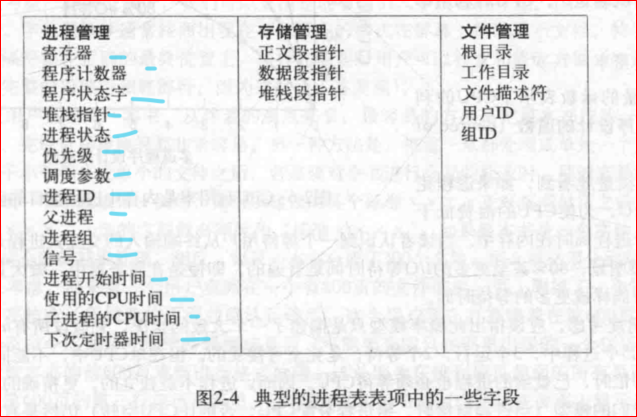
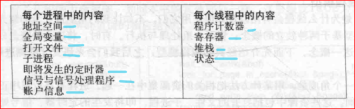
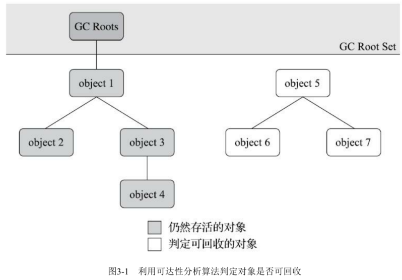
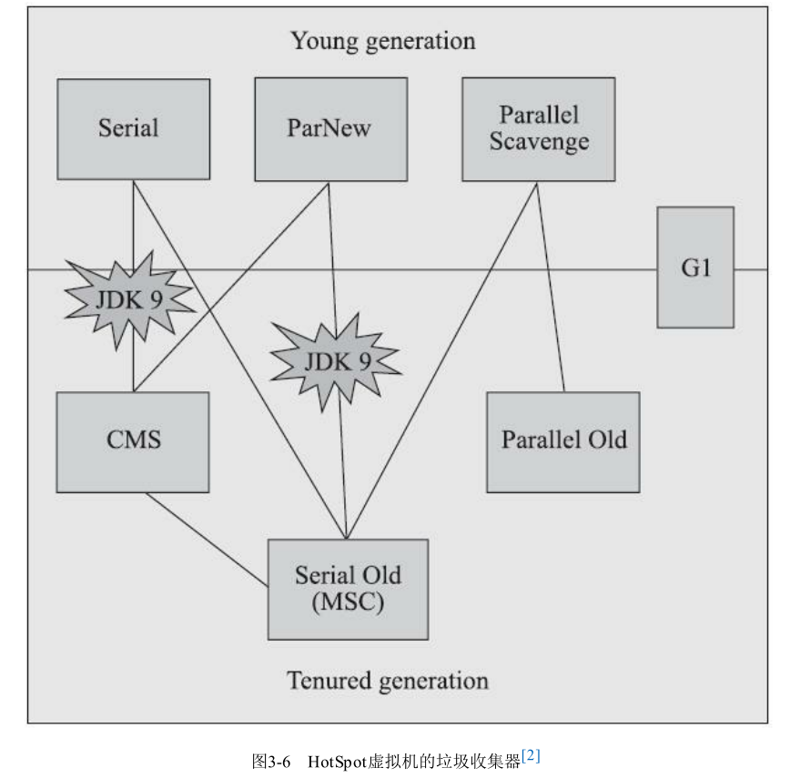
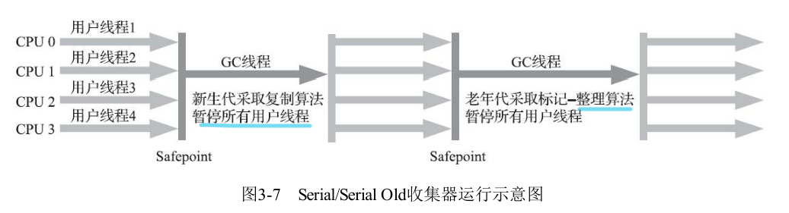
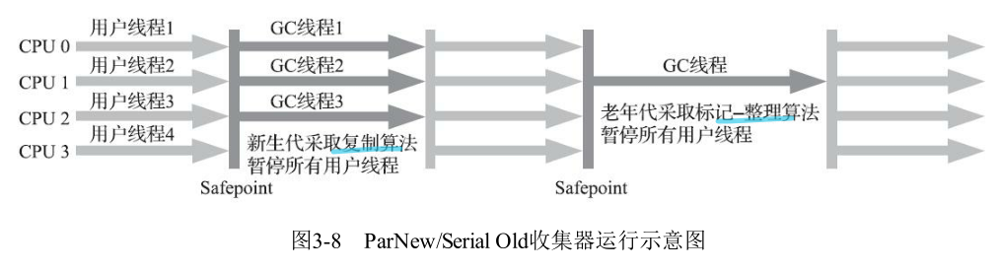
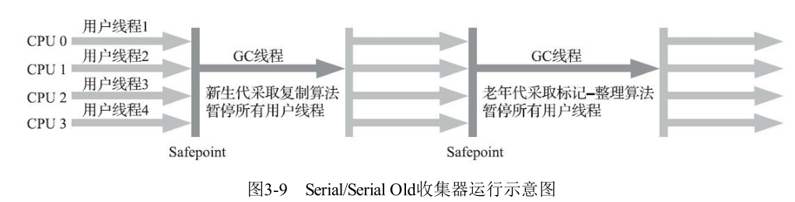
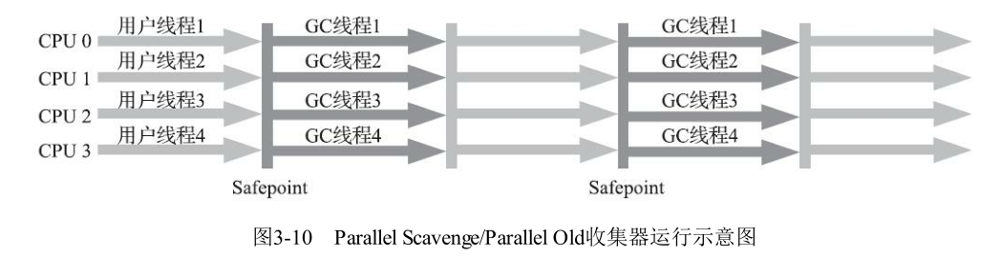
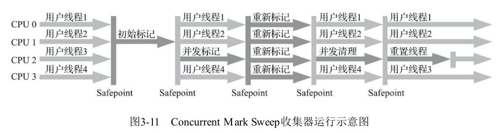
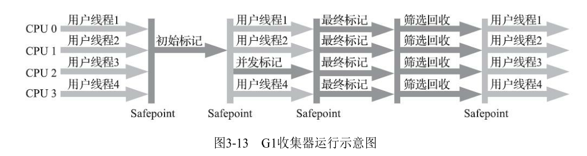

# 操作系统

## 进程与线程

##  进程和线程还有协程 

- 定义

```
进程是资源（CPU、内存等）分配的基本单位，具有一定独立功能的程序关于某个数据集合上的一次运行活动，进程是系统进行资源分配和调度的一个独立单位。
线程是进程的一个实体，是独立运行和独立调度的基本单位（CPU上真正运行的是线程）。线程自己基本上不拥有系统资源，只拥有一点在运行中必不可少的资源(如程序计数器,一组寄存器和栈)，但是它可与同属一个进程的其他的线程共享进程所拥有的全部资源。
```

- 区别

```
进程是资源分配的基本单位；线程是程序执行的基本单位。
进程拥有自己的资源空间，没启动一个进程，系统就会为它分配地址空间；而线程与CPU资源分配无关，多个线程共享同一进程内的资源，使用相同的地址空间。
一个进程可以包含若干个线程。
（1）进程有自己的独立地址空间，线程没有

（2）进程是资源分配的最小单位，线程是CPU调度的最小单位

（3）进程和线程通信方式不同(线程之间的通信比较方便。同一进程下的线程共享数据（比如全局变量，静态变量），通过这些数据来通信不仅快捷而且方便，当然如何处理好这些访问的同步与互斥正是编写多线程程序的难点。而进程之间的通信只能通过进程通信的方式进行。)

（4）进程上下文切换开销大，线程开销小

（5）一个进程挂掉了不会影响其他进程，而线程挂掉了会影响其他线程

（6）对进程操作一般开销都比较大，对线程开销就小了

```





- 优劣

```
线程之间的通信更方便，同一进程下的线程共享全局变量、静态变量等数据，而进程之间的通信需要以通信的方式（Inter Process Communication，IPC)进行。不过如何处理好同步与互斥是编写多线程程序的难点。
线程的调度与切换比进程快很多，同时创建一个线程的开销也比进程要小很多。
但是多进程程序更健壮，多线程程序只要有一个线程死掉，整个进程也死掉了，而一个进程死掉并不会对另外一个进程造成影响，因为进程有自己独立的地址空间。
```

- 通信

```
进程可以通过管道、套接字、信号交互、共享内存、消息队列等等进行通信；而线程本身就会共享内存，指针指向同一个内容，交互很容易。
```


- 进程

```
进程是系统资源分配的最小单位, 系统由一个个进程(程序)组成
一般情况下，包括文本区域（text region）、数据区域（data region）和堆栈（stack region）。

文本区域存储处理器执行的代码
数据区域存储变量和进程执行期间使用的动态分配的内存；
堆栈区域存储着活动过程调用的指令和本地变量。

因此进程的创建和销毁都是相对于系统资源,所以是一种比较昂贵的操作。

一个进程至少具有5种基本状态：初始态、就绪状态、等待（阻塞）状态、执行状态、终止状态。
初始状态：进程刚被创建，由于其他进程正占有CPU资源，所以得不到执行，只能处于初始状态。
就绪状态：只有处于就绪状态的经过调度才能到执行状态
等待状态：进程等待某件事件完成
执行状态：任意时刻处于执行状态的进程只能有一个（对于单核CPU来讲）。
停止状态：进程结束

进程是抢占式的争夺CPU运行自身,而CPU单核的情况下同一时间只能执行一个进程的代码,但是多进程的实现则是通过CPU飞快的切换不同进程,因此使得看上去就像是多个进程在同时进行.

操作系统对进程的控制和管理通过PCB(Processing Control Block)，PCB通常是系统内存占用区中的一个连续存区，它存放着操作系统用于描述进程情况及控制进程运行所需的全部信息(包括：进程标识号,进程状态,进程优先级,文件系统指针以及各个寄存器的内容等)，

无论是在多核还是单核系统中，一个CPU看上去都像是在并发的执行多个进程，这是通过处理器在进程间切换来实现的。
操作系统对把CPU控制权在不同进程之间交换执行的机制称为上下文切换（context switch），即保存当前进程的上下文，恢复新进程的上下文，然后将CPU控制权转移到新进程，新进程就会从上次停止的地方开始。因此，进程是轮流使用CPU的，CPU被若干进程共享，使用某种调度算法来决定何时停止一个进程，并转而为另一个进程提供服务。

通信问题: 由于进程间是隔离的,各自拥有自己的内存内存资源, 因此相对于线程比较安全, 所以不同进程之间的数据只能通过 IPC(Inter-Process Communication) 进行通信共享.
由于进程拥有自己独占的虚拟地址空间，CPU通过地址翻译将虚拟地址转换成真实的物理地址，每个进程只能访问自己的地址空间。因此，在没有其他机制（进程间通信）的辅助下，进程之间是无法共享数据的


```

- 线程

```
线程属于进程
线程-也是操作系统提供的抽象概念，是程序执行中一个单一的顺序控制流程，是程序执行流的最小单元，是处理器调度和分派的基本单位。一个进程可以有一个或多个线程，同一进程中的多个线程将共享该进程中的全部系统资源，如虚拟地址空间，文件描述符和信号处理等等。但同一进程中的多个线程有各自的调用栈和线程本地存储

通信问题:   进程相当于一个容器,而线程而是运行在容器里面的,因此对于容器内的东西,线程是共同享有的,因此线程间的通信可以直接通过全局变量进行通信,但是由此带来的例如多个线程读写同一个地址变量的时候则将带来不可预期的后果,因此这时候引入了各种锁的作用,例如互斥锁等。

同时多线程是不安全的,当一个线程崩溃了,会导致整个进程也崩溃了,即其他线程也挂了,
但多进程而不会,一个进程挂了,另一个进程依然照样运行。

系统利用PCB来完成对进程的控制和管理。同样，系统为线程分配一个线程控制块TCB（Thread Control Block）,将所有用于控制和管理线程的信息记录在线程的控制块中，TCB中通常包括：

线程标志符 一组寄存器 线程运行状态 优先级 线程专有存储区 信号屏蔽

和进程一样，线程同样至少具有五种状态：初始态、就绪状态、等待（阻塞）状态、执行状态和终止状态

```

- 进程 VS 线程

```
进程是资源的分配和调度的独立单元。进程拥有完整的虚拟地址空间，当发生进程切换时，不同的进程拥有不同的虚拟地址空间。而同一进程的多个线程共享同一地址空间（不同进程之间的线程无法共享）

线程是CPU调度的基本单元，一个进程包含若干线程（至少一个线程）。
线程比进程小，基本上不拥有系统资源。线程的创建和销毁所需要的时间比进程小很多
由于线程之间能够共享地址空间，因此，需要考虑同步和互斥操作
一个线程的意外终止会影响整个进程的正常运行，但是一个进程的意外终止不会影响其他的进程的运行。因此，多进程程序安全性更高。

```


- 协程

```
协程是属于线程的。协程程序是在线程里面跑的，因此协程又称微线程和纤程等
协没有线程的上下文切换消耗。协程的调度切换是用户(程序员)手动切换的,因此更加灵活,因此又叫用户空间线程.
原子操作性。由于协程是用户调度的，所以不会出现执行一半的代码片段被强制中断了，因此无需原子操作锁。

协程（Coroutine，又称微线程）是一种比线程更加轻量级的存在，协程不是被操作系统内核所管理，而完全是由程序所控制。协程与线程以及进程的关系见下图所示。

协程可以比作子程序，但执行过程中，子程序内部可中断，然后转而执行别的子程序，在适当的时候再返回来继续执行。协程之间的切换不需要涉及任何系统调用或任何阻塞调用
协程只在一个线程中执行，是子程序之间的切换，发生在用户态上。而且，线程的阻塞状态是由操作系统内核来完成，发生在内核态上，因此协程相比线程节省了线程创建和切换的开销
协程中不存在同时写变量冲突，因此，也就不需要用来守卫关键区块的同步性原语，比如互斥锁、信号量等，并且不需要来自操作系统的支持。

协程适用于IO阻塞且需要大量并发的场景，当发生IO阻塞，由协程的调度器进行调度，通过将数据流yield掉，并且记录当前栈上的数据，阻塞完后立刻再通过线程恢复协程栈，并把阻塞的结果放到这个线程上去运行。


协程（Coroutine，又称微线程）是一种比线程更加轻量级的存在，协程不是被操作系统内核所管理，而完全是由程序所控制。协程与线程以及进程的关系见下图所示。

协程可以比作子程序，但执行过程中，子程序内部可中断，然后转而执行别的子程序，在适当的时候再返回来继续执行。协程之间的切换不需要涉及任何系统调用或任何阻塞调用
协程只在一个线程中执行，是子程序之间的切换，发生在用户态上。而且，线程的阻塞状态是由操作系统内核来完成，发生在内核态上，因此协程相比线程节省了线程创建和切换的开销
协程中不存在同时写变量冲突，因此，也就不需要用来守卫关键区块的同步性原语，比如互斥锁、信号量等，并且不需要来自操作系统的支持。

协程适用于IO阻塞且需要大量并发的场景，当发生IO阻塞，由协程的调度器进行调度，通过将数据流yield掉，并且记录当前栈上的数据，阻塞完后立刻再通过线程恢复协程栈，并把阻塞的结果放到这个线程上去运行。


```


##  线程和进程的通信方式以及两者区别 

```
进程可以通过管道、套接字、信号交互、共享内存、消息队列等等进行通信；而线程本身就会共享内存，指针指向同一个内容，交互很容易。
```


## 什么用线程什么时候用进程（举例子 )

1．耗时的操作使用线程，提高应用程序响应

2．并行操作时使用线程，如C/S架构的服务器端并发线程响应用户的请求。

3．多CPU系统中，使用线程提高CPU利用率

##  进程上下文切换、为啥进程开销大 

```
线程也有自己的资源，比如栈，私有数据等等。说他使用而不拥有资源指的是使用的是进程的打开文件句柄，进程的全局数据，进程的地址空间等等,这些都属于进程，而不属于线程，进程内个线程共享。 
进程切换比线程切换开销大是因为进程切换时要切页表，而且往往伴随着页调度，因为进程的数据段代码段要换出去，以便把将要执行的进程的内容换进来。本来进程的内容就是线程的超集。而且线程只需要保存线程的上下文（相关寄存器状态和栈的信息）就好了，动作很小

进程切换分两步：
1.切换页目录以使用新的地址空间
2.切换内核栈和硬件上下文

对于linux来说，线程和进程的最大区别就在于地址空间，对于线程切换，第1步是不需要做的，第2是进程和线程切换都要做的。

切换的性能消耗：
1、线程上下文切换和进程上下问切换一个最主要的区别是线程的切换虚拟内存空间依然是相同的，但是进程切换是不同的。这两种上下文切换的处理都是通过操作系统内核来完成的。内核的这种切换过程伴随的最显著的性能损耗是将寄存器中的内容切换出。
2、另外一个隐藏的损耗是上下文的切换会扰乱处理器的缓存机制。简单的说，一旦去切换上下文，处理器中所有已经缓存的内存地址一瞬间都作废了。还有一个显著的区别是当你改变虚拟内存空间的时候，处理的页表缓冲（processor's Translation Lookaside Buffer (TLB)）被全部刷新，这将导致内存的访问在一段时间内相当的低效。但是在线程的切换中，不会出现这个问题。

切换开销
最显著的性能损耗是将保存寄存器中的内容
CPU高速缓存失效
页表查找是一个很慢的过程，因此通常使用Cache来缓存常用的地址映射，这样可以加速页表查找，这个cache就是TLB.当进程切换后页表也要进行切换，页表切换后TLB就失效了，cache失效导致命中率降低，那么虚拟地址转换为物理地址就会变慢，表现出来的就是程序运行会变慢


```


## 上下文切换

```
1.进程的上下文切换
各个进程之间是共享 CPU 资源的，在不同的时候进程之间需要切换，让不同的进程可以在 CPU 执行，那么这个一个进程切换到另一个进程运行，称为进程的上下文切换。
进程是由内核管理和调度的，所以进程的切换只能发生在内核态。
所以，进程的上下文切换不仅包含了虚拟内存、栈、全局变量等用户空间的资源，还包括了内核堆栈、寄存器等内核空间的资源。
通常，会把交换的信息保存在进程的 PCB，当要运行另外一个进程的时候，我们需要从这个进程的 PCB 取出上下文，然后恢复到 CPU 中，这使得这个进程可以继续执行

2.CPU的上下文切换：
CPU 上下文切换就是先把前一个任务的 CPU 上下文**（CPU 寄存器和程序计数器）**保存起来，然后加载新任务的上下文到这些寄存器和程序计数器，最后再跳转到程序计数器所指的新位置，运行新任务。
系统内核会存储保持下来的上下文信息，当此任务再次被分配给 CPU 运行时，CPU 会重新加载这些上下文，这样就能保证任务原来的状态不受影响，让任务看起来还是连续运行。

3.线程的上下文切换
这还得看线程是不是属于同一个进程：
当两个线程不是属于同一个进程，则切换的过程就跟进程上下文切换一样；
当两个线程是属于同一个进程，因为虚拟内存是共享的，所以在切换时，虚拟内存这些资源就保持不动，只需要切换线程的私有数据、寄存器等不共享的数据；
所以，线程的上下文切换相比进程，开销要小很多

```


## 内存管理

##  虚拟内存和物理内存的区别和关系？ 

```
虚拟地址是操作系统为每个进程分配的自己的独立的地址空间,
而物理内存是物理意义上的内存, CPU通过操作物理内存来实现程序的运行
因为直接操作物理内存会带来程序编写的困难如两个程序同时对一个物理内存地址进行操作一个覆盖了另一个, 导致了程序的崩溃, 那么分配每个进程单独的地址空间使得进程间的地址隔离开来互不干扰
这时就需要一个MMU内存映射单元将每个进程的虚拟地址映射到对应的物理内存地址上, 这样CPU就可以操作虚拟地址对应的物理内存地址了
内存存在分页分段机制
分段根据逻辑上把内存分成 堆 栈 数据 代码四个段, 虚拟地址由 段选择子和段偏移量构成, 通过段选择子在段表中获得段在物理内存中的段基地址值 + 段偏移量获得真实的物理内存地址从而完成虚拟地址到物理内存的映射
在分页机制下，虚拟地址分为两部分，页号和页内偏移。页号作为页表的索引，页表包含物理页每页所在物理内存的基地址，这个基地址与页内偏移的组合就形成了物理内存地址
```


##  内存分页分段机制 

### 虚拟内存 

如果你是电子相关专业的，肯定在大学里捣鼓过单片机。

单片机是没有操作系统的，所以每次写完代码，都需要借助工具把程序烧录进去，这样程序才能跑起来。

另外，**单片机的 CPU 是直接操作内存的「物理地址」**。


在这种情况下，要想在内存中同时运行两个程序是不可能的。如果第一个程序在 2000 的位置写入一个新的值，将会擦掉第二个程序存放在相同位置上的所有内容，所以同时运行两个程序是根本行不通的，这两个程序会立刻崩溃。

> 操作系统是如何解决这个问题呢？

这里关键的问题是这两个程序都引用了绝对物理地址，而这正是我们最需要避免的。

我们可以把进程所使用的地址「隔离」开来，即让操作系统为每个进程分配独立的一套「**虚拟地址**」，人人都有，大家自己玩自己的地址就行，互不干涉。但是有个前提每个进程都不能访问物理地址，至于虚拟地址最终怎么落到物理内存里，对进程来说是透明的，操作系统已经把这些都安排的明明白白了。

进程的中间层

**操作系统会提供一种机制，将不同进程的虚拟地址和不同内存的物理地址映射起来。**

如果程序要访问虚拟地址的时候，由操作系统转换成不同的物理地址，这样不同的进程运行的时候，写入的是不同的物理地址，这样就不会冲突了。

于是，这里就引出了两种地址的概念：

- 我们程序所使用的内存地址叫做**虚拟内存地址**（*Virtual Memory Address*）
- 实际存在硬件里面的空间地址叫**物理内存地址**（*Physical Memory Address*）。

操作系统引入了虚拟内存，进程持有的虚拟地址会通过 CPU 芯片中的内存管理单元（MMU）的映射关系，来转换变成物理地址，然后再通过物理地址访问内存，如下图所示：

虚拟地址寻址

> 操作系统是如何管理虚拟地址与物理地址之间的关系？

主要有两种方式，分别是**内存分段和内存分页**，分段是比较早提出的，我们先来看看内存分段。

------

### 内存分段 

程序是由若干个逻辑分段组成的，如可由代码分段、数据分段、栈段、堆段组成。**不同的段是有不同的属性的，所以就用分段（\*Segmentation\*）的形式把这些段分离出来。**

> 分段机制下，虚拟地址和物理地址是如何映射的？

分段机制下的虚拟地址由两部分组成，**段选择子**和**段内偏移量**。

内存分段-寻址的方式

- **段选择子**就保存在段寄存器里面。段选择子里面最重要的是**段号**，用作段表的索引。**段表**里面保存的是这个**段的基地址、段的界限和特权等级**等。
- 虚拟地址中的**段内偏移量**应该位于 0 和段界限之间，如果段内偏移量是合法的，就将段基地址加上段内偏移量得到物理内存地址。

在上面，知道了虚拟地址是通过**段表**与物理地址进行映射的，分段机制会把程序的虚拟地址分成 4 个段，每个段在段表中有一个项，在这一项找到段的基地址，再加上偏移量，于是就能找到物理内存中的地址，如下图：

内存分段-虚拟地址与物理地址

如果要访问段 3 中偏移量 500 的虚拟地址，我们可以计算出物理地址为，段 3 基地址 7000 + 偏移量 500 = 7500。

分段的办法很好，解决了程序本身不需要关心具体的物理内存地址的问题，但它也有一些不足之处：

- 第一个就是**内存碎片**的问题。
- 第二个就是**内存交换的效率低**的问题。

接下来，说说为什么会有这两个问题。

> 我们先来看看，分段为什么会产生内存碎片的问题？

我们来看看这样一个例子。假设有 1G 的物理内存，用户执行了多个程序，其中：

- 游戏占用了 512MB 内存
- 浏览器占用了 128MB 内存
- 音乐占用了 256 MB 内存。

这个时候，如果我们关闭了浏览器，则空闲内存还有 1024 - 512 - 256 = 256MB。

如果这个 256MB 不是连续的，被分成了两段 128 MB 内存，这就会导致没有空间再打开一个 200MB 的程序。

内存碎片的问题

这里的内存碎片的问题共有两处地方：

- 外部内存碎片，也就是产生了多个不连续的小物理内存，导致新的程序无法被装载；
- 内部内存碎片，程序所有的内存都被装载到了物理内存，但是这个程序有部分的内存可能并不是很常使用，这也会导致内存的浪费；

针对上面两种内存碎片的问题，解决的方式会有所不同。

解决外部内存碎片的问题就是**内存交换**。

可以把音乐程序占用的那 256MB 内存写到硬盘上，然后再从硬盘上读回来到内存里。不过再读回的时候，我们不能装载回原来的位置，而是紧紧跟着那已经被占用了的 512MB 内存后面。这样就能空缺出连续的 256MB 空间，于是新的 200MB 程序就可以装载进来。

这个内存交换空间，在 Linux 系统里，也就是我们常看到的 Swap 空间，这块空间是从硬盘划分出来的，用于内存与硬盘的空间交换。

> 再来看看，分段为什么会导致内存交换效率低的问题？

对于多进程的系统来说，用分段的方式，内存碎片是很容易产生的，产生了内存碎片，那不得不重新 `Swap` 内存区域，这个过程会产生性能瓶颈。

因为硬盘的访问速度要比内存慢太多了，每一次内存交换，我们都需要把一大段连续的内存数据写到硬盘上。

所以，**如果内存交换的时候，交换的是一个占内存空间很大的程序，这样整个机器都会显得卡顿。**

为了解决内存分段的内存碎片和内存交换效率低的问题，就出现了内存分页。

------

### 内存分页 

分段的好处就是能产生连续的内存空间，但是会出现内存碎片和内存交换的空间太大的问题。

要解决这些问题，那么就要想出能少出现一些内存碎片的办法。另外，当需要进行内存交换的时候，让需要交换写入或者从磁盘装载的数据更少一点，这样就可以解决问题了。这个办法，也就是**内存分页**（*Paging*）。

**分页是把整个虚拟和物理内存空间切成一段段固定尺寸的大小**。这样一个连续并且尺寸固定的内存空间，我们叫**页**（*Page*）。在 Linux 下，每一页的大小为 `4KB`。

虚拟地址与物理地址之间通过**页表**来映射，如下图：

内存映射

页表实际上存储在 CPU 的**内存管理单元** （*MMU*） 中，于是 CPU 就可以直接通过 MMU，找出要实际要访问的物理内存地址。

而当进程访问的虚拟地址在页表中查不到时，系统会产生一个**缺页异常**，进入系统内核空间分配物理内存、更新进程页表，最后再返回用户空间，恢复进程的运行。

> 分页是怎么解决分段的内存碎片、内存交换效率低的问题？

由于内存空间都是预先划分好的，也就不会像分段会产生间隙非常小的内存，这正是分段会产生内存碎片的原因。而**采用了分页，那么释放的内存都是以页为单位释放的，也就不会产生无法给进程使用的小内存。**

如果内存空间不够，操作系统会把其他正在运行的进程中的「最近没被使用」的内存页面给释放掉，也就是暂时写在硬盘上，称为**换出**（*Swap Out*）。一旦需要的时候，再加载进来，称为**换入**（*Swap In*）。所以，一次性写入磁盘的也只有少数的一个页或者几个页，不会花太多时间，**内存交换的效率就相对比较高。**

换入换出

更进一步地，分页的方式使得我们在加载程序的时候，不再需要一次性都把程序加载到物理内存中。我们完全可以在进行虚拟内存和物理内存的页之间的映射之后，并不真的把页加载到物理内存里，而是**只有在程序运行中，需要用到对应虚拟内存页里面的指令和数据时，再加载到物理内存里面去。**

> 分页机制下，虚拟地址和物理地址是如何映射的？

在分页机制下，虚拟地址分为两部分，**页号**和**页内偏移**。页号作为页表的索引，**页表**包含物理页每页所在**物理内存的基地址**，这个基地址与页内偏移的组合就形成了物理内存地址，见下图。

内存分页寻址

总结一下，对于一个内存地址转换，其实就是这样三个步骤：

- 把虚拟内存地址，切分成页号和偏移量；
- 根据页号，从页表里面，查询对应的物理页号；
- 直接拿物理页号，加上前面的偏移量，就得到了物理内存地址。

下面举个例子，虚拟内存中的页通过页表映射为了物理内存中的页，如下图：

虚拟页与物理页的映射

这看起来似乎没什么毛病，但是放到实际中操作系统，这种简单的分页是肯定是会有问题的。

> 简单的分页有什么缺陷吗？

有空间上的缺陷。

因为操作系统是可以同时运行非常多的进程的，那这不就意味着页表会非常的庞大。

在 32 位的环境下，虚拟地址空间共有 4GB，假设一个页的大小是 4KB（2^12），那么就需要大约 100 万 （2^20） 个页，每个「页表项」需要 4 个字节大小来存储，那么整个 4GB 空间的映射就需要有 `4MB` 的内存来存储页表。

这 4MB 大小的页表，看起来也不是很大。但是要知道每个进程都是有自己的虚拟地址空间的，也就说都有自己的页表。

那么，`100` 个进程的话，就需要 `400MB` 的内存来存储页表，这是非常大的内存了，更别说 64 位的环境了。

#### 多级页表

要解决上面的问题，就需要采用的是一种叫作**多级页表**（*Multi-Level Page Table*）的解决方案。

在前面我们知道了，对于单页表的实现方式，在 32 位和页大小 `4KB` 的环境下，一个进程的页表需要装下 100 多万个「页表项」，并且每个页表项是占用 4 字节大小的，于是相当于每个页表需占用 4MB 大小的空间。

我们把这个 100 多万个「页表项」的单级页表再分页，将页表（一级页表）分为 `1024` 个页表（二级页表），每个表（二级页表）中包含 `1024` 个「页表项」，形成**二级分页**。如下图所示：

二级分页

> 你可能会问，分了二级表，映射 4GB 地址空间就需要 4KB（一级页表）+ 4MB（二级页表）的内存，这样占用空间不是更大了吗？

当然如果 4GB 的虚拟地址全部都映射到了物理内存上的话，二级分页占用空间确实是更大了，但是，我们往往不会为一个进程分配那么多内存。

其实我们应该换个角度来看问题，还记得计算机组成原理里面无处不在的**局部性原理**么？

每个进程都有 4GB 的虚拟地址空间，而显然对于大多数程序来说，其使用到的空间远未达到 4GB，因为会存在部分对应的页表项都是空的，根本没有分配，对于已分配的页表项，如果存在最近一定时间未访问的页表，在物理内存紧张的情况下，操作系统会将页面换出到硬盘，也就是说不会占用物理内存。

如果使用了二级分页，一级页表就可以覆盖整个 4GB 虚拟地址空间，但**如果某个一级页表的页表项没有被用到，也就不需要创建这个页表项对应的二级页表了，即可以在需要时才创建二级页表**。做个简单的计算，假设只有 20% 的一级页表项被用到了，那么页表占用的内存空间就只有 4KB（一级页表） + 20% * 4MB（二级页表）= `0.804MB`，这对比单级页表的 `4MB` 是不是一个巨大的节约？

那么为什么不分级的页表就做不到这样节约内存呢？我们从页表的性质来看，保存在内存中的页表承担的职责是将虚拟地址翻译成物理地址。假如虚拟地址在页表中找不到对应的页表项，计算机系统就不能工作了。所以**页表一定要覆盖全部虚拟地址空间，不分级的页表就需要有 100 多万个页表项来映射，而二级分页则只需要 1024 个页表项**（此时一级页表覆盖到了全部虚拟地址空间，二级页表在需要时创建）。

我们把二级分页再推广到多级页表，就会发现页表占用的内存空间更少了，这一切都要归功于对局部性原理的充分应用。

对于 64 位的系统，两级分页肯定不够了，就变成了四级目录，分别是：

- 全局页目录项 PGD（*Page Global Directory*）；
- 上层页目录项 PUD（*Page Upper Directory*）；
- 中间页目录项 PMD（*Page Middle Directory*）；
- 页表项 PTE（*Page Table Entry*）；

四级目录

#### TLB

多级页表虽然解决了空间上的问题，但是虚拟地址到物理地址的转换就多了几道转换的工序，这显然就降低了这俩地址转换的速度，也就是带来了时间上的开销。

程序是有局部性的，即在一段时间内，整个程序的执行仅限于程序中的某一部分。相应地，执行所访问的存储空间也局限于某个内存区域。

程序的局部性

我们就可以利用这一特性，把最常访问的几个页表项存储到访问速度更快的硬件，于是计算机科学家们，就在 CPU 芯片中，加入了一个专门存放程序最常访问的页表项的 Cache，这个 Cache 就是 TLB（*Translation Lookaside Buffer*） ，通常称为页表缓存、转址旁路缓存、快表等。

地址转换

在 CPU 芯片里面，封装了内存管理单元（*Memory Management Unit*）芯片，它用来完成地址转换和 TLB 的访问与交互。

有了 TLB 后，那么 CPU 在寻址时，会先查 TLB，如果没找到，才会继续查常规的页表。

TLB 的命中率其实是很高的，因为程序最常访问的页就那么几个。

------

### 段页式内存管理 

内存分段和内存分页并不是对立的，它们是可以组合起来在同一个系统中使用的，那么组合起来后，通常称为**段页式内存管理**。

段页式地址空间

段页式内存管理实现的方式：

- 先将程序划分为多个有逻辑意义的段，也就是前面提到的分段机制；
- 接着再把每个段划分为多个页，也就是对分段划分出来的连续空间，再划分固定大小的页；

这样，地址结构就由**段号、段内页号和页内位移**三部分组成。

用于段页式地址变换的数据结构是每一个程序一张段表，每个段又建立一张页表，段表中的地址是页表的起始地址，而页表中的地址则为某页的物理页号，如图所示：

段页式管理中的段表、页表与内存的关系

段页式地址变换中要得到物理地址须经过三次内存访问：

- 第一次访问段表，得到页表起始地址；
- 第二次访问页表，得到物理页号；
- 第三次将物理页号与页内位移组合，得到物理地址。

可用软、硬件相结合的方法实现段页式地址变换，这样虽然增加了硬件成本和系统开销，但提高了内存的利用率。

### 总结 

为了在多进程环境下，使得进程之间的内存地址不受影响，相互隔离，于是操作系统就为每个进程独立分配一套**虚拟地址空间**，每个程序只关心自己的虚拟地址就可以，实际上大家的虚拟地址都是一样的，但分布到物理地址内存是不一样的。作为程序，也不用关心物理地址的事情。

每个进程都有自己的虚拟空间，而物理内存只有一个，所以当启用了大量的进程，物理内存必然会很紧张，于是操作系统会通过**内存交换**技术，把不常使用的内存暂时存放到硬盘（换出），在需要的时候再装载回物理内存（换入）。

那既然有了虚拟地址空间，那必然要把虚拟地址「映射」到物理地址，这个事情通常由操作系统来维护。

那么对于虚拟地址与物理地址的映射关系，可以有**分段**和**分页**的方式，同时两者结合都是可以的。

内存分段是根据程序的逻辑角度，分成了栈段、堆段、数据段、代码段等，这样可以分离出不同属性的段，同时是一块连续的空间。但是每个段的大小都不是统一的，这就会导致内存碎片和内存交换效率低的问题。

于是，就出现了内存分页，把虚拟空间和物理空间分成大小固定的页，如在 Linux 系统中，每一页的大小为 `4KB`。由于分了页后，就不会产生细小的内存碎片。同时在内存交换的时候，写入硬盘也就一个页或几个页，这就大大提高了内存交换的效率。

再来，为了解决简单分页产生的页表过大的问题，就有了**多级页表**，它解决了空间上的问题，但这就会导致 CPU 在寻址的过程中，需要有很多层表参与，加大了时间上的开销。于是根据程序的**局部性原理**，在 CPU 芯片中加入了 **TLB**，负责缓存最近常被访问的页表项，大大提高了地址的转换速度。


##  堆和栈的区别 以及在操作系统中堆和栈的具体使用 

```
内存中的栈区处于相对较高的地址以地址的增长方向为上的话，栈地址是向下增长的。

栈中分配局部变量空间，堆区是向上增长的用于分配程序员申请的内存空间。另外还有静态区是分配静态变量，全局变量空间的；只读区是分配常量和程序代码空间的；以及其他一些分区。

0.申请方式和回收方式不同
不知道你是否有点明白了。

堆和栈的第一个区别就是申请方式不同：栈（英文名称是stack）是系统自动分配空间的，例如我们定义一个 char a；系统会自动在栈上为其开辟空间。而堆（英文名称是heap）则是程序员根据需要自己申请的空间，例如malloc（10）；开辟十个字节的空间。

由于栈上的空间是自动分配自动回收的，所以栈上的数据的生存周期只是在函数的运行过程中，运行后就释放掉，不可以再访问。而堆上的数据只要程序员不释放空间，就一直可以访问到，不过缺点是一旦忘记释放会造成内存泄露。还有其他的一些区别我认为网上的朋友总结的不错这里转述一下：

1.申请后系统的响应
栈：只要栈的剩余空间大于所申请空间，系统将为程序提供内存，否则将报异常提示栈溢出。

堆：首先应该知道操作系统有一个记录空闲内存地址的链表，当系统收到程序的申请时，会遍历该链表，寻找第一个空间大于所申请空间的堆结点，然后将该结点从空闲结点链表中删除，并将该结点的空间分配给程序，另外，对于大多数系统，会在这块内存空间中的首地址处记录本次分配的大小，这样，代码中的 delete语句才能正确的释放本内存空间。另外，由于找到的堆结点的大小不一定正好等于申请的大小，系统会自动的将多余的那部分重新放入空闲链表中。 
也就是说堆会在申请后还要做一些后续的工作这就会引出申请效率的问题。

2.申请效率的比较

根据第0点和第1点可知。
栈：由系统自动分配，速度较快。但程序员是无法控制的。
堆：是由new分配的内存，一般速度比较慢，而且容易产生内存碎片,不过用起来最方便。

3.申请大小的限制
栈：在Windows下,栈是向低地址扩展的数据结构，是一块连续的内存的区域。这句话的意思是栈顶的地址和栈的最大容量是系统预先规定好的，在 WINDOWS下，栈的大小是2M（也有的说是1M，总之是一个编译时就确定的常数），如果申请的空间超过栈的剩余空间时，将提示overflow。因此，能从栈获得的空间较小。 

堆：堆是向高地址扩展的数据结构，是不连续的内存区域。这是由于系统是用链表来存储的空闲内存地址的，自然是不连续的，而链表的遍历方向是由低地址向高地址。堆的大小受限于计算机系统中有效的虚拟内存。由此可见，堆获得的空间比较灵活，也比较大。

4.堆和栈中的存储内容
由于栈的大小有限，所以用子函数还是有物理意义的，而不仅仅是逻辑意义。

栈： 在函数调用时，第一个进栈的是主函数中函数调用后的下一条指令（函数调用语句的下一条可执行语句）的地址，然后是函数的各个参数，在大多数的C编译器中，参数是由右往左入栈的，然后是函数中的局部变量。注意静态变量是不入栈的。 
当本次函数调用结束后，局部变量先出栈，然后是参数，最后栈顶指针指向最开始存的地址，也就是主函数中的下一条指令，程序由该点继续运行。 

堆：一般是在堆的头部用一个字节存放堆的大小。堆中的具体内容有程序员安排。
```

##  操作系统调度算法和饥饿问题 

```
先来先到
	计算密集型和IO密集型进程同时执行, IO可能需要很长时间才能执行完, 但是如果调度算法可以每10ms抢占计算密集型进程, IO可也很快完成, 不会对计算密集型产生太大延迟
最短作业优先
	所有作业都可以同时运行的情况下才是最优的
最短剩余时间优先
	当前运行进程会为刚进来的剩余时间更短的进程让出CPU
轮转调度 (20-50ms)
	每个进程分配一个时间片, 时间片结束将CPU分配给另一个进程, 如果时间片结束前阻塞或者结束立即切换
优先级调度
	防止当前高优先级的进程无限进行下去, 每个时钟滴答会降低当前进程的优先级,如果导致了当前进程优先级低于其他进程, 切换 给其他进程运行的机会
多级队列
	为CPU密集型进程设置较长的时间片比频繁的分给他们短时间片更高效, 设置优先级类, 属于最高优先级类的进程运行一个时间片, 属于次高的运行2个时间片, 降低一级, 时间片时间加倍, 当一个进程用完分配的时间片后, 移动到下一类, 下次可运行的时间加倍
最短进程优先
	根据过去的行为, 估算运行时间最短的那一个
保证调度
	n个进程, 每个获取1/nCPU
彩票
	需要调度, 抽彩票, 拥有该彩票的进程获得该资源
公平分享
	每个用户不管进程多少, 都获得1/用户数的CPU
```


## 文件管理

https://juejin.cn/post/6850037269835808782#heading-86

## inode

https://blog.csdn.net/haiross/article/details/39157885?ops_request_misc=%257B%2522request%255Fid%2522%253A%2522162556888416780269864750%2522%252C%2522scm%2522%253A%252220140713.130102334..%2522%257D&request_id=162556888416780269864750&biz_id=0&utm_medium=distribute.pc_search_result.none-task-blog-2~all~sobaiduend~default-5-39157885.pc_search_result_control_group&utm_term=%E6%93%8D%E4%BD%9C%E7%B3%BB%E7%BB%9F+%E6%96%87%E4%BB%B6%E7%B3%BB%E7%BB%9F+inode&spm=1018.2226.3001.4187

### 软连接

-  创建一个硬链接后，testfile的inode count增加了一个。而且testfile和testfile.hard这两个的Inode number是一样的。这个硬链接就是重新创建了一个文件名对应到原文件的Inode。实质就是在Directory中增加了一个新的对应关系。通过这个例子，你是不是更清楚了，这个Inode count的含义了。他就是指，一个Inode对应了多少个文件名。 

- 般情况下，文件名和inode号码是"一一对应"关系，每个inode号码对应一个文件名。但是，Unix/Linux系统允许，多个文件名指向同一个inode号码。这意味着，可以用不同的文件名访问同样的内容；对文件内容进行修改，会影响到所有文件名；但是，删除一个文件名，不影响另一个文件名的访问。这种情况就被称为"硬链接"（hard link）。**

  

### 硬链接

-  软链接是重新建立了一个文件，而文件是指向到原文件，而不是指向原Inode。当然他会占用掉 inode 与 block。当我们删除了源文件后，链接文件不能独立存在，虽然仍保留文件名，但我们却不能查看软链接文件的内容了。但软链接是可以跨文件系统，而且是可以链接目录。他就相当于windows系统下的快捷方式一样 
- 文件A和文件B的inode号码虽然不一样，但是文件A的内容是文件B的路径。读取文件A时，系统会自动将访问者导向文件B。因此，无论打开哪一个文件，最终读取的都是文件B。这时，文件A就称为文件B的"软链接"（soft link）或者"符号链接（symbolic link）。这意味着，文件A依赖于文件B而存在，如果删除了文件B，打开文件A就会报错："No such file or directory"。这是软链接与硬链接最大的不同：文件A指向文件B的文件名，而不是文件B的inode号码，文件B的inode"链接数"不会因此发生变化。

### 总结

1.  一个Inode对应一个文件，而一个文件根据其大小，会占用多块blocks。
2. 更为准确的来说，一个文件只对应一个Inode。因为硬链接其实不是创建新文件，只是在Directory中写入了新的对应关系而已。
3. 当我们删除文件的时候，只是把Inode标记为可用，文件在block中的内容是没有被清除的，只有在有新的文件需要占用block的时候，才会被覆盖。 


硬链接：其实就是同一个文件具有多个别名，具有相同inode，而dentry不同。

​       \1. 文件具有相同的inode和data block；

​       \2. 只能对已存在的文件进行创建；

​       \3. 不同交叉文件系统进行硬链接的创建

​       \4. 不能对目录进行创建，只能对文件创建硬链接

​       \5. 删除一个硬链接并不影响其他具有相同inode号的文件；

软链接：软链接具有自己的inode，即具有自己的文件，只是这个文件中存放的内容是另一个文件的路径名。因此软链接具有自己的inode号以及用户数据块。

​       \1. 软链接有自己的文件属性及权限等；

​       \2. 软链接可以对不存在的文件或目录创建；

​       \3. 软链接可以交叉文件系统；

​       \4. 软链接可以对文件或目录创建；

​       \5. 创建软链接时，链接计数i_nlink不会增加；

​       \6. 删除软链接不会影响被指向的文件，但若指向的原文件被删除，则成死链接，但重新创建指向 的路径即可恢复为正常的软链接，只是源文件的内容可能变了。

## IO


## 锁

##  死锁如何避免

```
一、死锁的定义：
多个进行相互等待对方资源，在得到所有资源继续运行之前，都不会释放自己已有的资源，这样造成了循环等待的现象，称为死锁。

二、产生死锁的四大必要条件：
①资源互斥/资源不共享
每个资源要么已经分配给了一个进程，要么是可用的，只有这两种状态，资源不可以被共享使用，所以所谓的互斥是指：资源不共享，如果被使用，只能被一个进程使用。

②占有和等待/请求并保持
已经得到资源的进程还能继续请求新的资源，所以个人觉得叫占有并请求也许更好理解。

③资源不可剥夺
当一个资源分配给了一个进程后，其它需要该资源的进程不能强制性获得该资源，除非该资源的当前占有者显示地释放该资源。

④环路等待
死锁发生时，系统中一定有由两个或两个以上的进程组成的一条环路，环路上的每个进程都在等待下一个进程所占有的资源。

三、防止死锁的方法
1、破坏互斥条件
方法：如果允许系统资源都能共享使用，则系统不会进入死锁状态。
缺点：有些资源根本不能同时访问，如打印机等临界资源只能互斥使用。所以，破坏互斥条件而预防死锁的方法不太可行，而且在有的场合应该保护这种互斥性。

2、破坏请求并保持条件
方法：釆用预先静态分配方法，即进程在运行前一次申请完它所需要的全部资源，在它的资源未满足前，不把它投入运行。一旦投入运行后，这些资源就一直归它所有，也不再提出其他资源请求，这样就可以保证系统不会发生死锁。
缺点： 系统资源被严重浪费，其中有些资源可能仅在运行初期或运行快结束时才使用，甚至根本不使用。而且还会导致“饥饿”现象，当由于个别资源长期被其他进程占用时，将致使等待该资源的进程迟迟不能开始运行。

3、破坏不可剥夺条件
方法：当一个已保持了某些不可剥夺资源的进程，请求新的资源而得不到满足时，它必须释放已经保持的所有资源，待以后需要时再重新申请。这意味着，一个进程已占有的资源会被暂时释放，或者说是被剥夺了，或从而破坏了不可剥夺条件。
缺点：该策略实现起来比较复杂，释放已获得的资源可能造成前一阶段工作的失效，反复地申请和释放资源会增加系统开销，降低系统吞吐量。这种方法常用于状态易于保存和恢复的资源，如CPU的寄存器及内存资源，一般不能用于打印机之类的资源。

4、破坏循环等待条件
方法：为了破坏循环等待条件，可釆用顺序资源分配法。首先给系统中的资源编号，规定每个进程，必须按编号递增的顺序请求资源，同类资源一次申请完。也就是说，只要进程提出申请分配资源Ri，则该进程在以后的资源申请中，只能申请编号大于Ri的资源。
缺点：这种方法存在的问题是，编号必须相对稳定，这就限制了新类型设备的增加；尽管在为资源编号时已考虑到大多数作业实际使用这些资源的顺序，但也经常会发生作业使用资源的顺序与系统规定顺序不同的情况，造成资源的浪费；此外，这种按规定次序申请资源的方法，也必然会给用户的编程带来麻烦。

六、死锁的解除

1、资源剥夺法
挂起某些死锁进程，并抢占它的资源，将这些资源分配给其他的死锁进程。但应防止被挂起的进程长时间得不到资源，而处于资源匮乏的状态。
2、撤销进程法
强制撤销部分、甚至全部死锁进程并剥夺这些进程的资源。撤销的原则可以按进程优先级和撤销进程代价的高低进行。
3、进程回退法
让一（多）个进程回退到足以回避死锁的地步，进程回退时自愿释放资源而不是被剥夺。要求系统保持进程的历史信息，设置还原点。
```


##  epoll底层，水平，边缘 

### ANS1

设想一个场景：有100万用户同时与一个进程保持着TCP连接，而每一时刻只有几十个或几百个TCP连接是活跃的(接收TCP包)，也就是说在每一时刻进程只需要处理这100万连接中的一小部分连接。那么，如何才能高效的处理这种场景呢？进程是否在每次询问操作系统收集有事件发生的TCP连接时，把这100万个连接告诉操作系统，然后由操作系统找出其中有事件发生的几百个连接呢？实际上，在Linux2.4版本以前，那时的select或者poll事件驱动方式是这样做的。

  这里有个非常明显的问题，即在某一时刻，进程收集有事件的连接时，其实这100万连接中的大部分都是没有事件发生的。因此如果每次收集事件时，都把100万连接的套接字传给操作系统(这首先是用户态内存到内核态内存的大量复制)，而由操作系统内核寻找这些连接上有没有未处理的事件，将会是巨大的资源浪费，然后select和poll就是这样做的，因此它们最多只能处理几千个并发连接。而epoll不这样做，它在Linux内核中申请了一个简易的文件系统，把原先的一个select或poll调用分成了3部分：

int epoll_create(int size);  
int epoll_ctl(int epfd, int op, int fd, struct epoll_event *event);  
int epoll_wait(int epfd, struct epoll_event *events,int maxevents, int timeout);  

1. 调用epoll_create建立一个epoll对象(在epoll文件系统中给这个句柄分配资源)；

2. 调用epoll_ctl向epoll对象中添加这100万个连接的套接字；

3. 调用epoll_wait收集发生事件的连接。

  这样只需要在进程启动时建立1个epoll对象，并在需要的时候向它添加或删除连接就可以了，因此，在实际收集事件时，epoll_wait的效率就会非常高，因为调用epoll_wait时并没有向它传递这100万个连接，内核也不需要去遍历全部的连接。

一、epoll原理详解
  当某一进程调用epoll_create方法时，Linux内核会创建一个eventpoll结构体，这个结构体中有两个成员与epoll的使用方式密切相关，如下所示：

struct eventpoll {
　　...
　　/*红黑树的根节点，这棵树中存储着所有添加到epoll中的事件，
　　也就是这个epoll监控的事件*/
　　struct rb_root rbr;
　　/*双向链表rdllist保存着将要通过epoll_wait返回给用户的、满足条件的事件*/
　　struct list_head rdllist;
　　...
};
  我们在调用epoll_create时，内核除了帮我们在epoll文件系统里建了个file结点，在内核cache里建了个红黑树用于存储以后epoll_ctl传来的socket外，还会再建立一个rdllist双向链表，用于存储准备就绪的事件，当epoll_wait调用时，仅仅观察这个rdllist双向链表里有没有数据即可。有数据就返回，没有数据就sleep，等到timeout时间到后即使链表没数据也返回。所以，epoll_wait非常高效。

  所有添加到epoll中的事件都会与设备(如网卡)驱动程序建立回调关系，也就是说相应事件的发生时会调用这里的回调方法。这个回调方法在内核中叫做ep_poll_callback，它会把这样的事件放到上面的rdllist双向链表中。

  在epoll中对于每一个事件都会建立一个epitem结构体，如下所示：

struct epitem {
　　...
　　//红黑树节点
　　struct rb_node rbn;
　　//双向链表节点
　　struct list_head rdllink;
　　//事件句柄等信息
　　struct epoll_filefd ffd;
　　//指向其所属的eventepoll对象
　　struct eventpoll *ep;
　　//期待的事件类型
　　struct epoll_event event;
　　...
}; // 这里包含每一个事件对应着的信息。

  当调用epoll_wait检查是否有发生事件的连接时，只是检查eventpoll对象中的rdllist双向链表是否有epitem元素而已，如果rdllist链表不为空，则这里的事件复制到用户态内存（使用共享内存提高效率）中，同时将事件数量返回给用户。因此epoll_waitx效率非常高。epoll_ctl在向epoll对象中添加、修改、删除事件时，从rbr红黑树中查找事件也非常快，也就是说epoll是非常高效的，它可以轻易地处理百万级别的并发连接。


【总结】：

  一颗红黑树，一张准备就绪句柄链表，少量的内核cache，就帮我们解决了大并发下的socket处理问题。

执行epoll_create()时，创建了红黑树和就绪链表；

执行epoll_ctl()时，如果增加socket句柄，则检查在红黑树中是否存在，存在立即返回，不存在则添加到树干上，然后向内核注册回调函数，用于当中断事件来临时向准备就绪链表中插入数据；

执行epoll_wait()时立刻返回准备就绪链表里的数据即可。


二、epoll的两种触发模式
  epoll有EPOLLLT和EPOLLET两种触发模式，LT是默认的模式，ET是“高速”模式。

LT（水平触发）模式下，只要这个文件描述符还有数据可读，每次 epoll_wait都会返回它的事件，提醒用户程序去操作；

ET（边缘触发）模式下，在它检测到有 I/O 事件时，通过 epoll_wait 调用会得到有事件通知的文件描述符，对于每一个被通知的文件描述符，如可读，则必须将该文件描述符一直读到空，让 errno 返回 EAGAIN 为止，否则下次的 epoll_wait 不会返回余下的数据，会丢掉事件。如果ET模式不是非阻塞的，那这个一直读或一直写势必会在最后一次阻塞。

  还有一个特点是，epoll使用“事件”的就绪通知方式，通过epoll_ctl注册fd，一旦该fd就绪，内核就会采用类似callback的回调机制来激活该fd，epoll_wait便可以收到通知。


【epoll为什么要有EPOLLET触发模式？】：

  如果采用EPOLLLT模式的话，系统中一旦有大量你不需要读写的就绪文件描述符，它们每次调用epoll_wait都会返回，这样会大大降低处理程序检索自己关心的就绪文件描述符的效率.。而采用EPOLLET这种边缘触发模式的话，当被监控的文件描述符上有可读写事件发生时，epoll_wait()会通知处理程序去读写。如果这次没有把数据全部读写完(如读写缓冲区太小)，那么下次调用epoll_wait()时，它不会通知你，也就是它只会通知你一次，直到该文件描述符上出现第二次可读写事件才会通知你！！！这种模式比水平触发效率高，系统不会充斥大量你不关心的就绪文件描述符。

【总结】：

ET模式（边缘触发）只有数据到来才触发，不管缓存区中是否还有数据，缓冲区剩余未读尽的数据不会导致epoll_wait返回；

LT 模式（水平触发，默认）只要有数据都会触发，缓冲区剩余未读尽的数据会导致epoll_wait返回。


### ANS2

select、poll、epoll是Linux平台下的IO多路复用技术，适合用来管理大量的文件描述符，但是这些系统调用本身是阻塞的，而他们管理的socket描述符其实是可以阻塞，也可以非阻塞的，但是大部分情况下设置为非阻塞的要更好一些，效率会更高一些。因此，他们并不是真正的异步IO。是伪异步的。

1、select

首先，select的缺点1：是select管理的描述符的数量在不重新编译内核的情况下是一个固定的值：1024，当然，重新编译了Linux内核之后，这个数值可以继续增大到用户的需求，但是这是相对来说比较麻烦的一件事。

其次。select的缺点2：是select对于socket描述符的管理方式，因为Linux内核对select的实现方式为每次返回前都要对所有的描述符进行一遍遍历，然后将有事件发生的socket描述符放到描述符集合里，然后将这个描述符集合返回。这种情况对于描述符的数量不是很大的时候还是可以的，但是当描述符达到数十万，甚至上百万的时候，select的效率就会急剧的降低，因为这样的轮询机制会造成大量的浪费和资源开销。因为每一次的轮询都要将这些所有的socket描述符从用户态拷贝到内核态，在内核态，进行轮询，查看是否有事件发生，这是select的底层需要做的。而这些拷贝完全是可以避免的。

2、poll

poll的实现机制和select是一样的，也是采用轮询机制来查看有事件发生的socket描述符，所以效率也是很低，但是poll对select有一项改进就是能够监视的描述符是任意大小的而不是局限在一个较小的数值上(当然这个描述符的大小也是需要操作系统来支持的)。

综上：在总结一下，select与poll的实现机制基本是一样的，只不过函数不同，参数不同，但是基本流程是相同的；

1、复制用户数据到内核空间

2、估计超时时间

3、遍历每个文件并调用f_op->poll()取得文件状态

4、遍历完成检查状态

如果有就绪的文件(描述符对应的还是文件，这里就当成是描述符就可以)则跳转到5，

如果有信号产生则重新启动poll或者select，否则挂起进程并等待超时或唤醒超时或再次遍历每个文件的状态

5、将所有文件的就绪状态复制到用户空间

6、清理申请的资源


3、epoll

epoll改进了select的两个缺点，使用了三个数据结构从而能够在管理大量的描述符的情况下，对系统资源的使用并没有急剧的增加，而只是对内存的使用有所增加（毕竟存储大量的描述符的数据结构会占用大量内存）。

epoll在实现上的三个核心点是：1、红黑树，2、rdlist(就绪描述符链表)接下来一一解释为什么会高效；

1、红黑树是用来存储这些描述符的，因为红黑树的特性，就是良好的插入，查找，删除性能O(lgN)。

     当内核初始化epoll的时候（当调用epoll_create的时候内核也是个epoll描述符创建了一个文件，毕竟在Linux中一切都是文件，而epoll面对的是一个特殊的文件，和普通文件不同），会开辟出一块内核高速cache区，这块区域用来存储我们要监管的所有的socket描述符，当然在这里面存储一定有一个数据结构，这就是红黑树，由于红黑树的接近平衡的查找，插入，删除能力，在这里显著的提高了对描述符的管理。

2、rdlist   就绪描述符链表这是一个双链表，epoll_wait()函数返回的也是这个就绪链表。

     当内核创建了红黑树之后，同时也会建立一个双向链表rdlist，用于存储准备就绪的描述符，当调用epoll_wait的时候在timeout时间内，只是简单的去管理这个rdlist中是否有数据，如果没有则睡眠至超时，如果有数据则立即返回并将链表中的数据赋值到events数组中。这样就能够高效的管理就绪的描述符，而不用去轮询所有的描述符。所以当管理的描述符很多但是就绪的描述符数量很少的情况下如果用select来实现的话效率可想而知，很低，但是epoll的话确实是非常适合这个时候使用。
    
      对与rdlist的维护：当执行epoll_ctl时除了把socket描述符放入到红黑树中之外，还会给内核中断处理程序注册一个回调函数，告诉内核，当这个描述符上有事件到达（或者说中断了）的时候就调用这个回调函数。这个回调函数的作用就是将描述符放入到rdlist中，所以当一个socket上的数据到达的时候内核就会把网卡上的数据复制到内核，然后把socket描述符插入就绪链表rdlist中。

补充：epoll的工作模式ET和LT

都知道epoll有两个工作模式，ET和LT，其中ET模式是高速模式，叫做边缘触发模式，LT模式是默认模式，叫做水平触发模式。

这两种工作模式的区别在于：

当工作在ET模式下，如果一个描述符上有数据到达，然后读取这个描述符上的数据如果没有将数据全部读完的话，当下次epoll_wait返回的时候这个描述符里的数据就再也读取不到了，因为这个描述符不会再次触发返回，也就没法去读取，所以对于这种模式下对一个描述符的数据的正确读取方式是用一个死循环一直读，读到么有数据可读的情况下才可以认为是读取结束。

而工作在LT模式下，这种情况就不会发生，如果对一个描述符的数据没有读取完成，那么下次当epoll_wait返回的时候会继续触发，也就可以继续获取到这个描述符，从而能够接着读。

那么这两种模式的实现方式是什么样的?

基于以上的数据结构是怎么实现这种工作模式的呢？

实现原理：当一个socket描述符的中断事件发生，内核会将数据从网卡复制到内核，同时将socket描述符插入到rdlist中，此时如果调用了epoll_wait会把rdlist中的就绪的socekt描述符复制到用户空间，然后清理掉这个rdlist中的数据，最后epoll_wait还会再次检查这些socket描述符，如果是工作在LT模式下，并且这些socket描述符上还有数据没有读取完成，那么L就会再次把没有读完的socket描述符放入到rdlist中，所以再次调用epoll_wait的时候是会再次触发的，而ET模式是不会这么干的。

ET模式在物理实现上是基于电平的高低变化来工作的，就是从高电平变成低电平，或者从低电平变成高电平的这个上升沿或者下降沿才会触发，也就是状态变化导致触发，而当一个描述符上数据未读完的时候这个状态是不会发生变化的，所以触发不了，LT模式是在只有出现高电平的时候才会触发。

高电平和低电平：

LT水平触发：

EPOLLIN的触发事件：当输入缓冲区为空-->低电平，当输入缓冲区不为空-->高电平

高电平的时候触发EPOLLIN事件，如果没有把缓冲区的数据读取完，下次还会触发的，因为始终是高电平

EPOLLOUT的触发事件：当发送缓冲区满-->低电平，当发送缓冲区不满-->高电平

高电平的时候触发EPOLLOUT事件，所以在一开始的时候不要关注EPOLLOUT时间，因为发送缓冲区是不满的所以会导致CPU忙等待，每次都触发。什么时候关注EPOLLOUT事件呢? 当write的时候没有写完全，因为发送缓冲区满了，这个时候才关注EPOLLOUT事件直到下次把所有数据都发送完毕了，才取消EPOLLOUT事件

ET边缘触发：

EPOLLIN事件发生的条件:

有数据到来(输入缓冲区初始为空，为低电平，有数据到来变成了高电平)

EPOLLout事件发生的条件:

内核发送缓冲区不满(当发送缓冲区出现满之后为低电平，然后内核发送出去了部分数据后变成了不满，也就是高电平)


## 说说NIO（select,poll,epoll） 


# 计网

##  socket中的time-wait状态多，如何解决 

##  计算机网络是干啥的，主机间通信需要考虑什么 

##  TCP如何保证可靠传输 

##  TCP三次握手 TCP为啥不能两次 举个例子 

##  https 数据传输中使用什么加密以及为什么要使用这种加密 

##  http中传输图片是怎么传输的 什么情况下用http，什么情况下用https 

##  304状态码中除了if modified还可以使用什么？ 

##  TCP/IP三次握手四次挥手

- TCP 三次握手，每一次握手是为了做什么，为什么需要第三次握手
-  

##  TCP和UDP的区别 

###  tcp和udp，详细介绍udp，报文大小多少，为啥。http 数据包大小，为啥。 

##  http和https的区别 

##  CICD 

##  输入url会发生什么？ 用到了哪些协议 

##  tcp/ip三次握手，udp tcp区别 

##  场景题：要是握手第三次断了我怎么去设计？ 

##  怎么保证tcp连接稳定性？ 

##  流量控制，拥塞控制。滑动窗口。 

## OSI 七层模型

##  TCP/IP五层模型 

## 应用层、传输层和网络层常用协议

## 数据链路层传输什么信号

##  网络请求的过程 

##  TCP三次握手的过程，重发报文的过程。 

##  DNS解析过程 

##  介绍应用层的一个具体的网络服务，说了DNS域名解析 

##  网络间两个主机通信过程，用到了哪些设备 

##  http常用状态吗，502是啥 

##  https加密的详细过程 


# Java

## 基础

 Java里的锁 

- 答：Synchronized、Volatile、ReentrantLock

- 追问：ReentrantLock和Synchronized的区别

  - > **补充**
    > 两者的共同点：
    >
    > 1. 都是用来协调多线程对共享对象、变量的访问
    > 2. 都是可重入锁，同一线程可以多次获得同一个锁
    > 3. 都保证了可见性和互斥性
    >    两者的不同点：
    > 4. ReentrantLock 显示的获得、释放锁，synchronized 隐式获得释放锁
    > 5. ReentrantLock 可响应中断、可轮回，synchronized 是不可以响应中断的，为处理锁的不可用性提供了更高的灵活性
    > 6. ReentrantLock 是 API 级别的，synchronized 是 JVM 级别的
    > 7. ReentrantLock 可以实现公平锁
    > 8. ReentrantLock 通过 Condition 可以绑定多个条件
    > 9. 底层实现不一样， synchronized 是同步阻塞，使用的是悲观并发策略，lock 是同步非阻塞，采用的是乐观并发策略
    > 10. Lock 是一个接口，而 synchronized 是 Java 中的关键字，synchronized 是内置的语言实现。
    > 11. synchronized 在发生异常时，会自动释放线程占有的锁，因此不会导致死锁现象发生；
    >     而 Lock 在发生异常时，如果没有主动通过 unLock()去释放锁，则很可能造成死锁现象，
    >     因此使用 Lock 时需要在 finally 块中释放锁。
    > 12. Lock 可以让等待锁的线程响应中断，而 synchronized 却不行，使用 synchronized 时，
    >     等待的线程会一直等待下去，不能够响应中断。
    > 13. 通过 Lock 可以知道有没有成功获取锁，而 synchronized 却无法办到。
    > 14. Lock 可以提高多个线程进行读操作的效率，既就是实现读写锁等

  - 如果希望加锁的时候，超过一段时间没有得到，会自动放弃，应该用哪种？（ReentrantLock）

- ArrayList是线程安全的么？多线程操作下会发生什么？

  - 多线程并发情况下出现ConcurrentModificationException并发修改异常，应该是这个！

- == 和 equals() 区别

- HashMap、TreeMap区别
  - 追问：HashMap能不能根据添加的顺序进行遍历？
    - 回不能，追问：能不能从底层实现原理解释一下，蒙的……说了一堆hash冲突的问题

- HashMap为什么用[红黑树](https://www.nowcoder.com/jump/super-jump/word?word=红黑树)，查找效率是多少

- C语言和Java语言的核心区别，有什么特点？
  - C面向过程，Java面向对象
  - C需要自己管理内存，Java自动实现（挖了个坑）
  - C不能跨平台，Java可以跨平台

-  Java资源（内存）管理是怎么管理的？ 

> Java的内存管理就是对象的分配和释放问题。（两部分）
>
> 分配 ：内存的分配是由程序完成的，程序员需要通过关键字new 为每个对象申请内存空间 (基本类型除外)，所有的对象都在堆 (Heap)中分配空间。
>
> 释放 ：对象的释放是由垃圾回收机制决定和执行的，这样做确实简化了程序员的工作。但同时，它也加重了JVM的工作。因为，GC为了能够正确释放对象，GC必须监控每一个对象的运行状态，包括对象的申请、引用、被引用、赋值等，GC都需要进行监控。

-  final关键字定义一个变量或对象，不可变是什么不可变？ 

-  Java中的集合，哪些线程安全，哪些不安全？ 
  - 说了Map、Collection（List、Set）
  - HashMap、Hashtable、HashSet等
  - HashMap不安全、Hashtable安全、ConcurrentHashMap安全、ArrayList不安全、Vector安全（弃用）
-  HashMap和ConcurrentHashMap底层有哪些不一样的？ 
  - HashMap：数组+[链表]()（jdk1.7）+[红黑树]()（jdk1.8）
  - ConcurrentHashMap：Segement+HashEntry（jdk1.7），数组+[链表]()+[红黑树]()（jdk1.8）
-  Java多线程里创建线程池，提供哪些接口？ 
  - newFixedThreadPool 创建一个定长线程池，可控制线程最大并发数，超出的线程会在队列中等待
  - newScheduledThreadPool 创建一个定长线程池，支持定时及周期性任务执行\
  - newSingleThreadExecutor 创建一个单线程化的线程池，它只会唯一的工作线程来执行任务，保证所有任务按照指定顺序（FIFO，LIFO，优先级）执行

## 多线程

###  Java如何实现线程安全 

（synchronized，ReentrantLock，AtomicInteger，ThreadLocal，CAS）

###  CAS如何解决ABA问题

（版本号） 

###  AtomicInteger的原理

（UnSafe类，底层是一句CPU指令，避免了并发问题） 

###  可重入锁是什么，非可重入锁又是什么 

###  实现生产者和消费者，一个长度100的buffer，10个生产者线程，10个消费者线程 

### java多线程的实现方式 

###  synchronized修饰普通同步方法和静态同步方法的区别 

###  线程池的参数 

###  Collection 

###  Java里的锁，有哪几种（synchronized和Reentrantlock） 

###  ReentrantLock有哪些特性（可重入，公平锁），可重入是如何实现的（有一个引用数，非可重入只有01值） 

###  当某个线程获取ReentrantLock失败时，是否会从内核态切换回用户态？ReentrantLock如何存储阻塞的线程的？（AQS，不断轮询前一个结点是否状态发生了变化）所以什么是自旋锁？ 


###  JVM，说一下最熟悉的GC（我说了CMS，讲了并行回收，浮动垃圾，最短STW等等），然后追问我CMS的整个回收流程，标记，清理等等，年轻代怎么回收等等 


## JVM

###  jvm内存结构 

- JVM字节码文件对象的结构

```
 对象头主要包含两部分数据：MarkWord、类型指针。MarkWord 用于存储哈希码（HashCode）、GC分代年龄、锁状态标志位、线程持有的锁、偏向线程ID等信息。类型指针即对象指向他的类元数据指针，如果对象是一个 Java 数组，会有一块用于记录数组长度的数据， 

 实例数据存储代码中所定义的各种类型的字段信息。 

 对齐填充起占位作用。HotSpot 虚拟机要求对象的起始地址必须是8的整数倍，因此需要对齐填充。

```

- JVM运行期内存空间，每块的作用

```
线程私有的运行时数据区: 程序计数器、Java 虚拟机栈、本地方法栈。

线程共享的运行时数据区:Java 堆、方法区。
```


- 对象一定在堆中吗

```
类(静态)变量也存储在方法区中。
```


- 字符串常量池

```
 运行时常量池存放常量池表，用于存放编译器生成的各种字面量与符号引用。一般除了保存 Class 文件中描述的符号引用外，还会把符号引用翻译的直接引用也存储在运行时常量池。除此之外，也会存放字符串基本类型。 

 JDK8之前，放在方法区，大小受限于方法区。JDK8将运行时常量池存放堆中

```


- 虚拟机的类加载机制

```
加载：

通过全类名获取类的二进制字节流. 将类的静态存储结构转化为方法区的运行时数据结构。在内存中生成类的Class对象，作为方法区数据的入口。验证：对文件格式，元数据，字节码，符号引用等验证正确性。

准备：在方法区内为类变量分配内存并设置为0值。

解析：将符号引用转化为直接引用。

初始化：执行类构造器clinit方法，真正初始化
```


- JVM的双亲委派模型

```
一个类加载器收到类加载请求之后，首先判断当前类是否被加载过。已经被加载的类会直接返回，如果没有被加载，首先将类加载请求转发给父类加载器，一直转发到启动类加载器，只有当父类加载器无法完成时才尝试自己加载。

加载类顺序：BootstrapClassLoader->ExtensionClassLoader->AppClassLoader->CustomClassLoader 检查类是否加载顺序：CustomClassLoader->AppClassLoader->ExtensionClassLoader->BootstrapClassLoader
```


- JVM垃圾收集每种算法

```


标记清除算法：先标记需清除的对象，之后统一回收。这种方法效率不高，会产生大量不连续的碎片。

标记整理算法：先标记存活对象，然后让所有存活对象向一端移动，之后清理端边界以外的内存

标记复制算法：将可用内存按容量划分为大小相等的两块，每次只使用其中一块。当使用的这块空间用完了，就将存活对象复制到另一块，再把已使用过的内存空间一次清理掉。
```


- 调用system.gc()一定会发生垃圾收集吗？为什么？

```
调用System.gc()的时候，其实并不会马上进行垃圾回收,只会把这次gc请求记录下来。需配合System.runFinalization()才会进行真正回收
```


## 源码

### 泛型

https://cloud.tencent.com/developer/article/1033693

### 注解

https://www.cnblogs.com/acm-bingzi/p/javaAnnotation.html

###  java hashmap[源码]

### java 常用集合和部分[源码]

### 抽象类与接口区别

### 深拷贝与浅拷贝

**浅拷贝**: 拷贝对象和原始对象的引用类型引用同一个对象。

**深拷贝**: 拷贝对象和原始对象的引用类型引用不同对象。

### Java有无符号类型吗？网络上传来一个64位可以用long接吗（可以但会溢出）

### Object里都有什么方法，equals，clone，wait，notify、hashcode、toString，讲下他们的作用

### Java有内存泄露吗

### 强弱引用是什么，区别在哪，使用场景

- ArrayList和Linkedlist底层

```


ArrayList 使用数组实现，是容量可变的非线程安全列表，随机访问快，集合扩容时会创建更大的数组，把原有数组复制到新数组。

LinkedList 本质是双向链表，与 ArrayList 相比插入和删除速度更快，但随机访问元素很慢。
```


- 红黑树

```


红黑树本身是有2-3树发展而来，红黑树是保持黑平衡的二叉树，其查找会比AVL树慢一点，添加和删除元素会比AVL树快一点。增删改查统计性能上讲，红黑树更优。红黑树主要特征是在每个节点上增加一个属性表示节点颜色，可以红色或黑色。红黑树和 AVL 树类似，都是在进行插入和删除时通过旋转保持自身平衡，从而获得较高的查找性能。红黑树保证从根节点到叶尾的最长路径不超过最短路径的 2 倍，所以最差时间复杂度是 O(logn)。红黑树通过重新着色和左右旋转，更加高效地完成了插入和删除之后的自平衡调整。
```


## GC

###  概述

- 垃圾收集需要完成的事情
  - 哪些内存需要回收？
  - 什么时候回收？
  - 如何回收？
- 为什么我们还要去了解垃圾收集和内存分配？
  - 当需要排查各种内存溢出、内存泄漏问题时，当垃圾收集成为系统达到更高并发量的瓶颈时，我们就必须对这些“自动化”的技术实施必要的监控和调节
- 程序计数器、虚拟机栈、本地方法栈
  - 这几个区域的内存分配和回收都具备确定性，在这几个区域内就不需要过多考虑如何回收的问题，当方法结束或者线程结束时，内存自然就跟随着回收了
- 堆和方法区
  - 这两个区域则有着很显著的不确定性：一个接口的多个实现类需要的内存可能会不一样，一个方法所执行的不同条件分支所需要的内存也可能不一样，只有处于运行期间，我们才能知道程序究竟会创建哪些对象，创建多少个对象，这部分内存的分配和回收是动态的。垃圾收集器所关注的正是这部分内存该如何管理

### 如何判断对象已不在被引用?

- **引用计数算法**
  - 在对象中添加一个引用计数器，每当有一个地方引用它时，计数器值就加一；当引用失效时，计数器值就减一；任何时刻计数器为零的对象就是不可能再被使用的
  - 但是，在Java领域，至少主流的Java虚拟机里面都没有选用引用计数算法来管理内存，主要原因是，这个看似简单的算法有很多例外情况要考虑，必须要配合大量额外处理才能保证正确地工作，譬如单纯的引用计数就**很难解决对象之间相互循环引用**的问题。
- **可达性分析算法**
  - 通过一系列称为“**GC Roots**”的根对象作为起始节点集，从这些节点开始，根据引用关系向下搜索，搜索过
    程所走过的路径称为“**引用链**”（Reference Chain），如果某个对象到GC Roots间**没有任何引用链相连**，
    或者用图论的话来说就是从GC Roots到这个对象**不可达**时，则证明此对象是不可能再被使用的。
  - 
  - 固定可作为**GC Roots**的对象
    - 在**虚拟机栈**（栈帧中的本地变量表）中引用的对象，譬如各个线程被调用的方法堆栈中使用到的
      **参数、局部变量、临时变量**等。
    - 在**方法区中类静态属性**引用的对象，譬如Java类的引用类型静态变量。
    - 在**方法区中常量**引用的对象，譬如字符串常量池（String Table）里的引用。
    - 在**本地方法栈中JNI**（即通常所说的Native方法）引用的对象。
    - **Java虚拟机内部的引**用，如**基本数据类型对应的Class对象**，一些**常驻的异常对象**（比如
      NullPointExcepiton、OutOfMemoryError）等，还有系统类加载器。
    - 所有被**同步锁（synchronized关键字）持有的对象**。
    - 反映**Java虚拟机内部情况的JMXBea**n、JVMTI中注册的回调、本地代码缓存等。
    - 除了这些固定的GC Roots集合以外，根据用户所选用的垃圾收集器以及当前回收的内存区域不
      同，还可以有其他对象“临时性”地加入
      - 某个区域里的对象完全有可能被位于堆中其他区域的对象所引用，这时候就需要将这些关联区域的对象也一并加入GC Roots集合中
      - 分代收集和局部回收, 只收集新生代的垃圾, 但是这些内存可能被老年代中的某些对象引用, 所以需要将这些其他关联区域的对象一起加入GC Root
- **引用**
  - (4种引用强度依次逐渐减弱)
  - 强引用（Strongly Re-ference）
    - 类似“Object obj=new Object()”这种引用关系。无论任何情况下，只要强引用关系还存在，垃圾收集器就永远不会回收掉被引用的对象。
  - 软引用（Soft Reference)
    - 一些还有用，但非必须的对象。只被软引用关联着的对象，在系统将要发生内存溢出异常前，会把这些对象列进回收范围之中进行第二次回收，如果这次回收还没有足够的内存，才会抛出内存溢出异常
  - 弱引用（Weak Reference）
    - 那些非必须对象，但是它的强度比软引用更弱一些，被弱引用关联的对象只能生存到下一次垃圾收集发生为止。当垃圾收集器开始工作，无论当前内存是否足够，都会回收掉只被弱引用关联的对象
  - 虚引用（Phantom Reference）
    - 最弱的一种引用关系。一个对象是否有虚引用的存在，完全不会对其生存时间构成影响，也无法通过虚引用来取得一个对象实例
- **finalize()**
  -  Java 技术允许使用 finalize() 方法在垃圾收集器将对象从内存中清除出去之前做必要的清理工作。这个方法是由垃圾收集器在确定这个对象没有被引用时对这个对象调用的。它是在 Object 类中定义的，因此所有的类都继承了它。子类覆盖 finalize() 方法以整理系统资源或者执行其他清理工作。finalize() 方法是在垃圾收集器删除对象之前对这个对象调用的。  
  - 任何一个对象的finalize()方法都只会被系统自动调用一次，如果对象面临下一次回收，它的finalize()方法不会被再次执行
  - 可达性分析算法中判定为不可达的对象，也不是“非死不可”的，这时候它们暂时还处于“缓刑”阶段，要真正宣告一个对象死亡，至少要经历两次标记过程：如果对象在进行可达性分析后发现没有与GC Roots相连接的引用链，那它将会被第一次标记，随后进行一次筛选，筛选的条件是此对象是否有必要执行finalize()方法。假如对象没有覆盖finalize()方法，或者finalize()方法已经被虚拟机调用过，那么虚拟机将这两种情况都视为“没有必要执行”
  - 如果这个对象被判定为确有必要执行finalize()方法，那么该对象将会被放置在一个名为F-Queue的
    队列之中，并在稍后由一条由虚拟机自动建立的、低调度优先级的Finalizer线程去执行它们的finalize()
    方法
  - finalize()方法是对象逃脱死亡命运的最后一次机会，稍后收集器将对F-Queue中的对象进行第二次小规模的标记，如果对象要在finalize()中成功拯救自己——只要重新与引用链上的任何一个对象建立关联即可，譬如把自己（this关键字）赋值给某个类变量或者对象的成员变量，那在第二次标记时它将被移出“即将回收”的集合


- 回收方法区
  - 主要回收两部分内容：废弃的常量和不再使用的类型
  - 废弃的常量
    - 与回收Java堆中的对象非常类似。举个常量池中字面量回收的例子，假如一个字符串“java”曾经进入常量池中，但是当前系统已经没有任何字符串对象引用常量池中的“java”常量，且虚拟机中也没有其他地方引用这个字面量
  - 不再使用的类型 (满足3个条件)
    - 该类所有的实例都已经被回收，也就是Java堆中不存在该类及其任何派生子类的实例。
    - 加载该类的类加载器已经被回收，
    - 该类对应的java.lang.Class对象没有在任何地方被引用，无法在任何地方通过反射访问该类的方
      法。


### 垃圾收集算法

- 分代收集理论
  - 弱分代假说（Weak Generational Hypothesis）：绝大多数对象都是朝生夕灭的。
  - 强分代假说（Strong Generational Hypothesis) ：熬过越多次垃圾收集过程的对象就越难以消亡。
    - 收集器应该将Java堆划分出不同的区域，然后将回收对象依据其年龄（年龄即对象熬过垃圾收集过程的次数）分配到不同的区域之中存储
    - Java堆划分出不同的区域之后，垃圾收集器才可以每次只回收其中某一个或者某些部分的区域
      ——因而才有了“Minor GC”“Major GC”“Full GC”这样的回收类型的划分；也才能够针对不同的区域安
      排与里面存储对象存亡特征相匹配的垃圾收集算法——因而发展出了“标记-复制算法”“标记-清除算
      法”“标记-整理算法”等针对性的垃圾收集算法
    - 设计者一般至少会把Java堆划分为
      - 新生代（Young Generation）
        - 在新生代中，每次垃圾收集时都发现有大批对象死去
      - 老年代（Old Generation）
        - 而每次回收后存活的少量对象，将会逐步晋升到老年代中存放
  - 跨代引用假说（Intergenerational Reference Hypothesis）跨代引用相对于同代引用来说仅占极少数。
    - 存在互相引用关系的两个对象，是应该倾向于同时生存或者同时消亡的
    - 新生代上建立一个全局的数据结构（该结构被称为“记忆集”，Remembered Set），这个结构把老年代划分成若干小块，标识出老年代的哪一块内存会存在跨代引用。此后当发生Minor GC时，只有包含了跨代引用的小块内存里的对象才会被加入到GC Roots进行扫描
  - 部分收集（Partial GC）：指目标不是完整收集整个Java堆的垃圾收集，其中又分为：
  - 新生代收集（Minor GC/Young GC）：指目标只是新生代的垃圾收集。
  - 老年代收集（Major GC/Old GC）：指目标只是老年代的垃圾收集。目前只有CMS收集器会有单
    独收集老年代的行为。另外请注意“Major GC”这个说法现在有点混淆，在不同资料上常有不同所指，
    读者需按上下文区分到底是指老年代的收集还是整堆收集。
  - 混合收集（Mixed GC）：指目标是收集整个新生代以及部分老年代的垃圾收集。目前只有G1收
    集器会有这种行为。
  - 整堆收集（Full GC）：收集整个Java堆和方法区的垃圾收集。

- 标记-清除算法
  - 算法分为“标记”和“清除”两个阶段：首先标记出所有需要回收的对象，在标记完成后，统一回收掉所有被标记的对象，也可以反过来，标记存活的对象，统一回收所有未被标记的对象。标记过程就是对象是否属于垃圾的判定过程
  - 缺点
    - 执行效率不稳定
      - 如果Java堆中包含大量对象，而且其中大部分是需要被回收的，这时必须进行大量标记和清除的动作，导致标记和清除两个过程的执行效率都随对象数量增长而降低
    - 内存空间的碎片化问题，
      - 标记、清除之后会产生大量不连续的内存碎片，空间碎片太多可能会导致当以后在程序运行过程中需要分配较大对象时无法找到足够的连续内存而不得不提前触发另一次垃圾收集动作
- 标记-复制算法
  - 为了解决标记-清除算法面对大量可回收对象时执行效率低的问题提出了一种称为“半区复制”（Semispace Copying）的垃圾收集算法，它将可用内存按容量划分为大小相等的两块，每次只使用其中的一块。当这一块的内存用完了，就将还存活着的对象复制到另外一块上面，然后再把已使用过的内存空间一次清理掉。如果内存中多数对象都是存活的，这种算法将会产生大量的内存间复制的开销，但对于多数对象都是可回收的情况，算法需要复制的就是占少数的存活对象，而且每次都是针对整个半区进行内存回收，分配内存时也就不用考虑有空间碎片的复杂情况，只要移动堆顶指针，按顺序分配即可
  - 缺点
    - 复制回收算法的代价是将可用内存缩小为了原来的一半，空间浪费
  - Appel式回收
    - HotSpot虚拟机的Serial、ParNew等新生代收集器均采用了这种策略来设计新生代的内存布局
    - 把新生代分为一块较大的Eden空间和两块较小的Survivor空间，每次分配内存只使用Eden和其中一块Survivor。发生垃圾搜集时，将Eden和Survivor中仍然存活的对象一次性复制到另外一块Survivor空间上，然后直接清理掉Eden和已用过的那块Survivor空间
    - HotSpot虚拟机默认Eden和Survivor的大小比例是8∶1，也即每次新生代中可用内存空间为整个新
      生代容量的90%（Eden的80%加上一个Survivor的10%），只有一个Survivor空间，即10%的新生代是会被“浪费”的
  - 分配担保
    - Appel式回收还有一个充当罕见情况的“逃生门”的安全设计，当Survivor空间不足以容纳一次Minor GC之后存活的对象时，就需要依赖其他内存区域（实际上大多就是老年代）进行分配担保（Handle Promotion）
    - 如果另外一块Survivor空间没有足够空间存放上一次新生代收集下来的存活对象，这些对象便将通过分配担保直接进入老年代
- 标记-整理算法
  - 标记过程仍然与“标记-清除”算法一样，但后续步骤不是直接对可回收对象进行清理，而是让所有存活的对象都向内存空间一端移动，然后直接清理掉边界以外的内存，
  - 标记-复制算法在对象存活率较高时就要进行较多的复制操作，效率将会降低。更关键的是，如果不想浪费50%的空间，就需要有额外的空间进行分配担保，以应对被使用的内存中所有对象都100%存活的极端情况，所以在老年代一般不能直接选用这种算法
  - 标记-清除算法与标记-整理算法的本质差异在于前者是一种非移动式的回收算法，而后者是移动式的。是否移动回收后的存活对象是一项优缺点并存的风险决策
  - Stop the World
    - 如果移动存活对象，尤其是在老年代这种每次回收都有大量对象存活区域，移动存活对象并更新所有引用这些对象的地方将会是一种极为负重的操作，而且这种对象移动操作必须全程暂停用户应用程序才能进行

### HotSpot算法细节的实现

- 根结点枚举
  - 固定可作为GC Roots的节点主要在全局性的引用（例如常量或类静态属性）与执行上下文（例如栈帧中的本地变量表）中，尽管目标明确，但查找过程要做到高效并非一件容易的事情
  - 所有收集器在根节点枚举这一步骤时都是必须暂停用户线程的，因此毫无疑问根节点枚举与之前提及的整理内存碎片一样会面临相似的“Stop The World”的困扰
  - 在HotSpot的解决方案里，是使用一组称为OopMap的数据结构来达到这个目的。一旦类加载动作完成的时候，HotSpot就会把对象内什么偏移量上是什么类型的数据计算出来，在即时编译过程中，也会在特定的位置记录下栈里和寄存器里哪些位置是引用。这样收集器在扫描时就可以直接得知这些信息了，并不需要真正一个不漏地从方法区等GC Roots开始查找
- 安全点
  - HotSpot也的确没有为每条指令都生成OopMap，前面已经提到，只是在“特定的位置”记录了这些信息，这些位置被称为安全点（Safepoint）
  - 有了安全点的设定，也就决定了用户程序执行时并非在代码指令流的任意位置都能够停顿下来开始垃圾收集，而是强制要求必须执行到达安全点后才能够暂停。因此，安全点的选定既不能太少以至于让收集器等待时间过长，也不能太过频繁以至于过分增大运行时的内存负荷
  - 安全点位置的选取基本上是以“是否具有让程序长时间执行的特征”为标准进行选定的
    - 因为每条指令执行的时间都非常短暂，程序不太可能因为指令流长度太长这样的原因而
      长时间执行，
    - “长时间执行”的最明显特征就是指令序列的复用，例如方法调用、循环跳转、异常跳转
      等都属于指令序列复用，所以只有具有这些功能的指令才会产生安全点
  - 如何在垃圾收集发生时让所有线程（这里其实不包括执行JNI调用的线程）都跑到最近的安全点，然后停顿下来?
    - 抢先式中断: 不需要线程的执行代码主动去配合，在垃圾收集发生时，系统首先把所有用户线程全部中断，如果发现有用户线程中断的地方不在安全点上，就恢复这条线程执行，让它一会再重新中断，直到跑到安全点上。现在几乎没有虚拟机实现采用抢先式中断来暂停线程响应GC事件。
    - 主动式中断: 当垃圾收集需要中断线程的时候，不直接对线程操作，仅仅简单地设置一个标志位，各个线程执行过程时会不停地主动去轮询这个标志，一旦发现中断标志为真时就自己在最近的安全点上主动中断挂起。轮询标志的地方和安全点是重合的，另外还要加上所有创建对象和其他需要在Java堆上分配内存的地方，这是为了检查是否即将要发生垃圾收集，避免没有足够内存分配新对象。
    - 轮询操作在代码中会频繁出现，这要求它必须足够高效。HotSpot使用内存保护陷阱的方式，把轮询操作精简至只有一条汇编指令的程度
- 安全区域
  - 安全点机制保证了程序执行时，在不太长的时间内就会遇到可进入垃圾收集过程的安全点。但是，程序“不执行”的时候呢？所谓的程序不执行就是没有分配处理器时间，典型的场景便是用户线程处于Sleep状态或者Blocked状态，这时候线程无法响应虚拟机的中断请求，不能再走到安全的地方去中断挂起自己，虚拟机也显然不可能持续等待线程重新被激活分配处理器时间。对于这种情况，就必须引入安全区域（Safe Region）来解决。
  - 安全区域是指能够确保在某一段代码片段之中，引用关系不会发生变化，因此，在这个区域中任意地方开始垃圾收集都是安全的。我们也可以把安全区域看作被扩展拉伸了的安全点
  - 当用户线程执行到安全区域里面的代码时，首先会标识自己已经进入了安全区域，那样当这段时
    间里虚拟机要发起垃圾收集时就不必去管这些已声明自己在安全区域内的线程了。
  - 当线程要离开安全区域时，它要检查虚拟机是否已经完成了根节点枚举（或者垃圾收集过程中其他需要暂停用户线程的阶段），如果完成了，那线程就当作没事发生过，继续执行；否则它就必须一直等待，直到收到可以离开安全区域的信号为止。
- 记忆集
  - 记忆集是一种用于记录从非收集区域指向收集区域的指针集合的抽象数据结构。如果我们不考虑效率和成本的话，最简单的实现可以用非收集区域中所有含跨代引用的对象数组来实现这个数据结构，
    - 空间占用还是维护成本都相当高昂
  - 收集器只需要通过记忆集判断出某一块非收集区域是否存在有指向了收集区域的指针就可以了，并不需要了解这些跨代指针的全部细节,那设计者在实现记忆集的时候，便可以选择更为粗犷的记录粒度来节省记忆集的存储和维护成本，
    - 字长精度：每个记录精确到一个机器字长（就是处理器的寻址位数，如常见的32位或64位，这个
      精度决定了机器访问物理内存地址的指针长度），该字包含跨代指针。
    - 对象精度：每个记录精确到一个对象，该对象里有字段含有跨代指针。
    - 卡精度：每个记录精确到一块内存区域，该区域内有对象含有跨代指针。
  - 第三种“卡精度”所指的是用一种称为“卡表”（Card Table）的方式去实现记忆集 ，这也是目前最常用的一种记忆集实现形式, 卡表就是记忆集的一种具体实现，它定义了记忆集的记录精度、与堆内存的映射关系等
  - 卡表最简单的形式可以只是一个字节数组 ，而HotSpot虚拟机确实也是这样做的
  - 字节数组CARD_TABLE的每一个元素都对应着其标识的内存区域中一块特定大小的内存块，这个内存块被称作“卡页”（Card Page）。一般来说，卡页大小都是以2的N次幂的字节数
  - 一个卡页的内存中通常包含不止一个对象，只要卡页内有一个（或更多）对象的字段存在着跨代
    指针，那就将对应卡表的数组元素的值标识为1，称为这个元素变脏（Dirty），没有则标识为0。在垃
    圾收集发生时，只要筛选出卡表中变脏的元素，就能轻易得出哪些卡页内存块中包含跨代指针，把它
    们加入GC Roots中一并扫描。
- 写屏障
  - 我们已经解决了如何使用记忆集来缩减GC Roots扫描范围的问题，但还没有解决卡表元素如何维护的问题，例如它们何时变脏、谁来把它们变脏等。
  - 何时变脏的答案是很明确的——有其他分代区域中对象引用了本区域对象时，其对应的卡表元素就应该变脏，变脏时间点原则上应该发生在引用类型字段赋值的那一刻
  - HotSpot虚拟机里是通过写屏障（Write Barrier）技术维护卡表状态的
    - 写屏障可以看作在虚拟机层面对“引用类型字段赋值”这个动作的AOP切面
    - 在引用对象赋值时会产生一个环形（Around）通知，供程序执行额外的动作，也就是说赋值的前后都在写屏障的覆盖范畴内。在赋值前的部分的写屏障叫作写前屏障（Pre-Write Barrier），在赋值
      后的则叫作写后屏障（Post-Write Barrier）。HotSpot虚拟机的许多收集器中都有使用到写屏障，但直至G1收集器出现之前，其他收集器都只用到了写后屏障。
    - 应用写屏障后，虚拟机就会为所有赋值操作生成相应的指令，一旦收集器在写屏障中增加了更新
      卡表操作，无论更新的是不是老年代对新生代对象的引用，每次只要对引用进行更新，就会产生额外
      的开销
  - 伪共享问题
    - 处理并发底层细节时一种经常需要考虑的问题，现代中央处理器的缓存系统中是以缓存行（CacheLine）为单位存储的，当多线程修改互相独立的变量时，如果这些变量恰好共享同一个缓存行，就会彼此影响（写回、无效化或者同步）而导致性能降低
    - 为了避免伪共享问题，一种简单的解决方案是不采用无条件的写屏障，而是先检查卡表标记，只有当该卡表元素未被标记过时才将其标记为变脏
- 并发的可达性分析
  - 要知道包含“标记”阶段是所有追踪式垃圾收集算法的共同特征，如果这个阶段会随着堆变大而等
    比例增加停顿时间，其影响就会波及几乎所有的垃圾收集器，同理可知，如果能够削减这部分停顿时
    间的话，那收益也将会是系统性的。
  - 三色标记（Tri-color Marking）
    - 遍历对象图过程中遇到的对象，按照“是否访问过”这个条件标记成以下三种颜色：
      - 白色：表示对象尚未被垃圾收集器访问过。显然在可达性分析刚刚开始的阶段，所有的对象都是
        白色的，若在分析结束的阶段，仍然是白色的对象，即代表不可达。
      - 黑色：表示对象已经被垃圾收集器访问过，且这个对象的所有引用都已经扫描过。黑色的对象代
        表已经扫描过，它是安全存活的，如果有其他对象引用指向了黑色对象，无须重新扫描一遍。黑色对象不可能直接（不经过灰色对象）指向某个白色对象。
      - 灰色：表示对象已经被垃圾收集器访问过，但这个对象上至少存在一个引用还没有被扫描过
    - 如果用户线程与收集器是并发工作, 收集器在对象图上标记颜色，同时用户线程在修改引用关系——即修改对象图的结构，这样可能出现两种后果。
      - 一种是把原本消亡的对象错误标记为存活，这不是好事，但其实是可以容忍的，只不过产生了一点逃过本次收集的浮动垃圾而已，下次收集清理掉就好。
      - 另一种是把原本存活的对象错误标记为已消亡，这就是非常致命的后果了，程序肯定会因此发生错误，
  - 对象消失 (原本应该是黑色的对象被误标为白色)
    - 赋值器插入了一条或多条从黑色对象到白色对象的新引用；
    - 赋值器删除了全部从灰色对象到该白色对象的直接或间接引用。
    - 我们要解决并发扫描时的对象消失问题，只需破坏这两个条件的任意一个即可。由此分别
      产生了两种解决方案：增量更新（Incremental Update）和原始快照（Snapshot At The Beginning，SATB）
      - **增量更新**要破坏的是第一个条件，当黑色对象插入新的指向白色对象的引用关系时，就将这个新
        插入的引用记录下来，等并发扫描结束之后，再将这些记录过的引用关系中的黑色对象为根，重新扫描一次。这可以简化理解为，黑色对象一旦新插入了指向白色对象的引用之后，它就变回灰色对象了。
      - **原始快照**要破坏的是第二个条件，当灰色对象要删除指向白色对象的引用关系时，就将这个要删
        除的引用记录下来，在并发扫描结束之后，再将这些记录过的引用关系中的灰色对象为根，重新扫描一次。这也可以简化理解为，无论引用关系删除与否，都会按照刚刚开始扫描那一刻的对象图快照来进行搜索。

### 经典垃圾收集器



#### Serial



- 单线程工作的收集器，
  - 但它的“单线程”的意义并不仅仅是说明它只会使用一个处理器或一条收集线程去完成垃圾收集工作，
  - 更重要的是强调在它进行垃圾收集时，必须暂停其他所有工作线程，直到它收集结束
- 优点
  - 简单而高效
  - 对于内存资源受限的环境，它是所有收集器里额外内存消耗（Memory Footprint)最小的
  - 对于单核处理器或处理器核心数较少的环境来说，Serial收集器由于没有线程交互的开销，专心做垃圾收集自然可以获得最高的单线程收集效率

#### ParNew收集器



- Serial收集器的多线程并行版本
- 目前只有它能与CMS收集器配合工作。
- ParNew收集器在单核心处理器的环境中绝对不会有比Serial收集器更好的效果，甚至由于存在线程
  交互的开销，该收集器在通过超线程（Hyper-Threading）技术实现的伪双核处理器环境中都不能百分
  之百保证超越Serial收集器
- **并行**（Parallel）：并行描述的是**多条垃圾收集器线程之间的关系**，说明同一时间有多条这样的线
  程在协同工作，通常默认此时用户线程是处于等待状态。
- **并发**（Concurrent）：并发描述的是**垃圾收集器线程与用户线程之间的关系**，说明同一时间垃圾
  收集器线程与用户线程都在运行。由于用户线程并未被冻结，所以程序仍然能响应服务请求，但由于
  垃圾收集器线程占用了一部分系统资源，此时应用程序的处理的吞吐量将受到一定影响。


#### Parallel Scavenge收集器

- 新生代收集器，
- 它同样是基于标记-复制算法实现的收集器，
- 也是能够并行收集的多线程收集器
- Parallel Scavenge收集器的目标则是达到一个可控制的吞吐量（Throughput）。
  - 所谓吞吐量就是处理器用于运行用户代码的时间与处理器总消耗时间的比值，
- 垃圾收集停顿时间缩短是以牺牲吞吐量和新生代空间为代价换取的：
  - 系统把新生代调得小一些，收集300MB新生代肯定比收集500MB快，但这也直接导致垃圾收集发生得
    更频繁，原来10秒收集一次、每次停顿100毫秒，现在变成5秒收集一次、每次停顿70毫秒。停顿时间
    的确在下降，但吞吐量也降下来了。


#### Serial Old收集器



- Serial收集器的老年代版本
- 同样是一个单线程收集器
- 使用标记-整理算法
- JDK 5以及之前的版本中与Parallel Scavenge收集器搭配使用 另外一种就是作为CMS收集器发生失败时的后备预案，在并发收集发生Concurrent Mode Failure时使用

#### Parallel Old收集器



- Parallel Scavenge收集器的老年代版本，
- 支持多线程并发收集，
- 基于标记-整理算法实现
- 在注重吞吐量或者处理器资源较为稀缺的场合，都可以优先考虑Parallel Scavenge加Parallel Old收集器这个组合

#### CMS收集器



- CMS（Concurrent Mark Sweep）收集器是一种以获取最短回收停顿时间为目标的收集器,基于标记-清除算法实现
- 四个步骤
  1. 初始标记（CMS initial mark）
     - Stop The World
     - 标记一下GC Roots能直接关联到的对象，速度很快
  2. 并发标记（CMS concurrent mark）
     - GC Roots的直接关联对象开始遍历整个对象图的过程，这个过程耗时较长但是不需要停顿用户线程，可以与垃圾收集线程一起并发运行
  3. 重新标记（CMS remark）
     - Stop The World
     - 修正并发标记期间，因用户程序继续运作而导致标记产生变动的那一部分对象的标记记录
     - 这个阶段的停顿时间通常会比初始标记阶段稍长一些，但也远比并发标记阶段的时间短
  4. 并发清除（CMS concurrent sweep）
     - 清理删除掉标记阶段判断的已经死亡的对象，由于不需要移动存活对象，所以这个阶段也是可以与用户线程同时并发的
- 由于在整个过程中耗时最长的并发标记和并发清除阶段中，垃圾收集器线程都可以与用户线程一起工作，所以从总体上来说，CMS收集器的内存回收过程是与用户线程一起并发执行的
- 优点
  - 并发收集、低停顿
- 缺点
  - **对处理器资源非常敏感**
    - 并发阶段，它虽然不会导致用户线程停顿，但却会因为占用了一部分线程而导致应用程序变慢，降低总吞吐量
    - CMS默认启动的回收线程数是（处理器核心数量+3）/4，
      - 处理器核心数量 > 4 并发回收时垃圾收集线程只占用不超过25%
      - 处理器核心数量 < 4 并发回收时垃圾收集线程 占用比例很高
    - 增量式并发收集器
      - 并发标记、清理的时候让收集器线程、用户线程交替运行，尽量减少垃圾收集线程的独占资源的
        时间，这样整个垃圾收集的过程会更长，但对用户程序的影响就会显得较少一些，
  - **无法处理“浮动垃圾”**, 有可能出现“Con-current Mode Failure”失败进而导致另一次完全“Stop The World”的Full GC的产生
    - 浮动垃圾
      - 在CMS的并发标记和并发清理阶段，用户线程是还在继续运行的，程序在运行自然就还会伴随有新的垃圾对象不断产生，但这一部分垃圾对象是出现在标记过程结束以后，CMS无法在当次收集中处理掉它们，只好留待下一次垃圾收集时再清理掉。这一部分垃圾就称为“浮动垃圾”
    - 由于在垃圾收集阶段用户线程还需要持续运行，那就还需要预留足够内存空间提供给用户线程使用，因此CMS收集器不能像其他收集器那样等待到老年代几乎完全被填满了再进行收集，必须预留一部分空间供并发收集时的程序运作使用
      - JDK 5 : CMS收集器当老年代使用了68%的空间后就会被激活，
      - JDK 6 : CMS收集器当老年代使用了92%的空间后就会被激活，
    - 并发失败
      - 要是CMS运行期间预留的内存无法满足程序分配新对象的需要，就会出现一次“并发失败”（Concurrent Mode Failure）
      - 这时候虚拟机将不得不启动后备预案：冻结用户线程的执行，临时启用Serial Old收集器来重新进行老年代的垃圾收集，但这样停顿时间就很长了
  - 大量空间碎片产生。
    - 基于“标记-清除”算法实现的收集器
    - 空间碎片过多时，将会给大对象分配带来很大麻烦，往往会出现老年代还有很多剩余空间，但就是无法找到足够大的连续空间来分配当前对象，而不得不提前触发一次Full GC的情况
    - -XX：+UseCMS-CompactAtFullCollection
      - CMS收集器不得不进行Full GC时开启内存碎片的合并整理过程，由于这个内存整理必须移动存活对象，（在Shenandoah和ZGC出现前）是无法并发的, 这样空间碎片问题是解决了，但停顿时间又会变长
    - -XX：CMSFullGCsBefore-Compaction
      - 要求CMS收集器在执行过若干次（数量由参数值决定）不整理空间的Full GC之后，下一次进入Full GC前会先进行碎片整理

#### Garbage First收集器



- 基于Region的内存布局形式
- 提供并发的类卸载的支持
- 希望做出一款能够建立起“停顿时间模型”（PausePrediction Model）的收集器，停顿时间模型的意思是能够支持指定在一个长度为M毫秒的时间片段内，消耗在垃圾收集上的时间大概率不超过N毫秒这样的目标

- Mixed GC模式
  - 可以面向堆内存任何部分来组成回收集（Collection Set，一般简称CSet）进行回收，衡量标准不再是它属于哪个分代，而是哪块内存中存放的垃圾数量最多，回收收益最大，
- G1也仍是遵循分代收集理论设计的，但其堆内存的布局与其他收集器有非常明显的差异：
  - G1不再坚持固定大小以及固定数量的分代区域划分，而是把连续的Java堆划分为多个大小相等的独立区域（Region），每一个Region都可以根据需要，扮演新生代的Eden空间、Survivor空间，或者老年代空间。
  - 收集器能够对扮演不同角色的Region采用不同的策略去处理，这样无论是新创建的对象还是已经存活了一段时间、熬过多次收集的旧对象都能获取很好的收集效果
- Humongous区域
  - 专门用来存储大对象。G1认为只要大小超过了一个Region容量一半的对象即可判定为大对象
  - 而对于那些超过了整个Region容量的超级大对象，将会被存放在N个连续的Humongous Region之中，G1的大多数行为都把Humongous Region作为老年代的一部分来进行看待
- 处理思路
  - G1收集器去跟踪各个Region里面的垃圾堆积的“价值”大小，价值即回收所获得的空间大小以及回收所需时间的经验值，然后在后台维护一个优先级列表，每次根据用户设定允许的收集停顿时间（使用参数-XX：MaxGCPauseMillis指定，默认值是200毫秒），优先处理回收价值收益最大的那些Region，
- Region里面存在的跨Region引用对象如何解决?
  - 使用记忆集避免全堆作为GC Roots扫描，但在G1收集器上记忆集的应用其实要复杂很多，它的每个Region都维护有自己的记忆集，这些记忆集会记录下别的Region指向自己的指针，并标记这些指针分别在哪些卡页的范围之内。
  - G1的记忆集在存储结构的本质上是一种哈希表，Key是别的Region的起始地址，Value是一个集合，里面存储的元素是卡表的索引号。这种“双向”的卡表结构（卡表是“我指向谁”，这种结构还记录了“谁指向我”）比原来的卡表实现起来更复杂，同时由于Region数量比传统收集器的分代数量明显要多得多，因此G1收集器要比其他的传统垃圾收集器有着更高的内存占用负担
- 并发标记阶段如何保证收集线程与用户线程互不干扰地运行?
  - 首先要解决的是用户线程改变对象引用关系时，必须保证其不能打破原本的对象图结构，导致标记结果出现错误
    - 三色标记
    - CMS收集器采用**增量更新**算法实现，而G1收集器则是通过**原始快照（SATB）**算法来实现的
  - 垃圾收集对用户线程的影响还体现在回收过程中新创建对象的内存分配上，
    - 程序要继续运行就肯定会持续有新对象被创建，
    - G1为每一个Region设计了两个名为TAMS（Top at Mark Start）的指针，把Region中的一部分空间划分出来用于并发回收过程中的新对象分配，并发回收时新分配的对象地址都必须要在这两个指针位置以上。
    - G1收集器默认在这个地址以上的对象是被隐式标记过的，即默认它们是存活的，不纳入回收范围
  - 如果内存回收的速度赶不上内存分配的速度，G1收集器也要被迫冻结用户线程执行，导致Full GC而产生长时间“Stop The World”。
- 怎样建立起可靠的停顿预测模型?
  - G1收集器的停顿预测模型是以衰减均值（Decaying Average）为理论基础来实现的，在垃圾收集过程中，G1收集器会记录每个Region的回收耗时、每个Region记忆集里的脏卡数量等各个可测量的步骤花费的成本，并分析得出平均值、标准偏差、置信度等统计信息
  - 里强调的“衰减平均值”是指它会比普通的平均值更容易受到新数据的影响，平均值代表整体平均状态，但衰减平均值更准确地代表“最近的”平均状态。
- 四个步骤
  - 初始标记（Initial Marking）：
    - 仅仅只是标记一下GC Roots能直接关联到的对象，
    - 并且修改TAMS指针的值，让下一阶段用户线程并发运行时，能正确地在可用的Region中分配新对象。这个阶段需要停顿线程，但耗时很短，而且是借用进行Minor GC的时候同步完成的，所以G1收集器在这个阶段实际并没有额外的停顿。
  - 并发标记（Concurrent Marking）：
    - 从GC Root开始对堆中对象进行可达性分析，递归扫描整个堆里的对象图，找出要回收的对象，这阶段耗时较长，但可与用户程序并发执行。
    - 当对象图扫描完成以后，还要重新处理SATB记录下的在并发时有引用变动的对象。
  - 最终标记（Final Marking）：
    - 对用户线程做另一个短暂的暂停，用于处理并发阶段结束后仍遗留下来的最后那少量的SATB记录。
  - 筛选回收（Live Data Counting and Evacuation）：
    - 负责更新Region的统计数据，对各个Region的回收价值和成本进行排序，根据用户所期望的停顿时间来制定回收计划，可以自由选择任意多个Region构成回收集，然后把决定回收的那一部分Region的存活对象复制到空的Region中，再清理掉整个旧Region的全部空间。这里的操作**涉及存活对象的移动**，是必须暂停用户线程，由多条收集器线程并行完成的。
  - G1收集器除了并发标记外，其余阶段也是要完全暂停用户线程
    - 考虑到G1不是仅仅面向低延迟，停顿用户线程能够最大幅度提高垃圾收集效率，为了保证吞吐量所以才选择了完全暂停用户线程的实现方案
    - 可以由用户指定期望的停顿时间是G1收集器很强大的一个功能，设置不同的期望停顿时间，可使得G1在不同应用场景中取得关注吞吐量和关注延迟之间的最佳平衡。
- CMS VS G1
  - 可以指定最大停顿时间、分Region的内存布局、按收益动态确定回收集这些创新性设计带来的红利
  - 与CMS的“标记-清除”算法不同，G1从整体来看是基于“**标记-整理**”算法实现的收集器，但从局部（两个Region之间）上看又是基于“**标记-复制**”算法实现，无论如何，这两种算法都意味着**G1运作期间不会产生内存空间碎片**，垃圾收集完成之后能提供规整的可用内存。这种特性有利于程序长时间运行，在程序为大
    对象分配内存时不容易因无法找到连续内存空间而提前触发下一次收集
  - 用户程序运行过程中，G1无论是为了垃圾收集产生的内存占用（Footprint）还是程序运行时的额外执行负载（Overload）都要比CMS要高
    - 虽然G1和CMS都使用卡表来处理跨代指针，但G1的卡表实现更为复杂，而且堆中每个Region，无论扮演的是新生代还是老年代角色，都必须有一份卡表，这导致G1的记忆集（和其他内存消耗）可能会占整个堆容量的20%乃至更多的内存空间；
    - 相比起来CMS的卡表就相当简单，只有唯一一份，而且只需要处理老年代到新生代的引用，反过来则不需要，由于新生代的对象具有朝生夕灭的不稳定性，引用变化频繁，能省下这个区域的维护开销是很划算的
  - 在执行负载的角度上，同样由于两个收集器各自的细节实现特点导致了用户程序运行时的负载会
    有不同，
    - 譬如它们都使用到写屏障，CMS用写后屏障来更新维护卡表；
    - 而G1除了使用写后屏障来进行同样的（由于G1的卡表结构复杂，其实是更烦琐的）卡表维护操作外，为了实现原始快照搜索（SATB）算法，还需要使用写前屏障来跟踪并发时的指针变化情况
    - 相比起增量更新算法，原始快照搜索能够减少并发标记和重新标记阶段的消耗，避免CMS那样在最终标记阶段停顿时间过长的缺点，但是在用户程序运行过程中确实会产生由跟踪引用变化带来的额外负担
    - 由于G1对写屏障的复杂操作要比CMS消耗更多的运算资源，所以CMS的写屏障实现是直接的同步操作，而G1就不得不将其实现为类似于消息队列的结构，把写前屏障和写后屏障中要做的事情都放到队列里，然后再异步处理。


###  被重新标记后，垃圾对象就一定会被回收吗？（不一定，清理时仍会进行判断，如重新可达就不会清理）  

###  说说引用计数器

###  知道安全点和安全区域吗 

###  根对象是什么 

 只说了虚拟机栈上对象、静态类变量，实际还有锁持有对象等等 


# Go

##  go协程是怎么实现的。 


# 微服务

##  微服务的意义/优点 

-  还问了一点对Golang协程的了解以及Channel在协程间通信的过程 

##  raft原理，一致性hash[算法](https://www.nowcoder.com/jump/super-jump/word?word=算法) 


# Spring

## Spring AOP实现原理，为什么要使用AOP

## 写一个 Controller，RESTful API，接受两个int 参数，返回相加结果，讲解涉及注解原理

##   谈谈springmvc的事务

（当时记不清了，就说和mysql事务差不多，又谈了事务传播策略，编程式事务和声明式事务）  

##   说说Tranctional注解，注解加在save方法上，方法执行失败时会发生什么  

##   spring bean的生命周期

（记不清了，就细说了下初始化流程，泛谈了存入容器等待调用和destory，提了下三级缓存和对象的提前暴露）

##  Spring，AOP是什么，IOC是什么 

# MySQL

##  数据库索引以及为什么要用这种索引 

##  问mysql有哪些存储引擎，你用到什么存储引擎，区别是什么？ 

##  sql优化策略 

##  聚集索引的底层 

## mvcc机制了解嘛

## mysql的表锁有哪些？

## 给了一段sql语句，问会上什么锁？详细解读一下

##  Mysql索引，联合索引，失效，左连接（八股文） 

##  什么是柔性事务 

##  跨库事务如何保证 

## 数据库三大范式

## 事务特性

## 事务隔离级别

##  mysql索引（B+和hash） 

##  聚集索引和非聚集索引 

##  Mysql的主从复制（从数据库依据redolog完成一致性） 

##  binlog和redolog的差异，以及记录写入的先后性（，binlog二进制数据文件，redolog逻辑命令。先后顺序，当时回答binlog先，redolog后，不知对错，面试官没纠正，应该对了） 

##  mysql事务特性（泛谈了ACID，和MVCC） 

##  谈谈锁（sync关键字和ReentrantLock） 

##  sync关键字和ReentrantLock的区别（层级，功能，重量级三个方面） 

##  说说分布式锁

（谈了Redis和Zoo[keep](https://www.nowcoder.com/jump/super-jump/word?word=keep)er的分布式锁实现原理， 


##  可重入锁在过期前续期失败会发生什么

（说了事务回滚和yeid让出） 


##  间隙锁是什么，具体什么时候会加锁

（具体什么时候加锁，这里要把所有情况都说清楚。。 

##  一级索引和二级索引之间是怎么作用的 

##  连接池，一些参数的含义(详细探讨了一下 removeAbandonedTimeout细节) 


## MYSQL的事务隔离机制

 读未提交：一个事务还没提交，它做的变更就能被别的事务看到。读提交：一个事务提交后，它做的变更才能被别的事务看到。可重复读：一个事务执行过程中看到的数据总是和事务启动时看到的数据是一致的。在这个级别下事务未提交，做出的变更其它事务也看不到。串行化：对于同一行记录进行读写会分别加读写锁，当发生读写锁冲突，后面执行的事务需等前面执行的事务完成才能继续执行。 

##  MYSQL的A C I D怎样实现的 

 利用undo log保障原子性。该log保存了事务发生之前的数据的一个版本，可以用于回滚，从而保证事务原子性。 

 利用redo log保证事务的持久性，该log关注于事务的恢复.在重启mysql服务的时候，根据redo log进行重做，从而使事务有持久性。 

 利用undo log+redo log保障一致性。事务中的执行需要redo log，如果执行失败，需要undo log 回滚。 

##  MVCC原理 

 MVCC为多版本并发控制，即同一条记录在系统中存在多个版本。其存在目的是在保证数据一致性的前提下提供一种高并发的访问性能。对数据读写在不加读写锁的情况下实现互不干扰,从而实现数据库的隔离性,在事务隔离级别为读提交和可重复读中使用到。 

 在InnoDB中，事务在开始前会向事务系统申请一个事务ID，该ID是按申请顺序严格递增的。每行数据具有多个版本，每次事务更新数据都会生成新的数据版本，而不会直接覆盖旧的数据版本。数据的行结构中包含多个信息字段。其中实现MVCC的主要涉及最近更改该行数据的事务ID（DBTRXID）和可以找到历史数据版本的指针（DBROLLPTR）。InnoDB在每个事务开启瞬间会为其构造一个记录当前已经开启但未提交的事务ID的视图数组。通过比较[链表]()中的事务ID与该行数据的值与对应的DBTRXID，并通过DBROLLPTR找到历史数据的值以及对应的DBTRXID来决定当前版本的数据是否应该被当前事务所见。最终实现在不加锁的情况下保证数据的一致性 

##  简述redo_log undo_log 

 redo log: 存储引擎级别的log（InnoDB有，MyISAM没有），该log关注于事务的恢复.在重启mysql服务的时候，根据redo log进行重做，从而使事务有持久性。 

 undo log：是存储引擎级别的log（InnoDB有，MyISAM没有）保证数据的原子性，该log保存了事务发生之前的数据的一个版本，可以用于回滚，是MVCC的重要实现方法之一。


# Redis

##  [redis](https://www.nowcoder.com/jump/super-jump/word?word=redis)底层数据结构，跳表，sds，渐进式哈希，[redis](https://www.nowcoder.com/jump/super-jump/word?word=redis)超级详细 

##  [redis](https://www.nowcoder.com/jump/super-jump/word?word=redis)数据结构，底层数据结构 

## 简述Redis的淘汰机制

1.  noeviction：默认禁止驱逐数据。内存不够使用时，对申请内存的命令报错。 
2.  volatile-lru：从设置了过期时间的数据集中淘汰最近没使用的数据。 
3.  volatile-ttl：从设置了过期时间的数据集中淘汰即将要过期的数据。 
4.  volatile-random：从设置了过期时间的数据中随机淘汰数据。 
5.  allkeys-lru：淘汰最近没使用的数据。 
6.  allkeys-random：随机淘汰数据。 

##  简述Redis过期策略 

1.  定期删除，[redis]()默认是每100ms就随机抽取一些设置了过期时间的key，并检查其是否过期，如果过期就删除。因此该删除策略并不会删除所有的过期key。 
2.  惰性删除，在[客户端]()需要获取某个key时，[redis]()将首先进行检查，若该key设置了过期时间并已经过期就会删除。

##  Redis的持久化如何做到的？（RDB+AOF） 

##  RDB具体是如何实现的，RDB生成快照的时候，Redis会阻塞掉吗？

（使用BgSave，fork一个子进程去并行生成快照，不会阻塞） 

##  既然生成快照的中途依然可以执行Redis，那么从节点获取到快照是不完整的，如何同步？

（主从同步，先建立连接，然后命令传播，两个结点中的buffer队列里存储一个offset，差值就是需要同步的值） 

## redis为什么快？

## redis知道多少说多少？

## redis的sorted set

## sorted set底层，越细越好。

##  如何解决Redis宕机后不可用 

## Redis 缓存击穿、缓存穿透和缓存雪崩区别

##  缓存数据时遇到过什么问题吗？

（没反应过来，好久没人问这些了，要求面试官描述详细情景，结果是缓存雪崩和缓存穿透，就说了些八股，随机过期、布隆过滤器、限流和在数据库操作上加分布式锁） 

##   删除缓存数据时，是先删数据库还是先删缓存数据）

（答了先删缓存，面试官纠正：先数据库，否则缓存会在二次查询时恢复


# 设计模式

- 设计模式几大基本原则

```


开放封闭原则：对扩展开放，对修改关闭。在程序需要进行拓展的时候，不能去修改原有的代码，实现一个热插拔的效果。

单一职责原则：一个类、接口或方法只负责一个职责，降低代码复杂度以及变更引起的风险。

依赖倒置原则：针对接口编程，依赖于抽象类或接口而不依赖于具体实现类。

接口隔离原则：将不同功能定义在不同接口中实现接口隔离。

里氏替换原则：任何基类可以出现的地方，子类一定可以出现。

迪米特原则：每个模块对其他模块都要尽可能少地了解和依赖，降低代码耦合度。

合成复用原则：尽量使用组合(has-a)/聚合(contains-a)而不是继承(is-a)达到软件复用的目的。
```

##  说出单例模式几种实现方式以及区别 

##  单例模式的几种写法以及为啥双重校验锁。 

##  说下volatile底层，保证了什么？ 

##  指令重排是什么？ 

##  数据库怎么保证acid的，底层策略，说下undolog和redolog，next-key locks，那oracle呢？ 

##  一致性哈希 

##  设计一个线程池 


# 算法

- --[] 堆[排序](https://www.nowcoder.com/jump/super-jump/word?word=排序)+讲过程+复杂度分析（时间、空间） 

-  搜索二维矩阵 74
  - https://leetcode-cn.com/problems/search-a-2d-matrix/

-  最大子序列和 53
  - https://leetcode-cn.com/problems/maximum-subarray/

- 合并两个有序数组 88
  - https://leetcode-cn.com/problems/merge-sorted-array/

- 二叉树的右视图
  - https://leetcode-cn.com/problems/binary-tree-right-side-view/

 [二叉树](https://www.nowcoder.com/jump/super-jump/word?word=二叉树)[排序](https://www.nowcoder.com/jump/super-jump/word?word=排序)树求第k大 

 二叉[排序](https://www.nowcoder.com/jump/super-jump/word?word=排序)树寻找第k大 

 [链表](https://www.nowcoder.com/jump/super-jump/word?word=链表)相加 


 [最长的括号子串](https://www.nowcoder.com/jump/super-jump/word?word=最长的括号子串) 

 股票买卖 

 [二叉树](https://www.nowcoder.com/jump/super-jump/word?word=二叉树)的公共祖先 

 [链表](https://www.nowcoder.com/jump/super-jump/word?word=链表)倒数第K个元素 

 判断[链表](https://www.nowcoder.com/jump/super-jump/word?word=链表)有环 

 手写快排 

 组合总和 II 

 环[链表](https://www.nowcoder.com/jump/super-jump/word?word=链表)的逻辑判断 

 LeetCode76 

 n*n的矩阵，只能向右或向下移动，从最左上方移动到[最右](https://www.nowcoder.com/jump/super-jump/word?word=最右)下方，把所有的路径输出（

 [二叉树](https://www.nowcoder.com/jump/super-jump/word?word=二叉树)深度（递归+非递归两种方法）、[买卖股票的最佳时机](https://www.nowcoder.com/jump/super-jump/word?word=买卖股票的最佳时机) 

 环形[链表](https://www.nowcoder.com/jump/super-jump/word?word=链表)、手写快排 

 子集 

 [二叉树](https://www.nowcoder.com/jump/super-jump/word?word=二叉树)的右视图 

 字符串转整数 

 旋转矩阵、

翻转[二叉树](https://www.nowcoder.com/jump/super-jump/word?word=二叉树)、

手写快排 

 手撕堆[排序](https://www.nowcoder.com/jump/super-jump/word?word=排序) 

 编辑距离、 

 环状[链表](https://www.nowcoder.com/jump/super-jump/word?word=链表)判断，找出交点 

最长不含重复字符的子字符串、

topk问题 

rand5 实现 rand7 

  dfs，[链表](https://www.nowcoder.com/jump/super-jump/word?word=链表)相交问题 

 K个升序[链表](https://www.nowcoder.com/jump/super-jump/word?word=链表)、滑雪场（dfs）

 有序数组用最快的方法找到重复数>1000的数字序列，直接秒 

 字符串[通配符匹配](https://www.nowcoder.com/jump/super-jump/word?word=通配符匹配)的填空题 

 逆序对 

 翻转[链表](https://www.nowcoder.com/jump/super-jump/word?word=链表) 

 荷兰国旗问题 

 Implement a data structure to support two functions add()/search() efficiently 

Given a string, find out the length of the longest substring which contains at most two distinct characters 

 一个[链表](https://www.nowcoder.com/jump/super-jump/word?word=链表)，先打印顺序奇数位，再逆序打印偶数位 

 计算字符串中的回文子串个数 

https://leetcode-cn.com/problems/simplify-path/

 **NC49** **最长的括号子串** 

 力扣138.复制带随机指针的[链表](https://www.nowcoder.com/jump/super-jump/word?word=链表) 

 [二叉树](https://www.nowcoder.com/jump/super-jump/word?word=二叉树)的锯齿形层序遍历 

[算法](https://www.nowcoder.com/jump/super-jump/word?word=算法)：问了分治和贪心的概念以及具体应用

分治在[排序](https://www.nowcoder.com/jump/super-jump/word?word=排序)[算法](https://www.nowcoder.com/jump/super-jump/word?word=算法)上有哪些应用（快排/归并）

快排和归并在实现上的区别

 力扣210课程表（拓扑[排序](https://www.nowcoder.com/jump/super-jump/word?word=排序)） 

 ①分割回文串
②手写LRU，并讲述原理讲的底层一些，为什么使用双向 [链表](https://www.nowcoder.com/jump/super-jump/word?word=链表)，别的方法实现怎么样
③ rand5()->rand7() 

 手写归并[排序](https://www.nowcoder.com/jump/super-jump/word?word=排序)，手写无限长[链表](https://www.nowcoder.com/jump/super-jump/word?word=链表)取中间结点值，手写链结点以及迭代器 

 无序数组的中位数（[排序](https://www.nowcoder.com/jump/super-jump/word?word=排序)、大顶堆小顶堆） 

 两个100000位的整数，计算相加和 

 寻找数组中重复的数字 

 全排列或者两个有序数组合并 

# 数据结构

 [二叉树](https://www.nowcoder.com/jump/super-jump/word?word=二叉树)的概念？[红黑树](https://www.nowcoder.com/jump/super-jump/word?word=红黑树)又是什么，[红黑树](https://www.nowcoder.com/jump/super-jump/word?word=红黑树)和其他平衡树的区别在哪 

1. [平衡二叉树](https://www.nowcoder.com/jump/super-jump/word?word=平衡二叉树)是什么？用普通二叉搜索树不行吗？

 [红黑树](https://www.nowcoder.com/jump/super-jump/word?word=红黑树)和平衡树的区别 


#  自我介绍 


# 项目