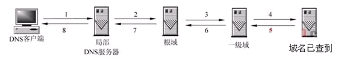

# 操作系统

## 进程与线程

##  进程和线程还有协程 

- 定义

```
进程是资源（CPU、内存等）分配的基本单位，具有一定独立功能的程序关于某个数据集合上的一次运行活动，进程是系统进行资源分配和调度的一个独立单位。
线程是进程的一个实体，是独立运行和独立调度的基本单位（CPU上真正运行的是线程）。线程自己基本上不拥有系统资源，只拥有一点在运行中必不可少的资源(如程序计数器,一组寄存器和栈)，但是它可与同属一个进程的其他的线程共享进程所拥有的全部资源。
```

- 区别

```
进程是资源分配的基本单位；线程是程序执行的基本单位。
进程拥有自己的资源空间，没启动一个进程，系统就会为它分配地址空间；而线程与CPU资源分配无关，多个线程共享同一进程内的资源，使用相同的地址空间。
一个进程可以包含若干个线程。
（1）进程有自己的独立地址空间，线程没有

（2）进程是资源分配的最小单位，线程是CPU调度的最小单位

（3）进程和线程通信方式不同(线程之间的通信比较方便。同一进程下的线程共享数据（比如全局变量，静态变量），通过这些数据来通信不仅快捷而且方便，当然如何处理好这些访问的同步与互斥正是编写多线程程序的难点。而进程之间的通信只能通过进程通信的方式进行。)

（4）进程上下文切换开销大，线程开销小

（5）一个进程挂掉了不会影响其他进程，而线程挂掉了会影响其他线程

（6）对进程操作一般开销都比较大，对线程开销就小了

```


- 优劣

```
线程之间的通信更方便，同一进程下的线程共享全局变量、静态变量等数据，而进程之间的通信需要以通信的方式（Inter Process Communication，IPC)进行。不过如何处理好同步与互斥是编写多线程程序的难点。
线程的调度与切换比进程快很多，同时创建一个线程的开销也比进程要小很多。
但是多进程程序更健壮，多线程程序只要有一个线程死掉，整个进程也死掉了，而一个进程死掉并不会对另外一个进程造成影响，因为进程有自己独立的地址空间。
```

- 通信

```
进程可以通过管道、套接字、信号交互、共享内存、消息队列等等进行通信；而线程本身就会共享内存，指针指向同一个内容，交互很容易。
```


- 进程

```
进程是系统资源分配的最小单位, 系统由一个个进程(程序)组成
一般情况下，包括文本区域（text region）、数据区域（data region）和堆栈（stack region）。

文本区域存储处理器执行的代码
数据区域存储变量和进程执行期间使用的动态分配的内存；
堆栈区域存储着活动过程调用的指令和本地变量。

因此进程的创建和销毁都是相对于系统资源,所以是一种比较昂贵的操作。

一个进程至少具有5种基本状态：初始态、就绪状态、等待（阻塞）状态、执行状态、终止状态。
初始状态：进程刚被创建，由于其他进程正占有CPU资源，所以得不到执行，只能处于初始状态。
就绪状态：只有处于就绪状态的经过调度才能到执行状态
等待状态：进程等待某件事件完成
执行状态：任意时刻处于执行状态的进程只能有一个（对于单核CPU来讲）。
停止状态：进程结束

进程是抢占式的争夺CPU运行自身,而CPU单核的情况下同一时间只能执行一个进程的代码,但是多进程的实现则是通过CPU飞快的切换不同进程,因此使得看上去就像是多个进程在同时进行.

操作系统对进程的控制和管理通过PCB(Processing Control Block)，PCB通常是系统内存占用区中的一个连续存区，它存放着操作系统用于描述进程情况及控制进程运行所需的全部信息(包括：进程标识号,进程状态,进程优先级,文件系统指针以及各个寄存器的内容等)，

无论是在多核还是单核系统中，一个CPU看上去都像是在并发的执行多个进程，这是通过处理器在进程间切换来实现的。
操作系统对把CPU控制权在不同进程之间交换执行的机制称为上下文切换（context switch），即保存当前进程的上下文，恢复新进程的上下文，然后将CPU控制权转移到新进程，新进程就会从上次停止的地方开始。因此，进程是轮流使用CPU的，CPU被若干进程共享，使用某种调度算法来决定何时停止一个进程，并转而为另一个进程提供服务。

通信问题: 由于进程间是隔离的,各自拥有自己的内存内存资源, 因此相对于线程比较安全, 所以不同进程之间的数据只能通过 IPC(Inter-Process Communication) 进行通信共享.
由于进程拥有自己独占的虚拟地址空间，CPU通过地址翻译将虚拟地址转换成真实的物理地址，每个进程只能访问自己的地址空间。因此，在没有其他机制（进程间通信）的辅助下，进程之间是无法共享数据的


```

- 线程

```
线程属于进程
线程-也是操作系统提供的抽象概念，是程序执行中一个单一的顺序控制流程，是程序执行流的最小单元，是处理器调度和分派的基本单位。一个进程可以有一个或多个线程，同一进程中的多个线程将共享该进程中的全部系统资源，如虚拟地址空间，文件描述符和信号处理等等。但同一进程中的多个线程有各自的调用栈和线程本地存储

通信问题:   进程相当于一个容器,而线程而是运行在容器里面的,因此对于容器内的东西,线程是共同享有的,因此线程间的通信可以直接通过全局变量进行通信,但是由此带来的例如多个线程读写同一个地址变量的时候则将带来不可预期的后果,因此这时候引入了各种锁的作用,例如互斥锁等。

同时多线程是不安全的,当一个线程崩溃了,会导致整个进程也崩溃了,即其他线程也挂了,
但多进程而不会,一个进程挂了,另一个进程依然照样运行。

系统利用PCB来完成对进程的控制和管理。同样，系统为线程分配一个线程控制块TCB（Thread Control Block）,将所有用于控制和管理线程的信息记录在线程的控制块中，TCB中通常包括：

线程标志符 一组寄存器 线程运行状态 优先级 线程专有存储区 信号屏蔽

和进程一样，线程同样至少具有五种状态：初始态、就绪状态、等待（阻塞）状态、执行状态和终止状态

```

- 进程 VS 线程

```
进程是资源的分配和调度的独立单元。进程拥有完整的虚拟地址空间，当发生进程切换时，不同的进程拥有不同的虚拟地址空间。而同一进程的多个线程共享同一地址空间（不同进程之间的线程无法共享）

线程是CPU调度的基本单元，一个进程包含若干线程（至少一个线程）。
线程比进程小，基本上不拥有系统资源。线程的创建和销毁所需要的时间比进程小很多
由于线程之间能够共享地址空间，因此，需要考虑同步和互斥操作
一个线程的意外终止会影响整个进程的正常运行，但是一个进程的意外终止不会影响其他的进程的运行。因此，多进程程序安全性更高。

```


- 协程

```
协程是属于线程的。协程程序是在线程里面跑的，因此协程又称微线程和纤程等
协没有线程的上下文切换消耗。协程的调度切换是用户(程序员)手动切换的,因此更加灵活,因此又叫用户空间线程.
原子操作性。由于协程是用户调度的，所以不会出现执行一半的代码片段被强制中断了，因此无需原子操作锁。

协程（Coroutine，又称微线程）是一种比线程更加轻量级的存在，协程不是被操作系统内核所管理，而完全是由程序所控制。协程与线程以及进程的关系见下图所示。

协程可以比作子程序，但执行过程中，子程序内部可中断，然后转而执行别的子程序，在适当的时候再返回来继续执行。协程之间的切换不需要涉及任何系统调用或任何阻塞调用
协程只在一个线程中执行，是子程序之间的切换，发生在用户态上。而且，线程的阻塞状态是由操作系统内核来完成，发生在内核态上，因此协程相比线程节省了线程创建和切换的开销
协程中不存在同时写变量冲突，因此，也就不需要用来守卫关键区块的同步性原语，比如互斥锁、信号量等，并且不需要来自操作系统的支持。

协程适用于IO阻塞且需要大量并发的场景，当发生IO阻塞，由协程的调度器进行调度，通过将数据流yield掉，并且记录当前栈上的数据，阻塞完后立刻再通过线程恢复协程栈，并把阻塞的结果放到这个线程上去运行。


协程（Coroutine，又称微线程）是一种比线程更加轻量级的存在，协程不是被操作系统内核所管理，而完全是由程序所控制。协程与线程以及进程的关系见下图所示。

协程可以比作子程序，但执行过程中，子程序内部可中断，然后转而执行别的子程序，在适当的时候再返回来继续执行。协程之间的切换不需要涉及任何系统调用或任何阻塞调用
协程只在一个线程中执行，是子程序之间的切换，发生在用户态上。而且，线程的阻塞状态是由操作系统内核来完成，发生在内核态上，因此协程相比线程节省了线程创建和切换的开销
协程中不存在同时写变量冲突，因此，也就不需要用来守卫关键区块的同步性原语，比如互斥锁、信号量等，并且不需要来自操作系统的支持。

协程适用于IO阻塞且需要大量并发的场景，当发生IO阻塞，由协程的调度器进行调度，通过将数据流yield掉，并且记录当前栈上的数据，阻塞完后立刻再通过线程恢复协程栈，并把阻塞的结果放到这个线程上去运行。


```


##  线程和进程的通信方式以及两者区别 

```
进程可以通过管道、套接字、信号交互、共享内存、消息队列等等进行通信；而线程本身就会共享内存，指针指向同一个内容，交互很容易。
```


## 什么用线程什么时候用进程（举例子 )

1．耗时的操作使用线程，提高应用程序响应

2．并行操作时使用线程，如C/S架构的服务器端并发线程响应用户的请求。

3．多CPU系统中，使用线程提高CPU利用率

##  进程上下文切换、为啥进程开销大 

```
线程也有自己的资源，比如栈，私有数据等等。说他使用而不拥有资源指的是使用的是进程的打开文件句柄，进程的全局数据，进程的地址空间等等,这些都属于进程，而不属于线程，进程内个线程共享。 
进程切换比线程切换开销大是因为进程切换时要切页表，而且往往伴随着页调度，因为进程的数据段代码段要换出去，以便把将要执行的进程的内容换进来。本来进程的内容就是线程的超集。而且线程只需要保存线程的上下文（相关寄存器状态和栈的信息）就好了，动作很小

进程切换分两步：
1.切换页目录以使用新的地址空间
2.切换内核栈和硬件上下文

对于linux来说，线程和进程的最大区别就在于地址空间，对于线程切换，第1步是不需要做的，第2是进程和线程切换都要做的。

切换的性能消耗：
1、线程上下文切换和进程上下问切换一个最主要的区别是线程的切换虚拟内存空间依然是相同的，但是进程切换是不同的。这两种上下文切换的处理都是通过操作系统内核来完成的。内核的这种切换过程伴随的最显著的性能损耗是将寄存器中的内容切换出。
2、另外一个隐藏的损耗是上下文的切换会扰乱处理器的缓存机制。简单的说，一旦去切换上下文，处理器中所有已经缓存的内存地址一瞬间都作废了。还有一个显著的区别是当你改变虚拟内存空间的时候，处理的页表缓冲（processor's Translation Lookaside Buffer (TLB)）被全部刷新，这将导致内存的访问在一段时间内相当的低效。但是在线程的切换中，不会出现这个问题。

切换开销
最显著的性能损耗是将保存寄存器中的内容
CPU高速缓存失效
页表查找是一个很慢的过程，因此通常使用Cache来缓存常用的地址映射，这样可以加速页表查找，这个cache就是TLB.当进程切换后页表也要进行切换，页表切换后TLB就失效了，cache失效导致命中率降低，那么虚拟地址转换为物理地址就会变慢，表现出来的就是程序运行会变慢


```


## 上下文切换

```
1.进程的上下文切换
各个进程之间是共享 CPU 资源的，在不同的时候进程之间需要切换，让不同的进程可以在 CPU 执行，那么这个一个进程切换到另一个进程运行，称为进程的上下文切换。
进程是由内核管理和调度的，所以进程的切换只能发生在内核态。
所以，进程的上下文切换不仅包含了虚拟内存、栈、全局变量等用户空间的资源，还包括了内核堆栈、寄存器等内核空间的资源。
通常，会把交换的信息保存在进程的 PCB，当要运行另外一个进程的时候，我们需要从这个进程的 PCB 取出上下文，然后恢复到 CPU 中，这使得这个进程可以继续执行

2.CPU的上下文切换：
CPU 上下文切换就是先把前一个任务的 CPU 上下文**（CPU 寄存器和程序计数器）**保存起来，然后加载新任务的上下文到这些寄存器和程序计数器，最后再跳转到程序计数器所指的新位置，运行新任务。
系统内核会存储保持下来的上下文信息，当此任务再次被分配给 CPU 运行时，CPU 会重新加载这些上下文，这样就能保证任务原来的状态不受影响，让任务看起来还是连续运行。

3.线程的上下文切换
这还得看线程是不是属于同一个进程：
当两个线程不是属于同一个进程，则切换的过程就跟进程上下文切换一样；
当两个线程是属于同一个进程，因为虚拟内存是共享的，所以在切换时，虚拟内存这些资源就保持不动，只需要切换线程的私有数据、寄存器等不共享的数据；
所以，线程的上下文切换相比进程，开销要小很多

```


## 内存管理

##  虚拟内存和物理内存的区别和关系？ 

```
虚拟地址是操作系统为每个进程分配的自己的独立的地址空间,
而物理内存是物理意义上的内存, CPU通过操作物理内存来实现程序的运行
因为直接操作物理内存会带来程序编写的困难如两个程序同时对一个物理内存地址进行操作一个覆盖了另一个, 导致了程序的崩溃, 那么分配每个进程单独的地址空间使得进程间的地址隔离开来互不干扰
这时就需要一个MMU内存映射单元将每个进程的虚拟地址映射到对应的物理内存地址上, 这样CPU就可以操作虚拟地址对应的物理内存地址了
内存存在分页分段机制
分段根据逻辑上把内存分成 堆 栈 数据 代码四个段, 虚拟地址由 段选择子和段偏移量构成, 通过段选择子在段表中获得段在物理内存中的段基地址值 + 段偏移量获得真实的物理内存地址从而完成虚拟地址到物理内存的映射
在分页机制下，虚拟地址分为两部分，页号和页内偏移。页号作为页表的索引，页表包含物理页每页所在物理内存的基地址，这个基地址与页内偏移的组合就形成了物理内存地址
```


##  内存分页分段机制 

### 虚拟内存 

如果你是电子相关专业的，肯定在大学里捣鼓过单片机。

单片机是没有操作系统的，所以每次写完代码，都需要借助工具把程序烧录进去，这样程序才能跑起来。

另外，**单片机的 CPU 是直接操作内存的「物理地址」**。


在这种情况下，要想在内存中同时运行两个程序是不可能的。如果第一个程序在 2000 的位置写入一个新的值，将会擦掉第二个程序存放在相同位置上的所有内容，所以同时运行两个程序是根本行不通的，这两个程序会立刻崩溃。

> 操作系统是如何解决这个问题呢？

这里关键的问题是这两个程序都引用了绝对物理地址，而这正是我们最需要避免的。

我们可以把进程所使用的地址「隔离」开来，即让操作系统为每个进程分配独立的一套「**虚拟地址**」，人人都有，大家自己玩自己的地址就行，互不干涉。但是有个前提每个进程都不能访问物理地址，至于虚拟地址最终怎么落到物理内存里，对进程来说是透明的，操作系统已经把这些都安排的明明白白了。

进程的中间层

**操作系统会提供一种机制，将不同进程的虚拟地址和不同内存的物理地址映射起来。**

如果程序要访问虚拟地址的时候，由操作系统转换成不同的物理地址，这样不同的进程运行的时候，写入的是不同的物理地址，这样就不会冲突了。

于是，这里就引出了两种地址的概念：

- 我们程序所使用的内存地址叫做**虚拟内存地址**（*Virtual Memory Address*）
- 实际存在硬件里面的空间地址叫**物理内存地址**（*Physical Memory Address*）。

操作系统引入了虚拟内存，进程持有的虚拟地址会通过 CPU 芯片中的内存管理单元（MMU）的映射关系，来转换变成物理地址，然后再通过物理地址访问内存，如下图所示：

虚拟地址寻址

> 操作系统是如何管理虚拟地址与物理地址之间的关系？

主要有两种方式，分别是**内存分段和内存分页**，分段是比较早提出的，我们先来看看内存分段。

------

### 内存分段 

程序是由若干个逻辑分段组成的，如可由代码分段、数据分段、栈段、堆段组成。**不同的段是有不同的属性的，所以就用分段（\*Segmentation\*）的形式把这些段分离出来。**

> 分段机制下，虚拟地址和物理地址是如何映射的？

分段机制下的虚拟地址由两部分组成，**段选择子**和**段内偏移量**。

内存分段-寻址的方式

- **段选择子**就保存在段寄存器里面。段选择子里面最重要的是**段号**，用作段表的索引。**段表**里面保存的是这个**段的基地址、段的界限和特权等级**等。
- 虚拟地址中的**段内偏移量**应该位于 0 和段界限之间，如果段内偏移量是合法的，就将段基地址加上段内偏移量得到物理内存地址。

在上面，知道了虚拟地址是通过**段表**与物理地址进行映射的，分段机制会把程序的虚拟地址分成 4 个段，每个段在段表中有一个项，在这一项找到段的基地址，再加上偏移量，于是就能找到物理内存中的地址，如下图：

内存分段-虚拟地址与物理地址

如果要访问段 3 中偏移量 500 的虚拟地址，我们可以计算出物理地址为，段 3 基地址 7000 + 偏移量 500 = 7500。

分段的办法很好，解决了程序本身不需要关心具体的物理内存地址的问题，但它也有一些不足之处：

- 第一个就是**内存碎片**的问题。
- 第二个就是**内存交换的效率低**的问题。

接下来，说说为什么会有这两个问题。

> 我们先来看看，分段为什么会产生内存碎片的问题？

我们来看看这样一个例子。假设有 1G 的物理内存，用户执行了多个程序，其中：

- 游戏占用了 512MB 内存
- 浏览器占用了 128MB 内存
- 音乐占用了 256 MB 内存。

这个时候，如果我们关闭了浏览器，则空闲内存还有 1024 - 512 - 256 = 256MB。

如果这个 256MB 不是连续的，被分成了两段 128 MB 内存，这就会导致没有空间再打开一个 200MB 的程序。

内存碎片的问题

这里的内存碎片的问题共有两处地方：

- 外部内存碎片，也就是产生了多个不连续的小物理内存，导致新的程序无法被装载；
- 内部内存碎片，程序所有的内存都被装载到了物理内存，但是这个程序有部分的内存可能并不是很常使用，这也会导致内存的浪费；

针对上面两种内存碎片的问题，解决的方式会有所不同。

解决外部内存碎片的问题就是**内存交换**。

可以把音乐程序占用的那 256MB 内存写到硬盘上，然后再从硬盘上读回来到内存里。不过再读回的时候，我们不能装载回原来的位置，而是紧紧跟着那已经被占用了的 512MB 内存后面。这样就能空缺出连续的 256MB 空间，于是新的 200MB 程序就可以装载进来。

这个内存交换空间，在 Linux 系统里，也就是我们常看到的 Swap 空间，这块空间是从硬盘划分出来的，用于内存与硬盘的空间交换。

> 再来看看，分段为什么会导致内存交换效率低的问题？

对于多进程的系统来说，用分段的方式，内存碎片是很容易产生的，产生了内存碎片，那不得不重新 `Swap` 内存区域，这个过程会产生性能瓶颈。

因为硬盘的访问速度要比内存慢太多了，每一次内存交换，我们都需要把一大段连续的内存数据写到硬盘上。

所以，**如果内存交换的时候，交换的是一个占内存空间很大的程序，这样整个机器都会显得卡顿。**

为了解决内存分段的内存碎片和内存交换效率低的问题，就出现了内存分页。

------

### 内存分页 

分段的好处就是能产生连续的内存空间，但是会出现内存碎片和内存交换的空间太大的问题。

要解决这些问题，那么就要想出能少出现一些内存碎片的办法。另外，当需要进行内存交换的时候，让需要交换写入或者从磁盘装载的数据更少一点，这样就可以解决问题了。这个办法，也就是**内存分页**（*Paging*）。

**分页是把整个虚拟和物理内存空间切成一段段固定尺寸的大小**。这样一个连续并且尺寸固定的内存空间，我们叫**页**（*Page*）。在 Linux 下，每一页的大小为 `4KB`。

虚拟地址与物理地址之间通过**页表**来映射，如下图：

内存映射

页表实际上存储在 CPU 的**内存管理单元** （*MMU*） 中，于是 CPU 就可以直接通过 MMU，找出要实际要访问的物理内存地址。

而当进程访问的虚拟地址在页表中查不到时，系统会产生一个**缺页异常**，进入系统内核空间分配物理内存、更新进程页表，最后再返回用户空间，恢复进程的运行。

> 分页是怎么解决分段的内存碎片、内存交换效率低的问题？

由于内存空间都是预先划分好的，也就不会像分段会产生间隙非常小的内存，这正是分段会产生内存碎片的原因。而**采用了分页，那么释放的内存都是以页为单位释放的，也就不会产生无法给进程使用的小内存。**

如果内存空间不够，操作系统会把其他正在运行的进程中的「最近没被使用」的内存页面给释放掉，也就是暂时写在硬盘上，称为**换出**（*Swap Out*）。一旦需要的时候，再加载进来，称为**换入**（*Swap In*）。所以，一次性写入磁盘的也只有少数的一个页或者几个页，不会花太多时间，**内存交换的效率就相对比较高。**

换入换出

更进一步地，分页的方式使得我们在加载程序的时候，不再需要一次性都把程序加载到物理内存中。我们完全可以在进行虚拟内存和物理内存的页之间的映射之后，并不真的把页加载到物理内存里，而是**只有在程序运行中，需要用到对应虚拟内存页里面的指令和数据时，再加载到物理内存里面去。**

> 分页机制下，虚拟地址和物理地址是如何映射的？

在分页机制下，虚拟地址分为两部分，**页号**和**页内偏移**。页号作为页表的索引，**页表**包含物理页每页所在**物理内存的基地址**，这个基地址与页内偏移的组合就形成了物理内存地址，见下图。

内存分页寻址

总结一下，对于一个内存地址转换，其实就是这样三个步骤：

- 把虚拟内存地址，切分成页号和偏移量；
- 根据页号，从页表里面，查询对应的物理页号；
- 直接拿物理页号，加上前面的偏移量，就得到了物理内存地址。

下面举个例子，虚拟内存中的页通过页表映射为了物理内存中的页，如下图：

虚拟页与物理页的映射

这看起来似乎没什么毛病，但是放到实际中操作系统，这种简单的分页是肯定是会有问题的。

> 简单的分页有什么缺陷吗？

有空间上的缺陷。

因为操作系统是可以同时运行非常多的进程的，那这不就意味着页表会非常的庞大。

在 32 位的环境下，虚拟地址空间共有 4GB，假设一个页的大小是 4KB（2^12），那么就需要大约 100 万 （2^20） 个页，每个「页表项」需要 4 个字节大小来存储，那么整个 4GB 空间的映射就需要有 `4MB` 的内存来存储页表。

这 4MB 大小的页表，看起来也不是很大。但是要知道每个进程都是有自己的虚拟地址空间的，也就说都有自己的页表。

那么，`100` 个进程的话，就需要 `400MB` 的内存来存储页表，这是非常大的内存了，更别说 64 位的环境了。

#### 多级页表

要解决上面的问题，就需要采用的是一种叫作**多级页表**（*Multi-Level Page Table*）的解决方案。

在前面我们知道了，对于单页表的实现方式，在 32 位和页大小 `4KB` 的环境下，一个进程的页表需要装下 100 多万个「页表项」，并且每个页表项是占用 4 字节大小的，于是相当于每个页表需占用 4MB 大小的空间。

我们把这个 100 多万个「页表项」的单级页表再分页，将页表（一级页表）分为 `1024` 个页表（二级页表），每个表（二级页表）中包含 `1024` 个「页表项」，形成**二级分页**。如下图所示：

二级分页

> 你可能会问，分了二级表，映射 4GB 地址空间就需要 4KB（一级页表）+ 4MB（二级页表）的内存，这样占用空间不是更大了吗？

当然如果 4GB 的虚拟地址全部都映射到了物理内存上的话，二级分页占用空间确实是更大了，但是，我们往往不会为一个进程分配那么多内存。

其实我们应该换个角度来看问题，还记得计算机组成原理里面无处不在的**局部性原理**么？

每个进程都有 4GB 的虚拟地址空间，而显然对于大多数程序来说，其使用到的空间远未达到 4GB，因为会存在部分对应的页表项都是空的，根本没有分配，对于已分配的页表项，如果存在最近一定时间未访问的页表，在物理内存紧张的情况下，操作系统会将页面换出到硬盘，也就是说不会占用物理内存。

如果使用了二级分页，一级页表就可以覆盖整个 4GB 虚拟地址空间，但**如果某个一级页表的页表项没有被用到，也就不需要创建这个页表项对应的二级页表了，即可以在需要时才创建二级页表**。做个简单的计算，假设只有 20% 的一级页表项被用到了，那么页表占用的内存空间就只有 4KB（一级页表） + 20% * 4MB（二级页表）= `0.804MB`，这对比单级页表的 `4MB` 是不是一个巨大的节约？

那么为什么不分级的页表就做不到这样节约内存呢？我们从页表的性质来看，保存在内存中的页表承担的职责是将虚拟地址翻译成物理地址。假如虚拟地址在页表中找不到对应的页表项，计算机系统就不能工作了。所以**页表一定要覆盖全部虚拟地址空间，不分级的页表就需要有 100 多万个页表项来映射，而二级分页则只需要 1024 个页表项**（此时一级页表覆盖到了全部虚拟地址空间，二级页表在需要时创建）。

我们把二级分页再推广到多级页表，就会发现页表占用的内存空间更少了，这一切都要归功于对局部性原理的充分应用。

对于 64 位的系统，两级分页肯定不够了，就变成了四级目录，分别是：

- 全局页目录项 PGD（*Page Global Directory*）；
- 上层页目录项 PUD（*Page Upper Directory*）；
- 中间页目录项 PMD（*Page Middle Directory*）；
- 页表项 PTE（*Page Table Entry*）；

四级目录

#### TLB

多级页表虽然解决了空间上的问题，但是虚拟地址到物理地址的转换就多了几道转换的工序，这显然就降低了这俩地址转换的速度，也就是带来了时间上的开销。

程序是有局部性的，即在一段时间内，整个程序的执行仅限于程序中的某一部分。相应地，执行所访问的存储空间也局限于某个内存区域。

程序的局部性

我们就可以利用这一特性，把最常访问的几个页表项存储到访问速度更快的硬件，于是计算机科学家们，就在 CPU 芯片中，加入了一个专门存放程序最常访问的页表项的 Cache，这个 Cache 就是 TLB（*Translation Lookaside Buffer*） ，通常称为页表缓存、转址旁路缓存、快表等。

地址转换

在 CPU 芯片里面，封装了内存管理单元（*Memory Management Unit*）芯片，它用来完成地址转换和 TLB 的访问与交互。

有了 TLB 后，那么 CPU 在寻址时，会先查 TLB，如果没找到，才会继续查常规的页表。

TLB 的命中率其实是很高的，因为程序最常访问的页就那么几个。

------

### 段页式内存管理 

内存分段和内存分页并不是对立的，它们是可以组合起来在同一个系统中使用的，那么组合起来后，通常称为**段页式内存管理**。

段页式地址空间

段页式内存管理实现的方式：

- 先将程序划分为多个有逻辑意义的段，也就是前面提到的分段机制；
- 接着再把每个段划分为多个页，也就是对分段划分出来的连续空间，再划分固定大小的页；

这样，地址结构就由**段号、段内页号和页内位移**三部分组成。

用于段页式地址变换的数据结构是每一个程序一张段表，每个段又建立一张页表，段表中的地址是页表的起始地址，而页表中的地址则为某页的物理页号，如图所示：

段页式管理中的段表、页表与内存的关系

段页式地址变换中要得到物理地址须经过三次内存访问：

- 第一次访问段表，得到页表起始地址；
- 第二次访问页表，得到物理页号；
- 第三次将物理页号与页内位移组合，得到物理地址。

可用软、硬件相结合的方法实现段页式地址变换，这样虽然增加了硬件成本和系统开销，但提高了内存的利用率。

### 总结 

为了在多进程环境下，使得进程之间的内存地址不受影响，相互隔离，于是操作系统就为每个进程独立分配一套**虚拟地址空间**，每个程序只关心自己的虚拟地址就可以，实际上大家的虚拟地址都是一样的，但分布到物理地址内存是不一样的。作为程序，也不用关心物理地址的事情。

每个进程都有自己的虚拟空间，而物理内存只有一个，所以当启用了大量的进程，物理内存必然会很紧张，于是操作系统会通过**内存交换**技术，把不常使用的内存暂时存放到硬盘（换出），在需要的时候再装载回物理内存（换入）。

那既然有了虚拟地址空间，那必然要把虚拟地址「映射」到物理地址，这个事情通常由操作系统来维护。

那么对于虚拟地址与物理地址的映射关系，可以有**分段**和**分页**的方式，同时两者结合都是可以的。

内存分段是根据程序的逻辑角度，分成了**栈段、堆段、数据段、代码段**等，这样可以分离出不同属性的段，同时是一块连续的空间。但是每个段的大小都不是统一的，这就会导致内存碎片和内存交换效率低的问题。

于是，就出现了内存分页，把虚拟空间和物理空间分成大小固定的页，如在 Linux 系统中，每一页的大小为 `4KB`。由于分了页后，就不会产生细小的内存碎片。同时在内存交换的时候，写入硬盘也就一个页或几个页，这就大大提高了内存交换的效率。

再来，为了解决简单分页产生的页表过大的问题，就有了**多级页表**，它解决了空间上的问题，但这就会导致 CPU 在寻址的过程中，需要有很多层表参与，加大了时间上的开销。于是根据程序的**局部性原理**，在 CPU 芯片中加入了 **TLB**，负责缓存最近常被访问的页表项，大大提高了地址的转换速度。


##  堆和栈的区别 以及在操作系统中堆和栈的具体使用 

```
内存中的栈区处于相对较高的地址以地址的增长方向为上的话，栈地址是向下增长的。

栈中分配局部变量空间，堆区是向上增长的用于分配程序员申请的内存空间。另外还有静态区是分配静态变量，全局变量空间的；只读区是分配常量和程序代码空间的；以及其他一些分区。

0.申请方式和回收方式不同
不知道你是否有点明白了。

堆和栈的第一个区别就是申请方式不同：栈（英文名称是stack）是系统自动分配空间的，例如我们定义一个 char a；系统会自动在栈上为其开辟空间。而堆（英文名称是heap）则是程序员根据需要自己申请的空间，例如malloc（10）；开辟十个字节的空间。

由于栈上的空间是自动分配自动回收的，所以栈上的数据的生存周期只是在函数的运行过程中，运行后就释放掉，不可以再访问。而堆上的数据只要程序员不释放空间，就一直可以访问到，不过缺点是一旦忘记释放会造成内存泄露。还有其他的一些区别我认为网上的朋友总结的不错这里转述一下：

1.申请后系统的响应
栈：只要栈的剩余空间大于所申请空间，系统将为程序提供内存，否则将报异常提示栈溢出。

堆：首先应该知道操作系统有一个记录空闲内存地址的链表，当系统收到程序的申请时，会遍历该链表，寻找第一个空间大于所申请空间的堆结点，然后将该结点从空闲结点链表中删除，并将该结点的空间分配给程序，另外，对于大多数系统，会在这块内存空间中的首地址处记录本次分配的大小，这样，代码中的 delete语句才能正确的释放本内存空间。另外，由于找到的堆结点的大小不一定正好等于申请的大小，系统会自动的将多余的那部分重新放入空闲链表中。 
也就是说堆会在申请后还要做一些后续的工作这就会引出申请效率的问题。

2.申请效率的比较

根据第0点和第1点可知。
栈：由系统自动分配，速度较快。但程序员是无法控制的。
堆：是由new分配的内存，一般速度比较慢，而且容易产生内存碎片,不过用起来最方便。

3.申请大小的限制
栈：在Windows下,栈是向低地址扩展的数据结构，是一块连续的内存的区域。这句话的意思是栈顶的地址和栈的最大容量是系统预先规定好的，在 WINDOWS下，栈的大小是2M（也有的说是1M，总之是一个编译时就确定的常数），如果申请的空间超过栈的剩余空间时，将提示overflow。因此，能从栈获得的空间较小。 

堆：堆是向高地址扩展的数据结构，是不连续的内存区域。这是由于系统是用链表来存储的空闲内存地址的，自然是不连续的，而链表的遍历方向是由低地址向高地址。堆的大小受限于计算机系统中有效的虚拟内存。由此可见，堆获得的空间比较灵活，也比较大。

4.堆和栈中的存储内容
由于栈的大小有限，所以用子函数还是有物理意义的，而不仅仅是逻辑意义。

栈： 在函数调用时，第一个进栈的是主函数中函数调用后的下一条指令（函数调用语句的下一条可执行语句）的地址，然后是函数的各个参数，在大多数的C编译器中，参数是由右往左入栈的，然后是函数中的局部变量。注意静态变量是不入栈的。 
当本次函数调用结束后，局部变量先出栈，然后是参数，最后栈顶指针指向最开始存的地址，也就是主函数中的下一条指令，程序由该点继续运行。 

堆：一般是在堆的头部用一个字节存放堆的大小。堆中的具体内容有程序员安排。
```

##  操作系统调度算法和饥饿问题 

```
先来先到
	计算密集型和IO密集型进程同时执行, IO可能需要很长时间才能执行完, 但是如果调度算法可以每10ms抢占计算密集型进程, IO可也很快完成, 不会对计算密集型产生太大延迟
最短作业优先
	所有作业都可以同时运行的情况下才是最优的
最短剩余时间优先
	当前运行进程会为刚进来的剩余时间更短的进程让出CPU
轮转调度 (20-50ms)
	每个进程分配一个时间片, 时间片结束将CPU分配给另一个进程, 如果时间片结束前阻塞或者结束立即切换
优先级调度
	防止当前高优先级的进程无限进行下去, 每个时钟滴答会降低当前进程的优先级,如果导致了当前进程优先级低于其他进程, 切换 给其他进程运行的机会
多级队列
	为CPU密集型进程设置较长的时间片比频繁的分给他们短时间片更高效, 设置优先级类, 属于最高优先级类的进程运行一个时间片, 属于次高的运行2个时间片, 降低一级, 时间片时间加倍, 当一个进程用完分配的时间片后, 移动到下一类, 下次可运行的时间加倍
最短进程优先
	根据过去的行为, 估算运行时间最短的那一个
保证调度
	n个进程, 每个获取1/nCPU
彩票
	需要调度, 抽彩票, 拥有该彩票的进程获得该资源
公平分享
	每个用户不管进程多少, 都获得1/用户数的CPU
```

## DMA

https://blog.csdn.net/as480133937/article/details/104927922?ops_request_misc=%257B%2522request%255Fid%2522%253A%2522162579960116780261915487%2522%252C%2522scm%2522%253A%252220140713.130102334..%2522%257D&request_id=162579960116780261915487&biz_id=0&utm_medium=distribute.pc_search_result.none-task-blog-2~all~top_positive~default-1-104927922.pc_search_result_control_group&utm_term=DMA&spm=1018.2226.3001.4187

## 文件管理

https://juejin.cn/post/6850037269835808782#heading-86

## inode

https://blog.csdn.net/haiross/article/details/39157885?ops_request_misc=%257B%2522request%255Fid%2522%253A%2522162556888416780269864750%2522%252C%2522scm%2522%253A%252220140713.130102334..%2522%257D&request_id=162556888416780269864750&biz_id=0&utm_medium=distribute.pc_search_result.none-task-blog-2~all~sobaiduend~default-5-39157885.pc_search_result_control_group&utm_term=%E6%93%8D%E4%BD%9C%E7%B3%BB%E7%BB%9F+%E6%96%87%E4%BB%B6%E7%B3%BB%E7%BB%9F+inode&spm=1018.2226.3001.4187

### 软连接

-  创建一个硬链接后，testfile的inode count增加了一个。而且testfile和testfile.hard这两个的Inode number是一样的。这个硬链接就是重新创建了一个文件名对应到原文件的Inode。实质就是在Directory中增加了一个新的对应关系。通过这个例子，你是不是更清楚了，这个Inode count的含义了。他就是指，一个Inode对应了多少个文件名。 

- 般情况下，文件名和inode号码是"一一对应"关系，每个inode号码对应一个文件名。但是，Unix/Linux系统允许，多个文件名指向同一个inode号码。这意味着，可以用不同的文件名访问同样的内容；对文件内容进行修改，会影响到所有文件名；但是，删除一个文件名，不影响另一个文件名的访问。这种情况就被称为"硬链接"（hard link）。**

  

### 硬链接

-  软链接是重新建立了一个文件，而文件是指向到原文件，而不是指向原Inode。当然他会占用掉 inode 与 block。当我们删除了源文件后，链接文件不能独立存在，虽然仍保留文件名，但我们却不能查看软链接文件的内容了。但软链接是可以跨文件系统，而且是可以链接目录。他就相当于windows系统下的快捷方式一样 
- 文件A和文件B的inode号码虽然不一样，但是文件A的内容是文件B的路径。读取文件A时，系统会自动将访问者导向文件B。因此，无论打开哪一个文件，最终读取的都是文件B。这时，文件A就称为文件B的"软链接"（soft link）或者"符号链接（symbolic link）。这意味着，文件A依赖于文件B而存在，如果删除了文件B，打开文件A就会报错："No such file or directory"。这是软链接与硬链接最大的不同：文件A指向文件B的文件名，而不是文件B的inode号码，文件B的inode"链接数"不会因此发生变化。

### 总结

1.  一个Inode对应一个文件，而一个文件根据其大小，会占用多块blocks。
2. 更为准确的来说，一个文件只对应一个Inode。因为硬链接其实不是创建新文件，只是在Directory中写入了新的对应关系而已。
3. 当我们删除文件的时候，只是把Inode标记为可用，文件在block中的内容是没有被清除的，只有在有新的文件需要占用block的时候，才会被覆盖。 


硬链接：其实就是同一个文件具有多个别名，具有相同inode，而dentry不同。

​       \1. 文件具有相同的inode和data block；

​       \2. 只能对已存在的文件进行创建；

​       \3. 不同交叉文件系统进行硬链接的创建

​       \4. 不能对目录进行创建，只能对文件创建硬链接

​       \5. 删除一个硬链接并不影响其他具有相同inode号的文件；

软链接：软链接具有自己的inode，即具有自己的文件，只是这个文件中存放的内容是另一个文件的路径名。因此软链接具有自己的inode号以及用户数据块。

​       \1. 软链接有自己的文件属性及权限等；

​       \2. 软链接可以对不存在的文件或目录创建；

​       \3. 软链接可以交叉文件系统；

​       \4. 软链接可以对文件或目录创建；

​       \5. 创建软链接时，链接计数i_nlink不会增加；

​       \6. 删除软链接不会影响被指向的文件，但若指向的原文件被删除，则成死链接，但重新创建指向 的路径即可恢复为正常的软链接，只是源文件的内容可能变了。

## IO


## 锁

##  死锁如何避免

```
一、死锁的定义：
多个进行相互等待对方资源，在得到所有资源继续运行之前，都不会释放自己已有的资源，这样造成了循环等待的现象，称为死锁。

二、产生死锁的四大必要条件：
①资源互斥/资源不共享
每个资源要么已经分配给了一个进程，要么是可用的，只有这两种状态，资源不可以被共享使用，所以所谓的互斥是指：资源不共享，如果被使用，只能被一个进程使用。

②占有和等待/请求并保持
已经得到资源的进程还能继续请求新的资源，所以个人觉得叫占有并请求也许更好理解。

③资源不可剥夺
当一个资源分配给了一个进程后，其它需要该资源的进程不能强制性获得该资源，除非该资源的当前占有者显示地释放该资源。

④环路等待
死锁发生时，系统中一定有由两个或两个以上的进程组成的一条环路，环路上的每个进程都在等待下一个进程所占有的资源。

三、防止死锁的方法
1、破坏互斥条件
方法：如果允许系统资源都能共享使用，则系统不会进入死锁状态。
缺点：有些资源根本不能同时访问，如打印机等临界资源只能互斥使用。所以，破坏互斥条件而预防死锁的方法不太可行，而且在有的场合应该保护这种互斥性。

2、破坏请求并保持条件
方法：釆用预先静态分配方法，即进程在运行前一次申请完它所需要的全部资源，在它的资源未满足前，不把它投入运行。一旦投入运行后，这些资源就一直归它所有，也不再提出其他资源请求，这样就可以保证系统不会发生死锁。
缺点： 系统资源被严重浪费，其中有些资源可能仅在运行初期或运行快结束时才使用，甚至根本不使用。而且还会导致“饥饿”现象，当由于个别资源长期被其他进程占用时，将致使等待该资源的进程迟迟不能开始运行。

3、破坏不可剥夺条件
方法：当一个已保持了某些不可剥夺资源的进程，请求新的资源而得不到满足时，它必须释放已经保持的所有资源，待以后需要时再重新申请。这意味着，一个进程已占有的资源会被暂时释放，或者说是被剥夺了，或从而破坏了不可剥夺条件。
缺点：该策略实现起来比较复杂，释放已获得的资源可能造成前一阶段工作的失效，反复地申请和释放资源会增加系统开销，降低系统吞吐量。这种方法常用于状态易于保存和恢复的资源，如CPU的寄存器及内存资源，一般不能用于打印机之类的资源。

4、破坏循环等待条件
方法：为了破坏循环等待条件，可釆用顺序资源分配法。首先给系统中的资源编号，规定每个进程，必须按编号递增的顺序请求资源，同类资源一次申请完。也就是说，只要进程提出申请分配资源Ri，则该进程在以后的资源申请中，只能申请编号大于Ri的资源。
缺点：这种方法存在的问题是，编号必须相对稳定，这就限制了新类型设备的增加；尽管在为资源编号时已考虑到大多数作业实际使用这些资源的顺序，但也经常会发生作业使用资源的顺序与系统规定顺序不同的情况，造成资源的浪费；此外，这种按规定次序申请资源的方法，也必然会给用户的编程带来麻烦。

六、死锁的解除

1、资源剥夺法
挂起某些死锁进程，并抢占它的资源，将这些资源分配给其他的死锁进程。但应防止被挂起的进程长时间得不到资源，而处于资源匮乏的状态。
2、撤销进程法
强制撤销部分、甚至全部死锁进程并剥夺这些进程的资源。撤销的原则可以按进程优先级和撤销进程代价的高低进行。
3、进程回退法
让一（多）个进程回退到足以回避死锁的地步，进程回退时自愿释放资源而不是被剥夺。要求系统保持进程的历史信息，设置还原点。
```


##  epoll底层，水平，边缘 

### ANS1

设想一个场景：有100万用户同时与一个进程保持着TCP连接，而每一时刻只有几十个或几百个TCP连接是活跃的(接收TCP包)，也就是说在每一时刻进程只需要处理这100万连接中的一小部分连接。那么，如何才能高效的处理这种场景呢？进程是否在每次询问操作系统收集有事件发生的TCP连接时，把这100万个连接告诉操作系统，然后由操作系统找出其中有事件发生的几百个连接呢？实际上，在Linux2.4版本以前，那时的select或者poll事件驱动方式是这样做的。

  这里有个非常明显的问题，即在某一时刻，进程收集有事件的连接时，其实这100万连接中的大部分都是没有事件发生的。因此如果每次收集事件时，都把100万连接的套接字传给操作系统(这首先是用户态内存到内核态内存的大量复制)，而由操作系统内核寻找这些连接上有没有未处理的事件，将会是巨大的资源浪费，然后select和poll就是这样做的，因此它们最多只能处理几千个并发连接。而epoll不这样做，它在Linux内核中申请了一个简易的文件系统，把原先的一个select或poll调用分成了3部分：

int epoll_create(int size);  
int epoll_ctl(int epfd, int op, int fd, struct epoll_event *event);  
int epoll_wait(int epfd, struct epoll_event *events,int maxevents, int timeout);  

1. 调用epoll_create建立一个epoll对象(在epoll文件系统中给这个句柄分配资源)；

2. 调用epoll_ctl向epoll对象中添加这100万个连接的套接字；

3. 调用epoll_wait收集发生事件的连接。

  这样只需要在进程启动时建立1个epoll对象，并在需要的时候向它添加或删除连接就可以了，因此，在实际收集事件时，epoll_wait的效率就会非常高，因为调用epoll_wait时并没有向它传递这100万个连接，内核也不需要去遍历全部的连接。

一、epoll原理详解
  当某一进程调用epoll_create方法时，Linux内核会创建一个eventpoll结构体，这个结构体中有两个成员与epoll的使用方式密切相关，如下所示：

struct eventpoll {
　　...
　　/*红黑树的根节点，这棵树中存储着所有添加到epoll中的事件，
　　也就是这个epoll监控的事件*/
　　struct rb_root rbr;
　　/*双向链表rdllist保存着将要通过epoll_wait返回给用户的、满足条件的事件*/
　　struct list_head rdllist;
　　...
};
  我们在调用epoll_create时，内核除了帮我们在epoll文件系统里建了个file结点，在内核cache里建了个红黑树用于存储以后epoll_ctl传来的socket外，还会再建立一个rdllist双向链表，用于存储准备就绪的事件，当epoll_wait调用时，仅仅观察这个rdllist双向链表里有没有数据即可。有数据就返回，没有数据就sleep，等到timeout时间到后即使链表没数据也返回。所以，epoll_wait非常高效。

  所有添加到epoll中的事件都会与设备(如网卡)驱动程序建立回调关系，也就是说相应事件的发生时会调用这里的回调方法。这个回调方法在内核中叫做ep_poll_callback，它会把这样的事件放到上面的rdllist双向链表中。

  在epoll中对于每一个事件都会建立一个epitem结构体，如下所示：

struct epitem {
　　...
　　//红黑树节点
　　struct rb_node rbn;
　　//双向链表节点
　　struct list_head rdllink;
　　//事件句柄等信息
　　struct epoll_filefd ffd;
　　//指向其所属的eventepoll对象
　　struct eventpoll *ep;
　　//期待的事件类型
　　struct epoll_event event;
　　...
}; // 这里包含每一个事件对应着的信息。

  当调用epoll_wait检查是否有发生事件的连接时，只是检查eventpoll对象中的rdllist双向链表是否有epitem元素而已，如果rdllist链表不为空，则这里的事件复制到用户态内存（使用共享内存提高效率）中，同时将事件数量返回给用户。因此epoll_waitx效率非常高。epoll_ctl在向epoll对象中添加、修改、删除事件时，从rbr红黑树中查找事件也非常快，也就是说epoll是非常高效的，它可以轻易地处理百万级别的并发连接。


【总结】：

  一颗红黑树，一张准备就绪句柄链表，少量的内核cache，就帮我们解决了大并发下的socket处理问题。

执行epoll_create()时，创建了红黑树和就绪链表；

执行epoll_ctl()时，如果增加socket句柄，则检查在红黑树中是否存在，存在立即返回，不存在则添加到树干上，然后向内核注册回调函数，用于当中断事件来临时向准备就绪链表中插入数据；

执行epoll_wait()时立刻返回准备就绪链表里的数据即可。


二、epoll的两种触发模式
  epoll有EPOLLLT和EPOLLET两种触发模式，LT是默认的模式，ET是“高速”模式。

LT（水平触发）模式下，只要这个文件描述符还有数据可读，每次 epoll_wait都会返回它的事件，提醒用户程序去操作；

ET（边缘触发）模式下，在它检测到有 I/O 事件时，通过 epoll_wait 调用会得到有事件通知的文件描述符，对于每一个被通知的文件描述符，如可读，则必须将该文件描述符一直读到空，让 errno 返回 EAGAIN 为止，否则下次的 epoll_wait 不会返回余下的数据，会丢掉事件。如果ET模式不是非阻塞的，那这个一直读或一直写势必会在最后一次阻塞。

  还有一个特点是，epoll使用“事件”的就绪通知方式，通过epoll_ctl注册fd，一旦该fd就绪，内核就会采用类似callback的回调机制来激活该fd，epoll_wait便可以收到通知。


【epoll为什么要有EPOLLET触发模式？】：

  如果采用EPOLLLT模式的话，系统中一旦有大量你不需要读写的就绪文件描述符，它们每次调用epoll_wait都会返回，这样会大大降低处理程序检索自己关心的就绪文件描述符的效率.。而采用EPOLLET这种边缘触发模式的话，当被监控的文件描述符上有可读写事件发生时，epoll_wait()会通知处理程序去读写。如果这次没有把数据全部读写完(如读写缓冲区太小)，那么下次调用epoll_wait()时，它不会通知你，也就是它只会通知你一次，直到该文件描述符上出现第二次可读写事件才会通知你！！！这种模式比水平触发效率高，系统不会充斥大量你不关心的就绪文件描述符。

【总结】：

ET模式（边缘触发）只有数据到来才触发，不管缓存区中是否还有数据，缓冲区剩余未读尽的数据不会导致epoll_wait返回；

LT 模式（水平触发，默认）只要有数据都会触发，缓冲区剩余未读尽的数据会导致epoll_wait返回。


### ANS2

select、poll、epoll是Linux平台下的IO多路复用技术，适合用来管理大量的文件描述符，但是这些系统调用本身是阻塞的，而他们管理的socket描述符其实是可以阻塞，也可以非阻塞的，但是大部分情况下设置为非阻塞的要更好一些，效率会更高一些。因此，他们并不是真正的异步IO。是伪异步的。

1、select

首先，select的缺点1：是select管理的描述符的数量在不重新编译内核的情况下是一个固定的值：1024，当然，重新编译了Linux内核之后，这个数值可以继续增大到用户的需求，但是这是相对来说比较麻烦的一件事。

其次。select的缺点2：是select对于socket描述符的管理方式，因为Linux内核对select的实现方式为每次返回前都要对所有的描述符进行一遍遍历，然后将有事件发生的socket描述符放到描述符集合里，然后将这个描述符集合返回。这种情况对于描述符的数量不是很大的时候还是可以的，但是当描述符达到数十万，甚至上百万的时候，select的效率就会急剧的降低，因为这样的轮询机制会造成大量的浪费和资源开销。因为每一次的轮询都要将这些所有的socket描述符从用户态拷贝到内核态，在内核态，进行轮询，查看是否有事件发生，这是select的底层需要做的。而这些拷贝完全是可以避免的。

2、poll

poll的实现机制和select是一样的，也是采用轮询机制来查看有事件发生的socket描述符，所以效率也是很低，但是poll对select有一项改进就是能够监视的描述符是任意大小的而不是局限在一个较小的数值上(当然这个描述符的大小也是需要操作系统来支持的)。

综上：在总结一下，select与poll的实现机制基本是一样的，只不过函数不同，参数不同，但是基本流程是相同的；

1、复制用户数据到内核空间

2、估计超时时间

3、遍历每个文件并调用f_op->poll()取得文件状态

4、遍历完成检查状态

如果有就绪的文件(描述符对应的还是文件，这里就当成是描述符就可以)则跳转到5，

如果有信号产生则重新启动poll或者select，否则挂起进程并等待超时或唤醒超时或再次遍历每个文件的状态

5、将所有文件的就绪状态复制到用户空间

6、清理申请的资源


3、epoll

epoll改进了select的两个缺点，使用了三个数据结构从而能够在管理大量的描述符的情况下，对系统资源的使用并没有急剧的增加，而只是对内存的使用有所增加（毕竟存储大量的描述符的数据结构会占用大量内存）。

epoll在实现上的三个核心点是：1、红黑树，2、rdlist(就绪描述符链表)接下来一一解释为什么会高效；

1、红黑树是用来存储这些描述符的，因为红黑树的特性，就是良好的插入，查找，删除性能O(lgN)。

     当内核初始化epoll的时候（当调用epoll_create的时候内核也是个epoll描述符创建了一个文件，毕竟在Linux中一切都是文件，而epoll面对的是一个特殊的文件，和普通文件不同），会开辟出一块内核高速cache区，这块区域用来存储我们要监管的所有的socket描述符，当然在这里面存储一定有一个数据结构，这就是红黑树，由于红黑树的接近平衡的查找，插入，删除能力，在这里显著的提高了对描述符的管理。

2、rdlist   就绪描述符链表这是一个双链表，epoll_wait()函数返回的也是这个就绪链表。

     当内核创建了红黑树之后，同时也会建立一个双向链表rdlist，用于存储准备就绪的描述符，当调用epoll_wait的时候在timeout时间内，只是简单的去管理这个rdlist中是否有数据，如果没有则睡眠至超时，如果有数据则立即返回并将链表中的数据赋值到events数组中。这样就能够高效的管理就绪的描述符，而不用去轮询所有的描述符。所以当管理的描述符很多但是就绪的描述符数量很少的情况下如果用select来实现的话效率可想而知，很低，但是epoll的话确实是非常适合这个时候使用。
    
      对与rdlist的维护：当执行epoll_ctl时除了把socket描述符放入到红黑树中之外，还会给内核中断处理程序注册一个回调函数，告诉内核，当这个描述符上有事件到达（或者说中断了）的时候就调用这个回调函数。这个回调函数的作用就是将描述符放入到rdlist中，所以当一个socket上的数据到达的时候内核就会把网卡上的数据复制到内核，然后把socket描述符插入就绪链表rdlist中。

补充：epoll的工作模式ET和LT

都知道epoll有两个工作模式，ET和LT，其中ET模式是高速模式，叫做边缘触发模式，LT模式是默认模式，叫做水平触发模式。

这两种工作模式的区别在于：

当工作在ET模式下，如果一个描述符上有数据到达，然后读取这个描述符上的数据如果没有将数据全部读完的话，当下次epoll_wait返回的时候这个描述符里的数据就再也读取不到了，因为这个描述符不会再次触发返回，也就没法去读取，所以对于这种模式下对一个描述符的数据的正确读取方式是用一个死循环一直读，读到么有数据可读的情况下才可以认为是读取结束。

而工作在LT模式下，这种情况就不会发生，如果对一个描述符的数据没有读取完成，那么下次当epoll_wait返回的时候会继续触发，也就可以继续获取到这个描述符，从而能够接着读。

那么这两种模式的实现方式是什么样的?

基于以上的数据结构是怎么实现这种工作模式的呢？

实现原理：当一个socket描述符的中断事件发生，内核会将数据从网卡复制到内核，同时将socket描述符插入到rdlist中，此时如果调用了epoll_wait会把rdlist中的就绪的socekt描述符复制到用户空间，然后清理掉这个rdlist中的数据，最后epoll_wait还会再次检查这些socket描述符，如果是工作在LT模式下，并且这些socket描述符上还有数据没有读取完成，那么L就会再次把没有读完的socket描述符放入到rdlist中，所以再次调用epoll_wait的时候是会再次触发的，而ET模式是不会这么干的。

ET模式在物理实现上是基于电平的高低变化来工作的，就是从高电平变成低电平，或者从低电平变成高电平的这个上升沿或者下降沿才会触发，也就是状态变化导致触发，而当一个描述符上数据未读完的时候这个状态是不会发生变化的，所以触发不了，LT模式是在只有出现高电平的时候才会触发。

高电平和低电平：

LT水平触发：

EPOLLIN的触发事件：当输入缓冲区为空-->低电平，当输入缓冲区不为空-->高电平

高电平的时候触发EPOLLIN事件，如果没有把缓冲区的数据读取完，下次还会触发的，因为始终是高电平

EPOLLOUT的触发事件：当发送缓冲区满-->低电平，当发送缓冲区不满-->高电平

高电平的时候触发EPOLLOUT事件，所以在一开始的时候不要关注EPOLLOUT时间，因为发送缓冲区是不满的所以会导致CPU忙等待，每次都触发。什么时候关注EPOLLOUT事件呢? 当write的时候没有写完全，因为发送缓冲区满了，这个时候才关注EPOLLOUT事件直到下次把所有数据都发送完毕了，才取消EPOLLOUT事件

ET边缘触发：

EPOLLIN事件发生的条件:

有数据到来(输入缓冲区初始为空，为低电平，有数据到来变成了高电平)

EPOLLout事件发生的条件:

内核发送缓冲区不满(当发送缓冲区出现满之后为低电平，然后内核发送出去了部分数据后变成了不满，也就是高电平)


## 说说NIO（select,poll,epoll） 


# 计网


## HTTPS

### 面试题

- http和https的区别 
- https 数据传输中使用什么加密以及为什么要使用这种加密 
- https加密的详细过程 

https://juejin.cn/post/6844903830916694030#heading-1


### 什么是HTTPS

-  HTTPS是在HTTP上建立SSL加密层，并对传输数据进行加密，是HTTP协议的安全版 
-  SSL 协议可分为两层：
  - SSL 记录协议（SSL Record Protocol），它建立在可靠的传输协议（如TCP）之上，为高层协议提供数据封装、压缩、加密等基本功能的支持。
  - SSL 握手协议（SSL Handshake Protocol），它建立在 SSL 记录协议之上，用于在实际的数据传输开始前，通讯双方进行身份认证、协商加密算法、交换加密密钥等。 

### HTTPS的主要作用

- 对数据进行加密，并建立一个信息安全通道，来保证传输过程中的数据安全;
- 对网站服务器进行真实身份认证。

### 为什么需要HTTPS

-  在HTTP协议中有可能存在信息窃取或身份伪装等安全问题。使用HTTPS通信机制可以有效地防止这些问题 

####  HTTP协议存在的哪些问题 

- 通信使用明文（不加密），内容可能被窃听

由于HTTP本身不具备加密的功能，所以也无法做到对通信整体（使用HTTP协议通信的请求和响应的内容）进行加密。即，**HTTP报文使用明文（指未经过加密的报文）方式发送**。

HTTP明文协议的缺陷是导致数据泄露、数据篡改、流量劫持、钓鱼攻击等安全问题的重要原因。HTTP协议无法加密数据. 通过网络的嗅探设备及一些技术手段，就可还原HTTP报文内容。

- 无法证明报文的完整性，所以可能遭篡改

所谓完整性是指信息的准确度。若无法证明其完整性，通常也就意味着无法判断信息是否准确。由于HTTP协议无法证明通信的报文完整性，因此，在请求或响应送出之后直到对方接收之前的这段时间内，即使请求或响应的内容遭到篡改，也没有办法获悉。 换句话说，**没有任何办法确认，发出的请求/响应和接收到的请求/响应是前后相同的**。

- 不验证通信方的身份，因此有可能遭遇伪装

**HTTP协议中的请求和响应不会对通信方进行确认**。在HTTP协议通信时，由于不存在确认通信方的处理步骤，任何人都可以发起请求。另外，服务器只要接收到请求，不管对方是谁都会返回一个响应（但也仅限于发送端的IP地址和端口号没有被Web服务器设定限制访问的前提下）

HTTP协议无法验证通信方身份，任何人都可以伪造虚假服务器欺骗用户，实现“钓鱼欺诈”，用户无法察觉。

### HTTPS的优势

#### 数据隐私性：

- 内容经过对称加密，每个连接生成一个唯一的加密密钥

- ( **利用非对称加密实现身份认证和密钥协商** ）

#### 数据完整性：

- 内容传输经过完整性校验

#### 身份认证：

- 第三方无法伪造服务端（客户端）身份

### **HTTPS的缺点**

（1）HTTPS协议握手阶段比较费时，会使页面的加载时间延长近50%，增加10%到20%的耗电；

（2）HTTPS连接缓存不如HTTP高效，会增加数据开销和功耗，甚至已有的安全措施也会因此而受到影响；

（3）SSL证书需要钱，功能越强大的证书费用越高，个人网站、小网站没有必要一般不会用。

（4）SSL证书通常需要绑定IP，不能在同一IP上绑定多个域名，IPv4资源不可能支撑这个消耗。

（5）HTTPS协议的加密范围也比较有限，在黑客攻击、拒绝服务攻击、服务器劫持等方面几乎起不到什么作用。最关键的，SSL证书的信用链体系并不安全，特别是在某些国家可以控制CA根证书的情况下，中间人攻击一样可行。

### HTTPS如何解决HTTP数据不安全相关问题?

- HTTPS并非是应用层的一种新协议。只是HTTP通信接口部分用SSL和TLS协议代替而已。

  通常，HTTP直接和TCP通信。当使用SSL时，则演变成先和SSL通信，再由SSL和TCP通信了。简言之，**所谓HTTPS，其实就是身披SSL协议这层外壳的HTTP**。

  - 

-  在采用SSL后，HTTP就拥有了HTTPS的加密、证书和完整性保护这些功能。也就是说**HTTP加上加密处理和认证以及完整性保护后即是HTTPS**。 


-  HTTPS 协议的主要功能基本都依赖于 TLS/SSL 协议，TLS/SSL 的功能实现主要依赖于三类基本算法：散列函数 、对称加密和非对称加密，**其利用非对称加密实现身份认证和密钥协商，对称加密算法采用协商的密钥对数据加密，基于散列函数验证信息的完整性**。 


#### 解决内容可能被窃听的问题——加密

##### 方法1.对称加密

这种方式加密和解密同用一个密钥。加密和解密都会用到密钥。**没有密钥就无法对密码解密，反过来说，任何人只要持有密钥就能解密了**。

以对称加密方式加密时必须将密钥也发给对方。可究竟怎样才能安全地转交？在互联网上转发密钥时，如果通信被监听那么密钥就可会落人攻击者之手，同时也就失去了加密的意义。另外还得设法安全地保管接收到的密钥。

##### 方法2.非对称加密

公开密钥加密使用一对非对称的密钥。一把叫做私有密钥，另一把叫做公开密钥。顾名思义，**私有密钥不能让其他任何人知道，而公开密钥则可以随意发布，任何人都可以获得**。

使用公开密钥加密方式，发送密文的一方使用**对方的公开密钥**进行加密处理，对方收到被加密的信息后，再使用自己的私有密钥进行解密。利用这种方式，不需要发送用来解密的私有密钥，也不必担心密钥被攻击者窃听而盗走。 


非对称加密的特点是信息传输一对多，服务器只需要维持一个私钥就能够和多个客户端进行加密通信。

这种方式有以下缺点：

- 公钥是公开的，所以**针对私钥加密**的信息，黑客截获后可以使用公钥进行解密，获取其中的内容；
- 公钥并不包含服务器的信息，使用非对称加密算法**无法确保服务器身份的合法性**，存在中间人攻击的风险，服务器发送给客户端的公钥可能在传送过程中被中间人截获并篡改；
- 使用非对称加密**在数据加密解密过程需要消耗一定时间**，降低了数据传输效率；

##### 方法3.对称加密+非对称加密(HTTPS采用这种方式)

- 使用**对称密钥的好处是解密的效率比较快**，
- 使用**非对称密钥的好处是可以使得传输的内容不能被破解**，因为就算你拦截到了数据，但是没有对应的私钥，也是不能破解内容的。就比如说你抢到了一个保险柜，但是没有保险柜的钥匙也不能打开保险柜。
- 那我们就将对称加密与非对称加密结合起来,充分利用两者各自的优势，
- **在交换密钥环节使用非对称加密方式，之后的建立通信交换报文阶段则使用对称加密方式**。

- 具体做法是：
  - **发送密文的一方使用对方的公钥进行加密处理“对称的密钥(服务端生成的随机数密钥)”，**
  - **然后对方用自己的私钥解密拿到“对称的密钥”，**
  - **这样可以确保交换的密钥是安全的前提下，使用对称加密方式进行通信**。
  - 所以，HTTPS采用**对称加密**和**非对称加密**两者并用的混合加密机制。

#### 解决报文可能遭篡改问题——数字签名

网络传输过程中需要经过很多中间节点，虽然数据无法被解密，但可能被篡改，那如何校验数据的完整性呢？----校验数字签名。

**数字签名有两种功效**：

- 能确定消息确实是由发送方签名并发出来的，因为别人假冒不了发送方的签名。
- 数字签名能确定消息的完整性,证明数据是否未被篡改过。

**数字签名如何生成:** 


- 将一段文本先用**Hash函数**生成消息摘要，
- 然后用发送者的**私钥**加密生成数字签名，与原文文一起传送给接收者
- 接下来就是接收者校验数字签名的流程了。

**校验数字签名流程**：


- 接收者只有用发送者的**公钥**才能解密被加密的摘要信息，
- 然后用**HASH函数**对收到的原文产生一个摘要信息，与上一步得到的摘要信息对比。
- 如果相同，则说明收到的信息是完整的，在传输过程中没有被修改，否则说明信息被修改过，因此数字签名能够验证信息的完整性。


#### 解决通信方身份可能被伪装的问题——数字证书

数字证书认证机构处于客户端与服务器双方都可信赖的第三方机构的立场上。 

 我们来介绍一下数字证书认证机构的业务流程：

- 服务器的运营人员向第三方机构CA提交公钥、组织信息、个人信息(域名)等信息并申请认证;
- CA通过线上、线下等多种手段验证申请者提供信息的真实性，如组织是否存在、企业是否合法，是否拥有域名的所有权等;
- 如信息审核通过，CA会向申请者签发认证文件-证书。证书包含以下信息：
  - 申请者公钥、
  - 申请者的组织信息和个人信息、
  - 签发机构 CA的信息、有效时间、证书序列号等信息的明文，同时包含一个签名。 
  - 其中签名的产生算法：
    - 首先，使用散列函数计算公开的明文信息的信息摘要，
    - 然后，采用 CA的私钥对信息摘要进行加密，密文即签名;
- 客户端 Client 向服务器 Server 发出请求时，Server 返回证书文件;
- 客户端 Client 读取证书中的相关的明文信息，
  - 采用相同的散列函数计算得到信息摘要，
  - 然后，利用对应 CA的公钥解密签名数据，对比证书的信息摘要，
  - 如果一致，则可以确认证书的合法性，即服务器的公开密钥是值得信赖的。
- 客户端还会验证证书相关的域名信息、有效时间等信息; 客户端会内置信任CA的证书信息(包含公钥)，如果CA不被信任，则找不到对应 CA的证书，证书也会被判定非法。


### HTTPS工作流程


- 1.Client发起一个HTTPS的请求，根据RFC2818的规定，Client知道需要连接Server的**443**（默认）端口。

- 2.Server把事先配置好的**公钥证书**（public key certificate）返回给客户端。

- 3.Client验证公钥证书：

  - 比如是否在有效期内，
  - 证书的用途是不是匹配Client请求的站点，
  - 是不是在CRL吊销列表里面，
  - 它的上一级证书是否有效，这是一个递归的过程，直到验证到根证书（操作系统内置的Root证书或者Client内置的Root证书）。如果验证通过则继续，不通过则显示警告信息。

- 4.Client使用**伪随机数生成器**生成加密所使用的**对称密钥**，然后用证书的公钥加密这个对称密钥，发Server。

- 5.Server使用自己的**私钥**（private key）解密这个消息，得到对称密钥。至此，Client和Server双方都持有了**相同的对称密钥**。

- 6.Server使用对称密钥加密“明文内容A”，发送给Client。

- 7.Client使用对称密钥解密响应的密文，得到“明文内容A”。

- 8.Client再次发起HTTPS的请求，使用对称密钥加密请求的“明文内容B”，然后Server使用对称密钥解密密文，得到“明文内容B”。


### HTTP 与 HTTPS 的区别


- HTTP 是明文传输协议, 连接很简单，是无状态的 ，HTTPS 协议是由 SSL+HTTP 协议构建的可进行加密传输、身份认证的网络协议，比 HTTP 协议安全。

- HTTPS需要用到 ca 证书，而HTTP不用;

- HTTPS标准端口443，HTTP标准端口80;

- HTTPS基于传输层，HTTP基于应用层;

  


### 为何不所有的网站都使用HTTPS

-  HTTPS实施有门槛，这个门槛在于需要权威CA颁发的SSL证书。从证书的选择、购买到部署，传统的模式下都会比较耗时耗力。 
-  HTTPS普遍认为性能消耗要大于HTTP，因为**与纯文本通信相比，加密通信会消耗更多的CPU及内存资源**。 
-  **想要节约购买证书的开销** 


### 为什么需要 CA 认证机构颁发证书？

####  中间人攻击 


- 过程原理
  - 本地请求被劫持（如DNS劫持等），所有请求均发送到中间人的服务器
  - 中间人服务器返回中间人自己的证书
  - 客户端创建随机数，通过中间人证书的公钥对随机数加密后传送给中间人，然后凭随机数构造对称加密对传输内容进行加密传输
  - 中间人因为拥有客户端的随机数，可以通过对称加密算法进行内容解密
  - 中间人以客户端的请求内容再向正规网站发起请求
  - 因为中间人与服务器的通信过程是合法的，正规网站通过建立的安全通道返回加密后的数据
  - 中间人凭借与正规网站建立的对称加密算法对内容进行解密
  - 中间人通过与客户端建立的对称加密算法对正规内容返回的数据进行加密传输
  - 客户端通过与中间人建立的对称加密算法对返回结果数据进行解密

-  由于缺少对证书的验证，所以客户端虽然发起的是 HTTPS 请求，但客户端完全不知道自己的网络已被拦截，传输内容被中间人全部窃取。 

#### 浏览器如何验证证书的合法性？

- 验证域名、有效期等信息是否正确。证书上都有包含这些信息，比较容易完成验证；

- 判断证书来源是否合法。每份签发证书都可以根据验证链查找到对应的根证书，操作系统、浏览器会在本地存储权威机构的根证书，利用本地根证书可以对对应机构签发证书完成来源验证；

- 判断证书是否被篡改。需要与 CA 服务器进行校验；

- 判断证书是否已吊销。通过CRL（Certificate Revocation List 证书注销列表）和 OCSP（Online Certificate Status Protocol 在线证书状态协议）实现，其中 OCSP 可用于第3步中以减少与 CA 服务器的交互，提高验证效率

>  既然证书是公开的，如果要发起中间人攻击，我在官网上下载一份证书作为我的服务器证书，那客户端肯定会认同这个证书是合法的，如何避免这种证书冒用的情况？ 

-  其实这就是非加密对称中公私钥的用处，虽然中间人可以得到证书，但私钥是无法获取的，一份公钥是不可能推算出其对应的私钥，中间人即使拿到证书也无法伪装成合法服务端，因为无法对客户端传入的加密数据进行解密。 

### 用了 HTTPS 会被抓包吗？

会被抓包，HTTPS 只防止用户在不知情的情况下通信被监听，如果用户主动授信，是可以构建“中间人”网络，代理软件可以对传输内容进行解密。 

HTTPS 的数据是加密的，常规下抓包工具代理请求后抓到的包内容是加密状态，无法直接查看。

但是，正如前文所说，浏览器只会提示安全风险，如果用户授权仍然可以继续访问网站，完成请求。因此，只要客户端是我们自己的终端，我们授权的情况下，便可以组建中间人网络，而抓包工具便是作为中间人的代理。通常 HTTPS 抓包工具的使用方法是会生成一个证书，用户需要手动把证书安装到客户端中，然后终端发起的所有请求通过该证书完成与抓包工具的交互，然后抓包工具再转发请求到服务器，最后把服务器返回的结果在控制台输出后再返回给终端，从而完成整个请求的闭环。

既然 HTTPS 不能防抓包，那 HTTPS 有什么意义？
HTTPS 可以防止用户在不知情的情况下通信链路被监听，对于主动授信的抓包操作是不提供防护的，因为这个场景用户是已经对风险知情。要防止被抓包，需要采用应用级的安全防护，例如采用私有的对称加密，同时做好移动端的防反编译加固，防止本地算法被破解。


## HTTP1.0、HTTP1.1 和 HTTP2.0 的区别

https://blog.csdn.net/striveb/article/details/84230923?utm_medium=distribute.pc_relevant.none-task-blog-2%7Edefault%7EBlogCommendFromBaidu%7Edefault-9.control&depth_1-utm_source=distribute.pc_relevant.none-task-blog-2%7Edefault%7EBlogCommendFromBaidu%7Edefault-9.control

### 简单总结区别

- HTTP/2采用二进制格式而非文本格式
- HTTP/2是完全多路复用的，而非有序并阻塞的——只需一个连接即可实现并行
- 使用报头压缩，HTTP/2降低了开销
- HTTP/2让服务器可以将响应主动“推送”到客户端缓存中

#### 多路复用和二进制帧

HTTP/1.x 有个问题叫线端阻塞(head-of-line blocking), 它是指一个连接(connection)一次只提交一个请求的效率比较高, 多了就会变慢。 HTTP/1.1 试过用流水线(pipelining)来解决这个问题, 但是效果并不理想(数据量较大或者速度较慢的响应, 会阻碍排在他后面的请求). 此外, 由于网络媒介(intermediary )和服务器不能很好的支持流水线, 导致部署起来困难重重。而多路传输(Multiplexing)能很好的解决这些问题, 因为它能同时处理多个消息的请求和响应; 甚至可以在传输过程中将一个消息跟另外一个掺杂在一起。所以客户端只需要一个连接就能加载一个页面。

多路复用允许单一的 HTTP/2 连接同时发起多重的请求-响应消息。如下图：

从这张图可以看出，请求index.html页面的时候，浏览器会去请求style.css和scripts.js的文件。左边的图是顺序加载两个个文件的，右边则是并行加载两个文件。 

我们知道，TCP连接相当于两根管道（双工，一个用于服务器到客户端，一个用于客户端到服务器），管道里面数据传输是通过字节码传输，传输是有序的，每个字节都是一个一个来传输。

例如客户端要向服务器发送Hello、World两个单词，只能是先发送Hello再发送World，没办法同时发送这两个单词。不然服务器收到的可能就是HWeolrllod（注意是穿插着发过去了，但是顺序还是不会乱）。这样服务器就懵b了。

接上面的问题，能否同时发送Hello和World两个单词能，当然也是可以的，可以将数据拆成包，给每个包打上标签。发的时候是这样的①H ②W ①e ②o ①l ②r ①l ②l ①o ②d。这样到了服务器，服务器根据标签把两个单词区分开来。实际的发送效果如下图：

二进制分帧可以实现上面的效果，二进制分帧层在 应用层(HTTP/2)和传输层(TCP or UDP)之间。HTTP/2并没有去修改TCP协议而是尽可能的利用TCP的特性。


在二进制分帧层中， HTTP/2 会将所有传输的信息分割为帧（frame）,并对它们采用二进制格式的编码 ，其中 首部信息会被封装到 HEADER frame，而相应的 Request Body 则封装到 DATA frame 里面。

HTTP 性能优化的关键并不在于高带宽，而是低延迟。TCP 连接会随着时间进行自我「调谐」，起初会限制连接的最大速度，如果数据成功传输，会随着时间的推移提高传输的速度。这种调谐则被称为 TCP 慢启动。由于这种原因，让原本就具有突发性和短时性的 HTTP 连接变的十分低效。

HTTP/2 通过让所有数据流共用同一个连接，可以更有效地使用 TCP 连接，让高带宽也能真正的服务于 HTTP 的性能提升。

#### 首部压缩

在 HTTP/1 中，HTTP 请求和响应都是由「状态行、请求 / 响应头部、消息主体」三部分组成。一般而言，消息主体都会经过 gzip 压缩，或者本身传输的就是压缩过后的二进制文件（例如图片、音频），但状态行和头部却没有经过任何压缩，直接以纯文本传输。

随着 Web 功能越来越复杂，每个页面产生的请求数也越来越多，导致消耗在头部的流量越来越多，尤其是每次都要传输 UserAgent、Cookie 这类不会频繁变动的内容，完全是一种浪费。

我们再用通俗的语言解释下，压缩的原理。头部压缩需要在支持 HTTP/2 的浏览器和服务端之间：

维护一份相同的静态字典（Static Table），包含常见的头部名称，以及特别常见的头部名称与值的组合；

维护一份相同的动态字典（Dynamic Table），可以动态的添加内容；

支持基于静态哈夫曼码表的哈夫曼编码（Huffman Coding）；

静态字典的作用有两个：

1）对于完全匹配的头部键值对，例如 “:method :GET”，可以直接使用一个字符表示；

2）对于头部名称可以匹配的键值对，例如 “cookie :xxxxxxx”，可以将名称使用一个字符表示。

同时，浏览器和服务端都可以向动态字典中添加键值对，之后这个键值对就可以使用一个字符表示了。需要注意的是，动态字典上下文有关，需要为每个 HTTP/2 连接维护不同的字典。在传输过程中使用，使用字符代替键值对大大减少传输的数据量。 

#### HTTP2支持服务器推送

服务端推送是一种在客户端请求之前发送数据的机制。当代网页使用了许多资源:HTML、样式表、脚本、图片等等。在HTTP/1.x中这些资源每一个都必须明确地请求。这可能是一个很慢的过程。浏览器从获取HTML开始，然后在它解析和评估页面的时候，增量地获取更多的资源。因为服务器必须等待浏览器做每一个请求，网络经常是空闲的和未充分使用的。

为了改善延迟，HTTP/2引入了server push，它允许服务端推送资源给浏览器，在浏览器明确地请求之前。一个服务器经常知道一个页面需要很多附加资源，在它响应浏览器第一个请求的时候，可以开始推送这些资源。这允许服务端去完全充分地利用一个可能空闲的网络，改善页面加载时间。

其实说白了，就是HTTP2.0中，浏览器在请求HTML页面的时候，服务端会推送css、js等其他资源给浏览器，减少网络空闲浪费。 


| HTTP1.0 | 无状态、无连接                                               |
| ------- | ------------------------------------------------------------ |
| HTTP1.1 | 持久连接 <br />请求管道化 <br />增加缓存处理（新的字段如`cache-control`） <br />增加`Host`字段、支持断点传输等（把文件分成几部分） |
| HTTP2.0 | 二进制分帧 <br />多路复用（或连接共享） <br />头部压缩 <br />服务器推送 |


- HTTP1.0：


浏览器的每次请求都需要与服务器建立一个TCP连接，服务器处理完成后立即断开TCP连接（无连接），服务器不跟踪每个客户端也不记录过去的请求（无状态）。

- HTTP1.1：


HTTP/1.0中默认使用Connection: close。在HTTP/1.1中已经默认使用Connection: keep-alive，避免了连接建立和释放的开销，但服务器必须按照客户端请求的先后顺序依次回送相应的结果，以保证客户端能够区分出每次请求的响应内容。通过Content-Length字段来判断当前请求的数据是否已经全部接收。不允许同时存在两个并行的响应。

- HTTP2.0：


HTTP/2引入二进制数据帧和流的概念，其中帧对数据进行顺序标识，如下图所示，这样浏览器收到数据之后，就可以按照序列对数据进行合并，而不会出现合并后数据错乱的情况。同样是因为有了序列，服务器就可以并行的传输数据，这就是流所做的事情。


- 多路复用：

1、所有的HTTP2.0通信都在一个TCP连接上完成，这个连接可以承载任意数量的双向数据流。

2、每个数据流以消息的形式发送，而消息由一或多个帧组成。这些帧可以乱序发送，然后再根据每个帧头部的流标识符（stream id）重新组装。

举个例子，每个请求是一个数据流，数据流以消息的方式发送，而消息又分为多个帧，帧头部记录着stream id用来标识所属的数据流，不同属的帧可以在连接中随机混杂在一起。接收方可以根据stream id将帧再归属到各自不同的请求当中去。

3、另外，多路复用（连接共享）可能会导致关键请求被阻塞。HTTP2.0里每个数据流都可以设置优先级和依赖，优先级高的数据流会被服务器优先处理和返回给客户端，数据流还可以依赖其他的子数据流。

4、可见，HTTP2.0实现了真正的并行传输，它能够在一个TCP上进行任意数量HTTP请求。而这个强大的功能则是基于“二进制分帧”的特性。

- 头部压缩


在HTTP1.x中，头部元数据都是以纯文本的形式发送的，通常会给每个请求增加500~800字节的负荷。

HTTP2.0使用encoder来减少需要传输的header大小，通讯双方各自cache一份header fields表，既避免了重复header的传输，又减小了需要传输的大小。高效的压缩算法可以很大的压缩header，减少发送包的数量从而降低延迟。

- 服务器推送：


服务器除了对最初请求的响应外，服务器还可以额外的向客户端推送资源，而无需客户端明确的请求。


https://juejin.cn/post/6844903489596833800

### **HTTP的基本优化**

影响一个 HTTP 网络请求的因素主要有两个：**带宽和延迟。**

- **带宽：**如果说我们还停留在拨号上网的阶段，带宽可能会成为一个比较严重影响请求的问题，但是现在网络基础建设已经使得带宽得到极大的提升，我们不再会担心由带宽而影响网速，那么就只剩下延迟了。

- **延迟：**

- - 浏览器阻塞（HOL blocking）：浏览器会因为一些原因阻塞请求。浏览器对于同一个域名，同时只能有 4 个连接（这个根据浏览器内核不同可能会有所差异），超过浏览器最大连接数限制，后续请求就会被阻塞。
  - DNS 查询（DNS Lookup）：浏览器需要知道目标服务器的 IP 才能建立连接。将域名解析为 IP 的这个系统就是 DNS。这个通常可以利用DNS缓存结果来达到减少这个时间的目的。
  - 建立连接（Initial connection）：HTTP 是基于 TCP 协议的，浏览器最快也要在第三次握手时才能捎带 HTTP 请求报文，达到真正的建立连接，但是这些连接无法复用会导致每次请求都经历三次握手和慢启动。三次握手在高延迟的场景下影响较明显，慢启动则对文件类大请求影响较大。


### **HTTP1.0和HTTP1.1的一些区别**

1.  **缓存处理**，
   - 在HTTP1.0中主要使用header里的If-Modified-Since,Expires来做为缓存判断的标准，
   - HTTP1.1则引入了更多的缓存控制策略例如Entity tag，If-Unmodified-Since, If-Match, If-None-Match等更多可供选择的缓存头来控制缓存策略。
2. **带宽优化及网络连接的使用**，
   - HTTP1.0中，存在一些浪费带宽的现象，例如客户端只是需要某个对象的一部分，而服务器却将整个对象送过来了，并且不支持断点续传功能，
   - HTTP1.1则在请求头引入了range头域，它允许只请求资源的某个部分，即返回码是206（Partial Content），这样就方便了开发者自由的选择以便于充分利用带宽和连接。
3. **错误通知的管理**，
   - 在HTTP1.1中新增了24个错误状态响应码，
   - 409（Conflict）表示请求的资源与资源的当前状态发生冲突；
   - 410（Gone）表示服务器上的某个资源被永久性的删除。
4. **Host头处理**，
   - 在HTTP1.0中认为每台服务器都绑定一个唯一的IP地址，因此，请求消息中的URL并没有传递主机名（hostname）。
   - 但随着虚拟主机技术的发展，在一台物理服务器上可以存在多个虚拟主机（Multi-homed Web Servers），并且它们共享一个IP地址。
   - HTTP1.1的请求消息和响应消息都应支持Host头域，且请求消息中如果没有Host头域会报告一个错误（400 Bad Request）。
5. **长连接**，
   - HTTP 1.1支持长连接（PersistentConnection）和请求的流水线（Pipelining）处理，
   - 在一个TCP连接上可以传送多个HTTP请求和响应，减少了建立和关闭连接的消耗和延迟，
   - 在HTTP1.1中默认开启Connection： keep-alive，一定程度上弥补了HTTP1.0每次请求都要创建连接的缺点。

### **HTTPS与HTTP的一些区别**

- HTTPS协议需要到CA申请证书，一般免费证书很少，需要交费。
- HTTP协议运行在TCP之上，所有传输的内容都是明文，HTTPS运行在SSL/TLS之上，SSL/TLS运行在TCP之上，所有传输的内容都经过加密的。
- HTTP和HTTPS使用的是完全不同的连接方式，用的端口也不一样，前者是80，后者是443。
- HTTPS可以有效的防止运营商劫持，解决了防劫持的一个大问题。

### **SPDY：HTTP1.x的优化**

1. **降低延迟**，针对HTTP高延迟的问题，SPDY优雅的采取了多路复用（multiplexing）。多路复用通过多个请求stream共享一个tcp连接的方式，解决了HOL blocking的问题，降低了延迟同时提高了带宽的利用率。
2. **请求优先级**（request prioritization）。多路复用带来一个新的问题是，在连接共享的基础之上有可能会导致关键请求被阻塞。SPDY允许给每个request设置优先级，这样重要的请求就会优先得到响应。比如浏览器加载首页，首页的html内容应该优先展示，之后才是各种静态资源文件，脚本文件等加载，这样可以保证用户能第一时间看到网页内容。
3. **header压缩。**前面提到HTTP1.x的header很多时候都是重复多余的。选择合适的压缩算法可以减小包的大小和数量。
4. **基于HTTPS的加密协议传输**，大大提高了传输数据的可靠性。
5. **服务端推送**（server push），采用了SPDY的网页，例如我的网页有一个sytle.css的请求，在客户端收到sytle.css数据的同时，服务端会将sytle.js的文件推送给客户端，当客户端再次尝试获取sytle.js时就可以直接从缓存中获取到，不用再发请求了。SPDY构成图：

SPDY位于HTTP之下，TCP和SSL之上，这样可以轻松兼容老版本的HTTP协议(将HTTP1.x的内容封装成一种新的frame格式)，同时可以使用已有的SSL功能。


###  HTTP2.0

####  **HTTP2.0和SPDY的区别：** 

HTTP2.0 支持明文 HTTP 传输，而 SPDY 强制使用 HTTPS

HTTP2.0 消息头的压缩算法采用 **HPACK** http://http2.github.io/http2-spec/compression.html，而非 SPDY 采用的 **DEFLATE** http://zh.wikipedia.org/wiki/DEFLATE

###  **HTTP2.0和HTTP1.X相比的新特性** 

- **新的二进制格式**（Binary Format），HTTP1.x的解析是基于文本。基于文本协议的格式解析存在天然缺陷，文本的表现形式有多样性，要做到健壮性考虑的场景必然很多，二进制则不同，只认0和1的组合。基于这种考虑HTTP2.0的协议解析决定采用二进制格式，实现方便且健壮。

- **多路复用**（MultiPlexing），即连接共享，即每一个request都是是用作连接共享机制的。一个request对应一个id，这样一个连接上可以有多个request，每个连接的request可以随机的混杂在一起，接收方可以根据request的 id将request再归属到各自不同的服务端请求里面。

- **header压缩**，如上文中所言，对前面提到过HTTP1.x的header带有大量信息，而且每次都要重复发送，HTTP2.0使用encoder来减少需要传输的header大小，通讯双方各自cache一份header fields表，既避免了重复header的传输，又减小了需要传输的大小。

- **服务端推送**（server push），同SPDY一样，HTTP2.0也具有server push功能。


####  **HTTP2.0的多路复用和HTTP1.X中的长连接复用有什么区别？** 

- HTTP/1.* 一次请求-响应，建立一个连接，用完关闭；每一个请求都要建立一个连接；

- HTTP/1.1 Pipeling解决方式为，若干个请求排队串行化单线程处理，后面的请求等待前面请求的返回才能获得执行机会，一旦有某请求超时等，后续请求只能被阻塞，毫无办法，也就是人们常说的线头阻塞；

- HTTP/2多个请求可同时在一个连接上并行执行。某个请求任务耗时严重，不会影响到其它连接的正常执行；具体如图：


####  服务器推送到底是什么 

 服务端推送能把客户端所需要的资源伴随着index.html一起发送到客户端，省去了客户端重复请求的步骤。正因为没有发起请求，建立连接等操作，所以静态资源通过服务端推送的方式可以极大地提升速度 

- 普通的客户端请求过程：
  - 对于每个资源都需要单独请求


- 服务端推送的过程：


#### **为什么需要头部压缩？**

假定一个页面有100个资源需要加载, 而每一次请求都有1kb的消息头（这同样也并不少见，因为Cookie和引用等东西的存在）, 则至少需要多消耗100kb来获取这些消息头。HTTP2.0可以维护一个字典，差量更新HTTP头部，大大降低因头部传输产生的流量。

#### **HTTP2.0多路复用有多好？**

HTTP 性能优化的关键并不在于高带宽，而是低延迟。TCP 连接会随着时间进行自我「调谐」，起初会限制连接的最大速度，如果数据成功传输，会随着时间的推移提高传输的速度。这种调谐则被称为 TCP 慢启动。由于这种原因，让原本就具有突发性和短时性的 HTTP 连接变的十分低效。HTTP/2 通过让所有数据流共用同一个连接，可以更有效地使用 TCP 连接，让高带宽也能真正的服务于 HTTP的性能提升。


## TCP/UDP面试题

- TCP三次握手 TCP为啥不能两次 举个例子 
- TCP三次握手的过程，重发报文的过程。 


###  流量控制，拥塞控制。滑动窗口。 

#### 滑动窗口

- TCP 利用滑动窗口实现流量控制的机制。
- 滑动窗口（Sliding window）是一种流量控制技术。早期的网络通信中，通信双方不会考虑网络的拥挤情况直接发送数据。由于大家不知道网络拥塞状况，同时发送数据，导致中间节点阻塞掉包，谁也发不了数据，所以就有了滑动窗口机制来解决此问题。
- TCP 中采用滑动窗口来进行传输控制，滑动窗口的大小意味着接收方还有多大的缓冲区可以用于接收数据。发送方可以通过滑动窗口的大小来确定应该发送多少字节的数据。当滑动窗口为 0 时，发送方一般不能再发送数据报，但有两种情况除外，一种情况是可以发送紧急数据，例如，允许用户终止在远端机上的运行进程。另一种情况是发送方可以发送一个 1 字节的数据报来通知接收方重新声明它希望接收的下一字节及发送方的滑动窗口大小。

#### 流量控制

- TCP 利用滑动窗口实现流量控制。
- 流量控制是为了控制发送方发送速率，保证接收方来得及接收。
- 接收方发送的确认报文中的窗口字段可以用来控制发送方窗口大小，从而影响发送方的发送速率。将窗口字段设置为 0，则发送方不能发送数据。

#### 拥塞控制

在某段时间，若对网络中某一资源的需求超过了该资源所能提供的可用部分，网络的性能就要变坏。这种情况就叫拥塞。拥塞控制就是为了防止过多的数据注入到网络中，这样就可以使网络中的路由器或链路不致过载。拥塞控制所要做的都有一个前提，就是网络能够承受现有的网络负荷。拥塞控制是一个全局性的过程，涉及到所有的主机，所有的路由器，以及与降低网络传输性能有关的所有因素。相反，流量控制往往是点对点通信量的控制，是个端到端的问题。流量控制所要做到的就是抑制发送端发送数据的速率，以便使接收端来得及接收。

为了进行拥塞控制，TCP 发送方要维持一个 **拥塞窗口(cwnd)** 的状态变量。拥塞控制窗口的大小取决于网络的拥塞程度，并且动态变化。发送方让自己的发送窗口取为拥塞窗口和接收方的接受窗口中较小的一个。

TCP的拥塞控制采用了四种算法，即 **慢开始** 、 **拥塞避免** 、**快重传** 和 **快恢复**。在网络层也可以使路由器采用适当的分组丢弃策略（如主动队列管理 AQM），以减少网络拥塞的发生。

- **慢开始：** 慢开始算法的思路是当主机开始发送数据时，如果立即把大量数据字节注入到网络，那么可能会引起网络阻塞，因为现在还不知道网络的符合情况。经验表明，较好的方法是先探测一下，即由小到大逐渐增大发送窗口，也就是由小到大逐渐增大拥塞窗口数值。cwnd初始值为1，每经过一个传播轮次，cwnd加倍。
  
- **拥塞避免：** 拥塞避免算法的思路是让拥塞窗口cwnd缓慢增大，即每经过一个往返时间RTT就把发送放的cwnd加1.
- **快重传与快恢复：**
  在 TCP/IP 中，快速重传和恢复（fast retransmit and recovery，FRR）是一种拥塞控制算法，它能快速恢复丢失的数据包。没有 FRR，如果数据包丢失了，TCP 将会使用定时器来要求传输暂停。在暂停的这段时间内，没有新的或复制的数据包被发送。有了 FRR，如果接收机接收到一个不按顺序的数据段，它会立即给发送机发送一个重复确认。如果发送机接收到三个重复确认，它会假定确认件指出的数据段丢失了，并立即重传这些丢失的数据段。有了 FRR，就不会因为重传时要求的暂停被耽误。 　当有单独的数据包丢失时，快速重传和恢复（FRR）能最有效地工作。当有多个数据信息包在某一段很短的时间内丢失时，它则不能很有效地工作。
  


## TCP三次握手

https://zhuanlan.zhihu.com/p/86426969


### 三次握手的过程


#### 什么是三次握手

三次握手（Three-way Handshake）其实就是指建立一个TCP连接时，需要客户端和服务器总共发送3个包。

#### 三次握手的作用是什么

- 为了确认双方的接收能力和发送能力是否正常、
- 指定自己的初始化序列号为后面的可靠性传送做准备。
- 实质上其实就是连接服务器指定端口，
- 建立TCP连接，
- 并同步连接双方的序列号和确认号，
- 交换TCP窗口大小信息。

#### 握手流程

1. 刚开始客户端处于 Closed 的状态，服务端处于 Listen 状态。
2. 第一次握手：客户端给服务端发一个 SYN 报文，并指明客户端的初始化序列号 ISN。
   1. 此时客户端处于 SYN_SEND 状态。
   2. 首部的同步位SYN=1，初始序号seq=x，
   3. SYN=1的报文段不能携带数据，但要消耗掉一个序号。
3. 第二次握手：服务器收到客户端的 SYN 报文之后，会以自己的 SYN 报文作为应答，
   1. 并且也是指定了自己的初始化序列号 ISN(s)。
   2. 同时会把客户端的 ISN + 1 作为确认号 ack 的值，表示自己已经收到了客户端的 SYN，
   3. 此时服务器处于 SYN_REVD 的状态。
   4. 在确认报文段中SYN=1，ACK=1，确认号ack=x+1，初始序号seq=y。
4. 第三次握手：客户端收到 SYN 报文之后，会发送一个 ACK 报文，
   1. 把服务器的 ISN + 1 作为 ACK 的值，表示已经收到了服务端的 SYN 报文，
   2. 此时客户端处于 ESTABLISHED 状态。
   3. 服务器收到 ACK 报文之后，也处于 ESTABLISHED 状态，此时，双方已建立起了连接。
   4. 确认报文段ACK=1，确认号ack=y+1，序号seq=x+1（初始为seq=x，第二个报文段所以要+1），
   5. ACK报文段可以携带数据，不携带数据则不消耗序号。
5. 发送第一个SYN的一端将执行主动打开（active open），接收这个SYN并发回下一个SYN的另一端执行被动打开（passive open）。
6. 在socket编程中，客户端执行connect()时，将触发三次握手。


###  **为什么需要三次握手，两次不行吗？** 

- 需要三次握手确认服务端和客服端的接受和发送能力正常
  - 第一次握手
    -  客户端发送网络包，服务端收到了
    -  服务端确认：客户端的发送能力、服务端的接收能力是正常的。 
  - 第二次握手
    -  服务端发包，客户端收到了。 
    -  客户端确认：服务端的接收、发送能力，客户端的接收、发送能力是正常的。
    - 不过此时服务器并不能确认客户端的接收能力和服务端的发送能力是否正常 
  - 第三次握手
    -  客户端发包，服务端收到了。 
    -  服务端确认：客户端的接收、发送能力正常，服务器自己的发送、接收能力也正常。 

###  如果是用两次握手，则会出现下面这种情况： 

- 如客户端发出连接请求，但因连接请求报文丢失而未收到确认，于是客户端再重传一次连接请求。
- 后来收到了确认，建立了连接。数据传输完毕后，就释放了连接，
- 客户端共发出了两个连接请求报文段，其中第一个丢失，第二个到达了服务端，但是第一个丢失的报文段只是在某些网络结点长时间滞留了，延误到连接释放以后的某个时间才到达服务端，
- 此时服务端误认为客户端又发出一次新的连接请求，于是就向客户端发出确认报文段，同意建立连接，
- 不采用三次握手，只要服务端发出确认，就建立新的连接了，
- 此时客户端忽略服务端发来的确认，也不发送数据，则服务端一致等待客户端发送数据，浪费资源。 


###  **什么是半连接队列？** 

服务器第一次收到客户端的 SYN 之后，就会处于 SYN_RCVD 状态，此时双方还没有完全建立其连接，服务器会把此种状态下请求连接放在一个队列里，我们把这种队列称之为半连接队列。

当然还有一个全连接队列，就是已经完成三次握手，建立起连接的就会放在全连接队列中。如果队列满了就有可能会出现丢包现象。

这里在补充一点关于SYN-ACK 重传次数的问题：

服务器发送完SYN-ACK包，如果未收到客户确认包，服务器进行首次重传，等待一段时间仍未收到客户确认包，进行第二次重传。如果重传次数超过系统规定的最大重传次数，系统将该连接信息从半连接队列中删除。

注意，每次重传等待的时间不一定相同，一般会是指数增长，例如间隔时间为 1s，2s，4s，8s…

###  **ISN(Initial Sequence Number)是固定的吗？** 

当一端为建立连接而发送它的SYN时，它为连接选择一个初始序号。ISN随时间而变化，因此每个连接都将具有不同的ISN。ISN可以看作是一个32比特的计数器，每4ms加1 。这样选择序号的目的在于防止在网络中被延迟的分组在以后又被传送，而导致某个连接的一方对它做错误的解释。

三次握手的其中一个重要功能是客户端和服务端交换 ISN(Initial Sequence Number)，以便让对方知道接下来接收数据的时候如何按序列号组装数据。如果 ISN 是固定的，攻击者很容易猜出后续的确认号，因此 ISN 是动态生成的。


###  **三次握手过程中可以携带数据吗？** 

 其实第三次握手的时候，是可以携带数据的。但是，第一次、第二次握手不可以携带数据 

为什么这样呢?大家可以想一个问题，假如第一次握手可以携带数据的话，如果有人要恶意攻击服务器，那他每次都在第一次握手中的 SYN 报文中放入大量的数据。因为攻击者根本就不理服务器的接收、发送能力是否正常，然后疯狂着重复发 SYN 报文的话，这会让服务器花费很多时间、内存空间来接收这些报文。

也就是说，第一次握手不可以放数据，其中一个简单的原因就是会让服务器更加容易受到攻击了。而对于第三次的话，此时客户端已经处于 ESTABLISHED 状态。对于客户端来说，他已经建立起连接了，并且也已经知道服务器的接收、发送能力是正常的了，所以能携带数据也没啥毛病。


###   **SYN攻击是什么？** 

- 服务器端的资源分配是在二次握手时分配的，而客户端的资源是在完成三次握手时分配的，所以服务器容易受到SYN洪泛攻击。
- SYN攻击就是Client在短时间内伪造大量不存在的IP地址，并向Server不断地发送SYN包，Server则回复确认包，并等待Client确认，
- 由于源地址不存在，因此Server需要不断重发直至超时，这些伪造的SYN包将长时间占用半连接队列，导致正常的SYN请求因为队列满而被丢弃，从而引起网络拥塞甚至系统瘫痪。SYN 攻击是一种典型的 DoS/DDoS 攻击。

检测 SYN 攻击非常的方便，当你在服务器上看到大量的半连接状态时，特别是源IP地址是随机的，基本上可以断定这是一次SYN攻击。在 Linux/Unix 上可以使用系统自带的 netstats 命令来检测 SYN 攻击。

```java
netstat -n -p TCP | grep SYN_RECV
```

常见的防御 SYN 攻击的方法有如下几种：

- 缩短超时（SYN Timeout）时间
- 增加最大半连接数
- 过滤网关防护
- SYN cookies技术


## TCP四次挥手

https://zhuanlan.zhihu.com/p/86426969

- 建立一个连接需要三次握手，而终止一个连接要经过四次挥手。
- 这由TCP的半关闭（half-close）造成的。
- 所谓的半关闭，其实就是TCP提供了连接的一端在结束它的发送后还能接收来自另一端数据的能力。 

-  TCP 的连接的拆除需要发送四个包，因此称为四次挥手(Four-way handshake)，客户端或服务器均可主动发起挥手动作。 

### 四次挥手的过程


1. 刚开始双方都处于 ESTABLISHED 状态，假如是客户端先发起关闭请求。四次挥手的过程如下：
2. 第一次挥手：客户端发送一个 FIN 报文，报文中会指定一个序列号。此时客户端处于 FIN_WAIT1 状态。
   1. 报文段 FIN=1 序列号 seq = u
   2. 停止再发送数据，主动关闭TCP连接，进入FIN_WAIT1（终止等待1）状态，等待服务端的确认。
3. 第二次挥手：服务端收到 FIN 之后，会发送 ACK 报文，且把客户端的序列号值 +1 作为 ACK 报文的序列号值，表明已经收到客户端的报文了，此时服务端处于 CLOSE_WAIT 状态。
   1. 服务端收到连接释放报文段后即发出确认报文段（ACK=1，确认号ack=u+1，序号seq=v），
   2. 服务端进入CLOSE_WAIT（关闭等待）状态，
   3. 此时的TCP处于半关闭状态，客户端到服务端的连接释放。
   4. 客户端收到服务端的确认后，进入FIN_WAIT2（终止等待2）状态，等待服务端发出的连接释放报文段。
4. 第三次挥手：如果服务端也想断开连接了，和客户端的第一次挥手一样，发给 FIN 报文，且指定一个序列号。此时服务端处于 LAST_ACK 的状态。
   1. 服务端没有要向客户端发出的数据，
   2. 服务端发出连接释放报文段（FIN=1，ACK=1，序号seq=w，确认号ack=u+1），
   3. 服务端进入LAST_ACK（最后确认）状态，等待客户端的确认。
5. 第四次挥手：客户端收到 FIN 之后，发送一个 ACK 报文作为应答，且把服务端的序列号值 +1 作为自己 ACK 报文的序列号值，此时客户端处于 TIME_WAIT 状态。需要过一阵子以确保服务端收到自己的 ACK 报文之后才会进入 CLOSED 状态，服务端收到 ACK 报文之后，就处于关闭连接了，处于 CLOSED 状态。
   1. 客户端收到服务端的连接释放报文段后，对此发出确认报文段（ACK=1，seq=u+1，ack=w+1），
   2. 客户端进入TIME_WAIT（时间等待）状态。
   3. 此时TCP未释放掉，需要经过时间等待计时器设置的时间2MSL后，客户端才进入CLOSED状态。
6. 收到一个FIN只意味着在这一方向上没有数据流动。客户端执行主动关闭并进入TIME_WAIT是正常的，服务端通常执行被动关闭，不会进入TIME_WAIT状态。
7. 在socket编程中，任何一方执行close()操作即可产生挥手操作。


###  **挥手为什么需要四次？** 

- 因为当服务端收到客户端的SYN连接请求报文后，可以直接发送SYN+ACK报文。其中ACK报文是用来应答的，SYN报文是用来同步的。
- 但是关闭连接时，当服务端收到FIN报文时，很可能并不会立即关闭SOCKET，所以只能先回复一个ACK报文，告诉客户端，“你发的FIN报文我收到了”。只有等到我服务端所有的报文都发送完了，我才能发送FIN报文，因此不能一起发送。故需要四次挥手。 


###  **四次挥手释放连接时，等待2MSL的意义?** 

MSL是Maximum Segment Lifetime的英文缩写，可译为“最长报文段寿命”，它是任何报文在网络上存在的最长时间，超过这个时间报文将被丢弃。 因为TCP报文段以IP数据报在网络内传输，而IP数据报则有限制其生存时间的TTL字段。 

为了保证客户端发送的最后一个ACK报文段能够到达服务器。因为这个ACK有可能丢失，从而导致处在LAST-ACK状态的服务器收不到对FIN-ACK的确认报文。服务器会超时重传这个FIN-ACK，接着客户端再重传一次确认，重新启动时间等待计时器。最后客户端和服务器都能正常的关闭。假设客户端不等待2MSL，而是在发送完ACK之后直接释放关闭，一但这个ACK丢失的话，服务器就无法正常的进入关闭连接状态。

两个理由：

- 保证客户端发送的最后一个ACK报文段能够到达服务端。

这个ACK报文段有可能丢失，使得处于LAST-ACK状态的B收不到对已发送的FIN+ACK报文段的确认，服务端超时重传FIN+ACK报文段，而客户端能在2MSL时间内收到这个重传的FIN+ACK报文段，接着客户端重传一次确认，重新启动2MSL计时器，最后客户端和服务端都进入到CLOSED状态，若客户端在TIME-WAIT状态不等待一段时间，而是发送完ACK报文段后立即释放连接，则无法收到服务端重传的FIN+ACK报文段，所以不会再发送一次确认报文段，则服务端无法正常进入到CLOSED状态。

- 防止“已失效的连接请求报文段”出现在本连接中。

客户端在发送完最后一个ACK报文段后，再经过2MSL，就可以使本连接持续的时间内所产生的所有报文段都从网络中消失，使下一个新的连接中不会出现这种旧的连接请求报文段。

这种2MSL等待的另一个结果是这个TCP连接在2MSL等待期间，定义这个连接的插口（客户的IP地址和端口号，服务器的IP地址和端口号）不能再被使用。这个连接只能在2MSL结束后才能再被使用。 

### 为什么建立连接是三次握手，关闭连接确是四次挥手呢？

- 建立连接的时候， 服务器在LISTEN状态下，收到建立连接请求的SYN报文后，把ACK和SYN放在一个报文里发送给客户端。
- 而关闭连接时，服务器收到对方的FIN报文时，仅仅表示对方不再发送数据了但是还能接收数据，而自己也未必全部数据都发送给对方了，所以己方可以立即关闭，也可以发送一些数据给对方后，再发送FIN报文给对方来表示同意现在关闭连接，因此，己方ACK和FIN一般都会分开发送，从而导致多了一次。
  

### 如果已经建立了连接，但是客户端突然出现故障了怎么办？

TCP还设有一个保活计时器，显然，客户端如果出现故障，服务器不能一直等下去，白白浪费资源。服务器每收到一次客户端的请求后都会重新复位这个计时器，时间通常是设置为2小时，若两小时还没有收到客户端的任何数据，服务器就会发送一个探测报文段，以后每隔75秒发送一次。若一连发送10个探测报文仍然没反应，服务器就认为客户端出了故障，接着就关闭连接。


  

##   TCP和UDP的区别

https://blog.csdn.net/zhang6223284/article/details/81414149?ops_request_misc=%257B%2522request%255Fid%2522%253A%2522162609542316780261913088%2522%252C%2522scm%2522%253A%252220140713.130102334..%2522%257D&request_id=162609542316780261913088&biz_id=0&utm_medium=distribute.pc_search_result.none-task-blog-2~all~top_positive~default-1-81414149.pc_search_result_control_group&utm_term=tcp%E5%92%8Cudp%E7%9A%84%E5%8C%BA%E5%88%AB&spm=1018.2226.3001.4187


- TCP提供面向连接的传输，通信前要先建立连接（三次握手机制）； UDP提供无连接的传输，通信前不需要建立连接。
- TCP提供可靠的传输（有序，无差错，不丢失，不重复）； UDP提供不可靠的传输。
- TCP面向字节流的传输，因此它能将信息分割成组，并在接收端将其重组； UDP是面向数据报的传输，没有分组开销。
- TCP提供拥塞控制和流量控制机制； UDP不提供拥塞控制和流量控制机制。
  

### UDP 

#### UDP的包头


####  UDP 的特点 

- 沟通简单，不需要大量的数据结构，处理逻辑和包头字段
- 它不会建立连接，但是会监听这个地方，谁都可以传给它数据，它也可以传给任何人数据，甚至可以同时传给多个人数据。
- 不会根据网络的情况进行拥塞控制，无论是否丢包，它该怎么发还是怎么发

####  UDP 的主要应用场景 

- 需要资源少，网络情况稳定的内网，或者对于丢包不敏感的应用，比如 DHCP 就是基于 UDP 协议的。
- 不需要一对一沟通，建立连接，而是可以广播的应用。因为它不面向连接，所以可以做到一对多，承担广播或者多播的协议。
- 需要处理速度快，可以容忍丢包，但是即使网络拥塞，也毫不退缩，一往无前的时候
- 具体例子
  - 直播。直播对实时性的要求比较高，宁可丢包，也不要卡顿的，所以很多直播应用都基于 UDP 实现了自己的视频传输协议
  - 实时游戏。游戏的特点也是实时性比较高，在这种情况下，采用自定义的可靠的 UDP 协议，自定义重传策略，能够把产生的延迟降到最低，减少网络问题对游戏造成的影响
  - 物联网。一方面，物联网领域中断资源少，很可能知识个很小的嵌入式系统，而维护 TCP 协议的代价太大了；另一方面，物联网对实时性的要求也特别高
    

### TCP

####  TCP 的包头格式 


####  TCP 的包头有哪些内容，分别有什么用 

- 源端口和目标端口是不可少的。
- 包的序号。主要是为了解决乱序问题。不编好号怎么知道哪个先来，哪个后到
- 确认序号。发出去的包应该有确认，这样能知道对方是否收到，如果没收到就应该重新发送，这个解决的是不丢包的问题
- 状态位。SYN 是发起一个链接，ACK 是回复，RST 是重新连接，FIN 是结束连接。因为 TCP 是面向连接的，因此需要双方维护连接的状态，这些状态位的包会引起双方的状态变更
- 窗口大小，TCP 要做流量控制，需要通信双方各声明一个窗口，标识自己当前的处理能力。
- 我们需要关注的问题
  - 顺序问题
  - 丢包问题
  - 连接维护
  - 流量控制
  - 拥塞控制

#### TCP是面向连接（三次握手建立连接， 四次挥手结束连接）

####  累计确认

#####  TCP 如何实现可靠传输? 

- 首先为了保证顺序性，每个包都有一个 ID。在建立连接的时候会商定起始 ID 是什么，然后按照 ID 一个个发送，为了保证不丢包，需要对发送的包都要进行应答，当然，这个应答不是一个一个来的，而是会应答某个之前的 ID，表示都收到了，这种模式成为**累计应答**或**累计确认**。 
-  为了记录所有发送的包和接收的包，TCP 需要发送端和接收端分别来缓存这些记录 

> 发送端

-  发送端的缓存里是按照包的 ID 一个个排列，根据处理的情况分成四个部分 
  - 发送并且确认的
  - 发送尚未确认的
  - 没有发送等待发送的
  - 没有发送并且暂时不会发送的
-  这里的第三部分和第四部分就属于流量控制的内容 
-  在 TCP 里，接收端会给发送端报一个窗口大小，叫 Advertised window。这个窗口应该等于上面的第二部分加上第三部分，超过这个窗口，接收端做不过来，就不能发送了 
-  于是，发送端要保持下面的数据结构 


> 接收端

- 对于接收端来讲，它的缓存里面的内容要简单一些
  - 接收并且确认过的
  - 还没接收，但是马上就能接收的
  - 还没接收，但也无法接收的
-  对应的数据结构如下 


#### 顺序问题和丢包问题

> **确认与重传机制**。 

  假设 4 的确认收到了，5 的 ACK 丢了，6、7 的数据包丢了，该怎么办？ 

- 一种方法是超时重试，即对每一个发送了但是没有 ACK 的包设定一个定时器，超过了一定的事件就重新尝试。这个时间必须大于往返时间，但也不宜过长，否则超时时间变长，访问就变慢了。 
  -  如果过一段时间，5、6、7 都超时了就会重新发送。接收方发现 5 原来接收过，于是丢弃 5；6 收到了，发送 ACK，要求下一个是 7，7 不幸又丢了。当 7 再次超时的时候，TCP 的策略是超时间隔加倍。每当遇到一次超时重传的时候，都会讲下一次超时时间间隔设为先前值的两倍。 
-  有一个快速重传的机制，即当接收方接收到一个序号大于期望的报文段时，就检测到了数据流之间的间隔，于是发送三个冗余的 ACK，客户端接收到之后，知道数据报丢失，于是重传丢失的报文段。 
  -  例如，接收方发现 6、8、9 都接收了，但是 7 没来，所以肯定丢了，于是发送三个 6 的 ACK，要求下一个是 7。客户端接收到 3 个，就会发现 7 的确又丢了，不等超时，马上重发。 


#### 流量控制的问题

建立连接时，各端分配一个缓冲区用来存储接收的数据，并将缓冲区的尺寸发送给另一端。接收方发送的确认消息中包含了自己剩余的缓冲区尺寸。剩余缓冲区空间的数量叫做窗口。其实就是建立连接的双方互相知道彼此剩余的缓冲区大小。 


#### 拥塞控制的问题

-  拥塞控制： 在某段时间，若**对网络中某一资源的需求超过了该资源所能提供的可用部分，网络性能就要变坏**，这种情况就叫做**网络拥塞**。 
-  在计算机网络中数位链路容量（即带宽）、交换结点中的缓存和处理机等，都是网络的资源。 


> **TCP的四种拥塞控制算法** 


- 慢开始：
  - 发送方维持一个叫做拥塞窗口cwnd（congestion window）的状态变量。
  - 拥塞窗口的大小取决于网络的拥塞程度，并且动态的变化。
  - 发送方让自己的发送窗口等于拥塞窗口，另外考虑到接收方的接收能力，发送窗口可能小于拥塞窗口。
  - 思路就是：不要一开始就发送大量的数据，先试探一下网络的拥塞程度，也就是说由小到大增加拥塞窗口的大小。先发送一个数据报文段，此后首到几个确认报文段，拥塞窗口的大小就加上对应的数量，并且第二次发送的报文段数量就等于拥塞窗口的值
  - 当前的拥塞窗口cwnd的值已经等于慢开始门限值，之后改用拥塞避免算法。 
  -  

- 拥塞避免：
  - 
  - 
  - 也就是每个传输轮次，拥塞窗口cwnd只能线性加1，而不是像慢开始算法时，每个传输轮次，拥塞窗口cwnd按指数增长。
  - 同理，16+1……直至到达24，假设24个报文段在传输过程中丢失4个，接收方只收到20个报文段，给发送方依次回复20个确认报文段，一段时间后，丢失的4个报文段的重传计时器超时了，发送发判断可能出现拥塞，更改cwnd和ssthresh.并重新开始慢开始算法

- 快重传

发送方收到了累计3个连续的针对某个报文段x的重复确认，立即重传x+1号报文段，这样就不会造成发送方对x+1号报文的超时重传，而是提早收到了重传 


- 快恢复


###  TCP 为什么是可靠连接 

- 通过 TCP 连接传输的数据无差错，不丢失，不重复，且按顺序到达。
- TCP 报文头里面的序号能使 TCP 的数据按序到达
- 报文头里面的确认序号能保证不丢包，累计确认及超时重传机制
- TCP 拥有流量控制及拥塞控制的机制

1. 应用数据被分割成 TCP 认为最适合发送的数据块。
2. TCP 给发送的每一个包进行编号，接收方对数据包进行排序，把有序数据传送给应用层。
3. **校验和：** TCP 将保持它首部和数据的检验和。这是一个端到端的检验和，目的是检测数据在传输过程中的任何变化。如果收到段的检验和有差错，TCP 将丢弃这个报文段和不确认收到此报文段。
4. TCP 的接收端会丢弃重复的数据。
5. **流量控制：** TCP 连接的每一方都有固定大小的缓冲空间，TCP的接收端只允许发送端发送接收端缓冲区能接纳的数据。当接收方来不及处理发送方的数据，能提示发送方降低发送的速率，防止包丢失。TCP 使用的流量控制协议是可变大小的滑动窗口协议。 （TCP 利用滑动窗口实现流量控制）
6. **拥塞控制：** 当网络拥塞时，减少数据的发送。
7. **停止等待协议** 也是为了实现可靠传输的，它的基本原理就是每发完一个分组就停止发送，等待对方确认。在收到确认后再发下一个分组。
   1.  停止等待协议中超时重传是指只要超过一段时间仍然没有收到确认，就重传前面发送过的分组（认为刚才发送过的分组丢失了）。因此每发送完一个分组需要设置一个超时计时器，其重转时间应比数据在分组传输的平均往返时间更长一些。这种自动重传方式常称为 **自动重传请求 ARQ** 。另外在停止等待协议中若收到重复分组，就丢弃该分组，但同时还要发送确认。**连续 ARQ 协议** 可提高信道利用率。发送维持一个发送窗口，凡位于发送窗口内的分组可连续发送出去，而不需要等待对方确认。接收方一般采用累积确认，对按序到达的最后一个分组发送确认，表明到这个分组位置的所有分组都已经正确收到了。 
8.  **超时重传：** 当 TCP 发出一个段后，它启动一个定时器，等待目的端确认收到这个报文段。如果不能及时收到一个确认，将重发这个报文段。


## HTTP

### 请求与响应


### 如何理解HTTP协议是无状态的

- HTTP 是一种不保存状态，即无状态（stateless）协议。HTTP 协议自身不对请求和响应之间的通信状态进行保存。也就是说在 HTTP 这个级别，协议对于发送过的请求或响应都不做持久化处理。
- 协议本身并不保留之前一切的请求或响应报文的信息。这是为了更快地处理大量事务，确保协议的可伸缩性
- Cookies 解决需要保存状态的场景
- HTTP是一个无状态的面向连接的协议，无状态不代表HTTP不能保持TCP连接，更不能代表HTTP使用的是UDP协议（无连接）。


### HTTP请求的方法

#### GET ：获取资源

- GET 方法用来请求访问已被 URI 识别的资源。指定的资源经服务器端解析后返回响应内容。也就是说，如果请求的资源是文本，那就保持原样返回


#### POST：传输实体主体

- POST 方法用来传输实体的主体。


#### PUT：传输文件

- PUT 方法用来传输文件。就像 FTP 协议的文件上传一样，要求在请求报文的主体中包含文件内容，然后保存到请求 URI 指定的位置。


#### HEAD：获得报文首部

- HEAD 方法和 GET 方法一样，只是不返回报文主体部分。用于确认URI 的有效性及资源更新的日期时间等


#### DELETE：删除文件

- DELETE 方法用来删除文件，是与 PUT 相反的方法。DELETE 方法按请求 URI 删除指定的资源。


### REST API

REST API全称为表述性状态转移（Representational State Transfer，REST）即利用HTTP中get、post、put、delete以及其他的HTTP方法构成REST中数据资源的增删改查操作： 

-  Create ： POST 
-  Read ： GET 
-  Update ： PUT/PATCH 
-  Delete： DELETE

### GET POST区别

 Get：指定资源请求数据，刷新无害，Get请求的数据会附加到URL中，传输数据的大小受到url的限制。 

 Post：向指定资源提交要被处理的数据。刷新会使数据会被重复提交。post在发送数据前会先将请求头发送给服务器进行确认，然后才真正发送数据。

### cookie

 HTTP 协议本身是无状态的，为了使其能处理更加复杂的逻辑，HTTP/1.1 引入 Cookie 来保存状态信息。 

 Cookie是由服务端产生的，再发送给客户端保存，当客户端再次访问的时候，服务器可根据cookie辨识客户端是哪个，以此可以做个性化推送，免账号密码登录等等。 

###  session 

 session用于标记特定客户端信息，存在在服务器的一个文件里。 一般客户端带Cookie对服务器进行访问，可通过cookie中的session id从整个session中查询到服务器记录的关于客户端的信息。

### 转发和重定向的区别

 转发是服务器行为。服务器直接向目标地址访问URL,将相应内容读取之后发给浏览器，用户浏览器地址栏URL不变，转发页面和转发到的页面可以共享request里面的数据。 

 重定向是利用服务器返回的状态码来实现的，如果服务器返回301或者302，浏览器收到新的消息后自动跳转到新的网址重新请求资源。用户的地址栏url会发生改变，而且不能共享数据。

### **1. HTTP协议与TCP/IP协议的关系**

- HTTP的长连接和短连接本质上是TCP长连接和短连接。
- HTTP属于应用层协议，在传输层使用TCP协议，在网络层使用IP协议。 
- IP协议主要解决网络路由和寻址问题，
- TCP协议主要解决如何在IP层之上可靠地传递数据包，使得网络上接收端收到发送端所发出的所有包，并且顺序与发送顺序一致。TCP协议是可靠的、面向连接的。

- 

### HTTP长连接 短连接

> 短连接

- 在HTTP/1.0中默认使用短连接。也就是说，客户端和服务器每进行一次HTTP操作，就建立一次连接，任务结束就中断连接。
- 当客户端浏览器访问的某个HTML或其他类型的Web页中包含有其他的Web资源（如JavaScript文件、图像文件、CSS文件等），每遇到这样一个Web资源，浏览器就会重新建立一个HTTP会话。

> 长链接

- 而从HTTP/1.1起，默认使用长连接，用以保持连接特性。使用长连接的HTTP协议，会在响应头加入这行代码：

```
Connection:keep-alive
```

- 在使用长连接的情况下，当一个网页打开完成后，客户端和服务器之间用于传输HTTP数据的TCP连接不会关闭，客户端再次访问这个服务器时，会继续使用这一条已经建立的连接。Keep-Alive不会永久保持连接，它有一个保持时间，可以在不同的服务器软件（如Apache）中设定这个时间。实现长连接需要客户端和服务端都支持长连接。

### TCP短连接

- 模拟一下TCP短连接的情况：
- client向server发起连接请求，server接到请求，然后双方建立连接。
- client向server发送消息，server回应client，然后一次请求就完成了。
- 这时候双方任意都可以发起close操作，不过一般都是client先发起close操作。
- 上述可知，短连接一般只会在 client/server间传递一次请求操作。

短连接的优点是：管理起来比较简单，存在的连接都是有用的连接，不需要额外的控制手段。

### TCP长连接

我们再模拟一下长连接的情况：

- client向server发起连接，server接受client连接，双方建立连接，
- client与server完成一次请求后，它们之间的连接并不会主动关闭，后续的读写操作会继续使用这个连接。

TCP的保活功能主要为服务器应用提供。如果客户端已经消失而连接未断开，则会使得服务器上保留一个半开放的连接，而服务器又在等待来自客户端的数据，此时服务器将永远等待客户端的数据。保活功能就是试图在服务端器端检测到这种半开放的连接。

如果一个给定的连接在两小时内没有任何动作，服务器就向客户发送一个探测报文段，根据客户端主机响应探测4个客户端状态：

- 客户主机依然正常运行，且服务器可达。此时客户的TCP响应正常，服务器将保活定时器复位。
- 客户主机已经崩溃，并且关闭或者正在重新启动。上述情况下客户端都不能响应TCP。服务端将无法收到客户端对探测的响应。服务器总共发送10个这样的探测，每个间隔75秒。若服务器没有收到任何一个响应，它就认为客户端已经关闭并终止连接。
- 客户端崩溃并已经重新启动。服务器将收到一个对其保活探测的响应，这个响应是一个复位，使得服务器终止这个连接。
- 客户机正常运行，但是服务器不可达。这种情况与第二种状态类似。

### 长连接和短连接的优点和缺点

#### **长连接**

- 可以**省去较多的TCP建立和关闭的操作，减少浪费，节约时间**。
- 对于频繁请求资源的客户来说，较适用长连接。
- 不过这里**存在一个问题**，**存活功能的探测周期太长**，还有就是它只是探测TCP连接的存活，属于比较斯文的做法，遇到恶意的连接时，保活功能就不够使了。
- 在长连接的应用场景下，client端一般不会主动关闭它们之间的连接，**Client与server之间的连接如果一直不关闭的话，会存在一个问题，随着客户端连接越来越多，server早晚有扛不住的时候**，这时候server端需要采取一些策略，
  - 如关闭一些长时间没有读写事件发生的连接，这样可 以避免一些恶意连接导致server端服务受损；
  - 如果条件再允许就可以以客户端机器为颗粒度，限制每个客户端的最大长连接数，这样可以完全避免某个蛋疼的客户端连累后端服务。

#### **短连接**

- 对于服务器来说管理较为简单，存在的连接都是有用的连接，不需要额外的控制手段。但如果客户**请求频繁**，将在**TCP的建立和关闭操作上浪费时间和带宽**。

## 从输入URL到浏览器显示页面发生了什么

https://blog.csdn.net/xiamiflying/article/details/81477539?ops_request_misc=%257B%2522request%255Fid%2522%253A%2522162610769816780269881238%2522%252C%2522scm%2522%253A%252220140713.130102334..%2522%257D&request_id=162610769816780269881238&biz_id=0&utm_medium=distribute.pc_search_result.none-task-blog-2~all~sobaiduend~default-2-81477539.pc_search_result_control_group&utm_term=%E8%BE%93%E5%85%A5URL%E5%88%B0%E9%A1%B5%E9%9D%A2%E5%91%88%E7%8E%B0%E5%8F%91%E7%94%9F%E4%BA%86%E4%BB%80%E4%B9%88&spm=1018.2226.3001.4187

https://blog.csdn.net/jeffleo/article/details/77151646?ops_request_misc=%257B%2522request%255Fid%2522%253A%2522162610769816780269881238%2522%252C%2522scm%2522%253A%252220140713.130102334..%2522%257D&request_id=162610769816780269881238&biz_id=0&utm_medium=distribute.pc_search_result.none-task-blog-2~all~sobaiduend~default-1-77151646.pc_search_result_control_group&utm_term=%E8%BE%93%E5%85%A5URL%E5%88%B0%E9%A1%B5%E9%9D%A2%E5%91%88%E7%8E%B0%E5%8F%91%E7%94%9F%E4%BA%86%E4%BB%80%E4%B9%88&spm=1018.2226.3001.4187


```
(1). 浏览器查询 DNS，获取域名对应的IP地址:具体过程包括浏览器搜索自身的DNS缓存、搜索操作系统的DNS缓存、读取本地的Host文件和向本地DNS服务器进行查询等。对于向本地DNS服务器进行查询，如果要查询的域名包含在本地配置区域资源中，则返回解析结果给客户机，完成域名解析(此解析具有权威性)；如果要查询的域名不由本地DNS服务器区域解析，但该服务器已缓存了此网址映射关系，则调用这个IP地址映射，完成域名解析（此解析不具有权威性）。如果本地域名服务器并未缓存该网址映射关系，那么将根据其设置发起递归查询或者迭代查询；

(2). 浏览器获得域名对应的IP地址以后，浏览器向服务器请求建立链接，发起三次握手；

(3). TCP/IP链接建立起来后，浏览器向服务器发送HTTP请求；

(4). 服务器接收到这个请求，并根据路径参数映射到特定的请求处理器进行处理，并将处理结果及相应的视图返回给浏览器；

(5). 浏览器解析并渲染视图，若遇到对js文件、css文件及图片等静态资源的引用，则重复上述步骤并向服务器请求这些资源；

(6). 浏览器根据其请求到的资源、数据渲染页面，最终向用户呈现一个完整的页面。

```


-  通过ip寻址和arp，找到服务器，并利用三次握手建立TCP连接 
-  浏览器生成HTTP报文，发送HTTP请求，等待服务器响应
-  服务器处理请求，并返回给浏览器 
-  根据HTTP是否开启长连接，进行TCP的挥手过程 
-  浏览器根据收到的静态资源进行页面渲染

### 输入地址

当我们开始在浏览器中输入网址的时候，浏览器其实就已经在智能的匹配可能得 url 了，他会从历史记录，书签等地方，找到已经输入的字符串可能对应的 url，然后给出智能提示，让你可以补全url地址。

### 应用层DNS解析域名的 IP 地址　　

1、请求一旦发起，浏览器解析域名，

- ​	浏览器会首先查看本地硬盘的 hosts 文件，看看其中有没有和这个域名对应的规则，如果有的话就直接使用 hosts 文件里面的 ip 地址。

 2、如果在本地的 hosts 文件没有能够找到对应的 ip 地址，

- 浏览器会发出一个 DNS请求到本地DNS服务器 。

3、查询你输入的网址的DNS请求到达本地DNS服务器之后，

- 本地DNS服务器会首先查询它的缓存记录，如果缓存中有此条记录，就可以直接返回结果，此过程是递归的方式进行查询。如果没有，本地DNS服务器还要向DNS根服务器进行查询。

4、根DNS服务器没有记录具体的域名和IP地址的对应关系，而是告诉本地DNS服务器，你可以到域服务器上去继续查询，并给出域服务器的地址。这种过程是迭代的过程。

5、本地DNS服务器继续向域服务器发出请求，

- 在这个例子中，请求的对象是.com域服务器。.com域服务器收到请求之后，也不会直接返回域名和IP地址的对应关系，而是告诉本地DNS服务器，你的域名的解析服务器的地址。

6、最后，本地DNS服务器向域名的解析服务器发出请求，这时就能收到一个域名和IP地址对应关系，本地DNS服务器不仅要把IP地址返回给用户电脑，还要把这个对应关系保存在缓存中，以备下次别的用户查询时，可以直接返回结果，加快网络访问。

下面这张图很完美的解释了这一过程：


#### 知识扩展：

**1)什么是DNS？**

DNS（Domain Name System，域名系统），因特网上作为域名和IP地址相互映射的一个分布式数据库，能够使用户更方便的访问互联网，而不用去记住能够被机器直接读取的IP数串。通过主机名，最终得到该主机名对应的IP地址的过程叫做域名解析（或主机名解析）。

通俗的讲，我们更习惯于记住一个网站的名字，比如www.baidu.com,而不是记住它的ip地址，比如：167.23.10.2。而计算机更擅长记住网站的ip地址，而不是像www.baidu.com等链接。因为，DNS就相当于一个电话本，比如你要找www.baidu.com这个域名，那我翻一翻我的电话本，我就知道，哦，它的电话（ip）是167.23.10.2。

2)DNS查询的两种方式：递归查询和迭代查询

**1、递归解析**

 当局部DNS服务器自己不能回答客户机的DNS查询时，它就需要向其他DNS服务器进行查询。此时有两种方式，如图所示的是递归方式。局部DNS服务器自己负责向其他DNS服务器进行查询，一般是先向该域名的根域服务器查询，再由根域名服务器一级级向下查询。最后得到的查询结果返回给局部DNS服务器，再由局部DNS服务器返回给客户端。



**2、迭代解析**

当局部DNS服务器自己不能回答客户机的DNS查询时，也可以通过迭代查询的方式进行解析，如图所示。局部DNS服务器不是自己向其他DNS服务器进行查询，而是把能解析该域名的其他DNS服务器的IP地址返回给客户端DNS程序，客户端DNS程序再继续向这些DNS服务器进行查询，直到得到查询结果为止。也就是说，迭代解析只是帮你找到相关的服务器而已，而不会帮你去查。比如说：baidu.com的服务器ip地址在192.168.4.5这里，你自己去查吧，本人比较忙，只能帮你到这里了。


 3)DNS域名称空间的组织方式

 我们在前面有说到根DNS服务器，域DNS服务器，这些都是DNS域名称空间的组织方式。按其功能命名空间中用来描述 DNS 域名称的五个类别的介绍详见下表中，以及与每个名称类型的示例

（盗图）

4)DNS负载均衡

当一个网站有足够多的用户的时候，假如每次请求的资源都位于同一台机器上面，那么这台机器随时可能会蹦掉。处理办法就是用DNS负载均衡技术，它的原理是在DNS服务器中为同一个主机名配置多个IP地址,在应答DNS查询时,DNS服务器对每个查询将以DNS文件中主机记录的IP地址按顺序返回不同的解析结果,将客户端的访问引导到不同的机器上去,使得不同的客户端访问不同的服务器,从而达到负载均衡的目的｡例如可以根据每台机器的负载量，该机器离用户地理位置的距离等等。

### 应用层客户端发送HTTP请求

拿到域名对应的IP地址之后，浏览器会以一个随机端口（1024<端口<65535）向服务器的WEB程序（常用的有httpd,nginx等）80端口发起TCP的连接请求`。`这个连接请求到达服务器端后（这中间通过各种路由设备，局域网内除外），进入到网卡，然后是进入到内核的TCP/IP协议栈（用于识别该连接请求，解封包，一层一层的剥开），还有可能要经过Netfilter防火墙（属于内核的模块）的过滤，最终到达WEB程序，最终建立了TCP/IP的连接。

TCP连接如图所示:


建立了TCP连接之后，发起一个http请求。一个典型的 http request header 一般需要包括请求的方法，例如 GET 或者 POST 等，不常用的还有 PUT 和 DELETE 、HEAD、OPTION以及 TRACE 方法，一般的浏览器只能发起 GET 或者 POST 请求。

客户端向服务器发起http请求的时候，会有一些请求信息，请求信息包含三个部分：

| 请求方法URI协议/版本

 | 请求头(Request Header)

| 请求正文：

下面是一个完整的HTTP请求例子：

```
GET/sample.jspHTTP/1.1   Accept:image/gif.image/jpeg,*/*    Accept-Language:zh-cn    Connection:Keep-Alive    Host:localhost    User-Agent:Mozila/4.0(compatible;MSIE5.01;Window NT5.0)    Accept-Encoding:gzip,deflate    username=jinqiao&password=1234
```

 **注意：**最后一个请求头之后是一个空行，发送回车符和换行符，通知服务器以下不再有请求头。

（1）请求的第一行是“方法URL议/版本”：GET/sample.jsp HTTP/1.1
（2）请求头(Request Header)


请求头包含许多有关的客户端环境和请求正文的有用信息。例如，请求头可以声明浏览器所用的语言，请求正文的长度等。

```
Accept:image/gif.image/jpeg.*/*    Accept-Language:zh-cn    Connection:Keep-Alive    Host:localhost    User-Agent:Mozila/4.0(compatible:MSIE5.01:Windows NT5.0)    Accept-Encoding:gzip,deflate.
```

（3）请求正文

请求头和请求正文之间是一个空行，这个行非常重要，它表示请求头已经结束，接下来的是请求正文。请求正文中可以包含客户提交的查询字符串信息：

```
username=jinqiao&password=1234
```

### 传输层TCP传输报文

位于传输层的TCP协议为传输报文提供可靠的字节流服务。它为了方便传输，将大块的数据分割成以报文段为单位的数据包进行管理，并为它们编号，方便服务器接收时能准确地还原报文信息。TCP协议通过“三次握手”等方法保证传输的安全可靠。TCP三次握手 四次挥手

### 网络层IP协议查询MAC地址

IP协议的作用是把TCP分割好的各种数据包传送给接收方。而要保证确实能传到接收方还需要接收方的MAC地址，也就是物理地址。IP地址和MAC地址是一一对应的关系，一个网络设备的IP地址可以更换，但是MAC地址一般是固定不变的。ARP协议可以将IP地址解析成对应的MAC地址。当通信的双方不在同一个局域网时，需要多次中转才能到达最终的目标，在中转的过程中需要通过下一个中转站的MAC地址来搜索下一个中转目标。

### 数据到达数据链路层

  在找到对方的MAC地址后，就将数据发送到数据链路层传输。这时，客户端发送请求的阶段结束

### 服务器响应请求

#### 服务器的永久重定向

服务器给浏览器响应一个301永久重定向响应，这样浏览器就会访问“http://www.google.com/” 而非“http://google.com/”。

为什么服务器一定要重定向而不是直接发送用户想看的网页内容呢？其中一个原因跟搜索引擎排名有关。如果一个页面有两个地址，就像http://www.yy.com/和http://yy.com/，搜索引擎会认为它们是两个网站，结果造成每个搜索链接都减少从而降低排名。而搜索引擎知道301永久重定向是什么意思，这样就会把访问带www的和不带www的地址归到同一个网站排名下。还有就是用不同的地址会造成缓存友好性变差，当一个页面有好几个名字时，它可能会在缓存里出现好几次。

#### 扩展知识

1）301和302的区别。

301和302状态码都表示重定向，就是说浏览器在拿到服务器返回的这个状态码后会自动跳转到一个新的URL地址，这个地址可以从响应的Location首部中获取（用户看到的效果就是他输入的地址A瞬间变成了另一个地址B）——这是它们的共同点。

他们的不同在于。301表示旧地址A的资源已经被永久地移除了（这个资源不可访问了），**搜索引擎在抓取新内容的同时也将旧的网址交换为重定向之后的网址**；

302表示旧地址A的资源还在（仍然可以访问），这个重定向只是临时地从旧地址A跳转到地址B，**搜索引擎会抓取新的内容而保存旧的网址。 SEO302好于301**

**2）重定向原因：**

（1）网站调整（如改变网页目录结构）；

（2）网页被移到一个新地址；

（3）网页扩展名改变(如应用需要把.php改成.Html或.shtml)。

这种情况下，如果不做重定向，则用户收藏夹或搜索引擎数据库中旧地址只能让访问客户得到一个404页面错误信息，访问流量白白丧失；再者某些注册了多个域名的网站，也需要通过重定向让访问这些域名的用户自动跳转到主站点等。

3）什么时候进行301或者302跳转呢？

 当一个网站或者网页24—48小时内临时移动到一个新的位置，这时候就要进行302跳转，而使用301跳转的场景就是之前的网站因为某种原因需要移除掉，然后要到新的地址访问，是永久性的。

清晰明确而言：使用301跳转的大概场景如下：

1、域名到期不想续费（或者发现了更适合网站的域名），想换个域名。

2、在搜索引擎的搜索结果中出现了不带www的域名，而带www的域名却没有收录，这个时候可以用301重定向来告诉搜索引擎我们目标的域名是哪一个。

3、空间服务器不稳定，换空间的时候。

#### 浏览器跟踪重定向地址

现在浏览器知道了 "http://www.google.com/"才是要访问的正确地址，所以它会发送另一个http请求。

### 服务器处理请求

经过前面的重重步骤，我们终于将我们的http请求发送到了服务器这里，其实前面的重定向已经是到达服务器了，那么，服务器是如何处理我们的请求的呢？

后端从在固定的端口接收到TCP报文开始，它会对TCP连接进行处理，对HTTP协议进行解析，并按照报文格式进一步封装成HTTP Request对象，供上层使用。

一些大一点的网站会将你的请求到反向代理服务器中，因为当网站访问量非常大，网站越来越慢，一台服务器已经不够用了。于是将同一个应用部署在多台服务器上，将大量用户的请求分配给多台机器处理。此时，客户端不是直接通过HTTP协议访问某网站应用服务器，而是先请求到Nginx，Nginx再请求应用服务器，然后将结果返回给客户端，这里Nginx的作用是反向代理服务器。同时也带来了一个好处，其中一台服务器万一挂了，只要还有其他服务器正常运行，就不会影响用户使用。

如图所示：


通过Nginx的反向代理，我们到达了web服务器，服务端脚本处理我们的请求，访问我们的数据库，获取需要获取的内容等等，当然，这个过程涉及很多后端脚本的复杂操作。由于对这一块不熟，所以这一块只能介绍这么多了。

#### 扩展阅读：

1）什么是反向代理？

客户端本来可以直接通过HTTP协议访问某网站应用服务器，网站管理员可以在中间加上一个Nginx，客户端请求Nginx，Nginx请求应用服务器，然后将结果返回给客户端，此时Nginx就是反向代理服务器。


### 服务器返回一个 HTTP 响应　

经过前面的6个步骤，服务器收到了我们的请求，也处理我们的请求，到这一步，它会把它的处理结果返回，也就是返回一个HTPP响应。

HTTP响应与HTTP请求相似，HTTP响应也由3个部分构成，分别是：

l 状态行

l 响应头(Response Header)

l 响应正文

```
HTTP/1.1 200 OK    Date: Sat, 31 Dec 2005 23:59:59 GMT    Content-Type: text/html;charset=ISO-8859-1   Content-Length: 122   ＜html＞    ＜head＞    ＜title＞http＜/title＞    ＜/head＞    ＜body＞    ＜!-- body goes here --＞    ＜/body＞    ＜/html＞
```

**状态行：**

状态行由**协议版本**、数字形式的**状态代码**、及相应的**状态描述**，各元素之间以空格分隔。

格式:  HTTP-Version Status-Code Reason-Phrase CRLF

例如:  HTTP/1.1 200 OK \r\n

-- **协议版本**：是用http1.0还是其他版本

-- **状态描述**：状态描述给出了关于状态代码的简短的文字描述。比如状态代码为200时的描述为 ok

-- **状态代码**：状态代码由三位数字组成，第一个数字定义了响应的类别，且有五种可能取值。如下

**1xx**：信息性状态码，表示服务器已接收了客户端请求，客户端可继续发送请求。

100 Continue

101 Switching Protocols

**2xx**：成功状态码，表示服务器已成功接收到请求并进行处理。200 OK 表示客户端请求成功

204 No Content 成功，但不返回任何实体的主体部分

206 Partial Content 成功执行了一个范围（Range）请求

**3xx**：重定向状态码，表示服务器要求客户端重定向。

301 Moved Permanently 永久性重定向，响应报文的Location首部应该有该资源的新URL

302 Found 临时性重定向，响应报文的Location首部给出的URL用来临时定位资源

303 See Other 请求的资源存在着另一个URI，客户端应使用GET方法定向获取请求的资源

304 Not Modified 服务器内容没有更新，可以直接读取浏览器缓存

307 Temporary Redirect 临时重定向。与302 Found含义一样。302禁止POST变换为GET，但实际使用时并不一定，307则更多浏览器可能会遵循这一标准，但也依赖于浏览器具体实现

**4xx**：客户端错误状态码，表示客户端的请求有非法内容。

400 Bad Request 表示客户端请求有语法错误，不能被服务器所理解

401 Unauthonzed 表示请求未经授权，该状态代码必须与 WWW-Authenticate 报头域一起使用

403 Forbidden 表示服务器收到请求，但是拒绝提供服务，通常会在响应正文中给出不提供服务的原因

404 Not Found 请求的资源不存在，例如，输入了错误的URL

**5xx**：服务器错误状态码，表示服务器未能正常处理客户端的请求而出现意外错误。

500 Internel Server Error 表示服务器发生不可预期的错误，导致无法完成客户端的请求

503 Service Unavailable 表示服务器当前不能够处理客户端的请求，在一段时间之后，服务器可能会恢复正常

**响应头：**

响应头部：由关键字/值对组成，每行一对，关键字和值用英文冒号":"分隔，典型的响应头有：


 **响应正文**

包含着我们需要的一些具体信息，比如cookie，html,image，后端返回的请求数据等等。这里需要注意，响应正文和响应头之间有一行空格，表示响应头的信息到空格为止，下图是fiddler抓到的请求正文，红色框中的：**响应正文：**

***\*\****

### 浏览器显示 HTML

在浏览器没有完整接受全部HTML文档时，它就已经开始显示这个页面了，浏览器是如何把页面呈现在屏幕上的呢？不同浏览器可能解析的过程不太一样，这里我们只介绍webkit的渲染过程，下图对应的就是WebKit渲染的过程，这个过程包括：

解析html以构建dom树 -> 构建render树 -> 布局render树 -> 绘制render树


##  **Session、Cookie 与 Application** 

##  **OSI网络体系结构与TCP/IP协议模型** 

##  **网络层的ARP协议工作原理** 

网络层的ARP协议完成了IP地址与物理地址的映射。首先，每台主机都会在自己的ARP缓冲区中建立一个ARP列表，以表示IP地址和MAC地址的对应关系。当源主机需要将一个数据包要发送到目的主机时，会首先检查自己ARP列表中是否存在该IP地址对应的MAC地址：如果有，就直接将数据包发送到这个MAC地址；如果没有，就向本地网段发起一个ARP请求的广播包，查询此目的主机对应的MAC地址。此ARP请求数据包里包括源主机的IP地址、硬件地址、以及目的主机的IP地址。网络中所有的主机收到这个ARP请求后，会检查数据包中的目的IP是否和自己的IP地址一致。如果不相同就忽略此数据包；如果相同，该主机首先将发送端的MAC地址和IP地址添加到自己的ARP列表中，如果ARP表中已经存在该IP的信息，则将其覆盖，然后给源主机发送一个ARP响应数据包，告诉对方自己是它需要查找的MAC地址；源主机收到这个ARP响应数据包后，将得到的目的主机的IP地址和MAC地址添加到自己的ARP列表中，并利用此信息开始数据的传输。如果源主机一直没有收到ARP响应数据包，表示ARP查询失败。


##  **TCP和UDP分别对应的常见应用层协议** 

1). TCP对应的应用层协议

FTP：定义了文件传输协议，使用21端口。常说某某计算机开了FTP服务便是启动了文件传输服务。下载文件，上传主页，都要用到FTP服务。

Telnet：它是一种用于远程登陆的端口，用户可以以自己的身份远程连接到计算机上，通过这种端口可以提供一种基于DOS模式下的通信服务。如以前的BBS是-纯字符界面的，支持BBS的服务器将23端口打开，对外提供服务。

SMTP：定义了简单邮件传送协议，现在很多邮件服务器都用的是这个协议，用于发送邮件。如常见的免费邮件服务中用的就是这个邮件服务端口，所以在电子邮件设置-中常看到有这么SMTP端口设置这个栏，服务器开放的是25号端口。

POP3：它是和SMTP对应，POP3用于接收邮件。通常情况下，POP3协议所用的是110端口。也是说，只要你有相应的使用POP3协议的程序（例如Fo-xmail或Outlook），就可以不以Web方式登陆进邮箱界面，直接用邮件程序就可以收到邮件（如是163邮箱就没有必要先进入网易网站，再进入自己的邮-箱来收信）。

HTTP：从Web服务器传输超文本到本地浏览器的传送协议。

2). UDP对应的应用层协议

DNS：用于域名解析服务，将域名地址转换为IP地址。DNS用的是53号端口。

SNMP：简单网络管理协议，使用161号端口，是用来管理网络设备的。由于网络设备很多，无连接的服务就体现出其优势。

TFTP(Trival File Transfer Protocal)：简单文件传输协议，该协议在熟知端口69上使用UDP服务。


##  **IP地址的分类** 

A类地址：以0开头， 第一个字节范围：0~127（1.0.0.1 - 126.255.255.254）；

B类地址：以10开头， 第一个字节范围：128~191（128.0.0.1 - 191.255.255.254）；

C类地址：以110开头， 第一个字节范围：192~223（192.0.0.1- 223.255.255.254）；

10.0.0.0—10.255.255.255， 172.16.0.0—172.31.255.255， 192.168.0.0—192.168.255.255。（Internet上保留地址用于内部）

IP地址与子网掩码相与得到主机号

##  **常见状态码及原因短语** 

HTTP请求结构： 请求方式 + 请求URI + 协议及其版本
　　HTTP响应结构： 状态码 + 原因短语 + 协议及其版本

1×× : 请求处理中，请求已被接受，正在处理
2×× : 请求成功，请求被成功处理
200 OK
3×× : 重定向，要完成请求必须进行进一步处理
301 : 永久性转移
302 ：暂时性转移
304 ： 已缓存
4×× : 客户端错误，请求不合法
400：Bad Request,请求有语法问题
403：拒绝请求
404：客户端所访问的页面不存在
5×× : 服务器端错误，服务器不能处理合法请求
500 ：服务器内部错误
503 ： 服务不可用，稍等


## **IP地址与物理地址**

　　物理地址是数据链路层和物理层使用的地址，IP地址是网络层和以上各层使用的地址，是一种逻辑地址，其中ARP协议用于IP地址与物理地址的对应。


##  socket中的time-wait状态多，如何解决 

##  计算机网络是干啥的，主机间通信需要考虑什么 

##  TCP如何保证可靠传输 

##  http中传输图片是怎么传输的 什么情况下用http，什么情况下用https 

##  304状态码中除了if modified还可以使用什么？ 

##  TCP和UDP的区别 

###  tcp和udp，详细介绍udp，报文大小多少，为啥。http 数据包大小，为啥。 

##  输入url会发生什么？ 用到了哪些协议 

##  udp tcp区别 

##  场景题：要是握手第三次断了我怎么去设计？ 

##  怎么保证tcp连接稳定性？ 

- 

## OSI与TCP/IP各层的结构与功能,都有哪些协议

### 五层协议的体系结构

学习计算机网络时我们一般采用折中的办法，也就是中和 OSI 和 TCP/IP 的优点，采用一种只有五层协议的体系结构，这样既简洁又能将概念阐述清楚。


### 应用层

- 应用层(application-layer）的任务是通过应用进程间的交互来完成特定网络应用。
- 应用层协议定义的是应用进程（进程：主机中正在运行的程序）间的通信和交互的规则。
- 对于不同的网络应用需要不同的应用层协议。在互联网中应用层协议很多，如
  - **域名系统DNS**，
  - 支持万维网应用的 **HTTP协议**，
  - 支持电子邮件的 **SMTP协议**等等。
- 我们把应用层交互的数据单元称为报文。

#### 域名系统

> 域名系统(Domain Name System缩写 DNS，Domain Name被译为域名)是因特网的一项核心服务，它作为可以将域名和IP地址相互映射的一个分布式数据库，能够使人更方便的访问互联网，而不用去记住能够被机器直接读取的IP数串。

#### HTTP协议

> 超文本传输协议（HTTP，HyperText Transfer Protocol)是互联网上应用最为广泛的一种网络协议。所有的 WWW（万维网） 文件都必须遵守这个标准。设计 HTTP 最初的目的是为了提供一种发布和接收 HTML 页面的方法。

### 运输层

- **运输层(transport layer)的主要任务就是负责向两台主机进程之间的通信提供通用的数据传输服务**。
- 应用进程利用该服务传送应用层报文。“通用的”是指并不针对某一个特定的网络应用，而是多种应用可以使用同一个运输层服务。由于一台主机可同时运行多个线程，因此运输层有复用和分用的功能。所谓复用就是指多个应用层进程可同时使用下面运输层的服务，分用和复用相反，是运输层把收到的信息分别交付上面应用层中的相应进程。

#### 运输层主要使用以下两种协议

1. **传输控制协议 TCP**（Transmisson Control Protocol）--提供**面向连接**的，**可靠的**数据传输服务。
2. **用户数据协议 UDP**（User Datagram Protocol）--提供**无连接**的，尽最大努力的数据传输服务（**不保证数据传输的可靠性**）。

#### UDP 的主要特点

1. UDP 是无连接的；
2. UDP 使用尽最大努力交付，即不保证可靠交付，因此主机不需要维持复杂的链接状态；
3. UDP 是面向报文的；
4. UDP 没有拥塞控制，因此网络出现拥塞不会使源主机的发送速率降低（对实时应用很有用，如 直播，实时视频会议等）；
5. UDP 支持一对一、一对多、多对一和多对多的交互通信；
6. UDP 的首部开销小，只有8个字节，比TCP的20个字节的首部要短。

#### TCP 的主要特点

1. TCP 是面向连接的。（就好像打电话一样，通话前需要先拨号建立连接，通话结束后要挂机释放连接）；
2. 每一条 TCP 连接只能有两个端点，每一条TCP连接只能是点对点的（一对一）；
3. TCP 提供可靠交付的服务。通过TCP连接传送的数据，无差错、不丢失、不重复、并且按序到达；
4. TCP 提供全双工通信。TCP 允许通信双方的应用进程在任何时候都能发送数据。TCP 连接的两端都设有发送缓存和接收缓存，用来临时存放双方通信的数据；
5. 面向字节流。TCP 中的“流”（Stream）指的是流入进程或从进程流出的字节序列。“面向字节流”的含义是：虽然应用程序和 TCP 的交互是一次一个数据块（大小不等），但 TCP 把应用程序交下来的数据仅仅看成是一连串的无结构的字节流。

### 网络层

**网络层(network layer)负责为分组交换网上的不同主机提供通信服务。** 在发送数据时，网络层把运输层产生的报文段或用户数据报封装成分组和包进行传送。在 TCP/IP 体系结构中，由于网络层使用 **IP 协议**，因此分组也叫 **IP 数据报** ，简称 **数据报**。

这里要注意：**不要把运输层的“用户数据报 UDP ”和网络层的“ IP 数据报”弄混**。另外，无论是哪一层的数据单元，都可笼统地用“分组”来表示。

网络层的另一个任务就是选择合适的路由，使源主机运输层所传下来的分株，能通过网络层中的路由器找到目的主机。

这里强调指出，网络层中的“网络”二字已经不是我们通常谈到的具体网络，而是指计算机网络体系结构模型中第三层的名称.

互联网是由大量的异构（heterogeneous）网络通过路由器（router）相互连接起来的。互联网使用的网络层协议是无连接的网际协议（Intert Prococol）和许多路由选择协议，因此互联网的网络层也叫做**网际层**或**IP层**。

### 4 数据链路层

- 数据链路层(data link layer)通常简称为链路层。
- 两台主机之间的数据传输，总是在一段一段的链路上传送的，这就需要使用专门的链路层的协议。
- 在两个相邻节点之间传送数据时，数据链路层将网络层交下来的 IP 数据报组装程**帧**，在两个相邻节点间的链路上传送帧。每一帧包括数据和必要的控制信息（如同步信息，地址信息，差错控制等）。

在接收数据时，控制信息使接收端能够知道一个帧从哪个比特开始和到哪个比特结束。这样，数据链路层在收到一个帧后，就可从中提出数据部分，上交给网络层。
控制信息还使接收端能够检测到所收到的帧中有误差错。如果发现差错，数据链路层就简单地丢弃这个出了差错的帧，以避免继续在网络中传送下去白白浪费网络资源。如果需要改正数据在链路层传输时出现差错（这就是说，数据链路层不仅要检错，而且还要纠错），那么就要采用可靠性传输协议来纠正出现的差错。这种方法会使链路层的协议复杂些。

### 物理层

- 在物理层上所传送的数据单位是比特。
- 物理层(physical layer)的作用是实现相邻计算机节点之间比特流的透明传送，尽可能屏蔽掉具体传输介质和物理设备的差异。
- 使其上面的数据链路层不必考虑网络的具体传输介质是什么。“透明传送比特流”表示经实际电路传送后的比特流没有发生变化，对传送的比特流来说，这个电路好像是看不见的。

在互联网使用的各种协中最重要和最著名的就是 TCP/IP 两个协议。现在人们经常提到的TCP/IP并不一定单指TCP和IP这两个具体的协议，而往往表示互联网所使用的整个TCP/IP协议族。

## 应用层、传输层和网络层常用协议

## 数据链路层传输什么信号

##  网络请求的过程 

##  DNS解析过程 

##  介绍应用层的一个具体的网络服务，说了DNS域名解析 

##  网络间两个主机通信过程，用到了哪些设备 

##  http常用状态吗，502是啥 


# Java

## 基础

 Java里的锁 

- 答：Synchronized、Volatile、ReentrantLock

- 追问：ReentrantLock和Synchronized的区别

  - > **补充**
    > 两者的共同点：
    >
    > 1. 都是用来协调多线程对共享对象、变量的访问
    > 2. 都是可重入锁，同一线程可以多次获得同一个锁
    > 3. 都保证了可见性和互斥性
    >    两者的不同点：
    > 4. ReentrantLock 显示的获得、释放锁，synchronized 隐式获得释放锁
    > 5. ReentrantLock 可响应中断、可轮回，synchronized 是不可以响应中断的，为处理锁的不可用性提供了更高的灵活性
    > 6. ReentrantLock 是 API 级别的，synchronized 是 JVM 级别的
    > 7. ReentrantLock 可以实现公平锁
    > 8. ReentrantLock 通过 Condition 可以绑定多个条件
    > 9. 底层实现不一样， synchronized 是同步阻塞，使用的是悲观并发策略，lock 是同步非阻塞，采用的是乐观并发策略
    > 10. Lock 是一个接口，而 synchronized 是 Java 中的关键字，synchronized 是内置的语言实现。
    > 11. synchronized 在发生异常时，会自动释放线程占有的锁，因此不会导致死锁现象发生；
    >     而 Lock 在发生异常时，如果没有主动通过 unLock()去释放锁，则很可能造成死锁现象，
    >     因此使用 Lock 时需要在 finally 块中释放锁。
    > 12. Lock 可以让等待锁的线程响应中断，而 synchronized 却不行，使用 synchronized 时，
    >     等待的线程会一直等待下去，不能够响应中断。
    > 13. 通过 Lock 可以知道有没有成功获取锁，而 synchronized 却无法办到。
    > 14. Lock 可以提高多个线程进行读操作的效率，既就是实现读写锁等

  - 如果希望加锁的时候，超过一段时间没有得到，会自动放弃，应该用哪种？（ReentrantLock）

- ArrayList是线程安全的么？多线程操作下会发生什么？

  - 多线程并发情况下出现ConcurrentModificationException并发修改异常，应该是这个！

- == 和 equals() 区别

- HashMap、TreeMap区别
  - 追问：HashMap能不能根据添加的顺序进行遍历？
    - 回不能，追问：能不能从底层实现原理解释一下，蒙的……说了一堆hash冲突的问题

- HashMap为什么用[红黑树](https://www.nowcoder.com/jump/super-jump/word?word=红黑树)，查找效率是多少

- C语言和Java语言的核心区别，有什么特点？
  - C面向过程，Java面向对象
  - C需要自己管理内存，Java自动实现（挖了个坑）
  - C不能跨平台，Java可以跨平台

-  Java资源（内存）管理是怎么管理的？ 

> Java的内存管理就是对象的分配和释放问题。（两部分）
>
> 分配 ：内存的分配是由程序完成的，程序员需要通过关键字new 为每个对象申请内存空间 (基本类型除外)，所有的对象都在堆 (Heap)中分配空间。
>
> 释放 ：对象的释放是由垃圾回收机制决定和执行的，这样做确实简化了程序员的工作。但同时，它也加重了JVM的工作。因为，GC为了能够正确释放对象，GC必须监控每一个对象的运行状态，包括对象的申请、引用、被引用、赋值等，GC都需要进行监控。

-  final关键字定义一个变量或对象，不可变是什么不可变？ 

-  Java中的集合，哪些线程安全，哪些不安全？ 
  - 说了Map、Collection（List、Set）
  - HashMap、Hashtable、HashSet等
  - HashMap不安全、Hashtable安全、ConcurrentHashMap安全、ArrayList不安全、Vector安全（弃用）
-  HashMap和ConcurrentHashMap底层有哪些不一样的？ 
  - HashMap：数组+[链表]()（jdk1.7）+[红黑树]()（jdk1.8）
  - ConcurrentHashMap：Segement+HashEntry（jdk1.7），数组+[链表]()+[红黑树]()（jdk1.8）
-  Java多线程里创建线程池，提供哪些接口？ 
  - newFixedThreadPool 创建一个定长线程池，可控制线程最大并发数，超出的线程会在队列中等待
  - newScheduledThreadPool 创建一个定长线程池，支持定时及周期性任务执行\
  - newSingleThreadExecutor 创建一个单线程化的线程池，它只会唯一的工作线程来执行任务，保证所有任务按照指定顺序（FIFO，LIFO，优先级）执行

## 多线程

```
https://www.jianshu.com/p/40d4c7aebd66
```


线程池

讲了线程池的参数与它的概念还有运行过程


###  synchronized 

- 从JVM规范中可以看到Synchonized在JVM里的实现原理，JVM基于进入和退出Monitor对
  象来实现方法同步和代码块同步，但两者的实现细节不一样。代码块同步是使用monitorenter
  和monitorexit指令实现的，而方法同步是使用另外一种方式实现的，细节在JVM规范里并没有
  详细说明。但是，方法的同步同样可以使用这两个指令来实现。
- monitorenter指令是在编译后插入到同步代码块的开始位置，而monitorexit是插入到方法结
  束处和异常处，JVM要保证每个monitorenter必须有对应的monitorexit与之配对。任何对象都有
  一个monitor与之关联，当且一个monitor被持有后，它将处于锁定状态。线程执行到monitorenter
  指令时，将会尝试获取对象所对应的monitor的所有权，即尝试获得对象的锁。

#### Java对象头

- synchronized用的锁是存在Java对象头里的。
- Java对象头里的Mark Word里默认存储对象的HashCode、分代年龄和锁标记位。


#### 锁的升级与对比

- 锁一共有4种状态，级别从低到高依次是：无锁状态、偏向锁状态、轻量级锁状
  态和重量级锁状态，这几个状态会随着竞争情况逐渐升级。锁可以升级但不能降级，意味着偏
  向锁升级成轻量级锁后不能降级成偏向锁。这种锁升级却不能降级的策略，目的是为了提高
  获得锁和释放锁的效率

##### 偏向锁

- HotSpot [1] 的作者经过研究发现，大多数情况下，锁不仅不存在多线程竞争，而且总是由同
  一线程多次获得，为了让线程获得锁的代价更低而引入了偏向锁。
- 当一个线程访问同步块并获取锁时，
  - 会在对象头和栈帧中的锁记录里存储锁偏向的线程ID，
  - 以后该线程在进入和退出同步块时不需要进行CAS操作来加锁和解锁，只需简单地测试一下对象头的Mark Word里是否存储着指向当前线程的偏向锁。
  - 如果测试成功，表示线程已经获得了锁。
  - 如果测试失败，则需要再测试一下Mark Word中偏向锁的标识是否设置成1（表示当前是偏向锁）：
  - 如果没有设置，则使用CAS竞争锁；
  - 如果设置了，则尝试使用CAS将对象头的偏向锁指向当前线程。
- （1）偏向锁的撤销
  - 偏向锁使用了一种等到竞争出现才释放锁的机制，所以当其他线程尝试竞争偏向锁时，
    持有偏向锁的线程才会释放锁。偏向锁的撤销，需要等待全局安全点（在这个时间点上没有正
    在执行的字节码）。它会首先暂停拥有偏向锁的线程，然后检查持有偏向锁的线程是否活着，
    如果线程不处于活动状态，则将对象头设置成无锁状态；如果线程仍然活着，拥有偏向锁的栈
    会被执行，遍历偏向对象的锁记录，栈中的锁记录和对象头的Mark Word要么重新偏向于其他
    线程，要么恢复到无锁或者标记对象不适合作为偏向锁，最后唤醒暂停的线程。图2-1中的线
    程1演示了偏向锁初始化的流程，线程2演示了偏向锁撤销的流程。

##### 轻量级锁

- （1）轻量级锁加锁
  - 线程在执行同步块之前，JVM会先在当前线程的栈桢中创建用于存储锁记录的空间，并
    将对象头中的Mark Word复制到锁记录中，官方称为Displaced Mark Word。然后线程尝试使用
    CAS将对象头中的Mark Word替换为指向锁记录的指针。如果成功，当前线程获得锁，如果失
    败，表示其他线程竞争锁，当前线程便尝试使用自旋来获取锁。
- （2）轻量级锁解锁
  - 轻量级解锁时，会使用原子的CAS操作将Displaced Mark Word替换回到对象头，如果成
    功，则表示没有竞争发生。如果失败，表示当前锁存在竞争，锁就会膨胀成重量级锁。图2-2是
    两个线程同时争夺锁，导致锁膨胀的流程图。

##### 锁的升级流程

- 每⼀个线程在准备获取共享资源时： 第⼀步，检查MarkWord⾥⾯是不是放的⾃⼰
  的ThreadId ,如果是，表示当前线程是处于 “偏向锁” 。
- 第⼆步，如果MarkWord不是⾃⼰的ThreadId，锁升级，这时候，⽤CAS来执⾏切
  换，新的线程根据MarkWord⾥⾯现有的ThreadId，通知之前线程暂停，之前线程
  将Markword的内容置为空。
- 第三步，两个线程都把锁对象的HashCode复制到⾃⼰新建的⽤于存储锁的记录空
  间，接着开始通过CAS操作， 把锁对象的MarKword的内容修改为⾃⼰新建的记录
  空间的地址的⽅式竞争MarkWord。
- 第四步，第三步中成功执⾏CAS的获得资源，失败的则进⼊⾃旋 。
- 第五步，⾃旋的线程在⾃旋过程中，成功获得资源(即之前获的资源的线程执⾏完
  成并释放了共享资源)，则整个状态依然处于 轻量级锁的状态，如果⾃旋失败 。
- 第六步，进⼊重量级锁的状态，这个时候，⾃旋的线程进⾏阻塞，等待之前线程执
  ⾏完成并唤醒⾃⼰。

####  synchronized修饰普通同步方法和静态同步方法的区别 

- 对于普通同步方法，锁是当前实例对象。
- 对于静态同步方法，锁是当前类的Class对象。
- 对于同步方法块，锁是Synchonized括号里配置的对象

### Volatile

- volatile是轻量级的synchronized，它在多处理器开发中保证了共享变量的“可见性”。可见性的意思是当一个线程修改一个共享变量时，另外一个线程能读到这个修改的值。如果volatile变量修饰符使用恰当的话，它比synchronized的使用和执行成本更低，因为它不会引起线程上下文的切换和调度
- 有volatile变量修饰的共享变量进行写操作的时候会多出一行汇编代码
  - 1）将当前处理器缓存行的数据写回到系统内存。
  - 2）这个写回内存的操作会使在其他CPU里缓存了该内存地址的数据无效。
  - 为了提高处理速度，处理器不直接和内存进行通信，而是先将系统内存的数据读到内部缓存（L1，L2或其他）后再进行操作，但操作完不知道何时会写到内存。如果对声明了volatile的变量进行写操作，JVM就会向处理器发送一条Lock前缀的指令，将这个变量所在缓存行的数据写回到系统内存。
  - 但是，就算写回到内存，如果其他处理器缓存的值还是旧的，再执行计算操作就会有问题。所以，在多处理器下，为了保证各个处理器的缓存是一致的，就会实现缓存一致性协议，每个处理器通过嗅探在总线上传播的数据来检查自己缓存的值是不是过期了，当处理器发现自己缓存行对应的内存地址被修改，就会将当前处理器的缓存行设置成无效状态，当处理器对这个数据进行修改操作的时候，会重新从系统内存中把数据读到处理器缓存里。
- volatile的两条实现原则
  - 1）Lock前缀指令会引起处理器缓存回写到内存。Lock前缀指令导致在执行指令期间，声
    言处理器的LOCK#信号。在多处理器环境中，LOCK#信号确保在声言该信号期间，处理器可以
    独占任何共享内存 [2] 。但是，在最近的处理器里，LOCK＃信号一般不锁总线，而是锁缓存，毕
    竟锁总线开销的比较大。在8.1.4节有详细说明锁定操作对处理器缓存的影响，对于Intel486和
    Pentium处理器，在锁操作时，总是在总线上声言LOCK#信号。但在P6和目前的处理器中，如果
    访问的内存区域已经缓存在处理器内部，则不会声言LOCK#信号。相反，它会锁定这块内存区
    域的缓存并回写到内存，并使用缓存一致性机制来确保修改的原子性，此操作被称为“缓存锁
    定”，缓存一致性机制会阻止同时修改由两个以上处理器缓存的内存区域数据。
  - 2）一个处理器的缓存回写到内存会导致其他处理器的缓存无效。IA-32处理器和Intel 64处
    理器使用MESI（修改、独占、共享、无效）控制协议去维护内部缓存和其他处理器缓存的一致
    性。在多核处理器系统中进行操作的时候，IA-32和Intel 64处理器能嗅探其他处理器访问系统
    内存和它们的内部缓存。处理器使用嗅探技术保证它的内部缓存、系统内存和其他处理器的
    缓存的数据在总线上保持一致。例如，在Pentium和P6 family处理器中，如果通过嗅探一个处理
    器来检测其他处理器打算写内存地址，而这个地址当前处于共享状态，那么正在嗅探的处理
    器将使它的缓存行无效，在下次访问相同内存地址时，强制执行缓存行填充。


### 乐观锁 悲观锁

- 锁可以从不同的⻆度分类。其中，乐观锁和悲观锁是⼀种分类⽅式。
  - 悲观锁：
    - 悲观锁就是我们常说的锁。对于悲观锁来说，它总是认为每次访问共享资源时会发
      ⽣冲突，所以必须对每次数据操作加上锁，以保证临界区的程序同⼀时间只能有⼀
      个线程在执⾏。
  - 乐观锁：
    - 乐观锁⼜称为“⽆锁”，顾名思义，它是乐观派。乐观锁总是假设对共享资源的访问
      没有冲突，线程可以不停地执⾏，⽆需加锁也⽆需等待。⽽⼀旦多个线程发⽣冲
      突，乐观锁通常是使⽤⼀种称为CAS的技术来保证线程执⾏的安全性。
    - 由于⽆锁操作中没有锁的存在，因此不可能出现死锁的情况，也就是说乐观锁天⽣
      免疫死锁。
    - 乐观锁多⽤于“读多写少“的环境，避免频繁加锁影响性能；⽽悲观锁多⽤于”写多读
      少“的环境，避免频繁失败和重试影响性能。

###  Java如何实现线程安全 

（synchronized，ReentrantLock，AtomicInteger，ThreadLocal，CAS）

### 原子操作

- （1）使用总线锁保证原子性
  - 总线锁就是使用处理器提供的一个LOCK＃信号，当一个处理器在总线上输出此信号时，其他处理器的请求将被阻塞住，那么该处理器可以独占共享内存。
- （2）使用缓存锁保证原子性
  - 第二个机制是通过缓存锁定来保证原子性。在同一时刻，我们只需保证对某个内存地址
    的操作是原子性即可，但总线锁定把CPU和内存之间的通信锁住了，这使得锁定期间，其他处
    理器不能操作其他内存地址的数据，所以总线锁定的开销比较大，目前处理器在某些场合下
    使用缓存锁定代替总线锁定来进行优化。
  - 频繁使用的内存会缓存在处理器的L1、L2和L3高速缓存里，那么原子操作就可以直接在
    处理器内部缓存中进行，并不需要声明总线锁，在Pentium 6和目前的处理器中可以使用“缓存
    锁定”的方式来实现复杂的原子性。所谓“缓存锁定”是指内存区域如果被缓存在处理器的缓存
    行中，并且在Lock操作期间被锁定，那么当它执行锁操作回写到内存时，处理器不在总线上声
    言LOCK＃信号，而是修改内部的内存地址，并允许它的缓存一致性机制来保证操作的原子
    性，因为缓存一致性机制会阻止同时修改由两个以上处理器缓存的内存区域数据，当其他处
    理器回写已被锁定的缓存行的数据时，会使缓存行无效，在如图2-3所示的例子中，当CPU1修
    改缓存行中的i时使用了缓存锁定，那么CPU2就不能同时缓存i的缓存行。
- 但是有两种情况下处理器不会使用缓存锁定。
  - 第一种情况是：当操作的数据不能被缓存在处理器内部，或操作的数据跨多个缓存行
    （cache line）时，则处理器会调用总线锁定。
  - 第二种情况是：有些处理器不支持缓存锁定

###  CAS

#### Java如何实现原子操作

- 通过锁和循环CAS的方式来实现原子操作
- JVM中的CAS操作正是利用了处理器提供的CMPXCHG指令实现的。自旋CAS实现的基本思路就是循环进行CAS操作直到成功为止，

#### CAS实现原子操作的三大问题

##### ABA问题，

- 因为CAS需要在操作值的时候，检查值有没有发生变化，如果没有发生变化则更新，但是如果一个值原来是A，变成了B，又变成了A，那么使用CAS进行检查时会发现它的值没有发生变化，但是实际上却变化了。
- ABA问题的解决思路就是使用版本号。在变量前面追加上版本号，每次变量更新的时候把版本号加1，那么A→B→A就会变成1A→2B→3A。
- JDK的Atomic包里提供了一个类AtomicStampedReference来解决ABA问题。这个类的compareAndSet方法的作用是首先检查当前引用是否等于预期引用，并且检查当前标志是否等于预期标志，如果全部相等，则以原子方式将该引用和该标志的值设置为给定的更新值。

##### 循环时间长开销大

- 自旋CAS如果长时间不成功，会给CPU带来非常大的执行开销。如果JVM能支持处理器提供的pause指令，那么效率会有一定的提升。
- pause指令有两个作用：
- 第一，它可以延迟流水线执行指令（de-pipeline），使CPU不会消耗过多的执行资源，延迟的时间取决于具体实现的版本，在一些处理器上延迟时间是零；
- 第二，它可以避免在退出循环的时候因内存顺序冲突（Memory Order Violation）而引起CPU流水线被清空（CPU Pipeline Flush），从而提高CPU的执行效率。

##### 只能保证一个共享变量的原子操作。

- 当对一个共享变量执行操作时，我们可以使用循环CAS的方式来保证原子操作，但是对多个共享变量操作时，循环CAS就无法保证操作的原子性，这个时候就可以用锁。
- 还有一个取巧的办法，就是把多个共享变量合并成一个共享变量来操作。比如，有两个共享变量i＝2，j=a，合并一下ij=2a，然后用CAS来操作ij

##### 使用锁机制实现原子操作

- 锁机制保证了只有获得锁的线程才能够操作锁定的内存区域。JVM内部实现了很多种锁
  机制，有偏向锁、轻量级锁和互斥锁。有意思的是除了偏向锁，JVM实现锁的方式都用了循环
  CAS，即当一个线程想进入同步块的时候使用循环CAS的方式来获取锁，当它退出同步块的时
  候使用循环CAS释放锁。

#### CAS如何解决ABA问题

- 版本号或者时间戳


### 内存屏障

- 硬件层⾯，内存屏障分两种：读屏障（Load Barrier）和写屏障（Store Barrier）。内存屏障有两个作⽤：
  1. 阻⽌屏障两侧的指令重排序；
  2. 强制把写缓冲区/⾼速缓存中的脏数据等写回主内存，或者让缓存中相应的数据
  失效。

- 编译器在⽣成字节码时，会在指令序列中插⼊内存屏障来禁⽌特定类型的处理器重
  排序。编译器选择了⼀个⽐较保守的JMM内存屏障插⼊策略，这样可以保证在任何
  处理器平台，任何程序中都能得到正确的volatile内存语义。这个策略是：
  - 在每个volatile写操作前插⼊⼀个StoreStore屏障；
  - 在每个volatile写操作后插⼊⼀个StoreLoad屏障；
  - 在每个volatile读操作后插⼊⼀个LoadLoad屏障；
  - 在每个volatile读操作后再插⼊⼀个LoadStore屏障。
  - LoadLoad屏障：对于这样的语句Load1; LoadLoad; Load2，在Load2及后
    续读取操作要读取的数据被访问前，保证Load1要读取的数据被读取完毕。
  - StoreStore屏障：对于这样的语句Store1; StoreStore; Store2，在Store2及
    后续写⼊操作执⾏前，保证Store1的写⼊操作对其它处理器可⻅。
  - LoadStore屏障：对于这样的语句Load1; LoadStore; Store2，在Store2及后
    续写⼊操作被刷出前，保证Load1要读取的数据被读取完毕。
  - StoreLoad屏障：对于这样的语句Store1; StoreLoad; Load2，在Load2及后
    续所有读取操作执⾏前，保证Store1的写⼊对所有处理器可⻅。它的开销是
    四种屏障中最⼤的（冲刷写缓冲器，清空⽆效化队列）。在⼤多数处理器的
    实现中，这个屏障是个万能屏障，兼具其它三种内存屏障的功能
  - 

### ThreadLocal

- ThreadLocal，即线程变量，是一个以ThreadLocal对象为键、任意对象为值的存储结构。这
  个结构被附带在线程上，也就是说一个线程可以根据一个ThreadLocal对象查询到绑定在这个
  线程上的一个值。
- 可以通过set(T)方法来设置一个值，在当前线程下再通过get()方法获取到原先设置的值


### Lock

- 锁是用来控制多个线程访问共享资源的方式，一般来说，一个锁能够防止多个线程同时
  访问共享资源（但是有些锁可以允许多个线程并发的访问共享资源，比如读写锁）。在Lock接
  口出现之前，Java程序是靠synchronized关键字实现锁功能的，而Java SE 5之后，并发包中新增
  了Lock接口（以及相关实现类）用来实现锁功能，它提供了与synchronized关键字类似的同步功
  能，只是在使用时需要显式地获取和释放锁。虽然它缺少了（通过synchronized块或者方法所提
  供的）隐式获取释放锁的便捷性，但是却拥有了锁获取与释放的可操作性、可中断的获取锁以
  及超时获取锁等多种synchronized关键字所不具备的同步特性。


### 队列同步AQS

- 用来构建锁或者其他同步组件的基础框架，它使用了一个int成员变量表示同步状态，通过内置的FIFO队列来完成资源获取线程的排队工作
- 同步器的主要使用方式是继承，子类通过继承同步器并实现它的抽象方法来管理同步状
  态，在抽象方法的实现过程中免不了要对同步状态进行更改，这时就需要使用同步器提供的3
  个方法（getState()、setState(int newState)和compareAndSetState(int expect,int update)）来进行操
  作，因为它们能够保证状态的改变是安全的
- 锁是面向使用者的，它定义了使用者与锁交
  互的接口（比如可以允许两个线程并行访问），隐藏了实现细节；
- 同步器面向的是锁的实现者，
  它简化了锁的实现方式，屏蔽了同步状态管理、线程的排队、等待与唤醒等底层操作。锁和同
  步器很好地隔离了使用者和实现者所需关注的领域。

#### 队列同步器的接口

- 使用者需要继承同步器并重写指定的
  方法，随后将同步器组合在自定义同步组件的实现中，并调用同步器提供的模板方法，而这些
  模板方法将会调用使用者重写的方法
- 重写同步器指定的方法时，需要使用同步器提供的如下3个方法来访问或修改同步状态。
  - getState()：获取当前同步状态。
  - setState(int newState)：设置当前同步状态。
  - compareAndSetState(int expect,int update)：使用CAS设置当前状态，该方法能够保证状态
    设置的原子性。
- 同步器可重写的方法
  - 
- 同步器提供的模板方法
  - 
- 同步器提供的模板方法基本上分为3类：独占式获取与释放同步状态、共享式获取与释放
  同步状态和查询同步队列中的等待线程情况

#### 队列同步器的实现

##### 同步队列

- 同步器依赖内部的同步队列（一个FIFO双向队列）来完成同步状态的管理，当前线程获取
  同步状态失败时，同步器会将当前线程以及等待状态等信息构造成为一个节点（Node）并将其
  加入同步队列，同时会阻塞当前线程，当同步状态释放时，会把首节点中的线程唤醒，使其再
  次尝试获取同步状态。

##### 结点

- 节点是构成同步队列的基础，同步器拥有首节点（head）和尾节点（tail），没有成功获取同步状态的线程将会成为节点加入该队列的尾部，
- 
- 同步器包含了两个节点类型的引用，一个指向头节点，而另一个指向尾节点。
  试想一下，当一个线程成功地获取了同步状态（或者锁），其他线程将无法获取到同步状态，转
  而被构造成为节点并加入到同步队列中，而这个加入队列的过程必须要保证线程安全，因此
  同步器提供了一个基于CAS的设置尾节点的方法：compareAndSetTail(Node expect,Node
  update)，它需要传递当前线程“认为”的尾节点和当前节点，只有设置成功后，当前节点才正式
  与之前的尾节点建立关联
- 同步队列遵循FIFO，首节点是获取同步状态成功的节点，首节点的线程在释放同步状态
  时，将会唤醒后继节点，而后继节点将会在获取同步状态成功时将自己设置为首节点
- 设置首节点是通过获取同步状态成功的线程来完成的，由于只有一个线程能
  够成功获取到同步状态，因此设置头节点的方法并不需要使用CAS来保证，它只需要将首节
  点设置成为原首节点的后继节点并断开原首节点的next引用即可。

##### 独占式同步状态获取与释放

- 通过调用同步器的acquire(int arg)方法可以获取同步状态，该方法对中断不敏感，也就是
  由于线程获取同步状态失败后进入同步队列中，后续对线程进行中断操作时，线程不会从同
  步队列中移出
- tryAcquire()
  - 首先调用自定义同步器实现的tryAcquire(int arg)方法，该方法
    保证线程安全的获取同步状态，如果同步状态获取失败，则构造同步节点（独占式
    Node.EXCLUSIVE，同一时刻只能有一个线程成功获取同步状态）并通过addWaiter(Node node)
    方法将该节点加入到同步队列的尾部，最后调用acquireQueued(Node node,int arg)方法，使得该
    节点以“死循环”的方式获取同步状态。如果获取不到则阻塞节点中的线程，而被阻塞线程的
    唤醒主要依靠前驱节点的出队或阻塞线程被中断来实现。
- compareAndSetTail(Node expect,Node update)方法来确保节点能够被线程安全添加。ReentrantLock
- enq(final Node node)方法中，同步器通过“死循环”来保证节点的正确添加，在“死循
  环”中只有通过CAS将节点设置成为尾节点之后，当前线程才能从该方法返回，否则，当前线
  程不断地尝试设置。可以看出，enq(final Node node)方法将并发添加节点的请求通过CAS变
  得“串行化”了。
- 节点进入同步队列之后，就进入了一个自旋的过程，每个节点（或者说每个线程）都在自
  省地观察，当条件满足，获取到了同步状态，就可以从这个自旋过程中退出，否则依旧留在这
  个自旋过程中（并会阻塞节点的线程）
- 在acquireQueued(final Node node,int arg)方法中，当前线程在“死循环”中尝试获取同步状
  态，而只有前驱节点是头节点才能够尝试获取同步状态，这是为什么？
  - 第一，头节点是成功获取到同步状态的节点，而头节点的线程释放了同步状态之后，将会
    唤醒其后继节点，后继节点的线程被唤醒后需要检查自己的前驱节点是否是头节点。
  - 第二，维护同步队列的FIFO原则。

##### 共享式同步状态获取与释放

- 共享式获取与独占式获取最主要的区别在于同一时刻能否有多个线程同时获取到同步状
  态。以文件的读写为例，如果一个程序在对文件进行读操作，那么这一时刻对于该文件的写操
  作均被阻塞，而读操作能够同时进行。写操作要求对资源的独占式访问，而读操作可以是共享
  式访问
- 在acquireShared(int arg)方法中，同步器调用tryAcquireShared(int arg)方法尝试获取同步状
  态，tryAcquireShared(int arg)方法返回值为int类型，当返回值大于等于0时，表示能够获取到同
  步状态。
- 因此，在共享式获取的自旋过程中，成功获取到同步状态并退出自旋的条件就是
  tryAcquireShared(int arg)方法返回值大于等于0。可以看到，在doAcquireShared(int arg)方法的自
  旋过程中，如果当前节点的前驱为头节点时，尝试获取同步状态，如果返回值大于等于0，表示
  该次获取同步状态成功并从自旋过程中退出。

#### 可重入锁是什么，非可重入锁又是什么 

- 可重入锁
  - 任意线程在获取到锁之后能够再次获取该锁而不会被锁所阻塞，
    - 线程再次获取锁。锁需要去识别获取锁的线程是否为当前占据锁的线程，如果是，则再次成功获取。
    - 锁的最终释放。线程重复n次获取了锁，随后在第n次释放该锁后，其他线程能够获取到该锁。
    - 锁的最终释放要求锁对于获取进行计数自增，计数表示当前锁被重复获取的次数，而锁被释放时，计数自减，当计数等于0时表示锁已经成功释放。
    - 成功获取锁的线程再次获取锁，只是增加了同步状态值，这也就要求ReentrantLock在释放同步状态时减少同步状态值
    - 如果该锁被获取了n次，那么前(n-1)次tryRelease(int releases)方法必须返回false，而只有同
      步状态完全释放了，才能返回true。可以看到，该方法将同步状态是否为0作为最终释放的条
      件，当同步状态为0时，将占有线程设置为null，并返回true，表示释放成功。
  - 该锁的还支持获取锁时的公平和非公平性选择
    - 如果在绝对时间上，先对锁进行获取的请求一定先被满足，那么这个锁是公平的，反之，是不公平的。
    - 公平的获取锁，也就是等待时间最长的线程最优先获取锁，也可以说锁获取是顺序的
    - 公平锁能够减少“饥饿”发生的概率，等待越久的请求越是能够得到优先满足。
    - tryAcquire()方法不同的点在于唯一不同的位置为判断条件多了hasQueuedPredecessors()方法，即加入了同步队列中当前节点是否有前驱节点的判断，如果该方法返回true，则表示有线程比当前线程更早地请求获取锁，因此需要等待前驱线程获取并释放锁之后才能继续获取锁。
    - **为什么会出现线程连续获取锁的情况呢**？
      - 回顾nonfairTryAcquire(int acquires)方法，当一个线程请求锁时，只要获取了同步状态即成功获取锁。在这个前提下，刚释放锁的线程再次获取同步状态的几率会非常大
    - **非公平性锁可能使线程“饥饿”，为什么它又被设定成默认的实现呢**？
      - 如果把每次不同线程获取到锁定义为1次切换，公平性锁在测试中进行了10次切换，而非
        公平性锁只有5次切换，这说明非公平性锁的开销更小
      - 公平性锁保证了锁的获取按照FIFO原则，而代价是进行大量的线程切换。
      - 非公平性锁虽然可能造成线程“饥饿”，但极少的线程切换，保证了其更大的吞吐量。
  - synchronized关键字隐式的支持重进入
- 非可重入锁
  - 当一个线程调用Mutex的lock()方法获取锁之后，如果再次调用lock()方法，则该线程将会被自己所阻塞

### 读写锁 ReentrantReadWriteLock

- 读写锁的自定义同步器需要在同步状态（一个整型变量）上维护多个读线程和一个写线程的状态，使得该状态的设计成为读写锁实现的关键

- 读写锁将变量切分成了两个部分，高16位表示读，低16位表示写，

- 当前同步状态表示一个线程已经获取了写锁，且重进入了两次，同时也连续获取了两次读锁。读写锁是如何迅速确定读和写各自的状态呢？
  - 答案是通过位运算。
  - 假设当前同步状态值为S，写状态等于S&0x0000FFFF（将高16位全部抹去），
  - 读状态等于S>>>16（无符号补0右移16位）。
  - 当写状态增加1时，等于S+1，当读状态增加1时，等于S+(1<<16)，也就是S+0x00010000。
  - S不等于0时，当写状态（S&0x0000FFFF）等于0时，则读状态（S>>>16）大于0，即读锁已被获取。

- readLock()
  - 读锁是一个支持重进入的共享锁，它能够被多个线程同时获取，在没有其他写线程访问（或者写状态为0）时，读锁总会被成功地获取，而所做的也只是（线程安全的）增加读状态。如果当前线程已经获取了读锁，则增加读状态。如果当前线程在获取读锁时，写锁已被其他线程获取，则进入等待状态
  - 读状态是所有线程获取读锁次数的总和，而每个线程各自获取读锁的次数只能选择保存在ThreadLocal中
- writeLock()
  - 写锁是一个支持重进入的排它锁。如果当前线程已经获取了写锁，则增加写状态。如果当前线程在获取写锁时，读锁已经被获取（读状态不为0）或者该线程不是已经获取写锁的线程，则当前线程进入等待状态
  - 该方法除了重入条件（当前线程为获取了写锁的线程）之外，增加了一个读锁是否存在的判断。如果存在读锁，则写锁不能被获取，原因在于：读写锁要确保写锁的操作对读锁可见，如果允许读锁在已被获取的情况下对写锁的获取，那么正在运行的其他读线程就无法感知到当前写线程的操作。因此，只有等待其他读线程都释放了读锁，写锁才能被当前线程获取，而写锁一旦被获取，则其他读写线程的后续访问均被阻塞。
  - 写锁的释放与ReentrantLock的释放过程基本类似，每次释放均减少写状态，当写状态为0时表示写锁已被释放，从而等待的读写线程能够继续访问读写锁，同时前次写线程的修改对后续读写线程可见。
- 降级锁
  - 锁降级指的是写锁降级成为读锁。把持住（当前拥有的）写锁，再获取到读锁，随后释放（先前拥有的）写锁的过程
  - 锁降级中读锁的获取是否必要呢？答案是必要的。主要是为了保证数据的可见性，如果当前线程不获取读锁而是直接释放写锁，假设此刻另一个线程（记作线程T）获取了写锁并修改了数据，那么当前线程无法感知线程T的数据更新。如果当前线程获取读锁，即遵循锁降级的步骤，则线程T将会被阻塞，直到当前线程使用数据并释放读锁之后，线程T才能获取写锁进行数据更新。


### Condition接口

- Condition接口也提供了类似Object的监视器方法，与Lock配合可以实现等待/通知模式，
- Condition定义了等待/通知两种类型的方法，当前线程调用这些方法时，需要提前获取到Condition对象关联的锁。Condition对象是由Lock对象（调用Lock对象的newCondition()方法）创建出来的，换句话说，Condition是依赖Lock对象的。
- Condition的使用方式比较简单，需要注意在调用方法前获取锁，
- 一般都会将Condition对象作为成员变量。当调用await()方法后，当前线程会释放锁并在此等待，而其他线程调用Condition对象的signal()方法，通知当前线程后，当前线程才从await()方法返回，并且在返回前已经获取了锁。

#### Condition的实现

##### 等待队列

- 等待队列是一个FIFO的队列，在队列中的每个节点都包含了一个线程引用，该线程就是
  在Condition对象上等待的线程，如果一个线程调用了Condition.await()方法，那么该线程将会
  释放锁、构造成节点加入等待队列并进入等待状态。事实上，节点的定义复用了同步器中节点
  的定义，也就是说，同步队列和等待队列中节点类型都是同步器的静态内部类
  AbstractQueuedSynchronizer.Node。
- 一个Condition包含一个等待队列，Condition拥有首节点（firstWaiter）和尾节点
  （lastWaiter）。当前线程调用Condition.await()方法，将会以当前线程构造节点，并将节点从尾部
  加入等待队列
- Condition拥有首尾节点的引用，而新增节点只需要将原有的尾节点nextWaiter
  指向它，并且更新尾节点即可。上述节点引用更新的过程并没有使用CAS保证，原因在于调用
  await()方法的线程必定是获取了锁的线程，也就是说该过程是由锁来保证线程安全的。

##### 等待

- 调用Condition的await()方法（或者以await开头的方法），会使当前线程进入等待队列并释
  放锁，同时线程状态变为等待状态。当从await()方法返回时，当前线程一定获取了Condition相
  关联的锁。
- 如果从队列（同步队列和等待队列）的角度看await()方法，当调用await()方法时，相当于同步队列的首节点（获取了锁的节点）移动到Condition的等待队列中。然后释放同步状态，唤醒同步队列中的后继节点，然后当前线程会进入等待状态。(同步队列的首节点并不会直接加入等待队列，而是通过addConditionWaiter()方
  法把当前线程构造成一个新的节点并将其加入等待队列中。)
- 当等待队列中的节点被唤醒，则唤醒节点的线程开始尝试获取同步状态。如果不是通过其他线程调用Condition.signal()方法唤醒，而是对等待线程进行中断，则会抛出InterruptedException。

##### 通知

- 调用Condition的signal()方法，将会唤醒在等待队列中等待时间最长的节点（首节点），在
  唤醒节点之前，会将节点移到同步队列中。
- 通过调用同步器的enq(Node node)方法，等待队列中的头节点线程安全地移动到同步队
  列。当节点移动到同步队列后，当前线程再使用LockSupport唤醒该节点的线程。
- 被唤醒后的线程，将从await()方法中的while循环中退出（isOnSyncQueue(Node node)方法
  返回true，节点已经在同步队列中），进而调用同步器的acquireQueued()方法加入到获取同步状
  态的竞争中。
- 成功获取同步状态（或者说锁）之后，被唤醒的线程将从先前调用的await()方法返回，此
  时该线程已经成功地获取了锁。
- Condition的signalAll()方法，相当于对等待队列中的每个节点均执行一次signal()方法，效
  果就是将等待队列中所有节点全部移动到同步队列中，并唤醒每个节点的线程。


### ConcurrentHashMap

#### 为什么使用ConcurrentHashMap

- 并发编程中使用HashMap可能导致程序死循环。而使用线程安全的HashTable效率又非
  常低下，基于以上两个原因，便有了ConcurrentHashMap的登场机会
- 线程不安全的HashMap
  - HashMap在并发执行put操作时会引起死循环，是因为多线程会导致HashMap的Entry链表
    形成环形数据结构，一旦形成环形数据结构，Entry的next节点永远不为空，就会产生死循环获
    取Entry。
- 效率低下的HashTable
  - HashTable容器使用synchronized来保证线程安全，但在线程竞争激烈的情况下HashTable
    的效率非常低下。因为当一个线程访问HashTable的同步方法，其他线程也访问HashTable的同
    步方法时，会进入阻塞或轮询状态。如线程1使用put进行元素添加，线程2不但不能使用put方
    法添加元素，也不能使用get方法来获取元素，所以竞争越激烈效率越低
- ConcurrentHashMap的锁分段技术可有效提升并发访问率
  - 假如容器里有多把锁，每一把锁用于锁容器其中一部分数据，那么
    当多线程访问容器里不同数据段的数据时，线程间就不会存在锁竞争，从而可以有效提高并
    发访问效率，这就是ConcurrentHashMap所使用的锁分段技术。首先将数据分成一段一段地存
    储，然后给每一段数据配一把锁，当一个线程占用锁访问其中一个段数据的时候，其他段的数
    据也能被其他线程访问

#### ConcurrentHashMap结构

- ConcurrentHashMap是由Segment数组结构和HashEntry数组结构组成。Segment是一种可重
  入锁（ReentrantLock），在ConcurrentHashMap里扮演锁的角色；HashEntry则用于存储键值对数
  据。一个ConcurrentHashMap里包含一个Segment数组。Segment的结构和HashMap类似，是一种
  数组和链表结构。一个Segment里包含一个HashEntry数组，每个HashEntry是一个链表结构的元
  素，每个Segment守护着一个HashEntry数组里的元素，当对HashEntry数组的数据进行修改时，
  必须首先获得与它对应的Segment锁


#### ConcurrentHashMap的初始化

ConcurrentHashMap初始化方法是通过initialCapacity、loadFactor和concurrencyLevel等几个
参数来初始化segment数组、段偏移量segmentShift、段掩码segmentMask和每个segment里的
HashEntry数组来实现的

##### 初始化segments数组

- segments数组的长度ssize是通过concurrencyLevel计算得出的。为了能
  通过按位与的散列算法来定位segments数组的索引，必须保证segments数组的长度是2的N次方
  （power-of-two size），所以必须计算出一个大于或等于concurrencyLevel的最小的2的N次方值
  来作为segments数组的长度。假如concurrencyLevel等于14、15或16，ssize都会等于16，即容器里
  锁的个数也是16。
- concurrencyLevel的最大值是65535，这意味着segments数组的长度最大为65536，
  对应的二进制是16位。

##### 初始化segmentShift和segmentMask

- 这两个全局变量需要在定位segment时的散列算法里使用，sshift等于ssize从1向左移位的
  次数，在默认情况下concurrencyLevel等于16，1需要向左移位移动4次，所以sshift等于4。
  segmentShift用于定位参与散列运算的位数，segmentShift等于32减sshift，所以等于28，这里之所
  以用32是因为ConcurrentHashMap里的hash()方法输出的最大数是32位的，后面的测试中我们
  可以看到这点。segmentMask是散列运算的掩码，等于ssize减1，即15，掩码的二进制各个位的
  值都是1。因为ssize的最大长度是65536，所以segmentShift最大值是16，segmentMask最大值是
  65535，对应的二进制是16位，每个位都是1。

##### 初始化每个segment

- 输入参数initialCapacity是ConcurrentHashMap的初始化容量，loadfactor是每个segment的负
  载因子，在构造方法里需要通过这两个参数来初始化数组中的每个segment。
- 上面代码中的变量cap就是segment里HashEntry数组的长度，它等于initialCapacity除以ssize
  的倍数c，如果c大于1，就会取大于等于c的2的N次方值，所以cap不是1，就是2的N次方。
  segment的容量threshold＝（int）cap*loadFactor，默认情况下initialCapacity等于16，loadfactor等于
  0.75，通过运算cap等于1，threshold等于零

##### 定位Segment

- 既然ConcurrentHashMap使用分段锁Segment来保护不同段的数据，那么在插入和获取元素
  的时候，必须先通过散列算法定位到Segment。可以看到ConcurrentHashMap会首先使用
  Wang/Jenkins hash的变种算法对元素的hashCode进行一次再散列。
- 之所以进行再散列，目的是减少散列冲突，使元素能够均匀地分布在不同的Segment上，
  从而提高容器的存取效率


#### ConcurrentHashMap的操作

##### get操作

- Segment的get操作实现非常简单和高效。先经过一次再散列，然后使用这个散列值通过散
  列运算定位到Segment，再通过散列算法定位到元素
- get操作的高效之处在于整个get过程不需要加锁，除非读到的值是空才会加锁重读。
  - 原因是它的get方法里将要使用的共享变量都定义成volatile类型，
    - 如用于统计当前Segement大小的count字段和用于存储值的HashEntry的value。定义成volatile的变量，能够在线程之间保持可见性，能够被多线程同时读，并且保证不会读到过期的值，但是只能被单线程写（有一种情况可以被多线程写，就是写入的值不依赖于原值），在get操作里只需要读不需要写共享变量count和value，所以可以不用加锁。
    - 之所以不会读到过期的值，是因为根据Java内存模型的happen before原则，对volatile字段的写入操作先于读操作，即使两个线程同时修改和获取volatile变量，get操作也能拿到最新的值，这是用volatile替换锁的经典应用场景

##### put操作

- 由于put方法里需要对共享变量进行写入操作，所以为了线程安全，在操作共享变量时必
  须加锁。put方法首先定位到Segment，然后在Segment里进行插入操作。插入操作需要经历两个
  步骤，第一步判断是否需要对Segment里的HashEntry数组进行扩容，第二步定位添加元素的位
  置，然后将其放在HashEntry数组里
- 是否需要扩容
  - 在插入元素前会先判断Segment里的HashEntry数组是否超过容量（threshold），如果超过阈
    值，则对数组进行扩容。值得一提的是，Segment的扩容判断比HashMap更恰当，因为HashMap
    是在插入元素后判断元素是否已经到达容量的，如果到达了就进行扩容，但是很有可能扩容
    之后没有新元素插入，这时HashMap就进行了一次无效的扩容。
- 如何扩容
  - 在扩容的时候，首先会创建一个容量是原来容量两倍的数组，然后将原数组里的元素进
    行再散列后插入到新的数组里。为了高效，ConcurrentHashMap不会对整个容器进行扩容，而只
    对某个segment进行扩容。

##### size操作

Segment里的全局变量count是一个volatile变量


### ConcurrentLinkedQueue

- 在并发编程中，有时候需要使用线程安全的队列。如果要实现一个线程安全的队列有两
  种方式：一种是使用阻塞算法，另一种是使用非阻塞算法。使用阻塞算法的队列可以用一个锁
  （入队和出队用同一把锁）或两个锁（入队和出队用不同的锁）等方式来实现。非阻塞的实现方
  式则可以使用循环CAS的方式来实现
- ConcurrentLinkedQueue是一个基于链接节点的无界线程安全队列，它采用先进先出的规
  则对节点进行排序，当我们添加一个元素的时候，它会添加到队列的尾部；当我们获取一个元
  素时，它会返回队列头部的元素。它采用了“wait-free”算法（即CAS算法）来实现

#### ConcurrentLinkedQueue的结构

- ConcurrentLinkedQueue由head节点和tail节点组成，每个节点（Node）由节点元素（item）和
  指向下一个节点（next）的引用组成，节点与节点之间就是通过这个next关联起来，从而组成一
  张链表结构的队列。默认情况下head节点存储的元素为空，tail节点等于head节点。

#### 入队列

- 入队列就是将入队节点添加到队列的尾部。

- 发现入队主要做两件事情：
  - 第一是将入队节点设置成当前队列尾节点的下一个节点；
  - 第二是更新tail节点，如果tail节点的next节点不为空，则将入队节点设置成tail节点，如果tail节点的next节点为空，则将入队节点设置成tail的next节点，所以tail节点不总是尾节点
- 如果有一个线程正在入队，那么它必须先获取尾节点，然后设置尾节点的下一个节点为入队节点，但这时可能有另外一个线程插队了，那么队列的尾节点就会发生变化，这时当前线程要暂停入队操作，然后重新获取尾节点
- 从源代码角度来看，整个入队过程主要做两件事情第一是定位出尾节点；第二是使用CAS算法将入队节点设置成尾节点的next节点，如不成功则重试
- 定位尾节点
  - tail节点并不总是尾节点，所以每次入队都必须先通过tail节点来找到尾节点。
  - 尾节点可能是tail节点，也可能是tail节点的next节点。代码中循环体中的第一个if就是判断tail是否有next节点，有则表示next节点可能是尾节点。
  - 获取tail节点的next节点需要注意的是p节点等于p的next节点的情况，只有一种可能就是p节点和p的next节点都等于空，表示这个队列刚初始化，正准备添加节点，所以需要返回head节点
- 设置入队结点为尾结点
  - p.casNext（null，n）方法用于将入队节点设置为当前队列尾节点的next节点，如果p是null，
    表示p是当前队列的尾节点，如果不为null，表示有其他线程更新了尾节点，则需要重新获取当
    前队列的尾节点。
- Hops
  - 让tail节点永远作为队列的尾节点，这样实现代码量非常少，而且逻辑清晰和易懂。但是，
    这么做有个缺点，每次都需要使用循环CAS更新tail节点。如果能减少CAS更新tail节点的次
    数，就能提高入队的效率，
  - 所以doug lea使用hops变量来控制并减少tail节点的更新频率，并不是每次节点入队后都将tail节点更新成尾节点，而是当tail节点和尾节点的距离大于等于常量HOPS的值（默认等于1）时才更新tail节点，tail和尾节点的距离越长，使用CAS更新tail节点的次数就会越少，
  - 但是距离越长带来的负面效果就是每次入队时定位尾节点的时间就越长，因为循环体需要多循环一次来定位出尾节点，但是这样仍然能提高入队的效率，因为从本质上来看它通过增加对volatile变量的读操作来减少对volatile变量的写操作，而对volatile变量的写操作开销要远远大于读操作，所以入队效率会有所提升。
- 入队方法永远返回true，所以不要通过返回值判断入队是否成功。

#### 出队列

- 出队列的就是从队列里返回一个节点元素，并清空该节点对元素的引

- 并不是每次出队时都更新head节点，当head节点里有元素时，直接弹出head
  节点里的元素，而不会更新head节点。只有当head节点里没有元素时，出队操作才会更新head
  节点。这种做法也是通过hops变量来减少使用CAS更新head节点的消耗，从而提高出队效率。
- 首先获取头节点的元素，然后判断头节点元素是否为空，如果为空，表示另外一个线程已
  经进行了一次出队操作将该节点的元素取走，如果不为空，则使用CAS的方式将头节点的引
  用设置成null，如果CAS成功，则直接返回头节点的元素，如果不成功，表示另外一个线程已经
  进行了一次出队操作更新了head节点，导致元素发生了变化，需要重新获取头节点。

### 阻塞队列

- 阻塞队列（BlockingQueue）是一个支持两个附加操作的队列。这两个附加的操作支持阻塞
  的插入和移除方法。

- 支持阻塞的插入方法：意思是当队列满时，队列会阻塞插入元素的线程，直到队列不满。
- 支持阻塞的移除方法：意思是在队列为空时，获取元素的线程会等待队列变为非空

- 阻塞队列常用于生产者和消费者的场景，生产者是向队列里添加元素的线程，消费者是
  从队列里取元素的线程。阻塞队列就是生产者用来存放元素、消费者用来获取元素的容器。

- 在阻塞队列不可用时，这两个附加操作提供了4种处理方式
  - 抛出异常：当队列满时，如果再往队列里插入元素，会抛出IllegalStateException（"Queue
    full"）异常。当队列空时，从队列里获取元素会抛出NoSuchElementException异常。
  - 返回特殊值：当往队列插入元素时，会返回元素是否插入成功，成功返回true。如果是移
    除方法，则是从队列里取出一个元素，如果没有则返回null。
  - 一直阻塞：当阻塞队列满时，如果生产者线程往队列里put元素，队列会一直阻塞生产者
    线程，直到队列可用或者响应中断退出。当队列空时，如果消费者线程从队列里take元素，队
    列会阻塞住消费者线程，直到队列不为空。
  - 超时退出：当阻塞队列满时，如果生产者线程往队列里插入元素，队列会阻塞生产者线程
    一段时间，如果超过了指定的时间，生产者线程就会退出。

#### Java里的阻塞队列

- ArrayBlockingQueue：一个由数组结构组成的有界阻塞队列。
  - ArrayBlockingQueue是一个用数组实现的有界阻塞队列。此队列按照先进先出（FIFO）的原
    则对元素进行排序。
  - 默认情况下不保证线程公平的访问队列，所谓公平访问队列是指阻塞的线程，可以按照
    阻塞的先后顺序访问队列，即先阻塞线程先访问队列
- LinkedBlockingQueue：一个由链表结构组成的有界阻塞队列。
  - LinkedBlockingQueue是一个用链表实现的有界阻塞队列。此队列的默认和最大长度为
    Integer.MAX_VALUE。此队列按照先进先出的原则对元素进行排序。
- PriorityBlockingQueue：一个支持优先级排序的无界阻塞队列。
  - PriorityBlockingQueue是一个支持优先级的无界阻塞队列。默认情况下元素采取自然顺序
    升序排列。也可以自定义类实现compareTo()方法来指定元素排序规则，或者初始化
    PriorityBlockingQueue时，指定构造参数Comparator来对元素进行排序。需要注意的是不能保证
    同优先级元素的顺序。
- DelayQueue：一个使用优先级队列实现的无界阻塞队列。
  - DelayQueue是一个支持延时获取元素的无界阻塞队列。队列使用PriorityQueue来实现。队
    列中的元素必须实现Delayed接口，在创建元素时可以指定多久才能从队列中获取当前元素。
    只有在延迟期满时才能从队列中提取元素
  - DelayQueue非常有用，可以将DelayQueue运用在以下应用场景。
  - 缓存系统的设计：可以用DelayQueue保存缓存元素的有效期，使用一个线程循环查询
    DelayQueue，一旦能从DelayQueue中获取元素时，表示缓存有效期到了。
  - 定时任务调度：使用DelayQueue保存当天将会执行的任务和执行时间，一旦从
    DelayQueue中获取到任务就开始执行，比如TimerQueue就是使用DelayQueue实现的。
- SynchronousQueue：一个不存储元素的阻塞队列。
  - SynchronousQueue是一个不存储元素的阻塞队列。每一个put操作必须等待一个take操作，
    否则不能继续添加元素。
  - 它支持公平访问队列。默认情况下线程采用非公平性策略访问队列。使用以下构造方法
    可以创建公平性访问的SynchronousQueue，如果设置为true，则等待的线程会采用先进先出的
    顺序访问队列。
  - SynchronousQueue可以看成是一个传球手，负责把生产者线程处理的数据直接传递给消费
    者线程。队列本身并不存储任何元素，非常适合传递性场景。SynchronousQueue的吞吐量高于
    LinkedBlockingQueue和ArrayBlockingQueue。
- LinkedTransferQueue：一个由链表结构组成的无界阻塞队列。
  - LinkedTransferQueue是一个由链表结构组成的无界阻塞TransferQueue队列。相对于其他阻
    塞队列，LinkedTransferQueue多了tryTransfer和transfer方法。
  - transfer方法
    - 如果当前有消费者正在等待接收元素（消费者使用take()方法或带时间限制的poll()方法
      时），transfer方法可以把生产者传入的元素立刻transfer（传输）给消费者。如果没有消费者在等
      待接收元素，transfer方法会将元素存放在队列的tail节点，并等到该元素被消费者消费了才返
      回
  - tryTransfer方法
    - tryTransfer方法是用来试探生产者传入的元素是否能直接传给消费者。如果没有消费者等
      待接收元素，则返回false。和transfer方法的区别是tryTransfer方法无论消费者是否接收，方法
      立即返回，而transfer方法是必须等到消费者消费了才返回。
      对于带有时间限制的tryTransfer（E e，long timeout，TimeUnit unit）方法，试图把生产者传入
      的元素直接传给消费者，但是如果没有消费者消费该元素则等待指定的时间再返回，如果超
      时还没消费元素，则返回false，如果在超时时间内消费了元素，则返回true。
- LinkedBlockingDeque：一个由链表结构组成的双向阻塞队列。
  - LinkedBlockingDeque是一个由链表结构组成的双向阻塞队列。所谓双向队列指的是可以
    从队列的两端插入和移出元素。双向队列因为多了一个操作队列的入口，在多线程同时入队
    时，也就减少了一半的竞争。相比其他的阻塞队列，LinkedBlockingDeque多了addFirst、
    addLast、offerFirst、offerLast、peekFirst和peekLast等方法，以First单词结尾的方法，表示插入、
    获取（peek）或移除双端队列的第一个元素。以Last单词结尾的方法，表示插入、获取或移除双
    端队列的最后一个元素。另外，插入方法add等同于addLast，移除方法remove等效于
    removeFirst。但是take方法却等同于takeFirst，

#### 阻塞队列的实现原理

- 使用通知模式实现。所谓通知模式，就是当生产者往满的队列里添加元素时会阻塞住生
  产者，当消费者消费了一个队列中的元素后，会通知生产者当前队列可用
- 当往队列里插入一个元素时，如果队列不可用，那么阻塞生产者主要通过
  LockSupport.park（this）来实现。


### Atomic

- Atomic包里一共提供了13个类，属于4种类型的原子更
  新方式，分别是原子更新基本类型、原子更新数组、原子更新引用和原子更新属性（字段）。
  Atomic包里的类基本都是使用Unsafe实现的包装类。

#### 原子更新基本类型类

- AtomicBoolean：原子更新布尔类型。AtomicInteger：原子更新整型。AtomicLong：原子更新长整型。

- AtomicInteger的常用方法如下

  - int addAndGet（int delta）：以原子方式将输入的数值与实例中的值（AtomicInteger里的value）相加，并返回结果。

  - boolean compareAndSet（int expect，int update）：如果输入的数值等于预期值，则以原子方
    式将该值设置为输入的值。

  - int getAndIncrement()：以原子方式将当前值加1，注意，这里返回的是自增前的值。

    - ```java
      public final int getAndIncrement() {
          for (;;) {
              int current = get();
              int next = current + 1;
              if (compareAndSet(current, next))
              return current;
          }
      }
      ```

    - 源码中for循环体的第一步先取得AtomicInteger里存储的数值，第二步对AtomicInteger的当
      前数值进行加1操作，关键的第三步调用compareAndSet方法来进行原子更新操作，该方法先检
      查当前数值是否等于current，等于意味着AtomicInteger的值没有被其他线程修改过，则将
      AtomicInteger的当前数值更新成next的值，如果不等compareAndSet方法会返回false，程序会进
      入for循环重新进行compareAndSet操作。

  - void lazySet（int newValue）：最终会设置成newValue，使用lazySet设置值后，可能导致其他
    线程在之后的一小段时间内还是可以读到旧的值。关于该方法的更多信息可以参考并发编程
    网翻译的一篇文章《AtomicLong.lazySet是如何工作的？》，文章地址是“http://ifeve.com/how-
    does-atomiclong-lazyset-work/”。

  - int getAndSet（int newValue）：以原子方式设置为newValue的值，并返回旧值。

- Unsafe只提供了3种CAS方法：

  - compareAndSwapObject、compareAndSwapInt compareAndSwapLong
  - 再看AtomicBoolean源码，发现它是先把Boolean转换成整型，再使用compareAndSwapInt进行CAS，所以原子更新char、float和double变量也可以用类似的思路来实现

#### 原子更新数组

- AtomicIntegerArray：原子更新整型数组里的元素。
- AtomicLongArray：原子更新长整型数组里的元素。
- AtomicReferenceArray：原子更新引用类型数组里的元素。
- AtomicIntegerArray类主要是提供原子的方式更新数组里的整型，其常用方法如下。
  - int addAndGet（int i，int delta）：以原子方式将输入值与数组中索引i的元素相加。
  - boolean compareAndSet（int i，int expect，int update）：如果当前值等于预期值，则以原子
    方式将数组位置i的元素设置成update值。
- 数组value通过构造方法传递进去，然后AtomicIntegerArray会将当前数组
  复制一份，所以当AtomicIntegerArray对内部的数组元素进行修改时，不会影响传入的数组。

#### 原子更新引用类型

- 原子更新基本类型的AtomicInteger，只能更新一个变量，如果要原子更新多个变量，就需
  要使用这个原子更新引用类型提供的类。Atomic包提供了以下3个类。
  - AtomicReference：原子更新引用类型。
  - AtomicReferenceFieldUpdater：原子更新引用类型里的字段。
  - AtomicMarkableReference：原子更新带有标记位的引用类型。可以原子更新一个布尔类
    型的标记位和引用类型。构造方法是AtomicMarkableReference（V initialRef，boolean
    initialMark）。

#### 原子更新字段类

- AtomicIntegerFieldUpdater：原子更新整型的字段的更新器。
- AtomicLongFieldUpdater：原子更新长整型字段的更新器。
- AtomicStampedReference：原子更新带有版本号的引用类型。该类将整数值与引用关联起
  来，可用于原子的更新数据和数据的版本号，可以解决使用CAS进行原子更新时可能出现的
  ABA问题。
- 要想原子地更新字段类需要两步
  - 第一步，因为原子更新字段类都是抽象类，每次使用的时候必须使用静态方法newUpdater()创建一个更新器，并且需要设置想要更新的类和属性。
  - 第二步，更新类的字段（属性）必须使用public volatile修饰符

####  AtomicInteger的原理

（UnSafe类，底层是一句CPU指令，避免了并发问题） 


###  线程池

- 好处
  - 第一：降低资源消耗。通过重复利用已创建的线程降低线程创建和销毁造成的消耗。
  - 第二：提高响应速度。当任务到达时，任务可以不需要等到线程创建就能立即执行。
  - 第三：提高线程的可管理性。线程是稀缺资源，如果无限制地创建，不仅会消耗系统资源，
    还会降低系统的稳定性，使用线程池可以进行统一分配、调优和监控

#### 线程池的实现原理

- ##### 线程池的处理流程

  - 1）线程池判断核心线程池里的线程是否都在执行任务。如果不是，则创建一个新的工作
    线程来执行任务。如果核心线程池里的线程都在执行任务，则进入下个流程。
  - 2）线程池判断工作队列是否已经满。如果工作队列没有满，则将新提交的任务存储在这
    个工作队列里。如果工作队列满了，则进入下个流程。
  - 3）线程池判断线程池的线程是否都处于工作状态。如果没有，则创建一个新的工作线程
    来执行任务。如果已经满了，则交给饱和策略来处理这个任务。
  - 

- ##### ThreadPoolExecutor执行execute()方法

  - 如果当前运行的线程少于corePoolSize，则创建新线程来执行任务（注意，执行这一步骤
    需要获取全局锁）。
  - 如果运行的线程等于或多于corePoolSize，则将任务加入BlockingQueue。
  - 如果无法将任务加入BlockingQueue（队列已满），则创建新的线程来处理任务（注意，执
    行这一步骤需要获取全局锁）。
  - 如果创建新线程将使当前运行的线程超出maximumPoolSize，任务将被拒绝，并调用
    RejectedExecutionHandler.rejectedExecution()方法。
  - ThreadPoolExecutor采取上述步骤的总体设计思路，是为了在执行execute()方法时，尽可能
    地避免获取全局锁（那将会是一个严重的可伸缩瓶颈）。在ThreadPoolExecutor完成预热之后
    （当前运行的线程数大于等于corePoolSize），几乎所有的execute()方法调用都是执行步骤2，而
    步骤2不需要获取全局锁。
  - 

##### 源码分析：

```java
/**
     * Executes the given task sometime in the future.  The task
     * may execute in a new thread or in an existing pooled thread.
     *
     * If the task cannot be submitted for execution, either because this
     * executor has been shutdown or because its capacity has been reached,
     * the task is handled by the current {@code RejectedExecutionHandler}.
     *
     * @param command the task to execute
     * @throws RejectedExecutionException at discretion of
     *         {@code RejectedExecutionHandler}, if the task
     *         cannot be accepted for execution
     * @throws NullPointerException if {@code command} is null
     */
    public void execute(Runnable command) {
        if (command == null)
            throw new NullPointerException();
        /*
         * Proceed in 3 steps:
         *
         * 1. If fewer than corePoolSize threads are running, try to
         * start a new thread with the given command as its first
         * task.  The call to addWorker atomically checks runState and
         * workerCount, and so prevents false alarms that would add
         * threads when it shouldn't, by returning false.
         *
         * 2. If a task can be successfully queued, then we still need
         * to double-check whether we should have added a thread
         * (because existing ones died since last checking) or that
         * the pool shut down since entry into this method. So we
         * recheck state and if necessary roll back the enqueuing if
         * stopped, or start a new thread if there are none.
         *
         * 3. If we cannot queue task, then we try to add a new
         * thread.  If it fails, we know we are shut down or saturated
         * and so reject the task.
         */
        int c = ctl.get();
        // 如果线程数小于基本线程数，则创建线程并执行当前任务
        if (workerCountOf(c) < corePoolSize) {
            if (addWorker(command, true))
                return;
            c = ctl.get();
        }
        // 如线程数大于等于基本线程数或线程创建失败，则将当前任务放到工作队列中
        if (isRunning(c) && workQueue.offer(command)) {
            int recheck = ctl.get();
            if (! isRunning(recheck) && remove(command))
                reject(command);
            // 如果线程池不处于运行中或任务无法放入队列，并且当前线程数量小于最大允许的线程数量，
            // 则创建一个线程执行任务。
            else if (workerCountOf(recheck) == 0)
                addWorker(null, false);
        }
        
        else if (!addWorker(command, false))
            reject(command);
    }
```

- 工作线程：线程池创建线程时，会将线程封装成工作线程Worker，Worker在执行完任务
  后，还会循环获取工作队列里的任务来执行。


#### 线程池的使用

##### 线程池的创建

- 我们可以通过ThreadPoolExecutor来创建一个线程池。
- 创建一个线程池时需要输入几个参数，如下。
  - 1）corePoolSize（线程池的基本大小）：当提交一个任务到线程池时，线程池会创建一个线
    程来执行任务，即使其他空闲的基本线程能够执行新任务也会创建线程，等到需要执行的任
    务数大于线程池基本大小时就不再创建。如果调用了线程池的prestartAllCoreThreads()方法，
    线程池会提前创建并启动所有基本线程。
  - 2）runnableTaskQueue（任务队列）：用于保存等待执行的任务的阻塞队列。可以选择以下几
    个阻塞队列。
    - ArrayBlockingQueue：是一个基于数组结构的有界阻塞队列，此队列按FIFO（先进先出）原
      则对元素进行排序。
    - LinkedBlockingQueue：一个基于链表结构的阻塞队列，此队列按FIFO排序元素，吞吐量通
      常要高于ArrayBlockingQueue。静态工厂方法Executors.newFixedThreadPool()使用了这个队列。
    - SynchronousQueue：一个不存储元素的阻塞队列。每个插入操作必须等到另一个线程调用
      移除操作，否则插入操作一直处于阻塞状态，吞吐量通常要高于Linked-BlockingQueue，静态工
      厂方法Executors.newCachedThreadPool使用了这个队列。
    - PriorityBlockingQueue：一个具有优先级的无限阻塞队列。
  - 3）maximumPoolSize（线程池最大数量）：线程池允许创建的最大线程数。如果队列满了，并
    且已创建的线程数小于最大线程数，则线程池会再创建新的线程执行任务。值得注意的是，如
    果使用了无界的任务队列这个参数就没什么效果。
  - 4）ThreadFactory：用于设置创建线程的工厂，可以通过线程工厂给每个创建出来的线程设
    置更有意义的名字。使用开源框架guava提供的ThreadFactoryBuilder可以快速给线程池里的线
    程设置有意义的名字，代码如下。
    new ThreadFactoryBuilder().setNameFormat("XX-task-%d").build();
  - 5）RejectedExecutionHandler（饱和策略）：当队列和线程池都满了，说明线程池处于饱和状
    态，那么必须采取一种策略处理提交的新任务。这个策略默认情况下是AbortPolicy，表示无法
    处理新任务时抛出异常。在JDK 1.5中Java线程池框架提供了以下4种策略。
    - AbortPolicy：直接抛出异常。
    - CallerRunsPolicy：只用调用者所在线程来运行任务。
    - DiscardOldestPolicy：丢弃队列里最近的一个任务，并执行当前任务。
    - DiscardPolicy：不处理，丢弃掉。
      当然，也可以根据应用场景需要来实现RejectedExecutionHandler接口自定义策略。如记录
      日志或持久化存储不能处理的任务。
    - keepAliveTime（线程活动保持时间）：线程池的工作线程空闲后，保持存活的时间。所以，
      如果任务很多，并且每个任务执行的时间比较短，可以调大时间，提高线程的利用率。
    - TimeUnit（线程活动保持时间的单位）：可选的单位有天（DAYS）、小时（HOURS）、分钟
      （MINUTES）、毫秒（MILLISECONDS）、微秒（MICROSECONDS，千分之一毫秒）和纳秒
      （NANOSECONDS，千分之一微秒）。

#### 向线程池提交任务

- 可以使用两个方法向线程池提交任务，分别为execute()和submit()方法。
- execute()方法用于提交不需要返回值的任务，所以无法判断任务是否被线程池执行成功。
  execute()方法输入的任务是一个Runnable类的实例。
- submit()方法用于提交需要返回值的任务。线程池会返回一个future类型的对象，通过这个
  future对象可以判断任务是否执行成功，并且可以通过future的get()方法来获取返回值，get()方
  法会阻塞当前线程直到任务完成，而使用get（long timeout，TimeUnit unit）方法则会阻塞当前线
  程一段时间后立即返回，这时候有可能任务没有执行完。

#### 关闭线程池

- 可以通过调用线程池的shutdown或shutdownNow方法来关闭线程池
- 它们的原理是遍历线程池中的工作线程，然后逐个调用线程的interrupt方法来中断线程，所以无法响应中断的任务可能永远无法终止。但是它们存在一定的区别，
  - shutdownNow首先将线程池的状态设置成STOP，然后尝试停止所有的正在执行或暂停任务的线程，并返回等待执行任务的列表，
  - 而shutdown只是将线程池的状态设置成SHUTDOWN状态，然后中断所有没有正在执行任务的线程。
  - 只要调用了这两个关闭方法中的任意一个，isShutdown方法就会返回true。
  - 当所有的任务都已关闭后，才表示线程池关闭成功，这时调用isTerminaed方法会返回true。
  - 至于应该调用哪一种方法来关闭线程池，应该由提交到线程池的任务特性决定，通常调用shutdown方法来关闭线程池，如果任务不一定要执行完，则可以调用shutdownNow方法。

#### 合理地配置线程池

- ·任务的性质：CPU密集型任务、IO密集型任务和混合型任务。
  ·任务的优先级：高、中和低。
  ·任务的执行时间：长、中和短。
  ·任务的依赖性：是否依赖其他系统资源，如数据库连接

- 性质不同的任务可以用不同规模的线程池分开处理。
  - CPU密集型任务应配置尽可能小的线程，如配置N cpu +1个线程的线程池。
  - 由于IO密集型任务线程并不是一直在执行任务，则应配置尽可能多的线程，如2*N cpu 。混合型的任务
- 如果一直有优先级高的任务提交到队列里，那么优先级低的任务可能永远不能执行。
- 执行时间不同的任务可以交给不同规模的线程池来处理，或者可以使用优先级队列，让
  执行时间短的任务先执行。
- 建议使用有界队列。有界队列能增加系统的稳定性和预警能力，可以根据需要设大一点儿，比如几千。

#### 线程池的监控

- 如果在系统中大量使用线程池，则有必要对线程池进行监控，方便在出现问题时，可以根
  据线程池的使用状况快速定位问题。可以通过线程池提供的参数进行监控，在监控线程池的
  时候可以使用以下属性。
  - taskCount：线程池需要执行的任务数量。
  - completedTaskCount：线程池在运行过程中已完成的任务数量，小于或等于taskCount。
  - largestPoolSize：线程池里曾经创建过的最大线程数量。通过这个数据可以知道线程池是
    否曾经满过。如该数值等于线程池的最大大小，则表示线程池曾经满过。
  - getPoolSize：线程池的线程数量。如果线程池不销毁的话，线程池里的线程不会自动销
    毁，所以这个大小只增不减。
  - getActiveCount：获取活动的线程数。

#### 线程池的参数

### Executor

#### Executor框架的两级调度模型

- 在HotSpot VM的线程模型中，Java线程（java.lang.Thread）被一对一映射为本地操作系统线
  程。Java线程启动时会创建一个本地操作系统线程；当该Java线程终止时，这个操作系统线程
  也会被回收。操作系统会调度所有线程并将它们分配给可用的CPU。

- 在上层，Java多线程程序通常把应用分解为若干个任务，然后使用用户级的调度器（Executor框架）将这些任务映射为固定数量的线程；在底层，操作系统内核将这些线程映射到硬件处理器上
- 应用程序通过Executor框架控制上层的调度；而下层的调度由操作系统
  内核控制，下层的调度不受应用程序的控制。
- 

#### Executor框架的结构

- Executor框架主要由3大部分组成如下。
  - 任务。包括被执行任务需要实现的接口：Runnable接口或Callable接口。
  - 任务的执行。包括任务执行机制的核心接口Executor，以及继承自Executor的ExecutorService接口。Executor框架有两个关键类实现了ExecutorService接口（ThreadPoolExecutor和ScheduledThreadPoolExecutor）。
  - 异步计算的结果。包括接口Future和实现Future接口的FutureTask类。

- Executor框架包含的主要的类与接口
  - Executor是一个接口，它是Executor框架的基础，它将任务的提交与任务的执行分离开来。
  - ThreadPoolExecutor是线程池的核心实现类，用来执行被提交的任务。
  - ScheduledThreadPoolExecutor是一个实现类，可以在给定的延迟后运行命令，或者定期执
    行命令。ScheduledThreadPoolExecutor比Timer更灵活，功能更强大。
  - Future接口和实现Future接口的FutureTask类，代表异步计算的结果。
  - Runnable接口和Callable接口的实现类，都可以被ThreadPoolExecutor或Scheduled-ThreadPoolExecutor执行。
  - 

#### Executor框架的成员

- ThreadPoolExecutor、ScheduledThreadPoolExecutor、Future接口、Runnable接口、Callable接口和Executors。
- ThreadPoolExecutor
  - ThreadPoolExecutor通常使用工厂类Executors来创建。Executors可以创建3种类型的
    - FixedThreadPool
      - FixedThreadPool适用于为了满足资源管理的需求，而需要限制当前线程数量的应用场
        景，它适用于负载比较重的服务器。
    - SingleThreadExecutor
      - SingleThreadExecutor适用于需要保证顺序地执行各个任务；并且在任意时间点，不会有多
        个线程是活动的应用场景。
    - CachedThreadPool。
      - CachedThreadPool是大小无界的线程池，适用于执行很多的短期异步任务的小程序，或者
        是负载较轻的服务器。
- ScheduledThreadPoolExecutor
  - ScheduledThreadPoolExecutor通常使用工厂类Executors来创建
    - ScheduledThreadPoolExecutor。包含若干个线程的ScheduledThreadPoolExecutor。
      - ScheduledThreadPoolExecutor适用于需要多个后台线程执行周期任务，同时为了满足资源
        管理的需求而需要限制后台线程的数量的应用场景。
    - SingleThreadScheduledExecutor。只包含一个线程的ScheduledThreadPoolExecutor。
      - SingleThreadScheduledExecutor适用于需要单个后台线程执行周期任务，同时需要保证顺
        序地执行各个任务的应用场景。
- Future接口
  - Future接口和实现Future接口的FutureTask类用来表示异步计算的结果。当我们把Runnable
    接口或Callable接口的实现类提交（submit）给ThreadPoolExecutor或
    ScheduledThreadPoolExecutor时，ThreadPoolExecutor或ScheduledThreadPoolExecutor会向我们
    返回一个FutureTask对象
- Runnable接口和Callable接口
  - Runnable接口和Callable接口的实现类，都可以被ThreadPoolExecutor或Scheduled-ThreadPoolExecutor执行。它们之间的区别是Runnable不会返回结果，而Callable可以返回结果。
  - 除了可以自己创建实现Callable接口的对象外，还可以使用工厂类Executors来把一个Runnable包装成一个Callable。
  - 前面讲过，当我们把一个Callable对象（比如上面的Callable1或Callable2）提交给
    ThreadPoolExecutor或ScheduledThreadPoolExecutor执行时，submit（…）会向我们返回一个
    FutureTask对象。我们可以执行FutureTask.get()方法来等待任务执行完成。当任务成功完成后
    FutureTask.get()将返回该任务的结果

#### ThreadPoolExecutor详解

- Executor框架最核心的类是ThreadPoolExecutor，它是线程池的实现类，主要由下列4个组
  件构成。
  - ·corePool：核心线程池的大小。
  - ·maximumPool：最大线程池的大小。
  - ·BlockingQueue：用来暂时保存任务的工作队列。
  - ·RejectedExecutionHandler：当ThreadPoolExecutor已经关闭或ThreadPoolExecutor已经饱和
    时（达到了最大线程池大小且工作队列已满），execute()方法将要调用的Handler。
- ·通过Executor框架的工具类Executors，可以创建3种类型的ThreadPoolExecutor。
- ·FixedThreadPool。
  - FixedThreadPool被称为可重用固定线程数的线程池
  - FixedThreadPool的corePoolSize和maximumPoolSize都被设置为创建FixedThreadPool时指
    定的参数nThreads
  - 当线程池中的线程数大于corePoolSize时，keepAliveTime为多余的空闲线程等待新任务的
    最长时间，超过这个时间后多余的线程将被终止。这里把keepAliveTime设置为0L，意味着多余
    的空闲线程会被立即终止
  - FixedThreadPool的execute()方法的运行
    - 1）如果当前运行的线程数少于corePoolSize，则创建新线程来执行任务。
    - 2）在线程池完成预热之后（当前运行的线程数等于corePoolSize），将任务加入LinkedBlockingQueue。
    - 3）线程执行完1中的任务后，会在循环中反复从LinkedBlockingQueue获取任务来执行。
      FixedThreadPool使用无界队列LinkedBlockingQueue作为线程池的工作队列（队列的容量为
      Integer.MAX_VALUE）。使用无界队列作为工作队列会对线程池带来如下影响。
      - 1）当线程池中的线程数达到corePoolSize后，新任务将在无界队列中等待，因此线程池中
        的线程数不会超过corePoolSize。
      - 2）由于1，使用无界队列时maximumPoolSize将是一个无效参数。
      - 3）由于1和2，使用无界队列时keepAliveTime将是一个无效参数。
      - 4）由于使用无界队列，运行中的FixedThreadPool（未执行方法shutdown()或
        shutdownNow()）不会拒绝任务（不会调用RejectedExecutionHandler.rejectedExecution方法）。
  - 
- ·SingleThreadExecutor。
  - SingleThreadExecutor是使用单个worker线程的Executor
  - ingleThreadExecutor的corePoolSize和maximumPoolSize被设置为1。
  - 其他参数与FixedThreadPool相同。SingleThreadExecutor使用无界队列LinkedBlockingQueue作为线程池的工作队列（队列的容量为Integer.MAX_VALUE）。SingleThreadExecutor使用无界队列作为工作队列对线程池带来的影响与FixedThreadPool相同，
  - SingleThreadExecutor的运行
    - 1）如果当前运行的线程数少于corePoolSize（即线程池中无运行的线程），则创建一个新线
      程来执行任务。
    - 2）在线程池完成预热之后（当前线程池中有一个运行的线程），将任务加入Linked-
      BlockingQueue。
    - 3）线程执行完1中的任务后，会在一个无限循环中反复从LinkedBlockingQueue获取任务来
      执行。
  - 
- ·CachedThreadPool。
  - CachedThreadPool是一个会根据需要创建新线程的线程池
  - CachedThreadPool的corePoolSize被设置为0，即corePool为空；
  - maximumPoolSize被设置为Integer.MAX_VALUE，即maximumPool是无界的。
  - 这里把keepAliveTime设置为60L，意味着CachedThreadPool中的空闲线程等待新任务的最长时间为60秒，空闲线程超过60秒后将会被终止。
  - CachedThreadPool使用没有容量的SynchronousQueue作为线程池的工作队列，但
    CachedThreadPool的maximumPool是无界的。这意味着，如果主线程提交任务的速度高于
    maximumPool中线程处理任务的速度时，CachedThreadPool会不断创建新线程。极端情况下，
    CachedThreadPool会因为创建过多线程而耗尽CPU和内存资源。
  - CachedThreadPool的execute()
    - 1）首先执行SynchronousQueue.offer（Runnable task）。如果当前maximumPool中有空闲线程
      正在执行SynchronousQueue.poll（keepAliveTime，TimeUnit.NANOSECONDS），那么主线程执行offer操作与空闲线程执行的poll操作配对成功，主线程把任务交给空闲线程执行，execute()方
      法执行完成；否则执行下面的步骤2）。
    - 2）当初始maximumPool为空，或者maximumPool中当前没有空闲线程时，将没有线程执行
      SynchronousQueue.poll（keepAliveTime，TimeUnit.NANOSECONDS）。这种情况下，步骤1）将失败。此时CachedThreadPool会创建一个新线程执行任务，execute()方法执行完成。
    - 3）在步骤2）中新创建的线程将任务执行完后，会执行SynchronousQueue.poll（keepAliveTime，TimeUnit.NANOSECONDS）。这个poll操作会让空闲线程最多在SynchronousQueue中等待60秒钟。如果60秒钟内主线程提交了一个新任务（主线程执行步骤1）），那么这个空闲线程将执行主线程提交的新任务；否则，这个空闲线程将终止。由于空闲60秒的空闲线程会被终止，因此长时间保持空闲的CachedThreadPool不会使用任何资源。前面提到过，SynchronousQueue是一个没有容量的阻塞队列。每个插入操作必须等待另一个线程的对应移除操作，反之亦然。CachedThreadPool使用SynchronousQueue，把主线程提交的任务传递给空闲线程执行
  - 


#### ScheduledThreadPoolExecutor详解

- ScheduledThreadPoolExecutor继承自ThreadPoolExecutor。它主要用来在给定的延迟之后运
  行任务，或者定期执行任务。ScheduledThreadPoolExecutor的功能与Timer类似，但
  ScheduledThreadPoolExecutor功能更强大、更灵活。Timer对应的是单个后台线程，而
  ScheduledThreadPoolExecutor可以在构造函数中指定多个对应的后台线程数。

##### ScheduledThreadPoolExecutor的运行机制

- DelayQueue是一个无界队列，所以ThreadPoolExecutor的maximumPoolSize在Scheduled-
  ThreadPoolExecutor中没有什么意义

- ScheduledThreadPoolExecutor的执行主要分为两大部分。
  - 1）当调用ScheduledThreadPoolExecutor的scheduleAtFixedRate()方法或者scheduleWith-
    FixedDelay()方法时，会向ScheduledThreadPoolExecutor的DelayQueue添加一个实现了
    RunnableScheduledFutur接口的ScheduledFutureTask。
  - 2）线程池中的线程从DelayQueue中获取ScheduledFutureTask，然后执行任务。

- ScheduledThreadPoolExecutor为了实现周期性的执行任务，对ThreadPoolExecutor做了如下的修改。
  - 使用DelayQueue作为任务队列。
  - 获取任务的方式不同（后文会说明）。
  - 执行周期任务后，增加了额外的处理

- 

##### ScheduledThreadPoolExecutor的实现

- 前面我们提到过，ScheduledThreadPoolExecutor会把待调度的任务（ScheduledFutureTask）
  放到一个DelayQueue中。
- ScheduledFutureTask主要包含3个成员变量，如下。
  - long型成员变量time，表示这个任务将要被执行的具体时间。
  - long型成员变量sequenceNumber，表示这个任务被添加到ScheduledThreadPoolExecutor中的序号。
  - long型成员变量period，表示任务执行的间隔周期。
- DelayQueue封装了一个PriorityQueue，这个PriorityQueue会对队列中的ScheduledFutureTask进行排序。排序时，time小的排在前面（时间早的任务将被先执行）。如果两个ScheduledFutureTask的time相同，就比较sequenceNumber，sequenceNumber小的排在前面（也就是说，如果两个任务的执行时间相同，那么先提交的任务将被先执行）。
- ScheduledThreadPoolExecutor的任务执行步骤
  - 1）线程1从DelayQueue中获取已到期的ScheduledFutureTask（DelayQueue.take()）。到期任务
    是指ScheduledFutureTask的time大于等于当前时间。
    - 1）获取Lock。
    - 2）获取周期任务。
      - 如果PriorityQueue为空，当前线程到Condition中等待；否则执行下面的2.2。
      - 如果PriorityQueue的头元素的time时间比当前时间大，到Condition中等待到time时间；否
        则执行下面的2.3。
      - 获取PriorityQueue的头元素（2.3.1）；如果PriorityQueue不为空，则唤醒在Condition中等待
        的所有线程（2.3.2）。
    - 3）释放Lock。
      ScheduledThreadPoolExecutor在一个循环中执行步骤2，直到线程从PriorityQueue获取到一
      个元素之后（执行2.3.1之后），才会退出无限循环（结束步骤2）。
  - 2）线程1执行这个ScheduledFutureTask。
  - 3）线程1修改ScheduledFutureTask的time变量为下次将要被执行的时间。
  - 4）线程1把这个修改time之后的ScheduledFutureTask放回DelayQueue中（DelayQueue.add()）
    - 1）获取Lock。
    - 2）添加任务。
      - 向PriorityQueue添加任务。
      - 如果在上面2.1中添加的任务是PriorityQueue的头元素，唤醒在Condition中等待的所有线程。
    - 3）释放Lock。
  - 


#### FutureTask详解

##### FutureTask简介

- Future接口和实现Future接口的FutureTask类，代表异步计算的结果

- FutureTask除了实现Future接口外，还实现了Runnable接口。因此，FutureTask可以交给
  Executor执行，也可以由调用线程直接执行（FutureTask.run()）。根据FutureTask.run()方法被执行
  的时机，FutureTask可以处于下面3种状态。

  - 1）未启动。FutureTask.run()方法还没有被执行之前，FutureTask处于未启动状态。当创建一
    个FutureTask，且没有执行FutureTask.run()方法之前，这个FutureTask处于未启动状态。
  - 2）已启动。FutureTask.run()方法被执行的过程中，FutureTask处于已启动状态。
  - 3）已完成。FutureTask.run()方法执行完后正常结束，或被取消（FutureTask.cancel（…）），或
    执行FutureTask.run()方法时抛出异常而异常结束，FutureTask处于已完成状态。

- 当FutureTask处于未启动或已启动状态时，执行FutureTask.get()方法将导致调用线程阻塞；

- 当FutureTask处于已完成状态时，执行FutureTask.get()方法将导致调用线程立即返回结果或抛出异常。

- 当FutureTask处于未启动状态时，执行FutureTask.cancel()方法将导致此任务永远不会被执行；

- 当FutureTask处于已启动状态时，执行FutureTask.cancel（true）方法将以中断执行此任务线程的方式来试图停止任务；

- 当FutureTask处于已启动状态时，执行FutureTask.cancel（false）方法将不会对正在执行此任务的线程产生影响（让正在执行的任务运行完成）；

- 当FutureTask处于已完成状态时，执行FutureTask.cancel（…）方法将返回false。

- 

  

  - 


##### FutureTask的使用

- 可以把FutureTask交给Executor执行；也可以通过ExecutorService.submit（…）方法返回一个
  FutureTask，然后执行FutureTask.get()方法或FutureTask.cancel（…）方法。除此以外，还可以单独
  使用FutureTask。
- 当一个线程需要等待另一个线程把某个任务执行完后它才能继续执行，此时可以使用
  FutureTask。假设有多个线程执行若干任务，每个任务最多只能被执行一次。当多个线程试图
  同时执行同一个任务时，只允许一个线程执行任务，其他线程需要等待这个任务执行完后才
  能继续执行
- 当两个线程试图同时执行同一个任务时，如果Thread 1执行1.3后Thread 2执行2.1，那么接
  下来Thread 2将在2.2等待，直到Thread 1执行完1.4后Thread 2才能从2.2（FutureTask.get()）返回。


##### FutureTask的实现

- FutureTask的实现基于AbstractQueuedSynchronizer（以下简称为AQS）。java.util.concurrent中
  的很多可阻塞类（比如ReentrantLock）都是基于AQS来实现的。AQS是一个同步框架，它提供通
  用机制来原子性管理同步状态、阻塞和唤醒线程，以及维护被阻塞线程的队列。JDK 6中AQS
  被广泛使用，基于AQS实现的同步器包括：ReentrantLock、Semaphore、ReentrantReadWriteLock、
  CountDownLatch和FutureTask。

- 每一个基于AQS实现的同步器都会包含两种类型的操作，如下。
  - 至少一个acquire操作。这个操作阻塞调用线程，除非/直到AQS的状态允许这个线程继续
    执行。FutureTask的acquire操作为get()/get（long timeout，TimeUnit unit）方法调用。
  - 至少一个release操作。这个操作改变AQS的状态，改变后的状态可允许一个或多个阻塞
    线程被解除阻塞。FutureTask的release操作包括run()方法和cancel（…）方法。
  - 基于“复合优先于继承”的原则，FutureTask声明了一个内部私有的继承于AQS的子类Sync，对FutureTask所有公有方法的调用都会委托给这个内部子类。
  - AQS被作为“模板方法模式”的基础类提供给FutureTask的内部子类Sync，这个内部子类只
    需要实现状态检查和状态更新的方法即可，这些方法将控制FutureTask的获取和释放操作。具
    体来说，Sync实现了AQS的tryAcquireShared（int）方法和tryReleaseShared（int）方法，Sync通过这
    两个方法来检查和更新同步状态。


- 如图所示，Sync是FutureTask的内部私有类，它继承自AQS。创建FutureTask时会创建内部
  私有的成员对象Sync，FutureTask所有的的公有方法都直接委托给了内部私有的Sync。
- FutureTask.get()方法会调用AQS.acquireSharedInterruptibly（int arg）方法，
  - 1）调用AQS.acquireSharedInterruptibly（int arg）方法，这个方法首先会回调在子类Sync中实
    现的tryAcquireShared()方法来判断acquire操作是否可以成功。acquire操作可以成功的条件为：
    state为执行完成状态RAN或已取消状态CANCELLED，且runner不为null。
  - 2）如果成功则get()方法立即返回。如果失败则到线程等待队列中去等待其他线程执行release操作。
  - 3）当其他线程执行release操作（比如FutureTask.run()或FutureTask.cancel（…））唤醒当前线
    程后，当前线程再次执行tryAcquireShared()将返回正值1，当前线程将离开线程等待队列并唤
    醒它的后继线程（这里会产生级联唤醒的效果，后面会介绍）。
  - 4）最后返回计算的结果或抛出异常。

- FutureTask.run()的执行过程如下。
  - 1）执行在构造函数中指定的任务（Callable.call()）。
  - 2）以原子方式来更新同步状态（调用AQS.compareAndSetState（int expect，int update），设置
    state为执行完成状态RAN）。如果这个原子操作成功，就设置代表计算结果的变量result的值为
    Callable.call()的返回值，然后调用AQS.releaseShared（int arg）。
  - 3）AQS.releaseShared（int arg）首先会回调在子类Sync中实现的tryReleaseShared（arg）来执
    行release操作（设置运行任务的线程runner为null，然会返回true）；AQS.releaseShared（int arg），
    然后唤醒线程等待队列中的第一个线程。
  - 4）调用FutureTask.done()。
    当执行FutureTask.get()方法时，如果FutureTask不是处于执行完成状态RAN或已取消状态
    CANCELLED，当前执行线程将到AQS的线程等待队列中等待（见下图的线程A、B、C和D）。当
    某个线程执行FutureTask.run()方法或FutureTask.cancel（...）方法时，会唤醒线程等待队列的第一
    个线程（见图10-16所示的线程E唤醒线程A）。


- 假设开始时FutureTask处于未启动状态或已启动状态，等待队列中已经有3个线程（A、B和
  C）在等待。此时，线程D执行get()方法将导致线程D也到等待队列中去等待。
- 当线程E执行run()方法时，会唤醒队列中的第一个线程A。线程A被唤醒后，首先把自己从
  队列中删除，然后唤醒它的后继线程B，最后线程A从get()方法返回。线程B、C和D重复A线程
  的处理流程。最终，在队列中等待的所有线程都被级联唤醒并从get()方法返回。


### java多线程的实现方式 

###  x

###  Collection 

### 实现生产者和消费者，一个长度100的buffer，10个生产者线程，10个消费者线程 

###  Java里的锁，有哪几种（synchronized和Reentrantlock） 

###  ReentrantLock有哪些特性（可重入，公平锁），可重入是如何实现的（有一个引用数，非可重入只有01值） 

###  当某个线程获取ReentrantLock失败时，是否会从内核态切换回用户态？ReentrantLock如何存储阻塞的线程的？（AQS，不断轮询前一个结点是否状态发生了变化）所以什么是自旋锁？ 


###  JVM，说一下最熟悉的GC（我说了CMS，讲了并行回收，浮动垃圾，最短STW等等），然后追问我CMS的整个回收流程，标记，清理等等，年轻代怎么回收等等 


## JVM

JVM字节码文件对象的结构（对象头有啥，对象体有啥...）

 JVM运行期内存空间，每块的作用 

 对象一定在堆中吗？（方法区里有静态变量和常量） 

 对象一定在堆和方法区中吗？（。。。） 

 字符串常量池（在堆中） 

 面试官讲：其实虚拟机栈里也是可以存放对象的balabala... 

 虚拟机的类加载机制，具体步骤及对应完成的事情 

 JVM的双亲委派模型

###  jvm内存结构 

- JVM字节码文件对象的结构

```
 对象头主要包含两部分数据：MarkWord、类型指针。MarkWord 用于存储哈希码（HashCode）、GC分代年龄、锁状态标志位、线程持有的锁、偏向线程ID等信息。类型指针即对象指向他的类元数据指针，如果对象是一个 Java 数组，会有一块用于记录数组长度的数据， 

 实例数据存储代码中所定义的各种类型的字段信息。 

 对齐填充起占位作用。HotSpot 虚拟机要求对象的起始地址必须是8的整数倍，因此需要对齐填充。

```

- JVM运行期内存空间，每块的作用

```
线程私有的运行时数据区: 程序计数器、Java 虚拟机栈、本地方法栈。

线程共享的运行时数据区:Java 堆、方法区。
```


- 对象一定在堆中吗

```
类(静态)变量也存储在方法区中。
```


- 字符串常量池

```
 运行时常量池存放常量池表，用于存放编译器生成的各种字面量与符号引用。一般除了保存 Class 文件中描述的符号引用外，还会把符号引用翻译的直接引用也存储在运行时常量池。除此之外，也会存放字符串基本类型。 

 JDK8之前，放在方法区，大小受限于方法区。JDK8将运行时常量池存放堆中

```


- 虚拟机的类加载机制

```
加载：

通过全类名获取类的二进制字节流. 将类的静态存储结构转化为方法区的运行时数据结构。在内存中生成类的Class对象，作为方法区数据的入口。验证：对文件格式，元数据，字节码，符号引用等验证正确性。

准备：在方法区内为类变量分配内存并设置为0值。

解析：将符号引用转化为直接引用。

初始化：执行类构造器clinit方法，真正初始化
```


- JVM的双亲委派模型

```
一个类加载器收到类加载请求之后，首先判断当前类是否被加载过。已经被加载的类会直接返回，如果没有被加载，首先将类加载请求转发给父类加载器，一直转发到启动类加载器，只有当父类加载器无法完成时才尝试自己加载。

加载类顺序：BootstrapClassLoader->ExtensionClassLoader->AppClassLoader->CustomClassLoader 检查类是否加载顺序：CustomClassLoader->AppClassLoader->ExtensionClassLoader->BootstrapClassLoader
```


- JVM垃圾收集每种算法

```


标记清除算法：先标记需清除的对象，之后统一回收。这种方法效率不高，会产生大量不连续的碎片。

标记整理算法：先标记存活对象，然后让所有存活对象向一端移动，之后清理端边界以外的内存

标记复制算法：将可用内存按容量划分为大小相等的两块，每次只使用其中一块。当使用的这块空间用完了，就将存活对象复制到另一块，再把已使用过的内存空间一次清理掉。
```


- 调用system.gc()一定会发生垃圾收集吗？为什么？

```
调用System.gc()的时候，其实并不会马上进行垃圾回收,只会把这次gc请求记录下来。需配合System.runFinalization()才会进行真正回收
```


## 源码

1. ArrayList和Linkedlist底层
2. ArrayList扩容机制

### 泛型

https://cloud.tencent.com/developer/article/1033693

### 注解

https://www.cnblogs.com/acm-bingzi/p/javaAnnotation.html

###  java hashmap[源码]

### java 常用集合和部分[源码]

### 抽象类与接口区别

### 深拷贝与浅拷贝

**浅拷贝**: 拷贝对象和原始对象的引用类型引用同一个对象。

**深拷贝**: 拷贝对象和原始对象的引用类型引用不同对象。

### Java有无符号类型吗？网络上传来一个64位可以用long接吗（可以但会溢出）

### Object里都有什么方法，equals，clone，wait，notify、hashcode、toString，讲下他们的作用

### Java有内存泄露吗

### 强弱引用是什么，区别在哪，使用场景

- ArrayList和Linkedlist底层

```


ArrayList 使用数组实现，是容量可变的非线程安全列表，随机访问快，集合扩容时会创建更大的数组，把原有数组复制到新数组。

LinkedList 本质是双向链表，与 ArrayList 相比插入和删除速度更快，但随机访问元素很慢。
```


- 红黑树

```


红黑树本身是有2-3树发展而来，红黑树是保持黑平衡的二叉树，其查找会比AVL树慢一点，添加和删除元素会比AVL树快一点。增删改查统计性能上讲，红黑树更优。红黑树主要特征是在每个节点上增加一个属性表示节点颜色，可以红色或黑色。红黑树和 AVL 树类似，都是在进行插入和删除时通过旋转保持自身平衡，从而获得较高的查找性能。红黑树保证从根节点到叶尾的最长路径不超过最短路径的 2 倍，所以最差时间复杂度是 O(logn)。红黑树通过重新着色和左右旋转，更加高效地完成了插入和删除之后的自平衡调整。
```


## 运行时数据区


## GC

###  概述

- 垃圾收集需要完成的事情
  - 哪些内存需要回收？
  - 什么时候回收？
  - 如何回收？
- 为什么我们还要去了解垃圾收集和内存分配？
  - 当需要排查各种内存溢出、内存泄漏问题时，当垃圾收集成为系统达到更高并发量的瓶颈时，我们就必须对这些“自动化”的技术实施必要的监控和调节
- 程序计数器、虚拟机栈、本地方法栈
  - 这几个区域的内存分配和回收都具备确定性，在这几个区域内就不需要过多考虑如何回收的问题，当方法结束或者线程结束时，内存自然就跟随着回收了
- 堆和方法区
  - 这两个区域则有着很显著的不确定性：一个接口的多个实现类需要的内存可能会不一样，一个方法所执行的不同条件分支所需要的内存也可能不一样，只有处于运行期间，我们才能知道程序究竟会创建哪些对象，创建多少个对象，这部分内存的分配和回收是动态的。垃圾收集器所关注的正是这部分内存该如何管理

### 如何判断对象已不在被引用?

- **引用计数算法**
  - 在对象中添加一个引用计数器，每当有一个地方引用它时，计数器值就加一；当引用失效时，计数器值就减一；任何时刻计数器为零的对象就是不可能再被使用的
  - 但是，在Java领域，至少主流的Java虚拟机里面都没有选用引用计数算法来管理内存，主要原因是，这个看似简单的算法有很多例外情况要考虑，必须要配合大量额外处理才能保证正确地工作，譬如单纯的引用计数就**很难解决对象之间相互循环引用**的问题。
- **可达性分析算法**
  - 通过一系列称为“**GC Roots**”的根对象作为起始节点集，从这些节点开始，根据引用关系向下搜索，搜索过
    程所走过的路径称为“**引用链**”（Reference Chain），如果某个对象到GC Roots间**没有任何引用链相连**，
    或者用图论的话来说就是从GC Roots到这个对象**不可达**时，则证明此对象是不可能再被使用的。
  - 
  - 固定可作为**GC Roots**的对象
    - 在**虚拟机栈**（栈帧中的本地变量表）中引用的对象，譬如各个线程被调用的方法堆栈中使用到的
      **参数、局部变量、临时变量**等。
    - 在**方法区中类静态属性**引用的对象，譬如Java类的引用类型静态变量。
    - 在**方法区中常量**引用的对象，譬如字符串常量池（String Table）里的引用。
    - 在**本地方法栈中JNI**（即通常所说的Native方法）引用的对象。
    - **Java虚拟机内部的引**用，如**基本数据类型对应的Class对象**，一些**常驻的异常对象**（比如
      NullPointExcepiton、OutOfMemoryError）等，还有系统类加载器。
    - 所有被**同步锁（synchronized关键字）持有的对象**。
    - 反映**Java虚拟机内部情况的JMXBea**n、JVMTI中注册的回调、本地代码缓存等。
    - 除了这些固定的GC Roots集合以外，根据用户所选用的垃圾收集器以及当前回收的内存区域不
      同，还可以有其他对象“临时性”地加入
      - 某个区域里的对象完全有可能被位于堆中其他区域的对象所引用，这时候就需要将这些关联区域的对象也一并加入GC Roots集合中
      - 分代收集和局部回收, 只收集新生代的垃圾, 但是这些内存可能被老年代中的某些对象引用, 所以需要将这些其他关联区域的对象一起加入GC Root
- **引用**
  - (4种引用强度依次逐渐减弱)
  - 强引用（Strongly Re-ference）
    - 类似“Object obj=new Object()”这种引用关系。无论任何情况下，只要强引用关系还存在，垃圾收集器就永远不会回收掉被引用的对象。
  - 软引用（Soft Reference)
    - 一些还有用，但非必须的对象。只被软引用关联着的对象，在系统将要发生内存溢出异常前，会把这些对象列进回收范围之中进行第二次回收，如果这次回收还没有足够的内存，才会抛出内存溢出异常
  - 弱引用（Weak Reference）
    - 那些非必须对象，但是它的强度比软引用更弱一些，被弱引用关联的对象只能生存到下一次垃圾收集发生为止。当垃圾收集器开始工作，无论当前内存是否足够，都会回收掉只被弱引用关联的对象
  - 虚引用（Phantom Reference）
    - 最弱的一种引用关系。一个对象是否有虚引用的存在，完全不会对其生存时间构成影响，也无法通过虚引用来取得一个对象实例
- **finalize()**
  -  Java 技术允许使用 finalize() 方法在垃圾收集器将对象从内存中清除出去之前做必要的清理工作。这个方法是由垃圾收集器在确定这个对象没有被引用时对这个对象调用的。它是在 Object 类中定义的，因此所有的类都继承了它。子类覆盖 finalize() 方法以整理系统资源或者执行其他清理工作。finalize() 方法是在垃圾收集器删除对象之前对这个对象调用的。  
  - 任何一个对象的finalize()方法都只会被系统自动调用一次，如果对象面临下一次回收，它的finalize()方法不会被再次执行
  - 可达性分析算法中判定为不可达的对象，也不是“非死不可”的，这时候它们暂时还处于“缓刑”阶段，要真正宣告一个对象死亡，至少要经历两次标记过程：如果对象在进行可达性分析后发现没有与GC Roots相连接的引用链，那它将会被第一次标记，随后进行一次筛选，筛选的条件是此对象是否有必要执行finalize()方法。假如对象没有覆盖finalize()方法，或者finalize()方法已经被虚拟机调用过，那么虚拟机将这两种情况都视为“没有必要执行”
  - 如果这个对象被判定为确有必要执行finalize()方法，那么该对象将会被放置在一个名为F-Queue的
    队列之中，并在稍后由一条由虚拟机自动建立的、低调度优先级的Finalizer线程去执行它们的finalize()
    方法
  - finalize()方法是对象逃脱死亡命运的最后一次机会，稍后收集器将对F-Queue中的对象进行第二次小规模的标记，如果对象要在finalize()中成功拯救自己——只要重新与引用链上的任何一个对象建立关联即可，譬如把自己（this关键字）赋值给某个类变量或者对象的成员变量，那在第二次标记时它将被移出“即将回收”的集合


- 回收方法区
  - 主要回收两部分内容：废弃的常量和不再使用的类型
  - 废弃的常量
    - 与回收Java堆中的对象非常类似。举个常量池中字面量回收的例子，假如一个字符串“java”曾经进入常量池中，但是当前系统已经没有任何字符串对象引用常量池中的“java”常量，且虚拟机中也没有其他地方引用这个字面量
  - 不再使用的类型 (满足3个条件)
    - 该类所有的实例都已经被回收，也就是Java堆中不存在该类及其任何派生子类的实例。
    - 加载该类的类加载器已经被回收，
    - 该类对应的java.lang.Class对象没有在任何地方被引用，无法在任何地方通过反射访问该类的方
      法。


### 垃圾收集算法

- 分代收集理论
  - 弱分代假说（Weak Generational Hypothesis）：绝大多数对象都是朝生夕灭的。
  - 强分代假说（Strong Generational Hypothesis) ：熬过越多次垃圾收集过程的对象就越难以消亡。
    - 收集器应该将Java堆划分出不同的区域，然后将回收对象依据其年龄（年龄即对象熬过垃圾收集过程的次数）分配到不同的区域之中存储
    - Java堆划分出不同的区域之后，垃圾收集器才可以每次只回收其中某一个或者某些部分的区域
      ——因而才有了“Minor GC”“Major GC”“Full GC”这样的回收类型的划分；也才能够针对不同的区域安
      排与里面存储对象存亡特征相匹配的垃圾收集算法——因而发展出了“标记-复制算法”“标记-清除算
      法”“标记-整理算法”等针对性的垃圾收集算法
    - 设计者一般至少会把Java堆划分为
      - 新生代（Young Generation）
        - 在新生代中，每次垃圾收集时都发现有大批对象死去
      - 老年代（Old Generation）
        - 而每次回收后存活的少量对象，将会逐步晋升到老年代中存放
  - 跨代引用假说（Intergenerational Reference Hypothesis）跨代引用相对于同代引用来说仅占极少数。
    - 存在互相引用关系的两个对象，是应该倾向于同时生存或者同时消亡的
    - 新生代上建立一个全局的数据结构（该结构被称为“记忆集”，Remembered Set），这个结构把老年代划分成若干小块，标识出老年代的哪一块内存会存在跨代引用。此后当发生Minor GC时，只有包含了跨代引用的小块内存里的对象才会被加入到GC Roots进行扫描
  - 部分收集（Partial GC）：指目标不是完整收集整个Java堆的垃圾收集，其中又分为：
  - 新生代收集（Minor GC/Young GC）：指目标只是新生代的垃圾收集。
  - 老年代收集（Major GC/Old GC）：指目标只是老年代的垃圾收集。目前只有CMS收集器会有单
    独收集老年代的行为。另外请注意“Major GC”这个说法现在有点混淆，在不同资料上常有不同所指，
    读者需按上下文区分到底是指老年代的收集还是整堆收集。
  - 混合收集（Mixed GC）：指目标是收集整个新生代以及部分老年代的垃圾收集。目前只有G1收
    集器会有这种行为。
  - 整堆收集（Full GC）：收集整个Java堆和方法区的垃圾收集。

- 标记-清除算法
  - 算法分为“标记”和“清除”两个阶段：首先标记出所有需要回收的对象，在标记完成后，统一回收掉所有被标记的对象，也可以反过来，标记存活的对象，统一回收所有未被标记的对象。标记过程就是对象是否属于垃圾的判定过程
  - 缺点
    - 执行效率不稳定
      - 如果Java堆中包含大量对象，而且其中大部分是需要被回收的，这时必须进行大量标记和清除的动作，导致标记和清除两个过程的执行效率都随对象数量增长而降低
    - 内存空间的碎片化问题，
      - 标记、清除之后会产生大量不连续的内存碎片，空间碎片太多可能会导致当以后在程序运行过程中需要分配较大对象时无法找到足够的连续内存而不得不提前触发另一次垃圾收集动作
- 标记-复制算法
  - 为了解决标记-清除算法面对大量可回收对象时执行效率低的问题提出了一种称为“半区复制”（Semispace Copying）的垃圾收集算法，它将可用内存按容量划分为大小相等的两块，每次只使用其中的一块。当这一块的内存用完了，就将还存活着的对象复制到另外一块上面，然后再把已使用过的内存空间一次清理掉。如果内存中多数对象都是存活的，这种算法将会产生大量的内存间复制的开销，但对于多数对象都是可回收的情况，算法需要复制的就是占少数的存活对象，而且每次都是针对整个半区进行内存回收，分配内存时也就不用考虑有空间碎片的复杂情况，只要移动堆顶指针，按顺序分配即可
  - 缺点
    - 复制回收算法的代价是将可用内存缩小为了原来的一半，空间浪费
  - Appel式回收
    - HotSpot虚拟机的Serial、ParNew等新生代收集器均采用了这种策略来设计新生代的内存布局
    - 把新生代分为一块较大的Eden空间和两块较小的Survivor空间，每次分配内存只使用Eden和其中一块Survivor。发生垃圾搜集时，将Eden和Survivor中仍然存活的对象一次性复制到另外一块Survivor空间上，然后直接清理掉Eden和已用过的那块Survivor空间
    - HotSpot虚拟机默认Eden和Survivor的大小比例是8∶1，也即每次新生代中可用内存空间为整个新
      生代容量的90%（Eden的80%加上一个Survivor的10%），只有一个Survivor空间，即10%的新生代是会被“浪费”的
  - 分配担保
    - Appel式回收还有一个充当罕见情况的“逃生门”的安全设计，当Survivor空间不足以容纳一次Minor GC之后存活的对象时，就需要依赖其他内存区域（实际上大多就是老年代）进行分配担保（Handle Promotion）
    - 如果另外一块Survivor空间没有足够空间存放上一次新生代收集下来的存活对象，这些对象便将通过分配担保直接进入老年代
- 标记-整理算法
  - 标记过程仍然与“标记-清除”算法一样，但后续步骤不是直接对可回收对象进行清理，而是让所有存活的对象都向内存空间一端移动，然后直接清理掉边界以外的内存，
  - 标记-复制算法在对象存活率较高时就要进行较多的复制操作，效率将会降低。更关键的是，如果不想浪费50%的空间，就需要有额外的空间进行分配担保，以应对被使用的内存中所有对象都100%存活的极端情况，所以在老年代一般不能直接选用这种算法
  - 标记-清除算法与标记-整理算法的本质差异在于前者是一种非移动式的回收算法，而后者是移动式的。是否移动回收后的存活对象是一项优缺点并存的风险决策
  - Stop the World
    - 如果移动存活对象，尤其是在老年代这种每次回收都有大量对象存活区域，移动存活对象并更新所有引用这些对象的地方将会是一种极为负重的操作，而且这种对象移动操作必须全程暂停用户应用程序才能进行

### HotSpot算法细节的实现

- 根结点枚举
  - 固定可作为GC Roots的节点主要在全局性的引用（例如常量或类静态属性）与执行上下文（例如栈帧中的本地变量表）中，尽管目标明确，但查找过程要做到高效并非一件容易的事情
  - 所有收集器在根节点枚举这一步骤时都是必须暂停用户线程的，因此毫无疑问根节点枚举与之前提及的整理内存碎片一样会面临相似的“Stop The World”的困扰
  - 在HotSpot的解决方案里，是使用一组称为OopMap的数据结构来达到这个目的。一旦类加载动作完成的时候，HotSpot就会把对象内什么偏移量上是什么类型的数据计算出来，在即时编译过程中，也会在特定的位置记录下栈里和寄存器里哪些位置是引用。这样收集器在扫描时就可以直接得知这些信息了，并不需要真正一个不漏地从方法区等GC Roots开始查找
- 安全点
  - HotSpot也的确没有为每条指令都生成OopMap，前面已经提到，只是在“特定的位置”记录了这些信息，这些位置被称为安全点（Safepoint）
  - 有了安全点的设定，也就决定了用户程序执行时并非在代码指令流的任意位置都能够停顿下来开始垃圾收集，而是强制要求必须执行到达安全点后才能够暂停。因此，安全点的选定既不能太少以至于让收集器等待时间过长，也不能太过频繁以至于过分增大运行时的内存负荷
  - 安全点位置的选取基本上是以“是否具有让程序长时间执行的特征”为标准进行选定的
    - 因为每条指令执行的时间都非常短暂，程序不太可能因为指令流长度太长这样的原因而
      长时间执行，
    - “长时间执行”的最明显特征就是指令序列的复用，例如方法调用、循环跳转、异常跳转
      等都属于指令序列复用，所以只有具有这些功能的指令才会产生安全点
  - 如何在垃圾收集发生时让所有线程（这里其实不包括执行JNI调用的线程）都跑到最近的安全点，然后停顿下来?
    - 抢先式中断: 不需要线程的执行代码主动去配合，在垃圾收集发生时，系统首先把所有用户线程全部中断，如果发现有用户线程中断的地方不在安全点上，就恢复这条线程执行，让它一会再重新中断，直到跑到安全点上。现在几乎没有虚拟机实现采用抢先式中断来暂停线程响应GC事件。
    - 主动式中断: 当垃圾收集需要中断线程的时候，不直接对线程操作，仅仅简单地设置一个标志位，各个线程执行过程时会不停地主动去轮询这个标志，一旦发现中断标志为真时就自己在最近的安全点上主动中断挂起。轮询标志的地方和安全点是重合的，另外还要加上所有创建对象和其他需要在Java堆上分配内存的地方，这是为了检查是否即将要发生垃圾收集，避免没有足够内存分配新对象。
    - 轮询操作在代码中会频繁出现，这要求它必须足够高效。HotSpot使用内存保护陷阱的方式，把轮询操作精简至只有一条汇编指令的程度
- 安全区域
  - 安全点机制保证了程序执行时，在不太长的时间内就会遇到可进入垃圾收集过程的安全点。但是，程序“不执行”的时候呢？所谓的程序不执行就是没有分配处理器时间，典型的场景便是用户线程处于Sleep状态或者Blocked状态，这时候线程无法响应虚拟机的中断请求，不能再走到安全的地方去中断挂起自己，虚拟机也显然不可能持续等待线程重新被激活分配处理器时间。对于这种情况，就必须引入安全区域（Safe Region）来解决。
  - 安全区域是指能够确保在某一段代码片段之中，引用关系不会发生变化，因此，在这个区域中任意地方开始垃圾收集都是安全的。我们也可以把安全区域看作被扩展拉伸了的安全点
  - 当用户线程执行到安全区域里面的代码时，首先会标识自己已经进入了安全区域，那样当这段时
    间里虚拟机要发起垃圾收集时就不必去管这些已声明自己在安全区域内的线程了。
  - 当线程要离开安全区域时，它要检查虚拟机是否已经完成了根节点枚举（或者垃圾收集过程中其他需要暂停用户线程的阶段），如果完成了，那线程就当作没事发生过，继续执行；否则它就必须一直等待，直到收到可以离开安全区域的信号为止。
- 记忆集
  - 记忆集是一种用于记录从非收集区域指向收集区域的指针集合的抽象数据结构。如果我们不考虑效率和成本的话，最简单的实现可以用非收集区域中所有含跨代引用的对象数组来实现这个数据结构，
    - 空间占用还是维护成本都相当高昂
  - 收集器只需要通过记忆集判断出某一块非收集区域是否存在有指向了收集区域的指针就可以了，并不需要了解这些跨代指针的全部细节,那设计者在实现记忆集的时候，便可以选择更为粗犷的记录粒度来节省记忆集的存储和维护成本，
    - 字长精度：每个记录精确到一个机器字长（就是处理器的寻址位数，如常见的32位或64位，这个
      精度决定了机器访问物理内存地址的指针长度），该字包含跨代指针。
    - 对象精度：每个记录精确到一个对象，该对象里有字段含有跨代指针。
    - 卡精度：每个记录精确到一块内存区域，该区域内有对象含有跨代指针。
  - 第三种“卡精度”所指的是用一种称为“卡表”（Card Table）的方式去实现记忆集 ，这也是目前最常用的一种记忆集实现形式, 卡表就是记忆集的一种具体实现，它定义了记忆集的记录精度、与堆内存的映射关系等
  - 卡表最简单的形式可以只是一个字节数组 ，而HotSpot虚拟机确实也是这样做的
  - 字节数组CARD_TABLE的每一个元素都对应着其标识的内存区域中一块特定大小的内存块，这个内存块被称作“卡页”（Card Page）。一般来说，卡页大小都是以2的N次幂的字节数
  - 一个卡页的内存中通常包含不止一个对象，只要卡页内有一个（或更多）对象的字段存在着跨代
    指针，那就将对应卡表的数组元素的值标识为1，称为这个元素变脏（Dirty），没有则标识为0。在垃
    圾收集发生时，只要筛选出卡表中变脏的元素，就能轻易得出哪些卡页内存块中包含跨代指针，把它
    们加入GC Roots中一并扫描。
- 写屏障
  - 我们已经解决了如何使用记忆集来缩减GC Roots扫描范围的问题，但还没有解决卡表元素如何维护的问题，例如它们何时变脏、谁来把它们变脏等。
  - 何时变脏的答案是很明确的——有其他分代区域中对象引用了本区域对象时，其对应的卡表元素就应该变脏，变脏时间点原则上应该发生在引用类型字段赋值的那一刻
  - HotSpot虚拟机里是通过写屏障（Write Barrier）技术维护卡表状态的
    - 写屏障可以看作在虚拟机层面对“引用类型字段赋值”这个动作的AOP切面
    - 在引用对象赋值时会产生一个环形（Around）通知，供程序执行额外的动作，也就是说赋值的前后都在写屏障的覆盖范畴内。在赋值前的部分的写屏障叫作写前屏障（Pre-Write Barrier），在赋值
      后的则叫作写后屏障（Post-Write Barrier）。HotSpot虚拟机的许多收集器中都有使用到写屏障，但直至G1收集器出现之前，其他收集器都只用到了写后屏障。
    - 应用写屏障后，虚拟机就会为所有赋值操作生成相应的指令，一旦收集器在写屏障中增加了更新
      卡表操作，无论更新的是不是老年代对新生代对象的引用，每次只要对引用进行更新，就会产生额外
      的开销
  - 伪共享问题
    - 处理并发底层细节时一种经常需要考虑的问题，现代中央处理器的缓存系统中是以缓存行（CacheLine）为单位存储的，当多线程修改互相独立的变量时，如果这些变量恰好共享同一个缓存行，就会彼此影响（写回、无效化或者同步）而导致性能降低
    - 为了避免伪共享问题，一种简单的解决方案是不采用无条件的写屏障，而是先检查卡表标记，只有当该卡表元素未被标记过时才将其标记为变脏
- 并发的可达性分析
  - 要知道包含“标记”阶段是所有追踪式垃圾收集算法的共同特征，如果这个阶段会随着堆变大而等
    比例增加停顿时间，其影响就会波及几乎所有的垃圾收集器，同理可知，如果能够削减这部分停顿时
    间的话，那收益也将会是系统性的。
  - 三色标记（Tri-color Marking）
    - 遍历对象图过程中遇到的对象，按照“是否访问过”这个条件标记成以下三种颜色：
      - 白色：表示对象尚未被垃圾收集器访问过。显然在可达性分析刚刚开始的阶段，所有的对象都是
        白色的，若在分析结束的阶段，仍然是白色的对象，即代表不可达。
      - 黑色：表示对象已经被垃圾收集器访问过，且这个对象的所有引用都已经扫描过。黑色的对象代
        表已经扫描过，它是安全存活的，如果有其他对象引用指向了黑色对象，无须重新扫描一遍。黑色对象不可能直接（不经过灰色对象）指向某个白色对象。
      - 灰色：表示对象已经被垃圾收集器访问过，但这个对象上至少存在一个引用还没有被扫描过
    - 如果用户线程与收集器是并发工作, 收集器在对象图上标记颜色，同时用户线程在修改引用关系——即修改对象图的结构，这样可能出现两种后果。
      - 一种是把原本消亡的对象错误标记为存活，这不是好事，但其实是可以容忍的，只不过产生了一点逃过本次收集的浮动垃圾而已，下次收集清理掉就好。
      - 另一种是把原本存活的对象错误标记为已消亡，这就是非常致命的后果了，程序肯定会因此发生错误，
  - 对象消失 (原本应该是黑色的对象被误标为白色)
    - 赋值器插入了一条或多条从黑色对象到白色对象的新引用；
    - 赋值器删除了全部从灰色对象到该白色对象的直接或间接引用。
    - 我们要解决并发扫描时的对象消失问题，只需破坏这两个条件的任意一个即可。由此分别
      产生了两种解决方案：增量更新（Incremental Update）和原始快照（Snapshot At The Beginning，SATB）
      - **增量更新**要破坏的是第一个条件，当黑色对象插入新的指向白色对象的引用关系时，就将这个新
        插入的引用记录下来，等并发扫描结束之后，再将这些记录过的引用关系中的黑色对象为根，重新扫描一次。这可以简化理解为，黑色对象一旦新插入了指向白色对象的引用之后，它就变回灰色对象了。
      - **原始快照**要破坏的是第二个条件，当灰色对象要删除指向白色对象的引用关系时，就将这个要删
        除的引用记录下来，在并发扫描结束之后，再将这些记录过的引用关系中的灰色对象为根，重新扫描一次。这也可以简化理解为，无论引用关系删除与否，都会按照刚刚开始扫描那一刻的对象图快照来进行搜索。

### 经典垃圾收集器


#### Serial


- 单线程工作的收集器，
  - 但它的“单线程”的意义并不仅仅是说明它只会使用一个处理器或一条收集线程去完成垃圾收集工作，
  - 更重要的是强调在它进行垃圾收集时，必须暂停其他所有工作线程，直到它收集结束
- 优点
  - 简单而高效
  - 对于内存资源受限的环境，它是所有收集器里额外内存消耗（Memory Footprint)最小的
  - 对于单核处理器或处理器核心数较少的环境来说，Serial收集器由于没有线程交互的开销，专心做垃圾收集自然可以获得最高的单线程收集效率

#### ParNew收集器


- Serial收集器的多线程并行版本
- 目前只有它能与CMS收集器配合工作。
- ParNew收集器在单核心处理器的环境中绝对不会有比Serial收集器更好的效果，甚至由于存在线程
  交互的开销，该收集器在通过超线程（Hyper-Threading）技术实现的伪双核处理器环境中都不能百分
  之百保证超越Serial收集器
- **并行**（Parallel）：并行描述的是**多条垃圾收集器线程之间的关系**，说明同一时间有多条这样的线
  程在协同工作，通常默认此时用户线程是处于等待状态。
- **并发**（Concurrent）：并发描述的是**垃圾收集器线程与用户线程之间的关系**，说明同一时间垃圾
  收集器线程与用户线程都在运行。由于用户线程并未被冻结，所以程序仍然能响应服务请求，但由于
  垃圾收集器线程占用了一部分系统资源，此时应用程序的处理的吞吐量将受到一定影响。


#### Parallel Scavenge收集器

- 新生代收集器，
- 它同样是基于标记-复制算法实现的收集器，
- 也是能够并行收集的多线程收集器
- Parallel Scavenge收集器的目标则是达到一个可控制的吞吐量（Throughput）。
  - 所谓吞吐量就是处理器用于运行用户代码的时间与处理器总消耗时间的比值，
- 垃圾收集停顿时间缩短是以牺牲吞吐量和新生代空间为代价换取的：
  - 系统把新生代调得小一些，收集300MB新生代肯定比收集500MB快，但这也直接导致垃圾收集发生得
    更频繁，原来10秒收集一次、每次停顿100毫秒，现在变成5秒收集一次、每次停顿70毫秒。停顿时间
    的确在下降，但吞吐量也降下来了。


#### Serial Old收集器


- Serial收集器的老年代版本
- 同样是一个单线程收集器
- 使用标记-整理算法
- JDK 5以及之前的版本中与Parallel Scavenge收集器搭配使用 另外一种就是作为CMS收集器发生失败时的后备预案，在并发收集发生Concurrent Mode Failure时使用

#### Parallel Old收集器


- Parallel Scavenge收集器的老年代版本，
- 支持多线程并发收集，
- 基于标记-整理算法实现
- 在注重吞吐量或者处理器资源较为稀缺的场合，都可以优先考虑Parallel Scavenge加Parallel Old收集器这个组合

#### CMS收集器


- CMS（Concurrent Mark Sweep）收集器是一种以获取最短回收停顿时间为目标的收集器,基于标记-清除算法实现
- 四个步骤
  1. 初始标记（CMS initial mark）
     - Stop The World
     - 标记一下GC Roots能直接关联到的对象，速度很快
  2. 并发标记（CMS concurrent mark）
     - GC Roots的直接关联对象开始遍历整个对象图的过程，这个过程耗时较长但是不需要停顿用户线程，可以与垃圾收集线程一起并发运行
  3. 重新标记（CMS remark）
     - Stop The World
     - 修正并发标记期间，因用户程序继续运作而导致标记产生变动的那一部分对象的标记记录
     - 这个阶段的停顿时间通常会比初始标记阶段稍长一些，但也远比并发标记阶段的时间短
  4. 并发清除（CMS concurrent sweep）
     - 清理删除掉标记阶段判断的已经死亡的对象，由于不需要移动存活对象，所以这个阶段也是可以与用户线程同时并发的
- 由于在整个过程中耗时最长的并发标记和并发清除阶段中，垃圾收集器线程都可以与用户线程一起工作，所以从总体上来说，CMS收集器的内存回收过程是与用户线程一起并发执行的
- 优点
  - 并发收集、低停顿
- 缺点
  - **对处理器资源非常敏感**
    - 并发阶段，它虽然不会导致用户线程停顿，但却会因为占用了一部分线程而导致应用程序变慢，降低总吞吐量
    - CMS默认启动的回收线程数是（处理器核心数量+3）/4，
      - 处理器核心数量 > 4 并发回收时垃圾收集线程只占用不超过25%
      - 处理器核心数量 < 4 并发回收时垃圾收集线程 占用比例很高
    - 增量式并发收集器
      - 并发标记、清理的时候让收集器线程、用户线程交替运行，尽量减少垃圾收集线程的独占资源的
        时间，这样整个垃圾收集的过程会更长，但对用户程序的影响就会显得较少一些，
  - **无法处理“浮动垃圾”**, 有可能出现“Con-current Mode Failure”失败进而导致另一次完全“Stop The World”的Full GC的产生
    - 浮动垃圾
      - 在CMS的并发标记和并发清理阶段，用户线程是还在继续运行的，程序在运行自然就还会伴随有新的垃圾对象不断产生，但这一部分垃圾对象是出现在标记过程结束以后，CMS无法在当次收集中处理掉它们，只好留待下一次垃圾收集时再清理掉。这一部分垃圾就称为“浮动垃圾”
    - 由于在垃圾收集阶段用户线程还需要持续运行，那就还需要预留足够内存空间提供给用户线程使用，因此CMS收集器不能像其他收集器那样等待到老年代几乎完全被填满了再进行收集，必须预留一部分空间供并发收集时的程序运作使用
      - JDK 5 : CMS收集器当老年代使用了68%的空间后就会被激活，
      - JDK 6 : CMS收集器当老年代使用了92%的空间后就会被激活，
    - 并发失败
      - 要是CMS运行期间预留的内存无法满足程序分配新对象的需要，就会出现一次“并发失败”（Concurrent Mode Failure）
      - 这时候虚拟机将不得不启动后备预案：冻结用户线程的执行，临时启用Serial Old收集器来重新进行老年代的垃圾收集，但这样停顿时间就很长了
  - 大量空间碎片产生。
    - 基于“标记-清除”算法实现的收集器
    - 空间碎片过多时，将会给大对象分配带来很大麻烦，往往会出现老年代还有很多剩余空间，但就是无法找到足够大的连续空间来分配当前对象，而不得不提前触发一次Full GC的情况
    - -XX：+UseCMS-CompactAtFullCollection
      - CMS收集器不得不进行Full GC时开启内存碎片的合并整理过程，由于这个内存整理必须移动存活对象，（在Shenandoah和ZGC出现前）是无法并发的, 这样空间碎片问题是解决了，但停顿时间又会变长
    - -XX：CMSFullGCsBefore-Compaction
      - 要求CMS收集器在执行过若干次（数量由参数值决定）不整理空间的Full GC之后，下一次进入Full GC前会先进行碎片整理

#### Garbage First收集器


- 基于Region的内存布局形式
- 提供并发的类卸载的支持
- 希望做出一款能够建立起“停顿时间模型”（PausePrediction Model）的收集器，停顿时间模型的意思是能够支持指定在一个长度为M毫秒的时间片段内，消耗在垃圾收集上的时间大概率不超过N毫秒这样的目标

- Mixed GC模式
  - 可以面向堆内存任何部分来组成回收集（Collection Set，一般简称CSet）进行回收，衡量标准不再是它属于哪个分代，而是哪块内存中存放的垃圾数量最多，回收收益最大，
- G1也仍是遵循分代收集理论设计的，但其堆内存的布局与其他收集器有非常明显的差异：
  - G1不再坚持固定大小以及固定数量的分代区域划分，而是把连续的Java堆划分为多个大小相等的独立区域（Region），每一个Region都可以根据需要，扮演新生代的Eden空间、Survivor空间，或者老年代空间。
  - 收集器能够对扮演不同角色的Region采用不同的策略去处理，这样无论是新创建的对象还是已经存活了一段时间、熬过多次收集的旧对象都能获取很好的收集效果
- Humongous区域
  - 专门用来存储大对象。G1认为只要大小超过了一个Region容量一半的对象即可判定为大对象
  - 而对于那些超过了整个Region容量的超级大对象，将会被存放在N个连续的Humongous Region之中，G1的大多数行为都把Humongous Region作为老年代的一部分来进行看待
- 处理思路
  - G1收集器去跟踪各个Region里面的垃圾堆积的“价值”大小，价值即回收所获得的空间大小以及回收所需时间的经验值，然后在后台维护一个优先级列表，每次根据用户设定允许的收集停顿时间（使用参数-XX：MaxGCPauseMillis指定，默认值是200毫秒），优先处理回收价值收益最大的那些Region，
- Region里面存在的跨Region引用对象如何解决?
  - 使用记忆集避免全堆作为GC Roots扫描，但在G1收集器上记忆集的应用其实要复杂很多，它的每个Region都维护有自己的记忆集，这些记忆集会记录下别的Region指向自己的指针，并标记这些指针分别在哪些卡页的范围之内。
  - G1的记忆集在存储结构的本质上是一种哈希表，Key是别的Region的起始地址，Value是一个集合，里面存储的元素是卡表的索引号。这种“双向”的卡表结构（卡表是“我指向谁”，这种结构还记录了“谁指向我”）比原来的卡表实现起来更复杂，同时由于Region数量比传统收集器的分代数量明显要多得多，因此G1收集器要比其他的传统垃圾收集器有着更高的内存占用负担
- 并发标记阶段如何保证收集线程与用户线程互不干扰地运行?
  - 首先要解决的是用户线程改变对象引用关系时，必须保证其不能打破原本的对象图结构，导致标记结果出现错误
    - 三色标记
    - CMS收集器采用**增量更新**算法实现，而G1收集器则是通过**原始快照（SATB）**算法来实现的
  - 垃圾收集对用户线程的影响还体现在回收过程中新创建对象的内存分配上，
    - 程序要继续运行就肯定会持续有新对象被创建，
    - G1为每一个Region设计了两个名为TAMS（Top at Mark Start）的指针，把Region中的一部分空间划分出来用于并发回收过程中的新对象分配，并发回收时新分配的对象地址都必须要在这两个指针位置以上。
    - G1收集器默认在这个地址以上的对象是被隐式标记过的，即默认它们是存活的，不纳入回收范围
  - 如果内存回收的速度赶不上内存分配的速度，G1收集器也要被迫冻结用户线程执行，导致Full GC而产生长时间“Stop The World”。
- 怎样建立起可靠的停顿预测模型?
  - G1收集器的停顿预测模型是以衰减均值（Decaying Average）为理论基础来实现的，在垃圾收集过程中，G1收集器会记录每个Region的回收耗时、每个Region记忆集里的脏卡数量等各个可测量的步骤花费的成本，并分析得出平均值、标准偏差、置信度等统计信息
  - 里强调的“衰减平均值”是指它会比普通的平均值更容易受到新数据的影响，平均值代表整体平均状态，但衰减平均值更准确地代表“最近的”平均状态。
- 四个步骤
  - 初始标记（Initial Marking）：
    - 仅仅只是标记一下GC Roots能直接关联到的对象，
    - 并且修改TAMS指针的值，让下一阶段用户线程并发运行时，能正确地在可用的Region中分配新对象。这个阶段需要停顿线程，但耗时很短，而且是借用进行Minor GC的时候同步完成的，所以G1收集器在这个阶段实际并没有额外的停顿。
  - 并发标记（Concurrent Marking）：
    - 从GC Root开始对堆中对象进行可达性分析，递归扫描整个堆里的对象图，找出要回收的对象，这阶段耗时较长，但可与用户程序并发执行。
    - 当对象图扫描完成以后，还要重新处理SATB记录下的在并发时有引用变动的对象。
  - 最终标记（Final Marking）：
    - 对用户线程做另一个短暂的暂停，用于处理并发阶段结束后仍遗留下来的最后那少量的SATB记录。
  - 筛选回收（Live Data Counting and Evacuation）：
    - 负责更新Region的统计数据，对各个Region的回收价值和成本进行排序，根据用户所期望的停顿时间来制定回收计划，可以自由选择任意多个Region构成回收集，然后把决定回收的那一部分Region的存活对象复制到空的Region中，再清理掉整个旧Region的全部空间。这里的操作**涉及存活对象的移动**，是必须暂停用户线程，由多条收集器线程并行完成的。
  - G1收集器除了并发标记外，其余阶段也是要完全暂停用户线程
    - 考虑到G1不是仅仅面向低延迟，停顿用户线程能够最大幅度提高垃圾收集效率，为了保证吞吐量所以才选择了完全暂停用户线程的实现方案
    - 可以由用户指定期望的停顿时间是G1收集器很强大的一个功能，设置不同的期望停顿时间，可使得G1在不同应用场景中取得关注吞吐量和关注延迟之间的最佳平衡。
- CMS VS G1
  - 可以指定最大停顿时间、分Region的内存布局、按收益动态确定回收集这些创新性设计带来的红利
  - 与CMS的“标记-清除”算法不同，G1从整体来看是基于“**标记-整理**”算法实现的收集器，但从局部（两个Region之间）上看又是基于“**标记-复制**”算法实现，无论如何，这两种算法都意味着**G1运作期间不会产生内存空间碎片**，垃圾收集完成之后能提供规整的可用内存。这种特性有利于程序长时间运行，在程序为大
    对象分配内存时不容易因无法找到连续内存空间而提前触发下一次收集
  - 用户程序运行过程中，G1无论是为了垃圾收集产生的内存占用（Footprint）还是程序运行时的额外执行负载（Overload）都要比CMS要高
    - 虽然G1和CMS都使用卡表来处理跨代指针，但G1的卡表实现更为复杂，而且堆中每个Region，无论扮演的是新生代还是老年代角色，都必须有一份卡表，这导致G1的记忆集（和其他内存消耗）可能会占整个堆容量的20%乃至更多的内存空间；
    - 相比起来CMS的卡表就相当简单，只有唯一一份，而且只需要处理老年代到新生代的引用，反过来则不需要，由于新生代的对象具有朝生夕灭的不稳定性，引用变化频繁，能省下这个区域的维护开销是很划算的
  - 在执行负载的角度上，同样由于两个收集器各自的细节实现特点导致了用户程序运行时的负载会
    有不同，
    - 譬如它们都使用到写屏障，CMS用写后屏障来更新维护卡表；
    - 而G1除了使用写后屏障来进行同样的（由于G1的卡表结构复杂，其实是更烦琐的）卡表维护操作外，为了实现原始快照搜索（SATB）算法，还需要使用写前屏障来跟踪并发时的指针变化情况
    - 相比起增量更新算法，原始快照搜索能够减少并发标记和重新标记阶段的消耗，避免CMS那样在最终标记阶段停顿时间过长的缺点，但是在用户程序运行过程中确实会产生由跟踪引用变化带来的额外负担
    - 由于G1对写屏障的复杂操作要比CMS消耗更多的运算资源，所以CMS的写屏障实现是直接的同步操作，而G1就不得不将其实现为类似于消息队列的结构，把写前屏障和写后屏障中要做的事情都放到队列里，然后再异步处理。


1. JVM垃圾收集每种[算法](https://www.nowcoder.com/jump/super-jump/word?word=算法)，实现方式，各自特点
2. 调用system.gc()一定会发生垃圾收集吗？为什么？
3. 谈一谈你对于垃圾收集机制在实际使用中的理解


###  被重新标记后，垃圾对象就一定会被回收吗？（不一定，清理时仍会进行判断，如重新可达就不会清理）  

###  说说引用计数器

###  知道安全点和安全区域吗 

###  根对象是什么 

 只说了虚拟机栈上对象、静态类变量，实际还有锁持有对象等等 


# Go

##  go协程是怎么实现的。 


# 微服务

##  微服务的意义/优点 

-  还问了一点对Golang协程的了解以及Channel在协程间通信的过程 

##  raft原理，一致性hash[算法](https://www.nowcoder.com/jump/super-jump/word?word=算法) 


# Spring

## Spring AOP实现原理，为什么要使用AOP

## 写一个 Controller，RESTful API，接受两个int 参数，返回相加结果，讲解涉及注解原理

##   谈谈springmvc的事务

（当时记不清了，就说和mysql事务差不多，又谈了事务传播策略，编程式事务和声明式事务）  

##   说说Tranctional注解，注解加在save方法上，方法执行失败时会发生什么  

##   spring bean的生命周期

（记不清了，就细说了下初始化流程，泛谈了存入容器等待调用和destory，提了下三级缓存和对象的提前暴露）

##  Spring，AOP是什么，IOC是什么 

# MySQL

1. MYSQL的事务隔离机制（3种问题，4种隔离机制）

2. MYSQL的A C I D怎样实现的？

3. MVCC原理

4. MYSQL redo_log原理（实现D）,undo_log原理（实现A）

5. sql注入

6. InnoDB和MyISAM的区别

   聚簇索引和非聚簇索引的区别

   MVCC

   非聚簇索引 回表（其实就是考B+树的优势，对叶子节点存数据这边问的很深入，答的不够完整）

   可重复读怎么解决不可重复读问题

##  数据库索引以及为什么要用这种索引 

##  问mysql有哪些存储引擎，你用到什么存储引擎，区别是什么？ 

##  sql优化策略 

##  聚集索引的底层 

## mvcc机制了解嘛

## mysql的表锁有哪些？

## 给了一段sql语句，问会上什么锁？详细解读一下

##  Mysql索引，联合索引，失效，左连接（八股文） 

##  什么是柔性事务 

##  跨库事务如何保证 

## 数据库三大范式

## 事务特性

## 事务隔离级别

##  mysql索引（B+和hash） 

##  聚集索引和非聚集索引 

##  Mysql的主从复制（从数据库依据redolog完成一致性） 

##  binlog和redolog的差异，以及记录写入的先后性（，binlog二进制数据文件，redolog逻辑命令。先后顺序，当时回答binlog先，redolog后，不知对错，面试官没纠正，应该对了） 

##  mysql事务特性（泛谈了ACID，和MVCC） 

##  谈谈锁（sync关键字和ReentrantLock） 

##  sync关键字和ReentrantLock的区别（层级，功能，重量级三个方面） 

##  说说分布式锁

（谈了Redis和Zoo[keep](https://www.nowcoder.com/jump/super-jump/word?word=keep)er的分布式锁实现原理， 


##  可重入锁在过期前续期失败会发生什么

（说了事务回滚和yeid让出） 


##  间隙锁是什么，具体什么时候会加锁

（具体什么时候加锁，这里要把所有情况都说清楚。。 

##  一级索引和二级索引之间是怎么作用的 

##  连接池，一些参数的含义(详细探讨了一下 removeAbandonedTimeout细节) 


## MYSQL的事务隔离机制

 读未提交：一个事务还没提交，它做的变更就能被别的事务看到。读提交：一个事务提交后，它做的变更才能被别的事务看到。可重复读：一个事务执行过程中看到的数据总是和事务启动时看到的数据是一致的。在这个级别下事务未提交，做出的变更其它事务也看不到。串行化：对于同一行记录进行读写会分别加读写锁，当发生读写锁冲突，后面执行的事务需等前面执行的事务完成才能继续执行。 

##  MYSQL的A C I D怎样实现的 

 利用undo log保障原子性。该log保存了事务发生之前的数据的一个版本，可以用于回滚，从而保证事务原子性。 

 利用redo log保证事务的持久性，该log关注于事务的恢复.在重启mysql服务的时候，根据redo log进行重做，从而使事务有持久性。 

 利用undo log+redo log保障一致性。事务中的执行需要redo log，如果执行失败，需要undo log 回滚。 

##  MVCC原理 

 MVCC为多版本并发控制，即同一条记录在系统中存在多个版本。其存在目的是在保证数据一致性的前提下提供一种高并发的访问性能。对数据读写在不加读写锁的情况下实现互不干扰,从而实现数据库的隔离性,在事务隔离级别为读提交和可重复读中使用到。 

 在InnoDB中，事务在开始前会向事务系统申请一个事务ID，该ID是按申请顺序严格递增的。每行数据具有多个版本，每次事务更新数据都会生成新的数据版本，而不会直接覆盖旧的数据版本。数据的行结构中包含多个信息字段。其中实现MVCC的主要涉及最近更改该行数据的事务ID（DBTRXID）和可以找到历史数据版本的指针（DBROLLPTR）。InnoDB在每个事务开启瞬间会为其构造一个记录当前已经开启但未提交的事务ID的视图数组。通过比较[链表]()中的事务ID与该行数据的值与对应的DBTRXID，并通过DBROLLPTR找到历史数据的值以及对应的DBTRXID来决定当前版本的数据是否应该被当前事务所见。最终实现在不加锁的情况下保证数据的一致性 

##  简述redo_log undo_log 

 redo log: 存储引擎级别的log（InnoDB有，MyISAM没有），该log关注于事务的恢复.在重启mysql服务的时候，根据redo log进行重做，从而使事务有持久性。 

 undo log：是存储引擎级别的log（InnoDB有，MyISAM没有）保证数据的原子性，该log保存了事务发生之前的数据的一个版本，可以用于回滚，是MVCC的重要实现方法之一。


# Redis

1. MYSQL分布式锁，Redis分布式锁了解吗
2. Redis的淘汰机制以及过期策略说一下
3. [redis](https://www.nowcoder.com/jump/super-jump/word?word=redis)除了作为中间键缓存还能用于什么功能，说一下你的理解

##  [redis](https://www.nowcoder.com/jump/super-jump/word?word=redis)底层数据结构，跳表，sds，渐进式哈希，[redis](https://www.nowcoder.com/jump/super-jump/word?word=redis)超级详细 

##  [redis](https://www.nowcoder.com/jump/super-jump/word?word=redis)数据结构，底层数据结构 

## 简述Redis的淘汰机制

1.  noeviction：默认禁止驱逐数据。内存不够使用时，对申请内存的命令报错。 
2.  volatile-lru：从设置了过期时间的数据集中淘汰最近没使用的数据。 
3.  volatile-ttl：从设置了过期时间的数据集中淘汰即将要过期的数据。 
4.  volatile-random：从设置了过期时间的数据中随机淘汰数据。 
5.  allkeys-lru：淘汰最近没使用的数据。 
6.  allkeys-random：随机淘汰数据。 

##  简述Redis过期策略 

1.  定期删除，[redis]()默认是每100ms就随机抽取一些设置了过期时间的key，并检查其是否过期，如果过期就删除。因此该删除策略并不会删除所有的过期key。 
2.  惰性删除，在[客户端]()需要获取某个key时，[redis]()将首先进行检查，若该key设置了过期时间并已经过期就会删除。

##  Redis的持久化如何做到的？（RDB+AOF） 

##  RDB具体是如何实现的，RDB生成快照的时候，Redis会阻塞掉吗？

（使用BgSave，fork一个子进程去并行生成快照，不会阻塞） 

##  既然生成快照的中途依然可以执行Redis，那么从节点获取到快照是不完整的，如何同步？

（主从同步，先建立连接，然后命令传播，两个结点中的buffer队列里存储一个offset，差值就是需要同步的值） 

## redis为什么快？

## redis知道多少说多少？

## redis的sorted set

## sorted set底层，越细越好。

##  如何解决Redis宕机后不可用 

## Redis 缓存击穿、缓存穿透和缓存雪崩区别

##  缓存数据时遇到过什么问题吗？

（没反应过来，好久没人问这些了，要求面试官描述详细情景，结果是缓存雪崩和缓存穿透，就说了些八股，随机过期、布隆过滤器、限流和在数据库操作上加分布式锁） 

##   删除缓存数据时，是先删数据库还是先删缓存数据）

（答了先删缓存，面试官纠正：先数据库，否则缓存会在二次查询时恢复


# 设计模式

- 设计模式几大基本原则
- 说一下你理解的几种设计模式

```


开放封闭原则：对扩展开放，对修改关闭。在程序需要进行拓展的时候，不能去修改原有的代码，实现一个热插拔的效果。

单一职责原则：一个类、接口或方法只负责一个职责，降低代码复杂度以及变更引起的风险。

依赖倒置原则：针对接口编程，依赖于抽象类或接口而不依赖于具体实现类。

接口隔离原则：将不同功能定义在不同接口中实现接口隔离。

里氏替换原则：任何基类可以出现的地方，子类一定可以出现。

迪米特原则：每个模块对其他模块都要尽可能少地了解和依赖，降低代码耦合度。

合成复用原则：尽量使用组合(has-a)/聚合(contains-a)而不是继承(is-a)达到软件复用的目的。
```

##  说出单例模式几种实现方式以及区别 

##  单例模式的几种写法以及为啥双重校验锁。 

##  说下volatile底层，保证了什么？ 

##  指令重排是什么？ 

##  数据库怎么保证acid的，底层策略，说下undolog和redolog，next-key locks，那oracle呢？ 

##  一致性哈希 

##  设计一个线程池 

## 45个设计模式


# 算法

- 堆[排序](https://www.nowcoder.com/jump/super-jump/word?word=排序)+讲过程+复杂度分析（时间、空间） 

-  搜索二维矩阵 74
  - https://leetcode-cn.com/problems/search-a-2d-matrix/

-  最大子序列和 53
  - https://leetcode-cn.com/problems/maximum-subarray/

- 合并两个有序数组 88
  - https://leetcode-cn.com/problems/merge-sorted-array/

- 二叉树的右视图
  - https://leetcode-cn.com/problems/binary-tree-right-side-view/

- [剑指 Offer 54. 二叉搜索树的第k大节点](https://leetcode-cn.com/problems/er-cha-sou-suo-shu-de-di-kda-jie-dian-lcof/)

- [面试题 02.05. 链表求和](https://leetcode-cn.com/problems/sum-lists-lcci/)

- [32. 最长有效括号](https://leetcode-cn.com/problems/longest-valid-parentheses/)
- [235. 二叉搜索树的最近公共祖先](https://leetcode-cn.com/problems/lowest-common-ancestor-of-a-binary-search-tree/)

- [56. 合并区间](https://leetcode-cn.com/problems/merge-intervals/)

- [143. 重排链表](https://leetcode-cn.com/problems/reorder-list/)

- [336. 回文对](https://leetcode-cn.com/problems/palindrome-pairs/)

- [983. 最低票价](https://leetcode-cn.com/problems/minimum-cost-for-tickets/)

- [1143. 最长公共子序列](https://leetcode-cn.com/problems/longest-common-subsequence/)

 股票买卖 

[121. 买卖股票的最佳时机](https://leetcode-cn.com/problems/best-time-to-buy-and-sell-stock/)

 [链表](https://www.nowcoder.com/jump/super-jump/word?word=链表)去重 

 一堆石头 质量相同的碰撞会消失 求最后碰撞剩余最小质量 

 一个字符串输出所有可能的ip地址 

[1,null,2,3]建成树，然后中序遍历

 [链表](https://www.nowcoder.com/jump/super-jump/word?word=链表)倒数第K个元素 

 判断[链表](https://www.nowcoder.com/jump/super-jump/word?word=链表)有环 

 手写快排 

 组合总和 II 

 环[链表](https://www.nowcoder.com/jump/super-jump/word?word=链表)的逻辑判断 

 LeetCode76 

 n*n的矩阵，只能向右或向下移动，从最左上方移动到[最右](https://www.nowcoder.com/jump/super-jump/word?word=最右)下方，把所有的路径输出（

 [二叉树](https://www.nowcoder.com/jump/super-jump/word?word=二叉树)深度（递归+非递归两种方法）、[买卖股票的最佳时机](https://www.nowcoder.com/jump/super-jump/word?word=买卖股票的最佳时机) 

 环形[链表](https://www.nowcoder.com/jump/super-jump/word?word=链表)、手写快排 

 子集 

 [二叉树](https://www.nowcoder.com/jump/super-jump/word?word=二叉树)的右视图 

 字符串转整数 

 旋转矩阵、

翻转[二叉树](https://www.nowcoder.com/jump/super-jump/word?word=二叉树)、

手写快排 

 手撕堆[排序](https://www.nowcoder.com/jump/super-jump/word?word=排序) 

 编辑距离、 

 环状[链表](https://www.nowcoder.com/jump/super-jump/word?word=链表)判断，找出交点 

最长不含重复字符的子字符串、

topk问题 

rand5 实现 rand7 

  dfs，[链表](https://www.nowcoder.com/jump/super-jump/word?word=链表)相交问题 

 K个升序[链表](https://www.nowcoder.com/jump/super-jump/word?word=链表)、滑雪场（dfs）

 有序数组用最快的方法找到重复数>1000的数字序列，直接秒 

 字符串[通配符匹配](https://www.nowcoder.com/jump/super-jump/word?word=通配符匹配)的填空题 

 逆序对 

 翻转[链表](https://www.nowcoder.com/jump/super-jump/word?word=链表) 

 荷兰国旗问题 

 Implement a data structure to support two functions add()/search() efficiently 

Given a string, find out the length of the longest substring which contains at most two distinct characters 

 一个[链表](https://www.nowcoder.com/jump/super-jump/word?word=链表)，先打印顺序奇数位，再逆序打印偶数位 

 计算字符串中的回文子串个数 

https://leetcode-cn.com/problems/simplify-path/

 **NC49** **最长的括号子串** 

 力扣138.复制带随机指针的[链表](https://www.nowcoder.com/jump/super-jump/word?word=链表) 

 [二叉树](https://www.nowcoder.com/jump/super-jump/word?word=二叉树)的锯齿形层序遍历 

[算法](https://www.nowcoder.com/jump/super-jump/word?word=算法)：问了分治和贪心的概念以及具体应用

分治在[排序](https://www.nowcoder.com/jump/super-jump/word?word=排序)[算法](https://www.nowcoder.com/jump/super-jump/word?word=算法)上有哪些应用（快排/归并）

快排和归并在实现上的区别

 力扣210课程表（拓扑[排序](https://www.nowcoder.com/jump/super-jump/word?word=排序)） 

 ①分割回文串
②手写LRU，并讲述原理讲的底层一些，为什么使用双向 [链表](https://www.nowcoder.com/jump/super-jump/word?word=链表)，别的方法实现怎么样
③ rand5()->rand7() 

 手写归并[排序](https://www.nowcoder.com/jump/super-jump/word?word=排序)，手写无限长[链表](https://www.nowcoder.com/jump/super-jump/word?word=链表)取中间结点值，手写链结点以及迭代器 

 无序数组的中位数（[排序](https://www.nowcoder.com/jump/super-jump/word?word=排序)、大顶堆小顶堆） 

 两个100000位的整数，计算相加和 

 寻找数组中重复的数字 

 全排列或者两个有序数组合并 

# 数据结构

 [二叉树](https://www.nowcoder.com/jump/super-jump/word?word=二叉树)的概念？[红黑树](https://www.nowcoder.com/jump/super-jump/word?word=红黑树)又是什么，[红黑树](https://www.nowcoder.com/jump/super-jump/word?word=红黑树)和其他平衡树的区别在哪 

1. [平衡二叉树](https://www.nowcoder.com/jump/super-jump/word?word=平衡二叉树)是什么？用普通二叉搜索树不行吗？ [红黑树](https://www.nowcoder.com/jump/super-jump/word?word=红黑树)和平衡树的区别 

1. 说一下对于树的理解
2. [二叉树](https://www.nowcoder.com/jump/super-jump/word?word=二叉树)，二叉查找树，[红黑树](https://www.nowcoder.com/jump/super-jump/word?word=红黑树)
3. 堆排 快排 
4. LRU 
5. B+ B树 时间复杂度 

#  自我介绍 

- 


# 项目


# LINUX

