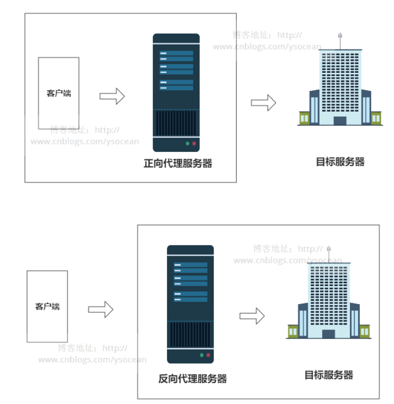
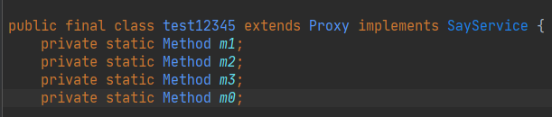
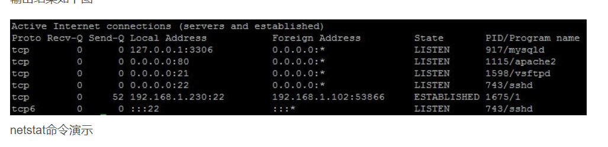
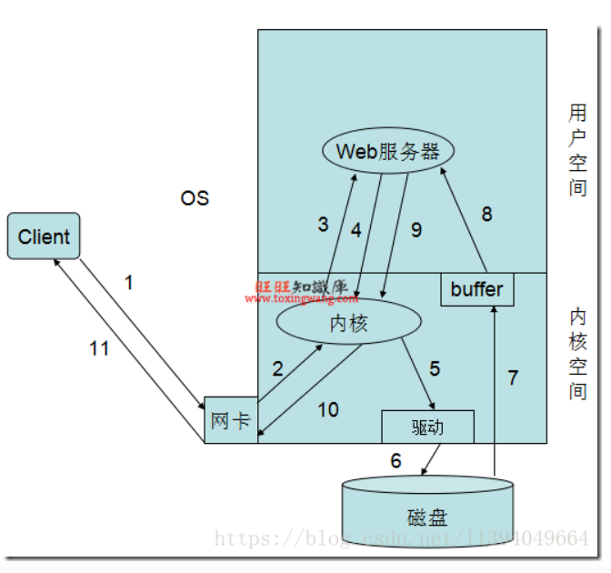
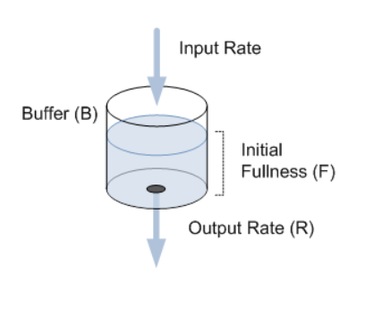
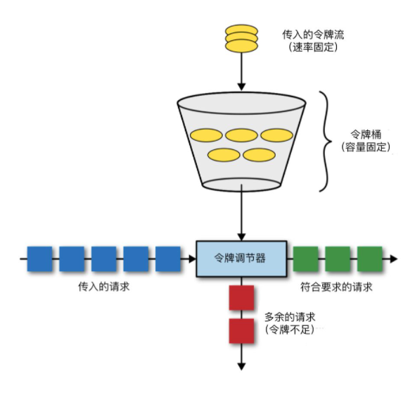
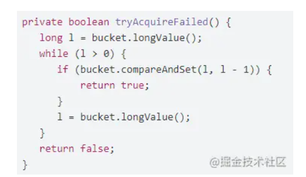

# 自我介绍

- 面试官您好, 我是程超群 应聘后端开发工程师 目前是Upen在读研究生
- 技术栈自己学习了Java, 随着学习的深入看过一些源码,  了解了相关的多线程, 以及不能说Java独有但是相关性很大的JVM的相关知识
- 计算机基础方面 
  - 个人确实对算法比较感兴趣的, 也是在不断提升算法相关知识的学习
  - 了解操作系统的进程内存管理 
  - 了解计算机网络, 了解对于TCP/IP模型中各层的一些主要协议 HTTP HTTPs TCP/UDP IP ARP 
- 数据库方面
  - 关系型 学习了 MySQL  
    - 了解存储引擎, 索引,mvcc相关的知识 
  - 非关系型 学习了Redis  
    - 了解了Redis的基本数据类型和5种对象类型, 线程模型, 以及分布式场景下缓存穿透, 击穿, 雪崩问题下的解决方法, 
- 项目方面主要实现了一个基于Raft算法的KV存储系统, 提供Put/Append/Get操作, 在Raft算法的基础上做了一些该进实现了数据库对外提供强一致性的服务
  - 学习了因为网络的不确定性 需要考虑网络带来的各种造成数据不一致的情况, 以及利用raft算法如何去尽量解决这些问题并且能够为客户端提供服务
  - 通过这个项目更加能够理解了很多的技术在某些场景下为什么要使用raft算法
    - 比如redis的哨兵模式选举局部领头以及redis主从复制模式下, 选出从节点代替主节点的过程都应用了raft算法的选主思想
- 对于开发常用的框架有一定初步的了解, 
  - 尝试去理解了 Spring IoC Aop 的原理, SpringMVC工作流程, SpringBoot的自动配置的原理
- 分布式相关
  - 了解分布式锁 redis zk
  - 分布式事务 2PC 3PC TCC(Try confirm cancel)


## 看的书 博客

深入理解JVM

redis设计与实现

从根上理解MySQL

图解TCP/IP  图解HTTP

最近在看哪些技术？平时会看哪些博客？

之后想往哪个方向发展，未来1-3年的规划


## 面经模板

### 操作系统


### 计网


### 数据结构 


### 算法


### 多线程


### MySQL


### Redis


### JVM


### 分布式


# 项目介绍

## 项目做了什么, 实现了什么

## 这个项目如何实现，遇到的困难，以及是如何解决的？

## 遇到了什么困难, 如何解决的

在学习中或者是项目中遇到过什么问题 举几个例子 说一下是怎么解决的


# 阿里 09/02 10:30 

## 阿里一面 09/02 复盘 (40min)

- 聊项目

  - 比较有挑战的项目是哪一个,
  - zk选举的闹裂问题如何解决
  - raft算法的大概的过程 没有问的很细

- hashmap 

  - 数据结构怎样的 数组+链表/红黑树
    - 解释了什么场景下会造成改变 8 64 
  - 为什么 使用红黑树 不使用AVL树
    - [ ] 答了红黑树的定义, AVL数的定义 表示不太理解为什么红黑树, 平衡度之间的差别
  - 1.8插入会不会造成环?
    - 1.7 头插法, 解释了会造成环的场景 线程1 获取 A, B = A.next 线程2进行了扩容的操作, 改变了结点next指针的指向, 线程1继续执行的时候结点指向改变导致了死循环

- 设计模式, 有没有用过

  - 答 单例 策略模式

- 设计模式的准则?

  - 聊的过程说了开闭 和 单一职责

    - 开放封闭原则：对扩展开放，对修改关闭。在程序需要进行拓展的时候，不能去修改原有的代码，实现一个热插拔的效果。

      单一职责原则：一个类、接口或方法只负责一个职责，降低代码复杂度以及变更引起的风险。

      依赖倒置原则：针对接口编程，依赖于抽象类或接口而不依赖于具体实现类。

      接口隔离原则：将不同功能定义在不同接口中实现接口隔离。

      里氏替换原则：任何基类可以出现的地方，子类一定可以出现。

      迪米特原则：每个模块对其他模块都要尽可能少地了解和依赖，降低代码耦合度。

      合成复用原则：尽量使用组合(has-a)/聚合(contains-a)而不是继承(is-a)达到软件复用的目的。

  - 依赖导致? 为什么是依赖导致, 为什么面向接口编程就是依赖倒置, 

    - [ ] 答?

- nginx 为什么是反向代理
  - 不会, 说了不了解,  解释了一下代理的过程, 客户端-> 代理服务器->真实服务器 再返回, 但是为什么是反向代理
  - 正向代理代理客户端，反向代理代理服务器。
  -  VPN 就是做正向代理的。正向代理服务器位于客户端和服务器之间，为了向服务器获取数据，客户端要向代理服务器发送一个请求，并指定目标服务器，代理服务器将目标服务器返回的数据转交给客户端。这里客户端是要进行一些正向代理的设置的。
  - 反向代理，其实客户端对代理是无感知的，因为客户端不需要任何配置就可以访问，我们只需要将请求发送到反向代理服务器，由反向代理服务器去选择目标服务器获取数据后，在返回给客户端，此时反向代理服务器和目标服务器对外就是一个服务器，暴露的是代理服务器地址，隐藏了真实服务器IP地址。
  - 
- 反向代理和正向代理的区别
  - 正向代理代理客户端，反向代理代理服务器。
- 聊Spring动态代理
  - Spring 的代理 用的什么
    - JDK 代理的是接口的实现类, 
    - CGLIB通过继承的方式
  - 为啥 JDK 动态代理需要接口?
    - [ ] 这真不知道, 说了 通过Proxy.newProxyInstance(类加载器, 接口, 代理对象(被代理对象))获得对应的代理对象
    - [ ] 然后代理对象通过继承InvoketionHandler重写invoke方法通过反射调用从而达到AOP的目的
- 分布式事务
  - 答了分布式事务造成的原因
  - 2PC 3PC 然后面试官说还是不能完全解决数据的不一致性, 只是3PC 
  - [ ] 分布式事务如何保证数据的一致性呢? 
    - 说了不管是2PC还是3PC我的理解是 3PC 只是在最后的阶段加了一个确认是否执行成功的步骤但是仍然有可能造成数据不一致
    - 因为有网络的存在, 很难做到完全的数据一致性
  - [ ] 思考, 这里是不是面试官想问分布式锁? 

- i++ ++i 是否是线程安全的
  - 不是的
- 这里挖了坑, 说volatile 可以保证原子性
  - 说了volatile可以保证内存可见, (主存获取最新数据, 操作完刷新到主存) 以及指令的重排序
  - 需要加锁
  - [x] 为什么volatile不能保证原子性?
    - 两个线程同时从主存读到了数据, 但是没有进行++ 的操作, 导致了不是原子性
- synchronized 修饰类方法和普通方法用的是什么锁
  - 静态方法 静态代码块 用的是类对象
  - 非静态方法 非静态代码块 用的是当前对象
- synchronized 和 reentrantlock 的区别
  - 说了synchronized 的锁升级, 也是可重入的
  - renentrantLock是sync内部类继承了AQS 实现的重量级锁 并且可重入
  - 可重入锁避免了死锁
- synchronized 和 reentrantlock 是否是公平锁
  - 说了reentrantlock默认是非公平的 可以通过指定参数来实现公平锁, 内部有两个NofailSync 和 fairSync实现对应的锁
  - synchronized 说不太清楚, 
  - 说了非公平锁线程进来的时候需要查看等待队列是否有前驱结点, 有的话就需要加入进入等待, 而非公平锁没有这个查看等待队列的过程, 进来就抢锁, 抢到了就拿到了
  - [x] synchronized是非公平锁
- 反问, 你有什么想问我的吗
  - 问了面试官对于刚进入行业的学生有什么建议?
    1. 不要过于追求项目, 有也可以 没有也没关系, 关键在于基础要牢固
    2. 对于学生自己做的项目很多时候在公司里都是用不到或者已经通过公司的自研做了修改, 仍然需要重新学习
    3. 所以对于操作系统,网路 这些基础需要掌握牢靠, 因为很多技术的最根本原理还是在于这些基础
  - 问了自己的疑惑, 对于很多基础的问题比如操作系统网络, 真的看了很多书,以及博客, 但是还是没有办法理解怎么办?
    1. 首先不需要焦虑, 因为可能是阅历不够导致的, 很多问题当下不懂, 过一段时间回过头来看发现就动了
    2. 同时这些不懂的问题一旦多看几遍弄懂了以后就会印象更加深刻
- 总的来说面试体验很好, 自己还是太菜了, 问深了一些问题还是不明白为什么, 还需要不断学习

- MySQL redis 计网 操作系统 都没问, 也没有算法题

### 阿里一面未解决问题的汇总

#### 设计模式的5大准则

- 依赖倒置原则：针对接口编程，依赖于抽象类或接口而不依赖于具体实现类
- 设计模式的依赖倒置原则: 为什么面向接口编程就是依赖倒置? 倒置的点体现在哪里?


#### hashmap为什么不用AVL树而用红黑树

https://blog.csdn.net/guorui_java/article/details/113827922?ops_request_misc=%257B%2522request%255Fid%2522%253A%2522163059420616780261977487%2522%252C%2522scm%2522%253A%252220140713.130102334.pc%255Fall.%2522%257D&request_id=163059420616780261977487&biz_id=0&utm_medium=distribute.pc_search_result.none-task-blog-2~all~first_rank_ecpm_v1~rank_v29-1-113827922.pc_search_ecpm_flag&utm_term=%E4%B8%BA%E4%BB%80%E4%B9%88hashmap%E7%94%A8%E7%BA%A2%E9%BB%91%E6%A0%91%E4%B8%8D%E4%BD%BF%E7%94%A8AVL%E6%A0%91&spm=1018.2226.3001.4187

在CurrentHashMap中是加锁了的，实际上是读写锁，如果写冲突就会等待，如果插入时间过长必然等待时间更长，而红黑树相对AVL树他的插入更快！

红黑树和AVL树都是**最常用的平衡二叉搜索树**，它们的查找、删除、修改都是O(lgn) time

AVL树和红黑树有几点比较和区别：

1. AVL树是更加严格的平衡，因此可以提供更快的查找速度，一般读取查找密集型任务，适用AVL树。
2. 红黑树更适合于插入修改密集型任务。
3. 通常，AVL树的旋转比红黑树的旋转更加难以平衡和调试。

**总结**：

1. AVL以及红黑树是高度平衡的树数据结构。它们非常相似，真正的区别在于在任何添加/删除操作时完成的旋转操作次数。
2. 两种实现都缩放为a O(lg N)，其中N是叶子的数量，
   1. 但实际上AVL树在查找密集型任务上更快：利用更好的平衡，树遍历平均更短。
   2. 另一方面，插入和删除方面，AVL树速度较慢：需要更高的旋转次数才能在修改时正确地重新平衡数据结构。
3. 在AVL树中，从根到任何叶子的最短路径和最长路径之间的差异最多为1。在红黑树中，差异可以是2倍。
4. 两个都给O（log n）查找，但平衡AVL树可能需要O（log n）旋转，而红黑树将需要最多两次旋转使其达到平衡（尽管可能需要检查O（log n）节点以确定旋转的位置）。旋转本身是O（1）操作，因为你只是移动指针。

#### ConcurrentHashMap为什么get操作不需要加锁

- Node .val .next 是volatile修饰保证了可见性

#### nginx反向代理和正常的VPN正向代理的区别(什么是正向代理什么是反向代理)

- 正向代理代理客户端，反向代理代理服务器。
-  VPN 就是做正向代理的。正向代理服务器位于客户端和服务器之间，为了向服务器获取数据，客户端要向代理服务器发送一个请求，并指定目标服务器，代理服务器将目标服务器返回的数据转交给客户端。这里客户端是要进行一些正向代理的设置的。
- 反向代理，其实客户端对代理是无感知的，因为客户端不需要任何配置就可以访问，我们只需要将请求发送到反向代理服务器，由反向代理服务器去选择目标服务器获取数据后，在返回给客户端，此时反向代理服务器和目标服务器对外就是一个服务器，暴露的是代理服务器地址，隐藏了真实服务器IP地址。
- 

#### 为什么JDK动态代理一定要接口? 不用接口不行吗?

1、生成的代理类继承了Proxy，由于java是单继承，所以只能实现接口，通过接口实现 

2、从代理模式的设计来说，充分利用了java的多态特性，也符合基于接口编码的规范 

- 创建接口, 接口实现类
- 创建类实现InvocationHandler 接口 重写invoke方法
  - 传入代理对象
  - 需要增强的方法
  - 方法的参数
  - 通过method.invoke(被代理对象, 方法参数) 反射调用被代理对象的方法
  - 最后返回动态生成的代理对象
- 因为这个生成的代理对象继承了Proxy 所以只能通过实现接口的方式和被代理对象产生联系
- 这个生成的代理对象通过反编译字节码得到的类 发现继承了Proxy类并且实现了被代理对象实现的接口
- 


JDK的动态代理是靠多态和反射来实现的，

https://blog.csdn.net/u014301265/article/details/102832131?ops_request_misc=%257B%2522request%255Fid%2522%253A%2522163057188116780269812216%2522%252C%2522scm%2522%253A%252220140713.130102334.pc%255Fall.%2522%257D&request_id=163057188116780269812216&biz_id=0&utm_medium=distribute.pc_search_result.none-task-blog-2~all~first_rank_ecpm_v1~rank_v29-7-102832131.pc_search_ecpm_flag&utm_term=%E4%B8%BA%E4%BB%80%E4%B9%88JDK%E5%8A%A8%E6%80%81%E4%BB%A3%E7%90%86%E4%B8%80%E5%AE%9A%E8%A6%81%E6%8E%A5%E5%8F%A3%3F&spm=1018.2226.3001.4187

- 它生成的代理类需要实现你传入的接口，并通过反射来得到接口的方法对象（下文中的m3），
- 并将此方法对象传参给增强类（上文中的WavingInvocationHandler类）的invoke方法去执行，从而实现了代理功能，
- 故接口是jdk动态代理的核心实现方式，没有它就无法通过反射找到方法，所以这也是必须有接口的原因。
- 同时生成的代理对象继承了Proxy 类, 所以必须通过实现接口达到和被代理对象产生联系

JDK动态代理生成代理类的代码逻辑

- Proxy.newProxyInstance(ClassLoader loader, Class<?>[] interfaces, InvocationHandler h)
- Proxy.newProxyInstance
  - 调用getProxyClass0
  - proxyClassCache是Proxy的静态变量，是WeakCache类，里面封装了两个类KeyFactory、ProxyClassFactory，都是BiFunction函数式接口，作转换用
  - 关注`ProxyClassFactory#apply`方法，其内调用了`ProxyGenerator#generateProxyClass`方法，利用asm字节码重组，生成了代理的字节文件，再调用`defineClass0`native方法，加载到jvm中。
  - 可以看到，生成的代理类居然继承了Proxy，我们知道java是单继承的，所以JDK动态代理只能代理接口。

#### 学习CGLIB动态代理

https://blog.csdn.net/flyfeifei66/article/details/81481222?ops_request_misc=%257B%2522request%255Fid%2522%253A%2522163057188116780269812216%2522%252C%2522scm%2522%253A%252220140713.130102334.pc%255Fall.%2522%257D&request_id=163057188116780269812216&biz_id=0&utm_medium=distribute.pc_search_result.none-task-blog-2~all~first_rank_ecpm_v1~rank_v29-6-81481222.pc_search_ecpm_flag&utm_term=%E4%B8%BA%E4%BB%80%E4%B9%88JDK%E5%8A%A8%E6%80%81%E4%BB%A3%E7%90%86%E4%B8%80%E5%AE%9A%E8%A6%81%E6%8E%A5%E5%8F%A3%3F&spm=1018.2226.3001.4187

#### volatile为什么不能保证原子性

- 可见性

可见性与Java的内存模型有关，模型采用缓存与主存的方式对变量进行操作，也就是说，每个线程都有自己的缓存空间，对变量的操作都是在缓存中进行的，之后再将修改后的值返回到主存中，这就带来了问题，有可能一个线程在将共享变量修改后，还没有来的及将缓存中的变量返回给主存中，另外一个线程就对共享变量进行修改，那么这个线程拿到的值是主存中未被修改的值，这就是可见性的问题。

volatile很好的保证了变量的可见性，变量经过volatile修饰后，对此变量进行写操作时，汇编指令中会有一个LOCK前缀指令，这个不需要过多了解，但是加了这个指令后，会引发两件事情：

将当前处理器缓存行的数据写回到系统内存
这个写回内存的操作会使得在其他处理器缓存了该内存地址无效
什么意思呢？意思就是说当一个共享变量被volatile修饰时，它会保证修改的值会立即被更新到主存，当有其他线程需要读取时，它会去内存中读取新值，这就保证了可见性。

- 原子性

问题来了，既然它可以保证修改的值立即能更新到主存，其他线程也会捕捉到被修改后的值，那么为什么不能保证原子性呢？
首先需要了解的是，Java中只有对基本类型变量的赋值和读取是原子操作，如i = 1的赋值操作，但是像j = i或者i++这样的操作都不是原子操作，因为他们都进行了多次原子操作，比如先读取i的值，再将i的值赋值给j，两个原子操作加起来就不是原子操作了。

所以，如果一个变量被volatile修饰了，那么肯定可以保证每次读取这个变量值的时候得到的值是最新的，但是一旦需要对变量进行自增这样的非原子操作，就不会保证这个变量的原子性了。

- 举个栗子


一个变量i被volatile修饰，两个线程想对这个变量修改，都对其进行自增操作也就是i++，i++的过程可以分为三步，首先获取i的值，其次对i的值进行加1，最后将得到的新值写会到缓存中。
线程A首先得到了i的初始值100，但是还没来得及修改，就阻塞了，这时线程B开始了，它也得到了i的值，由于i的值未被修改，即使是被volatile修饰，主存的变量还没变化，那么线程B得到的值也是100，之后对其进行加1操作，得到101后，将新值写入到缓存中，再刷入主存中。根据可见性的原则，这个主存的值可以被其他线程可见。
问题来了，线程A已经读取到了i的值为100，也就是说读取的这个原子操作已经结束了，所以这个可见性来的有点晚，线程A阻塞结束后，继续将100这个值加1，得到101，再将值写到缓存，最后刷入主存，所以即便是volatile具有可见性，也不能保证对它修饰的变量具有原子性。

#### synchronized 和 reentrantLock的区别

https://juejin.cn/post/6921902399799951373

- synchronized是属于jvm层面的的关键字,底层通过monitorenter、monitorexit指令实现的；而lock是属于一个类。
- synchronized在代码执行异常时或正常执行完毕后，jvm会自动释放锁；而lock不行使用lock必须加上异常处理，而且必须在finally块中写上unlock()释放锁。
- synchronized不可中断，只能等待程序执行完毕或者异常退出；而lock可通过interrupt来中断，
- synchronized不能精确唤醒指定的线程；而lock可以通过Condition精确唤醒。
- synchronized无法判断锁的状态，从而无法知道是否获取锁；而lock可以判断锁的状态,

##### 使用方式

- Synchronized可以修饰实例方法，静态方法，代码块。**自动释放锁。**
- ReentrantLock一般需要try catch finally语句，在try中获取锁，在finally释放锁。需要**手动释放锁。**

##### 实现方式

- Synchronized是重量级锁。重量级锁需要将线程从内核态和用户态来回**切换**。
  - 如：A线程切换到B线程，A线程需要保存当前现场，B线程切换也需要保存现场。这样做的**缺点是耗费系统资源**。

- [ ] ReentrantLock是轻量级锁。**采用cas+volatile管理线程**，不需要线程切换切换，获取锁线程觉得自己肯定能成功，这是一种**乐观的思想**（可能失败）。?

##### 公平和非公平

- Synchronized只有非公平锁。
- ReentrantLock提供公平和非公平两种锁，默认是非公平的。公平锁通过构造函数传递true表示。

##### 可重入锁

- Synchronized和ReentrantLock都是可重入的，
  - Synchronized是本地方法是C++实现，而ReentrantLock是JUC包用Java实现。
  - 在ReentrantLock中，重入次数用整形state表示。进入1次递增1次，出来1次递减1次。

##### 可中断的

- Synchronized是不可中断的。
- ReentrantLock提供可中断和不可中断两种方式。
  - 其中lockInterruptibly方法表示可中断，lock方法表示不可中断。

##### 条件队列

- Synchronized只有一个等待队列。
- ReentrantLock中一把锁可以对应多个条件队列。通过newCondition表示。

- 同步队列：多线程同时竞争一把锁失败被挂起的线程。

- 条件队列：正在执行的线程调用await/wait，从同步队列加入的线程会进入条件队列。正在执行线程调用signal/signalAll/notify/notifyAll，会将条件队列一个线程或多个线程加入到同步队列。

- 等待队列：和条件队列一个概念。

  

#### AQS

AQS：也就是队列同步器，这是实现 ReentrantLock 的基础。

AQS 有一个 state 标记位，值为1 时表示有线程占用，其他线程需要进入到同步队列等待，同步队列是一个双向链表。

当获得锁的线程需要等待某个条件时，会进入 condition 的等待队列，等待队列可以有多个。

当 condition 条件满足时，线程会从等待队列重新进入同步队列进行获取锁的竞争。

ReentrantLock 就是基于 AQS 实现的，如下图所示，ReentrantLock 内部有公平锁和非公平锁两种实现，差别就在于新来的线程是否比已经在同步队列中的等待线程更早获得锁。


#### synchronized是否是公平锁

- 偏向锁的阶段不存在竞争第一个获取的线程拿到了锁
- 轻量级锁的过程, 所有的线程通过CAS的方式来将自己线程栈生成的锁记录放置到锁对象的对象头markword中
  - 是不是这里因为所有线程同时抢锁 所以才是非公平锁?
- 锁竞争加剧以后 升级成重量级锁mutex 锁对象指向系统的mutex

**同步方法和同步代码**块底层都是通过monitor来实现同步的。

两者的区别：同步方式是通过方法中的access_flags中设置ACC_SYNCHRONIZED标志来实现，同步代码块是通过monitorenter和monitorexit来实现。

#### 分布式事务如何保证数据的一致性


## 阿里笔试

### 第一题

```java
public class Ali_p1 {
    /**
     *
     * @param args
     */
    /**
     * n个数的数组, 可以k次任选数组中一个数+1, 使得操作k次以后 使得n个数中最大的数最小
     * @param num n个数的数组
     * @param k 表示可以选择一个数+1的次数
     * @return
     */
    public int findMaxWithKAdd(int[] num, long k){
        long sum = 0, max = 0;
        //数组求和以及求最大值
        for(int i=0; i<n; i++){
            sum += num[i];
            max = Math.max(num[i], max);
        }
        //计算需要使得全部为max
        long diff = n*max-sum;
        //如果这个差距>=k 那么执行k次操作不会改变最大值, 直接返回
        if(k<=diff){
            return max;
        }
        //将所有的数都变成max以后, 还剩下的操作数
        long rem = k-diff;
        //每个数都+ rem/n 
        max = max + (rem/n);
        //如果还剩下操作数, 那么最大的数最多在现在的基础上+1
        if(rem%n>0){
            max+=1;
        }
        //返回最大值
        return max;

    }
	//ACM形式
    public static void main(String[] args){
        Scanner sc = new Scanner(System.in);
        int n = sc.nextInt();
        long k = sc.nextLong();
        long sum = 0, max = 0;
        //数组求和以及求最大值
        for(int i=0; i<n; i++){
            long cur = sc.nextLong();
            sum += cur;
            max = Math.max(cur, max);
        }
        //计算需要使得全部为max
        long diff = (n-1)*max-(sum-max);
        if(k<=diff){
            System.out.println(max);
            return;
        }
        long rem = k-diff;
        max = max + (rem/n);
        if(rem%n>0){
            max+=1;
        }
        System.out.println(max);

    }
}
```


### 第二题

```java
public class Ali_P2 {

    @Test
    public void test(){
        int[][] matrix = new int[][]{
                {0,0,0},
                {1,1,1},
                {0,0,0}
        };
        int[][] pos = new int[][]{
                {0,0},
                {0,2},
                {2,0},
                {2,2}
        };
        int res = findMinMoveTime(matrix, pos);
        System.out.println(res);
    }
    /**
     *
     * @param matrix n*m的矩阵, 0代表陆地, 1代表沼泽 2代表军队
     * @param pos k*2的矩阵, 每行代表一个军队在矩阵的坐标,
     *            [i,j]位置的军队可以向周围的四个方向移动,移动的耗时都是1
     * @return 求 矩阵的一个位置使得所有军队都移动到这个位置的时间最短, 所有军队移动到这个位置的时间取决于移动到这个位置时间最长的军队
     * 转换成求两个军队的最短路径然后除以2?
     */
    public int findMinMoveTime(int[][] matrix, int[][] pos){
        int[][] dir = new int[][]{{1,0},{0,1},{-1,0},{0,-1}};
        //在矩阵中, 0位陆地, 1为沼泽不能到达, 军队为2
        for(int i=0; i<pos.length; i++){
            matrix[pos[i][0]][pos[i][1]] = 2;
        }
        //军队数量
        int k = pos.length;
        //最后结果
        int res = Integer.MAX_VALUE;
        //遍历矩阵
        for(int i=0; i<matrix.length; i++){
            for(int j=0; j<matrix[0].length; j++){
                //从每个0开始BFS遍历到所有军队位置
                if(matrix[i][j]==0){
                    int cur = bfs(matrix, dir, k, i, j);
                    //可以到达所有军队
                    if(cur!=-1){
                        //保留更小的
                        res = Math.min(res, cur);
                    }
                }
            }
        }
        return res ==Integer.MAX_VALUE?-1:res;
    }

    public  int bfs(int[][] matrix, int[][] dir, int k, int x, int y){
        boolean[][] visited = new boolean[matrix.length][matrix[0].length];
        Deque<int[]> queue = new ArrayDeque<>();
        queue.offer(new int[]{x,y});
        visited[x][y] = true;
        //[x,y]点出发达到所有军队的时间
        int dist = -1;
        while(!queue.isEmpty()){
            dist++;
            for(int m=queue.size(); m>0; m--){
                int[] cur = queue.poll();
                int row = cur[0], col = cur[1];
                visited[row][col] = true;
                //遍历到一个军队就-1
                if(matrix[row][col]==2){
                    k--;
                }
                //所有军队都遍历到了, 返回当前用的时间
                if(k==0){
                    return dist;
                }
                //将周围四个合法的点加进去, 只加载范围内 并且 没被访问过, 并且不是沼泽
                for(int i=0; i<dir.length; i++){
                    int newX = x+dir[i][0];
                    int newY = y+dir[i][1];
                    if(inArea(matrix, newX, newY) && !visited[newX][newY] && matrix[newX][newY]!=1){
                        queue.offer(new int[]{newX, newY});
                    }
                }
            }

        }
        return -1;
    }
    public boolean inArea(int[][] matrix, int i, int j){
        return 0<=i && i<matrix.length && 0<=j && j<matrix[0].length;
    }

}
```


## 部门干啥的


## 阿里面经

### 操作系统

#### 进程和线程

#### 虚拟内存是什么，虚拟内存的原理是什么

虚拟地址是操作系统为每个进程分配的自己的独立的地址空间,

通过MMU内存映射单元将每个进程的虚拟地址映射到对应的物理内存地址上, 这样CPU就可以操作虚拟地址对应的物理内存地址了

#### 进程和线程

进程的状态

- 初始, 就绪, 运行, 等待, 停止

进程和线程的区别

- 调度
- 拥有资源
- 切换消耗
- 系统开销

线程的同步机制

- 临界区, 互斥量, 信号量, 事件

#### 进程调度算法

- FIFO
- 最短作业
- 最短剩余时间
- 最短进程
- 时间片
- 优先级
- 多级队列

#### 死锁的定义和四个条件以及怎样解除死锁

两个或多个进程持有一部分资源并且等待其他进程释放他们持有的资源形成了环路的等待, 就是死锁

- 互斥
- 持有并等待
- 不可侵占
- 循环等待

解除

- 挂起某些进程, 将资源分配给其他死锁进程
- 回退到不产生死锁的位置


### 算法

反转链表

统计一篇英文文章中出现频率最高的3个单词, 最高的n个单词

有序链表去除重复数字

编辑距离

求无序数组中topn的数？

快速排序的时间复杂度？

9.怎么判断一个链表是否有环？
10.如何判断两个链表相交？
11.有99个范围为1-100的不重复值，怎么快速判断缺少的那个数？（挺好的，面试官还有引导）

有向图判断是否有环 (头一次被问图论)
数据流中求top k

1.怎样找到链表倒数第K个节点
2.怎样反转单链表
3.怎样判断两个链表相交，以及交点怎么找
4.两个二叉树，怎么判断一个是另一个的子树

两数之和
三数之和
四数之和

1毛，2毛，3毛，5毛组成1块有几种方案，讲思路

一个无序数组中第k大的数字

10. 快速排序的过程
11.快速排序用到了什么思想 
答: 递归 分治，不知道还有什么

### 数据结构

#### 树

完美二叉树(Perfect Binary Tree)

- 深度为k(>=-1)且有2^(k+1) - 1个结点的二叉树称为完美二叉树

完全二叉树(Complete Binary Tree)

- 完全二叉树从根结点到倒数第二层满足完美二叉树，最后一层可以不完全填充，其叶子结点都靠左对齐。

满二叉树(Full Binary Tree)

- 所有非叶子节点都有两个子节点

什么是二叉查找树，查找的时间复杂度是多少，最坏情况又是多少。

- logn 
- n

有什么数据结构优化二叉查找树 

- （AVL树，红黑树）

AVL树的定义是什么

- 树中某结点其左子树的高度和右子树的高度之差<2

- `AVL树`大部分操作都和`BST树`相同, 只有在插入删除结点时, 有可能造成`AVL树`失去平衡, 而且只有那些在被插入/删除结点到根节点的路径上的结点有可能出现失衡, 因为只有那些结点的子树结构发生了变化
- 当插入新结点导致不平衡时, 我们需要找到距离新节点`最近`的不平衡结点为轴来转动`AVL树`来达到平衡

#### hashmap

hashmap

- 数组+链表/红黑树

hashmap和hashtable的区别

- 继承父类不同  AbstractMap Dictionary
- 对外接口不同 elements contains
- Null Key Null value不同 
- 线程安全 synchronized
- 初始容量 扩容大小  16 2n 11 2n+1
- 计算hash的方法 obj.hashcode, key==null?0:hash>>>16 ^ hash

hashtable性能差，可以如何改进

- concurrentHashmap 数组的每个位置加锁

ConcurrentHashMap的数据结构？底层是怎么实现的？

- 1.7 Segment 数组结构和 HashEntry 数组结构组成
- 1.8 数组+链表/红黑树

ConcurrentHashMap hashcode的原理（是不是数据结构内部实现的）和塞到链表里面怎么做的

- 高16位和低16位异或, 并且保证在可用的范围内

- ```
  (h ^ (h >>> 16)) & HASH_BITS;
  ```

为什么hashmap里面用了红黑树，红黑树怎么保证并发

- 增加产生hash碰撞位置的查询效率
- 需要concurrentHashMap


#### StringBuilder和StringBuffer的区别

- StringBuffer 线程安全, 方法+synchronized

StringBuilder底层是什么类型, 如何扩容

- 继承AbstractStringBuilder , 底层实现是char[] 数组
- 初始默认容量是16 super(16)
- 扩容, super.append(obj) 
  - 计算当前使用的容量+新的append的对象的长度 是否>char[] 数组的长度, 需要时扩容到这个长度


### 计网

https://juejin.cn/post/6844903832435032072

强制缓存


缓存协商


#### TCP三次握手 四次挥手

tcp创建连接的过程

tcp为何要3次握手

讲一下TCP为什么要三次握手，不是二次握手

要是三次握手第三次的ack丢了怎么办（emmmm，看网上都说服务端会等3、6、15秒重发，[客户端]()则会发送数据然后收到对面传来的rst报文。我这里其实答的很模糊，因为之前没有看过相关回答，所以我就自己推断了一下说如果[客户端]()马上发送数据的话会把这个ack给补上，所以理论上应该没影响，如果[客户端]()没有发数据的话服务端会认为第二次握手丢失然后重发第二次握手。ps：有些小伙伴做了实验好像真的没影响，这里给我整不会了，希望大神能帮忙解答一下）

服务端超时重传5次，客户端已经established，不影响


tcp四次挥手；
服务器大量的socket处于close_wait状态；

#### 跨域

为什么浏览器要禁止跨域

- XSS CSRF 减少跨站伪造, 脚本攻击

#### Cookie Session

HTTP是有状态的还是无状态的

- 无状态
- HTTP 协议自身不对请求和响应之间的通信状态进行保存。也就是说在 HTTP 这个级别，协议对于发送过的请求或响应都不做持久化处理

cookie和session的区别 (星巴克记录每个客户消费的数量 满10减1)

- cookie机制采用的是在客户端保持状态的方案，(分给顾客一张卡片，每消费一次记录一次, 客户端记录)
  - Cookie实际上是一小段的文本信息。客户端请求服务器，如果服务器需要记录该用户状态，就使用response向客户端浏览器颁发一个Cookie
  - 客户端浏览器会把Cookie保存起来。当浏览器再请求该网站时，浏览器把请求的网址连同该Cookie一同提交给服务器。服务器检查该Cookie，以此来辨认用户状态。
  - cookie 可以让服务端程序跟踪每个客户端的访问，但是每次客户端的访问都必须传回这些Cookie，如果 Cookie 很多，这无形地增加了客户端与服务端的数据传输量，
  - cookie不是很安全，别人可以分析存放在本地的cookie并进行cookie欺骗，考虑到安全应当使用session
- session机制采用的是在服务器端保持状态的方案。(发给顾客一张卡片，上面有卡号，顾客每消费一次，由店员在操作机上记录一次。服务端)
  - 同一个客户端每次和服务端交互时，不需要每次都传回所有的 Cookie 值，而是只要传回一个 ID，这个 ID 是客户端第一次访问服务器的时候生成的, 而且每个客户端是唯一的
  - 这样每个客户端就有了一个唯一的 ID，客户端只要传回这个 ID 就行了，这个 ID 通常是 NANE 为JSESIONID 的一个 Cookie。
  - 由于采用服务器端保持状态的方案在客户端也需要保存一个标识，所以session机制可能需要借助于cookie机制来达到保存标识的目的
  - session会在一定时间内保存在服务器上。当访问增多，会比较占用你服务器的性能，考虑到减轻服务器性能方面，应当使用cookie

使用cookie的缺点

- cookie可以被用户禁止
- cookie不安全(对于敏感数据，需要加密)
- cookie只能保存少量的数据(大约是4k)，cookie的数量也有限制(大约是几百个)，不同浏览器设置不一样，反正都不多
- cookie只能保存字符串

使用session的缺点

- session是将用户信息储存在服务器上面,如果访问服务器的用户越来越多,那么服务器上面的session也越来越多, session会对服务器造成压力，影响服务器的负载

session具体使用上会有一个什么缺陷，如何解决

- Session同步
- 粘性会话
- 会话复制
- 集中会话


#### http和https的区别；

- 通信数据是否加密
- 是否验证通信方的身份
- 数据传输过程中完整性的校验

https中ssl中握手的细节；

证书校验具体怎么实现的；


#### 输入url到返回的查询过程；

- DNS解析 域名-> IP地址
- TCP三次握手建立连接
- 生成HTTP报文, 请求
- ARP协议将IP->MAC
- 服务器重组报文段
- 获取请求资源, 
- 返回
- HTML解析 渲染

#### TCP/UDP区别

- 面向连接
- 是否可靠
- 是否流量控制和拥塞避免
- 传输形式

 tcp的三大特点，只说了面向连接和可靠，还有一个字节流忘了

#### OSI七层模型和TCP五层模型

https://blog.csdn.net/qq_36756682/article/details/104112765

第一层：物理层

        在OSI参考模型中，物理层是参考模型的最低层，也是OSI模型的第一层。
        物理层的主要功能是：利用传输介质为数据链路层提供物理连接，实现比特流的透明传输。
        物理层的作用是实现相邻计算机节点之间比特流的透明传送，尽可能屏蔽掉具体传输介质和物理设备的差异，使其上面的数据链路层不必考虑网络的具体传输介质是什么。

第二层：数据链路层

       数据链路层（Data Link Layer）是OSI模型的第二层，负责建立和管理节点间的链路。在计算机网络中由于各种干扰的存在，导致物理链路是不可靠的。
       因此这一层的主要功能是：在物理层提供的比特流的基础上，通过差错控制、流量控制方法，使有差错的物理线路变为无差错的数据链路，即提供可靠的通过物理介质传输数据的方法。

第三层：网络层

       网络层（Network Layer）是OSI模型的第三层，它是OSI参考模型中最复杂的一层，也是通信子网的最高一层，它在下两层的基础上向资源子网提供服务。其主要功能是：在数据链路层提供的两个相邻端点之间的数据帧的传送功能上，进一步管理网络中的数据通信，控制数据链路层与传输层之间的信息转发，建立、维持和终止网络的连接，将数据设法从源端经过若干个中间节点传送到目的端（点到点），从而向传输层提供最基本的端到端的数据传输服务。具体地说，数据链路层的数据在这一层被转换为数据包，然后通过路径选择、分段组合、顺序、进/出路由等控制，将信息从一个网络设备传送到另一个网络设备。数据链路层和网络层的区别为：数据链路层的目的是解决同一网络内节点之间的通信，而网络层主要解决不同子网间的通信。

第四层：传输层

       OSI下3层的任务是数据通信，上3层的任务是数据处理。而传输层（Transport Layer）是OSI模型的第4层。该层提供建立、维护和拆除传输连接的功能，起到承上启下的作用。该层的主要功能是：向用户提供可靠的端到端的差错和流量控制，保证报文的正确传输，同时向高层屏蔽下层数据通信的细节，即向用户透明地传送报文。

第五层：会话层

       会话层是OSI模型的第5层，是用户应用程序和网络之间的接口，该层的主要功能是：组织和协调两个会话进程之间的通信  ，并对数据交换进行管理。当建立会话时，用户必须提供他们想要连接的远程地址。而这些地址与MAC地址或网络层的逻辑地址不同，它们是为用户专门设计的，更便于用户记忆。域名就是一种网络上使用的远程地址。会话层的具体功能如下：

会话管理：允许用户在两个实体设备之间建立、维持和终止会话，并支持它们之间的数据交换。
会话流量控制：提供会话流量控制和交叉会话功能。
寻址：使用远程地址建立会话连接。
出错控制：从逻辑上讲会话层主要负责数据交换的建立、保持和终止，但实际的工作却是接收来自传输层的数据，并负责纠正错误。
第六层：表示层

       表示层是OSI模型的第六层，它对来自应用层的命令和数据进行解释，对各种语法赋予相应的含义，并按照一定的格式传送给会话层。该层的主要功能是：处理用户信息的表示问题，如编码、数据格式转换和加密解密等。表示层的具体功能如下：

数据格式处理：协商和建立数据交换的格式，解决各应用程序之间在数据格式表示上的差异。
数据的编码：处理字符集和数字的转换。
压缩和解压缩：为了减少数据的传输量，这一层还负责数据的压缩与恢复。
数据的加密和解密：可以提高网络的安全性。
第七层：应用层

       应用层是OSI参考模型的最高层，它是计算机用户，以及各种应用程序和网络之间的接口，该层的主要功能是：直接向用户提供服务，完成用户希望在网络上完成的各种工作。它在其他6层工作的基础上，负责完成网络中应用程序与网络操作系统之间的联系，建立与结束使用者之间的联系，并完成网络用户提出的各种网络服务及应用所需的监督、管理和服务等各种协议。此外该层还负责协调各个应用程序间的工作。应用层的具体功能如下：

用户接口：应用层是用户与网络，以及应用程序与网络间的直接接口，使得用户能够与网络进行交互式联系。
实现各种服务：该层具有的各种应用程序可以完成和实现用户请求的各种服务。
3.OSI七层模型举例
       举例：以A公司向B公司发送一次商业报价单为例。

       应用层：A公司相当于实际的电脑用户，要发送的商业报价单相当于应用层提供的一种网络服务，当然A公司也可以选择其他服务，比如发一份商业合同，发一份询价单等等。
    
       表示层：由于A公司和B公司是不同国家的公司，他们之间商定统一用英语作为交流语言，所以此时A公司的文秘（表示层）将从上级手中（应用层）获取到的商业报价单的语言转翻译成英语，同时为了防止被别的公司盗取机密信息，A公司的文秘也会对这份报价单做一些加密的处理。这就是表示层的作用，将应用层的数据转换翻译。
    
       会话层：A公司外联部同事（会话层）掌握着其他许多公司的联系方式，他们负责管理本公司与外界许多公司的联系会话。当外联部同事拿到文秘（表示层）转换成英文的商业报价单后，他首先要找到B公司的地址信息，并附上自己的地址和联系方式，然后将整份资料放进信封准备寄出。等确认B公司接收到此报价单后，外联部的同事就去办其他的事情了，继而终止此次会话。
    
       传输层：传输层就相当于A公司中的负责收发快递邮件的人，A公司自己的投递员负责将上一层（会话层）要寄出的资料投递到快递公司或邮局。
    
       网络层：网络层就相当于快递公司庞大的快递网络，全国不同的集散中心，比如说从深圳发往北京的顺丰快递，首先要到顺丰的深圳集散中心，从深圳集散中心再送到武汉集散中心，从武汉集散中心再寄到北京顺义集散中心。这个每个集散中心，就相当于网络中的一个IP节点。
    
       数据链路层：相当于顺丰快递内部为了保证效率和质量的一种内部操作。
    
       物理层：快递寄送过程中的交通工具，就相当于物理层，例如汽车，火车，飞机，船。

4.OSI七层模型总结
       应用层：产生网络流量的程序

       表示层：传输之前是否进行加密或者压缩处理
    
       会话层：查看会话，查木马  netstat-n
    
       传输层：可靠传输、流量控制、不可靠传输
    
       网络层：负责选择最佳路径、规划ip地址
    
       数据链路层：帧的开始和结束、透明传输、差错校验
    
       物理层：接口标准、电器标准、如何更快传输数据


osi七层模型

每一层大概讲一下

http请求出去后，每一层都做了什么，讲具体，越具体越好（结结巴巴，被叫停了，尬死了）

TCP/IP协议的分层？五层模型各层的作用？


#### ipv4和ipv6的区别；

- IPv6要求路由器不进行数据的分片和重组, 而是只由端点的服务器客户端执行
- 长度不同=--


### redis

#### 缓存和数据库的一致性如何保证？

- 先删缓存 再写数据库
  - 缓存修改为特殊值, 写完数据库更新缓存
  - 延时双删: 删缓存, 写数据库, 过一会再删缓存
- 先写数据库, 再删缓存
  - 缓存设置过期时间
  - 热点数据永不过期, value设置逻辑过期时间, 后台线程扫描, 发现过期以后更新对应的热点数据
- 我们始终只能保证一定时间内的最终一致性

#### 缓存预热怎么做的？

缓存预热就是系统上线后，将相关的缓存数据直接加载到缓存系统。

这样就可以避免在用户请求的时候，先查询数据库，然后再将数据缓存的问题！用户直接查询事先被预热的缓存数据！

#### redis的淘汰策略

什么场景下要选择从从过期数据中lru的淘汰策略 或者问 该怎么挑选redis的淘汰策略

- 内存空间不足了, 我必须淘汰一部分空间来放我的新的缓存
- \1. noeviction：默认禁止驱逐数据。内存不够使用时，对申请内存的命令报错。 
  \2. volatile-lru：从设置了过期时间的数据中淘汰最近没使用的数据。 
  \3. volatile-ttl：从设置了过期时间的数据中淘汰即将要过期的数据。 
  \4. volatile-random：从设置了过期时间的数据中随机淘汰数据。 
  \5. allkeys-lru：淘汰最近没使用的数据。 
  \6. allkeys-random：随机淘汰数据。

- 机制有 lru ttl  random 可以所有key也可以存在过期时间key中挑选

#### 分布式Redis场景

说一下缓存穿透是什么，

- 缓存没有 数据库没有

怎么解决缓存穿透（说到布隆过滤器）

- 缓存设置key-null 后续请求不会打到数据库
- 布隆过滤器, 
  - 多个hash函数得到hash值跟新bitmap
  - 对于请求key做同样操作, 某个hash对应位置是1但是bitmap是0 那么一定不存在
  - 不能准确判断, 只能过滤, 不能取出元素, 不能删除元素

那缓存击穿呢

- 缓存没有, 数据库有
- 热点key过期了, 根本没有放入缓存的数据的大量访问

如何解决缓存击穿

- 设置热点key永不过期, 
- 分布式锁

缓存雪崩

- 缓存不存在, 数据库存在,  并发访问大量缓存不存在的key

- 热点key过期时间随机
- 分布式锁, 每个key只有一个请求到达数据库

redis怎么实现分布式锁

- set key value nx px 
- 不存在就设置, 并且设置过期时间 原子操作
- watchdog 续期
- UUID标识哪个锁是哪个线程锁的
- 上锁解锁必须一个线程
- HA高可用, 可以使用redlock 向集群申请锁, 获得n/2+1就获取成功 并且锁还没过期

#### redis数据结构的应用场景

那问一下数据结构中的bitmap是干什么的

- 统计用户的登录天数
  - key : 用户 value:365bits 1代表登录
- 统计活跃用户
  - key: 日期 value: 每个bit代表每个用户

redis说一下使用场景

- 缓存
- 分布式锁 set nx px
- 统计用户的登录天数活跃天数  bitmap
- 文章评论 粉丝列表 list
- 抽奖 共同关注 set

#### 主从、哨兵和集群的区别

哨兵 (监视主从服务器, 达到自动进行故障转移的功能)

- 由一个或多个Sentinel实例组成的Sentinel系统, 可以监视任意多个主服务器以及这些主服务器的所有从服务器
- 被监视的主服务器下线, 自动将下线主服务器的某个从服务器升级为新的主服务器, 新的主服务器代替下线的主服务处理命令请求
- Info 获取主从服务器的信息 ip+port
- Sentinel发送的消息会被其他监视这个主服务器的Sentinel感知到, 并且建立向这些Sentinel之间的链接, 形成一个Sentinel网络

检测服务器下线

- PING命令 检测是否主观下线
- 询问其他sentinel是否主观下线
- 收到一定数量的主观下线就设置为客观下线, 并且这个设置会被其他sentinel感知到
- 所有sentinel 通过raft算法选举, 局部领头来对这个服务器进行故障转移挑选新的从节点代替

redis部署方式有几种

- 哨兵模式
- 主从复制
- 分片模式

主从 

- 完全复制
  - SYNC ==> BGSAVE 生成RDB ==> 发送RDB ==> 传播BGSAVE期间的命令

- RUNID offset 确定 完全复制还是部分复制 (SYNC PSYNC)
- 复制积压缓冲区决定是否能部分复制

集群模式

- 集群的每个结点负责一部分的哈希槽数据, 一个16384个槽位
- clusterNode 结果记录当前结点状态 并且为其他结点创建对应的结果 slots数据记录当前结点负责哪些槽
- ClusterState 是当前结点的视角下, 集群的状态 slots数组记录每个哈希槽由哪个结点负责
- 通过这两个结果可以快速的找出当前结点负责的槽, 和某个槽是由哪个结点负责的
- 故障转移
  - 结点之间PING命令检测对方是否在线
  - 一定时间没有回复标记结点疑似下线, 超过半数标记就认为结点下线
  - 从节点对主节点进行故障转移, 
  - 从节点要求负责槽的主节点投票给自己, 获得半数以上选票的当选, 负责之前主服务器负责的槽

redis选主算法是怎么做的


#### 基本数据类型，知道哪些

- SDS sdshdr + buf 数组

  - 字节数组 + free空余的空间+字符串的长度len
  - O(1)获取字符串长度
  - 缓冲不会溢出 检查是否缓冲区溢出 ,扩容后操作
  - 减少内存重新分配次数
    - 空间预分配
    - 惰性空间释放,
  - 二进制安全

  

- 链表 list + listNode

  - 双向链表 无环
  - head tail 
  - 结点个数

- 字典 dict dictht dictEntry

  - dict 记录两个哈希表数组 
  - dictht 两个哈希表 一个同来rehash 每个dictht 长度, 元素个数
  - dictEntry存在于每个dictht中的一项  key-value
  - rehash
    - 扩容used*2的2^n
    - 收缩 used 的2^n
    - 将第一个哈希表的数据重新计算在第二个哈希表的位置, 放进去
    - 不是一次完成, 每次客户端请求查到了一部分数据 就将对应位置的元素rehash
    - 最后ht[1]变成ht[0] 

- 跳跃表 zskiplist zskiplistNode

  - zskiplistNode level[] back score member
  - zskiplist head tail , level length
  - 跳表的插入，逻辑怎么实现（不会）
  - 

- 压缩列表

  - 连续内存块组成的顺序性列表
  - 占用字节数, 尾结点距离起始的自己数, 结点数量 结点

- 整数集合

  - intset 记录 
    - encoding 每个元素的长度
    - length 元素个数
    - contents 整数数组
  - 升级 新加入元素encoding更大 需要将之前的元素都范围以后再加入新的元素

具体使用场景，讲一讲

数据类型的底层数据结构

- 字符串 int embstr raw
- 列表 ziplist linkedlist
- 哈希 ziplist dict 字典
- 集合 intset dict
- 有序集合 ziplist zset(字典 跳跃表)


#### redis为什么快，一直问到底层epoll()

- 纯内存操作计算, 不涉及磁盘IO
- 对于不同数据类型提供对于的操作
- IO模型使用EPOLL, 不需要轮询所有的链接查看是否有事件发生, EPOLL得双链表当中存储的就是有事件发生的链接,
- IO线程读取以后通过worker线程进行单线程的计算, 不涉及锁, 和线程切换效率更高

redis能不能做内存数据库

#### redis aof rdb区别与优点

RDB

- 快照二进制文件保存
- save 阻塞 bgsave非阻塞 save m n 被动执行保存
- 服务器宕机可能会丢失很多的数据, 数据完整性较差
- 恢复速度较快

AOF

- 命令以协议的方式追加的AOF文件末尾
- 设置保存的频率 每次请求 每秒 从不
- 需要对AOF文件过大时进行重写, 将当前数据库状态转换成每个键的插入命令, 重写是通过fork子进程 并且会将重写过程的写命令放入重写缓冲区最后追加到aof文件中
- 恢复较慢, 数据的一致性较好 

### 多线程

#### 线程池线程什么时候创建？满了怎么办？

#### AQS?


说一下CAS是什么

CAS会有什么缺点？（ABA），如何解决（时间戳）

- 自旋
- 比较交换
- ABA 自旋消耗CPU

synchronized方法的作用

synchronized和lock的区别（回答的不好）

- synchronized 锁升级的过程
- lock 实现有 可重入锁 读写锁 没有获取到的需要进入等待队列

atomic包下的类有没有看过源码，知道是怎么实现的吗

- unsafe.getAndIncreament 
- 本质是CAS  value是volatile修饰的


说一下java的封装和多态

你是怎么理解Java三大特性的，全部解释一遍

乐观锁和悲观锁的区别

- 乐观锁总是认为不会有线程修改
- 悲观总认为会有修改 所以总是加锁

线程池的一个参数设置 之前是否有用过线程池，线程池参数是怎么设置的

讲一讲线程池七大参数（balabala）

- corePoolSize
- maxPoolSize
- TimeToLive
- unit
- workerqueue
- threadFactory
- handler

线程池的阻塞队列的实现逻辑

- condition notEmpty 取数据发现队列空
- condition notFull 放入数据的发现队列满了
- Lock reentrantLock 放取数据需要加锁

讲一讲线程池的execute方法的具体流程，越详细越好


线程安全类？线程安全集合说说看？


线程的生命周期，状态有哪些

- 初始 
- 就绪
- 阻塞等待进入同步代码块
- 等待 wait 进入了代码块释放了锁
- running
- terminated

sleep()和wait()有什么区别

- 是否释放锁
- Thread Object

java创建线程的几种方式

- implement runnable callable extends Thread ExcutorService.excute(runnable)

实现callable和runnable两个创建的线程有什么区别

- 返回值
- call run
- FutureTask

callable的FutureTask的底层是什么

- unsafe.cas


countDownLatch和CyclicBarrier的介绍

java1.8跟7或者11有什么不一样的
用流式编程计算一个string的list里面有多少元素是以s结尾的


### MySQL

#### 数据库事务怎么实现？

#### mysql默认隔离级别？什么是幻读？能防止幻读吗？

mvcc？
数据库怎么实现乐观锁？version字段
SELECT FOR UPDATE是什么？阻塞吗？效率怎么样？

事务的特性有什么，说一下分别是什么意思


幻读是什么，用什么隔离级别可以防止幻读

RR有一个特殊情况会产生幻觉 快照读无法解决  比如事务B插入一个数据  此时事务A无法select  但是update后  却可以查询到

对 但我不认为这是特殊情况 既然你选择快照读了 说明我们只关心查出的数据 而不会对数据进行修改 你如果真的想修改操作这个数据  那肯定要选择当前读啊 才能保证数据的准确性 你加上for update后 你就能查询到其他事务新增的值 我觉得快照读 当前读设计的理念就是这样  针对不同问题选择不同的方案 所以我觉得RR级别是能解决幻读的


数据库的索引讲一下，索引失效可能是什么情况

有遇到过慢sql的情况吗，是怎么排查优化的

MySQL的索引有什么好处？说说你了解的索引吧

这些索引的数据结构和存储原理了解过吗？说说看

你知道B+索引和Hash索引有什么区别吗？

有哪些引擎？他们有什么区别
B+树有什么优点？
分页查询 limit offset太大的时候会有什么问题？
char varchar float区别？


11、讲一下mysql事务的ACID和怎么实现的
12、讲一下事务的隔离级别
13、讲一下索引有哪几种？怎么运作的？底层是什么？怎么设计？什么情况能命中什么情况不能？
14、想分析索引命中没有要用什么关键字(explain)

mysql分页查询的关键字

union all和union的区别

mysql的sql调优分几个步骤

Innodb插入和删除为什么比mysaim快

因为mysaim只支持表锁，innodb支持表锁和行锁

mysql主备同步

binlog的模式

一般来说binlog是逻辑日志，即记录的是sql语句。

binlog有三种模式一个是statement ，基于sql语句的日志 一个是row基于行的复制，不记录sql语句和上下文信息，只记录哪条数据被修改了 mixed两个都用，主要为statement，如果statement处理不了用row

1. mysql的隔离级别，讲具体
2. mysql为什么第三级别解决了幻读（写写间隙锁，写读mvcc）
3. 给两条sql，问是否有间隙锁，猜了一个，答错了

5.索引为什么能提高数据的查询速率
答：b+树 balabala
6.b+树结构 主键索引和非主键索引
7.b+树一般有多少层 可以放多少节点数据呢，怎么计算

https://blog.csdn.net/g6U8W7p06dCO99fQ3/article/details/117608254?ops_request_misc=&request_id=&biz_id=102&utm_term=b+%E6%A0%91%E4%B8%80%E8%88%AC%E6%9C%89%E5%A4%9A%E5%B0%91%E5%B1%82%20%E5%8F%AF%E4%BB%A5%E6%94%BE%E5%A4%9A%E5%B0%91%E8%8A%82%E7%82%B9%E6%95%B0%E6%8D%AE%E5%91%A2%EF%BC%8C%E6%80%8E%E4%B9%88%E8%AE%A1%E7%AE%97&utm_medium=distribute.pc_search_result.none-task-blog-2~all~sobaiduweb~default-3-117608254.pc_search_result_hbase_insert&spm=1018.2226.3001.4187

1. 索引的作用
2. 介绍一下B+树
3. 索引查询一定有提升吗？
4. 什么是事务？
5. 数据库的乐观锁和悲观锁

1. Java的类加载机制
2. 介绍双亲委派模型，双亲委派模型的作用
3. 介绍GC机制
4. 了解CMS和G1吗


### JVM 

类的加载过程？
syconized的jvm原理？

Java内存管理是怎样的

垃圾回收是怎样的过程

说说JVM吧，说说你所了解的内容

ClassLoader双亲委派机制

为什么有了双亲委派这种机制？还要破坏这种机制，一般什么场景会那么做？（再熟悉一下）

ClassLoader里面loadclass()和findclass()区别（再熟悉一下）

java内存管理的垃圾回收器有哪些

GMS垃圾回收器的算法介绍

1.8里面默认的垃圾回收算法是哪个
CMS和G1具体的区别
G1求解的目标函数的目标
G1的目标和CMS目标有什么区别

1. 说一下垃圾收集算法（balabala）
2. 说一说新生代的算法
3. 说一下cms和g1在并发标记过程中产生的问题，怎么解决（这个点讲了很久，他说不错，然后打断我了）
4. 讲一下为什么 新生代8:1：1

oom排查,现实当中怎么确认这是内存溢出还是泄漏(答得用profile工具看引用链)

8.jvm垃圾回收算法
9.jvm启动时，垃圾回收算法需要传什么参数呢


### 设计模式

设计模式了解几种？jdk中有哪些设计模式？装饰？


### 分布式事务

说一下分布式事务中的两阶段提交

zookeeper原理；

### Spring

那说一下spring中的bean的作用域有哪些

springIOC AOP的一些八股

mybatis中${}和#{}的区别

spring的好处（总结一下）

spring的依赖注入

bean的生命周期

beanFactory和FactoryBean的区别


# 拼多多 09/04 15:00 

## 拼多多面经


### 操作系统

一个服务器进程挂掉后，如何查看进程中各线程的状态

- top -H -p pid   这个命令可以查看同一进程下各个线程的运行状态
- pstack pid 这个命令可以看到同一进程下各个线程的堆栈信息

如何查看有哪些客户端的ip:port连接到当前服务

- netstat -[atunlp]
  - -a ：all，表示列出所有的连接，服务监听，Socket资料
  - -t ：tcp，列出tcp协议的服务
  - -u ：udp，列出udp协议的服务
  - -n ：port number， 用端口号来显示
  - -l ：listening，列出当前监听服务
  - -p ：program，列出服务程序的PID
- netstat这个命令常用在网络监控方面。利用这个命令，可以查看当前系统监听的服务和已经建立的服务，以及相应的端口、协议等信息
- 
- 显示列的信息
  - Proto ：网络传输协议，主要为tcp和udp
  - Local Address ：本地的ip:port
  - Foreign Address：远程主机的ip:port
  - State ：连线状态，主要有监听（ LISTEN ）和建立（ESTABLISED）
  - PID ：服务的进程编号
  - Program name：服务名称

讲虚拟地址，为什么要用虚拟地址，有什么好处

- 防止直接操作物理内存地址, 产生进程之间的影响
- 分段, 分页, 或者段页
- 分段将地址空间分成不同的段 代码 数据, 堆栈 表示不同的逻辑区域
  - 每个段都是连续的空间
  - 产生内外碎片, 交换效率低
- 分页 将地址空间分成大小相同的页, 
  - 减少了了外部碎片, 几乎没有内部碎片
  - 交换效率高, 每次仅仅将一个进程需要的页交换进来, 效率更高
  - 但是单级页表也带了每个进程都需要维护一个很大的页表
  - 通过多级页表 必须要维护的是一个一级页表, 小了很多, 其他的多级页表仅仅在需要的时候才创建对应的映射

进程调度算法优缺点

- FIFO
  - 该算法比较利于长作业（进程），不利于短作业；原因：短作业等待时间过长
  -  该算法有利于CPU繁忙型（指需要大量cpu时间）的作业，不利于I/O繁忙型（指需要大量I/O时间）
- 最短作业(实际最短) 最短进程(根据之前的行为估算时间)
  - 可以有效降低作业的平均等待时间，提高系统吞吐量。
  - 对长作业不利，
  - 未考虑作业的优先级
  - 时间长短时估计的
- 最短剩余
- CPU时间片
  - 利用FCFS再令其执行一个时间片，时间片用完时，发生中断，将其送入就绪队列尾部
- 优先级
  - 优先级高的先运行, 每个时钟滴答优先级降低一级, 如果这时候有其他优先级更高的就换进程执行, 保证了优先级低的也有机会运行
- 多级队列
  - 每个新进程先放入第一就绪队列, 运行完响应的没有运行完, 进入下一个等级的就绪队列 优先级降低一级, 优先级每低一级运行时间增加一倍
- 保证调度
- 彩票
- 公平

页面置换算法优缺点


问：说说“进程”的概念？
答：进程是运行中的程序，程序从可执行文件被加载到内存中开始运行，即成为一个进程，这是进程的本质；
进程是资源分配的基本单位；
每个进程在内存中都有一个进程控制块对应，接受操作系统的调度，这是进程调度的形式。
问：你刚刚提到的进程控制块具体是什么，它是由什么组成的？
答：进程控制块，全称是Process Control Block，它保存了一切与进程运行状态相关的信息，包括程序计数器、运行时栈、CPU寄存器值以及文件描述符等相关资源，它代表进程接受操作系统的调度。
问：进程控制块保存在什么地方？
答：从物理上看，它可能存在于两个地方，一处是内存中，另一处是外存中的swap空间，当进程被挂起或者内存空间不够时，进程控制块可能会被置换到swap空间中去；
从逻辑上看，它会来往于各个队列之中，例如正在运行时在ready queue中等待调度器的唤醒，例如在某个I/O的waiting queue中等待获得访问I/O资源的权限等等。
问：进程的内存空间叫什么？
答：叫虚拟内存空间
问：虚拟内存空间有多大？
答：由处理器架构决定，64位处理器的虚拟内存空间是2^64字节，32位处理器的是2^32字节。
问：是处理器还是操作系统？64位处理器也可以运行32位操作系统吧？
答：是的，我忽略了这个问题，进程的虚拟内存空间是受操作系统位数决定的。
问：进程的虚拟内存空间由哪些部分组成？
答：高位一段或低位一段是操作系统内核空间，由操作系统决定，剩下的空间包括代码段、静态存储区、栈帧、常量存储区等等。
问：栈和堆的区别是什么？
答：堆有两个意思，一种是指一种数据结构，与二叉树类似，另一种是指操作系统维护的一块内存区域，当进程需要申请动态内存时，操作系统将从堆上为它分配；而栈是指一种向上生长的数据结构。
问：进程里的栈是如何生长的？
答：两种方式：第一种是声明局部变量时，向上生长内存存放局部变量，当其声明周期结束时弹出，第二种是调用子函数时，向上生长作为子函数的入口和返回值存放地址，当调用结束返回时弹出。
问：那如果调用的子函数中声明了长度动态变化的数组呢，该如何弹出，你如何知道该弹出多少空间？
答：抱歉，这个问题没有想过，我回去之后会学习。


### 计网

讲讲epoll

- BIO 对于每个socket连接的请求 抛出一个线程阻塞的读
  - 创建线程数量大, 每次创建都需要调用内核, 消耗大
  - 可不可不需要每个连接都创建一个线程(降低创建线程的消耗)
- NIO 一个线程死循环读所有的socket连接, 非阻塞的读, 读一下返回, 查看是否有可读可写事件发生, 
  - 每次读fd都是非阻塞的读, 即对于IO来说没有准备好, 就立刻返回, 准备好了再去同步的读取数据
  - 不需要每来一个线程都创建线程, 因为读文件的这个操作不再是阻塞的
  - 但是一个循环对于每个fd都需要调用一次内核去看看他有没有事件发生, 同样因为有系统调用的发生仍然比较耗时
  - 可不可以不需要对每个fd都做一个系统调用
- IO多路复用 Select/poll
  - 所有连接的 fd放到select 这个多路复用器里面, 只需要调用一次select, 将所有的fd从用户空间复制到内核空间
  - 内核帮我门去做轮询查看是否有事件发生, 对于有事件发生的再返回给用户空间 再去对每个fd做同步的读
  - 但是我们减少了系统调用的次数, 所有的fd都复用了这个多路复用器, 只需要一次系统调用, 但是仍然需要轮询每个fd
  - 可不可以不需要轮询每个fd, 因为实际情况可能1万个socket连接只有几个是有事件发生的
- IO多路复用 Epoll
  - Epoll_CREATE 在内核空间开辟一块区域(红黑树结构) 对于每个连接进来的socket 将他的fd放到这块开辟的内核空间里
  - Epoll_ctl 注册一个回调函数, 当这个连接有事件发生的时候 将这个fd放到内核另一块 区域(双链表) 表示有事件发生的fd集合
  - Epoll_wait 当双链表有fd的时候就将其读回到用户空间 然后同步的读取数据
  - 这样我们不需要每次都轮询所有的fd, 只需要看双链表是否有fd, 不需要将所有的fd从用户空间复制到内核空间, 减少了大量数据的复制
  - 不需要轮询所有的fd 而是只需要去等待双链表有fd即可, 通过回调函数减少了轮询的时间
  - 这样我们避免的用户空间到内核空间的复制以及轮询所有的fd

服务器处理一个HTTP请求的过程



1. 客户发起情况到服务器网卡；

2. 服务器网卡接受到请求后转交给内核处理；

3. 内核根据请求对应的套接字，将请求交给工作在用户空间的Web服务器进程

4. Web服务器进程根据用户请求，向内核进行系统调用，申请获取相应资源（如index.html）

5. 内核发现web服务器进程请求的是一个存放在硬盘上的资源，因此通过驱动程序连接磁盘

6. 内核调度磁盘，获取需要的资源

7. 内核将资源存放在自己的缓冲区中，并通知Web服务器进程

8. Web服务器进程通过系统调用取得资源，并将其复制到进程自己的缓冲区中

9. Web服务器进程形成响应，通过系统调用再次发给内核以响应用户请求

10. 内核将响应发送至网卡

11. 网卡发送响应给用户

    

五层TCP那个模型

TCP握手挥手、

- 三次握手
  - closed listen
  - syn sent syn received
  - established established
- 四次挥手
  - fin wait 1 close wait
  - fin wait 2 last ack
  - time wait close

http和https的区别 

- 是否明文传输/加密
- 是否校验数据是否在传输过程被篡改
- 是否验证通信方的身份

建议就是对https的ssl连接过程和加密具体方式做一个了解也差不多了

- 客户端请求服务端
- 服务端返回CA证书
- 检查Ca证书
- 生成随机数秘钥 公钥加密后返回
- 服务端私钥解密 得到随机秘钥
- 对传输数据加密后传输

tcpudp

- 传输格式 二进制/数据报
- 是否连接
- 是否可靠
- 是否流量控制 拥塞控制

tcp的流量控制和拥塞控制

- 滑动窗口告诉通信双方接收数据的能力
- 慢开始
  - 指数增加发送数据量
  - 达到ssthresh 开始拥塞避免
- 拥塞避免
  - 每次增加1
  - 发生超时 重新慢开始 ssthresh变成当前窗口的一般
- 快重传
  - 累计3个相同的X报文段的确认号
  - 迅速重传丢失的数据报 
- 快恢复
  - 快重传以后 马上将发送窗口和ssthresh 变成当前发送窗口的一般, 直接进行拥塞避免
  - 单个报文段丢失可能不是网络的拥塞

https，怎么实现对称密钥加密的，先发公钥->客户端根据公钥加密->服务端根据私钥解开

### 数据结构 

讲讲平衡树和哈希这两类数据结构

- 平衡树
  - AVL
    - 平衡因子是1, 通过左旋 右旋来满足平衡条件
  - 红黑树
    - 根结点是黑色, 插入节点是红色, 一条路径不能包含两个连续的红色, 任意结点到达所有叶子结点经过的黑色结点数量相同, 最大深度<=2*最小深度
- 哈希
  - hashmap
  - hashtable
  - cocurrentHashMap

hashmap、table、currenthashmap这些相关的知识，高频考点了，建议就是区别、还有各版本的更迭、底层结构、加锁原理这些弄清楚基本就差不多了


### 算法

翻转链表，就是后K位右移到前面那个题

线程安全的单例模式

岛屿数量【LC200】

手撕LRU

 一个数组找出连续递增的最大和

约瑟夫环

- [剑指 Offer 62. 圆圈中最后剩下的数字](https://leetcode-cn.com/problems/yuan-quan-zhong-zui-hou-sheng-xia-de-shu-zi-lcof/)

非递归后序遍历；

算法题：两个链表，拆分成一个放奇数一个放偶数

算法题：输入先序和中序，返回层序

非递归实现反转二叉树

有一个数组nums和一个目标值k，判断能不能把nums分成和相等的k个子集

智力题，8个球，其中1个重的， 1个天平，设计方法怎么最少次比较，能比较出来，3、3分然后1、1分，2次比较出来

力扣41 缺失的第一个正整数

力扣154 寻找旋转排序数组中的最小值 II

[154. 寻找旋转排序数组中的最小值 II](https://leetcode-cn.com/problems/find-minimum-in-rotated-sorted-array-ii/)

[1740. 找到二叉树中的距离](https://leetcode-cn.com/problems/find-distance-in-a-binary-tree/)

接雨水，通配符匹配

排序算法讲一下

LC1004

[二叉树](https://www.nowcoder.com/jump/super-jump/word?word=二叉树)的最大宽度。


### 多线程

java并发编程（怎么实现多线程有序输出

threadlocal原理，作用，问题，解决

- ThreadLocalMap ThreadLocal-Object pair
- Entry的形式放入, 是一个虚引用 继承了weakreference
- 通过set get获取设置线程本地变量
- 栈上ThredLocal对象释放, map当中key变成了null 对应的对象无法获得也就产生内存泄露
- 使用完ThreadLocal remove掉

go的协程有什么好处，适用哪些场景

- 用户线程, 切换不需要系统调用, 省去了上下文切换, 开销小
- 遇到长时间运行的协程就会切换到其他协程
- 适用高并发

Java的八种基本数据类型、装箱和拆箱、何时自动装箱、

- Integer i = 100; (注意：不是 int i = 100; )
- 实际上，执行上面那句代码的时候，系统为我们执行了：Integer i = Integer.valueOf(100);
- Integer i = 10 ; // 装箱 
- int t = i; // 拆箱，实际上执行了 int t = i.intValue();

接口和抽象类的区别、

- （1）都**不能**被实例化
  （2）接口的实现类或抽象类的子类都只有**实现了接口或抽象类中的方法后**才能实例化。

- 第一点． 接口是抽象类的变体，接口中所有的方法都是抽象的。而抽象类是声明方法的存在而不去实现它的类。
- 第二点． 接口可以多继承，抽象类不行
- 第三点． 接口只有定义，**不能有方法的实现**，`java 1.8中可以定义default方法体`，而抽象类可以有定义与实现，方法可在抽象类中实现。
- 第四点． 接口中基本数据类型为static 而抽类象不是的。
- 接口成员变量默认为public static final，必须赋初值，不能被修改；其所有的成员方法都是public、abstract的。
- 抽象类中成员变量默认default，可在子类中被重新定义，也可被重新赋值；抽象方法被abstract修饰，不能被private、static、synchronized和native等修饰，必须以分号结尾，不带花括号
- 当你关注一个事物的本质的时候，用抽象类；当你关注一个操作的时候，用接口。
  

Java多线程是否用过（我说了用过，然后主动说了线程创建的几种方式）、

- extends Thread
- implements Runnable Callable
- Excutor.excute(new Thread(new Runnable()))

线程和进程的区别、共享资源如何定义、

什么是死锁、Java中如何排查死锁（不知道）、

- 产生循环的环路等待
- 互斥 占有等待, 不可抢占 环路等待
- jps + jstack jconsole
  - jps,显示当前java进程的端口号
  - jstack jstack + 端口号查看日志 获取线程栈，定位互相的依赖关系，进而找到死锁  
  - 查看阻塞的线程信息

如何避免死锁（破坏死锁的四个必要条 件）、

- 资源可以共享, 一次申请所有的资源, 不能获取就释放资源, 资源顺序编号

如何排查内存泄漏的问题（不知道）

- 泄露导致OOM, 导致Full GC
- 通过“虚拟机进程状况工具：jps”找出正在运行的虚拟机进程，最主要是找出这个进程在本地虚拟机的唯一ID
  - 使用jps：`jps -l`
    使用ps：`ps aux | grep tomat`
- ，再利用“虚拟机统计信息监视工具：jstat”监视虚拟机各种运行状态信息。
  - `jstat -gcutil 20954 1000`
    意思是每1000毫秒查询一次，一直查。gcutil的意思是已使用空间站总空间的百分比。
- 找出导致频繁Full GC的原因
  - 更轻量级的在线分析，使用“Java内存影像工具：jmap”生成堆转储快照（一般称为headdump或dump文件）。

==和equals的区别、

- ==比较地址 equals 为重写等于 == 重写了一般是比较了值


如何实现一个线程池 线程池的参数，拒绝策略

- core max kal unit workqueue handler threadfactory
- core? workqueue? max ? abort

堆和栈在多线程情况下是如何操作的

线程的私有数据存放在哪里

- 栈

自己发散讲讲多线程

- 线程的创建 三种方法 start excute
- 线程同步
  - volatile cas synchronized
  - reentrantlock  
    - sync extends AQS
    - fairSync noFaitSync 是否判断等待队列
    - readlock writelock 读读互斥, 写任何都互斥
  - AQS
    - state volatile
    - Node 等待队列
    - tryacquire tryacquireShare
    - 是否判断等待队列决定公平


### MySQL

数据库的八股，B，B+

select语句掌握清楚一点 问了个简单的查询 建议就是索引的结构和原理这部分问的比较多

数据库相关的  数据库结构  索引的原理  select语句 为什么用B+树 ……比较基础

- hash
  - 无法范围查询, 哈希冲突 memory
- AVL
  - 深度太深
- B
  - 内结点包括数据, 导致范围查询 全文查询慢
- B+ 
  - 范围查询
  - 全表查询
  - 查询的IO成本
  - 查询的效率
  - 排序

数据库主键索引和非主键索引有什么区别

- 叶子结点存放数据/索引+主键

缓存和数据库的数据一致性

- 延时双删 删缓存 写数据库 删缓存

InnoDB和MyISAM的区别

- 事务
- 行锁/间隙锁 表锁
- 聚簇索引
- ibd  Myi myd
- 主键
- 记录数
- 


事务ACID，redo log两阶段提交，MVCC

- 2PC 
  - prepare commit 
  - commit 丢失 导致数据不一致
- 3PC
  - canCommit 检查是否能执行
  - preCommit 执行事务
  - DoCommit  提交 没有收到全部的ack 中断
- mvcc
  - read commit repeatable read 两种隔离级别 读版本连产生readview的时机不同导致版本连中的可见性不同
  - readCommit 每次都生成
  - repeatable read 第一查询产生

数据库的ACID特性，分别怎么实现的，索引底层数据结构

- Atomic
  - undo 回滚
  - undo log日志保证，它记录了需要回滚的日志信息，事务回滚时撤销已经执行成功的sql
- Consist
  - 代码层面
- Isolation
  - mvcc 读写锁
- Duration
  - redo log binlog  WAL 先写binlog 再写redolog

update语句

- 执行 更新内存
- 写redo log prepare
- server层 binlog 
- commit
- 

### Redis

Redis是如何处理IO任务和定时任务的

- dict 保存过期时间key
- serverCron 函数 定期扫描对应的key
- 发现过期删除

redis缓存穿透击穿雪崩解决

- 穿透
  - 一个key 缓存 数据库都没有  大量查询DB
  - 将这个key=null pair回写 redis 
  - bitmap 过滤掉一部分一定不存在的key
  - 分布式锁, n个线程抢锁, 抢到的进入DB, 回写key-null 保证1/n 进入DB
- 击穿
  - 一个 key 缓存没有 数据库有, key失效了
  - 分布式锁, 抢到的进入DB查到了回写redis 
- 雪崩
  - n个key 缓存没有 数据库有 热点数据大面积失效, 或者查询之前根本没查过的
  - 热点key 过期时间随机
  - 分布式锁, 一个key一把锁

redis计算是单线程还是多线程。。为啥用单线程

- 工作线程单线程, IO线程多线程
- Epoll IO线程将数据加载到内核缓冲区, 工作线程读取有时间发生的fd 执行, 对于一个fd的命令时有序执行但是多个socket之间的顺序没有办法确定, 因为你也不知道什么时候会有事件发生
- 尽量把一个key的请求负载均衡到一个redis结点


### JVM

垃圾回收机制，full GC

- 标记清理,复制,整理
- 三色标记
  - 黑色->白色  删除灰色->白色
  - 增量更新
  - 原始快照

Java的垃圾回收算法

- serial parnew parral scavange
- serial old par old cms
- G1

JVM分哪些区域，各自的作用

- 堆
  - 对象实例 TLAB 每个线程独有
- 方法区
  - 存储已被虚拟机加载的类型信息、常量、静态变量、即时编译器编译后的代码缓存等数据。
  - 运行时常量池
- PC
  - 下一条指令的地址
- 虚拟机栈
  - 线程的栈
- 本地方法栈
  - 本地方法的栈

讲java垃圾回收，为什么要分代，什么是根对象

- 分年龄, 进行不用的回收, 避免每次回收遍历整个堆
- **1.分代之后不同年代回收频率不一样。
  2.不同年代回收算法不一样。**

- 大部分对象很快就死了
- 多次回收不掉存活时间长
- 可达性分析 引用链的起始点


1. 破坏双亲委派有两种方式：第一种，自定义类加载器，必须重写`findClass`和`loadClass`；第二种是通过线程上下文类加载器的传递性，让父类加载器中调用子类加载器的加载动作。

### 分布式

一次RPC调用的完整流程是什么

后台服务的client节点和server节点间的调用延时可能有哪些原因

RPC调用中的序列化和反序列化过程耗时太久，有哪些主要原因

负载均衡算法有哪些

- https://blog.csdn.net/qq_37043780/article/details/82714830?ops_request_misc=%257B%2522request%255Fid%2522%253A%2522163068127516780271519456%2522%252C%2522scm%2522%253A%252220140713.130102334..%2522%257D&request_id=163068127516780271519456&biz_id=0&utm_medium=distribute.pc_search_result.none-task-blog-2~all~sobaiduend~default-1-82714830.pc_search_ecpm_flag&utm_term=%E8%B4%9F%E8%BD%BD%E5%9D%87%E8%A1%A1%E7%AE%97%E6%B3%95%E6%9C%89%E5%93%AA%E4%BA%9B&spm=1018.2226.3001.4187

介绍一致性哈希算法

- 客户端的请求到达那个服务器结点 hash%结点数量
- 如果存在结点下线或者加入 就需要改变缓存的位置, 可能会导致缓存雪崩
- 这时我们希望及时结点下线或者加入 改变的只是少数的缓存位置
- 一致性hash  hash%2^32 
  - 先把节点通过 ip:port hash到这个圈上的位置
  - 在把对应的缓存key hash2^32 得到一个位置,顺时针走到的第一个结点就是所属的服务器
  - 每次增加减少服务器只会改变对应服务器前面一个结点的缓存 对其他没有影响
  - 如果存在大部分key都hash到一个结点, 数据倾斜 需要增加虚拟结点
  - 每个服务器 ip:port123 hash到环 上, 这样就能够均匀的分配key

如何设计一致性哈希算法、会用到哪些数据结构

限流算法有哪些，线上高并发情况下选用哪个算法合适

- 计数器法
- 漏桶法
- 令牌桶法

2.1 计数器法
计数器法通常用来限制每秒的请求的数量，是最简单的限流算法。具体的思路如下：

为每秒的请求设置一个阈值
请求过来的时候，判断该秒的请求数量是否大于等于阈值，如果大于等于阈值，则对该请求返回特定的返回码，否则该秒的请求数量加一，处理该请求，并正常返回。
2.2 漏桶算法
如图所示：



在该模型中有几个参数需要注意，桶的容量B，流出速率R，初始容量F。
水（请求）先流入桶（缓存）中，当桶中的水满了的时候，则多余的水会溢出（拒绝请求）。
系统根据流出速率来处理请求。
2.3 令牌桶算法
如图所示：



系统会按恒定的速率往令牌桶中添加令牌，当令牌桶满了的时候，则不接受令牌
当有请求过来的时候，先从令牌桶中取令牌，如果取不到令牌，则拒绝该请求，当取到令牌后，则处理该请求。

漏桶算法与令牌桶算法的区别在于，漏桶算法能够强行限制数据的传输速率，令牌桶算法能够在限制数据的平均传输速率的同时还允许某种程度的突发情况。令牌桶还有一个好处是可以方便的改变速度。一旦需要提高速率，则按需提高放入桶中的令牌的速率。所以，限流框架的核心算法还是以令牌桶算法为主。



熔断策略

https://juejin.cn/post/6844903838231576589

AOP


回调函数

https://blog.csdn.net/liu16659/article/details/82959540?ops_request_misc=%257B%2522request%255Fid%2522%253A%2522163068074016780366562483%2522%252C%2522scm%2522%253A%252220140713.130102334..%2522%257D&request_id=163068074016780366562483&biz_id=0&utm_medium=distribute.pc_search_result.none-task-blog-2~all~baidu_landing_v2~default-1-82959540.pc_search_ecpm_flag&utm_term=java%E4%BB%80%E4%B9%88%E6%98%AF%E5%9B%9E%E8%B0%83%E5%87%BD%E6%95%B0&spm=1018.2226.3001.4187


# 字节跳动 09/07 10:30-11:15


