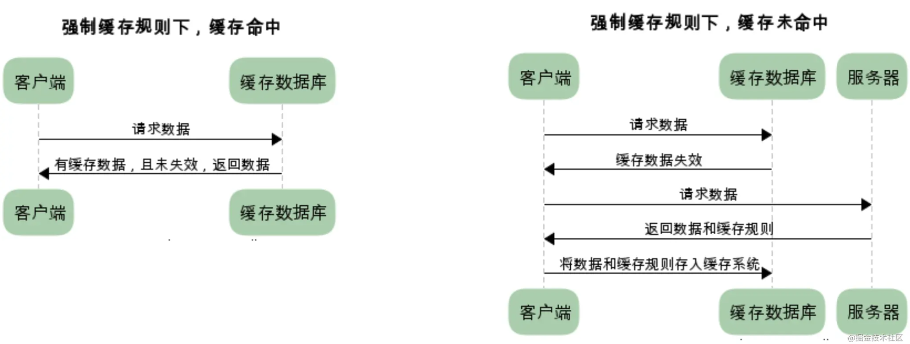
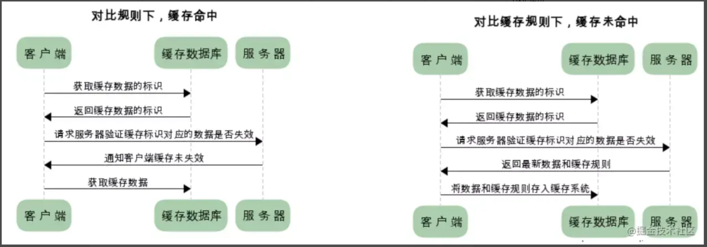
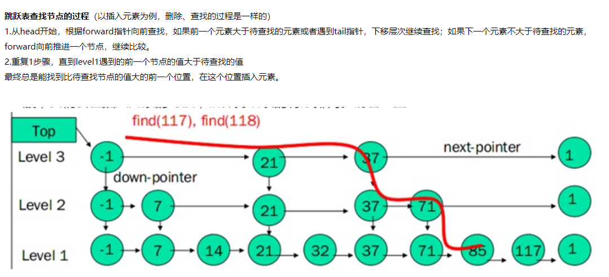
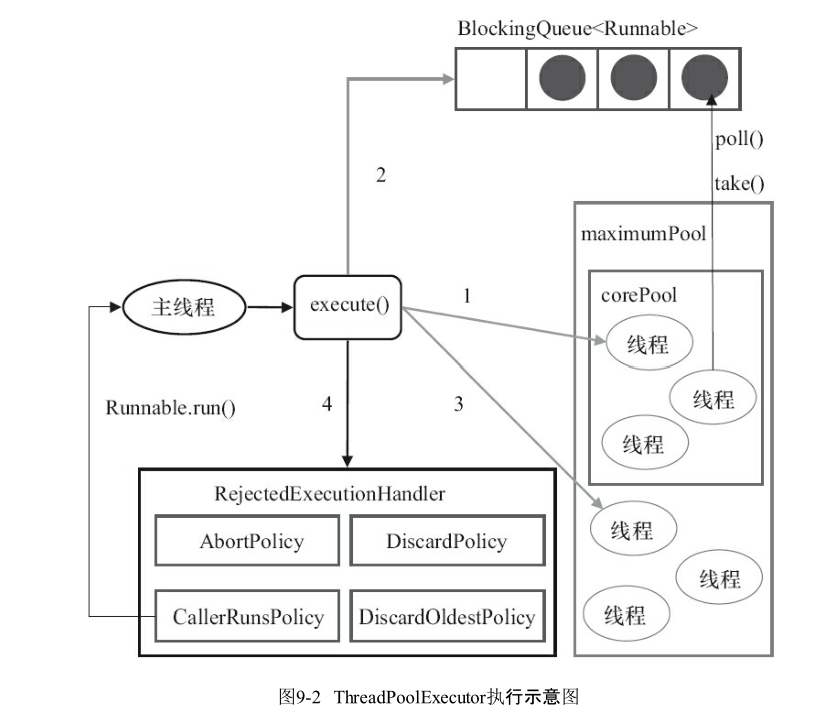
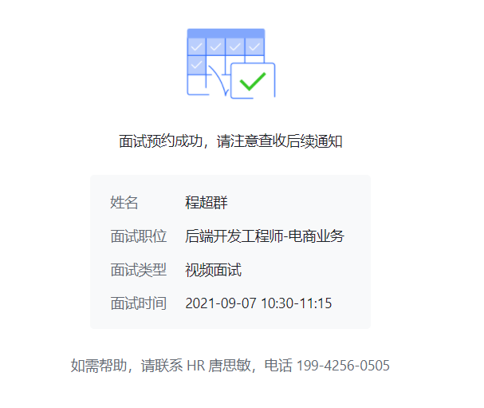

# 自我介绍

- 面试官您好, 我是程超群 应聘后端开发工程师 目前是Upen在读研究生
- 技术栈自己学习了Java, 随着学习的深入看过一些源码,  了解了相关的多线程, 以及不能说Java独有但是相关性很大的JVM的相关知识
- 计算机基础方面 
  - 个人确实对算法比较感兴趣的, 也是在不断提升算法相关知识的学习
  - 了解操作系统的进程内存管理 
  - 了解计算机网络, 了解对于TCP/IP模型中各层的一些主要协议 HTTP HTTPs TCP/UDP IP ARP 
- 数据库方面
  - 关系型 学习了 MySQL  
    - 了解存储引擎, 索引,mvcc相关的知识 
  - 非关系型 学习了Redis  
    - 了解了Redis的基本数据类型和5种对象类型, 线程模型, 以及分布式场景下缓存穿透, 击穿, 雪崩问题下的解决方法, 
- 项目方面主要实现了一个基于Raft算法的KV存储系统, 提供Put/Append/Get操作, 在Raft算法的基础上做了一些该进实现了数据库对外提供强一致性的服务
  - 学习了因为网络的不确定性 需要考虑网络带来的各种造成数据不一致的情况, 以及利用raft算法如何去尽量解决这些问题并且能够为客户端提供服务
  - 通过这个项目更加能够理解了很多的技术在某些场景下为什么要使用raft算法
    - 比如redis的哨兵模式选举局部领头以及redis主从复制模式下, 选出从节点代替主节点的过程都应用了raft算法的选主思想
- 对于开发常用的框架有一定初步的了解, 
  - 尝试去理解了 Spring IoC Aop 的原理, SpringMVC工作流程, SpringBoot的自动配置的原理
- 分布式相关
  - 了解分布式锁 redis zk
  - 分布式事务 2PC 3PC TCC(Try confirm cancel)


## 看的书 博客

深入理解JVM

redis设计与实现

从根上理解MySQL

图解TCP/IP  图解HTTP

最近在看哪些技术？平时会看哪些博客？

之后想往哪个方向发展，未来1-3年的规划


# 项目介绍

## 项目做了什么, 实现了什么

## 这个项目如何实现，遇到的困难，以及是如何解决的？

## 遇到了什么困难, 如何解决的

在学习中或者是项目中遇到过什么问题 举几个例子 说一下是怎么解决的


# 阿里 09/02 10:30 

## 阿里笔试

### 第一题

```java
public class Ali_p1 {
    /**
     *
     * @param args
     */
    /**
     * n个数的数组, 可以k次任选数组中一个数+1, 使得操作k次以后 使得n个数中最大的数最小
     * @param num n个数的数组
     * @param k 表示可以选择一个数+1的次数
     * @return
     */
    public int findMaxWithKAdd(int[] num, long k){
        long sum = 0, max = 0;
        //数组求和以及求最大值
        for(int i=0; i<n; i++){
            sum += num[i];
            max = Math.max(num[i], max);
        }
        //计算需要使得全部为max
        long diff = n*max-sum;
        //如果这个差距>=k 那么执行k次操作不会改变最大值, 直接返回
        if(k<=diff){
            return max;
        }
        //将所有的数都变成max以后, 还剩下的操作数
        long rem = k-diff;
        //每个数都+ rem/n 
        max = max + (rem/n);
        //如果还剩下操作数, 那么最大的数最多在现在的基础上+1
        if(rem%n>0){
            max+=1;
        }
        //返回最大值
        return max;

    }
	//ACM形式
    public static void main(String[] args){
        Scanner sc = new Scanner(System.in);
        int n = sc.nextInt();
        long k = sc.nextLong();
        long sum = 0, max = 0;
        //数组求和以及求最大值
        for(int i=0; i<n; i++){
            long cur = sc.nextLong();
            sum += cur;
            max = Math.max(cur, max);
        }
        //计算需要使得全部为max
        long diff = (n-1)*max-(sum-max);
        if(k<=diff){
            System.out.println(max);
            return;
        }
        long rem = k-diff;
        max = max + (rem/n);
        if(rem%n>0){
            max+=1;
        }
        System.out.println(max);

    }
}
```


### 第二题

```java
public class Ali_P2 {

    @Test
    public void test(){
        int[][] matrix = new int[][]{
                {0,0,0},
                {1,1,1},
                {0,0,0}
        };
        int[][] pos = new int[][]{
                {0,0},
                {0,2},
                {2,0},
                {2,2}
        };
        int res = findMinMoveTime(matrix, pos);
        System.out.println(res);
    }
    /**
     *
     * @param matrix n*m的矩阵, 0代表陆地, 1代表沼泽 2代表军队
     * @param pos k*2的矩阵, 每行代表一个军队在矩阵的坐标,
     *            [i,j]位置的军队可以向周围的四个方向移动,移动的耗时都是1
     * @return 求 矩阵的一个位置使得所有军队都移动到这个位置的时间最短, 所有军队移动到这个位置的时间取决于移动到这个位置时间最长的军队
     * 转换成求两个军队的最短路径然后除以2?
     */
    public int findMinMoveTime(int[][] matrix, int[][] pos){
        int[][] dir = new int[][]{{1,0},{0,1},{-1,0},{0,-1}};
        //在矩阵中, 0位陆地, 1为沼泽不能到达, 军队为2
        for(int i=0; i<pos.length; i++){
            matrix[pos[i][0]][pos[i][1]] = 2;
        }
        //军队数量
        int k = pos.length;
        //最后结果
        int res = Integer.MAX_VALUE;
        //遍历矩阵
        for(int i=0; i<matrix.length; i++){
            for(int j=0; j<matrix[0].length; j++){
                //从每个0开始BFS遍历到所有军队位置
                if(matrix[i][j]==0){
                    int cur = bfs(matrix, dir, k, i, j);
                    //可以到达所有军队
                    if(cur!=-1){
                        //保留更小的
                        res = Math.min(res, cur);
                    }
                }
            }
        }
        return res ==Integer.MAX_VALUE?-1:res;
    }

    public  int bfs(int[][] matrix, int[][] dir, int k, int x, int y){
        boolean[][] visited = new boolean[matrix.length][matrix[0].length];
        Deque<int[]> queue = new ArrayDeque<>();
        queue.offer(new int[]{x,y});
        visited[x][y] = true;
        //[x,y]点出发达到所有军队的时间
        int dist = -1;
        while(!queue.isEmpty()){
            dist++;
            for(int m=queue.size(); m>0; m--){
                int[] cur = queue.poll();
                int row = cur[0], col = cur[1];
                visited[row][col] = true;
                //遍历到一个军队就-1
                if(matrix[row][col]==2){
                    k--;
                }
                //所有军队都遍历到了, 返回当前用的时间
                if(k==0){
                    return dist;
                }
                //将周围四个合法的点加进去, 只加载范围内 并且 没被访问过, 并且不是沼泽
                for(int i=0; i<dir.length; i++){
                    int newX = x+dir[i][0];
                    int newY = y+dir[i][1];
                    if(inArea(matrix, newX, newY) && !visited[newX][newY] && matrix[newX][newY]!=1){
                        queue.offer(new int[]{newX, newY});
                    }
                }
            }

        }
        return -1;
    }
    public boolean inArea(int[][] matrix, int i, int j){
        return 0<=i && i<matrix.length && 0<=j && j<matrix[0].length;
    }

}
```


## 部门干啥的


## 阿里面经

### 操作系统

#### 进程和线程

#### 虚拟内存是什么，虚拟内存的原理是什么

虚拟地址是操作系统为每个进程分配的自己的独立的地址空间,

通过MMU内存映射单元将每个进程的虚拟地址映射到对应的物理内存地址上, 这样CPU就可以操作虚拟地址对应的物理内存地址了

#### 进程和线程

进程的状态

- 初始, 就绪, 运行, 等待, 停止

进程和线程的区别

- 调度
- 拥有资源
- 切换消耗
- 系统开销

线程的同步机制

- 临界区, 互斥量, 信号量, 事件

#### 进程调度算法

- FIFO
- 最短作业
- 最短剩余时间
- 最短进程
- 时间片
- 优先级
- 多级队列

#### 死锁的定义和四个条件以及怎样解除死锁

两个或多个进程持有一部分资源并且等待其他进程释放他们持有的资源形成了环路的等待, 就是死锁

- 互斥
- 持有并等待
- 不可侵占
- 循环等待

解除

- 挂起某些进程, 将资源分配给其他死锁进程
- 回退到不产生死锁的位置


### 算法

反转链表

统计一篇英文文章中出现频率最高的3个单词, 最高的n个单词

有序链表去除重复数字

编辑距离

求无序数组中topn的数？

快速排序的时间复杂度？

9.怎么判断一个链表是否有环？
10.如何判断两个链表相交？
11.有99个范围为1-100的不重复值，怎么快速判断缺少的那个数？（挺好的，面试官还有引导）

有向图判断是否有环 (头一次被问图论)
数据流中求top k

1.怎样找到链表倒数第K个节点
2.怎样反转单链表
3.怎样判断两个链表相交，以及交点怎么找
4.两个二叉树，怎么判断一个是另一个的子树

两数之和
三数之和
四数之和

1毛，2毛，3毛，5毛组成1块有几种方案，讲思路

一个无序数组中第k大的数字

10. 快速排序的过程
11.快速排序用到了什么思想 
答: 递归 分治，不知道还有什么

### 数据结构

#### 树

完美二叉树(Perfect Binary Tree)

- 深度为k(>=-1)且有2^(k+1) - 1个结点的二叉树称为完美二叉树

完全二叉树(Complete Binary Tree)

- 完全二叉树从根结点到倒数第二层满足完美二叉树，最后一层可以不完全填充，其叶子结点都靠左对齐。

满二叉树(Full Binary Tree)

- 所有非叶子节点都有两个子节点

什么是二叉查找树，查找的时间复杂度是多少，最坏情况又是多少。

- logn 
- n

有什么数据结构优化二叉查找树 

- （AVL树，红黑树）

AVL树的定义是什么

- 树中某结点其左子树的高度和右子树的高度之差<2

- `AVL树`大部分操作都和`BST树`相同, 只有在插入删除结点时, 有可能造成`AVL树`失去平衡, 而且只有那些在被插入/删除结点到根节点的路径上的结点有可能出现失衡, 因为只有那些结点的子树结构发生了变化
- 当插入新结点导致不平衡时, 我们需要找到距离新节点`最近`的不平衡结点为轴来转动`AVL树`来达到平衡

#### hashmap

hashmap

- 数组+链表/红黑树

hashmap和hashtable的区别

- 继承父类不同  AbstractMap Dictionary
- 对外接口不同 elements contains
- Null Key Null value不同 
- 线程安全 synchronized
- 初始容量 扩容大小  16 2n 11 2n+1
- 计算hash的方法 obj.hashcode, key==null?0:hash>>>16 ^ hash

hashtable性能差，可以如何改进

- concurrentHashmap 数组的每个位置加锁

ConcurrentHashMap的数据结构？底层是怎么实现的？

- 1.7 Segment 数组结构和 HashEntry 数组结构组成
- 1.8 数组+链表/红黑树

ConcurrentHashMap hashcode的原理（是不是数据结构内部实现的）和塞到链表里面怎么做的

- 高16位和低16位异或, 并且保证在可用的范围内

- ```
  (h ^ (h >>> 16)) & HASH_BITS;
  ```

为什么hashmap里面用了红黑树，红黑树怎么保证并发

- 增加产生hash碰撞位置的查询效率
- 需要concurrentHashMap


#### StringBuilder和StringBuffer的区别

- StringBuffer 线程安全, 方法+synchronized

StringBuilder底层是什么类型, 如何扩容

- 继承AbstractStringBuilder , 底层实现是char[] 数组
- 初始默认容量是16 super(16)
- 扩容, super.append(obj) 
  - 计算当前使用的容量+新的append的对象的长度 是否>char[] 数组的长度, 需要时扩容到这个长度


### 计网

https://juejin.cn/post/6844903832435032072

强制缓存



缓存协商



#### TCP三次握手 四次挥手

tcp创建连接的过程

tcp为何要3次握手

讲一下TCP为什么要三次握手，不是二次握手

要是三次握手第三次的ack丢了怎么办（emmmm，看网上都说服务端会等3、6、15秒重发，[客户端]()则会发送数据然后收到对面传来的rst报文。我这里其实答的很模糊，因为之前没有看过相关回答，所以我就自己推断了一下说如果[客户端]()马上发送数据的话会把这个ack给补上，所以理论上应该没影响，如果[客户端]()没有发数据的话服务端会认为第二次握手丢失然后重发第二次握手。ps：有些小伙伴做了实验好像真的没影响，这里给我整不会了，希望大神能帮忙解答一下）

服务端超时重传5次，客户端已经established，不影响


tcp四次挥手；
服务器大量的socket处于close_wait状态；

#### 跨域

为什么浏览器要禁止跨域

- XSS CSRF 减少跨站伪造, 脚本攻击

#### Cookie Session

HTTP是有状态的还是无状态的

- 无状态
- HTTP 协议自身不对请求和响应之间的通信状态进行保存。也就是说在 HTTP 这个级别，协议对于发送过的请求或响应都不做持久化处理

cookie和session的区别 (星巴克记录每个客户消费的数量 满10减1)

- cookie机制采用的是在客户端保持状态的方案，(分给顾客一张卡片，每消费一次记录一次, 客户端记录)
  - Cookie实际上是一小段的文本信息。客户端请求服务器，如果服务器需要记录该用户状态，就使用response向客户端浏览器颁发一个Cookie
  - 客户端浏览器会把Cookie保存起来。当浏览器再请求该网站时，浏览器把请求的网址连同该Cookie一同提交给服务器。服务器检查该Cookie，以此来辨认用户状态。
  - cookie 可以让服务端程序跟踪每个客户端的访问，但是每次客户端的访问都必须传回这些Cookie，如果 Cookie 很多，这无形地增加了客户端与服务端的数据传输量，
  - cookie不是很安全，别人可以分析存放在本地的cookie并进行cookie欺骗，考虑到安全应当使用session
- session机制采用的是在服务器端保持状态的方案。(发给顾客一张卡片，上面有卡号，顾客每消费一次，由店员在操作机上记录一次。服务端)
  - 同一个客户端每次和服务端交互时，不需要每次都传回所有的 Cookie 值，而是只要传回一个 ID，这个 ID 是客户端第一次访问服务器的时候生成的, 而且每个客户端是唯一的
  - 这样每个客户端就有了一个唯一的 ID，客户端只要传回这个 ID 就行了，这个 ID 通常是 NANE 为JSESIONID 的一个 Cookie。
  - 由于采用服务器端保持状态的方案在客户端也需要保存一个标识，所以session机制可能需要借助于cookie机制来达到保存标识的目的
  - session会在一定时间内保存在服务器上。当访问增多，会比较占用你服务器的性能，考虑到减轻服务器性能方面，应当使用cookie

使用cookie的缺点

- cookie可以被用户禁止
- cookie不安全(对于敏感数据，需要加密)
- cookie只能保存少量的数据(大约是4k)，cookie的数量也有限制(大约是几百个)，不同浏览器设置不一样，反正都不多
- cookie只能保存字符串

使用session的缺点

- session是将用户信息储存在服务器上面,如果访问服务器的用户越来越多,那么服务器上面的session也越来越多, session会对服务器造成压力，影响服务器的负载

session具体使用上会有一个什么缺陷，如何解决

- Session同步
- 粘性会话
- 会话复制
- 集中会话


#### http和https的区别；

- 通信数据是否加密
- 是否验证通信方的身份
- 数据传输过程中完整性的校验

https中ssl中握手的细节；

证书校验具体怎么实现的；


#### 输入url到返回的查询过程；

- DNS解析 域名-> IP地址
- TCP三次握手建立连接
- 生成HTTP报文, 请求
- ARP协议将IP->MAC
- 服务器重组报文段
- 获取请求资源, 
- 返回
- HTML解析 渲染

#### TCP/UDP区别

- 面向连接
- 是否可靠
- 是否流量控制和拥塞避免
- 传输形式

 tcp的三大特点，只说了面向连接和可靠，还有一个字节流忘了

#### OSI七层模型和TCP五层模型

https://blog.csdn.net/qq_36756682/article/details/104112765

第一层：物理层

        在OSI参考模型中，物理层是参考模型的最低层，也是OSI模型的第一层。
        物理层的主要功能是：利用传输介质为数据链路层提供物理连接，实现比特流的透明传输。
        物理层的作用是实现相邻计算机节点之间比特流的透明传送，尽可能屏蔽掉具体传输介质和物理设备的差异，使其上面的数据链路层不必考虑网络的具体传输介质是什么。

第二层：数据链路层

       数据链路层（Data Link Layer）是OSI模型的第二层，负责建立和管理节点间的链路。在计算机网络中由于各种干扰的存在，导致物理链路是不可靠的。
       因此这一层的主要功能是：在物理层提供的比特流的基础上，通过差错控制、流量控制方法，使有差错的物理线路变为无差错的数据链路，即提供可靠的通过物理介质传输数据的方法。

第三层：网络层

       网络层（Network Layer）是OSI模型的第三层，它是OSI参考模型中最复杂的一层，也是通信子网的最高一层，它在下两层的基础上向资源子网提供服务。其主要功能是：在数据链路层提供的两个相邻端点之间的数据帧的传送功能上，进一步管理网络中的数据通信，控制数据链路层与传输层之间的信息转发，建立、维持和终止网络的连接，将数据设法从源端经过若干个中间节点传送到目的端（点到点），从而向传输层提供最基本的端到端的数据传输服务。具体地说，数据链路层的数据在这一层被转换为数据包，然后通过路径选择、分段组合、顺序、进/出路由等控制，将信息从一个网络设备传送到另一个网络设备。数据链路层和网络层的区别为：数据链路层的目的是解决同一网络内节点之间的通信，而网络层主要解决不同子网间的通信。

第四层：传输层

       OSI下3层的任务是数据通信，上3层的任务是数据处理。而传输层（Transport Layer）是OSI模型的第4层。该层提供建立、维护和拆除传输连接的功能，起到承上启下的作用。该层的主要功能是：向用户提供可靠的端到端的差错和流量控制，保证报文的正确传输，同时向高层屏蔽下层数据通信的细节，即向用户透明地传送报文。

第五层：会话层

       会话层是OSI模型的第5层，是用户应用程序和网络之间的接口，该层的主要功能是：组织和协调两个会话进程之间的通信  ，并对数据交换进行管理。当建立会话时，用户必须提供他们想要连接的远程地址。而这些地址与MAC地址或网络层的逻辑地址不同，它们是为用户专门设计的，更便于用户记忆。域名就是一种网络上使用的远程地址。会话层的具体功能如下：

会话管理：允许用户在两个实体设备之间建立、维持和终止会话，并支持它们之间的数据交换。
会话流量控制：提供会话流量控制和交叉会话功能。
寻址：使用远程地址建立会话连接。
出错控制：从逻辑上讲会话层主要负责数据交换的建立、保持和终止，但实际的工作却是接收来自传输层的数据，并负责纠正错误。
第六层：表示层

       表示层是OSI模型的第六层，它对来自应用层的命令和数据进行解释，对各种语法赋予相应的含义，并按照一定的格式传送给会话层。该层的主要功能是：处理用户信息的表示问题，如编码、数据格式转换和加密解密等。表示层的具体功能如下：

数据格式处理：协商和建立数据交换的格式，解决各应用程序之间在数据格式表示上的差异。
数据的编码：处理字符集和数字的转换。
压缩和解压缩：为了减少数据的传输量，这一层还负责数据的压缩与恢复。
数据的加密和解密：可以提高网络的安全性。
第七层：应用层

       应用层是OSI参考模型的最高层，它是计算机用户，以及各种应用程序和网络之间的接口，该层的主要功能是：直接向用户提供服务，完成用户希望在网络上完成的各种工作。它在其他6层工作的基础上，负责完成网络中应用程序与网络操作系统之间的联系，建立与结束使用者之间的联系，并完成网络用户提出的各种网络服务及应用所需的监督、管理和服务等各种协议。此外该层还负责协调各个应用程序间的工作。应用层的具体功能如下：

用户接口：应用层是用户与网络，以及应用程序与网络间的直接接口，使得用户能够与网络进行交互式联系。
实现各种服务：该层具有的各种应用程序可以完成和实现用户请求的各种服务。
3.OSI七层模型举例
       举例：以A公司向B公司发送一次商业报价单为例。

       应用层：A公司相当于实际的电脑用户，要发送的商业报价单相当于应用层提供的一种网络服务，当然A公司也可以选择其他服务，比如发一份商业合同，发一份询价单等等。
    
       表示层：由于A公司和B公司是不同国家的公司，他们之间商定统一用英语作为交流语言，所以此时A公司的文秘（表示层）将从上级手中（应用层）获取到的商业报价单的语言转翻译成英语，同时为了防止被别的公司盗取机密信息，A公司的文秘也会对这份报价单做一些加密的处理。这就是表示层的作用，将应用层的数据转换翻译。
    
       会话层：A公司外联部同事（会话层）掌握着其他许多公司的联系方式，他们负责管理本公司与外界许多公司的联系会话。当外联部同事拿到文秘（表示层）转换成英文的商业报价单后，他首先要找到B公司的地址信息，并附上自己的地址和联系方式，然后将整份资料放进信封准备寄出。等确认B公司接收到此报价单后，外联部的同事就去办其他的事情了，继而终止此次会话。
    
       传输层：传输层就相当于A公司中的负责收发快递邮件的人，A公司自己的投递员负责将上一层（会话层）要寄出的资料投递到快递公司或邮局。
    
       网络层：网络层就相当于快递公司庞大的快递网络，全国不同的集散中心，比如说从深圳发往北京的顺丰快递，首先要到顺丰的深圳集散中心，从深圳集散中心再送到武汉集散中心，从武汉集散中心再寄到北京顺义集散中心。这个每个集散中心，就相当于网络中的一个IP节点。
    
       数据链路层：相当于顺丰快递内部为了保证效率和质量的一种内部操作。
    
       物理层：快递寄送过程中的交通工具，就相当于物理层，例如汽车，火车，飞机，船。

4.OSI七层模型总结
       应用层：产生网络流量的程序

       表示层：传输之前是否进行加密或者压缩处理
    
       会话层：查看会话，查木马  netstat-n
    
       传输层：可靠传输、流量控制、不可靠传输
    
       网络层：负责选择最佳路径、规划ip地址
    
       数据链路层：帧的开始和结束、透明传输、差错校验
    
       物理层：接口标准、电器标准、如何更快传输数据


osi七层模型

每一层大概讲一下

http请求出去后，每一层都做了什么，讲具体，越具体越好（结结巴巴，被叫停了，尬死了）

TCP/IP协议的分层？五层模型各层的作用？


#### ipv4和ipv6的区别；

- IPv6要求路由器不进行数据的分片和重组, 而是只由端点的服务器客户端执行
- 长度不同=--


### redis

#### 缓存和数据库的一致性如何保证？

- 先删缓存 再写数据库
  - 缓存修改为特殊值, 写完数据库更新缓存
  - 延时双删: 删缓存, 写数据库, 过一会再删缓存
- 先写数据库, 再删缓存
  - 缓存设置过期时间
  - 热点数据永不过期, value设置逻辑过期时间, 后台线程扫描, 发现过期以后更新对应的热点数据
- 我们始终只能保证一定时间内的最终一致性

#### 缓存预热怎么做的？

缓存预热就是系统上线后，将相关的缓存数据直接加载到缓存系统。

这样就可以避免在用户请求的时候，先查询数据库，然后再将数据缓存的问题！用户直接查询事先被预热的缓存数据！

#### redis的淘汰策略

什么场景下要选择从从过期数据中lru的淘汰策略 或者问 该怎么挑选redis的淘汰策略

- 内存空间不足了, 我必须淘汰一部分空间来放我的新的缓存
- \1. noeviction：默认禁止驱逐数据。内存不够使用时，对申请内存的命令报错。 
  \2. volatile-lru：从设置了过期时间的数据中淘汰最近没使用的数据。 
  \3. volatile-ttl：从设置了过期时间的数据中淘汰即将要过期的数据。 
  \4. volatile-random：从设置了过期时间的数据中随机淘汰数据。 
  \5. allkeys-lru：淘汰最近没使用的数据。 
  \6. allkeys-random：随机淘汰数据。

- 机制有 lru ttl  random 可以所有key也可以存在过期时间key中挑选

#### 分布式Redis场景

说一下缓存穿透是什么，

- 缓存没有 数据库没有

怎么解决缓存穿透（说到布隆过滤器）

- 缓存设置key-null 后续请求不会打到数据库
- 布隆过滤器, 
  - 多个hash函数得到hash值跟新bitmap
  - 对于请求key做同样操作, 某个hash对应位置是1但是bitmap是0 那么一定不存在
  - 不能准确判断, 只能过滤, 不能取出元素, 不能删除元素

那缓存击穿呢

- 缓存没有, 数据库有
- 热点key过期了, 根本没有放入缓存的数据的大量访问

如何解决缓存击穿

- 设置热点key永不过期, 
- 分布式锁

缓存雪崩

- 缓存不存在, 数据库存在,  并发访问大量缓存不存在的key

- 热点key过期时间随机
- 分布式锁, 每个key只有一个请求到达数据库

redis怎么实现分布式锁

- set key value nx px 
- 不存在就设置, 并且设置过期时间 原子操作
- watchdog 续期
- UUID标识哪个锁是哪个线程锁的
- 上锁解锁必须一个线程
- HA高可用, 可以使用redlock 向集群申请锁, 获得n/2+1就获取成功 并且锁还没过期

#### redis数据结构的应用场景

那问一下数据结构中的bitmap是干什么的

- 统计用户的登录天数
  - key : 用户 value:365bits 1代表登录
- 统计活跃用户
  - key: 日期 value: 每个bit代表每个用户

redis说一下使用场景

- 缓存
- 分布式锁 set nx px
- 统计用户的登录天数活跃天数  bitmap
- 文章评论 粉丝列表 list
- 抽奖 共同关注 set

#### 主从、哨兵和集群的区别

哨兵 (监视主从服务器, 达到自动进行故障转移的功能)

- 由一个或多个Sentinel实例组成的Sentinel系统, 可以监视任意多个主服务器以及这些主服务器的所有从服务器
- 被监视的主服务器下线, 自动将下线主服务器的某个从服务器升级为新的主服务器, 新的主服务器代替下线的主服务处理命令请求
- Info 获取主从服务器的信息 ip+port
- Sentinel发送的消息会被其他监视这个主服务器的Sentinel感知到, 并且建立向这些Sentinel之间的链接, 形成一个Sentinel网络

检测服务器下线

- PING命令 检测是否主观下线
- 询问其他sentinel是否主观下线
- 收到一定数量的主观下线就设置为客观下线, 并且这个设置会被其他sentinel感知到
- 所有sentinel 通过raft算法选举, 局部领头来对这个服务器进行故障转移挑选新的从节点代替

redis部署方式有几种

- 哨兵模式
- 主从复制
- 分片模式

主从 

- 完全复制
  - SYNC ==> BGSAVE 生成RDB ==> 发送RDB ==> 传播BGSAVE期间的命令

- RUNID offset 确定 完全复制还是部分复制 (SYNC PSYNC)
- 复制积压缓冲区决定是否能部分复制

集群模式

- 集群的每个结点负责一部分的哈希槽数据, 一个16384个槽位
- clusterNode 结果记录当前结点状态 并且为其他结点创建对应的结果 slots数据记录当前结点负责哪些槽
- ClusterState 是当前结点的视角下, 集群的状态 slots数组记录每个哈希槽由哪个结点负责
- 通过这两个结果可以快速的找出当前结点负责的槽, 和某个槽是由哪个结点负责的
- 故障转移
  - 结点之间PING命令检测对方是否在线
  - 一定时间没有回复标记结点疑似下线, 超过半数标记就认为结点下线
  - 从节点对主节点进行故障转移, 
  - 从节点要求负责槽的主节点投票给自己, 获得半数以上选票的当选, 负责之前主服务器负责的槽

redis选主算法是怎么做的


#### 基本数据类型，知道哪些

- SDS sdshdr + buf 数组

  - 字节数组 + free空余的空间+字符串的长度len
  - O(1)获取字符串长度
  - 缓冲不会溢出 检查是否缓冲区溢出 ,扩容后操作
  - 减少内存重新分配次数
    - 空间预分配
    - 惰性空间释放,
  - 二进制安全

  

- 链表 list + listNode

  - 双向链表 无环
  - head tail 
  - 结点个数

- 字典 dict dictht dictEntry

  - dict 记录两个哈希表数组 
  - dictht 两个哈希表 一个同来rehash 每个dictht 长度, 元素个数
  - dictEntry存在于每个dictht中的一项  key-value
  - rehash
    - 扩容used*2的2^n
    - 收缩 used 的2^n
    - 将第一个哈希表的数据重新计算在第二个哈希表的位置, 放进去
    - 不是一次完成, 每次客户端请求查到了一部分数据 就将对应位置的元素rehash
    - 最后ht[1]变成ht[0] 

- 跳跃表 zskiplist zskiplistNode

  - zskiplistNode level[] back score member
  - zskiplist head tail , level length
  - 跳表的插入，逻辑怎么实现（不会）
  - 

- 压缩列表

  - 连续内存块组成的顺序性列表
  - 占用字节数, 尾结点距离起始的自己数, 结点数量 结点

- 整数集合

  - intset 记录 
    - encoding 每个元素的长度
    - length 元素个数
    - contents 整数数组
  - 升级 新加入元素encoding更大 需要将之前的元素都范围以后再加入新的元素

具体使用场景，讲一讲

数据类型的底层数据结构

- 字符串 int embstr raw
- 列表 ziplist linkedlist
- 哈希 ziplist dict 字典
- 集合 intset dict
- 有序集合 ziplist zset(字典 跳跃表)


#### redis为什么快，一直问到底层epoll()

- 纯内存操作计算, 不涉及磁盘IO
- 对于不同数据类型提供对于的操作
- IO模型使用EPOLL, 不需要轮询所有的链接查看是否有事件发生, EPOLL得双链表当中存储的就是有事件发生的链接,
- IO线程读取以后通过worker线程进行单线程的计算, 不涉及锁, 和线程切换效率更高

redis能不能做内存数据库

#### redis aof rdb区别与优点

RDB

- 快照二进制文件保存
- save 阻塞 bgsave非阻塞 save m n 被动执行保存
- 服务器宕机可能会丢失很多的数据, 数据完整性较差
- 恢复速度较快

AOF

- 命令以协议的方式追加的AOF文件末尾
- 设置保存的频率 每次请求 每秒 从不
- 需要对AOF文件过大时进行重写, 将当前数据库状态转换成每个键的插入命令, 重写是通过fork子进程 并且会将重写过程的写命令放入重写缓冲区最后追加到aof文件中
- 恢复较慢, 数据的一致性较好 

### 多线程

#### 线程池线程什么时候创建？满了怎么办？

#### AQS?


说一下CAS是什么

CAS会有什么缺点？（ABA），如何解决（时间戳）

- 自旋
- 比较交换
- ABA 自旋消耗CPU

synchronized方法的作用

synchronized和lock的区别（回答的不好）

- synchronized 锁升级的过程
- lock 实现有 可重入锁 读写锁 没有获取到的需要进入等待队列

atomic包下的类有没有看过源码，知道是怎么实现的吗

- unsafe.getAndIncreament 
- 本质是CAS  value是volatile修饰的


说一下java的封装和多态

你是怎么理解Java三大特性的，全部解释一遍

乐观锁和悲观锁的区别

- 乐观锁总是认为不会有线程修改
- 悲观总认为会有修改 所以总是加锁

线程池的一个参数设置 之前是否有用过线程池，线程池参数是怎么设置的

讲一讲线程池七大参数（balabala）

- corePoolSize
- maxPoolSize
- TimeToLive
- unit
- workerqueue
- threadFactory
- handler

线程池的阻塞队列的实现逻辑

- condition notEmpty 取数据发现队列空
- condition notFull 放入数据的发现队列满了
- Lock reentrantLock 放取数据需要加锁

讲一讲线程池的execute方法的具体流程，越详细越好




线程安全类？线程安全集合说说看？


线程的生命周期，状态有哪些

- 初始 
- 就绪
- 阻塞等待进入同步代码块
- 等待 wait 进入了代码块释放了锁
- running
- terminated

sleep()和wait()有什么区别

- 是否释放锁
- Thread Object

java创建线程的几种方式

- implement runnable callable extends Thread ExcutorService.excute(runnable)

实现callable和runnable两个创建的线程有什么区别

- 返回值
- call run
- FutureTask

callable的FutureTask的底层是什么

- unsafe.cas


countDownLatch和CyclicBarrier的介绍

java1.8跟7或者11有什么不一样的
用流式编程计算一个string的list里面有多少元素是以s结尾的


### MySQL

#### 数据库事务怎么实现？

#### mysql默认隔离级别？什么是幻读？能防止幻读吗？

mvcc？
数据库怎么实现乐观锁？version字段
SELECT FOR UPDATE是什么？阻塞吗？效率怎么样？

事务的特性有什么，说一下分别是什么意思


幻读是什么，用什么隔离级别可以防止幻读

RR有一个特殊情况会产生幻觉 快照读无法解决  比如事务B插入一个数据  此时事务A无法select  但是update后  却可以查询到

对 但我不认为这是特殊情况 既然你选择快照读了 说明我们只关心查出的数据 而不会对数据进行修改 你如果真的想修改操作这个数据  那肯定要选择当前读啊 才能保证数据的准确性 你加上for update后 你就能查询到其他事务新增的值 我觉得快照读 当前读设计的理念就是这样  针对不同问题选择不同的方案 所以我觉得RR级别是能解决幻读的


数据库的索引讲一下，索引失效可能是什么情况

有遇到过慢sql的情况吗，是怎么排查优化的

MySQL的索引有什么好处？说说你了解的索引吧

这些索引的数据结构和存储原理了解过吗？说说看

你知道B+索引和Hash索引有什么区别吗？

有哪些引擎？他们有什么区别
B+树有什么优点？
分页查询 limit offset太大的时候会有什么问题？
char varchar float区别？


11、讲一下mysql事务的ACID和怎么实现的
12、讲一下事务的隔离级别
13、讲一下索引有哪几种？怎么运作的？底层是什么？怎么设计？什么情况能命中什么情况不能？
14、想分析索引命中没有要用什么关键字(explain)

mysql分页查询的关键字

union all和union的区别

mysql的sql调优分几个步骤

Innodb插入和删除为什么比mysaim快

因为mysaim只支持表锁，innodb支持表锁和行锁

mysql主备同步

binlog的模式

一般来说binlog是逻辑日志，即记录的是sql语句。

binlog有三种模式一个是statement ，基于sql语句的日志 一个是row基于行的复制，不记录sql语句和上下文信息，只记录哪条数据被修改了 mixed两个都用，主要为statement，如果statement处理不了用row

1. mysql的隔离级别，讲具体
2. mysql为什么第三级别解决了幻读（写写间隙锁，写读mvcc）
3. 给两条sql，问是否有间隙锁，猜了一个，答错了

5.索引为什么能提高数据的查询速率
答：b+树 balabala
6.b+树结构 主键索引和非主键索引
7.b+树一般有多少层 可以放多少节点数据呢，怎么计算

https://blog.csdn.net/g6U8W7p06dCO99fQ3/article/details/117608254?ops_request_misc=&request_id=&biz_id=102&utm_term=b+%E6%A0%91%E4%B8%80%E8%88%AC%E6%9C%89%E5%A4%9A%E5%B0%91%E5%B1%82%20%E5%8F%AF%E4%BB%A5%E6%94%BE%E5%A4%9A%E5%B0%91%E8%8A%82%E7%82%B9%E6%95%B0%E6%8D%AE%E5%91%A2%EF%BC%8C%E6%80%8E%E4%B9%88%E8%AE%A1%E7%AE%97&utm_medium=distribute.pc_search_result.none-task-blog-2~all~sobaiduweb~default-3-117608254.pc_search_result_hbase_insert&spm=1018.2226.3001.4187

1. 索引的作用
2. 介绍一下B+树
3. 索引查询一定有提升吗？
4. 什么是事务？
5. 数据库的乐观锁和悲观锁

1. Java的类加载机制
2. 介绍双亲委派模型，双亲委派模型的作用
3. 介绍GC机制
4. 了解CMS和G1吗


### JVM 

类的加载过程？
syconized的jvm原理？

Java内存管理是怎样的

垃圾回收是怎样的过程

说说JVM吧，说说你所了解的内容

ClassLoader双亲委派机制

为什么有了双亲委派这种机制？还要破坏这种机制，一般什么场景会那么做？（再熟悉一下）

ClassLoader里面loadclass()和findclass()区别（再熟悉一下）

java内存管理的垃圾回收器有哪些

GMS垃圾回收器的算法介绍

1.8里面默认的垃圾回收算法是哪个
CMS和G1具体的区别
G1求解的目标函数的目标
G1的目标和CMS目标有什么区别

1. 说一下垃圾收集算法（balabala）
2. 说一说新生代的算法
3. 说一下cms和g1在并发标记过程中产生的问题，怎么解决（这个点讲了很久，他说不错，然后打断我了）
4. 讲一下为什么 新生代8:1：1

oom排查,现实当中怎么确认这是内存溢出还是泄漏(答得用profile工具看引用链)

8.jvm垃圾回收算法
9.jvm启动时，垃圾回收算法需要传什么参数呢


### 设计模式

设计模式了解几种？jdk中有哪些设计模式？装饰？


### 分布式事务

说一下分布式事务中的两阶段提交

zookeeper原理；

### Spring

那说一下spring中的bean的作用域有哪些

springIOC AOP的一些八股

mybatis中${}和#{}的区别

spring的好处（总结一下）

spring的依赖注入

bean的生命周期

beanFactory和FactoryBean的区别


# 字节跳动 09/07 10:30-11:15



