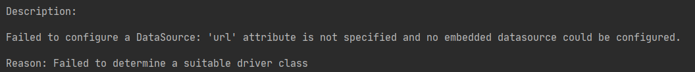
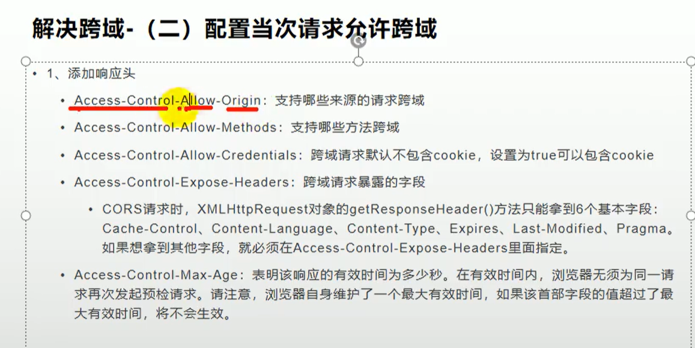
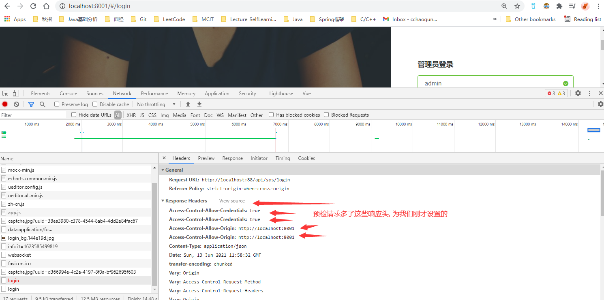
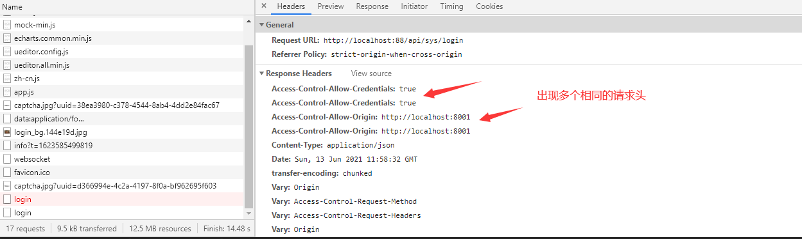
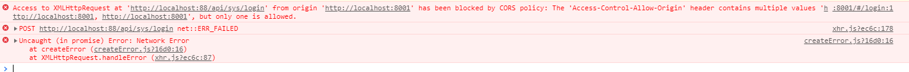
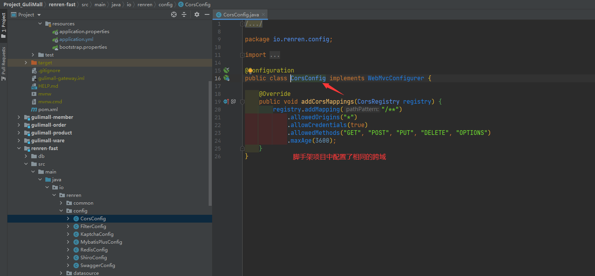
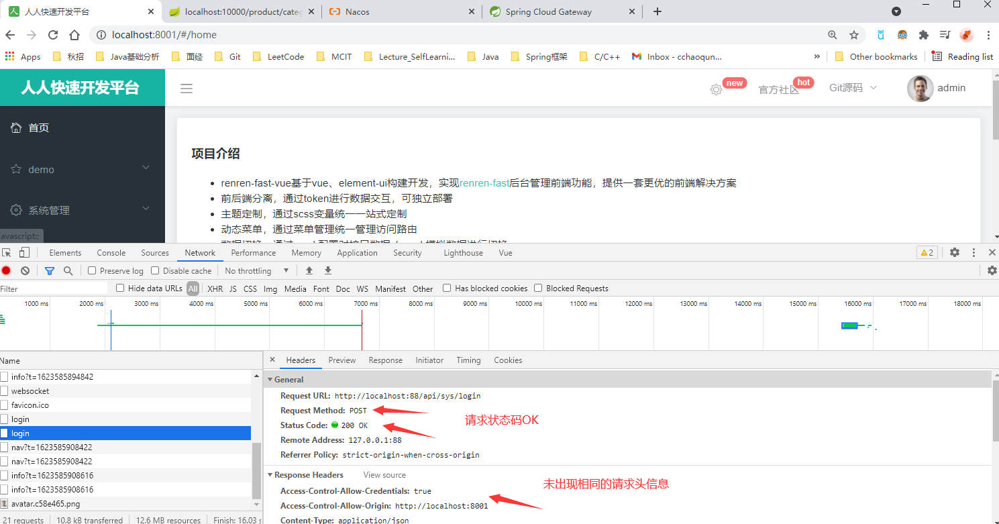

# CIT594 CovidParser

## 缓存组件

https://www.javatt.com/p/7890

JSR107

个`CacheManager`保存和控制一系列的缓存。缓存有很多条目（entries）

### 创建一个`CacheManager`

concurrentHashMap 保证线程安全

通过指定类加载器保证返回的是一个CacheManager  单例的, 保存了缓存名字和对应的缓存 Map<String, Map<K,V>>

主要是为了解析不同的文件的时候, 放入不同的缓存, 区分开

### 创建缓存

cacheManager.createCache(缓存名字, 缓存配置)

缓存配置指明了 缓存的泛型K-V是什么, 并且是否使用LRU

使用LRU的缓存 基本实现为LinkedHashMap 线程不安全, 所以需要对方法加synchronized同步

### 获取缓存引用

cacheManager.getCache("testCache"); 

根据缓存名字获取对应的缓存条目, 所有这个缓存的数据都存储在这个缓存里

### 基本缓存操作

基础缓存操作 put get remove clear

## 日志库

积攒指定条目输入到本地日志文件, 条目数用户可以指定

之前的日志都追加到队列中

日志格式化, 对应不同时间有不同的tag, 打开文件的过程, 用户输入的过程, 响应用户的过程带有不同的tag, 查看日志可以清晰的看到日志干了什么事

https://gitee.com/mail_osc/aliyunLog/blob/master/j2se/src/com/xnx3/aliyunLog/SimpleExample.java


# guliMall

微服务分布式项目

## 环境搭建

### 使用vagrant 虚拟linux

1. 安装virtualBox

2. 下载安装 vagrant(windows 64x) 

3. 利用vagrant初始化 Linux系统

   1. ```shell
      vagrant init centos/7
      #2. 下载镜像 配置虚拟机 
      vagrant up
      #3. 连接上虚拟机
      vagrant ssh
      ```


## 安装Docker

1. #2. 通过仓库安装
   sudo yum install -y yum-utils
2. #3. 设置镜像的仓库
3. #4. 安装docker相关的内容 docker-ce社区的版本, ee企业版
   sudo yum install docker-ce docker-ce-cli containerd.io
4. #5. 启动docker
    sudo systemctl start docker
5. #查看版本
   docker -v
6. #查看所有镜像
   sudo docker images
7. #6. 设置docker开机自启动
   sudo systemctl enable docker

## Docker安装 MySQL (5.7)

1. #1. 从镜像仓库拉取mysql镜像, 不指定版本默认下载最新的, 指定版本 mysql:版本号(docker hub上找)
   docker pull mysql:5.7
2. #2. 启动 mysql镜像创建容器 sudo docker run -p 3306:3306 --name mysql
3. #3. 查看运行的容器
   docker ps
4. #5. 运行mysql容器
   docker exec -it mysql[容器id | 容器别名] /bin/bash

## Docker安装redis

1. #1. 下载redis镜像
   docker pull redis
2. #2. 运行下载的redis镜像 docker run -p 6379:6379 --name redis
3. #进入redis客户端
   docker exec -it redis redis-cli


## 服务注册/发现&注册中心 Nacos

```
@EnableDiscoveryClient //开启服务的注册与发现
```

###  Nacos 微服务注册到注册中心的步骤

1. 配置文件中配置Nacos server的地址

2. 配置微服务的应用名称

3. 在主应用程序上加上 @EnableDiscoveryClient注解

4. 启动NacosServer服务器

5. 启动微服务

6. 登录 127.0.0.1:8848/nacos

```yaml
spring:
#配置数据源
  datasource:
    username: root
    password: root
    url: jdbc:mysql://192.168.56.10:3306/gulimall_pms?useUnicode=true&characterEncoding=UTF-8&serverTimezone=Asia/Shanghai
    driver-class-name: com.mysql.cj.jdbc.Driver
 #配置发现注册中心的ip+port
  cloud:
    nacos:
      discovery:
        server-addr: 127.0.0.1:8848 #配置nacos注册中心的地址
  #配置当前微服务的名称
  application:
    name: gulimall-product #配置服务的名称
```

A服务调用B服务，A服务并不知道B服务当前在哪几台服务器有，那些是正常的，那些服务已经下线。解决这个问题可以引入注册中心。

配置中心用来几种管理微服务的配置信息。

当前微服务可以在发现中心找到其他的微服务进行服务的调用

网关也可以知道各个服务所在的位置, 进行请求的调用

### Nacos配置中心总结

1. 引入Nacos Config starter 依赖
2. 添加bootstrap.properties配置文件
   1. 配置当前服务的名称
   2. 配置nacos配置中心的地址
3. 在配置中心添加一个数据集(Data Id) gulimall-coupon.properties
   1. 默认命名方式为 <应用名.properties>
   2. 在配置文件中可以随时修改信息发布
4. 在需要获取到配置中心配置文件内容(@Value("${properties的key}$"))的类上添加 @RefreshScope注解, 让该微服务可以动态的从配置中心配置文件获取内容
5. 如果配置中心和当前应用的配置文件都配置了相同的项,优先使用配置中心的项


## API网关

客户端发送请求到服务器路途中，设置一个网关，请求都先到达网关，网关对请求进行统一认证（合法非法）和处理等操作。他是安检。

在微服务架构中，API gateway作为整体架构的重要组件，它抽象了微服务中都需要的公共功能，同时提供了客户端负载均衡，服务自动熔断，灰度发布，统一认证，限流流控，日志统计等丰富的功能，帮助我们解决很多API管理难题。

- 客户端请求到达网关
- 网关通过请求的参数信息(请求头...)判断是否能通过某个Route的映射规则到达某个服务
- 如果可以, 就通过Route的规则去到某个服务
- 在请求某个服务的过程中还会经过一系列的过滤器

### 创建一个新的模块gulimall-gateway

1. 引入 common模块的依赖 (spring-initiar)

2. 开启服务注册发现

   1. 主启动类加上 @EnableDiscoveryClient 将自己注册到注册中心 这样可以找到其他的服务

3. 配置Nacos的地址 (application.properties)

   1. ```properties
      spring.cloud.nacos.discovery.server-addr=127.0.0.1:8848
      spring.application.name=gulimall-gateway
      server.port=88
      ```

4. 配置中心的配置文件 bootstrap.properties

   1. ```properties
      spring.cloud.name=gulimall-coupon
      spring.cloud.nacos.config.server-addr=127.0.0.1:8848
      spring.cloud.nacos.config.namespace=aa6b1b27-e3c7-47f4-bd46-8af2c09d1b4b
      ```

5. 在nacos中为gateway模块创建一个名称空间

   1. 创建一个简单的配置文件

6. 这里运行报错

   1. 因为我们引入了common模块的依赖, 而common模块中包含mybatis依赖, 所以会有数据库相关的默认配置

      1. 

   2. 我们需要排除这些与数据库相关的依赖

   3. exclude DataSourceAutoConfiguration

   4. ```java
      @EnableDiscoveryClient //开启服务注册发现
      @SpringBootApplication(exclude={DataSourceAutoConfiguration.class})
      public class GulimallGatewayApplication {
          public static void main(String[] args) {
              SpringApplication.run(GulimallGatewayApplication.class, args);
          }
      
      }
      ```

7. 编写网关服务的配置

```yml
spring:
  cloud:
    gateway:
      routes:
        - id: test_route
          uri: http://www.baidu.com  #predicate满足的情况下跳转的地址
          predicates:
            - Query=url,baidu         #如果请求参数包含 url 并且url参数的值为 baidu就去http://www.baidu.com
        - id: qq_route
          uri: http://www.qq.com
          predicates:
            - Query=url,qq            #如果请求参数包含 url 并且url参数的值为 qq 就去http://www.qq.com
```

- 测试访问带参数 url=qq访问成功
  - http://localhost:88/?url=qq


## **服务熔断&服务降级**

在微服务架构中，微服务之间通过网络进行通信，存在相互依赖，当其中一个服务不可用时，有可能会造成雪崩效应。要防止这样的情况，必须要有容错机制来保护服务。

### rpc远程调用情景：

订单服务 --> 商品服务 --> 库存服务

库存服务出现故障导致响应慢，导致商品服务需要等待，可能等到10s后库存服务才能响应。
库存服务的不可用导致商品服务阻塞，商品服务等的期间，订单服务也处于阻塞。
一个服务不可用导致整个服务链都阻塞。
如果是高并发，第一个请求调用后阻塞10s得不到结果，第二个请求直接阻塞10s。更多的请求进来导致请求积压，全部阻塞，最终服务器的资源耗尽。导致雪崩

### 服务熔断

指定超时时间，库存服务3s没有响应就超时，如果经常失败，比如10s内100个请求都失败了。开启断路保护机制，下一次请求进来不调用库存服务了，因为上一次100%错误都出现了，我们直接在此中断，商品服务直接返回，返回一些默认数据或者null，而不调用库存服务了，这样就不会导致请求积压。

- 设置服务的超时，当被调用的服务经常失败到达某个阈值，我们可以开启断路保护机制，后来的请求不再去调用这个服务。本地直接返回默认的数据

###  服务降级

- 在运维期间，当系统处于高峰期，系统资源紧张，我们可以让非核心业务降级运行。降级：某些服务不处理，或者处理简单【抛异常、返回NULL、调用Mock数据、调用Fallback处理逻辑】


### Hystrix 断路器 不是SpringCloud Alibaba

官方地址：https://github.com/Netflix/Hystrix/wiki/How-To-Use

"断路器“本身是一种开关装置，当某个服务单元发生故障之后，涌过断路器的故障监控（类似熔断保险丝），向调用方返回一个符合预期的、可处理的备选响应(FallBack)，而不是长时间的等待或者抛出调用方无法处理的异常，这样就保证了服务调用方的线程不会被长时间、不必要地占用，从而避免了故障在分布式系统中的蔓延，乃至雪崩。


#### 服务降级fallback

服务器忙碌或者网络拥堵时，不让客户端等待并立刻返回一个友好提示，fallback。

对方系统不可用了，你需要给我一个兜底的方法，不要耗死。
向调用方返回一个符合预期的、可处理的备选响应(FallBack)，而不是长时间的等待或者抛出调用方无法处理的异常，这样就保证了服务调用方的线程不会被长时间、不必要地占用，从而避免了故障在分布式系统中的蔓延，乃至雪崩。

#### 服务熔断：break

- 类比保险丝达到最大服务访问后，**直接拒绝访问**，拉闸限电，然后调用服务降级的方法并返回友好提示
- 就是保险丝：服务的降级->进熔断->恢复调用链路

#### 服务限流：flowlimit

秒杀高并发等操作，严禁一窝蜂的过来拥挤，大家排队，一秒钟几个，有序进行


## 商品服务：商品的增删改查、商品的上下架、商品详情

## 登录功能

### 验证码 katcha 谷歌验证码

kaptcha 的生成验证码功能

- 传入用户的UUID为这个用户生成带有过期时间的验证码图片,
- 将用户UUID和验证码绑定, 检验阶段通过用户的UUID和输入验证码检验是否匹配

### 用户登录 

Map<String, Object> login(@RequestBody SysLoginForm form)

1. 验证登录的验证码是否正确

   1. 通过用户UUID和输入的验证码查看是否对应

   2. ```
      sysCaptchaService.validate(form.getUuid(), form.getCaptcha());
      ```

   3. 不对就返回验证码错误

2. 通过用户输入用户名获取用户封装类对象

   1. 如果用户不存在或者输入密码通过用户的盐通过sha256算法得到的值和数据库密码不一致就返回账号或者密码错误

3. 生成用户的Token保存到数据库

   1. Token保存用户UUID, token, 过期时间更新时间, 会在验证阶段判断是否过期, 过期需要重新登录
   2. 如果用户登录过应该有token, 更新token, 过期时间
   3. 保存到数据库


#### sha256

回到SHA256上，说白了，它就是一个哈希函数。

哈希函数，又称散列算法，是一种从任何一种数据中创建小的数字“指纹”的方法。散列函数把消息或数据压缩成摘要，使得数据量变小，将数据的格式固定下来。该函数将数据打乱混合，重新创建一个叫做散列值（或哈希值）的指纹。散列值通常用一个短的随机字母和数字组成的字符串来代表。

##### 2.1 常量初始化

SHA256算法中用到了8个哈希初值以及64个哈希常量

##### 2.2 信息预处理(pre-processing)

SHA256算法中的预处理就是在想要Hash的消息后面补充需要的信息，使整个消息满足指定的结构。

**STEP1：附加填充比特**

在报文末尾进行填充，使报文长度在对512取模以后的余数是448

**STEP2：附加长度值**

附加长度值就是将原始数据（第一步填充前的消息）的长度信息补到已经进行了填充操作的消息后面。

##### 2.3 逻辑运算

按位与 补 异或 循环右移n个bit 右移n个bit

##### 2.4 计算消息摘要

**首先：将消息分解成512-bit大小的块**

假设消息M可以被分解为n个块，于是整个算法需要做的就是完成n次迭代，n次迭代的结果就是最终的哈希值，即256bit的数字摘要。


## 跨域问题解决

### 问题描述

已拦截跨源请求：同源策略禁止8001端口页面读取位于 http://localhost:88/api/sys/login 的远程资源。（原因：CORS 头缺少 ‘Access-Control-Allow-Origin’）。

前端页面在8001端口登录需要访问88端口的登录, 同源策略禁止

### 什么是跨域

跨域问题是浏览器对于 端口及以前的请求地址不同的请求不允许跨域请求, 即两个请求的 **协议, 域名, 端口**都必须完全相同才可以进行请求

跨域的流程是发送了两个请求, 第一个为OPTIONS预检请求, 去访问服务器, 询问是否允许跨域请求, 如果服务器响应允许, 则发送真实的带数据的请求

- 方法1：设置nginx包含admin和gateway。都先请求nginx，这样端口就统一了
- 方法2：让服务器告诉预检请求能跨域

### 配置当次请求允许跨域

- 添加响应头, 对于预检Option请求, 表示允许
  - Access-Control-Allow-Origin ： 支持哪些来源的请求跨域
    Access-Control-Allow-Method ： 支持那些方法跨域
    Access-Control-Allow-Credentials ：跨域请求默认不包含cookie，设置为true可以包含cookie
    Access-Control-Expose-Headers ： 跨域请求暴露的字段
  - 哪些来源的请求, 
  - 哪些方法的请求, 
  - 可以包含cookie, 
  - 跨域请求暴露的字段




#### 网关中配置跨域请求

1. 网关模块新建config包,

2. 包内新建跨域请求的配置类

   1. ```java
      //配置类
      @Configuration
      public class GuliMallCorsConfiguration {
      
          //注册到Spring中
          @Bean
          public CorsWebFilter corsWebFilter(){
              UrlBasedCorsConfigurationSource source = new UrlBasedCorsConfigurationSource();
              CorsConfiguration corsConfiguration = new CorsConfiguration();
              //1.配置跨域
              //允许所有的请求头类型跨域
              corsConfiguration.addAllowedHeader("*");
              //允许任意请求方式跨域
              corsConfiguration.addAllowedMethod("*");
              //允许任意请求来源跨域
              corsConfiguration.addAllowedOrigin("*");
              //允许携带cookies跨域
              corsConfiguration.setAllowCredentials(true);
              //任意路径允许跨域
              source.registerCorsConfiguration("/**", corsConfiguration);
              return new CorsWebFilter(source);
          }
      }
      ```
   
3. 再次测试登录, 发现预检请求成功了, 多了我们刚才配置的请求头信息

   1. 

4. 但是真实请求失败, 因为请求头出现了重复的请求头信息, 这是因为renren-fast脚手架模块中也配置了相同的跨域请求, 我们需要将其注释掉

   1. 
   2. 
   3. 

5. 重新登录, 登录成功解决了所有的跨域问题

   1. 


## 远程调用RPC功能

```
@EnableFeignClients(basePackages = "com.atguigu.gulimall.product.feign")
```

- 编写接口, 商品服务 ----调用---> 优惠服务
- 接口添加FeignClient("想要调用服务的名称")
- 方法上加PostMapping("请求服务的方法位置") 表示调用这个方法 并且传入JSON参数

```java
@FeignClient("gulimall-coupon")//想要调用服务的名称
public interface CouponFeignService {

    /**
     * 1. CouponFeignService.saveSpuBounds(spuBoundTo);
     *      1. @RequestBody 把这个对象转为json
     *      2. 找到gulimall-coupon服务, 给/coupon/spubounds/update发送请求
     *          将上一步转的json放在请求体位置, 发送请求
     *      3. 对方服务收到请求, 请求体里有json数据
     *          (@RequestBody SpuBoundsEntity spuBounds) 将请求体的json转为SpuBoundsEntity
     * 只要json数据模型是兼容的, 双方服务无需使用同一个to
     *
     * @param spuBoundTo
     */
    @PostMapping("/coupon/spubounds/save")//调用服务的请求接口
    R saveSpuBounds(@RequestBody SpuBoundTo spuBoundTo);

    @PostMapping("/coupon/skufullreduction/saveinfo")
    R saveSkuReduction(@RequestBody SkuReductionTo skuReductionTo);
}
```

### 测试微服务间的调用

- member 服务调用 coupon

#### 引入OpenFeign依赖

```xml
<dependency>
    <groupId>org.springframework.cloud</groupId>
    <artifactId>spring-cloud-starter-openfeign</artifactId>
</dependency>
```

#### coupon中加入获取用户优惠券的方法

- CouponController

```java
/**
 * 返回用户优惠券信息
 */
@RequestMapping("/member/list")
public R membercoupons(){
    CouponEntity couponEntity = new CouponEntity();
    couponEntity.setCouponName("满100减10");
    //R继承了HashMap
    return R.ok().put("coupons", Arrays.asList(couponEntity));
}
```

#### member模块添加feign包

#### feign包中编写接口, 告诉SpringCloud这个接口需要调用远程服务

- 要调用微服务 gulimall-coupon 的 这个请求url  /coupon/coupon/member/list 映射下的方法

```java
@FeignClient("gulimall-coupon")//参数为要调用的服务名称(注册中心服务的名称)
public interface CouponFeignService {
    //服务有多个方法,要调用哪个方法, 就把方法的完整前面写在这里
    //访问url要写全
    @RequestMapping("/coupon/coupon/member/list")
    public R membercoupons();
}
```

#### 开启远程调用功能

- 主启动类上添加注解@EnableFeignClients

```java
@EnableFeignClients(basePackages = "com.atguigu.gulimall.member.feign")//所有远程调用的接口都在这个路径的包下
```


# 6.824

## 实现了什么 (raft算法保证复制结点的一致性, 基于raft的数据库, 数据库分片)

实现了Raft算法, 解决分布式系统中, 为了解决单点高可用进行结点的复制, raft算法可以解决复制结点的数据一致性问题

基于Raft算法实现了提供k/v服务的数据存储系统 提供 Get Put Append三个方法

- 整个K/V服务器是一个集群, 每个服务器结点都对应一个raft结点
- 所有的请求必须请求到对应raft结点是leader的KV结点
- KV接到请求会请求raft层, 复制当前请求对应的log
- 返回成功后, 从数据库(本地状态机)读到数据返回

将服务器数据分片到多个服务器集群, 每个服务器集群存储部分数据,并且这些结点本身也是一个集群复制着负责的那部分数据, 以此获得更高的性能

- 从一个服务器集群变成多个服务器集群, 每个集群负责一部分的数据, 集群内部每个结点都对应一个raft结点, 并且集群内部的结点都是复制集群内master结点的
- 还有一个分片的master结点负责决定一个分片应该有哪个服务器集群负责, 这些信息叫做configuration, configuration会随着时间改变, 从而产生分片迁移问题
  - shardMaster 提供Join/Leave/Move/Query 一次代表集群加入, 离开, 分片移动, 查询分片信息的四个操作, 加入离开移动都需要重新分片
    - 对移动的分片均衡的分配到不同的结点保证负载均衡
    - 结点下线, 这个集群负责的分片平均分配到其他节点
    - 新加入集群, 其他集群分配一些数据给这个新的集群
  - 客户端通过请求shardMaster直到请求的key对应的服务器集群编号 然后去请求对应的结点
  - 服务端通过定期的从shardmaster拉取最新的配置进行对应的 迁移, 导入分片的操作
- 分片迁移就是一个分片数据可能随着时间改变由不同的集群负责, 导致的原因可能是服务器下线, 新的集群加入, 所以分片需要移动

## 什么是raft算法

Raft算法主要是为了解决分布式系统中, 为了实现单点的高可用, 会进行结点的复制, 这也就带来了多个复制结点之间的一致性问题

Raft算法是通过发起提案的机制实现共识和容错, 这里对raft集群的读写操作称之为提案

客户端请求raft集群就会发起一个提案, 这个提案必须得到>(N/2+1)结点的同意才可以提交这个提案并返回

成功的提案会将这个提案对应的日志标记为commit, 并最终应用到本地状态机

这样其他客户端在发起读请求的时候就可以从状态机读到最新的数据, 最终实现的结果就是, 一旦一个客户端成功执行了写操作, 那么之后的客户端一定能够读出刚刚写入的值, 这样整个集群就像单机一样对外提供读写服务, 即使发生网络分区故障, 少部分结点发生异常, 仍然可以提供服务


## 选主

每个raft集群都需要一个leader结点负责处理请求,  Raft 集群自身内部通过票选、心跳等机制来协调出一个大多数节点认可的主节点作为集群的 leader 去协调所有决策。日志条目只能从 leader 节点发送给其它节点而不能反着来，这种方式简化了日志复制的逻辑

结点有三种角色

- **Leader**: 所有请求的处理者，接收客户端发起的操作请求，写入本地日志后同步至集群其它节点。
- **Follower**: 请求的被动更新者，从 leader 接收更新请求，写入本地文件。如果客户端的操作请求发送给了 follower，会首先由 follower 重定向给 leader。
- **Candidate**: 如果 follower 在一定时间内没有收到 leader 的心跳，则判断 leader 可能已经故障，此时启动 leader election 过程，本节点切换为 candidate 直到选主结束。

## 日志复制


## 什么是线性一致性

所谓线性一致性是指将一个强一致性分布式系统当成单机, 并且所有的读写操作都是原子的, 一旦某个客户端成功的执行了写操作，那么所有客户端都一定能读出刚刚写入的值, 所以具备的特性就是

- 对于调用时间存在重叠（**并发**）的请求，生效顺序可以任意确定。
  - 并发发生的对一个key的读写操作, 读操作可以读到旧值或者写操作带来的新值
- 对于调用时间存在先后关系的请求，后一个请求不能违背前一个请求确定的结果。
  - 当一个写操作已经成功, 那么后续的读操作一定可以读到完成的写操作的新值
- 任何一个客户端的读取返回新值后，所有客户端的后续读取也必须返回新值
  - 并发的两个读一个写, 读1先于读2完成, 写操作时间覆盖两个读操作
  - 如果读1读到了旧值, 读2可以读到新值或旧值
  - 但是如果读1读到了新值, 那么即使现在写操作没有返回, 读2必须读到新值, 因为如果读到旧值, 说明写操作期间值在新旧之间来回翻转, 这是不符合线性一致性的

### Raft本身并不是线性一致读的

不是线性一致读的情况

#### 写主读从缺陷分析

所有写操作都要作为提案从 leader 节点发起，当然所有的写命令都应该简单交给 leader 处理。

真正关键的点在于**读操作的处理方式，这涉及到整个系统关于一致性方面的取舍**。

在该方案中我们假设读操作直接简单地向 follower 发起，那么由于 Raft 的 Quorum 机制（大部分节点成功即可），针对某个提案在某一时间段内，集群可能会有以下两种状态：

- 某次写操作的日志尚未被复制到一少部分 follower，但 leader 已经将其 commit。
- 某次写操作的日志已经被同步到所有 follower，但 leader 将其 commit 后，心跳包尚未通知到一部分 follower。

以上每个场景客户端都可能读到**过时的数据**，整个系统显然是不满足线性一致的。

#### 写主读主缺陷分析

所有的读操作也必须经由 leader 节点处理

**问题一：状态机落后于 committed log 导致脏读**

回想一下前文讲过的，我们在解释什么是 commit 时提到了写操作什么时候可以响应客户端：

> 所谓 commit 其实就是对日志简单进行一个标记，表明其可以被 apply 到状态机，并针对相应的客户端请求进行响应。

也就是说一个提案只要被 leader commit 就可以响应客户端了，Raft 并没有限定提案结果在返回给客户端前必须先应用到状态机。

所以从客户端视角当我们的某个写操作执行成功后，下一次读操作可能还是会读到旧值。

这个问题的解决方式很简单，在 leader 收到读命令时我们只需记录下当前的 commit index，当 apply index 追上该 commit index 时，即可将状态机中的内容响应给客户端。

**问题二：网络分区导致脏读**

假设集群发生网络分区，旧 leader 位于少数派分区中，而且此刻旧 leader 刚好还未发现自己已经失去了领导权，当多数派分区选出了新的 leader 并开始进行后续写操作时，连接到旧 leader 的客户端可能就会读到旧值了。

因此，仅仅是直接读 leader 状态机的话，系统仍然不满足线性一致性。

### Raft Log Read线性一致读

为了确保 leader 处理读操作时仍拥有领导权，我们可以将读请求同样作为一个提案走一遍 Raft 流程，当这次读请求对应的日志可以被应用到状态机时，leader 就可以读状态机并返回给用户了。

这种读方案称为 **Raft Log Read**，也可以直观叫做 **Read as Proposal**。

为什么这种方案满足线性一致？因为该方案根据 commit index 对所有读写请求都一起做了线性化，这样每个读请求都能感知到状态机在执行完前一写请求后的最新状态，将读写日志一条一条的应用到状态机，整个系统当然满足线性一致。但该方案的缺点也非常明显，那就是**性能差**，读操作的开销与写操作几乎完全一致。而且由于所有操作都线性化了，我们无法并发读状态机。

## 目标


## 考虑的边界条件

### 网络分区故障对于旧leader的读操作可能会读到旧数据不满足线性一致性

通过将读操作也走一遍raft流程, 就可以在网络分区故障的情况下提供服务

发生网路分区故障

- 假设集群发生网络分区，旧 leader 位于少数派分区中，而且此刻旧 leader 刚好还未发现自己已经失去了领导权，当多数派分区选出了新的 leader 并开始进行后续写操作时，连接到旧 leader 的客户端可能就会读到旧值了。
- 因此，仅仅是直接读 leader 状态机的话，系统仍然不满足线性一致性。

所以接收到读操作也会向其他节点发起日志复制请求, 这时候发现因为网络分区故障, 没有得到超过一半的成功回复, 那么当前leader就发现自己已经不是leader了, 不会再返回自己状态机上有可能是旧数据的数据, 所以这种情况下, 最新的写请求一定对后续的读请求可见因为已经被apply到状态机了


## 问题

是只有主节点才能处理所有请求吗

- 从读

什么时候 commit 的 log 会被apply

- 

有了kvserver 以后 数据存在哪 加了kvserver层的客户请求到返回的逻辑

- 客户端连接超时, 重试, 幂等性 UUID+seq
- raft持久化日志, server 状态机

是线性一致性吗

分片需要考虑的问题就是幂等性吗

正在分片怎么办 直接拒绝吗 还是会让客户端到转移到的那个server找


